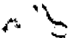
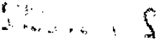

TOMO 325

Volumen 1

2002

1

DE JUSTICIA DE LA NACION

323

## FALLOS DE LA CORTE SUPREMA DE JUSTICIA DE LA NACION

DE JUSTICIA DE LA NACION

323

3

## R E P U B L I C A A R G E N T I N A

## FALLOS

DE  LA

C O R T E S U P R E M A

DE

## J USTICIA DE LA N ACION

PUBLICACION A CARGO DE LA SECRETARIA DE JURISPRUDENCIA DEL TRIBUNAL

TOMO 325 - VOLUMEN 1

ENERO - MAYO

LA LEY S.A.E. e I.

Tucumán 1471 (1050) Buenos Aires 2002

4

ACUERDOS DE LA CORTE SUPREMA

323

Copyright (c) 2002 by Corte Suprema de Justicia de la Nación Queda hecho el depósito que previene la ley 11.723. Impreso en la Argentina Printed in Argentina I.S.B.N.  950-

DE JUSTICIA DE LA NACION

325

## FALLOS DE LA CORTE SUPREMA

## ENERO

## PEDRO HORACIO PRADA ERRECART

JURISDICCION Y COMPETENCIA: Competencia federal. Competencia originaria de la Corte Suprema. Generalidades.

La Corte Suprema no puede asumir su competencia originaria y exclusiva sobre una causa si no se dan los presupuestos que constitucionalmente la habilitan y la facultad de los particulares para acudir ante los jueces en procura de tutela de los derechos que les asisten, no autoriza a prescindir de las vías que determinan los arts. 116 y 117 de la Constitución Nacional y sus leyes reglamentarias, para el ejercicio que aquélla le otorga.

JURISDICCION Y COMPETENCIA: Competencia federal. Competencia originaria de la Corte Suprema. Generalidades.

Es ajeno a la competencia originaria de la Corte el amparo tendiente a que se deje sin efecto la resolución de la Asamblea Legislativa y se declare la inconstitucionalidad de la ley de acefalía 2972, toda vez que, según se desprende de los términos de la demanda, la causa no concierne a embajadores, ministros y cónsules extranjeros, ni se dirige contra una Provincia (art. 1  de la ley 48, 2  de la ' ' ley 4.055 y 24, inc. 1 , del decreto-ley 1285/58). '

JURISDICCION Y COMPETENCIA: Competencia federal. Competencia originaria de la Corte Suprema. Generalidades.

La acción de amparo puede tramitar ante la Corte en la medida que se verifiquen las hipótesis que surtan su competencia originaria, porque ésta es de raigambre constitucional e insusceptible de ser ampliada o modificada.

DICTAMEN DEL PROCURADOR GENERAL

Suprema Corte:

A fs. 7/20  Pedro Horacio Prada Errecart, quien denuncia tener domicilio en la Provincia de Buenos Aires, promueve acción de ampa-

5

ro a fin de que se deje sin efecto la resolución de la Asamblea Legislativa del 1  de enero de 2002 y se declare la inconstitucionalidad de la ' Ley de Acefalía 20.972, en la medida que constituyen actos que lesionan, restringen, alteran y amenazan con arbitrariedad e ilegalidad manifiestas derechos y garantías reconocidos en la Constitución Nacional, el régimen democrático, representativo, federal y, con notorio abuso de sus facultades, estatuye una forma de elección del presidente de la Nación, contraria al propio texto constitucional.

Fundó su pretensión en los arts. 36, 38, 43, 75, inc. 21 y 87 de la Carta Magna, en la ley 16.986 y en el art. 25 de la Convención Americana sobre Derechos Humanos y, en cuanto al fondo del asunto, sostuvo, en esencia, que la Ley de Acefalía de 1975, tuvo como premisa el texto constitucional entonces vigente, que había adoptado el modelo de 'elección indirecta' de segundo grado para cubrir los cargos de presidente y vicepresidente de la Nación. Sin embargo, la reforma constitucional de 1994 estableció que dichas magistraturas se eligen, en forma directa por el pueblo, en doble vuelta y ello determina la arbitrariedad e ilegalidad manifiesta del acto del Poder Legislativo que impugna, toda vez que cubre la vacante de presidente en forma definitiva.

El acto también es arbitrario e ilegítimo porque -a su entender- la Asamblea Legislativa eligió como presidente de la Nación a quien no obtuvo el cargo por la propia voluntad del pueblo, expresada en las elecciones directas de 1999, así como porque aquél no delegó en sus representantes el poder para modificar la forma de elegir al presidente y al vicepresidente. De ahí que el art. 75, inc. 21 de la Constitución Nacional simplemente autoriza a 'admitir o desechar los motivos de dimisión' y a 'declarar el caso de proceder a nueva elección'. Por otra parte, el art. 88 de aquélla faculta al Congreso a determinar qué funcionario público habrá de desempeñar la presidencia, hasta que haya cesado la causa de inhabilidad o un nuevo presidente sea electo, pero asumiendo que aquél debe ser elegido en forma directa por el pueblo, sin que tal procedimiento pueda ser sustituido por la Asamblea Legislativa.

A fs. 23 el Tribunal dispuso habilitar la feria judicial y, a fs. 24, se corre vista a este Ministerio Público.

Ante todo, cabe recordar que el Tribunal no puede asumir su competencia originaria y exclusiva sobre una causa si no se dan los presu-

puestos que constitucionalmente la habilitan, así como que la facultad de los particulares para acudir ante los jueces en procura de tutela de los derechos que les asisten, no autoriza a prescindir de las vías que determinan los arts. 116 y 117 de la Constitución Nacional y sus leyes reglamentarias, para el ejercicio que aquélla le otorga a la Corte (conf. doctrina de Fallos: 310:789, 970 y 2419; 311:1762; 322:2856 y dictamen de esta Procuración General del 26 de diciembre de 2001, in re B.825.XXXVII. 'Biesa, Alberto Héctor s/ amparo').

Sobre tales bases, en mi opinión, el sub lite no corresponde a la instancia originaria de V.E., toda vez que, según se desprende de los términos de la demanda, a cuya exposición de los hechos se debe atender de modo principal para determinar la competencia (conf. art. 4 , ' del Código Procesal Civil y Comercial de la Nación), la causa no concierne a embajadores, ministros y cónsules extranjeros, ni se dirige contra una provincia (arts. 1  de la ley 48; 2  de la ley 4055 y 24, inc. 1 , ' ' ' del decreto-ley 1285/58) y, aun cuando es cierto que, en principio, la acción de amparo puede tramitar ante el Tribunal, ello es así en la medida que se verifiquen las hipótesis que surtan su competencia originaria (Fallos: 322:1514; 323:3873), porque ésta es de raigambre constitucional e insusceptible de ser ampliada o modificada (conf. doctrina de Fallos: 316:965 y sus citas, entre muchos otros).

Por otra parte, cabe tener presente que el actor carece de legitimación para demandar en abstracto la inconstitucionalidad de la norma sancionada por el legislador, circunstancia que denota la inexistencia de un 'caso' o 'causa', en los términos del art. 2  de la ley 27, que ' pueda ser resuelto por un tribunal de justicia (Fallos: 306:1125 y 313:594).

- III -

En tales condiciones, considero que la presente acción de amparo resulta ajena al conocimiento del Tribunal. Buenos Aires, 8 de enero de 2002. Nicolás Eduardo Becerra.

## FALLO DE LA CORTE SUPREMA

Buenos Aires, 10 de enero de 2002.

Autos y Vistos; Considerando:

Que el Tribunal comparte los argumentos y conclusiones del dictamen del señor Procurador General en cuanto a la competencia, a los que corresponde remitir a fin de evitar repeticiones innecesarias.

Por ello, se resuelve: Declarar la incompetencia de esta Corte para entender en forma originaria en este juicio. Notifíquese.

JULIO S. NAZARENO - EDUARDO MOLINÉ O'CONNOR - AUGUSTO CÉSAR BELLUSCIO - ANTONIO BOGGIANO - GUILLERMO A. F. LÓPEZ - ADOLFO ROBERTO VÁZQUEZ.

BANCO RIO DE LA PLATA S.A.  (ULLOA, PATRICIA M. V. P.E.N.)

## MEDIDAS CAUTELARES.

El recurso directo de apelación establecido por el art. 18 de la ley 25.561 -art. 195 bis del Código Procesal Civil y Comercial de la Nación-, al no contemplar la presentación ulterior de un memorial, debe ser fundado con su interposición (art. 15 de la ley 48).

## EMERGENCIA ECONOMICA.

Corresponde desestimar el recurso directo de apelación si la entidad bancaria no refutó los fundamentos del a quo y se limitó a invocar la situación de emergencia por la que atraviesa el sistema financiero si no se hace cargo de las particulares circunstancias del caso -en el que el titular de las cuentas alcanzadas por las disposiciones del decreto 1570/01 cuyo importe se había ordenado entregar en virtud de una medida cautelar intentó quitarse la vida ante la grave situación de salud que lo afectaba y las vicisitudes por las que atravesaba ante la inmovilización de sus ahorros- y si el propio Estado Nacional había desistido oportunamente del recurso de apelación.

## FALLO DE LA CORTE SUPREMA

Buenos Aires, 15 de enero de 2002.

Autos y Vistos; Considerando:

1 ) Que el Banco Río de la Plata S.A. se presentó ante este Tribu-' nal e interpuso 'recurso de apelación por salto de instancia -art. 195

bis-' contra la resolución dictada por el magistrado a cargo del Juzgado Nacional de Primera Instancia en lo Contencioso Administrativo Federal N  10 que había ordenado al presentante el cumplimiento de ' una medida cautelar consistente en la entrega 'en forma total e inmediata'  de  los  importes  correspondientes  a  la  cuenta  única  N  119-' 00356335/0 y al plazo fijo N  1036172 alcanzados ambos por las dispo-' siciones del decreto 1570/01 del Poder Ejecutivo Nacional.

2 ) Que, posteriormente, la actora hizo saber al Tribunal que su ' padre -afectado por las medidas económicas de restricción bancaria que motivaron la demanda de autos- había decidido quitarse la vida ingiriendo '50 pastillas del medicamento conocido como TRAPAX 2,5 mg' (fs. 22), por lo cual fue internado; en su presentación la demandante acompañó copia de la historia clínica del Policlínico del Docente perteneciente a su padre en la que se consigna que éste cometió 'intento de suicidio' (fs. 19); por otro lado, adjuntó copia del escrito presentado ante el juez de la causa en el que relataba las vicisitudes por las que atravesaba su padre, sobre todo las relativas a la salud de éste, jubilado y afiliado a la obra social correspondiente a los docentes la cual 'se encuentra en estado deficitario ya que no dispone de descuentos en farmacias ni de especialidades médicas a domicilio ni de ambulancias' (fs. 18); la amparista implicó que tanto su madre, que padecía mal de Alzheimer, como su padre dependían para subsistir de los ahorros inmovilizados por el decreto 1570/01 y que, frente a tal circunstancia, el representante del Estado Nacional -Ministerio de Economía- había desistido de la apelación deducida contra la medida cautelar que ordenaba la restitución de los fondos depositados en el Banco Río de la Plata en los términos del escrito cuya copia adjuntó al expediente (fs. 21). Cabe agregar que de dicho escrito surge que el Estado Nacional ordenó la 'entrega a la actora de los importes involucrados'.

3 ) Que no cabe encuadrar al escrito presentado por el Banco Río ' de la Plata S.A. sino como el recurso directo de apelación establecido por el art. 18 de la ley 25.561, el cual -al no contemplar la presentación ulterior de un memorial- debe ser fundado con su interposición (conf. arg. art. 15 de la ley 48).

- 4 ) Que en el escrito de fs. 7/15 la entidad bancaria mencionada no ' refutó los fundamentos del a quo y se limitó a invocar la situación de emergencia por la que atraviesa el sistema financiero, aludiendo a la 'enorme gravedad institucional que reviste el caso planteado cuyos

efectos pueden impedir la consecución de los fines de los objetivos económicos y políticos del Estado' (fs. 9), argumento que no se hace cargo de las particulares circunstancias del caso, en tanto el propio Estado Nacional -responsable directo del contralor de la política financierahabía desistido oportunamente del recurso de apelación (fs. 67), en atención a 'las especiales características de los hechos que han dado origen a la medida cautelar decretada' relacionados con 'la grave situación de salud en que se encuentra el afectado' (confr. nota D.G.A.J. N  00242, fs. 65/66). '

- 5 ) Que, en diversas situaciones, la Corte ha hecho mérito por ra-' zones humanitarias, de particularísimas circunstancias, y adoptó soluciones de excepción aun ante situaciones de emergencia económica declaradas por ley (confr. Fallos: 316:779), ponderando si la restricción a los derechos se traducía -por la situación fáctica del caso- en una 'degradación de su sustancia'.
- 6 ) Que ante la omisión de tales antecedentes, así como de la au-' sencia de un gravamen particular y autónomo por parte de la entidad financiera originado por el efectivo cumplimiento de la medida cautelar decretada en autos, corresponde declarar desierto el recurso interpuesto, decisión que se adopta de forma liminar en atención a las razones de urgencia invocadas.

Por ello, se desestima el recurso interpuesto. Notifíquese y, previa devolución de los autos principales, archívese.

JULIO S. NAZARENO - EDUARDO MOLINÉ O'CONNOR - AUGUSTO CÉSAR BELLUSCIO - ANTONIO BOGGIANO - GUILLERMO A. F. LÓPEZ - GUSTAVO A. BOSSERT - ADOLFO ROBERTO VÁZQUEZ.

DE JUSTICIA DE LA NACION

325

## FEBRERO

## JUAN RAMON GOROSITO V. RIVA S.A. Y OTRO

RECURSO EXTRAORDINARIO: Requisitos propios. Sentencia definitiva. Concepto y generalidades.

Si bien las cuestiones federales resueltas durante la tramitación del litigio son susceptibles de conocimiento por la Corte en ocasión del recurso extraordinario que quepa deducir contra la sentencia final de la causa, corresponde hacer excepción a ello y hacer lugar a la vía del art. 14 de la ley 48 si el a quo se  ha pronunciado por la invalidez de una ley sancionada por el Congreso de la Nación y ha habilitado la instancia judicial para el ejercicio de una pretensión ajena al plexo legal cuestionado, habilitación que ha sido expresamente vedada por el legislador.

RECURSO EXTRAORDINARIO: Requisitos propios. Sentencia definitiva. Concepto y generalidades.

El pronunciamiento que -al declarar improcedente el recurso de casación interpuesto por la aseguradora- confirmó el fallo que había hecho lugar a la acción de inconstitucionalidad del art. 39 de la ley 24.557, en tanto cierra el debate en el incidente de constitucionalidad, resulta la sentencia definitiva emanada del superior tribunal de la causa requerida por la ley 48 para la procedencia del recurso extraordinario.

RECURSO EXTRAORDINARIO: Requisitos propios. Cuestión federal. Generalidades.

Si la sustancia del planteo conduce, en definitiva, a determinar el alcance de la garantía consagrada en el art. 16 de la Constitución Nacional, el Tribunal no se encuentra limitado en su decisión por las posiciones del a quo o de la recurrente, sino que le incumbe realizar una declaratoria sobre el punto controvertido.

## RIESGOS DEL TRABAJO.

Las características principales del sistema de la ley 24.557 son, por un lado, la multiplicidad y automaticidad de las prestaciones sin litigio judicial y, por el otro, la generalización del financiamiento que, estando a cargo de los empleadores, se canaliza mediante compañías privadas de seguro (ART) obligadas directamente al pago o al depósito de aquéllas, sin perjuicio de la responsabilidad de los patronos que voluntariamente se coloquen fuera del sistema.

11

## RIESGOS DEL TRABAJO.

El objetivo del sistema de la ley 24.557 no consiste en la exoneración de la responsabilidad por culpa del empleador sino en la sustitución del obligado frente al siniestro, ya que el bien jurídico protegido es la indemnidad psicofísica del trabajador dependiente; desde tal perspectiva se impone otorgar primacía a la circunstancia de que, en definitiva, el daño llegue a ser reparado.

## CONSTITUCION NACIONAL: Derechos y garantías. Derecho de propiedad.

Nadie tiene un derecho adquirido al mantenimiento de leyes o reglamentaciones y la derogación de una ley común por otra posterior no afecta derecho alguno emanado de la Constitución Nacional.

## CONSTITUCION NACIONAL: Derechos y garantías. Generalidades.

Los derechos y garantías individuales consagrados por la Constitución no son absolutos y su ejercicio está sometido a las leyes que los reglamentan, cuya inalterabilidad no se supone.

## DAÑOS Y PERJUICIOS: Principios generales.

Si bien las normas civiles que reglamentan la reparación de los daños consagran el principio general establecido en el art. 19 de la Constitución Nacional que prohíbe a los hombres perjudicar los derechos de un tercero, de ello no se sigue que tal reglamentación en cuanto a las personas y las responsabilidades consecuentes tenga carácter exclusivo y excluyente, por cuanto expresa un principio general que regula cualquier disciplina jurídica.

## CONSTITUCION NACIONAL: Derechos y garantías. Derecho de propiedad.

Si bien la Constitución Nacional exige el respeto de los derechos adquiridos, sin cuya inviolabilidad se vería seriamente afectada una de las bases principales de nuestro ordenamiento jurídico, no es lícito invocar tal principio para paralizar el ejercicio de la potestad normativa del Estado, particularmente cuando ella recae sobre cuestiones de la naturaleza de la ley 24.557, de relevante significación social y económica.

CONSTITUCION NACIONAL: Derechos y garantías. Derecho de propiedad.

No es lícita la invocación del respeto a los derechos adquiridos cuando se la efectúa para consagrar la inalterabilidad absoluta de las consecuencias jurídicas de un acto futuro.

## CONSTITUCION NACIONAL: Derechos y garantías. Derecho de propiedad.

El requisito de la validez de las modificaciones legislativas es su razonabilidad, sin que los jueces, bajo pretexto de tal examen, se arroguen la facultad para decidir sobre el mérito ni sobre la conveniencia de la legislación sobre la materia.

## CONSTITUCION NACIONAL: Derechos y garantías. Derecho de propiedad.

La adquisición del derecho requiere que la situación general creada por la ley se transforme en una situación jurídica concreta e individual en cabeza del sujeto; es a partir de entonces que se hace inalterable y no puede ser suprimida por ley posterior sin agravio al derecho de propiedad consagrado por el art. 17 de la Constitución Nacional.

CONSTITUCION NACIONAL: Control de constitucionalidad. Principios generales.

La impugnación de inconstitucionalidad no es pertinente cuando el fin con que se la persigue no es la inaplicabilidad del texto objetado, sino el restablecimiento de un régimen normativo derogado, lo cual es de incumbencia del legislador.

## CONSTITUCION NACIONAL: Derechos y garantías. Igualdad.

La recta interpretación de la garantía de igualdad asigna al legislador la facultad de contemplar en forma distinta situaciones que considere diferentes, con tal de que la discriminación no sea arbitraria ni importe ilegítima persecución o indebido privilegio de personas o de grupo de personas, aunque su fundamento sea opinable.

## CONSTITUCION NACIONAL: Derechos y garantías. Igualdad.

La limitación del acceso a la vía civil que establece el art. 39 de la ley 24.557 no puede ser considerada de suyo discriminatoria pues, no obstante abarcar a la mayoría de la población económicamente activa, el sistema atiende a situaciones y riesgos producidos en un ámbito específico y diferenciado -el del trabajolo  cual  permite  la  previsión  y  el  resarcimiento  de  las  consecuencias  dañosas derivadas específicamente de la situación laboral conforme a parámetros preestablecidos, y porque sin conocer la cuantía del daño y de los eventuales resarcimientos, no es posible efectuar comparación alguna.

CONSTITUCION NACIONAL: Constitucionalidad e inconstitucionalidad. Leyes nacionales.

El art. 39 de la ley 24.557 no importa consagrar la dispensa de la culpa del empleador sino que, más allá de quien revista la calidad de legitimado pasivo en

la acción resarcitoria, en última instancia se ha impuesto a los empleadores la carga de solventar un sistema destinado a reparar los daños que de manera objetiva puedan ser atribuidos al hecho u ocasión del trabajo.

## RIESGOS DEL TRABAJO.

El régimen especial de riesgos del trabajo establece un Fondo de Garantía (art. 33 de la ley 24.557) y un Fondo de Reserva para abonar las prestaciones en caso de insuficiencia patrimonial del empleador o de liquidación de las A.R.T., beneficio al que no pueden acceder quienes no son trabajadores.

## RIESGOS DEL TRABAJO.

Una ventaja comparativa del sistema establecido por la ley 24.557 consiste en la rápida percepción de las prestaciones por parte de los beneficiarios, en comparación con el lapso notoriamente más extenso que insume el proceso judicial tendiente a obtener la indemnización por la vía civil.

CONSTITUCION NACIONAL: Control de constitucionalidad. Principios generales.

En tanto no es posible predicar en abstracto que el precepto impugnado conduzca inevitablemente a la concesión de reparaciones menguadas con menoscabo de derechos de raigambre constitucional, al no haberse acreditado violación a garantías constitucionales, no cabe sino concluir en la validez constitucional del art. 39 de la ley 24.557.

RECURSO EXTRAORDINARIO: Requisitos propios. Sentencia definitiva. Resoluciones anteriores a la sentencia definitiva. Varias.

No existe un pronunciamiento definitivo sobre el planteo de fondo, si sólo se ha examinado la validez del art. 39, inc. 1 , de la ley 24.557 y no la procedencia del ' reclamo sobre daños y perjuicios fundado, mayormente, en la legislación común (Disidencia de los Dres. Carlos S. Fayt, Enrique Santiago Petracchi y Gustavo A. Bossert).

RECURSO EXTRAORDINARIO: Requisitos propios. Sentencia definitiva. Concepto y generalidades.

La ausencia de sentencia definitiva no se suple con la invocación de garantías de orden constitucional supuestamente vulneradas ni con la pretendida arbitrariedad del decisorio o la alegada interpretación errónea del derecho que rige el caso (Disidencia de los Dres. Carlos S. Fayt, Enrique Santiago Petracchi y Gustavo A. Bossert).

RECURSO EXTRAORDINARIO: Requisitos propios. Sentencia definitiva. Concepto y generalidades.

Las cuestiones federales resueltas por autos no definitivos, durante la tramitación del litigio, son susceptibles de conocimiento por la Corte Suprema en ocasión del recurso extraordinario que quepa deducir contra el fallo final de la causa (Disidencia de los Dres. Carlos S. Fayt, Enrique Santiago Petracchi y Gustavo A. Bossert).

## RECURSO EXTRAORDINARIO: Gravedad institucional.

No constituye una demostración indubitable de la concurrencia de gravedad institucional la estimación -efectuada por la recurrente- de una potencial crisis del sistema instaurado por la nueva normativa de riesgos del trabajo (ley 24.557) (Disidencia de los Dres. Carlos S. Fayt, Enrique Santiago Petracchi y Gustavo A. Bossert).

DICTAMEN DEL PROCURADOR GENERAL

## Suprema Corte:

- I -

El Tribunal Superior de Justicia de la Provincia del Neuquén confirmó el fallo de la alzada que, a su turno, acogió la acción de inconstitucionalidad del artículo 39 de la ley 24.557 deducida por la actora. Para así decidir, estimó, en lo esencial que: a) cualquier previsión que limite la vigencia del alterum non laedere o lo excluya en determinada situación colisiona con lo previsto por los artículos 16 y 19 de la Constitución Nacional; b) el texto y la exposición de motivos del artículo 39 de la ley 24.557 declaran el propósito de confinar la resarcibilidad civil de los daños laborales a supuestos aislados e infrecuentes; c) la norma vulnera, además, las previsiones de los artículos 14, 17, 18, 43 y 75, inciso 23, de la Constitución Nacional y 2 de la Declaración Universal de Derechos Humanos y 1  de la Convención Americana de Derechos ' Humanos; y, d) contradice la Ley Fundamental en cuanto libera de responsabilidad culposa al empleador (cfse. fs. 159/166).

Contra dicha decisión dedujo recurso extraordinario la citada en garantía (v. fs. 171/199), que fue contestado (fs. 203/207 y 209/210) y concedido a fs. 212/215.

La impugnante aduce que el resolutorio involucra un asunto federal en los términos del artículo 14, inciso 1 , de la ley N  48, pues se ' ' debate la validez constitucional del artículo 39 de la ley 24.557 y el alcance que cabe conferir al artículo 16 de la Constitución Nacional. Dice, además, que desconoce lo resuelto por un órgano del orbe federal como la Comisión Médica Central; que impone obligaciones ajenas al marco en el que la citada en garantía despliega su actividad y que contradice la discrecionalidad que atañe a la política legislativa.

Afirma que el resolutorio soslayó previsiones substanciales y procesales correspondientes a la ley 24.557, así como lo actuado en sede administrativa por ante las comisiones médicas. Defiende la legalidad y razonabilidad de la restricción a la vía civil impuesta por la citada ley, desde que los trabajadores se hallan inmersos en un sistema que requiere de remedios generales aptos para tutelar a todos los individuos insertos en el mercado laboral, siendo la ley bajo examen la respuesta legislativa a esa necesidad.

Niega que la ley de riesgos dispense la culpa del empleador, al tiempo que señala que, apreciada globalmente, la nueva norma cuenta con beneficios superiores a su antecesora, particularmente centrados en la prevención, recuperación del trabajador y su reinserción laboral o productiva. Cita dispositivos que igualmente tarifan la indemnización de los daños; aduce una hipótesis de gravedad institucional y acusa que, arbitrariamente, se omitió el tratamiento de varios argumentos vertidos en el recurso de casación. Invoca las garantías de los artículos 1, 16 a 19 y 28 de la Constitución Nacional (fs. 171/199).

- III -

Es menester comenzar señalando que no existe en el caso un pronunciamiento definitivo sobre el planteo de fondo, desde que sólo se ha examinado la validez del artículo 39, inciso 1 , de la ley 24.557 y no ' la procedencia del reclamo sobre daños y perjuicios fundado, mayormente, en la legislación común (v. fs. 67/69; 89/91, 143 /145 y 159/166); y que tal ausencia no se suple con la invocación de garantías de orden constitucional supuestamente vulneradas ni con la pretendida arbitrariedad del decisorio o la alegada interpretación errónea del derecho que rige el caso (v. Fallos: 308:1202; 311:870, etc.).

A lo expuesto se añade que, en estricto, la presentante ha fracasado en su empeño por poner en evidencia la existencia de un agravio de imposible o insuficiente reparación ulterior (Fallos: 304:429, 308:1832; etc.), desde que, en caso de un futuro fallo adverso sobre el fondo del asunto, V.E. -al examinar los agravios de una eventual presentación extraordinaria que así lo plantee- podría enmendar los efectos del decisorio bajo examen, volviendo sobre lo resuelto a propósito del artículo 39, inciso 1, de la ley 24.557 o del abandono de la vía prevista en el artículo 46, apartado 1 , del mismo ordenamiento. La Corte ha se-' ñalado que las cuestiones federales resueltas por autos no definitivos, durante la tramitación del litigio, son susceptibles de conocimiento por el Alto Cuerpo en ocasión del recurso extraordinario que quepa deducir contra el fallo final de la causa (v. Fallos: 303:1040, etc.).

No obsta a lo afirmado la alegación de gravedad institucional deducida por la quejosa, desde que, sin perjuicio de la falta del serio y concreto desarrollo que V.E. ha encarecido en sus precedentes (cfse. Fallos: 303:221, 1923; 304:1893; etc.), ella se asienta sobre la mera base de lo que la propia recurrente estima una potencial crisis del sistema instaurado por la nueva normativa de riesgos del trabajo (fs. 199), lo que dista de constituir una demostración indubitable de la concurrencia de aquella circunstancia (v. Fallos: 304:1242).

Lo anterior no importa sentar opinión sobre el modo en que habrán de resolverse las cuestiones introducidas por la presentante ni las que atañen al fondo del planteo.

- IV -

Por lo expuesto, considero que corresponde desestimar la presentación extraordinaria. Buenos Aires, 28 de agosto de 2001. Nicolás Eduardo Becerra.

## FALLO DE LA CORTE SUPREMA

Buenos Aires, 1  de febrero de 2002. '

Vistos los autos: 'Gorosito, c/ Riva S.A. y otro s/ daños y perjuicios'.

## Considerando:

1 ) Que contra la sentencia del Tribunal Superior de Justicia de la ' Provincia del Neuquén que declaró improcedente el recurso de casación interpuesto por la aseguradora de riesgos del trabajo La Construcción S.A. Cía. Argentina de Seguros y, con sus propios fundamentos, confirmó el fallo que había hecho lugar a la acción de inconstitucionalidad del art. 39 de la ley 24.557, la vencida dedujo el recurso extraordinario  federal  que,  sustanciado,  fue  concedido  (fs. 89/91; 159/166; 171/199; 203/208; 212/215).

2 ) Que para así decidir, el ' a quo se adentró en el fondo de la cuestión constitucional debatida con carácter previo a la sustanciación de la demanda de accidente del trabajo. Sostuvo -en síntesis- que no puede dispensarse la culpa ni pueden ponerse límites a la responsabilidad del empleador en la forma en que lo ha hecho la ley 24.557, pues de tal modo se violenta la garantía constitucional de igualdad. En su tesitura, la resarcibilidad integral de los daños laborales confinada a supuestos aislados y absolutamente infrecuentes como el de dolo del empleador es discriminatoria, por cuanto instaura una desigualdad de trato en la aplicación de la ley -en concreto, de las normas del Código Civil- hacia los trabajadores respecto del resto de los habitantes. Estimó que 'lo que cierra la discusión... es el hecho de que más allá de la indemnización tarifada... el elemento esencial que tiñe de inconstitucional al precepto en estudio es que se libera de responsabilidad culposa al empleador, lo que resulta írrito a los derechos y garantías constitucionales establecidos por los arts. 14, 16, 17, 18 y 19 de nuestra Carta Fundamental' (confr. fs. 165 vta.). Ordenó la devolución de los autos al tribunal de origen para la tramitación del reclamo de daños y perjuicios derivados de la incapacidad laboral con sustento en los arts. 1107, 1009, 1113, 509, 512 y concordantes del Código Civil (confr. fs. 43).

3 ) Que, no obstante que las cuestiones federales resueltas duran-' te la tramitación del litigio son susceptibles de conocimiento por esta Corte en ocasión del recurso extraordinario que quepa deducir contra la sentencia final de la causa (Fallos: 303:1040), en el sub examine corresponde hacer excepción a tal principio y habilitar la vía del art. 14 de la ley 48. Ello es así, pues el a quo se ha pronunciado por la invalidez de una ley sancionada por el Congreso de la Nación y ha habilitado la instancia judicial para el ejercicio de una pretensión ajena al plexo

legal cuestionado, habilitación que ha sido expresamente vedada por el legislador. En tales condiciones, el fallo apelado cierra el debate en el incidente de constitucionalidad y resulta, a tales fines, la sentencia definitiva emanada del superior tribunal de la causa requerida por la ley 48 para la procedencia del recurso extraordinario. Cabe señalar que si la sustancia del planteo conduce, en definitiva, a determinar el alcance de la garantía consagrada en el art. 16 de la Constitución Nacional, como sucede en el sub examine , el Tribunal no se encuentra limitado en su decisión por las posiciones del a quo o de la recurrente, sino que le incumbe realizar una declaratoria sobre el punto controvertido (Fallos: 323:2054, entre otros).

Con tales fines esta Corte debe determinar -por un lado- si el legislador pudo crear válidamente un sistema específico para la reparación de los daños del trabajo y separarlo del régimen general de responsabilidad por daños establecido en el Código Civil y, por el otro, si en el sub examine se  ha  acreditado que tales normas violentan las garantías de igualdad ante la ley y de propiedad.

4 ) Que la reparación de las consecuencias dañosas de los infortu-' nios laborales mereció la preocupación del legislador desde el año 1915, en el que se sancionó la ley 9688. A partir de entonces, con sucesivas modificaciones que ampliaron el ámbito personal de aplicación de dicha ley, los riesgos del trabajo y su consecuencia inmediata, la incapacidad laborativa, pudieron ser objeto de compensación reparatoria mediante dos vías alternativas. Los damnificados accedían a una indemnización tarifada y con garantía cuasi estatal como resultado de un proceso sumario con claras limitaciones en cuanto a la exoneración de la responsabilidad del empleador. Por el contrario, si hacían uso de la opción establecida en la misma ley, la reparación en dinero y sin tope a cargo del empleador o de la eventual aseguradora podía tener cabida en el marco de las disposiciones del Código Civil con sujeción a los requisitos exigidos por dichas normas (confr. doctrina de Fallos: 310:1449, considerando 15). Durante la vigencia de esas normas el ejercicio de una acción producía la caducidad de la otra, lo cual denotaba que la ley especial y la común constituían dos universos jurídicos cerrados y excluyentes. Tal esquema fue repetido por la ley 24.028, última en modificar la tradicional ley de accidentes del trabajo.

5 ) Que los antecedentes parlamentarios de la ley de riesgos del ' trabajo dan cuenta de que en 1995 ambas cámaras del Congreso consideraron que el sistema descripto, después de ochenta años de su crea-

ción, resultaba insatisfactorio para los actores sociales. 'Han pasado tres años desde que se puso en vigencia [la ley 24.028] y nos hemos encontrado con que, sin desmedro de la calidad de la norma, falla el sistema de cobertura en su conjunto' pues 'la ley 24.028 no ha conformado ni a los trabajadores ni a los empleadores'. En palabras del miembro informante de la cámara de origen, 'debemos reconocer que se cobra tarde, mal y poco' y se genera un incremento en los costos laborales (confr. exposición del miembro informante de la Cámara de Diputados y exposición del miembro informante del Senado). Es así que por razones económicas y sociales y con el objetivo de incrementar la prevención de los riesgos, la reparación de daños y la rehabilitación del damnificado, el legislador decidió cambiar el sistema.

La iniciativa propuesta a examen del Congreso -finalmente aprobada- fijó un ámbito de aplicación personal amplio al comprender a los funcionarios y empleados públicos en todos los niveles, a los trabajadores en relación de dependencia del sector privado y a los servidores públicos, con posibilidad de extenderlo a los trabajadores domésticos, autónomos, no laborales y bomberos voluntarios (art. 2, ley 24.557). Frente a contingencias tales como los accidentes laborales y las enfermedades profesionales generadores de incapacidad parcial o total y temporal o permanente (arts. 6 a 10), el legislador previó prestaciones en dinero y en atenciones médicas integrales y, entre las primeras, privilegió  las  prestaciones  periódicas  por  sobre  las  de  pago  único (arts. 11 a 20) vinculándolas con el sistema previsional. A diferencia del régimen anterior, se estableció que el de la ley 24.557 se financiaría con aportes periódicos del empleador a las Aseguradoras de Riesgo del Trabajo (ART) a las que se encomendó la gestión de las prestaciones, bajo la supervisión y fiscalización de la Superintendencia de Riesgos del Trabajo. Con excepción del previsto régimen de 'autoseguro' la afiliación de los empleadores a las ART revestiría carácter obligatorio. A su vez, las aseguradoras o el mismo empleador serían responsables por las prestaciones ante los beneficiarios, sin perjuicio del derecho de repetición entre los obligados (arts. 23 a 38). Se estableció que la determinación y revisión de las incapacidades estaría a cargo de las comisiones médicas creadas para el sistema de jubilaciones y pensiones mediante un procedimiento gratuito para el damnificado (arts. 21 y 22), y sus conclusiones serían recurribles administrativa y judicialmente (art. 46).

En suma, el régimen de prestación única a cargo del empleador al que se accedía generalmente mediante acciones judiciales alternati-

vas fue sustituido por el sistema de la ley 24.557, cuyas características principales son, por un lado, la multiplicidad y automaticidad de las prestaciones sin litigio judicial y, por el otro, la generalización del financiamiento que, estando a cargo de los empleadores, se canaliza mediante compañías privadas de seguro (ART) obligadas directamente al pago o al depósito de aquéllas, sin perjuicio de la responsabilidad de los patronos que voluntariamente se coloquen fuera del sistema.

En el contexto sumariamente descripto se ha insertado la norma cuya validez se discute, contenida en el art. 39: 'Las prestaciones de esta ley eximen a los empleadores de toda responsabilidad civil, frente a sus trabajadores y a los derechohabientes de éstos, con la sola excepción de la derivada del art. 1072 del Código Civil. En este caso, el damnificado o sus derechohabientes podrá reclamar la reparación de los daños y perjuicios, de acuerdo a las normas del Código Civil. Sin perjuicio de la acción civil del párrafo anterior el damnificado tendrá derecho a las prestaciones de esta ley a cargo de las ART o de los autoasegurados'.

6 ) Que la inclusión y redacción de dicho artículo motivó extensos ' debates en el seno del Congreso. Al trabajo en las comisiones de la Cámara de Diputados y del Senado y los respectivos informes por la mayoría y minoría, se sumó el debate parlamentario en particular tanto en la cámara de origen como en la revisora -intervención de los diputados Borda, López, Flores, Garay, Fragoso, Varela, Molina, Picheto, Pernasetti, Maidana, Venesia, Fernández Meijide, Gauna y Durañona y Vedia; intervención de los senadores Miranda, Avelin, Villarroel, Aguirre Lanari, Alasino, Molina, Menem-. Es claro entonces que el legislador, en uso de prerrogativas que le han sido otorgadas por la Carta Magna, decidió la sustitución de un régimen que en años anteriores y ante circunstancias diferentes había resultado razonable, por otro que consideró adecuado a la realidad del momento incluyéndolo -conforme con los avances de la doctrina especializada y de la legislación comparada- más en el terreno de la seguridad social que en el del derecho del trabajo. El texto legal revela que de acuerdo con la voluntad del legislador, el objetivo del sistema no consiste en la exoneración de la responsabilidad por culpa del empleador sino en la sustitución del obligado frente al siniestro. En efecto, el bien jurídico protegido es la indemnidad psicofísica del trabajador dependiente; desde tal perspectiva se impone otorgar primacía a la circunstancia de que, en definitiva, el daño llegue a ser reparado.

7 ) Que al respecto, es preciso recordar que esta Corte ha señalado ' que es obvio que nadie tiene un derecho adquirido al mantenimiento de leyes o reglamentaciones y que la derogación de una ley común por otra posterior no afecta derecho alguno emanado de la Constitución Nacional (Fallos: 244:259; 267:247 y sus citas; 273:14; 307:134, 1108; 308:885; 310:1080, 1924; 313:1007, entre muchos otros) y que los derechos y garantías individuales consagrados por la Constitución no son absolutos y su ejercicio está sometido a las leyes que los reglamentan (Fallos: 308:1631, entre muchos otros) cuya inalterabilidad no se supone.

8 ) Que la tesitura del ' a quo implica la negación de tales principios, por cuanto erróneamente ha atribuido a las normas civiles que reglamentan en general la reparación de los daños y en especial a las referentes a los daños causados por culpa el carácter de garantía constitucional otorgándoles impertérrita invariabilidad. Es cierto que esta Corte en el precedente de Fallos: 308:1118 sostuvo que tales normas consagran el principio general establecido en el art. 19 de la Constitución Nacional que prohíbe a los hombres perjudicar los derechos de un tercero. Pero -tal como se decidió en ese caso- de ello no se sigue necesariamente que tal reglamentación en cuanto a las personas y las responsabilidades consecuentes tenga carácter exclusivo y excluyente, por cuanto expresa un principio general que regula cualquier disciplina jurídica (confr. considerando 14) máxime cuando el Código Civil constituye, precisamente, una de las reglamentaciones posibles del citado principio.

9 ) Que, como es obvio, la Constitución Nacional exige el respeto ' de los derechos adquiridos, sin cuya inviolabilidad se vería seriamente afectada una de las bases principales de nuestro ordenamiento jurídico. Pero no es lícito invocar tal principio para paralizar el ejercicio de la potestad normativa del Estado (doctrina de Fallos: 252:158), particularmente cuando ella recae sobre cuestiones de la naturaleza de la controvertida en autos, de relevante significación social y económica. Tampoco es lícita dicha invocación cuando se la efectúa para consagrar la inalterabilidad absoluta de las consecuencias jurídicas de un acto futuro. El requisito que esta Corte, en cuanto intérprete final de la Constitución Nacional, ha impuesto a la validez de las modificaciones legislativas consiste, precisamente, en su razonabilidad sin que los jueces, bajo pretexto de tal examen, se arroguen la facultad para decidir sobre el mérito ni sobre la conveniencia de la legislación sobre la materia (Fallos: 290:247, entre muchos otros).

10) Que conforme con la doctrina antes citada sobre la modificación de normas por otras posteriores, es necesario que el régimen de que se trate no arrase con los derechos definitivamente incorporados al patrimonio, situación que sólo puede considerarse que existe cuando bajo la vigencia de una ley se han cumplido todos los actos y condiciones sustanciales y los requisitos formales previstos en la norma para que el particular sea titular del derecho. En otros términos: la adquisición del derecho requiere que la situación general creada por la ley se transforme en una situación jurídica concreta e individual en cabeza del sujeto; es a partir de entonces que se hace inalterable y no puede ser suprimida por ley posterior sin agravio al derecho de propiedad consagrado por el art. 17 de la Constitución Nacional (Fallos: 298:472). Y tal situación no acontece en el sub examine , habida cuenta de que el demandante sólo tenía la expectativa de invocar la opción establecida por el art. 17 de la derogada ley 24.028 que, a su vez, le generaba la expectativa de obtener eventualmente alguna reparación con sustento en las normas del Código Civil mediante el proceso judicial respectivo. Por lo demás, debe tenerse presente que esta Corte ha sostenido que la impugnación de inconstitucionalidad no es pertinente cuando el fin con que se la persigue no es la inaplicabilidad del texto objetado, sino el restablecimiento de un régimen normativo derogado, lo cual es de  incumbencia del  legislador  (Fallos:  237:24;  255:262;  295:694; 318:1237, entre otros).

11) Que, por lo demás, tampoco se ha demostrado en el sub examine que la aplicación de la ley 24.557 comporte alguna postergación o, principalmente, la frustración del derecho al resarcimiento por daños a la integridad psicofísica o a la rehabilitación. En efecto, según la documentación acompañada al demandar, la Comisión Médica local había afirmado que no existía incapacidad funcional como secuela de traumatismo en región lumbar y rodilla derecha (confr. fs. 26/31); ese dictamen fue confirmado por la Comisión Médica Central ante el recurso que presentó el actor, pero éste no ha invocado ni menos aun demostrado que recurriera ante la Cámara Federal de la Seguridad Social tal como lo autoriza el art. 46 de la ley.

12) Que la recta interpretación de la garantía de igualdad asigna al legislador la facultad de contemplar en forma distinta situaciones que considere diferentes, con tal de que la discriminación no sea arbitraria ni importe ilegítima persecución o indebido privilegio de personas o de grupo de personas, aunque su fundamento sea opinable (Fallos: 315:839 y sus citas; 322:2346, entre muchos otros). Desde tal en-

foque se advierte que no se ha demostrado que tales extremos estén presentes en el sub judice ni aun que tales vicios pudieran imputarse, seriamente, a los efectos presumibles de la ley.

En efecto, la limitación del acceso a la vía civil que establece la norma impugnada no puede ser considerada de suyo discriminatoria. En primer lugar, porque no obstante abarcar a la mayoría de la población económicamente activa, el sistema de la ley 24.557 atiende a situaciones y riesgos producidos en un ámbito específico y diferenciado de los restantes de la vida contemporánea -el del trabajo- lo cual permite la previsión y el resarcimiento de las consecuencias dañosas derivadas específicamente de la situación laboral conforme a parámetros preestablecidos. En segundo lugar, porque sin conocer la cuantía del daño y de los eventuales resarcimientos no es posible efectuar comparación alguna.

13) Que en rigor, el precepto cuestionado, no importa consagrar la dispensa de la culpa del empleador, como afirma el tribunal a quo . En efecto, más allá de quien revista la calidad de legitimado pasivo en la acción resarcitoria, cabe poner de resalto que, en última instancia se ha impuesto a los empleadores la carga de solventar un sistema destinado a reparar los daños que de manera objetiva puedan ser atribuidos al hecho u ocasión del trabajo (art. 6.1., 6.2, y 23, LRT).

14) Que, asimismo, como contrapartida de la restricción de la acción civil la ley le concede al trabajador prestaciones en dinero y en especie (arts. 11, 14 y 20) de las que no gozan quienes no revisten aquella calidad. Si bien estos últimos pueden perseguir en todos los casos un resarcimiento integral, la satisfacción de su crédito dependerá en definitiva de la solvencia del deudor. En cambio, el régimen especial de riesgos del trabajo establece un Fondo de Garantía (art. 33) y un Fondo de Reserva para abonar las prestaciones en caso de insuficiencia patrimonial del empleador o de liquidación de las A.R.T., beneficio al que no pueden acceder quienes no son trabajadores. Además, otra ventaja comparativa en favor de los beneficiarios del sistema establecido por la LRT, que es oportuno destacar, consiste en la rápida percepción de las prestaciones por parte de aquellos beneficiarios, en comparación con el lapso notoriamente más extenso que insume el proceso judicial tendiente a obtener la indemnización por la vía civil.

15) Que el resarcimiento al que el siniestrado puede acceder en sede civil no es necesariamente mayor al previsto en las reglamenta-

ciones del sistema de la LRT. Cabe señalar que el primero está sujeto a las contingencias probatorias a producirse durante la sustanciación del pleito, siempre aleatorias; el segundo, por su parte, está sujeto a ampliaciones y cambios tanto en lo atinente a los listados de enfermedades, tablas de evaluación de las incapacidades, acciones de prevención, etc., como al aumento de las prestaciones dinerarias (art. 11), el que podrá ser dispuesto por el Poder Ejecutivo Nacional, sin que se advierta que los sucesivos decretos dictados por éste no hayan atendido a tal pauta legal.

16) Que, por lo demás, la reparación plena es un concepto sujeto a limitaciones tanto en el Código Civil como en otros sistemas especiales de responsabilidad. Así, dentro del primero la extensión del resarcimiento encuentra límites específicos en distintos preceptos (arts. 520, 521, 901, 903, 904, 905, 906, 907, 1069). Con relación a lo segundo, cabe mencionar, a título de ejemplo, los arts. 158, 159 y 160 del Código Aeronáutico.

17) Que tales limitaciones son propias de la discreción del cuerpo legislativo y, por lo tanto, no son susceptibles de cuestionamiento con base constitucional salvo que se compruebe la existencia y realidad de un menoscabo sustancial a la garantía que invoca el interesado (doctrina de Fallos: 108:240; 139:20; 188:120; 189:306, 391; 194:220; 250:131; 256:474; 258:202, entre muchos otros).

18) Que, en virtud de lo precedentemente expuesto, se advierte que no es posible predicar en abstracto que el precepto impugnado en la especie conduzca inevitablemente a la concesión de reparaciones menguadas con menoscabo de derechos de raigambre constitucional. Consecuentemente, al no haberse acreditado violación a las garantías que se dijeron conculcadas, no cabe sino concluir en la validez constitucional del art. 39 de la ley 24.557.

Por ello, habiendo dictaminado el señor Procurador General, se declara procedente el recurso extraordinario y se revoca el fallo apelado. Con costas. Vuelvan los autos al tribunal de origen a fin de que por quien corresponda se dicte nuevo pronunciamiento con arreglo al presente. Notifíquese y remítase.

JULIO S. NAZARENO - EDUARDO MOLINÉ O'CONNOR - CARLOS S. FAYT ( en disidencia ) - AUGUSTO CÉSAR BELLUSCIO - ENRIQUE SANTIAGO PETRACCHI ( en  disidencia )  -  ANTONIO  BOGGIANO  -  GUILLERMO A. F. LÓPEZ  GUSTAVO A. BOSSERT ( en disidencia ) - ADOLFO ROBERTO VÁZQUEZ.

DISIDENCIA DE LOS SEÑORES MINISTROS DOCTORES DON CARLOS S. FAYT, DON ENRIQUE SANTIAGO PETRACCHI Y DON GUSTAVO A. BOSSERT

## Considerando:

Que los agravios del apelante han sido objeto de adecuado tratamiento en el dictamen del señor Procurador General, cuyos fundamentos esta Corte comparte y los cuales se remite brevitatis causae .

Por ello, se desestima el recurso extraordinario. Notifíquese y devuélvase.

CARLOS S. FAYT - ENRIQUE SANTIAGO PETRACCHI - GUSTAVO A. BOSSERT.

BANCO DE LA CIUDAD DE BUENOS AIRES (TAKKO, ADOLFO ISMAEL V. FREDDO S.A.)

## MEDIDAS CAUTELARES.

Corresponde desestimar in limine el recurso previsto por el art. 195 bis del Código Procesal Civil y Comercial de la Nación, texto según la reforma de la ley 25.561 si es palmario que el mismo únicamente ha sido previsto ante el dictado de medidas cautelares y dicha circunstancia no se advierte si la actuación del banco se origina ante el dictado de una resolución posterior a una sentencia firme.

## FALLO DE LA CORTE SUPREMA

Buenos Aires, 1  de febrero de 2002. '

## Autos y Vistos; Considerando:

1 ) Que a fs. 371/372 de los autos principales, el magistrado a car-' go del Juzgado Nacional de Primera Instancia del Trabajo N  54 orde-' nó -en el marco del incidente de ejecución de sentencia incoado respecto de la demanda por despido oportunamente promovida- librar

giro judicial en favor del actor por la suma de $ 10.826,06 en concepto de capital no imponible y de su letrado apoderado por la cantidad de $ 2.716, correspondientes a honorarios. Añadió, además, que el señor gerente del Banco Ciudad -sucursal Tribunales- debía abstenerse, con arreglo a lo resuelto por el acta 2145/01 de la cámara del fuero, de aplicar el decreto 1570/01, ordenando, por ende, el íntegro pago de la suma a nombre del actor en dinero efectivo, bajo apercibimiento de lo normado en el art. 239 del Código Penal.

2 ) Que a fs. 16/17 del expediente agregado por cuerda, la entidad ' bancaria solicitó -al alegar que de generalizarse este género de decisiones, correría 'serio riesgo de ver afectada su operatoria normal' y, por ende, su 'operatoria normal' resultará afectada- la urgente intervención de esta Corte, mediante la deducción del recurso previsto por el art. 195 bis del Código Procesal Civil y Comercial de la Nación, texto según la reforma de la ley 25.561. Dicha norma, en lo pertinente, dispone que 'cuando se dicten medidas cautelares que en forma directa o indirecta afecten (...) las actividades esenciales (...) de la Ciudad Autónoma de Buenos Aires (...) de sus reparticiones centralizadas o descentralizadas, o de entidades afectadas a alguna actividad de interés estatal, podrá interponerse recurso de apelación directamente ante la Corte Suprema de Justicia de la Nación. La presentación del recurso tendrá por sí sola efecto suspensivo de la resolución dictada. La Corte Suprema requerirá la remisión del expediente...'.

3 ) Que frente al alcance del texto antes transcripto, corresponde ' desestimar in limine la presentación referida en el anterior considerando, en razón de que es palmario que el pertinente recurso únicamente se ha previsto ante el dictado de medidas cautelares, circunstancia que no se advierte en el sub lite ,  en  el  que  la  actuación  del Banco de la Ciudad de Buenos Aires se origina ante el dictado de una resolución posterior a una sentencia firme.

Por ello, se rechaza el recurso deducido. Notifíquese y, previa devolución de los autos principales, archívese.

JULIO S. NAZARENO - EDUARDO MOLINÉ O'CONNOR - CARLOS S. FAYT AUGUSTO CÉSAR BELLUSCIO - ENRIQUE SANTIAGO PETRACCHI - ANTONIO BOGGIANO - GUILLERMO A. F. LÓPEZ - GUSTAVO A. BOSSERT - ADOLFO ROBERTO VÁZQUEZ.

## FALLOS DE LA CORTE SUPREMA 325

## BANCO DE GALICIA Y BUENOS AIRES (SMITH, CARLOS ANTONIO V. P.E.N.)

## MEDIDAS CAUTELARES.

Si  bien  el  art. 195  bis  del  Código  Procesal  Civil  y  Comercial  de  la  Nación  se refiere exclusivamente a la potestad de la Corte para entender respecto de medidas cautelares dictadas aun por quien no reviste la calidad de tribunal superior de la causa, si la medida cautelar coincide con el objeto de la demanda, la resolución que declaró su viabilidad constituye un anticipo de jurisdicción e implica el juzgamiento del fondo del asunto por lo que la competencia del Tribunal no queda circunscripta al estrecho marco cognoscitivo de la cautela sino que se extiende también a lo que ha sido tema de fondo, o sea, al planteo sobre la inconstitucionalidad de la norma cuestionada.

RECURSO EXTRAORDINARIO: Requisitos comunes. Subsistencia de los requisitos.

Si en el transcurso del proceso han sido dictadas nuevas normas sobre la materia objeto de la litis, la decisión de la Corte deberá atender también a las modificaciones introducidas por esos preceptos en tanto configuran circunstancias sobrevinientes de las que no es posible prescindir.

## PODER JUDICIAL.

Las razones de oportunidad, mérito o conveniencia tenidas en cuenta por los otros poderes del Estado para adoptar decisiones que les son propias no están sujetas al control judicial.

## PODER JUDICIAL.

Todo lo relativo al ejercicio de las facultades privativas de los órganos de gobierno queda, en principio, excluido de la revisión judicial, sin que ello obste a que se despliegue con todo vigor el ejercicio del control constitucional de la razonabilidad de las leyes y de los actos administrativos, y, una vez constatada la iniquidad manifiesta de una norma o de un acto de la administración, corresponde declarar su inconstitucionalidad.

## EMERGENCIA ECONOMICA.

El fundamento de las normas de emergencia es la necesidad de poner fin o remediar situaciones de gravedad que obligan a intervenir en el orden patrimonial, como una forma de hacer posible el cumplimiento de las obligaciones, a la vez que atenuar su gravitación negativa sobre el orden económico e institucional y la sociedad en su conjunto.

## EMERGENCIA ECONOMICA.

Corresponde reconocer la constitucionalidad de las leyes que suspenden temporaria y razonablemente los efectos de los contratos como los de las sentencias firmes, siempre que no se altere la sustancia de unos y otras, a fin de proteger el interés público en presencia de desastres o graves perturbaciones de carácter físico, económico o de otra índole.

## EMERGENCIA ECONOMICA.

Cuando se esté en presencia de desastres o graves perturbaciones de carácter físico, económico o de otra índole, el gobierno está facultado para sancionar las leyes que considere conveniente, con el límite que tal legislación sea razonable, y no desconozca las garantías o las restricciones que impone la Constitución.

## EMERGENCIA ECONOMICA.

No debe darse a las limitaciones constitucionales una extensión que trabe el ejercicio eficaz de los poderes del Estado, ya que acontecimientos extraordinarios justifican remedios extraordinarios.

## EMERGENCIA ECONOMICA.

La restricción que impone el Estado al ejercicio normal de los derechos patrimoniales debe ser razonable, limitada en el tiempo, un remedio y no una mutación en la sustancia o esencia del derecho adquirido por sentencia o contrato, y está sometida al control jurisdiccional de constitucionalidad, toda vez que la emergencia, a diferencia del estado de sitio, no suspende las garantías constitucionales.

## EMERGENCIA ECONOMICA.

Si  bien  es  cierto  que  acontecimientos  extraordinarios habilitan remedios extraordinarios, los mecanismos ideados para superar la emergencia están sujetos a un límite y éste es su razonabilidad, con la consiguiente imposibilidad de alterar o desvirtuar en su significación económica el derecho de los particulares.

## CONSTITUCION NACIONAL: Derechos y garantías. Derecho de propiedad.

La limitación fijada por el decreto 1570/01 y por la resolución 23/2002 del Ministerio de Economía, muestra un ejercicio carente de razonabilidad de la facultad normativa tendiente a conjurar el trance, ya que tal restricción implica una violación a los arts. 17 y 18 de la Constitución Nacional en tanto desconoce el derecho de las personas a disponer libremente y en su totalidad de su patrimonio.

## CONSTITUCION NACIONAL: Derechos y garantías. Derecho de propiedad.

El derecho a disponer libremente de los fondos invertidos o depositados en entidades bancarias y financieras se sustenta, con independencia de los preceptos legales que puedan reconocerlo, en los principios de la Constitución Nacional, y no es dudoso que condicionar o limitar ese derecho afecta a la intangibilidad del patrimonio y obsta al propósito de afianzar la justicia y tal afectación no puede entenderse como fruto de una reglamentación razonable de tales principios, ni encuentra respaldo, por ende, en el art. 28 de la Carta Magna.

## EMERGENCIA ECONOMICA.

La facultad del Estado de imponer límites al nacimiento o extinción de los derechos no lo autoriza a prescindir por completo de las relaciones jurídicas concertadas bajo el amparo de la legislación anterior, especialmente, cuando las nuevas normas causan perjuicios patrimoniales que no encuentran un justo paliativo.

## CONSTITUCION NACIONAL: Derechos y garantías. Derecho de propiedad.

Cuando bajo la vigencia de una norma el particular ha cumplido todos los actos y condiciones sustanciales y los requisitos formales previstos en ella para ser titular de un determinado derecho, debe considerarse que hay derecho adquirido, porque la situación jurídica general creada por esa normativa se transforma en una situación jurídica concreta e individual en cabeza del sujeto que, como tal, se hace inalterable y no puede ser suprimida por ley posterior sin agravio del derecho de propiedad consagrado por el art. 17 de la Constitución Nacional.

## CONSTITUCION NACIONAL: Derechos y garantías. Derecho de propiedad.

Ni el legislador ni el juez podrían, en virtud de una ley nueva o de su interpretación, arrebatar o alterar un derecho patrimonial adquirido al amparo de la legislación anterior ya que, en ese caso, el principio de no retroactividad deja de ser una norma infraconstitucional para confundirse con la garantía de la inviolabilidad de la propiedad reconocida por la Ley Suprema.

## CONSTITUCION NACIONAL: Derechos y garantías. Derecho de propiedad.

Si la constitución de los depósitos bancarios fue efectuada bajo la vigencia de un régimen que garantizaba su inalterabilidad y dicha garantía se vio recientemente reforzada mediante las disposiciones de la ley 25.466, tanto las restricciones impuestas por el decreto 1570/01 y sus posteriores reglamentaciones, como por la ley 25.561, en cuanto suspende la aplicación de la ley de intangibilidad (art. 15), provocaron una incuestionable modificación de las condiciones y presupuestos tenidos en mira por ahorristas e inversores al tiempo de efectuar sus operaciones bancarias lo que apareja un evidente desconocimiento de sus derechos adquiridos y, por consiguiente, una profunda e injustificada lesión a su derecho de propiedad.

## CONSTITUCION NACIONAL: Derechos y garantías. Derecho de propiedad.

La imposibilidad de disponer íntegramente de los ahorros e inversiones es solo una de las variadas restricciones al uso y goce de los recursos monetarios amparados por el derecho a la propiedad desde que la generalidad de las personas físicas y jurídicas ven cercenadas también la libre disponibilidad a la extracción íntegra de los importes correspondientes a remuneraciones y jubilaciones.

CONSTITUCION NACIONAL: Constitucionalidad e inconstitucionalidad. Decretos nacionales.

La restricción imperante en relación con los depósitos bancarios en virtud del decreto 1570/01 adolece de irrazonabilidad toda vez que no se advierte la proporcionalidad entre el medio elegido y el fin propuesto con su implementación para conjurar la crisis ya que no significa una simple limitación a la propiedad sino que, agregada al resto de las medidas adoptadas, coadyuva a su privación y aniquilamiento.

CONSTITUCION NACIONAL: Constitucionalidad e inconstitucionalidad. Decretos nacionales.

El decreto 1570/01 afecta en forma directa e inmediata las garantías reconocidas por los arts. 14 bis y 17 de la Constitución Nacional así como las previsiones del art. 21 de la Convención Americana sobre Derechos Humanos, Pacto de San José de Costa Rica.

## EMERGENCIA ECONOMICA.

Cuando por razones de necesidad se sanciona una norma que no priva a los particulares de los beneficios patrimoniales legítimamente reconocidos, ni les niega su propiedad y sólo limita temporalmente la percepción de tales beneficios o restringe el uso que puede hacerse de esa propiedad, no hay violación del art. 17 de la Constitución Nacional, sino una limitación impuesta por la necesidad de atenuar o superar una situación de crisis (Voto del Dr. Carlos S. Fayt).

## EMERGENCIA ECONOMICA.

El fundamento de las leyes de emergencia es la necesidad de poner fin o remediar situaciones de gravedad que obligan a intervenir en el orden patrimonial, fijando plazos, concediendo esperas, como una forma de hacer posible el cumplimiento de las obligaciones a la vez que atenuar su gravitación negativa sobre el orden económico e institucional y la sociedad en su conjunto (Voto del Dr. Carlos S. Fayt).

## EMERGENCIA ECONOMICA.

Para que la sanción de una ley de emergencia esté justificada es necesario: 1) que exista una situación de emergencia que imponga al Estado el deber de

amparar los intereses vitales de la comunidad, 2) que la ley tenga como finalidad legítima la de proteger los intereses generales de la sociedad y no a determinados individuos; 3) que la moratoria sea razonable, acordando un alivio justificado por las circunstancias; 4) que su duración sea temporal y limitada al plazo indispensable para que desaparezcan las causas que hicieron necesaria la moratoria (Voto del Dr. Carlos S. Fayt).

## EMERGENCIA ECONOMICA.

En tiempos de graves trastornos económico-sociales, el mayor peligro que se cierne sobre la seguridad jurídica no es el comparativamente pequeño que deriva de una transitoria postergación de las más estrictas formas legales, sino el que sobrevendría si se las mantuviera con absoluta rigidez, por cuanto ellas, que han sido pensadas para épocas de normalidad y sosiego suelen adolecer de patética ineficiencia frente a la crisis (Voto del Dr. Carlos S. Fayt).

CONSTITUCION NACIONAL: Derechos y garantías. Derecho de propiedad.

No hay violación del art. 17 de la Constitución Nacional cuando por razones de necesidad se sanciona una norma que no priva a los particulares de los beneficios patrimoniales legítimamente reconocidos ni les niega su propiedad y sólo limita temporalmente la percepción de tales beneficios o restringe el uso que pueda hacerse de esa propiedad (Voto del Dr. Carlos S. Fayt).

CONSTITUCION NACIONAL: Constitucionalidad e inconstitucionalidad. Decretos nacionales.

Las disposiciones del decreto 1570/01 y sus posteriores reglamentaciones no pueden reputarse compatibles con la Constitución Nacional ni aun con la extensión reconocida a los poderes del Estado para afrontar emergencias de carácter económico, ya que no se preserva sino que se destruye el valor de la moneda, que es lo que interesa y no puede perderse de vista sin riesgo de incurrir en conclusiones equivocadas (Voto del Dr. Carlos S. Fayt).

DICTAMEN DEL PROCURADOR GENERAL

## Suprema Corte:

A fs. 8/12, el Banco de Galicia y Buenos Aires S.A., solicitó la avocación per saltum de V.E. para que, en ejercicio de la atribución que le

otorga el art. 24, inc. 7  del decreto-ley 1285/58, deje sin efecto la me-' dida cautelar dispuesta por el juez federal ad hoc de Corrientes, que ordenó restituir íntegra e inmediatamente los fondos depositados por Carlos Antonio Smith en dicha entidad bancaria.

Tras declarar habilitada la feria judicial (fs. 15), el Tribunal consideró que aquel banco se encuentra legitimado para ejercer la opción recursiva prevista en el art. 195 bis del Código Procesal Civil y Comercial de la Nación (texto según art. 18 de la ley 25.561), suspendió la resolución cuestionada (v. fs. 16) y me concedió vista en el día de la fecha (fs. 20).

- II -

En ejercicio de la ineludible tarea de velar por la observancia de la Constitución Nacional, de las leyes de la república y por el efectivo cumplimiento del debido proceso legal que me asigna el art. 25, incs. g y h de la ley 24.946, me parece necesario señalar que, atento a la forma en que V.E. encauzó el recurso intentado, debió dar cumplimiento al precepto legal contenido en el citado art. 195 bis que dispone solicitar la remisión del expediente y, recibido que éste sea, conferir traslado con calidad de autos a la parte que peticionó la medida.

Así lo estimo, pues la defensa de los intereses generales de la sociedad -que también incluye, obviamente, los intereses de los particulares- y de la legalidad, encomendada a este Ministerio Público por el art. 120 de la Ley Fundamental, impone asegurar el pleno ejercicio del derecho de defensa y de la igualdad de las partes en el proceso.

- III -

Más aún, sin perjuicio de lo anterior, y con independencia de los reparos constitucionales que me suscitan las medidas financieras cuya suspensión cautelar dispuso el magistrado de primera instancia, mantengo el criterio expuesto por este Ministerio Público in re B.1141.XXXVII. 'Banco de la Ciudad de Buenos Aires s/ solicita se declare estado de emergencia económica' (PVA), dictamen del 28 de diciembre de 2001, en cuanto a la falta de legitimación del banco recurrente para impugnar la medida precautoria, aun con la nueva redacción otorgada al art. 195 bis del código de forma.

En consecuencia, opino que corresponde rechazar la apelación interpuesta contra el fallo de primera instancia que ordenó restituir sus depósitos al actor. Buenos Aires, 31 de enero de 2002. Nicolás Eduardo Becerra.

## FALLO DE LA CORTE SUPREMA

Buenos Aires, 1  de febrero de 2002. '

## Autos y Vistos; Considerando:

- 1 ) Que el Banco de Galicia y Buenos Aires S.A. pide la interven-' ción de esta Corte a raíz de la resolución dictada por el Juzgado Federal de Primera Instancia de la Ciudad de Corrientes que dispuso como medida cautelar, la devolución a su vencimiento y por el total, de los depósitos a plazo fijo que el actor solicitó con fundamento en la inconstitucionalidad del decreto 1570/01.
- 2 ) Que como surge de fs. 16 este Tribunal confirió legitimación a ' los peticionarios para ejercer la acción recursiva prevista en el art. 195 bis del Código Procesal Civil y Comercial de la Nación. Asimismo tuvo por interpuesto el recurso con los efectos suspensivos sobre la resolución dictada establecidos en la norma, sin perjuicio de lo que en definitiva corresponda decidir sobre el fondo de las cuestiones planteadas.
- 3 ) Que corresponde delimitar en qué medida ha quedado abierta ' la jurisdicción de esta Corte para conocer del caso. La norma procesal habilitante se refiere exclusivamente a la potestad del Tribunal para entender respecto de medidas cautelares dictadas aun por quien no reviste la calidad de tribunal superior de la causa en los términos del art. 14 de la ley 48. No obstante, de la lectura del fallo recurrido se desprende que la medida cautelar requerida y ordenada por el juzgador coincide con el objeto de la demanda, por lo que la resolución que declaró su viabilidad constituye un anticipo de jurisdicción e implica, por  tanto,  el  juzgamiento  del  fondo  del  asunto  (Fallos:  316:1833; 320:1633, entre muchos otros). De ahí que, ante esta singular situación, la competencia de esta Corte, no queda circunscripta al estrecho marco cognoscitivo de la cautela sino que se extiende también a lo que

ha sido tema de fondo, esto es, al planteo concreto sobre la inconstitucionalidad de la norma cuestionada y desde esta perspectiva, la tarea de esclarecer la inteligencia de las normas federales involucradas, no ha de estar limitada por las posiciones del tribunal apelado ni por las de las partes (Fallos: 312:529 y sus citas, entre muchos otros).

4 ) Que cabe señalar, además, que en el transcurso del proceso, ' han sido dictadas nuevas normas sobre la materia objeto de esta litis por lo que, de conformidad con reiterada doctrina de esta Corte, su decisión deberá atender también a las modificaciones introducidas por esos preceptos en tanto configuran circunstancias sobrevinientes de las que no es posible prescindir (Fallos: 308:1489; 312:555; 315:123, entre muchos otros).

5 ) Que el decreto 1570/01, en su art. 2 , inc. a, prohibió 'los retiros ' ' en efectivo que superen los pesos doscientos cincuenta ($ 250) o dólares estadounidenses doscientos cincuenta (u$s 250), por semana, por parte del titular, o de los titulares que actúen en forma conjunta o indistinta, del total de sus cuentas en cada entidad financiera'. El actor, en los autos principales, planteó la inconstitucionalidad de dicha norma por cuanto le impedía disponer de la totalidad de los depósitos de los cuales es titular por ser contraria al art. 17 de la Constitución Nacional y a la ley 25.466 de intangibilidad de los depósitos. La circunstancia de que en el sub lite el titular de los fondos aún no haya visto satisfecha su pretensión (extremo que se verifica mediante la compulsa de los autos principales) pone de manifiesto la diferencia entre el sustrato fáctico de la presente y el de la causa B.1141 XXXVII 'Banco de la Ciudad de Buenos Aires s/ solicita se declare estado de emergencia económica', sentencia del 28 de diciembre de 2001, lo que habilita pues, un tratamiento diverso.

6 ) Que, con posterioridad, la ley 25.557, sancionada el 20 de di-' ciembre de 2001 y promulgada el 6 de enero de 2002, en su art. 3 , ' estableció que las disposiciones de su normativa no implicaban ratificación ni expresa ni tácita de los decretos 1570/01 y 1606/01.

A su turno, el 6 de enero de 2002 fue sancionada y promulgada parcialmente la ley 25.561 de Emergencia Pública y Reforma del Régimen Cambiario que tácitamente ratificó el decreto 1570/01 (arts. 6, 7 y 15). Dicha norma, en su art. 1 , declaró 'con arreglo a lo dispuesto en ' el art. 76 de la Constitución Nacional, la emergencia pública en mate-

ria social, económica, administrativa, financiera y cambiaria, delegando al Poder Ejecutivo Nacional las facultades comprendidas en la presente ley, hasta el 10 de diciembre de 2003, con arreglo a las bases que se especifican seguidamente: 1) proceder al reordenamiento del sistema financiero, bancario y del mercado de cambios, 2) reactivar el funcionamiento de la economía y mejorar el nivel de empleo y de distribución de ingresos, con acento en un programa de desarrollo de las economías regionales, 3) crear condiciones para el crecimiento económico sustentable y compatible con la reestructuración de la deuda pública, 4) reglar la reestructuración de las obligaciones, en curso de ejecución, afectadas por el nuevo régimen cambiario instituido en el art. 2 '. '

De las diversas disposiciones de la ley, se desprende que la delegación normativa conferida al Poder Ejecutivo, ha quedado circunscripta a 'establecer el sistema que determinará la relación de cambio entre el peso y las divisas extranjeras y dictar regulaciones cambiarias' (art. 2 ), a reestructurar 'las deudas con el sector financiero' (art. 6 , ' ' segundo párrafo), 'establecer medidas compensatorias que eviten desequilibrios en las entidades financieras' (art. 6 , párrafo tercero) y ' 'disponer las medidas tendientes a preservar el capital perteneciente a los ahorristas' (art. 6 , párrafo 5 ). ' '

7 ) Que, posteriormente, el decreto 71/2002, reglamentario del ré-' gimen cambiario establecido por la ley 25.561 facultó, en su art. 5 , al ' Ministerio de Economía a reglamentar la oportunidad y modo de disposición por sus titulares de los depósitos en pesos o en divisas extranjeras; pauta modificada a su vez por el decreto 141/02 en cuanto a la devolución de saldos en monedas extranjeras.

Sobre la base de las atribuciones conferidas en la normativa recientemente indicada, el Ministerio de Economía dictó la resolución 18/2002, del 17 de enero de 2002, la cual ha sido reformada por la 23, del 21 de enero de 2002, actualmente vigente, que en su anexo, establece, en cuanto aquí interesa, un cronograma de vencimientos reprogramados de los depósitos existentes en el sistema bancario a la fecha de su entrada en vigencia, bajo el régimen del decreto 1570/01, en el que se mantiene la indisponibilidad de dichos fondos.

8 ) Que, tras la reseña de la normativa en juego, es preciso recor-' dar la tradicional jurisprudencia del Tribunal cuya sintética formulación postula que las razones de oportunidad, mérito o conveniencia

tenidas en cuenta por los otros poderes del Estado para adoptar decisiones que les son propias no están sujetas al control judicial (Fallos: 98:20;  147:403;  150:89;  160:247;  238:60;  247:121;  251:21;  275:218; 295:814; 301:341; 302:457; 303:1029; 308:2246; 321:1252, entre muchos otros). Por otro lado, todo lo relativo al ejercicio de las facultades privativas de los órganos de gobierno queda, en principio excluido de la revisión judicial. Ello no obsta a que se despliegue con todo vigor el ejercicio del control constitucional de la razonabilidad de las leyes y de los  actos  administrativos (Fallos: 112:63; 150:89; 181:264; 261:409; 264:416; 318:445); por ende, una vez constatada la iniquidad manifiesta de una norma (Fallos: 171:348; 199:483; 247:121; 312:826) o de un acto de la administración (Fallos: 292:456; 305:102; 306:126 y 400), corresponde declarar su inconstitucionalidad.

9 ) Que se encuentra fuera de discusión en el caso la existencia de ' una crisis económica por lo que no cabe cuestionar el acierto o conveniencia de la implementación de medidas paliativas por parte del Estado. Pero ello no implica que se admita, sin más, la razonabilidad de todos y cada uno de los medios instrumentales específicos que se establezcan para conjurar los efectos de la vicisitud. Máxime cuando ha existido, en un breve período, una profusión de normas sobre el tema que, en algunos casos, más que propender a la fijación de pautas claras sobre la disponibilidad de las sumas depositadas en instituciones bancarias y financieras por los particulares ha generado un inédito y prolongado estado de incertidumbre.

En este contexto cabe recordar que esta Corte ha subrayado, en reiteradas oportunidades que, el fundamento de las normas de emergencia es la necesidad de poner fin o remediar situaciones de gravedad que obligan a intervenir en el orden patrimonial, como una forma de hacer posible el cumplimiento de las obligaciones, a la vez que, atenuar su gravitación negativa sobre el orden económico e institucional y la sociedad en su conjunto (Fallos: 136:161; 313:1513 y 317:1462). El Tribunal ha reconocido la constitucionalidad de las leyes que suspenden temporaria y razonablemente los efectos de los contratos como los de las sentencias firmes, siempre que no se altere la sustancia de unos y otras (Fallos: 243:467), a fin de proteger el interés público en presencia de desastres o graves perturbaciones de carácter físico, económico o de otra índole (Fallos: 238:76). En estos casos, el gobierno está facultado para sancionar las leyes que considere conveniente, con el límite que tal legislación sea razonable, y no desconozca las garantías o las

restricciones que impone la Constitución. No debe darse a las limitaciones constitucionales una extensión que trabe el ejercicio eficaz de los poderes del Estado (Fallos: 171:79) toda vez que acontecimientos extraordinarios justifican remedios extraordinarios (Fallos: 238:76). La restricción que impone el Estado al ejercicio normal de los derechos patrimoniales debe ser razonable, limitada en el tiempo, un remedio y no una mutación en la sustancia o esencia del derecho adquirido por sentencia o contrato, y está sometida al control jurisdiccional de constitucionalidad, toda vez que la emergencia, a diferencia del estado de sitio, no suspende las garantías constitucionales (confr. Fallos: 243:467; 323:1566).

10) Que, a la luz de los conceptos expuestos, corresponde decidir si la restricción impuesta por el decreto originariamente cuestionado con los alcances actualmente definidos por la resolución 23/2002 del Ministerio de Economía, resulta o no un ejercicio razonable de las facultades del Estado frente a la situación de grave crisis global económica y financiera.

En tal sentido, si bien es cierto que acontecimientos extraordinarios habilitan remedios extraordinarios, los mecanismos ideados para superar la emergencia están sujetos a un límite y éste es su razonabilidad, con la consiguiente imposibilidad de alterar o desvirtuar en su significación económica el derecho de los particulares. La limitación fijada por las sucesivas normas ya aludidas, muestra un ejercicio carente de razonabilidad de la facultad normativa tendiente a conjurar el trance. Ello es así pues tal restricción implica una violación a los arts. 17 y 18 de la Constitución Nacional en tanto desconoce el derecho de las personas a disponer libremente y en su totalidad de su patrimonio.

11) Que el derecho a disponer libremente de los fondos invertidos o depositados en entidades bancarias y financieras se sustenta, con independencia de los preceptos legales que puedan reconocerlo, en los principios de la Ley Fundamental; y no es dudoso que condicionar o limitar ese derecho afecta a la intangibilidad del patrimonio y obsta al propósito de afianzar la justicia. Tal afectación de los mentados principios constitucionales, dada la gravedad que reviste y la ausencia de razones decisivas que justifiquen la exigencia legal que la provoca, no puede entenderse como fruto de una reglamentación razonable de tales principios, ni encuentra respaldo, por ende, en el art. 28 de la Carta Magna (Fallos: 305:945, considerando 8 , último párrafo). '

Tal circunstancia se aprecia nítidamente en la situación planteada en el sub lite , en donde las sucesivas reglamentaciones aludidas han excedido el marco de la delegación imponiendo condicionamientos y restricciones a la libre disposición de la propiedad privada de los particulares en abierta violación de las normas constitucionales mencionadas.

12) Que, en tal sentido, cabe recordar que esta Corte ha establecido que la facultad del Estado de imponer límites al nacimiento o extinción de los derechos, no lo autoriza a prescindir por completo de las relaciones jurídicas concertadas bajo el amparo de la legislación anterior, especialmente, cuando las nuevas normas causan perjuicios patrimoniales que no encuentran un justo paliativo (Fallos: 316:1551; 318:1531 y sus citas y 1749, entre otros). De igual modo, el Tribunal subrayó que cuando bajo la vigencia de una norma el particular ha cumplido todos los actos y condiciones sustanciales y los requisitos formales previstos en ella para ser titular de un determinado derecho, debe considerarse que hay derecho adquirido , porque la situación jurídica general creada por esa normativa se transforma en una situación jurídica concreta e individual en cabeza del sujeto que, como tal, se hace inalterable y no puede ser suprimida por ley posterior sin agravio del derecho de propiedad consagrado por el art. 17 de la Constitución  Nacional  (confr.,  entre  muchísimos  otros,  Fallos:  314:1477; 316:2090 y 317:1462).

13) Que, en análogo orden de consideraciones, esta Corte señaló que ni el legislador ni el juez podrían, en virtud de una ley nueva o de su interpretación, arrebatar o alterar un derecho patrimonial adquirido al amparo de la legislación anterior ya que, en ese caso, el principio de no retroactividad deja de ser una norma infraconstitucional para confundirse con la garantía de la inviolabilidad de la propiedad reconocida por la Ley Suprema (Fallos: 319:1915; 320:31, 1796 y 2157).

14) Que, a la luz de los criterios jurisprudenciales mencionados se aprecia que en el caso, el actor ha sido víctima de la vulneración de su patrimonio, toda vez que la constitución de sus depósitos había sido efectuada bajo la vigencia de un régimen que garantizaba su inalterabilidad. Tal garantía, además, se había visto recientemente reforzada mediante las disposiciones de la ley 25.466 que, con carácter de orden público, consagró la intangibilidad de los depósitos, definiendo tal intangibilidad como la imposibilidad por parte del Estado de alterar las

condiciones pactadas entre los depositantes y la entidad financiera, así como la prohibición de canjearlos por diferentes activos del Estado Nacional, de prorrogar su pago, o de reestructurar su vencimiento (arts. 1  a 4 ), circunstancias que exceden en mucho las que se presen-' ' taron por cierto en la causa 'Peralta' que se registra en Fallos: 313:1513. Ante ese cuadro de situación, tanto las restricciones impuestas por el decreto 1570/01 y sus posteriores reglamentaciones, como por la ley 25.561 de Emergencia Pública, en cuanto suspende la aplicación de la referida ley de intangibilidad (art. 15), han provocado una incuestionable modificación de las condiciones y presupuestos tenidos en mira por ahorristas e inversores al tiempo de efectuar sus operaciones bancarias lo que apareja un evidente desconocimiento de sus derechos adquiridos y, por consiguiente, una profunda e injustificada lesión a su derecho de propiedad.

15) Que, por lo demás, una justa apreciación del medio concreto elegido por la administración como paliativo de la crisis a fin de decidir sobre su razonabilidad, no puede ser examinada con prescindencia del conjunto de las medidas adoptadas. Desde tal enfoque, es menester destacar que la imposibilidad de disponer íntegramente de los ahorros e inversiones es solo una de las variadas restricciones al uso y goce de los recursos monetarios amparados por el derecho a la propiedad desde que la generalidad de las personas físicas y jurídicas ven cercenadas también la libre disponibilidad a la extracción íntegra de los importes correspondientes a remuneraciones y jubilaciones. Todo ello sumado a la modificación del régimen cambiario -extremo que a esta Corte no le compete juzgar desde que no es materia de debate en el presente y en tanto el control de constitucionalidad no comprende la facultad de sustituir a la administración en la determinación de las políticas o en la apreciación de los criterios de oportunidad- provoca un generalizado menoscabo en la situación patrimonial del conjunto social. Frente a tan singular situación, la restricción imperante en relación con los depósitos bancarios adolece de irrazonabilidad toda vez que no se advierte la proporcionalidad entre el medio elegido y el fin propuesto con su implementación para conjurar la crisis ya que no significa una simple limitación a la propiedad sino que, agregada al resto de las medidas adoptadas, coadyuva a su privación y aniquilamiento. El efecto producido por las normas impugnadas excede, pues, el ejercicio válido de los poderes de emergencia ya que aun en estas situaciones, como se recordó más arriba, el Estado no puede válidamente transponer el límite que señala el art. 28 de la Constitución

Nacional y preterir su inexcusable rol como gestor del bien común. La norma en cuestión afecta, por tanto, en forma directa e inmediata las garantías reconocidas por los arts. 14 bis y 17 de la Constitución Nacional así como las previsiones del art. 21 de la Convención Americana sobre Derechos Humanos, Pacto de San José de Costa Rica.

En las condiciones expuestas, corresponde desestimar el recurso interpuesto.

Por ello, oído el señor Procurador General de la Nación, se desestima el recurso interpuesto. Notifíquese y, previa devolución de los autos principales, archívese.

JULIO S. NAZARENO - EDUARDO MOLINÉ O'CONNOR - CARLOS S. FAYT ( según su voto ) - ANTONIO BOGGIANO - GUILLERMO A. F. LÓPEZ - ADOLFO ROBERTO VÁZQUEZ.

VOTO DEL SEÑOR MINISTRO DOCTOR DON CARLOS S. FAYT

## Considerando:

- 1 ) Que el Banco de Galicia y Buenos Aires S.A. pide la interven-' ción de esta Corte a raíz de la resolución dictada por el Juzgado Federal de Primera Instancia de la ciudad de Corrientes que dispuso como medida cautelar, la devolución a su vencimiento y por el total, de los depósitos a plazo fijo que el actor solicitó con fundamento en la inconstitucionalidad del decreto 1570/01.
- 2 ) Que como surge de fs. 16 este Tribunal admitió legitimación a ' los peticionarios para ejercer la acción recursiva prevista en el art. 195 bis del Código Procesal Civil y Comercial de la Nación. Asimismo tuvo por interpuesto el recurso con los efectos suspensivos sobre la resolución dictada establecidos en la norma, sin perjuicio de lo que en definitiva corresponda decidir sobre el fondo de las cuestiones planteadas.
- 3 ) Que corresponde delimitar en qué medida ha quedado abierta ' la jurisdicción de esta Corte para conocer del caso. La norma procesal habilitante se refiere exclusivamente a la potestad del Tribunal para

entender respecto de medidas cautelares dictadas aun por quien no reviste la calidad de tribunal superior de la causa en los términos del art. 14 de la ley 48. No obstante, de la lectura del fallo recurrido se desprende que la medida cautelar requerida y ordenada por el juzgador coincide con el objeto de la demanda, por lo que la resolución que declaró su viabilidad constituye un anticipo de jurisdicción e implica, por  tanto,  el  juzgamiento  del  fondo  del  asunto  (Fallos:  316:1833; 320:1633, entre muchos otros). De ahí que, ante esta singular situación, la competencia de esta Corte, no queda circunscripta al estrecho marco cognoscitivo de la cautela sino que se extiende también a lo que ha sido tema de fondo, esto es, al planteo concreto sobre la inconstitucionalidad de la norma cuestionada y desde esta perspectiva, la tarea de esclarecer la inteligencia de las normas federales involucradas, no ha de estar limitada por las posiciones del tribunal apelado ni por las de las partes (Fallos: 312:529 y sus citas, entre muchos otros).

- 4 ) Que cabe señalar, además, que en el transcurso del proceso, ' han sido dictadas nuevas normas sobre la materia objeto de esta litis por lo que, de conformidad con reiterada doctrina de esta Corte, su decisión deberá atender también a las modificaciones introducidas por esos preceptos en tanto configuran circunstancias sobrevinientes de las que no es posible prescindir (Fallos: 308:1489; 312:555; 313:1753; 315:123, entre muchos otros).
- 5 ) Que el decreto 1570/01, en su art. 2 , inc. a, prohibió 'los retiros ' ' en efectivo que superen los pesos doscientos cincuenta ($ 250) o dólares estadounidenses doscientos cincuenta (u$s 250), por semana, por parte del titular, o de los titulares que actúen en forma conjunta o indistinta, del total de sus cuentas en cada entidad financiera'. El actor planteó la inconstitucionalidad de dicha norma por cuanto le impedía disponer de la totalidad de los depósitos de los cuales es titular por ser contraria al art. 17 de la Constitución Nacional y a la ley 25.466 de intangibilidad de los depósitos. En el caso, por lo demás y a diferencia de lo ocurrido en la causa B.1141 XXXVII PVA 'Banco de la Ciudad de Buenos Aires s/ solicita se declare estado de emergencia económica', fallada el 28 de diciembre de 2001, el titular de los fondos aún no ha visto satisfecha su pretensión.
- 6 ) Que, con posterioridad, la ley 25.557, sancionada el 20 de di-' ciembre de 2001 y promulgada el 6 de enero de 2002, en su art. 3 , ' estableció que las disposiciones de su normativa no implicaban ratificación ni expresa ni tácita de los decretos 1570/01 y 1606/02.

A su turno, el 6 de enero de 2002 fue sancionada y promulgada parcialmente la ley 25.561 de Emergencia Pública y Reforma del Régimen Cambiario. Dicha norma, en su art. 1 , declaró 'con arreglo en el ' art. 76 de la Constitución Nacional, la emergencia pública en materia social, económica, administrativa, financiera y cambiaria, delegando al Poder Ejecutivo Nacional las facultades comprendidas en su texto, hasta el 10 de diciembre de 2003, con arreglo a las siguientes bases: 1) proceder al reordenamiento del sistema financiero, bancario y del mercado de cambios, 2) reactivar el funcionamiento de la economía y mejorar el nivel de empleo y de distribución de ingresos, con acento en un programa de desarrollo de las economías regionales, 3) crear condiciones para el crecimiento económico sustentable y compatible con la reestructuración de la deuda pública, 4) reglar la reestructuración de las obligaciones, en curso de ejecución, afectadas por el nuevo régimen cambiario instituido en el art. 2 '. '

De las diversas disposiciones de la ley, se desprende que la delegación normativa conferida al Poder Ejecutivo, ha quedado circunscripta a 'establecer el sistema que determinará la relación de cambio entre el peso y las divisas extranjeras y dictar regulaciones cambiarias' (art. 2 ), a reestructurar 'las deudas con el sector financiero' (art. 6 , ' ' segundo párrafo), 'establecer medidas compensatorias que eviten desequilibrios en las entidades financieras' (art. 6 , párrafo tercero) y ' disponer las medidas tendientes a preservar el capital perteneciente a los ahorristas.' (art. 6 , párrafo 5 ). ' '

7 ) Que, posteriormente, el decreto 71/2002, reglamentario del ré-' gimen cambiario establecido por la ley 25.561 facultó, en su art. 5 , al ' Ministerio de Economía a reglamentar la oportunidad y modo de disposición por sus titulares de los depósitos en pesos o en divisas extranjeras; pauta modificada a su vez por el decreto 141/02 en cuanto a la devolución de saldos en monedas extranjeras.

Sobre la base de las atribuciones conferidas en la normativa recientemente indicada, el Ministerio de Economía dictó la resolución 18/2002, del 17 de enero de 2002, la cual ha sido reformada por la 23, del 21 de enero de 2002, actualmente vigente, que en su anexo, establece, en cuanto aquí interesa, un cronograma de vencimientos reprogramados de los depósitos existentes en el sistema bancario a la fecha de su entrada en vigencia, bajo el régimen del decreto 1570/01, en el que se mantiene la indisponibilidad de dichos fondos.

8 ) Que se encuentra fuera de discusión en el caso la existencia de ' una crisis económica sin precedentes en la historia argentina por lo que no cabe cuestionar el acierto o conveniencia de la implementación de medidas paliativas por parte del Estado. Pero ello no implica que se admita, sin más, la constitucionalidad de todos y cada uno de los medios instrumentales específicos que se establezcan para conjurar los efectos de la vicisitud.

9 ) Que esta Corte ha abordado con extensión la cuestión de la ' constitucionalidad del ejercicio de las facultades del Estado en situación de emergencia en el caso registrado en Fallos: 313:1513. Allí, en lo esencial, se sostuvo que cuando por razones de necesidad se sanciona una norma que no priva a los particulares de los beneficios patrimoniales legítimamente reconocidos, ni les niega su propiedad y sólo limita temporalmente la percepción de tales beneficios o restringe el uso que puede hacerse de esa propiedad, no hay violación del art. 17 de la Constitución Nacional, sino una limitación impuesta por la necesidad de atenuar o superar una situación de crisis. Se dijo también que el fundamento de las leyes de emergencia es la necesidad de poner fin o remediar situaciones de gravedad que obligan a intervenir en el orden patrimonial, fijando plazos, concediendo esperas, como una forma de hacer posible el cumplimiento de las obligaciones a la vez que atenuar su gravitación negativa sobre el orden económico e institucional y la sociedad en su conjunto.

10) Que para que la sanción de una ley de emergencia esté justificada -precisó esta Corte- es necesario: 1) que exista una situación de emergencia que imponga al Estado el deber de amparar los intereses vitales de la comunidad; 2) que la ley tenga como finalidad legítima la de proteger los intereses generales de la sociedad y no a determinados individuos; 3) que la moratoria sea razonable, acordando un alivio justificado por las circunstancias; 4) que su duración sea temporal y limitada al plazo indispensable para que desaparezcan las causas que hicieron necesaria la moratoria.

11) Que la restricción del ejercicio normal de los derechos patrimoniales tutelados por la Constitución, debe ser razonable, limitada en el tiempo, un remedio y no una mutación en la substancia o esencia del derecho adquirido por sentencia o contrato, y está sometida al control jurisdiccional de constitucionalidad, toda vez que la situación de emergencia, a diferencia del estado de sitio, no suspende las garantías constitucionales.

12) Que en tiempos de graves trastornos económico-sociales, -advirtió- el mayor peligro que se cierne sobre la seguridad jurídica no es el comparativamente pequeño que deriva de una transitoria postergación de las más estrictas formas legales, sino el que sobrevendría si se lo mantuviera con absoluta rigidez, por cuanto ellos, que han sido fecundos para épocas de normalidad y sosiego suelen adolecer de patética ineficiencia frente a la crisis. En momentos de perturbación social y económica, y en otras situaciones semejantes de emergencia y ante la urgencia en atender a la solución de los problemas que crean, es posible el ejercicio del poder del Estado en forma más enérgica que la admisible en períodos de sosiego y normalidad.

13) Que, por último y como se sostuvo en el recordado precedente, no hay violación del art. 17 de la Constitución cuando por razones de necesidad se sanciona una norma que no priva a los particulares de los beneficios patrimoniales legítimamente reconocidos ni les niega su propiedad y sólo limita temporalmente la percepción de tales beneficios o restringe el uso que pueda hacerse de esa propiedad.

14) Que, ni aun con la extensión reconocida en el caso recién citado a los poderes del Estado para afrontar emergencias de carácter económico, las disposiciones cuestionadas en el sub judice pueden reputarse compatibles con la Constitución Nacional.

En efecto, y contrariamente a lo que ocurría en Fallos: 313:1513, no se preserva sino que se destruye 'el valor... de la moneda' que 'es lo que interesa y no puede perderse de vista sin riesgo de incurrir en conclusiones equivocadas' (considerando 55).

15) Que, por lo demás, una justa apreciación del medio concreto elegido por el Estado Nacional como paliativo de la crisis a fin de decidir sobre su compatibilidad constitucional no puede ser examinada con prescindencia del conjunto de las medidas adoptadas. Desde tal enfoque, es menester destacar que la imposibilidad de disponer íntegramente de los ahorros e inversiones es sólo una de las variadas restricciones al uso y goce de los recursos monetarios amparados por el derecho a la propiedad desde que la generalidad de las personas físicas y jurídicas ven cercenadas también la libre disponibilidad a la extracción íntegra de los importes correspondientes a remuneraciones y jubilaciones. Todo ello sumado a la modificación del régimen cambiario -extremo cuya validez a esta Corte no le compete juzgar desde que no es materia de debate en el presente y en tanto el control de constitucionalidad no comprende la facultad de sustituir a los otros poderes

del Estado en la determinación de las políticas o en la apreciación de los criterios de oportunidad- provoca un generalizado menoscabo en la situación patrimonial del conjunto social. Frente a tan singular realidad, la restricción imperante en relación con los depósitos bancarios adolece de irrazonabilidad toda vez que no significa una simple limitación a la propiedad sino que, sumada al resto de las medidas adoptadas, coadyuva a su privación y aniquilamiento. El efecto producido por las normas impugnadas excede, pues, el ejercicio válido de los poderes de emergencia ya que aun en estas situaciones, como se recordó más arriba, el Estado no puede válidamente transponer el límite que señala el art. 28 de la Constitución Nacional y preterir su inexcusable rol como gestor del bien común. La norma en cuestión afecta, por tanto, en forma directa e inmediata las garantías reconocidas por los arts. 14 bis y 17 de la Constitución Nacional así como las previsiones del art. 21 de la Convención Americana sobre Derechos Humanos, Pacto de San José de Costa Rica.

16) Que, en las condiciones expuestas, corresponde desestimar el recurso interpuesto.

Por ello, oído el señor Procurador General de la Nación, se desestima el recurso interpuesto. Notifíquese y, previa devolución de los autos principales, archívese.

CARLOS S. FAYT.

## BANCO DE CORRIENTES S.A. (AMEZAGA, NILDA ELEONORA Y OTRO)

## MEDIDAS CAUTELARES.

El recurso directo de apelación previsto por el art. 195 bis del Código Procesal Civil y Comercial de la Nación -texto según ley art. 18 de la ley 25.561-, al no contemplar la presentación ulterior de un memorial, requiere que sea fundado con su interposición (art. 15 de la ley 48).

## MEDIDAS CAUTELARES.

Corresponde desestimar el recurso previsto por el art. 195 bis del Código Procesal Civil y Comercial de la Nación si el escrito no refuta los fundamentos tenidos

en cuenta para conceder la medida cautelar y, además, no acredita concretamente el gravamen que originaría su cumplimiento.

## FALLO DE LA CORTE SUPREMA

Buenos Aires, 1  de febrero de 2002. '

## Autos y Vistos; Considerando:

1 ) Que el Banco de Corrientes S.A. interpuso el recurso previsto ' por el art. 195 bis del Código Procesal Civil y Comercial de la Nación contra la resolución del juez de primera instancia que hizo lugar a la medida cautelar solicitada por los actores y, en consecuencia, en lo que interesa, dispuso respecto de ellos la suspensión de lo dispuesto por el inc. a del art. 2  del decreto 1570/01, en cuanto estableció restricciones ' a la extracción de las sumas depositadas por ellos en la institución bancaria mencionada y ordenó su restitución.

2 ) Que el recurso directo de apelación previsto por el art. 195 bis ' del Código Procesal Civil y Comercial de la Nación -texto según ley 25.561-, tal como lo puntualizó esta Corte al pronunciarse el 15 de enero de 2002 en una presentación efectuada por el Banco Río de La Plata S.A., al no contemplar la presentación ulterior de un memorial, requiere que sea fundado con su interposición (conf. arg. art. 15 de la ley 48).

3 ) Que a juicio del Tribunal, el escrito presentado por la entidad ' bancaria recurrente no satisface el mencionado requisito, pues no refuta los fundamentos tenidos en cuenta por el a quo para conceder la medida cautelar, y además, no acredita concretamente el gravamen que originaría su cumplimiento.

Por ello, se desestima el recurso interpuesto. Notifíquese y archívese.

JULIO S. NAZARENO - EDUARDO MOLINÉ O'CONNOR - CARLOS S. FAYT AUGUSTO CÉSAR BELLUSCIO - ENRIQUE SANTIAGO PETRACCHI - ANTONIO BOGGIANO - GUILLERMO A. F. LÓPEZ - GUSTAVO A. BOSSERT - ADOLFO ROBERTO VÁZQUEZ.

## S.A. GENARO GARCIA V. DIRECCION GENERAL IMPOSITIVA

RECURSO ORDINARIO DE APELACION: Tercera instancia. Generalidades.

Si lo demandado carece de objeto actual -la actora desistió de la acción al haber tomado conocimiento de la doctrina de la Corte en una cuestión análoga a la planteada-, la decisión del Tribunal es inoficiosa, pues la desaparición de los requisitos jurisdiccionales que habilitan su actuación, importa la del poder de juzgar.

## PRONUNCIAMIENTO INOFICIOSO.

Si la actora desistió de la acción al haber tomado conocimiento de la doctrina de la Corte en una cuestión análoga a la planteada, no queda cuestión alguna por decidir, en tanto la ausencia de interés económico convierte en abstracto el pronunciamiento requerido a la Corte Suprema.

## COSTAS: Desarrollo del juicio. Desistimiento.

Corresponde distribuir las costas por su orden, habida cuenta de que así fue decidido en el precedente que motiva el sometimiento expresado por la actora, el cual, por lo demás, fue dictado cuando la presente causa ya se encontraba radicada en la Corte.

## FALLO DE LA CORTE SUPREMA

Buenos Aires, 5 de febrero de 2002.

Vistos los autos: 'S.A. Genaro García c/ Fisco Nacional D.G.I. s/ Dirección General Impositiva'.

## Considerando:

1 )  Que la Sala II de la Cámara Nacional de Apelaciones en lo ' Contencioso Administrativo Federal, al confirmar parcialmente la sentencia de la instancia anterior que había hecho lugar a la demanda, declaró que el crédito fiscal reconocido por la resolución 80/93 de la División Quebrantos Impositivos de la Dirección General Impositiva se encuentra regido por la ley 24.073 y que no le son aplicables las

modificaciones que en el art. 30 de aquélla introdujo la ley 24.463, 'razón por la cual los bonos por el crédito fiscal deberán anotarse como pide la actora' (fs. 137 vta.), excepto en lo atinente al importe por el cual la demandante prestó conformidad en sede administrativa a la aplicación de las disposiciones de la ley citada en último término. En lo relativo a este importe, el a quo puntualizó que al haber la actora renunciado voluntariamente al derecho que le asistía, no podía volver sobre sus pasos desconociendo su anterior conducta, y revocó en este aspecto lo decidido por la juez de primera instancia.

- 2 ) Que contra lo así resuelto la Dirección General Impositiva plan-' teó el recurso ordinario de apelación (fs. 147/148) que fue concedido a fs. 182/182 vta.
- 3 ) Que después de sustanciarse dicha apelación, la parte actora ' manifiesta que desiste de la acción al haber tomado conocimiento de la sentencia dictada por esta Corte el 8 de mayo de 2001 en la causa 'Banco de Mendoza', en la cual se discutía una cuestión análoga a la planteada en estos autos, y 'en donde confirma el criterio sustentado por el Fisco' (fs. 221). Pidió que se la eximiese de las costas del juicio. Mediante un escrito posterior (fs. 224/224 vta.) aclaró que el desistimiento no comprende al crédito por un importe de $ 221.032,30, respecto del cual se encuentra pendiente la entrega de los bonos en sede administrativa.

Por su parte, el Fisco Nacional pide que se rechace el desistimiento, al que considera improcedente (confr. escrito de fs. 231/234).

- 4 ) Que en primer lugar cabe poner de relieve que lo manifestado ' por la actora en cuanto a la limitación de su desistimiento (fs. 224/224 vta.) resulta insustancial pues respecto de la cuestión que deja al margen de aquél ha quedado firme la sentencia del a quo que, en ese aspecto rechazó la demanda. Ello, claro está, sin perjuicio de la prosecución del trámite en sede administrativa.
- 5 ) Que, sentado lo que antecede, lo manifestado por la actora en ' las presentaciones a las que se hizo referencia (fs. 221/221 vta. y 224/224 vta.) importa inequívocamente una renuncia incondicionada al derecho cuyo reconocimiento por la sentencia recurrida impugnó el Fisco Nacional mediante la apelación deducida ante esta Corte. Al ser ello así, según lo ha sostenido el Tribunal en reiterada doctrina, si lo de-

mandado carece de objeto actual su decisión es inoficiosa (Fallos: 253:346), pues la desaparición de los requisitos jurisdiccionales que habilitan su actuación importa la del poder de juzgar. De tal manera, al no existir impedimentos para la eficacia jurídica del sometimiento formulado por la parte actora, no queda cuestión alguna por decidir que impida la conclusión indicada, en tanto la ausencia de interés económico convierte en abstracto el pronunciamiento requerido a esta Corte (Fallos: 316:310; 317:43 y sus citas).

6 ) Que en lo referente a las costas, corresponde distribuirlas por ' su orden, habida cuenta de que así fue decidido en el precedente que motiva el sometimiento expresado por la actora, el cual, por lo demás, fue dictado cuando la presente causa ya se encontraba radicada en la Corte (conf. doctrina de Fallos: 241:374, entre muchos otros).

Por ello, con el alcance que resulta de lo expresado en la presente, se declara abstracta la cuestión planteada en el recurso ordinario de apelación. Costas por su orden. Notifíquese y devuélvase.

EDUARDO MOLINÉ O'CONNOR - CARLOS S. FAYT - AUGUSTO CÉSAR BELLUSCIO - GUSTAVO A. BOSSERT - ADOLFO ROBERTO VÁZQUEZ.

## NESTOR A. SPACARSTEL V. EL DIA S.A.I.C.F.

RECURSO EXTRAORDINARIO: Requisitos propios. Cuestión federal. Cuestiones federales simples. Interpretación de la Constitución Nacional.

Existe cuestión federal bastante en los términos del art. 14, inc. 3 , de la ley 48, ' ya que si bien se trata de un caso de responsabilidad civil resuelto con sustento en normas de derecho común, el a quo decidió en forma contraria a las pretensiones de los apelantes la cuestión constitucional que fue materia de litigio y que el recurrente fundó en los arts. 14 y 32 de la Constitución Nacional.

RECURSO EXTRAORDINARIO: Resolución. Límites del pronunciamiento.

El agravio fundado en la tacha de arbitrariedad, al estar inescindiblemente unido a la cuestión federal, debe ser objeto de tratamiento en forma conjunta.

## CONSTITUCION NACIONAL: Derechos y garantías. Libertad de expresión.

El derecho a la libre expresión no es absoluto en cuanto a las responsabilidades que el legislador puede determinar a raíz de los abusos producidos mediante su ejercicio, sea por la comisión de delitos penales o actos ilícitos civiles.

## CONSTITUCION NACIONAL: Derechos y garantías. Libertad de expresión.

Si bien en el régimen republicano la libertad de expresión, en sentido amplio, tiene un lugar eminente que obliga a una particular cautela cuando se trata de deducir responsabilidades por su desenvolvimiento, puede afirmarse sin vacilación que ello no se traduce en el propósito de asegurar la impunidad de la prensa.

CONSTITUCION NACIONAL: Derechos y garantías. Libertad de expresión.

El ejercicio del derecho de expresión de ideas u opiniones no puede extenderse en detrimento de la necesaria armonía con los restantes derechos constitucionales,  entre  los  que  se  encuentran  el  de  la  integridad  moral  y  el  honor  de  las personas (arts. 14 y 33 de la Constitución Nacional).

CONSTITUCION NACIONAL: Derechos y garantías. Libertad de prensa.

La exigencia de una práctica periodística veraz, prudente y compatible con el resguardo de la dignidad individual de los ciudadanos no puede calificarse como una obstrucción o entorpecimiento de la prensa libre; lo contrario sólo traduce un distorsionado enfoque del ejercicio de la importante función que compete a los medios de comunicación social, tal cual deben desarrollarse en la sociedad contemporánea.

CONSTITUCION NACIONAL: Derechos y garantías. Libertad de prensa.

El especial reconocimiento constitucional de que goza el derecho de buscar, dar, recibir y difundir información e ideas de toda índole, no elimina la responsabilidad ante la justicia por los delitos y daños cometidos en su ejercicio.

## CONSTITUCION NACIONAL: Derechos y garantías. Libertad de prensa.

Las responsabilidades ulteriores derivadas de la práctica periodística -necesarias  para asegurar la integridad de los derechos personalísimos comprometidos- se hacen efectivas mediante el régimen general vigente en nuestra ley común, que tiene su fuente sea en la comisión de un delito penal o de un acto ilícito civil (art. 114 del Código Penal; arts. 1071 bis, 1072, 1089 y 1109 del Código Civil).

## CONSTITUCION NACIONAL: Derechos y garantías. Libertad de prensa.

En el específico campo resarcitorio, en el caso de la práctica periodística, se trata de una responsabilidad subjetiva por lo cual, en virtud de los principios que rigen la materia, no es dable presumir la culpa o el dolo del autor del daño, y  quien alega estos únicos factores de imputación debe demostrar su concurrencia.

## CONSTITUCION NACIONAL: Derechos y garantías. Libertad de prensa.

Frente a problemas derivados de la responsabilidad civil y penal por informaciones agraviantes difundidas por la prensa debe distinguirse dentro del ámbito de la  información inexacta a la que debe calificarse como falsa de la que pueda considerarse errónea, la primera genera, en principio, responsabilidad civil y penal según sea el bien jurídico afectado, en cambio, la información errónea no origina responsabilidad civil por los perjuicios causados si el medio periodístico ha utilizado todos los cuidados, atención y diligencia para evitarlos.

## CONSTITUCION NACIONAL: Derechos y garantías. Libertad de prensa.

Cuando un órgano periodístico difunda una información que puede rozar la reputación de las personas, para eximirse de responsabilidad debe hacerlo atribuyendo directamente su contenido a la fuente pertinente, utilizando un tiempo de verbo potencial o dejando en reserva la identidad de los implicados en el hecho ilícito.

## CONSTITUCION NACIONAL: Derechos y garantías. Libertad de prensa.

Para obtener la exención de responsabilidad del informador, es menester que éste hubiera atribuido directamente la noticia a una fuente identificable y que se trate de una transcripción sustancialmente fiel o idéntica de lo manifestado por aquélla, de modo de transparentar el origen de las informaciones y permitir a los lectores relacionarlas no con el medio a través del cual las han recibido, sino con la específica causa que las ha generado.

## CONSTITUCION NACIONAL: Derechos y garantías. Libertad de prensa.

Si el órgano de prensa identificó en forma precisa a la persona involucrada en el hecho ilícito investigado por la policía y la invocación de la fuente no se desprende explícitamente del texto periodístico, la conducta del medio resultó claramente antijurídica.

CONSTITUCION NACIONAL: Derechos y garantías. Libertad de prensa.

Para obtener la reparación pecuniaria por las publicaciones concernientes al ejercicio de su ministerio, los funcionarios públicos deben probar que la infor-

mación fue efectuada a sabiendas de su falsedad o con total despreocupación acerca de tal circunstancia, en cambio, basta la 'negligencia precipitada' o 'simple culpa' en la propalación de una noticia de carácter difamatorio de un particular para generar la condigna responsabilidad de los medios de comunicación pertinentes (Voto de los Dres. Enrique Santiago Petracchi y Antonio Boggiano).

RECURSO EXTRAORDINARIO: Requisitos propios. Cuestiones no federales. Sentencias arbitrarias. Improcedencia del recurso.

Se hace innecesario tratar un agravio si, aunque por hipótesis fuera considerado procedente, no variaría el resultado de la causa, ya que sólo reviste el carácter de un 'argumento coadyuvante' (Voto de los Dres. Enrique Santiago Petracchi y Antonio Boggiano).

CONSTITUCION NACIONAL: Derechos y garantías. Libertad de prensa.

Corresponde tener por configurada una de las causales de exención de la responsabilidad del medio si no existe diferencia sustancial entre las constancias policiales y la noticia difundida por el órgano periodístico con explícita identificación de la fuente objetivamente confiable (Disidencia de los Dres. Augusto César Belluscio y Gustavo A. Bossert).

## JUICIO CIVIL.

No puede atribuirse a un sobreseimiento provisional, dictado en sede penal, autoridad de cosa juzgada en la pretensión resarcitoria civil, ya que el juez civil tiene amplia libertad para resolver todo lo relativo a la responsabilidad civil del sobreseído penalmente (Disidencia de los Dres. Augusto César Belluscio y Gustavo A. Bossert).

RECURSO EXTRAORDINARIO: Requisitos propios. Sentencia definitiva. Resoluciones anteriores a la sentencia definitiva. Varias.

La decisión que no fija el monto de la única indemnización perseguida a raíz de informaciones difamatorias sino que reenvía la causa para que sea fijada por otro tribunal, no constituye la sentencia definitiva o equiparable a tal, y los agravios que pretenden hacerse valer por esta vía podrán ser atendidos -en caso de ser planteados- cuando se determine el contenido económico de la responsabilidad que se cuestiona en el remedio federal (Disidencia del Dr. Carlos S. Fayt).

CONSTITUCION NACIONAL: Derechos y garantías. Libertad de prensa.

No puede decirse que entre la realidad que surgía del expediente penal y la relatada por el diario demandado existiera una incompatibilidad tal que hiciera

de esta última una noticia inexacta con aptitud para responsabilizarlo civilmente, si el nudo de la noticia -existencia de una confesión del actor- no era falso, aunque sí fue errónea la indicación de que ella revestía carácter judicial (Disidencia del Dr. Adolfo Roberto Vázquez).

DICTAMEN DEL PROCURADOR GENERAL

## Suprema Corte:

- I -

La Suprema Corte de Justicia de la Provincia de Buenos Aires resolvió hacer lugar al recurso extraordinario local de inaplicabilidad de ley presentado por la actora y, en consecuencia, casar la sentencia de cámara en cuanto confirmó la de primera instancia que rechazó la pretensión resarcitoria.

Para así resolver, el fallo sostuvo que el demandado no había acreditado en el proceso la fuente de su información, tal como resultaba exigible por imperio del artículo 375 del Código Procesal Civil y Comercial y de la doctrina de la Corte en el caso Campillay, extremo que tornaba inexcusable el error cometido al publicar una noticia inexacta.

También señaló que la decisión de la Cámara significó un nuevo juicio penal para el actor; que no existió correspondencia objetiva entre lo informado por la demandada y las constancias del juicio penal y que tampoco medió actividad probatoria tendiente a explicar el origen de la noticia que pudiera desplazar la responsabilidad o justificar el error.

Sin embargo, a fines de mejor dictaminar, cabe destacar que el Dr. Pettigiani manifestó disidencia con la apreciación de sus colegas, respecto a que el demandado no probó el origen de la noticia, atendiendo a que en la causa penal, que fue ofrecida como prueba por el accionado y ordenada su agregación previa notificación e intervención activa de la actora, obra el parte que la policía remitió al Juez Penal interviniente, en el que se refieren los hechos que aparecen vertidos en el periódico que publicó la noticia, con el mismo texto e información.

Por todo ello concluyó, que la simultaneidad del parte y la información, unida a la similitud de contenido, motiva que la presunción a la que arribase la Cámara resulta razonable y no pueda calificársela de arbitraria; y expresó también que no existió menosprecio por la realidad de los hechos ni ligereza en el accionar.

- II -

Contra esta resolución, la demandada interpuso recurso extraordinario (fs. 236/43), que fue concedido a fs. 252.

Al agraviarse contra el fallo, el recurrente invoca la violación de las garantías previstas en los artículos 14, 18 y 32 de la Constitución Nacional y lo tacha, a su vez de arbitrario.

Con relación a la afectación de la libertad de prensa, señala que la actividad informativa ha sido violada o cercenada dado que no habría quedado demostrado en el expediente el carácter difamatorio de las expresiones ni su inexactitud, como tampoco que el diario haya actuado con despreocupación temeraria.

Manifiesta también que la inversión de la carga de la prueba fue resuelta de modo sorpresivo, desconociéndose la garantía del debido proceso y que ello es particularmente grave, pues publicó la noticia luego de obtener la información por los canales habituales y la corroboró con el parte policial obrante a fs. 37 de la causa penal agregada a la presente.

Por último, entiende que el a quo actuó de modo arbitrario al reconocer al sobreseimiento dictado en la causa penal como subsumido en el precepto del artículo 1103 del Código Civil y no apartarlo del marco normativo desde el que se deben enfocar los hechos, desoyendo la opinión de la doctrina y aún de su propia jurisprudencia.

- III -

En mi parecer cabe declarar la procedencia del remedio federal deducido.

Ello es así, pues es doctrina reiterada del Tribunal que existe cuestión federal bastante en los términos del artículo 14, inc. 1 , de la ley '

48, aún cuando se trate de un caso de responsabilidad civil, resuelto con sustento en normas de derecho común, si el tribunal a quo decidió en forma contraria a la pretensión del apelante, que se sustenta en la violación  de  los  arts. 14  y  32  de  la  Constitución  Nacional  (Fallos: 308:789; 311:1950; 314:1517; 315:1492, 1943; 316:2417; 317:1448; 319:3428 y 321:3170).

Por otro lado, estimo que resulta procedente tratar esta cuestión en forma conjunta con el agravio relativo a la arbitrariedad del fallo en análisis, ya que ambos aspectos guardan entre sí estrecha conexidad (Fallos: 321:3596, del voto de los Dres. Fayt y Boggiano consid. 3 ). '

Previo a pronunciarme sobre el fondo de la cuestión, estimo imprescindible poner de relieve que, más allá de la especial protección constitucional, en las principales convenciones universales y regionales, hoy incorporadas en el artículo 75, inc. 22 de la Constitución Nacional, se encuentra expresamente establecido el derecho a la libertad de expresión como de rango prioritario, de tal manera que su ejercicio no puede, en principio, entenderse limitado por la invocación de la supuesta violación de normas del Derecho Penal común, en el sentido de que, en caso de alegarse la afectación al honor de una persona, no podría, sin más, pretenderse la sanción, en virtud del legítimo ejercicio del derecho de publicar las ideas por medio de la prensa, o de difundir informaciones, salvo que mediaran actitudes abusivas o maliciosas, dado que, por cierto, ningún derecho es absoluto.

Esto es así porque no es posible soslayar que el derecho al honor también pertenece al catálogo de derechos civiles fundamentales, como entendió la Corte al considerarlo incluido entre los derechos implícitos del artículo 33 de la Constitución Nacional (Fallos: 308:789, consid. 5 ; ' 310:508 consid. 6 ; 315:1943). '

La cuestión que nos ocupa aparecería, entonces, como un caso de colisión entre derechos fundamentales que exigirá acudir a una interpretación sistemática de la letra y al espíritu de nuestra Ley Suprema y de los pactos internacionales a ella incorporados, para llegar a una decisión que establezca un criterio de ponderación equidistante entre los intereses protegidos.

En tal contexto es del caso citar la opinión de Hamilton según la cual '...la libertad de prensa tutela el derecho de publicar impune-

mente, con veracidad, buenos motivos y fines justificables, aunque lo publicado afecte al gobierno, la magistratura o los individuos' (Fallos: 258:308; 310:508, consid. 8 ), que fuera calificada por la Corte al deci-' dir que tal afirmación es predicable siempre que se actúe '...con el resguardo de la dignidad individual de los ciudadanos, impidiendo la propalación de imputaciones falsas que puedan dañarla injustificadamente' (Fallos: 310:508 consid. 9  y 315:632). '

- IV -

Cabe señalar que en los casos 'Campillay' (Fallos: 308:789) y 'Costa' (Fallos: 310:508) V.E. resolvió que cuando un órgano periodístico difunde una información con eventual entidad difamatoria para un tercero, no responde civilmente por ella en los supuestos en que omita la identidad de los presuntos implicados, utilice un tiempo de verbo potencial o, propale la información atribuyendo directamente su contenido a la fuente pertinente.

Respecto de la última hipótesis -indicación de la fuente-, el Tribunal ha sostenido que el informador, al precisar aquélla, deja en claro el origen de las noticias y permite a los lectores no atribuirlas al medio a través del cual las han recibido sino a la específica causa que las hubiera generado. Agregó, también, que los propios aludidos por la información resultan beneficiados con este proceder, en la medida en que sus eventuales reclamos -si se creyeran con derecho- podrán ser dirigidos contra aquellos de quienes las noticias realmente emanaron y no contra los que sólo fueron sus canales de difusión (Fallos: 316:2394 y 316:2417 consid. 10 ). '

De la reseña efectuada a comienzos de este dictamen surge que el fallo que se apela ha efectuado una interpretación de la doctrina mencionada precedentemente, que no se condice con sus argumentos esenciales, así como ha ignorado constancias expresas de la causa.

En efecto, para obtener la exención de responsabilidad del informador, V.E. exige que éste atribuya directamente la noticia a una fuente identificable y que transcriba en forma sustancialmente fiel lo manifestado por dicha fuente (Fallos: 316:2417, antes citado, consid. 11 ). '

Según mi parecer, ésta es justamente la situación que se presenta en el caso de autos, pues de la causa penal que corre agregada a la

presente y forma parte de la prueba producida por la demandada, con participación activa de la actora (ver fs. 37, 59, 159, 165 y 170), surge que el contenido de la noticia periodística de fs. 13 coincide sustancialmente con el parte policial (fs. 37 de la causa penal) que fuera remitido por la prevención al magistrado correccional.

De ahí que, conforme lo antes señalado, resulta que el a quo no sólo impuso a la demandada exigencias que no estaban contenidas en el precedente 'Campillay' y 'Costa', sino que omitió considerar las causales de eximición de responsabilidad, acreditadas en la causa, basadas en la utilización de un tiempo de verbo potencial y en la remisión a la fuente pertinente, para sustraerla de la protección que le otorgaban los artículos 14 y 32 de la Constitución Nacional.

Lo expuesto encuentra ratificación si tomamos en cuenta que al hacer referencia al personal policial de la comisaría 9 , la accionada ' está dando mayor precisión al concepto de fuente tal como estableció la Corte en el precedente 'Triaca', o un mes mas tarde al pronunciarse en el caso 'Ramos' (Fallos: 316:2416 y 316:2548, respectivamente).

En atención a ello entiendo que, al aludir a la confesión del actor, el artículo publicado no difundió una apreciación propia del medio sino de los funcionarios de la prevención, sin que quepa omitir considerar que, no obstante haberse iniciado las actuaciones penales al momento de la publicación, no se afirmó que tal confesión hubiera tenido lugar en sede judicial, donde el demandante hizo uso de su derecho a negarse a declarar.

Por otro lado, parece a todas luces evidente que cuando se cita la fuente y se utiliza además el tiempo potencial del verbo, quien difunde la noticia no se hace cargo de la veracidad de la fuente, no la hace propia ni le agrega fuerza de convicción. De otro modo, el ejercicio del derecho garantizado por los artículos 14 y 32 de la Constitución Nacional estaría sujeto a que la prensa constate previamente y de modo fehaciente la verdad de las manifestaciones de terceros que publica.

Por último, entiendo que la verdad de la noticia hace innecesario el examen del caso a la luz de los standares subjetivos de la doctrina de la real malicia, pues está probado que la fuente existió y, por ende, que la información no es objetivamente falsa (Fallos: 308:789 del voto del doctor Caballero, consid. 7 ; Fallos: 316:2394, del voto de los docto-'

res Barra y Fayt, consid. 8 ; 316:1632, 2417, consid. 13  y 319:2741, ' ' consid. 7 ). '

Por otra parte, la resolución aquí cuestionada incluyó como argumento coadyuvante, la violación por parte de la Cámara de lo dispuesto por el artículo 1103 del Código Civil. En tal orden de ideas expresó que, al haber la justicia penal dispuesto el sobreseimiento del acusado, no correspondía un nuevo pronunciamiento respecto del hecho principal en sede civil.

Ahora bien, de los antecedentes obrantes en autos se desprende que el magistrado correccional dispuso, ante la imposibilidad de justificar debidamente la responsabilidad penal del encausado en el hecho, su sobreseimiento provisional, que por el transcurso del tiempo se transformó en definitivo (ver fs. 49 de la causa penal). Resulta, pues, que nada decidió definitivamente el juez penal respecto a la existencia del hecho o su autoría, limitándose sólo a afirmar aquella imposibilidad respecto de Spacarstel.

Sobre el particular V.E. tiene establecido que no puede atribuirse a un sobreseimiento provisional, dictado en sede penal, autoridad de cosa juzgada en la pretensión resarcitoria civil. Ello es así habida cuenta de que el juez civil tiene amplia libertad para resolver todo lo relativo a la responsabilidad civil del sobreseído penalmente. (Fallos: 315:1324; 316:2824, consid. 10  y 11 ). ' '

En tal sentido, cabe poner de relieve que aún el sobreseimiento definitivo dictado en sede penal sólo permite descartar la imputación de que el acusado haya procedido con culpa capaz de fundar su condenación criminal, pero no excluye que llevada la cuestión a los estrados de la justicia civil, pueda indagarse si medió de su parte una falta que lo responsabilice (Fallos: 321:1776 consid. 9 , segundo párrafo). '

En ese contexto, soy de opinión que el Tribunal Superior desvirtuó tanto los términos del pronunciamiento penal como el alcance que corresponde atribuir al artículo 1103 del Código Civil, en lo concerniente a la eficacia vinculante de aquel decisorio en temas de materialidad de los hechos, autoría y responsabilidad civil.

Por todo ello, opino que corresponde declarar procedente el recurso extraordinario, revocar la sentencia apelada y disponer que vuelvan los actuados al tribunal de origen a fin de que se dicte un nuevo fallo con arreglo a lo expuesto. Buenos Aires, 29 de septiembre de 2000. Nicolás Eduardo Becerra.

## FALLO DE LA CORTE SUPREMA

Buenos Aires, 5 de febrero de 2002.

Vistos los autos: 'Spacarstel, Néstor A. c/ El Día S.A.I.C.F. s/ daño moral'.

## Considerando:

1 ) Que la sentencia de la Suprema Corte de la Provincia de Bue-' nos Aires casó la decisión de la Cámara Segunda de Apelación en lo Civil y Comercial del Departamento Judicial de La Plata y estimó procedente la demanda que por resarcimiento de daño moral había interpuesto el actor contra el diario 'El Día', de La Plata. En consecuencia, dispuso la remisión de la causa al tribunal de origen a fin de que se expidiera sobre el monto de la indemnización, con costas al vencido (fs. 198/227). Contra ese pronunciamiento, la parte demandada interpuso el recurso extraordinario federal, que fue concedido a fs. 252.

2 ) Que el apelante aduce que la sentencia impugnada resulta vio-' latoria de las garantías contempladas en los arts. 14, 18 y 31 de la Constitución Nacional, pues a su juicio se ha cercenado la libertad de prensa sin debida demostración del carácter difamatorio de las expresiones ni su inexactitud. Sostiene que la noticia fue publicada tras haber obtenido la información por los cauces habituales y que ello fue probado mediante el parte policial que obra a fs. 37 de la causa penal N  8719. Invoca asimismo el vicio de sentencia arbitraria por errónea ' interpretación y aplicación del art. 1103 del Código Civil.

3 ) Que en autos existe cuestión federal bastante en los términos ' del art. 14, inc. 3 , de la ley 48, dado que si bien se trata de un caso de ' responsabilidad civil resuelto con sustento en normas de derecho co-

mún, el tribunal a quo decidió en forma contraria a las pretensiones de los apelantes la cuestión constitucional que ha sido materia de litigio y que el recurrente fundó en los arts. 14 y 32 de la Constitución Nacional. A su vez, el agravio fundado en la tacha de arbitrariedad, al estar inescindiblemente unido a la cuestión federal aludida, será objeto de tratamiento en forma conjunta.

4 ) Que esta Corte ha señalado en reiteradas oportunidades que el ' derecho a la libre expresión no es absoluto en cuanto a las responsabilidades que el legislador puede determinar a raíz de los abusos producidos mediante su ejercicio, sea por la comisión de delitos penales o actos ilícitos civiles. Si bien en el régimen republicano la libertad de expresión, en sentido amplio, tiene un lugar eminente que obliga a una particular cautela cuando se trata de deducir responsabilidades por su desenvolvimiento, puede afirmarse sin vacilación que ello no se traduce en el propósito de asegurar la impunidad de la prensa (Fallos: 119:231; 155:57; 167:121; 269:189; 310:508; 315:632; 321:667).

En efecto, el ejercicio del derecho de expresión de ideas u opiniones no puede extenderse en detrimento de la necesaria armonía con los restantes derechos constitucionales, entre los que se encuentran el de la integridad moral y el honor de las personas (arts. 14 y 33 de la Constitución Nacional). De ahí pues, que la exigencia de una práctica periodística veraz, prudente y compatible con el resguardo de dignidad individual de los ciudadanos no puede calificarse como una obstrucción o entorpecimiento de la prensa libre; lo contrario sólo traduce un distorsionado enfoque del ejercicio de la importante función que compete a los medios de comunicación social, tal cual deben desarrollarse en la sociedad contemporánea (Fallos: 321:2250). Es por ello que el especial reconocimiento constitucional de que goza el derecho de buscar, dar, recibir, y difundir información e ideas de toda índole, no elimina la responsabilidad ante la justicia por los delitos y daños cometidos en su ejercicio (Fallos: 308:789; 310:508; 321:667).

5 ) Que las responsabilidades ulteriores -necesarias para asegu-' rar la integridad de los derechos personalísimos comprometidos- se hacen efectivas mediante el régimen general vigente en nuestra ley común, que tiene su fuente sea en la comisión de un delito penal o de un acto ilícito civil (art. 114 del Código Penal; arts. 1071 bis, 1072, 1089 y 1109 del Código Civil). En el específico campo resarcitorio, se trata pues de una responsabilidad subjetiva por lo cual, en virtud de

los principios que rigen la materia, no es dable presumir la culpa o el dolo del autor del daño, y quien alega estos únicos factores de imputación debe demostrar su concurrencia (Fallos: 321:667, 2637, 3170).

6 ) Que frente a problemas derivados de la responsabilidad civil y ' penal por informaciones agraviantes difundidas por la prensa, este Tribunal ha señalado que debe distinguirse dentro del ámbito de la información inexacta a la que debe calificarse como falsa de la que pueda considerarse errónea. La información falsa genera, en principio, responsabilidad civil y penal según sea el bien jurídico afectado. La información errónea, en cambio, no origina responsabilidad civil por los perjuicios causados si el medio periodístico ha utilizado todos los cuidados, atención y diligencia para evitarlos.

7 ) Que es doctrina de esta Corte que, cuando un órgano periodís-' tico difunda una información que puede rozar la reputación de las personas, para eximirse de responsabilidad debe hacerlo 'atribuyendo directamente su contenido a la fuente pertinente, utilizando un tiempo de verbo potencial o dejando en reserva la identidad de los implicados en el hecho ilícito' (Fallos: 308:789, considerando 7 ). '

Tal  doctrina  fue  reafirmada  en  los  autos  'Granada'  (Fallos: 316:2394), aclarándose allí -en lo que aquí interesa- que la atribución de la noticia a una fuente debe ser sincera.

Por su parte, los alcances con que debe cumplirse esa atribución 'sincera' de la noticia a una fuente, fueron debidamente precisados en el caso 'Triacca' (Fallos: 316:2416), y más tarde en los precedentes 'Espinosa' (Fallos: 317:1448) y 'Menem' (Fallos: 321:2848). En estos últimos fallos, el Tribunal señaló que para obtener la exención de responsabilidad del informador, es menester que éste hubiera atribuido directamente la noticia a una fuente identificable y que se trate de una transcripción sustancialmente fiel o idéntica de lo manifestado por aquélla , de modo de transparentar el origen de las informaciones y permitir a los lectores relacionarlas no con el medio a través del cual las han recibido, sino con la específica causa que las ha generado. Los afectados por la información, en tales condiciones, resultan beneficiados en la medida en que sus eventuales reclamos -si se creyeran con derecho- podrán ser dirigidos contra aquéllos de quienes las noticias realmente emanaron y no contra los que sólo fueron sus canales de difusión (Fallos: 316:2394, cons. 6 , y 2416, ' cons. 9 ). '

8 ) Que, en el ' sub lite , el demandado no se ajustó a los requisitos establecidos por el reseñado estándar judicial. En efecto, el órgano de prensa identificó en forma precisa a Néstor Alberto Spacarstel como la persona involucrada en el ilícito investigado por la policía; y tras describir inicialmente su participación en términos potenciales -'no sería ajeno'-, pasó a expresar asertivamente que 'interrogado el nombrado, terminó por confesar que desde hacía cinco meses a la fecha, sustraía mercadería de almacén y que luego vendía en otros comercios de la ciudad', todo ello bajo el contundente título 'ROBABA AL PATRON Y VENDIA LA MERCADERIA' (fs. 13).

En cuanto a la invocación de la fuente, cabe destacar que tal recaudo no se desprende explícitamente del texto periodístico y, aun cuando pudiera inferirse su cumplimiento tácito por la mención a la actuación de 'personal policial de la comisaría 9 ', lo cierto es que la ' noticia propalada el 27 de septiembre de 1990 no traducía sustancialmente el contenido de las actuaciones cumplidas en esa sede a la fecha de la publicación. En efecto, el parte policial remitido al juez de la causa, de fecha 25 de septiembre (fs. 37 causa penal), no alude a ninguna supuesta confesión del actor; y la noticia difundida tampoco guarda correspondencia con la actuación policial de fs. 3, desde que los conceptos allí aludidos no provendrían de la confesión del imputado sino de una declaración testifical , circunstancia que marca un distingo relevante en cuanto a la falta de fidelidad de la crónica, máxime cuando Spacarstel el 27 se negó a prestar declaración indagatoria (fs. 22 vta. del expte. penal agregado por cuerda) y terminó sobreseído provisoriamente por no resultar acreditada su responsabilidad criminal.

9 ) Que al no caer bajo el amparo de la doctrina de Fallos: 308:789, ' 'Campillay', la conducta del medio resultó claramente antijurídica (confr., cons. 8  del citado fallo). En este punto cabe señalar que no ' asiste razón al recurrente en cuanto sostiene que el a quo habría consagrado una inversión onus probandi , ya que era a cargo de la demandada la acreditación de las causas de justificación de que pretendiera valerse, así como de las circunstancias que puedan tornar excusable al error informativo incurrido.

10) Que, en tales condiciones, de 'la falta de correspondencia objetiva entre lo informado y las constancias del juicio, en el cual el actor nunca reconoció ni confesó el hecho imputado', cabía derivar -como lo hizo el a quo - el pertinente factor de reproche, pues debe tenerse pre-

sente 'la condición de empresa periodística, formadora de opinión pública, que obliga a la demandada a un obrar cauteloso al recibir información y difundirla (arg. art. 902, Código Civil)' (fs. 207), y la exigencia de adecuar, primeramente, la información a los datos suministrados por la propia realidad (Fallos: 310:508; 321:3170), máxime cuando se trata de noticias con evidente potencialidad calumniosa o difamatoria.

Por ello, oído el señor Procurador General, se confirma la sentencia apelada. Con costas (art. 68 del Código Procesal Civil y Comercial de la Nación). Notifíquese y, oportunamente, devuélvase.

JULIO S. NAZARENO - EDUARDO MOLINÉ O'CONNOR - CARLOS S. FAYT ( en disidencia )  -  AUGUSTO CÉSAR BELLUSCIO ( en disidencia )  -  ENRIQUE SANTIAGO PETRACCHI ( según su voto ) - ANTONIO BOGGIANO ( según su voto ) - GUILLERMO A. F. LÓPEZ - GUSTAVO A. BOSSERT ( en disidencia ) -ADOLFO ROBERTO VÁZQUEZ ( en disidencia ).

VOTO DE LOS SEÑORES MINISTROS DOCTORES DON ENRIQUE SANTIAGO PETRACCHI Y DON ANTONIO BOGGIANO

1 ) Que el actor promovió demanda contra 'El Día' S.A.I.C.F. por ' cobro de daño moral (fs. 19/23). Sostuvo que en la nota publicada en el diario 'El Día', de La Plata, del 27-9-90, se afirmó en forma totalmente falsa e inexacta que él era responsable de un delito penal y que había confesado que desde hacía cinco meses sustraía mercadería del almacén en el que trabajaba, para luego venderla a otros comerciantes de la ciudad. Afirmó que sólo estuvo imputado del delito de 'hurtos reiterados' (no robo), que jamás confesó delito alguno -de hecho, se negó a prestar declaración indagatoria- y que, finalmente, fue sobreseído, todo lo cual demuestra la falsedad de la publicación que lesionó su honor.

2 ) Que la propietaria del periódico contestó la demanda y pidió su ' rechazo (fs. 33/37), con fundamento en que el procedimiento policial había existido y de éste 'dio cuenta la noticia periodística surgida de la fuente policial habitual (comisaría 9a. en este caso). La noticia, en consecuencia, no es falsa, no distorsionó los hechos [...] los padecimientos

que alega el actor [...] son producto de la denuncia, de su privación de libertad y de la existencia misma de un proceso penal' (fs. 33 vta.).

- 3 ) Que la sentencia de primera instancia rechazó la demanda, lo ' que fue confirmado por la alzada. Contra este fallo, el actor dedujo recurso extraordinario local al que hizo lugar la Suprema Corte de la Provincia de Buenos Aires, tribunal que casó la sentencia apelada y ordenó que los autos volvieran al tribunal de origen para que éste se expida sobre el monto por el que ha de prosperar el daño moral reclamado (fs. 198/227).

La corte provincial entendió que la demandada había publicado una noticia falsa (la inexistente confesión del actor, más tarde sobreseído) y que el error no era excusable por cuanto se había incurrido en culpa.

- 4 ) Que contra lo resuelto por la corte local la demandada interpu-' so recurso extraordinario federal, en el que sostuvo:
- A) En la sentencia se 'viola la esencial garantía de la libertad de prensa, amparada, con especial jerarquía por el invocado art. 32 de la Constitución Nacional y por el art. 14 de la misma Carta Fundamental' (fs. 236).
- B) El fallo, al consagrar' [l]a inversión de la carga de la prueba [...] viola, como queda dicho las reglas del debido proceso, afectando el derecho de defensa, amparado por el art. 18 de la Constitución Nacional' (fs. 242).
- C) La decisión es arbitraria, pues 'aplica erróneamente el art. 1103 del Código Civil y la propia doctrina legal del mismo Tribunal' al establecer 'que la Cámara ha juzgado por segunda vez la conducta penal del actor, infringiendo el principio 'non bis in idem'' (fs. 242 vta.).
- 5 ) Que el recurso es formalmente admisible al estar en juego la ' inteligencia de la cláusula constitucional de libertad de prensa (arts. 14 y 32 de la Constitución Nacional) y ser la decisión contraria al derecho fundado en aquélla (art. 14, inc. 3  de la ley 48). Ello con relación al ' agravio reseñado sub A en el considerando precedente, pues, en lo atinente a los agravios sintetizados sub B y sub C el recurso intentado es inadmisible, como se desarrollará infra .

6 ) Que, en cuanto al primero de los mencionados agravios, la ape-' lante comparte la afirmación del juez de primera instancia, según el cual 'el órgano periodístico se limitó a publicar la noticia tal como había sido difundida por la fuente habitual oficial, por lo que no puede atribuirse responsabilidad si aquélla no coincidía con la realidad procesal' (fs. 131 vta. y 238). El párrafo alude, sin duda, al parte policial del 25-9-90 (fs. 37 del expediente penal 8719), dirigido al juez penal en turno.

Debe señalarse -primeramente- que el mencionado escrito policial (a diferencia de la noticia periodística) no menciona 'confesión' alguna del actor, lo que desmiente la aserción precedente.

Por otro lado, es conveniente recordar la doctrina de esta Corte en la materia, según la cual cuando un órgano periodístico difunde una información que podría tener entidad difamatoria para un tercero, no responde civilmente por ella, en lo que al caso interesa, cuando hubiese atribuido su contenido a la fuente pertinente y efectuado, además, una transcripción sustancialmente idéntica a lo manifestado por aquélla (Fallos: 319:3428, caso 'Ramos', considerando 8 ). '

Este criterio -adoptado por primera vez en el caso 'Campillay' (Fallos: 308:789)- posibilita que se transparente el origen de las informaciones y permite a los lectores relacionarlas no con el medio a través del cual las han recibido, sino con la específica causa que las ha generado. También los propios aludidos resultan beneficiados, en la medida en que sus eventuales reclamos -si a ellos se creyeran con derecho- podrán ser dirigidos contra aquellos de quienes las noticias realmente emanaron y no contra los que sólo fueron sus canales de difusión (fallo in re 'Ramos', loc. cit.).

Debe resaltarse el carácter fuertemente tutelar de esta doctrina, según la cual se permite al que suministra una información desinteresarse de la verdad o falsedad de ella y eximirse de responsabilidad civil con la sola cita de la fuente. Parece justo, entonces, a efectos de garantizar un razonable equilibrio entre la libertad de expresión y la protección del honor personal, exigir que el que propale la noticia acredite judicialmente que ha invocado la fuente y que sus dichos coinciden sustancialmente con aquélla (sentencia 'Ramos', loc. cit.).

Desde esta perspectiva, la nota de 'El Día' del 27-9-90 referente al actor no puede ampararse en la recordada doctrina de esta Corte, por las siguientes razones:

- a) No es sustancialmente idéntica al citado parte policial (hipotética fuente), por cuanto éste -como ya fue dicho- carece de toda referencia a una supuesta 'confesión' del actor.
- b) No menciona que los hechos narrados lo son según el comunicado de la policía, es decir, no hay invocación de la fuente .

En consecuencia, faltan las condiciones que, cuando se presentan, privan de antijuridicidad a la conducta, operando como una verdadera causa de justificación (conf. Fallos: 319:2965, caso 'Acuña', considerando 10).

- 7 ) Que la recurrente también aduce que 'la exculpación que esta-' blece la 'teoría de la real malicia' se hace efectiva para el caso de autos' (fs. 241).

Cabe recordar que en el citado caso 'Ramos' el Tribunal ratificó la doctrina que ya había expresado en el precedente 'Costa' (Fallos: 310:508), según la cual para obtener la reparación pecuniaria por las publicaciones concernientes al ejercicio de su ministerio, los funcionarios públicos deben probar que la información fue efectuada a sabiendas de su falsedad o con total despreocupación acerca de tal circunstancia; en cambio, basta la 'negligencia precipitada' o 'simple culpa' en la propalación de una noticia de carácter difamatorio de un particular para generar la condigna responsabilidad de los medios de comunicación pertinentes (Fallos: 319:3428, considerandos 9 , 10 y ' sus citas).

- 8 ) Que, según lo expuesto, cuando se trata -como en el ' sub lite -de un ciudadano común (el actor), basta con la acreditación de la simple culpa , aun cuando se considere que el tema sobre el que versaba la nota era de interés público o general. Este criterio, que es también el de la jurisprudencia norteamericana (Gertz vs. Robert Welch, Inc., 418 U.S. 323, año 1974), ha sido reafirmado por esta Corte en Fallos: 321:3170 (caso 'Díaz', voto de los jueces Belluscio y Bossert, cons. 7 ; ' Fayt, cons. 10; Petracchi, cons. 3 ; Boggiano, cons. 13; y Vázquez, ' cons. 12).
- 9 ) Que la corte provincial no se ha apartado de esta doctrina, por ' cuanto los distintos votos que formaron la mayoría en el fallo apelado

afirmaron categóricamente tanto la falsedad de la noticia publicada por 'El Día' -en lo que concierne a la inexistente 'confesión' del actor- como la culpa en que había incurrido la demandada al consignarla (conf. fs. 201, 202, 205 vta., 207).

En consecuencia, nada hay en el pronunciamiento apelado que establezca una responsabilidad de tipo objetivo, que se desentiende de los factores subjetivos de atribución de responsabilidad.

- 10) Que, en lo que hace a que en el fallo apelado se habría consagrado la inversión de la carga de la prueba, lesionando la garantía del debido proceso (agravio sub B, cons. 4 ), la aserción carece de funda-' mento. En efecto, el pronunciamiento de la corte local no trasunta la inversión del onus probandi que le achaca la apelante y sí -ante la evidente diferencia entre el parte policial (que no habla de 'confesión') y la nota del diario (que sí la incluye)- consideró que quedaba revelada la culpa de la demandada, ello fue la consecuencia de aplicar el criterio del res ipsa loquitur , tantas veces utilizado por los tribunales.
- 11) Que, por fin, se hace innecesario tratar el agravio sub C -conf. cons. 4 - porque, aunque por hipótesis se lo considerara procedente, el ' resultado no variaría. En efecto, aunque hubiese sido erróneo sostener que 'la Cámara Civil a quo juzgó nuevamente la causa criminal' (conf. fs. 206), debe tenerse presente que:
- a) La expresión sólo está contenida en un voto, al que adhirieron otros dos jueces (fs. 207 vta. y 227) -no todos los que integraron la mayoría- y sólo reviste el carácter de un 'argumento coadyuvante', como lo señaló el Procurador General en su dictamen (fs. 262).
- b) Aunque se lo suprimiera, el fallo continuaría sustentándose en la señalada falsedad de la nota y en la culpa de la demandada.

Por todo lo expuesto, oído el señor Procurador General, se confirma la sentencia en cuanto al primer agravio y se declaran inadmisibles los dos restantes, conforme lo expresado precedentemente. Costas  a  la  demandada  apelante.  Notifíquese  y,  oportunamente,  devuélvase.

ENRIQUE SANTIAGO PETRACCHI - ANTONIO BOGGIANO.

## DISIDENCIA DE LOS SEÑORES MINISTROS DOCTORES DON AUGUSTO CÉSAR BELLUSCIO Y DON GUSTAVO A. BOSSERT

## Considerando:

1 ) Que la sentencia de la Suprema Corte de la Provincia de Bue-' nos Aires del 11 de mayo de 1999 casó la decisión de la Cámara Segunda de Apelación en lo Civil y Comercial del Departamento Judicial de La Plata y estimó procedente la demanda que por resarcimiento de daño moral había interpuesto el actor contra el diario 'El Día', de La Plata. En consecuencia, dispuso la remisión de la causa al tribunal de origen a fin de que se expidiera sobre el monto de la indemnización, con costas al vencido (fs. 198/227). Contra ese pronunciamiento, la parte demandada interpuso el recurso extraordinario federal, que fue concedido mediante el auto de fs. 252.

2 ) Que el apelante aduce que la sentencia impugnada resulta vio-' latoria de las garantías contempladas en los arts. 14, 18 y 32 de la Constitución Nacional, pues a su juicio se ha cercenado la libertad de prensa sin debida demostración del carácter difamatorio de las expresiones ni su inexactitud. Sostiene que la noticia fue publicada tras haber obtenido la información por los cauces habituales y que ello fue probado mediante el parte policial que obra a fs. 37 de la causa penal N  8719. Invoca asimismo el vicio de sentencia arbitraria por errónea ' interpretación y aplicación del art. 1103 del Código Civil.

3 ) Que en autos existe cuestión federal bastante en los términos ' del art. 14, inc. 3 , de la ley 48, dado que si bien se trata de un caso de ' responsabilidad civil resuelto con sustento en normas de derecho común, el tribunal a quo decidió en forma contraria a las pretensiones de los apelantes la cuestión constitucional que ha sido materia del litigio y que el recurrente fundó en los arts. 14 y 32 de la Constitución Nacional. A su vez, el agravio fundado en la tacha de arbitrariedad, al estar inescindiblemente unido a la cuestión federal aludida, será tratado conjuntamente (doctrina de Fallos: 321:703).

4 ) Que esta Corte ha defendido en forma reiterada el lugar emi-' nente que la libertad de expresión e información tiene en un régimen republicano. Desde antiguo ha afirmado: '...entre las libertades que la Constitución Nacional consagra, la de prensa es una de las que poseen mayor entidad, al extremo que sin su debido resguardo existiría tan

sólo  una  democracia desmedrada o puramente nominal...' (Fallos: 248:291 considerando 25). Es, asimismo, doctrina de este Tribunal que el ejercicio del derecho a la libertad de expresión e información no es absoluto puesto que no puede extenderse en detrimento de la necesaria armonía que debe guardar con los restantes derechos constitucionales, entre los que se encuentran el de la integridad moral y el honor de las personas (Fallos: 306:1892; 308:789). Es por ello que el especial reconocimiento constitucional de que goza esta libertad de buscar, dar, recibir y difundir información e ideas de toda índole, no elimina la responsabilidad ante la justicia por los delitos y daños cometidos en su ejercicio habida cuenta de que no existe el propósito de asegurar la impunidad de la prensa (Fallos: 308:789; 310:508).

- 5 ) Que en esta causa se invoca lesión al honor y reputación de un ' ciudadano común y no se hallan implicados asuntos institucionales o de interés público ni se hace referencia a funcionarios públicos. Al actor, como a todo ciudadano privado, le corresponde la protección legal propia de la esfera de los actos ilícitos, en donde la responsabilidad por la injustificada lesión al honor de las personas puede resultar de un acto meramente culpable o, incluso, del ejercicio abusivo del derecho a informar.
- 6 ) Que la actora imputó a la demandada el haber difundido en ' forma falsa e inexacta el estado de un proceso judicial en trámite. Según sus palabras, sus padecimientos por la denuncia de un ex empleador 'se vieron imprevistamente enormizados ante la insólita, disvaliosa, maliciosa, imprudente y antijurídica actitud de la accionada empresa diario El Día...' (fs. 19 vta.). La configuración del factor subjetivo de atribución de la responsabilidad fue definida por este Tribunal en Fallos: 308:789 y otros posteriores, de los que resulta la doctrina citada en las instancias anteriores según la cual un órgano periodístico no responde civilmente aun cuando difunda una información con eventual entidad difamatoria para un tercero, siempre que omita la identidad de los presuntos implicados o utilice un tiempo de verbo potencial o propale la información atribuyendo su contenido a una fuente identificable.

7 ) Que a fs. 13 consta un ejemplar del diario El Día del 27 de ' septiembre de 1990 donde aparece la crónica que dio origen a este litigio bajo el título 'Robaba al patrón y vendía la mercadería', en la que se identifica al actor con su nombre y apellido. Si bien el texto, en su tercer párrafo, utiliza el verbo en tiempo potencial ('...no sería aje-

no a los ilícitos investigados') y el cuarto párrafo da cuenta de una investigación en marcha, también es cierto que otros contenidos son expresados de modo asertivo ('...sustraía mercadería de una distribuidora mayorista donde trabajaba'); particularmente comprometedor parece el párrafo en donde se expresa: 'Es así que interrogado el nombrado, terminó por confesar que desde hacía cinco meses a la fecha, sustraía mercadería de almacén y que luego vendía en otros comercios de la ciudad'.

8 ) Que cabe centrarse en la pauta que exige la identificación de la ' fuente de la información y la fidelidad sustancial a lo manifestado por dicha fuente (Fallos: 316:2416 considerando 11 y voto de los jueces Fayt, Belluscio y Petracchi, considerandos 10 y 11). La publicación que dio origen al litigio hace explícita mención al 'personal policial de la comisaría 9a'. (fs. 13); por su parte, el órgano periodístico invocó en la contestación de la demanda el origen policial de la información, extremo que fue probado en el transcurso del juicio. En efecto, en la causa penal N  8719, que la demandada ofreció ' ad effectum videndi et probandi (fs. 37 vta.), obran las constancias de la instrucción policial que tuvo lugar los días 25 y 26 de setiembre de 1990 -la publicación apareció el 27 de setiembre-, hasta que el subcomisario Echeverría elevó el sumario a la autoridad judicial competente. De las constancias de fs. 1 a 18 surge que en sede policial el testigo Monzón -que conducía el vehículo en ocasión de la comisión del hecho denunciadodeclaró que Spacarstel le había manifestado 'que en varios comercios llevaba mercadería que sacaba de la distribuidora... que lo viene haciendo desde hace 5 meses a la fecha aproximadamente...' (fs. 3/3 vta.). Asimismo, el parte policial de fs. 11 -copia de la elevación al juez penal cuyo original corre a fs. 37- y el despacho de fs. 12 atribuyen al actor, asertivamente, la realización de las conductas ilícitas.

9 ) Que debe concluirse que no existe diferencia sustancial entre ' estas constancias policiales y la noticia difundida por el órgano periodístico con explícita identificación de la fuente objetivamente confiable. Ello permite tener por configurada una de las causales de exención de la responsabilidad del medio, conforme a la doctrina del Tribunal citada en el considerando 6 , y conduce a la revocación del fallo ' apelado.

10) Que el agravio relativo a las conclusiones de la Suprema Corte de la Provincia de Buenos Aires respecto de la supuesta violación del art. 1103 del Código Civil por parte de la cámara, halla adecuada res-

puesta en el dictamen del señor Procurador General -apartado V de fs. 262/262 vta.-, a cuyos términos corresponde remitirse por razones de brevedad.

Por ello, y en forma coincidente con el dictamen del señor Procurador General, se declara procedente el recurso extraordinario y se revoca la sentencia apelada de fs. 198/227 vta. En uso de las facultades otorgadas por el art. 16, segunda parte, de la ley 48, se rechaza la demanda. Con costas. Notifíquese y devuélvase.

AUGUSTO CÉSAR BELLUSCIO - GUSTAVO A. BOSSERT.

DISIDENCIA DEL SEÑOR MINISTRO DOCTOR DON CARLOS S. FAYT

## Considerando:

Que la decisión recurrida, en tanto no fija el monto de la única indemnización perseguida en autos sino que -tras anular una decisión anterior- reenvía la causa para que sea fijada por otro tribunal, no constituye la sentencia definitiva o equiparable a tal (Fallos: 324:541, voto de los jueces Fayt y Vázquez y sus citas). Los agravios que pretenden hacerse valer por esta vía podrán ser atendidos -en caso de ser planteados- cuando se determine el contenido económico de la responsabilidad que se cuestiona en el remedio federal (doctrina del precedente antes citado; Fallos: 321:2137; 324:586, voto de los jueces Fayt, Belluscio y Vázquez).

Por ello, y oído el señor Procurador General, se declara improcedente el recurso extraordinario interpuesto, con costas al recurrente (art. 68 del Código Procesal Civil y Comercial de la Nación). Notifíquese y oportunamente devuélvase.

CARLOS S. FAYT.

DISIDENCIA DEL SEÑOR MINISTRO DOCTOR DON ADOLFO ROBERTO VÁZQUEZ

## Considerando:

1 ) Que los hechos que dieron origen al ' sub lite son los siguientes. El actor, Néstor A. Spacarstel, era chofer de camión de una distribui-

dora de alimentos. En ocasión de hacer una entrega, le manifestó a Ramón A. Monzón (que a la sazón lo acompañaba en el vehículo) que '... en varios comercios llevaba mercadería que sacaba de la distribuidora, teniendo en su casa una cantidad apreciable guardada ...' y que lo venía '... haciendo desde hace 5 meses a la fecha ...'. Posteriormente, Monzón comunicó a uno de los socios de la distribuidora, Horacio E. Luna, lo que había oído de boca del actor (conf. declaración testifical de fs. 3 de la causa penal). Para confirmar los hechos, Luna decidió seguir al actor en su recorrido habitual, para lo cual tomó un taxi acompañado de una empleada de apellido Cortadi. Fue así que Luna y Cortadi presenciaron el momento en que el actor descendía mercadería en un kiosco, que previamente había sustraído de la distribuidora cargándola en la cabina del camión (declaraciones de fs. 1 y 4, cit. causa).

Efectuada la pertinente denuncia, la autoridad policial se dirigió al kiosco en el que el actor había descendido la mercadería, encontrando allí la que Luna había mencionado como faltante de la distribuidora. Los efectivos policiales interrogaron, asimismo, al titular del negocio, quien confirmó que la mercadería había sido entregada por un señor llamado Néstor, ofreciéndole cobrársela en uno o dos días (testimonio de fs. 6/7, cit. causa). Sobre la base de estos antecedentes se ordenó la captura del actor (fs. 8).

Al ser elevada la causa a la justicia penal, el actor se negó a prestar declaración indagatoria por consejo de su abogado (fs. 22, causa penal). Finalmente, tras una breve instrucción, Spacarstel fue sobreseído provisionalmente por el delito de hurtos reiterados (fs. 49). De los informes recabados en la causa resultó que sobre el actor pesaba una condena a seis meses de prisión en suspenso por el delito de defraudación, y que en anterior ocasión había sido sobreseído en dos causas por los delitos de homicidio, lesiones culposas, y defraudación (fs. 28, 32 y 36 de la causa penal).

- 2 ) Que en su edición del 27 de septiembre de 1990, el diario 'El ' Día', de la ciudad de La Plata, dio a conocer el hecho anteriormente relatado mediante una noticia que llevó el siguiente título 'Robaba al patrón y vendía la mercadería'. En la nota se identificó al actor por su nombre y apellido y se relató el hecho que lo involucraba, señalándose al respecto que '...no sería ajeno a los ilícitos investigados...' y que '...sustraía mercadería de una distribuidora mayorista donde trabajaba...' (fs. 13 de las presentes actuaciones).

- 3 ) Que Néstor A. Spacarstel promovió la presente demanda con-' tra el medio periodístico, reclamando la indemnización del daño moral que le provocó la difusión de un hecho por el que, finalmente, fue sobreseído. Según sus palabras, sus padecimientos por la denuncia de un ex empleador 'se vieron imprevistamente enormizados ante la insólita, disvaliosa, maliciosa, imprudente y antijurídica actitud de la accionada empresa diario El Día...' (fs. 19 vta.). Destacó, además, que la noticia había sido inexacta en razón de que había afirmado la existencia de su confesión ante la autoridad policial.
- 4 ) Que la sentencia de primera instancia rechazó la demanda, lo ' que fue confirmado por la alzada. Contra ese fallo, el actor dedujo recurso extraordinario local al que hizo lugar la Suprema Corte de la Provincia de Buenos Aires, tribunal que casó la sentencia apelada y ordenó que los autos volvieran al tribunal de origen para que éste se expidiera sobre el monto por el que debía progresar el reclamo por daño moral (fs. 198/227).
- 5 ) Que contra ese pronunciamiento la demandada articuló el re-' curso previsto por el art. 14 de la ley 48, que fue concedido a fs. 252. El apelante aduce que la sentencia impugnada viola las garantías contempladas en los arts. 14, 18 y 32 de la Constitución Nacional, pues a su juicio se ha cercenado la libertad de prensa sin la debida demostración del carácter difamatorio de las expresiones ni su inexactitud. Sostiene que la noticia fue publicada tras haber obtenido la información por cauces habituales y que ello fue probado mediante el parte policial que obra a fs. 37 de la causa penal N  8719. Invoca asimismo el vicio ' de sentencia arbitraria por errónea interpretación y aplicación del art. 1103 del Código Civil.
- 6 ) Que en autos existe cuestión federal bastante para su trata-' miento por la vía elegida, dado que si bien es un caso de responsabilidad civil resuelto con sustento en normas de derecho común, el tribunal a quo decidió en forma contraria a las pretensiones del apelante la cuestión constitucional que ha sido materia de litigio y que el recurrente fundó en los arts. 14, 18 y 32 de la Constitución Nacional. A su vez, el agravio fundado en la tacha de arbitrariedad, al estar inescindiblemente unido a la cuestión federal aludida, será tratado conjuntamente (doctrina de Fallos: 321:703).
- 7 ) Que, ante todo, corresponde precisar cuál es el factor de atribu-' ción de responsabilidad a través del cual debe ser examinada la conducta de la demandada.

Sobre el particular, dicha parte reclama la aplicación de la doctrina de la real malicia, aceptada por esta Corte en conocidos precedentes.

Sin embargo, ello no es aceptable porque el especial factor de atribución que exige dicha doctrina (dolo o negligencia casi dolosa), no juega cuando, como en el caso ocurre, se trata del reclamo de un ciudadano que no es funcionario público, aunque el tema divulgado por el medio periodístico pudiera catalogarse de interés público o general (Fallos: 321:3170, voto de los jueces Belluscio y Bossert, cons. 7 ; Fayt, ' cons. 10; Petracchi, cons. 3 ; Boggiano, cons. 13; y Vázquez, cons. 12). '

Consiguientemente, el sub lite está gobernado por las reglas comunes de la responsabilidad civil, según las cuales basta la simple culpa del agente, o bien el ejercicio abusivo del derecho de informar.

8 ) Que el actor imputó responsabilidad a la demandada por no ' haber reflejado fielmente la fuente de información de donde extrajo la noticia que después divulgó, endilgándole una inexistente confesión ante la autoridad acerca de su autoría en el hecho.

Que para supuestos que observan las características indicadas, esta Corte ha señalado que un enfoque adecuado a la seriedad que debe privar en la misión de difundir noticias que puedan rozar la reputación de las personas impone, cuando la noticia reitera lo expresado por otro, propalar la información atribuyendo directamente su contenido a la fuente pertinente, utilizando un tiempo de modo potencial o dejando en reserva la identidad de los implicados en el hecho ilícito ( in re 'Campillay', Fallos: 308:789, considerando 7 . Tal doctrina fue reafir-' mada en los autos 'Granada' (Fallos: 316:2394), aclarándose allí que la atribución de la noticia a una fuente debe ser sincera (considerando 6). Por su parte, los alcances con que debe cumplirse esa atribución 'sincera' de la noticia a una fuente, fueron debidamente precisados en el caso 'Triacca' (Fallos: 316:2417), y más tarde en el precedente 'Espinosa' (Fallos: 317:1448). En estos últimos fallos, el Tribunal señaló que para obtener la exención de responsabilidad del informador, es menester que éste hubiera atribuido directamente la noticia a una fuente identificable y que se trate de una transcripción sustancialmente fiel o idéntica de lo manifestado por aquélla.

9 ) Que en la noticia de que tratan las presentes actuaciones se ' expresó lo siguiente: '... Tras las pesquisas del caso, se logró establecer

que Néstor Alberto Spacarstel, de 42 años, domiciliado en Los Hornos y empleado de la firma, no sería ajeno a los ilícitos investigados. Es así que interrogado el nombrado, terminó por confesar que desde hacía cinco meses a la fecha sustraía mercadería de almacén y que luego vendía a otros comercios de la ciudad ...'.

La lectura de la causa penal permite advertir que, en rigor, ni el interrogatorio ni la confesión aludidos por la noticia existieron como actos pasados ante la autoridad policial o judicial. Por el contrario, como ya fue referido, el actor se negó a prestar declaración indagatoria ante el juez penal.

Mas con ser cierto lo anterior, no lo es menos que de la causa penal se desprendía una confesión del actor de contenido sustancialmente idéntico al informado por el diario 'El Día'. Se trata de la confesión extrajudicial que Spacarstel hizo de sus actos al testigo Monzón, según la cual, precisamente, admitió que sacaba mercadería de la distribuidora que llevaba a comercios de la zona, y que ello lo venía haciendo desde hacía unos cinco meses.

Dicho con otras palabras, el medio periodístico si bien incurrió en error al asignar a la confesión del actor un carácter judicial que no tenía, reprodujo sustancialmente una confesión suya de carácter extrajudicial, que se encontraba reflejada en el testimonio directo -prestado en la instrucción criminal- de quien la escuchó personalmente.

En tales condiciones, no puede decirse que entre la realidad que surgía del expediente penal y la relatada por el diario demandado existiera una incompatibilidad tal que hiciera de esta última una noticia inexacta con aptitud para responsabilizarlo civilmente. El nudo de la noticia, consistente en la existencia de una confesión del actor relativa a su compromiso en los hechos investigados, no era falso, aunque sí fue errónea la indicación de que ella había resultado de un interrogatorio. Pero es obvio que este último aspecto, puramente secundario en el contexto de la información, aunque denote cierto grado de ligereza en la forma de redactar la noticia (tal como lo advirtió la cámara de apelaciones a fs. 176), no permite sacar al informe de lo que se designa como 'reportaje neutral', es decir, aquel en que el medio de prensa meramente transcribe o reproduce lo expresado por otro con sustancial fidelidad. Tanto más si se advierte, por otra parte, que el diario citó el origen policial de la información, y que la noticia publicada utilizó el modo potencial al señalar que el actor '...no sería ajeno a los

hechos ilícitos investigados...', pese a que tanto el parte policial de fs. 37 de la causa penal, como el despacho de fs. 12 le atribuyeron, asertivamente, la realización de conductas ilícitas.

10) Que el agravio relativo a las conclusiones de la Suprema Corte de la Provincia de Buenos Aires respecto de la supuesta violación del art. 1103 del Código Civil por parte de la cámara, halla adecuada respuesta en el dictamen del señor Procurador General -apartado V de fs. 262/262 vta.-, a cuyos términos corresponde remitirse por razones de brevedad.

Por ello, y en forma coincidente con el dictamen del señor Procurador General, se declara procedente el recurso extraordinario y se revoca la sentencia apelada de fs. 198/227 vta. En uso de las facultades otorgadas por el art. 16, segunda parte, de la ley 48, se rechaza la demanda. Con costas. Notifíquese y devuélvase.

ADOLFO ROBERTO VÁZQUEZ.

## ANGEL ANTONIO AGUIAR V. CASTYCO S.R.L.

RECURSO EXTRAORDINARIO: Principios generales.

Es inadmisible (art. 280 del Código Procesal Civil y Comercial de la Nación) el recurso extraordinario deducido contra el pronunciamiento que dejó firme el rechazo del planteo de insolvencia efectuado en los términos de la ley 24.028.

RECURSO EXTRAORDINARIO: Requisitos propios. Cuestiones no federales. Interpretación de normas y actos comunes.

Si bien los agravios deducidos contra la sentencia que dejó firme el rechazo del planteo de insolvencia efectuado en los términos de la ley 24.028, remiten al examen de cuestiones de hecho, prueba y derecho común que -en principioresultan ajenas a la vía del art. 14 de la ley 48, tal circunstancia no constituye óbice para invalidar lo resuelto cuando, con menoscabo de garantías constitucionales, el pronunciamiento apelado no constituye derivación razonada del derecho vigente con aplicación a las circunstancias comprobadas de la causa (Disidencia del Dr. Eduardo Moliné O'Connor).

## ACCIDENTES DEL TRABAJO.

En tanto la 'insolvencia absoluta de los empleadores y aseguradores judicialmente declarada' (art. 14, inc. 2 , a, ley 24.028) configura un recaudo de natura-' leza incompatible con el transcurso de un plazo fatal, ello impone al sentenciante efectuar una interpretación que, sin prescindir de la norma, no descuide esa naturaleza del requisito a acreditar, so pena de convertir su exigencia en un artilugio destinado a evitar la concreción práctica de la protección que esa misma ley confiere al trabajador, propósito impensable en el legislador (Disidencia del Dr. Eduardo Moliné O'Connor).

## ACCIDENTES DEL TRABAJO.

La naturaleza alimentaria de la prestación contemplada en la ley 24.028 impone a los jueces fijar con suma cautela el alcance de las normas aplicadas, procurando que su aplicación racional y prudente evite el riesgo de caer en un formalismo estéril que conduzca a un infundado desconocimiento del beneficio perseguido (Disidencia del Dr. Eduardo Moliné O'Connor).

DICTAMEN DEL PROCURADOR GENERAL

## Suprema Corte:

- I -

La Cámara Nacional de Apelaciones del Trabajo (Sala VIII), denegó el recurso extraordinario deducido por la actora contra el fallo que confirmó el de primera instancia que desestimó el pedido de declaración de insolvencia de la demandada, por entender que las objeciones remiten al examen de asuntos de hecho y derecho común y procesal y que la doctrina sobre sentencias arbitrarias no tiene por objeto sustituir a los jueces de la causa en cuestiones que le son privativas ni abrir una tercera instancia a los temas no federales (v. fs. 363).

Contra dicha decisión se alza en queja el demandante, por razones que, en lo substantivo, reproducen las expuestas en el principal (v. fs. 78/84 del cuaderno respectivo).

- II -

En lo que interesa, el juez de primera instancia desestimó el pedido del actor de que se declarara la insolvencia de la accionada. Para

así decidir se sustentó en que la peticionante incumplió los plazos establecidos en el art. 14, inc. 2 , ítem a, de la ley 24.028, atendiendo no ' sólo a las parciales y/o incompletas gestiones ejecutorias o al transcurso de treinta (30) días desde el retiro de las certificaciones para peticionar la quiebra, sino también a la fecha de la propia declaración de falencia de la demandada, en tanto que dicho proveído data del 11.09.97 y su planteo de insolvencia recién del 02.07.98. Justificó por último la aplicación de la preceptiva de la ley 24.028 -derogada por la ley 24.557en razón de que la sentencia a ejecutar y su liquidación son anteriores a la citada abrogación (v. fs. 301 del expediente principal, a cuya foliatura habré de referirme de aquí en adelante).

Apelada la decisión (v. fs. 303/306), fue denegada con apoyo en el art. 109 de la Ley Orgánica (v. fs. 307 y 313). No obstante, revocada, más tarde, esa denegatoria y concedido el recurso (fs. 320), la Sala VIII de la cámara laboral confirmó la decisión de grado basada en que, aun prescindiendo de los señalamientos efectuados en la anterior instancia, el recurso no se sustenta, por cuanto nada dice sobre el último de los argumentos de la interlocutoria atacada, a saber: que transcurrió en exceso el plazo de treinta días entre la fecha de la declaración de quiebra y el planteo final de insolvencia (v. fs. 334).

Contra dicha decisión la actora dedujo recurso extraordinario (v. fs. 338/348), el que fue contestado (v. fs. 357/360) y denegado -lo reitero- a fs. 363, dando origen a esta presentación directa.

- III -

En síntesis, la quejosa dice que el fallo es arbitrario porque: a) la ley 24.028 no prevé la caducidad o pérdida de los derechos del actor por el incumplimiento de plazos; b) la pretensora llevó a cabo '...las gestiones razonablemente indispensables para ejecutar la sentencia', según se desprende de la causa tramitada en sede concursal; c) no cabe imputar al actor demoras atribuibles a los tribunales, ni falta de prueba de los pormenores del trámite concursal; d) frente a la derogación de la ley 24.028, el juez debió acudir a los principios generales del derecho; en concreto, el de la norma más favorable y el de que se efectivice el derecho reconocido por sentencia; y, e) si los jueces abrigaban dudas sobre la actividad procesal desplegada por el actor, debieron requerir los actuados respectivos. Invoca las garantías de los arts. 16, 17 y 18 de la Constitución Nacional (v. fs. 337/348).

Emerge de la causa que el actor obtuvo respuesta favorable a su reclamo por incapacidad laboral (v. fs. 211/215 y 234/236). Encontrándose la causa en etapa de ejecución de sentencia y aprobada la liquidación correspondiente (v. fs. 244 y 250), el tribunal dispuso trabar embargo sobre bienes muebles de la demandada (v. fs. 255). Ante el fracaso de la medida (fs. 268/269), el actor requirió testimonio de lo actuado a fin de tramitar la quiebra de la accionada (v. fs. 270/275).

A fs. 286/288 la actora agregó constancias emanadas del Juzgado de Primera Instancia en lo Comercial N  37 de las que surge la quie-' bra de la accionada, y peticionó la intervención del Fondo de Garantía, quien se opuso a la procedencia del reclamo con base, substancialmente, en la extemporaneidad del planteo (v. fs. 295/299). Dicho argumento -como ya se dijo- fue asumido, en lo esencial, por los magistrados de la causa (v. fs. 301 y 334).

Frente a ello la quejosa esgrime sus objeciones, las que reseñadas en el ítem anterior, pueden resumirse en: a) normativas : relacionadas con los alcances y efectos de las disposiciones del art. 14, inc. 2 , ítem ' a, de la ley 24.028 y con los de la ulterior derogación de esa previsión; b) fácticas : vinculadas con la concreción de las gestiones razonablemente indispensables para ejecutar la sentencias; y, c) procesales: inherentes a la carga probatoria de la actividad orientada a la acreditación de la citada circunstancia (v. fs. 338/348).

- V -

V.E. ha reiterado que los asuntos de hecho y de derecho procesal y común son, por regla, propios de los jueces de la causa y ajenos a la instancia reglada en el art. 14 de la ley 48 (Fallos: 303:109; 304:1122; 305:439, entre muchos), máxime en circunstancias en que se expusieron sobre el tema motivaciones de hecho y de derecho no federal que, más allá de su acierto o error, acuerdan basamento jurídico a lo resuelto y descartan toda posible descalificación del fallo (Fallos: 304:180, 354, 408, 781, 963; entre varios otros).

En el caso, según los términos de los arts. 14 de la ley 24.028 y 6 del decreto 1792/92 -que vale señalarlo, no fueron objeto de impugnación oportuna por el actor- concernía al interesado '...realizar las ges-

tiones razonablemente indispensables para ejecutar la sentencia dentro del plazo de noventa (90) días de quedar aprobada la liquidación y solicitar la declaración de insolvencia dentro de los treinta días de vencido el plazo antes indicado...' (v. art. 14, inc. 2 ítem a, ley 24.028), posibilitando así, de mediar oposición de la autoridad de gestión del Fondo de Garantía, suscitar en ese mismo marco procesal el eventual debate relativo '...a la situación patrimonial del obligado al pago de la indemnización...' (v. art. 6 , 2  pár. dec. 1792/92). ' '

Examinada la causa, surge que, aprobada la liquidación el 20.11.95 (fs. 244) -extremo comunicado al actor el 27.11.95 (fs. 247)- y tras gestionar un embargo que, finalmente, se abstuvo de diligenciar (fs. 268), la pretensora, los días 17.05.96 y 06.06.96, retiró del juzgado laboral las certificaciones destinadas a tramitar la quiebra de la accionada (fs. 272/273 y 274/275). Ninguna otra actuación de dicha parte registran estos actuados hasta el pedido de retiro del archivo de fecha 05.06.98 (confr. fs. 285) -que obra cumplimentado a fs. 285 vta.- y que diera lugar a su pedido posterior dirigido al Fondo de Garantía del 02.07.98 (fs. 288).

Apreciado el asunto en ese marco y habiendo transcurrido un lapso de alrededor de dos años y ocho meses entre la aprobación de la planilla y la solicitud de pago de la deuda por el Fondo de Garantía, período en el cual ninguna comunicación o reserva se efectuó ante el juzgado laboral; e, inclusive, de alrededor de diez meses entre la declaración de quiebra de la accionada y el pedido de declaración de insolvencia por el actor (v. fs. 286 y 288), conforme se resaltó en ambas instancias, no aparece como irrazonable lo decidido, máxime si se repara en que la doctrina de V.E. sobre sentencias arbitrarias no se propone convertir a la Corte Suprema en un tercer tribunal de las instancias ordinarias, ni corregir resolutorios que se reputen equivocados, sino que tiende a subsanar casos excepcionales en los que, las deficiencias lógicas del razonamiento o una total ausencia de fundamento legal, impiden considerar al fallo como 'la sentencia fundada en ley' a que aluden los arts. 17 y 18 de la Constitución Nacional (Fallos: 313:62, entre muchos).

A todo lo dicho debe agregarse que, la crítica de la reclamante a los alcances conferidos en la causa al art. 14, inc. 2 , de la ley 24.028 ' -expresamente asumidos por la alzada, como reconoce la recurrente a fs. 343 y 346 del principal y 81 vta. y 83 de la queja-, no excede de la mera discrepancia -repárese, como ya se puntualizó, que el actor no

observó la validez de aquella normativa- y lo mismo corresponde concluir sobre las restantes objeciones; especialmente, en lo que atañe a la derogación de la ley 24.028 por el art. 49, disposición final 38, ítem. 3, de la ley 24.557 -la que, debe resaltarse, se produjo cuando ya habían vencido en la causa los términos establecidos en el art. 14 de la primera- toda vez que el art. 33, ítems 1. y 2., de la actual norma en la materia, prevé un sistema similar al de la ley derogada, más allá de que sus plazos no hayan sido a la fecha objeto de reglamentación por decreto del Poder Ejecutivo (v. art. 33, ap. 2 in fine , L.R.T.).

- VI -

En mérito a lo expuesto, considero que corresponde desestimar la queja intentada. Buenos Aires, 22 de febrero de 2001. Nicolás Eduardo Becerra.

## FALLO DE LA CORTE SUPREMA

Buenos Aires, 5 de febrero de 2002.

Vistos los autos: 'Recurso de hecho deducido por la actora en la causa Aguiar, Angel Antonio c/ Castyco S.R.L.', para decidir sobre su procedencia.

## Considerando:

Que el recurso extraordinario, cuya denegación motivó la presente queja, es inadmisible (art. 280 del Código Procesal Civil y Comercial de la Nación).

Por ello, y lo dictaminado por el señor Procurador General, se desestima la queja. Hágase saber y, oportunamente, archívese, previa devolución de los autos principales.

JULIO S. NAZARENO - EDUARDO MOLINÉ O'CONNOR ( en disidencia )  -CARLOS S. FAYT - AUGUSTO CÉSAR BELLUSCIO - ENRIQUE SANTIAGO PETRACCHI - ANTONIO BOGGIANO - GUILLERMO A. F. LÓPEZ - GUSTAVO A. BOSSERT - ADOLFO ROBERTO VÁZQUEZ.

## DE JUSTICIA DE LA NACION 325

## DISIDENCIA DEL SEÑOR VICEPRESIDENTE DOCTOR DON EDUARDO MOLINÉ O'CONNOR

## Considerando:

- 1 ) Que contra la sentencia de la Sala VIII de la Cámara Nacional ' de Apelaciones del Trabajo que, al confirmar la dictada en primera instancia, dejó firme el rechazo del planteo de insolvencia efectuado por la actora en los términos de la ley 24.028, ésta interpuso recurso extraordinario cuyo rechazo originó la presente queja.
- 2 ) Que si bien los agravios articulados remiten al examen de cues-' tiones de hecho, prueba y derecho común que -en principio- resultan ajenas a la vía del art. 14 de la ley 48, tal circunstancia no constituye óbice para invalidar lo resuelto cuando, con menoscabo de garantías constitucionales, el pronunciamiento apelado no constituye derivación razonada del derecho vigente con aplicación a las circunstancias comprobadas de la causa (Fallos: 315:802; 316:928; 319:3425).
- 3 ) Que después de intentar la ejecución individual de la sentencia ' dictada a su favor, el actor solicitó y obtuvo la declaración de quiebra de la demandada en sede comercial. Tras ello, invocó en autos su derecho a percibir del Fondo de Garantía el crédito que le fue reconocido en tal sentencia, pretensión que este último rechazó por considerarla extemporánea.
- 4 ) Que para decidir del modo en que lo hizo, el tribunal asumió ' como propios los argumentos que sustentaron la defensa. En tal sentido, sostuvo que, aunque se admitiese que la demora no fue imputable a la actora sino debida al trámite realizado por ella en sede comercial, la pretensión debía igualmente rechazarse, pues, entre la fecha en la cual se declaró la quiebra y el planteo de insolvencia efectuado en estos autos en los términos de la citada ley 24.028, había transcurrido en exceso el plazo previsto al efecto en el art. 14 inc. 2  de esta última. '
- 5 ) Que tales argumentos no otorgan sustento válido a la decisión. ' Ello es así pues el sentenciante prescindió de toda consideración vinculada con la necesidad de interpretar cómo debían computarse los plazos en cuestión, defecto que lo condujo a contar el plazo de treinta días previsto en aquella ley a partir de la declaración de quiebra, sin

indagar si tal solución resultaba compatible con una télesis razonable de la norma que aplicó.

- 6 ) Que esa omisión es relevante pues, al fijar en dicha fecha el ' vencimiento de aquel plazo -y computar, por ende, también a partir de entonces el término para efectuar el planteo ante el Fondo de Garantía-, el sentenciante no se hizo cargo de que, si la ley exigía al demandante 'ejecutar' la sentencia dictada a su favor, el término para hacerlo no podía considerarse vencido por una circunstancia que, como la aludida declaración de quiebra, sólo demostraba la apertura del trámite en el que el actor debía aún intentar el cobro de su crédito.
- 7 ) Que, de ese modo, el ' a quo interpretó que el plazo para perseguir dicho cobro, debía igualmente considerarse vencido de modo automático por el solo paso del tiempo, sin necesidad de aguardar el resultado del trámite iniciado en su transcurso; interpretación que no se compadece con la intención que cabe suponer en el legislador, que no pudo razonablemente imponer al demandante -como prius de su posibilidad de reclamar el cobro a un sujeto distinto del condenado- la carga de promover ejecución en contra del empleador, si los efectos de tal ejecución le resultaban indiferentes.
- 8 ) Que, en ese marco, la decisión de computar el aludido plazo de ' treinta días a partir de la fecha en la que se declaró la quiebra, aparece infundada; máxime cuando, ponderada la cuestión desde la perspectiva que impone al intérprete la consideración del ordenamiento jurídico como unidad sistemática y coherente, tal solución exigía que el tribunal explicara cómo podía concebir que la ley hubiera impuesto al demandante el ejercicio de una acción de esa índole -susceptible de graves repercusiones, que trascienden el interés individual del demandado-, al solo efecto de cumplir formalmente aquel recaudo. Y ello con mayor razón en autos, en los que el propio recurrido sostuvo que para solicitar la acción tuitiva de su parte 'no [bastaba] con acreditar una mera incomodidad para el cobro, sino que se [hacía] imprescindible la acreditación de la imposibilidad real y absoluta de hacer efectivo el crédito del actor...' (sic, fs. 297).
- 9 ) Que no empece a lo expuesto la argumentación de que la carga ' consistía en iniciar y culminar la aludida ejecución -o, en su caso, trámite de la quiebra- dentro de aquellos noventa días, pues tal interpretación conduce a atribuir a la norma cuestionada un alcance que excede el que habilita su texto, y contraría la sana crítica judicial, al deri-

var en la asistemática solución de supeditar la vigencia de un derecho a una eventualidad que la experiencia indica como de difícil -sino imposible- concreción práctica.

10) Que la 'insolvencia absoluta de los empleadores y aseguradores judicialmente declarada' (art. 14, inc. 2 , a, ley 24.028) configura ' un recaudo de naturaleza incompatible con el transcurso de un plazo fatal, extremo que imponía al sentenciante efectuar una interpretación que, sin prescindir de la norma, no descuidara esa naturaleza del requisito a acreditar, so pena de convertir su exigencia en un artilugio destinado a evitar la concreción práctica de la protección que esa misma ley confiere al trabajador, propósito impensable en el legislador.

11) Que ello es así con mayor razón si se atiende a la naturaleza alimentaria de la prestación, la que imponía a los jueces fijar con suma cautela el alcance de las normas aplicadas, procurando que su aplicación racional y prudente evitara el riesgo de caer -como sucedió- en un formalismo estéril que, en definitiva, condujo a un infundado desconocimiento del beneficio perseguido (Fallos: 313:232; 316:3043; 317:750; 318:1695; 319:2351; 320:364; 323:2637).

Por ello, oído el señor Procurador General, se declara procedente el recurso extraordinario y se deja sin efecto la sentencia apelada, con costas. Vuelvan los autos al tribunal de origen a fin de que, por medio de quien corresponda, proceda a dictar un nuevo pronunciamiento de conformidad con lo aquí resuelto. Notifíquese y devuélvase.

EDUARDO MOLINÉ O'CONNOR.

NATALIA LORENA ROGINA Y OTRA V. LUZ MARIA DETRY Y OTROS

RECURSO DE QUEJA: Depósito previo.

En tanto la exigencia del pago del depósito requerido por el art. 286 del Código Procesal Civil y Comercial de la Nación sólo cede respecto de quienes se encuentran eximidos de pagar el sellado o tasa de justicia, corresponde diferir la queja interpuesta por quien cuenta con un beneficio de litigar sin gastos concedido en forma provisoria hasta tanto sea concedido efectivamente, pues para posibilitar

el estudio del recurso resulta indispensable que la parte demuestre que le ha sido concedido dicho beneficio.

CONSTITUCION NACIONAL: Derechos y garantías. Derecho al acceso a la justicia.

Teniendo en cuenta que la garantía constitucional de acceso a la justicia es una de aquellas que resulta operativa con su sola invocación y es en consecuencia de ejercicio irrestricto, necesariamente cabe concluir que cualquier condicionamiento previo a la incitación de la jurisdicción, tal el caso del depósito previsto por el art. 286 del Código Procesal Civil y Comercial de la Nación, resulta violatorio de dicha garantía (Disidencia del Dr. Adolfo Roberto Vázquez).

CONSTITUCION NACIONAL: Derechos y garantías. Derecho al acceso a la justicia.

Tanto la tasa de justicia cuanto los depósitos que son requeridos en las instancias recursivas, no deben ser exigidos en ningún caso cual condicionantes previos del acceso a la jurisdicción. Por el contrario, para evitar todo tipo de cercenamiento de la garantía constitucional cualquier pago debe ser realizado al finalizar el pleito y por parte de quien ha resultado vencido (Disidencia del Dr. Adolfo Roberto Vázquez).

## FALLO DE LA CORTE SUPREMA

Buenos Aires, 5 de febrero de 2002.

Autos y Vistos; Considerando:

Que el recurrente señala a fs. 2 que se encuentra exento del pago del depósito requerido por el art. 286 del Código Procesal Civil y Comercial de la Nación en razón de que cuenta con un beneficio de litigar sin gastos concedido en forma provisoria.

Que tal exigencia sólo cede respecto de quienes se encuentran eximidos de pagar el sellado o tasa de justicia, por lo que para posibilitar el estudio de la queja resulta indispensable que la parte demuestre que le ha sido concedido el beneficio de litigar sin gastos (conf. Fallos: 315:2923; 317:169 y causas M.279.XXIV. 'Midolo, Cayetano Romero c/ Tedesco, Daniel Horacio' del 6 de octubre de 1992 y B.245.XXXIV 'Burgos, Abel Enrique c/ Massalín Particulares S.A. y otro', del 12 de noviembre de 1998).

El juez Vázquez se remite a su disidencia en la causa 'Burgos' citada precedentemente.

Por ello, se resuelve diferir la presente queja hasta tanto sea concedido efectivamente el beneficio de litigar sin gastos, debiendo la parte informar periódicamente bajo apercibimiento de declarar la caducidad de la instancia. Notifíquese.

JULIO S. NAZARENO - CARLOS S. FAYT - AUGUSTO CÉSAR BELLUSCIO ANTONIO BOGGIANO - GUILLERMO A. F. LÓPEZ - GUSTAVO A. BOSSERT ADOLFO ROBERTO VÁZQUEZ.

## SIDECO AMERICANA Y OTROS

RECURSO EXTRAORDINARIO: Principios generales.

Es inadmisible (art. 280 del Código Procesal Civil y Comercial de la Nación) el recurso extraordinario deducido contra la sentencia que rechazó las excepciones planteadas en la ejecución de los honorarios definitivos, por considerar que ya habían sido resueltas por ambas instancias en el incidente de ejecución de honorarios provisorios.

RECURSO EXTRAORDINARIO: Requisitos propios. Cuestiones no federales. Sentencias arbitrarias. Improcedencia del recurso.

No es arbitrario el pronunciamiento que rechazó las excepciones planteadas en la ejecución de los honorarios definitivos por considerar que ya habían sido resueltas por ambas instancias en el incidente de ejecución de honorarios provisorios pues la regulación parcial de los estipendios no obstó a que los jueces se expidieran con amplitud respecto a la validez y exigibilidad del crédito del profesional y la calidad de deudora de la recurrente, razón por la cual fue en esa oportunidad que se debió interponer el remedio federal (Voto del Dr. Antonio Boggiano).

RECURSO EXTRAORDINARIO: Requisitos formales. Interposición del recurso. Fundamento.

No procede el recurso extraordinario si la recurrente se limitó a reiterar argumentos desarrollados a lo largo del pleito pero sin efectuar una crítica precisa de

todos los fundamentos en que la decisión se apoya para arribar a las conclusiones que motivan los agravios(Voto del Dr. Antonio Boggiano).

## FALLO DE LA CORTE SUPREMA

Buenos Aires, 5 de febrero de 2002.

Vistos los autos: 'Recurso de hecho deducido por Dycasa S.A. en la causa Sideco Americana y otros - incidente de ejecución de honorarios Pérez Cortes c/ Comisión Nacional de Energía Atómica', para decidir sobre su procedencia.

Considerando:

Que el recurso extraordinario, cuya denegación origina esta queja, es inadmisible (art. 280 del Código Procesal Civil y Comercial de la Nación).

Por ello, se desestima la queja. Declárase perdido el depósito de fs. 1. Notifíquese y, oportunamente, archívese.

JULIO S. NAZARENO - EDUARDO MOLINÉ O'CONNOR - AUGUSTO CÉSAR BELLUSCIO - ANTONIO BOGGIANO ( según su voto )  -  GUILLERMO A. F. LÓPEZ - GUSTAVO A. BOSSERT - ADOLFO ROBERTO VÁZQUEZ.

VOTO DEL SEÑOR MINISTRO DOCTOR DON ANTONIO BOGGIANO

## Considerando:

1 ) Que la Sala III de la Cámara Nacional de Apelaciones en lo ' Contencioso Administrativo Federal, al confirmar lo resuelto en la instancia anterior, rechazó las excepciones de inhabilidad de título y prescripción opuestas por la actora en la ejecución de los honorarios definitivos del doctor Pérez Cortes, por considerar que constituían una reiteración de defensas ya analizadas y resueltas por ambas instancias en el incidente de ejecución de honorarios provisorios del citado profe-

sional. Contra tal pronunciamiento la actora interpuso el recurso extraordinario, cuya denegación motivó la presente queja.

- 2 ) Que los agravios del apelante remiten al examen de cuestiones ' de hecho y de derecho procesal ajenas, como regla, a la instancia del art. 14 de la ley 48, sin que se advierta en el caso un supuesto de arbitrariedad que justifique hacer excepción a tal principio.
- 3 ) Que sobre el particular cabe señalar que la actora no interpuso ' recurso extraordinario contra el pronunciamiento que rechazó las excepciones en el proceso de ejecución de honorarios provisorios pues, a su entender, dicha decisión no tenía carácter definitivo según la jurisprudencia de esta Corte y, que por lo tanto, podía oponer nuevamente las aludidas defensas en oportunidad de la ejecución de los honorarios definitivos.
- 4 ) Que, la referida doctrina tiene sustento en la provisionalidad ' del monto establecido y no resulta aplicable en supuestos como el de autos en que se reconoció con carácter definitivo el derecho al cobro de honorarios. En efecto, la regulación parcial de los estipendios no obstó a que en su ejecución los jueces de la causa atendieran los planteos de la actora y se expidieran con amplitud respecto a la validez y exigibilidad del crédito del profesional y la calidad de deudora de la recurrente, razón por la cual fue en esa oportunidad que el recurrente debió interponer el remedio federal para reparar los agravios que la resolución le provocaba. En tales condiciones, no resulta arbitrario lo resuelto por el tribunal en cuanto decidió que las excepciones planteadas en la ejecución de los honorarios definitivos ya habían sido resueltas con carácter firme.
- 5 ) Que, por lo demás, el recurrente se limita a reiterar argumen-' tos desarrollados a lo largo del pleito, pero sin efectuar una crítica precisa de todos los fundamentos en que la decisión se apoya para arribar a las conclusiones que motivan los agravios.

Por ello, se desestima la queja. Declárase perdido el depósito de fs. 1. Notifíquese y, oportunamente, archívese.

ANTONIO BOGGIANO.

## LUZ ADRIANA VARGAS SALINAS DE SANTIESTEVAN V. RODOLFO NAZARIO SANTIESTEVAN DE LA TORRE

RECURSO EXTRAORDINARIO: Principios generales.

Es inadmisible el recurso extraordinario (art. 280 del Código Procesal Civil y Comercial de la Nación) deducido contra la sentencia que declaró la caducidad de la segunda instancia.

RECURSO EXTRAORDINARIO: Requisitos propios. Cuestiones no federales. Interpretación de normas locales de procedimientos. Casos varios.

Si bien las cuestiones referentes a la caducidad de la instancia remiten al examen de cuestiones fácticas y de índole procesal, tal circunstancia no resulta óbice para abrir el remedio federal cuando lo resuelto sólo satisface de manera aparente la exigencia de constituir derivación razonada del derecho vigente con aplicación a los hechos de la causa y se proyecta en menoscabo de las garantías que tutelan los arts. 17 y 18 de la Constitución Nacional (Disidencia de los Dres. Eduardo Moliné O'Connor, Carlos S. Fayt, Guillermo A. F. López y Adolfo Roberto Vázquez).

RECURSO EXTRAORDINARIO: Requisitos propios. Cuestiones no federales. Sentencias arbitrarias. Procedencia del recurso. Falta de fundamentación suficiente.

Corresponde dejar sin efecto la sentencia que declaró operada la caducidad de la segunda instancia pues el a quo debió tener en cuenta que por haber mediado intervención anterior de la sala en el juicio, de acuerdo con lo dispuesto por el art. 275 del Código Procesal Civil y Comercial de la Nación el tribunal debía resolver la cuestión sin más trámite una vez elevada las actuaciones, por lo que cualquier resolución que adoptase antes del fallo final tenía el alcance propio de una medida para mejor proveer (Disidencia de los Dres. Eduardo Moliné O'Connor, Carlos S. Fayt, Guillermo A. F. López y Adolfo Roberto Vázquez).

## NOTIFICACION.

La omisión por parte del a quo de aplicar los arts. 36, inc. 2 , y 135, inc. 5  del ' ' Código Procesal Civil y Comercial de la Nación que imponen notificar a las partes  las  medidas que se tomen con posterioridad al llamamiento de autos, no puede trasladar sin más a la demandante la carga procesal respectiva, pues con carácter previo se le debía notificar lo decidido acerca de las medidas dispuestas (Disidencia de los Dres. Eduardo Moliné O'Connor, Carlos S. Fayt, Guillermo A. F. López y Adolfo Roberto Vázquez).

## CADUCIDAD DE LA INSTANCIA.

Si la actora había cumplido sus deberes procesales poniendo en conocimiento de la cámara que faltaba un expediente y que se había remitido indebidamente al archivo la omisión de hacer saber a la parte lo dispuesto por el tribunal, constituye un obstáculo insalvable para hacer renacer en cabeza de la apelante, la carga de instar el curso del proceso (art. 313, inc. 4 , del Código Procesal Civil y ' Comercial de la Nación) (Disidencia de los Dres. Eduardo Moliné O'Connor, Carlos S. Fayt, Guillermo A. F. López y Adolfo Roberto Vázquez).

## CADUCIDAD DE LA INSTANCIA.

Es arbitraria la sentencia que resolvió la caducidad de la segunda instancia pues la carga de activar el procedimiento debe ser interpretada en función de los trámites razonablemente exigibles, sin que corresponda exigir al profesional una mayor diligencia cuando la omisión de hacer saber a la parte lo dispuesto por el tribunal no resulta sino imputable al juzgado (Disidencia de los Dres. Eduardo Moliné O'Connor, Carlos S. Fayt, Guillermo A. F. López y Adolfo Roberto Vázquez).

## JUICIO CIVIL.

El proceso civil no puede ser conducido en términos estrictamente formales pues no se trata ciertamente del cumplimiento de ritos caprichosos, sino del desarrollo de procedimientos destinados al establecimiento de la verdad jurídica objetiva que es su norte (Disidencia de los Dres. Eduardo Moliné O'Connor, Carlos S. Fayt, Guillermo A. F. López y Adolfo Roberto Vázquez).

DICTAMEN DEL PROCURADOR GENERAL

## Suprema Corte:

- I -

La Sala 'F' de la Cámara Nacional de Apelaciones en lo Civil, resolvió declarar operada la caducidad de la segunda instancia en el recurso de apelación interpuesto a fs. 402 y concedido a fs. 403.

Para así decidir, dijo que la última actividad idónea realizada en autos para impulsar la apelación, fue cumplida por el tribunal a fs. 426, el 8 de octubre de 1999, al tener por agregado un informe requerido a

fs. 422, y que desde esa fecha hasta el planteo de caducidad de fs. 427, la interesada no realizó ninguna diligencia útil para interrumpir la perención de la instancia, habiendo transcurrido más de tres meses desde aquella oportunidad.

Agregó que, contrariamente a lo afirmado por la actora, el expediente no se encontraba en estado de dictar sentencia, desde que fue la propia apelante quien a fs. 421 solicitó la remisión de los autos sobre alimentos como medida para mejor proveer, cuya petición fue proveída favorablemente a fs. 422, haciéndole saber expresamente que estaba a su cargo el libramiento del oficio ordenado. Manifestó que también resultaba irrelevante si el juicio de alimentos se encontraba en el Juzgado Civil N  106 o en el Archivo, pues en todos los casos la carga ' de impulsar el cumplimiento de la medida se encontraba en cabeza de la apelante.

Contra este pronunciamiento, la actora interpuso el recurso extraordinario de fs. 442/444, cuya denegatoria de fs. 459, motiva la presente queja.

Sostiene que, al decretar la caducidad, no solo se dejó de lado su carácter excepcional y de aplicación restrictiva, sino que se violó la igualdad ante la ley al no aplicar lo dispuesto por el artículo 135, inciso 5 , del Código Procesal Civil y Comercial de la Nación, pues -afir-' ma-, conforme a la norma citada, la resolución que encomendaba a su parte librar oficio al Juzgado 106, debió serle notificada por cédula.

Aduce que los autos estaban en condiciones de que se dictara sentencia, pues no fue su culpa que no se remitiera por cuerda el expediente de alimentos ofrecido como prueba, y que ella había traído del archivo en su momento. Continúa manifestando que cuando advirtió que no habían elevado dicho expediente, lo puso de resalto porque era prueba documental ofrecida en la causa, y no como 'medida para mejor proveer' como sostuvo el juzgador.

Agrega que ésta era una tarea propia del prosecretario del Juzgado 106 cuando examinó si el expediente estaba en condiciones de ser elevado, y que, en consecuencia, se puso en cabeza del apelante lo que

otros debían cumplir, pues el expediente ofrecido como prueba debía elevarse naturalmente junto al principal donde se había concedido el recurso, sin ninguna actividad de su parte.

- III -

Examinados los términos de la sentencia, y los agravios que, a título de arbitrariedad, se invocan en el escrito de impugnación, me anticipo a opinar que las conclusiones del a quo , no son refutadas mediante argumentos conducentes para poner en evidencia una decisiva falta de fundamentación en el decisorio. En este orden, se advierte que las críticas al pronunciamiento de la Cámara -que son, en realidad, una reiteración de los argumentos vertidos en el escrito de contestación al pedido de caducidad (v. fs. 430/432)-, sólo traducen diferencias de criterio con el juzgador en materia netamente común y procesal, y no resultan suficientes para rechazar las consideraciones en que se apoya el pronunciamiento recurrido, máxime frente a la excepcionalidad del remedio que se intenta (v. doctrina de Fallos: 313:473 y sus citas, entre otros).

Cabe señalar, que -como se ha visto-, el sentenciador tuvo en cuenta que fue la propia apelante quien solicitó la remisión de los autos sobre alimentos, y que esta petición fue proveída favorablemente, haciéndole saber que dicha diligencia debía ser tramitada por la solicitante. En atención a ello, estimo que debe desecharse el agravio relativo a la violación del artículo 135, inciso 5 , pues, en el contexto fáctico proce-' sal ponderado por el a quo , resultaba razonable que la parte que pidió una medida, concurriera luego al tribunal para conocer el resultado de su pretensión.

En cuanto a la crítica referida a que la Cámara puso en cabeza del apelante la tarea que debía cumplir el prosecretario del Juzgado, en orden a elevar el expediente en condiciones, corresponde recordar que V.E. tiene dicho que si bien la obligación de remitir la causa al tribunal superior es del oficial primero (arts. 311 y 313, inc. 3 , del Código ' Procesal) ello no releva a las partes de realizar los actos necesarios para urgir o colaborar en su cumplimiento, ante la omisión del órgano respectivo (v. doctrina de Fallos: 310:928; 313:986).

Por todo lo expuesto, opino que debe rechazarse la presente queja. Buenos Aires, 30 de agosto de 2001. Nicolás Eduardo Becerra.

## FALLO DE LA CORTE SUPREMA

Buenos Aires, 5 de febrero de 2002.

Vistos los autos: 'Recurso de hecho deducido por la actora en la causa Vargas Salinas de Santiestevan, Luz Adriana c/ Santiestevan de La Torre, Rodolfo Nazario', para decidir sobre su procedencia.

## Considerando:

Que el recurso extraordinario, cuya denegación motiva la presente queja, es inadmisible (art. 280 del Código Procesal Civil y Comercial de la Nación).

Por ello, y de conformidad con lo dictaminado por el señor Procurador General, se desestima la queja. Notifíquese y previa devolución de los autos principales, archívese.

JULIO S. NAZARENO - EDUARDO MOLINÉ O'CONNOR ( en disidencia )  -CARLOS S. FAYT ( en disidencia ) - AUGUSTO CÉSAR BELLUSCIO - ENRIQUE SANTIAGO PETRACCHI - ANTONIO BOGGIANO - GUILLERMO A. F. LÓPEZ ( en disidencia ) - GUSTAVO A. BOSSERT - ADOLFO ROBERTO VÁZQUEZ ( en disidencia ).

DISIDENCIA DEL SEÑOR VICEPRESIDENTE DOCTOR DON EDUARDO MOLINÉ O'CONNOR Y DE LOS SEÑORES MINISTROS DOCTORES DON CARLOS S. FAYT, DON GUILLERMO A. F. LÓPEZ Y DON ADOLFO ROBERTO VÁZQUEZ

## Considerando:

1 ) Que contra el pronunciamiento de la Sala F de la Cámara Na-' cional de Apelaciones en lo Civil que declaró la caducidad de la segunda instancia a pedido del demandado, la actora interpuso el recurso extraordinario cuya denegación origina la presente queja.

- 2 ) Que los agravios de la apelante suscitan cuestión federal para ' su consideración en la vía intentada, pues aunque remiten al examen de cuestiones fácticas y de índole procesal, tal circunstancia no resulta

óbice para abrir el remedio federal cuando lo resuelto sólo satisface de manera aparente la exigencia de constituir derivación razonada del derecho vigente con aplicación a los hechos de la causa y se proyecta en menoscabo de las garantías que tutelan los arts. 17 y 18 de la Constitución Nacional.

- 3 ) Que en efecto, en el caso el ' a quo debió tener en cuenta que por haber mediado intervención anterior de dicha sala en el juicio, de acuerdo con lo dispuesto por el art. 275 del Código Procesal Civil y Comercial de la Nación el tribunal debía resolver la cuestión sin más trámite una vez elevadas las actuaciones, por lo que cualquier resolución que adoptase antes del fallo final tenía el alcance propio de una medida para mejor proveer.
- 4 ) Que por ser ello así resultaban de aplicación los arts. 36, inc. 2 , ' ' y 135, inc. 5  del referido código, que imponen notificar a las partes las ' medidas que se tomen con posterioridad al llamamiento de autos, de modo que la omisión de hacerlo por parte del a quo no podía trasladar sin más a la demandante la carga procesal respectiva, pues con carácter previo se le debía notificar lo decidido acerca de las medidas dispuestas.
- 5 ) Que no es óbice a ello el hecho de que dichas medidas hayan ' respondido parcialmente a la petición de la actora, habida cuenta de que ésta había cumplido sus deberes procesales poniendo en conocimiento de la cámara que faltaba un expediente y que se había remitido indebidamente al archivo (fs. 421). La omisión de hacer saber a la parte lo dispuesto al respecto por el tribunal, constituye un obstáculo insalvable para hacer renacer en cabeza de la apelante la carga de instar el curso del proceso (art. 313, inc. 4, del Código Procesal Civil y Comercial de la Nación).
- 6 ) Que, en tales condiciones, existe relación directa entre lo re-' suelto y los derechos constitucionales que la recurrente estima vulnerados, lo que impone la descalificación del fallo por aplicación de la conocida doctrina de esta Corte en materia de arbitrariedad de sentencias, pues la carga de activar el procedimiento debe ser interpretada  en  función  de  los  trámites  razonablemente  exigibles  (Fallos: 300:1125), sin que corresponda requerir al profesional una mayor diligencia cuando la mencionada omisión no resulta sino imputable al juzgado.

7 ) Que en tal sentido, esta Corte ha resuelto que el proceso civil ' no puede ser conducido en términos estrictamente formales pues no se trata ciertamente del cumplimiento de ritos caprichosos, sino del desarrollo de procedimientos destinados al establecimiento de la verdad jurídica  objetiva  que  es  su  norte  (conf.  Fallos:  238:550;  312:1656; 314:629; 315:1186 y 1203; 320:730 y 2209; 321:2106 y 322:179).

Por ello, y oído el señor Procurador General, se declara procedente el recurso extraordinario y se deja sin efecto la sentencia de fs. 434. Con costas. Vuelvan los autos al tribunal de origen a fin de que, por medio de quien corresponda, proceda a dictar nuevo fallo con arreglo a lo expresado. Agréguese la queja al principal. Notifíquese y devuélvase.

EDUARDO MOLINÉ O'CONNOR - CARLOS S. FAYT - GUILLERMO A. F. LÓPEZ ADOLFO ROBERTO VÁZQUEZ.

## MARIA LUISA LIPIELLO V. ANSES

## JUBILACION Y PENSION.

Corresponde hacer lugar al beneficio de pensión solicitado por la viuda del causante ya que la exigencia incorporada por la ley 23.263 es posterior a la fecha de separación entre las partes, circunstancia determinante para resolver la cuestión según el art. 67 bis de la ley 2393 ya que no cabría requerir a la esposa que, para conservar derechos de orden previsional, tuviese que perseguir después de su divorcio la reapertura del juicio civil.

## PREVISION SOCIAL.

En materia de seguridad social lo indispensable es cubrir riesgos de subsistencia y ancianidad, de modo que no debe llegarse al desconocimiento de derechos sino con suma cautela.

## FALLO DE LA CORTE SUPREMA

Buenos Aires, 5 de febrero de 2002.

Vistos los autos: 'Lipiello, María Luisa c/ ANSeS s/ pensiones'.

## Considerando:

- 1 ) Que contra el pronunciamiento de la Sala I de la Cámara Fede-' ral de la Seguridad Social que, al revocar el de primera instancia que había denegado el derecho de pensión a la viuda del causante, ordenó al organismo el otorgamiento de la prestación, la demandada dedujo recurso ordinario que fue concedido (art. 19, ley 24.463).
- 2 ) Que a tal efecto, la alzada consideró que resultaba de aplica-' ción al caso la doctrina del precedente 'Liñán, María del Carmen' (Fallos: 311:2432), en cuanto a que la culpa ficta establecida por el art. 67 bis de la ley 2393 regulaba los efectos civiles de la sentencia de divorcio obtenida por ese procedimiento, pero no ocasionaba la pérdida del derecho a pensión en tanto no se demostrara en forma categórica la culpabilidad de la peticionaria en la ruptura matrimonial.
- 3 ) Que la remisión al precedente de Fallos: 311:2432 resulta apro-' piada, pues la exigencia incorporada por la ley 23.263 es posterior a la fecha de separación entre las partes, circunstancia determinante en el caso para resolver la cuestión según esa doctrina, ya que no cabría requerir a la esposa que, para conservar derechos de orden previsional, tuviese que perseguir después de su divorcio la reapertura del juicio civil.
- 4 ) Que frente al texto de la ley referida, cabe señalar que la de-' mandada se ha limitado a desconocer la eficacia jurídica de lo expresado por su contraria acerca de la asistencia mutua que se prestaban los cónyuges con posterioridad al divorcio pero no ha negado tal circunstancia (fs. 5/6 y 18/19), por lo que extremar el rigor de los razonamientos lógicos extendiendo el alcance de dicha limitación sería contrario a la doctrina de esta Corte, según la cual en materia de seguridad social lo indispensable es cubrir riesgos de subsistencia y ancianidad, de modo que no debe llegarse al desconocimiento de derechos sino con suma cautela (Fallos: 293:304; 308:1104; 313:336, entre otros).
- 5 ) Que por lo demás, no se advierte que la demandante haya pre-' tendido con su reclamo gozar en el ámbito previsional de un beneficio que no tuvo en vida del de cujus , por lo que la decisión de la alzada se ajusta a derecho y debe mantenerse.

Por ello, se declara admisible el recurso ordinario interpuesto y se confirma la sentencia apelada. Costas por su orden. Practíquese la

comunicación a la Procuración del Tesoro a los fines del art. 6  de la ' ley 25.344. Notifíquese y devuélvase.

JULIO S. NAZARENO - EDUARDO MOLINÉ O'CONNOR - AUGUSTO CÉSAR BELLUSCIO - ENRIQUE SANTIAGO PETRACCHI - ANTONIO BOGGIANO GUILLERMO A. F. LÓPEZ - GUSTAVO A. BOSSERT - ADOLFO ROBERTO VÁZQUEZ.

## RICARDO ALBERTO PERLETTO V. ANSES

## JUBILACION Y PENSION.

Corresponde rechazar el agravio de la ANSeS relacionado con el método previsto para fijar la prestación inicial y las mensualidades hasta el 1  de abril de ' 1991, si invocó la aplicación de los indicadores contenidos en la tabla anexa de la ley 24.463, sin demostrar cuál sería el gravamen que le causa la remisión efectuada por el a quo a un precedente, según el cual para el período anterior a la vigencia de la ley 23.928 corresponde la aplicación estricta del índice del nivel general de las remuneraciones que resulta del anexo invocado.

## JUBILACION Y PENSION.

No es atendible el agravio vinculado con la postergación -para la etapa de cumplimiento de sentencia- del tratamiento de la defensa de pago opuesta respecto de la deuda consolidada, pues aparte de que se ha omitido acompañar prueba documental, las normas reglamentarias para el cálculo de los haberes y acreencias de los beneficiarios previsionales a que se refieren las leyes 23.982 y 24.130, prevén que los importes reconocidos configuren pagos a cuenta de la liquidación definitiva que surja de una sentencia judicial firme.

## JUBILACION Y PENSION.

No corresponde hacer lugar al agravio referido al diferimiento de la defensa a que se refieren los arts. 16 y 17 de la ley 24.463 para la etapa de ejecución, ya que tales disposiciones no importan la extinción de las obligaciones del organismo previsional.

## JUBILACION Y PENSION.

La sola circunstancia de que la alzada se haya atenido al plazo reglamentario sin haber hecho referencia a la disponibilidad de fondos para satisfacer lo resuelto, no basta para configurar gravamen a las cuentas públicas, y si no se verifica ninguna circunstancia que justifique apartarse del término de 90 días establecido en el art. 22 de la ley 24.463 para practicar la liquidación de haberes y proceder a su pago, deviene improcedente la impugnación que se basa en un perjuicio de carácter meramente eventual.

## FALLO DE LA CORTE SUPREMA

## Buenos Aires, 5 de febrero de 2002.

Vistos los autos: 'Perletto, Ricardo Alberto c/ ANSeS s/ reajustes varios'.

## Considerando:

1 ) Que contra el pronunciamiento de la Sala I de la Cámara Fede-' ral de la Seguridad Social que, al modificar la sentencia de primera instancia, ordenó calcular nuevamente el haber inicial y la posterior movilidad, y confirmó lo resuelto respecto de la defensa de limitación de recursos prevista en el art. 16 de la ley 24.463 y del plazo de cumplimiento del fallo, la demandada dedujo apelación ordinaria que fue concedida y es formalmente admisible (art. 19 de la ley citada).

2 ) Que el agravio de la ANSeS relacionado con el método previsto ' para fijar la prestación inicial y las mensualidades hasta el 1  de abril ' de 1991, resulta infundado ya que la parte aduce que deberían aplicarse los indicadores contenidos en la tabla anexa de la ley 24.463, sin poner en evidencia cuál sería el gravamen que le ha causado la remisión efectuada por el a quo al precedente 'Rúa, Angel', según el cual para el período anterior a la vigencia de la ley 23.928 corresponde la aplicación estricta del índice del nivel general de las remuneraciones que resulta del anexo invocado.

3 ) Que no es atendible tampoco el agravio de la apelante vincula-' do con la postergación -para la etapa de cumplimiento de sentenciadel tratamiento de la defensa de pago opuesta respecto de la deuda consolidada, pues aparte de que se ha omitido acompañar prueba do-

cumental de la liquidación y la respectiva entrega de bonos de consolidación en los términos de las leyes 23.982 y 24.130, las normas reglamentarias para el cálculo de los haberes y acreencias de los beneficiarios previsionales a que se refieren dichas leyes, prevén que los importes reconocidos configuren pagos a cuenta de la liquidación definitiva que surja de una sentencia judicial firme (resolución S.U.S.S. 4/91, Anexo I, punto 15, ratificada por resolución S.S.S. 33/92).

- 4 ) Que la demandada no ha logrado demostrar perjuicio por ha-' berse diferido también la defensa a que se refieren los arts. 16 y 17 de la ley 24.463 para la etapa de ejecución, ya que las disposiciones citadas no importan la extinción de las obligaciones del organismo. La pretensión de que se contemplaran las posibilidades económicas y financieras del Estado al momento de resolver el reajuste ha quedado satisfecha, toda vez que esas circunstancias fueron valoradas en los precedentes de esta Corte a los que los jueces hicieron remisión para fijar el alcance del derecho constitucional de movilidad (Fallos: 319:3241 y 322:2226), por lo que cabe descartar la alegada lesión al derecho de defensa.
- 5 ) Que igualmente deben ser desestimados los agravios dirigidos ' contra el plazo de cumplimiento en lo relacionado con el haber mensual reajustado, fundados en un supuesto apartamiento de las prescripciones de la ley de solidaridad previsional y en que no se consideró la suspensión de pagos al agotarse las partidas presupuestarias. En efecto, el pronunciamiento dictado sobre ese punto se ajustó al término de 90 días establecido en el art. 22 de la ley 24.463, tanto en lo relativo a las sumas retroactivas a que pudiera tener derecho el actor -cuyo pago, además, se dispuso diferir conforme a lo establecido en las leyes 23.982 y 24.130- como respecto del nuevo haber de la prestación.
- 6 ) Que por lo demás, aún no se ha establecido la existencia de un ' crédito a favor del jubilado -derivado de los cálculos ordenados- y no cabe conjeturar, en el estado actual de la causa, que la condena resulte de imposible cumplimiento o exceda la pauta anual de gastos aprobados en el período fiscal que corresponda para atender las sentencias judiciales (conf. art. 22, ley citada, y decreto reglamentario 525/95), supuestos que la apelante ni siquiera ha intentado demostrar, por lo que la objeción planteada aparece hipotética y prematura.
- 7 ) Que la sola circunstancia de que la alzada se haya atenido al ' plazo reglamentario sin haber hecho referencia a la disponibilidad de

fondos para satisfacer lo resuelto, no basta para configurar gravamen a las cuentas públicas, y dado que al presente no se verifica ninguna circunstancia que justifique apartarse de la pauta legal de 90 días para practicar la liquidación de haberes pendiente y proceder a su pago según las modalidades previstas en las normas en vigor, deviene improcedente la impugnación que se basa en un perjuicio de carácter meramente eventual.

Por ello, se declara procedente el recurso ordinario interpuesto y se confirma la sentencia apelada. Costas por su orden. Practíquese la comunicación a la procuración del Tesoro a los fines del art. 6  de la ' ley 25.344. Notifíquese y devuélvase.

JULIO S. NAZARENO - EDUARDO MOLINÉ O'CONNOR - CARLOS S. FAYT AUGUSTO CÉSAR BELLUSCIO - ENRIQUE SANTIAGO PETRACCHI - ANTONIO BOGGIANO - GUILLERMO A. F. LÓPEZ - ADOLFO ROBERTO VÁZQUEZ.

## CONSORCIO DE PROPIETARIOS SARMIENTO 3063/65/67 V. ALEJANDRO KELLY HEURTLEY

RECURSO EXTRAORDINARIO: Requisitos propios. Sentencia definitiva. Resoluciones anteriores a la sentencia definitiva. Juicios de apremio y ejecutivo.

El pronunciamiento que revocó la sentencia que había suspendido la subasta de un departamento dispuesta por cobro de expensas comunes constituye sentencia definitiva en los términos del art. 14 de la ley 48, pues reviste esa calidad no sólo la que pone fin al pleito sino también la que impide todo debate sobre algún punto que deviene en la irreparabilidad de un agravio.

RECURSO EXTRAORDINARIO: Requisitos propios. Cuestión federal. Cuestiones federales simples. Interpretación de las leyes federales. Leyes federales en general.

Es admisible el recurso extraordinario si se ha puesto en tela de juicio la interpretación de normas federales -ley 22.232- y la decisión ha sido contraria al derecho que el apelante fundó en ellas.

## BANCO HIPOTECARIO NACIONAL.

En tanto el pago de expensas comunes constituye un factor indispensable para el adecuado funcionamiento de los edificios afectados al régimen de propiedad

horizontal, debe considerarse incluida en la excepción al principio general del art. 35 de la ley 22.232 la situación de quien pretende la suspensión de la ejecución por falta de pago de expensas comunes con fundamento en la inembargabilidad del bien.

RECURSO EXTRAORDINARIO: Requisitos formales. Introducción de la cuestión federal. Oportunidad. Generalidades.

Es extemporáneo el planteo de inembargabilidad del inmueble en los términos de la ley 22.232, efectuado con posterioridad a la subasta decretada por cobro de expensas comunes, y no en oportunidad de la traba del embargo preventivo anotado tres años antes.

DICTAMEN DEL PROCURADOR FISCAL

Suprema Corte:

- I -

La Sala M de la Cámara Nacional de Apelaciones en lo Civil revocó la sentencia de la anterior instancia que había suspendido la subasta de un departamento dispuesta en este juicio ejecutivo, cuyo objeto es el cobro de las expensas comunes adeudadas por una unidad funcional integrante del consorcio actor. Sostuvo a dicho fin, luego de transcribir la disposición del artículo 35 de la ley 22.232, de un lado, que el crédito en cuestión tiene su origen entre otras cosas en la administración, conservación, mejoras y funcionamiento de las cosas y servicios de la propiedad común, que conforme lo establece el Art. 8 de la ley 13.512 pesan sobre todos los propietarios. De tal forma, -indica- su falta de pago afecta el normal desenvolvimiento del consorcio perjudicando a los restantes propietarios que deberán afrontar dicha situación. Y de otro, sostiene que el juego armonioso de los artículos 17 de la ley 13.512, y 3266 del Código Civil permite considerar que este tipo de deudas existe desde el principio mismo de la vida del consorcio, no pudiéndose invocar, para oponer su cobro compulsivo, una inembargabilidad que recién la inscripción posterior viene a crear.

Contra ese pronunciamiento el deudor demandado interpuso el recurso extraordinario de fojas 239/243, que fue concedido por el a quo a fojas 249.

El apelante se agravia pues, según observa, el artículo 35 de la ley 22.232, es una disposición de orden público, que responde a un objetivo social y de interés general, por el cual se ha admitido la inembargabilidad de los inmuebles destinados a vivienda propia adquiridos mediante créditos emanados del Banco Hipotecario Nacional. Afirma que la ley es clara y que no excluye de su alcance a créditos como el aquí considerado, que según demostró, reúnen los requisitos exigidos por la norma. Y en ese contexto, -destaca- la interpretación que formula el a quo de la ley 22.232, vulnera su sentido, sin aportar argumentos que justifiquen modificar la posición sentada en el punto por reiterada jurisprudencia del Tribunal que reseña.

- II -

En primer lugar, cabe reconocer al pronunciamiento atacado la calidad de decisión final en el marco del artículo 14 de la ley 48 pues tal como tiene reiteradamente dicho V.E. sentencia definitiva no es sólo aquella que pone fin al pleito sino también la que impide todo debate -como ocurre en el caso- sobre algún punto que deviene en la irreparabilidad de un agravio (v. Fallos: 262:554; 296:76, 411; 303:1104, 1040; 306:1312, 1670,323:2250 entre otros).

En segundo lugar, el aludido recurso resulta procedente toda vez que mediante el planteo en examen se ha puesto en tela de juicio la interpretación de normas federales como son las contenidas en la referida ley 22.232 y la decisión ha sido contraria al derecho que el apelante fundó en ellas (Art. 14 inc. 3 de la mencionada ley 48) (v. Asimismo doctrina de Fallos 305:449; 308:2073; 315 129).

- III -

En cuanto al fondo del asunto en debate es cierto, que como lo indica el recurrente la Corte Suprema de Justicia de la Nación ha tenido oportunidad de expedirse respecto de la interpretación del artículo 35 de la ley 22.232, Carta Orgánica del Banco Hipotecario Nacional. En efecto: ya en Fallos 315:129, V.E. dejó establecido que el mencionado precepto legal es una disposición de orden público, que responde a un claro objetivo de interés social y general, por el cual se ha instituido la inembargabilidad e inejecutabilidad de los inmuebles destinados a vivienda propia y construidos con préstamos del Banco Hipotecario Nacional, situación que debe anotarse marginalmente en

el dominio. Dicha inscripción se halla destinada a poner en conocimiento de los terceros la situación especial en que se encuentra el inmueble, haciéndole oponible el beneficio de inembargabilidad e inejecutabilidad que lo ampara (v. Asimismo precedentes allí citados y Fallos: 323:809).

Sin embargo cabe indicar que en el primero de dichos precedentes así como en Fallos 321:1997 formuló tales asertos a partir de controversias diferentes a la de autos, nacidas con motivo de la determinación de sobre quién pesa la carga de demostrar la concurrencia de los requisitos a que se refiere la norma en cuestión. En otros se discutieron problemas de legitimación y de validez temporal de las leyes. Asimismo, en Fallos 323:809, el deudor debatía las facultades del Banco Hipotecario de subastar los inmuebles gravados por vía extrajudicial.

Como se ve, se trataba en dichos casos de situaciones jurídicas diversas a las aquí consideradas. En el sub lite creo propicio recordar que si bien el artículo 35 de la ley 22.232 dispone que no es admisible trabar embargo sobre inmuebles gravados a favor del Banco Hipotecario, por préstamos otorgados para única vivienda propia -hasta los montos que determine la reglamentación- y que no podrán ser ejecutados ni constituirse sobre ellos otros derechos reales, también admite, como excepción, la constitución de gravámenes sobre dichos bienes cuando se trate de créditos provenientes de su construcción, adquisición, ampliación, reforma, refacción o conservación (el subrayado me pertenece).

Ahora bien, desde mi punto de vista, la situación de marras se corresponde y guarda asonancia prioritariamente con los referidos supuestos de reserva al principio general a que me refiero en el párrafo que antecede. En efecto: recordemos que en este juicio el consorcio actor persigue el cobro de expensas comunes adeudadas por el departamento de propiedad del demandado, quien pretende la suspensión de la ejecución por su falta de pago con fundamento en la inembargabilidad del bien, situación que conducirá en definitiva, mientras no se denuncien otros valores, a eximirlo de dicha obligación.

Valga señalar que en el marco del artículo 8 de la ley 13.512 de Propiedad Horizontal los propietarios tienen a su cargo las expensas de administración y reparación de las partes y bienes comunes del edificio, erogación de eminente naturaleza conservatoria, desde que

resulta indispensable para mantener en buen estado sus condiciones de seguridad, comodidad y decoro, quedando librado al reglamento de copropiedad de cada consorcio, la proporción en que cada copropietario responderá por dichos gastos. Generalmente, observo, ellos guardan relación con el valor, impuestos o medidas de sus unidades (porcentuales).

Debo indicar, asimismo, que la obligación que tienen los propietarios de contribuir al pago de las expensas, sigue siempre el dominio de sus respectivos pisos o departamentos en la extensión del artículo 3266 del Código Civil, aun con respecto a las devengadas antes de su adquisición; asimismo dicho crédito, goza del privilegio y derechos previstos en los artículos 3901, -referido, observo, a gastos de conservación- y 2686 del Código Civil (Art. 17 de la ley 13.512). Es más, ningún propietario puede liberarse de esa obligación por renuncia al uso y goce de los bienes o servicios comunes ni por abandono de su unidad, declarándose no operativa en estos casos la previsión del artículo 2685 in fine del Código Civil (v. Art. 18 de la mencionada norma).

En este contexto legal, más allá de la naturaleza jurídica del instituto de las expensas comunes, largamente debatida por jurisprudencia nacional y extranjera, es indudable que su pago constituye un factor indispensable para un adecuado funcionamiento de los edificios afectados al régimen de propiedad horizontal. De allí que el legislador haya intentado introducir todos los medios posibles para facilitar su cobro y mantener la cosa afectada a su pago. Y, en tales condiciones, no resulta razonable interpretar que créditos como el aquí considerado no están comprendidos en la excepción a que se refiere el citado Art. 35, desde que dicho criterio excede los fines previstos por la legislación en la materia y pondría de manifiesto un ejercicio antifuncional del derecho.

Cabe señalar, que dentro del particular sistema de comunidad y vecindad en el que se desenvuelven los consorcios, la idea de gastos de conservación a que se refiere la norma debe ser interpretada con un sentido amplio; no puede considerarse acotada a cada unidad individual, sino que ha de reconocérsela comprensiva de las erogaciones por expensas ordinarias, desde que los derechos y obligaciones de cada propietario en los bienes comunes, yuxtapuestos o accesorios, son inseparables del dominio, uso y goce de su respectivo departamento o piso. (Art. 3 de la ley 13.512).

Además, las razones -atendibles-, esgrimidas por el recurrente respecto al tamaño de su departamento y grupo familiar que lo integra, ceden frente a la circunstancia que, en el ya citado sistema colectivo, su falta de pago incidirá en perjuicio de otros comuneros, que de sumarse situaciones como la aquí expuesta, pueden, por una parte, correr riesgo de supresión de servicios comunes indispensables para la vida, salud y seguridad no sólo propias sino de terceros -tales como luz, ascensores, limpieza, recolección de residuos, etc.-; o al menos, por otra, ver incrementadas sus expensas a raíz del incumplimiento moroso de uno o varios copropietarios, con consecuencias individuales similares o más graves a las que expone el propio presentante.

Finalmente, no puedo dejar de señalar que resulta sugestivo y aun extemporáneo, que el deudor efectúe los planteos en estudio recién con posterioridad al decreto de subasta de fojas 166 y no en oportunidad de la traba del embargo preventivo de fojas 30 anotado tres años antes, (v. fs 42 vta. y 187) con las consecuentes demoras y erogaciones que tal situación provocara al consorcio actor.

Lo aquí expuesto no importa anticipar opinión respecto de los derechos del Banco Hipotecario, entidad que aún no ha tomado intervención en la litis.

Por ello, soy de opinión que corresponde conceder el recurso extraordinario interpuesto, y confirmar la sentencia apelada con el alcance indicado. Buenos Aires, 13 de septiembre de 2001. Felipe Daniel Obarrio.

## FALLO DE LA CORTE SUPREMA

Buenos Aires, 12 de febrero de 2002.

Vistos  los  autos:  'Cons.  Prop.  Sarmiento  3063/65/67  c/  Kelly Heurtley, Alejandro s/ ejecución de expensas'.

## Considerando:

Que los agravios del apelante encuentran adecuada respuesta en los fundamentos del dictamen del señor Procurador Fiscal, que el Tribunal comparte y hace suyos brevitatis causae .

Por ello, se declara procedente el recurso extraordinario y se confirma el pronunciamiento apelado. Con costas (art. 68 del Código Procesal Civil y Comercial de la Nación). Notifíquese y, oportunamente, devuélvase.

JULIO S. NAZARENO - EDUARDO MOLINÉ O'CONNOR - CARLOS S. FAYT AUGUSTO CÉSAR BELLUSCIO - ENRIQUE SANTIAGO PETRACCHI - GUSTAVO A. BOSSERT - ADOLFO ROBERTO VÁZQUEZ.

## EDISON HECTOR ROBLES V. MARIO ELBIO VERA

RECURSO EXTRAORDINARIO: Requisitos propios. Cuestiones no federales. Interpretación de normas locales de procedimientos. Doble instancia y recursos.

Las decisiones que declaran la procedencia o improcedencia de los recursos deducidos ante los tribunales locales de la causa no justifican -como regla- el otorgamiento del recurso extraordinario, más ello no es óbice para invalidar lo decidido cuando la resolución carece de fundamentación suficiente y ha frustrado una vía apta para el reconocimiento de los derechos invocados, con menoscabo de la garantía de la defensa en juicio reconocida en el art. 18 de la Constitución Nacional.

RECURSO EXTRAORDINARIO: Requisitos propios. Tribunal superior.

Las limitaciones recursivas establecidas en el orden local no pueden ser óbice que impida el conocimiento por los superiores tribunales de provincia de las cuestiones debatidas fundadas que podrían vulnerar derechos constitucionales.

RECURSO EXTRAORDINARIO: Requisitos propios. Tribunal superior.

Todo pleito radicado ante la justicia provincial, en que se suscitan cuestiones federales, debe arribar a la Corte Suprema de Justicia de la Nación, sólo después de fenecer ante el órgano máximo de la judicatura local, pues los tribunales de provincia se encuentran habilitados para entender en causas que comprenden puntos regidos por la Constitución Nacional, las leyes federales y los tratados internacionales, por lo que las decisiones que son idóneas para ser resueltas por la Corte Nacional no pueden ser excluidas, bajo pretexto de recaudos formales, del previo juzgamiento por el órgano judicial superior de la provincia.

RECURSO EXTRAORDINARIO: Requisitos propios. Tribunal superior.

En los casos aptos para ser conocidos por la Corte Suprema según el art. 14 de la ley 48, la intervención del superior tribunal de provincia es necesaria en virtud de la regulación que el legislador nacional hizo del art. 31 de la Constitución Nacional, de modo que la legislatura local y la jurisprudencia de sus tribunales no pueden vedar el acceso a aquel órgano.

RECURSO EXTRAORDINARIO: Requisitos propios. Sentencia definitiva. Resoluciones anteriores a la sentencia definitiva. Varias.

Corresponde dejar sin efecto la sentencia que no hizo lugar al levantamiento de embargo preventivo trabado sobre el único bien de propiedad del actor y no trató los agravios de fondo de índole federal oportunamente introducidas respecto de la inembargabilidad e inejecutabilidad normada por el art. 35 de la ley 22.232 y su aplicación a préstamos ya cancelados.

DICTAMEN DEL PROCURADOR FISCAL

## Suprema Corte:

- I -

Contra lo decidido por la Corte Suprema de Justicia de Santa Fe, que desestimó la queja deducida por el incidentista, respecto de la denegatoria del recurso de inconstitucionalidad dispuesta por el a quo , que confirmó lo resuelto por el Inferior, el quejoso interpuso recurso extraordinario federal a fojas 46/51, el que contestado por la contraria a fojas 54/55, fue concedido por el Superior Tribunal local a fojas 63/65, con basamento en que la cuestión de fondo debatida remitía a la inteligencia de una norma de carácter federal (arts. 20 dto. 13.128/57 y 35 de la ley 22.232), al haber tomado conocimiento de que en el principal se dictó sentencia de remate (v. fs. 61), circunstancia que, estimó, hizo cobrar virtualidad a los agravios vertidos por el incidentista (v. fs. 63/65).

En autos el apelante peticionó el levantamiento del embargo preventivo, dispuesto en los autos principales, trabado, según sus dichos,

sobre el único bien inmueble de su propiedad, donde reside con su grupo familiar, con fundamento en que dicha vivienda se encontraba amparada por lo normado en los artículos 20 del decreto 13.128/57 y 35 de la ley 22.232, al haberse adquirido con un préstamo de un banco provincial oficial, equiparable a los otorgados por el Banco Hipotecario Nacional, revistiendo, en consecuencia, el carácter de inembargable, de persistir las condiciones en que fue concedido, aún a posteriori de su cancelación, y al sólo efecto de proteger al núcleo familiar que lo habita.

El señor Juez de Primera Instancia, rechazó el planteo efectuado, según se desprende del fallo de la Cámara -v. fs. 1-, porque consideró que la cancelación de la hipoteca que gravaba el inmueble objeto de la cautelar, determinó la no aplicabilidad al caso, de la inembargabilidad consagrada por el artículo 35 de la ley 22.232, referida a créditos hipotecarios otorgados por bancos oficiales de la provincia. Contra dicho decisorio dedujo el quejoso recurso de nulidad y apelación, con apoyo éste último en que el Inferior al fallar ignoró la jurisprudencia de la Corte Suprema de Justicia de la Nación, que reconoce dicho derecho respecto de los bienes amparados por la citada normativa, aún con posterioridad a su cancelación. El a quo declaró desierto el primero y desestimó el segundo porque entendió que carecía de una crítica eficaz; agregó, sin perjuicio de ello, y haciendo suya la tesis amplia, que la anotación cautelar dispuesta en autos, atento la ley de orden público invocada, sólo tendría efectos a los fines de la ejecución del bien gravado, de no mantenerse las pautas derivadas del carácter de vivienda familiar única, que permitirían realizar la subasta. Advirtió, asimismo, a los efectos de resistir el reclamo, la incidencia de un certificado de venta anterior y la confesada intención de vender la propiedad manifestada por Robles, confirmando la sentencia de primera instancia. (v. fs. 1/2).

A fojas 4/10 el incidentista interpuso recurso de inconstitucionalidad contra dicho decisorio, reiterando la normativa que preserva de embargo y ejecución al citado inmueble, siendo desestimado porque, a criterio del a quo , no cumplía con el requisito de autosuficiencia exigible, lo que motivó que el quejoso recurriera en queja ante el Superior Tribunal de Justicia (v. fs. 17/18 y 22/25 respectivamente).

Sostuvo el Superior Tribunal local, a los efectos de rechazar el recurso de queja incoado, sin avocarse al estudio del fondo de la cuestión

planteada por el recurrente, que éste no demostró la existencia de agravio irreparable que le ocasionara la inscripción de la cautelar ordenada, así como que de la causa no surgía constancia de que se hubiere dictado sentencia mandando llevar adelante la ejecución, lo que, a su criterio, podía favorecer al quejoso, careciendo, en consecuencia, del requisito ineludible de definitividad. -v. fs. 26/28-.

Contra el citado pronunciamiento dedujo Robles el recurso extraordinario federal -v. fs. 46/51-, que fue concedido conforme se señaló a fojas 63/65.

- III -

El quejoso atribuye arbitrariedad manifiesta a la sentencia recurrida ya que violó las garantías constitucionales y federales de jurisdicción, debido proceso y defensa en juicio.

En tal sentido considera que, desde un inicio, señaló el gravamen que le causó la sentencia de Cámara, que al confirmar la del Inferior le otorgó a ésta, a su criterio, el carácter de definitiva, por ser la cuestión que resuelve de imposible tratamiento en otra instancia o por otra vía recursiva, convalidando un criterio de interpretación de la normativa en que fundó su reclamo, que contradice el criterio jurisprudencial de la Corte Suprema de Justicia de la Nación, que hiciera suyo el Supremo Tribunal local. Cita fallos que avalan su postura jurídica. Reitera el carácter de inembargabilidad e inejecutabilidad consagrado en los artículos 20 del decreto 13.128/57 y 35 de la ley 22.232, de expresa aplicación en la causa.

También se agravia de que, a los efectos de rechazar el recurso local, el Superior Tribunal lo fundara en la falta de constancia de sentencia definitiva en el principal, cuando en su oportunidad, ni el a quo , ni la Alzada, habían recabado la correspondiente información. Ello, teniendo en consideración que fue ésta la causal por la cual no se avocaron al estudio del fondo de la cuestión planteada ab initio . Refiere en tal sentido, que la sentencia definitiva mandando llevar adelante la ejecución, había sido dictada con carácter previo a que el a quo resolviera la apelación deducida, argumento que llevó al Tribunal local a recabar el informe respectivo -v. fs. 59 y 61- a los efectos de declarar posteriormente procedente el recurso extraordinario impetrado. -v. fs. 63/65-.

Tiene dicho V.E. que las decisiones que declaran la procedencia o improcedencia de los recursos deducidos ante los tribunales locales de la causa no justifican -como regla- el otorgamiento del recurso extraordinario, mas ello no es óbice para invalidar lo decidido cuando la resolución carece de fundamentación suficiente y ha frustrado una vía apta para el reconocimiento de los derechos invocados, con menoscabo de la garantía de la defensa en juicio reconocida en el artículo 18 de la Constitución Nacional. (Fallos: 308:235; 311:1446; 313:215; 321:1592, 1741; 322:1526, entre otros).

Pero, substancialmente, sostiene V.E. que este tipo de limitaciones recursivas no puede ser óbice que impida el conocimiento, por los superiores tribunales de provincia, de las cuestiones debatidas fundadas que podrían vulnerar derechos constitucionales. (conf. Fallos: 311:2478 considerandos 13 , 14  y jurisprudencia allí citada). ' '

Tal situación, a mi criterio, quedó configurada en el sub lite ,  al rechazar primero la Alzada, por las mentadas razones dogmáticas de falta de definitividad local el recurso de queja interpuesto, provocando la frustración de derechos y garantías constitucionales invocados desde un inicio por el recurrente, y luego conceder el recurso extraordinario federal, por haber tomado conocimiento de la sentencia definitiva del principal, -debo indicar dictada dos años antes del pronunciamiento desestimatorio de la queja- y encontrarse en tela de juicio normas de carácter federal que habilitan dicha vía de excepción, haciendo mención a la doctrina sentada por V.E. sobre el particular, pero sin avocarse a su tratamiento.

En tal sentido, cabe señalar que, conforme doctrina de V.E. (v. Fallos: 311:2478), todo pleito radicado ante la justicia provincial, en que se suscitan cuestiones federales, debe arribar a la Corte Suprema de Justicia de la Nación, sólo después de fenecer ante el órgano máximo de la judicatura local, pues los tribunales de provincia se encuentran habilitados para entender en causas que comprenden puntos regidos por la Constitución Nacional, las leyes federales y los tratados internacionales, por lo que cabe concluir que las decisiones que son idóneas para ser resueltas por esta Corte Nacional no pueden ser excluidas, bajo pretexto de recaudos formales, del previo juzgamiento por el órgano judicial superior de la provincia.

Consecuentemente, corresponde afirmar que en los casos aptos para ser conocidos por la Corte Suprema según el artículo 14 de la ley 48, la intervención del superior tribunal de provincia es necesaria en virtud de la regulación que el legislador nacional hizo del artículo 31 de la Constitución Nacional, de modo que la legislatura local y la jurisprudencia de sus tribunales no pueden vedar el acceso a aquel órgano (considerando 14 del citado Fallo).

En razón de lo expuesto y toda vez que el Máximo Tribunal local finalmente admitió el carácter definitivo que indudablemente reviste la sentencia cuestionada -por causar agravios de insuficiente reparación ulterior- le corresponde en el marco de la jurisprudencia de V.E. que menciono tratar los agravios de fondo de índole federal oportunamente introducidos, respecto de la inembargabilidad e inejecutabilidad normada por el artículo 35 de la ley 22.232, carácter que según invoca el recurrente mantiene aún a posteriori de la cancelación del préstamo respectivo, como protección de la vivienda familiar, de supuesta aplicación al inmueble objeto de autos, sobre el cual se trabara la cautelar, con sustento en precedentes de V.E., que el recurrente entendió aplicables por analogía (Fallos: 308:2073; 315:129; entre otros).

Por lo expuesto, considero que debe hacerse lugar al recurso extraordinario por arbitrariedad interpuesto, dejar sin efecto la sentencia apelada y devolver el expediente a fin de que, por quien corresponda, se dicte un nuevo pronunciamiento con el alcance indicado. Buenos Aires, 10 de mayo de 2001. Felipe Daniel Obarrio.

## FALLO DE LA CORTE SUPREMA

Buenos Aires, 12 de febrero de 2002.

Vistos los autos: 'Robles, Edison Héctor c/ Vera Mario Elbio -ejecutivo- incidente levantamiento embargo promovido por Mario E. Vera (expte. 194/95)'.

## Considerando:

Que esta Corte comparte los argumentos y conclusiones del dictamen del señor Procurador Fiscal.

Por ello, se declara admisible el recurso extraordinario de fs. 33/42 y se deja sin efecto la sentencia apelada. Vuelvan los autos al tribunal de origen, para que por quien corresponda dicte un nuevo pronunciamiento con arreglo a lo decidido. Con costas (art. 68 del Código Procesal Civil y Comercial de la Nación). Notifíquese.

JULIO S. NAZARENO - EDUARDO MOLINÉ O'CONNOR - CARLOS S. FAYT AUGUSTO CÉSAR BELLUSCIO - ENRIQUE SANTIAGO PETRACCHI - GUSTAVO A. BOSSERT - ADOLFO ROBERTO VÁZQUEZ.

## AUTOLATINA ARGENTINA S.A. (TF 8371-A) V. DIRECCION GENERAL DE ADUANAS

RECURSO EXTRAORDINARIO: Requisitos propios. Cuestión federal. Cuestiones federales simples. Interpretación de los tratados.

Es admisible el recurso extraordinario si se ha puesto en tela de juicio la inteligencia de normas federales -el Acuerdo de Complementación Económica N  14, ' suscripto entre la República Argentina y la República Federativa de Brasil el 26 de diciembre de 1990- y lo resuelto es contrario al derecho que el apelante fundó en ellas.

## TRATADOS INTERNACIONALES.

El Acuerdo de Complementación Económica N  14 -suscripto entre la Argenti-' na y Brasil en 1990, en el marco de las previsiones del Tratado de Montevideo de 1980 por el que se creó la ALADI- es un tratado en los términos de la Convención de Viena sobre Derecho de los Tratados, en el cual el consentimiento de nuestro país se ha formulado en forma simplificada habida cuenta de que la intervención del Congreso Nacional tuvo lugar al momento de aprobarse el citado Tratado de Montevideo, e integra el ordenamiento jurídico de la Nación con rango supralegal (arts. 31 y 75, incs. 22 y 24 de la Constitución Nacional).

## TRATADOS INTERNACIONALES.

Los tratados deben ser interpretados de buena fe conforme al sentido corriente que haya de atribuirse a sus términos en el contexto de ellos y teniendo en cuenta su objeto y fin (arts. 31 y 32 de la Convención de Viena sobre Derecho de los Tratados).

ADUANA: Importación. Con menores derechos.

Del texto del art. 16, anexo V, del Acuerdo de Complementación Económica N  14, ' se desprende inequívocamente que corresponde aplicar el régimen de consulta en todos los casos que el país importador considere que los certificados de origen no cumplen con las condiciones del acuerdo. Los categóricos términos del mencionado precepto legal impiden efectuar distinciones en lo referente al tiempo de emisión de los certificados de origen, al plazo de presentación de ellos ante la aduana de nuestro país, a la información que deben contener o a cualquier otro supuesto que se presente como un apartamiento de lo dispuesto en el anexo V.

ADUANA: Importación. Con menores derechos.

Corresponde revocar la sentencia que rechazó la impugnación contra los cargos impuestos por la Aduana por diferencia de derechos de importación, pues al no valorar en modo alguno lo dispuesto por el art. 16 del anexo V del Acuerdo de Complementación Económica N  14, ni tener en cuenta la fecha en la que se ' registraron los despachos de importación a fin de determinar cuál era el régimen jurídico aplicable, efectuó una errónea interpretación de la normativa aplicable.

DICTÁMENES DE LA PROCURADORA FISCAL

## Suprema Corte:

La cuestión debatida en autos guarda sustancial analogía con la examinada en mi dictamen del día de la fecha, in re A.529.XXXIV. 'Autolatina Argentina S.A. (T.F. 7846-A) c/ A.N.A.', al cual me remito, en cuanto fuere aplicable al sub judice .

Por lo expuesto, opino que cabe hacer lugar al presente recurso de hecho, revocar la sentencia de fs. 311/315 de los autos principales y devolver los autos para que, por quien corresponda, se dicte un nuevo pronunciamiento conforme a lo dictaminado. Buenos Aires, 22 de diciembre de 2000. María Graciela Reiriz.

Suprema Corte:

A fs. 386/391, el Tribunal Fiscal de la Nación rechazó el recurso de apelación presentado por Autolatina Argentina S.A. contra las dispo-

siciones 11.239/95 y 11.276/95 del Administrador de la Aduana de Buenos Aires (ANBA, en adelante), por las que fue intimada al pago de una diferencia arancelaria por operaciones realizadas al amparo del Acuerdo de Complementación Económica N  14 (ACE N  14, en ' ' adelante), celebrado entre la República Federativa del Brasil y la República Argentina, al argüir que los certificados acreditativos del origen brasilero de las mercancías involucradas se presentaron extemporáneamente, de acuerdo con la resolución 1022/92 de la ANA.

Sostuvo dicho Tribunal que, en primer lugar, es preciso determinar si son válidos los certificados de origen presentados luego de diecinueve meses de registrados los despachos de importación correspondientes y, en consecuencia, si corresponde o no el tratamiento arancelario preferencial del ACE N  14. '

Expresó que la res. ANA 1022/92, reglamentaria de lo relativo a los documentos complementarios de las solicitudes de destinación, fija un plazo de 3 meses (conf. art. 6.1, Anexo VIII 'A'), contados desde su registro, para presentar el resto de la documentación -comprensiva de los certificados de origen-, y permite el libramiento a plaza, de la mercadería importada, previa garantía de la diferencia de derechos que pudiere corresponder y de la multa eventualmente aplicable (1% del valor en aduana de la mercadería) establecida de conformidad con los arts. 219 y 220 del Código Aduanero. En caso de incumplimiento dentro de ese plazo, se prevé la aplicación de la sanción, habilitándose a la ANA para iniciar el procedimiento de ejecución, sin perjuicio de que el contribuyente presente, con posterioridad, pero dentro del plazo correspondiente y bajo las condiciones de validez, el certificado de origen y obtenga la restitución del importe del tributo oblado. Destacó que, en el caso de autos, la actora pagó la referida multa automática, cuando fue intimada en tal sentido, transcurridos los 90 días que marca la reglamentación.

Señaló que el certificado de mentas es requisito indispensable para acreditar el origen de la mercadería, extremo que condiciona la aplicación del beneficio. Además, puntualizó que debe existir identidad entre la mercadería amparada por el certificado y la previamente despachada, requiriéndose la mención en él de la factura comercial respectiva.

Añadió que el art. 7  de la resolución 78/87 del Comité de Repre-' sentantes (ALADI) establece que los certificados de origen tienen un

plazo de validez de 180 días a partir de la fecha de certificación por el órgano o entidad competente del país exportador, lo cual implica incorporar, como condición del beneficio, el requisito de validez temporal del documento.

Por ende, si dicho certificado se presentara transcurrido ese lapso, no sería idóneo para su fin. Al respecto -concluyó- resulta razonable el establecimiento de un plazo ya que, de lo contrario, se tornaría ilusoria la posibilidad del país importador de cuestionar la idoneidad del certificado o de investigar su eventual falsedad ideológica.

En lo referente al sub lite , destacó que los certificados en cuestión fueron presentados con posterioridad al vencimiento del lapso indicado por la resolución 78/87 y, por ende, al no ser válidos, no resultan aptos para gozar del beneficio pretendido.

Agregó a ello, a mayor abundamiento, que la emisión de este tipo de constancia de origen ha de ser necesariamente anterior al registro de la destinación de importación, lo cual constituye una natural limitación en el tiempo para su emisión. Ese requisito no sólo obedece a la preceptiva correspondencia de la descripción de la mercadería en el certificado con la que consta en la factura comercial -cuyo número ha de individualizarse en él- sino que, además, surge de la inteligencia de los arts. 10, 11 y sgtes. del Anexo V del ACE N  14, donde se esta-' blece que, para que las importaciones gocen de beneficios de reducción de gravámenes, en la documentación relativa a las exportaciones de dichos productos -operación que es lógicamente anterior a la importación correlativa- ha de hacerse constar una 'declaración' que acredite el cumplimiento de los requisitos de origen, documento que no es otro que el respectivo 'certificado de origen'. Apoyó su razonamiento, en tal sentido, al indicar que, aun con anterioridad al registro del despacho de autos, el 17  Protocolo Adicional del ACE N  14, en su art. 10, ' ' ratificó lo dicho al establecer que el certificado de origen, en todos los casos, ha de ser emitido, a más tardar, a la fecha de embarque de la mercadería amparada en él. Ese temperamento ha sido mantenido en el 26  Protocolo Adicional del mismo ACE, donde el plazo fue extendi-' do, al establecer que debía expedirse 'a más tardar, dentro de los diez días hábiles siguientes a la referida fecha'.

Entendió que, de las constancias de autos, además de su presentación extemporánea ante la ANA, surge que uno de los certificados de

origen fue emitido con posterioridad al registro del despacho y que el restante se confeccionó sin indicar la fecha, razón por la cual no puede evaluarse si fue emitido en término pero que, como quedó dicho, aun considerando que haya sido emitido junto con el registro de despacho, ya ha transcurrido el plazo para su válida presentación ante la autoridad aduanera.

Concluyó indicando que, si bien en el sub examine se han realizado pruebas tendientes a demostrar el origen de las mercaderías y que fueron importadas al amparo del ACE N  14, ellas no conmueven lo ' antes expresado, ya que no pueden subsanar la incorrecta emisión de los certificados ni su presentación fuera del plazo oportuno.

- II -

A fs. 443/444, la Sala III de la Cámara Nacional de Apelaciones en lo Contencioso Administrativo Federal confirmó lo resuelto en la instancia anterior.

Consideró que la res. 78/87 (ALADI) impone la necesidad de acompañar una declaración del origen de la mercadería para poder gozar del régimen preferencial. Agregó que el art. 10 del Anexo V del ACE N  14 establece el plazo de validez de dicha documentación en 180 ' días contados desde la fecha de su emisión.

Por otra parte, entendió que los países contratantes han sujetado el goce de las preferencias arancelarias al cumplimiento de ciertos requisitos, que no pueden ser soslayados.

En lo que atañe al caso de autos -prosiguió- la actora no cumplió con la obligación que le correspondía, ni se ha invocado ni probado que el desajuste temporal se deba a un accionar del organismo certificante, por lo cual no resulta congruente con las normas invocadas disponer la procedencia de la desgravación arancelaria aunque el certificado de origen haya perdido validez, sin que pueda admitirse la acreditación por otras vías del origen brasilero de las mercancías.

Disconforme, la actora interpuso el recurso extraordinario que luce a fs. 447/458.

Sostiene que la sentencia apelada se sustenta, erróneamente, en cuestiones meramente formales atinentes al plazo de validez del certificado de origen y que, por otra parte, ha omitido la valoración de la prueba producida que ratifica el origen de la mercancía, que la demandada no ha cuestionado. Por ende, deja sin efecto un régimen sustantivo de preferencias arancelarias instituido por tratados internaciones, con desvío de las finalidades de integración que lo inspiraron y que lo alimentan.

En consecuencia, al pretender el ingreso de aranceles aduaneros, como si se tratara de una importación originaria de terceros países, se afectan sus derechos de propiedad e igualdad ante las cargas públicas, constitucionalmente garantizados.

Por otra parte, aduce que la sentencia resulta arbitraria, ya que ha prescindido de las normas de los acuerdos señalados que establecen un sistema de consulta en relación a las normas de origen, amén de apartarse de la sustancia del debate dado que no se ha controvertido el origen brasilero de las importaciones y, sin embargo, se deniega el beneficio arancelario correspondiente.

Expresa, en concreto, que la cuestión no puede dirimirse en derredor de la res. 78/87 (ALADI), pues se trata de un asunto que la excede y que debe ser analizado dentro del régimen especial aduanero instituido por el MERCOSUR, cuyo objetivo supera los tomados en consideración por el Tratado de Montevideo de 1980.

- IV -

A mi modo de ver, el remedio federal resulta formalmente admisible, toda vez que se halla en discusión la inteligencia que cabe asignar a normas federales, a las cláusulas de tratados internacionales y a normas dictadas en su consecuencia, siendo la sentencia definitiva del superior tribunal de la causa contraria a las pretensiones que la recurrente ha sostenido en ellas (art. 14, incs. 1  y 3 , ley 48). ' '

Por otra parte, al encontrarse en discusión el alcance que cabe asignar a normas de derecho federal, la Corte Suprema no se encuentra limitada en su decisión por los argumentos de las partes o del a quo , sino que le incumbe realizar una declaratoria sobre el punto disputado (Fallos: 308: 647 y sus citas, entre otros).

En cuanto al fondo del asunto, cabe destacar que el primer agravio de la actora remite a la interpretación de las normas aplicables a las operaciones involucradas en el sub discussio , puesto que -arguye- el sentido otorgado en el decisorio recurrido implica la pérdida de su derecho al beneficio arancelario que otorgan y, en definitiva, la frustración de los fines de integración económica propugnados por el MERCOSUR.

Es menester resaltar, en primer término que el ACE N  14 -a cuyo ' amparo se realizaron las operaciones aquí involucradas- se enmarca en las previsiones del Tratado de Montevideo del 12 de agosto de 1980 (capítulo segundo, sección tercera), por el cual fue creada la Asociación Latinoamericana de Integración (ALADI), pacto ratificado por nuestro país mediante la ley de facto 22.354.

Ha sostenido el Tribunal que el ACE es un tratado, en los términos del art. 2, inc. I, ap. a, de la Convención de Viena sobre el Derecho de los Tratados (aprobada por ley 19.865), en el cual el consentimiento de nuestro país de vincularse a sus términos se ha formulado en forma simplificada, debido a su encuadramiento en el citado Tratado de Montevideo, previamente aprobado por el Estado y que, por lo tanto 'integra el ordenamiento jurídico de la Nación con rango supralegal (arts. 31 y 75, incs. 22 y 24, de la Constitución Nacional)' (Fallos: 322:3193, considerando 4 ). '

En la causa recién citada, la Corte tuvo oportunidad de pronunciarse sobre un asunto similar al aquí debatido, donde, por ciertos incumplimientos formales en la confección de los certificados de origen (emisión posterior a la fecha del registro del despacho de importación, y no describían 'cabalmente' los productos declarados en el despacho), la ANA pretendió excluir la aplicación del acuerdo. Sostuvo V.E., que el Anexo V del ACE N  14 establece la posibilidad de incluir nor-' mas específicas en materia de origen (art. 9, inc. g) a fin de cumplir con el objetivo de promover la complementación económica de ambos estados (arts. 11 y 1  del ACE N  14), y que en el Capítulo I de dicho ' ' anexo se pautan las condiciones sustanciales exigidas para que las mercaderías puedan ser consideradas como 'de origen' de alguno de los países signatarios. Luego, en el Capítulo II del mismo Anexo V, se reglan las cuestiones de carácter formal, tendientes a la 'declaración,

certificación y comprobación' del origen alegado. En tal sentido, se exige como medio de prueba un documento ('certificado de origen') en el que se deja constancia del cumplimiento de los requisitos sustantivos enumerados en el Capítulo I del anexo.

Con fundamento en la consecución de los fines de integración y la buena fe en la interpretación de las normas de los tratados internacionales, la Corte entendió que la norma del art. 16 del Anexo V impide que, ante defectos formales del certificado de origen, la ANA adopte una resolución que implique excluir definitivamente la importación del régimen preferencial previsto para las operaciones realizadas en el marco del ACE en tratamiento, sin recabar previamente de las autoridades gubernamentales del país exportador las informaciones adicionales que correspondan a fin de poder dar solución al problema planteado.

En definitiva, el criterio del Tribunal implicó privilegiar los contenidos sustanciales del régimen de integración por encima de los requisitos formales previstos, los cuales no son sino uno más de los instrumentos diseñados para la consecución de aquéllos .

Sin embargo, V.E. dijo que quedaba fuera del ámbito de ese pronunciamiento el análisis del régimen de origen establecido en el Protocolo Adicional N  17 del ACE N  14, convenido el 20 de mayo de 1993, ' ' pues no estaba vigente al momento de realizarse las operaciones allí involucradas.

- VI -

Como los dos despachos de importación que amparan las operaciones involucradas en el sub lite fueron registrados ante la Aduana de Buenos Aires con fecha 28 de marzo y 5 de abril de 1994, opino que resulta menester ahondar en el estudio de las normas del Protocolo Adicional recién citado, ya que son las que corresponde aplicar.

Es preciso destacar que las normas de la res. 78/87 (ALADI) no son de aplicación al caso de autos, puesto que, a mi entender, han sido sustituidas por las normas específicas contenidas en el ACE N  14 y ' su 17  Protocolo Adicional, sin perjuicio de señalar que, en gran medi-' da, éstas han seguido sus pautas en cuanto a los plazos y formas acreditativas del origen.

El 17  Protocolo Adicional del ACE N  14 es también un tratado ' ' internacional que integra el ordenamiento jurídico de la Nación con rango supralegal (arts. 31 y 75, incs. 22 y 24, de la Constitución Nacional) que, como lo enuncia su art. 1 , tuvo por finalidad establecer un ' régimen armonizado de procedimientos y sanciones para los casos de falsedad en los certificados de origen emitidos.

Ciertamente, como lo ha destacado el Tribunal Fiscal en su decisorio de fs. 386/391, en el art. 10 se establece que el certificado de origen ha de ser emitido -a más tardar- a la fecha de embarque de la mercadería amparada por él, norma que se relaciona con lo dispuesto en los arts. 10, 11 y 12 del Anexo V del ACE N  14, en cuanto regulan la ' necesidad de contar con ese documento para que la importación de productos pueda beneficiarse con las reducciones de gravámenes y, en especial, con la norma contenida en el último de los citados artículos, en cuanto establece que dichos certificados tendrán validez de 180 días, a partir de la fecha de su expedición.

Resulta innegable la importancia que tiene, en materia fiscal en general -y en especial en materia aduanera-, el cumplimiento de determinados deberes de tipo formal, puesto que se hallan ligados, en forma más o menos estrecha, a la determinación de las obligaciones tributarias sustantivas (confr. arg. Fallos: 314:1376).

Sin perjuicio de ello, tengo para mi que, en el caso de las normas aquí aplicables, el cumplimiento de las formas relativas a la emisión, validez y presentación del certificado acreditativo del origen de las mercaderías, con función netamente probatoria, no puede llevarse al extremo de transformarlo en un requisito formal ad solemnitatem , de manera tal que cualquier incumplimiento, por intrascendente que sea, implique automáticamente privar a la operación comercial del amparo otorgado por el régimen. Tal tesitura implicaría no sólo tergiversar el valor probatorio que tales formas tienen en cuanto a la demostración prima facie - del origen de los bienes involucrados, sino además -como adecuadamente lo apunta la actora- desviar o directamente impedir la consecución de las finalidades del ACE, inscripto en un marco de integración internacional, so pretexto de una obstaculización en las funciones de comprobación que atañen a la autoridad aduanera nacional (confr. art. 3 , incs. a, ap. 2 , b y c, del dec. 618/97 y ' ' arts. 112 y cc. del Código Aduanero).

Considero que, en tal sentido, los incumplimientos de carácter formal podrán ser reprimidos en virtud de las normas que así

lo disponen (vgr. arts. 219 y 220 del Código Aduanero, aplicables al caso) mas sin que ello implique una pérdida del derecho a los beneficios tributarios otorgados por las normas sustantivas aplicables (confr. arg. sentencia del 14 de febrero de 1989, H.70 XXI 'Herrera de Noble, Ernestina Laura c/ Fisco Nacional (Dirección General Impositiva) s/ demanda contenciosa').

Estimo que esta inteligencia que propongo se apoya no sólo en los claros fundamentos dados por el Tribunal en la ya citada causa de Fallos: 322:3193 sino, además, en otras consideraciones que estimo prudente aquí verter.

En primer término, es preciso poner de relieve que las sanciones establecidas en el capítulo V del 17  Protocolo Adicional penalizan ' administrativamente los incumplimientos de las entidades emisoras de los certificados de origen en cuanto a la inexacta acreditación del cumplimiento de los requisitos sustantivos, la falsificación o adulteración del instrumento pero sin que se haya previsto, en caso alguno, la pérdida de beneficios para casos de meros incumplimientos formales . Ello, como expresé ut supra , sin perjuicio de las sanciones que corresponda aplicar conforme la legislación penal de cada país.

En segundo término, hay que destacar la progresiva flexibilización de los plazos para la emisión del certificado de origen, como muestra de que este instrumento no es una forma solemne o ritual, sino meramente probatoria (vgr. 26  Protocolo Adicional al ACE N  14, que ' ' modificó el art. 10 del 17  Protocolo Adicional; ACE N  18 y su 24 ' ' ' Protocolo Adicional, modificatorio del art. 17 del Capítulo V del Reglamento de Origen de las Mercaderías del Mercosur, del 8  Protocolo ' Adicional).

En tercer lugar, porque el mismo Protocolo establece, en su capítulo IV, la facultad de la Administración del país importador de investigar la autenticidad o veracidad de la certificación o el cumplimiento de los requisitos de origen, a cuyo efecto puede solicitar al Estado exportador informaciones adicionales -a la entidad emisora del certificado y a las autoridades nacionales-, sin perjuicio de adoptar las medidas pertinentes para salvaguardar el interés fiscal involucrado. En este orden de ideas, es dable poner de resalto que el Protocolo busca ir más allá de la mera formalidad reflejada por la emisión del certificado de origen, para verificar el real cumplimiento de las condiciones que per-

miten acceder a los beneficios instaurados por el ACE N  14, y que la ' posibilidad de cuestionar la autenticidad del origen de la mercadería trasciende el plazo de validez del certificado, pues la veracidad del mismo podrá ser investigada antes de que prescriba la acción de cobro de los tributos aduaneros (confr. arts. 803 y cc. del Código Aduanero), sin perjuicio de las facultades para imponer penas por las infracciones o por los delitos que eventualmente se hubieran cometido, que se rigen por sus propias reglas de prescripción (confr. arts. 934 y cc.; y 890 y cc. del Código Aduanero, respectivamente).

En este orden de ideas, ha de interpretarse lo dispuesto por el art. 6.1, del Anexo VIII 'A', de la res. 1022/92 de la ANA, compatibilizándolo con el ACE N  14. Esta norma reglamentaria permite al im-' portador el despacho a plaza de la mercadería sin presentar el certificado de origen y sin abonar los aranceles del régimen general, si garantiza previamente la diferencia de tributos existente y el pago de las sanciones por incumplimientos formales. Así, tiene un plazo de 90 días para presentar la documentación faltante y liberar las garantías exigidas. Ahora bien, si transcurre ese término sin que se acompañen los instrumentos, la ANA se halla habilitada para reclamar las diferencias arancelarias y aplicar las sanciones formales, sin perjuicio de la eventual repetición que pudiera intentar el contribuyente que posteriormente acredite haber reunido el extremo sustantivo del origen invocado, dentro de los plazos de prescripción establecidos por el Código Aduanero (arts. 815 y cc.). Cabe señalar, en cuanto puede ser aplicable al sub lite , que aun cuando hubiere transcurrido el plazo de 90 días señalado, si el contribuyente consigue demostrar el origen invocado con anterioridad a que la ANA obtenga el cobro del gravamen, tengo para mi que continuar con los trámites para exigir el pago de un tributo que resulta claro que no se adeuda, constituye un ritualismo inútil.

Por último, debe expresarse también que, tratándose el ACE N  14 ' de un tratado internacional, ha de ser interpretado y cumplido de buena fe según el art. 31 inc. 1  de la Convención de Viena sobre el Dere-' cho de los Tratados (Fallos: 317:1282; 321:1226, considerando 10), principio hermenéutico que, sumado a la consideración de los fines de integración concreta expresados en los acuerdos internacionales involucrados en autos (Tratado de Montevideo de 1980, ACE N  14), entraña ' el rechazo de la inteligencia otorgada a las normas por el a quo , toda vez que ella implica su impedimento en el caso concreto. Es menester destacar, en este sentido, que el ACE N  14 es desarrollo del Tratado '

de Integración, Cooperación y Desarrollo suscripto entre nuestro país y el Brasil el 29 de noviembre de 1988, uno de cuyos objetivos fue remover todas las barreras arancelarias y no arancelarias que se aplican a la circulación de bienes, servicios y capitales entre ambos Estados, siempre teniendo en mira la constitución de un Mercado Común , meta que luego se instrumentaría mediante el Tratado de Asunción del 26 de marzo de 1991, suscripto también con la República del Paraguay y la República Oriental del Uruguay, constitutivo del MERCOSUR.

Estimo, por lo expuesto, que mal se aviene con esta necesidad de integración y cooperación privar de efectos, a la exención de operaciones de comercio intrazonal, por incumplimientos de tipo formal, como en este caso la presentación extemporánea de los certificados de origen o bien su emisión posterior al registro de la importación, sin realizar investigación complementaria alguna respecto de la verdad objetiva del origen de las mercaderías. La presentación temporánea o tardía del certificado no muda la naturaleza del origen alegado .

- VII -

El restante agravio de la actora está referido a que el a quo confirmó lo decidido por el Tribunal Fiscal, en cuanto a que resultaba inconducente la valoración de la prueba ofrecida y aportada, tendiente a demostrar en forma indubitada el origen brasilero de las mercaderías en discusión, dado que consideró que su análisis en nada conmovería lo decidido.

Resulta preciso destacar que, en virtud de lo supra expuesto, el estudio de las pruebas adicionales que tiendan a corroborar el cumplimiento de los requisitos sustantivos que condicionan el otorgamiento de beneficios al amparo del ACE N  14 podría resultar procedente (con-' fr. arg. art. 16, Anexo V, ACE N  14, arts. décimo primero a vigésimo ' del 17  Protocolo Adicional del ACE N  14). ' '

Ello, sin perjuicio de señalar que me excuso de pronunciarme respecto de cuestiones de hecho y prueba que puedan estar involucradas en el sub lite , habida cuenta de la limitación del dictamen a las cuestiones federales involucradas.

## - VIII -

Por lo expuesto, opino que cabe hacer lugar al recurso extraordinario y revocar la sentencia de fs. 443/444 en cuanto fue materia de apelación y, atento lo expuesto en el acápite VIII, devolver los autos para que, por quien corresponda, se dicte un nuevo pronunciamiento conforme a lo aquí dictaminado. Buenos Aires, 22 de diciembre de 2000. María Graciela Reiriz .

## FALLO DE LA CORTE SUPREMA

## Buenos Aires, 12 de febrero de 2002.

Vistos los autos: 'Recurso de hecho deducido por Volkswagen Argentina S.A. continuadora de Autolatina Argentina S.A. en la causa Autolatina Argentina S.A. (TF 8371-A) c/ Dirección General de Aduanas', para decidir sobre su procedencia.

## Considerando:

1 ) Que contra la sentencia de la Sala III de la Cámara Nacional de ' Apelaciones en lo Contencioso Administrativo Federal que, al confirmar lo resuelto por el Tribunal Fiscal de la Nación, rechazó la impugnación de Autolatina S.A. contra los cargos que, por diferencia de derechos de importación, le había impuesto la Administración Nacional de Aduanas, la actora interpuso el recurso extraordinario, cuyo rechazo dio origen a la presente queja.

2 ) Que para así decidir la cámara entendió que al haber sido emi-' tidos los certificados de origen, en algunos casos, con posterioridad a la fecha de embarque de la mercadería por ellos amparada y en otros, haber sido presentados fuera de plazo de validez de 180 días, se violaron los arts. 10 del Decimoséptimo Protocolo Adicional y 12 del anexo V del Acuerdo de Complementación Económica N  14. Asimismo agre-' gó que la genérica descripción contenida en ellos y la forma en la que había sido confeccionada la factura adjunta, imposibilitaban acreditar la concordancia entre el certificado de origen, el despacho de importación y la factura comercial. En tales condiciones, concluyó que las cir-

cunstancias señaladas impedían el reconocimiento del beneficio otorgado por el tratado y mantuvo los cargos formulados por el organismo aduanero.

- 3 ) Que el recurso extraordinario es procedente en razón de haber-' se puesto en tela de juicio la inteligencia de normas federales -el Acuerdo de Complementación Económica N  14, suscripto entre la Repúbli-' ca Argentina y la República Federativa de Brasil el 26 de diciembre de 1990- y ser lo resuelto contrario al derecho que el apelante fundó en ellas.
- 4 ) Que ese acuerdo fue redactado en el marco de las previsiones ' contenidas en el Tratado de Montevideo del 12 de agosto de 1980 (capítulo segundo, sección tercera) por el que se creó la Asociación Latinoamericana de Integración (ALADI), aprobado por la República Argentina mediante ley 22.354 y ratificado por el Poder Ejecutivo Nacional el 10 de febrero de 1981.

El mencionado acuerdo es un tratado en los términos del art. 2 , ' inc. 1 , ap. a, de la Convención de Viena sobre Derecho de los Trata-' dos, en el cual el consentimiento de nuestro país de vincularse a sus términos se ha formulado en forma simplificada habida cuenta de que la intervención del Congreso Nacional tuvo lugar al momento de aprobarse el citado Tratado de Montevideo.

Por lo tanto, integra el ordenamiento jurídico de la Nación con rango supralegal (arts. 31  y  75,  incs. 22  y  24  de  la  Constitución Nacional)(conf. Fallos: 322:3193 'Mercedes Benz Argentina', considerando 4 ). '

- 5 ) Que al haberse registrado la importación de las mercaderías ' amparadas en autos durante el año 1992, es exclusivamente aplicable el  régimen vigente a esa fecha, esto es, el anexo V del Acuerdo de Complementación Económica N  14 (arg. arts. 637, inc. 1 , ap. b; 639 ' ' del Código Aduanero y considerando 11, 'Mercedes Benz Argentina' precedentemente citado).
- 6 ) Que el anexo V del Acuerdo de Complementación Económica ' N  14, de conformidad con el Tratado de Montevideo de 1980, estable-' ce la posibilidad de incluir normas específicas en materia de origen (art. 9 , inc. g) a fin de cumplir con el objetivo de promover la comple-'

mentación económica de ambos estados (arts. 11 y 1  del ACE 14). En ' el mencionado anexo se establecen las condiciones que deben reunir las mercaderías para ser consideradas como 'de origen' de algunos de los países signatarios (cap. I); para la industria automotriz tales requisitos se regulan en el anexo VIII (art. 3 , anexo V). Por otra parte, el ' capítulo II del anexo V dispone lo relativo a la 'declaración, certificación y comprobación' de ese extremo. A tal efecto, se exige como medio de prueba un documento -denominado precisamente 'certificado de origen'- integrado con la declaración expedida por el productor final o exportador, en el que se deja constancia del cumplimiento de los requisitos establecidos en el capítulo I, y en su certificación por una repartición oficial o entidad gremial con personalidad jurídica habilitada para ello por el gobierno del país exportador ('Mercedes Benz Argentina' ya citada, considerando 5 ). '

- 7 ) Que el art. 16 del mencionado anexo dispone, en lo que aquí ' interesa: ' Siempre que un país signatario considere que los certificados emitidos por una repartición oficial o entidad gremial habilitada del otro país signatario no se ajusten a las disposiciones contenidas en el presente régimen, lo comunicará al otro país signatario para que éste adopte las medidas que estime necesarias para dar solución a los problemas planteados'.
- 8 ) Que este acuerdo debe ser interpretado de buena fe conforme ' al sentido corriente que haya de atribuirse a los términos del tratado en el contexto de éste y teniendo en cuenta su objeto y fin (arts. 31 y 32 de la Convención de Viena sobre Derecho de los Tratados).
- 9 ) Que del texto del art. 16, anexo V se desprende inequívocamen-' te que corresponde aplicar el régimen de consulta en todos los casos que el país importador considere que los certificados de origen no cumplen con las condiciones del acuerdo. En este sentido, los categóricos términos del mencionado precepto legal impiden efectuar distinciones en lo referente al tiempo de emisión de los certificados de origen, al plazo de presentación de ellos ante la aduana de nuestro país, a la información que deben contener o a cualquier otro supuesto que se presente como un apartamiento de lo dispuesto en el anexo V. Máxime, cuando el art. 10, tercer párrafo, de esa norma sólo trasunta el compromiso que asumen ambos gobiernos de establecer un régimen de sanciones para los casos de falsedad ideológica en los certificados de origen, el cual sólo pudo concretarse al entrar en vigencia el Deci-

moséptimo Protocolo Adicional. Una interpretación en contrario, equivaldría tanto como pretender la aplicación retroactiva de una norma sancionatoria, lo cual atenta contra el principio de legalidad establecido por el art. 18 de la Constitución Nacional.

10) Que, en tales condiciones, cabe dejar sin efecto la sentencia recurrida pues al no valorar en modo alguno lo dispuesto por el art. 16 del anexo V, ni tener en cuenta la fecha en la que se registraron los despachos de importación a fin de determinar cuál era el régimen jurídico  aplicable,  efectuó  una  errónea  interpretación  de  la  normativa aplicable.

Por ello, y oída la señora Procuradora Fiscal, se hace lugar a la queja, se declara procedente el recurso extraordinario y se revoca la sentencia apelada. Costas por su orden en atención a la índole de la cuestión debatida. Reintégrese el depósito de fs. 1. Agréguese la queja al principal. Practique la actora, o su letrado, la comunicación prescripta por el art. 6  de la ley 25.344. Fecho, devuélvanse los autos al ' tribunal de origen. Notifíquese y, oportunamente, remítase.

JULIO S. NAZARENO - EDUARDO MOLINÉ O'CONNOR - AUGUSTO CÉSAR BELLUSCIO - ANTONIO BOGGIANO - GUSTAVO A. BOSSERT - ADOLFO ROBERTO VÁZQUEZ.

## PESQUERA COSTA BRAVA S.R.L.

RECURSO EXTRAORDINARIO: Requisitos propios. Sentencia definitiva. Concepto y generalidades.

Es sentencia definitiva el pronunciamiento que declaró excluido de la limitación de responsabilidad del armador al crédito por honorarios, toda vez que, en atención a lo dispuesto por el art. 48 de la Ley de Aranceles, y hallándose firme la regulación, el riesgo inmediato de su ejecución sobre los bienes de la recurrente, y la imposibilidad de lograr en la restitución de los honorarios que eventualmente podrían abonarse en exceso, unido al tiempo que ha de transcurrir hasta que, se establezca a cargo de quienes serán las costas, hacen que ésta sea la oportunidad pertinente para la tutela de las garantías constitucionales invocadas.

RECURSO EXTRAORDINARIO: Requisitos propios. Cuestiones no federales. Sentencias arbitrarias. Procedencia del recurso. Excesos u omisiones en el pronunciamiento.

Corresponde dejar sin efecto la sentencia que omitió el tratamiento del tema planteado acerca de la aplicación del art. 564 de la Ley de Navegación, si fue extensamente desarrollado en el escrito de expresión de agravios sin que mereciera atención alguna por parte del juzgador.

RECURSO EXTRAORDINARIO: Requisitos propios. Cuestiones no federales. Sentencias arbitrarias. Procedencia del recurso. Apartamiento de constancias de la causa.

Si bien tanto lo referente a la determinación del alcance de las peticiones de las partes, como lo relativo a cuáles son las cuestiones comprendidas en la litis, suscitan problemas que son propios de los jueces de la causa y ajenos a la instancia extraordinaria, tal principio admite excepciones cuando lo resuelto en estos puntos entraña un apartamiento de las constancias del expediente.

RECURSO EXTRAORDINARIO: Requisitos propios. Cuestiones no federales. Sentencias arbitrarias. Procedencia del recurso. Apartamiento de constancias de la causa.

Corresponde dejar sin efecto la sentencia que declaró excluido de la limitación de responsabilidad del armador al crédito por honorarios, si incurrió en afirmaciones que contrarían las constancias de la causa vulnerando el derecho de defensa y sin dar razón valedera se apartó de las constancias elevantes, pues no constituye una derivación razonada del derecho vigente.

DICTAMEN DEL PROCURADOR FISCAL

## Suprema Corte:

- I -

La Cámara Federal de Apelaciones de Mar del Plata, rechazó la nulidad planteada por Pesquera Costa Brava S.R.L., y declaró excluido de la limitación de responsabilidad del armador al crédito por honorarios reclamado por los abogados incidentistas (v. copia fs. 78/80 vta.).

Para así decidir, en lo que aquí interesa, consideró que los letrados reclamaron los honorarios con anterioridad a la decisión sobre limitación de responsabilidad, de la que no participaron, ni tuvieron ocasión de ejercer su derecho de defensa, por lo que tal limitación no les puede

ser oponible, y, además, por ser aquella regulación firme, un derecho adquirido.

Añadió que la regulación provisoria, se efectuó por los servicios prestados a la demandada hasta el momento de su desvinculación profesional, tareas que -por otro lado- fueron realizadas con anterioridad a la fecha del pronunciamiento sobre limitación de responsabilidad, de modo que -sostuvo-, el crédito tiene un título o causa que se halla comprendido en el ámbito temporal ajeno al régimen de la limitación determinado judicialmente.

- II -

Contra este pronunciamiento, la empresa aludida dedujo recurso extraordinario (v. copia fs. 84/90), cuya denegatoria (v. copia fs. 105/106) motiva la presente queja.

Alega arbitrariedad por apartamiento de las normas aplicables al caso, carencia de fundamentos, y omisión de las constancias de la causa.

Argumenta, en primer lugar, que el tribunal sentenciador, no trató la cuestión planteada por su parte respecto de la aplicación al caso del art. 564 de la ley 20.094. Señala que el mismo regula la situación de autos, al incluir en su texto los gastos del juicio de limitación y de los otros en que el peticionante haya tomado intervención. Afirma que es una de las normas que sirven de apoyo para que las costas se encuentren alcanzadas por la limitación, pues, de lo contrario, tal restricción no tendría razón de ser, ya que las costas podrían ser mayores que el capital objeto de reducción.

Añade que la etapa para dar cumplimiento a lo exigido por el art. 564 (depósito de una suma de dinero para gastos), ya precluyó, y que su parte realizó dicho depósito, en el que se encuentran comprendidos los rubros de gastos y honorarios eventuales que devenguen o hayan sido devengados en juicios en que el peticionante de la limitación haya intervenido y suscitado actividad judicial de los acreedores.

Sostiene, asimismo, que se ha avasallado el art. 481 de la misma ley, en cuanto dispone que la normativa sobre privilegios se aplica también en el juicio de limitación de responsabilidad, mientras que en el fallo recurrido se autoriza el pago de un crédito quirografario por

sobre otros que lo preceden o tiene privilegio, como son los que podrían devengarse si prosperaran los juicios ordinarios iniciados por los causahabientes de los tripulantes. Invoca, asimismo, la aplicación complementaria o por analogía, de la ley 24.552.

Reprocha falta de fundamentación en el fallo impugnado, ya que, según la recurrente, carece de citas doctrinales, jurisprudenciales, y legales, en relación a los temas involucrados.

Por último, denuncia desconocimiento de las constancias de la causa, en orden a que el juzgado sostuvo que los letrados reclamantes no tuvieron participación en la cuestión atinente a la limitación de responsabilidad, cuando ello no fue así -según la recurrente-, conforme a los antecedentes de autos que se ocupa de señalar.

- III -

Debo decir, en primer lugar, que en los autos S.C.Q.52.XXXV. caratulados 'Quadarella, Santina y otros s/ incidente de impugnación', fallado por V.E. con fecha 27 de marzo del corriente año, este Ministerio Público emitió opinión acerca del debate que, al igual que en el sub lite , giraba en torno a la limitación de la responsabilidad del armador 'Pesquera Costa Brava S.A.', con relación a los mismos hechos. El Tribunal compartió los argumentos y conclusiones del señor Procurador Fiscal, a los que remitió por razones de brevedad.

Sin embargo, a diferencia de lo dictaminado en los autos referidos, estimo que en la especie corresponde reconocerle carácter definitivo a la decisión que se impugna, toda vez que, en atención a lo dispuesto por el art. 48 de la Ley de Aranceles, y hallándose firme la regulación, el riesgo inmediato de su ejecución sobre los bienes de la recurrente, y la imposibilidad de lograr en estos autos la restitución de los honorarios que eventualmente podrían abonarse en exceso, unido al tiempo que ha de transcurrir hasta que, determinada la responsabilidad en el principal, se establezca a cargo de quien serán las costas, hacen que ésta sea la oportunidad pertinente para la tutela de las garantías constitucionales invocadas.

Establecido este criterio, cabe señalar, que, según reiterados precedentes del Tribunal, son descalificables por arbitrariedad, las sentencias que omiten el examen de alguna cuestión oportunamente pro-

puesta, siempre que así se afecte de manera sustancial el derecho del impugnante, y lo silenciado pudiere resultar conducente para la adecuada solución de la causa (v. doctrina de Fallos: 312:1150 y sus citas). En este orden, y teniendo en cuenta que el recurrente trajo sus agravios sólo a título de arbitrariedad, le asiste razón en el sentido que la cámara omitió el tratamiento del tema planteado acerca de la aplicación del art. 564 de la Ley de Navegación. En efecto, como se ha visto en la reseña que antecede, este argumento fue extensamente desarrollado en el escrito de expresión de agravios (v. copia fs. 48/49 vta.), sin que mereciera atención alguna por parte del juzgador. Sobre el particular, V.E. también tiene dicho que corresponde dejar sin efecto la sentencia que no da adecuada respuesta a los argumentos expuestos por el recurrente (v. doctrina de Fallos: 313:1427).

Estimo, asimismo, que debe ser admitido el agravio referido a que la sentencia se apartó de las constancias de la causa, toda vez que no se alcanza a entender el argumento de la cámara, que asevera que los letrados que reclaman sus honorarios no participaron de la cuestión atinente a la limitación de la responsabilidad incoada en los autos principales, por lo que les es inoponible esa decisión (v. copia fs. 80). Se advierte al respecto, que el sentenciador omitió considerar que la expresa impugnación al juicio de limitación de responsabilidad del armador, fue articulada conforme a lo establecido por el art. 569 de la Ley de Navegación, lo que dio lugar a la formación del presente incidente (v. copias fs. 7/19). No está de más señalar, a todo evento, que en el expediente de limitación de responsabilidad, los mencionados letrados del armador, intentaron oponerse a la misma (v. fs. 90/99 del expediente agregado N  45.981), pretensión que fue rechazada por pre-' matura (v. fs. 100 del mismo expediente).

En tales condiciones, corresponde recordar que, si bien tanto lo referente a la determinación del alcance de las peticiones de las partes, como lo relativo a cuáles son las cuestiones comprendidas en la litis, suscitan problemas que son propios de los jueces de la causa y ajenos a la instancia extraordinaria, tal principio admite excepciones cuando lo resuelto en estos puntos entraña un apartamiento de las constancias del expediente (v. doctrina de Fallos: 302:358, entre otros). Cabe entonces aplicar en la especie la doctrina de V.E. que ha establecido que resulta descalificable con arreglo a la doctrina de la arbitrariedad de las sentencias, el fallo que incurre en afirmaciones que contrarían las constancias de la causa vulnerando el derecho de defensa (v. doctrina de Fallos: 310:1167); y que, el apartamiento de constan-

cias relevantes sin dar razón valedera, justifica la apertura de la instancia extraordinaria pues la decisión no constituye una derivación del derecho vigente y debe descalificarse como acto judicial válido (v. doctrina de Fallos: 319:564 y sus citas).

Estimo que las razones expuestas, tornan insustancial el tratamiento de los demás agravios, ya que -a mi entender- aquéllas resultan suficientes para que el fallo en recurso sea dejado sin efecto, a fin de que otros jueces se dediquen a estudiar en plenitud las circunstancias de hecho y de derecho apuntadas, y puedan ofrecer el debido basamento sobre lo que en definitiva estimen a este respecto, sin que, obviamente, el señalamiento de dichos defectos de fundamentación importe abrir juicio alguno, en este estado, sobre cómo deberá dirimirse, en su aspecto sustancial, el conflicto.

Finalmente, el supuesto planteo inoportuno de la cuestión federal argüido en el auto denegatorio del recurso (v. copia fs. 105), debe ser desechado, toda vez que la invocación del art. 564 de la Ley de Navegación, se encuentra introducida desde el primer escrito de la quejosa en este incidente (v. copia fs. 30).

Por todo lo expuesto, opino que debe hacerse lugar a la queja, revocar la sentencia apelada, y disponer vuelvan los actuados al tribunal de origen para que, por quien corresponda, se dicte nuevo pronunciamiento con arreglo a lo indicado. Buenos Aires, 23 de mayo de 2001. Felipe Daniel Obarrio.

## FALLO DE LA CORTE SUPREMA

## Buenos Aires, 12 de febrero de 2002.

Vistos los autos: 'Recurso de hecho deducido por Pesquera Costa Brava S.R.L. en la causa Pesquera Costa Brava S.R.L. s/ juicio de limitación de responsabilidad del propietario y/o armador del b/p Angelito s/ incidente de impugnación', para decidir sobre su procedencia.

## Considerando:

Que esta Corte comparte y hace suyos los fundamentos y conclusiones expuestos por el señor Procurador Fiscal, a los que cabe remitir por razones de brevedad.

Por ello, se declara procedente el recurso extraordinario y se deja sin efecto la sentencia de fs. 73/75 de la causa agregada 'Lorusso, Néstor Mario y otro s/ incidente de impugnación', con el alcance indicado. Vuelvan los autos al tribunal de origen a fin de que, por medio de quien corresponda, proceda a dictar un nuevo fallo con arreglo a lo expresado. Con costas (art. 68 del Código Procesal Civil y Comercial de la Nación). Reintégrese el depósito de fs. 118. Agréguese la queja. Notifíquese y remítase.

JULIO S. NAZARENO - EDUARDO MOLINÉ O'CONNOR - CARLOS S. FAYT AUGUSTO CÉSAR BELLUSCIO - ENRIQUE SANTIAGO PETRACCHI - ANTONIO BOGGIANO - GUILLERMO A. F. LÓPEZ - GUSTAVO A. BOSSERT - ADOLFO ROBERTO VÁZQUEZ.

## GUILLERMO SANCHEZ CORES V. ALFREDO LUIS VILA

RECURSO EXTRAORDINARIO: Requisitos propios. Cuestiones no federales. Interpretación de normas locales de procedimientos. Doble instancia y recursos.

Si bien las resoluciones que deciden acerca de la improcedencia de los recursos de carácter local -cuestiones de naturaleza procesal y de derecho común- resultan propias de los jueces de la causa y ajenas a la instancia extraordinaria, cabe hacer excepción a ese principio cuando la decisión frustra la vía utilizada por el justiciable sin fundamentación idónea suficiente, lo que se traduce en una violación de la garantía del debido proceso.

CONSTITUCION NACIONAL: Derechos y garantías. Defensa en juicio. Procedimiento y sentencia.

La interpretación de dispositivos procesales no puede prevalecer sobre la necesidad de dar primacía a la verdad jurídica objetiva, de modo que su esclarecimiento se vea turbado por un excesivo rigor formal, incompatible con un adecuado servicio de justicia y las reglas del debido proceso; máxime cuando reconoce base constitucional la necesidad de acordar primacía a la primera, de modo de impedir su ocultamiento ritual, como exigencia del art. 18 de la Constitución Nacional.

RECURSO EXTRAORDINARIO: Requisitos propios. Cuestiones no federales. Sentencias arbitrarias. Procedencia del recurso. Exceso ritual manifiesto.

Es arbitrario el pronunciamiento que rechazó el recurso de revisión interpuesto contra la sentencia que hizo lugar a la demanda por cumplimiento del contrato

de compraventa de acciones, si los argumentos formales por los cuales se descartó la admisibilidad del recurso local constituyen fórmulas abstractas que no ponderan debidamente los hechos relativos a las circunstancias que rodearon la firma de un segundo documento, sustento del pedido de revisión, y que podrían justificar su falta de invocación en el juicio.

RECURSO EXTRAORDINARIO: Requisitos propios. Cuestiones no federales. Sentencias arbitrarias. Procedencia del recurso. Exceso ritual manifiesto.

Es descalificable el pronunciamiento que si bien reseñó los requisitos para la admisibilidad de la revisión conforme a la interpretación que atribuyó a las normas locales, descartó que se hubieran satisfecho mediante argumentos que adolecen de excesivo rigor formal, pues parten de las circunstancias fácticas que precisamente deberían ser objeto de examen en la instancia de revisión.

## DICTAMEN DEL PROCURADOR FISCAL

## Suprema Corte:

- I -

La Suprema Corte de Justicia de Mendoza resolvió rechazar el recurso de revisión interpuesto por Alfredo Luis Vila contra la sentencia dictada por la 4a Cámara Civil de Apelaciones de esa provincia (fs. 1133/40 de los autos principales a cuyas constancias me referiré en lo sucesivo).

El demandado fundó el recurso deducido ante la Corte provincial en la aparición, posterior a la sentencia, de un documento suscripto por las partes del juicio, en el cual manifestaron que dejaban sin efecto otro anterior datado el 28 de mayo de 1983, que sirvió de fundamento a la condena dictada en autos, porque en mérito a su contenido los jueces desestimaron la defensa opuesta por el demandado. En esas condiciones, sostuvo Vila, se presenta la situación prevista por el artículo 144, inciso 9  de la Constitución de la Provincia de Mendoza que ' habilita un recurso de revisión de la sentencia definitiva ante la Corte local.

Relató el recurrente que Guillermo Sánchez Cores le promovió demanda reclamando el pago del precio pactado en un contrato de compraventa de acciones celebrado entre ambos. Al contestarla, en el

estadio procesal oportuno, solicitó su rechazo invocando la nulidad del negocio porque la cosa vendida no se hallaba en el comercio, ya que su transferencia exigía la autorización del COMFER. Asimismo, opuso la exceptio non adimpleti contractus , con base en que el actor no le habría entregado la totalidad de las acciones adquiridas, lo que autorizaba al comprador a dar por resuelta la venta. La sentencia de primera instancia rechazó sus planteos e hizo lugar a la demanda. En lo pertinente, el juez dijo, por una parte, que del tenor del convenio surgía que la autorización del COMFER no era determinante de la ejecución de las obligaciones asumidas, porque el mismo preveía una solución negocial si dicho acto no tenía lugar; y por el otro, sostuvo que el documento de fs. 11 resultaba dirimente para la dilucidación de la causa porque acreditaba en forma irrefutable que Vila conocía la situación de litigiosidad en la que se encontraban 2000 acciones vendidas y que se había comprometido a hacerse cargo de su entrega a un tercero si éste resultaba vencedor en un pleito pendiente con el actor. Ello, según la sentencia, obstaba a que aquél pudiera alegar un incumplimiento con aptitud para rescindir la operación concertada. Esa decisión resultó confirmada en las instancias ulteriores.

Con posterioridad, dice el apelante, a raíz del fallecimiento de Sánchez Cores, el abogado del trámite sucesorio dio a conocer un documento datado en marzo de 1984, en el cual las partes acordaron dejar sin efecto el compromiso suscripto el 28 de mayo de 1983 y renegociar sus obligaciones, de modo que, en lugar de afrontar Vila la pérdida de las acciones litigiosas, el vendedor se obligaba a ponerlas a su disposición en determinado plazo, cuyo vencimiento generaba una multa diaria que consumía el precio de venta. Sostuvo el demandado que esa constancia hacía caer el fundamento dirimente de la sentencia, lo que tornaba procedente la revisión del fallo en los términos del texto constitucional invocado.

El Tribunal Superior de Mendoza dijo que el recurso de revisión interpuesto era de interpretación estricta y exigía una verdadera relación de causalidad entre el documento recobrado y el resultado de la sentencia, así como que su retención material no debía ser imputable a la parte que lo trae. Juzgó que el argumento central de la sentencia fue que Vila conocía la situación litigiosa de las acciones ante un terce-

ro y asumió ese riesgo, y que ese argumento no era destruido por el nuevo documento incorporado al proceso sino que, por el contrario, ratificaba ese conocimiento. Agregó que tampoco reunía las condiciones legales de ser un instrumento 'ignorado, extraviado o detenido por fuerza mayor' porque el demandado sabía de su existencia por haberlo firmado, así como que estaba en manos de Sánchez Cores, por lo que debió reclamar oportunamente su exhibición. Por último, señaló que ni aun al acudir a la justicia penal denunciando la falsedad del primer documento Vila mencionó la existencia del segundo. En mérito a estos fundamentos desestimó la revisión pretendida.

- III -

Contra esa decisión Alfredo Luis Vila interpuso recurso extraordinario federal, cuya denegatoria motiva la presente queja.

Alega el recurrente que la sentencia es arbitraria porque el documento invocado tiene virtualidad suficiente para modificar el pronunciamiento contrario a sus intereses y transformarlo en vencedor. Señala que es irrazonable la apreciación del juzgador cuando le reprocha que no mencionó siquiera la existencia del segundo instrumento al contestar la demanda, porque entonces carecía de elementos para demostrarla, ya que lo había remitido al actor para su firma y éste no lo había devuelto. Se agravia de que los jueces de la Corte local fundaran su decisión denegatoria en que el demandado no invocó una prueba con que la no contaba, máxime que no cabía presumir que el actor estuviera dispuesto a facilitarle un documento que obraba en su poder cuando éste iba a hacer fracasar la pretensión deducida en la demanda. Sostiene que ello es así, porque a tenor del segundo documento las partes dejaron sin efecto el primero y, además, pone en evidencia que el vendedor no cumplió la prestación a su cargo. Tal elemento de juicio haría caer el fundamento del fallo dictado en la causa, relativo a que el demandado no podía alegar incumplimiento del vendedor en la entrega de las acciones porque asumió el riesgo de perderlas, habida cuenta de que según la modificación posterior del acuerdo que se trae a consideración en el recurso de revisión, Sánchez Cores asumió la obligación de poner las acciones litigiosas a su disposición, pactándose una multa para el caso de que no cumpliera. En cuanto a la falta de contestación de una intimación, que también tuvo en cuenta el Superior Tribunal, indica que se encuentra agregada y reconocida en una causa que menciona.

V.E. ha señalado reiteradamente que la valoración de los requisitos de admisibilidad de los recursos constituye una cuestión de naturaleza no federal y privativa de los jueces de la causa, por tratarse de un tema de hecho y derecho procesal. Sin embargo, también ha dicho que cuando la decisión ha incurrido en un rigor formal excesivo que la torna descalificable como acto judicial, es aplicable la doctrina sobre la arbitrariedad de la sentencia, en tanto lo decidido vulnera las garantías de la defensa en juicio y el debido proceso no configurando un acto jurisdiccional válido (Fallos: 302:1430; 304:474, 1265, 1915; 305:419; 311:600; 312:623, entre otros).

Es que la interpretación de dispositivos procesales -ha declarado V.E.- no puede prevalecer sobre la necesidad de dar primacía a la verdad jurídica objetiva, de modo que su esclarecimiento se vea turbado por un excesivo rigor formal, incompatible con el servicio de justicia y las reglas del debido proceso (v. Fallos: 303:1646; 304:474, 1698, entre otros); máxime cuando, también ha reiterado, que reconoce base constitucional la necesidad de acordar primacía a la primera, de modo de impedir su ocultamiento ritual, como exigencia del artículo 18 de la Constitución Nacional (Fallos: 247:176; 253:133; 310:2456).

A la luz de estas consideraciones, entiendo que el rigor con que, en el caso, los jueces apreciaron los recaudos procesales de admisibilidad del recurso deducido, es incompatible con los referidos principios que hacen a un adecuado servicio de justicia. En efecto, la norma constitucional que consagra el recurso de revisión establece que ese remedio procede cuando 'después de pronunciada la sentencia definitiva de segunda instancia, la parte obtuviere o recobrare documentos decisivos, ignorados, extraviados o detenidos por fuerza mayor, por obra de la parte en cuyo favor se hubiere dictado la sentencia o por otra causa análoga'. A mi modo de ver, el fallo recurrido no ha ponderado debidamente las circunstancias relatadas por el apelante acerca de la forma en que llegó a su poder el documento que pretende incorporar, en orden a determinar si encuadran en dicha descripción, desde que, el instrumento, habría estado retenido por la parte a quien por ocultarlo benefició a la postre la sentencia. En mi parecer, cuando los jueces descartan la introducción de la prueba sobre la base de que no había sido invocada al contestar la demanda, imponen al demandado una carga irrazonable, ya que la mención de un documento que se hallaba

en poder del actor y el reclamo de exhibirlo, cuando éste constituía una prueba idónea para frustrar la demanda, podía resultar una conducta desfavorable a la defensa, porque no cabe presumir que el actor trajera a juicio un título contrario a su interés, ya que la prueba de su existencia estaba a su merced y bastaba con destruirlo para negarla. Estimo que ha sido arbitrario el fallo que sobre la base de esas consideraciones descartó la incorporación del documento.

Sobre todo desde que tampoco hallo debidamente fundada la objeción de que el documento no sería 'decisivo' para modificar el sentido del pronunciamiento, toda vez que los mismos jueces admiten que 'no hay certeza sobre cuál hubiese sido el resultado del juicio por cumplimiento del contrato si los jueces de las anteriores instancias hubiesen conocido ese instrumento...'. Tal apreciación debió conducir justamente a examinar exhaustivamente su contenido para esclarecer ese extremo, ya que la eficacia del instrumento para modificar la solución del fallo definitivo es lo que legitima al interesado para deducir el remedio revisivo, según lo indicado en el texto de la Constitución provincial.

En cuanto a este último aspecto, también advierto que el fallo se ha apartado de las reglas de lógica y de las constancias de la causa. Pues los jueces han dicho que lo que motivó el rechazo de la defensa de incumplimiento deducida por el demandado era que éste conocía la litigiosidad de ciertas acciones y asumió el riesgo de perderlas. Pero este conocimiento era relevante en cuanto obstaba a alegar el incumplimiento, en tanto que, el documento invocado en este estadio, se esgrime para demostrar que el rasgo de aleatoriedad fue suprimido, al haber asumido Sánchez Cores una obligación de entrega sujeta a cláusula penal. Y desde esa perspectiva, en el decir de la defensa, sería posible demostrar que existió un incumplimiento del vendedor que incidió en la exigibilidad del precio, por efecto de la cláusula penal pactada. Pues bien, hallo que tal argumentación no fue examinada en la sentencia apelada, a pesar de que resulta conducente para la solución del caso.

La Corte ha señalado que desconocer la eficacia de una constancia probatoria (que en ese caso se juzgó indubitable) haciendo mérito de una deficiente introducción de la cuestión, equivale tanto como una renuncia de la verdad, lo que, por cierto, resulta incompatible con la debida administración de justicia (Fallos: 304:1698, 1915; 305:944) y que no cabe asentir a la conducción estrictamente formal de los proce-

sos civiles, puesto que no se trata del cumplimiento de ritos caprichosos, sino del desarrollo de procedimientos destinados al establecimiento de la  verdad jurídica objetiva que es su norte (v. Fallos: 238:550; 304:1265; 311:104).

En definitiva, opino que la valoración de los jueces sobre los recaudos de admisibilidad del recurso trasunta un excesivo rigor, por cuanto se ha interpretado la cuestión fáctica de un modo incompatible con el fin de la norma que creó aquel remedio procesal, otorgando prevalencia al rito -interpretado con un apego riguroso a su literalidad- por sobre las razones de fondo que lo justifican -vinculadas al más adecuado ejercicio de derecho de defensa- y a las que debe servir.

Por lo expuesto, estimo que V.E. debe hacer lugar al recurso interpuesto y dejar sin efecto la sentencia, para que se dicte una nueva con arreglo a derecho.

Sin perjuicio de ello, en vista a los motivos de urgencia señalados en la presentación de fs. 49 de estos autos y considerando que, por las razones antes desarrolladas, las cuestiones traídas a recurso pueden involucrar la violación del artículo 18 de la Constitución Nacional, soy de opinión que, como estamos en el marco de la arbitrariedad, donde sólo se puede hacer lugar a la queja cuando se concluye que esa tacha se ha configurado -al contrario de lo que ocurre en las cuestiones federales propias, en las cuales puede decidirse con rapidez si el recurso ha sido mal denegado y luego entrar al análisis del asunto confirmando o revocando la sentencia- estimo que, al sostener mi dictamen que ha mediado la invalidez del acto, V.E. prima facie lo admitiere tal como lo sostuvo el Tribunal el 24 del abril de 2000, en autos 'Alvarez Mittleman y otra c/ Perella, Norberto Pedro y otro' (A.660.XXXV.). Buenos Aires, 10 de octubre de 2000. Felipe Daniel Obarrio.

## FALLO DE LA CORTE SUPREMA

Buenos Aires, 12 de febrero de 2002.

Vistos los autos: 'Recurso de hecho deducido por la demandada en la causa Sánchez Cores, Guillermo c/ Vila, Alfredo Luis', para decidir sobre su procedencia.

## Considerando:

1 ) Que, según las constancias de la causa, el actor promovió de-' manda contra el adquirente de la totalidad del paquete accionario de la empresa Nihuil S.A. -licenciataria de la radio del mismo nombrecon el objeto de reclamar el cumplimiento del contrato de compraventa de acciones celebrado oportunamente y el pago del saldo adeudado indicado en la cláusula segunda, incs. c y d, del mencionado convenio (ver fs. 7, 8, 9, 13/16 y 81/86).

2 ) Que la pretensión del actor tuvo favorable acogimiento en am-' bas instancias. A tal efecto constituyó un elemento determinante el instrumento que en copia se agregó a los autos y que fue denominado 'constancia privada' (ver fs. 11), considerado indispensable a los fines de  establecer  la  verdadera  intención  de  las  partes  al  contratar (fs. 239/253 y 335/347), en especial, como prueba decisiva del álea asumida por el demandado, lo que obstaba -según los jueces de la causaa que este último pudiera alegar un incumplimiento con aptitud suficiente  para  rescindir  la  operación  concertada  (confr.  fs. 239/253  y 335/347).

3 ) Que con motivo del fallecimiento del actor, el letrado intervi-' niente en el trámite sucesorio dio a conocer un documento en el cual las partes habían acordado dejar sin efecto el compromiso accionario original renegociando sus obligaciones. De ese convenio -fundamento del posterior recurso de revisión- se desprendía que el actor, en lugar de afrontar la pérdida de las acciones litigiosas, se obligaba a ponerlas a disposición del demandado en un determinado plazo, cuyo vencimiento generaba una multa diaria que consumía el precio de venta. Sobre la base de este nuevo documento el demandado sostuvo que desaparecía el fundamento dirimente de la decisión impugnada y tornaba procedente la revisión del fallo en los términos del art. 144, inc. 9, de la Constitución de la Provincia de Mendoza (confr. fs. 848/863).

4 ) Que la Suprema Corte de Justicia provincial rechazó el recur-' so de revisión intentado. Para así decidir interpretó que el documento invocado carecía de las características exigidas por la doctrina y jurisprudencia relativas a la existencia de una verdadera relación de causalidad entre el 'papel recobrado' y el resultado de la sentencia, así como que su retención material no debía ser imputable a la parte que lo había hecho conocer. Entendió que el argumento central de la deci-

sión anterior era el conocimiento por parte del demandado de la situación litigiosa de las acciones ante un tercero y, no obstante ello, la asunción del riesgo por parte del comprador, y que el nuevo instrumento incorporado al proceso no producía ninguna modificación, sino, por el contrario, ratificaba ese conocimiento. Finalmente sostuvo que la constancia tampoco reunía las condiciones de 'ignorado', 'extraviado' o 'detenido por fuerza mayor' toda vez que el demandado conocía no solo su existencia -pues lo había firmado- sino que estaba en poder del actor y, aun cuando había denunciado en sede penal la falsedad del primer documento, no había mencionado la existencia del segundo.

Contra este pronunciamiento, el demandado interpuso el recurso extraordinario cuya denegación dio origen a la presente queja.

5 ) Que las objeciones del recurrente suscitan cuestión federal su-' ficiente, con apoyo en la doctrina de arbitrariedad de sentencias, pues si bien las resoluciones que deciden acerca de la improcedencia de los recursos de carácter local -cuestiones de naturaleza procesal y de derecho común- resultan propias de los jueces de la causa y ajenas a esta instancia extraordinaria (Fallos: 297:227; 302:418; 307:819; 308:667), cabe hacer excepción a ese principio cuando la decisión frustra la vía utilizada por el justiciable sin fundamentación idónea suficiente, lo que se traduce en una violación de la garantía del debido proceso (Fallos: 302:1430; 304:474, 1265, 1915; 305:419; 311:600; 312:623, entre muchos otros). Cabe recordar al respecto que este Tribunal ha establecido que la interpretación de dispositivos procesales no puede prevalecer sobre la necesidad de dar primacía a la verdad jurídica objetiva, de modo que su esclarecimiento se vea turbado por un excesivo rigor formal, incompatible con un adecuado servicio de justicia y las reglas del debido proceso (Fallos: 303:1646; 304:474, 1698, entre otros); máxime cuando reconoce base constitucional la necesidad de acordar primacía a la primera, de modo de impedir su ocultamiento ritual, como exigencia del art. 18 de la Constitución Nacional (Fallos: 247:176; 253:133; 310:2456).

6 ) Que la situación descripta en el considerando precedente se ' configura en el sub lite , toda vez que los argumentos formales por los cuales se descartó la admisibilidad del recurso local constituyen fórmulas abstractas que no ponderan debidamente los hechos relatados por el apelante relativos a las circunstancias que rodearon la firma de

ese segundo documento, sustento de su pedido de revisión, y que podrían justificar su falta de invocación en el juicio. Por lo demás, el tribunal a quo reseñó los requisitos para la admisibilidad de la revisión conforme a la interpretación que atribuyó a las normas locales, pero descartó que en el caso se hubieran satisfecho mediante argumentos de excesivo rigor formal, pues parten de las circunstancias fácticas que precisamente deberían ser objeto de examen en la instancia de revisión.

7 ) Que, en tales condiciones, lo resuelto afecta en forma directa e ' inmediata las garantías constitucionales que se invocan en esta instancia (art. 15 de la ley 48), en virtud de lo cual corresponde descalificar el pronunciamiento impugnado.

Por ello, de conformidad con el dictamen del señor Procurador Fiscal (fs. 1226/1229), se declara procedente el recurso extraordinario interpuesto y se deja sin efecto la sentencia apelada. Con costas. Vuelvan los autos al tribunal de origen a fin de que, por quien corresponde, se dicte un nuevo pronunciamiento. Notifíquese y remítase.

JULIO S. NAZARENO - EDUARDO MOLINÉ O'CONNOR - CARLOS S. FAYT AUGUSTO CÉSAR BELLUSCIO - ANTONIO BOGGIANO - GUILLERMO A. F. LÓPEZ - ADOLFO ROBERTO VÁZQUEZ.

## TRANSPORTES METROPOLITANOS GRAL. SAN MARTIN

## MEDIDAS CAUTELARES.

Corresponde rechazar in limine la presentación efectuada en los términos del art. 195 bis del Código Procesal Civil y Comercial de la Nación por las concesionarias del servicio de transporte ferroviario de pasajeros, si solicitaron la suspensión de los efectos del embargo dispuesto, pues el recurso únicamente ha sido previsto ante el dictado de medidas cautelares y la actuación de las demandadas se origina por el dictado de una resolución posterior a una sentencia homologatoria firme.

## FALLO DE LA CORTE SUPREMA

Buenos Aires, 12 de febrero de 2002.

Autos y Vistos; Considerando:

1 ) Que las empresas Transportes Metropolitanos San Martín S.A., ' Transportes Metropolitanos General Belgrano Sur S.A. y Transportes Metropolitanos General Roca S.A., concesionarias del Estado Nacional en la prestación del servicio de transporte ferroviario de pasajeros correspondiente a las ex líneas Roca, San Martín y Belgrano Sur, piden la intervención de esta Corte a raíz de la resolución dictada por el Juzgado Nacional de Primera Instancia en lo Civil que dispuso el embargo del 20% de la recaudación diaria en estaciones de la ex línea Roca y designó interventor recaudador.

- 2 ) Que las citadas empresas solicitan que, por aplicación de lo ' dispuesto por el art. 195 bis del Código Procesal Civil y Comercial de la Nación, se suspendan los efectos de la medida ordenada, se proceda al levantamiento del embargo y del mandamiento de fecha 23 de enero de 2002 -mediante el cual se haría efectivo el citado embargo- y se ordene reintegrar las sumas retenidas el 24 de enero del corriente año. Fundan su pedido en que la medida cuestionada afecta y perturba el desenvolvimiento de la actividad ferroviaria consistente en el servicio público esencial de transporte de pasajeros en el Area Metropolitana de Buenos Aires y en que las empresas comprometidas desempeñan una actividad de interés estatal.
- 3 ) Que el art. 195 del Código Procesal Civil y Comercial de la Na-' ción dispone, en lo pertinente, que 'Cuando se dicten medidas cautelares que en forma directa o indirecta afecten, obstaculicen, comprometan o perturben el desenvolvimiento de las actividades esenciales de... entidades afectadas a alguna actividad de interés estatal, podrá interponerse recurso de apelación directamente ante la Corte Suprema de Justicia de la Nación. La presentación del recurso tendrá por sí sola efecto suspensivo de la resolución dictada. La Corte Suprema requerirá la remisión del expediente'.

4 ) Que frente al alcance del texto antes transcripto, corresponde ' desestimar sin más trámite la presentación referida en razón de que

es palmario que el pertinente recurso únicamente se ha previsto ante el dictado de medidas cautelares, circunstancia que no se advierte en el sub lite en que la actuación de las demandadas se origina ante el dictado de una resolución posterior a una sentencia homologatoria firme.

Por ello, se rechaza el recurso deducido. Notifíquese y, previa devolución de los autos principales, archívese.

JULIO S. NAZARENO - EDUARDO MOLINÉ O'CONNOR - CARLOS S. FAYT AUGUSTO CÉSAR BELLUSCIO - ENRIQUE SANTIAGO PETRACCHI - ANTONIO BOGGIANO - GUILLERMO A. F. LÓPEZ - GUSTAVO A. BOSSERT - ADOLFO ROBERTO VÁZQUEZ.

## DROGUERIA ARIES S.A. V. PROVINCIA DE MENDOZA

CONSTITUCION NACIONAL: Control de constitucionalidad. Interés para impugnar la constitucionalidad.

Corresponde rechazar la demanda tendiente a que se declare la inconstitucionalidad de diversas normas que imponen restricciones a la venta de productos medicinales de 'venta libre', habilitados por el Ministerio de Salud Pública de la Nación, si -al haber sido dada de baja del registro pertinente-, la actora carece de interés jurídico para demandar.

JURISDICCION Y COMPETENCIA: Competencia federal. Competencia originaria de la Corte Suprema. Causas en que es parte una provincia. Causas civiles. Causas que versan sobre normas locales y actos de las autoridades provinciales regidas por aquellas.

Al encontrarse la materia del pleito -impugnación de normas de la Provincia de Mendoza que restringen la comercialización de productos medicinales de 'venta libre'- directa e inmediatamente relacionada de manera sustancial, con la aplicación e interpretación de normas que ya integran el derecho provincial, la demanda queda excluida de la competencia originaria de la Corte Suprema, por ser ésta de carácter restrictivo e insusceptible de extenderse mediante normas legales.

## DICTAMEN DE LA PROCURADORA FISCAL

## Suprema Corte:

- I -

Droguería Aries S.A., empresa que se dedica a la venta y comercialización de productos medicinales y que dice tener su domicilio en la Provincia de Santa Fe, promueve la presente ación declarativa, en los términos del art. 322 del Código Procesal Civil y Comercial de la Nación, contra el Ministerio de Salud de la Provincia de Mendoza, a fin de que se declare la inconstitucionalidad del art. 44 del decreto provincial 3857/69, reglamentario de la ley nacional 17.565, como así también, del art. 85 de la ley local 5908.

Cuestiona la validez de dichas normas en cuanto impiden la comercialización, en bocas de expendio masivo (super o hipermercados) que operan en territorio de la demandada, de diversos productos medicinales de 'venta libre' debidamente registrados y habilitados por el Ministerio de Salud Pública de la Nación, restringiendo la autorización de venta sólo a farmacias legalmente habilitadas, violando así, a su entender, especialmente el art. 14 del decreto nacional de desregulación económica 2284/91 y la ley nacional 24.307 mediante la cual el Congreso Nacional lo ha ratificado.

En consecuencia, aduce que la legislación impugnada vulnera de esa manera el orden jerárquico normativo establecido en el art. 31 de la Constitución Nacional, colisionando también con los arts. 1 , 5 , 14, ' ' 17, 18, 19, 28, 31, 42, 43, 75 incs. 13 y 18, 123, 124 y 125 de la Ley Fundamental.

Asimismo, sostiene que el Estado accionado se adhirió al proceso de desregulación económica consagrado en el referido decreto 2284/91, firmando el 'Pacto Federal para el Empleo, la Producción y el Crecimiento' que impone, a las provincias signatarias, la derogación inmediata de la legislación que se opone a él y, tal acuerdo, fue ratificado por la legislatura local mediante la sanción de la ley 6072, por lo que dicho 'Pacto' posee efectos obligatorios y compromete jurídicamente a la provincia.

En este contexto y, a efectos de evacuar la vista que V.E. me confiere por la competencia a fs. 116, es mi parecer que la cuestión traída a conocimiento del Tribunal en el sub discussio guarda sustancial analogía  con  la  que  fuera  objeto  de  tratamiento  por  la  Corte in  re C.1781.XXXI. Originario 'Cámara Argentina de Supermercados y otros c/ Buenos Aires, Provincia de s/ acción declarativa', pronunciamiento del 8 de agosto de 1996, a cuyos fundamentos cabe remitirse brevitatis causae .

En consecuencia, al encontrarse la materia del pleito directa e inmediatamente relacionada de manera sustancial, con la aplicación e interpretación de normas que ya integran el derecho provincial (confr. sentencia in re P.633.XXVIII. Originario 'Porta, Pedro Juan y otra c/ Buenos Aires, Provincia de s/ acción declarativa', del 20 de diciembre de 1994), opino que la presente demanda queda excluida de la competencia originaria del Tribunal, por ser ésta de carácter restrictivo e insusceptible de extenderse mediante normas legales (doctrina de Fallos: 302:63; 308:2356; 311:640 y 2788; 313:213 y 397; 314:94; 315:1892). Buenos Aires, 5 de febrero de 1998. María Graciela Reiriz.

## FALLO DE LA CORTE SUPREMA

Buenos Aires, 12 de febrero de 2002.

Vistos los autos: 'Droguería Aries S.A. c/ Mendoza, Provincia de s/ acción declarativa', de los que

Resulta:

I) A fs. 105/115 se presenta Droguería Aries S.A. e inicia demanda contra la Provincia de Mendoza a fin de que se declare la inconstitucionalidad de los arts. 44 del decreto provincial 3857/69 (reglamentario de la ley nacional 17.565) y 85 de la ley local 5908 y, en ese modo, se reconozca su derecho a comercializar libremente en el territorio de la demandada productos medicinales de venta libre, registrados y habilitados por el Ministerio de Salud Pública de la Nación.

Dice que está instalada en la ciudad de Rosario, Provincia de Santa Fe, dedicada a la venta y comercialización de productos medicinales por medio de farmacias y otras bocas de expendio tales como supermercados e hipermercados de acuerdo a lo previsto por el art. 14 del decreto nacional 2284/91 que, ratificado por la ley 24.307, permite ventas en lugares que no sean farmacias. Menciona 'a título ilustrativo' y sin que ello constituya 'fundamento o sustento de reclamo jurisdiccional en la presente causa' (ver fs. 107, último párrafo) que la demandada suscribió el Pacto Federal para el Empleo, la Producción y el Crecimiento, y sostiene que la conducta de la provincia al imponer que la venta se realice en farmacias restringe el derecho a la venta libre, vulnera leyes nacionales y afecta el comercio interprovincial.

II) A fs. 203/214 contesta la Provincia de Mendoza. Sostiene, en primer lugar, que no se encuentran reunidos los requisitos para que proceda la acción porque la actora carece de interés jurídico para demandar.

En cuanto a la cuestión de fondo -después de relatar el proceso de desregulación de las actividades económicas seguido en distintas provincias- afirma, en esencia, que ni el decreto 2284/91 ni la ley 24.307 rigen en la Provincia de Mendoza, porque la legislatura provincial no los ratificó y, si bien la ley local 5908 se adhirió genéricamente al mencionado decreto 'en todo lo que resulte de aplicación en el ámbito provincial' y desreguló materias y actividades específicas, excluyó expresamente a las referentes a la protección de la salud y del ambiente humano (conf. arts. 1  y 2 ). ' '

Agrega que con relación a las farmacias y venta de productos farmacéuticos la ley 5908 contempla diversas desregulaciones pero mantiene la exigencia de comerciar aquellos productos por medio de establecimientos farmacéuticos, aunque faculta al Poder Ejecutivo a establecer excepciones al principio mediante un ejercicio razonable del poder de policía en materia de salubridad.

Negó que las disposiciones legales impugnadas afecten el derecho de propiedad de la actora, porque ésta carece de interés jurídico, así como que atenten contra la Constitución Nacional, con sustento en la interpretación que efectuó de la decisión de esta Corte en la causa 'Cadopi' (Fallos: 320:89), en virtud de la cual -dijo- se reafirman las competencias provinciales en cuestiones de seguridad y salubridad

públicas, en forma concurrente con el Estado Nacional, sin que, en el caso, las normas locales produzcan una interferencia efectiva con las nacionales.

## Considerando:

Que este juicio es de la competencia originaria de la Corte suprema (arts. 116 y 117 de la Constitución Nacional).

Que, como lo afirma el dictamen de la señora Procuradora Fiscal de fs. 467/468, no se dan en el caso las condiciones que habilitan la acción declarativa de certeza. En efecto, de la prueba producida por la propia actora surge que carece de la autorización exigida para comercializar tales productos ya que fue dada de baja del registro que lleva el Departamento de Inspección de Farmacia de la 2a. Circunscripción, dependiente de la Dirección General de Bioquímica y Farmacia de la Provincia de Santa Fe, mediante resolución 28/99 del 9 de abril de 1999 (ver fs. 292) con los efectos que a tal situación se le atribuyeron en el caso de Fallos: 323:3553, en el cual la actora planteaba cuestión semejante frente a la Provincia de Buenos Aires.

Por otro lado no modifica la adopción de tal criterio lo alegado por la actora en torno a la habilitación comercial que surgiría del informe de la Administración Nacional de Medicamentos, Alimentos y Tecnología Médica de fs. 367/369 y 404, tal como lo destaca el mencionado dictamen de la Procuradora Fiscal, a cuya opinión sobre el particular resulta apropiado remitir en razón de brevedad.

Por ello, y de conformidad con lo dictaminado por la señora Procuradora Fiscal, se decide: Rechazar la demanda. Con costas (art. 68 del Código Procesal Civil y Comercial de la Nación). En su mérito, corresponde levantar la medida cautelar decretada a fs. 133/134.

Teniendo en cuenta la labor desarrollada en el principal y de acuerdo con lo establecido por los arts. 6 , incs. b, c y d; 9 , 37 y 38 de la ley ' ' 21.839, se regulan los honorarios del doctor Martiniano Antonini Modet en la suma de cuatro mil doscientos pesos ($ 4200); los del doctor Juan Manuel Bianchedi en la de setecientos pesos ($ 700); los del doctor César A. Mosso Giannini en la de dos mil novecientos pesos($ 2900); los de la doctora María Laura Fischer en la de dos mil cuatrocientos pesos ($ 2400) y los del doctor Pedro Jaime Isaac Sin en la de mil doscientos pesos ($ 1200).

Asimismo, por la tarea cumplida en el incidente resuelto a fs. 246, se fija la retribución del doctor Martiniano Antonini Modet en la suma de quinientos pesos ($ 500) (arts. 33, 39 y concs. de la ley citada). Notifíquese y, oportunamente, archívese.

EDUARDO MOLINÉ O'CONNOR - CARLOS S. FAYT - AUGUSTO CÉSAR BELLUSCIO - ANTONIO BOGGIANO - GUILLERMO A. F. LÓPEZ - GUSTAVO A. BOSSERT - ADOLFO ROBERTO VÁZQUEZ.

## NACION ADMINISTRADORA DE FONDOS DE JUBILACIONES Y PENSIONES S.A. V. PROVINCIA DE CATAMARCA

## CONSOLIDACION.

Resultan inaplicables las leyes de consolidación provincial de deudas de la Provincia de Catamarca al crédito por honorarios si la causa de la obligación es de fecha posterior a la contemplada en el art. 1  de la ley 4646 y los montos de cada ' uno de los créditos no superan el límite de exclusión establecido en el art. 3  de ' la ley 5016.

JURISDICCION Y COMPETENCIA: Competencia federal. Competencia originaria de la Corte Suprema. Generalidades.

La ley de inejecutariedad de condenas judiciales 4974 de la Provincia de Catamarca no puede ser invocada en la instancia originaria por ser ésta de raigambre constitucional.

## FALLO DE LA CORTE SUPREMA

Buenos Aires, 12 de febrero de 2002.

Autos y Vistos; Considerando:

1 ) Que a fs. 328, como resultado de la intimación de pago de los ' honorarios pertenecientes a los abogados de la actora, la Provincia de Catamarca invoca las leyes de consolidación provincial de deudas 4646

y 5016 y la de inejecutoriedad de condenas judiciales 4974. Corrido el traslado pertinente, los interesados se oponen por las razones que dan a fs. 329/331.

2 ) Que la ley de consolidación 4646 resulta inaplicable por cuanto ' la  causa de la obligación de que se trata en el sub lite es  de  fecha posterior a la contemplada en esa norma (art. 1 ). En sentido coinci-' dente, tampoco resulta de aplicación la ley 5016, pues los montos de cada uno de los créditos no superan el límite de exclusión establecido en su art. 3 . '

- 3 ) Que respecto de la ley de inejecutoriedad 4974, este Tribunal ' ha establecido la improcedencia de la invocación de leyes semejantes en su instancia originaria por ser ésta de raigambre constitucional (Fallos: 323:2954, entre muchos otros).

Por ello, se resuelve: Declarar inaplicables las leyes 4646, 4974 y 5016 de la Provincia de Catamarca al crédito por honorarios de los peticionarios, e intimarla para que en el plazo de cinco días abone la suma correspondiente bajo apercibimiento de ejecución de acuerdo al procedimiento establecido por el Código Procesal Civil y Comercial de la Nación. Notifíquese.

EDUARDO MOLINÉ O'CONNOR - CARLOS S. FAYT - AUGUSTO CÉSAR BELLUSCIO - ENRIQUE SANTIAGO PETRACCHI - ANTONIO BOGGIANO GUSTAVO A. BOSSERT - ADOLFO ROBERTO VÁZQUEZ.

SIPER AVIACION S.A. V. PROVINCIA DE CATAMARCA Y OTROS

JURISDICCION Y COMPETENCIA: Competencia federal. Competencia originaria de la Corte Suprema. Generalidades.

Corresponde declarar la nulidad de la providencia que declaró la caducidad de la prueba testifical pues el juez a quien la Corte -en ejercicio de su jurisdicción originaria- le requirió la producción de la prueba referida carece de jurisdicción para dar por perdido a la actora el derecho a producir la declaración en el futuro ya que a él sólo le correspondía llevar a cabo los actos necesarios para tomar la testifical pedida y, en caso de no lograrlo, devolver el oficio que se le envió, para que el Tribunal se expidiese sobre la procedencia de la caducidad planteada.

JURISDICCION Y COMPETENCIA: Competencia federal. Competencia originaria de la Corte Suprema. Generalidades.

Cuando la Corte Suprema de Justicia de la Nación ejerce la jurisdicción originaria lo hace en forma exclusiva y excluyente de la autoridad de cualquier otro tribunal de país, extremo que impide que otros jueces, que están constreñidos a cumplir con una requisitoria del Tribunal, tomen decisiones que generen consecuencias y efectos en procesos sometidos al exclusivo conocimiento de aquélla.

## PRUEBA: Testigos.

Corresponde rechazar la caducidad de la prueba testifical si el oferente estaba impedido de librar el oficio para hacer concurrir a la testigo a la audiencia supletoria por medio de la fuerza pública (art. 432 inc. 2  del Código Procesal Civil y ' Comercial de la Nación) ya que el juzgado interviniente no había establecido la audiencia prevista en el art. 431 de dicho cuerpo legal y las presentaciones y actos procesales efectuados impiden concluir que el interesado no haya cumplido con la carga de urgir las diligencias necesarias para lograr la realización de la prueba.

## FALLO DE LA CORTE SUPREMA

Buenos Aires, 12 de febrero de 2002.

## Autos y Vistos; Considerando:

1 ) Que a fs. 429/431 la actora interpone el recurso de reposición ' contra la providencia de fs. 424, por medio de la cual el juez federal de la Provincia de Catamarca declaró la caducidad de la prueba testifical a realizarse en esa provincia con relación a la señora Silvina Silva. Corrido el traslado pertinente, la demandada se opone por las razones que aduce a fs. 447/449.

2 )  Que el planteo debe prosperar, porque el juez a quien se le ' requirió la producción de la prueba referida carece de jurisdicción para dar por perdido a la actora el derecho a producir la declaración en el futuro. A él sólo le correspondía llevar a cabo los actos necesarios para tomar la testifical pedida y, en caso de no lograrlo, devolver el oficio que se le envió, para que este Tribunal se expidiese sobre la procedencia de la caducidad planteada. Los alcances de la jurisdicción originaria de esta Corte, impuesta en el caso por imperio del art. 117 de la Constitución Nacional, determinan esta solución. En efecto, cuando la Corte Suprema de Justicia de la Nación ejerce la jurisdicción en examen lo hace en forma exclusiva y excluyente de la autoridad de cual-

quier otro tribunal del país; extremo que impide que otros jueces, que están constreñidos a cumplir con una requisitoria del Tribunal, tomen decisiones que generen consecuencias y efectos en procesos sometidos al exclusivo conocimiento de aquélla (arg. Fallos: 306:1537). De tal manera, corresponde declarar la nulidad de la resolución judicial obrante a fs. 424.

- 3 ) Que establecido lo expuesto resulta ineludible resolver la cadu-' cidad planteada con relación a la prueba ya referida, la que debe ser rechazada. En efecto, de acuerdo a las constancias del expediente J.5067/00 del Juzgado Federal de Catamarca, agregado a estas actuaciones, en el caso no se ha producido el supuesto previsto en el inc. 2 ' del art. 432 del Código Procesal Civil y Comercial de la Nación, dado que el oferente estaba impedido de librar el oficio para hacer concurrir a la testigo a la audiencia supletoria por medio de la fuerza pública, en la medida en que el juzgado interviniente, en las diversas oportunidades en que se le requirió la fijación de una audiencia, no estableció la prevista en el tercer párrafo del art. 431 del cuerpo legal citado (ver fs. 409 y 415). De tal manera, no se configuran los presupuestos para que resulte aplicable el art. 432 más arriba mencionado.
- 4 ) Que tampoco puede ser admitido el planteo en los términos ' previstos en el art. 384 de la ley adjetiva. Las presentaciones y actos procesales efectuados ante el juzgado federal requerido, de las que dan cuenta las constancias obrantes a fs. 385, 387, 390, 391, 393, 395, 401, 408, 411, 413, 415, 416 y 417, impiden concluir que el interesado no haya cumplido con la carga de urgir las diligencias necesarias para lograr la realización de la prueba.

Por ello se resuelve: I. Declarar la nulidad de la resolución dictada a fs. 424; II. No hacer lugar al planteo formulado a fs. 372. Con costas (arts. 68 y 69, código citado); III. Librar oficio al juez federal de la ciudad de San Fernando del Valle de Catamarca a fin de que cite a declarar como testigo a la señora Silvina Silva, haciéndole saber que al fijar la audiencia deberá dar cumplimiento a la previsión contenida en el tercer párrafo del art. 431 del Código Procesal Civil y Comercial de la Nación. Notifíquese.

EDUARDO MOLINÉ O'CONNOR - CARLOS S. FAYT - AUGUSTO CÉSAR BELLUSCIO - ENRIQUE SANTIAGO PETRACCHI - ANTONIO BOGGIANO GUSTAVO A. BOSSERT - ADOLFO ROBERTO VÁZQUEZ.

## FALLOS DE LA CORTE SUPREMA 325

## AURORA MIRANDA Y OTRO V. LUIS ALBERTO PEREZ Y OTRO

JURISDICCION Y COMPETENCIA: Competencia ordinaria. Por la materia. Cuestiones civiles y comerciales. Quiebra. Fuero de atracción.

La regla instituyente del fuero de atracción que ejerce el concurso (art. 21, inc. 1 ' y 132 de la ley 24.522) importa una excepción a las reglas de la competencia y, como tal, sólo puede hacerse efectiva sobre los juicios que se hallen en trámite, y no sobre los que a la fecha de la apertura del concurso preventivo o declaración de quiebra ya hubieran concluido por sentencia firme.

JURISDICCION Y COMPETENCIA: Competencia ordinaria. Por la materia. Cuestiones civiles y comerciales. Quiebra. Fuero de atracción.

De acuerdo a lo establecido en el Código Civil (arts. 2  y 3 ) corresponde la apli-' ' cación de las disposiciones referidas al fuero de atracción de la nueva ley de concursos 24.522 si la situación jurídica era existente al tiempo del dictado de la misma, máxime tratándose de una norma de procedimiento (Disidencia de los Dres. Enrique Santiago Petracchi, Antonio Boggiano, Guillermo A. F. López y Gustavo A. Bossert).

JURISDICCION Y COMPETENCIA: Competencia ordinaria. Por la materia. Cuestiones civiles y comerciales. Quiebra. Fuero de atracción.

No obsta a la radicación de la causa en el juzgado que tramita el concurso de la demandada la circunstancia de haber recaído sentencia definitiva en autos, ya que conforme a lo dispuesto en el art. 21 de la ley 24.522 todos los juicios de contenido patrimonial deben quedar radicados ante el juez que entiende en el juicio universal, lo cual deviene procedente aún en el supuesto indicado, en orden a que el proceso atraído será la razón y fundamento de la pretensión de verificación que pueda llegar a ejercer el acreedor (Disidencia de los Dres. Enrique Santiago Petracchi, Antonio Boggiano, Guillermo A. F. López y Gustavo A. Bossert).

DICTAMEN DEL PROCURADOR GENERAL

Suprema Corte:

El Juzgado de Primera Instancia en lo Civil y Comercial N  2, del ' Departamento Judicial de San Martín, Provincia de Buenos Aires y el Juzgado Nacional de Primera Instancia en lo Comercial N  24, discre-'

pan en torno a la radicación de la presente causa en virtud de la aplicación del instituto del fuero de atracción establecido en la ley 24.522. (ver fs. 358 y 360/1).

En tales condiciones, se suscita una contienda que corresponde dirimir a V. E., de conformidad con lo dispuesto por el artículo 24, inciso 7 , del decreto-ley 1285/58, texto según ley 21.708, al no existir ' un tribunal superior común a ambos órganos judiciales en conflicto.

La cuestión planteada es análoga en lo sustancial, a la dada el precedente 'Guillén Alejandro c/ Estrella de mar S.A. s/ laboral', comp. N  110, L. XXXII, resuelta por V. E. con remisión a los fundamentos ' del dictamen de ésta Procuración General, el 3 de diciembre de 1996 (ver Fallos: 319:2844), a cuyas consideraciones cabe remitir por razones de brevedad.

Sin perjuicio de lo expuesto, cabe destacar que no obsta a la radicación de la causa, la circunstancia alegada por la señora Juez Nacional en lo Comercial, referida a que no existe motivo para la remisión por haber recaído sentencia definitiva en la causa, ya que conforme a lo dispuesto en el artículo 21 de la ley 24.522, todos los juicios de contenido patrimonial deben quedar radicados ante el juez que entiende en el juicio universal, lo cual deviene procedente aún en el supuesto indicado, en orden a que el proceso atraído será la razón y fundamento de la pretensión de verificación que pueda llegar a ejercer el acreedor.

Por ello opino, que ésta causa debe remitirse al Juzgado Nacional de Primera Instancia en lo Comercial N  24, donde tramita el concur-' so de la demandada. Buenos Aires, 14 de agosto de 2001. Nicolás Eduardo Becerra.

## FALLO DE LA CORTE SUPREMA

Buenos Aires, 12 de febrero de 2002.

Autos y Vistos; Considerando:

1 ) Que el Juzgado de Primera Instancia en lo Civil y Comercial ' N  2 de San Martín, Provincia de Buenos Aires, se inhibió de seguir '

entendiendo en la presente causa con invocación de lo dispuesto en el art. 21, inc. 1 , de la ley 24.522, y la remitió al Juzgado Nacional de ' Primera Instancia en lo Comercial N  24, en el que tramita el concur-' so de la demandada.

- 2 ) Que, por su parte, y tras considerar la circunstancia de que en ' autos había sido ya dictada la sentencia que puso fin a la causa, la juez a cargo del referido juzgado no aceptó la radicación de ésta y la devolvió al juzgado provincial de origen.
- 3 ) Que, en tales condiciones, se ha suscitado un conflicto negativo ' de competencia que debe dirimir esta Corte en razón de lo dispuesto en el art. 24, inc. 7 , del decreto-ley 1285/58, texto según la ley 21.708. '
- 4 ) Que la regla instituyente del fuero de atracción que ejerce el ' concurso (arts. 21, inc. 1 , y 132 de la ley 24.522) importa una excep-' ción a las reglas de la competencia. Como tal, sólo puede hacerse efectiva sobre los juicios que se hallen en trámite, y no sobre los que a la fecha de la apertura del concurso preventivo o declaración de quiebra ya hubieran concluido por sentencia firme.
- 5 ) Que esto último es lo que ha ocurrido en la especie, lo que de-' muestra la improcedencia de fundar en aquellas normas la aludida remisión. No obsta a ello la posibilidad de que la actora solicite la verificación de su crédito en el concurso de la demandada, habida cuenta de que, sin perjuicio de la facultad del juez concursal de solicitar a esos fines la remisión del expediente ad effectum videndi -medida que no importaría asumir la discutida competencia-, lo cierto es que ni siquiera hay constancias de que en el caso el interesado haya requerido la verificación en cuestión.

Por lo expuesto, y oído el señor Procurador General, se declara que corresponde remitir las actuaciones al Juzgado de Primera Instancia en lo Civil y Comercial N  2 de San Martín, Provincia de Buenos aires. ' Hágase saber al Juzgado Nacional de Primera Instancia en lo Comercial N  24. '

- JULIO S. NAZARENO - EDUARDO MOLINÉ O'CONNOR - CARLOS S. FAYT AUGUSTO CÉSAR BELLUSCIO - ENRIQUE SANTIAGO PETRACCHI ( en disidencia ) - ANTONIO BOGGIANO ( en disidencia ) - GUILLERMO A. F. LÓPEZ ( en disidencia ) - GUSTAVO A. BOSSERT ( en disidencia ) - ADOLFO ROBERTO VÁZQUEZ.

## DE JUSTICIA DE LA NACION

DISIDENCIA DE LOS SEÑORES MINISTROS DOCTORES DON ENRIQUE SANTIAGO PETRACCHI, DON ANTONIO BOGGIANO, DON GUILLERMO A. F. LÓPEZ Y DON GUSTAVO A. BOSSERT

## Autos y Vistos:

De conformidad con lo dictaminado por el señor Procurador General, se declara que resulta competente para conocer en las actuaciones el Juzgado Nacional de Primera Instancia en lo Comercial N  24, al ' que se le remitirán. Hágase saber al Juzgado de Primera Instancia en lo Civil y Comercial N  2 del Departamento Judicial de San Martín, ' Provincia de Buenos Aires.

ENRIQUE SANTIAGO PETRACCHI - ANTONIO BOGGIANO - GUILLERMO A. F. LÓPEZ - GUSTAVO A. BOSSERT.

## ANTONIO FRANCISCO CANO

## PRIVACION DE JUSTICIA.

Si bien la negativa del Defensor General de la Nación a la designación de defensor público en carácter de asesor técnico del procesado autorizado a autodefenderse en el marco del art. 104 del Código Procesal Penal de la Nación, no constituye una típica cuestión de superintendencia, ni es de aquellas expresamente previstas en el art. 24, inc. 7, del decreto-ley 1285/58, debe incluírsela entre aquellas situaciones en que la privación de justicia también puede derivarse de conflictos que equivalgan, en esencia, a cuestiones de competencia.

CONSTITUCION NACIONAL: Derechos y garantías. Defensa en juicio. Procedimiento y sentencia.

Una transgresión a la garantía constitucional de la defensa en juicio de tal entidad que -más allá de cualquier imperfección en la habilitación de la competencia de la Corte para conocer en el caso- afecte la validez misma del proceso, debe ser atendida y resuelta con antelación a cualquier otra cuestión que se hubiese planteado.

CONSTITUCION NACIONAL: Derechos y garantías. Defensa en juicio. Procedimiento y sentencia.

En materia criminal, en la que se encuentran en juego los derechos esenciales de la libertad y honor, deben extremarse los recaudos que garanticen plenamente el ejercicio del derecho de defensa. La tutela de dicha garantía ha sido preocupación del Tribunal desde sus orígenes, en los que señaló que el ejercicio de la defensa debe ser cierto, de modo tal que quien sufre un proceso penal ha de ser provisto de un adecuado asesoramiento legal que le asegure la realidad sustancial de la defensa en juicio.

CONSTITUCION NACIONAL: Derechos y garantías. Defensa en juicio. Procedimiento y sentencia.

Es deber del Estado proveer de la asistencia profesional mínima para que el juicio al que se refiere el art. 18 de la Constitución Nacional se desarrolle en paridad de condiciones respecto de quien ejerce la acción pública y quien debe soportar la imputación.

CONSTITUCION NACIONAL: Derechos y garantías. Defensa en juicio. Procedimiento y sentencia.

La defensa del imputado resulta esencial en el proceso, pues en materia criminal constituye un elemento sustancial de las formas del juicio relativas a la acusación, defensa, prueba y sentencia dictada por los jueces naturales.

CONSTITUCION NACIONAL: Derechos y garantías. Defensa en juicio. Procedimiento y sentencia.

En tanto el objeto de la defensa es la tutela de la libertad y de los derechos individuales, y su ejercicio se refiere tanto a la defensa material, en cabeza del propio imputado, como a la defensa técnica, a cargo de quien se encuentra habilitado legalmente para ello, la posibilidad de autodefenderse sólo puede tener lugar cuando el juez reconozca en el imputado la aptitud que le permita hacer valer eficazmente sus derechos en el juicio.

CONSTITUCION NACIONAL: Derechos y garantías. Defensa en juicio. Procedimiento y sentencia.

La designación del defensor oficial para la asistencia técnica de la autodefensa concedida al imputado, es incompatible con el sentido inequívoco del art. 104 del Código Procesal Penal de la Nación.

CONSTITUCION NACIONAL: Derechos y garantías. Defensa en juicio. Procedimiento y sentencia.

Si transcurrieron más de seis años desde la citación a las partes a juicio (art. 354 del Código Procesal Penal de la Nación), y más de dos desde que el imputado se

encuentra efectivamente sin abogado defensor, ello vulnera seriamente la garantía de la defensa en juicio, que incluye el derecho a obtener un pronunciamiento rápido, razón por la cual el a quo deberá adoptar las medidas necesarias para que, en forma urgente, se realice el juicio que ponga fin al dilatado proceso judicial.

## RESOLUCION DE LA CORTE SUPREMA

Buenos Aires, 12 de febrero de 2002.

Visto el expediente 3445/2000 caratulado 'Cano, Antonio Francisco s/ supuesta infracción decreto ley 6582/58', y

Considerando:

- 1 ) Que el Tribunal Oral en lo Criminal Federal con asiento en ' Resistencia, Provincia del Chaco, solicita la intervención de esta Corte en virtud del conflicto suscitado con el Defensor General de la Nación.
- 2 ) Que dicho tribunal autorizó a Antonio Francisco Cano a auto-' defenderse dentro del marco previsto por el art. 104 del Código Procesal Penal de la Nación, a la par que designó al defensor público en carácter de asesor técnico de dicho procesado.
- 3 ) Que mediante la resolución N  2136/99, del 29 de diciembre de ' ' 1999, el Defensor General de la Nación instruyó a la defensoría pública de esa provincia en punto a que la opción de autodefensa (art. 104 del CPPN) elegida por Antonio Francisco Cano era excluyente de la intervención del Defensor Oficial, y que la asesoría técnica no se encontraba contemplada en la ley 24.946. Ante la insistencia del tribunal para que designe un defensor 'ad-hoc', el Defensor General de la Nación ratificó su negativa mediante resolución N  957 del 14 de julio ' de 2000 (fs. 1169/70).
- 4 ) Que si bien el conflicto traído a conocimiento de esta Corte no ' constituye una típica cuestión de superintendencia, ni es de aquellas expresamente previstas en el art. 24, inc. 7, del decreto ley 1285/58, la situación planteada es de tal entidad que resulta aplicable en el caso la doctrina sentada en el precedente de Fallos: 246:87, donde este Tri-

bunal ha entendido que la privación de justicia también puede derivarse de conflictos que equivalgan en esencia a cuestiones de competencia'. En esta inteligencia, se ha sostenido que una transgresión a la garantía constitucional de la defensa en juicio de tal entidad que -más allá de cualquier imperfección en la habilitación de la competencia de la Corte para conocer en el caso- afecte la validez misma del proceso, debe ser atendida y resuelta con antelación a cualquier otra cuestión que se hubiese planteado (Fallos 319:192).

5 ) Que esta Corte tiene dicho que en materia criminal, en la que ' se encuentran en juego los derechos esenciales de la libertad y honor, deben extremarse los recaudos que garanticen plenamente el ejercicio del derecho de defensa. La tutela de dicha garantía ha sido preocupación del Tribunal desde sus orígenes, en los que señaló que el ejercicio de la defensa debe ser cierto, de modo tal que quien sufre un proceso penal ha de ser provisto de un adecuado asesoramiento legal que le asegure la realidad sustancial de la defensa en juicio (Fallos: 5:459; 192:152; 237:158; 255:91, entre muchos otros). En este sentido es deber del Estado proveer de la asistencia profesional mínima para que el juicio al que se refiere el art. 18 de la Constitución Nacional se desarrolle en paridad de condiciones respecto de quien ejerce la acción pública y quien debe soportar la imputación (doctrina de Fallos 237:158).

La defensa del imputado resulta esencial en el proceso, pues en materia criminal constituye un elemento sustancial de las formas del juicio relativas a la acusación, defensa, prueba y sentencia dictada por los jueces naturales (Fallos: 125:10; 127:36 y 189:34, entre otros). El objeto de la defensa es la tutela de la libertad y de los derechos individuales, y su ejercicio se refiere tanto a la defensa material, en cabeza del propio imputado, como a la defensa técnica, a cargo de quien se encuentra habilitado legalmente para ello; de allí se deriva, que la posibilidad de autodefenderse sólo puede tener lugar cuando el juez reconozca en el imputado la aptitud que le permita hacer valer eficazmente sus derechos en el juicio.

6 ) Que con tal comprensión de las garantías constitucionales im-' plicadas, la resolución dictada por el tribunal a quo a fs. 795/vta. no se ajusta a los fundamentos que sostienen el art. 104 del Código Procesal Penal de la Nación, pues la designación del defensor oficial para la asistencia técnica de la autodefensa concedida al imputado, es incompatible con el sentido inequívoco de la norma aplicada. Esta decisión

no solo ha dado lugar a este inusitado conflicto en la causa, sino que con mayor gravedad, ha importado un efectivo estado de indefensión, pues la superposición de roles ha provocado un irregular ejercicio de la defensa técnica del imputado. Prueba de ello, resultan las innumerables presentaciones del imputado, que -de hecho- han imposibilitado llegar al juicio que permite arribar a una decisión que ponga fin a este dilatado proceso, resolviendo en forma definitiva su situación frente a la ley y a la sociedad.

7 ) Que la irregularidad señalada justifica la nulidad de la deci-' sión aludida y la devolución de los autos al tribunal de origen a fin de que se subsanen las deficiencias apuntadas.

8 ) Que esta Corte advierte que han transcurrido más de seis años ' desde la citación a las partes a juicio (art. 354 del Código Procesal Penal de la Nación), ocurrida el 2 de marzo de 1995, y que desde el mes de octubre de 1999 el imputado se encuentra efectivamente sin abogado defensor. Esta irregular tramitación del proceso vulnera seriamente la garantía constitucional de la defensa en juicio, que incluye no sólo la posibilidad de enfrentar el juicio en igualdad de condiciones, sino el derecho a obtener un pronunciamiento rápido, dentro de lo razonable (Fallos: 315:2173). Por tal razón el tribunal a quo deberá adoptar las medidas necesarias para que, en forma urgente, se realice el juicio que ponga fin a este dilatado proceso judicial.

Por ello,

Se Resuelve:

Declarar la nulidad de la resolución de fs. 795/vta. Y ordenar al Tribunal en lo Criminal Federal con asiento en Resistencia, Provincia del Chaco, que, en lo inmediato, provea a la defensa del imputado y designe la audiencia prevista en el art. 359 del Código Procesal Penal de la Nación. Hágase saber al Defensor General de la Nación y remítase.

JULIO S. NAZARENO - EDUARDO MOLINÉ O'CONNOR - CARLOS S. FAYT AUGUSTO CÉSAR BELLUSCIO - ENRIQUE SANTIAGO PETRACCHI - ANTONIO BOGGIANO - GUILLERMO A. F. LÓPEZ - GUSTAVO A. BOSSERT - ADOLFO ROBERTO VÁZQUEZ.

## FALLOS DE LA CORTE SUPREMA 325

## MARIA SOLEDAD NEWTON

## JUECES.

No cabe aplicar el principio iura novit curia excediendo el ámbito que le es propio y lesionando garantías constitucionales, pues la calificación de las relaciones jurídicas que compete a los jueces no se extiende a la admisión de defensas no esgrimidas ni autoriza a apartarse de lo que tácitamente resulte de los términos de la litis.

## EMPLEADOS JUDICIALES.

Si la retractación a la cual se refiere la cámara no se halla debidamente probada, corresponde declarar la nulidad de la acordada que revocó la aceptación de la renuncia presentada, pues lo resuelto se extralimitó en la aplicación del principio iura novit curia , apartándose del objeto de análisis de la pretensión, el cual sólo trataba de la 'declaración de nulidad de la renuncia' firmada oportunamente.

## RESOLUCION DE LA CORTE SUPREMA

Buenos Aires, 12 de febrero de 2002.

Visto el expediente caratulado 'Juzgado Nacional de Primera Instancia en lo Civil N  33 -Avocación- Liberti, Horacio Alejandro (juez) ' s/ autos 'Newton, María Soledad', y

## Considerando:

I) Que el titular del Juzgado Nacional de Primera Instancia en lo Civil N  33, Dr. Horacio A. Liberti, solicita la avocación del Tribunal ' para que deje sin efecto la decisión adoptada por la Cámara Nacional de Apelaciones en lo Civil en la acordada N  997, que revocó la acepta-' ción de la renuncia de la Srta. María Soledad Newton, quien se desempeñaba en el mencionado juzgado en el cargo de auxiliar (fs. 1/9).

II) El magistrado considera que 'el plenario de la cámara violó el principio de congruencia', pues 'sin que Newton lo hubiera planteado en sus presentaciones [ese tribunal] interpretó que existió... retrac-

tación de su renuncia ', cuando lo que realmente había requerido la nombrada era la ' declaración de nulidad de su renuncia por entender que previamente a su firma existieron circunstancias [que la habían] viciado' -énfasis agregados-.

Agrega que de las actuaciones iniciadas por Newton no surge que hubiera, de su parte, voluntad de retractar su renuncia, pues '...en sus dos presentaciones... únicamente atacó el acto nulo [cuestionando] el proceder' del magistrado (ver. fs. 7).

III) Que la acordada N  997 fue dictada a raíz de la denuncia efec-' tuada por la Srta. María Soledad Newton, con relación a que ' la renuncia le había sido ilegítimamente arrancada' por el Dr. Liberti, quien le habría '...ordenado firmar un texto que jamás [pudo] leer, por cuanto una [parte] del mismo quedó tapada por su mano; y amén de ello, porque la turbación que sufría ya a esas alturas era grave y profunda, rodeada en un más que estrecho semicírculo por la tríada de máximas autoridades del Tribunal, siendo objeto de malos tratos materiales y morales, por lo que ganada por un malsano temor reverencial y sin poder comprender el alcance y gravedad de los hechos que allí se desarrollaban, [cumplió], una vez más, con la orden directa del magistrado [suscribió] lo que se [le] ordenó suscribir y [se retiró] del despacho del magistrado recibiendo del mismo y como última orden, la de abandonar el tribunal de inmediato, orden impartida de modo autoritario, amenazante, de viva voz...' (ver fs. 4 y 5 del expediente N  2796/01, ' por el cual tramita el pedido de avocación efectuado por la agente de que se trata).

IV) Que el acto atacado por el peticionario resolvió 'revocar por falta de causa el acto administrativo contenido en la resolución del Tribunal de Superintendencia N  421 del 27 de abril pasado, que aceptó ' la renuncia de la auxiliar del Juzgado Civil N  33, Srta. María Soledad ' Newton'. Ello, por entender que 'el acto de aceptación de la renuncia... adolece de 'falta de causa' -art. 14 inc. b de la ley 19.549 de Procedimientos Administrativos- pues no tuvo conocimiento oportuno de la retractación cursada por Newton al magistrado de primera instancia', mediante '...la carta documento enviada el 26 de abril de 2001... en la que se expresa la inequívoca voluntad de permanecer en el cargo' (ver fs. 45/56 del expte. 2796/01).

V) Que le asiste razón al presentante en cuanto expresa que la exagente nunca solicitó -ni ante la cámara del fuero, como así tampoco

ante este Tribunal, en ocasión de su pedido de avocación, que se tratara 'la retractación de su renuncia' sino 'la declaración de nulidad de la renuncia ilegítimamente arrancada' (ver fs. 9 del citado expte. y fs. 119/137 del sumario administrativo N  24/01, el cual se encuentra ' agregado por cuerda).

VI) Que esta Corte ha señalado en reiteradas oportunidades que no cabe aplicar el principio iura novit curia excediendo el ámbito que le es propio y lesionando garantías constitucionales, pues la calificación de las relaciones jurídicas que compete a los jueces no se extiende a la admisión de defensas no esgrimidas ni autoriza a apartarse de lo que tácitamente resulte de los términos de la litis (Conf. Doctrina de Fallos 300:1015; 306:1271; 310:1753 y 315:103, entre muchos otros).

A mayor abundamiento, cabe destacar que la retractación a la cual se refiere la cámara no se halla debidamente probada en las actuaciones.

VII) Que la Cámara Nacional de Apelaciones en lo Civil se extralimitó en la aplicación del principio iura novit curia , apartándose del objeto de análisis de la pretensión, el cual trataba sobre la 'declaración de nulidad de la renuncia' firmada oportunamente por la Srta. María Soledad Newton. Al ser ello así, esta Corte estima que corresponde declarar la nulidad de la acordada N  997, que revocó la acepta-' ción de la renuncia de la nombrada con fundamento en que había existido 'retractación' de su parte.

Por ello,

Se Resuelve:

- 1)  Reasumir la superintendencia en el sumario administrativo N  24/01 de la Cámara Nacional de Apelaciones en lo Civil de la Capi-' tal Federal, Secretaría General N  2, caratulado 'Newton, María Sole-' dad s/ presentación' (conf. res. 26/99, 71/98 y 6/01).
- 2) Declarar la nulidad de la acordada N  997 de la Cámara Nacio-' nal de Apelaciones en lo Civil del 13 de noviembre ppdo., en cuanto revocó la aceptación de la renuncia presentada por la ex-empleada María S. Newton, sobre la base de los fundamentos esgrimidos en los considerandos VI y VII de la presente.

Regístrese, hágase saber y previa devolución a la cámara del fuero de los sumarios administrativos agregados por cuerda, archívese.

JULIO S. NAZARENO - EDUARDO MOLINÉ O'CONNOR - AUGUSTO CÉSAR BELLUSCIO - ANTONIO BOGGIANO - GUILLERMO A. F. LÓPEZ - ADOLFO ROBERTO VÁZQUEZ.

## JOSEFA MATILDE DE LA ASUNCION DE PAZ V. MINISTERIO DEL INTERIOR

RECURSO EXTRAORDINARIO: Requisitos propios. Cuestión federal. Cuestiones federales simples. Interpretación de las leyes federales. Leyes federales en general.

Es formalmente admisible el recurso extraordinario si se encuentra en discusión el alcance e interpretación de una norma federal -ley 24.411- y la decisión definitiva del superior tribunal de la causa es contraria al derecho que la apelante funda en ella.

RECURSO EXTRAORDINARIO: Requisitos propios. Cuestión federal. Generalidades.

Si se discute el contenido y alcance de una norma federal, la Corte no se encuentra limitada por los argumentos de las partes o del a quo , sino que le incumbe realizar una declaratoria sobre el punto disputado.

## DESAPARICION FORZADA DE PERSONAS.

Corresponde reconocer el beneficio previsto por la ley 24.411 si la muerte se produjo -como consecuencia del accionar de las fuerzas armadas y de seguridad (art. 2  de dicha ley)- en el enfrentamiento contra el grupo subversivo que tenía ' secuestrado al esposo de la actora.

## DESAPARICION FORZADA DE PERSONAS.

Para otorgar los beneficios que prevé, la ley 24.411 sólo exige que el accionar de las fuerzas armadas y de seguridad haya ocasionado la muerte de un ciudadano, sin distinguir entre conducta legítima o ilegítima, directa o indirecta.

## FALLOS DE LA CORTE SUPREMA 325

## DICTAMEN DEL PROCURADOR GENERAL

## Suprema Corte:

- I -

Josefa Matilde de la Asunción de Paz dedujo el recurso previsto en el art. 6  de la ley 24.411 contra la resolución 1479/98 del Ministerio ' del Interior, mediante la cual se le denegó el beneficio de la citada ley que había solicitado a raíz del fallecimiento de su esposo, Aníbal Mario Batista (fs. 40/45).

Relató que, a fines de marzo de 1977, fue secuestrado por un grupo armado y conducido a un lugar de detención no identificado. Poco tiempo después, el 19 de mayo de ese mismo año, por iniciativa de las Fuerzas Armadas de la Nación, se realizó un operativo militar, en que participaron las fuerzas militares y policiales, con el aparente objeto de capturar o reducir a un grupo de personas pertenecientes al bando opuesto al gobierno.

En ese operativo, al intentar acceder al inmueble en donde su esposo permanecía secuestrado, se produjo un intenso enfrentamiento armado y, cuando finalmente se pudo ingresar a la vivienda, se encontró su cuerpo sin vida, ya que había fallecido por una '...herida de bala en cráneo y cerebro...', como surge de su partida de defunción. Señaló también que no pudo obtener mayores datos de cómo sucedieron los hechos, porque las actuaciones fueron reservadas, en virtud del secreto militar.

Criticó la resolución que desestimó su pedido, porque -a su entender- carece de fundamentos y contiene afirmaciones dogmáticas e inexactas. Asimismo, reiteró que su esposo encontró la muerte como consecuencia del accionar de las fuerzas armadas y de seguridad (art. 2 , de la ley 24.411), en el marco de una lucha armada entablada ' por razones ideológicas de carácter político y que el propósito del legislador, al sancionar dicha norma, fue atender, sin distinciones arbitrarias, las desgraciadas contingencias producidas por la trágica instancia histórica que afectó al país con anterioridad al 10 de diciembre de 1983.

A fs. 78/84, la Sala I de la Cámara Nacional de Apelaciones en lo Contencioso Administrativo Federal, por unanimidad, aunque con fundamentos concurrentes de cada uno de sus integrantes, al desestimar el recurso, confirmó la resolución administrativa.

Para así decidir, el magistrado que votó en primer término rechazó el agravio de falta de fundamentación del acto impugnado, al sostener que cabe acudir a las actuaciones anteriores, las que deben ser consideradas en su totalidad y no en forma aislada, porque son partes integrantes de un procedimiento.

En cuanto al fondo del asunto, consideró que la muerte del ingeniero Batista se produjo como consecuencia de una herida de bala en el cráneo y cerebro, durante un operativo coordinado por la Policía Federal y el ejército, a efectos de hacer cesar su secuestro por grupos subversivos y que, según las informaciones periodísticas existentes en la causa, fue asesinado por los subversivos. Señaló, además, que la actora no había probado que el fallecimiento de su esposo pudiera estar comprendido entre las previsiones de la ley 24.411, tal como lo sostuvo el informe técnico que dio fundamento a la resolución desestimatoria.

Por su parte, el magistrado que votó en segundo término coincidió en la descripción de los hechos y, en especial, en que la muerte del esposo de la actora no se debió al accionar de las fuerzas armadas o de un grupo paramilitar, en el sentido asignado por la ley, pues el operativo que esas fuerzas llevaron a cabo estuvo dirigido contra la organización subversiva que, entre otras actividades, había secuestrado al ingeniero Batista.

En razón de ello, entendió que, en el caso, no se configura ninguno de los supuestos que la ley 24.411 y su decreto reglamentario prevén para otorgar el beneficio extraordinario que aquélla establece, en la medida que las circunstancias fácticas que rodearon al fallecimiento difieren conceptualmente de las establecidas por el legislador, aun cuando el proyectil que causó la muerte haya provenido de las fuerzas intervinientes, extremo que consideró que no se había probado.

Por último, el tercer integrante de la sala también votó por rechazar la pretensión de la actora, al entender que estaba excluida de los

beneficios de la ley 24.411. Al respecto, dijo que la interpretación que aquélla le asigna se aparta de los fines y propósitos tenidos en cuenta por el legislador para otorgar el beneficio, así como que, de la prueba rendida en autos, surgía que el asesinato del ingeniero Batista fue obra del grupo que lo había privado de su libertad y, para reparar tal supuesto, la actora tenía a su disposición, al tiempo del hecho delictivo, el sistema de la ley 20.007, además de la acción por responsabilidad del Estado, por actos ilícitos, sin haber demostrado la existencia de obstáculos que le impidieran tales acciones.

Señaló también que, si la muerte se produjo como consecuencia del terrorismo de Estado, es lógico que lo demuestre; sin embargo, de autos se desprende que aquélla no se hubiera producido de no haber estado secuestrado por un grupo subversivo.

- III -

Disconforme con este pronunciamiento, a fs. 88/92, la actora dedujo el recurso extraordinario que, concedido por el a quo , trae el asunto a conocimiento del Tribunal (fs. 98).

Señala, en primer término, que no se encuentra en discusión que su esposo estuvo secuestrado por un grupo subversivo y que no habría muerto si las fuerzas armadas no hubieran atacado a ese grupo, o si lo hubieran hecho de un modo profesional, de forma tal de proteger la vida de la víctima del secuestro. En esas condiciones, afirma que, en autos, se discute la interpretación de la disposición de la ley 24.411 que otorga el beneficio a los causahabientes de '... toda persona que hubiese fallecido como consecuencia del accionar de las fuerzas armadas o de seguridad... con anterioridad al 10-12-83 ' (v. fs. 89 vta.) y que la muerte de su esposo se produjo en tales circunstancias.

Cuestiona la sentencia porque, contrariamente a lo que afirmó el magistrado que votó en primer término, surge del expediente que la forma en que se condujo el operativo en donde falleció el ingeniero Batista era propio de una operación militar, llevada a cabo en el marco de la denominada lucha armada contra la subversión. Por ello, su solicitud de acogimiento al beneficio legal no tiene por sustento un desafortunado operativo policial, sino el accionar de las fuerzas armadas, en la búsqueda de un resultado, tal vez no querido pero sí previsible.

Es que, aun cuando no haya existido la intención de matar a la víctima del secuestro, era un hecho previsible que ello sucediera durante el operativo militar, ya sea por los disparos de las fuerzas armadas o de los guerrilleros.

En cuanto a la intención del legislador -elemento también considerado por el a quo -, recuerda que el diputado López Arias, que intervino en el debate parlamentario, expresó que la finalidad de la ley era compensar económicamente a la familia del detenido-desaparecido o fallecido, víctimas de la aplicación del terrorismo de Estado y que su marido fue una víctima de aquél, entendido como un accionar ilegítimo y desproporcionado, que se aparta gravemente de procedimientos razonables, con relación a las circunstancias que generan su intervención. En el mismo sentido, señala que si bien la finalidad general de la norma es reparar a tales víctimas y que, en la mayoría de los casos, se trataba de desaparecidos, ello no excluye a otras -tal como su casovidas inocentes que fueron inmoladas bajo el imperativo de aniquilar al enemigo a cualquier costo.

Descarta que haya podido utilizar los otros medios indicados por el a quo para obtener una reparación, por los graves problemas psicológicos que padeció junto a su familia por el secuestro de su esposo y por los breves plazos otorgados para accionar por la ley 20.007 y el art. 1112 del Código Civil. Sin embargo, la ley 24.411 regula un trámite más adecuado a las circunstancias y contempla una indemnización única y reglada.

Por último, insiste en que, sin prueba fehaciente de que la muerte de su marido haya sido responsabilidad de los subversivos, se le niega la reparación especial de la ley citada, que justamente apunta a compensar los perjuicios provocados por esa contienda.

- IV -

El remedio federal es admisible en sus aspectos formales, pues se encuentra en discusión el alcance e interpretación de una norma federal (ley 24.411) y la decisión definitiva del superior tribunal de la causa es contraria al derecho que la apelante funda en ella (art. 14, inc. 3 , ' de la ley 48; Fallos: 318:1707, 2547; 320:52 y 1469; 323:1406, 1460 y 1656).

En cuanto al fondo del asunto, cabe señalar que la ley 24.411 otorga un beneficio extraordinario a los causahabientes de las personas que, al momento de su sanción, se encontraran en estado de desaparición forzada (art. 1 ), el que es extensivo a '... ' los causahabientes de toda persona que hubiese fallecido como consecuencia del accionar de las Fuerzas Armadas, de seguridad, o de cualquier grupo paramilitar con anterioridad al 10/12/83 '(art. 2 ). A su turno, la reglamentación ' de la ley, aprobada por el decreto 403/95, establece los medios para probar el fallecimiento y la participación de las fuerzas armadas, de seguridad o de grupos paramilitares (conf. art. 3 , ap. II). '

Por su parte, la ley 24.823, que introdujo varias modificaciones al régimen de la ley mencionada anteriormente, también le agregó un segundo párrafo al art. 6 , que reza: ' ' En caso de duda sobre el otorgamiento de la indemnización prevista en esta ley, deberá estarse a lo que sea más favorable al beneficiario o a sus causahabientes o herederos, conforme al principio de la buena fe' .

En tales condiciones, el thema decidendum consiste en determinar si la previsión del art. 2  de la ley 24.411, en cuanto menciona al accio-' nar de las fuerzas armadas o de seguridad como causa del fallecimiento, incluye al supuesto en que perdió la vida el esposo de la actora. Asimismo, cabe recordar que, por discutirse el contenido y alcance de una norma de derecho federal, la Corte no se encuentra limitada por los argumentos de las partes o del a quo , sino que le incumbe realizar una declaratoria sobre el punto disputado (doctrina de Fallos: 308:647 y los citados precedentemente, entre muchos otros).

Cabe aclarar así que no se trata de reexaminar la forma en que se produjo el deceso, porque, además de tratarse de cuestiones de hecho y prueba -materia privativa de los jueces de la causa e irrevisable en la vía extraordinaria-, en autos no se discute cómo sucedieron los hechos, en la medida que tanto la actora como el a quo entendieron que la muerte se produjo en el enfrentamiento armado entre las fuerzas armadas y de seguridad y el grupo subversivo que tenía secuestrado a Batista. Y, aunque discrepen sobre qué grupo armado disparó sobre aquél y le causó la muerte, de todas formas la cámara concluyó que ello no era relevante para admitir la pretensión de la actora porque, aun en el caso que los disparos mortales hubieran sido efectuados por las fuerzas armadas o de seguridad, ello estaría excluido de las previsiones legales, que sólo reparan el accionar ilegítimo, pero no las accio-

nes legítimas llevadas a cabo para contrarrestar las actividades terroristas.

En mi opinión, el sub examine está aprehendido en la disposición del art. 2  de la ley 24.411, ya que la muerte fue consecuencia del ac-' cionar de las fuerzas armadas y de seguridad.

Así lo estimo, porque contrariamente a lo resuelto por el a quo , la ley, a efectos de otorgar los beneficios que prevé, sólo exige que el accionar de aquellas fuerzas haya ocasionado la muerte de un ciudadano, sin distinguir entre conducta legítima o ilegítima, directa o indirecta. De todas formas, si bien es cierto que no cualquier actividad que aquéllas hayan realizado será suficiente para comprometer la responsabilidad del Estado en los términos legales, habida cuenta de las circunstancias en que se produjo el deceso del cónyuge de la actora, entiendo que no puede afirmarse categóricamente que su muerte no haya sido una 'consecuencia' del accionar de las fuerzas armadas y de seguridad, sino, por el contrario, considero que, en el caso, ello fue determinante para la producción del resultado luctuoso.

Para arribar a esta conclusión encuentro varias razones: en primer término, considero cumplido el requisito del art. 3 , ap. II, II a, de ' la reglamentación de la ley 24.411, en cuanto dispone que, en el supuesto del art. 3 , inc. 2  de la ley -en el que se encuentra la actora-, el ' ' fallecimiento se probará por resolución judicial o por constancia administrativa, de las que se desprenda la participación en el hecho de personal de las fuerzas armadas, de seguridad o de grupos paramilitares, toda vez que, tal como se relató anteriormente, el a quo dio por probada tal circunstancia -aunque de ello haya extraído una conclusión diversa-; en segundo lugar -y ello me parece fundamental-, el régimen legal establece que, en caso de duda, deberá interpretarse lo que sea más favorable al beneficiario, conforme al principio de buena fe (art. 6  de la ley 24.823). En este sentido, no pueden dejar de ponde-' rarse las especiales circunstancias que rodearon al hecho, que hacen posible la interpretación intentada por la actora, en cuanto a que el accionar de las mencionadas fuerzas fue desproporcionado, poco profesional y, desde este punto de vista, ilegítimo. Todo lo cual conduce a generar un genuino estado de duda, cuya solución en favor de aquélla, ante la ausencia de mala fe, consagra la disposición antes citada.

Por otra parte, entiendo que ésta es la forma que mejor concuerda con la intención del legislador al sancionar el régimen legal y su poste-

rior modificación. Así, en el informe elaborado por las comisiones de Legislación General, de Justicia y Derechos Humanos y Garantías de la Cámara de Diputados, en el que se aconseja la aprobación del proyecto modificatorio de la ley 24.411, se expresa: ' Se agregó además al proyecto originario una cláusula especial que establece que en caso de duda deberá estarse a favor de los beneficiarios o sus causahabientes o herederos. Ello se debe a la dificultad que existe en muchos supuestos de obtener las pruebas suficientes para acreditar los hechos contemplados en la ley. Hay que tener en cuenta que el registro de los trágicos años del pasado de nuestro país no está unificado, se encuentra atomizado e incompleto y existe gran número de casos en los que aún se está procesando la información. La iniciativa tiene el propósito de agilizar la percepción de la indemnización que se ha visto postergada desvirtuándose el carácter reparatorio que la misma tiene ' (conf. Diario de Sesiones de la H. Cámara de Diputados de la Nación, Reunión 9 , 23 ' de abril de 1997, pág. 1404); mientras que, por su parte, en el debate parlamentario, el diputado López Arias, señaló: '... debo insistir que la ley 24.411 y la normativa complementaria que en este recinto tratamos constituye una reparación histórica a las víctimas de la violencia política en nuestro país y, por tal motivo, su aplicación debe ser amplia, generosa y sin restricciones' (ibíd, apéndice, pág. 1454).

Finalmente, atento a la solución que se propone, resulta innecesario examinar el argumento de la cámara en el sentido de que la actora poseía otras vías a su disposición para obtener una reparación por el fallecimiento de su esposo.

- VI -

En virtud de los fundamentos expuestos, opino que corresponde revocar la sentencia de fs. 78/84 en cuanto fue materia de recurso extraordinario. Buenos Aires, 30 de mayo de 2001. Nicolás Eduardo Becerra.

## FALLO DE LA CORTE SUPREMA

Buenos Aires, 19 de febrero de 2002.

Vistos los autos: 'De Paz, Josefa Matilde de la Asunción c/ Ministerio del Interior - art. 6  ley 24.411'. '

Considerando:

Que esta Corte comparte y hace suyas las razones expuestas por el señor Procurador General en su dictamen, a las que cabe remitirse en razón de brevedad.

Por ello, de conformidad con lo dictaminado por el señor Procurador General y lo prescripto por el art. 16, segunda parte, de la ley 48, se declara procedente el recurso extraordinario, se revoca la sentencia y se concede a la peticionaria el beneficio extraordinario previsto por la ley 24.411. Con costas. Practique la actora, o su letrado, la comunicación prescripta por el art. 6  de la ley 25.344. Notifíquese y, oportu-' namente, devuélvase.

JULIO S. NAZARENO - EDUARDO MOLINÉ O'CONNOR - AUGUSTO CÉSAR BELLUSCIO - ENRIQUE SANTIAGO PETRACCHI - ANTONIO BOGGIANO GUSTAVO A. BOSSERT.

LETICIA DEL CARMEN PALMA DE GOMEZ V. MINISTERIO DEL INTERIOR

RECURSO EXTRAORDINARIO: Requisitos propios. Cuestiones no federales. Exclusión de las cuestiones de hecho. Varias.

Es improcedente el recurso extraordinario deducido contra el pronunciamiento que, al considerar reunidos los requisitos legales para otorgar el beneficio de la ley 24.411, ponderó no sólo las circunstancias en que se produjo el fallecimiento del esposo de la actora, sino también las pruebas que lo acreditaban, a la luz del principio interpretativo del art. 6  de la ley 24.823, si los agravios sólo traducen ' una mera discrepancia con las razones de hecho y prueba que fundan el fallo.

DICTAMEN DEL PROCURADOR GENERAL

Suprema Corte:

A fs. 24/26, Leticia del Carmen Palma de Gómez dedujo el recurso previsto en el art. 6  de la ley 24.411 contra la resolución 1825/98 del '

Ministerio del Interior, mediante la cual se le denegó el beneficio de la citada ley que había solicitado a raíz del fallecimiento de su esposo.

Cuestionó el dictamen de la Asesoría Jurídica del Ministerio del Interior, que dio fundamento al acto que desestimó su solicitud, porque las conclusiones que extrajo de las pruebas que aportó al expediente administrativo carecen de sustento fáctico y jurídico. Afirmó que el decreto 403/95 -que aprueba la reglamentación de la ley 24.411circunscribe, las posibilidades probatorias del fallecimiento, a que se corrobore con otros elementos producidos en forma contemporánea a la muerte, con un criterio restrictivo que introduce un obstáculo enorme a los familiares de la violencia terrorista de los años setenta para acreditar fehacientemente las circunstancias de hecho y de derecho que rodearon el deceso de sus parientes.

Sostuvo que probó, en el expediente administrativo en el cual tramitó su solicitud, que su esposo falleció por traumatismo de cráneo encefálico, el 24 de mayo de 1977, en la puerta de su casa, asesinado por un grupo paramilitar, en los términos definidos legalmente, es decir, por 'un grupo que no se identificó mediante credenciales', aunque vestían uniformes verde oliva. Dijo también que acompañó, como prueba indubitable del hecho, un recorte periodístico de la época, que da cuenta de un comunicado del Comando en Jefe del Ejercito que atribuye el homicidio del señor Gómez -capataz de un ingenio azucarero- al accionar de bandas de delincuentes subversivos, el que fue descalificado por la autoridad de aplicación de la ley 24.411. En su opinión, el acto que rechazó su solicitud hizo caso omiso a las circunstancias de tiempo y de lugar en que se produjo la muerte y lo consideró antojadizo por haber atribuido veracidad a una información militar que lo único que acreditaba era que su esposo fue víctima de la violencia política que asolaba al país en aquellos años.

- II -

A fs. 62/63, la Sala III de la Cámara Nacional de Apelaciones en lo Contencioso Administrativo Federal hizo lugar al recurso y, en consecuencia, dispuso otorgar el beneficio de la ley 24.411 a los herederos del señor José Domingo Gómez.

Fundó su decisión en que el texto legal se refiere a un determinado período de la historia nacional y que la interpretación de la ley requie-

re ir más allá de la específica semántica que utiliza, para conferir pleno efecto a la intención del legislador. Así, con cita del diputado autor del proyecto de ley que se convirtió en la 24.823, en el sentido de que la aplicación de la ley 24.411 debe ser amplia, generosa y sin restricciones, consideró que no deben interponerse barreras infranqueables entre las condiciones de admisibilidad del beneficio y su otorgamiento.

En este sentido, entendió cumplidos los dos requisitos que impone la ley: por un lado, la partida de defunción que acredita el hecho y, por el otro, que la muerte se haya producido por la participación de las fuerzas armadas, de seguridad o de grupos paramilitares, circunstancia que también consideró probada, atento a que las condiciones políticas y sociales en las que se hallaba la Provincia de Tucumán en la época en que falleció el causante, llevan a tener por ciertos los dichos de la actora acerca de la muerte de su cónyuge, por aplicación del criterio que establece el art. 6  de la ley 24.823. '

- III -

Disconforme con este pronunciamiento, a fs. 67/73, el Ministerio del Interior dedujo el recurso extraordinario que, concedido por el a quo , trae el asunto a conocimiento del Tribunal (fs. 80).

Critica la sentencia, porque resolvió otorgar el beneficio legal sin que exista prueba alguna que acredite que el cónyuge de la actora hubiera fallecido en las condiciones que exige la ley. En este sentido, destaca que la peticionaria presentó en sede administrativa un artículo periodístico que luego descalificó en su recurso judicial. Así, al tener por ciertos sus dichos, sostiene que no cabe la concesión del beneficio.

También cuestiona las afirmaciones de la cámara, porque las 'barreras infranqueables' que menciona el fallo son los medios de prueba establecidos legal y reglamentariamente para acreditar las situaciones que contempla la ley, los que fueron soslayados por el a quo . En segundo término, aduce que si, para resolver la cuestión, fuera suficiente con aludir a las condiciones políticas y sociales imperantes en la Provincia de Tucumán -las que no fueron precisadas- cualquier heredero o causahabiente de una persona fallecida en esa época tendría derecho a reclamar el beneficio, sin aportar más prueba que la partida de fallecimiento, postura que estima inadmisible.

En tercer lugar, sostiene que la aplicación que efectuó el a quo del art. 6  de la ley 24.823 es incorrecta, porque ese agregado a la ley 24.411 ' se debió a la dificultad de obtener pruebas suficientes para acreditar los hechos contemplados en la norma (énfasis en el original), tal como surge -a su entender- de la interpretación del debate parlamentario en que se trató la primera de las normas citadas. A su juicio, aquélla no se aplica ante la ausencia de prueba, sino cuando las presentadas no son suficientes.

Por último, también discrepa con la inteligencia que se le otorgó a las expresiones del diputado López Arias -autor del proyecto de ley y trascriptas en el fallo-, pues ellas no constituyen una vía libre para la concesión de este beneficio excepcional y, si bien en los debates se sostuvo que el criterio para su otorgamiento debe ser amplísimo, ello no significa que pueda prescindirse válidamente de los medios de prueba. Por ello, señala que el tribunal debió considerar si las probanzas presentadas por la actora, al solicitar el beneficio, eran o no las establecidas legal y reglamentariamente. Sin embargo, soslayó por completo tales normas y las interpretó de un modo que no se compadece con el recto significado que cabe atribuirles.

- IV -

A mi modo de ver, el remedio federal es formalmente inadmisible y fue incorrectamente concedido, pues si bien los agravios vertidos en él afirman la existencia de un controversia en punto a normas federales, en realidad sólo traducen una mera discrepancia con las razones de hecho y prueba que fundan el fallo del a quo , cuya evaluación es materia privativa de los jueces de la causa y, por ende, ajena, en principio, a su revisión por la vía del art. 14 de la ley 48.

En efecto, la cámara ponderó no sólo las circunstancias en que se produjo el fallecimiento del esposo de la actora, sino que también examinó las pruebas que lo acreditaban, a la luz del principio interpretativo que consagra el art. 6  de la ley 24.283 y, sobre tales bases, si bien ' con argumentos sintéticos pero que trasponen el umbral exigido para ponerlo a resguardo de una eventual tacha de arbitrariedad, consideró reunidos los requisitos legales para otorgar el beneficio extraordinario de la ley 24.411. En tales condiciones, los argumentos del Estado apelante no se dirigen a cuestionar la interpretación dada por el a quo

a las disposiciones de la ley 24.411, sino que se limitan a controvertir la apreciación de las pruebas rendidas en el expediente, lo que constituye mera discrepancia con la evaluación de los aspectos fácticos y probatorios de la causa, que impiden su tratamiento en esta instancia. Máxime, cuando ni siquiera propone una inteligencia diferente de la otorgada por el a quo a las disposiciones legales.

Al respecto, estimo oportuno recordar que es jurisprudencia constante del Tribunal que las objeciones vinculadas con los argumentos fácticos del fallo sólo traducen la discrepancia del recurrente con lo expresado por la cámara sobre la base de fundamentos de hecho y prueba que, al margen de su acierto o error, bastan para sustentar lo resuelto y excluir la descalificación de la sentencia (conf. doctrina de Fallos: 317:226; 322:702 y 1660, entre otros).

- V -

En virtud de los fundamentos expuestos, opino que el recurso extraordinario interpuesto por el Estado Nacional fue incorrectamente concedido y, por ende, que corresponde declararlo formalmente inadmisible. Buenos Aires, 30 de mayo de 2001. Nicolás Eduardo Becerra.

## FALLO DE LA CORTE SUPREMA

Buenos Aires, 19 de febrero de 2002.

Vistos los autos: 'Palma de Gómez, Leticia del Carmen c/ Ministerio del Interior - art. 6  ley 24.411'. '

## Considerando:

Que esta Corte comparte y hace suyas las razones expuestas por el señor Procurador General en su dictamen, a las que cabe remitirse en razón de brevedad.

Por ello, de conformidad con lo dictaminado por aquél, se declara inadmisible el recurso extraordinario, con costas. Practique la actora,

o su letrado, la comunicación prescripta por el art. 6  de la ley 25.344. ' Notifíquese y, oportunamente, devuélvase.

JULIO S. NAZARENO - EDUARDO MOLINÉ O'CONNOR - ENRIQUE SANTIAGO PETRACCHI - ANTONIO BOGGIANO - GUILLERMO A. F. LÓPEZ - GUSTAVO A. BOSSERT - ADOLFO ROBERTO VÁZQUEZ.

## INOCENCIO RODRIGUEZ V. MINISTERIO DEL INTERIOR

RECURSO EXTRAORDINARIO: Requisitos propios. Cuestión federal. Cuestiones federales simples. Interpretación de las leyes federales. Leyes federales en general.

Es formalmente admisible el recurso extraordinario si se encuentra en discusión el alcance e interpretación de normas federales -leyes 24.043 y 24.906- y la decisión es contraria al derecho que la apelante funda en ellas.

RECURSO EXTRAORDINARIO: Requisitos propios. Cuestión federal. Generalidades.

Si se encuentra en discusión el contenido y alcance de una norma de derecho federal, la Corte no se encuentra limitada por los argumentos de las partes o del a quo sino que le incumbe realizar una declaratoria sobre el punto disputado.

## PRIVACION ILEGAL DE LA LIBERTAD.

En tanto la ley 24.906 no amplió los supuestos contemplados en el art. 1  de la ' ley 24.043 para otorgar el beneficio que ésta establece, no comprende a las personas condenadas por sentencia judicial, pero que estuvieron alojadas en cárceles militares.

## PRIVACION ILEGAL DE LA LIBERTAD.

La finalidad de la ley 24.043 fue otorgar una compensación económica a personas privadas del derecho constitucional a la libertad, no en virtud de una orden de autoridad judicial competente, sino en razón de actos -cualquiera que hubiese sido su expresión formal- ilegítimos, emanados en ciertas circunstancias de tribunales militares o de quienes ejercían el Poder Ejecutivo de la Nación durante el gobierno de facto.

## PRIVACION ILEGAL DE LA LIBERTAD.

La declaración dirigida por la Cámara de Diputados al Poder Ejecutivo -y, por su intermedio, a la autoridad de aplicación de la ley 24.043-, a fin de comunicarle su parecer en la forma de otorgar el beneficio, carece de fuerza legal, pues la voluntad del legislador apareció suficientemente clara en oportunidad de debatir el proyecto que luego se convirtió en ley 24.906.

DICTAMEN DE LA PROCURADORA FISCAL

## Suprema Corte:

- I -

Inocencio Rodríguez dedujo el recurso previsto en el art. 3  de la ' ley 24.043 contra la resolución 2240/98 del Ministerio del Interior que denegó su solicitud de acceder a los beneficios previstos en aquella norma, con la modificación que le introdujo la 24.906, por no reunir los requisitos legales (v. copia de fs. 6/10, acompañada con el recurso de queja de fs. 1/2, que interpuso ante la falta de elevación de las actuaciones administrativas).

Relató que estuvo detenido durante el último gobierno militar desde el 26 de marzo de 1976 hasta el 22 de mayo de 1980, acusado ante la justicia federal de infringir el art. 189 bis del Código Penal entonces vigente, tal como surge del expediente administrativo en el que tramitó su solicitud.

Sin embargo, la autoridad de aplicación de la ley 24.043, denegó su pedido, al considerar que no reunía los requisitos legales, porque su detención fue ordenada por una autoridad judicial. Ello así, pese a que la ley 24.906, además de prorrogar el plazo para acogerse al beneficio que establece la primera de aquellas normas, también le introdujo modificaciones sustanciales, toda vez que lo extendió a quienes hubiesen estado a disposición del Poder Ejecutivo Nacional y a los civiles que estuvieron a disposición de autoridades militares y, en ambos casos, aunque hubiesen tenido proceso o condena judicial.

Cuestionó esta resolución porque -a su entender- desvirtúa la intención del legislador que, mediante la ley 24.906, quiso corregir las

inequidades que provocaba el antiguo texto legal, al excluir a los detenidos que sufrieron las consecuencias de regímenes carcelarios inhumanos, aun en el caso de la existencia de causas judiciales.

En este sentido, sostuvo que las cárceles en las que estuvo detenido estaban bajo el control de las autoridades militares -al igual que todo el país-, tal como se desprende de las normas específicas para los presos políticos (denominados 'detenidos terroristas') y de su detención a disposición de la autoridad militar del Comando Subzona 14.

También señaló, en apoyo de su posición, que la Cámara de Diputados declaró el alcance de su determinación al sancionar estas leyes. En efecto, el 23 de septiembre de 1998, en forma unánime, aprobó una declaración en la que manifiesta que vería con agrado que el Poder Ejecutivo cumpla con la aplicación de las leyes 24.043 y 24.906, sus modificatorias y complementarias, conforme a la voluntad del legislador, en el sentido de otorgar el beneficio emergente de tales leyes con criterio amplio y generoso a todas las personas que hayan estado detenidas por razones políticas con anterioridad al 10 de diciembre de 1983, cualquiera haya sido su situación legal, aceptando todo medio de prueba, y sin límites restrictivos a su otorgamiento.

- II -

La Sala V de la Cámara Nacional de Apelaciones en lo Contencioso Administrativo Federal, al desestimar el recurso, confirmó la resolución administrativa apelada (fs. 168/169).

Para así resolver, en primer término recordó que la finalidad del régimen legal en cuestión fue reconocer una reparación histórica a las personas que hubieran sido privadas de su libertad por autoridades que no estaban facultadas para hacerlo.

A continuación, hizo mérito de las constancias existentes en el expediente administrativo, de donde surge que el actor estuvo detenido entre el 12 de abril de 1976 y el 22 de mayo de 1980, debido a que fue condenado por diversas causas que tramitaron ante la justicia federal, así como que permaneció en la Colonia Penal de Santa Rosa (Unidad 4). En virtud de ello, por resolución 950/96, el Ministerio del Interior le otorgó el beneficio legal por catorce días, al considerar legítima su detención a disposición de la Jefatura del Comando Militar Subzona 14,

desde el 30 de marzo de 1976 hasta el 12 de abril de 1976, fecha en la que fue puesto a disposición del Juzgado Federal de Santa Rosa.

En tales condiciones, consideró que la pretensión del actor de encuadrar su situación en la ley 24.906 no podía prosperar, porque la norma determina claramente que, a fin de obtener sus beneficios, las personas debían estar a disposición de autoridades militares, supuesto en el que no se encontró el actor, en la medida que su detención fue el resultado de una condena judicial y, oportunamente, recuperó su libertad por orden del juez. De ahí que la interpretación que formula del texto legal, implica extender indebidamente las hipótesis previstas.

Por otra parte, descartó que la manifestación de la Cámara de Diputados pueda servir de sustento a la posición del actor, ya que se trata de una declaración que no obliga a los jueces.

## - III -

Contra dicho pronunciamiento, el actor interpuso el recurso extraordinario de fs. 173/180, cuya concesión por el a quo trae el asunto a conocimiento del Tribunal (fs. 190).

Sostiene que la decisión es arbitraria, porque no admite su petición -a la que califica de razonable, equitativa y justa- de atender a las particulares condiciones que se vivieron en el país entre 1976 y 1983 y, en especial, de ponderar prudentemente su estado de detenido a disposición de las autoridades militares de esos años.

Cuestiona también que no se hayan atendido sus argumentos en cuanto a que la ley 24.906 amplió los supuestos de su similar 24.043, así como que el legislador, con posterioridad a la sanción de la primera, emitió una declaración interpretativa que, si bien no tiene fuerza de ley, constituye una manifestación unilateral de su voluntad con relación al texto legal, que el Ministerio del Interior debía cumplir.

Afirma que el a quo interpretó a la mencionada ley de un modo limitado y contradictorio, porque son dos las modificaciones que se han introducido en el texto de la ley 24.043: la primera, consiste en reemplazar 'tribunales militares' por 'autoridad militar' y, la segunda, en incorporar a los detenidos 'aunque hubiesen tenido proceso o sentencia judicial'. Sin embargo, el fallo recurrido obvió dogmática-

mente tales cambios, sin indagar los motivos que tuvo el legislador para realizarlos. En su opinión, ellos tienen por finalidad superar la falta de equidad con que se había aplicado la ley 24.043, en particular, con aquellos detenidos durante el período militar que, aun cuando, tuvieron proceso judicial, padecieron el mismo régimen carcelario vejatorio que otros que sí percibieron el beneficio legal.

Por otra parte, alega que la arbitrariedad de la decisión conculca sus derechos de propiedad, porque le impide el resarcimiento pecuniario  que le corresponde, y su defensa en juicio, pues desequilibró la igualdad entre las partes, al conferir dos veces traslado de la demanda a la autoridad administrativa (arts. 17 y 18 de la Constitución Nacional).

- IV -

El remedio federal es formalmente admisible, pues se encuentra en discusión el alcance e interpretación de normas federales (leyes 24.043 y 24.906) y la decisión del a quo es contraria al derecho que la apelante funda en ellas (art. 14, inc. 3 , de la ley 48, Fallos: 318:1707, ' 2547; 320:52 y 1469; 323:1406, 1460 y 1491).

- V -

El thema decidendum consiste, pues, en determinar si la ley 24.906 amplió los supuestos contemplados en el art. 1  de la ley 24.043 para ' otorgar el beneficio que esta última establece, de forma tal de aprehender a las personas condenadas por sentencia judicial, pero que estuvieron alojadas en cárceles militares.

Al respecto, cabe recordar que, por encontrarse en discusión el contenido y alcance de una norma de derecho federal, la Corte no se encuentra limitada por los argumentos de las partes o del a quo sino que le incumbe realizar una declaratoria sobre el punto disputado (doctrina de Fallos: 308:647 y los citados precedentemente, entre muchos otros).

Ello sentado, creo oportuno recordar que, en Fallos: 320:52, la Corte se pronunció en una causa sustancialmente análoga a la de autos, si bien lo hizo con anterioridad a la sanción de la ley 24.906. Desestimó allí los agravios relativos a la violación de la garantía de igualdad en que habría incurrido el legislador al excluir de los beneficios legales a

las personas condenadas por sentencia judicial durante el período 19761983, por aplicación de la conocida jurisprudencia que indica que aquella garantía no impide regular en forma distinta a situaciones que la ley considere diferentes, siempre que la discriminación no sea arbitraria ni resulte ilegítima persecución o indebido privilegio.

Así, en el caso de las personas detenidas por orden judicial, consideró que elementales razones de seguridad y continuidad jurídica determinan la validez de las decisiones de los jueces que se desempeñaron en aquella época -con autoridad y efectividad equivalentes a la de los magistrados actuantes durante los períodos de iurey conducen al rechazo de los planteos concernientes a la ausencia de administración de justicia durante ese período (conf. considerando 6 , del voto de ma-' yoría y 6 , del voto de los jueces Belluscio, Petracchi y Bossert, coinci-' dente en el punto, aunque con distintos fundamentos).

En tales condiciones, es jurisprudencia del Tribunal que los detenidos a disposición de autoridades judiciales se encuentran excluidos del régimen de la ley 24.043. Sin embargo -como ya se indicó-, la resolución de la causa mencionada fue anterior a la sanción de la ley 24.906, circunstancia que obliga a examinar si se mantienen las conclusiones del fallo indicado o si, como afirma el actor, esta última amplía, a supuestos como el de autos, el otorgamiento de la compensación económica dispuesta por la primera de las normas indicadas.

Según mi parecer, la mejor forma de desentrañar el alcance del precepto legal es, en el caso, recurrir a las sesiones parlamentarias en donde se debatió su sanción.

El proyecto -que luego se convertiría en la ley 24.906- tuvo su origen en la Cámara de Senadores, por iniciativa de los senadores Losada y Fernández Mejide. Puede leerse en sus fundamentos que tuvo por objeto conceder una prórroga al plazo previsto por la ley 24.043, ya ampliado por la 24.436, como excepción y por última vez, para las personas que aún no se habían presentado ante la autoridad de aplicación a solicitar el beneficio. Allí se expresa: ' Además otorgaría el plazo necesario para que todo el universo de personas que sufrieron la privación de su libertad a disposición del Poder Ejecutivo nacional o que siendo civiles hubiesen estado a disposición de tribunales militares hasta el 10 de diciembre de 1983 pudiesen gozar del beneficio ' y, con especial relación al tema bajo examen, el proyecto señala: ' Por lo demás, se aclara que el beneficio lo gozarán las personas que hubiesen

estado a disposición del Poder Ejecutivo nacional y de autoridades militares desde la fecha en que se declaró el estado de sitio que antecedió al advenimiento del gobierno militar y la asunción del gobierno democrático, es decir desde el 6 de noviembre de 1974 hasta el 10 de diciembre de 1983 ' (conf. Diario de Sesiones de la Cámara de Senadores, 27 y 28 de noviembre de 1996, pág. 7303).

El Senado dio su aprobación al proyecto en las sesiones indicadas, mientras que la Cámara de Diputados lo aprobó el 5 de noviembre de 1997, oportunidad en que le agregó un último párrafo al art. 2 , para ' aclarar que correspondía el beneficio aunque hubiese proceso o condena judicial y el Senado finalmente lo convirtió en ley, al aceptar dicho cambio, en su sesión del 26 del mismo mes y año.

En mi opinión, contrariamente a lo afirmado por el actor, la nueva ley no extendió el beneficio al supuesto examinado en el sub lite , sino que se limitó a precisar que las detenciones ilegítimas que repara la ley eran las comprendidas entre la fecha de declaración del estado de sitio y la reinstauración del sistema democrático, aspecto controvertido en la aplicación del régimen por la original falta de previsión en que incurrió la ley 24.043, toda vez que sólo había precisado que aquéllas debían ser antes del 10 de diciembre de 1983. Y si bien esta omisión fue subsanada por el decreto reglamentario (1023/92), ello dio lugar a controversias que tuvieron que ser resueltas, en definitiva, por V.E., tal como sucedió en Fallos: 318:1707.

No obsta a lo expuesto la variación de los términos empleados por la ley (v. gr. reemplazo de 'tribunales militares' por 'autoridades militares'), porque, a mi modo de ver, no se encuentra en discusión bajo qué autoridad estuvo detenido el actor, sino si su detención obedeció a una orden judicial o fue dispuesta por algún órgano que carecería de tal facultad y, desde esta perspectiva, está probado que fue condenado por un tribunal de justicia y, por lo tanto que, por el período de condena, escapa a la previsión legal . La modificación que introdujo la Cámara de Diputados tampoco otorga sustento a su postura, porque esa aclaración está referida a los supuestos de detenciones ilegales que posteriormente fueron convalidadas por decisión judicial, hipótesis que, por sus características, difiere de la examinada en el sub judice .

En este sentido, no es ocioso recordar que la autoridad de aplicación de la ley 24.043 le otorgó el beneficio legal por los días en que

estuvo ilegítimamente detenido (v. resolución 950/96, de fs. 104/106), así como que V.E. ha señalado que la finalidad de la mencionada norma fue 'otorgar una compensación económica a personas privadas del derecho constitucional a la libertad, no en virtud de una orden de autoridad judicial competente, sino en razón de actos -cualquiera que hubiese sido su expresión formal- ilegítimos, emanados en ciertas circunstancias de tribunales militares o de quienes ejercían el Poder Ejecutivo  de  la  Nación  durante  el  último  gobierno  de  facto' (Fallos: 320:1469).

Por otra parte, considero que no resulta atendible el argumento esgrimido por el actor, para fundar su particular interpretación de la ley sobre la base de la declaración que dirigió la Cámara de Diputados al Poder Ejecutivo, a fin de comunicarle su parecer en la forma de otorgar el beneficio, porque -tal como aquél lo reconoce- esa declaración carece de fuerza legal y, por lo demás, la voluntad del legislador apareció suficientemente clara en oportunidad de debatir el proyecto que luego se convirtió en la ley 24.906, tanto en cuanto a la aplicación del plazo para solicitar el beneficio, como respecto del período en el cual se debían reparar las detenciones ilegítimas.

A todo evento, en cuanto al valor que corresponde otorgar a la mencionada declaración, no puede perderse de vista que se trata de la expresión de la opinión de una de las cámaras del Congreso dirigida al Poder Ejecutivo Nacional y, por su intermedio, a la autoridad de aplicación de la ley 24.043, sin valor vinculante desde el punto de vista jurídico.

- VI -

En virtud de los fundamentos expuestos, opino que corresponde confirmar la sentencia en todo cuanto fue materia de recurso extraordinario. Buenos Aires, 22 de mayo de 2001. María Graciela Reiriz.

## FALLO DE LA CORTE SUPREMA

Buenos Aires, 19 de febrero de 2002.

Vistos los autos: 'Rodríguez, Inocencio c/ M  del Interior -art. 3 ' ' ley 24.043-'.

## Considerando:

Que esta Corte comparte los fundamentos y conclusiones del dictamen de la señora Procuradora Fiscal, cuyos términos se dan por reproducidos en razón de brevedad.

Por ello, de conformidad con lo dictaminado a fs. 197/200 se declara procedente el recurso extraordinario y se confirma la sentencia apelada. Con costas. Practique la actora, o su letrado, la comunicación prescripta por el art. 6  de la ley 25.344. Notifíquese y remítase. '

JULIO S. NAZARENO - EDUARDO MOLINÉ O'CONNOR - AUGUSTO CÉSAR BELLUSCIO - ENRIQUE SANTIAGO PETRACCHI - ANTONIO BOGGIANO GUILLERMO A. F. LÓPEZ - GUSTAVO A. BOSSERT - ADOLFO ROBERTO VÁZQUEZ.

RICARDO MORAL V. COTAX COOP DE PROV. CONS. VIV. Y CREDITO

RECURSO EXTRAORDINARIO: Requisitos propios. Cuestión federal. Cuestiones federales simples. Interpretación de las leyes federales. Leyes federales en general.

Es admisible el recurso extraordinario en tanto se halla en juego la aplicación e inteligencia de normas de naturaleza federal -ley 24.855-, y la decisión ha sido contraria a las pretensiones esgrimidas con apoyo en dichas cláusulas.

LEY: Interpretación y aplicación.

Es una obligación básica de los jueces realizar la interpretación de las leyes evaluando la totalidad de sus preceptos, con el objeto de desentrañar la intención y propósitos que la informan y que el legislador ha querido plasmar en las mismas, a fin de determinar su verdadero sentido y alcance.

LEY: Interpretación y aplicación.

Corresponde revocar la sentencia que admitió el embargo de bienes del Banco Hipotecario S.A., en virtud de la ejecución de honorarios regulados en un incidente de levantamiento de embargo que promovió el Banco Hipotecario Nacional pues según surge de los arts. 16 y 25 de la ley 24.855 y los arts. 40, 41 y 42

del decreto 924/97 el Estado Nacional asumirá, aunque con ligeras variantes de procedimiento, el pasivo generado por éste, antes o después de la emisión de dicho decreto, siempre que encuentre causa o título anterior a su dictado, sin que corresponda distinguir entre acciones promovidas contra la entidad y aquellas en donde ésta opera como actora.

## PROCEDIMIENTO JUDICIAL.

El término 'acción' no puede referirse a determinada categoría de procesos, sino que, como surge del art. 42 de la ley 24.855 en su primera parte, alcanza a todo trámite judicial o administrativo por lo que no corresponde negarle tal carácter al trámite judicial de ejecución de accesorios iniciado por el incidentista, a los que fue condenado el Banco Hipotecario Nacional, aunque fuese en un reclamo por él promovido.

## PRIVATIZACION.

Las normas que facultaron al Estado Nacional a asumir el pasivo de la empresa a  privatizar  no  autoriza  a  afirmar  la  liberación  de  responsabilidad  de  quien sucede a ella como titular de un patrimonio especial, conforme al principio general establecido en el art. 814 del Código Civil, cuya vigencia en derecho público es innegable por integración del ordenamiento jurídico, sin perjuicio del derecho de la nueva sociedad constituida a ejercer una acción de regreso contra el Estado Nacional (Disidencia del Dr. Antonio Boggiano).

## DICTAMEN DEL PROCURADOR FISCAL

## Suprema Corte:

- I -

La Cámara Nacional de Apelaciones en lo Civil, confirmó la decisión de primera instancia que admitió el embargo de bienes del Banco Hipotecario S.A., en virtud de la ejecución de honorarios regulados al vencedor en un incidente de levantamiento de embargo que promovió el Banco Hipotecario Nacional, de quien es continuador el recurrente (ver fs. 1367 y 1413, foliatura de los autos principales que citaré de ahora en más).

Para así decidir, y en lo que aquí interesa, el a quo señaló, que no resulta aplicable al caso lo dispuesto en el artículo 40 del decreto 924/97,

por cuanto dicha norma dispone que el Estado Nacional asume el pasivo eventual que generen las acciones interpuestas contra el Banco Hipotecario Nacional, supuesto que no se da en el caso de autos, donde no existe acción alguna contra dicha entidad, la cual, por el contrario, intervino voluntariamente, promoviendo un incidente en el cual resultó derrotada en las dos instancias, dando lugar a la imposición de costas y los honorarios que se reclaman. Dicho pasivo, indicó, se generó por su propia intervención y no por un accionar dirigido en su contra, como lo requiere la citada normativa, razones por que, entonces, la ejecución de honorarios no procede contra el Estado Nacional.

- II -

Contra esa decisión el Banco Hipotecario S.A. interpuso el recurso a fs. 1450/1454, el que, desestimado, dio lugar a esta presentación directa.

Expresa el apelante que en el caso se halla en cuestión la inteligencia de una norma federal y por ser contraria su interpretación a la pretensión esgrimida con apoyo en ella, se recurre de la decisión del tribunal que la sostiene.

Agrega que el fallo apelado por su arbitrariedad manifiesta, desconoce la validez de la normativa aplicable al caso de autos, vulnerando sus derechos de propiedad y el debido proceso sustantivo y adjetivo.

Destaca que el Banco Hipotecario Nacional, conforme a lo dispuesto en los artículos 15 y 16 de la ley 24.855, quedó sujeto a privatización, y el Poder Ejecutivo Nacional facultado a transformar al citado ente autárquico en una Sociedad Anónima, extremo que se produjo, de acuerdo a lo dispuesto en el artículo 26 del decreto 924/97, cuya consecuencia inmediata fue el cese de esa entidad autárquica. Asimismo, el Estado Nacional asumió sus pasivos según se desprende de los artículos 40 a 42 del citado decreto, que establecen, además, que debe tomar intervención en todas las acciones, trámites judiciales y administrativos mencionados en las citadas normas.

Pone de manifiesto, que la interpretación de las normas efectuada por el a quo ha seguido un criterio restrictivo, que no se compadece con los principios de hermenéutica jurídica que deben preferir la inteligencia que favorece y no la que dificulte los fines perseguidos por la ley, que fue liberar de la carga del pasivo a la entidad privatizada. Añade que la norma en cuestión incluye, claramente, en su texto, la

situación de pasivos eventuales de acciones actuales o futuras por causa o título anterior al dictado del decreto 924/97 y sostiene que la interpretación taxativa que efectúa el juzgador no resulta coherente con dicho objetivo, expresado por el legislador al dictar la norma en cuestión.

- III -

Cabe señalar, en primer lugar, que el recurso resulta admisible, en tanto se halla en juego la aplicación e inteligencia de normas de naturaleza federal, invocadas por el recurrente y la decisión ha sido contraria a las pretensiones que con apoyo en dichas cláusulas esgrimió.

En efecto, la decisión del a quo , con fundamento en las previsiones del artículo 40 del decreto 924/97, concluyó en que la norma no resultaba aplicable al caso de autos, por no ser el supuesto allí previsto el que se verificaba en el sub lite y que, por tanto, el incidentista Banco Hipotecario S.A. debía hacerse cargo de las costas generadas por el organismo del cual era continuador.

En mi parecer, la cuestión planteada lleva necesariamente a determinar el alcance de las obligaciones contraídas por la entidad ahora privatizada como continuadora del Banco Hipotecario Nacional y las del Estado Nacional al asumir el pasivo de dicha entidad, lo cual remite a la inteligencia de los artículos 16 y 25 de la ley 24855 y 40, 41 y 42 del decreto 924/97 reglamentario de dicha ley.

Al respecto, cabe destacar que la ley 24.855, en su artículo 16, refiere de manera clara e indiscutible que el Banco Hipotecario S.A. continuará con los derechos y obligaciones del Banco Hipotecario Nacional, salvo en lo expresamente derogado por la misma, y que en su artículo 25 establece, también de modo expreso, que será el Poder Ejecutivo Nacional quien dispondrá los pasivos y activos que asumirá el Estado Nacional a fin de facilitar la transferencia.

Por su lado, el Poder Ejecutivo, al dictar el Decreto 924/97, en su artículo 40, determinó que el Estado Nacional se haría cargo del pasivo eventual que pudieren generar las acciones judiciales interpuestas contra el Banco Hipotecario Nacional, actuales o futuras, por causa o título anterior a la fecha de entrada en vigencia del Decreto, y cuyo objeto sea o implique una obligación de dar sumas de dinero, incluyendo, entre otras, a las que correspondan por gastos, costas y demás pres-

taciones principales o accesorias, como así también de las obligaciones originadas por causa o título anterior al 30 de junio de 1997, no registradas en la contabilidad, o posteriores a dicha fecha pero anteriores al decreto, que debiendo ser contabilizadas no lo hubiesen sido.

A su vez, el artículo 41 del referido Decreto, establece que las obligaciones asumidas comprenden el monto de los reclamos que sean o hayan sido objeto de decisión firme por autoridad competente, incluyendo costas y prestaciones accesorias, en los que se persiguiera el cobro de obligaciones señaladas en el artículo 40; y, finalmente, que el Estado Nacional tomará intervención en todas las acciones y trámites judiciales o administrativos mencionados en los artículos 40 y 41 del Decreto a través del Ministerio de Economía y Obras y Servicios Públicos, subrogándose en todos los derechos y obligaciones del Banco Hipotecario S.A. en su carácter de continuador de los derechos y obligaciones del ex Banco Hipotecario Nacional.

Es una obligación básica de los jueces realizar la interpretación de las leyes evaluando la totalidad de sus preceptos, con el objeto de desentrañar la intención y propósitos que la informan y que el legislador ha querido plasmar en las mismas, a fin de determinar su verdadero sentido y alcance (conf: Fallos: 304:842, 892 y otros).

Con arreglo a tales premisas, corresponde advertir que de las disposiciones mencionadas, surge sin duda que el Estado Nacional asumirá, aunque con ligeras variantes de procedimiento, el pasivo generado por el Banco Hipotecario Nacional, antes o después de la emisión del Decreto 924/97, siempre que encuentre causa o título anterior a su dictado.

A la luz de tal criterio orientador de interpretación armónica, estimo que no corresponde distinguir, como lo hace el a quo , entre acciones promovidas contra la entidad, y aquéllas en donde ésta opera como actora (Conf. Fallos 303:612 y muchos otros).

Sin perjuicio de ello, cabe poner de relieve, asimismo, que resulta también indiscutible que el término 'acción' no puede referirse a determinada categoría de procesos, sino que, como surge del artículo 42 en su primera parte, alcanza a todo trámite judicial o administrativo y, en el caso puntual discutido en autos, no corresponde negarle tal carácter al trámite judicial de ejecución de accesorios iniciado por el incidentista, a los que fue condenado el Banco Hipotecario Nacional, aunque fuese en un reclamo por él promovido.

En tales condiciones, estimo que según la adecuada interpretación de la norma federal en juego corresponde hacer lugar al recurso extraordinario interpuesto y revocar la decisión del tribunal apelado. Buenos Aires, 19 de septiembre de 2000. Felipe Daniel Obarrio.

## FALLO DE LA CORTE SUPREMA

Buenos Aires, 19 de febrero de 2002.

Vistos los autos: 'Recurso de hecho deducido por el Banco Hipotecario Sociedad Anónima en la causa Moral, Ricardo c/ Cotax Coop. de Prov. Cons. Viv. y Crédito', para decidir sobre su procedencia.

## Considerando:

Que los agravios del recurrente han sido debidamente examinados en el dictamen del señor Procurador Fiscal, a cuyos fundamentos corresponde remitirse por razones de brevedad.

Por ello, se hace lugar a la queja y al recurso extraordinario interpuestos y se deja sin efecto la sentencia apelada. Con costas. Vuelvan los autos al tribunal de origen a fin de que, por quien corresponda, se dicte un nuevo pronunciamiento con arreglo al presente. Devuélvase el depósito de fs. 32. Practique la actora, o su letrado, la comunicación prescripta por el art. 6  de la ley 25.344. Notifíquese, agréguese la queja ' al principal y remítase.

JULIO S. NAZARENO - EDUARDO MOLINÉ O'CONNOR - CARLOS S. FAYT AUGUSTO CÉSAR BELLUSCIO - ANTONIO BOGGIANO ( en  disidencia )  -GUILLERMO A. F. LÓPEZ - GUSTAVO A. BOSSERT - ADOLFO ROBERTO VÁZQUEZ.

DISIDENCIA DEL SEÑOR MINISTRO DOCTOR DON ANTONIO BOGGIANO

## Considerando:

Que la Sala K de la Cámara Nacional de Apelaciones en lo Civil (fs. 1413), al confirmar la sentencia de primera instancia, rechazó la

aplicación del art. 40 del decreto 924/97 peticionada por el Banco Hipotecario S.A. y, en consecuencia, denegó el levantamiento de embargo trabado a requerimiento del doctor Salerno para hacer efectivo el cobro de sus honorarios. Contra tal pronunciamiento el Banco Hipotecario S.A. interpuso el recurso extraordinario de fs. 1450, cuya denegación dio origen a la presente queja.

Que resulta aplicable al caso de autos la doctrina expuesta en Fallos: 322:2309 (disidencia del juez Boggiano), a cuyos fundamentos y conclusiones corresponde remitir por razón de brevedad. En efecto, las normas que facultaron al Estado Nacional a asumir el pasivo de la empresa a privatizar no autoriza a afirmar la liberación de responsabilidad de quien sucede a ella como titular de un patrimonio especial, conforme al principio general establecido en el art. 814 del Código Civil, cuya vigencia en derecho público es innegable por integración del ordenamiento jurídico. Ello sin perjuicio del derecho de la nueva sociedad constituida a ejercer una acción de regreso contra el Estado Nacional.

Por ello, y oído el señor Procurador Fiscal, se hace lugar a la queja y al recurso extraordinario interpuestos y se confirma la sentencia con el  alcance señalado en el presente pronunciamiento. Devuélvase el depósito de fs. 32. Practique la actora, o su letrado, la comunicación prescripta por el art. 6  de la ley 25.344. Notifíquese. Agréguese la ' queja al principal y remítase.

ANTONIO BOGGIANO.

## HIGINIO SANTOS ROMAGNOLI Y OTRA V. ANTONIO FERNANDEZ MORENO Y OTROS

RECURSO EXTRAORDINARIO: Requisitos propios. Cuestiones no federales. Interpretación de normas locales de procedimientos. Casos varios.

Si bien el pronunciamiento que -con fundamento en normas de procedimiento local- atribuyó al desistimiento de la constitución de actor civil oportunamente asumida en sede penal, el efecto de impedir, de modo expreso y definitivo, el ejercicio  de  la  acción  civil  de  resarcimiento,  se  remite  a  cuestiones  ajenas  al

recurso extraordinario, éste debe admitirse cuando la aplicación o interpretación se realiza de modo arbitrario, afectando garantías constitucionales.

RECURSO EXTRAORDINARIO: Requisitos propios. Cuestiones no federales. Sentencias arbitrarias. Procedencia del recurso. Exceso ritual manifiesto.

Adolece de excesivo rigor formal el pronunciamiento que denegó la acción de resarcimiento con fundamento en una previa y expresa renuncia al derecho sustancial, que se imputa al demandante, por aplicación de los arts. 86 y 87 del Código Procesal de la Provincia de Mendoza -que regulan el desistimiento de la acción civil promovida en el proceso penal y sus consecuencias- si, al desistir el inicio de la acción, hizo saber que a su vez iniciaba la acción civil ordinaria.

RECURSO EXTRAORDINARIO: Requisitos propios. Cuestiones no federales. Sentencias arbitrarias. Procedencia del recurso. Excesos u omisiones en el pronunciamiento.

Es arbitrario el pronunciamiento que -al denegar la acción de resarcimiento con fundamento en la renuncia al derecho sustancial, que se imputa al demandante- omitió tratar lo dispuesto en el art. 874 del Código Civil, oportunamente invocado por el recurrente y conducente para la solución de la cuestión.

RECURSO EXTRAORDINARIO: Requisitos propios. Cuestiones no federales. Sentencias arbitrarias. Procedencia del recurso. Falta de fundamentación suficiente.

La aceptación lisa y llana de lo dispuesto en el art. 87 del Código Procesal de Mendoza, sin apreciar ni considerar su relación armónica con el resto del ordenamiento, constituye un fundamento de naturaleza sólo aparente, sin más apoyo que la opinión y voluntad del sentenciador, que torna descalificable a la decisión como acto jurisdiccional válido.

## LEY: Interpretación y aplicación.

Es propio de la interpretación judicial indagar por encima de lo que las leyes parecen decir literalmente, lo que dicen jurídicamente; y si bien no cabe prescindir de las palabras, tampoco corresponde atenerse rigurosamente a ellas, cuando así lo requiera la interpretación razonable y sistemática.

RECURSO EXTRAORDINARIO: Requisitos propios. Cuestiones no federales. Sentencias arbitrarias. Procedencia del recurso. Defectos en la fundamentación normativa.

Es arbitrario el pronunciamiento que consideró que el desistimiento a la constitución de actor civil efectuado por la actora era equivalente al desistimiento de la demanda aludido por los arts. 86 y 87 del Código Procesal de Mendoza, si ella

no se encontraba técnicamente promovida y ni siquiera había llegado el momento procesal oportuno para deducirla (Voto del Dr. Adolfo Roberto Vázquez).

RECURSO EXTRAORDINARIO: Requisitos propios. Cuestiones no federales. Sentencias arbitrarias. Procedencia del recurso. Defectos en la consideración de extremos conducentes.

Es descalificable el pronunciamiento que no valoró debidamente el hecho de que el desistimiento a la condición de actor civil en sede penal que formalizó la parte actora, no pudo jamás tener el efecto de la renuncia a su derecho subjetivo material  cuando, aproximadamente quince días antes de hacerlo efectivo, había promovido en sede civil la pertinente demanda de daños y perjuicios que dio origen a las actuaciones, lo cual demostraba una voluntad suya claramente contraria al abandono del tal derecho y de la acción pertinente (Voto del Dr. Adolfo Roberto Vázquez).

## RENUNCIA.

Si los interesados, originariamente erigidos como actores civiles en sede penal, fueron tenidos por parte e inclusive ampliaron en ese fuero el reclamo contra un tercero, la declinación voluntaria de la continuidad de su reclamo, cualquiera sea la etapa del juicio, importa la renuncia a la acción civil de conformidad con lo previsto sobre el particular por el art. 87 del Código Procesal Penal de Mendoza, no tildado de inconstitucional (Disidencia de los Dres. Julio S. Nazareno, Enrique Santiago Petracchi y Gustavo A. Bossert).

CONSTITUCION NACIONAL: Control de constitucionalidad. Interés para impugnar la constitucionalidad.

La validez del art. 87 del Código Procesal de Mendoza no se ve afectada si los actores se sometieron voluntariamente a un régimen opcional facultativo que regula un derecho disponible -desde el momento que no significa renuncia para el  futuro,  sino  desistimiento  de  una  acción  ya  ejercida-  por  lo  que  quedan  a salvo las garantías fundamentales (Disidencia de los Dres. Julio S. Nazareno, Enrique Santiago Petracchi y Gustavo A. Bossert).

## RECURSO EXTRAORDINARIO: Principios generales.

Es inadmisible (art. 280 del Código Procesal Civil y Comercial de la Nación) el recurso extraordinario deducido contra el pronunciamiento que -con fundamento en normas de procedimiento local- atribuyó al desistimiento de la constitución de actor civil oportunamente asumida en sede penal, el efecto de impedir, de modo expreso y definitivo, el ejercicio de la acción civil de resarcimiento (Disidencia del Dr. Carlos S. Fayt).

## DICTAMEN DEL PROCURADOR FISCAL

## Suprema Corte:

La Suprema Corte de Justicia de la Provincia de Mendoza, resolvió a fs. 464/68 (foliatura de los autos principales a la que me referiré de aquí en más), rechazar el recurso de casación local interpuesto por la actora, contra el fallo de la Tercera Cámara de Apelación, que revocó la sentencia de primera instancia que había admitido la demanda. Para así decidir señaló que en el ordenamiento procesal penal mendocino, el actor civil puede resultar excluido de procesos criminales por distintas causas, algunas independientes de su accionar y otras porque su propia conducta puede determinar el apartamiento, ya sea por voluntad expresa o presunta al no cumplir con determinadas exigencias legales. El desistimiento expreso de la acción civil conforme a doctrina que cita, se puede hacer en cualquier estado del proceso. Ese acto tendrá -sostiene- el valor de renuncia, no pudiendo reservarse el actor el derecho de entablar nueva demanda en sede civil.

Destacó con mención de doctrina, que el mencionado acto jurídico tiene efectos sobre el derecho sustantivo, pues constituye un negocio jurídico unilateral, que depende sólo de la voluntad de quien lo hace, sin intervención del demandado. Por eso, la pretensión a que aquel se refiere, no puede hacerse valer ulteriormente en dicho proceso o en algún otro, pues elegida una vía no es dable recurrir a otra. Es decir que si bien el titular de la acción resarcitoria puede optar por el camino que estime más conveniente (penal o civil), adoptado, como sucedió en el caso, el penal, no puede el accionante reservarse el derecho de dirigirse posteriormente a la jurisdicción civil, porque su desistimiento implica la renuncia al derecho sustancial que pretende, conforme surge del artículo 87 del Código Procesal Provincial. El Estado es el que otorga la facultad al accionante de elegir los medios que le resulten más convenientes para la satisfacción de su derecho pero ello no significa ponerlo, más que al servicio, al antojo del individuo. Considera que no asisten razones para acoger la vía casatoria, ya que las esgrimidas son meramente fácticas, y pues la decisión de la alzada ha hecho una correcta aplicación coincidente con la de la Corte local, de los artículos 86 y 87 del Código Procesal Penal de Mendoza.

Los jueces argumentan, que el único desistimiento posible en el proceso penal es el que se produce respecto de la acción civil, cualquiera fuere la expresión utilizada. Agregan que tampoco cabe admitir el agravio, de que el Fiscal no tenía capacidad jurisdiccional para decretarlo por cuanto ello no fue motivo de impugnación oportuna y contradice un accionar anterior. De igual modo sostienen, que no pueden atenderse los agravios referidos a que no se tuvieron en cuenta las disposiciones del Código Civil respecto del modo en que se debe expresar la voluntad, porque el desistimiento, más allá de la terminología utilizada, fue expreso, y en orden a la interpretación que cabe otorgar a la norma procesal que lo regula, no cabe otra especulación más que aquella, que implica la renuncia al derecho.

Por último, tampoco admiten en orden al estudio que realizan de la norma local mencionada, los agravios referidos de un lado, a que no se interpretó la verdadera voluntad del actor, ignorando que se promovió la acción civil de modo previo al desistimiento en la órbita penal; y de otro el referido a la insuficiencia de la representación de los profesionales de la actora, que no tenían poder especial para renunciar a la acción civil, porque tales argumentos, dicen, no fueron introducidos al contexto litigioso en primera instancia, como lo señaló la alzada y, por tanto, no podían ser motivo de revisión en la oportunidad del recurso extraordinario local.

- II -

Contra dicha decisión  se  interpuso  recurso  extraordinario  a fs. 477/490, el que desestimado a fs. 499, da lugar a esta presentación directa.

Alega el recurrente, que el fallo recurrido viola sus derechos constitucionales de defensa, al cercenar su derecho a recurrir por ante el órgano jurisdiccional, cuando desconoce la posibilidad de accionar y en consecuencia su derecho de propiedad, por cuanto se le niega la indemnización económica que le corresponde por el hecho que lo afecta.

Señala que el fallo recurrido al analizar e interpretar el desistimiento que prevén los artículos 86 y 87 del Código Procesal Penal local, ignora la correcta inteligencia del ordenamiento legal y la propia

doctrina del Tribunal Superior Local que en los precedentes 'Spinello y Romero' distingue entre acción y pretensión civil, esto es entre el desistimiento de la acción y del proceso: el primero no requiere consentimiento de la contraparte y extingue todo reclamo; el segundo requiere la conformidad y permite ejercitar una nueva pretensión.

Agrega que el fallo recurrido que niega la posibilidad de que en el proceso penal, el actor civil tenga la facultad de desistir del proceso reservándose la acción, interpreta las normas de modo arbitrario y ajeno a los principios de equidad y justicia, e incurre en incongruencia entre la conclusión y los fundamentos que la preceden. También le atribuye un exceso ritual manifiesto al conferir a los términos utilizados por la actora una amplitud que discrepa con lo expresamente previsto en el ordenamiento legal vigente.

Destaca que el fallo es arbitrario, por cuanto la interpretación de las normas procesales, no puede prevalecer sobre la necesidad de acordar primacía a la voluntad expresa de la parte y a la verdad objetiva acreditada en el trámite, ya que tal incorrecta interpretación, la de los términos del escrito de los actores, así como de los propios fallos del sentenciador, vedan el derecho de defensa y de propiedad.

Cabe señalar en primer lugar, que V. E. tiene dicho que no procede el recurso extraordinario, en aquellos supuestos donde se halle en cuestión la aplicación o interpretación de normas de derecho público local, o común y procesal, por ser propias de los jueces de la causa y ajenas por principio al remedio excepcional.

Mas sin perjuicio de lo expuesto, ha admitido la vía recursiva ante V. E. cuando tal aplicación o interpretación se realiza de modo arbitrario, afectando de derechos de especial resguardo constitucional, tales como el de defensa en juicio y el de propiedad.

Atendiendo a lo expuesto, corresponde señalar que, en mi parecer, se verifica este último supuesto en el sub lite ,  si  se  advierte que la decisión del Superior Tribunal local, que se recurre, impide, de modo expreso y definitivo, el ejercicio de la acción civil de resarcimiento promovida por la actora y con ello produce el agravio directo a su derecho

de propiedad, al verse imposibilitado de acceder a la reparación de los daños y perjuicios derivados de un ilícito, que oportunamente fundara en las normas constitucionales invocadas.

Así lo pienso, en tanto la presente acción de resarcimiento, promovida por el actor, fue rechazada por el fallo de segunda instancia, con fundamento en la existencia de una previa y expresa renuncia al derecho sustancial, que se imputa al demandante, por aplicación e interpretación de los artículos 86 y 87 del Código Procesal de la Provincia de Mendoza, que regulan el desistimiento de la acción civil promovida en el proceso penal y sus consecuencias.

Surge de autos, como ya dije, que el actor recurrente sostuvo en sus presentaciones, que de ningún modo el desistimiento que efectuara en el proceso penal de su intención de constituirse en actor civil, conformó un desistimiento expreso del derecho sustancial o del derecho a accionar, y que resultaba arbitraria la interpretación del tribunal de alzada sostenida por el Tribunal Superior de la Provincia, que atribuyó tales alcances tanto a los artículos de la normativa procesal como a la jurisprudencia del propio tribunal apelado, que resulta incongruente, al no guardar relación los argumentos efectuados en los fallos con la conclusión a la que llega.

Como principio, en la medida que la decisión en recurso encuentra fundamento en calificada doctrina, no podría decirse de ella que incurre en arbitrariedad, ya que, a lo sumo, traduce la expresión de los jueces acerca de una cuestión no federal opinable.

Empero, considero que le asiste razón a la recurrente desde que llevada al extremo que se pretende dicha inteligencia importa un excesivo ritualismo que desnaturaliza el sentido de la norma, porque el accionante ha venido a desistir el inicio de la acción haciendo saber que a su vez iniciaba la acción civil ordinaria, por lo que oponerle en tal caso el precepto sólo parece el fruto de un rigorismo que no atiende a una valedera razón.

Como pauta liminar, no cabe presumir la intención de renuncia de los derechos y, en todo caso, los actos que tiendan a probarla deben ser de interpretación restrictiva, conforme a lo expresamente dispuesto en el artículo 874 del Código Civil. Advierto que esta previsión normativa fue oportunamente invocada por el recurrente, y omitida por el

fallo apelado, incurriendo en arbitrariedad por falta de aplicación de una norma conducente para la solución del punto en discusión.

También se descalifica el decisorio cuando no se atiende a que el propio ordenamiento procesal aplicable al caso, al referirse a los alcances del desistimiento en cualquier etapa del proceso, utiliza el término demanda, y resulta claro, que ello se producirá cuando se dé el supuesto, de que ésta se hubiera concretado definitivamente, situación fáctica que se verificará, cuando medie la concreción del objeto litigioso, con posterioridad a la citación a juicio, situación ésta que ya no podía configurarse en el caso para el actor civil en el proceso, porque su desistimiento fue previo a la clausura y a la citación a juicio, es decir cuando no se concluyó la puesta en juego plena del mecanismo procesal.

Tal interpretación deviene lógica, si se toma en cuenta que el propio ordenamiento legal aplicable al caso, en su artículo 85, establece que la constitución de actor civil puede ser rechazada y ello no impedirá el ejercicio ulterior de la acción ante la jurisdicción civil, disposición esta que advierte sin dudas, sobre el carácter provisorio de la presentación del actor, que está sujeta a decisión jurisdiccional de admisibilidad, y/o de rechazo, en la instrucción formal o en los actos preliminares del juicio, si media causal de ilegalidad, o antes si hubiera existido oposición (arts. 80, 81, 82).

Por otro lado el artículo 79 del Código Procesal de Mendoza, establece que la constitución de actor civil, tendrá efectos a partir de que se notifique a los interesados; y los artículos 83 y 84, determinan que ella será definitiva cuando no se deduzca oposición o no mediare rechazo o exclusión de oficio por el tribunal. Ahora bien: debe destacarse, que en el caso el desistimiento, se produjo, como se dijo, antes que los demandados tuvieran agotada la posibilidad de oponerse a dicha constitución, derecho que podían ejercer hasta cinco días después del auto de citación a juicio en los términos del artículo 385 del citado ordenamiento procesal.

Si se atiende, además, a que las normas que regulan el desistimiento y su consecuencia sobre el derecho sustancial a accionar en sede civil (arts. 86 y 87), son incorporadas por el legislador de modo correlativo e inmediatamente después a las disposiciones que se refieren a la posibilidad de que el tribunal decida, sobre su carácter defini-

tivo, una vez resuelta las oposiciones, o, en su caso, el rechazo o la exclusión, resulta claro que la mención de la normativa a que se puede desistir de la demanda en cualquier estado del proceso, se refiere a cuando ésta se haya configurado, definitivamente, es decir cuando se haya producido la citación a juicio en los términos del artículo 385 del Código ritual, donde el actor civil, deberá formular su demanda, bajo pena de tenerlo por desistido.

Adquiere mayor asidero esta conclusión, si se toma en cuenta que la disposición del artículo 93, establece también, que se podrá declarar nula la citación de terceros responsables a solicitud del actor civil, si ésta contuviera omisiones o errores que perjudiquen la defensa, y agrega que ello no perjudicará el ejercicio de esa acción ante la jurisdicción respectiva.

Si a lo expuesto se agrega, que de las constancias de autos surge que el peticionante textualmente dice 'que desiste de su pedido de constitución como actor civil en el proceso', tal afirmación, no deja dudas acerca de que su intención, no fue la de desistir expresamente de su derecho sustancial, ni por tanto de accionar por otra vía jurisdiccional, y la manifestación del tribunal, respecto a que no cabe atender a cuestiones terminológicas para tener por perdido el derecho, en orden a lo expuesto en la norma legal que aplica, importa un apego impropio y excesivo a las formas y procedimientos, en detrimento de lo sustancial a las que éstas sirven.

De igual manera resulta impropia una interpretación literal de la norma en cuestión, sin atender a una orgánica y congruente con los restantes preceptos legales, que permitan desentrañar el verdadero sentido de la intención del legislador plasmado en las disposiciones, y así lo ha destacado V. E., al señalar que la interpretación de la ley comprende además de la armonización de sus preceptos, su conexión con las otras normas que integran el ordenamiento jurídico vigente. (Conf. Fallos: 285:322, 288, 416).

La aceptación lisa y llana de lo dispuesto en el artículo 87, tal como surge de la decisión apelada, sin apreciar ni considerar su relación armónica, con el resto del ordenamiento y con el único argumento de naturaleza dogmática, de que 'ello implicaría poner al Estado más que al servicio, al antojo del justiciable', constituye un fundamento de naturaleza sólo aparente, sin más apoyo que la opinión y voluntad del

sentenciador, que torna descalificable a la decisión como acto jurisdiccional válido, ya que importa apartarse de lo que es propio de la interpretación judicial, cual es indagar por encima de lo que las leyes parecen decir literalmente, lo que dicen jurídicamente; y si bien no cabe prescindir de las palabras, tampoco corresponde atenerse rigurosamente a ellas, cuando así lo requiera la interpretación razonable y sistemática (Conf. Fallos: 291:181, 293, 528 y muchos otros).

Por todo ello, opino que corresponde hacer lugar a esta presentación directa, conceder el recurso extraordinario interpuesto, dejar sin efecto la decisión apelada y mandar se dicte una nueva ajustada a derecho. Buenos Aires, 5 julio de 2001. Felipe Daniel Obarrio.

## FALLO DE LA CORTE SUPREMA

Buenos Aires, 19 de febrero de 2002.

Vistos los autos: 'Recurso de hecho deducido por la actora en la causa Romagnoli, Higinio Santos y otra c/ Antonio Fernández Moreno y otros', para decidir sobre su procedencia.

## Considerando:

Que los agravios de los apelantes han sido objeto de adecuado tratamiento en el dictamen del señor Procurador Fiscal, cuyos fundamentos esta Corte comparte y a los cuales se remite brevitatis causa .

Por ello, se declara formalmente admisible el recurso extraordinario y se deja sin efecto la decisión apelada. Con costas (art. 68 del Código Procesal Civil y Comercial de la Nación). Vuelvan los autos al tribunal de origen a fin de que, por medio de quien corresponda, proceda a dictar un nuevo fallo con arreglo a lo expresado. Agréguese la queja al principal. Notifíquese y devuélvase.

JULIO S. NAZARENO ( en disidencia )  -  EDUARDO MOLINÉ O'CONNOR CARLOS S. FAYT ( en disidencia ) - AUGUSTO CÉSAR BELLUSCIO - ENRIQUE SANTIAGO PETRACCHI ( en disidencia ) - ANTONIO BOGGIANO - GUILLERMO A. F. LÓPEZ - GUSTAVO A. BOSSERT ( en disidencia ) - ADOLFO ROBERTO VÁZQUEZ ( según su voto ).

VOTO DEL SEÑOR MINISTRO DOCTOR DON ADOLFO ROBERTO VÁZQUEZ

## Considerando:

- 1 ) Que contra el pronunciamiento de la Suprema Corte de la Pro-' vincia de Mendoza que rechazó el recurso de casación interpuesto respecto de la sentencia de cámara que, revocando la de la instancia anterior, hizo lugar a la excepción de falta de acción planteada por la contraparte y desestimó la demanda, la parte actora dedujo recurso extraordinario federal, cuya denegación originó la presente queja.
- 2 ) Que, para así resolver, el tribunal ' a quo concluyó que el rechazo de la demanda era procedente porque debía ser entendido que los reclamantes habían renunciado al derecho de accionar civilmente contra los presuntos responsables por la muerte de su hijo ocurrida en un accidente de tránsito, al desistir de la constitución de actor civil que oportunamente asumieron en el proceso penal incoado con motivo de tal siniestro, con el efecto de no poder en lo sucesivo promover pretensión resarcitoria alguna tanto en la misma causa criminal como en un proceso civil, de acuerdo a la interpretación que se asignó a los arts. 86 y 87 del Código Procesal Penal de la Provincia de Mendoza.
- 3 ) Que los agravios de la parte actora suscitan cuestión federal ' para su consideración por la vía intentada, pues aunque remiten al examen de cuestiones de hecho y de derecho procesal, materia ajena -como regla y por su naturaleza- al remedio del art. 14 de la ley 48, tal circunstancia no constituye óbice para invalidar lo resuelto cuando la decisión sólo satisface en apariencia la exigencia constitucional de adecuada fundamentación, con perjuicio de imposible reparación ulterior y con evidente menoscabo de la garantía del debido proceso (art. 18 de la Constitución Nacional).
- 4 ) Que el art. 86 de la ley procesal penal mendocina dispone que ' 'el actor civil podrá desistir de su demanda en cualquier estado del proceso, quedando obligado por los gastos y costas que su intervención haya ocasionado'. Por su parte, el art. 87 establece que 'el desistimiento importa renuncia a la acción civil'. Finalmente, el art. 385 del mismo cuerpo legal prescribe que 'dentro de los tres primeros días de cumplida la citación para comparecer al juicio plenario, el actor civil o el Ministerio Público deberá formular su demanda bajo pena de tener por desistida la acción'.

5 ) Que según resulta de las constancias de la causa penal 1885 ' que corre por cuerda, la parte actora se constituyó en parte civil de dicho proceso haciendo expresa reserva para 'reclamar en el estadio procesal oportuno la indemnización del daño material y moral causado por el hecho investigado', y solicitando que 'oportunamente se me confiera la intervención en este proceso que por ley me corresponde' (fs. 36 vta. y 37 vta., de la causa penal 1885, que corre por cuerda). Si bien posteriormente solicitó la integración de la litis respecto de los titulares registrales del automotor involucrado en el siniestro y ofreció prueba (fs. 60 y 74, cit. causa), lo cierto es que de las actuaciones resulta claramente que ninguna de las distintas presentaciones efectuadas por la parte actora constituyeron la promoción técnica de demanda alguna, entendiéndolo así el propio juez de instrucción. Tan es así que, por ejemplo, el ofrecimiento de prueba fue tenido presente para la oportunidad prevista por el art. 385 del Código Procesal Penal mendocino (conf. providencia de fs. 74 vta.), es decir, para el momento especialmente fijado por esa norma para que el actor civil proponga concretamente su demanda bajo apercibimiento de desistimiento de la acción en caso de omisión.

Que, en tales condiciones, resulta claro que el desistimiento a la constitución de actor civil que la parte actora hizo en fs. 75 durante la etapa previa de la instrucción penal, no fue equivalente al desistimiento de la demanda aludido por los arts. 86 y 87 antes transcriptos, ya que, como se dijo, ella no se encontraba técnicamente promovida y ni siquiera había llegado el momento procesal oportuno para deducirla.

Al ser ello así, la pérdida de la acción civil impuesta a la parte actora sobre la base de lo previsto en preceptos que resultaban inaplicables en función de que en el caso no se había dado la circunstancia prevista por ellos relativa a la existencia de un desistimiento de la demanda, constituyó una consecuencia no establecida por la ley y, consiguientemente, el fruto de una errónea interpretación del derecho aplicable que descalifica al fallo apelado como acto judicial válido.

6 ) Que, por cierto, no forma óbice a lo precedentemente concluido ' la letra del art. 86 del Código Procesal Penal mendocino que alude al desistimiento realizado en cualquier estado del proceso, sin distinguir entre la etapa preliminar o investigativa y la de juicio o debate, pues la ponderación aislada que de tal norma hizo el a quo (fs. 468) constituyó -conforme a lo ya expuesto- una interpretación fragmentaria del

plexo normativo aplicable que, en consecuencia, hace del fallo recurrido un acto viciado con arreglo a la doctrina sobre arbitrariedad de sentencias.

7 ) Que, en fin, el equívoco interpretativo en que incurrió el tribu-' nal a quo , le ha impedido valorar debidamente el hecho de que el desistimiento a la condición de actor civil en sede penal que formalizó la parte actora, no pudo jamás tener el efecto de la renuncia a su derecho subjetivo material cuando, aproximadamente quince días antes de hacerlo efectivo, había promovido en sede civil la pertinente demanda de daños y perjuicios que dio origen a las presentes actuaciones, lo cual demostraba una voluntad suya claramente contraria al abandono del tal derecho y de la acción pertinente (conf. cargos de fs. 75 de la causa penal, y de fs. 63 vta. del principal).

Por ello, y lo concordemente dictaminado por el señor Procurador Fiscal se hace lugar a la queja y al recurso extraordinario interpuestos, y se deja sin efecto la decisión apelada, con costas. Agréguese la queja al principal, notifíquese y remítase a fin de que por quien corresponda se dicte nuevo fallo con arreglo al presente.

ADOLFO ROBERTO VÁZQUEZ.

DISIDENCIA DEL SEÑOR PRESIDENTE DOCTOR DON JULIO S. NAZARENO Y DE LOS SEÑORES MINISTROS DOCTORES DON ENRIQUE SANTIAGO PETRACCHI Y DON GUSTAVO A. BOSSERT

## Considerando:

- 1 ) Que contra el pronunciamiento de la Suprema Corte de Justi-' cia de Mendoza que denegó el recurso de casación interpuesto respecto de la sentencia de cámara que había admitido la excepción de falta de acción planteada por la contraparte, los demandantes dedujeron el remedio federal cuya desestimación origina la presente queja.
- 2 ) Que a tal efecto, el ' a quo señaló que en el ordenamiento procesal penal mendocino el actor civil podía resultar excluido del proceso por su propia conducta, al determinar su apartamiento por expresa

voluntad, o por presumírsela si es que no cumplía las exigencias legales impuestas con ese apercibimiento (desistimiento expreso o tácito respectivamente).

Aclaró que dado que la ley no aceptaba el llamado desistimiento de la instancia, la primera hipótesis -configurada en la especie- importaba la renuncia a la acción civil como expresamente lo disponía el art. 87 del código de forma, sin que pudieran reservarse los interesados el derecho de entablar nueva demanda en otro fuero.

- 3 ) Que de conformidad con el art. 86 del aludido ordenamiento, ' ello podía acontecer en cualquier estado del proceso, es decir, en la etapa preliminar del juicio -como en el sub examine -, durante el debate hasta su clausura, mientras se sustanciaran los recursos ante el tribunal superior e incluso hasta la audiencia designada para dictar sentencia.

En cuanto al efecto sustancial de la conducta asumida por los recurrentes, el a quo sostuvo que si bien era cierto que los titulares de la acción resarcitoria podían optar por la vía penal o civil que estimaran más conveniente, una vez elegida aquélla no podían desistir tan sólo del proceso y reservarse el derecho de dirigirse posteriormente a la jurisdicción civil, pues rige en la materia el antiguo principio de que electa una vía no datur recursus ad alteram .

- 4 ) Que los actores alegan que el fallo recurrido viola sus derechos ' constitucionales de defensa en juicio y de propiedad por habérseles negado la indemnización económica que les correspondía. En tal sentido, cuestionan las facultades del fiscal para considerar su renuncia, la etapa del proceso en que ésta se formuló y la diversa interpretación de su voluntad exteriorizada al tiempo de promover la demanda civil con anterioridad al desistimiento en sede penal.
- 5 ) Que los agravios de los apelantes resultan ineficaces para habi-' litar la vía intentada, pues remiten al examen de cuestiones de hecho y de derecho procesal local, materia propia de los jueces de la causa y ajena -como regla y por su naturaleza- al remedio del art. 14 de la ley 48, máxime cuando el tribunal ha utilizado razones suficientes de igual carácter que, más allá de su acierto o error, bastan para excluir la tacha de arbitrariedad invocada o el posible menoscabo de garantías constitucionales.

6 ) Que el planteo relativo a las facultades del fiscal para evaluar ' el desistimiento no sólo fue propuesto tardíamente por haberse consentido en su momento el proveído que mereciera tal presentación, sino que además resultaría inconducente a los fines pretendidos por los actores, pues lo que debe evaluarse son los alcances atribuidos por el código de forma a la conducta procesal adoptada -que se reputa renuncia a la acción civil- sin importar el papel desempeñado por quien se limitó a tener presente tal decisión en la etapa instructoria del proceso que estaba dirigiendo.

7 ) Que los interesados, originariamente erigidos como actores ci-' viles en sede penal, fueron tenidos por parte e inclusive ampliaron en ese fuero el reclamo contra un tercero, por lo que la declinación voluntaria de la continuidad de su reclamo, cualquiera sea la etapa del juicio, importa la renuncia a la acción civil de conformidad con lo previsto sobre el particular por el art. 87 del Código Procesal Penal de Mendoza, que no ha sido tildado de inconstitucional por los recurrentes.

A todo evento, la validez de la norma no se ve afectada por cuanto los padres de la víctima se sometieron voluntariamente a un régimen opcional facultativo que regula un derecho disponible -desde el momento que no significa renuncia para el futuro, sino desistimiento de una acción ya ejercida- por lo que quedan a salvo las garantías fundamentales.

Por ello, y habiendo dictaminado el señor Procurador Fiscal, se desestima la presente queja. Notifíquese y, previa devolución de los autos principales, archívese.

JULIO  S.  NAZARENO  -  ENRIQUE  SANTIAGO  PETRACCHI  -  GUSTAVO  A. BOSSERT.

DISIDENCIA DEL SEÑOR MINISTRO DOCTOR DON CARLOS S. FAYT

## Considerando:

Que el recurso extraordinario, cuya denegación origina la presente queja, es inadmisible (art. 280 del Código Procesal Civil y Comercial de la Nación).

Por ello, y habiendo dictaminado el señor Procurador Fiscal se desestima el recurso extraordinario. Notifíquese y, oportunamente, archívese.

CARLOS S. FAYT.

HECTOR RICARDO VAZQUEZ V. INSTITUTO DE SEGURIDAD SOCIAL, SEGUROS Y PRESTAMOS DE LA PROVINCIA DEL CHACO - INSSSEP Y/O PROVINCIA DEL CHACO

RECURSO EXTRAORDINARIO: Requisitos propios. Cuestión federal. Cuestiones federales complejas. Inconstitucionalidad de normas y actos provinciales.

Es formalmente procedente el recurso extraordinario si se ha puesto en tela de juicio la validez de una norma local -ley 3773 de la Provincia del Chaco- por ser contraria a la Constitución Nacional y lo resuelto ha sido en favor de su validez (art. 14, inc. 2 , ley 48). '

## JUBILACION Y PENSION.

Corresponde confirmar la sentencia que rechazó el planteo de inconstitucionalidad de la ley 3773 del Chaco -en razón de la excepción que consagra, para los Presidentes de los Concejos, la norma que autoriza la acumulación del haber jubilatorio y el salario como concejal- pues no cabe invocar al mismo tiempo la parte de un precepto que favorece y rechazar la que se opone a la pretensión.

DICTAMEN DEL PROCURADOR FISCAL

## Suprema Corte:

Surge de las actuaciones que los miembros del Superior Tribunal de  Justicia  de  la  Provincia  del  Chaco,  en  la  sentencia  obrante  a fs. 139/149, resolvieron hacer lugar a la excepción de falta de legitimación deducida por el Estado local, que había sido citado como codemandado y, además, rechazar la demanda administrativa incoada por

el actor a fin de obtener la declaración de inconstitucionalidad de la ley local 3773, en la medida que su aplicación lo privó de cobrar el haber del beneficio que gozaba desde el momento en que volvió a la actividad y durante todo el lapso en que se mantuvo en ella.

Contra lo así resuelto interpuso este último recurso extraordinario  a  fs. 156/169,  que,  previo  traslado  de  ley,  le  fue  concedido  a fs. 194/195, y en el que no sólo se agravia -con base en la doctrina de la arbitrariedad- respecto al hecho de que el sentenciador aceptase la defensa interpuesta por el representante del Estado provincial, sino, también, en cuanto se pronunció sobre la constitucionalidad de la ley 3773, precepto éste al que, con similares fundamentos a los que esgrimió en sede administrativa, considera vulneratoria de normas constitucionales nacionales y de la Provincia del Chaco.

Considero que el recurso resulta procedente en tanto se puso en tela de juicio la validez de una norma local por ser contraria a la Constitución Nacional y la resolución del Supremo Tribunal de la causa ha sido a favor de su validez (inc. 2 , art. 14 ley 48). '

En cuanto al fondo del asunto, cabe señalar que la norma que impugna establece -en lo que aquí interesa- una excepción al régimen de incompatibilidad previsional, que permite, a quienes gocen de un beneficio jubilatorio y ocupen el cargo de concejales, percibir el haber y el salario por tal tarea, con exclusión expresa de quienes ocupen el cargo de presidente de los concejos.

Al interesado, que presidió el de la localidad de Chorata, cuando comunicó su nombramiento al organismo previsional local, se le suspendió -como dije- el pago del beneficio que gozaba, y por ello, sobre la base de que dicha norma viola el principio de igualdad ante la ley, solicitó -en definitiva-, que el tribunal superior declare su invalidez.

Pienso que la postura del recurrente no es atendible, en cuanto se sustenta en la inconstitucionalidad, en razón de la excepción que consagra, de la norma que autoriza, en principio, la acumulación del haber jubilatorio y el salario como concejal, desde que es doctrina de V.E. que no está permitido invocar al mismo tiempo la parte de un precepto que favorece y rechazar la que se opone a la pretensión (v. Fallos: 271:124; 292:404; 307:293, entre otros).

Igual suerte debe correr el agravio referido a la supuesta arbitrariedad en que incurrió el sentenciador.

Ello es así, dado que lo resuelto respecto al tema, halla fundamento en la inteligencia que atribuyó a normas de derecho procesal local, materia, en principio, ajena a esta instancia, máxime cuando los planteos que, en su momento, sostuviera para basar su criterio, fueron tratados por los jueces (v. fs. 146/149), con argumentos que, más allá de su acierto o error, no pueden conducir a la invalidación de lo resuelto.

Opino, por todo lo expuesto, que corresponde confirmar la sentencia apelada en lo que fuera materia de recurso. Buenos Aires, 28 de marzo de 2001. Felipe Daniel Obarrio.

## FALLO DE LA CORTE SUPREMA

Buenos Aires, 19 de febrero de 2002.

Vistos los autos: 'Vázquez, Héctor Ricardo c/ Instituto de Seguridad Social, Seguros y Préstamos de la Provincia del Chaco - INSSSeP y/o Provincia del Chaco s/ demanda contencioso administrativa'.

## Considerando:

Que esta Corte comparte los fundamentos y conclusiones del dictamen del señor Procurador Fiscal, cuyos términos se dan por reproducidos en razón de brevedad.

Por ello, se declara admisible el recurso extraordinario con el alcance indicado en el dictamen aludido y se confirma la sentencia. Con costas. Notifíquese y remítase.

EDUARDO MOLINÉ O'CONNOR - CARLOS S. FAYT - AUGUSTO CÉSAR BELLUSCIO - ENRIQUE SANTIAGO PETRACCHI - ANTONIO BOGGIANO GUILLERMO A. F. LÓPEZ - GUSTAVO A. BOSSERT - ADOLFO ROBERTO VÁZQUEZ.

## FALLOS DE LA CORTE SUPREMA

## EMILIA RITA DOMINGUEZ Y OTRO (SUCESORES DE CECILIO SENAR) V. FERROCARRILES ARGENTINOS

RECURSO ORDINARIO DE APELACION: Tercera instancia. Juicios en que la Nación es parte.

Procede el recurso ordinario de apelación -deducido contra el pronunciamiento que atribuyó responsabilidad a Ferrocarriles Argentinos en la producción del siniestro- toda vez que se trata de una sentencia definitiva, recaída en una causa en la que es parte una empresa del Estado (en liquidación), y el valor cuestionado supera el mínimo que prevé el art. 24, inc. 6 , ap. a, del decreto-ley ' 1285/58 y la resolución 1360/91 de la Corte.

## PRUEBA: Apreciación.

Ante la dificultad que se presenta en la mayoría de los casos (tratándose de incendios) para rendir una prueba directa de la relación de causalidad, ésta puede darse por probada a partir de una cierta simultaneidad entre el hecho generador y el incendio, apreciada de acuerdo a las particularidades de cada caso y sin que deba estarse a normas rígidas.

## PRUEBA: Principios generales.

Al encontrar dos causas generadoras del siniestro es necesario optar por la más verosímil, para resolver el caso con mayores probabilidades de acierto. Este enfoque no exige la obtención de una prueba directa e indubitable del incendio -de imposible obtención en la mayoría de los casos- sino que utiliza presunciones convincentes acerca del origen de aquél y, de ese modo, arribar a conclusiones sobre el nexo de causalidad.

## RECURSO ORDINARIO DE APELACION: Tercera instancia. Generalidades.

Corresponde rechazar el agravio referido al carácter riesgoso de una locomotora ferroviaria tipo diesel y al gasoil como elemento para producir incendios, al coincidir las afirmaciones del a quo -no contradichas por la recurrente- con el dictamen pericial y porque la argumentación -centrada en la mayor o menor combustibilidad del gasoil- se muestra infundada.

PRUEBA: Ofrecimiento y producción.

Carece de fundamento el agravio por el que se reprocha a la sentencia haber exigido eximentes y prueba a quien no debía producirla, en supuesta violación

al art. 1113 del Código Civil, al considerar el a quo in re ipsa que los roces de los 'boggies' y de las ruedas con las vías producen chispas -aserción compartida por el perito- lo que justifica el reproche a la demandada en el sentido de no haber siquiera intentado probar que el roce de las piezas metálicas de las locomotoras diesel no producían chispas.

## PRUEBA: Ofrecimiento y producción.

No se ha infringido el principio de congruencia si los hechos recogidos en la sentencia -vinculación del paso del tren con el incendio y lugar donde éste comienza-, son expuestos sucintamente en la demanda por lo que la recurrente ha podido ofrecer y producir la prueba que ha considerado conveniente.

## DAÑOS Y PERJUICIOS: Principios generales.

Corresponde confirmar la sentencia que atribuyó responsabilidad a la Empresa Ferrocarriles Argentinos en la producción de un incendio por tener el a quo la única explicación plausible de los hechos, según los elementos reunidos, pues en el terreno de las meras hipótesis podrían suponerse otras causas del incendio, pero ello ya significaría dar rienda suelta a la pura imaginación, lo que parece más propio de la literatura que de los pronunciamientos judiciales.

## RECURSO ORDINARIO DE APELACION: Tercera instancia. Generalidades.

Corresponde hacer lugar al agravio referido a que la sentencia se desentendió de los factores concausales que podrían haber incidido en la extensión de los daños provocados por un incendio, al aludir la contestación de la demanda a circunstancias que revelarían la culpabilidad de los dueños de los campos y de sus dependientes.

RECURSO ORDINARIO DE APELACION: Tercera instancia. Generalidades.

La Corte sólo puede conocer por la vía del recurso ordinario de apelación establecido por el art. 24, inc. 6 , ap. a), del decreto-ley 1285/58 respecto de puntos ' que hayan sido objeto de pronunciamiento expreso por las Cámaras Nacionales de Apelaciones (Disidencia parcial del Dr. Carlos S. Fayt).

## RECURSO ORDINARIO DE APELACION: Tercera instancia. Generalidades.

Los argumentos expuestos en el memorial deben ser suficientes para refutar los argumentos de hecho y de derecho considerados por el a quo para arribar a la resolución recurrida (Disidencia parcial del Dr. Carlos S. Fayt).

## FALLO DE LA CORTE SUPREMA

Buenos Aires, 26 de febrero de 2002.

Vistos los autos: 'Domínguez, Emilia Rita y otro (sucesores de Cecilio Senar) c/ E.F.A. s/ sumario'.

Considerando:

1 ) Que contra la sentencia de la Sala B de la Cámara Federal de ' Apelaciones de Córdoba, que revocó la dictada en primera instancia e hizo lugar a la demanda 'en lo que hace a la atribución de la responsabilidad a la Empresa Ferrocarriles Argentinos en la producción del siniestro motivo del pleito', la demandada interpuso el recurso ordinario de apelación (fs. 627/628), que fue concedido (fs. 634) y fundado (fs. 658/673). La actora contestó el memorial en el escrito de fs. 676/692.

2 ) Que el recurso es formalmente procedente toda vez que se trata ' de una sentencia definitiva, recaída en una causa en la que es parte una empresa del Estado (en liquidación), y el valor cuestionado supera el mínimo que prevé el art. 24, inc. 6 , ap. a, del decreto-ley 1285/58 ' y la resolución 1360/91 del Tribunal.

3 ) Que según la sentencia apelada 'ha quedado establecido que el ' día 6 de septiembre de 1993, alrededor de las 17,30 hs, un convoy ferroviario -propiedad de la empresa accionada- se desplazó en las proximidades del pueblo 'El Chacho', proveniente de la estación Milagro (La Rioja) y con rumbo a Serrezuela (Córdoba); que a los pocos minutos se pudo observar una columna de humo que se elevaba sobre la misma vía y a unos 4.000 a 4.500 metros del paso a nivel sobre la Ruta Nacional Córdoba-San Juan, así como las llamas de un incendio; también que a esa hora soplaba un fuerte viento sur-norte que volvió rápidamente incontrolable el fuego, y que tanto la zona de los rieles como las aledañas se encontraban llenas de yuyos y malezas. Si sumamos a ello la naturaleza peligrosa de los ferrocarriles para ocasionar incendios por las chispas que produce su material rodante al rozar los rieles y el calentamiento de los 'boggies' premisa cuya importancia es despreciada por la demandada pero que no ha logrado ser desvirtuada de modo alguno, es de toda lógica concluir que en el caso que nos ocupa ese riesgo se hizo realidad cuando las chispas aludidas tomaron con-

tacto con los yuyales y pastizales abundantes, altos y secos (salpicados de gasoil), dando comienzo así al siniestro motivo de este juicio' (fs. 620).

4 ) Que la demandada no niega el incendio en los campos de la ' actora pero aduce que no ha sido probada la efectiva participación de una locomotora en la producción de aquél. La postura implica -tácitamente- que no podrían acogerse reclamos de la índole del sub examine a menos que alguien haya podido observar con detalle el momento mismo en que las chispas se producen y causan la ignición de un material combustible.

No es esa -sin embargo- la postura del Tribunal. En efecto, esta Corte ha reconocido la dificultad que en la mayoría de los casos (tratándose de incendios) se presenta para rendir una prueba directa de la relación de causalidad, por lo que ha estimado que esta última puede darse por probada a partir de una cierta simultaneidad entre el hecho generador y el incendio, apreciada de acuerdo a las particularidades de cada caso y sin que deba estarse a normas rígidas ( Fallos: 272:148 , cons. 5 ). También señaló que entre dos causas generadoras del sinies-' tro es necesario optar por la más verosímil, para resolver el caso con las mayores probabilidades de acierto (cons. 11).

Este enfoque, semejante al que adoptan en casos similares las jurisdicciones ordinarias, no exige la obtención de una prueba directa e indubitable del incendio -de imposible obtención en la mayoría de los casos- sino que utiliza presunciones convincentes acerca del origen de aquél y, de ese modo, arriba a conclusiones sobre el nexo de causalidad.

El criterio que siguió la sentencia de cámara se adecua a estas pautas. De autos surge que la región es climática y fitogeográficamente árida, con lluvias exclusivamente estivales (fs. 432); que en la época del año en que se produjo el incendio las sequías son prolongadas; que la parte de las vías férreas (cuyo cuidado competía a la demandada) estaba cubierta de yuyos y malezas (fs. 128, 130, 133, 136) y que el incendio se avistó poco después del pase de un tren, justo en la zona de las vías del ferrocarril (fs. 132, 136, e informe de bomberos de fs. 286). La localización del foco inicial del fuego en ese lugar resulta también de la  pericia  de  fs. 427/444  y,  especialmente,  de  la  ampliación  de fs. 468/469, que evidencia sólidos fundamentos técnicos.

Cabe advertir que si bien en el escrito de contestación de demanda se había negado que al día de originarse el incendio hubiera circulado por el lugar convoy ferroviario alguno (fs. 93 vta.), el informe de Ferrocarriles  Argentinos reconoció posteriormente el hecho en forma expresa (fs. 371). El paso de la formación, en últimas horas de la tarde, quedó indudablemente establecido, en consonancia con lo manifestado por los testigos que declararon en la causa.

5 ) Que en otro agravio la demandada controvierte el carácter de ' cosa riesgosa de una locomotora ferroviaria tipo diesel respecto de su potencialidad para producir incendios. Alega que no se probó que la locomotora haya estado rota y perdiera gasoil, agregando que -aun en esa hipótesis- el citado combustible no podría haber entrado en combustión por chispa, pues sólo lo hace por compresión y a elevadas temperaturas, lo que no se daba en el caso de autos.

## A esto cabe responder:

A) La recurrente no ha cuestionado en absoluto la afirmación de la cámara sobre que '[e]s una realidad que la fuerte fricción entre metales  y/o distintos materiales muy duros produce chispas y altísimas temperaturas, y el paso del material rodante del ferrocarril sobre los rieles no es una excepción' (fs. 619); y más adelante: 'la naturaleza peligrosa de los ferrocarriles para ocasionar incendios por las chispas que produce su material rodante al rozar los rieles y el calentamiento de los 'boggies' premisa cuya importancia es despreciada por la demandada pero que no ha logrado ser desvirtuada de modo alguno [...]' (fs. 620). Estas afirmaciones -no contradichas- coinciden con el dictamen pericial, según el cual, en épocas de sequía y gran calor: 'se presentan como muy posibles causas [de incendios] los factores humanos como: [...]  chispas  eventualmente resultantes de las fricciones entre metales (herramientas, rieles, ruedas de carro) [...]' (fs. 433/434).

B) El fallo apelado no alude -como pretende la apelante- al gasoil como elemento imprescindible sin el cual la combustión no se habría producido. Por el contrario, el énfasis es puesto sobre 'los yuyales y pastizales abundantes, altos y secos' . La sentencia no dice que el fuego que se produjo dependió esencialmente de que aquéllos estuvieran 'salpicados de gasoil' , por lo que la argumentación de la recurrente -centrada en la mayor o menor combustibilidad de ese elemento- se muestra infundada.

- 6 ) Que tampoco tiene fundamento el agravio por el cual se repro-' cha al a quo haber exigido eximentes y prueba a quien no debía producirla, en supuesta violación al art. 1113 del Código Civil. Sucede, simplemente, que el fallo considera in re ipsa que los roces de los 'boggies' y de las ruedas con las vías producen chispas (fs. 619) -aserción compartida por el perito-, lo que justifica el reproche a la demandada en el sentido de no haber siquiera intentado probar que el roce de las piezas metálicas de las locomotoras diesel no producían chispas (loc. cit.). No hay infracción alguna al onus probandi que resulta de la citada norma legal.
- 7 ) Que no se advierte que el ' a quo haya infringido el principio de congruencia, cercenando el derecho de defensa de la parte demandada. Los hechos después recogidos en la sentencia -vinculación del paso del tren con el incendio y lugar donde éste comienza- son expuestos sucintamente en la demanda (fs. 79/80), por lo que la apelante ha podido ofrecer y producir la prueba que ha considerado conveniente.
- 8 )  Que las diferencias expresadas con relación a la pericia en-' cuentran su más acertada respuesta en la ampliación presentada por el ingeniero Bazán a fs. 468/469. Allí determina el experto el porqué de su afirmación sobre el lugar en el que se originó el incendio, a cuyo fin relaciona las imágenes fotométricas del sitio con los informes sobre los vientos del día 6/9/93 y posteriores.
- 9 ) Que la única explicación plausible de los hechos (conforme a la ' expresión utilizada en Fallos: 146:249, 256 )  es  la  adoptada por la cámara, según los elementos reunidos en autos. En el terreno de las meras hipótesis podrían suponerse otras causas del incendio, pero ello ya significaría dar rienda suelta a la pura imaginación, lo que parece más propio de la literatura que de los pronunciamientos judiciales.
- 10) Que, en cambio, le asiste razón a la apelante cuando reprocha a la sentencia haberse desentendido de los factores concausales que podrían haber incidido en la extensión de los daños. El a quo se negó a tomar en consideración los 'elementos que pudieron facilitar su propagación [del incendio] ' porque aquéllos 'no fueron introducidos en esos términos en el contradictorio y por lo mismo, no deben ser materia de análisis' (fs. 620 vta.).

Surge de autos, sin embargo, que la contestación de demanda aludió expresamente a circunstancias que revelarían la culpabilidad de

los dueños de los campos y de sus dependientes (conf. fs. 96 vta./97), por lo que resulta infundada la negativa a tomar en cuenta las concausas -atribuibles a aquéllos- que pudieran haber contribuido a la propagación del incendio.

11) Que, desde esta perspectiva, esta Corte estima que la extensión de los daños se debió, parcialmente, a la inactividad negligente de la parte actora. En efecto, una parte importante de los campos se destinaba a la explotación forestal (conf. fs. 81 vta./82) y en ella quedaba, después de la tala de los árboles, la denominada 'cama de bosque' o ' chamarasca' (ramas secas y restos de corteza), muy combustible y que nunca se limpiaba (conf. declaraciones testimoniales de fs. 131 y 134). La actora no se preocupó en eliminar ese factor de riesgo y demostró una actitud negligente que quedó también acreditada por la pericia, según la cual no estaban limpias ni debidamente mantenidas las llamadas 'franjas contra fuego' (sectores libres de malezas, conf. fs. 435).

En consecuencia, el Tribunal considera apropiado que los daños sufridos por la actora, como consecuencia del incendio, se atribuyan, en un 50%, a su propia culpa, razón por la cual sólo la mitad de aquéllos deberán ser resarcidos por la demandada. Se revoca, por lo tanto, lo decidido en ese punto por la sentencia de la cámara.

Por ello, se resuelve: A) Confirmar la sentencia apelada, modificándola en la forma indicada en el último considerando; B) Imponer las costas de esta instancia en el orden causado (conf. art. 71 del Código Procesal Civil y Comercial de la Nación). Notifíquese y devuélvase.

JULIO S. NAZARENO - EDUARDO MOLINÉ O'CONNOR - CARLOS S. FAYT ( en disidencia parcial ) - AUGUSTO CÉSAR BELLUSCIO - ENRIQUE SANTIAGO PETRACCHI - ANTONIO BOGGIANO - GUILLERMO A. F. LÓPEZ - GUSTAVO A. BOSSERT - ADOLFO ROBERTO VÁZQUEZ.

DISIDENCIA PARCIAL DEL SEÑOR MINISTRO DOCTOR DON CARLOS S. FAYT

## Considerando:

Que el infrascripto coincide con los considerandos 1  al 9  del voto ' ' de la mayoría.

10) Que, en cambio, le asiste razón a la apelante cuando reprocha a la sentencia haberse desentendido de los factores concausales que podrían haber incidido en la extensión de los daños. El a quo se negó a tomar en consideración los 'elementos que pudieron facilitar su propagación [del incendio]  porque aquéllos ' 'no fueron introducidos en esos términos en el contradictorio y, por lo mismo, no deben ser materia de análisis' (fs. 620 vta.).

Consiguientemente, el aludido estudio deberá ser practicado por el a quo en los términos de la doctrina de Fallos: 318:2228, disidencia parcial del juez Fayt a la que en lo pertinente corresponde remitir. Se revoca, por tanto, lo decidido en este punto por la sentencia de cámara.

Por ello, se resuelve: A) Confirmar en lo principal la sentencia apelada, modificándola en la forma indicada en el considerando décimo. Vuelvan los autos al tribunal de origen a fin de que, por quien corresponda, se complete con motivo de lo aquí resuelto el pronunciamiento de segunda instancia. B) Imponer las costas de esta instancia en el orden causado (art. 71 del Código Procesal Civil y Comercial de la Nación). Notifíquese y devuélvase.

CARLOS S. FAYT.

MERCEDES BENZ ARG. S.A. (TF 13259-I) V. DIRECCION GENERAL IMPOSITIVA

RECURSO ORDINARIO DE APELACION: Tercera instancia. Juicios en que la Nación es parte.

Para la procedencia del recurso ordinario de apelación en tercera instancia en causa en que la Nación directa o indirectamente revista el carácter de parte, resulta necesario demostrar que el 'valor disputado en último término', o sea aquel por el que se pretende la modificación de la condena o 'monto del agravio', exceda el mínimo legal a la fecha de su interposición.

RECURSO ORDINARIO DE APELACION: Tercera instancia. Juicios en que la Nación es parte.

Si bien del art. 244 del Código Procesal Civil y Comercial de la Nación -después de la reforma por ley 22.434- resulta que la fundamentación del recurso de apelación contra las regulaciones de honorarios es facultativa, ello no exime al apelante de la carga de justificar, en oportunidad de su interposición, que el valor disputado en último término excede el mínimo legal.

RECURSO ORDINARIO DE APELACION: Tercera instancia. Juicios en que la Nación es parte.

Es inadmisible el recurso ordinario que se limitó a impugnar por elevada la regulación, si omitió toda referencia a la sustancia económica discutida, la que se hallaría representada por la diferencia entre la suma regulada y la menor que se pretende que sea fijada, porque tal sería el valor disputado en último término.

## COSTAS: Desarrollo del juicio. Desistimiento.

Es improcedente la exención de costas en el caso de desistimiento si la petición no se sustentó en ningún pronunciamiento anterior que, ante una situación análoga, hubiera establecido un criterio distinto, tal como es exigible en los términos del art. 73 del Código Procesal Civil y Comercial de la Nación.

## HONORARIOS: Regulación.

Corresponde confirmar el pronunciamiento que hizo lugar al requerimiento efectuado por el representante fiscal de que los honorarios se reduzcan 'a su justa medida', ya que -al ser facultativa la fundamentación de los recursos contra regulaciones de honorarios (art. 244 del Código Procesal)- la cámara estaba habilitada para disminuirlos en caso de considerar que concurriesen motivos válidos.

## HONORARIOS: Regulación.

Corresponde confirmar la decisión que, si bien señaló que en numerosos precedentes había admitido la aplicación del art. 13 de la ley 24.432 en procesos en los que no habían sido regulados honorarios al tiempo de su entrada en vigencia, dispuso su reducción con sustento en el criterio establecido en precedentes de la Corte Suprema.

HONORARIOS: Regulación.

En juicios cuyos montos son de excepcional magnitud, la regulación no depende exclusivamente de tales sumas o de las escalas pertinentes, sino de todo un

conjunto de pautas previstas en los regímenes respectivos, que pueden ser evaluadas por los jueces -en situaciones extremas- con un razonable margen de discrecionalidad, entre las que se encuentran la naturaleza y complejidad del asunto, el mérito de la causa, la calidad, eficacia, y la extensión del trabajo.

## HONORARIOS: Regulación.

Corresponde confirmar los honorarios apelados si la importancia de la retribución otorgada al apelante -aun con la reducción realizada por la cámara- no resulta exigua frente a las tareas efectivamente realizadas, que no tuvieron una dificultad que exceda la ordinaria.

## HONORARIOS: Regulación.

Teniendo en cuenta que la razón de ser de la regulación de honorarios consiste en la retribución de los servicios prestados, corresponde apartarse del porcentual mínimo establecido, si el respeto a este límite significa desvirtuar groseramente el fin pretendido por las normas arancelarias, configurándose una aplicación antifuncional del derecho que de ellas deriva, contraria al fin que se tuvo en mira al reconocerlo (Voto del Dr. Gustavo A. Bossert).

## HONORARIOS: Regulación.

No corresponde aplicar las modificaciones introducidas por la ley 24.432 con relación a los trabajos realizados por profesionales con anterioridad a la entrada en vigencia de las nuevas disposiciones legales, pues ello traería aparejada una afectación de derechos ya nacidos y consolidados al amparo de una legislación anterior, que integran el patrimonio de los intervinientes, lo contrario lesionaría derechos amparados por garantías constitucionales (Disidencias parciales de los Dres. Augusto César Belluscio y Enrique Santiago Petracchi y del Dr. Eduardo Moliné O'Connor).

## HONORARIOS: Regulación.

La vaga mención del art. 13 de la ley 24.432 efectuada por el sentenciante no justifica el apartamiento de los porcentajes arancelarios si dichas tareas profesionales fueron cumplidas por el apelante con anterioridad a la entrada en vigor de la ley mencionada y, en consecuencia, se encuentran regidas por la ley vigente al tiempo en que se desarrollaron (Disidencias parciales de los Dres. Augusto César Belluscio  y  Enrique  Santiago  Petracchi  y  del  Dr.  Eduardo  Moliné O'Connor).

## HONORARIOS: Regulación.

La mera invocación del art. 13 de la ley 24.432 no resulta idónea para justificar el apartamiento del arancel pues esa disposición exige -bajo sanción de nulidad- que se indique el fundamento explícito y circunstanciado que justifica aquel temperamento, requisito que tampoco se satisface con la afirmación dogmática

en el sentido de que la aplicación matemática de los mínimos arancelarios ocasiona una evidente e injustificada desproporción entre la remuneración a la que se  arribe  y  la  complejidad  del  trabajo  cumplido  (Disidencias  parciales  de  los Dres. Augusto César Belluscio y Enrique Santiago Petracchi y del Dr. Eduardo Moliné O'Connor).

## HONORARIOS: Regulación.

Los términos empleados por el legislador en la concepción de la ley 24.432, de los que resulta la exigencia de prudencia al juez en la determinación del honorario, obstan a interpretar que haya sido intención de aquél dejar librado al mero arbitrio de éste, la posibilidad de fijar un estipendio desvinculado de las constancias de la causa (Disidencias parciales de los Dres. Augusto César Belluscio y Enrique Santiago Petracchi y del Dr. Eduardo Moliné O'Connor).

## HONORARIOS: Regulación.

Si bien es cierto que el valor del juicio no constituye la única base computable para las regulaciones de honorarios, las que deben ajustarse asimismo al mérito, naturaleza e importancia de esa labor, y que los jueces disponen de un amplio  margen de discrecionalidad para la ponderación de dichos factores, este examen no puede derivar en la aplicación de un porcentaje que se aparte de los extremos dados por la ley (Disidencias parciales de los Dres. Augusto César Belluscio y Enrique Santiago Petracchi y del Dr. Eduardo Moliné O'Connor).

## HONORARIOS: Regulación.

No corresponde extender a situaciones diferentes la aplicación de criterios sólo concebidos para atender supuestos que presentan características marcadamente excepcionales (Disidencia parcial del Dr. Eduardo Moliné O'Connor).

## COSTAS: Desarrollo del juicio. Desistimiento.

El texto que el decreto 1684/93 introdujo en el art. 166 de la ley 11.683 (t.o. en 1978), no obsta a que las costas sean distribuidas por su orden, pues esa norma se refiere al modo normal de terminación del proceso. La conclusión de los procesos por un modo anormal, a raíz de allanamientos o desistimientos, está contemplada por el art. 145 de la ley 11.683 y -al no establecer nada respecto de las costas- debe regirse por las disposiciones del Código Procesal (Disidencia del Dr. Antonio Boggiano).

RECURSO ORDINARIO DE APELACION: Tercera instancia. Juicios en que la Nación es parte.

Si  ha  devenido abstracta la consideración de los agravios del Fisco Nacional respecto de los honorarios correspondientes al contador, al no ser parte intere-

sada la Nación, no corresponde que la Corte se pronuncie sobre el recurso deducido por dicho profesional (Disidencia del Dr. Antonio Boggiano).

## FALLO DE LA CORTE SUPREMA

Buenos Aires, 26 de febrero de 2002.

Vistos los autos: 'Mercedes Benz Arg. S.A. (TF 13259-I) c/ D.G.I.'.

Considerando:

1 ) Que la Dirección General Impositiva, en virtud de la doctrina ' establecida por esta Corte en los pronunciamientos dictados el 27 de diciembre de 1996 en los precedentes 'Autolatina' (Fallos: 319:3209), 'Sevel' y 'Scania', desistió de la pretensión fiscal apelada en estos autos, y solicitó que las costas fuesen distribuidas por su orden (confr. fs. 1243/1244).  Esta  petición  no  fue  aceptada  por  su  contraparte (fs. 1250/1255 vta.). El Tribunal Fiscal de la Nación admitió aquel sometimiento, pero condenó a la Dirección General Impositiva al pago de las costas. Asimismo, reguló los honorarios del profesional que ejerció la representación y el patrocinio de la parte actora -el contador público Saúl Alfredo Torres (conf. art. 143, párrafo segundo, de la ley 11.683, t.o. en 1978)- en la suma de $ 3.725.404 (fs. 1256/1257 vta.).

2 ) Que la Sala III de la Cámara Nacional de Apelaciones en lo ' Contencioso Administrativo Federal confirmó la condena en costas resuelta por el tribunal administrativo. Para decidir en el sentido indicado, tuvo en cuenta el texto que el decreto 1684/93 introdujo en el art. 166 de la ley 11.683 (t.o. en 1978). Señaló que al no haber sido planteada la inconstitucionalidad de esa norma no cabía prescindir de lo dispuesto en ella. Las costas de la alzada las distribuyó por su orden.

Por otra parte, redujo a la suma de $ 1.000.000 los honorarios regulados en la instancia anterior al contador Torres. Expresó, como fundamento, que esta Corte ha establecido que 'en la ley 21.839 aparte del monto del juicio existen un conjunto de pautas generales -naturaleza y complejidad del asunto, resultado obtenido, mérito de la labor, calidad, eficacia y extensión del trabajo, escalas, mínimos, etc.-

que constituyen la guía pertinente para llegar a una retribución justa y razonable, en modo que la validez constitucional de las regulaciones no depende exclusivamente de dicho monto o de las escalas pertinentes'. En consecuencia, sostuvo que 'la aplicación estricta, lisa y llana del arancel correspondiente a este tipo de procesos, ocasionaría una evidente desproporción entre la importancia del trabajo efectivamente cumplido y la retribución que, en virtud de aquellas normas arancelarias, habría de corresponder' (fs. 1328/1328 vta.). Citó los precedentes de Fallos: 302:1452 -en especial a su considerando 14- y el dictado en la causa 'Provincia de Santa Cruz c/ Estado Nacional' (Fallos: 320:495).

- 3 ) Que contra lo así resuelto, la Dirección General Impositiva plan-' teó recurso ordinario de apelación (fs. 1339/1339 vta.), el contador Saúl Alfredo Torres interpuso recurso ordinario y extraordinario de apelación (fs. 1342/ 1342 vta. y 1344/1349, respectivamente) y la parte actora dedujo recurso extraordinario (fs. 1350/1358 vta.). El a quo concedió los recursos previstos en el art. 24, inc. 6 , ap. a, del decreto-ley ' 1285/58 y rechazó, 'por el momento', los planteados con sustento en el art. 14 de la ley 48 (conf. fs. 1373). Los respectivos memoriales y sus contestaciones obran a fs. 1390/1398 vta., 1399/1406 vta., 1410/1413 vta., 1414/1419 vta. y 1421/1439 vta.
- 4 ) Que con respecto al recurso interpuesto por el organismo re-' caudador (fs. 1339/1339 vta.), y en cuanto en él se cuestiona el importe de los honorarios regulados a favor del contador Torres, cabe advertir que, según conocida jurisprudencia de esta Corte, para la procedencia del recurso ordinario de apelación en tercera instancia en causa en que la Nación directa o indirectamente revista el carácter de parte, resulta necesario demostrar que el 'valor disputado en último término', o sea aquel por el que se pretende la modificación de la condena o 'monto del agravio', exceda el mínimo legal a la fecha de su interposición (Fallos: 245:46; 297:393; 302:502; 310:1505, entre otros).
- 5 ) Que, si bien de la norma contenida en el art. 244 del Código ' Procesal Civil y Comercial de la Nación -después de la reforma 22.434resulta que la fundamentación del recurso de apelación contra las regulaciones de honorarios es facultativa, tal circunstancia no exime al apelante de la carga de justificar, en oportunidad de su interposición, el cumplimiento del citado recaudo, lo que no se ha verificado en el sub lite respecto del indicado punto del recurso en examen. En efecto, el

Fisco Nacional se ha limitado a señalar que la regulación practicada al profesional que representó a la parte actora es elevada, pero ha omitido toda referencia a la sustancia económica discutida, la que se hallaría representada por la diferencia entre la suma regulada y la menor que se pretende que sea fijada, porque tal sería el valor disputado en último término (Fallos: 308:917; 310:1505 y sus citas).

- 6 ) Que, en tales condiciones, y ante la falencia apuntada, corres-' ponde declarar inadmisible la apelación respectiva, dadas las amplias facultades de que goza este Tribunal como juez del recurso.
- 7 ) Que el mencionado recurso ordinario de apelación planteado a ' fs. 1339/1339 vta. resulta admisible -excepto en lo referente al punto ya considerado- pues la Nación es parte en el pleito, y el cálculo estimativo oportunamente efectuado (confr. fs. 1339/1339 vta.), en términos concretos y circunstanciados, permite inferir que el valor económico en disputa supera el mínimo establecido por el art. 24, inc. 6 , ap. a, ' del decreto-ley 1285/58 y la resolución 1360/91 de esta Corte.
- 8 ) Que, con ese alcance, los agravios de la Dirección General Im-' positiva -concernientes a la imposición de las costas del juicio en la instancia cumplida ante el Tribunal Fiscal de la Nación- remiten al examen de una cuestión sustancialmente análoga a la considerada en la causa 'Autolatina Argentina S.A. (T.F. 14.348-I) c/ D.G.I.' (Fallos: 322:479), a cuyos fundamentos corresponde remitirse en razón de brevedad, y en virtud de los cuales corresponde confirmar, en cuanto ha sido objeto de los indicados agravios, la decisión adoptada por el a quo .
- 9 ) Que el recurso deducido por el contador Saúl Alfredo Torres ' -con el objeto de que se revoque lo resuelto por la cámara sobre sus honorarios y se mantenga la regulación efectuada por el Tribunal Fiscal- resulta formalmente procedente, pues la Nación es parte en el juicio y el 'valor disputado en último término', o sea, aquel por el que se pretende la modificación de lo resuelto o 'monto del agravio' -en el caso, la diferencia entre los emolumentos fijados por uno y otro tribunal- supera el mínimo establecido por el art. 24, inc. 6 , ap. a, del de-' creto-ley 1285/58 y la resolución 1360/91 de esta Corte.
- 10) Que, en primer lugar, corresponde desestimar los agravios atinentes a que el a quo , al decidir del modo como lo hizo, se excedió de su jurisdicción por haber sustentado su pronunciamiento en razones que

no habían sido planteadas por el representante del Fisco Nacional. En efecto, debe recordarse -como ya ha sido señalado- que del art. 244 del Código Procesal Civil y Comercial de la Nación resulta que la fundamentación de los recursos contra regulaciones de honorarios es facultativa. Por lo tanto, al haber sido apelados los fijados en la instancia del Tribunal Fiscal 'por estimarlos altos', pidiéndose que 'sean reducidos... a su justa medida' (conf. escrito de fs. 1258/1258 vta.) la cámara quedó habilitada para disminuirlos en caso de considerar -como efectivamente sucedió- que concurriesen motivos válidos para así proceder. La circunstancia de que en aquel escrito el representante fiscal haya incluido un párrafo de cuatro renglones en el que adujo que habían sido indebidamente computados intereses para conformar la base de cálculo no puede llevar a concluir que la jurisdicción de la cámara quedase circunscripta al examen de ese único punto, habida cuenta de que del contexto del escrito de fs. 1258/1258 vta. no surge una limitación de esa clase, sin que corresponda efectuar una interpretación fragmentaria de sus términos.

11) Que si bien al decidir sobre la aludida apelación del organismo recaudador, la cámara señaló que esa sala, en numerosos precedentes, había admitido la aplicación del art. 13 de la ley 24.432 en procesos en los que no habían sido regulados honorarios al tiempo de su entrada en vigencia, no fue ésa la concreta razón por la que en el sub examine redujo los emolumentos fijados a ese profesional en la anterior instancia, sino que tal temperamento se sustentó en el criterio establecido por esta Corte -entre otros precedentes- en el caso de Fallos 302:1452 y en la causa 'Santa Cruz, Provincia de c/ Estado Nacional' (Fallos: 320:495).

12) Que, sentado lo que antecede, el Tribunal estima de pertinente aplicación la mencionada jurisprudencia (conf. en el mismo sentido, Fallos: 239:123; 251:516; 256:232; 322:1537, entre muchos otros) y por lo tanto, que resultan prudentes los valores fijados por el a quo , toda vez que en juicios cuyos montos son de excepcional magnitud, la regulación no depende exclusivamente de tales sumas o de las escalas pertinentes, sino de todo un conjunto de pautas previstas en los regímenes respectivos, que pueden ser evaluadas por los jueces -en situaciones extremas como la presente- con un razonable margen de discrecionalidad, entre las que se encuentran la naturaleza y complejidad del asunto, el mérito de la causa, la calidad, eficacia, y la extensión del trabajo (Fallos: 257:142; 296:124; 302:534, y sus citas). Con tal com-

prensión, corresponde confirmar los honorarios apelados, ya que la importancia de la retribución otorgada al apelante -aun con la reducción realizada por la cámara- en modo alguno resulta exigua si se la coteja con las tareas efectivamente realizadas, las que -sin que este juicio importe menoscabo alguno respecto de su calidad y extensiónno tuvieron una dificultad que exceda la ordinaria.

Por ello, con el alcance que resulta de los fundamentos expresados, se confirma la sentencia apelada. Las costas de esta instancia se imponen según los respectivos vencimientos.

Notifíquese y devuélvase.

JULIO S. NAZARENO - EDUARDO MOLINÉ O'CONNOR ( en disidencia parcial )  -  CARLOS S. FAYT - AUGUSTO CÉSAR BELLUSCIO ( en disidencia parcial )  -  ENRIQUE  SANTIAGO  PETRACCHI  ( en  disidencia  parcial )  -ANTONIO BOGGIANO ( en disidencia ) - GUILLERMO A. F. LÓPEZ - GUSTAVO A. BOSSERT ( según su voto ) - ADOLFO ROBERTO VÁZQUEZ.

VOTO DEL SEÑOR MINISTRO DOCTOR DON GUSTAVO A. BOSSERT

Considerando:

Que coincido con los considerandos del voto de la mayoría, con exclusión del 12, que expreso en los siguientes términos:

12) Que sentado lo que antecede resulta aplicable en la especie el criterio expuesto al emitir mis votos en Fallos: 320:495 y en las causas M.345.XXI. 'Mendoza, Provincia de c/ Estado Nacional s/ cobro de pesos'; C.590.XXI. 'Chubut, Provincia del c/ Estado Nacional s/ nulidad y cobro de australes'; R.308.XXII. 'Río Negro, Provincia de c/ Estado Nacional s/ regalías (petróleo)'; L.69.XXII. 'La Pampa, Provincia de c/ Estado Nacional s/ nulidad'; C.862.XXII. 'Chubut, Provincia del c/ Estado Nacional s/ cobro de australes (regalías)'; R.443.XXII. 'Río Negro, Provincia de c/ Estado Nacional s/ regalías - cobro de pesos'; J.7.XX. 'Jujuy, Provincia de c/ Estado Nacional y otros s/ nulidad de decreto y cobro de regalías'; L.308.XXII. 'La Pampa, Provincia de c/ Estado Nacional s/ coparticipación federal de impuestos (ley 17.319)

decretos 631, 451'; C.948.XXI. 'Chaco, Provincia del c/ Estado Nacional s/ cobro de pesos'; C.809.XXI. 'Chaco, Provincia del c/ Estado Nacional s/ obligación de hacer (ley 22.916 - su cumplimiento)', todas del 8 de abril de 1997 y en consecuencia corresponde confirmar los honorarios apelados. Notifíquese.

GUSTAVO A. BOSSERT.

DISIDENCIA PARCIAL DE LOS SEÑORES MINISTROS DOCTORES DON AUGUSTO CÉSAR BELLUSCIO Y DON ENRIQUE SANTIAGO PETRACCHI

## Considerando:

Que los infrascriptos coinciden con los considerandos 1  al 9  del ' ' voto de la mayoría.

10) Que, en lo sustancial, los agravios del apelante resultan igualmente admisibles.

En efecto, en cuanto hace al primer argumento empleado para reducir los honorarios de la dirección letrada y representación de la actora, el a quo sostuvo que en numerosos precedentes admitió 'la aplicación del art. 13 de la ley 24.432 en procesos en los cuales no hubiera recaído regulación de honorarios al tiempo de su entrada en vigencia' (fs. 1327 vta./1328), manifestación que de por sí, importa un claro desconocimiento de la doctrina que esta Corte ha sentado sobre la materia.

Al respecto, ha sostenido el Tribunal ya en forma reiterada que no corresponde aplicar las modificaciones introducidas por la ley 24.432 con relación a los trabajos realizados por profesionales con anterioridad a la entrada en vigencia de las nuevas disposiciones legales, pues ello traería aparejada una afectación de derechos ya nacidos y consolidados al amparo de una legislación anterior, que integran el patrimonio de los intervinientes, lo contrario lesionaría derechos amparados por garantías constitucionales (Fallos: 319:1915; causa N.215.XXXI. 'Neofín S.A. de Ahorro c/ B.C. R.A. s/ resolución 826/88', sentencia del 15 de julio de 1997; Fallos: 321:330, y sus citas).

11) Que, en consecuencia, con relación a los trabajos correspondientes a la primera etapa del proceso y a parte de la segunda, la vaga mención del art. 13 de la ley 24.432 efectuada por el sentenciante no justifica el apartamiento de los porcentajes arancelarios toda vez que dichas tareas profesionales fueron cumplidas por el apelante con anterioridad a la entrada en vigor de la ley mencionada y, en consecuencia, se encuentran regidas por la ley vigente al tiempo en que se desarrollaron (Fallos: 321:2494 y su cita del considerando 6 ). '

12) Que, por otro lado, si bien los restantes trabajos vinculados a la segunda etapa -hasta su culminación- efectuados por el recurrente, así como la presentación del alegato, fueron actos cumplidos bajo la vigencia de las nuevas pautas legales, la mera invocación del art. 13 de la ley 24.432 tampoco resulta idónea para justificar el apartamiento del arancel pues esa disposición exige -bajo sanción de nulidadque se indique el fundamento explícito y circunstanciado que justifica aquel temperamento, requisito que tampoco se satisface con la afirmación dogmática en el sentido de que la aplicación matemática de los mínimos arancelarios ocasiona una evidente e injustificada desproporción entre la remuneración a la que se arribe y la complejidad del trabajo cumplido (Fallos: 321:2494 antes citado, considerando 7 ). '

13) Que, en sentido coincidente, esta Corte ha expresado 'que los términos empleados por el legislador en la concepción de la norma aplicada, de los que resulta la exigencia de prudencia al juez en la determinación del honorario..., obstan a interpretar que haya sido intención de aquél dejar librado al mero arbitrio de éste, la posibilidad de fijar un estipendio desvinculado de las constancias de la causa' (Fallos: 322:723, considerando 7 , y M.191.XXXIV. 'Municipalidad de ' Avellaneda c/ Gas del Estado S.A. en liquidación s/ ejecución fiscal', sentencia del 26 de octubre de 1999).

14) Que, desde otra perspectiva, en atención a que la alzada también encontró pertinente apartarse del arancel en el sub examine con invocado apoyo en la doctrina sentada por el Tribunal (conf. segundo párrafo del considerando 6 , fs. 1328), resulta necesario precisar que a ' partir de lo resuelto en Fallos: 306:1265 se estableció que, si bien es cierto que el valor del juicio no constituye la única base computable para las regulaciones de honorarios, las que deben ajustarse asimismo al mérito, naturaleza e importancia de esa labor, y que los jueces disponen de un amplio margen de discrecionalidad para la ponderación

de dichos factores, este examen no puede derivar en la aplicación de un porcentaje que se aparte de los extremos dados por la ley. Si los jueces pudieran omitir discrecionalmente la aplicación de lo establecido por las disposiciones arancelarias, se permitiría que se arrogaran el papel de legisladores, invadiendo la esfera de las atribuciones de los otros poderes del gobierno federal al modificar los límites de las retribuciones de los profesionales que dichos poderes han establecido en el legítimo ejercicio de las facultades que les asigna la Constitución.

15) Que la doctrina referida en el considerando anterior se ha mantenido de modo inveterado hasta el presente, y fue ratificada en numerosas ocasiones (entre ellas, causa E.42.XXI. 'Empresa Constructora Chatruc c/ Instituto de Servicios Sociales para el Personal de la Industria del Vidrio y Afines', del 19 de marzo de 1987; Fallos: 310:1822; 311:1641 y, más recientemente, Fallos: 321:2494 ya citado).

16) Que, en las condiciones expuestas, toda vez que la reducción de los honorarios correspondientes a la dirección letrada y representación de la actora no encuentra justificación en las razones dadas por la cámara, corresponde dejar sin efecto -en este punto- la decisión apelada, disponiendo -por resultar ello pertinente de acuerdo con las pautas arancelarias que corresponde aplicar; en el caso, el porcentual mínimo- que se mantenga la regulación efectuada por el Tribunal Fiscal a fs. 1257 vta.

Por ello, con el alcance que resulta de los fundamentos expresados, se modifica parcialmente la sentencia apelada. Las costas de esta instancia se imponen según los respectivos vencimientos. Notifíquese y devuélvase.

AUGUSTO CÉSAR BELLUSCIO - ENRIQUE SANTIAGO PETRACCHI.

DISIDENCIA PARCIAL DEL SEÑOR VICEPRESIDENTE DOCTOR DON EDUARDO MOLINÉ O'CONNOR

## Considerando:

Que el infrascripto coincide con los considerandos 1  al 9  del voto ' ' de la mayoría.

10) Que, en lo sustancial, los agravios del apelante resultan igualmente admisibles.

En efecto, en cuanto hace al primer argumento empleado para reducir los honorarios de la dirección letrada y representación de la actora, el a quo sostuvo que en numerosos precedentes admitió 'la aplicación del art. 13 de la ley 24.432 en procesos en los cuales no hubiera recaído regulación de honorarios al tiempo de su entrada en vigencia' (fs. 1327 vta./1328), manifestación que de por sí, importa un claro desconocimiento de la doctrina que esta Corte ha sentado sobre la materia.

Al respecto, ha sostenido el Tribunal ya en forma reiterada que no corresponde aplicar las modificaciones introducidas por la ley 24.432 con relación a los trabajos realizados por profesionales con anterioridad a la entrada en vigencia de las nuevas disposiciones legales, pues ello traería aparejada una afectación de derechos ya nacidos y consolidados al amparo de una legislación anterior, que integran el patrimonio de los intervinientes, lo contrario lesionaría derechos amparados por garantías constitucionales (Fallos: 319:1915; causa N.215.XXXI. 'Neofín S.A. de Ahorro c/ B.C. R.A. s/ resolución 826/88', sentencia del 15 de julio de 1997; Fallos: 321:330, y sus citas).

11) Que, en consecuencia, con relación a los trabajos correspondientes a la primera etapa del proceso y a parte de la segunda, la vaga mención del art. 13 de la ley 24.432 efectuada por el sentenciante no justifica el apartamiento de los porcentajes arancelarios toda vez que dichas tareas profesionales fueron cumplidas por el apelante con anterioridad a la entrada en vigor de la ley mencionada y, en consecuencia, se encuentran regidas por la ley vigente al tiempo en que se desarrollaron (Fallos: 321:2494 y su cita del considerando 6 ). '

12) Que, por otro lado, si bien los restantes trabajos vinculados a la segunda etapa -hasta su culminación- efectuados por el recurrente, así como la presentación del alegato, fueron actos cumplidos bajo la vigencia de las nuevas pautas legales, la mera invocación del art. 13 de la ley 24.432 tampoco resulta idónea para justificar el apartamiento del arancel pues esa disposición exige -bajo sanción de nulidadque se indique el fundamento explícito y circunstanciado que justifica aquel temperamento, requisito que tampoco se satisface con la afirmación dogmática en el sentido de que la aplicación matemática de los

mínimos arancelarios ocasiona una evidente e injustificada desproporción entre la remuneración a la que se arribe y la complejidad del trabajo cumplido (Fallos: 321:2494 antes citado, considerando 7 ). '

13) Que, en sentido coincidente, esta Corte ha expresado 'que los términos empleados por el legislador en la concepción de la norma aplicada, de los que resulta la exigencia de prudencia al juez en la determinación del honorario..., obstan a interpretar que haya sido intención de aquél dejar librado al mero arbitrio de éste, la posibilidad de fijar un estipendio desvinculado de las constancias de la causa' (Fallos: 322:723, considerando 7 , y M.191.XXXIV. 'Municipalidad de ' Avellaneda c/ Gas del Estado S.A. en liquidación s/ ejecución fiscal', sentencia del 26 de octubre de 1999).

14) Que, desde otra perspectiva, en atención a que la alzada también encontró pertinente apartarse del arancel en el sub examine con invocado apoyo en la doctrina sentada por el Tribunal (conf. segundo párrafo del considerando VI., fs. 1328), resulta necesario precisar que a partir de lo resuelto en Fallos: 306:1265 se estableció que, si bien es cierto que el valor del juicio no constituye la única base computable para las regulaciones de honorarios, las que deben ajustarse asimismo al mérito, naturaleza e importancia de esa labor, y que los jueces disponen de un amplio margen de discrecionalidad para la ponderación de dichos factores, este examen no puede derivar en la aplicación de un porcentaje que se aparte de los extremos dados por la ley. Si los jueces pudieran omitir discrecionalmente la aplicación de lo establecido por las disposiciones arancelarias, se permitiría que se arrogaran el papel de legisladores, invadiendo la esfera de las atribuciones de los otros poderes del gobierno federal al modificar los límites de las retribuciones de los profesionales que dichos poderes han establecido en el legítimo ejercicio de las facultades que les asigna la Constitución.

15) Que la doctrina referida en el considerando anterior se ha mantenido de modo inveterado hasta el presente, y fue ratificada en numerosas ocasiones (entre ellas, causa E.42.XXI. 'Empresa Constructora Chatruc c/ Instituto de Servicios Sociales para el Personal de la Industria del Vidrio y Afines', del 19 de marzo de 1987; Fallos 310:1822; 311:1641 y, más recientemente, Fallos: 321:2494 ya citado).

16) Que, ello sentado, corresponde poner de relieve que el Tribunal consideró pertinente no someter la solución a los principios recor-

dados únicamente ante situaciones que presentaban características marcadamente excepcionales. Ciertamente, en el precedente correspondiente a la causa 'Santa Cruz, Provincia de c/ Estado Nacional' (Fallos: 320:495), invocado por la cámara, expresamente se tuvo en cuenta, entre otras consideraciones, que se estaba en presencia de un caso 'que exhibe [...] una significación patrimonial genuinamente de excepción', en el cual la aplicación estricta del arancel conduciría a 'honorarios exorbitantes'...'de más de sesenta y cinco millones de pesos por un proceso que exigió una prestación cumplida en menos de tres años' (considerandos 5 , 6  y 14, respectivamente, del voto de la ' ' mayoría),  y  que  el  empleo  de  los  porcentajes  previstos  en  la  ley 'sobre  los  extraordinarios  montos  involucrados  en  el sub  judice ($ 608.694.233...), arrojaría valores desmesurados en favor de letrados y peritos, que redundarían en un ilegítimo menoscabo en el patrimonio de los deudores' (considerando 4  del voto de los jueces Moliné ' O'Connor y López).

17) Que las singularísimas circunstancias apuntadas resultan demostrativas del estricto marco en el cual esta Corte, sin por ello desconocer los principios que rigen la materia de que se trata, ha encontrado ajustado a derecho emplear un temperamento verdaderamente excepcional, precisamente, ante la presencia de un caso que exhibía idéntica característica. Al ser ello así, resulta obvio que no puede aceptarse que se extienda a situaciones diferentes la aplicación de criterios sólo concebidos para atender supuestos merecedores de tan rigurosa calificación.

18) Que, en las condiciones expuestas, toda vez que la reducción de los honorarios correspondientes a la dirección letrada y representación de la actora no encuentra justificación en las razones dadas por la cámara, corresponde dejar sin efecto -en este punto- la decisión apelada, disponiendo -por resultar ello pertinente de acuerdo con las pautas arancelarias que corresponde aplicar; en el caso, el porcentual mínimo- que se mantenga la regulación efectuada por el Tribunal Fiscal a fs. 1257 vta.

Por ello, con el alcance que resulta de los fundamentos expresados, se modifica parcialmente la sentencia apelada. Las costas de esta instancia se imponen según los respectivos vencimientos. Notifíquese y devuélvase.

EDUARDO MOLINÉ O'CONNOR.

## DISIDENCIA DEL SEÑOR MINISTRO DOCTOR DON ANTONIO BOGGIANO

## Considerando:

Que los agravios de la Dirección General Impositiva referentes a la imposición de las costas del juicio en la instancia cumplida ante el Tribunal Fiscal de la Nación remiten al examen de una cuestión sustancialmente análoga a la considerada en la causa 'Autolatina Argentina S.A.' (Fallos: 322:479) -disidencia del juez Boggiano-, a cuyos fundamentos cabe remitirse en razón de brevedad, y en virtud de las cuales corresponde revocar la decisión adoptada por el a quo , disponiendo que las costas irrogadas en aquella instancia sean distribuidas por su orden.

En atención a ello, ha devenido abstracta la consideración de los agravios del Fisco Nacional respecto de los honorarios correspondientes al contador Saúl Alfredo Torres, y, por la misma razón -es decir, por no ser parte interesada la Nación- tampoco corresponde que esta Corte se pronuncie sobre el recurso deducido por el mencionado profesional (conf. doctrina de Fallos: 227:304; 296:672; 297:542; 305:1874, entre muchos otros).

Por ello, se revoca el pronunciamiento apelado, y se imponen por su orden las costas correspondientes a la instancia cumplida ante el Tribunal Fiscal de la Nación. Las de esta instancia también se distribuirán por su orden. Notifíquese y devuélvase.

ANTONIO BOGGIANO.

## OSCAR ENRIQUE ROGGIA

RECURSO EXTRAORDINARIO: Requisitos formales. Introducción de la cuestión federal. Oportunidad. Generalidades.

Es improcedente el recurso extraordinario si la cuestión federal no ha sido introducida oportunamente en el proceso.

RECURSO EXTRAORDINARIO: Requisitos propios. Cuestiones no federales. Sentencias arbitrarias. Procedencia del recurso. Defectos en la consideración de extremos conducentes.

Es arbitrario el pronunciamiento que -al hacer lugar a la demanda de prescripción adquisitiva- omitió valorar la información referida a que el inmueble se hallaba inscripto a nombre del Estado Nacional y no había sido dado de baja, y la copia de un testimonio de la sentencia de expropiación dictada en el proceso iniciado por el Poder Ejecutivo Nacional sobre el bien, extremos conducentes para la justa solución de la causa (Disidencia de los Dres. Carlos S. Fayt, Enrique Santiago Petracchi, Gustavo A. Bossert).

RECURSO EXTRAORDINARIO: Requisitos propios. Cuestiones no federales. Sentencias arbitrarias. Procedencia del recurso. Valoración de circunstancias de hecho y prueba.

Es arbitrario el pronunciamiento que se remite a efectuar un análisis fragmentario de distintos elementos de juicio en la causa, sin dar razones suficientes para ello, ni integrarlos ni armonizarlos debidamente, lo que resulta indispensable a efectos de agotar la tarea de valorar la prueba y satisfacer de manera cabal las exigencias constitucionales (Disidencia de los Dres. Carlos S. Fayt, Enrique Santiago Petracchi, Gustavo A. Bossert).

DICTAMEN DEL PROCURADOR GENERAL

## Suprema Corte:

El Superior Tribunal de Justicia de la Provincia de La Rioja, rechazó el recurso de casación interpuesto por el señor Oscar Enrique Roggia contra la sentencia de la Cámara Primera en lo Civil, Comercial y de Minas, que hizo lugar a la demanda de prescripción adquisitiva promovida por el Club Estudiantes, declarando que el mismo adquirió  por  prescripción  veinteañal  el  inmueble  objeto  del  juicio  (v. fs. 140/156 vta.).

Contra este pronunciamiento, el señor Procurador Fiscal Federal, en representación del Estado Nacional (Ejército Argentino), dedujo recurso extraordinario por sentencia arbitraria a fs. 205/208 vta., que fue concedido a fs. 261/264 vta. por el superior tribunal provincial.

En virtud de que en la especie el Ministerio Público Fiscal asumió la representación y patrocinio del Estado Nacional, interponiendo en

su nombre el recurso por el cual la cuestión de fondo llega a conocimiento de V.E., opino que corresponde extender al sub lite , en lo pertinente, las razones expuestas al dictaminar en las causas: P.475.XXXIII, 'Prodelco c/ Poder Ejecutivo Nacional s/ amparo' (ítem X), del 5 de noviembre de 1997 (Fallos: 321:1252); M.148.XXXII Instituto Nac. de Obras Soc. y de la Administración Nac. del Seguro de Salud, recurso de queja en los autos caratulados: 'Mutual del Personal de Agua y Energía c/ Adm. Nac. del Seguro de Salud y otro', del 29 de mayo de 1998 (con  sentencia  de  V.E.  de  fecha  23  de  febrero  de  1999);  y A.138.XXXIV, 'Agropecuaria Ayui S.A. s/ amparo' del 16 de noviembre de 1998 (con sentencia de V.E. de fecha 30 de junio de 1999); entre otras. En efecto, también aquí, la defensa de los intereses del Estado Nacional fue ejercida en la instancia anterior por un miembro de este Ministerio Público como abogado del Estado, y no se ha producido, por parte de la Procuración del Tesoro de la Nación, la designación de nuevos representantes para su reemplazo efectivo, a la que alude el art. 68 de la ley 24.946. Dicha circunstancia, condiciona mi intervención en esta vista, a fin de mantener -como se ha dicho en los precedentes antes citados- el principio de unidad de acción de esta institución, y preservar, asimismo, la igualdad procesal de las partes, cuidando no incurrir en desmedro del derecho de defensa de la contraria.

Por todo lo expuesto, debo limitarme a sostener el recurso extraordinario deducido por el señor Procurador Fiscal federal de la ciudad de La Rioja. Buenos Aires, 23 de octubre de 2000. Nicolás Eduardo Becerra.

## FALLO DE LA CORTE SUPREMA

Buenos Aires, 26 de febrero de 2002.

Vistos los autos: 'Roggia, Oscar Enrique s/ casación (autos: 'Club Estudiantes -información posesoria-')'.

Considerando:

Que la cuestión federal alegada en el recurso extraordinario no ha sido introducida oportunamente en el proceso.

Por ello y toda vez que el señor Procurador General ha tomado la intervención que corresponde, se declara improcedente el recurso extraordinario interpuesto, con costas. Notifíquese y remítase.

JULIO S. NAZARENO - EDUARDO MOLINÉ O'CONNOR - CARLOS S. FAYT ( en disidencia ) - AUGUSTO CÉSAR BELLUSCIO - ENRIQUE SANTIAGO PETRACCHI ( en disidencia ) - GUILLERMO A. F. LÓPEZ - GUSTAVO A. BOSSERT ( en disidencia ) - ADOLFO ROBERTO VÁZQUEZ.

DISIDENCIA DE LOS SEÑORES MINISTROS DOCTORES DON CARLOS S. FAYT, DON ENRIQUE SANTIAGO PETRACCHI Y DON GUSTAVO A. BOSSERT

## Considerando:

1 ) Que el Superior Tribunal de Justicia de la Provincia de La Rio-' ja, al rechazar el recurso de casación interpuesto a fs. 52/59, dejó firme la sentencia de la Cámara Primera en lo Civil Comercial y de Minas de la Provincia de La Rioja que hizo lugar a la demanda de prescripción adquisitiva y declaró que el Club Estudiantes adquirió por prescripción veinteañal el predio ubicado en la ciudad capital de la Provincia de La Rioja con una superficie de siete hectáreas.

- 2 ) Que contra dicha decisión el Procurador Fiscal Federal inter-' puso recurso extraordinario, el que fue concedido a fs. 261/264.
- 3 ) Que de las constancias de la causa surge la información brinda-' da por la Dirección General de Rentas de la Provincia de La Rioja que da cuenta que el inmueble que se pretende usucapir se halla inscripto a nombre del Estado Nacional -Ejército Argentino- y que el mismo no fue dado de baja (fs. 53 vta.).

Tal información es coincidente con lo consignado en la presentación de fs. 67 del expediente agregado por cuerda, por el jefe de la guarnición militar de La Rioja.

Por otra parte a fs. 68/72 vta. del mencionado agregado obra copia de un testimonio que referencia la sentencia de expropiación dictada en el proceso iniciado por el Poder Ejecutivo Nacional sobre el bien en cuestión.

- 4 ) Que el tribunal ' a quo omitió valorar tales extremos que resultan conducentes para la justa solución de la causa, sin tampoco haber analizado adecuadamente la condición jurídica del bien que se pretendía usucapir, lo que en el caso se tornaba necesario a efectos de determinar la posibilidad de que aquél pudiera ser adquirido por prescripción.
- 5 ) Que lejos de examinar tal cuestión, el tribunal a que se remitió ' a efectuar un análisis fragmentario de distintos elementos de juicio de la causa, sin dar razones suficientes para ello, no las integró ni las armonizó debidamente, lo que resultaba indispensable a efectos de agotar la tarea de valorar la prueba y satisfacer de manera cabal las exigencias constitucionales vinculadas (Fallos: 312:389).
- 6 ) Que la aludida omisión de tratamiento de aspectos conducen-' tes para la resolución de la causa afecta de modo directo e inmediato las garantías constitucionales invocadas, por lo que corresponde descalificar la sentencia cuestionada con arreglo a la doctrina de la arbitrariedad.

Por ello y toda vez que el señor Procurador General ha tomado en autos la intervención que le corresponde, se declara procedente el recurso extraordinario y se deja sin efecto la sentencia apelada. Con costas. Vuelvan al tribunal de origen para que, por quien corresponda, se dicte un nuevo pronunciamiento. Notifíquese y remítase.

CARLOS S. FAYT - ENRIQUE SANTIAGO PETRACCHI - GUSTAVO A. BOSSERT.

## RUBEN OMAR ALE V. ANGEL CARLISI S.A.

RECURSO EXTRAORDINARIO: Requisitos propios. Cuestiones no federales. Interpretación de normas y actos comunes.

Si bien el pronunciamiento que desestimó un incidente de nulidad se refiere a cuestiones de naturaleza fáctica y procesal, tal circunstancia no constituye óbice decisivo para la apertura del recurso extraordinario cuando lo decidido importa un tratamiento inadecuado del planteo propuesto y redunda en menoscabo de los derechos constitucionales invocados.

CONSTITUCION NACIONAL: Derechos y garantías. Defensa en juicio. Procedimiento y sentencia.

Las normas de procedimiento y sus reglamentarias no se limitan a una mera técnica de organización de procesos, sino que tienen por finalidad y objetivo, regular el ejercicio de derechos y lograr la concreción del valor justicia, en cada caso, en salvaguarda del derecho de defensa en juicio.

RECURSO EXTRAORDINARIO: Requisitos propios. Cuestiones no federales. Sentencias arbitrarias. Procedencia del recurso. Exceso ritual manifiesto.

El pronunciamiento que no hace lugar al planteo de nulidad de una notificación, con apoyo en que el incidentista no demostró el perjuicio del que derivaría el interés en obtener tal declaración, se revela como la mecánica aplicación de un principio procesal (art. 172 del Código Procesal Civil y Comercial de la Nación de aplicación supletoria) fuera del ámbito que le es propio, y expresa un ciego ritualismo incompatible con el debido proceso adjetivo ya que no se hace cargo de que aquél se hallaba impedido de determinar en esa oportunidad acabadamente los agravios que le produjo cuando ignoraba su contenido.

DICTAMEN DEL PROCURADOR GENERAL

## Suprema Corte:

- I -

Contra la decisión de la Sala IV de la Cámara Nacional de Apelaciones del Trabajo de Capital Federal (v. fs. 391), que rechazó el incidente de nulidad deducido por la demandada, respecto de la diligencia de notificación mediante la cual le notificaban la sentencia de la alzada, la accionante interpuso recurso extraordinario federal a fs. 395/404, el que rechazado, dio lugar a la presente queja (v. fs. 33/49 del respectivo cuaderno).

- II -

En lo que aquí interesa, corresponde señalar que la demandada promovió incidente de nulidad respecto de la diligencia de fs. 353, de notificación de la sentencia de la alzada, que confirmó la del inferior y condenó al quejoso a abonar una indemnización por despido del actor sin tope tarifario, y demás rubros de la liquidación final reclamados,

con fundamento en la falsedad en que incurrió la oficial notificadora, al devolver la citada cédula sin tramitar, con apoyo -según sus dichos- en la inexistencia del N  428 de la calle Suipacha. Dicha agente ' aclaró asimismo, que a esa altura del 400, sólo comprobó la existencia de dos edificios de departamentos, uno con numeración 414 y el otro 430, y entre ambos corroboró -conforme se desprende de fs. 353 vta.la inexistencia de edificio o casa alguna, lo que motivó al a quo a tenerlo por notificado por Ministerio de Ley (v. fs. 354).

Al respecto la recurrente señaló, que en la puerta de acceso de su representada -domicilio real y constituido por su parte- figura en forma expresa la numeración denunciada, es decir el N  428 de la calle ' Suipacha, cuya ausencia denunció la funcionaria, manifestando que la prueba irrefutable de su efectiva existencia la constituye la circunstancia de que todas las notificaciones anteriores y posteriores se efectuaron en dicho domicilio.

Sostuvo que la nulidad de procedimiento resultaba procedente, cuando la desviación jurídica trascendía sobre las garantías esenciales de la defensa en juicio, manifestándose evidente el perjuicio sufrido, al tenerse por notificada la sentencia de la cámara, cuando ésta no lo fue efectivamente, lo que pone a su parte en un estado de indefensión evidente, concluyendo con la doctrina unánime de que 'donde hay indefensión, hay nulidad'.

Puso de manifiesto, que el interés de su parte al peticionar la declaración de nulidad, radicó en poder recurrir dicho fallo adverso a ella, por ante V.E., ante quien interpondría la apelación extraordinaria. Señaló que no convalidó el acto cuya nulidad persigue, lo introdujo en término y lo fundó, invocando el perjuicio y el interés perseguido.

Asimismo y de conformidad con la doctrina y jurisprudencia imperante en la materia, el quejoso interpuso además, incidente de redargución de falsedad (v. fs. 4/5 del agregado que corre por cuerda) y recurso extraordinario contra la sentencia del a quo (v. fs. 376/387), tomando como fecha de su notificación el 13 de abril de 1999, en que el inferior lo intimó, mediante cédula diligenciada dirigida al domicilio cuestionado, a retirar documentación original bajo apercibimiento de destrucción (v. fs. 360). Ambos fueron rechazados por el a quo .

La alzada resolvió denegar el planteo de nulidad interpuesto con fundamento en que el perjuicio invocado resultaba insuficiente y el

interés puesto de manifiesto era por demás ambiguo y genérico, si bien aclaró que resultaba interesante el planteo efectuado por el recurrente, que podría dar lugar a concluir, luego de recabadas las pruebas de rigor, que el vicio de procedimiento en la notificación realmente existió (v. fs. 391).

Contra dicho pronunciamiento interpuso el demandado el remedio extraordinario federal (v. fs. 395/404), el que rechazado por el a quo , dio lugar a la presente queja (v. fs. 33/49).

- III -

Se agravió la demandada en cuanto estimó que la sentencia interlocutoria dictada por el a quo , carece de motivación y fundamento jurídico, por lo que no resulta ser una derivación razonada del derecho vigente aplicado a las circunstancias comprobadas de la causa. Por ello sostiene que el decisorio dictado que importa poner fin al pleito, es arbitrario y conculca los derechos de propiedad y defensa en juicio de raigambre constitucional (arts. 17 y 18 Constitución Nacional).

Consideró que la sentencia recurrida no cumple con la exigencia de fundamentación que la ley impone a todo magistrado, quien a su entender, no valoró la realidad de los hechos, ni la trascendencia de la falta de notificación de la sentencia, que violentó el derecho de defensa y la posibilidad de recurrir el decisorio por ante V.E.

Asimismo se agravió del ritualismo formal del fallo, que por encima de un derecho de raigambre constitucional, rechazó el incidente de nulidad interpuesto, basándose en que el quejoso no señaló las partes cuestionadas de la sentencia, lo que a su criterio constituye un absurdo que la torna arbitraria, habida cuenta que fue el desconocimiento de ese escrito lo que provocó casualmente el pedido de nulidad de la notificación.

- IV -

En primer lugar, cabe destacar, que si bien el pronunciamiento que desestimó un incidente de nulidad se refiere a cuestiones de naturaleza fáctica y procesal, tal circunstancia no constituye óbice decisivo para la apertura del recurso extraordinario cuando lo decidido importa  un  tratamiento inadecuado del planteo propuesto y redunda en

menoscabo de los derechos constitucionales invocados (v. Fallos: 319:672, 1600; 320:448; 321:1596).

En tal sentido cabe recordar que las normas de procedimiento y sus reglamentarias no se limitan a una mera técnica de organización de procesos, sino que tienen por finalidad y objetivo, regular el ejercicio de derechos y lograr la concreción del valor justicia, en cada caso, en salvaguarda del derecho de defensa en juicio (Fallos: 310:870; 319:1600; 321:2082). Al respecto la garantía constitucional de la defensa en juicio requiere que se confiera al litigante la oportunidad de ser oído y de ejercer sus derechos en la forma y con las solemnidades que establecen las leyes procesales (Fallos: 319:1600).

En la presente causa estimo, que tal derecho ha sido vulnerado, toda vez que conforme aduce, con criterio, el quejoso, tanto el domicilio real, como el constituido -v. fs. 32-, ha sido desde el inicio de las actuaciones hasta la etapa de ejecución de sentencia, el de la calle Suipacha 428 de Capital Federal, siendo allí donde se efectuaron todas las notificaciones (judiciales y extrajudiciales) con resultado positivo (v. fs. 23, 25, 26, 27, 41, 43, 44/51, 59, 65, 66, 140/144, 173, 200, 202, 215, 219, 289, 317, 336, 360, 361, 392, 428, 439, 453, 489), resultando la única excepción la diligencia de fs. 353, objeto de la presente apelación, mediante la cual se le notificaba al recurrente la sentencia de la alzada.

Asimismo, frente a tal antecedente, es arbitrario el pronunciamiento que no hace lugar al planteo de nulidad de una notificación, con apoyo en que el incidentista no demostró el perjuicio del que derivaría el interés en obtener tal declaración, argumento que se revela como la mecánica aplicación de un principio procesal (art. 172 del Código Procesal Civil y Comercial de la Nación, de aplicación supletoria) fuera del ámbito que le es propio, y expresa un ciego ritualismo incompatible con el debido proceso adjetivo, ya que frente a la afirmación de la parte, de no haber tomado conocimiento de los fundamentos de la sentencia de la alzada, no pudo el a quo expresar aquella consideración sin hacerse cargo de que ésta se hallaba impedida -razonablementede determinar en esa oportunidad acabadamente los agravios que le produjo, cuando ignoraba su contenido, requisito que había quedado subsanado posteriormente y con anterioridad a la sentencia que se apela, en oportunidad de la presentación del recurso extraordinario de fs. 376/387 (doctrina de Fallos: 319:227, 672, 1600, entre otros). Por lo que resulta incompatible con el fundamental derecho que consagra

el art. 18 de la Constitución Nacional un rigorismo que obligue al desarrollo de los argumentos defensivos concretos dentro del breve plazo en que procede solicitar la nulidad, máxime cuando -de prosperar en ese incidente- debería darse nuevo cumplimiento al acto viciado y esa sería la oportunidad en que correspondería al demandado la satisfacción de la pertinente carga procesal. En esas condiciones resulta suficiente la alegación efectuada al deducir el incidente, donde se expresó como perjuicio sufrido el haberse tenido por notificada una sentencia de la que el quejoso no tuvo conocimiento, circunstancia que le provocó -como es obvio- un estado de indefensión evidente, privándolo por lo tanto de recurrir ante V.E. un fallo que le resultaba adverso, ante quien -conforme sus dichos- interpondría la apelación extraordinaria prevista en los arts. 256 y sgtes. del Código Procesal Civil y Comercial de la Nación (v. doctrina de Fallos: 319:1600; 320:2441 v. disidencia de los Dres. Moliné O'Connor y Boggiano).

En tales condiciones, estimo, que la sentencia atacada no satisface el requisito de constituir una derivación razonada del derecho vigente con aplicación a las circunstancias del caso, por lo que mediando relación directa e inmediata entre lo resuelto y las garantías constitucionales invocadas, e irrogar el pronunciamiento apelado un gravamen de insusceptible reparación ulterior, corresponde hacer lugar al remedio federal deducido, pues lo resuelto se traduce de manera directa e inmediata en una seria lesión de los derechos de defensa en juicio y de propiedad (art. 15 de la ley 48), lo que justifica descalificar la sentencia apelada.

Por ello, soy de opinión, que corresponde declarar procedente la queja y el recurso extraordinario interpuestos, dejando sin efecto la sentencia y devolviéndose los autos al tribunal de origen a fin de que, por quien corresponda, proceda a dictar un nuevo fallo con arreglo a lo expresado. Buenos Aires, 27 de febrero de 2001. Nicolás Eduardo Becerra.

## FALLO DE LA CORTE SUPREMA

Buenos Aires, 26 de febrero de 2002.

Vistos los autos: 'Recurso de hecho deducido por la demandada en la causa Ale, Rubén Omar c/ Angel Carlisi S.A.', para decidir sobre su procedencia.

## Considerando:

Que los agravios del apelante han sido objeto de adecuado tratamiento en el dictamen del señor Procurador General, cuyos fundamentos esta Corte comparte y a los cuales se remite brevitatis causae .

Por ello, se hace lugar a la queja, se declara procedente el recurso extraordinario y se deja sin efecto la sentencia apelada. Con costas (art. 68 del Código Procesal Civil y Comercial de la Nación). Vuelvan los autos al tribunal de origen a fin de que, por quien corresponda, proceda a dictar un nuevo fallo con arreglo a lo expresado. Reintégrese el depósito de fs. 1. Agréguese la queja al principal. Notifíquese y remítase.

EDUARDO MOLINÉ O'CONNOR - CARLOS S. FAYT - ANTONIO BOGGIANO GUILLERMO A. F. LÓPEZ - ADOLFO ROBERTO VÁZQUEZ.

SAMUEL DUSZKIN Y OTRA V. SANATORIO COLEGIALES S.A. Y OTROS

RECURSO EXTRAORDINARIO: Requisitos propios. Cuestiones no federales. Sentencias arbitrarias. Improcedencia del recurso.

Corresponde desestimar el recurso extraordinario si el importe fijado en lo que respecta al monto de los honorarios regulados se encuentra dentro de los porcentajes arancelarios y también se presentan como retributivos de la labor profesional desarrollada por sus beneficiarios, ponderada a la luz de las demás pautas establecidas en la ley de arancel.

## HONORARIOS DE ABOGADOS Y PROCURADORES.

A los fines de la regulación de honorarios no deben acumularse los intereses al capital, sino que debe practicarse la regulación exclusivamente sobre el quantum de este último, habida cuenta de que la condena por intereses reviste un carácter accesorio y constituye una contingencia esencialmente variable y ajena a la actividad profesional.

## LITISCONSORCIO.

Habiéndose configurado un litisconsorcio necesario, los litisconsortes conservan su autonomía de gestión procesal, en tanto pueden adoptar distintas actitudes

frente a la sentencia, pero ello no obsta a que, una vez dictado el fallo definitivo, éste beneficie o perjudique a todos por igual, pues al principio de unicidad formal, que es propio, se le debe sumar la unicidad valorativa -única sentencia, formal y sustancial para todos los litisconsortes necesarios-.

RECURSO EXTRAORDINARIO: Principios generales.

El recurso extraordinario contra la sentencia que redujo el monto de la condena establecido en el fallo de primera instancia y el porcentaje de los honorarios es inadmisible (art. 280 del Código Procesal Civil y Comercial de la Nación) (Voto del Dr. Julio S. Nazareno).

DICTAMEN DEL PROCURADOR GENERAL

Suprema Corte:

- I -

Contra la resolución de la Sala J de la Cámara Nacional de Apelaciones en lo Civil, que redujo el monto de la condena establecido en el fallo de primera instancia, como así también el porcentaje de los honorarios del Dr. Carlos Derderian, -apoderado de la parte actora-, por su propio derecho el letrado interviniente dedujo recurso extraordinario (v. fs. 84/93, 115/130 respectivamente).

A fs. 136/138 a resultas de una aclaratoria y reposición, la alzada modificó el monto de la condena y dispuso un nueva regulación de honorarios. Contra este pronunciamiento, el Dr. Carlos Derderian a fs. 142/145 mantuvo el recurso extraordinario anterior por los mismos fundamentos, cuya denegatoria motiva la presente queja (v. fs. 173).

El recurrente tacha de arbitraria la sentencia por falta de fundamentación respecto a la disminución de sus honorarios sobre la base del monto de la condena con más sus intereses, y sostiene que el tribunal se apartó de la Ley Arancelaria 21.839 y de la realidad económica en detrimento a una justa retribución, circunstancia que, según interpreta, vulnera el principio de cosa juzgada y las garantías consagradas de los artículos 14 bis, 17 y 18 de la Constitución Nacional. Afirma que la regulación viola la debida relación que debe existir entre los honorarios de los profesionales de la parte vencedora y vencida.

Por otra parte, se agravia que la reducción de la condena; consecuencia de los recursos interpuestos por uno de los codemandados, beneficie a los restantes litisconsortes que no apelaron. Añade que el a quo se ha apartado del principio procesal de imponer las costas a la parte vencida (art. 68 y 277 del C.P.C.N.).

- II -

El Tribunal ha resuelto, en reiteradas oportunidades, que las cuestiones atinentes a los honorarios regulados en las instancias ordinarias son por su naturaleza ajenas -como regla- a la apelación extraordinaria, así como, que la doctrina establecida acerca de la arbitrariedad es de aplicación especialmente restringida en la materia, y que la parquedad del auto regulatorio no comparta por sí sola, un supuesto de tal carácter (Fallos: 308:1837; 323:1504).

En efecto, de las circunstancias de la causa surge que en su segunda sentencia, el tribunal de alzada rebajó el monto total de la condena a la suma de $ 170.000 y reguló $ 26.000 por las actuaciones correspondientes del Dr. Derderian, durante la tramitación del proceso. En mi parecer, el importe fijado en lo que respecta al monto de los honorarios regulados se encuentran dentro de los porcentajes arancelarios, como así también se presentan como retributivos de su labor profesional desarrollada por sus beneficiarios, ponderada ella a la luz de las demás pautas establecidas en la ley de arancel (Fallos: 323:1886). En este contexto, debo agregar que V.E. tiene establecido que, a los mismos fines, no deben acumularse los intereses al capital, sino que debe practicarse la regulación exclusivamente sobre el quantum de este último, ello habida cuenta de que la condena por intereses reviste un carácter accesorio y constituye una contingencia esencialmente variable y ajena a la actividad profesional (Fallos: 295:72; 301:384; 308:708; 317:1378; 318:850).

En cuanto al agravio referente a la circunstancia de, que, la sentencia que redujo el quantum de la condena benefició a los restantes codemandados que no apelaron, cabe indicar que habiéndose configurado en el sub lite un litisconsorcio necesario, los litisconsortes conservan su autonomía de gestión procesal, en tanto pueden adoptar distintas actitudes frente a la sentencia. Pero ello no obsta a que, una vez dictado el fallo definitivo, en supuestos como el aquí considerado de

litisconsorcios necesarios, éste beneficie o perjudique a todos por igual, pues al principio de unicidad formal, que es propio, se le debe sumar la unicidad valorativa -única sentencia, formal y sustancial, para todo los litisconsortes necesarios- (v. Fallos: 319:1822).

Asimismo, cabe también observar que la apelación oportunamente interpuesta por el actual Gobierno de la Ciudad de Buenos Aires obtuvo un éxito parcial (v. fs. 84/96), por lo que la distribución de las costas de la segunda instancia en el orden causado resulta ajustada a derecho si el vencimiento como ocurre en el caso es parcial y recíproco, ello en virtud de lo dispuesto por el artículo 71 del Código Procesal Civil y Comercial de la Nación. (Fallos: 323:1128).

Finalmente considero inatendibles los agravios del recurrente, respecto a la desproporción entre los honorarios que le fueron regulados y los fijados a los abogados de la vencida, dado que al no encontrarse a su cargo, ni al de la parte que representa su pago (v. fs. 58/69, 92/93 y 136/138 de la queja) considero que carece de interés actual en dicha cuestión.

Por lo expuesto, soy de opinión que corresponde desestimar la presente queja. Buenos Aires, 27 de septiembre de 2001. Nicolás Eduardo Becerra.

## FALLO DE LA CORTE SUPREMA

Buenos Aires, 26 de febrero de 2002.

Vistos los autos: 'Recurso de hecho deducido por Carlos Derderian en la causa Duszkin, Samuel y otra c/ Sanatorio Colegiales S.A. y otros', para decidir sobre su procedencia.

## Considerando:

Que los agravios del apelante han sido objeto de adecuado tratamiento en el dictamen del señor Procurador General, cuyos fundamentos esta Corte comparte y a los cuales se remite brevitatis causa .

Por ello, se desestima esta presentación directa y se da por perdido el depósito. Notifíquese y, previa devolución de los autos principales a los que se agregará copia del dictamen del señor Procurador General y del presente fallo, archívese.

JULIO S. NAZARENO ( según su voto ) - CARLOS S. FAYT - AUGUSTO CÉSAR BELLUSCIO - ENRIQUE SANTIAGO PETRACCHI - ANTONIO BOGGIANO GUSTAVO A. BOSSERT - ADOLFO ROBERTO VÁZQUEZ.

VOTO DEL SEÑOR PRESIDENTE DOCTOR DON JULIO S. NAZARENO

## Considerando:

Que el recurso extraordinario, cuya denegación origina la presente queja, es inadmisible (art. 280 del Código Procesal Civil y Comercial de la Nación).

Por ello, y oído el señor Procurador General, se desestima esta presentación directa y se da por perdido el depósito. Notifíquese y archívese, previa devolución de los autos principales.

JULIO S. NAZARENO.

DELIA IRENE ALMOZNI DE COSENTINO Y OTRA V. CAJA DE JUBILACIONES, SUBSIDIOS Y PENSIONES DEL PERSONAL DEL BANCO DE LA PROVINCIA DE BUENOS AIRES

JURISDICCION Y COMPETENCIA: Competencia federal. Competencia originaria de la Corte Suprema. Causas en que es parte una provincia. Generalidades.

Para que una provincia pueda ser tenida como parte y proceda, en consecuencia, la competencia originaria prevista en el art. 117 de la Constitución Nacional,  es  necesario  que  ella  participe  nominalmente en el pleito -ya sea como actora, demandada o tercero- y sustancialmente, o sea, que tenga en el litigio un interés directo, de tal manera que la sentencia que se dicte le resulte obligatoria.

JURISDICCION Y COMPETENCIA: Competencia federal. Competencia originaria de la Corte Suprema. Causas en que es parte una provincia. Generalidades.

No es competente la Corte para conocer en forma originaria si la calidad de parte de una provincia no surge, en forma manifiesta, de la realidad jurídica, más allá de la voluntad de los litigantes en sus expresiones formales.

JURISDICCION Y COMPETENCIA: Competencia federal. Competencia originaria de la Corte Suprema. Causas en que es parte una provincia. Generalidades.

Es ajena a la competencia originaria de la Corte la causa contra la Caja de Jubilaciones, Subsidios y Pensiones del Personal del Banco de la Provincia de Buenos Aires que, según el art. 1  de la ley local 11.761, es una entidad autár-' quica de derecho público, con autonomía económica y financiera, por lo que resulta ser una persona jurídica distinta del Estado provincial y, por lo tanto no se identifica con él.

JURISDICCION Y COMPETENCIA: Competencia federal. Competencia originaria de la Corte Suprema. Causas en que es parte una provincia. Generalidades.

Es ajena a la competencia originaria de la Corte la causa en la que la provincia de Buenos Aires no aparece como titular de la relación jurídica en que se sustenta la pretensión, por lo que no cabe tenerla como parte sustancial de la litis.

JURISDICCION Y COMPETENCIA: Competencia federal. Competencia originaria de la Corte Suprema. Generalidades.

El art. 117 de la Constitución Nacional establece de modo taxativo los casos en que la Corte ejercerá su competencia originaria y exclusiva, la cual, por su raigambre, es insusceptible de extenderse a otros casos no previstos.

DICTAMEN DEL PROCURADOR GENERAL

Suprema Corte:

- I -

Delia Irene Almozni de Cosentino y María Delia Cosentino, ambas con domicilio en la Capital Federal, la primera en calidad de viuda de Miguel Carlos Alberto Cosentino y la segunda en carácter de hija de la pareja -quien sufre de esquizofrenia paranoide-, promueven la pre-

sente demanda contra la Caja de Jubilaciones, Subsidios y Pensiones del Personal del Banco de la Provincia de Buenos Aires, a fin de obtener la declaración de inconstitucionalidad del art. 40, inc. a de la ley provincial 11.761 y, en consecuencia, se extienda el beneficio previsional, establecido en dicha norma, a María Delia Cosentino, en concurrencia con su madre.

Cuestionan dicha norma local en cuanto establece, para el otorgamiento del beneficio previsional, un límite de edad respecto a los hijos incapaces del causante, disponiendo que sólo podrán gozar de ese derecho la viuda o el viudo, en concurrencia con los hijos del fallecido hasta los dieciocho años de edad y los incapacitados para el trabajo, de cualquier edad y en cuyo caso deberá demostrarse que la invalidez existía al cumplirse los dieciocho años, lo cual resulta violatorio -a su entender- del art. 75, inc. 23 de la Constitución Nacional y de las leyes nacionales 22.341 (art. 4), 23.592 (art. 1) y 24.091.

Manifiestan que, luego de varios reclamos efectuados ante la entidad demandada, ésta, por aplicación de la norma impugnada, denegó la extensión del beneficio a María Delia Cosentino, con fundamento en que la incapacidad para el trabajo surgió con posterioridad a los dieciocho años de edad.

Por otra parte, peticionan que V.E. decrete la medida cautelar necesaria para que las actoras puedan afrontar los gastos que les demande el estudio de los extremos de hecho y de derecho que permitan acreditar la incapacidad alegada y, mientras dure la tramitación de este juicio, ordene su incorporación como beneficiaria concurrente de la pensión percibida por la madre.

En ese contexto, V.E. corre vista a este Ministerio Público, por la competencia, a fs. 14.

Cabe recordar que, según una reiterada doctrina del Tribunal, a efectos de que una provincia pueda ser tenida como parte y proceda, en consecuencia, la competencia originaria prevista en el art. 117 de la Constitución Nacional, es necesario que ella participe nominalmente en el pleito -ya sea como actora, demandada o tercero- y sustancial-

mente, o sea, que tenga en el litigio un interés directo, de tal manera que la sentencia que se dicte le resulte obligatoria (Fallos: 311:879 y 1822; 312:1227 y 1457; 313:144; 314:508; 322:1511 y 2105, entre muchos otros).

Asimismo, esa calidad de parte debe surgir, en forma manifiesta, de la realidad jurídica, más allá de la voluntad de los litigantes en sus expresiones formales (Fallos: 307:2249; 308:2621; 314:405; 321:2751; 322:2370).

En mérito a lo señalado, entiendo que ese requisito prima facie y dentro del limitado marco cognoscitivo propio de la cuestión de competencia a resolver- no se encuentra cumplido en autos.

En efecto, de los términos de la demanda, a cuya exposición de los hechos se debe atender de modo principal para determinar la competencia -según el art. 4 del Código Procesal Civil y Comercial de la Nación- las actoras dirigen su pretensión contra la Caja de Jubilaciones, Subsidios y Pensiones del Personal del Banco de la Provincia de Buenos Aires, por la aplicación que ésta efectuara, de una norma provincial que -según dicen- es inconstitucional.

Dicha institución, según el art. 1  de la ley local 11.761, es una ' entidad autárquica de derecho público, con autonomía económica y financiera, por lo que resulta ser una persona jurídica distinta del Estado provincial y, por lo tanto, no se identifica con él (Fallos: 301:702; 302:1316; 311:588; 312:248; 314:508; 315:2316; 316:2705, entre otros).

En consecuencia, al no aparecer la Provincia de Buenos Aires como titular de la relación jurídica en que se sustenta la pretensión, entiendo que no cabe tenerla como parte sustancial en la litis (Fallos: 317:980; 318:1361).

En tales condiciones y, dado que el art. 117 de la Constitución Nacional establece de modo taxativo los casos en que la Corte ejercerá su competencia originaria y exclusiva, la cual, por su raigambre, es insusceptible de extenderse a otros casos no previstos (Fallos: 302:63 y sus citas; 308:2356; 310:1074; 311:872 y 1200; 312:640 y 1875; 313:575 y 936; 314:94 y 240; 316:965; 322:813), opino que el presente pleito resulta ajeno a esta instancia. Buenos Aires, 14 de febrero de 2002. Nicolás Eduardo Becerra.

## FALLO DE LA CORTE SUPREMA

Buenos Aires, 26 de febrero de 2002.

Autos y Vistos; Considerando:

Que el Tribunal comparte los argumentos y conclusiones del dictamen de la señora Procuradora fiscal, a los que corresponde remitir a fin de evitar repeticiones innecesarias.

Por ello, se resuelve: Declarar la incompetencia de esta Corte para entender en forma originaria en este juicio. Notifíquese.

JULIO S. NAZARENO - EDUARDO MOLINÉ O'CONNOR - CARLOS S. FAYT AUGUSTO CÉSAR BELLUSCIO - ENRIQUE SANTIAGO PETRACCHI - GUSTAVO A. BOSSERT - ADOLFO ROBERTO VÁZQUEZ.

CARLOS NICOLAS PONTEPRINO V. PROVINCIA DE BUENOS AIRES Y OTRO

JURISDICCION Y COMPETENCIA: Competencia federal. Competencia originaria de la Corte Suprema. Causas en que es parte una provincia. Causas civiles. Causas que versan sobre normas locales y actos de las autoridades provinciales regidas por aquellas.

Para que proceda la competencia originaria de la Corte, prevista en el art. 117 de la Constitución Nacional, reglamentado por el art. 24, inc. 1  del decreto-ley ' 1285/58, no basta que una provincia sea parte en el pleito, pues resulta necesario, además, que lo sea en una causa de manifiesto contenido federal o en una de naturaleza civil, en cuyo caso resulta esencial la distinta vecindad de la contraria, quedando excluidos aquellos pleitos, pues resulta necesario, además, que lo sea en una causa de manifiesto contenido federal o en una de naturaleza civil, en cuyo caso resulta esencial la distinta vecindad de la contraria, quedando excluidos aquellos pleitos que se rigen por el derecho público local.

JURISDICCION Y COMPETENCIA: Competencia federal. Competencia originaria de la Corte Suprema. Causas en que es parte una provincia. Causas civiles. Causas que versan sobre normas locales y actos de las autoridades provinciales regidas por aquellas.

El concepto de causa civil no puede ser tomado sobre la exclusiva base de los términos formales de la demanda sino con relación a la efectiva naturaleza

del litigio, debiendo indagarse también la relación de derecho existente entre las partes.

JURISDICCION Y COMPETENCIA: Competencia federal. Competencia originaria de la Corte Suprema. Causas en que es parte una provincia. Causas civiles. Causas que versan sobre normas locales y actos de las autoridades provinciales regidas por aquellas.

Es ajeno a la competencia originaria de la Corte lo atinente a obtener una declaración de certeza respecto al alcance de una resolución del Banco de la Provincia de Buenos Aires, referida a los honorarios regulados por la actuación de profesionales que se desempeñan en relación de dependencia -son empleados públicos-, cuestión que, por su naturaleza, comporta el análisis de un asunto propio de la autoridad local regulada por el derecho público provincial, de conformidad con lo que establecen los arts. 121 y siguientes de la Constitución Nacional.

HONORARIOS: Empleados a sueldo de la Nación.

Es preciso distinguir a los funcionarios y empleados cuya remuneración y demás derechos y obligaciones son establecidos y gobernados por el respectivo régimen constitucional y administrativo, de aquellos otros supuestos en que el Estado contrata los servicios de personas para funciones no previstas en el cuadro de la Administración, ni en el presupuesto, sin horarios, oficinas, jerarquía, ni sueldo, supuestos éstos que se rigen por el derecho común.

HONORARIOS: Empleados a sueldo de la Nación.

Cuando una repartición del Estado designa a uno de sus agentes para que la represente en un proceso judicial, éste no ejerce su actividad en función de un contrato de derecho privado, como los de mandato o locación de servicios, sino en virtud de la relación de empleo público que lo une con el organismo administrativo.

JURISDICCION Y COMPETENCIA: Competencia federal. Competencia originaria de la Corte Suprema. Causas en que es parte una provincia. Causas civiles. Causas que versan sobre normas locales y actos de las autoridades provinciales regidas por aquellas.

El respeto del sistema federal y de las autonomías provinciales exige que se reserve, a los jueces locales, el conocimiento y decisión de las causas que, en lo sustancial, versan sobre aspectos propios de su derecho público, sin perjuicio de que las cuestiones federales que también puedan comprender esos pleitos sean susceptibles de adecuada tutela por la vía del recurso extraordinario previsto en el art. 14 de la ley 48.

JURISDICCION Y COMPETENCIA: Competencia federal. Competencia originaria de la Corte Suprema. Generalidades.

La competencia de la Corte, por ser de raigambre constitucional, es de naturaleza restrictiva y no es susceptible de ser ampliada ni restringida por normas legales.

DICTAMEN DE LA PROCURADORA FISCAL

## Suprema Corte:

- I -

Carlos Nicolás Ponteprino, en su condición de abogado apoderado del Banco de la Provincia de Buenos Aires desde 1982, quien denuncia domicilio en la Capital Federal, interpone la presente acción declarativa de certeza, con fundamento en el art. 322 del Código Procesal Civil y Comercial de la Nación, contra dicha institución bancaria y contra el citado Estado local, a fin de que V.E. establezca la interpretación que corresponde otorgar a la resolución 1315/95 de la referida entidad y se disponga, por ende, con la inteligencia que le atribuye a esa disposición, su obligación de rendir cuentas.

Manifiesta que en el art. 1 , inc. a, de la aludida resolución ordena ' que, en los juicios en los que el banco fuera parte, los honorarios devengados en cualquier concepto por la actuación de profesionales en relación de dependencia corresponden a aquél y reglamenta su distribución semestral entre el personal de las áreas jurídicas (v. fs. 110/112), proceder que fue mantenido por el banco hasta el 26 de septiembre de 2001, fecha en la que se rechazó expresamente el reclamo que efectuó el actor ante el gerente de legales, a fin de obtener un pronunciamiento sobre la fecha en que se acreditarían, a favor de los letrados, los referidos honorarios, que componen un fondo.

Señala, también, que los profesionales siempre entendieron que la resolución 1315/95, al afirmar que los honorarios corresponden al banco, debe ser interpretada en el sentido de que éste los retiene y administra, como una suerte de mandato dado por ellos, con la facultad, además, de distribuirlos cuando resultara más conveniente.

Añade que, a pesar de lo expuesto, el banco modificó -según dice, en forma intempestiva y arbitraria- la inteligencia que tradicionalmente le otorgaba a la referida disposición, sosteniendo ahora que dichos honorarios le corresponden 'en propiedad', por lo que se encuentra eximido de toda distribución o rendición de cuentas, lo cual -a su entender- resulta violatorio de los arts. 14 bis, 17 y 75, inc. 22 de la Constitución Nacional, de los arts. 499, 874 y 954 del Código Civil y del art. 2 de la Ley Nacional de Aranceles y Honorarios de Abogados y Procuradores 21.839, en tanto se confiscan honorarios que les pertenecen, para lo cual se interpreta que existe una renuncia tácita a su percepción.

Indica, asimismo, que tal interpretación le produce un grave perjuicio económico, situación que se ve agravada actualmente con la comunicación del banco de que percibirán su sueldo parcialmente en patacones, a pesar de cobrar los honorarios en pesos o en dólares.

Por otra parte, dice que demanda a la Provincia de Buenos Aires, con fundamento en que resultará directamente afectada por la sentencia que se dicte, por cuanto el Banco de la Provincia, codemandado en autos, le transfirió todos los créditos en mora con juicios en trámite, entre los que se incluyen los honorarios en cuestión, al sancionar el 12 de junio de 2001 la ley 12.726, por la cual se crea un fideicomiso (ley 24.441), administrado por un comité integrado por seis miembros del Poder Legislativo y dos del Poder Ejecutivo.

Por último, expresa que, ante el silencio de las autoridades competentes respecto del recurso jerárquico que interpuso, es que ha decidido deducir la presente demanda.

En ese contexto, V.E. corre vista a este Ministerio Público, por la competencia, a fs. 143 vta.

- II -

Cabe recordar que, para que proceda la competencia originaria de la Corte, prevista en el art. 117 de la Constitución Nacional, reglamentado por el art. 24, inc. 1  del decreto-ley 1285/58, no basta que ' una provincia sea parte en el pleito, pues resulta necesario, además, que lo sea en una causa de manifiesto contenido federal (Fallos: 97:177; 115:167; 311:1588; 315:448), o en una de naturaleza civil, en cuyo caso resulta esencial la distinta vecindad de la contraria (Fallos: 1:485;

310:1074; 311:1812; 313:1217; 314:240; 315:2544). Por el contrario, quedan excluidos de dicha instancia aquellos pleitos que se rigen por el derecho público local.

Asimismo, es dable señalar que el concepto de causa civil no puede ser tomado sobre la exclusiva base de los términos formales de la demanda sino con relación a la efectiva naturaleza del litigio (Fallos: 311:1791; 312:606), debiendo indagarse también la relación de derecho existente entre las partes (Fallos: 314:810; 315:1892 y 1902).

En mérito a lo expuesto, es mi parecer que la causa sub examine no corresponde a la competencia originaria del Tribunal. En efecto, el actor pretende obtener una declaración de certeza respecto del alcance de la resolución 1315/95 del Banco de la Provincia de Buenos Aires, atinente a los honorarios profesionales regulados, en juicios en que dicha entidad crediticia es parte, por la actuación de profesionales que se desempeñan en relación de dependencia, es decir, que son empleados públicos, cuestión que, por su naturaleza, comporta el análisis de un asunto propio de la autoridad local regulada por el derecho público provincial, de conformidad con lo que establecen los arts. 121 y sgtes. de la Constitución Nacional.

Al respecto, ha dicho V.E. en Fallos: 306:1236 y 1283; 308:1292 y 1925 que es preciso distinguir a los funcionarios y empleados cuya remuneración y demás derechos y obligaciones son establecidos y gobernados por el respectivo régimen constitucional y administrativo, de aquellos otros supuestos en que el Estado contrata los servicios de personas para funciones no previstas en el cuadro de la administración, ni en el presupuesto, sin horarios, oficinas, jerarquía, ni sueldo, supuestos éstos que se rigen por el derecho común. Es decir, cuando una repartición del Estado designa a uno de sus agentes para que la represente en un proceso judicial, éste no ejerce su actividad en función de un contrato de derecho privado, como los de mandato o locación de servicios, sino en virtud de la relación de empleo público que lo une con el organismo administrativo (Fallos: 317:1759).

En tales condiciones, el respeto del sistema federal y de las autonomías provinciales exige que se reserve, a los jueces locales, el conocimiento y decisión de las causas que, en lo sustancial, versan sobre aspectos propios de su derecho público, sin perjuicio de que las cuestiones federales que también puedan comprender esos pleitos sean susceptibles de adecuada tutela por la vía del recurso extraordinario

previsto en el art. 14 de la ley 48 (Fallos: 310:295 y 2841; 314:94 y 810; 315:1892, entre muchos otros).

Por todo lo expuesto y, toda vez que la competencia originaria de la Corte, por ser de raigambre constitucional, es de naturaleza restrictiva y no es susceptible de ser ampliada ni restringida por normas legales  (Fallos:  32:120;  162:80;  180:176;  271:145;  285:209;  302:63; 308:2356; 311:640; 315:1892), opino que la presente acción declarativa resulta ajena a esta instancia. Buenos Aires, 13 de febrero de 2002. Nicolás Eduardo Becerra.

## FALLO DE LA CORTE SUPREMA

Buenos Aires, 26 de febrero de 2002.

Autos y Vistos; Considerando:

Que el Tribunal comparte los argumentos y conclusiones del dictamen de la señora Procuradora Fiscal, a los que corresponde remitir a fin de evitar repeticiones innecesarias.

Por ello, se resuelve: Declarar la incompetencia de esta Corte para entender en forma originaria en este juicio. Notifíquese.

JULIO S. NAZARENO - EDUARDO MOLINÉ O'CONNOR - CARLOS S. FAYT AUGUSTO CÉSAR BELLUSCIO - ENRIQUE SANTIAGO PETRACCHI - GUILLERMO A. F. LÓPEZ - ADOLFO ROBERTO VÁZQUEZ.

FELIPE EDUARDO TERRERO Y OTROS V. PROVINCIA DE BUENOS AIRES

DAÑOS Y PERJUICIOS: Responsabilidad del Estado. Obras públicas.

Corresponde hacer lugar a la demanda iniciada contra la Provincia de Buenos Aires por la indemnización originada en la inundación de un establecimiento rural si fue provocada en un alto porcentaje por obras realizadas por dicha provincia.

DAÑOS Y PERJUICIOS: Responsabilidad del Estado. Obras públicas.

Resulta procedente el reclamo por el daño futuro si su acontecer se presenta con un grado de certeza objetiva y las condiciones que soporta el establecimiento a raíz de la inundación tornan previsible su perduración en un lapso durante el cual su aptitud productiva se verá severamente menguada.

DAÑOS Y PERJUICIOS: Responsabilidad del Estado. Obras públicas.

La permanencia de las aguas en el campo de los actores que lleva ya 14 años -situación en la que no se avizoran soluciones más o menos cercanas- impone instar a las autoridades de la Provincia de Buenos Aires a imaginar soluciones legales que, sin detrimento de los derechos de los perjudicados, atempere -o ponga fin- al presente estado de cosas y a la consiguiente carga económica que genera al Estado la reiteración de reclamos de la presente naturaleza.

## FALLO DE LA CORTE SUPREMA

Buenos Aires, 26 de febrero de 2002.

Vistos los autos: 'Terrero, Felipe Eduardo y otros c/ Buenos Aires, Provincia de s/ daños y perjuicios', de los que

Resulta:

I)  A  fs. 65/68  se  presentan Elena Ana Moore de Terrero, Elena María Terrero, Estela María Terrero, Marcela Terrero de Lascaray, Margarita María Terrero de Del Valle, Patricia Terrero y Felipe Eduardo Terrero e inician demanda contra la Provincia de Buenos Aires por la indemnización del lucro cesante pasado y futuro originado en la inundación del establecimiento rural de su propiedad ubicado en el partido de Trenque Lauquen. Dicha inundación -afirman- fue provocada en un alto porcentaje (70%) por obras realizadas por la provincia demandada, tal como lo estableció la sentencia dictada el 10 de agosto de 1995 en la que se fijó el lucro cesante de las campañas 1994-95 y 1995-96 en la suma de $ 19.200 para cada una de ellas y se reconoció el derecho de sus propietarios a efectuar nuevos reclamos 'si subsisten las condiciones de afectación'. Las condiciones que determinaron esa estimación no variaron en las campañas 1996-97 ni en la siguiente,

por lo que el reclamo se interpone por la suma de $ 38.400. Ello sin perjuicio de que se estime un nuevo período de lucro cesante futuro.

Recuerdan que el avance de las aguas se produjo en 1987 después de haber la demandada procedido a la apertura del canal Cuero de Zorro-El Hinojo, el que fue, a la vez, la prolongación final de una serie de canales que llevaron al Río Quinto hasta la cuenca cerrada de las lagunas La Gaviota, EL Hinojo y Las Tunas. Ante esa situación iniciaron una demanda ante este Tribunal, en la cual se les reconoció su derecho a ser indemnizados. Ese estado de cosas subsiste en la actualidad.

Hacen mención de un informe elaborado por el Instituto Nacional de Tecnología Agropecuaria en el cual se describe el estado del establecimiento y sus variaciones en el correr del tiempo. Para junio de 1997 411 ha continuaban anegadas, 64 estaban inutilizadas por ser imposible implantar pasturas y 180 entraron en riesgo por 'falta de piso', lo que da un total de 653 ha que siguen afectadas por las aguas derivadas de las obras. Es de hacer notar -agregan- que en tiempos normales los ciclos húmedos afectaban sólo 63 ha, en tanto ahora el continuo accionar de los canales pesa sobre el 80% del establecimiento. De tal manera el lucro cesante estimado para el período 1995-96 debe mantenerse sin variantes para los correspondientes a los años 1996-97 y 1997-98. Piden que se haga lugar a la demanda, con intereses y costas, sobre la base de lo ya dispuesto en la sentencia anterior o de lo que en más o en menos determine el peritaje.

II) A fs. 80/82 contesta la Provincia de Buenos Aires. Realiza una negativa general de los hechos invocados por la actora.

Dice que, tal como lo destacó el perito agrónomo que intervino en el juicio anterior, la superficie anegada había disminuido hacia 1992 y algunos sectores se encontraban evolucionando favorablemente. Sostiene que el crecimiento de la inundación que afirma la actora como producido en junio de 1997 habría sido provocado -en todo caso- por lluvias en la cuenca propia y no por las obras de la provincia. Cuestiona el informe del Instituto Nacional de Tecnología Agropecuaria.

Considerando:

1 ) Que este juicio es de la competencia originaria de la Corte Su-' prema (arts. 116 y 117 de la Constitución Nacional).

2 ) Que en la causa seguida por las mismas partes ante la Secreta-' ría de Juicios Originarios (Fallos: 318:1440) el Tribunal atribuyó un 70% de los daños sufridos por la parte actora a las obras hidráulicas efectuadas por la provincia demandada. Allí se hizo mérito de la reiterada jurisprudencia recaída en juicios iniciados a consecuencia del ingreso de aguas del Río Quinto y su derivación por el canal La DulceBajo Vidania a partir del caso de Fallos: 312:2266. Por ello sólo corresponde comprobar sí subsistió -agravada o disminuida- la situación de anegamiento, y si ésta se originó en las mismas causas antes reconocidas. Cabe anticipar que la demandada no intentó siquiera demostrar que el avance de las aguas obedeciera a otros factores.

- 3 ) Que ante ello, corresponde medir la extensión de las superfi-' cies afectadas, para lo cual resulta útil el informe del perito agrónomo Enrique Francisco Morea que corre de fs. 260 a 273 vta. y que, en el punto, no ha sido objeto de observación por la provincia. El experto volcó sus conclusiones en el punto VI de su trabajo y como punto de partida consideró que en enero de 1986 existían 127,31 ha afectadas, las que -como demostrativas de un cuadro previo a la inundacióndebían descontarse. Empero, no ha advertido que en la sentencia anterior ese fenómeno había sido apreciado como temporario considerándolo el resultado de 'importantes lluvias' y que a mediados de ese año se evidenciaba la recuperación de esas tierras (considerandos 5  y ' 6 ). Por lo tanto, su exclusión carece de sustento. '

4 ) Que cabe entonces apreciar el proceso evolutivo de la afecta-' ción que en la campaña 1996-97 alcanzó a 447,49 ha, en la correspondiente a 1997-98 a 359,25 ha y en la de 1998-99 a 348,31 ha, para incrementarse levemente en el período 1999-00 a 371,51 ha. Estas extensiones contemplan las 127 ha no incluidas por Morea y son aceptadas por la actora, que las utiliza en su alegato para medir el efecto económico que, a su juicio, se produjo.

Este proceso, verificado con apoyo de imágenes satelitales (ver fs. 270 vta.), revela que para junio de 2000 'el complejo lagunar Hinojo-Las Tunas estaba influyendo negativamente en la capacidad productiva del campo', a lo que contribuyeron nuevas obras (fs. 271 vta.), cuya intervención y gravitación se describe a fs. 263 vta./267. Cabe señalar que en la causa T.217 ya citada, el perito interviniente había informado que hacia mayo de 1992 existían 351 ha inundadas (considerando 8 ), superficie que salvo el ligero incremento de 1996-97 se ' mantuvo prácticamente inalterable.

5 ) Que el ingeniero Morea considera la aptitud productiva del es-' tablecimiento El Hinojo sobre la base de un sistema de rotación de cultivos agrícolas y explotación ganadera que distribuye en un 50% cada uno. De aquéllos, considera los de mayor difusión en la zona al trigo, al maíz y al girasol, y en cuanto a la ganadería se atribuye al campo aptitud para invernada. La producción de este último renglón la estima en 290 kg, aunque en la respuesta a las explicaciones solicitadas admite que los datos aportados por la Asociación Argentina de Consorcios de Experimentación Agropecuaria (A.A.C.R.E.A.) indican valores sensiblemente superiores, cuya no consideración justifica con las razones que aduce a fs. 321 vta. in fine . Cabe señalar que el criterio empleado para apreciar la aptitud productiva de la tierra coincide con el utilizado por el experto interviniente en el juicio anterior (considerando 8 ). '

6 ) Que en aquella oportunidad, como en otras en las que le tocó ' pronunciarse acerca de la determinación del lucro cesante, esta Corte afirmó su criterio acerca de los cálculos de producción practicados sobre la base de un rendimiento potencial. Ese método, sostuvo, implica considerar 'una rentabilidad ideal despejada de las incertidumbres propias de una explotación como la que aquí se trata, que como las agrícolas ganaderas, sujeta por sus características a variadas eventualidades que pueden producirse si se atiende a lo que indica el orden natural de las cosas en este ámbito económico' (considerando 9  y sus ' citas). Por ello es aconsejable la aplicación del art. 165 del Código Procesal Civil y Comercial de la Nación.

En ese sentido, el informe del perito indica para la campaña 199697 una superficie afectada superior a la registrada hacia 1992, estimada en el juicio anterior en 351 ha, que disminuye luego parcialmente para ubicarse en valores parecidos a este último. Es también necesario tomar en cuenta los niveles de producción y de precios y los márgenes de utilidades registrados en cada campaña, que reflejan oscilaciones notorias (ver cuadro de fs. 269 vta./270) justificantes del criterio del Tribunal expuesto precedentemente. Asimismo, debe considerarse que, como ya se dijo, el campo tiene 74 ha de uso limitado (considerando 8  de la sentencia anterior). '

Por ello ha de fijarse para la campaña de 1996-97 la suma de $ 25.000 y para las siguientes (campañas 1997-98, 1998-99, 1999-00 y 2000-2001 respectivamente), dada la homogeneidad relativa de la su-

perficie afectada, la suma de $ 19.600 para cada una de ellas. En cuanto al reclamo por el daño futuro resulta procedente habida cuenta de que esta Corte lo ha reconocido en casos análogos cuando su acontecer se presenta con un grado de certeza objetiva (Fallos: 318:1440 y sus citas). Las condiciones que soporta el establecimiento tornan previsible su perduración en un lapso -al menos el de los dos años veniderosdurante el cual su aptitud productiva se verá severamente menguada. Por ello se reconoce para los períodos 2001-02 y 2003, la suma de $ 19.600 para cada uno. Estos valores se ajustan a la proporción atribuida a la demandada en la producción de los daños.

7 ) Que, por último, esta Corte cree necesario advertir que la per-' manencia de las aguas en el campo de los actores que lleva ya 14 años -situación en la que no se avizoran soluciones más o menos cercanasimpone instar a las autoridades provinciales a imaginar soluciones legales que, sin detrimento de los derechos de los perjudicados, atempere -o ponga fin- al presente estado de cosas y a la consiguiente carga económica que genera al Estado la reiteración de reclamos de la presente naturaleza.

8 ) Que, en consecuencia, el monto total de la indemnización as-' ciende a la suma de $ 142.600. Los intereses se deberán calcular según la legislación que resulte aplicable (Fallos: 316:165). Dichos accesorios no resultan admisibles respecto del daño futuro.

Por ello, se decide: Hacer lugar a la demanda seguida por Elena Ana Moore de Terrero, Elena María Terrero, Estela María Terrero, Marcela Terrero de Lascaray, Margarita María Terrero de Del Valle, Patricia Terrero y Felipe Eduardo Terrero contra la Provincia de Buenos Aires, condenándola a pagar, dentro del plazo de treinta días, la suma de $ 142.600 con más sus intereses los que serán calculados de acuerdo con las pautas indicadas en el considerando precedente. Con costas (art. 68 del Código Procesal Civil y Comercial de la Nación). Notifíquese y, oportunamente, archívese.

JULIO S. NAZARENO - AUGUSTO CÉSAR BELLUSCIO - ENRIQUE SANTIAGO PETRACCHI - ANTONIO BOGGIANO - ADOLFO ROBERTO VÁZQUEZ.

## DE JUSTICIA DE LA NACION 325

## NELIDA ESTHER MUJICA

JURISDICCION Y COMPETENCIA: Competencia ordinaria. Por la materia. Cuestiones penales. Pluralidad de delitos.

Si  los  hechos  a  investigar  -retención  indebida y falsificación de instrumento privado- concurren en forma ideal, deben tramitar ante el juez del lugar donde se consumó el último, donde se utilizó el documento falsificado y se ocasionó el concreto y efectivo perjuicio patrimonial.

JURISDICCION Y COMPETENCIA: Competencia ordinaria. Por el territorio. Lugar del delito.

Es competente el juez de la capital para conocer del delito de estafa si los hechos -lograr, mediante el engaño de gestionar un crédito hipotecario, la entrega de documentos de identidad y una suma de dinero- ocurrieron enteramente en esa jurisdicción.

JURISDICCION Y COMPETENCIA: Competencia ordinaria. Por el territorio. Lugar del delito.

Es competente para investigar la supuesta maniobra fraudulenta el juez del lugar donde se suscribió el documento privado -parcialmente falso al haberse estampado como verdadera la firma espuria del garante- cuyo objeto era la locación de un inmueble ubicado en ese territorio.

JURISDICCION Y COMPETENCIA: Competencia federal. Causas penales. Violación de normas federales.

Es competente la justicia federal con jurisdicción en el lugar de la firma del contrato de locación, para investigar la posible infracción al art. 33, inc. d), de la ley 20.974 -por el uso ilegítimo del D.N.I.-, pues corresponde, en principio, separar el juzgamiento de aquellos delitos de naturaleza federal de los de índole común, aunque mediare entre ellos relación de conexidad.

DICTAMEN DEL PROCURADOR FISCAL

Suprema Corte:

Entre los titulares del Juzgado Nacional en lo Criminal de Instrucción N  11 de la Capital Federal y el Juzgado de Garantías N  3 ' '

del Departamento Judicial de La Matanza, Provincia de Buenos Aires, se suscitó la presente contienda negativa de competencia en la causa iniciada por la denuncia de Nélida Esther Mujica en contra de Isabel Velásquez y de Aldo Monzón (ver fs. 1 y la ratificación de fs. 10 y 11 vta. de este incidente), por los siguientes hechos.

Tanto la denunciante como su cónyuge, ahora fallecido, Francisco Novello, entregaron el documento de identidad de ella y el testimonio original de la escritura de su casa a Isabel Velásquez, quien les iba a gestionar un crédito hipotecario. Como la imputada no les devolvía la documentación a los pocos días, tal como se comprometiera, se comunicó con ella en reiteradas oportunidades, sin obtener ningún resultado. Y como se mudó de oficina sin avisarle, tuvo que rastrearla a través de un aviso comercial en el diario.

Así las cosas y luego de dar respuestas evasivas, la mujer reconoció que había gestionado un crédito para ella porque necesitaba el dinero, y logró que la denunciante le entregara el documento de su esposo más cincuenta pesos, con la excusa de poder así recuperar la escritura que no estaba en su poder. Después la imputada se mudó una vez más de oficina, perdiendo todo contacto con ella. Finalmente, la denunciante recibió las cartas documentos cuyas copias obran a fs. 6/7 del presente, donde se intima a su marido, en carácter de garante del contrato de locación de un inmueble, al pago de la deuda pendiente.

A fs. 44/47 vta., se encuentra agregada una copia del contrato celebrado en la ciudad de Isidro Casanova, partido de La Matanza, de fecha 5 de octubre de 1998, y mediante el cual la firma 'Hierrotodo S.A.' le alquila a Armando Darío Sosa el local comercial de la calle Calderón de la Barca 3151 de González Catán, también de dicho partido, figurando Francisco Novello como 'fiador solidario, liso, llano y principal pagador', con el consentimiento de su cónyuge Nélida Esther Mujica.

El magistrado de instrucción capitalino declinó su competencia en favor de la justicia provincial, con el argumento de que puesto que Nélida Mujica manifestó no haber firmado como garante el contrato de locación en cuestión, estaríamos en presencia de una maniobra cometida en su perjuicio la cual se habría llevado a cabo en la localidad bonaerense de Isidro Casanova, lugar donde fue firmado el contrato en cuestión (fs. 50/51 vta.).

El juez provincial, por su parte, rechazó la competencia atribuida, al entender que si bien en jurisdicción de La Matanza, en principio se consumó la falsificación de la firma de la denunciante y de su cónyuge, el hecho ilícito cometido habría comenzado en la Capital Federal con la retención indebida del documento de identidad y la escritura de la vivienda de las víctimas, lo cual provocó su error tendiente a lograr una disposición patrimonial perjudicial, que estaría dada con la exigibilidad de los alquileres no pagados, en virtud del contrato de alquiler en el que aparecen como garantes. En última instancia, resultaría competente en la presente causa, el juez con jurisdicción en el lugar donde se produjo la efectiva disposición patrimonial, es decir, en la sede de la empresa locadora, en la localidad de Muñiz. Ahora bien, no obstante tal tesitura, el magistrado no remite la causa al que considera competente, sino que se la devuelve al juez de instrucción de la Capital Federal (ver fs. 57/58 vta.).

Este último magistrado mantuvo su criterio, ampliando los argumentos de su declinatoria primigenia, a saber: la conducta desplegada por la imputada en cuanto a la no devolución de la escritura y previa al hecho denunciado, si bien puede constituir una retención indebida, tuvo como finalidad el hecho sucedido en la inmobiliaria 'Impacto', lugar donde se labró el contrato de locación espurio. Ante ello cabe concluir que los hechos a investigar -retención indebida y falsificación de instrumento privado- concurren en forma ideal, circunstancia por la cual y en orden a la economía procesal deben serlo ante el juez del lugar donde se consumó este último, precisamente donde se utilizó el documento falsificado y se ocasionó el concreto y efectivo perjuicio patrimonial (fs. 73/74 vta.).

Con esta insistencia quedó formalmente trabada la contienda, pero se devolvió erróneamente la causa al Juzgado de Garantía N  3, quien ' la elevó al Tribunal (fs 79). Posteriormente V.E. le ordenó al juzgado de instrucción la formación del incidente de competencia pertinente a fin de que prosiguiera con el trámite de la causa (fs. 81/82).

En relación al delito que se habría cometido en perjuicio de la denunciante y su cónyuge, al lograr, mediante el engaño de gestionar un crédito hipotecario en su favor, la entrega perjudicial de los documentos de identidad de ambos y la suma de cincuenta pesos, corresponde que intervenga la justicia de instrucción capitalina, toda vez que la estafa ocurrió enteramente en esa jurisdicción, y es del todo independiente de la que se analizará en el párrafo siguiente (Fallos: 314:77).

En cuanto a la supuesta maniobra fraudulenta consistente en hacer un documento privado (el contrato de alquiler) parcialmente falso, al estampar como verdadera la firma espuria del garante, Francisco Novello y de su cónyuge, Nélida Esther Mujica, perjudicando al locador al frustrar la garantía cierta, debe seguir entendiendo el juzgado de garantías actuante. Ello es así, toda vez que el instrumento se firmó en el partido de La Matanza -según puede verse a fs. 45 vta. de este incidente- y su objeto era la locación de un inmueble ubicado también en ese territorio. Esto sin perjuicio de que el magistrado provincial remita las actuaciones a otro de su misma provincia, de conformidad con las normas del derecho procesal local, cuya interpretación y aplicación es ajena a la jurisdicción nacional (Fallos: 290:639; 300:884 y 307:99, entre muchos otros).

Por último, y en lo que se refiere a la posible infracción al art. 33, inc. d, de la ley 20.974, toda vez que se usó ilegítimamente el D.N.I. (libreta cívica, según consta en la cláusula décima quinta del contrato de fs. 44/47 vta.) de la señora Mujica, en ocasión de la firma del contrato de locación, entiendo que corresponde a la justicia federal con jurisdicción en La Matanza conocer al respecto (Fallos: 308:1720; 311:444 y 1390; y sentencia del 17 de marzo de 1998 in re 'Spina, Enrique Antonio s/ falsificación de documento', Competencia N  835.XXXIII.). Esta ' solución es acorde con la doctrina de V.E. de que corresponde en principio, separar el juzgamiento de aquellos delitos de naturaleza federal de los de índole común, aunque mediare entre ellos una relación de conexidad (Fallos: 302:1220; 308:2522 y sentencia del 16 de marzo de 1999 in re 'Cedarri, Osvaldo s/ denuncia', Competencia N  16.XXXV.). ' Y no obsta a tal temperamento que dicha jurisdicción de excepción no haya sido parte en la presente contienda (Fallos: 300:898; 303:1763 y 308:1720). Buenos Aires, 10 de mayo de 2001. Luis Santiago González Warcalde.

## FALLO DE LA CORTE SUPREMA

Buenos Aires, 26 de febrero de 2002.

Autos y Vistos:

Por los fundamentos y conclusiones del dictamen del señor Procurador Fiscal, a los que corresponde remitirse en razón de brevedad, se

declara que deberá remitirse el presente incidente al Juzgado Nacional en lo Criminal de Instrucción N  11, a sus efectos. Hágase saber al ' Juzgado de Garantías N  3, del Departamento Judicial de La Matan-' za, Provincia de Buenos Aires.

EDUARDO MOLINÉ O'CONNOR - AUGUSTO CÉSAR BELLUSCIO - ENRIQUE SANTIAGO PETRACCHI - GUSTAVO A. BOSSERT - ADOLFO ROBERTO VÁZQUEZ.

## MARIO RICARDO VIERA

JURISDICCION Y COMPETENCIA: Cuestiones de competencia. Intervención de la Corte Suprema.

Si bien no se ha determinado de manera precisa en qué figura delictiva encuadra el hecho denunciado -tenencia ilegítima de armas de fuego- corresponde resolver la competencia en beneficio del principio de economía procesal y del buen servicio de justicia.

JURISDICCION Y COMPETENCIA: Competencia ordinaria. Por la materia. Cuestiones penales. Delitos en particular. Portación de armas de fuego de uso civil.

Las razones que llevaron al legislador a modificar la ley 48 (conf. ley 20.661), mediante la sanción de la ley 23.817, resultan de directa aplicación a la nueva hipótesis de portación de arma de fuego de uso civil sin la debida autorización, pues para que corresponda el fuero federal es preciso que se hayan afectado intereses federales o que estén implicados 'intereses no meramente plurales de los ciudadanos' sino aquellos que alcanzan a la Nación misma; extremos que -más allá del calibre y potencia del arma- no aparecen reunidos en ninguna de las hipótesis (salvo que tuviesen vinculación con un delito de competencia federal).

JURISDICCION Y COMPETENCIA: Competencia ordinaria. Por la materia. Cuestiones penales. Delitos en particular. Portación de armas de fuego de uso civil.

Corresponde a la justicia ordinaria el conocimiento del delito de simple portación de arma de fuego de uso civil sin la debida autorización, previsto en el art. 189 bis, tercer párrafo, del Código Penal.

JURISDICCION Y COMPETENCIA: Cuestiones de competencia. Generalidades.

Para la correcta traba del conflicto de competencia (art. 24, inc. 7, del decretoley 1285/58) resulta necesario el conocimiento por parte del juez que lo promovió de las razones que informan lo decidido por otro magistrado interviniente, para que declare si mantiene o no su anterior posición (Disidencia de los Dres. Augusto César Belluscio, Antonio Boggiano y Gustavo A. Bossert).

JURISDICCION Y COMPETENCIA: Cuestiones de competencia. Generalidades.

Si  de  las  constancias  reunidas,  no  surgen  los  elementos  de  juicio  suficientes para calificar con razonable certidumbre el hecho que motiva la causa, debido a que, por no estar determinado el calibre de la escopeta, no es posible establecer si corresponde a las armas clasificadas como de guerra o a las de uso civil, el magistrado provincial que tomó conocimiento de la notitia criminis debe incorporar los elementos necesarios para darle precisión y resolver, luego, con arreglo a lo que de ello surja (Disidencia de los Dres. Augusto César Belluscio, Antonio Boggiano y Gustavo A. Bossert).

## DICTAMEN DEL PROCURADOR FISCAL

## Suprema Corte:

La presente contienda negativa de competencia se refiere a la causa seguida contra Mario Ricardo Viera, a quien se le secuestró, en su domicilio, un pistolón calibre 14 y una escopeta.

la Sala III de la Cámara de Apelaciones y Garantías de Morón, Provincia de Buenos Aires, al intervenir con motivo del recurso de apelación interpuesto por el representante del Ministerio Público, resolvió revocar la resolución del Juzgado de Garantías N  2 obrante a ' fs. 12/13, declaró la incompetencia de la justicia provincial y remitió las actuaciones para que éste planteara la correspondiente declinatoria (fs. 24), lo que dispuso a fs. 29.

El Juzgado Federal en lo Criminal y Correccional N  3 de esa sec-' ción, por su parte, rechazó tal atribución al entender que el delito de tenencia ilegítima de arma de uso civil reúne similares características al  de  tenencia  ilegal  de  arma  de  guerra,  de  competencia  ordinaria (fs. 33/34).

Devueltas las actuaciones, el tribunal provincial mantuvo el criterio sostenido por la alzada y elevó el incidente a la Corte (fs. 42).

Creo oportuno señalar que, para la correcta traba del conflicto de competencia resulta necesario el conocimiento por parte del tribunal que lo promovió de las razones que informan lo decidido por el otro magistrado interviniente, para que declare si mantiene o no su anterior posición (Fallos: 306:728 y 2000; 317:1022, entre otros). Advierto que esta regla no ha sido observada en el presente pues sólo con la insistencia por parte de la cámara, se habría suscitado una contienda que deba resolverse de acuerdo a lo preceptuado en el art. 24, inc. 7 , ' del decreto-ley 1285/58.

Asimismo, entiendo que de las constancias reunidas hasta este momento, no surgen los elementos de juicio suficientes para calificar con razonable certidumbre el hecho que motiva la causa, debido a que, por no estar determinado el calibre de la escopeta, no es posible establecer si corresponde a las armas clasificadas como de guerra o a las de uso civil.

En tales condiciones, opino que corresponde al magistrado provincial que tomó conocimiento de la notitia criminis incorporar los elementos necesarios para darle precisión (Competencia N  405.XXXV. ' in re 'D'Alvencio, Angel Carlos s/ encubrimiento' resuelta el 1  de no-' viembre de 1999) y resolver, luego, con arreglo a lo que de ello surja (Fallos: 291:272; 293:405; 306:1272 y 1997; 311:528). Buenos Aires, 14 de agosto de 2000. Eduardo Ezequiel Casal.

## FALLO DE LA CORTE SUPREMA

Buenos Aires, 26 de febrero de 2002.

Autos y Vistos; Considerando:

1 ) Que la presente contienda de competencia se suscitó entre la ' Sala III de la Cámara de Apelaciones y Garantías de Morón, Provincia de Buenos Aires y el Juzgado Federal en lo Criminal y Correccional

N  3, con asiento en la mencionada localidad, en la causa en la que se ' investiga la tenencia ilegítima de armas de fuego.

- 2 ) Que si bien no se ha determinado de manera precisa en qué ' figura delictiva encuadra el hecho denunciado, corresponde resolverla en beneficio del principio de economía procesal y del buen servicio de justicia (Fallos: 321:602).
- 3 ) Que en autos resulta aplicable la doctrina de Fallos: 323:3619 y ' 3691, a cuyos fundamentos y conclusiones corresponde remitirse en razón de brevedad.

Por ello y oído el señor Procurador Fiscal, se declara que deberá entender en la causa en la que se originó el presente incidente el Juzgado de Garantías N  2 del Departamento Judicial de Morón, Provin-' cia de Buenos Aires. Remítase el incidente a la Sala III de la Cámara de Apelaciones y Garantías de Morón, con asiento en la indicada provincia, a sus efectos. Hágase saber al Juzgado Federal en lo Criminal y Correccional N  3, con asiento en la mencionada localidad. '

JULIO S. NAZARENO - EDUARDO MOLINÉ O'CONNOR - AUGUSTO CÉSAR BELLUSCIO ( en disidencia ) - ENRIQUE SANTIAGO PETRACCHI - ANTONIO BOGGIANO ( en  disidencia )  -  GUILLERMO A. F. LÓPEZ - GUSTAVO A. BOSSERT ( en disidencia ) - ADOLFO ROBERTO VÁZQUEZ.

DISIDENCIA DE LOS SEÑORES MINISTROS DOCTORES DON AUGUSTO CÉSAR BELLUSCIO, DON ANTONIO BOGGIANO Y DON GUSTAVO A. BOSSERT

## Autos y Vistos:

Por los fundamentos y conclusiones del dictamen del señor Procurador Fiscal a los que corresponde remitirse por razón de brevedad, se declara que deberá entender en la causa en la que se originó el presente incidente el Juzgado de Garantías N  2 del Departamento Judicial ' de Morón, Provincia de Buenos Aires. Remítase el incidente a la Sala III de la Cámara de Apelaciones y Garantías de Morón, con asiento en

la indicada provincia, a sus efectos. Hágase saber al Juzgado Federal en lo Criminal y Correccional N  3, con asiento en la mencionada lo-' calidad.

AUGUSTO CÉSAR BELLUSCIO - ANTONIO BOGGIANO - GUSTAVO A. BOSSERT.

## RICARDO J. COSTA

JURISDICCION Y COMPETENCIA: Cuestiones de competencia. Generalidades.

Corresponde a la justicia local investigar en la causa instruida por la existencia en la vía pública de líquidos cloacales provenientes de una planta de tratamiento  en  desuso  si  no  se  ha  verificado  ninguno  de  los  supuestos  que  permita  la aplicación de la ley 24.051, conforme a lo dispuesto en su art. 1 . '

JURISDICCION Y COMPETENCIA: Competencia federal. Causas penales. Violación de normas federales.

Es competente el juez federal que previno para conocer en la causa en la que se investiga si la contaminación resultante de la emanación de líquidos cloacales en la vía pública constituye un hecho punible de los previstos en la ley 24.051 en razón de lo dispuesto por el art. 58 de dicha normativa (Disidencia del Dr. Eduardo Moliné O'Connor).

DICTAMEN DEL PROCURADOR FISCAL

## Suprema Corte:

Entre los titulares del Juzgado Federal N  2 y del Juzgado de Ga-' rantías N  1, ambos de San Isidro, Provincia de Buenos Aires, se sus-' citó la presente contienda negativa de competencia en las actuaciones labradas por la Subsecretaría de Inspección General de la municipalidad de esa ciudad, en las que dan cuenta que un complejo habitacional ubicado en la localidad de Beccar, compuesto por cuatro torres de departamentos, estaría arrojando a la vía pública líquidos cloacales, en gran cantidad, provenientes de una planta de tratamiento en desuso.

El magistrado contravencional, que primero conoció en la causa, al considerar que la conducta a investigar podría encontrarse comprendida en las previsiones del Capítulo IV, Título VII, del Código Penal, remitió el legajo a conocimiento de la justicia federal, para su evaluación (fs. 25).

Esta última, por su parte, se inhibió para conocer en la causa. Sostuvo, para ello, que los desechos cuya eliminación sin tratamiento previo diera origen a estas actuaciones, son residuos domiciliarios y como tales se encuentran excluidos de la protección que emana de la ley 24.051 (fs. 27).

Por ello, remitió las actuaciones al tribunal local que, a su turno, de conformidad a lo dictaminado por el fiscal, rechazó el planteo al considerar que el hecho materia de investigación, dadas las particularidades del caso, no se encontraría abarcado por la excepción a la cual alude el art. 2  de la Ley de Residuos Peligrosos, ya que podría ocasio-' nar daños al medio ambiente, circunstancia que, a su juicio, habilitaría la intervención del fuero de excepción (fs. 32).

Con la insistencia del tribunal nacional y la elevación del incidente a la Corte, quedó formalmente trabada la contienda (fs. 37).

A mi modo de ver, más allá de que la sustancia vertida a la vía pública pudiera contener algunos de los componentes incluidos en el Anexo I de la ley 24.051, circunstancia que aún no ha sido descartada (Fallos: 317:496) y así considerarse como 'residuo peligroso' en los términos del art. 2  de la misma norma, considero que de los escasos ' elementos probatorios agregados al sumario no surgiría que esos desechos pudieran afectar a las personas o al ambiente fuera de los límites de la Provincia de Buenos Aires.

Por otra parte, es regla que en la interpretación de las leyes debe darse pleno efecto a la intención del legislador, computando la totalidad de sus preceptos de manera que se compadezcan con el ordenamiento jurídico restante y con los principios y garantías de la Constitución Nacional (Fallos: 301:1149; 302:973 y 312:1036, entre otros).

También la Corte ha dicho que la labor del intérprete debe ajustarse a un examen atento y profundo de los términos de la ley, que consulte la racionalidad del precepto y la voluntad del legislador, ex-

tremos que no deben ser obviados por las posibles imperfecciones técnicas de la instrumentación legal, precisamente para evitar la frustración de los objetivos de la norma (Fallos: 290:56; 302:973 y 307:1018).

En este sentido, la intención del legislador, puesta de manifiesto en el debate parlamentario de la ley 24.051 a través de los senadores Saadi de Dentone, Vaca y Brasesco, fue la de respetar las atribuciones de las provincias para dictar normas de igual naturaleza, intención que quedó plasmada en la redacción final del art. 67 de la ley (ver antecedentes parlamentarios de la ley 24.051, La Ley, 1996, págs. 1864/67).

A partir de estas consideraciones y en función de un análisis armónico de las normas que rigen la cuestión con el art. 41 de la Constitución Nacional, que atribuye a la Nación la facultad 'de dictar las normas que contengan los presupuestos mínimos de protección del ambiente, y a las provincias, las necesarias para complementarlas -en tal sentido ley 11.720 sancionada por la Provincia de Buenos Aires-, sin que aquéllas alteren las jurisdicciones locales', opino que corresponde declarar la competencia de la justicia provincial para entender en esta causa, sin perjuicio de lo que resulte de una posterior investigación. Buenos Aires, 6 de septiembre del año 2000. Luis Santiago González Warcalde.

## FALLO DE LA CORTE SUPREMA

Buenos Aires, 26 de febrero de 2002.

## Autos y Vistos; Considerando:

1 )  Que la contienda negativa de competencia se trabó entre el ' Juzgado Federal N  2 de San Isidro, Provincia de Buenos Aires, y el ' Juzgado de Garantías N  1 del departamento judicial del mismo nom-' bre, en la causa instruida por la existencia en la vía pública de líquidos cloacales provenientes de una planta de tratamiento en desuso correspondiente a un complejo habitacional compuesto por cuatro torres de departamentos, en la localidad de Beccar de la provincia antes mencionada.

- 2 ) Que el magistrado federal se inhibió para conocer en las actua-' ciones por considerar que se trataba de residuos domiciliarios, y como tales, excluidos de la protección de la ley 24.051 por su art. 2  (fs. 27). ' Por su parte el juez local no aceptó la competencia atribuida por considerar que los desechos podrían ocasionar daños al medio ambiente, circunstancia que habilitaría la intervención del fuero de excepción (fs. 32). Con la insistencia del juez federal quedó formalmente trabada la contienda.

3 ) Que, hasta el momento, no se ha verificado en autos ninguno ' de los supuestos que permita la aplicación de la ley 24.051, conforme a lo dispuesto en su art. 1 . En consecuencia, corresponde que la investi-' gación del hecho denunciado continúe a cargo de la justicia local.

Por ello, y de conformidad con lo dictaminado por el Procurador Fiscal, se declara que deberá entender en la causa en la que se originó el presente incidente el Juzgado de Garantías N  1 del Departamento ' Judicial de San Isidro, Provincia de Buenos Aires, al que se le remitirá. Hágase saber al Juzgado Federal N  2 de San Isidro. '

JULIO S. NAZARENO - EDUARDO MOLINÉ O'CONNOR ( en disidencia )  -AUGUSTO CÉSAR BELLUSCIO - ENRIQUE SANTIAGO PETRACCHI - GUSTAVO A. BOSSERT - ADOLFO ROBERTO VÁZQUEZ.

DISIDENCIA DEL SEÑOR VICEPRESIDENTE DOCTOR DON EDUARDO MOLINÉ O'CONNOR

## Considerando:

1 ) Que la presente contienda negativa de competencia se trabó ' entre el Juzgado Federal N  2 de San Isidro, Provincia de Buenos Ai-' res, y el Juzgado de Garantías N  1 del departamento judicial de la ' misma localidad, en la causa instruida por la existencia en la vía pública de líquidos cloacales provenientes de una planta de tratamiento en desuso, en la localidad de Beccar, Provincia de Buenos Aires.

2 ) Que el magistrado federal se inhibió para conocer en las actua-' ciones porque calificó a los residuos como domiciliarios y, como tales,

excluidos de la protección de la ley 24.051, en su art. 2  (fs. 27). Por su ' parte, el juez local no aceptó la competencia atribuida porque los desechos podrían ocasionar daños al medio ambiente, circunstancia que habilitaría la intervención del fuero de excepción (fs. 32). Con la insistencia del tribunal nacional quedó formalmente trabada la contienda (fs. 37).

3 ) Que como bien señala el Procurador Fiscal en su dictamen, no ' ha sido descartada en autos la posibilidad de que la sustancia vertida en la vía pública pudiera contener alguno de los componentes incluidos en el Anexo I de la ley 24.051. En consecuencia, al resultar de las probanzas del sumario que el objeto de la causa motivo de esta contienda es determinar si la contaminación resultante de la emanación de líquidos cloacales a la vía pública constituye un hecho punible de los previstos en la ley 24.051, en razón de lo dispuesto por el art. 58 de dicha normativa, corresponde su conocimiento al fuero de excepción (entre otros, Competencia N  304.XXXIII. 'Gervasoni, Marcelo s/ su ' denuncia', resuelta el 12 de agosto de 1997), que es además el primero que ha entendido en la causa (ver Fallos: 317:496).

Por ello y oído el señor Procurador Fiscal, se declara que deberá entender en la causa en la que se originó el presente incidente el Juzgado Federal N  2 de San Isidro, Provincia de Buenos Aires, al que se ' le remitirá. Hágase saber al Juzgado de Garantías N  1 del mismo ' departamento judicial.

EDUARDO MOLINÉ O'CONNOR.

ANGEL LOGIUDICE V. INPS - CAJA NACIONAL DE PREVISION DE LA INDUSTRIA, COMERCIO Y ACTIVIDADES CIVILES

COSA JUZGADA.

Carece de sustento el fraude procesal que se imputa al jubilado para justificar la revisión de un tema explícita y definitivamente resuelto, que cuenta con los efectos propios de la cosa juzgada judicial (art. 347, inc. 6, del Código Procesal Civil y Comercial de la Nación), pues fue precedido de un proceso en el cual la recurrente tuvo adecuada y sustancial oportunidad para alegar y probar los aspectos que, tardíamente, pretende hacer valer.

COSTAS: Principios generales.

El art. 21 de la ley 24.463, en cuanto dispone que las costas se impongan en el orden causado, favorece a ambas partes por igual y no trae aparejada lesión al derecho de propiedad.

ABOGADO.

Debe desestimarse la petición dirigida a que se apliquen a la demandada las sanciones previstas por el art. 45 del Código Procesal Civil y Comercial de la Nación si la defensa de la parte contraria no demuestra una conducta temeraria o maliciosa.

## FALLO DE LA CORTE SUPREMA

Buenos Aires, 26 de febrero de 2002.

Vistos los autos: 'Logiudice, Angel c/ INPS - Caja Nac. de Prev. de la Industria, Com y Act. Civiles s/ reajustes por movilidad'.

Considerando:

1 ) Que la Sala II de la Cámara Federal de la Seguridad Social, al ' revocar la resolución administrativa mediante la cual la demandada había dispuesto no efectuar el reajuste del haber jubilatorio ordenado por la sentencia de la Sala I de la Cámara Nacional de Apelaciones del Trabajo en razón de que el actor se había acogido al plan de pago del decreto 648/87 durante la vigencia del decreto 366/89 y habría desistido de la acción y del derecho, ordenó la continuación del trámite regular de la causa y dispuso que se computaran como percibidas a cuenta del mayor monto debido las diferencias que el titular, eventualmente, hubiera cobrado por aplicación de aquellas normas.

2 ) Que a tal efecto, la cámara ponderó que los aludidos decretos ' habían posibilitado a los pasivos la adhesión voluntaria a un régimen que reconocía las diferencias de los haberes percibidos y proponía un

programa especial para su cancelación, pero siempre que los interesados desistieran en forma fehaciente de la acción y del derecho en los procesos en curso (art. 5, inc. b), circunstancia por la cual el organismo previsional involucrado tenía la carga de incorporar al proceso o denunciar, en su caso, que el jubilado se había adherido a la referida reglamentación y había percibido las diferencias reclamadas.

- 3 ) Que, sin embargo, la ANSeS nada había expresado en su opor-' tunidad ni probado al respecto, por lo que sus manifestaciones resultaban extemporáneas y carentes de validez, pues con ellas pretendía alterar una sentencia pasada en autoridad de cosa juzgada, con desconocimiento de las características legales que impiden todo ataque ulterior a los fallos judiciales que conlleven la modificación de sus efectos o la vulneración de su eficacia.
- 4 ) Que contra ese pronunciamiento la representante de la Admi-' nistración Nacional de la Seguridad Social dedujo recurso ordinario, que fue concedido y es formalmente procedente (art. 19, ley 24.463). Sostiene que el único argumento de la sentencia se sustentó en la inmutabilidad de la cosa juzgada, lo que indujo a los jueces a adoptar un criterio ritualista en el que prevalece el rigor formal por sobre la verdad jurídica objetiva, conculcando el derecho de defensa en juicio reconocido por el art. 18 de la Constitución Nacional, lo que justifica la revocación que solicita.
- 5 ) Que la apelante afirma también que si bien es cierto que en el ' concepto tradicional el derecho reconocido por un pronunciamiento constituye un bien incorporado al patrimonio del beneficiario de la sentencia, no lo es menos que una nueva postura doctrinaria y jurisprudencial ha admitido que dicho instituto no reviste carácter absoluto y cede frente a la comprobación de la existencia de dolo, violencia moral o intimidación, ya que en esos casos no es lícito hablar de 'cosa regularmente juzgada', sino que se trata de 'cosa juzgada fraudulenta'.
- 6 ) Que al haberse aceptado como cierta la adhesión del actor al ' referido régimen de reconocimiento de deuda, que imponía como requisito ineludible el desistimiento de la acción y del derecho en los procesos en curso, la recurrente estima que la cámara debió tener por acreditada aquella manifestación de voluntad aun cuando el deman-

dante hubiera continuado con el pleito, pues era evidente que dicho proceder encerraba una actitud dolosa.

7 ) Que, por lo tanto, considera el jubilado que habría violado en ' forma flagrante el compromiso asumido voluntariamente y bajo juramento, desde que se había adherido a un sistema legal de pago de deudas determinadas de oficio y había percibido las sumas liquidadas a su favor, para luego continuar con el trámite judicial en franca contradicción con los requisitos establecidos por las normas en juego. Tacha de falsas las afirmaciones de los jueces en cuanto atribuyeron al organismo previsional la obligación de incorporar al proceso las pruebas con las que contaba o denunciar la referida actitud del actor en razón de que asignan a la demandada una carga procesal carente de sustento normativo.

8 ) Que, por último, alega que aun cuando la administración hu-' biera incurrido en la omisión que se le atribuye, ese hecho no constituía razón suficiente para dispensar el 'fraude procesal urdido por el actor', por lo que si se dejara firme la sentencia impugnada se estaría premiando la mala fe del litigante que, aprovechando una insuficiencia operativa de la ANSeS, cobraría una suma por diferencia de haberes a la que había renunciado por su propia voluntad.

9 ) Que los agravios precedentes no son atendibles pues las cons-' tancias del expediente demuestran que el titular obtuvo sentencia del fuero laboral que reconoció el derecho al reajuste de los haberes jubilatorios y ordenó la liquidación y pago antes de la fecha de vigencia del decreto 648/87, y que el recurso extraordinario deducido por la demandada contra ese fallo fue desestimado por esta Corte cuando ya habían vencido todos los plazos legales de adhesión, incluido el período de prórroga del decreto 366/89; sin embargo, la administración no opuso en tiempo oportuno tal defensa para evitar la confirmación de la sentencia favorable a las pretensiones del actor, ni incorporó a la causa la renuncia de mayores derechos en relación a la aludida opción voluntaria.

10) Que, por lo tanto, resulta acreditado que el fallo en recurso fue precedido de trámites procesales en los cuales la vencida tuvo oportunidad de demostrar los hechos que pretende introducir tardíamente en el expediente, sin perjuicio de que tampoco en esta instancia ordinaria acompañó prueba alguna demostrativa de las circunstancias que

alega. En efecto, otra vez omitió presentar el formulario firmado por el demandante y las constancias de que se habían saldado las diferencias debidas dentro del período establecido por las normas legales.

- 11) Que aunque se aceptara que efectivamente se había optado por el régimen especial de cancelación de deudas, no se ha demostrado ni aparece evidente que el peticionario haya urdido una maniobra dolosa a sabiendas con el propósito de obtener una sentencia favorable, ni que haya dañado los intereses comunitarios de la caja -tenía 72 años a la fecha en que, supuestamente, firmó la mentada adhesión y se había desempeñado como palero de panadería y cuidador de cámaras frigoríficas- en los términos que denuncia la apelante.
- 12) Que, en consecuencia, dado que las normas en juego exigían que los interesados expresaran por escrito, ante la autoridad competente, la voluntad de acogimiento al régimen instituido y la manifestación fehaciente en los procesos en trámite del desistimiento de la acción y del derecho (art. 5, incs. a y b, del decreto 648/87), dichos requisitos no fueron probados en el expediente del organismo previsional que -según adujo- se vio impedido de presentar en la causa elementos conducentes porque 'resultaba imposible su localización'.
- 13) Que, en consecuencia, carece de sustento el fraude procesal que se imputa al jubilado para justificar la revisión de un tema explícita y definitivamente resuelto, que cuenta con los efectos propios de la cosa juzgada judicial (art. 347, inc. 6, del Código Procesal Civil y Comercial de la Nación), pues fue precedido de un proceso en el cual la recurrente tuvo adecuada y sustancial oportunidad para alegar y probar  los  aspectos  que,  tardíamente,  pretende  hacer  valer  (Fallos: 323:1222).
- 14) Que, por último, cabe señalar que el planteo de la actora referente a la validez constitucional del art. 21 de la ley 24.463 no aporta argumentos nuevos que justifiquen apartarse de la jurisprudencia de esta Corte sobre el tema (Fallos: 320:2792 y causa: A.120.XXXVI. 'Arena, Alfredo c/ ANSeS s/ reajustes por movilidad', del 9 de agosto de 2001, entre otros) y la petición dirigida a que se apliquen a la demandada las sanciones previstas por el art. 45 del Código Procesal Civil y Comercial de la Nación no puede prosperar, pues la defensa de la parte contraria no demuestra una conducta temeraria o maliciosa (Fallos: 318:1506).

Por ello, se declara procedente el recurso ordinario y se confirma la sentencia apelada. Costas por su orden (art. 21 de la ley 24.463). Notifíquese, practíquese la comunicación a la Procuración del Tesoro a los fines del art. 6  de la ley 25.344 y, oportunamente, remítase. '

JULIO S. NAZARENO - EDUARDO MOLINÉ O'CONNOR - AUGUSTO CÉSAR BELLUSCIO - ENRIQUE SANTIAGO PETRACCHI - ANTONIO BOGGIANO GUILLERMO A. F. LÓPEZ - GUSTAVO A. BOSSERT - ADOLFO ROBERTO VÁZQUEZ.

DE JUSTICIA DE LA NACION

325

## MARZO

## RENATA ROSA FEOLE V. ARTE RADIOTELEVISIVO ARGENTINO S.A.

RECURSO EXTRAORDINARIO: Resolución. Límites del pronunciamiento.

Si se aduce un caso federal estricto y la arbitrariedad de sentencia, corresponde, examinar en primer término la causal de arbitrariedad puesto que de existir, en rigor, esa tacha, no habría sentencia propiamente dicha.

RECURSO EXTRAORDINARIO: Requisitos propios. Cuestiones no federales. Sentencias arbitrarias. Procedencia del recurso. Falta de fundamentación suficiente.

Corresponde dejar sin efecto la sentencia que no admitió la indemnización especial por despido a causa de embarazo y declaró la inconstitucionalidad del art. 164 del Convenio Colectivo 131/75, pues el marco dispositivo convencional favorece a los trabajadores (art. 8, L.C.T.), estableciendo una protección más intensa respecto del período de gestación de la dependiente que la prevista en la ley general (art. 178 L.C.T.) si no son suficientes las genéricas e indemostradas razones esbozadas para invalidar la citada normativa.

CONSTITUCION NACIONAL: Derechos y garantías. Generalidades.

Aun cuando la garantía constitucionalmente reconocida a los gremios de concertar convenios colectivos de trabajo no sea absoluta, esta fuente de derecho de origen extraestatal goza de reconocimiento constitucional (art. 14 bis de la Constitución Nacional), al igual que la protección contra el despido arbitrario por embarazo (art. 11, ap. 2 , de la Convención sobre la Eliminación de todas ' las Formas de Discriminación contra la mujer, y Pacto de San José de Costa Rica).

RECURSO EXTRAORDINARIO: Requisitos propios. Cuestiones no federales. Sentencias arbitrarias. Procedencia del recurso. Falta de fundamentación suficiente.

Es descalificable la sentencia que estableció que la indemnización especial por despido a causa de embarazo era violatoria del derecho de propiedad por entender que constituye una carga patrimonial desmedida, desproporcionada y afectatoria del interés general, pues sólo se sustenta en consideraciones abstractas, insuficientes para sostener el decisorio.

279

## DICTAMEN DEL PROCURADOR FISCAL

Suprema Corte:

- I -

La Cámara Nacional de Apelaciones del Trabajo (Sala V), modificó parcialmente la sentencia de fs. 321/329, en cuanto no admitió la indemnización especial por despido a causa de embarazo (art. 178, de la L.C.T.), y se pronunció, además, por la invalidez constitucional del artículo 164 del Convenio Colectivo 131/75, en lo que duplica la citada reparación. Para así decidir adujo, en síntesis, que: a) la última norma impone una carga patrimonial desmedida para los fines que prevé, frente a la propia disposición del artículo 178 de la Ley de Contrato de Trabajo; b) no existe proporción razonable entre los bienes jurídicos protegidos por la ley y la sanción duplicada pautada por el precepto; c) la duplicación afecta el interés general aunque literalmente parezca favorecer al sector (doctr. del art. 7 , ley 14.250); y, d) la propia actora ' argumenta en base al artículo 178 del Régimen de Contrato de Trabajo y pide que, en subsidio de la aplicación en el punto del Convenio Colectivo, se condene a la empleadora con basamento en las disposiciones del primero (fs. 369).

Contra dicha decisión -reseñada, por cierto, en lo que nos ocupala actora dedujo recurso extraordinario (v. fs. 375/387), el que fue contestado (fs. 397/402) y concedido a fs. 407.

- II -

La quejosa aduce que la declaración de inaplicabilidad de la norma convencional, violentó las garantías establecidas en los artículos 14 bis, 17 y 18 de la Constitución Nacional y 11, apartado 2 , inciso a), ' del Tratado sobre la Eliminación de todas las Formas de Discriminación contra la Mujer (art. 75, inc. 22, C.N.). Dice que no satisface la exigencia de ser una derivación razonada del derecho vigente con arreglo a los hechos de la causa. Defiende la razonabilidad y equidad del artículo 164 del Convenio Colectivo N  131/75 -dirigido a proteger a ' las trabajadoras contra el despido arbitrario en razón de embarazo- y su condición de norma más favorable en los términos del artículo 8 de

la Ley de Contrato de Trabajo. Reputa dogmática la afirmación de la a quo de que se vulneró el derecho de propiedad (fs. 375/387).

- III -

Procede se diga que arriba firme a esta etapa la condena fundada en el artículo 178 de la Ley de Contrato de Trabajo. Esa circunstancia, como es obvio, torna estéril el debate a propósito del mecanismo presuncional instaurado por el artículo 164, in fine , del Convenio Colectivo N  131/75, declarado inválido en ambas instancias (v. fs. 326/327 y ' 367), desde que, finalmente, la Sala concluyó -consintiéndolo la accionada- que dicha parte fracasó en su empeño por desvirtuar la presunción que habilita el artículo 178 del régimen citado en primer término.

Igualmente que, aun cuando pueda considerarse, en estricto, que la respuesta al planteo constitucional de fs. 34vta/36 debió deducirse con anterioridad -dada la decisión de fs. 40, al menos, en la ocasión habilitada a fs. 311- la negativa de la juez a fs. 40, el propio planteo de la actora de fs. 314 y, en general, la índole especial del asunto en debate, aconsejan -a mi juicio- que no se extreme el rigor formal en la apreciación de este requisito.

- IV -

En la causa se debate, esencialmente, la validez constitucional del párrafo  final  del  artículo  164  del  Convenio  Colectivo  de  Trabajo N  131/75, que prevé, en lo que interesa, que 'La mujer que fuere des-' pedida durante los plazos previstos en este artículo tendrá derecho a percibir una indemnización duplicada a la prevista en el artículo 198 de esta ley...' (v. fs. 175/247) (El último precepto corresponde al actual artículo 182 de la Ley de Contrato de Trabajo, al que remite el artículo 178 del mismo dispositivo en el último párrafo); norma que, según se relató, la Sala consideró inválida por contradecir el derecho de propiedad de la accionada.

Como se reseñó, la presentante aduce un caso federal estricto y la arbitrariedad de sentencia, causal que, como ha señalado V.E., corresponde, en principio, examinar en primer término puesto que de exis-

tir, en rigor, esa tacha no habría sentencia propiamente dicha (Fallos: 323:35, etc.). En el caso, anticipo que el recurso basado en la citada doctrina constituye sustento suficiente para la procedencia de la apelación federal, en tanto que las razones provistas por la alzada laboral para declarar inaplicable la norma de convenio, no satisfacen, como bien lo señala la quejosa (cfse. fs. 387), exigencias de fundamentación que V.E. ha precisado en su jurisprudencia (Fallos: 311:1516, entre otros precedentes).

En efecto, situados en el marco de un dispositivo convencional que, a priori , viene a favorecer a los trabajadores (art. 8, L.C.T.), estableciendo una protección más intensa respecto del período de gestación de la dependiente que la prevista en la ley general (art. 178 L.C.T.) -lapso, al que vale se apunte, se refiere muy especialmente el art. 11, apartado 2 ), ítem a), de la Convención sobre la Eliminación de todas ' las Formas de Discriminación contra la Mujer cuando llama a los Estados a impedir la discriminación contra la mujer por razones de matrimonio o maternidad y asegurar la efectividad de su derecho a trabajar, prohibiendo, bajo pena de sanciones, el despido por razón o motivo de embarazo (v. arts. 75, incs. 22 y 23, párr. 2 , de la C.N.)- no se ' advierten suficientes las genéricas e indemostradas razones esbozadas en el resolutorio para invalidar la citada normativa.

Y es que, aun cuando la garantía constitucionalmente reconocida a los gremios de concertar convenios colectivos de trabajo no sea absoluta (v. Fallos: 301:608; 307:338, disidencia de los doctores Fayt y Belluscio, 314:1471; 316:203; y dictamen en Fallos: 310:248), nítido es que esta fuente de derecho de origen extraestatal goza de reconocimiento constitucional (v. art. 14 bis), al igual -como se apuntó- que la protección contra el despido arbitrario por embarazo (a propósito de la tutela de la maternidad en el 'Pacto de San José de Costa Rica', v. el dictamen de Fallos: 308:359), de donde viene a resultar que, a priori , la pretensión actora se encuentra bajo el amparo de la Ley Suprema a través de un acuerdo cuya regularidad general no ha sido observada por la empleadora (Fallos: 307:326).

Ella puntualmente ha objetado la 'superprotección' instaurada por el Convenio Colectivo 131/75 en lo que atañe, principalmente, al mecanismo presuncional plasmado en el mismo (v., sobre el tema, lo precisado en el ítem III, pár. 1 , del dictamen) y a la ... 'exagerada indem-' nización violatoria del derecho de propiedad...' (cfse. fs. 34vta./ 36).

Empero, dicho agravio ha sido receptado por la Sentenciadora virtualmente sobre la única y dogmática base de que constituye, en esencia, una carga patrimonial desmedida, desproporcionada y afectatoria del interés general, punto en el cual la sentencia deviene arbitraria en tanto que, en el plano descripto y dada la virtual ausencia de todo desarrollo, sólo se sustenta en consideraciones abstractas, insuficientes para sostener el decisorio (Fallos: 304:1014, entre muchos más).

Lo anterior no implica abrir juicio sobre la solución que, en definitiva, corresponda adoptar sobre el fondo del asunto.

- V -

En mérito de todo lo expuesto, considero que corresponde declarar procedente la apelación federal, dejar sin efecto la sentencia y restituir la causa al tribunal de origen para que, por quien corresponda, dicte un nuevo pronunciamiento con arreglo a lo indicado. Buenos Aires, 23 de mayo de 2001. Felipe Daniel Obarrio.

## FALLO DE LA CORTE SUPREMA

Buenos Aires, 5 de marzo de 2002.

Autos y Vistos: 'Feole, Renata Rosa c/ Arte Radiotelevisivo Argentino S.A. s/ despido'.

## Considerando:

Que esta Corte comparte y hace suyos los fundamentos del dictamen del señor Procurador Fiscal que antecede a cuyos fundamentos y conclusiones cabe remitir por razones de brevedad.

Por ello, de conformidad con el referido dictamen, se declara procedente el recurso extraordinario y se deja sin efecto la sentencia con el alcance allí indicado. Con costas (art. 68 del Código Procesal Civil y Comercial de la Nación). Vuelvan los autos al tribunal de origen para

que, por medio de quien corresponda, se dicte un nuevo fallo con arreglo al presente. Notifíquese y, oportunamente, remítase.

JULIO S. NAZARENO - EDUARDO MOLINÉ O'CONNOR - CARLOS S. FAYT AUGUSTO CÉSAR BELLUSCIO - ENRIQUE SANTIAGO PETRACCHI - ANTONIO BOGGIANO - GUILLERMO A. F. LÓPEZ - GUSTAVO A. BOSSERT - ADOLFO ROBERTO VÁZQUEZ.

## SILVIA GARRIDO DE DONAIRE V. JORGE R. FELICI Y OTROS

RECURSO EXTRAORDINARIO: Requisitos propios. Cuestiones no federales. Interpretación de normas y actos comunes.

Los asuntos de hecho y de derecho procesal y común -como lo atinente a establecer la responsabilidad médica- son, por regla, propios de los jueces de la causa y ajenos a la instancia reglada en el art. 14 de la ley 48, máxime en circunstancias en que se expusieron sobre el tema motivaciones de hecho y de derecho no federal que, más allá de su acierto o error, acuerdan basamento jurídico a lo resuelto y descartan toda posible descalificación del fallo.

RECURSO EXTRAORDINARIO: Requisitos formales. Interposición del recurso. Fundamento.

Es improcedente el recurso extraordinario deducido contra el pronunciamiento que rechazó el recurso de inconstitucionalidad contra la sentencia que había establecido la responsabilidad médica, si el apelante no demostró falta de razonabilidad en lo decidido o defectos de envergadura que conduzcan a invalidarlo y omitió consignar datos relevantes en la historia clínica y en la restante documental médica, máxime si hubo consenso entre las partes y los jueces de alzada en orden a que, en tales juicios, rige el principio de las cargas probatorias dinámicas.

RECURSO EXTRAORDINARIO: Requisitos propios. Cuestiones no federales. Sentencias arbitrarias. Principios generales.

La Corte Suprema no puede convertirse en un tercer tribunal de las instancias ordinarias, ni corregir resolutorios que se reputen equivocados, sino que tiende a subsanar casos excepcionales en los que, las deficiencias lógicas del razonamiento o una total ausencia de fundamento legal, impiden considerar al fallo como 'la sentencia fundada en ley' a que aluden los arts. 17 y 18 de la Constitución Nacional.

## DICTAMEN DEL PROCURADOR FISCAL

## Suprema Corte:

- I -

La Suprema Corte de Justicia de la Provincia de Mendoza rechazó el recurso extraordinario local de inconstitucionalidad deducido por la demandada contra la sentencia de la Tercera Cámara de Apelaciones en lo Civil, Comercial y Minas de Paz y Tributaria de esa provincia. Para así decidir se basó, esencialmente, en que la quejosa fracasó en su empeño por acreditar la existencia del grave vicio denunciado. En concreto, adujo que: I) no es absurdo deducir actos culposos de la circunstancia de no consignar en la historia clínica el haber detectado un aborto provocado incompleto, máxime cuando tampoco se aludió al hecho al responder la demanda o al interrogar a la reclamante en la absolución de posiciones; II) no es irrazonable la tesitura de la alzada contraria a conferir relevancia a una prueba testimonial, en tanto que ella se basa en una historia clínica cuyo análisis no se evidenció ilógico y en datos no concluyentes sobre el tema suministrados por la paciente; III) el informe requerido al titular de la Cátedra de Gíneco-Obstetricia de la Facultad de Medicina de Mendoza, si bien determina la existencia de algunos errores en el fallo, deja en pie otras afirmaciones que permiten seguir considerándolo un acto judicial válido; IV) la accionada no proveyó, al contestar la demanda, una razón suficiente de por qué aconsejó el legrado, ni aclaró qué exámenes y/o estudios verificó para determinar la necesidad efectiva de la interrupción del embarazo; y, V) la reclamante no denunció en la demanda fuertes dolores abdominales, pero el accionado los reconoció expresamente, de donde no se advierte la relevancia del agravio fincado en la falta de mención de aquellos. Hizo hincapié en que el fallo de la ad quem , no obstante algún argumento erróneo, se apoya en otros razonables y en que la conducta procesal de los litigantes, si bien no todo lo correcta esperable,  no  permite  inclinar  la  balanza  en  uno  u  otro  sentido  (cfse. fs. 117/132).

Contra dicha decisión, dedujo recurso extraordinario la demandada (fs. 138/161), que fue contestado (fs. 163/187) y concedido a fs. 190, con base en que, si bien la arbitrariedad acusada no surge manifiesta, la excepcionalidad del caso -sentencia condenatoria por responsabili-

dad médica sin haberse rendido la correspondiente prueba pericialasí lo justifica.

El recurso, a su turno, hace hincapié en que el resolutorio omite un tratamiento integral de las argumentaciones de la demandada; aísla el  examen de cada agravio, señalando que no exhiben la ilogicidad requerida, y no trata el tema substancial propuesto, a saber: si existe en la causa prueba presuncional que avale la autoría por el accionado de la perforación uterina que condujo a practicar las intervenciones quirúrgicas posteriores.

En síntesis, la quejosa aduce que el fallo es arbitrario en virtud de que: 1 ) Se basa en afirmaciones dogmáticas y provee fundamentos ' sólo aparentes. Ello es así dado que: a) afirma que la conducta de las partes no permite inclinar la balanza en favor de ninguna y, no obstante, enumera ejemplos de comportamientos procesalmente disvaliosos de la actora y sólo uno -y, en su caso, justificado- de la accionada; b) asevera que es lógica la prescindencia de un testimonio, basado en que se apoya en una historia clínica deficiente y prescindiendo de que se trata del médico escogido por los familiares de la propia paciente, que su declaración resulta avalada por los dichos de la actora y por el informe de la cátedra de Gíneco-Obstetricia y que viene a complementar así los déficits de la historia clínica; y c) refiere que se basa en razones cuya arbitrariedad no se prueba, sin que tal afirmación posea un correlato en la causa; 2 ) El fallo no se hace cargo de los argumen-' tos fundamentales del recurso. Lo anterior es así, por cuanto: a) razona sobre la base de presunciones fundadas en otras presunciones; a saber: del silencio en cuanto al uso del histerómetro, presume ocultamiento, y de éste, una maniobra obstinada o inhábil; b) omite hacerse cargo de que se transgrede la regla de la normalidad, que establece que los hechos anormales no se presumen sino que tienen que ser probados por quien los alega, cuando los indicios que fundan la presunción no han sido acreditados; en el caso, no es normal que un médico, experimentado y hábil, utilice torpe y empecinadamente un histerómetro; c) da como fundamentos pautas de excesiva latitud al considerar de sentido común la prescindencia de un testimonio; d) prescinde de prueba decisiva -la existencia del elemento a que se hace referencia a fs. 9, en el protocolo quirúrgico-; y, e) incurre en autocontradicción, al soslayar los elementos obrantes en la causa que avalan la posi-

ción defensiva del médico y complementan la historia clínica (testimonio, informe de cátedra y protocolo quirúrgico); y, 3 ) los defectos seña-' lados agravian el principio de razonabilidad de las sentencias y las garantías previstas en los artículos 16 a 19, 28, 32 y concordantes de la Constitución Nacional.

- III -

Previo a todo procede decir que en la causa, se debate, en esencia, si el aborto que produjo la perforación uterina y la consiguiente infección que culminó con la extirpación de los órganos de la actora (daño cuya reparación reclama), fue provocado o espontáneo y, en su caso, quién o qué lo causó. El profesional demandado (al absolver posiciones), adujo que la perforación del útero tuvo por causa un aborto provocado en el que no intervino; la pretensora, en cambio, le imputó haber perforado el órgano durante el legrado aconsejado. El juez de primera instancia, por su lado, entendió que la afirmación de la actora carecía de pruebas (fs. 1031/1035); la alzada, contrariamente, sobre la base de diversa evidencia presuncional e indiciaria, arribó a la conclusión opuesta (v. fs. 1074/1103); la que, a su turno, la Corte mendocina juzgó -allende su acierto o error- fundada en modo suficiente (fs. 117/132).

En segundo término, que en esta causa se suscita la particularidad de que, discutiéndose la responsabilidad médica del demandado, se carece de la prueba pericial correspondiente. A este respecto, entiendo que asiste razón a la Corte provincial cuando anota que, en el fondo de la argumentación del juez de grado, subyace la idea de la carencia de aptitud técnica del tribunal para dirimir el pleito sin el auxilio de un experto; en tanto que en el razonamiento de la alzada, revela un apoyo al activismo judicial en pos de arribar a la solución que, finalmente, se estima la debida en el caso concreto (cfse. fs. 127).

En tercero, que dada la dificultad para juzgar la razonabilidad de las afirmaciones de contenido médico expuestas en la sentencia de la alzada y el recurso de inconstitucionalidad local, en razón de la carencia de prueba pericial, la Corte mendocina cursó un oficio a la Cátedra de Ginecología y Obstetricia de la Facultad de Medicina de la Universidad Nacional de Cuyo (v. fs. 107/108), cuya respuesta -ponderada en ocasión de dictar sentencia- obra a fs. 112/113.

En cuarto y por último, que la Corte provincial consideró, asimismo, la particular conducta procesal asumida por las partes a lo largo del pleito, cuyo contenido -recíprocamente reprochable, al fin- le impidió, según declara, inclinar por ello la balanza en uno u otro sentido (fs. 127vta./128).

- IV -

V.E. ha reiterado que los asuntos de hecho y de derecho procesal y común son, por regla, propios de los jueces de la causa y ajenos a la instancia  reglada  en  el  artículo  14  de  la  ley  48  (Fallos:  303:109; 304:1122; 305:439, entre muchos), máxime en circunstancias en que se expusieron sobre el tema motivaciones de hecho y de derecho no federal que, más allá de su acierto o error, acuerdan basamento jurídico a lo resuelto y descartan toda posible descalificación del fallo (Fallos: 304:180, 354, 408, 781, 963, entre varios más).

En el caso, la quejosa fracasa en su empeño por evidenciar falta de razonabilidad en lo decidido o defectos de una envergadura tal que conduzcan a invalidar el fallo de la Suprema Corte mendocina, resultando a este respecto determinante no sólo el oficio de fs. 112/113, que provee de auxilio al tribunal, frente a la ausencia de informe médico, para juzgar la razonabilidad de los juicios de ese contenido vertidos en la anterior instancia y en la impugnación, sino la omisión del accionado de consignar en la historia clínica y restante documental médica, más tarde en la contestación de demanda y en la absolución de posiciones de la actora, el haber detectado un aborto incompleto efectuado con anterioridad, extremo cuyas implicancias procesales -puestas de relieve por la alzada y razonables, según el parecer de la Corte localno consigue, pese a su empeño, aquella parte, controvertir.

Lo anterior es particularmente así, en un contexto en el que -como bien lo dice la a quo - existió consenso entre las partes y los jueces de la alzada en orden a que, en los juicios de responsabilidad médica, rige el principio procesal de las cargas probatorias dinámicas (fs. 107), y desde que, finalmente, la prueba pericial médica no fue rendida en razón de la inactividad no sólo de la defensa de la actora, sino de la de ambos contendientes.

Por lo demás, los agravios de la recurrente no distan de exteriorizar una mera discrepancia con los motivos del decisorio, lo que, cierta-

mente, no alcanza para invalidarlo, máxime, situados en el marco de una doctrina que, al decir de V.E., no tiene por objeto convertir a la Corte Suprema en un tercer tribunal de las instancias ordinarias, ni corregir resolutorios que se reputen equivocados, sino que tiende a subsanar casos excepcionales en los que, las deficiencias lógicas del razonamiento o una total ausencia de fundamento legal, impiden considerar al fallo como 'la sentencia fundada en ley' a que aluden los artículos 17 y 18 de la Constitución Nacional (v. Fallos: 313:62, entre muchos otros).

- V -

En mérito a lo expuesto, considero que corresponde desestimar la apelación federal intentada. Buenos Aires, 26 de septiembre de 2001. Felipe Daniel Obarrio.

## FALLO DE LA CORTE SUPREMA

Buenos Aires, 5 de marzo de 2002.

Vistos los autos: 'Garrido de Donaire, Silvia c/ Jorge R. Felici y ot. s/ ds. y ps.'.

## Considerando:

Que los agravios del apelante han sido objeto de adecuado tratamiento en el dictamen del señor Procurador Fiscal, cuyos fundamentos esta Corte comparte y a los cuales se remite brevitatis causa .

Por ello, se desestima el recurso extraordinario. Con costas (art. 68 del Código Procesal Civil y Comercial de la Nación). Notifíquese y, oportunamente, devuélvase.

JULIO S. NAZARENO - EDUARDO MOLINÉ O'CONNOR - AUGUSTO CÉSAR BELLUSCIO - ENRIQUE SANTIAGO PETRACCHI - ANTONIO BOGGIANO GUILLERMO A. F. LÓPEZ - GUSTAVO A. BOSSERT - ADOLFO ROBERTO VÁZQUEZ.

## FALLOS DE LA CORTE SUPREMA

## ADELMIRO R. PREVE Y OTRO V. CARLOS A. BULGHERONI Y OTRO

RECURSO EXTRAORDINARIO: Requisitos propios. Sentencia definitiva. Resoluciones anteriores a la sentencia definitiva. Varias.

La resolución que declaró la caducidad reviste el carácter de definitiva ya que causa un gravamen de imposible o insuficiente reparación ulterior, ya que al tratarse de la caducidad de la segunda instancia, abierta por la apelación deducida contra la sentencia, el afectado carece de otra oportunidad para discutir la materia más adelante.

RECURSO EXTRAORDINARIO: Requisitos propios. Cuestiones no federales. Sentencias arbitrarias. Procedencia del recurso. Apartamiento de constancias de la causa.

Corresponde revocar la resolución que rechazó el incidente de caducidad si, según lo admitieron los jueces de la causa, se apartaron de las constancias del expediente al sostener que la codemandada no había estado en condiciones de activar el planteo ya que entre sus dos últimas peticiones transcurrió en exceso el plazo de un mes previsto por el art. 310, inc. 4  del Código Procesal Civil y ' Comercial de la Nación y los actores no consintieron la actividad posterior conforme lo autoriza el art. 315 de dicho cuerpo legal.

DICTAMEN DEL PROCURADOR FISCAL

Suprema Corte:

- I -

La Sala D de la Cámara Nacional de Apelaciones en lo Comercial resolvió rechazar el incidente de caducidad deducido contra la codemandada Ambas SRL y declarar la caducidad de la segunda instancia respecto del recurso de apelación interpuesto por los actores contra la sentencia dictada en autos, desestimatoria de la acción (1672/5).

Los afectados presentaron recurso extraordinario, el cual fue concedido a fs. 1716/8. Juzgó la Sala, que si bien es inapelable la decisión que rechazó el planteo de caducidad, lo cierto es que el tribunal había omitido valorar algunas actuaciones que revelaban que la codemandada Ambas SRL tuvo conocimiento de la devolución del expediente al Juzgado, ante lo cual debió activar el trámite incidental. En esas condiciones, halló procedente la vía extraordinaria intentada.

Considero que, la resolución recurrida reviste el carácter de definitiva ya que causa un gravamen de imposible o insuficiente reparación ulterior, porque tratándose de la caducidad de la segunda instancia, abierta por la apelación deducida contra la sentencia, el afectado carece de otra oportunidad para discutir la materia más adelante.

Si bien lo atinente a la perención de la instancia constituye una cuestión fáctica y procesal ajena a la vía del art. 14 de la ley 48, V.E. ha dicho que cabe la excepción cuando media un apartamiento de las constancias de la causa o cuando el examen de aquellos requisitos se efectúa con injustificado rigor formal que afecta la garantía de la defensa en juicio, y además, la decisión en recurso pone fin al pleito o causa un agravio de imposible o insuficiente reparación ulterior (Fallos 306:1693).

A mi modo de ver, esa doctrina resulta aplicable al caso ya que, según lo admitieron los jueces de la causa al habilitar esta vía, se apartaron de las constancias del expediente al sostener que la codemandada Ambas SRL no estuvo en condiciones de activar el planteo de fs. 1627/30. De la compulsa de los autos surge que luego de devueltas las actuaciones por el Representante del Fisco, si bien la mencionada parte realizó sucesivas peticiones para instar el trámite a fs. 1636, 1638 y 1641, entre las dos últimas transcurrió en exceso el plazo de un mes previsto por el art. 310 inc. 4  del Código Procesal y los actores no ' consintieron la actividad posterior conforme lo autoriza el art. 315 de ese cuerpo legal.

La omisión en considerar esos extremos condujo a una decisión arbitraria. Máxime, cuando se advierte que se han valorado con desigual rigor los inconvenientes causados por las reiteradas remisiones del expediente al Fisco -que notoriamente obstruyeron la secuencia del trámite para ambos litigantes- cuando se juzgó procedente la caducidad del recurso de apelación, que al rechazarse la caducidad del incidente de caducidad de la segunda instancia. Ello causa un detrimento a la igualdad de las partes que debe regir en el proceso y al ejercicio del derecho de defensa en juicio, que se encuentra seriamente comprometido al privarse a los actores de la oportunidad de recurrir la sentencia desestimatoria de la demanda.

Por los fundamentos expuestos opino que V.E. debe hacer lugar al recurso extraordinario y revocar la resolución apelada. Buenos Aires, 10 de mayo de 2001. Felipe Daniel Obarrio.

## FALLO DE LA CORTE SUPREMA

Buenos Aires, 5 de marzo de 2002.

Vistos los autos: 'Preve, Adelmiro R. y O. c/ Bulgheroni, Carlos A. y ot. s/ ordinario'.

Considerando:

Que esta Corte comparte los argumentos y conclusiones del dictamen del señor Procurador Fiscal.

Por ello,  se  declara  admisible  el  recurso  extraordinario  de  fs. 1689/1699, y se deja sin efecto la sentencia apelada. Vuelvan los autos al tribunal de origen, para que por quien corresponda dicte un nuevo pronunciamiento con arreglo a lo decidido. Con costas. Notifíquese y remítase.

EDUARDO MOLINÉ O'CONNOR - CARLOS S. FAYT - AUGUSTO CÉSAR BELLUSCIO - ANTONIO BOGGIANO - GUILLERMO A. F. LÓPEZ - GUSTAVO A. BOSSERT - ADOLFO ROBERTO VÁZQUEZ.

PORTAL DE BELEN - ASOCIACION CIVIL SIN FINES DE LUCRO V. MINISTERIO DE SALUD Y ACCION SOCIAL DE LA NACION

RECURSO EXTRAORDINARIO: Requisitos propios. Cuestión federal. Cuestiones federales simples. Interpretación de la Constitución Nacional.

Es admisible el recurso extraordinario si se encuentra en juego el derecho a la vida previsto en la Constitución Nacional, en diversos tratados internacionales y en la ley civil (arts. 75, inc. 22 de la Ley Fundamental; 4.1. del Pacto de San

José de Costa Rica; 6  de la Convención sobre los Derechos del Niño; 2  de la ley ' ' 23.849 y Títulos III y IV de la Sección Primera del Libro I del Código Civil).

CONSTITUCION NACIONAL: Derechos y garantías. Derecho a la vida.

El comienzo de la vida humana tiene lugar con la unión de los dos gametos, es decir con la fecundación y es en ese momento que existe un ser humano en estado embrionario.

ACCION DE AMPARO: Actos u omisiones de autoridades públicas. Requisitos. Inexistencia de otras vías.

Se configura una situación que revela la imprescindible necesidad de ejercer la vía excepcional del amparo para la salvaguarda del derecho fundamental a la vida si, al modificar el tejido endometrial produciéndose una asincronía en la maduración del endometrio que lleva a inhibir la implantación, el fármaco cuestionado constituye una amenaza efectiva e inminente a dicho bien que no es susceptible de reparación ulterior.

CONSTITUCION NACIONAL: Derechos y garantías. Generalidades.

Las garantías emanadas de los tratados sobre derechos humanos deben entenderse en función de la protección de los derechos esenciales del ser humano.

## CONVENCION AMERICANA SOBRE DERECHOS HUMANOS.

La jurisprudencia de la Corte Interamericana de Derechos Humanos debe servir como guía para la interpretación del Pacto de San José de Costa Rica, en la medida en que el Estado Argentino reconoció la competencia de dicho tribunal para conocer en todos los casos relativos a la interpretación y aplicación de los preceptos convencionales (arts. 41, 62 y 64 de la Convención y 2  de la ley 23.054). '

CONSTITUCION NACIONAL: Derechos y garantías. Derecho a la vida.

El derecho a la vida es el primer derecho natural de la persona humana preexistente a toda legislación positiva que resulta garantizado por la Constitución Nacional.

CONSTITUCION NACIONAL: Derechos y garantías. Derecho a la vida.

El hombre es eje y centro de todo el sistema jurídico y en tanto fin en sí mismo -más allá de su naturaleza trascendente- su persona es inviolable y constituye un valor fundamental con respecto al cual los restantes valores tienen siempre carácter instrumental.

## CONSTITUCION NACIONAL: Derechos y garantías. Derecho a la vida.

Los tratados internacionales que tienen jerarquía constitucional contienen cláusulas específicas que resguardan la vida de la persona humana desde el momento de la concepción.

## CONVENCION AMERICANA SOBRE DERECHOS HUMANOS.

La Convención Americana (arts. 1.1 y 2) impone el deber para los Estados partes de tomar todas las medidas necesarias para remover los obstáculos que puedan existir para que los individuos puedan disfrutar de los derechos que la convención reconoce.

## TRATADOS INTERNACIONALES.

Cuando la Nación ratifica un tratado que firmó con otro Estado, se obliga internacionalmente a que sus órganos administrativos, jurisdiccionales y legislativos lo apliquen a los supuestos que ese tratado contemple, a fin de no comprometer su responsabilidad internacional.

CONSTITUCION NACIONAL: Derechos y garantías. Derecho a la vida.

Corresponde ordenar al Estado Nacional -Ministerio Nacional de Salud y Acción Social, Administración Nacional de Medicamentos y Técnica Mixta-, que deje sin efecto la autorización, prohibiendo la fabricación, distribución y comercialización del fármaco 'Imediat' si, teniendo en cuenta que la vida comienza con la fecundación, constituye una amenaza efectiva e inminente al bien jurídico primordial de la vida.

RECURSO EXTRAORDINARIO: Requisitos propios. Sentencia definitiva. Resoluciones anteriores a la sentencia definitiva. Varias.

El recurso extraordinario contra la sentencia que consideró que la acción de amparo resultaba improcedente para la resolución de cuestiones que requieren una mayor amplitud de debate y prueba no se dirige contra una sentencia definitiva o equiparable a tal (art. 14 de la ley 48) (Disidencia de los Dres. Carlos S. Fayt y Gustavo A. Bossert).

RECURSO EXTRAORDINARIO: Requisitos propios. Sentencia definitiva. Resoluciones anteriores a la sentencia definitiva. Varias.

El recurso extraordinario no se dirige contra una sentencia definitiva o equiparable a tal (art. 14 de la ley 48) si el fallo recurrido expresamente dejó a salvo la posibilidad de que la cuestión en debate se plantee en un proceso de conocimien-

## DE JUSTICIA DE LA NACION 325

to ulterior (Disidencia de los Dres. Augusto César Belluscio y Enrique Santiago Petracchi).

ACCION DE AMPARO: Actos u omisiones de autoridades públicas. Requisitos. Inexistencia de otras vías.

La vía del amparo -consagrada como procedimiento constitucional por la reforma de la Ley Suprema de 1994, en el nuevo texto del art. 43-, está excluida por la existencia de otro medio judicial más idóneo, y supone la necesidad urgente de restablecer los derechos esenciales afectados, lo que requiere una decisión más o menos inmediata (Disidencia de los Dres. Augusto César Belluscio y Enrique Santiago Petracchi).

ACCION DE AMPARO: Actos u omisiones de autoridades públicas. Requisitos. Ilegalidad o arbitrariedad manifiesta.

La vía del amparo se ve desvirtuada por la introducción de cuestiones cuya elucidación requiera un debate más amplio y no se regulariza por aceptar elementos de juicio necesariamente parciales en virtud de la limitación de las posibilidades del proceso y que ponen, además, de manifiesto la inexistencia de arbitrariedad o ilegalidad manifiesta, calificación ésta que, por definición, es la que no requiere ser demostrada mediante pruebas extrínsecas (Disidencia de los Dres. Augusto César Belluscio y Enrique Santiago Petracchi).

DICTAMEN DEL PROCURADOR GENERAL

Suprema Corte:

- I -

A fs. 31/38 vta., la Asociación Civil sin Fines de Lucro Portal de Belén promovió acción de amparo contra el Ministerio de Salud y Acción Social de la Nación (en adelante M.S. y A.S.), a fin de que se le ordene revocar la autorización y se prohiba la fabricación, distribución y comercialización del fármaco de Laboratorios Gabor S.A., cuyo nombre comercial es 'Imediat', pues se trata de una píldora con efectos abortivos, encubierta bajo la denominación eufemística de 'anticoncepción de emergencia'.

Fundó su pretensión -en síntesis- en que el derecho a la vida humana desde la concepción tiene raigambre constitucional, en forma

expresa a partir de 1994, por la incorporación de diversos tratados internacionales, de donde deviene contraria a la Carta Magna la autorización administrativa otorgada para la fabricación y comercialización de una especialidad medicinal que, como uno de sus efectos, tiende a impedir que un óvulo humano fecundado anide en el útero materno, lo que constituye la muerte, por aborto, de un ser humano ya concebido.

A fin de probar el fundamento científico de su demanda, acompañó un informe producido por un especialista, explicativo de la acción del producto y adujo que el propio fabricante admitió -veladamente- que aquél tiene la virtualidad de actuar con posterioridad a la concepción, impidiendo el desarrollo normal de la persona humana, según surge de la interpretación que formuló del prospecto que adjuntó.

Dijo que, al producirse tales efectos, se corroboran la ilegalidad del acto impugnado, vicio al que atribuyó un carácter manifiesto, desde que se trata de una contradicción total, absoluta y grosera de aquel derecho constitucional.

- II -

A fs. 190/209, la Cámara Federal de Apelaciones de Córdoba (Sala B), al hacer lugar a la apelación deducida por el Estado demandado, dejó sin efecto el fallo de la instancia anterior, que ordenó revocar la autorización conferida y prohibir la fabricación, distribución y comercialización del fármaco mencionado.

Para así resolver, en primer término, sus integrantes desestimaron en forma unánime los agravios relativos a la extemporaneidad de la acción instaurada y a la falta de legitimación de la actora. En segundo lugar, los señores jueces que conformaron la mayoría -y con apoyo en precedentes propios y de V.E. que citaron-, entendieron, en esencia, que el ámbito restringido de la acción de amparo resultaba improcedente para ingresar al conocimiento y resolución de cuestiones que, como en el sub lite, requieren una mayor amplitud de debate y prueba.

Desde esta perspectiva, señalaron que la pretensión de la actora exige un pronunciamiento acerca del trascendente tema del comienzo de la vida humana, de la concepción, que responda a los siguientes interrogantes: ¿la fecundación del espermatozoide y el óvulo constitu-

ye per se el acto de la concepción o el comienzo de la vida humana?, ¿se requiere para el inicio de la vida, la implantación o anidación del óvulo fecundado en el útero materno?

Frente a la magnitud de los interrogantes y a la negativa opuesta por el Estado Nacional al progreso de la acción, consideraron que dilucidar el tema, por su carácter eminentemente médico-científico, exige la ponderación de elementos de juicio abundantes, contundentes y precisos, que sirvan y colaboren en la formación de la convicción necesaria para fundar la sentencia definitiva. En tales circunstancias, la vía del amparo resulta inadecuada por su limitado contenido probatorio.

- III -

Contra tal pronunciamiento, la actora dedujo el recurso extraordinario obrante a fs. 236/264, cuya concesión por el a quo (fs. 307/309) trae el asunto a conocimiento del Tribunal.

Afirma que la sentencia es definitiva, pues si bien rechaza el amparo por cuestiones procesales, le impide proteger el derecho de incidencia colectiva a la vida humana, desde el momento de la concepción, vulnerado por la acción farmacológica del 'Imediat'.

También aduce la existencia de cuestión federal, toda vez que se discute la inteligencia de las normas de jerarquía constitucional que reconocen el derecho a la vida desde la concepción, del art. 43 de la Carta Fundamental y la validez del certificado 45.273 del M.S. y A.S., que aprobó la fabricación y comercialización del medicamento.

En ese contexto, desarrolla sus argumentos para demostrar que existen elementos objetivos, en la Constitución Nacional y en toda la tradición jurídica argentina, que protegen siempre al ser humano 'desde la concepción', independientemente de las discusiones ideológicas o científicas respecto del momento de la 'anidación' o del comienzo de la vida. Cita, en apoyo de su postura, la Convención de los Derechos del Niño, la Convención Americana de Derechos Humanos y otros tratados internacionales con rango constitucional (art. 75, inc. 22), así como diversas disposiciones del Código Civil y constituciones provinciales.

Por otra parte, critica la sentencia porque importa una denegación de justicia y, en la práctica, deja sin efecto una garantía constitucio-

nal, a la vez que viola el principio in dubio pro homine . Ello es así, toda vez que los jueces afirman que conocen el derecho vigente, pero cuando se les trae a resolución una causa en donde se demuestra que el fármaco actúa como antiimplantorio, manifiestan que sus dudas les impide resolver el tema y rechazan la acción. Con este proceder, tornaron ineficaz e inaplicable el precepto constitucional y, además, denegaron la protección de la vida humana antes de la anidación.

Por último, sostiene que el fallo es arbitrario, por violar el principio de congruencia -al admitir un agravio no planteado oportunamente-, por resultar autocontradictorio, porque después de desestimar el amparo por considerar insuficiente la prueba, entienden que es abstracta el acta de la Comisión Nacional de Bioética; por contener afirmaciones dogmáticas -vgr. cuando señala que el embarazo de una mujer comenzaría con la anidación- y, finalmente, por prescindir de prueba dirimente -el informe de la citada comisión-.

Cabe recordar que las sentencias que rechazan la acción de amparo pero dejan subsistente el acceso a la revisión judicial a través de la instancia ordinaria, no tienen carácter definitivo (conf. doctrina de Fallos: 311:1357 y 2319). Sin embargo, tal principio no es absoluto y admite excepciones cuando lo decidido causa un agravio de imposible o  muy dificultosa reparación ulterior (Fallos: 315:1361 y sus citas; 316:1909; 317:164), categoría en la que V.E. incluyó, entre otros, a los pronunciamientos que ponían en juego derechos de naturaleza alimentaria (Fallos: 315:1059), o cuando resultaba verosímil el corte en el suministro de un servicio esencial (Fallos: 312:1367; 314:1038).

En mi opinión, en el sub examine se configura un supuesto excepcional que permite habilitar la instancia del art. 14 de la ley 48, pues, aunque la decisión del a quo , formalmente no impediría iniciar una acción ordinaria para dilucidar las cuestiones discutidas, a fin de evitar la frustración de una garantía constitucional, por la posibilidad cierta de afectación del derecho esencial a la vida que podría ocasionar el fallo recurrido hasta tanto aquélla se resuelva, se impone flexibilizar el cumplimiento del aludido requisito. Máxime, cuando sería aplicable la doctrina de V.E. en materia de gravedad institucional. En efecto, tal como tuve oportunidad de señalar in re: T.421.XXXVI. 'T., S. c/ Gobierno de la Ciudad de Buenos Aires s/ amparo', con cita de

Fallos: 257:132; 260:114; 295:376 y 879; 298:732; 300:1102, entre otros: '... el Tribunal ha reconocido que, en su función de intérprete y salvaguardia último de las disposiciones de la Constitución Nacional, de cuya efectividad y vigencia depende una adecuada convivencia social, es pertinente en ocasiones de gravedad obviar ápices formales que obstarían al ejercicio de tal elevada función' (conf. dictamen del 8 de enero de 2001).

En este mismo orden de ideas, estimo oportuno poner de relieve que ' el derecho a la vida, más que un derecho no enumerado en los términos del art. 33 de la Constitución Nacional, es un derecho implícito, ya que el ejercicio de los derechos reconocidos expresamente requieren necesariamente de él ' (conf. dictamen del suscripto del 22 de febrero de 1999, in re , A.186.XXXIV. 'Asociación Benghalensis y otros c/ Ministerio de Salud y Acción Social - Estado Nacional s/ amparo ley 16.986', a cuyos fundamentos y conclusiones se remitió V.E. en su sentencia del 1  de junio de 2000), así como que recientemente el Tri-' bunal ha reiterado, en igual sentido, que aquél es el primer derecho de la persona humana que resulta reconocido y garantizado por la Constitución Nacional, y que el hombre es el eje y el centro de todo el sistema jurídico y en tanto fin en sí mismo -más allá de su naturaleza transcendente- su persona es inviolable y constituye valor fundamental con respecto al cual los restantes valores tienen siempre carácter instrumental ( in re C.823.XXXV. 'Campodónico de Beviacqua, Ana Carina c/ Ministerio de Salud y Acción Social. Secretaría de Programas de Salud y Banco de Drogas Neoplásicas', resuelta el 24 de octubre de 2000, con sus citas).

- V -

Sentado lo anterior, es menester destacar que el Estado Nacional, en todas las instancias, ha sido representado por integrantes del Ministerio Público Fiscal, cuya titularidad superior ejerzo, circunstancia que impone precisar y delimitar mi intervención.

En efecto, a fin de poder cumplir fielmente con los deberes impuestos por el art. 120 de la Constitución Nacional, la ley 24.946 excluye expresamente de las funciones del Ministerio Público a la representación del Estado Nacional en juicio (art. 27), dispone un proceso gradual para que aquél designe a sus letrados (art. 68) y deroga la ley 17.516, ' en cuanto se refiere(n) a la representación por los procurado-

res fiscales y el Procurador General de la Nación en asuntos de jurisdicción voluntaria o contenciosa en que el fisco demande o sea demandado y toda otra norma que resulte contradictoria con la presente ley' (art. 76). Empero, tal exclusión todavía no es total, debido a que el art. 68, segundo párrafo, dispone que aquella representación se seguirá ejerciendo, tanto en los juicios en trámite como en los que se iniciaren, hasta el reemplazo efectivo de los magistrados del Ministerio Público Fiscal por nuevos letrados integrantes del Cuerpo de Abogados del Estado, situación que se verifica en el sub judice, en el que subsiste el régimen de la ley citada en último término.

Si bien en numerosos precedentes análogos mi intervención ante el Tribunal se limitó a pronunciarme sobre la admisibilidad formal del recurso extraordinario deducido, a fin de no afectar el derecho de las partes en virtud de una doble actuación de este Ministerio Público, pienso que en el sub lite , donde se halla en juego nada menos que el derecho a la vida, deben tener ineludible primacía los intereses que debo tutelar en atención al deber que me imponen los arts. 25, incs. b) y g) y 33, inc. a), ap. 5, de la ley 24.946 y, en consecuencia, expedirme en todo lo que concierne a ellos.

Máxime, cuando lo expuesto no significa en modo alguno afectar el derecho de defensa de las partes, una de las principales manifestaciones del debido proceso legal ,  principio cardinal por el cual también debo velar (conf. art. 25, inc. h), de la mencionada ley), ya que, por un lado -tal como lo manifesté- me expido en defensa de la legalidad y de los intereses generales de la sociedad y, por el otro, el Estado Nacional fue adecuadamente defendido por la señora fiscal federal en las instancias previas, quien, incluso, intervino en la sustanciación del remedio extraordinario.

- VI -

En esa inteligencia, advierto -en lo que es materia del recursoque el a quo desestimó la acción de amparo por considerar que la resolución del tema debatido exigía mayor amplitud de debate y prueba y descalificó la rendida en el expediente, por entender que resultaba escasa.

A mi modo de ver, tal decisión importa un criterio en extremo formalista, que atenta contra la efectiva protección de los derechos que

aquel instituto busca asegurar, por un doble orden de razones. En primer término, porque no acredita en forma concreta cuáles eran los elementos probatorios que no se pudieron utilizar para dilucidar la cuestión, así como la incidencia que éstos hubieran podido tener sobre el resultado final del proceso. Esta omisión en que incurre la sentencia es trascendental, ya que demuestra su deficiente fundamentación, pues, en casos como el de autos, los jueces no pueden limitarse a afirmar que el tema sometido a controversia requiere mayor debate y prueba, máxime cuando la parte interesada ni siquiera menciona los medios de los cuales se vio privada para fundar su posición, ni mantuvo el agravio ante la alzada (fs. 138/143 vta.).

En segundo término, porque pese a las extensas consideraciones que formularon los magistrados en cuanto a la entidad de la prueba para fundar su decisión, en realidad, en un comportamiento contradictorio, evaluaron la existente en autos, tanto de la que ofreció la actora -que fue sustanciada- como de la que acompañó el Estado en oportunidad de presentar el informe del art. 8  de la ley 16.986, y con-' cluyeron que resultaba 'insuficiente' para resolver la controversia. Este criterio no sólo no alcanza para sustentar la decisión que finalmente adoptaron, sino que además, se desentiende de la posición de las partes en cuanto consideraron que aquéllas permitían resolver el amparo.

En tales condiciones, el a quo, so pretexto de necesitar amplitud de debate, evitó pronunciarse sobre el tema sujeto a revisión y cumplir con la función específica del Poder Judicial . Del mismo modo, el fallo apelado carece de sustento para ser considerado como acto jurisdiccional válido y debe ser revocado, en los términos de la doctrina de la Corte sobre arbitrariedad de sentencias.

Por otra parte, no se me escapa que, en principio, la apreciación de las piezas probatorias es función reservada a los jueces de la causa y que el amparo no tiene por fin reemplazar a los medios ordinarios para la solución de controversias (Fallos: 320:2711), pero considero que, en casos como el sub examine , por la trascendencia de los derechos comprometidos, es necesario evitar decisiones que -como la recurrida- con excesivo rigor formal, desatiendan la pronta resolución de asuntos que pueden afectar al derecho a la vida, cuya defensa es misión ineludible de todos los poderes de la República.

Al respecto, cabe recordar que, en oportunidad de dictaminar en la citada causa T.421.XXXVI, esta Procuración General sostuvo que nues-

tro país ha dado rango constitucional a tratados internacionales que han reconocido la existencia de la persona desde el momento mismo de su concepción, reconocimiento que implica, a partir de ese instante, la posibilidad de adquirir derechos.

En efecto, la Convención Americana sobre Derechos Humanos en su art. 4.1 dispone: 'Toda persona tiene derecho a que se respete su vida. Este derecho estará protegido por la ley, y en general, a partir del momento de la concepción'; mientras que, por su parte, el preámbulo de la Convención sobre los Derechos del Niño destaca: 'el niño por su falta de madurez, física y mental, necesita protección y cuidado especiales, incluso la debida protección legal, tanto antes como después del nacimiento'.

Desde esta perspectiva, no caben dudas que todo niño -siempre otorgando al vocablo la acepción amplia contenida en la convención que tutela sus derechos- es merecedor de las garantías y protecciones que se desprenden de la naturaleza humana y de su condición de tal, desde su concepción, en la medida que el derecho del niño a la vida no se adscribe a una entelequia ('...desde la concepción...') sino que responde -y debe responder, para no ser totalmente desconocido- a una realidad concreta y dinámica (conf. dictamen citado).

Es por ello que su tutela legal para ser real y efectiva, debe empezar desde el momento en que el individuo vive, es decir, desde la vida intrauterina, porque, siempre según mi modo de ver, es claro también que esa protección se acentúa conforme es mayor la indefensión de la persona, ya fuere por su minoridad o por no haber nacido aún.

Lo expuesto reafirma la necesidad de adoptar resoluciones, en forma expedita, por parte de los jueces, que resulten aptas para dilucidar cuestiones como las que se debaten en el sub lite , sin obstáculos de índole formal que podrían frustrar definitivamente los derechos en juego, tal como sucedería -a mi modo de ver- si se remite su examen a un juicio ordinario.

Por todo ello, opino que corresponde declarar formalmente admisible el recurso extraordinario interpuesto por la actora, por aplicación de la doctrina en materia de gravedad institucional, revocar la senten-

cia en cuanto fue materia de aquél y devolver las actuaciones al tribunal de origen para que, por quien corresponda, dicte una nueva ajustada a derecho. Buenos Aries, 24 de abril de 2001. Nicolás Eduardo Becerra.

## FALLO DE LA CORTE SUPREMA

Buenos Aires, 5 de marzo de 2002.

Vistos los autos: 'Portal de Belén - Asociación Civil sin Fines de Lucro c/ Ministerio de Salud y Acción Social de la Nación s/ amparo'.

## Considerando:

- 1 ) Que los hechos relevantes de la causa, los fundamentos de la ' sentencia apelada y los agravios de los recurrentes se encuentran adecuadamente expuestos en el dictamen del señor Procurador General de la Nación al que corresponde remitir por razones de brevedad.
- 2 ) Que el recurso extraordinario es formalmente admisible toda ' vez que en el caso se encuentra en juego el derecho a la vida previsto en la Constitución Nacional, en diversos tratados internacionales y en la ley civil (arts. 75, inc. 22 de la Ley Fundamental; 4.1. del Pacto de San José de Costa Rica; 6  de la Convención sobre los Derechos del ' Niño; 2  de la ley 23.849 y Títulos III y IV de la Sección Primera del ' Libro I del Código Civil).
- 3 ) Que la cuestión debatida en el ' sub examine consiste en determinar si el fármaco 'Imediat', denominado 'anticoncepción de emergencia', posee efectos abortivos, al impedir el anidamiento del embrión en su lugar propio de implantación, el endometrio. Ello determina que sea necesario precisar si la concepción se produce con la fecundación o si, por el contrario, se requiere la implantación o anidación del óvulo fecundado en el útero materno, aspecto éste que la cámara entendió que requería mayor amplitud de debate y prueba.
- 4 ) Que sobre el particular se ha afirmado que el comienzo de la ' vida humana tiene lugar con la unión de los dos gametos, es decir con la fecundación; en ese momento, existe un ser humano en estado em-

brionario. En este sentido, la disciplina que estudia la realidad biológica humana sostiene que 'tan pronto como los veintitrés cromosomas paternos se encuentran con los veintitrés cromosomas maternos está reunida toda la información genética necesaria y suficiente para determinar cada una de las cualidades innatas del nuevo individuo... Que el niño deba después desarrollarse durante nueve meses en el vientre de la madre no cambia estos hechos, la fecundación extracorpórea demuestra que el ser humano comienza con la fecundación' (confr. Basso, Domingo M. 'Nacer y Morir con Dignidad' Estudios de Bioética Contemporánea. C.M.C, Bs. As. 1989, págs. 83, 84 y sus citas).

5 ) Que, en esa inteligencia, Jean Rostand, premio Nobel de biolo-' gía señaló: 'existe un ser humano desde la fecundación del óvulo. El hombre todo entero ya está en el óvulo fecundado. Está todo entero con sus potencialidades...' (confr. Revista Palabra N  173, Madrid, ' enero 1980).

Por su parte el célebre genetista Jerome Lejeune, sostiene que no habría distinción científicamente válida entre los términos 'embrión' o 'preembrión', denominados seres humanos tempranos o pequeñas personas (citado en el caso 'Davis Jr. Lewis v. Davis Mary Sue', 1  de ' junio de 1992, Suprema Corte de Tennessee, J.A. 12 de mayo de 1993, pág. 36).

6 ) Que en el mismo orden de ideas W. J. Larson, profesor de Bio-' logía Celular, Neurobiología y Anatomía de la Universidad de Cincinatti sostiene: 'En este contexto comenzaremos la descripción del desarrollo humano con la formación y diferenciación de los gametos femenino y masculino, los cuales se unirán en la fertilización para iniciar el desarrollo embriológico de un nuevo individuo' (Human Embriology; pág. 1: Churchill Livingstone Inc. 1977).

A su vez B. Carlson, profesor y jefe del Departamento de Anatomía y Biología Celular de la Universidad de Michigan afirma: 'El embarazo humano comienza con la fusión de un huevo y un espermatozoide' (Human Embriology and Developmental Biology, pág. 2, Mosby Year Book Inc. 1998).

Por su parte T. W. Sadler, profesor de Biología Celular y Anatomía de la Universidad de Carolina del Norte entiende que: 'El desarrollo de un individuo comienza con la fecundación, fenómeno por el cual un

espermatozoide del varón y el ovocito de la mujer se unen para dar origen a un nuevo organismo, el cigoto' (Langman's Medical Embriology, Lippincott Williams &amp; Wilkins, 2000).

7 ) Que asimismo, 'es un hecho científico que la 'construcción ge-' nética' de la persona está allí preparada y lista para ser dirigida biológicamente pues 'El ADN del huevo contiene la descripción anticipada de toda la ontogénesis en sus más pequeños detalles'' (conf. Salet Georges, biólogo y matemático, en su obra 'Azar y certeza' publicada por Editorial Alhambra S.A., 1975, ver págs. 71, 73 y 481; la cual fue escrita en respuesta al libro 'El azar y la necesidad' del premio Nobel de medicina Jacques Monod, causa 'T., S.' -disidencia del juez Nazareno- Fallos: 324:5).

8 ) Que, en forma coincidente con este criterio se expidió, por abru-' madora mayoría, la Comisión Nacional de Etica Biomédica -integrada entre otros por un representante de la Academia Nacional de Medicina- a solicitud del señor ministro de Salud y Acción Social con motivo de la sentencia dictada en primera instancia en las presentes actuaciones (fs. 169). Ello fue denunciado por la actora como hecho nuevo, cuyo tratamiento fue considerado inoficioso por la cámara. No obstante, corresponde asignar a dicho informe un valor siquiera indiciario.

9 )  Que  según  surge  del  prospecto  de  fs. 14  y  del  informe  de ' fs. 107/116 el fármaco 'Imediat' tiene los siguientes modos de acción: 'a) retrasando o inhibiendo la ovulación (observado en diferentes estudios con mediciones hormonales-pico de LH/RH, progesterona plasmática y urinaria); b) alterando el transporte tubal en las trompas de Falopio de la mujer del espermatozoide y/o del óvulo (estudiado específicamente en animales de experimentación -conejos- se ha observado que el tránsito tubal se modifica acelerándose o haciéndose más lento). Esto podría inhibir la fertilización; c) modificando el tejido endometrial produciéndose una asincronía en la maduración del endometrio que lleva a inhibir la implantación' (conf. fs. 112).

10) Que el último de los efectos señalados ante el carácter plausible de la opinión científica según la cual la vida comienza con la fecundación constituye una amenaza efectiva e inminente al bien jurídico primordial de la vida que no es susceptible de reparación ulterior. En efecto, todo método que impida el anidamiento debería ser considerado como abortivo. Se configura así una situación que revela la impres-

cindible necesidad de ejercer la vía excepcional del amparo para la salvaguarda del derecho fundamental en juego (Fallos: 280:238; 303:422; 306:1253, entre otros).

11) Que esta solución condice con el principio pro homine que informa todo el derecho de los derechos humanos. En tal sentido cabe recordar que las garantías emanadas de los tratados sobre derechos humanos deben entenderse en función de la protección de los derechos esenciales del ser humano. Sobre el particular la Corte Interamericana, cuya jurisprudencia debe servir como guía para la interpretación del Pacto de San José de Costa Rica, en la medida en que el Estado Argentino reconoció la competencia de dicho tribunal para conocer en todos los casos relativos a la interpretación y aplicación de los preceptos convencionales (conf. arts. 41, 62 y 64 de la Convención y 2  de la ' ley 23.054), dispuso: 'Los Estados... asumen varias obligaciones, no en relación con otros Estados sino hacia los individuos bajo su jurisdicción' (O.C. - 2/82, 24 de septiembre de 1982, parágrafo 29, Fallos: 320:2145).

12) Que esta Corte ha declarado que el derecho a la vida es el primer derecho natural de la persona humana preexistente a toda legislación positiva que resulta garantizado por la Constitución Nacional (Fallos: 302:1284; 310:112; 323:1339). En la causa 'T., S.', antes citada este Tribunal ha reafirmado el pleno derecho a la vida desde la concepción (voto de la mayoría, considerandos 11 y 12 y disidencia de los jueces Nazareno y Boggiano). También ha dicho que el hombre es eje y centro de todo el sistema jurídico y en tanto fin en sí mismo -más allá de su naturaleza trascendente- su persona es inviolable y constituye un valor fundamental con respecto al cual los restantes valores tienen siempre carácter instrumental (Fallos: 316:479, votos concurrentes).

13) Que a partir de lo dispuesto en los tratados internacionales que tienen jerarquía constitucional (art. 75, inc. 22, de la Ley Suprema), este Tribunal ha reafirmado el derecho a la vida (Fallos: 323:3229 y causa 'T., S.', ya citada).

14) Que los aludidos pactos internacionales contienen cláusulas específicas que resguardan la vida de la persona humana desde el momento de la concepción. En efecto el art. 4.1. del Pacto de San José de Costa Rica establece: 'Toda persona tiene derecho a que se respete su vida. Este derecho estará protegido por la ley y, en general, a partir

del momento de la concepción'. Además todo ser humano a partir de la concepción es considerado niño y tiene el derecho intrínseco a la vida (arts. 6.1 de la Convención sobre los Derechos del Niño, 2 de la ley 23.849 y 75, inc. 22 de la Constitución Nacional). El Código Civil, inclusive, en una interpretación armoniosa con aquellas normas superiores, prevé en su art. 70, en concordancia con el art. 63 que 'Desde la concepción en el seno materno comienza la existencia de las personas; y antes de su nacimiento pueden adquirir algunos derechos, como si ya hubiesen nacido'.

15) Que cabe señalar que la Convención Americana (arts. 1.1 y 2) impone el deber para los Estados partes de tomar todas las medidas necesarias para remover los obstáculos que puedan existir para que los individuos puedan disfrutar de los derechos que la convención reconoce. En este sentido, la Corte Interamericana de Derechos Humanos, consideró que es 'deber de los Estados parte de organizar todo el aparato gubernamental y, en general, todas las estructuras a través de las cuales se manifiesta el ejercicio del poder público, de manera tal que sean capaces de asegurar jurídicamente el libre y pleno ejercicio de los derechos humanos' (O.C. 11/90, parágrafo 23). Asimismo, debe tenerse presente que cuando la Nación ratifica un tratado que firmó con otro Estado, se obliga internacionalmente a que sus órganos administrativos, jurisdiccionales y legislativos lo apliquen a los supuestos que ese tratado contemple, a fin de no comprometer su responsabilidad internacional (Fallos: 319:2411, 3148 y 323:4130).

Por ello, y lo concordemente dictaminado por el señor Procurador General de la Nación, se declara procedente el recurso extraordinario, se revoca la sentencia apelada, se hace lugar a la acción de amparo y se ordena al Estado Nacional -Ministerio Nacional de Salud y Acción Social, Administración Nacional de Medicamentos y Técnica Médica-, que deje sin efecto la autorización, prohibiendo la fabricación distribución y comercialización del fármaco 'Imediat' (art. 16, segunda parte, ley 48). Costas por su orden en atención a la índole de la cuestión debatida (art. 68, segunda parte, del Código Procesal Civil y Comercial de la Nación). Notifíquese y devuélvase.

JULIO S. NAZARENO - EDUARDO MOLINÉ O'CONNOR - CARLOS S. FAYT ( en disidencia )  -  AUGUSTO CÉSAR BELLUSCIO ( en disidencia )  -  ENRIQUE SANTIAGO PETRACCHI ( en disidencia ) - ANTONIO BOGGIANO - GUILLERMO A. F. LÓPEZ - GUSTAVO A. BOSSERT ( en disidencia ) - ADOLFO ROBERTO VÁZQUEZ.

## FALLOS DE LA CORTE SUPREMA 325

## DISIDENCIA DE LOS SEÑORES MINISTROS

## DOCTORES DON CARLOS S. FAYT Y DON GUSTAVO A. BOSSERT

## Considerando:

Que el recurso extraordinario interpuesto en autos no se dirige contra una sentencia definitiva o equiparable a tal (art. 14 de la ley 48).

Por ello, y oído el señor Procurador General, se declara mal concedido el recurso extraordinario. Notifíquese y devuélvase.

CARLOS S. FAYT - GUSTAVO A. BOSSERT.

DISIDENCIA DE LOS SEÑORES MINISTROS DOCTORES DON AUGUSTO CÉSAR BELLUSCIO Y DON ENRIQUE SANTIAGO PETRACCHI

## Considerando:

Que el recurso extraordinario que ha sido concedido por la cámara a quo no se dirige contra una sentencia definitiva o equiparable a tal (art. 14 de la ley 48), puesto que el fallo recurrido expresamente dejó a salvo la posibilidad de que la cuestión en debate se plantee en un proceso de conocimiento ulterior. En efecto, en el voto del juez Mosquera se propició el rechazo de la acción de amparo por no resultar la vía aceptable ni el carril adecuado para debatir y solucionar la cuestión traída a consideración; y en el del juez Sánchez Freytes se señaló que no podía obtenerse certeza -elemento con que debe contar un juez al pronunciarse- sin la ayuda eficaz del conjunto de ciencias que hoy interesan al pensamiento para una definición como la que se pretende, lo que hacía aconsejable esperar un juicio contencioso con pruebas suficientes con raíces profundas, y no meras opiniones de médicos o especialistas, que integren un proceso debido.

Que, por otra parte, la vía del amparo -consagrada como procedimiento constitucional por la reforma de la Ley Suprema de 1994, en el nuevo texto del art. 43-, está excluida por la existencia de otro medio judicial más idóneo, y supone la necesidad urgente de restablecer los derechos esenciales afectados, lo que requiere una decisión más o me-

nos inmediata. De ahí que se vea desvirtuada por la introducción de cuestiones cuya elucidación requiera un debate más amplio y no se regularice por aceptar elementos de juicio necesariamente parciales en virtud de la limitación de las posibilidades probatorias del proceso, y que, además, ponen de manifiesto la inexistencia de arbitrariedad o ilegalidad manifiesta , calificación ésta que, por definición, es la que no requiere ser demostrada mediante pruebas extrínsecas.

Por ello, y oído el señor Procurador General de la Nación, se declara improcedente el recurso extraordinario concedido, con costas. Notifíquese y remítase.

AUGUSTO CÉSAR BELLUSCIO - ENRIQUE SANTIAGO PETRACCHI.

MARIA CECILIA CINGIALE Y OTRO V. POLLEDO AGROPECUARIA S.A. Y OTROS

RECURSO EXTRAORDINARIO: Requisitos formales. Interposición del recurso. Fundamento.

Corresponde desestimar el recurso que no refuta todos y cada uno de los fundamentos de la sentencia apelada.

RECURSO EXTRAORDINARIO: Requisitos propios. Cuestiones no federales. Sentencias arbitrarias. Procedencia del recurso. Defectos en la fundamentación normativa.

La conclusión de que los hechos ilícitos cometidos por la sociedad debían ser -por razón de su ilicitud- imputados a sus socios, aparece desprovista de base legal suficiente si el tribunal invocó lo dispuesto en el art. 54 de la ley 19.550 sin indagar si se había configurado un uso indebido del negocio societario (Disidencia de los Dres. Eduardo Moliné O'Connor y Guillermo A. F. López).

## LEY: Interpretación y aplicación.

La primera regla de interpretación de la ley consiste en respetar la voluntad del legislador, ya que es misión de los jueces dar pleno efecto a las normas vigentes sin  sustituir  a  éste,  y  sin  juzgar  sobre  el  mero  acierto  o  conveniencia  de  las disposiciones adoptadas por él en ejercicio de sus propias facultades (Disidencia de los Dres. Eduardo Moliné O'Connor y Guillermo A. F. López).

## SOCIEDADES.

La norma del art. 54 de la ley 19.550 se orienta a sancionar la utilización ilegal del contrato de sociedad y no la ilegalidad de los actos por ésta realizados (Disidencia de los Dres. Eduardo Moliné O'Connor y Guillermo A. F. López).

## SOCIEDADES.

El instituto previsto en el art. 54 de la ley 19.550, concebido para preservar los fines que justifican el reconocimiento legal de la sociedad como técnica para que sus miembros actúen bajo otra personalidad, no pudo ser aplicado sin que el tribunal se hiciera cargo de la necesidad de explicar de qué modo tales fines habían sido incumplidos en el caso, o sea, cuáles eran las razones que permitían descartar una efectiva vocación empresaria en la demandada, o llevaban a sostener que ella había sido utilizada como 'pantalla' al servicio de encubiertos fines  de  sus  miembros (Disidencia de los Dres. Eduardo Moliné O'Connor y Guillermo A. F. López).

## DICTAMEN DEL PROCURADOR GENERAL

## Suprema Corte:

- I -

La Cámara Nacional de Apelaciones del Trabajo (Sala III), denegó el  recurso  extraordinario deducido por los codemandados contra la sentencia del tribunal que revocó parcialmente la de grado y extendió la condena en forma solidaria a los ahora quejosos. Para así decidir se apoyó en que el asunto no encuadra en los supuestos del art. 14 de la ley 48 (v. fs. 520).

Contra dicho fallo vienen en queja los codemandados, por razones que, en lo substantivo, reproducen los expuestos en el principal (v. fs. 53/58 del cuaderno respectivo).

En lo que interesa, el a quo juzgó errónea la conclusión del juez de mérito en cuanto eximió de condena, por diversos rubros laborales, a

los codemandados M. Polledo de Braun Cantilo y J. A. Braun Cantilo (v. fs. 460/464). Entendió, expuesto en síntesis, que las conductas reprochadas -pago de salarios en negro y registro incorrecto de la relación- verificadas tanto antes como después de la supuesta cesión accionaria, se dirigieron a violar la ley, el orden público y la buena fe, y a frustrar derechos de terceros, extremos que autorizaron -sostuvo- la imputación solidaria de la condena a los socios y/o controlantes de la firma,  en  los  términos  del  art. 54  de  la  Ley  de  Sociedades  (confr. fs. 491/501).

Contra dicho pronunciamiento dedujeron recurso extraordinario los codemandados (confr. fs. 506/510), el que fue contestado por la contraria (v. fs. 513/518) y denegado por la alzada laboral -lo reitero- a fs. 520, dando origen a esta presentación directa.

- III -

Aducen las quejosas -expuesto en síntesis- que el fallo es arbitrario por cuanto apreció de manera parcial e indebida las constancias de la causa y con error el derecho aplicable. Dicen conculcada la inteligencia de los arts. 14, 14 bis, 16 a 19, 28, 31, 75, inc. 12, 108, 116, 117 y concs. de la Constitución Nacional (fs. 506/510).

- IV -

Como bien lo señala el tribunal a quo , adquirió firmeza la conclusión del juez de grado de que Polledo Agropecuaria S.A. incurrió en la práctica de no registrar correctamente la relación laboral habida con los actores ni documentar como salarios los pagos efectivamente convenidos y realizados a los accionantes (v. fs. 460/464, 494 y 497) -ello, por cierto, basta para considerar tardía la crítica de los recurrentes dirigida a rebatir la conclusión favorable a la existencia de un fraude laboral, en los términos de las leyes 20.744 y 24.013-.

Por otra parte, ya el juez de primera instancia se ocupó de apuntar que la cesión de acciones no se produjo y que los codemandados continúan detentando las correspondientes a la sociedad, si bien juzgó que ello no los perjudicaba dado que la reclamada es una persona jurídica distinta de sus socios y que no se probó la existencia de una simulación societaria (fs. 462/463).

La primera conclusión, a su turno, vino a ser refrendada por la sala laboral que hizo mérito, particularmente, de la ausencia de tradición accionaria -pese al tiempo transcurrido- y de que con posterioridad a la supuesta cesión el codemandado señor Braun Cantilo se constituyó en avalista fiador solidario de la firma, pese a lo relevante que era para la concreción del negocio la sustitución de las garantías de los 'ex accionistas' (v. fs. 497).

En tales condiciones, concernía a las quejosas -en el plano fácticoevidenciar que, en efecto, se verificó la transferencia invocada y que el registro indebido de la relación de trabajo y de los salarios de los demandantes fue posterior a la supuesta desvinculación de los codemandados; o bien -en el plano normativo- que la subsunción operada en base al art. 54, párrafo 3 , de la ley 19.550 es desacertada o irrazona-' ble. Todo ello, situados en el marco de una causal de suma excepción como la que atañe a la doctrina de V.E. sobre sentencias arbitrarias que exige de quien la invoca la acreditación inequívoca y rigurosa de que lo resuelto ha desatendido las circunstancias del debate o de la prueba traída regularmente al proceso, o conduce a un palmario apartamiento de la solución jurídica prevista para el caso (Fallos: 303:387, 1281, 1306, 1511; entre muchos otros).

Precisamente, y aun prescindiendo de la eventual extemporaneidad del agravio relativo a la falta de transferencia accionaria, asunto -reitero- que ya introdujo el juez de mérito a fs. 462 y que fue objeto de dogmáticas referencias de los quejosos en la ocasión de fs. 483/485, lo cierto es que, frente a la reproducción del argumento por la a quo , las quejosas se limitan a señalar -contradiciendo, como bien apuntan las actoras, las constancias de la causa (v. fs. 516 vta.)- que no se puso en debate la validez del contrato de cesión. Nada dicen, empero, respecto de la afirmación de los magistrados de ambas instancias en orden a que, en ausencia de una tradición accionaria, los codemandados continuaron detentando las correspondientes a la sociedad; razonamiento frente al cual pierde relevancia no sólo lo relativo a la validez formal del negocio citado sino, también, lo que atañe al momento -anterior o posterior a la transferencia- en que se habría verificado el fraude laboral.

A lo antedicho se añade que, los desacuerdos y discrepancias que pueden abrigar los litigantes a propósito de los aspectos relativos a la subsunción legal del caso en el derecho común, aun siendo serios y

fundados, no resultan suficientes para conferir sustento a la tacha intentada, en ausencia de la acreditación inequívoca de un palmario apartamiento de la solución jurídica prevista; extremo que, ciertamente, dista de haber quedado evidenciado en la presente causa, dados los déficits de fundamentación en el punto del recurso de los codemandados (v. Fallos: 303:387, 415, 436, 890, 2091; entre otros).

- V -

En mérito a lo expuesto, considero que corresponde desestimar la queja intentada. Buenos Aires, 19 de febrero de 2001. Nicolás Eduardo Becerra.

## FALLO DE LA CORTE SUPREMA

Buenos Aires, 5 de marzo de 2002.

Vistos los autos: 'Recurso de hecho deducido por María Inés Polledo de Braun Cantilo y Jorge Alfredo Braun Cantilo en la causa Cingiale,  María Cecilia y otro c/ Polledo Agropecuaria S.A. y otros', para decidir sobre su procedencia.

## Considerando:

Que el recurso extraordinario, cuya denegación dio origen a esta queja, no refuta todos y cada uno de los fundamentos de la sentencia apelada.

Por ello, y de conformidad con lo dictaminado por el Procurador General, se desestima la queja. Declárase perdido el depósito de fs. 1. Hágase saber, y, oportunamente, archívese, previa devolución de los autos principales.

JULIO S. NAZARENO - EDUARDO MOLINÉ O'CONNOR ( en disidencia )  -CARLOS S. FAYT - AUGUSTO CÉSAR BELLUSCIO - ENRIQUE SANTIAGO PETRACCHI - ANTONIO BOGGIANO - GUILLERMO A. F. LÓPEZ ( en disidencia ) - GUSTAVO A. BOSSERT - ADOLFO ROBERTO VÁZQUEZ.

## FALLOS DE LA CORTE SUPREMA 325

## DISIDENCIA DEL SEÑOR VICEPRESIDENTE DOCTOR DON EDUARDO MOLINÉ O'CONNOR Y DEL SEÑOR MINISTRO DOCTOR DON GUILLERMO A. F. LÓPEZ

## Considerando:

- 1 ) Que contra la sentencia de la Sala III de la Cámara Nacional de ' Apelaciones del Trabajo que, al revocar parcialmente la dictada en primera instancia, extendió a los recurrentes la condena dictada en contra de la sociedad, los vencidos interpusieron recurso extraordinario cuyo rechazo dio origen a la presente queja.
- 2 ) Que, para decidir del modo en que lo hizo, el tribunal juzgó ' aplicable al caso el art. 54 de la ley 19.550, por considerar que las conductas reprochadas -registro incorrecto de la relación laboral y pago de salarios en negro- se habían dirigido a violar la ley, el orden público y la buena fe, y a frustrar derechos de terceros, todo lo cual justificaba extender a los recurrentes -en su calidad de socios, también cuestionada por éstos-, la condena dictada en contra de la sociedad.
- 3 ) Que si bien los agravios planteados remiten al examen de cues-' tiones de hecho, prueba y derecho común, ajenas -como regla y por naturaleza- al remedio del art. 14 de la ley 48, tal circunstancia no resulta óbice para que esta Corte pueda conocer en un planteo de esa naturaleza cuando, como en el caso, el pronunciamiento apelado no constituye derivación razonada del derecho vigente y en él se efectúa una interpretación que desvirtúa las normas en juego (Fallos: 318:1012, entre muchos otros).
- 4 ) Que ello ha sucedido en autos toda vez que, para extender la ' condena a sujetos jurídicos distintos de la empleadora, el tribunal invocó lo dispuesto en el art. 54 de la ley 19.550, sin indagar si, como tal disposición lo exige, se había configurado en el caso un uso indebido del negocio societario. En ese marco, la conclusión de que los hechos ilícitos cometidos por la sociedad debían ser -por razón de su ilicitudimputados a sus socios, aparece desprovista de base legal suficiente, en tanto se sustenta en una interpretación de la referida norma que, efectuada sin consideración de sus fines, condujo al tribunal a atribuirle un alcance que no tiene.

- 5 ) Que esta Corte ha establecido en antiguos y reiterados pronun-' ciamientos que, en lo relacionado con los métodos de interpretación de la ley, la primera regla consiste en respetar la voluntad del legislador, pues es misión de los jueces dar pleno efecto a las normas vigentes sin sustituir a éste, y sin juzgar sobre el mero acierto o conveniencia de las disposiciones adoptadas por él en ejercicio de sus propias facultades (Fallos: 302:973; 304:1007; 305:538; 308:1745; entre muchísimos otros).
- 6 ) Que en ese marco, el sentenciante debió ponderar que la norma ' en cuestión se orienta a sancionar la utilización ilegal del contrato de sociedad y no la ilegalidad de los actos por ésta realizados, óptica desde la cual hubiera eventualmente podido advertir que su aplicación no se habilitaba por la sola comprobación de aquellos hechos, sino que era necesario acreditar, además, un desviado uso de la personalidad societaria, por no haber sido ésta utilizada por los socios como estructura jurídica para una gestión empresaria (arts. 1  y 2  de la ley 19.550), ' ' sino como mero instrumento para realizar actos de aquella índole sin asumir sus consecuencias.
- 7 ) Que, concebido para preservar los fines que justifican el reco-' nocimiento legal de la sociedad como técnica para que sus miembros actúen bajo otra personalidad, el instituto previsto en la citada norma no pudo ser aplicado sin que el tribunal se hiciera cargo de la necesidad de explicar de qué modo tales fines habían sido incumplidos en el caso, esto es, cuáles eran las razones que permitían descartar una efectiva vocación empresaria en la demandada, o llevaban a sostener que ella había sido utilizada como 'pantalla' al servicio de encubiertos fines de sus miembros.
- 8 ) Que ninguno de tales aspectos fueron tratados en la sentencia, ' pese a lo cual, el a quo aplicó el instituto cuestionado, y, de ese modo, suplió las consecuencias del régimen jurídico al cual los actores se habían voluntariamente sometido, por otras distintas, en cuya virtud extendió a sujetos no obligados respecto de éstos, la obligación de hacer frente a una prestación que, así planteadas las cosas, sólo podía ser reclamada a la sociedad.
- 9 ) Que tales defectos de la sentencia hacen procedente el recurso, ' toda vez que, en desmedro de una adecuada hermenéutica de la norma en juego, se arribó a una solución que no sólo no se compadece con sus ya reseñados fines de proteger el tráfico negocial por la vía de

sancionar la abusiva utilización del mecanismo societario, sino que atenta contra ellos; pues, al introducir la posibilidad de soslayar sin respaldo legal la personalidad de las sociedades comerciales, priva al sistema de la certidumbre sin la cual no es concebible que la técnica societaria cumpla los fines que le asignó el legislador, de servir de herramienta fecunda para la reunión de capital de riesgo destinado a la producción. En tales condiciones, y dado que ello ha redundado en serio menoscabo de las garantías invocadas por los recurrentes, corresponde la descalificación del fallo por arbitrariedad, lo cual torna inoficioso el tratamiento de los restantes agravios.

Por ello, oído el señor Procurador General, se declara procedente el recurso extraordinario y se deja sin efecto la sentencia recurrida, con costas. Vuelva al tribunal de origen a fin de que, por quien corresponda, proceda a dictar un nuevo pronunciamiento con arreglo a lo aquí resuelto. Notifíquese.

EDUARDO MOLINÉ O'CONNOR - GUILLERMO A. F. LÓPEZ.

## JUANITA ANGELA DESIMONE V. ALICIA RAFAELA MASELLO

RECURSO EXTRAORDINARIO: Requisitos propios. Cuestiones no federales. Interpretación de normas y actos comunes.

Corresponde rechazar el recurso extraordinario deducido contra el pronunciamiento que declaró desierta la apelación contra el rechazo de la demanda de rendición de cuentas si las críticas -tendientes a desvirtuar la doctrina de los propios actos- fueron expuestas de manera dogmática y sólo traducen diferencias de criterio con el juzgador, pues no bastan para rechazar las consideraciones en que se apoya el a quo , vinculadas a cuestiones de hecho, prueba y derecho común.

RECURSO EXTRAORDINARIO: Requisitos propios. Cuestiones no federales. Sentencias arbitrarias. Improcedencia del recurso.

Es improcedente el recurso extraordinario deducido contra el pronunciamiento que declaró desierta la apelación por no haber expresado agravios acerca de lo decidido respecto de los alcances de la simulación que convertía en virtual o aparente a la venta y al mandato, si la apelante omitió reparar que el pretexto

de la virtualidad por ella atribuida, nada tenía que ver con el que le asignó la demandada y que, según el juez, no fue impugnado.

RECURSO EXTRAORDINARIO: Requisitos propios. Cuestiones no federales. Sentencias arbitrarias. Improcedencia del recurso.

La remisión a los fundamentos del juez de primera instancia no hace procedente la tacha de arbitrariedad.

RECURSO EXTRAORDINARIO: Requisitos propios. Cuestiones no federales. Sentencias arbitrarias. Improcedencia del recurso.

Es improcedente el recurso extraordinario fundado en agravios que reiteran asertos ya vertidos al cuestionar la sentencia del juez de grado, desechados sobre la base de fundamentos que no compete a la Corte revisar, ya que se encuentran vinculados a cuestiones de hecho, prueba y derecho común, suficientes, al margen de su acierto o error, para descartar la arbitrariedad invocada.

RECURSO EXTRAORDINARIO: Requisitos propios. Cuestiones no federales. Sentencias arbitrarias. Procedencia del recurso. Defectos en la consideración de extremos conducentes.

Es descalificable el pronunciamiento que no efectuó un tratamiento acorde con la índole y mérito de los agravios propuestos por la recurrente, pues si la referencia del magistrado a la doctrina de los propios actos había sido decisiva para rechazar la pretensión, no podía dejar de evaluar en debida forma los argumentos de aquélla vinculados con esa cuestión, que estaban sustentados en serias razones jurídicas y tendían a explicar la diversidad de conductas adoptadas (Disidencia de los Dres. Eduardo Moliné O'Connor y Adolfo Roberto Vázquez).

RECURSO EXTRAORDINARIO: Requisitos propios. Cuestiones no federales. Sentencias arbitrarias. Procedencia del recurso. Falta de fundamentación suficiente.

Es arbitrario el pronunciamiento que estableció que todos los elementos de juicio atinentes a la aplicación de la doctrina de los propios actos habían sido exhaustivamente examinados en la anterior instancia y sólo habían sido objeto de una impugnación fragmentaria e ineficiente por la apelante, si de la lectura de la expresión de agravios surge que tal aseveración no caló en lo medular de los planteos y no pudo sustentar válidamente lo decidido (Disidencia de los Dres. Eduardo Moliné O'Connor y Adolfo Roberto Vázquez).

RECURSO EXTRAORDINARIO: Requisitos propios. Cuestiones no federales. Sentencias arbitrarias. Procedencia del recurso. Excesos u omisiones en el pronunciamiento.

Corresponde dejar sin efecto el pronunciamiento que declaró desierta la apelación contra el rechazo de la demanda de rendición de cuentas, si las referencias

a indicios de simulación en la sentencia de primera instancia no importaron un efectivo juzgamiento de esta defensa, ni quedó claro si el tribunal podía expedirse válidamente al respecto y tampoco se examinó en forma previa el planteo de prescripción que debía tratarse en tal supuesto (Disidencia de los Dres. Eduardo Moliné O'Connor y Adolfo Roberto Vázquez).

## DICTAMEN DEL PROCURADOR FISCAL

Suprema Corte:

- I -

En autos, la actora promovió demanda por rendición de cuentas y cobro de pesos contra su hija, quién -según afirma- le solicitó un préstamo en dinero, y ante su negativa a concedérselo, le ofreció en venta una de sus propiedades, la que fue adquirida por la accionante, otorgándole, el mismo día, un poder especial para la venta de ese inmueble, que, en definitiva, fue transferido en la suma de cuatrocientos mil pesos, de los que no se le rindió cuenta. Agregó la actora, que el poder fue otorgado con la promesa verbal de que el inmueble no sería vendido, y que sólo se efectuaba a fin de evitar el sucesorio.

Por su parte, la demandada dio su propia versión de los hechos, afirmando que la situación derivó de problemas matrimoniales -que terminaron en su divorcio vincular-, mediando en el caso una simulación lícita. Relató que, frente a problemas económicos de su ex-esposo que ponían en riesgo al patrimonio familiar, decidió aportar dinero propio para cancelar las deudas, siendo garantizada su restitución por su cónyuge con la porción ganancial que le correspondiere en el inmueble en cuestión. Tanto el aporte, como la restitución, fueron instrumentados mediante actos notariales, cuyos testimonios fueron agregados en autos. Dada la tensa situación familiar -prosiguió-, para mayor resguardo, se resolvió simular la venta antes aludida a fin de sustraer del acervo conyugal el inmueble en cuestión, y, por esa razón, fue que su madre le otorgó el poder.

El Juez de Primera Instancia, rechazó la demanda, y la Sala 'G', de la Cámara Nacional de Apelaciones en lo Civil, declaró desierto el

recurso de apelación interpuesto por la parte actora, y firme en lo principal que decidió la sentencia del inferior (v. fs. 505/507).

- II -

Contra este pronunciamiento, la actora dedujo el recurso extraordinario de fs. 512/532, cuya denegatoria de fs. 544, motiva la presente queja.

Tacha de arbitraria a la sentencia por utilizar argumentos contradictorios, resolver contrariamente a lo razonado en los considerandos, apartarse de la aplicación del derecho vigente, e incurrir en exceso de ritual manifiesto.

- III -

Examinados los términos de la sentencia, y los agravios que, a título de arbitrariedad, se invocan en el escrito de impugnación, me anticipo a opinar que las conclusiones del a quo , no son refutadas mediante argumentos conducentes para poner en evidencia una decisiva falta de fundamentación en el decisorio. En este orden, se advierte que las críticas de la quejosa, expuestas en su generalidad de manera dogmática, sólo traducen diferencias de criterio con el juzgador, y no resultan suficientes para rechazar las consideraciones en que se apoya el pronunciamiento recurrido, máxime frente a la excepcionalidad del remedio que se intenta. Se observa, asimismo, que reiteran asertos vertidos en instancias anteriores desechados sobre la base de fundamentos que no compete a la Corte revisar, ya que se encuentran vinculadas a cuestiones de hecho, prueba y derecho común (v. doctrina de Fallos: 312:1859; 313:473 y sus citas, entre otros).

Así, por ejemplo, la recurrente reprocha que el sentenciador haya dicho, por una parte, que la mayoría de los agravios se encaminaron a desvirtuar los efectos de la doctrina del acto propio, pero que esos argumentos resultaban una construcción residual que cedía ante la existencia de actos concluyentes que impedían negar lo que se había consentido; mientras que, por otra, haya concluido que la sentencia no fue, en realidad, objeto de una crítica eficaz. No se advierte en esta apreciación, cual es concretamente la contradicción que la apelante atribuye a esos fundamentos, o cuáles son los agravios que le causan.

También censura como contradictorio que, en la decisión cuestionada, se haya sostenido que la virtualidad jurídica del mandato afirmada por el juez de grado en su pronunciamiento, no fue impugnada en el agravio, omisión que conducía a la deserción del recurso. Aduce al respecto, que su parte no podía expresar agravio acerca de dicha virtualidad jurídica, toda vez que la existencia y alcance del mandato aludido, fue expresamente referido por su parte en el escrito de la demanda. Sin embargo, la apelante omite reparar que el pretexto de la virtualidad por ella atribuida, a saber, la promesa verbal de que la casa no sería vendida y evitar el sucesorio, nada tiene que ver con el que le asigna la demandada, esto es, que el mandato fue consecuencia de que la venta, realizada el mismo día, sólo perseguía sustraer el inmueble del acervo conyugal. Este es -a mi ver- el propósito de la simulación que convertía en virtual o aparente a la venta y al mandato, y que, según el juez, no fue impugnado en el agravio.

La actora alega, asimismo, que resulta contrario a derecho lo aseverado en la sentencia en el sentido de que nunca tuvo derecho de ningún tipo respecto de los inmuebles sitos en calle Juncal 1670, y que, partiendo de esta falsa premisa, se haya concluido que la accionante carecía de legitimación para requerir rendición de cuentas. Estimo que esta crítica, separa de su contexto las expresiones del sentenciador, desde que éstas deben ser entendidas en orden a la virtualidad que en el párrafo anterior le atribuyó al mandato, y, consecuentemente, a la venta; circunstancia que es corroborada a renglón siguiente, al expresar el juzgador que quedaba en evidencia el efecto antes mencionado, es decir, la inexistencia de derechos sobre los aludidos inmuebles (v. fs. 505 vta./506).

La quejosa expresa, además, que la Cámara dijo en forma muy genérica que las constancias del proceso mucho han aproximado a la licitud de la ficción que refiere la demandada en el escrito de responde, pero -prosigue- esta afirmación vaga y genérica no puede servir de sustento al fallo, pues nada se dice respecto de qué actos o elementos de juicio son los que se han ponderado para arribar a esa deducción. Una vez más, la recurrente realiza una apreciación incompleta, pues prescinde de considerar las manifestaciones del sentenciador relativas a que todos los elementos de juicio incorporados al proceso, fueron exhaustivamente examinados por el señor juez ' a quo ', y que sólo merecieron un cuestionamiento fragmentario e ineficiente ante la alzada. Dijo, además, refiriéndose especialmente a las mencionadas 'constancias del proceso que mucho han aproximado la licitud a la

ficción', que la sentencia de grado contiene concreta apreciación de los elementos de juicio específicos, que la crítica de ningún modo desvirtúa en su eficacia probatoria (v. fs. 506). Vale recordar, a todo evento, que sobre el tema, V.E. tiene dicho que la remisión a los fundamentos del juez de primera instancia, no hace procedente la tacha de arbitrariedad (v. doctrina de Fallos: 302:1675 y sus citas; 310:2721, entre otros).

Finalmente, en el punto III, el juzgador manifestó que por esas consideraciones, y las propias del pronunciamiento recurrido, que en realidad no habían sido objeto de crítica eficaz, correspondía declarar la deserción del recurso de apelación. La recurrente sostiene que dicha conclusión causa agravio federal, pues asevera que en el escrito de la apelación fueron criticados en forma concreta y razonada los argumentos del juez de grado, ante cuya situación -dice- la Cámara ha incurrido en un exceso de rigor formal. A continuación, se limitó a reiterar textualmente los agravios contenidos en el escrito de la apelación, que ya habían sido calificados de fragmentarios e ineficientes por la alzada, y que, como ésta sostuvo, de ningún modo desvirtuaron la eficacia probatoria de los elementos de juicio tenidos en cuenta por el inferior. Ante esta situación, estimo que resulta plenamente aplicable la ya citada doctrina de Fallos: 312:1859, en la que V.E. dejó establecido que es improcedente el recurso extraordinario fundado en agravios que reiteran asertos ya vertidos al cuestionar la sentencia del juez de grado, desechados sobre la base de fundamentos que no compete a la Corte revisar, ya que se encuentran vinculados a cuestiones de hecho, prueba y derecho común, suficientes, al margen de su acierto o error, para descartar la arbitrariedad invocada.

Por todo lo expuesto, estimo que debe rechazarse la presente queja. Buenos Aires, 4 de mayo de 2001. Felipe Daniel Obarrio.

## FALLO DE LA CORTE SUPREMA

Buenos Aires, 5 de marzo de 2002.

Vistos los autos: 'Recurso de hecho deducido por la actora en la causa Desimone, Juanita Angela c/ Masello, Alicia Rafaela', para decidir sobre su procedencia.

## Considerando:

Que los agravios del apelante encuentran adecuada respuesta en los fundamentos del dictamen del señor Procurador Fiscal, que el Tribunal comparte y hace suyos brevitatis causa .

Por ello, se rechaza la queja. Notifíquese y, previa devolución de los autos principales, archívese.

JULIO S. NAZARENO - EDUARDO MOLINÉ O'CONNOR ( en disidencia )  -CARLOS S. FAYT - AUGUSTO CÉSAR BELLUSCIO - ENRIQUE SANTIAGO PETRACCHI - ANTONIO BOGGIANO - GUILLERMO A. F. LÓPEZ - GUSTAVO A. BOSSERT - ADOLFO ROBERTO VÁZQUEZ ( en disidencia ).

DISIDENCIA DEL SEÑOR VICEPRESIDENTE DOCTOR DON EDUARDO MOLINÉ O'CONNOR Y DEL SEÑOR MINISTRO DOCTOR DON ADOLFO ROBERTO VÁZQUEZ

## Considerando:

1 ) Que contra el pronunciamiento de la Sala G de la Cámara Na-' cional de Apelaciones en lo Civil que declaró desierta la apelación deducida por la actora respecto del fallo de primera instancia que había rechazado la demanda de rendición de cuentas y cobro de pesos, la vencida dedujo el recurso extraordinario cuya denegación origina la presente queja.

2 ) Que las impugnaciones de la apelante suscitan cuestión federal ' para su consideración en la vía intentada, pues no obstante referirse a temas fácticos y de orden procesal, ajenos -como regla y por su naturaleza- al remedio del art. 14 de la ley 48, ello no configura óbice decisivo para su tratamiento por esta Corte cuando, con menoscabo de los derechos de defensa en juicio y de propiedad (arts. 18 y 17 de la Constitución Nacional), el tribunal ha incurrido en exceso ritual manifiesto en la evaluación del escrito de expresión de agravios.

3 ) Que tal conclusión hace necesario recordar que el juez de gra-' do, después de hacer referencia al objeto de la pretensión y las relacio-

nes de orden patrimonial entre la demandada y su ex cónyuge, así como a las actitudes contradictorias de la actora que aparecían demostradas en autos, precisó los requisitos de viabilidad de la acción de rendición de cuentas y sostuvo que la conducta de la demandante resultaba contradictoria con sus propios actos, por lo que correspondía rechazar la demanda en virtud del principio de la buena fe y de la doctrina elaborada a ese respecto, solución que adoptó sin pronunciarse en forma expresa sobre la simulación planteada por la defensa ni acerca de la correlativa excepción de prescripción opuesta.

4 ) Que al expresar agravios la parte afirmó que la doctrina de los ' propios actos era inaplicable al caso, para lo cual abonó sus planteos en opiniones de autores especializados y en las concretas circunstancias de la causa, al margen de que adujo que las apreciaciones del a quo relacionadas con la ficción del negocio -dadas a mayor abundamiento- requerían la consideración previa de su defensa de prescripción, e impugnó también las conclusiones relacionadas con la falta de redargución de falsedad de los documentos de terceros y su eficacia probatoria.

5 ) Que la alzada no ha efectuado un tratamiento acorde con la ' índole y mérito de los agravios propuestos por la recurrente, pues si la referencia del magistrado a la doctrina de los propios actos había sido decisiva para rechazar la pretensión, no podía dejar de evaluar en debida forma los argumentos de aquélla vinculados con esa cuestión, que estaban sustentados en serias razones jurídicas y tendían a explicar la diversidad de conductas adoptadas y la falta de gravitación en la esfera de las relaciones entre la madre e hija, por lo que la falencia indicada ha incidido en menoscabo de los derechos de la demandante y justifica la vía intentada.

6 ) Que la aseveración precedente no resulta desvirtuada por la ' imprecisa y dogmática referencia del tribunal relativa a que todos los elementos de juicio atinentes a ese tema habían sido exhaustivamente examinados en la anterior instancia y sólo habían sido objeto de una impugnación fragmentaria e ineficiente por la apelante, pues basta con leer la expresión de agravios obrante a fs. 479/492 de los autos principales para verificar que tal aseveración no ha calado en lo medular de los planteos y que no puede sustentar válidamente el acto jurisdiccional respectivo, lo cual no anticipa criterio sobre la solución que corresponda dar a los diversos aspectos que el caso suscita.

7 ) Que, asimismo, aunque la cámara sostiene que la 'virtualidad ' jurídica' de la adquisición del inmueble de la calle Juncal 1670/1672 había sido afirmada por el juez y que la actora no se había agraviado de ello, se advierte que las referencias a indicios de simulación en la sentencia de primera instancia no importaron un efectivo juzgamiento de esta defensa, ni quedó en claro si el tribunal podía expedirse válidamente al respecto, consideración a la que se suma que tampoco se examinó en forma previa el planteo de prescripción que debía tratarse en tal supuesto. Por lo demás, este último tema no puede reputarse analizado con la dogmática referencia dada a mayor abundamiento por el a quo al  final del punto II de la sentencia, porque la cuestión introducida por la apelante a fs. 120/124 no había merecido con anterioridad tratamiento alguno, a pesar de que contenía el desarrollo suficiente de los motivos por lo cuales se habría cumplido, a su entender, el plazo del art. 4030 del Código Civil.

- 8 ) Que, en tales condiciones, carece de fundamentación válida la ' sentencia que, sin penetrar en lo sustancial de los agravios y sobre la base de aserciones de injustificado rigor formal, trata los agravios propuestos por la recurrente en términos que importan una lesión a las garantías constitucionales de defensa en juicio y propiedad, por lo que corresponde invalidar lo resuelto.

Por ello, y oído el señor Procurador Fiscal, se declara procedente el recurso extraordinario y se deja sin efecto la sentencia de fs. 505/507. Con costas. Vuelvan los autos al tribunal de origen a fin de que, por medio de quien corresponda, proceda a dictar nuevo fallo. Agréguese la queja al principal. Notifíquese y devuélvase.

EDUARDO MOLINÉ O'CONNOR - ADOLFO ROBERTO VÁZQUEZ.

## SAN ANDRES FUEGUINA S.A.

RECURSO EXTRAORDINARIO: Requisitos propios. Cuestiones no federales. Interpretación de normas locales de procedimientos. Costas y honorarios.

Las cuestiones referentes a los honorarios regulados en las instancias ordinarias, a la determinación del interés comprometido en el juicio y a las bases adop-

tadas para tal fin, así como la interpretación y aplicación de las normas arancelarias, son -en virtud de su carácter fáctico y procesal- materia extraña a la vía del art. 14 de la ley 48 y, en consecuencia, ajenas al recurso extraordinario, al igual que lo referente a la distribución de las costas, sin perjuicio de la posibilidad que cabe al Tribunal hacer excepción a tales principios, en los casos abarcados por la doctrina de la arbitrariedad de sentencias.

RECURSO EXTRAORDINARIO: Requisitos propios. Cuestiones no federales. Interpretación de normas locales de procedimientos. Costas y honorarios.

Es improcedente el recurso extraordinario deducido contra la sentencia que confirmó los honorarios del perito contador toda vez que lo decidido reposa en suficientes fundamentos de índole procesal que, más allá de su acierto o error, bastan para sustentarlo como acto judicial válido, máxime cuando el incidentista ha actuado como perito del Tribunal Fiscal de la Nación, conforme a las normas que rigen el procedimiento tributario, sin que hecho alguno contribuya para sostener que la cancelación de sus emolumentos deba quedar al margen del criterio de la solidaridad de las partes para afrontar el pago de las costas.

## PERITOS.

Los profesionales o expertos que realicen las diligencias periciales ante el Tribunal Fiscal de la Nación actúan como auxiliares de éste, sin que las partes puedan disponer libremente su designación o remoción, a diferencia de lo que ocurre con la figura del consultor técnico (art. 458, último párrafo, 461 y conc. del Código Procesal Civil y Comercial de la Nación) y por aplicación supletoria de las normas del código de rito (art. 197 de la ley 11.683) las partes, en una contienda ante dicho tribunal, pueden hacer uso de su derecho a designar consultor, cuyos honorarios, de todas formas, integran la condena en costas (art. 461, in fine citado).

## HONORARIOS DE PERITOS.

El perito designado de oficio, con prescindencia del resultado del litigio y de la condena en costas puede perseguir el cobro de sus honorarios contra cualquiera de las partes, sin perjuicio del derecho de repetición que pudiera corresponder, si  no se presenta la situación contemplada por el art. 478 del Código de rito, único supuesto en que procedería su exención.

RECURSO EXTRAORDINARIO: Requisitos propios. Cuestiones no federales. Sentencias arbitrarias. Principios generales.

La doctrina de la arbitrariedad requiere, para su procedencia, que las resoluciones recurridas prescindan inequívocamente de la solución prevista en la ley, o adolezcan de una manifiesta falta de fundamentación.

## DICTAMEN DEL PROCURADOR GENERAL

Suprema Corte:

- I -

A fs. 284 de los autos principales (a cuya foliatura me referiré en adelante), la Sala I de la Cámara Nacional de Apelaciones en lo Contencioso Administrativo Federal confirmó los honorarios que reguló el Tribunal Fiscal de la Nación (en adelante, TFN) al contador Rodolfo José Pérez Raffo (ver auto de fs. 246) por su actuación como perito de la parte actora, quien había resultado perdidosa y condenada en costas (conf. sentencia de fs. 223/224 y su aclaratoria de fs. 228).

A fs. 296, el citado profesional promovió un incidente por el cobro de dichos honorarios, solicitó que se intimara a ambas partes a su pago y destacó la inaplicabilidad de la ley 24.432 al caso, puesto que su labor fue realizada con anterioridad a su sanción.

- II -

A fs. 302, el Fisco Nacional señaló que, al haber sido impuestas las costas de ambas instancias -en su totalidad- a la demandante, la petición formulada a su respecto resulta abstracta, ya que el profesional incidentista actuó como perito de parte.

- III -

El a quo declaró, a fs. 315/316, que el perito puede cobrar sus honorarios a cualquiera de las partes, inclusive a la vencedora en costas, sin perjuicio del derecho que asiste a ésta para repetir de la contraria la suma que, en definitiva, deba abonar. Agregó que, a tales efectos, en virtud del principio de solidaridad, no hace falta demostración alguna acerca de la imposibilidad de cobrar a quien fuera condenada y que nada impide aplicar tal doctrina al supuesto de autos (confr. fs. 43 y 44).

- IV -

Disconforme, el Fisco interpuso el remedio federal que luce a fs. 326/333, cuya denegatoria a fs. 360 dio origen a esta presentación directa.

Arguyó que lo resuelto en definitiva por el a quo le causa un gravamen irreparable y violenta su derecho de propiedad, al obligarlo a pagar un honorario que no le corresponde. Señaló que también adolece de arbitrariedad, pues el fallo plenario que invoca la cámara como fundamento es aplicable sólo para el caso de un perito único de oficio, supuesto ajeno al de autos, donde se trata de un profesional de parte.

Recordó que la prueba pericial fue ofrecida exclusivamente por la actora y que el Fisco se limitó a proponer su perito para controlar la producción de esas diligencias. Destacó, por último, que tales probanzas no fueron consideradas para resolver el litigio.

- V -

Es doctrina asentada de la Corte que las cuestiones referentes a los honorarios regulados en las instancias ordinarias, a la determinación del interés comprometido en el juicio y a las bases adoptadas para tal fin, así como la interpretación y aplicación de las normas arancelarias, son -en virtud de su carácter fáctico y procesal- materia extraña a la vida del art. 14 de la ley 48, y en consecuencia, ajenas al recurso extraordinario (Fallos: 308:881), al igual que lo referente a la distribución de las costas (art. Fallos: 308:1917). Ello, sin perjuicio de la posibilidad que cabe al Tribunal de hacer excepción a tales principios, en los casos abarcados por la doctrina de la arbitrariedad de sentencias (confr. Fallos: 308:956 y 2211; 311:122; 319:1612, entre otros).

A mi modo de ver, en el sub lite no se verifica ninguna circunstancia que permite hacer excepción a la mencionada regla, toda vez que, según pienso, lo decidido reposa en suficientes fundamentos de la mencionada índole procesal que, más allá de su acierto o error, bastan para sustentarlo como acto judicial válido (arg. Fallos: 270:388; 304:501; 308:1087, entre otros), máxime cuando, como acontece en el caso, el incidentista ha actuado como perito del TFN, conforme a las normas que rigen el procedimiento tributario, sin que hecho alguno contribuya para sostener que la cancelación de sus emolumentos deba quedar al margen del criterio de la solidaridad de las partes para afrontar el pago de las costas.

En efecto, se desprende de la inteligencia de los arts. 43, 44, 45 y concs. del Reglamento de Procedimientos del Tribunal Fiscal de la Nación (acordada AA 840, del 22 de diciembre de 1993, dictada según

lo previsto por el art. 153 de la ley 11.683 -t.o. en 1998 y sus modificaciones-) que son las partes quienes proponen sus respectivos peritos, pero que es el vocal instructor quien los designa , con facultades para hacerlo aun de oficio.

Resulta claro, entonces, que los profesionales o expertos que realicen las diligencias periciales ante el TFN actúan como auxiliares de éste, sin que las partes puedan disponer libremente su designación o remoción, a diferencia de lo que ocurre con la figura del consultor técnico (conf. arts. 458, último párrafo, 461 y concs. del Código Procesal Civil y Comercial de la Nación). Y al respecto, debo destacar que, por aplicación supletoria de las normas del código de rito (conf. art. 197 de la ley 11.683) las partes, en una contienda ante dicho tribunal, pueden hacer uso de su derecho a designar consultor, cuyos honorarios, de todas formas, integrarán la condena en costas (conf. art. 461, in fine , del código de rito).

En tales condiciones, resulta aplicable la jurisprudencia del Tribunal que indica que el perito designado de oficio, con prescindencia del resultado del litigio y de la condena en costas, puede perseguir el cobro de sus honorarios contra cualquiera de las partes, sin perjuicio del derecho de repetición que pudiera corresponde, sin que en el sub examine se presente la situación contemplada por el art. 478 del código de rito, único supuesto en que procedería su exención (confr. arg. Fallos: 321:532, considerando 2  y sus citas). '

Con lo dicho hasta aquí basta, como anticipé, para refutar la tacha de arbitrariedad endilgada por el recurrente, recordando lo expresado por V.E. en el sentido que 'La doctrina de la arbitrariedad requiere, para la procedencia del remedio federal, que las resoluciones recurridas prescindan inequivocadamente de la solución prevista en la ley, o adolezcan de una manifiesta falta de fundamentación' (Fallos: 308:1762), extremos que, según expresé, no se evidencian en el sub lite .

Por lo expuesto, opino que fue bien rechazado el recurso extraordinario y, por ende, la presente queja debe ser desestimada. Buenos Aires, 17 de septiembre de 2001. Nicolás Eduardo Becerra.

## FALLO DE LA CORTE SUPREMA

Buenos Aires, 5 de marzo de 2002.

Vistos los autos: 'Recurso de hecho deducido por el Fisco Nacional en la causa San Andrés Fueguina S.A. s/ apelación', para decidir sobre su procedencia.

## Considerando:

Que esta Corte comparte y hace suyos los fundamentos expuestos por el señor Procurador General en el dictamen que antecede, a cuyas consideraciones corresponde remitir en razón de brevedad.

Por ello, se desestima la queja. Intímese al Fisco Nacional (Dirección General Impositiva) para que, en el ejercicio financiero correspondiente, haga efectivo el depósito previsto en el art. 286 del Código Procesal Civil y Comercial de la Nación, de conformidad con lo prescripto en la acordada 47/91. Notifíquese, archívese la queja y devuélvanse los autos.

EDUARDO MOLINÉ O'CONNOR - CARLOS S. FAYT - AUGUSTO CÉSAR BELLUSCIO - ENRIQUE SANTIAGO PETRACCHI - GUSTAVO A. BOSSERT ADOLFO ROBERTO VÁZQUEZ.

NORMA BEATRIZ USUNA DE SANTAMARIA Y OTROS V. OBRA SOCIAL DE CHOFERES DE CAMIONES Y OTROS

RECURSO EXTRAORDINARIO: Requisitos propios. Cuestiones no federales. Interpretación de normas y actos comunes.

Si bien los agravios deducidos contra el pronunciamiento que estableció que los intereses devengados sobre el capital de la indemnización fijada a favor de un menor no quedaban disponibles para su madre, remiten al examen de cuestiones de derecho común que -como regla y por su naturaleza- son extrañas a la instancia del art. 14 de la ley 48, ello no es óbice para descalificar lo resuelto

cuando, con menoscabo de garantías constitucionales, la alzada ha prescindido de dar un tratamiento adecuado a la controversia, con arreglo a las constancias de la causa y normas aplicables.

## PATRIA POTESTAD.

Los intereses como frutos civiles del dinero de los menores son de propiedad de los padres con el cargo de cumplir en primer término con ellos con la obligación alimentaria, y no requieren autorización alguna para su disposición (art. 287 del Código Civil).

## PATRIA POTESTAD.

La restricción al usufructo legal de los bienes de los hijos autorizada por el art. 287 del Código Civil no se extiende a los intereses que quedan disponibles para la madre del menor beneficiario de una indemnización por fallecimiento del padre.

DICTAMEN DEL PROCURADOR GENERAL

## Suprema Corte:

- I -

La Sala III, de la Cámara Nacional de Apelaciones en lo Civil y Comercial Federal, hizo lugar a la apelación interpuesta por la Defensora Pública Oficial, y revocó lo dispuesto por el juez de grado en el considerando VI de su resolución de fs. 1060/1061, que decidía que la suma correspondiente a intereses devengados sobre el capital de la indemnización del menor Fernando G. Santamaría, quedaban disponibles para su madre, la señora Norma B. Usuna de Santamaría (v. fs. 1113/1115).

Para así decidir, sostuvo, en lo sustancial, que la suma fijada en concepto de intereses en favor del menor como consecuencia de la demora en el pago de la indemnización fijada en la sentencia, formaba parte del capital de condena y no revestía la calidad de renta o fruto del mismo.

Añadió que el Fallo de V.E. citado por el inferior como base de su decisión (Fallos: 310:2103), refería una situación incomparable con el

caso de autos, toda vez que los intereses allí mencionados, constituían la renta que producía el capital por su inversión en una cuenta a plazo fijo con renovación automática.

- II -

Contra este pronunciamiento, la actora dedujo el recurso extraordinario de fs. 1124/1127 vta., cuya denegatoria de fs. 1134 y vta. motiva la presente queja.

Sostiene que la sentencia es arbitraria porque lesiona la garantía constitucional de propiedad de la actora respecto de las rentas de sus hijos menores, ajenas a los supuestos de exclusión del artículo 287, del Código Civil, que reconoce que el padre y la madre tienen el usufructo de todos los bienes de sus hijos legítimos. Afirma que ninguna de las excepciones a dicho usufructo, taxativamente enumeradas en la norma citada, puede equipararse a la indemnización que corresponde al menor por la muerte del padre.

Aduce que no puede sostenerse que los intereses forman parte del capital, pues, en tal caso, no tendría significado la distinción conceptual entre unos y otro, 'ni tales intereses tendrían fundamentos en la mora del deudor', 'ni se podrían homologar a la utilidad que haya dejado de percibir el acreedor de la obligación'. Cita como sustento, los artículos 508, 622 y 519 del Código Civil.

Añade que, asimismo, esta solución deteriora la carga legal que pesa sobre la madre de atender a los gastos de subsistencia y educación de los hijos, en proporción a la importancia del usufructo (art. 291 del C. Civil).

Alega que la sentencia también lesiona la garantía constitucional del debido proceso, que se evidencia en el infundado apartamiento de la interpretación que la doctrina nacional efectúa sobre el alcance del artículo 287 del Código Civil, y cita, a continuación, fragmentos de la opinión de diversos autores.

Reitera, igualmente, su reproche en orden a que el decisorio se apartó de la doctrina establecida por V.E. en el referido precedente de Fallos: 310:2103.

Finalmente, afirma que la cuestión trasciende el interés individual de la actora, porque, entre otras razones, desconoce lo dispuesto por el ya citado artículo 291, inciso 2 , del Código Civil, avanzando ' hasta trastocar las bases de la organización de la familia, cuya protección contempla el artículo 14 de la Constitución Nacional.

- III -

Examinados los agravios que, a título de arbitrariedad, se invocan en el escrito de impugnación, me anticipo a opinar que las conclusiones del a quo ,  no  son  refutadas mediante argumentos conducentes para poner en evidencia una decisiva falta de fundamentación en el decisorio. En este orden, se advierte que las críticas de la quejosa, sólo traducen diferencias de criterio con el juzgador, y no resultan suficientes para rechazar las consideraciones en que se apoya el pronunciamiento recurrido, máxime frente a lo excepcional del remedio que se intenta. Se observa, asimismo, que reiteran asertos vertidos en instancias anteriores desechados sobre la base de fundamentos que no compete a la Corte revisar, ya que se encuentran vinculados a cuestiones de derecho común (v. doctrina de Fallos: 312:1859; 313:473 y sus citas, entre otros).

En efecto, la interpretación que la recurrente realiza del artículo 287 del Código Civil, sólo exhibe una discrepancia con el juzgador, que entendió que los intereses moratorios, es decir, aquellos que se adeudan en razón de la privación de un capital a su dueño, no constituyen una renta, sino una forma de indemnización (v. fs. 1114 vta), que no puede ser usufructuada por los padres del menor.

Por otra parte, estimo que asiste razón al a quo en orden a que el precedente jurisprudencial de Fallos: 310:2103, difiere en sus presupuestos fácticos y jurídicos del presente caso, toda vez que en aquél, no se trataba de intereses moratorios, sino -como se ha visto- de los que producía un capital colocado en una cuenta de plazo fijo a treinta días, con renovación automática.

Procede recordar, finalmente, que la doctrina de la arbitrariedad, no tiende a sustituir a los jueces de la causa en cuestiones que le son privativas, ni abrir una nueva instancia ordinaria a fin de corregir fallos que se reputen equivocados, en tanto no se demuestre que el

resolutorio que se impugna contenga graves defectos de razonamiento o una ausencia de fundamento normativo que impidan considerarlo como la 'sentencia fundada en ley' a que aluden los artículos 17 y 18 de la Constitución Nacional (v. Fallos: 308:2351, 2456; 311:786, 1668, 2293; 312:245; 313:62, 1296, entre otros).

Por todo lo expuesto, estimo que debe rechazarse la presente queja. Buenos Aires, 14 de agosto de 2001. Nicolás Eduardo Becerra.

## FALLO DE LA CORTE SUPREMA

Buenos Aires, 5 de marzo de 2002.

Vistos los autos: 'Recurso de hecho deducido por la actora en la causa Usuna de Santamaría, Norma Beatriz y otros c/ Obra Social de Choferes de Camiones y otros', para decidir sobre su procedencia.

Considerando:

- 1 ) Que contra la resolución de la Sala III de la Cámara Nacional ' de Apelaciones en lo Civil y Comercial Federal que revocó la de primera instancia que había puesto a disposición de la actora los intereses devengados sobre el capital de la indemnización fijada en autos a favor de su hijo menor, la vencida interpuso el recurso extraordinario cuya desestimación dio origen a la presente queja.
- 2 ) Que el ' a quo sostuvo que si bien era cierto que el usufructo paterno era el derecho que tenían los padres de usar y gozar de los bienes de sus hijos bajo patria potestad y de percibir para sí los frutos y rentas que tales bienes produjeran, no podía soslayarse que la suma fijada en concepto de intereses en favor del incapaz como consecuencia de la demora en el pago de la indemnización, formaba parte del capital de condena y no revestía la calidad de renta o fruto de éste.
- 3 ) Que la recurrente tacha de arbitraria la sentencia pues, según ' sostiene, los intereses de una indemnización por daños y perjuicios derivada del fallecimiento del padre del menor con motivo de una mala praxis médica, no configuran un supuesto de exclusión del usufructo

contemplado por la normativa vigente, por lo que corresponde aplicar la regla general del art. 287 del Código Civil, que extiende ese derecho a todos los bienes de los hijos, máxime cuando el tribunal ha prescindido de la solución normativa prevista por el legislador sin que mediara debate ni declaración de inconstitucionalidad.

- 4 ) Que los agravios de la apelante suscitan cuestión federal para ' su consideración en la vía intentada, pues aunque remiten al examen de cuestiones de derecho común que -como regla y por su naturalezason extrañas a la instancia del art. 14 de la ley 48, ello no es óbice para descalificar lo resuelto cuando, con menoscabo de garantías que cuentan con amparo constitucional, la alzada ha prescindido de dar un tratamiento adecuado a la controversia, con arreglo a las constancias de la causa y las normas aplicables (Fallos: 310:1882; 311:561, 935, 1171, 1229, 1515 y 2437; 312:177, 1058 y 1897; 317:1139).
- 5 ) Que en efecto, de conformidad con lo establecido por el citado ' art. 287 del Código Civil, los intereses -como frutos civiles del dinero de los menores- son de propiedad de los padres con el cargo de cumplir en primer término con ellos con la obligación alimentaria, y no requieren autorización alguna para su disposición.
- 6 ) Que por lo demás, no se aprecian razones valederas que justifi-' quen admitir una distinción fundada en la diversa naturaleza de los réditos, que no guarda correlación con el carácter universal del usufructo, más allá de que esta Corte ha decidido que la restricción al instituto en examen no se extiende a los intereses que quedan disponibles para la madre del menor beneficiario de una indemnización por fallecimiento del padre (Fallos: 310:2103).

Por ello, y oído el señor Procurador Fiscal, se declara formalmente admisible el recurso extraordinario y se deja sin efecto la decisión apelada. Vuelvan los autos al tribunal de origen a fin de que, por medio de quien corresponda, proceda a dictar un nuevo fallo con arreglo a lo expresado. Agréguese la queja al principal. Notifíquese y devuélvase.

- JULIO S. NAZARENO - EDUARDO MOLINÉ O'CONNOR - AUGUSTO CÉSAR BELLUSCIO - GUILLERMO A. F. LÓPEZ - GUSTAVO A. BOSSERT - ADOLFO ROBERTO VÁZQUEZ.

## DE JUSTICIA DE LA NACION 325

## TERMINALES RIO DE LA PLATA S.A.

## MEDIDAS CAUTELARES.

El derecho a interponer el recurso previsto en el art. 195 bis del Código Procesal Civil y Comercial de la Nación (texto introducido por la ley 25.561), por su índole procesal, puede ejercerse en las causas en trámite a partir de la vigencia de dicha norma, pero para su deducción válida debe respetarse el plazo de cinco días -y su ampliación en los supuestos del art. 158 del mismo código- contados desde la notificación del pronunciamiento que se impugna (art. 244 del código citado).

## MEDIDAS CAUTELARES.

Por elementales razones de seguridad jurídica no es admisible interpretar que el plazo de cinco días para deducir válidamente el recurso previsto en el art. 195 bis del Código Procesal Civil y Comercial de la Nación deba computarse desde el momento en que se instituyó legislativamente dicha vía impugnativa para cuestionar resoluciones notificadas en meses anteriores a la vigencia de tal remedio procesal.

## FALLO DE LA CORTE SUPREMA

Buenos Aires, 5 de marzo de 2002.

## Autos y Vistos; Considerando:

Que el derecho a interponer el recurso previsto en el art. 195 bis del Código Procesal Civil y Comercial de la Nación (texto introducido por la ley 25.561), por su índole procesal, puede ejercerse en las causas en trámite a partir de la vigencia de dicha norma, pero para su deducción válida debe respetarse el plazo de cinco días -y su ampliación en los supuestos del art. 158 del mismo código- contados desde la notificación del pronunciamiento que se impugna (conf. art. 244 del código citado).

Que, en tales condiciones, es intempestiva la presentación de fs. 5/17 de acuerdo con las constancias de los expedientes T.264.XXXVII y T.265.XXXVII 'Terminal Zárate S.A. -incidente medida- y otros c/ Estado Nacional (M  de Infraestructura y Vivienda) Resoluciones ' 215/00 y 309/00' que se tienen a la vista. Ello es así, pues, por elementales razones de seguridad jurídica, no es admisible interpretar que el

plazo mencionado deba computarse desde el momento en que se instituyó legislativamente dicha vía impugnativa para cuestionar resoluciones notificadas en meses anteriores a la vigencia de tal remedio procesal.

Por ello, se desestima el recurso en examen. Notifíquese y oportunamente, archívese.

EDUARDO MOLINÉ O'CONNOR - CARLOS S. FAYT - AUGUSTO CÉSAR BELLUSCIO - ENRIQUE SANTIAGO PETRACCHI - ANTONIO BOGGIANO ADOLFO ROBERTO VÁZQUEZ.

## REYNALDO ALBERTO GIOMBINI

JURISDICCION Y COMPETENCIA: Competencia federal. Competencia originaria de la Corte Suprema. Agentes diplomáticos y consulares.

No son de competencia originaria de la Corte las causas en las que se investigan delitos perpetrados contra diplomáticos extranjeros, si no se ha hecho parte en el proceso persona alguna que revista status diplomático, ni se encuentra acreditado que el hecho haya afectado el desempeño de las actividades propias de la embajada y sus funcionarios.

JURISDICCION Y COMPETENCIA: Competencia federal. Competencia originaria de la Corte Suprema. Agentes diplomáticos y consulares.

No es de la competencia originaria de la Corte Suprema la causa en la que se investiga el delito de estafa en perjuicio de un embajador toda vez que al haber cesado en sus funciones no hay fundamento legal alguno para que la causa prosiga su trámite ante el Tribunal.

DICTÁMENES DEL PROCURADOR FISCAL

## Suprema Corte:

El Tribunal Oral en lo Criminal Federal N  1 de esta ciudad, elevó ' al conocimiento originario de V.E., las presentes actuaciones que tie-

nen como objeto procesal los hechos que se le imputan a Reynaldo Alberto Giombini.

Se le atribuye al nombrado el haber estafado, simulando vía telefónica una identidad falsa de autoridades eclesiásticas, al señor embajador de la República Oriental del Uruguay en la Argentina, Juan Raúl Ferreira -dos hechos-, al embajador de la República del Perú en el país, Hugo Claudio De Zela -un hecho tentado- y al señor Interventor del COMFER, José Carmelo Aiello -dos hechos y uno tentado-, mediante la solicitud de dinero, aduciendo atravesar distintas situaciones problemáticas, habiendo logrado desposeer a los mencionados de las sumas dinerarias requeridas (cfr. requerimiento de elevación a juicio de fojas 244).

El embajador de la República del Perú asumió la calidad de parte querellante en este proceso (ver fs. 94), por lo que, en relación al hecho que lo damnificaría, V.E. resulta competente de conformidad con la doctrina  sentada  en  Fallos:  304:1495  y  1893;  306:988;  305:1148; 308:1673 y 311:916, 1187 y 2125, a contrario sensu , entre muchos otros.

Con respecto a los hechos de los cuales resultaría víctima el señor embajador de la República Oriental del Uruguay, considero que, en principio, las maniobras delictivas habrían perjudicado al aforado en su peculio, sin que pueda advertir -al menos de momento- alguna afectación en sus funciones propias ni en los intereses, integridad o en las actividades de la legación que representa, por lo que, en este sentido, estimo, no concurren los supuestos que, según la jurisprudencia del Tribunal en la materia, habilitarían la jurisdicción originaria (causa E. 4, L. XXV 'Embajada de México s/ intimidación pública', resuelta el 19 de agosto de 1993).

Asimismo, resulta un caso ajeno a la competencia originaria los hechos que pudieron damnificar al interventor del COMFER, habida cuenta el carácter de tercero no aforado de aquél y los principios que fundamentan el sentido de la institución.

A mérito de lo expuesto, emito el presente dictamen a favor de la competencia originaria de V.E. sólo en relación al hecho por el cual el embajador de la República del Perú se presentó como parte, correspondiendo que los restantes continúen bajo la jurisdicción del tribunal declinante. Buenos Aires, 29 de agosto del año 2000. Luis Santiago González Warcalde.

## Suprema Corte:

Vuelven las actuaciones en vista a esta Procuración General de la Nación, con el informe glosado a fojas 21 del Ministerio de Relaciones Exteriores, Comercio Internacional y Culto de la Nación, cuyo contenido da cuenta de que el señor Juan Raúl Ferreira Sierna estuvo acreditado, ante nuestro país, como Embajador de la República Oriental del Uruguay, desde el 26 de mayo de 1995 hasta el 1  de abril de 1999, ' fecha en la que cesó en sus funciones.

Al respecto, teniendo en cuenta la doctrina de V.E. sobre el particular, entiendo, no existe en autos fundamento legal alguno para que el Tribunal se avoque originariamente en el conocimiento de la causa (confr. C. 453. XXXIV. 'Cole, Dan; Murgia, Juan y otros s/ daños y lesiones -causa N  5972/96-', sus citas, y A. 3 XXXVI. 'Administra-' ción Nacional de Navegación y Puertos de la República del Paraguay s/  presunta  infracción  art. 174  y  concs.  del  Código  Penal  -causa N  64.731-', resueltas el 22 de diciembre de 1998 y el 6 de febrero de ' 2001, respectivamente).

Así opino en relación al hecho en que habría resultado damnificado el diplomático uruguayo, salvando además el error material en que se incurrió a fojas 18, habida cuenta que el Embajador de la República Oriental del Uruguay fue el único diplomático que se presentó en el proceso como parte querellante (cfr. Fojas 87 y 94 de los principales). Buenos Aires, 4 de julio del año 2001. Luis Santiago González Warcalde.

## FALLO DE LA CORTE SUPREMA

Buenos Aires, 5 de marzo de 2002.

## Autos y Vistos; Considerando:

1 ) Que el Tribunal Oral en lo Criminal Federal N  1 declinó su ' ' competencia para seguir interviniendo en las presentes actuaciones en las que se le imputa a Reynaldo Alberto Giombini el delito de estafa en perjuicio de los embajadores de la República Oriental del Uruguay y  de  la  República  del  Perú  ante  nuestro  país  y  del  interventor  del COMFER.

2 ) Que con respecto al hecho que habría perjudicado a Hugo Clau-' dio De Zela -embajador de la República del Perú- este Tribunal ha sostenido reiteradamente que no son de competencia originaria de la Corte las causas en las que se investigan delitos perpetrados contra diplomáticos extranjeros, si no se ha hecho parte en el proceso persona alguna que revista status diplomático, ni se encuentra acreditado que el hecho haya afectado el desempeño de las actividades propias de la embajada y sus funcionarios (Fallos: 304:1893 y 306:988, entre otros).

3 ) Que en lo concerniente a Juan Raúl Ferreira Sienra, el nom-' brado cesó en las funciones de Embajador de la República Oriental del Uruguay que desempeñaba (conf. fs. 21 del incidente de competencia), por lo que no hay fundamento legal alguno para que la causa prosiga su trámite ante el Tribunal (conf. Fallos: 305:577; 306:104 y 1688; 308:2130; 311:2347; 324:1778; F.458.XXXVI 'Fischer, Richard Welton s/ injurias -causa N  2264/2000-', pronunciamiento del 27 de marzo ' de 2001).

Por ello, y de conformidad con lo dictaminado por el señor Procurador Fiscal a fs. 18/18 vta. y a fs. 23/23 vta., se declara que la presente causa no es de competencia originaria de la Corte, por lo que corresponde remitir las presentes actuaciones al Tribunal Oral en lo Criminal Federal N  1, a sus efectos. Notifíquese y cúmplase. '

JULIO S. NAZARENO - EDUARDO MOLINÉ O'CONNOR - AUGUSTO CÉSAR BELLUSCIO - ENRIQUE SANTIAGO PETRACCHI - ANTONIO BOGGIANO GUSTAVO A. BOSSERT - ADOLFO ROBERTO VÁZQUEZ.

## EDGARDO DAMIAN SCHMIDT V. JONATHAN FABIAN BORDON

JURISDICCION Y COMPETENCIA: Competencia ordinaria. Por el territorio. Lugar del domicilio de las partes.

Corresponde al juez de la jurisdicción territorial donde se encuentran residiendo los menores conocer en las actuaciones sobre protección de personas (art. 235 del Código Procesal Civil y Comercial de la Nación y art. 90, inc. 6  del Código ' Civil) ya que la eficiencia de la actividad tutelar, torna aconsejable una mayor inmediación del juez de la causa con la situación de los mismos.

## FALLOS DE LA CORTE SUPREMA 325

## DICTAMEN DEL PROCURADOR GENERAL

## Suprema Corte:

- I -

La titular del Juzgado Nacional en lo Civil N  83 se declaró incom-' petente en las presentes actuaciones sobre protección de persona por entender que el domicilio de los causantes se encuentra en la localidad de Mercedes, y ordenó, en consecuencia se remitan fotocopias de la causa al juzgado en turno de dicho departamento judicial y el posterior archivo de las actuaciones.

Recibidos los autos por el Juzgado Civil y Comercial N  5 del De-' partamento Judicial Mercedes, la magistrado a cargo, declara su incompetencia al considerar que el domicilio real de los menores y sus progenitores, lo era en la Capital Federal.

En tales condiciones se suscita un conflicto negativo de competencia que corresponde dirimir a V.E. en los términos del art. 24, inc. 7 , ' del decreto-ley 1285/58, conforme ley 21.708, al no existir un tribunal superior a ambos órganos judiciales en conflicto.

- II -

De las constancias de autos surge que la Juez Nacional en lo Civil dio vista al Representante del Ministerio Público Fiscal, quien se pronunció, al igual que la defensora de menores e incapaces, por la incompetencia del tribunal, inhibiéndose así la magistrada de seguir entendiendo en las presentes, por considerar que la actividad tutelar debe estar ligada a la inmediatez permanente del juez con el causante, debiendo por ello intervenir el juzgado del domicilio donde los menores se encuentran alojados.

Por su parte la Magistrada a cargo del Juzgado Provincial se opuso a la radicación de conformidad con lo dictaminado por el Ministerio Público de dicha jurisdicción, atendiendo a que el domicilio real de los causantes al inicio de la causa lo era en Capital Federal y que el hecho

de que se haya mudado el lugar de internación no determina que el magistrado interviniente deba abdicar su competencia.

Cabe destacar que las presentes actuaciones fueron iniciadas ante el fuero civil, por la defensora oficial por remisión del Juzgado de Menores N  2 de la Capital Federal y que a ese tiempo, los tutelados ya se ' encontraban internados en un instituto de la Provincia de Buenos Aires,  en  la  localidad  de  Mercedes, permaneciendo en dicho departamento judicial hasta la fecha. Surge también del informe agregado a fs. 864/66, que la madre de los menores se encuentra viviendo en la localidad de José C. Paz.

Sin perjuicio de lo expuesto precedentemente cabe señalar que si bien es cierto que al inicio de las actuaciones penales los menores tenían su domicilio real en esta Capital Federal, del trámite de protección de persona iniciado en sede civil surge que el domicilio de los menores se hallaba en la jurisdicción local. Corresponde por otra parte tener en cuenta que V.E. en actuaciones cuyo objeto atañe a menores, ha otorgado primacía al lugar donde éstos se encuentran residiendo, ya que la eficiencia de la actividad tutelar, torna aconsejable una mayor inmediación del juez de la causa con la situación de los mismos (v. Fallos 314:1196; 315:431, y sentencia de fecha 6 de abril de 1993, Comp. N  679, L. XXIV 'Formularis, Francisco y otros s/ intervención' ' y Comp. N  796, L. XXXIII más recientemente entre otros). '

Es del caso recordar además, que el Código Procesal Civil y Comercial de la Nación, en su Titulo IV, Capitulo III, Medidas Cautelares, Sección 8ª, sobre Protección de Personas, atribuye, en esta materia, jurisdicción territorial al juez del domicilio de la persona que haya de ser amparada (v. art. 235). Y toda vez que desde febrero de 1998 los menores se hallan alojados en el pequeño hogar Elizondo-Bezzega de la localidad de Mercedes, Provincia de Buenos Aires, por aplicación de la normativa citada, en armonía con lo prescripto por el artículo 90, inc. 6  del Código Civil y la jurisprudencia citada entiendo que compe-' te al Tribunal de Familia de ese Departamento Judicial conocer en el proceso.

Por lo expuesto, opino que corresponde dirimir la presente contienda declarando la competencia para seguir entendiendo en la causa del Juzgado Civil y Comercial N  5 del Departamento Judicial de Mer-' cedes, Provincia de Buenos Aires. Buenos Aires, 22 de noviembre de 2001. Nicolás Eduardo Becerra.

## FALLOS DE LA CORTE SUPREMA 325

## FALLO DE LA CORTE SUPREMA

Buenos Aires, 5 de marzo de 2002.

## Autos y Vistos:

De conformidad con lo dictaminado por el señor Procurador General, se declara que resulta competente para conocer en las actuaciones el Juzgado de Primera Instancia en lo Civil y Comercial N  5 del De-' partamento Judicial de Mercedes, Provincia de Buenos Aires, al que se le remitirán. Hágase saber al Juzgado Nacional de Menores N  2 y ' al Juzgado Nacional de Primera Instancia en lo Civil N  83. '

EDUARDO MOLINÉ O'CONNOR - AUGUSTO CÉSAR BELLUSCIO - ENRIQUE SANTIAGO PETRACCHI - ANTONIO BOGGIANO - GUSTAVO A. BOSSERT ADOLFO ROBERTO VÁZQUEZ.

## JUANA CECILIA ACUÑA V. ANSES

RECURSO DE QUEJA: Depósito previo.

Si la letrada dedujo la queja en defensa de sus intereses propios -frente a la medida disciplinaria que se le impusiera-, resulta inaplicable lo dispuesto por el art.  13,  inc.  b),  de  la  ley  23.898,  respecto  de  '...recursos  de  hábeas  corpus  y amparo cuando no fueren denegados', que no está destinado a eximir del pago de la tasa a terceros ajenos a la relación sustancial.

RECURSO DE QUEJA: Depósito previo.

En tanto el derecho al acceso a la justicia es uno de aquellos que resultan operativos con su sola invocación e irrestricto en su ejercicio, cualquier condicionamiento del trámite judicial tal como el que se deriva de la falta de abono del depósito del art. 286 del Código Procesal Civil y Comercial de la Nación, resulta violatorio de esa garantía constitucional (Disidencia del Dr. Adolfo Roberto Vázquez).

RECURSO DE QUEJA: Depósito previo.

En caso de no haberse efectuado el depósito previo, la Corte debe igualmente examinar los planteos traídos a su conocimiento, y si los desestimare y el obliga-

do no pagare o garantizare el mismo, previa intimación para su cancelación bajo apercibimiento de ley, deberá proceder a su ejecución por vía de apremio, sin perjuicio de cualquier acción que pudiera eventualmente corresponder, incluso la concursal del obligado (Disidencia del Dr. Adolfo Roberto Vázquez).

## FALLO DE LA CORTE SUPREMA

Buenos Aires, 5 de marzo de 2002.

Autos y Vistos; Considerando:

- 1 ) Que la recurrente, que intervino en la causa como letrada apo-' derada de la parte actora e interpuso la presente queja por su propio derecho, planteó un recurso de reposición contra la providencia de fs. 33 que la intimó a efectuar el depósito previsto por el art. 286 del Código Procesal Civil y Comercial de la Nación. Aduce, en respaldo de su pedido, que está exenta de dicho pago en razón de lo dispuesto por el art. 13, inc. b, de la ley 23.898, respecto de '...recursos de hábeas corpus y amparo cuando no fueren denegados'.
- 2 ) Que la objeción formulada por la interesada resulta inatendi-' ble toda vez que la letrada ha deducido la presente queja, en defensa de sus intereses propios, frente a la medida disciplinaria aplicada a ella por el señor juez de primera instancia y confirmada por el tribunal de alzada, por lo que resulta inaplicable a tal supuesto la norma invocada.
- 3 ) Que el juez Vázquez se remite a sus votos en las causas 'Ur-' diales' y 'Marono', entre otras (Fallos: 319:1389 y 2805, respectivamente).

Por ello, por mayoría, se rechaza la reposición solicitada a fs. 35 y se reitera la intimación de fs. 33, bajo apercibimiento de tener por desistida la queja. Notifíquese.

JULIO S. NAZARENO - EDUARDO MOLINÉ O'CONNOR - CARLOS S. FAYT AUGUSTO CÉSAR BELLUSCIO - ENRIQUE SANTIAGO PETRACCHI - ANTONIO BOGGIANO - GUILLERMO A. F. LÓPEZ - GUSTAVO A. BOSSERT - ADOLFO ROBERTO VÁZQUEZ.

## FALLOS DE LA CORTE SUPREMA 325

## RAMON HECTOR ESTRADA Y OTROS

## V. SERVICIOS ELECTRICOS DEL GRAN BUENOS AIRES

## NOTIFICACION.

La adecuada notificación de las distintas etapas fundamentales del proceso tiene por objeto proporcionar a los litigantes la oportunidad de ejercer sus defensas con la amplitud que exige el debido proceso y plantear las cuestiones que crean conducentes para la correcta solución del litigio.

## RECURSO EXTRAORDINARIO: Trámite.

Corresponde suspender el trámite y devolver los autos si los actores no fueron notificados de la denegación del recurso extraordinario y de la resolución que ordena el traslado del art. 257 del Código Procesal Civil y Comercial de la Nación en su domicilio real ya que, al suscitar la cuestión en litigio intereses contrapuestos con los letrados, dicha omisión no es suplida con las notificaciones dirigidas al domicilio constituido (art. 62 de la ley 21.839).

## FALLO DE LA CORTE SUPREMA

Buenos Aires, 12 de marzo de 2002.

## Autos y Vistos; Considerando:

- 1 ) Que contra el pronunciamiento de la Sala I de la Cámara Na-' cional de Apelaciones del Trabajo que fijó los honorarios de los letrados de los actores por los trabajos efectuados en ambas instancias y en conjunto en la cantidad de $ 35.000 (fs. 414/415), éstos dedujeron el recurso extraordinario (fs. 489/493) cuya denegación (fs. 511) motivó la presente queja.
- 2 ) Que según surge de las constancias de los autos principales, la ' denegación del recurso extraordinario fue adoptada sin que se hubiese notificado a los actores -en sus respectivos domicilios reales- la sentencia impugnada, ni la resolución que ordena el traslado que determina el art. 257, segundo párrafo, del Código Procesal Civil y Comercial de la Nación.

- 3 ) Que las notificaciones de fs. 420 y 507, dirigidas al domicilio ' constituido, no suplen la omisión indicada, toda vez que la cuestión en litigio suscita intereses contrapuestos entre los actores (quienes tienen a su cargo el 10% de las costas del juicio) y los letrados que los asistieron y representaron, supuesto que es el que tiene en vista el art. 62 de la ley 21.839 cuando obliga al abogado a notificar al cliente en su domicilio real.
- 4 ) Que este Tribunal ha resuelto en reiteradas oportunidades que ' la  adecuada notificación de las distintas etapas fundamentales del proceso tiene por objeto proporcionar a los litigantes la oportunidad de ejercer sus defensas con la amplitud que exige el debido proceso y plantear las cuestiones que crean conducentes para la correcta solución del litigio (Fallos: 319:741).
- 5 ) Que, en tales condiciones, corresponde suspender la tramita-' ción de la presente queja y devolver los autos al tribunal de origen a fin de que se efectúen correctamente las notificaciones mencionadas en el considerando segundo.
- 6 ) Que, por último, cabe señalar que la existencia de un pacto de ' cuota litis entre los letrados y los actores no hace innecesarias las referidas notificaciones, toda vez que, como no se ha acompañado el texto del convenio denunciado, no se conocen con exactitud sus términos ni los alcances de las posibles renuncias efectuadas allí por los abogados y porque, pese a que el 90% de los gastos causídicos deben ser soportados por la parte demandada, los actores podrían ser objeto del reclamo autorizado por el art. 49 de la ley 21.839, en cuya virtud ante la falta de pago por el condenado en costas el profesional puede reclamar los honorarios a su cliente.

Por ello se resuelve: Suspender la tramitación del presente recurso y devolver los autos principales al tribunal de origen a los fines expresados en el considerando segundo, con copia de la presente resolución. Notifíquese a los apelantes y remítase reservándose el recurso de queja en Mesa de Entradas.

EDUARDO MOLINÉ O'CONNOR - CARLOS S. FAYT - AUGUSTO CÉSAR BELLUSCIO - ENRIQUE SANTIAGO PETRACCHI - GUSTAVO A. BOSSERT ADOLFO ROBERTO VÁZQUEZ.

## MACARENA MAURE

RECURSO EXTRAORDINARIO: Requisitos propios. Sentencia definitiva. Resoluciones anteriores a la sentencia definitiva. Cuestiones de competencia.

Corresponde desestimar la queja si el recurso extraordinario cuya denegación la origina no se dirige contra una sentencia definitiva o equiparable a tal (art. 14 de la ley 48).

## TRIBUNALES DE FAMILIA.

La misión específica de los tribunales de familia queda totalmente desvirtuada si éstos se limitan a decidir problemas humanos mediante la aplicación de una suerte de fórmulas o modelos prefijados, desentendiéndose de las circunstancias del caso que la ley les manda concretamente a valorar (Disidencia de los Dres. Carlos S. Fayt y Antonio Boggiano).

JURISDICCION Y COMPETENCIA: Competencia ordinaria. Por el territorio. Lugar del domicilio de las partes.

La decisión que mediante afirmaciones dogmáticas aseveró que el caso no podía subsumirse en la situación de abandono establecida por el art. 316 del Código Civil, sin valorar que la menor había sido entregada por su progenitora al salir de la internación a los recurrentes, en cuyo domicilio reside desde entonces, no atendió el criterio que establece que corresponde al juez de la jurisdicción territorial donde vive el menor conocer en la acción de guarda, pues dicha solución contribuye al contacto directo y personal del órgano judicial con el menor y a una mayor concentración y celeridad en la adopción de medidas que su especial estado pudiera requerir (Disidencia de los Dres. Carlos S. Fayt y Antonio Boggiano).

JURISDICCION Y COMPETENCIA: Competencia ordinaria. Por el territorio. Lugar del domicilio de las partes.

El principio de inmediación con el domicilio de residencia del menor resulta la solución que mejor se compadece con la finalidad tuitiva de la Convención sobre los Derechos del Niño, que tiene jerarquía constitucional (art. 75, inc. 22 de la Ley Fundamental) sobre todo teniendo en cuenta su art. 3 .1 (Disidencia de los ' Dres. Carlos S. Fayt y Antonio Boggiano).

DICTAMEN DEL PROCURADOR FISCAL

Suprema Corte:

- I -

Contra la decisión de la Sala I de la Cámara Nacional de Apelaciones en lo Civil de Capital Federal, que confirmó el pronunciamiento de

primera instancia y declaró la incompetencia del Inferior para conocer en el proceso de guarda iniciado por los actores, dedujeron éstos recurso extraordinario federal, el que denegado dio lugar a la presente queja (v. fs. 41/42, 26, 44/51, 52, 54/68, respectivamente cada uno de ellos).

- II -

En lo substancial, cabe señalar que los accionantes incoaron las actuaciones ante los Tribunales de Capital Federal, por considerarlos competentes para entender en la causa al encontrarse allí el domicilio del menor, de conformidad con lo normado por el artículo 316 de la ley 24.779.

Empero, el señor Juez de Primera Instancia se inhibió de entender, porque estimó que quien tenía jurisdicción para conocer en autos era el Juez del domicilio de la madre biológica del menor, con asiento en la localidad de José León Suárez, Provincia de Buenos Aires, en virtud de lo prescripto por el artículo 90, inciso 6  del Código Civil. ' Apelada la resolución por los actores, la Cámara del Fuero resolvió confirmar el decisorio del Inferior, resolución contra la cual interpusieron el recurso extraordinario que, como se dijo, dio lugar a la presente queja.

- III -

Entiendo que en el sub lite , es de aplicación la tradicional doctrina de V.E., con arreglo a la cual las cuestiones de competencia no habilitan la jurisdicción del artículo 14 de la ley 48, por no encontrarse satisfecho el recaudo de sentencia definitiva (Fallos: 307:1774, entre muchos otros), principio que, por los fundamentos desarrollados en el precedente de Fallos: 308:1560, sólo admite excepción en los asuntos en que mediare denegación del fuero federal (Fallos: 307:671, 1831 y 2430; 321:3150; 323:189, 2302).

En las condiciones expresadas y por no presentarse un supuesto de resolución contraria al derecho federal cuando, como en el caso de autos, la decisión apelada declina la competencia por razón del lugar de un juez de Capital Federal, a favor de un magistrado provincial (Fallos: 281:311), la presentación directa resulta inadmisible.

Por lo expuesto, soy de opinión, que V.E. debe desestimar el recurso de queja interpuesto. Buenos Aires, 10 de mayo de 2001. Felipe Daniel Obarrio.

## FALLO DE LA CORTE SUPREMA

Buenos Aires, 12 de marzo de 2002.

Vistos los autos: 'Recurso de hecho deducido por Marcelo Sergio Moscatelli y Rita Lourdes Almeida en la causa Maure, Macarena s/ guarda', para decidir sobre su procedencia.

## Considerando:

Que el recurso extraordinario, cuya denegación origina esta queja, no se dirige contra una sentencia definitiva o equiparable a tal (art. 14 de la ley 48).

Por ello, de conformidad con lo dictaminado por el señor Procurador Fiscal, se desestima la queja. Declárase perdido el depósito de fs. 1. Notifíquese y, oportunamente, archívese.

JULIO S. NAZARENO - EDUARDO MOLINÉ O'CONNOR - CARLOS S. FAYT ( en disidencia )  -  AUGUSTO  CÉSAR  BELLUSCIO  -  ENRIQUE  SANTIAGO PETRACCHI - ANTONIO BOGGIANO ( en disidencia )  -  GUILLERMO A. F. LÓPEZ - GUSTAVO A. BOSSERT - ADOLFO ROBERTO VÁZQUEZ.

DISIDENCIA DE LOS SEÑORES MINISTROS DOCTORES DON CARLOS S. FAYT Y DON ANTONIO BOGGIANO

## Considerando:

1 ) Que contra la decisión de la Sala I de la Cámara Nacional de ' Apelaciones en lo Civil de la Capital Federal que confirmó el pronunciamiento de la instancia anterior y declaró la incompetencia del inferior para conocer en el proceso de guarda iniciado por los actores, éstos

dedujeron el recurso extraordinario federal, que al ser denegado, dio origen a la presente queja.

2 ) Que para así decidir la cámara sostuvo, según el principio esta-' blecido por el art. 316 del Código Civil, que al no verificarse el abandono del menor, correspondía tramitar el presente proceso ante el juez del domicilio del niño que es el que corresponde a la madre que lo ha reconocido, es decir a los tribunales con jurisdicción en la localidad de José León Suárez, Provincia de Buenos Aires.

3 ) Que el recurrente se agravia al entender que resulta competen-' te el juez del domicilio de la guarda, lugar en el que por voluntad de la madre de la niña se encuentra la menor, desde el momento en que fue dada de alta del Hospital Pirovano de la ciudad de Buenos Aires. Por ello tacha de arbitraria la sentencia al entender que se ha apartado del derecho vigente por haberse configurado la situación de abandono de la menor.

4 ) Que aun cuando las discrepancias de las partes con la interpre-' tación que formulan los jueces de la causa de los principios que rigen el instituto de la guarda resultan ajenas a esta instancia extraordinaria por remitir al examen de cuestiones de hecho y de derecho común y procesal (Fallos: 275:45; 276:132; 292:85; 297:117; 300:589), cabe dejar de lado dicho criterio cuando la sentencia atacada incurre en un apartamiento de las normas aplicables al caso, y aun de la delicada misión que incumbe a los jueces que deben resolver asuntos de familia, con la consecuente frustración de los derechos amparados por los arts. 18 y 19 de la Constitución Nacional.

5 ) Que, en efecto, queda totalmente desvirtuada la misión especí-' fica de los tribunales de familia si éstos se limitan a decidir problemas humanos mediante la aplicación de una suerte de fórmulas o modelos prefijados, desentendiéndose de las circunstancias del caso que la ley les manda concretamente a valorar (Fallos: 323:91). La cámara mediante afirmaciones dogmáticas aseveró que el caso no podía subsumirse en la situación de abandono establecida por el art. 316 del Código Civil, sin valorar que la menor había sido entregada por su progenitora al salir de la internación a los aquí recurrentes, en cuyo domicilio reside desde entonces. Al así decidir, el a quo no atendió al criterio que surge de Fallos: 314:1196; 315:431 que establece que corresponde al juez de la jurisdicción territorial donde vive el menor conocer en la acción de guarda, pues dicha solución contribuye al contacto directo y

personal del órgano judicial con el menor y a una mayor concentración y celeridad en la adopción de medidas que por su especial estado pudiera requerir.

6 ) Que dicha solución es la que mejor se compadece con la finali-' dad tuitiva de la Convención sobre los Derechos del Niño, que tiene jerarquía constitucional (art. 75 inc. 22 de la Ley Fundamental). En efecto, el art. 3 .1 de dicho tratado establece: 'En todas las medidas ' concernientes a los niños que tomen...los tribunales... una consideración primordial a que se atenderá será el interés superior del niño'. Sin dudas, el principio de inmediación con el domicilio de residencia del menor, en el caso, constituye una hermenéutica adecuada a la hora de interpretar las disposiciones sobre competencia.

Por ello, oído el señor Procurador Fiscal, se hace lugar a la queja, se declara procedente el recurso extraordinario y se revoca la sentencia apelada. Reintégrese el depósito. Hágase saber y devuélvase al tribunal de origen para que por quien corresponda dicte nuevo pronunciamiento.

CARLOS S. FAYT - ANTONIO BOGGIANO.

OBRA SOCIAL DE AGENTES DE PROPAGANDA MEDICA DE LA REPUBLICA ARGENTINA V. LABORATORIOS BAGO S.A.

RECURSO EXTRAORDINARIO: Resolución. Límites del pronunciamiento.

Si la apelante ha sustentado su recurso extraordinario en la cuestión federal, tanto atinente a la declaración de inconstitucionalidad cuanto a la arbitrariedad del pronunciamiento impugnado, de ambos planteos corresponde tratar primero la arbitrariedad pues, de resultar la apelación admisible, no existe sentencia propiamente dicha.

RECURSO EXTRAORDINARIO: Requisitos propios. Cuestiones no federales. Interpretación de normas y actos comunes.

No obstante referirse los agravios de la recurrente a cuestiones de hecho y de derecho procesal y común, por regla ajenas a la vía del art. 14 de la ley 48, corresponde hacer excepción a tal principio cuando han sido resueltas sin la

consideración de extremos conducentes para la correcta solución del caso y, por ende, sin dar respuesta a los serios planteos formulados por la recurrente en defensa de sus derechos con grave lesión de la garantía constitucional de la defensa en juicio.

RECURSO EXTRAORDINARIO: Requisitos propios. Cuestiones no federales. Sentencias arbitrarias. Procedencia del recurso. Excesos u omisiones en el pronunciamiento.

Corresponde dejar sin efecto la sentencia que condenó a la accionada al pago de diferencias en concepto de aportes y contribuciones por obra social resultantes de aplicar los porcentajes previstos en la ley 23.660 sin base salarial máxima alguna pues al omitir toda consideración acerca de las defensas de falta de legitimación activa y pasiva opuestas por la demandada desconoció las disposiciones del decreto 507/93, ratificado por la Ley de Presupuesto 24.447, que unificó las actividades de recaudación y fiscalización poniéndolas a cargo de la Dirección General Impositiva, junto con la titularidad de las acciones compulsivas de cobro de los recursos de seguridad social (arts. 1 , 2  y 28). ' '

RECURSO EXTRAORDINARIO: Requisitos propios. Cuestiones no federales. Sentencias arbitrarias. Procedencia del recurso. Falta de fundamentación suficiente.

Corresponde dejar sin efecto la sentencia que condenó a la accionada al pago de diferencias en concepto de aportes y contribuciones por obra social resultantes de aplicar los porcentajes previstos en la ley 23.660 sin base salarial máxima alguna pues el fallo impugnado exhibe defectos de fundamentación que lo descalifican como acto judicial valido y se da la relación directa e inmediata entre lo resuelto y las garantías constitucionales invocadas (art. 15 de la ley 48).

RECURSO EXTRAORDINARIO: Requisitos propios. Cuestiones no federales. Sentencias arbitrarias. Principios generales.

La doctrina de la arbitrariedad no se propone convertir a la Corte Suprema en un tercer tribunal de las instancias ordinarias ni corregir fallos que se reputen equivocados, sino que tiende a cubrir hipótesis de naturaleza excepcional en los que las deficiencias lógicas del razonamiento o una total ausencia de fundamento normativo, impide considerar el decisorio como la sentencia fundada en ley a que aluden los arts. 17 y 18 de la Constitución Nacional (Disidencia de los Dres. Augusto César Belluscio y Gustavo A. Bossert).

## JUECES.

Los jueces no están obligados a tratar todas y cada una de las cuestiones propuestas por los litigantes, sino sólo aquellas que estimen conducentes para la correcta solución del pleito (Disidencia de los Dres. Augusto César Belluscio y Gustavo A. Bossert).

## RECLAMO ADMINISTRATIVO PREVIO.

La finalidad del reclamo administrativo previo es producir una etapa conciliatoria anterior al pleito, dar a la administración la posibilidad de revisar el caso, salvar algún error, y promover el control de legitimidad y conveniencia de lo actuado por los órganos inferiores (Disidencia de los Dres. Augusto César Belluscio y Gustavo A. Bossert).

## RECLAMO ADMINISTRATIVO PREVIO.

La exigencia de la reclamación administrativa previa tiene por objeto sustraer a los  entes  estatales  de  la  instancia  judicial,  en  una  medida  compatible  con  la integridad de los derechos, evitando juicios innecesarios (Disidencia de los Dres. Augusto César Belluscio y Gustavo A. Bossert).

## RECLAMO ADMINISTRATIVO PREVIO.

La reclamación administrativa previa constituye una facultad que por no afectar el orden público, puede ser renunciable y de la que se puede prescindir en supuestos justificados, como, por ejemplo, cuando se advierte la ineficacia cierta del procedimiento (Disidencia de los Dres. Augusto César Belluscio y Gustavo A. Bossert).

RECURSO EXTRAORDINARIO: Requisitos propios. Cuestión federal. Cuestiones federales simples. Interpretación de las leyes federales. Leyes federales en general.

Es admisible el recurso extraordinario si se encuentra en tela de juicio la validez de un acto de autoridad nacional -Res. Conjunta DE 'N  138/94 de la ANSeS ' y 9/94 de la D.G.I- y la decisión ha sido contraria a su validez (art. 14, inc. 1 , ' ley 48) (Disidencia de los Dres. Augusto César Belluscio y Gustavo A. Bossert).

## LEY: Interpretación y aplicación.

La primera fuente de exégesis de la ley es su letra y cuando ésta no exige esfuerzos de interpretación debe ser aplicada directamente, con prescindencia de consideraciones que excedan las circunstancias del caso expresamente contemplados por la norma (Disidencia de los Dres. Augusto César Belluscio y Gustavo A. Bossert).

RECURSO EXTRAORDINARIO: Requisitos comunes. Subsistencia de los requisitos.

Las sentencias de la Corte deben atender a las circunstancias existentes al momento de la decisión, aunque ellas sobrevengan a la apelación federal (Disidencia de los Dres. Augusto César Belluscio y Gustavo A. Bossert).

## OBRAS SOCIALES.

Corresponde confirmar la sentencia que condenó a la accionada al pago de diferencias en concepto de aportes y contribuciones por obra social resultantes de aplicar los porcentajes previstos en la ley 23.660 sin base salarial máxima alguna puesto que el art. 24 de la ley N  25.230 ratificó el originario propósito legis-' lativo expresado en la ley 23.660 de conservar los aportes y las contribuciones en concepto de obra social al margen de topes o máximos salariales (Disidencia de los Dres. Augusto César Belluscio y Gustavo A. Bossert).

## LEY: Interpretación y aplicación.

Es regla de hermenéutica legal dar pleno efecto a la intención del legislador siendo la primera fuente para determinar esa voluntad, la letra de la ley y sin que dicho propósito pueda ser obviado so pretexto de posibles imperfecciones técnicas en la instrumentación legal.

## LEY: Interpretación y aplicación.

La inconsecuencia o la falta de previsión jamás se supone en el legislador sin que quepa atribuir a las normas un alcance que implique la tacha de inconsecuencia en el órgano del cual emanan (Disidencia de los Dres. Augusto César Belluscio y Gustavo A. Bossert).

DICTAMEN DEL PROCURADOR FISCAL

## Suprema Corte:

- I -

La Cámara Nacional de Apelaciones del Trabajo (Sala IV), denegó el recurso extraordinario deducido por la demandada contra la sentencia del tribunal que confirmó la del juez de grado, con apoyo en que resulta función privativa de V.E. apreciar la eventual arbitrariedad del fallo y en que no se trata de uno de los supuestos del art. 14 de la ley 48 (v. fs. 278).

Contra dicha resolución se alza en queja la demandada por razones que, en lo substantivo, reproducen las expuestas en el principal (v. fs. 63/86 del cuaderno respectivo).

En lo que aquí interesa debe señalarse que la a quo , por remisión al dictamen del señor fiscal general del trabajo (cfse. fs. 233 del expediente principal, a cuya foliatura aludiré en adelante), confirmó el fallo  de  mérito que condenó a la accionada al pago de diferencias en concepto de aportes y contribuciones por obra social, previa declaración de inaplicabilidad de una resolución conjunta de la ANSeS y de la D.G.I. (v. fs. 197/203).

Para así decidir, hizo hincapié en que el art. 18 de la ley 23.660 no estableció un límite máximo para los créditos emergentes de esa normativa, razón por la cual y dado lo previsto por el art. 31 de la Constitución Nacional, ninguna decisión del poder administrador -en el caso, la resolución conjunta D.E. 'N' 138/94 de la ANSeS y 9/94 de la D.G.I.pudo modificar aquella preceptiva, sin incurrir en un manifiesto exceso reglamentario.

Añadió a ello que: I) no cabe discutir la legitimación de la actora, en su calidad de titular cabal del crédito cuyo importe se pretende limitar; II) no se trata de un acto administrativo particular sino de uno general que configura un abuso de poder; III) el decreto 2284/91 sólo atañe a la unificación del diseño genérico de recaudación y no avala el accionar del poder administrador; y, IV) el vínculo obligacional de la empleadora tiene por causa a la ley y, de haber resultado perjudicada la empresa por el accionar de la administración, contra ésta debió esgrimir sus eventuales cuestionamientos (cfse. fs. 233/234).

Contra dicha decisión interpuso recurso extraordinario la accionada a fs. 239/267, el que fue contestado por la contraria a fs. 271/277 y denegado -lo reitero- por la a quo a fs. 278.

- III -

En su presentación la recurrente aduce tanto la existencia de una cuestión federal estricta como de arbitrariedad. Hace igualmente hincapié en la gravedad institucional que reviste el asunto, dado que -a su entender- el fallo genera inseguridad en los contribuyentes al imponer un pago retroactivo con prescindencia de lo que establecen las normas reglamentarias. Invoca las garantías consagradas por los arts. 17 y 18 de la Constitución Nacional.

Reprocha, concretamente, que: 1) la sentencia omitió considerar lo atinente al sustento normativo de la resolución en debate y a la falta del cuestionamiento administrativo previo; 2) se apartó de directivas de V.E. a propósito del juzgamiento de la validez de las disposiciones reglamentarias; 3) desestimó infundadamente la defensa de falta de legitimación para obrar de la reclamante; 4) omitió considerar la imposibilidad jurídica y material de la demandada de modificar el monto de los aportes y contribuciones por sobre lo establecido en la resolución, así como también que la interesada principal (a saber, la Obra Social de los Agentes de Propaganda Médica) no la objetó -a su turnoen sede administrativa; y 5) no se hace cargo de los objetivos de política económica, social y tributaria expresados por las disposiciones invocadas en la resolución conjunta que se debate.

Concluye que en el caso se ha cuestionado una resolución federal, reglamentaria de normas de idéntica naturaleza, y se ha concluido su invalidez, extremo que, afirma, sitúa igualmente este asunto en el marco del art. 14, inc. 1 , de la ley 48 (v. fs. 239/267). '

- IV -

Estimo necesario recordar, ante todo, que V.E. tiene dicho que invocándose arbitrariedad de la sentencia y cuestión federal estricta corresponde, en principio, examinar, en primer término la primera, puesto que de existir, en rigor, esta tacha, no habría sentencia propiamente dicha (doctrina de Fallos: 311:1602; 312:1034; 317:1455; 321:407, y, más recientemente, sentencia del 27 de mayo de 1999, in  re F.461 XXXIII 'Fabbro, Luis Antonio c/ Camea S.A. - R. de H.') (Fallos: 322:989).

- V -

El Tribunal ha sostenido de modo reiterado que la referida doctrina no se propone convertir a la Corte Suprema en un tercer tribunal de las instancias ordinarias ni corregir fallos que se reputen equivocados, sino que tiende a cubrir hipótesis de naturaleza excepcional en los que las deficiencias lógicas del razonamiento o una total ausencia de fundamento normativo, impiden considerar el decisorio como la '...sentencia fundada en ley...' a que aluden los arts. 17 y 18 de la Constitución Nacional (v. Fallos: 312:246 y su cita; 313:62, entre otros). Con arreglo a estos principios entiendo que corresponde que se desechen

los agravios propuestos por la quejosa, desde que el fallo cuenta con fundamentos que, más allá del grado de su acierto o error, permiten descartar el vicio que se denuncia (v. Fallos: 303:466, 1281, 1875, entre muchos).

Es que aun sin dejar de lado que los jueces no están obligados a tratar todas y cada una de las cuestiones propuestas por los litigantes, sino sólo aquellas que estimen conducentes para la correcta solución del pleito (Fallos: 308:2172; 310:1835, 2012; entre muchos más), debe resaltarse que la sala -que entendió la materia limitada al juzgamiento de la eficacia de las resoluciones administrativas que fijaban un tope a los créditos emergentes de la ley 23.660- zanjó el asunto amparándose en el principio de la jerarquía de las normas establecido en el art. 31 de la Constitución Nacional y sobre tal base declaró que las decisiones del poder administrador no pueden modificar o suplir la omisión parlamentaria, '...que bien no pudo ser tal y obedecer a un principio destinado a no cercenar créditos, en el ámbito de la zona de reserva del Poder Legislativo...'. Sumó a ello que, aun de admitirse una potestad reglamentaria como la alegada en el memorial de apelación, resulta manifiesto el exceso en que se habría incurrido al dictar la resolución en debate (v. fs. 233/234).

Tal temperamento, a mi modo de ver, importó desechar la relevancia de los fundamentos normativos que se esgrimieron en los considerandos de la aludida decisión conjunta, así como de sus objetivos de política social, económica y tributaria y, por cierto, de las directivas sobre la apreciación de disposiciones reglamentarias invocadas por la quejosa, todo lo cual deja los extremos traídos a colación en el escrito recursivo en el territorio de la mera discrepancia (Fallos: 303:275, 1203, entre muchos otros).

A ello se añade que, como consecuencia de lo anterior, la cámara laboral desechó, igualmente, el agravio de la aquí quejosa relativo al -supuestamente- imposible cumplimiento de sus obligaciones de retener y contribuir por sobre el tope establecido en la resolución. Invocó, en concreto, la naturaleza legal de la obligación, inmodificable por vía reglamentaria, señalando a la administración como debida destinataria de un eventual reclamo o protesta, fundamento que, amén de que se comparta o no, alcanza para sustentar aquel extremo. Igual conclusión alcanza al agravio relativo a la falta de legitimación activa de la actora (en este caso la alzada esgrimió su condición de '...titular

cabal del crédito cuyo importe se pretende limitar...' y el alcance no particular del acto, erigido -desde esta visión- en un mero abuso de poder).

Finalmente, con relación al argumento de que se ha soslayado el reclamo administrativo previo, es menester señalar que es obvio que la alzada laboral ha rechazado que la reglamentación dictada por la ANSeS y la D.G.I. comporte un ejercicio -válido, al menos- de las potestades de los arts. 7 y 8 de la ley 11.683 y demás normas aplicables, llegando a sindicarlo, incluso, como un mero acto de abuso de poder, extremo del que emerge -se esté o no de acuerdo con la solución- que la alzada ha abordado el asunto (v. fs. 233).

A ello se añade que, según doctrina de V.E., el fin del reclamo administrativo previo es producir una etapa conciliadora anterior al pleito, que dé a la administración la posibilidad de revisar el caso, salvar algún error, y promover el control de legitimidad y conveniencia de lo actuado por los órganos inferiores (v. Fallos: 297:37; 311:689; 314:725); en definitiva, substraer a los entes del Estado de la instancia judicial en una medida compatible con la integridad de los derechos (Fallos: 312:1306); facultad que, por no afectar el orden público -señaló también- puede ser renunciada y de la que cabe prescindir en supuestos justificados, como por ejemplo, cuando se advierte la ineficacia cierta de este procedimiento (v. Fallos: 312:1306, 2418; 313:326, entre varios otros).

En el caso, merece puntualizarse, la cuestión no fue invocada por el Fisco Nacional al comparecer como tercero citado por la demandada, oportunidad en que se limitó a esgrimir la excepción de incompetencia (fs. 67/73), que fue desestimada a fs. 85. Recién en la ocasión de fs. 188, haciéndose eco del planteo del laboratorio, el tercero aludió a la cuestión. No obstante, declarada la inaplicabilidad de la resolución conjunta en la causa (fs. 197/203) y resuelta la aclaratoria deducida a fs. 204 (cfse. fs. 205), el Fisco permitió que el decisorio de grado adquiriera firmeza, sin reiterar aquella objeción ante la alzada. Vale poner de resalto también que el organismo recaudador insistió en defender la validez de la resolución conjunta atacada (v. fs. 70/73 y 188), contexto en el cual -a mi entender- cobra relevancia la jurisprudencia de V.E. expresada en Fallos: 312:1306, 2418; y 313:326, entre otros.

En esas condiciones, situados -insisto- en el marco de una potestad -finalmente- renunciable de la administración y habiéndose pronunciado la alzada laboral sobre el tema, entiendo que la quejosa fracasa igualmente en su empeño por evidenciar a este respecto la existencia en el pronunciamiento recurrido de un defecto descalificante que determine o justifique su invalidación jurisdiccional por obra de una doctrina a la que caracteriza -insisto- su naturaleza excepcional (Fallos: 310:1707; 311:1668; 312:195, 608; 313:209, etc.).

## - VII -

En cuanto al planteo fincado en el art. 14, inc. 1 , de la ley 48, ' entiendo que resulta admisible por cuanto se ha puesto en tela de juicio la validez de un acto de autoridad nacional -resolución conjunta D.E. 'N' 138/94 de la ANSeS y 9/94 de la D.G.I.- y la decisión ha sido contraria a su validez, defendida por la aquí recurrente (cfse. art. 14, inc. 1 , ley 48), sin que obste a su tratamiento que aquél haya sido ' mayormente expuesto bajo alegación de arbitrariedad, puesto que, como lo señala el mismo quejoso, sus agravios colocan igualmente en debate la constitucionalidad de la decisión conjunta, la que -reitero- defiende la recurrente. Tampoco obsta a lo anterior que se haya declarado meramente 'inaplicable' la referida resolución, desde que, dados los motivos argüidos y los alcances del pronunciamiento, es menester apreciarlo como una elíptica declaratoria de inconstitucionalidad.

## - VIII -

Al ingresar, entonces, al fondo del asunto, debe puntualizarse que el art. 1  de la resolución conjunta D.E. 'N' 138/94 de la ANSeS y 9/94 ' de la D.G.I. dispone que '...la base imponible de los aportes y contribuciones incluidos en la Contribución Unificada de la Seguridad Social, es  la  definida  en  los  artículos  8 ,  9 ,  10  y  concordantes  de  la  Ley ' ' N  18.037 y sus modificaciones. Desde la entrada en vigencia del Libro ' I de la ley 24.241, regirá lo dispuesto en el art. 6  y concordantes de ' este cuerpo normativo...'. El art. 2 , a su turno, establece que 'El mon-' to máximo de la base imponible será el determinado en los artículos 158, inciso 1 , y 9 , de la Ley 24.241, de conformidad con los plazos de ' ' vigencia referenciados en el artículo precedente'. Se invoca en sustento  de  las  anteriores  disposiciones  la  normativa  de  las  leyes  18.037 (arts. 8 , 9 , 10 y concordantes), 19.032 (art. 8 ), 23.660 (art. 18), 24.241 ' ' ' (arts. 20, 36 y 158) y 11.683 (art. 7 ); de los decretos 2284/91 (arts. 85, '

86 y 87) y 2741/91 (art. 3 ) y de la resolución 14/92 de la ANSeS (cfse. ' cons. de la resolución en debate).

En este ámbito, es necesario destacar que el art. 18 de la ley 23.660 -citado, vuelvo a decirlo, en la resolución conjunta- se limita, en rigor, a precisar que a los fines del art. 16 de la ley, 'se entiende por remuneración la definida por las normas del régimen nacional de jubilaciones y pensiones para trabajadores en relación de dependencia...', puntualizando los párrafos siguientes lo atinente a la base mínima de los aportes y contribuciones, destinados, en el caso de la ley 23.660, al sistema de obras sociales (cfse. la misma inteligencia en el párrafo sexto del considerando de la resolución conjunta sub examine ). Nada dice, empero, ni directamente ni por vía de remisión, a propósito de un tope o máximo salarial referido a la base imponible (cfse. art. 18 de la ley 23.660).

Ello es así, puesto que es obvio que a la fecha del dictado de la ley 23.660 (sancionada el 29.12.88; promulgada el 5.01.89 y publicada el 20.01.89), la norma del art. 18 remitía a los preceptos correspondientes de la ley 18.037, esto es, en lo que nos ocupa, a los arts. 10 a 12 del entonces régimen jubilatorio para trabajadores en relación de dependencia, los que determinaban -de allí el sentido de esta remisión- el concepto de remuneración a los fines previsionales y los rubros excluidos a esos efectos (v. arts. 10, 11 y 12, ley 18.037). Recién con motivo de la modificación introducida por el art. 158, inc. 1 , de la ley 24.241, ' al art. 13 de la ley 18.037, se introdujo, como último párrafo de aquél, un tope como el examinado.

Reemplazada la ley 18.037 por la 24.241 (v. art. 168 del S.I.J.P.) -recuérdese que con arreglo a lo previsto por el decreto 56/94 (B.O.: 21.02.94), el Libro I de la ley 24.241 cobró vigor el 15.7.94- la remisión alcanzaba -en lo esencial- al art. 6 de esa normativa, el que, igualmente, establecía el concepto de remuneración, en tanto que el art. 7 detallaba -como ya se vio lo hacía también su antecesora- los rubros y/o conceptos excluidos, y no, en cambio, lo relativo a un límite o monto máximo de la base imponible. A dicho tope -lo digo una vez másnunca se aludió ni directa ni indirectamente en la ley 23.660. Es del caso recordar, por ende, que V.E. ha dicho que 'La primera fuente de exégesis de la ley es su letra y cuando ésta no exige esfuerzo de interpretación debe ser aplicada directamente, con prescindencia de consideraciones que excedan las circunstancias del caso expresamente contempladas por la norma...' (cfse. Fallos: 311:1042).

En la pretensión, no obstante, de los organismos nacionales (D.G.I. y ANSeS) -expresada al fundamentar la decisión conjunta, según invocaron, interpretativo-reglamentaria- del juego armónico de los dispositivos invocados emerge claramente que la base imponible de los aportes y contribuciones incluidos en la contribución unificada de la seguridad social -que, obvio es decirlo, incluye aquellos a cargo de los trabajadores en relación de dependencia y de los empleadores con destino  al  régimen  nacional  de  obras  sociales  (art. 87,  inc. e,  decreto 2284/91)- es la determinada para el régimen nacional de jubilaciones y pensiones (cfse. párrafo 7  del considerando de la resolución conjun-' ta que se examina); extremo que, de estar a esta inteligencia, incluye, también, los máximos de los arts. 158, inc. 1 , y 9  de la ley 24.241 (v. ' ' párrafos 8  y 9  del considerando de la resolución debatida). ' '

Es menester decir, sin embargo, que tal tesitura, amén de los claros y razonables argumentos en contrario expuestos oportunamente por el señor fiscal general del trabajo, asumidos luego por la cámara del fuero, y de todo lo expresado previamente, tropieza -en la actualidad- con un obstáculo adicional, conforme resulta de las previsiones de la reciente ley 25.239 (B.O.: 31.12.99). Recuérdese que las sentencias de la Corte deben atender a las circunstancias existentes al momento de la decisión, aunque ellas sobrevengan a la apelación federal (Fallos: 307:2483; 308:1223; 312:891; 313:584, 701, entre muchos otros).

En efecto, del art. 24 de dicha norma surge que se extiende a la totalidad de los conceptos integrativos de la Contribución Unificada de la Seguridad Social (CUSS), con la excepción del mencionado en el inc. e) del art. 87 del decreto 2284/91 -ratificado por el art. 29 de la ley 24.307- el límite máximo correspondiente a las contribuciones patronales establecido en el art. 9  de la ley 24.241, previo reformado por el ' art. 22 de la propia ley 25.239.

Tal disposición adquiere en el sub lite ostensible relevancia apenas se advierte que, en efecto, ella viene a confirmar que, como lo sostuvo el fiscal general del trabajo, la 'omisión parlamentaria' bien pudo no ser tal y obedecer, en cambio, 'a un principio destinado a no cercenar créditos, en el ámbito de la zona de reserva del Poder Legislativo...' (fs. 233).

Y es que mediante el citado dispositivo -que, reitero, debe añadirse a los motivos contrarios a la validez de la resolución en examen basados en la normativa de los arts. 14 bis, 28, 31, 75, inc. 12, y 99,

inc. 2 , de la Constitución Nacional, desgranados en la instancia que, ' se asumen como propios, con las precisiones brindadas en los párrafos que anteceden- viene a confirmarse que ha resultado ajeno al propósito de los legisladores establecer un tope a la base imponible de los aportes y contribuciones inherentes al régimen de las obras sociales, el que sí, en cambio, ha sido generalizado respecto de los restantes rubros integrativos de la contribución unificada (v. art. 24, ley 25.239).

En tales condiciones, a mi modo de ver, y puesto que la disposición legal citada en último término viene a ratificar el originario propósito legislativo expresado en la ley 23.660 de conservar los aportes y las contribuciones en concepto de obra social al margen de topes o máximos salariales, estimo que corresponde confirmar la sentencia impugnada. En ese orden, debe recordarse que es regla de hermenéutica legal dar pleno efecto a la intención del legislador (cfse. Fallos: 303:957; 306:940, entre muchos); siendo la primera fuente para determinar esa voluntad, la letra de la ley (v. Fallos: 308:1745; 312:1098; 313:254; etc.) y sin que dicho propósito pueda ser obviado so pretexto de posibles imperfecciones técnicas en la instrumentación legal (cfse. Fallos: 310:149; 311:402; 312:1484, etc.). A lo anterior se añade, contra lo que parece presumir la resolución conjunta en debate, que la inconsecuencia o la falta de previsión jamás se supone en el legislador (Fallos: 310:195; 312:1614, entre varios); sin que quepa atribuir a las normas un alcance que implique la tacha de inconsecuencia en el órgano del cual emanan (Fallos: 310:1689, etc.).

- IX -

Por lo hasta aquí expuesto, opino que corresponde que se confirme la sentencia recurrida en cuanto fue materia de recurso extraordinario. Buenos Aires, 24 de mayo de 2000. Felipe Daniel Obarrio .

## FALLO DE LA CORTE SUPREMA

Buenos Aires, 12 de marzo de 2002.

Vistos los autos: 'Recurso de hecho deducido por la demandada en la causa Obra Social de Agentes de Propaganda Médica de la Repúbli-

ca Argentina c/ Laboratorios Bagó Sociedad Anónima', para decidir sobre su procedencia.

Considerando:

1 ) Que la Sala IV de la Cámara Nacional de Apelaciones del Tra-' bajo, al confirmar la sentencia de primera instancia, dejó firme la condena a pagar diferencias de aportes y contribuciones por obra social resultantes de aplicar los porcentajes previstos en la ley 23.660 'sin base salarial máxima alguna'. Contra tal pronunciamiento, la parte demandada dedujo el recurso extraordinario (fs. 239/267 de los autos principales, foliatura que se citará en adelante) cuya denegación motivó la queja en examen.

Para así decidir el a quo sostuvo, por remisión al dictamen del Fiscal General ante la cámara, que la resolución conjunta D.E. 'N' 138/94 de la Administración Nacional de la Seguridad Social y 9/94 de la Dirección General Impositiva, que limitó los aportes por obra social al valor AMPO máximo previsto a los fines previsionales (ley 24.241) era constitucionalmente ineficaz para modificar lo dispuesto en la ley 23.660. Se trata de evaluar, dijo, 'la vigencia del principio de jerarquía de las fuentes que establece el art. 31 de la Constitución Nacional y, admitido que la ley 23.660... no establecía límite máximo, es evidente que ninguna decisión del poder administrador puede modificar o suplir la omisión parlamentaria, que bien no pudo ser tal y obedecer a un principio destinado a no cercenar créditos, en el ámbito de la zona de reserva del poder legislativo' (confr. fs. 233/234).

2 ) Que la apelante ha sustentado su recurso en la cuestión fede-' ral, tanto atinente a la declaración de inconstitucionalidad cuanto a la arbitrariedad del pronunciamiento impugnado. De conformidad con conocida doctrina de este Tribunal, de ambos planteos corresponde tratar primero la arbitrariedad pues, de resultar la apelación admisible, no existiría sentencia propiamente dicha (Fallos: 312:1034 y sus citas).

3 ) Que los agravios expuestos a fs. 239/267 habilitan la vía ex-' traordinaria toda vez que, no obstante referirse a cuestiones de hecho y de derecho procesal y común, por regla ajenas a la vía del art. 14 de la ley 48, corresponde hacer excepción a tal principio cuando han sido resueltas sin la consideración de extremos conducentes para la correcta solución del caso y, por ende, sin dar respuesta a los serios planteos formulados por la recurrente en defensa de sus derechos, con grave

lesión a la garantía constitucional de la defensa en juicio (doctrina de Fallos: 310:925; 311:119, 512, 561, 2756; 312:1633; 316:2602; 319:657; entre otros).

4 )  Que,  en  efecto,  tanto  la  demandada  como el  Fisco  Nacional ' -citado como tercero y excluido de la condena- explicaron in extenso la base legal de las resoluciones impugnadas en la demanda. La primera sostuvo en su responde que, desde que los organismos recaudadores del Estado fueron unificados en un Sistema Unico de la Seguridad Social (SUSS) y se instituyó la Contribución Unica de la Seguridad Social (CUSS) -que comprende una diversidad de aportes y contribuciones entre los que se incluyen los destinados a las obras sociales como cargas fijadas imperativamente por la D.G.I.-, su parte no podía exceder ni las propias contribuciones ni las retenciones sobre los salarios del personal. Tales argumentos fueron reiterados ante el a quo (confr. fs. 43/54 y 210/223).

Por su parte, al presentarse a estar a derecho el apoderado de la D.G.I. expresó -entre una diversidad de fundamentos- que las retenciones y contribuciones en cuestión se ajustaron a las normas en vigencia, como la ley 24.241, los decretos 2284/91, 2741/91 y 507/93 y las resoluciones 138/94 (ANSES) y 9/94 (DGI). También sostuvo que estas últimas, por constituir disposiciones reglamentarias emanadas de la autoridad competente, tienen carácter obligatorio para los responsables y los terceros en cuanto a los modos, plazos y forma en que se han de satisfacer las obligaciones (art. 7  de la ley 11.683; confr. fs. 67/73). '

Se desprende también de las constancias de autos que las defensas de falta de legitimación activa y pasiva opuestas por la demandada en el responde se fundaron en tales circunstancias y que fueron ratificadas en el alegato (fs. 190/195). Por un lado, aquélla sostuvo que la actora no era la persona a la que la ley ha conferido la titularidad de la acción de reclamo, que es privativa de la D.G.I. por así disponerlo el art. 3  del decreto 507/93 -modificatorio del 2741/91-. Por el otro, se-' ñaló que al haber ingresado los aportes con destino a la obra social sin tener la posibilidad de apartarse de las normas aplicables, la demanda de inconstitucionalidad debió dirigirse contra el organismo recaudador.

5 ) Que tales argumentos no tuvieron respuesta en las genéricas ' alusiones del fallo de primera instancia al no menos genérico objetivo del seguro de salud, esto es, al 'otorgamiento de prestaciones igualitarias, integrales y humanizadas', ni en el 'principio de solidaridad na-

cional  que  toma  al  hombre  como  sujeto  de  la  protección'  (confr. fs. 197/203), expresiones ambas utilizadas como punto de partida de la decisión, que omitió toda consideración acerca de la falta de legitimación planteada en el responde (confr. fs. 197/203). Aquellos argumentos tampoco encuentran debida respuesta en la dogmática afirmación del dictamen al que se remitió el a quo relativa a que la obra social es la 'titular cabal del crédito' y que la imposibilidad -invocada por la demandada- de abonar importes distintos de los fijados por el organismo recaudador no podía ser compartida porque 'se trata de un vínculo obligacional que tiene por causa fuente la ley misma y... las resoluciones de marras no son idóneas para limitar el carácter cuantitativo de la deuda' (confr. fs. 233/233 vta.).

6 ) Que ello es así porque, en el caso, las defensas opuestas impli-' caban la ausencia de requisitos intrínsecos de admisibilidad de la pretensión, relacionados tanto con el vínculo existente entre la demandada y el destinatario final de los aportes, cuanto con el que se establece entre el organismo recaudador y el obligado al pago. En efecto, el a quo no pudo desconocer las disposiciones del decreto 507/93 -que mereció ratificación legislativa por la Ley de Presupuesto 24.447- pues unificó las actividades de recaudación y fiscalización poniéndolas a cargo de la Dirección General Impositiva, junto con la titularidad de las acciones compulsivas de cobro de los recursos de la seguridad social (confr. arts. 1 , 2  y 28). Según el nuevo sistema, los fondos prove-' ' nientes de la recaudación de tales recursos son transferidos automáticamente a la Administración Nacional de la Seguridad Social para su administración (art. 2 ). Todo ello es demostrativo de que, sin perjui-' cio de quién resulte ser, en definitiva, el destinatario final de los recursos, la actora pudo carecer de la titularidad de la pretensión intentada.

Por lo demás, de la norma citada -que se remite a su vez al texto ordenado de la ley 11.683- se deduce sin esfuerzo que la obligación de pago de las cargas no es disponible para el contribuyente. En efecto, es claro que si el organismo recaudador ha fijado una base o medida de recaudación que cuantifica el monto de la obligación del sistema de seguridad social, y tal obligación forma parte del balance impositivo, a esos términos ha de estar el contribuyente, máxime cuando -como ocurre en el caso- el cumplimiento de las normas involucra su actuación como agente de retención de los aportes a cargo de los trabajadores, actuación que también se encuentra limitada por normas de orden público laboral (art. 131 y concordantes de la LCT).

7 ) Que todas estas circunstancias fueron inexplicablemente sos-' layadas por el a quo , no obstante su estrecha relación con los términos en que la propia actora dirigió su pretensión contra la empresa que había cumplido con las normas reglamentarias, oportunidad en la cual aquélla consideró claro que el Estado Nacional 'es el responsable de la norma legal impugnada' (confr. fs. 20). De tal modo, lo resuelto dejó también sin respuesta a los planteos atinentes a la existencia de vías procesales aptas para que la actora efectuara ante el Estado Nacional el reconocimiento a que se creía con derecho.

8 ) Que, en tales condiciones, el fallo impugnado exhibe defectos ' de fundamentación que lo descalifican como acto jurisdiccional válido y se da la relación directa e inmediata entre lo resuelto y las garantías constitucionales invocadas (art. 15, ley 48).

Por ello, oído el señor Procurador Fiscal, se hace lugar a la queja y al recurso extraordinario interpuestos y se deja sin efecto la sentencia. Con costas (art. 68, Código Procesal Civil y Comercial de la Nación). Vuelvan los autos al tribunal anterior a efectos de que, por quien corresponda, se dicte un nuevo fallo con arreglo al presente. Agréguese la queja al principal. Reintégrese el depósito de fs. 87 del recurso de hecho. Notifíquese y, oportunamente, remítase.

EDUARDO MOLINÉ O'CONNOR - CARLOS S. FAYT - AUGUSTO CÉSAR BELLUSCIO ( en disidencia )  -  ANTONIO BOGGIANO - GUILLERMO A. F. LÓPEZ - GUSTAVO A. BOSSERT ( en disidencia ) - ADOLFO ROBERTO VÁZQUEZ.

DISIDENCIA DE LOS SEÑORES MINISTROS DOCTORES DON AUGUSTO CÉSAR BELLUSCIO Y DON GUSTAVO A. BOSSERT

## Considerando:

Que esta corte comparte y hace suyos los argumentos del dictamen del señor Procurador Fiscal, obrante a fs. 102/107, a cuyos fundamentos y conclusiones se remite por razones de brevedad.

Por ello, se declara procedente la presentación directa, admisible formalmente el recurso extraordinario interpuesto y se confirma la sentencia apelada. Agréguese la queja al principal. Reintégrese el de-

366

pósito de fs. 87 del recurso de hecho. Notifíquese y, oportunamente, remítase.

AUGUSTO CÉSAR BELLUSCIO - GUSTAVO A. BOSSERT.

BANCO DE GALICIA Y BUENOS AIRES (SMITH, CARLOS ANTONIO V. P.E.N.)

## CUESTION ABSTRACTA.

Si el art. 12 del decreto 214/02, según el texto actualmente en vigencia (conf. decreto 320/02, art. 3 ), dispone la suspensión por 180 días del cumplimiento de ' las medidas cautelares y ejecución de sentencias, dicha circunstancia torna abstracto el planteo referente a la inconstitucionalidad de dicha norma, tal como había sido originalmente concebida.

## CORTE SUPREMA.

Teniendo en cuenta que lo atinente al cumplimiento o ejecución de lo decidido es una materia sobre la que le compete resolver al juez de primera instancia, los reproches formulados respecto del art. 12 del decreto 214/02, modificado por el 320/02, deben ser planteados ante ese magistrado, sin perjuicio de que, en su momento, de resultar pertinente, la cuestión pueda ser traída a conocimiento y decisión de la Corte por la vía recursiva correspondiente.

## CORTE SUPREMA.

Las peticiones referidas a la inconstitucionalidad del art. 12 del decreto 214/02 y a que se ordene la ejecución y cumplimiento de la sentencia dictada por la Corte en la causa resultan ajenas a la jurisdicción del Tribunal y deben remitirse al juzgado de primera instancia a fin de que se les imprima el trámite pertinente (Voto de los Dres. Augusto César Belluscio y Antonio Boggiano).

## FALLO DE LA CORTE SUPREMA

Buenos Aires, 12 de marzo de 2002.

Autos y Vistos; Considerando:

1 ) Que tras la sentencia dictada por este Tribunal el 1  de febrero ' ' de 2002 que desestimó el recurso interpuesto por el Banco de Galicia y

Buenos Aires contra la resolución del juez de primera instancia que otorgó la medida cautelar solicitada por la actora, ésta pide a la Corte que declare la inconstitucionalidad del art. 12 del decreto 214/02 que establece la suspensión por 180 días 'de la tramitación de todos los procesos judiciales y medidas cautelares o ejecutorias' referentes a materias como la tratada en estos autos. Solicita asimismo que se ordene la ejecución y cumplimiento de la sentencia dictada en la presente causa (conf. fs. 42/43 y 48/49).

Posteriormente, a raíz del nuevo texto que el decreto 320/02 asignó al mencionado art. 12, mantuvo la tacha de inconstitucionalidad respecto de la norma actualmente en vigor, en tanto suspende la ejecución de la sentencia dictada en estos autos. Aduce que lo dispuesto en ella transgrede el derecho de propiedad, la libertad de trabajo, el acceso a la justicia, el derecho de defensa, la división de poderes, el derecho de peticionar a las autoridades y la seguridad jurídica. Solicita que esta Corte resuelva dicha cuestión, a fin de evitar el dispendio jurisdiccional y el perjuicio en sus derechos derivados de la demora en la resolución definitiva de la causa que -según afirma- se configuraría si el Tribunal remitiese los autos al juzgado de primera instancia sin pronunciarse respecto de tal cuestión.

- 2 ) Que el mencionado art. 12, según el texto actualmente en vi-' gencia (conf. decreto 320, art. 3 ), dispone la suspensión por 180 días ' del cumplimiento de las medidas cautelares y ejecución de sentencias en procesos que traten sobre cuestiones como la debatida en el sub examine . Esta circunstancia torna abstracto el planteo referente a la inconstitucionalidad de dicha norma, tal como había sido originalmente concebida.
- 3 )  Que, sentado lo que antecede, y toda vez que lo atinente al ' cumplimiento o ejecución de lo decidido en autos es una materia sobre la que le compete resolver al juez de primera instancia, los reproches formulados por la actora respecto del mencionado art. 12 -cuyo texto actual se circunscribe a suspender esa etapa del proceso- habrán de ser planteados ante ese magistrado, sin perjuicio de que, en su momento, de resultar pertinente, la cuestión pueda ser traída a conocimiento y decisión de esta Corte por la vía recursiva correspondiente.
- 4 ) Que con relación a las razones de economía procesal aducidas ' por los actores cabe señalar que ellas no justifican, en las actuales

circunstancias del caso, que este Tribunal extienda su jurisdicción más allá de lo resuelto en la sentencia de fs. 22/31 vta.

Por ello, remítanse los autos principales sin más trámite al tribunal de origen. Notifíquese.

JULIO S. NAZARENO - EDUARDO MOLINÉ O'CONNOR - CARLOS S. FAYT AUGUSTO CÉSAR BELLUSCIO ( según su voto ) - ANTONIO BOGGIANO ( según su voto ) - GUILLERMO A. F. LÓPEZ - ADOLFO ROBERTO VÁZQUEZ.

VOTO DE LOS SEÑORES MINISTROS DOCTORES DON AUGUSTO CÉSAR BELLUSCIO Y DON ANTONIO BOGGIANO

## Considerando:

Que las peticiones de fs. 42/43, 48/49 y 55/56 resultan ajenas a la jurisdicción de esta Corte, sin que las razones de economía procesal aducidas por los actores justifiquen su extensión, motivo por el cual deben remitirse las actuaciones al juzgado de primera instancia a fin de que se les imprima el trámite pertinente.

Por ello, remítanse los autos principales sin más trámite al tribunal de origen. Notifíquese.

AUGUSTO CÉSAR BELLUSCIO - ANTONIO BOGGIANO.

BANCO CENTRAL DE LA REPUBLICA ARGENTINA (DEFENSORIA DEL PUEBLO DE LA CIUDAD DE BUENOS AIRES V. P.E.N.)

## RECUSACION.

Corresponde desestimar las recusaciones manifiestamente improcedentes referidas a la falta de imparcialidad y de prestigio invocadas por la Defensoría del Pueblo de la Ciudad de Buenos Aires si carecen de todo sustento por no encuadrar en ninguna de las causales previstas por el art. 17 del Código Procesal Civil y Comercial de la Nación.

## RECUSACION.

Son improcedentes las recusaciones contra los ministros de la Corte Suprema fundadas en el juicio político que el recurrente dice haber solicitado, consideraciones que son de aplicación con respecto a las denuncias formuladas ante la Comisión Interamericana de Derechos Humanos.

## MEDIDAS CAUTELARES.

Corresponde remitir los autos -relacionados con reclamos derivados de la aplicación del decreto 1507/01- al juzgado de primera instancia a los efectos de que se convoque y lleve a cabo la audiencia solicitada por la Defensoría del Pueblo de la Ciudad de Buenos Aires, sin que ello signifique definición alguna sobre su legitimación ni sobre las medidas cautelares.

## FALLO DE LA CORTE SUPREMA

Buenos Aires, 12 de marzo de 2002.

Autos y Vistos; Considerando:

- 1 ) Que en razón de lo manifestado en el escrito de fs. 153/165, ' tiénese por desistida la recusación formulada a fs. 371 de los autos principales.
- 2 ) Que conforme a lo resuelto en Fallos: 323:823, se desestiman ' las recusaciones planteadas por la Defensoría del Pueblo de la Ciudad de Buenos Aires.
- 3 ) Que en atención a lo manifestado por la mencionada defensoría ' a fs. 208/208 vta., sin que ello signifique definición alguna sobre su legitimación ni sobre las medidas cautelares, pasen estas actuaciones al juez de grado a los efectos de que convoque y lleve a cabo la audiencia solicitada.

Hágase saber, remítanse los autos al juzgado de primera instancia a los efectos indicados, debiéndose, en su oportunidad, devolverse las actuaciones a este Tribunal.

JULIO S. NAZARENO - EDUARDO MOLINÉ O'CONNOR - CARLOS S. FAYT AUGUSTO CÉSAR BELLUSCIO - ANTONIO BOGGIANO - GUILLERMO A. F. LÓPEZ - ADOLFO ROBERTO VÁZQUEZ.

## FALLOS DE LA CORTE SUPREMA 325

## BANCO DE LA NACION ARGENTINA (GONZALEZ DE GIADONE, ANDREA V. P.E.N.)

## CUESTION ABSTRACTA.

Resulta inoficioso pronunciarse sobre el planteo de inconstitucionalidad del art. 12 del decreto 214/02 si devino abstracto en razón del nuevo texto que el decreto 320/02 asignó a dicho artículo circunscribiendo la suspensión a lo atinente al cumplimiento de las medidas cautelares y a la ejecución de sentencias, estableciendo que la suspensión no resulta aplicable -entre otros supuestos- a las personas de setenta y cinco años o mayores a esa edad, y la actora tiene 88 años.

## CUESTION ABSTRACTA.

Habiendo desaparecido de la faz del derecho argentino el írrito y patéticamente inconstitucional art. 12 del decreto 214/02, se torna felizmente inútil que la Corte lo declare así (Voto del Dr. Antonio Boggiano).

DICTAMEN DEL PROCURADOR GENERAL

Suprema Corte:

- I -

A fs. 8/9, el Banco de la Nación Argentina, solicitó la intervención de V.E., en los términos del art. 195 bis del Código Procesal Civil y Comercial de la Nación (texto según el decreto 1387/01), a fin de que disponga el levantamiento de la medida cautelar mediante la cual el magistrado a cargo del Juzgado Nacional de Primera Instancia en lo Contencioso Administrativo Federal N  6, de la Capital Federal, orde-' nó restituir los fondos depositados a plazo fijo por Andrea González de Giadone en dicha entidad bancaria, que aquélla solicitó con fundamento en la inconstitucionalidad del decreto 1570/01.

Tras declarar habilitada la feria judicial, el Tribunal consideró que aquel banco se encuentra legitimado para ejercer la opción recursiva prevista en el mencionado artículo del código de rito (texto según art. 18 de la ley 25.561) y suspendió la resolución cuestionada (v. proveído del 10 de enero de 2002).

Encontrándose los autos a consideración de la Corte, se presenta la actora solicitando que se declare la inconstitucionalidad del art. 12 del decreto 214/02 y se ordene la continuación del juicio. Funda su planteo, en esencia, en que dicha norma -en cuanto suspende por el plazo de ciento ochenta días la tramitación de todos los procesos judiciales y medidas cautelares y ejecutorias en los que se demande o accione en razón de los créditos, deudas, obligaciones, depósitos o reprogramaciones financieras que pudieran considerarse afectados por las disposiciones contenidas en los decretos 1570/01 y 71/02, por la ley 25.561 y el propio decreto 214/02, así como las resoluciones y demás disposiciones dictadas en su consecuencia referidas a dichas materias-, resulta claramente violatoria de los arts. 18 y 43 de la Constitución Nacional, máxime cuando fue dispuesta por medio de un decreto de necesidad y urgencia, en contra de las facultades delegadas por el Congreso al Poder Ejecutivo. Asimismo, sostiene que la lesión constitucional se magnifica, en el sub lite , hasta resultar flagrantemente violatoria de los derechos humanos más elementales y de los tratados internacionales que los protegen, porque cuenta con 88 años y necesita disponer de inmediato de su dinero por las razones que expuso en su presentación original.

Ante esta situación, por disposición del 14 de febrero de 2002, el secretario del Tribunal dispuso correr traslado del pedido al recurrente y, en forma simultánea, concederme vista por el plazo de cuarenta y ocho horas.

- II -

En orden al traslado suscripto por el secretario del Tribunal, descuento que, en realidad, fue dispuesto por V.E. y máxime teniendo en cuenta la envergadura del tema en examen, razón por la cual, considero innecesario formular cuestionamientos sobre el particular.

En cuanto al planteo de raigambre constitucional introducido por la amparista, considero que importa una cuestión jurisdiccional autónoma que no puede ser ventilada en esta instancia de excepción, en la medida que no constituye ninguno de los supuestos previstos en la Constitución Nacional, habida cuenta del principio basal de la compe-

tencia de V.E. que establece que ese Tribunal sólo puede conocer por jurisdicción apelada u originaria. En efecto, no median en el pleito ni intereses de las provincias ni de las personas con status diplomático que se mencionan en el art. 117 de la Carta Magna.

En tales circunstancias, corresponde que aquel planteo se sustancie ante la primera instancia que corresponda.

- IV -

Para el supuesto que V.E. no compartiere este criterio, mantengo la posición expuesta por este Ministerio Público en los autos B.1141.XXXVII. 'Banco de la Ciudad de Buenos Aires s/ solicita se declare estado de emergencia económica' y B.32.XXXVIII. 'Banco de Galicia y Buenos Aires s/ solicita intervención urgente en los autos: 'Smith, Carlos Antonio c/ Poder Ejecutivo Nacional o Estado Nacional s/ sumarísimo'' (dictámenes del 28 de diciembre de 2001 y 31 de enero de 2002, respectivamente), en cuanto a la falta de legitimación del banco recurrente para impugnar la medida precautoria, aun con la nueva redacción otorgada al art. 195 bis del código de forma.

No obstante lo dicho, en ejercicio de la ineludible tarea de velar por la observancia de la Constitución Nacional, de las leyes de la República y por el efectivo cumplimiento del debido proceso legal que me asignan los arts. 120 de la Constitución Nacional y 25, incs. g y h de la ley 24.946, me parece necesario señalar que debe conferirse traslado del planteo de la actora al Estado Nacional, a fin de que pueda manifestar lo que estime pertinente sobre dicho tema.

Así lo entiendo, porque atento al estado de las actuaciones, la controversia que se suscita con aquella presentación desplaza el interés del banco apelante, en la medida que ya no se trata de una mera relación contractual entre una entidad financiera y su cliente-depositante, sino del planteo de inconstitucionalidad de una norma dictada por el Poder Ejecutivo Nacional, con fundamento en las atribuciones que le  otorga el art. 99, inc. 3 , de la Ley Fundamental, y con el fin de ' conjurar una situación de emergencia.

En tales condiciones, considero que aquél debe tener la posibilidad de ser escuchado, a fin de expresar todo aquello que estime pertinente

en orden a la defensa de sus actos, máxime, cuando es contra él, de modo principal, que se dirige el amparo promovido por la actora. La defensa de los intereses generales de la sociedad y de la legalidad, encomendada a este Ministerio Público por el art. 120 de la Carta Magna, me impone asegurar el pleno ejercicio del derecho de defensa y de la igualdad de las partes en el proceso.

- V -

En tales términos, dejo expresada mi opinión. Buenos Aires, 15 de febrero de 2002. Nicolás Eduardo Becerra.

## FALLO DE LA CORTE SUPREMA

Buenos Aires, 12 de marzo de 2002.

Autos y Vistos; Considerando:

- 1 ) Que el recurso deducido por el Banco de la Nación Argentina ' carece de la debida fundamentación que resulta exigible según lo ha señalado el Tribunal al pronunciarse en la causa B.67.XXXVIII. 'Banco de Corrientes S.A. s/ solicita intervención urgente en autos: 'Amezaga, Nilda Eleonora y Vigay, José Luis s/ medida cautelar'' -fallada el 1  de febrero de 2002-, por lo cual debe ser rechazado. '
- 2 ) Que el planteo efectuado por la actora tendiente a que se decla-' re la inconstitucionalidad del art. 12 del decreto 214/02 y que se ordene la continuación del juicio -contestado por la recurrente a fs. 30/36ha devenido abstracto en razón del nuevo texto que el decreto 320/02 asignó al mencionado artículo.
- 3 ) Que, en efecto, la norma actualmente en vigor circunscribió la ' suspensión -dispuesta inicialmente en términos mucho más ampliosa lo atinente al cumplimiento de las medidas cautelares y a la ejecución de sentencias; además estableció que tal suspensión no resulta aplicable -entre otros supuestos- a las personas de setenta y cinco años o mayores a esa edad. De tal manera, sin perjuicio de que lo atinente a la ejecución o cumplimiento de lo resuelto en autos es una

materia sobre la que le corresponde pronunciarse al juez de primera instancia, no se advierte que esa norma -con el texto introducido por el decreto 320/02- pueda ocasionar gravamen alguno a la actora ya que ella tiene 88 años de edad (conf. fs. 10 de los autos principales).

Por ello, oído el señor Procurador General, se desestima el recurso planteado por el Banco de la Nación Argentina, y se declara que resulta inoficioso un pronunciamiento del Tribunal respecto de la inconstitucionalidad planteada por la actora a fs. 24/25. Sin costas en atención al modo que se decide y a la naturaleza de la cuestión planteada. Notifíquese y, previa devolución de los autos principales, archívese.

JULIO S. NAZARENO - EDUARDO MOLINÉ O'CONNOR - CARLOS S. FAYT AUGUSTO CÉSAR BELLUSCIO ( en disidencia ) - ANTONIO BOGGIANO ( según su voto ) - GUILLERMO A. F. LÓPEZ - ADOLFO ROBERTO VÁZQUEZ.

VOTO DEL SEÑOR MINISTRO DOCTOR DON ANTONIO BOGGIANO

## Considerando:

- 1 ) Que el recurso deducido por el Banco de la Nación Argentina ' carece de la debida fundamentación que resulta exigible según lo ha señalado el Tribunal al pronunciarse en la causa B.67.XXXVIII. 'Banco de Corrientes S.A. s/ solicita intervención urgente en autos: 'Amezaga, Nilda Eleonora y Vigay, José Luis s/ medida cautelar'' -fallada el 1  de febrero de 2002-, por lo cual debe ser rechazado. '
- 2 ) Que habiendo desaparecido de la faz del derecho argentino el ' írrito y patéticamente inconstitucional art. 12 del decreto 214/02, se torna felizmente inútil que esta Corte lo declare así.
- 3 ) Que en su última línea el nuevo art. 12 'sustituido' por el de-' creto 320/02, en lo que aquí estrictamente interesa, establece que las personas de 75 años o más están exceptuadas de su régimen; que no es menester juzgar en este caso en atención a la edad de 88 años de la actora, por lo que corresponde devolver estos autos al magistrado originario para que aplique tal excepción a las circunstancias del presente caso.

Por ello, oído el señor Procurador General se desestima el recurso planteado y se declara que, en lo demás, resulta inoficioso un pronunciamiento del Tribunal en la presente causa. Sin costas en atención al modo en que se decide. Notifíquese, y previa devolución de los autos principales, archívese.

ANTONIO BOGGIANO.

## DISIDENCIA DEL SEÑOR MINISTRO DOCTOR DON AUGUSTO CÉSAR BELLUSCIO

## Considerando:

- 1 ) Que contra la resolución del Juzgado Nacional de Primera Ins-' tancia en lo Contencioso Administrativo Federal N  7 que hizo lugar a ' la medida cautelar solicitada por los actores, consistente en suspender con relación a ella lo dispuesto por el art. 2 , inc. a, decreto 1570/01 y ' normas complementarias en cuanto establecieron restricciones a la extracción de la suma depositada en el Banco de la Nación Argentina, esta institución bancaria dedujo el recurso previsto por el art. 195 bis del Código Procesal Civil y Comercial de la Nación.
- 2 ) Que, a su vez, la actora solicita la declaración de inconstitucio-' nalidad del art. 12 del decreto 214/02 y que se ordene la continuación del juicio.
- 3 ) Que el objeto de esta última petición ha devenido abstracto ' pues la disposición impugnada ha sido derogada, en el aspecto impugnado, por el decreto 320/02, el cual suspende el cumplimiento de las medidas cautelares y la ejecución de las sentencias en procesos referentes al sistema financiero, con excepción de los casos en que a criterio de los magistrados estén en riesgo la vida, la salud o la integridad física de las personas, o éstas tengan 75 o más años de edad.
- 4 ) Que el último es precisamente el caso de autos, donde la actora ' cuenta 88 años de edad, por lo que la cuestión planteada en autos deberá ser resuelta por aplicación de las nuevas disposiciones.

Por ello, se declara inoficioso un pronunciamiento del Tribunal en la presente causa. Sin costas en atención al modo en que decide. Noti-

fíquese, devuélvanse los autos principales con copia certificada de la presente resolución y, oportunamente, archívese.

AUGUSTO CÉSAR BELLUSCIO.

## MARIA MONTALTO

## EMERGENCIA ECONOMICA.

Corresponde desestimar el recurso directo de apelación (art. 195 bis del Código Procesal Civil y Comercial de la Nación) interpuesto contra la resolución que hizo lugar a la medida cautelar consistente en suspender con relación a las actoras lo dispuesto por el art. 2 , inc. a, decreto 1570/01 y normas complemen-' tarias en cuanto establecieron restricciones a la extracción de sumas depositadas en sus cajas de ahorro si la entidad bancaria no ha hecho referencia alguna a las razones humanitarias que ponderó la juez a quo en sustento de la decisión impugnada pues tal omisión determina por sí sola que el recurso carezca de la fundamentación exigida.

## CUESTION ABSTRACTA.

Habiendo desaparecido de la faz del derecho argentino el írrito y patéticamente inconstitucional art. 12 del decreto 214/02 se torna felizmente inútil que la Corte lo declare así (Voto del Dr. Antonio Boggiano).

## EMERGENCIA ECONOMICA.

Si el nuevo art. 12 'sustituido' por el decreto 320/02 establece que la suspensión de las medidas cautelares no será de aplicación cuando mediaran razones que a criterio de los jueces pusieran en riesgo la vida, la salud o la integridad física de las personas, corresponde devolver los autos al magistrado originario para que aplique tal excepción a las circunstancias del caso en que la actora padece una grave enfermedad hereditaria (Voto del Dr. Antonio Boggiano).

## CUESTION ABSTRACTA.

Resulta inoficioso resolver la inconstitucionalidad del art. 12 del decreto 214/02 pues dicha norma ha sido derogada por el decreto 320/02 por lo que la cuestión referente a la suspensión de la medida cautelar solicitada consistente en suspender con relación a las actoras lo dispuesto en el art. 2  inc. a, del decreto '

1570/01 y normas complementarias en cuanto establecieron restricciones a la extracción de sumas depositadas en sus cajas de ahorro debe resolverse de acuerdo a la nueva normativa (Disidencia del Dr. Augusto César Belluscio).

## FALLO DE LA CORTE SUPREMA

Buenos Aires, 12 de marzo de 2002.

## Autos y Vistos; Considerando:

1 ) Que contra la resolución del Juzgado Nacional de Primera Ins-' tancia en lo Contencioso Administrativo Federal N  9 que declaró la ' inconstitucionalidad del art. 12 del decreto 214/02 e hizo lugar a la medida cautelar solicitada por los actores, consistente en suspender con relación a ellos lo dispuesto por el art. 2 , inc. a, decreto 1570/01 y ' normas complementarias en cuanto establecieron restricciones a la extracción de las sumas depositadas en sus cajas de ahorro abiertas en el Bank Boston, esta institución bancaria dedujo el recurso previsto por el art. 195 bis del Código Procesal Civil y Comercial de la Nación.

2 ) Que según surge de la copia de la resolución apelada (fs. 6/11) ' la juez a quo tuvo en cuenta para fundar su decisión que -de acuerdo con la prueba incorporada a la causa- una de las actoras es atendida en el Hospital Ricardo Gutiérrez desde el año 1985 pues padece de una grave enfermedad hereditaria -con el antecedente de una hermana fallecida hace pocos años a causa de la misma afección- que requiere de atención diaria con un alto costo en medicamentos, y que probablemente deba enfrentar un transplante de ambos pulmones para lo cual deberá efectuar una consulta en un centro médico en los Estados Unidos de América. En atención a ello concluyó en que 'las características de la enfermedad determinan una razón de riesgo latente de cuya gravedad no puede hacerse abstracción, ni aun en nombre de la emergencia' (fs. 9).

3 ) Que en su recurso ante esta Corte la entidad bancaria no ha ' hecho referencia alguna a las razones humanitarias que ponderó la juez a quo en sustento de la decisión impugnada. Tal omisión, por sí sola, determina que el recurso carezca de la fundamentación que resulta exigible según lo señaló el Tribunal en las causas B.354.XXXVIII.

'Banco Río de La Plata S.A. s/ solicita intervención urgente en autos 'Ulloa,  Patricia  M.  c/  P.E.N.  dec.  1570/01  s/  amparo  ley  16.986''  y B.67.XXXVIII. 'Banco de Corrientes S.A. s/ solicita intervención urgente en autos: 'Amezaga, Nilda Eleonora y Vigay, José Luis s/ medida cautelar'', falladas el 15 de enero y el 1  de febrero de 2002, respec-' tivamente, por lo que debe ser rechazado in limine .

Por ello, se desestima el recurso planteado. Notifíquese y archívese.

JULIO S. NAZARENO - EDUARDO MOLINÉ O'CONNOR - CARLOS S. FAYT AUGUSTO CÉSAR BELLUSCIO ( en disidencia ) - ANTONIO BOGGIANO ( según su voto ) - GUILLERMO A. F. LÓPEZ - ADOLFO ROBERTO VÁZQUEZ.

VOTO DEL SEÑOR MINISTRO DOCTOR DON ANTONIO BOGGIANO

## Considerando:

- 1 ) Que el recurso deducido por el Banco de la Nación Argentina ' carece de la debida fundamentación que resulta exigible según lo ha señalado el Tribunal al pronunciarse en la causa B.67.XXXVIII. 'Banco de Corrientes S.A. s/ solicita intervención urgente en autos: 'Amezaga, Nilda Eleonora y Vigay, José Luis s/ medida cautelar'', fallada el 1  de febrero de 2002, por lo cual debe ser rechazada. '
- 2 ) Que habiendo desaparecido de la faz del derecho argentino el ' írrito y patéticamente inconstitucional art. 12 del decreto 214/02, se torna felizmente inútil que esta Corte lo declare así.
- 3 ) Que en su última línea el nuevo art. 12 'sustituido' por el de-' creto 320/02, en lo que aquí estrictamente interesa, establece que la suspensión de las medidas cautelares no será de aplicación cuando mediaran razones que a criterio de los jueces pusieran en riesgo la vida, la salud o la integridad física de las personas, por lo que corresponde devolver estos autos al magistrado originario para que aplique tal excepción a las circunstancias del presente caso.

Por ello, se desestima el recurso planteado y se declara, en lo demás, que resulta inoficioso un pronunciamiento del Tribunal en la pre-

sente causa. Sin costas en atención al modo en que se decide. Notifíquese, y previa devolución de los autos principales, archívese.

ANTONIO BOGGIANO.

## DISIDENCIA DEL SEÑOR MINISTRO DOCTOR DON AUGUSTO CÉSAR BELLUSCIO

## Considerando:

1 ) Que contra la resolución del Juzgado Nacional de Primera Ins-' tancia en lo Contencioso Administrativo Federal N  9 que declaró la ' inconstitucionalidad del art. 12 del decreto 214/02 e hizo lugar a la medida cautelar solicitada por los actores, consistente en suspender con relación a ellos lo dispuesto por el art. 2 , inc. a, decreto 1570/01 y ' normas complementarias en cuanto establecieron restricciones a la extracción de las sumas depositadas en sus cajas de ahorro abiertas en el Bank Boston, esta institución bancaria dedujo el recurso previsto por el art. 195 bis del Código Procesal Civil y Comercial de la Nación.

2 ) Que, según surge de la resolución apelada (fs. 6/11), la juez ' a quo tuvo en cuenta para fundar su decisión que -de acuerdo con la prueba incorporada a la causa- una de las actoras es atendida en el Hospital Ricardo Gutiérrez desde el año 1985 pues padece de una grave enfermedad hereditaria -con el antecedente de una hermana fallecida hace pocos años a causa de la misma afección- que requiere de atención diaria con un alto costo en medicamentos, y que probablemente deba enfrentar un trasplante de ambos pulmones, para lo cual deberá efectuar una consulta en un centro médico en los Estados Unidos de América. En atención a ello concluyó en que 'las características de la enfermedad determinan una razón de riesgo latente de cuya gravedad no puede hacerse abstracción, ni aun en nombre de la emergencia' (fs. 9).

3 ) Que la norma impugnada de inconstitucionalidad ha sido dero-' gada por el decreto 320/02, que suspende el cumplimiento de las medidas cautelares y la ejecución de las sentencias en procesos referentes al sistema financiero, con excepción de los casos en que a criterio de los magistrados estén en riesgo la vida, la salud o la integridad física de las personas, o éstas tengan 75 o más años de edad.

4 ) Que, en consecuencia, resulta inoficioso decidir la cuestión plan-' teada en autos, la cual deberá ser resuelta por aplicación de las nuevas disposiciones.

Por ello, se declara inoficioso un pronunciamiento del Tribunal en la presente causa. Sin costas en atención al modo en que se decide. Notifíquese, devuélvanse los autos principales con copia certificada de la presente resolución y, oportunamente, archívese.

AUGUSTO CÉSAR BELLUSCIO.

GUSTAVO CARRANZA LATRUBESSE V. PROVINCIA DEL CHUBUT Y OTRO

JURISDICCION Y COMPETENCIA: Competencia federal. Competencia originaria de la Corte Suprema. Causas en que es parte una provincia. Generalidades.

Para que proceda la competencia originaria de la Corte prevista en el art. 117 de la Constitución Nacional, reglamentado por el art. 24, inc. 1  del decreto-ley ' 1285/58, una provincia debe ser parte en el proceso, ya sea como actora, demandada o tercero, tanto en sentido nominal como sustancial, de manera tal que no basta la voluntad de los litigantes, sino que es necesario que del examen que se realiza de la relación jurídica que se invoca surja que el Estado local contra el que se pretende dirigir la acción, tenga un interés directo en el pleito de modo tal que la sentencia que se dicte le resulte obligatoria.

JURISDICCION Y COMPETENCIA: Competencia federal. Competencia originaria de la Corte Suprema. Causas en que es parte una provincia. Generalidades.

Es ajena a la competencia originaria de la Corte la pretensión que consiste en que se declare que la República Argentina es responsable del cumplimiento del informe emitido por la Comisión Interamericana de Derechos Humanos y que se  declare  que  el  Estado  Nacional  es  el  sujeto  obligado,  ya  que  no  se  puede afirmar que la Provincia del Chubut deba integrar la litis, ni sea en ella parte sustancial.

## PODER EJECUTIVO NACIONAL.

El Poder Ejecutivo Nacional tiene la atribución de representar a la República Argentina en el marco de aquellos asuntos que puedan involucrar la responsa-

bilidad del país en la esfera internacional, ya que le ha sido conferido constitucionalmente el ejercicio de la conducción de las relaciones exteriores de la Nación (art. 99, inc. 11, Constitución Nacional).

## PODER EJECUTIVO NACIONAL.

El Poder Ejecutivo Nacional, en la custodia de los intereses del Estado Nacional, deberá actuar por un interés propio respecto de las consecuencias que podría traer aparejado el cumplimiento o incumplimiento de las recomendaciones que la Comisión Interamericana de Derechos Humanos emite, ya que sólo el Estado Nacional, y ningún otro en su lugar, como Estado parte de la convención, es quien debe valorar el reclamo que se realiza y, en su caso, cumplir con los deberes inherentes a esa calidad.

JURISDICCION Y COMPETENCIA: Competencia federal. Competencia originaria de la Corte Suprema. Causas en que es parte una provincia. Generalidades.

Si  la  cuestión  ha  salido  de  la  órbita  interna  de  la  República  Argentina,  ello impide admitir que la Provincia del Chubut sea la titular de la relación jurídica en que se sustenta la pretensión.

JURISDICCION Y COMPETENCIA: Competencia federal. Competencia originaria de la Corte Suprema. Causas en que es parte una provincia. Generalidades.

Corresponde a la competencia originaria de la Corte la acción intentada contra el Estado Nacional y la Provincia del Chubut reclamando el cumplimiento del informe de la Comisión Interamericana de Derechos Humanos ya que si ambos se encuentran nominal y sustancialmente demandados, la única forma de conciliar lo preceptuado por el art. 117 de la Constitución Nacional respecto de las provincias, con la prerrogativa jurisdiccional que le asiste a la Nación -o a una entidad nacional- al fuero federal, sobre la base de lo dispuesto en el art. 116 de la Ley Fundamental, es sustanciando la acción en dicha instancia (Disidencia del Dr. Antonio Boggiano).

DICTAMEN DE LA PROCURADORA FISCAL

Suprema Corte:

- I -

A fs. 83/100, Gustavo Carranza Latrubesse, quien denuncia tener domicilio en la Provincia del Chubut, promueve la presente acción

declarativa de certeza contra el Estado Nacional -Ministerio de Relaciones Exteriores- y contra esa provincia, a fin de que cese el estado de incertidumbre sobre la existencia de su derecho al debido proceso garantizado por la Constitución Nacional y por diversos tratados internacionales que tienen jerarquía constitucional (arts. 31 y 75, inc. 22), lo cual le fue reconocido en el dictamen 30/97 de la Comisión Interamericana de Derechos Humanos, como así también, que se declara que el Estado Nacional es el sujeto obligado, por ser el responsable ante dicho organismo internacional. Solicita, además, que se lo indemnice adecuadamente por esa violación de sus derechos humanos, en la que han participado tanto las autoridades nacionales como provinciales, fijándose un plazo para su cumplimiento.

Relata que, el 17 de junio de 1976, fue removido de su cargo el juez de primera instancia provincial, en forma arbitraria y sin juicio previo, mediante el decreto 656/76, dictado por el Poder Ejecutivo de facto de la Provincia del Chubut.

Manifiesta que a dicho cargo había accedido por designación del Superior Tribunal de Justicia provincial, el 27 de octubre de 1971, a propuesta del Colegio Público de Abogados, según el procedimiento vigente, cargo en el que fue ratificado por la legislatura local, en 1973.

Indica que, el 19 de junio de 1984, promovió una acción contencioso administrativa de plena jurisdicción en instancia única ante el Superior Tribunal de Justicia de la Provincia del Chubut, solicitando la anulación del decreto 656/76, el pago de los salarios caídos y una indemnización por los daños y perjuicios materiales y morales resultantes de la remoción infundada e injusta, dado que, por el principio constitucional de la inamovilidad de los magistrados, sólo podría haber sido destituido por los procedimientos establecidos en la Constitución, es decir, por juicio político.

Señala que el Superior Tribunal de Justicia, en su sentencia del 1 ' de julio de 1986, declaró que la cuestión era 'no justiciable', con fundamento en un precedente de la Corte Suprema de Justicia de la Nación del 3 de junio de 1984 in re 'Sansó, Gerónimo c/ Estado Nacional s/ nulidad de decretos', publicado en Fallos: 306:769.

Añade que, contra ese pronunciamiento, interpuso recurso extraordinario ante el Tribunal y, en su sentencia del 24 de febrero de 1987, V.E. -en anterior composición- desestimó su petición, fundando su

decisión, asimismo, en que se trataba de una cuestión política 'no justiciable'.

Finalmente, el 31 de agosto de 1987 presentó una petición ante la Comisión Interamericana de Derechos Humanos contra la República Argentina, por la violación de su derecho al debido proceso y a las garantías jurisdiccionales en que habría incurrido el Poder Judicial del Estado.

Dicho organismo internacional, el 30 de septiembre de 1997 y luego de diez años de trámite, emitió el dictamen 30/97, en el cual recomienda que el Estado Argentino indemnice adecuadamente a Gustavo Carranza por la violación de los arts. 8 y 25 de la Convención Americana de Derechos Humanos o Pacto de San José de Costa Rica, incorporada al art. 75, inc. 22 de la Constitución Nacional con igual jerarquía, al haberle denegado su derecho de acceso a la justicia, es decir, a que un órgano jurisdiccional produzca una conclusión razonada sobre los méritos de su reclamo, fijando un plazo de treinta días para su cumplimiento, a partir de la fecha de remisión de ese informe (v. fs. 18/25).

Pone de relieve que, dado el vencimiento del plazo establecido en el aludido dictamen y el incumplimiento por parte del Estado Nacional, luego de tres años de reclamos frente a las autoridades nacionales y provinciales, sin poder encontrar quien admita, reconozca y respete sus derechos y, ante la colisión de intereses patrimoniales entre ambos sujetos demandados (el Estado Nacional, tanto en su calidad de responsable ante la comunidad internacional, como por haber denegado el recurso extraordinario planteado en su oportunidad y la Provincia del Chubut, por ser sus autoridades ejecutivas y judiciales las que dieron origen a los hechos que se denuncian), es que ha decidido interponer la presente acción declarativa de certeza, a fin de que V.E., como última guardiana de la Constitución Nacional, declare la existencia de su derecho y el sujeto pasivo obligado a su resarcimiento.

En ese contexto, V.E. corre vista a este Ministerio Público, por la competencia, a fs. 100 vta.

En mérito a lo expuesto, es mi parecer que el sub lite , prima facie y dentro del limitado marco cognoscitivo propio de la cuestión de com-

petencia a dictaminar, corresponde a la competencia originaria de la Corte ratione personae , toda vez que se encuentran nominal y sustancialmente demandados el Estado Nacional y la Provincia del Chubut, por lo que la única forma de conciliar lo preceptuado por el art. 117 de la Constitución Nacional respecto de las provincias, con la prerrogativa jurisdiccional que le asiste a la Nación -o a una entidad nacionalal fuero federal, sobre la base de lo dispuesto en el art. 116 de la Ley Fundamental, es sustanciando la acción en esta instancia (Fallos: 305:441; 308:2054; 311:489 y 2725; 312:389 y 1875; 313:98 y 551; 317:746; 320:2567; 322:190; 323:702 y 1110).

En tales condiciones, opino que estas actuaciones deben tramitar ante los estrados del Tribunal. Buenos Aires, 17 de mayo de 2001. María Graciela Reiriz.

## FALLO DE LA CORTE SUPREMA

Buenos Aires, 12 de marzo de 2002.

Autos y Vistos; Considerando:

- 1 ) Que a fs. 83/100 el doctor Gustavo Carranza Latrubesse inter-' pone acción declarativa de certeza contra el Estado Nacional -Ministerio de Relaciones Exteriores- y la Provincia del Chubut a fin de que se dé certidumbre a su derecho, y se declare que la República Argentina es responsable ante la comunidad internacional del cumplimiento del informe N  30/97 de fecha 30 de septiembre de 1997, emitido por la ' Comisión Interamericana de Derechos Humanos en la causa N  10.087. ' En su mérito, y de conformidad con lo dispuesto en aquél, requiere que se le indemnicen los perjuicios que sufrió como consecuencia de la violación de sus derechos. Los reclamos los efectúa sin perjuicio de las 'repeticiones' que el Estado Nacional pudiese perseguir contra la provincia codemandada (ver fs. 83).
- 2 ) Que para que proceda la competencia originaria de la Corte ' prevista en el art. 117 de la Constitución Nacional, reglamentado por el art. 24, inc. 1  del decreto-ley 1285/58, una provincia debe ser parte ' en el proceso, ya sea como actora, demandada o tercero, tanto en sen-

tido nominal como sustancial, de manera tal que no basta la voluntad de los litigantes, sino que es necesario que del examen que se realiza de la relación jurídica que se invoca surja que el Estado local contra el que se pretende dirigir la acción, tenga un interés directo en el pleito de modo tal que la sentencia que se dicte le resulte obligatoria (Fallos: 311:879 y 1822; 312:1227 y 1457; 313:144; 314:405 y 508; 315:2316, entre muchos otros).

- 3 ) Que en el ' sub lite no se presenta ese presupuesto toda vez que la pretensión de la actora consiste en que se declare que la República Argentina es responsable del cumplimiento del informe referido en el considerando 1 ; como así también que se declare que el Estado Nacio-' nal es el sujeto obligado, por ser el responsable ante la Comisión Interamericana de Derechos Humanos (ver fs. 83).

Frente a ello, en esta instancia procesal, y sin perjuicio de las eventualidades procesales que pudiesen configurarse una vez que el Estado tome en el expediente la intervención que le corresponde, no se puede afirmar que la Provincia del Chubut deba integrar la litis, ni sea en ella parte sustancial; extremo que impone que se deba concluir que la demanda promovida es ajena a la competencia originaria de esta Corte (arg. Fallos: 299:89; 301:702; 302:1316; 311:588; 315:2316; 316:2705; 323:766, entre muchos otros).

- 4 ) Que es preciso señalar que determinan lo expuesto, al menos ' en esta instancia procesal, tres órdenes de razones: a) la representación que le corresponde al Poder Ejecutivo Nacional de las relaciones exteriores del país; b) los alcances del informe 30/97 ya referido; y c) las propias manifestaciones del actor.
- 5 ) Que en relación al primer punto es dable recordar que el Poder ' Ejecutivo Nacional tiene la atribución de representar a la República Argentina en el marco de aquellos asuntos que puedan involucrar la responsabilidad del país en la esfera internacional, toda vez que le ha sido conferido constitucionalmente el ejercicio de la conducción de las relaciones exteriores de la Nación (art. 99, inc. 11, Constitución Nacional).
- 6 ) Que entre esos supuestos se encuentra el presente, frente al ' que el Poder Ejecutivo Nacional, en la custodia de los intereses del Estado Nacional, deberá actuar por un interés propio respecto de las consecuencias que podría traer aparejado el cumplimiento o incumpli-

miento de las recomendaciones que aquel organismo emite. El es el legitimado pasivo de la pretensión, y no la Provincia del Chubut. Sólo el Estado Nacional, y ningún otro en su lugar, como Estado parte de la convención, es quien debe valorar el reclamo que se realiza y, en su caso, cumplir con los deberes inherentes a esa calidad (arg. Fallos: 323:4130). El es el destinatario natural de la recomendación que se efectúa.

Por lo demás, al habérsele otorgado la atribución de llevar a cabo las negociaciones necesarias para el mantenimiento de las buenas relaciones con las organizaciones internacionales (art. 99 citado), sólo corresponde reconocerle a él aptitud procesal para decidir qué actitud debe adoptar a fin de lograr la concreción de ese propósito constitucional.

La cuestión ha salido de la órbita interna de la República Argentina, y ello impide admitir que la Provincia del Chubut sea la titular de la relación jurídica en que se sustenta la pretensión, con prescindencia de la fundabilidad de ésta (arg. Fallos: 317:1615; 319:1780, 1960, entre muchos otros). Al Estado provincial no se le puede reconocer idoneidad para contradecir la específica materia sobre la que versará el proceso.

- 7 ) Que en el mismo sentido las expresiones del informe 30/97 acom-' pañado revelan su vinculación directa con el Estado Nacional, y no con la Provincia del Chubut.

En efecto, en el informe confidencial de la comisión se sostiene que '...Gustavo Carranza presentó una petición ante la Comisión... contra la República Argentina (en adelante ' el Estado ' o ' Argentina '), alegando que la negativa de la Corte Suprema de ese país de dar vista a su apelación contra una decisión del Superior Tribunal de Justicia de la Provincia de Chubut, constituía una violación...' a su derecho a las garantías judiciales, a la protección debida a la honra y la dignidad, al derecho al acceso a las funciones públicas y a su derecho a obtener protección judicial (ver fs. 4 de este expediente). Asimismo se relata que ante ese organismo ' el Estado ' envió sus respuestas del 6 de julio de 1988, del 11 de noviembre del mismo año, y la del 25 de agosto de 1994 por medio de la cual rechazó el ofrecimiento de la comisión de ponerse a disposición de las partes interesadas con el propósito de llegar a una solución amigable de la cuestión. Finalmente se pone de resalto que ' el Estado ' reiteró su posición solicitando que se declara-

se inadmisible la petición. De los antecedentes acompañados surge que, finalmente, la Comisión Interamericana de Derechos Humanos, reiteró su decisión adoptada en el informe previsto en el art. 50 de la Convención Americana sobre Derechos Humanos, y recomendó que ' el Estado argentino indemnice adecuadamente a Gustavo Carranza por las violaciones mencionadas...' fijando un plazo para su cumplimiento (ver antecedentes agregados a fs. 4/25 de este expediente; énfasis agregado).

8 ) Que, por último, cabe señalar que las propias manifestaciones ' del interesado determinan la conclusión anticipada: en el capítulo 'Incertidumbre acerca del derecho', el actor expresa '...la República sigue inmersa en el hecho ilícito internacional de violación de mis derechos humanos, sin que vislumbre yo otra vía que esta que intento para que V.E. declare, lisa y llanamente, que el Estado Nacional debe cumplir  de  inmediato  las  recomendaciones  contenidas  en  el  dictamen N  30/97, de la causa 10.087, que me conciernen' (fs. 89 vta.). Y final-' mente: 'no cabe que el Estado nacional intente resguardar su deber de reparar tras la aparente recurrencia a la cláusula federal y, en su mérito, atribuirle a la provincia demandada la obligación internacional que, exclusivamente, pesa sobre él como sujeto de derecho internacional y como parte signataria de la Convención Americana...' (fs. 94/94 vta.).

Por ello, se resuelve: Declarar que la presente causa no corresponde a la competencia originaria de esta Corte Suprema de Justicia de la Nación. Notifíquese.

JULIO S. NAZARENO - EDUARDO MOLINÉ O'CONNOR - CARLOS S. FAYT AUGUSTO CÉSAR BELLUSCIO - ENRIQUE SANTIAGO PETRACCHI - ANTONIO BOGGIANO ( en  disidencia )  -  GUILLERMO A. F. LÓPEZ - GUSTAVO A. BOSSERT - ADOLFO ROBERTO VÁZQUEZ.

DISIDENCIA DEL SEÑOR MINISTRO DOCTOR DON ANTONIO BOGGIANO

## Considerando:

Que de conformidad con lo dictaminado a fs. 102/103 por la señora Procuradora Fiscal, a cuyos fundamentos y conclusiones corresponde

remitir en razón de brevedad, la presente causa es de la competencia originaria de esta Corte prevista en el art. 117 de la Constitución Nacional.

Por ello se resuelve: Declarar que la presente corresponde a la competencia originaria de esta Corte. Notifíquese.

ANTONIO BOGGIANO.

## KRAFT FOODS ARGENTINA V. PROVINCIA DEL CHUBUT

JURISDICCION Y COMPETENCIA: Competencia federal. Competencia originaria de la  Corte  Suprema. Causas en que es parte una provincia. Causas que versan sobre cuestiones federales.

Es de la competencia originaria de la Corte la demanda de amparo en la que se solicita la declaración de inconstitucionalidad de las resoluciones 818/2001 DB y 819/2001 DB de la Subsecretaría de Programa de Salud de la Provincia de Chubut pues ellas impugnadas emanan de un organismo que integra la Administración local de ese Estado local y la materia sobre la que versa el pleito tiene un manifiesto contenido federal, en la medida que los actos cuestionados serían presuntamente contrarios a las leyes y decretos nacionales -Código Alimentario Nacional y Decreto N  2126/71-. '

## ACCION DECLARATIVA.

Si se trata de una solicitud que no tiene carácter meramente consultivo ni importa una indagación meramente especulativa, sino que responde a un 'caso' y busca precaver los efectos de actos a los que atribuye ilegitimidad y fijar las relaciones legales que vinculaban a las partes en conflicto, corresponde subsumir la cuestión por la vía prevista en el art. 322 del Código Procesal Civil y Comercial de la Nación.

JURISDICCION Y COMPETENCIA: Competencia federal. Competencia originaria de la Corte Suprema. Causas en que es parte una provincia. Generalidades.

La acción de amparo, de manera general, puede tramitar en la instancia originaria de la Corte Suprema en la medida en que se verifiquen las hipótesis que surtan la competencia originaria, toda vez que, de otro modo, en tales ocasiones quedarían sin protección los derechos de las partes en los supuestos contemplados por el art. 43 de la Constitución Nacional y por la ley N  16.986. '

JURISDICCION Y COMPETENCIA: Competencia federal. Competencia originaria de la Corte Suprema. Causas en que es parte una provincia. Generalidades.

No corresponde imponer el trámite del amparo a la impugnación constitucional de las resoluciones 818/2001 DB y 819/2001 DB de la Subsecretaría de Programa de Salud de la Provincia de Chubut, toda vez que se trata de un problema atinente a la determinación de las órbitas de competencia entre los poderes del gobierno federal y los de un Estado provincial, para cuya solución parece poco compatible el régimen invocado y los mecanismos previstos en la Ley 16.986 ya que la acción declarativa es un medio plenamente eficaz y suficiente para satisfacer el interés de la actora con una declaración de certeza.

## MEDIDA DE NO INNOVAR.

Si bien por vía de principio las medidas de no innovar no proceden respecto de actos administrativos o legislativos provinciales, teniendo en cuenta la presunción de validez que ostentan, tal doctrina cede cuando se los impugna sobre bases, prima facie , verosímiles.

## MEDIDAS CAUTELARES.

Las medidas cautelares no exigen de los magistrados el examen de la certeza sobre la existencia del derecho pretendido, sino sólo de su verosimilitud. Es más, el juicio de verdad en esta materia se encuentra en oposición a la finalidad del instituto cautelar, que no es otra que atender a aquello que no excede del marco de lo hipotético, dentro del cual, asimismo agota su virtualidad.

## MEDIDA DE NO INNOVAR.

El peligro en la demora se advierte en forma objetiva si se consideran los efectos que podría provocar la aplicación de las disposiciones impugnadas -resoluciones 818/2001 DB y 819/2001 de la Subsecretaría de Programa de Salud de la Provincia de Chubut- entre ellos su gravitación económica, lo que aconseja mantener el estado anterior al dictado de las mismas.

DICTAMEN DE LA PROCURADORA FISCAL

## Suprema Corte:

- I -

Kraft Foods Argentina S.A., invocando su condición de habilitada, a nivel provincial y nacional, para elaborar y comercializar los produc-

tos que fabrica -alimentos dietéticos en polvo para preparar bebidas analcohólicas artificiales, con sabor a frutas, como las conocidas con las marcas 'Tang' y 'Frisco'- en su planta ubicada en la Provincia de San Luis, promovió la presente acción de amparo, con fundamento en el art. 43 de la Constitución Nacional y en la ley 16.986, ante el Juzgado Federal de San Luis, contra la Provincia del Chubut, a fin de obtener la declaración de inconstitucionalidad de las resoluciones 818/2001 DB y 819 DB de la Subsecretaría de Programa de Salud, del Ministerio de Salud del Estado local demandado (v. fs. 28/32).

Cuestionó dichas resoluciones, en cuanto disponen la intervención de sus productos en todo el ámbito provincial con fundamento en presuntas infracciones a los arts. 1009 y 1005 del Código Alimentario Argentino (ley 18.284), lo cual -a su entender- excede su competencia legal emanada del art. 3  del citado código, contraría lo establecido en ' el art. 19 del decreto 2126/71 y, en consecuencia, lesiona, restringe y amenaza, en forma arbitraria e ilegítima, sus derechos consagrados en los arts. 14, 16, 17, 18 y 28 de la Constitución Nacional, produciéndole un grave perjuicio económico.

Manifestó que, a raíz de haber puesto nuevas etiquetas en los envases de los productos que fabrica y comercializa, solicitó a las autoridades competentes de la Provincia del Chubut la autorización correspondiente y fue entonces notificada de las resoluciones que aquí impugna, las cuales constituyen, a su entender, un exceso en el ejercicio del poder de policía por parte de dicho Estado local dado que, según el art. 19  del  decreto  2126/71,  que  reglamenta  el  Código  Alimentario Nacional, las únicas competentes para autorizar la producción, comercialización y expendio de los productos y sus rotulados son las autoridades sanitarias del lugar donde ellos se producen, elaboran, fraccionan, importan o exportan.

Afirmó además que, no obstante las facultades concurrentes que tienen las autoridades de las jurisdicciones de destino de los productos, establecidas en el art. 3  del citado código para verificar el cumpli-' miento y la adecuación de los rótulos a las autorizaciones ya otorgadas, tal circunstancia no implica otorgarle competencia para revocarlas.

Señaló, asimismo, que esas resoluciones desconocen también las autorizaciones otorgadas -a su pedido- por las autoridades nacionales (v. fs. 34/37, Notas 324/01 y 330/01 del Instituto Nacional de Alimen-

tos -INAL- y fs. 38, resolución del 30 de mayo de 2001 de la Dirección Nacional de Comercio Interior), por lo que, la materia que se debate en este amparo, versa sobre actividades comerciales permitidas por otra provincia y por la Nación, que resultan perjudicadas por el ejercicio del poder de policía de la provincia demandada.

Solicitó la concesión de una medida cautelar de no innovar, por la cual se ordene, a la demandada, que se abstenga de impedir la comercialización de sus productos con su actual rotulado, hasta que se agote el stock, mientas se sustancia el presente proceso.

A fs. 105/107, el juez federal de San Luis interviniente, de conformidad con el dictamen de fs. 104, de la fiscal del fuero, decidió inhibirse de oficio para entender en la presente acción de amparo, por ser parte una provincia y resultar federal la materia sobre la que versa el pleito.

En ese contexto, V.E. corre vista, a este Ministerio Público, por la competencia, a fs. 108 vta.

- II -

A mi modo de ver, el presente proceso corresponde a la competencia originaria de la Corte, según los arts. 117 de la Constitución Nacional y 24, inc. 1  del decreto-ley 1285/58. '

En efecto, ello es así toda vez que, según se desprende de los términos de la demanda, a cuya exposición de los hechos corresponde atender  de  modo  principal  para  determinar  la  competencia  (Fallos: 306:1056; 308:229 y 2230; 312:808), la pretensión de la actora se dirige contra la Provincia del Chubut, ya que las resoluciones impugnadas emanan de un organismo que integra la administración central de ese Estado local. Por otra parte, la materia sobre la que versa el pleito tiene un manifiesto contenido federal, en la medida que los actos cuestionados serían presuntamente contrarios a leyes y decretos nacionales -en el caso, el Código Alimentario Nacional y el decreto 2126/71alegándose que, con fundamento en el ejercicio del poder de policía sanitario local, la provincia se habría arrogado funciones que no le competen, excediéndose en sus facultades y lesionando con su proceder derechos y garantías reconocidos por la Constitución Nacional (doc-

trina de Fallos: 115:167; 292:625 y sus citas; 311:810 y 1588; 313:98 y 548; entre otros).

Por otra parte, cabe recordar que V.E. ha reconocido la posibilidad de que la acción de amparo, de manera general, tramite en esta instancia, en la medida en que se verifiquen las hipótesis que surtan la competencia originaria, toda vez que, de otro modo, en tales ocasiones quedarían sin protección los derechos de las partes en los supuestos contemplados por el art. 43 de la Constitución Nacional y por la ley 16.986 (doctrina de Fallos: 307:1379; 311:489, 810 y 2154; 312:640; 313:127 y 1062; 320:1093; 322:190 y 1387; 323:2107 y 3326, entre otros). Sin embargo, en el caso, no se configuran las circunstancias que justifican su trámite por ese cauce procesal, toda vez que se trata de un problema atinente a la determinación de las órbitas de competencia entre los poderes del gobierno federal y los de un Estado provincial, para cuya solución parece poco compatible el régimen invocado y los mecanismos previstos en la ley 16.986 (Fallos: 307:1379; 316:2855; 323:3326), debiendo optarse por transformar la demanda en una acción declarativa, la cual, al igual que el amparo, tiene una finalidad preventiva y es un medio eficaz y suficiente para satisfacer el interés de la actora (confr. sentencia in re U.51.XXXVI. Originario 'Unión de la Industria Cárnica Argentina y otra c/ Chubut, Provincia del s/ acción de amparo', sentencia del 28 de diciembre de 2000).

Por todo lo expuesto, opino que el sub lite debe tramitar ante los estrados del Tribunal. Buenos Aires, 30 de octubre de 2001. María Graciela Reiriz.

## FALLO DE LA CORTE SUPREMA

Buenos Aires, 12 de marzo de 2002.

## Autos y Vistos; Considerando:

1 )  Que Kraft Foods Argentina S.A., invocando su condición de ' habilitada en los ámbitos provincial y nacional para elaborar y comercializar alimentos dietéticos en polvo para preparar bebidas analcohólicas artificiales con sabor a frutas, como las conocidas con las marcas

Tang y Frisco, producidos en su planta ubicada en la Provincia de San Luis, promovió ante el Juzgado Federal de San Luis, la presente acción de amparo, con fundamento en el art. 43 de la Constitución Nacional, contra la Provincia del Chubut, a fin de obtener la declaración de inconstitucionalidad de las resoluciones 818/2001 DB y 819/2001 DB de la Subsecretaría de Programa de Salud del Ministerio de Salud del Estado local demandado.

Cuestiona dichas resoluciones en cuanto disponen la intervención de sus productos en todo el ámbito provincial con fundamento en presuntas infracciones a los arts. 1005 y 1009 del Código Alimentario Argentino (CAA) -ley 18.284-, lo cual a su juicio excede la competencia legal emanada del art. 3  del mismo código, contraría lo estableci-' do en el art. 19 del decreto 2126/71 y, en consecuencia, lesiona, restringe y amenaza en forma arbitraria e ilegítima los derechos consagrados en los arts. 14, 16, 17, 18 y 28 de la Carta Magna, produciéndole un grave perjuicio económico.

Manifiesta que, a raíz de haber utilizado nuevas etiquetas en los envases de los productos que fabrica y comercializa, solicitó a las autoridades competentes de la Provincia del Chubut la autorización correspondiente, y fue entonces notificada de las resoluciones que aquí impugna, las que constituyen, a su entender, un exceso en el ejercicio del poder de policía pues, de acuerdo con el art. 19 del decreto 2126/71, las únicas competentes para autorizar la producción, comercialización y expendio de los productos y sus rotulados son las autoridades sanitarias del lugar donde se producen, elaboran, fraccionan, importan o exportan.

Expresa también que, no obstante las facultades concurrentes que tienen las autoridades de las jurisdicciones de destino de los productos para verificar el cumplimiento de la adecuación de los rótulos a las autorizaciones ya otorgadas (confr. art. 3  del Código Alimentario), tal ' circunstancia no implica otorgarles competencia sobre estas últimas.

Señala asimismo que las resoluciones desconocen también las autorizaciones otorgadas por el Instituto Nacional de Alimentos y la Dirección Nacional de Comercio Interior, de modo que la materia que se debate en este amparo versa sobre actividades comerciales permitidas por otra provincia y por la Nación que resultan perjudicadas por el ejercicio del poder de policía de la provincia demandada.

- A fs. 105/107 el juez federal de San Luis interviniente decide inhibirse de oficio para entender en la presente acción.
- A fs. 109/111 dictamina la Procuradora Fiscal en favor de la competencia originaria de este Tribunal.
- 2 ) Que la presente causa corresponde a la competencia originaria ' del Tribunal de acuerdo a los fundamentos expuestos por la Procuradora Fiscal en el dictamen que antecede, a los que cabe remitirse brevitatis causa .
- 3 ) Que la pretensión de las actoras procura la tutela jurisdiccional ' ante una disposición dictada por la Provincia del Chubut por medio de la cual se ha ordenado la intervención de la Subsecretaría del Programa de Salud para los productos mencionados ut supra en todo el ámbito provincial.
- 4 ) Que en mérito a ello y a las constancias de fs. 28/32, se está ' frente a una solicitud que no tiene carácter consultivo ni importa una indagación meramente especulativa, sino que responde a un 'caso' y busca precaver los efectos de actos a los que se atribuye ilegitimidad y fijar las relaciones legales que vinculan a las partes en conflicto, extremos que aconsejan subsumir la cuestión por la vía prevista en el art. 322 del  Código  Procesal  Civil  y  Comercial  de  la  Nación  (arg.  Fallos: 320:1093, considerando 5 ). '
- 5 ) Que la acción de amparo es procedente de manera general en ' los litigios que caen dentro de la competencia originaria, porque de otro modo en tales controversias quedarían sin protección los derechos de las partes en los supuestos contemplados por el actual art. 43 de la Constitución Nacional y por la ley 16.986; sin embargo, en el caso no se configuran las circunstancias referidas, pues al tratarse de un problema atinente a la determinación de las órbitas de competencia entre los poderes del gobierno federal y los de un Estado provincial -para cuya solución, que cuenta entre una de las más trascendentes funciones jurisdiccionales que ejerce esta Corte por vía de su instancia originaria- parece poco compatible el régimen invocado con los mecanismos procesales previstos en la ley citada (Fallos: 319:1968).
- 6 ) Que la acción declarativa tiene, al igual que el amparo, una ' finalidad preventiva, y es un medio plenamente eficaz y suficiente para satisfacer el interés de la actora.

7 ) Que este Tribunal ha establecido que si bien, por vía de princi-' pio, medidas como las requeridas no proceden respecto de actos administrativos o legislativos habida cuenta de la presunción de validez que ostentan, tal doctrina debe ceder cuando se los impugna sobre bases prima facie verosímiles  (Fallos:  250:154;  251:336;  307:1702; 314:695).

8 ) Que asimismo ha dicho en Fallos: 306:2060 que 'como resulta ' de la naturaleza de las medidas cautelares, ellas no exigen de los magistrados el examen de la certeza sobre la existencia del derecho pretendido, sino sólo de su verosimilitud. Es más, el juicio de verdad en esta materia se encuentra en oposición a la finalidad del instituto cautelar, que no es otra que atender a aquello que no excede del marco de lo hipotético, dentro del cual, asimismo, agota su virtualidad'.

En el presente caso resultan suficientemente acreditadas la verosimilitud en el derecho y la configuración de los presupuestos establecidos en el inc. 2  del art. 230 del Código Procesal Civil y Comercial de ' la Nación para acceder a la medida pedida.

9 ) Que el peligro en la demora se advierte en forma objetiva si se ' consideran los diversos efectos que podría provocar la aplicación de las disposiciones impugnadas, y entre ellos su gravitación económica, aspecto que esta Corte no ha dejado de lado al admitir medidas de naturaleza semejante (Fallos: 314:1312). Ello aconseja -hasta tanto se dicte sentencia definitiva- mantener el estado anterior al dictado de las resoluciones cuya ilegitimidad se pone en duda (arg. Fallos: 250:154; 314:547).

Por ello, se resuelve: I. Declarar que la presente causa corresponde a la competencia originaria de la Corte Suprema de Justicia de la Nación. Ofíciese al tribunal de origen para hacer saber la presente decisión. II. Correr traslado de la demanda interpuesta, la que tramitará por las normas del proceso sumario, a la Provincia del Chubut por el término de veinte días más siete que se fijan en razón de la distancia. Para su comunicación al gobernador y al fiscal de Estado líbrese oficio al juez federal en turno de la ciudad de Rawson. III. Decretar la medida cautelar, y, en consecuencia, hacer saber a la Provincia del Chubut que deberá abstenerse de intervenir en la comercialización de los productos descriptos en las resoluciones 818/2001 DB y 819/2001

DB del Ministerio de Salud provincial hasta tanto se dicte sentencia definitiva en estas actuaciones. Notifíquese al gobernador por oficio.

EDUARDO MOLINÉ O'CONNOR - CARLOS S. FAYT - AUGUSTO CÉSAR BELLUSCIO - ENRIQUE SANTIAGO PETRACCHI - ANTONIO BOGGIANO ADOLFO ROBERTO VÁZQUEZ.

MARTA ROXANA RAMOS Y OTROS V. PROVINCIA DE BUENOS AIRES Y OTROS

ACCION DE AMPARO: Actos u omisiones de autoridades públicas. Principios generales.

El amparo es un proceso excepcional, utilizable en delicadas y extremas situaciones en las que, por carencia de otras vías aptas peligra la salvaguarda de derechos fundamentales, y exige para su apertura circunstancias muy particulares caracterizadas por la presencia de arbitrariedad o ilegalidad manifiestas que ante la ineficacia de los procedimientos ordinarios, originan un daño concreto y grave, sólo eventualmente reparable por esta vía urgente y expeditiva.

CONSTITUCION NACIONAL: Derechos y garantías. Derecho de enseñar y aprender.

Resulta inadmisible la acción de amparo basada en un grado extremo de pobreza y reclamando el acceso a la educación si no se encuentra acreditado que exista un impedimento -atribuible al Ministerio de Desarrollo Social y Medio Ambiente de la Nación y a la Provincia de Buenos Aires- para que los hijos de la presentante puedan concurrir a un establecimiento educacional público y gratuito en la ciudad donde residen.

CONSTITUCION NACIONAL: Derechos y garantías. Derecho a la salud.

Resulta inadmisible la acción de amparo requiriendo prestaciones médicas para una hija que sufre una cardiopatía congénita si la propia progenitora reconoció que es atendida en el Hospital Garrahan -atención cuya gratuidad no controvierte- y se le había asignado un turno quirúrgico que desaprovechó por motivos no debidamente aclarados en la presentación.

ACCION DE AMPARO: Actos u omisiones de autoridades públicas. Principios generales.

El reclamo de suministro -a cargo del Ministerio de Desarrollo Social y Medio Ambiente y de la Provincia de Buenos Aires- de una concreta, efectiva, conti-

nua y mensual cuota alimentaria, que sea suficiente para cubrir la totalidad de las necesidades básicas del grupo familiar, importa transferir a las autoridades públicas el cumplimiento de una obligación que tiene su origen en las relaciones de parentesco (arts. 367 y sgtes. del Código Civil) enderezando por la vía del amparo un reclamo judicial liminarmente improcedente.

ACCION DE AMPARO: Actos u omisiones de autoridades públicas. Principios generales.

La amparista que invoca un grado extremo de pobreza debe canalizar sus apremiantes reclamos por las vías del sistema de la seguridad social, ya que es en el ámbito de la administración de los planes asistenciales del Estado Nacional y provincial donde la demandante debe acudir -en subsidio- para tratar de subvenir su afligente situación.

## CORTE SUPREMA.

El desamparo de la actora, si bien revelador de un dramático cuadro social, no puede ser resuelto por la Corte, ya que no es de su competencia valorar o emitir juicios generales de las situaciones cuyo gobierno no le está encomendado, ni asignar discrecionalmente los recursos presupuestarios disponibles, pues no es a ella a la que la Constitución le encomienda la satisfacción del bienestar general en los términos del art. 75, incs. 18 y 32.

ACCION DE AMPARO: Actos u omisiones de autoridades públicas. Principios generales.

La acción de amparo no tiene por objeto obviar los trámites legales ni alterar las instituciones vigentes, ni justifica la extensión de la jurisdicción legal y constitucional de los jueces, a quienes no les corresponde el control del acierto con que la administración desempeña las funciones que la ley le encomienda válidamente o la razonabilidad con que ejerce sus atribuciones propias.

ACCION DE AMPARO: Actos u omisiones de autoridades públicas. Principios generales.

Corresponde rechazar el amparo si la situación de la actora encuadra prima facie en las previsiones de la ley 23.746 (reglamentada por el decreto 2360/90) que ha instituido una pensión mensual, inembargable y vitalicia para las madres que tuviesen siete o más hijos y carecieran de ingresos o recursos y la demandante no invocó que con el nacimiento de su séptimo hijo o con posterioridad hubiera iniciado los trámites para la obtención de la misma (Voto de los Dres. Enrique Santiago Petracchi y Gustavo A. Bossert).

ACCION DE AMPARO: Actos u omisiones de autoridades públicas. Principios generales.

No puede dejar de mencionarse que si la amparista tramitara y lograra el beneficio  previsto  en  la  ley  23.746  (reglamentada  por  el  decreto  2360/90),  podría cumplir con uno de los objetivos perseguidos en el juicio cual es la obtención de una cuota alimentaria, efectiva y mensual así como la consiguiente cobertura asistencial médica (Voto del Dr. Adolfo Roberto Vázquez).

ACCION DE AMPARO: Actos u omisiones de autoridades públicas. Principios generales.

Si bien la situación de la actora encuadra prima facie en las previsiones de la ley 23.746 (reglamentada por el decreto 2360/90), ello no es obstáculo para que se de curso al amparo basado en la vulneración de los derechos a una sana y debida alimentación, a la salud, a la educación y a una vivienda digna (Disidencia de los Dres. Carlos S. Fayt y Antonio Boggiano).

ACCION DE AMPARO: Actos u omisiones de autoridades públicas. Principios generales.

Si bien la apreciación de ciertas exigencias debe encontrar remedio en los comicios y no en los estrados de la Corte, corresponde dar curso al amparo si no se están requiriendo medidas de gobierno de alcance general, sino sólo aquellas que a juicio de los peticionarios darían satisfacción a sus derechos más primarios y debe propenderse así a la efectiva operatividad de los derechos humanos constitucionalmente consagrados y no generar situaciones que sólo conducirían eventualmente, a interpretarlas como extremos fundantes de responsabilidades patrimoniales del Estado (Disidencia de los Dres. Carlos S. Fayt y Antonio Boggiano).

## FALLO DE LA CORTE SUPREMA

Buenos Aires, 12 de marzo de 2002.

Vistos los autos: 'Ramos, Marta Roxana y otros c/ Buenos Aires, Provincia de y otros s/ amparo'.

1 ) Que a fs. 61/70 se presenta Marta Roxana Ramos -por derecho ' propio y en representación de sus ocho hijos menores- y promueve acción de amparo ante la Justicia en lo Civil y Comercial Federal con-

tra el Ministerio de Desarrollo Social y Medio Ambiente de la Nación, la Provincia de Buenos Aires y el Hospital de Pediatría Profesor Juan P. Garrahan.

La demanda persigue: a) que el ministerio y la provincia mencionados respeten los derechos que les asisten (a ella y a sus hijos) a una alimentación sana, a la salud, a la educación y a una vivienda digna, y que, como consecuencia de ello, le suministren 'de manera concreta, efectiva, continua y mensual, una cuota alimentaria' que les permita satisfacer sus necesidades básicas y vivir dignamente; b) que los tres codemandados otorguen a su hija Mariana Salomé Ramos las prestaciones médicas necesarias de acuerdo a su estado de salud y se remuevan para ello los condicionamientos que han impedido hasta ahora la plena y efectiva concreción de su derecho; c) que el ministerio nacional y el Estado provincial provean a sus seis hijos en edad escolar de las condiciones materiales (ropa, calzado, libros y útiles escolares y gastos de transporte) necesarias para concurrir a un establecimiento educacional; d) que subsidiariamente se declare la invalidez constitucional de toda norma que impidiera la concreción de la medida solicitada en el punto anterior, como así también la inconstitucionalidad del 'accionar de los demandados, por omisión, por el no cumplimiento hasta el presente con lo aquí peticionado' (sic); e) que se declare la constitucionalidad del derecho que, según estiman, les asiste -al igual que al resto de los niños y de las personas sin recursos económicos- a que se les suministre una cuota alimentaria con los alcances indicados en el punto a.

Dice que habita en una humilde vivienda -que le ha sido prestada gratuitamente- junto con los niños, cuyas edades oscilan entre nueve meses y quince años. Relata que presentó sendas notas a la provincia y al ministerio demandados, indicando que se encontraba sin trabajo y con ocho hijos, de los cuales una -Mariana Salomé Ramos- debía ser intervenida quirúrgicamente por padecer de una cardiopatía congénita. En las mismas notas agregó que su hija 'ha sufrido desnutrición... y en el pasado no ha podido ser operada, ya que al momento de tener un turno en el Hospital Garrahan no ha podido trasladarla... por carecer de medios económicos, ni tengo donde dejar mis otros hijos, ya que vivo sin pareja ni familiares'. Asimismo, puntualizó en las notas que Mariana Salomé tenía retardo madurativo de segundo grado y que sus seis hijos en edad escolar no asistían a clase ese año por falta de medios, con lo cual perdían también la posibilidad de alimentarse en el

comedor escolar; por ello solicitó a las autoridades mencionadas que en un plazo de veinticuatro horas arbitraran las medidas para que los niños pudieran asistir a clase y para que su hija enferma pudiera ser intervenida en el Hospital Garrahan, donde es atendida por una cardiopatía congénita. También dice haber presentado una nota en dicho centro de salud en procura de ese último objetivo. Sin embargo, hasta el momento de iniciar la demanda (6 ó 7 días después de la recepción de las notas) no había obtenido respuesta.

Afirma que se encuentran 'en un grado extremo de pobreza' y que sería inconducente entablar demandas de alimentos contra los familiares obligados a su pago, ya que -más allá de que sólo dos de sus hijos han sido reconocidos por sus padres- ninguno de ellos se encuentra en condiciones económicas de procurarse siquiera su propio sustento.

Agrega que a su paupérrima condición económica se le suman sus carencias educativas, de manera que ella y sus hijos se encuentran inmersos en una pobreza estructural de la que no pueden salir sin ayuda estatal. Aduce que la falta de formación impide su inserción laboral, lo que seguramente se repetirá con sus hijos, que ni siquiera podrán completar sus estudios y sufren desnutrición -y en algunos casos falta de maduración- por carencia de alimentación en cantidad y calidad adecuadas. Destaca que no cuenta con bienes materiales que le permitan asegurar la supervivencia de sus hijos, a quienes ni siquiera se encuentra en condiciones de mandarlos a estudiar.

Funda su derecho en la Constitución Nacional (arts. 18, 31, 33, 43, 75 y 116), la Declaración Universal de Derechos Humanos, la declaración Americana de los Derechos y Deberes del Hombre, la Convención Americana de Derechos Humanos, el Pacto Internacional de Derechos Económicos, Sociales y Culturales, la Convención sobre los Derechos del Niño, la Convención de Viena sobre el Derecho de los Tratados y la Constitución de la Provincia de Buenos Aires, como así también en diversas normas de las leyes 27, 48, 16.986 y del Código Civil.

2 ) Que el juez federal se declara incompetente y remite los autos a ' esta Corte. Finalmente, el Tribunal resuelve que la causa corresponde a su jurisdicción originaria (fs. 91/92).

3 ) Que el amparo es un proceso excepcional, utilizable en delica-' das y extremas situaciones en las que, por carencia de otras vías aptas peligra la salvaguarda de derechos fundamentales, y exige para su apertura circunstancias muy particulares caracterizadas por la presencia de arbitrariedad o ilegalidad manifiestas que ante la ineficacia de los procedimientos ordinarios, originan un daño concreto y grave, sólo eventualmente reparable por esta vía urgente y expeditiva (Fallos: 310:576 y 2740; 311:612, 1974 y 2319; 314:1686; 317:1128; 323:1825 y 2097, entre muchos otros).

4 ) Que de acuerdo a esta definición, la vía intentada en el caso ' sub examine resulta manifiestamente inadmisible. En efecto, de los propios términos de la demanda así como de la documentación acompañada no surge que los accionados hayan negado en forma directa el acceso a la educación o a las prestaciones médicas requeridas. Así, por ejemplo, no se encuentra acreditado que exista un impedimento -atribuible a las demandadas- para que los hijos de la presentante puedan concurrir a un establecimiento educacional público -y gratuito- en la ciudad donde residen, de González Catán, partido de La Matanza, Provincia de Buenos Aires. Tampoco se desprende del escrito inicial que se hubiese frustrado el derecho a la salud que asiste, en concreto, a la menor Mariana Salomé Ramos por denegación de las prácticas médicas específicas que su patología requiere. Antes bien, su progenitora reconoció que aquélla es atendida por su cardiopatía congénita en el Hospital Garrahan -atención cuya gratuidad no controvierte-, y que se le había asignado un turno quirúrgico que desaprovechó por motivos no debidamente aclarados en la presentación, en tanto que la alegada imposibilidad de traslado no aparece prima facie como un impedimento insuperable, atento a la notoria existencia de móviles en el citado centro asistencial.

5 ) Que en cuanto al reclamo de suministro -a cargo del Ministerio ' de Desarrollo Social y Medio Ambiente y de la Provincia de Buenos Aires- de una 'concreta, efectiva, continua y mensual cuota alimentaria', que sea suficiente para cubrir la totalidad de las necesidades básicas del grupo familiar de la señora Ramos (alimentación, vestido, vivienda, transporte, etc.), semejante pretensión importa transferir a las autoridades públicas el cumplimiento de una obligación que tiene su origen en las relaciones de parentesco (arts. 367 y sgtes. del Código Civil) -cuya exigencia específica a sus responsables descarta a priori -enderezando por esta vía un reclamo judicial liminarmente improcedente.

6 ) Que, precisamente, es en el ámbito de la administración de los ' planes asistenciales del Estado Nacional y provincial, donde la demandante debe acudir -en subsidio- para tratar de subvenir su afligente situación, canalizando sus apremiantes reclamos por las vías del sistema de la seguridad social. En este sentido, por lo demás, la demandante no ha demostrado -como era a su cargo- la inexistencia de algún beneficio específico que alcance a su situación de desamparo, omisión que no puede ser subsanada por la actividad oficiosa de esta Corte, a la cual no corresponde la asunción de su defensa tutelar, función ésta que se encuentra asignada a otros órganos específicos del Estado Nacional.

7 ) Que, en tales condiciones, cabe agregar que el desamparo que ' expone la actora y en el que funda su presentación, si bien revelador de un dramático cuadro social, no puede ser resuelto por la Corte, toda vez que no es de su competencia valorar o emitir juicios generales de las situaciones cuyo gobierno no le está encomendado (Fallos: 300:1282 y 301:771), ni asignar discrecionalmente los recursos presupuestarios disponibles, pues no es a ella a la que la Constitución le encomienda la satisfacción del bienestar general en los términos del art. 75, incs. 18 y 32 (conf. arg. Fallos: 251:53).

8 ) Que, en este punto, conviene recordar que la acción de amparo ' no tiene por objeto obviar los trámites legales ni alterar las instituciones vigentes (Fallos:  310:1542,  1927  y  2076;  315:1485;  317:1755; 322:2247), ni justifica la extensión de la jurisdicción legal y constitucional de los jueces (Fallos: 310:2076), a quienes no le corresponde el control del acierto con que la administración desempeña las funciones que la ley le encomienda válidamente o la razonabilidad con que ejerce sus atribuciones propias.

9 ) Que, en mérito a lo expuesto, al no advertirse la existencia de ' actos u omisiones que con arbitrariedad o ilegalidad manifiesta afecten o amenacen los derechos invocados (arts. 43 de la Constitución Nacional y 1  de la ley 16.986), corresponde rechazar la demanda sin ' sustanciación (conf. art. 3 , ley citada). '

Por ello, se rechaza la acción de amparo deducida por Marta Roxana Ramos, por sí y en representación de sus hijos Jessica Lorena Ramos, Gabriel Jesús Coma, Yanina Gisell Ramos, Mariana Salomé Ramos, Pablo Ezequiel Ramos, Etiana Elizabeth Ramos, Lucas Héctor

Matías Ramos y Cristian Nahuel Castaños. Notifíquese y, oportunamente, archívese.

EDUARDO MOLINÉ O'CONNOR - CARLOS S. FAYT ( en disidencia ) - AUGUSTO CÉSAR BELLUSCIO - ENRIQUE SANTIAGO PETRACCHI ( según su voto )  -ANTONIO BOGGIANO ( en disidencia ) - GUILLERMO A. F. LÓPEZ - GUSTAVO A. BOSSERT ( según su voto ) - ADOLFO ROBERTO VÁZQUEZ ( según su voto ).

VOTO DE LOS SEÑORES MINISTROS DOCTORES DON ENRIQUE SANTIAGO PETRACCHI Y DON GUSTAVO A. BOSSERT

## Considerando:

1 ) Que a fs. 61/70 se presenta Marta Roxana Ramos -por su pro-' pio derecho y en representación de sus ocho hijos menores- y promueve acción de amparo ante la Justicia en lo Civil y Comercial Federal contra el Ministerio de Desarrollo Social y Medio Ambiente de la Nación, la Provincia de Buenos Aires y el Hospital de Pediatría Profesor Dr. Juan P. Garrahan.

La demanda persigue a) que el ministerio y la provincia mencionados respeten los derechos que les asisten (a ella y a sus hijos) a una alimentación sana, a la salud, a la educación y a una vivienda digna, y que, como consecuencia de ello, le suministren 'de manera concreta, efectiva, continua y mensual, una cuota alimentaria' que les permita satisfacer sus necesidades básicas y vivir dignamente; b) que los tres codemandados otorguen a su hija Mariana Salomé Ramos las prestaciones médicas necesarias de acuerdo a su estado de salud y se remuevan para ello los condicionamientos que han impedido hasta ahora la plena y efectiva concreción de su derecho; c) que el ministerio nacional y el Estado provincial provean a sus seis hijos en edad escolar de las condiciones materiales (ropa, calzado, libros y útiles escolares y gastos de transporte) necesarias para concurrir a un establecimiento educacional; d) que subsidiariamente se declare la invalidez constitucional de toda norma que impidiera la concreción de la medida solicitada en el punto anterior, como así también la inconstitucionalidad del 'accionar de los demandados, por omisión, por el no cumplimiento hasta el presente con lo aquí peticionado' (sic); e) que se declare la constitucionalidad del derecho que, según estiman, les asiste -al igual que al

resto de los niños y de las personas sin recursos económicos- a que se les suministre una cuota alimentaria con los alcances indicados en el punto a.

Dice que habita en una humilde vivienda -que le ha sido prestada gratuitamente- junto con los niños, cuyas edades oscilan entre nueve meses y quince años. Relata que presentó sendas notas a la provincia y al ministerio demandados indicando que se encontraba sin trabajo y con ocho hijos, de los cuales una -Mariana Salomé Ramos- debía ser intervenida quirúrgicamente por padecer de una cardiopatía congénita. En las mismas notas agregó que su hija 'ha sufrido desnutrición... y en el pasado no ha podido ser operada, ya que al momento de tener turno en el Hospital Garrahan no he podido trasladarla... por carecer de medios económicos, ni tengo donde dejar mis otros hijos, ya que vivo sin pareja ni familiares'. Asimismo puntualizó en las notas que Mariana Salomé tenía retardo madurativo de segundo grado y que sus seis hijos en edad escolar no asistían a clase ese año por falta de medios, con lo cual perdían también la posibilidad de alimentarse en el comedor escolar; por ello solicitó a las autoridades mencionadas que en un plazo de veinticuatro horas arbitraran las medidas para que los niños pudieran asistir a clase y para que su hija enferma pudiera ser intervenida en el Hospital Garrahan, donde es atendida por una cardiopatía congénita. También dice haber presentado una nota en dicho centro de salud en procura de ese último objetivo. Sin embargo, hasta el momento de iniciar la demanda (6 ó 7 días después de la recepción de las notas) no había obtenido respuesta.

Afirma que se encuentran 'en un grado extremo de pobreza' y que sería inconducente entablar demandas de alimentos contra los familiares obligados a su pago, ya que -más allá de que sólo dos de sus hijos han sido reconocidos por sus padres- ninguno de ellos se encuentra en condiciones económicas de procurarse siquiera su propio sustento.

Agrega que a su paupérrima condición económica se le suman sus carencias educativas, de manera que ella y sus hijos se encuentran inmersos en una pobreza estructural de la que no pueden salir sin ayuda estatal. Aduce que la falta de formación impide su inserción laboral, lo que seguramente se repetirá con sus hijos, que ni siquiera podrán completar sus estudios y sufren desnutrición -y en algunos casos falta de maduración- por carencia de alimentación en cantidad

y calidad adecuadas. Destaca que no cuenta con bienes materiales que le permitan asegurar la supervivencia de sus hijos, a quienes ni siquiera se encuentra en condiciones de mandarlos a estudiar.

Funda su derecho en la Constitución Nacional (arts. 18, 31, 33, 43, 75 y 116), la Declaración Universal de Derechos Humanos, la Declaración Americana de los Derechos y Deberes del Hombre, la Convención Americana de Derechos Humanos, el Pacto Internacional de Derechos Económicos, Sociales y Culturales, la Convención sobre los Derechos del Niño, la Convención de Viena sobre el Derecho de los Tratados y la Constitución de la Provincia de Buenos Aires, como así también en diversas normas de las leyes 27, 48, 16.986 y del Código Civil.

2 ) Que el juez federal se declara incompetente y remite los autos a ' esta Corte. Finalmente, el Tribunal resuelve que la causa corresponde a su jurisdicción originaria (fs. 91/92).

3 ) Que del relato efectuado por la actora y de la documentación ' por ella acompañada no surge que ningún organismo público haya negado a sus hijos el acceso a la educación o a las prestaciones médicas requeridas. Antes bien, la actora admite que su hija Mariana Salomé Ramos 'es atendida en el Hospital Garrahan' y que allí se le dio un 'turno' para operarla, que aquélla desaprovechó bajo pretextos de dudosa verosimilitud (fs. 45, 52, 53 y 64). También surge de su relato que hasta el año 1999 algunos de sus hijos concurrían a un establecimiento educativo, donde recibían alimentación en el comedor escolar (ver fs. 64 y 71 y documentación de fs. 55/60).

4 ) Que, por otra parte, la situación de la actora encuadra ' prima facie en las previsiones de la ley 23.746 (reglamentada por el decreto 2360/90) que ha instituido 'una pensión mensual, inembargable y vitalicia' para las madres que tuviesen siete o más hijos, cualquiera fuese la edad y estado civil. En efecto, de ser ciertos los extremos referidos en la demanda y en la documentación acompañada (fs. 7/11 y 35/44), la señora Ramos reuniría todas las condiciones sustanciales (carencia de bienes, ingresos y recursos que permitan la subsistencia del grupo conviviente, inexistencia de parientes obligados a prestar alimentos con capacidad económica suficiente para proporcionarlos, calidad de argentina, etc.) exigidas por la ley citada y su reglamentación.

Cabe señalar que el séptimo hijo de la actora nació el 2 de agosto de 1996 (confr. fs. 37), es decir varios años antes de la promoción de la

demanda y, pese a ello, la demandante no ha invocado siquiera que en esa época o con posterioridad hubiera iniciado los trámites para la obtención de la pensión, cuyo reconocimiento le permitiría -a su vezacceder automáticamente y en forma inmediata a los servicios de un sistema de cobertura médica (conf. arts. 1  y 2  de la ley 24.734 -de-' ' creto 793/01-).

- 5 ) Que de acuerdo a las circunstancias expuestas, no se advierte ' la existencia de actos u omisiones que con arbitrariedad o ilegalidad manifiesta afecten o amenacen los derechos invocados (arts. 43 de la Constitución Nacional y 1  de la ley 16.986). Corresponde entonces ' rechazar la demanda sin sustanciación (art. 3  de la ley citada en últi-' mo término).
- 6 ) Que en tales condiciones, cabe agregar que el desamparo que ' expone la actora y en el que funda su presentación, si bien revelador de un dramático cuadro social, no puede ser considerado ni resuelto por esta Corte toda vez que no es de su competencia valorar o emitir juicios generales de las situaciones cuyo gobierno no le está encomendado toda vez que la naturaleza específica de sus funciones en el marco de las instituciones fundamentales se lo impide (Fallos: 300:1282 y 301:771).

Por ello, se rechaza la acción de amparo deducida por Marta Roxana Ramos, por sí y en representación de sus hijos Jessica Lorena Ramos, Gabriel Jesús Coma, Yanina Gisell Ramos, Mariana Salomé Ramos, Pablo Ezequiel Ramos, Etiana Elizabeth Ramos, Lucas Héctor Matías Ramos y Cristian Nahuel Castaños. Notifíquese y oportunamente archívese.

ENRIQUE SANTIAGO PETRACCHI - GUSTAVO A. BOSSERT.

VOTO DEL SEÑOR MINISTRO DOCTOR DON ADOLFO ROBERTO VÁZQUEZ

## Considerando:

- 1 ) Que Marta Roxana Ramos -por su propio derecho y en repre-' sentación de sus ocho hijos- promueve acción de amparo ante la Justi-

cia Civil y Comercial Federal por violación de derechos humanos contra el Ministerio de Desarrollo Social y Medio Ambiente de la Nación, la Provincia de Buenos Aires y el Hospital de Pediatría Profesor Dr. Juan P. Garrahan.

Aduce, que los derechos vulnerados son el derecho a una sana y debida alimentación, el derecho a la salud, el derecho a la educación y el derecho a una vivienda digna y que la finalidad que persigue es que la provincia y el ministerio le suministre (a ella y sus hijos) 'de manera concreta, efectiva, continua y mensual, una cuota alimentaria' para poder vivir dignamente, así como también le provean a sus 6 hijos en edad escolar las condiciones materiales (ropa, calzado, libros, útiles y gastos de transporte) necesarias para concurrir a un establecimiento educacional.

Asimismo solicita, que además de los antes nombrados, el Hospital Garrahan también respete el derecho a la salud de su hija Mariana Salomé Ramos y le sean suministradas las prestaciones médicas necesarias de acuerdo a su actual estado.

En forma subsidiaria, plantea la inconstitucionalidad de toda norma que impidiera la concreción de la medida solicitada y del 'accionar de los demandados, por omisión, por el no cumplimiento hasta el presente con lo aquí peticionado' (sic).

En último término, pide se declare la constitucionalidad del derecho, que a su juicio, les asiste -al igual que al resto de los niños y de las personas sin recursos económicos- a que se les suministre una cuota alimentaria con los alcances indicados.

Alega en apoyo de su reclamo, que envió notas a los accionados poniendo en su conocimiento la situación y emplazándolos para que en el término de 24 horas arbitren los medios del caso, pero no obtuvo respuesta.

En tal sentido, relata que una de sus hijas debe ser intervenida quirúrgicamente por padecer una cardiopatía congénita, que ha sufrido desnutrición y que si bien el Hospital Garrahan le dio un turno, no pudo trasladarse en esa oportunidad por carecer de medios económicos ni tener donde dejar sus otros hijos.

Agrega que seis de sus hijos están en edad escolar y que el último año no pudo enviarlos a clase, por lo que perdieron la posibilidad de alimentarse en el comedor de la escuela.

Expresa que su situación y la de sus hijos es de extrema pobreza y que resulta vano accionar previamente contra los padres de sus hijos puesto que sólo dos han sido reconocidos y respecto a los familiares obligados a prestar alimentos, ninguno se encuentra en condiciones de proveerse su propio sustento.

Respecto a la vivienda, manifiesta que habitan en una humilde habitación de chapa y madera que una familia bondadosa les prestó.

En último término, vuelve a reiterar que no cuenta con bienes materiales y que por sus condiciones culturales y económicas objetivamente le resulta casi imposible conseguir un trabajo.

Funda su derecho en la Constitución Nacional (arts. 18, 31, 33, 43, 75 y 116), la Declaración Universal de Derechos Humanos, la Declaración Americana de los Derechos y Deberes del Hombre, la Convención Americana de Derechos Humanos, el Pacto Internacional de Derechos Económicos, Sociales y Culturales, la Convención sobre los Derechos del Niño, la Convención de Viena sobre el Derecho de los Tratados y la Constitución de la Provincia de Buenos Aires, como así también en diversas normas de las leyes 27, 48, 16.986 y del Código Civil.

- 2 ) Que a fs. 91/92 la Corte resolvió -ante la declaración de incom-' petencia del juez federal- que las presentes actuaciones corresponden a su jurisdicción originaria.
- 3 ) Que la vía del amparo no es procedente en el presente caso. ' Cuadra poner de resalto, que de los propios términos de la demanda así como de la documentación acompañada no surge que los accionados hayan negado en forma directa las prestaciones médicas requeridas o el acceso a la educación, a una vivienda digna, etc.

Por el contrario, respecto a la niña Mariana Salomé Ramos, la propia actora admitió que el Hospital Garrahan le dio un 'turno' que no pudo utilizar.

- 4 ) Que sin perjuicio de lo expuesto, no puede dejar de mencionar-' se que la amparista -según lo que declara- es argentina, no se en-

cuentra comprendida en ningún régimen de previsión o retiro ni posee bienes, ingresos o recursos de otra naturaleza que permitan su subsistencia y la del grupo conviviente y en consecuencia prima facie - reuniría los requisitos que la ley 23.746 (reglamentada por el decreto 2360/90) exige para acceder a una pensión mensual, inembargable y vitalicia.

En tal sentido, cabe notar, que de tramitar y lograr el beneficio aludido podría cumplir con uno de los objetivos perseguidos en este juicio cual es la obtención de una cuota alimentaria, efectiva y mensual así como la consiguiente cobertura asistencial médica.

Por ello, se rechaza la acción de amparo deducida por Marta Roxana Ramos, por sí y en representación de sus hijos Jessica Lorena Ramos, Gabriel Jesús Coma, Yanina Gisell Ramos, Mariana Salomé Ramos, Pablo Ezequiel Ramos, Etiana Elizabeth Ramos, Lucas Héctor Matías Ramos y Cristian Nahuel Castaños. Notifíquese y oportunamente archívese.

ADOLFO ROBERTO VÁZQUEZ.

DISIDENCIA DE LOS SEÑORES MINISTROS DOCTORES DON CARLOS S. FAYT Y DON ANTONIO BOGGIANO

## Considerando:

1 ) Que a fs. 61/70 se presenta Marta Roxana Ramos -por su pro-' pio derecho y en representación de sus ocho hijos menores- y promueve acción de amparo ante la Justicia en lo Civil y Comercial Federal contra el Ministerio de Desarrollo Social y Medio Ambiente de la Nación, la Provincia de Buenos Aires y el Hospital de Pediatría Profesor Dr. Juan P. Garrahan.

La demanda persigue a) que el ministerio y la provincia mencionados respeten los derechos que les asisten (a ella y a sus hijos) a una alimentación sana, a la salud, a la educación y a una vivienda digna y que, como consecuencia de ello, le suministren 'de manera concreta, efectiva, continua y mensual, una cuota alimentaria' que les permita satisfacer sus necesidades básicas y vivir dignamente; b) que los tres

codemandados otorguen a su hija Mariana Salomé Ramos las prestaciones médicas necesarias de acuerdo a su estado de salud y se remuevan para ello los condicionamientos que han impedido hasta ahora la plena y efectiva concreción de su derecho; c) que el ministerio nacional y el Estado provincial provean a sus seis hijos en edad escolar de las condiciones materiales (ropa, calzado, libros y útiles escolares y gastos de transporte) necesarias para concurrir a un establecimiento educacional; d) que subsidiariamente se declare la invalidez constitucional de toda norma que impidiera la concreción de la medida solicitada en el punto anterior, como así también la inconstitucionalidad del 'accionar de los demandados, por omisión, por el no cumplimiento hasta el presente con lo aquí peticionado' (sic); e) que se declare la constitucionalidad del derecho que, según estiman, les asiste -al igual que al resto de los niños y de las personas sin recursos económicos- a que se les suministre una cuota alimentaria con los alcances indicados en el punto a.

Dice que habita en una humilde vivienda -que le ha sido prestada gratuitamente- junto con los niños, cuyas edades oscilan entre nueve meses y quince años. Relata que presentó sendas notas a la provincia y al ministerio demandados indicando que se encontraba sin trabajo y con ocho hijos, de los cuales una -Mariana Salomé Ramos- debía ser intervenida quirúrgicamente por padecer de una cardiopatía congénita. En las mismas notas agregó que su hija 'ha sufrido desnutrición... y en el pasado no ha podido ser operada, ya que al momento de tener turno en el Hospital Garrahan no he podido trasladarla... por carecer de medios económicos, ni tengo donde dejar mis otros hijos, ya que vivo sin pareja ni familiares'. Asimismo puntualizó en las notas que Mariana Salomé tenía retardo madurativo de segundo grado y que sus seis hijos en edad escolar no asistían a clase ese año por falta de medios, con lo cual perdían también la posibilidad de alimentarse en el comedor escolar; por ello solicitó a las autoridades mencionadas que en un plazo de veinticuatro horas arbitraran las medidas para que los niños pudieran asistir a clase y para que su hija enferma pudiera ser intervenida en el Hospital Garrahan, donde es atendida por una cardiopatía congénita. También dice haber presentado una nota en dicho centro de salud en procura de ese último objetivo. Sin embargo, hasta el momento de iniciar la demanda (6 ó 7 días después de la recepción de las notas) no había obtenido respuesta.

Afirma que se encuentran 'en un grado extremo de pobreza' y que sería inconducente entablar demandas de alimentos contra los fami-

liares obligados a su pago, ya que -más allá de que sólo dos de sus hijos han sido reconocidos por sus padres- ninguno de ellos se encuentra en condiciones económicas de procurarse siquiera su propio sustento.

Agrega que a su paupérrima condición económica se le suman sus carencias educativas, de manera que ella y sus hijos se encuentran inmersos en una pobreza estructural de la que no pueden salir sin ayuda estatal. Aduce que la falta de formación impide su inserción laboral, lo que seguramente se repetirá con sus hijos, que ni siquiera podrán completar sus estudios y sufren desnutrición -y en algunos casos falta de maduración- por carencia de alimentación en cantidad y calidad adecuadas. Destaca que no cuenta con bienes materiales que le permitan asegurar la supervivencia de sus hijos, a quienes ni siquiera se encuentra en condiciones de mandarlos a estudiar.

Funda su derecho en la Constitución Nacional (arts. 18, 31, 33, 43, 75 y 116), la Declaración Universal de Derechos Humanos, la Declaración Americana de los Derechos y Deberes del Hombre, la Convención Americana de Derechos Humanos, el Pacto Internacional de Derechos Económicos, Sociales y Culturales, la Convención sobre los Derechos del Niño, la Convención de Viena sobre el Derecho de los Tratados y la Constitución de la Provincia de Buenos Aires, como así también en diversas normas de las leyes 27, 48, 16.986 y del Código Civil.

- 2 ) Que el juez federal se declara incompetente y remite los autos a ' esta Corte. Finalmente, el Tribunal resuelve que la causa corresponde a su instancia originaria (fs. 91/92).
- 3 ) Que del relato efectuado por la actora y de la documentación ' por ella acompañada no surge que ningún organismo público haya negado en forma expresa a sus hijos el acceso a la educación o a las prestaciones médicas requeridas. Antes bien, la actora admite que su hija Mariana Salomé Ramos 'es atendida en el Hospital Garrahan' y que allí se le dio un 'turno' para operarla al que no habría podido concurrir (fs. 45, 52, 53 y 64). También surge de su relato que hasta el año 1999 algunos de sus hijos concurrían a un establecimiento educativo, donde recibían alimentación en el comedor escolar (ver fs. 64 y 71 y documentación de fs. 55/60).
- 4 ) Que si bien la situación de la actora encuadra ' prima facie en las previsiones de la ley 23.746 (reglamentada por el decreto 2360/90) que ha instituido 'una pensión mensual, inembargable y vitalicia' para

'las madres que tuviesen siete o más hijos, cualquiera fuese la edad y estado civil', ello no es obstáculo para que se dé curso al amparo en estudio.

En efecto, de ser ciertos los extremos referidos en la demanda y en la documentación acompañada (fs. 7/11 y 35/44), la señora Ramos reuniría todas las condiciones sustanciales (carencia de bienes, ingresos y recursos que permitan la subsistencia del grupo conviviente, inexistencia de parientes obligados a prestar alimentos con capacidad económica suficiente para proporcionarlos, calidad de argentina, etc.) exigidas por la ley citada y su reglamentación.

Cabe señalar que el séptimo hijo de la actora nació el 2 de agosto de 1996 (confr. fs. 37), es decir varios años antes de la promoción de la demanda y, pese a ello, la demandante no ha invocado que hubiera iniciado los trámites para la obtención de la pensión, cuyo reconocimiento le permitiría -a su vez- acceder automáticamente y en forma inmediata a los servicios de un sistema de cobertura médica (conf. arts. 1  y 2  de la ley 24.734 -decreto 793/01-). ' '

5 ) Que, sin embargo, la existencia de ese remedio asistencial no ' puede ser considerada sin más y en esta etapa liminar del proceso como suficiente para dar satisfacción a los derechos constitucionales en que se funda el presente reclamo, cuestión que impone dar curso a la presente demanda de amparo.

6 ) Que la situación de desamparo que expone la actora y en el que ' funda su presentación -en la que se encuentra una parte importante de la población del país-, revela un dramático cuadro social, que no puede ser resuelto por esta Corte toda vez que no es de su competencia valorar o emitir juicios generales de las situaciones cuyo gobierno no le está encomendado toda vez que la naturaleza específica de sus funciones en el marco de las instituciones fundamentales se lo impiden (Fallos: 300:1282 y 301:771). Así se ha sostenido con acierto que la apreciación de ciertas exigencias deben encontrar remedio en los comicios y no en los estrados de esta Corte, porque no es a ella a la que la Constitución encomienda la satisfacción del bienestar general en los términos del art. 75 incs. 18 y 32 de la Constitución Nacional (doctrina de Fallos: 251:53).

Sin embargo, una compresión de esta doctrina que negara la posibilidad de solicitar judicialmente y frente a un caso concreto, el efecti-

vo reconocimiento de los derechos humanos en cuestión no puede compartirse. Ello por cuanto no se están requiriendo en el caso medidas de gobierno de alcance general, sino sólo aquellas que a juicio de los peticionarios, darían satisfacción a sus derechos más primarios. En estas condiciones, dar curso al presente amparo tiende a posibilitar la efectiva preservación de los derechos invocados, en el entendimiento de que debe propenderse a la efectiva operatividad de los derechos humanos constitucionalmente consagrados y no generar situaciones que sólo conducirían eventualmente, a interpretarlas como extremos fundantes de responsabilidades patrimoniales del Estado ('Felicetti, Roberto y otros', Fallos: 323:4130, disidencia del juez Fayt).

7 ) Que no cabe que en este estado del proceso el Tribunal se pro-' nuncie sobre los alcances que en el caso quepa reconocer al derecho a la vida, la salud, la educación y la vivienda digna de los peticionarios y los deberes que en su caso, pesarían en este sentido sobre los estados nacional y provincial. Pero, del mismo modo, no puede sin más negarse su existencia u operatividad.

Por ello, procédase por secretaría a dar curso a la acción de amparo deducida por Marta Roxana Ramos, por sí y en representación de sus hijos Jessica Lorena Ramos, Gabriel Jesús Coma, Yanina Gisell Ramos, Mariana Salomé Ramos, Pablo Ezequiel Ramos, Etiana Elizabeth Ramos, Lucas Héctor Matías Ramos y Cristian Nahuel Castaños. Notifíquese.

CARLOS S. FAYT - ANTONIO BOGGIANO.

## PROVINCIA DE SAN LUIS V. NACION ARGENTINA

JURISDICCION Y COMPETENCIA: Competencia federal. Competencia originaria de la Corte Suprema. Generalidades.

La acción de amparo, de manera general, puede tramitar en la instancia originaria de la Corte Suprema en la medida en que se verifiquen las hipótesis que surtan dicha competencia, ya que de otro modo quedarían sin protección los derechos de las partes en los supuestos contemplados por el art. 43 de la Constitución Nacional y por la ley 16.986.

JURISDICCION Y COMPETENCIA: Competencia federal. Competencia originaria de la Corte Suprema. Causas en que es parte una provincia. Generalidades.

Si  son  demandados el Estado Nacional y la Provincia de San Luis, la única forma de conciliar lo preceptuado por los arts. 116 y 117 de la Ley Fundamental, respecto de los Estados locales, con la prerrogativa jurisdiccional que le asiste a la Nación -o a las otras entidades nacionales, Banco Central de la República Argentina y Banco Nación también demandadas- al fuero federal, es sustanciando la acción en la instancia originaria de la Corte Suprema.

JURISDICCION Y COMPETENCIA: Competencia federal. Competencia originaria de la Corte Suprema. Causas en que es parte una provincia. Generalidades.

Es de la competencia originaria de la Corte la acción de amparo de una provincia contra el Estado Nacional, el Banco Central de la República Argentina y el Banco de la Nación a fin de que se declare la inconstitucionalidad de los decretos 214/02, arts. 2  y 12 y 1570/01 en cuanto disponen transformar a pesos las deu-' das contraídas en dólares estadounidenses y se ordene la devolución del importe de los plazos fijos que identifica en dicha moneda, o su opción en pesos al valor del dólar en el mercado libre de cambio.

DICTAMEN DEL PROCURADOR GENERAL

## Suprema Corte:

- I -

La Provincia de San Luis promueve acción de amparo contra el Estado Nacional (Poder Ejecutivo Nacional), el Banco Central de la República Argentina (BCRA) y el Banco de la Nación Argentina (este último en su carácter de entidad responsable del pago de los certificados a plazo fijo que reclama), a fin de que V.E. declare la inconstitucionalidad de los arts. 2  y 12 del decreto 214/02 y del decreto 1570/01 ' -en cuanto disponen transformar a pesos las deudas contraídas en dólares, al valor de U$S 1 = $ 1,40- y ordene al BCRA y al Banco de la Nación Argentina que le devuelvan el importe de los plazos fijos que identifica en dólares estadounidenses, o a su opción, en pesos al valor del dólar en el mercado libre de cambios, al tipo vendedor del día anterior al vencimiento de la obligación. Asimismo, solicita una medida cautelar, de naturaleza autosatisfactiva, para que dichos demandados entreguen tales importes en las formas que señala (fs. 54/65).

A fs. 85, el Tribunal corre vista a este Ministerio Público para que se expida sobre la competencia.

- II -

En principio, cabe recordar que V.E. ha reconocido la posibilidad de que la acción de amparo, de manera general, tramite en esta instancia, en la medida que se verifiquen las hipótesis que suscitan la competencia originaria, toda vez que, de otro modo, en tales condiciones, quedarían sin protección los derechos de las partes en los supuestos contemplados por el art. 43 de la Constitución Nacional y por la ley 16.986 (Fallos: 322:190, 1387 y 1514; 323:2107, 3326 y 3873, entre muchos otros).

Sentado lo anterior, en mi concepto, en el sub lite se verifican los requisitos que habilitan su sustanciación en la instancia originaria del Tribunal. Así lo pienso, toda vez que se trata de una controversia que involucra a una provincia con el Estado Nacional y es la única forma de conciliar lo preceptuado por los arts. 116 y 117 de la Ley Fundamental, respecto de los estados locales, con la prerrogativa jurisdiccional que le asiste a la Nación -o a las otras entidades nacionales que también son demandadas- al fuero federal (conf. doctrina de Fallos: 312:389; 315:1232; 320:1093; 322:1387; 323:3326).

- III -

Opino, por lo tanto, que la presente acción de amparo corresponde a la competencia originaria de la Corte ratione personae . Buenos Aires, 27 de febrero de 2002. Nicolás Eduardo Becerra .

## FALLO DE LA CORTE SUPREMA

Buenos Aires, 12 de marzo de 2002.

Autos y Vistos; Considerando:

Que de conformidad con lo dictaminado por el señor Procurador General, a cuyos fundamentos y conclusiones corresponde remitir en

razón de brevedad, la presente causa corresponde a la competencia originaria de esta Corte prevista en el art. 117 de la Constitución Nacional.

Que sin perjuicio de lo que en definitiva se resuelva se convoca a las partes en la persona de la señora gobernadora de la Provincia de San Luis arquitecta María Alicia Lemme y del señor ministro de economía doctor Jorge Remes Lenicov, del señor presidente del Banco de la Nación Argentina Enrique Olivera, del señor Procurador del Tesoro de la Nación Miguel Angel Citara y del señor presidente del Banco Central de la República Argentina Mario Blejer a la audiencia que se fija para el día 18 de marzo del corriente año a las 11 horas. Notifíquese por cédula que se confeccionará por secretaría.

JULIO S. NAZARENO - EDUARDO MOLINÉ O'CONNOR - CARLOS S. FAYT AUGUSTO CÉSAR BELLUSCIO - ANTONIO BOGGIANO - GUILLERMO A. F. LÓPEZ - ADOLFO ROBERTO VÁZQUEZ.

CAMINOS DEL VALLE CONCESIONARIA S.A. V. PROVINCIA DEL NEUQUEN

JURISDICCION Y COMPETENCIA: Competencia federal. Causas penales. Delitos que obstruyen el normal funcionamiento de las instituciones nacionales.

Es competente el fuero federal para entender en la causa en la que como consecuencia de las medidas de fuerza se interrumpió el tránsito de vehículos sobre una ruta nacional pues se encuentra afectada la prestación de un servicio público interprovincial que brinda la titular de una concesión nacional, por lo que existe una interferencia en la satisfacción de un propósito de interés público federal, en un lugar sometido a la jurisdicción del Estado Nacional.

DICTAMEN DEL PROCURADOR GENERAL

Suprema Corte:

La presente contienda negativa de competencia se suscita entre la titular del Juzgado de Primera Instancia en lo Civil, Comercial y de

Minería N  5 de Neuquén (v. fs. 35/36) y el magistrado a cargo del ' Juzgado Federal N  2 (v. fs. 44/45), de esa ciudad y provincia. '

En consecuencia, corresponde a V.E. dirimirla, en uso de las facultades que le acuerda el art. 24, inc. 7 , del decreto-ley 1285/58, al no ' tener ambos tribunales un superior jerárquico común que pueda resolverla (Fallos: 294:25; 301:631; 316:795, entre muchos otros).

- II -

A fs. 29/34, Caminos del Valle Concesionaria S.A., interpuso una medida autosatisfactiva, con fundamento en los arts. 1  y 14 de la Cons-' titución de la Provincia del Neuquén, ante el Juzgado en lo Civil, Comercial y de Minería N  5 local, contra esa provincia, a fin de obtener ' que la demandada arbitre las medidas necesarias para garantizar la libre circulación y tránsito de la Ruta Nacional N  22, que comunica a ' las ciudades de Neuquén y Cipolletti.

Entabló la demanda, en su condición de empresa concesionaria del Sistema Vial Interurbano Cipolletti-Neuquén, otorgada por decreto 427/95 del Poder Ejecutivo Nacional, a raíz -según dice- de las acciones desarrolladas los días 14, 15, 16 y 17 de agosto de 2001 por el movimiento autodenominado 'piquetero', los gremios estatales y otras agrupaciones políticas y sindicales, que provocaron el corte de la referida ruta nacional.

A fs. 35/36, la jueza provincial interviniente decidió declarar su incompetencia para conocer en la causa. Para así decidir, sostuvo que, en razón de la materia, el presente proceso, en tanto se encuentra relacionado con la efectiva prestación de un servicio público interjurisdiccional, denota la presencia de un interés nacional, por lo cual, la causa corresponde a la competencia de la justicia federal. Por ello, resolvió enviar los autos al Juzgado Federal de Neuquén, a fin de que entienda en el pleito.

A fs. 44/45, el juez federal de primera instancia de Neuquén, de conformidad con el dictamen (v. fs. 43) del fiscal del fuero, también se declaró incompetente para conocer en autos. En tal sentido, manifestó que la medida autosatisfactiva que se solicita está destinada a obtener, de la justicia provincial, un pronunciamiento tendiente a que el Estado local, a través de su máxima autoridad ejecutiva -el gobernador de la provincia-, arbitre los medios necesarios para garantizar la

libre circulación y tránsito sobre la ruta nacional N  22 y, en particu-' lar, en la zona correspondiente a los puentes carreteros. Por ello, considero que la justicia federal -que es un fuero restrictivo-, resulta ajena a la litis.

A fs. 47, la jueza provincial, no obstante señalar el erróneo procedimiento impreso por el juez federal, quien debió elevar las actuaciones a la Corte para que resuelva sobre el conflicto planteado, rechazó la medida solicitada y reiteró su postura (resolución de fs. 35/36) con apoyo en que lo que se reclama en autos es una materia de competencia estrictamente federal y, en consecuencia, inderogable, improrrogable, exclusiva, limitada, de excepción y restrictiva. Adujo también, por otra parte, que dicha medida no resulta procedente por su propia naturaleza, ya que no está prevista en la legislación procesal pertinente.

Elevados los autos, V.E. corre vista a este Ministerio Público a fs. 51, a fin de que me expida sobre dicho conflicto.

- III -

Ante todo, cabe recordar que, según una reiterada doctrina del Tribunal, para determinar la competencia corresponde atender de modo principal a la exposición de los hechos que el actor hace en la demanda y después, sólo en la medida que se adecue a ellos, al derecho que invoca como fundamento de la pretensión (Fallos: 308:229, 1239 y 2230; 310:1116, 2842 y 2918; 311:172, 557, 2198, 2607, 2728, 2736; 312:808 y 1219; 313:971, 1467 y 1683; 315:3200).

Sentado lo anterior, es mi parecer que el presente proceso corresponde a la competencia de la justicia federal de Neuquén, tanto por el lugar en donde se produjeron los hechos, como por la materia en cuestión. En efecto, el corredor vial concesionado, cuya libre circulación y tránsito se quieren restablecer, es una ruta nacional que une las provincias de Río Negro y del Neuquén y la actora es una empresa que invoca su condición de titular de una concesión de obra pública, otorgada por el Estado Nacional sobre dicha ruta nacional N  22. '

En consecuencia, tengo para mi que, en el sub lite , se encuentra afectada la prestación de un servicio público interprovincial que brinda la titular de una concesión nacional (Fallos: 308:1993 y 2425), por

lo que existe una interferencia en la satisfacción de un propósito de interés público federal (Fallos: 296:432; 310:146 y 1438; 323:2213), en un lugar sometido a la jurisdicción del Estado Nacional, lo cual resulta propio de la justicia de excepción con asiento en esa jurisdicción territorial.

En tales condiciones, opino que el presente proceso corresponde a la competencia de la justicia federal de primera instancia de Neuquén que intervino en la contienda. Buenos Aires, 4 de diciembre de 2001. María Graciela Reiriz.

## FALLO DE LA CORTE SUPREMA

Buenos Aires, 12 de marzo de 2002.

## Autos y Vistos:

De conformidad con lo dictaminado por la señora Procuradora Fiscal, se declara que resulta competente para conocer en las actuaciones el Juzgado Federal de Primera Instancia N  1 de Neuquén, al que se le ' remitirán. Hágase saber al Juzgado de Primera Instancia en lo Civil, Comercial y de Minería N  5 de la Circunscripción I de la Provincia del ' Neuquén.

EDUARDO MOLINÉ O'CONNOR - AUGUSTO CÉSAR BELLUSCIO - ENRIQUE SANTIAGO PETRACCHI - ANTONIO BOGGIANO - GUSTAVO A. BOSSERT ADOLFO ROBERTO VÁZQUEZ.

## HUGO LEZCANO Y OTROS

JURISDICCION Y COMPETENCIA: Cuestiones de competencia. Intervención de la Corte Suprema.

Si el conflicto de competencia no se halla precedido de la investigación suficiente, la Corte se encuentra impedida de ejercer las facultades que le confiere el artículo 24, inc. 7°, del decreto ley 1285/58, por lo que deben remitirse las actua-

ciones al juez que previno para que continúe con la investigación -vinculada con la presunta comisión de los delitos de extorsión y coacción en perjuicio de los beneficiarios del Plan Nacional Trabajar-, sin perjuicio de lo que resulte del trámite ulterior.

DICTAMEN DEL PROCURADOR FISCAL

## Suprema Corte:

- I -

El titular del Juzgado de Garantías N  3 del Departamento Judi-' cial de La Matanza, provincia de Buenos Aires, declaró la incompetencia parcial del tribunal a su cargo para conocer en el posible delito que surgiría de las irregularidades que, en relación con el Plan Nacional Trabajar, fueron mencionadas por dos testigos que declararon en las actuaciones que instruye por la presunta comisión de los delitos de extorsión y coacción en perjuicio de beneficiarios de esas asignaciones.

Tal como surge de los dichos de Elsa Nancy Sánchez y de Juan Alberto Torrez, a los que ha hecho expresa remisión el magistrado declinante, ellas consistirían en la anómala utilización del nombre o del número de Documento Nacional de Identidad de terceros, para hacerlos figurar como incorporados a esos planes (ver fs. 1/4).

A partir de ello, en el auto de incompetencia también se hizo mención al presunto desvío de esos programas, a la probable percepción por quienes no son sus destinatarios y a la posible inequidad en su distribución, aspectos que al ser considerados dentro de los supuestos del artículo 2 , inciso 3 , y del artículo 3 , inciso 3 , de la ley 48, e ' ' ' ' incluso como eventos capaces de afectar la seguridad nacional, habilitarían la competencia de excepción (ver fs. 5/17, apartado Quinto y punto dispositivo IV).

Al recibir las actuaciones, el titular del Juzgado Federal en lo Criminal y Correccional N  3 de Morón, provincia de Buenos Aires, resol-' vió no aceptar la declinatoria por interpretar que de la primera de las declaraciones no surge el uso de Documento Nacional de Identidad ajeno sino que la señora Sánchez declaró haber utilizado su propio documento y CUIL para anotarse y cobrar el beneficio; y que el testi-

monio de Torrez resulta impreciso desde que se refiere a hechos de los que habría sido mero espectador, sin aportar ningún dato de identidad de quien se habría visto involucrado en la maniobra.

En cuanto al restante fundamento, el juez federal consideró que la posible inequidad en la distribución de los planes, resulta directamente vinculada con las maniobras extorsivas que investiga la justicia provincial. Por último, invocó precedentes de V.E. que señalan que los planteos deben referirse a una figura penal determinada y hallarse precedidos de una adecuada investigación (ver fs. 20/21).

Con la insistencia del juez que previno (fs. 24), ha quedado formalmente trabada la contienda negativa.

- II -

Luego del relato que antecede es posible concluir, según mi parecer, que el auto de incompetencia no se encuentra precedido por una suficiente investigación.

En tal sentido, corresponde señalar que, tal como lo afirma el juez federal, de los dichos de Sánchez no surgen referencias al uso de documentos de identidad ajenos, pues sólo alude a que la anotaron con los datos de otra persona, aunque presentó su propio DNI y CUIL, circunstancia ésta que pone en evidencia que la declinatoria ha resultado prematura desde que debió haberse profundizado la investigación a fin de establecer con mayor precisión el alcance de esas afirmaciones.

Otro tanto cabe sostener en cuanto al testimonio de Torrez pues, aún cuando haya hecho mención del nombre de una mujer que cobraría a pesar de hallarse identificada con el número de documento de un tercero, no surge que se hayan realizado diligencias para lograr los datos del menor allí aludido ni si aquélla figura como beneficiaria, razón por la cual cabe concluir del mismo modo que en el caso anterior.

En cuanto al restante fundamento de la declinatoria, referido al posible desvío de los programas, su percepción por personas no destinatarias e inequidad en su distribución, tampoco surge a partir de las constancias incorporadas al incidente, más allá de los términos imprecisos en que ha sido resuelta, que como consecuencia de ello haya exis-

tido un perjuicio directo para las rentas de la Nación ni que se encuentre afectada la seguridad nacional.

En estas condiciones, no puede perderse de vista que en virtud de la amplitud de la investigación que lleva el magistrado local, la realización de esas diligencias, tendientes a dilucidar aspectos necesarios para el debido planteo de la cuestión de competencia, también habría de resultar de utilidad para el objeto procesal allí pesquisado, desde que podrían hallarse relacionadas con irregularidades en el manejo de los planes.

Por lo expuesto, considero que es de aplicación al sub judice la doctrina según la cual si el conflicto de competencia no se halla precedido de la investigación suficiente, la Corte se encuentra impedida de ejercer las facultades que le confiere el artículo 24, inciso 7 , del decre-' to-ley 1285/58, por lo que deben remitirse las actuaciones al juez que previno para que continúe con la investigación, sin perjuicio de lo que resulte del trámite ulterior (Fallos: 323:3867 y sus citas). Buenos Aires, 21 de diciembre de 2001. Eduardo Ezequiel Casal.

## FALLO DE LA CORTE SUPREMA

Buenos Aires, 12 de marzo de 2002.

## Autos y Vistos:

Por los fundamentos y conclusiones del dictamen del señor Procurador Fiscal, a los que cabe remitirse en razón de brevedad, se declara que deberá entender en la causa en la que se originó el presente incidente el Juzgado de Garantías N° 3 del Departamento Judicial de La Matanza, Provincia de Buenos Aires, al que se le remitirá. Hágase saber al Juzgado Federal en lo Criminal y Correccional N° 3 de Morón, de la misma provincia.

JULIO S. NAZARENO - EDUARDO MOLINÉ O'CONNOR - AUGUSTO CÉSAR BELLUSCIO - ENRIQUE SANTIAGO PETRACCHI - GUSTAVO A. BOSSERT ADOLFO ROBERTO VÁZQUEZ.

## DE JUSTICIA DE LA NACION 325

## DANTE OSCAR RIOS

JURISDICCION Y COMPETENCIA: Competencia ordinaria. Por el territorio. Lugar del delito.

Resultan competentes para conocer en la denuncia de abuso sexual formulada por una menor los magistrados con jurisdicción en cada uno de los lugares en los cuales se produjeron actos con relevancia típica, y la elección del tribunal debe hacerse atendiendo a exigencias de una mejor economía procesal. Si la víctima se encuentra alojada en un establecimiento asistencial, en la misma ciudad donde se domicilia el imputado, es competente la justicia de dicha ciudad para proseguir la investigación.

## DICTAMEN DEL PROCURADOR FISCAL

## Suprema Corte:

La presente contienda negativa de competencia finalmente trabada entre los titulares del Juzgado de Instrucción N  4 de la ciudad de ' Viedma, Provincia de Río Negro, y del Juzgado de Instrucción de Primera Nominación, Distrito Judicial Norte, de Río Grande, Provincia de Tierra del Fuego, Antártida e Islas del Atlántico Sur, se refiere a la causa instruida con motivo de la denuncia formulada por la menor Katherine Ríos.

Allí refiere que a principios del año pasado, en oportunidad de encontrarse veraneando con su familia, fue accedida carnalmente por su padrastro Dante Ríos, quien durante varios años y reiteradamente la había obligado a mantener relaciones sexuales. Puntualizó que desde que tiene 12 años sufre de este tipo de abusos, los que mayoritariamente se habrían consumado en el domicilio de ambos en la ciudad de Río Grande, salvo en dos ocasiones, la que motivó la denuncia y otra en la Provincia de Mendoza.

El magistrado que previno, después de realizar numerosas diligencias instructorias, se declaró incompetente. Así, en concordancia con lo dictaminado por el fiscal actuante, estimó que la conducta denunciada se encontraría incluida en la categoría de los delitos continuados o permanentes, y en esa hipótesis razones de economía procesal aconsejan que continúen la investigación el juez con jurisdicción

sobre el domicilio del imputado y la denunciante. A ello agregó que la menor reside actualmente en Río Grande, a disposición de un tribunal de menores (fs. 100/101).

El titular del Juzgado de Instrucción de Primera Nominación, Distrito Judicial Norte de aquella ciudad, no compartió el criterio expuesto por el declinante y dispuso la elevación de las actuaciones al Superior Titular de Justicia provincial, de conformidad al ordenamiento local (fs. 107), las cuales le fueron devueltas, en atención a que esa magistratura se declaró incompetente para resolver la cuestión (fs. 112/113).

En esta oportunidad, el magistrado, luego de certificar la existencia de actuaciones en trámite ante otro tribunal de su misma jurisdicción, cuyo objeto procesal sería idéntico al que aquí investiga (fs. 116), dispuso la remisión de las actuaciones a esa sede.

Este último, por su parte, aceptó parcialmente la competencia atribuida en cuanto a los hechos que se habrían desarrollado en su territorio, no así respecto de aquellos que habrían tenido lugar en extraña jurisdicción. Para ello, compartió lo opinado por el representante del Ministerio Público (fs. 105/106) en cuanto a que la conducta desplegada por Dante Ríos no podría ser encuadrada como un delito continuado (fs. 121/122).

Devueltas las actuaciones al juzgado de origen, su titular dio por trabada la contienda y elevó el incidente a la Corte (fs. 124 sin foliar).

Habida cuenta que de los dichos de la denunciante se desprende que las conductas sexualmente abusivas reprochadas no se habrían limitado a aquélla ocurrida en la villa turística Las Grutas, sino que se proyectaron, con habitualidad, a lo largo de todo el tiempo de convivencia entre las partes, en el domicilio familiar, extendiéndose en una oportunidad a otra provincia (conf. fs. 1), opino que resulta de aplicación al caso la doctrina del Tribunal, según la cual, son competentes para conocer en este tipo de infracciones, los magistrados con jurisdicción en cada uno de los lugares en los cuales se produjeron actos con relevancia típica y que, frente a tal hipótesis, la elección del tribunal que conocerá en la causa debe hacerse atendiendo a exigencias de una mejor economía procesal (Fallos: 302:512; 305:610 y Competencia N  628.XXXVII. ' in re 'Ferreyra, Miguel Angel s/ robo y privación ilegítima de la libertad', resuelta el 18 de diciembre del año pasado).

Por aplicación de estos principio, y en atención a que la menor se encontraría alojada en un establecimiento asistencial, a disposición de un juez de menores, en la ciudad de Río Grande, lugar donde además se domicilia el imputado (conf. fs. 6, 63 y 83), opino que corresponde declarar la competencia del Juzgado de Instrucción de Primera Nominación, de aquella ciudad, para proseguir con el trámite de las actuaciones. Buenos Aires, 13 de febrero de 2002. Luis Santiago González Warcalde.

## FALLO DE LA CORTE SUPREMA

Buenos Aires, 12 de marzo de 2002.

Autos y Vistos:

Por los fundamentos y conclusiones del dictamen del señor Procurador Fiscal, a los que cabe remitirse en razón de brevedad, se declara que deberá entender en la causa en la que se originó el presente incidente el Juzgado de Instrucción de Primera Nominación, Distrito Judicial Norte, de Río Grande, Provincia de Tierra del Fuego, Antártida e Islas del Atlántico Sur, al que se le remitirá. Hágase saber al Juzgado de Instrucción N  4 de la ciudad de Viedma, Provincia de Río ' Negro.

JULIO S. NAZARENO - EDUARDO MOLINÉ O'CONNOR - AUGUSTO CÉSAR BELLUSCIO - ENRIQUE SANTIAGO PETRACCHI - GUSTAVO A. BOSSERT ADOLFO ROBERTO VÁZQUEZ.

## DEFENSOR DEL PUEBLO DE LA NACION

JURISDICCION Y COMPETENCIA: Competencia federal. Por la materia. Causas excluidas de la competencia federal.

Es competente la justicia provincial para entender en la causa en la que se investigan atrasos, por parte de las autoridades provinciales, en la transferen-

cia de las partidas enviadas por el Gobierno Nacional para el funcionamiento de los comedores y albergues pues la entrega de una suma de dinero proveniente de un subsidio implica la transferencia del dominio sobre ella.

JURISDICCION Y COMPETENCIA: Competencia federal. Causas penales. Delitos que obstruyen el normal funcionamiento de las instituciones nacionales.

Corresponde a la justicia provincial entender en la causa donde se investiga el delito de fraude en perjuicio de la administración pública -atrasos, por parte de las  autoridades provinciales, en la transferencia de partidas enviadas por el gobierno nacional-, aunque los imputados hayan evadido los controles del Ministerio de Salud y Acción Social y, en consecuencia obstruido el buen servicio de un organismo nacional, pues no puede confundirse la acción típica dirigida a corromper el buen servicio de los funcionarios de control, con aquella que, dirigida objetivamente a damnificar las rentas provinciales, incumple para ello disposiciones nacionales de carácter administrativo.

DICTAMEN DEL PROCURADOR FISCAL

## Suprema Corte:

Entre los titulares del Juzgado Federal de Primera Instancia N  2, ' y del Juzgado de Instrucción en lo Penal N  4, ambos de la Provincia ' de Jujuy, se suscitó la presente contienda negativa de competencia en la causa donde se investiga la denuncia remitida al Defensor del Pueblo de la Nación, por un grupo de padres de alumnos de escuelas con comedor y/o albergues de la provincia mencionada.

En ella dan cuenta de numerosos y reiterados atrasos, por parte de las autoridades provinciales, en la transferencia de las partidas enviadas por el Gobierno Nacional para el funcionamiento de los comedores y albergues, en el marco de ejecución del Programa Social Nutricional y del Programa de Políticas Sociales Comunitarias.

A solicitud del representante de este Ministerio Público, el magistrado federal se declaró incompetente para conocer en la causa. Alegó, en apoyo de este criterio, que sin perjuicio de que los fondos para la ejecución de los programas son enviados por la Nación, éstos se acreditan en una cuenta del gobierno de la Provincia de Jujuy, que por intermedio de la Tesorería General de la provincia, los remite a su vez al Ministerio de Bienestar Social local (fs. 36/37).

Por su parte, la justicia provincial rechazó el planteo en el entendimiento de que las partidas no son remitidas a las provincias con el fin de integrar su patrimonio, sino que se trata de fondos nacionales destinados al cumplimiento de planes nacionales, cuyo control específico corresponde también a un organismo nacional, el Ministerio de Desarrollo Social y Medio Ambiente de la Nación (fs. 44/45).

Devueltas las actuaciones al juzgado de origen, su titular insistió en su postura y tuvo por trabada la contienda (fs. 47).

Habida cuenta que el magistrado local no cuestiona el informe de la Auditoría de la Secretaría de Desarrollo Social, en el sentido de que los recursos transferidos desde la Nación se acreditan en una cuenta del Banco Nación, sucursal Jujuy, denominada 'Gobierno de la Provincia de Jujuy' y que de allí son girados a otra cuenta del Banco de la Provincia de Jujuy, denominada 'Gobierno de la Provincia - Rentas Generales - Casa de Gobierno' (ver fs. 13/19), entiendo que resulta de aplicación al caso la doctrina de V.E. según la cual, la entrega de una suma de dinero proveniente de un subsidio implica la transferencia del dominio sobre ella (Fallos: 295:775; 303:655; 312:1205; 320:677; 323:133 y Competencia N  814.XXXVII. ' in re 'Gauna, Lidia Susana y Oviedo, Mirta Yolanda s/ denuncia', resuelta el 22 de agosto de 2001).

Por lo demás, el Tribunal también tiene resuelto que corresponde a la justicia provincial entender en la causa donde se investiga el delito de fraude en perjuicio de la administración pública, aunque los imputados hayan evadido los controles de los funcionarios del Ministerio de Salud y Acción Social y, en consecuencia, obstruido el buen servicio de un organismo nacional, pues no puede confundirse la acción típica dirigida a corromper el buen servicio de los funcionarios de control, con aquella que, dirigida objetivamente a damnificar las rentas provinciales, incumple para ello disposiciones nacionales de carácter administrativo (Fallos: 311:1995 y Competencia N  1639.XXXVI. ' in re 'Mirra, Ramón Rubén s/ pedido de inhibitoria', resuelta el 15 de mayo de 2001).

En mérito a todo lo expuesto, opino que corresponde declarar la competencia de la justicia provincial para entender en la causa que dio origen a este incidente. Buenos Aires, 14 de febrero de 2002. Luis Santiago González Warcalde.

## FALLO DE LA CORTE SUPREMA

Buenos Aires, 12 de marzo de 2002.

## Autos y Vistos:

Por los fundamentos y conclusiones del dictamen del señor Procurador Fiscal, a los que cabe remitirse en razón de brevedad, se declara que deberá entender en la causa en la que se originó el presente incidente, el Juzgado de Instrucción en lo Penal N  4, de la Provincia de ' Jujuy, al que se le remitirá. Hágase saber al Juzgado Federal N  2, de ' Jujuy.

JULIO S. NAZARENO - EDUARDO MOLINÉ O'CONNOR - AUGUSTO CÉSAR BELLUSCIO - ENRIQUE SANTIAGO PETRACCHI - GUSTAVO A. BOSSERT ADOLFO ROBERTO VÁZQUEZ.

BANCO DEL SUQUIA S.A. V. JUAN CARLOS TOMASSINI

RECURSO EXTRAORDINARIO: Requisitos propios. Cuestión federal. Cuestiones federales complejas. Inconstitucionalidad de normas y actos provinciales.

Es admisible el recurso extraordinario si se ha puesto en cuestión la validez de normas provinciales -art. 58 de la Constitución y ley 8067 de la Provincia de Córdoba, referidas a la inembargabilidad de la vivienda única- bajo la pretensión de ser contrarias a la Constitución Nacional y la decisión del a quo fue a favor de la validez de aquéllas (art. 14, inc. 2  de la ley 48). '

RECURSO EXTRAORDINARIO: Requisitos formales. Introducción de la cuestión federal. Oportunidad. Generalidades.

La circunstancia de que la sentencia definitiva haya examinado y resuelto la cuestión federal articulada remedia el posible defecto de la extemporaneidad de su planteo en el juicio.

## DE JUSTICIA DE LA NACION

## RECURSO EXTRAORDINARIO: Requisitos comunes. Gravamen.

Si  el  ejecutado  invocó  que  en  el  inmueble  embargado se asienta su vivienda única y los tribunales han hecho lugar a su pretensión, resulta razonable suponer que aquél constituye, si no el único, por lo menos uno de los más importantes bienes que integran su patrimonio, por esa razón, sustraerlo de los que pueden ser ejecutados por sus deudas causa un perjuicio al acreedor que ciertamente lo habilita para agraviarse de la sentencia recurrida.

## LEYES COMUNES.

Las relaciones entre acreedor y deudor sólo pueden ser objeto de la exclusiva legislación del Congreso de la Nación, en virtud de la delegación contenida en el art. 75, inc. 12 de la Constitución Nacional. Ello alcanza a la forma y modalidades propias de la ejecución de los bienes del deudor.

## LEYES COMUNES.

La provincias no ejercen el poder delegado a la Nación y no les está permitido dictar los códigos después de haberlos sancionado el Congreso, precepto que no deja lugar a duda en cuanto a que todas las leyes que estatuyen sobre las relaciones privadas de los habitantes de la República, sean personas físicas o jurídicas, al ser del dominio de la legislación civil y comercial, están comprendidas entre las facultades de dictar los códigos fundamentales que la Constitución atribuye exclusivamente al Congreso.

CONSTITUCION NACIONAL: Constitucionalidad e inconstitucionalidad. Constituciones provinciales.

Corresponde declarar la inconstitucionalidad del art. 58 de la Constitución de Córdoba y la ley local 8067 -inembargabilidad de la vivienda única-, pues determinar qué bienes del deudor están sujetos al poder de agresión patrimonial del acreedor -y cuáles no- es materia de la legislación común, y, como tal, prerrogativa única del Congreso Nacional, por lo que no corresponde que las provincias incursionen en ese ámbito, pues ese poder ha sido delegado por ellas a la Nación al sancionarse la Constitución.

## SEGURIDAD SOCIAL.

Debe rechazarse el uso extensivo del concepto de 'seguridad social' para regular lo atinente a la inembargabilidad de la vivienda, pues si bien el art. 14 bis, último párrafo, de la Constitución Nacional vincula 'la defensa del bien de familia' con la obligación del Estado de otorgar 'los beneficios de la seguridad social', no puede postularse que toda norma que tenga esa finalidad pertenecerá, sin más, al derecho de la seguridad social (art. 75, inc. 12, de la Constitución Nacional).

CONSTITUCION NACIONAL: Control de constitucionalidad. Principios generales.

El desarrollo y el progreso no son incompatibles con la cabal observancia de la Constitución Nacional, porque tan censurables son los regímenes políticos que niegan el bienestar de los hombres, como los que pretendan edificarlo sobre el desprecio o el quebranto de las instituciones.

DICTAMEN DEL PROCURADOR GENERAL

## Suprema Corte:

- I -

El Tribunal Superior de Justicia de la Provincia de Córdoba concedió el recurso extraordinario deducido por el reclamante contra la decisión del Alto Cuerpo provincial que, por mayoría, rechazó el recurso local de inconstitucionalidad y confirmó el resolutorio impugnado. Se basó en que el debate involucra: a) una controversia entre la Constitución Nacional y la de la Provincia y una ley local; b) otra entre leyes nacionales y provinciales; y, c) una última en torno a la inteligencia de normas comunes contenidas en tratados con jerarquía constitucional (fs. 113/117).

- II -

En el caso, la Cámara en lo Civil, Comercial, de Familia y Trabajo de la Ciudad de Marcos Juárez, Provincia de Córdoba, revocó la decisión de grado y dispuso el levantamiento del embargo sobre un inmueble en trance de subasta, con base en que el planteo de la actora relativo a la invalidez del artículo 58 de la Constitución de la Provincia y de la ley local N  8.067, reglamentaria del anterior, se introdujo tar-' díamente. Dicha parte pretendía ejecutar el fallo recaído en ocasión de un reclamo ejecutivo por cobro del saldo deudor de una cuenta corriente bancaria; intento que la accionada resistió postulando, por vía incidental, la inembargabilidad de la vivienda única, con arreglo a las normas anteriormente citadas (fs. 7, 9/12, 15/21 y 26/29).

Contra dicho pronunciamiento, el actor dedujo un recurso local de inconstitucionalidad (v.  fs. 31/36),  el  que,  denegado  por  la  alzada

(fs. 39/40), dio lugar a la queja de fs. 42/46, acogida formalmente por el superior y desestimada, como se anticipó, en el plano sustantivo (fs. 55/82).

- III -

Para así decidir, la mayoría del tribunal consideró, en síntesis, que: 1 ) el planteo es tempestivo, por cuanto, al contestar la vista del inci-' dente, el ejecutante tuvo la primera ocasión para manifestar su discrepancia con las normas cuya aplicación se requería, ya que no es dable -aseveró- postular un reclamo de índole constitucional sin interés concreto; 2 ) la institución bajo examen guarda congruencia con la ' dogmática de la Constitución Nacional, especialmente, a partir de la introducción de los artículos 14 bis y 75, inciso 22 -citan disposiciones de tratados incorporados al texto constitucional por el último precepto- así como con la previsión del artículo 1  de la Constitución de Cór-' doba; 3 ) dado el texto del artículo 2  del Pacto de San José de Costa ' ' Rica -que admite que la adecuación nacional a su contenido se verifique también mediante jurisprudencia- la falta de una normativa expresa de derecho interno nacional, no obsta a la aplicación por los jueces de normas locales que lo recepten ni a tachar de inválidas a éstas; 4 ) la ley N  14.394 da al bien de familia una configuración de carácter ' ' privado y garantiza un interés de corte patrimonial, por lo que la vivienda: I) no tiene que ser, necesariamente, única; II) queda afectada a este régimen mediante selección de su titular -extremo que justifica la exigencia de la publicidad registral-; y, III) puede utilizarse como morada o destinarse a una explotación económica, en tanto su valor alcance para proveer a las necesidades de sustento y domicilio de la familia; 5 ) en la vivienda única, en cambio, no es el titular quien deci-' de la afectación sino el Estado, en protección del interés social y de los principios de bienestar general y dignidad humana plasmados en los tratados, extremo que justifica que no se regule por leyes civiles. A ello se añade que es una situación de hecho y, como tal, mutable -lo que determina se la exima de inscripción registral- dirigida a garantizar la concreta circunstancia de constituir el asiento familiar, y si bien su reconocimiento puede afectar intereses particulares -en rigor, de mediar abusos, éstos podrían conjurarse por la vía del artículo 1071 del Código Civil, no invocado en el caso- en situaciones de conflicto éstos deben ceder en función de la dignidad humana y del bienestar familiar y general; y, 6 ) las disposiciones en examen constituyen la regla-' mentación anticipada de una garantía de la Constitución Nacional que

reclama una instrumentación operativa, sin perjuicio del efecto operativo y multiplicador de los tratados internacionales en la materia de derechos humanos (fs. 55/82).

La sentencia reseñada motivó la apelación federal del ejecutante (v. fs. 86/105), la que -reitero- fue concedida a fs. 113/117, por las razones explicitadas en el ítem I de este dictamen.

- IV -

La quejosa, tras hacer hincapié en que el levantamiento del embargo la priva de la posibilidad de cobrar su crédito y que el asunto no puede replantearse con ulterioridad, dice que excede el interés de las partes por hallarse en juego las condiciones del dominio, la tutela y el costo del crédito, la seguridad jurídica, el principio de la prenda común de los acreedores, el reparto de competencias entre la Nación y las Provincias y la supremacía del derecho federal. Invoca las previsiones de los artículos 31, 75, inciso 12, y 126 de la Constitución Nacional. Igualmente, las del artículo 14, incisos 1 , 2  y 3 , de la ley 48. ' ' '

Pone de resalto que las disposiciones en examen vienen a regular una materia propia y exclusiva del Código Civil y de la ley N  14.394, ' lo  que controvierte el reparto de competencias Nación-Provincias y altera la configuración única del patrimonio de los deudores en la República. Resalta que, aun de aceptarse que la cuestión no sea de orden civil, la materia de la seguridad social también ha sido delegada en el Congreso de la Nación (arts. 75, inc. 12, y 126, de la C.N.). Añade que la inscripción automática de la vivienda única violenta los principios de derecho registral inmobiliario, comprometiendo con ello la seguridad jurídica al alterar el sistema nacional en la materia. Rechaza que la dignidad humana y el bienestar general autoricen a invadir competencias nacionales; que sean puramente individuales los intereses regulados por el Código Civil y la ley N  14.394, frente al interés supe-' rior comunitario representado por la protección a la vivienda única; y que la remisión de la ley 8067 a la N  14.394 subsane la inconstitucio-' nalidad de la primera y del artículo 58 de la Carta Magna provincial, pues aquél dispositivo excede lo normado por la ley nacional.

En otro orden, destaca que la cláusula constitucional relativa a una vivienda digna (art. 14 bis, C.N.), reclama una instrumentación operativa, lo que significa proveer los planes respectivos y no asegurar

un derecho individual a la vivienda a costa de los acreedores, más aun cuando la dignidad habitacional se puede alcanzar mediante derechos como la locación, el usufructo, etc., y no necesariamente la propiedad. Resalta la naturaleza sumamente general y programática de los preceptos internacionales citados en el fallo, los que no han modificado el reparto constitucional de competencias ni obligan a hacerlo mediante jurisprudencia o leyes locales, ni habilitan una conclusión favorable a la inembargabilidad, ni, finalmente, poseen un alcance que exceda lo previsto por el art. 14 bis de la Constitución Nacional (fs. 86/105).

- V -

El planteo de la quejosa se encuentra dirigido, finalmente, a obtener la declaración de inconstitucionalidad de dos preceptos locales, a saber: el artículo 58 de la Constitución de Córdoba y la ley N  8.067, ' reglamentaria del anterior. Como V.E. lo ha señalado reiteradamente, la declaración de inconstitucionalidad de una norma legal es un acto de suma gravedad institucional y una de las más delicadas funciones susceptibles de encomendarse a un tribunal de justicia y sólo se estima viable cuando la repugnancia con la cláusula constitucional es manifiesta y la  incompatibilidad  inconciliable  (Fallos:  306:1597; 311:394; 314:407; 319:3148; 321:441; 322:919, 842; 323:2409, entre muchos). Ha dicho también que sólo cabe acudir a ella, cuando no existe otro modo de salvaguardar algún derecho o garantía amparado por la Constitución, si no es a costa de remover el obstáculo que representan normas de inferior jerarquía (Fallos: 312:2315; 316:779; 2624) o cuando una estricta necesidad lo requiera; por lo tanto, cuando existe la posibilidad de una solución adecuada del juicio, por otras razones, debe apelarse a ella en primer lugar (Fallos: 305:1304).

En ese ámbito y máxime cuando en el caso no se trata de cualquier acto presumido válido por provenir de una autoridad constituida, sino nada menos que de una cláusula de una Constitución local y su ley reglamentaria, dicha declaración requiere no sólo el aserto de que la norma impugnada causa agravio, sino también su acreditación en el caso concreto (Fallos: 300:1041 y los votos del juez Elías Guastavino en Fallos: 301:911; 303:531, 790) -particularmente rigurosa, diría, dada -reitero- la naturaleza del acto que se ataca- y con el alcance de irreparabilidad que atañe, por norma, a esta vía de excepción, so consecuencia de que, en defecto de ella, la anterior devenga abstracta o simplemente teórica.

En el caso, la quejosa se ha limitado a señalar que el levantamiento del embargo conlleva el riesgo de tornar ilusorio el derecho reconocido por la sentencia, privándolo de la posibilidad de cobrar su crédito, y se ha amparado, luego, en la presunta gravedad institucional que revestiría el asunto (fs. 88/89). Empero, no ha alegado siquiera y mucho menos, evidenciado, haber llevado adelante las diligencias mínimas necesarias para establecer si la deudora cuenta con otros bienes -además del inmueble en cuestión- y/o de ingresos que le posibilitasen acceder al cobro de su crédito; extremo cuya prueba concierne a la quejosa, según ha sentado V.E., entre otros, en los precedentes de Fallos: 303:645; 304:1069 y 1796, y sin cuya concurrencia el agravio de la apelante no excede la mera hipótesis o conjetura.

En tales condiciones, debe entenderse que la apelación federal ha sido mal concedida, sin que alcance para revertir dicho aserto la alegación de gravedad institucional formulada por la presentante, desde que -allende la consideración en punto de sus términos- ella no suple la falta de demostración efectiva del menoscabo concreto de los derechos e intereses particulares del quejoso. Y es que, al decir de esa Corte, se configura una hipótesis de gravedad institucional si se demuestra que las cuestiones debatidas exceden el interés individual o patrimonial de las partes, incidiendo de modo directo sobre la comunidad y proyectándose sobre la buena marcha de sus instituciones (cfse. Fallos: 308:2060; 310:167; 311:667, 2319, entre varios), o cuando pueden resultar frustratorias de derechos de índole federal con perturbación de la prestación de servicios públicos (Fallos: 259:43 e ítem 8  del dic-' tamen de Fallos: 306:1472), circunstancias que, advierto, suponen la evidencia del primer extremo (menoscabo concreto de los derechos e intereses del particular), el que -reitero- no ha sido puesto de manifiesto, en la causa, por el recurrente.

- VI -

De todos modos, no resulta ocioso advertir que, al decir de V.E., el caso federal debe introducirse en la primera oportunidad posible en el juicio, desde que la Corte conoce por jurisdicción apelada y por ende las cuestiones deben serles propuestas a los jueces de la causa a fin de que las decidan, por lo que, en rigor, cabe entender que el recurrente debió introducir las objeciones constitucionales relativas al artículo 58 de la Constitución de Córdoba y su ley reglamentaria N  8.067, en ' ocasión de iniciar el trámite dirigido a ejecutar la sentencia recaída en

el juicio ejecutivo. Ello es así, por cuanto, en un ámbito en el que una disposición local de rango constitucional prevé la inembargabilidad de la vivienda única, quien pretende avanzar sobre el patrimonio de un deudor -máxime, tratándose de entidades como la aquí actora- debe, a priori , hacerse cargo de la probable invocación de las normas que puntualmente obstan a la ejecutabilidad de los bienes de aquélla naturaleza; más aún cuando el proceder contrario podría conducir a que se concluya -como hizo la Cámara de Apelaciones de Marcos Juárez, según constancias de fs. 26/29- que ha mediado un voluntario sometiendo a un régimen jurídico, sin reserva expresa, supuesto que, como ya es sabido, obsta a su cuestionamiento posterior con base constitucional por vía del recurso extraordinario (Fallos: 305:419, 826; 307:354, 431; entre otros), sometimiento que -dejando a salvo la posibilidad contemplada en el artículo 4  de la ley N  8.067- incluso, podría esti-' ' marse consumado cuando se aceptó dar el préstamo sin reservar el referido cuestionamiento a la validez de la aludida cláusula constitucional de la Provincia.

- VII -

Por lo expuesto, estimo que corresponde se declare mal concedido el recurso. Buenos Aires, 7 de junio de 2001. Nicolás Eduardo Becerra.

## FALLO DE LA CORTE SUPREMA

Buenos Aires, 19 de marzo de 2002.

Vistos los autos: 'Banco del Suquía S.A. c/ Juan Carlos Tomassini s/ P.V.E. - ejecutivo - apelación recurso directo'.

## Considerando:

1 ) Que el señor Juan Carlos Tomassini se presentó en el juicio ' ejecutivo que le había promovido el Banco del Suquía S.A. y solicitó la suspensión del remate y el levantamiento del embargo trabado, con invocación de la inembargabilidad de la vivienda única (art. 58, in fine , de la constitución de la Provincia de Córdoba y ley reglamentaria 8067).

- 2 ) Que el juez ordenó que el incidente planteado tramitara como ' juicio ordinario de menor cuantía y dio traslado al banco ejecutante, que, al contestarlo, planteó la inconstitucionalidad del citado artículo de la constitución provincial y de su ley reglamentaria.
- 3 ) Que en primera instancia se hizo lugar a lo pedido por el banco ' actor, decisión que fue revocada por la Cámara de Apelaciones Civil, Comercial, de Familia y Trabajo, de Marcos Juárez, que ordenó levantar el embargo sobre el inmueble de autos. Contra ese fallo el Banco del Suquía S.A. dedujo un recurso de inconstitucionalidad que -rechazado- motivó un recurso directo ante el Tribunal Superior de Justicia de la Provincia de Córdoba. Este último tribunal admitió formalmente el recurso de inconstitucionalidad y, sobre el fondo del asunto, confirmó la sentencia de segunda instancia y declaró la constitucionalidad del art. 58 de la constitución provincial y de la ley 8067.
- 4 ) Que de los votos que formaron la mayoría en la decisión del ' a quo pueden extraerse los siguientes fundamentos (fs. 55/70):
- A) El orden constitucional argentino (art. 14 bis de la Constitución Nacional y normas de distintos tratados internacionales) como así también el provincial cordobés, se inscriben en la tendencia del constitucionalismo social, al que debe adecuarse la legislación.
- B) La ley nacional 14.394 configura al 'bien de familia' como una institución de derecho privado -y, como tal, insuficiente para cumplir con el plexo normativo indicado sub a- razón por la cual la adecuación con dicha tendencia puede ser obtenida a través del ordenamiento local que 'es una aplicación anticipada de una garantía hoy preservada en la C. Nacional'.
- C) La tutela a la vivienda única, objeto de las normas cordobesas, pertenece al ámbito de la seguridad social y, por tanto, es ajena al del derecho civil. Ello permite sostener -de conformidad con lo prescripto por el art. 125, segunda parte, de la Constitución Nacional- la competencia provincial en la materia.
- 5 ) Que contra tal pronunciamiento el actor interpuso recurso ex-' traordinario federal, que fue concedido por el a quo con los siguientes fundamentos (fs. 117 vta.):
- a) Se aduce el conflicto entre normas infraconstitucionales (constitución local y ley reglamentaria 8067) y la Constitución Nacional;

- b) Se presentaría un conflicto entre disposiciones infraconstitucionales nacionales y provinciales;
- c) Se controvierte la interpretación de disposiciones contenidas en tratados internacionales.
- 6 ) Que el recurso ha sido bien concedido, pues la validez de dos ' normas provinciales ha sido puesta en cuestión bajo la pretensión de ser contrarias a la Constitución Nacional y la decisión del a quo fue a favor de la validez de aquéllas (art. 14, inc. 2  de la ley 48). '

La cuestión atinente a la debida introducción de la cuestión federal -propuesta por el señor Procurador General en su dictamen- resulta irrelevante, pues la circunstancia de que la sentencia definitiva haya examinado y resuelto la cuestión federal articulada remedia el posible defecto de la extemporaneidad de su planteo en el juicio ( Fallos: 312:826 , entre muchos otros).

- 7 ) Que tampoco es compartible dicho dictamen en cuanto al carác-' ter supuestamente conjetural del agravio patrimonial sufrido por la apelante como consecuencia del levantamiento del embargo ordenado por la decisión impugnada. En efecto, si el ejecutado invocó que en el inmueble embargado se asienta su vivienda única y los tribunales han hecho lugar a su pretensión, resulta razonable suponer que aquél constituye, si no el único, por lo menos uno de los más importantes bienes que integran su patrimonio. Por esa razón, sustraerlo de los que pueden ser ejecutados por sus deudas causa un perjuicio al acreedor que ciertamente lo habilita para agraviarse de la sentencia recurrida.
- 8 ) Que no parece dudosa la oposición entre la ley nacional sobre ' bien de familia (14.394) y las normas cordobesas (el art. 58 in fine de la constitución, según el cual ' La vivienda única es inembargable ' y la ley 8067 que lo reglamenta). En el fallo apelado se señala que -entre otros puntos- la legislación nacional exige la inscripción registral y que, en cambio, para las normas provinciales la inscripción es totalmente innecesaria y el resguardo legal opera automáticamente (fs. 60, 60 vta., 62 vta., 65 vta., 66 vta.).
- 9 ) Que, en consecuencia, para decidir sobre la validez de las nor-' mas sub examine ,  corresponde considerar si es la Nación o son las provincias las que tienen competencia para legislar en la materia.

Desde sus primeros pronunciamientos esta Corte ha resuelto que las relaciones entre acreedor y deudor sólo pueden ser objeto de la exclusiva legislación del Congreso de la Nación, en virtud de la delegación contenida en el antiguo art. 67, inc. 11 (actual art. 75, inc. 12) de la Constitución Nacional ( Fallos: 322:1050 , considerando 7  y sus ci-' tas). Ello alcanza -obviamente- a la forma y modalidades propias de la ejecución de los bienes del deudor ( Fallos: 271:140 , último considerando).

Más aún, cuando el Tribunal examinó leyes que excluían del embargo a ciertos bienes (por razones que calificó 'de humanidad'), consideró que las normas dictadas por el Congreso Nacional constituían, por la materia que regulaban y por el hecho de haberlas sancionado aquél, preceptos de fondo, o sustantivos, destinados a regir las relaciones entre acreedor y deudor y, por consiguiente, normas generales del derecho civil establecidas en virtud del poder conferido por el artículo constitucional citado supra ( Fallos: 138:240 , 244, 245 ).

Esto es así porque al atribuir la Constitución al Congreso la facultad de dictar el Código Civil, ha querido poner en sus manos lo referente a la organización de la familia, a los derechos reales, a las sucesiones, a las obligaciones y a los contratos, es decir, a todo lo que constituye el derecho común de los particulares considerados en el aspecto de sus relaciones privadas ( Fallos: 156:20 , 36, 37 ).

No debe extrañar -entonces- que esta Corte haya declarado que las normas de la ley 14.394 que instituyen el bien de familia eran de derecho común, sin que a ello obstara lo preceptuado en el art. 14 bis, última parte, de la Constitución Nacional ( Fallos: 245:21 ). En igual sentido, Fallos: 267:142 .

Como lo ha declarado el Tribunal, las provincias no ejercen el poder delegado a la Nación y no les está permitido dictar los códigos después de haberlos sancionado el Congreso, precepto que no deja lugar a duda en cuanto a que todas las leyes que estatuyen sobre las relaciones privadas de los habitantes de la república, sean personas físicas o jurídicas, al ser del dominio de la legislación civil y comercial, están comprendidas entre las facultades de dictar los códigos fundamentales que la Constitución atribuye exclusivamente al Congreso ( Fallos: 150:320, 326 ).

Determinar qué bienes del deudor están sujetos al poder de agresión patrimonial del acreedor -y cuáles, en cambio, no lo están- es

materia de la legislación común, y, como tal, prerrogativa única del Congreso Nacional, lo cual impone concluir que no corresponde que las provincias incursionen en ese ámbito. Ese poder ha sido delegado por ellas a la Nación al sancionarse la Constitución y esta distribución de competencias no podría alterarse sin reformar la Ley Fundamental.

Con las ya citadas normas cordobesas se ha pretendido alterar ese diseño constitucional e invadir el terreno en el que corresponde a la Nación dictar las normas. Por eso debe declararse su invalidez (art. 31 de la Constitución Nacional).

- 10) Que para sustraer al derecho civil el ámbito individualizado precedentemente el a quo recurre a un uso extensivo del concepto de 'seguridad social', según el cual la regulación de la inembargabilidad de la vivienda pertenecería a esta última.

Cabe -en primer lugar- interrogarse sobre por qué dicha normativa tendría esa pertenencia, en tanto que la relativa a la inembargabilidad de otros bienes seguiría integrando el derecho privado tradicional. No procede una interpretación estrechamente literal del art. 14 bis, último párrafo, de la Constitución Nacional. En efecto, si bien esa norma vincula 'la defensa del bien de familia' con la obligación del Estado de otorgar 'los beneficios de la seguridad social' , no puede postularse que toda norma que tenga esa finalidad pertenecerá, sin más, al derecho de la seguridad social, mentado en el art. 75, inc. 12 de la Constitución Nacional. Del mismo modo, no podría sostenerse que toda norma que busque 'la protección integral de la familia' (fin también mencionado en el art. 14 bis Constitución Nacional) pertenece a aquella rama del derecho. De seguirse ese criterio, partes enteras del derecho civil dejarían de integrarlo porque están inspiradas -precisamente- en aquella finalidad tuitiva.

Lo adecuado es sostener -más bien- que cada rama de la legislación debe intentar plasmar -de conformidad con su propia naturaleza y técnica- los objetivos que la Ley Fundamental detalla, sin que ello implique la pérdida de su autonomía.

- 11) Que el derecho civil no ha permanecido insensible a los señalados objetivos. Así, en Fallos: 139:145, 148 , esta Corte destacó que la facultad de reglamentar los efectos de las obligaciones en el patrimonio del deudor comprendida en el poder de dictar los códigos (art. 67,

inc. 11 de la Constitución) autoriza al Congreso para eximir de la ejecución y del embargo determinados bienes indispensables para la vida del deudor y de su familia, exenciones fundadas en consideraciones de humanidad y que se encuentran consignadas con mayor o menor amplitud en las legislaciones de todos los países civilizados.

En Fallos: 184:398 reiteró esos conceptos y destacó que diversas leyes nacionales habían exceptuado del embargo a determinados bienes muebles o inmuebles, salarios, pensiones o una parte del sueldo, lo que también había señalado en Fallos: 138:240 .

Por ello, resulta -por lo menos- especiosa la idea subyacente al fallo del a quo : La de una legislación común casi exclusivamente atenta a los intereses del acreedor.

12) Que, por fin, aunque se considerara (como hipótesis) que la inembargabilidad de la vivienda fuera un tema exclusivo del derecho de la seguridad social, la Corte ha estimado -desde Fallos: 294:430 -que la legislación que estaría comprendida, por su materia, en un eventual código 'del trabajo y seguridad social', tiene el carácter de derecho común de la Nación, que es aquel que sanciona el Congreso con arreglo a la delegación del art. 67, inc. 11 (actual 75, inc. 12) de la Constitución Nacional. Ajeno, por lo tanto, a la competencia normativa de los estados provinciales.

13) Que, por otro lado, el a quo ha omitido demostrar (más allá de alguna alusión al pasar) por qué la ley nacional 14.394 tutelaría de modo insuficiente la vivienda familiar que legisla, sin perjuicio de que -aun en esa hipótesis- correspondería indudablemente a los órganos del poder federal subsanar esa deficiencia. Lo único evidente es que -como el a quo lo reconoce- esa ley y las normas cordobesas regulan la cuestión de manera distinta .

- 14) Que resulta innecesario abordar la interpretación de las normas de jerarquía constitucional que podrían tener alguna vinculación con el asunto, de las que -es preciso subrayarlo- no se ha propuesto una exégesis que las haga incompatibles con la citada ley 14.394 ni se ha aducido en qué esta última supuestamente las contradeciría.

15) Que el Tribunal comparte los altos ideales de la protección integral de la familia y de la vivienda que han inspirado la sanción de las normas impugnadas y que su jurisprudencia reiteradamente ha de-

fendido al amparo de lo establecido en el art. 14 bis de la Constitución Nacional. Pero este criterio no significa -por lo que hasta aquí se expuso- que deba cohonestarse el camino que ha escogido la Provincia de Córdoba para alcanzarlos. El desarrollo y el progreso no son incompatibles con la cabal observancia de la Constitución Nacional porque -como señaló esta Corte en el caso de Fallos: 247:646- 'tan censurables son los regímenes políticos que niegan el bienestar de los hombres, como los que pretenden edificarlo sobre el desprecio o el quebranto de las instituciones'.

Por ello, habiendo dictaminado el señor Procurador General, se hace lugar al recurso extraordinario de fs. 86/105 y se revoca la sentencia de fs. 55/82, declarándose la inconstitucionalidad del art. 58, in fine , de la Constitución de la Provincia de Córdoba y de la ley reglamentaria 8067. Con costas. Notifíquese y, oportunamente, devuélvase.

JULIO S. NAZARENO - EDUARDO MOLINÉ O'CONNOR - CARLOS S. FAYT AUGUSTO CÉSAR BELLUSCIO - ENRIQUE SANTIAGO PETRACCHI - ANTONIO BOGGIANO - GUILLERMO A. F. LÓPEZ - GUSTAVO A. BOSSERT ( según su voto ) - ADOLFO ROBERTO VÁZQUEZ.

VOTO DEL SEÑOR MINISTRO DOCTOR DON GUSTAVO A. BOSSERT

## Considerando:

Que el infrascripto coincide con los considerandos 1  al 14 del voto ' de la mayoría.

Por ello, habiendo dictaminado el señor Procurador General, se hace lugar al recurso extraordinario de fs. 86/105 y se revoca la sentencia de fs. 55/82, declarándose la inconstitucionalidad del art. 58, in fine ,  de  la  Constitución de la Provincia de Córdoba y de la ley reglamentaria 8067. Con costas. Notifíquese y, oportunamente, devuélvase.

GUSTAVO A. BOSSERT.

## RAUL ANTONIO CORREA V. WAL MART ARGENTINA S.A.

RECURSO EXTRAORDINARIO: Requisitos propios. Cuestiones no federales. Sentencias arbitrarias. Procedencia del recurso. Falta de fundamentación suficiente.

Carece de fundamentación suficiente el pronunciamiento que -al hacer lugar al despido indirecto- se sustentó en consideraciones genéricas tales como que la base de la relación laboral es la situación de hiposuficiencia del trabajador y la influencia que la realidad socio-económica ejerce sobre la salud mental de la población, pues se trata de pautas de excesiva latitud que no conducen a una razonable interpretación del derecho aplicable.

## FALLO DE LA CORTE SUPREMA

Buenos Aires, 19 de marzo de 2002.

Vistos los autos: 'Recurso de hecho deducido por la demandada en la causa Correa, Raúl Antonio c/ Wal Mart Argentina S.A.', para decidir sobre su procedencia.

Considerando:

Que las cuestiones traídas a conocimiento de esta Corte guardan sustancial analogía con las debatidas y resueltas en la causa B.440.XX. 'Bariain,  Narciso  Teodoro  c/  Mercedes  Benz  Argentina  S.A.' (*),

(*) Dicha sentencia dice así:

NARCISO TEODORO BARIAIN V. MERCEDES BENZ ARGENTINA S.A.

## FALLO DE LA CORTE SUPREMA

Buenos Aires, 7 de octubre de 1986.

Vistos los autos: 'Recurso de hecho deducido por la demandada en la causa Bariain, Narciso Teodoro c/ Mercedes - Benz Argentina S.A.', para decidir sobre su procedencia.

sentencia del 7 de octubre de 1986, a cuyos fundamentos y conclusiones corresponde remitir, en lo pertinente, por razones de brevedad.

Por ello, se hace lugar a la queja y al recurso extraordinario interpuesto y se deja sin efecto la sentencia apelada. Con costas (art. 68 del Código Procesal Civil y Comercial de la Nación). Vuelvan los autos al tribunal anterior para que, según corresponda, se dicte un nuevo fallo con arreglo a lo expuesto. Agréguese la queja al principal, con copia

## Considerando:

- 1 ) Que contra la sentencia de la Sala VI de la Cámara Nacional de Apelaciones ' del Trabajo, que revocó el fallo de la instancia anterior y, en consecuencia, hizo lugar a las indemnizaciones por despido indirecto solicitadas por el actor, la demandada interpuso el recurso extraordinario que, al ser denegado, motivó la presente queja.
- 2 )  Que  en  definitiva  el ' a  quo arribó  a  esa  conclusión,  con  apoyo  -entre  otras cosas- en consideraciones genéricas tales como que la base de la relación laboral es la situación de hiposuficiencia del trabajador y la influencia que la realidad socio-económica ejerce sobre la salud mental de la población.

Lo expuesto conlleva la insuficiente fundamentación del pronunciamiento impugnado, toda vez que el fallo del tribunal se sustentó en pautas de excesiva latitud las que no conducen a una razonable interpretación del derecho aplicable en el sub examine (arts. 63, 64, 65, 66 y concord. de la Ley de Contrato de Trabajo (t.o).

- 3 ) Que, en tales condiciones, la decisión cuestionada debe ser descalificada en los ' términos de la doctrina de esta Corte sobre arbitrariedad de sentencias (Fallos: 305:54, 84, 717, entre otros).
- 4 ) Que corresponde advertir que lo expuesto no implica pronunciamiento alguno ' sobre la solución que, en definitiva, merezca el litigio (art. 16, primera parte de la ley 48).

Por ello se hacer lugar a la queja y al recurso extraordinario interpuestos y se deja sin efecto la sentencia, por lo que el expediente deberá volver al tribunal de origen para que, por quien corresponda, se dicte una nueva con arreglo a la presente. Costas por su orden en atención a las particularidades de la causa. Reintégrese el depósito de fs. 1. Acumúlense las actuaciones al principal. Hágase saber y, oportunamente, archívese.

AUGUSTO CÉSAR BELLUSCIO - ENRIQUE SANTIAGO PETRACCHI - JORGE ANTONIO BACQUÉ.

del pronunciamiento al cual se hace referencia. Reintégrese el depósito de fs. 1. Notifíquese y, oportunamente, remítase.

JULIO S. NAZARENO - EDUARDO MOLINÉ O'CONNOR - AUGUSTO CÉSAR BELLUSCIO - ENRIQUE SANTIAGO PETRACCHI - ANTONIO BOGGIANO GUILLERMO A. F. LÓPEZ - GUSTAVO A. BOSSERT - ADOLFO ROBERTO VÁZQUEZ.

## GLADYS BEATRIZ COVELLO DE UHALT V. INSTITUTO ITALO ARGENTINO DE SEGUROS GENERALES S.A.

RECURSO EXTRAORDINARIO: Requisitos propios. Cuestiones no federales. Sentencias arbitrarias. Procedencia del recurso. Defectos en la consideración de extremos conducentes.

Corresponde dejar sin efecto la sentencia que tuvo por cumplido el plazo de prescripción anual del art. 58 de la ley 17.418 si omitió examinar debidamente el planteo del recurrente sobre la aplicación del art. 3986, segunda parte, del Código Civil, en cuanto dispone que la constitución en mora en forma auténtica opera un efecto suspensivo.

PRESCRIPCION: Suspensión.

Según el art. 3986 del Código Civil la suspensión inutiliza para la prescripción el tiempo por el cual ella ha durado, mas no el lapso anterior y posterior.

PRESCRIPCION: Suspensión.

Si bien inicialmente la ley 17.711 incorporó al art. 3986, segundo párrafo, del Código Civil una nueva causal de interrupción de la prescripción producida por la constitución en mora del deudor, efectuada en forma auténtica, luego la ley 17.940 modificó el texto legal sustituyendo el verbo 'interrumpe' por 'suspende', con lo cual quedó en claro que por aplicación de esa norma al vencer el plazo anual de suspensión de la prescripción, su curso se reanuda desde entonces, computándose el término anteriormente consumido.

RECURSO EXTRAORDINARIO: Requisitos propios. Cuestiones no federales. Sentencias arbitrarias. Procedencia del recurso. Defectos en la consideración de extremos conducentes.

La alzada debió examinar si la aseguradora podía invertir el orden del procedimiento previsto en la ley 17.418, esto es, negar la cobertura primero y después

investigar la producción del siniestro, ya que de lo que se trataba era de determinar si la prescripción podía correr mientras se realizaba esa investigación o, lo que es igual, si era viable sostener que ella debía computarse a partir de tal rechazo -o de su respuesta por la actora- pese a que tentativas posteriores de las  partes  demostraran el intento de, al menos, verificar el aludido siniestro (Voto de los Dres. Eduardo Moliné O'Connor y Carlos S. Fayt).

DICTAMEN DEL PROCURADOR FISCAL

## Suprema Corte:

- I -

La Sala E de la Cámara Nacional de Apelaciones en lo Comercial resolvió confirmar la sentencia del juez que hizo lugar a la excepción de prescripción opuesta. El actor interpuso recurso extraordinario cuya denegación motiva la presente queja.

- II -

Sostiene el recurrente que la sentencia es arbitraria porque omitió examinar las pruebas que evidencian que la compañía de seguros demandada había aceptado tácitamente el siniestro sucedido. Alega que a partir de entonces, y durante el lapso que insumió el trámite de liquidación pertinente, permaneció interrumpido el plazo anual de prescripción del seguro contratado, según lo dispuesto por el art. 3989 del Código Civil. Dice que el tiempo insumido por la aseguradora para liquidar el siniestro detuvo el curso de la prescripción y se agravia de que tal extremo no haya sido considerado en la sentencia.

- III -

Si bien lo atinente a la interpretación y aplicación de normas de derecho común relativas a la prescripción es, en principio, ajeno a la vía excepcional del art. 14 de la ley 48, reiterada jurisprudencia de la Corte  ha  establecido  que  es  condición  de  validez  de  los  pronunciamientos judiciales que ellos sean fundados y constituyan derivación razonada del derecho vigente con aplicación a las circunstancias

comprobadas de la causa, así como que ellos tomen debidamente en cuenta las alegaciones decisivas formuladas por las partes (Fallos: 303:1148).

En el caso, el tribunal de alzada tuvo por cumplido el plazo de prescripción anual del art. 58 de la ley 17.418 estimando que luego del accidente en que resultó muerto el esposo de la actora, ocurrido el 1-6-92, se interrumpió el plazo de prescripción con motivo de la remisión de una carta documento el 15-7-92 -que fue considerada como interpelación y puesta en mora en los términos del art. 3986 del Código Civil- de modo que habría expirado el plazo legal cuando se promovió la demanda el 27 de mayo de 1994.

Al así decidirlo, omitió examinar debidamente el planteo del apelante sobre la aplicación del art. 3986, segunda parte, del Código Civil, en cuanto dispone que la constitución en mora en forma auténtica opera un efecto 'suspensivo'. Dicha argumentación resulta relevante por cuanto al computar el plazo la sentencia no ha contemplado la diversa significación jurídica del efecto suspensivo e interruptivo de la prescripción. Cabe recordar que según el art. 3983 del Código Civil la suspensión inutiliza para la prescripción el tiempo por el cual ella ha durado (en el caso, desde el 15-7-92 al 15-7-93) mas no el lapso anterior y posterior (es decir, desde el 1-6-92 al 15-7-92, y luego del 16-7-93 hasta el 27-5-94 cuando se presentó la demanda).

No resulta ocioso señalar que, si bien inicialmente la ley 17.711 incorporó al art. 3986, segundo párrafo, del Código Civil una nueva causal de interrupción de la prescripción producida por la 'constitución en mora del deudor, efectuada en forma auténtica', luego la ley 17.940 modificó el texto legal sustituyendo el verbo 'interrumpe' por 'suspende', con lo cual quedó en claro que por aplicación de esa norma al vencer el plazo anual de suspensión de la prescripción, su curso se reanuda desde entonces, computándose el término anteriormente consumido.

A mi modo de ver, cabe en consecuencia hacer lugar a los agravios del recurrente vinculados a que la sentencia ha omitido el tratamiento de  cuestiones  conducentes para la adecuada solución de la causa (B.213.XXV.'Behrensen, G. F. c/ Ferrocarriles Argentinos s/ daños y perjuicios' del 30-11-93; S.418.XXI. 'Samuel, Santiago Ponciano y Tiburci c/ Gobierno Nacional' del 8-9-87).

Por los fundamentos expuestos, opino que V.E. debe dejar sin efecto el pronunciamiento recurrido y remitir los autos al tribunal de origen, para que se dicte uno nuevo con arreglo a derecho. Buenos Aires, 5 de octubre de 2001. Felipe Daniel Obarrio.

## FALLO DE LA CORTE SUPREMA

Buenos Aires, 19 de marzo de 2002.

Vistos los autos: 'Recurso de hecho deducido por la actora en la causa Covello de Uhalt, Gladys Beatriz c/ Instituto Italo Argentino de Seguros Generales S.A.', para decidir sobre su procedencia.

## Considerando:

Que esta Corte comparte los argumentos y conclusiones del dictamen del señor Procurador Fiscal, a los que se remite.

Por ello, se declara procedente el recurso extraordinario y se deja sin efecto la sentencia apelada, con costas. Agréguese la queja al principal, reintégrese el depósito de fs. 121. Notifíquese y, oportunamente, vuelvan los autos al tribunal de origen a fin de que, por medio de quien corresponda, proceda a dictar un nuevo pronunciamiento de conformidad con lo aquí resuelto.

JULIO S. NAZARENO - EDUARDO MOLINÉ O'CONNOR ( según su voto )  -CARLOS S. FAYT ( según su voto ) - AUGUSTO CÉSAR BELLUSCIO - ENRIQUE SANTIAGO PETRACCHI - ANTONIO BOGGIANO - GUILLERMO A. F. LÓPEZ GUSTAVO A. BOSSERT - ADOLFO ROBERTO VÁZQUEZ.

VOTO DEL SEÑOR VICEPRESIDENTE DOCTOR DON EDUARDO MOLINÉ O'CONNOR Y DEL SEÑOR MINISTRO DOCTOR DON CARLOS S. FAYT

## Considerando:

1 ) Que contra el pronunciamiento de la Sala E de la Cámara Na-' cional de Apelaciones en lo Comercial que, al confirmar el fallo de pri-

mera instancia, hizo lugar a la defensa de prescripción opuesta por la aseguradora demandada, la actora planteó el recurso extraordinario cuyo rechazo dio origen a la presente queja.

- 2 ) Que si bien los agravios articulados remiten al examen de cues-' tiones de hecho, prueba y derecho común que -en principio- resultan ajenas a la vía del art. 14 de la ley 48, tal circunstancia no constituye óbice para invalidar lo resuelto cuando, con menoscabo de garantías constitucionales, el pronunciamiento apelado no constituye derivación razonada del derecho vigente con aplicación a las circunstancias comprobadas de la causa (Fallos: 315:802; 316:928; 319:3425).
- 3 ) Que la actora -por sí, y en representación de sus hijos meno-' res- reclamó el cumplimiento de un contrato de seguro que, según esgrimió, cubría el accidente en el que había muerto su esposo. El siniestro se produjo el 1  de junio de 1992 y, el 30 de ese mismo mes y ' año, la compañía rechazó la cobertura por medio de una carta documento, contestada por la actora el 17 de julio, también de ese año. En ese marco, y con sustento en que a la fecha -27 de mayo de 1994- en que fue promovida la demanda, el plazo previsto en el art. 58 de la ley 17.418 había transcurrido, la aseguradora opuso la prescripción de la acción que fue admitida en la sentencia.
- 4 ) Que para así decidir, la cámara consideró -en lo sustancial-' que tras el referido intercambio de misivas no se habían producido hechos susceptibles de interrumpir el curso de la prescripción. Asimismo, sostuvo que lo actuado por las partes con posterioridad carecía de relevancia, pues esa actuación de éstas no había importado la renuncia de la compañía a aquel rechazo, previamente efectuado.
- 5 ) Que la ley 17.418 -que rige la cuestión- reconoce la posibilidad ' de que, recibida la denuncia del siniestro, el asegurador efectúe las indagaciones necesarias para verificarlo y determinar la extensión de los daños, a cuyo fin puede requerir la información prevista en el art. 46. Tras ello, y dentro del plazo de treinta días siguientes, debe pronunciarse acerca del derecho del asegurado en los términos del art. 56 del mismo ordenamiento, y, en su caso, rechazar la cobertura.
- 6 ) Que, en ese marco, debió la alzada examinar si la aseguradora ' podía invertir el orden de ese procedimiento, esto es, negar la cobertura primero y después investigar la producción del siniestro, aspecto

relevante pues, con prescindencia de la aptitud de tal negación para evitar la caducidad, de lo que aquí se trataba era de determinar si la prescripción podía correr mientras se realizaba esa investigación, o, lo que es igual, si era viable sostener que ella debía computarse a partir de tal rechazo -o de su respuesta por la actora- pese a que tentativas posteriores de las partes demostraran el intento de, al menos, verificar el aludido siniestro.

7 ) Que a tales efectos la alzada debió tener presente lo alegado en ' torno a que, al absorber la tercera posición, la aseguradora había admitido que mandó a su agente de seguros en la localidad de Las Flores las planillas necesarias para liquidar el siniestro (fs. 253), ponderando -asimismo- lo expresado por la demandante acerca de la nota que obra a fs. 521 -fechada el 7 de septiembre de 1992- mediante la que un funcionario de aquélla envió un formulario que la actora debía completar y presentar ante el Ministerio de Trabajo.

8 ) Que, en ese marco, y dado que esa actuación de la demandada ' ocurrió después de que su parte hubo rechazado el siniestro, no pudo el a quo considerarla irrelevante sin evaluar la posibilidad de que, dado aquel procedimiento previsto en la ley -a tenor del cual la investigación del siniestro debe ser realizada antes de su rechazo y no después-, dicha actuación fuera legalmente incompatible con la vigencia de aquel rechazo a los efectos de determinar el inicio de la prescripción en curso.

9 ) Que tales defectos de la sentencia hacen procedente el recurso, ' toda vez que, en desmedro de una adecuada hermenéutica de las normas en juego y de las circunstancias acreditadas en el sub lite , el tribunal ha sustentado su decisión en argumentos sólo aparentes con serio menoscabo de las garantías invocadas por la recurrente.

Por ello, de conformidad con lo dictaminado por el señor Procurador Fiscal, se declara procedente el recurso extraordinario y se deja sin efecto la sentencia apelada, con costas. Vuelvan los autos al tribunal de origen a fin de que, por medio de quien corresponda, proceda a dictar un nuevo pronunciamiento de conformidad con lo aquí resuelto. Reintégrese el depósito de fs. 121. Notifíquese y remítase.

EDUARDO MOLINÉ O'CONNOR - CARLOS S. FAYT.

## FALLOS DE LA CORTE SUPREMA 325

## ESTANCIA LA JOSEFINA S.A. V. PLAMA S.A.

RECURSO EXTRAORDINARIO: Requisitos propios. Cuestiones no federales. Sentencias arbitrarias. Procedencia del recurso. Exceso ritual manifiesto.

Es arbitraria la sentencia que desestimó el pedido de nulidad de lo actuado a partir de la notificación del traslado de la demanda si incurrió en un examen excesivamente formal e irrazonable de las constancias del caso, prescindiendo de elementos objetivos que debían ser ponderados con arreglo a las pautas propias del curso natural y ordinario de las relaciones humanas, como derivación propia de las reglas de la sana crítica.

RECURSO EXTRAORDINARIO: Requisitos propios. Cuestiones no federales. Sentencias arbitrarias. Procedencia del recurso. Defectos en la consideración de extremos conducentes.

Al aplicar mecánicamente el art. 11, inc. 2  de la ley 19.550 sin evaluar -como ' hubiera correspondido- si se configuraban los presupuestos de hecho que habilitaban a la actora a invocarlo en su favor, la sentencia tuvo por bien notificada la demanda en la sede inscripta, sin indagar si el conocimiento -que le fue atribuido- de que el domicilio real de su contraria se hallaba en otro lugar, le permitía no obstante alegar la inoponibilidad a su respecto de todo cambio domiciliario no registrado.

RECURSO EXTRAORDINARIO: Requisitos propios. Cuestiones no federales. Sentencias arbitrarias. Procedencia del recurso. Excesos u omisiones en el pronunciamiento.

Corresponde dejar sin efecto el pronunciamiento que omitió expedirse sobre una cuestión oportunamente planteada y conducente para la correcta decisión del caso, cual era la atinente a que la actora habría actuado con malicia al notificar la demanda en un domicilio ficticio que correspondía a una empresa vinculada, a cuyo fin la nulidicente desarrolló argumentos y ofreció pruebas que no fueron atendidos (Voto de los Dres. Carlos S. Fayt y Antonio Boggiano).

RECURSO EXTRAORDINARIO: Principios generales.

El recurso extraordinario contra el pronunciamiento que desestimó el pedido de nulidad de todo lo actuado a partir de la notificación del traslado de la demanda es  inadmisible (art. 280 del Código Procesal Civil y Comercial de la Nación) (Disidencia de los Dres. Julio S. Nazareno, Enrique Santiago Petracchi y Gustavo A. Bossert).

## DICTAMEN DEL PROCURADOR FISCAL

## Suprema Corte:

- I -

La Sala A de la Cámara Nacional de Apelaciones en lo Comercial confirmó el pronunciamiento del juez de primera instancia, que había rechazado el incidente de nulidad de notificación de la demanda planteado por la accionada. Contra dicha decisión, la afectada interpuso recurso extraordinario, cuya denegatoria motiva la presente queja.

Sostiene la recurrente que la notificación impugnada encubre una autonotificación, debido a una vinculación existente entre los directivos de la actora y una tercera sociedad, en cuya sede social se diligenciaron las cédulas libradas en autos, bajo responsabilidad de la actora. Alega la apelante que está acreditado que la accionante conocía el domicilio real de la demandada y que no obstante notificó la demanda en la sede social a sabiendas de que la emplazada no recibiría las diligencias, omitiendo -además- observar la exigencia del aviso previsto por el artículo 339 2ª parte del Código Procesal. Asimismo, denuncia la existencia de una causa penal por estafa procesal y falso testimonio con relación a los hechos referidos y se agravia de que no se haya admitido la suspensión del procedimiento por aplicación del artículo 1101 del Código Civil. Afirma que el fallo apelado incurrió en un exceso ritual al dar por válida la notificación practicada en esas condiciones, lesionando principios vinculados a la defensa en juicio y al debido proceso, ya que se dictó sentencia condenatoria sin haber sido oída.

- II -

V.E. ha admitido que se equipare a sentencia definitiva la decisión que desestima el incidente de nulidad de la notificación de la demanda, en la medida en que ocasione un agravio de imposible reparación ulterior y consideró admisible el recurso extraordinario cuando lo decidido importa un tratamiento inadecuado y dogmático del planteamiento propuesto con menoscabo de los derechos constitucionales invocados (G.253. XXXIV 'González, Edith Ema c/ Zimmerman, Abraham', sentencia del 8 de febrero de 2000).

Estimo que dicha situación se presenta en el caso, pues es descalificable el pronunciamiento que ha omitido expedirse sobre una cues-

tión oportunamente planteada y conducente para la correcta decisión del caso (Fallos 301:1928), cual era la atinente a que la actora habría actuado con malicia al notificar la demanda en un domicilio ficticio que correspondía a una empresa vinculada, a cuyo fin la nulidicente desarrolló argumentos y ofreció pruebas que no fueron atendidos.

La Corte ha dicho que existe cuestión federal que habilita la procedencia del recurso extraordinario, no obstante tratarse de cuestiones fácticas y procesales, cuando al enfocar la cuestión con estricto apego a los arts. 90 del Código Civil y 11 de la ley 19.550, y omitir toda consideración acerca de la conducta reprochada por la demandada con insistente invocación de la buena fe, los jueces incurrieron en un examen excesivamente formal e irrazonable de las constancias del caso, pues prescindieron de elementos objetivos que debían ser ponderados con arreglo a las pautas propias del curso natural y ordinario de las relaciones humanas, como derivación de las reglas de la sana crítica (autos 'Guerra Eusebio c/ Servitec S.A.' del 2 de septiembre de 1998).

Desde tal perspectiva, y sin que implique abrir juicio alguno sobre la suerte definitiva del planteo de nulidad, entiendo que debe ser adecuadamente examinado por los jueces de la causa, produciéndose la prueba que se estime pertinente, si hubiere lugar, en razón de que se encuentra en juego el derecho de defensa en juicio y el de propiedad.

Por los fundamentos expuestos, opino que V.E. debe dejar sin efecto el pronunciamiento recurrido y remitir los autos al tribunal de origen, para que se dicte uno nuevo con arreglo a derecho. Buenos Aires, 2 de mayo de 2000. Felipe Daniel Obarrio.

## FALLO DE LA CORTE SUPREMA

Buenos Aires, 19 de marzo de 2002.

Vistos los autos: 'Recurso de hecho deducido por la demandada en la causa Estancia La Josefina S.A. c/ Plama S.A.', para decidir sobre su procedencia.

## Considerando:

1 ) Que contra el pronunciamiento de la Sala A de la Cámara Na-' cional de Apelaciones en lo Comercial que, al confirmar lo resuelto en

la instancia anterior, desestimó el pedido de nulidad de todo lo actuado a partir de la notificación del traslado de la demanda, la demandada interpuso recurso extraordinario cuyo rechazo originó la presente queja.

- 2 ) Que, para decidir del modo en que lo hizo, el ' a quo tuvo en consideración que la aludida notificación se había producido en el domicilio legal de la sociedad recurrente, por lo que la citación debía juzgarse válida y vinculante en los términos del inc. 2  del art. 11 de la ' ley 19.550 y del art. 90 del Código Civil.
- 3 ) Que la recurrente sostiene que el fallo impugnado es arbitrario ' porque desatendió planteos conducentes por ella efectuados. Aduce que en autos fue acreditado que la demandante conocía que su domicilio real difería de aquel en el que le fue notificado el citado traslado, extremo que podía inferirse de la vinculación que había existido entre los directivos de aquélla y su parte, y de la relación que dichos directivos mantenían con una tercera sociedad en cuya sede social se diligenciaron las cédulas libradas en autos bajo responsabilidad de la actora. De tal modo, esta última actuó a sabiendas de que la demandada no se enteraría de la existencia del juicio, impidiendo de esa manera el ejercicio de su derecho de defensa. Asimismo, aduce que no se cumplió la exigencia del aviso previsto en el art. 339 del Código Procesal Civil y Comercial de la Nación, y se agravia de que no haya sido admitida la suspensión del proceso por aplicación del art. 1101 del Código Civil.
- 4 ) Que los agravios de la recurrente suscitan materia federal sufi-' ciente para habilitar la vía elegida, pues si bien remiten al examen de cuestiones de hecho, prueba y derecho común ajenos -como regla y por naturaleza- a la instancia extraordinaria, ello no constituye óbice para la descalificación del fallo cuando, como en el caso, en él se omite el tratamiento de cuestiones oportunamente planteadas por las partes y conducentes para la correcta decisión de la causa, con grave menoscabo de los derechos de defensa en juicio y de propiedad (Fallos: 305:72; 312:1150; 314:740; 321:706, entre muchos otros).
- 5 ) Que ello ha sucedido en el presente caso, toda vez que en el ' sub lite concurren circunstancias sustancialmente análogas a las ponderadas por esta Corte en el precedente de Fallos: 321:1596, a cuyos fundamentos cabe remitir en honor de brevedad.
- 6 ) Que no obsta a ello lo alegado por la cámara en torno a lo dis-' puesto en el inc. 2  del art. 11 de la ley 19.550 pues, al ponderar esa '

norma, el sentenciante omitió toda consideración acerca de la conducta -sobre la que esta Corte no abre juicio- reprochada a la actora, sin hacerse cargo de que este aspecto de la cuestión podía vincularse con los presupuestos de hecho que determinaban la aplicación de dicha norma.

7 ) Que ello es así habida cuenta de que la alusión a la 'sede inscrip-' ta' efectuada en ella -a cuya luz debe juzgarse la validez de las notificaciones cursadas a las sociedades comerciales regulares-, no puede ser interpretada sino en función del interés que el legislador quiso tutelar con la inscripción que estableció como medio de publicidad.

8 ) Que, al prescindir de esa óptica, el sentenciante aplicó mecáni-' camente el referido art. 11 sin evaluar -como hubiera correspondidosi se configuraban los presupuestos de hecho que habilitaban a la actora a invocarlo en su favor. Y ello, pues tuvo por bien notificada la demanda en la sede inscripta, sin indagar si el conocimiento -que le fue atribuido- de que el domicilio real de su contraria se hallaba en otro lugar, le permitía no obstante alegar la inoponibilidad a su respecto de todo cambio domiciliario no registrado.

9 ) Que esa omisión es relevante habida cuenta de que los alcances ' de la calidad de 'tercero' que exige el art. 12 del ordenamiento societario como presupuesto de la protección que el legislador hace efectiva de ese modo, podrían eventualmente entenderse desvirtuados cuando, en un marco fáctico como el descripto en el considerando 3 , puede ' eventualmente suponerse que quien pretende respaldarse en la falta de publicidad se encuentra inmerso en una situación que le impide aprovecharse del dato registrado.

10) Que, de tal modo, el remedio federal deducido habrá de ser admitido en razón de traducirse lo resuelto de manera directa e inmediata en una seria lesión de los derechos de defensa en juicio y de propiedad (art. 15 de la ley 48), lo que justifica la descalificación del fallo sin que ello implique abrir juicio alguno sobre las cuestiones atinentes al fondo de la pretensión.

11) Que, en tales condiciones, resulta inoficioso expedirse sobre los demás agravios planteados.

Por ello, y de conformidad con lo dictaminado por el señor Procurador Fiscal, se declara procedente el recurso extraordinario y se deja

sin efecto la sentencia apelada, con costas. Vuelvan los autos al tribunal de origen a fin de que, por medio de quien corresponda, proceda a dictar un nuevo pronunciamiento de conformidad con lo aquí resuelto. Notifíquese y devuélvase.

JULIO S. NAZARENO ( en disidencia )  -  EDUARDO MOLINÉ O'CONNOR CARLOS S. FAYT ( según su voto ) - AUGUSTO CÉSAR BELLUSCIO - ENRIQUE SANTIAGO PETRACCHI ( en disidencia ) - ANTONIO BOGGIANO ( según su voto ) - GUILLERMO A. F. LÓPEZ - GUSTAVO A. BOSSERT ( en disidencia ) -ADOLFO ROBERTO VÁZQUEZ.

VOTO DE LOS SEÑORES MINISTROS DOCTORES DON CARLOS S. FAYT Y DON ANTONIO BOGGIANO

## Considerando:

Que esta Corte comparte los fundamentos y conclusiones del dictamen del señor Procurador Fiscal, cuyos términos se dan por reproducidos en razón de brevedad.

Por ello, se declara procedente el recurso extraordinario y se deja sin efecto la sentencia apelada. Con costas. Vuelvan los autos al tribunal de origen a fin de que, por quien corresponda, se dicte un nuevo fallo con arreglo al presente. Notifíquese y remítase.

CARLOS S. FAYT - ANTONIO BOGGIANO.

DISIDENCIA DEL SEÑOR PRESIDENTE DOCTOR DON JULIO S. NAZARENO Y DE LOS SEÑORES MINISTROS DOCTORES DON ENRIQUE SANTIAGO PETRACCHI Y DON GUSTAVO A. BOSSERT

## Considerando:

Que el recurso extraordinario, cuya denegación origina la presente queja, es inadmisible (art. 280 del Código Procesal Civil y Comercial de la Nación).

Por ello, habiendo dictaminado el señor Procurador Fiscal, se desestima la queja. Notifíquese y, previa devolución de los autos principales, archívese.

JULIO  S.  NAZARENO  -  ENRIQUE  SANTIAGO  PETRACCHI  -  GUSTAVO  A. BOSSERT.

## BLANCA IRMA JATIB DE VILLANUEVA Y OTRO V. CONSORCIO DE PROPIETARIOS DE AVENIDA SANTA FE 2729

RECURSO EXTRAORDINARIO: Requisitos propios. Cuestiones no federales. Sentencias arbitrarias. Procedencia del recurso. Apartamiento de constancias de la causa.

La inclinación a favor del informe pericial como único elemento de ponderación de la cuestión fáctica sustancial de la causa, sin el paralelo y proporcionado estudio de algunos otros antecedentes obrantes en las constancias de autos, en particular, de las impugnaciones de dicho informe, y de la inspección ocular realizada por el juez de grado, que condujeron a éste a una solución diametralmente opuesta, importa, de por sí, una ligera actividad analítica que dista de constituir la que exige el deber jurisdiccional para convalidar un decisorio.

## JUECES.

Si bien los magistrados no están obligados a analizar todos y cada uno de los elementos que se arriban al pleito, ello es así cuando la elocuencia de los estudiados torna inoficioso profundizar sobre los restantes, pero en cambio no es un principio válido en el extremo en que el o los elegidos están distantes de convencer sobre la racionalidad de la valoración efectuada.

DICTAMEN DEL PROCURADOR GENERAL

Suprema Corte:

- I -

La Sala 'G', de la Cámara Nacional de Apelaciones en lo Civil, revocó la resolución del inferior que declaró que la obligación de hacer

nacida en la sentencia de fs. 458/468 del juicio principal sobre daños y perjuicios (expte. N  068188/90) no se encontraba cumplida, habida ' cuenta que la viga de hormigón construida por sobre la pared aún no se había removido, ni las partes en las que se removiera material se habían terminado conforme a las reglas del arte de la construcción (v. fs. 834/835vta., y 884/887vta. del expediente de Ejecución de Sentencia - Incidente - N  114.777/95, foliatura a citar en adelante, salvo ' indicación expresa).

Contra dicha revocatoria, el coactor Hernán Daray, interpuso el recurso extraordinario de fs. 908/915, cuya denegación, de fs. 1153, motiva la presente queja.

- II -

Al relatar los antecedentes del caso, el recurrente expresa que el 24 de mayo de 1994, se dictó sentencia en el juicio principal, la que pasó en autoridad de cosa juzgada, y en la cual se condenó al consorcio demandado a '...demoler el emparrillado de hormigón armado construido sobre la medianera y a remover los vidrios que cierran ese emparrillado volviendo el muro a su altura reglamentaria de seis metros con cincuenta centímetros y a retirar la estructura etérea de caños de acero y nudos abulonados y los vidrios sostenidos por esa estructura, fijándose para la realización de esas obras el plazo de veinte días... (fs. 467vta./8 del principal)...'.

Narra, luego, la serie de incidencias y trámites que se produjeron en el juicio, entre ellas la fijación y ejecución de astreintes, hasta que se denunció el cumplimiento de la obra como efectuado el día 28 de mayo de 1996, declaración a la que se opuso el actor, pues -sostuvo-, según surgía de la documentación que acompañó en esa oportunidad, había quedado parte sin demoler, y los restos que se mantenían, presentaban un aspecto sucio, dejado, y que no respondían a las mínimas exigencias de la estética. Así trabado el incidente -prosigue refiriendo-, se ordenaron dos pruebas sustanciales -además de los elementos traídos al proceso por cada una de las partes-, a saber: la prueba de perito -complementada con la actuación del consultor técnico-, y la inspección ocular. Con estos elementos, el juez de grado consideró que faltaba terminar la demolición.

La Alzada, en cambio, la dio por concluida, decisión que critica el recurrente, pues -alega-, con una simplificación que denota descono-

cer la causa y sus constancias, se limitó a reproducir en forma repetitiva y sin valoración, la opinión del experto, sin atender ni mencionar las diversas fotografías respaldadas por actas notariales unas, y explicadas por el consultor técnico otras (v. fs. 206/212vta.; 1121/1127; 655/660vta.; y 876/881). Omitió, además -prosigue-, referirse al problema de la estética expresamente planteado en la demanda y recogido en la sentencia de condena, y negó, por otra parte, la necesidad de una inspección ocular pedida por el actor. Reprocha, asimismo, que no se haya tratado la interpretación de la sentencia de condena, a pesar de que fue una cuestión controvertida con el perito al impugnar sus conclusiones, y que también fue omitido el tema de la personería de los apelantes, en cuyos defectos hizo especial hincapié el actor para sostener que los recursos no podían progresar y estaban desiertos.

A continuación, se explaya sobre cada una de las cuestiones precedentemente señaladas, a cuyo desarrollo me remito por razones de brevedad.

Con arreglo a lo expuesto, aduce arbitrariedad de la sentencia, y, citando Fallos de V.E., afirma que lo resuelto satisface sólo de manera aparente la exigencia de constituir una derivación razonada del derecho vigente con aplicación a los hechos comprobados de la causa.

- III -

No obstante que los agravios precedentemente reseñados, remiten al examen de cuestiones de hecho, prueba, y derecho común, materia ajena -como regla y por su naturaleza- a la instancia del artículo 14 de la ley 48, V.E. tiene dicho que ello no resulta óbice para abrir el recurso, cuando se ha omitido dar un tratamiento adecuado a la controversia de acuerdo a los términos en que fue planteada, el derecho aplicable, y la prueba rendida, habiendo establecido, además, que, si los argumentos expuestos por la Cámara han franqueado el límite de razonabilidad al que está subordinada la valoración de la prueba, el pronunciamiento no constituye un acto judicial válido (doctrina de Fallos 311:1656, 2547; 317:768, entre otros), situación que, a mi modo de ver, se configura en el sub lite .

En efecto, la conclusión del juzgador acerca de que se dio cumplimiento a lo que se ordenó en la sentencia del principal, carece, de manera para mí evidente, del debido rigor de fundamentación. Cabe

observar, en tal sentido, que, contrariamente a lo apreciado por el Juez de Primera Instancia, que se ocupó del informe del perito ingeniero pero lo valoró en conjunto con las impugnaciones basadas en la opinión del consultor técnico; que, además, estudió los términos de la demanda; que realizó una interpretación integradora de la sentencia de condena atendiendo también a sus considerandos y no sólo a su parte dispositiva; que practicó la inspección ocular y estudió las fotografías, para juzgar, finalmente, que la obligación de hacer nacida de aquella sentencia no se encontraba cumplida (v. fs. 834/835vta.), el a quo se limitó en cambio, a adherir, como único argumento, a las conclusiones del perito ingeniero, sin, al menos, ocuparse razonada y fundadamente, de acuerdo con los antecedentes del caso, de las impugnaciones a las mismas.

Sobre el particular no resultan suficientes, en mi opinión, las expresiones del juzgador que, invocando su propia jurisprudencia, afirmó que '...aún cuando el dictamen pericial se encontrase impugnado, la fuerza probatoria del mismo debe ser ponderada en concordancia con las reglas de la sana crítica y los restantes antecedentes de autos, la que aconseja, como principio, su aprobación en tanto tales cuestionamientos no aparezcan suficientemente fundados y no se hayan aportado elementos de juicio que se opongan de manera evidente a dichas conclusiones' (v. fs. 884 vta.). Como puede observarse, estas aseveraciones se presentan expuestas de modo genérico y dogmático, constituyendo una fundamentación solo aparente, toda vez que el sentenciador omite referirlas a las circunstancias concretas de la causa.

No se nos escapa, por cierto, que no es potestad de V.E. terciar como un juzgador de una tercera instancia en la valoración de las cuestiones de hecho y prueba que rodean al sub lite , mas no es ello lo que en verdad propicio, sino tan sólo advertir que la inclinación a favor del informe pericial como único elemento de ponderación de la cuestión fáctica sustancial de la causa, sin el paralelo y proporcionado estudio de algunos otros antecedentes obrantes en las constancias de autos, en particular, de las impugnaciones a dicho informe, y de la inspección ocular realizada por el juez de grado a fs. 654, y mencionada en su sentencia a fs. 835 vta., que condujeron a este magistrado a una solución diametralmente opuesta -cuyas conclusiones, vale destacarlo, el a quo tampoco se ocupó de desmerecer-, importa, de por sí, una ligera actividad analítica que dista de constituir la que, por el contrario, exige el deber jurisdiccional para convalidar un decisorio. Porque si bien es cierto que los magistrados no están obligados a analizar todos y

cada uno de los elementos que se arriban al pleito, ello es así cuando la elocuencia de los estudiados torna inoficioso profundizar sobre los restantes, pero en cambio no es un principio válido en el extremo en que el o los elegidos están distantes de convencer sobre la racionalidad de la valoración efectuada.

Tal es, a mi criterio, lo que acontece en estos autos, donde la persuasión sobre la irrefutabilidad del informe pericial, sin la debida confrontación con los demás antecedentes allegados al proceso, no configura el cumplimiento de la debida fundamentación que debe contener un pronunciamiento judicial, y obligaba, por tanto, a los jueces de la causa a buscar en los demás elementos probatorios un mayor grado de certeza sobre el cumplimiento de la sentencia de condena, máxime cuando muchos de éstos sirvieron al juez de grado para arribar a conclusiones opuestas.

Atento a ello, estimo que la Cámara ha prescindido de dar un tratamiento adecuado a la controversia, efectuando un análisis parcial y aislado de los elementos de juicio obrantes en las actuaciones, sin integrarlos ni armonizarlos debidamente en su conjunto, defecto que lleva a desvirtuar la eficacia que, según las reglas de la sana crítica, corresponde a los distintos medios probatorios; y se ha apoyado, además, en afirmaciones dogmáticas que le dan al fallo un fundamento sólo aparente que no encuentra sustento en constancias comprobadas de la causa (v. doctrina de Fallos: 312:683; 317:640; 318:2299, entre otros).

Es con arreglo a estas razones que considero que el fallo en recurso debe ser dejado sin efecto, a fin de que otros jueces se dediquen a analizar en plenitud las circunstancias de hecho y prueba de este proceso para que puedan ofrecer el debido basamento sobre lo que en definitiva estimen a este respecto, sin que, obviamente, el señalamiento de dichos defectos de fundamentación importe abrir juicio alguno sobre cómo deberá dirimirse el conflicto en su aspecto sustancial, desde que ello implicaría inmiscuirme en una potestad exclusiva de las instancias competentes en tales materias, ajenas a la jurisdicción federal del art. 14 de la ley 48.

Por todo lo expuesto, opino que debe hacerse lugar a la queja, declarar procedente el recurso extraordinario, y disponer vuelvan los actuados al tribunal de origen para que, por quien corresponda, se dicte nuevo pronunciamiento con arreglo a lo expresado. Buenos Aires, 18 de octubre de 2001. Nicolás Eduardo Becerra.

## DE JUSTICIA DE LA NACION

325

## FALLO DE LA CORTE SUPREMA

Buenos Aires, 19 de marzo de 2002.

Vistos los autos: 'Recurso de hecho deducido por Hernán Daray en la causa Jatib de Villanueva, Blanca Irma y otro c/ Consorcio de Propietarios de Avenida Santa Fe 2729', para decidir sobre su procedencia.

## Considerando:

Que los agravios del apelante encuentran adecuada respuesta en los fundamentos del dictamen del señor Procurador General, que el Tribunal comparte y hace suyos por razón de brevedad.

Por ello, se declara procedente el recurso extraordinario y se deja sin efecto la sentencia apelada. Con costas. Vuelvan los autos al tribunal de origen a fin de que, por medio de quien corresponda, proceda a dictar nuevo fallo con arreglo a lo expresado. Agréguese la queja al principal. Devuélvase el depósito de fs. 71. Notifíquese y remítase.

EDUARDO MOLINÉ O'CONNOR - CARLOS S. FAYT - AUGUSTO CÉSAR BELLUSCIO - ANTONIO BOGGIANO - GUILLERMO A. F. LÓPEZ - ADOLFO ROBERTO VÁZQUEZ.

ROSMAR S.A. V. SECRETARIA DE AGRICULTURA, GANADERIA, PESCA Y ALIMENTACION

RECURSO EXTRAORDINARIO: Requisitos propios. Sentencia definitiva. Resoluciones anteriores a la sentencia definitiva. Medidas precautorias.

Las resoluciones que ordenan, modifican o levantan medidas cautelares, no revisten en principio el carácter de sentencias definitivas, en los términos que exige el art. 14 de la ley 48 para la procedencia del recurso extraordinario, aunque dicho principio no es absoluto, ya que cede cuando aquéllas causen un agravio que, por su magnitud y circunstancias de hecho, pueda ser de tardía, insuficiente o imposible reparación ulterior, o cuando se configura un supuesto de gravedad institucional.

RECURSO EXTRAORDINARIO: Requisitos propios. Sentencia definitiva. Resoluciones anteriores a la sentencia definitiva. Medidas precautorias.

El pronunciamiento que autorizó una operación pesquera hasta tanto se resuelva la transferencia del permiso de pesca, constituye un supuesto excepcional que permite asimilar a definitiva la sentencia recurrida, pues lo resuelto puede llegar a frustrar la aplicación de disposiciones de carácter general dictadas por los organismos estatales con incumbencia específica en la materia, con el objeto de preservar los recursos naturales de la Nación (art. 41, segundo párrafo, de la Constitución Nacional) y en un contexto afectado por una situación de emergencia, de modo que podrían resultar de la cautela daños que revestirían características de excepción por su proyección y magnitud.

## MEDIDAS CAUTELARES.

Corresponde revocar el pronunciamiento que autorizó una operación pesquera hasta tanto se resuelva la transferencia del permiso de pesca, pues incursiona en el ejercicio de la política estatal de preservación y aprovechamiento de los recursos naturales y del poder de policía del Estado, a la vez que constituye una acción positiva -al otorgar un permiso todavía no concedido por la autoridad administrativa-, que proyecta sus efectos a un ámbito declarado en situación de emergencia (ley 25.109 y decreto 189/99 y sus normas complementarias y reglamentarias).

DICTAMEN DEL PROCURADOR GENERAL

## Suprema Corte:

- I -

Rosmar S.A. promovió una acción cautelar innovativa, en los términos del art. 232 del Código Procesal Civil y Comercial de la Nación, contra el Estado Nacional (Secretaría de Agricultura, Ganadería, Pesca y Alimentación -en adelante SAGPyA-), a fin de que se permita la operación pesquera del 'B/P Araucaria' con alcances irrestrictos y limitado al cupo anual de captura transmisible, hasta tanto se resuelva, con carácter firme y consentido, la transferencia del permiso de pesca del 'B/P Quequén Chico' a la mencionada embarcación, que tramita por expediente administrativo 800-002940/98 del registro de la SAGPyA (fs. 24/36).

Relató que es propietaria y armadora del buque pesquero 'Araucaria', unidad de tipo fresquero, que cuenta con un permiso de pesca

restringido a ciertas especies marinas, con un cupo anual de captura de 1.932 tn, otorgado al amparo del decreto 2236/91. En tal carácter -en forma conjunta con su accionista Quequén Chico S.A.- requirió a la SAGPyA la transferencia del permiso de pesca del buque 'Quequén Chico' a favor del primero de los nombrados, en carácter de 'complemento de bodega', con fundamento en las disposiciones del citado decreto y su reglamentación (res. 245/91 de la SAGPyA) y en su compatibilidad con el régimen general establecido por la ley 24.922. Con ello -dijo-, se habilitaría al 'Araucaria' para la captura irrestricta de especies hasta la concurrencia del cupo anual y, en dicha expectativa, la empresa citada en último término, desafectó y dejó inactivo al buque de su propiedad, el que se encuentra al límite de su vida útil, varado en el puerto de San Antonio Oeste.

Sin embargo, pese al tiempo transcurrido desde su presentación (el 13 de agosto de 1998), la administración no resolvió el pedido. Esta inactividad le provoca perjuicios gravísimos e irreparables, pues le impide, en forma ilegítima y discriminatoria, la actividad pesquera plena de su embarcación. Sostuvo que no existe motivo alguno para que la demandada no haya aprobado la transferencia solicitada y que la única razón para su proceder está en la voluntad de los funcionarios que, en abierta actitud discriminatoria e ilegítima se han negado, en forma sistemática y contraria a derecho, a emitir el acto administrativo correspondiente.

Fundó la ilegitimidad de la inacción administrativa en la violación de derechos adquiridos; en la inobservancia de las disposiciones legales que permiten la transferencia de permisos de pesca; en la afectación de derechos patrimoniales y en la frustración de las expectativas resultantes de la política nacional de reforma del Estado y desarrollo de la industria pesquera.

- II -

A fs. 67/69, la Cámara Federal de Apelaciones de Mar del Plata, al revocar la sentencia de primera instancia, otorgó la medida cautelar innovativa solicitada por la actora, en los términos del art. 207 del código de rito.

Para así resolver, tuvo en cuenta que aquélla solicitó la transferencia del permiso de pesca el 31 de julio de 1998 y que, ante el silencio

de la administración, reiteró su pedido el 12 de enero de 2000, sin obtener respuesta. En tales condiciones, consideró aparentemente injustificada la demora de la SAGPyA en resolver el trámite, pese a la insistencia del particular, así como que, con ello, afectó arbitrariamente sus prerrogativas y creó una situación de indefinición e inseguridad, ya que le privó de sus derechos de trabajar y producir, con el consiguiente perjuicio efectivo, que apreció como de muy difícil reparación. Por ello, estimó adecuada la vía que intenta la actora y justificado el 'peligro en la demora', imprescindibles para acceder a la medida.

Descartó que su decisión afecte el principio de división de poderes, ya que es incuestionable la facultad del Poder Judicial de revisar los actos de los otros poderes cuando prima facie han actuado en exceso de sus funciones, así como que su accionar constituya un prejuzgamiento de las cuestiones que hacen al objeto de la acción, pues simplemente realizó consideraciones a fin de determinar la procedencia de la cautelar requerida.

- III -

Contra dicho pronunciamiento, el Estado Nacional interpuso el recurso extraordinario de fs. 81/88, que, denegado por el a  quo a fs. 106/108, dio origen a esta queja, que trae el asunto a conocimiento del Tribunal.

Afirma, en primer término, que la sentencia es definitiva, pese a tratarse de una medida cautelar, porque el gravamen que causa es absoluto y definitivamente irreparable, a la vez que se configura un caso de gravedad institucional.

Ello es así, porque más allá de su carácter frustratorio de las atribuciones de policía estatal, pone al caladero en riesgo de colapso, ya que el recurso 'merluza hubbsi' se encuentra en estado de emergencia, tal como surge del decreto de necesidad y urgencia 189/99, dictado para detener su sobre explotación.

En tales condiciones, sostiene que la medida cautelar, adoptada en beneficio del interés de un armador, ocasiona un perjuicio de tal magnitud que resulta imposible de cuantificar, el que no sólo es económico sino también ambiental. Así, mientras los supuestos perjuicios de la actora son patrimoniales -y, por lo tanto, podrían ser planteados en

otra instancia y resarcidos económicamente-, la desaparición de la especie es irreparable.

Posteriormente, describe el trámite del expediente administrativo de pedido de transferencia del permiso de pesca requerido por la actora -cuya copia autenticada agrega a fs. 89-, de donde surge un informe contrario a su otorgamiento, fundado en que produciría un aumento del esfuerzo pesquero, que el a quo desatendió. También afirma que no existe verosimilitud en el derecho invocado por la accionante, ni que la administración se encuentre en mora para resolver las actuaciones, porque se trata de un trámite en donde sólo media el interés privado del administrado, que escapa al principio general de impulsión e instrucción de oficio del órgano competente y aquél no dio cumplimiento a las intimaciones que le cursó, ni acreditó la existencia de motivos atendibles para no cumplir y, por ello, corresponde dar por decaído su derecho.

Critica a la sentencia porque otorgó una medida en exceso de lo solicitado por la actora, es decir, resolvió ultra petitio . Ello es así, porque aquélla requirió la medida hasta que se resolviera el trámite administrativo y el a quo se la concedió sin ese límite temporal.

Finalmente, aduce que la cautelar invade la llamada 'zona de reserva de la Administración', ya que se trata de una cuestión privativa del Poder Ejecutivo, es decir, de una competencia discrecional que sólo a él corresponde resolver.

- IV -

Ante todo, cabe recordar que las resoluciones que ordenan, modifican o levantan medidas cautelares, no revisten en principio el carácter de sentencias definitivas, en los términos que exige el art. 14 de la ley  48  para  la  procedencia del recurso extraordinario (conf. Fallos: 310:681 y 313:116, entre muchos otros), aunque dicho principio no es absoluto, ya que cede cuando aquéllas causen un agravio que, por su magnitud y circunstancias de hecho, pueda ser de tardía, insuficiente o imposible reparación ulterior (Fallos: 308:90; 310:1045; 316:1833; 319:2325; 321:2278), o cuando se configura un supuesto de gravedad institucional, de acuerdo con los criterios y alcances de la jurisprudencia del Tribunal reseñados en el dictamen de esta Procuración General, del 12 de agosto de 1999, in re S.43.XXXIV. 'Sociedad Aeronáutica

San Fernando S.R.L. y otros c/ Estado Nacional -Poder Ejecutivo Nacional- dtos. 375/97 y 842/97', a cuyos fundamentos y conclusiones se remitió V.E. en su sentencia del 7 de marzo de 2000 (Fallos: 323:337).

Sobre la base de tales criterios, en mi opinión, se verifica, en el sub lite , un supuesto excepcional que permite asimilar a definitiva la sentencia recurrida, debido a que lo resuelto puede llegar a frustrar la aplicación de disposiciones de carácter general dictadas por los organismos estatales con incumbencia específica en la materia, con el objeto de preservar los recursos naturales de la Nación (art. 41, segundo párrafo, de la Constitución Nacional) y en un contexto afectado por una situación de emergencia, de modo que podrían resultar de la cautela daños que revestirían características de excepción por su proyección y magnitud (conf. considerando 2  y sus citas, de la sentencia de ' V.E. del 19 de octubre de 2000, in re P.394.XXXV. 'Pesquera Leal S.A. c/ Estado Nacional - Secretaría de Agricultura, Ganadería y Pesca s/ medida cautelar').

- V -

En cuanto al fondo del asunto, entiendo que es sustancialmente análogo al resuelto por el Tribunal -por mayoría- en el precedente citado en último término y, por los fundamentos allí expuestos, corresponde dejar sin efecto la medida dispuesta por el a quo .

En efecto, al igual que en el sub lite, en aquel precedente se discutía la concesión de una cautelar autónoma, que permitía la actividad de un buque dentro del alcance del proyecto pesquero aprobado por la autoridad de aplicación, excluyendo langostinos, con las limitaciones del cupo anual establecido, hasta tanto aquélla resolviera el recurso administrativo interpuesto por el actor, y V.E. descalificó la decisión judicial por entender que no había ponderado con especial prudencia las circunstancias exigidas para el otorgamiento de la medida solicitada. Máxime cuando -tal como sucede en el caso- ella no accedía a una pretensión de fondo cuya procedencia sustancial pueda ser esclarecida en un proceso de conocimiento.

Por otra parte, el fallo recurrido incursiona en el ejercicio de la política  estatal  de  preservación  y  aprovechamiento de los recursos naturales y del poder de policía que desarrolla la secretaría de Estado

con competencia específica en la materia, a la vez que constituye una acción positiva -al otorgar un permiso todavía no concedido por la autoridad administrativa-, que proyecta sus efectos a un ámbito declarado en situación de emergencia (conf. ley 25.109, hasta el 31 de diciembre de 1999 y decreto 189/99 y sus normas complementarias y reglamentarias).

Lo expuesto en modo alguno significa convalidar la inactividad administrativa en resolver el pedido de transferencia del permiso de pesca solicitado por la actora, el que deberá ser objeto de tratamiento por las vías correspondientes.

- VI -

Opino, por tanto, que corresponde hacer lugar a la queja, declarar formalmente admisible el recurso extraordinario interpuesto y revocar la sentencia apelada. Buenos Aires, 31 de octubre de 2001. Nicolás Eduardo Becerra.

## FALLO DE LA CORTE SUPREMA

Buenos Aires, 19 de marzo de 2002.

Vistos los autos: 'Recurso de hecho deducido por el Estado Nacional - Ministerio de Economía en la causa Rosmar S.A. c/ Secretaría de Agricultura, Ganadería, Pesca y Alimentación', para decidir sobre su procedencia.

## Considerando:

Que esta Corte comparte los fundamentos y conclusiones del dictamen del señor Procurador General de la Nación, al que se remite en razón de brevedad.

Por ello, se hace lugar a la queja, se declara procedente el recurso extraordinario y se revoca la sentencia apelada. Exímese a la recurrente de hacer efectivo el depósito previsto en el art. 286 del Código

Procesal Civil y Comercial de la Nación, cuyo pago se encuentra diferido de conformidad con lo previsto por la acordada 47/91. Agréguese la queja al principal. Notifíquese y remítase.

JULIO S. NAZARENO - EDUARDO MOLINÉ O'CONNOR - AUGUSTO CÉSAR BELLUSCIO - ANTONIO BOGGIANO - GUILLERMO A. F. LÓPEZ - ADOLFO ROBERTO VÁZQUEZ.

## PLANETARIO S.R.L. V. BLAS A. GALVEZ

RECURSO EXTRAORDINARIO: Requisitos propios. Cuestiones no federales. Interpretación de normas y actos comunes.

Es improcedente el recurso extraordinario deducido contra la sentencia que rechazó la demanda de consignación y cumplimiento de contrato si los antecedentes de hecho que fueron motivo de tratamiento y resueltas en las distintas instancias, con fundamento en normas de derecho común que autorizaban a los contratantes a establecer un precio locativo diferente y progresivo para los distintos tiempos de duración del contrato, surten de suficiente fundamento a las decisiones de los tribunales y justifican el rechazo del recurso de casación, por lo que el pronunciamiento impugnado no aparece descalificado por arbitrariedad, ni contrario a las disposiciones de la ley federal 23.928.

DICTAMEN DEL PROCURADOR GENERAL

## Suprema Corte:

- I -

El Superior Tribunal de Justicia de la Provincia de Santiago del Estero, resolvió a fs. 398/400, rechazar el recurso de casación interpuesto contra la sentencia de la Cámara de Apelaciones de fs. 351/358, confirmatoria de la decisión del Juzgado de Primera Instancia de fs. 313/315, que rechazó la demanda de consignación y cumplimiento de contrato que promovió el actor en juicio.

El máximo tribunal local fundamentó dicha decisión en la circunstancia de que la Cámara de Apelaciones no estableció la supremacía del artículo 1197 del Código Civil, sobre la ley de Orden Público 23.928, sino que declaró no aplicable al caso el supuesto previsto en el artículo 7  del citado cuerpo legal, que se refiere a la prohibición de establecer ' cláusulas de actualización monetaria, mientras que consideró que en el caso se trataba de una cláusula que fijaba arrendamientos escalonados pactados entre las partes.

Agregó el tribunal apelado, que la pregunta a contestar para resolver la cuestión, era si el contenido de la citada cláusula debía su origen a una expectativa inflacionaria con efecto sobre el poder adquisitivo de la moneda o a un pacto de alquiler global con precio pagadero de modo escalonado y progresivo en beneficio del locatario, lo cual -dicese trata de una cuestión referida a indagar la intención de las partes volcada en el contrato, lo que constituye un aspecto ajeno al remedio procesal intentado, agregando que tampoco se advertía ningún absurdo en la sentencia que habilitara la procedencia del recurso.

- II -

Contra dicha decisión se interpuso recurso extraordinario a fs. 1/15 de este cuaderno, el que fue concedido a fs. 27/28.

Cabe señalar, de inicio, que más allá de que la decisión recaída en la causa haya sido contraria a la pretensión del recurrente fundada en disposiciones de la ley federal 23.928, surge claramente de todos los fallos recaídos en las diversas instancias del proceso y de los términos de la litis que la cuestión a resolver en el caso, es si la cláusula 4  del ' contrato de locación que unía a las partes, conformó un modo de adecuación del canon locativo frente a expectativas inflacionarias o a un modo contractual de cumplimiento de las obligaciones del locatario.

Resulta a todas luces evidente que tal aspecto a acreditar en autos, constituye una cuestión propia de los jueces de la causa y ajena por principio al recurso extraordinario.

Sin perjuicio de ello, cabe poner de resalto, que se desprende de las constancias de la causa, que el contrato fue firmado entre las partes, con posterioridad a la vigencia de la ley federal 23.928; que fue cumplido regularmente durante un lapso prolongado, sin objeciones por el locatario accionante, lo que hace presumir con alto grado de certeza,

que no tuvo motivos para interpretar que la cláusula cuestionada violentaba el ordenamiento legal obligatorio y vigente al tiempo de su firma. Cabe agregar que la razón dada para las quejas del recurrente, tuvieron como fundamento la insuficiencia de ingresos para cumplir con la obligación asumida, argumento que se concilia con los motivos que dio la contraparte para explicar la razón de ser de la cláusula 4 : ' un acuerdo de voluntades, para adecuar el canon a las posibilidades del locatario que se derivarían de su actividad comercial, aspectos éstos que a su vez llevan a la presunción de que tal fue la intención de las partes volcadas en el contrato y no una expectativa inflacionaria y de deterioro de la moneda, que por otro lado, era notorio en las mencionadas circunstancias cabía descartar en virtud de la vigencia de la ley de convertibilidad.

Los antecedentes de hecho apuntados, que fueron motivo de tratamiento y resueltas en las distintas instancias, con fundamento en normas de derecho común que autorizaban a los contratantes a establecer un precio locativo diferente y progresivo para los distintos tiempos de duración del contrato, surten de suficiente fundamento a las decisiones de los tribunales y justifican el rechazo del recurso de casación; por tal razón el pronunciamiento de la Corte local sobre el particular no aparece descalificado por arbitrariedad, ni contrario a las disposiciones de la ley federal invocada.

Por lo expuesto, opino que cabe rechazar el recurso extraordinario planteado por la accionante y confirmar el decisorio apelado. Buenos Aires, 30 de noviembre de 2001. Nicolás Eduardo Becerra.

## FALLO DE LA CORTE SUPREMA

Buenos Aires, 26 de marzo de 2002.

Vistos los autos: 'Planetario S.R.L. c/ Gálvez, Blas A. s/ pago por consignación -casación-'.

Considerando:

Que esta Corte comparte los argumentos y conclusiones del dictamen del Procurador General de la Nación.

Por ello se desestima el recurso extraordinario. Con costas. Notifíquese y, oportunamente, remítanse los autos.

EDUARDO MOLINÉ O'CONNOR - AUGUSTO CÉSAR BELLUSCIO - ENRIQUE SANTIAGO PETRACCHI - GUSTAVO A. BOSSERT - ADOLFO ROBERTO VÁZQUEZ.

## CONSORCIO DE PROPIETARIOS DE AVENIDA SANTA FE 2450 V. ZYGMUNDO KATZ

RECURSO DE QUEJA: Plazo.

Si la información suministrada por el recurrente difiere de la consignada en la cédula por el notificador, ésta es la que corresponde tomar para el cómputo del plazo.

## FALLO DE LA CORTE SUPREMA

Buenos Aires, 26 de marzo de 2002.

Autos y Vistos; Considerando:

Que contra la resolución que desestimó la queja por haber sido presentada en forma extemporánea, la recurrente interpuso un pedido de reposición pues, según sostiene, lo resuelto no coincide con la realidad de los hechos ya que, como resulta de la cédula de notificación del auto denegatorio del recurso extraordinario, su parte fue notificada el 19 de octubre de 2001, de modo que la presentación del 29 de octubre fue realizada dentro del plazo de gracia.

Que al respecto, se advierte que la información suministrada por la recurrente -que dio motivo al rechazo del recurso- difiere con la consignada por el oficial notificador en la cédula agregada a fs. 13. En consecuencia, esta última fecha es la que corresponde tomar para el cómputo del plazo y procede tener por presentado en término el recurso de queja.

Por ello, se hace lugar al recurso de revocatoria y se deja sin efecto la providencia de fs. 4. Intímese al recurrente para que, dentro del plazo de cinco días, haga efectivo el depósito establecido por el art. 286 del Código Procesal Civil y Comercial de la Nación, de conformidad con lo dispuesto en las acordadas 77/90 y 28/91, bajo apercibimiento de desestimar el presente recurso sin más trámite. Notifíquese.

JULIO S. NAZARENO - EDUARDO MOLINÉ O'CONNOR - AUGUSTO CÉSAR BELLUSCIO - ENRIQUE SANTIAGO PETRACCHI - ANTONIO BOGGIANO GUILLERMO A. F. LÓPEZ - ADOLFO ROBERTO VÁZQUEZ.

## ASOCIACION DE TRABAJADORES DEL ESTADO V. PROVINCIA DE ENTRE RIOS

EXCEPCIONES: Clases. Falta de legitimación para obrar.

Corresponde desestimar la excepción de falta de legitimación opuesta por la provincia contra la medida que dispuso la reanudación de las retenciones a los agentes afiliados a ATE pertenecientes a entidades autárquicas provinciales, sin condicionarlas a los recaudos previstos en el decreto 21/2000 de Entre Ríos, pues la demanda no se funda en la falta de depósito de cuotas retenidas, sino en la existencia de un acto administrativo dictado por el gobernador de la provincia que -a criterio de los actores- implicaría la comisión de una 'práctica desleal'.

## FALLO DE LA CORTE SUPREMA

Buenos Aires, 26 de marzo de 2002.

Autos y Vistos; Considerando:

1 ) Que la Asociación de Trabajadores del Estado (ATE) inició de-' manda por 'prácticas desleales' contra la Provincia de Entre Ríos. Sostuvo que mediante el decreto 21/2000 la demandada supeditó la continuidad de las retenciones por 'cuota sindical' al cumplimiento de requisitos no contemplados en la ley 23.551 y utilizó sus potestades

normativas para llevar a cabo una indebida intervención en las relaciones entre ATE y sus afiliados. Consecuentemente planteó la inconstitucionalidad de dicho decreto y pidió que se declarase a la provincia 'incursa en práctica desleal' y que se le aplicaran las multas y sanciones conminatorias previstas en el art. 55 de la ley citada. Asimismo solicitó que se condenara a la demandada 'a abonar los aportes caídos, en virtud de la no retención de la cuota sindical' (fs. 73/84). Por otra parte, solicitó que se ordenase a la demandada -como medida cautelar- la reanudación de las retenciones sin condicionarlas a los recaudos previstos en el decreto 21/2000, lo que así se dispuso (fs. 89/90).

2 ) Que a fs. 113/119 el Estado provincial contesta la demanda y ' opone la excepción previa de 'falta de legitimación pasiva parcial', en relación con los afiliados del gremio que pertenecen a la planta del Instituto  Autárquico  de  Planeamiento y Vivienda (IAPV), ya que -según sostiene- la provincia no tiene participación alguna en la liquidación de sus haberes, lo que a su vez impediría el cumplimiento de la medida cautelar decretada a fs. 89/90 respecto de los empleados del instituto. Añade que éste tiene personalidad jurídica y destaca que 'no ha sido la provincia quien cumpliera en el ámbito de dicho ente autárquico con el decreto 21/2000'.

A su turno, la actora solicita el rechazo de la excepción y considera que el gobierno provincial debe disponer lo necesario para que los entes autárquicos cumplan con la medida cautelar referida (fs. 120/121).

3 ) Que la excepción opuesta resulta inatendible pues -a diferen-' cia de lo ocurrido en el precedente citado a fs. 118- la demanda no se funda en la falta de depósito de cuotas retenidas, sino en la existencia de un acto administrativo dictado por el gobernador de la provincia que -a criterio de los actores- implicaría la comisión de una 'práctica desleal', y cuya aplicación habría determinado la interrupción de las retenciones respecto de los agentes provinciales afiliados a ATE. De ahí que la solicitud de condena por 'aportes caídos' (sic, fs. 84, punto 6) aparezca como una pretensión accesoria de la principal, que consiste precisamente en la declaración de que la demandada ha incurrido en una 'práctica desleal' al emitir este decreto (fs. 83 vta., punto 4).

En síntesis: la presente acción gira alrededor de la calificación como 'práctica desleal' de una conducta única e inescindible emanada del titular del Poder Ejecutivo provincial que prima facie proyectaría sus

efectos sobre toda la administración -centralizada y descentralizadade manera que no corresponde dividir la continencia de la acción en función de las hipotéticas consecuencias que pudieran derivarse del acatamiento de las directivas contenidas en el mencionado decreto por parte de una entidad autárquica de la provincia.

- 4 ) Que, por lo demás, resulta insostenible la afirmación de la de-' mandada (fs. 118) respecto de la presunta imposibilidad de cumplimiento de la medida precautoria dispuesta a fs. 89/90 respecto del mencionado Instituto Autárquico de Planeamiento y Vivienda, pues si esta entidad -por hipótesis- hubiera dejado de efectuar las retenciones en cumplimiento de una directiva emanada del Poder Ejecutivo de la provincia, nada obstaría a que la misma autoridad que la dictó suspendiera -con carácter cautelar- sus efectos.

Por ello se decide: desestimar la excepción de falta de legitimación sustancial opuesta por la Provincia de Entre Ríos, con costas (arts. 68 y 69 del Código Procesal Civil y Comercial de la Nación). Notifíquese.

JULIO S. NAZARENO - EDUARDO MOLINÉ O'CONNOR - AUGUSTO CÉSAR BELLUSCIO - ENRIQUE SANTIAGO PETRACCHI - ANTONIO BOGGIANO GUILLERMO A. F. LÓPEZ - ADOLFO ROBERTO VÁZQUEZ.

## PEDRO JUAN PORTA V. PROVINCIA DE BUENOS AIRES

## ACCION DECLARATIVA DE INCONSTITUCIONALIDAD.

La acción declarativa de inconstitucionalidad debe responder a un 'caso', ya que dicho procedimiento no tiene carácter simplemente consultivo ni importa una indagación meramente especulativa.

## ACCION DECLARATIVA DE INCONSTITUCIONALIDAD.

La acción declarativa de inconstitucionalidad debe tener por finalidad precaver las consecuencias de un acto en ciernes -al que se atribuye ilegitimidad y lesión al régimen constitucional federal- y fijar las relaciones legales que vinculan a las partes en conflicto.

## PODER JUDICIAL.

Para considerar configurado un caso que pueda ser resuelto por el Poder Judicial de la Nación, debe exigirse: a) actividad administrativa que afecte un interés legítimo; b) que el grado de afectación sea suficientemente directo; c) que aquella actividad tenga concreción bastante.

## ACCION DECLARATIVA DE INCONSTITUCIONALIDAD.

Corresponde rechazar el planteo de inconstitucionalidad de las normas que restringen la  venta  de  productos  y  especialidades  veterinarias  de  venta  libre -habilitados por el SENASA- en el territorio de la Provincia de Buenos Aires (decreto-ley 9686, decreto 1420/83, resolución del Ministerio de Asuntos Agrarios 13/89 y art. 5  de la ley 10.526, todos provinciales), si no se ha demostrado ' la existencia de actividad alguna por parte del poder administrador que en forma actual ponga en peligro el derecho que se intenta ejercer, que tampoco aparece suficientemente acreditado.

## PODER JUDICIAL.

El Poder Judicial de la Nación, conferido a la Corte Suprema y a los tribunales nacionales por los arts. 108, 116 y 117 de la Constitución Nacional se define, de acuerdo con una invariable interpretación, como el que se ejercita en las causas de carácter contencioso a las que se refiere el art. 2  de la ley 27, es decir, aque-' llas en las que se persigue en concreto la determinación del derecho entre partes adversas.

## ACCION DECLARATIVA DE INCONSTITUCIONALIDAD.

No se está en presencia de una 'causa' cuando se procura la declaración general y directa de inconstitucionalidad de las normas o actos de los otros poderes.

## ACCION DECLARATIVA DE INCONSTITUCIONALIDAD.

El examen del decreto-ley 9686, decreto 1420/83, resolución del Ministerio de Asuntos Agrarios 13/89 y art. 5  de la ley 10.526, todos de la Provincia de Bue-' nos Aires -tachados de inconstitucionalidad en cuanto restringen la venta libre de productos veterinarios en el territorio provincial- sin acto del poder administrador que tenga concreción directa, actual y bastante exigiría emitir un pronunciamiento de carácter teórico que está vedado a la Corte Suprema ejercer.

CONSTITUCION NACIONAL: Control de constitucionalidad. Facultades del Poder Judicial.

Las consecuencias del control encomendado a la justicia sobre las actividades ejecutiva y legislativa requieren que el requisito de existencia de un 'caso' o

'controversia judicial' sea observado rigurosamente para la preservación del principio de división de los poderes.

CONSTITUCION NACIONAL: Control de constitucionalidad. Facultades del Poder Judicial.

No corresponde dar trámite a pretensiones en tanto la 'aplicación' de las normas o actos de los otros poderes no hayan dado lugar a un litigio contencioso para cuyo fallo se requiera el examen del punto constitucional propuesto.

## FALLO DE LA CORTE SUPREMA

Buenos Aires, 26 de marzo de 2002.

Autos y Vistos; Considerando:

1 ) Que Pedro Juan Porta, quien dice ser, por intermedio de su ' apoderado a fs. 73, titular del giro comercial 'Porta' y 'Laboratorios Porta', inicia demanda contra la Provincia de Buenos Aires a fin de que se declare la inconstitucionalidad del decreto-ley provincial 9686, del decreto 1420/83, la resolución del Ministerio de Asuntos Agrarios provincial 13/89 y el art. 5  de la ley 10.526, los que, a su juicio, afectan ' su derecho a comercializar libremente en el territorio de la demandada los productos y especialidades veterinarias de venta libre que fueron habilitados por el Servicio de Sanidad Animal (SENASA), en la medida en que esa legislación restringe su venta en hipermercados obligando a 'tener presente en la góndola respectiva un médico veterinario' (ver fs. 74 vta.).

Según sostiene, dichas disposiciones son manifiestamente contrarias a las normas constitucionales que invoca, a las leyes federales 13.636 y 24.307, y al decreto del PEN 2284/91, entre otros.

A fs. 88/101 se presenta BIMEDA S.A. y adhiere a la demanda.

2 ) Que de conformidad con los precedentes de esta Corte en la ' materia, la acción declarativa de inconstitucionalidad debe responder a un 'caso', ya que dicho procedimiento no tiene carácter simplemente consultivo ni importa una indagación meramente especulativa. En efec-

to, la acción debe tener por finalidad precaver las consecuencias de un acto en ciernes -al que se atribuye ilegitimidad y lesión al régimen constitucional federal- y fijar las relaciones legales que vinculan a las partes en conflicto (Fallos: 307:1379; 310:606; 311:421).

3 ) Que en tal sentido en anteriores oportunidades esta Corte, al ' igual que, en algún caso, la Corte Suprema de los Estados Unidos de Norteamérica, para considerar configurado un caso que pueda ser resuelto por el Poder Judicial de la Nación, ha exigido: a) actividad administrativa que afecte un interés legítimo; b) que el grado de afectación sea suficientemente directo; c) que aquella actividad tenga concreción bastante (Fallos: 307:1379).

4 ) Que dichos requisitos no se cumplen en el ' sub lite , en la medida en que no se ha demostrado la existencia de actividad alguna por parte del poder administrador que en forma actual ponga en peligro el derecho que se intenta ejercer, el que tampoco aparece -a los efectos perseguidos en la demanda- suficientemente acreditado.

En efecto, de la documentación acompañada no resultan los extremos que el actor debía demostrar, a saber: la lesión o amenaza que podría afectar en grado suficientemente concreto su derecho a comercializar sus productos veterinarios. No ha demostrado que los medicamentos incluidos en las actas de infracción de fs. 48/60 se encuentren comprendidos entre los habilitados por la Nación y sean comercializados como de venta libre. Por otro lado, las fechas en que aquéllas han sido redactadas (la más cercana data del 17 de marzo de 1994) y la circunstancia de que los certificados de uso y comercialización de los productos en cuestión se encuentren vencidos de acuerdo a lo dispuesto en el decreto 583/67, demuestran que el actor carece de un interés actual respecto de la pretensión que contiene su demanda (conf. Fallos: 322:678, 'Droguería Aries').

No obsta a tal conclusión la nueva documentación que se acompaña con el escrito de fs. 85, ya que no tiene aptitud para demostrar que el actor se encuentra en la posición que denuncia en la demanda y a la cual se refiere la legislación provincial que impugna -es decir, en condiciones de expender productos veterinarios habilitados por la Nación para comercializar como de venta libre-, de modo que la vigencia de esas normas locales no traduce, en las condiciones expuestas, la eventual lesión a los intereses en que el actor funda su demanda.

5 ) Que el Poder Judicial de la Nación conferido a la Corte Supre-' ma de Justicia y a los tribunales nacionales por los arts. 108, 116 y 117 de la Constitución se define, de acuerdo con una invariable interpretación -que el Congreso argentino y la jurisprudencia de este Tribunal han recibido de la doctrina constitucional de los Estados Unidos- como el que se ejercita en las causas de carácter contencioso a las que se refiere el art. 2  de la ley 27; es decir, aquellas en las que se persigue ' en concreto la determinación del derecho entre partes adversas. Por ello no se está en presencia de una 'causa' cuando se procura la declaración general y directa de inconstitucionalidad de las normas o actos de los otros poderes (doctrina de Fallos: 12:372; 24:248; 95:290; 107:179; 115:163; 156:318; 243:176, entre muchos otros).

6 ) Que la cuestión en examen no puede ser asimilada al supuesto ' de 'casos contenciosos', previsto en el art. 2  de la ley 27 citada, los ' únicos en los que los tribunales federales pueden ejercer su jurisdicción, ya que la descripción efectuada en el considerando cuarto impide concluir que se esté en presencia de una controversia actual y concreta (Fallos: 311:421, considerando tercero), que autorice a calificarlo como tal.

Las diversas pretensiones y argumentaciones planteadas por el actor permiten al Tribunal señalar que se excedería en mucho la función encomendada al Poder Judicial si se diese trámite a la demanda interpuesta. Es de absoluta evidencia que su examen sin acto del poder administrador que tenga concreción directa, actual y bastante exigiría emitir un pronunciamiento de carácter teórico por medio del cual, ineludiblemente, se juzgasen las bondades del sistema vigente y cuestionado, función que, sin los presupuestos necesarios e inevitables señalados en el considerando 3 , le está vedado a esta Corte ejercer. '

7 ) Que al efecto cabe recordar principios receptados por el Tribu-' nal desde sus comienzos, según los cuales las consecuencias del control encomendado a la justicia sobre las actividades ejecutiva y legislativa requieren que el requisito de la existencia de 'un caso' o 'controversia judicial' sea observado rigurosamente para la preservación del principio de la división de los poderes. Ello excluye la posibilidad de dar trámite a pretensiones como la del sub lite , en tanto la 'aplicación' de las normas o actos de los otros poderes no hayan dado lugar a un litigio contencioso para cuyo fallo se requiera el examen del punto constitucional propuesto (Fallos: 243:176 y las citas referenciadas por el señor Procurador General en esa oportunidad y Fallos: 320:1556).

Por ello, se resuelve: Desestimar in limine la demanda. Notifíquese y oportunamente archívese.

JULIO S. NAZARENO - EDUARDO MOLINÉ O'CONNOR - CARLOS S. FAYT AUGUSTO CÉSAR BELLUSCIO - ENRIQUE SANTIAGO PETRACCHI - ANTONIO BOGGIANO - GUILLERMO A. F. LÓPEZ - GUSTAVO A. BOSSERT - ADOLFO ROBERTO VÁZQUEZ.

## CTI PCS S.A. V. MUNICIPALIDAD DE HURLINGHAM

JURISDICCION Y COMPETENCIA: Competencia federal. Por la materia. Causas regidas por normas federales.

Es competente la justicia federal para resolver el amparo interpuesto contra un acto administrativo emanado de una autoridad local que colisionaría con lo dispuesto en el art. 6 de la ley 19.798 -Ley Nacional de Telecomunicaciones de carácter federal- si puede verse comprometido el servicio telefónico celular empleado a nivel interprovincial o internacional, afectando intereses que exceden los encomendados a los tribunales provinciales.

DICTAMEN DE LA PROCURADORA FISCAL

Suprema Corte:

- I -

La presente contienda negativa de competencia se suscita entre el titular del Juzgado Federal de Primera Instancia en lo Civil, Comercial y Contencioso Administrativo N  1 de San Martín (v. fs. 145/148) ' y la Suprema Corte de Justicia de la Provincia de Buenos Aires (v. fs. 154).

En consecuencia, corresponde a V.E. dirimirla, en uso de las facultades que le acuerda el art. 24, inc. 7 , del decreto-ley 1285/58, al no ' tener ambos tribunales un superior jerárquico común que pueda resolverla (Fallos: 294:25; 301:631; 316:795, entre muchos otros).

CTI PCS S.A. -en su condición de titular de una licencia otorgada por el Estado Nacional para la prestación de Servicios de Comunicaciones Personales (PCS) en el AMBA (resolución 18.326 de la Secretaría de Comunicaciones -v. fs. 79/80-)-, interpone acción de amparo con fundamento en el art. 43 de la Constitución Nacional y en la ley 7166 de la Provincia de Buenos Aires, ante el Juzgado Federal de San Martín, contra la Municipalidad de Hurlingham, Provincia de Buenos Aires, a fin de que se deje sin efecto la resolución 2/00 dictada por dicha comuna (v. fs. 122/142).

Cuestionó dicha disposición, en cuanto ordenó, a su entender en forma arbitraria e ilegítima, el desmantelamiento y la demolición de las antenas de comunicaciones, como así también, de una estación de su propiedad, restringiendo de ese modo la prestación del servicio público de telefonía que presta la amparista, lo cual resulta violatorio de los arts. 14, 16, 17, 18, 28 y 33 de la Constitución Nacional, de la Ley Nacional de Telecomunicaciones 19.798, del decreto 266/98 modificatorio del Reglamento General del Servicio de Comunicaciones Personales (PCS) y del Pliego de Bases y Condiciones Generales y Particulares del Concurso Público Nacional e Internacional para la Adjudicación de Licencias para la prestación del Servicio de Comunicaciones Personales (PCS) en el AMBA y en su extensión aprobado por resolución S.C. 60/67 e incorporado al art. 17 del decreto 92/97 (v. fs. 122 vta.).

Afirmó que la Ley de Telecomunicaciones que es de carácter federal, en su art. 6  establece que las provincias o municipalidades no ' pueden expropiar las instalaciones de telecomunicaciones, ni suspender, obstaculizar o paralizar las obras o los servicios de jurisdicción nacional.

Asimismo, solicitó la concesión de una medida cautelar de no innovar, con el fin de que la Municipalidad de Hurlingham se abstenga de paralizar, suspender, revocar u obstaculizar el servicio público de comunicaciones personales que la empresa presta.

A fs. 145/148, el juez federal interviniente declaró su incompetencia para conocer en el presente amparo, en contra del dictamen (v.

fs. 144) del fiscal del fuero. Para así decidir, sostuvo que la actora cuestiona decisiones del municipio que han sido tomadas en ejercicio de su poder de policía, por lo que la materia en examen reviste carácter contencioso administrativo y, por lo tanto, de derecho público local. En consecuencia, envió los autos a la Suprema Corte de Justicia de la Provincia de Buenos Aires para que entienda en el proceso.

A fs. 154, el superior tribunal también resolvió declararse incompetente para entender en el pleito, por considerar que la cuestión planteada no versa sobre la violación de situaciones jurídicas administrativas establecidas en disposiciones locales, sino en normas federales extrañas a su ámbito. En consecuencia, entendió que la causa no corresponde a la competencia originaria de ese tribunal por no tratarse de un caso contencioso administrativo, de acuerdo a las normas y principios que determinan su caracterización en el ámbito provincial. En tales condiciones, solicitó la remisión de la causa a la Corte Suprema de Justicia de la Nación, para que dirima la contienda trabada entre ambos tribunales.

- IV -

A fin de evacuar la vista que se concede a este Ministerio Público (v. fs. 156), cabe recordar que, para determinar la competencia, corresponde atender de modo principal a la exposición de los hechos que el actor hace en la demanda, y después, sólo en la medida en que se adecue a ello, al derecho que se invoca como fundamento de la pretensión (doctrina de Fallos: 308:229 y 2230; 310:1116, 2842 y 2918; 311:172, 557, 2198, 2607, 2728, 2736; 312:808 y 1219; 313:971, 1467 y 1683; 315:2300; 318:30; 323:470 y 2342, entre muchos otros).

Sentado lo expuesto, es mi parecer que, en el sub examine , el actor, si bien interpuso acción de amparo (v. fs. 122/142) contra un acto administrativo emanado de una autoridad local -la resolución 2/00 de la Municipalidad de Hurlingham-, la materia sobre la que versa el pleito es de naturaleza federal, pues dicho acto es cuestionado por haber sido presuntamente dictado con arbitrariedad e ilegalidad manifiesta, al estar en pugna con autorizaciones nacionales oportunamente conferidas, como ser la resolución 18.326 (v. fs. 79/80) por la cual se le otorga licencia a la actora para la prestación del Servicio de Telecomunicaciones Personales (PSN) y la resolución 2114, en donde se solicitaba colaboración a los municipios con los prestadores de servicios de telecomunicaciones para que realicen las obras de infraestructura necesarias y,

en consecuencia, colisionaría con lo dispuesto en el art. 6  de la Ley ' Nacional de Telecomunicaciones 19.798, norma ésta de carácter federal (Fallos: 320:162).

En tales condiciones, entiendo que el acto impugnado interfiere con un fin nacional, circunstancia que resulta suficiente para pronunciarse a favor de la competencia federal para entender en el presente proceso y, en el caso, del Juzgado Federal N  1 de San Martín que ' previno.

No empece, a tal solución, lo establecido en el art. 18, segunda parte, de la ley 16.968, toda vez que, sostener lo contrario, importaría admitir que la Ley de Amparo 16.986 altera la competencia expresamente estatuida en el art. 116 de la Constitución Nacional (v. doctrina de este Ministerio Público en los dictámenes in re S.192.XXXIII. 'S.A. Genaro García Ltda. c/ Municipalidad de Rosario s/ amparo', del 8 de julio de 1997; Competencia N  242.XXXIV. 'Florenza, Agustín c/ Mu-' nicipalidad de San Carlos de Bariloche s/ acción de amparo', del 12 de mayo de 1998 y Competencia N  1073.XXXVII. 'Nextel Argentina ' S.R.L. c/ Municipalidad de Rosario s/ amparo', del 14 de agosto de 2001 y sus citas).

- V -

Sin embargo, dado que V.E. no compartió la tesis sustentada en los dictámenes emitidos en los citados precedentes, de mantener el Tribunal las soluciones allí adoptadas, opino que resultaría competente para entender en el presente juicio la Suprema Corte de Justicia de la Provincia de Buenos Aires, dejando a salvo mi opinión en contrario. Buenos Aires. 17 de octubre de 2001. María Graciela Reiriz.

## FALLO DE LA CORTE SUPREMA

Buenos Aires, 26 de marzo de 2002.

## Autos y Vistos; Considerando:

Que el conflicto de competencia en examen versa sobre una resolución dictada por la Municipalidad de Hurlingham, Provincia de Bue-

nos Aires, que atañe al ámbito de aplicación de la Ley Nacional de Telecomunicaciones 19.798, cuyo carácter federal determina la intervención del fuero de excepción, al que corresponde remitir.

Que así lo ha resuelto esta Corte Suprema en los autos caratulados: 'Nextel Argentina c/ Municipalidad de Rosario s/ amparo - cautelar' (Competencia N  1073.XXXVII.), con fecha 23 de octubre de 2001, ' toda vez que puede verse comprometido el servicio telefónico celular empleado a nivel interprovincial o internacional, afectando intereses que exceden los encomendados a los tribunales provinciales.

Por ello, oída la señora Procuradora Fiscal, se declara que resulta competente para seguir conociendo en las actuaciones el Juzgado Federal de Primera Instancia en lo Civil, Comercial y Contencioso Administrativo N  1 de San Martín, al que se le remitirán. Hágase saber a ' la Suprema Corte de Justicia de la Provincia de Buenos Aires.

EDUARDO MOLINÉ O'CONNOR - AUGUSTO CÉSAR BELLUSCIO - ENRIQUE SANTIAGO PETRACCHI - ANTONIO BOGGIANO - GUSTAVO A. BOSSERT ADOLFO ROBERTO VÁZQUEZ.

## FUERZA AEREA ARGENTINA V. VASP S.A.

JURISDICCION Y COMPETENCIA: Principios Generales.

Para determinar la competencia, ha de estarse de modo principal a la exposición de los hechos que el actor hace en su demanda, y después, sólo en la medida en que se adecue a ellos, al derecho que se invoca como fundamento de su pretensión, pues no es la norma invocada en su desnuda literalidad, la que -por vía de principio- individualiza la pretensión, sino los hechos expuestos en la medida de su eficacia para proyectar un efecto jurídico particular.

## TASAS.

La tasa es una categoría tributaria derivada del poder de imperio del Estado, con estructura jurídica análoga al impuesto y del cual se diferencia únicamente por el presupuesto de hecho adoptado por la ley, que consiste en el desarrollo de una actividad estatal que atañe al obligado.

JURISDICCION Y COMPETENCIA: Competencia federal. Por la materia. Causas regidas por normas federales.

El cobro de un gravamen por parte del Estado Nacional, no constituye una causa civil, toda vez que su percepción es un acto de índole administrativa.

JURISDICCION Y COMPETENCIA: Competencia federal. Por la materia. Causas regidas por normas federales.

Corresponde al fuero contenciosoadministrativo lo atinente al pago de tasas por servicios aeronáuticos conforme lo dispuesto por la ley 13.041, pues tal materia resulta propia del derecho administrativo y del derecho tributario, sin perjuicio de que, además de la legislación especial, puedan resultar subsidiariamente aplicables al caso normas de derecho aeronáutico, puesto que el ámbito del derecho administrativo no se desnaturaliza por la aplicación de los distintos institutos del derecho común.

DICTAMEN DE LA PROCURADORA FISCAL

## Suprema Corte:

- I -

La presente contienda negativa de competencia se suscita entre el magistrado a cargo del Juzgado Nacional en lo Contencioso Administrativo Federal N  10 (v. fs. 47) y la Cámara Nacional de Apelaciones ' en lo Civil y Comercial Federal -Sala II-, ambos de la Capital.

En consecuencia, corresponde a V.E. dirimirla, en uso de las facultades que le acuerda el art. 24, inc. 7 , del decreto-ley 1285/58, al no ' tener ambos tribunales un superior jerárquico común que pueda resolverla (Fallos: 294:25; 301:631; 316:795; 323:2602, entre otros).

A fs. 2/5 de estas actuaciones, el Estado Nacional (Fuerza Aérea Argentina) interpuso la presente demanda, con fundamento en la ley 13.041 y en su decreto reglamentario 1674/76, ante el Juzgado Nacio-

nal en lo Contencioso Administrativo Federal N  10, contra la empre-' sa Viacao Aérea Sao Paulo -V.A.S.P. S.A.-, a fin de obtener el pago de tasas aeronáuticas debidas por la demandada en concepto de servicios de control y vigilancia de vuelos internacionales y de cabotaje efectuados por la Fuerza Aérea Argentina.

A fs. 47, la titular del juzgado interviniente, de conformidad con el dictamen (v. fs. 45/46) de la fiscal del fuero, declaró su incompetencia para entender en la causa, con fundamento en que el caso no está subsumido en el derecho administrativo ya que en autos se reclama el pago de tasas por servicios aeronáuticos conforme a lo dispuesto en la ley 13.041, por lo que se trata de una cuestión que resulta propia del derecho aeronáutico. Habida cuenta de ello, resolvió remitir las actuaciones al fuero civil y comercial federal.

Por su parte, a fs. 52, el titular del Juzgado Nacional en lo Civil y Comercial Federal N  9, se declaró también incompetente para cono-' cer en el proceso, en contra de la opinión (v. fs. 51) de la fiscal del fuero. Para así decidir, sostuvo que el Estado Nacional reclama el pago de las tasas correspondientes a servicios aeronáuticos, en función de su deber de contralor y vigilancia. En consecuencia, la relación jurídica que da origen a este pleito se inserta en un complejo normativo que excede el marco ius privatístico y es encuadrable dentro del orden jurídico administrativo. Por ello, resolvió devolver los autos al Juzgado Nacional en lo Contencioso Administrativo Federal N  10, invitando a ' su titular a que reasuma la competencia.

A fs. 61/61 vta., la Cámara Nacional de Apelaciones en lo Civil y Comercial Federal -Sala II-, a quien se remitieron las actuaciones en virtud del recurso interpuesto por el Estado Nacional, confirmó la decisión del a quo . En tal sentido afirmó que el art. 13 del Código Aeronáutico establece que los servicios -de protección de vuelo- estarán sujetos al pago de tasas que abonarán los usuarios. El Poder Ejecutivo determinará estos servicios y los importes a satisfacer, todo lo cual se vincula con el derecho administrativo y el derecho fiscal, por lo que resulta ajeno a la esfera del derecho privado, que es propia de este fuero.

Elevados los autos al Tribunal, V.E. corre vista a este Ministerio Público, a fs. 69, a fin de que se expida sobre el conflicto planteado entre ambos órganos jurisdiccionales.

Creo oportuno recordar que, para determinar la competencia, ha de estarse de modo principal a la exposición de los hechos que el actor hace en su demanda y después, sólo en la medida en que se adecuen a ello, al derecho que se invoca como fundamento de la pretensión (doctrina de Fallos: 306:1056; 307:505; 310:1116; 311:172; 318:30; 323:323 y 2342, entre muchos otros), pues no es la norma invocada en su desnuda literalidad, la que -por vía de principio- individualiza la pretensión, sino los hechos expuestos en la medida de su eficacia para proyectar un efecto jurídico particular.

A mi modo de ver, de tal exposición surge que la pretensión del actor consiste en obtener el pago de tasas aeronáuticas, debidas por la demandada por la prestación de los servicios de contralor y de vigilancia efectuados, por la Fuerza Aérea Argentina, de los vuelos internacionales y de cabotaje que desarrolla la demandada.

En tal sentido, resulta del caso que V.E. recientemente, en Fallos: 323:3770, ha sostenido que la tasa es una categoría tributaria derivada del poder de imperio del Estado con estructura jurídica análoga al impuesto y del cual se diferencia únicamente por el presupuesto de hecho adoptado por ley, que consiste en el desarrollo de una actividad estatal que atañe al obligado.

En su mérito, la cuestión que aquí se plantea se refiere exclusivamente, al cobro de un gravamen por parte del Estado Nacional, que no constituye una causa civil, toda vez que su percepción es un acto de índole administrativa (Fallos: 184:30; 304:408; 308:2057; 314:862; 323:15).

En tales condiciones, es mi parecer que la materia del pleito resulta propia del derecho administrativo y del derecho tributario, sin perjuicio de que, además de la legislación especial, puedan resultar subsidiariamente aplicables al caso normas de derecho aeronáutico, puesto que el ámbito del derecho administrativo no se desnaturaliza por la aplicación de los distintos institutos del derecho común.

Por todo lo expuesto, opino que el presente proceso corresponde a la competencia de la justicia nacional en lo contencioso administrativo

federal de la Capital, por intermedio del juzgado N  10 que previno. ' Buenos Aires, 14 de diciembre de 2001. María Graciela Reiriz.

## FALLO DE LA CORTE SUPREMA

Buenos Aires, 26 de marzo de 2002.

## Autos y Vistos:

De conformidad con lo dictaminado por la señora Procuradora Fiscal, se declara que resulta competente para seguir conociendo en las actuaciones el Juzgado Nacional de Primera Instancia en lo Contencioso Administrativo Federal N  10, al que se le remitirán. Hágase ' saber al Juzgado Nacional de Primera Instancia en lo Civil y Comercial Federal N  9 y a la Sala II de la cámara nacional de apelaciones de ' dicho fuero.

EDUARDO MOLINÉ O'CONNOR - AUGUSTO CÉSAR BELLUSCIO - ENRIQUE SANTIAGO PETRACCHI - ANTONIO BOGGIANO - GUSTAVO A. BOSSERT ADOLFO ROBERTO VÁZQUEZ.

## ALICIA ESTELA ARENAZ V. ANSES

RECURSO ORDINARIO DE APELACION: Seguridad social.

Carece de fundamento el recurso deducido contra la sentencia que -efectuando una interpretación estricta por tratarse de beneficios previsionales de excepción- rechazó la pretensión de aplicar la movilidad de la ley 24.016 a quien no alcanzaba la edad requerida, si el planteo -referido a que la ley debía ser aplicada a los docentes jubilados con anterioridad- no se relaciona con las constancias de la causa que dan cuenta que la actora se encontraba en actividad -y no jubilada- al momento de entrar en vigencia la ley y no se hizo cargo de los argumentos del fallo.

## FALLO DE LA CORTE SUPREMA

Buenos Aires, 26 de marzo de 2002.

Vistos los autos: 'Arenaz, Alicia Estela c/ ANSeS s/ reajustes por movilidad'.

## Considerando:

1 ) Que la Sala I de la Cámara Federal de la Seguridad Social con-' firmó la decisión de primera instancia que había rechazado la demanda de la actora que pretendía la aplicación de la ley 24.016 a los fines de obtener la reliquidación del beneficio oportunamente otorgado en razón de las tareas docentes realizadas en los términos del decreto 538/75. Contra dicho pronunciamiento, la peticionaria dedujo el recurso ordinario que fue concedido a fs. 84.

- 2 ) Que la alzada ponderó que la ley 24.016 requería a la mujer ' tener cumplida la edad de 57 años para que el haber de la jubilación ordinaria se determinara según sus disposiciones, a la par que hizo mérito de que dicha legislación contempla de manera especial el caso de las tareas docentes desempeñadas en establecimientos de educación diferenciada a los fines de calcular el tiempo de servicios (permite computar 4 años por cada 3 trabajados), pero no reducía la edad requerida para esos supuestos.
- 3 ) Que en tales condiciones, y teniendo en cuenta que la norma ' citada es de interpretación estricta pues establece beneficios previsionales de excepción, el a quo concluyó que la recurrente -que no alcanzaba la mencionada edad- no cumplía los requisitos de la ley cuya aplicación pretende. En atención al modo en que resolvía la cuestión, consideró abstracto el tratamiento de la inconstitucionalidad planteada respecto del art. 9 de la ley 24.016 y de los decretos 473/92 y 78/94.
- 4 ) Que la apelante sostiene de modo genérico que la sentencia es ' formal y dogmática e insiste de igual manera en que la movilidad prevista en la ley 24.016 debe ser aplicada al personal docente jubilado con anterioridad. Además de que el planteo no se relaciona con las constancias de la causa que dan cuenta de que la actora se encontraba en actividad -y no jubilada- al momento de entrar en vigencia la refe-

rida legislación, la interesada no se hace cargo siquiera mínimamente de los argumentos empleados en el fallo que se sustentó en la inteligencia asignada a las normas en debate, lo cual conduce a declarar la deserción del recurso que no cumple debidamente con el requisito de fundamentación ya que no formula una crítica concreta y precisa de la sentencia impugnada.

Por ello, se declara desierto el recurso ordinario. Costas por su orden. Notifíquese y devuélvase.

JULIO S. NAZARENO - EDUARDO MOLINÉ O'CONNOR - CARLOS S. FAYT AUGUSTO CÉSAR BELLUSCIO - ENRIQUE SANTIAGO PETRACCHI - GUSTAVO A. BOSSERT - ADOLFO ROBERTO VÁZQUEZ.

## HOJA COMPLEMENTARIA

Hoja incorporada a los efectos de permitir la búsqueda por página dentro del Volumen.

DE JUSTICIA DE LA NACION

325

## ABRIL

SURALTEX S.R.L. (EN LIQUIDACIÓN) Y OTRO V. AFIP - ANA

RECURSO ORDINARIO DE APELACION: Tercera instancia. Juicios en que la Nación es parte.

Es formalmente procedente el recurso ordinario de apelación deducido contra la sentencia que admitió la defensa de prescripción y rechazó la demanda de daños y perjuicios por la suspensión del pago de reembolsos por exportaciones, pues la Nación es parte en el juicio y el monto en disputa, sin sus accesorios, supera el mínimo establecido por el art. 24, inc. 6 , ap. a, del decreto-ley 1285/58 y la ' resolución 1360/91 de la Corte Suprema.

## PRESCRIPCION: Interrupción.

No corresponde atribuir al trámite de un pedido de concesión del beneficio de litigar sin gastos incidencia alguna para alterar el curso de la prescripción.

## PRESCRIPCION: Principios generales.

El art. 346 del Código Procesal Civil y Comercial de la Nación contempla y otorga sentido a cada uno de los dos términos -'al contestar la demanda' y 'primera presentación en juicio'- a que se refiere el art. 3962 del Código Civil, por lo que no se advierte que tal norma establezca una solución repugnante con lo prescripto en el ordenamiento civil, sino que fija el modo como ella habrá de ser aplicada por los tribunales nacionales y federales.

## PRESCRIPCION: Principios generales.

La defensa de prescripción, opuesta en la oportunidad de contestar la demanda, ha sido planteada en tiempo oportuno, sin que obste a ello que la parte demandada hubiese efectuado presentaciones anteriores en la causa sin hacer referencia a esa excepción.

## PRESCRIPCION: Comienzo.

El punto de partida del plazo de prescripción en caso de responsabilidad extracontractual (art. 4037 del Código Civil) debe computarse a partir del momento en que la demandante tomó conocimiento de los daños que reclama, sin que obste para ello la circunstancia de que los perjuicios pudieren presentar un proceso de duración prolongada o indefinida, pues el curso del plazo de la prescripción comienza cuando sea cierto y susceptible de apreciación el daño futuro.

491

## PRESCRIPCION: Comienzo.

Corresponde confirmar la sentencia que admitió la prescripción opuesta, si los daños se produjeron a raíz de la suspensión del pago de reembolsos por exportaciones y la demanda se inició cuando el plazo del art. 4037 del Código Civil se hallaba cumplido, pues dicho término comenzó a correr cuando los actores tomaron conocimiento de tal situación, y no cuando se dejó sin efecto la suspensión preventiva del pago de los reembolsos.

## PRESCRIPCION: Interrupción.

Los trámites enderezados a obtener el pago de los reembolsos por exportaciones no son idóneos para interrumpir o suspender el curso de la prescripción, pues su objeto es distinto del perseguido en el juicio en el que se reclama indemnización por daños y perjuicios y la actora no probó que en dichas actuaciones hubiera gestionado ante la demandada la reparación de los daños y perjuicios que reclama.

## PRESCRIPCION: Principios generales.

El art. 3980 del Código Civil requiere para su aplicación la concurrencia de razones impeditivas que deben ser apreciadas concretamente en relación a la persona que invoca su ocurrencia y no puede operar ante consideraciones de índole general como la referida a que la declaración de quiebra de la empresa habría suspendido el curso de la prescripción, pues ello no obstaba a que la acción de daños y perjuicios fuese interpuesta por el síndico.

## ADUANA: Exportación.

Corresponde rechazar el agravio dirigido contra la sentencia que estableció que los intereses punitorios reclamados eran accesorios de la acción de daños y perjuicios -declarada extinguida por prescripción- pues si su procedencia se relaciona con el pago insuficiente de los reembolsos por exportaciones cuya suspensión determinó la demanda, la empresa debió haber encauzado el reclamo por las vías de impugnación previstas en el Código Aduanero.

## FALLO DE LA CORTE SUPREMA

Buenos Aires, 4 de abril de 2002.

Vistos los autos: 'Suraltex S.R.L. (en liquidación) y otro c/ Estado Nacional - AFIP - ANA - s/ determinación y cobro de daños y perjuicios'.

## Considerando:

1 ) Que la Cámara Federal de Apelaciones de la ciudad de Bahía ' Blanca, al desestimar los agravios de la actora, confirmó en lo sustancial la sentencia de la instancia anterior que admitió la defensa de prescripción opuesta por el representante del organismo estatal y, en consecuencia, rechazó la demanda enderezada a obtener la reparación de los daños y perjuicios que le habría ocasionado a los actores la conducta del Estado Nacional (Administración Federal de Ingresos Públicos - Dirección General de Aduanas), a la que califican de irregular e ilícita, consistente en haber suspendido el pago de los reembolsos devengados por exportaciones efectuadas al área aduanera especial de Tierra del Fuego, Antártida e Islas del Atlántico Sur efectuadas por Suraltex S.R.L. en los años 1976 y 1977, haber resistido maliciosamente acciones administrativas y judiciales, y haber promovido una denuncia penal sin sustento fáctico ni jurídico contra esa empresa y sus gerentes.

2 ) Que el tribunal de alzada, tras desestimar los agravios dirigi-' dos a cuestionar la oportunidad en la cual el Estado Nacional planteó la defensa de prescripción, afirmó que la acción de daños y perjuicios promovida por la actora se encontraba prescripta pues cuando fue presentada la demanda -7 de agosto de 1998- ya había transcurrido en exceso el plazo de dos años establecido por el art. 4037 del Código Civil, ya sea que se comience su cómputo en el momento en que la empresa tomó conocimiento 'formal' de la suspensión preventiva del pago de reembolsos dispuesta mediante la providencia (ANSC) 149/77, lo que ocurrió el 14 de febrero de 1977, o cuando presentó una nota 'angustiosa' al administrador de la Aduana de Bahía Blanca, el 23 de diciembre de 1976, de la que surgía -en su concepto- que el evento lesivo ya se había producido. En consecuencia, entendió que a partir de entonces quedó expedita la acción para reclamar la reparación pecuniaria. Por otra parte, negó efectos interruptivos a los reclamos administrativos efectuados por la empresa.

3 ) Que, en virtud del razonamiento precedentemente reseñado, la ' cámara juzgó inconducente pronunciarse sobre los efectos de la declaración de quiebra de Suraltex S.R.L. porque a la fecha del auto respectivo -15 de noviembre de 1979- la acción ya se encontraba prescripta. Por último juzgó que los argumentos que expuso para fijar el dies a quo de la prescripción resultaban aplicables a la pretensión referente

al cobro de intereses punitorios, y que al reputarse extinguida la obligación principal, también lo están sus accesorias.

- 4 ) Que contra tal sentencia, los actores interpusieron el recurso ' ordinario de apelación que fue concedido a fs. 255/256 y que resulta formalmente procedente pues la Nación es parte en el juicio y el monto en disputa, sin sus accesorios, supera el mínimo establecido por el art. 24, inc. 6 , ap. a, del decreto-ley 1285/58 y la resolución 1360/91 de ' esta Corte. El memorial de agravios obra a fs. 266/278 y su contestación a fs. 283/287 vta.
- 5 ) Que los apelantes se agravian en primer lugar porque conside-' ran que la defensa de prescripción fue extemporáneamente opuesta por el Estado Nacional en el escrito de contestación de la demanda, ya que debió haberlo hecho al tomar intervención en los incidentes de beneficio de litigar sin gastos promovidos por los actores o en las dos presentaciones anteriores a la contestación de la demanda efectuadas en los autos principales (conf. fs. 62/63 y 69). En sustento de su derecho invocan lo establecido en el art. 3962 del Código Civil (modificado por la ley 17.711), en cuanto dispone que quien intente valerse de esa defensa debe oponerla en la primera presentación en juicio, y señalan que el a quo prescindió de esta norma, pues sólo tuvo en cuenta al art. 346 del Código Procesal Civil y Comercial de la Nación, sin advertir que esta disposición es de inferior jerarquía que la contenida en el ordenamiento de fondo de conformidad con lo establecido por el art. 31 de la Constitución Nacional, y que se opone a lo establecido en ella.
- 6 ) Que esta Corte ha expresado que no corresponde atribuir al ' trámite de un pedido de concesión del beneficio de litigar sin gastos incidencia alguna para alterar el curso de la prescripción (Fallos: 314:217, cons. 13). Por lo tanto, el Tribunal considera que no resulta necesario requerir al juzgado de primera instancia la remisión de tales actuaciones -como lo solicita el apelante- pues resultan inconducentes para la decisión de la causa. Debe advertirse, por lo demás, que en tal gestión la intervención de la parte demandada -o de quien habrá de revestir ese carácter- se limita a la fiscalización de las pruebas ofrecidas por el interesado en obtener el beneficio y a la posibilidad de impugnar la decisión que se adopte (conf. arts. 80 a 83 del Código Procesal Civil y Comercial de la Nación), todo lo cual lleva a concluir que carece de asidero exigir que en el ámbito de esas actuaciones aquél deba plantear la prescripción y que el no hacerlo lo prive del derecho a

oponerla en los autos en los que se entable la demanda en su contra. De tal manera, el agravio precedentemente reseñado habrá de examinarse sólo con relación a la circunstancia de que antes de contestar la demanda -oportunidad en la que se opuso la defensa de prescripción (fs. 84/132)- el organismo estatal se presentó en juicio solicitando que para tal contestación se le concediese un plazo mayor al inicialmente fijado por el juez de primera instancia (fs. 62/63) y que, en el caso de una resolución adversa se lo eximiese de las costas (fs. 69), sin plantear dicha excepción en los referidos escritos.

7 ) Que el art. 3962 del Código Civil -según el texto introducido ' por la ley 17.711- dispone que 'la prescripción debe oponerse al contestar la demanda o en la primera presentación en juicio que haga quien intente oponerla'. Este artículo es susceptible de diversas interpretaciones. Así lo han puesto de manifiesto la doctrina y disímiles pronunciamientos judiciales. El art. 346 del código de rito, en sus párrafos cuarto a sexto, ha adoptado un régimen que refleja una de las posibles interpretaciones de aquella norma dado que, por una parte, acepta que la prescripción sea opuesta hasta el vencimiento del plazo para contestar la demanda o reconvención, y por el otro -tras disponer que el rebelde sólo podrá hacerlo con posterioridad siempre que justifique haber incurrido en rebeldía por causas que no hayan estado a su alcance superar- establece que en los casos en que la obligación de comparecer surgiere con posterioridad al plazo acordado al demandado o reconvenido para contestar, podrá oponerla en su primera presentación. Es decir, contempla y otorga sentido a cada uno de los dos términos -'al contestar la demanda' y 'primera presentación en juicio'- a que se refiere el art. 3962 del Código Civil. Al ser ello así, no se advierte que la norma del código de rito establezca una solución repugnante con lo prescripto en el ordenamiento civil, sino que fija el modo como ella habrá de ser aplicada por los tribunales nacionales y federales.

En consecuencia, cabe concluir que la defensa de prescripción, en tanto fue opuesta en la oportunidad de contestar la demanda, ha sido planteada en tiempo oportuno, sin que obste a ello que la parte demandada hubiese efectuado presentaciones anteriores en estos autos sin hacer referencia a esa excepción.

8 ) Que no se encuentra controvertido en el ' sub lite que la responsabilidad que se pretende atribuir al Estado es de naturaleza extra-

contractual, y que el plazo de prescripción -en concordancia con lo establecido por reiterada jurisprudencia de este Tribunal- es de dos años, de acuerdo con el art. 4037 del Código Civil (modificado por la ley 17.711).

El punto de partida de dicho plazo debe computarse a partir del momento en que la demandante tomó conocimiento de los daños que reclama, sin que obste para ello la circunstancia de que los perjuicios pudieren presentar un proceso de duración prolongada o indefinida, pues el curso del plazo de la prescripción comienza cuando sea cierto y susceptible de apreciación el daño futuro (Fallos: 317:1437 y sus citas, entre otros).

9 ) Que el criterio de la cámara, al considerar como ' dies a quo el momento en que la actora tomó conocimiento de la resolución (ANSC) 149/77 del administrador de la aduana de Bahía Blanca -que había dispuesto suspender el pago de los reembolsos- se ajusta a la mencionada jurisprudencia y a las circunstancias fácticas comprobadas en el sub examine .  En efecto, el doctor Otto R. Garmaz (socio gerente de Suraltex S.R.L. y codemandante en estos autos), al presentarse el 22 de febrero de 1977 en la Secretaría de Control de la A.N.A. a fin de dar explicaciones acerca del valor declarado en las exportaciones -que constituye la base para determinar los reembolsos- manifestó que 'la única fuente real de recursos ha sido y es la percepción de los reembolsos aduaneros, por lo que la empresa en este momento ha debido cesar en su actividad licenciando 'forzosamente' a su personal hasta contar con los recursos necesarios para el mantenimiento normal de su actividad' (conf. fs. 11 vta.).

En concordancia con ello, según se expresa en el mismo escrito de interposición de la demanda, Suraltex S.R.L. se presentó en concurso preventivo el 1  de septiembre de ese mismo año (1977) 'ante la abrupta ' interrupción del pago de los reembolsos' (fs. 22). El 15 de noviembre de 1979 se decretó la quiebra de esa empresa. Según ella misma lo sostiene, en el proceso concursal se confirmó que 'la situación falencial de la empresa era una consecuencia inmediata y previsible de la falta de pago de los reembolsos aduaneros y de los demás actos lesivos que el Fisco había operado en contra de la misma' (fs. 24).

En síntesis, de las manifestaciones de los mismos actores, surge con elocuencia que los daños cuya reparación procuran obtener se pro-

dujeron a raíz de la suspensión del pago de los reembolsos por exportaciones registradas en la Aduana de Bahía Blanca, de la cual los actores tomaron conocimiento en febrero de 1977. Dicha suspensión produjo efectos inmediatos en la marcha de los negocios de la empresa pues los reembolsos constituían 'su única fuente real de recursos', al punto que en el mismo año suspendió a sus empleados y se presentó en concurso preventivo. Finalmente, dos años después, se decretó su quiebra 'como consecuencia inmediata y previsible' de la conducta adoptada por la Aduana.

10) Que la demanda con la que se inició esta causa fue presentada el 7 de agosto de 1998 (conf. cargo de fs. 54), es decir, cuando el plazo de prescripción (art. 4037 del Código Civil) se hallaba largamente cumplido.

11) Que, al respecto, debe rechazarse el argumento de los apelantes sustentado en que sólo cuando el organismo aduanero, en fecha 20 de septiembre de 1996, reconoció el derecho de Suraltex a percibir los reembolsos y dejó sin efecto la suspensión preventiva de su pago quedó expedita la posibilidad de promover este juicio. En efecto, surge del relato de los antecedentes de la causa efectuado en el escrito de demanda que el accionar ilegítimo e irregular endilgado a la Aduana como causante de los daños cuya reparación se persigue en este pleito no radica en que haya dictado inicialmente una resolución ilegítima por la cual denegara a Suraltex el derecho a los reembolsos, sino en la falta de pago de ellos a raíz de un comportamiento que implicó, de hecho, la postergación injustificada de una decisión sobre el punto, sin perjuicio de haber adoptado medidas tales como la suspensión de la empresa en el registro de importadores y exportadores, la instrucción de un sumario de prevención y la denuncia penal por contrabando, que concluyó con sobreseimiento definitivo por prescripción en el año 1988 (fs. 24 vta). De tal manera, la ausencia hasta el año 1996 de un acto que reconociera su derecho a los reembolsos, no le impedía reclamar con anterioridad a esa fecha por los daños y perjuicios que le habría ocasionado la conducta del servicio aduanero a la que se ha hecho referencia. Por lo demás, los propios actores afirman que la resolución ANSC 149, de febrero de 1977, por la cual se suspendió preventivamente el pago de los reembolsos 'no constituyó un acto administrativo impugnable, sino que implicaba la realización de una investigación de valor' (fs. 19) (del valor atribuible a la mercadería exportada como base para liquidar el reembolso); de manera tal que, inclusive desde

esa perspectiva, carecería de toda lógica suponer que era exigible obtener primero que se revocase esa disposición como requisito para poder luego demandar el resarcimiento de daños y perjuicios.

12) Que las actuaciones administrativas invocadas por el apelante, así como los recursos interpuestos ante el Tribunal Fiscal de la Nación no son idóneos para interrumpir o suspender el curso de la prescripción por cuanto tales trámites estuvieron enderezados a obtener el pago de los reembolsos -lo cual finalmente fue admitido; confr. resoluciones ABB 068/96 y ABB 007/97, del 20 de septiembre de 1996 y 20 de junio de 1997, respectivamente, del administrador de la Aduana de Bahía Blanca-, de manera que su objeto es distinto del perseguido en este juicio, en el que se reclama indemnización por daños y perjuicios. Por lo demás, la actora no ha probado que en dichas actuaciones hubiera gestionado ante la demandada la reparación de los daños y perjuicios que dieron origen al sub examine (conf., en igual sentido, Fallos: 320:2289).

13) Que, por otra parte, la actora se agravia de que el a quo haya desestimado su argumento relativo a que la declaración de quiebra de Suraltex S.R.L. -que tuvo lugar el 15 de noviembre de 1979- suspendió el curso de la prescripción. A su respecto aduce, por una parte que el cómputo del plazo de aquélla, nunca pudo haber comenzado antes de su caída en falencia, y por la otra que, al haber sido desapoderada de la administración de los bienes, se produjo una imposibilidad de hecho en los términos del art. 3980 del Código Civil.

14) Que, aun si se prescindiera de que al momento en que se dictó el auto de quiebra ya se había cumplido el plazo de prescripción -conf. cons. 9 - este agravio resultaría igualmente inatendible. En efecto, el ' art. 3980 del Código Civil requiere para su aplicación la concurrencia de razones impeditivas que deben ser apreciadas concretamente en relación a la persona que invoca su ocurrencia (Fallos: 311:1490) y no puede operar ante consideraciones de índole general como la invocada por la actora (conf. causa 'Columbia Cía. Financiera' -Fallos: 323:1897-). En efecto, la declaración de quiebra no obstaba a que la acción de daños y perjuicios fuese interpuesta por el síndico (conf. arts. 175 de la ley 19.551 y 182 de la ley 24.522), del mismo modo que éste promovió acciones ante el organismo aduanero y el Tribunal Fiscal de la Nación, en virtud de las cuales obtuvo el pago de los reembolsos adeudados a Suraltex. Por lo demás, los apelantes ni siquiera han alegado que los

socios o quienes dirigían la sociedad hasta que cayó en quiebra hubiesen intimado al síndico a entablar la acción y que éste se hubiese negado a hacerlo.

15) Que, finalmente, también debe desestimarse el agravio referente a los intereses punitorios reclamados por la empresa actora. La apelante lo funda en la circunstancia de que el a quo habría incurrido en un error al considerarlos como accesorios de la acción de daños y perjuicios que declaró extinguida por prescripción, pues la procedencia de aquéllos se relaciona -según afirma la empresa en su memorial- con el pago insuficiente de los reembolsos que fueron liquidados por la aduana en el mes de junio de 1997.

16) Que al respecto basta señalar que si se asigna a dichos intereses el carácter mencionado por el apelante al fundar su recurso resultaría forzoso concluir que la empresa actora debió haber encauzado el reclamo relativo a ellos por las vías de impugnación administrativas y judiciales previstas por el Código Aduanero, ya que en las condiciones indicadas no se trataría sino del cuestionamiento del acto de la liquidación al que el mismo apelante hace referencia; y que, por el contrario, si se los reputa como un rubro más de la indemnización pretendida, estarían alcanzados por la prescripción. Tanto en una como en otra hipótesis lo requerido es inadmisible.

Por ello, se confirma la sentencia apelada. Con costas. Notifíquese y devuélvase.

JULIO S. NAZARENO - EDUARDO MOLINÉ O'CONNOR - CARLOS S. FAYT ENRIQUE  SANTIAGO PETRACCHI - ANTONIO BOGGIANO - GUSTAVO A. BOSSERT - ADOLFO ROBERTO VÁZQUEZ.

## AUTOPISTA ROSARIO-BUENOS AIRES KM 290

## MINISTERIO PUBLICO.

Corresponde tener por desistido el recurso extraordinario interpuesto por el fiscal de cámara contra el pronunciamiento que rechazó el planteo de nulidad contra la decisión que efectuó una aplicación analógica del art. 348 del Código

Procesal Penal de la Nación -tachada de inconstitucional por el recurrente- si el Procurador General no lo mantuvo por entender que la decisión impugnada no emanaba del superior tribunal de la causa y que el fiscal debió haber recurrido ante la Cámara Nacional de Casación Penal.

DICTAMEN DEL PROCURADOR FISCAL

## Suprema Corte:

- I -

En virtud del pedido de desestimación por inexistencia de delito impetrado por el fiscal actuante en las presentes actuaciones (fs. 9), el titular del Juzgado Federal N  3 de la ciudad de Rosario, Provincia de ' Santa Fe, disintiendo con este criterio, dispuso elevar las actuaciones a la cámara del fuero por aplicación analógica del art. 348 del Código Procesal Penal de la Nación (fs. 10).

Por su parte, el fiscal general ante la alzada, requirió la nulidad de dicha resolución (fs. 14/15), planteo que fue rechazado (fs. 17/20). Así, interpuso recurso extraordinario (fs. 22/25), el que fue concedido a fs. 27/29.

El recurrente impugna la constitucionalidad del art. 348 del Código Procesal Penal de la Nación, ya que considera que se opondría al carácter de órgano autónomo e independiente del Ministerio Público fiscal, conforme lo estatuye la ley 23.946 y el art. 120 de la Constitución Nacional.

En lo que se refiere a la admisibilidad del recurso extraordinario, insta la intervención de la Corte en base a la doctrina de la gravedad institucional, por la cual se admite un 'ablandamiento de los requisitos formales del recurso' (fs. 23).

Por otro lado, señala que la resolución en crisis no sería susceptible de revisión por la Cámara Nacional de Casación Penal, habida cuenta de que no estarían reunidos los requisitos exigidos por el art. 456 del Código Procesal Penal de la Nación.

A mi juicio, en la presente no se han verificado las condiciones formales que habilitan esta instancia en los términos del art. 14 de la ley 48.

En efecto, contrariamente a lo alegado, considero que la decisión impugnada no emana del superior tribunal de la causa a los efectos del remedio extraordinario, por lo que el fiscal debió recurrir ante la Cámara Nacional de Casación Penal.

Pienso que ello es así, porque si bien la resolución en crisis reúne algunos requisitos del recurso extraordinario, pues en principio, la sentencia resultaría equiparable a definitiva, al generar un agravio de imposible reparación ulterior (doctrina de Fallos: 318:2344; 319:3026; 321:3415; 322:3030; 323:52 y 1978, entre otros) y, porque se ha cuestionado la constitucionalidad de una norma y la sentencia recaída ha sido contraria a las pretensiones del recurrente (art. 474 del Código Procesal Penal de la Nación), cabe tener en cuenta que V.E. ha señalado que esa cámara posee facultades revisoras no sólo respecto de aquellas resoluciones que dicten los tribunales orales, sino, también, de las que adopten los jueces de instrucción (Fallos: 317:1346) y, a partir de Fallos: 318:514, resaltó que su inserción institucional en el ámbito de la justicia federal, respeta el sentido del establecimiento de órganos judiciales 'intermedios' creados para cimentar las condiciones necesarias para que el Tribunal satisfaga el alto ministerio que le ha sido confiado, sea porque ante ellos pueden encontrar las partes la reparación de los perjuicios irrogados en instancias anteriores sin necesidad de recurrir ante la Corte Suprema, sea porque el objeto a revisar por ésta ya sería un producto seguramente más elaborado (del considerando 13 y sus citas).

Y tan es así, que el referido tribunal ha admitido en numerosas ocasiones recursos relacionados con la interpretación del art. 348 de Código Procesal Penal de la Nación (CNCP Sala I: 'García, Guillermo s/ casación' del 29/5/01, 'Kerestegian, Nazaret s/ casación' del 16/3/01, 'Scalise, Fabián s/ casación' del 6/4/98, 'Frutos, Noemí s/ conflicto' del 11/2/97, 'Nágera, César s/ inconstitucionalidad' del 28/2/97, 'Rodríguez, Eduardo s/ inconstitucionalidad' del 1 /7/97; Sala III: 'Luries, ' Daniel s/ casación' del 27/11/00, 'Wilhem, Simón s/ casación' del 9/6/00; Sala IV: 'Ciaschini, Carlos s/ inconstitucionalidad' del 1/3/99, entre otros).

En síntesis, el tribunal de casación se encuentra facultado para conocer previamente en todas las cuestiones de naturaleza federal que intenten someterse a la decisión final de la Corte Suprema (del voto del doctor Enrique Santiago Petracchi en Fallos: 320:277).

- III -

En cuanto a la alegada gravedad institucional, si bien es cierto que la cuestión suscitada excede el interés individual de las partes y afecta de manera directa a la política y organización jurisdiccional (Fallos: 315:683; 316:766; 317:973; 320:2697; 321:1472; 323:2161; 324:533, entre otros), no advierto, en este caso, motivos suficientes que justifiquen eludir las etapas recursivas correspondientes para acceder directamente ante la Corte.

Por otro lado, tiene dicho el Tribunal que únicamente las causas de competencia federal que entrañan cuestiones de gravedad institucional -entendida ésta en el sentido más exigente que le han reconocido los antecedentes de la Corte- en las que, con manifiesta evidencia, se ha acreditado que el recurso extraordinario constituye el único medio eficaz para la protección del derecho federal comprometido, autorizan a prescindir del recaudo de superior tribunal, a los efectos de que la Corte habilite la instancia para revisar lo decidido en la sentencia apelada (Fallos: 313:863 y 1242).

- IV -

Por lo expuesto no habré de mantener el recurso interpuesto. Buenos Aires, 25 de febrero de 2002. Luis Santiago González Warcalde.

## FALLO DE LA CORTE SUPREMA

Buenos Aires, 4 de abril de 2002.

## Autos y Vistos:

En atención a lo manifestado por el señor Procurador Fiscal en el dictamen que antecede, tiénese por desistido el recurso interpuesto

por el señor fiscal de cámara a fs. 22/25 vta. Hágase saber y devuélvase.

JULIO S. NAZARENO - EDUARDO MOLINÉ O'CONNOR - CARLOS S. FAYT AUGUSTO CÉSAR BELLUSCIO - ENRIQUE SANTIAGO PETRACCHI - GUSTAVO A. BOSSERT - ADOLFO ROBERTO VÁZQUEZ.

## CASIMIRO DA CANCEICAO TEIXEIRA

CONSTITUCION NACIONAL: Derechos y garantías. Defensa en juicio. Procedimiento y sentencia.

La garantía de la doble instancia prevista en el art. 8 , párrafo 2 , inc. h), de la ' ' Convención Americana sobre Derechos Humanos, en materia penal ha sido consagrada sólo en beneficio del inculpado y la limitación que para el Ministerio Público Fiscal establece el art. 458 del Código Procesal Penal de la Nación, no viola el derecho de igualdad.

RECURSO EXTRAORDINARIO: Requisitos propios. Cuestiones no federales. Sentencias arbitrarias. Procedencia del recurso. Falta de fundamentación suficiente.

Si bien los agravios -vinculados con la eficacia probatoria que el fallo asigna a la versión exculpatoria del imputado- remiten al análisis de cuestiones ajenas al recurso extraordinario, éste procede cuando lo decidido carece de fundamentación bastante.

RECURSO EXTRAORDINARIO: Requisitos propios. Cuestiones no federales. Sentencias arbitrarias. Procedencia del recurso. Falta de fundamentación suficiente.

Es descalificable el pronunciamiento que -al absolver al acusado por el delito previsto por el art. 9 de la ley 24.769- ha realizado un examen parcial e inadecuado de los elementos de convicción aportados, utilizando argumentos contradictorios y efectuando afirmaciones dogmáticas que sólo otorgan al fallo fundamentación aparente.

RECURSO EXTRAORDINARIO: Requisitos propios. Tribunal superior.

Sin perjuicio de la legitimidad de la restricción procesal a las facultades recursivas del Ministerio Público respecto de cuestiones de derecho común o de proce-

dimiento, cuando lo que se pretende es el examen de un agravio federal, no es posible soslayar la intervención de la Cámara Nacional de Casación Penal (Disidencia de los Dres. Enrique Santiago Petracchi y Gustavo A. Bossert).

RECURSO EXTRAORDINARIO: Requisitos propios. Tribunal superior.

La Cámara Nacional de Casación Penal es un tribunal intermedio, facultado para conocer previamente en todas las cuestiones de naturaleza federal que intenten someterse a la revisión final de la Corte Suprema con prescindencia de obstáculos formales (Disidencia de los Dres. Enrique S. Petracchi y Gustavo A. Bossert).

DICTAMEN DEL PROCURADOR GENERAL

## Suprema Corte:

- I -

Contra la sentencia del Tribunal Oral en lo Criminal Federal de Comodoro Rivadavia, provincia de Chubut que, por mayoría, absolvió a Casimiro Da Conceicao Teixeira en orden al delito previsto y reprimido en el artículo 9, de la ley 24.769, el señor Fiscal interpuso recurso extraordinario, que fue concedido sólo en cuanto a la controversia suscitada acerca de la inteligencia de dicha norma (fs. 175/185, 201/212 y 217).

Ante la denegatoria de la tacha de arbitrariedad en la que se sustenta el resto de los agravios, el representante del Ministerio Público articuló la pertinente queja que corre por cuerda al presente.

- II -

En su escrito de fojas 201/212 sostuvo el recurrente que el a quo efectuó una errónea interpretación y aplicación del artículo 9 de la ley 24.769 y tachó de arbitraria a la sentencia apelada, en virtud de haberse concluido en ella que en la acción del imputado no había existido el dolo requerido por aquella figura. Agregó que, contrariamente al

desarrollo argumental en que se apoya el fallo, las solicitudes de inclusión en planes de pago posterior, la existencia de una genérica vocación a satisfacer las deudas con la D.G.I. y la alegada imposibilidad material de afrontar sus obligaciones, no pueden servir de fundamento válido para juzgar atípico el hecho.

Sostuvo, además, que aquella imposibilidad no se encontraba debidamente acreditada y que, en todo caso, ello no implicaría la ausencia de intencionalidad, por lo que entendió que el pronunciamiento de la mayoría contenía un fundamento sólo aparente, derivado únicamente de la íntima convicción de los jueces que, por ende, autorizaba su descalificación como acto jurisdiccional.

- III -

Debo señalar que, a mi modo de ver, la apelación federal aparece deducida contra la sentencia definitiva del superior tribunal de la causa, conforme lo establece el artículo 14 de la ley 48. En efecto, V.E. estableció que la garantía de la doble instancia prevista en el artículo 8 , párrafo 2 , inciso h), de la Convención Americana sobre Derechos ' ' Humanos, en materia penal ha sido consagrada sólo en beneficio del inculpado y, que la limitación que para el Ministerio Público Fiscal establece el artículo 458 del Código Procesal Penal de la Nación, no viola el derecho de igualdad (Fallos: 320:2145).

- IV -

Más allá de la supuesta discrepancia del apelante con lo resuelto por el tribunal a quo en lo que respecta a la existencia del dolo que requiere el delito materia de acusación, aprecio que, en definitiva, el planteo del recurrente no se vincula con la interpretación del artículo 9 de la ley 24.769, sino más bien con la eficacia probatoria que en el fallo se le asigna a las circunstancias que se mencionan para tener por cierta la versión exculpatoria que intenta el imputado.

Si bien, como ya lo adelanté, el recurso fue oportunamente rechazado en cuanto se lo fundamentó también en la doctrina de la arbitrariedad, la circunstancia de que se haya interpuesto la pertinente queja que corre por cuerda, me autoriza a expedirme al respecto.

En lo relativo a este aspecto, no dejo de advertir que los agravios del recurrente, en tanto se refieren a los aspectos fácticos a partir de los cuales se tuvo por no acreditada la configuración del delito, remiten al análisis de cuestiones ajenas a la competencia de V.E. cuando conoce por la vía extraordinaria (Fallos: 313:209; 314:458; 320:2751 y 321:2637).

Pero, por otra parte, es cierto que el Tribunal tiene resuelto en numerosos precedentes que, ante las particularidades que presentan determinados casos, es posible hacer excepción a dicha regla con base en la doctrina de la arbitrariedad, toda vez que con ésta se procura asegurar las garantías constitucionales de la defensa en juicio y el debido proceso, que también amparan a este Ministerio Público Fiscal (conf. doctrina de Fallos: 199:617; 299:17; 307:2483 y 308:1557), exigiendo que las sentencias sean fundadas y constituyan una derivación razonada del derecho vigente con aplicación a las constancias efectivamente comprobadas en la causa (Fallos: 301:978; 311:948 y 2547; 313:559; 315:29 y 321:1909).

Considero que el sub examine es uno de esos supuestos de excepción, en la medida que asiste razón al apelante en cuanto a que no pueden considerarse fundamento bastante las circunstancias en las que intenta apoyarse el voto de la mayoría para descartar la responsabilidad penal del imputado.

Pienso que ello es así, pues el pronunciamiento resulta contradictorio y desprovisto de razonabilidad ya que, luego de reconocer el tribunal que '...las dificultades del giro empresarial o su inclusión en planes de pago por emergencias no enervan el delito cometido...', concluyó que, en función de esas mismas circunstancias, la conducta resultaba atípica en razón de que el imputado no pagó porque, materialmente, no podía hacerlo.

En este sentido, cabe agregar, que las genéricas excusas que respecto de tal extremo brinda el procesado, no resultan suficientes para exonerarlo de responsabilidad. En este orden de ideas, la posterior inclusión de la empresa en planes de cuotas de la D.G.I., ni el hecho de que pesaran una multiplicidad de embargos e inhibiciones sobre ella, alcanzan para suprimir los efectos del delito. Más aún, si se tiene en consideración que, como bien lo sostiene el fiscal y el voto de la minoría, Teixeira abonó, por anticipado e inmediatamente después del vencimiento del plazo para cumplir con las obligaciones tributarias que

fueron motivo de reproche, un pagaré sin protesto. Adviértase, además, que las medidas cautelares mencionadas también son posteriores al período de incumplimiento.

Y más aún, no surge de las constancias del expediente, que aquél haya intentado, cuanto menos, arbitrar algún remedio legal vinculado con el apremio financiero que alega y que el a quo , incluso, tuvo por probado.

Por otro lado, no se muestra suficientemente respaldada por las constancias citadas en el voto mayoritario, la afirmación que se realiza en el fallo, en cuanto se sostiene que la retención que figura en los recibos de haberes era ficticia ya que no se tenía la disponibilidad efectiva e íntegra de los fondos empresarios porque estaban afectados al giro deficitario de la empresa, cuestión ésta última que, como adelanté en los párrafos anteriores, no se encuentra debidamente acreditada.

En definitiva, sobre la base de estas consideraciones, pienso que se ha realizado un examen parcial e inadecuado de los elementos de convicción aportados, así como también se han utilizado argumentos contradictorios y se han efectuado afirmaciones dogmáticas que sólo otorgan al fallo fundamentación aparente, lo que autoriza a su descalificación  con  base  en  la  doctrina  de  la  arbitrariedad  (Fallos:  298:317; 312:1953; 316:1205; 317:1155 y 322:963).

- V -

En consecuencia, por las razones expuestas en el apartado que antecede y los demás fundamentos vertidos por el señor Fiscal General, opino que V.E. debe dejar sin efecto la sentencia impugnada. Buenos Aires, 31 de mayo de 2000. Nicolás Eduardo Becerra.

## FALLO DE LA CORTE SUPREMA

Buenos Aires, 4 de abril de 2002.

Vistos los autos: 'Da Conceicao Teixeira, Casimiro s/ p.s.a. infracción ley 24.769'.

## Considerando:

Que esta Corte comparte y hace suyos los fundamentos y conclusiones del dictamen del señor Procurador General, a cuyos términos se remite en razón de brevedad.

Por ello y lo concordemente dictaminado por el señor Procurador General, se declara procedente el recurso extraordinario y se deja sin efecto la sentencia apelada. Vuelvan los autos al tribunal de origen a fin de que, por quien corresponda, se dicte nuevo pronunciamiento con arreglo al presente. Hágase saber y devuélvase.

JULIO S. NAZARENO - EDUARDO MOLINÉ O'CONNOR - CARLOS S. FAYT AUGUSTO CÉSAR BELLUSCIO - ENRIQUE SANTIAGO PETRACCHI ( en disidencia )  -  ANTONIO BOGGIANO - GUILLERMO A. F. LÓPEZ - GUSTAVO A. BOSSERT ( en disidencia ) - ADOLFO ROBERTO VÁZQUEZ.

DISIDENCIA DE LOS SEÑORES MINISTROS DOCTORES DON ENRIQUE SANTIAGO PETRACCHI Y DON GUSTAVO A. BOSSERT

## Considerando:

- 1 ) Que el fiscal interpuso recurso extraordinario -parcialmente ' concedido a fs. 217- contra la sentencia del Tribunal Oral en lo Criminal Federal de Comodoro Rivadavia, Provincia del Chubut, que absolvió a Casimiro Da Conceicao Teixeira por el delito previsto por el art. 9 de la ley 24.769.
- 2 ) Que el recurrente sostiene que el ' a quo realizó una errónea interpretación y aplicación del art. 9 de la ley 24.769, y que el fallo del tribunal oral incurrió en arbitrariedad al concluir la ausencia del dolo requerido por el delito de apropiación indebida de recursos de la seguridad social a partir de la inclusión del imputado en planes de pago y de la imposibilidad material de afrontar sus obligaciones.
- 3 ) Que con relación a la admisibilidad de la apelación federal in-' terpuesta directamente ante esta Corte, el fiscal afirma que el tribunal oral federal es el superior tribunal de la causa, pues no correspon-

de que en el caso intervenga la Cámara Nacional de Casación Penal por aplicación de los límites objetivos al recurso de casación establecidos por el art. 458 del Código Procesal Penal de la Nación, que veda la apelación al Ministerio Público cuando la pena solicitada hubiera sido menor de tres años de privación de libertad. Según el apelante, tal restricción al acceso a un tribunal superior, si bien ha perdido operatividad respecto del defensor por aplicación del precedente de Fallos: 318:514, se mantiene respecto del fiscal, el cual, por lo tanto, se halla habilitado para interponer directamente el recurso del art. 14 de la ley 48.

4 ) Que, sin embargo, y sin perjuicio de la legitimidad de la restric-' ción procesal a las facultades recursivas del Ministerio Público (conf. Fallos: 320:2145) respecto de cuestiones de derecho común o de procedimiento, cuando lo que se pretende es el examen de un agravio federal, no es posible soslayar la intervención de la Cámara Nacional de Casación Penal.

5 ) Que tal conclusión deriva de la doctrina sentada en el prece-' dente de Fallos: 318:514, citado por el recurrente, en el cual la Corte, al analizar la inserción institucional de la Cámara Nacional de Casación Penal, consideró que se trataba de un tribunal intermedio, facultado para conocer previamente en todas las cuestiones de naturaleza federal que intenten someterse a su revisión final, con prescindencia de obstáculos formales (conf. loc. cit. y Fallos: 320:277 -voto del juez Petracchi, considerando 6  y sus citas-, 320:2118 -disiden-' cia de los jueces Petracchi y Bossert- y 324:1632 -disidencia del juez Petracchi-).

6 ) Que, en consecuencia, el tribunal que dictó la sentencia contra ' la que se dirige el recurso extraordinario no es el tribunal superior, según el art. 14 de la ley 48.

Por ello, habiendo dictaminado el señor Procurador General, se declara mal concedido el recurso extraordinario interpuesto. Hágase saber y devuélvase.

ENRIQUE SANTIAGO PETRACCHI - GUSTAVO A. BOSSERT.

## FALLOS DE LA CORTE SUPREMA

## CLARA MARCELA SZMYD V. EUROSAT S.A.

## RECURSO DE QUEJA: Trámite.

El recurso de hecho debe interponerse directamente ante la Corte Suprema, que es el tribunal llamado a decidir sobre su viabilidad, dentro del plazo de cinco días posteriores a la notificación del auto denegatorio del recurso extraordinario. Tal requisito no se suple mediante la presentación de copias de piezas agregadas a los autos principales.

## FALLO DE LA CORTE SUPREMA

Buenos Aires, 4 de abril de 2002.

Vistos los autos: 'Recurso de hecho deducido por la actora en la causa Szmyd, Clara Marcela c/ Eurosat S.A.', para decidir sobre su procedencia.

## Considerando:

Que el recurso de hecho debe interponerse directamente ante la Corte, que es el tribunal llamado a decidir sobre su viabilidad, dentro del plazo de cinco días posteriores a la notificación del auto denegatorio del recurso extraordinario. Tal requisito no se suple mediante la presentación de copias de piezas agregadas a los autos principales (fs. 23/28 vta.), sin que las razones aducidas a fs. 36 autoricen a apartarse de tal regla.

En consecuencia, en atención a lo manifestado por el recurrente a fs. 29 la queja ha sido interpuesta extemporáneamente (arts. 282 y 285 del Código Procesal Civil y Comercial de la Nación).

Por ello, se desestima la queja. Hágase saber y, oportunamente archívese.

EDUARDO MOLINÉ O'CONNOR - AUGUSTO CÉSAR BELLUSCIO - ENRIQUE SANTIAGO PETRACCHI - GUILLERMO A. F. LÓPEZ - GUSTAVO A. BOSSERT ADOLFO ROBERTO VÁZQUEZ.

## DE JUSTICIA DE LA NACION 325

## EDGAR ANTONIO VATTUONE V. MARIO LEONARDO LEIVA Y OTRO

RECURSO EXTRAORDINARIO: Requisitos propios. Cuestiones no federales. Interpretación de normas locales de procedimientos. Doble instancia y recursos.

El agravio vinculado con la suma que se exigió al apelante como depósito previo en los términos del art. 280 del Código Procesal de la Provincia de Buenos Aires, en tanto sólo trasunta una mera discrepancia con lo resuelto en cuestiones de naturaleza procesal local, no autoriza a apartarse de la jurisprudencia según la cual las resoluciones que declaran improcedentes recursos interpuestos ante los tribunales locales no justifican, como regla, el otorgamiento de la apelación del art. 14 de la ley 48.

RECURSO EXTRAORDINARIO: Requisitos propios. Cuestiones no federales. Sentencias arbitrarias. Procedencia del recurso. Excesos u omisiones en el pronunciamiento.

Es arbitrario el pronunciamiento que confirmó la denegación del recurso de inaplicabilidad de ley por insuficiente cumplimiento del depósito previo, soslayando el planteo concreto formulado por el recurrente vinculado con la existencia de una medida cautelar -decretada en la misma causa- que pesaba sobre él y que le impedía -a fin de afrontar la elevada suma que se le exigía depositaracudir a préstamos o disponer de aquella gran cantidad de bienes que, según el peritaje contable, eran de su propiedad.

CONSTITUCION NACIONAL: Derechos y garantías. Defensa en juicio. Procedimiento y sentencia.

La desproporcionada magnitud del monto con relación a la capacidad económica de la apelante y la falta comprobada e inculpable de los medios para afrontar dichas erogaciones constituyen supuestos de excepción de la exigencia legal del depósito previo como requisito de viabilidad de los recursos.

RECURSO EXTRAORDINARIO: Requisitos propios. Cuestiones no federales. Sentencias arbitrarias. Procedencia del recurso. Exceso ritual manifiesto.

Los agravios deducidos contra el pronunciamiento que declaró bien denegado el recurso de inaplicabilidad de ley por entender que el depósito efectuado era insuficiente, suscitan cuestión federal para habilitar la vía del art. 14 de la ley 48, pues no obstante referirse a cuestiones de carácter procesal, ajenas como regla y por su naturaleza a tal remedio, ello no obsta para la apertura del recurso cuando la solución incurre en un excesivo rigor formal incompatible con las reglas del debido proceso y el adecuado servicio de justicia (Voto del Dr. Adolfo Roberto Vázquez).

CONSTITUCION NACIONAL: Derechos y garantías. Derecho al acceso a la justicia.

Tanto la tasa de justicia cuanto los depósitos que son requeridos en las instancias recursivas, no deben ser exigidos en ningún caso como condicionantes previos del acceso a la jurisdicción. Sino que por el contrario, para evitar todo tipo de cercenamiento de la garantía constitucional cualquier pago debe ser realizado al finalizar el pleito y por parte de quien resulte vencido (Voto del Dr. Adolfo Roberto Vázquez).

CONSTITUCION NACIONAL: Derechos y garantías. Defensa en juicio. Procedimiento y sentencia.

Si la carencia del pago del depósito previo no puede impedir el tratamiento de un recurso deducido ante una instancia superior por parte de quien legítimamente está ejerciendo su derecho de defensa en juicio, con más razón se impone este temperamento si el recurrente justifica el cumplimiento insuficiente del recaudo legal (Voto del Dr. Adolfo Roberto Vázquez).

DICTAMEN DEL PROCURADOR FISCAL

Suprema Corte:

- I -

La Cámara de Apelaciones en lo Civil y Comercial N  2, del Depar-' tamento Judicial de Quilmes, resolvió a fs. 288 de los autos principales conceder el recurso de inaplicabilidad interpuesto por el co-demandado Mario Leonardo Leiva, e intimó el depósito de la suma de veinticinco mil pesos ($ 25.000), de conformidad con lo dispuesto por el artículo 280 del Código Procesal de la Provincia de Buenos Aires.

Contra dicha decisión el apelante planteó un pedido de aclaratoria y luego recurso de reposición, en orden al monto impuesto como condición de viabilidad de su procedencia, los que fueron desestimados (ver fs. 292/3, 295/6, y 294, 297), sin perjuicio de lo cual procedió a depositar a fs. 300/301 la suma que, a su criterio, correspondía conforme a lo expresamente previsto por el ordenamiento ritual.

El mencionado tribunal de alzada, resuelve a fs. 302/303, declarar desierto el recurso interpuesto, al no haberse dado cumplimiento a la

intimación de depositar la suma fijada en tiempo propio y de haberlo hecho en modo insuficiente.

El recurrente interpuso a fs. 375/9, recurso de queja ante el Superior Tribunal de la Provincia, el que fue desestimado a fs. 387, al considerar que si bien existía cierto grado de indeterminación en cuanto al valor del juicio, resultaba de toda evidencia que atendiendo al monto del patrimonio social que surgía de la peritación obrante en autos, el depósito para viabilizar el recurso de inaplicabilidad concedido, debía alcanzar el máximo de la escala legal.

- II -

Contra esta última decisión se interpuso recurso extraordinario a fs. 383/390, el que desestimado a fs. 397, da lugar a esta presentación directa.

Señala el apelante que el fallo recurrido violenta de manera arbitraria su derecho de propiedad, la garantía de defensa en juicio y el derecho de igualdad entre las partes que debe primar en el proceso.

Expresa que la fijación de veinticinco mil pesos para cumplir con el depósito que exige el artículo 280 del Código Procesal de la Provincia de Buenos Aires, no se corresponde con dicha disposición, ya que, siendo el monto del proceso indeterminado, correspondía fijar el mínimo legal. En tal situación se lo coloca en indefensión porque al hallarse inhibido en el mismo proceso, no tiene modo de solventar dicha exigencia, transformándose en un valladar imposible de sortear que convierte en ilusoria la concesión del recurso de inaplicabilidad de ley su derecho a una oportuna defensa.

Agrega que se le exige una suma confiscatoria y exagerada, frente a un juicio que, para su determinación en cuanto al monto, habrá de necesitar de un proceso posterior que tampoco tiene un reclamo determinado, con el agravante que la cuestión que da lugar al planteo no tiene suma exigible, por cuanto se trata de una nulidad procesal. Asimismo destaca que se halla impedido de realizar bien alguno o comprometerlo en prenda o a embargo para cumplir con el depósito, por cuanto media una medida cautelar que se lo impide.

Cabe señalar en primer lugar que V. E. tiene dicho de modo reiterado que las resoluciones que declaran improcedentes apelación interpuesta ante los tribunales locales, por principio no pueden ser objeto del recurso extraordinario. Sin perjuicio de ello, también ha reconocido la procedencia del remedio excepcional cuando, más allá de su naturaleza procesal, lo resuelto revela un exceso ritual susceptible de frustrar el derecho federal invocado, violando la garantía de la defensa en juicio.

Pienso que tal situación se verifica en el caso, a partir de que el tribunal apelado, sin atender a las consideraciones y argumentos del recurrente, y sin otro fundamento que la manifestación de que 'si bien la demanda tiene un cierto grado de indeterminación', aludiendo a la pericial contable producida a fs. 119/120 (de donde surgiría el patrimonio social de la sociedad), expresa que corresponde imponer el máximo de la escala legal para el depósito que habilite el recurso ya concedido, y confirma el decisorio de la alzada, que lo declara desierto.

Corresponde destacar que la citada manifestación del tribunal, desconoce, y por ende incurre en arbitrariedad manifiesta, lo que expresamente surge de las constancias de autos (se trata de una demanda que sólo tenía por único objeto la declaración de la existencia de una sociedad de hecho, su disolución y la condena posterior a rendir cuentas -ver fs. 42-) e ignora que la sentencia definitiva recaída en el proceso (fs. 148/153), se limitó a reconocer la existencia de la sociedad y a ordenar su disolución, condenando a rendir cuentas en un trámite procesal posterior, sin establecer entidad pecuniaria alguna. Por otro lado, el pretensor no explicitó el monto de su crédito desde que surge evidente que éste sólo podría determinarse en la etapa de ejecución de sentencia.

Por otra parte, el tribunal, a los fines de establecer el monto a depositar para viabilizar el recurso local, incurrió también en una interpretación arbitraria de la norma aplicable que desconoce su texto. Además fundamenta la decisión en un criterio subjetivo y de naturaleza dogmática, que sólo evidencia la voluntad de los jueces, apartándose de su contenido legal, literal y expreso, ya que el artículo 280 del Código de rito local, establece de modo claro y terminante el monto a depositar en los casos como el de autos donde no exista un monto determinado, cantidad que además fue depositada por el recurrente.

Corresponde, también, poner de resalto, que tal decisión del tribunal a quo , con sustento en el incumplimiento de un requisito formal cuya inteligencia significó un exceso ritual injustificado, importó colocar al recurrente en la imposibilidad de acceder a la vía recursiva ya concedida, e impidió el tratamiento de las cuestiones propuestas, respecto a la alegada invalidez de las resoluciones adoptadas por el tribunal de alzada por violación a las normas federales que oportunamente invocara.

Pero por sobre todo ello es dable recordar que a partir de la doctrina consagrada en los precedentes 'Strada y Di Mascio', V. E., se ha reconocido que es un deber de la organización judicial local el examen de las cuestiones federales oportunamente planteadas que sean conducentes para la solución del litigio. Asimismo al reafirmar la facultad no delegada de las Provincias de organizar su administración de justicia, ha expresado que si bien éstas pueden establecer las instancias que crean convenientes, tal determinación resulta inconstitucional si impide a los magistrados locales considerar y aplicar, en su integridad, la totalidad del orden jurídico del Estado, en cuya cúspide se encuentra la Constitución Nacional, a la que la autoridad de cada Provincia esta obligada a conformarse, no obstante cualquier disposición en contrario que contengan sus constituciones o leyes.

Por ello, en atención a que la sentencia observada impide el tratamiento de una cuestión de derecho, cuya interpretación no es susceptible de ser discutida en otra instancia jurisdiccional (nulidad del procedimiento de la cual se deriva la pérdida del derecho a fundar la apelación contra la sentencia definitiva recaída en el proceso), corresponde hacer lugar a la queja, revocar la sentencia apelada y disponer vuelvan los autos al tribunal de origen para que se dicte un nuevo pronunciamiento con el alcance indicado. Buenos Aires, 29 de junio de 2001. Felipe Daniel Obarrio.

## FALLO DE LA CORTE SUPREMA

Buenos Aires, 4 de abril de 2002.

Vistos los autos: 'Recurso de hecho deducido por Mario Leonardo Leiva en la causa Vattuone, Edgar Antonio c/ Leiva, Mario Leonardo y otro', para decidir sobre su procedencia.

## Considerando:

- 1 ) Que contra el pronunciamiento de la Suprema Corte de Justi-' cia de la Provincia de Buenos Aires que, al desestimar el recurso de queja,  declaró  bien  denegado  el  recurso  de  inaplicabilidad  de  ley (fs. 381), el codemandado, Mario Leonardo Leiva, dedujo el recurso extraordinario federal (fs. 383/390) cuyo rechazo (fs. 397) motivó la queja en examen.
- 2 ) Que, a tal efecto, el ' a quo hizo mérito de que el depósito de $ 2.500 efectuado por el recurrente era insuficiente a tenor de la intimación oportunamente cursada. Sostuvo que si bien existía cierto grado de indeterminación en cuanto al valor del juicio a los fines de cumplir con el depósito previo previsto en el art. 280 del Código Procesal de la Provincia de Buenos Aires, de conformidad con el monto del patrimonio social que surgía del peritaje contable practicado en la causa, el depósito debía alcanzar el máximo de la escala legal ($ 25.000).
- 3 ) Que el agravio del apelante vinculado con la suma que se le ' exigió como depósito previo en los términos del art. 280 citado, no autoriza a apartarse de la jurisprudencia de esta Corte según la cual las resoluciones que declaran improcedentes recursos interpuestos ante los tribunales locales no justifican, como regla, el otorgamiento de la apelación del art. 14 de la ley 48 (Fallos: 308:667, entre otros), pues sólo trasunta una mera discrepancia con lo resuelto por el a quo en cuestiones de naturaleza procesal local.
- 4 ) Que, en cambio, el restante agravio suscita cuestión federal ' para su consideración en la vía intentada, pues aunque remite al examen de temas extraños, como regla y por su naturaleza, a la instancia extraordinaria, ello no es óbice para invalidar lo resuelto cuando el tribunal omitió considerar constancias incorporadas a la causa y prescindió del examen de planteos oportunamente introducidos y conducentes para la solución de la litis.
- 5 ) Que, en efecto, el superior tribunal de la provincia confirmó la ' denegación del recurso de inaplicabilidad de ley por insuficiente cumplimiento del depósito previo, soslayando el planteo concreto formulado por el recurrente vinculado con la existencia de una medida cautelar que pesaba sobre él y que había sido decretada en la misma causa (fs. 157), y que le impedía -a fin de afrontar la elevada suma de $ 25.000 que se le exigía depositar- acudir a préstamos o disponer de aquella

gran cantidad de bienes que, según el peritaje contable, eran de su propiedad.

6 )  Que de ese modo, el ' a quo omitió examinar un planteo que resultaba conducente para justificar el cumplimiento insuficiente del recaudo legal, toda vez que, en ese orden de ideas, esta Corte ha establecido que la desproporcionada magnitud del monto con relación a la capacidad económica de la apelante y 'la falta comprobada e inculpable de los medios para afrontar dichas erogaciones constituyen supuestos de excepción de la exigencia legal del depósito previo como requisito de viabilidad de los recursos' (Fallos: 247:181; 250:208; 287:101; 291:455; 295:240; 296:40; 310:908; 312:1903, 2490; 318:821).

7 ) Que, en tales condiciones, el fallo no satisface el requisito de ' constituir una derivación razonada del derecho vigente con aplicación a las circunstancias del caso, por lo que ante la relación directa existente entre lo resuelto y las garantías constitucionales de igualdad y defensa en juicio, corresponde descalificar la sentencia con fundamento en la doctrina de esta Corte sobre arbitrariedad.

Por ello, de conformidad con lo dictaminado por el señor Procurador Fiscal, se hace lugar a la queja, se declara procedente el recurso extraordinario y se deja sin efecto la sentencia apelada. Con costas. Vuelvan los autos al tribunal de origen para que, por medio de quien corresponda, proceda a dictar nuevo fallo con arreglo a lo expresado. Agréguese la queja al principal. Reintégrese el depósito de fs. 53. Notifíquese y remítase.

JULIO S. NAZARENO - EDUARDO MOLINÉ O'CONNOR - CARLOS S. FAYT AUGUSTO CÉSAR BELLUSCIO - ENRIQUE SANTIAGO PETRACCHI - ANTONIO BOGGIANO - GUILLERMO A. F. LÓPEZ - GUSTAVO A. BOSSERT - ADOLFO ROBERTO VÁZQUEZ ( según su voto ).

VOTO DEL SEÑOR MINISTRO DOCTOR DON ADOLFO ROBERTO VÁZQUEZ

## Considerando:

1 ) Que contra el pronunciamiento de la Suprema Corte de Justi-' cia de la Provincia de Buenos Aires que, al desestimar el recurso de

queja, declaró bien denegado el recurso de inaplicabilidad de la ley (art. 381), el codemandado, Mario Leonardo Leiva, dedujo el recurso extraordinario federal (fs. 383/390) cuyo rechazo (fs. 397) motivó la queja en examen.

- 2 ) Que para así decidir, el ' a quo ponderó que el depósito de $ 2.500 efectuado por el recurrente era insuficiente a tenor de la intimación oportunamente cursada. Sostuvo que si bien existía cierto grado de indeterminación en cuanto al valor del juicio a los fines de cumplir con el depósito previo previsto en el art. 280 del Código Procesal de la Provincia de Buenos Aires, de conformidad con el monto del patrimonio social que surgía del peritaje contable practicado en la causa, el depósito debía alcanzar el máximo de la escala legal ($ 25.000).
- 3 ) Que los agravios de la apelante suscitan cuestión federal para ' habilitar la vía intentada, pues no obstante referirse a cuestiones de carácter procesal, ajenas como regla y por su naturaleza al remedio del art. 14 de la ley 48, la circunstancia no configura óbice para la apertura del recurso cuando la solución incurre en un excesivo rigor formal incompatible con las reglas del debido proceso y el adecuado servicio de justicia (causas 'Cepeda de Peñalba', Fallos: 308:235; 'Miller', Fallos: 316:2927; 'Guezalez', Fallos: 318:1695).
- 4 ) Que se ha venido sosteniendo en punto a la materia que aquí se ' discute (Fallos: 319:1389, 2805 y M.1867 XXXII 'Monteagudo, Rubén Omar c/ Defranco de Bell, Amelia María' del 21 de agosto de 1997, votos del juez Vázquez), que tanto la tasa de justicia cuanto los depósitos que son requeridos en las instancias recursivas, no deben ser exigidos en ningún caso como condicionantes previos del acceso a la jurisdicción. Sino que por el contrario, para evitar todo tipo de cercenamiento de la garantía constitucional cualquier pago debe ser realizado al finalizar el pleito y por parte de quien resulte vencido.
- 5 ) Que de lo dicho, surge con nitidez que si la carencia del pago del ' depósito previo no puede impedir el tratamiento de un recurso deducido ante una instancia superior por parte de quien legítimamente está ejerciendo su derecho de defensa en juicio, con más razón se imponía este temperamento en el sub lite que el recurrente justificó el cumplimiento insuficiente del recaudo legal.

Por ello, se hace lugar a la queja, se declara procedente el recurso extraordinario y se deja sin efecto la sentencia apelada. Con costas.

Vuelvan los autos al tribunal de origen para que, por medio de quien corresponda, proceda a dictar un nuevo fallo con arreglo a lo expresado. Agréguese la queja al principal. Reintégrese el depósito de fs. 53. Notifíquese y remítase.

ADOLFO ROBERTO VÁZQUEZ.

## SUSANA BEATRIZ ORLANDO V. PROVINCIA DE BUENOS AIRES Y OTROS

JURISDICCION Y COMPETENCIA: Competencia federal. Competencia originaria de la Corte Suprema. Generalidades.

Siempre que se verifiquen las hipótesis que surtan la competencia originaria de la Corte, cabe la posibilidad de que la acción de amparo tramite en esta instancia, toda vez que, de otro modo, en tales ocasiones quedarían sin protección los derechos de las partes en los supuestos contemplados por el art. 43 de la Constitución Nacional y por la ley 16.986.

JURISDICCION Y COMPETENCIA: Competencia federal. Competencia originaria de la Corte Suprema. Causas en que es parte una provincia. Generalidades.

Si se demanda a una provincia y al Estado Nacional a fin de obtener la medicación necesaria para enfrentar una grave enfermedad -no cubierta por la Dirección de Política del Medicamento- por carecer de recursos económicos, la única forma de conciliar lo preceptuado por el art. 117 de la Constitución Nacional respecto de las provincias, con la prerrogativa jurisdiccional que le asiste a la Nación -o a una entidad nacional- al fuero federal, sobre la base de lo dispuesto en el art. 116 de la Ley Fundamental, es sustanciando la acción en la instancia originaria de la Corte Suprema.

## MEDIDAS CAUTELARES.

Corresponde hacer lugar a la medida cautelar -en tanto se verifica la verosimilitud en el derecho y el peligro en la demora- y ordenar a la Provincia de Buenos Aires y al Estado Nacional que provean en forma urgente el medicamento reclamado por quien padece una grave enfermedad -no cubierta por la Dirección de Política del Medicamento- y carece de recursos económicos para enfrentarla.

## FALLOS DE LA CORTE SUPREMA 325

## DICTAMEN DEL PROCURADOR GENERAL

## Suprema Corte:

- I -

Susana Beatriz Orlando -quien denuncia tener 55 años de edad, domiciliarse en Ezeiza, Provincia de Buenos Aires y ser discapacitada visual y motora por padecer esclerosis múltiple, enfermedad de carácter grave y progresiva que ataca el sistema nervioso central- promovió la presente acción de amparo ante el Juzgado Nacional en lo Civil y Comercial Federal N  10 de la Capital, contra la Provincia de Bue-' nos Aires (Ministerio de Salud) y contra el Estado Nacional (Ministerio de Salud y Desarrollo Social), a fin de obtener la cobertura médica necesaria para enfrentar el mal que sufre, por carecer de recursos económicos para ello.

Asimismo, solicitó que se decrete una medida cautelar por la cual se ordene a los demandados que arbitren los medios necesarios para la provisión del medicamento denominado Acetato de Glatiramer, Copolinero (Copaxone), que resulta imprescindible para su vida, ya que debe serle administrado sin interrupción para evitar los brotes de la enfermedad.

Manifiesta que dirige su pretensión contra actos y omisiones de los demandados, en tanto demanda a la Provincia de Buenos Aires porque la esclerosis múltiple no es una patología cubierta por la dirección de Política del Medicamento y el medicamento requerido para tratarla no figura en el Vademecum, lo cual es gravísimo, si se tiene presente que dicho fármaco revista en el Programa Médico Obligatorio (PMO), norma de política sanitaria que, por lo demás, tiene un altísimo costo pecuniario. Indica que demanda al Estado Nacional, en tanto el Ministerio de Desarrollo Social de la Nación solamente le entregó seis cajas del medicamento solicitado en agosto de 2001, cantidad que resulta insuficiente para paliar la enfermedad.

Fundó su pretensión en los arts. 42 y 75 (inc. 22) de la Constitución Nacional, en la ley nacional 23.661 que creó el Sistema Nacional del Seguro de Salud, en la resolución del Ministerio de Salud 939/2000, modificada por la 1/2001, en las leyes 24.901 y 22.431 y en la Constitución de la Provincia de Buenos Aires.

Por último, ante la posibilidad de que los demandados requieran la aplicación del art. 14 de la ley nacional 25.453, que modifica el Código Procesal Civil y Comercial de la Nación -art. 195- que imposibilita el dictado de medidas cautelares que afecten los recursos del Estado, solicitó su declaración de inconstitucionalidad, con fundamento en que vulnera el principio de división de poderes y, en este caso específico, el derecho a la salud.

A fs. 28, el juez federal interviniente, de conformidad con el dictamen, de fs. 27, de la fiscal del fuero, se declaró incompetente para entender en el proceso por corresponder a la competencia originaria de la Corte Suprema de Justicia de la Nación en razón de las personas demandadas.

En ese contexto, V.E. corre vista a este Ministerio Público, por la competencia, a fs. 35 vta.

- II -

Cabe recordar, en principio, que V.E. ha reconocido la posibilidad de que la acción de amparo, de manera general, tramite en esta instancia, siempre que se verifiquen las hipótesis que surtan la competencia originaria, toda vez que, de otro modo, en tales ocasiones quedarían sin protección los derechos de las partes en los supuestos contemplados por el art. 43 de la Constitución Nacional y por la ley 16.986 (doctrina de Fallos: 307:1379; 311:489, 810 y 2154; 312:640; 313:127 y 1062; 322:1514, entre muchos otros).

Sentado lo expuesto, entiendo que la cuestión radica en determinar si en autos se dan los requisitos que habilitan la sustanciación de este proceso en la instancia originaria del Tribunal.

A mi modo de ver, tal circunstancia se presenta en el sub lite , toda vez que la actora demanda a una provincia y al Estado Nacional, por lo que, prima facie y dentro del limitado marco cognoscitivo propio de la cuestión de competencia en examen, entiendo que la única forma de conciliar lo preceptuado por el art. 117 de la Constitución Nacional respecto de las provincias, con la prerrogativa jurisdiccional que le asiste a la Nación -o a una entidad nacional- al fuero federal, sobre la base de lo dispuesto en el art. 116 de la Ley Fundamental, es sustan-

ciando la acción en esta instancia (confr. doctrina de Fallos: 323:3873 y sentencia del 12 de julio de 2001 in re A.304.XXXVII. Originario 'Alvarez, Oscar Juan c/ Buenos Aires, Provincia de s/ acción de amparo).

En tales condiciones, opino que la presente acción de amparo corresponde a la competencia originaria de la Corte ratione personae. Buenos Aires, 12 de marzo de 2002. Nicolás Eduardo Becerra.

## FALLO DE LA CORTE SUPREMA

## Buenos Aires, 4 de abril de 2002.

## Autos y Vistos; Considerando:

1 ) Que a fs. 19/25 Susana Beatriz Orlando, quien denuncia tener ' 55 años de edad y sufrir discapacidad visual y motora por padecer de esclerosis múltiple, promovió ante la justicia federal la presente acción de amparo contra la Provincia de Buenos Aires y el Estado Nacional, a fin de obtener la medicación necesaria para enfrentar el mal que sufre por carecer de recursos económicos para ello.

Manifiesta que dirige su pretensión contra actos y omisiones de los demandados, en tanto demanda al Estado provincial pues la esclerosis múltiple no resulta ser una patología cubierta por la Dirección de Política del Medicamento (ver fs. 10, expediente 2946-2607/01), y, por consiguiente, no es provisto por las autoridades locales; por su parte, el Estado Nacional, por intermedio del Ministerio de Desarrollo Social de la Nación, solamente le entregó seis cajas del medicamento en cuestión, Acetato de Glatiramer-Copolimero (Copaxone), en agosto de 2001, cantidad que resulta insuficiente para paliar la enfermedad, y cuyo pedido de renovación no ha sido contestado hasta la fecha (ver fs. 3).

Funda su pretensión en los arts. 42 y 75 de la Constitución Nacional, en la ley nacional 23.661 que creó el Sistema Nacional del Seguro de Salud, en la resolución del Ministerio de Salud 939/2000, modificada por la 1/2001, en las leyes 24.901 y 22.431 y en la constitución provincial.

Asimismo solicita una medida cautelar a fin de que se ordene a los demandados que arbitren los medios necesarios para la provisión del medicamento en cuestión, que resulta imprescindible para su vida, ya que debe serle administrado sin interrupción para evitar así los brotes de la enfermedad.

A fs. 28 el juez federal interviniente se declaró incompetente por corresponder el proceso, a su juicio, a la competencia originaria del Tribunal.

- 2 ) Que este expediente corresponde a la competencia establecida ' en el art. 117 de la Constitución Nacional, y ello sobre la base de lo expresado por el Procurador General en el dictamen que antecede, al que cabe remitirse brevitatis causa .
- 3 ) Que en el presente caso se verifica la verosimilitud en el de-' recho y el peligro en la demora necesarios para conceder la medida pedida.

Por ello, se resuelve: I. En mérito a lo previsto en el art. 43 de la Constitución Nacional y de conformidad con la previsión contenida en el art. 8  de la ley 16.986, requerir al Ministerio de Salud de la ' Provincia de Buenos Aires y al Ministerio de Salud y Desarrollo Social de la Nación un informe circunstanciado acerca de los antecedentes y fundamentos de las medidas impugnadas, el que deberá ser contestado en el plazo de diez días. A esos fines líbrense oficios. II. Hacer lugar a la medida cautelar y ordenar a las demandadas que provean a la actora en forma urgente el medicamento Acetato de Glatiramer, Copolimero (Copaxone). Una vez obtenido se deberá denunciar en el expediente a fin de evitar la superposición del cumplimiento por parte de ambas codemandadas de la decisión adoptada. Notifíquese con habilitación de días y horas inhábiles. Notifíquese a la actora.

EDUARDO MOLINÉ O'CONNOR - CARLOS S. FAYT - AUGUSTO CÉSAR BELLUSCIO - ENRIQUE SANTIAGO PETRACCHI - ANTONIO BOGGIANO GUSTAVO A. BOSSERT - ADOLFO ROBERTO VÁZQUEZ.

## FALLOS DE LA CORTE SUPREMA 325

## EMILIO FERMIN MIGNONE

RECURSO EXTRAORDINARIO: Requisitos propios. Cuestión federal. Cuestiones federales complejas. Inconstitucionalidad de normas y actos nacionales.

Existe cuestión federal en los términos del art. 14 inc. 1  de la ley 48 si se ha ' cuestionado la validez constitucional de una ley nacional -el Código Electoral Nacional- y la decisión del a quo ha sido adversa al derecho en que los apelantes fundan su pretensión.

ACCION DE AMPARO: Actos u omisiones de autoridades públicas. Principios generales.

Si bien al pedir la declaración de inconstitucionalidad del art. 3, inc. d, del Código Electoral Nacional pretendiendo la modificación de una situación legal en la que se encuentran quienes están detenidos sin condena, la actora inició la acción invocando el amparo del art. 43, primer párrafo de la Constitución Nacional, la misma norma dispone en el párrafo cuarto que cuando el derecho lesionado, restringido, alterado o amenazado fuere la libertad física o en caso de agravamiento ilegítimo en la forma o condiciones de detención, la acción de hábeas corpus podrá ser interpuesta por el afectado o por cualquiera en su favor, y dicha situación resulta compatible con lo que es objeto de decisión.

RECURSO EXTRAORDINARIO: Requisitos propios. Cuestión federal. Cuestiones federales simples. Interpretación de las leyes federales. Leyes federales de carácter procesal.

El punto de partida del plazo que establece el art. 2 , inc. e de la ley 16.986 es ' una cuestión de índole procesal que, aunque regida por una ley federal, no autoriza, en principio, la intervención de la Corte por la vía del recurso extraordinario.

## CONVENCION AMERICANA SOBRE DERECHOS HUMANOS.

Los Estados parte deben no solamente respetar los derechos y libertades reconocidos en la Convención Americana sobre Derechos Humanos, sino además garantizar su libre y pleno ejercicio a toda persona sujeta a su jurisdicción, concepto que implica el deber del Estado de tomar las medidas necesarias para remover los obstáculos que puedan existir para que los individuos puedan disfrutar de los derechos que la convención reconoce.

## CONVENCION AMERICANA SOBRE DERECHOS HUMANOS.

La tolerancia del Estado a circunstancias o condiciones que impidan a los individuos el goce de los derechos constituye una violación de la Convención Ameri-

cana sobre Derechos Humanos, en la medida en que la expresión garantizar entraña el deber de los Estados parte de organizar todo el aparato gubernamental y, en general, todas las estructuras a través de las cuales se manifiesta el ejercicio del poder público, de manera tal que sean capaces de asegurar jurídica y libremente el pleno ejercicio de los derechos humanos.

## PRISION PREVENTIVA.

La prisión preventiva es una medida cautelar, no punitiva.

## PRISION PREVENTIVA.

La condición de inocentes de las personas que, aunque detenidas, no han sido condenadas en un proceso penal, determina que no se pueda afectar su derecho de sufragio.

## CONSTITUCION NACIONAL: Derechos y garantías. Generalidades.

La falta de adecuación del derecho interno al art. 23 de la Convención Americana sobre Derechos Humanos no constituye óbice para viabilizar su aplicación, pues la falta de reglamentación legislativa no obsta a la vigencia de ciertos derechos que por su índole, pueden ser invocados, ejercidos y amparados sin el complemento de disposición legislativa alguna.

CONSTITUCION NACIONAL: Constitucionalidad e inconstitucionalidad. Leyes nacionales.

Corresponde confirmar la sentencia que declaró la inconstitucionalidad del art. 3 inc. d del Código Electoral Nacional y urgir al Poder Legislativo y al Poder Ejecutivo a que adopten las medidas necesarias para hacer efectivo el derecho a votar de los detenidos no condenados, considerándose prudente disponer que este derecho sea implementado por las autoridades competentes dentro del plazo de seis meses.

ACCION DE AMPARO: Actos u omisiones de autoridades públicas. Principios generales.

El Centro de Estudios Legales y Sociales (C.E.L.S.) se encuentra legitimado a demandar a fin de que se adopten las medidas necesarias para garantizar el ejercicio del derecho de sufragio de las personas detenidas sin condena ya que no ha ejercido sino el derecho que le asiste para accionar para el cumplimiento de una de las finalidades de su creación (Voto de los Dres. Carlos S. Fayt y Enrique Santiago Petracchi).

## CAUSA.

El amparo promovido con el objeto de obtener que se adopten las medidas necesarias para garantizar el derecho constitucional a sufragar de las personas detenidas sin condena configura un caso contencioso en los términos del art. 116 de la  Constitución Nacional y del art. 2  de la ley 27 ya que existe un perjuicio ' concreto y actual derivado del impedimento legal que se cuestiona (Voto de los Dres. Carlos S. Fayt y Enrique Santiago Petracchi).

## SUFRAGIO.

El sufragio es un derecho público de naturaleza política, reservado a los miembros activos del pueblo del Estado, que en cuanto actividad, exterioriza un acto político (Voto de los Dres. Carlos S. Fayt y Enrique Santiago Petracchi).

## SUFRAGIO.

El sufragio tiene por función la selección y nominación de las personas que han de ejercer el poder y cuya voluntad se considera voluntad del Estado en la medida en que su actividad se realiza dentro del ordenamiento jurídico, ya que los que mandan lo hacen en tanto obedecen al orden legal en que fundan sus decisiones y los que obedecen lo hacen en tanto mandan a través de ese mismo orden legal en cuya formación participaron (Voto de los Dres. Carlos S. Fayt y Enrique Santiago Petracchi).

## SUFRAGIO.

El pueblo, como titular de la soberanía, es la fuente originaria de todos los poderes y estos poderes cumplen funciones confiadas a órganos elegidos por medio del sufragio e investidos de autoridad en virtud de la representación que se les atribuye (Voto de los Dres. Carlos S. Fayt y Enrique Santiago Petracchi).

## SUFRAGIO.

El sufragio adquiere carácter funcional, ejercido en interés no del ciudadano individualmente considerado sino de la comunidad política, a través del cuerpo electoral (Voto de los Dres. Carlos S. Fayt y Enrique Santiago Petracchi).

## SUFRAGIO.

El sufragio es la base de la organización del poder, y el derecho que tienen los ciudadanos de formar parte del cuerpo electoral y, a través de éste, constituir directa o indirectamente a las autoridades de la Nación (Voto de los Dres. Carlos S. Fayt y Enrique Santiago Petracchi).

## SUFRAGIO.

El sufragio universal hace a la substancia del Estado constitucional contemporáneo; todo otro sistema electoral niega la igualdad de los ciudadanos y, a diferencia del sufragio restringido, que clausura el acceso al poder al pueblo, su función es hacer posible el gobierno del pueblo o de una de sus mayorías, aproximando el ideal democrático a la realidad de la vida (Voto de los Dres. Carlos S. Fayt y Enrique Santiago Petracchi).

## PRISION PREVENTIVA.

La detención preventiva es una necesidad del ejercicio de un deber primario del Estado impuesto por la defensa social a través de la persecución del delito y resulta consentida dentro de situaciones razonables y según la naturaleza del caso y la ilicitud de la conducta del procesado (Voto de los Dres. Carlos S. Fayt y Enrique Santiago Petracchi).

## PRISION PREVENTIVA.

La idea de justicia impone que el derecho de la sociedad a defenderse contra el delito sea conjugado con el del individuo sometido a proceso, en forma que ninguno de ellos sea sacrificado en aras del otro (Voto de los Dres. Carlos S. Fayt y Enrique Santiago Petracchi).

CONSTITUCION NACIONAL: Constitucionalidad e inconstitucionalidad. Leyes nacionales.

El adverbio de modo 'exclusivamente' utilizado por el art. 23 de la Convención Americana sobre Derechos Humanos denota que el elenco de casos en los cuales se permite la reglamentación por ley interna del ejercicio de los denominados derechos políticos, constituye un número cerrado y, por su propia naturaleza, de interpretación restrictiva, por lo cual toda ampliación que la ley nacional haga de dicho elenco resulta contraria al instrumento internacional (Voto de los Dres. Carlos S. Fayt y Enrique Santiago Petracchi).

CONSTITUCION NACIONAL: Constitucionalidad e inconstitucionalidad. Leyes nacionales.

Si la Convención Americana sobre Derechos Humanos solamente alude a los casos de 'condena, por juez competente en proceso penal', resulta prístino que la exclusión del padrón electoral referente a '...los detenidos por orden de juez competente mientras no recuperen su libertad...' por el art. 3 inc. d) del Código Electoral Nacional, no se ajusta a las directivas de dicho instrumento internacional, cuya superior jerarquía normativa deben los jueces declarar (art. 31 de la Constitución Nacional) (Voto de los Dres. Carlos S. Fayt y Enrique Santiago Petracchi).

## CONSTITUCION NACIONAL: Derechos y garantías. Derechos políticos.

La privación del sufragio a un ciudadano -encarcelado pero no condenado aúnconstituye una restricción inadmisible de un derecho fundamental que no guarda relación ni con los fines de la detención ni con las necesidades de la organización del sistema carcelario (Voto de los Dres. Carlos S. Fayt y Enrique Santiago Petracchi).

CONSTITUCION NACIONAL: Constitucionalidad e inconstitucionalidad. Leyes nacionales.

Si el sufragio universal hace a la substancia del Estado constitucional contemporáneo; si la prisión preventiva es una medida cautelar, no punitiva; si sólo algunos derechos son restringidos en virtud de la detención pero otros subsisten inalterados a intramuros del presidio y si la privación de los derechos políticos no guarda relación ni con los fines de la detención ni con las necesidades de la organización del sistema carcelario, corresponde concluir que la limitación contenida en el art. 3 , inc. c del Código Electoral Nacional que excluye del padrón ' electoral a 'los detenidos por orden de juez competente mientras no recuperen su libertad' es contraria a la Constitución Nacional y a los tratados internacionales (Voto de los Dres. Carlos S. Fayt y Enrique Santiago Petracchi).

## TRATADOS INTERNACIONALES.

El art. 75, inc. 22 de la Ley Fundamental, al otorgar jerarquía constitucional a los tratados, indica que los constituyentes han efectuado un juicio de comprobación, en virtud del cual han cotejado los tratados y los artículos constitucionales y han verificado que no se produce derogación alguna, juicio que no pueden los poderes constituidos desconocer o contradecir (Voto del Dr. Antonio Boggiano).

CONSTITUCION NACIONAL: Derechos y garantías. Generalidades.

La Convención Americana sobre Derechos Humanos confiere un lugar especial en la jerarquía interna del tratado a los derechos políticos, al incluirlos en la enumeración que hace el art. 27 al referirse a algunos derechos fundamentales que no pueden ser derogados aun en tiempo de guerra o de otras emergencias que amenacen a la Nación (Voto del Dr. Antonio Boggiano).

## INTERPRETACION DE LOS TRATADOS.

El adverbio 'exclusivamente' que emplea el art. 23.2 de la Convención Americana sobre Derechos Humanos impone una interpretación restrictiva y una armónica hermenéutica de dicha norma con el art. 32.2 del Pacto (Voto del Dr. Antonio Boggiano).

## DE JUSTICIA DE LA NACION 325

## CONSTITUCION NACIONAL: Derechos y garantías. Generalidades.

Las garantías individuales existen y protegen a los individuos por el solo hecho de estar consagradas en la Constitución e independientemente de las leyes reglamentarias (Voto del Dr. Antonio Boggiano).

ACCION DE AMPARO: Actos u omisiones de autoridades públicas. Principios generales.

El interés colectivo o de grupo se refiere a la relación por la que un grupo más o menos determinado de personas pretende evitar un perjuicio o conseguir un beneficio en relación con un objeto no susceptible de apropiación exclusiva o en relación a diversos objetos susceptibles de apropiación exclusiva pero cualitativamente idénticos (Voto del Dr. Gustavo A. Bossert).

ACCION DE AMPARO: Actos u omisiones de autoridades públicas. Principios generales.

No sólo aquellos titulares del derecho fundamental presuntamente vulnerado -el afectado en los términos del art. 43 de la Constitución Nacional- se encuentran legitimados para reclamar la protección de los derechos de incidencia colectiva, sino también quienes sin ser titulares del derecho tengan un interés legítimo en la preservación de los derechos o libertades de otras personas (Voto del Dr. Gustavo A. Bossert).

## SUFRAGIO.

El derecho al sufragio tiene en el sistema democrático un carácter colectivo que se extiende más allá de la protección del derecho individual y del relativamente restringido grupo de los peticionantes representados por la actora -Centro de Estudios Legales y Sociales-, pues todo el andamiaje institucional de la sociedad política se encuentra asentado en el efectivo ejercicio de ese derecho (Voto del Dr. Gustavo A. Bossert).

## SUFRAGIO.

El ejercicio del derecho del voto está estrechamente relacionado con el principio de la soberanía popular que no refleja solamente el mero acto electoral individual sino también la conformación de la estructura gubernamental y del sistema de derechos de acuerdo con este principio y con la forma republicana de gobierno (arts. 1  y 33 de la Constitución Nacional) (Voto del Dr. Gustavo A. ' Bossert).

## SUFRAGIO.

El sufragio es un derecho público de naturaleza política, reservado a los miembros activos del pueblo del Estado, que en cuanto a actividad, exterioriza un acto político (Voto del Dr. Gustavo A. Bossert).

## SUFRAGIO.

El derecho individual al ejercicio del sufragio encuentra sustento en el principio de la soberanía del pueblo e importa también la tutela de un derecho colectivo a la participación de los ciudadanos en el gobierno del Estado que resulta esencial para el sustento de la sociedad democrática y que ha sido reconocido desde los comienzos mismos del constitucionalismo argentino (Voto del Dr. Gustavo A. Bossert).

## SUFRAGIO.

El derecho al voto no queda limitado a su ejercicio individual o incluso a su difusión a un grupo relativamente amplio de personas sino que también reviste una importancia central en nuestro sistema representativo de gobierno donde el derecho político de voto es un derecho político fundamental ya que es protector de otros derechos (Voto del Dr. Gustavo A. Bossert).

ACCION DE AMPARO: Actos u omisiones de autoridades públicas. Principios generales.

A raíz de las particulares características del derecho al sufragio en una sociedad democrática, el reclamo del Centro de Estudios Legales y Sociales se sustenta en un derecho de incidencia colectiva mediante el cual se procura la protección de un derecho político fundamental que se encuentra afectado por la actitud del Estado Nacional demandado, que tiene repercusiones sobre un grupo de ciudadanos que se hallan en idéntica situación y que habrían sido excluidos del efectivo ejercicio de la soberanía popular sobre el que se asienta el sufragio (art. 37 de la Constitución Nacional) (Voto del Dr. Gustavo A. Bossert).

ACCION DE AMPARO: Actos u omisiones de autoridades públicas. Principios generales.

La reforma constitucional de 1994 ha optado por ampliar la legitimación como medio para proteger los derechos mediante un instrumento que procura una tutela más amplia respecto del conjunto de personas autorizadas para promover este tipo de acción que surgía de la ley 16.986 (Voto del Dr. Gustavo A. Bossert).

ACCION DE AMPARO: Actos u omisiones de autoridades públicas. Principios generales.

Se presenta la pluralidad de sujetos ubicados en una misma situación de hecho si se tiene en cuenta que el Centro de Estudios Legales y Sociales reclama la protección de un grupo abierto y al mismo tiempo limitado de individuos, constituido  por  aquellas  personas que se encuentran detenidas y respecto de las cuales aún no se ha dictado condena judicial (Voto del Dr. Gustavo A. Bossert).

ACCION DE AMPARO: Actos u omisiones de autoridades públicas. Principios generales.

Reconocida la legitimación del Centro de Estudios Legales y Sociales y la trascendencia colectiva del derecho al sufragio carece de relevancia el planteo relativo a la caducidad de la acción de amparo porque la relación íntima existente entre el derecho individual postulado con la incidencia colectiva en el grupo -constituido por los detenidos sin condena- hace inaplicable el precepto del art. 3 , ' inc. d, de la ley 19.945- que se refiere al planteo de derechos subjetivos individuales (Voto del Dr. Gustavo A. Bossert).

ACCION DE AMPARO: Actos u omisiones de autoridades públicas. Principios generales.

El derecho de incidencia colectiva no puede caducar porque ello importaría unificar al conjunto de ciudadanos afectados bajo la singularidad de ese derecho subjetivo, que es precisamente lo que la reforma de 1994 pretendió modificar con la ampliación del universo de legitimados para incluir a las asociaciones que propendan a la defensa de esos fines (Voto del Dr. Gustavo A. Bossert).

## SUFRAGIO.

Cualquier discriminación injustificada en determinar quién puede participar en los asuntos políticos o en las elecciones de los funcionarios públicos subvierte la legitimidad del gobierno representativo; ningún derecho es más precioso en un país libre que el de tener una voz en la elección de quienes hacen las leyes bajo las cuales los ciudadanos deben vivir, ya que otros derechos, incluso los más básicos, son ilusorios si el derecho al voto es socavado (Voto del Dr. Gustavo A. Bossert).

## SUFRAGIO.

El desbloqueo de las obstrucciones al proceso democrático es de lo que debe ocuparse primordialmente el control judicial, y la negación del sufragio es la obstrucción por excelencia de ese sistema que pretende la representación de los ciudadanos interesados (Voto del Dr. Gustavo A. Bossert).

## SUFRAGIO.

El derecho a votar libremente por el candidato de la propia elección es de la esencia de la sociedad democrática, y cualquier restricción a este derecho golpea el corazón del sistema representativo y para remediar esas dificultades las cortes pueden adoptar las acciones apropiadas para asegurar que las futuras elecciones no sean conducidas bajo un plan inválido e inconstitucional (Voto del Dr. Gustavo A. Bossert).

## CONSTITUCION NACIONAL: Derechos y garantías. Generalidades.

El Estado no sólo debe abstenerse de interferir en el ejercicio de los derechos individuales sino que tiene el deber de realizar prestaciones positivas, de manera tal que el ejercicio de aquéllos no se torne ilusorio (Voto del Dr. Gustavo A. Bossert).

## DICTÁMENES DEL PROCURADOR GENERAL

## Suprema Corte:

- I -

El Centro de Estudios Legales y Sociales (CELS, de aquí en más), promovió acción de amparo contra el Estado Nacional (Ministerios del Interior y de Justicia), con el objeto de obtener que se adopten las medidas necesarias para garantizar el derecho constitucional a sufragar de las personas detenidas sin condena en todos los establecimientos penitenciarios de la Nación, en condiciones de igualdad con el resto de los ciudadanos. A tal fin, solicitó que se declare la inconstitucionalidad del art. 3 , inc. d) del Código Electoral Nacional (fs. 32/35). '

Fundó su legitimación para demandar en su calidad de asociación que tiene como finalidad, entre otras, la 'defensa de la dignidad de la persona humana, de la soberanía del pueblo, del bienestar de la comunidad' y la promoción o ejecución de acciones judiciales destinadas a procurar la vigencia de aquellos principios y valores, en particular, asumiendo la representación de personas o grupos afectados en causas cuya solución supone la defensa de los derechos humanos (art. 2 ' de su Estatuto organizativo), así como en las actividades que desarrolla con relación a las condiciones carcelarias de nuestro país. También

sustentó aquella aptitud procesal en el art. 43 de la Constitución Nacional, que habilita al afectado, al Defensor del Pueblo de la Nación y a las asociaciones que propendan a esos fines, registradas conforme a la ley, la que determinará los requisitos y formas de su organización, a interponer acción de amparo en lo relativo a los 'derechos de incidencia colectiva'.

Al respecto, sostuvo que el derecho a sufragar pertenece a esa categoría y que es de tal importancia que nuestros constituyentes lo establecieron, a su vez, como un deber, puesto que produce efectos determinantes en la vida pública, ya que cuanto mayor sea el número de ciudadanos que formen el cuerpo electoral y tomen parte de los procesos comiciales, mayores serán las posibilidades de que su ejercicio continuado produzca el efecto educativo que tienen las votaciones en el desarrollo cultural de la ciudadanía de un pueblo.

Agregó que la Convención Americana de Derechos Humanos prevé que los ciudadanos tienen el derecho de votar y ser elegidos en elecciones periódicas auténticas, realizadas por sufragio universal y por  voto  secreto  que  garantice  la  libre  expresión  de  los  electores (art. 23.1.b) y, después de relatar varios pronunciamientos de la Comisión Interamericana de Derechos Humanos relativos a la importancia del sufragio, señaló que la incompleta conformación del cuerpo electoral altera la democrática constitución de las instituciones y, por ende, incide en toda la colectividad. De ahí que el art. 3 , inc. d), del Código ' Electoral Nacional resulta inconstitucional, ya que afecta al sistema republicano de gobierno, a la expresión de la soberanía del pueblo y al normal funcionamiento democrático del sistema (arts. 1 , 33 y 37 de la ' Ley Fundamental).

Aquel Tratado, de jerarquía constitucional, también establece que los derechos políticos sólo pueden ser reglamentados en función de razones de edad, nacionalidad, residencia, idioma, instrucción, capacidad civil o mental, o condena, por juez competente en proceso penal (art. 23.2), mientras que la disposición impugnada del Código Electoral Nacional, en franca contradicción con una norma de rango superior, excluye del padrón electoral a los 'detenidos por orden de juez competente mientras no recupere su libertad' .

Por otra parte, por el principio de inocencia (art. 18 de la Constitución Nacional), todo ciudadano goza de sus derechos, en la medida que

no exista una condena judicial y las restricciones que se impongan a su pleno ejercicio sólo pueden tener como objetivo asegurar el cumplimiento del fin estatal de determinar la existencia del delito y hacer responsable a su autor. Por ello, toda restricción que supere la propia necesidad del proceso, resulta un avasallamiento innecesario e injustificable de los derechos del particular y, fundamentalmente, un ataque a su estado de inocencia, máxime cuando la limitación vulnera el principio de igualdad, ya que establece diferencias entre los procesados: a unos les impide votar (a los que se les ha dictado prisión preventiva) y, a otros, igualmente procesados, pero que gozan de libertad, no se les impide ejercer ese derecho.

- II -

A fs. 100/108, la señora Jueza Federal de Primera Instancia rechazó la acción, tanto por considerar inadmisible la vía procesal intentada por el actor, como por entender, en cuanto al tema de fondo, que el hecho de encontrarse detenido hace que la manifestación de voluntad de la persona se encuentre afectada, ya que falta uno de los elementos fundamentales para que sea plena: la libertad. De ello concluyó que la habilitación de mesas especiales en las unidades penitenciarias podría facilitar la coacción de la comunidad carcelaria, que se vería apremiada a votar en un sentido determinado. También entendió que existían razones materiales y de seguridad que tornaban impracticable la posibilidad de permitir el traslado de detenidos a los lugares de votación, conforme al domicilio que les corresponda y que, en caso de efectuarse el comicio en el lugar de detención, se producirían inconvenientes con relación a la forma de computar los votos.

Por último, descartó una afectación al principio de igualdad, porque la situación jurídica de los procesados es distinta según se encuentren o no cumpliendo prisión preventiva. Para los primeros, concurren los supuestos previstos en el art. 312 y conc. del Código Procesal Penal, mientras que los segundos se encuentran en una situación diferente que torna razonable la distinción efectuada por el legislador.

Disconforme, la amparista interpuso recurso de apelación ante la Cámara Nacional Electoral a fs. 109/116 y, antes de pronunciarse ésta,

se presentó el señor Procurador Penitenciario, en carácter de amicus curiae , solicitando la revocación de la sentencia de grado y la admisión del amparo (fs. 136/147).

Sostuvo que, si bien no existe norma expresa que autorice tal intervención en procesos de este tipo, aquella figura no es desconocida para el derecho positivo argentino (v.gr., está contemplada en el art. 7 ' de la ley 24.488) y puede ser extendida analógicamente al presente. En igual sentido, la Corte Interamericana de Derechos Humanos -cuya jurisdicción entiende que es admitida por la República Argentina, como surge del art. 75, inc. 22) de la Constitución Nacional- prevé expresamente esa posibilidad en su Reglamento (art. 54.3). Asimismo, señaló que su interés para intervenir en el sub lite radica en la posible violación, por parte de nuestro país, de pactos internacionales de derechos humanos, que aparejaría su eventual responsabilidad internacional y en los deberes y facultades asignados por el Decreto N  1598/93, de creación del cargo de Procurador Penitenciario. '

En cuanto al fondo de la cuestión, en primer término, recordó el proceso de incorporación de la Argentina a los sistemas internacionales de protección de los derechos fundamentales, al que calificó de política constante desde la reinstauración de la democracia en 1983 y que culminó con la reforma de la Constitución Nacional en 1994. Luego destacó la operatividad de los derechos humanos, así como las obligaciones que, para el Estado Argentino, genera su cumplimiento y describió las reglas interpretativas que rigen aquellos sistemas, representadas por los principios pro homini o pro libertatis y el de la 'cláusula de la persona más favorecida'. A continuación, examinó cómo se regulan los derechos políticos en los tratados de derechos humanos que conforman el denominado 'bloque de la constitucionalidad federal', con especial detenimiento en los arts. 23 de la Convención Americana de Derechos Humanos y 25 del Pacto Internacional de Derechos Civiles y Políticos.

Posteriormente, se refirió a la finalidad del instituto de la prisión preventiva, que -en su concepto- tiende a asegurar que el prevenido esté presente en el juicio y, de ese modo, evitar que se sustraiga a la acción de la Justicia por medio de su fuga. Esta limitación de la libertad personal reviste carácter excepcional y la restricción al derecho político que impone la norma del Código Electoral Nacional cuestionada no se compadece con ese objeto y fin, ya que no se alcanza a com-

prender cómo, ejerciendo tal derecho, un procesado puede fugarse o perjudicar la actividad judicial.

La Cámara admitió la presentación de este funcionario, en el carácter que invocó, a fs. 148.

- IV -

A fs. 154/167, el citado tribunal revocó la sentencia de la anterior instancia y, en consecuencia, declaró la inconstitucionalidad del art. 3 , ' inc. d) del Código Electoral Nacional.

En primer término, acerca de la legitimación de la amparista para promover esta acción, recordó que, si bien el art. 43 de la Constitución Nacional prevé que una ley reglamentará los requisitos y formas de organización de las asociaciones que propendan a la defensa de los derechos de incidencia colectiva, la ausencia de la reglamentación no puede cercenar el ejercicio del derecho, de modo tal que, en los hechos, importe su negación, porque la esencia del amparo se relaciona con la operatividad de los derechos constitucionales. En tales condiciones, concluyó que los cuatro años transcurridos desde la reforma constitucional hasta la fecha de promoción del sub lite , es un lapso que permite considerar -a la luz de los antecedentes doctrinarios que citó- que, de no otorgarse legitimación a la asociación actora, el precepto constitucional quedaría en letra muerta, así como que el objeto del amparo se encuentra dentro del objeto social de la actora.

En segundo lugar, consideró que el amparo es cauce hábil para resolver la controversia, porque aquel artículo de la Constitución Nacional lo supedita a que no exista otro medio judicial más idóneo y, en supuestos como el de autos -en que los otros caminos procesales son menos o igualmente aptos que la vía intentada por la actora-, cumple un rol de vía alternativa y no subsidiaria. Máxime cuando no es el demandante quien debe demostrar que no existe otra vía judicial más idónea, ya que esa tarea compete al juez y, en el sub examine , la cuestión a resolver es de puro derecho y se han escuchado al Estado Nacional y al Ministerio Público Fiscal.

También descartó las objeciones planteadas por los demandados relativas a la extemporaneidad del amparo y la imposibilidad de declarar la inconstitucionalidad de una ley en ese tipo de procesos. La

primera, porque la prohibición del art. 3 , inc. d) del Código Electoral ' Nacional produce efectos a partir del momento en que la persona queda privada de su libertad, de donde concluyó que el plazo del art. 2 , ' inc. e) de la Ley 16.986 se computa nuevamente cada vez que un ciudadano elector es privado por primera vez de su libertad por orden judicial. La segunda, porque el art. 43 de la Ley Fundamental, al autorizar expresamente al juez a declarar la inconstitucionalidad de la norma en que se funde el acto o la omisión lesiva, torna inaplicable el inc. d) del artículo antes citado de la Ley de Amparo.

Con relación al tema principal debatido, señaló que todas las normas de la Constitución Nacional revisten el carácter de supremas, tienen igual validez y vigencia y deben ser aplicadas por el intérprete. Sin embargo -dijo-, el mismo principio de supremacía exige la descalificación de una ley injusta, que se ha vuelto tal por haber cambiado profundamente las circunstancias históricas y sociales existentes al momento de su sanción. Más aun, cuando los tratados internacionales de protección de los derechos humanos tienen rango constitucional. En atención a ello, sostuvo que el Juez -desentrañando el verdadero sentido de la Norma Fundamental- no puede consagrar la validez de una norma injusta en supuestos extremos y que ello es, precisamente, lo que sucede con el art. 3 , inc. d) del Código Electoral Nacional, por ' varios motivos.

Primero, porque al excluir del sufragio a los detenidos sin condena, los equipara a los condenados y a otras categorías previstas en el citado artículo, sin tener en cuenta la presunción de inocencia que rige para aquéllos. Segundo, la expresión 'mientras no recuperen su libertad' debe ser examinada desde una perspectiva más profunda de la relación libertad-seguridad jurídica e impunidad. En tal sentido, constituye una norma injusta, ya que es irrazonable. Tercero, atenta contra pactos internacionales, en especial la Convención Americana de Derechos Humanos, de jerarquía constitucional (art. 75, inc. 22, de la Constitución Nacional) que, si bien permite la reglamentación del derecho y las oportunidades de elegir y ser elegido, la limita -en lo que aquí interesa- a la existencia de condena por juez competente en proceso penal (art. 23.2) y excluye, claramente, toda restricción que no derive de una condena.

Asimismo, puso de relieve que el Comité de Derechos Humanos de las Naciones Unidas se expidió positivamente sobre el voto de los de-

tenidos sin condena, al interpretar el art. 25 del Pacto Internacional de Derechos Civiles y Políticos ('Observación General' aprobada en la sesión N  1510 del 12 de julio de 1996 -57  período de sesiones-) y que ' ' esa situación también se verifica en las legislaciones de otros países, tales como España y Francia.

Finalmente, destacó que la inconstitucionalidad decretada sólo importa declarar que la disposición legal que determina la exclusión del padrón electoral de los detenidos por orden de juez competente, mientras no recuperen su libertad, es contraria a la Carta Magna y que, en consecuencia, no podrán ser excluidos de aquél mediante una línea roja (art. 37 del Código Electoral Nacional), es decir, ya no pesará sobre aquéllos un impedimento jurídico para emitir el voto. No obstante, aclaró que de ello no se sigue que podrán sufragar 'efectivamente', en tanto los poderes competentes (el Legislativo y el Ejecutivo) no dicten la necesaria reglamentación, atendiendo a los requerimientos de seguridad y de técnica electoral. Mientras ello no ocurra -dijo- aquellas personas estarán impedidas de ejercer sus derechos por razones de fuerza mayor -al estar privadas de su libertad y no poder egresar de los lugares de detención para concurrir a las mesas de votación-, en similar situación a la que se encuentran todos aquellos que, no obstante gozar jurídicamente de tal derecho, no pueden efectivizarlo por un impedimento de hecho insuperable, que constituye causa de justificación de la no emisión del voto (v.gr. enfermos que no pueden movilizarse, personal de organismos y empresas de servicios públicos que deban realizar tareas que les impida concurrir al comicio, jueces y auxiliares que deben asistir a sus oficinas y mantenerlas abiertas durante el acto electoral, etc.).

- V-

El CELS solicitó que se aclare la sentencia, al considerar que el a quo no se pronunció sobre un aspecto reclamado en la acción de amparo que integraba la litis (fs. 181/182).

Sostuvo que había solicitado que se adopten las medidas necesarias para garantizar el derecho al sufragio de las personas detenidas sin condena en todos los establecimientos carcelarios y que el fallo, si bien hacía lugar a su pedido de declaración de inconstitucionalidad de la norma que prohibía el ejercicio de tal derecho, omitió expedirse sobre aquel tema de vital importancia. En tales condiciones, señaló que

es insuficiente -tal como lo hace la sentencia de fs. 154/167- indicar lo que deben hacer las autoridades competentes, ya que es indispensable ordenar dichas medidas, así como fijar el plazo para su cumplimiento, para restablecer de inmediato el efectivo goce del derecho restringido.

A fs. 183/185, el a quo desestimó el pedido, porque consideró que, al declarar la inconstitucionalidad solicitada, dejó sin efecto jurídico la norma que negaba el derecho a voto de los detenidos sin condena y, de esa forma, les restableció la titularidad de ese derecho. Sin embargo, las 'medidas necesarias' para que aquéllos puedan votar consisten en modificaciones legales del Código Electoral -que contemplen un mecanismo apto para ello, adecuadas medidas de seguridad y tengan en cuenta el domicilio electoral- que no les compete adoptar a los jueces, tal como la propia actora lo reconoce en su presentación de fs. 115, último párrafo.

Tampoco pueden los magistrados ordenar, a los demás poderes del Estado, que dicten tales normas ni fijarles un plazo para su cumplimiento, porque ello significaría una violación del principio de separación de los poderes. En todo caso -sostuvo-, serán las fuerzas políticas y sociales que procuran asegurar el efectivo ejercicio del derecho, por las vías que correspondan, las que instarán a la adopción de las normas que lo posibiliten.

- VI -

Contra la sentencia de fs. 154/167, todas las partes dedujeron recursos extraordinarios. La amparista, por su lado, también interpuso idéntico recurso contra la resolución de fs. 183/185.

VI.1.  Recurso  extraordinario  del  CELS  contra  la  sentencia  de fs. 154/157 (fs. 193/203):

Cuestiona el fallo porque, pese a declarar la inconstitucionalidad del art. 3 , inc. d) del Código Electoral Nacional, no se expidió sobre su ' pedido de adoptar las medidas necesarias para hacer efectivo el derecho lesionado. Al respecto, señala que el fallo se presta a una doble inteligencia: por un lado, que el a quo omitió tratar esa cuestión. En tal caso, expresa agravios dirigidos a demostrar que la Cámara tenía la obligación de fallar tal como se lo había pedido y que, al no hacerlo, actuó arbitrariamente. Por el otro, que en realidad se expidió sobre el

tema y lo rechazó. Para este supuesto, mantiene los dos primeros agravios. Estos pueden resumirse del siguiente modo:

VI.1.a). El a quo omitió ejercer su poder jurisdiccional para garantizar el efectivo goce y ejercicio del derecho al sufragio. En efecto, contrariamente a lo resuelto, aquél no se garantiza únicamente evitando la exclusión del padrón electoral, sino que requiere, además, que se posibilite concretamente su ejecución. Así, después de declarar la inconstitucionalidad pedida, el tribunal debió actuar en consecuencia y ordenar la adopción de las medidas necesarias para evitar que la sentencia se convierta en un mero acto declarativo, ya que, de otro modo, la violación constitucional se vería convalidada por el Poder Judicial, el que, por otra parte, no ejercería su principal misión: velar por los derechos y libertades de los habitantes de la República y garantizar su pleno goce y ejercicio. En tal sentido, recuerda que, tanto en la Ley Fundamental como en los tratados internacionales, la noción de reconocimiento o consagración de un derecho no puede ser escindida de la idea misma de garantía y de su efectivo goce.

VI.1.b). El fallo soslaya que el derecho de acceder a la jurisdicción incluye, necesariamente, que el tribunal competente cuente con suficientes facultades para remediar en forma efectiva la violación de los derechos humanos denunciada, tal como surge de la doctrina de los casos 'Siri' y 'Kot' y otros más resueltos por V.E., de los que surge la necesidad de obtener una 'sentencia útil relativa a los derechos de los litigantes'. Esta actitud de la Cámara es -a su entender- incompatible con las obligaciones internacionales asumidas por el Estado argentino en materia de derechos humanos.

VI.1.c). Por último, con cita de distintos precedentes del Tribunal que estima aplicables al sub lite , tacha de arbitraria a la sentencia, porque omitió pronunciarse sobre un tema oportunamente propuesto a su decisión.

VI.2. Recurso extraordinario del Ministerio del Interior (fs. 206/213).

Sus principales agravios son los siguientes:

VI.2.a). Cuestiona que el a quo haya conferido legitimación al CELS para promover esta acción de amparo, porque primero debió determinar si la vía era admisible para tratar la cuestión debatida en el sub

discussio y, como ella no es procedente, entonces, no se puede extender la legitimación que prevé el art. 43 de la Constitución Nacional a otro tipo de acciones.

VI.2.b). Discrepa con la sentencia porque, en su concepto, el amparo no es apto para resolver esta causa, ya que las manifestaciones que formuló cuando presentó el informe del art. 8  de la Ley 16.986 fueron ' realizadas en un ámbito de expresión reducido, propio del exiguo plazo con el que contó para su producción. Por ello -dice- no propuso prueba en esa oportunidad, pero como la cuestión discutida conlleva un carácter netamente político, resulta necesario un debate que comprenda a todo el escenario político del país. También critica que se hayan desestimado los demás reparos que opuso a la admisión formal del amparo, tales como su interposición fuera de plazo y la falta de 'inminencia' del daño que se intenta conjurar.

VI.2.c). Sobre el tema de fondo, el a quo señala que corresponde a los Poderes Legislativo y Ejecutivo dictar las normas reglamentarias que posibiliten efectuar la votación, pero rechaza ese mismo criterio que utilizó, la magistrada de primera instancia, para desestimar la acción de amparo. En este sentido, reitera que la imposibilidad de que los detenidos sin condena puedan votar está dada por los motivos que expuso cuando presentó el informe del art. 8  de la Ley 16.986, referi-' dos al contenido político de la decisión que debe ser desentrañado en el ámbito correspondiente.

## VI.3. Recurso extraordinario del Ministerio de Justicia (fs. 215/232):

Después de fundar la admisibilidad formal del remedio que intenta, expone las siguientes críticas:

VI.3.a). El a quo efectuó una interpretación forzada del art. 43 de la Constitución Nacional para otorgarle legitimación al CELS, aun cuando falta la reglamentación que aquélla exige y, si bien admite que esa ausencia puede generar una 'inconstitucionalidad por omisión', ello no habilita a los jueces, en su carácter de intérpretes del ordenamiento jurídico, a suplir la voluntad del Congreso porque, de hacerlo, estarían alterando el principio de separación de los poderes. Sin embargo, la falta de regulación legal en torno a la legitimación de las asociaciones no obsta a que la actora -así como otras entidades similares- pueda requerir al Poder Legislativo la solución que propician.

VI.3.b). La Cámara tampoco examinó su planteo relativo a que el CELS carece de legitimación para demandar, porque en nuestro ordenamiento constitucional el sufragio ostenta una especial condición: constituye un 'derecho político', pero también es una 'obligación' (art. 37 de la Constitución Nacional). En tales circunstancias, el fallo recurrido, al otorgarle legitimación a la actora y, posteriormente, hacer lugar al amparo, comporta una declaración de inconstitucionalidad erga ommes , que excede su regulación constitucional, porque aquélla no obró en defensa de un interés personal, ni en el de un procesado en particular ni, en definitiva, de derechos de incidencia colectiva -por la naturaleza de 'derecho-deber' del sufragio-, sino en pro de la observancia de una carga cuyo incumplimiento apareja un reproche jurídico, sin que los sujetos alcanzados por el régimen legal hayan tenido oportunidad de expresarse al respecto.

VI.3.c). La resolución impugnada desvirtúa la vía excepcional del amparo, al admitir que se utilice para discutir un asunto de gran complejidad constitucional. En su concepto, la reforma de la Constitución Nacional de 1994 no modificó aquel carácter de excepción que siempre tuvo el amparo, ni la exigencia de acreditar, por parte de que quien lo interpone, la inoperancia de otras vías procesales a fin de reparar el perjuicio que invoca. También critica -al igual que el Ministerio del Interior- que se haya considerado interpuesta en término la acción, porque el argumento utilizado por el a quo para ello -que el plazo se computa de nuevo desde que cada elector es privado de su libertad-, únicamente puede ser aplicado cuando el que demanda es el 'afectado', pero no en casos como el presente, en el que aquél debe contarse desde el conocimiento de la norma presuntamente lesiva, que aun tomando la posición más favorable a la asociación actora se encontraba ampliamente vencido.

VI.3.d). La declaración de inconstitucionalidad se realizó sin efectuar una interpretación integradora del ordenamiento aplicable -tal como lo exige la jurisprudencia del Tribunal- y sin tener en cuenta la presunción de constitucionalidad de los actos estatales, ni que, por la gravedad que ello encierra, es considerada la última ratio del orden jurídico. En efecto, el a quo examinó la compatibilidad del precepto del Código Electoral Nacional con el art. 23.2 de la Convención Americana de Derechos Humanos pero omitió hacerlo con los arts. 30 y 32.2, así como con el art. 14 de la Constitución Nacional, que contemplan la posibilidad de establecer restricciones al ejercicio y goce de los dere-

chos que reconocen. En tal sentido, la limitación del art. 3 , inc. d), se ' ajusta a las previsiones del art. 32.2 de aquel tratado internacional que, de esa forma, le otorga justificación y razonabilidad. Máxime, cuando fue sancionado con anterioridad a la incorporación a nuestro sistema jurídico del segundo, de donde concluye que el Legislador estimó compatibles las normas del citado Código, pues de otra manera lo habría derogado o modificado.

VI.3.e). La invocación del principio de presunción de inocencia del art. 18 de la Carta Magna no es suficiente para descalificar la validez de la restricción que, respecto del derecho al voto, contiene el articulo declarado inconstitucional, porque el ordenamiento jurídico establece determinados requisitos para restringir la libertad de las personas procesadas -aun cuando gozan de aquella presunción- en aras de salvaguardar otro bien, también tutelado en la Constitución Nacional, tal como es la seguridad común. De ahí que el interés general prevalece sobre el particular y se produce una inconsecuencia del a quo , ya que, por un lado, considera injusta a la ley pero, por el otro, reconoce que la solución al problema planteado excede a los jueces y debe buscarse en el accionar de los otros poderes del Estado.

En síntesis, sostiene que la restricción del Código Electoral Nacional no es arbitraria ni irrazonable, pues aparece fundada en razones objetivas y no se sustenta en un propósito persecutorio hacia personas o grupos determinados.

VI.4. Recurso extraordinario del CELS contra la sentencia aclaratoria de fs. 183/185 (fs. 239/251):

Después de señalar que la aclaratoria del a quo coincide en muchos aspectos con la sentencia de fs. 154/157, reitera algunas de las críticas que formuló contra la última, las que fueron reseñadas supra VI.1., a donde me remito a fin de evitar repeticiones innecesarias. En cuanto a los agravios que dirige contra la resolución aclaratoria, éstos pueden sintetizarse del siguiente modo:

VI.4.a). Una vez declarada la inconstitucionalidad de la norma, la Cámara debió utilizar su poder jurisdiccional para restablecer de inmediato el derecho violado que, en el caso, sólo puede hacerse mediante la adopción de las medidas necesarias para garantizar su ejercicio, tal como lo había solicitado al promover el amparo.

Con su actitud el a quo convirtió a su pronunciamiento en un acto meramente declarativo y dejó librado, a la buena voluntad de las demandadas, el cumplimiento de la obligación constitucional que el Poder Judicial debe garantizar.

VI.4.b). Si bien es cierto que no le compete a los jueces dictar la reglamentación -petición que no efectuó- sí le corresponde ordenar a las demandadas que tomen las medidas que resulten necesarias para posibilitar el ejercicio del derecho lesionado, tal como ocurre frecuentemente en otros fueros y en los amparos por mora de la Administración, en donde el juez compele al Poder Administrador a dictar un acto en un plazo determinado. En ninguno de estos casos -dice- el Poder Judicial incursiona en la órbita reservada a otro poder, sino que simplemente pone su poder jurisdiccional al servicio de la Constitución Nacional.

VI.4.c).  Resulta contrario a la más elemental concepción de las garantías constitucionales la afirmación del a quo ,  en el sentido de que, mientras no se garantice el derecho al voto a las personas detenidas sin condena, éstas estarán justificadas de no emitir el sufragio, porque el objeto del reclamo fue permitirles ejercer ese derecho y, si la declaración de inconstitucionalidad de la norma que lo impedía trae aparejado que continúen sin poder hacerlo, entonces la solución sería una triste consecuencia, alejada de la noción de Justicia y de la función de la Magistratura, como última salvaguarda de los derechos fundamentales.

- VII -

La Cámara concedió los recursos extraordinarios interpuestos por los Ministerios del Interior y de Justicia, por entender que existía cuestión federal, pero denegó los deducidos por el CELS, al considerar que traducían una mera discrepancia con lo decidido (fs. 300/301). Por ello, aquél se presentó en queja ante el Tribunal, la que tramita por expediente M.1491, L.XXXVI.

## - VIII -

Corresponde examinar la admisibilidad formal de los recursos interpuestos. En tal sentido, cabe señalar, en orden a lo dispuesto por los arts. 14 de la Ley 48 y 6  de la Ley 4055, que la sentencia impugna-'

da reviste el carácter de definitiva -no obstante haber sido dictada en un proceso de amparo- porque el a quo se pronunció sobre el fondo de la cuestión debatida y declaró la inconstitucionalidad de una norma de Derecho federal (art. 3 , inc. d, del Código Electoral Nacional). '

Por otra parte, en autos se discute la interpretación y aplicación de normas de aquel carácter, contenidas en tratados internacionales, en la Constitución Nacional y en leyes de igual naturaleza (incs. 1  y 3 ' ' del art. 14 de la Ley 48).

En atención a ello, considero que todos los recursos deducidos son formalmente admisibles y, por ende, que fueron incorrectamente denegados los de la asociación amparista. En lo que respecta a las causales de arbitrariedad invocadas por las partes, estimo que se vinculan de un modo inescindible con los temas federales en discusión y, por ello, deben ser examinados en forma conjunta (conf. doctrina de Fallos: 308:1076; 322:3154; 323:1625, entre muchos otros).

- IX -

En cuanto al fondo del asunto, entiendo que, en primer término, deben considerarse los recursos de la parte demandada, toda vez que su acogimiento determinará la revocación del fallo apelado y, con ello, la innecesariedad de examinar los interpuestos por la amparista.

No obstante, un orden naturalmente lógico impone analizar, de modo previo, el cuestionamiento que formula el Estado Nacional -por medio de los Ministerios mencionados- a la legitimación del CELS para promover el presente amparo, pues ello no sólo constituye un requisito ineludible para la existencia de un 'caso', 'causa' o 'controversia', que habilita la intervención de un tribunal de justicia (art. 116 de la Constitución Nacional), sino que es uno de los agravios que aquél esgrime y la conclusión a que se arribe sobre el punto será fundamental para decidir si corresponde o no examinar los restantes.

A tal fin, cabe recordar que la amparista funda su legitimación para actuar en el sub lite , por un lado, en diversas disposiciones de su estatuto asociativo, a tenor de las cuales tiene como objeto social la defensa de la dignidad de la persona humana, de la soberanía del pueblo y del bienestar de la comunidad, por medio, entre otros, de acciones judiciales destinadas a procurar la vigencia de aquellos principios

y valores, en particular, asumiendo la representación de personas o grupos afectados en causas cuya solución supone la defensa de los derechos humanos y, por el otro, en el art. 43 de la Ley Fundamental.

Con respecto a la mencionada disposición, es del caso señalar que reconoce expresamente, como legitimados para interponer la acción expedita y rápida de amparo, a sujetos potencialmente diferentes de los afectados en forma directa -entre los que se encuentran las asociaciones- por el acto u omisión que, en forma actual o inminente, lesione, restrinja, altere o amenace, con arbitrariedad o ilegalidad manifiestas, derechos reconocidos por la Constitución, un tratado o una ley, entre otros, los de incidencia colectiva. Así, esta Procuración General ha sostenido que la reforma constitucional de 1994 amplió el espectro de los sujetos legitimados para accionar, que tradicionalmente se limitaba a aquéllos que fueran titulares de un derecho subjetivo individual (conf. dictamen del 29 de agosto de 1996, in re A.95 L.XXX. 'Asociación de Grandes Usuarios de Energía Eléctrica de la República Argentina c/ Buenos Aires, Pcia. de y otro s/ acción declarativa', en la que V.E., por sentencia del 22 de abril de 1997, rechazó la excepción de falta de legitimación, acogiendo la opinión de este Ministerio Público [Fallos: 320:690]).

En igual sentido, me he pronunciado en la causa A.186, L.XXXIV. 'Asociación Benghalensis y otros c/ Ministerio de Salud y Acción Social - Estado Nacional s/ amparo ley 16.986' (dictamen del 22 de febrero de 1999, a cuyos términos se remitió el Tribunal -por mayoríaen su sentencia del 1  de julio de 2000 [Fallos: 323:1339]), en donde, al ' igual que en el sub discussio , se cuestionaba la legitimación de varias asociaciones que promovieron un amparo contra las omisiones del Estado, por presunto incumplimiento de la ley 23.798 y de su decreto reglamentario.

En esa oportunidad, señalé que aquéllas estaban legitimadas debido a que el objeto de su pretensión podía ser incluido entre los fines que les asignaban sus respectivos estatutos asociativos, así como que accionaban no sólo en defensa del interés difuso de que se cumpla la Constitución y las leyes, sino en su carácter de titulares de un derecho de incidencia colectiva, en el caso, a la protección de la salud (conf. acápite VIII del dictamen citado).

A mi modo de ver, las conclusiones de tales precedentes resultan aplicables al sub lite . En primer término, porque la pretensión puede

entenderse como incluida entre uno de los fines de la entidad amparista, de acuerdo con una discreta interpretación de las normas pertinentes de su estatuto organizativo -ya reseñadas- y, en segundo lugar, porque acciona en defensa de un derecho de incidencia colectiva, categoría en la que cabe incluir a los nuevos derechos incorporados a la Carta Magna por el Constituyente Reformador de 1994, entre los que se encuentra el sufragio 'universal, igual, secreto y obligatorio' (art. 37), además de los contemplados en el art. 43 -que, de tal modo, se transformaron de 'derechos implícitos o no enumerados' [art. 33] en garantías explícitas-. Asimismo, entiendo que posee legitimación para demandar judicialmente contra la conformación arbitraria o defectuosa del cuerpo electoral que tiene a su cargo elegir a las autoridades públicas, en un sistema democrático.

También considero que se encuentra reunido el otro requisito exigido por V.E. para habilitar la intervención judicial en casos como el presente, es decir, la existencia de una 'causa' o 'controversia'. En efecto, la Corte ha señalado, a efectos de admitir la acción de amparo, que la incorporación de intereses generales o difusos a la protección constitucional, no suple la exigencia de exponer cómo tales derechos se ven lesionados por un acto ilegítimo o por qué existe seria amenaza de que ello suceda (Fallos: 321:1352, cons. 8  y 9  del voto de la ma-' ' yoría).

Desde esta perspectiva, siempre según mi parecer, es dable concluir que, en el sub judice ,  se  configura un caso contencioso, en los términos del art. 116 de la Constitución Nacional y del art. 2 de la ley 27, para suscitar la jurisdicción, toda vez que existe un perjuicio concreto, actual e inminente, en cabeza de los detenidos sin condena, alcanzados por la disposición calificada como inconstitucional, diferente del resto de los ciudadanos. No se trata, tal como se vio, de la mera defensa de la legalidad, alejada de un daño concreto y diferenciado, sino de un agravio al derecho constitucional efectivo y, en el caso, continuo.

Por ello, estimo que este agravio de los demandados debe ser rechazado y admitirse la legitimación del CELS.

- X-

Igual suerte deben correr, en mi concepto, las críticas dirigidas a cuestionar la sentencia, en cuanto consideró formalmente admisible

la vía del amparo. Así lo pienso, porque se trata de apreciaciones de hecho, propias de los jueces de la causa y, por ende, irrevisables en esta instancia, máxime cuando no se advierte, en la decisión recurrida, arbitrariedad ni violación del derecho de defensa de los apelantes.

En este sentido, cabe traer a colación la jurisprudencia del Tribunal, a cuyo tenor, si bien es cierto, por principio, que la vía excepcional del amparo no sustituye las instancias ordinarias judiciales para traer cualquier cuestión litigiosa a su conocimiento, no lo es menos que siempre que aparezca de un modo claro y manifiesto el daño grave e irreparable que se causaría remitiendo el examen de la cuestión a los procedimientos ordinarios -administrativos o judiciales- corresponde que los jueces restablezcan de inmediato el derecho restringido por la rápida vía del amparo, a fin de que el curso de las instancias ordinarias no torne abstracta o tardía, la efectividad de las garantías constitucionales (conf. D.1084. LXXXII, D.1032. LXXXII y D.1040. LXXXII.- 'Defensor del Pueblo de la Nación c/ Estado Nacional - P.E.N. - M  de ' Economía, Obras y Servicios Públicos y otros s/ amparo ley 16.986', sentencia del 14 de septiembre de 2000, en especial, cons. 5  -y las ' citas allí indicadas- del voto de la mayoría).

Tales circunstancias, se configuran en el sub lite , toda vez que la dilucidación de la controversia sometida a decisión judicial es de puro derecho, ya que sólo requiere la confrontación de la norma impugnada con otras de superior jerarquía, en una tarea interpretativa, consustancial a la actividad del Poder Judicial. De ahí que, en mi opinión, los argumentos de orden fáctico y procesal alegados, carecen de entidad suficiente para refutar los fundamentos dados por el a quo ,  o  para dilatar el control de constitucionalidad, que constituye la primera y principal misión del Tribunal.

A mayor abundamiento, pese a que los apelantes alegan que la exigüidad de los plazos de la presente acción les ha privado de la posibilidad de ofrecer la prueba que hace a sus derechos, no sólo han omitido  tal  extremo,  sino  que  tampoco  han  indicado  de  modo concreto -según era menester- cómo vieron frustrado o afectado su derecho de defensa.

Por último, no puede pasarse por alto el prolongado tiempo que ya insumió este proceso, iniciado casi un año antes de las elecciones generales de 1999 y todavía sin resolución definitiva.

Despejadas las cuestiones anteriores, corresponde ingresar al examen de la inconstitucionalidad declarada por el a quo , teniendo presente que, por discutirse el contenido y alcance de una norma de Derecho Federal, la Corte no se encuentra limitada por los argumentos de aquél o de las partes, sino que le incumbe realizar una declaratoria sobre el punto disputado (doctrina de Fallos: 308:647; 323:1406, 1460 y 1656, entre muchos otros).

Ante todo, es pertinente recordar que en el sub lite se encuentra en discusión el derecho al sufragio, sobre el cual V.E. ha señalado que, además de un derecho de naturaleza política, es una función constitucional, y su ejercicio un poder de la comunidad nacional, es decir, una competencia constitucional dentro de los límites y bajo las condiciones que la misma Constitución ha determinado (Fallos: 312:2191, cons. 7 , ' del voto de la mayoría, con cita de R. Carré de Malberg, Teoría General del Estado , versión española, Fondo de Cultura Económica, México, 1948, págs. 1144 y sgtes.). También ha dicho, desde antiguo, que el sufragio es la base de la organización del poder; y el derecho que tienen los ciudadanos de formar parte del cuerpo electoral y, a través de éste, constituir directa o indirectamente a las autoridades de la Nación (Fallos: 168:130; 312:2191; 319:1645). Por su parte, la doctrina constitucional se ha expedido en igual sentido, al destacar que 'todo lo relacionado con el régimen electoral haga a la substancia misma del Estado constitucional, y que un sistema electivo deficiente pueda hacer fracasar la más perfecta Constitución, quebrando en su misma base las instituciones populares' (Segundo V. Linares Quintana, Tratado de la Ciencia del Derecho Constitucional argentino y comparado , Parte Especial, Tomo VII, Editorial Alfa, Buenos Aires, 1960, pág. 7 y ss.).

En tales condiciones, a mi modo de ver, las normas que limiten su ejercicio,  o  que  afecten  la  conformación del cuerpo electoral, deben superar un estricto test de razonabilidad para ser compatibles con la Constitución Nacional (conf. art. 28).

El Código Nacional Electoral (ley 19.945 y sus modificatorias) determina las condiciones para ser elector (art. 1 ) y establece que tal ' condición se prueba, a los fines del sufragio, exclusivamente por la inclusión en el registro electoral (art. 2 ). En el art. 3  especifica las ' ' causas por las que se excluye a un ciudadano de aquel padrón, entre

los que se encuentran 'los detenidos por orden de juez competente mientras no recuperen su libertad' (inc. d), mientras que, en otras disposiciones,  detalla  el  procedimiento  de  exclusión  (conf.,  en  especial,  el art. 37, en cuanto dispone que los jueces electorales ordenen que sean tachados con una línea roja los electores comprendidos en el art. 3  en ' los ejemplares de los padrones que se remitan a los presidentes de comicios y en uno de los que se entregan a cada partido político agregando además en la columna de observaciones la palabra 'inhabilitado' y el artículo o inciso de la Ley que establezcan la causa de inhabilidad).

El tribunal a quo entendió que dicha segregación del padrón electoral es violatoria de la Convención Americana sobre Derechos Humanos (suscripta en la ciudad de San José de Costa Rica), de rango constitucional (art. 75, inc. 22, de la Ley Fundamental), que reconoce a todos los ciudadanos, entre otros derechos políticos, el de 'votar y ser elegidos en elecciones periódicas auténticas, realizadas por sufragio universal e igual y por voto secreto que garantice la libre expresión de la voluntad de los electores' (art. 23.1.b) y establece que 'la ley puede reglamentar el ejercicio de los derechos y oportunidades a que se refiere el inciso anterior, exclusivamente por razones de edad, nacionalidad, residencia, idioma, instrucción, capacidad civil o mental, o condena, por juez competente en proceso penal' (art. 23.2).

En mi concepto, esa interpretación es ajustada a derecho, ya que aquella norma del Código Electoral Nacional, al excluir del padrón electoral a los detenidos sin condena, atenta efectivamente contra la Constitución Nacional y los tratados internacionales de protección de los derechos humanos suscriptos por la República, de igual jerarquía normativa.

Así lo considero porque, de la mera confrontación de las disposiciones, se advierte que la de mayor rango no permite la limitación que prescribe la de inferior jerarquía. En efecto, aquélla sólo admite la reglamentación del derecho a elegir por las causas que establece, entre las que se destaca la 'condena por juez competente en proceso penal', de donde se desprende que la privación de la libertad mientras se desarrolla el juicio no es suficiente para restringir el ejercicio de aquel derecho cívico.

Y si bien es cierto que los derechos reconocidos en la Convención no son absolutos y admiten reglamentación -al igual que todos los

garantizados por nuestra Carta Magna, tal como lo ha señalado reiteradamente el Tribunal-, según mi punto de vista la limitación impuesta por el art. 3 , inc. d) del Código Electoral Nacional excede lar-' gamente el criterio de razonabilidad exigido, tanto por los arts. 30 y 32.2 del mencionado Pacto como por el art. 28 de la Constitución Nacional, para regular los derechos individuales. Por ello, contrariamente a lo que afirma el Ministerio de Justicia, no advierto contradicción entre la declaración de inconstitucionalidad efectuada por el a quo y las mencionadas disposiciones del Tratado internacional.

Tampoco considero atendible el argumento que expone, en el sentido que el Legislador efectuó el examen de compatibilidad entre el Pacto y aquella norma del Código Electoral Nacional, vigente al momento de su ratificación, porque no se trata de comparar dos normas de igual jerarquía sancionadas en distintos tiempos sino de la adecuación de una de rango legal con otra de carácter constitucional, es decir, de distinta gradación normativa y es plenamente sabido que, en caso de colisión de normas, debe prevaler la de mayor rango. Al respecto, V.E. ha sostenido que tanto aquella Convención como los demás tratados enumerados en el art. 75, inc. 22) de la Constitución Nacional tienen jerarquía constitucional, no derogan artículo alguno de la primera parte de la Constitución y deben entenderse complementarios de los derechos y garantías por ella reconocidos, pues los términos del citado artículo indican que los constituyentes han efectuado un juicio de comprobación, en virtud del cual han cotejado los tratados y los artículos constitucionales y han verificado que no se produce derogación alguna, juicio que no pueden los poderes constituidos desconocer o contradecir. De ello se desprende que la armonía o concordancia entre los tratados y la Constitución es un juicio del constituyente (conf. Fallos: 319:3148 y 3241).

Por otra parte, cabe recordar también que, en materia de interpretación de los tratados, es preciso acudir al principio de buena fe, conforme al sentido corriente que ha de atribuirse a los términos en el contexto de éstos y teniendo en cuenta su objeto y fin (art. 31 de la Convención de Viena sobre Derecho de los Tratados) y a las pautas hermenéuticas específicas que contiene -para el caso- la Convención Americana sobre Derechos Humanos en su art. 29, en cuanto dispone que no podrá admitirse restricción o menoscabo de ningún derecho reconocido en el Pacto o limitarlos en mayor medida que la prevista en él (conf. Fallos: 321:824, cons. 8 , del voto en disidencia de los Minis-' tros doctores Carlos S. Fayt, Antonio Boggiano y Gustavo A. Bossert).

También entiendo -en sentido contrario a lo que postulan los recurrentes- que la sentencia impugnada es congruente con la vigencia del principio de presunción de inocencia (art. 18 de la Constitución Nacional), toda vez que restablece la necesaria correlación entre los fines de cada instituto: por un lado, evitar que se lesione la seguridad general con una posible fuga del detenido mientras se sustancia el proceso y, por el otro, permitirle el ejercicio de un derecho cívico de gran trascendencia para el pleno desarrollo personal y colectivo.

Por lo hasta aquí expuesto, considero que no pueden prosperar los recursos interpuestos por el Estado Nacional.

## - XII -

En virtud de las conclusiones de los acápites precedentes, resta todavía examinar el principal agravio que formula el CELS contra la sentencia de fs. 154/157 y su aclaratoria de fs. 183/185, esto es, que resulta insuficiente la declaración de inconstitucionalidad de la tantas veces citada disposición del Código Electoral Nacional.

Según mi parecer, asiste razón al recurrente cuando sostiene que la decisión del a quo tendría un efecto meramente declarativo si no se pudiera ejercer efectivamente el derecho que estaba limitado por la norma declarada inconstitucional, consecuencia que, por lo demás, estimo lesiva de la Constitución Nacional, tanto en lo que respecta al particular accionante como para el Poder Judicial.

En efecto, aquél reclamó la plena vigencia de una garantía constitucional, pero el a quo ,  a  pesar de adoptar la más grave resolución posible con relación a una norma -su declaración de inconstitucionalidad-, se reconoce impotente para garantizar el goce real y concreto del derecho reconocido. Con este proceder, desde mi punto de vista, se aleja de la constante posición de V.E. que señala que '...en el marco del derecho a la jurisdicción consagrado implícitamente en el art. 18 de la Carta Magna y cuyo alcance, como la posibilidad de ocurrir ante algún órgano jurisdiccional en procura de obtener de él una sentencia útil relativa a los derechos de los litigantes (Fallos: 199:617; 305:2150, entre otros), es coincidente con el que reconocen los arts. 8 , párrafo ' primero, de la Convención Americana sobre Derechos Humanos y 14.1. del  Pacto  Internacional  de  Derechos  Civiles  y  Políticos' (Fallos: 321:2021, con. 11), así como de aquella otra que indica que la misión

de los jueces es contribuir al eficaz y justo desempeño de los poderes atribuidos al Estado para el cumplimiento de sus fines del modo más beneficioso para la comunidad y los individuos que la forman, y en el logro de este propósito de asegurar la administración de justicia no deben estar cegados al principio de supremacía constitucional para que esa función sea plena y cabalmente eficaz (conf. doctrina del cons. 12) -y sus citas- del precedente indicado).

En el sub lite , la amparista demandó la adopción de medidas para garantizar el derecho a sufragar de las personas detenidas sin condena, que le impedía la norma cuestionada y el a quo declaró su inconstitucionalidad, mas con ello no removió el obstáculo para que aquél se pudiera ejercer plenamente. Es cierto -y el propio CELS lo reconoceque los magistrados no pueden dictar las normas regulatorias del acto comicial, pero estimo que ése no es el único modo de permitir el goce del derecho constitucional vulnerado -tal como parece entenderlo el a quo -, ya que existen otras alternativas y procedimientos, del resorte de los restantes poderes del Estado, aptos para alcanzar aquel resultado.

En tales condiciones, la sentencia también desconoce la doctrina del Tribunal, que refiere que 'la violación de un tratado internacional puede acaecer tanto por el establecimiento de normas internas que prescriban una conducta manifiestamente contraria, cuanto por la omisión de establecer disposiciones que hagan posible su cumplimiento. Ambas situaciones resultan contradictorias con la previa ratificación internacional del tratado; dicho de otro modo, significarían el incumplimiento o repulsa del tratado, con las consecuencias perjudiciales que de ello pudieran derivarse' (Fallos: 315:1492, cons. 16) del voto de la mayoría) y comporta una resignada actitud de incumplir con la obligación judicial de restablecer el derecho lesionado, en casos como el que aquí se examina.

## - XIII -

Por las razones indicadas, opino que los recursos extraordinarios interpuestos por las partes son formalmente admisibles, que corresponde rechazar los articulados por el Estado Nacional y, con el alcance indicado en el acápite anterior, revocar la sentencia recurrida y devolver los autos, al tribunal de origen, para que dicte una nueva conforme a derecho. Buenos Aires, 24 de agosto de 2001. Nicolás Eduardo Becerra.

Suprema Corte:

A fs. 173/189, el Centro de Estudios Legales y Sociales interpone recurso de queja contra la resolución de la Cámara Nacional Electoral del 14 de diciembre de 2000, que denegó el recurso extraordinario que dedujo contra la sentencia del 10 de octubre de 2000 y su aclaratoria del 24 de mismo mes y año, respecto de la tacha de arbitrariedad.

Sostiene que ambas sentencias son arbitrarias, pese a que admitieron el amparo que interpuso, porque, por un lado, no garantizan en forma efectiva el derecho al sufragio, el que queda librado a la voluntad de la administración, en la medida que el a quo no ordena que se adopten las medidas necesarias para su cumplimiento y, por el otro, no aseguran el derecho a la jurisdicción, por no cumplir adecuadamente con el deber judicial de resolver en forma eficaz los planteos presentados y permitir el efectivo goce de los derechos individuales.

- II -

En esta queja, se cuestiona el art. 3 , inc. d, del Código Electoral ' Nacional, en cuanto excluye del padrón electoral y, en consecuencia, del derecho a votar a ' los detenidos por orden de juez competente mientras no recuperen su libertad ',  por ser violatorio de la Constitución Nacional (arts. 18 y 37) y de distintos tratados internacionales de rasgo constitucional (en especial, la Convención Americana sobre Derechos Humanos) y la decisión del a quo -no obstante haber admitido el amparo y declarado la inconstitucionalidad de aquella disposición- fue contraria a la postura del recurrente, pese a que se alegó la arbitrariedad de la sentencia, circunstancia que remite al análisis de normas de carácter federal.

Así, es aplicable al sub lite , la jurisprudencia de V.E. en el sentido que, aun cuando el impugnante afirme que ataca la sentencia que recurre por estimarla arbitraria, si lo realmente impugnado es la inteligencia dada a normas de carácter federal, resulta procedente el recurso extraordinario deducido en ese aspecto (conf. doctrina de Fallos: 312:303; 315:1922 y 318:817, entre otros).

En tales condiciones, estimo que resulta innecesario pronunciarme acerca de la aducida tacha de arbitrariedad, toda vez que los agra-

vios que, a través de ella, se pretenden someter a consideración de V.E., ya fueron examinados en mi dictamen de la fecha, emitido en los autos principales. Buenos Aires, 24 de agosto de 2001. Nicolás Eduardo Becerra .

## FALLO DE LA CORTE SUPREMA

Buenos Aires, 9 de abril de 2002.

Vistos los autos: 'Mignone, Emilio Fermín s/ promueve acción de amparo'.

## Considerando:

1 ) Que contra la sentencia de la Cámara Nacional Electoral que, ' al revocar la de primera instancia, declaró la inconstitucionalidad del art. 3 inc. d del Código Electoral Nacional que excluye del padrón electoral a 'los detenidos por orden de juez competente mientras no recuperen su libertad', tanto la actora como la demandada dedujeron recursos extraordinarios. Los interpuestos por la primera (fs. 193/203 y 239/251) fueron denegados (fs. 300/301) y ello dio lugar a la presentación directa que corre agregada a autos, en tanto que los deducidos por  la  demandada (fs. 206/213  y  215/232  vta.)  fueron  concedidos (fs. 300/301).

2 ) Que según surge de las constancias de la causa, el señor Emilio ' Fermín Mignone, en su condición de representante del Centro de Estudios Legales y Sociales, promovió una acción de amparo a fin de que 'se adopten las medidas necesarias para garantizar el ejercicio del derecho de sufragio (art. 37 Constitución Nacional) de las personas detenidas sin condena en todos los establecimientos penitenciarios de la Nación en condiciones de igualdad con el resto de los ciudadanos' y que, consecuentemente, 'se declare la inconstitucionalidad del artículo 3 inciso d) del Código Electoral Nacional'.

3 ) Que el ' a quo tras reconocer la legitimación activa de la demandante y la admisibilidad de la vía del amparo para resolver la cuestión, halló a la norma impugnada 'como manifiestamente contraria al

art. 18 de la Constitución Nacional en cuanto consagra el principio de inocencia y al art. 23.2 de la Convención Americana de Derechos Humanos que limita la reglamentación de los derechos políticos por razones de edad, nacionalidad, residencia, idioma, instrucción, capacidad civil o mental o condena por juez competente en proceso penal'. Afirmó que 'toda restricción que supere la necesidad del proceso resulta un avasallamiento innecesario e injustificable de esos derechos, además de violentarse el principio de inocencia del que goza todo ciudadano'. 'Además [dijo] teniendo en cuenta lo establecido por los arts. 12 y 19 del Código Penal en virtud de los cuales los condenados a pena de prisión o reclusión superior a tres años pierden el goce del derecho electoral, su extensión a los no condenados implicaría un adelanto de condena'.

Precisó también el Tribunal que la inconstitucionalidad decretada 'sólo importa declarar que la disposición legal que determina la exclusión del padrón electoral de los detenidos por orden de juez competente mientras no recuperen su libertad es contraria a la normativa de la Carta Magna y de la Convención Americana sobre Derechos Humanos'. 'Mas no se sigue de esto que podrán efectivamente emitir el voto en tanto los poderes competentes -el Legislativo y el Ejecutivo- no dicten la necesaria reglamentación que posibilite el sufragio de tal categoría de personas, atendiendo a los requerimientos de seguridad y técnica electoral. Mientras ello no ocurra quienes se hallan detenidos sin condena, si bien no se encuentran jurídicamente impedidos de votar, se verán impedidos de ejercer ese derecho por razones de fuerza mayor al estar privados de su libertad y no poder entonces egresar de los lugares en que están detenidos para acudir a las mesas de votación'.

Finalmente, al rechazar la aclaratoria deducida por la actora, la cámara consideró que no le competía al Poder Judicial adoptar las medidas necesarias para garantizar, efectivamente, el derecho al sufragio de las personas que se encuentran procesadas sino a los 'poderes políticos' por 'no haber previsto el constituyente, que el poder jurisdiccional pueda ordenar a aquéllos ejecutar ciertos actos'.

4 ) Que en autos existe cuestión federal en los términos del art. 14 ' inc. 1  de la ley 48, en tanto se ha cuestionado la validez constitucional ' de una ley nacional -el Código Electoral Nacional- y la decisión del a quo ha sido adversa al derecho en que los apelantes fundan su pretensión.

5 ) Que la parte actora, en sustancial síntesis, sostuvo que: a) la ' sentencia no garantiza en forma efectiva el derecho al sufragio, ya que sujeta su ejercicio a la voluntad de la administración en tanto no ordena 'tomar las medidas necesarias para que, de hecho, las personas detenidas puedan votar'; b) tampoco garantiza el derecho a la jurisdicción pues pese a haber resuelto adecuadamente el fondo del asunto en su favor omite 'restablecer de inmediato el efectivo goce del derecho restringido' y se limita a 'notificar de tal decisión a los demás poderes'. La demandada, a su turno, consideró que: a) la actora carece de legitimación y que para otorgársela la cámara hace 'una interpretación del artículo 43 de la Constitución Nacional que desvirtúa el espíritu y la letra expresa de ese precepto'; b) en tanto la actora 'no actúa en defensa de ningún derecho propio, en su calidad de persona jurídica, ni tampoco obra en la tutela de derechos de incidencia colectiva -toda vez que en nuestro ordenamiento el sufragio no responde a esta última caracterización-, no se configura un 'caso judicial' concreto, que habilite a la intervención de los órganos jurisdiccionales del Estado'; c) la acción incoada es inadmisible y la sentencia recurrida 'ha desvirtuado la esencia de la vía excepcional del amparo, al admitirla para discutir un asunto que exhibe la complejidad constitucional' de autos; d) la acción fue intentada encontrándose vencido el plazo de caducidad dispuesto por el art. 2 inc. e de la ley 16.986 y el fallo 'en claro apartamiento de la ley' permite que 'se restablezcan plazos definitivamente fenecidos para cada uno de los eventuales afectados que omitieron articular la pertinente impugnación'; e) la norma impugnada del Código Electoral Nacional es constitucional pues 'si un valor de entidad superior como es la libertad individual cede ante las exigencias del bien común y la seguridad general -sin que obste a ello la presunción de inocencia del eventual imputado-, no se advierte cuál sería el fundamento en función del cual un derecho-deber que, como es el de sufragio, no tiene un rango axiológico superior al de la libertad, no pueda también ser provisoriamente suspendido mientras la persona se encuentre detenida'.

6 ) Que razones de método conducen a considerar, en primer tér-' mino, las objeciones de la demandada dirigidas a cuestionar la admisibilidad de la acción intentada y, despejadas éstas, corresponderá abordar su procedencia. Más allá del nomen juris empleado, mediante el pedido de declaración de inconstitucionalidad del art. 3, inc. d, del Código Electoral Nacional la actora pretende la modificación de una situación legal en la que se encuentran quienes están detenidos sin condena, en lo que hace al ejercicio de su derecho constitucional a vo-

tar. Si bien la actora inició la presente acción invocando las normas del amparo del art. 43, primer párrafo de la Constitución Nacional, cabe recordar que la misma norma dispone en el párrafo cuarto 'cuando el derecho lesionado, restringido, alterado o amenazado fuere la libertad física o en caso de agravamiento ilegítimo en la forma o condiciones de detención [...] la acción de hábeas corpus podrá ser interpuesta por el afectado o por cualquiera en su favor...' (art. 43, cuarto párrafo, Constitución Nacional), situación compatible con lo que es objeto de decisión. Que en este marco, corresponde concluir que la actora se encuentra legitimada para demandar como lo ha hecho, pues los beneficiarios de la presente acción son personas en condiciones de detención y la lesión al derecho que buscan tutelar se integra con la restricción provisoria de la libertad.

7 ) Que tampoco pueden ser estimadas las restantes objeciones ' formales, esto es, si la acción promovida requería de mayor debate o prueba o si había sido o no deducida dentro del plazo de caducidad. La primera, en tanto resultaría un exceso ritual manifiesto derivar el caso de autos que, sustancialmente es una cuestión de puro derecho -determinar si el art. 3  inc. d del Código Electoral Nacional es compati-' ble con la Constitución Nacional y los tratados internacionales- a otros carriles procesales ordinarios. La segunda porque con arreglo a la jurisprudencia de esta Corte el punto de partida del plazo que establece el art. 2 , inc. e de la ley 16.986 es una cuestión de índole procesal que, ' aunque regida por una ley federal, no autoriza, en principio, la intervención de la Corte por la vía del recurso extraordinario (Fallos: 318:1154).

8 ) Que respecto del fondo de la cuestión planteada resulta aplica-' ble  la  doctrina  de  la  causa  A.671.XXXVII. 'Alianza Frente para la Unidad (elecciones provinciales gobernador y vicegobernador, diputados y senadores provinciales) s/ oficialización listas de candidatos', votos de los jueces Nazareno, Moliné O'Connor y López, sentencia del 27 de septiembre de 2001, a cuyos fundamentos y conclusiones, en lo pertinente, corresponde remitir en razón de brevedad. En tales condiciones, corresponde confirmar la sentencia apelada en cuanto declaró la inconstitucionalidad del art. 3  inc. d del Código Electoral Nacional. '

9 ) Que, finalmente, corresponde dar respuesta a los agravios del ' demandante. El reconocimiento del a quo de la razón del reclamo de la parte actora y la consiguiente declaración de inconstitucionalidad de

la norma impugnada resultan incompatibles con el rechazo parcial de la pretensión que, en definitiva, contiene la sentencia al sostener que 'no se sigue de esto que podrán efectivamente emitir el voto en tanto los poderes competentes -el Legislativo y el Ejecutivo- no dicten la necesaria reglamentación que posibilite el sufragio de tal categoría de personas'. Reconocer un derecho pero negarle un remedio apropiado equivale a desconocerlo. En consecuencia, corresponde urgir al Poder Legislativo y al Poder Ejecutivo a que adopten las medidas necesarias para hacer efectivo el derecho a votar de los detenidos no condenados y en este marco, esta Corte considera prudente disponer que este derecho sea implementado por las autoridades competentes dentro del plazo de seis meses.

Por ello, y oído el señor Procurador General, se resuelve: a) Hacer lugar a la queja de la parte actora, declarar procedente el recurso extraordinario interpuesto y revocar la sentencia, en ese aspecto, con el alcance establecido en el considerando 9 ; b) declarar procedentes los ' recursos deducidos por la demandada y confirmar la sentencia en los demás aspectos; c) imponer las costas en el orden causado, por tratarse de una cuestión novedosa. Agréguese la queja al principal. Notifíquese y, oportunamente, devuélvase.

JULIO S. NAZARENO - EDUARDO MOLINÉ O'CONNOR - CARLOS S. FAYT ( según su voto ) - ENRIQUE SANTIAGO PETRACCHI ( según su voto ) - ANTONIO BOGGIANO ( según su voto ) - GUILLERMO A. F. LÓPEZ - GUSTAVO A. BOSSERT ( según su voto ).

VOTO DE LOS SEÑORES MINISTROS DOCTORES DON CARLOS S. FAYT Y DON ENRIQUE SANTIAGO PETRACCHI

## Considerando:

Que el infrascripto coincide con los considerandos 1  a 5  del voto ' ' de la mayoría.

- 6 ) Que razones de método conducen a considerar, en primer tér-' mino, las objeciones de la demandada dirigidas a cuestionar la admisibilidad de la acción intentada y, despejadas éstas, corresponderá abordar su procedencia. En efecto, la actora -el Centro de Estudios Lega-

les y Sociales (C.E.L.S.)- es una asociación entre cuyos fines se encuentra -según surge de su estatuto- la '...defensa de la dignidad de la persona humana, de la soberanía del pueblo, del bienestar de la comunidad... promover o ejecutar acciones administrativas y judiciales destinadas a procurar la vigencia de estos principios y valores. Asumir la representación de personas o grupos afectados en causas cuya solución suponga la defensa de aquéllos... bregar contras las violaciones, abusos y discriminaciones que afecten los derechos y libertades de las personas y de la sociedad por razones religiosas, ideológicas, políticas...'. En este marco y a la luz de lo decidido por esta Corte en Fallos: 320:690, 'Asociación de Grandes Usuarios de Energía Eléctrica de la República Argentina' y en Fallos: 323:1339, 'Asociación Benghalensis y otros' corresponde concluir que la actora se encuentra legitimada a demandar como lo ha hecho pues, con palabras de este último precedente, aquélla no ha ejercido sino el derecho que le 'asiste para accionar para el cumplimiento de unas de las finalidades de su creación'. Asimismo -y en íntima vinculación con la conclusión expuesta- debe desecharse la idea de que en el presente no existe causa o controversia que habilite la intervención judicial pues, claramente, se configura un caso contencioso en los términos del art. 116 de la Constitución Nacional y del art. 2  de la ley 27 toda vez que existe un ' perjuicio concreto y actual derivado del impedimento legal que se cuestiona.

7 ) Que tampoco pueden ser estimadas las restantes objeciones ' formales, esto es, si la acción promovida requería de mayor debate o prueba o si había sido o no deducida dentro del plazo de caducidad. La primera, en tanto resultaría un exceso ritual manifiesto derivar el caso de autos que, sustancialmente es una cuestión de puro derecho -determinar si el art. 3  inc. d del Código Electoral Nacional es compati-' ble con la Constitución Nacional y los tratados internacionales- a otros carriles procesales ordinarios. La segunda porque con arreglo a la jurisprudencia de esta Corte el punto de partida del plazo que establece el art. 2 , inc. e de la ley 16.986 es una cuestión de índole procesal que, ' aunque regida por una ley federal, no autoriza, en principio, la intervención de la Corte por la vía del recurso extraordinario (Fallos: 318:1154).

8 ) Que sentado lo anterior es menester abordar, ahora, el fondo ' de la disputa. La Constitución Nacional, dice el art. 37, 'garantiza el pleno ejercicio de los derechos políticos, con arreglo al principio de la soberanía popular y de las leyes que se dicten en consecuencia' y con-

sagra el voto 'universal, igual, secreto y obligatorio'. El art. 23 de la Convención Americana sobre Derechos Humanos -con la jerarquía constitucional que le asigna el art. 75 inc. 22 de la Constitución Nacional- dispone que todos los ciudadanos tienen derecho a 'participar en la dirección de los asuntos públicos, directamente o por medio de representantes libremente elegidos', a 'votar y ser elegidos en elecciones periódicas auténticas, realizadas por sufragio universal e igual y por voto secreto que garantice la libre expresión de la voluntad de los electores' y a 'tener acceso, en condiciones generales de igualdad, a las funciones públicas de su país'. La ley -continúa- podrá reglamentar el ejercicio de los derechos enumerados 'exclusivamente por razones de edad, nacionalidad, residencia, idioma, instrucción, capacidad civil o mental, o condena, por juez competente en proceso penal '. El art. 3  inc. d de la ley 19.945 -Código Electoral Nacional- cuya consti-' tucionalidad se discute en autos, dice que 'están excluidos del padrón electoral' quienes se encuentren 'detenidos por orden de juez competente mientras no recuperen su libertad'.

9 ) Que el sufragio -conforme lo ha definido esta Corte- es un de-' recho público de naturaleza política, reservado a los miembros activos del pueblo del Estado, que en cuanto actividad, exterioriza un acto político. Tiene por función la selección y nominación de las personas que han de ejercer el poder y cuya voluntad se considera voluntad del Estado en la medida en que su actividad se realiza dentro del ordenamiento jurídico, ya que los que mandan lo hacen en tanto obedecen al orden legal en que fundan sus decisiones y los que obedecen lo hacen en tanto mandan a través de ese mismo orden legal en cuya formación participaron. Esta participación se efectiviza por medio del sufragio, dando sentido al principio de que el pueblo, como titular de la soberanía, es la fuente originaria de todos los poderes. Estos poderes cumplen funciones confiadas a órganos elegidos por medio del sufragio e investidos de autoridad en virtud de la representación que se les atribuye. Esto hace que el sufragio adquiera carácter funcional, ejercido en interés no del ciudadano individualmente considerado sino de la comunidad política, a través del cuerpo electoral (Fallos: 310:819, considerando 10). O, en términos más cercanos a una síntesis, el sufragio es la base de la organización del poder; y el derecho que tienen los ciudadanos de formar parte del cuerpo electoral y, a través de éste, constituir directa o indirectamente a las autoridades de la Nación.

10) Que el sufragio universal hace a la substancia del Estado constitucional contemporáneo. Todo otro sistema electoral niega la igual-

dad de los ciudadanos y, a diferencia del sufragio restringido, que clausura el acceso al poder al pueblo, su función es hacer posible el gobierno del pueblo o de una de sus mayorías, aproximando el ideal democrático a la realidad de la vida. La historia, la de nuestro país y la de muchos otros, muestra la lucha por su consagración plena y el sucesivo abandono de clasificaciones que reparaban en el sexo, estado o condición del elector, tal como disponía el art. 2  de la ley 8871, conocida ' como Ley Sáenz Peña. El derecho a votar libremente por un candidato de su propia elección -como lo ha decidido la Suprema Corte de los Estados Unidos de América- es de la esencia de una sociedad democrática y toda restricción de ese derecho golpea el corazón del gobierno representativo (voto del Chief Justicie Warren 377 U.S. 533, Reynolds v. Sims {1964}, punto II, primer párrafo, in fine ). En fin si, como hiperbólicamente dice Rousseau, 'el derecho de votar es un derecho que nada puede quitar a los ciudadanos' (Contrato Social, Libro IV, cap. I), corresponde indagar si en el derecho argentino ese derecho puede sujetarse a la existencia o no de una orden de detención emanada de juez competente.

11) Que la detención preventiva es una necesidad del ejercicio de un deber primario del Estado impuesto por la defensa social a través de la persecución del delito y resulta consentida dentro de situaciones razonables y según la naturaleza del caso y la ilicitud de la conducta del procesado. El respeto debido a la libertad individual -ha dicho esta Corte en Fallos: 280:297- no puede excluir el legítimo derecho de la sociedad a adoptar todas las medidas de precaución que sean necesarias no sólo para asegurar el éxito de la investigación sino también para garantizar, en casos graves, que se siga delinquiendo y que no se frustre la ejecución de la eventual condena por la incomparecencia del reo. Se trata, en definitiva, de conciliar el derecho del individuo a no sufrir persecución injusta con el interés general de no facilitar la impunidad del delincuente. 'La idea de justicia -sostuvo este Tribunalimpone que el derecho de la sociedad a defenderse contra el delito sea conjugado con el del individuo sometido a proceso, en forma que ninguno de ellos sea sacrificado en aras del otro' (Fallos: 272:188).

12) Que en armonía con esta filosofía esta Corte ha descalificado la validez constitucional del art. 316, segundo párrafo (agregado por la ley 24.410), del Código Procesal Penal que veda el otorgamiento de la excarcelación a quienes se les impute la comisión de 'alguno de los delitos previstos por los arts. 139, 139 bis y 146 del Código Penal'. Dijo entonces que la limitación de la libertad personal durante el proceso

motivada en el reproche o en la repulsa social de ciertas conductas -se trataba del delito de intermediación en la supresión de la identidad de un menor de diez años de edad- como remedio tendiente a combatir el auge de determinada delincuencia ante la necesidad de mayor protección de determinados bienes jurídicos, importa alterar arbitrariamente los ámbitos propios de las distintas esferas constitucionales para el ejercicio de prerrogativas legisferantes y desvirtúa la naturaleza cautelar de la prisión preventiva al convertirla en una verdadera pena anticipada , pues la aspiración social de que todos los culpables reciban pena presupone que se haya establecido previamente esa calidad (Fallos: 321:3630, considerando 16).

13) Que la Corte Interamericana de Derechos Humanos -cuya jurisprudencia debe servir de guía para la interpretación del Pacto de San José de Costa Rica- ha consagrado, dentro del contexto general de los instrumentos internacionales vigentes, que la prisión preventiva es una medida cautelar, no punitiva , y que a su vez no debe constituir la regla general, como expresamente lo consagra el Pacto Internacional de Derechos Civiles y Políticos (art. 9.3), pues de lo contrario se estaría privando de la libertad a personas cuya responsabilidad criminal no ha sido establecida, en violación del principio de inocencia (art. 8.2 del Pacto de San José de Costa Rica y 9.1 del Pacto Internacional de Derechos Civiles y Políticos).

14) Que los debates de la ley 8871, conocida como Ley Sáenz Peña, que contenía una disposición casi textual a la aquí impugnada (art. 2 , ' apartado 2, c), tanto en el ámbito de la Cámara de Diputados como en la de Senadores no arrojan luz sobre el punto (Diario de Sesiones de la Cámara de Diputados, año 1911, tomo III, p. 91 y sgtes.; Diario de Sesiones de la Cámara de Senadores, año 1911, tomo II, pág. 241 y sgtes.). Por su parte, tampoco esclarecen la cuestión las actas de la 'Conferencia Especializada Interamericana sobre Derechos Humanos'. Interesa señalar, sin embargo, que el proyecto de lo que luego sería el art. 23 de la Convención Americana sobre Derechos Humanos disponía que las leyes podrían reglamentar el ejercicio de los denominados derechos políticos 'exclusivamente por razones de edad, residencia, idioma, instrucción y capacidad civil y mental según el caso'. Las modificaciones hasta llegar al texto actual obedecieron a las observaciones efectuadas por distintos delegados y, en lo que al caso importa, fue el delegado de Brasil el que propuso el agregado final 'o condena, por juez competente en proceso penal' (véase 'Conferencia Especializada

Interamericana sobre Derechos Humanos, San José, Costa Rica 7-22 de noviembre de 1969, Actas y Documentos', Washington, Secretaría General de la Organización de los Estados Americanos, reimpresión de 1978, pág. 252 y sgtes.).

15) Que, a esta altura, resulta imprescindible observar que el adverbio de modo 'exclusivamente' utilizado por el art. 23 de la convención citada, denota que el elenco de casos en los cuales se permite la reglamentación por ley interna del ejercicio de los denominados derechos políticos, constituye un número cerrado y, por su propia naturaleza, de interpretación restrictiva, por lo cual toda ampliación que la ley nacional haga de dicho elenco resulta contraria al instrumento internacional.

Que, desde tal perspectiva, teniendo en cuenta que la Convención Americana sobre Derechos Humanos solamente alude a los casos de ' condena, por juez competente en proceso penal ', resulta prístino que la exclusión del padrón electoral referente a '... los detenidos por orden de juez competente mientras no recuperen su libertad ...' (categoría que el Código Nacional Electoral distingue claramente de los '...condenados por delitos dolosos a pena privativa de la libertad, y por sentencia ejecutoriada, por el término de la condena...' -art. 3, inc. e-) no se ajusta a las directivas de dicho instrumento internacional, cuya superior jerarquía normativa deben los jueces declarar (art. 31 de la Constitución Nacional).

16) Que una orientación que procura preservar la integridad del cuerpo electoral exhiben algunas decisiones de la Suprema Corte de los Estados Unidos. En efecto, tratándose de detenidos, no ya legalmente, como acontece en el sub judice , sino físicamente impedidos de votar, dicho tribunal descalificó las normas electorales del Estado de New York (414 U.S. 524 O'Brien v. Skinner). Allí consideró que no se había justificado la existencia de un interés estatal imperioso que habilitase la exclusión, entre otros, de los procesados y que ello afectaba la cláusula de la igualdad (voto concurrente de los jueces Marshall, Douglas y Brennan). Y las disidencias de los jueces Marshall y Brennan en el caso Richardson v. Ramírez (418 U.S. 24) discreparon con la mayoría y consideraron que el Estado no puede privar a los condenados que han cumplido 'su deuda con la sociedad' de 'su derecho fundamental a votar'. Añadieron que 'no existe fundamento para afirmar que los ex-convictos tengan menos interés en el proceso democrá-

tico que cualquier otro ciudadano' y que, como los demás 'su vida diaria es profundamente afectada y modificada por las decisiones del gobierno'. Es más -concluyeron con cita del memorial presentado por una de las partes- 'la denegación del derecho a votar de tales personas constituye un obstáculo a los esfuerzos de la sociedad para rehabilitar a los ex-convictos y convertirlos en ciudadanos productivos y respetuosos de la ley'.

17) Que, por otra parte, aunque en un similar orden de ideas, corresponde señalar que esta Corte, por mayoría, declaró la inconstitucionalidad de las restricciones al secreto de la correspondencia de los condenados previstas en la Ley Penitenciaria Nacional y en su reglamentación. Dijo, en lo que interesa para la decisión del sub judice que no hay en el Código Penal, ni en ninguna otra norma, que imponga como pena a un condenado la privación absoluta del derecho constitucional al secreto de sus comunicaciones; antes bien, el Código Procesal Civil y Comercial de la Nación deposita en el juez de ejecución el control de que se respeten todas las garantías constitucionales y tratados internacionales ratificados por la República Argentina. Esto es, el modo de ejecución de las penas no puede revestir el carácter de una condena accesoria que no corresponda a las aplicadas en las sentencias que emanan del Poder Judicial, ni a la pena establecida por la ley para el delito de que se trate (Fallos: 318:1894, voto de mayoría y de los jueces Fayt, Petracchi y Boggiano).

18) Que, de lo que se lleva dicho, puede desprenderse que el sufragio universal constituye un valor fundamental de todo el orden constitucional. La prisión preventiva, por su parte, no constituye una suerte de pena anticipada y su ejecución debe ser congruente con los fines que la inspiran. Es cierto que, necesariamente, algunos derechos son restringidos en virtud de la detención pero, también necesariamente, que subsisten inalterados un conjunto de derechos a intramuros del presidio. El de la inviolabilidad de la correspondencia que esta Corte reconoció a los condenados -por ejemplo- rige, naturalmente, para los procesados. Pero, tampoco se limitan, el derecho a la integridad física, psíquica y moral, el derecho a la honra, el derecho a contraer matrimonio, la libertad de conciencia, el derecho al nombre, el derecho a la nacionalidad, el derecho a aprender, para trazar sólo una relación incompleta. Es, en fin, la libertad ambulatoria y no la dignidad lo que cede en estas situaciones. En este contexto, la privación del sufragio a un ciudadano -encarcelado pero no condenado aún- constituye una

restricción inadmisible de un derecho fundamental que no guarda relación ni con los fines de la detención ni con las necesidades de la organización del sistema carcelario.

19) Que, finalmente, corresponde dar respuesta a los agravios del demandante. El reconocimiento del a quo de la razón del reclamo de la parte actora y la consiguiente declaración de inconstitucionalidad de la norma impugnada resultan incompatibles con el rechazo parcial de la pretensión que, en definitiva, contiene la sentencia al sostener que 'no se sigue de esto que podrán efectivamente emitir el voto en tanto los poderes competentes -el Legislativo y el Ejecutivo- no dicten la necesaria reglamentación que posibilite el sufragio de tal categoría de personas'. Reconocer un derecho pero negarle un remedio apropiado equivale a desconocerlo. Aquí es de estricta aplicación el antiguo principio: ubi ius, ibi remedium . En ese marco, esta Corte considera prudente disponer que el derecho de votar de los detenidos no condenados sea implementado por las autoridades competentes dentro del plazo de seis meses (art. 12, inc. c, ley 16.986).

20) Que, en síntesis, si el sufragio universal hace a la substancia del Estado constitucional contemporáneo; si la prisión preventiva es una medida cautelar, no punitiva; si sólo algunos derechos son restringidos en virtud de la detención pero, otros subsisten inalterados a intramuros del presidio y si la privación de los derechos políticos no guarda relación ni con los fines de la detención ni con las necesidades de la organización del sistema carcelario, corresponde concluir que la limitación contenida en el art. 3 , inc. d del Código Electoral Nacional ' que excluye del padrón electoral a 'los detenidos por orden de juez competente mientras no recuperen su libertad', es contraria a la Constitución Nacional y a los tratados internacionales. Consecuentemente, corresponde: a) Hacer lugar a la queja de la parte actora, declarar procedente el recurso extraordinario interpuesto y revocar la sentencia, en ese aspecto, con el alcance establecido en el considerando 18; b) declarar procedente el recurso deducido por la demandada y confirmar la sentencia en los demás aspectos.

Por ello, oído el señor Procurador General, se resuelve: a) Hacer lugar a la queja de la parte actora, declarar procedente el recurso extraordinario interpuesto y revocar la sentencia, en ese aspecto, con el alcance establecido en el considerando 18; b) declarar procedentes los recursos deducidos por la demandada y confirmar la sentencia en los

demás aspectos; c) imponer las costas en el orden causado, por tratarse de una cuestión novedosa. Agréguese la queja al principal. Notifíquese y, oportunamente, devuélvase.

CARLOS S. FAYT - ENRIQUE SANTIAGO PETRACCHI.

VOTO DEL SEÑOR MINISTRO DOCTOR DON ANTONIO BOGGIANO

## Considerando:

- 1 ) Que los antecedentes de la causa, los fundamentos de la sen-' tencia apelada y los agravios de las partes han sido objeto de adecuada reseña en el dictamen del señor Procurador General que antecede, a cuyos términos corresponde remitir en razón de brevedad.
- 2 ) Que habida cuenta de que el objeto de la pretensión queda com-' prendido dentro de los fines de los estatutos del amparista se impone concluir que tiene legitimación para interponer la presente acción y que el conflicto planteado constituye un 'caso o controversia' en los términos señalados por la jurisprudencia de esta Corte, que requiere que se persiga en concreto la determinación del derecho debatido entre  partes  adversas  (Fallos:  323:1339  -voto  de  los  jueces  Moliné O'Connor y Boggiano-, considerando 7  y sus citas). '
- 3 ) Que los agravios atinentes a la admisibilidad formal del ampa-' ro conducen al examen de cuestiones procesales ajenas a la instancia del art. 14 de la ley 48, sin que se advierta un caso de arbitrariedad que justifique hacer excepción a tal principio.
- 4 ) Que respecto del fondo de la cuestión resulta aplicable la doc-' trina de la causa A.671.XXXVII. 'Alianza 'Frente para la Unidad' (elecciones provinciales gobernador y vicegobernador, diputados y senadores provinciales) s/ oficialización listas de candidatos' -voto del juez Boggiano-, resuelta el 27 de septiembre de 2001, a cuyos fundamentos y conclusiones, en lo pertinente corresponde remitir en razón de brevedad. En tales condiciones, corresponde confirmar la sentencia apelada en cuanto declaró la inconstitucionalidad del art. 3 inc. d del Código Electoral Nacional.

5 ) Que si bien en la causa antes citada el Tribunal expuso acaba-' damente el alcance que cabe otorgar al adverbio 'exclusivamente' que emplea el art. 23.2 de la Convención Americana sobre Derechos Humanos, cabe añadir, que dicho adverbio impone, de suyo, una interpretación restrictiva y una armónica hermenéutica de dicha norma con el art. 32.2 del Pacto, según el cual 'Los derechos de cada persona están limitados por los derechos de los demás, por la seguridad de todos y por las justas exigencias del bien común, en una sociedad democrática', corrobora la conclusión a la que allí se arribó. En efecto, la especial índole de los derechos políticos, la presunción de inocencia y el alcance restringido de la prisión preventiva constituyen elementos esenciales de la seguridad, del bien común y de la forma democrática de gobierno.

6 ) Que, por lo demás, de ninguna manera podría invocarse el bien ' común como medio para suprimir un derecho garantizado por la convención o para desnaturalizarlo o privarlo de contenido real (Corte Interamericana de Derechos Humanos, Opinión Consultiva -5/85 del 13 de noviembre de 1985, Serie A, N  5, párrafos 66-67). '

7 ) Que el agravio de la actora merece trato favorable, pues el fallo ' impugnado importa una privación de justicia toda vez que negó al Poder Judicial el ejercicio de su imperio constitucional con la eficacia que por su naturaleza exige el orden jurídico, en modo que tenga efectiva vigencia en el resultado de las decisiones que la Constitución Nacional ha dispuesto confiarle (doctrina de Fallos: 315:1492, considerando 16; 321:2021, 2031 -disidencia del juez Boggiano-).

En tal sentido no es ocioso recordar que 'las garantías individuales existen y protegen a los individuos por el solo hecho de estar consagradas en la Constitución e independientemente de las leyes reglamentarias... Ya a fines del siglo pasado señalaba Joaquín V. González: No son, como puede creerse, las declaraciones, derechos y garantías simples fórmulas teóricas: cada uno de los artículos y cláusulas que lo contienen poseen fuerza obligatoria para los individuos, para las autoridades y para toda la Nación. Los jueces deben aplicarla en la plenitud de su sentido, sin alterar o debilitar con vagas interpretaciones o ambigüedades la expresa significación de su texto... (Manual de la Constitución Argentina, en Obras Completas, vol. III, Bs. As., 1935 N  82)' (Fallos: 239:459, entre otros). '

8 ) Que, en consecuencia, corresponde urgir al Poder Legislativo y ' al Poder Ejecutivo a que adopten las medidas necesarias para hacer

efectivo el derecho a votar de los detenidos no condenados dentro del plazo de seis meses.

Por ello, y lo concordemente dictaminado por el señor Procurador General, se resuelve: a) Hacer lugar a la queja de la parte actora, declarar procedente el recurso extraordinario interpuesto y revocar la sentencia, en ese aspecto, con el alcance establecido en los considerandos 7  y 8 ; b) declarar procedentes los recursos deducidos por la de-' ' mandada y confirmar la sentencia en lo demás que decide; c) imponer las costas en el orden causado, por tratarse de una cuestión novedosa. Agréguese la queja al principal. Notifíquese en forma urgente y devuélvase.

ANTONIO BOGGIANO.

VOTO DEL SEÑOR MINISTRO DOCTOR DON GUSTAVO A. BOSSERT

## Considerando:

1 ) Que el Centro de Estudios Legales y Sociales (C.E.L.S.) dedujo ' acción de amparo contra el Estado Nacional (Ministerio del Interior y Ministerio de Justicia de la Nación) para que se adoptaran las medidas necesarias a fin de garantizar el derecho de sufragio (art. 37 de la Constitución Nacional) respecto de las personas detenidas sin condena en todos los establecimientos penitenciarios de la Nación. Reclamó la declaración de inconstitucionalidad del art. 3, inc. d, de la ley 19.945 (Código Electoral Nacional) porque resulta contrario al sistema republicano de gobierno, a la expresión de la soberanía del pueblo y al normal funcionamiento del sistema democrático. Sostuvo su legitimación en que se trata de una asociación registrada entre cuyos fines se encuentra la defensa de la dignidad de la persona humana, de la soberanía del pueblo y del bienestar de la comunidad y en la circunstancia de que el derecho a sufragar es un derecho de incidencia colectiva.

Fundó su pretensión en el art. 23.2 de la Convención Americana sobre Derechos Humanos que dispone que los derechos políticos sólo pueden ser reglamentados en función de razones de edad, nacionalidad, residencia, idioma, instrucción, capacidad civil o mental, o condena, por juez competente en proceso penal y en el art. 18 de la Constitu-

ción Nacional que impone que todo ciudadano goza del ejercicio de sus derechos por el principio de inocencia.

- 2 ) Que la demanda fue rechazada por la sentencia de primera ' instancia de fs. 100/108 que fue apelada por la demandante y que originó el pronunciamiento de la Cámara Nacional Electoral de fs. 154/167 que dejó sin efecto el fallo recurrido y declaró la inconstitucionalidad del art. 3, inc. d, del Código Electoral Nacional.

El a quo examinó la legitimación de la actora y estimó que la acción de amparo era admisible para resolver la controversia, que la falta de reglamentación del art. 43 de la Constitución Nacional no era obstáculo válido respecto de la amparista y que no corresponde la aplicación de lo dispuesto por el art. 2, inc. d, de la ley 16.986. Acto seguido, examinó el fondo del asunto y señaló que la norma impugnada excluye del sufragio a los detenidos sin condena a pesar de la presunción de inocencia que resulta del art. 18 de la Constitución Nacional, amén de que atenta contra lo dispuesto por el art. 23.2 de la mencionada convención que impide la exclusión del ejercicio del sufragio de toda persona detenida que no haya sido condenada.

La cámara concluyó que la declaración de inconstitucionalidad sólo importaba proclamar que la norma impugnada es contraria a la Carta Magna y que sobre los detenidos representados por la actora no podía recaer un impedimento jurídico para emitir el voto, con la aclaración en el sentido de que aquéllos se encontrarán liberados de sufragar efectivamente en tanto los poderes competentes no dicten la reglamentación necesaria y que hasta ese momento deberá considerárselos como liberados de ejercer sus derechos electorales por fuerza mayor.

- 3 ) Que el C.E.L.S. solicitó aclaratoria de la sentencia de fs. 154/167 ' y pidió que la cámara dispusiera las medidas necesarias para garantizar el derecho al sufragio de las personas detenidas sin condena. El a quo rechazó ese pedido pues estimó que su decisión había restablecido la titularidad del derecho a sufragio respecto de esas personas y que las medidas necesarias consistentes en las modificaciones legales al Código Electoral no eran de competencia de los jueces que no estaban habilitados para ordenar a los demás poderes del Estado que dictaran ese tipo de normas porque ello significaría una violación al principio de separación de poderes.
- 4 ) Que contra la sentencia de fs. 154/167, el C.E.L.S. dedujo el ' recurso extraordinario de fs. 193/203 con sustento en la tacha de arbi-

trariedad porque omitió ejercer su poder jurisdiccional para garantizar el efectivo goce del sufragio sin considerar que el derecho de acceder a la jurisdicción incluye que el tribunal competente cuente con suficientes facultades para remediar en forma efectiva la violación de los derechos humanos denunciada en la demanda.

- 5 ) Que el Ministerio del Interior dedujo el recurso extraordinario ' de fs. 206/213 y afirmó que la acción de amparo no era el proceso idóneo para el tratamiento de las cuestiones de orden político planteadas por la actora que debían ser resueltas por los poderes Legislativo y Ejecutivo con un debate previo que incluya todo el escenario político del país.

6 ) Que el Ministerio de Justicia planteó recurso extraordinario a ' fs. 215/232 y señaló que la alzada le había concedido la legitimación a la actora a pesar de que falta la reglamentación exigida por el art. 43 de la Constitución Nacional y sin tener en cuenta que no se trataba de un derecho de incidencia colectiva sino de un 'derecho-deber' que conduce a una declaración de inconstitucionalidad erga omnes .

Esta recurrente cuestiona también la utilización de la vía excepcional del amparo, la admisión de la acción a pesar de que el plazo de caducidad se encontraba vencido y porque el tribunal declaró la inconstitucionalidad de la norma sin haber efectuado una interpretación integradora del ordenamiento aplicable con los arts. 30 y 23.2 de la Convención Americana sobre Derechos Humanos. Destacó que el principio de inocencia era inaplicable en el sub examine toda vez que debía considerarse que correspondía salvaguardar el bien de la seguridad común con sustento en el interés general.

7 ) Que el C.E.L.S. dedujo recurso extraordinario a fs. 239/251 con-' tra la resolución aclaratoria de fs. 183/185, pues sostuvo que la cámara debió haber utilizado su poder jurisdiccional para restablecer de inmediato el derecho violado mediante la adopción de las medidas necesarias.

8 ) Que el ' a quo concedió los recursos interpuestos por los ministerios del Interior y de Justicia de la Nación por la presencia de cuestión federal en el caso y desestimó los recursos del C.E.L.S. con sustento en la tacha de arbitrariedad al considerar que sólo traducían una mera discrepancia con lo decidido, lo que dio origen a la presentación del recurso de queja de la entidad actora.

9 ) Que los recursos deducidos por las demandadas resultan admi-' sibles pues se relacionan con la declaración de inconstitucionalidad del art. 3, inc. d, del Código Electoral Nacional que es una norma de derecho federal (Fallos: 312:2192) y porque se vinculan a la interpretación y aplicación de normas de igual carácter contenidas en la Constitución Nacional y en la Convención Americana sobre Derechos Humanos

Por otra parte, los planteos de la actora respecto a la arbitrariedad de los pronunciamientos de la alzada también se encuentran relacionados con la cuestión planteada por los demandados, razón por la cual deben ser examinados en forma conjunta con la alegada errónea aplicación de las disposiciones federales en cuestión (Fallos: 308:1076 y 323:2519).

10) Que los demandados cuestionan la legitimación de la actora para intervenir en defensa de los derechos de los detenidos sin condena porque su presentación no cumpliría con los recaudos previstos por el art. 43 de la Constitución Nacional.

- 11) Que el Centro de Estudios Legales y Sociales es una asociación cuyos objetivos son -entre otros- la 'defensa de la dignidad de la persona humana, de la soberanía del pueblo, del bienestar de la comunidad' con la facultad de 'promover o ejecutar acciones administrativas y judiciales destinadas a procurar la vigencia de estos principios y valores, asumir la representación de personas o grupos afectados en causas cuya solución suponga la defensa de aquéllos,... bregar contra las violaciones, abusos y discriminaciones que afecten los derechos y libertades de las personas y de la sociedad por razones religiosas, ideológicas, políticas.'

12) Que el art. 43 de la Constitución Nacional concede la acción de amparo a los derechos de incidencia colectiva para lo cual resulta necesario, en el orden lógico, determinar su alcance y distinción respecto a los derechos individuales que se encontraban ya protegidos en el marco del sistema normativo de la Primera Parte de la Carta Magna antes de la reforma constitucional de 1994.

13) Que el interés colectivo o de grupo se refiere a la relación por la que un grupo más o menos determinado de personas pretende evitar un perjuicio o conseguir un beneficio en relación con un objeto no sus-

ceptible de apropiación exclusiva o en relación a diversos objetos susceptibles de apropiación exclusiva pero cualitativamente idénticos (Lorenzo Mateo Bujosa Vadell, Sobre el concepto de intereses de grupo difusos y colectivos, La Ley 1997-F-1157).

- 14) Que de acuerdo con esta posición se encontrarán legitimados para reclamar la protección de estos derechos de incidencia colectiva no sólo aquellos titulares del derecho fundamental presuntamente vulnerado -el afectado en los términos del art. 43- sino también quienes sin ser titulares del derecho tengan un interés legítimo en la preservación de los derechos o libertades de otras personas (Germán Fernández Farreres, El recurso de amparo según la jurisprudencia constitucional, Madrid, Marcial Pons, 1994, pág. 217) situación que se configura en el sub lite con la actora que invoca esa legitimación con fundamento en los estatutos acompañados en la demanda.
- 15) Que este Tribunal ha afirmado que la Constitución Nacional contempla nuevos mecanismos tendientes a proteger a usuarios y consumidores y, para ello, amplió el espectro de los sujetos legitimados para accionar que tradicionalmente se había limitado a aquéllos que fueran titulares de un derecho subjetivo individual (Fallos: 323:1339), sin que de ello resulte posible inferir que esa decisión haya quedado excluida respecto de otros hipotéticos titulares de derechos de incidencia colectiva.

16) Que, asimismo, el derecho al sufragio tiene en el sistema democrático un carácter colectivo que se extiende más allá de la protección del derecho individual y del relativamente restringido grupo de los peticionantes representados por la actora, pues todo el andamiaje institucional de la sociedad política se encuentra asentado en el efectivo ejercicio de ese derecho. En efecto, el art. 37 de la Constitución Nacional dispone que 'esta Constitución garantiza el pleno ejercicio de los derechos políticos, con arreglo al principio de la soberanía popular y de las leyes que se dicten en consecuencia. El sufragio es universal, igual, secreto y obligatorio'. Dicha norma pone en evidencia que el ejercicio del derecho del voto está estrechamente relacionado con el mencionado principio de la soberanía popular que no refleja solamente el mero acto electoral individual sino también la conformación de la estructura gubernamental y del sistema de derechos de acuerdo con este principio y con la forma republicana de gobierno (arts. 1  y 33 de ' la Constitución Nacional).

Este Tribunal ha señalado también que el sufragio es un derecho público de naturaleza política, reservado a los miembros activos del pueblo del Estado, que en cuanto a actividad, exterioriza un acto político (Fallos: 310:819). Tal derecho individual al ejercicio del sufragio encuentra sustento en el principio de la soberanía del pueblo e importa también la tutela de un derecho colectivo a la participación de los ciudadanos en el gobierno del Estado que resulta esencial para el sustento de la sociedad democrática y que ha sido reconocido desde los comienzos mismos del constitucionalismo argentino. El Estatuto Provisorio del 5 de mayo de 1815 disponía que 'cada Ciudadano es miembro de la Soberanía del Pueblo' y que 'en esta virtud tiene voto activo y pasivo en los casos y forma que designa este Reglamento Provisional' (cap. 4, arts. I y II) y el Reglamento Provisorio del 3 de diciembre de 1817 prescribía -en términos similares- que 'cada Ciudadano es Miembro de la Soberanía de la Nación' y que 'en esta virtud tiene voto activo y pasivo en los casos y forma que designa este Reglamento Provisional.'

17) Que, en consecuencia, el derecho al voto no queda limitado a su ejercicio individual o incluso -como se plantea en el caso- a su difusión a un grupo relativamente amplio de personas sino que también reviste una importancia central en nuestro sistema representativo de gobierno donde el derecho político del voto es un derecho político fundamental ya que es protector de otros derechos (Yick Wo v. Hopkins 118 U.S. 356, 379 -1886-), de modo que el examen acerca de la legitimación invocada debe ser contemplado en términos no restrictivos que vayan en perjuicio de este aspecto fundamental del sistema democrático.

18) Que a raíz de las particulares características del derecho al sufragio en una sociedad democrática, el reclamo de la demandante se sustenta en un derecho de incidencia colectiva mediante el cual se procura la protección de un derecho político fundamental que se encuentra afectado por la actitud de la demandada, que tiene repercusiones sobre un grupo de ciudadanos que se hallan en idéntica situación y que habrían sido excluidos del efectivo ejercicio de la soberanía popular sobre el que se asienta el sufragio (art. 37 de la Constitución Nacional).

19) Que, por consiguiente, la norma no requiere una identificación entre la asociación y cada uno de los perjudicados ya que la reforma constitucional de 1994 ha optado por ampliar la legitimación como

medio para proteger los derechos mediante un instrumento que procura una tutela más amplia respecto del conjunto de personas autorizadas para promover este tipo de acción que surgía de la ley 16.986.

20) Que la pluralidad de sujetos ubicados en una misma situación de hecho se presenta en el caso si se tiene en cuenta que los demandantes reclaman la protección de un grupo abierto y al mismo tiempo limitado de individuos, constituido por aquellas personas que se encuentran detenidas y respecto de las cuales aún no se ha dictado condena judicial.

21) Que reconocida la legitimación de la actora en esos términos y la trascendencia colectiva del derecho al sufragio carece de relevancia el planteo relativo a la caducidad de la acción de amparo porque la relación íntima existente entre el derecho individual postulado por la actora con la incidencia colectiva en el grupo -constituido por los detenidos sin condena- hace inaplicable el precepto del art. 3 , inc. d, de la ' ley 19.945- que se refiere al planteo de derechos subjetivos individuales. El derecho de incidencia colectiva no puede caducar porque ello importaría unificar al conjunto de ciudadanos afectados bajo la singularidad de ese derecho subjetivo, que es precisamente lo que la reforma de 1994 pretendió modificar con la ampliación del universo de legitimados para incluir a las asociaciones que propendan a la defensa de esos fines.

22) Que el art. 23 de la Convención Americana sobre Derechos Humanos -que tiene jerarquía constitucional de acuerdo con lo dispuesto por el art. 75 inc. 22 de la Carta Magna- impone en términos inequívocos que la exclusión de los ciudadanos sólo puede caber, en este tipo de casos, por condena dictada por juez competente en proceso penal. Las personas detenidas por orden de un magistrado a la espera de la condena respectiva -a quienes representa en el sub examine la actora- integran una categoría distinta respecto de la cual no son aplicables estas disposiciones.

La incompatibilidad entre la norma legal impugnada -que descarta el ejercicio del sufragio a los detenidos por orden de juez competente mientras no recuperen su libertad- con el precepto de la mencionada convención -que autoriza sólo la exclusión respecto del condenado por juez competente en proceso penal- es manifiesta de modo tal que el mantenimiento de la norma de inferior jerarquía no resulta admisi-

ble en el caso con el sistema normativo diseñado por los arts. 31 y 43 de la Constitución Nacional y los tratados internacionales incorporados en la reforma constitucional de 1994.

23) Que es verdad que el derecho a elegir se encuentra sujeto a diversas restricciones como resulta de la propia reglamentación del art. 23.2 de la Convención Americana sobre Derechos Humanos y existen ciertas situaciones -como la edad, la nacionalidad, la residencia, la instrucción o la capacidad civil o mental- que autorizan la limitación a su pleno ejercicio. La Corte Europea de Derechos Humanos ha señalado en el caso 'Mathieu-Mohin and Clerfayt v. Belgium' (2 de marzo de 1987) que el derecho a elegir no es absoluto y los estados tiene un amplio margen de apreciación para sujetar al derecho a diversas condiciones pero tales restricciones no deben cercenar los derechos hasta un punto que lleguen a alterar su esencia o remuevan su efectividad, deben ser impuestas en persecución de un fin legítimo y los instrumentos empleados no deben ser desproporcionados o disminuir la libre expresión de la opinión del pueblo en la elección de la legislatura (en similar sentido los fallos de la Corte Suprema de los Estados Unidos de América en los casos Carrington v. Rash, 380 U.S. 89 -1965- y Pope v. Williams, 193 U.S. 621, -1904-).

24) Que, sin embargo, las justificaciones meramente instrumentales no configuran un argumento suficiente para impedir el derecho al sufragio del grupo de personas representadas por la demandante y están, por el contrario, dirigidas a reprimir el ejercicio del sufragio respecto de ciudadanos que se encuentran habilitados para cumplir con ese derecho democrático por la interpretación sistemática que resulta de lo dispuesto por los arts. 37 de la Constitución Nacional y 23.2 de la Convención Americana sobre Derechos Humanos.

25) Que el ejercicio del sufragio por los prisioneros detenidos sin condena es una medida que ha sido aceptada en otras legislaciones del mundo sin que ello origine problemas insalvables para la estructura institucional del Estado. En este sentido los prisioneros en custodia remand prisoners en el Reino Unido pueden ejercer ese derecho y sus facultades han sido recientemente ampliadas para incluir el mayor amplio campo posible de detenidos en la Representation of the People Act del año 2000.

Asimismo, el Código Penitenciario y Carcelario de Colombia (ley 65 de 1993) dispone en su art. 57 que los detenidos privados de la li-

bertad si reúnen los requisitos de ley podrán ejercer el derecho al sufragio en sus respectivos centros de reclusión. La Registraduría Nacional del Estado Civil facilitará los medios para el ejercicio de este derecho.

La reciente Canada Elections Act -que entró en vigencia el 1  de ' septiembre de 2000- dispone en su art. 4, inc. c, que no puede votar la persona que está detenida en institución criminal cumpliendo una sentencia de dos o más años (en idénticos términos el art. 30, inc. b., del British Columbia Election Act)

26) Que la actora se agravia de la sentencia de fs. 154/157 y de su aclaratoria de fs. 183/185 toda vez que no han respondido a su pedido de que se adopten medidas concretas con el objeto de que los detenidos puedan ejercer su derecho al voto, ya que los argumentos relativos al argumento de la división de poderes resultan inadmisibles frente a la violación de los derechos constitucionales que se pretenden reparar por la vía del amparo.

27) Que cualquier discriminación injustificada en determinar quién puede participar en los asuntos políticos o en las elecciones de los funcionarios públicos subvierte la legitimidad del gobierno representativo (Kramer v. Union School District, 395 U.S., 621, 626 -1969-). Ningún derecho es más precioso en un país libre que el de tener una voz en la elección de quienes hacen las leyes bajo las cuales los ciudadanos deben vivir. Otros derechos, incluso los más básicos, son ilusorios si el derecho al voto es socavado (Wesberry v. Sanders 376 US. 1, 16 -1964-).

El desbloqueo de las obstrucciones al proceso democrático es de lo que debe ocuparse primordialmente el control judicial, y la negación del sufragio es la obstrucción por excelencia de ese sistema que pretende la representación de los ciudadanos interesados (John Hart Ely, Democracia y desconfianza, Bogotá, Siglo del Hombre Ed., 1997, pág. 146). En resumidas cuentas, el derecho a votar libremente por el candidato de la propia elección es de la esencia de la sociedad democrática, y cualquier restricción a este derecho golpea el corazón del sistema representativo y para remediar esas dificultades las cortes pueden adoptar las acciones apropiadas para asegurar que las futuras elecciones no sean conducidas bajo un plan inválido e inconstitucional (Reynolds v. Sims 377 U.S. 533, 555 y 585; 1964).

28) Que, a la luz de estas consideraciones, no cabe que el órgano judicial se abstenga de adoptar las medidas conducentes reclamadas por la actora toda vez que esta Corte ha señalado que el Estado no sólo debe abstenerse de interferir en el ejercicio de los derechos individuales sino que tiene el deber de realizar prestaciones positivas, de manera tal que el ejercicio de aquéllos no se torne ilusorio (Fallos: 323:1339).

29) Que el cálculo instrumental de costos y de dificultades para llevar a cabo el mandato judicial que declara la inconstitucionalidad de la norma que impide a los detenidos sin condena el ejercicio del voto no atendió adecuadamente al rango del derecho político que se pretende tutelar en el caso. En efecto, la implementación del procedimiento en los términos requeridos por la demandante tiene dos objetivos que no han sido adecuadamente considerados y que se vinculan con la legitimación misma de la apelante. El a quo ha considerado la cuestión exclusivamente desde la perspectiva de la protección del derecho individual al sufragio y, con esa perspectiva, exculpa a los detenidos sin proceso hasta que se produzca la modificación legislativa con sustento en razones de fuerza mayor. Sin embargo, la cuestión debe ser examinada a partir del interés republicano en la habilitación del ejercicio del autogobierno a todos los ciudadanos no excluidos por razones fundadas en la ley.

30) Que habida cuenta de lo expresado corresponde desestimar los planteos de las demandadas y hacer lugar a la queja de la actora. Por ser ello así, el Estado Nacional deberá adoptar dentro del plazo de seis meses las medidas conducentes a que los detenidos sin condena puedan ejercer su derecho a votar.

Por ello, oído el señor Procurador General, se resuelve: a) Hacer lugar a la queja de la parte actora, declarar procedente el recurso extraordinario de fs. 239/251 y revocar la sentencia con el alcance establecido en los considerandos precedentes, b) declarar admisibles los recursos deducidos por la demandada y confirmar la sentencia apelada en los demás aspectos, c) imponer las costas en el orden causado, por tratarse de una cuestión novedosa. Agréguese la queja al principal. Notifíquese y, oportunamente, devuélvase.

GUSTAVO A. BOSSERT.

## DE JUSTICIA DE LA NACION 325

## CRISTALERIA LA ESPERANZA S.A.

RECURSO ORDINARIO DE APELACION: Tercera instancia. Juicios en que la Nación es parte.

Para la procedencia del recurso ordinario de apelación en tercera instancia en causas en que la Nación directa o indirectamente revista el carácter de parte, resulta necesario demostrar que el valor disputado en último término, excede el mínimo legal a la fecha de su interposición.

RECURSO ORDINARIO DE APELACION: Tercera instancia. Juicios en que la Nación es parte.

En materia de honorarios, el valor disputado en último término surge de la diferencia entre las sumas definitivamente fijadas en las regulaciones y las mayores a las que aspiran los recurrentes.

RECURSO ORDINARIO DE APELACION: Tercera instancia. Juicios en que la Nación es parte.

Si el recurrente se ha limitado a mencionar la base regulatoria sobre la cual pretende que se calculen los honorarios que reclama, no ha cumplido con la carga de demostrar que el valor disputado en último término excede el mínimo legal en la oportunidad idónea, es decir, al interponer el recurso ordinario de apelación.

## FALLO DE LA CORTE SUPREMA

Buenos Aires, 9 de abril de 2002.

Vistos los autos: 'Recurso de hecho deducido por Raúl Darío Schiavino en la causa Cristalería La Esperanza S.A. s/ concurso preventivo s/ incidente de verificación por Dirección General Impositiva', para decidir sobre su procedencia.

Considerando:

1 ) Que la Sala D de la Cámara Nacional de Apelaciones en lo Co-' mercial confirmó la resolución de primera instancia que había desesti-

mado el pedido del doctor Raúl Darío Schiavino de que se efectuara una regulación de honorarios ampliatoria de conformidad con los términos del art. 47 de la ley 21.839. Contra este pronunciamiento, el letrado dedujo el recurso ordinario de apelación previsto en el art. 254 del Código Procesal Civil y Comercial de la Nación y en el art. 24, inc. 6 , del decreto-ley 1285/58, el que, denegado, motivó la presente ' queja.

- 2 ) Que según conocida jurisprudencia de esta Corte, para la pro-' cedencia del recurso ordinario de apelación en tercera instancia en causa en que la Nación directa o indirectamente revista el carácter de parte, resulta necesario demostrar que el valor disputado en último término, excede el mínimo legal a la fecha de su interposición (Fallos: 317:653 y sus citas, entre muchos otros).
- 3 ) Que en materia de honorarios, el valor disputado en último ' término surge de la diferencia entre las sumas definitivamente fijadas en las regulaciones y las mayores a las que aspiran los recurrentes (Fallos: 314:133); en ese orden de ideas, en el sub examine dicho valor estaría dado por el monto total de la regulación que el apelante pretende y que le ha sido negada.
- 4 ) Que, en la medida en que el recurrente se ha limitado a men-' cionar la base regulatoria sobre la cual pretende que se calculen los honorarios que reclama, no ha cumplido con la carga de demostrar el mencionado recaudo en la oportunidad idónea, es decir, al interponer el remedio intentado (ver fs. 45).
- 5 ) Que siendo evidente y categórico el incumplimiento de este re-' quisito, corresponde sin más desestimar el recurso de hecho, dejando en claro que esta forma de decidir no importa expedirse sobre el carácter definitivo o no de la sentencia apelada.

Por ello, se desestima la queja. Notifíquese y, oportunamente, archívese.

EDUARDO MOLINÉ O'CONNOR - AUGUSTO CÉSAR BELLUSCIO - ENRIQUE SANTIAGO PETRACCHI - GUILLERMO A. F. LÓPEZ - ADOLFO ROBERTO VÁZQUEZ.

## DE JUSTICIA DE LA NACION 325

## DU PONT ARGENTINA S.A. V. INDUSTRIAS ATLANTIDA S.A.

RECURSO EXTRAORDINARIO: Requisitos propios. Sentencia definitiva. Resoluciones anteriores a la sentencia definitiva. Cuestiones de competencia.

Las decisiones que resuelven conflictos de competencia -por no tener el carácter de definitivas- no habilitan, en principio, la concesión del recurso extraordinario, si no media denegatoria del fuero federal.

RECURSO EXTRAORDINARIO: Requisitos propios. Sentencia definitiva. Resoluciones anteriores a la sentencia definitiva. Cuestiones de competencia.

A fin de evitar una posible privación de justicia (art. 24, inc. 7 , del decreto-ley ' 1285/58), corresponde habilitar el recurso extraordinario planteado contra la decisión que estableció la competencia en una ejecución hipotecaria, si se trata de una causa de dilatado trámite, que no tiene definida su radicación y su determinación puede dar lugar a nuevas incidencias.

RECURSO EXTRAORDINARIO: Requisitos propios. Cuestión federal. Cuestiones federales simples. Interpretación de otras normas y actos federales.

Corresponde revocar el pronunciamiento que estableció la competencia del fuero comercial en una ejecución hipotecaria y declarar la competencia de la justicia civil, si la decisión impugnada interpretó precedentes de la Corte Suprema, asignándoles un alcance que constituye un apartamiento inequívoco de su correcta inteligencia ignorando la doctrina sentada en ellos.

RECURSO EXTRAORDINARIO: Requisitos propios. Sentencia definitiva. Resoluciones anteriores a la sentencia definitiva. Cuestiones de competencia.

El recurso extraordinario es inadmisible cuando se trata de asuntos de competencia que no importan la denegación del específico privilegio federal, situación que se presenta respecto de los fueros nacionales en lo civil y en lo comercial, pues todos los magistrados que integran la judicatura de la Capital de la República revisten el mismo carácter nacional (Disidencia de los Dres. Julio S. Nazareno y Carlos S. Fayt).

DICTAMEN DEL PROCURADOR FISCAL

Suprema Corte:

- I -

La Cámara Nacional de Apelaciones en lo Civil resolvió, a fs. 70/71, modificar la resolución de primera instancia y suplir la omisión de

dicho tribunal de expedirse sobre la excepción de incompetencia por razón de la materia opuesta por la demandada en autos, e hizo lugar a dicha defensa ordenando la remisión a la justicia nacional en lo comercial.

Consideró que la ejecución hipotecaria, como regla, tiene por objeto la extinción mediante el cobro de la obligación garantizada con derecho real de hipoteca y por ser ésta un accesorio de la obligación principal, posee la naturaleza propia de la pretensión crediticia que se ejercita,  por  lo  que  la  competencia se determina en virtud de la causa fuente de la deuda que se ejecuta.

Entendió que, al constituirse la hipoteca ejecutada para garantizar los saldos deudores de una cuenta corriente mercantil, entre partes que revisten la calidad de comerciantes, le otorga ese carácter a la hipoteca, y conforme a las disposiciones del Código de Comercio corresponde que entiendan los tribunales del fuero comercial en la ejecución hipotecaria.

Señaló, por último, que en el precedente de V. E. 'Sarquis, Pablo Víctor c/ Alcántara S. A. C. E. I s/ ejecución hipotecaria' Comp. N  445, ' L. XXIII (Fallos: 314:100), no se trató la cuestión desde la óptica desde la comercialidad del acto, según surge del dictamen de esta Procuración General, al que se remitió el Alto Tribunal para dirimir la cuestión de competencia, sino a través de la aplicación de las disposiciones de la ley 23.637, en orden a la fecha de su entrada en vigor y la de iniciación de la demanda producida, estando vigente disposiciones legales derogadas por el artículo 14 de la mencionada normativa.

Contra dicha decisión la actora interpuso recurso extraordinario (ver fs. 73/80), el que denegado da lugar a esta presentación directa.

Señala el recurrente que la sentencia apelada violenta sus derechos a la defensa en juicio y debido proceso, afecta su derecho de propiedad, e importa una decisión arbitraria conforme a la doctrina elaborada por el Alto Tribunal.

Destaca, a continuación, que el artículo 43 de la ley 23.637, establece que los juzgados nacionales de primera instancia en lo civil cono-

cerán en los asuntos regidos por las leyes civiles cuyo conocimiento no haya sido atribuido expresamente a jueces de otro fuero y el fallo recurrido no sólo violenta dicha normativa federal, que regula la organización de la justicia de la Nación, sino también la interpretación de V. E. asignada a dicha norma, que otorga la competencia a causas como la del caso al fuero civil.

Sigue diciendo que, además, se hace procedente el recurso extraordinario al existir cuestión federal suficiente, por hallarse en juego la interpretación de un fallo del Máximo Tribunal del Estado y la sentencia apelada desconoce lo esencial de dicho pronunciamiento, con el agravante de la falta de fundamentación normativa a la solución dada, lo que contribuye a descalificar el pronunciamiento como acto jurisdiccional válido.

Agrega que se agravia su derecho de propiedad en la medida que se le sanciona con la imposición de las costas en ambas instancias, no obstante que se resuelve la cuestión de competencia apartándose de la normativa aplicable, de la doctrina de la Corte Suprema acerca de la inteligencia de la norma, y de la jurisprudencia emanada de la mayoría de las salas del fuero.

Cabe advertir, en primer lugar, que V. E. tiene dicho, de modo reiterado, que las decisiones que resuelven conflictos de competencia -por no tener el carácter de definitivas- no habilitan, en principio, la concesión del recurso extraordinario, si no media denegatoria del fuero federal, lo cual llevaría, entonces, a la desestimación del remedio que aquí se intenta. Empero advierto que en el caso se dan circunstancias particulares que permitirían no obstante su admisión.

Así lo pienso, porque el fallo que se recurre ha recaído en una causa de ya dilatado trámite (se inició el 18 de abril de 1996), que no tiene aún definida su radicación y su determinación puede dar lugar aún a nuevas incidencias si se advierte que, enviada la causa a los tribunales del fuero comercial, estos se podrían oponer a su vez a su radicación en acatamiento a la pacífica jurisprudencia de los tribunales de grado y la doctrina reiterada de V. E. sobre el punto. Es por ello que estimo que, en el marco del espíritu que animó el dictado de la disposición de la última parte del inciso 7  del artículo 24 del decreto-ley '

1285/58, con el objeto de evitar la posible privación de justicia que se puede derivar de la demora en resolver el punto incidental, V.E. puede habilitar el recurso.

Cabe advertir que, a los fines de resolver como lo hizo, procedió el a quo a interpretar fallos emanados del Máximo Tribunal, asignándoles un alcance que, en mi criterio, constituye un apartamiento inequívoco de su correcta inteligencia ignorando asimismo la subsecuente doctrina sentada en ellos, que remiten al precedente 'Sarquis', del 5 de marzo de 1991, que aquí se interpreta, tales como 'Banco Tornquist S.A. c/ Brennan Juan s/ejec. Hip.' de fecha 15 de Octubre de 1991, 'Banco Velox S.A. c/ Wembley S.A. s/ Ejec. Hip.' del 9 de junio de 1994, 'Citibank N.A. c/ Reynoso Héctor H. y otro s/ Ejec.Hip.' del 12 de noviembre de 1998 y muchos otros. Todo ello conforma dado las particularidades del caso cuestión federal que habilita vuestra intervención, en tanto se trata de la inteligencia dada a normas de asignación de competencia a juzgados nacionales y toda vez que la inteligencia válida y última de los fallos de V. E., corresponde en definitiva a dicho Tribunal (conf. Fallos 311:1334 y otros).

Por todo lo expuesto, opino que V.E., salvo mejor criterio, puede hacer lugar a la presente queja, conceder el recurso extraordinario, revocar el decisorio apelado y mandar se dicte nueva sentencia ajustada a derecho, que declare la competencia de la justicia nacional en lo civil. Buenos Aires, 30 de noviembre de 2000. Felipe Daniel Obarrio.

## FALLO DE LA CORTE SUPREMA

Buenos Aires, 9 de abril de 2002.

Vistos los autos: 'Recurso de hecho deducido por la actora en la causa Du Pont Argentina S.A. c/ Industrias Atlántida S.A.', para decidir sobre su procedencia.

## Considerando:

Que esta Corte comparte el dictamen del señor Procurador Fiscal y se remite a sus fundamentos y conclusiones por razones de brevedad.

Por ello, de conformidad con lo dictaminado por el señor Procurador Fiscal, se hace lugar a la queja, se declara procedente el recurso extraordinario interpuesto, se revoca la sentencia apelada y se declara la competencia de la justicia nacional en lo civil para seguir conociendo en las actuaciones. Agréguese la queja al principal. Vuelvan los autos al tribunal de origen a fin de que, por intermedio de quien corresponda, se dicte nuevo fallo con arreglo a lo expuesto. Reintégrese el depósito de fs. 1. Notifíquese y remítase.

JULIO S. NAZARENO ( en disidencia )  -  EDUARDO MOLINÉ O'CONNOR CARLOS S. FAYT ( en disidencia ) - AUGUSTO CÉSAR BELLUSCIO - ENRIQUE SANTIAGO PETRACCHI - ANTONIO BOGGIANO - GUILLERMO A. F. LÓPEZ ADOLFO ROBERTO VÁZQUEZ.

DISIDENCIA DEL SEÑOR PRESIDENTE DOCTOR DON JULIO S. NAZARENO Y DEL SEÑOR MINISTRO DOCTOR DON CARLOS S. FAYT

## Considerando:

Que contra la resolución de la Sala G de la Cámara Nacional de Apelaciones en lo Civil que, al admitir la declinatoria que había deducido la demandada, resolvió que esta causa era de competencia de la justicia nacional en lo comercial, la actora interpuso el recurso extraordinario cuya denegación origina esta queja.

Que en el caso es de aplicación la tradicional doctrina del Tribunal con arreglo a la cual el recurso extraordinario es inadmisible cuando se trata de asuntos de competencia que no importan la denegación del específico privilegio federal, situación que se presenta en el caso pues todos los magistrados que integran la judicatura de la Capital de la República revisten el mismo carácter nacional (Fallos: 321:2659).

Por ello, y habiendo dictaminado el señor Procurador Fiscal, se desestima la queja. Se da por perdido el depósito. Notifíquese y, previa devolución de los autos principales, archívese.

JULIO S. NAZARENO - CARLOS S. FAYT.

## FALLOS DE LA CORTE SUPREMA 325

## FEDERACION ARGENTINA SINDICAL DEL PETROLEO Y GAS PRIVADOS Y OTRO V. TOTAL AUSTRAL S.A. Y OTRO

RECURSO EXTRAORDINARIO: Requisitos propios. Cuestión federal. Cuestiones federales simples. Interpretación de las leyes federales. Leyes federales en general.

Es formalmente admisible el recurso extraordinario si los agravios traídos a conocimiento del tribunal comprometen la interpretación y aplicación de normas federales, como son las contenidas en los arts. 2  y 610 de la ley 20.094. '

RECURSO EXTRAORDINARIO: Resolución. Límites del pronunciamiento.

Corresponde tratar los agravios fundados en la tacha de arbitrariedad, si se encuentran inescindiblemente unidos a la interpretación y aplicación de normas federales.

## CONTRATO DE AJUSTE.

No puede tipificarse como un contrato de ajuste a la prestación laboral que cumplieron los trabajadores en la plataforma móvil arrendada por la demandada a una empresa extranjera pues de conformidad con lo que resulta del art. 984 del  Código de Comercio, dicho contrato supone un desempeño a bordo de un buque y con vista a un viaje, extremos que notoriamente no se configuran en la especie, pues dicha plataforma no puede ser catalogada como 'buque' en los términos del art. 2  de la ley 20.094. '

## CONVENCIONES COLECTIVAS DE TRABAJO.

Es aplicable el derecho local privado y público del trabajo a la prestación laboral realizada en la plataforma móvil arrendada por la demandada a una empresa extranjera pues lo que se reclama son los aportes patronales dispuestos por convención colectiva local correspondientes a los períodos en los que la plataforma permaneció en mar territorial argentino y el trabajo se ejecutó en jurisdicción argentina.

## CONTRATO DE TRABAJO.

Corresponde confirmar la sentencia que condenó solidariamente a la demandada y a la empresa extranjera a la que se le habría arrendado la plataforma móvil en la que se desempeñaron los trabajadores por las contribuciones patronales sobre sus remuneraciones pues ambas unidas contractualmente con una finalidad económica resultan responsables en tanto empleadoras de las personas físicas que en períodos definidos ejecutaron trabajos en aguas jurisdiccionales argentinas en un artefacto 'costa afuera' y dichos trabajadores se encuentran alcanzados por el convenio colectivo de trabajo N  68/89. '

## DE JUSTICIA DE LA NACION 325

## DICTAMEN DEL PROCURADOR FISCAL

## Suprema Corte:

- I -

Contra la sentencia de la Sala III de la Cámara Nacional de Apelaciones del Trabajo obrante a fs. 598/603 de los autos principales (foliatura a la que se referirán las siguientes citas), confirmatoria de la dictada en primera instancia (agregadas a fs. 536/545), interpusieron las codemandadas Total Austral S.A. y J.F.P. International Inc. el recurso extraordinario de fs. 606/625 vta., cuya denegatoria origina la presente queja.

- II -

La Federación Argentina Sindical de Petróleo y Gas Privados (F.A.S.P. y G.P.) reclama a las accionadas el pago de la contribución empresarial prevista en el art. 25 del C.C.T. N  68/89. Señala que en ' su carácter de organización sindical de segundo grado, con personería gremial N  12, de la que se deriva su capacidad de suscribir convenios ' colectivos en representación de los trabajadores incluidos en su ámbito de actuación personal y territorial, suscribió con las Cámaras de Empresas Petroleras Argentinas (C.E.P.A.) y las Cámaras de Empresas de Operaciones Petroleras Especiales (C.E.O.P.E.) el mencionado convenio, en cuyo articulado se convino especialmente: ' art. 21 Instalaciones Costa Afuera: Las plataformas de exploración y explotación de hidrocarburos en la plataforma continental argentina, serán consideradas a efectos del presente convenio, ya sean fijas o móviles, como instalaciones 'costa afuera' y una extensión de las mismas actividades petroleras de 'costa adentro' . En consecuencia, queda comprendida en esta actividad el personal cuya categoría y puestos se encuentran en los listados anexos...'. La citada convención colectiva -aclárase- fue homologada por la autoridad de aplicación el 26 de junio de 1989, según expediente 937.153/88, y entró en vigencia el 1  de mayo ' de ese año (v. fs. 12/12 vta.).

Dícese también en la demanda, que de conformidad con el art. 2 ' del Estatuto Gremial -aprobado mediante resolución 390/88 de la Dirección Nacional de Asociaciones Profesionales del Ministerio de Tra-

bajo y Seguridad Social de la Nación-, la Federación '...está conformada por los sindicatos de primer grado que agrupan a los trabajadores, obreros y empleados y todo otro personal remunerado que desarrollan tareas en las empresas privadas del petróleo y el gas y sus subsidiarias y firmas contratistas y transportistas al servicio permanente y/o transitorio de dichas empresas, cuyo objeto sea la explotación, exploración, cateo, (....) y que desarrollen tareas en todo el ámbito de la Nación Argentina, (....), plataforma continental, mar territorial (....), incluyéndose a los obreros, empleados y todo otro personal remunerado que trabaja en las plataformas en el mar sean éstas móviles, semimóviles o fijas, de exploración, explotación del petróleo y el gas '. (v. fs. 10 vta.).

Al contestar la demanda, niegan las accionadas adeudar suma alguna a la actora, porque entienden que no es aplicable a ellas el convenio colectivo citado respecto de las tareas cumplidas por la plataforma JFP 11, toda vez que éste es un artefacto naval, inscripto en la Matrícula de la Panamá, 'que oportunamente fue contratada en forma temporaria por Total Austral S.A. a fin de realizar tareas de exploración petrolera en aguas jurisdiccionales argentinas' (v. fs. 310/311).

En este orden de ideas, manifiestan que 'Si la Argentina ha adherido al principio del pabellón extranjero, y así lo ha consagrado su legislación, no sería lógico pretender aplicar la legislación local a un artefacto naval de bandera extranjera que opera en aguas jurisdiccionales argentinas' (v. fs. 313 vta.).

- III -

El fiscal general ante la Cámara Nacional de Apelaciones del Trabajo sostuvo en su dictamen de fs. 595/596, que el señor juez de primera instancia, 'en una muy fundada sentencia, admitió la pretensión de la actora porque consideró, en líneas generales, que existía una suerte de subcontratación que subalternizaba la tarea de la empresa extranjera y que hacía que ésta se incorporara, con un carácter instrumental, a una organización productiva que se llevaba a cabo en el territorio nacional, más allá de su modalidad en la implementación. Asimismo, sostuvo que toda otra interpretación de los hechos podría convertirse en un medio antijurídico para sustraerse del cumplimiento de las obligaciones emergentes de normas imperativas y relativizó la tras-

cendencia que cabría acordarle a la presencia de un artefacto naval de la bandera extranjera (ver. fs. 536/545).

Dijo también que, 'como lo destaca el Sr. Magistrado, Total Austral S.A. subcontrató labores propias y típicas de su finalidad societaria con una empresa extranjera que llevaría a cabo la actividad en el marco de una relación onerosa, cuyo resultado beneficiaba a la primera firma, que optaba por 'delegar' parte de las tareas concernientes a su finalidad productiva (ver contrato cuya traducción obra a fs. 196/271)'.

'Esta circunstancia hace que estemos en presencia de una hipótesis de subcontratación, análoga a la intermediación genérica de la fuerza de trabajo, que llevó a una empresa nacional a realizar parte de su actividad valiéndose de una firma en la que recayó una labor que pudo haber efectivizado con su propio personal y su propia infraestructura'.

'Desde la perspectiva de análisis expuesta, es idónea la calificación de 'subalterna' que utiliza el Sr. Juez porque, en realidad, la responsabilidad no emergía de pautas jurídicas relacionadas con el concepto de territorialidad, sino que tendría por fuente la situación de una empresa nacional que realiza tareas propias de su teleología productiva en nuestro país y que, para llevarla a cabo, se vale de una persona de existencia ideal extranjera que aporta un elemento meramente técnico, en base al cual se intenta desplazar nuestro régimen normativo'.

Es muy trascendente la argumentación de la sentencia, referida a que la interpretación de las demandadas podría concluir en un supuesto de deliberado apartamiento de la imperatividad legal, destinado a disminuir la responsabilidad y cercano al fraude (ver. fs. 542, último párrafo y 543) y denota una comprensión cabal de la finalidad de nuestro sistema de intermediación y subcontratación laboral, que ha procurado evitar diluir el acatamiento de las normas en base al fraccionamiento del proceso productivo y la introducción de terceros (ver 'Tratado de Derecho del Trabajo', dirigido por Antonio Vázquez Vialard, T. II, págs. 348 y sgtes.)'.

' Estos razonamientos han sido soslayados en el memorial recursivo y las apelantes no rebaten, e incluso nada dicen , de lo afirmado en la sentencia en lo que concierne a esa suerte de vía elíptica para evadir lo dispuesto en el ordenamiento nacional. Existiría, pues, una cabal orfandad de fundamento en el escrito de

apelación (art. 116 de la ley 18.345) porque no se adecua a lo resuelto y las vencidas reiteran su dogmática tesis en torno a la nacionalidad del artefacto naval sin criticar, en concreto, las expresiones del Sr. Magistrado que, por otra parte, constituyen lo esencial de la decisión que pretende conmover '. (ver fs. 595 vta; el destacado con negrita me pertenece).

He considerado conveniente transcribir tales pasajes del dictamen del doctor Eduardo Alvarez porque, además de contener una síntesis muy precisa de los principales argumentos en los que sustentó su decisorio el juez de primera instancia, el párrafo citado en último término es coincidente, en lo sustancial, con la sentencia del tribunal de alzada, en cuanto declara: 'El recurrente no ataca ningún razonamiento del Sr. Juez que precisa que lo esencial para determinar si la Convención Colectiva invocada por la actora es aplicable a las accionadas, es la actividad de Total Austral en tanto que la subcontratación de los trabajos como el empleo de un artefacto naval son meramente instrumentales y obedecen a la voluntaria decisión de la empresa principal, por lo que ni uno ni otro son idóneos para desplazar el derecho nacional, aplicable en virtud del principio de la territorialidad receptado por el art. 3 de la L.C.T.' (v. fs. 600).

'Al respecto -insiste el tribunal- el apelante no intenta ninguna argumentación. La circunstancia de que los requerimientos tecnológicos impongan la necesidad de recurrir a este tipo de artefactos no es relevante, porque lo sustancial es el proceso y la actividad que realizan Total Austral y su contratista, mientras que el empleo de un artefacto naval con bandera extranjera es meramente instrumental, pues se trata de un medio técnico. Tanto una como otra demandada reconocieron que su actividad era petrolera (Total Austral -fs. 101-) y la empresa J.F.P. Int. Inc., reconoció que realiza la exploración petrolífera costa afuera en una zona delimitada sita en aguas jurisdiccionales argentinas (fs. 310 vta.)'.

Agrégase poco más adelante: 'El Sr. Fiscal General ante esta Cámara también hace hincapié en la insuficiencia del recurso en cuanto que el sentenciante puso de resalto que en el presente se constata una voluntaria fragmentación del proceso productivo por parte de una empresa nacional, mediante la incorporación de un tercero, que a su vez introduce un medio técnico, lo cual es insuficiente para desplazar nuestro diseño legal y los recurrentes dogmáticamente siguen invocando la vigencia del régimen de bandera sin descalificar

tan sustancial razonamiento y sin advertir su irrelevancia jurídica ante una segmentación de la actividad empresaria ' (véase fs. 600 y 601; el destacado con negrita me pertenece).

Luego de unas breves consideraciones sobre los honorarios regulados en primera instancia (tema ajeno por completo al que motiva este dictamen), la jueza que votó en primer término (a cuyo voto adhirió el otro miembro de la Sala III) concluyó diciendo: 'En consecuencia y de conformidad con el dictamen del Sr. Fiscal General... propiciaré: I. Confirmar la sentencia apelada en todo lo que fuera materia de recurso y agravios...' (v. fs. 602).

El contenido de las citas precedentes, y, particularmente, la mención concreta y precisa que hizo el fiscal general del art. 116 de la ley 18.345 cuando declara que en el memorial recursivo los apelantes omitieron rebatir los razonamientos en los que sustentó la condena a las accionadas el juez de primera instancia (v. fs. 595 vta.), conclusión que, como recién lo hemos destacado, hizo suyo el tribunal a quo (v. fs. 602), me llevan a interpretar que este último, más allá de los términos utilizados, confirmó la sentencia de primera instancia por entender que el escrito de expresión de agravios agregado a fs. 559/567 no satisface la norma recién citada, en cuando dispone que dicha pieza debe 'contener la crítica concreta y razonada de las partes de la sentencia que el apelante considera equivocadas'.

En tales condiciones, los argumentos expuestos en el escrito de recurso extraordinario -tendientes a controvertir los fundamentos en los que sustentó el señor juez de primera instancia su sentencia- resultan inatendibles, por extemporáneos, en esta instancia extraordinaria. Pienso, pues, que corresponde desestimar esta presentación directa. Buenos Aires, 30 de marzo de 2000. Felipe Daniel Obarrio.

## FALLO DE LA CORTE SUPREMA

Buenos Aires, 9 de abril de 2002.

Vistos los autos: 'Recurso de hecho deducido por la demandada en la causa Federación Argentina Sindical del Petróleo y Gas Privados y otro c/ Total Austral Sociedad Anónima y otro', para decidir sobre su procedencia.

## Considerando:

1 ) Que contra la sentencia de la Sala III de la Cámara Nacional de ' Apelaciones del Trabajo que, al confirmar la de la primera instancia, dejó firme la condena solidaria contra Total Austral S.A. y JFP International Inc. por contribuciones patronales sobre las remuneraciones del personal que se desempeñó para la última nombrada, ambas demandadas interpusieron el recurso extraordinario federal cuya denegación motivó la queja en examen.

- 2 ) Que para así resolver, el ' a quo se basó en los argumentos de la decisión de grado anterior acerca de la importancia que tenían la actividad de Total Austral S.A. y el principio de la territorialidad receptado por el art. 3  de la Ley de Contrato de Trabajo. Agregó que no obs-' taba a la aplicación del derecho laboral argentino al trabajo cumplido en la plataforma móvil propiedad de JFP International Inc., la circunstancia 'de que los requerimientos tecnológicos impongan la necesidad de recurrir' a ese tipo de artefactos, y afirmó que 'bastaría a cualquier empresa el simple recurso de operar en un buque extranjero para excusar su propia responsabilidad' (conf. fs. 598/603 de los autos principales).
- 3 ) Que los agravios traídos a conocimiento del Tribunal compro-' meten la interpretación y aplicación de normas federales, como son las contenidas en los arts. 2  y 610 de la ley 20.094, lo cual determina ' la admisibilidad formal de este recurso. A su vez, los agravios fundados en la tacha de arbitrariedad, al estar inescindiblemente unidos a la interpretación antes aludida, serán tratados conjuntamente (Fallos: 321:703).
- 4 ) Que el recurrente sostiene que no es aplicable el derecho ar-' gentino -y sus convenciones colectivas de trabajo- a la relación laboral de autos por cuanto, a su juicio, tal relación laboral -que considera asimilada por analogía al contrato de ajuste- estaría regida por el derecho extranjero del pabellón de la plataforma móvil que operó en aguas jurisdiccionales argentinas.
- 5 ) Que el art. 21 de la convención colectiva de trabajo 68/89, con el ' subtítulo de 'Instalaciones Costa Afuera' establece: 'Las plataformas de exploración y explotación de hidrocarburos en la plataforma continental argentina, serán consideradas a efectos del presente convenio,

ya sean fijas o móviles, como instalaciones 'costa afuera' y una extensión de las mismas actividades petroleras de 'costa adentro'.

Consta en autos que la plataforma móvil, registrada bajo bandera panameña y perteneciente a una sociedad constituida en las Islas Caimán, permaneció en jurisdicción nacional entre el 12 de diciembre de 1992 y el 16 de noviembre de 1993, y desde el 3 de febrero de 1994 hasta el 28 de marzo de 1994. Dicha plataforma fue arrendada por un operador con sede en la República Argentina -Total Austral S.A.- quien se valió de un tercero que aportó su medio técnico a efectos de ejecutar los trabajos propios de exploración y explotación de recursos petroleros.

6 ) Que la plataforma móvil en la cual se desempeñaron los traba-' jadores representados por la federación actora, no puede ser catalogado como 'buque' en los términos del art. 2 de la ley 20.094, ya que si bien puede desplazarse por el agua -y de hecho, por ser móvil, ha llegado y se ha instalado en dos oportunidades en aguas jurisdiccionales argentinas- no está destinada a navegar. Tampoco es un artefacto naval en el sentido de la norma citada, pues no es un auxiliar de la navegación.

Al ser ello así, la prestación laboral que cumplieron dichos trabajadores no tipifica como contrato de ajuste, pues de conformidad con lo que resulta del art. 984 del Código de Comercio, dicho contrato supone un desempeño a bordo de un buque y con vista a un viaje, extremos que notoriamente no se configuraron en la especie. Esta conclusión permite afirmar, a su vez, que la norma del art. 610 de la ley 20.094 -referente al contrato de ajuste- no puede servir para determinar la ley aplicable, a contrario de lo que pretende la demandada.

En las condiciones expuestas, para definir este último aspecto corresponde atender a la localización del contrato de trabajo, lo que debe realizarse teniendo en cuenta el lugar donde ha operado la plataforma, el domicilio o sede de la empresa que ha realizado la operación y la naturaleza de lo reclamado.

7 ) Que el fundamento de la localización del contrato de trabajo es ' la protección del trabajador y el cumplimiento de las políticas públicas del lugar de ejecución del trabajo, que hacen a intereses generales de orden social y económico (art. 3  de la Ley de Contrato de Trabajo, ' según la redacción de la ley 21.297).

En el caso, no se trata de un reclamo individual de un trabajador frente a su empleador, sino de un reclamo de la entidad gremial que agrupa a los trabajadores del ramo en la República Argentina, sea cual fuere la nacionalidad de las personas físicas, y que comprende a quienes ejecutan su tarea en artefactos 'costa afuera' en aguas territoriales argentinas.

Esta circunstancia determina que no sea relevante para la solución del litigio el definir cuál sería la localización de la relación empleador-trabajador en la hipótesis en que el lugar de ejecución del trabajo se hubiera desplazado a otra jurisdicción. Ello es así, pues la parte actora sólo reclama los aportes patronales dispuestos por convención colectiva local correspondientes a los períodos en los que la plataforma permaneció en mar territorial argentino y el trabajo se ejecutó en jurisdicción argentina. Esta localización permite hacer concurrir el derecho local privado y público del trabajo.

8 ) Que lo relevante en el ' sub lite es que ambas codemandadas, unidas contractualmente con una finalidad económica, resultan responsables en tanto empleadores de las personas físicas que en períodos definidos ejecutaron trabajos en aguas jurisdiccionales argentinas, en un artefacto 'costa afuera'. Estos trabajadores están comprendidos en el grupo humano representado colectivamente por la parte actora y son alcanzados por el convenio colectivo de trabajo 68/89 (sus prórrogas y modificaciones), que fija un estándar de protección que comprende a todo contrato de trabajo, celebrado en el país o en el extranjero -e incluso, eventualmente sometido a un derecho extranjeroen la medida en que se ejecute en jurisdicción argentina.

Por lo expuesto, habiendo dictaminado el señor Procurador Fiscal ante esta Corte, se declara procedente la presentación directa, admisible formalmente el recurso extraordinario interpuesto y se confirma la sentencia apelada, con costas. Agréguese la queja al principal. Reintégrese el depósito de fs. 1 del recurso de hecho. Notifíquese y, oportunamente, remítase.

JULIO S. NAZARENO - CARLOS S. FAYT - AUGUSTO CÉSAR BELLUSCIO ENRIQUE  SANTIAGO PETRACCHI - ANTONIO BOGGIANO - GUSTAVO A. BOSSERT - ADOLFO ROBERTO VÁZQUEZ.

## DE JUSTICIA DE LA NACION

## LIDIA ANTONIA IGLESIAS V. MEDIC GEM'S S.A. Y OTRO

RECURSO EXTRAORDINARIO: Requisitos propios. Cuestiones no federales. Interpretación de normas y actos comunes.

Si bien se trata de cuestiones de hecho, prueba y derecho común, es admisible el recurso extraordinario cuando los jueces asignan a las cláusulas de un contrato un alcance reñido con la literalidad de sus términos, o con la clara intención de las partes, y lo decidido no se basa en explícitas razones suficientes de derecho, llegando de tal modo a una inteligencia carente de razonabilidad.

RECURSO EXTRAORDINARIO: Requisitos propios. Cuestiones no federales. Sentencias arbitrarias. Procedencia del recurso. Defectos en la consideración de extremos conducentes.

Es descalificable la sentencia que extendió la responsabilidad por los daños y perjuicios sufridos por la actora a la compañía de seguros si el a quo ha realizado una exégesis inadecuada de las condiciones particulares de la póliza en cuanto a la responsabilidad civil toda vez que los únicos actos protegidos por el contrato de seguros, eran las intervenciones quirúrgicas de urgencia a efectuarse en determinados lugares especificados, y no un acto quirúrgico programado, llevado a cabo en un consultorio que no figure entre dichos lugares.

RECURSO EXTRAORDINARIO: Principios generales.

Es inadmisible (art. 280 del Código Procesal Civil y Comercial de la Nación) el recurso extraordinario interpuesto contra la sentencia que extendió la responsabilidad a la compañía de seguros por los daños y perjuicios sufridos por la actora como consecuencia de una presunta intervención quirúrgica programada (Disidencia de los Dres. Julio S. Nazareno, Antonio Boggiano, Adolfo Roberto Vázquez).

DICTAMEN DEL PROCURADOR FISCAL

## Suprema Corte:

- I -

En autos, la señora Lidia Antonia Iglesias de Kalman, inició demanda contra Medic Gem's S.R.L. y/o contra el Dr. Luis Angel Traetta por los daños y perjuicios que dijo haber sufrido como consecuencia de una presunta intervención quirúrgica en várices de sus miembros in-

feriores. Al contestar la demanda, el instituto médico codemandado solicitó la citación en garantía de 'Seguros Bernardino Rivadavia Cooperativa Limitada'.

El Juez de Primera Instancia, hizo lugar parcialmente a la demanda, y la rechazó -en lo que aquí interesa- respecto de la Compañía de Seguros citada en garantía, sobre la base de entender que la intervención a la que fue sometida la actora, se hallaba excluida de la cobertura, pues ésta se extendía únicamente a las actividades desarrolladas por el servicio de urgencia en los locales indicados en la póliza, mientras que la operación de autos había sido programada, y llevada a cabo en el consultorio del profesional codemandado, que no se encontraba entre los domicilios amparados por el seguro (v. fs. 478/491).

Esta resolución fue apelada por la actora y por los codemandados, agraviándose, solamente la primera, por el rechazo de la demanda respecto de la citada en garantía. La Sala 'K', de la Cámara Nacional de  Apelaciones  en  lo  Civil,  modificó  la  sentencia  del  inferior,  extendiendo la responsabilidad a la aseguradora antes aludida (v. fs. 538/545). Para así decidir sostuvo que el seguro contratado puede cubrir los riesgos susceptibles de producirse en los actos a cuya protección está dirigido, es decir que, aún habiendo sido la de autos una operación programada, los resultados posteriores a la misma habían revelado características de urgencia, cuyo tratamiento se realizó principalmente en dependencias de la clínica asegurada (v. fs. 543).

- II -

Contra este pronunciamiento, 'Seguros Bernardino Rivadavia Cooperativa Limitada' interpuso el recurso extraordinario de fs. 551/558 vta., cuya denegatoria de fs. 567 y vta., motiva la presente queja.

Tacha de arbitraria a la sentencia y expresa que los demandados, al contestar la demanda, admitieron que la intervención quirúrgica practicada a la actora, no fue una intervención de urgencia; y que, ni la parte actora, ni los demandados, al retirar copia de la contestación de la citada en garantía, cuestionaron la exclusión de cobertura opuesta oportunamente, razón por la cual, admitieron tácitamente el planteo efectuado.

Aduce, a mayor abundamiento, que el peritaje contable practicado en autos, concluyó que, en las condiciones particulares de la póliza, se

aclara que la cobertura se refiere a la responsabilidad civil emergente de las actividades del asegurado desarrolladas por el funcionamiento de un servicio médico de urgencia en los domicilios allí indicados.

Reprocha que la actora introdujo en la apelación una cuestión no planteada en la demanda, pues, admitió que la operación fue programada y no de urgencia, pero dijo que sí fueron de urgencia las curaciones y consultas posteriores en sede de la demandada. Manifiesta que no puede distraerse la atención en sentido de que el origen del pleito, fue un acto quirúrgico programado, y que por ello, y por haber sido efectuado en el consultorio particular del doctor Traetta, estaban excluidos de la cobertura. Añade que la cuestión central no eran la curaciones posteriores al acto quirúrgico, sino el propio acto, que la actora calificó de mala praxis originando el presente juicio.

Alega que si la Sala dice que el seguro puede cubrir los riesgos susceptibles de producirse en los actos a cuya protección está dirigido, tampoco puede condenarse al recurrente, pues, los únicos actos protegidos por el contrato de seguro eran exclusivamente intervenciones quirúrgicas de urgencia a efectuarse en determinados lugares especificados en la póliza.

- III -

No obstante que los agravios precedentemente reseñados, remiten al examen de cuestiones de hecho, prueba, y derecho común, materia ajena -como regla y por su naturaleza- a la instancia del artículo 14 de la ley 48, V.E. tiene dicho que ello no resulta óbice para invalidar lo resuelto cuando, sobre la base de afirmaciones dogmáticas, se aparta de las constancias de la causa, o no encuentra sustento en las disposiciones contractuales que rigieron las relaciones entre las partes, asignándoles un alcance reñido con la literalidad de sus términos (v. doctrina de Fallos: 311:341, 1337, 1413; 312:1458; 313:170), situaciones que -a mi ver- se configuran en el sub lite .

En efecto, el a quo ha realizado una exégesis inadecuada de las condiciones particulares de la póliza en cuanto a la responsabilidad civil, cuya cobertura, según surge de la copia agregada a fs. 132, se convino por la aludida responsabilidad, emergente de las actividades del asegurado desarrolladas por el funcionamiento de su servicio médico de urgencia, en los domicilios que allí se detallan.

Como puede observarse, no resulta del texto de la póliza, ni tampoco se ha probado en la causa, que dicha cobertura incluya también las curaciones -de urgencia o no- que fueran consecuencia de una actividad programada, como lo fue la intervención quirúrgica de autos.

Por otra parte, el presente juicio, tuvo su origen en la referida 'presunta intervención quirúrgica', por cuyas consecuencias se demanda. Así lo expresó la actora en su escrito inicial (v. fs. 46), y agregó más adelante que padecía las secuelas de un accionar médico que se podía presumir de imperito, negligente e imprudente (v. fs. 47 vta.). Es decir que tampoco se ha alegado, ni probado, que las consecuencias dañosas hubieran sido causadas por las curaciones de urgencia a las que se pretende extender la cobertura por responsabilidad civil, ni que éstas hubieran agravado el estado de la paciente. En consecuencia, asiste razón al quejoso cuando expresa que la cuestión central no eran la curaciones posteriores al acto quirúrgico, sino el propio acto que la actora calificó de mala praxis, originando este proceso.

No parece razonable, asimismo, condenar a la aseguradora sobre la base del argumento del juzgador, en orden a que el seguro contratado cubría los riesgos susceptibles de producirse en los actos a cuya protección estaba dirigido (el subrayado me pertenece), toda vez que -como bien lo señaló la recurrente-, los únicos actos protegidos por el contrato de seguro que nos ocupa, eran las intervenciones quirúrgicas de urgencia a efectuarse en determinados lugares especificados en la póliza, y no un acto quirúrgico programado, llevado a cabo en un consultorio que no figura entre dichos lugares.

En relación con lo expuesto, vale recordar que V.E. tiene dicho que corresponde dejar sin efecto la sentencia que hizo lugar parcialmente a la demanda por cumplimiento de contrato de seguro, apartándose de la literalidad de la póliza; y ha establecido, además, que resulta admisible el recurso extraordinario cuando los jueces asignan a la cláusula de un contrato un alcance reñido con la literalidad de sus términos, o con la clara intención de las partes, y lo decidido no se basa en explícitas razones suficientes de derecho, llegando de tal modo a una inteligencia carente de razonabilidad (v. doctrina de Fallos: 318:862 y sus citas; 319:3395; 323:262, entre otros).

Por todo lo expuesto, opino que debe hacerse lugar a la queja, declarar procedente el recurso extraordinario, y disponer vuelvan los actuados al tribunal de origen para que, por quien corresponda, se

dicte nuevo pronunciamiento con el alcance indicado. Buenos Aires, 15 de noviembre de 2000. Nicolás Eduardo Becerra.

## FALLO DE LA CORTE SUPREMA

Buenos Aires, 9 de abril de 2002.

Vistos los autos: 'Recurso de hecho deducido por Seguros Bernardino Rivadavia Cooperativa Limitada en la causa Iglesias, Lidia Antonia c/ Medic Gem's S.A. y otro', para decidir sobre su procedencia.

## Considerando:

Que los agravios de la apelante han sido objeto de adecuado tratamiento en el dictamen del señor Procurador General, cuyos fundamentos esta Corte comparte y a los cuales se remite brevitatis causa .

Por ello, se declara formalmente admisible el recurso extraordinario y se deja sin efecto la decisión apelada. Con costas (art. 68 del Código Procesal Civil y Comercial de la Nación). Vuelvan los autos al tribunal de origen a fin de que, por medio de quien corresponda, proceda a dictar un nuevo fallo con arreglo a lo expresado. Agréguese la queja al principal. Reintégrese el depósito. Notifíquese y devuélvase.

JULIO S. NAZARENO ( en disidencia )  -  EDUARDO MOLINÉ O'CONNOR CARLOS S. FAYT - AUGUSTO CÉSAR BELLUSCIO - ANTONIO BOGGIANO ( en disidencia ) - GUILLERMO A. F. LÓPEZ - GUSTAVO A. BOSSERT - ADOLFO ROBERTO VÁZQUEZ ( en disidencia ).

DISIDENCIA DEL SEÑOR PRESIDENTE DOCTOR DON JULIO S. NAZARENO, Y DE LOS SEÑORES MINISTROS DOCTORES DON ANTONIO BOGGIANO Y DON ADOLFO ROBERTO VÁZQUEZ

## Considerando:

Que el recurso extraordinario, cuya denegación origina la presente queja, es inadmisible (art. 280 del Código Procesal Civil y Comercial de la Nación).

Por ello, oído el señor Procurador General, se desestima esta presentación directa y se da por perdido el depósito. Notifíquese y archívese.

JULIO S. NAZARENO - ANTONIO BOGGIANO - ADOLFO ROBERTO VÁZQUEZ.

## ROSA ISABEL INGRASSIA V. JUAN CARLOS ALVAREZ

RECURSO EXTRAORDINARIO: Requisitos propios. Cuestiones no federales. Sentencias arbitrarias. Procedencia del recurso. Exceso ritual manifiesto.

Es descalificable el pronunciamiento que al declarar la perención de la instancia incurrió en un excesivo rigor formal al calificar de inadecuada para instar el trámite del proceso la petición de la actora de que se tuviera por bien notificada una cédula -en la que había suscitado dudas la letra del oficial notificador-.

DICTAMEN DEL PROCURADOR FISCAL

Suprema Corte:

- I -

La Sala A de la Cámara Nacional de Apelaciones en lo Civil resolvió confirmar la decisión del juez que decretó la perención de la instancia en estas actuaciones. Contra ese pronunciamiento, interpuso recurso extraordinario la actora, cuya denegatoria motiva la presente queja.

Sostiene la recurrente que la sentencia es arbitraria y quebranta garantías de orden constitucional, porque dio por concluido el proceso por caducidad de la instancia, omitiendo la valoración de actos impulsorios del procedimiento (tales como lo actuado a fs. 157/8 y 162/3 de los autos principales) que obstaban a esa declaración. Alega que el escrito por el cual pidió que se tenga por cumplida la notificación de la demanda era adecuado a la situación procesal y que ello bastó para acreditar que no medió abandono de la instancia, siendo irrelevante -a tales efectos- que no haya sido favorablemente proveído.

Destaca que esa argumentación no fue examinada por el tribunal de alzada, en violación a su derecho de defensa y al principio de congruencia. Del mismo modo, dice que se ha rechazado dogmáticamente la virtualidad impulsoria del escrito de fs. 162, sin proporcionar fundamentos válidos. Puntualiza la actora que el fallo atacado constituye un pronunciamiento definitivo porque perjudica irremediablemente su derecho a replantear su reclamo.

- II -

En mi opinión, la sentencia recurrida reviste el carácter de definitiva ya que causa un gravamen de imposible o insuficiente reparación ulterior porque, tratándose de una resolución que pone fin al proceso, el afectado carece de otra oportunidad para discutir la materia más adelante, máxime teniendo en cuenta que el tiempo transcurrido habría ocasionado la prescripción de los créditos que originan la demanda (Fallos: 307:146).

Si bien lo atinente a la perención de la instancia constituye una cuestión fáctica y procesal ajena a la vía del art. 14 de la ley 48, V.E. ha dicho que cabe la excepción cuando media un apartamiento de las constancias de la causa, o cuando el examen de aquellos requisitos se efectúa con injustificado rigor formal que afecta la garantía de la defensa en juicio, y además, la decisión en recurso pone fin al pleito o causa un agravio de imposible o insuficiente reparación ulterior (Fallos 306:1693).

A mi modo de ver, esa doctrina resulta aplicable al caso ya que se ha omitido considerar adecuadamente la eficacia interruptiva de la caducidad de la instancia que pudieron tener las actuaciones procesales señaladas por el recurrente, quien con el objeto de instar debidamente el proceso, solicitó se tenga por bien notificada la cédula de fs. 153, que no había sido aceptada por el juzgado porque consideró ilegible la atestación del acta del oficial notificador.

Estimo que los jueces de la causa han incurrido en un excesivo rigor formal al calificar de inadecuada esa petición a los efectos de instar el trámite, considerando que el acta de fs. 153 vta. indica que la diligencia había sido cumplida. Si ha sido legítimo el propósito del juzgado de evitar futuras nulidades, ante la duda que suscitó la letra del oficial notificador, también ha de juzgarse legítimo y pertinente -a los efectos que examinamos- el interés del actor en cuestionar que se haya

ordenado practicar una nueva diligencia, que quebraría la igualdad de las partes al concederse una nueva oportunidad de contestar la demanda a quien, en su parecer, luce debidamente notificado. Máxime que, en rigor, hubiera sido más adecuado citar al oficial que labró el acta para que formule una aclaración, en cumplimiento de su deber, antes que perjudicar a la parte actora imponiéndole sufragar una nueva diligencia en la provincia de Córdoba.

La omisión en considerar esos extremos condujo a una decisión arbitraria, en detrimento de la igualdad de las partes, en tanto se ha incurrido en un excesivo rigor formal que afecta la garantía de la defensa en juicio y torna procedente la vía intentada (Fallos: 306:1597).

Por los fundamentos expuestos opino que V.E. debe hacer lugar al recurso extraordinario y dejar sin efecto la resolución apelada a fin de que se dicte otra con arreglo a lo expuesto. Buenos Aires, 30 de octubre de 2001. Felipe Daniel Obarrio.

## FALLO DE LA CORTE SUPREMA

Buenos Aires, 9 de abril de 2002.

Vistos los autos: 'Recurso de hecho deducido por la actora en la causa Ingrassia, Rosa Isabel c/ Alvarez, Juan Carlos', para decidir sobre su procedencia.

## Considerando:

Que los agravios de la apelante han sido objeto de adecuado tratamiento en el dictamen del señor Procurador Fiscal en cuanto destaca el excesivo rigor formal en que ha incurrido la alzada al calificar de inadecuada para instar el trámite del proceso la petición de la actora de que se tuviera por bien notificada una cédula -en la que había suscitado dudas la letra del oficial notificador-, circunstancia que basta para el acogimiento del remedio federal por remisión a tal fundamento.

Por ello, se declara formalmente admisible el recurso extraordinario y se deja sin efecto la decisión apelada. Con costas (art. 68 del Código Procesal Civil y Comercial de la Nación). Vuelvan los autos al tribunal de origen a fin de que, por medio de quien corresponda, proceda a

dictar un nuevo fallo con arreglo a lo expresado. Agréguese la queja al principal. Notifíquese y devuélvase.

EDUARDO MOLINÉ O'CONNOR - CARLOS S. FAYT - AUGUSTO CÉSAR BELLUSCIO - ANTONIO BOGGIANO - GUILLERMO A. F. LÓPEZ - GUSTAVO A. BOSSERT - ADOLFO ROBERTO VÁZQUEZ.

## DORA MARCELINA MORALES Y OTROS V. HEREDEROS DE ANTONIO MISITI Y OTROS

RECURSO EXTRAORDINARIO: Requisitos propios. Cuestiones no federales. Exclusión de las cuestiones de hecho. Varias.

No obstante que los agravios de los apelantes remiten al examen de materias de índole procesal, ajenas como regla y por su naturaleza a la instancia del art. 14 de la ley 48, ello no resulta óbice para invalidar lo resuelto cuando los tribunales de la causa han excedido el límite de su competencia apelada con menoscabo de garantías constitucionales.

RECURSO EXTRAORDINARIO: Requisitos propios. Cuestiones no federales. Sentencias arbitrarias. Procedencia del recurso. Excesos u omisiones en el pronunciamiento.

Si, frente a los términos del fallo de la instancia anterior y a los agravios expresados en la apelación, el a quo carecía de facultades para expedirse sobre una cuestión que no le fue propuesta en forma expresa ni implícita (art. 277 del Código Procesal Civil y Comercial de la Nación), corresponde la descalificación del fallo como acto jurisdiccional válido.

RECURSO EXTRAORDINARIO: Requisitos propios. Cuestiones no federales. Sentencias arbitrarias. Procedencia del recurso. Excesos u omisiones en el pronunciamiento.

Procede el recurso extraordinario cuando la sentencia impugnada traduce un exceso en el límite de la potestad jurisdiccional del a quo , al resolver acerca de capítulos no propuestos en el correspondiente memorial de agravios.

## CAMARAS NACIONALES DE APELACIONES.

El régimen de los arts. 271 in fine y 277 del Código Procesal Civil y Comercial de la Nación sólo atribuye al tribunal de segunda instancia la jurisdicción que resulta de los recursos deducidos por ante ella, limitación ésta que tiene jerarquía constitucional.

## DICTAMEN DEL PROCURADOR GENERAL

## Suprema Corte:

- I -

Contra la sentencia de la Sala 'E', de la Cámara Nacional de Apelaciones, que confirmó en lo principal la sentencia apelada, pero modificó el monto de la condena, la parte actora interpuso el recurso extraordinario de fs. 850/858, cuya denegatoria de fs. 897, motiva la presente queja.

Al exponer los antecedentes de la causa, refieren que la señora Dora Marcelina Morales, y el señor Javier Bustos, vinculados por una unión de hecho, iniciaron demanda por distintos rubros indemnizables, a raíz de los daños y perjuicios que habrían sufrido como consecuencia del fallecimiento del joven Damián Andrés Soria, hijo de la primera, en un accidente de tránsito ocurrido el día 14 de septiembre de 1993. Manifiestan que el padre del joven fallecido, perdió la vida cuando éste contaba con 10 años de edad, y que su padrastro, el señor Bustos, le confirió el pleno y absoluto tratamiento de hijo, colaborando entre todos con los gastos y la economía del hogar que conjuntamente constituían.

Continúan relatando que, la sentencia de Primera Instancia hizo lugar a la demanda, concediendo, entre los rubros reclamados, la suma de $ 60.000 a cada uno, en concepto de valor vida.

Se agravian de que el decisorio recurrido, no solamente redujo todos los montos indemnizatorios a la pareja Bustos-Morales, sino que eliminó el rubro valor vida / pérdida de chance, correspondiente al señor Bustos, sin que ninguna de las partes apelantes lo requiriera. Ello en tanto -dicen-, los apelantes sólo habían solicitado la reducción del monto de condena otorgado por el juez de grado. Por consiguiente, alegan que se ha violado el artículo 277 del Código Procesal Civil y Comercial de la Nación, y, con ello, las garantías del debido proceso y la legítima defensa de su parte.

También se quejan de que la sentencia haya manifestado que, tratándose de un damnificado indirecto debía '...acreditar la existencia de perjuicios derivados de su muerte, lo que en el caso no sucedió, sin que pueda inferirse que existan por el solo hecho de vivir bajo el mis-

mo techo, máxime cuando no existe prueba dirigida a establecer que Soria ayudaba económicamente al compañero de su madre.' (v. fs. 825). Reprochan que estas expresiones son contradictorias con las vertidas por la misma Cámara a fs. 823, donde reconoce que el joven fallecido trabajaba en un taller mecánico, que en sus ratos libres ayudaba al compañero de su madre en tareas de plomería, y que toda la familia laboraba aportando a la causa común. Añaden que se ha omitido, asimismo, el plexo probatorio indubitable, del que surge que los testigos dijeron que el joven fallecido ayudaba directamente a Bustos y al grupo familiar conformado por todos. Alegan que el artículo 1079 del Código Civil, establece el principio general rector por el cual corresponde la reparación del perjuicio sufrido por el damnificado directo, como así también por los indirectamente perjudicados.

- II -

Atento a la reseña que antecede, corresponde recordar que V.E. tiene reiteradamente dicho que, no obstante que los agravios de los apelantes remitan al examen de materias de índole procesal, ajenas, como regla y por su naturaleza, a la instancia del artículo 14 de la ley 48, ello no resulta óbice para invalidar lo resuelto cuando los tribunales de la causa han excedido el límite de su competencia apelada, con menoscabo de garantías constitucionales (v.  doctrina  de  Fallos: 311:2687; 313:528; 320:2189, entre otros); y ha establecido, asimismo, que, si frente a los términos del fallo de la instancia anterior y a los agravios expresados en la apelación, el a quo carecía de facultades para expedirse sobre una cuestión que no le fue propuesta en forma expresa ni implícita (art. 277 del Código Procesal Civil y Comercial de la Nación), corresponde la descalificación del fallo como acto jurisdiccional válido (v. doctrina de Fallos: 320:1708), situación que, a mi modo de ver, se configura en el sub lite .

En efecto, el Juez de Primera Instancia, al examinar la procedencia y extensión de cada uno de los rubros a indemnizar a la señora Dora Marcelina Morales, se refirió al valor de la vida humana expresando que, al no tener por sí un valor económico, debía repararse esa frustración, conforme a las condiciones de la víctima, su capacidad productiva, su posición social, entre otras pautas, y estimó prudente fijar en concepto de indemnización la suma de pesos 120.000 que comprendía la petición del actor Javier Bustos (v. fs. 581 vta.. El subrayado me pertenece).

Ahora bien, los agravios oportunamente vertidos en los recursos de apelación interpuestos por los demandados, en el aspecto que interesa a los fines de la presente queja, expresan: unos, que el monto total del daño conjuntamente con el del valor vida, son evidentemente elevados (v. fs. 660 vta.); y otros, califican de excesiva la cuantificación de dicho valor, manifestando que '...deberá ser reducido considerablemente a una suma razonable y ajustada las probanzas de autos...', '...que el valor vida es uno solo y que su cuantificación depende estrictamente de la pérdida de beneficios que el fallecido otorgaba a los reclamantes' (el subrayado me pertenece; v. fs. 676/677). Como puede observarse, no existió petición alguna a fin de que la Alzada desestimara o eliminara la indemnización del valor vida otorgada por la sentencia del inferior al actor Javier Bustos, sino que solamente se pidió su reducción, por lo que resulta aplicable al caso la doctrina del Tribunal antes referida.

A los efectos de respaldar esta solución, estimo oportuno recordar, además, que V.E. ha determinado que procede el recurso extraordinario cuando la sentencia impugnada traduce un exceso en el límite de la potestad jurisdiccional del a quo ,  al  resolver acerca de capítulos no propuestos en el correspondiente memorial de agravios (v. doctrina de Fallos: 319:305), y ha desestimado por arbitraria a la sentencia que dejó sin efecto la indemnización por daño moral derivado de la falta de reconocimiento paterno, si la actora sólo había deducido recurso de apelación con el objeto de que se elevara el monto del resarcimiento (v. doctrina de Fallos: 319:2933).

En este marco, y aunque parezca reiterativo, no está demás señalar, a modo de conclusión, que el régimen de los artículos 271 ' in fine ', y 277, del Código Procesal Civil y Comercial de la Nación, sólo atribuye al tribunal de segunda instancia, la jurisdicción que resulta de los recursos deducidos ante ella, limitación que tiene jerarquía constitucional (v. doctrina de Fallos: 313:528, 983; 319:2933 y sus citas, entre otros).

En atención a lo expresado, resulta innecesario el tratamiento de los demás agravios.

Por todo ello, opino que debe hacerse lugar a la queja, declarar procedente el recurso extraordinario, y disponer vuelvan los actuados al tribunal de origen para que, por quien corresponda, se dicte un nue-

vo pronunciamiento con arreglo a lo expuesto. Buenos Aires, 15 de noviembre de 2001. Nicolás Eduardo Becerra.

## FALLO DE LA CORTE SUPREMA

Buenos Aires, 9 de abril de 2002.

Vistos los autos: 'Recurso de hecho deducido por la actora en la causa Morales, Dora Marcelina y otros c/ herederos de Misiti, Antonio y otros', para decidir sobre su procedencia.

## Considerando:

Que los agravios de la apelante han sido objeto de adecuado tratamiento en el dictamen del señor Procurador General, cuyos fundamentos esta Corte comparte y a los cuales se remite brevitatis causa .

Por ello, se declara formalmente admisible el recurso extraordinario y se deja sin efecto la decisión apelada. Con costas (art. 68 del Código Procesal Civil y Comercial de la Nación). Vuelvan los autos al tribunal de origen a fin de que, por medio de quien corresponda, proceda a dictar un nuevo fallo con arreglo a lo expresado. Agréguese la queja al principal. Notifíquese y remítase.

JULIO S. NAZARENO - EDUARDO MOLINÉ O'CONNOR - CARLOS S. FAYT AUGUSTO CÉSAR BELLUSCIO - ANTONIO BOGGIANO - GUILLERMO A. F. LÓPEZ - GUSTAVO A. BOSSERT - ADOLFO ROBERTO VÁZQUEZ.

## ALCIRA MERCEDES QUINTEROS V. TRANSPORTES LOS CONSTITUYENTES

RECURSO EXTRAORDINARIO: Requisitos propios. Cuestiones no federales. Interpretación de normas y actos comunes.

Procede el recurso extraordinario contra la sentencia que desestimó la oposición formulada por la demandada para hacer frente al pago de los honorarios pues aunque los agravios remiten al examen de temas de índole fáctica y de

derecho procesal y común que son ajenos a la instancia del art. 14 de la ley 48, tal circunstancia no constituye óbice para su consideración cuando la decisión respectiva se apoya en argumentos que le otorgan una fundamentación solo aparente y, en consecuencia, ineficaces para sostener la solución adoptada.

RECURSO EXTRAORDINARIO: Requisitos propios. Cuestiones no federales. Sentencias arbitrarias. Procedencia del recurso. Falta de fundamentación suficiente.

Procede el recurso extraordinario cuando los argumentos esgrimidos por el quo otorgan a la decisión adoptada una fundamentación sólo aparente y son intrascendentes o inhábiles para dejar de lado alegaciones oportunamente introducidas en el juicio y conducentes para resolver la cuestión controvertida.

HONORARIOS: Regulación.

El éxito o el fracaso no es un elemento determinante en la dilucidación del obligado al pago de los honorarios generados por la tarea en juicio de un profesional del derecho; en uno u otro caso éste tendrá derecho a una remuneración y una vez que esté determinada, surgirá indistintamente el derecho al cobro al eventual obligado.

RECURSO EXTRAORDINARIO: Requisitos propios. Cuestiones no federales. Sentencias arbitrarias. Procedencia del recurso. Falta de fundamentación suficiente.

Debe dejarse sin efecto la sentencia que, apoyándose en circunstancias y argumentos irrelevantes, omitió efectuar el más elemental análisis de cuestiones de decisiva trascendencia para la solución del tema controvertido, que habían sido oportunamente introducidas por el recurrente, elementos que llevan a sostener la oponibilidad de las cláusulas de la póliza de seguros al letrado y, por ende, la improcedencia del reclamo del pago de honorarios efectuado.

DICTAMEN DEL PROCURADOR GENERAL

Suprema Corte:

- I -

La Sala C de la Cámara Nacional de Apelaciones en lo Civil confirmó la sentencia del juez que desestimó la oposición planteada por Transportes Constituyentes S.A., ante el reclamo de cobro de honorarios deducido por su letrado. Contra esa decisión, la demandada interpuso recurso extraordinario, cuya denegatoria motiva la presente queja.

Sostiene la recurrente que la sentencia es arbitraria porque se apartó de la doctrina establecida por la Corte en un caso que considera análogo, en el cual el Alto Tribunal resolvió que era improcedente que la parte soporte los honorarios del abogado designado por la compañía aseguradora, porque a tenor de las condiciones contractuales pactadas sólo debía hacerse cargo de sus honorarios si hubiera declinado esa designación eligiendo otro profesional.

Objeta que la Cámara haya rechazado esa defensa con base en que no fue exhibida la póliza que acredite la existencia de la cláusula invocada. Alega que aquélla fue agregada en oportunidad de interponer el recurso de inaplicabilidad de ley y que, de todos modos, el derecho invocado constituye una regla en materia de responsabilidad civil que surge de la aplicación de la ley de Seguros 17.418.

- II -

A mi modo de ver, ha sido correcta la apreciación del Tribunal de Alzada cuando desestimó el remedio federal sobre la base de que no puede alegarse que medie contradicción con la doctrina de la Corte cuando la oposición deducida por la recurrente fue desestimada por falta de sustento probatorio.

La alegación de la quejosa, relativa a que todos los contratos de seguro son iguales porque los derechos y obligaciones de las partes resultan de la Ley de Seguros es inadmisible, porque no es idónea para suplir la exigencia de exhibir el título en que fundó su reclamo cuando lo que ha invocado como sustento de su planteo son los términos de una cláusula contractual, que sólo las partes tuvieron el albedrío de convenir. Por su parte, al juez sólo le cabe resolver de acuerdo a las constancias y hechos comprobados de la causa, pues este es un principio elemental que deriva de la garantía del debido proceso.

Por último, advierto que la incorporación del contrato respectivo en oportunidad de interponer el recurso de inaplicabilidad de ley ha sido tardía y que la instancia extraordinaria es un remedio excepcional que no ha de habilitarse para remediar las omisiones de las partes en ejercer sus derechos en forma oportuna.

Pienso, en consecuencia, que no se presenta una hipótesis de arbitrariedad que justifique la intervención de V.E., toda vez que esa doc-

trina no autoriza al Tribunal a substituir el criterio de los magistrados de las instancias ordinarias por el suyo propio en la decisión de cuestiones no federales. Posee un carácter estrictamente excepcional y exige, por tanto, que medie un apartamiento inequívoco de las normas que rigen el caso o una absoluta carencia de fundamentación (Fallos 295:140, 278, 538, entre otros), lo que no ocurre en la especie.

Considero, por lo expuesto, que corresponde desestimar esta presentación directa. Buenos Aires, 24 de octubre de 2001. Nicolás Eduardo Becerra.

## FALLO DE LA CORTE SUPREMA

Buenos Aires, 9 de abril de 2002.

Vistos los autos: 'Recurso de hecho deducido por la demandada en la causa Quinteros, Alcira Mercedes c/ Transportes Los Constituyentes', para decidir sobre su procedencia.

## Considerando:

1 ) Que la Sala C de la Cámara Nacional de Apelaciones en lo Ci-' vil, al confirmar lo resuelto en la instancia anterior, desestimó la oposición formulada por Transportes Los Constituyentes S.A. a hacer frente al pago de los honorarios regulados en favor del doctor Jorge Martínez Arias (fs. 361). Contra este pronunciamiento, la vencida -demandada en autos- dedujo el recurso extraordinario federal (fs. 422/436) cuya denegación (fs. 465) motiva la presente queja.

2 ) Que los agravios de la recurrente suscitan cuestión federal que ' justifica la apertura del recurso extraordinario, pues aunque remiten al examen de temas de índole fáctica y de derecho procesal y común que son -como regla- ajenos a la instancia del art. 14 de la ley 48, tal circunstancia no constituye óbice para su consideración en la vía intentada cuando -con menoscabo de garantías que cuentan con amparo constitucional- la decisión respectiva se apoya en argumentos que le otorgan una fundamentación sólo aparente y, en consecuencia, ineficaces para sostener la solución adoptada (Fallos: 306:178; 308:914 y 1075, entre otros).

3 ) Que, en el caso, la recurrente se opuso a hacer frente al pago de ' los honorarios del doctor Martínez Arias alegando -en sustancia- que había otorgado poder al letrado obligada por una carga que le imponía el contrato de seguro y que condicionaba su indemnidad respecto de las costas. Manifestó que como el letrado había intervenido en autos como brazo ejecutor de las obligaciones asumidas por la aseguradora en el convenio, cabía sostener que le eran oponibles las cláusulas de la  póliza  y  que,  por  ende,  el  reclamo  de  autos  era  improcedente (fs. 275/277).

4 ) Que estas defensas no fueron examinadas en el pronunciamiento ' impugnado con el argumento de que la apelante no había incorporado al expediente la póliza y, por ello, no había acreditado la eventual indemnidad de la que gozaba respecto de las costas. Agregó el a quo que aun cuando no se estuviera de acuerdo con este fundamento, la oposición al pago no podía ser admitida a la luz de lo útil y provechosa que había resultado para la asegurada recurrente la labor profesional desempeñada por el letrado beneficiario de la regulación reclamada.

5 ) Que estos argumentos esgrimidos por el ' a quo otorgan a la decisión adoptada una fundamentación sólo aparente y son intrascendentes e inhábiles para dejar de lado alegaciones oportunamente introducidas en el juicio y conducentes para resolver la cuestión controvertida (Fallos: 320:2446 y 321:2263).

6 ) Que, en efecto, frente a la posición adoptada por el letrado al ' contestar el traslado pertinente, oportunidad en la cual admitió todas las alegaciones de la demandada referentes a la existencia del contrato y al alcance de sus cláusulas y sólo arguyó que, a su criterio, a partir de la liquidación de la aseguradora tal contrato había quedado 'resuelto' (ver fs. 291/294), resultaba innecesaria la incorporación de la póliza al expediente a fin de demostrar un hecho 'no controvertido', como lo era el atinente a la indemnidad de la que gozaba la demandada respecto de las costas en virtud del contrato de seguro oportunamente suscripto.

7 ) Que el restante argumento utilizado por el ' a quo para rechazar la oposición al pago, referente a lo útil y provechosa que había resultado para la demandada apelante la labor del letrado, quien, en la especie, había logrado el rechazo de la demanda, ya fue considerado irrelevante para decidir la cuestión en Fallos: 321:2263. En esa oportuni-

dad, este Tribunal sostuvo que '...a los fines de dar solución al thema decidendum resulta irrelevante el éxito obtenido por el abogado en su gestión, por lo cual que dicha circunstancia se haya configurado en el caso, en modo alguno justifica la omisión del a quo . Ello es así, toda vez que el éxito o el fracaso no es un elemento determinante en la dilucidación del obligado al pago de los honorarios generados por la tarea en juicio de un profesional del derecho; en uno u otro caso éste tendrá derecho a una remuneración y una vez que esté determinada, surgirá indistintamente el derecho al cobro al eventual obligado'.

- 8 ) Que, en consecuencia, apoyándose en circunstancias y argu-' mentos irrelevantes, el a quo omitió efectuar el más elemental análisis de cuestiones de decisiva trascendencia para la solución del tema controvertido, oportunamente introducidas por el recurrente, tales como que éste otorgó poder al letrado reclamante en cumplimiento de una carga que le imponía el contrato de seguro y que condicionaba su indemnidad respecto de las costas; que el profesional intervino en el juicio como brazo ejecutor de las obligaciones asumidas por la compañía aseguradora en el convenio; y que esos elementos llevaban a sostener la oponibilidad de las cláusulas de la póliza al letrado y, por ende, la improcedencia del reclamo de autos.
- 9 ) Que, en tales condiciones, las garantías constitucionales que se ' invocan como vulneradas guardan relación directa e inmediata con lo resuelto (art. 15 de la ley 48), por lo que corresponde descalificar la sentencia como acto jurisdiccional.

Por ello, habiendo dictaminado el señor Procurador General de la Nación, se hace lugar a la queja, se declara procedente el recurso extraordinario y se deja sin efecto la sentencia apelada con el alcance indicado. Con costas. Vuelvan los autos al tribunal de origen a fin de que, por medio de quien corresponda, proceda a dictar un nuevo fallo con arreglo a lo expresado. Agréguese la queja al principal. Reintégrese el depósito de fs. 72. Notifíquese y remítase.

EDUARDO MOLINÉ O'CONNOR - CARLOS S. FAYT - AUGUSTO CÉSAR BELLUSCIO - GUILLERMO A. F. LÓPEZ - GUSTAVO A. BOSSERT - ADOLFO ROBERTO VÁZQUEZ.

## ARGENTINA BEATRIZ MARTINEZ V. PROVINCIA DE MISIONES Y OTROS

JURISDICCION Y COMPETENCIA: Competencia federal. Competencia originaria de la Corte Suprema. Generalidades.

La determinación de la competencia originaria de la Corte, derivada del art. 117 de la Constitución Nacional, autoriza la declaración de incompetencia de oficio y en cualquier estado del proceso.

JURISDICCION Y COMPETENCIA: Competencia federal. Competencia originaria de la Corte Suprema. Causas en que es parte una provincia. Generalidades.

El Estado provincial puede prorrogar la competencia originaria de la Corte Suprema a favor de los tribunales inferiores de la Nación pues la prerrogativa de la provincia, como todo privilegio de índole personal, es en principio renunciable si no se advierten razones institucionales o federales, o conflicto entre la Nación y la provincia que obliguen a aplicar un criterio distinto.

JURISDICCION Y COMPETENCIA: Competencia federal. Competencia originaria de la Corte Suprema. Causas en que es parte una provincia. Causas civiles. Distinta vecindad.

Es ajena a la competencia originaria de la Corte Suprema la demanda promovida contra la Entidad Binacional Yacyretá (EBY), a fin de obtener el pago de una indemnización por los daños y perjuicios sufridos a raíz de la relocalización forzosa a la que fue sometida por la demandada, como consecuencia del impacto ambiental producido por la construcción de una represa hidroeléctrica pues al no tener distinta vecindad con relación a la provincia la conducta del Estado provincial de renunciar a la prerrogativa jurisdiccional contemplada en el art. 117 de la Constitución Nacional no le causa al actor perjuicio alguno.

DICTAMEN DE LA PROCURADORA FISCAL

Suprema Corte:

- I -

A fs. 15/19, Argentina Beatriz Martínez, quien denuncia domicilio en la Provincia de Misiones, promovió la presente demanda ante el Juzgado Federal de Primera Instancia de Posadas, contra la Entidad Binacional Yacyretá (EBY), a fin de obtener el pago de una indemnización por los daños y perjuicios sufridos a raíz de la relocalización

forzosa a la que fue sometida por la demandada, como consecuencia del impacto ambiental producido por la construcción de la represa hidroeléctrica Yacyretá.

A fs. 21/22 amplió su demanda y citó en garantía al Banco Internacional de Reconstrucción y Fomento (BIRF) y al Banco Interamericano de Desarrollo (BID), en virtud de los contratos de financiamiento que éstos habían celebrado con la demandada, según surge del art. 1 ' del Convenio Específico de Cooperación suscripto por la Entidad Binacional Yacyretá y la Provincia de Misiones.

A fs. 115/125 y 181/190, dichos organismos opusieron excepción de incompetencia, con fundamento en que ambos gozan de inmunidad de jurisdicción en razón de ser sujetos del derecho internacional público, encontrándose excluidos de la competencia de los tribunales judiciales de los estados nacionales.

A fs. 242/247, la Entidad Binacional Yacyretá solicitó que se cite como tercero a la Provincia de Misiones, en razón de que ambas fueron las que acordaron las políticas de relocalización y rehabilitación de los oleros ubicados en la zona afectada por el Proyecto Yacyretá.

A fs. 561/566, el juez federal interviniente, de conformidad con el dictamen del fiscal del fuero (v. fs. 557/559), hizo lugar a la excepción articulada por la Provincia de Misiones (v. fs. 478/481) y se declaró incompetente para entender en el presente proceso, por corresponder, en su opinión, a la competencia originaria de la Corte Suprema de Justicia de la Nación, al ser parte dicho Estado local y una entidad internacional, en virtud de lo dispuesto por los arts. 116 y 117 de la Constitución Nacional.

A fs. 621, la Cámara Federal de Apelaciones, que intervino a raíz del recurso interpuesto a fs. 570, conjuntamente con el de nulidad, confirmó la sentencia del juez de primera instancia.

En ese contexto, V.E. corre vista a este Ministerio Público por la competencia a fs. 628 vta.

Cabe recordar que, según una reiterada doctrina del Tribunal, a efectos de que una provincia pueda ser tenida como parte y proceda,

en consecuencia, la competencia originaria prevista en el art. 117 de la Constitución Nacional, es necesario que ella participe nominalmente en el pleito -ya sea como actora, demandada o tercero- y sustancialmente, o sea, que tenga en el litigio un interés directo, de tal manera que la sentencia que se dicte le resulte obligatoria (Fallos: 311:879 y 1822; 312:1227 y 1457; 313:144; 314:508; 322:1511 y 2105, entre muchos otros).

En mérito a lo señalado, entiendo que prima facie ese requisito se ha cumplido en autos, toda vez que la Provincia de Misiones fue citada como tercero por la Entidad Binacional Yacyretá (v. fs. 242/247), en razón de haber intervenido en las políticas adoptadas para la relocalización y rehabilitación de los oleros afectados por la construcción de la represa hidroeléctrica.

Por otra parte, corresponde indicar que la Entidad Binacional Yacyretá -organismo internacional, creado por un tratado suscripto entre la República Argentina y la República del Paraguay, ratificado por la ley nacional 20.646-, tiene derecho al fuero federal, en atención a la naturaleza jurídica y la finalidad para la que ha sido creada (confr. sentencia in  re Competencia N  1447.XXXVI. 'Entidad Binacional ' Yacyretá c/ Toledo, Apolonio y otros s/ acción de amparo', del 3 de abril de 2001).

Por lo expuesto, al ser demandada dicha entidad y citarse como tercero a la Provincia de Misiones, entiendo que el sub lite corresponde a la competencia originaria de la Corte ratione personae , toda vez que la única forma de conciliar lo preceptuado por el art. 117 de la Constitución Nacional respecto de las provincias, con la prerrogativa jurisdiccional que le asiste a la Nación -o a una entidad binacional- al fuero federal, sobre la base de lo dispuesto en el art. 116 de la Ley Fundamental, es sustanciando la acción en esta instancia (Fallos: 305:441; 308:2054; 311:489 y 2725; 312:389 y 1875; 313:98 y 551; 317:746;  320:2567;  322:190;  323:702  y  1110  y  sentencia in  re A.667.XXXVI. Originario 'Arriola, Juan Pastor c/ Entidad Binacional Yacyretá y otros -3  Misiones s/ daños y perjuicios', del 9 de noviem-' bre de 2000).

No obsta, a la solución propuesta, lo pactado por la Entidad Binacional Yacyretá y el gobierno de la Provincia de Misiones en el convenio que ambas celebraron, obrante a fs. 5, en cuanto decidieron some-

ter sus diferendos a la jurisdicción de los tribunales federales de Posadas (v. cláusula sexta), toda vez que dicha prórroga resulta inoponible a quienes no han sido parte en el contrato, como sucede en el sub judice con la actora -Argentina Beatriz Martínez-, quien sólo pretende una indemnización por daños y perjuicios (confr. Fallos: 307:1416 y sentencia in re I.108.XXXV. 'Instituto Provincial de Seguros de Salta c/ Instituto Provincial Autárquico del Seguro de Neuquén y/o Provincia del Neuquén' del 27 de marzo de 2001).

En tales condiciones, opino que estas actuaciones deben tramitar ante los estrados del Tribunal. Buenos Aires, 25 de junio de 2001. María Graciela Reiriz.

## FALLO DE LA CORTE SUPREMA

Buenos Aires, 9 de abril de 2002.

Autos y Vistos; Considerando:

1 ) Que la situación planteada en autos y el dictamen de fs. 630/631 ' de la señora Procuradora Fiscal exigen determinar si la Corte es competente para intervenir en este proceso por vía de su jurisdicción originaria, según lo resuelto a fs. 561/566 y confirmado a fs. 621 por la Cámara Federal de Apelaciones de Posadas.

En su mérito, y dado que la decisión que recaiga en el expediente producirá efectos en todas las causas que tramitan en la instancia prevista en el art. 117 de la Constitución Nacional en las que se debaten las mismas cuestiones sometidas a decisión jurisdiccional en éste, es preciso señalar que la determinación de dicha competencia autoriza la declaración de incompetencia de oficio y en cualquier estado del proceso (Fallos: 318:183, entre muchos otros).

2 ) Que en el caso en examen, como en todos los demás a los que se ' ha hecho alusión en el considerando precedente, y que se deciden en la fecha, el Estado provincial ha renunciado a la prerrogativa jurisdiccional contemplada en el art. 117 de la Constitución Nacional, en favor del fuero federal de la ciudad de Posadas. En efecto, entre la documen-

tal agregada por las partes y esgrimida para efectuar los reclamos, obra el último 'CONVENIO ESPECIFICO DE COOPERACION ENTIDAD BINACIONAL YACYRETA GOBIERNO DE LA PROVINCIA DE MISIONES', ratificado por el decreto provincial 1202 del 6 de julio de 1994, en cuya cláusula sexta 'JURISDICCION Y LEY APLICABLE' se convino 'someterse a la jurisdicción de los Tribunales Federales de Posadas y a la aplicación del derecho argentino a este Convenio renunciando a cualquier otro fuero que les resultare aplicable'.

3 ) Que ese acto provincial no puede dejar de ser examinado para ' resolver la asignación de competencia en este proceso, ya que cabe considerar que la renuncia de la Provincia de Misiones a la jurisdicción constitucional es determinante para la solución del tema. El Estado provincial ha ejercido un derecho que le es propio y con relación al cual nada debe observar el Tribunal, en tanto no se advierten razones que exijan aplicar un principio de interpretación restrictiva en la cuestión que se debe juzgar. Cabe poner de resalto que este Tribunal compartió los extensos fundamentos desarrollados por el entonces señor Procurador General en el precedente de Fallos: 315:2157, sobre la base de los cuales se admitió que nada obstaba a la renuncia por parte de una provincia a la prerrogativa jurisdiccional en examen. En esa ocasión se consideró que el voluntario sometimiento del Estado provincial a otro tribunal, distinto del previsto en la Constitución para respetar su privilegio, neutraliza de por sí las razones para justificar la jurisdicción originaria de la Corte. La prerrogativa de la provincia, como todo privilegio de índole personal, es en principio renunciable, sin que razón alguna valedera pueda oponerse a tal iniciativa, perteneciente al exclusivo fuero de la persona. Cuando la competencia en examen nace en virtud de la jerarquía que tiene una provincia, su voluntad autónoma impone la solución si, como sucede en el caso y se señaló en el precedente citado, no se advierten razones institucionales o federales, o conflicto entre la Nación y la provincia que obliguen a aplicar un criterio distinto, unido ello a la inexistencia del requisito de distinta vecindad exigible al actor (Fallos: 323:1196).

De tal manera y frente a tan inequívoca expresión de voluntad, la Corte declarará que no es competente para intervenir en el sub lite por vía de su jurisdicción originaria.

4 ) Que es necesario precisar, en atención a la afirmación conteni-' da en el último párrafo de fs. 631, que no corresponde subsumir la

situación en examen en los precedentes de Fallos: 307:1416 y 324:833. Si bien es cierto que el acuerdo de voluntades a que se ha hecho referencia no le es oponible a quien no participó en él -en el caso el actor-, dicha inoponibilidad debe generar efectos y resultar eficaz en la medida en que, sobre la base de ella, se resguarde algún derecho de aquel contra quien se la pretende hacer valer. Este extremo no se configura en la especie pues, como queda dicho, el actor no tiene distinta vecindad con relación a la provincia y en consecuencia no se le está cercenando su derecho a la jurisdicción originaria de esta Corte; y la conducta del Estado provincial de prorrogar la competencia a los tribunales federales de Posadas no le causa a él perjuicio alguno. Por el contrario, las diversas manifestaciones del interesado revelan la indiscutible conveniencia de que el expediente tramite ante la jurisdicción federal convenida.

5 ) Que en el ' sub lite tampoco resulta aplicable la doctrina de Fallos: 305:441, en la que la Cámara Federal sustenta su decisión. En efecto, la renuncia examinada determina que no se configure la necesidad de conciliar prerrogativas jurisdiccionales de la renunciante y del organismo binacional demandado.

Por ello se resuelve: Declarar la incompetencia de esta Corte para entender en forma originaria en las presentes actuaciones. Notifíquese y remítase al Juzgado Federal N  1 de la ciudad de Posadas, Pro-' vincia de Misiones.

EDUARDO MOLINÉ O'CONNOR - CARLOS S. FAYT - AUGUSTO CÉSAR BELLUSCIO - ENRIQUE SANTIAGO PETRACCHI - ANTONIO BOGGIANO ADOLFO ROBERTO VÁZQUEZ.

PROCONSUMER V. PROVINCIA DE SAN LUIS

JURISDICCION Y COMPETENCIA: Cuestiones de competencia. Generalidades.

El juez competente en las medias preliminares y precautorias es el que debe conocer en la proceso principal (art. 6 , inc. 4  del Código Procesal Civil y Co-' ' mercial de la Nación).

JURISDICCION Y COMPETENCIA: Competencia federal. Competencia originaria de la Corte Suprema. Causas en que es parte una provincia. Generalidades.

Para que proceda la competencia originaria de la Corte prevista en el art. 117 de la Constitución Nacional y reglamentada por el art. 24, inc. 1  del decreto-ley ' 1285/58 no basta que una provincia sea parte en un proceso pues para ello resulta necesario, además, que la materia sobre la que versa el pleito sea de manifiesto  carácter  federal,  o  de  naturaleza  civil,  en  cuyo  caso  resulta  esencial  la distinta vecindad de la contraria, quedando excluidas aquéllas que se vinculan con el derecho público local.

JURISDICCION Y COMPETENCIA: Competencia federal. Competencia originaria de la Corte Suprema. Causas en que es parte una provincia. Causas civiles. Causas que versan sobre normas locales y actos de las autoridades provinciales regidas por aquellas.

Es ajena a la competencia originaria de la Corte Suprema la demanda contra el Estado de San Luis a fin de que se abstenga a entregar, por contratación directa, la concesión de la administración y el gerenciamiento de un aeropuerto internacional si la materia del futuro proceso no es exclusivamente federal pues la pretensión consiste en cuestionar una conducta administrativa desarrollada por la provincia tanto por ser contraria a las disposiciones de carácter federal y la Constitución Nacional, como por conculcar la ley local de contabilidad, administración y control público N  5.172 y el art. 9  de la Constitución de San Luis. ' '

JURISDICCION Y COMPETENCIA: Competencia federal. Competencia originaria de la Corte Suprema. Causas en que es parte una provincia. Causas civiles. Causas que versan sobre normas locales y actos de las autoridades provinciales regidas por aquellas.

El respeto del sistema federal y de las autonomías provinciales exige que se reserve, a los jueces locales, el conocimiento y decisión de las causas que versan, en lo sustancial, sobre aspectos propios del derecho provincial, que se trate previamente en jurisdicción local la contradicción existente entre esas conductas y las autoridades provinciales y sus propias normas, sin perjuicio de que las cuestiones federales que también puedan comprender esos pleitos sean susceptibles de adecuada tutela por la vía del recurso extraordinario previsto en el art. 14 de la ley 48.

JURISDICCION Y COMPETENCIA: Competencia federal. Competencia originaria de la Corte Suprema. Generalidades.

La jurisdicción originaria de la Corte, por ser de raigambre constitucional, es de naturaleza restrictiva y no es susceptible de ser ampliada ni restringida por normas legales.

## DICTAMEN DEL PROCURADOR GENERAL

## Suprema Corte:

- I -

Ricardo Leandro Nasio, por derecho propio, en su condición de asiduo usuario de las instalaciones aeroportuarias, como así también, en nombre y representación de la Asociación Protección de los Consumidores del Mercado Común del Sur -PRECONSUMER- (resolución 155/96 de la Secretaría de Comercio e Inversiones de la Nación, v. fs. 23/25) y de los usuarios y consumidores aeroportuarios que ella representa, todos con domicilio en la Capital Federal, promovió el presente pedido de medida cautelar, con fundamento en el art. 195 del Código Procesal Civil y Comercial de la Nación, ante el Juzgado Federal de San Luis, contra dicho Estado local, a fin de que el demandado se abstenga de entregar, por contratación directa, la concesión de la administración y el gerenciamiento del Aeropuerto Internacional Valle de Conlara, situado en Villa de Merlo, Departamento de Junín.

Manifiesta que la cautelar que solicita resulta previa al juicio de conocimiento que habrá de entablar contra la Provincia de San Luis por la referida concesión -para lo cual está legitimado, en virtud de lo dispuesto en el art. 42 de la Constitución Nacional y en el art. 52 de la Ley de Defensa del Consumidor 24.240- proceso que tiende a asegurar el cumplimiento de la futura sentencia.

Cuestiona el accionar de la administración pública provincial en cuanto, al prescindir de la licitación pública no ha seguido el procedimiento administrativo adecuado para la conformación de la voluntad contractual, con lo cual viola la ley local 5172 (arts. 3 , 96, 97 y 103), ' como así también el decreto nacional 375/97, que establece el Sistema Nacional de Aeropuertos y la resolución 96 del organismo regulador del referido sistema (ORSNA).

Afirma, también, que el comportamiento de los funcionarios locales resulta ilegítimo, pues conculca, además, con lo dispuesto en el art. 9  de la constitución de la provincia, que veda a éstos interesarse ' en cualquier contrato u operación en beneficio propio o de un tercero. Indica que tal obrar atenta contra la transparencia e igualdad en las

contrataciones públicas, lo que importa un riesgo para el erario público.

Señala que lo expuesto perjudica a los actores, pues hace peligrar sus derechos a la seguridad personal y a la salud de todos los usuarios expresamente garantizados por la Constitución Nacional.

Sostiene que la materia sobre la que versará el futuro proceso es federal pues, si bien la pretensión tiene por objeto impugnar una conducta de la administración provincial, la cual se encuentra regida por el derecho público local, el pleito versa sustancialmente sobre el servicio público aeroportuario, regulado expresamente por el Código Aeronáutico, que es federal (arts. 197 y 198) y por los arts. 75 (incs. 13 y 30) y 126 de la Constitución Nacional, que atribuyen a la Nación la facultad de reglar el comercio interprovincial e internacional.

A fs. 62/63, el juez federal interviniente se declaró incompetente para entender en el proceso, de conformidad con el dictamen de la fiscal de fs. 59/61, por ser demandada una provincia en una causa federal.

En ese contexto, V.E. corre vista a este Ministerio Público, por la competencia, a fs. 65 vta.

- II -

Ante todo, debe señalarse que resulta aplicable, en el sub lite , el art. 6 , inc. 4  del Código Procesal Civil y Comercial de la Nación, en ' ' cuanto determina -entre las reglas especiales de la competencia- que será juez competente en las medidas preliminares y precautorias, el que deba conocer en el proceso principal.

De ahí que corresponda examinar los términos de la medida cautelar solicitada, para evaluar si el futuro proceso a entablarse debe tramitar ante los estrados del Tribunal.

A tal fin, resulta preciso recordar que no basta que una provincia sea parte de un proceso, para que proceda la competencia originaria de la Corte prevista en el art. 117 de la Constitución Nacional y reglamentada por el art. 24 inc. 1  del decreto-ley 1285/58, pues para ello '

resulta necesario, además, que la materia sobre la que versa el pleito sea de manifiesto carácter federal (Fallos: 97:177; 115:167; 311:1588; 315:448), o de naturaleza civil, en cuyo caso resulta esencial la distinta vecindad de la contraria (Fallos: 1:485; 310:1074; 313:1217; 314:240), quedando excluidas aquellas que se vinculan con el derecho público local.

A mi modo de ver, esta última circunstancia es la que se presenta en el sub lite , toda vez que, a tenor de lo expuesto por el actor en la cautelar requerida, la materia del futuro proceso no es exclusivamente federal, tal como lo requiere una antigua jurisprudencia del Tribunal para que proceda la instancia originaria de la Corte (doctrina de Fallos: 176:315; 311:1588). En efecto, la pretensión consiste en cuestionar una conducta administrativa desarrollada por la provincia tanto por ser contraria a disposiciones de carácter federal y a la Constitución Nacional, como por conculcar la ley local de contabilidad, administración y control público 5172 y el art. 9  de la Constitución de la ' Provincia de San Luis.

En consecuencia, el respeto del sistema federal y de las autonomías provinciales exige que se reserve, a los jueces locales, el conocimiento y decisión de las causas que versan, en lo sustancial, sobre aspectos propios del derecho provincial, es decir, que se trate previamente en jurisdicción local la contradicción existente entre esas conductas de autoridades provinciales y sus propias normas, sin perjuicio de que las cuestiones federales que también puedan comprender esos pleitos sean susceptibles de adecuada tutela por la vía del recurso extraordinario previsto en el art. 14 de la ley 48 (Fallos: 310:295 y 2841; 311:1470; 314:94, 620 y 810; 315:1892 y sentencias in re S.1265.XXXVI. Originario 'Sindicato Argentino de Docentes Particulares c/ Santa Fe, Provincia  de  s/  acción  declarativa',  del  17  de  julio  de  2001  y P.712.XXXVII. Originario 'Peón, Ricardo Sixto c/ Chaco, Provincia del s/ amparo', del 18 de diciembre de 2001, ambas de conformidad con los dictámenes de este Ministerio Público del 12 de junio y del 18 de diciembre de 2001, respectivamente).

Por todo lo expuesto y, toda vez que la competencia originaria de la Corte, por ser de raigambre constitucional, es de naturaleza restrictiva y no es susceptible de ser ampliada ni restringida por normas legales  (Fallos:  32:120;  162:80;  180:176;  271:145;  285:209;  302:63; 308:2356; 312:640; 315:1892), opino que la presente demanda resulta

ajena a esta instancia. Buenos Aires, 21 de marzo de 2002. Nicolás Eduardo Becerra.

## FALLO DE LA CORTE SUPREMA

Buenos Aires, 9 de abril de 2002.

Autos y Vistos; Considerando:

Que el Tribunal comparte los argumentos y conclusiones del dictamen del señor Procurador General, a los que corresponde remitir a fin de evitar repeticiones innecesarias.

Por ello, se resuelve: Declarar la incompetencia de esta Corte para entender en forma originaria en este juicio. Notifíquese.

JULIO S. NAZARENO - EDUARDO MOLINÉ O'CONNOR - CARLOS S. FAYT AUGUSTO CÉSAR BELLUSCIO - ENRIQUE SANTIAGO PETRACCHI - GUSTAVO A. BOSSERT - ADOLFO ROBERTO VÁZQUEZ.

JOSE MANUEL PAZ LOZANO V. OBRA SOCIAL DE LA ACTIVIDAD DEL SEGURO, REASEGUROS, CAPITALIZACION Y AHORRO

RECURSO EXTRAORDINARIO: Requisitos propios. Sentencia definitiva. Concepto y generalidades.

Corresponde desestimar la queja si el recurso extraordinario cuya denegación la origina no se dirige contra una sentencia definitiva o equiparable a tal (art. 14 de la ley 48).

RECURSO DE QUEJA: Depósito previo.

Corresponde reintegrar el depósito previsto por el art. 286 del Código Procesal Civil y Comercial de la Nación si la obra social demandada está exenta del pago de la tasa de justicia de acuerdo con el art. 39 de la ley 23.661.

RECURSO DE QUEJA: Depósito previo.

Los agentes del seguro de salud no están exentos del depósito previo (Disidencia de los Dres. Julio S. Nazareno, Eduardo Moliné O'Connor, Augusto César Belluscio y Gustavo A. Bossert).

## FALLO DE LA CORTE SUPREMA

Buenos Aires, 9 de abril de 2002.

Vistos los autos: 'Recurso de hecho deducido por la demandada en la causa Paz Lozano, José Manuel c/ Obra Social de la Actividad del Seguro, Reaseguros, Capitalización y Ahorro', para decidir sobre su procedencia.

## Considerando:

Que el recurso extraordinario, cuya denegación origina esta presentación directa, no se dirige contra una sentencia definitiva o equiparable a tal (art. 14 de la ley 48).

Que, sin perjuicio de ello, corresponde reintegrar el depósito de fs. 1, con arreglo a lo resuelto por este Tribunal en Fallos: 323:973, a cuyos fundamentos corresponde remitir -en lo pertinente- por razón de brevedad. Los jueces Nazareno, Moliné O'Connor, Belluscio y Bossert se remiten a sus respectivas disidencias en el precedente mencionado.

Por ello, se desestima la queja. Notifíquese y archívese.

JULIO S. NAZARENO - EDUARDO MOLINÉ O'CONNOR - CARLOS S. FAYT AUGUSTO CÉSAR BELLUSCIO - ENRIQUE SANTIAGO PETRACCHI - ANTONIO BOGGIANO - GUILLERMO A. F. LÓPEZ - GUSTAVO A. BOSSERT - ADOLFO ROBERTO VÁZQUEZ.

## DE JUSTICIA DE LA NACION 325

## JULIO CESAR MERA COLLAZOS Y OTRA

RECURSO ORDINARIO DE APELACION: Tercera instancia. Sentencia definitiva. Concepto.

La resolución que declaró abstracto el pedido de extradición no es de las previstas en los arts. 32 y 33 de la ley 24.767.

RECURSO ORDINARIO DE APELACION: Tercera instancia. Sentencia definitiva. Concepto.

Si bien la calificación de definitiva de una sentencia en relación a un recurso ordinario es más restrictiva que en el supuesto del art. 14 de la ley 48, corresponde considerar satisfecho tal recaudo si al declararse abstracto el pedido de extradición se utilizaron fundamentos atinentes a la procedencia sustancial de la petición que dan lugar a una decisión que de quedar firme sería inequívocamente denegatoria en los términos del art. 33 de la ley 24.767 (Disidencia de los Dres. Julio S. Nazareno y Guillermo A. F. López).

EXTRADICION: Extradición con países extranjeros. Generalidades.

Si bien la situación no está contemplada en el Tratado de Montevideo de 1889 ni en la ley 24.767, por las disposiciones del decreto 251/90, reglamentario del principio de no devolución contenido en la Convención de Ginebra sobre Refugiados de 1951 y su Protocolo Adicional, debe interpretarse que el otorgamiento de la protección como refugiado suspende el trámite de la extradición (Disidencia de los Dres. Julio S. Nazareno y Guillermo A. F. López).

EXTRADICION: Extradición con países extranjeros. Generalidades.

Al revocar la sentencia que declara abstracta la cuestión relativa al pedido de extradición y suspender el trámite del recurso, se tutela con mayor equilibrio el interés de las partes, ya que sobre la base de que la condición de refugiado constituye un status provisorio, si bien debe prevalecer el principio de 'no devolución' en favor del requerido, no se frustra de modo definitivo el interés del país adquirente, ya que se deja latente la posibilidad de cumplir con la finalidad de la extradición (Disidencia de los Dres. Julio S. Nazareno y Guillermo A. F. López).

RECURSO ORDINARIO DE APELACION: Tercera instancia. Sentencia definitiva. Concepto.

Corresponde equiparar a definitiva la sentencia que resolvió declarar abstracto el pedido de extradición si utilizó fundamentos que de quedar firmes equivaldrían a una denegatoria en los términos del art. 33 de la ley 24.767 e impedirían

la reapertura del proceso aun en el caso que se revocare ulteriormente el refugio (arts. 37 de la ley 24.767 y 37 in fine del Tratado de Montevideo de 1889) (Disidencia del Dr. Antonio Boggiano).

## ACTOS ADMINISTRATIVOS.

La decisión de otorgar la condición de refugiado constituye un acto administrativo que fue dictado según consideraciones propias del poder político y que solamente debe ser revisado en las oportunidades previstas por la ley 19.549 y sus disposiciones reglamentarias (Disidencia del Dr. Antonio Boggiano).

## EXTRADICION: Extradición con países extranjeros. Generalidades.

Si lo relativo a las consecuencias jurídicas que se derivan de la condición de refugiado reconocida u otorgada en el marco de la Convención de Ginebra sobre Refugiados de 1951 y su Protocolo Adicional, durante la sustanciación del proceso de extradición regido por el Tratado de Montevideo de 1889, no está específicamente contemplado en éste ni en la ley 24.767, corresponde integrar la laguna mediante la aplicación de los principios de la Convención sobre el Estatuto de los Refugiados celebrado en Ginebra el 28 de julio de 1951 y el Protocolo de Nueva York del 31 de enero de 1967 pues tal instrumento fue ratificado por la República del Perú y la República Argentina (ley 15.869) (Disidencia del Dr. Antonio Boggiano).

## INTERPRETACION DE LOS TRATADOS.

Los tratados internacionales deben ser interpretados de buena fe conforme al sentido corriente que haya de atribuirse a los términos del tratado en el contexto  de  éstos  y  teniendo  en  cuenta  su  objeto  y  fin  (Disidencia  del  Dr.  Antonio Boggiano).

EXTRADICION: Extradición con países extranjeros. Generalidades.

Si  bien  la  obligación  de  'no  devolución'  o  'non  refoulement'  que  surge  con respecto a los refugiados de la Convención de Ginebra no especifica su aplicación al ámbito de la extradición, una interpretación en favor de esta postura se impone en atención al principio de buena fe, que rige en materia de tratados, y que autoriza incluirlo por analogía de principios (Disidencia del Dr. Antonio Boggiano).

EXTRADICION: Extradición con países extranjeros. Generalidades.

Corresponde denegar la extradición a condición de que quede firme el acto del Poder Ejecutivo por el cual se le reconoció la calidad de refugiado al requerido, y establecer que en caso contrario el trámite de la extradición se reanudará sin más (Disidencia del Dr. Antonio Boggiano).

## DE JUSTICIA DE LA NACION 325

## DICTAMEN DEL PROCURADOR FISCAL

## Suprema Corte:

El juez federal a cargo del Juzgado Federal en lo Criminal y Correccional N  1 de San Isidro, provincia de Buenos Aires, mediante ' fallo de fojas 1198/1199 vuelta, resolvió declarar abstracta la cuestión relativa al pedido de extradición de Julio César Mera Collazos, que fuera solicitado por la Primera Sala Penal Especializada de la Corte Superior de Lambayeque, República del Perú -sobre el cual se había pronunciado en sentido positivo- disponiendo, en consecuencia, su inmediata libertad.

Contra esa resolución, el Estado peruano, a través del apoderado legal de su embajada, a quien ya se había otorgado intervención en los autos principales (ver fojas 1183), interpuso recurso ordinario de apelación (fojas 1211 a 1220), el que fue concedido a fojas 1221.

- I -

Los agravios expresados en el escrito en que se motiva la impugnación, se fundan en que el a quo declara abstracto el proceso de Mera Collazos, en contradicción con su propia sentencia de extradición y sin tener en cuenta las apelaciones que se encontraban en trámite ante V. E. También se alude al agravio diplomático que ocasiona la no entrega del nombrado y se critica la concesión del refugio por parte del Poder Ejecutivo, así como se tacha de errónea la aplicación que hace el juez del artículo 15 del Tratado de Derecho Penal de Montevideo de 1889 y del artículo 29 de la ley 24.767.

En oportunidad de presentar ante el Tribunal el memorial pertinente, esa parte amplió sus argumentos críticos, exponiendo las siguientes razones:

- 1. Mera Collazos ha sido miembro de 'Sendero Luminoso', agrupación que ha cometido actos terroristas desde 1980, y en tal condición participó de los delitos que da cuenta el legajo respectivo, así como de numerosos atentados terroristas. Por tales motivos registra un proceso en curso, encontrándose en la situación de reo ausente.

En cuanto al Perú, es un país respetuoso de los derechos humanos y del debido proceso; tan es así que la tortura está tipificada en el código penal peruano (artículo 321). Asimismo, el país es parte de la 'Convención contra la Tortura y otros tratos y penas crueles, inhumanos o degradantes' y de la 'Convención Interamericana para prevenir y sancionar la tortura', habiendo ratificado ambos instrumentos. En ese marco, en el mes de mayo de 1998, se recibió la visita del Comité contra la Tortura, cuyo informe reconoce que allí han desaparecido los factores que obstaculizan la efectiva aplicación de la Convención.

Por otro lado, el Perú da las seguridades que de ser concedida finalmente la extradición, el requerido será juzgado por un tribunal ordinario, garantizándosele la asistencia de un defensor de oficio, en caso de que no designe un abogado particular.

Y en el ítem que la parte recurrente denomina 'agravios diplomáticos', se hace notar las consecuencias que ocasionará a la relación bilateral, que el gobierno argentino conceda a Mera Collazos el status de refugiado y, posteriormente, su libertad, denegándose la extradición que fuera otorgada en primera instancia.

- 2. Las resoluciones que reconocen la calidad de refugiado a Silva Díaz, primero, y a Mera Collazos, después, son contrarias al texto del artículo 109 de la Constitución Argentina reformada en 1994, en cuya virtud ni el Presidente de la Nación ni ningún miembro del Poder Ejecutivo, pueden arrogarse el conocimiento de causas pendientes ante el Poder Judicial. Máxime que a través de la Cancillería ya se había cumplido con el procedimiento administrativo previo, dándose curso judicial al pedido de extradición.
- 3. Se ha aplicado erróneamente el artículo 29 de la ley 24.767, pues la norma se refiere a la posesión de la calidad de refugiada con anterioridad al requerimiento de extradición, según se deduce de su propia redacción. En el presente caso, la solicitud de refugio fue pedida cuando ya estaba iniciado el trámite de la extradición. En otros términos, Mera Collazos no tenía el status de refugiado al momento de sustanciarse el pedido formal.

La parte menciona, aunque sin desarrollar su tesis, que también es errónea la interpretación del artículo 15 del Tratado de Derecho Penal de Montevideo de 1889, norma cuya aplicación es indiscutible en autos.

- 4. Tanto la declaración de refugiado como la sentencia dictada a continuación, se contradicen con una sentencia judicial dictada con anterioridad, en la que se había concedido la extradición. En este sentido, la declaración de que la demanda devino abstracta, no respeta el principio de preclusión del proceso.
- 5. Ni Mera Collazos ni María del Rosario Silva Díaz son perseguidos políticos, por lo que no les asiste el derecho a ser reconocidos como refugiados de acuerdo con la Convención sobre el Estatuto de los Refugiados de 1951 y el Protocolo de 1967. Por el contrario, el delito de terrorismo, que se les imputa, es un delito común, grave, no político, que debe ser juzgado por los tribunales y de acuerdo con la legislación interna de cada país. Así se votó además, con moción propia, en la reunión del Consejo de Seguridad de las Naciones Unidas (Resolución 1269 del 19 de octubre de 1999).
- 6. El acto administrativo que dispone otorgar la calidad de refugiado a Mera Collazos, ha sido tachado de nulo, habiéndose incoado formal recurso jerárquico ante el Presidente de la República. Luego se transcriben los argumentos de la denuncia de nulidad, en la que se efectúan críticas a la falta de los requisitos esenciales del acto administrativo y de los vicios que lo afectan, alegándose por la revocatoria.

- II -

Los antecedentes reseñados imponen examinar previamente, la procedencia de la elevación al Tribunal dispuesta por el magistrado.

- 1. El artículo 36, segundo párrafo, del Tratado de Derecho Penal Internacional suscripto en Montevideo en 1889, prescribe que la sentencia que declare 'si hay o no lugar a la extradición' será apelable ante el tribunal competente .

En virtud de esta remisión legal que concuerda, a su vez, con la cláusula de interpretación supletoria del artículo 2 ' in fine de la ley 24.767, resulta que rige en la especie el artículo 33 de esa ley que dice: 'la sentencia será susceptible del recurso de apelación ordinario ante la Corte Suprema de Justicia de la Nación previsto por el artículo 24, inciso 6  b), del decreto-ley 1285/58, ratificado por ley 14.467. Disposi-' tivo legal, este último, que trata concretamente de la sentencia definitiva.

Entonces sobreviene este interrogante: ¿puede calificarse de sentencia definitiva, la resolución apelada en autos?

- 2. Y he de postular una respuesta positiva, en atención a que la decisión del juez de que el pedido de extradición de Mera Collazos resulta abstracto, configura una sentencia contraria a la pretensión principal que, de adquirir firmeza, cierra indefectiblemente el proceso. Ello implica, tácitamente, una de las hipótesis previstas por el artículo 36, primer párrafo, del Tratado de Montevideo de 1889, esto es la declaración de que no hay lugar a la extradición. Y tan es así que el magistrado, en consonancia con lo resuelto, ordena la inmediata libertad del detenido, tal como lo prevé el artículo 37, segunda parte, del instrumento internacional citado.

Por consiguiente, y aunque se aplique en autos la doctrina de V. E. de que en el recurso ordinario de apelación, el criterio de calificación de sentencia definitiva es más severo que en el supuesto del artículo 14 de la ley 48, sin que quepa hacer extensivas las excepciones admitidas en estos casos (Fallos: 306:1728; 308:1636; 310:1856; 311:2545, entre muchos otros), considero que aquí estamos ante una sentencia que pone fin al juicio de extradición, puesto que no sería posible la reapertura de este proceso aun cuando se revocare ulteriormente el refugio.

En este sentido, la situación es diferente a la del proceso tramitado a consecuencia del pedido de arresto preventivo del ciudadano paraguayo Lino Oviedo Silva, en donde el juez, ante la concesión del asilo político territorial que le otorgó el Poder Ejecutivo, resolvió archivar las actuaciones por haberse tornado abstracta la cuestión. En tal caso, este ministerio sostuvo que no se estaba ante una sentencia definitiva, toda vez que cabía la posibilidad legal de que la República del Paraguay reclamara nuevamente la extradición de Oviedo, con los recaudos formales que prevé el Tratado de Montevideo de 1889, por aplicación del artículo 50 de la ley 24.767 (dictamen de la Procuración General del 15/6/99 in re S.C. O. 93; L. XXXV, 'Oviedo Lino s/ extradición', resuelta por la Corte Suprema el 18/11/99).

Opino, en consecuencia, que corresponde que V. E. trate el recurso interpuesto por quien es parte en el presente trámite judicial (artículo 25, segundo párrafo de la ley 24.767), por lo que paso a considerar el fondo del asunto.

- 1. En primer lugar, corresponde aclarar que no obstante que nuestra ley interna encomienda a este ministerio público fiscal el interés por la extradición (artículo 25, primer párrafo, ley 24.767), en la presente instancia, bueno es adelantarlo desde ahora, no se acompañará el recurso planteado por los apoderados del Estado requirente. Según mi criterio y conciencia, otra debe ser la solución para el caso, debiendo primar en este trance la custodia de la legalidad, mandato constitucional supremo para este organismo (artículo 120 de la Constitución Nacional y artículo 1  de la ley 24.946). '
- 2. Hecha esta salvedad, la primera cuestión que se debe analizar, siguiendo el orden de los agravios, es si resulta legítimo que el Poder Ejecutivo haya otorgado al ciudadano peruano Mera Collazos la condición de refugiado en la Argentina, mientras se encontraba en pleno trámite su proceso de extradición, cuestión a la que daré una respuesta afirmativa, con base en lo siguiente:
- a) La Convención relativa al Estatuto de los Refugiados, suscripta en Ginebra el 28 de julio de 1951, aprobada por ley 15.869, y el Protocolo sobre el Estatuto de los Refugiados, suscripto en Nueva York el 31 de enero de 1957, aprobado por ley 17.468, de ninguna manera poseen alguna cláusula que excluya de su ámbito de aplicación a las personas que, encontrándose sometidas a un proceso de extradición, solicitaren y, eventualmente, obtuvieren, la calidad de refugiados en el país requerido.

Esta ausencia de limitación al respecto, responde a la naturaleza del llamado Derecho Internacional de los Refugiados cuyo 'contenido se define como una garantía mínima, no limitada por la contraposición del interés del Estado ni por la noción de reciprocidad entre los derechos y obligaciones contraídos ', teniendo en cuenta 'tanto las circunstancias especiales en que sus normas se aplican como por la calidad de los sujetos beneficiados' ('La protección a los refugiados en el Derecho Internacional y en el Derecho Argentino', de Susana Fraidenraij, E.D., tomo 132/90, página 914).

En otras palabras, el objetivo de la cooperación internacional entre los estados para reprimir la delincuencia, parecería ceder ante el

de la protección que con sentido humanitario se otorga al que pide refugio, tendiente a proteger sus derechos fundamentales.

Esta tesitura, por otro lado, se adecua al principio de que los convenios deben interpretarse de buena fe, teniendo en cuenta su objetivo y finalidad (artículo 31.1 de la Convención de Viena sobre el Derecho de los Tratados de 1969).

- b) Por su parte, nuestra legislación interna, en el Decreto 251/90 del Poder Ejecutivo Nacional, artículo 6 , acepta expresamente esta ' posibilidad al disponer que si el reconocimiento de la condición de refugiado se produjera durante la sustanciación del proceso de extradición, el Ministerio de Relaciones Exteriores y Culto comunicará tal decisión a la autoridad judicial competente y al Procurador General de la Nación.
- c) Si bien no es éste el medio para pronunciarse sobre la competencia del órgano que dictó la resolución otorgando a Mera Collazos la condición de refugiado en el país (ver fojas 1192), conviene aclarar, para un mejor estudio de la cuestión, que resulta prima facie competente, en virtud de lo dispuesto por los artículos 7 y 8 del Decreto 464/85 del P.E.N. y de la Resolución 528 del 17 de junio de 1986 del Ministerio del Interior, normativa no cuestionada por la parte.

d) Toda vez que la naturaleza del proceso de la extradición es mixta: administrativa, por un lado, ya que se efectúan juicios de admisión y conveniencia reservados al órgano político (artículo 99 inciso 1  de la ' Constitución Nacional); y judicial, por el otro, con el objeto de examinar la legalidad de la demanda (Fallos: 156:169; 178:81 y 311:2519) (ver también artículo 31 del Tratado de Montevideo de 1889, y artículos 10 y 36 de la ley 24.767), y que la concesión del refugio es una facultad privativa del ejecutivo, la postura desarrollada en los puntos anteriores, se adecua perfectamente al principio republicano de la división e independencia de los poderes del Estado.

En este sentido, cito una opinión vertida en un dictamen de esta Procuración General que dice que en estos casos 'se distribuyen las competencias entre el Poder Ejecutivo y el Poder Judicial, correspondiendo a éste, en primer lugar, velar por la protección de los derechos de las personas tuteladas (dictamen en S.C. F. 204; L. XXXIV, in re

'Fraga, David José s/ extradición', del 5/10/98). Y tan es así que V. E. ha sostenido que no es al Poder Judicial a quien le ha sido confiada la facultad de establecer ni mantener relaciones diplomáticas (Fallos: 312:2324).

- 3. Una vez que se ha determinado que el Poder Ejecutivo puede otorgar refugio a un extranjero con un proceso de extradición en curso, surge otra pregunta que es el reverso de la misma cuestión y cuya respuesta está en cierto modo predeterminada por la dada en el acápite anterior: ¿qué efectos tiene la concesión de este amparo en relación al requerimiento de entrega efectuado por el Perú?

Creo que en este punto la respuesta es clara: tanto las convenciones internacionales como las normas nacionales, reconocen el derecho de un refugiado a no ser extraditado al país que motivó el refugio, beneficio que encuentra su fundamento en el principio de no devolución o non refoulement . A continuación se enumerará la legislación de donde se extrae tal conclusión.

- a) La Convención sobre el Estatuto de los Refugiados, Ginebra, 1951, en su artículo 33, dice que 'ningún Estado contratante podrá por expulsión o devolución, poner en modo alguno a un refugiado en las fronteras de territorios donde su vida o su libertad peligren por causa de su raza, religión, nacionalidad, pertenencia a un determinado grupo social o de sus opiniones políticas.'
- b) Este principio también se encuentra consagrado en el artículo 22 inciso 8 de la Convención Americana sobre Derechos Humanos y en la Declaración de Cartagena sobre Refugiados, acogida como resolución normativa de la OEA en 1985, documento éste que lo consideró como una norma imperativa de derecho internacional general ( jus cogens ).
- c) Por su parte, la Resolución 17 (XXXI) de 1980 del Comité Ejecutivo del Programa del Alto Comisionado de las Naciones Unidas para los Refugiados, reafirmó el carácter fundamental de la no devolución y la necesidad de proteger a los refugiados que pudieran ser objeto de extradición a un país en el que tuvieren fundados temores de ser perseguidos por los motivos enumerados en la Convención de 1951. También se pidió allí a los Estados que diesen seguridades de que este principio se tuviera debidamente en cuenta en los tratados referentes

a la extradición y, cuando así procediere, se incluyere en la legislación nacional sobre la cuestión (ver también las resoluciones N  6 (XXVIII) ' y N  7 (XXVIII), ambas de 1977, y N  82 (XLVIII) de 1997). ' '

- d) En cuanto a nuestro derecho interno, en el Decreto 1434 del Poder Ejecutivo Nacional, reglamentario de la ley 22.439, de migraciones, contiene en su artículo 177 una cláusula de No Devolución, que resulta aplicable a los refugiados en virtud de lo establecido en el artículo 180 de ese mismo dispositivo normativo, con lo cual se recepta fielmente las recomendaciones dadas por el Comité Ejecutivo del Programa del ACNUR.
- 4. Dilucidada la naturaleza del refugio en relación a la extradición, corresponde ahora enfocar la cuestión desde otro punto de vista: ¿Qué dice al respecto el Tratado de Derecho Penal Internacional de Montevideo del año 1889, que es la convención que rige el caso?

El artículo 16, primera parte, prescribe que 'el asilo es inviolable para los perseguidos por delitos políticos', norma que resulta aplicable en el sub jus por las siguientes razones:

- a) En nuestro país, y también en Latinoamérica, se diferencia el asilo del refugio. Así, 'la proyección del ámbito material de validez de ambos institutos podría graficarse con dos círculos concéntricos, representando el refugio el de radio mayor' ('Tratado de la Extradición' de Horacio Daniel Piombo, página 40, Ediciones Depalma, Buenos Aires, 1998), pues 'se vincula el asilo con una infracción de naturaleza política', es decir 'para aquellas hipótesis en las que existe de por medio una persecución basada en la presunta comisión de un delito político o de un delito común conexo' ('La Ley Penal y el Derecho Internacional' de Guillermo Fierro, páginas 856 y 857, Editorial TEA, Buenos Aires, 1997). Y, según la caracterización que hace el ex Procurador General Andrés Dalessio, 'el refugio es una condición objetiva..., mientras que el asilo constituye una decisión política del gobierno que lo concede' (ver su opinión en un trabajo que lleva su firma publicado en el diario 'Clarín', el 10 de septiembre de 1999).
- b) Estas caracterizaciones concuerdan con las efectuadas por el doctor Sáenz Peña, Ministro Plenipotenciario por la Argentina y Miembro Informante de la Comisión de Derecho Penal del Tratado de Derecho Penal de Montevideo de 1889, quien al referirse, en la sesión del 3

de diciembre de 1888, al artículo 16 del Proyecto, que receptaba el principio de inviolabilidad del asilo, limitó esta institución a quienes fueran 'perseguidos por delitos políticos', pues 'hay una diferencia sustancial con el reo de delitos comunes, que el país de refugio tiene siempre interés en entregar, porque amenaza los mismos derechos que ya agredió; en el primer caso, la extradición consulta el interés de ambos Estados, y en el segundo, no debe primar el de uno solo' ('Actas de las Sesiones del Congreso Sudamericano de Derecho Internacional Privado', editorial Taller Tipográfico de la Penitenciaría Nacional, Buenos Aires, 1984, páginas 170 y 171).

c) Ahora bien, de una lectura de la resolución 0026 del Ministro de Justicia, surge que al revocar la denegatoria del Comité de Elegibilidad para los Refugiados de otorgarle a Mera Collazos tal condición (fojas 1191 y 1192), descartó que el nombrado hubiera cometido los delitos indicados en el artículo 1 , Sección F, apartados a) y c) de la ' Convención sobre el Estatuto de los Refugiados de 1951, es decir los crímenes contra la paz, contra la humanidad, crímenes de guerra, o que signifiquen actos contrarios a las finalidades y a los principios de las Naciones Unidas. Teniendo en cuenta esto, el tipo de hechos que se le atribuyen y los informes de los organismos de derechos humanos que se tuvieron en cuenta, podría deducirse que se amparó a Mera Collazos en virtud de una supuesta persecución política, por lo que en este caso puede equipararse conceptualmente el refugio que se le concediera, con el asilo a que hace referencia el artículo 16 del Tratado de Montevideo, que resulta así, como ya se adelantó, plenamente aplicable al caso. Esto sin perjuicio de la opinión del suscripto sobre el encuadramiento de los hechos que se le imputan en la categoría de delitos contra la seguridad interna (artículo 23 del instrumento internacional citado), tal como se explicara en el dictamen obrante a fojas 1171 a 1176.

d) Y según la conclusión a que se llegó en el acápite anterior, corresponde decir que también la legislación internacional en materia de asilo territorial, recepta el principio de no devolución de los amparados. En este sentido, tenemos: 1) La Declaración de las Naciones Unidas sobre el Asilo Territorial, del 14 de diciembre de 1967, artículo 3ª, inciso 1 . 2) La Convención Americana sobre Asilo Territorial fir-' mada en Caracas el 28 de marzo de 1954, aprobada por ley 24.055, artículos 3 a 5. 3) La Convención Interamericana sobre Extradición, suscripta en Caracas el 25 de febrero de 1981, artículo 6 . '

- 5. Y previo a dar por terminado este apartado III del dictamen y efectuar las conclusiones del caso, conviene dejar sentado que no es éste el medio, aun cuando la cuestión fuera introducida por el apelante, para cuestionar la decisión de otorgar a Mera Collazos la calidad de refugiado. Acto administrativo que fue dictado según consideraciones propias del poder político, y que solamente debe ser revisado en las oportunidades previstas por el derecho procesal administrativo (artículos 23 y 30 de la ley 19.549, artículos 89, 95, 100 y 111 del Decreto del Poder Ejecutivo 1759/72 y Decreto 464/85, artículos 7 y 8, Resolución N  528/86 del Ministerio del Interior, resoluciones conjuntas de ' los ministerios del Interior y de Justicia N  8/2000 y 129/2000, respec-' tivamente), habiendo ya la parte, según sus propias alegaciones, deducido el recurso jerárquico del caso.

Así las cosas, podemos afirmar, a esta altura del razonamiento, que el Poder Ejecutivo resolvió, en el marco de sus facultades, sobre un pedido de refugio del ciudadano peruano Mera Collazos, dictando un acto administrativo no revisable por este medio, y que tal decisión impide, salvo incumplimiento de las condiciones del beneficio, su entrega al país requirente, en virtud de los principios de inviolabilidad del asilo y no devolución.

- IV -

- 1. Ahora bien, teniendo en cuenta mi opinión de que no corresponde la entrega de Mera Collazos al país requirente, la resolución del juez que pone fin al proceso, declarando abstracta la cuestión de su pedido de extradición, debería mantenerse, más allá de lo acertado de su terminología.

Y si bien es cierto que el Poder Ejecutivo posee la facultad final de denegar la entrega por especiales razones de soberanía nacional, seguridad, orden público u otros intereses esenciales para la Argentina (artículos 10 y 36, primer párrafo, de la ley 24.767, de aplicación supletoria según su artículo 2), no parece inconducente, estando en juego principios esenciales del llamado Derecho Internacional de los Refugiados, que el magistrado se opusiera de antemano a la extradición.

Solución cuya eficacia no reciente, más aún la reafirma, la doctrina del Tribunal que postula que la procedencia de la extradición, cuando existe tratado, está condicionada al cumplimiento de las exigencias

formales y requisitos prescriptos en él (Fallos: 261:94, considerando 5 ' y 313:120, considerando 3 ), pues, como ya se explicó, la inviolabilidad ' del asilo está expresamente contemplada en una cláusula del instrumento internacional aplicable al caso.

- 2. La circunstancia de que la resolución del Ministro del Interior no se encuentre firme, no obsta a la solución propuesta, teniendo en cuenta los principios de presunción de legitimidad de los actos administrativos y de que su fuerza ejecutoria impide que los recursos que interpongan los administrados suspendan su ejecución y efectos, receptados en el artículo 12 de la ley de procedimientos administrativos (N  19.549). '

En consecuencia y por todo lo expuesto, considero que V. E. puede confirmar la sentencia apelada en cuanto declara abstracta la cuestión relativa al pedido de extradición de Julio César Mera Collazos. Buenos Aires, 2 de mayo del año 2000. Luis Santiago González Warcalde.

## FALLO DE LA CORTE SUPREMA

Buenos Aires, 16 de abril de 2002.

Vistos los autos: 'Mera Collazos, Julio César y otra s/ extradición'.

Considerando:

Que la resolución de fs. 160/161 vta. no es de las previstas en los arts. 32 y 33 de la ley 24.767.

Por ello, y oído el señor Procurador Fiscal, declárase nulo el auto de fs. 182 en cuanto dispuso elevar las actuaciones a esta Corte. Hágase saber y devuélvase al Juzgado en lo Criminal y Correccional Federal N  1 de San Isidro, a sus efectos. '

JULIO S. NAZARENO ( en disidencia )  -  EDUARDO MOLINÉ O'CONNOR CARLOS S. FAYT - AUGUSTO CÉSAR BELLUSCIO - ENRIQUE SANTIAGO PETRACCHI - ANTONIO BOGGIANO ( en disidencia ) - GUILLERMO A. F. LÓPEZ ( en disidencia ) - GUSTAVO A. BOSSERT - ADOLFO ROBERTO VÁZQUEZ.

## FALLOS DE LA CORTE SUPREMA 325

## DISIDENCIA DEL SEÑOR PRESIDENTE DOCTOR DON JULIO S. NAZARENO Y DEL SEÑOR MINISTRO DOCTOR DON GUILLERMO A. F. LÓPEZ

## Considerando:

- 1 ) Que los hechos relevantes de la causa, los fundamentos de la ' sentencia apelada y los agravios de los recurrentes se encuentran adecuadamente expuestos en el dictamen del señor Procurador Fiscal de la Nación, al que corresponde remitirse en razón de brevedad.
- 2 ) Que si bien esta Corte ha sostenido que la calificación de defini-' tiva de una sentencia en relación a un recurso ordinario es más restrictiva que en el supuesto del art. 14 de la ley 48 (Fallos: 306:1728; 308:1636; 311:2545), cabe considerar que tal recaudo está satisfecho toda vez que al declarar abstracto el pedido de extradición, utilizó fundamentos atinentes a la procedencia sustancial de la petición que, en las circunstancias del caso, han dado lugar a una decisión que de quedar firme sería inequívocamente denegatoria en los términos del art. 33 de la ley 24.767.
- 3 ) Que la cuestión a resolver en el caso atañe a las consecuencias ' jurídicas que se derivan de la condición de refugiado reconocida al requerido -durante la sustanciación del proceso de extradición- en el marco de la Convención de Ginebra sobre Refugiados de 1951 y su Protocolo Adicional.
- 4 ) Que si bien esta situación no está contemplada en el Tratado de ' Montevideo de 1889 ni en la ley 24.767, cuyas normas rigen este proceso extraditorio, por las disposiciones del decreto 251/90, reglamentario del principio de no devolución contenido en los instrumentos internacionales mencionados en el considerando anterior, debe interpretarse que el otorgamiento de la protección señalada suspende el trámite de la extradición. En este sentido, el art. 6  dispone: 'En el ' caso de que el reconocimiento de la condición de refugiado por el Poder Ejecutivo Nacional se produjera durante la sustanciación del proceso de extradición, el Ministerio de Relaciones Internacionales y Culto pondrá la decisión en conocimiento de la autoridad judicial competente y del Procurador General de la Nación'.

5 ) Que, con esta comprensión, se tutela con mayor equilibrio el ' interés de las partes, pues sobre la base de que la condición de refugiado constituye un status provisorio, si bien debe prevalecer el principio de 'no devolución' en favor del requerido, no frustra de modo definitivo el interés del país requirente, ya que deja latente la posibilidad de cumplir con la finalidad de la extradición, que no es otra que la de afianzar la justicia que implica combatir la impunidad para garantía de todos los habitantes.

6 ) Que, en tales condiciones, corresponde revocar la sentencia del ' juez de primera instancia en cuanto declara abstracta la cuestión relativa al pedido de extradición, y suspender el trámite del recurso de apelación interpuesto por la defensa de Julio César Mera Collazos, hasta tanto una nueva circunstancia permita continuar con su sustanciación.

Por ello, oído el señor Procurador General de la Nación, se declara procedente el recurso ordinario de apelación, se revoca la sentencia apelada en cuanto declara abstracto el pedido de extradición y se suspende el trámite del recurso de apelación interpuesto por la defensa de Julio César Mera Collazos con arreglo a lo expresado. Notifíquese y devuélvase al juez de primera instancia hasta tanto una nueva circunstancia permita continuar con la tramitación.

JULIO S. NAZARENO - GUILLERMO A. F. LÓPEZ.

DISIDENCIA DEL SEÑOR MINISTRO DOCTOR DON ANTONIO BOGGIANO

## Considerando:

1 ) Que contra la sentencia del Juzgado Federal en lo Criminal y ' Correccional N  1 de San Isidro que resolvió declarar abstracto el pe-' dido de extradición solicitado por la República del Perú y disponer la inmediata libertad del requerido, el Estado peruano, a través de su apoderado, interpuso el recurso ordinario de apelación, que fue concedido.

2 ) Que el recurrente se agravia por considerar que la sentencia ' apelada resulta contradictoria con el pronunciamiento del mismo tri-

bunal que había otorgado la extradición y por entender que no tiene en cuenta las apelaciones en trámite ante esta Corte. Asimismo, alega que la decisión del gobierno argentino de conceder a Mera Collazos la calidad de refugiado genera a su parte un agravio diplomático con consecuencias disvaliosas para las relaciones bilaterales de ambos países. Finalmente, tacha de errónea la aplicación que hace el juez del art. 15 del Tratado de Derecho Penal de Montevideo de 1889 y del art. 20 de la ley 24.767.

- 3 ) Que cabe equiparar a definitiva la sentencia apelada toda vez ' que al declarar abstracto el pedido de extradición utilizó fundamentos que de quedar firmes equivaldrían a una denegatoria en los términos del art. 33 de la ley 24.767 e impedirían la reapertura de este proceso aun en el caso que se revocare ulteriormente el refugio (arts. 37 de la ley 24.767 y 37 in fine del Tratado de Montevideo de 1889).
- 4 ) Que no es ocioso señalar que éste no es el medio, ni la oportuni-' dad para cuestionar la decisión del Poder Ejecutivo de otorgar a Mera Collazos la condición de refugiado. Esa decisión constituye un acto administrativo que fue dictado según consideraciones propias del poder político y que solamente debe ser revisado en las oportunidades previstas por la ley 19.549 y sus disposiciones reglamentarias. La circunstancia de que la resolución del Ministerio del Interior no se encuentre firme no obsta al tratamiento del punto aquí planteado en virtud de la presunción de legitimidad de los actos administrativos y de que su fuerza ejecutoria impide que los recursos que interpongan los administrados suspendan su ejecución y efectos (art. 12 de la ley 19.549).
- 5 ) Que la cuestión a resolver atañe a las consecuencias jurídicas ' que se derivan de la condición de refugiado reconocida u otorgada al requerido en el marco de la Convención de Ginebra sobre Refugiados de  1951  y  su  Protocolo  Adicional  (fs. 88/89  opinión  del  ACNUR; fs. 153/154, resolución 26 del 19 de enero de 2000 del Ministerio del Interior) durante la sustanciación del proceso de extradición regido por el Tratado de Montevideo de 1889.
- 6 ) Que este supuesto no está específicamente contemplado en el ' Tratado de Montevideo de 1889. En efecto, si bien el Título II regula distintas formas de asilo (arts. 15 a 18) tales modalidades no se corresponden con las reguladas por la citada Convención de Ginebra que

define al refugiado como una persona que 'debido a fundados temores de ser perseguida por motivos de raza, religión, nacionalidad, pertenencia a determinado grupo social u opiniones políticas, se encuentra fuera del país de su nacionalidad o no pueda o, a causa de dichos temores, no quiera acogerse a la protección de tal país...' (art. 1.a.2). En tales condiciones, no resulta necesario a fin de resolver la cuestión planteada en este recurso, analizar si en el caso se configura alguno de los supuestos planteados por el Tratado de Montevideo de 1889.

Tampoco el art. 20 de la ley 24.767 resulta de aplicación pues el supuesto allí consagrado está circunscripto al trámite administrativo (arts. 19 a 25) previo al trámite judicial en curso.

7 ) Que en consecuencia, corresponde integrar la laguna mediante ' la aplicación de los principios de la Convención sobre el Estatuto de los Refugiados celebrado en Ginebra el 28 de julio de 1951 y el Protocolo de Nueva York del 31 de enero de 1967 pues tal instrumento ha sido ratificado por la República del Perú y la República Argentina (ley 15.869 del 13 de septiembre de 1961) y los elementos particulares de la causa hacen posible su aplicación.

8 ) Que los tratados internacionales deben ser interpretados de ' buena fe conforme al sentido corriente que haya de atribuirse a los términos del tratado en el contexto de éstos y teniendo en cuenta su objeto y fin. Asimismo deberá tenerse en cuenta toda norma pertinente de derecho internacional aplicable en las relaciones entre las partes (art. 31, 1.2.3.c de la Convención de Viena sobre Derecho de los Tratados).

9 ) Que la Convención sobre el Estatuto de los Refugiados de 1951 ' impone la obligación a los estados partes de 'non refoulement' o 'no devolución' respecto de quien solicita refugio. Este principio aparece expresado en el art. 33: 'Ningún Estado contratante podrá, por expulsión o devolución, poner en modo alguno a un refugiado en las fronteras del territorio donde su vida o su libertad peligre por causa de su raza, religión, nacionalidad, pertenencia a determinado grupo social o de sus opiniones políticas' (art. 33.1.) salvo que se configuren los supuestos de excepción que contempla el ap. 2  de esa misma norma: ' 'peligro para la seguridad del país donde se encuentra o que, habiendo sido objeto de una condena definitiva por delito particularmente grave, constituya una amenaza para la comunidad de tal país'.

10) Que este principio es receptado en numerosos instrumentos internacionales, entre los que se destaca: la Declaración de Cartagena sobre Refugiados, del 22 de noviembre de 1984, en cuanto señala entre sus conclusiones que 'debe reconocerse y respetarse en el estado actual del derecho internacional, como un principio del ius cogens (III.5), adoptada por A.AG./Res. 774 (XV-O/85) de la Asamblea General de la OEA el 9 de diciembre de 1985 y por la Comisión Interamericana en su Informe anual 1984/85; el Pacto de San José de Costa Rica en su art. 22.8 dispone que 'en ningún caso el extranjero puede ser expulsado o devuelto a otro país, sea o no el de origen, donde su derecho a la vida o la libertad personal está en riesgo de violación a causa de raza, nacionalidad, religión, condición social o de sus opiniones políticas'; el Tratado de Derecho Penal de Montevideo de 1889, art. 16, establece que el asilo es inviolable para los perseguidos políticos, y 23, que excluye de la extradición a los delitos políticos, a todos aquellos que atacan la seguridad interna o externa de un Estado y los comunes que tengan relación con ellos; la Declaración de las Naciones Unidas sobre Asilo Territorial del 14 de diciembre de 1967, art. 3.a.1; la Convención Americana sobre Asilo Territorial firmada en Caracas el 28 de marzo de 1954, aprobada por ley 24.055, arts. 3  a 5 ; la Convención Intera-' ' mericana sobre Extradición, suscripta en Caracas el 25 de febrero de 1981, art. 6 ; la Convención de Naciones Unidas contra la Tortura de ' 1984, art. 3 . '

A su vez, el Poder Ejecutivo lo reglamentó mediante el decreto 1434/87, reglamentario de la Ley Nacional de Migraciones 22.439, arts. 177 y 180.

11) Que el principio de 'no devolución' o 'non refoulement' resulta plenamente aplicable en relación al aquí requerido, pues de las circunstancias de la causa no surge ninguno de los supuestos de excepción consagrados en la Convención de Ginebra de 1951.

En efecto, la conducta desarrollada por el requerido en los más de diez años que lleva afincado en este país, en el cual nacieron sus dos hijos de la unión con su compañera María del Rosario Silva Díaz, y en donde demostró su propósito de integrarse a la vida comunitaria como hombre pacífico y de trabajo (fs. 42, 47 vta., 50, 64 a 65 causa 14.262/98, acta de fs. 49).

12) Que si bien es cierto que la obligación de 'no devolución' que surge de la Convención de Ginebra, no especifica su aplicación al ám-

bito de la extradición, una interpretación en favor de esta postura se impone en atención al principio de buena fe, que rige en materia de tratados, y que autoriza incluirlo por analogía de principios. Cabe señalar que los estados parte de la Convención de 1951 han asumido un deber de cooperación con la oficina del Alto Comisionado de las Naciones Unidas para los Refugiados en su tarea de vigilar la aplicación de las disposiciones de esa convención (art. 35.1 de la Convención y art. 2.1 del Protocolo Adicional). En este sentido, corresponde destacar la resolución 17 (XXXI) de 1980 del Comité Ejecutivo del Programa del Alto Comisionado de las Naciones Unidas para los Refugiados en cuanto analiza el carácter fundamental de la no devolución y la necesidad de proteger los refugiados que pudieran ser objeto de extradición a un país en el que tuvieren fundados temores de ser perseguidos por los motivos enumerados en la Convención de 1951. También allí se pidió a los estados que diesen seguridades de que este principio se tuviera debidamente en cuenta en los tratados referentes a la extradición y cuando así procediere, se incluyere en la legislación nacional sobre la cuestión (ver resoluciones nros. 6 -XXXVIII- y 7 -XXXVIII-, ambas de 1977 y 82 -XLVIII- de 1997). En la misma línea de pensamiento el delegado argentino reiteró ante el Comité Ejecutivo en 1989 'mientras la extradición es una práctica legítima que combate el crimen, no cabe admitirla en el derecho internacional en el caso del refugio' (UN doc. A7AC 96/586, párrafo 16, conclusiones 8 y 9).

13) Que, asimismo, se observa que numerosos estados han aceptado la postura que recepta el principio en juego, al instituto de la extradición. En este sentido se destaca el caso de 'Bereciartua-Echarri' del 1  de abril de 1988 en el que el Consejo de Estado Francés juzgó que ' los principios generales del derecho de los refugiados que surgen de la Convención de Ginebra funcionan como un obstáculo para que un refugiado sea remitido, de cualquier forma que fuere, por el país que le reconoce esa calidad a su país de origen, con la sola reserva que surge de la prevista en la convención en aquellos casos en que se encuentre en juego la seguridad nacional. También la causa 'Bundesamt für Pollizeiwesen v. J. Balint Landowski', del 18 de diciembre de 1990, en la que la Corte Federal Suiza señaló que si bien la práctica de los estados no es uniforme, numerosos estados consideran que en la Convención de 1951 el principio que surge del art. 33, establece una excepción a la extradición de un refugiado. En un pronunciamiento del 31 de Agosto de 1962 la Corte de Apelaciones de Bruselas entendió que un refugiado no puede ser extraditado a su país de origen. En su sentencia del 24 de mayo de 1958, la Corte Suprema de Austria interpretó que un refu-

giado no puede ser extraditado a su país de origen en virtud de la aplicación de los principios que surgen del art. 33 de la Convención y del derecho de los refugiados.

14) Que, en este marco, no es otro el alcance que cabe asignar al art. 8  inc. d de la ley 24.767 en cuanto establece que la extradición no ' procederá cuando el proceso que motiva la extradición evidencie propósitos persecutorios por razón de las opiniones políticas, la nacionalidad, la raza, el sexo o la religión de las personas involucradas, o hubiese motivos fundados para suponer que esas razones pueden perjudicar el ejercicio del derecho de defensa en juicio.

15) Que, en esta inteligencia, el Poder Ejecutivo en cuanto tiene a su cargo el ejercicio de los poderes para el mantenimiento de buenas relaciones con las organizaciones internacionales y naciones extranjeras (art. 99, incs. 2  y 11 de la Constitución Nacional), ante quien re-' clamarán los gobiernos extranjeros cuando haya algún incumplimiento por parte de la Nación Argentina (Fallos: 320:2851), dictó el decreto 251/90 mediante el cual reglamentó el principio de no devolución para una extradición en trámite. Esta norma resulta directamente aplicable en cuanto dispone que: 'En el caso de que el reconocimiento de la condición de refugiado por el Poder Ejecutivo Nacional se produjera durante la sustanciación del proceso de extradición, el Ministerio de Relaciones Exteriores y Culto pondrá la decisión en conocimiento de la autoridad judicial competente y del Procurador General de la Nación' (art. 6 ). '

16) Que, en tales condiciones, corresponde denegar la extradición a condición de que quede firme el acto del Poder Ejecutivo por el cual se le reconoció la calidad de refugiado a Julio César Mera Collazos, caso contrario el trámite de la extradición se reanudará sin más, y revocar la sentencia del juez de primera instancia en cuanto declara abstracta la cuestión relativa al pedido de extradición pues tal solución no se corresponde con el interés demostrado por la República del Perú en mantener el curso de este proceso de extradición y el trámite del procedimiento administrativo, en el que según sus propias alegaciones, ha deducido recurso jerárquico contra el acto del Poder Ejecutivo que reconoció el carácter de refugiado al aquí requerido.

Por ello, oído el señor Procurador Fiscal de la Nación, se declara procedente el recurso ordinario de apelación, se deniega la extradición de Julio César Mera Collazos con el alcance que surge del consideran-

do 16 y se revoca la sentencia apelada en cuanto declara abstracto el pedido de extradición. Notifíquese y devuélvase.

ANTONIO BOGGIANO.

## CAMARA DE COMERCIO, INDUSTRIA Y PRODUCCION V. ADMINISTRACION FEDERAL DE INGRESOS PUBLICOS

RECURSO EXTRAORDINARIO: Requisitos propios. Cuestión federal. Cuestiones federales simples. Interpretación de las leyes federales. Leyes federales en general.

Es formalmente admisible el recurso extraordinario deducido contra el pronunciamiento que declaró la inconstitucionalidad de las resoluciones de la AFIP que impusieron la obligación de adquirir los controladores fiscales, toda vez que se halla en tela de juicio la inteligencia de normas federales -art. 33 de la ley 11.683 y resoluciones de la AFIP- y la decisión definitiva del superior tribunal de la causa ha sido adversa a la pretensión que la recurrente fundó en ellas.

RECURSO EXTRAORDINARIO: Resolución. Límites del pronunciamiento.

Corresponde examinar en forma conjunta las impugnaciones referidas a la arbitrariedad en que habría incurrido el a quo y las atinentes a la interpretación de las  normas federales involucradas, si son dos aspectos que guardan entre sí estrecha conexidad.

IMPUESTO: Interpretación de normas impositivas.

La sujeción de los particulares a los reglamentos fiscales constituye el núcleo sobre el que gira todo el sistema económico y de circulación de bienes, a lo que se agrega que la tan mentada equidad tributaria se tornaría ilusoria de no mediar, al  menos, el cumplimiento de los deberes formales establecidos en cabeza de quienes tengan responsabilidad impositiva.

CONSTITUCION NACIONAL: Derechos y garantías. Generalidades.

Todo derecho consagrado constitucionalmente no es absoluto, sino que debe actuarse de conformidad con las leyes que reglamentan su ejercicio, las cuales, a su vez, no pueden alterarlos, lo que sucede cuando sus previsiones resultan irrazonables, o sea, cuando no se adecuan al fin que requirió su establecimiento o incurren en manifiesta iniquidad.

## CONSTITUCION NACIONAL: Derechos y garantías. Generalidades.

En tanto los derechos consagrados en la Constitución no son absolutos, resulta incuestionable la facultad concedida al legislador de establecer los requisitos a los que debe ajustarse una determinada actividad.

## FACULTAD REGLAMENTARIA.

Las facultades de reglamentación que confiere el art. 99, inc. 2 , de la Constitu-' ción Nacional, habilitan para establecer condiciones o requisitos, limitaciones o distinciones que, aun cuando no hayan sido contemplados por el legislador de una manera expresa, cuando se ajustan al espíritu de la norma reglamentada o sirven, razonablemente, a la finalidad esencial que ella persigue, son parte integrante de la ley reglamentada y tienen la misma validez y eficacia que ésta.

CONSTITUCION NACIONAL: Control de constitucionalidad. Principios generales.

La declaración de inconstitucionalidad de una norma implica un acto de suma gravedad institucional, de manera que debe ser considerada como ultima ratio del orden jurídico. Y está a cargo de quien invoca una irrazonabilidad la alegación y prueba respectiva.

CONSTITUCION NACIONAL: Control de constitucionalidad. Interés para impugnar la constitucionalidad.

Corresponde rechazar la impugnación de inconstitucionalidad de las resoluciones de la AFIP -dictadas en el marco de las facultades que emanan del art. 33 de la ley 11.683- que impusieron la obligación de adquirir los controladores fiscales, si los planteos configuran alegaciones abstractas sobre la supuesta violación del derecho de trabajar, de propiedad y de capacidad económica, sin que se haya aportado elemento probatorio concreto alguno sobre tales extremos, por lo que resultan agravios meramente conjeturales.

## RAZONABILIDAD DE LA LEY.

El debate sobre la razonabilidad de una norma no puede llevarse a cabo sino en el ámbito de las previsiones en ella contenidas y de modo alguno sobre la base de los resultados posibles de su aplicación, lo que importaría valorarla en mérito a factores extraños a sus disposiciones.

CONSTITUCION NACIONAL: Control de constitucionalidad. Interés para impugnar la constitucionalidad.

El interesado en la declaración de inconstitucionalidad de una norma debe demostrar claramente de qué manera ésta contraría la Constitución Nacional,

causándole de ese modo un gravamen y que para ello es menester que precise y acredite fehacientemente el perjuicio que le origina su aplicación, resultando insuficiente la invocación de agravios meramente conjeturales.

CONSTITUCION NACIONAL: Control de constitucionalidad. Facultades del Poder Judicial.

No corresponde juzgar el acierto o conveniencia del medio arbitrado por el legislador en el ámbito propio de sus atribuciones para alcanzar el fin propuesto, pues el control de constitucionalidad que incumbe a los jueces excluye tal examen.

DICTAMEN DEL PROCURADOR GENERAL

Suprema Corte:

- I -

A fs. 30/41, la Cámara de Comercio, Industria y Producción de Resistencia interpuso acción de amparo contra el Estado Nacional (Administración Federal de Ingresos Públicos -AFIP en adelante-), con el fin de que se declare la inconstitucionalidad de las Resoluciones Generales Nos. 4104 (DGI) y 259 (AFIP).

Manifestó que posee legitimación para la acción que intenta y que la vía resulta apta para la finalidad pretendida, en virtud de lo normado por el art. 43 de la Ley Fundamental, ya que las normas impugnadas son manifiestamente ilegales y violan los derechos de propiedad y de ejercer industria lícita de sus asociados, en forma actual e inminente.

Sostuvo, en síntesis, que las resoluciones citadas reflejan un exceso de poder de la Administración, en relación con las facultades conferidas por el art. 33 y cc. de la Ley 11.683 (t.o. en 1998 y sus modificaciones). Adujo que, si bien los responsables tienen el deber formal de emitir facturas o comprobantes equivalentes en las formas, requisitos y condiciones que establezca la AFIP, la regulación contenida en las normas impugnadas implica una erogación patrimonial no menor de mil pesos, que afecta los derechos individuales. Por otra parte, destacó

que continúa vigente el sistema de emisión manual de comprobantes, regulado por la R.G. 3419 y sus modificaciones.

Se quejó porque -según dijo- el Fisco, desde 1991 hasta estos días, ha producido innumerables vaivenes en cuanto a la forma en que reguló la confección de facturas y demás documentos, con el consiguiente perjuicio para el administrado, quien tiene que soportar el costo de las modificaciones, sin poder descontarlo. Estas exigencias -prosiguióimplican una erogación económica que contrasta con la realidad social del país y, sobre todo, de la región chaqueña, que desalienta la inversión productiva y afecta en particular a las pequeñas y medianas empresas.

- II -

A fs. 53/59, la AFIP presentó el informe del art. 8  de la Ley 16.986 ' y planteó la improcedencia formal de la acción pues, a su entender, los actos impugnados no son manifiestamente ilegales ni arbitrarios, al emanar de las facultades conferidas por el art. 33 de la Ley de rito fiscal y por el art. 7  del Decreto 618/97. Adujo también que existe una ' vía judicial más idónea, cual es la establecida en el art. 322 del Código Procesal Civil y Comercial de la Nación.

Agregó que la intervención judicial en el caso de autos compromete el desenvolvimiento de una actividad esencial del Estado, como es la recaudación de las rentas públicas.

Por otra parte, sostuvo que la acción tampoco es procedente en sustancia, ya que la amparista no acreditó agravio irreparable alguno, sino que se limitó a realizar meras manifestaciones dogmáticas que no alcanzan para desvirtuar la presunción de legitimidad de los actos impugnados. Remarcó que son legítimos y razonables, ya que los controladores fiscales permiten una más fácil inspección y fiscalización del cumplimiento que los contribuyentes y responsables den a las normas tributarias, para lograr un control más eficaz.

A fs. 66/71, el Juez Federal de Resistencia estimó que la vía del amparo es el medio judicial más idóneo para resolver sobre la materialidad del derecho que se denuncia conculcado.

Tras dejar sentado que los actos discrecionales de la Administración también son justiciables bajo el prisma del art. 28 de la Constitución Nacional, destacó que las resoluciones en crisis son irrazonables, por su falta de proporción entre el medio empleado y el fin perseguido y restringen en forma desmedida derechos constitucionales de los contribuyentes.

Entendió que la posibilidad de fiscalizar la actividad impositiva de los comercios ya era cierta y plausible con la emisión de comprobantes manuales y que, por otra parte, las facultades del art. 33 de la Ley de Procedimientos Tributarios han sido excedidas al imponer la onerosa obligación de adquirir los controladores fiscales.

Valoró, por otra parte, que, ante la singular coyuntura económica que atraviesa la Provincia de Chaco, es irrazonable imponer un nuevo gasto a los responsables, situación que, a su criterio, no se verificaría en otras jurisdicciones cuyos habitantes demuestran mayor capacidad contributiva.

Así, al entender demostrado un concreto y manifiesto perjuicio al derecho de la actora, declaró la inconstitucionalidad de las Resoluciones Generales Nos. 4.104 y 259 y ordenó a la AFIP que se abstenga de exigir su cumplimiento a los socios de la actora individualizados en las listas obrantes en autos.

- IV -

A fs. 100/108, la Cámara Federal de Apelaciones de Resistencia confirmó la decisión.

Para así resolver, además de compartir los argumentos de la instancia de grado, agregó que no se trata de revisar la oportunidad, mérito o conveniencia de las mencionadas resoluciones, para cuyo dictado, en principio, la AFIP cuenta con facultades suficientes, emanadas del art. 33 de la Ley 11.683, sino de analizar si se han impuesto exigencias desproporcionadas con la finalidad perseguida por dicha ley.

Dijo que la existencia de facultades discrecionales para exigir, de los contribuyentes y responsables, la emisión de comprobantes determinados, no implica una carta en blanco que permita mutar continuamente las formalidades y extremos requeridos. En este sentido, expre-

só que no es razonable imponer a los contribuyentes una sumatoria de exigencias, con la incertidumbre causada por el cambio constante de las reglas, más la obligación de afrontar sus costos.

Sobre este punto, tuvo por demostrado que involucra un desembolso de cierta entidad, debido a que el Banco de la Nación Argentina -según manifestaciones de funcionarios de la AFIP, no desmentidas por ésta- otorga líneas de crédito especiales para afrontarlos.

- V -

Disconforme, el Fisco Nacional interpuso el recurso extraordinario que luce a fs. 117/122, concedido por el a quo a fs. 137. Aduce que la sentencia apelada es arbitraria, pues se basa en afirmaciones dogmáticas que carecen de sustento objetivo y que, además, involucra una cuestión de gravedad institucional ya que, por sus repercusiones, lo decidido en autos implica una suerte de indulgencia para el cumplimiento de las obligaciones formales impuestas por la AFIP.

Arguye que, de los considerandos que precedieron al dictado de las Resoluciones Generales Nos. 4104 y 259, surge su justificación, en punto al aseguramiento de la inviolabilidad de los datos relativos a las transacciones, como así también para aumentar la eficiencia y la celeridad en el control por parte del Fisco.

Por otra parte, sostiene que la importancia de la erogación que deben realizar los contribuyentes depende, no sólo del precio de los diversos tipos de máquinas, sino también de la particular situación de cada responsable, extremo que no se ha demostrado siquiera indiciariamente.

- VI -

Estimo que el recurso interpuesto es formalmente admisible, toda vez que se halla en tela de juicio la inteligencia de normas federales y la decisión definitiva del superior tribunal de la causa ha sido adversa a la pretensión que la recurrente fundó en ellas. Además, pienso que corresponde examinar en forma conjunta las impugnaciones traídas a conocimiento del Tribunal, ya que las referidas a la alegada arbitrariedad en que habría incurrido el a quo y las atinentes a la interpreta-

ción de las normas federales involucradas son dos aspectos que guardan entre sí estrecha conexidad (conf. doctrina de Fallos: 321:2764; 323:1625).

Con relación al fondo del asunto, cabe señalar, en primer término, que el art. 33 de la Ley 11.683 -ubicado en su título I, capítulo V, 'Verificación y fiscalización'- dispone que, con el fin de verificar oportunamente la situación impositiva de los contribuyentes y demás responsables, la AFIP podrá exigir que éstos lleven libros o registros especiales de las negociaciones y operaciones propias y de terceros. Asimismo y, en lo que aquí interesa, su segundo párrafo la faculta para exigir que los responsables otorguen determinados comprobantes y conserven sus duplicados, como así también que lleven registros con los documentos que las respalden.

Tales facultades se corresponden con los amplios poderes que posee el Fisco para verificar el cumplimiento que los obligados den a las leyes y demás disposiciones tributarias, contenidos en el art. 35 de la ley de rito -en especial los incs. b) y c)- atinentes a exigir la presentación de los libros, papeles y documentos acreditativos de las operaciones de los responsables y efectuar su consiguiente estudio.

En tal sentido, no ha de soslayarse la importancia innegable que reviste, en materia fiscal, la emisión, registro y conservación de los comprobantes y demás documentos respaldatorios de todas las operaciones, en especial las comerciales, que realizan los contribuyentes de los diversos tributos, puesto que se hallan ligadas, en forma más o menos clara, a la determinación de sus obligaciones sustantivas.

Como lo ha expresado con claridad V.E., la sujeción de los particulares a los reglamentos fiscales constituye el núcleo sobre el que gira todo el sistema económico y de circulación de bienes, a lo que se agrega que la tan mentada equidad tributaria se tornaría ilusoria de no mediar, al menos, el cumplimiento de los deberes formales establecidos en  cabeza  de  quienes  tengan  responsabilidad  impositiva  (Fallos: 314:1376; 316:1190).

Con base en el citado art. 33 de la Ley de Procedimientos Fiscales, la AFIP ha dispuesto la forma y demás modalidades que los distintos

responsables deben cumplir, en cuanto a la emisión y registro de las facturas y demás instrumentos. Así, la R.G. 4.104 -texto según su similar 259- tuvo por objeto sustituir el régimen de la N  3.419, por uno ' más exigente y confiable, que no solamente regula la forma, modalidades, requisitos e información necesaria que ha de volcarse en cada comprobante, para dar noticia cabal de los referidos circuitos económicos y de la realización de los distintos hechos imponibles, sino también -en virtud de los adelantos técnicos de la computación- facilita y agiliza en forma relevante las tareas dirigidas a fiscalizar la situación de los responsables, pues permite obtener datos fidedignos y su tratamiento informático inmediato por parte de los funcionarios del Fisco.

De esta manera estableció, en cabeza de los contribuyentes y responsables que desarrollen las actividades o realicen las operaciones allí determinadas, la obligación de utilizar únicamente el equipamiento electrónico denominado 'controlador fiscal' para emitir los comprobantes (facturas, tiques facturas, tiques, notas de venta, notas de débito o comprobantes equivalentes) y demás documentos (conf. arts. 1 ' y 4 , ap. 3). Asimismo, aclaró que si los sujetos obligados no utilizan ' dicho dispositivo, se configurará un incumplimiento liso y llano de las disposiciones de la R.G. 3.419 y modificatorias, salvo los supuestos de excepción previstos.

Sin perjuicio de tal obligación, ciertamente, mantuvo el deber de tener habilitado un sistema manual de emisión de comprobantes, ajustado a los requisitos y condiciones de la R.G. 3.419 -vigente en este aspecto- pero sólo para ser utilizado excepcionalmente: cuando los controladores fiscales se encuentren inoperables (art. 8 ) o bien para ' documentar la anulación de instrumentos emitidos por error por medio de aquéllos (art. 6 , tercer párrafo). En forma concomitante, dispu-' so que la habilitación del sistema de controladores implica la desafectación automática y definitiva de todos los sistemas mecánicos, electromecánicos, electrónicos o computadorizados para la emisión de comprobantes (art. 11 ). '

La resolución general de mentas previó también la posibilidad de que no existan controladores compatibles y homologados por la AFIP, para cubrir las especiales necesidades operativas de un contribuyente, y otorgó un plazo de 180 días hábiles administrativos, a partir de la homologación del modelo de equipo que resulte apto para tales requerimientos, para cumplir con el deber de instalarlo y utilizarlo.

## - VIII -

De acuerdo con las normas reseñadas en el acápite precedente, estimo que la AFIP ha actuado dentro de la órbita de competencias atribuida por el art. 33 de la Ley 11.683 y que, en este sentido, a mi modo de ver, toda alegación de irrazonabilidad de las medidas adoptadas ha de apreciarse en concreto, con respecto a la situación particular que posea cada uno de los afectados por ellas.

Contrariamente a ello, el planteamiento llevado a cabo por la actora, en nombre del conjunto de sus asociados y que fue acogido favorablemente por el a quo , se redujo a poner en tela de juicio la razonabilidad intrínseca de las RR.G G. 4104 y 259, alegando genéricamente la afectación de ciertos derechos constitucionales, sin demostrar, como era menester, su violación en cada caso concreto.

Hay que recordar, como punto de partida, que todo derecho consagrado constitucionalmente no es absoluto, sino que debe actuarse de conformidad con las leyes que reglamentan su ejercicio, las cuales, a su vez, no pueden alterarlos, lo que sucede cuando sus previsiones resultan irrazonables, o sea, cuando no se adecuan al fin que requirió su establecimiento o incurren en manifiesta iniquidad (Fallos: 256:241; 263:460; 300:642; 302:457; 304:319, 1524). Resulta incuestionable la facultad concedida al legislador de establecer los requisitos a los que debe ajustarse una determinada actividad (Fallos: 307:2262; 314:1376).

Por otra parte, como lo ha admitido la Corte, las facultades de reglamentación que confiere el art. 99, inc. 2 , de la Constitución Nacio-' nal -art. 86, inc. 2 , antes de la reforma de 1994-, habilitan para esta-' blecer condiciones o requisitos, limitaciones o distinciones que, aun cuando no hayan sido contemplados por el Legislador de una manera expresa, cuando se ajustan al espíritu de la norma reglamentada o sirven, razonablemente, a la finalidad esencial que ella persigue (Fallos: 301:214), son parte integrante de la ley reglamentada y tienen la misma validez y eficacia que ésta (Fallos: 190:301; 202:193; 237:636; 249:189; 308:668; 316:1239).

Además, tiene dicho el Tribunal, reiteradamente, que la declaración de inconstitucionalidad de una norma implica un acto de suma gravedad institucional, de manera que debe ser considerada como ultima ratio del orden jurídico (Fallos: 302:457). Y que es preciso poner

de resalto que está a cargo, de quien invoca una irrazonabilidad, la alegación y prueba respectiva (confr. Fallos: 247:121, cons. 4 ). '

En tales condiciones, observo que los planteos de la actora, enderezados a la impugnación de inconstitucionalidad, configuran -como dijealegaciones abstractas sobre la supuesta violación del derecho de trabajar, de propiedad y de capacidad económica de sus representados, producida mediante reglamentos que tilda de irrazonables, pero sin que se haya aportado al sub examine elemento probatorio concreto alguno sobre tales extremos, razón por la cual resultan -en la mejor de las hipótesis- agravios meramente conjeturales.

Máxime cuando, al actuar la Cámara de Comercio, Industria y Producción de Resistencia representando al conjunto de sus asociados, ha realizado meros planteamientos genéricos, sin particularizar en el caso específico de ninguno de ellos, ni sugerir que tal situación, al menos indiciariamente, se reproduce en el resto del colectivo por el cual actúa. Tales alegatos resultan huérfanos de las probanzas acerca de los extremos concretos que permitirían alegar y configurar, respecto de cada uno de ellos, la denunciada irrazonabilidad de las medidas, en tanto no existe demostración alguna del perjuicio, del daño económico denunciado, ni de la situación financiera concreta de sus asociados ni de la imposibilidad efectiva de adquirir los equipos requeridos.

Así, sobre el supuesto avasallamiento de su derecho de propiedad, a diferencia de lo que era menester, no ha traído o mencionado elemento alguno que permita evaluar la desproporción, en cada caso particular, de la exigencia de contar con algún tipo de controlador fiscal. No ha señalado, en momento alguno, el monto de los ingresos de sus asociados, ni aportado pruebas tendientes a ilustrar a los jueces de la causa, siquiera de manera indiciaria, que éstos no cuentan con los medios suficientes para munirse del aparato y cumplir con la reglamentación impuesta, extremo que podría haber demostrado la violación, al menos en los casos en que así ocurriese, del derecho de propiedad y tornaría irrazonable (art. 28 de la Constitución Nacional) la reglamentación de marras.

Tampoco lo ha hecho en lo que respecta al derecho a trabajar y ejercer industria lícita, desde el momento en que no ha intentado acreditar de qué manera se ve impedido el ejercicio de la actividad comercial por el deber impuesto, o aunque más no fuere esbozar las

dificultades, lesivas y concretas, que irrogaría la reglamentación bajo análisis.

Agrego a ello que, si bien ha afirmado que no pueden descontar la erogación que implica adquirir el controlador fiscal, dicho aserto se ve desmentido por el argumento que surge del art. 80 y cc. de la Ley del Impuesto a las Ganancias, precepto que permite deducir los gastos necesarios para obtener, mantener y conservar las ganancias gravadas por el tributo y que se restarán de las ganancias producidas por la fuente que las origina. Por otro lado, si se tratara de contribuyentes que han optado por el Régimen Simplificado de la ley 24.977, ellos no están obligados a utilizar el controlador fiscal (conf. arg. arts. 25 y cc. de la R.G. 619).

En este orden de pensamientos, es menester recordar que el debate sobre la razonabilidad de una norma no puede llevarse a cabo sino en el ámbito de las previsiones en ella contenidas y de modo alguno sobre la base de los resultados posibles de su aplicación, lo que importaría valorarla en mérito a factores extraños a sus disposiciones (arg. Fallos: 299:45; 316:1261). Sabido es que el interesado en la declaración de inconstitucionalidad de una norma debe demostrar claramente de qué manera ésta contraría la Constitución Nacional, causándole de ese modo un gravamen y que para ello es menester que precise y acredite fehacientemente el perjuicio que le origina su aplicación, resultando insuficiente la invocación de agravios meramente conjeturales (confr. doct. de Fallos: 307:1656 y 316:687); requisitos con los que el encartado no ha cumplido, siquiera mínimamente.

Por otra parte, ha de recordarse que sostuvo el Tribunal que las normas resultan irrazonables cuando los medios que arbitran no se adecuan a los fines cuya realización procuran o cuando consagran una manifiesta iniquidad (arg. Fallos: 299:428) y que, en consecuencia, los jueces deben inclinarse a aceptar la legitimidad si tienen la certeza de que expresan, con fidelidad, la conciencia jurídica y moral de la comunidad (arg. Fallos: 248:291; 314:1376). No corresponde juzgar el acierto o conveniencia del medio arbitrado por el legislador en el ámbito propio de sus atribuciones para alcanzar el fin propuesto (Fallos: 240:223; 247:121; 250:410; 251:21; 253:352; 257:127), pues el control de constitucionalidad que incumbe a los jueces excluye tal examen.

En virtud de lo dicho hasta aquí, considero que le asiste razón a la aquí recurrente en cuanto a que, por una parte, las RR.GG. 4104 y 259

han sido dictadas en el marco de las facultades que emanan del art. 33 de la Ley de rito tributaria, sin excederlas, y que, por otro lado, la sentencia apelada resulta arbitraria en cuanto considera irrazonables dichas reglamentaciones como violatorias de los mencionados derechos individuales de los miembros de la actora, siendo que, como dije, ésta no ha producido prueba alguna de tales circunstancias, como era menester.

Por lo expuesto, opino que corresponde revocar la sentencia de fs. 100/108, en cuanto fue materia de recurso extraordinario. Buenos Aires, 27 de septiembre de 2001. Nicolás Eduardo Becerra.

## FALLO DE LA CORTE SUPREMA

Buenos Aires, 16 de abril de 2002.

Vistos los autos: 'Cámara de Comercio Industria y Producción c/ Administración Federal de Ingresos Públicos s/ amparo'.

Considerando:

Que las cuestiones debatidas en el sub examine han sido adecuadamente tratadas en el dictamen del señor Procurador General, que el Tribunal comparte, y a cuyos fundamentos corresponde remitirse a fin de evitar reiteraciones innecesarias.

Por ello, de conformidad con lo dictaminado por el señor Procurador General, se declara procedente el recurso extraordinario, se revoca la sentencia apelada y se rechaza la acción de amparo (art. 16, segunda parte, de la ley 48). Con costas. Notifíquese y devuélvase.

JULIO S. NAZARENO - EDUARDO MOLINÉ O'CONNOR - CARLOS S. FAYT AUGUSTO CÉSAR BELLUSCIO - ENRIQUE SANTIAGO PETRACCHI - ANTONIO BOGGIANO - GUILLERMO A. F. LÓPEZ - GUSTAVO A. BOSSERT - ADOLFO ROBERTO VÁZQUEZ.

## DE JUSTICIA DE LA NACION 325

## RUBEN ANTONIO DI GIOVAMBATTISTA V. PHYNX S.R.L.

RECURSO EXTRAORDINARIO: Requisitos propios. Sentencia definitiva. Resoluciones anteriores a la sentencia definitiva. Cuestiones de competencia.

Resulta procedente el recurso extraordinario si el a quo denegó el fuero federal oportunamente invocado por el actor.

JURISDICCION Y COMPETENCIA: Principios generales.

La objeción de competencia debe tener lugar en las oportunidades legales previstas al efecto (arts. 4, 10 y 352 del Código Procesal Civil y Comercial de la Nación) a fin de resguardar los principios de seguridad jurídica y economía procesal.

JURISDICCION Y COMPETENCIA: Principios generales.

Ante la previa declaración expresa de competencia del juez de grado y el hecho de haberse dictado sentencia en primera instancia luego de aproximadamente cuatro años de tramitación, la nueva sustanciación íntegra del pleito a la que conduciría la declaración de incompetencia de la cámara, comportaría perjuicios irreparables, tanto para los justiciables, como para la recta administración de justicia, en desmedro, no solamente de los principios de seguridad y economía procesal, sino también de las garantías de defensa y debido proceso invocados en la presentación.

RECURSO EXTRAORDINARIO: Requisitos propios. Cuestiones no federales. Sentencias arbitrarias. Procedencia del recurso. Excesos u omisiones en el pronunciamiento.

No denunciada la incompetencia por la contraria, la cámara al declararla de oficio,  excedió  el  ámbito  de  su  jurisdicción  apelada,  ya  que  el  régimen  de  los arts. 271 in fine y 277 del Código Procesal Civil y Comercial de la Nación sólo atribuye al tribunal de segunda instancia la jurisdicción que resulta de los recursos deducidos ante ella, limitación que tiene jerarquía constitucional.

JURISDICCION Y COMPETENCIA: Competencia federal. Por las personas. Distinta vecindad.

Si la actora, cuyo carácter de vecino de Córdoba no está en discusión, expresamente sostuvo que el trato principal se llevó a cabo con la casa central de la Provincia de Buenos Aires, circunstancia que no fue negada por la demandada, ello impide juzgar que se esté en presencia de una causa vinculada a la sucursal Córdoba de esta última, por lo que asiste a la actora el derecho al fuero federal que reclama.

## DICTAMEN DEL PROCURADOR GENERAL

## Suprema Corte:

- I -

La Sala 'A', de la Cámara Federal de Apelaciones de la ciudad de Córdoba, declaró la incompetencia de la Justicia Federal para entender en la presente causa (v. fs. 624/626).

Para así decidir, señaló que, en el caso, el actor inició demanda ordinaria de daños y perjuicios invocando la competencia federal por distinta vecindad de las partes, al denunciar su domicilio en Villa María (Provincia de Córdoba), y el de la sociedad demandada en la Provincia de Buenos Aires. No obstante -prosiguió-, de la misma demanda, de su contestación, y de otros elementos de la causa, surgía que la empresa accionada, tenía sucursal en la ciudad de Córdoba. Juzgó, en consecuencia, aplicables al caso, los artículos 9 , de la Ley 48, y 90, inciso 4 , ' ' del Código Civil, de cuyas disposiciones se desprende que las sociedades que poseen sucursales en las provincias, tienen domicilio especial, a los efectos del fuero, en el lugar de dichos establecimientos; y, con apoyo en jurisprudencia de V.E., y en doctrina nacional, declaró la incompetencia del fuero federal, por entender que la actora y la demandada tenían domicilio en la Provincia de Córdoba.

- II -

Contra este pronunciamiento, el actor interpuso el recurso extraordinario de fs. 629/649, que fue concedido a fs. 669 y vta.

Alega que la declaración de incompetencia de la Justicia Federal, resuelta de oficio por la Alzada, vulnera los artículos 2, inciso 2 , y 11, ' de la ley 48, el artículo 90, inciso 4 , del Código Civil, y el artículo 116 ' de la Constitución Nacional, con afectación de la forma federal de gobierno y del principio del juez natural, pues la fundamentación consistente en que la existencia de una sucursal de la demandada en la Provincia de Córdoba produce el desplazamiento del fuero federal, omite considerar y evaluar los presupuestos fáctico-jurídicos establecidos en las normas citadas para que tal efecto se produzca.

Expone que se invocó, pero se malinterpretó y se vulneró la doctrina sentada por V.E. en el precedente de Fallos: 292:545 (Tom Faud c/ Cía Argentina de Teléfonos).

Por las razones expuestas -prosigue-, se incurrió en arbitrariedad, por no constituir la sentencia impugnada, una derivación razonada del derecho vigente en función de las circunstancias comprobadas de la causa.

Invoca asimismo arbitrariedad porque, en atención a lo actuado y al estado de la causa, considera extemporánea la declaración oficiosa de incompetencia. Sostiene que se transgredieron irrazonablemente elementales principios de economía y seguridad jurídica, así como también se produjo privación de justicia en los términos y alcances del artículo 24, inciso 7  del decreto ley 1285/58; todo ello en violación al ' debido proceso y a la garantía de la defensa en juicio y derecho de propiedad.

- III -

Desde mi punto de vista, el recurso resulta procedente, toda vez que el a quo denegó el fuero federal oportunamente invocado por el actor (v. doctrina de Fallos: 313:249, 316:2436, y sus citas, entre otros).

Dicho esto, corresponde señalar, en primer término, que V.E. ha establecido en numerosos antecedentes, que la objeción de competencia debe tener lugar en las oportunidades legales previstas al efecto (arts. 4, 10 y 352 del Código Procesal Civil y Comercial de la Nación), a fin de resguardar los principios de seguridad jurídica y economía procesal (v. Fallos: 307:569; 308:607; 311:2308 entre otros), extremo que no se ha configurado en el sub judice . Esta doctrina, adquiere particular significación en el presente caso, si se tiene en cuenta la previa declaración expresa de competencia del juez de grado (v. fs. 111), y el hecho de haberse dictado sentencia en Primera Instancia luego de aproximadamente cuatro años de tramitación, razón por la cual, la nueva sustanciación íntegra del pleito a la que conduciría la sentencia en recurso, comportaría perjuicios irreparables, tanto para los justiciables, como para la recta administración de justicia, en desmedro, no solamente de aquellos principios de seguridad y economía procesal, sino también de las garantías de defensa y debido proceso invocados en la presentación. No está demás agregar que, de rechazar también su competencia el fuero ordinario, ello motivaría la intervención de

ese Alto Cuerpo en los términos del artículo 24, inciso 7 , del decreto ' ley 1285/58, lo cual agravaría los perjuicios por el mayor tiempo transcurrido (v. doctrina de V.E. en autos: A. 539, L. XXXIII, caratulados 'Ardanaz, Luis y Rodríguez, Jorge c/ Asociación de Obras Sociales de San Juan s/ ordinario - inconstitucionalidad', cuya sentencia, de fecha 25 de agosto de 1998, remite al dictamen de esta Procuración General de la Nación).

Por otra parte, se advierte que, no denunciada la incompetencia por la contraria, la Cámara, al declararla de oficio, excedió el ámbito de su jurisdicción apelada, pues el régimen de los artículos 271 in fine , y 277, del Código Procesal Civil y Comercial de la Nación, sólo atribuye al tribunal de segunda instancia, la jurisdicción que resulta de los recursos deducidos ante ella, limitación que tiene jerarquía constitucional (v. doctrina de Fallos: 313:528, 983, y sus citas, entre otros).

Contrariamente a lo expuesto por el juzgador para sustentar sus argumentos, no resultan apropiados, a mi ver, ni el antecedente de Fallos: 292:545 (Tom Fuad c/ Compañía Argentina de Teléfonos) en el que V.E. ha dicho que las sociedades anónimas tienen su domicilio especial en el lugar donde funcionen sus sucursales, para la ejecución de las obligaciones contraídas por los agentes locales; ni la doctrina que sostiene que el establecimiento de una sucursal puede considerarse como la fijación de un domicilio especial, para aquellos asuntos celebrados en ese lugar (los subrayados me pertenecen). En efecto, de una atenta lectura de los elementos pertinentes de la causa, se advierte que ninguno de los supuestos referidos, concurren en el sub lite .

Sobre el particular, corresponde recordar que el Tribunal también tiene dicho que, si bien según el artículo 9 de la ley 48, la vecindad para los efectos del fuero es individualizada por el establecimiento local en que aparece la sociedad haciendo negocios, sin embargo, ese centro comercial fija aquélla solo para las causas vinculadas a él, por lo que resulta esencial determinar si efectivamente se ha entablado una relación con una sucursal o establecimiento y, de ser así, si ella es local (v. doctrina de Fallos 310:136), circunstancia que tampoco se ha dado en la especie.

En atención a lo expresado, si la actora, cuyo carácter de vecino de Córdoba no está en discusión, expresamente ha sostenido que el trato principal se llevó a cabo con la casa central de la Provincia de Buenos Aires (v. fs. 98/110 y, específicamente, fs. 632 vta.), circunstancia que

no fue negada por la parte demandada, ello impide juzgar que se esté en presencia de una causa vinculada a la sucursal Córdoba de esta última. En consecuencia, no se da, en el caso, la condición que permita considerar a la misma, vecina de esa Provincia, toda vez que, como se ha dicho, tiene su sede central en la Provincia de Buenos Aires, en cuyo domicilio ha sido notificada la demanda, por lo que asiste a la actora el derecho al fuero federal que reclama (v. doctrina de Fallos 308:1027).

Por todo lo expuesto, opino que se debe declarar procedente el recurso extraordinario, dejar sin efecto la sentencia apelada, y disponer vuelvan los actuados al tribunal de origen para que, por quien corresponda, se dicte nuevo pronunciamiento con arreglo a lo expresado. Buenos Aires, 27 de septiembre de 2001. Nicolás Eduardo Becerra.

## FALLO DE LA CORTE SUPREMA

Buenos Aires, 16 de abril de 2002.

Vistos los  autos:  'Di  Giovambattista,  Rubén Antonio c/ Phynx S.R.L.'.

## Considerando:

Que esta Corte Suprema comparte el dictamen del señor Procurador General, y se remite a sus fundamentos y conclusiones por razones de brevedad.

Por ello, de conformidad con lo dictaminado por el señor Procurador General, se declara procedente el recurso extraordinario y se deja sin efecto la sentencia de fs. 624/625. Vuelva al tribunal de origen, a fin de que -por donde corresponda- se dicte un nuevo pronunciamiento con arreglo a lo expuesto. Con costas (art. 68 del Código Procesal Civil y Comercial de la Nación). Notifíquese y devuélvase.

JULIO S. NAZARENO - EDUARDO MOLINÉ O'CONNOR - CARLOS S. FAYT AUGUSTO CÉSAR BELLUSCIO - ANTONIO BOGGIANO - GUILLERMO A. F. LÓPEZ - ADOLFO ROBERTO VÁZQUEZ.

## FALLOS DE LA CORTE SUPREMA 325

## MIRTA SILVIA HUSEN Y OTROS

## V. MINISTERIO DE CULTURA Y EDUCACION DE LA NACION

RECURSO EXTRAORDINARIO: Requisitos propios. Cuestión federal. Cuestiones federales simples. Interpretación de las leyes federales. Leyes federales en general.

Es formalmente admisible el recurso extraordinario si se ha puesto en tela de juicio la inteligencia de normas de naturaleza federal -leyes 14.473 y 22.140- y la decisión ha sido contraria a las pretensiones que el recurrente funda en ellas.

RECURSO EXTRAORDINARIO: Requisitos propios. Cuestión federal. Generalidades.

En la tarea de establecer la inteligencia de las normas federales, la Corte no se encuentra limitada por las posiciones de los jueces de la causa y del recurrente, sino que le incumbe realizar una declaratoria sobre el punto disputado, según la interpretación que rectamente le otorga.

## ANALOGIA.

La regla de la interpretación prevista en el art. 16 del Código Civil excede los límites del ámbito del derecho privado, los trasciende y se proyecta como un principio general, vigente en todo el orden jurídico interno.

EMPLEADOS PUBLICOS: Nombramiento y cesación. Prescindibilidad y supresión de cargos. Indemnización.

Teniendo en cuenta que el art. 2 , inc. f), de la ley 22.140 excluye de su regula-' ción a los docentes comprendidos en estatutos especiales, la demanda de indemnización por pérdida del empleo público -iniciada por quienes se desempeñaban como médicos en la Dirección Nacional de Sanidad Escolar y Asistencia Educativa- debe ser resuelta por aplicación analógica -y no supletoria- del régimen del art. 47 de la ley 22.140 y su decreto reglamentario 2043/80, por ser la norma general que regula la relación entre la Administración y sus agentes.

DICTAMEN DEL PROCURADOR GENERAL

Suprema Corte:

A fs. 1/7, Mirta Silvia Husen y otros cuatro médicos que se desempeñaban como agentes de la Dirección Nacional de Sanidad Escolar y

Asistencia Educativa, promovieron demanda ordinaria contra el Estado Nacional - Ministerio de Cultura y Educación de la Nación, con el objeto de percibir una indemnización dineraria por la extinción de la relación de empleo público que los vinculaba con la demandada.

- II -

Manifestaron que, con motivo de la sanción de la Ley 24.049, se celebraron acuerdos entre el citado Ministerio y la entonces Municipalidad de la Ciudad de Buenos Aires, a fin de transferir a esta última los servicios educativos ubicados en su territorio, entre los que se contaba el Servicio de Sanidad Escolar.

Dijeron que, sin embargo, por Acta de Transferencia Complementaria N  6 -del 22 de diciembre de 1993-, convinieron que, a partir del ' 1 de enero de 1994, la Municipalidad tomaría a su cargo, con recursos humanos propios, los servicios que, en el ámbito de la Capital Federal, prestaba Sanidad Escolar.

Como consecuencia de ello -agregaron- fueron puestos en situación de disponibilidad, mediante las resoluciones 21/94, 22/94 y 312/94, en las que, entre otras cosas, se señalaba la imposibilidad de proporcionar a los interesados nuevos destinos, ante la 'cesación de prestaciones educativas en forma directa por parte de la jurisdicción'.

Estimaron, ante esta circunstancia, que el régimen previsto en el art. 20 del Estatuto del Docente no les resultaba aplicable, dado que exige el ofrecimiento de un nuevo puesto de trabajo por parte de la Superioridad y la negativa del agente a ocuparlo, para que recién entonces puedan comenzar a correr los dos años de disponibilidad, previa a la resolución de la relación de empleo público.

En razón del vacío legal que esta atípica situación produjo, propugnaron que les correspondía percibir una indemnización por pérdida del empleo público, en los términos del Decreto N  2043/80, Regla-' mentario del art. 47 de la Ley 22.140, por ser el régimen general para los agentes de la Administración Pública, de aplicación supletoria al personal amparado por regímenes especiales, en todo lo que éstos no previeran.

Finalmente, para el caso en que se entendiera que no les alcanzaba el Régimen antes citado, solicitaron se dispusiera una indemniza-

ción a su favor, con sustento 'en la garantía constitucional que establece el art. 14 de la Constitución Nacional'.

- III -

A fs. 99/102, el Juez de Primera Instancia hizo lugar a la demanda, tras sostener que los actores -sin culpa de su parte y con motivo de una situación que les era totalmente ajena- habían perdido su empleo y, por ende, 'no podían verse privados de una reparación adecuada'.

Apelado el fallo, la Sala V de la Cámara Nacional de Apelaciones en lo Contencioso Administrativo Federal (fs. 137/138vta.) lo confirmó.

Para así resolver, señaló fundamentalmente dos circunstancias que entendió relevantes. En primer término -manifestó- si bien los agentes involucrados se desempeñaban en Sanidad Escolar y les era aplicable el Estatuto del Docente, no podían sin embargo ser considerados docentes en los términos del art. 1  de dicha norma, ya que -según ' expuso la propia demandada (confr. fs. 60)- las particulares características de sus tareas, motivaban que debiesen cumplirse fuera de los establecimientos educativos, por lo que ellos 'no integraban su planta de personal'.

En segundo lugar, aseveró, el art. 20 de la Ley 14.473 no era aplicable a los actores, toda vez que contemplaba una hipótesis distinta. En efecto, ese artículo prevé la circunstancia del agente en situación de disponibilidad a quien la superioridad le propone un nuevo destino y éste se niega a aceptarlo.

Recordó, en este sentido, que, de los fundamentos de la Resolución 21/94 (fs. 43) surgía anticipadamente la imposibilidad de otorgar nuevos destinos a los accionantes, atento a la 'cesación de prestaciones educativas en forma directa por parte de la jurisdicción'.

Argumentó asimismo que, como la situación de los reclamantes no estaba prevista en el Estatuto del Docente, no resultaba desacertada la solución propiciada por la instancia anterior, ante el vacío legal, de disponer la aplicación supletoria del art. 47  de la Ley 22.140, sin per-' juicio de la exclusión contenida en el art. 2  inc. 'f' de esa norma. '

Subrayó como erróneo, por último, el argumento de la demandada en punto a sostener que -de confirmarse el decisorio- los actores cobrarían doble indemnización. Ello no es así -dijo- dado que lo que los reclamantes percibieron durante el primer año en disponibilidad y hallándose subsistente la relación de empleo, fueron sus haberes, en tanto que lo que ahora pretenden es el cobro de una indemnización por el cese de dicha relación.

Disconforme, la demandada interpuso el recurso extraordinario de fs. 147/151, que, concedido en cuanto a la interpretación de normas de carácter federal a fs. 168, trae el asunto a conocimiento de V.E.

En lo que aquí importa, el Estado Nacional cuestiona la interpretación dada por el a quo a dos normas federales.

En primer lugar, sostiene que el Régimen Jurídico Básico de la Función Pública no es aplicable a los actores, habida cuenta de que su art. 2  inc. f) es claro y terminante al excluir de su ámbito de aplica-' ción al personal docente comprendido en estatutos especiales, circunstancia que se halla presente en el caso.

En este sentido -agrega- la conducta de los demandantes ha sido demostrativa de que se reconocían regulados por el Estatuto del Docente, ajustándose a él, al no impugnar la Resol. N  21/94 y percibir su ' remuneración durante el primer año de disponibilidad -a pesar de no prestar servicios-. Si su intención era cuestionar la indemnización por pérdida del empleo público, debieron atacar en tiempo y forma el acto administrativo que extinguió tal relación.

Expresa, en segundo lugar, que -contrariamente a lo afirmado por el Tribunal- el pago de salarios a los agentes, sin la consiguiente prestación de servicios como ocurre en el sub lite , no encuentra otro justificativo que la naturaleza indemnizatoria del art. 20 de la ley 14.473.

En consecuencia -observa- a los actores ya se les realizó una adecuada reparación a través del pago de referencia, el que -tal como antes se mencionara- fue recibido por los interesados sin efectuar reserva alguna.

Afirma también que la sentencia recurrida vulnera tanto su derecho de propiedad como el de igualdad -amparados, respectivamente, por los arts. 17 y 16 de la Constitución Nacional- toda vez que resulta condenada al pago de doble indemnización, al aplicar a los actores -simultáneamente- los beneficios de la ley específica (art. 20  de la ' Ley 14.473) y de la norma genérica (art. 47 de la Ley 22.140).

- V -

Opino que el recurso extraordinario es formalmente admisible, desde que se ha puesto en tela de juicio la inteligencia de normas de naturaleza federal (leyes 14.473 y 22.140) y la decisión ha sido contraria a las pretensiones que el recurrente funda en ellas (Fallos 303:954; 304:519; 307:2231).

- VI -

En cuanto al fondo del asunto, cabe señalar que, en la tarea de establecer la inteligencia de las normas federales, la Corte no se encuentra limitada por las posiciones de los jueces de la causa y del recurrente, sino que le incumbe realizar una declaratoria sobre el punto disputado, según la interpretación que rectamente le otorga ( in re C. 548. L. XXXIII, 'Coroso, Antonio Eduardo c/ Bco. Central de la Rep. Arg. s/ cobro de australes', sentencia de fecha 21 de junio de 2000).

Un examen de las constancias de la causa permite sostener que los actores tenían derecho a la estabilidad en el cargo, mientras durase su buena conducta y conservasen las condiciones morales, la eficiencia docente y la capacidad física necesarias para el desempeño de las funciones que tenían asignadas (art. 19 del Estatuto del Docente), como así también, que fueron removidos de su empleo sin culpa alguna de su parte y con motivo de una situación que les era totalmente ajena y sobre la cual carecían de todo poder de decisión.

Surge asimismo, la reconocida imposibilidad del Ministerio de Cultura y Educación de otorgar nuevos destinos a los reclamantes, que permitiese su reubicación en el sistema (confr. fs. 43 y 60 vta.).

Preciso es recordar entonces, que el art. 20 del Estatuto del Docente (Ley 14.473), aplicado en el sub lite por la Autoridad Administrativa, dispone que 'Cuando por razones de cambio de plan de estudios o clausuras de escuelas, cursos, divisiones, secciones de grado, sean su-

primidas asignaturas o cargos docentes y los titulares deban quedar en disponibilidad, ésta será con goce de sueldo .  La superioridad procederá a darle nuevo destino , con intervención de la respectiva junta de clasificación, que tendrá en cuenta su título de especialidad docente o técnico-profesional y el turno en que se desempeñen; a) En el mismo establecimiento o en otro de la misma localidad; b) En otra localidad, previo consentimiento del interesado.

La disconformidad fundada otorga derecho al docente a permanecer hasta un año en disponibilidad con goce de sueldo y otro año en disponibilidad sin goce de sueldo, cumplido el cual se considerará cesante en el cargo. Durante estos dos años tendrá prioridad para ocupar las vacantes que se produzcan en la zona.' (énfasis agregado).

En mi opinión, del análisis de esa norma se desprenden claramente cuatro cuestiones: a) que todo el período de disponibilidad -hasta que la superioridad ofrezca un nuevo destino y el agente lo acepteserá con goce de sueldo ; b) que la superioridad debe darle un nuevo destino a los agentes que se hallen en esa condición; c) que los agentes pueden manifestar su disconformidad fundada para ocupar el nuevo destino, en cuyo caso quedarán cesantes transcurridos dos años en situación de disponibilidad -el primero con goce de sueldo y el segundo sin él-, resolviéndose de esta manera la relación laboral que los une, de no encontrar en ese lapso otra vacante, y d) que no está prevista la forma en que se resuelve la relación de empleo público entre la Administración y aquellos agentes a los cuales la superioridad no le ofrece un nuevo destino.

De lo expuesto es dable afirmar, en primer lugar, que las sumas abonadas a los actores durante el lapso en que se encontraron en situación de disponibilidad no tuvieron carácter indemnizatorio sino remuneratorio.

En segundo lugar, que el Estado, al no ofrecer un nuevo destino a los demandantes, no cumplió con un requisito ineludible para poder aplicar a éstos el procedimiento previsto en el art. 20 del Estatuto del Docente.

En tercer lugar, la ausencia de una respuesta normativa singularizada, que pueda dar solución al conflicto.

Resulta menester entonces, según entiendo, recurrir a los principios de leyes análogas, toda vez que la regla de interpretación prevista

en el art. 16 del Código Civil excede los límites del ámbito del derecho privado, los trasciende y se proyecta como un principio general, vigente en todo el orden jurídico interno.

El examen de las normas que fijan pautas indemnizatorias por pérdida del empleo y que guardan mayor analogía con la situación discutida en autos, conduce irremediablemente a encontrar una solución razonable y equitativa al problema planteado en el art. 47 de la Ley 22.140 y en su decreto reglamentario N  2043/80, es decir, en la ' norma general que regula la relación entre la Administración y sus agentes.

Esta es la solución que mejor se compadece con la doctrina de V.E. que dice que 'La estabilidad del empleado público no importa un derecho absoluto o permanente a permanecer en la función sino el derecho a una indemnización equitativa cuando, por razones de su exclusiva incumbencia, el Poder Legislativo decide suprimir un empleo o el Poder Ejecutivo resuelve remover a un empleado, sin culpa de este último' (Fallos: 294:87).

Sin embargo, contrariamente a la solución adoptada en el fallo apelado -que dispone la aplicación supletoria de ese plexo normativo-, a mi juicio, el citado régimen debe ser aplicado analógicamente , atento a la clara redacción de su art. 2 , inc. f), que señala que los ' docentes comprendidos en estatutos especiales, están fuera de su ámbito regulatorio.

- VII -

En razón de lo expuesto, opino que cabe confirmar la sentencia apelada -según los fundamentos reseñados supra - en cuanto fue materia del recurso extraordinario interpuesto en autos. Buenos Aires, 20 de marzo de 2001. Nicolás Eduardo Becerra.

## FALLO DE LA CORTE SUPREMA

Buenos Aires, 16 de abril de 2002.

Vistos los autos: 'Husen, Mirta Silvia y otros c/ Estado Nacional M  de Cultura y Educación de la Nación s/ empleo público'. '

Considerando:

Que esta Corte comparte y hace suyos los fundamentos expuestos por el señor Procurador General de la Nación, a cuyas consideraciones corresponde remitir por razón de brevedad.

Por ello, se declara bien concedido el recurso extraordinario y se confirma la sentencia apelada. Practique la actora, o su letrado, la comunicación prescripta por el art. 6  de la ley 25.344. Notifíquese y, ' oportunamente, devuélvase.

JULIO S. NAZARENO - EDUARDO MOLINÉ O'CONNOR - CARLOS S. FAYT AUGUSTO CÉSAR BELLUSCIO - ENRIQUE SANTIAGO PETRACCHI - ANTONIO BOGGIANO - GUILLERMO A. F. LÓPEZ - GUSTAVO A. BOSSERT - ADOLFO ROBERTO VÁZQUEZ.

CAMARA DE COMERCIO E INDUSTRIA DE SANTIAGO DE ESTERO V. ADMINISTRACION FEDERAL DE INGRESOS PUBLICOS

IMPUESTO: Interpretación de normas impositivas.

El conjunto de normas relativas al cumplimiento de los deberes formales, por parte de los contribuyentes y demás responsables tributarios constituye el núcleo sobre el que gira todo el sistema económico y de circulación de bienes y la tan mentada equidad tributaria se tornaría ilusoria de no mediar, al menos, el cumplimiento de los deberes formales establecidos en cabeza de quienes tengan responsabilidad impositiva ya que resulta un hecho notorio la situación en que se encuentran aquéllos que en el ejercicio de sus actividades cumplen con los recaudos que las leyes y reglamentos les imponen, frente a otros que operan en los circuitos económicos informales y de creciente marginalidad.

IMPUESTO: Principios generales.

El cumplimiento de los extremos formales constituye el instrumento que ha considerado el legislador para aproximarse al marco adecuado en el que deben desenvolverse las relaciones económicas y de mercado y, en lo particular, las exigencias relativas a la emisión de facturas se establecen para garantizar la igualdad tributaria, desde que permiten determinar la capacidad tributaria del responsable y ejercer el debido control del circuito económico en que circulan los bienes.

## IMPUESTO: Principios generales.

Frente a los valores de solidaridad, que se traducen en el logro de legítimos recursos económicos que permitan concretar el bien común de toda una sociedad, resulta errónea una concepción de la libertad que la mantenga aislada del cumplimiento de aquéllas obligaciones que atiendan al respeto de los derechos de la comunidad y de la finalidad ética que sustenta al Estado, y estos postulados se convierten de imposible cumplimiento cuando el trabajo se manifiesta aislado dentro del cuerpo social que torna posible su accionar e insensible a las necesidades generales, debido a la evasión deliberada de aquellas obligaciones sociales comunes, como son las de naturaleza tributaria.

## RECURSO EXTRAORDINARIO: Gravedad institucional.

Corresponde habilitar la apertura de la vía extraordinaria del art. 14 de la ley 48, pese a no existir sentencia definitiva, en aquellos casos donde se halla en juego la percepción de las rentas públicas, circunstancia que se erige en base indispensable para el regular funcionamiento del Estado y que hace que el otorgamiento de medidas cautelares que, en definitiva, traben ese normal flujo de fondos hacia el erario público, deba ser apreciado con particular estrictez.

## MEDIDA DE NO INNOVAR.

Dentro de las medidas precautorias, la innovativa es una decisión excepcional porque altera el estado de hecho o de derecho existente al tiempo de su dictado, ya que configura un anticipo de jurisdicción favorable respecto del fallo final de la causa, lo que justifica una mayor prudencia en la apreciación de los recaudos que hacen a su admisión.

## MEDIDAS CAUTELARES.

Corresponde revocar la sentencia que mantuvo la medida cautelar y prohibió a la AFIP exigir a los asociados de la amparista el uso del controlador fiscal si no se halla demostrada la verosimilitud del derecho invocado.

DICTAMEN DEL PROCURADOR GENERAL

## Suprema Corte:

- I -

A fs. 105/118 de los autos principales (a los que se referirán las siguientes citas), la Cámara de Comercio e Industria de Santiago del Estero interpuso acción de amparo contra el Estado Nacional (Admi-

nistración Federal de Ingresos Públicos -AFIP en adelante-), con el fin de que se declare la inconstitucionalidad de las Resoluciones Generales Nos. 4104 (DGI) y 259 (AFIP) y solicitó que se decretara una medida cautelar de no innovar, hasta tanto recaiga sentencia definitiva.

Expresó que está legitimada para actuar en defensa de los derechos de sus asociados, quienes, en su mayoría, son pequeños o medianos comerciantes y que la vía resulta apta, en virtud de lo normado por el art. 43 de la Ley Fundamental, ya que las normas impugnadas son manifiestamente ilegales y violan los derechos de propiedad, de ejercer industria lícita y de contribuir conforme a la capacidad económica de aquéllos, en forma actual e inminente.

Sostuvo, en síntesis, que las resoluciones citadas reflejan un exceso de poder de la Administración, respecto de las facultades conferidas por el art. 33 y cc. de la Ley 11.683 (t.o. en 1998 y sus modificaciones) y el Decreto 618/97. Destacó que, por otra parte, el Poder Ejecutivo Nacional tiene constitucionalmente vedado legislar en materia impositiva, de acuerdo con el art. 99, inc. 3 , de la Carta Magna. '

Adujo que si bien sobre los responsables pesa el deber formal de emitir facturas o comprobantes equivalentes, en las formas, requisitos y condiciones que establezca la AFIP, la regulación impugnada implica un gasto no menor a mil pesos para la adquisición del equipo denominado 'controlador fiscal', que afecta los derechos mencionados y que los torna clientes cautivos de las pocas empresas que venden esos aparatos y que prestan los servicios técnicos de instalación y habilitación. Por otra parte, destacó que continúa vigente el sistema de emisión manual de comprobantes, regulado por la R.G. 3419 y sus modificaciones.

Se quejó también porque -según dijo- el Fisco, desde 1991 hasta estos días, ha producido innumerables vaivenes en cuanto a la forma en que reguló la confección de facturas y demás documentos, con mella de la seguridad jurídica y perjuicio para sus asociados, quienes tienen que soportar el costo de las modificaciones, sin poder descontarlo.

A fs. 182, la Cámara Federal de Apelaciones de Tucumán, al confirmar lo resuelto por la instancia de origen a fs. 124/125, mantuvo la medida cautelar y, por ende, prohibió a la AFIP exigir a los asociados

de la amparista el uso del controlador fiscal, al entender que se hallan reunidos en la causa los requisitos impuestos por el art. 230 del Código Procesal Civil y Comercial de la Nación.

Adujo que no es preciso ser extremadamente riguroso en la apreciación del fumus boni iuris y que, en autos, se constata ese requisito dado que aparecen derechos arbitrariamente conculcados y, por otra parte, existe un peligro en la demora, ya que la demandada puede imponer sanciones a quienes no posean los controladores, al considerar que están obligados a ello.

Entendió, por último, que no existe perjuicio para el Fisco pues, pendiente la litis, los comerciantes han de emitir sus comprobantes en la forma manual preceptuada por la R.G. 3.419 y sus modificatorias.

- III -

Disconforme, el Fisco Nacional interpuso el recurso extraordinario obrante a fs. 185/191, cuya denegatoria por el a quo a fs. 200 dio lugar a la presente queja.

Sostiene que lo decidido afecta indebidamente y de manera arbitraria sus facultades de fiscalización y verificación y que adquiere visos de gravedad institucional, pues conlleva un serio perjuicio en su objetivo de recaudar los tributos a su cargo, situación que afecta a toda la comunidad.

Aduce que, de acuerdo con la jurisprudencia de la Corte, las medidas cautelares en materia de tributos han de apreciarse con criterios estrictos, circunstancia que ha omitido valorar la Cámara y que la cautela otorgada coincide casi plenamente con el fondo del asunto.

Por otra parte, niega que las resoluciones atacadas sean prima facie irrazonables, ya que la AFIP las dictó en el marco de la competencia otorgada por la ley de rito fiscal y tienden a facilitar el control del cumplimiento de las normas tributarias.

- IV -

V.E. sostuvo enfáticamente, a partir del pronunciamiento de Fallos: 314:1376, que el conjunto de normas relativas al cumplimiento de los deberes formales, por parte de los contribuyentes y demás responsables tributarios, 'constituye el núcleo sobre el que gira todo el siste-

ma económico y de circulación de bienes' y que la 'tan mentada equidad tributaria se tornaría ilusoria de no mediar, al menos, el cumplimiento de los deberes formales establecidos en cabeza de quienes tengan responsabilidad impositiva', pues, precisamente, 'resulta un hecho notorio la situación en que se encuentran aquéllos que en el ejercicio de sus actividades cumplen con los recaudos que las leyes y reglamentos les imponen, frente a otros que operan en los circuitos económicos informales y de creciente marginalidad. El cumplimiento de los extremos formales constituye (...) el instrumento que ha considerado el legislador para aproximarse al marco adecuado en el que deben desenvolverse las relaciones económicas y de mercado. En lo particular, las exigencias relativas a la emisión de facturas se establecen para garantizar la referida igualdad tributaria; desde que permiten determinar la capacidad tributaria del responsable y ejercer el debido control del circuito económico en que circulan los bienes.'. Esta doctrina ha sido reiterada en otros precedentes, como los de Fallos: 316:1163, 1191, 1239, entre otros.

Resulta indudable, por lo tanto, la estrecha vinculación que el Tribunal considera que existe entre el estricto acatamiento de este cúmulo de deberes de carácter formal, por un lado, y la correcta determinación y cumplimiento de las obligaciones tributarias de naturaleza sustantiva, por el otro. Es más, en el citado antecedente de Fallos: 314:1376 sostuvo, en el considerando 12 , que frente a los valores de solidari-' dad, que se traducen en el logro de legítimos recursos económicos que permitan concretar el bien común de toda una sociedad, resulta errónea una concepción de la libertad que la mantenga aislada del cumplimiento de aquellas obligaciones que atiendan al respeto de los derechos de la comunidad y de la finalidad ética que sustenta al Estado, y agregó que estos postulados se convierten de imposible cumplimiento cuando el trabajo se manifiesta aislado dentro del cuerpo social que torna posible su accionar e insensible a las necesidades generales, debido a la evasión deliberada de aquellas obligaciones sociales comunes, como son las de naturaleza tributaria.

Ligadas, de esta forma, la obediencia y realización de los deberes tributarios -en especial los referidos a la emisión y registro de los comprobantes de las operaciones gravadas- con el tempestivo y adecuado cumplimiento del pago de las obligaciones fiscales, tengo para mí que, en el sub lite , resulta aplicable la conocida doctrina de la Corte acerca de la existencia de gravedad institucional, que habilita la apertura de la vía extraordinaria del art. 14 de la ley 48, pese a no existir senten-

cia definitiva, en aquellos casos donde se halla en juego la percepción de las rentas públicas, circunstancia que se erige en base indispensable  para  el  regular  funcionamiento  del  Estado  (Fallos:  235:787; 312:1010; 313:1420; 316:2922; 320:421 y 628, entre otros) y que hace que el otorgamiento de medidas cautelares que, en definitiva, traben ese normal flujo de fondos hacia el erario público, deba ser apreciado con particular estrictez.

En función de ello, debo destacar que la viabilidad de las medidas precautorias se halla supeditada a que se demuestre la verosimilitud del derecho invocado y el peligro en la demora y que, dentro de aquéllas, la innovativa -como la otorgada en autos- es una decisión excepcional porque altera el estado de hecho o de derecho existente al tiempo de su dictado, habida cuenta de que configura un anticipo de jurisdicción favorable respecto del fallo final de la causa, lo que justifica una mayor prudencia en la apreciación de los recaudos que hacen a su admisión (conf. Fallos: 316:1883).

Y, en tales condiciones, en virtud de lo expresado en el dictamen de este Ministerio Público del día de la fecha, en la causa C.1326, L.XXXVI, in re 'Cámara de Comercio, Industria y Producción c/ Administración Federal de Ingresos Públicos s/ amparo', a cuyos términos me remito en razón de brevedad, estimo que el primero de los recaudos exigidos, esto es, el fumus boni juris , no se halla presente en la especie, circunstancia que, a mi modo de ver y aún en el reducido marco cognoscitivo en el que se ha dictado la medida impugnada, impide, siquiera prima facie , el otorgamiento de cautelas como la aquí recurrida.

- V -

Por lo expuesto, opino que corresponde hacer lugar a la presente queja y revocar la sentencia apelada. Buenos Aires, 27 de septiembre de 2001. Nicolás Eduardo Becerra.

## FALLO DE LA CORTE SUPREMA

Buenos Aires, 16 de abril de 2002.

Vistos los autos: 'Recurso de hecho deducido por la demandada en la causa Cámara de Comercio e Industria de Santiago del Estero c/

Administración Federal de Ingresos Públicos', para decidir sobre su procedencia.

## Considerando:

Que las cuestiones debatidas en el sub examine han sido adecuadamente tratadas en el dictamen del señor Procurador General, que el Tribunal comparte, y a cuyos fundamentos corresponde remitirse a fin de evitar reiteraciones innecesarias.

Por ello, se hace lugar a la queja, se declara procedente el recurso extraordinario y se revoca la decisión apelada. Con costas. Agréguese la queja al principal, notifíquese y remítase.

JULIO S. NAZARENO - EDUARDO MOLINÉ O'CONNOR - CARLOS S. FAYT AUGUSTO CÉSAR BELLUSCIO - ENRIQUE SANTIAGO PETRACCHI - ANTONIO BOGGIANO - GUILLERMO A. F. LÓPEZ - GUSTAVO A. BOSSERT - ADOLFO ROBERTO VÁZQUEZ.

## FRIGOLOMAS S.A.G.I. Y C.

## RECURSO DE NULIDAD.

Las sentencias de la Corte no son susceptibles de ser revisadas por vía del recurso de reconsideración, revocatoria o nulidad, mas este principio reconoce excepciones en supuestos que presentan caracteres en verdad extraordinarios.

## NOTIFICACION.

La adecuada notificación de las distintas etapas fundamentales del proceso tiene por objeto proporcionar a los litigantes la oportunidad de ejercer sus defensas con la amplitud que exige el debido proceso y plantear las cuestiones que crean conducentes para la correcta solución del litigio.

CONSTITUCION NACIONAL: Derechos y garantías. Defensa en juicio. Principios generales.

La garantía de la defensa en juicio supone, en sustancia, que las decisiones judiciales deban ser adoptadas previo traslado a la parte contra la cual se pide,

es decir, dándole oportunidad de ser oída y ejercer sus derechos en forma y con las solemnidades que establecen las leyes.

## RECURSO DE QUEJA: Trámite.

Corresponde dejar sin efecto el fallo de la Corte que hizo lugar al recurso de queja sin haberse conferido el traslado del recurso extraordinario cuya denegación lo originaba, y devolver los autos al tribunal de origen a fin de que se cumpla con el trámite omitido.

## FALLO DE LA CORTE SUPREMA

Buenos Aires, 16 de abril de 2002.

## Autos y Vistos; Considerando:

- 1 ) Que a fs. 240/257 se presenta la concursada solicitando la nuli-' dad del pronunciamiento de esta Corte de fs. 235 en el cual se hizo lugar a la queja, se declaró procedente el recurso extraordinario interpuesto por el Estado Nacional y se dejó sin efecto el fallo apelado.
- 2 ) Que, en su presentación, la peticionaria alega que el fallo -que ' la perjudica- fue adoptado sin que se le confiriera el traslado oportunamente ordenado del mencionado recurso extraordinario, omisión que le habría impedido oponer las defensas que enumera.
- 3 ) Que las sentencias de esta Corte no son susceptibles de ser ' revisadas por vía del recurso de reconsideración, revocatoria o nulidad (Fallos: 302:1319), mas este principio reconoce excepciones en supuestos que -como en el sub examine - presentan caracteres en verdad extraordinarios (Fallos: 212:324, entre muchos otros).
- 4 ) Que, en efecto, asiste razón a la concursada en cuanto a que la ' sentencia de esta Corte ha sido dictada sin que el a quo le notificara -con anterioridad a la denegación del remedio federal- la resolución que ordenaba el traslado que determina el art. 257, segundo párrafo, del Código Procesal Civil y Comercial de la Nación (ver fs. 142 y 143).

5 ) Que este Tribunal ha resuelto en reiteradas oportunidades que ' la  adecuada notificación de las distintas etapas fundamentales del proceso tiene por objeto proporcionar a los litigantes la oportunidad de ejercer sus defensas con la amplitud que exige el debido proceso y plantear las cuestiones que crean conducentes para la correcta solución del litigio (Fallos: 319:741). También ha dicho que la garantía de la defensa en juicio supone, en sustancia, que las decisiones judiciales deban ser adoptadas previo traslado a la parte contra la cual se pide, es decir, dándole oportunidad de ser oída y ejercer sus derechos en forma y con las solemnidades que establecen las leyes (Fallos: 321:2082).

6 ) Que en tales condiciones, corresponde dejar sin efecto el fallo ' de fs. 235 y devolver los autos al tribunal de origen a fin de que se cumpla con el trámite omitido. Una vez cumplido con lo ordenado, debe reanudarse el trámite de la queja ante este Tribunal.

Por ello, se resuelve: Dejar sin efecto el pronunciamiento de fs. 235 y devolver las actuaciones al tribunal de origen a los fines expresados en los considerandos 4  y 6  de la presente. Notifíquese y remítase. ' '

EDUARDO MOLINÉ O'CONNOR - CARLOS S. FAYT - AUGUSTO CÉSAR BELLUSCIO - ENRIQUE SANTIAGO PETRACCHI - ANTONIO BOGGIANO GUILLERMO A. F. LÓPEZ - GUSTAVO A. BOSSERT - ADOLFO ROBERTO VÁZQUEZ.

## JACOBA MARIA PEÑA DE MARQUEZ IRAOLA V. ASOCIACION CIVIL HOSPITAL ALEMAN

RECURSO EXTRAORDINARIO: Requisitos propios. Cuestiones no federales. Interpretación de normas y actos comunes.

Los agravios deducidos contra el pronunciamiento que estableció que la interrupción del suministro de medicamentos no constituía incumplimiento por parte de la empresa de medicina prepaga, suscitan cuestión federal para habilitar el recurso extraordinario pues aunque remiten al examen de temas de hecho y de derecho común -ajenos a la vía intentada- ello no obsta para invalidar la sentencia cuando lo decidido no constituye una derivación razonada del derecho vigente con aplicación a los hechos comprobados de la causa.

## INTERPRETACION DE LOS CONTRATOS.

En los casos de contratos con cláusulas predispuestas cuyo sentido es equívoco y ofrece dificultades para precisar el alcance de las obligaciones asumidas por el predisponente, en caso de duda debe prevalecer la interpretación que favorezca a quien contrató con aquél o contra el autor de las cláusulas uniformes.

## MEDICINA PREPAGA.

El derecho a obtener conveniente y oportuna asistencia sanitaria se vería frustrado si se admitiera que la falta de exclusión de un tratamiento no importa su lógica inclusión en la cobertura pactada, siendo inadmisible la referencia histórica al estado del conocimiento médico existente al tiempo de la contratación, toda vez que se traduciría en la privación de los adelantos terapéuticos que el progreso científico incorpora al campo de las prestaciones médico asistenciales.

RECURSO EXTRAORDINARIO: Requisitos propios. Cuestiones no federales. Sentencias arbitrarias. Procedencia del recurso. Falta de fundamentación suficiente.

Es descalificable el pronunciamiento que -al establecer que la interrupción del suministro de medicamentos no constituía incumplimiento por parte de la empresa de medicina prepaga- convalidó -con alcance retroactivo- una modificación unilateral de los términos contractuales, con un alcance que no se compadecía con la conducta observada por la empresa con posterioridad a la vigencia del  convenio, al haber contribuido durante varios años al pago de dichos remedios.

## MEDICINA PREPAGA.

La interrupción del suministro de medicamentos por parte de la empresa de medicina prepaga, luego de varios años de proporcionarlos, importa dejar a la actora librada a su suerte y fortuna en cuanto acreedora de la prestación asistencial, pues no existe posibilidad real de obtener una nueva cobertura en virtud de la preexistencia de su enfermedad.

RECURSO EXTRAORDINARIO: Requisitos propios. Cuestiones no federales. Sentencias arbitrarias. Procedencia del recurso. Falta de fundamentación suficiente.

Es aparente el argumento -contenido en el pronunciamiento que estableció que la interrupción del suministro de medicamentos no constituía incumplimiento por parte de la empresa de medicina prepaga- en punto a que la conducta de la demandada encontraba justificativo en una supuesta ecuación económico financiera, si no se acreditó que la atención de los gastos de la actora pudiera traducirse  -concretamente- en un gravamen patrimonial irreparable para la empresa.

## DE JUSTICIA DE LA NACION 325

## DICTAMEN DEL PROCURADOR FISCAL

## Suprema Corte:

- I -

La Cámara Nacional de Apelaciones en lo Civil, confirmó la sentencia de primera instancia en lo principal que decide y la modificó respecto de la imposición de las costas.

Consideró el tribunal, en primer lugar, que no cabía atender el pedido de nulidad del pronunciamiento, requerido por la actora, desde que se hallaba habilitado para reparar los defectos de considerarlo procedente.

Comenzó por destacar que si bien no se ha demandado por mala praxis a los profesionales intervinientes, sin embargo se ha sostenido con énfasis que los mismos debieron advertir, por la gravedad de la enfermedad que aquejase a la accionante, la posibilidad de un trasplante, omisión que, por ende, a criterio de aquélla, constituyó un claro incumplimiento de obligaciones que generó responsabilidad.

Para el a quo , sin embargo, tal aserto aparece desvirtuado por los dichos de los testigos y sostuvo que sólo es exigible a los profesionales el nivel de conocimientos que se correspondan con el medio y la época, valorando el estado del arte al momento en que se producen los hechos relevantes, razones por las cuales no cabía modificar la solución que se adoptó a ese respecto.

Luego pasó a examinar si, de acuerdo a los términos pactados entre las partes, la demandada se encontraba en la necesidad de afrontar los gastos de trasplante hepático, que en definitiva la paciente se practicó en el extranjero. En tal sentido, puso de relieve el tribunal que los jueces tienen el deber facultad de promover, con prudente arbitrio y equidad el cumplimiento de los contratos del modo que las partes acordaron bajo el principio de la buena fe, y, que para interpretar sus alcances, dijo, no se debe considerar sólo lo expresado literalmente en el instrumento, sino también las consecuencias que se derivan de su propio accionar, la naturaleza del convenio, la lealtad recíproca, y los usos y prácticas observados en casos análogos.

Puntualizó, tras ello, el juzgador, que está acreditado en el sub lite que, en las exclusiones que contiene el reglamento al que adhirió la actora, no se hallaban los transplantes, que recién fueron incluidos en el año 1990, pero afirmó que la interpretación del contrato en el punto en cuestión no puede hacerse sin atender al estado del conocimiento médico sobre trasplantes de hígado, en la comunidad científica, a la época en que el actor le fue necesario y en tal sentido, sostuvo, la individualización del contenido de la prestación de los servicios médicos a la que se obligó la demandada, no se incluía la efectivización de una práctica que no se realizaba en el país o sólo se había hecho de modo experimental, conclusión que se reafirma si se atiende a que en el contrato se establece que los servicios se debían prestar por el Hospital Alemán o en los lugares admitidos en el plan médico y a través de los profesionales de nómina o por quien el plan designe.

Indicó que, a la fecha de la internación, el trasplante no se hacía, ni se hizo con posterioridad en el referido hospital y que el primer trasplante de ese tipo en el país recién se efectuó pocos días antes de dicha fecha de internación y no era una opción válida en el caso, por cuanto sólo se hizo de modo experimental en el Hospital Italiano, sobre pacientes crónicos y no agudos, como era el cuadro de la accionante.

Por tal razón, expresó que si al tiempo de la internación no se había realizado ese tipo de trasplante en el país, salvo en algún caso de modo experimental, su inclusión o exclusión en los planes prepagos no podían constituir una expectativa seria y por tanto, no pudo válidamente estar en la mente de ambos contratantes como efectivamente comprendida en el plan que tomó la actora, ni, por ende, la omisión de incluirla en el reglamento no puede tener como consecuencia que la prepaga deba responder por algo que no previó ninguno de los contratantes.

De otro lado, agregó, respecto de la responsabilidad derivada de la conducta de los profesionales, que para que ella sea susceptible de reproche, resulta indispensable la invocación y prueba del incumplimiento material del deber médico y establecer la relación de causalidad entre el obrar y la consecuencia dañosa, aspectos éstos que se hallan desvirtuados por las de autos, que acreditan que el diagnóstico fue correcto y que la enfermedad no podía ser curada o atenuada, quedando sólo como opción el trasplante, que a la fecha, como se dijo, no se hacía en el país.

Señaló que para que se dé la causalidad jurídica, se debe establecer una conexión de una conducta injusta y su consecuencia ilícita, es decir que demostrada la relación de causalidad material, debe darse además la posibilidad de asignar una responsabilidad en términos de justicia, porque aun aceptando que el hecho pueda ser la causa eficiente del daño, ello no implica que se tenga que reparar, pues es la causalidad jurídica la que determina la asignación y alcance de la responsabilidad y el resarcimiento que corresponda, según se trate de una omisión, incumplimiento de obligación, comisión de un ilícito o si se ha obrado con dolo o mera culpa.

Sostuvo que la doctrina mayoritaria adhiere al principio de la causalidad adecuada y atribuye la categoría de causa a aquella condición que es apropiada para producir el resultado y la determinación del nexo causal depende de las circunstancias que acompañan a la producción del daño, es decir sus particularidades y que, en el caso, los peritajes técnicos resultan sustanciales a los fines de resolver el punto, surgiendo de ellos que el trasplante hepático y sus necesidad era algo propio de la dolencia sufrida y no guardó relación con el obrar de los profesionales ni de la demandada.

Por otra parte, destacó que si el trasplante era inexcusable por la casi inexistencia de esperanza de sobrevida, no se advierte cuál es el daño que sufrió la accionante imputable a la demandada, ya que la solución adoptada se consideró la única posible, pero no se hacía en el país y por tanto no le era obligatorio responder por ella.

Desestimó también el a quo la alegada autocontradicción del fallo con relación al descuento en el pago de los medicamentos, en virtud de que, además de hallarse conforme al contrato a su exclusivo cargo, de ello no se deriva perjuicio alguno y carece de todo sustento lógico sostener que su interrupción importó un incumplimiento contractual, ya que el error de haber permitido el beneficio durante un lapso, no genera la obligación de persistir en el equívoco, ni es fuente de derechos, ni genera obligaciones contractuales.

De igual manera, rechazó la pretensión de que se repare el daño psíquico o afecciones derivadas de la internación, por cuanto no hay obrar reprochable a los profesionales, ni se demuestra que sea exigible.

Finalmente, puso de relieve que existe contradicción en la pretensora, cuando fundamenta la procedencia del daño moral en la supre-

sión de la cobertura médica y luego alega que debe condenarse a resarcir los descuentos en medicamentos aun más allá de la fecha de resolución del contrato, que deviene de su interpelación en orden a los establecido en los arts. 1201 y 1204 del Código Civil, lo que, por otra parte, destaca, no ha sido motivo de sus agravios. Modificó la asignación de las costas en primera instancia al considerar que si existió vencimiento parcial de la accionante, con oposición absoluta de la demandada, correspondía que ésta cargue con las costas por el importe en que es condenada.

- II -

Contra dicha decisión la actora interpuso recurso extraordinario a fs. 1446/1509, el que denegado dio lugar a esta presentación directa.

Señala la recurrente que la sentencia que impugna cancela los derechos de una afiliada a un plan de medicina prepaga, a partir de la interpretación que formula del contrato -base de la acción- diseñado por la propia entidad médica. Advierte, a su vez, que dicho pronunciamiento admite que aquella entidad puede suprimir o alterar libre y unilateralmente las obligaciones a su cargo y que el obrar de los médicos involucrados debe ser juzgado a partir de sus propias declaraciones y no en función de la historia clínica de los pacientes.

Manifiesta luego, que de inicio se reconoció al derecho a la salud, rango constitucional, como derivación del derecho a la vida. Actualmente esa jerarquía es indudable -agrega- a partir de lo dispuesto por el art. 42 de la Constitución Nacional que expresamente lo reconoce y de disposiciones incluidas en instrumentos internacionales a ella incorporados con la jerarquía que emana del art. 75, inc. 22 de la Constitución Nacional.

Agrega que, asimismo, se halla en juego la inteligencia de otras normas constitucionales que fueron afectadas por la arbitrariedad de la sentencia, que no contempla el principio pro hominis cuando interpreta las normas del contrato, y violenta el orden jurídico superior al no atender las circunstancias del caso, deviniendo por ello contrario a la Constitución afectar los derechos consagrados en los tratados y el texto fundamental.

Luego de sintetizar los antecedente del caso, destaca que lo que pretendió la demanda, es que se declare la inexistencia de mora de su

parte y bien opuesta la excepción de incumplimiento en los términos del art. 1201 del Código Civil, que se dé por resuelta la relación contractual por culpa de la accionada y se la condene a resarcir los daños, atribuyendo dos niveles de incumplimiento; de un lado negligencia de los profesionales al omitir indicar la posibilidad del trasplante hepático, (cuando ya se realizaban en el país y en el extranjero) imputable también al centro médico demandado. De otro lado, reclama el costo del trasplante, (no estaba excluido de la cobertura) y de los medicamentos, reconocidos en un 50% durante un lapso extenso, actitud que se interrumpió unilateral e intempestivamente, impidiendo el acceso a las recetas a partir de julio de 1990.

En su crítica, recuerda además, que el fallo omite la consideración de planteos y razones conducentes para la solución de la causa, ignorando las circunstancias comprobadas de autos.

A esos fines aduce que está probado que los trasplantes existían antes que la demandada redactara su reglamento, tanto en el mundo como en nuestro país y otras prepagas tenían exclusiones expresas referidas a ellos. Nada impedía que la accionada las hubiera incluido en su reglamento. También se ignoró que la enferma ingresó al Hospital, aprobándose su internación y se le proporcionaron medicamentos como afiliada afectada de una hepatitis fulminante y candidata potencial y de alta probabilidad de trasplante, como única posibilidad de salvación.

Añade que, siguiendo un criterio de buena fe en la interpretación, correspondía concluir que los trasplantes y los medicamentos estaban amparados por la cobertura; que la intención de establecer nuevas excepciones no formaban parte de la declaración común de voluntad. Y finalmente, de existir dudas, debían interpretarse en contra de quien formuló las reglas por cuanto se trata de un contrato de adhesión. Asimismo, sostiene que la cláusula especial del art. 16 del reglamento, prima sobre la general que regula la exclusividad de las prestaciones por el centro médico o por quien éste designe y que no existe otra regla que determine que las prestaciones no puedan ser otorgadas al afiliado en otras instituciones médicas o con profesionales ajenos a la nómina del plan.

Dice, por otra parte, que en el fallo no se atendió a que, primero, al incorporarse al plan de salud del Hospital Alemán, no se le informó cuáles eran las prestaciones que se cumplían y sí cuáles no, lo que

determina que lo que no se hallaba excluido estaba incluido; segundo, que durante dos años se le abonaron los medicamentos vinculados con el trasplante; tercero, que oportunamente se le requirieron los records y comprobantes del hospital extranjero. Pone de relieve, por otro lado, que el fallo contradice los informes que acreditan la existencia del trasplante desde tiempo atrás, como opción válida y que existía bibliografía sobre el tema aunque ésta no fuera nacional.

Respecto de la responsabilidad médica, señala que el fallo comienza por ignorar la historia clínica, de donde se desprende que la actora se encontraba afectada de una insuficiencia hepática aguda; que estuvo en terapia intensiva y que nunca se aconsejó la realización de un trasplante; que las posiciones a las que se opuso el doctor Fischer conducentes al tema, fueron tenidas por confesas, de donde surgía que la iniciativa provino de los médicos traídos por la actora, lo que se reafirma con la testimonial producida, que no ha sido correctamente evaluada, por lo que la sentencia deviene arbitraria por soslayar lo que surge de las probanzas de autos.

Destaca, a su vez, que la pretensión resarcitoria por el incumplimiento de obligaciones profesionales es de carácter moral, y consiste en haber abandonado a la paciente a su propia suerte, al omitir indicar la existencia de una terapéutica conocida y esa posible situación que le generó sufrimiento y desesperanza, circunstancia ésta que no requiere prueba, bastando la prudencia del magistrado para apreciar la afectación, con su conocimiento normal de las cosas y su experiencia de vida.

Pone de relieve que, con relación a las consecuencias de la resolución contractual y el alcance de la condena, el fallo confirma la decisión de primera instancia, mediante razonamientos dogmáticos, que omiten tener en cuenta que las liberalidades no se presumen y que no hay ninguna prueba de que haya mediado error o equívoco de la accionada que le permitiera dejar de emitir las recetas con descuento. Indica que no atiende a los argumentos por los cuales se alega que la trasplantada se encuentra obligada a recibir los medicamentos de por vida, es decir más allá de la fecha de la resolución contractual y ninguna obra social o prepaga aceptó la cobertura de los medicamentos y estudios derivados del trasplante.

Agrega, por último, que en la raíz y la esencia del sistema de daños, la responsabilidad civil tiene por finalidad procurar volver al sta-

tus quo anterior al daño, es decir, la reposición de las cosas a su estado anterior o tan próxima como sea posible a aquella en la que habría estado si el hecho dañoso no se hubiera producido. Con relación a las costas, pone de resalto que la sentencia es contradictoria, porque habiendo sido confirmado el resarcimiento, aunque fuera de modo parcial, correspondía la imposición de costas al vencido.

- III -

Cabe señalar que, en lo principal, los agravios del recurrente, están referidos a la supuesta arbitrariedad del decisorio, al alegar que el a quo omitió atender pruebas producidas y conducentes para la correcta solución del litigio, y a que realizó, además, una interpretación impropia de las probanzas acercadas a la causa, así como de las cláusulas del contrato que ligaba a las partes, materias que, si bien por principio, resultan ajenas al recurso extraordinario, deben atenderse con prioridad con arreglo a la doctrina de V.E. que sostiene que deviene insustancial el tratamiento de argumentos relacionados con la constitucionalidad, si en el caso, por admisión de la tacha de arbitrariedad, no  hay  una  sentencia  propiamente  dicha  (ver  Fallos:  311:1602; 312:1034; 317:1455 entre otros).

Al ser ello así, no puedo comenzar sino por advertir que tiene resuelto reiteradamente V.E. que el remedio excepcional de la ley 48 no tiene por fin habilitar una instancia más de revisión de las sentencias que los jueces de la causa dictan dentro del marco de sus facultades exclusivas, sino sólo remediar aquellas situaciones extremas en que la decisión, por la gravedad de sus defectos, no constituye un acto jurisdiccional válido.

Mas, al haber asimismo invocado la accionante que la solución acordada por los magistrados intervinientes ha venido a violar principios consagrados en normas de jerarquía superior receptadas en tratados internacionales y en la propia Constitución Nacional, corresponderá, a su turno, si se rechaza la aludida tacha, hacer algunas precisiones sobre tales agravios.

Cabe señalar, entonces, que el primer agravio que trae el apelante es que, contrariamente a lo afirmado en el decisorio, el trasplante hepático se hallaba cubierto por el contrato que unía a las partes en litigio, porque el mismo no figuraba en la lista de exclusiones respectiva.

Su argumentación, sin embargo, se remite a señalar, de modo genérico, que se halla probado que los trasplantes existían desde tiempo atrás, tanto en el extranjero como en el país, pero omite objetar el fundamento sustancial del a quo , cual es que se tuvo por probado que específicamente el trasplante hepático no sólo no se hacía en la entidad demandada, sino que tampoco se realizaba entonces en nuestro país, por lo que mal podía estar incluido o excluido de modo expreso en el contrato.

Cabe poner de relieve, para precisar la cuestión en debate, que la afirmación del fallo no fue acerca de si se encontraban cubiertos los trasplantes, materia ésta que, por tanto, no se halla en discusión en el presente, sino, de modo puntual, que el trasplante hepático no estaba cubierto, ya que, al tiempo de la internación, se había dado en el país un solo caso de carácter experimental, y recomendable exclusivamente para enfermos crónicos y no agudos, como era el síndrome que afectaba a la actora. Este último hecho, valga señalarlo, admitido en la propia demanda (v. fs. 328) se ve corroborado por la circunstancia de que ésta tuvo que dirigirse al extranjero para intentarlo, por lo cual el juzgador concluyó que era contrario a toda lógica que las partes hubieran previsto que se encontrara cubierta una terapéutica que, hasta ese momento, era casi desconocida y no se aplicaba en el país.

Por otra parte, sostuvo el a quo que la circunstancia de que el trasplante se hiciera en centros asistenciales extranjeros, y por entonces sólo en etapa experimental, no habilita admitir, por vía de interpretación extensiva de normas aparentemente dudosas, que esos supuestos se hallaran previstos, aunque fuese de modo implícito, por el plan que contratara la accionante, en tanto surge de cláusulas expresas del reglamento reconocido como válido por la recurrente (1987), que obra a fs. 29/36, conforme a las cláusulas 1ª y 6ª del rubro beneficios y 17ª de las condiciones generales, que los servicios cubiertos por los distintos plantes alcanzaban 'exclusivamente' a las prestaciones asistenciales que brindaba la entidad dentro de sus instalaciones o en los lugares que el plan médico determine, es decir, literalmente, que de su texto, literalmente se desprende que si la práctica no se realizaba en el Hospital Alemán, debía serlo en un lugar indicado en el plan, el que sería determinado por personal médico según su nómina, de modo directo o indirecto.

Tales interpretaciones son evidentemente posibles y distan de no ser racionales, hablando en términos de la doctrina sobre la arbitra-

riedad de sentencias, y mal puede admitirse en su contra el argumento de la quejosa de que es dudosa una cláusula -que en realidad no parece serlo- para de tal manera beneficiarse con una interpretación que atienda al principio pro hominis en  contra de quien redactó la reglamentación, máxime cuando, reitero una vez más, la intervención quirúrgica en cuestión no sólo no se hacía en las instalaciones de la demandada, sino tampoco en el país. Advierto que, el único y primer caso de la Argentina, se había dado a escasos seis días de la internación de la actora, en una entidad asistencial que no figuraba en el plan y que, consultada, según lo reconoce la propia recurrente, se negó a realizarle el trasplante, por no reunir la paciente, a juicio de ese equipo, el cuadro clínico necesario (ver fs. 328), marco que, en consecuencia, vuelve a poner, a mi criterio, a la decisión en recurso, al abrigo de la tacha que se le quiere endilgar.

Tampoco pueden prosperar los agravios referidos al rechazo de la pretensión de asignar responsabilidad por daño moral a la demandada, en tanto el hecho que se alega como productor del daño, cual es la invocada omisión de los médicos de no indicar la terapéutica del trasplante, no se acreditó.

Así lo pienso porque, como se dijo, la que nos ocupa era una práctica médica novedosa, excepcional, no efectuada en el país y por tanto resulta admisible que no fuera indicada en la historia clínica, como terapéutica aconsejable a realizar. Sin perjuicio de ello, cabe consignar, a los fines de apreciar si hubo abandono de la paciente a su propia suerte, que más allá de las obligaciones contractuales, se halla acreditado que la posibilidad del trasplante fue motivo de evaluación por los médicos que la asistían en el hospital demandado, quienes coincidieron con los prestigiosos especialistas consultados particularmente por la paciente, todos los cuales fueron contestes en que era una opción válida para salvar la situación grave de la paciente, discutiéndose la oportunidad y el lugar de su práctica, porque en el país, reitero, sólo se conocía un caso muy reciente en ese momento no aplicable a la situación dada (conforme surge del testimonio prestado en autos a fs. 746/747).

De todo lo cual se desprende que la conducta inicial, a que se refiere la actora, era más propia de una circunstancia asociada al tipo de ciencia de que se trata, de por sí opinable, en cuanto a lo que era más conveniente para la paciente en orden a los medios con que contaban los profesionales que la atendían, y no de una conducta negligente,

imprudente o de impericia, que haya sido demostrada y que pueda ser fundamento del reclamo.

Creo necesario poner de relieve, en orden a lo expuesto, que la ciencia médica es una disciplina que se halla en permanente cambio y evolución, y ello guarda estrecha relación con los descubrimientos científicos y tecnológicos de que se pueda servir en cada tiempo y lugar, los que resultan en principio experimentales, o de muy reciente incorporación y por lo general se intentan en centros médicos, especializados de alta complejidad, motivo por el que no es dable exigir que los profesionales, aconsejaran una terapéutica que en ese momento excedía el ámbito de un grado razonable de certeza en cuanto a sus resultados y siempre en el marco de sus posibilidades científicas o de los medios técnicos a su disposición.

Por último, entiendo que tampoco cabe admitir los agravios respecto del alcance de la sentencia, que sólo condena al pago de los costos de medicamentos en el porcentaje cubierto por la demandada hasta la fecha de la resolución contractual, desde que el pronunciamiento en este punto se ajusta al reclamo de la demanda (ver. fs. 339 vta.) razón por la cual, en este aspecto, los agravios de la quejosa carecen de interés actual. En cuanto al daño moral, éste sería admisible para dar lugar a la pretensión, si el accionar de la demandada hubiera sido calificado como contrario a derecho por no haberse ajustado a lo que las partes habían pactado en el contrato, argumento desestimado en el fallo recurrido, el que, como se dijo no ha podido desvirtuarse por la actora recurrente.

No puedo dejar señalar que el reclamo de fs. 1395 vta. y siguientes, relativo a que se debió condenar a la demandada a resarcir en concepto de daño moral, los descuentos de medicamentos más allá de la fecha de resolución contractual, importó no sólo modificar los términos de la demanda y consecuentemente, a aquellos en que había quedado trabada la litis, sino introducir una pretensión que confunde los factores de atribución del daño resarcible y las diferencias entre las consecuencias indemnizables de un accionar antijurídico.

Tampoco pueden prosperar los agravios de la actora respecto de la imposición de las costas de la alzada, desde que más allá de resultar ajena esa materia a esta instancia extraordinaria, la alzada, ha fundado razonablemente su decisión en este punto, en el principio de la derrota (art. 68 del Código Procesal Civil y Comercial de la Nación).

Rechazada, por ende, la imputación de arbitrariedad, cabe pasar al análisis de la cuestión federal que subyace en el recurso.

Empero, debe ponerse de resalto la extemporaneidad de este planteo relativo a la afectación del derecho a la vida y a la salud que, como constitucional, se pretende introducir por esta vía extraordinaria, desde que ella no fue clara y específicamente deducida en las instancias correspondientes.

En tal sentido, es del caso señalar que, salvo una mera y escueta referencia efectuada en la expresión de agravios del recurso contra la sentencia dictada en primera instancia, la actora, en ningún momento del proceso, alegó o invocó, con el rigor de fundamentación que V.E. exige en esta clase de planteos, como parámetro básico a tener en cuenta en la interpretación de las normas contractuales, la previsión y aplicación de normas federales, como los Tratados Internacionales de Derechos Humanos incorporados en 1994 a la jerarquía superior del texto magno, ni desarrolló su relación inmediata y directa con el tema en discusión en la litis, máxime cuando las citadas normas de nítida índole federal preexistían y se hallaban vigentes al tiempo, o en las oportunidades procesales pertinentes para su invocación y tratamiento, aunque sin revestir, todavía, jerarquía constitucional.

Cabe recordar que si bien el requisito del oportuno planteo de la cuestión federal, no está sujeto al uso de fórmulas sacramentales, exige la mención concreta del derecho federal invocado, así como la demostración de su vínculo con la materia del pleito, lo cual presupone un mínimo desarrollo argumental de la inconstitucionalidad que se alega y de su atinencia al caso. Por ello su introducción en el recurso extraordinario deviene tardío, cuando se desprende de las constancias de autos que el fallo de la alzada no difiere sustancialmente de la decisión de primera instancia a la que confirma en su fundamento sustancial (conf. 311:1804 y otros).

De todos modos, dada la importancia del tema, estimo necesario expresar que, en el sentido de su postulación constitucional, el derecho a la salud, en sus alcances extremos, debe estar tutelado, en principio, por el Estado -y aun así con las limitaciones reglamentarias a que pueden estar sujetos los derechos de ese elevado nivel, desde que

no se los considera absolutos- y no parece lógico extenderlo, en esa extrema plenitud, a las empresas privadas consagradas con espíritu comercial a su vez a resguardarlo. De allí que, si bien estas empresas deben estar sujetas a una reglamentación exigente, que tienda a proteger ese fundamental derecho de modo estricto, no parece razonable que resulten obligadas a cumplir con prácticas todavía experimentales llevadas a cabo en otros países, porque entonces se extendería sin previsión su responsabilidad económica, asumida en ejercicio del derecho, a su vez trascendente, de desarrollar toda industria lícita, y las llevaría, o bien a erogaciones a la postre improductivas, que tenderían a suprimirlas, o bien a subir en demasía sus alícuotas, ciñendo su favorable utilización a las personas de altos recursos, todo lo cual devendría, a la postre, en desmedro del derecho esencial cuya protección se pretende.

Por todo lo expuesto, opino que la queja debe ser desestimada. Buenos Aires, 3 de octubre de 2000. Felipe Daniel Obarrio.

## FALLO DE LA CORTE SUPREMA

Buenos Aires, 16 de abril de 2002.

Vistos los autos: 'Recurso de hecho deducido por la actora en la causa Peña de Marqués de Iraola, Jacoba María c/ Asociación Civil Hospital Alemán', para decidir sobre su procedencia.

## Considerando:

1 ) Que la actora -asociada desde 1981 al Hospital Alemán y desde ' 1984 al Plan Médico del Hospital Alemán (PMHA)- estuvo afectada por una dolencia cuya única alternativa para salvar su vida consistió en el trasplante de hígado. Este se realizó con éxito en un hospital de Estados Unidos. El contrato que vinculaba a las partes al tiempo en que ocurrieron estos hechos (enero-febrero de 1988) no contenía mención alguna relativa a la cobertura de dicho trasplante.

2 ) Que a su regreso se le suministró la medicación correspondien-' te para estos casos, inmunodepresores de alto costo, que fueron adquiridos con la receta de un médico perteneciente a la demandada con el

50% de descuento, durante un lapso de más de dos años. Asimismo, se le efectuaron en la institución los estudios de control necesarios.

- 3 ) Que en julio de 1990 el reglamento fue modificado y se excluyó ' expresamente de la cobertura la operación de trasplante y los medicamentos que habían sido su consecuencia. En tal sentido, el facultativo que trataba a la paciente le comunicó la imposibilidad de seguir recetando las drogas. La actora intentó, sin éxito, la revisión de la medida y planteó una interpelación resolutoria. Adujo diversos incumplimientos de la demandada y dejó de abonar la cuota, razón por la cual se le dio de baja.
- 4 ) Que la acción persiguió declarar resuelto el contrato por culpa ' de la demandada, y a consecuencia de ello, que se procediera al reembolso de los gastos médicos ocasionados por el trasplante, de los descuentos en la compra de medicamentos y el resarcimiento del daño moral.
- 5 ) Que el fallo de primera instancia rechazó la demanda en cuan-' to al reclamo de reembolso por gastos de trasplante y el daño moral, declaró resuelto el contrato desde el 10 de enero de 1991 y condenó a la asociación al pago de los descuentos por compra de medicamentos hasta el momento en que, por reglamento, debió ejercer su facultad recisoria. El lapso abarcaba desde agosto de 1990 hasta enero de 1991.
- 6 ) Que contra el pronunciamiento de la Sala H de la Cámara Na-' cional de Apelaciones en lo Civil que -por voto mayoritario- modificó lo resuelto en punto a que la interrupción del suministro de medicamentos no constituía incumplimiento alguno, impuso las costas de la anterior instancia a la demandada y al confirmar la sentencia en todo lo demás que fue objeto de apelación rechazó la demanda, la actora planteó el recurso extraordinario cuyo rechazo dio origen a la presente queja.
- 7 ) Que los agravios suscitan cuestión federal para habilitar la vía ' intentada pues aunque remiten al examen de temas de hecho y de derecho común que son -como regla y por su naturaleza- ajenos a la instancia extraordinaria, tal circunstancia no constituye óbice para invalidar la sentencia cuando, como ocurre en el caso, lo decidido no constituye una derivación razonada del derecho vigente con aplicación a los hechos comprobados de la causa.

8 ) Que, en efecto, lo resuelto por el ' a quo se basa en una fundamentación aparente. Por un lado admite: a) la necesidad de interpretar los acuerdos suscriptos dentro del marco de la autonomía de la voluntad de los litigantes a la luz del principio de buena fe y de conformidad con lo que verosímilmente entendieron o pudieron entender aquéllos obrando con cuidado y previsión; b) el deber de los jueces de promover con prudente arbitrio y equidad el cumplimiento de los contratos; c) que estaba fuera de toda duda que en el reglamento al que se había adherido la actora los trasplantes no se encontraban en la lista de coberturas excluidas y que la incorporación a esa lista sólo se efectuó en el año 1990; d) el carácter restrictivo con el que debían entenderse las coberturas excluidas; e) que los contratos de adhesión debían interpretarse a favor del más débil. Pero por otro concluye en que la omisión de incluir la operación de transplantes en la lista de coberturas excluidas en el reglamento general de la empresa de medicina prepaga, no tenía como consecuencia el deber de responder respecto de algo que no previó ninguno de los contratantes.

Al decidir del modo indicado, el a quo realizó una exégesis que contraría los principios enunciados al inicio, por lo que el fallo carece de la debida fundamentación exigible a las decisiones judiciales, con grave lesión de garantías constitucionales.

9 ) Que, en efecto, cabe tener particularmente presente como pau-' ta orientadora que en los casos de contratos con cláusulas predispuestas cuyo sentido es equívoco y ofrece dificultades para precisar el alcance de las obligaciones asumidas por el predisponente, en caso de duda debe prevalecer la interpretación que favorezca a quien contrató con aquél o contra el autor de las cláusulas uniformes (doctrina de Fallos: 317:1684; 321:3493).

Esta regla hermenéutica se impone en razón de expresas disposiciones legales (art. 1198 del Código Civil, art. 218, inc. 3 , del Código ' de Comercio, art. 3  de la ley 24.240), y se acentúa en el supuesto del ' contrato de prestación médica, habida cuenta de la jerarquía de los valores que se hallan en juego: la vida y el derecho a obtener conveniente y oportuna asistencia sanitaria (Fallos: 321:3493).

10) Que tal derecho se vería frustrado si se admitiera que la falta de exclusión de un tratamiento no importa su lógica inclusión en la cobertura pactada, siendo inadmisible la referencia histórica al estado

del conocimiento médico existente al tiempo de la contratación, toda vez que se traduciría -con grave detrimento del servicio de salud- en la privación de los adelantos terapéuticos que el progreso científico incorpora -en forma casi cotidiana- al campo de las prestaciones médico asistenciales.

- 11) Que no obsta a esta conclusión las previsiones de la cláusula 17 de las condiciones generales, pues de dicho texto resulta que los servicios cubiertos no se ciñen a las prestaciones asistenciales que suministra el Hospital Alemán en sus instalaciones, ya que son admitidas también las llevadas a cabo 'en los lugares que el Plan Médico determine a través del equipo médico indicado en la nómina respectiva o de aquellos profesionales que, estando fuera de dicha nómina, fueran designados por el Plan Médico ', estipulación que habilita una apertura del sistema, subordinada a una derivación específica, que no fue cumplida por la demandada frente al complejo cuadro de extrema urgencia padecido por la reclamante.
- 12) Que, asimismo, lo resuelto por la cámara importó convalidar -con alcance retroactivo- una modificación unilateral de los términos contractuales, con un alcance que no se compadecía con la conducta observada por la empresa con posterioridad a la vigencia del convenio -cuyo valor como elemento interpretativo ha sido destacado por esta Corte (Fallos: 315:2140; 316:3199; 317:1598; 322:313 y 2966, entre otros)- desde que durante los dos años posteriores a la operación, se le recetaron los medicamentos inmunodepresores -con el 50% de descuento- tal como correspondía de acuerdo al plan HA2 suscripto por la demandante para el tratamiento ambulatorio (conf. fs. 32, 953 vta., y 972 vta del peritaje contable).
- 13) Que, consiguientemente, la interrupción de su suministro luego de dicho lapso importó dejar librada a la actora a su suerte y fortuna en cuanto acreedora de la prestación asistencial, pues no existiría la  posibilidad real de obtener una nueva cobertura en virtud de la preexistencia de su enfermedad.
- 14) Que, por lo demás, es igualmente aparente el argumento en punto a que la conducta de la demandada encontraba justificativo en una supuesta ecuación económico financiera, toda vez que en autos no se ha acreditado en modo alguno que la atención de los gastos de la actora pudiera traducirse -concretamente- en un gravamen patrimonial irreparable para la empresa.

15) Que, en tales condiciones, media relación directa e inmediata entre lo resuelto y las garantías constitucionales que se dicen vulneradas (art. 15, ley 48).

Por ello, y oído el señor Procurador Fiscal, se declara procedente el recurso extraordinario y se deja sin efecto la sentencia apelada, con el alcance indicado. Con costas. Vuelvan los autos al tribunal de origen a fin de que, por quien corresponda, se dicte un nuevo fallo con arreglo a lo expuesto. Agréguese la queja al principal. Notifíquese y remítase.

JULIO S. NAZARENO - EDUARDO MOLINÉ O'CONNOR - CARLOS S. FAYT ANTONIO BOGGIANO - GUILLERMO A. F. LÓPEZ - ADOLFO ROBERTO VÁZQUEZ.

## SARA BEATRIZ PSCHEPIURKA V. ROBERTO IZAGUIRRE

## CADUCIDAD DE LA INSTANCIA.

Si  al  certificar  la  prueba  en  el  incidente  de  beneficio  de  litigar  sin  gastos  se reiteró que el mencionado trámite se encontraba pendiente de producción, lo que, junto con el traspapelamiento de dicha causa, demuestra que existía un problema con proyección sobre la clausura del período probatorio, que podría incidir eventualmente en la preparación de los alegatos, su búsqueda y aparición eran aspectos a tener en cuenta al tiempo de resolver sobre la procedencia de la caducidad, a la par que dejan la duda acerca del alcance sobre las gestiones cumplidas por la recurrente en ese lapso.

## CADUCIDAD DE LA INSTANCIA.

Si, más allá de que el beneficio de litigar sin gastos cuenta con autonomía procesal, se trata de una prueba ofrecida tanto en la causa principal como en el incidente y el error de señalar en dos oportunidades que aquella prueba no se había producido resulta sólo atribuible al tribunal y pudo generar dudas o confusión en la actora en cuanto a cumplir con eficacia trámites correspondientes a la etapa procesal subsiguiente, dicha circunstancia conduciría a descartar la procedencia de la caducidad de instancia.

## CADUCIDAD DE LA INSTANCIA.

Por ser la caducidad de instancia un modo anormal de terminación del proceso cuyo fundamento reside en la presunción de abandono por parte del litigante,

debe interpretarse con carácter restrictivo, de modo que la aplicación que de ella  se  haga  debe adecuarse a esas características, sin extender con excesivo ritualismo el criterio que la preside más allá de su ámbito propio.

## CADUCIDAD DE LA INSTANCIA.

El carácter restrictivo con que debe interpretarse la caducidad de la instancia resulta particularmente aplicable si el proceso se encuentra en estado avanzado, la recurrente lo ha instado durante años, produjo la prueba por ella ofrecida y sólo restan los alegatos para que esté en condiciones de ser dictada la sentencia que resuelve la cuestión de fondo y, de mantenerse la resolución que declaró la caducidad, perdería su derecho a reclamar los daños y perjuicios en virtud de que operaría la prescripción de la acción (art. 4037 del Código Civil).

## RECURSO EXTRAORDINARIO: Principios generales.

El recurso extraordinario contra el pronunciamiento que confirmó el de primera instancia que había declarado la caducidad de la instancia es inadmisible (art. 280 del  Código Procesal Civil y Comercial de la Nación) (Disidencia de los Dres. Julio S. Nazareno, Augusto César Belluscio, Enrique Santiago Petracchi y Antonio Boggiano).

DICTAMEN DEL PROCURADOR GENERAL

## Suprema Corte:

Contra la sentencia de la Sala 'G', de la Cámara Nacional de Apelaciones en lo Civil de la Capital Federal, que confirmó la resolución del juez de grado que había declarado la caducidad de la instancia en las presentes actuaciones (v. fs. 389 y vta.), la actora dedujo recurso extraordinario a fs. 393/408, cuya denegatoria de fs. 419, motiva la presente queja.

Examinados los términos de la sentencia, y los agravios que, a título de arbitrariedad, se invocan en el escrito de impugnación, me anticipo a opinar que las conclusiones del a quo -conforme lo desarrollaré a continuación-, no son refutadas mediante argumentos conducentes para poner en evidencia una decisiva falta de fundamentación en el decisorio. En este orden, se advierte que las críticas de la quejosa, sólo traducen diferencias de criterio con el juzgador, y no resultan

suficientes para rechazar las consideraciones en que se apoya el pronunciamiento recurrido, máxime frente a la excepcionalidad del remedio que se intenta. Se observa, asimismo, que reiteran asertos vertidos en instancias anteriores desechados sobre la base de fundamentos que no compete a la Corte revisar, ya que se encuentran vinculadas a cuestiones de hecho, prueba y derecho común (v. doctrina de Fallos: 312:1859; 313:473 y sus citas, entre otros).

En su expresión de agravios concretos contra el pronunciamiento, la recurrente sostiene que la Cámara incurrió en un error de apreciación, al no acordarle efectos impulsivos a las actuaciones de fs. 352/54. Las mismas consistieron en el agregado incorrecto en este expediente, de un oficio que correspondía al beneficio de litigar sin gastos, y la actora alegó que ello tuvo como consecuencia confundir a su parte, llevándola, de buena fe, a una interpretación errónea. Estimo que la crítica precedente carece de sustento, ya que encuentra suficiente respuesta en las consideraciones del juzgador en el sentido de que el beneficio de litigar sin gastos posee caracteres autónomos; y que el pleno conocimiento de los elementos existentes en la causa, pertenece, en la apreciación del instituto, a quienes cargan con el impulso, pues los actos interruptivos son aquellos que se cumplen con el fin de impulsar el proceso, carácter que sólo revisten los que concuerden con las circunstancias de tiempo y estado que los autoricen. Se observa, además, que el oficio aludido, fue diligenciado por los propios letrados de la actora, y, en consecuencia, su equivocada agregación al expediente principal, el 11 de noviembre de 1998, debió ser advertida oportunamente por ellos, quienes tampoco explican debidamente de qué manera este hecho pudo confundir a su parte al extremo de llevarla a una interpretación errónea, hasta que se produjo el acuse de caducidad el 22 de febrero de 1999 (v. fs. 355).

Reprocha asimismo la apelante, que se haya considerado 'aisladamente' el plazo procesal de caducidad olvidando un conjunto de elementos; y que el juzgador haya afirmado que la parte contraria 'presuntamente' advirtió la inconsistencia de las piezas de fs. 352/54. A mi entender, esta última aserción del a quo , fue sólo tangencial, e irrelevante de por sí, para modificar su decisión sobre el fondo del asunto; y, en cuanto a la aludida omisión de elementos, la recurrente se abstiene de precisar cuáles son aquellos que habría prescindido de examinar el juzgador, y que pudieron resultar conducentes para la solución del caso.

La Cámara advirtió, además, que en autos, se apreciaban circunstancias de particular trascendencia, pues el artículo 135 del rito da idea que, tras la respuesta de acuse de perención, el expediente se encuentra en condiciones de resolver, pero que, sin embargo, el inferior fijó la audiencia contemplada por el artículo 36, inciso 2 , del Có-' digo Procesal Civil y Comercial de la Nación. En tales condiciones -prosiguió- resultaba justo valorar la oposición de quien había acusado la perención (v. fs. 363/364), que incluso dio lugar al recurso de queja que la Sala declaró abstracto, a consecuencia de haberlo resuelto con posterioridad a la audiencia mencionada (v. cuaderno de queja ante la Cámara, expte. N  28.771/99). Con estos elementos de convic-' ción por delante, concluyó, no era posible atender a los agravios, pues el procedimiento que impuso el juez de grado (audiencia de conciliación), carecía de la entidad que se desprende de los incisos 3  y 4 , del ' ' artículo 313, del Código citado.

Frente a estas consideraciones, la quejosa aduce que ella no pidió la audiencia, y que entonces no es éste un argumento que pueda usarse a favor de la contraria y de su pedido de caducidad, y menos en contra de la apelante, pues la designación de la audiencia por la cual el magistrado intentó llegar a una conciliación, indicaba que existían dudas respecto de la solución. También manifiesta que fue ajena a la necesidad de la queja, y que no pretendió ampararse en el procedimiento impuesto por el juez de primera instancia para considerar que el mismo interrumpía el plazo de perención, razón por la cual no advierte porqué el fallo en recurso elabora un argumento como para responder a algo que no se sostuvo y no da respuestas a aspectos que sí se sostuvieron.

Cabe observar, que este último cuestionamiento, se contradice dentro de su propio esquema, ya que la actora, en el escrito de apelación, afirmó que la designación de la audiencia de conciliación indicaba la existencia de dudas respecto a la forma de resolver la cuestión (v. 376 vta., cuarto párrafo, y fs. 377, tercer párrafo in fine ), aserto que -como se ha visto- reitera en el presente recurso. En consecuencia, no es cierto que el argumento del fallo responda a algo que no se sostuvo, toda vez que las referidas aseveraciones de la actora, merecían el tratamiento dado por la Cámara para replicarlas.

El juzgador expresó asimismo, que esta situación implicaba que la Alzada insistiera en que el desinterés de la actora, se configuró tras la

resolución de fs. 350, del 30/9/98, en la que se dispuso la clausura de la etapa de prueba, y se ordenó notificar. Señaló que la cédula de fs. 361, puso de relieve -como se comprueba con el cargo de fs. 355- que la interesada la había presentado con notoria posterioridad al acuse de perención y al responde de fs. 357/60.

La recurrente afirma, en cambio, que no puede admitirse desinterés cuando se continuaron produciendo actos procesales válidos, varios de ellos, consecuencia de los errores del Juzgado, pero necesarios para corregirlos y para continuar el trámite. Reitera, al respecto, lo dicho en el memorial de la apelación, en orden a que, el 5 de febrero de 1999, antes de acusada la caducidad, se producía un acto del Juzgado que impedía alegar, al certificarse, en el expediente del beneficio, que una prueba -el expediente de Morón-, no se encontraba en el tribunal. No importa -dice la recurrente- que ello ocurriera en el beneficio, pues se trató de un hecho objetivo que determinaba que el expediente no estaba en el Juzgado, ni para dicho incidente, ni para el principal, y, siendo así -concluye-, no se podían presentar los alegatos en este último. Afirma que recién el 17 de febrero ante la insistencia de los letrados de la actora, el expediente es buscado y encontrado (v. fs. 92/93 del beneficio). Acerca de esta última aseveración, debo decir que también encuentra debida respuesta en el fallo cuestionado, en cuanto expresó que no obstaba al rechazo de los agravios el escrito y providencia de fs. 351 y vta., dado que desde el 5/10/98 al 22/2/99, igualmente operó el plazo de caducidad, más allá de no existir constancias, notas en los términos del artículo 133 de la ley adjetiva, etc., a partir de fs. 351 vta. que indicaran la pérdida de vista del expediente y la búsqueda respectiva (el subrayado me pertenece).

Ahora bien, previo a examinar los actos cumplidos en el beneficio de litigar sin gastos antes referidos, cabe considerar que la actora también critica como trámite irregular, el hecho de que el decreto de fs. 344, de fecha 24 de agosto de 1998, que disponía la certificación de la prueba pendiente, recién fue firmado al advertirse que no lo estaba, el 26 de abril de 1999 (v. fs. 369 vta.). Sostiene que, a partir del despacho no firmado, y en atención a que produjo efectos, debió anularse todo, y, como consecuencia, la perención no hubiera tenido lugar, máxime cuando aquél, se trató de un acto jurisdiccional ajeno a las partes. Al margen de si esta queja sería o no conducente para dirimir la cuestión de fondo, se comprueba fácilmente que es extemporánea, toda vez que la recurrente tuvo ocasión de impugnar la providencia referida en etapas procesales anteriores y no lo hizo, particularmente si se tiene en

cuenta que el 21 de septiembre de 1998, a fs. 348, presentó un escrito relativo a la prueba pendiente en autos cuya certificación había ordenado el despacho cuestionado.

Resta finalmente señalar, que, en cuanto a las constancias en el beneficio de litigar sin gastos, el juzgador reiteró que éste posee autonomía de trámite, de modo que perdía relevancia la manifestación que hizo la recurrente a fs. 92 de ese incidente, máxime cuando la resolución de fs. 350 (de fecha 30 de septiembre de 1998) dispuso rechazar la negligencia con relación a la informativa al Juzgado Civil y Comercial N  6 de Morón, por encontrarse cumplida conforme nota de fs. 258 vta. ' de esta causa. El señalamiento de esta constancia en el proceso principal, no es debidamente rebatido por la recurrente, que insiste en oponer a la caducidad, actuaciones cumplidas en el expediente del beneficio, y que, a mi entender, como lo expresó el a quo , no tienen efecto interruptivo alguno sobre el proceso en que se debate la cuestión de fondo.

No resulta ocioso advertir, que la mentada actividad cumplida por la actora a fs. 92 del beneficio, fue como consecuencia de que a fs. 91, manifestó que se encontraba producida la prueba y solicitó el traslado que dispone el artículo 81 del Código Procesal Civil y Comercial de la Nación. Luego del informe del actuario sobre la prueba pendiente de producción en el beneficio, el Juzgado ordenó a la peticionante, que previo a lo solicitado, manifestara lo que correspondiera respecto a dicha prueba, ocasión en la que la actora informó que el expediente de Morón, se encontraba agregado al principal y reservado. No se percibe cómo, esta indicación, previa al traslado de la prueba a los fines de resolver el otorgamiento total o parcial del beneficio o su denegación (art. 81 Cód. Procesal), puede considerarse como actividad idónea para impulsar hacia la sentencia al proceso sumario sobre daños y perjuicios.

Por consiguiente, estimo apropiado el argumento del juzgador en orden a destacar la autonomía de trámite del beneficio, toda vez que nuestra doctrina y jurisprudencia, han coincidido, por una parte, en que para que el acto tenga efecto interruptivo, debe realizarse en el mismo expediente, ya que los efectuados en otros, aún siendo conexos, no reúnen aquella característica; y, por otra, en que el beneficio de litigar sin gastos, es un incidente sujeto a un procedimiento especial cuyo objeto no es que prospere la pretensión de fondo, sino posibilitar

el acceso a la jurisdicción a quien carece de recursos económicos normalmente exigidos para ejercitar ese derecho. Nada impide al justiciable accionar sin haber obtenido el beneficio, y, el trámite para obtenerlo, no suspende el procedimiento salvo que se pidiere en la demanda (v. art. 83, Cód. Procesal).

El Tribunal tiene dicho, al respecto, que para que el acto tenga efecto interruptivo del plazo de caducidad de la instancia, es menester que sea idóneo para impulsar el procedimiento, y que, cumplido por los  contendientes, el órgano jurisdiccional o sus auxiliares, resulte adecuado a la etapa procesal en que se realice y apto para hacer avanzar el proceso hacia la sentencia (v. doctrina de Fallos: 313:97, 568; 314:1692, entre muchos otros).

No está demás tampoco señalar, a mayor abundamiento, que en la doctrina de Fallos: 319:1885, se ha dicho que el artículo 83, segundo párrafo, del Código Procesal Civil y Comercial de la Nación, establece que el trámite para obtener el beneficio de litigar sin gastos no suspenderá el procedimiento, salvo que se pidiere en el escrito de la demanda, y que si dicho trámite -como en el caso- fue planteado en forma posterior y separada al escrito introductorio de la pretensión, carece de efecto interruptivo de la tramitación del pleito, por lo que el fallo que le asigna ese efecto, resulta descalificable a la luz de la doctrina sobre sentencias arbitrarias, pues manifiesta una total prescindencia del texto legal, que trasunta su carencia de sustento normativo (voto de los doctores Julio S. Nazareno y Eduardo Moliné O'Connor, considerandos 6  y 7 ). ' '

Por todo lo expuesto, estimo que debe rechazarse la presente queja. Buenos Aires, 10 de septiembre de 2001. Nicolás Eduardo Becerra.

## FALLO DE LA CORTE SUPREMA

Buenos Aires, 16 de abril de 2002.

Vistos los autos: 'Recurso de hecho deducido por Sara Beatriz Pschepiurka en la causa Pschepiurka, Sara Beatriz c/ Izaguirre, Roberto', para decidir sobre su procedencia.

Considerando:

- 1 ) Que contra el pronunciamiento de la Sala G de la Cámara Na-' cional de Apelaciones en lo Civil que confirmó el de primera instancia que había declarado la caducidad en estas actuaciones, la actora dedujo el recurso extraordinario cuya denegación dio origen a la presente queja.
- 2 ) Que aun cuando los agravios de la apelante remiten al examen ' de temas de hecho y de derecho procesal, ajenas al remedio federal intentado, ello no resulta óbice para su consideración por esta Corte cuando, con menoscabo de los derechos de defensa en juicio y propiedad, el a quo ha efectuado apreciaciones acerca de las constancias de autos y de los principios en materia de caducidad que traducen un exceso de rigor formal y desatienden el criterio restrictivo aplicable cuando el proceso se encuentra en su etapa final (conf. Fallos: 323:2498).
- 3 ) Que en efecto, al clausurar el período probatorio en la causa ' principal con fecha 30 de septiembre de 1998 (fs. 350), el juzgado de primera instancia, a pedido de la actora, rectificó la certificación de la prueba efectuada el 24 de agosto (fs. 344), según la cual un expediente remitido por un juzgado civil y comercial de Morón que había sido ofrecido como prueba, se encontraba pendiente cuando ya había sido recibido por el juzgado (fs. 258 vta.).
- 4 ) Que al certificar la prueba en el incidente de beneficio de litigar ' sin gastos con fecha 5 de febrero de 1999 (fs. 91 vta.) se reiteró que el mencionado trámite -que también había sido ofrecido como prueba en ese incidente- se encontraba pendiente de producción. Tal circunstancia, junto con el traspapelamiento de dicha causa, demuestran que existía un problema con proyección sobre la clausura del período probatorio, que podría incidir eventualmente en la preparación de los alegatos, por lo que su búsqueda y aparición eran aspectos a tener en cuenta al tiempo de resolver sobre la procedencia de la caducidad, a la par que dejan la duda acerca del alcance sobre las gestiones cumplidas por la recurrente en ese lapso.
- 5 ) Que más allá de que el beneficio de litigar sin gastos cuenta con ' autonomía procesal, se trata en el caso de una prueba ofrecida tanto en la causa principal como en el mencionado incidente, y el error de señalar en dos oportunidades que aquella prueba no se había produci-

do resulta sólo atribuible al tribunal y pudo generar dudas o confusión en la actora en cuanto a cumplir con eficacia trámites correspondientes a la etapa procesal subsiguiente, circunstancia que conduciría a descartar la procedencia de la caducidad de instancia (conf. Fallos: 315:1549; 317:369; 323:3204 y 324:160).

- 6 ) Que además de lo expresado, la compulsa de las actuaciones ' pone de manifiesto que el letrado del actor reclamó a fs. 92 del beneficio de litigar sin gastos que se dejara sin efecto el erróneo certificado de fs. 91 vta. que informaba acerca de la existencia de prueba pendiente; petición que era imprescindible para demostrar que la prueba instrumental necesaria para la elaboración de los alegatos había sido recibida por el juzgado y que evidencia, por otra parte, la voluntad de esa parte de impulsar el trámite del proceso principal hacia el dictado de la sentencia definitiva.
- 7 )  Que por ser la caducidad de instancia un modo anormal de ' terminación del proceso cuyo fundamento reside en la presunción de abandono por parte del litigante, debe interpretarse con carácter restrictivo, de modo que la aplicación que de ella se haga debe adecuarse a esas características, sin extender con excesivo ritualismo el criterio que la preside más allá de su ámbito propio (conf. Fallos: 311:665; 320:38 y 2845; 323:2498 y 324:1369).
- 8 ) Que dicha jurisprudencia resulta particularmente aplicable al ' caso en el que el proceso se encuentra en estado avanzado, la recurrente lo ha instado durante años, ha producido la prueba por ella ofrecida, sólo restan los alegatos para que esté en condiciones de ser dictada la sentencia que resuelve la cuestión de fondo (conf: Fallos: 323:2498) y, de mantenerse la resolución apelada, perdería su derecho a reclamar los daños y perjuicios en virtud de que operaría la prescripción de la acción (art. 4037 del Código Civil).
- 9 ) Que, en tales condiciones, corresponde acoger el recurso pues ' los agravios constitucionales que se invocan ponen de manifiesto la existencia de nexo directo e inmediato con lo resuelto (art. 15 de la ley 48).

Por ello, y oído el señor Procurador General, con el alcance indicado, se declara procedente el recurso extraordinario y se deja sin efecto la resolución apelada. Con costas. Vuelvan los autos al tribunal de origen a fin de que, por medio de quien corresponda, proceda a dictar

un nuevo fallo con arreglo a lo expresado. Agréguese la queja al principal. Notifíquese y devuélvase.

JULIO S. NAZARENO ( en disidencia )  -  EDUARDO MOLINÉ O'CONNOR CARLOS S. FAYT - AUGUSTO CÉSAR BELLUSCIO ( en disidencia ) - ENRIQUE SANTIAGO PETRACCHI ( en disidencia ) - ANTONIO BOGGIANO ( en disidencia ) - GUILLERMO A. F. LÓPEZ - GUSTAVO A. BOSSERT - ADOLFO ROBERTO VÁZQUEZ.

DISIDENCIA DEL SEÑOR PRESIDENTE DOCTOR DON JULIO S. NAZARENO Y DE LOS SEÑORES MINISTROS DOCTORES DON AUGUSTO CÉSAR BELLUSCIO, DON ENRIQUE SANTIAGO PETRACCHI Y DON ANTONIO BOGGIANO

## Considerando:

Que el recurso extraordinario, cuya denegación origina la presente queja, es inadmisible (art. 280 del Código Procesal Civil y Comercial de la Nación).

Por ello, y lo dictaminado por el señor Procurador General, se desestima esta presentación directa. Notifíquese y archívese.

JULIO S. NAZARENO - AUGUSTO CÉSAR BELLUSCIO - ENRIQUE SANTIAGO PETRACCHI - ANTONIO BOGGIANO.

NIMIA DEL VALLE SECO V. DOLORES CESAR REINOSO

RECURSO EXTRAORDINARIO: Requisitos formales. Introducción de la cuestión federal. Oportunidad. Planteamiento en el escrito de interposición del recurso extraordinario.

Corresponde rechazar los agravios vinculados con la integración del tribunal a quo con un cuarto miembro -a los fines de obtener una mayoría-, si la composición del tribunal en la forma indicada fue consentida al tiempo de emitirse el fallo, toda vez que no fue oportunamente impugnada al tomar conocimiento de la resolución que dispuso dicha integración.

RECURSO EXTRAORDINARIO: Requisitos propios. Cuestiones no federales. Sentencias arbitrarias. Procedencia del recurso. Falta de fundamentación suficiente.

Corresponde descalificar el pronunciamiento que -a pesar de la integración con un cuarto miembro- no alcanzó la mayoría legal, en tanto el recurso de casación fue rechazado por la opinión coincidente de sólo dos ministros de corte local, con sendas disidencias -en distinto sentido- de los dos restantes miembros.

RECURSO EXTRAORDINARIO: Resolución. Límites del pronunciamiento.

Si bien las sentencias de la Corte Suprema deben limitarse a lo pedido en el recurso extraordinario, la falta de mayoría de la sentencia apelada habilita la intervención del Tribunal en razón de la obligación que le cabe de corregir la actuación de los tribunales inferiores.

## CORTE SUPREMA.

Corresponde la intervención de la Corte Suprema a fin de corregir la actuación de los tribunales inferiores, cuando se configura un supuesto de transgresión a los principios fundamentales inherentes a la mejor y más correcta administración de justicia, imponiéndose el ejercicio de dicha facultad como un deber indeclinable a fin de preservar la defensa en juicio.

## COSTAS: Resultado del litigio.

Corresponde decidir la cuestión sin imposición de costas, si la Corte Suprema declara la nulidad de la sentencia en virtud del ejercicio de sus poderes-deberes, y sin que la irregularidad que la motiva haya sido planteada por la recurrente.

DICTAMEN DEL PROCURADOR FISCAL

## Suprema Corte:

- I -

La Corte de Justicia de Catamarca, rechazó el recurso de casación interpuesto por la actora contra la sentencia de la Cámara de Apelación en lo Civil, Comercial, de Minas, y del Trabajo, de 1ra. Nominación, de la ciudad de San Fernando del Valle del Catamarca, que, a su vez, había rechazado el recurso de apelación y confirmado la sentencia

del juez de grado que no hizo lugar a la demanda de escrituración (v. fs. 323/325 vta. y 354/357 del principal, y fs. 52/63 vta. del cuaderno de casación).

Contra este pronunciamiento, la actora dedujo el recurso extraordinario de fs. 1/33 del cuaderno respectivo, cuya denegatoria de fs. 43/44 vta., motiva la presente queja.

- II -

Se trata, en autos, de una demanda por escrituración de un inmueble, en cuya contestación y reconvención, se adujo que el contrato de compraventa fue simulado para garantizar una operación de préstamo en dinero.

La recurrente critica a la sentencia, en primer lugar, porque -diceafecta la garantía del juez natural, toda vez que la Corte Provincial, al no haber llegado a un acuerdo en los votos emitidos por los señores Ministros, aplicó por analogía el artículo 110 del Reglamento para la Justicia Nacional, y resolvió la designación de un cuarto miembro para integrar el tribunal. Así -prosigue- se produce el primer agravio constitucional al emanar el fallo de un organismo diferente al de la Corte de Justicia de tres miembros instituida por el artículo 195 de la Constitución Provincial, y el artículo 1  de la ley N  2337 Orgánica del Po-' ' der Judicial de Catamarca. En relación con ello, se agravia también: por gravedad institucional, al manifestar que la cuestión federal debatida compromete la buena marcha de las instituciones, en el caso, de la Corte de Justicia de Catamarca; por arbitrariedad, afirmando que los jueces se arrogaron facultades legislativas y fundaron la sentencia en su voluntad y no en la Constitución o en la ley; y porque atribuye al decisorio, violación de pactos internacionales sobre la garantía del juez natural.

Se queja, además, de que el Máximo Tribunal Provincial, haya ratificado el pronunciamiento de la Cámara, evaluando la prueba a través del sistema legal, que -según el apelante- no es el vigente en nuestra legislación, y violando las reglas de la sana crítica, en transgresión al artículo 386 del Código Procesal. Expresa que el asunto se resolvió por el sólo elemento probatorio de la redacción de dos posiciones que implicarían la admisión del acto simulado, al aplicar fría y rígidamen-

te el artículo 411 del Código Procesal Civil y Comercial, que establece que la posición importa para el ponente el reconocimiento del hecho a que se refiere. Sostiene, en cambio, que la supuesta 'confesión' debió haber sido avalada por la totalidad de la prueba de la demandada, que, en orden al cumplimiento de la carga procesal respectiva, tenía que acreditar los hechos invocados en la contestación de la demanda y reconvención, existiendo, por el contrario, al respecto -según la apelante-, absoluta orfandad probatoria.

Reprocha, también, la errónea interpretación y aplicación del artículo 960 del Código Civil, y el desconocimiento de las reglas de interpretación y de la prueba de los contratos civiles. Aduce que el demandado alegó simulación relativa y no absoluta, y que, por lo tanto, tenía la carga procesal de probar, por un lado, la simulación del boleto de compraventa, para lo cual era exigible un contradocumento; y por otro, la realidad del préstamo en dinero, que, de conformidad al artículo 2246 del Código Civil, si supera el valor de diez mil pesos, sólo puede acreditarse mediante instrumento público, o instrumento privado de fecha cierta, extremos que no fueron cumplidos en autos.

Alega desconocimiento de la prueba de la actora y omisión de tratamiento de cuestiones conducentes, como el contrato de compraventa suscripto entre las partes, el cual cumple con los requisitos de validez de los contratos en general, y sobre el que asevera que, conforme a las pruebas y antecedentes de la causa, no existen dudas acerca de su realidad y plena vigencia.

- III -

En cuanto a los agravios relativos a la garantía del juez natural, estimo que no merecen ser admitidos, toda vez que, como lo expresa el a quo en el auto denegatorio del recurso, la composición del tribunal para el dictado del fallo definitivo, fue notificada a la ahora recurrente el 3 de septiembre de 1999 (v. fs. 49/vta. del cuaderno de casación), y el referido pronunciamiento fue emitido más de un año después, el 13 de septiembre de 2000, y notificado a la apelante el día 19 del mismo mes (v. fs. 52/63 vta., y 65/vta. del cuaderno citado), por lo que dicha composición debe tenerse por consentida al no mediar oportuna impugnación. En este marco, resultan aplicables las razones que prestan sustento a la doctrina del Tribunal, que ha valorado como contraria al

principio general que impone la rectitud y buena fe en el ejercicio de las acciones ante los órganos jurisdiccionales, la conducta del litigante que sólo después de haber tomado conocimiento de la resolución que le es desfavorable, pone en cuestionamiento su validez (doctrina de Fallos: 306:88 y sus citas); en el presente caso, por haber sido dictada por una Corte Provincial de más de tres miembros, no obstante haber consentido su composición al no haber expuesto con anterioridad a ser resuelto su recurso de casación, ninguna alegación del carácter de la que formula en este extraordinario.

Respecto de los restantes agravios contenidos en el escrito de impugnación, se advierte que reiteran asertos vertidos en instancias anteriores, que sólo traducen una diferencia de criterio con el juzgador, cuyas conclusiones no son refutadas mediante argumentos conducentes para poner en evidencia una decisiva falta de fundamentación. En efecto, la principal crítica gira en torno a que la prueba confesional ha sido valorada conforme a la significación que el artículo 411 del Código Procesal le otorga a las posiciones, al establecer que importan para el ponente el reconocimiento del hecho a que se refieren. Como puede comprobarse con su simple lectura, este reproche no pasa de ser una mera discrepancia, a la que se suma la desatención de los demás elementos de prueba que, al margen de su grado de acierto o error, sustentan la decisión. Sobre el particular, la Corte tiene dicho que no promueve cuestión apta para ser tratada en la instancia excepcional, la tacha de arbitrariedad que sólo trasunta una opinión diversa a la sostenida por el juzgador, insuficiente por ende para demostrar que ésta conduzca a un apartamiento palmario de la solución jurídica prevista para el caso, o adolezca de una decisiva carencia de fundamentación (Fallos: 302:1491).

Se observa, asimismo, que los agravios remiten a cuestiones de hecho y prueba o argumentos de derecho procesal y común -materia propia de los jueces de la causa y ajena, en principio, a la instancia del art. 14, de la Ley 48-, y que pretenden meramente oponerse a conclusiones del a quo , que exteriorizaron fundamentos suficientes como para excluir la tacha de arbitrariedad que se les endilga, lo que, como es obvio, obsta a su admisión (v. doctrina de Fallos: 308:2405; 310:1395; 311:904, 1950).

Por todo lo expuesto, estimo que debe rechazarse la presente queja. Buenos Aires, 16 de noviembre de 2001. Felipe Daniel Obarrio.

## FALLO DE LA CORTE SUPREMA

Buenos Aires, 16 de abril de 2002.

Vistos los autos: 'Recurso de hecho deducido por la actora en la causa Seco, Nimia del Valle c/ Reinoso, Dolores César', para decidir sobre su procedencia.

## Considerando:

- 1 ) Que contra el pronunciamiento de la Corte de Justicia de la ' Provincia de Catamarca que desestimó el recurso de casación deducido respecto de la sentencia de cámara que había confirmado el rechazo de la demanda por escrituración, la actora interpuso el recurso extraordinario cuya denegación motiva la presente queja.
- 2 ) Que los agravios vinculados con la integración del tribunal ' a quo con un cuarto miembro -a los fines de obtener una mayoría- no pueden prosperar, pues la composición del tribunal en la forma indicada fue consentida al tiempo de emitirse el fallo, toda vez que no fue oportunamente impugnada al tomar conocimiento de la resolución de fs. 44 (recurso de casación).
- 3 ) Que, sin perjuicio de ello, esta Corte advierte que el pronuncia-' miento de fs. 52/63 -a pesar de la integración antes aludida- no alcanzó la mayoría legal, en tanto el recurso de casación fue rechazado por la opinión coincidente de sólo dos ministros de corte local, con sendas disidencias -en distinto sentido- de los dos restantes miembros. De tal modo, al no haber existido una mayoría real de los integrantes del tribunal colegiado que sustente las conclusiones que decide su sentencia, corresponde la descalificación del pronunciamiento (conf. doctrina de Fallos: 311:937; 313:475; causa O.42.XXXV. 'Orlando Garaffa y Compañía S.C.C. c/ Coviar Sociedad Anónima', sentencia del 9 de agosto de 2001).
- 4 ) Que ello es así, pues si bien las sentencias de la Corte Suprema ' deben limitarse a lo pedido en el recurso extraordinario, la falta de mayoría de la sentencia apelada habilita la intervención del Tribunal en razón de la obligación que le cabe de corregir la actuación de los tribunales inferiores (Fallos: 315:695), cuando se configura un supuesto de transgresión a los principios fundamentales inherentes a la mejor y más correcta administración de justicia (Fallos: 319:623), imponién-

dose el ejercicio de dicha facultad como un deber indeclinable a fin de preservar la defensa en juicio (Fallos: 321:2738).

- 5 ) Que esta cuestión debe ser decidida sin imposición de costas, ' pues la irregularidad que motiva la presente decisión no ha sido planteada como agravio por la recurrente, y lo resuelto es producto del ejercicio de los poderes-deberes de esta Corte Suprema (conf. Fallos: 315:695).

Por ello, oído el señor Procurador Fiscal, se declara la nulidad del pronunciamiento recurrido. Agréguese la queja al principal y reintégrese el depósito. Vuelvan los autos al tribunal de origen a fin de que, por medio de quien corresponda, se dicte una nueva decisión. Notifíquese y devuélvase.

JULIO S. NAZARENO - EDUARDO MOLINÉ O'CONNOR - CARLOS S. FAYT AUGUSTO CÉSAR BELLUSCIO - ENRIQUE SANTIAGO PETRACCHI - ANTONIO BOGGIANO - GUSTAVO A. BOSSERT - ADOLFO ROBERTO VÁZQUEZ.

## BLANCA TAPIA GOMEZ

RECURSO EXTRAORDINARIO: Requisitos propios. Cuestiones no federales. Interpretación de normas y actos comunes.

Los agravios vinculados con la legitimación de la síndico para promover el incidente y con las facultades del juez concursal para proceder -aun de oficio- a declarar la inoponibilidad del convenio invocado por su parte, no son idóneos para habilitar la instancia extraordinaria, pues remiten a temas de derecho común que son ajenos al recurso del art. 14 de la ley 48, y fueron resueltos con fundamentos de igual naturaleza que, más allá de su acierto o error, resultan suficientes para excluir la arbitrariedad alegada.

RECURSO EXTRAORDINARIO: Requisitos propios. Cuestiones no federales. Interpretación de normas locales de procedimientos. Doble instancia y recursos.

Si bien las decisiones que declaran la improcedencia de los remedios locales no justifican -como regla- el otorgamiento del recurso extraordinario, ello no es óbice para invalidar lo decidido cuando, con menoscabo del derecho de defensa en juicio, la resolución carece de fundamentación suficiente y frustra una vía apta para el reconocimiento de los derechos invocados (art. 18 de la Constitución Nacional).

RECURSO EXTRAORDINARIO: Requisitos propios. Cuestiones no federales. Sentencias arbitrarias. Procedencia del recurso. Excesos u omisiones en el pronunciamiento.

Corresponde dejar sin efecto la resolución que rechazó el recurso de inconstitucionalidad local sin considerar los argumentos expuestos por el banco a fin de desvirtuar la eficacia probatoria del peritaje contable producido en sede penal, y sin examinar si existían otros elementos de prueba eventualmente suficientes para acreditar la composición del saldo deudor en el monto cuya verificación fue solicitada.

RECURSO EXTRAORDINARIO: Requisitos propios. Cuestiones no federales. Sentencias arbitrarias. Procedencia del recurso. Excesos u omisiones en el pronunciamiento.

La decisión de reducir el crédito con sustento en la facultad de los jueces de morigerar los intereses no fue adecuadamente fundada si el tribunal prescindió de considerar lo alegado por el recurrente en torno a que dicha facultad había sido indebidamente ejercida ya que, so pretexto de ella, la cámara había excluido réditos que no podían considerarse usurarios.

RECURSO EXTRAORDINARIO: Requisitos propios. Cuestiones no federales. Sentencias arbitrarias. Procedencia del recurso. Falta de fundamentación suficiente.

Carece de la fundamentación suficiente la sentencia que verificó el crédito en un monto muy inferior al insinuado, sin explicar cuáles eran las pautas que consideraba razonables para resolver el punto.

RECURSO EXTRAORDINARIO: Principios generales.

El recurso extraordinario contra el pronunciamiento que desestimó el recurso de inconstitucionalidad local es inadmisible (art. 280 del Código Procesal Civil y Comercial de la Nación) (Disidencia de los Dres. Carlos S. Fayt, Augusto César Belluscio y Enrique Santiago Petracchi).

DICTAMEN DEL PROCURADOR GENERAL

## Suprema Corte:

El Banco Europeo para América Latina S.A. Sucursal Argentina interpuso recurso extraordinario contra la decisión de la Corte de Justicia de Salta, que rechazó un recurso de inconstitucionalidad deduci-

do contra la sentencia del la Sala IV de la Cámara de Apelación en lo Civil y Comercial de esa ciudad, cuya denegatoria motiva la presente queja.

El banco incidentista solicitó la verificación ante el concurso de SASDA, hoy en quiebra, de un crédito emergente de un juicio ejecutivo por la suma de $ 8.751.740,42., derivado de un saldo deudor en cuenta corriente, gastos de embargo y tasa de justicia, que el juez concursal inicialmente declaró admisible. La sindicatura, quien oportunamente había impugnado el crédito, luego promovió su revisión, reiterando los argumentos ya expuestos en su informe individual e incorporando un peritaje producido en sede penal, a cuyo tenor el banco habría incurrido en irregularidades en la liquidación del saldo deudor en cuenta corriente. La funcionaria recalculó el crédito actualizando los débitos reconocidos por libramiento de cheques, según el índice de precios mayoristas nivel general más un 6% anual de interés, aconsejando verificar la suma de $ 60.317,57. Asimismo, solicitó que se declare la nulidad del cobro de una fianza otorgada por el Credit Suisse para  garantizar  un  proyecto  futuro  de  SASDA  en  la  suma  de U$S 4.000.000.- que el banco había percibido, compensando los débitos generados por la cuenta antes de su cierre.

La sentencia de primera instancia desestimó la excepción de falta de legitimación de la síndico, que había planteado el acreedor, e hizo lugar a la revisión del crédito con base en que la prueba pericial aportada por la funcionaria, producida en una causa penal, no había sido cuestionada. Determinó el monto del crédito del banco en la suma de U$S 68.604,40 mediante un cálculo que partió de dolarizar el saldo a favor de SASDA al 26-4-89, restando los importes de los cheques librados por la deudora con posterioridad, lo que arrojó un saldo negativo de U$S 59.656.- al 30-9-89, y a esta cifra le sumó intereses del 12% anual hasta la fecha de cierre de la cuenta.

La apelación deducida por el banco incidentista fue rechazada por el tribunal de Alzada, que dictó una sentencia confirmatoria. Juzgó la Cámara que el crédito era abusivo y que la falta de impugnación oportuna de los saldos carecía de incidencia en un proceso colectivo, así como la celebración de un convenio entre las partes datado el 31-10-90 y la presentación de documentos unilaterales para respaldar el certificado de cuenta corriente. Sostuvo que el juez concursal estaba habilitado para revisar el monto del crédito, aunque mediara una sentencia dictada en juicio ejecutivo porque se habían agregado elementos de

prueba idóneos para descalificar las constancias del certificado bancario, consistentes en dos pericias practicadas en un proceso penal, que no fueron cuestionadas por el banco. Reseñó las irregularidades detectadas por los expertos contables en esos informes relativas a la contabilidad del banco, a la solicitud de otorgamiento del crédito y a la exigencia de cerrar la cuenta en un plazo de treinta días a partir de los adelantos transitorios concedidos. Finalmente, respaldó la liquidación de la deuda practicada por el a quo con base en que el último movimiento de la cuenta tuvo lugar el 22-8-89 y que los intereses fueron bien reducidos por aplicación de los artículos 21, 953 y 1071 del Código Civil.

Contra esa sentencia, el Banco Europeo para América Latina S.A. interpuso recurso de inconstitucionalidad, alegando que el fallo era nulo porque el tribunal de Alzada no tuvo a la vista los expedientes agregados que le hubieran permitido comprobar que el banco no intervino ni pudo controlar las pericias contables mencionadas en la sentencia. Objetó, asimismo, que no se hayan tratado sus agravios sobre la falta de legitimación de la síndico para revisar el crédito y dijo que fue arbitrario fijar como último movimiento de la cuenta el día 22-8-89 cuando de los extractos surgía que ello tuvo lugar el 30-12-90. Sostuvo que la Cámara se excedió en sus atribuciones al declarar inoponible un convenio del 30-10-90 que estaba reconocido por la sindicatura y que omitió expedirse sobre su planteo relativo a la aplicación de la Circular Opasi, sobre los términos de la segunda pericia practicada en sede penal y resaltó que no estaba probado que los intereses aplicados fueran usurarios. Cuestionó, finalmente, la determinación del crédito y, en especial, la aplicación de índices de actualización en sustitución de los intereses, que constituyen la retribución de los préstamos bancarios.

El Superior Tribunal de Salta se pronunció a favor de la legitimación de la sindicatura para promover la revisión y rechazó el recurso interpuesto con base en que los agravios estaban referidos a cuestiones de hecho y prueba y de derecho común ajenas a esa instancia extraordinaria. Agregó que la determinación del crédito hallaba adecuado sustento en los informes periciales practicados en sede penal, que no fueron desvirtuados por la recurrente, y que no se advertía lesión alguna a garantías constitucionales.

Contra dicha decisión el Banco Europeo para América Latina dedujo recurso extraordinario federal, invocando la arbitrariedad del fallo,

que fue desestimado, dando lugar a la respectiva queja que viene en vista.

Sostiene la quejosa que la Corte provincial no trató su agravio relativo a que no se dio traslado de las pericias contables agregadas por la sindicatura, lo que significó una lesión a su derecho de defensa, porque no tuvo oportunidad de contradecirlas. Afirma que tampoco el Superior tribunal tuvo en cuenta que la sentencia de Cámara prescindió de prueba decisiva, al no tener a la vista la causa penal en que se practicaron dichos peritajes y otros expedientes agregados. Alega que demostró exhaustivamente que el fallo recurrido lesiona sus derechos de defensa, de propiedad y ejercicio de industria lícita. Señala que la Cámara se excedió en el pronunciamiento al declarar inoponible a la quiebra un convenio del 31-10-90 cuya eficacia la sindicatura había reconocido y que dicha cuestión no ha sido examinada. Dice que el fallo de la Corte provincial carece de fundamentación porque no analizó sus agravios ni la aplicación de normas relativas a la cuenta corriente bancaria y que ha incurrido en arbitrariedad fáctica al no valorar que se omitió la resolución de hechos controvertidos, tales como que el último movimiento de la cuenta no habría sido el 25-8-89; que la ampliación de la fianza bancaria de $ 4.000.000.- abonada por el Credit Suisse al banco incidentista no tenía por objeto un proyecto futuro sino garantizar el saldo de la cuenta; que SASDA no ignoraba la situación de su cuenta corriente, que fue consentida, y que el 4-12-90 se recalcularon los intereses según la tasa aplicada por el Banco de la Nación para esas operaciones en virtud del convenio del 30-10-90. Por último, destaca que se han lesionado sus derechos constitucionales al negarle la sentencia su retribución como entidad financiera, derivada de la liquidación de los intereses devengados.

- III -

Lo primero que cabe advertir es que, por principio, resulta ajeno a la instancia del artículo 14 de la ley 48 lo atinente al rechazo de los recursos locales (Fallos: 288:127; 290:147; 308:198; 311:519, entre mucho otros) y que, en consecuencia, toda vez que el presente planteo sólo se refiere a la presunta arbitrariedad en que habría incurrido el Superior Tribunal Provincial al decidir el rechazo de un remedio de tal índole, a analizar esta cuestión debe ceñirse exclusivamente mi dictamen, y no a verificar, en cambio, el eventual grado de acierto o de error de la sentencia de la Cámara, contra la cual no se interpuso oportunamente apelación federal.

Precisado lo anterior, debo decir que, efectivamente, como se agravia la quejosa, la Corte Salteña no ha ponderado con el rigor jurídico que es menester, en orden a la validez del acto jurisdiccional, los agravios llevados por la presentante, desde que se ha limitado en realidad a rechazar el recurso interpuesto en forma estrictamente dogmática.

En efecto, el Superior Tribunal Provincial no dio respuesta fundada a los agravios de la parte dirigidos a cuestionar el derecho aplicable al caso, esto es cuando sostiene que debió analizarse el caso en el marco de la comunicación A-2329, circular OPASI 1, luego OPASI 2, como así tampoco a los orientados a cuestionar la ponderación de las pruebas allegadas al proceso. Por otro lado, le cabe razón cuando sostiene que se le dio un tratamiento meramente formal al cuestionamiento referido a la legitimación de la síndico para plantear la revisión de la verificación del crédito del banco belga.

Asimismo, es de destacar que también le asiste razón a la recurrente en cuanto el Tribunal a quo no analizó de forma debida el planteo realizado respecto al exceso de pronunciamiento en que habrían incurrido tanto el Juez de Primera Instancia, como su inmediato Superior.

Por lo expuesto, sobre la base del principio que afirma que las partes tienen derecho a que sus planteos le sean a todo evento rechazados de manera fundada, considero que corresponde declarar procedente el recurso extraordinario, dejar sin efecto la sentencia y devolver los autos al Tribunal de origen a fin de que dicte una nueva con arreglo a lo expresado, sin que ello signifique realizar valoración alguna respecto al fondo de las cuestiones planteadas, las que, como dije, me están vedadas dentro de los límites de este recurso y corresponden a los jueces locales ante cuya instancia fueron propuestas. Buenos Aires, 30 de junio de 2000. Nicolás Eduardo Becerra.

## FALLO DE LA CORTE SUPREMA

Buenos Aires, 16 de abril de 2002.

Vistos los autos: 'Recurso de hecho deducido por el Banco Europeo para América Latina S.A. sucursal Argentina en la causa Tapia Gó-

mez, Blanca s/ incidente de revisión de crédito verificado al Banco Europeo para América Latina', para decidir sobre su procedencia.

## Considerando:

- 1 ) Que contra el pronunciamiento de la Corte de Justicia de Salta ' que, al desestimar el recurso de inconstitucionalidad local deducido por el Banco Europeo para América Latina, dejó firme lo resuelto en la instancia anterior, el vencido interpuso recurso extraordinario cuyo rechazo originó la presente queja.
- 2 ) Que los agravios del recurrente vinculados con la legitimación ' de la síndico para promover este incidente y con las facultades del juez concursal para proceder -aun de oficio, al no haber sido planteado por ningún legitimado- a declarar la inoponibilidad del convenio invocado por su parte, no son idóneos para habilitar esta instancia extraordinaria, pues remiten a temas de derecho común que son ajenos al recurso del art. 14 de la ley 48, y han sido resueltos con fundamentos de igual naturaleza que, más allá de su acierto o error, resultan suficientes para excluir la arbitrariedad alegada.
- 3 ) Que, en cambio, los agravios del apelante vinculados con la ' determinación del crédito que le fue verificado, suscitan cuestión federal para habilitar la vía intentada, pues no obstante que las decisiones que declaran la improcedencia de los remedios locales no justifican -como regla- el otorgamiento del recurso extraordinario, ello no es óbice para invalidar lo decidido cuando, con menoscabo del derecho de defensa en juicio, la resolución carece de fundamentación suficiente y frustra una vía apta para el reconocimiento de los derechos invocados (art. 18  de  la  Constitución  Nacional;  Fallos:  311:1446;  313:215; 321:2301, entre otros).
- 4 ) Que ello ha ocurrido en el ' sub examine toda vez que el sentenciante rechazó el aludido recurso local sin considerar los argumentos expuestos por el banco a fin de desvirtuar la eficacia probatoria del peritaje contable producido en sede penal, y sin examinar si existían otros elementos de prueba eventualmente suficientes para acreditar la composición del saldo deudor en el monto cuya verificación fue solicitada.
- 5 ) Que, por otro lado, la decisión de reducir el crédito con sustento ' en la invocada facultad de los jueces de morigerar los intereses tampo-

co ha sido adecuadamente fundada, habida cuenta de que, al así decidir, el tribunal prescindió de considerar lo alegado por el recurrente en torno a que dicha facultad había sido indebidamente ejercida en el caso puesto que, so pretexto de ella, la cámara había excluido réditos que no podían considerarse usurarios. En ese marco, y sin que esto importe pronunciamiento de esta Corte en cuanto al fondo, la sentencia carece de la fundamentación suficiente, dado que verificó el crédito en un monto muy inferior al insinuado, sin explicar cuáles eran las pautas que consideraba razonables para resolver el punto.

6 ) Que, en tales condiciones, se impone la descalificación del fallo ' pues en él se ha omitido el tratamiento de cuestiones oportunamente planteadas y conducentes para la correcta decisión de la causa, con grave menoscabo de los derechos de defensa en juicio y de propiedad (Fallos: 305:72; 312:1150; 314:740; 321:706, entre muchos otros).

Por ello, y de conformidad con lo dictaminado por el señor Procurador General, se declara parcialmente procedente el recurso extraordinario y, con ese alcance, se deja sin efecto la sentencia apelada. Costas por su orden en atención al modo en que se decide. Agréguese la queja al principal. Reintégrese el depósito de fs. 1. Vuelvan los autos al tribunal de origen a fin de que, por medio de quien corresponda, proceda a dictar un nuevo pronunciamiento de conformidad con lo aquí resuelto. Notifíquese y devuélvase.

JULIO S. NAZARENO - EDUARDO MOLINÉ O'CONNOR - CARLOS S. FAYT ( en disidencia )  -  AUGUSTO CÉSAR BELLUSCIO ( en disidencia )  -  ENRIQUE SANTIAGO PETRACCHI ( en disidencia ) - ANTONIO BOGGIANO - GUSTAVO A. BOSSERT - ADOLFO ROBERTO VÁZQUEZ.

DISIDENCIA DE LOS SEÑORES MINISTROS DOCTORES DON CARLOS S. FAYT, DON AUGUSTO CÉSAR BELLUSCIO Y DON ENRIQUE SANTIAGO PETRACCHI

## Considerando:

Que el recurso extraordinario, cuya denegación origina esta queja, es inadmisible (art. 280 del Código Procesal Civil y Comercial de la Nación).

Por ello, se desestima la queja. Declárase perdido el depósito de fs. 1. Notifíquese y, oportunamente, archívese.

CARLOS S. FAYT - AUGUSTO CÉSAR BELLUSCIO - ENRIQUE SANTIAGO PETRACCHI.

## THE NICHIREN SHOSHU V. INSPECCION GENERAL DE JUSTICIA 1611021/23209/23685

RECURSO EXTRAORDINARIO: Requisitos propios. Cuestiones no federales. Interpretación de normas locales de procedimientos. Doble instancia y recursos.

Si  bien  el  recurso  extraordinario  no  procede  en  aquellos  supuestos  donde se hallen en juego la aplicación e interpretación de normas de derecho procesal y común, corresponde hacer excepción a tal principio en aquellos casos donde la aplicación de una norma procesal relativa a facultades discrecionales de los tribunales de la causa, se lleva a cabo con notorio e injustificado rigor formal que afecta de modo irremediable el derecho de defensa en juicio.

RECURSO EXTRAORDINARIO: Requisitos propios. Cuestiones no federales. Sentencias arbitrarias. Procedencia del recurso. Exceso ritual manifiesto.

Corresponde dejar sin efecto la resolución que rechazó el recurso de apelación contra la decisión que cancelaba la apertura de la representación de una asociación civil si el recurso planteado contra el Ministerio de Justicia, en el marco del art. 17 de la ley 22.315, fue presentado en término, y si bien ello no se verificó ante el citado órgano como literalmente está dispuesto en la norma, lo hizo ante un organismo dependiente del mismo, la Inspección General de Justicia, a la que había sido enviado el expediente.

RECURSO EXTRAORDINARIO: Requisitos propios. Cuestiones no federales. Sentencias arbitrarias. Procedencia del recurso. Exceso ritual manifiesto.

La decisión sancionando con su pérdida el recurso presentado en el marco del art. 17 de la ley 22.315 fuera de la órbita física del Ministerio de Justicia, constituye una aplicación mecánica y literal de la previsión normativa, que desconoce principios fundamentales que sostienen y regulan la tramitación administrativa y ponen especial énfasis en la informalidad del procedimiento, pautas reiteradamente consagradas tanto en la doctrina nacional como extranjera, así como en la propia ley 19.549, art. 1 , incs. b y c y en las consideraciones del decreto del ' Poder Ejecutivo 1883/91, texto ordenado del decreto reglamentario de la ley.

## FALLOS DE LA CORTE SUPREMA 325

## DICTAMEN DEL PROCURADOR GENERAL

## Suprema Corte:

- I -

La Cámara Nacional de Apelaciones en lo Civil, resolvió a fojas 328 (folios de los autos principales a los que me referiré de ahora en más) rechazar el recurso de apelación interpuesto contra la decisión del Ministerio de Justicia de la Nación que cancelaba la apertura de la representación de la asociación civil 'The Nichiren Shoshu' y retirar la autorización para funcionar que le fue acordada mediante resolución de la Inspección General de Justicia N  380 del 28 de mayo de ' 1997 (ver fs. 106/8).

Para así decidir el a quo destacó que no correspondía conceder el recurso de la quejosa, al tratarse de una resolución dictada por el Ministerio de Justicia, el que debió interponerse conforme a lo dispuesto en el párrafo primero del artículo 17 de la ley 22.315 ante dicho Ministerio y no ante la Inspección General de Justicia de la Nación (ver fs. 328).

- II -

Contra dicha resolución, la entidad reclamante, interpuso recurso extraordinario a fs. 333/340, el que desestimado a fs. 341, da lugar a esta presentación directa.

Señala el recurrente que la resolución del a quo que no admitió el recurso, importa una interpretación arbitraria de normas de la ley federal 22.315, e importa una limitación inadmisible al derecho de defensa en juicio y a un pronunciamiento judicial válido, restringiendo además el acceso a la justicia, en clara violencia a tratados internacionales de jerarquía constitucional.

Destaca que en el caso el escrito de interposición del recurso fue presentado dentro del plazo legal ante la mesa de entradas de la Inspección General de Justicia, porque el expediente se encontraba de hecho ante dicho organismo, enviado por el Ministerio de Justicia, pues estaba encargado de notificar el acto que cancelaba la inscripción de la actora, al ser la única autoridad de aplicación y ejecución de la ley 22.315.

Agrega además que el expediente fue enviado al a quo por el Ministerio de Justicia previa intervención de su dirección de asuntos jurídicos que dictaminó que el recurso era procedente y el tribunal aceptó la causa ordenando el pago de la tasa de justicia. Sorpresivamente, luego de tal actuación, la Cámara dictó de oficio la resolución que impugna, con el sólo argumento de que fue presentado ante la mesa de entradas equivocada.

Pone de relieve que el órgano de alzada al interpretar el artículo 17 de la ley 22.315, lo hace con un criterio restrictivo en exceso que no atiende a que la norma otorga la opción de presentar el recurso ante una u otra dependencia, y que el principio del informalismo en el ámbito administrativo esta previsto en el artículo 1  de la ley 19.549, así ' como en el reglamento de Procedimientos Administrativos (Decreto 1759/72) que prevé expresamente que los escritos, podrán presentarse o remitirse igualmente a la oficina donde se encuentra el expediente, por lo que la decisión luce un ritualismo manifiesto carente de fundamento, que excede los límites de la razonabilidad y los principios, derechos y garantías de reconocimiento constitucional.

Expresa que en la causa se encuentran en cuestión, aspectos de relevancia superlativa, pues se está discutiendo la existencia de la entidad y el ejercicio de la libertad religiosa que tienen tutela en tratados internacionales y la Constitución Nacional y el rechazo arbitrario del recurso impide la intervención judicial sobre la cuestión de fondo de estricta naturaleza federal.

Por último destaca en lo que aquí interesa, que la decisión del Ministerio de Justicia que debía ser revisada por el tribunal a quo , tenía como único fundamento la resolución previa de la Secretaría de Culto, la que fue cuestionada mediante demanda contencioso administrativa, en la cual se dictó una medida cautelar que ordenaba suspender sus efectos. Ello así puede conducir al escándalo jurídico de que si se acoge dicha acción, la decisión del Ministerio de Justicia quede ausente de fundamento.

Cabe señalar en primer lugar que, si bien V. E. tiene dicho que el recurso extraordinario no procede en aquellos supuestos donde se ha-

llen en juego la aplicación e interpretación de normas de derecho procesal y común, ha hecho excepción a tal principio, en aquellos casos donde la aplicación de una norma procesal relativa a facultades discrecionales de los tribunales de la causa, se ha llevado a cabo con notorio e injustificado rigor formal que afecta de modo irremediable el derecho de defensa en juicio (conf. Fallos: 300:1185 y 1192 y otros).

Pienso que tal situación se verifica en el sub lite , en virtud de que el recurso planteado contra la decisión del Ministerio de Justicia, en el marco del artículo 17 de la ley 22.315, fue presentado en término, y si bien ello no se verificó ante el citado órgano como literalmente está dispuesto en la norma (en tanto no asiste razón al recurrente en cuanto a la alegada existencia de la opción en la norma), es cierto que lo hizo ante un organismo dependiente de dicho Ministerio, la Inspección General de Justicia, a la que había sido enviado el expediente a los fines de que se realicen los trámites administrativos de necesaria implementación y perfeccionamiento de la decisión que adoptó (Resolución 905 del 29 de diciembre de 1998), entre ellos la notificación de la resolución ministerial (ver texto del proveído de fs. 31), comunicación ésta que luego habilitó la interposición del recurso de apelación previsto por la norma ante la Cámara Nacional de Apelaciones en lo Civil.

La decisión del a quo , sancionando con la pérdida del recurso, la presentación fuera de la órbita física del Ministerio, constituye una aplicación mecánica y literal de la previsión normativa, que desconoce principios fundamentales que sostienen y regulan la tramitación administrativa y ponen especial énfasis, en la informalidad del procedimiento, pautas reiteradamente consagradas tanto en la doctrina nacional como extranjera, así como en la propia Ley de Procedimientos Administrativos, 19.549, Art. 1  incisos 'b' y 'c' y en las consideracio-' nes del decreto del Poder Ejecutivo N  1883/91, texto ordenado del ' decreto reglamentario de la ley.

Cabe agregar que la decisión del a quo , produce una alteración del mecanismo procesal de control administrativo, que atiende al principio de la tutela judicial efectiva o a la llamada jurisdicción revisora del acto, generando una lesión irreparable al administrado que ve restringida de manera indebida su defensa y el acceso a la jurisdicción, al impedirse el tratamiento en sede judicial del derecho sustancial que era alegado no fue atendido en la órbita administrativa, razón por la

cual se le impide la revisión del acto que según sostiene afecta sus derechos y garantías de indiscutible protección Constitucional y en tratados internacionales de derechos humanos de jerarquía superior otorgada en el artículo 75 inciso 22 de nuestra Ley Fundamental.

No es ocioso poner de resalto, que una vez recibido el recurso en la Inspección General de Justicia, ésta lo envió al Ministerio de Justicia, y ninguno de ambos organismos hicieron objeción alguna a la presentación, sino que por el contrario lo admitieron explícita o implícitamente (ver fs. 301, 307 y 308), con lo cual los posibles agraviados del incumplimiento de la formalidad exigida y legitimados para ejercer oposición a la conducta del recurrente consintieron la presentación.

En tales condiciones, la resolución cuestionada incurre en exceso ritual manifiesto en la aplicación de la norma que prevé el recurso de apelación, generando en orden a la naturaleza de la decisión impugnada, un agravio irreparable a los derechos del justiciable; por tanto corresponde su descalificación como acto jurisdiccional válido en el marco de la doctrina de la arbitrariedad de sentencia acuñada por el Máximo Tribunal.

Por ello, opino, que corresponde hacer lugar a la presente queja y conceder el recurso extraordinario revocando la resolución impugnada. Buenos Aires, 31 de octubre de 2001. Nicolás Eduardo Becerra.

## FALLO DE LA CORTE SUPREMA

Buenos Aires, 16 de abril de 2002.

Vistos los autos: 'Recurso de hecho deducido por la actora en la causa  The  Nichiren  Shoshu  c/  Inspección  General  de  Justicia 1611021/23209/23685', para decidir sobre su procedencia.

## Considerando:

Que los agravios de la apelante han sido objeto de adecuado tratamiento en el dictamen del señor Procurador General, cuyos fundamentos esta Corte comparte y a los cuales se remite brevitatis causa .

Por ello, se declara formalmente admisible el recurso extraordinario y se deja sin efecto la decisión apelada. Agréguese la queja al principal. Reintégrese el depósito. Notifíquese y devuélvase.

JULIO S. NAZARENO - EDUARDO MOLINÉ O'CONNOR - CARLOS S. FAYT AUGUSTO CÉSAR BELLUSCIO - ENRIQUE SANTIAGO PETRACCHI - ANTONIO BOGGIANO - GUILLERMO A. F. LÓPEZ - GUSTAVO A. BOSSERT - ADOLFO ROBERTO VÁZQUEZ.

## ALICIA MARTA RODRIGUEZ Y OTRO

## MEDIDAS CAUTELARES.

El recurso del art. 195 bis del Código Procesal Civil y Comercial de la Nación únicamente fue previsto ante el dictado de medidas cautelares.

## MEDIDAS CAUTELARES.

La vía del art. 195 bis del Código Procesal Civil y Comercial de la Nación no puede ser utilizada nuevamente para cuestionar lo decidido en la instancia de grado respecto de la ejecución o el cumplimiento de la misma medida cautelar contra la cual la entidad bancaria ya había interpuesto dicho recurso, que fue rechazado por la Corte.

## FALLO DE LA CORTE SUPREMA

Buenos Aires, 16 de abril de 2002.

## Autos y Vistos; Considerando:

1 ) Que contra la resolución del Juzgado Federal de Primera Ins-' tancia en lo Civil, Comercial y Contencioso Administrativo N  2 de la ' ciudad de San Martín que declaró la inconstitucionalidad del decreto 320/02 y ordenó ejecutar la medida cautelar oportunamente concedida, por la cual se ordenó al Bank Boston N.A. que hiciera entrega, en efectivo, a los actores de los fondos depositados por ellos, la menciona-

da entidad bancaria dedujo recurso para ante esta Corte, invocando al art. 195 bis del Código Procesal Civil y Comercial de la Nación.

- 2 ) Que el mencionado recurso únicamente ha sido previsto ante el ' dictado de medidas cautelares (doctrina de la causa B.18 XXXVIII 'Banco de la Ciudad de Buenos Aires s/ solicita intervención urgente en autos 'Takko, Adolfo Ismael c/ Freddo S.A. s/ despido'', fallada el 1  de ' febrero de 2002).
- 3 ) Que la misma entidad bancaria -Bank Boston N.A.- ha inter-' puesto el recurso previsto por el citado art. 195 bis contra el dictado de la medida cautelar a la que se hizo referencia, y tal recurso fue rechazado por el Tribunal, el 1  de febrero de 2002 en las actuaciones B.798 ' XXXVIII 'Bank Boston N.A. s/ solicita intervención urgente en autos 'Rodríguez, Alicia M. y otro c/ P.E.N. s/ amparo'', que corre por cuerda. En tales circunstancias, cabe concluir en que no resulta admisible que sea utilizada nuevamente esa vía procesal para cuestionar lo decidido en la instancia de grado respecto de la ejecución o el cumplimiento de la misma medida cautelar.

Por ello, se rechaza in limine el recurso deducido. Notifíquese y, oportunamente, archívese.

JULIO S. NAZARENO - EDUARDO MOLINÉ O'CONNOR - CARLOS S. FAYT GUILLERMO A. F. LÓPEZ - ADOLFO ROBERTO VÁZQUEZ.

## COMPAÑIA DE TRANSPORTES DE ENERGIA ELECTRICA EN ALTA TENSION TRANSENER S.A. V. PROVINCIA DEL NEUQUEN

JURISDICCION Y COMPETENCIA: Competencia federal. Competencia originaria de la Corte Suprema. Causas en que es parte una provincia. Generalidades.

Es de la competencia originaria de la Corte Suprema (arts. 116 y 117 de la Constitución Nacional) la acción declarativa promovida contra una provincia, a fin de hacer cesar el estado de incertidumbre en que se encuentra una empresa de transporte de energía eléctrica frente a las normas provinciales por las que fue intimada a pagar el impuesto a los ingresos brutos sobre la remuneración de dicha actividad que desarrolla en jurisdicción provincial.

## ENERGIA ELECTRICA.

Lo atinente al régimen de la energía eléctrica se inscribe en un marco de regulación federal incorporado al concepto abarcativo que supone la interpretación del art. 75, inc. 13, de la Constitución Nacional; y en esa inteligencia el Congreso dictó las leyes 15.336 y 24.065 por las que se planifica, se establecen pautas generales y se ordena la política energética.

## IMPUESTO: Interpretación de normas impositivas.

La ley 24.065, modificatoria en ciertos aspectos de su antecedente, la ley 15.336, no modificó ni derogó el art. 12 de ésta.

## ESTABLECIMIENTO DE UTILIDAD NACIONAL.

El art. 75, inc. 30 de la Constitución Nacional establece como facultad del Congreso legislar para el cumplimiento de los fines específicos de los establecimientos de utilidad nacional aunque respetando el poder de policía e imposición local en tanto no interfieran en el cumplimiento de aquellos fines.

## ENERGIA ELECTRICA.

La exención prevista -sobre la base de lo dispuesto en el art. 12 de la ley 15.336en la circular del comité privatizador suscripta por el secretario de Energía de la Nación no contempla que la concesión del transporte de energía eléctrica sea gravada por impuestos provinciales o municipales, en tanto constituyen medidas que restringen o dificultan la libre producción o circulación de la energía.

IMPUESTO: Facultades impositivas de la Nación, provincias y municipalidades.

La conducta de las autoridades nacionales al establecer que la concesión del transporte de energía eléctrica -sobre la base de lo dispuesto por el art. 12 de la ley 15.336- no puede ser gravada por impuestos provinciales o municipales es acorde al principio que establece que quien tiene el deber de procurar determinado fin tiene el derecho de disponer los medios para su logro efectivo.

IMPUESTO: Facultades impositivas de la Nación, provincias y municipalidades.

La declaración de la autoridad federal que -atendiendo a lo dispuesto por los arts. 2 , inc. d, y 40 de la ley 24.065 en cuanto ordenan asegurar que las tarifas ' aplicadas a los servicios de transporte de energía sean justas y razonablesincluyó en los contratos de concesión un cuadro tarifario específico sobre el que no podrían gravitar los impuestos locales, goza de la presunción de legitimidad propia de todo acto administrativo.

## DE JUSTICIA DE LA NACION 325

## DICTAMEN DEL PROCURADOR GENERAL

## Suprema Corte:

- I -

A fs. 258/286, la Compañía de Transportes de Energía Eléctrica en Alta Tensión Transener S.A. promovió acción meramente declarativa, en los términos del art. 322 del Código Procesal Civil y Comercial de la Nación, contra la Provincia del Neuquén, a fin de hacer cesar el estado de  incertidumbre  en  que  se  encuentra  frente  a  las  resoluciones 790/DPR/93, 900/DPR/98 y 940/DPR/98 de la Dirección Provincial de Rentas, por las que fue intimada a pagar el impuesto a los ingresos brutos sobre la remuneración de la actividad vinculada con el transporte (FTT) de energía eléctrica en alta tensión que desarrolla en esa jurisdicción.

Sostuvo que lo pretendido no condice con las normas que regulan el servicio público que presta (leyes 15.336, 23.696 y 24.065 y decretos 1398/92 y 2743/92). Destacó que el Pliego de Bases y Condiciones del Concurso Público Internacional realizado para la venta de sus acciones prohíbe, con fundamento en el art. 12 de la ley 15.336, que la concesión sea gravada por impuestos y contribuciones provinciales o municipales, aplicables sobre las obras e instalaciones o sobre los precios de la energía transportada, al entender que el régimen remuneratorio del servicio no los contempla.

Agregó, por otra parte, que los arts. 23 y 32 del contrato de concesión obligan al Estado Nacional, como concedente, a garantizarle la exclusividad del servicio y a realizar todas las acciones tendientes a su prestación en los términos pactados y a establecer, asimismo, su remuneración, a través de resoluciones de la Secretaría de Energía, conforme al art. 36 de la ley 24.065.

Describió  el  funcionamiento  del  Mercado  Eléctrico  Mayorista (MEM) y del Sistema Argentino de Interconexión (SADI), a cuyo efecto indicó que, por su naturaleza, resulta imposible a los generadores determinar a ciencia cierta el destino de la energía eléctrica que entregan al sistema. Si bien es el distribuidor quien factura al consumidor, no puede saber dónde se ha producido la energía que retira. Por

esta razón -agregó- se ha creado la Compañía Administradora del Mercado Mayorista Eléctrico Sociedad Anónima (CAMMESA), quien liquida mensualmente la energía que los generadores entregan y factura los consumos de los diversos distribuidores.

Asimismo, dijo que la derogación de las exenciones impositivas de la ley 22.016 no dejó sin efecto el art. 12 de la ley 15.336 y que, por otra parte, no se halla comprendida en el ámbito de aplicación de la primera, conforme jurisprudencia del Tribunal que citó, pues sus disposiciones alcanzan sólo a entes estatales.

Manifestó que la provincia no puede interferir en la regulación de las tarifas de los servicios públicos nacionales y, en consecuencia, entendió que su pretensión constituye un inequívoco avance sobre la reglamentación que el Gobierno Nacional ha hecho en una materia delegada a la Nación (art. 75, incs. 13, 14, 18 y 32, de la Carta Magna), al violar el  marco regulatorio del sistema eléctrico nacional y, de esa manera, también el principio de supremacía (art. 31).

Además, afirmó que el requerimiento fiscal le produce un perjuicio actual, en tanto coloca en una situación de grave riesgo operativo al servicio que presta, pues la incidencia del gravamen repercutiría en el régimen remuneratorio legalmente definido por el Estado Nacional, con serio menoscabo del funcionamiento del SADI y del MEM.

Por último, citó como tercero al Estado Nacional, por cuanto éste asumió ciertas obligaciones y responsabilidades frente a la actora -a través de las normas de la privatización y del contrato de concesión-, entre ellas, realizar todas las acciones que le competen como autoridad pública para que la transportista pueda brindar el servicio en los términos del contrato y, asimismo, garantizar su régimen remuneratorio, lo cual no será posible de aplicarse el impuesto impugnado. Advirtió que, si resulta vencida aquí, estará habilitada para promover acciones contra la Nación, sea para obtener el regreso de una suma equivalente al gravamen local oblado o, eventualmente, que se rescinda el contrato con la consiguiente indemnización.

A fs. 317/344, el Estado Nacional contestó el traslado conferido en los términos del art. 94 del código de rito y expuso -en lo sustancial-

las características del sistema eléctrico federal, de la privatización de dicho sector, del régimen de transporte de electricidad en alta tensión y, fundamentalmente, del régimen tarifario que lo rige.

Puntualizó que el MEM es un ámbito virtual que se conforma por un conjunto de transacciones físicas y económicas de energía eléctrica en bloque, en el que actúan los generadores, los transportistas, los distribuidores, los comercializadores y los grandes usuarios. Aclaró que las normas referentes a las actividades físicas de vinculación eléctrica son de tal importancia para la existencia del mercado eléctrico que permiten afirmar que está en la red y en los derechos de acceso a ella que impone la normativa federal aplicable. Así, concluyó que las operaciones en el seno del MEM quedan sujetas, en todos los casos, a la jurisdicción federal, con independencia del domicilio de quien resulte adquirente o vendedor, a lo que agregó que dicho mercado constituye un establecimiento de utilidad nacional.

Añadió que el sistema de transporte de energía eléctrica en alta tensión (antes realizado por SEGBA, Hidronor y Agua y Energía Eléctrica) fue concentrado en una sola empresa y privatizado, al otorgar su concesión a TRANSENER S.A. por el término de 95 años, mediante el decreto 2743/92, que, además, aprobó el contrato de concesión y, en uno de sus anexos, estableció el cuadro tarifario inicial, con expresa exclusión del tributo que originó la presente causa. Por otra parte, en ese decreto se reconoce que el desarrollo de la actividad de transporte en alta tensión constituye una unidad de negocio, caracterizado como un monopolio natural. Agregó que en los pliegos para la venta en concurso público de parte del paquete accionario de la compañía (Capítulo XV, numeral 15.1, texto según circular N  4 del Ministerio de Eco-' nomía y Obras y Servicios Públicos) se aclaró que el régimen remuneratorio de transporte en alta tensión no contempla gravámenes provinciales o locales sobre las obras e instalaciones o sobre el precio de la energía transportada.

Así, adujo que la pretensión fiscal de la provincia es incompatible con los fines de la ley 24.065, en tanto provocaría un serio menoscabo al sector eléctrico, con particular perjuicio para los usuarios del sistema interconectado, quienes deberían soportar el fuerte aumento de los precios de la electricidad. De otro lado, indicó que la concesionaria no está habilitada para modificar unilateralmente la tarifa ni para trasladar el tributo al precio.

Señaló, además, que la estructura tarifaria que diseñó el Estado Nacional fue considerada por la empresa adjudicataria para el cálculo de los costos al formular su oferta y que su alteración pone en peligro la prestación del servicio y, concomitantemente, puede dar lugar a la rescisión del contrato.

## - III -

La Provincia del Neuquén contestó demanda a fs. 379/397. Negó que la actora esté fuera del ámbito del impuesto sobre los ingresos brutos y rechazó el planteo en tal sentido, con fundamento en su autonomía (art. 121 de la Constitución Nacional), según la cual conserva todo el poder no delegado a la Nación.

Expresó que el gravamen no colisiona en forma alguna con las normas federales que regulan el transporte de energía eléctrica, ni afecta la prestación del servicio. Adujo, por otra parte, que el art. 12 de la ley 15.336 fue derogado por la ley 22.016 y, en subsidio, que no resulta aplicable al caso.

Sostuvo que el Congreso Nacional tiene la facultad de reglar lo atinente a los establecimientos de utilidad nacional -como el servicio de que se trata-, pero circunscripta al dictado de las normas necesarias para cumplir sus fines, por lo cual quedan reservadas para las provincias sus potestades propias -entre ellas la tributaria-, con la única limitación de no interferir con aquellos objetivos.

En este sentido, dijo que los arts. 40, 42, inc. d, y 46 de la ley 24.065 prevén la posibilidad de incorporar a la tarifa la incidencia de los impuestos y de cambiarla en virtud de circunstancias objetivas y justificadas. En este orden de ideas, añadió que el tributo en cuestión no modifica la tarifa pero que si así fuera, la actora podría reclamar al Estado Nacional concedente su reajuste, conforme a las normas indicadas. Expuso que, además, el art. 40 citado omitió indebidamente incluir entre los componentes del costo el impuesto sobre los ingresos brutos. Asimismo, refirió que le es inoponible la circular N  4 del Co-' mité Privatizador, por la cual se dispuso eximir a la actora del pago de gravámenes locales, toda vez que la Nación sólo puede establecer exenciones a través de leyes formales.

Por último, admitió que las resoluciones que motivan esta demanda han incurrido en el error de atribuir el 100% de la base imponible a

la provincia, pues la actora también transporta energía que recibe de generadoras localizadas fuera de su jurisdicción y, entonces, según el Convenio Multilateral, la base imponible ha de ser repartida entre todas ellas, de acuerdo con la información que aporte CAMMESA para atribuir territorialmente los flujos eléctricos.

- IV -

Tal como fue expresado en el dictamen obrante a fs. 288/289, considero que V.E. continúa siendo competente para entender en forma originaria en las presentes actuaciones.

- V -

De la forma en que ha quedado planteada la presente litis , se desprende que el thema decidendum finca en determinar si la provincia demandada puede o no gravar con el impuesto sobre los ingresos brutos las entradas de la actora provenientes de su actividad como prestataria del servicio público de transporte de energía eléctrica en alta tensión, a la luz de las normas federales regulatorias de su actividad, pues, como lo reconocen las partes, la tarifa para la FTT no contempla la incidencia del tributo local cuestionado.

En tales condiciones, es preciso indicar, como primer punto, que, contrariamente a lo afirmado por la demandada, el art. 12 de la ley 15.336 es norma vigente en nuestro ordenamiento, sin que pueda reputarse derogado por la ley 22.016.

En tal sentido, se ha pronunciado el Tribunal en el precedente de Fallos: 322:2598 cuando, con cita de Fallos: 320:162, expresó, respecto de la ley 22.016, que ese texto fija una política impositiva clara, dirigida a un conjunto específico de sujetos, por lo que constituye un ordenamiento de carácter subjetivo que apunta a cierta categoría de personas jurídicas en el que no gravita la actividad desarrollada, aspecto considerado, en cambio, por el art. 12 de la ley 15.336, que atiende a la naturaleza objetiva de las materias de la industria eléctrica comprensivas de todo lo vinculado a la generación, transformación, transmisión y distribución de la electricidad, con prescindencia de los sujetos autorizados a su explotación. Y afirmó, a modo de colofón, que el art. 12 de la ley 15.336 conserva su vigencia y no se vio afectado por los alcances de la ley 22.016.

Como quedó dicho, están de acuerdo las partes -y el Estado Nacional citado como tercero- en que en las normas regulatorias de la FTT dictadas por la autoridad nacional no se ha previsto la incidencia del impuesto provincial sobre los ingresos brutos en la tarifa aplicable por la prestación del mencionado servicio público. Sin embargo, discrepan en cuanto a las consecuencias de tal imprevisión, al sostener la Provincia del Neuquén que el Poder Ejecutivo Nacional no se encuentra habilitado para establecer, por sí, una exención de tributos locales.

Al respecto, cabe expresar, en primer término, que la ley 24.065 dispuso, en el inc. d del art. 2 , que las actividades de transporte y ' distribución de electricidad estarían reguladas, asegurando que las tarifas que se apliquen a los servicios sean justas y razonables. En consecuencia, en el art. 36, tras dar los lineamientos relativos al despacho nacional de cargas (actualmente en manos de CAMMESA), dispuso que los generadores percibirán por la energía vendida una tarifa uniforme para todos en cada lugar de entrega y que los distribuidores paguen una tarifa uniforme, estabilizada cada 90 días. En lo atinente al servicio de transporte, estableció en los arts. 40 y concordantes que serían ofrecidos a tarifas justas y razonables, con un cuadro inicial incluido en los contratos de concesión con validez por un período de 5 años, ajustable de acuerdo a ciertas pautas por el Ente Nacional Regulador de la Electricidad (ENRE).

Cuando se realizó la privatización de la actividad de transporte de energía eléctrica en alta tensión, el decreto 2743/92, en su art. 9 , otor-' gó a la actora la concesión de ese servicio público por 95 años, 'conforme las condiciones que se establecen en el contrato de concesión, cuyos términos se aprueban por el presente decreto, del que forma parte integrante como anexo II'.

En dicho contrato -tal como se enunció- la tarifa establecida excluyó  expresamente la incidencia del impuesto sobre los ingresos brutos.

Conforme al numeral 15.1 del contrato de concesión (texto según circular N  4 -conf. fs. 10-), en un todo de acuerdo con lo establecido ' por el art. 12 de la ley 15.336, se estableció que la privatización no puede ser gravada por impuestos y contribuciones de carácter local aplicables sobre las obras e instalaciones o sobre los precios de la energía transportada y, en forma enfática, se indicó que 'El Régimen Re-

muneratorio del Transporte de Energía Eléctrica en Alta Tensión no contempla tales gravámenes'.

En mi opinión, no nos encontramos frente a la creación ex novo de una exención por medio de un reglamento -tal como lo encuadra erróneamente la demandada- sino que, por el contrario, en virtud de lo claramente dispuesto por el citado art. 12 de la ley 15.336, la autoridad nacional competente se limitó a constatar la ocurrencia, en los hechos, del presupuesto fáctico contemplado en la norma legal de exención, que reposa en claras facultades constitucionalmente otorgadas a la Nación (art. 75, inc. 18, de la Constitución Nacional y pacífica jurisprudencia de Fallos: 68:227; 183:181 y 190, entre otros).

Por ende, lejos de establecer un beneficio fiscal por decreto, en desmedro de las potestades locales, el Poder Ejecutivo Nacional ha ejercido sus competencias legalmente atribuidas para establecer una tarifa que, además, según el art. 40 y concordantes de la ley 24.065, ha de ser uniforme en todo el país, y por ende, mal podría contemplar la incidencia de un tributo que está expresamente excluido por ley federal.

No resulta ocioso señalar que esta mecánica ha sido empleada por el Estado Nacional en otras oportunidades, como, por ejemplo, en la creación de CAMMESA, toda vez que el decreto 1192/92 (art. 13) ha establecido que las actividades que hacen a su objeto social son de interés nacional y, por lo tanto, indispensables para la libre circulación de la energía eléctrica y comprendidas en el ámbito del art. 12 de la ley 15.336.

Por ello, entiendo que no resulta atendible el argumento de la accionada en cuanto a que se ha producido, en su perjuicio, una violación al principio de legalidad en materia tributaria al otorgarse una exención por medio de un decreto.

La solución dispuesta resulta, como se dijo, constitucionalmente admisible y abonada por pronunciamientos de V.E. (entre otros, Fallos: 308:2153; 321:2501, donde V.E. dejó de lado la doctrina sostenida en el precedente Y.35.XXII. 'Y.P.F. Soc. del Estado c/ Municip. de Banda del Río Sali', del 29 de noviembre de 1994, alegado por la demandada como sustento de su posición).

Me parece oportuno, por fin, reiterar que, en el caso de autos, no se trata de una omisión o descuido por parte de la autoridad nacional al

momento de fijar la tarifa para remunerar la FTT, sino que, por el contrario, en forma deliberada y expresa el tributo local fue excluido de la incidencia en la tarifa, con sustento legal.

## - VII -

Por otra parte, estimo que al mismo resultado se arriba si se toma en consideración lo dispuesto por el Pacto Federal para el Empleo, la Producción y el Crecimiento del 12 de agosto de 1993, aprobado por ley de la Nación (art. 33, ley 24.037), ratificado por el decreto N  14 del ' 6 de enero de 1994 y por la provincia, mediante ley local 2058.

Dicho pacto fue dictado, según sus fundamentos, con 'la finalidad común de crecimiento de la economía nacional y de reactivación de las economías regionales' y considerado por el gobierno nacional como el 'instrumento con que cuenta el Poder Ejecutivo Nacional en su carácter de administrador general del país para llevar a cabo los objetivos de bien común de la Nación'.

Ha sostenido el Tribunal que 'el Pacto comporta por sus alcances y contenido la manifestación positiva del llamado federalismo de concertación tendiente a -según se expresa- establecer mediante la participación concurrente del Estado Nacional y las provincias un programa, destinado como en el caso, a adoptar una política uniforme que armonice y posibilite 'la finalidad común de crecimiento de la economía nacional y de reactivación de las economías regionales'. Tal aspiración recogería la vocación de la Constitución Nacional creadora -según lo expresó esta Corte en Fallos: 178:9- de 'una unidad no por supresión de las provincias... sino por conciliación de la extrema diversidad de situación, riqueza, población y destino de los catorce estados y la creación de un órgano para esa conciliación, para la protección y estímulo de los intereses locales, cuyo conjunto se confunde con la Nación misma'. Se trataba, recordaba la sentencia, de consagrar el principio de 'hacer un solo país para un solo pueblo''. Asimismo, agregó que ese pacto, 'como las demás creaciones legales del federalismo de concertación, configura el derecho intrafederal (Fallos: 314:862) y se incorpora una vez ratificado por la legislatura al derecho público interno de cada Estado provincial aunque con la diversa jerarquía que le otorga su condición de ser expresión de la voluntad común de los órganos superiores de nuestra organización constitucional: nación y provincias (...). Prueba de su categoría singular es que no es posible su

derogación  unilateral  por  cualquiera  de  las  partes  (...)'  (Fallos: 322:1781).

En ese mismo precedente, V.E., tras indicar que el universo legislativo sobre el que actúa el Pacto Federal presenta diversos matices en lo referido a su vigencia -inmediata o subordinada a determinados efectos- y en cuanto a la materia sobre la que actúa, recordó el punto 2 del art. 1 , en cuanto establece 'Derogar de inmediato los Impuestos ' Provinciales específicos que graven la Transferencia de Combustible, Gas, Energía Eléctrica, incluso los que recaen sobre la auto generada, y Servicios Sanitarios, excepto que se trate de transferencias destinadas a uso doméstico. Asimismo se derogarán de inmediato las que graven directa o indirectamente, a través de controles, la circulación interjurisdiccional de bienes o el uso para servicios del espacio físico, incluido el aéreo'. Y sostuvo que el pacto, en este punto, tiene vigencia inmediata, y 'elimina toda pretensión tributaria local' en el caso de la energía cuyo régimen regulan las leyes nacionales 15.336 y 24.065 y que el pacto viene a integrar, conjuntamente con estas normas, el régimen federal de la energía.

Con términos que, desde mi óptica, resultan plenamente aplicables al supuesto de autos, agregó la Corte que 'al suscribirlo la provincia asumió la obligación de derogar de manera inmediata los impuestos provinciales específicos que graven la transferencia de energía eléctrica' y que, por ende 'la subsistencia de los aquí impugnados entra en colisión con aquellas disposiciones, frustra el objeto y fin del tratado y deviene inconstitucional (art. 31 de la Constitución Nacional)'.

Por último, estimo oportuno señalar que, en otro asunto inmediatamente posterior (Fallos: 322:2624), sobre la base del mismo Pacto Federal, V.E. sostuvo que los impuestos automotor e inmobiliario, que incidían de forma genérica sobre la energía eléctrica en el caso de una empresa prestataria del servicio público de distribución de electricidad, resultaban asimismo en colisión con el art. I, ap. 2 del pacto, criterio que, a fortiori , ha de aplicarse al supuesto del sub lite , donde el impuesto incide en forma directa sobre los ingresos provenientes del transporte de ese tipo de energía.

## - VIII -

Por lo expuesto, opino que corresponde hacer lugar a la demanda y declarar que la actora se encuentra eximida de abonar el impuesto

local sobre los ingresos brutos por las entradas obtenidas al desarrollar el servicio público de transporte de energía eléctrica en alta tensión. Buenos Aires, 28 de mayo de 2001. Nicolás Eduardo Becerra.

## FALLO DE LA CORTE SUPREMA

Buenos Aires, 16 de abril de 2002.

Vistos los autos: 'Compañía de Transportes de Energía Eléctrica en Alta Tensión Transener S.A. c/ Neuquén, Provincia del s/ acción declarativa' de los que

Resulta:

I) A fs. 258/286 se presenta la Compañía de Transporte de Energía Eléctrica en Alta Tensión Transener S.A. e inicia una acción declarativa contra la Provincia del Neuquén para que se decida la inaplicabilidad, a su respecto, del impuesto provincial sobre los ingresos brutos en relación al régimen remuneratorio de la actividad vinculada con la función técnica de transporte (F.T.T.) de energía eléctrica.

Hace mención de los antecedentes de hecho relacionados con los trámites de determinación del impuesto efectuados en el ámbito administrativo provincial y, en lo que concierne a su derecho, describe los antecedentes del proceso de privatización y las principales normas legales que regulan la actividad energética. Entre ellas, destaca lo dispuesto en la ley 15.336, en particular en lo que hace a la materia tributaria, y en la ley 24.065, que tiene entre sus objetivos 'regular las actividades del transporte y la distribución de electricidad asegurando que las tarifas sean justas y razonables'. A su vez, cita la ley 23.696 de reforma del Estado, que autoriza al Poder Ejecutivo Nacional a reservar en los pliegos de condiciones correspondientes al proceso de privatización 'la facultad de fijar las políticas de que se trate' en aquellas áreas que considere de interés nacional.

En ese contexto y en el marco del concurso público internacional para la venta de las acciones de Transener S.A., el Comité de Privatización modificó el numeral 15.1 del pliego de condiciones en el sentido

de que el Poder Ejecutivo Nacional había dispuesto 'la constitución de la sociedad y el otorgamiento del contrato de concesión en ejercicio de las facultades inherentes a la jurisdicción nacional exclusiva que le confiere el artículo 1  de la ley 17.004, arts. 1 , 6 , 9  y 12 de la ley ' ' ' ' 15.336 y arts. 29, 50, 85, 89 y 93 del marco regulatorio ley N  24.065'. ' Y agregaba: 'la concesión que se otorga con la privatización de A y EE, Hidronor y SEGBA conforme al art. 12 de la ley N  15.336 no puede ' ser gravada por impuestos y contribuciones de legislación provincial o municipal, aplicables sobre las obras e instalaciones o sobre los precios de la energía transportada. El régimen remunerativo del transporte de energía eléctrica en alta tensión no contempla tales gravámenes'. Menciona asimismo las obligaciones del Estado Nacional previstas en el contrato de concesión y concluye en este aspecto que su actividad, en cuanto transporte de energía eléctrica, se encuentra caracterizada expresamente como servicio público, lo que permite afirmar que existe un interés nacional comprometido en su desarrollo amparado por una legislación federal frente al cual la pretensión fiscal de la provincia es incompatible.

Explica el funcionamiento del mercado eléctrico mayorista y en otro orden de ideas afirma la inaplicabilidad al caso y a su respecto, de la ley 22.016, y la subsistencia del régimen tributario contemplado en el art. 12 de la ley 15.336.

Invoca fallos del Tribunal y en particular el caso 'Aerolíneas Argentinas S.E.' (Fallos: 308:2153), en el cual se puso de resalto que el precio del servicio en cuestión se encontraba sujeto a una tarifa oficial y que en la fijación de esa tarifa no se contempló la incidencia del impuesto sobre los ingresos brutos, por lo que se concluyó en la necesidad de revertir los efectos que tal omisión acarreaba. Se refiere -asimismo- al criterio establecido en materia energética en el caso 'Hidroeléctrica El Chocón S.A.' (Fallos: 320:1302), de la que transcribe sus fundamentos esenciales. Finalmente menciona la más reciente jurisprudencia del Tribunal expuesta en los autos 'Cooperativa de Trabajo Transportes Automotores de Cuyo T.A.C. Limitada' (Fallos: 321:2501) que entiende aplicable al sub lite .  En efecto -dice- en el presente caso se configuran los supuestos allí considerados pues el régimen remuneratorio no contempla el impuesto sobre los ingresos brutos por expresa disposición de la autoridad concedente, dicho tributo no es trasladable y la actora es contribuyente del impuesto a las ganancias. Por todo ello entiende inaplicable el impuesto local cuya

percepción se pretende, toda vez que constituye un inequívoco avance sobre la reglamentación que el gobierno nacional ha hecho en una materia delegada por las provincias. Pide la citación como tercero del Estado Nacional.

II) A fs. 317/344 el Estado Nacional se presenta como tercero. Hace referencia al sistema eléctrico federal y al proceso de privatización operado en ese sector, y explica el régimen del transporte de electricidad en alta tensión y el régimen tarifario vigente en ese ámbito. Describe el funcionamiento del mercado energético mayorista, cuyas actividades están regidas por la legislación federal.

El sistema de transporte de energía -explica- fue concentrado en una sola empresa y privatizado al otorgarse a Transener S.A. su concesión aprobada por el decreto 2743/92, la que contemplaba, según los términos del respectivo contrato, un cuadro tarifario con expresa exclusión del tributo en litigio, tal como surge del anexo II que lo integra. Agrega que en los pliegos para la venta en concurso público de parte del paquete accionario de la compañía (Capítulo XV, numeral 15.1, texto según circular N  4 del Ministerio de Economía y Obras y Servi-' cios Públicos) se aclaró que el régimen remuneratorio no contemplaba gravámenes provinciales sobre las obras e instalaciones o sobre el precio de la energía transportada.

De tal suerte -afirma- la pretensión fiscal de la demandada es incompatible con los fines de la ley 24.065 en el sentido de que provocaría un serio menoscabo al sector eléctrico. Por otra parte, la concesionaria no está habilitada para modificar unilateralmente la tarifa ni para trasladar el tributo al precio.

Asimismo, señala que la estructura tarifaria creada fue considerada por la empresa para el cálculo de los costos por lo que su alteración pone en peligro la prestación del servicio y daría lugar a la rescisión del contrato.

III) A fs. 379/397 contesta la demanda la Provincia del Neuquén.

Realiza en primer término una negativa de los hechos expuestos por la actora y, en cuanto al fondo de la cuestión, hace consideraciones en torno al régimen de los establecimientos de utilidad nacional y sus alcances frente a los poderes reservados por las provincias. Con fun-

damento en estos últimos, rechaza el planteo de la demandante sosteniendo que conserva todo el poder no delegado a la Nación.

Expresa que el tributo impugnado no se opone en modo alguno a las normas federales que regulan el transporte de energía eléctrica ni afecta la prestación del servicio.

Sostiene que el art. 12 de la ley 15.336 fue derogado por la ley 22.016 y que, aun de admitirse su vigencia, sus disposiciones no alcanzan al impuesto a los ingresos brutos. Reconoce que el Congreso tiene la atribución de reglar lo atinente a los establecimientos de utilidad nacional, como es el servicio de que se trata, pero considera que esa atribución está limitada a la satisfacción de esos fines, lo que no implica desconocer las facultades reservadas por los estados provinciales.

Dice que la ley 24.065 prevé en sus arts. 40, 42, inc. d, y 46 la posibilidad de incorporar la incidencia de los impuestos a las tarifas y de cambiarla en virtud de circunstancias objetivas y justificadas. En ese caso siempre quedaría en manos de la actora reclamar al Estado Nacional para que proceda al respectivo reajuste. Por otra parte, destaca que el art. 40 de la citada ley omitió indebidamente incluir entre los componentes del costo al impuesto a los ingresos brutos, que es un tributo trasladable.

Manifiesta que la Nación no estableció exención expresa de impuestos provinciales por ley del Congreso, y que el pliego licitatorio y el contrato de concesión le son inoponibles. En cuanto a la circular N  4 emitida por el comité privatizador, entiende que no es ley ni de-' creto ni norma de carácter general que la obligue. Reitera que el art. 12 de la ley 15.336 fue derogado por la ley 22.016 y que al momento de la privatización se encontraba vigente tal derogación. Por último, sostiene que el impuesto es trasladable y que no restringe ni dificulta la libre circulación de la energía eléctrica.

Cita jurisprudencia en apoyo de su postura.

Considerando:

1 ) Que este juicio es de la competencia originaria de la Corte Su-' prema (arts. 116 y 117 de la Constitución Nacional).

2 ) Que una ya arraigada doctrina ha establecido que lo atinente ' al régimen de la energía eléctrica se inscribe en un marco de regulación federal incorporado al concepto abarcativo que supone la interpretación del art. 75, inc. 13, de la Constitución Nacional. En esa inteligencia -se dijo ya en Fallos: 320:1302- el Congreso dictó las leyes 15.336 y 24.065 por las que se planifica, se establecen pautas generales y se ordena la política energética. En ese contexto legal es que debe resolverse si la pretensión impositiva provincial pone en crisis a ese régimen, advirtiendo que la ley 24.065, modificatoria en ciertos aspectos de su antecedente, la citada ley 15.336, no modificó ni derogó el art. 12 de ésta, tal como se expresó en Fallos: 322:2598.

3 ) Que en esa causa -y con cita de Fallos: 320:162- esta Corte ' desestimó la pretensión de la demandada en el sentido de que la ley 22.016 derogó el art. 12 de la 15.336 y que, por consiguiente, quedaron sin efecto las exenciones tributarias allí contenidas y precisó que la ley 22.016 citada 'fija una política impositiva clara, dirigida a un conjunto específico de sujetos, por lo que constituye, como lo destaca el dictamen del señor Procurador General, un ordenamiento de carácter subjetivo que apunta a cierta categoría de personas jurídicas en el que no gravita la actividad desarrollada aspecto, en cambio, considerado en el art. 12 de la ley 15.336 que atiende a la naturaleza objetiva de las materias de la industria eléctrica comprensivas de todo lo vinculado a la generación, transformación, transmisión y distribución de la electricidad, con prescindencia de los sujetos autorizados a su explotación. Cabe concluir, por lo tanto, que el art. 12 de la ley 15.336 conserva su vigencia y no se vio afectado por los alcances de la ley 22.016' (considerando 3 ). '

4 ) Que en esa oportunidad se afirmó que el mencionado art. 12 no ' consagró una inmunidad impositiva absoluta. En efecto, aquella norma -indicadora del carácter objetivo de la exención que consagra- establece que 'las obras e instalaciones de generación, transformación y transmisión de la energía eléctrica de jurisdicción nacional y la energía generada o transportada en las mismas no pueden ser gravadas con impuestos y contribuciones, o sujetas a medidas de legislación local que restrinjan o dificulten su libre producción y circulación'. Tal criterio resulta, por otro lado, compatible con lo dispuesto por el art. 75, inc. 30 de la Constitución Nacional, que establece como facultad del Congreso legislar 'para el cumplimiento de los fines específicos de los establecimientos de utilidad nacional' aunque respetando el poder de

policía e imposición local en tanto no interfieran en el cumplimiento de aquellos fines.

5 ) Que si bien en ese precedente se rechazó el reclamo de la parte ' actora, no hay razones en el caso para la no admisión de la demanda. En efecto, la exención prevista en la circular N  4 del comité privatiza-' dor suscripta por el secretario de Energía de la Nación, ingeniero Carlos Manuel Bastos (ver fs. 622/632) modificatoria del Pliego de Condiciones para la venta de acciones de Transener dispuesta por el entonces Ministerio de Economía y Obras y Servicios Públicos, facultado por el art. 15 del decreto 2743/92 a efectuar el llamado a concurso o licitación vinculado a la privatización y la transferencia al sector privado de las acciones clase A y B de Transener S.A., se inscribe entre aquellas que el Estado Nacional clasifica en el ámbito energético legal como demostrativas de la determinación de los medios apropiados para lograr los fines de interés nacional en esa materia. Por otro lado, parece oportuno recordar que el decreto 2743/92 citado dispuso la constitución de la sociedad actora como continuadora de la actividad de transporte de energía eléctrica a cargo hasta entonces de Agua y Energía Eléctrica, Hidronor y S.E.G.B.A. y ello en el marco de lo dispuesto por la ley 24.065.

La autoridad federal es la que decidió sobre la base de lo dispuesto en el art. 12 de la ley 15.336 que 'la concesión... no puede ser gravada por impuestos y contribuciones de legislación provincial o municipal', entendiendo que esos tributos constituyen medidas que restringen o dificultan 'la libre producción o circulación' de la energía. Por ello cabe concluir que la mención contenida en la circular N  4 en el senti-' do de que el régimen remuneratorio del transporte 'no contempla tales gravámenes' hace aplicable el criterio expuesto toda vez que deviene una decisión explícita de la autoridad nacional de aplicación que a su vez, consagra la condición de no trasladable del gravamen con los alcances reconocidos en Fallos: 308:2153; 316:2206 y más recientemente en Fallos: 321:2501. Asimismo, es de ponderar que la actora ha acreditado estar sometida al pago del impuesto a las ganancias (fs. 120/164).

Esas consideraciones, en especial la ratificación de la vigencia del citado art. 12 privan de sustento a la alegada incompetencia formal opuesta por la demandada basada, precisamente, en la supuesta derogación de esa norma. Tal conclusión no se ve inhibida por la solución dada al caso ya citado de Fallos: 322:2598 en el cual la allí actora fun-

dó su pretensión en una interpretación dogmática y absolutamente excluyente de la potestad fiscal local concediéndole al art. 12 antes citado una latitud excesiva.

6 ) Que la conducta de las autoridades nacionales debe ser enten-' dida en el contexto del reconocimiento del Tribunal de que 'quien tiene el deber de procurar determinado fin tiene el derecho de disponer los medios para su logro efectivo' (Fallos: 304:1186; 322:2624), para lo cual atendiendo a lo dispuesto en los arts. 2  inc. d y 40 de la ley 24.065 ' -que ordenan asegurar que las tarifas aplicadas a los servicios de transporte de energía sean justas y razonables- se incluyó en los contratos de concesión un cuadro tarifario específico sobre el que no podrán gravitar los impuestos locales que resulten incompatibles con esos propósitos. La declaración de la autoridad federal respecto de la exención tributaria, que goza de la presunción de legitimidad propia de todo acto administrativo (Fallos: 250:36 y muchos otros), es la que distingue (en el marco de este proceso) la decisión que aquí se adopta del recordado precedente de Fallos: 322:2598.

7 ) Que, por otro lado, las exenciones 'no deben interpretarse con ' el alcance más restringido que el texto admite, sino, antes bien, en forma tal que el propósito de la ley se cumpla de acuerdo con los principios de una razonable y discreta interpretación, lo que vale tanto como admitir que las exenciones tributarias pueden resultar del indudable propósito de la norma y de su necesaria implicancia' (Fallos: 296:253, 308:2554, 322:2624). Ello resulta plenamente aplicable en un marco como el de la materia energética cuya raigambre federal, a la luz de todo lo expuesto, no puede desmentirse.

8 ) Que por último cabe recordar lo expresado en Fallos: 322:1781 ' y reiterado en Fallos: 322:2624 respecto de los alcances, en relación con la materia aquí debatida, del llamado Pacto Federal para el Empleo, la Producción y el Crecimiento del 12 de agosto de 1993, habida cuenta de que la provincia demandada procedió a su ratificación legislativa mediante la ley 2058 en colisión con aquellas disposiciones, frustra el objeto y fin del tratado y deviene inconstitucional (art. 31 de la Constitución Nacional) (Fallos: 322:2624).

Por ello, se decide: Hacer lugar a la demanda y declarar la improcedencia de la pretensión fiscal de la demandada. Con costas (art. 68 del Código Procesal Civil y Comercial de la Nación).

Teniendo en cuenta la labor desarrollada en el principal y de conformidad con lo dispuesto por los arts. 6 , incs. a, b, c y d; 7 , 9 , 37 y 38 ' ' ' de la ley 21.839, modificada por la ley 24.432, se regulan los honorarios de los doctores Uriel Federico O'Farrell, Miguel Alejandro M. Tesón y Alejandro N. Haladjian, en conjunto, por la dirección letrada y representación de la actora en la suma de sesenta y cinco mil quinientos pesos ($ 65.500) y los de los doctores María Cecilia Pintos Prat, Marcelo Raúl Stafforini y Ernesto Alberto Marcer, en conjunto, por la dirección letrada y representación del Estado Nacional en la de sesenta mil pesos ($ 60.000). Notifíquese y, oportunamente, archívese.

JULIO S. NAZARENO ( en disidencia )  -  EDUARDO MOLINÉ O'CONNOR AUGUSTO CÉSAR BELLUSCIO - ENRIQUE SANTIAGO PETRACCHI - ANTONIO BOGGIANO - GUILLERMO A. F. LÓPEZ ( en  disidencia )  -  GUSTAVO  A. BOSSERT - ADOLFO ROBERTO VÁZQUEZ.

DISIDENCIA PARCIAL DEL SEÑOR PRESIDENTE DOCTOR DON JULIO S. NAZARENO Y DEL SEÑOR MINISTRO DOCTOR DON GUILLERMO A. F. LÓPEZ

## Considerando:

Que los infrascriptos coinciden con el voto de la mayoría, con excepción de la parte resolutiva y regulación de honorarios que expresan de la siguiente forma:

Por ello, se decide: Hacer lugar a la demanda y declarar la improcedencia de la pretensión fiscal de la demandada. Con costas (art. 68 del Código Procesal Civil y Comercial de la Nación). Las derivadas de la  intervención del tercero citado se imponen por su orden (Fallos: 313:967).

Teniendo en cuenta la labor desarrollada en el principal y de conformidad con lo dispuesto por los arts. 6 , incs. a, b, c y d; 7 , 9 , 37 y 38 ' ' ' de la ley 21.839, modificada por la ley 24.432, se regulan los honorarios de los doctores Uriel Federico O'Farrell, Miguel Alejandro M. Tesón y Alejandro N. Haladjian, en conjunto, por la dirección letrada y

representación de la actora en la suma de sesenta y cinco mil quinientos pesos ($ 65.500). Notifíquese y, oportunamente, archívese.

JULIO S. NAZARENO - GUILLERMO A. F. LÓPEZ.

CENTRAL NEUQUEN S.A. Y OTRA V. PROVINCIA DE BUENOS AIRES Y OTRA

HONORARIOS: Regulación.

La parte condenada en costas debe adicionar el impuesto al valor agregado a la regulación de honorarios correspondiente a los trabajos realizados por un profesional que reviste el carácter de responsable inscripto, a fin de no afectar la integridad de su regulación y no desnaturalizar la aplicación del régimen, trasladando de esa manera a quien debe pagar el bien o servicio gravado la carga del impuesto.

IMPUESTO: Interpretación de normas impositivas.

La ley 23.349 distingue la situación de los responsables inscriptos de la de los no inscriptos, que están sujetos a un régimen que difiere del establecido con carácter general por la ley. Respecto de ellos no es aplicable el método de liquidación del impuesto mediante la confrontación entre el crédito y el débito fiscal (conf. art. 11 y 12 de la ley 23.349 y t.o. en 1977).

## IMPUESTO: Principios generales.

Las notorias diferencias en el modo de aplicación del IVA respecto de los contribuyentes inscriptos y los no inscriptos hacen improcedente extender a los últimos la doctrina establecida por el Tribunal, según la cual la parte condenada en costas debe adicionar el importe del tributo a los honorarios regulados judicialmente.

## IMPUESTO: Principios generales.

La ley del impuesto al valor agregado permite optar por inscribirse a quienes no tengan la obligación legal de hacerlo (art. 29, de la ley 23.349, t.o. en 1997). De manera que el responsable no inscripto reviste ese carácter porque ha preferido actuar como tal, en lugar de sujetarse a las disposiciones que rigen la actividad de los inscriptos.

325

## IMPUESTO AL VALOR AGREGADO.

No corresponde hacer lugar a la solicitud de los letrados para que la condenada en costas sea sometida a la carga de adicionar a su honorarios el impuesto al valor agregado, si para efectuar dicha regulación, se tuvo en cuenta la calidad del profesional y el mérito y extensión de la labor realizada por ellos intuitu personae y no por el estudio jurídico al que representan, y al haber optado por actuar como responsables no inscriptos no pueden válidamente agraviarse de que no se les reconozca un derecho que sólo tiene su razón de ser en el régimen jurídico referente a los inscriptos.

## FALLO DE LA CORTE SUPREMA

## Buenos Aires, 16 de abril de 2002.

Autos y Vistos; Considerando:

1 ) Que a fs. 197/213 los doctores Jovtis y García Prieto exponen ' que revisten frente a la Administración Federal de Ingresos Públicos el carácter de profesionales no inscriptos con relación al impuesto al valor agregado, razón por la cual no correspondería adicionar el 21% en concepto de alícuota de esa gabela sobre los honorarios regulados y pagados por la Provincia de Buenos Aires. Sin embargo agregan que en el sub lite han desarrollado su actividad en representación de la parte actora como integrantes del estudio jurídico Marval, O'Farrell y Mairal, denominación bajo la que actúa la sociedad civil Marval &amp; O'Farrell. Sostienen que en función de las disposiciones contenidas en la ley del impuesto al valor agregado, particularmente las que establecen como sujeto del impuesto a los entes colectivos que agrupan a los profesionales o prestadores de servicios gravados en tanto las prestaciones no sean realizadas en forma ocasional, el hecho imponible verificado en el caso por los servicios profesionales determina que sea la sociedad civil referida la que debe afrontar el pago del tributo, por ser además la destinataria final de los honorarios que les han sido regulados. De tal manera concluyen que por tratarse de un ente colectivo inscripto la condenada en costas, en el caso el Estado provincial demandado, debe pagar además de los emolumentos fijados el 21% correspondiente.

A fs. 218/231 se presenta espontáneamente el Colegio Público de Abogados de la Capital Federal y, por la legitimación que invoca, respalda la petición reseñada.

A fs. 233/236 y 240/243 la Administración Federal de Ingresos Públicos dictamina; y a fs. 251 la demandada Provincia de Buenos Aires se opone al planteo por las razones que allí indica.

A fs. 259/267 se presenta el doctor Horacio García Prieto en su carácter de apoderado de la sociedad civil Marval &amp; O'Farrell y presenta una nota con carácter de declaración jurada a fin de dar cumplimiento a las previsiones contenidas en la resolución de la AFIP 689/99 a la que le asigna el sentido de 'regular aspectos formales', ya que considera que la cuestión sometida a decisión del Tribunal se encuentra 'gobernada' por las disposiciones contenidas en el art. 4  de la ley ' del impuesto al valor agregado (ver cuarto párrafo del punto II del escrito referido).

2 ) Que en el precedente de Fallos: 316:1533 este Tribunal estable-' ció la doctrina según la cual en los casos en los que la regulación de honorarios corresponde a los trabajos realizados por un profesional que reviste el carácter de responsable inscripto con relación al impuesto al valor agregado debe computarse en el cálculo pertinente la incidencia del mencionado tributo (considerando 5 ). En su mérito, y ' en esos supuestos, la parte condenada en costas debe adicionar el importe correspondiente a los honorarios regulados judicialmente a fin de no afectar la integridad de la regulación y no desnaturalizar la aplicación del régimen, trasladando de esa manera a quien debe pagar el bien o servicio gravado la carga del impuesto.

3 ) Que, por el contrario, en los casos en los que se trataba de pro-' fesionales no inscriptos con relación al impuesto de que se trata, la Corte, en Fallos: 322:523, determinó que no debía considerarse la gravitación del tributo porque en virtud del régimen legal voluntariamente elegido por los interesados, quedaban al margen del ingreso del gravamen y de su sistema de liquidación. En esa oportunidad se sostuvo que la ley 23.349 'ha distinguido la situación de los responsables inscriptos de la de los no inscriptos. Estos últimos -por la menor relevancia económica de su actividad- están sujetos a un régimen que difiere del establecido con carácter general por la ley (énfasis agregado). Respecto de ellos no es aplicable el método de liquidación del impuesto mediante la confrontación entre el crédito y el débito fiscal (confr. arts. 11

y 12 de la ley 23.349 y texto ordenado en 1977; 10 y 11 en el ordenamiento anterior)...'. (considerando 7 ). 'Las notorias diferencias en el ' modo de aplicación del impuesto respecto de una y otra clase de sujetos hacen improcedente extender a los llamados responsables no inscriptos la doctrina establecida por el Tribunal en el caso 'Compañía General de Combustible', pues la adición...no se concilia con el régimen jurídico del impuesto referente a los responsables no inscriptos' (considerando 8 ). Asimismo el Tribunal puso de relieve que 'la ley del ' impuesto al valor agregado permite optar por inscribirse a quienes no tengan la obligación legal de hacerlo (art. 29, en el t. o. en 1997). De manera que el responsable no inscripto reviste ese carácter porque ha preferido actuar como tal, en lugar de sujetarse a las disposiciones que rigen la actividad de los inscriptos... En efecto, si la apelante ha optado por actuar como responsable no inscripta, no puede válidamente agraviarse de que no se le reconozca un derecho que sólo tiene su razón de ser (énfasis agregado) en el régimen jurídico referente a los inscriptos' (considerando 9  del precedente referido). '

4 ) Que quedó así establecido que el legislador previó el traslado ' del tributo sólo con relación a los profesionales que revisten el carácter de responsables inscriptos. La particularidad legal determinó que quien careciera de ese carácter no quedase comprendido en el régimen de ingreso del tributo y su sistema liquidatorio.

5 ) Que en el ' sub lite no se advierte razón suficiente para que la condenada en costas sea sometida a la carga que se pretende. Ha sido la calidad del profesional la que ha primado para que se haya efectuado una regulación que tuvo en cuenta el mérito y extensión de la labor realizada por ellos y no por el estudio que integran. Han sido sus obligaciones, de atender personalmente el asunto que les ha sido confiado, de abstenerse de colocar a un colega en su lugar sin el consentimiento de su cliente, de mantener su responsabilidad frente a aquel que depositó en ellos una confianza especial tal que determinaría en su caso la aplicación del art. 902 del Código Civil, lo que exige concluir que por los servicios prestados, en definitiva intuitu personae , es el carácter que aquéllos revisten frente al ente recaudador el que determina si debe considerarse en la regulación de honorarios la carga que tiene el impuesto al valor agregado.

En el expediente, más allá de que la intervención de los abogados aludidos se haya configurado por haberse efectuado una derivación interna en el estudio jurídico y de que existan acuerdos entre los inte-

resados que los obliguen a entregar a la sociedad los honorarios percibidos, ningún servicio prestó la sociedad civil Marval &amp; O'Farrell que exija reconocer el adicional pretendido. Fueron, en lo que al proceso interesa, los doctores Horacio García Prieto y David Daniel Jovtis quienes actuaron personalmente patrocinando, y después representando, a Central Neuquén S.A. y Central Puerto Sociedad Anónima.

6 ) Que la relación interna referida resulta ineficaz para modificar ' o alterar aspectos de la relación jurídica sustancial y procesal verificada entre los letrados y la condenada en costas. Han sido esos abogados, y no la sociedad civil en cuestión, quienes han participado en el proceso frente a la parte demandada, y es a ellos a quienes la provincia perdedora les debe pagar los honorarios por los trabajos realizados que encuentran su razón de ser en el proceso judicial iniciado y en el marco legal que los rige (arg. Fallos: 317:779, 1422; 319:545; 319:660). Los trabajos allí realizados engendraron y sirvieron de fundamento al nacimiento de la obligación. A partir de ellos, entonces, nació una situación jurídica concreta e individual en cabeza de los sujetos referidos (arg. Fallos: 319:1915, considerando 7 ), en la que no cabe recono-' cer incidencia a los vínculos que los unen con un tercero absolutamente ajeno al expediente judicial. No resulta del objeto de la obligación ni de la relación con sus sujetos el pago adicional que se reclama (arts. 499, 523 y 524, Código Civil).

7 ) Que, de tal manera, y a los efectos previstos en Fallos: 316:1533, ' carece de trascendencia el carácter que reviste la sociedad civil en relación con el impuesto en examen; sólo cabe reconocerle pertinencia al que ostentan los doctores Jovtis y García Prieto. Las derivaciones tributarias, configuradas por la expresa voluntad de los letrados acreedores, importan una contingencia ajena al proceso que en todo caso deberá ser soportada por quienes la generan y no por su contraria.

8 ) Que no son un óbice a lo expuesto las disposiciones contenidas ' en el decreto 692/98 del Poder Ejecutivo Nacional, ni en la resolución del 24 de septiembre de 1999 de la Administración Federal de Ingresos Públicos, ya que, en su caso, podrá determinar que los interesados ocurran ante el organismo pertinente a hacer valer los derechos que consideren tener; pero no cabe reconocerles la virtualidad de modificar la relación en examen.

Por  ello,  se  resuelve:  No  hacer  lugar  al  planteo  formulado  a fs. 211/213. Costas por su orden por tratarse de una cuestión novedosa

(arts. 68, segundo párrafo, y 69, Código Procesal Civil y Comercial de la Nación). Notifíquese.

EDUARDO MOLINÉ O'CONNOR - CARLOS S. FAYT - AUGUSTO CÉSAR BELLUSCIO - ENRIQUE SANTIAGO PETRACCHI - GUILLERMO A. F. LÓPEZ GUSTAVO A. BOSSERT - ADOLFO ROBERTO VÁZQUEZ.

COVIARES S.A. (CONCESIONARIO VIAL ARGENTINO ESPAÑOLA) V. PROVINCIA DE BUENOS AIRES Y OTROS

JURISDICCION Y COMPETENCIA: Competencia federal. Competencia originaria de la Corte Suprema. Causas en que es parte una provincia. Generalidades.

Para que proceda la competencia originaria de la Corte asignada por el art. 117 de la Constitución Nacional y 24, inc. 1  del decreto-ley 1285/58 no basta que ' una provincia sea parte en un pleito pues para ello resulta necesario, además, que la materia sobre la que versa el pleito sea de manifiesto carácter federal, o de naturaleza civil, en cuyo caso es esencial la distinta vecindad de la contraria quedando excluidas aquéllas que se vinculan con el derecho público local.

JURISDICCION Y COMPETENCIA: Competencia federal. Competencia originaria de la Corte Suprema. Causas en que es parte una provincia. Causas civiles. Causas que versan sobre normas locales y actos de las autoridades provinciales regidas por aquellas.

Es ajena a la competencia originaria de la Corte Suprema la acción declarativa tendiente a cuestionar la presunta omisión en que habría incurrido una Provincia en deslindar claramente las facultades impositivas de sus municipios y la pretensión de éstos de imponer a la concesionaria de una autopista tasas por servicios no prestados, tanto por ser contrarias a las disposiciones de la Constitución Nacional como por ser violatorias de la Constitución provincial, pues la materia del pleito no es exclusivamente federal.

JURISDICCION Y COMPETENCIA: Competencia federal. Competencia originaria de la Corte Suprema. Causas en que es parte una provincia. Causas civiles. Causas que versan sobre normas locales y actos de las autoridades provinciales regidas por aquellas.

El respeto del sistema federal y de las autonomías provinciales exige que se reserve, a los jueces locales, el conocimiento y decisión de las causas que versan,

en lo sustancial, sobre aspectos propios del derecho provincial, es decir que se trate previamente en jurisdicción local la contradicción existente entre las conductas de autoridades provinciales y sus propias normas, sin perjuicio de que las cuestiones federales que también puedan comprender esos pleitos sean susceptibles de adecuada tutela por la vía del recurso extraordinario previsto en el art. 14 de la ley 48.

JURISDICCION Y COMPETENCIA: Competencia federal. Competencia originaria de la Corte Suprema. Generalidades.

La jurisdicción originaria de la Corte, por ser de raigambre constitucional, es de naturaleza restrictiva y no es susceptible de ser ampliada ni restringida por normas legales.

DICTAMEN DE LA PROCURADORA FISCAL

## Suprema Corte:

- I -

Concesionaria Vial Argentino Española S.A. -Coviares-, en su condición de titular de la Concesión de obra pública de la Autopista La Plata-Buenos Aires, ribereña de la Capital Federal y nuevo puente sobre el Riachuelo, otorgada por el Estado Nacional en los términos de las leyes 17.520 y 23.696 (v. decreto 1638/94), promueve la presente acción declarativa de certeza, en los términos del art. 322 del Código Procesal Civil y Comercial de la Nación, contra la Provincia de Buenos Aires y contra las municipalidades de Quilmes, Berazategui, Florencio Varela y Avellaneda, a fin de hacer cesar el estado de incertidumbre en el que -según dice- se encuentra, por las pretensiones fiscales abusivas que tienen las demandadas respecto a la empresa.

Manifiesta que, a partir de 1995, se habilitó al público el referido corredor vial, como así también, se autorizó el cobro de peaje. Luego de ello y, en forma paulatina, comenzaron las dificultades con los distintos municipios por los que atraviesa la autopista, puesto que pretenden cobrarle tasas retributivas de servicios sin que exista de su parte contraprestación alguna que sustente legítimamente su pretensión, por lo cual, las comunas intentan efectuar una doble imposición por ingresos brutos, municipal, que -a su entender- resulta arbitraria e ilícita, ya que dicho gravamen Covisur se lo paga a la provincia y

ésta debe coparticiparlo con las municipalidades, según la ley local 10.752 (art. 1 ). '

En consecuencia, sostiene que tal estado de incertidumbre vulnera los arts. 16, 17 y 29 de la Constitución Nacional, los arts. 1137 y 1197 del Código Civil, la Ley de Defensa del Consumidor 24.240, como así también, los arts. 191 y 192, inc. 6  de la Constitución de la Provin-' cia de Buenos Aires, que exigen la prestación efectiva de servicios como causa de las tasas que los municipios impongan.

Asimismo, solicita la concesión de una medida de no innovar, por la cual se suspenda el cobro de las referidas tasas hasta que se resuelva sobre el planteamiento efectuado en autos.

En ese contexto, V.E. corre vista a este Ministerio Público, por la competencia, a fs. 293 vta.

## - II -

Resulta preciso recordar que no basta que una provincia sea parte en un pleito, para que proceda la competencia originaria de la Corte asignada por los arts. 117 de la Constitución Nacional y 24, inc. 1  del ' decreto-ley 1285/58, pues para ello resuelta necesario, además, que la materia sobre la que versa el pleito sea de manifiesto carácter federal (Fallos: 97:177; 115:167; 311:1588; 315:448), o de naturaleza civil, en cuyo caso es esencial la distinta vecindad de la contraria (Fallos: 1:485; 310:1074; 313:1217; 314:240) quedando excluidas aquellas que se vinculan con el derecho público local.

A mi modo de ver, esta última circunstancia es la que se presenta en el sub lite , toda vez que la materia del pleito no es exclusivamente federal, tal como lo requiere una antigua jurisprudencia del Tribunal para que proceda la competencia originaria de la Corte (doctrina de Fallos: 176:315; 311:1588) dado que, según se desprende de los términos de la demanda, a cuya exposición de los hechos se debe atender de modo principal para determinar la competencia (Fallos: 306:1056; 308:1239 y 2230, entre otros), la actora cuestiona la presunta omisión en que habría incurrido la Provincia de Buenos Aires en deslindar claramente las facultades impositivas de sus municipios y la pretensión de éstos de imponerle tasas por servicios no prestados, tanto por ser contrarias a disposiciones de la Constitución Nacional como por ser violatorias de la constitución provincial.

En consecuencia, el respeto del sistema federal y de las autonomías provinciales exige que se reserve, a los jueces locales, el conocimiento y decisión de las causas que versan, en lo sustancial, sobre aspectos propios del derecho provincial, es decir, que se trate previamente en jurisdicción local la contradicción existente entre esas conductas de autoridades provinciales y sus propias normas, sin perjuicio de que las cuestiones federales que también puedan comprender esos pleitos sean susceptibles de adecuada tutela por la vía del recurso extraordinario previsto en el art. 14 de la ley 48 (Fallos: 310:295 y 2841; 311:1470; 314:94, 620 y 810; 315:1892 y sentencia in re S.1265.XXXVI. Originario 'Sindicato Argentino de Docentes Particulares c/ Santa Fe, Provincia de s/ acción declarativa', del 17 de julio de 2001).

Por todo lo expuesto y, toda vez que la competencia originaria de la Corte, por ser de raigambre constitucional, es de naturaleza restrictiva y no es susceptible de ser ampliada ni restringida por normas legales  (Fallos:  32:120;  162:80;  180:176;  271:145;  285:209;  302:63; 308:2356; 311:640; 315:1892), opino que la presente demanda resulta ajena a esta instancia. Buenos Aires, 21 de febrero de 2002. María Graciela Reiriz.

## FALLO DE LA CORTE SUPREMA

Buenos Aires, 16 de abril de 2002.

Autos y Vistos; Considerando:

Que el Tribunal comparte los argumentos y conclusiones del dictamen de la señora Procuradora Fiscal, a los que corresponde remitir a fin de evitar repeticiones innecesarias.

Por ello, se resuelve: Declarar la incompetencia de esta Corte para entender en forma originaria en este juicio. Notifíquese.

EDUARDO MOLINÉ O'CONNOR - CARLOS S. FAYT - AUGUSTO CÉSAR BELLUSCIO - ENRIQUE SANTIAGO PETRACCHI - ANTONIO BOGGIANO GUSTAVO A. BOSSERT - ADOLFO ROBERTO VÁZQUEZ.

## DE JUSTICIA DE LA NACION

325

## PATRICIA MARTA ROSA HARGUINDEGUY V. PROVINCIA DE BUENOS AIRES

## PRESCRIPCION: Comienzo.

Para el cómputo de la prescripción debe partirse del momento en que los daños fueron conocidos por el reclamante y asumieron un carácter cierto y susceptible de apreciación.

## PRESCRIPCION: Comienzo.

El curso de la prescripción comienza a partir del momento en que el actor pudo tener una objetiva apreciación de la entidad del perjuicio que sustenta su reclamo.

PRESCRIPCION: Suspensión.

La remisión de cartas documento en las que se reclamó el resarcimiento de los daños y perjuicios constituye una interpelación auténtica que suspende el curso de la prescripción por un año (art. 3986, segundo párrafo, del Código Civil).

PRESCRIPCION: Suspensión.

La nota dirigida a la Dirección de Rentas, reclamando la reparación de los daños y perjuicios que el actor atribuyó al accionar de esa repartición, tiene efectos suspensivos de la prescripción (art. 3986 del Código Civil) de la acción contra el estado provincial, toda vez que aquel cuerpo integra la administración central.

## DAÑOS Y PERJUICIOS: Culpa. Extracontractual.

Si de los propios dichos del demandante se deduce que -previa retención de lo reclamado por el fisco- la escrituración pudo haberse realizado, la postergación obedeció a su propia conducta discrecional, por lo que los daños materiales y extrapatrimoniales derivados de esa decisión, sólo son imputables a la víctima y no cabe responsabilizar por ellos a la provincia (art. 1111 del Código Civil).

## FALLO DE LA CORTE SUPREMA

Buenos Aires, 16 de abril de 2002.

Vistos los autos: 'Harguindeguy, Patricia Marta Rosa c/ Buenos Aires, Provincia de s/ daños y perjuicios', de los que

## Resulta:

I) A fs. 298/314 se presenta Patricia Marta Rosa Harguindeguy, por sí y en representación de sus hijos menores Lourdes y Gregorio Laulhe Harguindeguy, e inicia demanda por daños y perjuicios contra la Provincia de Buenos Aires, por la suma que resulte de la prueba con más sus intereses.

Dice que ella y sus hijos son herederos de Alejandro Laulhe, quien fue 'el principal damnificado' por los hechos que relata.

Explica que su esposo era propietario de un inmueble conformado por tres fracciones de campo ubicadas en el partido de Balcarce, y que el 3 de junio de 1996 vendió el predio mediante boleto de compraventa a Carlos Gustavo y Roberto Daniel Santos por la suma de U$S 860.000 a pagar de la siguiente forma: a) U$S 40.000 en el acto de la firma de dicho boleto; b) U$S 175.000 el 2 de julio de 1996, contra entrega de la tenencia precaria de una parte del predio; c) U$S 215.000 el 31 de enero de 1997, a cambio de la transmisión de la posesión de la totalidad del inmueble y del otorgamiento de la escritura de venta, con todos los  impuestos, tasas y contribuciones al día; d) dos cuotas de $ 215.000 a cancelar el 31 de enero y el 31 de julio de 1998.

Afirma que el 31 de octubre de 1996 -después de percibir los dos primeros pagos- su cónyuge se presentó a la Dirección Provincial de Rentas, se acogió a los beneficios de un régimen de consolidación de deudas vencidas al 29 de febrero de 1996 y abonó al contado todo lo debido, con lo que regularizó su situación ante el fisco; en esa ocasión también constituyó un nuevo domicilio fiscal. Llegado el momento de otorgar la escritura, el escribano solicitó certificados de los que surgía la existencia de una deuda por impuesto inmobiliario de $ 208.000 correspondiente al año 1986 respecto de la partida 008-235 (referente a una de las tres parcelas mencionadas).

Aduce que este tributo había sido abonado en 1986 (en ocasión de aprobarse los planos de división de partidas, con arreglo a lo dispuesto en la ley 9613) sin que la provincia tomara razón de ello en su base de datos; además, el fisco no tuvo en cuenta que el crédito se encontraba prescripto porque correspondía a cuotas con una antigüedad mayor a diez años. Sin embargo, esta situación 'obligó a Alejandro Laulhe a postergar e incumplir con la escrituración hasta tanto se aclarara la

cuestión y Rentas desistiese de la injusta retención' (sic). Es así -sigue diciendo- que su marido acudió ante el ente recaudador, el cual reconoció que la deuda estaba prescripta mediante un dictamen expedido el 14 de enero de 1998 y ratificado el 9 de febrero del mismo año.

Relata que durante ese lapso Laulhe renegoció con los compradores las condiciones y plazos de la operación. Con la finalidad de evitar acciones judiciales y multas, se vio en la necesidad de entregarles la posesión del inmueble -lo que ocurrió el 15 de mayo de 1997- y de prometerles la pronta solución del problema. No obstante ello, los compradores pusieron a disposición de su cónyuge las cuotas vencidas y lo intimaron telegráficamente a fin de que otorgara la escritura y les abonara la multa convenida de U$S 1.000 por cada día de retraso. Después de intensas negociaciones celebraron un acuerdo modificatorio el 26 de junio de 1997, en el que fijaron como nueva fecha de escrituración el 31 de enero de 1998. En definitiva, la indemnización a cargo de Laulhe consistió en: a) entregar a los compradores la posesión y explotación gratuita de la totalidad del campo a partir del 15 de mayo de 1997, sin recibir las contraprestaciones originariamente acordadas; b) diferir las cuotas que vencían el 31 de enero y el 31 de julio de 1998 hasta iguales fechas del año 1999, con intereses sobre saldos a partir del 31 de enero de 1998 (lo que implicó la renuncia a la percepción de estos accesorios por todo el año 1997); c) pagar la mitad de las tasas e impuestos del inmueble hasta la fecha de escrituración.

Puntualiza que la escritura volvió a postergarse a causa del fallecimiento de Alejandro Laulhe ocurrido el 18 de enero de 1998. Esto motivó la iniciación del juicio sucesorio en el que se dictó declaratoria de herederos en favor de los aquí demandantes el 27 de mayo de 1998. Con posterioridad y tras algunos trámites el juez autorizó la realización del acto. Al solicitarse los nuevos certificados surgió de ellos la traba de un embargo decretado en autos 'Fisco de la Provincia de Buenos Aires c/ Laulhe de Pourtale, María s/ apremio' que tramitaba ante un juzgado de Mar del Plata. Agrega que este hecho -que no había sido informado con anterioridad- y los precedentes, 'perturbaron nuevamente las obligaciones asumidas'.

Dice que la administración actuó en forma deficiente, ya que la medida -decretada sólo sobre la parcela 1142 a- también fue inscripta erróneamente sobre las fracciones 1142 b y c; además dicho embargo nunca les fue notificado a los demandados como lo establece el art. 198

del Código Procesal Civil y Comercial de la Nación. A fin de no frustrar nuevamente la escrituración e incurrir en otro incumplimiento, el acto se llevó a cabo el 8 de julio de 1998, asumiendo ella la carga del levantamiento del embargo. Luego se presentó en la causa mencionada, y ante las defensas opuestas por su parte el fisco desistió de la acción y fue condenado en costas.

Considera que existió un irregular funcionamiento de los organismos provinciales, que determina la responsabilidad extracontractual del Estado por sus actos ilícitos.

Puntualiza que el daño puede determinarse desde dos puntos de vista: a) si se tiene en cuenta que Alejandro Laulhe debió indemnizar a los adquirentes mediante la entrega anticipada de la posesión y que ésta significó la pérdida de los frutos del campo, el perjuicio consistiría en 'el valor del arrendamiento para la producción de papa' entre el 31 de enero de 1997 y el 8 de julio de 1998, o bien en los ingresos derivados de la explotación de ese cultivo por cuenta propia durante el mismo lapso; b) si en cambio se considera la situación en que habría quedado su parte en el supuesto de que no se hubiera frustrado la operación, el daño consistiría en los intereses que habría percibido sobre los importes de la venta -conforme al detalle que efectúa- y en los impuestos que debió pagar sobre el bien. Pide que se condene a la provincia a abonar el importe más alto que surja de estas distintas formas de mensurar el daño. Añade que las acciones y omisiones de la administración no sólo afectaron el patrimonio de Alejandro Laulhe y Patricia Harguindeguy, sino también sus sentimientos e imagen, por lo que también reclama el resarcimiento del daño moral.

II)  A  fs. 325/326  la  actora  amplía  la  demanda  sosteniendo  que -ante una intimación suya- el Registro de la Propiedad dejó sin efecto el embargo sobre las parcelas 1142 b y 1142 c, de lo que se tomó razón en las matrículas respectivas el 23 de julio de 1999.

III) La Provincia de Buenos Aires se presenta a fs. 343/346 vta. y contesta la demanda solicitando su rechazo.

Opone la prescripción como defensa de fondo, pues estima que desde el 31 de enero de 1997 (día en que tuvo pleno conocimiento del certificado de deuda supuestamente erróneo) hasta la fecha de iniciación de la demanda (1  de junio de 1999) transcurrió el plazo bienal aplicable. '

Asimismo niega los hechos expuestos en la demanda y la responsabilidad que se le atribuye.

Dice que la Dirección de Rentas sólo da de baja las deudas cuando éstas son efectivamente pagadas, circunstancia que por negligencia del contribuyente no ocurrió. Agrega que el hecho de que se declarara prescripta la acción por los gravámenes del año 1986 no implica que haya mediado un actuar negligente de la provincia, ya que el art. 515, inc. 2 , del Código Civil habilita el reclamo de la deuda en estos casos. '

Aduce que la omisión de dar de baja la deuda no constituyó la causa adecuada del daño ni configuró una conducta negligente de su parte en los términos del art. 1074 del código citado. Señala que la postergación de la escritura obedeció a una decisión libre y voluntaria de Laulhe, ya que éste recibió U$S 40.000 al suscribir el boleto de compraventa y U$S 175.000 el 2 de julio de 1996, mientras que el 31 de enero debía percibir otros U$S 215.000, de manera que a la fecha fijada para la escrituración aquél contaba con un total de U$S 430.000. Por ello, nada le impedía escriturar, sin perjuicio de que el escribano retuviera el importe reclamado por la Dirección de Rentas ($ 208.000) hasta tanto se resolviera la cuestión administrativa pendiente. En tales condiciones -concluye- la postergación no fue a causa del reclamo provincial sino de la propia decisión de Laulhe, quien pese a tener los medios para cumplir con lo pactado, no lo hizo y prefirió renegociar en su  propio  perjuicio  el  contrato.  De  tal  modo  éste  actuó  con  culpa (art. 1111 del código referido), pues si hubiera empleado una normal diligencia -se trataba de un empresario y abogado- el supuesto daño no hubiera existido, circunstancia que obliga a éste o a sus sucesores a soportar las consecuencias.

Afirma que es inexacta la versión de la actora en torno al juicio ejecutivo, ya que éste fue desistido por el fisco por no poder localizar el domicilio de la demandada María Laulhe de Pourtale, y al mismo tiempo se solicitó el levantamiento de la medida precautoria trabada. Añade que la demora en la notificación del embargo no genera responsabilidad a menos que la medida sea ilegítima, y que Laulhe no era parte en el juicio de apremio, de modo que no debía cursársele la notificación.

Sostiene que el escribano Latorre incurrió en negligencia -en todo caso, concurrente- pues si al matricularse el inmueble hubiera pre-

sentado el oficio del juzgado marplatense ordenado en el juicio de apremio el registro habría levantado automáticamente la medida. Añade que no se vislumbra que la traba del embargo sobre las parcelas 1142b y c haya constituido la causa adecuada del daño por el que se reclama, pues el compromiso de venta era por la totalidad del campo. Pero de todos modos los vendedores tomaron a su cargo el gravamen, el cual no impidió ni obstaculizó en absoluto la venta, de modo que no existió perjuicio.

Destaca que los vendedores no se presentaron como terceristas a pedir el levantamiento de la medida cautelar y en cambio pretendieron que se la dejara sin efecto mediante la nota o carta documento del 28 de mayo de 1999, de manera que hubo torpeza por parte de las víctimas o de terceros por quienes no se debe responder.

A todo evento impugna los rubros y montos reclamados. Considera que la pretensión de que se indemnice a la parte actora por el mayor valor que arroje el arrendamiento del campo o los frutos civiles de un capital, resulta caprichosa y desvinculada de la realidad económica del país. Agrega que los demandantes no se encuentran legitimados para reclamar daño moral por no ser damnificados directos y que este rubro no corresponde en atención al tipo de acción que se entabla (en la que se reclama por daños meramente económicos).

IV) A fs. 420/425 vta. la parte actora contesta la excepción de prescripción y pide su rechazo pues entiende que no ha transcurrido el plazo respectivo, que a su criterio debe contarse desde que cesó el accionar ilícito de la demandada (esto es, a partir del 14 de enero de 1998) o bien desde que el daño resultó cierto y susceptible de apreciación (lo que ocurrió al tener que afrontar las consecuencias de la postergación de la escrituración). Añade que aun cuando -en la hipótesis más favorable para la demandada- se entendiera que Laulhe tomó conocimiento de un 'daño cierto' el 15 de mayo de 1997 (fecha en que entregó la posesión del inmueble a los compradores), tampoco se habría cumplido el plazo bienal, en virtud de las intimaciones cursadas a la Dirección Provincial de Rentas el 19 de marzo de 1999.

A su turno, el defensor oficial se adhiere a los argumentos vertidos por la actora y pide también que se rechace la excepción de prescripción (fs. 427/427 vta.).

Considerando:

1 ) Que esta causa es de la competencia originaria de la Corte Su-' prema (arts. 116 y 117 de la Constitución Nacional).

2 ) Que por su índole y efectos propios corresponde examinar en ' primer término la excepción de prescripción opuesta por la demandada, quien sostiene que el plazo respectivo debe contarse a partir del 31 de enero de 1997 (fecha en la que el actor tomó conocimiento del certificado de deuda por el período fiscal de 1986).

Esta Corte tiene dicho que a los fines del cómputo de la prescripción debe partirse del momento en que los daños fueron conocidos por el reclamante y asumieron, por tanto, un carácter cierto y susceptible de apreciación (Fallos: 310:647, entre otros).

Si bien es cierto que en la fecha indicada por la demandada Laulhe se enteró de la existencia de dicho certificado de deuda -que según la versión de la actora habría generado la postergación de la escrituración prevista para ese mismo día- lo cierto es que en aquel momento el daño todavía no era 'susceptible de apreciación'. Ello sólo ocurrió el 26 de junio de 1997, fecha en la que las partes acordaron la modificación de condiciones contractuales (nueva fecha de escrituración, postergación de los plazos de pago de las cuotas pendientes y del punto de partida de los intereses, etc.), de la que se habría derivado el daño cuya reparación se pretende (confr. declaración testifical de fs. 624/625).

Es en esta última fecha que debe comenzar razonablemente el curso de la prescripción, pues con anterioridad el actor no pudo tener una objetiva apreciación de la entidad del perjuicio que sustenta su reclamo (doctrina de Fallos: 323:3351, considerando 10). En consecuencia, cabe concluir en que a la fecha de promoción de la demanda (el 1  de ' junio de 1999, conf. fs. 314 vta.) no había operado la prescripción.

Por otra parte, cabe tener en cuenta que el 19 de marzo de 1999 la señora Harguindeguy envió a la Dirección Provincial de Rentas dos cartas documento de idéntico tenor -cuya recepción no fue negada por la demandada- en las que reclamaba el resarcimiento de los daños y perjuicios ocasionados a ella y a su difunto esposo (fs. 109/111). Esa intimación constituyó una interpelación auténtica que suspendió el curso de la prescripción por un año (art. 3986, segundo párrafo, del

Código Civil y doctrina de Fallos: 322:817, considerando 3 , sin que ' obste a esta conclusión el hecho de que el requerimiento haya sido dirigido a la Dirección de Rentas en lugar del poder ejecutivo local (como señala la demandada a fs. 674 vta.), toda vez que aquel cuerpo integra la administración central (doctrina de Fallos: 318:470, considerando 2 . De tal modo, aun cuando por vía de hipótesis se entendie-' ra que el plazo bienal comenzó a correr a partir del 15 de mayo de 1997 (como sugiere la demandada a fs. 674 vta.), tampoco se habría producido la prescripción.

Corresponde, entonces, desestimar esta defensa.

3 ) Que según admite la actora en la demanda, entre junio y julio ' de  1996  su  cónyuge  percibió  a  cuenta  de  precio  la  suma  total  de U$S 215.000. De acuerdo a su relato, una vez cobrado ese dinero se acogió al régimen de la ley provincial 11.808 (de consolidación de deudas vencidas al 29 de febrero de 1996) y canceló totalmente el capital y los intereses adeudados al fisco. En efecto, como surge de la prueba documental, el señor Laulhe abonó a la Dirección Provincial de Rentas en esa época las siguientes sumas: $ 1.102,29 el 18 de setiembre de 1996, $ 12.800 el 16 de octubre de 1996; $ 4.018,24 el 22 de octubre de 1996 (confr. en especial, expte. 2306-721.667-86, alcance 02, fs. 20/23, 28, 83, 97/105; fs. 528/533 de estas actuaciones; fs. 34 del expte. 510016831/ 99), lo que hace un total de $ 17.920,53.

Descontados entonces esos pagos, el vendedor disponía -a fines de octubre de 1996- de un remanente de $ 197.079,47 (U$S 215.000 $ 17.920,53).

4 ) Que al acercarse la fecha de la escrituración, el escribano solici-' tó un certificado a la Dirección Provincial de Rentas con relación al impuesto inmobiliario. El 30 de enero de 1997 dicha repartición informó que estaban impagas -entre otras- las cuotas correspondientes al año 1986, que arrojaban una deuda de $ 208.957,67 (confr. fs. 58).

También aparecían en este certificado como adeudadas diversas cuotas por el lapso comprendido entre 1987 y 1996 (ver fs. 58/63). Sin embargo, casi todos estos períodos -a excepción del último de 1996, por $ 550,25- habían sido cancelados mediante los pagos referidos en el considerando anterior (comparar fs. 58/63 de estas actuaciones y fs. 98/101 y 107/108, alcance 02, del expte. 2306-721.667-86).

5 ) Que en la demanda se dice que la pretensión del fisco de cobrar ' aquella cantidad por el período de 1986 (deuda que según la actora habría sido oportunamente abonada y estaría prescripta) produjo la 'frustración de la escrituración', ya que

' con semejantes cifras en juego estaba de por medio la totalidad del negocio, no siendo igual percibir por la venta u$ s 860.000, que cobrar 651.000 y luego repetir el resto ($ 208.957,67) contra el fisco provincial '.

## Asimismo se arguye que

' esta situación obligó a Alejandro Laulhe a postergar e incumplir con la escrituración hasta tanto se aclarara la cuestión y Rentas desistiese de la injusta retención '.

Ahora bien, la actora no explica por qué razón Laulhe se habría visto 'obligado' a incumplir lo pactado. Por el contrario, de sus propios dichos -transcriptos precedentemente- se deduce que podría haberse realizado la escrituración, previa retención e ingreso -por parte del escribano autorizante- de la suma de $ 208.957,67 reclamada por el fisco, con la posibilidad de reclamar posteriormente la devolución de ese importe (arts. 33 y 83 del Código Fiscal de la Provincia de Buenos Aires, t.o. 1996).

Obsérvese que la cuota que debía cobrar Laulhe el día de la escrituración era de U$S 215.000 , suma que superaba en más de $ 5.000 el importe a retener ($ 208.957,67 + $ 550,25 = $ 209.507,92).

6 ) Que tal como lo señala la actora en su alegato, no puede sosla-' yarse que si la escrituración hubiera tenido lugar en enero de 1997, Laulhe debería haber afrontado ciertos gastos (estudio de títulos, diligenciamientos, etc.). Si se toma como pauta la factura extendida por el escribano el 8 de julio de 1998 (de la que deberían deducirse los impuestos inmobiliarios y municipales devengados con posterioridad al mes de enero de 1997), cabe estimar dichas erogaciones en la suma de $ 32.000 (ver fs. 38).

Ahora bien, tampoco debe olvidarse que en los meses previos el vendedor había cobrado importantes anticipos de precio, que le habían reportado un ingreso neto (deducidos los desembolsos efectuados

para regularizar la situación impositiva del inmueble) de más de $ 197.000, como se explicó en el considerando tercero. La actora no alegó -ni menos aún probó- que Laulhe hubiera efectuado otros gastos distintos de los hasta aquí reseñados.

7 ) Que, en síntesis, cabe concluir en que Laulhe estaba en condi-' ciones jurídicas y económicas de extender la escritura en la fecha originariamente convenida, ya que el remanente de los importes percibidos hasta entonces (U$S 197.000), sumado a la cantidad que debía cobrar en el momento del acto (U$S 215.000), representaban un valor muy superior al de los gastos y descuentos que hubiera debido soportar.

De ello se sigue que aquél no se vio 'obligado' a 'postergar e incumplir con la escrituración', sino que en todo caso dicha postergación obedeció a su propia conducta discrecional. En tales condiciones, los daños materiales y extrapatrimoniales derivados de esa decisión de Laulhe (retraso en la percepción del saldo de precio, desprestigio, etc.) sólo son imputables a la víctima y, consecuentemente, no cabe responsabilizar por ellos a la provincia (art. 1111 del Código Civil).

8 ) Que la parte actora también atribuye responsabilidad a la de-' mandada por las irregularidades cometidas a propósito del embargo decretado en la causa 'Fisco de la Provincia de Buenos Aires c/ Laulhe de Pourtale, María s/ apremio', ya que: a) la ejecutante omitió notificar a su parte la traba de la medida y b) el Registro de la Propiedad la anotó incorrectamente en las parcelas 1142-a, b y c, cuando en realidad sólo había sido ordenada respecto de la primera de ellas. Tales irregularidades -según sostiene- 'perturbaron nuevamente las obligaciones asumidas' por ella (sic, fs. 304).

Del expediente referido (cuya copia certificada obra a fs. 462/605) surge que la provincia efectivamente omitió notificar a los sucesores de la titular del dominio la traba del embargo anotado el 15 de abril de 1997 (confr., en especial, fs. 505/545). Asimismo, el Registro de la Propiedad admitió que dicha medida 'no debió afectar las parcelas 1142b] y c]' (confr. fs. 95 y 102 del expte. 5100-16830/99).

Ahora bien, de la demanda no surge que la actora haya sufrido algún perjuicio patrimonial derivado de tales deficiencias. En efecto, ella misma admite que a pesar de la existencia de aquella medida -de la que tomó conocimiento con motivo del certificado de ley expedido por el registro- los vendedores 'asumieron la responsabilidad de le-

vantar el embargo' y así pudieron otorgar la escritura de venta sin necesidad de recurrir a una nueva postergación (ver fs. 304).

De ese modo, la actora pudo cobrar en el mismo acto de la escrituración la suma de U$S 215.000 en efectivo (fs. 33 in fine ) y en dicho instrumento se dejó asentado que las dos cuotas restantes (también de U$S 215.000) serían abonadas -respectivamente- los días 31 de enero y 31 de julio de 1999, esto es, en las fechas que habían previamente convenido (confr. acuerdo de fs. 71).

Si bien se dejó establecido que estos pagos se realizarían 'previo levantamiento... de los embargos' (fs. 33 vta.), lo cierto es que la cuota que vencía el 31 de enero de 1999 fue abonada puntualmente, tal como lo admite la propia actora a fs. 305 vta. (puntos 2 y 3). La realización de ese pago aparece corroborada por los instrumentos de fs. 320/321 y 324 (de los que surge una reducción del monto de hipoteca por una suma que coincide con el valor de aquella cuota).

En cuanto a la última cuota, cabe señalar que a la fecha de promoción de la demanda (1  de junio de 1999) aún no había vencido el plazo ' para su cancelación. Es por ello que la actora sostuvo que 'si se levantan los embargos cobrará este importe el 31 de julio de 1999'. Pues bien, en la ampliación de demanda de fs. 325/326 ella misma informó que el 23 de julio de 1999 -es decir, con anterioridad al vencimiento de la cuota- el registro había hecho lugar a su reclamo asentando en las matrículas de los inmuebles sendas notas de cancelación de embargo (ver fs. 96/97 vta. del expte. 5100-16830/99).

9 ) Que tampoco resulta admisible la reparación solicitada en con-' cepto de daño moral.

En efecto, como se dijo en el considerando séptimo, la situación de incumplimiento contractual en la que se colocó Laulhe fue consecuencia de su propia conducta discrecional, de manera que no cabe responsabilizar a la demandada por los padecimientos espirituales que aquél habría padecido.

En cuanto al embargo trabado en el juicio de apremio, cabe reiterar que dicha medida no impidió la escrituración del inmueble. Adviértase asimismo que en octubre de 1998 el doctor Juan Pedro Laulhe (apoderado de la actora en este pleito) se presentó en aquel proceso para pedir -entre otras cosas- el levantamiento del embargo y a los

pocos días la provincia desistió de la ejecución y formuló idéntica petición (ver fs. 538/549). Meses después, el doctor Laulhe solicitó también la cancelación del embargo respecto de las parcelas 1142 b y c, mediante telegrama recibido por el Registro de la Propiedad el 31 de mayo de 1999 (fs. 30/32 del expte. 5100-16830/99) y la provincia tampoco formuló ninguna objeción al respecto. Antes bien, en un lapso razonable efectuó una investigación interna y -tras verificar la existencia del error- dispuso dejar sin efecto el embargo con relación a dichas parcelas mediante la resolución del 16 de julio de 1999, de la que se tomó razón en las matrículas respectivas una semana después (ver, en especial, fs. 95/97 vta. del expte. 5100-16830/99).

En tales condiciones, no se advierte que las deficiencias apuntadas (falta de notificación del embargo e inscripción de dicha medida respecto de parcelas no contempladas en la orden judicial) fueran susceptibles de ocasionar a la actora perjuicios de carácter extrapatrimonial suficientes para justificar el reclamo, por lo que corresponde desestimarlo.

Por ello, se decide: Rechazar la demanda deducida por Patricia Marta Rosa Harguindeguy (por sí y en representación de sus hijos menores Lourdes y Gregorio Laulhe Harguindeguy) contra la Provincia de Buenos Aires, con costas (art. 68 del Código Procesal Civil y Comercial de la Nación). Notifíquese en su despacho al señor defensor oficial y, oportunamente, archívese.

EDUARDO MOLINÉ O'CONNOR - CARLOS S. FAYT - AUGUSTO CÉSAR BELLUSCIO - ENRIQUE SANTIAGO PETRACCHI - ANTONIO BOGGIANO GUILLERMO A. F. LÓPEZ - ADOLFO ROBERTO VÁZQUEZ.

JESUS MARTINEZ ORTEGA V. PROVINCIA DE BUENOS AIRES Y OTROS

JURISDICCION Y COMPETENCIA: Competencia federal. Competencia originaria de la Corte Suprema. Causas en que es parte una provincia. Causas civiles. Distinta vecindad.

La competencia originaria de la Corte, conferida por el art. 117 de la Constitución Nacional y reglamentada por el art. 24, inc. 1 , del decreto ley 1285/58 pro-'

cede, en los juicios en que una provincia es parte si, a la distinta vecindad de la contraria, se une la naturaleza civil de la materia en debate.

JURISDICCION Y COMPETENCIA: Competencia federal. Competencia originaria de la Corte Suprema. Causas en que es parte una provincia. Causas civiles. Distinta vecindad.

Es de la competencia originaria de la Corte Suprema la demanda iniciada a fin de obtener con fundamentos en normas de derecho común, el resarcimiento por los daños y perjuicios derivados de un accidente de tránsito pues al atribuírsele responsabilidad al Estado local demandado, cabe asignar naturaleza civil a la materia del pleito.

JURISDICCION Y COMPETENCIA: Competencia federal. Competencia originaria de la Corte Suprema. Generalidades.

Los institutos reglados por los arts. 88 y 90 del Código Procesal Civil y Comercial de la Nación se aplican a los casos de jurisdicción originaria, aún cuando ello conduzca a la intervención de personas no aforadas y sin que quepan distinciones respecto del grado y carácter de tal participación procesal.

DICTAMEN DE LA PROCURADORA FISCAL

Suprema Corte:

- I -

A fs. 23/37, Jesús Martínez Ortega, quien denuncia domicilio en la Ciudad de Buenos Aires, promovió la presente demanda ante el Juzgado Nacional en lo Civil N  40 de la Capital, con fundamento en los ' arts. 1067, 1068, 1069, 1073, 1079, 1083, 1109, 1110, 1113 y concordantes del Código Civil y en la ley nacional 17.418, contra Carlos Cuesta, con domicilio en la Provincia de Buenos Aires y contra dicho Estado local y/o quien resulte propietario y/o poseedor y/o tenedor y/o usuario y/o usufructuario y/o civilmente responsable por los daños y perjuicios que le ha ocasionado el accidente de tránsito ocurrido con un camión que lo embistió cuando cruzaba la calle en la localidad de Burzaco, siniestro que le ha dejado una incapacidad para trabajar.

Manifiesta que dirige su pretensión contra Carlos Cuesta, conductor del camión, en tanto, a su entender, provocó el accidente al actuar con negligencia.

A su vez, responsabiliza a la provincia demandada, toda vez que el camión que conducía Cuesta, estaba al servicio de la Provincia de Buenos Aires afectado a la distribución de los productos y alimentos del Plan Materno Infantil Vida, implementado por ese Estado local.

Por otra parte, solicita que se cite en garantía a Omega Cooperativa Limitada de Seguros, con domicilio en la ciudad de Buenos Aires, compañía en la que se encontraba asegurado el camión.

A fs. 41, el juez interviniente se declaró incompetente para entender en la causa, de conformidad con el dictamen de fs. 39 de la fiscal, por resultar demandada una provincia, en una causa civil, por vecinos de otra jurisdicción territorial.

En ese contexto, V.E. corre vista a este Ministerio Público, por la competencia, a fs. 42 vta.

- II -

La competencia originaria de la Corte, conferida por el art. 117 de la  Constitución Nacional y reglamentada por el art. 24, inc. 1 , del ' decreto-ley 1285/58 procede, en los juicios en que una provincia es parte si, a la distinta vecindad de la contraria, se une la naturaleza civil de la materia en debate (Fallos: 269:270; 272:17; 294:217; 310:1074; 313:548; 316:1462; entre otros).

En el sub lite , de los términos de la demanda -a cuya exposición de los hechos se debe atender de modo principal para determinar la competencia, según el art. 4 del Código Procesal Civil y Comercial de la Nación- se desprende que la pretensión de los actores consiste en obtener, con fundamento en normas de derecho común, un resarcimiento por los daños y perjuicios derivados de un accidente de tránsito, en el que se atribuye responsabilidad al Estado local demandado, por lo que cabe asignar naturaleza civil a la materia del pleito (doctrina de Fallos: 315:1480; 318:309).

En tales condiciones, de considerar V.E. probada la distinta vecindad del actor respecto de la provincia, con la constancia obrante a fs. 1 y 2, entiendo que el presente proceso corresponde a la competencia originaria de la Corte.

No obsta a lo expuesto la circunstancia de que haya sido también codemandado el conductor del vehículo, quien tendría su domicilio en la jurisdicción local, toda vez que es doctrina de la Corte que los institutos reglados por los arts. 88 y 90 del Código Procesal Civil y Comercial de la Nación se aplican a los casos de competencia originaria, aun cuando ello conduzca a la intervención de personas no aforadas y sin que quepan distinciones respecto del grado y carácter de tal participación procesal (Fallos: 286:198; 308:2033 y dictamen de este Ministerio Público del 30 de junio de 2000 in re Competencia 335.XXXVI 'Omega Cooperativa de Seguros Limitada c/ Ministerio de Salud de la Provincia de Buenos Aires s/ daños y perjuicios', cuyos fundamentos fueron compartidos por V.E. en su sentencia del 10 de octubre de ese año).

En consecuencia, opino que el sub judice debe tramitar ante los estrados del Tribunal. Buenos Aires, 26 de noviembre de 2001. María Graciela Reiriz.

## FALLO DE LA CORTE SUPREMA

Buenos Aires, 16 de abril de 2002.

Autos y Vistos; Considerando:

Que en mérito a los argumentos y conclusiones expuestos por la señora Procuradora Fiscal en su dictamen de fs. 44/45, y a lo que resulta de las declaraciones testificales de fs. 47/48, esta Corte resulta competente para entender en el sub examine por vía de su instancia originaria. Notifíquese.

JULIO S. NAZARENO - EDUARDO MOLINÉ O'CONNOR - CARLOS S. FAYT AUGUSTO CÉSAR BELLUSCIO - ENRIQUE SANTIAGO PETRACCHI - GUSTAVO A. BOSSERT - ADOLFO ROBERTO VÁZQUEZ.

## FALLOS DE LA CORTE SUPREMA

325

## CASINO ESTRELLA DE LA FORTUNA

## JURISDICCION Y COMPETENCIA: Conflictos entre jueces.

Corresponde a la Corte Suprema (art. 24, inc. 7  del decreto-ley 1285/58) resol-' ver el conflicto jurisdiccional planteado entre el juez federal y el contravencional en relación a una interdicción dictada por el primer magistrado respecto a un acto del segundo con la consiguiente oposición de esta medida.

## PROVINCIAS.

El poder de policía local, sea cual fuere su amplitud, no puede entorpecer el ejercicio de las facultades exclusivamente delegadas al gobierno federal.

## PROVINCIAS.

El establecimiento de la jurisdicción marítima nacional y las atribuciones y potestades en esta materia, del Poder Legislativo y del Poder Ejecutivo (art. 75, incs. 10, 12, 13, 18, 26 y arts. 99, inc. 2 , y 126 de la Constitución Nacional) no ' excluye el poder de policía local, como expresamente lo prevé el art. 75, inc. 30 in fine de la Ley Fundamental.

## ESTABLECIMIENTO DE UTILIDAD NACIONAL.

En los establecimientos de utilidad pública de la Nación, sólo imperarán la jurisdicción y las leyes nacionales en lo afectado o inherente a esa utilidad nacional, para servir a objetivos expresamente encomendados al gobierno federal por la  Constitución y las leyes nacionales. En lo no comprendido en ese uso, las provincias mantendrán su jurisdicción o podrán ejercer los actos que de ésta se deriven, en tanto no interfieran directa o indirectamente en las actividades normales que tal utilidad nacional implique.

## PUERTOS.

El art. 21 de la ley 24.093 dispone que todos los puertos están sometidos a los controles de las autoridades nacionales, sin perjuicio de las competencias constitucionales locales.

## CIUDAD AUTONOMA DE BUENOS AIRES.

El régimen de gobierno autónomo de la Ciudad de Buenos Aires, con facultades propias de legislación y jurisdicción, así como la cláusula de progreso económico y  desarrollo  humano (arts. 125 y 129 de la Constitución Nacional) conllevan

necesariamente al establecimiento de un régimen comunal de contravenciones y faltas, en protección de la población, actividad ésta propia de cualquier régimen municipal y hasta tal punto esencial, que sólo bajo su aseguramiento por parte de las provincias, el gobierno federal les garante a éstas el goce y ejercicio de sus instituciones (art. 5  de la Constitución Nacional). '

## JURISDICCION Y COMPETENCIA: Conflictos entre jueces.

No existe un conflicto real entre la competencia penal federal y la contravencional de la Ciudad de Buenos Aires por el allanamiento solicitado por éste último -con fines de control propios del orden municipal- a un establecimiento que funciona en una nave amarrada en el puerto de la Ciudad de Buenos Aires ya que ambas jurisdicciones resultan concurrentes.

DICTAMEN DEL PROCURADOR GENERAL

## Suprema Corte:

Entre los titulares del Juzgado Contravencional N  1 de la ciudad ' de Buenos Aires y del Juzgado Nacional de Primera Instancia en lo Criminal y Correccional Federal N  3, también de esta ciudad, se sus-' citó la controversia que paso a exponer:

- 1. El magistrado en lo contravencional, en la causa N  1666/99, ' incoada con motivo de una supuesta contravención, resolvió el 15 de octubre pasado, ante un pedido de la Dirección General de Verificaciones y Habilitaciones del Gobierno de la ciudad, librar una orden de allanamiento contra el establecimiento denominado Estrella de la Fortuna, que funcionaría en una embarcación surta en la Dársena Norte del puerto, en una zona vecina al Astillero Naval Buenos Aires (fojas 42 a 46).
- 2. Ese mismo día, el titular del juzgado federal mencionado, en el marco de la causa N  12438/99, (Gobierno de la ciudad de Buenos Ai-' res s/ abuso de autoridad y violación de los deberes de funcionario público (ver fojas 52), dispuso que la justicia contravencional del Gobierno de la ciudad de Buenos Aires, se abstuviera de efectuar y/o realizar cualquier tipo de actos y/o medidas que afecten la jurisdicción federal, más precisamente en relación al citado buque casino Estrella de la Fortuna y sus adyacencias (fojas 50).

- 3. El 18 de octubre, el juez contravencional, ratificando su postura, dejó planteada la controversia y, como incidente en las actuaciones citadas en el punto 1, formó el presente legajo que elevó a V.E. (fojas 54 a 63).

- I -

La causa contravencional en la que se produjo esta contienda, versa sobre el operativo de verificación y control de las actividades que se desarrollan en el casino flotante denominado Estrella de la Fortuna, y la posible clausura de ese establecimiento; también sobre las intimaciones efectuadas al respecto y el labrado de las actas de comprobación que dispuso el titular de la Dirección General de Verificaciones y Habilitaciones del Gobierno de la ciudad de Buenos Aires (ver fojas 3); así como de las distintas incidencias y pormenores que se originaron por tales motivos con las autoridades de la Lotería Nacional (ver fojas 4, 5 y 8 a 19 vuelta).

Así, en el decurso de esa actuación, y ante la presunta comisión de delitos previstos en el Título XI, Capítulo I del Código Penal, el juez contravencional declinó su competencia en relación a éstos y resolvió extraer fotocopias de las partes pertinentes y remitirlas a la Cámara Nacional de Apelaciones en lo Criminal y Correccional de la Capital Federal, para que se sortee el juzgado de instrucción que debería entender en tales hechos (fojas 24 y 25).

Luego de esta incompetencia parcial, el magistrado recibió un oficio en el marco de la causa contravencional, donde el Director General de Verificaciones y Habilitaciones del gobierno de la ciudad, le solicitaba que emitiera orden expresa dirigida a la Prefectura Naval Argentina a fin de que aplicara la coacción pública para que los inspectores de esa Dirección pudieran completar el operativo llevado a cabo el 8 de octubre en el casino flotante Estrella de la Fortuna, amarrado en la Dársena Norte, procediendo a interdecir los juegos de azar públicos y secuestrar los elementos pertinentes (fojas 37/38).

Como ya se dijo en el punto 1 de la introducción, el juez hizo lugar al pedido y dispuso el allanamiento del establecimiento, a los fines de que se cumpliera con las medidas indicadas en el párrafo anterior.

- 1. Por su parte, el juez federal, al intervenir en la causa que se mencionó en el punto 2 de la introducción, declaró que (la justicia contravencional de la ciudad debía abstenerse de efectuar y/o realizar cualquier tipo de actos y/o medidas que afecten la jurisdicción federal, más precisamente, en relación al citado Buque Casino Estrella de la Fortuna, y sus adyacencias), con fundamento en lo siguiente:
- a) La cuestión planteada entre el Estado Nacional y el Gobierno de la ciudad de Buenos Aires, se halla radicada ante el Juzgado en lo Contencioso Administrativo Federal N  1, Secretaría N  2 -(Lotería ' ' Nacional c/ Gobierno de la ciudad de Buenos Aires s/ amparo ley 16.986)-, sin que a la fecha exista una resolución firme.
- b) Corresponde exclusivamente a ese fuero de excepción entender en las situaciones que se verifiquen en aguas y puertos argentinos, donde el Gobierno Nacional tiene absoluta y exclusiva jurisdicción (artículo 33 del Código Procesal Penal).

Se aclara que el puerto es el ámbito espacial que comprende, por el agua, los diques, dársenas, muelles, radas, fondeaderos, escolleras y canales de acceso y derivación; y, por tierra, el conjunto de instalaciones, edificios, terrenos y vías de comunicación indispensables para la normal actividad y desarrollo de la navegación (artículos 9, 29 y 30 de la ley 20.094).

- c) En consecuencia, y puesto que resulta clara la competencia federal, no corresponde la intervención de la justicia contravencional local. Obrar en contrario sería desconocer la jurisdicción del Estado nacional sobre sus puertos. En este sentido, no deben olvidarse los principios que surgen del artículo 116 de la Constitución Nacional, dispositivo que meridianamente establece que las aguas y sus adyacencias, ya sean marítimas o de ríos navegables, son de neta jurisdicción federal.
- 2. El magistrado contravencional de la ciudad de Buenos Aires, por su parte, considera lo siguiente:
- a) No existe una relación directa entre el proceso que tramita en el fuero contencioso administrativo federal y la causa radicada en su Juzgado en la que sólo se ha dispuesto un allanamiento con el único

objeto de cumplir un acto administrativo, según las atribuciones del artículo 12 de la Ley de Procedimientos Administrativos de la ciudad de Buenos Aires.

b) En cuanto a la competencia del juez federal, opina que ésta debe provenir, en principio, de la existencia de un delito, circunstancia que en su causa, y en relación a la orden de allanamiento librada, no existe, puesto que tal medida responde sólo al propósito de permitir el cumplimiento de un acto administrativo, que no está motivado por la ocurrencia de un hecho ilícito. En resumen, no ha existido ni afectación de la navegación ni del comercio marítimo fluvial.

- c) Por otro lado, el artículo 8 de la Constitución de la ciudad de Buenos Aires, en su último párrafo, establece que el puerto es del dominio público de la ciudad, jurisdicción que ejerce el control de sus instalaciones se encuentren o no bajo concesión. Así, los establecimientos destinados a diversos usos que no estén relacionados con cuestiones de afectación nacional (restaurantes, cines, confiterías, etc.), ubicados en la zona portuaria, están sujetos al poder de policía local.
- d) Luego, cita los artículos 75 de la Constitución Nacional y 104 y 105 de la Constitución de la ciudad de Buenos Aires y concluye que resulta facultad de la comuna ejercer el control de las actividades realizadas aun dentro del territorio federal. La validez del poder de policía subsiste en dicho territorio para determinadas actividades de los ciudadanos. En este punto, hace mención a jurisprudencia de V.E. en igual sentido, referente a infracciones municipales en un local sito en la estación Once de Setiembre del Ferrocarril Sarmiento.
- e) Agrega el juez que el establecimiento en cuestión no puede ser definido como buque, en los términos del artículo 2 de la ley 20.094, pues el destino que se le diera, dista mucho de ser el de navegar.
- f) Por último, arguye que la medida del juez federal ha impedido al gobierno de la ciudad controlar la salubridad y seguridad del establecimiento, por lo que deviene procedente dejar planteado el conflicto de competencia.

La presente controversia no es una contienda de competencia, por cuanto el juez federal no pide al juez contravencional que se aparte de

la causa en la que interviene, sino que se trata de un conflicto jurisdiccional en relación a una interdicción dictada por el primer magistrado respecto a un acto del segundo, con la consiguiente oposición de éste a la medida.

Y puesto que no existe un tribunal superior común a los magistrados en conflicto, entiendo que es V.E. el llamado a decidir la cuestión, según lo prescripto por el artículo 24, inciso 7  del decreto-ley 1285/58, ' por lo que paso a exponer mi criterio al respecto.

- 1. Como punto de partida, he de decir que resulta obvio que ambos procesos poseen distinta naturaleza ratione materiae: criminal y, tal vez, correccional uno, contravencional el otro; y tan es así, que, como ya se dijo, el juez federal no pide al de la ciudad que decline su competencia, sino, solamente, que se abstenga de efectuar actos que afecten la jurisdicción federal en relación al establecimiento. Podemos inferir que esta medida se dicta con carácter cautelar dentro del proceso penal o, quizá, para evitar la extensión del perjuicio o de los efectos del delito que se investiga.

Ahora bien, no obstante la amplitud y generalidad de la disposición del juez federal, repito: que el juez contravencional se abstenga de efectuar y/o realizar cualquier tipo de actos y/o medidas que afecten la jurisdicción federal, más precisamente en relación al citado buque casino Estrella de la Fortuna y sus adyacencias, su objetivo concreto sería impedir el allanamiento del establecimiento. Entonces corresponde dilucidar si este allanamiento, fundado en el artículo 12 de la ley de Procedimientos Administrativos de la ciudad, y destinado a posibilitar que se cumpla con la disposición del Director General de Verificaciones y Habilitaciones, menoscaba la jurisdicción federal. Ello con base en la doctrina de V.E. que postula que el poder de policía local, sea cual fuere su amplitud, no puede entorpecer el ejercicio de las facultades exclusivamente delegadas al gobierno federal (Fallos: 321:3108).

Y en este sentido entiendo que la respuesta debe ser por la negativa, con base en lo siguiente:

- 2. Al establecer la jurisdicción marítima, el artículo 116 de la Constitución Nacional -reglamentado por los artículos 8 y 515 de la Ley de la navegación (N  20.094) y 33 incisos a) y b) del Código de Procedi-' mientos Penales y 3  incisos 1  y 2  de la ley 48- se refiere claramente ' ' ' al concepto de causa, es decir a todos aquellos juicios, de naturaleza

civil o criminal, que tramiten ante los tribunales del Poder Judicial. Y debe aclararse que aquí, juicio no debe interpretarse en forma amplia (como cuando se refiere al artículo 14 de esta última ley, v.gr. Fallos: 193:115; 267:484; 310:324), sino restrictiva, teniendo en cuenta que se atribuye competencia al fuero de excepción (según el alcance que se da a esta jurisdicción en Fallos: 308:164).

En otras palabras, el establecimiento de esta jurisdicción marítima nacional y las atribuciones y potestades en esta materia, del Poder Legislativo y del Poder Ejecutivo (artículo 75, incisos 10, 12, 13, 18, 26, y artículos 99, inciso 2 , y 126 de la C.N.), no excluyen el poder de ' policía local, como expresamente lo prevé el artículo 75, inciso 30 in fine de la Ley Fundamental.

- 3. Por otro lado, la ley 18.310, reglamentaria en su momento del inciso 27 del artículo 67 del texto anterior de la Constitución, dispone que la jurisdicción ejercida por la Nación sólo es exclusiva en dos casos: a) desmembración del territorio de una provincia con pérdida del dominio eminente; y b) lugares destinados a fines de defensa nacional (artículo 1  de la ley citada) (ver la interpretación de este artículo en ' mi dictamen del 20 de agosto de 1999, en la Competencia N  336, L. ' XXXV, in re 'Marinero Ateng s/ av. desaparición', resuelta por los fundamentos el 14/3/2000).

De adverso a ello, en los establecimientos de utilidad pública de la Nación, sólo imperarán la jurisdicción y las leyes nacionales en lo afectado o inherente a esa utilidad nacional, para servir a objetivos expresamente encomendados al Gobierno federal por la Constitución y las leyes nacionales. En lo no comprendido en ese uso, las provincias mantendrán su jurisdicción o podrán ejercer los actos que de ésta se deriven, en tanto no interfieran directa o indirectamente en las actividades normales que tal utilidad nacional implique (artículo 2 , ley ci-' tada).

- 4. Este principio de concurrencia de las jurisdicciones puede aplicarse  también  en  el  ámbito  portuario,  pues  la  Ley  de  puertos -N  24.093-, dispone en su artículo 21 que todos los puertos están so-' metidos a los controles de las autoridades nacionales, sin perjuicio de las competencias constitucionales locales .

Y al respecto resulta interesante acotar que el veto presidencial parcial aplicado al proyecto de ley sancionado por el Congreso (Decre-

to 1029/92), alcanzó a la parte del artículo 11 en cuanto menciona a la Municipalidad de la ciudad de Buenos Aires como posible cesionaria, por parte del Estado Nacional y a título gratuito, del dominio y/o administración portuaria, dejando sin embargo incólume -y de alguna manera reforzando la voluntad legislativa- el referido artículo 21.

- 5. Ahora bien, llegado a este punto, resulta oportuno preguntarse cuál es esta competencia en el caso de la ciudad de Buenos Aires, cuestión a la que intentaré darle respuesta, en el marco algo acotado de esta controversia, toda vez que se trata de una cuestión que prácticamente desde el nacimiento de la República provoca polémicas que agitan encontrados sentimientos.

Y permítaseme ahora efectuar un breve hiato en la exposición para recordar que principios acaso más rígidos que los aquí postulados, defendió Mitre en la sesión del Honorable Senado Argentino del 14 de setiembre de 1869, en un célebre debate que sostuvo desde su banca contra Vélez Sársfield -a la sazón ministro de Sarmiento- en torno de la concesión del Puerto Madero. Dijo entonces: 'el poder nacional no se ha reservado sino aquella parte de la soberanía necesaria para dominar el conjunto y, en cuanto al territorio, no se ha dado más que aquél indispensable para residir, subordinándose a la condición de propietario civil, dentro de las soberanías territoriales de los estados provinciales. El Gobierno federal no posee a título de soberano en el orden federal, sino el terreno suficiente para pisar y moverse y, accidental y condicionalmente, los territorios que guarda para emanciparlos más tarde' (Diario de Sesiones, página 851).

- 6. En primer lugar, y volviendo de nuevo al caso, corresponde decir que el régimen de gobierno autónomo de la ciudad de Buenos Aires, con facultades propias de legislación y jurisdicción, así como la cláusula de progreso económico y desarrollo humano (artículos 125 y 129 de la Constitución Nacional), conllevan necesariamente al establecimiento de un régimen comunal de contravenciones y faltas, en protección de la población. Actividad ésta propia de cualquier régimen municipal, y hasta tal punto esencial, que sólo bajo su aseguramiento por parte de las provincias, el Gobierno federal les garante a éstas el goce y ejercicio de sus instituciones (artículo 5  de la Constitución Nacional). '
- 7. Tal postura no menoscaba los intereses federales, suficientemente garantizados por la ley N  24.588, que en su artículo 2  estable-' '

ce que la Nación conserva todo el poder no atribuido por la Constitución al gobierno autónomo de la ciudad de Buenos Aires.

Por lo demás, se prevén dos situaciones que resultan importantes a los fines de dilucidar el caso: a) el artículo 5  expresa que la legisla-' ción municipal existente a la entrada en vigencia del estatuto organizativo, seguirá siendo aplicable en tanto no sea derogada o modificada. Y b) el artículo 8 , ' in fine ,  dice que la ciudad tendrá facultades propias de jurisdicción en materia de vecindad, contravencional y de faltas, contencioso-administrativa y tributarias locales. De estos dispositivos legales surgen dos principios enunciados por la voluntad legislativa de la Nación, la ultraactividad de las normas preexistentes, como las que cita la autoridad administrativa en su resolución de inspección y eventual clausura, y la jurisdicción local en la materia en estudio.

- 8. Así las cosas, y analizando ahora las normas locales aplicables al caso, tenemos que el artículo 8  del estatuto porteño, declara que el ' puerto de Buenos Aires pertenece al dominio público de la ciudad que ejerce el control de sus instalaciones, se encuentren o no sujetas a concesión. Sin ánimo de entrar aquí en una exégesis ni, mucho menos, en un juicio de legitimidad constitucional, cito esta norma sólo para postular que aun teniendo en cuenta sus palabras, no debemos confundir jurisdicción, como atributo de la soberanía, con dominio, como derecho de propiedad de un bien público (artículos 2340, inciso 2 , 2503, ' 1 , y 2504 del Código Civil). Con lo cual sigue quedando a salvo el ' principio de concurrencia expuesto más arriba.
- 9. A mayor abundamiento, agregaré que esta norma, que integra territorialmente el puerto a la ciudad, se adecua, en principio, a los límites establecidos por las leyes número 1029, de federalización, y 1585, en virtud de las cuales se efectuó el deslinde del territorio de la Capital Federal, el que fue aprobado por decreto del 5/II/1988, a saber: al norte, el Río de la Plata y el Partido de San Isidro (luego Vicente López); al sur, el Riachuelo de Barracas y el Partido de Matanzas; al oeste, los Partidos de San Martín y de Matanzas y al este, el Río de la Plata.
- 10. En síntesis, aun sobre un buque amarrado en el puerto de la ciudad, puede postularse la doctrina de los poderes concurrentes entre el Estado soberano y los Estados miembros autónomos (artículos 1, 5, 75 y 121 a 129 de la Constitución Nacional), que deben ser ejercidos

de manera compartida, siempre y cuando no se produzca una situación de incompatibilidad o interferencia con el Gobierno de la Nación (ver: 'Derecho Administrativo' de José Roberto Dromi, tomo 2, página 55, editorial 'Astrea', edición 1992).

- 11. Adoptando esta misma tesitura, aunque en otra materia, V.E. dijo en la sentencia publicada en Fallos: 196:327, que 'la jurisdicción nacional establecida para los ferrocarriles que, como el de Entre Ríos, sirven al tráfico interprovincial no los substrae en absoluto al poder de policía que las municipalidades ejercen sobre los centros urbanos conforme a las leyes de su institución y organización' (con cita de Fallos: 141:338; 161:437; 173:330 y Cooley 'Constitutional Limitations', 8va. edición, volumen 2, página 1232).
- 12. Y no quiero concluir mi dictamen sin citar a mi ilustre antecesor, el Procurador General José Nicolás Matienzo, quien en su obra 'Cuestiones de Derecho Público Argentino', dijo: 'en nuestro sistema federal de gobierno, no sólo dos, sino tres jurisdicciones pueden subsistir sobre las mismas personas, cosas y lugares: la nacional, la provincial y la municipal, sin que entre ellas se produzcan choques si cada una limita su acción a lo que le corresponde' (tomo 2, página 614, editorial 'Valerio Abeledo', Buenos Aires, edición 1925).
- 13. En cuanto al análisis del caso concreto, he de decir que no se advierte tal situación de incompatibilidad entre el ejercicio de la competencia federal en materia criminal y correccional y la medida adoptada por el juez contravencional, pues este magistrado dispuso allanar el establecimiento al sólo efecto de que se cumpla con la verificación y control de sus actividades y su eventual clausura, en caso de no estar debidamente habilitado para funcionar. Todo esto dicho sin que ello signifique emitir un juicio sobre las condiciones de legitimidad, necesidad u oportunidad de los actos administrativos o jurisdiccionales pronunciados por esas autoridades administrativas y judiciales de la ciudad ni, mucho menos, sobre si la Prefectura Naval de la Nación es el Organismo de ejecución de actos administrativos locales.
- 14. En conclusión, la tesitura sostenida precedentemente es la que mejor se adecua al status constitucional especial de la ciudad (ver intervención del miembro coinformante García Lema en el Diario de Sesiones de la Convención Nacional Constituyente de 1994, página 2221) y a sus fines de control de la moralidad, seguridad, higiene y salubridad pública del establecimiento, propio de los controles munici-

pales, dejando a salvo las facultades jurisdiccionales del Estado federal sobre sus establecimientos de utilidad pública.

De una lectura de los autos 'Lotería Nacional Sociedad del Estado c/ Gobierno Autónomo de la ciudad de Buenos Aires s/ amparo, ley 16.986', del Juzgado Nacional en lo Contencioso Administrativo Federal N  1, que solicité tener a la vista en mi dictamen del 3 de febrero ' pasado (fojas 68), surge que la acción de amparo iniciada por la sociedad estatal fue desistida por sus apoderados, al considerar que el agravio concreto se había tornado abstracto; con lo que dicho proceso pierde relevancia para dilucidar la presente controversia.

Por todo ello, y toda vez que en el ámbito de un establecimiento que funciona en una nave amarrada en el puerto de esta ciudad concurren ambas jurisdicciones, opino que debe resolverse en el sentido de que no existe un conflicto real entre la competencia penal federal y la contravencional de la ciudad de Buenos Aires, tal como se planteó en autos. Buenos Aires, 27 de abril del año 2000. Nicolás Eduardo Becerra.

## FALLO DE LA CORTE SUPREMA

Buenos Aires, 16 de abril de 2002.

## Autos y Vistos; Considerando:

Que esta Corte comparte y hace suyos los fundamentos y conclusiones expuestos por el señor Procurador General en su dictamen de fs. 164/166 a cuyos términos se remite en razón de brevedad.

Por ello, se declara que es competente para entender en estas actuaciones el titular del Juzgado Nacional de Primera Instancia en lo Criminal y Correccional Federal N  3 de esta ciudad, quien tramita la ' causa N  12.438/99, caratulada 'Gobierno de la Ciudad de Buenos Ai-' res s/ abuso de autoridad', en donde debe dilucidarse la legalidad del procedimiento de verificación intentado, al que se le remitirá este incidente. Hágase saber al Juzgado de Primera Instancia en lo Contra-

vencional N  1 de la Ciudad de Buenos Aires, y remítase en carácter ' de devolución al Juzgado Nacional de Primera Instancia en lo Contencioso Administrativo Federal N  1 el expediente 30.720/99 caratulado ' 'Lotería Nacional Sociedad del Estado c/ Gobierno Autónomo de la Ciudad de Buenos Aires s/ amparo, ley 16.986'.

EDUARDO MOLINÉ O'CONNOR - CARLOS S. FAYT - AUGUSTO CÉSAR BELLUSCIO - ENRIQUE SANTIAGO PETRACCHI - ANTONIO BOGGIANO GUILLERMO A. F. LÓPEZ - GUSTAVO A. BOSSERT - ADOLFO ROBERTO VÁZQUEZ.

N.N.

JURISDICCION Y COMPETENCIA: Competencia ordinaria. Por el territorio. Lugar del delito.

Si no es posible establecer donde se creó el instrumento público falso, debe estarse al lugar en que fue usado.

JURISDICCION Y COMPETENCIA: Cuestiones de competencia. Generalidades.

Si de las constancias del expediente no surge dónde se habría confeccionado el documento público presuntamente apócrifo y tampoco consta que se hayan afectado intereses federales, corresponde declarar la competencia de la justicia nacional de instrucción, aunque no resulte parte de la contienda, para investigar la falsificación de un poder habida cuenta que el mismo fue exhibido en el ámbito de esa ciudad, ante la denunciante y que, además, también habría sido observado por el Colegio de Escribanos de la Capital Federal.

DICTAMEN DEL PROCURADOR FISCAL

Suprema Corte:

Entre los titulares del Juzgado Nacional en lo Criminal y Correccional Federal N  2, de esta Capital, y del Juzgado de Garantías N  1, ' '

de Mar del Plata, Provincia de Buenos Aires, se suscitó la presente contienda negativa de competencia, con motivo de la denuncia formulada por la escribana Mariana Domínguez.

En ella refiere que el 12 de febrero de 2001, se presentó en la escribanía donde se desempeña, una persona que se identificó como Juan Fernando Suárez, quien solicitó se completara la firma del escribano titular, Horacio Ballestrín, en un testimonio correspondiente a un poder que, por ese defecto, había sido observado por el Colegio de Escribanos de Capital Federal. Agrega que al observar el poder, notó que la firma obrante en él difería con la del escribano, y que tampoco coincidían el número y contenido de la escritura con la matricidad del original (fs. 1/2).

El juez nacional, declinó su competencia en razón del territorio, al considerar que la falsificación de la documentación se habría llevado a cabo en la ciudad de Mar del Plata donde, según surge de la declaración de Suárez, le habría sido entregada de manos de la martillera Mónica Cetrano, a quien le abonó una suma de dinero para regularizar la situación dominial de unos lotes (fs. 3/4).

El magistrado federal de aquella ciudad, por su parte, remitió las actuaciones a la justicia local de su sección, al sostener que no se trataba de documentos expedidos por una entidad u organismo nacional y que, además, tampoco se hallaban afectados intereses federales (fs. 6/7).

La justicia provincial no aceptó la competencia y remitió las actuaciones al tribunal de origen, al entender que la falta de investigación evidenciada en la causa respecto del lugar en que se habrían adulterado los instrumentos presuntamente apócrifos, tornaba prematura la declinatoria (fs. 13/14).

Finalmente el juzgado de Capital mantuvo el criterio de fs. 3/4 y elevó las actuaciones a V.E. (fs. 27).

Tiene establecido el Tribunal que si no es posible establecer dónde se creó el instrumento público falso, debe estarse al lugar en que fue usado (Fallos: 310:479 y Competencias N  237, L.XXXVII ' in re 'Rodríguez, Claudia s/ Inf. ley 24.270' y N  822, L.XXXVII ' in re 'Escobar, Miguel s/ falsificación de documento', resueltas el 17 de julio y 25 de septiembre de 2001, respectivamente).

En tal sentido, atento que de las constancias del expediente no surge dónde se habría confeccionado el documento público presuntamente apócrifo y que tampoco consta que se hayan afectado intereses federales, opino que corresponde declarar la competencia de la justicia nacional de instrucción, aunque no resulte parte en la contienda (Fallos: 319:1752; 323:2032 y 324:906, entre otros), habida cuenta que el poder fue exhibido en el ámbito de esta ciudad, ante la denunciante y que, además, también habría sido observado por el Colegio de Escribanos de esta Capital. Buenos Aires, 11 de marzo de 2002. Eduardo Ezequiel Casal.

## FALLO DE LA CORTE SUPREMA

Buenos Aires, 16 de abril de 2002.

Autos y Vistos:

Por los fundamentos y conclusiones del dictamen del señor Procurador Fiscal, a los que cabe remitirse en razón de brevedad, se declara que deberá remitirse el presente incidente al Juzgado Nacional en lo Criminal y Correccional Federal N  2 con el fin de que envíe las actua-' ciones a la Cámara Nacional de Apelaciones en lo Criminal y Correccional que desinsaculará el juzgado que deberá entender en la causa. Hágase saber al Juzgado de Garantías N  1 del Departamento Judi-' cial de Mar del Plata, Provincia de Buenos Aires.

JULIO S. NAZARENO - EDUARDO MOLINÉ O'CONNOR - ENRIQUE SANTIAGO PETRACCHI - GUSTAVO A. BOSSERT - ADOLFO ROBERTO VÁZQUEZ.

## ESTRELLA LUZ YAMAKATA PEREZ

JURISDICCION Y COMPETENCIA: Competencia ordinaria. Por el territorio. Lugar del delito.

Tratándose de delitos de supresión de estado civil en concurso ideal con la falsificación del acta de nacimiento y de falsedad ideológica de documento público, y

al  haberse suscitado la contienda de competencia entre un juzgado federal y otro provincial, corresponde, respectivamente, la intervención de ambos; el provincial respecto del primero de esos delitos, y el federal con relación a la falsedad ideológica de los documentos públicos destinados a acreditar la identidad de las personas, por su carácter nacional.

## DICTAMEN DEL PROCURADOR FISCAL

## Suprema Corte:

Entre los titulares del Juzgado de Garantías N  1, del departa-' mento judicial de San Isidro, y del Juzgado Federal de Campana, ambos de la Provincia de Buenos Aires, se suscitó la presente contienda negativa de competencia, con motivo de la denuncia formulada por el titular a cargo del Juzgado de Menores N  2 de San Isidro, en el marco ' de la causa N  19.522 caratulada 'Benitez, Paola Beatriz s/ fuga de ' hogar', por la posible comisión de un delito de acción pública (fs. 34).

El hecho se origina con el nacimiento de una niña, cuya madre biológica después del parto, fue atendida en el Hospital Municipal de Pilar, donde se registró con el nombre de otra persona que luego fue quien la inscribió como hija suya en la Delegación Pilar del Registro Provincial de las Personas. Con esos datos falsos se habría extendido la documentación que aquí se cuestiona.

El juez local declinó su competencia, en razón de la materia, al sostener que el hecho encuadraría en el delito previsto y reprimido por el artículo 139, inciso 2 , del Código Penal, cuya investigación corres-' ponde al fuero de excepción (fs. 49).

El magistrado federal rechazó la declinatoria al considerar que la investigación objeto de la causa, resulta ajena a la materia del tribunal, ya que la documentación fue presentada ante un organismo local, sin que se afectaran intereses nacionales ni tampoco la seguridad de las instituciones (fs. 54/55).

Con la insistencia de la justicia provincial, quedó formalmente trabada la contienda (fs. 56).

Tiene establecido el Tribunal que tratándose de delitos de supresión de estado civil en concurso ideal con la falsificación del acta de

nacimiento y de falsedad ideológica de documento público, y al haberse suscitado la contienda de competencia entre un juzgado federal y otro provincial, corresponde, respectivamente, la intervención de ambos; el provincial respecto del primero de esos delitos, y el federal con relación a la falsedad ideológica de los documentos públicos destinados a acreditar la identidad de las personas, por su carácter nacional (Fallos: 316:1789).

En tal sentido y habida cuenta que, según surge de las constancias de autos, ambos delitos resultan claramente distinguibles, opino que, por un lado, corresponde al tribunal local, que previno, continuar con la sustanciación de la causa respecto del delito de supresión de estado civil en concurso ideal con la falsedad del acta de nacimiento y, por el otro, declarar la competencia del juzgado federal, en orden a la falsedad ideológica del documento nacional de identidad. Buenos Aires, 11 de marzo de 2002. Eduardo Ezequiel Casal.

## FALLO DE LA CORTE SUPREMA

Buenos Aires, 16 de abril de 2002.

## Autos y Vistos:

Por los fundamentos y conclusiones del dictamen del señor Procurador Fiscal, a los que cabe remitirse en razón de brevedad, se declara que deberá entender en la causa en la que se originó el presente incidente respecto del delito de supresión de estado civil en concurso ideal con la falsedad del acta de nacimiento, el Juzgado de Garantías N  1, ' del Departamento Judicial de San Isidro, Provincia de Buenos Aires, al que se le remitirá. Asimismo, el mencionado tribunal deberá extraer testimonios con el fin de que el Juzgado Federal de Campana entienda respecto de la falsedad ideológica del documento nacional de identidad. Hágase saber a este último.

JULIO S. NAZARENO - EDUARDO MOLINÉ O'CONNOR - AUGUSTO CÉSAR BELLUSCIO - ENRIQUE SANTIAGO PETRACCHI - GUSTAVO A. BOSSERT ADOLFO ROBERTO VÁZQUEZ.

## FALLOS DE LA CORTE SUPREMA 325

## DANIEL ANTONIO TURINA

JURISDICCION Y COMPETENCIA: Competencia federal. Causas penales. Delitos que obstruyen el normal funcionamiento de las instituciones nacionales.

Corresponde a la justicia federal conocer en la irregularidad en la designación de beneficiarios de los 'planes trabajar' instituidos por la resolución 576/95 del Ministerio de Trabajo de la Nación, pues además de perjudicar efectivamente a las rentas de la Nación habría afectado el normal desenvolvimiento del Ministerio de Trabajo, Empleo y Formación de Recursos Humanos de la Nación y obstruido el buen servicio de sus empleados.

JURISDICCION Y COMPETENCIA: Competencia federal. Causas penales. Violación de normas federales.

Resulta privativo de la justicia de excepción el juzgamiento de las infracciones al art. 33 de la ley 20.974.

JURISDICCION Y COMPETENCIA: Competencia ordinaria. Por la materia. Cuestiones penales. Pluralidad de delitos.

Las reglas de acumulación por conexidad solo son aplicables a los conflictos en los que participan jueces nacionales, por ello corresponde a la justicia provincial conocer en las presuntas exacciones ilegales cometidas en perjuicio de los beneficiarios del programa instituido por la resolución 576/95 del Ministerio de Trabajo de la Nación.

DICTAMEN DEL PROCURADOR FISCAL

## Suprema Corte:

Entre los titulares del Juzgado Federal N  1 con asiento en la ciu-' dad de Córdoba y del Juzgado de Control, Menores y Faltas N  6 de ' Río Segundo, ambos de la Provincia de Córdoba, se suscitó la presente contienda negativa de competencia en la causa donde se investiga la denuncia formulada por el intendente de la Municipalidad de Capilla del Carmen.

En ella refiere que su predecesor en el cargo y la anterior secretaria de gobierno habrían incurrido en numerosas irregularidades con

relación a la selección de los beneficiarios de los Planes Trabajar, otorgados por el Ministerio de Trabajo, Empleo y Formación de Recursos Humanos de la Nación, en el marco del convenio suscripto por ese municipio con el Servicio Nacional de Empleo.

Al respecto, menciona que los imputados habrían incluido en el listado de desocupados a personas pertenecientes a la planta de empleados de la municipalidad, para lo que habrían adulterado tanto las declaraciones juradas presentadas ante el organismo nacional, certificadas por el intendente, como los Documentos Nacionales de Identidad de algunos de los beneficiarios, a fin de adecuar sus edades a las exigencias reglamentarias.

Asimismo, refiere que algunos de los favorecidos nunca se habrían enterado de que fueron incluidos en el proyecto, ni percibieron suma alguna por ese concepto, así también como que los imputados exigían a la mayoría de los beneficiarios la entrega de una parte o del total de la suma cobrada.

El magistrado federal se declaró incompetente para conocer en la causa con base en que la conducta a investigar no se hallaría tipificada en alguna de las hipótesis del art. 33 del Código Procesal Penal de la Nación.

En apoyo de esa tesitura el juez invocó los informes de la Gerencia del Empleo y Capacitación Laboral de la Provincia de Córdoba (ver fs. 20/22 y 54), según los cuales, los fondos remitidos por la Nación habrían cumplido su cometido, en la medida en que las obras objeto de los planes estarían ya realizadas o en ejecución (fs. 50).

A su turno, la justicia local rechazó la competencia atribuida en el entendimiento de que, más allá de que los fondos girados no habrían cumplido con la finalidad de fomentar las oportunidades de empleo para los grupos con mayores dificultades, la falsificación de las declaraciones juradas, mediante la inclusión de personas que no reunían los requisitos exigidos en la reglamentación pertinente, integrarían una maniobra de fraude en perjuicio de las rentas de la Nación.

Por otra parte, el magistrado consideró que de acuerdo a reiterados fallos, compete exclusivamente al fuero federal investigar la adulteración de los documentos destinados a acreditar la identidad de las personas.

En tal inteligencia, devolvió las actuaciones al juzgado federal (fs. 59/60), que mantuvo su postura y tuvo por trabada la contienda (fs. 64/65).

Del análisis de las normas que rigen la materia surge, que el Programa Trabajar fue creado por resolución 576/95 del Ministerio de Trabajo de la Nación, para brindar ayuda económica a desocupados en período de búsqueda de empleo, y que se financia con los recursos del Fondo Nacional de Empleo (art. 143 de la ley 24.013).

El beneficiario percibe una ayuda económica no remunerativa y mensual de hasta doscientos pesos, a cargo de ese fondo nacional (art. 6 ' de la resolución 576/95).

Asimismo, la resolución 3/95 de la Secretaría de Empleo y Formación Profesional dispone que los beneficiarios de cada proyecto serán seleccionados entre aquellos desocupados que no perciban otra prestación, quienes deberán presentar una declaración jurada certificada por el servicio de empleo municipal, ante las Gerencias Regionales de Promoción del Empleo o agencias territoriales del Ministerio de Trabajo de la Nación (art. 12).

Por último, el art. 16 de la resolución mencionada, establece que es la Administración Nacional de la Seguridad Social la que brinda la ayuda económica a los beneficiarios, a través del sistema de pago directo en el lugar más próximo a la zona en la que se realice la actividad del respectivo proyecto.

En el marco descripto, y de acuerdo a las constancias de fs. 1/11, 27/30, 31/33, 34 y 35/37, cabe inferir que la irregular designación de beneficiarios de los planes trabajar, además de perjudicar efectivamente a las rentas de la Nación (Fallos: 310:2235; 313:972 y 321:2981), habría afectado el normal desenvolvimiento del Ministerio de Trabajo, Empleo y Formación de Recursos Humanos de la Nación y obstruido el buen servicio de sus empleados (Fallos: 311:2335; 312:1220; 316:76 y 323:3300, entre otros).

En mérito a la conclusión arribada, estimo que corresponde atribuir al Juzgado Federal N  1 de Córdoba el conocimiento de este hecho. '

En el mismo sentido, entiendo que cabe pronunciarse respecto a las supuestas adulteraciones de los documentos nacionales de identidad, por cuanto V.E. tiene establecido que resulta privativo de la jus-

ticia de excepción el juzgamiento de las infracciones al art. 33 de la ley 20.974 (Fallos: 289:524; 305:707; 308:1721; 311:444 y 319:54).

Por lo demás, en lo atinente a las presuntas exacciones ilegales cometidas en perjuicio de los beneficiarios del programa (ver fs. 27/28, 29, 30 y 34), mencionadas por el fiscal de instrucción a fs. 57 vta., en la medida en que el Tribunal tiene resuelto que las reglas de acumulación por conexidad sólo son aplicables a los conflictos en los que participan jueces nacionales (Fallos: 303:532 y 1607; 304:167; 305:707; 311:1515; 314:374; 316:2378; 319:2393, 3497 y 323:783, entre otros), entiendo que es el Juzgado de Control N  6 de Río Segundo el que debe ' investigar este delito.

Opino, pues, que en este sentido corresponde dirimir esta contienda. Buenos Aires, 19 de febrero de 2002. Luis Santiago González Warcalde.

## FALLO DE LA CORTE SUPREMA

Buenos Aires, 16 de abril de 2002.

## Autos y Vistos:

Por los fundamentos y conclusiones del dictamen del señor Procurador Fiscal, a los que cabe remitirse en razón de brevedad, se declara que deberá entender en la presente causa en relación a las irregularidades en la implementación de los 'Planes Trabajar' y a las adulteraciones de los documentos nacionales de identidad, el Juzgado Federal N  1 de Córdoba, al que se le remitirá. Asimismo el mencionado tribu-' nal deberá extraer los testimonios correspondientes con el fin de remitirlos al Juzgado de Control N  6 de Río Segundo, Provincia de Córdo-' ba, para que entienda respecto a las presuntas exacciones ilegales. Hágase saber a este último.

EDUARDO MOLINÉ O'CONNOR - AUGUSTO CÉSAR BELLUSCIO - ENRIQUE SANTIAGO PETRACCHI - GUSTAVO A. BOSSERT - ADOLFO ROBERTO VÁZQUEZ.

## FALLOS DE LA CORTE SUPREMA

## EDUARDO BASABILBASO V. A.N.A. - ADUANA ROSARIO

RECURSO EXTRAORDINARIO: Requisitos propios. Cuestión federal. Cuestiones federales simples. Interpretación de las leyes federales. Leyes federales en general.

Es formalmente admisible el recurso extraordinario deducido contra el pronunciamiento que estableció que el faltante de mercadería no es punible en los términos del art. 954, inc. c), del Código Aduanero, pues se encuentra en tela de juicio la inteligencia y aplicación de normas de carácter federal y lo resuelto por el superior tribunal de la causa ha sido adverso al derecho que el recurrente sustenta en ellas (art. 14, inc. 3 , de la ley 48). '

ADUANA: Infracciones. Manifestación inexacta.

El bien jurídico tutelado en el art. 954, inc. c), del Código Aduanero es el principio de veracidad y exactitud de la manifestación o declaración de la mercadería que es objeto de una operación o destinación de aduana.

## ADUANA: Principios generales.

La función primordial del organismo aduanero consiste en ejercer el control sobre el tráfico internacional de mercaderías, para lo cual no puede resultar indiferente la fiscalización de la correspondencia entre los importes emergentes de las declaraciones comprometidas por quienes actúan en dicho ámbito y los atribuibles a las operaciones efectivamente realizadas.

## ADUANA: Principios generales.

La función del organismo aduanero de ejercer el control sobre el tráfico internacional de las mercaderías se vincula y guarda coherencia con el ejercicio del poder de policía del Estado.

ADUANA: Infracciones. Manifestación inexacta.

La diferencia en los importes pagados o por pagar al exterior -a que se refiere el inc. c) del art. 954 del Código Aduanero- puede provenir no sólo de la inexactitud en la manifestación del precio unitario de los productos importados, o de la inadecuada descripción de sus características, sino también de otros elementos que deben ser objeto de la declaración que corresponde efectuar ante la Aduana (art. 234 y concordantes del código de la materia) entre los que se encuentran el peso y la cantidad de la mercadería.

ADUANA: Infracciones. Manifestación inexacta.

La infracción prevista en el art. 954 del Código Aduanero no requiere -a diferencia de lo que ocurre respecto del delito de contrabando (art. 863 y concordantes de dicho código)- que medie una intención dolosa.

ADUANA: Infracciones. Manifestación inexacta.

En lo referente a la infracción prevista en el art. 954, inc. c), del Código Aduanero, el importador, al aceptar la consignación y pedir la destinación aduanera de la mercadería (arts. 224, 225 y concordantes del mismo cuerpo legal) compromete su responsabilidad por la exactitud de lo manifestado, sin que la mera circunstancia de que la declaración se ajuste a los datos de la factura comercial pueda excluir la aludida responsabilidad, máxime en atención a la facultad otorgada a los interesados por el art. 221 del código de la materia.

ADUANA: Infracciones. Manifestación inexacta.

Corresponde dejar sin efecto la sentencia que -al revocar la multa impuesta en los términos del art. 954, inc. c), del Código Aduanero- efectuó una incorrecta interpretación de la norma, sin perjuicio de que la responsabilidad del importador pueda resultar excluida si se probase que los faltantes o sobrantes de bienes debieran razonablemente ser atribuidos a las esferas de responsabilidad de otros sujetos intervinientes.

DICTAMEN DEL PROCURADOR GENERAL

## Suprema Corte:

- I -

A fs. 163/167, la Sala A de la Cámara Federal de Apelaciones de Rosario confirmó lo decidido por el juez de primera instancia en cuanto había resuelto revocar la multa que aplicó el señor administrador de la Aduana de Rosario a Eduardo Osvaldo Basabilbaso y a Marta Josefa Sosa -importador y despachante de aduanas, respectivamente-, con fundamento en el art. 954, ap. 1 , inc. c) del Código Aduanero, ' a raíz de haber detectado un faltante en la mercadería documentada bajo el despacho de importación 1473-7, del 12 de mayo de 1994.

Para así decidir, expresó que, si bien no es necesario que exista un perjuicio fiscal para que se configure materialmente dicha infracción, debe constatarse el ingreso o egreso de importes distintos a los debidos.

Destacó que la diferencia advertida por la Aduana versó sobre la cantidad -en menos- de la mercadería importada y no sobre sus características o su valor, los que fueron correctamente declarados, y que no parecía preciso que los actores hubieran hecho uso del procedimiento del art. 221 y concs. del Código Aduanero, que permite la declaración 'ignorando contenido', pues éstos conocían los objetos y su valor, sólo que los percibieron mermados.

Añadió que no obstante ser claro que la función esencial del servicio de aduana es el debido control de las mercancías que entran y salen del territorio nacional, en el sub examine , dicho bien jurídico no ha sido afectado, puesto que, al no probarse la falsedad de la factura, no existe una declaración inexacta que, en caso de pasar inadvertida, pudiese haber producido un ingreso o egreso distinto del que correspondiese. Expresó que no es aplicable la doctrina de la Corte respecto a la norma en cuestión, porque dichos pronunciamientos se refirieron, exclusivamente, a diferencias en el precio de la mercadería.

## A fs. 177/182, la demandada interpuso recurso extraordinario.

Sostiene que hay cuestión federal suficiente al controvertirse la interpretación del inc. c, del ap. 1 , art. 954 de la ley 22.415, al consi-' derar el a quo que no existe declaración inexacta punible cuando se trata de diferencias entre la cantidad de mercadería declarada y la que se comprobó. Añadió que la interpretación efectuada contradice la doctrina de V.E. sobre dicho artículo, y deviene arbitraria por realizar una aplicación errada del derecho vigente.

Asimismo, se agravió al considerar que la cámara no contempló debidamente que existe negligencia culpable en la conducta de los actores, toda vez que no hicieron uso del mecanismo que permite despachar las mercaderías 'ignorando su contenido', tal como -a su criterio- debieron hacer si tenían dudas sobre su naturaleza, cantidad y otras características.

Considero que el remedio interpuesto resulta formalmente admisible, toda vez que se halla en juego la interpretación que corresponde atribuir a normas de carácter federal (arts. 221 y concs. y 954, ap. 1 , ' inc. c) del Código Aduanero) y la sentencia definitiva del superior tribunal de la causa ha sido contraria al derecho que la recurrente fundó en ella (art. 14, inc. 3 , ley 48). '

- IV -

En cuanto al fondo del asunto, es mi parecer que asiste razón a la demandada cuando sostiene, contrariamente a lo declarado por el a quo , que se ha configurado en el caso un supuesto de declaración inexacta punible.

Ha sostenido el Tribunal que el bien jurídico tutelado mediante el art. 954 del Código Aduanero es el principio de veracidad y exactitud de la manifestación o declaración de la mercadería que es objeto de una operación o destinación de aduana, al entender que en la confiabilidad de lo declarado mediante la correspondiente documentación reposa todo un sistema dirigido a evitar que al amparo del régimen de exportación o importación, en su caso, se perpetren maniobras que lo desnaturalicen o perviertan (Fallos: 321:1614 y sus citas). Y, más recientemente, dijo que la función primordial del organismo aduanero consiste en 'ejercer el control sobre el tráfico internacional de mercaderías', para lo cual no puede resultar indiferente la fiscalización de la correspondencia entre los importes emergentes de las declaraciones comprometidas por quienes actúan en dicho ámbito y los atribuibles a las operaciones efectivamente realizadas. Agregó que el inc. c, ap. 1 , ' del art. 954 de la ley 22.415 debe ser apreciado desde esa amplia perspectiva, que se vincula y guardan coherencia con el ejercicio del poder de policía del Estado (Fallos: 322:355, considerando 6 ). '

Así, el aludido artículo, en su primer apartado, sanciona a quien efectuare ante el servicio aduanero 'una declaración que difiera con lo que resultare de la comprobación y que, en caso de pasar inadvertida, produjere o hubiere podido producir: ...c) el ingreso o el egreso desde o hacia el exterior de un importe pagado o por pagar distinto del que efectivamente correspondiere', con una multa de 1 a 5 veces el importe de la diferencia.

Es necesario poner de manifiesto que, de acuerdo con el art. 234 del Código Aduanero, la solicitud de destinación de importación para consumo debe formalizarse mediante una declaración escrita (ap. 1 ), ' que debe indicar, entre otras cosas, la posición arancelaria de la mercadería en la nomenclatura que resulta aplicable 'así como la naturaleza, especie, calidad, estado, peso, cantidad , precio, origen, procedencia y toda otra circunstancia o elemento necesario para permitir la correcta clasificación arancelaria y valoración de la mercadería de que se tratare por parte del servicio aduanero' (ap. 2 , énfasis agre-' gado).

Por lo tanto, tengo para mí que yerra el a quo al sostener que una diferencia en la cantidad de los objetos denunciados no constituye una inexactitud en lo declarado. Por el contrario, la falta de concordancia entre ello y lo que surja de la comprobación, en cualquiera de los rubros descriptos en el citado art. 234 -incluida la cantidad- implicará necesariamente un caso de inexactitud en lo que se debió señalar. Además, no es ocioso recordar que en el caso registrado en Fallos: 315:942 se trató también de una discrepancia vinculada con la cantidad de mercadería declarada.

Así, al configurarse el elemento analizado y comprobada la concurrencia de alguno de los tres requisitos que se enumeran en los incs. a), b) o c) del ap. 1 , del art. 954 del mentado código, entiendo que se ' reunirá, respectivamente, el tipo objetivo de las infracciones allí señaladas.

No se discute en autos que hubo materialmente una diferencia entre la cantidad de mercadería declarada y la que surgió de la comprobación, por encima de la tolerancia admitida por el art. 959, inc. c) del cuerpo legal aplicable. Tampoco es objeto de disputa la existencia de un egreso hacia el exterior de una suma mayor a la que efectivamente correspondía, atento que, conforme a la doctrina del Tribunal, la norma en cuestión no requiere un perjuicio fiscal efectivo -supuesto punido por su inc. a)- (Fallos: 315:929), ni se vincula con la existencia o no de control del mercado de divisas (Fallos: 321:1614, considerando 9 ). '

De ello se desprende para mí, como lógica consecuencia, que la infracción se ha configurado en cuanto a su aspecto objetivo.

No obstante lo declarado en el capítulo precedente, pienso que, de todas maneras, no corresponde modificar el sentido final de la sentencia.

En efecto, se agravia la recurrente al indicar que la cámara no valoró, como corresponde, el elemento subjetivo de la infracción dado que, según sostiene, los demandantes actuaron con negligencia culpable, toda vez que no instaron el destino de las mercancías mediante el procedimiento del art. 221 y concs. de la ley 22.415.

Empero, hay que tener presente que la citada norma permite a los interesados declarar que ignoran todas o algunas de las condiciones de la mercadería importada, con indicación del número, marca y envase u otras características suficientes para individualizarlos. En este caso, se procede a su revisión para realizar una declaración correcta, mediante la toma de contenido de los objetos involucrados.

Vale decir que, de la descripción del mecanismo se desprende, a mi juicio, que, tal como lo sostuvo el a quo , éste no resultaba apto para ser aplicado a operaciones como la de autos, donde todas las condiciones de las mercancías que ingresaban se encontraban perfectamente detalladas y enunciadas convenientemente en la factura de compra, documento que, por lo demás, valga señalarlo, no ha sido impugnado por la ahora recurrente en momento alguno.

Por otra parte, pienso que extremar el argumento de la Aduana equivale tanto como pretender que todos los importadores y despachantes del país utilicen y, por ende, desvirtúen, el sentido del procedimiento excepcional del art. 221 -aunque sepan de sobra todas las características de los objetos a importar-, en desmedro del trámite ordinario de los arts. 217 y concs. de la ley 22.415, para estar a salvo de cualquier eventualidad que pudiera haber afectado las mercancías durante el transporte y que pudiera derivar en sanciones por incumplimientos formales.

En tales condiciones, estimo que dicha parte no ha logrado controvertir, reitero, el argumento de la sentencia apelada en punto a la ausencia del necesario elemento subjetivo en la conducta de los actores, tal como era de rigor, en atención a la consolidada doctrina del Tribunal que establece que para que proceda aplicar una sanción no basta meramente comprobar la circunstancia objetiva en que se en-

cuentra el sujeto, sino que es menester la concurrencia del elemento subjetivo relacionado con el principio fundamental de que sólo puede ser  reprimido quien sea culpable (arg. Fallos: 271:297 y sus citas; 303:1548; 312:149, considerando 5 , entre otros). '

- VI -

Por lo expuesto, estimo que cabe declarar admisible el recurso extraordinario y confirmar la sentencia de fs. 163/167, por los argumentos vertidos en el acápite V del presente. Buenos Aires, 30 de marzo de 2001. Nicolás Eduardo Becerra.

## FALLO DE LA CORTE SUPREMA

Buenos Aires, 23 de abril de 2002.

Vistos los autos: 'Basabilbaso, Eduardo c/ A.N.A. - Aduana Rosario s/ demanda contenciosa'.

## Considerando:

1 ) Que la Cámara Federal de Apelaciones de la ciudad de Rosario ' -Sala A- confirmó la sentencia de la anterior instancia y, en consecuencia, hizo lugar a la demanda contenciosa que dedujeron el importador Eduardo Basabilbaso y la despachante de aduana Marta Sosa contra la resolución del administrador de la Aduana de Rosario que los condenó al pago de una multa en los términos del art. 954, inc. c, del Código Aduanero por haber formulado una declaración inexacta en el despacho de importación N  1473-7/94 del registro de dicha re-' partición. Contra ese fallo, el organismo aduanero planteó el recurso extraordinario que fue concedido mediante auto de fs. 203/204 vta.

2 ) Que para decidir en el sentido indicado, la cámara sostuvo que ' no se configura la infracción prevista por la norma citada cuando la diferencia comprobada por la Aduana -respecto de la declaración formulada por el importador- ha sido sobre la cantidad de mercadería, y no 'sobre sus características y principalmente, tampoco sobre su valor en más o en menos' (fs. 166), situación que se presenta en estos autos

ya que 'el importe referido a las unidades que resultaron a la verificación no es distinto al de las que fueron declaradas en el despacho de importación en trato' (fs. 167). Ponderó asimismo que no se justificaba reprochar al importador por no haber hecho uso de la figura prevista en el art. 221 del Código Aduanero, que permite efectuar la pertinente declaración manifestando que se ignoran todas o algunas de las condiciones de los bienes importados que habrán de ser objeto de destinación, pues la mercadería enviada por la exportadora 'obra perfectamente individualizada' en la factura comercial (fs. 166 vta.). Por otra parte, señaló que no fue probada en autos la falsedad de la factura sobre cuya base el importador efectuó su manifestación ante la Aduana. En síntesis, juzgó que el faltante de mercadería constatado por el organismo de control no es punible en los términos del citado art. 954.

3 ) Que el recurso interpuesto por el representante del organismo ' administrativo resulta formalmente admisible pues se encuentra en tela de juicio la inteligencia y aplicación de normas de carácter federal -como lo son las contenidas en el Código Aduanero- y lo resuelto por el superior tribunal de la causa ha sido adverso al derecho que el recurrente sustenta en ellas (art. 14, inc. 3 , de la ley 48). '

4 ) Que el art. 954 del Código Aduanero dispone, en lo que al caso ' interesa, que 'el que, para cumplir cualquiera de las operaciones o destinaciones de importación o de exportación, efectuare ante el servicio aduanero una declaración que difiera con lo que resultare de la comprobación y que, en caso de pasar inadvertida, produjere o hubiere podido producir: ...c) el ingreso o el egreso desde o hacia el exterior de un importe pagado o por pagar distinto del que efectivamente correspondiere, será sancionado con una multa de uno a cinco veces el importe de la diferencia'.

5 ) Que esta Corte, en oportunidad de examinar dicha norma, des-' tacó -con apoyo en la exposición de motivos del mencionado códigoque el bien jurídico tutelado es 'el principio de veracidad y exactitud de la manifestación o declaración de la mercadería que es objeto de una operación o destinación de aduana' (conf. causas 'Frigorífico Rioplatense', Fallos: 315:929, y, 'Subpga', Fallos: 315:942). Asimismo, recientemente afirmó que la función primordial del organismo aduanero consiste en 'ejercer el control sobre el tráfico internacional de mercaderías', para lo cual no puede resultar indiferente la fiscalización de la correspondencia entre los importes emergentes de las declaraciones comprometidas por quienes actúan en dicho ámbito y los atri-

buibles a las operaciones efectivamente realizadas. Se puntualizó que el inc. c, del art. 954 debía ser apreciado desde esa amplia perspectiva, que se vincula y guarda coherencia con el ejercicio del poder de policía del Estado (causa: 'Bunge y Born', Fallos: 321:1614 y 'Free Port', Fallos: 322:355).

- 6 ) Que a la luz de los alcances que cabe asignar al art. 954 -expli-' citados en el considerando anterior-, resulta inaceptable la interpretación que el a quo atribuyó a dicha norma, puesto que la diferencia en los importes pagados o por pagar al exterior -a que se refiere el inc. c) del citado artículo- puede provenir no sólo de la inexactitud en la manifestación del precio unitario de los productos importados, o de la inadecuada descripción de sus características, sino también de otros elementos que deben ser objeto de la declaración que corresponde efectuar ante la Aduana (art. 234 y concordantes del código de la materia) entre los que se encuentran el peso y la cantidad de la mercadería.
- 7 )  Que en el ' sub lite ha  sido  comprobada una diferencia en la cantidad de los bienes importados, ya que resultaron faltar una serie de productos electrónicos declarados en el despacho, y es obvio que ello podría haber producido -de pasar inadvertido- el egreso de un importe distinto del que efectivamente correspondiere (inc. c) del citado art. 954).
- 8 ) Que, por otra parte, la circunstancia de que no haya sido de-' mostrado que la factura emitida por el vendedor -exportador del exterior- sea falsa no obsta a la posibilidad de que se configure la infracción prevista en el art. 954, ya que no se requiere para ello -a diferencia de lo que ocurre respecto del delito de contrabando (art. 863 y concordantes del Código Aduanero)- que medie una intención dolosa. En efecto, en lo referente a la infracción en examen el importador, al aceptar la consignación y pedir la destinación aduanera de la mercadería (arts. 224, 225 y concordantes del mismo cuerpo legal) compromete su responsabilidad por la exactitud de lo manifestado, según resulta de lo establecido en la primera parte del citado art. 954, sin que surja de una interpretación sistemática de las disposiciones del mencionado cuerpo legal que la mera circunstancia de que la declaración se ajuste a los datos de la factura comercial pueda excluir la aludida responsabilidad, máxime en atención a la facultad otorgada a los interesados por el art. 221 del código de la materia.
- 9 ) Que si bien de lo expresado precedentemente resulta que el ' importador es pasible de ser responsabilizado -en los términos del ci-

tado art. 954- por la inexactitud de su declaración comprometida en la solicitud de destinación aduanera relativa a la cantidad de la mercadería manifestada, ello no obsta a que tal responsabilidad resulte excluida si, de las pruebas aportadas en el proceso, surgiese que los faltantes o sobrantes de bienes debieran razonablemente ser atribuidos a las esferas de responsabilidad de otros sujetos -el transportista o el depositario- que intervienen en operaciones previas a la solicitud de destinación, y que, al igual que este último trámite, se encuentran sometidas al control del servicio aduanero (confr. arts. 194, 205 y concordantes del código de la materia).

10) Que en virtud de lo expuesto corresponde revocar el fallo apelado, en cuanto se funda en una incorrecta interpretación del art. 954 del Código Aduanero, sin perjuicio de la decisión que, en definitiva deba adoptarse en la causa en atención a lo expresado en el considerando que antecede y, en su caso, en orden a las circunstancias particulares de las que pudiese resultar eximida de responsabilidad la despachante de aduana interviniente.

Por ello, y oído el señor Procurador General, se declara procedente el recurso extraordinario y se deja sin efecto la sentencia apelada. Con costas. Vuelvan los autos al tribunal de origen a fin de que, por quien corresponda, se dicte un nuevo pronunciamiento con arreglo a lo expresado en el presente. Notifíquese y remítase.

JULIO S. NAZARENO - EDUARDO MOLINÉ O'CONNOR - CARLOS S. FAYT AUGUSTO CÉSAR BELLUSCIO - ENRIQUE SANTIAGO PETRACCHI - ANTONIO BOGGIANO - GUILLERMO A. F. LÓPEZ - GUSTAVO A. BOSSERT.

## ENZO ISMAEL REYNA V. FEDERACION ARGENTINA DE EMPLEADOS DE COMERCIO Y SERVICIOS

RECURSO EXTRAORDINARIO: Requisitos propios. Cuestiones no federales. Sentencias arbitrarias. Procedencia del recurso. Excesos u omisiones en el pronunciamiento.

Se viola el principio de congruencia cuando el fallo impugnado omite decidir peticiones, alegaciones o argumentos oportunamente propuestos a la consideración del tribunal y que deben integrar la resolución del litigio.

RECURSO EXTRAORDINARIO: Requisitos propios. Cuestiones no federales. Sentencias arbitrarias. Procedencia del recurso. Excesos u omisiones en el pronunciamiento.

Corresponde dejar sin efecto la sentencia que no se pronunció sobre la pretensión del actor de indemnización por violación de la estabilidad sindical (art. 52, ley 23.551), que fue propuesta y en tiempo hábil y, al ser conducente para la solución del pleito, era indispensable su consideración, desde que es un principio de la actividad jurisdiccional el derecho de las partes a que le traten sus pretensiones cuando son decisivas.

DICTAMEN DEL PROCURADOR FISCAL

## Suprema Corte:

- I -

Contra la sentencia de la Cámara Nacional de Apelaciones del Trabajo, Sala V, que modificó el fallo de primera instancia elevando el monto de condena, la actora interpone el recurso extraordinario de fs. 234/237, que fuera concedido a fs. 243.

En cuanto a los antecedentes del caso, cabe señalar que Enzo Ismael Reyna inició demanda laboral contra la Federación Argentina de Empleados de Comercio y Servicios reclamando diversos rubros, entre ellos la indemnización del art. 52 de la ley 23.551, de Asociaciones Sindicales (fs. 3/9). Por su parte, el juez de grado rechazó en lo principal la demanda, y entre otros conceptos no hizo lugar al pedido de indemnización del mencionado art. 52 de la ley sindical (fs. 206/210). Apelado dicho resolutorio de primera instancia por la actora, la cámara laboral (fs. 228/230) lo modificó parcialmente, elevando el monto de condena, sin expedirse sobre lo referido a la indemnización especial contemplada por la ley 23.551.

En su recurso extraordinario de fs. 234/237, el actor invoca la doctrina de la arbitrariedad por violación de la garantía de la defensa en juicio, al haber omitido la sentencia de cámara el tratamiento y resolución de la cuestión concerniente a su estabilidad sindical (art. 52, ley 23.551), que fue concretamente planteada en el escrito de demanda y objeto de agravio en la apelación, siendo -observa- oportuna y reiteradamente solicitada su inclusión en la condena.

Considero que en el caso traído a dictamen se configura, tal como lo sostiene el apelante, el supuesto de falta de tratamiento de cuestiones conducentes para la solución del caso que V.E. ha considerado como causal de la tacha de arbitrariedad de pronunciamientos judiciales. En efecto, ha dicho esa Corte que se viola el principio de congruencia cuan do el fallo impugnado omite decidir peticiones, alegaciones o argumentos oportunamente propuestos a la consideración del Tribunal y que deben integrar la resolución del litigio (Fallos: 315:981; 314:313; 313:978; 312:295, 451; 311:2571; 310:236; 308:657; 307:454).

En el sub lite la cámara laboral no se ha pronunciado sobre la pretensión del actor de indemnización por violación de la estabilidad sindical (art. 52, ley 23.551), que fue propuesta y en tiempo hábil y por ende, al ser conducente a la solución del pleito, era indispensable su consideración desde que es un principio de la actividad jurisdiccional el derecho de las partes a que le traten sus pretensiones cuando son decisivas.

Por lo expresado, soy de opinión que cabe hacer lugar al recurso extraordinario y remitir los autos a la Cámara Nacional de Apelaciones del Trabajo, Sala V, a los efectos de que dicte nueva sentencia que no omita el adecuado tratamiento de la cuestión a que se alude. Buenos Aires, 23 de mayo de 2001. Felipe Daniel Obarrio.

## FALLO DE LA CORTE SUPREMA

Buenos Aires, 23 de abril de 2002.

Vistos los autos: 'Reyna, Enzo Ismael c/ Federación Argentina de Empleados de Comercio y Servicios s/ despido'.

## Considerando:

Que esta Corte comparte y hace suyos los fundamentos y conclusiones del dictamen del señor Procurador Fiscal que antecede, los que se dan por reproducidos por razones de brevedad.

Por ello, de conformidad con el referido dictamen, y con los alcances allí indicados, se declara procedente el recurso extraordinario y se deja sin efecto la sentencia apelada, con costas (art. 68 del Código Procesal Civil y Comercial de la Nación). Vuelvan los autos al tribunal de origen para que, por medio de quien corresponda, se dicte un nuevo fallo con arreglo al presente. Notifíquese y, oportunamente, remítase.

JULIO S. NAZARENO - EDUARDO MOLINÉ O'CONNOR - CARLOS S. FAYT AUGUSTO CÉSAR BELLUSCIO - ANTONIO BOGGIANO - GUILLERMO A. F. LÓPEZ - GUSTAVO A. BOSSERT.

## NILDA VERON V. OMAR KNAUSS Y OTROS

RECURSO EXTRAORDINARIO: Requisitos propios. Cuestiones no federales. Sentencias arbitrarias. Principios generales.

La tacha de arbitrariedad debe entenderse como particularmente restrictiva en los casos en que las sentencias recurridas emanan de los superiores tribunales de provincia, en oportunidad de pronunciarse sobre los recursos extraordinarios previstos en el orden local.

RECURSO EXTRAORDINARIO: Requisitos propios. Cuestiones no federales. Sentencias arbitrarias. Principios generales.

La doctrina de las sentencias arbitrarias exige la existencia de graves falencias e irregularidades en los resolutivos atacados, siendo indispensable que produzcan una ruptura en la necesaria conexión lógico-jurídica de los temas que deciden o deben decidir, implicando por ello -y al no contar con respaldo fáctico o jurídico- la lesión de derechos y garantías constitucionales tales como la propiedad y del debido proceso.

RECURSO EXTRAORDINARIO: Requisitos propios. Cuestiones no federales. Sentencias arbitrarias. Procedencia del recurso. Defectos en la consideración de extremos conducentes.

Queda descartada la culpa del cirujano en la elección del especialista en anestesiología si el autor de la incorrecta técnica al aplicar la peridural, era el único médico de la localidad con matrícula de especialista, expedida por la autoridad correspondiente, con más de diez años de antigüedad como tal, sin antecedentes de mala praxis.

RECURSO EXTRAORDINARIO: Requisitos propios. Cuestiones no federales. Sentencias arbitrarias. Procedencia del recurso. Defectos en la consideración de extremos conducentes.

Lo relativo a la supuesta culpa del cirujano por falta de vigilancia del obrar del anestesista configura una afirmación dogmática que no se compadece con las reales condiciones en que se desarrolló el acto quirúrgico ni con las estrictas incumbencias profesionales que limitaban la actuación de los facultativos intervinientes si se encuentra suficientemente acreditado que el accidente se debió a la incorrecta técnica de aplicación de la anestesia y que el especialista en anestesiología, como profesional de igual condición médica y distinta especialidad, actuaba en forma autónoma del cirujano salvo en los aspectos de coordinación.

## RESPONSABILIDAD MEDICA.

La autonomía científica y técnica que caracteriza la función del anestesista obsta al establecimiento de una relación de subordinación con el cirujano, quien carece de facultades para ejercer un control o vigilancia respecto de los actos propios de otra incumbencia profesional, limitándose su órbita legal de fiscalización -y por ende su responsabilidad- a los actos del personal que ejecuta sus órdenes como auxiliar, y sobre el que tiene el poder de control (art. 19, inc. 9 , ' ley 17.132).

## RESPONSABILIDAD MEDICA.

Tratándose de responsabilidad médica, para que proceda el resarcimiento de los perjuicios sufridos, debe acreditarse de modo fehaciente la relación de causalidad entre el obrar culposo del profesional y el daño causado.

DICTAMEN DEL PROCURADOR FISCAL

## Suprema Corte:

- I -

Contra la decisión del Superior Tribunal de Justicia de la Provincia  del  Chaco,  que  rechazó sus recursos de inconstitucionalidad e inaplicabilidad de la ley o doctrina legal (fs. 1076/1091 de los principales, a los que me referiré en adelante), Omar Edgardo Knauss interpuso el recurso extraordinario de fs. 1095/1127, que fue concedido a fs. 1140/1141.

La pretensora, Nilda Verón, aduciendo mala praxis en su perjuicio, inició demanda por $ 900.000 en concepto de daños materiales y morales contra los médicos Omar E. Knauss, Ubaldo Fernández, José S. Alvarez y Severo Rennis, y contra el establecimiento asistencial 'Clínica Machagai S.A.'.

El reclamo se originó en una operación quirúrgica cesárea practicada a la actora por los profesionales demandados -en ocasión del nacimiento de su único hijo-, que derivó en una parálisis irreversible de sus miembros inferiores, con una consecuente incapacidad absoluta y permanente.

El juez de primera instancia admitió la existencia de mala praxis médica, y condenó a los doctores José S. Alvarez, anestesista, y Omar E. Knauss, cirujano, a pagar a la accionante la suma de $ 207.335,37, en concepto de daños materiales, y $ 150.000 como resarcimiento del daño moral causado (fs. 628/732). El sentenciador atribuyó culpa al anestesista, doctor José S. Alvarez, por haber incurrido en una conducta prequirúrgica negligente, y practicado una errónea aplicación de la anestesia peridural a la actora, causándole lesiones neurológicas irreversibles. En relación al demandado Omar E. Knauss -a pesar que su práctica personal no fue reprochable- el juzgador le atribuyó también responsabilidad civil, a la que calificó como indirecta o refleja, en su calidad de jefe del grupo médico que realizó la operación, y con origen tanto en la elección del anestesista como en la vigilancia de su proceder.

Apelado el resolutorio, la Cámara en lo Civil, Comercial y del Trabajo, Sala Civil y Comercial, de la ciudad de Presidencia Roque Sáenz Peña (fs. 933/974), confirmó -en lo que interesa- lo decidido por el inferior, destacando la responsabilidad primaria del anestesista doctor José S. Alvarez en la mala praxis, y la indirecta del doctor Omar Knauss, quien, señaló, debe responder, sea en la órbita contractual como extracontractual, como jefe de equipo, por los hechos dañosos de aquellos que lo secundaron en la intervención quirúrgica.

A fs. 1076/1091 el Superior Tribunal de Justicia del Chaco desestimó los recursos locales de inconstitucionalidad e inaplicabilidad de la ley o doctrina legal, interponiendo entonces Omar Edgardo Knauss recurso extraordinario federal por sentencia arbitraria.

En su pieza recursiva (fs. 1094/1127), el codemandado Knauss invoca la doctrina de la sentencia arbitraria, y arguye que en su perjui-

cio se han desconocido los derechos y garantías de los arts. 17 y 18 de la Constitución Nacional, afectando su derecho de propiedad y el debido proceso. Señala que la condena en su contra está basada en la sola voluntad del juzgador, y que la decisión tiene un fundamento sólo aparente, pues se apoya en argumentos inconsistentes y carentes de fundamentación, y en afirmaciones dogmáticas, que se apartan de las constancias de la causa y que contradice la doctrina de la Suprema Corte de Justicia de la Nación. De tal forma -afirma- la sentencia contra el recurrente, bajo el rótulo de una supuesta culpa, encubre en realidad la imposición de una responsabilidad objetiva, asignando a la culpa un carácter inexcusable, desvirtuando de esa manera los principios mismos de la responsabilidad por daños. Expresa -por último- que la atribución de responsabilidad al cirujano (doctor Knauss) por la deficiente aplicación de la anestesia por parte del especialista (el doctor Alvarez) implica obligar a una persona a responder por hechos de los cuales no resulta autor y que está fuera de su alcance evitar o siquiera controlar.

- II -

Surge de autos que durante el año 1992, en la localidad de Machagai, Provincia del Chaco, el doctor Omar Edgardo Knauss asistió a la señora Nilda Verón en su primer embarazo, y ante dificultades que presentaba la posición fetal, decidió llevar a cabo el parto mediante la realización de una operación cesárea. La paciente fue internada en la Clínica  Machagai S.A. en fecha 16 de setiembre, siendo el doctor Knauss el cirujano, y el profesional que reunió al resto del equipo médico, conformado por un ayudante (doctor Ubaldo Fernández), un neonatólogo (doctor Severo Rennis), y el anestesista (doctor José S. Alvarez).

Para practicar la operación cesárea, a partir de la cual nació un niño en condiciones normales, el anestesista, doctor Alvarez, aplicó anestesia peridural. Pero, como resultado de una incorrecta aplicación de la técnica, la inyección con sustancias anestésicas destinada a ser introducida en el espacio peridural, se inoculó en el interior del meníngeo que contiene la médula espinal, transformándose en anestesia espinal total, y provocando a la señora Verón una lesión vascular isquémica y traumática de la médula espinal, con inflamación de sus meninges-aracnoides, de carácter crónico e irreversible (aracnoiditis quística). Dicha lesión neurológica conlleva para la actora una parálisis permanentes de sus miembros inferiores, y diversos trastornos fisiológicos y orgánicos, que -en definitiva- importan una incapacidad total y permanente.

Tiene establecido V.E que la valoración de la responsabilidad civil por hechos de mala praxis médica es materia típica del derecho común, y se halla dentro del marco de apreciación propia de los jueces de la causa en lo atinente a la inteligencia asignada a las normas no federales aplicadas (Fallos: 320:84).

En ese contexto, los sentenciadores atribuyeron principal responsabilidad civil en autos al anestesista, doctor José S. Alvarez, con fundamento en la aplicación de una defectuosa técnica de anestesia que derivó en la incapacidad total y permanente de la actora, señora Nilda Verón, con apoyo en las pruebas traídas al proceso, en especial la instrumental pertinente (copias certificadas del libro de cirugía de la Clínica Machagai S.A, honorarios médicos del mismo establecimiento, informe de hospitalización del Hospital Italiano, ficha anestésica, constancia de evaluación preoperatoria, fichas médicas, estudios radiológicos, tomografías computadas, constancias emitidas por el Sanatorio Adventista del Plata, todo ello agregado en bolsa adjunta); peritaciones médicas de los doctores Enrique Toscoff, Miguel Kuray, Ricardo Pardo y César Carli (que corren en sobre por separado); reconocimiento judicial del estado de la accionante (fs. 350); absolución de posiciones de los doctores Omar E. Knauss (fs. 355/357), José S. Alvarez (fs. 359/360), Ubaldo F. Fernández (fs. 365) y Severo Rennis (fs. 367); testimonial del médico Aníbal Sergio Zimerman (fs. 380/382); informe de la Federación Médica del Chaco (fs. 527/529); y confesionales de Nilda Verón (fs. 550/550 bis, 558/559, 573).

Cabe aclarar que durante el curso del proceso falleció el anestesista, doctor José S. Alvarez, y -debidamente notificados sus herederos de la condena por daños y perjuicios contra el causante- consintieron la sentencia de la Cámara de Apelaciones en lo Civil, Comercial y Laboral de la ciudad de Roque Sáenz Peña, Provincia del Chaco (ver notificación de fs. 1017/1017 vta.).

- IV -

En lo relativo a la responsabilidad del recurrente, doctor Omar E. Knauss, es menester que me refiera a la denunciada arbitrariedad del fallo impugnado, de acuerdo a las pautas que de aquella doctrina ha establecido la jurisprudencia de esa Corte.

Previamente, he de recordar que -según jurisprudencia reiterada de V.E.- se ha considerado que la tacha de arbitrariedad debe entenderse como particularmente restrictiva en los casos en que las sentencias recurridas emanan de los superiores tribunales de provincia, en oportunidad de pronunciarse sobre los recursos extraordinarios previstos en el orden local, tal como ocurre en el sub examine (Fallos: 313:493; 307:1100; 306:477; 302:418; entre otros).

La doctrina de las sentencias arbitrarias exige, para el andamiento de la tacha, la existencia de graves falencias e irregularidades en los resolutivos atacados, siendo indispensable que produzcan una ruptura en la necesaria conexión lógico-jurídica de los temas que deciden o deben decidir, implicando por ello -y al no contar con respaldo fáctico o jurídico- la lesión de derechos y garantías constitucionales tales como la propiedad y del debido proceso (precisamente los invocados por el quejoso).

En el caso traído a dictamen, y con el propósito de indagar si se ha producido en el sub lite aquella ruptura en la conexión lógico-jurídica de la decisión judicial, es preciso examinar con detenimiento los elementos de juicio obrantes en la causa, ponderar ecuánimemente las pruebas producidas, prestando especial atención -por lo específico, técnico y científico de las cuestiones debatidas- a los informes agregados y a las operaciones periciales efectuadas, a la luz de los principios generales de nuestro ordenamiento positivo que informan la responsabilidad profesional de los médicos.

Ello, con la finalidad de determinar si la sentencia atacada constituye una derivación razonada del derecho vigente, con particular referencia a las circunstancias comprobadas en la causa (Fallos: 304:638; 302:1405; 296:765; 285:279, entre muchos otros), o -por el contrariopuede ser calificada tal como pretende el recurrente, como una decisión arbitraria que prescinde del ordenamiento jurídico, vulnerando las garantías amparadas por los arts. 17 y 18 de la Constitución Nacional.

Debo adelantar que -a mi criterio- los agravios del apelante suscitan cuestión federal para su examen en la vía elegida, pues no obstan-

te referirse a cuestiones de hecho, prueba y derecho común, ajenas -como regla y por su naturaleza- al remedio del art. 14 de la ley 48, tal circunstancia no configura óbice decisivo cuando, como en el caso, la sentencia apelada no cumple con el requisito de debida fundamentación exigible a las decisiones judiciales, y sólo satisface en forma aparente la exigencia de constituir una derivación razonada de las normas vigentes con particular aplicación a las circunstancias de la causa (cf. Fallos: 319:722; 316:653, entre otros).

En autos, la Cámara consideró que el Dr. Knauss, como jefe del equipo médico que operara a la damnificada, debía responder por el hecho dañoso de los que lo secundaron, sea en la órbita contractual o extracontractual (fs. 947); y por ende asumir las consecuencias del obrar culposo que en la emergencia pusiera de manifiesto el Dr. Alvarez (fs. 952 vta./953). El Superior Tribunal del Chaco, por su parte, -transcribiendo conceptos de las resoluciones anteriores y del representante del Ministerio Público- expresó que la culpa del apelante resultaba inexcusable tanto por la elección del anestesista, como por la falta de vigilancia de su proceder (fs. 1080).

Sin embargo, y de acuerdo a las constancias del proceso, ha quedado suficientemente demostrado que el anestesista que intervino en la operación cesárea, doctor José S. Alvarez, autor de la incorrecta técnica de aplicar la anestesia peridural, era el único médico de la localidad de Machagai con matrícula de especialista en anestesiología, expedida por la autoridad correspondiente (testimoniales e informe de fs. 523/524), con más de diez años de antigüedad como tal, sin antecedentes de mala praxis. Ello descarta ab initio la  hipótesis  de  la  culpa  del  cirujano -doctor Knauss- en la elección del especialista en anestesiología ya que tal iniciativa no justifica por sí la atribución de una responsabilidad refleja, en tanto se convocó a un especialista con matrícula habilitante y años de experiencia profesional (Fallos: 321:473).

En lo relativo a la supuesta culpa del cirujano Omar E. Knauss por falta de vigilancia del obrar del anestesista, tal deducción configura una afirmación dogmática que no se compadece con las reales condiciones en que se desarrolló el acto quirúrgico ni con las estrictas incumbencias profesionales que limitaban la actuación de los facultativos intervinientes. Ello es así, pues se encuentra suficientemente acreditado que el accidente que originó los graves daños producidos a la señora Nilda Verón se debió a la incorrecta técnica de aplicación de la

anestesia por parte del especialista en anestesiología, doctor Alvarez, y que éste, como profesional de igual condición médica y distinta especialidad, actuaba en forma autónoma del cirujano salvo en los aspectos de coordinación.

Tiene dicho V.E. en casos similares que la autonomía científica y técnica que caracteriza la función del anestesista obsta al establecimiento de una relación de subordinación con el cirujano, quien carece de facultades para ejercer un control o vigilancia respecto de los actos propios de otra incumbencia profesional, limitándose su órbita legal de fiscalización -y por ende su responsabilidad- a los actos del personal que ejecuta sus órdenes como auxiliar, y sobre el que tiene el poder de control (art. 19, inc. 9 , ley 17.132; Fallos: 321:473). '

Tratándose de responsabilidad médica, para que proceda el resarcimiento de los perjuicios sufridos, debe acreditarse de modo fehaciente la relación de causalidad entre el obrar culposo del profesional y el daño causado (Fallos: 315:2397).

No habiendo sido acreditada en el sub examine aquella relación de causalidad entre la conducta médica del doctor Knauss y la mala práctica anestésica que originó el grave daño sufrido por la actora, el fallo apelado se basa en afirmaciones dogmáticas, resulta de fundamento sólo aparente, y no encuentra respaldo en las circunstancias comprobadas de la causa.

Es por lo expresado que, en opinión del suscripto, V.E. deberá declarar procedente la vía extraordinaria, mandar se deje sin efecto la sentencia apelada en lo que ha sido objeto del recurso, y se proceda a dictar, por quien corresponda, nuevo pronunciamiento. Buenos Aires, 7 de diciembre de 2001. Felipe Daniel Obarrio.

## FALLO DE LA CORTE SUPREMA

Buenos Aires, 23 de abril de 2002.

Vistos los autos: 'Verón, Nilda c/ Omar Knauss y otros s/ daños y perjuicios'.

## Considerando:

Que esta Corte comparte y hace suyos los argumentos del dictamen del Procurador Fiscal, obrante a fs. 1147/1150, a cuyos fundamentos y conclusiones corresponde remitir por razones de brevedad.

Por ello, se hace lugar al recurso extraordinario de fs. 1094/1127 vta. y se revoca la sentencia apelada en lo que ha sido materia de recurso. Vuelvan los autos al tribunal de origen a fin de que, por intermedio de quien corresponda, se dicte nuevo fallo con arreglo a lo expresado. Con costas (art. 68 del Código Procesal Civil y Comercial de la Nación). Notifíquese y, oportunamente, remítase.

JULIO S. NAZARENO - EDUARDO MOLINÉ O'CONNOR - CARLOS S. FAYT AUGUSTO CÉSAR BELLUSCIO - ENRIQUE SANTIAGO PETRACCHI - GUSTAVO A. BOSSERT.

## COMPAÑIA PAPELERA SARANDI S.A. Y OTRO V. MUNICIPALIDAD DE LA CIUDAD DE BUENOS AIRES

RECURSO EXTRAORDINARIO: Principios generales.

El recurso extraordinario resulta inadmisible en lo relativo al exceso de jurisdicción en que habría incurrido el a quo al disminuir la base regulatoria adoptada por el juez de primera instancia (art. 280 del Código Procesal Civil y Comercial de la Nación).

## NOTIFICACION.

La garantía de la defensa en juicio exige la adecuada notificación de los distintos actos fundamentales del proceso, con el objeto de proporcionar a los litigantes la oportunidad de ejercer sus defensas con la amplitud que exige el debido proceso y plantear las cuestiones que crean conducentes para la correcta solución de la causa.

CONSTITUCION NACIONAL: Derechos y garantías. Defensa en juicio. Principios generales.

La garantía del art. 18 de la Constitución Nacional, en su aspecto más primario, se traduce en el principio de contradicción o bilateralidad, el cual supone, en

sustancia, que las decisiones judiciales deben ser adoptadas previo traslado a la parte contra la cual se pide, dándole oportunidad de defensa.

RECURSO EXTRAORDINARIO: Requisitos propios. Cuestiones no federales. Sentencias arbitrarias. Procedencia del recurso. Varias.

Corresponde dejar sin efecto la sentencia si, pese a encontrarse ordenado el traslado de los dictámenes de los peritajes de ingeniero y contador prescripto por el art. 473 del Código Procesal Civil y Comercial de la Nación, el mismo no se llevó a cabo, con lo cual ni las partes, ni sus consultores técnicos, tuvieron la oportunidad procesal de impugnarlos.

DICTAMEN DEL PROCURADOR GENERAL

## Suprema Corte:

- I -

Contra la sentencia de la Sala J, de la Cámara Nacional de Apelaciones en lo Civil, que, a fs. 569/572, modificó la base regulatoria y los honorarios fijados en primera instancia para los profesionales y peritos intervinientes en las presentes actuaciones, el letrado patrocinante de la parte actora interpuso el recurso extraordinario de fs. 633/645 vta., cuya denegatoria a fs. 746, motiva la presente queja.

Alega que este pronunciamiento es arbitrario, y se agravia, en primer lugar, porque se ha afectado el principio de cosa juzgada. Aduce al respecto, que la sentencia de primera instancia -que a fs. 252/261 hizo lugar a la demanda de expropiación inversa- fijó el monto de la indemnización en la suma de $ 4.119.007,66, quedando establecida la base regulatoria en dicho importe, conforme surge del art. 19 de la ley 21.839. Señala que, apelado este decisorio por ambas partes, y habiendo desistido la actora de su recurso, la expresión de agravios de la demandada obrante a fs. 291/294, sólo se refiere a la forma de pago de la indemnización, y, en consecuencia, quedó firme el monto dispuesto por el juzgado de origen, careciendo el superior -afirma-, de facultades legales para modificarlo (art. 271 del Código Procesal Civil y Comercial de la Nación).

Añade que las medidas para mejor proveer dictadas por la cámara a fs. 313/314, en los términos del art. 36, inc. 2, ap. d, del Código Pro-

cesal Civil y Comercial de la Nación, sólo podían contribuir al análisis de las cuestiones motivo de agravio, o sea '...esclarecer la verdad de los hechos controvertidos', sin modificar el derecho definitivamente adquirido por el ahora recurrente.

Reprocha, además, que, en base a las aludidas medidas, se produjeron peritajes de ingeniero a fs. 365/379, y de contador a fs. 458/465, disponiéndose su traslado a las partes (v. fs. 466), pero que dicho traslado no se llevó a cabo por no librarse las cédulas correspondientes, resultando los dictámenes periciales referidos, formalmente desconocidos para la actora y sus letrados. Por lo tanto -prosigue- es inadmisible que el sentenciador haya considerado que las conclusiones de tales informes fueron consentidas por las partes y les haya otorgado eficacia probatoria en los términos del art. 477 del Código Procesal Civil y Comercial de la Nación, toda vez que se prescindió del traslado obligatorio que impone el art. 473 del citado cuerpo legal, vulnerando así, la garantía constitucional de defensa en juicio.

Censura que en la sentencia recurrida se reproduzca parcialmente el dictamen pericial del ingeniero de alzada, se lo admita sin elaboración crítica, y sin confrontarlo con el dictamen del perito judicial designado en primera instancia, con el que se contradice abiertamente, sin tener en cuenta que, como se ha dicho, ni las partes, ni sus consultores técnicos, tuvieron oportunidad procesal de pronunciarse sobre el mismo.

Por último se agravia por la regulación porcentual excesiva al procurador, en perjuicio del recurrente. Expresa que aquél intervino únicamente como apoderado en el escrito inicial, correspondiendo regularle honorarios en tal carácter por la primera etapa de las dos que componen el proceso (art. 41 de la Ley de Aranceles), en tanto que al apelante le corresponden honorarios por ambas etapas: como patrocinante en la primera, y como abogado y procurador en la segunda.

A mi modo de ver, la afirmación del recurrente de que, en el sub lite , la sentencia de primera instancia haya dejado establecida la base regulatoria en el importe de la indemnización, y que la base así determinada haya quedado firme, no encuentra suficiente sustento en las constancias de la causa. En efecto, si bien es cierto que la expresión de

agravios de la demandada de fs. 291/294, se refiere a la forma de pago de la indemnización y no a su monto, no lo es menos que, tanto la accionada (v. fs. 276), como la actora y sus letrados patrocinantes (v. fs. 271, 273), así como los peritos y consultores técnicos intervinientes en el juicio (v. fs. 268, 269, 272, 277), apelaron la regulación de honorarios, habiendo cuestionado, incluso, algunos de ellos, la base regulatoria (v. presentaciones del consultor técnico, contador Degli Espositi a fs. 269, ítem 4.2., y del perito contador Horacio J. Raspeño a fs. 277, ítem I). Entiendo que, por estas razones, la cámara ordenó a fs. 313, las referidas medidas para mejor proveer, deducción que, asimismo, halla sustento en el contenido de los puntos del peritaje, en especial, en los solicitados al perito ingeniero, que aluden a los costos de diversos rubros, decisión no impugnada en su momento por los interesados.

Por otra parte, corresponde tener presente, que la demandada desafectó de la expropiación al inmueble de autos (v. fs. 475/476), y que a fs. 485/486, la actora desistió de la acción y del derecho, solicitando la imposición de costas a la demandada, petición a la que el juez de primera instancia hizo lugar a fs. 507/507 vta. Así las cosas, la cámara resolvió a fs. 512, que una vez determinada la base regulatoria, se procedería al conocimiento de los honorarios, todo ello en razón al modo especial de finalización del pleito y a la circunstancia de no encontrarse firme el citado interlocutorio de fs. 507. Esta decisión, no fue impugnada por ninguna de las partes, y, a los efectos señalados, la alzada devolvió los autos al inferior, ante quien comparecieron los diversos interesados, solicitando se fijara la base regulatoria y se resolviera sobre los honorarios (v. fs. 514/537).

El juez de primera instancia se pronunció a fs. 538, considerando que el desistimiento en segunda instancia, en nada modificaba las pautas establecidas por el art. 28 de la ley 21.839, y, en consecuencia, fijó la base regulatoria en el importe de la indemnización establecido en su primera sentencia, decisión que fue apelada por la parte demandada a fs. 555, expresando agravios a fs. 558/559.

Los antecedentes antes reseñados, impiden concluir -como pretende el recurrente- que el monto de la indemnización determinado en la sentencia de fs. 252/261, hubiere constituido cosa juzgada respecto del importe de la base regulatoria. De otro modo, no se explican las medidas ordenadas por la alzada, ni su interlocutorio de fs. 512, que, reitero, no fue observado por las partes, ni las posteriores presen-

taciones de las mismas, así como tampoco tendrían sentido las consideraciones de la segunda sentencia del juez de grado (fs. 538), aun cuando haya fijado la base regulatoria en el monto de la indemnización determinado en su primer pronunciamiento.

- III -

Ahora bien, estimo que asiste razón al apelante, cuando respecto de las medidas para mejor proveer consistentes -como se ha visto- en peritajes de ingeniero y de contador, expresa que, pese a encontrarse ordenado el traslado de sus respectivos dictámenes -prescripto por el art. 473 del Código Procesal Civil y Comercial de la Nación-, el mismo no se llevó a cabo, vulnerando, de ese modo, la garantía de defensa en juicio. Máxime si se tiene en cuenta que, entre los fundamentos de la sentencia cuestionada, se alude al informe pericial del ingeniero y se reproducen partes del mismo, sin siquiera confrontarlo con el dictamen del perito judicial que actuó en primera instancia, con el cual se contradice.

Se observa, entonces, que ni las partes, ni sus consultores técnicos, tuvieron la oportunidad procesal de impugnar el dictamen referido, cuyas conclusiones critican en el recurso extraordinario al no haber tenido ocasión de hacerlo en la instancia correspondiente.

En consecuencia, opino que la sentencia debe descalificarse como acto jurisdiccional válido, toda vez que la garantía de la defensa en juicio, exige la adecuada notificación de los distintos actos fundamentales del proceso -como lo es, en el caso, el resultado de una prueba pericial ordenada de oficio por el tribunal- con el objeto de proporcionar a los litigantes la oportunidad de ejercer sus defensas con la amplitud que exige el debido proceso y plantear las cuestiones que crean conducentes para la correcta solución de la causa. Por extensión, resulta aplicable al caso, la doctrina de V.E. que reiteradamente ha establecido que la garantía del art. 18 de la Constitución Nacional, en su aspecto más primario, se traduce en el principio de contradicción o bilateralidad, el cual supone, en sustancia, que las decisiones judiciales deben ser adoptadas previo traslado a la parte contra la cual se pide, dándole oportunidad de defensa (v. doctrina de Fallos: 317:1500; 320:2607, entre otros).

En cuanto al último agravio, referido a la regulación porcentual que correspondería al recurrente y al procurador, se advierte que la

sentencia no contiene fundamentos que permitan referir los importes regulados a uno y otro profesional, a los porcentajes establecidos por la ley en las cláusulas de los aranceles respectivos.

Todo lo cual autoriza a descalificar el fallo en los términos de la doctrina de la arbitrariedad, sin que ello implique abrir juicio acerca de la base regulatoria que corresponda adoptar, ni respecto de la norma aplicable y razonabilidad de la regulación definitiva.

Por todo lo expuesto, opino que corresponde hacer lugar a la queja, declarar procedente el recurso extraordinario, y disponer vuelvan los actuados al tribunal de origen para que, por quien corresponda, se dicte un nuevo pronunciamiento con arreglo a lo expresado. Buenos Aires, 30 de marzo de 2001. Nicolás Eduardo Becerra.

## FALLO DE LA CORTE SUPREMA

Buenos Aires, 23 de abril de 2002.

Vistos los autos: 'Recurso de hecho deducido por Horacio Bidner en la causa Compañía Papelera Sarandí S.A. y otro c/ Municipalidad de la Ciudad de Buenos Aires', para decidir sobre su procedencia.

1 ) Que contra el pronunciamiento de la Sala J de la Cámara Na-' cional de Apelaciones en lo Civil que en el presente juicio sobre expropiación inversa disminuyó los honorarios fijados a los profesionales intervinientes por las tareas desarrolladas en primera instancia y determinó las remuneraciones correspondientes a los trabajos ante la alzada (fs. 569/572), el apoderado y patrocinante de la actora -doctor Horacio Binder- interpuso el recurso extraordinario federal (fs. 633/645) cuya denegación (fs. 746) motiva la queja en examen.

2 ) Que los agravios atinentes al exceso de jurisdicción en que ha-' bría incurrido el a quo al disminuir la base regulatoria adoptada por el juez de primera instancia, no justifican la apertura de la instancia extraordinaria, por lo que en este aspecto el recurso es inadmisible (art. 280 del Código Procesal Civil y Comercial de la Nación).

3 ) Que, por el contrario, en lo referente a las objeciones relativas a ' la violación del derecho de defensa que se habría configurado por la

omisión de dar adecuado traslado al recurrente de los peritajes en los que se sustentó la decisión de disminuir el monto del juicio a los fines regulatorios, esta Corte Suprema comparte los fundamentos y conclusiones contenidos en el considerando III del dictamen del señor Procurador General de la Nación, a los que cabe remitirse en razón de brevedad.

Por ello, de conformidad con lo dictaminado por el señor Procurador General de la Nación, se hace lugar a la queja, se declara procedente el recurso extraordinario y se deja sin efecto la sentencia apelada. Costas por su orden. Vuelvan los autos al tribunal de origen a fin de que, por medio de quien corresponda, se dicte un nuevo pronunciamiento con arreglo a lo expresado en el considerando 3  de la presente. ' Reintégrese el depósito de fs. 1. Agréguese la queja al principal, notifíquese y remítanse.

EDUARDO MOLINÉ O'CONNOR - CARLOS S. FAYT - AUGUSTO CÉSAR BELLUSCIO - ANTONIO BOGGIANO - GUILLERMO A. F. LÓPEZ - GUSTAVO A. BOSSERT.

VICENTE SOTO V. TRENES DE BUENOS AIRES - SARMIENTO

RECURSO EXTRAORDINARIO: Principios generales.

El recurso extraordinario contra el pronunciamiento que rechazó la demanda de daños y perjuicios derivados de un accidente ferroviario es inadmisible (art. 280 del Código Procesal Civil y Comercial de la Nación).

RECURSO EXTRAORDINARIO: Requisitos propios. Cuestiones no federales. Sentencias arbitrarias. Procedencia del recurso. Excesos u omisiones en el pronunciamiento.

Si la empresa se había limitado a sostener que el accidente tuvo lugar cuando el actor, en forma súbita, atravesó el andén y se arrojó de bruces sobre las vías en el preciso momento en que la formación entraba a la estación, la decisión que rechazó el reclamo de daños y perjuicios -además de fundarse en una presunción que no encuentra debido respaldo-, importó consagrar una causal de exención legal que requería -para su tratamiento por el tribunal- de una oportuna alegación por la partes (Disidencia de los Dres. Eduardo Moliné O'Connor y Guillermo A. F. López).

RECURSO EXTRAORDINARIO: Requisitos propios. Cuestiones no federales. Sentencias arbitrarias. Procedencia del recurso. Excesos u omisiones en el pronunciamiento.

La calificación de las relaciones jurídicas que compete a los jueces no se extiende a la admisión de defensas no esgrimidas en debida forma, ni autoriza a apartarse de lo que tácitamente resulte de los términos de la litis (Disidencia de los Dres. Eduardo Moliné O'Connor y Guillermo A. F. López).

DICTAMEN DEL PROCURADOR GENERAL

Suprema Corte:

- I -

La Sala 'J', de la Cámara Nacional de Apelaciones en lo Civil, revocó la sentencia del juez de grado, y, en consecuencia, rechazó la demanda promovida contra 'Trenes de Buenos Aires Sarmiento' por el señor Vicente Soto, por indemnización del daño material y moral que habría sufrido como pasajero transportado de la demandada, a consecuencia de las lesiones provocadas por su caída bajo las ruedas del tren (v. fs. 809/813 del principal, foliatura a citar en adelante salvo expresa indicación).

En sus fundamentos, los integrantes de la Sala, luego de efectuar un estudio de las pruebas, concluyeron que el actor cayó desde el andén hacia las vías cuando el convoy se encontraba ingresando a la estación, y que no pudo haber caído desde el tren, dado que, según la prueba pericial, el espacio entre éste y el andén es menor de 10 cm. y por allí no pasa una persona. Aseveraron además que, si bien no se probó que el actor se hubiera arrojado intencionalmente a las vías o hubiera intentado suicidarse, no cabían dudas que cayó a las mismas con anterioridad al arribo del convoy, y añadieron que no debía descartarse la posibilidad de un desmayo, teniendo en cuenta las declaraciones de fs. 20 y fs. 53 de la causa penal.

Por ello juzgaron que concurría en el caso la eximente de caso fortuito que prevé el artículo 513 del Código Civil, por lo cual, la empresa demandada no resultaba responsable del accidente. Insistieron, asimismo, en que existía una conducta reprochable al actor por el hecho

de haberse acercado al andén sabiendo que venía sufriendo desmayos, colocándose en una situación de riesgo, por lo que entendieron que la culpa de la víctima incidió en la producción del evento analizado.

En mérito a lo expuesto, admitieron la apelación de la demandada, y, al considerar que no resultó probada su responsabilidad en el hecho de autos, rechazaron la acción instaurada.

- II -

Contra este pronunciamiento, el actor dedujo el recurso extraordinario de fs. 818/833, cuya denegatoria de fs. 851/vta., motiva la presente queja.

Tacha de arbitraria a la sentencia, alegando, en lo sustancial, que la misma es incongruente, que está desprovista de apoyo legal, y que aparece fundada en la sola voluntad de los jueces, quienes efectuaron -afirma- una interpretación inadecuada del artículo 184 del Código de Comercio, norma aplicable al caso, desvirtuándola y tornándola inoperante.

Reprocha que se ha inventado un presunto desmayo del actor, que no fue alegado ni probado. Expresa que se pretende acreditar lo inexistente con dichos de testigos de la demandada, que fueron impugnados por su parte y desestimados en la sentencia de Primera Instancia. Critica que el juzgador haya deducido de las expresiones de la señora del actor obrantes a fs. 20 de la causa penal y de las del propio accionante vertidas a fs. 53 de la misma causa, que hubo conducta culposa del mismo. Este aserto -dice-, no se compadece con tales declaraciones, y mucho menos, a través de ellas, puede considerarse probado el desmayo antes aludido.

Reprueba que se procure fundar la sentencia en una errónea peritación del ingeniero mecánico, diciendo que el actor no pudo haber caído del tren dado el escaso espacio existente entre éste y el andén.

Aduce que, aún de admitir la ocurrencia de los hechos según el parecer de la Cámara, es decir, que el actor hubiera caído del andén a las vías en el momento en que el tren ingresaba a la Estación, la conclusión también es arbitraria, pues el conductor del convoy tenía la

obligación de extremar los cuidados al saber que en los andenes hay siempre mucha gente que se arremolina y empuja para conseguir asiento, y, al advertir que el actor se hallaba sobre las vías, debió tomar los recaudos necesarios para impedir atropellarlo.

- III -

No obstante que los agravios precedentemente reseñados, remiten al examen de cuestiones de hecho, prueba, y derecho común, materia ajena -como regla y por su naturaleza- a la instancia del artículo 14 de la ley 48, V.E. tiene dicho que ello no resulta óbice para abrir el recurso, cuando se ha omitido dar un tratamiento adecuado a la controversia de acuerdo a los términos en que fue planteada, el derecho aplicable, y la prueba rendida, habiendo establecido, además, que, si los argumentos expuestos por la Cámara han franqueado el límite de razonabilidad al que está subordinada la valoración de la prueba, el pronunciamiento no constituye un acto judicial válido (doctrina de Fallos: 311:1656, 2547; 317:768, entre otros), situación que, a mi modo de ver, se configura en el sub lite .

En efecto, la conclusión del juzgador acerca de que el accidente se produjo por caso fortuito, y que la culpa de la víctima incidió en la producción del hecho, carece del debido rigor de fundamentación.

Cabe observar, en tal sentido, que, el Juez de Primera Instancia, que estudió minuciosamente cada una de las declaraciones testimoniales, confrontándolas con los distintos informes periciales y demás elementos allegados al proceso, y con los antecedentes obrantes en la causa penal, juzgó que no se había demostrado la forma en que se produjo el accidente, ni que la víctima fuera culpable del mismo. En consecuencia, atendiendo a la traba de la litis, y a lo dispuesto por los artículos 377 del Código Procesal Civil y Comercial de la Nación, y 184 del Código de Comercio, responsabilizó a la parte demandada del ilícito debatido. Consideró asimismo que, en la medida en que no podía afirmarse que el origen causal de los daños fuera imputable, en alguna medida, a la víctima, correspondía desestimar la defensa intentada por la accionada (v. fs. 620/629).

El a quo , sostuvo, en cambio, a fs. 811, que el actor había caído hacia las vías cuando el tren ingresaba a la estación, basándose, por

una parte, en las declaraciones de testigos de la demandada oportunamente impugnados por la actora; entre ellos, Castro y Núñez, conductor y guarda, respectivamente, del tren que intervino en el accidente, teniendo como ciertas estas declaraciones, sin sopesar debidamente, por lo pronto, que una respuesta contraria de estos testigos podía equivaler a aceptar su parte de responsabilidad en el hecho. Por otra parte, aludió a una nota en la historia clínica (fs. 73 vta. de la causa penal), de la que -como lo manifiesta el apelante- no existe constancia alguna de cómo los datos allí mencionados fueron incorporados a la misma, ni firma, ni ratificación alguna de quien los anotara, circunstancia que condujo al juez de grado a restarle fuerza probatoria (v. fs. 624).

Expuso además el juzgador, que la víctima no pudo haber caído desde el tren, dado el escaso espacio existente entre éste y el andén. Fundó esta afirmación en el informe pericial de fs. 458/463. Corresponde advertir al respecto, que el actor nunca dijo haber caído por ese espacio. Igualmente, se repara que el informe pericial, así como la contestación de traslados por el perito ingeniero de fs. 561/563 -ambos severamente cuestionados por el actor-, adolecen, al menos, de un error, cuya consideración podría resultar conducente para la solución de la causa. En efecto, a fs. 562, ítem 7, in fine , el perito manifiesta que las fotos de fs. 7, y 7 vta. de la causa penal '...han sido sacadas fuera de la estación y por eso no hay andén...', afirmación que no armoniza con la constancia obrante en el acta policial de fs. 1 vta. de dicha causa, en la que se expresa: 'Que se procede a tomar placas fotográficas del lugar donde ocurrió el accidente', observándose, en las fotografías aludidas, que fueron tomadas del otro lado del andén. Se advierte, asimismo, que en la foja siguiente al acta referida, se agregó un croquis ilustrativo, que indica que los hechos sucedieron del otro lado del andén (v. fs. 2 y vta. de la causa penal). Ninguno de estos elementos, todos suscriptos por el oficial subinspector Marcelo Larroca, fueron confrontados por el juzgador con el informe pericial que contiene una conclusión contradictoria con los mismos, y sobre cuya base el a quo consideró que el actor no pudo haber caído del tren.

Finalmente, en la sentencia cuestionada, se asevera que no cabe duda que cayó a las vías con anterioridad al arribo del convoy, y se expresa que no debe descartarse la posibilidad de un desmayo teniendo en cuenta las declaraciones de fs. 20 y fs. 53 de la causa penal (v. fs. 812, punto 3). Sin embargo, una atenta lectura de esas declaracio-

nes, me inclinan a pensar que el alcance que les otorgó el juzgador, escapa del contexto en que fueron expresadas. Así, a fs. 20, la concubina del actor expone: ... 'Que la dicente desea dejar aclarado que según le comentó su esposo de lo sucedido, sólo recuerda que debido a que venía sufriendo frecuentes desmayos, no recordaba nada de lo sucedido, sólo que estaba en la estación Ramos Mejía (...), y que al volver en sí estaba en el Hospital de Haedo...'. A mi modo de ver, es posible que la víctima se refiriera a desmayos posteriores al accidente (no debe olvidarse que sufrió traumatismo craneano), los cuales podrían haberle impedido recordar lo acontecido. Y en cuanto a sus propias declaraciones de fs. 53, en orden a que lo último que recordaba era que se acercó al andén a leer el diario, puede inferirse sensatamente que, a raíz de las mismas causas, tampoco podía recordar los momentos previos  al  accidente.  De  todos  modos,  no  parece  razonable  conjeturar, únicamente por estas declaraciones, que la víctima venía sufriendo desmayos antes del suceso, ni la posibilidad de que un desvanecimiento provocara su caída, máxime cuando no existe en la causa, ningún otro elemento que corrobore esta presunción.

No está de más señalar, a todo evento, que el sentenciador tampoco ponderó las declaraciones de la perito médica, que a fs. 618 manifestó que '...de haberse arrojado hubiera muerto, y ello no es una especulación imaginativa, sino una deducción con los elementos obrantes en la causa.'

No se nos escapa, por cierto, que no es potestad de V.E. terciar como un juzgador de una tercera instancia en la valoración de las cuestiones de hecho y prueba que rodean al sub lite , mas no es ello lo que en verdad propicio, sino tan sólo advertir que los defectos en la ponderación de algunos elementos que hacen a la cuestión fáctica sustancial de la causa, sin el paralelo y proporcionado estudio de otros antecedentes obrantes en la misma, en particular, de los especificados precedentemente, y los examinados por el juez de grado que lo condujeron a una solución diametralmente opuesta -cuyas conclusiones, el a quo tampoco se ocupó de desmerecer- importa, de por sí, una ligera actividad analítica que dista de constituir la que, por el contrario, exige el deber jurisdiccional para convalidar un decisorio. Porque si bien es cierto que los magistrados no están obligados a analizar todos y cada uno de los elementos que se arriban al pleito, ello es así cuando la elocuencia de los estudiados torna inoficioso profundizar sobre los restantes, pero en cambio no es un principio válido en el extremo en que

el o los elegidos están distantes de convencer sobre la racionalidad de la valoración efectuada.

Tal es, a mi criterio, lo que acontece en estos autos, donde la persuasión sobre la veracidad de testimonios suscriptos por quienes no pueden sostener lo opuesto sin temor al eventual riesgo que podría significarles declarar contra su empleador, la ponderación de fragmentos de un peritaje cuyas impugnaciones no fueron tratadas y que ofrece -como se ha visto- algunas conclusiones erróneas, y la dudosa presunción sobre el posible desmayo de la víctima, no configura el cumplimiento de la debida fundamentación que debe contener una sentencia judicial, y obligaba, por tanto, a los jueces de la causa, a buscar en los demás elementos probatorios el mayor grado de verosimilitud de los hechos ocurridos, máxime cuando, reitero, muchos de éstos han servido al juez de grado para arribar a conclusiones opuestas. Sobre el particular, V.E. tiene dicho que procede el recurso extraordinario contra la sentencia que rechazó la demanda de indemnización de daños y perjuicios derivados de un accidente ferroviario, si el tribunal ha prescindido de tratar elementos conducentes para decidir la cuestión relativa a la responsabilidad que se atribuye a la empresa de ferrocarriles (v. doctrina de Fallos: 311:1227).

De ese -a mi entender- insuficiente examen, el a quo dedujo que existió caso fortuito, que la actitud descuidada de la víctima pudo producir el evento, y que no resultaba probada la responsabilidad de la demandada en el hecho de autos (el subrayado me pertenece, v. fs. 812 vta.), lo que evidencia una interpretación que invierte el curso del razonamiento que impone la aplicación del artículo 184 del Código de Comercio, y del artículo 1113 del Código Civil, también invocado por el actor en su demanda (v. fs. 30 vta. y 37 vta.), de modo que los desvirtúa hasta tornarlos inoperantes, al restringir dogmáticamente el alcance de disposiciones cuyo fin específico es posibilitar la indemnización del daño causado en las situaciones en que éste se produce -durante el transporte en ferrocarril en el caso de la primera norma citada, y por el riesgo o vicio de la cosa en la segunda-, con independencia de toda idea de culpa del sujeto (conf. Doctrina de Fallos: 308:975; 312:145; 317:1336).

En tal entendimiento, estimo que debe descalificarse la sentencia en la que el juzgador se limitó a enunciar presunciones acerca de la conducta o actitud de la víctima, que no se apoyan debidamente en las constancias de la causa; sobre todo si se tiene presente que V.E., en

materia de accidentes ferroviarios, ha sido particularmente exigente en orden a la inversión de la carga de la prueba establecida en las normas referidas respecto a los eximentes de responsabilidad objetiva que ellas consagran. En efecto, el Tribunal tiene establecido que los daños causados por trenes en movimiento se rigen por las previsiones del art. 1113, párrafo 2 , parte final, del Código Civil, y la culpa de la ' víctima con aptitud para cortar totalmente el nexo de causalidad entre el hecho y el perjuicio a que alude dicha disposición debe aparecer como única causa del daño, aparte de revestir las características de imprevisibilidad e inevitabilidad propias del caso fortuito o fuerza mayor (321:700, 1462); y ha determinado, también, que, sentada la participación del ferrocarril en el accidente, no cabía exigir a la apelante la acreditación de otros extremos, ni la demostración de la forma concreta en que se produjo el infortunio, ya que, al tratarse de un daño causado por 'el riesgo' de la cosa (art. 1113, ap. 2 , párr. final) basta ' con que el afectado demuestre el daño causado y el contacto con aquella, quedando a cargo de la demandada, como dueña o guardián de la misma, acreditar la culpa de la víctima o de un tercero por quien no deba responder (Fallos: 317:1336, y sentencia del 24 de octubre de 2000, en autos: M. 525, L. XXXIV 'Moya, Pedro Américo c/ Ferrocarriles Metropolitanos S.A.').

Desde esta perspectiva, no encontrándose suficientemente demostrada la culpa exclusiva de la víctima, no puede liberarse totalmente a la empresa transportista de responsabilidad por los daños causados; ello sin perjuicio de la eventual división de la responsabilidad que pudiere corresponder en función de la concurrencia de culpas, de encontrarse ésta efectivamente probada (v. doctrina de Fallos: 312:2412; 320:536).

En tales condiciones, la decisión de la alzada no constituye una derivación razonada del derecho vigente con arreglo a la circunstancias del caso, por lo que, al afectar las garantías constitucionales invocadas, corresponde admitir el recurso y descalificar el fallo sobre la base de la doctrina de la arbitrariedad.

Por todo lo expresado, opino que debe hacerse lugar a la queja, declarar procedente el recurso extraordinario, dejar sin efecto la sentencia apelada, y disponer vuelvan los actuados al tribunal de origen para que, por quien corresponda, se dicte nuevo pronunciamiento con arreglo a lo expuesto. Buenos Aires, 18 de octubre de 2001. Nicolás Eduardo Becerra.

## FALLO DE LA CORTE SUPREMA

Buenos Aires, 23 de abril de 2002.

Vistos los autos: 'Recurso de hecho deducido por Vicente Soto en la causa Soto, Vicente c/ Trenes de Buenos Aires Sarmiento', para decidir sobre su procedencia.

## Considerando:

Que el recurso extraordinario, cuya denegación origina la presente queja, es inadmisible (art. 280 del Código Procesal Civil y Comercial de la Nación).

Por ello, oído el Procurador General de la Nación, se desestima la queja. Notifíquese y archívese, previa devolución de los autos principales.

JULIO S. NAZARENO - EDUARDO MOLINÉ O'CONNOR ( en disidencia )  -CARLOS S. FAYT - AUGUSTO CÉSAR BELLUSCIO - ENRIQUE SANTIAGO PETRACCHI - ANTONIO BOGGIANO - GUILLERMO A. F. LÓPEZ ( en disidencia ) - GUSTAVO A. BOSSERT.

DISIDENCIA DEL SEÑOR VICEPRESIDENTE DOCTOR DON EDUARDO MOLINÉ O'CONNOR Y DEL SEÑOR MINISTRO DOCTOR DON GUILLERMO A. F. LÓPEZ

## Considerando:

1 ) Que contra el pronunciamiento de la Sala J de la Cámara Na-' cional de Apelaciones en lo Civil que, al revocar la sentencia de anterior instancia, rechazó la demanda de daños y perjuicios derivados de un accidente ferroviario, el actor interpuso el recurso extraordinario cuya denegación origina la presente queja.

2 )  Que, para resolver en este sentido, la alzada -que tuvo por ' acreditado el contrato de transporte y había encuadrado el caso en la normativa del art. 184 del Código de Comercio- estimó que la caída del pasajero hacia las vías se habría producido a causa de un posible desmayo (teniendo en cuenta las declaraciones testificales de fs. 20 y 53 de la causa penal), y concluyó en la configuración de un supuesto de

caso fortuito (conf. art. 513 del Código Civil) que eximía de responsabilidad a la empresa ferroviaria, por tratarse de un hecho que le resultó ajeno por su carácter imprevisible e inevitable (conf. fs. 812).

- 3 ) Que los agravios del recurrente suscitan cuestión federal para ' su consideración por la vía intentada, pues aunque remiten al examen de cuestiones fácticas y de derecho común y procesal, materia ajena -como regla y por su naturaleza- al remedio del art. 14 de la ley 48, tal circunstancia no constituye óbice para ello cuando la alzada ha hecho valer una circunstancia no invocada por la demandada, con apartamiento del principio de congruencia y mengua del derecho de defensa en juicio (Fallos: 313:1184).
- 4 ) Que, en efecto, la empresa Trenes de Buenos Aires S.A. se ha-' bía limitado a sostener, al contestar la demanda, que el accidente tuvo lugar cuando el actor, en forma súbita, 'salió corriendo desde detrás de lo que era la boletería, atravesó el andén a lo ancho y se arrojó de bruces sobre las vías en el preciso momento en que la formación entraba a la estación, en una actitud incomprensible y francamente suicida' (ver fs. 56 vta.), hipótesis que fue expresamente descartada por la cámara (conf. sentencia, fs. 812, conclusión 3 ). '
- 5 ) Que, en tales condiciones, la solución apelada -además de fun-' darse en una presunción acerca de la conducta de la víctima que no encuentra debido respaldo en las constancias de la causa-, importa consagrar una causal de exención legal que requería -para su tratamiento por el tribunal- de una oportuna alegación por la parte, en términos que posibilitasen una adecuada controversia sobre las circunstancias de su producción, de modo compatible con el pleno ejercicio del derecho de defensa en juicio (conf. Fallos: 313:1184, considerando 6 ). '
- 6 ) Que, por lo demás, no resulta aplicable al caso el principio ' iura novit curia , pues la calificación de las relaciones jurídicas que compete a los jueces no se extiende a la admisión de defensas no esgrimidas en debida forma, ni autoriza a apartarse de lo que tácitamente resulte de los  términos  de  la  litis  (conf.  Fallos:  300:1015;  304:567;  306:1271; 310:1753; 312:2504; 313:228; 315:103; 317:177).
- 7 ) Que, en tales condiciones, las garantías constitucionales que se ' dicen vulneradas guardan nexo directo e inmediato con lo resuelto, por lo que corresponde admitir el recurso intentado e invalidar lo decidido.

Por ello, y oído el señor Procurador General, se hace lugar al recurso de queja, se declara procedente el recurso extraordinario, y se deja sin efecto la sentencia apelada con el alcance indicado. Con costas (art. 68 del Código Procesal Civil y Comercial de la Nación). Vuelvan los autos al tribunal de origen a fin de que, por medio de quien corresponda, proceda a dictar un nuevo fallo con arreglo a lo expresado. Agréguese la queja al principal. Notifíquese y, oportunamente, devuélvase.

EDUARDO MOLINÉ O'CONNOR - GUILLERMO A. F. LÓPEZ.

## BANCO CENTRAL DE LA REPUBLICA ARGENTINA

## MEDIDAS CAUTELARES.

Corresponde desestimar el recurso previsto por el art. 195 bis del Código Procesal Civil y Comercial de la Nación contra la decisión que suspendió la aplicación del inc. a, del art. 2  del decreto 1570/01 teniendo en cuenta, entre otros funda-' mentos, que uno de los actores se encuentra en grave estado de salud, si la entidad bancaria oficial no hizo referencia alguna a las graves razones humanitarias que ponderó el a quo en su decisión.

## FALLO DE LA CORTE SUPREMA

Buenos Aires, 23 de abril de 2002.

## Autos y Vistos; Considerando:

1 ) Que el Juzgado Federal Civil y Comercial de Primera Instancia ' N  2 de San Martín hizo lugar a la medida cautelar solicitada por los ' actores y, en consecuencia, suspendió la aplicación del inc. a, del art. 2 ' del decreto 1570/01 respecto de la extracción del saldo de una caja de ahorros abierta por aquéllos en el Banco Citibank, y de un plazo fijo constituido en la misma entidad bancaria. Contra lo así resuelto, el Banco Central de la República Argentina interpuso el recurso previsto por el art. 195 bis del Código Procesal Civil y Comercial de la Nación.

2 ) Que para decidir en el sentido indicado, el ' a quo tuvo en cuenta, entre otros fundamentos, que uno de los actores padece de esclerosis lateral amiotrófica -'enfermedad desmineralizante y de etiología desconocida'- que en marzo de 2000 fue internado con neumonía aspirativa, que en septiembre de 2001 estuvo afectado por una neumonía grave y que, al tiempo de deducirse el amparo 'se encuentra con internación domiciliaria, asistencia respiratoria mecánica, traqueotomizado (con) alimentación enteral por gastrotomía, kinesiología, enfermería y asistencia médica' (fs. 12).

3 ) Que en su recurso, la entidad bancaria oficial no ha hecho refe-' rencia alguna a las graves razones humanitarias que ponderó el a quo en su decisión, omisión que determina la improcedencia del recurso de acuerdo  con  la  doctrina  establecida,  entre  otras,  en  las  causas B.354.XXXVIII 'Banco Río de la Plata S.A. s/ solicita intervención urgente en autos: 'Ulloa, Patricia M. c/ P.E.N. dec. 1570/01 s/ amparo ley 16.986'' y B.67.XXXVIII 'Banco de Corrientes S.A. s/ solicita intervención urgente en autos: 'Amezaga, Nilda Eleonora y Vigay, José Luis s/ medida cautelar'', falladas el 15 de enero y el 1  de febrero de 2002, ' respectivamente.

Por ello, se desestima el recurso planteado. Notifíquese y archívese.

JULIO S. NAZARENO - EDUARDO MOLINÉ O'CONNOR - CARLOS S. FAYT ANTONIO BOGGIANO - GUILLERMO A. F. LÓPEZ.

## CARLOS ALBERTO MALEIRA

JURISDICCION Y COMPETENCIA: Competencia federal. Por la materia. Causas regidas por normas federales.

Corresponde a la justicia federal proseguir con el trámite de las actuaciones relacionadas con la eventual contaminación si los efluentes del lavado externo de los camiones cisterna serían finalmente volcados por canalización subterránea al Arroyo Basualdo y, en la medida en que este arroyo vierte sus aguas en el Río Reconquista y éste a su vez en el Río Luján, que es parte integrante de la Cuenca del Río de la Plata, cabe inferir que la contaminación de las aguas pudo afectar otras jurisdicciones, más allá de la frontera de la Provincia de Buenos Aires.

## FALLOS DE LA CORTE SUPREMA 325

## DICTAMEN DEL PROCURADOR FISCAL

## Suprema Corte:

La presente contienda negativa de competencia suscitada entre el Tribunal Oral en lo Federal N  1 de San Martín y el Tribunal Oral en ' lo Criminal N  3 de San Isidro, ambos de la Provincia de Buenos Aires, ' se refiere a la causa donde se investiga la conducta de Carlos Alberto Maceira, socio gerente de Elisur S.R.L.

De los antecedentes agregados al legajo surge que la firma mencionada, dedicada al lavado de camiones cisterna que transportan productos químicos, habría contaminado el medio ambiente a través de los efluentes generados en su planta en el proceso de lavado de los vehículos.

Con fundamento en que de las probanzas del sumario no surgiría que la presunta actividad contaminante haya tenido incidencia fuera de los límites del territorio de la Provincia de Buenos Aires, ni que haya producido una contaminación generalizada del medio ambiente que por su magnitud afectara intereses federales, el tribunal nacional declinó la competencia en favor de la justicia provincial (fs. 5/7).

Recibidas las actuaciones en el Juzgado de Garantías N  1 de San ' Isidro, su titular las devolvió a la cámara de apelaciones departamental para que desinsaculara el tribunal de juicio que debería intervenir (fs. 12).

Este último, no aceptó la competencia atribuida por considerar que a la fecha de iniciación de la causa no se encontraba vigente el actual sistema de enjuiciamiento penal, establecido por ley 11.922. En consecuencia, devolvió el expediente al tribunal federal (fs. 20), que insistió en su postura con base en que los argumentos esgrimidos por los integrantes del tribunal local carecían de fundamento jurídico suficiente para rechazar la competencia (fs. 21).

Vueltas las actuaciones a este último, los magistrados rechazaron el planteo, una vez más. En esta oportunidad, fundamentaron su resolución en las disposiciones del art. 1  del decreto-ley 831/93, reglamen-' tario de la ley 24.051, pues entendieron que las substancias vertidas

por el lavadero habrían afectado al ambiente más allá de la jurisdicción de esa provincia (fs. 24/26).

Con la elevación del incidente a la Corte, quedó formalmente trabada la contienda (fs. 28).

Del análisis de los elementos de convicción reunidos en el legajo, surge que las muestras extraídas del establecimiento contenían tolueno, benceno, plomo e hidrocarburos olefínicos de alto peso molecular, en cantidades que superaban los parámetros considerados ecotóxicos (ver pericia de fs. 77/80), es decir, substancias peligrosas en los términos del art. 2  de la ley 24.051. '

Por otra parte, también se hallaría acreditado que los efluentes del lavado externo de los camiones cisterna serían finalmente volcados por canalización subterránea al Arroyo Basualdo (ver fs. 34 vta., 142, 292, 295 y 320).

Desde esta perspectiva, como lo destaca la titular de la Unidad Funcional de Instrucción N  1, en la medida en que ese arroyo vierte ' sus aguas en el Río Reconquista y éste a su vez en el Río Luján, que es parte integrante de la Cuenca del Río de la Plata, cabe inferir que la contaminación de las aguas pudo afectar otras jurisdicciones, más allá de la frontera de la Provincia de Buenos Aires (Fallos: 318:1369 y Competencia N  1118.XXXVI. ' in re 'Marre de Daverede, Inés Susana s/ denuncia' resuelta el 20 de febrero de 2001).

En mérito a lo expuesto, opino que corresponde al Tribunal Oral Federal proseguir con el trámite de las actuaciones. Buenos Aires, 5 de marzo de 2002. Luis Santiago González Warcalde.

## FALLO DE LA CORTE SUPREMA

Buenos Aires, 23 de abril de 2002.

## Autos y Vistos:

Por los fundamentos y conclusiones del dictamen del señor Procurador Fiscal, a los que cabe remitirse en razón de brevedad, se declara que deberá entender en la causa en la que se originó el presente inci-

dente, el Tribunal Oral en lo Federal N  1 de San Martín, Provincia de ' Buenos Aires, al que se le remitirá. Hágase saber al Tribunal Oral en lo Criminal N  3 de San Isidro, de la misma provincia. '

JULIO S. NAZARENO - EDUARDO MOLINÉ O'CONNOR - AUGUSTO CÉSAR BELLUSCIO - ENRIQUE SANTIAGO PETRACCHI - GUSTAVO A. BOSSERT.

## ELISA DEL CARMEN CONDE V. ANSES

## JUBILACION Y PENSION.

Corresponde confirmar la sentencia que rechazó la demanda tendiente a obtener el beneficio de pensión, si las razones invocadas no son hábiles para modificar el fallo, ya que de la prueba que pretende hacer valer se puede inferir que la actora tuvo una vinculación afectiva con el causante y participación en el manejo de sus intereses pero no logra acreditar con la necesaria certeza la convivencia en aparente matrimonio ni su duración.

## FALLO DE LA CORTE SUPREMA

Buenos Aires, 23 de abril de 2002.

Vistos los autos: 'Conde, Elisa del Carmen c/ ANSeS s/ pensiones'.

Considerando:

1 ) Que contra la sentencia de la Sala I de la Cámara Federal de la ' Seguridad Social que, al revocar el fallo de la instancia anterior, rechazó la demanda tendiente a obtener el beneficio de pensión por considerar que no había quedado acreditada la convivencia en aparente matrimonio de la interesada con el causante, la actora dedujo recurso ordinario de apelación, que fue concedido y resulta formalmente admisible (art. 19 de la ley 24.463).

2 ) Que a tal efecto, el ' a quo hizo mérito de que no surgía de las constancias de la causa que la recurrente y el causante hubieran teni-

do un hogar común; que, por el contrario, el domicilio denunciado por la actora en todo momento coincidía con el que figuraba en su documento de identidad y no se correspondía con el de la partida de defunción del causante. Añadió que resultaba decisivo el informe vecinal realizado por el organismo previsional, que daba cuenta de que el de cujus vivía solo en su domicilio -que consta en toda la documentación agregada en autos y concuerda con el que figura en su partida de defunción- el cual se hallaba desocupado desde su fallecimiento.

- 3 ) Que la cámara indicó, además, que la circunstancia de que la ' titular hubiera sido apoderada de una cuenta bancaria del causante y hubiera efectuado diligencias en su nombre antes de producirse el deceso o lo hubiera cuidado en su última enfermedad, no alcanzaban a recrear con cierto grado de verosimilitud la convivencia en aparente matrimonio denunciada por la interesada (conf. fs. 118/119).
- 4 ) Que la recurrente se agravia de que el ' a quo no haya considerado probada la unión de hecho ni valorado las declaraciones de los testigos propuestos por su parte, que eran coincidentes con respecto a la fecha desde la cual la peticionaria y el causante mantenían una relación de concubinato, como también del trato similar al de un matrimonio que se dispensaban.

Cuestiona que haya admitido como prueba su omisión de denunciar su cambio de domicilio y que considerara convincente el informe acerca de la verificación vecinal producida por la administración, pues las personas que dijeron no conocerla no habían querido ser identificadas. Por último, objeta que la cámara no haya valorado debidamente la garantía dada al causante y el hecho de que su parte se hubiese ocupado de los gastos de sepelio.

- 5 ) Que las razones invocadas por la peticionaria no son hábiles ' para modificar el fallo, pues si bien del examen de la prueba que pretende hacer valer se puede inferir que la actora tuvo una vinculación afectiva con el causante y participación en el manejo de sus intereses, lo cierto es que no logra acreditar con la necesaria certeza la convivencia en aparente matrimonio ni su duración.
- 6 ) Que ello es así pues la prueba documental aportada -comoda-' tos, recibo de haberes, retiro de fondos bancarios, constancia de pago de los gastos de inhumación (fs. 19, 20 y 24 del expediente administra-

tivo, y fs. 10/12)- no resulta concluyente y es próxima al fallecimiento del jubilado -ocurrida el 5 de julio de 1997-, sin que sirva a los fines pretendidos que el de cujus hubiese sido designado padrino del sobrino de la parte en 1986, pues tanto la recurrente como los testigos que ella propuso sostuvieron que la relación concubinaria se había establecido en el año 1991 (conf. fs. 2 y 8, 9, 10 del expediente administrativo que corre por cuerda).

- 7 ) Que lo expresado pone de manifiesto la insuficiencia de ele-' mentos de naturaleza documental que corroboren las declaraciones de los dos testigos ofrecidos por la peticionaria y confieran certeza sobre la existencia de la relación que la interesada alega haber mantenido con el causante desde el año 1991, por lo que cabe concluir que no se advierten razones que justifiquen modificar lo resuelto por la cámara.

Por ello, se declara admisible el recurso ordinario y se confirma la sentencia apelada. Costas por su orden (art. 21 de la ley 24.463). Notifíquese y devuélvase.

JULIO S. NAZARENO - EDUARDO MOLINÉ O'CONNOR - CARLOS S. FAYT AUGUSTO CÉSAR BELLUSCIO - ENRIQUE SANTIAGO PETRACCHI - ANTONIO BOGGIANO - GUILLERMO A. F. LÓPEZ - GUSTAVO A. BOSSERT.

## JOSE C. SAIEVA V. RUBEN ALI

RECURSO EXTRAORDINARIO: Trámite.

La apelación prevista en el inc. 2  del art. 22 del Código de Procedimientos en lo ' Criminal debe ser equiparada con el recurso extraordinario del art. 14 de la ley 48.

## RECURSO EXTRAORDINARIO: Trámite.

Corresponde dejar sin efecto el auto que concedió el recurso de apelación del art. 22, inc. 2   del  Código  de  Procedimientos en Materia Penal prescindiendo ' del trámite previsto en el párrafo segundo del art. 257 del Código Procesal Civil y Comercial de la Nación y devolver las actuaciones al tribunal de origen con el fin de que proceda a dar cumplimiento a los actos procesales omitidos.

RECURSO EXTRAORDINARIO: Trámite.

El objeto del trámite previsto en el párrafo segundo del art. 257 del Código Procesal Civil y Comercial de la Nación es dar a las partes interesadas la oportunidad de ejercer sus defensas con la amplitud que exige el debido proceso, y plantear las cuestiones conducentes para la correcta solución del litigio.

## FALLO DE LA CORTE SUPREMA

Buenos Aires, 30 de abril de 2002.

Autos y Vistos; Considerando:

- 1 ) Que contra la sentencia de la Sala A de la Cámara Nacional de ' Apelaciones en lo Penal Económico que revocó el fallo de primera instancia y condenó a Eduardo Francisco Yanno por considerarlo partícipe secundario del delito previsto en el art. 864, inc. b, calificado por el art. 865, inc. a del Código Aduanero, la defensa interpuso recurso ordinario de apelación en el marco del art. 24, inc. 6  del decreto-ley ' 1285/58 y arts. 254 y 255 del Código Procesal Civil y Comercial de la Nación.
- 2 ) Que el tribunal ' a quo concedió el recurso de apelación en los términos del art. 22, inc. 2  del Código de Procedimientos en Materia ' Penal (ley 2372).
- 3 ) Que desde antiguo esta Corte ha equiparado a la apelación pre-' vista en el inc. 2  del art. 22 del Código de Procedimientos en lo Crimi-' nal con el recurso extraordinario del art. 14 de la ley 48 (Fallos: 116:142; 117:281; 120:207, 357, entre muchos otros).
- 4 ) Que en tales condiciones el ' a quo ha prescindido, sin dar razones para ello, del trámite previsto en el párrafo segundo del art. 257 del Código Procesal Civil y Comercial de la Nación, cuyo objeto es dar a las partes interesadas la oportunidad de ejercer sus defensas con la amplitud que exige el debido proceso, y plantear las cuestiones conducentes para la correcta solución del litigio.
- 5 ) Que, en consecuencia, corresponde dejar sin efecto el auto de ' concesión y devolver las actuaciones al tribunal de origen con el fin de

que, antes de dictar uno nuevo, proceda a dar cumplimiento a los actos procesales omitidos.

Por tanto, déjase sin efecto el pronunciamiento de fs. 1033 vta., debiendo remitirse las actuaciones al tribunal de origen, para que se sustancie la apelación extraordinaria, de conformidad a lo preceptuado en el art. 257 del Código Procesal Civil y Comercial de la Nación y, oportunamente, por quien corresponda, se resuelva acerca de su procedencia. Notifíquese y devuélvase.

JULIO S. NAZARENO - EDUARDO MOLINÉ O'CONNOR - CARLOS S. FAYT AUGUSTO CÉSAR BELLUSCIO - ENRIQUE SANTIAGO PETRACCHI - ANTONIO BOGGIANO - GUILLERMO A. F. LÓPEZ - GUSTAVO A. BOSSERT.

## AGENCIA MARITIMA RIO PARANA S.A. (T.F. 9495-A) V. DIRECCION GENERAL DE ADUANAS

LEY: Interpretación y aplicación.

La primera fuente de interpretación de la ley es su letra, sin que sea admisible una inteligencia que equivalga a prescindir de su texto si no media debate y declaración de inconstitucionalidad, ya que la exégesis de la norma, aun con el fin de adecuación a principios y garantías constitucionales, debe practicarse sin violación de su letra o de su espíritu.

ADUANA: Infracciones. Manifestación inexacta.

El bien jurídico tutelado mediante el art. 954 del Código Aduanero es el principio de veracidad y exactitud de la manifestación o declaración de la mercadería que es objeto de una operación o destinación de Aduana, al entender que, en la confiabilidad de lo declarado mediante las correspondientes documentaciones, reposa todo un sistema dirigido a evitar que al amparo del régimen de exportación o importación, se perpetren maniobras que lo desnaturalicen o perviertan.

ADUANA: Infracciones. Manifestación inexacta.

La función primordial del organismo aduanero consiste en ejercer el control sobre el tráfico internacional de mercaderías, para lo cual no puede resultar indiferente la fiscalización de la correspondencia entre los importes emergentes de las declaraciones comprometidas por quienes actúan en dicho ámbito y los

atribuibles a las operaciones efectivamente realizadas, y el inc. c), ap. 1 , del ' art. 954 de la ley 22.415 debe ser apreciado desde esa amplia perspectiva, que se vincula y guarda coherencia con el ejercicio del poder de policía del Estado.

ADUANA: Infracciones. Manifestación inexacta.

Las diferencias entre el contenido del manifiesto general de la carga y el resultado de la comprobación efectuada por la autoridad aduanera, que no hubiesen sido justificadas por alguno de los modos establecidos por el Código Aduanero y su reglamentación, dan lugar a las sanciones previstas en el art. 954, habida cuenta de que la presentación del manifiesto de la carga, como declaración de los efectos que se encuentran a bordo para su descarga, es sin duda el antecedente necesario de esta operación.

DICTAMEN DEL PROCURADOR GENERAL

Suprema Corte:

- I -

A fs. 70/75, el Tribunal Fiscal de la Nación -por mayoría- confirmó la multa impuesta por la Dirección General de Aduanas a Agencia Marítima Río Paraná S.A., en su carácter de agente de transporte marítimo, con fundamento en el art. 954, inc. 1 , ap. c, de la ley 22.415 ' -si bien la redujo en un 50%, por aplicación de lo dispuesto en el art. 916 de dicha ley-, a raíz de haberse detectado diferencias entre lo informado en el manifiesto general de carga -como antecedente inmediato de la operación de importación- y lo resultante del pesaje y la verificación realizados, tras la descarga de mercaderías amparadas por los conocimientos de embarque nros. 36A, 36B y 36C, consignados a la firma Possehl Inc.

- II -

A fs. 101/103, la Sala I de la Cámara Nacional de Apelaciones en lo Contencioso Administrativo Federal revocó la sentencia de la instancia anterior.

Para así decidir, sostuvo que la diferencia entre lo declarado en el antedicho manifiesto general de carga y lo efectivamente comprobado luego de haber descargado la mercadería, no resulta susceptible, por

sí, de producir el efecto previsto en el art. 954 del Código Aduanero, habida cuenta de la naturaleza de la intervención que le cabe al transportista en la operación: ni él ni su agente presentan el despacho de importación, ni pagan la mercadería.

- III -

## A fs. 106/111, la demandada interpuso recurso extraordinario.

Sostiene que la interpretación realizada por el a quo resulta lesiva de sus facultades y que omite considerar la doctrina que, respecto del tema tratado, ha establecido la Corte Suprema. Dice que el art. 956, inc. c, de la ley 22.415 equiparó, a los fines punitivos, al manifiesto de carga con la declaración de destinación de importación.

Arguye que, en materia aduanera, las declaraciones inexactas han de ser sancionadas ya que se protege el interés público involucrado.

- IV -

En mi criterio, el remedio intentado resulta formalmente admisible, toda vez que se cuestiona en autos el alcance asignado a disposiciones de naturaleza federal y la sentencia definitiva del superior tribunal de la causa ha resuelto en sentido adverso al postulado por el recurrente (art. 14, inc. 3 , ley 48). '

- V -

Con respecto al fondo del asunto, es preciso tomar en consideración que la claridad de las normas en juego -referidas a la necesidad de presentar declaraciones ante las autoridades aduaneras y que éstas sean ajustadas a la realidad- impone apegarse al principio conforme el cual la primera fuente de interpretación de la ley es su letra, sin que sea admisible una inteligencia que equivalga a prescindir de su texto si, como ocurre en el sub examine , no media debate y declaración de inconstitucionalidad, ya que la exégesis de la norma, aun con el fin de adecuación a principios y garantías constitucionales, debe practicarse sin violación de su letra o de su espíritu (confr. Fallos: 300:687; 301:958; 307:2153).

Así, es preciso advertir, de manera preliminar, que ha sostenido el Tribunal que el bien jurídico tutelado mediante el art. 954 del Código Aduanero es el principio de veracidad y exactitud de la manifestación

o declaración de la mercadería que es objeto de una operación o destinación de aduana, al entender que, en la confiabilidad de lo declarado mediante las correspondientes documentaciones, reposa todo un sistema dirigido a evitar que al amparo del régimen de exportación o importación, en su caso, se perpetren maniobras que lo desnaturalicen o perviertan (arg. Fallos: 321:1614 y sus citas). Y, más recientemente, dijo que la función primordial del organismo aduanero consiste en ejercer el control sobre el tráfico internacional de mercaderías, para lo cual no puede resultar indiferente la fiscalización de la correspondencia entre los importes emergentes de las declaraciones comprometidas por quienes actúan en dicho ámbito y los atribuibles a las operaciones efectivamente realizadas. Agregó que el inc. c, ap. 1 , del ' art. 954 de la ley 22.415 debe ser apreciado desde esa amplia perspectiva, que se vincula y guarda coherencia con el ejercicio del poder de policía del Estado (conf. Fallos: 322:355, considerando 6 ). '

El aludido artículo, en su primer apartado, sanciona a quien efectuare ante el servicio aduanero 'una declaración que difiera con lo que resultare de la comprobación y que, en caso de pasar inadvertida, produjere o hubiere podido producir: ...c) el ingreso o el egreso desde o hacia el exterior de un importe pagado o por pagar distinto del que efectivamente correspondiere', con una multa de 1 a 5 veces el importe de la diferencia.

Por su parte, el art. 956, inc. c, establece que la presentación del manifiesto general de la carga equivale a efectuar una declaración relativa a lo expresado en él. Constituye así una disposición destinada a fijar los alcances de expresiones y elementos utilizados en la descripción del tipo infraccional del art. 954 del mismo cuerpo legal. De acuerdo con la Exposición de Motivos, el fin de la norma es que las inexactitudes que se cometan respecto de la mercadería involucrada en los documentos descriptos en el inc. c del art. 956, queden incluidas en la infracción tipificada por el art. 954.

Para el caso de autos -arribo por vía marítima- el manifiesto de carga resulta exigido por el art. 135, inc. 1 , ap. b del Código Aduane-' ro. Requisito que es también preceptivo para el arribo por otras vías, v.gr. arts. 148, 153, 160 y concs. de dicho código. La importancia de esta documentación queda evidenciada en el art. 193, en tanto preceptúa que no se permitirá la descarga de mercadería alguna mientras no se presente la documentación exigida por los artículos señalados, salvo el supuesto de la arribada forzosa.

En este orden de ideas, considero que yerra el a quo al sostener que no se aprecia la vinculación entre un manifiesto de carga inexacto, por una parte, y la posibilidad de que se produjere o hubiese podido producir un egreso hacia el exterior -al tratarse de una importaciónde una suma pagada o por pagar distinta de la que efectivamente correspondiere.

Efectivamente, como lo ha sostenido el Tribunal en el precedente de Fallos: 307:928, las diferencias entre el contenido del manifiesto general de la carga y el resultado de la comprobación efectuada por la autoridad aduanera, que no hubiesen sido justificadas por alguno de los modos establecidos por el código y su reglamentación, dan lugar a las sanciones previstas en el art. 954, habida cuenta de que la presentación del manifiesto de la carga, como declaración de los efectos que se encuentran a bordo para su descarga, es sin duda el antecedente necesario de esta operación. Y asimismo, tal como V.E. lo estableció, al considerar la ley 22.415 como importada, a toda mercadería que ya ha traspasado la línea demarcatoria del territorio aduanero (art. 9 ) -as-' pecto que la operatoria de descarga presupone-, no cabe sino atribuir al acto de que se trata la condición de haber sido efectuado para cumplir una operación de importación, sin que ello implique prejuzgar sobre la destinación aduanera que posteriormente le pudiere ser asignada.

- VI -

Por lo expuesto, estimo que cabe revocar la sentencia de fs. 101/103. Buenos Aires, 31 de mayo de 2001. Nicolás Eduardo Becerra.

## FALLO DE LA CORTE SUPREMA

Buenos Aires, 30 de abril de 2002.

Vistos los autos: 'Agencia Marítima Río Paraná S.A. (TF 9495-A) c/ D.G.A.'.

## Considerando:

Que los agravios del apelante han sido adecuadamente tratados en el dictamen del señor Procurador General, que el Tribunal compar-

te y a cuyos fundamentos corresponde remitirse a fin de evitar reiteraciones innecesarias.

Por ello, se declara procedente el recurso extraordinario y se revoca la sentencia apelada. Con costas. Notifíquese y devuélvase.

JULIO S. NAZARENO - EDUARDO MOLINÉ O'CONNOR - CARLOS S. FAYT AUGUSTO CÉSAR BELLUSCIO - ENRIQUE SANTIAGO PETRACCHI - ANTONIO BOGGIANO - GUILLERMO A. F. LÓPEZ - GUSTAVO A. BOSSERT.

DANIEL JOSE DE LAS CARRERAS V. GUILLERMO E. SHAW Y OTROS

RECURSO EXTRAORDINARIO: Principios generales.

El recurso extraordinario contra la sentencia que, al revocar la dictada en primera instancia, rechazó la demanda, es inadmisible (art. 280 del Código Procesal Civil y Comercial de la Nación).

RECURSO EXTRAORDINARIO: Requisitos propios. Cuestiones no federales. Sentencias arbitrarias. Procedencia del recurso. Defectos en la consideración de extremos conducentes.

Corresponde dejar sin efecto la sentencia que consideró que se hallaba prescripto el planteo que pretendía la resolución del contrato por considerar que el valor de venta de las acciones resultaba irrisorio como efecto de las importantísimas operaciones que se ignoraban al momento de suscribirlo ya que el tribunal debió expresar cuáles eran las pruebas que permitían suponer que el actor había adquirido conocimiento previo de esas operaciones (Disidencia de los Dres. Eduardo Moliné O'Connor, Augusto César Belluscio y Guillermo A. F. López).

## FALLO DE LA CORTE SUPREMA

Buenos Aires, 30 de abril de 2002.

Vistos los autos: 'De las Carreras, Daniel José c/ Shaw, Guillermo E. y otros s/ ordinario'.

## Considerando:

Que el recurso extraordinario es inadmisible (art. 280 del Código Procesal Civil y Comercial de la Nación).

Por ello, se declara improcedente el recurso extraordinario, con costas. Declárase perdido el depósito de fs. 185 del recurso de hecho y agréguese copia de la presente al mismo. Notifíquese y remítase.

JULIO S. NAZARENO - EDUARDO MOLINÉ O'CONNOR ( en disidencia )  -CARLOS S. FAYT - AUGUSTO CÉSAR BELLUSCIO ( en disidencia ) - ENRIQUE SANTIAGO PETRACCHI - ANTONIO BOGGIANO - GUILLERMO A. F. LÓPEZ ( en disidencia ) - GUSTAVO A. BOSSERT.

DISIDENCIA DEL SEÑOR VICEPRESIDENTE DOCTOR DON EDUARDO MOLINÉ O'CONNOR Y DE LOS SEÑORES MINISTROS DOCTORES DON AUGUSTO CÉSAR BELLUSCIO Y DON GUILLERMO A. F. LÓPEZ

## Considerando:

- 1 ) Que contra la sentencia de la Sala B de la Cámara Nacional de ' Apelaciones en lo Comercial que, al revocar la dictada en primera instancia, rechazó la demanda deducida en autos, el actor dedujo recurso extraordinario que fue concedido parcialmente a fs. 2372/2374, lo que motivó la interposición de la queja respectiva.
- 2 ) Que los aludidos recursos -cuya vinculación justifica su trata-' miento conjunto- resultan procedentes pues, si bien los agravios articulados remiten al examen de cuestiones de hecho, prueba y derecho común que -en principio- resultan ajenas a la vía del art. 14 de la ley 48, tal circunstancia no constituye óbice para invalidar lo resuelto cuando, con menoscabo de garantías constitucionales, el pronunciamiento apelado no constituye derivación razonada del derecho vigente con aplicación  a  las  circunstancias  comprobadas  de  la  causa  (Fallos: 315:802; 316:928; 319:3425).

3 ) Que el 14 de julio de 1982 el actor vendió al señor Guillermo ' Enrique Shaw -codemandado en autos- su participación accionaria

en Alicanto S.A., sociedad que éste también integraba. En lo que aquí interesa, el demandante adujo que, después de haber realizado la transferencia de esas acciones -que le otorgaban la propiedad del 20% del capital social, cuyo 80% correspondía al comprador-, llegó a su conocimiento que el ente societario en cuestión había adquirido el derecho a percibir comisiones por montos extraordinarios en razón de operaciones que su parte ignoraba al momento de suscribir el referido contrato de venta y que Shaw le había dolosamente ocultado.

4 ) Que en tal orden de ideas, señaló que Alicanto S.A. había cele-' brado contratos con una empresa americana de nombre Aydin para la venta de material militar a la Fuerza Aérea Argentina, con una utilidad para aquélla -en concepto de comisiones por su intermediación'realmente espectacular'. Sostuvo que dichos contratos fueron firmados por Shaw en nombre y representación de Alicanto S.A. el 7 de julio de 1981, y que ello fue ocultado al actor, como así también el cobro de las referidas comisiones, que habían comenzado a ser pagadas a partir del mes de abril de 1982.

5 ) Que en ese marco, y con sustento en lo dispuesto por el art. 954 ' del Código Civil, el actor demandó -entre otras cosas- la resolución del contrato celebrado, alegando que el valor de venta de las acciones resultaba irrisorio como efecto de las operaciones importantísimas hechas por Alicanto S.A. Expresó que el dolo de Shaw se advertía claramente si se atendía a que la venta de las acciones había tenido lugar unos tres meses después de que Aydin comenzara a cobrar las comisiones. En ese marco, su parte se desprendió del 20% del capital social de Alicanto S.A. por un monto de u$s 23.333, sin saber que la sociedad tenía derecho a percibir aquellas importantes sumas, de las que él habría podido cobrar dividendos por un monto equivalente a u$s 1.710.000, muy superior al que percibió en concepto de precio.

6 ) Que la cámara revocó la sentencia que había anulado el contra-' to cuestionado y rechazó el planteo por considerar que se hallaba prescripto en los términos del art. 4030 del Código Civil. A estos efectos, se adentró en el tratamiento de la cuestión de fondo, arribando a la conclusión de que, cuando vendió sus acciones a Shaw, el actor conocía la relación de Alicanto S.A. con Aydin y la venta del sistema operativo de comunicaciones a la Fuerza Aérea Argentina, por lo que, contrariamente a lo sostenido por el primer sentenciante, la prescripción había comenzado a correr a partir de entonces.

7 ) Que para concluir de ese modo, la cámara consideró que el des-' conocimiento por el actor de las negociaciones entre Alicanto S.A. y Aydin no era creíble, pues, al haber sido aquél titular de las acciones transferidas, no era razonable suponer que hubiera ignorado la sustancial negociación que se encontraba en marcha. En tal sentido, puso de resalto que el debate de aspectos relacionados con la consistencia patrimonial del capital social, era cuestión que -según modernos desarrollos doctrinarios- tutelaba la posición del 'adquirente' de un paquete accionario, y no la de quien, como el demandante, había revestido la de enajenante. Por lo demás, señaló que el pretensor no había sido un simple accionista, sino que su emplazamiento en el rol de director lo ubicaba en el plano del management substancial, del cual no podía no debía sustraerse conforme al standard del buen hombre de negocios (art. 59 de la ley 19.550). Finalmente, aclaró que las pruebas colectadas confirmaban que no había existido tal ignorancia del actor, a cuyo fin transcribió la declaración de dos testigos.

8 ) Que los argumentos reseñados no proporcionan apoyo válido a ' la sentencia, pues, al sustentar en la calidad de accionista del actor la presunción de que éste conocía los negocios sociales en marcha, el a quo omitió ponderar la validez de su razonamiento a la luz de los mecanismos de información en principio indirectos inherentes al tipo de sociedad de que se trata (arts. 55 y 234, entre otros).

9 ) Que esa omisión resulta relevante, toda vez que, si hubiera ' descartado -en caso de corresponder- la posibilidad del accionista de acceder en forma directa a libros y papeles sociales, y de participar en la gestión del directorio, el a quo podría haber arribado a una conclusión contraria a la que exhibe la sentencia. No empece a ello que el actor hubiera sido titular de un 'paquete accionario', habida cuenta de que, más allá de las cualidades que se agregan a la acción individual en tales casos, no fue dicho en la sentencia que, entre éstas, se hallara el reconocimiento para su dueño de un mejor o más directo acceso a la información de que se trata (sin perjuicio del ejercicio de ciertos derechos que presuponen un número mínimo de acciones).

10) Que aun cuando tales consideraciones no resultan aplicables -sin más- al accionista cuando él reviste, al mismo tiempo, la calidad de director, al ponderar esta cuestión, el a quo restó toda significación a la circunstancia de que, en autos, el demandante ya hubiera renunciado a su cargo al tiempo en que se produjeron los hechos que motiva-

ron el conflicto (v. actas de fs. 918 y 933/934). En ese marco, y dado que no puede reprochársele ignorancia a quien no tiene el deber ni -eventualmente- la posibilidad de conocer, no se advierte de qué modo la aptitud para los negocios que el sentenciante presumió en el actor, podría haber sido invocada -como lo fue en la sentencia- para recriminarle el desconocimiento que alegó.

11) Que por lo demás, en cuanto a la prueba producida en autos a fin de acreditar el conocimiento por el actor de las negociaciones cuestionadas, el sentenciante debió considerar la eventual relevancia susceptible de atribuirse a la circunstancia de que los testimonios ponderados provinieran de dos codemandados, sin perjuicio de la significación que, en su caso, correspondiera asignar también a la conducta del recurrente frente a dichas declaraciones. Tal omisión no puede entenderse subsanada por lo expresado acerca de que 'nada indicaba' que la novedad consistente en esas negociaciones, hubiera sido sobreviniente al retiro del demandante: lo que había que demostrar a los efectos de que el plazo de prescripción pudiera computarse de aquel modo, era que éste conocía tales negociaciones, lo que imponía al tribunal expresar cuáles eran las pruebas que, a su juicio, permitían suponer que el actor había adquirido ese conocimiento previo (aspecto sobre el que esta Corte no se pronuncia).

12) Que, finalmente, y con referencia a la falta de legitimación de los demás codemandados decidida en la sentencia, el agravio también debe prosperar. Ello es así pues, si bien es verdad que la compraventa cuestionada fue celebrada entre dos socios que no actuaron en ejercicio de ninguna función orgánica, no lo es menos que el actor no demandó sólo con sustento en tal contrato, sino que acumuló diversas acciones de índole societaria, que revelan que, más allá de que sean o no procedentes en cuanto al fondo -aspecto sobre el cual esta Corte no se expide- habilitaban a aquéllos desde un punto de vista sustancial, a revestir la calidad de sujetos pasivos de la pretensión.

13) Que tales defectos de la sentencia hacen procedente el recurso, toda vez que, en desmedro de una adecuada hermenéutica de las normas en juego y de las circunstancias acreditadas en el sub lite , el tribunal ha sustentado su decisión en argumentos sólo aparentes con serio menoscabo de las garantías invocadas (art. 15, ley 48), sin que sea necesario, a mérito de lo decidido, tratar los restantes planteos del recurrente.

Por ello, se declara procedente el recurso extraordinario y se deja sin efecto la sentencia apelada, con costas. Vuelvan los autos al tribunal de origen a fin de que, por medio de quien corresponda, proceda a dictar un nuevo pronunciamiento de conformidad con lo aquí resuelto. Agréguese la queja al principal y reintégrese el depósito. Notifíquese y devuélvase.

EDUARDO MOLINÉ O'CONNOR - AUGUSTO CÉSAR BELLUSCIO - GUILLERMO A. F. LÓPEZ.

## HOLIDAY INNS INC. V. EBASA EXPORTADORA BUENOS AIRES S.A.

## RECURSO EXTRAORDINARIO: Trámite.

Sin abrir juicio sobre la admisibilidad del remedio federal, corresponde remitir el expediente para que el planteo de nulidad de la sentencia que hizo lugar al exequatur sea resuelto por los tribunales de la causa, toda vez que, aun cuando fue deducido en la instancia extraordinaria, involucra lo actuado en las etapas anteriores.

## NULIDAD DE ACTOS PROCESALES.

Corresponde rechazar in limine el pedido de nulidad que -al haber sido articulado fuera del plazo previsto por el art. 170 del Código Procesal Civil y Comercial de la Nación- es manifiestamente extemporáneo (Disidencias del Dr. Carlos S. Fayt y del Dr. Antonio Boggiano).

## RECURSO EXTRAORDINARIO: Trámite.

Corresponde rechazar in limine el planteo de nulidad de la sentencia que hizo lugar al exequatur -deducido en la instancia extraordinaria-, pues si bien involucra lo actuado en las etapas anteriores, el cumplimiento de un adecuado servicio de justicia impone a la Corte Suprema atender razones de economía procesal para evitar el dispendio jurisdiccional que importaría remitirlo a los jueces de la causa, habida cuenta de su manifiesta extemporaneidad (Disidencia del Dr. Antonio Boggiano).

## RECURSO EXTRAORDINARIO: Trámite.

Si en la presentación directa la recurrente efectúa expresa remisión a los agravios contenidos en el recurso extraordinario resulta apropiado que el Tribunal trate conjuntamente ambos recursos (Disidencia del Dr. Antonio Boggiano).

## NULIDAD DE ACTOS JURIDICOS.

Si -en su anterior decisión- la Corte Suprema no declaró la jurisdicción exclusiva de los jueces argentinos, ese pronunciamiento no obsta a la ejecutoriedad de la sentencia extranjera, máxime cuando no se alega ni prueba la violación de las reglas contenidas en los arts. 517 y 518 del Código Procesal Civil y Comercial de la Nación (Disidencia del Dr. Antonio Boggiano).

## NULIDAD DE ACTOS JURIDICOS.

Uno de los principios fundamentales en materia de nulidad de actos jurídicos es el de trascendencia, que se concreta en la regla pas de nullité sans grief , consagrado por el art. 172 del Código Procesal Civil y Comercial de la Nación (Disidencia del Dr. Antonio Boggiano).

DICTAMEN DEL PROCURADOR GENERAL

## Suprema Corte:

- I -

Exportadora Buenos Aires S.A. (EBASA) entabló un juicio ordinario ante los tribunales argentinos reclamando a Holiday Inns Inc. el resarcimiento de los daños y perjuicios causados por la ruptura de tratativas contractuales, que se encuentra en trámite ante el Juzgado Comercial N  11 de esta Ciudad. El 8 de septiembre de 1995 el juez de ' primera instancia se declaró incompetente y dicho pronunciamiento fue confirmado por la Cámara. EBASA dedujo un recurso de queja por denegación del extraordinario, para que la Corte revise ese pronunciamiento.

Encontrándose pendiente la queja, el 27 de diciembre de 1996, Holiday Inns inc. promovió este juicio de exequatur a fin de obtener la ejecutoriedad de una sentencia dictada en el Estado de California,

Estados Unidos, en la cual se resolvió que EBASA no tiene derecho a percibir ningún resarcimiento de la actora con relación al mismo negocio que es objeto del mencionado juicio ordinario y que debe abstenerse de invocar la calidad de agente o representante de Holiday Inns Inc. Esa causa tramitó en rebeldía, aunque EBASA había sido notificada por exhorto diplomático en su domicilio social inscripto, donde no se halló un representante. La interesada planteó la nulidad de esa notificación, la cual fue desestimada por la Cámara Nacional de Apelaciones en lo Comercial que juzgó válida la diligencia. Finalmente, se dictó sentencia haciendo lugar al exequatur el 4 de marzo de 1998.

El 20 de octubre de 1998 la Corte hizo lugar a la queja interpuesta por EBASA y revocó el fallo apelado. Juzgó entonces, que ante la ausencia de un tratado específico entre los respectivos Estados resultaban aplicables las normas de jurisdicción internacional en materia contractual de fuente interna -los arts. 1215 y 1216 del Código Civilque habilitan la jurisdicción de los jueces argentinos cuando el domicilio o residencia del deudor estuviere en la República Argentina o, concurrentemente, cuando el contrato de que se trate deba tener su cumplimiento en ella. Dijo V.E. que 'Como regla general, cuando se trata de normas de jurisdicción internacional en materia contractual, esa voluntad consiste en dar certeza a una pluralidad de foros concurrentes, a fin de asegurar el derecho de las partes a acceder a la justicia. Por ello, en ausencia de solución convencional específica, cualquier lugar de cumplimiento de las obligaciones contractuales en la República justifica la apertura de jurisdicción internacional de los jueces argentinos (conf. art. 1215 del Código Civil)'. Concluyó que esa interpretación guardaba relación directa con el caso, por cuanto el lugar de cumplimiento de las obligaciones del mandatario se hallaba en este país.

- II -

Devuelto el expediente a primera instancia se corrió traslado de la demanda ordinaria y Holiday Inns Inc. opuso excepción de cosa juzgada invocando la sentencia extranjera reconocida en este exequatur , que había declarado que EBASA no tenía derecho a percibir suma alguna. Este planteo se encuentra pendiente de resolución.

Ante esa situación procesal, EBASA promovió en estos autos una acción autónoma de nulidad contra la sentencia que hizo lugar al exe-

quatur (fs. 2050/7). Dijo que mientras tramitaba el mencionado recurso de queja ante la Corte -por la declaración de incompetencia del juez argentino dictada tres años atrás- Holiday Inns Inc. promovió este juicio  y  obtuvo  el  reconocimiento del fallo recaído en el extranjero. EBASA sostuvo que la decisión dictada por V.E. en el mencionado recurso desvirtuó la condición sobre cuya base se había hecho lugar al exequatur , ya que el juez había considerado que no podía haber jurisdicciones concurrentes.

El magistrado rechazó el planteo de nulidad por extemporáneo (fs. 2078/79) y luego aclaró que su sentencia no estaba sujeta a condición (fs. 2084/85). EBASA apeló el fallo y así arribamos a la decisión de la Cámara Comercial que viene recurrida en autos (fs. 2203/05).

La Sala mantuvo el criterio de que la nulidad fue tardía, desde una perspectiva procesal, y juzgó que tampoco procedía admitirla como acción autónoma. Dijo que la posibilidad de impugnar una sentencia con autoridad de cosa juzgada era excepcional y que ello requería la existencia de un vicio, que no fuera formal, sino un defecto de naturaleza sustancial, que no halló configurado. Estimó inadecuada la vía incidental escogida y destacó que -de todos modos- la sentencia de exequatur se hallaba firme y no se encontraba sujeta a condición alguna. Por último, señaló que la sentencia de la Corte que admitió la competencia nacional, no provocaba la nulidad de la sentencia de exequatur obtenida en un proceso que no fue cuestionado oportunamente por la recurrente.

Contra esa decisión EBASA interpuso recurso extraordinario (fs. 2214/2222), que fue concedido por la Cámara en cuanto los agravios concernían al reproche de desconocimiento de las pautas establecidas por la Corte al admitir el recurso de queja en el juicio ordinario. En cambio, rechazó el planteo de arbitrariedad de la sentencia (fs. 2268).

- III -

A mi modo de ver, nos hallamos ante una sentencia que tiene carácter definitivo, porque la decisión que rechaza la acción de nulidad autónoma del exequatur le impide al interesado objetar la ejecutoriedad del fallo con posterioridad.

Además, el recurso es admisible porque se encuentra en tela de juicio la inteligencia de un pronunciamiento de la Corte dictado con

relación a la situación jurídica ventilada en esta causa, en cuyo mérito el recurrente funda el derecho que estima asistirle (Fallos: 253:118; 298:548; 317:201). La admisibilidad sustancial de dicho recurso está condicionada, como también se ha puntualizado, a que la resolución que se impugna consagre un inequívoco apartamiento de lo dispuesto por la Corte (Fallos: 311:1334).

En primer lugar, señalo que los reparos de los jueces sobre la extemporaneidad del planteo de nulidad deben descartarse, por cuanto en el caso no se ha impugnado la validez del trámite procesal cumplido, sino con base en argumentos de fondo.

El rechazo de esa impugnación con la extensión dispuesta en el fallo apelado suscita, en mi parecer, la contradicción invocada con relación a lo decidido por la Corte en el mencionado recurso de queja en el cual se pronunció a favor de la competencia concurrente de los jueces argentinos para conocer en la controversia de las partes sobre el mismo objeto de este proceso. Toda vez que entonces dijo que correspondía dar certeza a una pluralidad de foros concurrentes , entiendo que una interpretación razonada del fallo permite concluir que la sentencia de exequatur no obsta a la tramitación del juicio ordinario hasta la sentencia y que recién en esa oportunidad habrá de examinarse la validez o la prevalencia de los respectivos pronunciamientos, si fueran discordantes.

Por ende, considero que ha sido prematuro en este estado de las actuaciones resolver sobre la nulidad del exequatur que se ha planteado en este incidente. Consecuentemente, opino que V.E. debe hacer lugar al recurso extraordinario y revocar la sentencia apelada con los alcances expuestos.

- IV -

Con respecto al recurso de queja que ha sido remitido juntamente con estas actuaciones, cabe señalar que asiste razón a la recurrente cuando manifiesta que al interponer el recurso extraordinario no invocó la doctrina de la Corte sobre sentencias arbitrarias, en razón de que sus objeciones al razonamiento seguido por los jueces de la causa eran inescindibles de la cuestión federal planteada sobre el desconocimiento de un fallo anterior de la Corte, que habilitó esta instancia.

En esas condiciones y toda vez que la totalidad de sus agravios fueron examinados en oportunidad de tratar el recurso concedido en el expediente principal, considero que pronunciarse en la queja es insustancial. Buenos Aires, 15 de mayo de 2001. Nicolás Eduardo Becerra.

## FALLO DE LA CORTE SUPREMA

Buenos Aires, 30 de abril de 2002.

Autos y Vistos; Considerando:

- 1 ) Que a fs. 2287/2288 se presentó Bass Hotels &amp; Resorts Inc. a ' fin de obtener, en su calidad de cesionaria de todos los derechos y obligaciones de la actora en este juicio, la sustitución procesal que allí pidió en los términos del art. 44 del Código Procesal Civil y Comercial de la Nación.
- 2 ) Que sustanciada la petición, la demandada planteó la nulidad ' de lo actuado por los letrados de Holiday Inns Inc. a partir del 27 de abril de 1997.
- 3 ) Que, en tales condiciones, la situación es similar a la planteada ' en Fallos: 313:1035, por lo que corresponde ordenar la remisión del expediente para que el planteo sea resuelto por los tribunales de la causa, toda vez que, aun cuando fue deducido en esta instancia, involucra lo actuado en las etapas anteriores.

Por ello, y sin abrir juicio sobre la admisibilidad del recurso, corresponde devolver el expediente principal al tribunal de origen a fin de que, por medio de quien corresponda, se pronuncie sobre la nulidad deducida a fs. 2396/2400. Resérvese la queja en Mesa de Entradas. Notifíquese.

- JULIO S. NAZARENO - EDUARDO MOLINÉ O'CONNOR - CARLOS S. FAYT ( en disidencia )  -  AUGUSTO CÉSAR BELLUSCIO - ANTONIO BOGGIANO ( en disidencia ) - GUILLERMO A. F. LÓPEZ - GUSTAVO A. BOSSERT.

DISIDENCIA DEL SEÑOR MINISTRO DOCTOR DON CARLOS S. FAYT

## Considerando:

Que el infrascripto coincide con los considerandos 1  y 2  del voto ' ' de la mayoría.

- 3 ) Que dicho planteo -que data del 11 de junio de 2001- es mani-' fiestamente extemporáneo, pues fue articulado fuera del plazo previsto por el art. 170 del Código Procesal Civil y Comercial de la Nación.
- 4 ) Que ello es así, habida cuenta de que de las constancias de la ' causa surge que la nulidicente tomó conocimiento del vicio el 16 de agosto de 2000, cuando planteó un incidente con idénticos fundamentos que fue objeto de rechazo en las instancias ordinarias (fs. 2523/2529, 2568/2569).

Por ello, se rechaza in limine el  pedido de nulidad (art. 173 del Código Procesal Civil y Comercial de la Nación). Sigan los autos según su estado. Notifíquese.

CARLOS S. FAYT.

DISIDENCIA DEL SEÑOR MINISTRO DOCTOR DON ANTONIO BOGGIANO

## Considerando:

- 1 ) Que los antecedentes de la causa, los fundamentos de la sen-' tencia apelada, los planteos de las partes y lo atinente a la admisibilidad formal y sustancial del recurso extraordinario han sido objeto de adecuada reseña en el dictamen del señor Procurador General a cuyos términos cabe remitir en razón de brevedad.
- 2 ) Que a fs. 2287/2288 se presentó Bass Hotels &amp; Resorts Inc. a ' fin de obtener, en su calidad de cesionaria de todos los derechos y obligaciones de la actora en este juicio, la sustitución procesal que allí pidió en los términos del art. 44 del Código Procesal Civil y Comercial de la Nación.

- 3 ) Que sustanciada la petición, la demandada planteó la nulidad ' de lo actuado por los letrados de Holiday Inns Inc. a partir del 27 de abril de 1997.
- 4 ) Que el cumplimiento de un adecuado servicio de justicia impo-' ne a esta Corte atender razones de economía procesal para evitar el dispendio jurisdiccional que importaría remitir la causa para que el planteo -que data del 11 de junio de 2001- sea resuelto por los jueces de la causa, habida cuenta de su manifiesta extemporaneidad (art. 170 del Código Procesal Civil y Comercial de la Nación). Ello es así, toda vez que de las constancias de autos surge que la nulidicente tomó conocimiento del vicio el 16 de agosto de 2000, cuando promovió un incidente con idénticos fundamentos que fue objeto de rechazo en las instancias ordinarias (fs. 2523/2529, 2568/2569). Por ello, cabe rechazar in limine el pedido de nulidad (art. 173 del código citado).
- 5 ) Que, atento a que en la presentación directa la recurrente efec-' túa expresa remisión a los agravios contenidos en el recurso extraordinario resulta apropiado que el Tribunal, en este pronunciamiento, trate conjuntamente ambos recursos (Fallos: 315:449).
- 6 ) Que no se advierte que la sentencia apelada consagre un ine-' quívoco apartamiento de lo dispuesto por la Corte en su anterior decisión.

En efecto, al expedirse en esa oportunidad el Tribunal señaló que la cuestión debía dirimirse sobre la base de normas de jurisdicción internacional en materia contractual de fuente interna, a saber, los arts. 1215 y 1216 del Código Civil, que abren la jurisdicción de los jueces argentinos cuando el domicilio o residencia del deudor estuviere en la República Argentina, o, concurrentemente, cuando el contrato de que se trate deba tener su cumplimiento en ella.

7 ) Que, además, agregó esta Corte que se justificaba en el caso la ' apertura de la jurisdicción internacional de los jueces argentinos a fin de dar certeza a una pluralidad de foros concurrentes y asegurar, de ese modo, el derecho de las partes a acceder a la justicia en ausencia de una solución convencional específica. La solución se fundó en el art. 1215 del Código Civil habida cuenta del lugar debido de cumplimiento de las obligaciones del mandatario.

8 ) Que es entonces diáfano que la Corte no declaró la jurisdicción ' exclusiva de los jueces argentinos. En tales condiciones, ese pronunciamiento no obsta a la ejecutoriedad de la sentencia extranjera, máxime cuando no se alega ni prueba la violación de las reglas contenidas en los arts. 517 y 518 del Código Procesal Civil y Comercial de la Nación. Ello es así, por cuanto los agravios enderezados a sustentar la procedencia de la pretensión de nulidad de la sentencia que hizo lugar al exequatur se apoyan, exclusivamente, en los efectos del equívoco alcance que la apelante atribuye al anterior pronunciamiento de este Tribunal.

9 ) Que la recurrente no justifica que la omisión de vista al fiscal ' haya producido un menoscabo a su derecho de defensa. Sobre el particular, cabe poner de relieve que uno de los principios sustanciales en la materia sub examine es el de trascendencia, que se concreta en la antiquísima regla ' pas de nullité sans grief ', consagrado por el art. 172 del Código Procesal Civil y Comercial de la Nación.

Por ello, habiendo dictaminado el señor Procurador General, se hace lugar a la queja, se declara formalmente procedente el recurso extraordinario y se confirma la sentencia apelada. Con costas. Agréguese la queja al principal y reintégrese el depósito. Notifíquese y remítase.

ANTONIO BOGGIANO.

## INSTITUTO DE SERVICIOS SOCIALES BANCARIOS V. BANCO DE CREDITO LINIERS S.A.

RECURSO EXTRAORDINARIO: Requisitos propios. Cuestiones no federales. Interpretación de normas locales de procedimientos. Costas y honorarios.

Lo atinente a la determinación del monto del litigio, la apreciación de los trabajos cumplidos y la interpretación y aplicación de las normas arancelarias no es -en razón de su carácter fáctico y procesal- susceptible de tratamiento en la instancia extraordinaria, salvo cuando se haya omitido la indispensable fundamentación o cuando la solución acordada no permita referir concretamente la regulación al respectivo arancel.

RECURSO EXTRAORDINARIO: Requisitos propios. Cuestiones no federales. Sentencias arbitrarias. Procedencia del recurso. Falta de fundamentación suficiente.

Es arbitrario el pronunciamiento que dispuso elevar los honorarios si lo resuelto, además de no precisar los criterios que guiaron su determinación, tampoco dio razón suficiente para el rechazo del planteo del letrado respecto de la base regulatoria.

HONORARIOS: Principios generales.

En los casos en que es rechazada la demanda, debe computarse como monto del juicio el valor íntegro de la pretensión, sin tener que distinguir entre los ítems que hubieren prosperado o los rechazados.

RECURSO EXTRAORDINARIO: Requisitos propios. Cuestiones no federales. Sentencias arbitrarias. Procedencia del recurso. Excesos u omisiones en el pronunciamiento.

Es descalificable el pronunciamiento que -al elevar los honorarios- omitió explicar la razón por la cual consideró que la demanda era de monto indeterminado, máxime cuando la propia actora solicitó la medida conducente para su determinación, que no es otra que la peritación de la cual surgiría el monto de la demanda.

RECURSO EXTRAORDINARIO: Requisitos propios. Cuestiones no federales. Sentencias arbitrarias. Procedencia del recurso. Excesos u omisiones en el pronunciamiento.

Es descalificable el pronunciamiento que -al elevar los honorarios- no examinó debidamente la tarea desarrollada, los intereses económicos de las partes y los efectos sobre ellas del rechazo de la demanda, ya que tal evaluación es requerida bajo sanción de nulidad por el art. 13 de la ley 24.432, e igual requisito demanda el art. 38 de la Ley Orgánica de la Justicia del Trabajo, en cuanto contempla una facultad de ejercicio excepcional, de apartarse de las sumas que regula la ley de arancel específica de la actividad.

RECURSO EXTRAORDINARIO: Requisitos propios. Cuestiones no federales. Sentencias arbitrarias. Procedencia del recurso. Excesos u omisiones en el pronunciamiento.

Corresponde dejar sin efecto la regulación que no examinó debidamente la tarea desarrollada, los intereses económicos de las partes y los efectos sobre ellas del rechazo de la demanda, en tanto tal evaluación es requerida bajo sanción de nulidad por el art. 13 de la ley 24.432, e igual requisito demanda el art. 38 de la Ley Orgánica de la Justicia del Trabajo, en cuanto contempla una facultad de ejercicio excepcional, de apartarse de las sumas que regula la ley de arancel específica de la actividad.

## DICTAMEN DEL PROCURADOR FISCAL

## Suprema Corte:

- I -

Contra la sentencia de la Sala II, de la Cámara Nacional de Apelaciones del Trabajo, que a fs. 344/345, resolvió, entre otros asuntos, elevar los honorarios de la representación letrada de la demandada a la suma de $ 9.500, el doctor Jorge Luis Peluffo, abogado de dicha parte, interpuso el recurso extraordinario de fs. 354/359, que fue concedido por la Sala referida a fs. 267-I-/268-I-.

Al sintetizar los hechos de la causa, el recurrente expone, en lo que aquí interesa, que el Instituto de Servicios Sociales Bancarios (ISSB), demandó al hoy Banco de Crédito Liniers Sudamericano S.A. (BLS), reclamando el pago de la contribución fijada por el inciso f, del artículo 17, de la ley 19.322, por el período comprendido entre el 1  de enero de ' 1981 y el 31 de diciembre de 1988, y el 50% de dicha contribución, desde el 1  de marzo de 1989 hasta la fecha de interposición de la ' demanda.

El Juez de Primera Instancia rechazó la pretensión sobre la base de que la actora sujetó el monto de lo reclamado a la evaluación del peritaje contable, y que dicha peritación, no determinó deuda alguna a favor del ISSB, resolución que fue consentida por ambas partes. En tales condiciones, reguló los honorarios del letrado de la demandada en la suma de $ 7.000.

Contra esta regulación, el doctor Peluffo interpuso recurso de apelación, al que la alzada hizo lugar, elevando sus honorarios a $ 9.500. Para así decidir consideró que la demanda era de monto indeterminado, y que no se podía, a los efectos de la regulación, tomar la cifras que surgían del peritaje contable respecto de lo abonado por la demandada por el rubro 'rentas sobre títulos públicos', porque dicha suma no constituía una pauta de regulación en caso de rechazo de la demanda, ya que no reflejarían los intereses patrimoniales en juego, y determinaría honorarios excesivos con relación a la labor desarrollada. Sin perjuicio de ello, consideró reducidos los honorarios fijados por el inferior, e invocando los artículos 38  de la L.O., y 6  y 39  de la ley 21.839, los ' ' ' elevó a la suma antes referida.

En su crítica al pronunciamiento impugnado, el recurrente señala que la jurisprudencia ha sostenido como regla, que, en caso de rechazo total de la demanda, la base regulatoria está conformada por la suma reclamada. En consecuencia -prosigue-, carece de fundamento legal la afirmación de que el importe que arroja el informe pericial no constituye una pauta a tales fines en los casos en que se rechaza la demanda. Afirma que la regulación resulta descalificable por negar la aplicación de los artículos 6 , inciso 'a', y 7 , de la ley 21.839. ' '

Reprocha que la Alzada haya considerado a la demanda como de monto indeterminado, sin advertir que era determinable, y que la sentencia del inferior había juzgado que el monto se hallaba sujeto al resultado de la prueba pericial contable. En dicho peritaje -sostiene- se determinó que no existía deuda; pero para llegar a esta conclusión, se demostró que la demandada había abonado al actor, la suma de $ 7.209.816,26, en concepto de contribuciones del inciso f, del artículo 17 , de la ley 19.322. Añade que este importe no es el que se abonó por ' la contribución respecto de rentas sobre títulos públicos -como sostuvo la sentencia-, sino que constituye la totalidad de los pagos efectuados a favor del ISSB y no reconocidos por éste en el planteo de su demanda.

Alega que también resulta arbitraria, por dogmática, la afirmación de que el monto de la peritación no refleja los intereses patrimoniales en juego, toda vez que se demandó concretamente el pago de la contribución, y el peritaje contable, en la respuesta F) del cuestionario de la actora, hizo un listado de los pagos al ISSB, que se encuentran directamente relacionados a los conceptos que reclama el actor. Arguye que éste no reconoció que haya existido pago alguno relativo a la contribución reclamada, lo cual permite afirmar que se encontraban en tela de juicio los pagos que, con relación a dicha contribución, había efectuado la demandada, y que da cuenta el informe pericial. Añade que el interés patrimonial en juego era aún mayor pues la actora demandó rubros con alcances improcedentes y la peritación contable lo señaló adecuadamente.

Manifiesta que el juzgador soslayó las normas del arancel aplicables al caso, y que la deficiencia de fundamentación no puede ser suplida por la mera mención del artículo 38 de la L.O., o por la simple afirmación de que la base pretendida determinaría honorarios excesivos en relación a las labores desarrolladas.

En cuanto a las cuestiones en debate, no dejo de recordar que el Tribunal ha resuelto, en reiteradas oportunidades, que los problemas atinentes a los honorarios regulados en las instancias ordinarias constituyen materia ajena al recurso del art. 14 de la ley 48, toda vez que la determinación del monto del litigio, la apreciación de los trabajos cumplidos y la interpretación y aplicación de las normas arancelarias no son, como regla, en razón del carácter fáctico y procesal de tales cuestiones, susceptibles de tratamiento en la instancia extraordinaria (v. doctrina de Fallos: 300:295, 386, 439; 302:235, 325, 1135, entre otros). Sin embargo, V. E. tiene dicho, por otra parte, que se justifica la excepción a esta doctrina, en caso de haberse omitido la indispensable fundamentación conforme a las circunstancias de la causa, o cuando la solución acordada no permite referir concretamente la regulación al respectivo arancel, pues de ese modo el pronunciamiento se torna descalificable como acto judicial (v. doctrina de Fallos: 308:1079 y sus citas).

A mi manera de ver, ambos supuestos excepcionales concurren en el sub lite , tornando aplicable al caso la doctrina de la arbitrariedad, toda vez que se alega que los honorarios regulados fueron significativamente inferiores a los que por ley corresponden, y el auto regulatorio,  de  un  lado,  no  contiene  fundamentos suficientes que permitan determinar porqué las cifras que surgen del peritaje contable respecto a lo abonado por la demandada, determinarían honorarios excesivos con relación a la tarea desarrollada por el letrado, y de otro, no explica la manera en que fueron aplicadas las normas arancelarias que cita, para relacionarlas con el importe regulado.

Es decir que, las pautas que la Cámara manifestó ponderar, resultan insuficientes para sustentar su pronunciamiento, desde que el juzgador, además de no precisar los criterios que guiaron su determinación, tampoco dio razón suficiente para el rechazo del planteo del letrado respecto de la base regulatoria. Corresponde recordar, con relación a ello, que V.E. ha sostenido reiteradamente que, en los casos en que es rechazada la demanda, debe computarse como monto del juicio, el valor íntegro de la pretensión, sin tener que distinguir entre los ítems que hubieren prosperado o los rechazados (v. doctrina de Fallos: 308:830,2257; 312:291, 682; 315:2353; 317:1123, entre otros).

En este marco, estimo que el sentenciador debió proporcionar fundamentos circunstanciados de la afirmación sobre la que basó su deci-

sión, lo que imponía explicar la razón por la cual consideró que la demanda era de monto indeterminado, máxime cuando la propia actora solicitó la medida conducente para su determinación (v. fs. 32 y vta), que no es otra que la peritación de la cual, según el recurrente, surgiría el monto de la demanda y, por lo tanto, la base regulatoria. Se repara, asimismo, que se abstuvo de examinar debidamente la tarea desarrollada, los intereses económicos de las partes, y los efectos sobre ellas del rechazo de la demanda. Tal evaluación -como lo expresa el recurrente- es requerida bajo sanción de nulidad por el artículo 13 de la ley 24.432, e igual requisito demanda el artículo 38 de la L.O. en cuanto contempla una facultad de ejercicio excepcional, de apartarse de las sumas que regula la ley de arancel específica de la actividad.

De este modo, al descartar sin suficiente argumentación la cuantía económica del pleito, el tribunal desatendió indebidamente la relevancia -puesta de resalto en la fijación legal de una escala arancelaria- atribuida por el legislador a esta pauta, con lo que arribó a una remuneración del letrado que podría resultar desproporcionada con los intereses por él defendidos, menoscabando en esa misma medida el derecho constitucional que aduce vulnerado (v. doctrina de Fallos: 323:2306, considerando 7 ). '

Todo lo cual autoriza a descalificar el fallo en los términos de la doctrina de la arbitrariedad, sin que ello implique abrir juicio acerca de la base regulatoria concreta que en el caso corresponda adoptar, ni respecto de la norma aplicable, ni de la razonabilidad de la regulación definitiva.

Por todo lo expuesto, opino que corresponde declarar procedente el recurso extraordinario, y disponer vuelvan los actuados al tribunal de origen para que, por quien corresponda, se dicte nuevo pronunciamiento. Buenos Aires, 30 de octubre de 2001. Felipe Daniel Obarrio.

## FALLO DE LA CORTE SUPREMA

Buenos Aires, 30 de abril de 2002.

Vistos los autos: 'I.S.S.B. c/ Banco de Crédito Liniers S.A. s/ cobro de aportes o contribuciones'.

## Considerando:

Que esta Corte comparte los argumentos y conclusiones del dictamen del señor Procurador Fiscal, a los que se remite por razones de brevedad.

Por ello, se hace lugar al recurso extraordinario y se deja sin efecto el pronunciamiento recurrido, con costas. Notifíquese y vuelva al tribunal de origen a fin de que se dicte nueva sentencia por medio de quien corresponda.

JULIO S. NAZARENO - EDUARDO MOLINÉ O'CONNOR - CARLOS S. FAYT AUGUSTO CÉSAR BELLUSCIO - ENRIQUE SANTIAGO PETRACCHI - ANTONIO BOGGIANO - GUILLERMO A. F. LÓPEZ.

## BANCO REGIONAL DEL NORTE ARGENTINO S.A.

RECURSO EXTRAORDINARIO: Requisitos formales. Interposición del recurso. Fundamento.

Es improcedente el recurso extraordinario -deducido contra el pronunciamiento que dejó firme la declaración de quiebra- si no satisface el requisito de demostrar que las defensas opuestas tendrían la virtualidad de conducir a una solución diferente de la adoptada, puesto que, en el marco fáctico no controvertido por el recurrente -estado de insolvencia de la entidad, abandono de sus bienes sin que se hubiera concretado una actuación efectiva en defensa del patrimonio y negativa de sus autoridades a reasumir su conducción-, no ha sido alegada la viabilidad de medio alguno para superar la situación que condujo a dicha declaración.

RECURSO EXTRAORDINARIO: Requisitos propios. Cuestiones no federales. Sentencias arbitrarias. Improcedencia del recurso.

Debe rechazarse la tacha de arbitrariedad deducida contra el pronunciamiento que dejó firme la declaración de quiebra si el agravio relativo a la subjetividad de la apelante se halla en contradicción con los argumentos que el recurrente ensayó a lo largo del proceso y carece de un adecuado examen del contenido de los pronunciamientos de la Corte Suprema, que presupone la existencia de una entidad financiera no operativa (Voto del Dr. Antonio Boggiano).

RECURSO EXTRAORDINARIO: Requisitos propios. Cuestiones no federales. Sentencias arbitrarias. Improcedencia del recurso.

Es improcedente el recurso extraordinario deducido contra el pronunciamiento que -al dejar firme la declaración de quiebra- resolvió la legitimación del Banco Central para peticionar la quiebra con sustento en doctrina de la Corte Suprema, si la apelante no se hizo cargo del argumento referente a la ausencia de demostración fundada de que no se encontraba en cesación de pagos (Voto del Dr. Antonio Boggiano).

RECURSO EXTRAORDINARIO: Requisitos propios. Cuestiones no federales. Sentencias arbitrarias. Improcedencia del recurso.

Es improcedente el recurso extraordinario deducido contra la sentencia que dejó firme la declaración de quiebra, si el a quo consideró que el plan de saneamiento se vio frustrado por la actitud de la fallida, que no adoptó la conducta apropiada para su concreción, lo que constituye suficiente fundamento de hecho que resulta  irrevisable,  por  su  naturaleza,  en  la  instancia  de  excepción  (Voto  del  Dr. Antonio Boggiano).

RECURSO EXTRAORDINARIO: Requisitos formales. Interposición del recurso. Fundamento.

Corresponde rechazar el agravio deducido contra el pronunciamiento que entendió que no se había vulnerado la cosa juzgada en razón de configurarse una situación fáctica y normativa distinta, si ello no es objeto de crítica concreta y eficaz pues la apelante omitió el adecuado examen de un precedente de la Corte Suprema, en el que se hallaban en juego otras resoluciones administrativas, distintas a la que es objeto de controversia, la 594/94, que hace mérito del desinterés y abandono del patrimonio por parte de las autoridades sociales (Voto del Dr. Antonio Boggiano).

RECURSO EXTRAORDINARIO: Requisitos comunes. Gravamen.

Resulta insustancial lo afirmado por la apelante en el sentido de que ejerce la representación societaria en virtud de su actuación de diversos procesos, si ella obedeció a la legitimación residual que le reconocen los arts. 46 y 50, inc. d) de la ley 21.526, texto según ley 22.529 y no importa la reasunción de la representación societaria (Voto del Dr. Antonio Boggiano).

RECURSO EXTRAORDINARIO: Requisitos formales. Introducción de la cuestión federal. Mantenimiento.

Constituye el fruto de una reflexión tardía, que excede el ámbito de conocimiento de la Corte Suprema, el recurso que cuestionó la vigencia del decreto 1226/94 ante el superior tribunal de la causa con apoyo en lo dispuesto por la ley 24.627

-sin desarrollar los fundamentos de su postura- y abandonó ese planteo en la instancia extraordinaria para sostener la improcedencia de aplicar retroactivamente la norma (Voto del Dr. Antonio Boggiano).

RECURSO EXTRAORDINARIO: Requisitos propios. Cuestiones no federales. Sentencias arbitrarias. Improcedencia del recurso.

Si la citación previa al deudor no fue omitida, ya que fue debidamente emplazado y compareció a dar explicaciones, el agravio vinculado con el art. 91 de la ley 19.551 se circunscribe a señalar que los descargos efectuados en dicha oportunidad no fueron atendidos, lo que no se compadece con las constancias de la causa, pues las defensas argüidas fueron objeto de adecuado tratamiento a lo largo del litigio (Voto del Dr. Antonio Boggiano).

## FALLO DE LA CORTE SUPREMA

Buenos Aires, 30 de abril de 2002.

Vistos los autos: 'Recurso de hecho deducido por el Banco Regional del Norte Argentino S.A. en la causa Banco Regional del Norte Argentino S.A. s/ quiebra solicitada por el Banco Central de la República Argentina', para decidir sobre su procedencia.

## Considerando:

1 ) Que contra la sentencia dictada por la Corte de Justicia de la ' Provincia de Salta que, al desestimar el recurso de inconstitucionalidad local interpuesto por la fallida, confirmó la declaración de quiebra de la entidad, dedujo ésta el recurso extraordinario federal cuya desestimación motivó la presente queja.

2 ) Que la recurrente solicita la descalificación del fallo por aplica-' ción de la conocida doctrina de esta Corte en materia de arbitrariedad de sentencias, afirmando que lo resuelto vulnera las garantías constitucionales establecidas en los arts. 14, 16, 17, 18, 19 y 28 de la Ley Fundamental. Sostiene, en lo esencial, que el a quo aplicó erróneamente la ley de entidades financieras al considerar a su parte como sujeto comprendido en el art. 1  de dicha ley, que violó la cosa juzgada ' al desconocer lo resuelto por este Tribunal en la sentencia de Fallos: 314:1834, que el Banco Central solicitó -y obtuvo- la declaración de quiebra a pesar de que se hallaba vigente una medida cautelar que

suspendía el plazo para presentar un plan de saneamiento, que las autoridades societarias habían asumido la representación procesal de la entidad a pesar de que no habían aceptado la restitución del patrimonio por diversas razones que enuncia, que no resulta aplicable al caso el decreto 1226/94, reglamentario del art. 50 de la ley 21.526 y, en definitiva, que las causales tenidas en cuenta para disponer la liquidación y posterior quiebra de la entidad, fueron generadas por el propio Banco Central.

- 3 ) Que el recurrente no ha desconocido los extremos fácticos en ' que se funda la sentencia apelada, especialmente en lo relativo al estado de insolvencia de la entidad, al abandono de sus bienes sin que se haya concretado una actuación efectiva en defensa de su patrimonio y a la negativa de sus autoridades estatutarias a reasumir su conducción.
- 4 ) Que, en esas condiciones, el recurso extraordinario deducido no ' satisface el requisito de demostrar que las defensas opuestas tendrían la virtualidad de conducir a una solución diferente de la adoptada (doctrina  de  Fallos:  310:727  y  sus  citas;  315:449;  A.552.XXXIII.  y A.547.XXXIII. 'Adamo, Viviana Amelia y otra c/ Estado Nacional (Ministerio de Salud y Acción Social) s/ empleo público', sentencia del 16 de abril de 1998), puesto que, en el marco fáctico no controvertido por el recurrente, no ha sido siquiera alegada la viabilidad de medio alguno para superar la situación que condujo a la declaración de quiebra que se pretende revertir.

Por ello, y en tanto resulta inadmisible el recurso extraordinario deducido, se desestima la queja intentada. Declárase perdido el depósito de fs. 400. Notifíquese y, oportunamente, archívese.

JULIO S. NAZARENO - EDUARDO MOLINÉ O'CONNOR - CARLOS S. FAYT AUGUSTO CÉSAR BELLUSCIO - ANTONIO BOGGIANO ( según su voto )  -GUILLERMO A. F. LÓPEZ.

VOTO DEL SEÑOR MINISTRO DOCTOR DON ANTONIO BOGGIANO

## Considerando:

- 1 ) Que contra la sentencia de la Corte de Justicia de la Provincia ' de Salta que, al rechazar el recurso local de inconstitucionalidad de-

ducido por el Banco Regional del Norte Argentino S.A. dejó firme la declaración de quiebra de la entidad bancaria, ésta interpuso el recurso extraordinario federal cuya denegación motivó la queja en examen.

- 2 ) Que los agravios deducidos con sustento en la tacha de arbitra-' riedad resultan ineficaces para demostrar, en forma rigurosa e inequívoca, que la sentencia impugnada sea merecedora del excepcional señalamiento acuñado hace ya décadas por Holmes: contener una equivocación tan grosera que aparezca como inconcebible dentro de una racional administración de justicia (su voto en 244 U.S. 25, Fallos: 316:1141, voto del juez Boggiano).
- 3 ) Que, en efecto, el agravio relativo a la subjetividad de la ape-' lante se halla en contradicción con los argumentos que ensayó a lo largo del proceso y carece de un adecuado examen del contenido de los pronunciamientos de esta Corte de Fallos: 311:1133 y 314:1834, que presupone la existencia de una entidad financiera no operativa.
- 4 ) Que el ' a quo resolvió la legitimación del Banco Central de la República Argentina para peticionar la quiebra con sustento en doctrina de este Tribunal y la apelante no se hace cargo del argumento referente a la ausencia de demostración fundada de que no se encontraba en cesación de pagos. Por lo demás, la dicha línea argumental encuentra inequívoco apoyo en las constancias de la causa, ya que en la sentencia de quiebra (fs. 242/247) se valoró que fue menester el dictado de una medida cautelar a fin de suspender ejecuciones individuales sobre los bienes de la fallida, así como la clausura de la sede de la administración o del establecimiento como hecho revelador de la cesación de pagos y tales extremos no fueron controvertidos en el recurso de reposición (fs. 248/256).

5 ) Que tampoco resulta arbitrario el alcance atribuido por los jue-' ces de la causa a la medida cautelar de fs. 163/168, porque si bien ésta suspendió el plazo para la presentación del plan de saneamiento descartó en forma explícita que mediara arbitrariedad en la intimación cursada por el ente rector a las autoridades estatutarias a reasumir la representación social -por ser éste un deber- recibiendo el patrimonio previo inventario. Asimismo, se ponderó que la apelante había admitido el incumplimiento de tal intimación y que la prueba rendida demostraba el estado de abandono de los bienes sociales y de toda actuación efectiva en defensa del patrimonio. En otros términos, el a quo

consideró que el plan de saneamiento se vio frustrado por la actitud de la fallida, que no adoptó la conducta apropiada para su concreción. Ello constituye suficiente fundamento de hecho que resulta irrevisable, por su naturaleza, en esta instancia de excepción.

- 6 ) Que la corte provincial entendió que no se había vulnerado la ' cosa juzgada en razón de configurarse una situación fáctica y normativa distinta. Este fundamento no es objeto de crítica concreta y eficaz pues la apelante omite un adecuado examen del ya citado precedente de Fallos: 314:1834 -en el que se hallaban en juego otras resoluciones administrativas- distintas a la que es objeto de controversia en el sub lite , es decir, la 594/94, que hace mérito del ya señalado desinterés y abandono del patrimonio por parte de las autoridades sociales.
- 7 ) Que, asimismo, resulta insustancial lo que afirma la apelante ' en el sentido de que ejerce la representación societaria en virtud de su actuación de diversos procesos, pues ella obedeció a la legitimación residual que le reconocen los arts. 46 y 50, inc. d de la ley 21.526, texto según ley 22.529 y no importa le reasunción de la representación societaria a que antes se hizo referencia.
- 8 ) Que tampoco resultan atendibles los planteos atinentes a la ' aplicación de preceptiva federal. La recurrente cuestionó la vigencia del decreto 1226/94 ante el superior tribunal de la causa con apoyo en lo dispuesto por la ley 24.627 -sin desarrollar los fundamentos de su postura según el fallo impugnado- y abandonó ese planteo en esta instancia para sostener la improcedencia de aplicar retroactivamente la norma. Ello aparece como el fruto de una reflexión tardía y, como tal, excede el ámbito de conocimiento de esta Corte (Fallos: 322:1038 y sus citas, entre otros). Sin perjuicio de lo expuesto, cabe añadir que la recurrente no refuta los argumentos que dio el a quo para justificar la vigencia del citado decreto.
- 9 ) Que por último, es necesario precisar el alcance del agravio ' vinculado con el art. 91 de la ley 19.551. La citación previa al deudor no fue omitida, ya que fue debidamente emplazado y compareció a dar explicaciones (conf. fs. 207/224). El planteo, en rigor, se circunscribe a señalar que los descargos efectuados en dicha oportunidad no fueron atendidos, lo que no se compadece con las constancias de la causa, pues las defensas argüidas fueron objeto de adecuado tratamiento a lo largo del litigio.

Por ello, se desestima la queja. Declárase perdido el depósito de fs. 400. Notifíquese y, oportunamente, archívese.

ANTONIO BOGGIANO.

## BANCO CASEROS S.A.

RECURSO EXTRAORDINARIO: Requisitos propios. Sentencia definitiva. Resoluciones anteriores a la sentencia definitiva. Varias.

El pronunciamiento que declaró inoponible a las incidentistas el régimen de exclusión de activos y pasivos de una entidad financiera convenido por el Banco Central, tiene carácter de sentencia definitiva, porque pone fin a la controversia entre las partes y produce un gravamen insusceptible de reparación ulterior.

RECURSO EXTRAORDINARIO: Requisitos propios. Cuestión federal. Cuestiones federales simples. Interpretación de las leyes federales. Leyes federales en general.

Es admisible el recurso extraordinario si la cuestión concierne a la interpretación de normas federales -art. 35 bis de la ley 21.526-.

RECURSO EXTRAORDINARIO: Requisitos formales. Introducción de la cuestión federal. Oportunidad. Introducción de la cuestión federal por la sentencia.

El tratamiento de la cuestión federal, en la sentencia, torna indiferente la forma y  oportunidad de su planteamiento a los efectos de habilitar la instancia de excepción.

RECURSO EXTRAORDINARIO: Requisitos propios. Cuestión federal. Generalidades.

Cuando se encuentra en discusión el alcance que cabe asignar a una norma de derecho federal, la Corte no se encuentra limitada en su decisión por las argumentaciones de las partes o del a quo sino que le incumbe realizar una declaratoria sobre el punto disputado.

## BANCO CENTRAL.

La regulación de la actividad financiera y bancaria, asumida por el Estado Nacional, delega en el Banco Central el llamado 'poder de policía bancario', con las

consiguientes atribuciones para aplicar un régimen legal específico, dictar normas reglamentarias que lo complementen y ejercer funciones de fiscalización de las entidades.

## ENTIDADES FINANCIERAS.

Resulta inaceptable la aplicación de las reglas del derecho común en desmedro de aquellas de neto corte publicístico, que regulan específicamente la actividad financiera y bancaria, con olvido de la peculiar naturaleza que reviste esta actividad.

## ENTIDADES FINANCIERAS.

Las normas que regulan la actividad bancaria y financiera, establecen un peculiar sistema por el que se permite escindir determinados activos de una entidad en crisis para afectarlos al pago de ciertos pasivos privilegiados, taxativamente enumerados, por valores contables equivalentes. En este régimen, los adquirentes de los activos y pasivos excluidos no son continuadores de la entidad reestructurada y, por lo tanto, no asumen responsabilidad respecto de acreedores de ésta que no hayan sido objeto de exclusión.

## ENTIDADES FINANCIERAS.

Todo cuestionamiento tendiente a limitar los efectos del proceso de exclusión respecto de terceros titulares de créditos con un interés diverso y no alcanzados por el régimen del art. 35 bis de la ley de entidades financieras, alteraría la aplicación sincrónica del producto de los bienes excluidos al pago de los créditos de determinados acreedores privilegiados normativamente especificados.

## ENTIDADES FINANCIERAS.

El proceso de exclusión de activos y pasivos que regula el art. 35 bis de la ley de entidades financieras precede a la declaración de quiebra del intermediario financiero sometido a este régimen de reestructuración.

## ENTIDADES FINANCIERAS.

Corresponde revocar la sentencia que declaró inoponible a las incidentistas el régimen de exclusión de activos y pasivos de una entidad financiera convenido por el Banco Central, si la cámara sustentó su decisión en una inadecuada inteligencia de las normas federales en juego -art. 35 bis de la ley de entidades financieras- sin perjuicio de los derechos y privilegios que asisten a los titulares de los certificados de depósito a plazo fijo, respecto de cuya procedencia no media oposición de ningún interesado.

## ENTIDADES FINANCIERAS.

Corresponde revocar la sentencia que declaró inoponible a las incidentistas el régimen de exclusión de activos y pasivos de una entidad financiera convenido por el Banco Central, si la cámara sustentó su decisión en una inadecuada interpretación de las normas federales en juego -art. 35 bis de la ley de entidades financieras-, que implicó prescindir de lo dispuesto en ellas, sin que mediara al respecto planteo alguno de inconstitucionalidad (Voto del Dr. Enrique Santiago Petracchi).

## ENTIDADES FINANCIERAS.

La revocación de la sentencia que efectuó una inadecuada interpretación del art. 35 bis de la ley de entidades financieras no obsta a los derechos y privilegios que los titulares de depósitos a plazo fijo pueden invocar en relación al rubro que constituyó un pasivo excluido a raíz de la transferencia, ni implica pronunciarse sobre otros derechos que la totalidad de los incidentistas -eventualmente- pretendieran hacer valer ante la quiebra del banco o ante los demandados (Voto del Dr. Enrique Santiago Petracchi).

DICTÁMENES DEL PROCURADOR GENERAL

Suprema Corte:

- I -

La Sala E de la Cámara Nacional de Apelaciones en lo Comercial resolvió confirmar la decisión del juez de primera instancia que declaró inoponible a las incidentistas el régimen de exclusión de activos y pasivos del Banco de Caseros S.A. convenido entre el Banco Central de la República Argentina y el Banco de Salta S.A. (fs. 858/864 de los autos principales, a los que me referiré en lo sucesivo).

Contra esa decisión interpusieron recursos extraordinarios los afectados, cuya denegatoria dio lugar a sendas quejas.

- II -

El 17 de abril de 1995 las actoras, en su calidad de acreedoras por depósitos a plazo fijo del Banco del Noroeste Cooperativo Limitado, formularon oposición a la fusión de esa entidad con el Banco de Caseros S.A. y obtuvieron la traba de embargos sobre tres inmuebles del activo transferido, conforme lo previsto por el art. 83 de la Ley de So-

ciedades. Ante la insatisfacción de sus créditos, iniciaron un juicio ejecutivo contra el banco absorbente a fin de ejecutar la garantía obtenida, a resultas del cual se suscribió un convenio -homologado judicialmente- entre las actoras y el Banco de Caseros, que resultó cesionario de la deuda ejecutada por transferencia del fondo de comercio que le realizara el Banco Cooperativo de Caseros y del Noroeste Argentino Limitado, entidad resultante de la mencionada fusión (ver fs. 198/201).

En el acuerdo arribado, la entidad bancaria reconoció el crédito de las acreedoras y asumió su pago en cuotas (puntos IV a VII). Asimismo, aquéllas otorgaron expresa conformidad para que una vez canceladas las dos primeras cuotas, se procediera sin más trámite a la sustitución de los inmuebles embargados a la entidad absorbida en virtud de su oposición a la fusión por absorción (punto IX). En esa oportunidad, dejaron a salvo lo siguiente: que ' mantienen sobre los inmuebles embargados y los que no son objeto de sustitución, el carácter y prelación de acreedoras opositoras a dicha fusión por absorción '.

El Banco Central dispuso la suspensión transitoria de las operaciones del Banco de Caseros S.A., cuando aún se hallaba pendiente el pago de esa deuda. En esas circunstancias, la autoridad de control resolvió una exclusión de activos y pasivos de la entidad bancaria en los términos del art. 35 bis de la ley 21.526, a favor del Banco de Salta S.A. que comprendió el crédito de autos por la suma de U$S 484.000 y los inmuebles embargados, que resultaron transferidos al banco receptor de ese patrimonio afectado.

El adquirente ofreció a las acreedoras la suma de U$S 484.000 de acuerdo al compromiso asumido ante el Banco Central, los que fueron rechazados por insuficientes porque no incluían los honorarios y demás costas, razón por la cual se negaron a acceder al levantamiento de los embargos, que le exigía el banco para efectivizar el pago. Luego, promovieron este incidente en la quiebra del Banco de Caseros con el objeto de ejecutar el convenio homologado, haciendo valer el embargo de oposición.

La jueza de primera instancia hizo lugar a la pretensión de las incidentistas, reconociendo la plena validez de los embargos de oposición y declaró inoponible a aquéllas la exclusión de activos y pasivos del Banco de Caseros S.A. autorizada por el Banco Central, mandando llevar adelante la ejecución del convenio homologado.

Señaló que de acuerdo a la Ley de Sociedades (ref. ley 22.903) los acreedores que se oponen a la fusión no paralizan ese mecanismo, sino que se les concede la alternativa de ser desinteresados o trabar un embargo judicial para proteger sus créditos. Esa afectación de los bienes de la entidad absorbida -juzgó- causó la imposibilidad jurídica de que aquéllos sean transferidos al patrimonio de la absorbente y, por ende, no se confundieron en su activo. Entendió que el mencionado embargo no decayó con la quiebra del Banco de Caseros porque los bienes salieron del patrimonio con anterioridad a su declaración, en virtud de la exclusión dispuesta conforme al art. 35 bis de la Ley de Entidades Financieras. Además, en el convenio homologado la entidad bancaria reconoció una deuda de U$S 1.059.281 y las incidentistas mantuvieron sus derechos con relación a los embargos, lo que les atribuiría un derecho preferencial ante el Banco de Salta S.A. Afirmó que, al autorizar la transferencia de activos y pasivos, el Banco Central debió preservar el derecho de las acreedoras no sólo con relación al capital -como lo hizo- sino por los intereses y accesorios, y que al no haberlo previsto, cabe atribuirle responsabilidad. Concluyó que, en esas condiciones, el convenio de exclusión era inoponible a las acreedoras que no tuvieron la posibilidad de participar en el mismo.

El tribunal de alzada confirmó el fallo con remisión a los fundamentos expuestos por el fiscal general ante la cámara. Sostuvo que los derechos de quien adquiere una cosa embargada quedan supeditados a los resultados del proceso en que se trabó la medida y que la transferencia del art. 35 bis de la ley 21.526 no produce la adquisición ex novo de los bienes. Destacó la aplicabilidad del art. 3270 C. Civil, según el cual nadie puede transmitir a otro un derecho mejor o más extenso del que goza y concluyó que el Banco de Salta adquirió los inmuebles gravados con todos los alcances de la garantía constituida. Señaló que tampoco cabe colegir una excepción a esa regla de lo dispuesto en el citado art. 35 bis, en cuanto prohíbe los actos de ejecución forzada sobre los activos excluidos cuya transferencia hubiere autorizado, encomendado o dispuesto el Banco Central. En cambio, afirmó que dicha previsión era propia de los juicios de quiebra y concurso preventivo, pero que es ajena a quienes tienen un título que no deriva de una relación obligatoria con la quebrada, como ocurre en el caso.

Finalmente, dijo que el art. 35 bis no establece un régimen especial para la adquisición de derechos, ni una simplificación del régimen ordinario y que lo debatido en autos en realidad no concierne tanto a la transferencia de activos, sino a la condición jurídica de lo transferi-

do. Precisó que los embargos que deben ser levantados para la transferencia de acuerdo a la norma citada, ap. V, inc. b, son los trabados para garantizar relaciones obligatorias de la causante, sobre las cuales influye la quiebra de ésta.

- IV -

Contra esa decisión, interpusieron recursos extraordinarios el Banco de Salta S.A. y el Banco Central, que fueron denegados. En el primer caso, el tribunal dijo que había sido tardío su planteamiento, al apelar la sentencia de primera instancia, porque la cuestión federal era previsible ante los términos de la demanda. En el segundo, entendió que dado la ausencia de condena con relación a la autoridad de control en primera instancia, la decisión no configura a su respecto una sentencia definitiva.

En mi parecer, debo señalar que la sentencia recurrida tiene carácter de definitiva, porque pone fin a la controversia entre las partes y produce un gravamen insusceptible de reparación ulterior -respecto de ambas- al declarar inoponible a los actores la exclusión de activos y pasivos autorizada por el Banco Central, juzgándose incluso sobre su responsabilidad. Por otro lado, hallo que la cuestión traída en recurso concierne a la interpretación de normas federales -art. 35 bis de la Ley de Entidades Financieras- por lo que procede el examen de esa materia en esta instancia de excepción (art. 14 ley 48 inc. 1 ). Cabe ' recordar, ante la objeción de la cámara sobre la introducción tardía del planteo, que la Corte tiene decidido que el tratamiento de la cuestión federal, en la sentencia, torna indiferente la forma y oportunidad de su planteamiento a los efectos de habilitar la instancia de excepción, lo que ocurre en el caso (v. Fallos: 307:578).

- V -

En cuanto al fondo del asunto, opino que los jueces de la causa se han apartado del derecho federal aplicable.

En primer lugar, advierto que es incongruente la posición de las incidentistas en cuanto pretenden que mantienen incólume su oposición a la fusión y que los activos embargados no ingresaron al Banco de Caseros -criterio éste, que recoge el fallo apelado- mientras que del convenio que se intenta ejecutar resulta que éstas aceptaron al Banco de Caseros como deudor y que éste entregara en sustitución del embargo originario bienes propios para garantizar sus derechos. Lue-

go de esa declaración vinculante para las acreedoras no hallo apoyatura para sostener la ficción jurídica de que los bienes embargados no ingresaron al patrimonio del Banco de Caseros. Los inmuebles ofrecidos en sustitución eran de propiedad del Banco de Caseros, que luego cayó en quiebra, y fueron efectivamente transferidos al Banco de Salta en virtud del mecanismo del art. 35 bis de la ley 21.526 (ver certificados de dominio de fs. 721/734 y escritura 2069 de fs. 680/709 y 191 de fs. 711/716).

La ley 24.485 incorporó a la ley 21.526, art. 35 bis, el instituto de la exclusión de activos y pasivos como un mecanismo destinado a la reestructuración de una entidad financiera en crisis, en resguardo del crédito y de los depósitos bancarios. Por ello se aplica a las entidades que estén en condiciones de que se revoque su autorización para funcionar, mencionadas en el art. 44 de la citada ley.

En aras de proteger intereses de orden público económico vinculados a la regularidad del sistema financiero, establece un régimen exorbitante del derecho común, según el cual a juicio exclusivo del Banco Central y con carácter previo a considerar el retiro de la autorización para funcionar, aquél podrá disponer la exclusión de activos a su elección, valuados por un importe equivalente al de los distintos rubros del pasivo, mencionados en el inc. b del art. 35 bis, punto II, manteniendo en cada caso la equivalencia de los mismos (inc. c). La ley deja bien en claro la excepcionalidad de este régimen de salvataje, al establecer que no son aplicables las reglas sobre transferencia de fondos de comercio -ley 11.867- ni las concursales que habilitan a los acreedores de una entidad fallida a plantear la ineficacia de los actos perjudiciales realizados con posterioridad a la cesación de pagos, durante el período de sospecha (art. 35 bis, punto V, incs. a y c).

Asimismo, establece que no podrán iniciarse o proseguirse actos de ejecución forzada sobre los activos excluidos salvo cuando tuvieron por objeto el cobro de un crédito hipotecario, prendario o derivado de una relación laboral. Tampoco pueden trabarse medidas cautelares sobre los bienes excluidos y el juez debe ordenar de inmediato el levantamiento de embargos e inhibiciones, los que no podrán impedir la realización o transferencia autorizada por el Banco Central (art. 35 bis, punto b).

En las condiciones descriptas, es claro que las incidentistas no están comprendidas entre la enunciación taxativa de créditos privilegiados que tienen aptitud persecutoria sobre los activos excluidos (es de-

cir, hipotecario, prendario o laboral) y que el embargo sobre esos bienes decae ante la transferencia por expresa disposición legal.

La sentencia se aparta del derecho aplicable cuando declara la inoponibilidad del acto porque no participaron los acreedores, ya que esa intervención no está prevista en el régimen legal especial. Justamente, el art. 35 bis resalta la discrecionalidad de las facultades de la autoridad de control al decir que podrá reestructurar la entidad en defensa de los depositantes a su 'juicio exclusivo'.

Es que la incorporación de este mecanismo exorbitante del derecho común se debió a que, tradicionalmente, la liquidación de entidades financieras se llevaba a cabo mediante un lento trámite a resultas del cual los gastos que ocasionaba y los créditos privilegiados del Banco Central consumían el producido de los bienes dejando a los depositantes sin posibilidades de recuperar sus ahorros. La desafectación de activos y pasivos -entre otras reformas- vino a procurar una solución luego de que la crisis financiera que causó el denominado 'efecto tequila' urgió proveer a la conservación del sistema. De ese modo, los depositantes adquieren un nuevo deudor solvente, aunque el bien transferido es la única garantía afectada al pago de la deuda. La excepcionalidad de este sistema de salvataje y la jerarquía de los bienes jurídicos tutelados relativos a la conservación del sistema financiero y la protección de los ahorristas, son los que explican que las acreedoras carezcan de legitimación para obtener la ineficacia de la exclusión realizada de acuerdo a los recaudos exigidos por el art. 35 bis o desvirtuar la ecuación económica que se tuvo en cuenta al autorizar el acto.

En este aspecto, señalo que las indicentistas no han logrado demostrar que la transferencia operada haya infringido los requisitos legales. Según se desprende de su presentación inicial (fs. 550/561) las acreedoras reclaman las cuotas vencidas e impagas del convenio homologado judicialmente a partir del 10-11-96 -con intereses incluidos- por la suma de $ 321.383 y los réditos devengados a partir de la exclusión de activos y pasivos que tuvo lugar el 26-11-96, más honorarios y otros gastos causídicos. El crédito reconocido por el Banco Central de $ 454.000 no se limita al capital nominal de los depósitos, sino al de las cuotas pactadas en el convenio que ya incluía los intereses calculados hasta sus vencimientos, que operaron al tiempo de la exclusión (ver fs. 550 vta.). En esa oportunidad, según las acreedoras manifiestan, se negaron a percibir ese importe porque pretendían el cobro de otros créditos garantizados por los embargos en concepto de honorarios y gastos (tasa de justicia, diligencias, etc.) que, según señaló la

autoridad de control, no son de los créditos privilegiados que pueden beneficiarse con la exclusión de acuerdo al art. 35 bis, punto II b que remite al art. 49 incs. d y e de la Ley de Entidades Financieras. Como ya señalé, los embargos decaen ante el excepcional régimen de salvataje por transferencia de activos y pasivos y ésta sólo puede comprender los créditos privilegiados que menciona. Pues bien, las acreedoras no han logrado demostrar que los créditos por honorarios y costas que motivaron oportunamente el rechazo del pago ofrecido por el Banco de Salta, por considerarlo parcial, sean de los beneficiados por este régimen de excepción, lo que motiva la desestimación de su reclamo.

En esas condiciones, no hallo acreditado que en el caso se haya desatendido la equivalencia de los activos y pasivos requerida por el punto II c art. 35 bis de la Ley de Entidades Financieras.

Por tales fundamentos, opino que V.E. debe hacer lugar a los recursos extraordinarios y revocar la sentencia apelada.

Sin perjuicio de ello, en vista a los motivos de urgencia señalados en la presentación que antecede y considerando que, por las razones antes desarrolladas, las cuestiones traídas a recurso pueden, prima facie , involucrar cuestiones de orden federal, soy de opinión que, con carácter previo, V.E. debe declarar procedente la queja y decretar la suspensión del proceso, sin que esto implique pronunciamiento sobre el fondo del recurso (ver sentencia de la Corte del 24 de abril de 2000, en autos 'Alvarez Mittleman y otra c/ Perella, Norberto Pedro y otro' A.660.XXXV). Buenos Aires, 25 de abril de 2001. Nicolás Eduardo Becerra.

## Suprema Corte:

Con relación a la presente queja me remito a lo dictaminado en el día de la fecha en los autos correspondientes al recurso deducido por el Banco de Salta S.A. (B.693.LXXXVI). Buenos Aires, 25 de abril de 2001. Nicolás Eduardo Becerra .

## FALLO DE LA CORTE SUPREMA

Buenos Aires, 30 de abril de 2002.

Vistos los autos: 'Recursos de hecho deducido por el Banco Macro S.A. en la causa 'Banco Caseros S.A. s/ quiebra s/ incidente por Cristi-

na Guerrero de Villamea y otros', y por el Banco Central de la República Argentina en la causa B. 706.XXXVI 'Banco Caseros S.A. s/ quiebra s/ incidente por Cristina Mercedes Guerrero de Villamea y otros'', para decidir sobre su procedencia.

## Considerando:

1 ) Que la Cámara Nacional de Apelaciones en lo Comercial, Sala ' E, desestimó los recursos de apelación interpuestos por el Banco de Salta S.A. y el Banco Central de la República Argentina y, en consecuencia, confirmó la sentencia de la instancia anterior que declaró inoponible a los incidentistas el régimen de exclusión de activos y pasivos del Banco de Caseros S.A. convenido entre el Banco Central de la República Argentina y el Banco de Salta S.A. y les reconoció a aquéllos un derecho preferencial sobre los inmuebles embargados en autos en relación al Banco de Salta S.A. Contra tal decisión esta última entidad -que, tras una fusión, pasó a denominarse Banco Macro S.A.- y el Banco Central de la República Argentina dedujeron sendos recursos extraordinarios cuya denegación dio motivo a las quejas en examen.

2 ) Que para concluir sobre la subsistencia de los embargos de opo-' sición a la fusión trabados por los incidentistas, en los términos del art. 83, ap. tercero, in fine , de la ley 19.551, sobre inmuebles que fueron, posteriormente, excluidos en el marco del proceso regulado por el art. 35 bis de la Ley de Entidades Financieras -texto según leyes 24.144, 24.485 y 24.627-, la alzada -mediante remisión al dictamen del señor fiscal general ante la cámara- sostuvo que la 'transferencia de activos' no causa la adquisición ex novo de los bienes escindidos, que se hallaban previamente embargados, ni la pérdida de virtualidad del referido embargo, pues quien adquiere los activos gravados -sucesor singular del enajenante- lo hace en tal condición y con la carga impuesta. Afirmó, en tal sentido, que resultaban de aplicación las normas del Código Civil contenidas en los arts. 3266 y 3270 pues el procedimiento establecido por el citado art. 35 bis no prevé una simplificación de las condiciones legales de adquisición de derechos y que, por ello, el Banco de Salta S.A. adquirió los inmuebles gravados con todos los alcances de la garantía constituida. Señaló que la prohibición de iniciar o proseguir actos de ejecución forzada sobre activos excluidos en este marco, contenida en el ap. V, inc. b, del mencionado artículo, no es 'nada más' que la 'anotación' del principio de los juicios de quie-

bra, y de los preventivos de ésta, según el cual los embargos de los acreedores del deudor pierden su eficacia cuando tales procesos tramitan y que dicha previsión es ajena a quienes, como en el caso, tienen un título que no deriva de la relación obligatoria con la quebrada. Expresó asimismo que pese a la supremacía que tiene la normativa financiera en la regulación de la 'transferencia de activos', aquélla resulta ajena a la controversia de autos toda vez que lo debatido versa sobre la condición jurídica del bien transferido. Precisó que los embargos que deben ser levantados para la aludida transferencia en los términos de lo dispuesto por el art. 35 bis, ap. V, inc. b, son únicamente los trabados para garantizar las relaciones obligatorias con la concursada sobre las que influye la quiebra de ésta.

3 ) Que esta Corte, mediante pronunciamiento del 26 de junio de ' 2001 (fs. 112 de las actuaciones respectivas) declaró la procedencia formal del recurso planteado por el Banco de Salta S.A. (hoy, Banco Macro S.A.), en tanto sus agravios se fundan en la aplicación del art. 35 bis de la Ley de Entidades Financieras, que reviste el carácter de derecho federal. A la misma conclusión se llega en lo relativo a la admisibilidad de la queja deducida por el Banco Central. Al respecto cabe remitirse, por razones de brevedad, a lo expresado por el señor Procurador General en el punto IV de su dictamen.

- 4 ) Que debe recordarse que cuando se encuentra en discusión el ' alcance que cabe asignar a una norma de derecho federal, este Tribunal no se encuentra limitado en su decisión por las argumentaciones de las partes o del a quo sino que le incumbe realizar una declaratoria sobre el punto disputado (Fallos: 308:647; 312:2254, entre muchos otros).
- 5 ) Que la Corte ha sostenido que la regulación de la actividad ' financiera y bancaria, asumida por el Estado Nacional, delega en el Banco Central el llamado 'poder de policía bancario', con las consiguientes atribuciones para aplicar un régimen legal específico, dictar normas reglamentarias que lo complementen y ejercer funciones de fiscalización de las entidades (Fallos: 319:110 y sus citas).

6 ) Que, sobre tal base, resulta inaceptable la aplicación de las re-' glas del derecho común en desmedro de aquéllas, de neto corte publicístico, que regulan específicamente la actividad bancaria y financie-

ra, con olvido de la peculiar naturaleza que reviste esta actividad. En efecto, estas normas -en lo que atañe al sub examine - establecen un peculiar sistema por el que se permite escindir determinados activos de una entidad en crisis para afectarlos al pago de ciertos pasivos privilegiados, taxativamente enumerados, por valores contables equivalentes.

En este régimen, los adquirentes de los activos y pasivos excluidos no son continuadores de la entidad reestructurada y, por lo tanto, no asumen responsabilidad respecto de acreedores de ésta que no hayan sido objeto de exclusión (conf. Diario de Sesiones del Senado, 27/28 de diciembre de 1995 pág. 6525; Informe de Comisión de Finanzas, Diario de Sesiones de la Cámara de Diputados, febrero 21/22 pág. 6765).

Los pasivos privilegiados excluibles se encuentran taxativamente individualizados en el ap. II del art. 35 bis, que remite a los créditos aludidos en el art. 49, incs. d y e y a los del Banco Central individualizados en el art. 53 de la ley 21.526, texto según leyes 24.144, 24.485 y 24.627.

7 ) Que, al respecto, se dispone en el capítulo V del citado art. 35 ' bis que las transferencias de activos y pasivos de entidades financieras autorizadas, encomendadas o dispuestas por el Banco Central, se rigen exclusivamente por lo establecido, en lo atinente, por la ley 21.526 y sus modificatorias siendo inaplicable la ley 11.867 (inc. a). Se consigna, además, que no podrán iniciarse o proseguirse actos de ejecución forzada sobre los activos excluidos cuya transferencia hubiera autorizado, dispuesto o encomendado el Banco Central -salvo que tuvieren por objeto el cobro de un crédito hipotecario, prendario o derivado de una relación laboral- ni trabarse medidas cautelares sobre éstos. En relación a los embargos o inhibiciones generales ya trabados , el juez actuante a los fines de la intervención judicial debe ordenar su inmediato levantamiento ya que no pueden impedir la realización o transferencia de los activos excluidos . Finalmente, la norma otorga un tratamiento de excepción a las medidas cautelares derivadas de créditos laborales al establecer que, en este caso, ellas recaen sobre el producto de su realización (cap. V, ap. b).

En forma concordante, establece que los acreedores de la entidad financiera enajenante de activos excluidos carecen de acción o derecho contra el adquirente de éstos, salvedad hecha de los que tuvieran

privilegios especiales que recaigan sobre determinados bienes (cap. V, ap. d).

8 ) Que, con tal comprensión, todo cuestionamiento tendiente a ' limitar los efectos de este proceso de exclusión respecto de terceros titulares de créditos con un interés diverso y no alcanzados por dicho régimen, alteraría, inclusive, la aplicación sincrónica del producto de los bienes excluidos al pago de los créditos de determinados acreedores privilegiados normativamente especificados.

9 ) Que, por otra parte, la conclusión de la cámara en el sentido de ' que la regla que impide la iniciación o prosecución de actos de ejecución forzada y la traba de medidas cautelares sobre activos excluidos constituye tan sólo la 'anotación' del principio concursal según el cual la declaración de quiebra determina la caducidad de los embargos sobre los bienes del deudor, omite considerar que el proceso de exclusión de activos y pasivos que regula el art. 35 bis precede a la declaración de quiebra del intermediario financiero sometido a este régimen de reestructuración.

10) Que, por las consideraciones precedentes, corresponde revocar la sentencia apelada pues la cámara sustentó su decisión en una inadecuada inteligencia de las normas federales en juego; ello sin perjuicio, claro está, de los derechos y privilegios que asisten a las señoras Cristina M. Guerrero de Villamea y Silvia Laura Villamea -como titulares de los certificados de depósito a plazo fijo números 0073491 y 0073309- sobre la suma de $ 484.000, respecto de cuya procedencia no media oposición de ningún interesado (fs. 560 vta., 521 y 827 in fine ).

Por ello, oído el señor Procurador General, se hace lugar a las quejas, se declaran procedentes los recursos extraordinarios y se revoca la sentencia apelada. Con costas. Agréguense las presentaciones directas a los autos principales, y devuélvanse al tribunal de origen a fin de que, por medio de quien corresponda, se proceda a dictar un nuevo fallo de conformidad con lo expresado. Reintégrese el depósito de fs. 93 del recurso de hecho B.693.XXXVI. Notifíquese y, oportunamente, remítanse.

JULIO S. NAZARENO - EDUARDO MOLINÉ O'CONNOR - CARLOS S. FAYT AUGUSTO CÉSAR BELLUSCIO - ENRIQUE SANTIAGO PETRACCHI ( según su voto ) - ANTONIO BOGGIANO - GUILLERMO A. F. LÓPEZ - GUSTAVO A. BOSSERT.

VOTO DEL SEÑOR MINISTRO DOCTOR DON ENRIQUE SANTIAGO PETRACCHI

## Considerando:

Que adhiero a lo expuesto en los considerandos 1  a 9 , inclusive, ' ' del voto de la mayoría, a los que remito en razón de brevedad.

10) Que, en consecuencia, corresponde revocar la sentencia apelada pues la cámara sustentó su decisión en una inadecuada interpretación de las normas federales en juego (art. 35 bis de la Ley de Entidades Financieras, especialmente, ap. II, incs. a y b y ap. V, incs. a, b y d) que implicó lisa y llanamente prescindir de lo dispuesto en ellas, sin que mediara al respecto -pese al anuncio efectuado a fs. 266 y sgte. del expediente principal- planteo alguno de inconstitucionalidad.

Lo expuesto, no obsta a los derechos y privilegios que las titulares de los depósitos a plazo fijo N  0073309 y N  0073491, Cristina Merce-' ' des Guerrero de Villamea y Silvia Laura Villamea (fs. 11), pueden invocar en relación al único rubro que precisamente por aplicación del art. 35 bis, ap. II, incs. b y c, de la Ley de Entidades Financieras, constituyó un pasivo excluido a raíz de la transferencia de activos y pasivos del Banco de Caseros S.A. operada en favor del Banco de Salta S.A., esto es, el monto de dichos depósitos que, tras los pagos parciales de fs. 226, 227 y 228 del expte. principal, ha quedado sin cancelar (ver, entre otras constancias: fs. 280; el importe indicado a fs. 560 vta., punto 2 del petitorio; fs. 575/580, 632, 888 vta./889 y 972, todas ellas del expediente principal). Tampoco implica pronunciamiento alguno con relación a otros derechos que la totalidad de los incidentistas -eventualmente- pretendieran hacer valer ante la quiebra del Banco Caseros S.A. o, de corresponder, ante los aquí demandados.

Por ello, oído el señor Procurador General, se hace lugar a las quejas, se declaran procedentes los recursos extraordinarios y se revoca la sentencia apelada. Con costas. Agréguense las presentaciones directas a los autos principales y remítanse al tribunal de origen a fin de que, por medio de quien corresponda, se proceda a dictar un nuevo fallo de conformidad con lo expresado en el presente. Reintégrese el depósito de fs. 93 del recurso de hecho B.693.XXXVI. Notifíquese y, oportunamente, devuélvanse.

ENRIQUE SANTIAGO PETRACCHI.

## ALBERTO JORGE CAMALY V. ROTATIVO VENUS SAN JUAN S.A.

RECURSO EXTRAORDINARIO: Requisitos propios. Cuestiones no federales. Sentencias arbitrarias. Procedencia del recurso. Defectos en la consideración de extremos conducentes.

Corresponde dejar sin efecto la sentencia que condenó a la sociedad a abonar al actor una suma en concepto de remuneración por su tarea de síndico durante los tres últimos ejercicios si negó virtualidad interpretativa del vínculo obligacional a la conducta desarrollada por las partes durante doce años, en los cuales aquél cumplió su labor sin exigir a la asamblea la fijación de una retribución discriminada por esas tareas.

RECURSO EXTRAORDINARIO: Requisitos propios. Cuestiones no federales. Sentencias arbitrarias. Procedencia del recurso. Contradicción.

Incurre en contradicción el fallo que sostuvo con énfasis que no le correspondía revisar si la retribución fijada a un síndico societario era poca o mucha, salvo evidente desmesura o irrisoriedad, por ser irrevisables las decisiones sobre política comercial-empresaria de una entidad, pero luego decidió dogmáticamente que eran nulos los honorarios fijados por la asamblea y que debía introducir su subjetividad y discrecionalidad para valuar el trabajo del síndico.

RECURSO EXTRAORDINARIO: Requisitos propios. Cuestiones no federales. Sentencias arbitrarias. Procedencia del recurso. Apartamiento de constancias de la causa.

La sentencia que afirma que la demandada no cuestionó que el órgano jurisdiccional tuviera facultades para determinar la remuneración se aparta de las constancias de la causa si, por el contrario, ése fue el eje argumental desarrollado en la contestación de la demanda.

DICTAMEN DEL PROCURADOR FISCAL

Suprema Corte:

- I -

Contra la sentencia de la Sala D de la Cámara Nacional de Apelaciones en lo Comercial, interpuso recurso extraordinario la demandada Rotativo Venus San Juan S.A., cuya denegatoria motiva la presente queja.

El tribunal de alzada revocó la sentencia de primera instancia e hizo lugar parcialmente a la demanda deducida por el contador Jorge Alberto Camaly sobre nulidad de la decisión asamblearia aprobada el 23 de abril de 1996 y condenó a la sociedad a abonarle la suma de $ 80.000 en concepto de remuneración por su tarea de síndico durante los tres últimos ejercicios.

Juzgó la sala que no se había agotado el plazo de caducidad del art. 251 de la ley 19.550 con relación a los períodos reclamados, porque recién con el acto impugnado quedó resuelta la cuestión planteada sobre los honorarios, en perjuicio del actor. Señaló que la función sindical es onerosa y que la demandada no había acreditado la existencia del convenio invocado, relativo a que el contador Camaly percibía una remuneración mensual de $ 1.800 comprensiva de sus tareas de auditoría y sindicatura. Señaló que el actor había cumplido esa labor desde el año 1984 hasta 1996 sin que en las asambleas se fijara su retribución de síndico y que el interesado no impugnó esas decisiones, no obstante lo cual juzgó que ello no acreditaba la existencia del convenio mencionado por la demandada porque el art. 292 de la Ley de Sociedades atribuye esa función a la asamblea y, además, porque los recibos emitidos por $ 1.800 sólo hacen referencia a las tareas de auditoría. Entendió la sala que la aceptación durante largo tiempo de la omisión de la asamblea de determinar sus honorarios y el consecuente asentimiento de no percibirlos, no obstaba a la pretensión de cobro.

Sostuvo que no le competía a los tribunales determinar si la remuneración fijada para el síndico es poca o mucha, salvo el caso de evidente irrisoriedad. Pero juzgó que la decisión asamblearia era 'revisable' o 'apelable' porque aquí no se discute la exigüidad de la remuneración sino la falta de ella. Dijo que era nula la asamblea que convirtió en honorarios del síndico lo que antes había pagado como retribución de auditor. Evaluó distintas alternativas para fijar la remuneración, que halló insatisfactorias, ante lo cual la fijó según un prudente criterio discrecional en la suma de $ 80.000 en atención a la calidad y extensión de la labor.

Rotativo Venus San Juan S.A. viene en queja invocando la doctrina de V.E. sobre sentencias arbitrarias. Sostiene que la cámara ha omitido la consideración de cuestiones esenciales, como la relativa a

que durante doce años el síndico Camaly certificó balances sin exigir otra remuneración porque estaba incluida en la percibida mensualmente. Señala que el fallo no ha mencionado cuál sería la norma legal vulnerada en la decisión asamblearia que otorgue sustento a la nulidad y que ha omitido contemplar el plazo de caducidad del art. 251 de la ley 19.550 con relación a las asambleas anteriores, en las cuales Camaly no solicitó lo fijación de honorarios, firmando las actas sin objeción. Arguye que la sentencia es contradictoria porque afirma que la demandada debió acreditar la existencia de un convenio y luego dice que ese convenio es inaceptable porque sólo la asamblea fija los honorarios. Se agravia de que se haya desconocido valor a los emolumentos fijados en la asamblea y que se declararon nulos los pagos realizados, determinado otra retribución, porque ello implica inmiscuirse en cuestiones de la vida societaria ajenas al ámbito jurisdiccional. Concluye que es arbitrario razonar que el hecho de no haber reclamado honorarios por doce años carezca de significación y abra la posibilidad de reclamar retroactivamente, contradiciendo actos propios y los plazos previstos por el art. 251 de la Ley de Sociedades. Puntualiza que la sentencia ha creado un recurso de apelación no previsto por la ley, ya que el juez sólo puede intervenir cuando la asamblea de accionistas viola la ley, pero no para cambiar números relacionados con decisiones internas.

- III -

Si bien el tema en discusión reviste carácter fáctico y probatorio que, como principio, es ajeno a la vía del art. 14 de la ley 48, ello no obsta a que la Corte pueda conocer en un planteo de esa índole cuando, como ocurre en el caso, la decisión no se encuentra debidamente fundada (Fallos: 307:228, 436, 2027; 303:678).

En efecto, considero que el razonamiento que sustenta la sentencia se aparta de las reglas de la sana crítica judicial, en cuanto ha negado virtualidad interpretativa del vínculo obligacional a la conducta desarrollada por las partes durante doce años, en los cuales el actor cumplió la labor de síndico sin exigir a la asamblea la fijación de una retribución discriminada por esas tareas. Al concluir que el profesional trabajó en esa calidad sin ser remunerado por ese largo período y que su silencio no obsta a un reclamo retroactivo, sin examinar la relevancia jurídica que el derecho asigna a las conductas omisivas, se ha arribado a una solución que no constituye una derivación razonada del derecho vigente.

Asimismo, el fallo incurre en contradicción en tanto sostuvo con énfasis que no le correspondía al juez revisar si la retribución fijada a un síndico societario es poca o mucha, salvo evidente desmesura o irrisoriedad, por ser irrevisables las decisiones sobre política comercial empresaria de una entidad. Mas luego decidió dogmáticamente que eran nulos los honorarios fijados por la asamblea en $ 400 (pues no fundó esa calificación en su exigüidad) y que debía introducir su subjetividad y discrecionalidad para valuar el trabajo del síndico. Ello traduce en forma inequívoca una insalvable contradicción, al contener afirmaciones incompatibles entre sí para la solución de la problemática, lo que importa un evidente menoscabo de la adecuada fundamentación exigible a los fallos judiciales y lesiona la garantía de defensa en juicio (Fallos: 296:658; 302:1518, entre otros).

Por último, también advierto que el tribunal se aparta de las constancias de la causa cuando afirma que la demandada no cuestionó que el órgano jurisdiccional tuviera facultades para determinar la remuneración, ya que, por el contrario, ése ha sido el eje argumental desarrollado en la contestación de la demanda.

Concluyó, pues, que la sentencia no dio respuesta coherente a los concretos planteos de la demandada y que satisface sólo en forma aparente la exigencia de constituir una derivación razonada del derecho vigente, con aplicación a los hechos concretos de la causa, particularidad que impone su descalificación como acto jurisdiccional (Fallos: 301:472; 307:228 entre otros).

Por los fundamentos expuestos, opino que V.E. debe dejar sin efecto el pronunciamiento recurrido y remitir los autos al tribunal de origen, para que se dicte uno nuevo con arreglo a derecho. Buenos Aires, 24 de abril de 2001. Felipe Daniel Obarrio.

## FALLO DE LA CORTE SUPREMA

Buenos Aires, 30 de abril de 2002.

Vistos los autos: 'Recurso de hecho deducido por la demandada en la causa Camaly, Alberto Jorge c/ Rotativo Venus San Juan S.A.', para decidir sobre su procedencia.

## Considerando:

Que esta Corte comparte y hace suyos los fundamentos del dictamen del señor Procurador Fiscal, a los cuales corresponde remitir en razón de brevedad.

Por ello, se hace lugar a la queja, se declara procedente el recurso extraordinario y se deja sin efecto la sentencia apelada. Con costas (art. 68 del Código Procesal Civil y Comercial de la Nación). Vuelvan los autos al tribunal de origen a fin de que, por medio quien corresponda, proceda a dictar nuevo fallo con arreglo a lo expresado. Agréguese la queja al principal. Reintégrese el depósito de fs. 1. Notifíquese y devuélvanse.

JULIO S. NAZARENO - EDUARDO MOLINÉ O'CONNOR - CARLOS S. FAYT AUGUSTO CÉSAR BELLUSCIO - ANTONIO BOGGIANO - GUILLERMO A. F. LÓPEZ - GUSTAVO A. BOSSERT.

## NORMA LIDIA HAIAT DE BUHAR V. YAKO BUHAR

RECURSO EXTRAORDINARIO: Resolución. Límites del pronunciamiento.

Cuando el recurso extraordinario se funda, por un lado, en agravios de naturaleza federal, y por otro, en la arbitrariedad del pronunciamiento, corresponde considerar en primer término este último, ya que de existir arbitrariedad, deviene insustancial el tratamiento de los demás argumentos, ya que no habría sentencia propiamente dicha.

RECURSO EXTRAORDINARIO: Requisitos propios. Cuestiones no federales. Sentencias arbitrarias. Procedencia del recurso. Falta de fundamentación suficiente.

El pronunciamiento que descarta la escala arancelaria del art. 3 del decreto-ley 16.638 carece del debido rigor de fundamentación ya que en la hipótesis de que haya aplicado el art. 13 de la ley 24.432, por imperio de la misma norma, debía fundarlo explícita y circunstanciadamente, y si estimó que no correspondía aplicarla por estar referida a procesos distintos, omitió precisar en el marco de qué normativa arribó a los resultados del decisorio.

## DE JUSTICIA DE LA NACION 325

## DICTAMEN DEL PROCURADOR FISCAL

## Suprema Corte:

- I -

La Sala 'B', de la Cámara Nacional de Apelaciones en lo Civil, resolvió modificar parcialmente la sentencia del juez de grado en cuanto al monto de las regulaciones efectuadas en la misma, las que fijó en la suma de $ 850.000 para el perito contador, y en $ 350.000 para la consultora técnica de la demandada (v. fs. 3062/3065 vta.).

El tribunal sentenciador señaló en sus consideraciones, que los apelantes discutían acerca de si el presente se trataba o no de un proceso con contenido económico. Manifestó al respecto que, a los fines de determinar los honorarios por la pericia contable y por la consultoría técnica realizadas en autos, debía ponderarse, siquiera estimativamente, la cuantía económica de los bienes sobre los cuales recayó la actividad de los expertos, por cuanto la pretensión incoada no tuvo por finalidad la mera extinción del régimen de ganancialidad, sino la posterior obtención por la actora del cincuenta por ciento de los bienes de carácter ganancial incorporados por el demandado (hoy fallecido), cuya gestión ponía en peligro el derecho de la entonces cónyuge, sobre tales bienes. Agregó que, a su vez, por medio de la acción de fraude se persiguió incorporar a la masa ganancial el valor de los bienes enajenados por las sociedades controladas por el demandado, supuestamente con la intención de perjudicar a la accionante.

Por ello, a criterio del juzgador, el interés económico comprometido a los fines regulatorios, estaba representado por la magnitud de los bienes cuyo derecho a repartir con el accionado intentó resguardar la actora, es decir, el cincuenta por ciento del valor de las sociedades que directa o indirectamente pertenecían al demandado, e igual magnitud de los bienes inmuebles cuya venta se reputó como hecha en fraude de los derechos de aquélla, cuyo monto total había establecido el juez de grado en $ 86.242.655, por lo que en autos -razonó- debía tomarse como pauta económica la suma de $ 43.121.327,50.

Manifestó que, tanto la accionante, como los herederos del demandado, descalificaron el importe al que se arribó con relación al patri-

monio neto de las sociedades involucradas en la gestión del causante, pero que, sin embargo, el magistrado que intervino en la anterior instancia, lo hizo a partir de los resultados casi coincidentes señalados tanto por el perito de oficio en el dictamen de fs. 1807/2708, como por los consultores técnicos de los litigantes en sus respectivos informes de fs. 1717/1805 y fs. 2715/2767.

Señaló que el juez inferior, descartó la utilización de la escala mínima del 4 % establecida en el artículo 3, inciso g), del decreto-ley 16.638/57 (Arancel para los Profesionales de Ciencias Económicas), y aplicó un 2,5 % sobre los $ 86.242.655 para fijar los honorarios del perito contador, y del 0,5% para los de la consultora técnica del demandado. Sobre el particular, recordó que según el decreto P.E.N. 240/99, el capítulo II, del decreto-ley 16.638/57, en el que se halla integrado el citado artículo 3, inciso g), no se encuentra incluido entre las normas derogadas por el decreto 2284/91, ratificado por la ley 24.307, mediante el cual se dejaron sin efecto las declaraciones de orden público establecidas en leyes arancelarias. Sin embargo -prosiguió-, ello no significaba que debiera acudirse sin más a la aplicación de las escalas contempladas en aquel artículo que, por un lado, se encuentra incluido en una preceptiva impactada por las previsiones del artículo 13 de la ley 24.432, sino que, además, el citado artículo 3 contempla un supuesto ajeno al de autos.

En este sentido -dijo-, es claro que dicho precepto se refiere a aquellos juicios donde se reclama el pago de sumas de dinero, previendo en su inciso d), que 'cuando el honorario deba regularse sin que deba dictarse sentencia o sobrevenido transacción, se considerará a tal efecto como monto del juicio la mitad de la suma reclamada...'. Expresó que en el sub lite no se pretendió el pago de suma alguna, sino la extinción del régimen de comunidad de gananciales por mala administración atribuida al ex-cónyuge, y el reintegro al haber ganancial del valor de ciertos bienes de los cuales se habría desprendido el demandado, por lo que, en el supuesto de que se hubiere dictado sentencia acogiendo la pretensión, el pronunciamiento se habría limitado a declarar la disolución de la sociedad conyugal, y en su caso, la necesidad de traer a la futura partición el valor indebidamente sustraído del haber ganancial.

En consecuencia, a criterio del jugador, para regular los honorarios del perito y de la consultora técnica, no correspondía emplear las

escalas establecidas en el artículo 3 del régimen arancelario sobre el interés económico comprendido en la presente causa, sino que la retribución de los nombrados, se realizaría teniendo en consideración, por un lado, dicho interés, así como el mérito, la naturaleza, complejidad y extensión de las tareas efectivamente ejecutadas por los expertos, que surgen de la peritación practicada a fs. 1807/2708, y las respuestas a los pedidos de aclaraciones introducidas por los litigantes, en el caso del perito contador, y del informe de fs. 2710/2767 en relación a la consultora técnica del demandado, respecto de la cual se fijaría en una proporción menor a la del perito, dado a que esta última revestía el carácter de verdadero defensor de la parte que la designara, en la materia de su especialidad. Por último -expresó-, no podían dejar de considerarse el total de los honorarios que correspondían por la actuación de los letrados que intervinieron en el pleito.

- II -

Contra esta resolución, la actora, por sí y en su carácter de administradora de la sucesión de su ex-esposo, interpuso el recurso extraordinario de fs. 3072/3105, cuya denegatoria de fs. 3190, motiva la presente queja.

Al referirse a la admisibilidad formal del recurso, la apelante afirma que se encuentra cuestionada la inteligencia de una ley del Congreso, y reprocha que el decisorio impugnado, no obstante que cite la ley 24.432, particularmente su artículo 13, en realidad prescinde de la misma, por lo que desconoce su derecho a no ser víctima de un lucro desproporcionado a raíz de un pronunciamiento que no sólo es arbitrario, sino que configura el supuesto aprehendido por el artículo 14, inciso 3 , de la ley 48. '

Relata luego el proceso, y reitera argumentos y agravios vertidos en instancias anteriores, alegando que la sentencia ha prescindido de ellos.

Manifiesta que desde la etapa de conocimiento, sostuvo que este juicio carece de contenido económico al igual que los juicios de divorcio, y puntualiza que tal había sido el criterio del propio a quo cuando lo eximió de la tasa de justicia (fs. 1333/1336). Se queja de que este agravio no fue resuelto, dada la ambigüedad de la sentencia que dijo

que debía ponderarse estimativamente la cuantía económica de los bienes, en conjunto con otros elementos de juicio, pero que, en realidad, dicha cuantía, no fue considerada solamente como una pauta más. Por el contrario -afirma la recurrente-, si bien el sentenciador desechó explícitamente la escala mínima del arancel reducida a la mitad por  conclusión  atípica  del  proceso  (art. 3,  inc. 'd',  del  decreto-ley 16.638/57), sin embargo, en los hechos, la aplicó implícitamente al atribuir al perito, en números redondos, un 2 % de la mitad correspondiente a la actora en el supuesto valor de las sociedades, y a la consultora técnica, el 1% de dicho valor, con cierta reducción.

Agrega que lo más grave, es que, por tratarse de un porcentaje implícito y pretoriano, no entraría a jugar el artículo 13 de la Ley 24.432, y señala que el a quo ,  en franca autocontradicción, citó esta norma para descartar la escala arancelaria que en el párrafo siguiente consideró inaplicable, no por excesiva, sino por contemplar procesos de distinta índole.

Reitera su queja en orden a que el perito contador, se venía desempeñando, a su vez, como interventor informante, por lo que sostiene que la regulación debió ser omnicomprensiva de sus trabajos, o, al menos, debieron dictarse regulaciones simultáneas, ya que aquella tarea y su regulación, constituyen pautas indispensables e inescindibles para evaluar la labor pericial. Por otra parte, manifiesta que lo expuesto se imponía a fin de evitar superar el tope legal, resultando el  juzgador obligado a establecer los honorarios de los demás profesionales intervinientes, al margen de que algunos de ellos hubieran quedado desinteresados, ello en consonancia con lo dispuesto por los artículos 8 y 10 de la ley 24.432, de los cuales se prescindió al sentenciar.

Aduce, asimismo, que la Cámara no analizó su demostración de que, eliminando las participaciones accionarias recíprocas, y estando a las participaciones informadas por el propio perito, el 100 % del haber  ganancial  reflejado  en  las  cinco  sociedades,  resultaba  ser  de $ 36.467.862,14 (v. fs. 3000) y no de $ 86.242.655. Sostiene al respecto, que el juzgador omitió considerar el cuestionario pericial de fs. 1568 y vta., el informe del consultor técnico de la actora de fs. 1717/1805, y las impugnaciones a la pericia contable de fs. 2778/2797. Expresa que el perito se ajustó férreamente a la interpretación más restrictiva del temario, limitándose a informar el patrimonio neto de cada empresa

resultante de su balance, y negándose a dictaminar acerca de la razonabilidad de tal exposición. En cambio -dice- el consultor técnico de la accionante, pese a estar ceñido a idéntico temario, hizo serias reservas en cuanto a la validez de la información resultante.

Agrega que el sentenciador fue engañado por el perito contador, al sostener éste, en su responde a los agravios de la actora (fs. 3043), que el monto informado por el consultor técnico de ésta, era absolutamente coincidente. Afirma que tal coincidencia jamás se dio, pues, no obstante que, en el marco de las preguntas, su consultor técnico se vio obligado a sumar los patrimonios exteriorizados en los balances de las cinco sociedades, destacó sin embargo, que la información resultante no era válida, y, además, suscribió la impugnación de la pericia en la que se demostró que los patrimonios netos corregidos llegaban a una suma sustancialmente menor. Destaca que estas críticas fueron soslayadas por el perito, y no pudieron ser evaluadas por el Juez, toda vez que no llegó a aprobar la labor del interventor informante -realizada por el mismo perito-, ni a dictar sentencia en el principal, por lo que -expresa-, era en el momento de regular los honorarios del interventor-perito, cuando debieron tratarse sus impugnaciones.

Aduce que, además, prescinde del mérito de la labor realizada, de su trascendencia, del tiempo invertido, de la calidad del trabajo, del resultado de la pericia, etc., e impide tomar razón de cómo se llega a las regulaciones.

Finalmente reitera que el recurso se basa en el artículo 14, inciso 3 , de la ley 48, afirmando que todas las normas recientes de desregu-' lación se sustentan en fines federales, y que la fijación de emolumentos como los recurridos, infringe el artículo 8 de la Convención Americana sobre Derechos Humanos, en cuanto a que toda persona tiene derecho a ser oída con las debidas garantías. El tal sentido, razona, la ley 24.432 es reglamentaria de una norma de jerarquía constitucional superior, y de orden internacional, por lo que constituye materia federal.

Previo a examinar el fondo del asunto, procede recordar que, conforme lo ha establecido V.E., cuando el recurso extraordinario se funda, como ocurre en el caso, por un lado, en agravios de naturaleza

federal, y de otro, en la arbitrariedad del pronunciamiento-, corresponde considerar en primer término este último, pues de existir arbitrariedad, deviene insustancial el tratamiento de los demás argumentos, ya que no habría sentencia propiamente dicha (v. doctrina de Fallos: 312:1034; 317:1455; 321:407, entre otros).

Partiendo de esta premisa, y en cuanto a las cuestiones en debate, no dejo de recordar que el Tribunal ha resuelto, en reiteradas oportunidades, que los problemas atinentes a los honorarios regulados en las instancias ordinarias constituyen materia ajena al recurso del art. 14 de la ley 48, toda vez que la determinación del monto del litigio, la apreciación de los trabajos cumplidos y la interpretación y aplicación de las normas arancelarias no son, como regla, en razón del carácter fáctico y procesal de tales cuestiones, susceptibles de tratamiento en la instancia extraordinaria (v. doctrina de Fallos: 300:295, 386, 439; 302:235, 325, 1135, entre otros). Sin embargo, V. E. tiene dicho, por otra parte, que se justifica la excepción a esta doctrina, en caso de haberse omitido la indispensable fundamentación conforme a las circunstancias de la causa (v. doctrina de Fallos: 308:1079; 313:664, entre otros), o cuando la resolución respectiva utiliza pautas de excesiva latitud y omite pronunciarse sobre articulaciones serias y conducentes para la decisión, formuladas oportunamente por los interesados (v. doctrina de Fallos: 313:248; 314:565; 316:2166, entre otros), situaciones que, a mi ver se configuran en el sub lite .

En efecto, el sentenciador, a fs. 3064, y a los fines de la regulación, ratificó el importe del patrimonio neto de las sociedades tenido en cuenta por el Juez de Primera Instancia, sobre la base de estimar coincidentes al respecto, los resultados a los que arribaron el perito de oficio en el dictamen de fs. 1807/2708, y los consultores técnicos de los litigantes en sus respectivos informes de fs. 1717/1805 y fs. 2715/2767. Sin embargo, tal coincidencia no existe, si se advierten las prevenciones que el consultor técnico de la actora formuló a fs. 1790/1791 acerca del riesgo de incluir en las sumas a un mismo bien más de una vez por año, y su recomendación de que la determinación patrimonial se formulase a una fecha común, con criterios legales homogéneos y neutralizando el efecto de los resultados de las participaciones recíprocas. El a quo omitió estudiar estas observaciones, así como tampoco trató las impugnaciones a la pericia contable, ni los agravios relativos a la sumatoria de los patrimonios netos y a las participaciones accionarias, vertidos en la apelación a fs. 2999/3000.

Por otra parte, más allá de prescindir de estos argumentos oportunamente planteados, la sentencia resulta poco clara en orden a si descarta la escala arancelaria del artículo 3 del decreto-ley 16.638 por aplicación del artículo 13 de la ley 24.432, o si lo hace por considerar que aquella norma de aranceles se aplica a procesos de otra índole.

De todas maneras, en uno u otro supuesto, el pronunciamiento carece del debido rigor de fundamentación, toda vez que, en la hipótesis de que haya aplicado el artículo 13 de la ley 24.432, por imperio de la misma norma, debía fundarlo explícita y circunstanciadamente. En efecto, la citada disposición permite a los jueces prescindir de los montos o porcentuales mínimos establecidos en los regímenes arancelarios nacionales o locales que rijan la actividad de los peritos -entre otros auxiliares de la justicia-, '...cuando la naturaleza, alcance, tiempo, calidad o resultado de la tarea realizada o el valor de los bienes que se consideren, indicaren razonablemente que la aplicación estricta lisa y llana de esos aranceles ocasionaría una evidente e injustificada desproporción entre la importancia del trabajo efectivamente cumplido y la retribución que en virtud de aquellas normas arancelarias habría de corresponder. En tales casos la resolución que así lo determine deberá indicar, bajo sanción de nulidad, el fundamento explícito y circunstanciado, de las razones que justificaren la decisión' (el subrayado me pertenece), requisito que, como se ha visto, no fue cumplido en la sentencia impugnada.

En cambio, si estimó que no correspondía aplicar las escalas del artículo 3 del régimen arancelario por estar referidas a procesos distintos al presente, omitió precisar en el marco de qué normativa arribó a los resultados del decisorio, pues -a mi ver- no resultan suficientes para sustentarlo, las expresiones genéricas en el sentido que tendría en consideración el interés económico, así como el mérito, la naturaleza, complejidad y extensión de las tareas efectivamente ejecutadas por los expertos (v. fs. 3065). Sobre el particular, me permito recordar que en Fallos: 320:495 -que, cabe señalarlo, se trató de un juicio de competencia originaria de la Corte-, V.E. se esmeró en poner de relieve las especiales características del caso, dedicó extensos párrafos a examinar la posible inequidad de la aplicación arancelaria, ponderó la naturaleza del reclamo, las sumas en juego, y, lo que es fundamental para la cuestión que aquí interesa, analizó circunstanciadamente la importancia y complejidad de las tareas realizadas por los peritos y demás profesionales intervinientes, en relación con el resultado del

juicio (v. considerandos 12, 13 y 14 del fallo referido). En el sub lite , en cambio, la Cámara se limitó a enunciar genéricamente, reitero, los elementos que tendría en cuenta para la retribución de los expertos, enunciados que aparecen insuficientes e imprecisos para revelar la singularidad del caso, y para proporcionar la debida fundamentación que este pronunciamiento exige (v. doctrina de la sentencia de fecha 13 de marzo de 2001, en autos: S.C. M.486, L.XXXV, caratulados 'Municipalidad de la ciudad de Buenos Aires c/ Establecimientos Industriales Febo' que remite a los fundamentos de esta Procuración).

No está demás señalar que, asimismo, en la doctrina de Fallos: 308:1079, V.E. dejó establecido que es arbitrario el auto regulatorio que no ha considerado los argumentos oportunamente planteados, y, en el caso de que se entendieran rechazados implícitamente, no hay fundamentos que permitan avalar la solución.

Todo lo cual autoriza a descalificar la sentencia recurrida en los términos de la doctrina de la arbitrariedad, resultando innecesario el tratamiento de los demás agravios, sin que ello implique abrir juicio acerca de la base regulatoria que corresponda adoptar, ni respecto de la norma aplicable y razonabilidad de la regulación definitiva.

Por todo lo expresado, opino que debe hacerse lugar a la queja, declarar procedente el recurso extraordinario, dejar sin efecto la sentencia apelada, y disponer vuelvan los actuados al tribunal de origen para que, por quien corresponda, se dicte nuevo pronunciamiento con arreglo a lo expuesto. Buenos Aires, 14 de septiembre de 2001. Felipe Daniel Obarrio.

## FALLO DE LA CORTE SUPREMA

Buenos Aires, 30 de abril de 2002.

Vistos los autos: 'Recursos de hecho deducidos por la actora en la causa 'Haiat de Buhar, Norma Lidia c/ Buhar, Yako' y por Alberto Buhar y Andrés José Buhar en la causa H.117 XXXVI 'Haiat de Buhar, Norma Lidia c/ Buhar, Yako'', para decidir sobre su procedencia.

## Considerando:

Que los agravios de la apelante encuentran adecuada respuesta en los fundamentos del dictamen del señor Procurador Fiscal, que esta Corte comparte y hace suyos brevitatis causa .

Por ello, se hace lugar a las quejas, se declara procedente el recurso extraordinario y se deja sin efecto la sentencia apelada, con costas (art. 68 del Código Procesal Civil y Comercial de la Nación). Reintégrense los depósitos y agréguense las quejas al principal. Vuelvan los autos al tribunal de origen a fin de que, por medio de quien corresponda, proceda a dictar nuevo fallo con arreglo a lo expresado. Notifíquese y remítanse.

JULIO S. NAZARENO - EDUARDO MOLINÉ O'CONNOR - CARLOS S. FAYT AUGUSTO CÉSAR BELLUSCIO - ANTONIO BOGGIANO - GUILLERMO A. F. LÓPEZ.

## OSCAR DAVID ACEVEDO V. PROVINCIA DE BUENOS AIRES

JURISDICCION Y COMPETENCIA: Competencia federal. Competencia originaria de la Corte Suprema. Generalidades.

La acción de amparo puede tramitar en la instancia originaria ante la Corte Suprema siempre que se verifiquen las hipótesis que surten la misma, ya que, de otro modo, en tales ocasiones quedarían sin protección los derechos de las partes en los supuestos contemplados por el art. 43 de la Constitución Nacional y por la ley 16.986.

JURISDICCION Y COMPETENCIA: Competencia federal. Competencia originaria de la Corte Suprema. Causas en que es parte una provincia. Causas civiles. Distinta vecindad.

No basta que una provincia sea parte en un pleito para que proceda la competencia originaria de la Corte, ya que según lo previsto en los art. 116 y 117 de la Constitución Nacional y 24, inc. 1  del decreto-ley 1285/58 resulta necesario, ' además, examinar la materia sobre la que versa el pleito, esto es, que lo sea en una causa civil, en cuyo caso resulta esencial la distinta vecindad de la contraria.

JURISDICCION Y COMPETENCIA: Competencia federal. Competencia originaria de la Corte Suprema. Causas en que es parte una provincia. Causas civiles. Causas que versan sobre normas locales y actos de las autoridades provinciales regidas por aquellas.

Son ajenos a la instancia originaria de la Corte los casos cuya solución exige la aplicación e interpretación de normas de derecho público provincial o remiten al examen y revisión, en sentido estricto, de actos administrativos, legislativos o judiciales de carácter local.

JURISDICCION Y COMPETENCIA: Competencia federal. Competencia originaria de la Corte Suprema. Causas en que es parte una provincia. Causas civiles. Causas que versan sobre normas locales y actos de las autoridades provinciales regidas por aquellas.

La relación jurídica que vincula al actor con la provincia demandada y que da sustento a su pretensión de obtener el pago de las remuneraciones como agente fiscal, es de naturaleza administrativa provincial, ya que se trata de una relación de empleo público local.

JURISDICCION Y COMPETENCIA: Competencia federal. Competencia originaria de la Corte Suprema. Causas en que es parte una provincia. Causas civiles. Causas que versan sobre normas locales y actos de las autoridades provinciales regidas por aquellas.

El agente fiscal que reclama el pago de sus remuneraciones intenta obtener protección respecto de actos y omisiones del Poder Ejecutivo y del Poder Judicial de la Provincia de Buenos Aires, por lo que la cuestión requiere para ser resuelta la interpretación del accionar de autoridades locales, el cual fue ejecutado dentro de las facultades otorgadas por los arts. 121 y siguientes de la Constitución Nacional.

JURISDICCION Y COMPETENCIA: Competencia federal. Principios generales.

La nuda violación de garantías constitucionales, provenientes de autoridades de provincia, no sujeta por sí sola las causas que de aquélla surjan al fuero federal pues éste sólo tendrá competencia cuando sean lesionadas por o contra una autoridad nacional.

JURISDICCION Y COMPETENCIA: Competencia federal. Competencia originaria de la Corte Suprema. Causas en que es parte una provincia. Causas civiles. Causas que versan sobre normas locales y actos de las autoridades provinciales regidas por aquellas.

El respeto del sistema federal y de las autonomías provinciales exige que se reserve a los jueces locales el conocimiento y decisión de las causas que, en lo

sustancial, versan sobre aspectos propios de su derecho público, sin perjuicio de que las cuestiones federales que también puedan contener dichos pleitos tengan adecuada tutela por la vía del recurso extraordinario previsto en el art. 14 de la ley 48.

JURISDICCION Y COMPETENCIA: Competencia federal. Competencia originaria de la Corte Suprema. Generalidades.

La competencia originaria de la Corte, por ser de raigambre constitucional, es de naturaleza restrictiva y no es susceptible de ser ampliada ni restringida por normas legales.

JURISDICCION Y COMPETENCIA: Competencia federal. Competencia originaria de la Corte Suprema. Causas en que es parte una provincia. Causas civiles. Causas que versan sobre normas locales y actos de las autoridades provinciales regidas por aquellas.

La acción de amparo promovida por un agente fiscal contra actos y omisiones de la Provincia de Buenos Aires por los cuales se ve impedido de percibir en pesos sus sueldos, al aplicarse para su liquidación la ley local 12.727 que obliga a pagarlos en Letras de Tesorería llamadas 'Patacones', resulta ajena a la instancia originaria de la Corte.

DICTAMEN DEL PROCURADOR GENERAL

## Suprema Corte:

- I -

Oscar David Acevedo, en su carácter de agente fiscal a cargo de la Unidad Funcional de Instrucción N  9 del Departamento Judicial de ' Lomas de Zamora, Provincia de Buenos Aires y, como tal, representante del Ministerio Público provincial con domicilio en esa jurisdicción, promueve la presente acción de amparo, con fundamento en el art. 43 de la Constitución Nacional, contra el citado Estado local, por actos y omisiones del Poder Judicial bonaerense (Suprema Corte de Justicia integrada por conjueces) y por omisiones del Poder Ejecutivo provincial, que presuntamente vulneran su derecho a la intangibilidad de las remuneraciones, las que se le adeudan desde el 3 de julio de 2001.

Cuestiona dichos actos y omisiones de la provincia demandada, en tanto -según dice- constituyen la causa por la cual se ve impedido de percibir en pesos, los sueldos, que legítimamente le corresponden, al aplicarse para su liquidación la ley local 12.727 que obliga a pagarlos en Letras de Tesorería llamadas 'Patacones', violándose con ello los arts. 110 y 120 de la Constitución Nacional -pues las provincias están obligadas a asegurar a los jueces y a los miembros del Ministerio Público la referida intangibilidad de sus salarios-, como así también, los arts. 5, 16 y 18 de esa Ley Fundamental.

Manifiesta que, en atención a lo expuesto, interpuso acción de amparo contra la vigencia de esa norma, con fundamento en la ley local 7166, por ante el Tribunal de Trabajo N  5 del Departamento ' Judicial de La Matanza, el que aceptó su competencia, hizo lugar a la medida cautelar de no innovar -que se notificó al gobernador- consistente en que debía abstenerse de llevar adelante cualquier acto que implicara el pago de salarios del actor con un medio diferente al peso y solicitó el informe previsto en el art. 10 de la citada norma. Esta medida fue apelada y la Cámara de Apelaciones en lo Civil y Comercial de San Isidro, integrada por conjueces, confirmó la cautelar.

Señala también que, paralelamente y, en otra causa, en los autos caratulados 'A.T.E. c/ Provincia de Buenos Aires s/ amparo', la Fiscalía de Estado de la Provincia de Buenos Aires promovió una cuestión de competencia ante la Suprema Corte de Justicia local, también integrada por conjueces, ante la excusación de sus miembros. Dicho tribunal, el 14 de agosto de 2001, decidió declarar su competencia originaria y exclusiva para entender en todas las acciones de amparo promovidas en contra de la ley 12.727 -norma que en estos autos se cuestiona- con fundamento en el art. 161, inc. 1  de la Constitución provin-' cial y dispuso, además, la acumulación a ella de todas las acciones iniciadas o que se iniciaran en el futuro sobre ese tema. También se resolvió el levantamiento de todas las medidas cautelares trabadas en esos pleitos, entre los que se encuentra el amparo deducido por el actor.

Disconforme con el proceder de la Suprema Corte -a su juicio, procesalmente irregular y viciado- el actor interpuso varios recursos que fueron rechazados por ese tribunal en sus sentencias del 31 de agosto, 3 y 12 de septiembre. Por último, indica que el 21 de septiembre se resolvió que los haberes de julio, agosto y el sueldo anual complemen-

tario deberán abonarse en los términos de la ley 12.727, pronunciamiento contra el que se desestimaron todos sus reclamos, quedando sólo pendientes de resolución dos recursos extraordinarios federales.

Indica que dirige también su pretensión contra el Poder Ejecutivo provincial en cuanto omitió cumplir con una orden judicial directa que se le dirigiera, a fin de que arbitre las medidas necesarias para girar a las dependencias pertinentes el sueldo del suscripto en pesos nacionales de curso legal, orden que si bien fue notificada, jamás se cumplió y, por el contrario, se liquidaron los sueldos en los términos de la ley 12.727.

En ese contexto, V.E. corre vista a este Ministerio Público a fs. 19.

- II -

Cabe recordar, en principio, que V.E. ha reconocido la posibilidad de que la acción de amparo, de manera general, tramite en esta instancia, siempre que se verifiquen la hipótesis que surtan la competencia originaria, toda vez que, de otro modo, en tales ocasiones quedarían sin protección los derechos de las partes en los supuestos contemplados por el art. 43 de la Constitución Nacional y por la ley 16.986 (doctrina de Fallos: 307:1379; 311:489, 810 y 2154; 312:640; 313:127 y 1062; 320:1093; 322:190, 1387 y 1514; 323:2107, entre muchos otros).

Sentado lo expuesto, entiendo que la cuestión radica en determinar si en autos se dan dichos requisitos.

A mi modo de ver, tal circunstancia no se presenta en el sub lite , pues tiene dicho reiteradamente el Tribunal que no basta que una provincia sea parte en un pleito para que proceda la competencia originaria de la Corte, ya que según lo previsto en los arts. 116 y 117 de la Constitución Nacional y 24, inc. 1  del decreto-ley 1285/58 resulta ne-' cesario, además, examinar la materia sobre la que versa el pleito, esto es, que lo sea en una causa de manifiesto contenido federal (Fallos: 97:177; 115:167; 311:1588; 315:448), o en una causa civil, en cuyo caso resulta esencial la distinta vecindad de la contraria (Fallos: 1:485; 310:1074; 311:1812; 313:1217; 314:240 y 315:2544).

Por el contrario, son ajenos a dicha instancia los casos cuya solución exige la aplicación e interpretación de normas de derecho público

provincial o remiten al examen y revisión, en sentido estricto, de actos administrativos, legislativos o judiciales de carácter local (Fallos: 255:56; 310:1074; 314:94, 620 y 810, entre otros).

A mi modo de ver este último supuesto se presenta en el sub lite , toda vez que, según se desprende de los términos de la demanda -a cuya exposición de los hechos se debe atender de modo principal para determinar la competencia, según el art. 4  del Código Procesal Civil y ' Comercial de la Nación y doctrina de Fallos: 306:1056; 308:229, 1239 y 2230, entre otros- la relación jurídica que vincula al actor con la provincia demandada y que da sustento a su pretensión de obtener el pago de las remuneraciones como agente fiscal, es de naturaleza administrativa provincial, toda vez que se trata de una relación de empleo público local (Fallos: 310:295; 311:1428; 312:450 y 943; 313:1046; 318:1205 y 2457; 319:241 y sentencia in re F.4.XXXIII. Originario 'Funes J. E. c/ San Luis, Provincia de s/ amparo', del 19 de mayo de 1997).

Asimismo corresponde destacar que el amparista intenta obtener protección respecto de actos y omisiones del Poder Ejecutivo y del Poder Judicial de la Provincia de Buenos Aires, por lo que la cuestión requiere para ser resuelta la interpretación del accionar de autoridades locales, el cual fue ejecutado dentro de las facultades otorgadas por los arts. 121 y sgtes. de la Constitución Nacional.

No obsta a lo expuesto, el hecho de que se invoque el respeto de cláusulas constitucionales federales, pues la nuda violación de garantías de tal naturaleza, provenientes de autoridades de provincia, no sujeta por sí sola las causas que de aquélla surjan al fuero federal -como en este caso, a la competencia originaria de la Corte- pues éste sólo tendrá competencia cuando sean lesionadas por o contra una autoridad nacional (Fallos: 308:610; 310:877; 311:919, entre otros).

En consecuencia, tengo para mí que la materia del pleito no corresponde al conocimiento de la Corte ya que, el respeto del sistema federal y de las autonomías provinciales exige que se reserve, a los jueces locales, el conocimiento y decisión de las causas que, en lo sustancial, versan sobre aspectos propios de su derecho público, sin perjuicio de que las cuestiones federales que también puedan contener dichos pleitos tengan adecuada tutela por la vía del recurso extraordinario previsto en el art. 14 de la ley 48 (Fallos: 310:295 y 2841; 311:1428 y 1791; 312:65, 450 y 606; 313:548; 314:94 y 810; 315:1892, entre otros).

Por todo lo expuesto y, toda vez que la competencia originaria de la Corte, por ser de raigambre constitucional, es de naturaleza restrictiva y no es susceptible de ser ampliada ni restringida por normas legales  (Fallos:  32:120;  162:80;  180:176;  271:145;  285:209;  302:63; 308:2356; 311:1812; 315:1892), opino que la presente acción de amparo resulta ajena a esta instancia. Buenos Aires, 17 de abril de 2002. Nicolás Eduardo Becerra.

## FALLO DE LA CORTE SUPREMA

Buenos Aires, 30 de abril de 2002.

Autos y Vistos; Considerando:

Que la presente demanda no corresponde a la competencia originaria de esta Corte, y ello de acuerdo a los fundamentos expuestos por el Procurador General en el dictamen que antecede, a los que cabe remitirse brevitatis causa .

Por ello, se resuelve: Declarar que la presente causa es ajena a la competencia originaria de la Corte Suprema de Justicia de la Nación. Notifíquese.

JULIO S. NAZARENO - EDUARDO MOLINÉ O'CONNOR - CARLOS S. FAYT ENRIQUE SANTIAGO PETRACCHI - GUSTAVO A. BOSSERT.

## ARGENBINGO S.A. V. PROVINCIA DE BUENOS AIRES

JURISDICCION Y COMPETENCIA: Competencia federal. Competencia originaria de la Corte Suprema. Generalidades.

Corresponde reconocer la posibilidad de que la acción de amparo, de manera general, tramite en la instancia originaria de la Corte, siempre que se verifiquen las hipótesis que la surtan, porque, de otro modo, en tales controversias

quedarían sin protección los derechos de las partes en los supuestos contemplados por el art. 43 de la Constitución Nacional y por la ley 16.986.

JURISDICCION Y COMPETENCIA: Competencia federal. Competencia originaria de la Corte Suprema. Causas en que es parte una provincia. Causas civiles. Distinta vecindad.

No basta que una provincia sea parte en un pleito para que proceda la competencia originaria de la Corte; para ello, resulta necesario además examinar la materia del pleito, esto es, que lo sea en una causa de manifiesto contenido federal, o en una causa civil, en cuyo caso resulta esencial la distinta vecindad de la parte contraria.

JURISDICCION Y COMPETENCIA: Competencia federal. Competencia originaria de la Corte Suprema. Causas en que es parte una provincia. Causas civiles. Causas que versan sobre normas locales y actos de las autoridades provinciales regidas por aquellas.

Es ajena a la competencia originaria de la Corte la causa en la cual se pretende obtener amparo respecto de normas dictadas por la Provincia de Buenos Aires que regulan la habilitación de juegos de azar, actividad desplegada por entidades relacionadas con dicho estado local a través de contratos regidos por el derecho administrativo.

JURISDICCION Y COMPETENCIA: Competencia federal. Competencia originaria de la Corte Suprema. Causas en que es parte una provincia. Causas civiles. Causas que versan sobre normas locales y actos de las autoridades provinciales regidas por aquellas.

Si  para  resolver  el  pleito  se  requiere  examinar  normas  y  actos  provinciales, interpretándolos en su espíritu y en los efectos que la soberanía local ha querido darles, la causa no es del resorte de la Corte Suprema, en tanto las provincias conservan por el pactum foederis competencias diversas que no han sido delegadas en el Gobierno Federal (arts. 121 y siguientes de la Constitución Nacional).

JURISDICCION Y COMPETENCIA: Competencia federal. Competencia originaria de la Corte Suprema. Causas en que es parte una provincia. Causas civiles. Causas que versan sobre normas locales y actos de las autoridades provinciales regidas por aquellas.

El respeto del sistema federal y de las autonomías provinciales exige que se reserve, a los jueces locales, el conocimiento y decisión de las causas que, en lo sustancial, versan sobre aspectos propios de su derecho público, sin perjuicio de que las cuestiones federales que también puedan contener dichos pleitos tengan adecuada tutela por la vía del recurso extraordinario previsto en el art. 14 de la ley 48.

JURISDICCION Y COMPETENCIA: Competencia federal. Competencia originaria de la Corte Suprema. Generalidades.

La competencia originaria de la Corte, por ser de raigambre constitucional, es de naturaleza restrictiva e insusceptible de ser ampliada ni restringida por normas legales.

DICTAMEN DEL PROCURADOR GENERAL

## Suprema Corte:

- I -

Argenbingo S.A., en su condición de autorizada por el Instituto de Lotería y Casinos de la Provincia de Buenos Aires -resoluciones Nros. D 2435/99 y D 1273/00 (fs. 39 y 42) para instalar, dentro de las salas del juego Bingo '..máquinas de premios de resolución incierta de carretes o rodillos, juegos de puestos múltiples y de video... actividad que se caracteriza como Juego de Azar y modalidad complementaria del Juego Bingo...' (v. resolución 2588/98 a fs. 35/38)- y que tiene a su cargo, como 'tercero contratante', la administración de la sala de juego N  19 de Moreno, cuyo titular en la entidad de bien público 'Club ' Recreativo Los Indios de Moreno', promueve la presente acción de amparo, con fundamento en el art. 43 de la Constitución Nacional y en la ley 16.986, contra la Provincia de Buenos Aires, a fin de obtener la declaración de inconstitucionalidad de la ley local 12.792.

Cuestiona dicha ley, en cuanto suspende en todo el territorio de la Provincia de Buenos Aires el funcionamiento de máquinas electrónicas de juegos de azar automatizados, con excepción de las autorizadas por la ley 11.536 y sus modificatorias, hasta tanto se dicte la norma que regule su funcionamiento (art. 1 ), a la vez que suspende la habi-' litación, instalación y puesta en funcionamiento de salas dedicadas a la explotación de juegos de azar denominado 'Lotería Familiar', 'Lotería Familiar Gigante' o 'Bingo', según ley 11.018 y sus modificatorias, ya sean nuevas o anexos de las existentes (art. 3 ), actividad ésta ' a la que se dedica la actora, lo cual lesiona -a su entender- con arbitrariedad e ilegalidad manifiesta, los arts. 14, 14 bis, 16, 18, 19, 28 y 75 (incs. 19 y 22) de la Constitución Nacional, como así también, diversos tratados internacionales que cita.

Afirma que la intempestiva sanción de esa norma y su aplicación a la actora configura un acto lesivo de los derechos que viene ejerciendo en términos legales y reglamentarios, para lo cual efectuó importantes inversiones alentadas y homologadas por la autoridad pública, y conduce a la empresa a una situación ruinosa.

Señala, además, que el obrar lesivo de la provincia colisiona con sus propios actos, ya que la razón de la norma no es otra que el desacuerdo con el sistema de control de la recaudación que está exclusivamente a su cargo, pudiendo variar dicha supervisión sin afectar los derechos de su parte.

Solicita, también, la concesión de una medida cautelar de no innovar, con fundamento en el art. 230 del Código Procesal Civil y Comercial de la Nación, por la cual se disponga la inmediata suspensión de la ley cuestionada hasta tanto se resuelva la presente causa.

A fs. 89/94, se presenta el 'Club Recreativo Los Indios de Moreno' -en su condición de titular de la Sala de Bingo N  19 de esa localidad, ' con lo cual se ve beneficiada por el porcentaje de utilidades que arrojan los juegos de azar- y solicita que se lo tenga en autos como parte en condición de 'tercero interesado', a cuyo fin efectúa un planteamiento idéntico al de la actora y se pliega a la acción de amparo incoada contra lo que considera un obrar lesivo de la Provincia de Buenos Aires, en contra de sus derechos garantizados por la Constitución Nacional.

En ese contexto, V.E. corre vista a este Ministerio Público, por la competencia, a fs. 62 y 94 vta.

Cabe recordar que, en principio, el Tribunal ha reconocido la posibilidad de que la acción de amparo, de manera general, tramite en esta instancia, siempre que se verifiquen las hipótesis que surtan la competencia originaria porque, de otro modo, en tales controversias, quedarían sin protección los derechos de las partes en los supuestos contemplados por el art. 43 de la Constitución Nacional y por la ley 16.986 (doctrina de Fallos: 307:1379; 311:489, 810 y 2154; 312:640; 313:127 y 1062; 320:1093; 322:190, 1387 y 1514; 323:2107, entre muchos otros).

Por lo tanto, la cuestión radica en determinar si en el sub discussio se dan los requisitos que habilitan el trámite de esta acción de amparo en la instancia originaria del Tribunal, según los arts. 116 y 117 de la Constitución Nacional reglamentados por el art. 24, inc. 1  del decre-' to-ley 1285/58.

Es mi parecer que dichos recaudos no se cumplen en este proceso. En efecto, no basta que una provincia sea parte en un pleito para que proceda la competencia originaria de la Corte; para ello, resulta necesario además examinar la materia del pleito, esto es, que lo sea en una causa  de  manifiesto  contenido  federal  (Fallos:  97:177;  115:167; 311:1588; 315:448), o en una causa civil, en cuyo caso resulta esencial la distinta vecindad, de la parte contraria (Fallos: 1:485; 310:1074; 311:1812; 313:1217; 314:240; 315:2544). Antes bien, quedan excluidos de dicha instancia, los pleitos que se rigen por el derecho público local.

A mi modo de ver, esta última situación se presenta en el sub lite , toda vez que la actora pretende obtener amparo respecto de normas dictadas por la Provincia de Buenos Aires que regulan la habilitación de juegos de azar, actividad desplegada por entidades relacionadas con dicho Estado local -como el caso de la actora- a través de contratos regidos por el derecho administrativo (v. Fallos: 322:1514 y sentencia del 7 de septiembre de 1999 in re C.526.XXXV. Originario 'Casinos del Sol S.A. c/ Santiago del Estero, Provincia de s/ acción declarativa', dictada de conformidad con el dictamen de este Ministerio Público del 2 de agosto de ese año).

Cabe recordar, al respecto, que V.E. ha dicho reiteradamente que, si para resolver el pleito se requiere examinar normas y actos provinciales, interpretándolos en su espíritu y en los efectos que la soberanía local ha querido darles, la causa no es del resorte de la Corte Suprema (Fallos: 315:1892 y 1904 y sus citas, entre muchos otros). Ello es así, en tanto las provincias conservan por el pactum foederis competencias diversas que no han sido delegadas en el gobierno federal (arts. 121 y sgtes. de la Constitución Nacional).

En tales condiciones, el respeto del sistema federal y de las autonomías provinciales exige que se reserve, a los jueces locales, el conocimiento y decisión de las causas que, en lo sustancial, versan sobre aspectos propios de su derecho público, sin perjuicio de que las cuestiones federales que también puedan contener dichos pleitos tengan adecuada tutela por la vía del recurso extraordinario previsto en el

art. 14 de la ley 48 (Fallos: 310:295 y 2841; 311:1470; 314:94, 620 y 810; 315:1892, entre otros).

Por todo lo expuesto y, toda vez que la competencia originaria de la Corte, por ser de raigambre constitucional, es de naturaleza restrictiva e insusceptible de ser ampliada ni restringida por normas legales (Fallos: 32:120; 162:80; 180:176; 271:145; 285:209; 302:63; 308:2356; 311:1812; 315:1892), opino que la presente demanda de amparo resulta ajena a esta instancia. Buenos Aires, 17 de abril de 2002 Nicolás Eduardo Becerra.

## FALLO DE LA CORTE SUPREMA

Buenos Aires, 30 de abril de 2002.

Autos y Vistos; Considerando:

Que la presente demanda no corresponde a la competencia originaria de esta Corte, y ello de acuerdo a los fundamentos expuestos por el Procurador General en el dictamen que antecede, a los que cabe remitirse brevitatis causa .

Por ello, se resuelve: Declarar que la presente causa es ajena a la competencia originaria de la Corte Suprema de Justicia de la Nación. Notifíquese.

EDUARDO MOLINÉ O'CONNOR - CARLOS S. FAYT - AUGUSTO CÉSAR BELLUSCIO - ENRIQUE SANTIAGO PETRACCHI - ANTONIO BOGGIANO GUSTAVO A. BOSSERT.

## SERGIO JAVIER OSTROWSKY

JURISDICCION Y COMPETENCIA: Competencia ordinaria. Por la materia. Cuestiones penales. Pluralidad de delitos.

La referencia al tiempo transcurrido entre el desapoderamiento de los objetos y su incautación no constituye una pauta que autorice, sin más a desechar la

participación del imputado en el hecho y, menos aún, cuando ni siquiera se lo ha interrogado sobre las circunstancias de tiempo, modo y lugar en que habría adquirido las patentes.

JURISDICCION Y COMPETENCIA: Competencia federal. Causas penales. Delitos que obstruyen el normal funcionamiento de las instituciones nacionales.

El encubrimiento de un delito cometido en la Capital de la República afecta a la administración de justicia nacional, razón por la cual resultaría en principio competente para su conocimiento el juez federal con jurisdicción territorial donde aquél se hubiese llevado a cabo, siempre y cuando surja, con absoluta nitidez, que el imputado por el encubrimiento no ha tenido participación alguna en la sustracción.

JURISDICCION Y COMPETENCIA: Competencia ordinaria. Por el territorio. Lugar del delito.

El encubrimiento de una sustracción acaecida en territorio bonaerense afecta únicamente a la administración de justicia provincial.

DICTAMEN DEL PROCURADOR FISCAL

## Suprema Corte:

Entre los titulares del Juzgado de Transición N  4 del departa-' mento judicial de La Matanza y del Juzgado en lo Criminal y Correccional Federal N  3 del departamento judicial de Morón, provincia de ' Buenos Aires, se suscitó la presente contienda negativa de competencia referida a la causa instruida contra Roque Lobello por el delito de encubrimiento.

De los antecedentes agregados al expediente, surge que personal policial secuestró, el 19 de julio de 1997, en la localidad de San Justo, diversas autopartes, entre las cuales se hallaban un block de motor correspondiente a un automóvil que habría sido sustraído un mes antes en Esteban Echeverría y un juego de chapas patentes de otro vehículo que registraba pedido de secuestro del 26 de octubre de 1996 solicitado por el Juzgado Nacional en lo Criminal de Instrucción N  6 ' de esta ciudad.

La justicia local declinó su competencia al entender, con base en la jurisprudencia del Tribunal, que el encubrimiento de un robo cometido en la Capital debe ser investigado por la justicia federal con jurisdicción en el lugar donde se halló el objeto robado (fs. 32/34).

El magistrado nacional, por su parte, no aceptó el conocimiento de la causa. Fundó su decisión en que no se había establecido la identidad de las patentes secuestradas con aquellas que se encontraban colocadas en el rodado sustraído. Asimismo respecto del motor, sostuvo que su encubrimiento afectaba únicamente a la administración de justicia provincial y, finalmente, en relación con las restantes partes incautadas, consideró que la declinatoria resultaba prematura (fs. 38/39).

Con la insistencia del tribunal de origen y la elevación de este incidente a la Corte, quedó trabada la contienda (fs. 40/41).

En mi opinión existen en la presente tres hipótesis delictivas a considerar.

La primera de ellas se refiere al secuestro de las placas individualizantes.

Al respecto, considero que los escasos elementos reunidos hasta el presente no alcanzan para calificar, con el grado de certeza que esta etapa procesal requiere, el delito que habría cometido el imputado.

En este sentido, entiendo que resulta indispensable contar con una adecuada investigación y un auto de mérito que defina la situación jurídica del procesado respecto de la sustracción, especialmente si se repara en que no surge que se haya realizado ninguna medida tendiente a dilucidar su posible participación en aquélla.

Asimismo, el Tribunal ha resuelto recientemente que la referencia al tiempo transcurrido entre el desapoderamiento de los objetos y su incautación no constituye una pauta que autorice, sin más, a desechar la participación del imputado en el hecho acaecido en esta ciudad y, menos aún, cuando ni siquiera se lo ha interrogado sobre las circunstancias de tiempo, modo y lugar en que habría adquirido las patentes (sentencia del 14 de junio pasado en la Competencia N  182, L.XXXVII ' in re 'Pezzente, Carlos Antonio s/encubrimiento').

En esta inteligencia, cabe recordar que V.E. tiene establecido, a través de numerosos precedentes, que el encubrimiento de un delito

cometido en la Capital de la República afecta a la administración de justicia nacional (Fallos: 308:2522 y 322:1216, entre otros), razón por la cual resultaría en principio competente para su conocimiento el juez federal con jurisdicción territorial donde aquél se hubiese llevado a cabo, siempre y cuando surja, con absoluta nitidez, que el imputado por el encubrimiento no ha tenido participación alguna en la sustracción (Fallos: 318:182 y Competencia N  1213, L.XXXVII ' in re 'Fernández, Jorge Saúl s/encubrimiento', resuelta el 4 de septiembre de 2001), circunstancia que, de acuerdo a lo antes expuesto, no se presenta en el sub examine .

Sobre la base de estas consideraciones, estimo que corresponde al Juzgado Nacional en lo Criminal de Instrucción N  6 (fs. 14, 26 y 31 ' vta.) aunque no haya sido parte en la contienda (Fallos: 317:929; 318:182 y 323:2032, entre muchos otros), agotar la investigación respecto del apoderamiento ilegítimo del rodado, sin perjuicio de lo que surja del trámite ulterior.

En relación con el motor incautado, no se verifican en el caso los principios que inspiraron la doctrina citada precedentemente, en tanto el encubrimiento de su sustracción, acaecida en territorio bonaerense (vid. fs. 10 vta., 14, 28, 30 y 31 vta.), afecta únicamente a la administración de justicia provincial (Fallos: 320:2016 y 2778, entre otros).

En consecuencia, opino que corresponde al magistrado local, que previno, continuar con la investigación de ese suceso, ello sin perjuicio, claro está, de que si entiende que corresponde a otro juez de su misma provincia conocer en la causa, se la remita de conformidad con las normas del derecho procesal local, cuya interpretación y aplicación es ajena a la jurisdicción nacional (Fallos: 290:639; 300:884; 307:99; 318:1070; 319:144, entre otros).

Finalmente, y respecto del secuestro de las restantes autopartes, pienso que, de las escasas constancias reunidas hasta el momento, no surgen los elementos de juicio suficientes para calificar con razonable certidumbre el hecho que motiva la causa.

El extremo apuntado impide, a mi modo de ver, que V.E. pueda ejercer las facultades que le confiere el artículo 24, inciso 7 , del decre-' to-ley 1285/58 por lo que, opino que corresponde también a ese último magistrado, que tomó conocimiento de la notitia criminis , incorporar

los elementos necesarios para darle precisión (Competencia N  405, L. ' XXXV in re 'D'Alvencio, Angel Carlos s/ encubrimiento' resuelta el 1 de noviembre de 1999) y resolver, luego, con arreglo a lo que de ello surja (Fallos: 306:1272; 311:528 y 319:2385, entre otros).

Estimo, pues, que en el sentido antes expuesto debe ser resuelto este conflicto. Buenos Aires, 4 de marzo de 2002. Eduardo Ezequiel Casal.

## FALLO DE LA CORTE SUPREMA

Buenos Aires, 30 de abril de 2002.

## Autos y Vistos:

Por los fundamentos y conclusiones del dictamen del señor Procurador Fiscal, a los que corresponde remitirse en razón de brevedad, se declara que deberá entender en la causa en la que se originó el presente incidente, el Juzgado de Transición N  4 del Departamento Judicial ' de La Matanza, Provincia de Buenos Aires, al que se le remitirá. Asimismo el mencionado tribunal deberá remitir fotocopias de las partes pertinentes al Juzgado Nacional en lo Criminal de Instrucción N  6, a ' sus efectos. Hágase saber al Juzgado en lo Criminal y Correccional Federal N  3 de Morón. '

JULIO S. NAZARENO - EDUARDO MOLINÉ O'CONNOR - AUGUSTO CÉSAR BELLUSCIO - ENRIQUE SANTIAGO PETRACCHI - GUSTAVO A. BOSSERT.

## GERARDO RUIDIAZ Y OTROS

JURISDICCION Y COMPETENCIA: Competencia federal. Causas penales. Casos varios.

Corresponde a la justicia federal entender en la causa seguida por adulteración de medicamentos, falsificación de las marcas debidamente registradas, y su posterior distribución y venta, ya que se trataría de hechos inescindibles con un

doble encuadre legal -ley 22.362 y art. 200 del Código Penal- que concurrirían en forma ideal, pues ambas infracciones habrían sido cometidas simultáneamente y mediante una única conducta.

JURISDICCION Y COMPETENCIA: Competencia federal. Causas penales. Generalidades.

Cuando existe concurrencia ideal entre un delito común y otro de índole federal, es a este fuero al que corresponde su investigación.

DICTAMEN DEL PROCURADOR FISCAL

## Suprema Corte:

La presente contienda negativa de competencia suscitada entre el Tribunal Oral en lo Criminal Federal N  1 y el Tribunal en lo Criminal ' N  1, ambos de San Martín, Provincia de Buenos Aires, se refiere a la ' causa donde se investiga la conducta de un grupo de personas imputadas de adulterar medicamentos de un modo peligroso para la salud, disimulando su carácter nocivo mediante la falsificación de las marcas debidamente registradas, así también como de colaborar en la posterior distribución y venta de esas sustancias.

Con fundamento en que tanto el requerimiento como el auto de elevación a juicio se refieren a que existiría un concurso real entre los delitos contemplados en los arts. 200, 201 y 210 del Código Penal y art. 31, incs. a y d de la ley 22.362, las juezas del tribunal federal entendieron que se trataría de hechos escindibles, que si bien fueron investigados conjuntamente, en esta etapa procesal correspondería separar el juzgamiento de los delitos de naturaleza federal de aquéllos de índole común.

En consecuencia, declinaron la competencia en favor de la justicia provincial para conocer en las infracciones a los arts. 200, 201 y 210 del Código Penal (fs. 2663/2666).

Por su parte, el tribunal provincial rechazó el planteo.

En apoyo de esa tesitura, los magistrados invocaron la resolución de la Sala IV de la Cámara Nacional de Apelaciones en lo Criminal y Correccional, que confirmó la sentencia que declaraba la incompeten-

cia de la justicia nacional en lo criminal de instrucción para seguir conociendo en la causa (fs. 2063/2064), alegando que 'cualquiera sea la forma de concurso mediante el cual se vinculen las conductas típicas de fabricación y comercialización de sustancias medicinales peligrosas para la salud disimulando su carácter nocivo, con las de uso y venta de marcas registradas falsificadas, su íntima comunidad probatoria evidencia la necesidad de que sea un solo juez el que continúe a cargo de la investigación' (fs. 2074/2075).

Por lo demás, destacaron que los resultados de los múltiples allanamientos y secuestros realizados en el Gran Buenos Aires, la Capital y Mendoza, pusieron de manifiesto que la elaboración y distribución de los medicamentos adulterados habría trascendido el ámbito local.

En consecuencia, devolvieron el expediente al tribunal federal (fs. 2663/2666), que mantuvo su postura y tuvo por trabada la contienda (fs. 2674).

V.E. tiene resuelto, en un caso que guarda analogía con el presente, que se trataría de hechos inescindibles con un doble encuadre legal -ley 22.362 y art. 200 del Código Penal- que concurrirían en forma ideal, pues ambas infracciones habrían sido cometidas simultáneamente y mediante una única conducta (Fallos: 323:1858).

Asimismo, la Corte tiene establecido que cuando existe concurrencia ideal entre un delito común y otro de índole federal, es a este fuero al que corresponde su investigación (Fallos: 322:3264 y sus citas).

En consonancia con esta doctrina, opino que es la justicia federal la que debe seguir entendiendo en la causa que originó este incidente. Buenos Aires, 22 de marzo de 2002. Luis Santiago González Warcalde.

## FALLO DE LA CORTE SUPREMA

Buenos Aires, 30 de abril de 2002.

## Autos y Vistos:

Por los fundamentos y conclusiones del dictamen del señor Procurador Fiscal, a los que cabe remitirse en razón de brevedad, se declara que deberá entender en la presente causa el Tribunal Oral en lo Cri-

minal Federal N  1 de San Martín, Provincia de Buenos Aires, al que ' se le remitirá. Hágase saber al Tribunal en lo Criminal N  1 de la mis-' ma localidad.

JULIO S. NAZARENO - EDUARDO MOLINÉ O'CONNOR - AUGUSTO CÉSAR BELLUSCIO - ENRIQUE SANTIAGO PETRACCHI - GUSTAVO A. BOSSERT.

MARIA EUGENIA MARGARITA REVAINERA -POR SÍ Y EN REPRESENTACIÓN DE SU HIJO MENOR FABRIZIO JAVIER RICAGNO- V. MARCELA CLAUDIA IPPOLITO Y OTRO

JURISDICCION Y COMPETENCIA: Cuestiones de competencia. Generalidades.

Para resolver una cuestión de competencia hay que atender, en primer término, a los hechos que se relatan en la demanda y después, y sólo en la medida en que se adecue a ellos, al derecho que se invoca como fundamento de su pedido.

JURISDICCION Y COMPETENCIA: Competencia ordinaria. Por la materia. Cuestiones civiles y comerciales. Locación de obra.

Corresponde declarar la competencia de la justicia civil si la actora no reclamó por accidente de trabajo, ni pretendió la aplicación de la ley 24.557, sino que demandó a la médica que atendió a su esposo -con sustento en los arts. 512, 902 y 1109 del Código Civil- y a la empresa, en su calidad de principal bajo cuya dependencia se encontraba dicha profesional -con fundamento en el art. 1113 del Código Civil- y no como empleadora del causante, pues una adecuada hermenéutica del art. 43 bis, inc. c), del decreto-ley 1285/58 (ley 23.637) determina que el fuero civil es competente ratione materiae para  entender en todos los procesos derivados de contratos de locación de obra, servicios y atípicos a los que resulten aplicables las normas relativas a aquéllos.

DICTAMEN DEL PROCURADOR GENERAL

Suprema Corte:

Surge de las actuaciones, que la actora por sí y en representación de su hijo, promovió demanda por ante el Juzgado Nacional de Prime-

ra Instancia en lo Civil N  96, contra la doctora María Angélica Hipó-' lito, a quien imputó mala praxis médica en la atención de su marido, quien falleció, a su criterio, por su responsabilidad, con fundamento en lo normado por los artículos 512, 902 y 1109 del Código Civil y contra Nobleza Picardo S.A., por responsabilidad refleja (culpa in vigilando), como principal de la codemandada Hipólito, con invocación de lo dispuesto por el artículo 1113 del Código Civil. Procura una indemnización por daño material y moral, por los perjuicios sufridos a raíz del infortunio en el cual perdió la vida el cónyuge y padre del menor (v. fs. 95/107).

El magistrado se declaró incompetente, porque entendió que el reclamo se encontraba enmarcado en la normativa de la ley 24.557, por tratarse de un accidente laboral, que se desencadenara en el horario de trabajo del damnificado, por lo que estimó resultaba competente la Justicia del Trabajo (v. fs. 114).

Apelado el decisorio por la actora, la Sala 'I' de la Cámara Nacional de Apelaciones en lo Civil de Capital Federal, confirmó el fallo del Inferior, ordenando su remisión al fuero laboral (v. fs. 136). Contra dicho pronunciamiento la actora interpuso recurso extraordinario federal (v. fs. 137/165), el que fue rechazado por la Alzada a fojas 174.

Consentida la competencia del fuero laboral por la actora (v. fs. 182), ésta amplió su demanda a fojas 186/203, ratificando la totalidad de sus manifestaciones de hecho y de derecho vertidas en el escrito de inicio, expresión de agravios y recurso extraordinario. Puso especial énfasis, en que el hecho de la muerte de su cónyuge, se trataba de un supuesto excluido de la Ley de Riesgos del Trabajo, en tanto ésta sólo cubre aquellas contingencias tipificadas como tales por la misma norma, por lo que sostuvo que su reclamo debía repararse de conformidad con la normativa del derecho civil, adecuando la responsabilidad y extensión del resarcimiento a dichas normas. Sin perjuicio de ello, y en subsidio, dejó planteada la inconstitucionalidad de los artículos 39, dos primeros párrafos, 21, 22 y 46 de la Ley 24.557, por quebrantar lo normado por los artículos 16, 17, 18, 19, 20, 31, 75 inc. 22 y 23 de la Constitución Nacional y Pactos Internacionales de aplicación al caso.

A su turno, el titular del Juzgado Nacional de Primera Instancia del Trabajo N  22, se opuso a la radicación de la causa, inhibiéndose ' para entender porque estimó, conforme sostuvo la actora, que ésta no reclamó por accidente de trabajo, ni pretendió la aplicación de la ley

24.557, sino que demandó a la profesional médica que atendió a su esposo, con sustento en los artículos 512, 902 y 1109 del Código Civil, y a Nobleza Picardo S.A., en su calidad de principal bajo cuya dependencia se encontraba la Dra. Ippólito, con fundamento en el artículo 1113 del Código Civil, y no como empleadora del causante (v. fs. 206).

En tales condiciones, se suscitó un conflicto negativo de competencia de los que corresponde dirimir a V.E., en virtud de lo dispuesto por el artículo 24, inciso 7  del decreto-ley 1285/58, texto según ley 21.708. '

Cabe señalar, en principio, que V.E. tiene reiteradamente dicho que para resolver una cuestión de competencia, hay que atender, en primer término, a los hechos que se relatan en la demanda y después, y sólo en la medida en que se adecue a ellos, al derecho que se invoca como fundamento de su pedido (Fallos: 306:368; 312:808; entre muchos otros).

Al respecto y dentro del limitado marco cognoscitivo de las competencias, estimo, conforme los hechos y derecho invocado, que resulta competente para entender en las actuaciones el Magistrado del fuero civil, por cuanto, conforme doctrina de V.E., una adecuada hermenéutica del artículo 43 bis, inciso c), del decreto ley 1285/58 (ley 23.637), conduce a concluir que la justicia civil es competente ratione materiae para entender en todos los procesos derivados de contratos de locación de obra, servicios, y atípicos a los que resulten aplicables las normas relativas a aquellos (v. Doctrina de Fallos: 315:262).

Opino, por ende, que corresponde que la presente continúe su trámite por ante el Juzgado Nacional de Primera Instancia en lo Civil N  96, a donde deberá remitirse a sus efectos. Buenos Aires, 30 de ' noviembre de 2001. Nicolás Eduardo Becerra.

## FALLO DE LA CORTE SUPREMA

Buenos Aires, 30 de abril de 2002.

Autos y Vistos:

De conformidad con lo dictaminado por el señor Procurador General, se declara que resulta competente para seguir conociendo en las

actuaciones el Juzgado Nacional de Primera Instancia en lo Civil N  96, ' al que se le remitirán. Hágase saber a la Sala I de la Cámara Nacional de Apelaciones de dicho fuero y al Juzgado Nacional de Primera Instancia del Trabajo N  22. '

EDUARDO MOLINÉ O'CONNOR - AUGUSTO CÉSAR BELLUSCIO - ENRIQUE SANTIAGO PETRACCHI - ANTONIO BOGGIANO - GUSTAVO A. BOSSERT.

## NESTOR GABRIEL GONZALEZ

JURISDICCION Y COMPETENCIA: Principios Generales.

Las declaraciones tanto del denunciante como del imputado pueden ser tenidas en cuenta a los efectos de determinar la competencia, aunque no estén plenamente corroboradas, en la medida que no se encuentren desvirtuadas por otros elementos de la causa.

JURISDICCION Y COMPETENCIA: Competencia ordinaria. Por el territorio. Lugar del delito.

Si de los dichos del denunciante surge que la mayoría de los actos con relevancia típica tuvieron lugar en jurisdicción de la Provincia de Córdoba, donde el imputado lo habría presionado en dos oportunidades, valiéndose de su autoridad, a fin de obtener un lucro indebido, y donde, además, se domicilia el denunciante, razones de economía procesal aconsejan declarar la competencia del juez de esa provincia que previno.

DICTAMEN DEL PROCURADOR FISCAL

## Suprema Corte:

Entre los titulares del Juzgado de Control N  1, Circunscripción ' Primera, Letra A, N  65, de la Provincia de Córdoba, y del Juzgado de ' Instrucción en lo Penal N  3, de la ciudad de San Salvador de Jujuy, ' Provincia de Jujuy, se suscitó la presente contienda negativa de competencia en la causa instruida con motivo de la denuncia formulada por Néstor Gabriel González.

Allí refiere que con motivo de los trabajos de medición satelital de la red geodésica de las provincias de Córdoba, Santiago del Estero, Tucumán y Jujuy que le encomendó la firma Deustche Montan Technologie, conoció a Ricardo Soto, quien, tomando provecho de su condición de supervisor de las tareas por él efectuadas y bajo la amenaza de no aprobarlas, lo habría obligado a suscribir un contrato de mutuo, mediante el cual se comprometía a entregarle en concepto de honorarios profesionales el 50% de lo obtenido, aceptando como parte de pago dos equipos de medición en buen estado.

El magistrado que previno, calificó la conducta denunciada como constitutiva del delito de extorsión, y en el entendimiento de que el injusto se habría consumado con la firma del contrato en la ciudad de La Quiaca, declaró su incompetencia y remitió las actuaciones al magistrado de aquella jurisdicción (fs. 25/26).

Este último, por su parte, de conformidad a lo dictaminado por el representante de este Ministerio Público Fiscal (fs. 28), a cuyas conclusiones se remitió, rechazó la competencia atribuida por prematura. Consideró el fiscal que de los elementos probatorios agregados al expediente no surge que el contrato se haya perfeccionado en su provincia, sino que, por el contrario, de los dichos del denunciante se desprende que almorzando con Soto en la ciudad de Alta Gracia, éste lo habría presionado para firmar el contrato. Por lo demás, sostuvo que sólo se cuenta con los dichos de González, quien no precisa con claridad los hechos (fs. 29).

Con la insistencia del tribunal de origen y la elevación del incidente a la Corte, quedó trabada la contienda (fs. 30/31).

V.E. tiene establecido que las declaraciones tanto del denunciante como del imputado pueden ser tenidas en cuenta a los efectos de determinar la competencia, aunque no estén plenamente corroboradas, en la medida que no se encuentren desvirtuados por otros elementos de la causa (Fallos: 303:1606; 306:1387; 307:1145; 308:213; 317:223 y 323:785, entre otros).

Por aplicación de estos principios y habida cuenta que de los dichos de González surge que la mayoría de los actos con relevancia típica tuvieron lugar en jurisdicción de la Provincia de Córdoba, donde el imputado lo habría presionado en dos oportunidades, valiéndose de

su autoridad, a fin de obtener un lucro indebido (conf. fs. 1/3), y donde además se domicilia el denunciante (fs. 4), estimo que razones de economía procesal aconsejan declarar la competencia del magistrado que previno (Fallos: 271:396; 286:51; 312:233; 316:2533 y 320:684).

Opino, pues, que corresponde al Juzgado de Control N  1, de la ' ciudad de Córdoba, continuar con la tramitación de las presentes actuaciones. Buenos Aires, 25 de febrero del año 2002. Luis Santiago González Warcalde.

## FALLO DE LA CORTE SUPREMA

Buenos Aires, 30 de abril de 2002.

Autos y Vistos:

Por los fundamentos y conclusiones del dictamen del señor Procurador Fiscal, a los que cabe remitirse en razón de brevedad, se declara que deberá entender en la causa en la que se originó el presente incidente, el Juzgado de Control N  1, Circunscripción Primera, Letra A, ' N  65 de la ciudad capital de la Provincia de Córdoba, al que se le ' remitirá. Hágase saber al Juzgado de Instrucción en lo Penal N  3, de ' la ciudad de San Salvador de Jujuy, Provincia de Jujuy.

JULIO S. NAZARENO - EDUARDO MOLINÉ O'CONNOR - AUGUSTO CÉSAR BELLUSCIO - ENRIQUE SANTIAGO PETRACCHI - GUSTAVO A. BOSSERT.

RAFAEL HUMBERTO GONZALEZ Y OTROS V. PROVINCIA DE MENDOZA

JURISDICCION Y COMPETENCIA: Competencia federal. Competencia originaria de la Corte Suprema. Generalidades.

No corresponde la intervención de la Corte en la causa en que agentes de la administración pública de la Provincia de Mendoza plantearon la inconstitucionalidad del decreto provincial 1448/01 que dispuso una reducción de sus salarios, si no se reúnen los presupuestos constitucionales que suscitan su compe-

tencia originaria y no le corresponde, en las circunstancias actuales, decidir con arreglo a lo dispuesto en el art. 24, inc. 7 , del decreto-ley 1285/58 sobre el modo ' en que debe integrarse el tribunal local encargado de conocer en el asunto.

DICTAMEN DEL PROCURADOR GENERAL

Suprema Corte:

- I -

A fs. 15/40, Rafael Humberto González, y otros agentes de la Administración Pública de la Provincia de Mendoza demandaron a dicho Estado, en los términos de los arts. 48 y 144, inc. 3  de la constitución ' local y 223 del código de rito, solicitando se declare la inconstitucionalidad del decreto 1448/01 del Poder Ejecutivo provincial, en cuanto dispuso una reducción de sus salarios (art. 2 ), por entender que vul-' nera diversas garantías protegidas tanto por la ley fundamental provincial como por la nacional (arts. 7 , 8 , 16, 25 y 29 de la primera y 16, ' ' 17 y 18 de la última). Después de fundar su pretensión, recusaron con causa a todos los integrantes de la Suprema Corte de Justicia local (v. fs. 38 vta.).

A su turno, el mencionado tribunal dispuso elevar las actuaciones -junto con otras conexas- a V.E., 'para que se avoque a su tratamiento o decida la vía para su resolución' (fs. 366/367).

Para así decidir, tuvo en cuenta que, ante sus estrados, tramitan cuarenta y tres expedientes, promovidos por personal de la administración pública provincial y entidades gremiales, que persiguen el control de constitucionalidad del decreto 1448/01. Algunas de ellas corresponden a amparos, en donde se dictaron medidas cautelares, que fueron apeladas por el Estado provincial pero no pudieron ser resueltas porque todos los jueces de las cámaras de apelaciones se separaron de las causas por recusaciones o inhibiciones. Ante ello, la sala III de la corte, en ejercicio de su función de superintendencia, sorteó a conjueces para integrar los tribunales, de acuerdo con el sistema de subrogancia previsto en la legislación local, pero tampoco se pudo conformar un tribunal, porque todos los sorteados fueron recusados o se excusaron. En virtud de esta circunstancia, por decisión 17.230 se resolvió acumular tales acciones a las de inconstitucionalidad que tramitaban en forma originaria ante la Sala II del Superior Tribunal pro-

vincial y, aunque tal decisión se encuentra firme, dicha sala no pudo constituirse válidamente, por las sucesivas recusaciones e inhibiciones de sus integrantes naturales y de los que fueron desinsaculados de la lista de conjueces.

En tales circunstancias, aquel tribunal reasumió su competencia y señaló que se había provocado una inmovilización real de las causas que generaba gravedad institucional, pues, pese a los esfuerzos realizados por sus distintos miembros, no pudo constituirse -ni siquierauna de sus salas. Asimismo, reconoció que, no obstante tratarse de una cuestión de derecho público provincial -de su exclusiva resolución- la gravedad institucional de la situación planteada debe hacer primar el derecho de acceso a la justicia, garantizado en convenciones internacionales de derechos humanos, incorporadas a nuestro ordenamiento, por sobre el federalismo y que la solución que adoptó, además de ser excepcional, es la única alternativa para salvaguardar las garantías de los justiciables en una provincia en donde el Poder Ejecutivo ha dictado medidas que vulneran la independencia del Poder Judicial, ante las cuales los jueces naturales de las instancias ordinarias consideraron que no tenían capacidad subjetiva para resolver el conflicto y ello conduce a un peligroso vacío, desde que por la naturaleza de la causa y el tamaño del foro mendocino, los conjueces -en su mayoría- invocaron razonables motivos de excusación.

A fs. 433, el Tribunal corrió vista a este Ministerio Público.

- II -

Ante todo, cabe señalar que, tal como lo reconoce la Suprema Corte de Justicia de la Provincia de Mendoza, la resolución de la controversia  principal  de  estos  autos  -la  constitucionalidad  del  decreto 1448/01 del Poder Ejecutivo local-, en la medida que involucra cuestiones de derecho público provincial, es competencia de los tribunales locales y, en principio, ajena a la intervención de V.E., en virtud del respeto debido a las atribuciones de las provincias de darse sus propias instituciones y de regirse por ellas (doctrina de Fallos: 324:1721, entre muchos otros).

De igual carácter participa la situación planteada en torno a la imposibilidad de integrar un tribunal, por excusación o recusación de sus miembros naturales y de los designados -por sorteo de la lista de conjueces- para reemplazarlos, toda vez que los estados locales no sólo

tienen aquella facultad, sino también la obligación de asegurar un sistema de administración de justicia, que incluye, naturalmente, la de garantizar la debida conformación de un tribunal para que los litigantes puedan obtener una decisión jurisdiccional respecto de los derechos controvertidos (arts. 5  y 122 de la Constitución Nacional). '

De ahí que, en mi opinión, no compete a V.E. avocarse al tratamiento de la presente causa, toda vez que no se reúnen los presupuestos para que conozca de ellos en instancia originaria, ni decidir -por aplicación del art. 24, inc. 7 , ' in fine , del decreto-ley 1285/58- la forma en que debe integrarse el tribunal local encargado de resolverla, pues ello corresponde a la jurisdicción provincial.

- III -

Sin perjuicio de lo expuesto, teniendo en cuenta la gravedad de la situación denunciada y que, de persistir, podría efectivamente conducir a un estado de privación de justicia que deba ser resuelto por el Tribunal, estimo oportuno recordar que las garantías del juez natural, del debido proceso y de la defensa en juicio exigen, tanto que el órgano judicial se halle establecido por ley anterior al hecho de la causa, cuanto que haya jueces que hagan viable la actuación de aquél en las causas que legalmente se le requiera y le corresponda (doctrina de Fallos: 289:153), y señalar que existen diferentes medios a los que acudir para cumplir con ese deber insoslayable.

Así, a título de ejemplo, pueden mencionarse las decisiones adoptadas por V.E. en las causas de Fallos: 308:694; 318:1765, 2122 y 2125, para conjurar una situación que guarda similitud con la planteada en autos. Precisamente, en la segunda de aquéllas, se indicó que las normas que prevén la sustitución de los señores jueces nacionales están concebidas para casos que presuponen causales de autoexclusión que no abarcan a la totalidad de los miembros de los fueros a que se refieren. Sin embargo, la imposibilidad de resolver la integración de un tribunal por la insuficiencia de las normas que prevén el reemplazo de aquéllos alcanzados por las causales de excusación de que se trate, no debe prevalecer sobre la necesidad de superar la situación de privación de justicia que, de otro modo, se produciría.

Por otra parte, en cuanto a la alegada imposibilidad de constituir un tribunal por la naturaleza de la causa y el tamaño del foro mendocino, no puede pasarse por alto que tanto la excusación como la recu-

sación de los magistrados constituyen mecanismos de excepción, para supuestos extraordinarios, que exige de quienes están llamados a resolverlos, verificar con particular estrictez la concurrencia de los supuestos taxativamente establecidos en el ordenamiento, a fin de asegurar la imparcialidad del tribunal, pero sin olvidar que su aplicación provoca el desplazamiento de la legal y normal competencia de los jueces, que también puede dar lugar a una alteración del principio constitucional del juez natural (art. 18 de la Constitución Nacional), ni que, en supuestos excepcionales, la necesidad de evitar la privación de justicia pone límites al deber de apartamiento que establecen las leyes para la tutela de la imparcialidad de los jueces (conf. doctrina de Fallos: 318:2125, citado).

Tales apreciaciones, desde mi punto de vista, resultan aplicables al sub lite en la medida que pueden contribuir a destrabar la situación de inmovilización indicada por el a quo . Máxime cuando, también cabe ponerlo de resalto, no consta que se hayan agotado los recursos previstos en el ordenamiento local para conjurar aquel estado, tal como podría ser la utilización de los institutos contemplados en la ley provincial 6871, de creación de un cuerpo de magistrados suplentes, uno de subrogantes y otro de conjueces.

- IV -

Por lo expuesto, entiendo que no se encuentran reunidos los requisitos para la intervención de V.E. en estas actuaciones y que corresponde devolverlas al tribunal de origen para que, por la vía que proceda, se conforme el órgano jurisdiccional que habrá de resolverlas, con la premura que impone la situación, a fin de evitar un estado de privación de justicia. Buenos Aires, 28 de diciembre de 2001. Nicolás Eduardo Becerra.

## FALLO DE LA CORTE SUPREMA

Buenos Aires, 30 de abril de 2002.

## Autos y Vistos:

De conformidad con lo dictaminado por el señor Procurador General de la Nación, se declara que en el sub examine no corresponde la intervención de esta Corte, toda vez que -por un lado- no se reúnen

los presupuestos constitucionales que suscitan su competencia originaria y, por el otro, no le corresponde, en las circunstancias actuales, decidir con arreglo a lo dispuesto en el art. 24, inc. 7 , del decreto-ley ' 1285/58 sobre el modo en que debe integrarse el tribunal local encargado de conocer en el asunto. Devuélvanse las actuaciones al tribunal de origen.

JULIO S. NAZARENO - EDUARDO MOLINÉ O'CONNOR - CARLOS S. FAYT AUGUSTO CÉSAR BELLUSCIO - ANTONIO BOGGIANO - GUILLERMO A. F. LÓPEZ.

## BLANCA AZUCENA PALACIOS V. ANSES

## JUBILACION Y PENSION.

La legislación previsional no requiere el estado de indigencia para que el beneficio sea procedente, pues basta la demostración de la insuficiencia de los recursos propios en orden a la subsistencia del beneficiario.

## JUBILACION Y PENSION.

Corresponde confirmar la sentencia que reconoció a la interesada el derecho a la pensión derivada de la muerte de su hermano, si la falta de recursos propios ha quedado demostrada por el informe ambiental elaborado por una agente verificadora de la ANSeS, confirmado por las declaraciones testificales producidas en la causa.

## FALLO DE LA CORTE SUPREMA

Buenos Aires, 30 de abril de 2002.

Vistos los autos: 'Palacios, Blanca Azucena c/ ANSeS s/ pensiones'.

## Considerando:

1 ) Que contra el pronunciamiento de la Sala II de la Cámara Fe-' deral de la Seguridad Social que confirmó la sentencia de la instancia anterior que había hecho lugar a la demanda y reconocido el derecho

de la interesada a la pensión derivada de la muerte de su hermano, la demandada dedujo el recurso ordinario de apelación que, concedido, resulta formalmente admisible (art. 19, ley 24.463).

- 2 ) Que la recurrente se agravia de que la alzada haya tenido por ' demostrado que la interesada se encontraba a cargo de su hermano a la fecha de la muerte de éste, a la vez que afirma que la actora es titular de una línea telefónica, propietaria de la casa que habita, de un automóvil y de un comercio informal, elementos todos ellos que prueban la falta de dependencia económica del de cujus y el incumplimiento de los requisitos exigidos por la ley de fondo para el reconocimiento del goce de la prestación.
- 3 ) Que no se advierte que el ' a quo haya incurrido en vicio alguno al ponderar los elementos probatorios rendidos en el sub examine para tener por acreditado que la interesada se encontraba a cargo del causante y que la falta del ingreso del haber jubilatorio de éste le ha producido un desequilibrio esencial en su economía, dado que no son pautas que permitan inequívocamente afirmar lo contrario el hecho de que la interesada revendiera pan, golosinas y artículos de almacén en el living de su casa, inmueble del que es copropietaria junto con sus hermanos por herencia de sus padres, o que sea titular de un automóvil modelo 1990, cuyo mantenimiento está a cargo de un sobrino, y de una línea telefónica.
- 4 ) Que esta Corte ha resuelto que 'la legislación previsional no ' requiere el estado de indigencia para que el beneficio sea procedente, pues basta la demostración de la insuficiencia de los recursos propios en orden a la subsistencia de la beneficiaria' (Fallos: 316:3205 y 318:1051), insuficiencia que ha quedado demostrada en el caso por el informe ambiental elaborado por una agente verificadora de la demandada y que ha sido confirmado por las declaraciones testificales producidas en la causa (fs. 70/71 de las actuaciones administrativas N  763-00144108-02). '

Por ello, se admite el recurso ordinario y se confirma la sentencia apelada. Costas por su orden. Notifíquese y devuélvase.

JULIO S. NAZARENO - EDUARDO MOLINÉ O'CONNOR - CARLOS S. FAYT AUGUSTO CÉSAR BELLUSCIO - ENRIQUE SANTIAGO PETRACCHI - ANTONIO BOGGIANO - GUILLERMO A. F. LÓPEZ - GUSTAVO A. BOSSERT.

DE JUSTICIA DE LA NACION

325

## MAYO

## COLEGIO DE ABOGADOS DE MAR DEL PLATA Y OTROS

RECURSO EXTRAORDINARIO: Requisitos formales. Interposición del recurso. Término.

Es extemporáneo -respecto de la sentencia que impuso una multa a un letradoel recurso extraordinario deducido contra el pronunciamiento que desestimó el recurso de reconsideración interpuesto contra dicha decisión, única que cabe considerar, pues es la que provocó el agravio al apelante, y que reviste el carácter de 'definitiva' a los fines del recurso previsto por el art. 14 de la ley 48.

RECURSO EXTRAORDINARIO: Requisitos formales. Interposición del recurso. Término.

El recurso de reconsideración -interpuesto contra la sentencia que impuso una multa a un letrado- carece de virtualidad suspensiva del término para articular el recurso extraordinario federal.

## FALLO DE LA CORTE SUPREMA

Buenos Aires, 7 de mayo de 2002.

Vistos los autos: 'Recurso de hecho deducido por Gustavo Demarchi en la causa Colegio de Abogados de Mar del Plata y otros s/ denuncia s/ desaparición forzada de personas -causa N  890-', para decidir ' sobre su procedencia.

## Considerando:

1 ) Que el recurso extraordinario interpuesto a fs. 21/31 no se de-' dujo directamente contra la sentencia del a quo del 6 de diciembre de 2000 que impuso al letrado una sanción disciplinaria, sino contra el pronunciamiento que desestimó el recurso de reconsideración articulado por aquél.

917

- 2 ) Que, ello aclarado, el remedio extraordinario intentado (por el ' cual se pretende que se deje sin efecto la aludida sanción), resultó extemporáneo respecto de la sentencia del tribunal a quo que fijó la multa, única decisión que cabe considerar en la especie, pues es la que provocó el agravio al apelante, y que reviste el carácter de 'definitiva' a  los  fines  del  recurso  previsto  por  el  art. 14  de  la  ley  48  (Fallos: 324:1222).
- 3 ) Que, a todo evento, cabe observar que el recurso de reconside-' ración interpuesto no tuvo virtualidad suspensiva del término para articular el recurso extraordinario federal (Fallos: 262:428; 266:10; 311:1242, entre otros).

Por ello, habiendo sido interpuesto extemporáneamente el recurso extraordinario, se desestima la queja. Intímese a la parte recurrente a que dentro del quinto día, efectúe el depósito que dispone el art. 286 del Código Procesal Civil y Comercial de la Nación, en el Banco de la Ciudad de Buenos Aires, a la orden de esta Corte y bajo apercibimiento de ejecución. Notifíquese y, oportunamente, archívese.

JULIO S. NAZARENO - EDUARDO MOLINÉ O'CONNOR - AUGUSTO CÉSAR BELLUSCIO - ENRIQUE SANTIAGO PETRACCHI - GUSTAVO A. BOSSERT.

DELIA ALCIRA GUANUCO V. RAZON SOCIAL NUESTRA SEÑORA DE RIO BLANCO S.A.

RECURSO EXTRAORDINARIO: Requisitos propios. Cuestiones no federales. Sentencias arbitrarias. Procedencia del recurso. Falta de fundamentación suficiente.

Corresponde dejar sin efecto la multa impuesta con motivo de haber reiterado indebidamente planteos ya desestimados en el fallo anterior pues la sentencia que resolvió la defensa de prescripción no constituía la definitiva a que se refiere el art. 14 de la ley 48, por lo que el replanteo efectuado por la recurrente resultaba acorde con la índole del procedimiento, ya que perseguía indudablemente el agotamiento de las instancias locales para dejar expedita la vía extraordinaria.

RECURSO EXTRAORDINARIO: Requisitos propios. Cuestiones no federales. Interpretación de normas y actos comunes.

Es improcedente el recurso extraordinario deducido contra la sentencia que hizo lugar a la demanda de daños y perjuicios, pues los agravios remiten al examen de cuestiones de hecho, prueba y derecho común, ajenas -como regla y por naturaleza- al remedio del art. 14 de la ley 48, sin que en el caso se configure un supuesto de arbitrariedad pues la sentencia cuenta con suficientes fundamentos de igual carácter que, más allá de su acierto o error, no exceden el límite de lo opinable y la sustentan como acto jurisdiccional válido.

DICTAMEN DEL PROCURADOR FISCAL

## Suprema Corte:

- I -

Contra la sentencia del Superior Tribunal de Justicia de la provincia de Jujuy que rechazó su recurso local de inconstitucionalidad por sentencia arbitraria (fs. 48/50 de los autos 7035/99), el Instituto Provincial de Seguros de Salta -citado en garantía- y su letrado interpusieron el recurso extraordinario de fs. 60/66 de ese mismo expediente que, al ser denegado, motiva la presente queja.

Delia Alcira Guanuco promovió demanda por daños en contra de la empresa Nuestra Señora de Río Blanco S.A., con motivo de los perjuicios que sufrió en un accidente de tránsito mientras viajaba en un microómnibus de la accionada (fs. 17/21, de los autos A 64.930/92).

En primera instancia, la Cámara en lo Civil y Comercial de Jujuy, Sala Segunda, hizo lugar a la excepción de prescripción opuesta por la citada en garantía, el Instituto Provincial de Seguros de Salta, y rechazó en consecuencia la acción (fs. 241/243, ídem).

La pretensora interpuso entonces recurso local de inconstitucionalidad (fs. 7/12, autos 6449/98). La Corte local acogió el mismo y revocó el decisorio en cuanto hizo lugar a la prescripción, ordenando al a quo pronunciarse sobre el fondo de la cuestión (fs. 89/91, ídem). Contra esa resolución, el Instituto Provincial de Seguros de Salta interpuso recurso extraordinario federal (fs. 95/101, ídem) que, al ser denegado

(fs. 115, ídem), motivó la queja del expte. S.C., G., N  426, L. XXXV, ' del 11 de junio de 1999, que V.E. desestimó por haber sido presentado fuera del plazo correspondiente (ver fs. 69 y 84 de estos últimos actuados).

A fs. 266/268 de los autos A 64.930/92, la Cámara Civil y Comercial dictó sentencia, condenando a la accionada y a la citada en garantía por los daños y perjuicios sufridos por la señora Alcira Delia Guanuco.

El 7 de diciembre de 1999, el Instituto Provincial de Seguros de Salta objetó el resolutivo mediante recurso extraordinario local por sentencia arbitraria (fs. 8/14, expte. 7035/99), desestimándolo el Superior Tribunal jujeño, el que además impuso al recurrente y a su letrado apoderado una multa por inconducta procesal (fs. 48/50 de esos mismos actuados).

En su nuevo recurso extraordinario federal de fecha 29 de mayo de 2000 (fs. 60/66, autos 7035/99), la aseguradora citada en garantía, y su letrado -por derecho propio-, invocan la doctrina de la arbitrariedad, sosteniendo que la sentencia atacada pondera incorrectamente los hechos y realiza una equivocada interpretación de las normas legales en vigencia, vulnerando los derechos y garantías constitucionales del debido proceso, igualdad ante la ley y propiedad. También, expresan que la multa procesal que les impusiera la corte local no tiene suficiente fundamentación ni está en el ámbito de las facultades del Tribunal aplicarla, violándose de esa forma el libre ejercicio de la profesión, el debido proceso e incurriéndose en una confiscación indebida.

- II -

Debo recordar -en principio- que para casos similares al presente, en los que las sentencias recurridas emanan de los superiores tribunales de provincia en oportunidad de pronunciarse sobre los recursos extraordinarios previstos en el orden local, esa Corte Suprema ha considerado que la tacha de arbitrariedad debe considerarse como particularmente restrictiva (Fallos 313:493; 307:1100; 306:477; 302:418, entre otros).

Tal criterio resulta de aplicación al sub examine desde que los agravios de los quejosos son originados en cuestiones de hecho y prueba, y

en la interpretación de normas procesales y de derecho común, como son los arts. 4037, 512, 1078, 1109, y 1113 del Código Civil, 184 del Código de Comercio, y la ley 4055 de la provincia del Chaco, cuya inteligencia por parte de los jueces cuestionan atribuyéndoles la referida tacha.

En efecto, surge de las actuaciones que en fecha 3 de febrero de 1990 la actora sufrió diversas lesiones al chocar contra otro vehículo el ómnibus que la transportaba, de propiedad de la demandada. La Cámara Civil y Comercial asignó responsabilidad civil a la transportadora, entendiendo que existió culpa del conductor de la accionada, y que a consecuencia del siniestro Delia Alcira Guanuco padece una incapacidad parcial y permanente que debe ser indemnizada. Para así decidir, merituó las testimoniales de Luis Rafael Rechiuto y Emiliano Simeón Hoyos, rendidas en la audiencia oral de fs. 214, y la pericia médica de fs. 170/174, referenciadas en el resolutivo de fs. 266/268 de los autos A 64.930/92.

Tanto en sus dos recursos extraordinarios federales como en su recurso extraordinario local por sentencia arbitraria -que fueron referenciados supra - los agravios de la citada en garantía se reiteran, y consisten en las disímiles interpretaciones que con los jueces del proceso tiene la aseguradora en relación a cuestiones de hecho y prueba, e interpretación de normas procesales y de derecho común. Tales, la discrepancia en torno al modo de determinar el plazo de la prescripción civil extracontractual (art. 4037 del Código Civil), su particular criterio de la aplicación de disposiciones civiles y comerciales sobre responsabilidad (arts. 512, 1078, 1109 y 1113 del Código Civil y 184 del Código de Comercio), y su crítica a la ponderación que del certificado médico expedido por el médico César Adán Olleta hace la corte local.

Analizados con detenimiento los antecedentes arrimados, no cabe considerar que en el sub examine se configure una violación a la garantía constitucional de la defensa en juicio, o se haya violado el derecho de propiedad de la citada en garantía sin sentencia fundada en ley. El procedimiento judicial ha observado la facultad de accionar y contradecir, de alegar y probar en apoyo de los derechos invocados, y también la expectativa de obtener un procedimiento resolutorio acorde con las constancias procesales y el derecho vigente. Ello, al margen de la coincidencia o no que puedan tener las partes con la solución

final de las cuestiones debatidas, cuyo resultado guarda relación con los propios actos y conductas procesales de la quejosa y se asienta en suficientes fundamentos no federales que la resguardan del ataque que se le endilga.

- III -

En lo relativo a los agravios vinculados con la multa de $ 500 aplicada por el Superior Tribunal jujeño al Instituto Provincial de Seguros de Salta y a su letrado apoderado, en tanto no excede lo razonable ni lo admitido en virtud de las disposiciones locales que autorizan su imposición, entiendo que constituye asimismo materia privativa de los jueces de la causa, de naturaleza procesal y fáctica, y, por lo tanto, ajena a la instancia del art. 14 de la ley 48 (Fallos 313:101; 311:985; 300:586; 276:128, entre otros).

- IV -

Conforme a lo que he venido expresando, no se advierte la arbitrariedad que arguyen los recurrentes, y por tanto considero que la sentencia controvertida tiene fundamentos en preceptos de naturaleza común y local, y en cuestiones de hecho y prueba, que resultan suficientes para la solución integral del caso (Fallos 311:2753; 308:1478; 305:783; 300:711), y que no estamos en presencia de desaciertos u omisiones que sean susceptibles de descalificar a la resolución impugnada como acto judicial (Fallos 303:774,1083; 306:458; 305:1104; 304;1699, entre otros).

Por ello, en opinión del suscrito, debe desestimarse la queja. Buenos Aires, 5 de octubre de 2001. Felipe Daniel Obarrio.

## FALLO DE LA CORTE SUPREMA

Buenos Aires, 7 de mayo de 2002.

Vistos los autos: 'Recurso de hecho deducido por el Instituto Provincial de Seguros de Salta y Fernando José Yecora en la causa Gua-

nuco, Delia Alcira c/ Razón Social Nuestra Señora de Río Blanco S.A.', para decidir sobre su procedencia.

## Considerando:

- 1 ) Que el Superior Tribunal de Justicia de la Provincia de Jujuy ' revocó la sentencia de la alzada, rechazó la defensa de prescripción opuesta y mandó dictar nuevo fallo sobre el fondo del asunto, decisión que motivó el recurso extraordinario de la parte vencida que fue desestimado y dio lugar a una presentación directa ante esta Corte, que fue rechazada por extemporánea (conf. G.426.XXXV 'Guanuco, Delia Alcira c/ Razón Social Nuestra Señora de Río Blanco', del 14 de julio de 1999).
- 2 ) Que dictado nuevo pronunciamiento por la cámara acogiendo ' la demanda y deducido recurso de inaplicabilidad de ley, el superior tribunal local lo rechazó e impuso a la parte y a su letrado una multa de $ 500 en forma solidaria por haber reiterado indebidamente planteos ya desestimados en el fallo anterior, lo cual dio lugar al remedio federal cuya denegación origina la presente queja.
- 3 ) Que atento a que la sentencia que resolvió la defensa de pres-' cripción no constituía la definitiva a que se refiere el art. 14 de la ley 48 (Fallos: 293:193; 298:113), el replanteo de aquélla efectuado por la recurrente resultaba acorde con la índole del procedimiento, ya que perseguía indudablemente el agotamiento de las instancias locales para dejar expedita la vía extraordinaria (Fallos: 244:279; 296:76; 314:69).
- 4 ) Que en cuanto al fondo del asunto, el ' a quo estimó que la acción resarcitoria había sido encuadrada en la responsabilidad extracontractual, que implícitamente reputó aplicable el plazo de prescripción bienal del art. 4037 del Código Civil, que se había visto interrumpido por el reconocimiento tácito efectuado por la empresa de transporte al solventar los  gastos  médicos  que  demandó  la  atención  de  la  actora (art. 3989 del Código Civil).
- 5 ) Que los agravios de la recurrente remiten en ese aspecto al ' examen de cuestiones de hecho, prueba y derecho común, ajenas -como regla y por naturaleza- al remedio del art. 14 de la ley 48, sin que en el caso se configure un supuesto de arbitrariedad pues la sentencia cuenta con suficientes fundamentos de igual carácter que, más

allá de su acierto o error, no exceden el límite de lo opinable y la sustentan como acto jurisdiccional.

6 ) Que en atención a lo expuesto en el considerando 3 , la sanción ' ' impuesta al letrado patrocinante y a la compañía de seguros por reeditar el problema de la prescripción en esta instancia, carece de base jurídica válida y debe ser dejada sin efecto.

Por ello, concorde en lo pertinente con el señor Procurador Fiscal, se declara procedente la queja con el alcance indicado en el considerando 6  y, en consecuencia, se revoca la sanción impuesta a fs. 48/50 ' -expte. 7035-. Reintégrese el depósito (ver fs. 58/59). Notifíquese, agréguese la queja al principal y devuélvase.

JULIO S. NAZARENO - EDUARDO MOLINÉ O'CONNOR - CARLOS S. FAYT AUGUSTO CÉSAR BELLUSCIO - ENRIQUE SANTIAGO PETRACCHI - ANTONIO BOGGIANO - GUILLERMO A. F. LÓPEZ.

## JORGE RICARDO HOEFFNER V. DIRECCION NACIONAL DE CONSTRUCCIONES PORTUARIAS Y VIAS NAVEGABLES

RECURSO EXTRAORDINARIO: Requisitos propios. Cuestiones no federales. Sentencias arbitrarias. Principios generales.

La doctrina de la arbitrariedad no es invocable en tanto la sentencia contenga fundamentos jurídicos mínimos que impidan su descalificación.

RECURSO EXTRAORDINARIO: Requisitos formales. Interposición del recurso. Fundamento.

Es improcedente el recurso extraordinario deducido contra la sentencia que rechazó la demanda de daños y perjuicios derivados del accidente padecido por el actor al descender del vehículo que lo transportaba, pues para la procedencia del remedio federal no basta sostener un criterio interpretativo distinto del seguido en la sentencia, sino que es preciso, además, formular una crítica concreta y razonada de todos y cada uno de los argumentos expuestos en la misma, en orden a demostrar que lo allí decidido no es válido para resolver el caso.

RECURSO EXTRAORDINARIO: Requisitos propios. Cuestiones no federales. Sentencias arbitrarias. Principios generales.

La doctrina de la arbitrariedad no autoriza a la Corte a sustituir el criterio de los magistrados de las instancias ordinarias por el suyo propio en la decisión de cuestiones no federales.

RECURSO EXTRAORDINARIO: Requisitos propios. Cuestiones no federales. Sentencias arbitrarias. Principios generales.

La doctrina de la arbitrariedad reviste carácter excepcional y, por tanto, su procedencia requiere un apartamento inequívoco de la solución normativa prevista para el caso o una decisiva carencia de fundamentación.

RECURSO EXTRAORDINARIO: Principios generales.

Es inadmisible (art. 280 del Código Procesal Civil y Comercial de la Nación) el recurso extraordinario deducido contra la sentencia que rechazó la demanda de daños y perjuicios derivados del accidente padecido por el actor al descender del vehículo que lo transportaba (Voto del Dr. Enrique Santiago Petracchi).

RECURSO EXTRAORDINARIO: Requisitos propios. Cuestiones no federales. Interpretación de normas y actos comunes.

Si bien los agravios deducidos contra la sentencia que rechazó la demanda de daños y perjuicios remiten al examen de cuestiones de hecho, prueba y derecho común, materia ajena -como regla- a la instancia del art. 14 de la ley 48, tal circunstancia no constituye óbice decisivo para invalidar lo resuelto cuando, con menoscabo de garantías que cuentan con amparo constitucional (arts. 17 y 18 de la Constitución Nacional), se ha prescindido de un tratamiento adecuado a la controversia de acuerdo con las constancias de la causa y la normativa aplicable (Disidencia de los Dres. Eduardo Moliné O'Connor y Guillermo A. F. López).

RECURSO EXTRAORDINARIO: Requisitos propios. Cuestiones no federales. Sentencias arbitrarias. Procedencia del recurso. Falta de fundamentación suficiente.

Corresponde dejar sin efecto la sentencia que rechazó la demanda de daños y perjuicios derivados de un accidente, si se limitó a enunciar presunciones acerca de la conducta de la víctima que no se apoyan debidamente en las constancias de la causa, ni se ajustan a las pautas del curso natural y ordinario de las cosas -que constituyen una derivación propia de las reglas de la sana crítica-, en tanto no cabe presumir que el descenso de un vehículo automotor detenido constituya una maniobra riesgosa que imponga la adopción de un cuidado y previsión especial (Disidencia de los Dres. Eduardo Moliné O'Connor y Guillermo A. F. López).

RECURSO EXTRAORDINARIO: Requisitos propios. Cuestiones no federales. Sentencias arbitrarias. Procedencia del recurso. Defectos en la fundamentación normativa.

Es arbitraria la sentencia que omitió examinar si el cinturón de seguridad con el que el actor enredó su pie al descender del vehículo -a pesar de su carácter inerte- podría encuadrar, por su disposición o emplazamiento anómalo en el habitáculo, en el supuesto previsto por el art. 1113, 2do. párrafo, última parte, del Código Civil, pues de lo contrario se invertiría el curso del razonamiento que impone la aplicación de la norma citada desvirtuándola hasta tornarla inoperante (Disidencia de los Dres. Eduardo Moliné O'Connor y Guillermo A. F. López).

DICTAMEN DEL PROCURADOR GENERAL

Suprema Corte:

- I -

Vienen estos autos en queja por la denegatoria del recurso extraordinario interpuesto contra la sentencia de la Sala I de la Cámara Nacional de Apelaciones en lo Civil y Comercial Federal, que rechazó la demanda.

El actor promovió una acción por daños y perjuicios contra el Estado Nacional, a raíz del accidente padecido en ocasión de ser transportado por un vehículo de la repartición pública donde trabajaba. Relató que en oportunidad de descender del transporte en el lugar de destino el sitio se hallaba deficientemente iluminado y que ello motivó que no advirtiera que había enredado su pierna derecha con el cinturón de seguridad del asiento delantero, lo que causó su caída. Esta le produjo una fractura lateral de cadera, que derivó en una discapacidad psíquica y física del setenta por ciento.

El recurrente, sostiene que la sentencia es arbitraria porque parte del prejuicio de que la torpeza de la víctima fue la generadora del evento. Alega que se ha omitido valorar que la incorrecta ubicación del cinturón de seguridad lo convirtió en una cosa riesgosa y que no se ha aplicado la responsabilidad del transportista. Sostiene que el Estado Nacional debió acreditar la causal eximente de responsabilidad, en lugar de exigir al actor, como hace el fallo, la prueba directa y concreta de las circunstancias y del elemento generador de las consecuencias.

Cabe señalar, de inicio, que V.E. tiene dicho de manera reiterada que la doctrina referente a la arbitrariedad no es invocable en tanto la sentencia contenga fundamentos jurídicos mínimos que impidan su descalificación como acto judicial, (conf. Fallos: 290:95,295, 365 y otros).

Ello acontece en el sub lite ,  por cuanto puede apreciarse que el tribunal de Alzada ha fundamentado razonablemente su pronunciamiento, más allá de no ser compartido por el recurrente.

La sentencia señaló que ante la falta de prueba concreta acerca de cómo se produjeron los hechos en realidad, no era posible atribuir la responsabilidad derivada del accidente al propietario del automóvil. Asimismo, tuvo en cuenta que el actor era trasladado diariamente al mismo destino, de modo que sabía que no se encontraba bien iluminado, por lo cual debió obrar con mayor prudencia al descender. Juzgó que la participación inexcusable de la víctima en la producción del evento dañoso impedía atribuir el accidente al riesgo de la cosa.

A mi modo de ver, el recurrente no se hace cargo de esos fundamentos, sino que insiste dogmáticamente en atribuir al demandado la responsabilidad por sus padecimientos, argumento que ha sido descartado por el tribunal sobre la base de fundamentos que hallan sustento en las constancias de la causa y no han sido adecuadamente controvertidos. En especial, no ha logrado desvirtuar la objeción relativa a la falta de prueba sobre el nexo causal eficiente para generar el deber de reparar, que constituye un presupuesto de la responsabilidad civil, que se invoca como fundamento de la demanda.

Por ello, concluyo que el recurso que se intenta no debe prosperar, pues para la procedencia del remedio federal no basta sostener un criterio interpretativo distinto del seguido en la sentencia, sino que es preciso, además, formular una crítica concreta y razonada de todos y cada uno de los argumentos expuestos en la misma, en orden a demostrar, que lo allí decidido no es válido para resolver el caso (ver doctrina de Fallos 303:109, 113). Máxime que, la doctrina de la arbitrariedad no autoriza al Tribunal a substituir el criterio de los magistrados de las instancias ordinarias por el suyo propio en la decisión de cuestiones no federales. Posee un carácter estrictamente excepcional y exige, por tanto, que medie un apartamiento inequívoco de las normas que

rigen  el  caso  o  una  absoluta  carencia  de  fundamentación  (Fallos 295:140, 278, 538, entre otros), lo que no ocurre en la especie.

Opino, por tanto, que se debe desestimar la queja y confirmar la sentencia recurrida. Buenos Aires, 18 de octubre de 2001. Nicolás Eduardo Becerra.

## FALLO DE LA CORTE SUPREMA

Buenos Aires, 7 de mayo de 2002.

Vistos los autos: 'Recurso de hecho deducido por la actora en la causa Hoeffner, Jorge Ricardo c/ Estado Nacional - Dirección Nacional de Construcciones Portuarias y Vías Navegables', para decidir sobre su procedencia.

## Considerando:

Que los agravios del apelante han sido objeto de adecuado tratamiento en el dictamen del señor Procurador General, cuyos fundamentos esta Corte comparte y a los cuales se remite brevitatis causa .

Por ello, se desestima la queja. Notifíquese y, previa devolución de los autos principales, archívese.

JULIO S. NAZARENO - EDUARDO MOLINÉ O'CONNOR ( en disidencia )  -CARLOS S. FAYT - AUGUSTO CÉSAR BELLUSCIO - ENRIQUE SANTIAGO PETRACCHI ( según su voto ) - ANTONIO BOGGIANO - GUILLERMO A. F. LÓPEZ ( en disidencia ) - GUSTAVO A. BOSSERT.

VOTO DEL SEÑOR MINISTRO DOCTOR DON ENRIQUE SANTIAGO PETRACCHI

## Considerando:

Que el recurso extraordinario, cuya denegación origina la presente queja, es inadmisible (art. 280 del Código Procesal Civil y Comercial de la Nación).

Por ello, oído el Procurador General, se desestima esta presentación directa. Notifíquese y archívese.

ENRIQUE SANTIAGO PETRACCHI.

DISIDENCIA DEL SEÑOR VICEPRESIDENTE DOCTOR DON EDUARDO MOLINÉ O'CONNOR Y DEL SEÑOR MINISTRO DOCTOR DON GUILLERMO A. F. LÓPEZ

## Considerando:

- 1 ) Que contra la sentencia de la Sala I de la Cámara Nacional de ' Apelaciones en lo Civil y Comercial Federal que, al confirmar la de anterior instancia, dispuso el rechazo de la demanda, la actora interpuso el recurso extraordinario cuya denegación motiva la presente queja.
- 2 ) Que si bien los agravios remiten al examen de cuestiones de ' hecho, prueba y de derecho común, materia ajena -como regla- a la instancia del art. 14 de la ley 48, tal circunstancia no constituye óbice decisivo para invalidar lo resuelto cuando, con menoscabo de garantías que cuentan con amparo constitucional (arts. 17 y 18 de la Constitución Nacional), se ha prescindido de un tratamiento adecuado a la controversia de acuerdo con las constancias de la causa y la normativa aplicable (Fallos: 315:2651; 319:722; 320:1680).
- 3 ) Que, en efecto, en autos no se encontraba controvertido que el ' actor, en ocasión de uno de los viajes -diarios y habituales- en los que era trasladado a su lugar de trabajo, al descender del vehículo oficial perteneciente a la demandada enredó su pie derecho con el cinturón de seguridad correspondiente al acompañante, lo que ocasionó su caída y la consiguiente fractura de su cadera derecha (fs. 576 vta., punto III).
- 4 ) Que, ante esta situación reconocida y a la ausencia de prueba ' testifical sobre el episodio, el a quo concluyó que el actor -que conocía que el lugar donde debía descender se encontraba a oscuras-, 'debió advertir la contingencia de un cinturón de seguridad mal colocado, o que le obstruía o molestaba el descenso', de lo que derivó su culpa en tanto no había actuado con la 'habilidad' o 'destreza' mínima e indis-

pensable para conducirse frente a una contingencia previsible y evitable, 'procediendo a eludir con cuidado el objeto de marras al tiempo del descenso'; ni con la debida 'anticipación', 'previendo la situación por la representación de la contingencia instantes antes de ingresar el vehículo al garage (cf. arg. art. 1111 del Código Civil)'.

5 ) Que corresponde descalificar lo resuelto por el ' a quo en este sentido, pues el tribunal se limitó a enunciar presunciones acerca de la conducta de la víctima que no se apoyan debidamente en las constancias de la causa (Fallos: 324:1344), ni se ajustan a las pautas del curso natural y ordinario de las cosas -que constituyen una derivación propia de las reglas de la sana crítica- (Fallos: 316:247; 321:1596), en tanto no cabe presumir que el descenso de un vehículo automotor detenido constituya una maniobra riesgosa que imponga la adopción de un cuidado y previsión especial, el cual sólo sería exigible de mediar elementos que obstruyeran -de modo ostensible- el habitual y mecánico movimiento de la persona para dejar el rodado.

6 ) Que en el ' sub lite el a quo omitió examinar, en primer término, si el cinturón de seguridad en cuestión -a pesar de su carácter inertepodría encuadrar, por su disposición o emplazamiento anómalo en el habitáculo, en el supuesto previsto por el art. 1113, 2  párrafo, última ' parte, del Código Civil; pues de tratarse de un daño causado por el riesgo o el vicio de la cosa, bastaría con que el afectado demuestre el daño causado y el contacto con aquélla, quedando a cargo de la demandada, como dueña o guardián, acreditar la culpa de la víctima o de un tercero por quien no deba responder (Fallos: 317:1336). De lo contrario se invertiría el curso del razonamiento que impone la aplicación de la norma citada, desvirtuándola hasta tornarla inoperante (conf. Fallos: 318:953; 323:3251).

7 ) Que, en tales condiciones, la decisión de la alzada no constituye ' una derivación razonada del derecho vigente con arreglo a las circunstancias del caso, por lo que al afectar en forma directa e inmediata las garantías constitucionales invocadas, corresponde admitir el recurso y descalificar el fallo con fundamento en la doctrina de esta Corte en materia de arbitrariedad.

Por ello, habiendo dictaminado el señor Procurador General, se hace lugar al recurso de queja, se declara procedente el recurso extraordinario y se deja sin efecto la sentencia apelada. Con costas (art. 68 del Código Procesal Civil y Comercial de la Nación). Vuelvan los autos

al tribunal de origen a fin de que, por medio de quien corresponda, proceda a dictar un nuevo pronunciamiento con arreglo a lo expresado.  Agréguese la queja al principal. Notifíquese y, oportunamente, devuélvase.

EDUARDO MOLINÉ O'CONNOR - GUILLERMO A. F. LÓPEZ.

## MUNICIPALIDAD DE QUILMES V. EDESUR S.A.

RECURSO EXTRAORDINARIO: Requisitos propios. Sentencia definitiva. Resoluciones anteriores a la sentencia definitiva. Juicios de apremio y ejecutivo.

Si bien las decisiones recaídas en procesos de ejecución fiscal no revisten, en principio, el carácter de sentencias definitivas a los fines del art. 14 de la ley 48, se configura un supuesto de excepción si el modo en que el a quo decidió la causa determina que el recurrente no dispondrá en el futuro de otra oportunidad procesal para hacer valer sus derechos (art. 553, párrafo 4 , del Código Procesal ' Civil y Comercial de la Nación).

RECURSO EXTRAORDINARIO: Requisitos propios. Cuestión federal. Cuestiones federales simples. Interpretación de las leyes federales. Leyes federales en general.

Procede el recurso extraordinario si se ha puesto en tela de juicio la inteligencia de diversas normas de carácter federal -leyes 14.772, 15.336 y 24.065 y el decreto 714/92- y lo resuelto por el a quo ha sido contrario al derecho que en ellas funda el apelante (art. 14 inc. 3  de la ley 48). '

## IMPUESTOS MUNICIPALES.

Corresponde revocar la sentencia que rechazó la ejecución promovida por el cobro de una suma en concepto de tasa municipal por inspección, seguridad e higiene por considerar que las comunas carecen de facultades para exigir a la empresa prestataria del servicio público de electricidad el pago de dicha tasa, pues estas pertenecen inequívocamente al ámbito de facultades que, por su naturaleza, son propias de los municipios.

## IMPUESTOS MUNICIPALES.

Corresponde confirmar la sentencia que rechazó la ejecución promovida por el cobro de una suma en concepto de tasa municipal por inspección de motores y

calderas, pues el servicio que la comuna pretende retribuir es brindado por la autoridad nacional, en virtud de expresas directivas -leyes 14.772, 15.336 y 24.065- que atribuyen un poder exclusivo o que, al menos, parece resultar incompatible con el ejercicio de idéntico poder por parte de la comuna, razón por la cual carece de causa toda tasa que se quiera establecer en virtud de un servicio cuya prestación no compete a la actora.

DICTAMEN DEL PROCURADOR GENERAL

Suprema Corte:

- I -

La Municipalidad de Quilmes inició juicio ejecutivo contra Edesur S.A., tendiente al cobro de las tasas por inspección de seguridad e higiene y por inspección de motores y calderas, por los períodos comprendidos entre enero de 1992 y noviembre de 1998, ante el Juzgado Federal N  2 de La Plata. Fundó su derecho en lo normado por el art. 2 ' ' de la ley provincial 9122, en la ordenanza fiscal vigente y en el decreto del Poder Ejecutivo Nacional 714/92.

- II -

A fs. 144/152 de los autos principales (a los que se referirán también las citas siguientes), la demandada opuso las excepciones de inhabilidad de título, de falta de legitimación y de pago.

Señaló que es concesionaria del servicio público de distribución y venta de energía eléctrica en un sector de la Capital Federal y en diversos partidos del sur de la Provincia de Buenos Aires, prestación sometida a la jurisdicción federal y regulada por las leyes 14.772, 15.336, 23.696 y 24.065.

En tales circunstancias, expresó que existe a su respecto un régimen tributario especial, establecido por la primera de las citadas leyes y acordado con los poderes locales, en virtud del cual debe abonar a cada municipio donde presta servicios el equivalente al 6% de sus entradas brutas por la venta de energía eléctrica en su respectivo territorio, en concepto de único impuesto local. Explicó que ese sistema responde a la necesidad de unificar los criterios de imposición locales,

a los efectos de mantener la uniformidad tarifaria en todas las jurisdicciones donde el servicio se presta. Invocó al respecto el art. 34 del Contrato de Concesión, acorde con el decreto 714/92.

Recalcó que no se trata de una exención sino de una sustitución impositiva, operada en razón de las circunstancias apuntadas y, por ello, negó la existencia de la deuda reclamada. Asimismo, destacó que ha realizado puntualmente el pago del equivalente al 6% de la facturación bruta.

- III -

A fs. 180/184, el juez federal hizo lugar a la excepción de inhabilidad de título y, consecuentemente, rechazó la demanda.

Consideró que el citado decreto 714/92 fija la participación correspondiente a los municipios donde la demandada presta servicios, en concepto de único impuesto y contribución, tanto de índole fiscal como en lo referente al uso del dominio público municipal y, en consecuencia, tal pago sustituye -entre otros- el del tributo cuya ejecución se intenta. Por otra parte, adujo que no hay razón para incluir a las tasas retributivas de servicios dentro de la enumeración del art. 21 del decreto, que enumera los tributos que los municipios pueden establecer sin interferir con la prestación del servicio.

Expresó que el gravamen ejecutado constituye un inequívoco avance sobre la reglamentación que el Estado Nacional ha hecho en materia delegada, de conformidad con el art. 75, incs. 13, 14, 18 y 32 de la Carta Magna, con lesión del principio de supremacía federal que surge del art. 31 de la misma. Apoyó su decisión en precedentes de la Cámara Federal de Apelaciones de San Martín donde, en lo referente a una de las tasas cuestionadas, se decidió improcedencia de la pretensión comunal. En tal sentido, sostuvo que el gravamen ha de corresponder a una efectiva, concreta e individualizada prestación de un servicio a la actora y, en la especie, se trata de una tarea que corresponde brindar al Ente Nacional Regulador de la Energía (ENRE) como órgano de aplicación de la ley 24.065.

A fs. 327/328, la Sala I de la Cámara Federal de Apelaciones de La Plata confirmó, en todas sus partes, el decisorio de primera instancia.

Para así decidir, sostuvo que resulta clara la situación fiscal de la demandada, en cuanto a que el pago de una suma equivalente al 6% de su facturación en el municipio sustituye, conforme las normas federales indicadas, el pago de cualquier otra tasa, impuesto o contribución.

Respecto a las costas, entendió que no existe motivo alguno para apartarse del criterio objetivo de la derrota.

- V -

Disconforme, la ejecutante interpuso el recurso extraordinario de fs. 340/377, cuya denegatoria por el a quo , a fs. 414, originó la presente queja.

Sostiene que hay cuestión federal involucrada, puesto que se trata de la inteligencia a asignar a normas de dicho carácter y que, además, se ha visto afectada la autonomía municipal que consagra la Constitución Nacional en los arts. 5 y 123. Por otra parte, señala que la sentencia apelada resulta arbitraria pues -dice- padece serios defectos de fundamentación y razonamiento y, también, por haber omitido el tratamiento de aspectos conducentes para la adecuada solución del litigio y que fueron oportunamente alegados al momento de recurrir la sentencia de primera instancia.

En este sentido, aduce que el decisorio recurrido le ha privado de toda potestad tributaria en virtud de la interpretación normativa realizada ya que entiende, erróneamente, que la jurisdicción nacional, en relación al servicio de distribución y suministro de energía eléctrica, implica una limitación a las facultades tributarias de las comunas.

Expresa, con fundamento en el precedente de Fallos: 320:619, que la ejecutada no ha alegado ni aportado prueba, de que la tasa reclamada afecte o interfiera en la prestación del servicio.

Por otra parte, indica que el art. 21 del decreto 714/92 establece que el pago en concepto de único impuesto o contribución no exime, a las empresas distribuidoras, del pago de las tasas retributivas de servicios o mejoras y que la enumeración que dicha norma realiza es meramente enunciativa, conforme surge literalmente de su texto. Así, concluye, no puede afirmarse que la inexistencia de deuda resulte manifiesta ni palmaria.

Ha expresado el Tribunal que, si bien en principio las sentencias recaídas en los juicios ejecutivos no tienen carácter definitivo a los fines del remedio federal previsto en el art. 14 de la ley 48, debido a la posibilidad que tienen las partes de plantear nuevamente la cuestión, sea por parte del fisco librando una nueva boleta de deuda, o del ejecutado, mediante la vía de repetición (Fallos: 308:1230; 311:1724, entre otros), cabe hacer excepción a ello cuando el tema articulado fue decidido de forma tal que frustra todo replanteo ulterior a su respecto, en un juicio  ordinario  (Fallos:  294:363;  308:489;  310:1597;  312:2140; 313:899; 315:2555, 2927; 317:1400; 320:1251, entre otros).

Estimo que en la presente litis se encuentra configurado el extremo referido y, por ende, la sentencia de fs. 327/328 es equiparable a definitiva. Efectivamente, al haber hecho lugar el a quo a la defensa de inhabilidad de título, basada en la inexistencia de la causa obligacional, un nuevo juicio ejecutivo podría ser repelido por la ejecutada, con invocación de lo resuelto en autos, sin que fuera dable discutir nuevamente la causa de la obligación.

Por lo demás, considero que los agravios expresados constituyen cuestión federal suficiente para justificar su consideración por el remedio extraordinario.

- VII -

Ha sostenido reiteradamente el Tribunal que, de acuerdo con la distribución de competencias que emerge de la Constitución Nacional, los poderes de las provincias son originarios e indefinidos (art. 121), en tanto que los delegados a la Nación son definidos y expresos (art. 75) y que, dentro de este contexto, cabe entender que las prerrogativas de los municipios derivan de las correspondientes a las provincias a las que pertenecen (arts. 5 y 123) (confr. Fallos: 304:1186; 320:619).

Corresponde también remarcar que la Corte tiene dicho desde antiguo que es indudable la facultad de las provincias para 'darse leyes y ordenanzas de impuestos locales...y en general, todas las que juzguen conducentes a su bienestar y prosperidad, sin más limitaciones que las enumeradas en el art. 108 (actual 126) de la Constitución Nacional' (Fallos: 7:373, entre muchos otros), toda vez que, 'entre los dere-

chos que constituyen la autonomía de las provincias, es primordial el de imponer contribuciones y percibirlas sin intervención alguna de autoridad extraña' (Fallos: 51:349; 114:282; 178:308, entre otros). Y, de ello se sigue, como lógica consecuencia, que 'los actos de las legislaturas provinciales no pueden ser invalidados sino en los casos en que la Constitución concede al Congreso Nacional, en términos expresos, un poder exclusivo, o en que el ejercicio de idénticos poderes ha sido expresamente prohibido a las provincias, o cuando hay una absoluta y directa incompatibilidad en el ejercicio de ellos por estas últimas' (Fallos: 3:131; 302:1181; 320:619, entre otros).

En lo que al sub lite se refiere, es claro que el estudio de la existencia de la obligación tributaria reclamada remite, a su vez, al análisis de las normas federales involucradas, regulatorias de la prestación del servicio público de transmisión y distribución de energía eléctrica, es decir, las leyes 14.772, 15.336 y 24.065, como así también del decreto 714/92.

Este Ministerio Público ha tenido oportunidad de opinar respecto de la naturaleza y operatividad de tales normas, en especial respecto del juego de los arts. 5  de la ley 14.772, 12 de su similar 15.336 y de ' los arts. 19 a 21 del decreto 714/92 en el dictamen vertido en la causa publicada en Fallos: 322:2624, 'Empresa Distribuidora Sur S.A. (EDESUR S.A.) v. Provincia de Buenos Aires', en especial en los acápites VII, IX y X a cuyas conclusiones, en mérito a la brevedad, cabe remitir.

Sin perjuicio de ello, y por estimarlo pertinente, estimo propicio reiterar parcialmente lo allí expresado -acápite IX- en cuanto a que de las normas citadas se desprende que, en líneas generales, la Nación para la regulación del servicio público de electricidad en la Capital Federal y en diversos partidos de la Provincia de Buenos Aires, ha utilizado sus facultades constitucionales para 'proveer lo conducente a la prosperidad del país, al adelanto y bienestar de todas las provincias', mediante 'leyes protectoras de estos fines' (conf. inc. 18, art. 75 de la Carta Magna), para encauzar las potestades tributarias provinciales, pero sólo en tanto y en cuanto éstas pudieran dificultar, interferir o impedir, de algún modo, la adecuada prestación del servicio. Así, en primer término, eximió a la actividad eléctrica federal de ciertos tributos locales -entonces vigentes- que la gravaban expresamente (vgr. actividades lucrativas, derechos de edificación e inspección de obras nuevas o de ampliación, etc.), como asimismo del posible ejercicio, por parte de los estados locales, de determinadas facultades tribu-

tarias o del gravamen sobre ciertos objetos imponibles correspondientes a las jurisdicciones locales (vgr. gravar la producción, transformación, transporte o transmisión, distribución y/o venta de energía eléctrica, cualquiera sea el destino de ésta, el uso y ocupación del suelo, subsuelo y espacio aéreo, las instalaciones destinadas a la transformación, transmisión, distribución y suministro de energía eléctrica, etc.). En segundo lugar, se reafirmaron las facultades de que gozaban las provincias y municipios para establecer tributos tales como contribuciones de mejoras por obras realizadas que beneficiaran al contribuyente, y en general tasas retributivas de servicios efectivamente prestados . Por último, el Estado Nacional creyó oportuno mitigar los efectos económicos negativos de su intervención sobre las potestades provinciales y municipales, mediante la atribución, a estas jurisdicciones locales, de un gravamen creado ad hoc por la Nación, bajo la premisa de la uniformidad interjurisdiccional por razones técnicas del servicio público en cuestión, a modo de compensación por la privación realizada.

Esta última modalidad de intervención del Estado Nacional, si bien no es de uso frecuente, resulta -a mi modo de ver- jurídicamente admisible. Su objeto radica en evitar que las jurisdicciones locales puedan sufrir un radical despojo de sus potestades impositivas, o en la riqueza potencialmente imponible que exista dentro de sus respectivos territorios. Se ha sustituido el producto de la potestad tributaria local por otro tributo creado por la Nación, adecuado a los fines de utilidad pública de su intervención. Por otra parte, la Nación tiene las facultades para establecer este tipo de tributos, conforme con el art. 4 ' y el inc. 2  del art. 75 de la Constitución Nacional, siendo una contri-' bución indirecta, dado que su traslación al usuario a través de la tarifa está jurídicamente autorizada en las normas.

Con el dictado del decreto 714/92, cuyo fundamento legal estriba tanto en el art. 5  de la ley 14.772, como en el art. 12 de la ley 15.336, ' el sistema descripto en el párrafo anterior se ha mantenido en sus rasgos caracterizadores.

## - VIII -

Como quedó dicho, en el sub judice se intenta la ejecución de la tasa por inspección de seguridad e higiene, por una parte, y de la tasa por inspección de motores y calderas, por otra.

Con relación al primero de los gravámenes mentados, ha dejado sentado su criterio el Tribunal en cuanto a que 'resulta inequívoca su pertenencia al ámbito de facultades que, por su naturaleza son propias de los municipios' (conf. Fallos: 322:2331, considerando 7 ), agre-' gando en el mismo precedente (considerando 12) que 'si bien el decreto 714/92 establece en su art. 19 que las empresas abonarán a los municipios, en los términos del aludido art. 5  de la ley 14.772, el 6% de ' las entradas brutas recaudadas por la venta de la energía eléctrica efectuada en cada una de las jurisdicciones en concepto de 'único impuesto y contribución, tanto de índole fiscal como en lo referente al uso del dominio público municipal', en su art. 21 expresa que dicho pago 'no exime' a las empresas de abonar 'las tasas retributivas de servicios o mejoras de orden local, tales como las que se enumeran a continuación a simple título enunciativo'. Entre ellas incluye (inc. b) las relativas al servicio de 'limpieza' y 'otros similares correspondientes a esas mismas propiedades', dentro de las cuales deben comprenderse las gabelas aquí discutidas'.

Este criterio, como también lo puntualizó el Tribunal, es concordante con el adoptado en otras causas respecto a empresas que, si bien desarrollan otra actividad (telecomunicaciones), discutieron cuestiones de notoria analogía con la presente, como en el precedente de Fallos: 320:619.

Colofón de lo expuesto es considerar que la tasa por inspección de seguridad e higiene no se hallaría comprendida en el pago del 6% de la facturación bruta cobrada en la jurisdicción del municipio y, por lo tanto, la comuna se encontraría habilitada para establecer tal gravamen, resultando hábil, a su respecto, el título con el que ha intentado la presente ejecución.

- IX -

Sin perjuicio de lo dicho en el acápite anterior, estimo prudente señalar que la tesitura propuesta -dado el reducido marco cognoscitivo que involucra un proceso ejecutivo como el presente- no implica abrir juicio sobre la pertinencia en concreto de la gabela en ejecución respecto de su causa -extremo que corresponde, en todo caso, a un juicio ordinario posterior-, habida cuenta que, por otra parte, el Tribunal ha sido explícito en cuanto a que la procedencia del cobro de una

tasa se halla supeditado a una concreta, efectiva e individualizada prestación de un servicio (Fallos: 236:22; 251:222), que responda a un interés público que justifique su aplicación (Fallos: 251:51 y 312:1575) y que el costo del servicio guarde una razonable proporcionalidad con el gravamen (Fallos: 192:139; 234:663; 277:218; 319:2211), extremos todos que, de ser alegados y probados como corresponde en la etapa procesal adecuada, podrían demostrar la improcedencia de la imposición del gravamen en el caso concreto.

- X -

Por otra parte, la actora reclama el pago de la 'tasa por inspección de motores y calderas', establecida en su ordenanza fiscal en consonancia con el art. 226, inc. 26, de la Ley Orgánica de Municipalidades de la Provincia de Buenos Aires (decreto-ley 6769/58 y sus modificaciones) que faculta a las comunas a establecer una tasa en relación al servicio de 'Inspección y contraste de medidores, motores, generadores de vapor o energía eléctrica, calderas y demás instalaciones que por razones de seguridad pública se declaren sujetas al contralor municipal'.

En mi opinión, para verificar la procedencia del cobro de esta gabela es preciso determinar, en forma preliminar, si la prestación del servicio que la misma retribuye corresponde al municipio o si, en virtud de la particular actividad que realiza la actora sujeta a la normativa federal supra señalada, ha quedado en manos de la Nación, conforme lo establece el art. 5  de la ley 14.772, al prescribir respecto de ' los servicios de electricidad interconectados que se prestan en el área que corresponde -entre otras- a la demandada, que la prestación de estos servicios 'se desarrollará respetando los poderes locales en todo aquello que sea compatible con la jurisdicción técnica y económica que corresponde al Estado Nacional'.

Cabe señalar que dicho principio ha sido mantenido, tanto por la ley 15.336 como por la ley 24.065, que no ha derogado dicha norma (conf. arts. 89 y 90). Esta última creó, en su art. 54, el Ente Nacional Regulador de la Electricidad (ENRE) con el fin de controlar que la actividad del sector eléctrico federalizado se ajuste a los principios y disposiciones de la legislación vigente y llevar a cabo todas las medidas tendientes a cumplir con los objetivos enunciados en el art. 2 de la ley.

En lo que aquí interesa, conforme el art. 56 de la misma ley, el ENRE debe controlar el cumplimiento que los concesionarios del servicio de distribución de energía eléctrica den a su deber de prestación conforme con las obligaciones fijadas en los contratos de concesión (inc. a);  debe  dictar  los  reglamentos  a  los  cuales  han  de  ajustarse -entre otros- los distribuidores de electricidad en materia de seguridad, normas y procedimientos técnicos, de medición y facturación de los consumos, de control y uso de medidores, de interrupción y reconexión de los suministros (inc. b); velar por la protección de la propiedad, el medio ambiente y la seguridad pública en la construcción y operación de los sistemas de distribución de electricidad, incluyendo el derecho de acceso a las instalaciones de los distribuidores y usuarios, previa notificación a los efectos de investigar cualquier amenaza real o potencial a la seguridad y conveniencia públicas (inc. k); requerir de los transportadores los documentos e información necesaria para verificar el cumplimiento de la ley y sus reglamentaciones, y los respectivos contratos de concesión, realizando las inspecciones que al efecto resulten necesarias (inc. n).

Es menester indicar que las tareas de control reseñadas, y las demás que son propias del ENRE, se financian, entre otros recursos, con la 'tasa de inspección y control' que se crea en el art. 67 de la ley, que alcanza -entre otros actores del mercado energético- a los distribuidores.

De la normativa reseñada resulta, a mi modo de ver, que el servicio que la comuna pretende retribuir es brindado por la autoridad nacional, en virtud de expresas directivas de las normas señaladas, que atribuyen un poder exclusivo o que, al menos, parece resultar incompatible con el ejercicio de idéntico poder por parte de las comunas (arg. Fallos: 3:131; 302:1181; 320:619, entre otros). Razón por la cual carecerá de causa toda tasa que se quiera establecer en virtud de un servicio cuya prestación no compete a la actora.

- XI -

Por lo expuesto, considero que debe admitirse la queja, declararse procedente el recurso extraordinario y revocar parcialmente la sentencia apelada, en lo relativo a la tasa de inspección de seguridad e higiene, conforme lo expresado en el acápite VIII y confirmarla en lo demás. Buenos Aires, 26 de diciembre de 2000. Nicolás Eduardo Becerra.

## FALLO DE LA CORTE SUPREMA

Buenos Aires, 7 de mayo de 2002.

Vistos los autos: 'Recurso de hecho deducido por la actora en la causa Municipalidad de Quilmes c/ Edesur S.A.', para decidir sobre su procedencia.

## Considerando:

- 1 ) Que la Cámara Federal de Apelaciones de la ciudad de La Pla-' ta, al confirmar lo decidido en la anterior instancia, hizo lugar a la excepción de inhabilidad de título opuesta por la demandada y, en consecuencia, rechazó la ejecución promovida por la Municipalidad de Quilmes por el cobro de la suma de $ 2.640.300,30 en concepto de las tasas por inspección de seguridad e higiene y por inspección de motores y calderas, correspondientes al período comprendido entre los años 1992 y 1998.
- 2 ) Que para resolver del modo indicado, el tribunal ' a quo , tras recordar, por una parte, que el servicio público de electricidad es de competencia nacional y, por otra, que el ejercicio de los poderes que la Constitución Nacional reconoce a los municipios tiene como límite lo dispuesto por el art. 31 de aquélla, señaló que las normas de carácter federal que regulan la prestación de aquel servicio imponen a las respectivas empresas la obligación de abonar a los municipios una contribución única equivalente al 6% de las entradas brutas que obtengan en el ámbito de cada uno de ellos. Por tal motivo, juzgó que las comunas no están facultadas para exigirles el pago de ninguna otra tasa, impuesto o contribución.

3 ) Que contra tal sentencia, la actora dedujo el recurso extraordi-' nario que, al ser denegado, dio origen a la presente queja. La apelación planteada es formalmente admisible pues si bien las decisiones recaídas en procesos de ejecución fiscal no revisten, en principio, el carácter de sentencias definitivas a los fines del art. 14 de la ley 48, en el caso se configura un supuesto de excepción toda vez que el modo en que el a quo decidió la causa determina que el recurrente no dispondrá en el futuro de otra oportunidad procesal para hacer valer sus dere-

chos (conf. art. 553, párrafo 4 , del Código Procesal Civil y Comercial ' de la Nación y doctrina de Fallos: 317:1400 y sus citas; 320:1251 y su cita, entre muchos otros). Por otra parte, se ha puesto en tela de juicio la inteligencia de diversas normas de carácter federal -leyes 14.772, 15.336 y 24.065 y el decreto 714/92- y lo resuelto por el a quo ha sido contrario al derecho que en ellas funda el apelante (art. 14, inc. 3  de ' la ley 48).

5 ) Que en cuanto al fondo de la cuestión debatida, en lo concer-' niente al reclamo por el cobro de la tasa por inspección de seguridad e higiene, resultan aplicables al sub examine los fundamentos y conclusiones expuestos en la causa 'Edenor c/ Municipalidad de General Rodríguez' (Fallos: 322:2331), a los que cabe remitir en razón de brevedad. Por lo tanto, de acuerdo con la doctrina expuesta en ese precedente, corresponde revocar la sentencia apelada en cuanto juzgó que la comuna carecía de facultades para exigir el pago de la mencionada tasa. Ello sin perjuicio del reparo opuesto por la empresa con sustento en que ya habría abonado dicho tributo -en el marco de otro juicio de apremio- por ciertos períodos comprendidos asimismo en la presente ejecución, aspecto sobre el cual el a quo no se expidió al haber decidido estos autos con el fundamento al que se hizo referencia, y que deberá ser examinado en la nueva sentencia que habrá de dictarse en la causa.

6 ) Que en lo relativo a la tasa por 'inspección y contraste de medi-' dores, motores, generadores de vapor o energía eléctrica, calderas y demás instalaciones que por razones de seguridad pública se declaren sujetas al control municipal' (art. 226, inc. 26 de la Ley Orgánica de Municipalidades de la Provincia de Buenos Aires), el Tribunal comparte lo expresado al respecto por el señor Procurador General en el capítulo X del dictamen que antecede, al que corresponde remitir para evitar reiteraciones innecesarias.

Por ello, y lo concordemente dictaminado por el señor Procurador General, se hace lugar a la queja, se declara formalmente procedente el recurso extraordinario, se revoca la sentencia apelada en lo concerniente al punto examinado en el considerando 5  y se la confirma en lo ' relativo al tratado en el considerando 6 . Costas por su orden en razón ' de que los agravios del apelante fueron admitidos sólo parcialmente. Vuelvan los autos al tribunal de origen a fin de que, por medio de quien corresponda, se dicte un nuevo pronunciamiento de conformi-

dad con los términos de la presente. Agréguese la queja al principal. Notifíquese y devuélvase.

JULIO S. NAZARENO - EDUARDO MOLINÉ O'CONNOR - CARLOS S. FAYT AUGUSTO CÉSAR BELLUSCIO - ANTONIO BOGGIANO - GUSTAVO A. BOSSERT.

## ALICIA BEATRIZ SCHWEIZER DE GONZALEZ

RECURSO DE QUEJA: Trámite.

En razón de que podría encontrarse prescripta la acción en los autos principales corresponde suspender el trámite del recurso de queja a resultas de la decisión que al respecto tomen los jueces de la causa.

DICTAMEN DEL PROCURADOR FISCAL

Suprema Corte:

- I -

Se corre vista a esta Procuración General de la Nación a fin de emitir dictamen respecto del recurso de hecho presentado por la defensa de la imputada Alicia Beatriz Schweizer de González contra la resolución de la Sala II de la Cámara Nacional de Casación Penal, que resolvió no hacer lugar al recurso extraordinario interpuesto, a su vez, contra la decisión de ese tribunal en cuanto rechazó el recurso de inconstitucionalidad dirigido a impugnar el proceso correccional.

La defensa técnica de la nombrada Schweizer dijo de la inconstitucionalidad del juicio correccional, en oportunidad de quedar homolo-

gado, por decisión de la Cámara Nacional en lo Criminal y Correccional, el auto de elevación a juicio del juez correccional.

Sostuvo que la intervención en el debate del mismo juez que participó en la etapa de instrucción, vulnera las garantías de imparcialidad y de la doble instancia, consagradas en los arts. 10 de la Declaración Universal de los Derechos Humanos y 8  de la Convención Americana ' de Derechos Humanos.

- III -

Cabe anticipar que, sin perjuicio de lo que se menciona en el punto IV del presente, correspondería suspender el trámite de esta presentación directa, y disponer la remisión de los principales a fin de que el a quo se expida sobre la procedencia del recurso extraordinario federal, también interpuesto por la defensa, contra la resolución de esa cámara que no hace lugar, por improcedente, al planteo de recusación del juez correccional (confr. fs. 316, 326 y 334 de los principales).

Más allá de ello, considero menester -por razones de orden público-, decir de la posible prescripción de la acción penal que se habría operado en relación al delito de lesiones culposas (art. 94 del Código Penal) que se le endilga a la procesada Schweizer de González.

Sobre el particular, desde el 1  de abril de 1998, fecha en la que se ' dictó el decreto de citación de las partes a juicio (art. 354 del Código Procesal Penal), hasta el presente habría transcurrido, en principio, el plazo establecido por el art. 62, inc. 2 , del Código Penal para la espe-' cie de delito de que se trata. Circunstancia que habría acontecido, precisamente, durante la sustanciación de los recursos de casación que se interpusieron.

En consecuencia, también correspondería suspender el trámite de la queja hasta tanto se dilucide en las instancias anteriores, la ocurrencia de los extremos que son presupuesto de la extinción de la acción penal (Fallos: 306:652 y 308:245). Buenos Aires, 6 de julio del año 2001. Luis Santiago González Warcalde.

## FALLO DE LA CORTE SUPREMA

Buenos Aires, 7 de mayo de 2002.

Autos y Vistos; Considerando:

Que en razón de que podría encontrarse prescripta la acción en los autos principales, corresponde ordenar la suspensión del trámite del presente recurso de queja a las resultas de la decisión que al respecto tomen los jueces de la causa.

Por ello, oído el señor Procurador General, se resuelve: Suspender el trámite de este recurso de queja, hasta la resolución definitiva de la cuestión de prescripción. Notifíquese y devuélvanse los autos principales al tribunal de origen, a sus efectos.

JULIO S. NAZARENO - EDUARDO MOLINÉ O'CONNOR - AUGUSTO CÉSAR BELLUSCIO - ANTONIO BOGGIANO - GUSTAVO A. BOSSERT.

## DIMENSION INTEGRAL DE RADIODIFUSION S.R.L. V. PROVINCIA DE SAN LUIS

## EMBARGO.

El embargo constituye un trámite esencial del proceso de ejecución de sentencia, por cuanto ella se cumple en función de la realización de los bienes que sean necesarios para el pago del crédito que ha sido reconocido; pero la ejecución forzada no puede ir más allá de lo necesario para atender al interés del acreedor, por lo que procede la sustitución de los bienes embargados por otros que resulten suficientes para cubrir el crédito y sean susceptibles de realización en iguales condiciones que aquéllos (arts. 502 y 535 del Código Procesal Civil y Comercial de la Nación).

## EMBARGO.

Corresponde hacer lugar al pedido de sustitución formulado por la provincia ejecutada pero, ante la larguísima etapa de ejecución de sentencia por la que atraviesa el proceso y la resistencia del Estado provincial a dar acatamiento a la decisión definitiva recaída en el expediente, la sustitución debe concretarse sobre la cuenta de coparticipación federal que tiene la ejecutada en el Banco de la Nación Argentina y no sobre los fondos que se encuentren en el Banco de San Luis, como lo propuso la demandada.

## FALLO DE LA CORTE SUPREMA

Buenos Aires, 7 de mayo de 2002.

Autos y Vistos; Considerando:

1 ) Que a fs. 1444 y 1445 la actora solicitó la ampliación del embar-' go trabado en estas actuaciones a fin de lograr el cumplimiento de la sentencia dictada por este Tribunal. Como consecuencia de ello, a fs. 1446 se proveyó favorablemente el pedido y se ordenó que se trabara embargo, hasta cubrir la suma de dos millones de pesos ($ 2.000.000) más la de quinientos mil pesos ($ 500.000) que en forma provisoria se fijó  para responder a intereses y costas de la ejecución. La medida recayó, de conformidad con lo requerido por Dimensión Integral de Radiodifusión S.R.L., sobre los fondos que en carácter de 'reserva' tiene el Estado provincial y se encuentran en depósitos a plazo fijo en el Banco de la Nación Argentina (ver fs. 1445 punto 1).

2 )  Que  a  fs.  1448/1449  la  ejecutada  impetró  la  sustitución  del ' embargo, sobre la base de considerar que la decisión adoptada puede obstaculizar la restitución que demanda en la causa en trámite ante la Secretaría de Juicios Originarios de esta Corte caratulada S.173.XXXVIII 'San Luis, Provincia de c/ Estado Nacional y otros s/ acción de amparo'. Ofreció que la medida se trabe sobre los fondos 'que se encuentren' en el Banco de San Luis S.A. -Banex- que es el agente financiero de la provincia. Por las diversas razones esgrimidas en la presentación de fs. 1451/1453 la sociedad actora se opuso al planteo.

3 ) Que de conformidad con lo dispuesto por el art. 502 del Código ' Procesal Civil y Comercial de la Nación el embargo constituye un trámite esencial del proceso de ejecución de sentencia, por cuanto ella se cumple en función de la realización de los bienes que sean necesarios para el pago del crédito que ha sido reconocido. Pero la ejecución forzada no puede ir más allá de lo necesario para atender al interés del acreedor, por lo que procede la sustitución de los bienes embargados por otros que resulten suficientes para cubrir el crédito y sean susceptibles de realización en iguales condiciones que aquéllos (art. 535 del ordenamiento citado).

4 ) Que, en ese marco, el planteo formulado por la Provincia de ' San Luis debe ser admitido dado que no se advierte que la sustitución

de la medida, con los alcances que se expondrán, resulte insuficiente para satisfacer el interés del acreedor, y el resultado que se obtiene se compadece con las previsiones contenidas en los arts. 601 y 616 del Código Civil.

5 ) Que, sin embargo, la sustitución ofrecida por San Luis -que ' tiene el alcance de que la traba se practique sobre los fondos que perciba por coparticipación y 'que se encuentren' en el Banco de San Luis S.A. (Banex) que es el agente financiero de la provincia-, no ofrece la característica de ser susceptible de realización en iguales o mejores condiciones que la que se ordenó a fs. 1446.

Si se accediese al pedido tal como fue formulado, se perdería de vista la segunda condición exigible para admitir el planteo. En efecto, la larguísima etapa de ejecución de sentencia por la que atraviesa este proceso y los diversos elementos obrantes en autos que acreditan sobradamente la resistencia del Estado provincial a dar acatamiento a la decisión definitiva recaída en este expediente, exigen que la sustitución se concrete sobre la cuenta de coparticipación federal que tiene la ejecutada en el Banco de la Nación Argentina.

Por ello se resuelve: I. Hacer lugar al pedido de sustitución de la medida dictada a fs. 1446, y, en consecuencia, ordenar que el embargo allí dispuesto se trabe sobre la cuenta que por coparticipación federal tiene la Provincia de San Luis en el Banco de la Nación Argentina hasta cubrir la suma indicada en aquella providencia. Una vez cubierto el monto de la traba deberá hacerse saber a este Tribunal y la suma correspondiente deberá ser transferida al Banco de la Ciudad de Buenos Aires -Sucursal Tribunales-. Cumplido ello serán transferidas las sumas que hayan sido embargadas como consecuencia de la decisión de fs. 1446 al Banco de la Nación Argentina a fin de que sean reincorporadas a las cuentas a plazo fijo de las que fueron transferidas; II. Con costas en el orden causado en mérito a la forma como se decide (art. 71, Código Procesal Civil y Comercial de la Nación). Notifíquese personalmente o por cédula.

EDUARDO MOLINÉ O'CONNOR - AUGUSTO CÉSAR BELLUSCIO - ENRIQUE SANTIAGO PETRACCHI - ANTONIO BOGGIANO - GUILLERMO A. F. LÓPEZ.

## FALLOS DE LA CORTE SUPREMA 325

## PROVINCIA DE SALTA V. MINISTERIO DE ECONOMIA Y OBRAS Y SERVICIOS PUBLICOS

## TERCEROS.

Es un supuesto típico para habilitar la citación de terceros la eventual acción de regreso invocada por el interesado en la citación, no habiéndose opuesto a la solicitud la contraparte.

## TERCEROS.

La intervención de terceros en el proceso es de interpretación restrictiva (Disidencia del Dr. Eduardo Moliné O'Connor).

## TERCEROS.

Para la citación de terceros el interesado debe fundamentar acabadamente el carácter común de la controversia traída al expediente de modo que la sentencia resulte al tercero obligatoria (Disidencia del Dr. Eduardo Moliné O'Connor).

## TERCEROS.

No corresponde la citación como tercero de todas las provincias argentinas si la relación establecida resulta ser de exclusiva pertinencia entre la provincia que reclama por incumplimiento del pago de una suma de dinero al Estado Nacional y éste, sin que se derive de ella en forma directa vinculación alguna con terceros extraños al sub lite (Disidencia del Dr. Eduardo Moliné O'Connor).

## FALLO DE LA CORTE SUPREMA

Buenos Aires, 7 de mayo de 2002.

Autos y Vistos; Considerando:

Que a fs. 197 vta. el Estado Nacional solicita la citación como tercero de todas las provincias argentinas, con excepción de Buenos Aires, por cuanto, a su juicio, como consecuencia de un eventual fallo adverso a sus intereses en este expediente podría promover una acción de regreso contra las distintas jurisdicciones que recibieron sus

pagos de acuerdo al porcentaje de distribución que impugna la actora. Corrido el traslado pertinente, la Provincia de Salta no se opone a la petición.

Que la petición resulta procedente, pues es doctrina de esta Corte que es un supuesto típico para habilitar el instituto en examen la eventual acción de regreso invocada por el interesado en la citación. Por lo demás, la contraparte no se ha opuesto a la solicitud de marras.

Por ello, se resuelve: Citar en los términos del art. 94 del Código Procesal Civil y Comercial de la Nación a todas las provincias argentinas, con excepción de la de Buenos Aires, por el término de sesenta días para que se presenten y tomen intervención en defensa de sus derechos.

Para su comunicación, líbrense oficios a los jueces federales en turno de cada Estado provincial, para que notifiquen a los gobernadores y fiscales correspondientes.

JULIO S. NAZARENO - EDUARDO MOLINÉ O'CONNOR ( en disidencia )  -CARLOS S. FAYT - AUGUSTO CÉSAR BELLUSCIO - ENRIQUE SANTIAGO PETRACCHI - ANTONIO BOGGIANO - GUSTAVO A. BOSSERT.

DISIDENCIA DEL SEÑOR VICEPRESIDENTE DOCTOR DON EDUARDO MOLINÉ O'CONNOR

## Considerando:

1 ) Que a fs. 197 vta. el Estado Nacional solicita la citación como ' tercero de todas las provincias argentinas, con excepción de Buenos Aires, por cuanto, a su juicio, como consecuencia de un eventual fallo adverso a sus intereses en este expediente podría promover una acción de regreso contra las distintas jurisdicciones que recibieron sus pagos de acuerdo al porcentaje de distribución que impugna la actora. Corrido el traslado pertinente, la Provincia de Salta no se opone a la petición.

2 ) Que si bien un supuesto típico de la citación pedida lo constitu-' ye la eventual pretensión de regreso que pueda iniciar una de las par-

tes en un proceso ulterior (Fallos: 313:1053), también resulta necesario  recordar el carácter restrictivo del instituto en examen (Fallos: 318:539) y la necesidad de que el interesado fundamente acabadamente el carácter común de la controversia traída al expediente de modo que la sentencia resulte al tercero obligatoria (Fallos: 315:2316).

3 ) Que, si se atiende a los principios mencionados, en el caso la ' citación no resulta procedente. En efecto, la provincia actora reclama una suma de dinero al Estado Nacional que éste no habría pagado por haber incumplido, a su juicio, con la obligación emergente de las disposiciones contenidas en las leyes 24.073, 24.621 y en los decretos del P.E.N. 879/92 y 649/97. En esas condiciones, la relación jurídica establecida resulta ser de exclusiva pertinencia de las partes ya integradas a la causa, sin que se derive de ella en forma directa vinculación alguna con terceros extraños al sub examine .

Por ello, se resuelve: Rechazar la citación de terceros pedida por el Estado Nacional. Notifíquese.

EDUARDO MOLINÉ O'CONNOR.

## EMILIO RUBEN PATTI

JURISDICCION Y COMPETENCIA: Cuestiones de competencia. Generalidades.

Es necesario para una concreta contienda negativa de competencia que los jueces entre quienes se suscita se la atribuyan recíprocamente, lo que no sucede respecto del encubrimiento de la sustracción de un automóvil, al no atribuir el juez federal el conocimiento del mismo al tribunal local, sino limitarse a manifestar que la justicia nacional debía pronunciarse primero respecto de la responsabilidad del inculpado en el hecho que se presume encubierto.

JURISDICCION Y COMPETENCIA: Competencia federal. Causas penales. Generalidades.

Al no alcanzar los elementos reunidos para calificar, con el grado de certeza que la etapa procesal requiere, el delito cometido por el imputado, resulta indispen-

sable contar con una adecuada investigación y un auto de mérito que defina la situación jurídica del procesado respecto de la sustracción de un automóvil, especialmente si se repara en que no se ha realizado ninguna medida tendiente a dilucidar su posible participación en aquélla.

JURISDICCION Y COMPETENCIA: Competencia federal. Causas penales. Delitos que obstruyen el normal funcionamiento de las instituciones nacionales.

El encubrimiento de un delito cometido en la Capital de la República afecta a la administración de justicia nacional, razón por la cual resultaría en principio competente para su conocimiento el juez federal con jurisdicción territorial donde aquél se hubiese llevado a cabo, siempre y cuando surja, con absoluta nitidez, que el imputado por el encubrimiento no ha tenido participación alguna en la sustracción.

JURISDICCION Y COMPETENCIA: Competencia federal. Causas penales. Generalidades.

Corresponde a la Justicia Nacional en lo Criminal, aunque no haya sido parte en la contienda, agotar la investigación respecto del apoderamiento ilegítimo de un rodado a partir de los elementos recabados en sede provincial, sin perjuicio de lo que surja del trámite ulterior.

DICTAMEN DEL PROCURADOR FISCAL

## Suprema Corte:

Entre el Juzgado de Garantías N  3 y el Juzgado en lo Criminal y ' Correccional Federal N  1, ambos de San Isidro, provincia de Buenos ' Aires, se suscitó la presente contienda negativa de competencia en la causa instruida contra Emilio Rubén Patti a quien, el 4 de febrero de 2002, se le secuestró un automóvil que habría sido sustraído aproximadamente tres meses antes en esta ciudad.

La magistrado provincial, con base en jurisprudencia de la Corte, declinó su competencia al considerar que el encubrimiento de una sustracción cometida en la Capital debe ser investigado por la justicia federal con jurisdicción en el lugar donde se halló el objeto robado (fs. 52).

El juez nacional, por su parte, rechazó tal atribución al considerar que, previamente, se debería dar intervención al Juzgado en lo Criminal de Instrucción N  24 de esta ciudad, a efectos de que determinara ' la responsabilidad del imputado en el delito que resultaría encubierto (fs. 55/56).

Devueltas las actuaciones al tribunal de origen, su titular insistió en su criterio y elevó el incidente a conocimiento de V.E. (fs. 58/59).

En primer lugar, debo señalar que V. E. tiene establecido que es presupuesto necesario para una concreta contienda negativa de competencia que los jueces entre quienes se suscita se la atribuyan recíprocamente (Fallos: 314:239; 319:144; 322:579; 323:772 y 785, entre otros), lo que no sucede en el sub lite , dado que el juez federal no atribuyó el conocimiento de la causa al tribunal local, sino que se limitó a manifestar que la justicia nacional debía pronunciarse primero respecto de la responsabilidad del inculpado en el hecho que se presume encubierto.

Para el supuesto de que el Tribunal, por razones de economía procesal y atendiendo a la necesidad de dar pronto fin a la cuestión, decidiera dejar de lado este reparo formal, me pronunciaré sobre el fondo.

Al respecto considero que los escasos elementos reunidos hasta el presente no alcanzan para calificar, con el grado de certeza que esta etapa procesal requiere, el delito que habría cometido el imputado.

En este sentido, entiendo que resulta indispensable contar con una adecuada investigación y un auto de mérito que defina la situación jurídica del procesado respecto de la sustracción, especialmente si se repara en que no se ha realizado ninguna medida tendiente a dilucidar su posible participación en aquélla.

Así, no surgen de las copias agregadas al incidente las circunstancias de tiempo, modo y lugar en que habría acontecido el desapoderamiento del rodado, así como tampoco se han verificado los extremos a los que hace referencia Patti en su declaración de fojas 44.

En esta inteligencia, cabe recordar que V.E. tiene establecido, a través de numerosos precedentes, que el encubrimiento de un delito cometido en la Capital de la República afecta a la administración de

justicia nacional (Fallos: 308:2522 y 322:1216, entre otros), razón por la cual resultaría en principio competente para su conocimiento el juez federal con jurisdicción territorial donde aquél se hubiese llevado a cabo, siempre y cuando surja, con absoluta nitidez, que el imputado por el encubrimiento no ha tenido participación alguna en la sustracción (Fallos: 318:182 y Competencia N  1213, L.XXXVII ' in re 'Fernández, Jorge Saúl s/encubrimiento', resuelta el 4 de septiembre de 2001), circunstancia que, de acuerdo a lo antes expuesto, no se presenta en el sub examine .

Sobre la base de estas consideraciones estimo que, corresponde al Juzgado Nacional en lo Criminal de Instrucción N  34 (confr. fs. 14 ' vta.),  aunque no haya sido parte en la contienda (Fallos: 317:929; 318:182 y 323:2032, entre muchos otros), agotar la investigación respecto del apoderamiento ilegítimo del rodado a partir de los elementos recabados en sede provincial, sin perjuicio de lo que surja del trámite ulterior. Buenos Aires, 4 de marzo de 2002. Eduardo Ezequiel Casal.

## FALLO DE LA CORTE SUPREMA

Buenos Aires, 7 de mayo de 2002.

## Autos y Vistos:

Por los fundamentos y conclusiones del dictamen del señor Procurador Fiscal, a los que cabe remitirse en razón de brevedad, se declara que deberá enviarse el presente incidente al Juzgado de Garantías N  3, del Departamento Judicial de San Isidro, Provincia de Buenos ' Aires, para que lo remita al Juzgado Nacional en lo Criminal de Instrucción N  34 que deberá entender en la causa. Hágase saber al Juz-' gado Federal en lo Criminal y Correccional N  1 de San Isidro, Provin-' cia de Buenos Aires.

JULIO S. NAZARENO - EDUARDO MOLINÉ O'CONNOR - AUGUSTO CÉSAR BELLUSCIO - ENRIQUE SANTIAGO PETRACCHI - GUSTAVO A. BOSSERT.

## FALLOS DE LA CORTE SUPREMA 325

## ANDRES SOCRATES KASIMIS

## INSOLVENCIA FRAUDULENTA.

El tipo penal descripto en el art. 179 del Código Penal no protege la administración de justicia, sino los intereses patrimoniales del acreedor, y en este sentido, complementa la regulación de los delitos concursales e integra el título sexto del Código Penal, en el que se contemplan los delitos contra la propiedad.

JURISDICCION Y COMPETENCIA: Competencia ordinaria. Por el territorio. Lugar del delito.

Corresponde seguir entendiendo al juez local en la causa por insolvencia fraudulenta si según las manifestaciones de la querellante el lugar de comisión del hecho fue la Provincia de Buenos Aires, ya que el imputado habría dispuesto allí de los bienes y al hallarse todos ellos en dicha provincia, cabe presumir que allí se habrían registrado las respectivas escrituras traslativas de dominio.

## DICTAMEN DEL PROCURADOR FISCAL

## Suprema Corte:

La presente contienda negativa de competencia suscitada entre los titulares del Juzgado Nacional en lo Correccional N  2 de esta ciu-' dad, y del Juzgado de Garantías N  2 del departamento judicial de ' San Isidro, provincia de Buenos Aires, se refiere a la causa instruida con motivo de la querella formulada por Alejandra Silvia Defina contra Andrés Sócrates Kasimis por el delito de insolvencia fraudulenta.

En ella (fs. 1/7 del agregado) relató que este último -junto a otras personas- había sido condenado civilmente al pago de $ 320.850, en concepto de indemnización por la muerte de su esposo, ocurrida al ser atropellado por un automóvil conducido por un dependiente de Kasimis y su hijo. Asimismo, refirió que al carecer de bienes los demás condenados, la ejecución forzada del pronunciamiento habría de ser dirigida contra el patrimonio del imputado, único con solvencia económica. No obstante -siempre según el relato de la querella- Kasimis habría enajenado durante el proceso e inmediatamente después de recaída la condena cuatro inmuebles de su propiedad y la cuota parte

indivisa de un quinto bien que había recibido por herencia, con el propósito de tornar ilusoria la ejecución de la sentencia. La venta de dichos inmuebles, todos situados en la provincia de Buenos Aires, también habría tenido lugar en ese ámbito territorial.

Posteriormente (fs. 107/8) amplió su querella imputando a Marta Silvano Gnoato de Kasimis participación primaria en los hechos, por haber suscripto cada una de las escrituras traslativas de dominio, en su carácter de cónyuge, y al haber adquirido otros inmuebles como prestanombre de su esposo Andrés Sócrates Kasimis, a la par que éste se insolventaba.

En cuanto a la competencia, manifestó que correspondía a la justicia de esta ciudad pues allí habían tramitado las acciones civiles y debía cumplir el imputado las obligaciones emergentes de la condena.

La magistrado nacional se declaró incompetente al considerar que tanto el hecho que originó la demanda de daños y perjuicios cuanto la enajenación de los bienes del imputado habían tenido lugar en la provincia de Buenos Aires (fs. 9 de este incidente).

Apelada esta decisión por la querella y la defensa, la Cámara Nacional de Apelaciones en lo Criminal y Correccional de esta ciudad la confirmó con fundamento en que, cometido el hecho en varias jurisdicciones, razones de economía procesal y mejor defensa de los imputados imponían la competencia de los tribunales de la provincia, donde ambas partes se domiciliaban y habían sido enajenados los inmuebles (fs. 32).

El juez local, por su parte, rechazó tal atribución al entender que las enajenaciones llevadas a cabo no eran más que medios para burlar el cumplimiento de una obligación que habría de exigir la administración de justicia nacional, por lo que a ésta incumbía tutelar y velar por el cumplimiento de sus pronunciamientos. Asimismo, expresó que era esa jurisdicción la que se encontraba en mejores condiciones para llevar adelante la investigación, en tanto allí se ventilaba el juicio del cual habría de nacer, eventualmente, la obligación pecuniaria y podrían constar las pruebas que permitieran establecer la materialidad del  comportamiento denunciado. Por último, refirió que al haberse realizado las ventas en distintas localidades de la provincia, carecían de sustento las razones de economía procesal invocadas, toda vez que

de aceptar la competencia debería, a su vez, dividirla en favor de cada una de las jurisdicciones correspondientes a esos lugares (fs. 41).

Devueltas las actuaciones al juzgado de origen, éste insistió en su criterio y elevó el incidente a la Corte (fs. 121 del agregado).

Debo señalar, ante todo, que la cuestión no ha sido correctamente trabada pues, al haber sido la Cámara de Apelaciones de esta ciudad la que confirmó la incompetencia al rechazar las apelaciones interpuestas, era ese tribunal, y no el magistrado correccional, el que debía decidir si insistía con su criterio (Fallos: 311:1388). No obstante, para el supuesto de que V.E. decidiera dejar de lado ese óbice formal atendiendo a razones de economía procesal y mejor administración de justicia que, a mi modo de ver, también concurren en el caso, me expediré sobre el fondo de la cuestión (Fallos: 313:655, 824 y 319:322).

En primer lugar, es preciso aclarar que el tipo penal descripto en el artículo 179 del código de fondo no protege la administración de justicia, sino los intereses patrimoniales del acreedor. En este sentido, complementa la regulación de los delitos concursales e integra el título sexto del Código Penal, en el que se contemplan los delitos contra la propiedad. En consecuencia, opino que el caso debe ser resuelto de acuerdo con el precedente de Fallos: 284:287, en el cual V.E., por remisión al dictamen de esta Procuración, estableció que el delito de insolvencia fraudulenta, consistente en la venta de un inmueble, se había consumado con la inscripción de la escritura en el Registro de la Propiedad Inmueble, momento a partir del cual se había tornado oponible a terceros.

Con arreglo a estas premisas puede concluirse que el lugar de comisión del hecho de autos ha sido la provincia de Buenos Aires, pues allí el imputado habría dispuesto de los bienes, según surge de las manifestaciones de la querellante que, en tanto no estén desvirtuadas por otros elementos de juicio, resultan admisibles para discernir la competencia (Fallos: 308:213; 317:323 y 323:867). A ello debo agregar que, por hallarse todos los inmuebles en la provincia de Buenos Aires, cabe presumir que allí se habrían registrado las respectivas escrituras traslativas de dominio.

Opino, pues, que corresponde dirimir la presente contienda declarando la competencia del juez local para seguir entendiendo en la cau-

sa (cf. Competencia N  404, L XXXVII ' in re 'Turano, Daniel s/denuncia, resuelta el 26 de junio de 2001), sin que se advierta la dificultad a la que se alude en el dictamen de fs. 37/8, acerca de la división de la investigación en tanto, en principio, la pluralidad de operaciones integrarían un único hecho delictivo. Ello, claro está, sin perjuicio de las atribuciones de la justicia local según la doctrina de Fallos: 308:1072. Buenos Aires, 4 de octubre de 2001. Eduardo Ezequiel Casal.

## FALLO DE LA CORTE SUPREMA

Buenos Aires, 7 de mayo de 2002.

Autos y Vistos:

Por los fundamentos y conclusiones del dictamen del señor Procurador Fiscal, a los que cabe remitirse en razón de brevedad, se declara que deberá entender en la causa en la que se originó el presente incidente el Juzgado de Garantías N  2 del Departamento Judicial de San ' Isidro, Provincia de Buenos Aires, al que se le remitirá. Hágase saber al Juzgado Nacional en lo Correccional N  2. '

JULIO S. NAZARENO - EDUARDO MOLINÉ O'CONNOR - AUGUSTO CÉSAR BELLUSCIO - ENRIQUE SANTIAGO PETRACCHI - GUSTAVO A. BOSSERT.

## SURCOR TV S.A. V. MULTICANAL S.A.

JURISDICCION Y COMPETENCIA: Competencia federal. Por la materia. Causas regidas por normas federales.

Es competente la justicia federal en una demanda referida al precio de la comercialización del servicio de Televisión por Cable por ser de carácter federal el art. 1  de la ley de defensa de la competencia N  25.156 en que se funda, entre ' ' otros, la acción.

## JURISDICCION Y COMPETENCIA: Principios generales.

Las normas que atribuyen competencia a determinados tribunales para entender en ciertas materias, cuando de recursos se trata, son indicativas de una especialización que el ordenamiento les reconoce y que constituye una relevante circunstancia a tener en cuenta cuando esos mismos temas son objeto de una demanda a falta de disposiciones legales que impongan una atribución distinta.

DICTAMEN DEL PROCURADOR FISCAL

## Suprema Corte:

- I -

La Sala B de la Cámara Federal de Apelaciones de la Ciudad de Córdoba, revocó el pronunciamiento de la instancia inferior -en cuanto no hizo lugar a la inhibitoria interpuesta por la demandada en los autos: 'Multicanal S. A. Solicita Inhibitoria'- y le atribuyó competencia para entender en las presentes actuaciones, en trámite ante el Juzgado de Primera Instancia en lo Civil y Comercial 36ª Nominación, de la referida ciudad. Sostuvo, centralmente, que resulta competente para conocer en la causa, en razón de la materia, la justicia de excepción, de la precitada provincia. Destacó que la ley N  25.156 -cuya interpreta-' ción y aplicación es invocada por el pretensor en cuanto reprime aquellas conductas atentatorias o restrictivas a la libre concurrencia de los mercados- persigue un fin tuitivo enmarcado en el interés nacional económico general. Además, puntualizó que la cuestión traída a debate -referente al precio de la comercialización del servicio de Televisión por Cable- no comprende simplemente intereses entre particulares, sino que afecta de manera directa e inmediata a las comunicaciones con alcance federal. Cita en tal sentido jurisprudencia del Tribunal Superior.

Por último, adujo, que el artículo 53 de la precitada norma atribuye competencia a la justicia federal en materia de recurso contra las resoluciones o conflictos que pudieran surgir de su aplicación por parte  de  los  tribunales  jurisdiccionales  administrativos  creados  por  la misma en su artículo 17 . También, señaló que el artículo 51 es indicativo de la jurisdicción en la medida que contempla que salvo en la acción de resarcimiento de daños y perjuicios -fundado en normas de

derecho común-, el damnificado podrá recurrir ante el juez ordinario competente en esa materia, advirtiendo que en los restantes casos que pudieran surgir de la aplicación de la ley deberá el interesado concurrir a la justicia federal de primera instancia (fs. 403/7).

Por su parte, el Juzgado Civil y Comercial de la 36ª Nominación de la ciudad de Córdoba, rechazó la inhibitoria requerida por el tribunal de alzada nacional de dicha ciudad, en virtud de la atribución de competencia decretada por su Superior Jerárquico quien señaló, que si bien la ley de defensa de la competencia N  25.156 en su artículo 53 ' prevé que el recurso de apelación contra las resoluciones del Tribunal Nacional de Defensa de la Competencia se interponga ante el tribunal de alzada de la justicia de excepción, ello no torna a todo el plexo normativo de tal carácter, máxime cuando, la intervención de dicho fuero en las provincias es de excepción y se encuentra circunscripta a las causas que expresamente le atribuyen las leyes que fijan su competencia, las cuales son de interpretación restrictiva. Por otra lado, señaló la acción que se persigue en la causa sub examine queda comprendida en el marco del artículo 51 de la precitada norma debiendo ser  resuelta  por  el  derecho  común  y  ante  los  tribunales  ordinarios (fs. 416/7 y 196/201).

En tales condiciones, quedó trabado un conflicto negativo de competencia que corresponde dirimir a V. E. en los términos del artículo 24, inciso 7 , del decreto-ley N  1285/58, texto según ley N  21.708. ' ' '

- II -

Estimo oportuno, recordar de un lado que V. E. ha sostenido el carácter federal del artículo 1  de la ley de defensa de la competencia ' N  22.262 -hoy derogada- idéntico al de la ley vigente N  25.156 en ' ' que se funda, entre otros, la acción (v. Fallos 316:2561).

Por otro lado, no resulta ocioso señalar que la nueva ley de defensa de la competencia establece una peculiar organización de competencia, con posibilidad de acceso a una jurisdicción especial. En efecto, la ley 25.156 crea al Tribunal de Defensa de la Competencia y le encomienda aplicar y controlar el cumplimiento de tal norma -la que vale aclarar- establece un régimen de sanciones a aquéllas personas físicas o jurídicas publicas o privadas, con o sin fines de lucro que realicen actividades económicas que restrinjan, limiten o distorsionen la com-

petencia en un mercado, afectando el interés económico general (ver artículo 1  / 4 ; 17 y 24 inciso d). ' '

En este marco normativo, prevé, una instancia de apelación ante la 'Cámara Federal que corresponda' (cfse. Art. 53 de la ley 25.516) en las condiciones que establecen los Decretos N  1019/99 y 89/2001. '

Ello es así, y con especial arreglo a la reiterada doctrina de V. E., en orden a que las normas que atribuyen competencia a determinados tribunales para entender en ciertas materias cuando de recursos se trata, son indicativas de una especialización que el ordenamiento les reconoce y que constituye una relevante circunstancia a tener en cuenta cuando esos mismos temas son objeto de una demanda, a falta de disposiciones  legales  que  impongan  una  atribución  distinta  (Fallos: 312:986; 313:542, 1683, entre muchos otros), soy de parecer que compete a la justicia federal seguir conociendo en el juicio.

Advierto, que tal criterio no importa anticipar opinión en orden a la idoneidad de la vía elegida por la actora en especial, pues el amparo y la medida cautelar requerida se han planteado por la inacción -que se invoca- de los organismos correspondientes frente a la denuncia formulada por el actor en sede administrativa conforme surge de fojas 17/24 y fs. 158 vta.

Por ello, estimo que el conflicto debe dirimirse declarando que las actuaciones han de continuar su trámite ante el Juzgado Federal de Primera Instancia N  1, de la ciudad de Córdoba. Buenos Aires, 27 de ' febrero de 2002. Felipe Daniel Obarrio.

## FALLO DE LA CORTE SUPREMA

Buenos Aires, 7 de mayo de 2002.

## Autos y Vistos:

De conformidad con lo dictaminado por el señor Procurador Fiscal, se declara que resulta competente para conocer en las actuaciones el Juzgado Federal de Primera Instancia N  1 de Córdoba, al que se le ' remitirán. Hágase saber al Juzgado de Primera Instancia en lo Civil y

Comercial de la 36a. Nominación de la ciudad de Córdoba, Provincia de Córdoba y a la Cámara Primera de Apelaciones de dicho fuero.

EDUARDO MOLINÉ O'CONNOR - AUGUSTO CÉSAR BELLUSCIO - ENRIQUE SANTIAGO PETRACCHI - ANTONIO BOGGIANO - GUSTAVO A. BOSSERT.

## SINDICATO ARGENTINO DE DOCENTES PARTICULARES V. PROVINCIA DE SANTA FE

JURISDICCION Y COMPETENCIA: Competencia federal. Competencia originaria de la Corte Suprema. Causas en que es parte una provincia. Generalidades.

El hecho de que una provincia haya dictado normas que puedan afectar derechos y obligaciones de los trabajadores y empleadores locales no la transforma en parte de dichas relaciones jurídicas, ya que la actividad normativa provincial sólo determina el marco jurídico aplicable y su cuestionamiento debe ser encauzado entre quien se dice afectado por el régimen impugnado y quien resulta su beneficiario, por la vía procesal que en cada supuesto corresponda.

## ACCION DECLARATIVA DE INCONSTITUCIONALIDAD.

Para que sea admitida la acción declarativa de inconstitucionalidad ante la Corte Suprema, es condición ineludible que se configuren los requisitos que determinan su intervención en instancia originaria, cual es que un Estado provincial sea parte adversa de quien efectúa el cuestionamiento.

JURISDICCION Y COMPETENCIA: Competencia federal. Competencia originaria de la Corte Suprema. Causas en que es parte una provincia. Generalidades.

No cabe calificar a la provincia como 'parte adversa', si las relaciones sustanciales que dan origen a la demanda -nulidad e inconstitucionalidad de decretos provinciales por afectar la relación de empleo de los docentes privados y su libertad sindical- están constituidas por los vínculos existentes entre los docentes particulares de la provincia (o la asociación sindical que los representa) y los propietarios de establecimientos educativos privados de la misma jurisdicción.

JURISDICCION Y COMPETENCIA: Competencia federal. Competencia originaria de la Corte Suprema. Causas en que es parte una provincia. Generalidades.

La actividad normativa de una provincia, no es suficiente para hacerla 'parte' y, como tal, legitimada pasiva para ser demandada.

## PODER JUDICIAL.

El Poder Judicial de la Nación conferido a la Corte Suprema de Justicia y a los tribunales nacionales por los arts. 108, 116 y 117 de la Constitución Nacional se define, de acuerdo con una invariable interpretación, como el que se ejercita en las causas de carácter contencioso a las que se refiere el art. 2 de la ley 27; es decir aquellas en las que se persigue en concreto la determinación del derecho entre partes adversas.

## ACCION DECLARATIVA DE INCONSTITUCIONALIDAD.

No se está en presencia de un supuesto de 'casos contenciosos' cuando se procura la declaración general y directa de inconstitucionalidad de las normas o actos de los otros poderes.

JURISDICCION Y COMPETENCIA: Competencia federal. Competencia originaria de la Corte Suprema. Generalidades.

La facultad de los particulares para acudir ante los jueces en procura de tutela de los derechos que consideran que les asisten no autoriza a prescindir de las vías que determinan los arts. 116 y 117 de la Constitución Nacional, y sus leyes reglamentarias, para el ejercicio de la jurisdicción que aquélla otorga a la Corte.

JURISDICCION Y COMPETENCIA: Competencia federal. Competencia originaria de la  Corte  Suprema. Causas en que es parte una provincia. Causas que versan sobre cuestiones federales.

Uno de los supuestos en que procede la competencia originaria de la Corte Suprema, prevista en el art. 117 de la Constitución Nacional y reglamentada por el art. 24, inc. 1  del decreto-ley 1285/58, es en las causas en que es parte una ' provincia y la pretensión deducida se funda, directa y exclusivamente, en prescripciones constitucionales de carácter nacional, en leyes del Congreso o en tratados con las naciones extranjeras, de tal suerte que la cuestión federal sea la predominante (Disidencia del Dr. Antonio Boggiano).

JURISDICCION Y COMPETENCIA: Cuestiones de competencia. Generalidades.

Según el art. 4 del Código Procesal Civil y Comercial de la Nación, para determinar la competencia se debe atender de modo principal a la exposición de los hechos efectuada en la demanda (Disidencia del Dr. Antonio Boggiano).

JURISDICCION Y COMPETENCIA: Competencia federal. Competencia originaria de la  Corte  Suprema. Causas en que es parte una provincia. Causas que versan sobre cuestiones federales.

Cabe asignar contenido federal a la demanda dirigida contra una provincia y tendiente a obtener la declaración de inconstitucionalidad de dos decretos loca-

les por ser contrarios a normas nacionales y, en consecuencia, a la Constitución Nacional (Disidencia del Dr. Antonio Boggiano).

JURISDICCION Y COMPETENCIA: Competencia federal. Competencia originaria de la  Corte  Suprema. Causas en que es parte una provincia. Causas que versan sobre cuestiones federales.

La inconstitucionalidad de leyes y decretos provinciales, constituye una típica cuestión de naturaleza federal (Disidencia del Dr. Antonio Boggiano).

JURISDICCION Y COMPETENCIA: Competencia federal. Competencia originaria de la  Corte  Suprema. Causas en que es parte una provincia. Causas que versan sobre cuestiones federales.

Al ser demandada una provincia en una causa federal, corresponde la competencia originaria de la Corte Suprema, cualquiera sea la vecindad o nacionalidad del actor (Disidencia del Dr. Antonio Boggiano).

DICTAMEN DE LA PROCURADORA FISCAL

Suprema Corte:

- I -

Horacio Alfredo Ghilini, en su carácter de secretario general y representante legal del Sindicato Argentino de Docentes Particulares (S.A.D.O.P.) -con personería gremial N  90-, invocando la defensa de ' los derechos de la asociación, la libertad sindical y los intereses colectivos de los trabajadores de ese sector (art. 31 de la Ley de Asociaciones Sindicales 23.551), promueve la presente demanda contra la Provincia de Santa Fe, a fin de obtener la declaración de inconstitucionalidad de los decretos locales 2291/00 y 2992/00 y su consiguiente inaplicabilidad a los docentes que representa.

Cuestiona dichas normas -que congelan las plantas de cargos y horas de cátedra de los establecimientos oficiales- en cuanto establecen, respecto a los establecimientos educativos de gestión privada incorporados a la enseñanza oficial, restricciones para autorizar designaciones y pagar las respectivas remuneraciones; modificaciones en la

bonificación por 'presentismo' cuando la ausencia se debe a la participación en movimientos gremiales; alteraciones en el régimen de licencias y en el de los reemplazos; autorizaciones para imponer multas, todo lo cual resulta lesivo -según dice- de normativa federal de superior  jerarquía  constitucional  -el  Estatuto  del  Docente  Privado,  ley 13.047, la Ley de Contrato de Trabajo 20.744 y sus modificatorias, las leyes 24.013 y 25.013, la Ley de Asociaciones Sindicales 23.551 y la Ley Federal de Educación 24.195- violándose con ello el art. 31 de la Constitución Nacional, como así también, los arts. 14, 14 bis, 16, 17, 18, 19, 75, inc. 12 de la Ley Fundamental y los convenios de la O.I.T. 87, 98 y 154.

Sostiene, asimismo, que mediante los decretos impugnados el Poder Ejecutivo provincial, alegando el ejercicio del poder de policía, modifica disposiciones establecidas en la legislación laboral y sindical, con lo cual se arroga funciones que no le competen y que han sido delegadas en forma exclusiva en el Congreso de la Nación, de conformidad con lo que dispone el art. 75, inc. 12, de la Constitución Nacional, ya que éste es el único que tiene el poder de legislar en materia de derecho privado.

Añade que las normas atacadas producen a sus representados un grave daño patrimonial y los discrimina, pues desconocen derechos adquiridos por los trabajadores del sector docente privado provincial.

Debido a ello, solicitan la concesión de una medida cautelar de no innovar, a fin de que se ordene al demandado que se abstenga de aplicar las referidas normas mientras se sustancia la presente causa.

En ese contexto, V.E. corre vista a este Ministerio Público, por la competencia, a fs. 47 vta.

De acuerdo con una reiterada doctrina del Tribunal, uno de los supuestos en que procede su competencia originaria prevista en el art. 117 de la Constitución Nacional y reglamentada por el art. 24, inc. 1  del decreto-ley 1285/58, es en las causas en que es parte una ' provincia y la pretensión deducida se funda, directa y exclusivamente, en prescripciones constitucionales de carácter nacional, en leyes del

Congreso o en tratados con las naciones extranjeras, de tal suerte que la  cuestión  federal  sea  la  predominante  (Fallos:  115:167;  122:244; 292:625 y sus citas; 311:1588, 1812 y 2154; 313:98 y 548; 315:448; 318:992 y 2457; 322:1470; 323:2380 y 3279, entre otros).

A mi modo de ver, esa es la hipótesis que se presenta en el sub examine , toda vez que, de la exposición de los hechos efectuada en la demanda -a la que se debe atender de modo principal para determinar la competencia, según el art. 4 del Código Procesal Civil y Comercial de la Nación- se desprende que el actor se dirige contra la Provincia de Santa Fe, a fin de obtener la declaración de inconstitucionalidad de dos decretos locales por ser contrarios a normas nacionales y, en consecuencia, a la Constitución Nacional, por lo que cabe asignar contenido federal a la materia del pleito (Fallos: 285:116; 297:299; 303:1228; 310:2075; 317:490).

Al respecto, cabe recordar, que también ha dicho el Tribunal, desde antiguo, que la inconstitucionalidad de leyes y decretos provinciales, constituye una típica cuestión de esa naturaleza (v. Fallos: 211:1162; 311:810 y 2154; 318:30).

En consecuencia, al ser demandada una provincia en una causa federal, opino que, cualquiera que sea la vecindad o nacionalidad del actor (Fallos: 1:485; 97:177; 115:167; 310:697; 311:810; 313:98 y 127; 314:862; 317:742 y 746; 318:30; 323:1716), el juicio corresponde a la competencia originaria del Tribunal. Buenos Aires, 26 de octubre de 2001. María Graciela Reiriz .

## FALLO DE LA CORTE SUPREMA

Buenos Aires, 7 de mayo de 2002.

Autos y Vistos; Considerando:

1 ) Que a fs. 7/47 se presenta el Sindicato Argentino de Docentes ' Particulares (SADOP) e inicia demanda contra la Provincia de Santa Fe a fin de que se declare la nulidad e inconstitucionalidad de los de-

cretos locales 2991 y 2992/00 y, consecuentemente, su inaplicabilidad a los afiliados a esa entidad sindical.

Afirma que mediante estas medidas: a) se eximiría a los propietarios de establecimientos educativos privados del pago de remuneraciones respecto de los trabajadores contratados a partir del mes de agosto de 2000; b) se sanciona con la pérdida de la bonificación por 'presentismo' a los docentes que se retiren del establecimiento antes de la finalización del horario escolar, ingresen con posterioridad a su iniciación o incurran en una disminución del horario de clases, todo ello con motivo de la realización de 'movimientos gremiales'; c) se modifica en perjuicio de los docentes particulares el régimen de licencias; y d) se limita la actividad de los 'suplentes' hasta el 31 de diciembre de cada año, con lo que se afectaría la estabilidad de estos trabajadores y su derecho a percibir la remuneración durante el mes de enero y la primera quincena de febrero.

Sostiene que la modificación introducida respecto del 'presentismo' afecta un interés propio de la entidad gremial, pues impide y obstaculiza su derecho a recurrir a la huelga o a otras medidas legítimas de acción sindical, garantizado por los arts. 14 y 14 bis de la Constitución Nacional, por los convenios 87 y 98 de la Organización Internacional del Trabajo y por los arts. 1  al 5  y 31 de la ley 23.551. Agrega que ' ' la contienda afecta a toda la categoría profesional, de manera que -en su calidad de asociación sindical con personería gremial- también se encuentra habilitada para demandar en representación del interés colectivo de los docentes particulares provinciales, con sustento en los arts. 31 de la ley 23.551 y 43 de la Constitución Nacional.

Aduce que los decretos impugnados afectan la relación de empleo de los docentes privados y la libertad sindical de éstos y de SADOP, transgreden disposiciones de normas federales (las leyes 13.047, 20.744, 24.013, 24.195 y 25.013, los tratados internacionales de derechos humanos y los convenios 87, 98 y 154 de la O.I.T.) de superior jerarquía, e invaden las facultades atribuidas al Congreso de la Nación, todo lo cual determina la invalidez de aquellos decretos, en virtud de lo previsto en los arts. 14, 14 bis, 16, 17, 18, 19, 31 y 75, inc. 12, de la Constitución Nacional.

Solicita el dictado de una medida cautelar mediante la cual se ordene a la Provincia de Santa Fe: a) que se abstenga de aplicar los

decretos cuestionados; y b) que comunique a las instituciones educativas de gestión privada que deben adoptar igual temperamento respecto de su personal docente.

2 ) Que las afirmaciones efectuadas por la actora en su demanda ' demuestran, con suficiente evidencia, que las relaciones sustanciales que dan origen a este proceso están constituidas por los vínculos existentes entre los docentes particulares de la provincia (o la asociación sindical que representa sus intereses) y los propietarios de establecimientos educativos privados de la misma jurisdicción.

En efecto, la propia actora dice que intenta representar ante este Tribunal 'los intereses colectivos de los trabajadores docentes privados dependientes de instituciones privadas de la Provincia de Santa Fe', discurre acerca de 'la relación laboral que vincula a los docentes privados... con los institutos educativos de gestión privada' (ver, en especial, fs. 12 y 22 in fine /24). Asimismo sostiene -en relación con el decreto 2991/00- que el gobernador 'es incompetente para dictar normativa obligatoria respecto de los derechos de los docentes privados, que no son parte de la administración pública, sino que laboran en establecimientos educativos de propiedad de particulares, en el sector privado de la educación'; y agrega que 'el decreto carece de potestad jurídica para obligar a los propietarios de los establecimientos educativos de gestión privada, que no son parte de la administración estatal provincial'.

Ahora bien, el hecho de que la provincia haya dictado normas que pueden afectar los derechos y obligaciones de los trabajadores y empleadores locales no la transforma en parte de dichas relaciones jurídicas. La actividad normativa provincial sólo determina el marco jurídico aplicable; su cuestionamiento debe ser encauzado entre quien se dice afectado por el régimen impugnado y quien resulta su beneficiario, por la vía procesal que en cada supuesto corresponda (doctrina de Fallos: 321:551).

3 ) Que si bien este Tribunal ha reconocido en el orden nacional la ' procedencia de la acción declarativa de inconstitucionalidad y que ella pueda ser instaurada ante esta Corte, para que dicha vía procesal sea admitida resulta una condición ineludible que se configuren los requisitos que determinan su intervención en instancia originaria, cual es que un Estado provincial sea parte adversa de quien efectúa el cues-

tionamiento  (confr.  los  pronunciamientos  publicados  en  Fallos: 307:1379, 2384; 308:1489; 310:142 y 321:551). De lo contrario, la vía escogida no puede ser admitida. Esto es lo que sucede en la especie, pues no cabe calificar al Estado provincial como 'parte adversa' en tanto no integra las relaciones jurídicas sustanciales sobre la base de las cuales se demanda.

- 4 ) Que no modifica tal conclusión el hecho de que la actora inter-' ponga la acción en virtud de la actividad normativa de la Provincia de Santa Fe, porque ello no es suficiente para hacerla 'parte' en las relaciones ya referidas, y, como tal, legitimada pasiva para ser demandada.

Una solución distinta importaría admitir las acciones declarativas directas de inconstitucionalidad por vía de demanda o de acción, extremos que no ha aceptado esta Corte; y transformar en parte procesal a los estados provinciales en todas aquellas causas en las que se tachase de inconstitucional una norma dictada por ellos, a pesar de no mediar un vínculo directo con quien interpone tal pretensión. Por esa vía se lograrían declaraciones generales de inconstitucionalidad, ajenas a la específica modalidad que ha admitido el Tribunal (Fallos: 321:551).

- 5 ) Que es preciso añadir que el Poder Judicial de la Nación confe-' rido a la Corte Suprema de Justicia y a los tribunales nacionales por los arts. 108, 116 y 117 de la Constitución Nacional se define, de acuerdo con una invariable interpretación, como el que se ejercita en las causas de carácter contencioso a las que se refiere el art. 2 de la ley 27; es decir aquellas en las que se persigue en concreto la determinación del derecho entre partes adversas . Por ello no se está en presencia de tal situación cuando se procura la declaración general y directa de inconstitucionalidad de las normas o actos de los otros poderes. La cuestión en examen no puede ser asimilada al supuesto de 'casos contenciosos', previsto en la norma citada, los únicos en los que los tribunales federales pueden ejercer su jurisdicción, ya que la descripción efectuada impide calificarlo como tal (Fallos: 311:421, considerando 3  y ' 321:551).
- 6 ) Que también cabe poner de resalto que en términos generales ' la facultad de los particulares para acudir ante los jueces en procura de tutela de los derechos que consideran que les asisten no autoriza a prescindir de las vías que determinan los arts. 116 y 117 de la Consti-

tución Nacional, y sus leyes reglamentarias, para el ejercicio de la jurisdicción que aquélla otorga a esta Corte (Fallos: 321:551).

Por ello y oída la señora Procuradora Fiscal, se resuelve: Rechazar in limine la demanda deducida por el Sindicato Argentino de Docentes Particulares contra la Provincia de Santa Fe. Notifíquese.

JULIO S. NAZARENO - EDUARDO MOLINÉ O'CONNOR - CARLOS S. FAYT AUGUSTO CÉSAR BELLUSCIO - ENRIQUE SANTIAGO PETRACCHI - ANTONIO BOGGIANO ( en  disidencia )  -  GUILLERMO A. F. LÓPEZ - GUSTAVO A. BOSSERT.

DISIDENCIA DEL SEÑOR MINISTRO DOCTOR DON ANTONIO BOGGIANO

## Considerando:

Que el infrascripto comparte los fundamentos y conclusiones del dictamen de la señora Procuradora Fiscal, a cuyos términos corresponde remitir en razón de brevedad.

Por ello, se resuelve: Declarar la competencia de esta Corte para entender en forma originaria en este juicio. Notifíquese.

ANTONIO BOGGIANO.

## VALERIA GRISELDA MARIANA GIMENEZ V. ANSES

JUBILACION Y PENSION.

Corresponde confirmar la sentencia si no se advierte que haya prescindido del art. 53 de la ley 24.241 sino que interpretó su alcance mediante el estudio racional de sus términos en el marco de las circunstancias fácticas y de las pruebas producidas en la causa, todas coincidentes respecto a la relación de convivencia en aparente matrimonio sostenida por la interesada, así como de las especiales razones por las cuales en los últimos meses aquélla no permaneció en la casa común.

## COSTAS: Principios generales.

Corresponde revocar lo decidido con respecto a las costas si, sin proporcionar razón alguna que lo justifique y desconociendo la jurisprudencia de la Corte sobre el punto, la sentencia se apartó del art. 21 de la ley 24.463 en cuanto para el procedimiento de impugnación judicial de los actos de la Administración Nacional de la Seguridad Social, establece que en todos los casos las costas serán por su orden.

## FALLO DE LA CORTE SUPREMA

Buenos Aires, 7 de mayo de 2002.

Vistos los autos: 'Giménez, Valeria Griselda Mariana c/ ANSeS s/ pensiones'.

## Considerando:

- 1 ) Que contra el pronunciamiento de la Sala II de la Cámara Fe-' deral de la Seguridad Social que revocó la sentencia de la anterior instancia y reconoció el derecho de la conviviente del causante a obtener la pensión, con costas a la vencida, la representante de la Administración Nacional de la Seguridad Social dedujo recurso ordinario de apelación, que fue concedido a fs. 106.
- 2 ) Que el ' a quo consideró que la figura del concubinato tenía como rasgos sobresalientes la perdurabilidad de la relación, por lo que trascendía la idea de simple cohabitación y se elevaba a una categoría superior en la escala axiológico social. En tal sentido, implicaba una situación estable con plenitud de vida y compromiso de los involucrados en asumir y compartir el diario vivir en todas sus facetas, generando dicho comportamiento hechos o actos que por su condición tenían repercusiones en el plano de la vida en sociedad.
- 3 ) Que en el caso, según el informe del inspector del organismo ' administrativo, se probó la convivencia entre la peticionaria y el de cujus , como también que durante los meses anteriores al fallecimiento la actora debió atender a su hijo enfermo, circunstancia por la cual no permaneció en el hogar común, pero brindó a su concubino asistencia diaria, concluyó que no había abandonado al causante en los momen-

tos finales de su vida, lo cual llevaba a estimar que el acto denegatorio de la prestación contenía una motivación errónea.

- 4 ) Que la demandada argumenta que la alzada se pronunció con ' prescindencia de lo establecido por el art. 53 de la ley 24.241, que exigía la cohabitación al momento del deceso y la prueba de que se había mantenido en forma ininterrumpida durante los cinco años inmediatamente anteriores, pese a que era una norma de ineludible aplicación al caso por ser la vigente a la fecha del fallecimiento del causante de la prestación.
- 5 ) Que el planteo carece de sustento ya que no se advierte que la ' cámara haya prescindido de la disposición de fondo reguladora del conflicto, sino que interpretó su alcance mediante el estudio racional de sus términos en el marco de las circunstancias fácticas y de las pruebas producidas en la causa, todas coincidentes respecto a la relación de convivencia en aparente matrimonio sostenida por la interesada con Oscar Antonio Tomat desde el mes de julio de 1990 hasta enero de 1997, así como de las especiales razones por las cuales en los últimos meses aquélla no permaneció en la casa común.
- 6 ) Que distinto es el tratamiento que cabe efectuar respecto del ' restante agravio de la apelante que se refiere a las costas, pues sin proporcionar razón alguna que lo justifique y desconociendo la jurisprudencia de esta Corte sobre el punto (Fallos: 320:2792, entre otros), la alzada se apartó del art. 21 de la ley de solidaridad previsional en cuanto para el procedimiento de impugnación judicial de los actos de la Administración Nacional de la Seguridad Social, establece que 'en todos los casos las costas serán por su orden'.

Por ello, se declara procedente el recurso ordinario de apelación, se confirma la sentencia en cuanto al fondo del asunto y se la revoca en lo que decide sobre las costas, las que serán soportadas por su orden en todas las instancias (art. 21 de la ley 24.463). Notifíquese y, oportunamente, remítase.

JULIO S. NAZARENO - EDUARDO MOLINÉ O'CONNOR - CARLOS S. FAYT AUGUSTO CÉSAR BELLUSCIO - ENRIQUE SANTIAGO PETRACCHI - ANTONIO BOGGIANO - GUILLERMO A. F. LÓPEZ - GUSTAVO A. BOSSERT.

## FALLOS DE LA CORTE SUPREMA 325

## ALEJANDRO HERNAN BANDIC V. I.A.F.

RECURSO EXTRAORDINARIO: Requisitos propios. Cuestión federal. Cuestiones federales simples. Interpretación de las leyes federales. Leyes federales en general.

Es admisible el recurso extraordinario si se ha cuestionado la constitucionalidad e inteligencia de normas de carácter federal -leyes 14.777 y 19.101- y lo resuelto es contrario a las pretensiones del apelante.

## RETIRO MILITAR.

Corresponde confirmar la sentencia que hizo lugar al reclamo de inclusión en el haber jubilatorio del actor del suplemento de vuelo (art. 76, inc. 1 , ap. b), de la ' ley 14.777), pues los rubros tenidos en cuenta al tiempo de otorgar el retiro, establecieron el estado de pasividad que no puede ser alterado por una ley posterior sin vulnerar el art. 14 bis de la Constitución Nacional, que garantiza la integridad de los beneficios de la seguridad social.

RECURSO EXTRAORDINARIO: Requisitos propios. Relación directa. Sentencias con fundamentos no federales o federales consentidos.

Si el demandado consintió que la causa se declarara de puro derecho sin exigir la  demostración de la alegada privación de parte de los haberes a raíz de la supresión del suplemento de vuelo, ni haber acreditado él mismo que dicha supresión no había acontecido, corresponde desestimar el recurso extraordinario por falta de relación directa e inmediata entre la materia del pleito y la interpretación de las normas federales -art. 106 del decreto-ley 19.101- que requerían la previa determinación de si el importe respectivo había sido o no compensado con los incrementos de haberes otorgados (Disidencia del Dr. Enrique Santiago Petracchi).

DICTAMEN DEL PROCURADOR GENERAL

## Suprema Corte:

- I -

Contra la sentencia de la los integrantes de la Sala I de la Cámara Nacional de Apelaciones en lo Contencioso Administrativo Federal, que confirmó la de la anterior instancia e hizo lugar a la demanda en

reclamo de la inclusión en el haber jubilatorio del actor del 100% del suplemento de vuelo correspondiente a su grado, conforme el apartado B) del inciso 1  del artículo 76 de la ley 14.777, la demandada, Ins-' tituto de Ayuda Financiera para el pago de Retiros y Pensiones Militares, interpuso el presente recurso extraordinario, que fue concedido a fojas 76.

Se agravia la presentante por entender que no hay norma constitucional alguna que determine que un beneficio previsional debe ser otorgado por la ley vigente al momento en que se produce el cese en la actividad, por lo que es válido afirmar que una ley posterior puede modificar el contenido pecuniario del beneficio siempre y cuando no exista confiscatoriedad, es decir -explica-, que no supere el 30% del monto percibido. Agrega que no existe una violación formal a la Constitución Nacional por el artículo 106 de la ley 19.101 desde que no puede entenderse a tal norma como violatoria del principio de irretroactividad de la ley.

Ataca, además, el fallo de V.E. en que se sustentó la decisión del a quo ('Grassi Osmar Tomas c/ Instituto de Ayuda Financiera para el Pago de Retiros y Pensiones Militares'; v. Fallos: 315:665), poniendo de resalto lo resuelto por esa Corte Suprema en un caso anterior ('Melgar René y otros c/ Nación Argentina (Ministerio de Defensa Nacional) s/ inconstitucionalidad'; v. Fallos 291:596) que condice con los argumentos que sostiene.

- II -

En primer término, debo decir que el recurso interpuesto es procedente, toda vez que se ha cuestionado la constitucionalidad e inteligencia de normas de carácter federal y haber sido lo resuelto contrario a las pretensiones del apelante (v. Fallos 310:1955; 315:655; entre otros).

En cuanto al fondo del asunto, estimo que los argumentos vertidos por el recurrente no logran conmover el núcleo de la doctrina sentada por V.E. en el pronunciamiento que citó el a quo (Fallos 315:665), cuyos fundamentos considero aplicables al caso que nos ocupa.

Por tanto, opino que se deberá confirmar la sentencia apelada en cuanto ha sido materia de recurso. Buenos Aires, 30 de agosto de 2001. Nicolás Eduardo Becerra.

## FALLO DE LA CORTE SUPREMA

Buenos Aires, 7 de mayo de 2002.

Vistos los autos: 'Bandic, Alejandro Hernán c/ I.A.F. s/ personal militar y civil de las FF.AA. y de seg.'.

## Considerando:

Que esta Corte comparte los argumentos y conclusiones del dictamen del señor Procurador General de la Nación.

Por ello, se declara formalmente admisible el recurso extraordinario y se confirma la sentencia apelada. Notifíquese y devuélvase.

JULIO S. NAZARENO ( según su voto )  - EDUARDO MOLINÉ O'CONNOR AUGUSTO CÉSAR BELLUSCIO - ENRIQUE SANTIAGO PETRACCHI ( en disidencia ) - ANTONIO BOGGIANO - GUILLERMO A. F. LÓPEZ.

VOTO DEL SEÑOR PRESIDENTE DOCTOR DON JULIO S. NAZARENO

## Considerando:

Que las cuestiones planteadas en autos son sustancialmente análogas a las debatidas y resueltas en A.436.XXXV. 'Ahumada, Mariano Moisés y otros c/ Estado Nacional (M  de Defensa) s/ personal militar y ' civil de las FF.AA. y de seg.', sentencia del 11 de julio de 2000, en la que con remisión a Fallos: 315:665 se hizo hincapié en la imposibilidad de que una ley posterior pueda alterar los rubros tenidos en cuenta al momento de accederse al beneficio previsional y que establecieron el estado de pasividad.

Por ello, y los fundamentos concordantes del dictamen del Procurador General de la Nación, se declara formalmente admisible el recurso extraordinario y se confirma la sentencia apelada. Notifíquese y devuélvase.

JULIO S. NAZARENO.

## DE JUSTICIA DE LA NACION 325

## DISIDENCIA DEL SEÑOR MINISTRO DOCTOR DON ENRIQUE SANTIAGO PETRACCHI

## Considerando:

1 ) Que la Sala I de la Cámara Nacional de Apelaciones en lo Con-' tencioso Administrativo Federal confirmó la sentencia que había condenado al Instituto de Ayuda Financiera para el Pago de Retiros y Pensiones Militares a que incluyera en el cálculo de los haberes del actor, brigadier retirado el 24 de febrero de 1970, el suplemento particular por actividad arriesgada o 'suplemento de vuelo' previsto en el art. 57 de la ley 14.777, modificada por la ley 15.788, normas vigentes y expresamente aplicadas en la resolución administrativa que había declarado a aquél en situación de retiro (confr. resolución agregada en copia a fs. 18). Contra esta decisión, el demandado interpuso el recurso extraordinario concedido a fs. 76, por estar en tela de juicio la determinación del alcance de normas de carácter federal.

2 ) Que como fundamento el tribunal de alzada señaló, en primer ' lugar, que en Fallos: 291:596 esta Corte había rechazado una pretensión análoga sobre la base de lo dispuesto en el art. 106 del decreto-ley 19.101, publicado en el Boletín Oficial el 19 de julio de 1971. Dicha norma de derecho transitorio dispuso la supresión del cómputo de los suplementos particulares a los fines del cálculo de los haberes de retiro, sin perjuicio de establecer, asimismo, que los importes correspondientes a la liquidación de los suplementos particulares suprimidos sería mantenida hasta tanto se produjese la total absorción (compensación) de ellos por incrementos de haberes futuros. En tales condiciones, según el a quo , no mediaba afectación del derecho de propiedad ni privación de derechos adquiridos.

3 ) Que al respecto la cámara agregó que en el ulterior precedente ' de Fallos: 315:665 esta Corte sostuvo que si bien el monto de los haberes podía ser disminuido por ley, dentro de ciertos limites y ante circunstancias que lo justificasen, los rubros o conceptos que integraban el haber no podían ser alterados por cuanto habían quedado definitivamente fijados por la ley vigente al tiempo de haberse cumplido las condiciones para obtener el retiro. En consecuencia, la cámara aludida resolvió que el demandante tenía derecho a seguir percibiendo la parte proporcional del suplemento particular por actividad arriesgada

('suplemento de vuelo'), ya incorporado a su haber por el acto administrativo que en 1970 lo había declarado en situación de retiro.

4 ) Que de las constancias de la causa, tramitada como de puro ' derecho con la conformidad de ambas partes (confr. fs. 50), surge que el actor dejó de prestar servicios activos en 1970, bajo la vigencia la ley 14.777, y que el acto administrativo que lo declaró en situación de retiro le reconoció expresamente el derecho al cómputo del suplemento por actividad arriesgada ('suplemento de vuelo'). En 1972 el instituto demandado dejó de liquidarle dicho suplemento, invocando lo dispuesto en el art. 106 del decreto-ley 19.101, con respecto a que los suplementos particulares dejarían de ser computados para el cálculo de los haberes de retiro, sin perjuicio de que el pago de los importes liquidados hasta entonces por tales conceptos serían mantenidos hasta tanto resultasen absorbidos por incrementos generales de haberes futuros. En 1995, sobre la base de lo resuelto en el caso de Fallos: 315:665, el actor reclamó al I.A.F. que volviera a liquidársele el 'suplemento de vuelo' (confr. fs. 11/14), sosteniendo que la exclusión de este en 1972 había afectado los derechos adquiridos por él en el momento de su pase a retiro.

5 ) Que es acertada la manifestación formulada por el demandado ' en el recurso extraordinario de fs. 69/72 vta., en el sentido de que el art. 106 del decreto-ley 19.101, per se , no afecta retroactivamente los haberes, en tanto ordena mantener la liquidación de los suplementos particulares suprimidos hasta que su importe quede compensado con los incrementos de haberes sucesivos. También le asiste razón con respecto a la contradicción que existe entre la doctrina de Fallos: 291:596, según la cual la supresión de los suplementos particulares dispuesta por el art. 106 es constitucional siempre que se den las condiciones señaladas, y lo resuelto en Fallos: 315:665, en el sentido de que una vez otorgados tales suplementos no pueden ser suprimidos de la liquidación de haberes, en virtud de haber quedado 'definitivamente adquiridos'.

6 ) Que empero, a pesar de la razonabilidad de tales argumentos, ' el recurso extraordinario debe ser desestimado por falta de relación directa e inmediata entre la materia del pleito y la interpretación de las normas federales invocadas por el recurrente. Ello es así toda vez que, en el caso, el juicio acerca de la validez de la supresión del suplemento particular por actividad arriesgada ordenada por el art. 106 del decreto-ley 19.101 depende del previo esclarecimiento de una cuestión

de hecho, tal como es la de determinar si el importe respectivo fue o no compensado con los incrementos de haberes otorgados desde 1972 en adelante, cuando I.A.F. dejó de liquidarlo. Al haber consentido el demandado que la causa se declarara de puro derecho (confr. fs. 50) sin exigir que su contraparte demostrara la alegada privación de parte de sus haberes a raíz de la supresión del suplemento, ni haber acreditado él mismo que dicha reducción no había tenido lugar (por lo que la demanda encubría una indebida solicitud de incremento de haberes), este punto quedó definitivamente preterido; razón que impide al Tribunal atender los agravios relativos a la determinación del alcance de los preceptos federales en los que el recurso extraordinario se funda (Fallos: 222:512 y 256:159, entre otros).

Por ello, habiendo dictaminado el señor Procurador General de la Nación, se rechaza el recurso extraordinario y se confirma la sentencia apelada. Con costas. Notifíquese y remítanse.

ENRIQUE SANTIAGO PETRACCHI.

## OMAR EDUARDO MELICH

## OBRA SOCIAL DEL PODER JUDICIAL.

El régimen de recursos para el funcionamiento de la Obra Social del Poder Judicial se obtiene del aporte de los afiliados, y el principio de solidaridad exige una correcta y cuidadosa administración de sus finanzas, ya que, de no ser así, tal solidaridad sería ilusoria.

## OBRAS SOCIALES.

El mantenimiento de la estabilidad económico-financiera de las instituciones sociales debe reconocer la existencia de una relación jurídica justificante entre los beneficiarios del régimen y los obligados a contribuir, para no erigirse en una empresa comercial prestadora de servicios.

## OBRA SOCIAL DEL PODER JUDICIAL.

No corresponde hacer lugar al pedido de cobertura de la Obra Social de quien fue contratado para colaborar con un miembro del Consejo de la Magistratura y

se desempeñó, en tal carácter, durante un año y dos meses, ya que de ningún modo llegó a cumplir con el requisito de permanencia en la función y en la afiliación por el lapso mínimo de cinco años que se exige para obtener la afiliación 'extraordinaria' (art. 6, inc. c, del Estatuto de la Obra Social del Poder Judicial).

## OBRA SOCIAL DEL PODER JUDICIAL.

La disminución del plazo de cinco años que exige el Estatuto de la Obra Social del Poder Judicial para permitir la incorporación de afiliados extraordinarios, produciría un desequilibrio de los cálculos efectuados para asegurar el funcionamiento de la obra social en su aspecto financiero, que podría comprometer el mantenimiento de la cobertura que les corresponde al conjunto de los afiliados.

## RESOLUCION DE LA CORTE SUPREMA

Buenos Aires, 7 de mayo de 2002.

Vistas las actuaciones caratuladas 'Melich, Omar Eduardo s/ licencia art. 23 s/ sistema contractual c/ Consejo Magistratura' y

## Considerando:

I) Que el doctor Omar Eduardo Melich -ex secretario letrado contratado por el Consejo de la Magistratura- solicita que se adopte en forma urgente una resolución sobre el pedido de la cobertura de la Obra Social, pues afirma que 'se encuentra en juego, con cada minuto que pasa, el derecho a la salud con posible grave afectación del derecho a la vida del suscripto'.

II) Que el peticionario fue contratado con una categoría presupuestaria equivalente al cargo de secretario letrado, en los términos de lo dispuesto por el punto 2  de la resolución N  251/99, para desempe-' ' ñarse con el doctor Pablo D. Fernández miembro del Consejo de la Magistratura (ver res. 750/00). El contrato fue suscripto el 14 de septiembre del año 2000.

III) Que el consejero cesó en sus funciones por renuncia aceptada en la reunión plenaria del 14 de noviembre de 2001, y notificada el 20

del mismo mes y año. Tal circunstancia extinguió de pleno derecho el referido contrato, como consecuencia de la aplicación del punto 2  de ' la resolución que le había dado origen, en cuanto condicionaba la vigencia de la relación contractual, en lo que aquí interesa, a que no se verificara el cese del consejero que la había propuesto.

IV) Que el art. 13 del Estatuto de la Obra Social del Poder Judicial dispone que la afiliación tendrá fin '...por cesación en los servicios que determinaron el carácter de afiliado, con la excepción que surge de los incisos b), c) y h) del artículo 6 '. '

El inciso c) del art. 6  permite la afiliación con carácter de 'ex-' traordinarios', de aquellas personas que 'habiendo renunciado al Poder Judicial contaran en esa condición con una antigüedad mayor de cinco años en él y en la afiliación'.

El Director General de la institución aclaró que el afiliado fue dado de baja a raíz de 'que no se cumple con el requisito de antigüedad requerido por el inc. c) del art. 6  del Estatuto de la Obra Social' (ver ' fs. 66). Tales facultades le corresponden en virtud de lo establecido por el art. 17.

V) Que el examen sobre la procedencia de la petición debe ser realizado teniendo en cuenta la situación laboral del agente, quien, como se expresó, está desvinculado del Poder Judicial de la Nación en virtud de haberse cumplido el plazo resolutorio al que estuvo sujeto su contrato, a lo cual no obsta la propuesta efectuada por el Consejo de la Magistratura en la resolución N  126/01, en la medida en que la habi-' litación requerida a tal efecto no fue admitida por esta Corte en la acordada N  29/2001. '

VI) Que el Tribunal ha resuelto que medidas como la adoptada por la Obra Social son consecuencia de la aplicación de una norma fijada en ejercicio de facultades con que cuenta para imponer requisitos y límites razonables para el otorgamiento de las coberturas. Y que el régimen de recursos para el funcionamiento de la Obra Social se obtiene del aporte de los afiliados, y el principio de solidaridad exige una correcta y cuidadosa administración de sus finanzas, ya que, de no ser así, tal solidaridad sería ilusoria (conf. arg. Fallos: 313:425 y resolución 2046/01).

Por fin, que 'el mantenimiento de la estabilidad económico-financiera de las instituciones sociales debe reconocer la existencia de una relación jurídica justificante entre los beneficiarios del régimen y los obligados a contribuir, para no erigirse en una empresa comercial prestadora de servicios' (Fallos: 315:1055 y resolución 1699/01).

En este caso se trata de quien fue contratado para colaborar con un miembro del Consejo de la Magistratura, y se desempeñó, en tal carácter, durante un año y dos meses, lo que demuestra que de ningún modo llegó a cumplir con el requisito de permanencia en la función y en la afiliación por el lapso mínimo de cinco años que se exige para obtener la afiliación 'extraordinaria'.

Acceder al pedido sería, entonces, violar abiertamente las normas aplicables al caso, que este Tribunal debe respetar ya que, en definitiva, se trata de la disposición de los recursos de un ente que se sostiene con el aporte de sus afiliados.

La disminución del plazo de cinco años que exige el estatuto para permitir la incorporación de afiliados extraordinarios, como medida necesaria para hacer lugar a ingresos como el pretendido por el peticionario con poco más de un año de antigüedad en la función y afiliación, produciría un desequilibrio de los cálculos efectuados para asegurar el funcionamiento de la obra social en su aspecto financiero, que podría comprometer el mantenimiento de la cobertura que les corresponde al conjunto de los afiliados.

Se Resuelve:

No hacer lugar a la petición formulada por el Dr. Omar Eduardo Melich.

Regístrese, y hágase saber.

JULIO S. NAZARENO - EDUARDO MOLINÉ O'CONNOR - CARLOS S. FAYT AUGUSTO CÉSAR BELLUSCIO - ENRIQUE SANTIAGO PETRACCHI - ANTONIO BOGGIANO - GUILLERMO A. F. LÓPEZ - GUSTAVO A. BOSSERT.

## DE JUSTICIA DE LA NACION 325

## OSCAR MARIO BALDESSARI Y OTROS V. ANSES

## RECURSO ORDINARIO DE APELACION: Seguridad social.

Es formalmente admisible -en los términos del art. 19 de la ley 24.463- el recurso ordinario de apelación deducido contra el fallo que hizo lugar a la pretensión de los actores, jubilados y pensionados del Tribunal de Cuentas de la Nación por el régimen de las leyes 21.121, 18.464 y 20.572, de percibir los haberes previsionales establecidos según el porcentaje fijado por la ley del cese, a partir de la fecha de vencimiento del período de reducción dispuesto por el art. 34 de la ley 24.018.

## RECURSO ORDINARIO DE APELACION: Seguridad social.

Si bien el procedimiento de la ley 24.463, supone una impugnación judicial por 'demanda de conocimiento pleno' y 'por las reglas del proceso sumario', ello no impide que, cuando se apela al amparo para cuestionar la legitimidad de la conducta de la ANSeS, sea susceptible de revisión ante la Corte, atendiendo a la finalidad casatoria este recurso, pues lo determinante para la tercera instancia ordinaria es el objeto de la pretensión incoada y no la vía procesal elegida para la impugnación judicial.

## RECURSO ORDINARIO DE APELACION: Seguridad social.

Corresponde declarar la deserción del recurso que no formula -como es imprescindible- una crítica concreta y razonada de los fundamentos desarrollados por el a quo , desde que las razones expuestas en el memorial respectivo deben ser suficientes para refutar los argumentos fácticos y jurídicos para llegar a la decisión impugnada.

## RECURSO ORDINARIO DE APELACION: Seguridad social.

Corresponde rechazar los agravios deducidos contra el pronunciamiento que -con argumentos coincidentes con doctrina de la Corte Suprema- consideró que no había vencido el plazo de caducidad, si la recurrente se limitó a exteriorizar su discrepancia con la fecha establecida, sin evidenciar el error en que habría incurrido el a quo ni impugnar la afirmación referente a que la falta de restitución del haber originario, mes a mes, impidió la caducidad del ejercicio de la acción por los amparistas.

## RECURSO ORDINARIO DE APELACION: Seguridad social.

Corresponde rechazar el planteo referente a la existencia de otras vías procesales más idóneas, si la apelante se limitó a citar determinados precedentes sin

relacionarlos con las concretas circunstancias del caso en cuanto se discute el cese de la reducción del haber tras el vencimiento de un régimen de emergencia.

## LEY: Vigencia.

El art. 14 de la ley de amparo no ha sido dejado sin efecto expresamente por la ley de solidaridad previsional, ni correspondía admitir que lo hubiese sido de una manera implícita, pues forma parte de un conjunto orgánico de disposiciones dirigidas a regular el restringido ámbito de dicha acción.

## JUBILACION Y PENSION.

Corresponde rechazar el recurso que se limita a insistir en que la ley 24.018 fue derogada por el decreto 78/94, sin impugnar el argumento central del fallo, según el cual se violarían derechos adquiridos si no se aplicara la ley vigente a la fecha en que los actores cesaron en sus funciones.

## FALLO DE LA CORTE SUPREMA

Buenos Aires, 8 de mayo de 2002.

Vistos los autos: 'Baldessari, Oscar Mario y otros c/ ANSeS s/ amparos y sumarísimos'.

## Considerando:

1 ) Que la Sala I de la Cámara Federal de la Seguridad Social, al ' confirmar el fallo de la instancia anterior, hizo lugar a la pretensión de los actores jubilados y pensionados del Tribunal de Cuentas de la Nación por el régimen de las leyes 21.121, 18.464 y 20.572 de percibir los haberes previsionales establecidos según el porcentaje fijado por la ley del cese, a partir de la fecha de vencimiento del período de reducción dispuesto por el art. 34 de la ley 24.018.

2 ) Que contra ese pronunciamiento la demandada interpuso el ' recurso ordinario de apelación, que fue concedido a fs. 147 y que es formalmente admisible en los términos del art. 19 de la ley 24.463. No obsta a lo expuesto lo resuelto en Fallos: 315:47 y 321:1925 toda vez que en el caso, de conformidad con lo decidido por el a quo , la senten-

cia pone fin a la controversia e impide su continuación, privando a los interesados de otros medios legales para la tutela de sus derechos.

- 3 ) Que, además, si bien el procedimiento previsto por la ley 24.463, ' supone una impugnación judicial por 'demanda de conocimiento pleno' y 'por las reglas del proceso sumario', ello no obsta a que cuando como en el sub lite se apela a la vía del amparo para cuestionar la legitimidad de la conducta de la Anses, lo resuelto sea también susceptible de revisión ante esta Corte, pues según surge del debate parlamentario de la ley citada, la creación del recurso ordinario de apelación ante este Tribunal en materia de seguridad social tiene una finalidad casatoria. Lo determinante para la tercera instancia ordinaria es el objeto de la pretensión incoada y no la vía procesal elegida para la impugnación judicial.
- 4 ) Que la demandada se agravia sosteniendo: a) que el plazo de ' caducidad establecido por el art. 2 , inc. e, de la ley 16.986 había ven-' cido a la fecha de interposición de la demanda; b) que existían otras vías procesales; c) que la ley 24.018 fue derogada por el decreto 78/94 reglamentario del art. 168 de la ley 24.241 y por la ley de solidaridad previsional; y d) que la imposición de las costas se apartaba de la norma que específicamente rige el caso, art. 21 de la ley 24.463.
- 5 ) Que en su memorial de agravios la apelante no formula -como ' es imprescindible- una crítica concreta y razonada de los fundamentos desarrollados por el a quo , desde que las razones expuestas en el memorial respectivo deben ser suficientes para refutar los argumentos fácticos y jurídicos para llegar a la decisión impugnada. Tal falencia  conduce  a  declarar  la  deserción  del  recurso  (Fallos:  315:689  y 316:157).
- 6 ) Que, en efecto, los fundamentos dados por la cámara para con-' siderar que no había vencido el plazo de caducidad, no han sido adecuadamente controvertidos. Ello es así toda vez que la recurrente se limitó a exteriorizar su discrepancia con la fecha a partir de la cual el tribunal inició el cómputo del plazo fijado para el ejercicio de la acción de amparo y a propiciar la aceptación del criterio por ella sustentado, sin evidenciar el error en que habría incurrido el a quo ni impugnar la afirmación referente a que la falta de restitución del haber originario, mes a mes, impidió la caducidad del ejercicio de la acción por los amparistas. Por otro lado, los argumentos de la cámara coinciden con la doctrina de este Tribunal de Fallos: 307:2174.

7 ) Que a igual conclusión corresponde llegar con respecto al plan-' teo referente a la existencia de otras vías procesales más idóneas, pues la apelante se limitó a citar determinados precedentes pero sin relacionarlos con las concretas circunstancias del caso en cuanto se discute el cese de la reducción del haber tras el vencimiento de un régimen de emergencia económica, ni intentó acreditar la idoneidad de otras vías procesales que hubiesen permitido a los actores obtener una tutela expedita y rápida del derecho constitucional que se adujo agredido (art. 43 de la Constitución Nacional). Por lo demás, lo resuelto por la cámara concuerda con la doctrina de esta Corte de Fallos: 307:2174; 313:1371; 315:2386 y 322:792.

8 ) Que en cuanto a la impugnación referente a las costas, corres-' ponde remitir a la doctrina que surge de Fallos: 322:464 y 792 en razón de que resuelve una cuestión sustancialmente análoga a las debatidas en el sub judice .  En efecto, en relación a la imposición de las costas conforme al art. 14 de la ley de amparo, se resolvió que esa norma especial no ha sido dejada sin efecto expresamente por la ley de solidaridad previsional, ni correspondía admitir que lo hubiese sido de una manera implícita, dado que forma parte de un conjunto orgánico de disposiciones dirigidas a regular el restringido ámbito de la acción de amparo. El tribunal se fundó en argumentos semejantes que no han sido debidamente rebatidos toda vez que la demandada sólo manifiesta que debe aplicarse el art. 21 de la ley 24.463.

9 ) Que, finalmente, a igual conclusión corresponde llegar con re-' lación al agravio referente con la cuestión de fondo, pues la recurrente pretende una solución que, más allá de que se aparta del texto expreso de las normas legales que fijaron el beneficio jubilatorio adquirido, también desatiende el principio de la ley aplicable en materia previsional que siempre constituyó uno de los pilares básicos del sistema jubilatorio nacional ya que disipó las dudas sobre la legislación que debía definir la incorporación de los derechos previsionales al patrimonio de los afiliados (Fallos: 287:412; 307:592 y 312:2315).

10 ) Que, en efecto, la apelante se ha limitado a insistir en que la ' ley 24.018 fue derogada por el decreto 78/94, pero no impugnó el argumento central del fallo, según el cual se violarían derechos adquiridos si no se aplicara la ley vigente a la fecha en que los actores cesaron en sus funciones, por la que habrían cobrado como haber de retiro el 85% de la remuneración correspondiente a los cargos desempeñados al

momento del cese, actualizado conforme al mecanismo de movilidad establecido por la ley 18.464, que se mantuvo hasta la sanción de la ley 24.018, con la salvedad de que tales beneficios fueron disminuidos (al 70%) excepcionalmente, por razones de solidaridad y por un tiempo limitado (5 años), como se establece en los arts. 33 y 34 de la ley citada.

11 ) Que en tales condiciones, y en razón de que las objeciones del ' recurso resultan sustancialmente análogas a las resueltas en Fallos: 322:792, entre otros, corresponde remitir en lo pertinente a sus fundamentos por razones de brevedad.

Por ello, se declara desierto el recurso ordinario de apelación concedido (art. 280, segundo párrafo, del Código Procesal Civil y Comercial de la Nación). Con costas a la recurrente (art. 14 de la ley de amparo). Notifíquese y devuélvase.

CARLOS S. FAYT - AUGUSTO CÉSAR BELLUSCIO - FLAVIO ARIAS - GUSTAVO BECERRA FERRER - FRANCISCO DE LAS CARRERAS.

## INTERPLAT S.A. COMPAÑIA FINANCIERA Y OTROS V. B.C.R.A.

RECURSO ORDINARIO DE APELACION: Tercera instancia. Juicios en que la Nación es parte.

Es formalmente admisible el recurso ordinario contra la sentencia que rechazó la demanda tendiente a obtener la reparación de los daños y perjuicios que habría ocasionado la actuación del Banco Central de la República Argentina como interventor y liquidador si se dirige contra una sentencia definitiva, dictada en una causa en que la Nación es parte, y el valor cuestionado en último término supera el mínimo establecido por el art. 24, inc. 6 , ap. a del decreto-ley 1285/58 ' y la resolución 1360/91 de la Corte.

DAÑOS Y PERJUICIOS: Responsabilidad del Estado. Casos varios.

La afirmación acerca de que la legitimidad de las resoluciones -por las que se dispuso la intervención cautelar y posterior liquidación del intermediario financiero- no obstaba a que el Banco Central debiera responder por los daños que en ejercicio de tales funciones pudiera haber ocasionado por su obrar antijurídico, no dispensan a la apelante de la carga de demostrar la concreta existencia de la

conducta irregular que endilga al ente oficial y los daños que ella le habría causado, pues sin la acreditación de tales extremos la demanda no podría progresar.

## DAÑOS Y PERJUICIOS: Responsabilidad del Estado. Casos varios.

El agravio relativo a los alegados perjuicios derivados de la intervención dispuesta por el Banco Central debe ser desestimado por su clara inadecuación a los requerimientos contenidos en el art. 265 del Código Procesal Civil y Comercial de la Nación, ya que la reiteración ante la Corte de la existencia de tales daños no puede ser considerada como una crítica concreta y razonada de los fundamentos que tuvo en cuenta la cámara para su desestimación según los cuales la actora debió haber probado qué comportamientos del Banco Central habrían contribuido de modo irregular e inaceptable a la pérdida de clientes e inversores.

## DAÑOS Y PERJUICIOS: Responsabilidad del Estado. Casos varios.

No puede considerarse que las sociedades que son declaradas en quiebra tengan un derecho sustentado en las previsiones de los arts. 14 y 17 de la Constitución Nacional, que determine que su situación económica, al momento de ser desapoderada de sus bienes como consecuencia de la falencia, no deba sufrir detrimento alguno al concluir la administración realizada por aquellas personas designadas por la autoridad estatal con competencia para ello.

## FALLO DE LA CORTE SUPREMA

Buenos Aires, 14 de mayo de 2002.

Vistos los autos: 'Interplat S.A. Cía. Fin. y otros c/ B.C.R.A. s/ proceso de conocimiento'.

## Considerando:

1 ) Que la Cámara Nacional de Apelaciones en lo Contencioso Ad-' ministrativo Federal, Sala V, confirmó la sentencia de la instancia anterior que rechazó la demanda tendiente a obtener la reparación de los daños y perjuicios que habría ocasionado la actuación del Banco Central de la República Argentina como interventor y posterior liquidador de Interplat S.A. Compañía Financiera. Contra lo así resuelto, la actora dedujo recurso ordinario de apelación (fs. 644/645) que fue concedido a fs. 647. El memorial de agravios obra a fs. 675/686 y su contestación a fs. 689/691 vta.

2 ) Que la apelación interpuesta es formalmente admisible pues se ' dirige contra una sentencia definitiva, dictada en una causa en que la Nación es parte, y el valor cuestionado en último término supera el mínimo establecido por el art. 24, inc. 6 , ap. a del decreto-ley 1285/58 ' y la resolución 1360/91 de esta Corte.

3 ) Que la actora promovió demanda contra el Banco Central a ' efectos de obtener la reparación de los daños y perjuicios derivados de su intervención y posterior liquidación, dispuestas y llevadas a cabo por el ente rector del sistema monetario, a los que individualizó del siguiente modo: a) los causados por la -en su concepto- deficiente administración efectuada por los interventores, que habría determinado la pérdida de inversiones y clientes; b) los ocasionados por la incorporación al pasivo de Interplat de los cargos punitorios aplicados por el incumplimiento de las relaciones técnicas, otras sanciones, actualizaciones e intereses correspondientes al período en que la entidad estaba intervenida y administrada por el Banco Central; c) los originados en que éste mantuvo improductivos los bienes inmuebles de propiedad de la entidad financiera; d) los que pudieren derivar del juicio entablado por Emprelco S.A. -empresa constructora financiada por Interplat- contra el Banco Central, relativo al incumplimiento de un contrato de locación de obra, suscripto por éste en calidad de interventor de Interplat, y e) los que se habrían originado en la circunstancia de que la autoridad monetaria no permitió que la actora recibiera bienes inmuebles en pago de deudas.

4 ) Que el tribunal de alzada, para rechazar el recurso de la actora ' contra la sentencia del juez de grado, entendió que los aspectos relativos a un eventual accionar ilícito del ente rector en lo atinente a la intervención cautelar y posterior liquidación habían quedado definitivamente dirimidos por la Sala III de esa misma cámara, en la sentencia dictada en los autos 'Interplat SACF c/ B.C.R.A (res. 771)' (cuya copia obra a fs. 70/75), mediante la cual fueron desestimados los recursos que la entidad financiera había interpuesto contra las resoluciones que dispusieron su intervención cautelar, y posteriormente la revocación de la autorización para funcionar y su liquidación. En consecuencia, después de transcribir determinados fundamentos de ese fallo, afirmó que 'existe cosa juzgada respecto a la legitimidad del accionar del Banco Central de la República Argentina tanto en la intervención, como en la revocación de la autorización para funcionar y la correspondiente liquidación de la sociedad actora; puntos sobre los que

no se puede volver en este proceso y descartan toda posible responsabilidad de la entidad rectora del crédito por un accionar contrario a derecho' (fs. 639 vta.).

- 5 ) Que, sin perjuicio de ello, señaló que la doctrina y la jurispru-' dencia admiten la responsabilidad del Estado por los actos lícitos que originan perjuicios a particulares. Sentada tal premisa, llegó a la conclusión de que en el caso de autos no correspondía atribuir tal responsabilidad al Banco Central pues juzgó que la actora no había expresado argumentos que alterasen las razones por las cuales el juez de la anterior instancia había concluido en que no se encontraban acreditados en autos los daños invocados por aquélla.
- 6 ) Que la actora se agravia por considerar que el fundamento en ' virtud del cual la cámara desestimó toda atribución de responsabilidad al Banco Central por su obrar ilícito -la legitimidad de las resoluciones que dispusieron la intervención cautelar y posterior liquidación- no obstaba a que éste debiera responder por eventuales daños derivados del ejercicio antijurídico de tales funciones, en los términos del art. 1109 del Código Civil. Aduce asimismo que el tribunal a quo , en cuanto consideró que no se encontraban demostrados los perjuicios invocados por su parte, prescindió de prueba conducente obrante en la causa, por lo que el fallo, según su criterio, resulta arbitrario.
- 7 ) Que el agravio de la recurrente por el que se limitó a señalar ' que mediaba en autos un supuesto de responsabilidad del ente rector por su obrar ilícito no es apto para alterar el sentido de la decisión de la causa. En efecto, debe ponerse de relieve que la afirmación acerca de que la legitimidad de las resoluciones -por las que se dispuso la intervención cautelar y posterior liquidación del intermediario financiero- no obstaba a que el Banco Central debiera responder por los daños que en ejercicio de tales funciones pudiera haber ocasionado por su obrar antijurídico, no dispensan a la apelante de la carga de demostrar la concreta existencia de la conducta irregular que endilga al ente oficial y los daños que ella habría causado a Interplat, pues sin la acreditación de tales extremos la demanda no podría progresar.
- 8 ) Que al respecto cabe poner de relieve que pese a lo expresado ' por la actora en su memorial en cuanto a la efectiva acreditación de los perjuicios cuya indemnización reclama, los elementos probatorios reunidos en la causa, con referencia a los cuales aduce su falta de consi-

deración por el a quo , carecen de eficacia a los fines pretendidos por la apelante.

En efecto, en lo atinente a la incorporación al pasivo de Interplat S.A. Cía. Financiera de los cargos punitorios, el a quo desestimó el cuestionamiento efectuado ante esa alzada en razón de que éste no se adecuaba a los términos del art. 265 del Código Procesal Civil y Comercial de la Nación. Tal argumento distó, a su vez, de ser rebatido por la recurrente en su memorial de fs. 675/686 ya que éste pretendió -por lo demás, sin argumentos suficientes- desvirtuar la conclusión del juez de primer grado que consideró que era imposible -en las circunstancias ponderadas en su pronunciamiento- determinar en qué medida el pasivo de Interplat habría sido obra del propio Banco Central, pero omitió hacerse cargo del juicio de la cámara sobre la insuficiencia de los agravios expuestos ante esa instancia. Sin perjuicio de ello cabe puntualizar que de los elementos probatorios reunidos en autos surge la existencia de los débitos por aquellos cargos y su importe; empero, nada aportan en cuanto a que hubiese mediado ilicitud en su imposición, lo que resultaba imprescindible a la luz del reconocimiento (fs. 78 vta. y 79) y de la propuesta de exclusión de este rubro en el marco de la ley 22.529 formulados por la actora (fs. 13).

9 ) Que por análogas razones corresponde desestimar el agravio ' relativo a eventuales perjuicios originados por la negativa del Banco Central a autorizar a Interplat a recibir inmuebles en pago de deudas. Sin perjuicio de ello y de la fragmentaria transcripción efectuada por aquélla del peritaje contable, debe consignarse que éste resultó concluyente al establecer que 'el hecho de no permitir la incorporación de bienes en pago de deudas, no provocó el incumplimiento de relaciones técnicas de la entidad y en consecuencia ningún tipo de perjuicio mensurable' (confr. fs. 388 vta. in fine ).

10) Que el agravio relativo a los alegados perjuicios derivados de la intervención dispuesta por el Banco Central, debe ser desestimado por su clara inadecuación a los requerimientos contenidos en el art. 265 del Código Procesal Civil y Comercial de la Nación, toda vez que la reiteración ante esta instancia de la existencia de tales daños no puede ser considerada como una crítica concreta y razonada de los fundamentos que tuvo en cuenta la cámara para su desestimación -máxime en función del reenvío que se efectúa a la sentencia del juez de primer grado- según los cuales la actora debió haber probado qué comporta-

mientos del Banco Central habrían contribuido de modo irregular e inaceptable a la pérdida de clientes e inversores.

11) Que el memorial no desvirtúa tampoco el juicio de la cámara en cuanto expuso que el peritaje no permite tener por probado el daño resarcible derivado de bienes inmuebles que permanecieron desocupados durante la gestión del Banco Central pues aquél se limitó a efectuar una determinación objetiva de valores inmobiliarios, sin que la sola existencia de bienes en tal condición resultara indicativa de que éstos pudieran haber seguido una suerte diversa bajo la administración de la entidad.

12) Que, por otra parte, son claramente inconducentes los agravios referentes a la frustrada enajenación de un porcentaje del paquete  accionario de Interplat, pues tal cuestión quedó definitivamente juzgada en la sentencia de la sala III de la cámara, a la que ya se ha hecho referencia.

13) Que sin perjuicio de que lo expresado es bastante para considerar desierta la apelación planteada, es conveniente puntualizar que en tanto no se encuentra acreditada en la causa la irregularidad del obrar del ente rector, es aplicable al caso la doctrina de esta Corte según la cual no puede considerarse que las sociedades que son declaradas en quiebra tengan un derecho sustentado en las previsiones de los arts. 14 y 17 de la Constitución Nacional que determine que su situación económica, al momento de ser desapoderada de sus bienes como consecuencia de la falencia, no deba sufrir detrimento alguno al concluir la administración realizada por aquellas personas designadas por la autoridad estatal con competencia para ello (conf. Fallos: 320:113, considerando 20), criterio que -como se señaló en el citado precedente- es análogo al aplicable respecto de la responsabilidad que cabe atribuir al Estado en los supuestos de intervenciones cautelares de entidades financieras, siempre -tanto en uno como en otro casoque no hubiese mediado una actuación irregular (Fallos: 310:2239).

Por ello, se declara desierto el recurso ordinario de apelación de fs. 675/686. Con costas. Notifíquese y devuélvase.

JULIO S. NAZARENO - EDUARDO MOLINÉ O'CONNOR - CARLOS S. FAYT AUGUSTO CÉSAR BELLUSCIO - ENRIQUE SANTIAGO PETRACCHI - ANTONIO BOGGIANO - GUILLERMO A. F. LÓPEZ - GUSTAVO A. BOSSERT.

## DE JUSTICIA DE LA NACION 325

## TELMO RAUL PEREZ

## V. COMPLEJO MEDICO CHURRUCA VISCA Y OTROS

RECURSO ORDINARIO DE APELACION: Tercera instancia. Sentencia definitiva. Concepto.

Con arreglo a lo dispuesto en el art. 24, inc. 6 , ap. a, del decreto-ley 1285/58 ' -modificado por la ley 21.708- y a la jurisprudencia de la Corte, el recurso ordinario de apelación funciona en forma restrictiva, tan sólo respecto de las sentencias definitivas, entendidas a esos efectos las que ponen fin a la controversia o impiden su continuación, privando al interesado de los medios legales para la tutela de su derecho.

RECURSO ORDINARIO DE APELACION: Tercera instancia. Sentencia definitiva. Concepto.

El criterio para apreciar el carácter de sentencia definitiva es más severo en el recurso de apelación ordinaria que en el ámbito del art. 14 de la ley 48.

RECURSO ORDINARIO DE APELACION: Tercera instancia. Sentencia definitiva. Concepto.

No reviste carácter de definitivo el pronunciamiento que confirmó la caducidad de la instancia si la apelante no demostró que haya puesto fin a la controversia ya que no acreditó que conforme a la naturaleza del vínculo existente entre ella y los diversos demandados, los efectos de la perención de la instancia conducirían a admitir razonablemente que la acción intentada habría prescripto.

RECURSO ORDINARIO DE APELACION: Tercera instancia. Sentencia definitiva. Concepto.

Es improcedente el recurso ordinario de apelación que se limitó a expresar que la sentencia impugnada le causaba un gravamen irreparable en su persona, sin exponer razonamiento alguno del que pudiera deducirse el carácter definitivo de la sentencia apelada, lo que resultaba imprescindible ante el criterio más estricto para apreciar el carácter de sentencia definitiva en el recurso ordinario de apelación que en el ámbito del art. 14 de la ley 48 (Disidencia parcial del Dr. Gustavo A. Bossert).

RECURSO ORDINARIO DE APELACION: Tercera instancia. Sentencia definitiva. Concepto.

Corresponde rechazar el recurso ordinario de apelación si el recurrente no expuso razones que justificaran la definitividad de la sentencia, sin que obste a tal decisión la circunstancia de que el a quo lo hubiere concedido (Disidencia parcial del Dr. Gustavo A. Bossert).

## FALLO DE LA CORTE SUPREMA

Buenos Aires, 14 de mayo de 2002.

Vistos los autos: 'Pérez, Telmo Raúl c/ Complejo Médico Churruca Visca y otros s/ responsabilidad médica'.

## Considerando:

- 1 ) Que contra la resolución de la Sala I de la Cámara Nacional de ' Apelaciones en lo Civil y Comercial Federal que confirmó el fallo de la instancia anterior que había declarado la caducidad de la instancia, la actora interpuso recurso ordinario de apelación (fs. 753) que fue concedido a fs. 758/759 y fundado a fs. 569/577.
- 2 ) Que con arreglo a lo dispuesto en el art. 24, inc. 6 , ap. a, del ' ' decreto-ley 1285/58 -modificado por la ley 21.078- y a la jurisprudencia de esta Corte, el recurso ordinario de apelación funciona en forma restrictiva, tan sólo respecto de las sentencias definitivas, entendidas a esos efectos las que ponen fin a la controversia o impiden su continuación, privando al interesado de los medios legales para la tutela de su derecho (Fallos: 317:363, entre otros).
- 3 ) Que, por otro lado, este Tribunal ha decidido en forma invete-' rada que el criterio para apreciar tal carácter es más severo en el recurso de apelación ordinaria que en el ámbito del art. 14 de la ley 48 (Fallos: 306:1728; 312:745 y 315:47).
- 4 ) Que, en tales condiciones, no reviste tal calidad el pronuncia-' miento del a quo que confirmó la caducidad de la instancia decretada en autos, pues la apelante no demuestra que haya puesto fin a la controversia, más allá de que la invocación de un supuesto gravamen irreparable tampoco sustenta la admisibilidad de la vía cuando no se ha acreditado que el fallo es definitivo (Fallos: 265:179; 305:141 y causa P.113 XXXVI 'Pérez Lerea, Mario Alejandro c/ ANSeS s/ incidente de medida cautelar' del 27 de septiembre de 2001).
- 5 ) Que, en efecto, frente a las particularidades del caso, en el que ' se demandó al Complejo Policial Churruca Visca, a la Policía Federal y al doctor Carlos Sztejfman -jefe de hemodinamia del Hospital-, la

actora no demostró que conforme a la naturaleza del vínculo existente entre ella y los diversos codemandados, los efectos de la perención de la instancia conducirían a admitir razonablemente que la acción intentada habría prescripto (conf. Fallos: 315:47 y causas citadas en el considerando precedente).

Por ello, se declara mal concedido el recurso ordinario de apelación. Con costas. Notifíquese y devuélvase.

JULIO S. NAZARENO - EDUARDO MOLINÉ O'CONNOR - AUGUSTO CÉSAR BELLUSCIO - ENRIQUE SANTIAGO PETRACCHI - ANTONIO BOGGIANO GUILLERMO A. F. LÓPEZ - GUSTAVO A. BOSSERT ( en disidencia parcial ).

DISIDENCIA PARCIAL DEL SEÑOR MINISTRO DOCTOR DON GUSTAVO A. BOSSERT

Considerando:

- 1 ) Que contra la sentencia de la Sala I de la Cámara Nacional de ' Apelaciones en lo Civil y Comercial Federal que confirmó la de la instancia anterior, que había declarado operada la caducidad de la instancia, la actora dedujo recurso ordinario de apelación a fs. 753, el que fue concedido a fs. 758/759. El memorial de agravios consta a fs. 769/777 y fue contestado a fs. 785/786.
- 2 ) Que reiteradamente este Tribunal ha sostenido que el recurso ' ordinario de apelación en tercera instancia sólo procede contra la sentencia que ponga fin a un juicio o impida su continuación, sin que quepa hacer extensivas al caso las excepciones admitidas en materia de recurso extraordinario (Fallos: 300:372, entre muchos otros). En este orden, se ha establecido también que es inaplicable la extensión del concepto de sentencia definitiva a los supuestos de existencia de gravamen irreparable (Fallos 261:178).
- 3 ) Que en su presentación de fs. 753, la recurrente se limitó a ' expresar que la sentencia impugnada le causaba un gravamen irreparable en su persona, sin exponer razonamiento alguno del que pudiera deducirse el carácter definitivo de la sentencia apelada, lo que resulta-

ba imprescindible a la luz de la doctrina de este Tribunal que pone de relieve el criterio para apreciar el carácter de sentencia definitiva que es más estricto en el recurso ordinario de apelación que en el ámbito del art. 14 de la ley 48.

Tampoco en el memorial de fs. 769/777 se incluye consideración alguna en relación a este recaudo de admisibilidad del recurso interpuesto.

- 4 ) Que en las condiciones expuestas, cabe concluir que el recu-' rrente no ha expuesto razones que justificaran la definitividad de la sentencia para la procedencia del recurso deducido, por lo cual éste debe ser rechazado sin que obste a tal decisión la circunstancia de que el a quo lo hubiere concedido (Fallos: 323:2360 y sus citas).
- 5 ) Que por lo demás, el recurrente no ha acreditado que el valor ' disputado en último término exceda el monto mínimo exigible para la procedencia del recurso deducido (conf. art. 24, inc. 6 , ap. a del decre-' to-ley 1285/58, modificado por la ley 21.708 y resolución 1360/91 de esta Corte publicada en Fallos: 314:989).

Por ello se declara improcedente el recurso ordinario planteado. Costas por su orden por no haber mediado objeciones de la contraparte relativas al extremo que determina lo decidido en la presente (art. 68, segundo párrafo, del Código Procesal Civil y Comercial de la Nación). Notifíquese y devuélvase.

GUSTAVO A. BOSSERT.

NICANOR ALBERTO ARGAÑARAZ Y OTROS V. LOTERIA NACIONAL SOCIEDAD DEL ESTADO

RECURSO EXTRAORDINARIO: Principios generales.

El recurso extraordinario contra la sentencia que desestimó el reclamo de diversos rubros provenientes de la relación de trabajo es inadmisible (art. 280 del Código Procesal Civil y Comercial de la Nación).

RECURSO EXTRAORDINARIO: Requisitos comunes. Subsistencia de los requisitos.

Los agravios referidos a las causales de arbitrariedad por excesos en los límites del pronunciamiento y autocontradicción quedaron sin sustento si con anterioridad a la interposición del remedio federal el tribunal del trabajo reparó la situación mediante una aclaratoria (Voto de los Dres. Antonio Boggiano y Guillermo A. F. López).

RECURSO EXTRAORDINARIO: Requisitos propios. Cuestiones no federales. Sentencias arbitrarias. Improcedencia del recurso.

Corresponde rechazar el agravio referido a que la cámara estableció como base para el cálculo de las indemnizaciones con origen en el distracto un promedio de las remuneraciones del último año en vez del mejor ingreso anual de cada trabajador si es un tema con disímiles apreciaciones por los integrantes de las distintas salas y el recurso extraordinario es ajeno a la interpretación de las denominadas leyes comunes de la Nación, entre las que cabe considerar comprendidas las que legislan de manera general y estable, en todo el territorio de la República, sobre el Régimen de Contrato de Trabajo (Voto de los Dres. Antonio Boggiano y Guillermo A. F. López).

RECURSO EXTRAORDINARIO: Requisitos propios. Cuestiones no federales. Sentencias arbitrarias. Improcedencia del recurso.

No resulta irrazonable la decisión que no hizo lugar al beneficio del art. 25 del decreto 2115/85, que establece un subsidio especial para todo agente que egrese de la Lotería Nacional al considerar que los montos cobrados en concepto de antigüedad y preaviso agotaron el esquema indemnizatorio debido, ya que el decreto 290/95 había alterado el esquema del decreto antes mencionado (Voto de los Dres. Antonio Boggiano y Guillermo A. F. López).

DICTAMEN DEL PROCURADOR GENERAL

## Suprema Corte:

- I -

Contra la sentencia de la Cámara Nacional de Apelaciones del Trabajo, Sala VIII, que revocó la decisión de primera instancia rechazando -en lo principal- su pretensión (fs. 414/418 de los autos principales, a los que me referiré en adelante), los actores interpusieron el recurso extraordinario de fs. 428/435 que, al ser denegado, motiva la presente queja.

Los accionantes promovieron demanda laboral contra Lotería Nacional Sociedad del Estado por diferencias de indemnización por antigüedad y preaviso, sueldos, vacaciones y aguinaldos, subsidio por egreso (art. 25, decreto 2115/85), y otros rubros pretendidos, provenientes de la relación de trabajo. Al momento de la desvinculación con su empleadora, estaban bajo el régimen de una convención colectiva de trabajo y se consideraron en situación de despido indirecto (art. 246 de la Ley de Contrato de Trabajo), cobrando las sumas que fueron liquidadas por la Lotería Nacional, y que oscilaron entre los $ 75.106,40 y $ 223.349,60, según el caso.

A fs. 368/389 el sentenciador de primera instancia hizo lugar a la acción intentada.

La Cámara Laboral -por su parte- dejó sin efecto lo decidido y, en lo sustancial, desestimó el reclamo (fs. 414/418 y aclaratoria de fs. 427).

En su recurso extraordinario los demandantes invocan la doctrina de la sentencia arbitraria, y sostienen que el decisorio atacado ha vulnerado en su perjuicio los derechos y garantías de los arts. 17 y 18 de la Constitución Nacional. Se agravian porque -a su entender- se han resuelto cuestiones no sometidas a la alzada con exceso en los límites del pronunciamiento (en relación a los conceptos S.A.C. del año 1995, días trabajados en el mes de despido, diferencia por bonificación complementaria de febrero 1995), y la parte dispositiva de la sentencia contradice sus propios fundamentos (en lo referido a los rubros integración mes de despido y compensación por vacaciones no gozadas). También, que la Cámara ha prescindido de aplicar correctamente el art. 245 del R.C.T., en tanto ha considerado como base del cálculo indemnizatorio el promedio de los sueldos del último año de los actores, y no la mejor remuneración, y que ha incumplido con lo dispuesto por el art. 25 del decreto 2115/85, que establece que todo agente de la Lotería Nacional que egrese de la repartición tendrá derecho a un subsidio especial, salvo que la causal de su desvinculación haya sido cesantía o exoneración.

Habré de referirme -en primer lugar- a los agravios de los apelantes vinculados a las presuntas causales de arbitrariedad por excesos en los límites del pronunciamiento y autocontradicción -puntos a) y b)

del recurso extraordinario, fs. 429/430)-. Al respecto, y con anterioridad a la interposición del remedio federal, el Tribunal del Trabajo resolvió que, efectivamente, la pretensión de cobro de los sueldos devengados en marzo de 1995, el sueldo anual complementario y la diferencia en la bonificación de febrero correspondientes a ese año, fueron acogidos en la instancia anterior y no cuestionados en la apelación de la demandada, por lo que reparó la situación mediante la aclaratoria de fs. 427. Queda así sin sustento -en esta parte- el reclamo de los quejosos.

En segundo lugar, los actores arguyen que la Cámara del Trabajo prescindió de lo dispuesto en el art. 245 de la L.C.T., en tanto estableció como base para el cálculo de la indemnizaciones con origen en el distracto un promedio de las remuneraciones del último año, en vez del mejor ingreso anual de cada trabajador. Tal como se expresa en la sentencia impugnada, es un tema con disímiles apreciaciones por parte de los integrantes de las distintas salas de la Cámara Nacional de Apelaciones del Trabajo. Y a mi entender, tampoco tiene andamiento la mencionada tacha, pues -tal como tiene dicho V.E.- el recurso extraordinario es ajeno a la interpretación de las denominadas leyes comunes de la Nación, entre las que cabe considerar comprendidas las que legislan de manera general y estable, en todo el territorio de la República, sobre el Régimen de Contrato de Trabajo, en tanto remite al estudio de temas de naturaleza no federal, propios de los jueces de la causa y ajenos, como regla, a la vía establecida en el art. 14 de la ley 48 (Fallos 311:2187; 310:2277; 308:540,1478,1745, entre otros).

Por último, se agravian los pretensores pues el Tribunal juzgador no hizo lugar a su reclamo al beneficio del art. 25 del decreto 2115/85, que prevé un subsidio especial para todo agente que egrese de la Lotería Nacional por renuncia aceptada u otro motivo, quedando excluidos los que hayan sido separados por cesantía o exoneración. Dicha norma fue dictada cuando el personal de Lotería Nacional se regía por el Régimen Jurídico Básico de la Función Pública de la ley 22.140, y consecuentemente, la causales de desvinculación de la administración eran renuncia, jubilación, cesantía o exoneración. Posteriormente, el personal de la Lotería Nacional (ya Sociedad del Estado), pasó al régimen de la Ley de Contrato de Trabajo, al suscribirse la Convención Colectiva N  54/92 'E'. En ese contexto, no aparece como irrazonable la inter-' pretación de la Cámara en el sentido que el decreto 290/95 -que redujo remuneraciones del sector público-, al habilitar a los trabajadores estatales comprendidos en convenciones colectivas de trabajo a conside-

rarse en situación de despido indirecto como alternativa a la reducción de sus salarios cobrando las respectivas indemnizaciones, alteró el esquema del decreto 2115/85 previsto para el empleo público. Y siendo ello así, las montos cobrados por los actores en concepto de antigüedad y preaviso agotaron el esquema indemnizatorio debido, ya que el beneficio especial (subsidio del art. 25 del decreto 2115/85), estaba contemplado para los casos en que el egreso no diera lugar a indemnización (cf. dictámenes de la Comisión Técnica Asesora de Política Salarial del Sector Público, Comisión Paritaria Permanente de Lotería y Procurador del Tesoro de la Nación, ver fs. 142/145). En este aspecto, vale lo ya señalado anteriormente en el sentido que la interpretación de normas de derecho común -de tal naturaleza son las aplicadas en la sentencia recurrida- es facultad de los jueces del proceso.

Conforme a lo expresado, no se advierte la arbitrariedad que se invoca, y por tanto considero que la decisión controvertida tiene suficientes fundamentos para la solución integral del caso, y que no estamos en presencia de desaciertos u omisiones que sean susceptibles de descalificar  a  la  resolución  impugnada  como  acto  judicial  (Fallos 303:774,1083; 306:458; 305:1104; 304:1699, entre otros).

Es por lo dicho que, en opinión del suscrito, debe desestimarse la queja. Buenos Aires, 17 de diciembre de 2001. Nicolás Eduardo Becerra.

## FALLO DE LA CORTE SUPREMA

Buenos Aires, 14 de mayo de 2002.

Vistos los autos: 'Recurso de hecho deducido por la actora en la causa Argañaraz, Nicanor Alberto y otros c/ Lotería Nacional Sociedad del Estado', para decidir sobre su procedencia.

## Considerando:

Que el recurso extraordinario, cuya denegación motivó la presente queja, es inadmisible (art. 280 del Código Procesal Civil y Comercial de la Nación).

Por ello y de conformidad con lo dictaminado por el señor Procurador General, se desestima la queja. Hágase saber y, oportunamente, archívese, previa devolución de los autos principales.

EDUARDO MOLINÉ O'CONNOR - CARLOS S. FAYT - AUGUSTO CÉSAR BELLUSCIO - ENRIQUE SANTIAGO PETRACCHI - ANTONIO BOGGIANO ( según su voto ) - GUILLERMO A. F. LÓPEZ ( según su voto ) - GUSTAVO A. BOSSERT.

VOTO DE LOS SEÑORES MINISTROS DOCTORES DON ANTONIO BOGGIANO Y DON GUILLERMO A. F. LÓPEZ

## Considerando:

Que esta Corte comparte y hace suyos los fundamentos y las conclusiones del dictamen del señor Procurador General de la Nación a fs. 99/100 a los que cabe remitir, en razón de brevedad.

Por ello, se declara improcedente el recurso extraordinario (art. 280 del Código Procesal Civil y Comercial de la Nación) y se desestima la queja. Hágase saber, devuélvanse los autos principales y, oportunamente, archívese.

ANTONIO BOGGIANO - GUILLERMO A. F. LÓPEZ.

OLGA NELIDA CARABUS DE MARTINEZ V. UNIVERSIDAD NACIONAL DE CATAMARCA

## UNIVERSIDAD.

Los pronunciamientos de la universidad en el orden interno, disciplinario, administrativo y docente, no podrían, en principio, ser revisados por juez alguno sin invadir atribuciones propias de sus autoridades, y ello es así mientras se respeten en sustancia los derechos y garantías establecidas en la Constitución Nacional y no constituyan un proceder manifiestamente arbitrario.

1000

RECURSO EXTRAORDINARIO: Requisitos propios. Cuestiones no federales. Sentencias arbitrarias. Procedencia del recurso. Defectos en la consideración de extremos conducentes.

Es arbitraria la sentencia que declaró nula la exoneración dispuesta por haberse privado a la docente del 'juicio académico' reglamentado por la ordenanza 17/92 de la Universidad de Catamarca si -no obstante haberse dictado durante la vigencia de dicha norma- la sanción se sustentó en actuaciones sumariales ya concluidas en su aspecto formal y, asimismo, el Consejo Superior es el órgano competente en última instancia para disponer la medida.

RECURSO EXTRAORDINARIO: Requisitos propios. Cuestiones no federales. Sentencias arbitrarias. Procedencia del recurso. Defectos en la consideración de extremos conducentes.

Corresponde dejar sin efecto la sentencia que -al declarar nula la exoneración dispuesta por haberse privado a la docente del 'juicio académico' reglamentado por la ordenanza 17/92 de la Universidad de Catamarca- omitió valorar el planteo de la universidad, según el cual en el sumario se dio a la actora adecuada oportunidad de ofrecer y producir pruebas, lo que imponía determinar de qué modo habría variado la situación de aquélla en el supuesto de haberse reconducido el procedimiento de acuerdo a las reglas establecidas en dicha norma.

DICTAMEN DEL PROCURADOR GENERAL

Suprema Corte:

- I -

La ingeniera Olga Nélida Carabus de Martínez promovió demanda contra la Universidad Nacional de Catamarca, a fin de que se declare la nulidad de la resolución 141/92 de su consejo superior, por la cual se la separó del cargo de profesora asociada ordinaria, con dedicación semi-exclusiva, en la cátedra de Análisis Matemático I de la licenciatura de Sistemas de Información de la Facultad de Tecnología y Ciencias Aplicadas, dependiente de la citada universidad y se dispuso su exoneración -como medida disciplinaria- por falseamiento de la declaración jurada de cargos y por incompatibilidad tanto en la acumulación de cargos como horaria. Asimismo, solicitó que se le reconociera el derecho a permanecer en el cargo docente citado, al cual accedió por concurso de antecedentes y oposición, aprobado por resolución 29/90.

Expresó que el rector de la Universidad Nacional de Catamarca, mediante la resolución 37/92, dispuso la instrucción de un sumario administrativo para establecer si había incumplido el Régimen de Incompatibilidades, con lo cual se violó el art. 64 del Estatuto Universitario, que dispone expresamente que los docentes 'no podrán ser separados de sus cargos sino por la autoridad que los designó, previo juicio académico' y que la promoción de éste, para juzgar a los profesores ordinarios, es una medida que debe tomarse en sesión especial, convocada con ocho días de anticipación y con la aprobación de los dos tercios de los miembros integrantes del Consejo Superior. Agregó que, no obstante revestir la calidad de docente universitaria, se la sometió a un 'ilegal y absurdo sumario administrativo', cuyo resultado fue 'una doble sanción por el mismo supuesto hecho'.

También fue violado -a su entender- el art. 72 del Estatuto Universitario, en tanto establece la facultad indelegable del Consejo Superior de aprobar el Régimen de Incompatibilidades, el cual aún no se había dictado al momento de ordenarse la instrucción del sumario por la ya citada resolución 37/92. Ese acto, a su vez, invocó la resolución rectoral 84/85 como fundamento de la supuesta incompatibilidad en que habría incurrido, norma que, sin embargo, carece de vigencia, virtualidad y efecto jurídico, puesto que se trata de un cuerpo normativo de transición, dictado en febrero de 1985 por el entonces rector normalizador, destinado a regir hasta que la universidad regularizara su vida institucional con el respectivo Estatuto Universitario, lo que se concretó en junio de 1985, con las ordenanzas 01/85 y 03/85, aprobadas por resolución ministerial 1472/85, de conformidad con lo prescripto en el art. 6  de la ley 23.068, que derogaron, por consiguiente, ' aquella norma de transición.

- II -

A fs. 126/128, el juez federal de primera instancia de Catamarca resolvió hacer lugar a la demanda. Entendió que, al haber elevado el Consejo Directivo de la Facultad de Ciencias Exactas y Naturales las actuaciones que dieron origen al expte. N  1379/91 a consideración del ' Consejo Superior -órgano que votó por la instrucción de sumario administrativo-, se privó a la docente de una instancia y agregó que, del Reglamento de Juicio Académico, surge que el tema debe resolverse en una primera instancia en el ámbito de la propia facultad, siendo el decano quien tiene que declarar la procedencia o no del juicio y, en

caso afirmativo, recién se da intervención al mencionado Consejo Superior (art. 4 ), sin que sea aplicable al caso el art. 5  de la ley 19.549, ' ' norma referida a cuestiones de competencia que no se configuran en el sub lite .

Sostuvo, además, que con este proceder se infringió el art. 18 de la Carta Magna, que dispone que nadie puede ser privado de sus jueces naturales y que, si bien cuando se dispuso la instrucción del sumario aún no se había dictado la reglamentación del juicio académico contemplado en el art. 64 del estatuto, lo cierto es que tal aprobación se produjo con anterioridad a la resolución 141/92, que dispone la separación del cargo y exoneración de la docente. Al respecto, recordó que el art. 13 de la ley 19.549 establece la retroactividad de los actos administrativos, siempre que no se lesionen derechos adquiridos o cuando favorecieren al administrado y añadió que también se infringe el art. 7 de la ley citada, al no haberse aplicado el procedimiento previsto en las normas vigentes al momento de dictarse la sanción disciplinaria, en referencia a la reglamentación aprobada por ordenanza 17/92.

- III -

Apelada esta decisión, fue confirmada a fs. 159/160 por la Cámara Federal de Apelaciones de Tucumán, tribunal que reiteró los fundamentos del juez de grado, por compartirlos y porque, a su entender, no fueron suficientemente rebatidos por el apelante.

- IV -

Disconforme, la Universidad Nacional de Catamarca interpuso el recurso extraordinario de fs. 163/175, que fue denegado a fs. 182 y dio origen a la presente queja.

Considera que la sentencia es arbitraria porque menoscaba la garantía de defensa en juicio, viola el derecho a un adecuado servicio de justicia, incurre en exceso ritual manifiesto al ocultar la verdad jurídica objetiva, prescinde de una prueba fundamental para resolver la cuestión -expediente administrativo N  1379/91- y causa gravamen ' imparable por vulnerar la autonomía universitaria reconocida en la Constitución Nacional.

En lo sustancial, expresa los siguientes agravios:

- a) que no se tomaron en cuenta las pruebas instrumentales aportadas -resolución del Consejo Superior 141/92 y expediente administrativo N  1379/91-, las cuales resultan esenciales para la correcta ' solución del caso sub examine ;

b) que la sentencia efectúa un análisis contradictorio, puesto que aplica en forma retroactiva el Reglamento de Juicio Académico y, al mismo tiempo, reconoce que, al momento de ordenarse la instrucción del sumario administrativo, no se encontraba en vigor;

- c) que no se valoró que la docente segregada no cuestionó en el sumario administrativo el procedimiento utilizado para juzgarla; que reconoció expresamente su situación de incompatibilidad al admitir que desempeñaba cargos en la provincia y que falseó las declaraciones juradas, entre otras cuestiones que hacen al debido proceso;

d) que los magistrados intervinientes sostuvieron que, tanto la facultad como el Consejo Superior, habían procedido de forma arbitraria, sin definir en qué consistió tal proceder. Agrega que la actora era docente interina en la Facultad de Ciencias Exactas y Naturales y profesora ordinaria en la Facultad de Ciencias y Tecnología, por tanto, al ser la denunciante decana de la primera de ellas, no podía resolver si promovía o no juicio académico y sometió el asunto a consideración del Consejo Directivo de dicha unidad académica, órgano que, al advertir que se trataba de la posible remoción de una docente ordinaria, debió elevar las actuaciones al Consejo Superior, en virtud de lo dispuesto por el art. 11, inc. g del Estatuto Universitario. Asimismo, competía a este órgano -ante la falta de reglamentación del juicio académico- decidir qué procedimiento debía seguirse para no violar la garantía de defensa del administrado;

- e) que la sentencia incurre en una afirmación meramente dogmática, al fundar la nulidad de la resolución 141/92 en que, al momento de ser adoptada, ya estaba reglamentado el juicio académico, puesto que no reparó en el hecho de que, entre el dictado de dicho acto y la entrada en vigencia del reglamento respectivo, habían transcurrido tan sólo cuatro días, ni tomó en consideración que, mediante la resolución 126/92, se aprobó el sumario en su aspecto formal y se le confirió carácter de juicio académico;

f) que, para determinar si era aplicable al caso el art. 13 de la Ley Nacional de Procedimientos Administrativos, debía tenerse en cuenta que las etapas procesales previstas tanto en uno como en otro ordenamiento son idénticas y que, tanto las funciones del instructor sumariante como las del Tribunal de Juicio Académico se limitan a investigar los hechos denunciados y comprobar su existencia, para someter luego a consideración del órgano superior la aplicación o no de la sanción correspondiente;

g) que no se especificó cuáles fueron las garantías de las que se privó a la actora al someterla a sumario administrativo, ante la falta de reglamentación del juicio académico, ni de qué modo se vio impedida de ejercer su derecho de defensa, de manera tal que justifique la nulidad del acto cuestionado;

h) que, al considerar el a quo que no debía analizarse la supuesta incompatibilidad de la docente, se incurrió en exceso ritual manifiesto y se renunció voluntariamente a conocer la verdad jurídica objetiva, la cual habría sido fácilmente descubierta de haberse analizado la prueba aportada a la causa, en particular, el expediente administrativo N  1379/91, donde se encontraban acreditados los graves hechos in-' vestigados a raíz de la denuncia formulada por la señora decana de la Facultad de Ciencias Exactas y Naturales.

- V -

En cuanto a la admisibilidad formal del recurso, considero que corresponde habilitar la instancia del art. 14 de la ley 48, toda vez que se encuentra controvertida la validez de un acto emanado de autoridad nacional y que la decisión de los jueces de la causa ha sido contraria a su validez (Fallos: 308:249; 311:2128).

- VI -

Con relación al fondo del asunto, cabe señalar, por un lado, que el Estatuto Universitario constituye un ordenamiento destinado a regir las diversas actividades que se desarrollan en ese ámbito educativo, de conformidad con las pautas sentadas por normas de rango legal que fijan las bases del régimen jurídico universitario, de sus órganos de gobierno y del conjunto de deberes y derechos de los docentes y, por otro, que el control de legalidad que está facultado a realizar el Poder

Judicial, supone el de la debida aplicación de las normas estatutarias, de manera que los hechos se clarifiquen adecuadamente y que las sanciones  se  ajusten  a  su  texto  (Fallos:  259:266,  considerando  6   y ' 311:2128).

En lo que aquí interesa, el art. 64 del citado Estatuto de la Universidad Nacional de Catamarca establece que los docentes no podrán ser separados de sus cargos sino por la autoridad que los designó previo juicio académico . Asimismo, cabe tener presente que las autoridades universitarias, ante la denuncia de que la docente habría incumplido sus deberes y ante la falta de reglamentación del debido proceso legal, resolvieron iniciar la investigación conforme al procedimiento establecido por el decreto 1798/80 que -según el dictamen N  100 de la Aseso-' ría Letrada y la resolución 126/92 del Consejo Superior de la Universidad- cumplió las funciones del juicio académico aún no instrumentado (v. fs. 268 y 281/282 del expediente administrativo, respectivamente).

Este proceder del Consejo Superior soslayó la circunstancia de que, en el ejercicio del poder disciplinario sobre agentes que están sometidos a un específico régimen en el cumplimiento de su función docente, debía ajustarse al procedimiento previsto por el Estatuto Universitario, de cuyas disposiciones no podía apartarse sin menoscabar el respeto a los principios inherentes al debido proceso legal, los cuales no pueden considerarse suficientemente resguardados con la instrucción de un sumario administrativo en los términos del Reglamento de Investigaciones, máxime cuando el procedimiento idóneo para preservar los derechos de la docente fue aprobado durante la tramitación de aquél (v. ordenanza 17/92 obrante a fs. 8/15).

Por lo demás, cabe señalar que la supletoridad que imponen la ley 22.140 y el decreto 1798/80 para llenar los vacíos de la normativa específica de las situaciones no previstas, no habilita a extender irrazonablemente su ámbito de aplicación, puesto que la actora se encontraba sometida a un régimen específico, que establecía en forma expresa, el modo de separación del cargo de los docentes universitarios y su falta de reglamentación no resultaba óbice válido para menoscabar las garantías que aquella normativa ofrecía a la ahora accionante.

En tales condiciones, estimo acertado el criterio del a quo , pues la circunstancia de haberse seguido un procedimiento distinto al previsto, impone la nulidad de todo lo actuado a partir de la resolución 37/92,

dictada en el expte. N  1379/91, de manera tal que se torna innecesa-' rio el tratamiento de las cuestiones atinentes a la vigencia del Régimen de Incompatibilidades establecido por la resolución 84/85 y a su presunta transgresión por parte de la actora.

- VII -

Por todo lo expuesto, opino que corresponde declarar formalmente admisible el recurso extraordinario incoado y confirmar la sentencia apelada, en lo que fue materia de recurso. Buenos Aires, 25 de octubre de 2001. Nicolás Eduardo Becerra.

## FALLO DE LA CORTE SUPREMA

Buenos Aires, 14 de mayo de 2002.

Vistos los autos: 'Recurso de hecho deducido por la demandada en la causa Carabus de Martínez, Olga Nélida c/ Universidad Nacional de Catamarca', para decidir sobre su procedencia.

## Considerando:

- 1 ) Que la Cámara Federal de Apelaciones de Tucumán -Sala Ci-' vil- confirmó la sentencia de primera instancia que declaró nula la sanción de exoneración que el Consejo Superior de la Universidad de Catamarca le impuso a la actora, docente de la Facultad de Tecnología y Ciencias Aplicadas, por considerar que había incurrido en falseamiento de declaración jurada de cargos e incompatibilidad de cargos y horarios. Contra este pronunciamiento, el representante de la universidad interpuso el recurso extraordinario cuya denegación origina la presente queja.
- 2 ) Que para así decidir, la cámara señaló que la demandada no ' había refutado eficazmente los fundamentos dados por el juez, quien -básicamente- estimó que se había vulnerado el derecho de defensa en juicio de la actora al privársela del 'juicio académico', que es el procedimiento estatutario previsto a tales fines y que había sido reglamentado mediante la ordenanza universitaria 17/92.

- 3 ) Que esta Corte ha dicho en numerosas oportunidades, que los ' pronunciamientos de la universidad en el orden interno, disciplinario, administrativo y docente, no podrían, en principio, ser revisados por juez alguno sin invadir atribuciones propias de sus autoridades, y ello es así mientras se respeten en sustancia los derechos y garantías establecidas en la Constitución Nacional y no constituyan un proceder manifiestamente arbitrario (Fallos: 307:2106; 315:701; 323:620, entre otros).
- 4 ) Que, en el caso, no se presenta un vicio de tal magnitud que ' justifique revocar la sanción aplicada. Debe advertirse que el Consejo Superior, once días antes de que se dictara la ordenanza 17/92 -que reglamentó el juicio académico previsto en el art. 64 del estatuto universitario-, dio por concluido el procedimiento sumarial y requirió la convocatoria a una sesión especial en la que se resolvería sobre la responsabilidad disciplinaria de la docente (ver resolución 126/92 del Consejo Superior). Por otra parte, fue en dicha sesión, celebrada cuatro días después del dictado de la ordenanza aludida, en la que con el voto de veintidós de los veintitrés consejeros se decidió exonerarla del cargo (resolución 141/92).
- 5 ) Que en tales condiciones, la decisión de la autoridad universi-' taria de llevar a cabo la sesión especial pese a la vigencia de la ordenanza 17/92, no es manifiestamente irrazonable, pues se sustentó en la existencia de actuaciones sumariales ya concluidas en su aspecto formal y, por otra parte en que, según el estatuto, era precisamente el Consejo Superior el órgano competente en última instancia para disponer la sanción impugnada en autos.
- 6 ) Que a lo dicho debe agregarse que los jueces de la causa omitie-' ron valorar el planteo de la universidad, según el cual en el procedimiento sumarial se le dio a la actora adecuada oportunidad de ofrecer y producir pruebas con el fin de rebatir la imputación disciplinaria, lo que imponía determinar de qué modo habría variado la situación de aquélla en el supuesto de haberse reconducido el procedimiento de acuerdo a las reglas del 'juicio académico'.
- 7 ) Que, en función de lo expuesto, cabe concluir que lo resuelto ' guarda nexo directo e inmediato con las garantías constitucionales que se invocan como vulneradas (art. 15 de la ley 48), por lo que corresponde su descalificación como acto jurisdiccional en los términos de conocida doctrina de esta Corte sobre arbitrariedad.

Por ello, y oído el señor Procurador General de la Nación, se hace lugar a la queja, se declara procedente el recurso extraordinario y se deja sin efecto la sentencia recurrida. Vuelvan los autos al tribunal de origen para que, por quien corresponda, se dicte un nuevo pronunciamiento. Exímase al recurrente de hacer efectivo el depósito, cuyo pago se encuentra diferido de conformidad con lo dispuesto por la acordada 47/91. Notifíquese, agréguese la queja al principal, y, oportunamente, remítase.

JULIO S. NAZARENO - EDUARDO MOLINÉ O'CONNOR - AUGUSTO CÉSAR BELLUSCIO - ANTONIO BOGGIANO - GUILLERMO A. F. LÓPEZ.

## DIRECCION GENERAL IMPOSITIVA V. BANCO 1784 S.A.

RECURSO EXTRAORDINARIO: Requisitos propios. Sentencia definitiva. Resoluciones anteriores a la sentencia definitiva. Juicios de apremio y ejecutivo.

Si bien en principio las sentencias en los juicios ejecutivos no reúnen el carácter de definitivas a los fines del recurso extraordinario, debido a la posibilidad que asiste a las partes de plantear nuevamente el tema, ya sea por parte del Fisco librando una nueva boleta de deuda o, por el ejecutado, mediante la vía de repetición, ello no implica que pueda exagerarse el formalismo hasta el extremo de admitir una condena por deuda inexistente, cuando esto resulta manifiesto, lo que importaría un grave menoscabo de garantías constitucionales.

RECURSO EXTRAORDINARIO: Requisitos propios. Tribunal superior.

Es admisible el recurso extraordinario deducido contra el pronunciamiento del juez de primera instancia que mandó llevar adelante la ejecución, pues se trata de una sentencia inapelable en virtud de la reforma introducida por la ley 23.568 al  art. 92  de  la  Ley  de  Procedimientos  Tributarios  y,  por  ende,  emanada del superior tribunal de la causa.

## EJECUCION FISCAL.

Los tribunales se encuentran obligados a tratar y resolver adecuadamente, en los juicios de apremio, las defensas fundadas en la inexistencia de deuda, siempre y cuando ello no presuponga el examen de otras cuestiones cuya acreditación exceda el limitado ámbito de estos procesos.

## EJECUCION FISCAL.

De acuerdo con el art. 116 de la ley 11.683, resulta aplicable a su Título I -dentro del que se insertan los arts. 92 y concs., referidos a la ejecución fiscalel Código Procesal Civil y Comercial de la Nación, ordenamiento ritual que no excluye, para esta clase de procesos, la posibilidad de realizar diligencias probatorias (art. 549) a la par que exige una resolución fundada que desestime los elementos de juicio ofrecidos.

RECURSO EXTRAORDINARIO: Requisitos propios. Cuestiones no federales. Sentencias arbitrarias. Procedencia del recurso. Valoración de circunstancias de hecho y prueba.

Es arbitraria la sentencia que rechazó la defensa sustentada en el art. 92, inc. a), de la ley 11.683 (t.o. en 1998) y mandó llevar adelante la ejecución, sin valorar las pruebas aportadas por la ejecutada, tendientes a demostrar, razonablemente, que de manera tempestiva, había efectuado el pago de la deuda reclamada y que la discrepancia sobre la prueba documental radica en las constancias del formulario emitido por el Fisco sin intervención del contribuyente en su elaboración.

DICTAMEN DEL PROCURADOR GENERAL

## Suprema Corte:

- I -

La Administración Federal de Ingresos Públicos inició ejecución fiscal contra Banco 1784 S.A., por un monto de $ 607.805,84, correspondiente a las retenciones del Impuesto al Valor Agregado del período junio de 1998, conforme surge de la boleta de deuda obrante a fs. 2 de los autos principales (a los que me referiré en adelante), basada a su turno, en la declaración jurada del contribuyente.

- II -

A fs. 45/50, Bank Boston N.A., en carácter de continuadora de Banco 1784 S.A., se presentó y opuso la excepción de pago total documentado.

Explicó que, por inconvenientes en la preparación del soporte magnético, oportunamente presentó una solicitud ante la AFIP para pa-

gar la obligación ahora pretendida, mediante formulario 105, que fue acordada el 10 de julio de 1998, por la División Recaudación de la Dirección Grandes Contribuyentes Nacionales. Así, abonó en el Banco Hipotecario S.A., Casa Central, Caja N  6, mediante cheque del Deuts-' che Bank Argentina S.A. N  36550513, $ 607.805,84, indicando en el ' dorso del instrumento el concepto al que correspondía tal pago -de manera nominal y con el código asignado por el Fisco-, como asimismo su CUIT. Del mismo modo, presentó el formulario 754, en el cual informó el rubro y monto que ingresaba.

Agregó que el Banco Hipotecario extendió el recibo de pago (formulario 107) en el dorso del formulario 105 referido, en el cual identificó el concepto, período, número codificado de obligación, el importe y el número de cheque pero que, por error del empleado de la caja de la sucursal, se consignó una CUIT errónea. Es por tal razón, adujo, que dicho importe no figura como ingresado por la accionada, sino imputando a otro contribuyente. En este sentido, negó que el error le pueda ser atribuido, ya que no pudo elegir la forma de pago -impuesta por el Fisco mediante resolución general 3423- y porque los datos que consignó en el cheque y en el formulario 105 eran correctos.

Destacó que, ante la intimación realizada por la AFIP mediante nota del mismo 10 de julio de 1998, por la supuesta falta de pago oportuno, respondió el 17 de ese mes y año, y acompañó copia de la documentación acreditativa del ingreso.

Por último, dijo que la persona que figura como pagadora en el formulario 107 -AGF Arg. Cía. de Seguros-, a través de una nota del 1  de octubre de 1998 que adjuntó, aclaró que no es autora ni benefi-' ciaria del pago que el Fisco le atribuye.

- III -

A fs. 56/57, el juez de primera instancia mandó llevar adelante la ejecución. Para así resolver, estimó que la defensa opuesta sobre la base del art. 92, inc. a, de la ley 11.683 (t.o. en 1998) no puede prosperar, toda vez que, de los documentos que aportó la ejecutada, surge que el pago fue realizado en nombre de otro contribuyente, sin que exista constancia alguna de la reimputación de ese abono. Agregó que, inclusive, los pagos mal imputados no son hábiles para fundar la excepción.

Disconforme, la accionada interpuso el recurso extraordinario obrante a fs. 59/67 que, denegado a fs. 75, dio origen a esta presentación directa.

- V -

Tengo para mi que el remedio federal es formalmente admisible pues, como ha expresado la Corte, si bien en principio las sentencias en los juicios ejecutivos no reúnen el carácter de definitivas a los fines del recurso previsto en el art. 14 de la ley 48, debido a la posibilidad que asiste a las partes de plantear nuevamente el tema, ya sea por parte del Fisco librando una nueva boleta de deuda o, por el ejecutado, mediante la vía de repetición (Fallos: 308:1230; 311:1724, entre otros), ello no implica que pueda exagerarse el formalismo hasta el extremo de admitir una condena por deuda inexistente, cuando esto resulta manifiesto  de  autos  (Fallos:  278:346;  298:626;  302:861;  312:178; 318:1151, entre otros), circunstancia que importaría un grave menoscabo de garantías constitucionales.

Por otra parte, en el sub lite se trata de una sentencia que resulta inapelable en virtud de la reforma introducida por la ley 23.568 al art. 92 de la Ley de Procedimientos Tributarios y, por ende, emanada del superior tribunal de la causa.

- VI -

Es menester precisar que, de acuerdo con las pautas supra indicadas, los tribunales inferiores también se encuentran obligados a tratar y resolver adecuadamente, en los juicios de apremio, las defensas fundadas en la inexistencia de deuda, siempre y cuando ello no presuponga el examen de otras cuestiones cuya acreditación exceda el limitado ámbito de estos procesos, razón por la cual se concluye, sin dificultad, que no pueden ser tenidas como sentencias válidas aquellas que omitan tratar en forma adecuada las defensas aludidas, toda vez que aquéllas han de gravitar fundamentalmente en el resultado de la causa (arg. Fallos: 312:178, considerandos 5  y 6 ). ' '

Además, de acuerdo con el art. 116 de la ley 11.683, resulta aplicable a su Título I -dentro del que se insertan los arts. 92 y concs., refe-

ridos a la ejecución fiscal- el Código Procesal Civil y Comercial de la Nación, ordenamiento ritual que no excluye, para esta clase de procesos, la posibilidad de realizar diligencias probatorias (art. 549) a la par que exige, en todo caso, una resolución fundada que desestime los elementos de juicio ofrecidos.

En la sentencia recurrida, el a quo no desconoció que hubo un pago por parte de la demandada, por el rubro y monto reclamado, pero no estimó demostrado que éste correspondiera a una deuda propia, como alegó aquélla, sino a otro contribuyente, al no existir constancia alguna de reimputación.

En tales condiciones, pienso que, por una parte, el sentenciante no valoró las constancias probatorias que aportó la ejecutada, tendientes a demostrar, razonadamente, que, de manera tempestiva, procedió al pago de la deuda que aquí se le reclama (vgr. autorización emanada de la DGI para permitir el pago sin el soporte magnético -fs. 38-; coincidencia de los datos indicados en el cheque N  36550513 del Deutsche ' Bank Argentina S.A. con el F.105, emanado de la ejecutada -fs. 35, 36 y 40-; que los fondos para descontar ese cheque provienen de una cuenta de la demandada -ver cheque a fs. 35-; etc.) a la vez que, por otro lado, omitió toda referencia a documentos que acreditarían el error cometido al momento de confeccionar el recibo en el F.107 (constancia de fs. 44, en donde el supuesto beneficiario del pago realizado indica que éste no le corresponde).

Asimismo, el a quo tampoco tuvo en cuenta que toda la discrepancia sobre la prueba documental radica en las constancias de este último formulario, emitido por el Fisco -o bien por una entidad bancaria que actúa como mandatario de éste para el cobro de sus acreenciassobre la base de los datos del anteriormente indicado F.105, que confecciona el contribuyente -el cual resulta correcto en la especie-, sin que intervenga éste en su elaboración y emisión. Al respecto, cabe destacar que, si bien es cierto que al contestar las excepciones, a fs. 53/55, el Fisco negó apresuradamente la existencia del pago, no lo es menos que toda la médula de su escrito apunta sólo a subrayar y cuestionar la negligencia del contribuyente, tanto al momento en que le fue entregado el recibo (F.107) como al contestar la intimación administrativa, y que -paradójicamente- consistiría en no haberse dado cuenta del error del propio Fisco en la imputación del pago, al recibir el comprobante y al contestar la intimación administrativa, yerro que no

implicaría el defecto de pago mal imputado por el responsable -e inhábil  para fundar excepción, conforme con el art. 92 de la ley de rito fiscal- sino que, por el contrario, aparece como una falla del propio ente recaudador al dirigir internamente las sumas que le son abonadas y emitir el comprobante correspondiente.

En tales condiciones, al configurarse el supuesto de una apreciación notoriamente insuficiente de las circunstancias del caso y de los elementos de prueba ofrecidos, pienso que la sentencia resulta descalificable a la luz de la doctrina elaborada por V.E. en torno de las sentencias arbitrarias (conf. Fallos: 319:1260).

- VII -

Por lo expuesto, opino que debe declararse procedente el recurso de hecho, dejar sin efecto la sentencia apelada en cuanto ha sido materia de agravios y devolver los autos al tribunal de origen, para que, por quien corresponda, dicte una nueva que tenga en cuenta lo aquí expresado. Buenos Aires 17 de octubre de 2001. Nicolás Eduardo Becerra.

## FALLO DE LA CORTE SUPREMA

Buenos Aires, 14 de mayo de 2002.

Vistos los autos: 'Recurso de hecho deducido por la demandada en la causa Fisco Nacional (Dirección General Impositiva) c/ Banco 1784 S.A.', para decidir sobre su procedencia.

## Considerando:

Que las cuestiones debatidas en el sub examine han sido adecuadamente tratadas en el dictamen del señor Procurador General, que el Tribunal comparte, y a cuyos fundamentos corresponde remitirse a fin de evitar reiteraciones innecesarias.

Por ello, se hace lugar a la queja, se declara procedente el recurso extraordinario y se revoca la decisión apelada, debiendo volver los autos

al tribunal de origen a fin de que por quien corresponda se dicte nuevo pronunciamiento con arreglo a lo expresado. Con costas. Agréguese la queja al principal, notifíquese y remítase.

JULIO S. NAZARENO - EDUARDO MOLINÉ O'CONNOR - CARLOS S. FAYT AUGUSTO CÉSAR BELLUSCIO - ENRIQUE SANTIAGO PETRACCHI - ANTONIO BOGGIANO - GUILLERMO A. F. LÓPEZ - GUSTAVO A. BOSSERT.

## MAURICIO LUQUE V. SERVI CHACO S.A.

RECURSO EXTRAORDINARIO: Requisitos formales. Introducción de la cuestión federal. Oportunidad. Generalidades.

El requisito de la introducción oportuna sólo rige respecto de las cuestiones federales previstas en el art. 14 de la ley 48 y la arbitrariedad no es una de ellas, sino la causal de la nulidad del fallo por no constituir, a raíz de sus defectos de fundamentación o de formas esenciales, 'la sentencia fundada en ley' a que se refiere el art. 18 de la Constitución Nacional.

RECURSO EXTRAORDINARIO: Requisitos propios. Cuestiones no federales. Interpretación de normas locales de procedimientos. Doble instancia y recursos.

Procede el recurso extraordinario contra la sentencia que desestimó los recursos extraordinarios locales de inaplicabilidad de ley e inconstitucionalidad y confirmó el rechazo de una demanda laboral, pues si bien la determinación del alcance de las peticiones de las partes y de las cuestiones remiten al examen de extremos de índole fáctica y procesal, extraños a la instancia del art. 14 de la ley 48, ello no resulta óbice para que pueda conocer en un planteo de esa naturaleza cuando la decisión de los tribunales de la causa traduce un apartamiento de las constancias del expediente y de la adecuada interpretación de los principios que informan el debido proceso (art. 18 de la Constitución Nacional).

RECURSO EXTRAORDINARIO: Requisitos propios. Cuestiones no federales. Sentencias arbitrarias. Procedencia del recurso. Apartamiento de constancias de la causa.

Corresponde revocar la sentencia que -al denegar el derecho del trabajador a percibir su crédito ante el despido incausado- se apartó de las constancias de la causa, desconoció la eficacia probatoria de la pericia caligráfica que demostró la existencia de fraude laboral, obvió resolver sobre la eventual transgresión del art. 60 de la Ley de Contrato de Trabajo y consagró un exceso ritual manifiesto con menoscabo de la verdad jurídica objetiva.

JUICIO CIVIL.

El proceso civil no puede ser conducido en términos estrictamente formales -con mayor razón en el caso de un juicio laboral- pues no se trata ciertamente de ritos caprichosos, sino del desarrollo de procedimientos destinados al establecimiento de la verdad jurídica objetiva que es su norte.

DICTAMEN DEL PROCURADOR FISCAL

Suprema Corte:

- I -

Contra la decisión del Superior Tribunal de Justicia del Chaco, Sala Primera, que desestimó sus recursos extraordinarios locales de inaplicabilidad de la ley e inconstitucionalidad y confirmó el rechazo de su demanda laboral (fs. 424/428 de los principales, a los que me referiré en adelante), el actor interpuso el recurso extraordinario de fs. 444/456 que, al ser denegado, motiva la presente queja.

Mauricio Luque promovió acción contra la empresa Servi Chaco S.A. por la suma de $ 11.497,98, reclamando indemnización por despido y la sustitutiva del preaviso, pago de haberes adeudados, vacaciones y S.A.C. (ver fs. 3/4).

El juez de primera instancia hizo lugar a la pretensión (fs. 317/322), argumentando que -conforme a las peritaciones caligráficas- los recibos presentados por la demandada carecían de valor cancelatorio, al haberse utilizado formularios firmados por el actor con mucha anterioridad a la fecha en ellos consignada, y presumirse -en consecuencia- la indebida utilización de su firma en blanco, de acuerdo a los lineamientos del art. 60 del Régimen de Contrato de Trabajo.

La Cámara Laboral (fs. 362/374), revocó el decisorio, expresando que la resolución del inferior se fundamentó en un hecho no alegado, como fue el otorgamiento de firma en blanco, ya que el actor se limitó a negar la autenticidad de la firma, sin impugnar el contenido de la documentación aportada por la demandada.

A fs. 424/428 el Superior Tribunal de Justicia del Chaco rechazó los recursos extraordinarios locales interpuestos por el pretensor.

En su recurso extraordinario el accionante invoca la doctrina de la arbitrariedad, afirmando que se han violado en su perjuicio los arts. 17 y 18 de la Constitución Nacional, y que la cuestión federal fue introducida en término, en oportunidad de expresar agravios contra la sentencia de la Cámara del Trabajo ante la Corte local. Considera que -pese a encontrarse fehacientemente acreditada la falsedad de los recibos de supuesto pago del crédito del trabajador- la Cámara Laboral le ha otorgado una virtualidad cancelatoria con fundamentos de carácter dogmático, en una decisión judicial sólo aparente y que exhibe notoria autocontradicción.

- II -

En cuanto a la oportunidad del planteo de la quejosa, creo necesario destacar que el requisito de la introducción oportuna sólo rige respecto de las cuestiones federales previstas en el art. 14 de la ley 48 (cf. doctrina de Fallos 308:568). Más la arbitrariedad, como lo ha definido V.E., no es una cuestión federal de las efectivamente aludidas en la reglamentación del recurso extraordinario, sino, en rigor, la causal de la nulidad del fallo por no constituir, a raíz de sus defectos de fundamentación o de formas esenciales, 'la sentencia fundada en ley' a que se refiere el art. 18 de la Constitución Nacional. De allí que las partes no tienen por qué admitir de antemano que el juzgador podría incurrir en ese fundamental defecto. Es por ello que esa Corte ha sido muy amplia al respecto, y sólo ha exigido el planteo previo en el supuesto que la Cámara confirma por iguales fundamentos la sentencia del Juez de grado (que no es el caso de autos), y ante aquélla no se hubiera invocado la tacha, desde que ello importa un consentimiento de validez que luego no permite introducirla tardíamente. Es por eso que en el proceso traído a dictamen entiendo cumplido el oportuno planteo de la cuestión federal, a fin de que los jueces puedan decidirla, planteo que incluso -dijo V.E.- no requiere de fórmulas sacramentales (Fallos 304:148; 302:326:294:9; 292:296, entre otros).

En relación a la controversia planteada, para situaciones similares tiene dicho V.E. que, si bien la determinación del alcance de las peticiones de las partes y de las cuestiones comprendidas en la litis remite al examen de extremos de índole fáctica y procesal, extraños a la instancia del art. 14 de la ley 48, ello no resulta óbice para que pueda conocer en un planteo de esa naturaleza cuando -como en el casola decisión de los tribunales de la causa traduce un apartamiento de las constancias del expediente y de la adecuada interpretación de los

principios que informan el debido proceso adjetivo consagrado en el art. 18  de  la  Constitución  Nacional  (Fallos  311:645;  302:358,  entre otros).

En efecto, en el sub lite , la Cámara Laboral (ver fs. 362/374), al revocar la sentencia de primera instancia y denegar el derecho del trabajador a percibir su crédito ante el despido incausado -con el argumento de que el actor no había invocado el abuso de la firma en blanco sino la falsificación de su rúbrica- se apartó con evidencia de las constancias de la causa, desconoció la eficacia probatoria de la pericia caligráfica que demostró la existencia de fraude laboral, obvió resolver sobre la eventual transgresión del art. 60 de la Ley de Contrato de Trabajo y consagró un exceso ritual manifiesto con menoscabo de la verdad jurídica objetiva. Para ello basta con advertir que el actor a fs. 37 vta., además de impugnar los instrumentos por no corresponder la firma que se le atribuye, 'rechaza también el contenido de los recibos por falsos'.

Por otra parte la Cámara, con afirmaciones dogmáticas, sostiene que el trabajador ha variado su 'causa petendi', desconociendo que no hubo modificación de la litis en relación a los elementos de la acción -esto es sujetos, objeto y causa-, tanto respecto del actor como del demandado, y que la sentencia de primera instancia que acogió la demanda se dictó de acuerdo a la pretensión y a la defensa, en los términos estrictos en que quedó trabada la litis. En tales condiciones, y resguardada la vigencia efectiva del contradictorio a la luz de lo expuesto precedentemente, la interpretación realizada por la Cámara aparece como una aplicación equivocada de principios procesales fuera del ámbito que le son propios, y por esta vía, culmina en la frustración ritual del derecho del trabajador a obtener la tutela jurisdiccional de su pretensión resarcitoria mediante el dictado de una sentencia que constituya la aplicación del derecho vigente a los hechos controvertidos, lo que autoriza a descalificar el pronunciamiento como acto judicial válido (cf. Fallos 311:645).

Por último, tiene dicho V.E. que el proceso civil no puede ser conducido en términos estrictamente formales -con mayor razón en el caso de un juicio laboral- pues no se trata ciertamente del cumplimiento de ritos caprichosos, sino del desarrollo de procedimientos destinados al establecimiento de la verdad jurídica objetiva, que es su norte (Fallos 322:179; 320:730; 315:1186; 314:629; 311:2193, entre muchos otros).

Es por ello que, en opinión del suscrito, debe hacerse lugar a la queja y al recurso extraordinario, dejar sin efecto la sentencia apelada, y mandar se dicte una nueva de acuerdo a derecho por quien corresponda. Buenos Aires, 21 de septiembre de 2001. Felipe Daniel Obarrio.

## FALLO DE LA CORTE SUPREMA

Buenos Aires, 14 de mayo de 2002.

Vistos los autos: 'Recurso de hecho deducido por la actora en la causa Luque, Mauricio c/ Servi Chaco S.A.' para decidir sobre su procedencia.

## Considerando:

Que esta Corte comparte y hace suyos los fundamentos y conclusiones del dictamen del señor Procurador Fiscal que antecede, a los que corresponde remitir en razón de brevedad.

Por ello, de conformidad con lo dictaminado por el señor Procurador Fiscal, se hace lugar a la queja, se declara procedente el recurso extraordinario y se revoca la sentencia apelada. Con costas. Vuelvan los autos al tribunal de origen para que, por quien corresponda, se dicte una nueva con acuerdo a lo expresado. Agréguese la queja al principal, hágase saber y, oportunamente, remítase.

JULIO S. NAZARENO - EDUARDO MOLINÉ O'CONNOR - CARLOS S. FAYT AUGUSTO CÉSAR BELLUSCIO - ANTONIO BOGGIANO - GUILLERMO A. F. LÓPEZ - GUSTAVO A. BOSSERT.

CARLA R. TERRIBILE Y OTRA V. HARD MICRO

## TASA DE JUSTICIA.

La previsión del art. 13, inc. d), de la ley 23.898 no constituye una verdadera exención del pago de la tasa de justicia, toda vez que aquél está sujeto a la resolución que recaiga en el pleito y diferido hasta ese momento.

RECURSO DE QUEJA: Depósito previo.

La revisión judicial de una sanción administrativa no origina, de acuerdo al fuero designado como competente, las actuaciones en sede penal a que se refiere la exención de tasa judicial.

## FALLO DE LA CORTE SUPREMA

Buenos Aires, 14 de mayo de 2002.

## Autos y Vistos; Considerando:

- 1 ) Que la recurrente planteó recurso de reposición contra la pro-' videncia de fs. 19 que la intimó a efectuar el depósito previsto en el art. 286 del Código Procesal Civil y Comercial de la Nación.
- 2 ) Que el apelante aduce que el recurso versa sobre una cuestión ' de carácter penal, pues se impugna la sanción de multa impuesta en sede administrativa.
- 3 ) Que en los casos en los que se dirimieron cuestiones análogas a ' la planteada, esta Corte sostuvo -por un lado- que la previsión del art. 13, inc. d, de la ley 23.898 no constituye una verdadera exención del pago de la tasa de justicia, toda vez que aquél está sujeto a la resolución que recaiga en el pleito y diferido hasta ese momento (Fallos: 317:852). Por el otro, la revisión judicial de una sanción administrativa no origina, de acuerdo al fuero designado como competente, las actuaciones en sede penal a que se refiere la exención de tasa judicial (Fallos: 318:503).

Por ello, se rechaza la reposición planteada a fs. 21 y se reitera la intimación dispuesta en la providencia de fs. 19, la que deberá cumplirse en el término de dos días -habida cuenta del plazo corrido desde la notificación de dicha providencia hasta que aquel recurso fue deducido- bajo apercibimiento de tener por desistida la queja. Notifíquese.

JULIO S. NAZARENO - EDUARDO MOLINÉ O'CONNOR - AUGUSTO CÉSAR BELLUSCIO - ENRIQUE SANTIAGO PETRACCHI - ANTONIO BOGGIANO GUILLERMO A. F. LÓPEZ - GUSTAVO A. BOSSERT.

## FALLOS DE LA CORTE SUPREMA 325

## JOSE HERMINIO ALVARADO SOTO V. ANSES

## RECURSO ORDINARIO DE APELACION: Seguridad social.

Corresponde confirmar la sentencia que concedió la jubilación por invalidez toda vez que la ANSeS no ha refutado las conclusiones del juez de primera instancia en cuanto a la fecha en que debía considerarse acreditada la plena incapacidad del peticionario, que el magistrado sustentó en la gravedad de las lesiones comprobadas al momento del examen médico y en el carácter evolutivo del padecimiento.

## JUBILACION Y PENSION.

Corresponde conceder la jubilación por invalidez desde la fecha de la solicitud si el  recurrente  cumple con los requisitos de los arts. 33 y 43 de la ley 18.037 entonces vigente afectando el nuevo período de servicios denunciado sólo al régimen de incompatibilidad entre el goce de la prestación y la percepción de remuneraciones en relación de dependencia hasta el cese definitivo.

## JUBILACION Y PENSION.

Resulta errónea la derivación al régimen de capitalización que pretende hacer valer la ANSeS, pues a la fecha en que debía realizarse la opción del art. 30 de la ley 24.241, el interesado tenía en trámite la solicitud de un beneficio al amparo de la legislación anterior debiendo quedar en el régimen público y no pudiendo afectar de ningún modo los derechos del afiliado la falta de comprobación de esta circunstancia por parte del organismo.

## JUBILACION Y PENSION.

Corresponde confirmar la sentencia que concedió una jubilación por invalidez al no poder prosperar los agravios de la ANSeS que versan sobre el reconocimiento de los servicios prestados pues, dicho organismo pretende soslayar el acto administrativo en el cual se establece el ingreso base del beneficiario de conformidad con un cálculo que expresamente los considera.

## FALLO DE LA CORTE SUPREMA

Buenos Aires, 14 de mayo de 2002.

Vistos los autos: 'Alvarado Soto, José Herminio c/ ANSeS s/ jubilación por invalidez'.

## Considerando:

- 1 ) Que el señor José Herminio Alvarado Soto solicitó el 16 de ju-' nio de 1994 que se le concediera la jubilación por invalidez. Para ello declaró diversos períodos de servicios prestados como mozo en hoteles de la ciudad de Bariloche y denunció como fecha de cese el 10 de marzo de 1992. La ANSeS le denegó el beneficio en setiembre de 1994 pues la revisación médica practicada determinó que no reunía el porcentaje de incapacidad requerido por la ley.
- 2 ) Que una vez reabierta la instancia, el organismo dictó nueva ' resolución reconociendo el derecho al beneficio en los términos del art. 48 de la ley 24.241, admitió como válidos los servicios computados y determinó el cálculo del haber base del titular; empero, estimó que de acuerdo con un informe del Sistema Integrado de Jubilaciones y Pensiones (fs. 96 del expediente administrativo), el titular pertenecía al régimen de capitalización y se hallaba afiliado a la administradora de fondos Previnter A.F.J.P.
- 3 ) Que el actor promovió demanda contra la ANSeS por entender ' que su incorporación a ese sistema no se ajustaba a derecho ya que su afiliación no había sido voluntaria sino compulsiva y no se habían tenido en cuenta las circunstancias del caso. El juez de grado falló a su favor y ordenó al organismo administrativo el dictado de un nuevo acto conforme a la resolución de la Secretaría de la Seguridad Social 93/97, por cuanto consideró que al momento de solicitud del beneficio regía la ley 18.037. La Sala II de la cámara del fuero confirmó la decisión con nuevos argumentos, circunstancia que dio lugar a que la Administración de la Seguridad Social dedujera recurso ordinario, que fue concedido de conformidad con el art. 19 de la ley 24.463.
- 4 ) Que la apelante cuestiona la aplicación de la ley 18.037 -arts. 27, ' 33 y 43 de la ley 18.037- por entender que la cámara omitió valorar debidamente que el peticionario había continuado su actividad a pesar del cese denunciado; asimismo, justificó que los nuevos aportes hubiesen sido efectuados a la administradora citada ya que la falta de opción del interesado permitió categorizarlo como 'indeciso'. También se agravia de que en sede judicial se hayan considerado probados los 10 años de servicios con aportes requeridos para la aplicación del art. 43 de la ley 18.037 y estima que la invalidez sólo quedó establecida con el dictamen producido en el mes de marzo de 1995, lo cual también determina la legislación aplicable.

5 ) Que al tomar intervención en la causa, la administradora Pre-' vinter señaló que el problema planteado trasciende la mera determinación de cuál es la entidad otorgante de la prestación, pues si se toman en consideración los últimos servicios certificados (hasta febrero de 1995) y sobre esa base se encuadra el caso en las prescripciones de la ley 24.241, se llega a la conclusión de que el beneficio debía rechazarse toda vez que el solicitante no tendría el carácter de aportante regular o irregular con derecho según las disposiciones del decreto 136/97.

6 ) Que así delimitadas las cuestiones a resolver, se observa que el ' organismo previsional no ha refutado las conclusiones del juez de primera instancia en cuanto a la fecha en que debía considerarse acreditada la plena incapacidad del peticionario -16 de junio de 1994, fecha de iniciación del trámite-, que el magistrado sustentó en la gravedad de las lesiones comprobadas al momento del examen médico y en el carácter evolutivo del padecimiento.

7 ) Que si se observa el problema desde tal perspectiva, el actor ' cumple con los requisitos de los arts. 33 y 43 de la ley 18.037 entonces vigente, lo cual hace procedente el beneficio desde la fecha de la solicitud. El nuevo período de servicios denunciado sólo afecta al régimen de incompatibilidad entre el goce de la prestación y la percepción de remuneraciones en relación de dependencia hasta el cese definitivo, ocurrido el 28 de febrero de 1995.

8 ) Que igualmente merece destacarse que resulta errónea la deri-' vación al régimen de capitalización que pretende hacer valer la administración, pues a la fecha en que debía realizarse la opción del art. 30 de la ley 24.241, el interesado tenía en trámite la solicitud de un beneficio al amparo de la legislación anterior y debía quedar en el régimen público. La falta de comprobación de esta circunstancia por parte del organismo de ningún modo puede afectar los derechos del afiliado.

9 ) Que por último, tampoco pueden prosperar los agravios que ' versan sobre el reconocimiento de los servicios prestados, pues la ANSeS pretende soslayar el acto administrativo del 20 de noviembre de 1995 (acta 2158, resolución 111.619, obrante a fs. 109 del expediente 722-00062915-11 que corre por cuerda) en el que establece el ingreso base del beneficiario de conformidad con un cálculo que expresamente los considera (fs. 99 del expediente citado).

Por ello, se declara admisible el recurso ordinario y se confirma la sentencia. Costas por su orden. Notifíquese y devuélvase.

JULIO S. NAZARENO - EDUARDO MOLINÉ O'CONNOR - AUGUSTO CÉSAR BELLUSCIO - ENRIQUE SANTIAGO PETRACCHI - ANTONIO BOGGIANO GUILLERMO A. F. LÓPEZ - GUSTAVO A. BOSSERT.

## CARMEN CEPEDA V. ANSES

## JUBILACION Y PENSION.

Corresponde revocar la sentencia que concedió la pensión a la recurrente pues la convivencia de ésta con un tercero durante la vida del de cujus , sin que éste hubiera contribuido a su sostenimiento en manera alguna, extinguió el derecho a la pensión en los términos de la legislación vigente al momento de producirse el hecho generador de la prestación (art. 1 , inc. a, de la ley 17.562). '

## JUBILACION Y PENSION.

El beneficio de pensión tiende a cubrir una contingencia de muerte que conlleva el desamparo de las personas vinculadas con el afiliado fallecido, extremo ajeno al  caso  en  que  está  expresamente reconocido por la titular que no dependió económicamente de aquél ya que después de la separación no le proporcionó ayuda alguna ni a ella ni a las hijas del matrimonio.

## FALLO DE LA CORTE SUPREMA

Buenos Aires, 14 de mayo de 2002.

Vistos los autos: 'Cepeda, Carmen c/ ANSeS s/ pensiones'.

Considerando:

1 ) Que la Sala II de la Cámara Federal de la Seguridad Social ' revocó la resolución de la ANSeS que había denegado la pensión deri-

vada en razón de que la peticionaria había incurrido -al momento de la ruptura del matrimonio- en una causal de pérdida del derecho establecida en el art. 1 , inc. a, de la ley 17.562. '

- 2 ) Que sobre esa base la sentencia destacó que la separación se ' había producido por abandono del marido y que no podía incidir en el reconocimiento del derecho la circunstancia de que la esposa hubiera hecho con posterioridad vida marital, pues tanto la doctrina como la jurisprudencia coincidían con los principios axiológicos de la materia previsional que se inclinaban por favorecer el reconocimiento de prestaciones de naturaleza alimentaria.
- 3 ) Que contra ese pronunciamiento la representante de la Admi-' nistración Nacional de la Seguridad Social dedujo recurso ordinario de apelación, que fue concedido a fs. 102 y es admisible conforme con las prescripciones del art. 19 de la ley 24.463. Sostiene que el a quo omitió tener en cuenta que la actora había convivido en aparente matrimonio con José Pérez desde el año 1965 y que después de fallecido éste obtuvo una pensión a su favor en su condición de conviviente.
- 4 ) Que afirma también que el derecho a acceder a los beneficios ' previsionales derivados de la prestación de su cónyuge constituía sólo una expectativa que se había perdido tras la convivencia con un tercero, a raíz de lo que disponían las normas vigentes a la fecha en que se produjo el deceso del causante, más allá de que el carácter sustitutivo de la prestación cuestionada tenía por finalidad no dejar en desamparo al grupo familiar dependiente, circunstancia ajena en el caso.
- 5 ) Que asimismo señaló que a la fecha de fallecimiento de su espo-' so tampoco le asistía a la peticionaria derecho alimentario según las normas del Código Civil, pues dichas obligaciones habían cesado entre ambos con la separación y posterior convivencia en concubinato (arts. 210 y 218 t.o. según ley 23.515), situación que se configuraba en el expediente.
- 6 ) Que las constancias de la causa prueban que la actora comenzó ' a vivir en aparente matrimonio cuatro años después de la separación de hecho de su cónyuge, como también que éste se unió a Lila Emilia Boffa, quien goza al presente de la pensión derivada de su fallecimiento desde el 31 de mayo de 1989 por haber probado los requisitos legales a dichos efectos (conf. expte. 997-3295643-9-C-8).

7 ) Que la convivencia de la demandante con un tercero durante la ' vida del de cujus sin que éste hubiera contribuido a su sostenimiento en manera alguna, extinguió el derecho a la pensión en los términos de la legislación vigente al momento de producirse el hecho generador de la prestación (art. 1 , inc. a, de la ley 17.562). '

8 ) Que por último, es sabido que el beneficio de pensión tiende a ' cubrir una contingencia de muerte que conlleva el desamparo de las personas vinculadas con el afiliado fallecido, extremo ajeno al caso ya que está expresamente reconocido por la titular que no dependió económicamente de aquél ya que después de la separación no le proporcionó ayuda alguna ni a ella ni a las hijas del matrimonio.

Por ello, se declara procedente el recurso ordinario y se revoca la sentencia apelada. Costas por su orden (art. 21 de la ley 24.463). Notifíquese y remítase.

JULIO S. NAZARENO - EDUARDO MOLINÉ O'CONNOR - CARLOS S. FAYT AUGUSTO CÉSAR BELLUSCIO - ENRIQUE SANTIAGO PETRACCHI - ANTONIO BOGGIANO - GUILLERMO A. F. LÓPEZ - GUSTAVO A. BOSSERT.

## AMANDA LUCHETTI DE CAPUA V. ANSES

## JUBILACION Y PENSION.

Corresponde revocar la sentencia que -sin hacerse cargo del criterio fijado por la Corte Suprema con relación a los arts. 31 y 34 de la ley 18.038- denegó el beneficio de pensión solicitado, pues -en tanto el causante efectuó pagos periódicos y cuenta con casi veinte años de aportes dependientes- ha quedado demostrada su voluntad de pertenecer al sistema.

## FALLO DE LA CORTE SUPREMA

Buenos Aires, 14 de mayo de 2002.

Vistos los autos: 'Luchetti de Capua, Amanda c/ ANSeS s/ pensiones'.

## Considerando:

- 1 ) Que contra la sentencia de la Sala I de la Cámara Federal de la ' Seguridad Social que revocó el fallo de la instancia anterior que había admitido la demanda y ordenado al organismo que otorgara el beneficio de pensión solicitado, la actora dedujo recurso ordinario que fue concedido y resulta formalmente admisible (art. 19 de la ley 24.463).
- 2 ) Que a tal efecto, la alzada ponderó que el causante había traba-' jado como dependiente durante 19 años y 8 meses y como autónomo -taxista- desde el año 1968 hasta 1985, sin haber cancelado la deuda en concepto de aportes impagos. De ahí que concluyó que no correspondía la aplicación del art. 43 de la ley 18.037, en la medida en que los servicios autónomos -necesarios para la comprobación de la fecha del cese desde la cual la peticionaria pretendía el amparo de la norma aludida- no habían sido abonados en tiempo y forma.
- 3 ) Que la recurrente aduce que el cese del causante se encontraba ' debidamente demostrado con el certificado de la comuna de fs. 103 del expediente administrativo 998-5627253-9-13 -que consignaba los números de licencias y marcas de los taxis explotados por el titular hasta 1985- y con el cómputo de servicios autónomos efectuado por la caja de previsión respectiva (fs. 97 y 98 del expediente administrativo). En esas condiciones, entiende que la deuda determinada no debe ser un obstáculo para el otorgamiento del beneficio, en la medida en que ese crédito podría ser descontado íntegramente del haber jubilatorio.
- 4 ) Que le asiste razón a la apelante toda vez que la alzada ha ' efectuado un análisis parcial de las constancias del expediente y efectuado una interpretación inadecuada del derecho aplicable, pues no se ha hecho cargo del criterio que esta Corte ha fijado con relación a los arts. 31 y 34 de la ley 18.038.
- 5 ) Que en efecto, de las actuaciones administrativas surge que el ' causante cesó en su actividad como autónomo el 10 de septiembre de 1985 y falleció el 22 de octubre de 1989 -dentro de los cinco años posteriores a la finalización de sus tareas-, aparte de que tiene reconocidos 19 años y 8 meses con aportes en la Caja de Industria. En esas condiciones, resultaba conforme a derecho la aplicación del art. 43 de la ley 18.037, régimen por el cual optó la recurrente de conformidad con lo establecido en el art. 80 de dicha ley.

6 ) Que, por lo tanto, resulta improcedente el óbice establecido en ' razón de la deuda existente, pues el de cujus efectuó pagos periódicos desde 1979 y cuenta con casi 20 años de aportes dependientes, por lo que ha quedado demostrada su voluntad de pertenecer al sistema (conf. causa F.496.XXVIII 'Feyte, Francisco Anselmo c/ Caja Nacional de Previsión para el Personal del Estado y Servicios Públicos' (*) y C.413.XXXII 'Cabrera, Clementina c/ Caja Nacional de Previsión para

(*) Dicha sentencia dice así:

## FRANCISCO ANSELMO FEYTE V. CAJA NACIONAL DE PREVISION PARA EL PERSONAL DEL ESTADO Y SERVICIOS PUBLICOS

## FALLO DE LA CORTE SUPREMA

Buenos Aires, 22 de junio de 1995.

Vistos los autos: 'Recurso de hecho deducido por la actora en la causa Feyte, Francisco Anselmo c/ Caja Nacional de Previsión para el Personal del Estado y Servicios Públicos', para decidir sobre su procedencia.

## Considerando:

- 1 ) Que la Sala II de la Cámara Nacional de Apelaciones de la Seguridad Social ' confirmó la resolución administrativa que había denegado la jubilación ordinaria, en razón de que no se había cancelado la deuda por aportes conforme con lo prescripto por el art. 31 de la ley 18.038. Contra ese pronunciamiento el solicitante dedujo el recurso extraordinario cuya denegación motiva la presente queja.
- 2 ) Que los agravios planteados por el apelante remiten al examen de cuestiones ' sustancialmente análogas a las resueltas por esta Corte a partir de la causa: 'Rei Rosa, Alfredo Francisco s/ jubilación', de fecha 20 de febrero de 1986 (Fallos: 308:168), a cuyas consideraciones cabe remitirse por razón de brevedad.
- 3 ) Que, en esa oportunidad, la Corte estableció -atendiendo la finalidad tuitiva ' propia de las leyes de previsión social- la necesidad de realizar una interpretación armónica de los arts. 31 y 34 de la ley 18.038 y facilitar al afiliado el cumplimiento de la obligación solidarista de ingresar las sumas adeudadas, para que la falta de aportes en tiempo oportuno no constituyera una valla absoluta para acceder a los beneficios previsionales (Fallos: 269:45, inciso tercero; 287:466, entre otros).
- 4 )  Que no se advierten razones que justifiquen modificar el criterio señalado, ' habida cuenta de que el ente previsional tiene la facultad de verificar la adecuada prestación de los servicios que se pretende hacer valer y ponderar -en cada caso- las razones que pudieron determinar el incumplimiento de las obligaciones a cargo de los administrados dentro de los plazos legales.

Trabajadores Autónomos' falladas con fecha 22 de junio de 1995 y 7 de julio de 1998, respectivamente).

Por ello, se declara procedente el recurso ordinario, se revoca la sentencia apelada y se confirma el fallo de fs. 54/55 con el alcance que surge del considerando 6 . Costas por su orden. Notifíquese y devuél-' vase.

EDUARDO MOLINÉ O'CONNOR - AUGUSTO CÉSAR BELLUSCIO - ENRIQUE SANTIAGO PETRACCHI - ANTONIO BOGGIANO - GUILLERMO A. F. LÓPEZ.

## ANTONIO SANTIAGO CINGOLLANI V. DIRECCION GENERAL IMPOSITIVA

RECURSO EXTRAORDINARIO: Requisitos propios. Cuestiones no federales. Exclusión de las cuestiones de hecho. Varias.

Si bien las cuestiones de hecho, prueba y derecho no federal son ajenas, como regla, al recurso extraordinario, éste procede en supuestos excepcionales, cuando el a quo ha prescindido, sin dar fundamentos suficientes, de la consideración de cuestiones o argumentos oportunamente propuestos, y que, eventualmente, resultarían conducentes para la adecuada solución del litigio.

5 )  Que en autos se advierte que el actor obtuvo el reconocimiento de servicios ' prestados en relación de dependencia y aportó a la caja de trabajadores autónomos por un considerable período de tiempo, razón que autoriza a declarar que la omisión de considerar la prueba ofrecida con el fin de acreditar la imposibilidad económica que condujo a la omisión de ingresar los aportes en forma puntual, lesiona el derecho de defensa y conduce a la pérdida de una prestación que cuenta con protección constitucional.

Por ello, se declara procedente el recurso extraordinario y se deja sin efecto la sentencia apelada. Vuelvan los autos al tribunal de origen para que, por quien corresponda, se dicte un nuevo fallo. Agréguese la queja al principal. Notifíquese y remítase.

JULIO S. NAZARENO - EDUARDO MOLINÉ O'CONNOR - CARLOS S. FAYT - AUGUSTO CÉSAR BELLUSCIO - ENRIQUE SANTIAGO PETRACCHI - RICARDO LEVENE (H.) - GUILLERMO A. F. LÓPEZ.

RECURSO EXTRAORDINARIO: Requisitos propios. Cuestiones no federales. Sentencias arbitrarias. Procedencia del recurso. Valoración de circunstancias de hecho y prueba.

Corresponde dejar sin efecto el pronunciamiento que declaró desierto el recurso de apelación por no haber cumplido la exigencia del pago previo de la multa, pues el a quo consideró insuficientes la declaración jurada y demás documentos llevados por el apelante para poder excluirlo del cumplimiento de dicho requisito, sin realizar ninguna valoración de los mismos y sin siquiera dar una mínima explicación para llegar a tal conclusión.

## DICTAMEN DEL PROCURADOR FISCAL

## Suprema Corte:

- I -

Contra la sentencia de la Sala II de la Cámara Federal de la Seguridad Social, que declaró desierto el recurso de apelación intentado por el actor, éste interpuso recurso extraordinario, que al ser denegado motivó la presente queja.

Explica el recurrente, que la Sala referida tomó tal decisión en la apelación, por él interpuesta, contra la resolución de la Agencia Sede Río Cuarto de la Dirección General Impositiva, por no haber dado cumplimiento con la exigencia del pago previo de la multa determinada más sus intereses.

Se agravia por entender que la sentencia de la Cámara desnaturaliza y priva de sentido al derecho federal invocado, a la vez que ocasiona una distinción odiosa y arbitraria sin fundamento lógico ni jurídico llevando al extremo al principio solve et repete , contemplado en el artículo 15 de la ley 18.820.

Sostiene que dicha interpretación conculca el derecho constitucional a la jurisdicción, al debido proceso, y a la igualdad ante la ley consagrada en el artículo 16 de la Carta Magna.

Arguye que la sentencia del a quo es errónea por cuanto no explica cuales son los elementos de juicio tenidos en cuenta para afirmar que la prueba aportada resulta insuficiente. Respecto a este punto, expresa que en el momento oportuno alegó la no procedencia del requerimiento del pago previo al reclamo judicial, ya que la dificultad de afrontarla significaba en lo hechos la imposibilidad de acudir y requerir el avocamiento de un Tribunal de Justicia, denegándosele el derecho a la jurisdicción, significando ello una evidente lesión al derecho a la igualdad ante la ley, pues de ese modo -precisa- el acceso a la justicia queda reservado y limitado para quienes tienen capacidad económica.

Para comprobar esa situación -agrega- bastará tener en cuenta su declaración jurada de ganancias, que acredita un margen anual de $ 148.560, siendo el monto a depositar superior a los $ 150.000.

Pone de manifiesto que a los fines de acreditar su imposibilidad de pago, acompañó constancia certificada de sus ingresos a la fecha de interposición del recurso, conjuntamente con las declaraciones juradas del impuesto a las ganancias mas la documentación obrante a fojas 17-54.

Dice que si tal vez la conclusión del juzgador, la cual supone por no constar en el pronunciamiento, es que puede generar una deuda de esa magnitud porque tiene un volumen de actividad tal que se lo permite, tal presunción es incorrecta, por cuanto la suma que el fisco reclama se encuentra duplicada con las sanciones que le han sido aplicadas, además de haberse generado la presunta deuda, en un hecho imponible no previsto en los costos de explotación de su actividad.

Destaca, también, la escasa amplitud de la instancia para acreditar lo que era el tema de prueba, como así también la arbitrariedad en la selección de los medios para hacerlo, pues afirma no haber estado ante un proceso de conocimiento, sino que, por el contrario, se encontraba ante una instancia recursiva donde las posibilidades en tal sentido son más que escasas.

Pone de resalto que la decisión del a quo carece de validez formal dado que sólo fue suscripta por dos de los miembros de ese Tribunal, acusando de esa forma un defecto de validez respecto a la observancia de las formalidades extrínsecas exigibles para el dictado de resoluciones para los Tribunales colegiados.

Por último, cita doctrina y jurisprudencia que entiende aplicable al caso.

En primer lugar, es dable recordar que V.E. tiene reiteradamente dicho que no obstante que los conflictos que se suscitan en torno a temas de hecho, prueba y derecho no federal son ajenos, como regla, a la vía del artículo 14 de la ley 48, ello no es óbice para que la Corte pueda conocer en supuestos excepcionales, cuando el tribunal a quo ha prescindido, sin dar fundamentos suficientes, de la consideración de cuestiones o argumentos oportunamente propuestos, y que, eventualmente, resultarían conducentes para la adecuada solución del litigio (v. doctrina de Fallos 311:120; 312:1150; 313:1427, 319:2416, entre otros).

Ello es lo que acontece en el sub lite ,  por cuanto se aprecia con meridiana claridad que el juzgador ha rechazado la prueba aportada por el recurrente, sin dar fundamentos concretos que posibiliten su descalificación.

En efecto, de la lectura de la sentencia atacada se desprende que el a quo no consideró suficientes la declaración jurada y los demás documentos llevados por el apelante para poder excluirlo del cumplimiento del requisito de pago previo, sin realizar ninguna valoración de los mismos y sin siquiera dar una mínima explicación para llegar a tal conclusión.

No creo razonable, entonces, la actitud del juzgador por cuanto la parte substancial de su decisión constituye sólo una afirmación que no encuentra respaldo en fundamento alguno. Así lo ha entendido V.E., en casos similares (v. Fallos: 323:3012).

Admito pues, que no es necesario que me pronuncie sobre los demás agravios traídos por el recurrente, toda vez que lo hasta aquí expuesto basta para descalificar el decisorio recurrido.

Por tanto, opino que se deberá declarar procedente la queja, admitir el recurso extraordinario y dejar sin efecto la sentencia, con el alcance indicado. Buenos Aires, 26 de diciembre de 2001. Felipe Daniel Obarrio.

## FALLO DE LA CORTE SUPREMA

Buenos Aires, 14 de mayo de 2002.

Vistos los autos: 'Recurso de hecho deducido por Antonio Santiago Cingollani en la causa Cingollani, Antonio Santiago c/ Dirección General Impositiva', para decidir sobre su procedencia.

## Considerando:

Que los agravios del apelante encuentran adecuada respuesta en los fundamentos del dictamen del señor Procurador Fiscal, que el Tribunal comparte y hace suyos brevitatis causa .

Por ello, se declara procedente el recurso extraordinario y se deja sin efecto la sentencia apelada. Costas por su orden. Vuelvan los autos al tribunal de origen para que, por quien corresponda, se dicte un nuevo fallo de acuerdo con lo expresado. Agréguese la queja al principal. Reintégrese el depósito de fs. 31. Notifíquese y remítase.

EDUARDO MOLINÉ O'CONNOR - AUGUSTO CÉSAR BELLUSCIO - ENRIQUE SANTIAGO PETRACCHI - ANTONIO BOGGIANO - GUILLERMO A. F. LÓPEZ.

## AZUCARERA LA TRINIDAD S.A. V. SECRETARIA DE ENERGIA

RECURSO ORDINARIO DE APELACION: Tercera instancia. Juicios en que la Nación es parte.

Para la procedencia formal del recurso ordinario de apelación es necesario, entre otros requisitos, que el valor disputado en último término, sin sus accesorios, sea superior a la suma establecida por el art. 24, inc. 6 , ap. a, del decreto-' ley 1285/58, modificado por la ley 21.708 y resolución 1360 de la Corte Suprema.

RECURSO ORDINARIO DE APELACION: Tercera instancia. Juicios en que la Nación es parte.

La expresión 'sin sus accesorios' referida al monto del art. 24, inc. 6 , ap. a, del ' decreto-ley 1285/58, determina que los intereses devengados no pueden ser tenidos en consideración para establecer, a aquel efecto, el monto disputado.

RECURSO ORDINARIO DE APELACION: Tercera instancia. Juicios en que la Nación es parte.

Es formalmente improcedente el recurso ordinario si en su escrito de interposición se expresó el monto de la pretensión principal -equivalente al monto disputado en último término habida cuenta del rechazo de la demanda- de acuerdo a los resultados de la pericia contable, sin que sea posible efectuar una discriminación entre el capital y los intereses en tanto el monto demandado fue estimado en forma conjunta.

## FALLO DE LA CORTE SUPREMA

Buenos Aires, 21 de mayo de 2002.

Vistos los autos: 'Azucarera La Trinidad S.A. c/ Estado Nacional -Sec. de Energía- s/ proceso de conocimiento'.

## Considerando:

1 ) Que la Cámara Nacional de Apelaciones en lo Contencioso Ad-' ministrativo Federal, Sala II, al confirmar la sentencia de primera instancia, rechazó la demanda (fs. 2/47) instaurada con el objeto de que se declarara la ilegitimidad de diversas resoluciones de la Secretaría de Energía de la Nación y que, en consecuencia, se reconociera a la empresa actora, como pretensión principal, la diferencia de precio del alcohol anhidro con relación al que, según dijo, debía fijarse con sujeción al mecanismo de actualización acordado con aquel organismo -subsidiariamente demandó los daños y perjuicios provocados por el alegado incumplimiento-. Contra dicho pronunciamiento, la parte actora interpuso recurso ordinario de apelación (fs. 530/532) que fue concedido (fs. 577).

2 ) Que para la procedencia formal del recurso deducido es necesa-' rio, entre otros requisitos, que el valor disputado en último término, sin sus accesorios, sea superior a la suma de $ 726.523,32, según está dispuesto en el art. 24, inc. 6 , ap. a, del decreto-ley 1285/58, modifica-' do por la ley 21.708 y resolución 1360/91 de esta Corte (publicada en Fallos: 314:989).

3 ) Que la expresión 'sin sus accesorios' determina que los intere-' ses devengados no pueden ser tenidos en consideración para estable-

cer, a aquel efecto, el monto disputado (Fallos: 300:1282; 315:2205; 319:254; 320:210; 322:496, 2523 y causa S.69.XXXVII. 'Siderea S.A. c/ E.F.A. s/ contrato administrativo', considerando 4 , fallada el 19 de ' marzo de 2002, entre muchos otros).

- 4 ) Que en el escrito de interposición del recurso se ha expresado el ' monto de la pretensión principal -equivalente al monto disputado en último término habida cuenta del rechazo de la demanda- 'de acuerdo a los resultados de la pericia contable', según la cual 'asciende a valores ajustados al 31.3.91 incluidos los intereses del 6% anual sobre capital actualizado a esa fecha, a la suma de $ 870.769'. Toda vez que dicho mecanismo -que también fue utilizado para calcular la pretensión reclamada en forma subsidiaria- no se ajusta a la pauta señalada en el considerando precedente, sin que sea posible efectuar una discriminación entre el capital y los intereses en tanto el monto demandado fue estimado en forma conjunta, corresponde concluir que no se ha demostrado la admisibilidad del recurso -exigencia que esta Corte ha considerado imprescindible (Fallos: 312:238)-, por lo que resulta formalmente improcedente.

Por ello, se declara mal concedido el recurso ordinario de apelación. Con costas (art. 68, primera parte, del Código Procesal Civil y Comercial de la Nación). Notifíquese y devuélvase.

JULIO S. NAZARENO - EDUARDO MOLINÉ O'CONNOR - CARLOS S. FAYT AUGUSTO CÉSAR BELLUSCIO - ENRIQUE SANTIAGO PETRACCHI - ANTONIO BOGGIANO - GUILLERMO A. F. LÓPEZ - GUSTAVO A. BOSSERT - ADOLFO ROBERTO VÁZQUEZ.

## LEDESMA S.A.A.I. V. DIRECCION GENERAL IMPOSITIVA

## IMPUESTO A LAS GANANCIAS.

La existencia de ganancias sujetas al impuesto en ejercicios posteriores, de las que hubiese podido ser deducido el importe del quebranto -como lo requiere explícitamente la ley 24.463 (art. 30)- es un requisito indispensable para el aprovechamiento del crédito fiscal, y tal requisito emana de la recta inteligencia que cabe atribuir a los arts. 31 y 32 de la ley 24.073, cuyo contenido no fue alterado por la ley 24.463.

COSTAS: Naturaleza del juicio. Impuestos.

Corresponde imponer las costas de todas las instancias por su orden en atención a lo complejo y novedoso de la cuestión examinada, que involucra el examen de un régimen legal de singulares características (arts. 68, segunda parte y 279 del Código Procesal Civil y Comercial de la Nación).

## IMPUESTO A LAS GANANCIAS.

Del examen del título VI de la ley 24.073, en su texto original, no resulta que la transformación de quebrantos impositivos en créditos fiscales, en la proporción establecida por la ley, haya sido condicionada a la circunstancia de que el contribuyente tuviera ganancias gravadas en los ejercicios posteriores contra las que hubiese podido imputar los quebrantos ya que la única limitación que estableció ese régimen legal es la contemplada en el segundo párrafo del art. 31, referente a supuestos de contribuyentes que hubiesen sido declarados en quiebra, hubiesen cesado en su actividad o cancelado su clave única de identificación tributaria (Disidencia del Dr. Antonio Boggiano).

## IMPUESTO A LAS GANANCIAS.

La reforma introducida por el art. 30 de la ley 24.463 resulta lesiva del derecho de propiedad del contribuyente que, al momento de vigencia de la ley 24.073 estaba en condiciones de obtener el reconocimiento de su crédito fiscal y hubiera instado los trámites correspondientes para tal proceder, puesto que la reforma incorpora una restricción en el aspecto material del otorgamiento del crédito nacido en virtud de una ley anterior (Disidencia del Dr. Antonio Boggiano).

## FALLO DE LA CORTE SUPREMA

Buenos Aires, 21 de mayo de 2002.

Vistos los autos: 'Ledesma S.A.A.I. c/ Estado Nacional - Dirección General Impositiva s/ Dirección General Impositiva'.

## Considerando:

1 ) Que la Sala V de la Cámara Nacional de Apelaciones en lo Con-' tencioso Administrativo Federal, al confirmar parcialmente la sentencia de la instancia anterior, admitió, en lo sustancial, la demanda promovida por Ledesma S.A.A.I. En consecuencia, declaró que el crédito

fiscal reconocido por la resolución 55/95 -en la proporción correspondiente a la actora- está regido por la ley 24.073 y no le son aplicables las modificaciones introducidas por la ley 24.463 (conf. fs. 175/177 vta.).

2 ) Que el tribunal ' a quo señaló que la Dirección General Impositiva, mediante resolución 55/95, conformó quebrantos impositivos de Calilegua S.A. por los ejercicios fiscales 1988, 1990 y 1991 y, en consecuencia, le reconoció un crédito fiscal por $ 3.022.978,02, del cual el 30,6373% pertenece a Ledesma en virtud de la reorganización societaria por la que aquélla se escindió y fue absorbida parcialmente por ésta. Para decidir en el sentido indicado tuvo en cuenta que la empresa formuló el pedido de entrega de los bonos de consolidación durante la vigencia de la ley 24.073 y que, asimismo, la mencionada resolución 55/95 -por la que se reconoció el crédito fiscal- fue dictada con anterioridad a la entrada en vigencia de la ley 24.463. Por lo tanto, juzgó que lo dispuesto por esta última ley era inaplicable a la actora, ya que ésta contaba con un derecho adquirido a que el crédito fiscal se rigiese por el régimen de la ley 24.073 (arts. 31 a 33), respecto del cual había satisfecho todos los requisitos de fondo y de forma.

3 ) Que contra lo así resuelto la Dirección General Impositiva plan-' teó el recurso ordinario de apelación que fue concedido a fs. 185, y que resulta formalmente procedente puesto que la Nación es parte en el pleito, y el valor económico en disputa supera el mínimo establecido por el art. 24, inc. 6 , ap. a, del decreto-ley 1285/58 y la resolución ' 1360/91 de esta Corte. El memorial de agravios obra a fs. 235/244 vta. y su contestación a fs. 247/264 vta.

4 ) Que resulta aplicable a la cuestión planteada por el apelante la ' doctrina expuesta por esta Corte en la causa 'Banco de Mendoza S.A. c/ Dirección General Impositiva s/ Dirección General Impositiva' (Fallos: 324:1481), la que conduce a admitir los agravios del Fisco Nacional. En efecto, según ha sido establecido en ese precedente -al que cabe remitir por razones de brevedad- la existencia de ganancias sujetas al impuesto en ejercicios posteriores, de las que hubiese podido ser deducido el importe del quebranto -como lo requiere explícitamente la ley 24.463 (art. 30)- es un requisito indispensable para el aprovechamiento del crédito fiscal, y tal requisito emana de la recta inteligencia que cabe atribuir a los arts. 31 y 32 de la ley 24.073, cuyo contenido no fue alterado por la ley 24.463, de manera que no media en el caso afectación de derechos adquiridos.

5 ) Que, por último, cabe destacar que la cuestión a la que se refie-' re la actora en su escrito de fs. 363/364 -como lo puntualiza la demandada a fs. 368/368 vta.- no ha sido introducida oportunamente en el proceso, ya que en la demanda no se formuló crítica alguna respecto de lo afirmado en las resoluciones administrativas impugnadas en cuanto a que el primer ejercicio cerrado con posterioridad al 31 de marzo de 1991 en el que la empresa tuvo ganancias sujetas al impuesto, el quebranto originado en el año 1988 ya no era computable porque había expirado el plazo establecido por el art. 19 de la ley del tributo. En efecto, la totalidad de los argumentos de la actora estuvieron enderezados a demostrar que tenía un derecho adquirido a obtener la entrega de los bonos según el texto original de los arts. 31 a 33 de la ley 24.073 -sin que fuese aplicable lo dispuesto por la ley 24.463-, lo cual, en su concepto, importaba que dicha entrega no estuviese sujeta a condición alguna. Por lo tanto, como se señaló, las razones expuestas por el Tribunal en el precedente 'Banco de Mendoza' son suficientes para rechazar la pretensión.

Por ello, se revoca la sentencia apelada y se rechaza la demanda. Las costas de todas las instancias se imponen por su orden en atención a lo complejo y novedoso de la cuestión examinada, que involucra el examen de un régimen legal de singulares características (arts. 68, segunda parte, y 279 del Código Procesal Civil y Comercial de la Nación). Notifíquese. Practique la actora, o su letrado, la comunicación prescripta por el art. 6  de la ley 25.344. Fecho, devuélvanse los autos ' al tribunal de origen con copia del precedente al que se remite.

EDUARDO MOLINÉ O'CONNOR - CARLOS S. FAYT - AUGUSTO CÉSAR BELLUSCIO - ANTONIO BOGGIANO ( en disidencia ) - GUSTAVO A. BOSSERT ADOLFO ROBERTO VÁZQUEZ.

DISIDENCIA DEL SEÑOR MINISTRO DOCTOR DON ANTONIO BOGGIANO

Considerando:

Que el infrascripto coincide con los considerandos 1  a 3  del voto ' ' de la mayoría.

4 ) Que la cuestión debatida en autos resulta sustancialmente aná-' loga a la considerada en la sentencia dictada en la causa 'Banco de Mendoza S.A. c/ Dirección General Impositiva s/ Dirección General Impositiva', (Fallos: 324:1481) disidencia del juez Boggiano, a cuyos fundamentos corresponde remitirse por razones de brevedad.

Por ello, se confirma la sentencia apelada. Costas por su orden, en atención a lo complejo y novedoso de la cuestión examinada, que involucra el  examen de un régimen legal de singulares características (art. 68, segunda parte, del Código Procesal Civil y Comercial de la Nación). Notifíquese. Practique la actora, o su letrado, la comunicación prescripta por el art. 6  de la ley 25.344. Fecho, devuélvanse los ' autos al tribunal de origen, con copia del fallo citado.

ANTONIO BOGGIANO.

ADIDAS ARGENTINA Y OTROS

V. MINISTERIO DE ECONOMIA - RESOL. 987/97, 512/98 Y 1506/98

RECURSO EXTRAORDINARIO: Resolución. Límites del pronunciamiento.

La jurisdicción de la Corte queda circunscripta al alcance e interpretación de normas federales, en la medida en que la otorgó la alzada, si el recurso extraordinario fue denegado respecto de la tacha de arbitrariedad, sin que el recurrente haya deducido la correspondiente queja.

RECURSO EXTRAORDINARIO: Requisitos propios. Cuestión federal. Cuestiones federales simples. Interpretación de las leyes federales. Leyes federales en general.

Es admisible el recurso extraordinario si se encuentra en discusión el alcance y la interpretación de la ley 24.425 y del decreto 1059/96 y la decisión del a quo fue contraria al derecho que el recurrente invocó en dichas normas (art. 14, inc. 3 , ' de la ley 48).

RECURSO EXTRAORDINARIO: Requisitos propios. Cuestión federal. Generalidades.

Cuando se halla en discusión el alcance a asignar a normas de carácter federal, la Corte no se encuentra limitada en su decisión por los argumentos de las par-

## DE JUSTICIA DE LA NACION 325

tes o del tribunal, sino que le incumbe realizar una declaratoria sobre el punto disputado.

ACCION DE AMPARO: Actos u omisiones de autoridades públicas. Principios generales.

Corresponde confirmar la sentencia que hizo lugar al amparo y declaró la nulidad de la Resolución N  122/00 del Ministerio de Economía y Obras y Servicios ' Públicos si no se cumplió con el procedimiento reglamentario para el dictado de un acto de prórroga de una medida de salvaguardia inicial.

## PRESIDENTE DE LA NACION.

La responsabilidad por el cumplimiento de tratados y obligaciones internacionales recae sobre el presidente en cuanto tiene a su cargo el ejercicio de los poderes para el mantenimiento de buenas relaciones con las organizaciones internacionales y naciones extranjeras (art. 99, inc. 11 de la Constitución) (Voto de los Dres. Antonio Boggiano y Guillermo A. F. López).

## PRESIDENTE DE LA NACION.

Las obligaciones internacionales están sujetas al deber del presidente para su ejecución (art. 99, inc. 2 , y 75, incs. 22 y 24 de la Constitución) (Voto de los ' Dres. Antonio Boggiano y Guillermo A. F. López).

DICTAMEN DE LA PROCURADORA FISCAL

## Suprema Corte:

- I -

A fs. 438/442, Adidas Argentina S.A., Fila (Argentina) S.A., Fitalse S.A., Grimoldi S.A., Nike Argentina S.A. y RBK Argentina S.A., dedujeron acción de amparo contra el Estado Nacional a fin de que se le ordene abstenerse de disponer la prórroga o cualquier acto que implique mantener la vigencia y aplicación, en todo o en parte, con posterioridad al 25 de febrero de 2000, de la medida de salvaguardia a la importación de calzado que fuera dispuesta por resolución del (entonces) Ministerio de Economía y Obras y Servicios Públicos (en adelante MEyOSP) 987/97 -consistente en la fijación de derechos específicos

mínimos a la importación de los productos indicados en su anexo I 'calzado', durante el término de tres años contados a partir del 25 de febrero de 1997-, ampliada y modificada por las resoluciones MEyOSP 512/98 y 1506/98 y, en su caso, declarar nula e ilegítima cualquier resolución que en tal sentido se adoptare durante el transcurso del proceso.

Sostuvieron que la República Argentina, al dictar la resolución MEyOSP 987/97, por medio de la cual impuso salvaguardias a la importación de calzados provenientes de terceros países extra Mercosur, transgredió las disposiciones del acuerdo de Marrakesh, ratificado por ley 24.425. Ello dio lugar a que los países exportadores lo denunciaran ante el Organismo Mundial de Comercio -creado por dicho acuerdoinstancia que culminó con el pronunciamiento del Organo de Solución de Controversias, conforme al cual la medida de salvaguardia impuesta era violatoria de la normativa internacional por carecer de fundamentos técnicos y jurídicos.

Adujeron que, según declaraciones periodísticas, el gobierno habría decidido prorrogar la medida cuestionada, lo que motivaría no sólo un incumplimiento de obligaciones internacionales a la luz de lo resuelto por los organismos competentes en la materia, sino también una violación a la normativa de carácter interno, como es el decreto 1059/96, en tanto, al reglamentar la aplicación de salvaguardias, establece expresamente en su art. 29 que las prórrogas de medidas definitivas deben adoptarse siguiendo el mismo procedimiento que para la imposición de las iniciales, o sea que, antes de decidir una prórroga, debe cumplirse con una investigación en la que intervengan las partes interesadas y la Comisión Nacional de Comercio Exterior -creada por decreto 766/94-, con audiencias públicas (art. 3.1 del Acuerdo de Salvaguardia aprobado en el anexo I de la ley 24.425) y con la publicación de los resultados en el Boletín Oficial.

Agregaron que la resolución MEyOSP 987/97, que estableció la salvaguardia, no había cumplido con lo indicado en el art. 33 del decreto 1059/96, en cuanto no contenía un esquema de liberalización progresiva, como legalmente se requiere, incumplimiento que sus actos modificatorios -resoluciones MEyOSP 512/98 y 1506/98- agravaron aún más.

Señalaron que el Estado Nacional debe observar, de buena fe, las obligaciones que estipulan los tratados internacionales que suscribe,

así como también abstenerse de ejecutar actos que frustren su objeto, razón por la cual, el propósito de prorrogar una medida como la impuesta -en tanto y en cuanto el acuerdo ratificado por ley 24.425 tiende a la liberalización del comercio internacional y a la eliminación de trabas y restricciones a la circulación de mercaderías- evidencia una frustración del objeto del tratado, máxime si se advierte que la medida inicial fue resistida y objetada por ante los órganos internacionales creados al efecto y la decisión de éstos fue adversa a la salvaguardia.

- II -

El informe, producido en los términos del art. 8  de la ley 16.986, ' luce a fs. 483/493.

El Estado Nacional sostuvo allí la improcedencia manifiesta de la acción de amparo intentada, además de considerar abstracto el planteo formulado. Esto último, al entender que las amparistas peticionaron en los estrados judiciales que se impidiera la prórroga de la medida de salvaguardia, circunstancia que, al momento de la contestación del informe de ley, ya era inviable por haberse dictado la resolución ME 122/00 -publicada el 24 de febrero de 2000- por la cual se la prorrogó, por 150 días, y se dejó sin efecto la implementada para el calzado no deportivo. Destacó que el dictado de esta última resolución tuvo como base la implementación de las recomendaciones del Organo de Apelación de Solución de Diferencias, sin perjuicio de sostener -a lo largo del informe- la falta de imperio de las decisiones de los organismos jurisdiccionales internacionales.

En este sentido, arguyó que, si bien aquél pudo concluir que una medida resulta incompatible con el acuerdo abarcado -como en el caso de la Argentina- sólo le compete recomendar o sugerir su adecuación y aplicación. Ello es así, toda vez que, a su criterio, la Organización Mundial de Comercio se integra por estados soberanos, lo que conlleva a sostener de su parte que no existe obligación de solucionar el diferendo sino de tratar de hacerlo.

Argumentó también que, aunque la resolución del organismo jurisdiccional internacional declaró que la medida era incompatible con el acuerdo abarcado, no es menos cierto que reconoció la existencia de grave daño en la industria nacional por las importaciones de todas las fuentes y no solicitó un levantamiento de la salvaguardia sino reco-

mendó su adecuada aplicación a las conclusiones sobre la interpretación de los hechos investigados por ese tribunal.

Por otro lado, sostuvo que la adopción de medidas como la cuestionada es de exclusiva atribución del Poder Administrador, en tanto conforma un acto de política económica, como así también que cualquier intromisión en su aplicación contraría el principio de la división de poderes y, por ende, resulta violatoria de la Constitución Nacional.

- III -

Las amparistas, cuando contestaron el traslado conferido (ver fs. 503/505), ciñeron el objeto de la acción a la resolución ME 122/00, a la que consideraron manifiestamente ilegítima y nula por haber sido dictada sin que mediare a su respecto el cumplimiento del procedimiento reglamentario previo, en abierta violación -en su concepto- a las normas que regulan la adopción de medidas como la de marras -Acuerdo de Salvaguardia de la Organización Mundial del Comercio y el decreto 1059/96 que lo reglamentó (art. 7 )-. Ello conlleva la nuli-' dad de la resolución en crisis, por no haberse cumplido uno de los requisitos esenciales del acto administrativo, esto es, los procedimientos sustanciales previstos en el ordenamiento jurídico (arts. 7  inc. d y 14 ' de la L.N.P.A.).

Por otra parte, el argumento que se esgrime en el informe del Ministerio de Economía, en el sentido de que las disposiciones de ese tratado internacional (ratificado por ley 24.425) 'no son obligatorias para el país', toda vez que no pueden impedir el ejercicio de su soberanía, no se compadece con las convenciones internacionales sobre el cumplimiento de los tratados, y aparece en pugna con los incs. 22 y 25 del art. 75 de la Constitución Nacional, que les otorga jerarquía supralegal. Pero, además, a juicio de los amparistas, esa tesis queda desvirtuada por la propia conducta de la demandada quien, con motivo de la condena -por la Organización Mundial del Comercio- de la salvaguardia impuesta por la resolución MEyOSP 987/97, resolvió dejarla sin efecto respecto del calzado no deportivo, con fundamento en la recomendación del Organo Internacional de Solución de Diferendos.

El juez de primera instancia hizo lugar al amparo y declaró la nulidad de la resolución ME 122/00 (fs. 531/533).

Para así decidir, entendió, en primer lugar -dentro del marco de la admisibilidad formal del amparo- que, si bien el carácter genérico del planteo inicial pudo obstar a la viabilidad de la acción -como sostuvo la fiscal- lo cierto era que, a la fecha del pronunciamiento, el acto se había concretado con la resolución mentada, por lo que la finalidad del juicio había quedado definida y limitada a la declaración de nulidad de ese acto administrativo. Citó, en su apoyo, fallos de la Corte Suprema en el sentido de que las decisiones en materia de amparo deben atender a la situación fáctica y jurídica existente al momento de ser dictadas, para lo cual se deben analizar no sólo los factores iniciales sino también los sobrevinientes, sean agravantes o no, que resulten de las actuaciones producidas.

Aceptada la procedencia formal de la acción y aclarado que no era objeto de litigio la validez del decreto 1059/96 ni de las resoluciones MEyOSP 987/96, 512/98 y 1506/98 -en tanto dichos actos se encontraban impugnados por la actora en un proceso de conocimiento- tuvo a tales normas por válidas, no consideró ninguno de los planteos de las partes respecto de su conformidad o no con los compromisos contraídos por la Nación circunscribió su decisorio a establecer si la prórroga parcial de la resolución 987/96, dispuesta a través de la resolución 122/00, era manifiestamente ilegítima.

Sostuvo que, de los propios fundamentos de la resolución, surgía con claridad el incumplimiento por parte del Estado Nacional de los procedimientos previos para el dictado de la prórroga, pasos éstos indispensables reglados en los arts. 10 a 16 del decreto 1059/96. Concluyó que la extensión del término de la medida de salvaguardia es una prórroga, cualquiera sea el nombre que se le quiera dar y que, al dictarla, se había violado el art. 29 del aludido decreto.

- V -

A fs. 568/575, la Sala I de la Cámara Nacional de Apelaciones en lo Contencioso Administrativo Federal confirmó la decisión del juez de primera instancia.

Para ello, tuvo para sí que no asistía razón a la recurrente en su planteo del cambio de objeto procesal, en tanto el amparo se promovió para evitar la prórroga de la medida de salvaguardia o de cualquier otra que implicare mantener su vigencia y aplicación, en el caso, la

resolución ME 122/00, de la que diera cuenta la parte al contestar el informe del art. 8  de la ley 16.986. '

En otro orden, desestimó la afirmación de la apelante referida a la pretendida intromisión del Poder Judicial en las decisiones de política económica inherentes a la Administración, por entender que no se trataba aquí de sustituir voluntad alguna, sino de controlar que, en el ejercicio de sus competencias propias, el Poder Ejecutivo no hubiera afectado, arbitrariamente y de manera ostensible, derechos y garantías de los particulares.

Al sujetar su decisión sólo a indagar si la Administración había cumplido con las normas por las que se autolimitó a través del decreto 1059/96, sostuvo que no lo había hecho. Para ello, manifestó que una inteligencia armónica de las normas en estudio y la documentación aportada a la causa, conducían a interpretar que cualquier plazo mayor al acordado inicialmente constituía una prórroga, sujeta a los procedimientos previos reglados, sin que se pudiera sustentar válidamente una diferencia entre los términos extender y prorrogar que tornare inaplicable el procedimiento de investigación previa. Así, también tuvo en mira que la propia Comisión Nacional de Comercio Exterior, cuya acta N  587 fue traída como base argumental de la resolución de pró-' rroga, afirmó que lo allí investigado se refería al ajuste de la medida de salvaguardia original a las recomendaciones del Organo de Solución de Diferencias y no a la eventual prórroga de las medidas (ver fs. 775 de las actuaciones administrativas agregadas).

- VI -

El Estado Nacional dedujo el recurso extraordinario de fs. 580/606, que fue concedido por el a quo en cuanto se cuestiona la interpretación de normas de carácter federal y denegado en punto a la arbitrariedad alegada (fs. 617).

Sostiene que la sentencia en crisis efectuó una errónea interpretación del art. 43 de la Constitución Nacional y de las normas federales aplicables, contraria a su derecho, al tiempo que se produce una injerencia del Poder Judicial en esferas propias del Poder Ejecutivo. Asimismo, considera que la sentencia compromete directamente la conveniencia colectiva y el interés económico de la comunidad al privilegiar el interés particular de un grupo de empresas. Por otro lado, alega que es arbitraria por haberse apartado de la solución normativa

prevista para el caso y no haberse pronunciado respecto de cuestiones oportunamente propuestas y de elementos de convicción conducentes a la solución del caso, lo cual -a su saber- la descalifica como acto judicial válido.

Peticiona la nulidad del proceso por entender que, al haberse cambiado el objeto de la acción, debió otorgársele un nuevo traslado a los fines de un nuevo informe del art. 8  de la Ley de Amparo, en vez de ' reencauzarlo sin su participación, lo que afecta su derecho de defensa y los principios de bilateralidad y contradicción propios del proceso judicial. Sintetiza su argumento al decir que la cámara no quiso admitir la nulidad del proceso por falta de ese nuevo traslado, pero si admite la nulidad de una resolución por falta de un mecanismo administrativo válido -art. 29 decreto 1059/96-.

Arguye que, si bien es cierto que los jueces deben tener en cuenta, al decidir, las normas sobrevinientes aplicables al planteo, ello no implica cambiar el objeto de la litis, por lo cual, al haber sido dictada la resolución que se pretendía evitar, las amparistas debieron intentar su impugnación por la vía correspondiente en lugar de readecuarse el proceso en trámite.

Respecto de la vía del amparo, argumentó la necesidad de una mayor amplitud de prueba y debate para determinar si se cumplieron o no los pasos previos indispensables para la concesión de la prórroga, lo que inhibe, a su criterio, la admisibilidad de la acción. Así, también entiende que el amparo es inviable por no encontrarse comprendida la litis en ninguno de los supuestos contemplados en la ley 16.986 y por haber perdido actualidad el objeto del pleito, tanto por haberse dictado la resolución que se solicitaba enervar, como por haber expirado el plazo de la resolución nulificada.

En su opinión, el juez no meritó el fundamento de base de la resolución, en tanto no consideró la investigación practicada y sólo atendió al cumplimiento del procedimiento previo a la prórroga, sin analizar que -con la ausencia de la medida económica- hace peligrar la industria nacional del calzado, por lo que también sostuvo que la política económica que lleva adelante el gobierno no es un acto justiciable.

Reitera su postura en punto a la diferencia entre la extensión del término y la prórroga del plazo inicial en las medidas de salvaguardia. A tal efecto, considera que la prórroga de 3 años otorgada por resolu-

ción ME 571/00 es la que requirió del procedimiento reglado para su imposición -circunstancia que existió y fue la instruida a partir de la resolución ahora nula- no así la mera extensión por 150 días del plazo de 3 años de la medida originaria.

## - VII -

Liminarmente, cabe destacar que no pueden ser examinados en la presente instancia los agravios atinentes a la aducida nulidad del proceso por no haberse conferido un nuevo traslado al Estado Nacional y a la necesidad de mayor amplitud de debate y prueba, dado su carácter fáctico y procesal y toda vez que el recurso extraordinario fue denegado respecto de la tacha de arbitrariedad, sin que el apelante haya deducido la correspondiente queja.

En virtud de lo expuesto en el acápite precedente, la jurisdicción queda abierta en la medida en que la otorgó la alzada, es decir, circunscripta al alcance e interpretación de normas federales (conf. Fallos: 321:1997).

Con relación a la procedencia formal del recurso extraordinario en tal aspecto, en tanto se encuentra en discusión el alcance y la interpretación de la ley 24.425 y el decreto 1059/96 y la decisión del a quo es contraria al derecho que el recurrente invoca en dichas normas, lo considero admisible (art. 14, inc. 3 de la ley 48).

## - VIII -

En cuanto al fondo del asunto, es preciso recordar que, cuando se halla en discusión el alcance a asignar a normas de carácter federal, la Corte no se encuentra limitada en su decisión por los argumentos de las partes o del tribunal, sino que le incumbe realizar una declaratoria sobre el punto disputado (Fallos: 310:2200; 314:529; 321:861, entre muchos otros), circunstancia que exige examinar la interpretación de las normas efectuada por el juzgador para determinar si, efectivamente, la resolución declarada nula es una prórroga de la inicial y si, en su caso, se observó el procedimiento previo a su dictado.

Adelanto mi opinión coincidente con lo resuelto por el a  quo a fs. 568/575 y, por ende, en sentido contrario a la pretensión de la apelante.

La cuestión en debate sólo exige -a mi entender- confrontar la resolución impugnada con las normas en cuyo marco ejerció sus atribuciones el Ministerio de Economía y sobre las que basó su dictado, en punto al cumplimiento de los procedimientos previos indispensables pues, en caso negativo, ello sería suficiente para determinar la nulidad del acto impugnado.

Por estar así circunscripto el objeto del juicio, señalo que, desde mi punto de vista, no asiste razón a la recurrente en tanto dice que la cámara subsume la facultad de aplicar una medida de salvaguardia por un determinado período -derecho sustantivo- en normas de procedimiento que, a su criterio, no se vinculan ni concreta ni directamente con la cuestión debatida. Este argumento, que esgrime para descalificar la sentencia, no puede prosperar a poco que se advierta que en el sub lite no es materia u objeto de discusión ni el origen de la medida inicial, ni su legitimidad como medida de política económica, ni las opiniones divergentes referidas al imperio de las decisiones de los organismos jurisdiccionales internacionales, sino la verificación de que en el dictado de la prórroga de la medida originaria se haya cumplido con los recaudos esenciales previos establecidos en las normas vigentes para tales fines. Con ello no se impide en absoluto, como pretende la apelante, la aplicación del régimen de salvaguardia, sino muy por el contrario, se asegura que sea aplicado conforme a leyes que lo instrumentan. No se trata, pues, de una intromisión del Poder Judicial en esferas de competencia ajenas, sino más bien, del ejercicio propio de sus funciones específicas de contralor del cumplimiento de las normas aplicables.

Sentado ello, es menester analizar el agravio de la recurrente en cuanto a que, por la resolución 122/00, no se habría prorrogado la resolución 987/97 sino que se habría extendido la vigencia de la cláusula de salvaguardia por ella adoptada, lo cual, a su criterio, tornaría inaplicable el procedimiento de investigación previsto para la adopción de prórrogas.

Una correcta hermenéutica del régimen aplicable en el sub lite me lleva a sostener lo contrario. La ley 24.425 aprobó 'El Acta Final en que se incorporan los resultados de la Ronda Uruguay de Negociacio-

nes Comerciales Multilaterales, las Decisiones, Declaraciones y Entendimientos Ministeriales y el Acuerdo de Marrakesh, por el que se establece la Organización Mundial del Comercio y sus cuatro anexos', que fueran suscriptos en el Reino de Marruecos el 15 de abril de 1994. En dicho marco normativo se aprueba, entre otros, el Acuerdo de Salvaguardias (en más el acuerdo) y el entendimiento relativo a las normas y procedimientos por los que se rige la solución de controversias. El Poder Ejecutivo, en función de las facultades que le otorga el art. 99 inc. 2  de la Constitución Nacional, dictó el decreto 1059/96 (en ade-' lante el decreto) a fin de reglamentar la ejecución de la ley supra mencionada.

En este contexto normativo, el art. 28 del decreto establece que la duración de una medida definitiva se limitará al  período necesario para prevenir o reparar el daño o su amenaza, período que no podrá exceder de cuatro años, incluido en él aquél de una eventual medida provisional (conc. art. 7.1 del acuerdo). Ello conduce a señalar que no necesariamente el período inicial debe ser de cuatro años, sino que puede ser menor específicamente el considerado por la autoridad de aplicación como indispensable para atender la emergencia, no debiendo superar ese límite temporal.

Sin embargo, ese período puede ser prorrogado si se llega a la conclusión de que es necesario adicionar más tiempo y con ello facilitar la realización del reajuste de la rama de la producción nacional afectada (art. 29 del decreto y 7.2 del acuerdo). Vale decir, que toda alteración en el tiempo de aplicación de la medida adoptada es, sin necesidad de mayor análisis, una prórroga. La pretendida diferencia entre extender y prorrogar no tiene, pues, fundamento jurídico. Máxime si se tiene en cuenta la reiterada doctrina de la Corte Suprema en cuanto a que la primera fuente de exégesis de la ley es su letra y, cuando ésta no exige esfuerzo de interpretación, debe ser aplicada directamente, con independencia de consideraciones que excedan las circunstancias del  caso  expresamente  contempladas  por  la  norma  (conf.  Fallos: 312:1042; 323:1625).

Tampoco puede sostenerse, como pretende la demandada, que sólo es admisible una prórroga y que ésta corresponde, de ser necesaria, una vez cumplidos los cuatro años de la medida inicial. Tal afirmación no condice con lo expresado en el segundo párrafo del art. 29 del decreto, que, al regular la adopción del procedimiento aplicable a tales

actos, admite las prórrogas de las medidas definitivas impuestas (énfasis agregado) en consonancia con el Acuerdo de Salvaguardia que, en su art. 7.3 -al determinar los ocho años como plazo total de aplicación de una medida de salvaguardia- incluye al período de una medida provisional, al de la aplicación inicial y al de toda prórroga del mismo (énfasis agregado al original).

Forzoso es concluir, conforme dedujera la cámara, que la resolución 122/00 constituyó una prórroga, por ciento cincuenta días, de la medida de salvaguardia inicial.

Ahora bien, con relación al procedimiento necesario para adoptar una prórroga, el ya citado art. 29 del decreto, en su segundo párrafo establece 'Las prórrogas de las medidas definitivas impuestas, serán adoptadas siguiendo el mismo procedimiento que para la imposición de las medidas iniciales ' (el énfasis es agregado). Respecto de una medida inicial, las normas aplicables determinan que sólo se la podrá fijar cumplida una investigación realizada por la autoridad de aplicación competente con arreglo al procedimiento que, a tal efecto, establezca (art. 3.1 del acuerdo y art. 7  del decreto). El proceso estri-' ba -en apretada síntesis- en una solicitud de la rama de la producción nacional afectada por la evolución de las circunstancias (art. 8  del ' decreto), en un informe técnico sobre la existencia o no de la situación probable de daño (art. 10 ídem), en una evaluación y apertura de la investigación correspondiente en la que constará, entre otros elementos, la fecha de la celebración de audiencias las que se llevarán a cabo en tiempo anterior a la finalización de la investigación (arts. 11 y 13), en la publicación en el Boletín Oficial y la notificación al Comité de Salvaguardias (art. 13), en el trámite de la investigación con consultas a otros miembros de la Organización Mundial del Comercio y la publicación en el Boletín Oficial de las conclusiones de la pesquisa (arts. 14 a 16), en nuevo informe sobre la conveniencia o no de disponer una medida de salvaguardia previo a la resolución de su aplicación definitiva (art. 18).

Tal es, entonces, el procedimiento reglado para la adopción de una medida de salvaguardia inicial, mecanismo que -como dijera- en virtud del art. 29 del decreto 1059/96, también es esencial para la adopción de su prórroga. En el mismo sentido, el art. 7.2 del acuerdo establece que podrá prorrogarse el período necesario de la medida inicial a condición de que las autoridades competentes del Miembro hayan de-

terminado, de conformidad con los procedimientos establecidos para la aplicación de la inicial , que la medida sigue siendo necesaria. No se aprecia en el sub lite que la autoridad de aplicación haya cumplido con dichos pasos previos para el dictado de la resolución en crisis. Para ello, tengo en cuenta que, como lo expusiera claramente el a quo en la sentencia recurrida, la Comisión Nacional de Comercio Exterior, por nota CNCE 33/00 (referida a la solicitud de C.A.P.C.I.C.A. de recusación de los miembros de dicha comisión -fs. 772/775 fotocopia del expediente agregado al principal -cuerpo VI-) reconoce que 'el ajuste' (sic) realizado por la resolución 122/00 '...no ha sido el resultado de una nueva investigación, sino tan sólo de una revisión de la determinación original (que -conforme se expresara- fuera objeto del procedimiento de Solución de Diferencias en el marco de la O.M.C.) a fin de incorporar los ajustes a la misma que resultan de los Informes aprobados del Organo de Solución de Diferencias de la O.M.C.'. Concluyó dicho organismo que, a esa fecha (10 de marzo de 2000), no se había expedido sobre la procedencia de la prórroga de la medida y que la determinación efectuada por el acta N  587 -traída por la parte de-' mandada como probatoria de haberse cumplido con los procedimientos de investigación- se refería al ajuste de la cláusula de salvaguardia originaria '...y no a la eventual prórroga de la medida' (fs. 755). Aun más, la propia recurrente sugiere -a fuerza de exhibir una contradicción en sus argumentaciones, lo que me exime de mayor análisis- que la investigación resulta innecesaria, al sostener que el acto impugnado no significaba una prórroga sino una extensión el plazo inicial que hacía inaplicable dicho trámite.

En mi opinión, no cabe atribuir otra inteligencia a la cuestión en debate que aquélla sustentada por la alzada, en tanto y en cuanto definió, con ajuste a las normas en vigor y a los hechos de la causa, que la autoridad de aplicación no cumplió con el procedimiento reglamentario para el dictado de un acto de prórroga de una medida de salvaguardia inicial y, consecuentemente, declaró la nulidad de la resolución ME 122/00.

Por lo expuesto, considero corresponde confirmar la sentencia de fs. 568/575 en cuanto fue materia de recurso extraordinario. Buenos Aires, 5 de septiembre de 2001. María Graciela Reiriz .

325

## FALLO DE LA CORTE SUPREMA

Buenos Aires, 21 de mayo de 2002.

Vistos los autos: 'Adidas Argentina y otros c/ EN - M  de Econo-' mía - resol. 987/97, 512/98 y 1506/98 s/ amparo ley 16.986'.

## Considerando:

Que la cuestión debatida en el sub lite ha sido adecuadamente examinada por la señora Procuradora Fiscal en el dictamen precedente, cuyos fundamentos y conclusiones esta Corte comparte, y a los que corresponde remitirse a fin de evitar repeticiones innecesarias.

Por ello, de conformidad con lo dictaminado por la señora Procuradora Fiscal, se declara formalmente admisible el recurso extraordinario -con el alcance con el que fue concedido por el a quo - y se confirma la sentencia en cuanto fue materia de agravio. Con costas (art. 68, Código Procesal Civil y Comercial de la Nación). Practique la actora, o su letrado, la comunicación prescripta por el art. 6  de la ley 25.344. ' Notifíquese y, oportunamente, devuélvase.

JULIO S. NAZARENO - AUGUSTO CÉSAR BELLUSCIO - ANTONIO BOGGIANO ( según su voto )  - GUILLERMO A. F. LÓPEZ ( según su voto )  - ADOLFO ROBERTO VÁZQUEZ.

VOTO DE LOS SEÑORES MINISTROS DOCTORES DON ANTONIO BOGGIANO Y DON GUILLERMO A. F. LÓPEZ

## Considerando:

Que la cuestión debatida en el caso ha sido adecuadamente examinada por la señora Procuradora Fiscal en el dictamen precedente a cuyos fundamentos y conclusiones cabe remitir en razón de brevedad.

Que a ello cabe agregar que la responsabilidad por el cumplimiento de tratados y obligaciones internacionales recae sobre el presidente en cuanto tiene a su cargo el ejercicio de los poderes para el manteni-

miento de buenas relaciones con las organizaciones internacionales y naciones extranjeras (art. 99, inc. 11 de la Constitución). En esta inteligencia el Poder Ejecutivo dictó el decreto 1059/96 que constituye una reglamentación del Acuerdo de Marrakesh y cuyo desconocimiento podría generar responsabilidad internacional. Ello es así toda vez que las obligaciones internacionales están sujetas al deber del presidente para su ejecución (arts. 99, inc. 2  y 75, incs. 22 y 24 de la Constitu-' ción) pues ante él reclamarán los gobiernos extranjeros cuando haya algún incumplimiento de la Nación Argentina (Fallos: 320:2851).

Por ello, de conformidad con lo dictaminado por la señora Procuradora Fiscal, se declara formalmente admisible el recurso extraordinario -con el alcance con el que fue concedido por el a quo - y se confirma la  sentencia apelada en cuanto fue materia de agravio. Con costas (art. 68 Código Procesal Civil y Comercial de la Nación). Practique la actora, o su letrado, la comunicación prescripta por el art. 6  de la ley ' 25.344. Fecho, devuélvanse los autos al tribunal de origen. Notifíquese y, oportunamente, devuélvase.

ANTONIO BOGGIANO - GUILLERMO A. F. LÓPEZ.

MIGUEL ANGEL MANCINI V. COMPAÑIA DE TRANSPORTE DE ENERGIA ELECTRICA DE ALTA TENSION TRANSENER S.A. Y OTRO

RECURSO EXTRAORDINARIO: Resolución. Límites del pronunciamiento.

Si el a quo concedió parcialmente el recurso extraordinario, en tanto desechó la alegación de arbitrariedad y juzgó tardía la de inconstitucionalidad del art. 245 de la Ley de Contrato de Trabajo, habilitando el remedio sólo en lo que atañe a la eventual transgresión de la preceptiva de los arts. 21 a 40 de la ley 23.696 y la recurrente no dedujo recurso de hecho, la jurisdicción quedó expedita sólo en la medida en que el recurso ha sido concedido por el tribunal.

CONTRATO DE TRABAJO.

El examen de la normativa correspondiente al capítulo III de la ley 23.696 no se advierte con aptitud para revertir la conclusión de la cámara, si, aún de colegirse que concierne al actor una calidad de accionista de la que se vio indebidamen-

te despojado por el despido, no alcanzaría a conmover la aseveración según la cual el trabajador carece de legitimación para reclamar más que lo previsto por el art. 245 de la ley 20.744, demostrando que el despido le causó daños no reparados por la tarifa.

DICTAMEN DEL PROCURADOR FISCAL

## Suprema Corte:

- I -

La Cámara Nacional de Apelaciones del Trabajo, Sala VIII, dejó sin efecto la sentencia del inferior que admitió la pretensión de la actora dirigida al cobro de una reparación del daño que emergería de haber visto frustrada su participación plena en el Programa de Propiedad Participada, como consecuencia del despido dispuesto por la empleadora (fs. 682/700). Para así decidir, el voto mayoritario se basó, esencialmente, en que: a) la ley N  20.744 establece indemnizaciones ' tarifadas, por lo que el trabajador no puede reclamar otras superiores a las previstas; b) la reversión al Estado de las acciones no pagas del programa de propiedad participada y la consecuente pérdida de chance del actor, es un resultado del propio programa y del acuerdo general de transferencia, a los que aquél adhirió sin efectuar reservas; y, c) el pedido se basa en un convenio celebrado por el accionante con un tercero y resulta, por ende, ajeno a la demandada (cfse. fs. 769/776).

Contra dicha decisión, la actora dedujo recurso extraordinario (v. fs. 780/800), que fue contestado (fs. 807/816), concedido en relación al planteo fundado en los artículos 21 a 40 de la ley N  23.696, y desesti-' mado en cuanto atañe a la alegación de arbitrariedad e inconstitucionalidad (fs. 818).

- II -

La recurrente aduce la existencia de una cuestión federal estricta y de una sentencia arbitraria. En ese plano, reputa equivocada la tesis de que la reparación establecida en el artículo 245 de la ley 20.744 está llamada a resarcir todo daño originado en el despido. Cifra, puntualmente, el reclamo en la responsabilidad civil extracontractual del em-

pleador, orientada a resarcir los perjuicios adicionales provocados al trabajador por la pérdida del beneficio 'compensatorio' reconocido en estos programas de la ley 23.696 (arts. 519, 1067, 1078 y 1109, C.C.). Rechaza la caracterización de la accionada como un tercero ajeno al sistema y aclara que, lejos de objetar su normativa, se limita a reclamar la reparación del perjuicio que esta consecuencia excepcional y extralaboral del distracto le irroga. Reitera que el despido arbitrario instrumentado por la demandada es la única y exclusiva causa del daño que reclama, consistente en esencia en la pérdida de su calidad de accionista.

En otro orden, dice que la Sala a quo omitió pronunciarse sobre si el despido fue generador de daños y si estos podían considerarse comprendidos en el marco del artículo 245 de la Ley de Contrato de Trabajo, desoyendo así la disposición del artículo 1109 del Código Civil; incurrió en una incongruencia al decir que el daño proviene de la regulación del programa, no del despido, y luego concluir que la admisión del rubro comportaría agravar la indemnización tarifada; e incurrió, por último, en una hipótesis de gravedad institucional. Plantea la inconstitucionalidad del artículo 245 de la ley 20.744. Alega la vulneración de la normativa de los artículos 16 a 19 de la Constitución Nacional (fs. 780/800).

- III -

Previo a todo, procede reiterar que la Sala concedió parcialmente el recurso extraordinario, en tanto que desechó la alegación de arbitrariedad y juzgó tardía la de inconstitucionalidad del artículo 245 de la Ley de Contrato de Trabajo, habilitando el remedio sólo en lo que atañe a la eventual transgresión de la preceptiva de los artículos 21 a 40 de la ley N  23.696. De ahí que, dado que la recurrente no ha dedu-' cido recurso de hecho, la jurisdicción ha quedado expedita sólo en la medida en que el recurso ha sido concedido por el tribunal.

En ese marco, no puede dejar de señalarse que, el voto mayoritario de la Sala se apoyó, finalmente, en que más allá de lo que pueda opinarse sobre la licitud o ilicitud de la denuncia incausada del contrato de trabajo, lo cierto es que el sistema de la ley 20.744, como el de las leyes anteriores, prevé indemnizaciones tarifadas; extremo del que resulta que el trabajador no está legitimado para reclamar más, demostrando que el despido le ha causado daños no compensados por la

tarifa, ni el empleador para tratar de pagar menos o no pagar, demostrando que los daños sufridos han sido inferiores o no han existido. En consecuencia -añadió- como el reconocimiento de una reparación por la disolución de la compra-venta de acciones agravaría la indemnización tarifada, ella debe desestimarse (fs. 775).

Así planteado el asunto, cabe referir que el examen de la normativa correspondiente al capítulo III de la ley 23.696 -aspecto que, más allá de su generalidad, atañe -reitero- al único ítem impugnativo concedido por la Sala- no se advierte con aptitud para revertir la conclusión de la Juzgadora, desde que, aun de colegirse que, en efecto, concierne al actor una calidad de accionista de la que se vio indebidamente despojado por el despido (de tampoco obstar a tal aserto su falta de cuestionamiento al sistema o la supuesta condición de tercero de la accionada), no alcanzaría a conmover la aseveración de fs. 775, según la cual el trabajador carece de legitimación para reclamar más que lo previsto por el artículo 245 de la ley 20.744, demostrando que el despido le causó daños no reparados por la tarifa.

- IV -

En tales condiciones, entiendo que el recurso de la actora no puede prosperar, debiendo, por ende, desestimarse. Buenos Aires, 23 de noviembre de 2001. Felipe Daniel Obarrio.

## FALLO DE LA CORTE SUPREMA

Buenos Aires, 21 de mayo de 2002.

Vistos los autos: 'Mancini, Miguel Angel c/ Cía. Transp. de Energía Eléctrica de Alta Tensión Transener S.A. y otro s/ daños y perjuicios'.

## Considerando:

Que esta Corte comparte y hace suyos los fundamentos y las conclusiones del dictamen del señor Procurador Fiscal a fs. 827/828 a los que cabe remitir, en razón de brevedad.

Por ello, se declara improcedente el recurso extraordinario deducido y se confirma la sentencia en cuanto fue materia de apelación (art. 280 del Código Procesal Civil y Comercial de la Nación). Con costas. Notifíquese y devuélvase.

EDUARDO MOLINÉ O'CONNOR - CARLOS S. FAYT - AUGUSTO CÉSAR BELLUSCIO - ANTONIO BOGGIANO - GUILLERMO A. F. LÓPEZ - GUSTAVO A. BOSSERT - ADOLFO ROBERTO VÁZQUEZ.

## PFIZER INC. V. INSTITUTO NACIONAL DE LA PROPIEDAD INDUSTRIAL

RECURSO EXTRAORDINARIO: Requisitos propios. Cuestión federal. Cuestiones federales simples. Interpretación de los tratados.

Es formalmente admisible el recurso extraordinario deducido contra la sentencia que declaró la nulidad de la resolución denegatoria de la solicitud de patente divisional, pues se debate la interpretación de un tratado internacional y de normas de naturaleza federal, y la decisión ha sido contraria al derecho que el apelante fundó en ellas (art. 14, inc. 3, ley 48).

RECURSO EXTRAORDINARIO: Requisitos propios. Cuestión federal. Generalidades.

En la tarea de esclarecer la inteligencia de normas de carácter federal, la Corte no se encuentra limitada por las posiciones de la alzada ni de las partes, sino que le incumbe realizar una declaratoria sobre el punto disputado, según la interpretación que rectamente le otorgue.

## TRATADOS INTERNACIONALES.

Un tratado internacional ratificado por nuestro país tiene, en las condiciones de su vigencia, jerarquía superior a las leyes (art. 75, inc. 22, Constitución Nacional).

## TRATADOS INTERNACIONALES.

Teniendo en cuenta que las negociaciones tuvieron lugar con posterioridad a la vigencia de la Convención de Viena sobre el Derecho de los Tratados (aprobada en la República Argentina por ley 19.865), todas las disposiciones de los acuerdos de la Organización Mundial del Comercio deben interpretarse de buena fe

conforme: I) al sentido corriente de sus términos; II) a su contexto; y III) a su objeto y fin (párrafo 1 del art. 31 de dicha Convención).

## PATENTES DE INVENCION.

El Acuerdo ADPIC fue concebido como un cuerpo jurídico integral, en el que las distintas normas guardan necesaria correlación con el espíritu que se plasma en el preámbulo y en la parte I relativa a 'disposiciones generales y principios básicos', particularmente los arts. 7  y 8  de dicho Acuerdo, donde se establecen ' ' líneas de equilibrio entre la protección de los derechos de los titulares de las patentes y los de otros sectores de importancia vital para el desarrollo económico social y tecnológico de los países miembros.

## PATENTES DE INVENCION.

El Acuerdo ADPIC parte de reconocer que existen diferentes grados de desarrollo entre los países signatarios y que la aceptación de su texto es inescindible de las disposiciones transitorias. De esta transición, sólo están excluidos los principios que inspiran el sistema general del acuerdo y ciertas obligaciones que los Estados decidieron asumir de manera inmediata, tal es el caso del art. 70, ap. 8, párrafos a y b.

## PATENTES DE INVENCION.

El Acuerdo ADPIC diferencia la fecha de entrada en vigor del Acuerdo por el que se establece la Organización Mundial del Comercio, de la fecha de aplicación del acuerdo para el miembro de que se trate, que depende del transcurso de los plazos de transición.

## PATENTES DE INVENCION.

De acuerdo con lo dispuesto por los arts. 65.1 y 65.2, la República Argentina ha tenido, como regla general, el derecho de aplazar la aplicación de las disposiciones del Acuerdo ADPIC hasta el 1  de enero de 2000, y ha podido ejercer esa ' facultad en forma explícita, o incluso implícitamente, mediante el dictado o la conservación de normas de sentido contrario a las normas del tratado, siempre que no disminuyese el grado de compatibilidad de la legislación de fuente interna respecto del tratado, conforme a lo dispuesto en el art. 65.5, conocido como cláusula de 'no degradación'.

## PATENTES DE INVENCION.

Lo establecido por el art. 70.7 del Acuerdo ADPIC, que entraña, entre otras modificaciones, la posibilidad de solicitar la división de una patente compleja en solicitudes divisionales, conservando como fecha de cada una y con el beneficio

del derecho de prioridad, si correspondiere, la fecha de la solicitud inicial, figura en el art. 4 , párrafo G, del Convenio de París, vigente en nuestro país que, por ' lo demás, el tratado ADPIC manda expresamente cumplir (art. 2.1).

## PATENTES DE INVENCION.

Según los términos del artículo 70.7 del Acuerdo ADPIC, el nivel uniforme que impone el tratado sólo se refiere a modificación de solicitudes pendientes en la fecha de aplicación del acuerdo para el miembro de que se trate, es decir, pendientes al vencimiento del plazo de transición que corresponda.

## PATENTES DE INVENCION.

En el supuesto de materia no protegida anteriormente, y que debe recibir protección conforme a los criterios del Acuerdo ADPIC, deben respetarse tanto las exigencias propias de las solicitudes divisionales (Convenio de París, art. 4, párrafos G y H), como los límites temporales adoptados por el país miembro, por ello: ni la materia debe haber pasado al dominio público, ni el solicitante puede agregar un objeto que no esté comprendido o que no sea accesorio del objeto principal definido en la solicitud inicial, y, además, la solicitud debe hallarse pendiente, en el caso de la República Argentina, al 1  de enero de 2000. '

## PATENTES DE INVENCION.

Como resulta del art. 31 de la Convención de Viena sobre el Derecho de los Tratados, el art. 70.7 del Acuerdo ADPIC no puede ser comprendido aisladamente, sino en el contexto de las obligaciones internacionales asumidas y conforme a la intención de dar oportunidad a los Estados para adecuar sus legislaciones nacionales con la mínima conmoción interior.

## PATENTES DE INVENCION.

La interpretación que se atribuya al art. 70.7 del Acuerdo ADPIC, que es una norma general que juega respecto de todos los ámbitos de la tecnología, no puede llegar a anular lo dispuesto en el art. 70, párrafo 8, que es una norma esencial para la protección mediante patente de los productos farmacéuticos y productos químicos, y que refleja un punto crítico en la negociación de los intereses en pugna.

## PATENTES DE INVENCION.

Según el Acuerdo ADPIC, cabe distinguir las siguientes exigencias, que debían ser respetadas por nuestra legislación nacional: a) el Estado miembro está obligado a recibir solicitudes de patentes de productos farmacéuticos desde el 1  de ' enero de 1995, admitiendo, si correspondiere y se reclama, la prioridad del Con-

venio de París (art. 70.8, párrafos a y b); b) el Estado miembro debe aplicar a esas solicitudes los criterios de patentabilidad del acuerdo desde 'la fecha de aplicación del Acuerdo para el Miembro de que se trate' (art. 70.8, párrafo b); y c) respecto de las solicitudes que se hallen pendientes a la fecha de aplicación del acuerdo para el miembro, se debe permitir su modificación a fin de que el titular  acceda a la mayor protección que el acuerdo contempla (art. 70.7 del ADPIC).

## PATENTES DE INVENCION.

La ley correctiva 24.572 acortó, en casi tres años, el período de transición previsto en el art. 104 de la ley 24.481, y acortó a un año el plazo del inc. a) del actual art. 102 de la ley de patentes, reconociendo la prioridad de una primera solicitud presentada en el extranjero sobre materia no patentable según la ley 111, en tanto esa primera solicitud hubiese sido presentada dentro del año anterior a la sanción de la ley argentina.

## PATENTES DE INVENCION.

En tanto el Acuerdo ADPIC permitía a un país miembro en desarrollo aplazar la aplicación de los criterios de patentabilidad del acuerdo, que abarcaran sectores de tecnología no protegidos en su territorio, hasta diez años a contar del 1  de ' enero de 1995 (arts. 65.4, 65.1 y 65.2 del tratado), bien podía el legislador argentino fijar un período de transición que finalizara a los cinco años contados desde la fecha de publicación de la ley correctiva 24.572 en el Boletín Oficial, esto es, al 23 de octubre de 2000.

## PATENTES DE INVENCION.

Corresponde revocar la sentencia que -por entender que prohíbe lo que el tratado internacional expresamente autoriza- declaró la inconstitucionalidad del art. 100 de la reglamentación de la ley 24.481, aprobada por decreto 260/96, pues ello no resulta de una sistemática interpretación del acuerdo, en tanto la regla contenida en el art. 70.7 del Acuerdo ADPIC se refiere a todo el campo de la tecnología y debe armonizarse con los límites temporales establecidos por los países miembros.

CONSTITUCION NACIONAL: Constitucionalidad e inconstitucionalidad. Decretos nacionales.

Corresponde revocar la sentencia que declaró la inconstitucionalidad del art. 100 del reglamento de la ley de patentes -decreto 260/96-, en tanto dicha norma guarda coherencia con los arts. 100, 101 y 102 de la ley y con lo dispuesto por el marco general dado por los arts. 70.7 y 70.8, aps. a y b, del Acuerdo ADPIC.

## PATENTES DE INVENCION.

La reivindicación de prioridad de una solicitud compleja del 15 de septiembre de 1986, invocando una prioridad del Convenio de París al 18 de septiembre de 1985, no satisfacía las condiciones del art. 70.8 del Acuerdo ADPIC, ni del art. 100 del reglamento de la ley argentina (decreto 260/96), razón por la cual el INPI no estaba obligado a mantener la solicitud de mayor protección en situación de 'pendiente' hasta 'la fecha de aplicación del Acuerdo' para la República Argentina en lo relativo al campo de los productos farmacéuticos y podía denegar lo peticionado.

## CONSTITUCION NACIONAL: Constitucionalidad e inconstitucionalidad. Decretos nacionales.

La invocación del art. 70.7 del Acuerdo ADPIC no basta para fundar la inconstitucionalidad del art. 100 del decreto 260/96, pues ello implicaría aislar un único artículo del acuerdo internacional que no contiene una previsión específica en materia de productos farmacéuticos, ignorando la existencia de los que sí lo hacen, lo cual se opone a los criterios de interpretación de la Convención de Viena, a las previsiones del referido acuerdo que regulan el procedimiento a seguir  en  materia  de  solicitudes  de  patentes  de  productos  farmacéuticos (arts. 70.8 y 65) y a la finalidad perseguida por el acuerdo, consistente en permitir que los Estados miembros contemplen sus necesidades de adaptación tecnológica y adecuen sus legislaciones nacionales (Voto del Dr. Enrique Santiago Petracchi).

## PATENTES DE INVENCION.

Del hecho de sostener que el pedido de patente divisional ha tenido el alcance de una modificación para obtener una mayor protección (art. 70.7), nada puede extraerse acerca de las condiciones especiales en las que, en materia de productos farmacéuticos, debe efectuarse esa clase de presentación, ni de si las establecidas por la República Argentina vulneran las pautas fijadas en el acuerdo internacional para cada Estado miembro (Voto del Dr. Enrique Santiago Petracchi).

CONSTITUCION NACIONAL: Constitucionalidad e inconstitucionalidad. Decretos nacionales.

La deficiencia en el planteo de inconstitucionalidad del art. 100 del decreto 260/96 -que omitió considerar las previsiones del art. 70.8 y no opuso la eventual discordancia de las normas internas con ese artículo- cobra mayor importancia si se repara que el Acuerdo ADPIC, además de fijar un ámbito mínimo de protección, no genera obligaciones relativas a 'actos realizados antes de la fecha de aplicación del acuerdo para el Miembro de que se trate' (art. 70.1), lo que concuerda con la regla de la no aplicación retroactiva que, también con sentido general, consagra el art. 28 de la Convención de Viena (Voto del Dr. Enrique Santiago Petracchi).

## PATENTES DE INVENCION.

El legislador nacional al dictar las leyes 24.481 y 24.572 ('correctiva' de la anterior), tuvo como propósito explícito adaptar la elaboración de productos farmacéuticos a los nuevos criterios de patentabilidad, fijando, para ello, un plazo de transición compatible con las obligaciones internacionales que impone el Acuerdo ADPIC (Votos del Dr. Enrique Santiago Petracchi y del Dr. Antonio Boggiano).

## PATENTES DE INVENCION.

El art. 100 del decreto 260/96 respeta las disposiciones del Acuerdo ADPIC, puesto que si éste permitía a un país miembro en desarrollo aplazar la aplicación de los criterios de patentabilidad del acuerdo, que abarcaran sectores de tecnología no protegidos en su territorio, hasta diez años a contar del 1  de enero de 1995 ' (arts. 65.4, 65.1 y 65.2 del tratado), bien podía el legislador argentino fijar un período de transición que finalizara a los cinco años contados desde la fecha de publicación de la ley correctiva 24.572 en el Boletín Oficial [23 de octubre de 1995], esto es, el 23 de octubre del año 2000 (Voto del Dr. Enrique Santiago Petracchi).

## PATENTES DE INVENCION.

Corresponde revocar la sentencia que declaró la inconstitucionalidad del art. 100 del decreto 260/96 si no se ha demostrado -ni resulta ostensiblemente de su texto- que la limitación temporal que fija comporte un desconocimiento de las obligaciones generales que a los Estados miembros imponen los arts. 70.7 y 70.8 del Acuerdo ADPIC, pues, en sentido compatible con este artículo, el art. 100 del decreto resguarda las presentaciones de solicitudes realizadas a partir del 1 ' de enero de 1995 (fecha de entrada en vigor del acuerdo internacional) o, hasta un año antes, al permitir reivindicar la respectiva prioridad del Convenio de París (Voto del Dr. Enrique Santiago Petracchi).

## PATENTES DE INVENCION.

El Acuerdo ADPIC fue concebido como un cuerpo jurídico integral, en el que las distintas normas guardan necesaria correlación con el espíritu que se plasma en el preámbulo y en la parte I relativa a 'disposiciones generales' y 'principios básicos', particularmente los arts. 7  y 8 , que comportaban un nuevo equilibrio ' ' entre los derechos de los titulares de las patentes y los derechos de los usuarios de conocimientos y tecnologías (Voto del Dr. Antonio Boggiano).

## PATENTES DE INVENCION.

La voluntad de los Estados expresada en el Acuerdo ADPIC ha sido establecer obligaciones internacionales escalonadas, y ello en virtud de que el reconoci-

miento y observancia de los derechos de propiedad intelectual no son absolutos sino que están sujetos a valores más elevados -art. 7 del acuerdo, 'objetivos'(Voto del Dr. Antonio Boggiano).

## PATENTES DE INVENCION.

El Acuerdo ADPIC tuvo en cuenta las necesidades especiales de los países menos adelantados reconociéndoles una protección especial para que pudieran estar en condiciones de crear una base tecnológica sólida y viable (confr. preámbulo), y sobre tales bases contempló disposiciones transitorias a fin de mitigar el impacto que los nuevos estándares pudiesen tener en las legislaciones nacionales, estableciendo a tal fin una regulación específica en el caso de la patentabilidad de productos farmacéuticos (Voto del Dr. Antonio Boggiano).

## PATENTES DE INVENCION.

Del hecho de sostener que el pedido de patente divisional ha tenido el alcance de una modificación para obtener una mayor protección (art. 70.7 del Acuerdo ADPIC), nada puede extraerse acerca de las condiciones especiales en las que, en materia de productos farmacéuticos, debe efectuarse esa clase de presentación, ni de si las establecidas por la República Argentina vulneran las pautas fijadas  en  el  acuerdo  internacional  para  cada  Estado miembro (Voto del Dr. Antonio Boggiano).

## PATENTES DE INVENCION.

No cabe sustentar la solicitud de patente en una norma aislada del Acuerdo ADPIC -referente a todo campo de tecnología- anulando las previsiones de una norma especial para la protección mediante patente de los productos farmacéuticos como es el art. 70.8 y omitiendo armonizarla con los límites temporales que los países miembros establecieron para paliar la conmoción que los nuevos criterios de patentabilidad podría causar en sectores que no gozaban de la protección a la fecha de entrada en vigor del acuerdo sobre la OMC (Voto del Dr. Antonio Boggiano).

## PATENTES DE INVENCION.

El Acuerdo ADPIC ha pretendido fijar un ámbito mínimo de protección que los Estados miembros pueden superar mediante el reconocimiento de mayores derechos, en tanto no infrinjan las disposiciones de dicho acuerdo, pero no están obligados a hacerlo (art. 1.1) y, por otra parte el acuerdo, como principio general,  no  genera  obligaciones relativas a 'actos realizados antes de la fecha de aplicación del acuerdo para el Miembro de que se trate' (art. 70.1), previsión que concuerda con la regla de la no aplicación retroactiva que, también con sentido general consagra el art. 28 de la Convención de Viena (Voto del Dr. Antonio Boggiano).

## DE JUSTICIA DE LA NACION

CONSTITUCION NACIONAL: Constitucionalidad e inconstitucionalidad. Decretos nacionales.

La limitación temporal que fija el reglamento no comporta un desconocimiento de las obligaciones generales que a los Estados miembros imponen los arts. 70.7 y 70.8 del Acuerdo ADPIC, antes bien, en sentido compatible con dichos artículos, el art. 100 del decreto 260/96 resguarda las presentaciones de solicitudes realizadas a partir del 1  de enero de 1995 (fecha en vigor del acuerdo interna-' cional) o, hasta un año antes, al permitir reivindicar la respectiva prioridad del Convenio de París (Voto del Dr. Antonio Boggiano).

## PATENTES DE INVENCION.

Si se pretende modificar una solicitud de patente de procedimiento a patente de producto farmacéutico, la República Argentina debe admitir la presentación del reclamo de mayor protección (art. 70.7 del Acuerdo ADPIC) durante el período de transición (art. 65), en espera de recibir tratamiento desde 'la fecha de aplicación del presente acuerdo para el Miembro de que se trate' según los criterios de patentabilidad (art. 70.8, párrafos a y b), y debería quedar en situación de pendiente hasta la conclusión del período de transición, pero en ningún caso la prioridad que el interesado pretenda sobre la base de la solicitud madre, en aplicación del sistema del Convenio de París, podrá ser anterior al 1  de enero ' de 1994 (Voto del Dr. Antonio Boggiano).

## PATENTES DE INVENCION.

La reivindicación de la prioridad de una solicitud compleja del 15 de septiembre de 1986, invocando una prioridad del Convenio de París al 18 de septiembre de 1985, no satisface las condiciones del art. 70.8 del Acuerdo ADPIC, ni tampoco del art. 100 del reglamento de la ley argentina (decreto 260/96, anexo II), el cual resulta plenamente compatible con el acuerdo y los arts. 100, 101 y 102 de la ley de patentes, modificada por la ley 24.572 (Voto del Dr. Antonio Boggiano).

DICTAMEN DEL PROCURADOR FISCAL

## Suprema Corte:

- I -

La Sala 1ª de la Cámara Nacional de Apelaciones en lo Civil y Comercial Federal revocó la decisión de grado (fs. 220/222) e hizo lugar a la demanda, declarando la nulidad de la resolución del Instituto Nacional de la Propiedad Industrial que denegó la solicitud de patente

divisional P 97 01 04975 para compuestos antibacterianos y composiciones antibacterianas que los comprenden.

Para así decidir se sustentó, esencialmente, el la preceptiva de los arts. 65.1, 2 y 4, 70.1 y 7 del tratado aprobado por ley 24.245 y 100 de la ley 24.481, con apoyo en los cuales estimó que la reclamante presentó una solicitud de modificación de patente autorizada por el convenio ADPIC -si bien con anterioridad al plazo establecido en la norma aplicable- concluyendo por ello que, aunque prematura, la petición se ajustó a derecho y fue denegada definitivamente con amparo en un precepto, el del art. 100 del decreto 260/96, inválido, por oponerse a la norma del art. 70.7 del convenio ADPIC (fs. 255/260).

Contra dicho pronunciamiento la demandada dedujo recurso extraordinario (confr. fs. 268/280), el que fue contestado por la contraria (v. fs. 283/288) y concedido a fs. 290.

- II -

En mi opinión, los agravios suscitan cuestión federal estricta pues se debate la interpretación de un tratado internacional y de normas -ley 24.481, decreto 260/96, etc.- de naturaleza federal, y la decisión ha sido contraria al derecho que la apelante fundó en ellas, declarándose, incluso, la inconstitucionalidad de un precepto del último dispositivo mencionado. En este contexto, cabe recordar la doctrina que sostiene que, en la tarea de esclarecer la inteligencia de normas del carácter señalado, la Corte no se encuentra limitada por las posiciones de la alzada ni de las partes, sino que le incumbe realizar una declaratoria sobre el punto disputado, según la interpretación que rectamente le otorgue (v. Fallos: 316:631, entre muchos más); extremo que se encarece por debatirse -reitero- en el caso la inteligencia del ADPIC, en tanto que la influencia que su inserción representa para el derecho de patentes argentino -tiene dicho V.E.- no puede depender del criterio de las partes y de sus iniciativas respecto del debate (U.19.XXXIV. 'Unilever N.V. c/ Instituto Nacional de la Propiedad Industrial s/ denegatoria de patente', sentencia del 24 de octubre de 2000, considerando 14).

Advierto que cabe situar la discrepancia de la recurrente en torno, esencialmente, al concepto de 'materia nueva', en el marco de la nor-

mativa sobre patentes industriales, como -a mi modo de ver- adecuadamente lo señala el último vocal opinante (v. fs. 258 vta).

Así, en la tesis de la cámara, los compuestos farmacéuticos reivindicados -por tratarse de la solicitud divisional de otra anterior compleja, pendiente de aprobación al entrar en vigor el ADPIC- constituyen 'materia vieja' susceptible de una mayor protección comprensiva del 'producto'; mientras que en la del INPI, por tratarse los productos farmacéuticos de objetos de patentamiento prohibido al tiempo de formalizarse la solicitud madre, constituyen 'materia nueva', excluida, por ende, de la protección de la primera parte del art. 70.7 del ADPIC y alcanzada por las normas de su disposición final y por las de los arts. 100 de la ley 24.481 y 100 de su decreto reglamentario 260/96.

A juicio de la presentante, entonces, en lo que aquí interesa, sólo los derechos de propiedad intelectual ya solicitados y de patentamiento no prohibido al tiempo de formularse la petición originaria, podrían, llegado el caso, configurar materia susceptible de una modificación reivindicatoria en los términos del citado art. 70.7 -1ª parte- del ADPIC.

No se debate, en cambio, que con fecha 15 de septiembre de 1986, la actora solicitó una patente argentina, con prioridad sustentada en una solicitud estadounidense del 18 de septiembre de 1985, en base a la cual peticionó, más tarde (el 28 de octubre de 1997), una patente 'divisional' de la primera relativa a compuestos antibacterianos y composiciones antibacterianas que los comprenden.

Tampoco que al tiempo de la prioridad como al de la primera solicitud, el patentamiento de los productos farmacéuticos se hallaba prohibido en razón de lo dispuesto por el art. 4  de la ley 111; y que la ' reivindicación de septiembre de 1986 podía entenderse comprensiva tanto del procedimiento como del producto descripto en la petición.

Por otro lado, quedó igualmente puesto de manifiesto que el peticionante '...no pretende que se conceda su solicitud antes del vencimiento de los 5 años...' a que se refieren el art. 100 de la ley 24.481 y los preceptos concordantes (v. fs. 237 vta.).

V.E., recientemente, al fallar la causa 'Unilever...' ya citada, puntualizó que el ordenamiento jurídico argentino se halla transformado

por la vigencia -a partir del 1  de enero de 1995- de un tratado inter-' nacional que sienta principios y normas o estándares mínimos que comportan un nuevo equilibrio entre los derechos de los titulares de las patentes y los derechos de los usuarios de conocimientos y tecnologías (v. considerando 12 del voto de la mayoría).

Añadió a lo anterior que un tratado internacional tiene, en las condiciones de su vigencia, jerarquía superior a las leyes y que sus principios integran en forma inmediata el orden jurídico argentino, puntualizando que la interpretación de buena fe de esa consecuencia lleva a descartar el amparo del ordenamiento hacia toda solución que comporte una frustración de los objetivos del tratado o comprometa el cumplimiento futuro de las obligaciones que de él resultan (v. considerando 14).

Resaltó, finalmente, tras invocar la normativa de los arts. 1, 65 y 72 del ADPIC, que el mismo incluye cláusulas de plazos automáticos de transición a favor de distintas categorías de países, que no requieren reserva internacional alguna puesto que el tratado no admite reservas, lo que significa -precisó- que la voluntad de los estados ha sido establecer obligaciones internacionales escalonadas; en otros términos, que los estados miembros expresaron su voluntad de que el acuerdo no sea obligatorio antes del vencimiento de los plazos de transición, con excepción de ciertas obligaciones internacionales que asumieron en forma inmediata, como, por ejemplo, la del art. 65.5 (v. considerando 15 y D.361. XXXIV 'Dr. Karl Thomae Gesellschaft mit beschränkter Haftung c/ Instituto Nacional de la Propiedad Industrial y otro s/ denegatoria de patente', fallo del 13 de febrero de 2001, cons. 7 ). En ese contexto situó la cuestión relativa a la patentabilidad de los ' productos farmacéuticos, los que recibieron en el tratado -aseveróuna regulación específica a fin de mitigar el impacto que los nuevos estándares pudiesen tener en las legislaciones nacionales ('Unilever...' considerando 16).

- V -

En lo que nos atañe, entonces, debe decirse que el art. 100 de la ley 24.481, en el marco de las previsiones de los ítems 1, 2 y 4 del art. 65 del ADPIC, establece que 'No serán patentables las invenciones de productos farmacéuticos antes de los cinco (5) años de publicada la presente ley en el Boletín Oficial', añadiendo luego que '...Hasta esa

fecha no tendrán vigencia ninguno de los artículos contenidos en la presente ley en los que se disponga la patentabilidad de productos farmacéuticos, ni aquellos otros preceptos que se relacionen indisolublemente con la patentabilidad del mismo' (Repárese en que la ley 24.481 fue publicada en el Boletín Oficial el 20 de septiembre de 1995 y que la 24.572, modificatoria en el punto de la anterior, fue publicada en el mismo medio el 23 de octubre de 1995).

En consonancia con el art. 70.8 del ADPIC se previó, no obstante, la aceptación del depósito de solicitudes sobre productos farmacéuticos durante el plazo de transición, pero para ser otorgadas, de satisfacerse los requisitos respectivos, una vez vencido aquél, en expresión del  sistema  conocido  por  los  autores  como  ' mail box o black box ' (art. 101, ley 24.481). Se previó, también, la posibilidad de que se presenten solicitudes de patentes formalizadas en el extranjero antes de la sanción de la ley 24.481, cuyas materias no fueran patentables conforme a la ley 111 pero sí conforme a la nueva norma, fijándose, entre otras condiciones, que la primera solicitud se haya hecho efectiva dentro del año anterior a la sanción de la ley en vigor (v. art. 102). El decreto 260/96, por su parte, al reglamentar el art. 100 de la ley 24.481, dispuso sobre la admisibilidad de solicitudes sobre productos farmacéuticos anteriores a la ley -antes, en rigor, que sobre el plazo de transición a que se refiere el artículo que se dirige a reglamentar- prohibiendo la aceptación de aquéllas cuyos primeros reclamos en el país o en el exterior hubieran sido presentados con anterioridad al 1  de ene-' ro de 1995, salvo las hipótesis en que los solicitantes reivindicaran la prioridad del Convenio de París con posterioridad a esa fecha. Estableció, luego, que en ningún caso las que sirvan de base para el inicio del trámite en Argentina serán anteriores al 1  de enero de 1994, y ' que se seguirán los mismos criterios en los casos de conversión o modificación de solicitudes de patentes de procedimientos a patentes de productos farmacéuticos (v. art. 100, decreto 260/96).

El último dispositivo adquiere aquí singular relevancia pues, finalmente, con base en el mismo fue que -tras invocar el art. 100 de la ley 24.481- el INPI denegó el pedido de la actora (confr. fs. 199/200). El precepto se vincula ciertamente con lo relativo a la fórmula conocida como 'pipeline', ítem objeto de fuerte controversia en el parlamento argentino al tiempo de debatirse la ley 24.481 y que podría resumirse en el propósito de consagrar una protección extendida, en ciertos supuestos, a patentes sobre productos farmacéuticos solicitados u otor-

gados en otros países antes de entrar en vigor la nueva ley (sobre el tema: 'Antecedentes parlamentarios' L.L. Año 1996-B, parágrafos 53, 154, 193/200, 275/276, 310, 371, 404, 502 del debate parlamentario de la ley 24.481 y su insistencia). Dicho propósito, acogido ampliamente en el proyecto del Ejecutivo (v. su art. 101), fue luego, como se vio, limitado en el texto de la ley al año anterior a su sanción (art. 102, inc. a, ley 24.481), precepto luego reglamentado por el art. 100 del decreto 260/96, conforme se refirió.

Sin embargo, adviértase aquí -aclarado que el demandante no pretende que se le conceda su solicitud antes de transcurrido el término previsto en el art. 100 de la ley 24.481- que el actor no situó su pretensión en el marco de los arts. 101 o 102 de aquella ley -relacionados mayormente, como se resaltó, con el art. 70.8 del ADPIC- sino en el del art. 70.7 de ese tratado internacional, puesto que defiende que se trata de la modificación de una solicitud pendiente a la fecha de aplicación del acuerdo en la Argentina, extremo que -a su ver- habilitaría el reclamo de una mayor protección de la materia contenida en la petición y no protegida o protegida más débilmente en el país con anterioridad a la aprobación del ADPIC.

Es en este punto y dejando de lado el carácter prematuro que pudo revestir el asunto situado sólo en el marco del art. 100 de la ley 24.481 y de las disposiciones internacionales concordantes, puesto que la accionada, al invocar la previsión del art. 100 del decreto reglamentario 260/96, ha denegado, finalmente, en forma lisa y llana la pretensión, recobra relevancia la discusión sobre el carácter 'viejo' o 'nuevo' de la materia reivindicada en la patente divisional de la pretensora, a la que se aludió supra y se abunda en lo que sigue.

Ello es así, por cuanto, si bien no parece haber dudas sobre la oposición legislativa y reglamentaria a una apertura -en el punto- amplia del registro de patentes -como, reitero, en consonancia con el precepto del art. 70.8, inc. b in fine ,  del ADPIC, preveía el art. 101 del Proyecto del Poder Ejecutivo- lo cierto es que, según se interprete el texto del art. 70.7 del ADPIC -norma jerárquicamente superior a las anteriores, con arreglo a la disposición del art. 75, inc. 22, de la Constitución Nacional- asistirá o no razón a la pretensora. No es ocioso resaltar que el decreto 590/95, derogado por el 290/96, reglamentaba este asunto en modo expreso, al establecer su art. 74 que, en estos casos, la autoridad de aplicación admitirá '...su modificación para rei-

vindicar la protección mayor acordada en las disposiciones del Trip'sGatt, de conformidad con lo dispuesto en su art. 70.7, sin que tales modificaciones amplíen el alcance de la materia reivindicada...'. Ello es así, sin perjuicio de lo observado por V.E. sobre el mencionado dispositivo en el párrafo 2  del considerando 15 del precedente 'Dr. Karl...', ' ya citado.

Precisado lo anterior, es dable constatar que asiste razón al vocal que señala que el ADPIC se refiere a 'materia' en numerosas disposiciones y que no parece hacerlo siempre con igual significado (fs. 258 vta.). En efecto, alude a 'materia patentable' en el art. 27; a 'materia de la patente' en el art. 28.1, incs. a y b; a 'materia de una patente' en el art. 31; a 'materia protegida' en los arts. 44.1 y 70.4; a 'materia del acuerdo' en el art. 63.1; a 'materia existente' en el art. 70.2; a 'materia que [...] haya pasado al dominio público' en el art. 70.3; a 'materia nueva' en el art. 70.7; etc.

Como se anticipó, la accionada defiende que el art. 70.7 ha de entenderse limitado a los derechos de propiedad intelectual ya solicitados antes de entrar en vigor el ADPIC para el país de que se trate y de patentamiento no prohibido en él a esa fecha. No coincido, empero, con esa tesitura, desde que, excluir de la eventual modificación reivindicatoria aquello cuyo patentamiento no era admitido con anterioridad -entiéndase por tal, una rama de la tecnología, productos de algunos de sus sectores o cierta clase o tipo de inversiones (v. art. 27 del tratado)- comporta virtualmente vaciar de contenido el precepto, de modo tal que sus seis palabras finales invaliden el resto de su contenido (confr. fs. 256). Considero, en cambio, que es el art. 28.1, incs. a y b, del tratado ADPIC uno de los que en mayor medida puede auxiliarnos para interpretar adecuadamente esta expresión. Se utiliza allí la voz 'materia' como sinónimo de 'objeto' de la patente, al referirse a los alcances de la protección en los casos en que se proyecta sobre un procedimiento o un producto; lo que, por otro lado, resulta igualmente evidente de estarse al dispositivo del art. 34.1, el que emplea, a su turno, la locución 'objeto' con similar alcance que 'materia' en la hipótesis del art. 28.1, inc. b, del ADPIC. En ese mismo orden, procede se señale que, si el propio legislador internacional se creyó en la necesidad de excluir de la posible modificación de solicitud prevista en el art. 70.7 del tratado a la 'materia nueva', fue así porque entendió que aquélla puede alcanzar a materia antes no protegida o protegida más débilmente, en tanto hubiere sido reivindicada en la petición origina-

ria. Adviértase que una posibilidad similar admite de manera nítida el convenio en la hipótesis del art. 70.8, inc. b in fine , relativa precisamente a productos de índole farmacéutica o química para la agricultura, oportunidad en que se acepta que los criterios de patentabilidad establecidos en el acuerdo se apliquen a solicitudes depositadas en las condiciones del art. 70.8, aun cuando reivindiquen una prioridad anterior a la fecha de entrada en vigor del acuerdo sobre la OMC (1  de ' enero de 1995).

En consecuencia, como se trata aquí de una patente del tipo 'divisional' que reconoce como origen una solicitud anterior, se requiere, para que pueda mantenerse la prioridad, que la modificación no incluya materia nueva entendida como un componente no contemplado en la primera solicitud, puesto que, de no ser así, se trataría de una reivindicación diferente para la que no se podría pretender la prioridad reconocida para la materia originaria.

Luego, cuando nos hallamos en presencia de una materia ya existente pero bajo una distinta protección -en el caso, como procedimiento- el hecho de que se pretenda 'reivindicar la protección mayor' como producto no la convierte en nueva pues la materia ya existía y, por lo tanto,  no  resulta  alcanzada  por  la  prohibición  del  tramo  final  del art. 70.7 del ADPIC.

No obsta a lo dicho la norma del art. 70.1 del ADPIC, en cuanto establece que el tratado '...no genera obligaciones relativas a actos realizados antes de la fecha de aplicación del acuerdo para el miembro de que se trate...'. En primer término -por cierto, de compartirse la muy controversial tesitura de que la previsión atañe también a actos como el examinado- corresponde se diga que tal concusión es abonada por las propias disposiciones del acuerdo el que, como se señaló, admite claramente la posibilidad aquí analizada en la hipótesis del art. 70.8, inc. b in fine ; extremo que vienen a corroborar los arts. 102 de la Ley de Patentes y 100 del decreto 260/96, desde que, si bien con limitaciones -entre otras- temporales, ambos preceptos reconocen la posibilidad de abrir el registro a pedidos anteriores a la fecha de entrada en vigor del acuerdo. Y en segundo lugar, dado que la posibilidad de modificar una solicitud pendiente para reivindicar una protección mayor aparece prevista en el propio tratado, es obvio que la misma no puede entenderse proscripta por otra de las disposiciones del convenio internacional que viene a consagrarla.

A mérito de lo expuesto, considero que corresponde declarar procedente el recurso y confirmar la sentencia. Buenos Aires, 15 de marzo de 2001. Felipe Daniel Obarrio.

## FALLO DE LA CORTE SUPREMA

Buenos Aires, 21 de mayo de 2002.

Vistos los autos: 'Pfizer Inc. c/ Instituto Nacional de la Propiedad Industrial s/ denegatoria de patente'.

Considerando:

1 ) Que la Cámara Nacional de Apelaciones en lo Civil y Comercial ' Federal, por su Sala 1, revocó lo resuelto en la instancia anterior y estimó que la resolución denegatoria P 97 01 04975, dictada por el Instituto Nacional de la Propiedad Industrial el 18 de agosto de 1998, cuya nulidad se debatió en el litigio, era ilegítima pues se sustentaba en el art. 100 del reglamento de la ley 24.481 (anexo II del decreto 260/96), norma inconstitucional por transgredir el art. 70, párrafo 7, del Acuerdo ADPIC, de superior jerarquía normativa. Contra ese pronunciamiento, el instituto demandado interpuso el recurso extraordinario federal, que fue concedido a fs. 290.

2 ) Que la actora solicitó el 15 de septiembre de 1986 una patente ' argentina (acta 305.233), invocando una prioridad al 18 de septiembre de 1985 de la patente norteamericana N  777.471. Posteriormente, el ' 28 de octubre de 1997, peticionó una patente divisional de la primera, relativa a 'compuestos antibacterianos y composiciones antibacterianas' (fs. 26). Tal como señala el señor Procurador Fiscal en el dictamen que antecede, no se discute en autos que tanto al tiempo de la prioridad como al de la primera solicitud, el patentamiento de productos farmacéuticos se hallaba prohibido en razón de lo dispuesto en el art. 4 de la ley 111, y que la reivindicación contenida en el acta 305.233 de septiembre de 1986 podía considerarse comprensiva tanto del procedimiento como del producto (fs. 297). A fs. 199/200 consta la disposi-

ción del 18 de agosto de 1998 de la Administración Nacional de Patentes, que fundamenta la denegación de la solicitud en los términos del art. 100 de la ley 24.481 y 100 del reglamento (decreto 260/96, anexo II).

3 ) Que el tribunal ' a quo , tras establecer la jerarquía normativa de las normas federales comprometidas en la solución de la presente causa, estimó que la modificación de una patente original compleja en distintas patentes divisionales, manteniendo la fecha de prioridad de la presentación original, fue un supuesto especialmente contemplado en el art. 70, párrafo 7, del acuerdo ADPIC, razón por la cual no podía ser  desvirtuado por normas de fuente interna y jerarquía inferior. Desestimó la interpretación del INPI en el sentido de que tal modificación comportaba incluir en la protección una 'materia nueva', y ello con fundamento en que el objeto de la patente -si bien a efectos de una distinta protección- aparecía en la solicitud original. Asimismo, la cámara afirmó que el art. 100 de la ley era compatible con las disposiciones del acuerdo internacional, en tanto que el art. 100 de la reglamentación era claramente inconstitucional, pues agregaba una limitación temporal que significaba prohibir aquello que el tratado expresamente permitía. En conclusión y por mayoría, hizo lugar a la demanda y declaró la nulidad de la resolución denegatoria de la solicitud de patente divisional, con costas en el orden causado en ambas instancias.

4 ) Que el Instituto Nacional de la Propiedad Industrial reclamó la ' apertura del recurso federal con argumentos que pueden resumirse así:  a)  el  ADPIC debe ser interpretado de manera sistemática y la cámara, por el contrario, ha aislado el supuesto regulado en el art. 70.7 del tratado, respecto de los plazos de transición contemplados en el art. 65, como así también de la cláusula conocida como 'black box' (art. 70.8); b) las nuevas normas que en la legislación interna amplían la materia patentable no anulan la aplicación de los períodos de transición relativos a la entrada en vigor del acuerdo para el miembro de que se trate; c) la protección de productos farmacéuticos constituye 'materia nueva' a los fines de la eventual adquisición de los derechos exclusivos que brinda la patente, pues es la materia que no pudo recibir protección al tiempo de la presentación de la solicitud original; d) la interpretación global del acuerdo y de las normas de fuente interna, conduce a la compatibilidad entre los arts. 100 y 101 de la ley 24.481 y el art. 100 del decreto reglamentario, respecto de las exigencias del ADPIC.

5 ) Que el recurso es formalmente admisible pues se debate la in-' terpretación de un tratado internacional y de normas de naturaleza federal, y la decisión ha sido contraria al derecho que el apelante fundó en ellas (art. 14, inc. 3, ley 48). Cabe recordar que, en la tarea de esclarecer la inteligencia de normas de carácter federal, la Corte no se encuentra limitada por las posiciones de la alzada ni de las partes, sino que le incumbe realizar una declaratoria sobre el punto disputado,  según la interpretación que rectamente le otorgue (doctrina de Fallos: 307:1457; 308:647; 316:631 y muchos otros).

6 ) Que es conocida la doctrina del Tribunal en el sentido de que ' un tratado internacional ratificado por nuestro país tiene, en las condiciones de su vigencia, jerarquía superior a las leyes (Fallos: 315:1492, considerandos 17 y 19; 317:1282, considerandos 8  y 9 ; art. 75, inc. 22, ' ' Constitución Nacional). En el sub examine ,  la  cuestión litigiosa requiere interpretar por primera vez en esta instancia el alcance de la obligación que los estados miembros de la OMC han asumido en los párrafos 7 y 8 del art. 70 del acuerdo ADPIC. En otros términos, debe precisarse el límite que ese compromiso asumido internacionalmente comporta para el legislador argentino y efectuar el juicio de compatibilidad entre la regulación nacional y normas de jerarquía superior. Ahora bien, cabe recordar que la negociación del Acuerdo de creación de la Organización Mundial del Comercio tuvo lugar con posterioridad a la vigencia en el plano internacional de la Convención de Viena sobre el Derecho de los Tratados, y son las pautas de esta última convención, específicamente, sus arts. 31 y 32, las que corresponde aplicar como principios de interpretación de los acuerdos de la OMC y sus anexos (conf. Seroin Isabelle, 'L'application des règles d'interprétation de la Convention de Vienne sur le droit des traités dans le cadre de L'ALE, de L'ALENA, du GATT et de L'OMC', Revue Juridique Thémis, vol. 34, N  1, año 2000, págs. 227/272, esp. 276). Ello significa que ' todas las disposiciones de los acuerdos abarcados deben interpretarse de buena fe conforme: i) al sentido corriente de sus términos; ii) a su contexto; y iii) a su objeto y fin (párrafo 1 del art. 31 de la Convención de Viena sobre el Derecho de los Tratados, aprobada en la República Argentina por ley 19.865).

7 ) Que, en este orden de ideas, no puede soslayarse que el acuerdo ' fue concebido como un cuerpo jurídico integral, en el que las distintas normas guardan necesaria correlación con el espíritu que se plasma en el preámbulo y en la parte I relativa a 'disposiciones generales y

principios básicos', particularmente los arts. 7  y 8  del Acuerdo AD-' ' PIC, donde se establecen líneas de equilibrio entre la protección de los derechos de los titulares de las patentes y los de otros sectores de importancia vital para el desarrollo económico social y tecnológico de los países  miembros (causa 'Unilever NV', considerando 12 -Fallos: 323:3160-). El acuerdo parte de reconocer que existen diferentes grados de desarrollo entre los países signatarios y que la aceptación de su texto es inescindible de las disposiciones transitorias. De esta transición, sólo están excluidos los principios que inspiran el sistema general del acuerdo y ciertas obligaciones que los estados decidieron asumir de manera inmediata (causa 'Dr. Karl Thomae Gesellschaft', considerando 7  y su cita -Fallos: 324:204-). Tal es el caso, en lo que inte-' resa en la presente causa, del art. 70, ap. 8, párrafos a y b.

8 ) Que en atención a que el primer criterio de interpretación es el ' textual, debe recordarse que el Acuerdo ADPIC diferencia la 'fecha de entrada en vigor del Acuerdo por el que se establece la OMC' -por ejemplo, arts. 65.1; 70.8 primer párrafo; 70.8 párrafo a- que es el 1  de ' enero de 1995, de la 'fecha de aplicación del acuerdo para el Miembro de que se trate' -por ejemplo, arts. 70.1; 70.7; 70.8, párrafo b-, que depende del transcurso de los plazos de transición. Claramente afirma el art. 70.1: 'El presente Acuerdo no genera obligaciones relativas a actos realizados antes de la fecha de aplicación del Acuerdo para el Miembro de que se trate'.

Por el juego de los arts. 65.1 y 65.2, la República Argentina ha tenido, como regla general, el derecho de aplazar la aplicación de las disposiciones del Acuerdo ADPIC hasta el 1  de enero de 2000 (Fallos: ' 324:204, citado precedentemente, considerandos 10 y 13), y ha podido ejercer esa facultad en forma explícita, o incluso implícitamente, mediante el dictado o la conservación de normas de sentido contrario a las normas del tratado, siempre que no disminuyese el grado de compatibilidad de la legislación de fuente interna respecto del tratado, conforme a lo dispuesto en el art. 65.5, conocido como cláusula de 'no degradación'.

9 ) Que el tema debatido en el ' sub examine entraña la interpretación del art. 70, párrafo 7, del Acuerdo ADPIC, que dice lo siguiente: '7. En el caso de los derechos de propiedad intelectual cuya protección esté condicionada al registro, se permitirá que se modifiquen solicitudes de protección que estén pendientes en la fecha de aplicación del

presente acuerdo para el Miembro de que se trate para reivindicar la protección mayor que se prevea en las disposiciones del presente acuerdo. Tales modificaciones no incluirán materia nueva '  (el  énfasis no está en el texto). Esta posibilidad, que entraña, entre otras modificaciones, la de solicitar la división de una patente compleja en solicitudes divisionales, conservando como fecha de cada una y con el beneficio del derecho de prioridad, si correspondiere, la fecha de la solicitud inicial, figura en el art. 4 , párrafo G, del Convenio de París, vigente ' en nuestro país que, por lo demás, el tratado ADPIC manda expresamente cumplir (art. 2.1). Ahora bien: según los términos del artículo que se ha transcripto, el nivel uniforme que impone el tratado sólo se refiere a modificación de solicitudes pendientes en la fecha de aplicación del acuerdo para el miembro de que se trate , es decir, pendientes al vencimiento del plazo de transición que corresponda.

10) Que el concepto de 'materia nueva' que aparece en el art. 70, párrafo 7, in fine , del Acuerdo ADPIC, debe interpretarse en el contexto de la regla en la cual la expresión está inserta, es decir, como parte integrante de una norma concerniente a la modificación de una solicitud pendiente a fin de reivindicar una mayor protección. Si bien esta 'mayor protección' puede versar sobre el plazo de protección o sobre el contenido del derecho a ser concedido, también puede consistir, en los países que excluían de la protección a ciertos sectores de la tecnología, en reclamar protección respecto de materia no protegida anteriormente y que debe recibir protección conforme a los criterios del Acuerdo ADPIC. Sin embargo, en este particular supuesto, deben respetarse tanto las exigencias propias de las solicitudes divisionales, a fin de que el titular pueda beneficiarse con la fecha de la solicitud original (Convenio de París, art. 4, párrafos G y H), como los límites temporales que el país miembro haya adoptado a fin de conceder protección a la materia que nunca estuvo protegida. Por ello: ni la materia debe haber pasado al dominio público, ni el solicitante de la presentación divisionaria puede agregar un objeto que no esté comprendido o que no sea accesorio del objeto principal definido en la solicitud inicial , y, además, la solicitud debe hallarse pendiente, en el caso de la República Argentina, al 1  de ' enero de 2000. Estas condiciones no agotan la cuestión, tal como se desarrollará en los considerandos siguientes.

11) Que, tal como resulta del art. 31 de la Convención de Viena sobre el Derecho de los Tratados, el art. 70.7 del tratado no puede ser comprendido aisladamente, sino en el contexto de las obligaciones in-

ternacionales asumidas y conforme a la intención de dar oportunidad a los estados para adecuar sus legislaciones nacionales con la mínima conmoción interior. Es por ello fundamental el art. 70.8 del acuerdo, que nos introduce en las previsiones relativas a los productos farmacéuticos, y que dice: '8. Cuando en la fecha de entrada en vigor del acuerdo sobre la OMC un Miembro no conceda protección mediante patente a los productos farmacéuticos ni a los productos químicos para la agricultura de conformidad con las obligaciones que le impone el art. 27, ese Miembro: a) No obstante las disposiciones de la parte VI, establecerá desde la fecha en vigor del acuerdo sobre la OMC un medio por el cual puedan presentarse solicitudes de patentes para esas invenciones; b) Aplicará a esas solicitudes, desde la fecha de aplicación del presente acuerdo , los criterios de patentabilidad establecidos en este acuerdo como si tales criterios estuviesen aplicándose en la fecha de presentación de las solicitudes en ese Miembro, o si puede obtenerse la prioridad y ésta se reivindica, en la fecha de la prioridad de la solicitud; y c) Establecerá la protección mediante patente de conformidad con el presente acuerdo desde la concesión de la patente y durante el resto de la duración de la misma, a contar de la fecha de presentación de la solicitud de conformidad con el art. 33 del presente acuerdo, para las solicitudes que cumplan con los criterios de protección a que se hace referencia en el apart. b' (el énfasis no aparece en el texto original).

12) Que la interpretación que se atribuya al art. 70.7 del Acuerdo ADPIC, que es una norma general que juega respecto de todos los ámbitos de la tecnología, no puede llegar a anular lo dispuesto en el art. 70, párrafo 8, que es una norma esencial para la protección mediante patente de los productos farmacéuticos y productos químicos, y que refleja un punto crítico en la negociación de los intereses en pugna. Si los países en desarrollo que no admitían esa protección en sus respectivas legislaciones, se acogían a alguno de los períodos de transición aceptados, debían establecer un medio por el cual pudieran presentarse solicitudes de patentes para esas invenciones, con el fin de que pudiera preservarse tanto la novedad de las invenciones como la prioridad de las solicitudes. En suma, llegamos a distinguir las siguientes exigencias, que debían ser respetadas por nuestra legislación nacional: a) el Estado miembro está obligado a recibir solicitudes de patentes de productos farmacéuticos desde el 1  de enero de 1995, admi-' tiendo, si correspondiere y se reclama, la prioridad del Convenio de París (art. 70.8, párrafos a y b); b) el Estado miembro debe aplicar a esas solicitudes los criterios de patentabilidad del acuerdo desde 'la

fecha de aplicación del Acuerdo para el Miembro de que se trate', esto es, al concluir el respectivo período de transición (art. 70.8, párrafo b), y c) respecto de las solicitudes que se hallen pendientes a la fecha de aplicación del acuerdo para el miembro (es decir, al final de la etapa de transición), se debe permitir su modificación a fin de que el titular acceda a la mayor protección que el acuerdo contempla (art. 70.7 del ADPIC).

13) Que el legislador nacional dictó la ley 24.481 y su correctiva, la ley 24.572, que modificó la anterior precisamente en los artículos que interesan en el sub lite . El art. 100 de la ley vigente (redacción según el art. 104 de la ley 24.572, que recibió nueva numeración en el texto ordenado dispuesto por decreto 260/96, anexo I), dice: ' No serán patentables las invenciones de productos farmacéuticos antes de los cinco (5) años de publicada la presente ley en el Boletín Oficial. Hasta esa fecha no tendrá vigencia ninguno de los artículos contenidos en la presente ley en los que se disponga la patentabilidad de invenciones de productos farmacéuticos, ni aquellos otros preceptos que se relacionen indisolublemente con la patentabilidad del mismo '.

Tal como surge de los antecedentes parlamentarios, al debatir la ley correctiva los legisladores fueron conscientes de tener a su disposición la posibilidad de adoptar el plazo de transición más extenso del art. 65.4 del Acuerdo ADPIC respecto de los productos farmacéuticos, pero evaluaron política y económicamente apropiado para nuestro país establecer en forma explícita un período de transición de cinco años, contados a partir de la publicación de la ley en el Boletín Oficial (plazo que finalizó el 23 de octubre de 2000). Acortaron, pues, en casi tres años, el período de transición previsto en el art. 104 de la ley 24.481 que, en su versión original, decía: '...no serán patentables las invenciones de productos farmacéuticos antes del 1  de enero del año 2003'. ' También en la ley correctiva 24.572, el Congreso de la Nación acortó a un año el plazo del inc. a del actual art. 102 de la ley de patentes, reconociendo la prioridad de una primera solicitud presentada en el extranjero sobre materia no patentable según la ley 111, en tanto esa primera solicitud hubiese sido presentada dentro del año anterior a la sanción de la ley argentina. Puesto que el Acuerdo ADPIC permitía a un país miembro en desarrollo aplazar la aplicación de los criterios de patentabilidad del acuerdo, que abarcaran sectores de tecnología no protegidos en su territorio, hasta diez años a contar del 1  de enero de ' 1995 (arts. 65.4, 65.1 y 65.2 del tratado sub examine ), bien podía el

legislador argentino fijar un período de transición que finalizara a los cinco años contados desde la fecha de publicación de la ley correctiva 24.572 en el Boletín Oficial, esto es, al 23 de octubre de 2000 (conf. Diario de Sesiones Senadores, 19/7/95, esp. pág. 2800/2807; Diario de Sesiones Diputados, 28/9/95, esp. pág. 4476/4480).

14) Que el fundamento de la resolución denegatoria del INPI se centra en el art. 100 de la reglamentación de la ley, aprobada por el decreto 260/96, anexo II, que establece: ' No se aceptarán solicitudes de patentes de productos farmacéuticos cuyas primeras solicitudes en el país o en el extranjero hubieran sido presentadas con anterioridad al 1 de enero de 1995 salvo los casos en que los solicitantes reivindican la prioridad prevista en el Convenio de París con posterioridad a dicha fecha. En ningún caso las primeras solicitudes que sirvan como base para el inicio del trámite en República Argentina serán anteriores al 1 de enero de 1994. Se seguirán los mismos criterios en los casos de modificación o conversión de solicitudes de patentes de procedimiento a solicitudes de patentes de productos farmacéuticos '. Esta disposición fue declarada inconstitucional por la cámara, por violación del art. 70.7 del Acuerdo ADPIC, en razón de que, a juicio del tribunal a quo , el reglamento prohíbe lo que el tratado internacional expresamente autoriza.

15) Que tal transgresión no resulta de una sistemática interpretación del acuerdo, en su contexto y en su espíritu, tal como se ha analizado en los considerandos 8  a 12 precedentes. En efecto, la regla con-' tenida en el art. 70.7 del acuerdo se refiere a todo campo de la tecnología y debe necesariamente armonizarse con los límites temporales que los países miembros han establecido para paliar la conmoción que los nuevos criterios de patentabilidad podría causar en sectores que no gozaban de la protección a la fecha de entrada en vigor del acuerdo sobre la OMC.

Ello significa que, si se trata de modificar una solicitud de patente de procedimiento a patente de producto farmacéutico, el miembro deberá admitir la presentación del reclamo de mayor protección -y no tiene obligación de hacerlo con anterioridad al 1  de enero de 1995- y ' la prioridad que el interesado pretenda sobre la base de la solicitud madre o, si fuera el caso, en aplicación del sistema del Convenio de París, no podrá ser en ningún caso anterior en un año 'a la fecha en vigor del acuerdo sobre la OMC' (arts. 70.7, 70.8, apartados a y b).

Esto es: la solicitud cuya prioridad reivindique no podrá ser anterior al 1  de enero de 1994. '

16) Que en virtud de la exigencia de aceptar el depósito de solicitudes sobre productos farmacéuticos durante el plazo de transición, en espera de recibir tratamiento 'desde la fecha de aplicación del Acuerdo para el Miembro de que se trate', según los criterios de patentabilidad del acuerdo (art. 70.8, párrafo b), las solicitudes que reclamen mayor protección y que respeten las condiciones del art. 70.8, párrafos a y b, no podrían ser rechazadas y deberían ser mantenidas pendientes hasta 'la fecha de aplicación del Acuerdo para el país Miembro'.

Como se advierte, estas exigencias son compatibles con el sistema implementado en el art. 100 del reglamento de la ley de patentes, transcripto en el considerando 14, disposición que guarda coherencia con los arts. 100, 101 y 102 de la ley y con lo dispuesto por el marco general dado por los arts. 70.7 y 70.8, aps. a y b, del Acuerdo ADPIC. Cabe recordar la doctrina que sostiene que la línea hermenéutica preferible es aquella que interpreta las normas sistemáticamente, de modo que no se anulen unas a otras sino que mantengan su eficacia y armonía con el resto del ordenamiento jurídico, especialmente con las normas de jerarquía superior.

17) Que la aplicación de las consideraciones precedentes al caso sub lite conduce a concluir que la actora, que reivindicaba la prioridad de una solicitud compleja del 15 de septiembre de 1986, e invocaba una prioridad del Convenio de París al 18 de septiembre de 1985, no satisfacía las condiciones del art. 70.8 del Acuerdo ADPIC, ni tampoco del art. 100 del reglamento de la ley argentina (decreto 260/96, anexo II). En tales condiciones, el Instituto Nacional de la Propiedad Industrial no estaba obligado a mantener la solicitud de mayor protección en situación de 'pendiente' hasta 'la fecha de aplicación del Acuerdo' para la República Argentina en lo relativo al campo de los productos farmacéuticos, es decir, hasta el 23 de octubre de 2000, y, en consecuencia, podía denegar lo peticionado, tal como lo hizo mediante decisión del 18 de agosto de 1998.

Por ello, oído el señor Procurador Fiscal, se declara procedente el recurso extraordinario, se revoca la sentencia apelada y se rechaza la demanda (art. 16, segunda parte, ley 48). Las costas se distribuyen

por su orden en atención a la novedad del tema y a la complejidad de la materia. Notifíquese y devuélvanse los autos.

EDUARDO MOLINÉ O'CONNOR - CARLOS S. FAYT - AUGUSTO CÉSAR BELLUSCIO - ENRIQUE SANTIAGO PETRACCHI ( según su voto ) - ANTONIO BOGGIANO ( según su voto ) - GUILLERMO A. F. LÓPEZ - ADOLFO ROBERTO VÁZQUEZ.

VOTO DEL SEÑOR MINISTRO DOCTOR DON ENRIQUE SANTIAGO PETRACCHI

## Considerando:

Que adhiero a las consideraciones expuestas en los considerandos 1  a 5 , inclusive, del voto de la mayoría, a las que cabe remitir en ' ' razón de brevedad.

6 ) Que la cuestión traída a conocimiento de esta Corte requiere ' interpretar normas contenidas en el 'Acuerdo sobre los aspectos de los Derechos de Propiedad Intelectual relacionados con el Comercio' (de aquí en adelante, Acuerdo ADPIC) y efectuar un juicio de compatibilidad entre dichas normas y la ley argentina de patentes de invención y modelos de utilidad (24.481; ley 'correctiva' 24.572) y su respectiva reglamentación (decreto 260/96). Debe recordarse que para desentrañar el sentido de las aludidas normas internacionales, son de aplicación los criterios contenidos en la Convención de Viena sobre el Derecho de los Tratados -aprobada por la República Argentina mediante la ley 19.865-, según los cuales, todo tratado 'deberá interpretarse de buena fe', 'conforme al sentido corriente que haya de atribuirse a los términos del tratado', 'en el contexto de éstos' y, 'teniendo en cuenta su objeto y fin' (art. 31, punto 1, de la ley citada; ver también el art. 32).

7 ) Que al respecto, es vital señalar que cualquiera sea la interpre-' tación que se adopte sobre las cláusulas del Acuerdo ADPIC que rigen la presente causa, no debe perderse de vista que dicho acuerdo fue concebido como un cuerpo integral que, en cuanto al caso interesa, presenta las siguientes características: a) tiende a proteger los derechos de propiedad intelectual y la innovación tecnológica, de modo tal que resulten favorecidos -además de los productores y usuarios de los

conocimientos tecnológicos- el 'bienestar social y económico y el equilibrio de derechos y obligaciones' (art. 7 del Acuerdo ADPIC); b) admite la gran disparidad de desarrollo existente entre los distintos miembros signatarios del acuerdo y, en consecuencia, reconoce la necesidad de una protección especial para que ciertos países (a los que denomina 'en desarrollo') puedan 'crear una base tecnológica sólida y viable' (ver preámbulo del Acuerdo ADPIC); c) para alcanzar este último objetivo, el Acuerdo ADPIC distingue entre las prescripciones que contienen principios generales y obligaciones de cumplimiento inmediato, es decir, a partir de la 'entrada en vigor del Acuerdo sobre la OMC' (1  de enero de 1995) y aquellas otras que, en virtud de las llamadas ' 'disposiciones transitorias', sólo serán aplicables una vez transcurridos los plazos de transición. Lo expuesto, se refleja claramente en el Acuerdo ADPIC al distinguir entre la 'fecha de entrada en vigor del Acuerdo por el que se establece la OMC' (vgr. arts. 65.1; 70.8, primer párrafo; 70.8, ap. a), que es el 1  de enero de 1995, y la 'fecha de apli-' cación del Acuerdo para el Miembro de que se trate' (vgr. arts. 70.1; 70.7; 70.8, ap. b, que depende del transcurso de diferentes plazos de transición. Como se señalará más adelante, de acuerdo con esos plazos de transición, la República Argentina no estaba obligada a aplicar las disposiciones del Acuerdo ADPIC, como principio general, hasta el 1 ' de enero de 2000 (arts. 65.1 y 65.2), plazo que el Acuerdo ADPIC autorizaba a prorrogar 5 años más (hasta el 1  de enero de 2005), respecto ' de aquellos sectores de tecnología que en la legislación anterior al dictado del Acuerdo ADPIC no se hallaban comprendidos en la protección de una patente y, que dicho acuerdo, obligó a incluir en esa protección (art. 65.4); d) por último, el Acuerdo ADPIC contempló con una regulación específica y minuciosa, la situación de aquellos países miembros que a la fecha de entrada en vigor del Acuerdo ADPIC (1  de ' enero de 1995) no conferían protección mediante patente a los productos  farmacéuticos ni a los productos químicos para la agricultura (art. 70.8 del Acuerdo ADPIC).

8 ) Que antes de efectuar el juicio de compatibilidad constitucional ' al que se ha hecho referencia, conviene recordar que la solicitud de patente divisional que da origen a este pleito (ver considerando 2  del ' voto al que adhiero) fue presentada el 28 de octubre de 1997, pero conserva como fecha la de la solicitud inicial (15 de septiembre de 1986), con el beneficio del derecho de prioridad invocado (18 de septiembre de 1985), por así disponerlo el art. 4 , párrafo G, del Convenio de Pa-' rís, que expresamente el Acuerdo ADPIC manda cumplir (ver art. 2.1 del Acuerdo ADPIC). Y, además, que en las dos últimas fechas men-

cionadas, el patentamiento de 'composiciones farmacéuticas' se hallaba prohibido por la ley vigente en ese momento (ver la ley 111, art. 4 ). ' Asimismo, corresponde tener presente que la actora atacó la denegación efectuada por la Administración Nacional de Patentes (fs. 199/200), respecto de su solicitud de patente divisional, con sustento en que dicha solicitud era una modificación de la anterior presentada en el año 1986 y, que por lo tanto, se trataba de reivindicar la mayor protección que consagra el art. 70.7 del Acuerdo ADPIC. Sobre el particular, la actora adujo que el art. 70.7 antes citado, permitía efectuar aquella modificación sin restricción de ninguna clase, con la sola condición de que no se incluyera 'materia nueva'. Por tal razón sostuvo que las normas de rango inferior al Acuerdo ADPIC que han servido de fundamento para denegar la solicitud de patente divisional (art. 100 de la ley 24.481 y art. 100 del decreto 260/96) no podían establecer -como lo han hecho- una limitación temporal para evitar que se aceptaran solicitudes de patentamiento de productos farmacéuticos que hubieran sido presentadas antes del 1  de enero de 1995, salvo que se reivindi-' cara la prioridad del Convenio de París estableciendo en consecuencia, una fecha tope: no se aceptaría ninguna solicitud anterior al 1  de ' enero de 1994. Finalmente, es importante destacar que la firma Pfizer sustentó el pedido de inconstitucionalidad del art. 100 del decreto 260/96 (subsidiariamente, aunque sin un mínimo desarrollo, también pidió la inconstitucionalidad del art. 100 de la ley 24.481) en un único argumento: que los artículos mencionados vulneraban el art. 70.7 del Acuerdo ADPIC. Nada ha dicho acerca de otras disposiciones del acuerdo internacional y de la ley que podrían dar fundamento al dictado de las normas impugnadas (vgr. arts. 65 y 70.8 del Acuerdo ADPIC y 101 y 102 de la ley de patentes).

9 ) Que el art. 70.7 del Acuerdo ADPIC -disposición que, por su ' carácter general, ha sido prevista para cualquier ámbito de tecnología- establece: 'En el caso de los derechos de propiedad intelectual cuya protección esté condicionada al registro, se permitirá que se modifiquen solicitudes de protección que estén pendientes en la fecha de aplicación del presente acuerdo para el Miembro de que se trate para reivindicar la protección mayor que se prevea en las disposiciones del presente acuerdo. Tales modificaciones no incluirán materia nueva'.

10) Que, por su parte, en el art. 70.8 del Acuerdo ADPIC se previeron las obligaciones que los estados miembros deben asumir en relación con el otorgamiento de patentes de productos farmacéuticos. Di-

cho artículo dispone: 'Cuando en la fecha de entrada en vigor del acuerdo sobre la OMC un Miembro no conceda protección mediante patente a los productos farmacéuticos ni a los productos químicos para la agricultura de conformidad con las obligaciones que le impone el art. 27, ese Miembro: a) No obstante las disposiciones de la parte VI, establecerá desde la fecha en vigor del acuerdo sobre la OMC un medio por el cual puedan presentarse solicitudes de patentes para esas invenciones; b) Aplicará a esas solicitudes, desde la fecha de aplicación del presente acuerdo, los criterios de patentabilidad establecidos en este acuerdo como si tales criterios estuviesen aplicándose en la fecha de presentación de las solicitudes en ese Miembro, o si puede obtenerse la prioridad y ésta se reivindica, en la fecha de prioridad de la solicitud; c) Establecerá la protección mediante patente de conformidad con el presente acuerdo desde la concesión de la patente y durante el resto de la duración de la misma, a contar desde la fecha de presentación de la solicitud de conformidad con el art. 33 del presente acuerdo, para las solicitudes que cumplan los criterios de protección a que se hace referencia en el apart. b'.

11) Que la sola lectura de las dos cláusulas transcriptas revela que el art. 70.7 del Acuerdo ADPIC es insuficiente para fundar la inconstitucionalidad que propone la actora, aunque se aceptara su interpretación, en el sentido de que la solicitud de patente inicial comprendía el patentamiento de ciertos 'productos farmacéuticos' y de los 'procedimientos' utilizados para su obtención, razón por la cual era incorrecto considerar que la modificación introducida en la solicitud de patente divisional (que limitaba el pedido de protección a los 'productos farmacéuticos') incluía 'materia nueva'. Esto es así, pues tal postura implicaría aislar un único artículo del acuerdo internacional que no contiene una previsión específica en materia de productos farmacéuticos, ignorando la existencia de los que sí lo hacen, lo cual se opone a los criterios de interpretación de la Convención de Viena reseñados en el considerando 6  de la presente, a las previsiones del Acuerdo ADPIC ' que regulan de modo expreso el procedimiento a seguir en materia de solicitudes de patentes de dichos productos farmacéuticos (arts. 70.8 y 65) y a la finalidad perseguida por el acuerdo mencionado, consistente en permitir que los estados miembros contemplen sus necesidades de adaptación tecnológica y adecuen sus legislaciones nacionales. En consecuencia, del hecho de sostener que el pedido de patente divisional ha tenido el alcance de una modificación para obtener una mayor protección (art. 70.7), nada puede extraerse acerca de las condiciones espe-

ciales en las que, en materia de productos farmacéuticos, debe efectuarse esa clase de presentación, ni de si las establecidas por la República Argentina vulneran las pautas fijadas en el acuerdo internacional para cada Estado miembro, a saber: I) cada Estado miembro asume la obligación de crear un medio para recibir solicitudes de patentes de productos farmacéuticos, desde el 1  de enero de 1995 (fecha de ' entrada en vigor del Acuerdo ADPIC ), admitiendo si correspondiese y se reclama, la prioridad del Convenio de París, esto es, una prioridad de doce meses (art. 4 , párrafo C. 1) -art. 70.8, puntos a y ' b-. Este compromiso obedece a la necesidad de preservar la novedad del invento y de respetar las prioridades de las solicitudes, puesto que entre la entrada en vigor del Acuerdo ADPIC y la aplicación de los nuevos criterios de patentabilidad, deberán transcurrir los plazos de transición que establece dicho acuerdo; II) cada Estado miembro debe aplicar los criterios de patentabilidad del acuerdo en esta materia pero una vez transcurrido el plazo de transición -art. 70.8, punto b- y III) en el supuesto de aceptarse modificaciones a solicitudes de patentes de productos farmacéuticos pendientes de resolución al momento de concluir el plazo de transición para cada Estado miembro (según reza el  Acuerdo ADPIC, pendientes 'en la fecha de aplicación del presente acuerdo para el Miembro de que se trate'), se permitirá su modificación para obtener la mayor protección que otorga el acuerdo -art. 70.7-.

12) Que la deficiencia en el planteo de la actora (la que omitió considerar las previsiones del art. 70.8 y tampoco opuso la eventual discordancia de las normas internas con ese artículo) cobra mayor importancia si se repara, por una parte, en que el Acuerdo ADPIC ha pretendido fijar un ámbito mínimo de protección que los estados miembros pueden superar mediante el reconocimiento de mayores derechos, en tanto no infrinjan las disposiciones de dicho acuerdo, pero no están obligados a hacerlo (art. 1.1) y, por la otra, si se tiene en cuenta que el Acuerdo ADPIC, como principio general, no genera obligaciones relativas a 'actos realizados antes de la fecha de aplicación del acuerdo para el Miembro de que se trate' (art. 70.1.), previsión que concuerda con la regla de la no aplicación retroactiva que, también con sentido general, consagra el art. 28 de la Convención de Viena.

Si la actora pretendía que su solicitud de patente divisional, por el hecho de ser una 'modificación' de otra pendiente de resolución (art. 70.7 del Acuerdo ADPIC), debía ser admitida con las fechas que reivindica

(esto es, el 15 de septiembre de 1986 y una prioridad del 18 de septiembre de 1985, por aplicación del Convenio de París), excluyendo el caso en examen de lo previsto en el art. 70.8, o bien, dándole a esta cláusula un alcance distinto al que le ha otorgado el ordenamiento interno, debió -al menos- exponer alguna razón en este sentido que fundara tal distinción.

13) Que, de todos modos, corresponde señalar, con respecto a las disposiciones en que se apoya la denegación de la solicitud de patente divisional, que el legislador nacional al dictar las leyes 24.481 y 24.572 ('correctiva' de la anterior), tuvo como propósito explícito adaptar la elaboración de productos farmacéuticos a los nuevos criterios de patentabilidad, fijando, para ello, un plazo de transición compatible con las obligaciones internacionales que impone el Acuerdo ADPIC. Así dispuso: 'No serán patentables las invenciones de productos farmacéuticos antes de los cinco (5) años de publicada la presente ley en el Boletín Oficial. Hasta esa fecha no tendrá vigencia ninguno de los artículos contenidos en la presente ley en los que se disponga la patentabilidad de invenciones de productos farmacéuticos, ni aquellos otros preceptos que se relacionen indisolublemente con la patentabilidad del mismo' (art. 100). 'Sin perjuicio de lo establecido en el artículo anterior, se podrán presentar solicitudes de patentes de productos farmacéuticos, en la forma y las condiciones establecidas en la presente ley, las que serán otorgadas a partir de los cinco (5) años de publicada la presente en el Boletín Oficial...' (art. 101). 'Se podrán presentar solicitudes de patentes presentadas en el extranjero antes de la sanción de la presente ley cuyas materias no fueran patentables conforme a la ley 111 pero sí conforme a esta ley, siempre que se reúnan las siguientes condiciones: a) La primera solicitud haya sido solicitada dentro del año anterior a la sanción de la presente ley...' (art. 102) -los artículos citados corresponden al texto de la ley, ordenado por el decreto 260/96, anexo I-.

Tal como ha sido expresado en el considerando 13 del voto de la mayoría -al que remito y doy por reproducido en razón de brevedadel art. 100 transcripto (única norma de la ley que la actora tuvo en cuenta en sus presentaciones) respeta las disposiciones del Acuerdo ADPIC, puesto que si éste '...permitía a un país miembro en desarrollo aplazar la aplicación de los criterios de patentabilidad del acuerdo, que abarcaran sectores de tecnología no protegidos en su territorio, hasta diez años a contar del 1  de enero de 1995 [es decir, hasta el 1  de ' '

enero del 2005] (arts. 65.4, 65.1 y 65.2 del tratado sub examine ), bien podía el legislador argentino fijar un período de transición que finalizara a los cinco años contados desde la fecha de publicación de la ley correctiva 24.572 en el Boletín Oficial [23 de octubre de 1995], esto es, el 23 de octubre del año 2000...' (confr. el considerando 13 del voto al que remito, en especial, los debates parlamentarios allí citados).

14) Que, a su vez, el art. 100 del decreto 260/96, Anexo II (que la actora tachó de inconstitucional por establecer una limitación temporal 'claramente contraria al art. 70.7' -ver fs. 9-) dispuso: 'No se aceptarán solicitudes de patentes de productos farmacéuticos cuyas primeras solicitudes en el país o en el extranjero hubieran sido presentadas con anterioridad al 1 de enero de 1995 salvo los casos en que los solicitantes reivindicaran la prioridad prevista en el Convenio de París con posterioridad a esa fecha. En ningún caso las primeras solicitudes que sirvan de base para el inicio del trámite en República Argentina serán anteriores al 1 de enero de 1994. Se seguirán los mismos criterios en los casos de modificación o conversión de solicitudes de patentes de procedimiento a solicitudes de patentes de productos farmacéuticos'.

Las deficiencias apuntadas en los considerandos precedentes con relación a la impugnación de esta norma reglamentaria (ver considerandos 8  último párrafo y 11 de la presente), a lo que suma la falta de ' impugnación del controvertido art. 102 de la ley (ver Diario de Sesiones de la Cámara de Senadores de la Nación, 16/11/94, págs. 4406; 4440; 4455 y 4456), conducen a concluir que no se ha demostrado -ni resulta ostensiblemente de su texto- que la limitación temporal que fija el reglamento comporte un desconocimiento de las obligaciones generales que a los estados miembros imponen los arts. 70.7 y 70.8 del Acuerdo ADPIC. En efecto, en sentido compatible con este último artículo, el art. 100 del decreto resguarda las presentaciones de solicitudes realizadas a partir del 1  de enero de 1995 (fecha de entrada en ' vigor del acuerdo internacional) o, hasta un año antes, al permitir reivindicar la respectiva prioridad del Convenio de París.

15) Que, en consecuencia, no demostrada la inconstitucionalidad de las normas alegada por la actora en este pleito, se ajusta a derecho la resolución del Instituto Nacional de la Propiedad Industrial que, el 18 de agosto de 1998, denegó la solicitud de patente divisional a la que se ha hecho referencia en el considerando 8  de la presente. '

Por ello, oído el señor Procurador Fiscal, se declara procedente el recurso extraordinario, se revoca la sentencia apelada y se rechaza la demanda (art. 16, segunda parte, ley 48). Las costas se distribuyen por su orden, en atención a la novedad del tema y a la complejidad de la materia. Notifíquese y, oportunamente, devuélvanse los autos.

ENRIQUE SANTIAGO PETRACCHI.

VOTO DEL SEÑOR MINISTRO DOCTOR DON ANTONIO BOGGIANO

## Considerando:

1 ) Que la Sala I de la Cámara Nacional de Apelaciones en lo Civil ' y Comercial Federal revocó lo resuelto en la instancia anterior y estimó que la resolución denegatoria P 97 01 04975, dictada por el Instituto Nacional de la Propiedad Industrial el 18 de agosto de 1998, cuya nulidad se debatió en el litigio, era ilegítima pues se sustentaba en el art. 100 del reglamento de la ley 24.481 (anexo II del decreto 260/96), norma inconstitucional por transgredir el art. 70, párrafo 7, del Acuerdo ADPIC, de superior jerarquía normativa. Contra ese pronunciamiento, el instituto demandado interpuso el recurso extraordinario federal, que fue concedido a fs. 290.

2 ) Que la actora solicitó el 15 de septiembre de 1986 una patente ' argentina (acta 305.233, invocando una prioridad al 18 de septiembre de 1985 de la patente norteamericana N  777.471. Posteriormente, el ' 28 de octubre de 1997, peticionó una patente divisional de la primera, relativa a 'compuestos antibacterianos y composiciones antibacterianas' (fs. 26). Tal como señala el señor Procurador Fiscal en el dictamen que antecede, no se discute en autos que tanto al tiempo de la prioridad como al de la primera solicitud, el patentamiento de productos farmacéuticos se hallaba prohibido en razón de lo dispuesto en el art. 4 de la ley 111, y que la reivindicación contenida en el acta 305.233 de septiembre de 1986 podía considerarse comprensiva tanto del procedimiento como del producto (fs. 297). A fs. 199/200 consta la disposición del 18 de agosto de 1998 de la Administración Nacional de Patentes, que fundamenta la denegación de la solicitud en los términos del art. 100 de la ley 24.281 y 100 del reglamento (decreto 260/96).

3 ) Que el tribunal ' a quo , tras establecer la jerarquía normativa de las normas federales comprometidas en la solución de la presente causa, estimó que la modificación de una patente original compleja en distintas patentes divisionales, manteniendo la fecha de prioridad de la presentación original, fue un supuesto especialmente contemplado en el art. 70, párrafo 7 del Acuerdo ADPIC razón por la cual no podía ser  desvirtuado por normas de fuente interna y jerarquía inferior. Desestimó la interpretación del INPI en el sentido de que tal modificación comportaba incluir en la protección una 'materia nueva', y ello con fundamento en que el objeto de la patente -si bien a efectos de una distinta protección- aparecía en la solicitud original. Asimismo, la cámara afirmó que el art. 100 de la ley era compatible con las disposiciones del acuerdo internacional, en tanto que el art. 100 de la reglamentación era claramente inconstitucional, pues agregaba una limitación temporal que significaba prohibir aquello que el tratado expresamente permitía. En conclusión y por mayoría, hizo lugar a la demanda y declaró la nulidad de la resolución denegatoria de la solicitud de patente divisional, con costas en el orden causado en ambas instancias.

4 ) Que el Instituto Nacional de la Propiedad Industrial reclamó la ' apertura del recurso federal con argumentos que pueden resumirse así:  a)  el  ADPIC debe ser interpretado de manera sistemática y la cámara, por el contrario, ha aislado el supuesto regulado en el art. 70.7 del tratado, respecto de los plazos de transición contemplados en el art. 65, como así también de la cláusula conocida como 'black box' (art. 70.8); b) las nuevas normas que en la legislación interna amplían la materia patentable no anulan la aplicación de los períodos de transición relativos a la entrada en vigor del acuerdo para el miembro de que se trate; c) la protección de productos farmacéuticos constituye 'materia nueva' a los fines de la eventual adquisición de los derechos exclusivos que brinda la patente, pues es la materia que no pudo recibir protección al tiempo de la presentación de la solicitud original; d) la interpretación global del acuerdo y de las normas de fuente interna, conduce a la compatibilidad entre los arts. 100 y 101 de la ley 24.481 y 100 del decreto reglamentario, respecto de las exigencias del ADPIC.

5 ) Que el recurso es formalmente admisible pues se debate la in-' terpretación de un tratado internacional de normas de naturaleza federal, y la decisión ha sido contraria al derecho que el apelante fundó en ellas (art. 14, inc. 3, ley 48). Cabe recordar que, en la tarea de esclarecer la inteligencia de normas de carácter federal, la Corte no se en-

cuentra limitada por las posiciones de la alzada ni de las partes, sino que le incumbe realizar una declaratoria sobre el punto disputado, según la interpretación que rectamente le otorgue (doctrina de Fallos: 307:1457; 308:647; 316:631 y muchos otros).

6 ) Que un tratado internacional tiene, en las condiciones de su ' vigencia, jerarquía superior a las leyes (arts. 31 y 75, inc. 22, de la Constitución Nacional; Fallos: 315:1492; 317:1282, entre otros) y sus principios integran inmediatamente el orden jurídico argentino. La cuestión traída a conocimiento de esta Corte requiere interpretar normas contenidas en el 'Acuerdo sobre los aspectos de los Derechos de Propiedad Intelectual relacionados con el Comercio' y efectuar un juicio de compatibilidad entre dichas normas y la ley argentina de patentes de invención y modelos de utilidad 24.481, la ley correctiva 24.572, así como su respectiva reglamentación (decreto 290/96). Cabe recordar que los tratados internacionales deben ser interpretados según la regla de la buena fe conforme: al sentido corriente de sus términos, a su contexto y a su objeto y fin (art. 31 de la Convención de Viena sobre Derecho de los Tratados, aprobada en la República Argentina por ley 19.865).

7 ) Que, asimismo, no puede soslayarse que el Acuerdo fue conce-' bido como un cuerpo jurídico integral, en el que las distintas normas guardan necesaria correlación con el espíritu que se plasma en el preámbulo y en la parte I relativa a 'disposiciones generales' y 'principios básicos', particularmente los arts. 7  y 8 , que comportaban un ' ' nuevo equilibrio entre los derechos de los titulares de las patentes y los derechos de los usuarios de conocimientos y tecnologías (causa 'Unilever NV', considerando 12 -Fallos: 323:3160-).

8 ) Que, en este sentido la voluntad de los estados expresada en el ' tratado ha sido establecer obligaciones internacionales escalonadas, y ello en virtud de que el reconocimiento y observancia de los derechos de propiedad intelectual no son absolutos sino que están sujetos a valores más elevados -art. 7 del acuerdo, 'objetivos'- (considerando 15 de Fallos: 323:3160 antes citado). En consonancia con ello el Acuerdo tuvo en cuenta las necesidades especiales de los países menos adelantados reconociéndoles una protección especial para que pudieran estar en condiciones de crear una base tecnológica sólida y viable (confr. preámbulo). Sobre tales bases contempló disposiciones transitorias a fin de mitigar el impacto que los nuevos estándares pudiesen tener en

las legislaciones nacionales, estableciendo a tal fin una regulación específica en el caso de la patentabilidad de productos farmacéuticos.

9 ) Que con tal finalidad el Acuerdo ADPIC distingue entre las ' prescripciones que contienen principios generales y obligaciones de cumplimiento inmediato, es decir, a partir de la 'entrada en vigor del Acuerdo sobre la OMC' (1  de enero de 1995) y aquellas otras que, en ' virtud de las llamadas 'disposiciones transitorias', sólo serán aplicables una vez transcurridos los plazos de transición. Lo expuesto, se refleja claramente en el Acuerdo ADPIC al distinguir entre la ' fecha de entrada en vigor del Acuerdo por el que se establece la OMC ' (vgr. arts. 65.1; 70.8, primer párrafo; 70.8, ap. a), que es el 1  de enero de ' 1995, y la ' fecha de aplicación del Acuerdo para el miembro de que se trate ' (vgr. arts. 70.1; 70.7; 70.8, ap. b), que depende del transcurso de diferentes plazos de transición. Asimismo, debe tenerse presente que el art. 70.1 claramente afirma 'El presente Acuerdo no genera obligaciones relativas a actos realizados antes de la fecha de aplicación del acuerdo para el Miembro de que se trate'.

De acuerdo a esos plazos de transición la República Argentina no estaba obligada a aplicar las disposiciones del Acuerdo ADPIC, como principio general, hasta el 1  de enero de 2000 (arts. 65.1 y 65.2), plazo ' que el Acuerdo ADPIC autorizaba a prorrogar cinco años más (hasta el 1  de enero de 2005), respecto de aquellos sectores de tecnología que ' en la legislación anterior al dictado del acuerdo no se hallaban comprendidos en la protección de una patente y, que dicho acuerdo, obligó a incluir en esa protección (art. 65.4).

10) Que antes de efectuar el juicio de compatibilidad constitucional al que se ha hecho referencia resulta conveniente recordar, tal como se expuso en el considerando 2  que la solicitud de patente divi-' sional que da origen a este pleito fue presentada el 28 de octubre de 1997, pero conserva como la fecha de la solicitud inicial (15 de septiembre de 1986), con el beneficio del derecho de prioridad invocado (18 de septiembre de 1985), por así disponerlo el art. 4 , párrafo G, del ' Convenio de París, que expresamente el Acuerdo ADPIC manda a cumplir (confr. art. 2.1 del Acuerdo ADPIC). Asimismo, corresponde tener presente que la actora atacó la denegación efectuada por la Administración Nacional de Patentes, respecto de su solicitud de patente divisional, con sustento en que dicha solicitud era una modificación de la anterior presentada en el año 1986 y, que por lo tanto, se trataba de

reivindicar la mayor protección que consagra el art. 70.7 del Acuerdo ADPIC que, según su particular interpretación, permitía efectuar aquella modificación sin restricción de ninguna clase, con la sola condición de que no se incluyera 'materia nueva'. Por tal razón sostuvo que las normas de rango inferior al Acuerdo ADPIC que han servido de fundamento para denegar la solicitud de patente divisional (arts. 100 de la ley 24.281 y 100 del decreto reglamentario 260/96) no podían establecer -como lo han hecho- una limitación temporal para evitar que se aceptaran solicitudes de patentamiento de productos farmacéuticos que hubieran sido presentadas antes del 1  de enero de 1995, salvo ' que se reivindicara la prioridad del Convenio de París estableciendo en consecuencia, una fecha tope: no se aceptaría ninguna solicitud anterior al 1  de enero de 1994. '

11) Que el art. 70.7 del Acuerdo ADPIC -disposición que, por su carácter general, ha sido prevista para cualquier ámbito de la tecnología- establece: 'En el caso de los derechos de propiedad intelectual cuya protección esté condicionada al registro, se permitirá que se modifiquen solicitudes de protección que estén pendientes en la fecha de aplicación del presente acuerdo para el Miembro de que se trate para reivindicar la protección mayor que se prevea en las disposiciones del presente acuerdo. Tales modificaciones no incluirán materia nueva. De acuerdo con lo que se expuso en el considerando 9 , primer párrafo, ' debe destacarse que según los términos del artículo que se ha transcripto el tratado sólo se refiere a modificación de solicitudes pendientes en la fecha de aplicación del acuerdo para el miembro de que se trate , es decir, pendientes al vencimiento del plazo de transición que corresponda'.

12)  Que,  aun  cuando  la  actora  sólo  fundó  su  pretensión  en  el art. 70.7 mencionado, resulta relevante para resolver la cuestión el art. 70.8 del acuerdo en cuanto, a diferencia de aquél, contiene previsiones específicas relativas a los productos farmacéuticos. Dicha norma dispone: ' Cuando en la fecha de entrada en vigor del acuerdo sobre la OMC un miembro no conceda protección mediante patente a los productos farmacéuticos ni a los productos químicos para la agricultura de conformidad con las obligaciones que le impone el art. 27, ese Miembro: a) No obstante las disposiciones de la parte VI, establecerá desde la fecha en vigor del acuerdo sobre la OMC un medio por el cual puedan presentarse solicitudes de patentes para esas invenciones; b) Aplicará a esas solicitudes, desde la fecha de aplicación del presente

acuerdo , los criterios de patentabilidad establecidos en este acuerdo como si tales criterios estuviesen aplicándose en la fecha de presentación de las solicitudes en ese Miembro, o si puede obtenerse la prioridad y ésta se reivindica, en la fecha de prioridad de la solicitud; c) Establecerá la protección mediante patente de conformidad con el presente acuerdo desde la concesión de la patente y durante el resto de la duración de la misma, a contar desde la fecha de presentación de la solicitud de conformidad con el art. 33 del presente acuerdo, para las solicitudes que cumplan los criterios de protección a que se hace referencia en el apartado b)' (el énfasis no aparece en el texto original).

13) Que la sola lectura de las dos cláusulas transcriptas revela que el art. 70.7 del Acuerdo ADPIC es insuficiente para fundar la inconstitucionalidad que propone la actora, aunque se aceptara su interpretación, en el sentido de que la solicitud de patente inicial comprendía el patentamiento de ciertos 'productos farmacéuticos' y de los 'procedimientos' para su obtención, razón por la cual era incorrecto considerar que la modificación introducida en la solicitud de patente divisional (que limitaba el pedido a protección a los 'productos farmacéuticos') incluía 'materia nueva'. Ello es así, pues tal postura implicaría aislar un único artículo del acuerdo que no contiene una previsión específica en materia de productos farmacéuticos, dejando de lado aquellos que sí lo hacen, lo cual se opone a los criterios de la Convención de Viena, a las previsiones del Acuerdo ADPIC que regulan de modo expreso el procedimiento a seguir en materia de solicitudes de patentes de dichos productos (arts. 70.8 y 65) y a la finalidad perseguida por el acuerdo mencionado, consistente en permitir que los estados miembros contemplen sus necesidades de adaptación tecnológica y adecuen sus legislaciones nacionales.

En consecuencia, del hecho de sostener que el pedido de patente divisional ha tenido el alcance de una modificación para obtener una mayor protección (art. 70.7), nada puede extraerse acerca de las condiciones especiales en las que, en materia de productos farmacéuticos, debe efectuarse esa clase de presentación, ni de si las establecidas por la República Argentina vulneran las pautas fijadas en el acuerdo internacional para cada Estado miembro, a saber: I) cada Estado miembro asume la obligación de crear un medio para recibir solicitudes de patentes de productos farmacéuticos, desde el 1  de enero de 1995 ' (fecha de entrada en vigor del Acuerdo ADPIC ), admitiendo si correspondiese y se reclama, la prioridad del Convenio de París, esto es, una prioridad de doce meses (art. 4 , párrafo C.1) -art. 70.8, '

puntos a y b-. Este compromiso obedece a la necesidad de preservar la novedad del invento y de respetar las prioridades de las solicitudes, puesto que entre la entrada en vigor del Acuerdo ADPIC y la aplicación de los nuevos criterios de patentabilidad, deberán transcurrir los plazos de transición que establece dicho acuerdo; II) cada miembro debe aplicar los criterios de patentabilidad del acuerdo en esta materia pero una vez transcurrido el plazo de transición -art. 70.8, punto b- y III) en el supuesto de aceptarse modificaciones a solicitudes de patentes de productos farmacéuticos pendientes de resolución al momento de concluir el plazo de transición para cada Estado miembro (según reza el Acuerdo ADPIC, pendientes 'en la fecha de aplicación del presente acuerdo para el Miembro de que se trate'), se permitirá su modificación para obtener la mayor protección que otorga el acuerdo -art. 70.7 del ADPIC-.

14) Que, en otras palabras, la actora no pudo sustentar su pretensión en una norma aislada del Acuerdo -referente a todo campo de tecnología- anulando las previsiones de una norma especial para la protección mediante patente de los productos farmacéuticos como es el art. 70.8 y omitiendo armonizarla con los límites temporales que los países miembros establecieron para paliar la conmoción que los nuevos criterios de patentabilidad podría causar en sectores que no gozaban de la protección a la fecha de entrada en vigor del acuerdo sobre la OMC. Debe ponerse de resalto que el Acuerdo ADPIC ha pretendido fijar un ámbito mínimo de protección que los estados miembros pueden superar mediante el reconocimiento de mayores derechos, en tanto no infrinjan las disposiciones de dicho acuerdo, pero no están obligados a hacerlo (art. 1.1.) y que, por otra parte el acuerdo, como principio general, no genera obligaciones relativas a 'actos realizados antes de la fecha de aplicación del acuerdo para el Miembro de que se trate' (art. 70.1), previsión que concuerda con la regla de la no aplicación retroactiva que, también con sentido general consagra el art. 28 de la Convención de Viena.

15) Que el legislador nacional al dictar las leyes 24.481 y 24.572 (correctiva de la anterior), tuvo como propósito explícito adaptar la elaboración de productos farmacéuticos a los nuevos criterios de patentabilidad, fijando para ello, un plazo de transición compatible con las obligaciones internacionales que impone el Acuerdo ADPIC. Así dispuso 'No serán patentables las invenciones de productos farmacéuticos antes de los cinco (5) años de publicada la presente ley en el Bole-

tín Oficial. Hasta esa fecha no tendrá vigencia ninguno de los artículos contenidos en la presente ley en los que se disponga la patentabilidad de invenciones de productos farmacéuticos, ni de aquellos otros preceptos que se relacionen indisolublemente con la patentabilidad del mismo' (art. 100). 'Sin perjuicio de lo establecido en el artículo anterior, se podrán presentar solicitudes de patentes de productos farmacéuticos, en la forma y las condiciones establecidas en la presente ley, las que serán otorgadas a partir de los cinco (5) años de publicada la presente en el Boletín Oficial...' (art. 101). 'Se podrán presentar solicitudes de patentes presentadas en el extranjero antes de la sanción de la presente ley cuyas materias no fueran patentables conforme a la ley 111 pero sí conforme a esta ley, siempre que se reúnan las siguientes condiciones: a) La primera solicitud haya sido solicitada dentro del año anterior a la sanción de la presente ley...' (art. 102) -los artículos citados corresponden al texto de la ley, ordenado por el decreto 260/96, anexo I-.

16) Que, tal como surge de los antecedentes parlamentarios, al debatir la ley correctiva, -especialmente el art. 100 transcripto- los legisladores fueron conscientes de tener a su disposición la posibilidad de adoptar el plazo de transición más extenso del art. 65.4 del Acuerdo ADPIC respecto de los productos farmacéuticos, pero evaluaron política y económicamente apropiado para nuestro país establecer en forma explícita un período de transición de cinco años, contados a partir de la publicación de la ley en el Boletín Oficial (plazo que finalizó el 23 de octubre de 2000). Acortaron pues, en casi tres años, el período de transición previsto en el art. 104 de la ley 24.481 que, en su versión original, decía '...no serán patentables las invenciones de productos farmacéuticos antes del 1  de enero del año 2003'. También en la ley correc-' tiva 24.572, el Congreso de la Nación acortó a un año el plazo del inc. a del actual art. 102 de la ley de patentes, reconociendo la prioridad de una primera solicitud presentada en el extranjero sobre materia no patentable según la ley 111, en tanto esa primera solicitud hubiese sido presentada dentro del año anterior a la sanción de la ley argentina, adaptándolo de este modo a las previsiones del Convenio de París. Puesto que el Acuerdo ADPIC permitía a un país miembro en desarrollo aplazar la aplicación de los criterios de patentabilidad del acuerdo, que abarcaran sectores de tecnología no protegidos en su territorio, hasta diez años a contar del 1  de enero de 1995 (arts. 65.4, 65.1 y 65.2 ' del tratado sub examine ), bien podía el legislador argentino fijar un período de transición que finalizara a los cinco años contados desde la fecha de publicación de la ley correctiva 24.572 en el Boletín Oficial,

esto es, al 23 de octubre de 2000 (conf. Diario de Sesiones Senadores, 19/7/95, esp. pág. 2800/2807; Diario de Sesiones Diputados, 28/9/95, esp. pág. 4476/44/80).

17) Que, a su vez, el art. 100 del decreto 260/96, Anexo II, que la actora tachó de inconstitucional por establecer una limitación temporal 'claramente contraria al art. 70.7' y en el cual se apoyó el INPI para denegar la solicitud dispone: 'No se aceptarán solicitudes de patentes de productos farmacéuticos cuyas primeras solicitudes en el país o en el extranjero hubieran sido presentadas con anterioridad al 1  de enero de 1995 salvo los casos en que los solicitantes reivindica-' ran la prioridad prevista en el Convenio de París con posterioridad a esa fecha. En ningún caso las primeras solicitudes que sirvan de base para el inicio del trámite en la República Argentina serán anteriores al 1  de enero de 1994. Se seguirán los mismos criterios en los casos de ' modificación o conversión de solicitudes de patentes de procedimiento a solicitudes de patentes de productos farmacéuticos'.

18) Que una interpretación armónica del Acuerdo lleva a concluir que la declaración de inconstitucionalidad declarada por el a quo no resulta de una interpretación sistemática del acuerdo. En efecto, la limitación temporal que fija el reglamento no comporta un desconocimiento de las obligaciones generales que a los estados miembros imponen los arts. 70.7 y 70.8 del Acuerdo ADPIC, antes bien, en sentido compatible con dichos artículos, el art. 100 del decreto resguarda las presentaciones de solicitudes realizadas a partir del 1  de enero de ' 1995 (fecha en vigor del acuerdo internacional) o, hasta un año antes, al permitir reivindicar la respectiva prioridad del Convenio de París.

19) Que, según una recta interpretación de acuerdo, teniendo en cuenta su espíritu y su contexto, en el supuesto de que se pretenda modificar una solicitud de patente de procedimiento a patente de producto farmacéutico, la República Argentina debe admitir la presentación del reclamo de mayor protección (art. 70.7) durante el período de transición (art. 65), en espera de recibir tratamiento desde 'la fecha de aplicación del presente acuerdo para el Miembro de que se trate ' según los criterios de patentabilidad (art. 70.8, párrafos a y b), y debería quedar en situación de pendiente hasta la conclusión del período de transición, sin que sea necesario adoptar una decisión sobre la concesión o no hasta la finalización de dicho período. Pero en ningún caso la prioridad que el interesado pretenda sobre la base de la solicitud

madre, en aplicación del sistema del Convenio de París, podrá ser anterior al 1  de enero de 1994. '

19) Que, en tales condiciones, cabe concluir que la actora, que reivindicaba la prioridad de una solicitud compleja del 15 de septiembre de 1986, e invocaba una prioridad del Convenio de París al 18 de septiembre de 1985, no satisfacía las condiciones del art. 70.8 del Acuerdo ADPIC, ni tampoco del art. 100 del reglamento de la ley argentina (decreto 260/96, anexo II), el cual, por las consideraciones hasta aquí expuestas, resulta plenamente compatible con el acuerdo y los arts. 100, 101 y 102 de la ley de patentes, modificada por la ley 24.572.

Por ello, oído el señor Procurador Fiscal, se declara procedente el recurso extraordinario, se revoca la sentencia apelada y se rechaza la demanda (art. 16, segunda parte, ley 48). Las costas se distribuyen por su orden, en atención a la novedad del tema y a la complejidad de la materia. Notifíquese y, oportunamente, devuélvanse los autos.

ANTONIO BOGGIANO.

## RUBEN JOSE ARISNABARRETA V. MINISTERIO DE EDUCACION Y JUSTICIA DE LA NACION

RECURSO ORDINARIO DE APELACION: Tercera instancia. Generalidades.

Para la admisibilidad del recurso ordinario de apelación el valor disputado en último término debe ser ponderado en forma autónoma para cada apelante, sin tener en cuenta la eventualidad del progreso del recurso ordinario de la otra parte,  no  obstante  ello  cuando  se  presentan  determinadas particularidades, aplicar estrictamente la regla general importaría un excesivo rigor formal incompatible con el adecuado ejercicio del derecho de defensa en juicio.

RECURSO ORDINARIO DE APELACION: Tercera instancia. Juicios en que la Nación es parte.

Corresponde declarar mal denegado el recurso ordinario de apelación interpuesto por el Estado Nacional contra la sentencia que hizo lugar a la demanda por daños y perjuicios pues, al apelar el actor con el fin de que se eleve el monto de

la condena, el agravio del Estado Nacional -que replantearía toda la cuestión de fondo- se incrementa hasta la pretensión de la contraria, que es el máximo perjuicio que podría sufrir como consecuencia del recurso.

## FALLO DE LA CORTE SUPREMA

Buenos Aires, 21 de mayo de 2002.

Vistos los autos: 'Recurso de hecho deducido por el Estado Nacional en la causa Arisnabarreta, Rubén José c/ Estado Nacional (Ministerio de Educación y Justicia de la Nación)', para decidir sobre su procedencia.

Considerando:

- 1 )  Que la Sala II de la Cámara Nacional de Apelaciones en lo ' Contencioso Administrativo Federal, al revocar el fallo de la instancia anterior, hizo lugar parcialmente a la demanda por los daños y perjuicios ocasionados al actor por la excesiva demora en la tramitación de un sumario penal, que había importado el mantenimiento de la prisión preventiva (sin detención efectiva) y de la inhabilitación como escribano conforme a lo dispuesto por el art. 4 , inc. c, de la ley 12.990, ' lo que le impidió ejercer su profesión durante un lapso de aproximadamente seis años.
- 2 ) Que contra ese pronunciamiento el actor y el Estado Nacional ' interpusieron sendos recursos ordinarios de apelación (fs. 1151/1152 y 1155/1156). El primero fue concedido a fs. 1168, mientras que el segundo fue denegado a fs. 1206, lo que motivó que se dedujera el recurso de queja A.345.XXXVI.

Además, ambas partes interpusieron, subsidiariamente, los recursos extraordinarios de fs. 1157/1166 y 1172/ 1204. La tramitación del deducido por el actor fue suspendida, mientras que el del demandado fue denegado, lo que originó el recurso de hecho A.951.XXXVI.

- 3 ) Que la demandada interpuso el recurso extraordinario para la ' eventualidad de ser denegado el ordinario. Por tanto, si este Tribunal declarase admisible el segundo, los agravios se sustentarían en la inexistencia de la responsabilidad del Estado y se requeriría la revoca-

ción total de la sentencia. De ahí que un orden lógico impone tratar en primer término el recurso de queja A.345.XXXVI, pues si tal recurso fuese admisible y prosperase el recurso ordinario de apelación del demandado, resultaría inoficioso el tratamiento de los restantes, que requieren el incremento de la reparación fijada por el a quo o que han sido deducidos en subsidio de las apelaciones ordinarias.

- 4 ) Que a fs. 1206 la cámara declaró inadmisible aquel recurso en ' razón de que el Estado Nacional no había precisado debidamente el monto del agravio, pues se había limitado a transcribir el quantum demandado, el cual no coincidía con el admitido parcialmente en la sentencia definitiva, suma ésta que constituía el monto del agravio para el Estado Nacional y que no superaba el límite legal.
- 5 ) Que esta Corte ha resuelto en reiteradas oportunidades que ' para la admisibilidad del recurso ordinario de apelación el valor disputado en último término debe ser ponderado en forma autónoma para cada apelante, sin tener en cuenta la eventualidad del progreso del recurso ordinario de la otra parte (Fallos: 199:538; 210:434; 305:1874; 308:917 y 319:1688). No obstante ello, a partir de la causa de Fallos: 322:293, ha reconocido excepcionalmente que, cuando se presentan determinadas particularidades, aplicar estrictamente la regla general importaría un excesivo rigor formal incompatible con el adecuado ejercicio del derecho de defensa en juicio.
- 6 ) Que en el ' sub lite se ha configurado tal situación excepcional. Ello es así dado que si bien para el actor -que se agravia por considerar reducido el quantum de la condena, y por lo tanto, solicita su elevación- el valor económico discutido supera el límite legal, para el demandado no lo supera, ya que el monto de la condena ascendió a la suma de $ 180.771. Pero en razón de la relación inescindible que existe entre los recursos de ambas partes, se reabriría íntegramente la controversia, por lo que no resultaría razonable examinar si el monto de la condena es justo si no se examina a la vez si es justo que exista condena.
- 7 ) Que, por otro lado, si se declarara inadmisible el recurso ordi-' nario de apelación deducido por el Estado Nacional y prosperase el agravio de la actora, el demandado sería condenado a pagar una suma que excedería ampliamente el mínimo legal y, en consecuencia, su perjuicio económico superaría la restricción legal, pero se lo privaría de la posibilidad de hacer valer sus defensas en la única oportunidad

útil. En efecto, tal restricción no podría ser subsanada mediante la contestación de los agravios de la parte contraria puesto que no podría discutir la responsabilidad atribuida por la sentencia recurrida.

8 ) Que en tales condiciones -y en razón de las particularidades ' del caso- corresponde considerar que, al apelar el actor con el fin de que se eleve el monto de la condena, el agravio del Estado Nacional -que replantearía toda la cuestión de fondo- se incrementa hasta la pretensión de la contraria, que es el máximo perjuicio que podría sufrir como consecuencia del recurso. De ahí que resulta admisible su recurso ordinario de apelación.

Por ello, se hace lugar al recurso de queja y se declara mal denegado el recurso ordinario de apelación deducido a fs. 1155/1156. Agréguese la queja al principal. Pónganse los autos en secretaría a los efectos de lo dispuesto en el art. 280, segundo párrafo, del Código Procesal Civil y Comercial de la Nación. Notifíquese.

EDUARDO MOLINÉ O'CONNOR - AUGUSTO CÉSAR BELLUSCIO - ANTONIO BOGGIANO - GUILLERMO A. F. LÓPEZ - ADOLFO ROBERTO VÁZQUEZ.

## ASOCIACION MUTUAL DE PROTECCION RECIPROCA DE BOMBEROS VOLUNTARIOS DE LA REPUBLICA ARGENTINA V. EDITORIAL SARMIENTO S.A.

RECURSO EXTRAORDINARIO: Requisitos propios. Cuestiones no federales. Interpretación de normas y actos comunes.

Es improcedente el recurso extraordinario deducido contra la sentencia que rechazó una demanda por daños y perjuicios derivados de una publicación periodística al tratarse de meras discrepancias con la interpretación del derecho común y la valoración de circunstancias de hecho y prueba practicada por los tribunales de la causa, ajenas a la instancia extraordinaria.

RECURSO EXTRAORDINARIO: Requisitos propios. Cuestiones no federales. Sentencias arbitrarias. Improcedencia del recurso.

La confirmación de una sentencia -por sus propios argumentos o por otros- no plantea cuestión federal pues no hay 'reformatio in pejus'.

RECURSO EXTRAORDINARIO: Requisitos propios. Cuestiones no federales. Sentencias  arbitrarias.  Procedencia  del  recurso.  Excesos  u  omisiones  en  el  pronunciamiento.

Si bien lo atinente a la determinación de las cuestiones comprendidas en la litis es materia ajena al recurso extraordinario, ello no constituye óbice para la apertura del recurso cuando, con menoscabo de garantías que cuentan con amparo constitucional, el tribunal ha excedido los límites de su jurisdicción (Disidencia de los Dres. Julio S. Nazareno, Eduardo Moliné O'Connor y Guillermo A. F. López).

## SEGUNDA INSTANCIA.

La jurisdicción de las cámaras está limitada por el alcance de los recursos concedidos, que determinan el ámbito de su facultad decisoria, y la prescindencia de tal limitación infringe el principio de congruencia que se sustenta en los arts. 17 y  18  de  la  Constitución  Nacional (Disidencia de los Dres. Julio S. Nazareno, Eduardo Moliné O'Connor y Guillermo A. F. López).

CONSTITUCION NACIONAL: Derechos y garantías. Defensa en juicio. Procedimiento y sentencia.

El carácter constitucional del principio de congruencia, como expresión de los derechos de defensa en juicio y de propiedad, obedece a que el sistema de garantías constitucionales del proceso está orientado a proteger los derechos y no a perjudicarlos  (Disidencia  de  los  Dres.  Julio  S.  Nazareno,  Eduardo  Moliné O'Connor y Guillermo A. F. López).

RECURSO EXTRAORDINARIO: Requisitos propios. Cuestiones no federales. Sentencias  arbitrarias.  Procedencia  del  recurso.  Excesos  u  omisiones  en  el  pronunciamiento.

Se verifica violación al principio de congruencia si la alzada volvió sobre un tema -la legitimación- resuelto con carácter firme (Disidencia de los Dres. Julio S. Nazareno, Eduardo Moliné O'Connor y Guillermo A. F. López).

RECURSO EXTRAORDINARIO: Requisitos propios. Cuestiones no federales. Interpretación de normas y actos comunes.

Lo atinente al rechazo del daño moral suscita el examen de cuestiones de hecho, prueba y de derecho común, materia ajena como regla y por su naturaleza- al remedio del art. 14 de la ley 48, máxime cuando el tribunal ha expresado razones suficientes en apoyo de su decisión que, más allá de su acierto o error, bastan para desestimar la tacha de arbitrariedad (Disidencia de los Dres. Julio S. Nazareno, Eduardo Moliné O'Connor y Guillermo A. F. López).

## DE JUSTICIA DE LA NACION 325

## DICTAMEN DEL PROCURADOR GENERAL

## Suprema Corte:

- I -

Contra la decisión de la Cámara Nacional de Apelaciones en lo Civil, Sala I, que confirmó el fallo del estrado inferior desestimando la acción (fs. 441/447 de los principales, a los que me referiré en adelante), los actores interpusieron el recurso extraordinario de fs. 452/461 que, al ser denegado, motiva la presente queja.

En autos, la Asociación Mutual de Protección Recíproca de Bomberos Voluntarios de la República Argentina y varios integrantes de su comisión directiva a título personal, iniciaron demanda contra Editorial Sarmiento S.A., editora responsable del diario Crónica, reclamando se los indemnizara por los daños y perjuicios que, conforme a sus dichos, les causó la publicación de una nota periodística que aludía a la existencia de maniobras fraudulentas con bonos y rifas (fs. 37/48).

El Juez de primera instancia rechazó la pretensión (fs. 333/340), con fundamento en que la noticia difundida no puede generar responsabilidad civil alguna, pues no ha excedido los límites que la legislación impone a los medios de prensa. En relación a los directivos coactores, sostuvo que los miembros representantes de las personas jurídicas no están legitimados -a título personal- para perseguir el cobro de indemnización por daño moral que sufran indirectamente.

La Cámara Civil, por su parte, confirmó la sentencia, y argumentó que la mutual actora no es susceptible de sufrir daño moral, y por ende, al carecer de un interés jurídicamente tutelable, no está legitimada para solicitar una reparación por tal concepto.

En su recurso extraordinario los accionantes invocan la doctrina de la arbitrariedad y expresan que la Cámara, al negar la legitimación activa a la mutual, modificó la sentencia del a quo en sentido desfavorable al único apelante, en exceso de sus facultades, lesionando así los principios de congruencia y debido proceso. También, ratifican la existencia del daño moral causado a la asociación y a sus directivos, reiterando la argumentación ya vertida en las instancias de grado, y argu-

yendo que de tal forma se violentan los derechos y garantías de los arts. 17,18,28,33, y 75 inc. 22 de la Constitución Nacional.

Habré de referirme en primer término a los agravios de los recurrentes referidos a la desestimación que la Cámara hizo de sus reclamos por daño moral. A mi entender, los mismos no pueden tener andamiento toda vez que se trata de meras discrepancias con la interpretación del derecho común y la valoración de circunstancias de hecho y prueba practicada por los tribunales de la causa, ajenas a la instancia extraordinaria (Fallos 312:1716; 310:1395; 306:458, entre muchos otros).

Respecto al aserto que la Cámara colocó al único apelante en una peor situación que la derivada del pronunciamiento de primera instancia, debo decir que la confirmación de una sentencia -por sus propios argumentos, o por otros- no plantea cuestión federal pues no hay 'reformatio in pejus' en los términos que la jurisprudencia de V.E. ha admitido a aquel efecto (Fallos 236:321).

Es por lo referido que, en opinión del suscripto, debe desestimarse la  queja.  Buenos Aires, 21 de diciembre de 2001. Nicolás Eduardo Becerra .

## FALLO DE LA CORTE SUPREMA

Buenos Aires, 21 de mayo de 2002.

Vistos los autos: 'Recurso de hecho deducido por la actora en la causa Asociación Mutual de Protección Recíproca de Bomberos Voluntarios de la República Argentina c/ Editorial Sarmiento S.A.', para decidir sobre su procedencia.

## Considerando:

Que esta Corte comparte los argumentos y conclusiones del dictamen del señor Procurador General de la Nación, a los que se remite por razones de brevedad.

Por ello, se rechaza la queja. Notifíquese, devuélvanse los autos principales y archívese.

JULIO S. NAZARENO ( en disidencia ) - EDUARDO MOLINÉ O'CONNOR ( en disidencia ) - CARLOS S. FAYT - AUGUSTO CÉSAR BELLUSCIO - ANTONIO BOGGIANO - GUILLERMO A. F. LÓPEZ ( en  disidencia )  -  GUSTAVO  A. BOSSERT - ADOLFO ROBERTO VÁZQUEZ.

DISIDENCIA DEL SEÑOR PRESIDENTE DOCTOR DON JULIO S. NAZARENO, DEL SEÑOR VICEPRESIDENTE DOCTOR DON EDUARDO MOLINÉ O'CONNOR Y DEL SEÑOR MINISTRO DOCTOR DON GUILLERMO A. F. LÓPEZ

## Considerando:

- 1 ) Que contra el pronunciamiento de la Sala I de la Cámara Na-' cional de Apelaciones en lo Civil que confirmó la decisión que había rechazado la demanda de daños y perjuicios derivados de la publicación de un artículo considerado lesivo para el honor de la Asociación Mutual de Protección Recíproca de Bomberos Voluntarios de la República Argentina y de sus directivos, los actores interpusieron el recurso extraordinario cuya denegación origina la presente queja.
- 2 ) Que dicha asociación sostiene que al haberse introducido ofi-' ciosamente el tema referente a la legitimación de la entidad para reclamar la indemnización del daño moral, la cámara falló extra petita en virtud de que ese punto no había sido sometido a su consideración.
- 3 ) Que las críticas de la recurrente suscitan cuestión federal para ' su consideración en la vía intentada, pues si bien es cierto que -en principio- la determinación de las cuestiones comprendidas en la litis es materia ajena a este ámbito excepcional, ello no constituye óbice para la apertura del recurso cuando, con menoscabo de garantías que cuentan con amparo constitucional, el tribunal ha excedido los límites de su jurisdicción.
- 4 ) Que en efecto, esta Corte ha resuelto en reiteradas oportunida-' des que la jurisdicción de las cámaras está limitada por el alcance de los recursos concedidos, que determinan el ámbito de su facultad decisoria, y que la prescindencia de tal limitación infringe el principio de

congruencia que se sustenta en los arts. 18 y 17 de la Constitución Nacional (Fallos: 301:925; 304:355, entre muchos otros).

5 ) Que el carácter constitucional de dicho principio, como expre-' sión de los derechos de defensa en juicio y de propiedad, obedece a que el sistema de garantías constitucionales del proceso está orientado a proteger los derechos y no a perjudicarlos: de ahí que lo esencial sea 'que la justicia repose sobre la certeza y la seguridad, lo que se logra con la justicia según ley, que subordina al juez en lo concreto, respetando las limitaciones formales -sin hacer prevalecer tampoco la forma sobre el fondo pero sin olvidar que también en las formas se realizan las esencias-' (Fallos: 315:106).

6 ) Que en el caso se verifica tal supuesto toda vez que el juez de ' primera instancia reconoció legitimación activa a la Asociación Mutual de Protección Recíproca de Bomberos Voluntarios de la República Argentina para reclamar por las ofensas proferidas por el diario, y desestimó la alegación del demandado opuesta en oportunidad de contestar la acción. Tal aspecto de la cuestión no mereció ninguna objeción por parte del órgano periodístico, que no apeló la sentencia -por haber resultado vencedora en el pleito- ni contestó los agravios de su contraria sobre este punto, motivo por el cual la alzada no podía volver sobre un tema que había quedado resuelto con carácter firme.

- 7 ) Que en cambio, los agravios de los directivos de la entidad refe-' rentes a la desestimación del reclamo formulado a título personal para que se les indemnizara el daño moral, suscitan el examen de cuestiones de hecho, prueba y de derecho común, materia ajena -como regla y por su naturaleza- al remedio del art. 14 de la ley 48, máxime cuando el tribunal ha expresado razones suficientes en apoyo de su decisión que, más allá de su acierto o error, bastan para desestimar la tacha de arbitrariedad.
- 8 ) Que, en tales condiciones, la decisión de la alzada no constituye ' una derivación razonada del derecho vigente con arreglo a las circunstancias comprobadas del caso, por lo que al afectar en forma directa e inmediata las garantías constitucionales invocadas, corresponde admitir el recurso y descalificar el fallo (art. 15 de la ley 48).

Por ello y oído al señor Procurador General, se declara procedente el recurso extraordinario y, con el alcance indicado, se deja sin efecto

la sentencia apelada. Con costas según lo dispuesto por el art. 71 del Código Procesal Civil y Comercial de la Nación. Vuelvan los autos al tribunal de origen a fin de que, por medio de quien corresponda, proceda a dictar nuevo fallo sobre el fondo del asunto. Agréguese la queja al principal. Notifíquese y remítase.

JULIO S. NAZARENO - EDUARDO MOLINÉ O'CONNOR - GUILLERMO A. F. LÓPEZ.

## ANA MARIA COSTA PERKTOLD V. ROBUSTIANO FERNANDEZ Y OTROS

RECURSO EXTRAORDINARIO: Requisitos propios. Cuestiones no federales. Sentencias  arbitrarias.  Procedencia  del  recurso.  Excesos  u  omisiones  en  el  pronunciamiento.

Corresponde dejar sin efecto la sentencia que declaró la caducidad de la instancia pedida por la demandada si, por estar en juego aspectos del trámite relacionados con la debida integración de las partes en el pleito, la continuidad del procedimiento dependía de la resolución del incidente de nulidad iniciado por la actora, de modo que al haberse sustanciado la cuestión con audiencia de la contraria, al juzgador le correspondía decidirla y la demora en hacerlo no podía afectar a ésta (art. 313, inc. 3, Código Procesal Civil y Comercial de la Provincia de Buenos Aires).

## CADUCIDAD DE LA INSTANCIA.

La carga de activar el procedimiento debe ser interpretada en función de los trámites razonablemente exigibles, sin que corresponda requerir al profesional una mayor diligencia cuando la demora no resulta sino imputable al juzgado.

## CADUCIDAD DE LA INSTANCIA.

No puede afirmarse que la recurrente haya consentido las decisiones adversas en el proceso principal, si el planteo de caducidad que tuvo acogimiento posterior fue efectuado por la demandada cuando estaba pendiente de resolución la nulidad deducida por la contraria, de modo que los plazos no podían correrle en la forma admitida por estar condicionados por la decisión previa de dicha incidencia.

1106

## JUICIO CIVIL.

El proceso civil no puede ser conducido en términos estrictamente formales pues no se trata del cumplimiento de ritos caprichosos, sino del desarrollo de procedimientos destinados al establecimiento de la verdad jurídica objetiva que es su norte.

RECURSO EXTRAORDINARIO: Requisitos propios. Sentencia definitiva. Resoluciones anteriores a la sentencia definitiva. Varias.

La sentencia que confirmó la declaración de caducidad de la instancia tiene alcance de definitiva si el derecho invocado caería bajo el dominio de la prescripción.

## RECURSO EXTRAORDINARIO: Principios generales.

El recurso extraordinario contra la sentencia que confirmó la declaración de caducidad de la instancia es inadmisible (art. 280 del Código Procesal Civil y Comercial de la Nación) (Disidencia de los Dres. Julio S. Nazareno, Augusto César Belluscio, Enrique Santiago Petracchi y Antonio Boggiano).

DICTAMEN DEL PROCURADOR GENERAL

## Suprema Corte:

- I -

La Suprema Corte de Justicia de la provincia de Buenos Aires rechazó el recurso de inaplicabilidad de la ley interpuesto por los actores contra la sentencia de la Cámara de Apelaciones en lo Civil y Comercial, Sala Segunda, de la ciudad de Mar del Plata, confirmatoria del fallo del juez de grado que declaró la caducidad de la instancia.

Para así decidir, sostuvo que las cuestiones que fueron consentidas por el recurrente en la instancia ordinaria no pueden considerarse como agravios. También, que sobre el accionante pesaba la carga de impulsar la tramitación hacia su destino final, que no es otro que la sentencia, y que no existía en el sub examine ningún elemento que hubiere eximido a la actora de activar la causa.

Contra este pronunciamiento, la actora dedujo recurso extraordinario, cuya denegatoria motiva la presente queja. Aduce que la sentencia atacada adolece de arbitrariedad manifiesta en la denegación del recurso extraordinario federal e incurre en exceso de rigor ritual, que afectarían los principios y garantías de defensa en juicio y propiedad.

Considera que la resolución atacada -si bien resuelve una perención de instancia- opera la prescripción de la acción de fondo, por lo que sería revisable en la instancia extraordinaria.

Se agravia que la Corte de la provincia de Buenos Aires no haya aplicado la ley provincial N  12.357, que deroga la caducidad de ins-' tancia sin previa intimación. También, que ese Tribunal local incurre en su sentencia en una patente contradicción, sosteniendo que los términos del resolutivo constituyen una típica afirmación dogmática desconectada de la realidad causídica, que prescinde de las normas aplicables al caso, y que no cita norma alguna que la sustente. Agrega que si bien la cuestión es procesal, la sentencia del Tribunal priva con arbitrariedad y exceso de rigor ritual a los demandantes de su derecho sustancial.

- III -

En primer lugar cabe destacar que si bien el recurrente, en la interposición del recurso extraordinario ante la Corte de la provincia de Buenos Aires expresa que ocurre 'en los términos de los artículos 14 y 15 de la ley 48 y doctrina pretoriana de la arbitrariedad', en el caso remitido a dictamen de esta Procuración no concurren -ni siquiera constituyen motivo de argumentación por parte de la actora- alguna de las cuestiones federales estrictas previstas en el artículo 14 de la ley 48. Al ser ello así, se debe analizar entonces si la sentencia de la Corte bonaerense constituye una 'derivación razonada del derecho vigente, con particular referencia a las circunstancias comprobadas en la causa' (Fallos 304:638; 302:1405; 296:765; 285:279; etc.), o -por el contrario- puede ser calificada tal como pretende el recurrente, como un decisión arbitraria que prescinde del ordenamiento jurídico, vulnerando la garantías amparadas por los arts. 16, 17, y 18 de la Constitución Nacional.

Valga recordar sobre el particular que en casos similares al presente, en los que las sentencias recurridas emanan de los superiores tribunales de provincia en oportunidad de pronunciarse sobre los recursos extraordinarios previstos en el orden local, esa Corte Suprema ha considerado que la tacha de arbitrariedad debe considerarse como 'particularmente restrictiva'  (Fallos  313:493;  307:1100;  306:477; 302:418; etc.). Tal criterio resulta de aplicación al caso desde que las discrepancias del recurrente son originadas en la interpretación de normas procesales o de orden común, como son la ley N  12.357 de la ' provincia de Buenos Aires, el art. 3  del Código Civil, y las disposicio-' nes de los arts. 43 y 313 del Código de Procedimientos en lo Civil y Comercial de la provincia de Buenos Aires (Fallos 313:840; 311:904 y 1669; 310:405; 308:1372; 306:765 y 2056; 305:201 y 240; 304:1699; 303:862, 1035, 1146, 1288 y 1646, etc.).

Es más, las razones invocadas por la recurrente para tachar de arbitraria la sentencia impugnada (autocontradicción, prescindencia del plexo normativo aplicable, carencia de fundamentación, exceso de rigor ritual), no condicen con las constancias de la causa. De estas surge, como indica la Corte local y no rebate adecuadamente el apelante, que consintió en sede provincial las decisiones desestimatorias de sus planteos de nulidad, con fundamentos en los cuales pretende justificar su falta de impulso del proceso.

En tal situación no cabe considerar que en el sub examine se configure una violación a la garantía constitucional de la defensa en juicio, o se haya violado su derecho de propiedad sin sentencia fundada en ley. El procedimiento judicial ha observado la facultad de accionar y contradecir, de alegar y probar en apoyo de los derechos invocados, y también la expectativa de obtener un procedimiento resolutorio acorde con las constancias procesales y el derecho vigente. Ello, al margen de la coincidencia o no que puedan tener las partes con la solución final de las cuestiones debatidas, cuyo resultado guarda relación con los propios actos y conductas procesales del quejoso. Además, no es un dato marginal que las sentencias del juez de primera instancia, de la Cámara Civil y de la Corte local coincidan en fulminar la pretensión del recurrente.

La doctrina de las sentencias arbitrarias exige -para el andamiento de la tacha- la existencia de graves falencias e irregularidades de los resolutivos atacados. Estas deficiencias de las sentencias arbitrarias producen una ruptura en la necesaria conexión lógico-jurídica de

los temas que deciden o deben decidir, implicando por ello -y al no contar con respaldo fáctico o jurídico- la lesión de garantías constitucionales tales como la defensa en juicio y del debido proceso, e indirectamente la de propiedad (precisamente las invocadas por la recurrente). Sin embargo, en el recurso del que se corre vista a esta Procuración, no aparece el necesario fundamento, y la referencia a la relación directa e inmediata con la 'cuestión federal'. Sólo concurre el requisito de 'relación directa e inmediata' cuando la resolución que deba acordarse dependa, necesariamente, de la interpretación que se asigne a las cláusulas constitucionales, que no es el caso de autos.

Tiene decidido esa Corte Suprema que no bastan las meras invocaciones formuladas por el recurrente. Así, ha expresado que la sola invocación de preceptos constitucionales no basta para la viabilidad del recurso extraordinario, si el agravio del apelante se ha fundado directamente en la violación de la ley de derecho común, y sólo indirectamente en el texto constitucional (argumento art. 15 de la ley 48). De otro modo la jurisdicción de la Corte sería ilimitada pues no hay derecho que en definitiva no tenga raíz y fundamento en la Constitución, aunque esté directa e inmediatamente regido por el derecho común. (Fallos 184:530; 179:5; 131:252; 125:380; 100:406; 97:285. También, 313:253; 280:373; etc.).

Tiene expresado también el Alto Tribunal que tampoco concurre el requisito relativo a la relación directa e inmediata cuando la resolución impugnada tiene fundamentos en preceptos de naturaleza común o local o en cuestiones de hecho y prueba que resultan suficientes para la  solución  integral  del  caso  (Fallos  311:2753;  308:1478;  305:783; 300:711, etc.).

La doctrina de la arbitrariedad no autoriza a la Corte a sustituir el criterio de las instancias ordinarias por el suyo propio en la decisión de cuestiones no federales. Posee -como ya dije- un carácter estrictamente excepcional y exige, por tanto, que medie un apartamiento inequívoco de las normas que rigen el caso, o una absoluta carencia de fundamentación (Fallos 295:140,278 y 538, entre otros).

Por último, opino que los argumentos de la sentencia apelada, además de no estar adecuadamente controvertidos por el recurrente, acuerdan suficiente sustento a la resolución impugnada, que no resulta así descalificable en los términos de la doctrina que venimos analizando.

Por ello, en opinión del suscrito corresponde desestimar la queja. Buenos Aires, 7 de mayo de 2001. Nicolás Eduardo Becerra.

## FALLO DE LA CORTE SUPREMA

Buenos Aires, 21 de mayo de 2002.

Vistos los autos: 'Recurso de hecho deducido por la actora en la causa Costa Perktold, Ana María c/ Fernández, Robustiano y otros', para decidir sobre su procedencia.

## Considerando:

- 1 ) Que contra la sentencia de la Suprema Corte de Justicia de la ' Provincia de Buenos Aires que rechazó el recurso de inaplicabilidad de ley deducido respecto del fallo de la alzada que había confirmado la decisión que declaró la caducidad de la instancia en estas actuaciones, la actora interpuso el remedio federal cuya denegación origina la presente queja.
- 2 ) Que aun cuando los agravios de la apelante remiten al examen ' de cuestiones de hecho y de derecho procesal, ajenas -como regla y por su naturaleza- al recurso del art. 14 de la ley 48, ello no resulta óbice para habilitar la vía intentada cuando, con menoscabo del derecho de defensa en juicio (art. 18 de la Constitución Nacional), el tribunal ha desatendido los planteos de aquélla que tendían a la integración de la litis con sus legítimos contradictores y ha omitido ponderar elementos de la causa y disposiciones legales conducentes para la correcta solución del caso.
- 3 ) Que en efecto, atento a que el trámite del pleito debe responder ' a las reglas que hacen al debido proceso, acreditado el fallecimiento de una de las codemandadas reconvinientes con el respectivo certificado de defunción (fs. 13/15 del beneficio de litigar sin gastos, agregado por cuerda), la petición formulada por el apoderado de la demandante tendiente a que se suspendiera el trámite tanto en el incidente como en la causa principal, no podía ser denegada por decisión del funcionario interviniente sin razones valederas (fs. 21, del citado incidente; arts. 43 y 53, inc. 5 , del Código Procesal Civil y Comercial de la Nación). '

4 ) Que la actora dedujo con posterioridad un incidente de nulidad ' de las actuaciones y requirió nuevamente la suspensión de los plazos, petición que fue debidamente sustanciada y tardó más de un año en ser resuelta (véase fs. 24/25, 26/27 y 29 del incidente mencionado). En ese lapso, solicitó también por escrito la búsqueda del juicio principal y reiteró sus requerimientos anteriores de que se suspendieran los términos hasta tanto fuera puesto en casillero (fs. 74 de los autos principales).

5 ) Que antes de resolverse la referida nulidad, que por razón de ' su objeto tenía una clara incidencia sobre los plazos procesales, la demandada pidió que se decretase la caducidad del juicio alegando inactividad de su contraria (fs. 71/72 del expediente citado precedentemente), planteo que tuvo acogimiento en primera y segunda instancia y dio lugar a un recurso extraordinario de orden local que también fue rechazado, por lo que corresponde a esta Corte establecer si ha mediado lesión a la garantía constitucional invocada.

6 ) Que al respecto, se advierte que por estar en juego aspectos del ' trámite relacionados con la debida integración de las partes en el pleito, la continuidad del procedimiento dependía de la resolución del incidente de nulidad en un sentido u otro, de modo que al haberse sustanciado la cuestión con audiencia de la contraria, al juzgador le correspondía decidirla y la demora en hacerlo no podía afectar a la demandante (art. 313, inc. 3, Código Procesal Civil y Comercial local).

7 ) Que por lo tanto, al fallar sobre el pedido de caducidad en el ' principal no debió prescindirse del alcance con que la actora había solicitado la suspensión de los plazos e integración de la litis en el incidente (fs. 21 y 24/25; arts. 43 y 53, inc. 5 , del código citado), pues ' la carga de activar el procedimiento debe ser interpretada en función de los trámites razonablemente exigibles (Fallos: 300:1125), sin que corresponda requerir al profesional una mayor diligencia cuando la demora no resulta sino imputable al juzgado.

8 ) Que la referencia de los codemandados a que la causa debía con-' tinuar tramitándose con ellos ante el fallecimiento de la causante (fs. 56, punto II del principal y de fs. 13/15 del incidente), no bastaba para tener por cumplida la previsión del mencionado art. 53, inc. 5 , máxime ' cuando en dichas presentaciones no aludieron a la inexistencia de otros coherederos eventualmente interesados, y el reconocimiento hecho por la actora al demandar en el sentido de que una de las codemandadas

era la hija de los restantes, no agotaba la posibilidad de que existieran otros parientes también legitimados para continuar el juicio.

9 ) Que por otra parte, no puede hablarse en el caso de que la recu-' rrente haya consentido las decisiones adversas en el proceso principal, pues aquí el planteo de caducidad que tuvo acogimiento posterior fue efectuado por la demandada cuando estaba pendiente de resolución la nulidad deducida por su contraria, de modo que los plazos no podían correrle en la forma admitida por estar condicionados por la decisión previa de dicha incidencia.

10) Que en tal sentido, esta Corte ha resuelto que el proceso civil no puede ser conducido en términos estrictamente formales pues no se trata ciertamente del cumplimiento de ritos caprichosos, sino del desarrollo de procedimientos destinados al establecimiento de la verdad jurídica  objetiva  que  es  su  norte  (conf.  Fallos:  238:550;  312:1656; 314:629; 315:1186 y 1203; 320:730 y 2209; 321:2106 y 322:179).

11) Que en consecuencia, por tratarse de una sentencia que tiene el alcance de definitiva en razón de que el derecho invocado caería bajo el dominio de la prescripción (Fallos: 304:950; 307;146; 308:334; 310:1782; 318:1047; 320:428 y 821), y sin perjuicio de que la recurrente pueda requerir ante la Corte provincial que evalúe la aplicación al caso de la ley local 12.357, corresponde admitir el recurso pues, más allá del error en que el a quo ha incurrido acerca de la parte que pidió el beneficio de litigar sin gastos y de la conclusión impropia que deriva de ello, pone de manifiesto que media relación directa e inmediata entre lo resuelto y las garantías constitucionales que se dicen vulneradas (art. 15, ley 48).

Por ello, y oído el señor Procurador General, se declara procedente el recurso extraordinario y se deja sin efecto la sentencia de fs. 121/123. Con costas. Vuelvan los autos al tribunal de origen a fin de que, por medio de quien corresponda, proceda a dictar nuevo fallo con arreglo a lo expresado. Agréguese la queja al principal. Reintégrese el depósito. Notifíquese y remítase.

JULIO S. NAZARENO ( en disidencia )  -  EDUARDO MOLINÉ O'CONNOR CARLOS S. FAYT - AUGUSTO CÉSAR BELLUSCIO ( en disidencia ) - ENRIQUE SANTIAGO PETRACCHI ( en disidencia ) - ANTONIO BOGGIANO ( en disidencia ) - GUILLERMO A. F. LÓPEZ - GUSTAVO A. BOSSERT - ADOLFO ROBERTO VÁZQUEZ.

DISIDENCIA DEL SEÑOR PRESIDENTE DOCTOR DON JULIO S. NAZARENO, Y DE LOS SEÑORES MINISTROS DOCTORES DON AUGUSTO CÉSAR BELLUSCIO, DON ENRIQUE SANTIAGO PETRACCHI Y DON ANTONIO BOGGIANO

## Considerando:

Que el recurso extraordinario, cuya denegación origina la presente queja, es inadmisible (art. 280 del Código Procesal Civil y Comercial de la Nación).

Por ello, y de conformidad con lo dictaminado por el señor Procurador General, se desestima la queja y se da por perdido el depósito. Notifíquese y previa devolución de los autos principales, archívese.

JULIO S. NAZARENO - AUGUSTO CÉSAR BELLUSCIO - ENRIQUE SANTIAGO PETRACCHI - ANTONIO BOGGIANO.

## ROBERTO MIGUEL FIGUEROA Y OTRO V. BANCO DE LA NACION ARGENTINA

RECURSO EXTRAORDINARIO: Requisitos propios. Cuestiones no federales. Sentencias arbitrarias. Improcedencia del recurso.

Es inadmisible el recurso extraordinario (art. 280 del Código Procesal Civil y Comercial de la Nación) contra la sentencia que ordenó la revisión del contrato de mutuo con garantía prendaria que suscribieran los recurrentes con el Banco de la Nación Argentina.

RECURSO EXTRAORDINARIO: Principios generales.

Es inadmisible el recurso extraordinario (art. 280 del Código Procesal Civil y Comercial de la Nación) respecto al agravio referente a que la sentencia que ordenó la revisión del contrato de mutuo con garantía prendaria habría admitido indebidamente el ejercicio de una acción autónoma de reajuste de la prestación adeudada por los recurrentes sin que ello tenga sustento en el art. 1198 del

Código Civil e implique confirmar la justicia o el acierto de la decisión recurrida (Disidencia del Dr. Adolfo Roberto Vázquez).

RECURSO EXTRAORDINARIO: Requisitos propios. Cuestiones no federales. Interpretación de normas y actos comunes.

Si bien lo atinente al abuso del derecho, remite al análisis de aspectos de hecho y derecho común ajenos a la instancia del art. 14 de la ley 48, ello no impide a la Corte conocer en un planteo de esta naturaleza cuando la aplicación del instituto previsto por el art. 1071 del Código Civil es el resultado de afirmaciones dogmáticas sustentadas en la sola voluntad de los jueces (Disidencia del Dr. Adolfo Roberto Vázquez).

RECURSO EXTRAORDINARIO: Requisitos propios. Cuestiones no federales. Sentencias arbitrarias. Procedencia del recurso. Falta de fundamentación suficiente.

Corresponde dejar sin efecto la sentencia que al aplicar el art. 1071 del Código Civil no ha tenido más fundamento que la simple voluntad de los jueces, lo cual autoriza a descalificar el fallo como acto judicial válido en tanto que la sentencia carece de fundamentación necesaria a tales fines, particularmente si se tiene en cuenta el carácter comercial de la relación que unió a las partes y el uso restrictivo que se debe hacer de tal institución (Disidencia del Dr. Adolfo Roberto Vázquez).

RECURSO EXTRAORDINARIO: Requisitos propios. Cuestiones no federales. Sentencias arbitrarias. Procedencia del recurso. Defectos en la fundamentación normativa.

Corresponde dejar sin efecto la sentencia que aplicó subsidiariamente la ley 24.283 cuyo régimen no está destinado a resolver alteraciones del sinalagma contractual que tienen sus propios remedios en el derecho común (vgr. abuso del derecho, teoría de la imprevisión, etc.), ni es vía apta para una revisión indiscriminada de todos los créditos en cuya determinación hubiera incidido algún  mecanismo  de  actualización  (Disidencia  del  Dr.  Adolfo  Roberto Vázquez).

DEPRECIACION MONETARIA: Desindexación.

Los contratos de mutuo con garantía real no toleran la aplicación de la ley 24.283, ya que no tiene ningún sentido la comparación del monto de lo debido con el valor actual del bien que integra la garantía del préstamo, porque hace primar lo accesorio sobre lo principal, que es el crédito concedido, siendo claro, además que la mayor o menor onerosidad de la prestación dineraria adeudada no depende del valor de los bienes que la garantizan (Disidencia del Dr. Adolfo Roberto Vázquez).

## DICTAMEN DEL PROCURADOR FISCAL

## Suprema Corte:

- I -

Vienen estos autos en queja por la denegatoria del recurso extraordinario interpuesto por el Banco de la Nación Argentina, contra la sentencia de la Cámara Federal de Apelaciones de la Ciudad de Mar del Plata.

El tribunal de Alzada revocó la decisión del juez a quo e hizo lugar a la demanda por revisión de contrato, ordenado adecuar el valor real de la maquinaria adquirida por los actores, considerando el valor de los pagos debidamente actualizados, con más intereses del 6% anual desde la fecha del mutuo hasta abril de 1991, y a partir de entonces, por aplicación de la tasa pasiva que cobra el Banco Central de la República Argentina, en el caso que resultara una diferencia a favor del banco demandado.

El recurrente sostiene que la sentencia es arbitraria porque violó su derecho de propiedad y prescindió de la aplicación de los textos legales que rigen la materia (arts. 1197 y 1198 del Código Civil), según los cuales no existiría una acción de revisión por excesiva onerosidad, sino solamente la posibilidad de ejercer una pretensión resolutoria. Sostiene que de la prueba producida surge que los actores contradicen sus propios actos porque aceptaron refinanciar la deuda y luego hicieron pagos en esos términos y que no pudieron acreditar el invocado estado de necesidad. Alegan que la sentencia es dogmática y que tuvo por cierto un importe en la operación de compra del tractor, diferente del acreditado en autos.

- II -

Pienso que la presentación en análisis no resulta admisible, porque los agravios de la recurrente demuestran tan sólo su discrepancia con la valoración de los hechos y de las pruebas efectuadas por los jueces de la causa, lo que no sustenta la tacha de arbitrariedad que aquélla formula (Fallos 275:45; 288:211; 302:836 y muchos otros). Cabe recordar, que la doctrina de la arbitrariedad no autoriza al Tribunal a

sustituir el criterio de los magistrados de las instancias ordinarias por el suyo propio en la decisión de cuestiones no federales. Posee un carácter estrictamente excepcional y exige, por tanto, que medie un apartamiento inequívoco de las normas que rigen el caso o una absoluta carencia de fundamentación (Fallos 295:140, 278, 538, entre otros), lo que no ocurre en la especie.

En efecto, no se presentan en el sub lite los vicios que el quejoso imputa a la sentencia, por cuanto ésta cuenta con suficiente respaldo en las consideraciones de hecho y de derecho en ella contenidas. Los agravios relativos a la interpretación del art. 1198 del Código Civil son inatendibles en la instancia extraordinaria porque versan sobre una materia de derecho común reservada a los jueces de la causa. Por otra parte, no advierto que el tribunal haya omitido valorar pruebas conducentes como esgrime el apelante, quien, en cambio, no ha explicado cuáles aspectos de esas pruebas acreditarían los extremos dirimentes para revertir el fallo.

Concluyo, pues, que el recurrente no logra concretar el agravio que le causa la sentencia para suscitar su revisión, pues se limita a expresar su disconformidad con lo resuelto. Ello implica que el recurso que se intenta carece de fundamentación adecuada, pues para la procedencia del remedio federal no basta sostener un criterio interpretativo distinto del seguido en la sentencia, sino que es preciso, además, formular una crítica concreta y razonada de todos y cada uno de los argumentos expuestos en la misma, en orden a demostrar que lo allí decidido no es válido para resolver el caso (ver doctrina de Fallos 303:109, 113).

Opino, por tanto, que V.E. debe desestimar la queja. Buenos Aires, 12 de julio de 2001. Felipe Daniel Obarrio.

## FALLO DE LA CORTE SUPREMA

Buenos Aires, 21 de mayo de 2002.

Vistos los autos: 'Recurso de hecho deducido por la demandada en la causa Figueroa, Roberto Miguel y otro c/ Banco de la Nación Argentina', para decidir sobre su procedencia.

Considerando:

Que el recurso extraordinario, cuya denegación origina esta queja, es inadmisible (art. 280 del Código Procesal Civil y Comercial de la Nación).

Por ello, y lo dictaminado por el señor Procurador Fiscal, se desestima la queja. Declárase perdido el depósito de fs. 59. Notifíquese y, oportunamente, archívese, previa devolución de los autos principales.

JULIO S. NAZARENO - EDUARDO MOLINÉ O'CONNOR - CARLOS S. FAYT AUGUSTO CÉSAR BELLUSCIO - ENRIQUE SANTIAGO PETRACCHI - ANTONIO BOGGIANO - GUILLERMO A. F. LÓPEZ - GUSTAVO A. BOSSERT - ADOLFO ROBERTO VÁZQUEZ ( en disidencia ).

DISIDENCIA DEL SEÑOR MINISTRO DOCTOR DON ADOLFO ROBERTO VÁZQUEZ

## Considerando:

- 1 ) Que contra la sentencia de la Cámara Federal de Apelaciones ' de la ciudad de Mar del Plata que, revocando la de la instancia anterior, hizo lugar a la demanda y ordenó la revisión requerida por los actores del contrato de mutuo con garantía prendaria que suscribieran con el Banco de la Nación Argentina, tal entidad crediticia interpuso recurso extraordinario que, al ser denegado, originó la presente queja.
- 2 ) Que con relación al agravio referente a que la sentencia apela-' da habría admitido indebidamente el ejercicio de una acción autónoma de reajuste de la prestación adeudada por los actores sin que ello tenga sustento en el art. 1198 del Código Civil, el recurso extraordinario, cuya denegación dio lugar a la presentación directa, no resulta admisible (art. 280 del Código Procesal Civil y Comercial de la Nación), sin que ello implique confirmar la justicia o el acierto de la decisión recurrida.
- 3 ) Que, en cambio, el agravio concerniente a la revisión del sinala-' gma contractual aceptada por el a quo con sustento en la figura del abuso del derecho suscita cuestión federal bastante para su tratamiento

por la vía intentada, pues si bien el tema remite al análisis de aspectos de hecho y derecho común ajenos a la instancia del art. 14 de la ley 48, ello no impide a esta Corte conocer en planteo de tal naturaleza cuando, como en el sub lite ocurre, la aplicación del instituto previsto por el art. 1071 del Código Civil es el resultado de afirmaciones dogmáticas sustentadas en la sola voluntad de los jueces (Fallos: 311:1337).

4 ) Que, en tal sentido, el único análisis fáctico de que se valió el ' a quo para inferir la necesidad de revisar la base económica del contrato de mutuo firmado por los actores, consistió en una comparación del valor de compra en dólares que tuvo la maquinaria prendada, con los distintos montos pagados en moneda nacional a la entidad mutuaria a fin de amortizar el préstamo (fs. 26/26 vta. de la queja), pero sin el más mínimo desarrollo acerca de cuál era, numéricamente hablando, el resultado concreto que arrojaba tal comparación, y sin explicar la pertinencia de tal examen en el cual, por lo demás, se estaba haciendo jugar elementos que ni siquiera eran homogéneos, pues por una parte se ponderaban dólares y por la otra sumas expresadas en moneda de curso legal. Ello es así, sin perjuicio de destacar, por otra parte, que la referencia hecha por el a quo al valor en dólares pagado a un tercero por la compra de la maquinaria que fue prendada en garantía del mutuo en australes tomado por los actores, constituía un elemento de juicio del todo extraño e insusceptible de servir para establecer si la base económica del préstamo resultó o no alterada, pues lo único relevante a ese fin es la determinación de si la amortización adeudada por los actores se tornó excesivamente onerosa en relación al efectivo capital oportunamente recibido por ellos (y no al valor del bien prendado, que puede ser otro), en medida tal que justifique la revisión del contrato con fundamento en la teoría del abuso del derecho.

En tales condiciones, fallando el razonamiento que sirvió de premisa para demostrar la ruptura del sinalagma contractual, cabe concluir que la aplicación que en autos se ha hecho de la regla del art. 1071 del Código Civil, no ha tenido más fundamento que la simple voluntad de los jueces, lo cual autoriza a descalificar el fallo como acto judicial válido en tanto que la sentencia carece de fundamentación necesaria a tales fines, particularmente si se tiene en cuenta el carácter comercial de la relación que unió a las partes y el uso restrictivo que se debe hacer de tal institución (Fallos: 316:2069).

5 ) Que, independientemente de lo anterior, no menos injustifica-' da ha sido la aplicación subsidiaria que se ha hecho de la ley 24.283

cuyo régimen, a contrario de lo entendido por el a quo , no está destinado a resolver alteraciones del sinalagma contractual que tienen sus propios remedios en el derecho común (vgr. abuso del derecho, teoría de la imprevisión, etc.), ni es vía apta para una revisión indiscriminada de todos los créditos en cuya determinación hubiera incidido algún mecanismo de actualización (Fallos: 318:1610, in fine ), y que, a todo evento, en relación a mutuos con garantía real no tolera una aplicación como la sugerida a fs. 28, ya que la comparación del monto de lo debido con el valor actual del bien que integra la garantía del préstamo, no tiene ningún sentido porque hace primar lo accesorio sobre lo principal, que es el crédito concedido, siendo claro, además, que la mayor o menor onerosidad de la prestación dineraria adeudada no depende del valor de los bienes que la garantizan (Fallos: 319:2494, voto del juez Vázquez).

Por ello, oído el señor Procurador Fiscal, con el alcance indicado, se hace lugar a la queja y al recurso extraordinario, y se deja sin efecto el pronunciamiento recurrido, con costas. Notifíquese y remítase.

ADOLFO ROBERTO VÁZQUEZ.

## ESTEBAN NICOLAS LOCMANIDIS V. SUEDE S.A.

RECURSO EXTRAORDINARIO: Requisitos propios. Cuestiones no federales. Sentencias arbitrarias. Procedencia del recurso. Defectos en la consideración de extremos conducentes.

Corresponde dejar sin efecto la sentencia que al hacer lugar a los montos reclamados de acuerdo a lo previsto por los arts. 86 de la ley 18.345 y 55 de la Ley de Contrato de Trabajo no dijo nada sobre el planteo impugnativo de la demandada y tampoco hizo explícitos los motivos por los cuales omitió analizar la procedencia de un eventual tope legal -salario promedio de convenio- en los términos del art. 245 del Régimen de Contrato de Trabajo.

RECURSO EXTRAORDINARIO: Requisitos propios. Cuestiones no federales. Sentencias arbitrarias. Procedencia del recurso. Falta de fundamentación suficiente.

Es arbitraria la sentencia que hizo lugar a la demanda laboral sin expresar, en forma conducente y con ajuste a la sana crítica judicial, cuáles eran las pruebas

que había ponderado para concluir que había sido acreditada la relación laboral invocada por el autor, ni cuáles las que le habían permitido hacer lo propio con referencia al salario que éste habría percibido (Voto del Dr. Eduardo Moliné O'Connor).

RECURSO EXTRAORDINARIO: Requisitos propios. Cuestiones no federales. Sentencias arbitrarias. Procedencia del recurso. Falta de fundamentación suficiente.

Corresponde dejar sin efecto la sentencia que tuvo por cierto el sueldo pretendido por el actor en la demanda, sin invocar ninguna prueba, ni ponderar si resultaba razonable suponer que, pese a la falta de experiencia anterior de aquél y a su corto desempeño en la sociedad, le hubiera sido reconocida por tal concepto dicha suma (Voto del Dr. Eduardo Moliné O'Connor).

RECURSO EXTRAORDINARIO: Principios generales.

El recurso extraordinario contra la sentencia que hizo lugar a la demanda laboral es inadmisible (art. 280 del Código Procesal Civil y Comercial de la Nación) (Disidencia del Dr. Antonio Boggiano).

DICTAMEN DEL PROCURADOR FISCAL

## Suprema Corte:

- I -

La Cámara Nacional de Apelaciones del Trabajo (Sala II), denegó el recurso extraordinario deducido por la demandada contra la sentencia que revocó la de grado y acogió la demanda. Para así decidir, adujo que las alegaciones efectuadas no permiten considerar configurados los supuestos previstos en los artículos 14 y 15 de la ley 48 (fs. 475/476).

Contra dicha resolución, se alza en queja la accionada por razones que, en lo sustantivo, reproducen las del principal, considerando que la denegación es infundada (fs. 56/68 del cuaderno respectivo).

En lo que interesa, merece resaltarse que el juez de grado rechazó la demanda apoyado, sustancialmente, en que no se advierten, en el

caso, las notas tipificantes de un contrato de trabajo, en orden a la subordinación económica, técnica y jurídica (cfse. fs. 431/437). La alzada, en cambio, consideró, en el marco de la presunción que se proyecta a la situación fáctica por imperio del artículo 23 de la Ley de Contrato de Trabajo, que las partes se encontraron vinculadas por un contrato de índole laboral. Hizo hincapié en que la accionada es una persona jurídica y en que la vinculación sentimental del pretensor alcanzó a la representante legal de la sociedad anónima empleadora (v. fs. 454/456).

Contra dicha decisión, dedujo recurso extraordinario la demandada (fs. 459/469), que fue contestado (fs. 472/473) y denegado -reiteroa fs. 475/476, dando origen a esta presentación.

- III -

La quejosa aduce arbitrariedad y la vulneración de las garantías de los artículos 14, 16, 17 y 18 de la Constitución Nacional, por cuanto el fallo: a) soslaya la asimilación entre 'matrimonio' y 'convivencia en aparente matrimonio' vigente en materia laboral y previsional; b) omite la aplicación del tope del artículo 245 de la Ley de Contrato de Trabajo; c) se sustenta en la contumacia procesal de la empleadora, ignorando todo el plexo probatorio que desvirtúa la presunción y el recurso sostenido contra la declaración de rebeldía decidida a fs. 389; d) admite como cierta la desproporcionada remuneración denunciada por el actor sustentada en los artículos 86 de la Ley Orgánica y 55 de la Ley de Contrato de Trabajo, con lo que contradice los salarios reales de la actividad según el convenio colectivo y los testimonios prestados en la causa; y, e) acoge el rubro salarios adeudados por veintitrés meses supuestamente trabajados sin percibir remuneración (fs. 459/469).

- IV -

El debate involucra cuestiones de hecho, prueba, derecho procesal y común, en principio, ajenas a la vía del artículo 14 de la ley 48 y propias de los jueces de la causa, según jurisprudencia unánime de V.E. (v. Fallos 308:1078; 312:184, entre muchos). No obstante, también ha reiterado V.E., que es condición de validez de los pronunciamientos judiciales que éstos sean fundados (Fallos: 318:189; 319:2264); exigencia que no se satisface en circunstancias en que se evidencia que las decisiones atacadas no proveen un análisis razonado de cues-

tiones introducidas oportunamente y conducentes para la correcta dilucidación del pleito (cfse. Fallos: 310:1707; 317:39; entre varios más).

En la causa, la alzada consideró -en resumen- que los extremos de hecho denunciados al accionar, tenidos por ciertos en virtud de la contumacia procesal de la demandada, se vieron robustecidos por la prueba colectada, razón por la cual acogió la petición por los rubros y montos reclamados, habida cuenta, en el último caso, de lo previsto por los artículos 86 de la ley 18.345 y 55 de la Ley de Contrato de Trabajo y la ausencia de prueba en contrario respecto de la entidad remuneratoria declarada por el dependiente (fs. 455vta.).

Es válido resaltar, no obstante, respecto de la referida contumacia procesal que, recurrida la decisión que tuvo a la demandada por incursa en rebeldía, el juez de primera instancia tuvo presente el remedio en los términos del artículo 110 de la ley Orgánica (v. fs. 373/381 y 389 vta.). A su turno -habiendo expresado agravios la parte accionada respecto de aquel proveído (fs. 390/91 y 392) e, inclusive, sostenido el planteo al alegar y, más tarde, evacuar los agravios de la apelación deducida por el actor (fs. 426 y 449vta./50)- la alzada nada dijo sobre el citado planteo impugnativo, extremo que cobra particular relieve tan pronto se advierte la trascendencia que alcanzó en el fallo la citada sanción procesal.

Al anterior déficit jurisdiccional se añade que la alzada tampoco hizo explícitos los motivos por los cuales, frente a los concretos planteos de la demandada en tal sentido, vertidos a fs. 425vta./426 y 449, omitió analizar la procedencia de un eventual tope legal -salario promedio de convenio- en los términos del artículo 245 del Régimen de Contrato de Trabajo.

Los defectos anteriores -cuyo tratamiento, estimo, me exime del de los restantes agravios- obstan, a mi entender, a la validez jurisdiccional del acto, sin que, por cierto, ello implique abrir juicio sobre la solución que, en definitiva, proceda adoptar sobre el fondo del asunto.

Por lo expuesto, considero que corresponde declarar procedente el recurso, dejar sin efecto la sentencia apelada y disponer que vuelvan los autos al tribunal de origen para que, por quien corresponda, se

dicte un nuevo decisorio con arreglo a lo expresado. Buenos Aires, 13 de junio de 2001. Felipe Daniel Obarrio.

## FALLO DE LA CORTE SUPREMA

Buenos Aires, 21 de mayo de 2002.

Vistos los autos: 'Recurso de hecho deducido por la demandada en la causa Locmanidis, Esteban Nicolás c/ Suede S.A.', para decidir sobre su procedencia.

## Considerando:

Que esta Corte comparte los fundamentos y conclusiones del dictamen del señor Procurador Fiscal, a los que corresponde remitirse en razón de brevedad.

Por ello, se hace lugar a la queja, se declara procedente el recurso extraordinario y se deja sin efecto la sentencia apelada. Con costas (art. 68 del Código Procesal Civil y Comercial de la Nación). Agréguese la queja al principal. Reintégrese el depósito de fs. 1. Vuelvan los autos al tribunal anterior a efectos de que, por medio de quien corresponda, dicte un nuevo pronunciamiento con arreglo al presente. Notifíquese y, oportunamente, remítase.

JULIO S. NAZARENO - EDUARDO MOLINÉ O'CONNOR ( según su voto )  -CARLOS S. FAYT - AUGUSTO CÉSAR BELLUSCIO - ENRIQUE SANTIAGO PETRACCHI - ANTONIO BOGGIANO ( en disidencia )  -  GUILLERMO A. F. LÓPEZ - GUSTAVO A. BOSSERT - ADOLFO ROBERTO VÁZQUEZ.

VOTO DEL SEÑOR VICEPRESIDENTE DOCTOR DON EDUARDO MOLINÉ O'CONNOR

## Considerando:

1 ) Que contra la sentencia de la Sala II de la Cámara Nacional de ' Apelaciones del Trabajo que, al revocar la dictada en primera instan-

cia, hizo lugar a la demanda deducida en autos, la vencida interpuso recurso extraordinario cuyo rechazo motivó la presente queja.

- 2 ) Que si bien los agravios articulados remiten al examen de cues-' tiones de hecho, prueba y derecho común que -en principio- resultan ajenas a la vía del art. 14 de la ley 48, tal circunstancia no constituye óbice para invalidar lo resuelto cuando, con menoscabo de garantías constitucionales, el pronunciamiento apelado no constituye derivación razonada del derecho vigente con aplicación a las circunstancias comprobadas de la causa (Fallos: 315:802; 316:928; 319:3425).
- 3 ) Que ello ha sucedido en el caso pues el sentenciante hizo lugar ' a la demanda laboral deducida en autos y fijó en la suma de $ 101.791,66 el  importe de la condena, sin expresar, en forma conducente y con ajuste a la sana crítica judicial, cuáles eran las pruebas que había ponderado para concluir que en autos había sido acreditada la relación laboral invocada por el autor, ni cuáles las que le habían permitido hacer lo propio con referencia al salario que éste habría percibido.
- 4 ) Que en tal sentido, la invocación del actor acerca de que el con-' trato en cuestión no había sido celebrado con la señora Demaestri sino con la sociedad que ella presidía, no autorizaba al tribunal a descartar la relevancia que, para la decisión de la causa, se atribuyó a la relación 'convivencia en aparente matrimonio' que aquél había mantenido con esta última, habida cuenta de que, en autos, la defendida alegó que había sido esa relación -y no el referido contrato-, la que justificó la presencia del actor en la sede social y el desempeño de ciertos servicios por su parte.
- 5 ) Que, en ese marco, y dado que el mismo demandante admitió al ' expresar agravios que la demandada había sido una sociedad familiar sólo integrada por la aludida señora Demaestri y su hijo, la omisión resulta relevante, pues llevó al tribunal a prescindir de una circunstancia desde cuya perspectiva podría, eventualmente, haber advertido la falta de verosimilitud del contrato invocado. Y ello, con mayor razón, si se atiende a que también había sido alegado que la referida Demaestri mantenía económicamente al actor, extremo tampoco examinado que, de haberse verificado, podría haber llevado al sentenciante a concluir que la sola prestación de algunas tareas en un emprendimiento comercial que era fuente -aunque no exclusiva- del sustento familiar, no autorizaba a aplicar el art. 23 de la L.C.T. para resolver sobre tal base la admisión de la demanda, por configurarse en el

caso las circunstancias, las relaciones o causas que, según el mismo artículo, son idóneas para desvirtuar la presunción que él contiene.

6 ) Que no obsta a ello lo expresado en la sentencia con referencia ' a la confesión ficta que ponderó el a quo , toda vez que, para atribuir relevancia que a tal prueba, el sentenciante hizo mérito de la circunstancia de que ella se hallaba ratificada por la demostración de las aludidas tareas, sin hacerse cargo de que no eran éstas lo principal que había sido debatido, sino si ellas habían reconocido por causa un contrato laboral o, en cambio, habían sido realizadas por el demandante a título  de  colaboración con la virtual dueña del negocio, cuyo grupo familiar integraba y de cuyos ingresos vivía.

7 ) Que, por lo demás, el ' a quo tuvo por cierto el sueldo pretendido por el actor en la demanda, sin invocar ninguna prueba, ni ponderar si resultaba razonable suponer que, pese a la falta de experiencia anterior de aquél y a su corto desempeño en la sociedad, le hubiera sido reconocida por tal concepto la suma de $ 3.500. Tales omisiones no pueden entenderse suplidas por la afirmación del tribunal acerca de que la demandada no había aportado pruebas para desvirtuar dicho aspecto, dado que, además de que tal razonamiento importó hacer recaer sobre esta última una carga probatoria que no pesaba sobre ella, tampoco se advierte cómo podría reprochársele que no hubiera acreditado la percepción por el actor de una suma menor, si ella había sostenido que no había mediado entre las partes ninguna relación de índole laboral.

8 ) Que tales defectos de la sentencia hacen procedente el recurso, ' toda vez que, en desmedro de una adecuada hermenéutica de las normas en juego y de las circunstancias acreditadas en el sub lite , el tribunal ha sustentado su decisión en argumentos sólo aparentes con serio menoscabo de las garantías invocadas por la recurrente.

Por ello, y de conformidad con lo dictaminado por el señor Procurador Fiscal, se declara procedente el recurso extraordinario y se deja sin efecto la sentencia apelada, con costas. Reintégrese el depósito y agréguese la queja al principal. Vuelvan los autos al tribunal de origen a fin de que, por medio de quien corresponda, proceda a dictar un nuevo pronunciamiento de conformidad con lo aquí resuelto. Notifíquese y remítase.

EDUARDO MOLINÉ O'CONNOR.

## DISIDENCIA DEL SEÑOR MINISTRO DOCTOR DON ANTONIO BOGGIANO

## Considerando:

Que el recurso extraordinario, cuya denegación dio origen a esta queja, es inadmisible (art. 280 del Código Procesal Civil y Comercial de la Nación).

Por ello, y habiendo dictaminado el señor Procurador Fiscal, se desestima la queja. Declárase perdido el depósito de fs. 1. Hágase saber y, oportunamente, archívese, previa devolución de los autos principales.

ANTONIO BOGGIANO.

## MURESCO S.A.

RECURSO EXTRAORDINARIO: Requisitos propios. Cuestión federal. Cuestiones federales simples. Interpretación de las leyes federales. Leyes federales en general.

El recurso extraordinario es formalmente procedente si se encuentra controvertida la inteligencia de una norma de carácter federal como lo es el inc. f, del art. 97 del Código Aduanero.

RECURSO EXTRAORDINARIO: Requisitos propios. Cuestión federal. Generalidades.

Cuando se encuentra controvertida la inteligencia de una norma de carácter federal la Corte no se encuentra limitada por los argumentos de las partes ni por los del a quo , sino que le incumbe realizar una declaración sobre el punto disputado, según la interpretación que ella rectamente le otorgue.

## REGISTRO DE IMPORTADORES Y EXPORTADORES.

El régimen del Código Aduanero, en lo relativo a los requisitos para la inscripción en el Registro de Importadores y Exportadores, fue modificado por el decreto 2284/91, ratificado por la ley 24.307 (art. 29).

## REGISTRO DE IMPORTADORES Y EXPORTADORES.

A partir del art. 29 del decreto 2284/91 dejaron de constituir requisitos para la inscripción en el Registro de Importadores y Exportadores los enderezados a verificar y asegurar la solvencia del peticionario, establecidos en diversos apartados del art. 94 del Código Aduanero, y la derogación tácita de ellos determina también la de las causales de suspensión en dicho registro -previstas en el art. 97que tuviesen su razón de ser en aquellas normas.

## REGISTRO DE IMPORTADORES Y EXPORTADORES.

El inc. f) del art. 97, ap. 1 , del Código Aduanero fue tácitamente derogado por el ' decreto 2284/91 -ratificado por la ley 24.307- en tanto es correlativo con el art. 94 del mismo cuerpo legal.

## REGISTRO DE IMPORTADORES Y EXPORTADORES.

La suspensión de la concursada en el Registro de Importadores y Exportadores no constituye una sanción adicional por la comisión de una infracción sino que responde a un motivo estrictamente patrimonial, como lo es la falta de pago de la multa aplicada en los términos del art. 970 del Código Aduanero y al propósito de instar a que se la cancele como modo de resguardar el crédito del que es titular el organismo aduanero.

## FALLO DE LA CORTE SUPREMA

Buenos Aires, 21 de mayo de 2002.

Vistos los autos: 'Recurso de hecho deducido por Muresco S.A. en la causa Muresco S.A. s/ concurso preventivo s/ incidente de apelación por Administración Nacional de Aduanas', para decidir sobre su procedencia.

## Considerando:

1 ) Que contra la sentencia de la Sala D de la Cámara Nacional de ' Apelaciones en lo Comercial que, al revocar lo decidido en la instancia anterior, rechazó el pedido de la concursada de que se deje sin efecto la suspensión de su inscripción en el Registro de Importadores y Exportadores dispuesta por el titular del organismo aduanero con sustento en el inc. f del punto 1  del art. 97 del Código Aduanero -a raíz de no '

haber pagado aquélla una multa que le fue impuesta en los términos del art. 970 del citado cuerpo legal-, la concursada dedujo recurso extraordinario, cuya denegación dio origen a la queja en examen.

- 2 ) Que el ' a quo , tras señalar que con anterioridad ya había sido declarada, en esta misma causa, la inconstitucionalidad del inc. d del citado art. 97, afirmó que la suspensión que actualmente se cuestiona no se origina en el mero hecho del concursamiento, sino por la circunstancia de que Muresco S.A. es deudora de una multa aplicada por la autoridad aduanera. Sostuvo asimismo que si bien el crédito fiscal generado por la multa sería anterior al concurso, de modo que debería ser objeto de verificación en el juicio universal, 'ello tendría relación con los aspectos patrimoniales propiamente dichos del tema -el pago de la multa, o las modalidades de pago- y no con los aspectos en sí mismo sancionatorios de la cuestión' (conf. fs. 34). En ese orden de ideas, puntualizó que el concurso preventivo no permitía liberar al concursado de la sanción ni de sus efectos no patrimoniales como, en su concepto, lo es la suspensión en la matrícula.
- 3 ) Que el recurso interpuesto por Muresco S.A. resulta formal-' mente procedente pues se encuentra controvertida la inteligencia de una norma de carácter federal como lo es el inc. f, del art. 97 del Código Aduanero. Al respecto, esta Corte no se encuentra limitada por los argumentos de las partes ni por los del a quo ,  sino que le incumbe realizar una declaración sobre el punto disputado, según la interpretación que ella rectamente le otorgue (Fallos: 310:2200; 314:529; 318:74, entre muchos otros).
- 4 ) Que el Tribunal ha tenido oportunidad de señalar en una sen-' tencia reciente 'Massuh S.A.' -Fallos: 324:1871- dictada en una causa en la que se discutía la interpretación del punto 1 , inc. d, del art. 97 ' del Código Aduanero -que previó la suspensión en el Registro de Importadores y Exportadores de quienes se encontraban en concurso preventivo, hasta que se homologara el acuerdo respectivo, excepto que se presentase una garantía adicional de un tercero a satisfacción del servicio aduanero- que el régimen del mencionado código, en lo relativo a los requisitos para la inscripción en dicho registro, fue modificado por el decreto 2284/91, ratificado por la ley 24.307 (art. 29).
- 5 ) Que en aquella causa destacó el Tribunal que el mencionado ' decreto, dentro de un conjunto de medidas que tuvieron por objeto

-según se expresa en la exposición de sus fundamentos- 'facilitar el comercio interno y externo' y -en lo que interesa- 'la incorporación de amplios sectores económicos a los beneficios derivados del comercio exterior', simplificó los requisitos para la inscripción en el mencionado registro, estableciendo que a tal fin se exigirá únicamente 'que las personas de existencia visible o ideal acrediten la inscripción en la Dirección General Impositiva a través de la Clave Unica de Identificación Tributaria (CUIT)' (art. 29). En consecuencia, en ese precedente se expresó que dejaron de constituir requisitos para la inscripción en dicho registro los enderezados a verificar y asegurar la solvencia del peticionario, establecidos en diversos apartados del art. 94 del Código Aduanero, y que la derogación tácita de ellos determinaba también la de las causales de suspensión en dicho registro -previstas en el art. 97que tuviesen su razón de ser en aquellas normas.

- 6 ) Que tal razonamiento -que llevó en ese precedente a concluir ' que el art. 97, ap. 1 , inc. d, había sido tácitamente derogado porque lo ' dispuesto en él resulta incompatible con el nuevo sistema adoptado por el decreto 2284/91, ratificado por la ley 24.307- conduce a la misma conclusión respecto del inc. f del mismo apartado, en el que se funda la suspensión cuestionada en el sub lite .

7 ) Que, en efecto, el inc. f, contempla la suspensión en el Registro ' de Importadores y Exportadores de quienes, en lo que interesa, 'fueren deudores de obligación tributaria aduanera exigible o de obligación emergente de pena patrimonial aduanera firme', hasta que se extinga la respectiva obligación. Esta norma es correlativa con el art. 94 del mismo cuerpo legal en cuanto establece, como requisito para la inscripción en el mencionado registro, que el interesado no sea 'deudor de obligación tributaria aduanera exigible o de obligación emergente de pena patrimonial aduanera firme...' (punto 1, inc. d, ap. 9). Eliminado este requisito, aquella norma pierde su razón de ser.

8 ) Que, por último, cabe señalar -pues los fundamentos de la de-' cisión apelada pueden llevar a confusiones sobre el punto- que la suspensión en el registro debatida en la presente causa no constituye una sanción adicional por la comisión de una infracción, sino que responde a un motivo estrictamente patrimonial, como lo es la falta de pago de la multa aplicada, y al propósito de instar a que se la cancele como modo de resguardar el crédito del que es titular el organismo aduanero.  Sentado lo que antecede, corresponde remitirse, por razones de

brevedad, a lo expresado en el considerando 9  del citado precedente ' 'Massuh S.A.'.

Por ello, se hace lugar a la queja, se declara formalmente procedente el recurso extraordinario y se deja sin efecto la sentencia apelada en los términos que resultan de la presente. Costas por su orden en atención al modo como se decide. Agréguese la queja al principal. Reintégrese el depósito de fs. 36. Notifíquese y, oportunamente, devuélvase.

JULIO S. NAZARENO - EDUARDO MOLINÉ O'CONNOR - CARLOS S. FAYT AUGUSTO CÉSAR BELLUSCIO - ENRIQUE SANTIAGO PETRACCHI - ANTONIO BOGGIANO - GUILLERMO A. F. LÓPEZ - GUSTAVO A. BOSSERT - ADOLFO ROBERTO VÁZQUEZ.

## JORGE PATRONI Y OTROS V. TELEFONICA DE ARGENTINA S.A.

RECURSO EXTRAORDINARIO: Requisitos propios. Sentencia definitiva. Resoluciones anteriores a la sentencia definitiva. Cuestiones de competencia.

Corresponde conceder el recurso extraordinario si la competencia asignada importó, para el recurrente, la denegatoria del fuero federal.

JURISDICCION Y COMPETENCIA: Cuestiones de competencia. Generalidades.

A los efectos de resolver cuestiones de competencia se ha de tener en cuenta la naturaleza de la demanda en sí, la exposición de los hechos que el actor hace en su pretensión y después, sólo en la medida en que se adecue a ellos, el derecho que invoca como fundamento.

JURISDICCION Y COMPETENCIA: Competencia federal. Principios generales.

Al no constituir cuestión federal la interpretación de leyes nacionales de carácter común, su aplicación no es una atribución exclusiva de la justicia federal y los tribunales de provincia pueden aplicarlas e interpretar la Constitución, leyes y tratados en los casos sujetos a su jurisdicción, cuando la disposición se halle accesoriamente vinculada al derecho cuestionado.

JURISDICCION Y COMPETENCIA: Competencia federal. Por la materia. Causas excluidas de la competencia federal.

Corresponde a la justicia local conocer en el reclamo de daños y perjuicios derivados de un incumplimiento contractual por la falta de instalación de una línea telefónica si la relación jurídica que vincula a los litigantes está básicamente regida por normas de derecho común y no se encuentra comprometida en los supuestos contemplados por los arts. 116 de la Constitución Nacional y 2 de la ley 48, sin que surja la necesidad de precisar el sentido y los alcances de normas contenidas en la ley 19.798.

DICTAMEN DEL PROCURADOR FISCAL

## Suprema Corte:

- I -

Contra la resolución de la Suprema Corte de la provincia de Mendoza que rechazó el recurso extraordinario federal de fs. 29/45 por considerar que la decisión de la instancia inferior no tiene el carácter de definitiva, indispensable para la apertura de la instancia extraordinaria, la parte demandada -Telefónica de Argentina S.A.- dedujo esta presentación directa (v. fs. 160/170).

- II -

Sostiene el recurrente que lo resuelto le causa agravio por cuanto lo priva de ocurrir ante la justicia federal competente. Expresa que el Tribunal Superior desatendió la materia federal involucrada en el objeto de la litis, por entender que en el ámbito local se encuentra ausente el requisito de definitividad del auto que resuelve una excepción de incompetencia. Indica que en el sub lite resulta procedente el fuero federal, en tanto que en el tema de autos -instalación de línea telefónica- se vincula con el funcionamiento y organización del servicio telefónico interprovincial, siendo aplicable por ello la ley nacional de Telecomunicaciones N  19.798. '

- III -

A mi modo de ver, el recurso interpuesto ha de ser concedido, toda vez que la competencia asignada importó, para el apelante, la denega-

toria del fuero federal (conf. Fallos: 300:839, 302:258, 303:1702, 314:848, entre otros).

Ahora bien, a los efectos de resolver cuestiones de competencia, se ha de tener en cuenta la naturaleza de la demanda en sí, la exposición de los hechos que el actor hace en su pretensión y después, sólo en la medida en que se adecue a ellos, el derecho que invoca como fundamento (Fallos: 308:229, 2230; 312:808; 318:298, entre otros).

Según surge de la acción, a fs. 30/31, el actor funda su pretensión en un reclamo de daños y perjuicios derivados de un incumplimiento contractual, toda vez que la demandada -Telefónica de Argentina S.A.-, no instaló una de las líneas solicitadas, reclamando asimismo la reparación del daño emergente y lucro cesante, amparado en normas del Código Civil de la Nación.

Al respecto, procede advertir que VE. tiene reiteradamente dicho que la interpretación de leyes nacionales de carácter común no constituye cuestión federal (Fallos: 119:114, 123:375, 134:309. 322:587). De ello se desprende que la aplicación de ellas no es una atribución exclusiva de la justicia federal y pueden, en consecuencia, los tribunales de provincia aplicarlos e interpretar la Constitución, leyes y tratados en los casos sujetos a su jurisdicción, cuando la disposición se halle accesoriamente vinculada al derecho cuestionado (Fallos: 10:134; 27:449, 322:585).

Por otra parte, es del caso señalar que de los términos en que quedó trabada la litis no surge que dilucidar la controversia exija precisar el sentido y los alcances de normas contenidas en la Ley Nacional de Telecomunicaciones 19.798.

Por el contrario, resulta de aplicación la doctrina del Tribunal, en la que se sostuvo que es competente la justicia local para conocer en casos en que la relación jurídica que vincula a los litigantes está básicamente regida por normas de derecho común y no se encuentra comprometida en los supuestos contemplados por los artículos 116 de la Constitución Nacional y 2  de la ley 48 (Fallos: 315:747; 315:2653; ' 322:585). Consecuentemente opino que el proceso debe continuar su trámite ante la jurisdicción provincial y por ello corresponde desestimar el recurso de queja interpuesto. Buenos Aires, 23 de octubre de 2001. Felipe Daniel Obarrio.

## FALLO DE LA CORTE SUPREMA

Buenos Aires, 21 de mayo de 2002.

Vistos los autos: 'Recurso de hecho deducido por la demandada en los autos Patroni, Jorge y otros c/ Telefónica de Argentina S.A.', para decidir sobre su procedencia.

## Considerando:

Que esta Corte comparte los fundamentos y conclusiones del dictamen del señor Procurador Fiscal, al que corresponde remitir por razones de brevedad.

Por ello, de conformidad con lo dictaminado por el señor Procurador Fiscal, se declara inadmisible el recurso extraordinario. Declárase perdido el depósito de fs. 1. Notifíquese y, oportunamente, archívese, previa devolución de los autos principales.

JULIO S. NAZARENO - EDUARDO MOLINÉ O'CONNOR - AUGUSTO CÉSAR BELLUSCIO - GUILLERMO A. F. LÓPEZ - GUSTAVO A. BOSSERT - ADOLFO ROBERTO VÁZQUEZ.

## HUMBERTO DANIEL PEROTTO Y OTRO V. CLUB ATLETICO BARRACAS CENTRAL

RECURSO EXTRAORDINARIO: Principios generales.

Es inadmisible el recurso extraordinario deducido contra la sentencia que dejó firme el monto de la condena fijado por los daños y perjuicios causados por incumplimiento de contrato (art. 280 del Código Procesal Civil y Comercial de la Nación).

RECURSO EXTRAORDINARIO: Requisitos propios. Cuestiones no federales. Interpretación de normas y actos comunes.

Si bien los agravios deducidos contra el pronunciamiento que dejó firme el monto de la condena fijado por los daños y perjuicios causados por incumplimiento

de contrato, remiten al examen de cuestiones de hecho, prueba y derecho común que, -en principio- resultan ajenas a la vía del art. 14 de la ley 48, tal circunstancia no constituye óbice para invalidar lo resuelto cuando, con menoscabo de garantías constitucionales, el pronunciamiento apelado no constituye derivación razonada del derecho vigente con aplicación a las circunstancias comprobadas de la causa (Disidencia de los Dres. Eduardo Moliné O'Connor y Guillermo A. F. López).

RECURSO EXTRAORDINARIO: Requisitos propios. Cuestiones no federales. Sentencias arbitrarias. Procedencia del recurso. Defectos en la consideración de extremos conducentes.

Corresponde dejar sin efecto la sentencia que dejó firme el monto de la condena fijado por los daños y perjuicios causados por incumplimiento de contrato si al exigir de la recurrente la indicación de cual sería el monto correcto, el sentenciante prescindió de considerar que, precisamente, ése había sido el objeto del juicio, como así también que, lo impugnado no era un cálculo matemático, sino la estimación en conceptos que dependían de prueba cuya carga no pesaba sobre la demandada (Disidencia de los Dres. Eduardo Moliné O'Connor y Guillermo A. F. López).

RECURSO EXTRAORDINARIO: Requisitos propios. Cuestiones no federales. Sentencias arbitrarias. Procedencia del recurso. Valoración de circunstancias de hecho y prueba.

Corresponde dejar sin efecto la sentencia que dejó firme el monto de la condena fijado  por  los  daños  y  perjuicios  causados  por  incumplimiento de contrato si nada dijo acerca de lo alegado por la recurrente para demostrar que el peritaje carecía de idoneidad, lo cual lo condujo a fijar la condena en función de las pautas en él expuestas, sin evaluar si el monto establecido se compadecía con la realidad del perjuicio que se debía indemnizar, estimado según las reglas de la sana crítica judicial (Disidencia de los Dres. Eduardo Moliné O'Connor y Guillermo A. F. López).

DICTAMEN DEL PROCURADOR GENERAL

Suprema Corte:

La Cámara Nacional de Apelaciones en lo Comercial, resolvió a fs. 450/452 de los autos principales (folios que citaré de ahora en más),

rechazar el recurso de apelación planteado contra la resolución de primera instancia que determinó el monto de la indemnización acordada por la sentencia recaída en autos.

Para así resolver, destacó, que aunque no se había señalado con claridad en el memorial del recurrente, se infería su oposición al monto de la indemnización establecida por su desmesura, y que se perseguía que la alzada la redujera. La intención del apelante carecía de una condición indispensable, ya que quien imputa exceso a una cuenta, debe precisar cuál sería el monto que, depurado en su exceso, correspondería abonar; es decir que no se formula una cuenta alternativa y ello constituye una forma argumental inapropiada por cuanto carece de concreción.

Respecto de los intereses objetados, señaló que el apelante no aporta base legal que autorice apartarse del interés fijado, que se fundamentó en la jurisprudencia del fuero.

Contra dicha decisión el recurrente interpuso recurso extraordinario a fs. 457/472, el que desestimado da lugar a esta presentación directa.

- II -

Señala el recurrente que la sentencia impugnada resulta arbitraria, porque no hace un exhaustivo análisis de las constancias de la causa y no verifica si la resolución recaída en autos, se ajusta a los hechos y al derecho aplicable al caso.

Dice que el argumento de no haber practicado una cuenta alternativa es inaceptable por cuanto se hallaba impedido de hacerlo, -en tanto era tarea de un experto y las pautas que este utilizara habían sido impugnadas por no guardar los recaudos que eran exigibles-, razón por la que afirma que efectuar una cuenta por su parte hubiera importado una actitud antojadiza, sin respetar lo resuelto en la sentencia.

Agrega que lo que resulta claro, es que el juez de primera instancia se apartó de las pautas de la sentencia para fijar el monto de la condena al basarse en una peritación objetada, que no fija el valor de

alquiler de las canchas de tenis tomando como parámetro a clubes de similares características al de la demandada; no se acompaña prueba fehaciente que acredite la veracidad en cuanto a los valores que se informan; y no se tuvo en cuenta que los clubes consultados se encuentran en zonas muy diferentes al de la accionada, por lo que se solicitó al tribunal de alzada que declare la imposibilidad de ejecutar la sentencia definitiva recaída en el proceso, que se había vuelto abstracta, al no existir clubes de similares características, ni en zona similar a la del condenado en autos.

Por último, alega que el fallo no hizo debido mérito de los argumentos expuestos en torno al cálculo de los intereses, que objetó por no atender a que el largo tiempo que llevó el proceso se debió a demoras del actuar jurisdiccional.

- III -

Corresponde señalar que V. E. tiene resuelto, de modo reiterado, que el recurso extraordinario no resulta procedente, cuando lo que se cuestiona es el alcance dado a los hechos, prueba y aplicación de intereses, que constituyen materias propias de los jueces de la causa y ajenas por principio al remedio excepcional, salvo que medie un manifiesto apartamiento de las constancias comprobadas de la causa o una notoria carencia de fundamentación.

Se desprende del sub lite que en el caso no se configura tal supuesto de arbitrariedad de sentencia, en tanto el decisorio apelado cuenta con fundamentos suficientes que lo sostienen como acto jurisdiccional.

Así lo pienso desde que los agravios del apelante, están dirigidos a objetar las pautas utilizadas para el cálculo de la entidad pecuniaria de la indemnización, que se efectuó en la etapa de ejecución, a través del mecanismo previsto en la sentencia recaída en el proceso, y el tribunal de alzada desestimó tal impugnación, porque no se indicó de forma concreta y precisa el alcance del exceso imputado, hecho reconocido por el propio apelante, quien alega en su descargo que ello era tarea propia de un experto, argumento que de por sí alcanza para desechar la razonabilidad de su reclamo, en tanto importó reconocer que no se hallaba en condiciones de objetar el criterio y opinión técnica del peritaje que vino a cuestionar, salvo que lo hubiese hecho con la colaboración de otro experto.

Sin perjuicio de ello, cabe destacar que la objeción esencial al peritaje en el que se apoya la resolución impugnada, es que éste no cumple con la pauta de la sentencia de establecer los valores de alquiler de las canchas de tenis, tomando en cuenta los aplicados por entidades similares, aludiendo el quejoso a que las utilizadas por el experto no lo son. Sin embargo no sólo no indicó cuáles eran las entidades similares que se debieron tomar en consideración, sino que, además, afirmó que no las hay, y pretende que, por tal razón, se declare abstracta la sentencia de la causa, lo cual quita, aun más, sustento a sus agravios que debieron en todo caso centrarse en la eventual arbitrariedad de los valores finalmente establecidos.

Finalmente, constituyen agravios hipotéticos, no susceptibles de habilitar la vía del artículo 14 de la ley 48, los referidos a que el auxiliar de justicia no aportó probanzas que acrediten sus dichos en el peritaje, cuando no los ataca de falsos, ni aporta elemento de juicio alguno que descalifique sus afirmaciones, al igual que la infundada alegación y pretensión de eximirse de los intereses por la imputada mora de los tribunales en la tramitación de la causa, sin atacar los fundamentos de la decisión en torno a la aplicación de tasas admitidas por la jurisprudencia reiterada de los tribunales del fuero.

Por las razones expuestas, opino que debe desestimarse la presente queja. Buenos Aires, 30 de mayo de 2001. Nicolás Eduardo Becerra.

## FALLO DE LA CORTE SUPREMA

Buenos Aires, 21 de mayo de 2002.

Vistos los autos: 'Recurso de hecho deducido por la demandada en la causa Perotto, Humberto Daniel y otro c/ Club Atlético Barracas Central', para decidir sobre su procedencia.

## Considerando:

Que el recurso extraordinario, cuya denegación origina esta queja, es inadmisible (art. 280 del Código Procesal Civil y Comercial de la Nación).

Por ello, y de conformidad con lo dictaminado por el Procurador General de la Nación, se desestima la queja. Declárase perdido el depósito de fs. 98. Notifíquese y, previa devolución de los autos principales, archívese.

JULIO S. NAZARENO - EDUARDO MOLINÉ O'CONNOR ( en disidencia )  -CARLOS S. FAYT - AUGUSTO CÉSAR BELLUSCIO - ENRIQUE SANTIAGO PETRACCHI - ANTONIO BOGGIANO - GUILLERMO A. F. LÓPEZ ( en disidencia ) - GUSTAVO A. BOSSERT - ADOLFO ROBERTO VÁZQUEZ.

DISIDENCIA DEL SEÑOR VICEPRESIDENTE DOCTOR DON EDUARDO MOLINÉ O'CONNOR Y DEL SEÑOR MINISTRO DOCTOR DON GUILLERMO A. F. LÓPEZ

## Considerando:

- 1 ) Que contra la sentencia de la Sala D de la Cámara Nacional de ' Apelaciones en lo Comercial que, al desestimar la apelación de la demandada, dejó firme el monto de la condena fijada en primera instancia, la vencida interpuso recurso extraordinario cuyo rechazo originó la presente queja.
- 2 ) Que según fue invocado en la demanda, los actores construye-' ron dos canchas de tenis en el Club Atlético Barracas Central, la concesión de cuya explotación les fue otorgada sin exigirles el pago de ningún canon, pero con el compromiso asumido por los demandantes de atender y mantener dichas canchas, percibiendo para sí los aranceles que fueran abonados por el uso de las instalaciones.
- 3 )  Que con posterioridad, el demandado desconoció dicha rela-' ción, como así también el derecho de los actores a la aludida explotación. Tales circunstancias motivaron la deducción del presente juicio, en el que éstos reclamaron el cumplimiento del contrato y los daños y perjuicios que habían experimentado.
- 4 ) Que la demanda fue admitida, estableciéndose en la sentencia ' respectiva que el monto del perjuicio sería determinado mediante pro-

ceso sumarísimo. A tales efectos, se produjo el peritaje de fs. 412, en el que, tras afirmar que había consultado 'con clubes de similares características y zonas del accionado', el perito ingeniero designado estimó el valor horario del alquiler de las canchas de tenis que dieron origen al pleito, y su valor de construcción, al que arribó sin proporcionar la más mínima explicación.

- 5 ) Que en la sentencia atacada, el sentenciante desestimó la ape-' lación de los recurrentes, con el argumento de que éstos se habían limitado a cuestionar el monto por excesivo, sin indicar cuál era el que estimaban correcto, omisión que importaba un defecto en la formulación del planteo. Ello, pues la objeción de una cuenta sin formular una alternativa, no era modo idóneo de argumentar.
- 6 ) Que si bien los agravios articulados remiten al examen de cues-' tiones de hecho, prueba y derecho común que -en principio- resultan ajenas a la vía del art. 14 de la ley 48, tal circunstancia no constituye óbice para invalidar lo resuelto cuando, con menoscabo de garantías constitucionales, el pronunciamiento apelado no constituye derivación razonada del derecho vigente con aplicación a las circunstancias comprobadas de la causa (Fallos: 315:802; 316:928; 319:3425).
- 7 ) Que ello ha ocurrido en el caso, habida cuenta de que la argu-' mentación expuesta en la sentencia denota un rigor que no se compadece con la naturaleza de la cuestión debatida. Ello es así pues, al exigir de la recurrente la indicación del monto correcto, el sentenciante prescindió de considerar que, precisamente, ése había sido el objeto del juicio, como así también que, en autos, lo impugnado no era un cálculo matemático, sino la estimación de conceptos que dependían de prueba cuya carga no pesaba -o al menos no fue dicho eso en la sentencia- sobre la demandada.
- 8 ) Que, de tal modo, so pretexto de esa omisión que imputó a la ' recurrente, el tribunal prescindió lisa y llanamente de considerar sus agravios, con grave desmedro de su derecho de defensa en juicio. En tal sentido, omitió ponderar las serias impugnaciones planteadas por aquélla en contra del peritaje producido en autos, lo cual lo condujo a fijar la condena en función de las pautas en él expuestas, sin evaluar si el monto de ésta se compadecía con la realidad del perjuicio que se debía indemnizar, estimado según las reglas de la sana crítica judicial.

9 ) Que en tal orden de ideas, nada fue dicho en la sentencia acerca ' de lo alegado por la recurrente para demostrar que dicho peritaje carecía de idoneidad a los efectos de probar tal perjuicio, extremo relevante si se atiende a que, entre otras cosas, ella había sostenido que, contrariamente a lo dispuesto en la sentencia firme, el experto había consultado clubes -Huracán, San Lorenzo, Racing, etc.- que no guardaban ninguna similitud con el de su parte, por lo que no podían ser tomados para estimar las ganancias cuya frustración habían reclamado los actores.

10) Que en ese sentido, expresó que el suyo lindaba con la 'villa de emergencia' N  21 por su norte, con las vías de ferrocarril por su oeste ' y por su este con un galpón. Tal ubicación geográfica, como así también el espectro social que el club abarcaba, su falta de comunicación en cuanto a medios de transporte, su falta de refugio frente a las inclemencias del tiempo, la baja calidad de construcción de las referidas canchas, la inseguridad de la zona y otras circunstancias, fueron invocadas expresamente por la demandada como características que impedían la comparación practicada en el peritaje, pese a lo cual, tanto el juez de primera instancia como la cámara lo adoptaron, sin considerar -siquiera mínimamente- la eventual procedencia de las aludidas objeciones.

11) Que tales omisiones resultaban relevantes, pues las reglas de la lógica y la experiencia judicial indican que esos elementos hubieran podido incidir en el quantum del perjuicio, y, en consecuencia, en la solución alcanzada, defecto que hace procedente el recurso y torna inoficiosa la consideración de los demás agravios de la recurrente.

Por ello, oído el señor Procurador General se declara procedente el recurso extraordinario y se deja sin efecto la sentencia apelada, con costas. Reintégrese el depósito. Vuelvan los autos al tribunal de origen a fin de que, por medio de quien corresponda, proceda a dictar un nuevo pronunciamiento de conformidad con lo aquí resuelto. Notifíquese y devuélvase.

EDUARDO MOLINÉ O'CONNOR - GUILLERMO A. F. LÓPEZ.

## DE JUSTICIA DE LA NACION

325

## RAMON ANIBAL RAMIREZ

## V. VIRGEN DE ITATI CONCESIONARIO DE OBRAS VIALES S.A.

RECURSO EXTRAORDINARIO: Principios generales.

Es inadmisible el recurso extraordinario deducido contra la sentencia que rechazó la demanda de daños y perjuicios sufridos por el actor al haber embestido un animal suelto en una ruta (art. 280 del Código Procesal Civil y Comercial de la Nación).

RECURSO EXTRAORDINARIO: Requisitos propios. Cuestiones no federales. Interpretación de normas y actos comunes.

Si bien los agravios deducidos contra la sentencia que rechazó la demanda de daños y perjuicios sufridos por el actor al haber embestido un animal suelto en una ruta remiten al examen de cuestiones de hecho, prueba y derecho común ajenas, en principio y por su naturaleza, a la instancia del art. 14 de la ley 48, ello no resulta óbice para la procedencia de la vía intentada cuando la sentencia prescinde de dar un tratamiento adecuado a la controversia de acuerdo con la normativa aplicable y las constancias de la causa (Disidencia del Dr. Adolfo Roberto Vázquez).

## DAÑOS Y PERJUICIOS: Responsabilidad del Estado. Casos varios.

La responsabilidad que el art. 1124 del Código Civil pone en cabeza del dueño o guardador de un animal por los daños que cause, no es exclusiva ni excluyente de la responsabilidad de distinta índole que, de un modo u otro, puede caberle a otras personas sobre las cuales pesa el deber de evitar que ningún animal esté suelto en determinados lugares por razón de la peligrosidad que su presencia representa, por ejemplo, que un semoviente no invada una vía de circulación (Disidencia del Dr. Adolfo Roberto Vázquez).

## CONCESION.

Frente al usuario el concesionario vial tiene una obligación tácita de seguridad de resultado en el sentido de que debe proveerle todo aquello que le asegure que la  carretera  estará  libre  de  peligros  y  obstáculos,  y  que  transitará  con  total normalidad y para obtener tal prestación es que el usuario paga un precio y el concesionario vial lo percibe (Disidencia del Dr. Adolfo Roberto Vázquez).

## CONCESION.

La obligación del concesionario no se agota en la remodelación, conservación y explotación del corredor vial en cuanto hace a su demarcación, retiro de male-

zas, cuidado de la carpeta asfáltica etc., sino que alcanza a todo lo que sea menester realizar para asegurar al usuario una circulación normal y libre de dificultades, por ello, demostrado que el usuario sufrió un perjuicio, emergerá en contra del concesionario una presunción de responsabilidad (Disidencia del Dr. Adolfo Roberto Vázquez).

RECURSO EXTRAORDINARIO: Requisitos propios. Cuestiones no federales. Sentencias arbitrarias. Procedencia del recurso. Defectos en la consideración de extremos conducentes.

Corresponde dejar sin efecto la sentencia que rechazó la demanda de daños y perjuicios por los daños sufridos por el actor al haber embestido un animal suelto en una ruta pues a partir de la dogmática afirmación de que la demandada 'no ha gobernado el proceso causal', el a quo ha desvirtuado los alcances de la obligación de seguridad a cargo del concesionario, desconociendo que es éste último quien debe acreditar la ruptura del nexo causal (Disidencia del Dr. Adolfo Roberto Vázquez).

## FALLO DE LA CORTE SUPREMA

Buenos Aires, 21 de mayo de 2002.

Vistos los autos: 'Recurso de hecho deducido por la actora en la causa Ramírez, Ramón Aníbal c/ Virgen de Itatí Concesionario de Obras Viales S.A.', para decidir sobre su procedimiento.

Considerando:

Que el recurso extraordinario, cuya denegación origina la presente queja, es inadmisible (art. 280 del Código Procesal Civil y Comercial de la Nación).

Por ello, se desestima esta presentación directa. Notifíquese y archívese.

JULIO S. NAZARENO - EDUARDO MOLINÉ O'CONNOR - CARLOS S. FAYT AUGUSTO CÉSAR BELLUSCIO - ENRIQUE SANTIAGO PETRACCHI - ANTONIO BOGGIANO - GUILLERMO A. F. LÓPEZ - GUSTAVO A. BOSSERT - ADOLFO ROBERTO VÁZQUEZ ( en disidencia ).

## DE JUSTICIA DE LA NACION 325

## DISIDENCIA DEL SEÑOR MINISTRO DOCTOR DON ADOLFO ROBERTO VÁZQUEZ

## Considerando:

- 1 ) Que contra la sentencia de la Cámara Federal de Apelaciones ' de Posadas que confirmó la de la instancia anterior en cuanto había rechazado la demanda promovida por el actor contra la concesionaria vial de la ruta nacional N  12, cuyo objeto es obtener un resarcimiento ' de los daños y perjuicios derivados de haber embestido un animal suelto con el vehículo que conducía, aquél dedujo recurso extraordinario que, denegado, dio origen a la presente queja.
- 2 ) Que si bien los agravios propuestos remiten al examen de cues-' tiones de hecho, prueba y derecho común ajenos, en principio y por su naturaleza, a la instancia del art. 14 de la ley 48, ello no resulta óbice para la procedencia de la vía intentada cuando, como en el caso ocurre, la sentencia recurrida prescinde de dar un tratamiento adecuado a la controversia de acuerdo con la normativa aplicable y las constancias de la causa (Fallos: 319:3395).
- 3 ) Que, en tal sentido, el tribunal ' a quo prescindió de considerar que la responsabilidad que el art. 1124 del Código Civil pone en cabeza del dueño o guardador de un animal por los daños que cause, no es exclusiva ni excluyente de la responsabilidad de distinta índole que, de un modo u otro, puede caberle a otras personas sobre las cuales pesa el deber de evitar que ningún animal esté suelto en determinados lugares por razón de la peligrosidad que su presencia representa, lo que podría obedecer, por ejemplo, a la necesidad de que el semoviente no invada una vía de circulación.

En el primer caso, se trata de una responsabilidad que se impone al dueño o guardador por razón del riesgo que genera la posesión del animal del cual se beneficia.

En el segundo caso, en cambio, se trata de una responsabilidad vinculada a la inejecución del apuntado deber y que, por tanto, no guarda vinculación alguna con la idea de propiedad o posesión del animal.

- 4 ) Que, en concreto, y con referencia al supuesto de que tratan ' estas actuaciones, el tribunal a quo tampoco ha advertido que frente

al usuario el concesionario vial tiene una obligación tácita de seguridad de resultado, en el sentido de que debe proveerle todo aquello que le asegure que la carretera estará libre de peligros y obstáculos, y que transitará con total normalidad. En ese orden de ideas, casi innecesario resulta agregar que para obtener tal prestación es que precisamente el usuario paga un precio, y que para lo mismo el concesionario vial lo percibe. Así, el vínculo que enlaza al usuario con el concesionario vial es una típica relación de consumo (arg. arts. 1  y 2  de la ley 24.240). ' '

Que, vinculado con lo anterior, la cámara ha omitido ponderar que la obligación del concesionario no se agota en la remodelación, conservación y explotación del corredor vial en cuanto hace a su demarcación, retiro de malezas, cuidado de la carpeta asfáltica, etc., sino que alcanza a todo lo que sea menester realizar para asegurar al usuario una circulación normal y libre de dificultades. Y que, por ello, demostrado que el usuario sufrió un perjuicio, emergerá en contra del concesionario -como sucede en todo supuesto de responsabilidad objetivauna presunción de responsabilidad, para desvirtuar la cual, en el caso de daños provocados por animales sueltos en la ruta, deberá probar que le ha resultado imposible prever o evitar el perjuicio, o que previsto no ha podido evitarlo no obstante haber realizado un adecuado control de los alambrados linderos al camino, una prolija inspección visual, etc. (Fallos: 323:318, disidencia del juez Vázquez).

- 5 ) Que, asimismo, a partir de la dogmática afirmación de que la ' demandada 'no ha gobernado el proceso causal', el a quo ha desvirtuado los alcances de la obligación de seguridad a cargo del concesionario, desconociendo que es este último quien debe acreditar la ruptura del nexo causal.

6 ) Que, en las condiciones que anteceden, la decisión recurrida no ' constituye derivación razonada del derecho vigente con adecuación a las circunstancias del caso, por lo que se impone su descalificación como acto judicial.

Por ello, se hace lugar a la queja, se declara admisible el recurso extraordinario y se deja sin efecto el fallo, debiendo ser dictado uno nuevo con arreglo a lo expresado. Notifíquese y remítase para su agregación al principal.

ADOLFO ROBERTO VÁZQUEZ.

## DE JUSTICIA DE LA NACION 325

## SILVIA SUSANA SOMOZA V. ELENA BUSTELO

RECURSO EXTRAORDINARIO: Requisitos formales. Interposición del recurso. Fundamento.

Es improcedente el recurso extraordinario deducido contra la sentencia que consideró probado el matrimonio, si no cumplió con el requisito de fundamentación autónoma que exige el art. 15 de la ley 48, toda vez que no se hace cargo de los fundamentos conducentes en que se apoya el pronunciamiento recurrido y no los rebate mediante una crítica prolija como es exigible en la teoría recursiva.

RECURSO EXTRAORDINARIO: Requisitos propios. Cuestiones no federales. Sentencias arbitrarias. Improcedencia del recurso.

Es improcedente el recurso extraordinario deducido contra la sentencia que consideró probado el matrimonio si los agravios evidencian tan solo discrepancias con fundamentos no federales del decisorio a la par que reiteran asertos ya vertidos en instancias anteriores que fueron desechados sobre la base de argumentos que no compete a la Corte revisar, ya que se encuentran vinculados a cuestiones de hecho, prueba y derecho común, suficientes al margen de su acierto o error, para descartar la arbitrariedad invocada.

RECURSO EXTRAORDINARIO: Requisitos propios. Cuestiones no federales. Interpretación de normas y actos comunes.

Es ajena a la instancia extraordinaria la controversia que no concierne a la interpretación o aplicación de un tratado internacional, sino a la elección de la ley aplicable a fin de determinar la validez formal de un matrimonio como lo relativo a los medios de prueba para demostrar su existencia y a las circunstancias fácticas que -en el ordenamiento elegido- producirían consecuencias jurídicas.

DICTAMEN DEL PROCURADOR FISCAL

## Suprema Corte:

- I -

En autos, la actora, sobrina del causante, inició demanda de petición de herencia, reclamando la exclusión de quien fuera declarada heredera en calidad de cónyuge. Sostuvo que esta última había acreditado el vínculo mediante una partida mexicana que fue inscripta en el

Registro Civil de la Provincia de Buenos Aires, documentación a la que tachó de falsa por no existir -dijo- en el Registro pertinente, el acta de matrimonio de la que da cuenta la partida mencionada.

Tanto el Juez de Primera Instancia, como su Alzada, rechazaron la demanda con fundamento -sustancialmente- en que, la prueba negativa producida en autos en orden a la ausencia del acta de matrimonio, resultaba insuficiente de por sí para restar validez a la documentación certificante de su existencia. Agregaron que el conflicto que se pudiere generar a partir de tales constancias contradictorias, sólo podría dirimirse conforme a las normas vigentes en el lugar de otorgamiento del acto, y, probablemente, dando intervención a los funcionarios que lo suscribieron y a los organismos pertinentes que se hubieren involucrado.

Contra la sentencia de Cámara, la actora interpuso recurso de inaplicabilidad de la ley por ante la Suprema Corte de Justicia de la Provincia de Buenos Aires, el que fue rechazado por el Máximo Tribunal Provincial (v. fs. 666/672). Para así decidir, el juzgador razonó que, conforme a nuestro sistema de derecho internacional privado, todo lo que atañe a la validez formal del matrimonio -como lo relativo a los medios de prueba para demostrar su existencia-, se juzga por la ley del lugar de celebración (arts. 159 y 161 del Código Civil), correspondiendo aplicar, en el caso, los artículos 39 y 40 del Código Civil de México, de cuyo juego armónico surge que, en los casos expresamente exceptuados por la ley -como cuando no hayan existido registros o se hayan perdido-, se podrá recibir prueba del acto por instrumento (el subrayado pertenece a la sentencia). Es decir -prosiguió- que aún cuando se hubiere demostrado la falta de inscripción del matrimonio, éste igualmente resultaría probado con el certificado que en fotocopia se agregó a fs. 278/282, y cuya falsedad material no fue acreditada.

Finalmente, comparte lo resuelto en las instancias anteriores, en orden a que la falta de validez del documento público emanado de la autoridad extranjera, escapa a la jurisdicción de los tribunales locales.

Contra este pronunciamiento, la actora interpuso el recurso extraordinario de fs. 677/694 vta., cuya denegatoria de fs. 704, motiva le presente queja.

Alega que la Corte Provincial no comprendió que la cuestión a resolver no consistía en determinar la validez del matrimonio celebrado en el extranjero, sino la eficacia probatoria del certificado agregado a fs. 278/279, en el que se expresa la existencia de un acta de matrimonio que no consta -dice- en los libros del registro civil respectivo. Afirma que, del inexacto encuadre legal de la pretensión, se arribó a que la validez del matrimonio debía solucionarse por la aplicación de la normas de derecho internacional privado de los artículos 159 y 161 del Código Civil, alegando que, para ello, debió haber celebración, que, en el caso, según la recurrente, no existió.

Reprocha la aplicación de los artículos 39 y 40 del Código Civil Mexicano, por cuanto considera que no concurre ninguno de los supuestos de esta última norma.

Expresa que es un error pretender traer a los actuados como parte o como terceros, a los funcionarios que suscribieron la documentación, o a los organismos intervinientes, pues en autos existe prueba que acredita la inexistencia del acta a la que se refiere el supuesto certificado, debiendo considerarse que la prueba fue diligenciada por un juez y funcionarios competentes.

Manifiesta que los jueces nacionales son competentes para entender en el asunto porque la pretensión consiste en que la actora es legítima heredera del causante cuyo deceso se produjo en la República Argentina y cuyos bienes se encuentran en territorio nacional. Dentro de este proceso -expone-, a través de la presentación de un instrumento extranjero, se han otorgado posesiones de estado y de derechos que no correspondían, ya que dicho instrumento no puede ser reconocido en la República dado que las autoridades extranjeras han expresado, mediante exhorto diplomático, que los hechos y actos a los se refiere, no han existido. Añade que si los jueces dicen que se trata de determinar la validez del certificado de fs. 278/279, y que ello escapa a la jurisdicción de los tribunales locales, debieron haberse declarado incompetentes, y no rechazar las acciones de petición de herencia y redargución de falsedad. Concluye que el juez argentino es competente en la esfera internacional para reconocer la eficacia probatoria y constitutiva de estado de cualquier documento emanado de autoridades extranjeras cuando dicho documento tiene una relación directa con las relaciones jurídicas privadas con contacto argentino.

Por otra parte, sostiene que se trata de un caso nacional con pruebas que contienen elementos de extranjería, que debieron ser evalua-

dos para determinar si eran suficientes para demostrar que el matrimonio no existió, o -con mayor precisión en el campo de derecho internacional privado-, que el supuesto certificado no es prueba suficiente para determinar la posesión de estado, encontrándose fuera de la pretensión, la discusión traída por los jueces acerca de la validez y de la prueba del matrimonio.

En suma -expresa- el caso de autos se encuentra dentro del derecho administrativo internacional, pues del expediente surgen varios instrumentos que son exteriorizaciones de actos o supuestos actos administrativos extranjeros, como el certificado de fs. 278/279 impugnado por la recurrente, el certificado presentado a fs. 339 en el que -según la apelante- se determina que no existió el acta de matrimonio que consigna el primero, y el exhorto diligenciado de fs. 332/351. Reitera que el juez argentino es competente para otorgar reconocimiento al acto administrativo extranjero cuando el mismo tenga vinculación directa con una situación de derecho privado con contacto argentino.

Aduce que la controversia no se limita a determinar la validez del certificado de fs. 278/279, sino el reconocimiento de éste en el campo del derecho argentino. De esta diferencia de criterio jurídico -dicesurgen todas las peripecias del expediente. Afirma que la propia ley mexicana, lleva a la solución del no reconocimiento de aquel certificado, por imperio del artículo 559 del Código Civil del Estado de Tlaxcala, que dispone que el estado civil de las personas sólo se comprueba con las constancias respectivas del Registro. Agrega que la validez del certificado de marras, ha sido claramente impugnada por los procedimientos llevados a cabo (al diligenciar el exhorto) por el juez del Distrito Judicial de Hidalgo (México), desde que se probó que no existieron ni el acta ni el libro mencionados en el mismo, demostrando su falsedad material.

A mi modo de ver, un examen estricto de los términos del recurso, lleva a concluir que no cumple con el requisito de fundamentación autónoma que exige el artículo 15 de la ley 48, toda vez que no se hace cargo como es debido de los argumentos conducentes en que se apoya el  pronunciamiento recurrido, y no los rebate mediante una crítica prolija como es exigible en la teoría recursiva, máxime en virtud de la

excepcionalidad del medio que se intenta. En efecto, los agravios evidencian tan solo discrepancias con fundamentos no federales del decisorio, a la par que reiteran asertos ya vertidos en instancias anteriores que fueron desechados sobre la base de argumentos que no compete a la Corte revisar, ya que se encuentran vinculados a cuestiones de hecho, prueba, y derecho común, suficientes, al margen de su grado de acierto o error, para descartar la arbitrariedad invocada (v. doctrina de Fallos: 310:2376; 312:1859; 313:473, entre otros).

En este orden, cabe indicar que muchas de las críticas expuestas por el recurrente no se ajustan al contenido del resolutorio cuestionado, y que, por otra parte, encuentran en el mismo su respuesta de manera expresa.

Así, la apelante alude al certificado agregado a fs. 278/279 -alrededor del cual gira la controversia-, para decir que la cuestión a resolver consiste en determinar su eficacia probatoria, que con el exhorto de fs. 332/351 se habría acreditado que este documento es falso, y que los jueces nacionales son competentes para entender en tal determinación y otorgar o no reconocimiento a un acto administrativo extranjero en el campo del derecho argentino. Ninguna de estas consideraciones, que, reitero, ya habían sido vertidas en las instancias anteriores, son suficientes para desvirtuar los fundamentos que sirven de base al decisorio impugnado.

En efecto, no se alcanza a entender cuál es la supuesta incomprensión de la cuestión a resolver que la recurrente imputa a la Corte Provincial, cuando ésta, al igual que los tribunales inferiores, se ocupó, precisamente -como lo requiere la apelante a fs. 682, segundo párrafo-,  de  determinar  la  eficacia  probatoria  del  certificado  glosado  a fs. 278/282. Corresponde destacar que, al respecto, los jueces dijeron: que la actora no adujo que este instrumento hubiera sido expedido por quien no tenía competencia para ello, o que no estuviera suscripto por él, o que fuera materialmente falso (v. sentencia de Primera Instancia, fs. 502 vta.); que la prueba negativa producida en autos en cuanto a la inexistencia del matrimonio, resultaba insuficiente de por sí para restar validez a la documentación certificante de la existencia de dicho acto (v. sentencia de Cámara, fs. 585); y que, aun cuando se hubiere acreditado la falta de inscripción del acta respectiva, el matrimonio igualmente resultaba probado con el referido instrumento público, cuya falsedad material no fue alegada ni acreditada, y, por

ende, poseía plena fuerza (v. sentencia del a quo , fs. 668, último párrafo/668 vta.).

En cuanto a la prueba negativa consistente en el exhorto agregado a fs. 332/351, los jueces señalaron su insuficiencia para quitarle fuerza probatoria al certificado que da cuenta del acta de matrimonio. Para ello, como se ha visto, tuvieron presente que no se acreditó que este instrumento propiamente dicho (copia de fs. 278/279), ni las legalizaciones  y  certificaciones  que  le  siguen  y  complementan  (copias  de fs. 280/281) hubieren sido expedidos o suscriptos por falsos funcionarios, o por quienes no tenían competencia para hacerlo, o que la documentación fuera materialmente falsa. Cabe señalar que, para dilucidar toda duda al respecto, hubiese bastado que por la misma vía del exhorto referido, se indagase sobre la autenticidad o falsedad del tan cuestionado certificado.

Quien parece no comprender los argumentos del juzgador, es la apelante, ya que insiste en traer a debate la cuestión de la competencia de los jueces argentinos para el reconocimiento del certificado, cuando éstos, en realidad, nunca la declinaron. Por el contrario, dijeron que, por aplicación de los artículos 159 y 161 del Código Civil, todo lo que atañe a la validez formal del matrimonio -como lo relativo a los medios de prueba para acreditar su existencia-, se juzga por la ley del lugar de la celebración, conclusión que, por otra parte, encuentra sustento en los principios generales sobre la ley aplicable a los actos jurídicos y a las formas y solemnidades de los instrumentos públicos, que se rigen por la ley del país donde se hubieren verificado u otorgado (arts. 8  y 12 del Código Civil). '

Conforme a lo expuesto, tanto el a quo , como los jueces inferiores, aplicaron los artículos 39 y 40 del Código Civil Mexicano (v. fs. 504, último párrafo, y vta.; fs. 585 vta.; y fs. 668 y vta.), para concluir que el matrimonio resultó probado con el certificado de fs. 278/282. La apelante, en cambio, niega -sin demostrarlo- que en el caso haya concurrido alguno de los supuestos del citado artículo 40 (v. fs. 682 ' in fine ' y vta.), y se obstina en alegar que la prueba negativa proveniente del exhorto, acreditaría la inexistencia del matrimonio. Y es precisamente en este punto, donde, ante el posible conflicto entre las constancias aparentemente contradictorias del certificado por un lado y del exhorto por otro, los jueces argentinos expresaron que la cuestión debía dirimirse conforme a la ley del lugar de su otorgamiento, con interven-

ción de los funcionarios que los suscribieron y de los organismos públicos intervinientes (v. fs. 503 vta.; 584 vta./586; 668 vta.).

Debo aclarar que he citado reiteradamente, a lo largo de este dictamen, foliatura que corresponde a las sentencias de primera y de segunda instancia, a los efectos de poner de resalto que los agravios traídos a este ámbito extraordinario fueron tratados y con suficientes fundamentos en las diversas etapas del juicio, sin que la apelante lograra rebatirlos de manera adecuada, ya que sus dichos, de un lado, no se ajustan a lo expresado por los magistrados en sus pronunciamientos, y, de otro, resultan una mera reiteración de asertos ya vertidos, que, en el mejor de los casos, sólo revelan una diferencia de criterio con el juzgador, en cuestiones de hecho, prueba y derecho común.

Finalmente, y a mayor abundamiento, corresponde agregar que no existe cuestión federal por errónea aplicación de derecho extranjero, como parece pretender la apelante en su exordio de fs. 677, y en su cita de fs. 678, cuarto párrafo. En efecto, cabe recordar que el Tribunal tiene dicho que la controversia que no concierne a la interpretación o aplicación de un tratado internacional, sino a la elección de la ley aplicable, y a la existencia de circunstancias fácticas que -en el ordenamiento elegido- producirían consecuencias jurídicas, es ajena a la instancia extraordinaria (v. doctrina de Fallos: 323:287 y sus citas).

Por todo lo expuesto, opino que debe desestimarse la queja intentada. Buenos Aires, 14 de marzo de 2002. Felipe Daniel Obarrio.

## FALLO DE LA CORTE SUPREMA

Buenos Aires, 21 de mayo de 2002.

Vistos los autos: 'Recurso de hecho deducido por Silvia Susana Somoza en la causa Somoza, Silvia Susana c/ Bustelo, Elena', para decidir sobre su procedencia.

## Considerando:

Que los agravios del apelante encuentran adecuada respuesta en los fundamentos del dictamen del señor Procurador Fiscal, que el Tribunal comparte y hace suyos por razones de brevedad.

Por ello,  se  desestima  la  queja.  Notifíquese  y  devuélvanse  los autos.

JULIO S. NAZARENO - EDUARDO MOLINÉ O'CONNOR - CARLOS S. FAYT AUGUSTO CÉSAR BELLUSCIO - ENRIQUE SANTIAGO PETRACCHI - ANTONIO BOGGIANO - GUILLERMO A. F. LÓPEZ - GUSTAVO A. BOSSERT - ADOLFO ROBERTO VÁZQUEZ.

## JAVIER MALDONADO AGUILA

JURISDICCION Y COMPETENCIA: Competencia federal. Competencia originaria de la Corte Suprema. Agentes diplomáticos y consulares.

Si el conocimiento de la causa corresponde a la competencia originaria de la Corte Suprema -en tanto uno de los presuntos partícipes se encuentra acreditado como cónsul en nuestro país-, en atención al lugar donde habrían ocurrido los sucesos, resulta conveniente delegar la instrucción del sumario en el juez federal del lugar, quien deberá practicar las diligencias de prueba pertinentes absteniéndose de recibir declaración al mencionado cónsul, y, en su caso, comunicarlo al Tribunal para requerir la correspondiente conformidad (arts. 24, inc. 1 , ' del decreto-ley 1285/58 y 32 de la Convención de Viena sobre Relaciones Diplomáticas).

DICTAMEN DEL PROCURADOR FISCAL

## Suprema Corte:

El señor juez a cargo del Juzgado Federal de Primera Instancia de la ciudad de Río Gallegos, Provincia de Santa Cruz, se declaró incompetente y elevó las actuaciones a conocimiento de V.E., a los efectos de que el Tribunal se pronuncie acerca de su jurisdicción originaria (confr. fs. 24).

La causa tuvo origen, por una parte, en la denuncia formulada ante el Ministerio Público Fiscal por el señor Javier Antonio Maldona-

do, quien se desempeña como empleado administrativo en el Consulado General de Chile en Río Gallegos. Allí relata que el cónsul a cargo de esa legación, el señor Francisco Telleria Ramírez, mediante coacción y amenazas en su contra -tales como la expulsión del país y la pérdida del trabajo-, le habría hecho firmar una nota por la cual el denunciante se responsabilizaba de no haber pagado y sustraído el dinero destinado a aportes previsionales de otros empleados -formularios 931 de la D.G.I.-, por la suma de pesos once mil seiscientos ($ 11.600), hecho que, además, niega en su presentación.

A su vez, el cónsul chileno efectuó, con fecha 25 de abril de 2001, denuncia contra Maldonado por la apropiación del dinero, señalando, además, que tal conducta habría sido reconocida por aquél.

Así, se labraron actuaciones por dos hechos diferenciados, que luego, por la íntima vinculación que existiría entre ambos, dio lugar a su acumulación (confr. fs. 19/20).

Previamente, corresponde señalar que no hay constancias en el expediente de que se hubieran realizado diligencias preliminares para comprobar si el señor Francisco Telleria Ramírez posee 'status consular' en los términos de la Convención de Viena sobre Relaciones Consulares.

No obstante, opino que esta circunstancia no resultaría óbice, ya que, por razones de economía procesal y teniendo en cuenta las presentaciones efectuadas por el mencionado, en las que se observa impreso un cuño correspondiente a la legación de que se trata -confr. fs. 18-, ello podría ser directamente ordenado por el Tribunal mediante el requerimiento de estilo al Ministerio de Relaciones Exteriores, Comercio Internacional y Culto de la Nación.

Ahora bien, con respecto al hecho que tendría al cónsul como imputado, siempre que arroje resultado positivo la diligencia mencionada en el párrafo anterior, opino que su juzgamiento sería de jurisdicción originaria y exclusiva del Tribunal, en tanto se imputa la comisión de un delito doloso a un agente diplomático (causas J.17.XXXIV. 'Jiménez Boada, Pablo s/ contrabando', del 28 de noviembre de 1998 y C.114. XXXII 'Catena, César A. s/ denuncia art. 183 del C.P.', del 20 de octubre de 1996).

Tengo en cuenta, para así opinar, que respecto de los agentes consulares la competencia originaria de la Corte está reservada a las causas que versen sobre sus privilegios y exenciones en su carácter público, debiéndose entender por tales las seguidas por hechos o actos cumplidos en ejercicio de sus funciones propias, siempre que en ellas se cuestione su responsabilidad civil o criminal (dictámenes de la Procuración General transcriptos en Fallos: 295:424; en autos P.281.XXXV. 'Peña Alvarez, Osvaldo Alejandro s/ dcia.' del 3 de junio de 1999, con cita de Fallos: 289:60 y 291:81 y en la causa R.529.XXXVI. 'Rojas, Luis Alberto s/ dcia.' del 21 de septiembre de 2000).

Circunstancias que, a mi entender, concurren, en principio, en el hecho que se atribuye a Telleria Ramírez, pues la suya constituiría una conducta delictiva que habría tenido ocasión en el ejercicio de sus funciones propias.

Correspondería entonces, requerir al Estado chileno la conformidad exigida por el art. 45 de la Convención de Viena sobre Relaciones Consulares, para que el nombrado pueda ser sometido a juicio.

Con respecto al hecho denunciado por Telleria Ramírez, entiendo que, también, procedería la jurisdicción del Tribunal, puesto que, si bien no se presentó como parte querellante en el proceso, la maniobra que describe, en principio, habría afectado las arcas de la legación y, con ello, el desempeño de sus actividades (Fallos: 311:916, 1187 y 2125).

Por otra parte, en el supuesto de pronunciarse V.E. por la procedencia de su conocimiento originario, opino que el Tribunal considere, en atención al lugar donde habrían ocurrido los sucesos, a razones de economía procesal y para el mejor ejercicio, tanto de la actividad instructora como del derecho de defensa, la conveniencia de delegar la instrucción del sumario en el juez federal que previno (en tal sentido, Fallos: 268:117, 140; 277:69 y 300:1203).

Por último, siempre sobre la base de la premisa anterior, de no considerar oportuna la delegación que propongo, solicito se corra nueva vista a este Ministerio Público, en los términos del art. 180 del Código Procesal Penal de la Nación. Buenos Aires, 17 de julio de 2001. Luis Santiago González Warcalde.

## FALLO DE LA CORTE SUPREMA

Buenos Aires, 21 de mayo de 2002.

Autos y Vistos; Considerando:

- 1 ) Que estas actuaciones, en las que se investigan las denuncias ' que de manera recíproca se efectuaron uno contra otro Francisco Javier Telleria Ramírez y Javier Antonio Maldonado, llegaron a conocimiento del Tribunal como consecuencia de la declinatoria de competencia dispuesta por el titular del Juzgado Federal de Primera Instancia con asiento en la ciudad de Río Gallegos, Provincia de Santa Cruz.
- 2 ) Que del informe del Ministerio de Relaciones Exteriores, Co-' mercio Internacional y Culto de la Nación (fs. 38) surge que el nombrado Telleria Ramírez se encuentra acreditado como cónsul general de Chile en la mencionada ciudad.
- 3 ) Que por lo expuesto, corresponde declarar la competencia ori-' ginaria de esta Corte para entender en la causa de conformidad con lo dispuesto en los arts. 116 y 117 de la Constitución Nacional y sus leyes reglamentarias (art. 24, inc. 1 , del decreto-ley 1285/58). '
- 4 ) Que en atención al lugar donde habrían ocurrido los sucesos, es ' conveniente delegar la instrucción del sumario en el señor juez federal de Río Gallegos, quien deberá limitarse a practicar las diligencias de prueba pertinentes, absteniéndose, por el momento, de recibir declaración al señor cónsul de Chile (Fallos: 268:117; 277:69 y 300:1203), circunstancia que de ser necesaria deberá comunicar al Tribunal para requerir la correspondiente conformidad (arts. 24, inc. 1 , del decreto-ley ' 1285/58 y 32 de la Convención de Viena sobre Relaciones Diplomáticas).

Por ello, y de conformidad con lo dictaminado por el señor Procurador General sustituto se declara la competencia originaria de esta Corte. Hágase saber y remítanse las actuaciones al juzgado de origen a los fines indicados en el considerando cuarto.

JULIO S. NAZARENO - EDUARDO MOLINÉ O'CONNOR - CARLOS S. FAYT AUGUSTO CÉSAR BELLUSCIO - ENRIQUE SANTIAGO PETRACCHI - ANTONIO BOGGIANO - GUILLERMO A. F. LÓPEZ - GUSTAVO A. BOSSERT - ADOLFO ROBERTO VÁZQUEZ.

## MARTINA CAMARGO Y OTROS V. PROVINCIA DE SAN LUIS Y OTRA

## DAÑOS Y PERJUICIOS: Principios generales.

El art. 27 de la ley 22.977 establece que hasta tanto se inscriba la transferencia, el  trasmitente será civilmente responsable por los daños y perjuicios que se produzcan con el automotor, en su carácter de dueño de la cosa.

## DAÑOS Y PERJUICIOS: Principios generales.

La norma contenida en el art. 27 de la ley 22.977 creó en favor del titular registral un expeditivo procedimiento para exonerar su responsabilidad -que consiste en efectuar unilateralmente la denuncia de que ha hecho tradición del vehículo al adquirente- con el propósito de conferirle protección legal frente a la desidia o negligencia del comprador que omite registrar la transferencia.

## DAÑOS Y PERJUICIOS: Principios generales.

Los efectos que el art. 27 de la ley 22.977 atribuye a la denuncia ante el registro no excluyen la posibilidad de acreditar en juicio de manera fehaciente que el titular registral ha perdido la guarda del vehículo con anterioridad al suceso que genera su responsabilidad y permiten que se evalúe en la causa si subsiste la responsabilidad que le atribuye la primera parte de dicha norma.

## DAÑOS Y PERJUICIOS: Principios generales.

Si la ley (art. 27 de la ley 22.977) exonera de responsabilidad a quien efectúa una denuncia unilateral de venta -cuya sinceridad no es objeto de comprobación- no cabe privar del mismo efecto a quien demuestra efectivamente que se encuentra en idéntica situación, es decir que no dispone del vehículo por haberlo enajenado y hallarse el automotor en poder del adquirente o de terceros que de éste hubiesen recibido el uso, tenencia o posesión.

## DAÑOS Y PERJUICIOS: Principios generales.

Teniendo en cuenta que la ley no establece una presunción iuris et de iure de que el propietario que no denunció haber vendido y entregado el automotor, conserva su guarda (art. 26 del decreto-ley 6582/58), configuraría un exceso ritual privar al titular registral de la posibilidad -jurídicamente relevante- de demostrar si concurre tal extremo.

## DAÑOS Y PERJUICIOS: Principios generales.

Amparar la negligencia probatoria del Estado provincial -que se limitó a dar cuenta de la venta del rodado sin indicación del comprador, y sin constancias de

## DE JUSTICIA DE LA NACION 325

haber dado cumplimiento a la obligación autoimpuesta por el art. 6  del decreto ' 545/89 y de la oportunidad en se desprendió de la guarda del vehículo- importaría la desvirtuación irrazonable de los propósitos del art. 27 de la ley 22.977.

## DAÑOS Y PERJUICIOS: Culpa. Extracontractual.

La sola circunstancia de un riesgo recíproco no excluye la aplicación de lo dispuesto en el art. 1113, segundo párrafo, del Código Civil, que regula lo atinente a la responsabilidad por el hecho de las cosas y en supuestos de accidentes entre dos o más vehículos se crean presunciones de causalidad concurrentes como las que pesan sobre el dueño o guardián, quienes deben afrontar los daños causados a otro salvo que prueben la existencia de factores eximentes.

## DAÑOS Y PERJUICIOS: Determinación de la indemnización. Generalidades.

La vida humana no tiene valor económico per se, sino en consideración a lo que produce o puede producir, pero la supresión de una vida, aparte del desgarramiento del mundo afectivo en que se produce, ocasiona indudables efectos de orden patrimonial como proyección secundaria de aquel hecho trascendental, y lo que se mide en signos económicos no es la vida misma que ha cesado, sino las consecuencias que sobre otros patrimonios acarrea la brusca interrupción de una actividad creadora, productora de bienes.

## DAÑOS Y PERJUICIOS: Determinación de la indemnización. Generalidades.

Lo que se llama elípticamente la valoración de una vida humana no es otra cosa que la medición de la cuantía del perjuicio que sufren aquellos que eran destinatarios de todos o parte de los bienes económicos que el extinto producía, desde el instante en que esta fuente de ingresos se extingue.

## DAÑOS Y PERJUICIOS: Determinación de la indemnización. Generalidades.

Cuando la víctima resulta disminuida en sus aptitudes físicas o psíquicas en forma permanente, esta incapacidad debe ser objeto de reparación, al margen de lo que puede corresponder por el menoscabo de la actividad productiva y por el daño moral, pues la integridad física tiene por sí misma un valor indemnizable y su lesión comprende a más de aquella actividad económica, diversos aspectos de la personalidad que hacen al ámbito doméstico, cultural o social con la consiguiente frustración del desarrollo pleno de la vida.

DAÑOS Y PERJUICIOS: Determinación de la indemnización. Generalidades.

Para evaluar el monto del resarcimiento por la disminución de las aptitudes físicas y psíquicas no es necesario recurrir a criterios matemáticos ni tampoco son aplicables los porcentajes fijados en la ley de accidentes de trabajo, aunque

puedan ser útiles como pauta genérica de referencia, sino que deben tenerse en cuenta las circunstancias personales del damnificado, la gravedad de las secuelas,  los  efectos  que  éstas  puedan  tener  en  el  ámbito  de  la  vida  laboral  de  la víctima y en su vida de relación.

DAÑOS Y PERJUICIOS: Determinación de la indemnización. Daño moral.

Por su índole espiritual, el daño moral debe tenerse por configurado por la sola producción del evento dañoso, ya que se presume -por el grado de parentescola lesión inevitable de los sentimientos de la cónyuge y de los hijos.

DAÑOS Y PERJUICIOS: Determinación de la indemnización. Daño moral.

A los fines de la fijación del quantum del daño moral, debe tenerse en cuenta el carácter resarcitorio de este rubro, la índole del hecho generador de la responsabilidad y la entidad del sufrimiento causado, que no tiene necesariamente que guardar relación con el daño material, pues no se trata de un daño accesorio a éste.

## FALLO DE LA CORTE SUPREMA

Buenos Aires, 21 de mayo de 2002.

Vistos los autos: 'Camargo, Martina y otros c/ San Luis, Provincia de y otra s/ daños y perjuicios', de los que

## Resulta:

I) A fs. 11/21 se presentan por apoderado Martina Camargo, Fabián Sergio Ronda y Miguel Angel Ronda e inician demanda contra Ariel Oscar Lino, la Provincia de San Luis y/o quien al 23 de marzo de 1990 resulte civilmente responsable, en su carácter de tenedor y/o usufructuario del vehículo marca Ford Falcon, modelo 1986, patente D 34.203 por los daños y perjuicios ocasionados por la muerte de Carlos Leonardo Ronda, esposo y padre de los demandantes, tal como se acredita con las partidas respectivas.

Dicen que el 23 de marzo aproximadamente a las 19,30, cuando todavía era de día, Ronda conducía una motocicleta marca Puma 125 acompañado por su esposa, Martina Camargo. Cuando circulaba por

la calle Las Correas, al llegar a su intersección con la ruta provincial 50 giró el rodado hacia la izquierda dirigiéndose por la banquina sur y, al advertir la presencia de dos vehículos que se aproximaban al cruce, detuvo la marcha. Esos vehículos, un ómnibus que transitaba por la ruta de oeste a este y un automóvil que lo hacía en dirección opuesta, se desplazaban a velocidad moderada, especialmente el microómnibus, que se disponía a iniciar maniobras de giro en el cruce hacia la calle Buen Orden -continuación de Las Correas- en dirección al norte. Como se acreditó en la causa penal, todas estas maniobras fueron observadas por Ronda y su esposa, que aguardaban en la banquina para ingresar en la ruta y dirigirse por ella hacia el oeste por el carril norte.

Explican que en sentido contrario al ómnibus circulaba un vehículo Ford Falcon conducido por el codemandado Lino, quien al ver que aquél giraba hacia Buen Orden y al no poder evitar la colisión debido a la peligrosa velocidad con que avanzaba, optó por cruzar la otra mano de la ruta hacia el sur tratando de pasar por la derecha del ómnibus. La velocidad y la brusquedad de la maniobra hicieron que el Ford, dirigiéndose sin control, ingresara en la banquina tras dejar las huellas del frenado sobre el pavimento en una longitud de unos 32 m. Al llegar allí embistió con violencia a la motocicleta, la que quedó incrustada en la óptica derecha del Ford, el cual, después de dar un giro de 45 grados hacia el sur, se detuvo en el jardín de una vivienda. En el lugar de la colisión quedaron restos de vidrios y plásticos pertenecientes al automóvil, lo que, como lo señaló el perito designado en la causa penal tramitada ante la justicia mendocina, demuestra que la motocicleta estaba detenida sobre la banquina.

Destaca los elementos de juicio que acreditan la responsabilidad del conductor del Ford Falcon, entre ellos la excesiva velocidad y la negligencia en el manejo, como así también la condición de embestidor y la buena visibilidad existente en el lugar. A su vez, sostiene que la Provincia de San Luis es igualmente responsable en su calidad de propietaria del rodado al momento del hecho.

Pasa luego a considerar los daños derivados del fallecimiento de Carlos Ronda, cuyas condiciones personales señala, los daños físicos sufridos por su cónyuge, que viajaba también en la motocicleta, y el daño moral que ocasionó la muerte tanto al mencionado cónyuge como a sus hijos. Reclama, asimismo, por el daño psíquico producido, que requiere los necesarios tratamientos, por los gastos de sepelio y por las secuelas físicas que el accidente dejó en Martina Camargo.

- II) A fs. 46 el codemandado Ariel Oscar Lino opone la excepción de prescripción por entender que a la fecha de la demanda se habría cumplido el plazo del art. 4037 del Código Civil.
- III) A fs. 48/49 contesta la demanda. Admite la existencia del accidente, niega las circunstancias del hecho tal como las exponen los actores, y atribuye la responsabilidad al conductor del microómnibus.
- IV) A fs. 69/71 se presenta la Provincia de San Luis y opone la excepción de prescripción.
- V) A fs. 93/101 contesta demanda. Niega los hechos tal como fueron relatados por la actora y reitera la defensa de prescripción.
- Opone la inexistencia de responsabilidad de la provincia toda vez que a la fecha del siniestro no era propietaria del vehículo Ford Falcon, que había sido vendido el 6 de mayo de 1989 en remate público por el gobierno de San Luis, lo que resultaba de conocimiento general. Cita jurisprudencia relativa a la responsabilidad del titular registral. Atribuye responsabilidad al conductor del microómnibus y a la víctima. Cuestiona el reclamo por los daños y la magnitud que se les adjudica.

VI) A fs. 117 el Tribunal rechaza la prescripción opuesta por ambos codemandados.

Considerando:

- 1 ) Que este juicio es de la competencia originaria de la Corte Su-' prema (arts. 116 y 117 de la Constitución Nacional).
- 2 ) Que la Provincia de San Luis arguye la inexistencia de respon-' sabilidad de su parte por no ser, al tiempo del accidente, propietaria del vehículo Ford Falcon D 034203.
- 3 )  Que  como lo  ha  dicho  el  Tribunal  en  la  causa  S.637.XXVI. ' 'Seoane, Jorge Omar c/ Entre Ríos, Provincia de y otro s/ daños y perjuicios' (sentencia del 19 de mayo de 1997), el art. 27 de la ley 22.977 establece que hasta tanto se inscriba la transferencia, el trasmitente será civilmente responsable por los daños y perjuicios que se produzcan con el automotor, en su carácter de dueño de la cosa. Dispone

también que si, con anterioridad al hecho que motiva su responsabilidad, el titular de dominio ha efectuado ante el registro la denuncia de haber hecho tradición del vehículo 'se reputará que el adquirente o quienes de este último hubiesen recibido el uso, la tenencia o la posesión de aquél, revisten con relación al trasmitente el carácter de terceros por quienes él no debe responder y que el automotor fue usado en contra de su voluntad'.

La norma mencionada creó en favor del titular registral un expeditivo procedimiento para exonerar su responsabilidad -que consiste en efectuar unilateralmente la denuncia de que ha hecho tradición del vehículo al adquirente- con el propósito de conferirle protección legal frente a la desidia o negligencia del comprador que omite registrar la transferencia.

4 ) Que la eficacia legal de tal medio de prueba se dirige, esencial-' mente, a relevar a quien el registro indica como propietario, de la necesidad de demostrar que ha perdido la disponibilidad material del automotor con motivo de su venta, al haberlo entregado a terceros 'por quienes él no debe responder'. Como consecuencia de ello, la ley presume que el vehículo fue usado contra su voluntad.

Los efectos que dicha norma atribuye a la denuncia no excluyen, sin embargo, la posibilidad de acreditar en juicio de manera fehaciente que el titular registral ha perdido la guarda del vehículo con anterioridad al suceso que genera su responsabilidad y permiten -por endeque se evalúe en la causa si subsiste la responsabilidad que le atribuye la primera parte del art. 27 de la ley 22.977.

5 ) Que la conclusión antecedente se sustenta en una interpreta-' ción de la ley que atiende al propósito que la inspira y -a la vez- preserva y asegura su finalidad (Fallos: 310:149, 203, 267; 311:193, 401, entre muchos otros), que es proteger al vendedor frente a la omisión negligente del comprador en efectuar la transferencia de dominio. En tal sentido debe destacarse que, si la ley exonera de responsabilidad a quien efectúa una denuncia unilateral de venta -cuya sinceridad no es objeto de comprobación- no cabe privar del mismo efecto a quien demuestra efectivamente que se encuentra en idéntica situación, es decir que no dispone del vehículo por haberlo enajenado y hallarse el automotor en poder del adquirente o de terceros que de éste hubiesen recibido el uso, tenencia o posesión. Esa solución se corrobora si se advierte que la ley no establece una presunción iuris et de iure de que

el propietario que no denunció haber vendido y entregado el automotor, conserva su guarda (art. 26 del decreto-ley 6582/58), por lo que configuraría un exceso ritual privar al titular registral de la posibilidad -jurídicamente relevante- de demostrar si concurre tal extremo.

6 ) Que en el caso, la documentación acompañada por la provincia ' para acreditar su aserto resulta insuficiente. En efecto, la prueba obrante a fs. 339/354 vinculada con la subasta de un lote de vehículos de propiedad del gobierno provincial se limita a un acta en la cual la escribana de gobierno interina, Elena B. Rodríguez de Fernández, da cuenta de que el 6 de mayo de 1989 se efectuó la venta, entre otros, del rodado en cuestión sin indicación del comprador. Así surge del acta aclaratoria obrante a fs. 354, donde se precisa el número de dominio. Por lo demás, no hay constancias que acrediten mínimamente que el gobierno de San Luis haya dado cumplimiento a la obligación que se autoimpuso en el art. 6  del decreto 545/89 y -lo que es más importan-' te- en qué oportunidad se desprendió de la guarda del vehículo, circunstancia ésta debidamente valorada en el precedente citado. Amparar esa negligencia probatoria, aun menos explicable en el caso de un Estado provincial que por tal rango institucional debería contar con los pertinentes antecedentes administrativos, importaría la desvirtuación irrazonable de los propósitos del art. 27 de la ley 22.977.

Cabe señalar, por último, que mediante la constancia de fs. 41 vta. del expediente penal agregado por cuerda que al 22 de mayo de 1990, esto es con posterioridad al accidente y un año después de la recordada subasta, la parte actora ha acreditado que el rodado continuaba inscripto a nombre de la legislatura de la provincia.

7 ) Que, como lo ha dicho esta Corte en Fallos: 310:2804 y lo ha ' reiterado en numerosos precedentes, la sola circunstancia de un riesgo recíproco no excluye la aplicación de lo dispuesto en el art. 1113, segundo párrafo, del Código Civil, que regula lo atinente a la responsabilidad por el hecho de las cosas y, de tal suerte, en supuestos como el sometido a la consideración del Tribunal, se crean presunciones de causalidad concurrentes como las que pesan sobre el dueño o guardián, quienes deben afrontar los daños causados a otro salvo que prueben la existencia de factores eximentes.

Habida cuenta de ello, corresponde determinar si esas presunciones deben ser mantenidas a la luz de las pruebas aportadas en orden a

destruirlas por la existencia de responsabilidad de cada una de las víctimas recíprocas.

8 ) Que ninguna prueba eficaz ha desvirtuado los dichos de la par-' te actora ni la circunstancia de que el conductor del Ford Falcon haya sido el causante de la colisión. En ese sentido deben tenerse en cuenta los informes periciales obrantes en el expediente penal, en particular las referencias al comportamiento del conductor de aquel rodado que, circulando a alta velocidad, realizó maniobras calificadas como bruscas, y que sin control invadió la banquina en la que se encontraba detenida la motocicleta conducida por Ronda. Por lo demás, las deficiencias que se atribuyen a este último vehículo (falta de luminarias, por ejemplo) no parecen gravitantes si se tienen en cuenta la hora y las  condiciones  climáticas  existentes  al  tiempo  del  accidente  (ver fs. 85/88, 168 y 176 vta. del expediente penal).

Cabe, por último, señalar que nada avala la pretendida responsabilidad del conductor del microómnibus alegada por las demandadas, y que la contestación de demanda de Ariel Oscar Lino consiste sólo en una negativa genérica y una imputación carente de sustento fáctico. A ello se unen, en el caso de este codemandado, los efectos de la confesión ficta (ver fs. 230/231), que produce las consecuencias previstas en el art. 417 del Código Procesal Civil y Comercial de la Nación.

9 ) Que corresponde ahora fijar el monto de la indemnización, para ' lo cual debe tenerse en cuenta que 'la vida humana no tiene valor económico per se , sino en consideración a lo que produce o puede producir... Pero la supresión de una vida, aparte del desgarramiento del mundo afectivo en que se produce, ocasiona indudables efectos de orden patrimonial como proyección secundaria de aquel hecho trascendental, y lo que se mide en signos económicos no es la vida misma que ha cesado, sino las consecuencias que sobre otros patrimonios acarrea la brusca interrupción de una actividad creadora, productora de bienes. En ese orden de ideas, lo que se llama elípticamente la valoración de una vida humana no es otra cosa que la medición de la cuantía del perjuicio que sufren aquellos que eran destinatarios de todos o parte de los bienes económicos que el extinto producía, desde el instante en que esta fuente de ingresos se extingue' (Fallos: 316:912; 317:728, 1006, 1921 y 322:1393).

En el presente caso, a la fecha de su deceso Carlos Leonardo Ronda contaba con 52 años (ver partida de defunción agregada a fs. 11 de

la causa penal) y se desempeñaba como oficial albañil (ver informes de la U.O.C.R.A. a fs. 189 de esa causa). Los testigos que declaran en este expediente ratifican que ese era su oficio habitual, el que ejercía por cuenta propia (ver declaraciones de Lucía Adelina Panelo, Justo Saavedra, Rosana Antonia Talquenca, Raúl Natalio Elías Marón y Rosa María Calderón ante el Juzgado de Paz Letrado de San Martín, Mendoza a fs. 284/288). Sin duda alguna su muerte gravitó en los recursos económicos del núcleo familiar, por lo que resulta procedente reconocer el daño material reclamado por Martina Camargo y fijarlo en la suma de $ 50.000.

10) Que a ese importe corresponde adicionar el reclamo originado a raíz de las lesiones sufridas por la actora en el accidente. En este sentido,  debe  estarse  a  las  conclusiones  del  peritaje  médico  de fs. 309/311. Allí se destaca que la señora Camargo, que actualmente tiene 50 años de edad, sufrió 'un severo politraumatismo, con fracturas pelvianas que han seguido con el tiempo produciendo trastornos', y traumatismo de cráneo con pérdida de conocimiento con síntomas que configuran 'un síndrome craneoencefálico tardío conmocional discreto'. Según el experto, sufre una incapacidad parcial y permanente de un 45% (fs. 311). La lesiones le exigieron permanecer en reposo alrededor de 60 días para iniciar luego su rehabilitación con muletas, que se prolongó durante más de un mes (fs. 309). En otro campo, la perito psicóloga señala que la actora ha sufrido un desequilibrio en su integridad psicológica, que no sólo afecta el área laboral sino que reviste influencia en toda su vida de relación, secuela 'imposible de recuperar con tratamiento' y susceptible de agravarse en el futuro (fs. 327 vta.).

Esta Corte ha admitido que 'cuando la víctima resulta disminuida en sus aptitudes físicas o psíquicas en forma permanente, esta incapacidad debe ser objeto de reparación, al margen de lo que puede corresponder por el menoscabo de la actividad productiva y por el daño moral, pues la integridad física tiene por sí misma un valor indemnizable y su lesión comprende a más de aquella actividad económica, diversos aspectos de la personalidad que hacen al ámbito doméstico, cultural o social con la consiguiente frustración del desarrollo pleno de la vida' (Fallos: 315:2834; 321:1124; 322:1792). Para evaluar el monto del resarcimiento por la disminución de las aptitudes físicas y psíquicas no es necesario recurrir a criterios matemáticos ni tampoco son aplicables los porcentajes fijados en la ley de accidentes de trabajo, aunque

puedan ser útiles como pauta genérica de referencia, sino que deben tenerse en cuenta las circunstancias personales del damnificado, la gravedad de las secuelas, los efectos que éstas puedan tener en el ámbito de  la  vida  laboral  de  la  víctima  y  en  su  vida  de  relación  (Fallos: 320:1361). Sobre la base de estas pautas, cabe fijar por este concepto la suma de $ 80.000.

11) Que, asimismo, corresponde admitir los gastos que demandará la atención terapéutica futura de Martina Camargo (Fallos: 323:3614), indicada por la experta en orden a evitar futuros cuadros depresivos (fs. 303), tratamiento que se prescribe por un año de duración y dos sesiones semanales, y cuyo costo se estima en la suma de $ 5.000. En cuanto al coactor Miguel Angel Ronda, en el dictamen psicológico se afirma que realizó un duelo patológico por la muerte de su padre y, de no mediar un tratamiento específico, se puede pronosticar un cuadro depresivo crónico en el futuro próximo (fs. 307). El tratamiento respectivo se prescribe en dos sesiones semanales por dos años, estimándose su costo en $ 10.000. En lo que respecta al coactor Fabián Sergio Ronda, en el informe pericial no se observa la existencia de duelo patológico ni de incapacidad psíquica, no obstante lo cual se estima conveniente que realice un tratamiento psicológico (fs. 313 vta.). Tal recomendación, sin fundamento específico, no alcanza para demostrar la certeza y la necesidad de la erogación futura -omisión que no fue subsanada por la experta en su presentación de fs. 324-, por lo que corresponde desestimar el reclamo pertinente.

12) Que resulta procedente el reclamo en concepto de daño moral, detrimento que por su índole espiritual debe tenérselo por configurado por la sola producción del evento dañoso, ya que se presume en estos casos -por el grado de parentesco- la lesión inevitable de los sentimientos de los demandantes. A los fines de la fijación del quantum , debe tenerse en cuenta el carácter resarcitorio de este rubro, la índole del hecho generador de la responsabilidad y la entidad del sufrimiento causado, que no tiene necesariamente que guardar relación con el daño material, pues no se trata de un daño accesorio a éste (Fallos: 321:1117).

En lo que respecta a la actora Camargo, la muerte del cónyuge acaecida en las circunstancias conocidas produjo una innegable lesión en sus afecciones; a la que cabe añadir los sufrimientos derivados de sus propias lesiones físicas, que le ocasionaron una prolongada conva-

lecencia y generan incertidumbre en el desenvolvimiento de sus actividades. Se establece por ello una indemnización de $ 250.000.

En cuanto a los hijos, Fabián Sergio y Miguel Angel Ronda, el fallecimiento de su progenitor les privó de su presencia y asistencia afectiva, en atención a lo cual se asigna para cada uno de ellos la suma de $ 100.000.

- 13) Que a las sumas establecidas deben agregarse los gastos de sepelio que afrontó la actora -reconocidos a fs. 181- que ascienden a $ 2.650, y los de farmacia y atención médica reclamados, rubro que debe ser reconocido con la salvedad de que, al ser Ronda afiliado a la U.O.C.R.A., corresponde hacer una estimación morigerada. Por ello, fíjase la suma de $ 2.000.
- 14) Que, en consecuencia, el monto total de la indemnización asciende a la suma de 389.650 pesos para Martina Camargo; y a la de 110.000 pesos para Miguel Angel Ronda y la de 100.000 pesos para Fabián Sergio Ronda. Los intereses se deberán calcular a partir del 23 de marzo de 1990 -fecha del accidente- hasta el 31 de marzo de 1991 a la tasa del 6% anual. Desde entonces y hasta el efectivo pago se devengarán los que correspondan según la legislación que resulte aplicable (Fallos: 316:165 y causa L.355.XXIII. 'Lauget Silveira, Esther y otros c/ Buenos Aires, Provincia de s/ daños y perjuicios', sentencia del 15 de julio de 1997).

Por ello, se decide: Hacer lugar parcialmente a la demanda seguida por Martina Camargo, Fabián Sergio Ronda y Miguel Angel Ronda contra la Provincia de San Luis y Ariel Oscar Lino a quienes se condena a pagar, dentro del plazo de treinta días, las sumas de $ 389.650, $ 100.000 y $ 110.000, respectivamente, con más los intereses, que se liquidarán de acuerdo con las pautas indicadas en el considerando precedente. Con costas (art. 68, Código Procesal Civil y Comercial de la Nación). Notifíquese y, devuélvase el expediente acompañado y, oportunamente, archívese.

JULIO S. NAZARENO ( según su voto )  - EDUARDO MOLINÉ O'CONNOR CARLOS S. FAYT ( en disidencia parcial ) - AUGUSTO CÉSAR BELLUSCIO ( en disidencia  parcial )  -  ENRIQUE  SANTIAGO  PETRACCHI  ( en  disidencia parcial ) - ANTONIO BOGGIANO - GUILLERMO A. F. LÓPEZ - GUSTAVO A. BOSSERT ( en disidencia parcial ) - ADOLFO ROBERTO VÁZQUEZ.

## VOTO DEL SEÑOR PRESIDENTE DOCTOR DON JULIO S. NAZARENO

## Considerando:

Que coincido con los fundamentos del voto de la mayoría con exclusión del considerando 3  que expreso en los siguientes términos: '

3 )  Que,  de  acuerdo  con  lo  expresado  en  la  causa  S.  637.XXVI. ' 'Seoane, Jorge Omar c/ Entre Ríos, Provincia de y otros s/ daños y perjuicios' (disidencia parcial de los jueces Nazareno, Belluscio y Petracchi), fallada el 19 de mayo de 1997, a partir del dictado de la ley 22.977, modificatoria del decreto-ley 6582/58, ha quedado establecido como principio general que, hasta tanto se inscriba la transferencia, el transmitente será civilmente responsable por los daños y perjuicios que se produzcan con el automotor, salvo que con anterioridad al hecho 'hubiere comunicado al Registro que hizo tradición del automotor', caso en el cual 'se reputará que el adquirente o quienes de este último hubiesen recibido el uso, la tenencia o la posesión de aquél, revisten con relación al transmitente el carácter de terceros por quienes él no debe responder y que el automóvil fue usado en contra de su voluntad' (art. 27).

Tal recaudo no ha sido cumplido ni invocado siquiera por la provincia, por lo que las constancias acompañadas a fs. 339/354 que acreditan la subasta y ulterior entrega del vehículo al adquirente resultan insuficientes para liberarla de su condición de propietaria y, por consiguiente, de responsabilidad. Corresponde, por lo tanto, desestimar la falta de legitimación pasiva invocada.

Por ello, se decide: Hacer lugar parcialmente a la demanda seguida por Martina Camargo; Fabián Sergio Ronda y Miguel Angel Ronda contra la Provincia de San Luis y Ariel Oscar Lino a quienes se condena a pagar, dentro del plazo de treinta días, las sumas de $ 389.650, $ 100.000 y $ 110.000, respectivamente, con más los intereses, que se liquidarán de acuerdo con las pautas indicadas en el considerando precedente. Con costas (art. 68, Código Procesal Civil y Comercial de la Nación). Notifíquese y, devuélvase el expediente acompañado y, oportunamente, archívese.

JULIO S. NAZARENO.

## DISIDENCIA PARCIAL DE LOS SEÑORES MINISTROS DOCTORES DON CARLOS S. FAYT Y DON GUSTAVO A. BOSSERT

## Considerando:

Que los infrascriptos coinciden con los fundamentos del voto de la mayoría con exclusión de los considerandos 12 y 14, que se expresan en los siguientes términos:

12) Que resulta procedente el reclamo en concepto de daño moral, detrimento que por su índole espiritual debe tenérselo por configurado por la sola producción del evento dañoso, ya que se presume en estos casos -por el grado de parentesco- la lesión inevitable de los sentimientos de los demandantes (Fallos: 316:2894). A los fines de la fijación del quantun , debe tenerse en cuenta el carácter resarcitorio de este rubro, la índole del hecho generador de la responsabilidad y la entidad del sufrimiento causado, que no tiene necesariamente que guardan relación con el daño material, pues no se trata de un daño accesorio a éste (Fallos: 316:2894; 321:1117).

En lo que respecta a la actora Camargo, la muerte del cónyuge acaecida en las circunstancias conocidas produjo una innegable lesión en sus afecciones; a la que cabe añadir los sufrimientos derivados de sus propias lesiones físicas, que le ocasionaron una prolongada convalecencia y generan incertidumbre en el desenvolvimiento de sus actividades. Se establece por ello una indemnización de $ 40.000.

En cuanto a los hijos, Fabián, Sergio y Miguel Angel Ronda, el fallecimiento de su progenitor les privó de su presencia y asistencia afectiva, en atención a lo cual se asigna para cada uno de ellos la suma de $ 20.000.

14) Que, en consecuencia, el monto total de la indemnización asciende a la suma de 179.650 pesos para Martina Camargo; y a la de 30.000 pesos para Miguel Angel Ronda y la de 20.000 pesos para Fabián Sergio Ronda. Los intereses se deberán calcular a partir del 23 de marzo de 1990 -fecha del accidente- hasta el 31 de marzo de 1991 a la tasa del 6% anual. Desde entonces y hasta el efectivo pago se devengarán los que correspondan según la legislación que resulte aplicable (Fallos: 316:165 y causa L.355.XXIII. 'Lauget Silveira, Esther y otros

c/ Buenos Aires, Provincia de s/ daños y perjuicios', sentencia del 15 de julio de 1997).

Por ello, se decide: Hacer lugar parcialmente a la demanda seguida por Martina Camargo, Fabián Sergio Ronda y Miguel Angel Ronda contra la Provincia de San Luis y Ariel Oscar Lino a quienes se condena a pagar, dentro del plazo de treinta días, las sumas de $ 179.650, $ 20.000 y $ 30.000, respectivamente, con más los intereses, que se liquidarán de acuerdo con las pautas indicadas en el considerando precedente. Con costas (art. 68, Código Procesal Civil y Comercial de la Nación). Notifíquese y, devuélvase el expediente acompañado y, oportunamente, archívese.

CARLOS S. FAYT - GUSTAVO A. BOSSERT.

DISIDENCIA PARCIAL DE LOS SEÑORES MINISTROS DOCTORES DON AUGUSTO CÉSAR BELLUSCIO Y DON ENRIQUE SANTIAGO PETRACCHI

## Considerando:

Que los infrascriptos coinciden con los considerandos 1  y 2  de la ' ' mayoría.

3 )  Que,  de  acuerdo  con  lo  expresado  en  la  causa  S. 637.XXVI. ' 'Seoane, Jorge Omar c/ Entre Ríos, Provincia de y otros s/ daños y perjuicios' (disidencia parcial de los jueces Nazareno, Belluscio y Petracchi), fallada el 19 de mayo de 1997, a partir del dictado de la ley 22.977, modificatoria del decreto-ley 6582/58, ha quedado establecido como principio general que, hasta tanto se inscriba la transferencia, el transmitente será civilmente responsable por los daños y perjuicios que se produzcan con el automotor, salvo que con anterioridad al hecho 'hubiere comunicado al Registro que hizo tradición del automotor', caso en el cual 'se reputará que el adquirente o quienes de este último hubiesen recibido el uso, la tenencia o la posesión de aquél, revisten con relación al transmitente el carácter de terceros por quienes él no debe responder y que el automóvil fue usado en contra de su voluntad' (art. 27).

Tal recaudo no ha sido cumplido ni invocado siquiera por la provincia, por lo que las constancias acompañadas a fs. 339/354 que acre-

ditan la subasta y ulterior entrega del vehículo al adquirente resultan insuficientes para liberarla de su condición de propietaria y, por consiguiente, de responsabilidad. Corresponde, por lo tanto, desestimar la falta de legitimación pasiva invocada.

4 ) Que, como lo ha dicho esta Corte en Fallos: 310:2804 y lo ha ' reiterado en numerosos precedentes, la sola circunstancia de un riesgo recíproco no excluye la aplicación de lo dispuesto en el art. 1113, segundo párrafo, del Código Civil, que regula lo atinente a la responsabilidad por el hecho de las cosas y, de tal suerte, en supuestos como el sometido a la consideración del Tribunal, se crean presunciones de causalidad concurrentes como las que pesan sobre el dueño o guardián, quienes deben afrontar los daños causados a otro salvo que prueben la existencia de factores eximentes.

Habida cuenta de ello, corresponde determinar si esas presunciones deben ser mantenidas a la luz de las pruebas aportadas en orden a destruirlas por la existencia de responsabilidad de cada una de las víctimas recíprocas.

5 ) Que ninguna prueba eficaz ha desvirtuado los dichos de la par-' te actora ni la circunstancia de que el conductor del Ford Falcon haya sido el causante de la colisión. En ese sentido deben tenerse en cuenta los informes periciales obrantes en el expediente penal, en particular las referencias al comportamiento del conductor de aquel rodado que, circulando a alta velocidad, realizó maniobras calificadas como bruscas, y que sin control invadió la banquina en la que se encontraba detenida la motocicleta conducida por Ronda. Por lo demás, las deficiencias que se atribuyen a este último vehículo (falta de luminarias, por ejemplo) no parecen gravitantes si se tienen en cuenta la hora y las  condiciones  climáticas  existentes  al  tiempo  del  accidente  (ver fs. 85/88, 168 y 176 vta. del expediente penal).

Cabe, por último, señalar que nada avala la pretendida responsabilidad del conductor del microómnibus alegada por las demandadas, y que la contestación de demanda de Ariel Oscar Lino consiste sólo en una negativa genérica y una imputación carente de sustento fáctico. A ello se unen, en el caso de este codemandado, los efectos de la confesión ficta (ver fs. 230/231), que produce las consecuencias previstas en el art. 417 del Código Procesal Civil y Comercial de la Nación.

6 ) Que corresponde ahora fijar el monto de la indemnización, para ' lo cual debe tenerse en cuenta que 'la vida humana no tiene valor

económico per se sino en consideración a lo que produce o puede producir... Pero la supresión de una vida, aparte del desgarramiento del mundo afectivo en que se produce, ocasiona indudables efectos de orden patrimonial como proyección secundaria de aquel hecho trascendental, y lo que se mide en signos económicos no es la vida misma que ha cesado, sino las consecuencias que sobre otros patrimonios acarrea la brusca interrupción de una actividad creadora, productora de bienes. En ese orden de ideas, lo que se llama elípticamente la valoración de una vida humana no es otra cosa que la medición de la cuantía del perjuicio que sufren aquellos que eran destinatarios de todos o parte de los bienes económicos que el extinto producía, desde el instante en que esta fuente de ingresos se extingue' (Fallos: 316:912; 317:728, 1006, 1921 y 322:1393).

En el presente caso, a la fecha de su deceso Carlos Leonardo Ronda contaba con 52 años (ver partida de defunción agregada a fs. 11 de la causa penal) y se desempeñaba como oficial albañil (ver informes de la U.O.C.R.A. a fs. 189 de esa causa). Los testigos que declaran en este expediente ratifican que ese era su oficio habitual, el que ejercía por cuenta propia (ver declaraciones de Lucía Adelina Panelo, Justo Saavedra, Rosana Antonia Talquenca, Raúl Natalio Elías Marón y Rosa María Calderón ante el Juzgado de Paz Letrado de San Martín, Mendoza a fs. 284/288). Sin duda alguna su muerte gravitó en los recursos económicos del núcleo familiar, por lo que resulta procedente reconocer el daño material reclamado por Martina Camargo y fijarlo en la suma de $ 50.000.

7 ) Que a ese importe corresponde adicionar el reclamo originado ' a raíz de las lesiones sufridas por la actora en el accidente. En este sentido,  debe  estarse  a  las  conclusiones  del  peritaje  médico  de fs. 309/311. Allí se destaca que la señora Camargo, que actualmente tiene 50 años de edad, sufrió 'un severo politraumatismo, con fracturas pelvianas que han seguido con el tiempo produciendo trastornos', y traumatismo de cráneo con pérdida de conocimiento con síntomas que configuran 'un síndrome craneoencefálico tardío conmocional discreto'. Según el experto, sufre una incapacidad parcial y permanente de un 45% (fs. 311). La lesiones le exigieron permanecer en reposo alrededor de 60 días para iniciar luego su rehabilitación con muletas, que se prolongó durante más de un mes (fs. 309). En otro campo, la perito psicóloga señala que la actora ha sufrido un desequilibrio en su integridad psicológica, que no sólo afecta el área laboral sino que re-

viste influencia en toda su vida de relación, secuela 'imposible de recuperar con tratamiento' y susceptible de agravarse en el futuro (fs. 327 vta.).

Esta Corte ha admitido que 'cuando la víctima resulta disminuida en sus aptitudes físicas o psíquicas en forma permanente, esta incapacidad debe ser objeto de reparación, al margen de lo que puede corresponder por el menoscabo de la actividad productiva y por el daño moral, pues la integridad psicofísica tiene por sí misma un valor indemnizable y su lesión comprende a más de aquella actividad económica, diversos aspectos de la personalidad que hacen al ámbito doméstico, cultural o social con la consiguiente frustración del desarrollo pleno de la vida' (Fallos: 315:2834; 321:1124; 322:1792). Para evaluar el monto del resarcimiento por la disminución de las aptitudes físicas y psíquicas no es necesario recurrir a criterios matemáticos ni tampoco son aplicables los porcentajes fijados en la ley de accidentes de trabajo, aunque puedan ser útiles como pauta genérica de referencia, sino que deben tenerse en cuenta las circunstancias personales del damnificado, la gravedad de las secuelas, los efectos que éstas puedan tener en el  ámbito de la vida laboral de la víctima y en su vida de relación (Fallos: 320:1361). Sobre la base de estas pautas, cabe fijar por este concepto la suma de $ 80.000.

8 ) Que, asimismo, corresponde admitir los gastos que demandará ' la atención terapéutica futura de Martina Camargo (Fallos: 323:3614), indicada por la experta en orden a evitar futuros cuadros depresivos (fs. 303), tratamiento que se prescribe por un año de duración y dos sesiones semanales, y cuyo costo se estima en la suma de $ 5.000. En cuanto al coactor Miguel Angel Ronda, en el dictamen psicológico se afirma que realizó un duelo patológico por la muerte de su padre y, de no mediar un tratamiento específico, se puede pronosticar un cuadro depresivo crónico en el futuro próximo (fs. 307). El tratamiento respectivo se prescribe en dos sesiones semanales por dos años, estimándose su costo en $ 10.000. En lo que respecta al coactor Fabián Sergio Ronda, en el informe pericial no se observa la existencia de duelo patológico ni de incapacidad psíquica, no obstante lo cual se estima conveniente que realice un tratamiento psicológico (fs. 313 vta.). Tal recomendación, sin fundamento específico, no alcanza para demostrar la certeza y la necesidad de la erogación futura -omisión que no fue subsanada por la experta en su presentación de fs. 324-, por lo que corresponde desestimar el reclamo pertinente.

9 ) Que resulta procedente el reclamo en concepto de daño moral, ' detrimento que por su índole espiritual debe tenérselo por configurado por la sola producción del evento dañoso, ya que se presume en estos casos -por el grado de parentesco- la lesión inevitable de los sentimientos de los demandantes. A los fines de la fijación del quantun , debe tenerse en cuenta el carácter resarcitorio de este rubro, la índole del hecho generador de la responsabilidad y la entidad del sufrimiento causado, que no tiene necesariamente que guardar relación con el daño material, pues no se trata de un daño accesorio a éste (Fallos: 321:1117).

En lo que respecta a la actora, la muerte del cónyuge acaecida en las circunstancias conocidas produjo una innegable lesión a sus sentimientos afectivos; y las secuelas de sus propias lesiones, que ocasionaron una prolongada convalecencia y generan incertidumbre en el desenvolvimiento de sus actividades, justifican el reconocimiento de este ítem, que se establece en $ 40.000.

En cuanto a los hijos, Fabián Sergio y Miguel Angel Ronda, corresponde también admitir el daño moral que causó en ambos jóvenes el fallecimiento de su progenitor, fijándolo en $ 20.000 para cada uno.

10) Que a las sumas establecidas deben agregarse los gastos de sepelio que afrontó la actora -reconocidos a fs. 181- que ascienden a $ 2.650, y los de farmacia y atención médica reclamados, rubro que debe ser reconocido con la salvedad de que, al ser Ronda afiliado a la U.O.C.R.A., corresponde hacer una estimación morigerada. Por ello, fíjase la suma de $ 2.000.

11) Que, en consecuencia, el monto total de la indemnización asciende a la suma de 179.650 pesos para Martina Camargo; y a la de 30.000 pesos para Miguel Angel Ronda y la de 20.000 pesos para Fabián Sergio Ronda. Los intereses se deberán calcular a partir del 23 de marzo de 1990 -fecha del accidente- hasta el 31 de marzo de 1991 a la tasa del 6% anual. Desde entonces y hasta el efectivo pago se devengarán los que correspondan según la legislación que resulte aplicable (Fallos: 316:165 y causa L.355.XXIII. 'Lauget Silveira, Esther y otros c/ Buenos Aires, Provincia de s/ daños y perjuicios', sentencia del 15 de julio de 1997).

Por ello, se decide: Hacer lugar parcialmente a la demanda seguida por Martina Camargo, Fabián Sergio Ronda y Miguel Angel Ronda

contra la Provincia de San Luis y Ariel Oscar Lino a quienes se condena a pagar, dentro del plazo de treinta días, las sumas de $ 179.650, $ 20.000 y $ 30.000, respectivamente, con más los intereses, que se liquidarán de acuerdo con las pautas indicadas en el considerando precedente. Con costas (art. 68, Código Procesal Civil y Comercial de la Nación). Notifíquese y, devuélvase el expediente acompañado y, oportunamente, archívese.

AUGUSTO CÉSAR BELLUSCIO - ENRIQUE SANTIAGO PETRACCHI.

## FELISA FLORES VDA. DE PEREZ

JURISDICCION Y COMPETENCIA: Competencia federal. Causas penales. Delitos que obstruyen el normal funcionamiento de las instituciones nacionales.

Si la muerte del paciente es atribuida a la omisión del médico de inscribirlo en el listado del INCUCAI -lo que hubiera posibilitado un oportuno transplante- se estaría frente a un hecho único, que sólo podría ser objeto de idéntico enjuiciamiento, por lo que corresponde atribuir competencia a la justicia federal.

DICTAMEN DEL PROCURADOR FISCAL

## Suprema Corte:

La presente contienda negativa de competencia suscitada entre los titulares del Juzgado de Control de la ciudad de San Francisco, Provincia de Córdoba, y del juzgado federal con asiento en Bell Ville, de la misma provincia, se refiere a la causa donde se investiga la muerte de Carlos Alberto Pérez, quien habría fallecido por no haber recibido oportunamente un transplante de riñón.

De los antecedentes incorporados al sumario, surge que en el año 1991 el nombrado comenzó a atenderse con el médico Carlos Alberto Castellano, en la Clínica Cruz Azul de la ciudad de San Francisco. El profesional le diagnosticó entonces una enfermedad renal severa, que se fue agravando con el tiempo, en tal medida que a partir del año

1995 tuvo que comenzar un tratamiento de hemodiálisis. En esa oportunidad, Castellano le habría informado que su dolencia podría curarse con un transplante de órgano y, a continuación, lo sometió a distintos estudios con la promesa de incorporarlo a las listas de espera del Instituto Nacional Central Unico Coordinador de Ablaciones e Implantes (INCUCAI).

Sin embargo, el médico habría materializado esa inscripción recién en el año 1997, transcurridos más de dos años del comienzo del tratamiento, circunstancia que habría impedido a Pérez recibir el implante, necesario para seguir viviendo.

Con base en la jurisprudencia de la Corte, según la cual, la materia que regula la ley de ablación y transplante de órganos es una cuestión de interés nacional, la justicia local se declaró incompetente para conocer en la causa instruida por el delito de homicidio culposo (fs. 23).

Por su parte, la justicia federal que ya investigaba la conducta de Castellano en relación a la presunta infracción a los arts. 7 , 8 , 31 y ' ' 32 de la ley 24.193, rechazó su conocimiento.

En apoyo de esa tesitura, el juez sostuvo que cualquiera sea el vínculo de conexión final que pueda existir entre diversos hechos delictivos ello no atribuye competencia al fuero de excepción para conocer de aquellos que resultan ajenos a ella por razones de lugar o materia.

En la inteligencia de que es la justicia ordinaria la que debe investigar si la muerte de Pérez devino por homicidio y, en su caso, quién o quiénes son sus autores y cuáles fueron los medios utilizados para consumar el delito, el magistrado devolvió el sumario al juzgado remitente (fs. 35/36).

Este último, tras la realización de varias diligencias instructorias, consideró que el deceso de Pérez pudo haberse producido por no haber contado el enfermo con el oportuno transplante de riñón.

En esa línea de razonamiento, el juez de control postuló una relación de causalidad entre la presunta conducta omisiva de Castellano -no registrar en término al enfermo que debía receptar el órgano y la consiguiente imposibilidad de recibirlo- y el deterioro progresivo de la salud del paciente y su fallecimiento, previsible a su modo de ver para un profesional especializado.

De conformidad con lo resuelto por V.E. en Fallos: 310:1458, el tribunal local declinó la competencia, una vez más, en el magistrado federal (fs. 560/568), quien devolvió las actuaciones al previniente para que continuara con su substanciación (fs. 570).

Con la elevación del incidente a la Corte, quedó formalmente trabada la contienda (fs. 576).

A mi modo de ver, el análisis de los elementos de juicio incorporados al expediente permitiría sostener, en la medida que la muerte del paciente es atribuida a la omisión del médico de inscribirlo en el listado del INCUCAI, lo que hubiera posibilitado un oportuno transplante de los órganos afectados, que se estaría frente a un hecho único, que sólo podría ser objeto de un idéntico enjuiciamiento.

En tal inteligencia, opino que corresponde atribuir competencia a la justicia federal para conocer en la causa que originó este incidente. Buenos Aires, 26 de marzo de 2002. Luis Santiago González Warcalde.

## FALLO DE LA CORTE SUPREMA

Buenos Aires, 21 de mayo de 2002.

## Autos y Vistos:

Por los fundamentos y conclusiones del dictamen del señor Procurador Fiscal, a los que corresponde remitirse en razón de brevedad, se declara que deberá entender en la causa en la que se originó el presente incidente el juzgado federal con asiento en Bell Ville, Provincia de Córdoba, al que se le remitirá. Hágase saber al Juzgado de Control de la ciudad de San Francisco, de la misma provincia.

JULIO S. NAZARENO - EDUARDO MOLINÉ O'CONNOR - AUGUSTO CÉSAR BELLUSCIO - ENRIQUE SANTIAGO PETRACCHI - GUSTAVO A. BOSSERT ADOLFO ROBERTO VÁZQUEZ.

## DE JUSTICIA DE LA NACION 325

## MARCO AURELIO MICHELLI Y OTROS

JURISDICCION Y COMPETENCIA: Competencia federal. Por la materia. Causas regidas por normas federales.

Corresponde al juzgado federal con competencia electoral intervenir en la causa instruida por los delitos de defraudación, falsedad de instrumentos públicos y falsedad ideológica en la medida en que los hechos imputados estarían relacionados con el funcionamiento de un partido que actúa simultáneamente como un partido de distrito y como partido provincial, y en razón de ello interviene en la elección de autoridades nacionales.

DICTAMEN DEL PROCURADOR FISCAL

## Suprema Corte:

La presente contienda positiva de competencia se suscitó entre los titulares del Juzgado Federal con Competencia Electoral de la Provincia de Santiago del Estero y del Juzgado de Instrucción en lo Criminal y Correccional de la Quinta Nominación, de la misma provincia, a raíz del pedido de inhibitoria que el primero le dirigió al último, en la causa instruida por los delitos de defraudación, falsificación de instrumento público y falsedad ideológica, en concurso real.

De los términos de la denuncia surge que el presidente del Comité Nacional del Partido Conservador Popular y el ex interventor de esa agrupación en el distrito de Santiago del Estero, durante los tres años que duró esa intervención, habrían denunciado un domicilio apócrifo como el domicilio legal del partido y, a través de esa maniobra, habrían falsificado las actas en las que convocaban a elecciones internas.

Por último, el denunciante también atribuye a los imputados haber percibido importantes sumas de dinero provenientes de los fondos partidarios, alegando para ello un aumento ficticio de afiliaciones.

El magistrado federal, a pedido de la defensa de los procesados (fs. 276/280), declaró su competencia para conocer en la causa e invitó a la justicia provincial a declinarla en su favor.

Con fundamento en los argumentos expuestos en el planteo de inhibitoria, acerca de que lo concerniente a la constitución y funciona-

miento de los partidos políticos debe dilucidarse a través de las pautas de la ley 23.298, el juez entendió que la causa versa sobre hechos cuestiones cuyo juzgamiento está expresamente reservado al fuero de excepción, según lo prescripto por los arts. 5, 6 y 57 de la Ley Orgánica de los Partidos Políticos y el art. 44, inc. b, del Código Nacional Electoral (fs. 281).

A su turno, la justicia provincial desestimó el planteo por considerar que la investigación llevada a cabo en esa sede tiene por objeto delitos comunes, que se habrían cometido en el ámbito territorial de esa jurisdicción.

Asimismo, el juez sostuvo en apoyo de su tesitura, que la conducta a investigar se habría desarrollado en perjuicio del distrito local del Partido Conservador Popular, cuyo patrimonio se compone, además de los aportes nacionales, con las contribuciones de los afiliados, funcionarios y terceros, en la medida en que lo permite la respectiva legislación (fs. 327/329).

Anoticiado el tribunal federal del rechazo del planteo, su titular tuvo por trabada la contienda y dispuso la elevación de las actuaciones a la Corte (fs. 31 del agregado).

A mi modo de ver, en la medida en que los hechos imputados al presidente del Comité Nacional y al ex interventor del distrito Santiago del Estero estarían relacionados con el funcionamiento del Partido Conservador Popular, que actúa simultáneamente como un partido de distrito y como partido provincial, y en razón de ello interviene en la elección de autoridades nacionales (ver fs. 252/258), opino que corresponde declarar la competencia de la justicia federal para conocer en estas actuaciones (Fallos: 311:942; 318:2028; 320:2013 y 322:1063). Buenos Aires, 4 de abril de 2002. Luis Santiago González Warcalde .

## FALLO DE LA CORTE SUPREMA

Buenos Aires, 21 de mayo de 2002.

## Autos y Vistos:

Por los fundamentos y conclusiones del dictamen del señor Procurador Fiscal a los que corresponde remitirse en razón de brevedad, se

declara que deberá entender en la presente causa el juzgado federal con competencia electoral de la Provincia de Santiago del Estero, al que se le remitirá. Hágase saber al Juzgado de Instrucción en lo Criminal y Correccional de la Quinta Nominación de la misma provincia.

EDUARDO MOLINÉ O'CONNOR - CARLOS S. FAYT - AUGUSTO CÉSAR BELLUSCIO - ANTONIO BOGGIANO - GUSTAVO A. BOSSERT - ADOLFO ROBERTO VÁZQUEZ.

## JULIO MARIO ABIEGA V. ANSES

RECURSO ORDINARIO DE APELACION: Seguridad social.

Si el interesado recibía una paga mensual 'en negro' y tenía cabal conocimiento del incumplimiento de las obligaciones previsionales y, a pesar de ello no efectuó la denuncia correspondiente, debe revocarse -por aplicación del art. 25 de la ley 18.037- la sentencia que reconoció los servicios con aportes para acceder a la jubilación.

CONSTITUCION NACIONAL: Constitucionalidad e inconstitucionalidad. Leyes nacionales.

La norma del art. 25 de la ley 18.037 se funda en la solidaridad social y, lejos de tender a coartar los derechos de los afiliados, pretende que éstos sean copartícipes del correcto financiamiento del sistema, al convertir al trabajador en custodio del cumplimiento de la obligación del empleador de retener los aportes pertinentes.

## FALLO DE LA CORTE SUPREMA

Buenos Aires, 21 de mayo de 2002.

Vistos los autos: 'Abiega, Julio Mario c/ ANSeS s/ dependientes: otras prestaciones'.

## Considerando:

1 ) Que contra el pronunciamiento de la Sala I de la Cámara Fede-' ral de la Seguridad Social que confirmó el fallo de la instancia anterior que había tenido por reconocidos los servicios con aportes del actor para acceder al beneficio de jubilación ordinaria, pero revocó la declaración de inconstitucionalidad del art. 25 de la ley 18.037, la Administración Nacional de la Seguridad Social interpuso el recurso ordinario de apelación, que fue concedido (art. 19 de la ley 24.463).

- 2 ) Que para decidir de ese modo el ' a quo entendió que el trabajador desconocía la conducta omisiva de su patrón respecto de su deber de efectuar las retenciones legales y el pertinente depósito, y que el organismo administrativo no había logrado acreditar que existiera un acuerdo para eludir el pago de los aportes, por lo que la prohibición de cómputo prevista por el art. 25 citado no podía oponerse al reclamante.
- 3 ) Que resultan procedentes los agravios de la recurrente vincu-' lados con la aplicación del art. 25 de la ley 18.037, pues de las declaraciones del propio actor surge que el empleador jamás cumplió con el pago en forma legal y que abonaba una paga semanal 'en negro' (fs. 35 vta.), lo que prueba que el interesado tenía un cabal conocimiento del incumplimiento de las obligaciones previsionales y que a pesar de ello no efectuó la denuncia correspondiente.
- 4 ) Que la norma en cuestión está fundada en la solidaridad social ' y, lejos de tender a coartar los derechos de los afiliados, pretende que éstos sean copartícipes del correcto financiamiento del sistema, al convertir al trabajador en custodio del cumplimiento de la obligación del empleador de retener los aportes pertinentes (Fallos: 306:1844), extremos que no se verifican en la causa.

Por ello, se declara procedente el recurso ordinario de apelación y se revoca la sentencia apelada. Sin costas (art. 21 de la ley 24.463). Notifíquese y remítase.

JULIO S. NAZARENO - EDUARDO MOLINÉ O'CONNOR - CARLOS S. FAYT AUGUSTO CÉSAR BELLUSCIO - ENRIQUE SANTIAGO PETRACCHI - ANTONIO BOGGIANO - GUILLERMO A. F. LÓPEZ - GUSTAVO A. BOSSERT - ADOLFO ROBERTO VÁZQUEZ.

## DE JUSTICIA DE LA NACION 325

## DOLORES INSAURRALDE V. ANSES

RECURSO ORDINARIO DE APELACION: Tercera instancia. Generalidades.

El recurso ordinario en tercera instancia implica una posibilidad de revisión plena, con el fin de otorgar debida tutela al derecho de defensa.

## JUBILACION Y PENSION.

Corresponde confirmar la sentencia que reconoció el derecho de la actora a obtener -a los cincuenta y cinco años- la jubilación regulada en la ley 20.740, por entender que la aplicación literal de dicha ley en cuanto fijaba la edad de la jubilación para los transportistas de carga sin distinción de sexo conducía a dispensar un trato discriminatorio en perjuicio de la mujer trabajadora, pues no se advierte que lo decidido respecto de ese asunto haya excedido los límites de una razonable interpretación de las normas aplicables, ya que el a quo indagó su verdadero alcance mediante un examen completo de sus términos que armoniza con el resto del ordenamiento específico.

## JUBILACION Y PENSION.

La intención del legislador al sancionar la ley 20.740 fue favorecer a los transportistas de carga con una disminución en la edad exigida en el art. 15, inc. a, de la ley 18.038, lo cual quedaría desvirtuado si la mujer que prestó las mismas tareas y efectuó durante años aportes diferenciales a la caja de autónomos debiera jubilarse a la misma edad exigida en el régimen ordinario, supuesto que representaría una privación injustificada de la tutela concedida a ese sector con evidente apartamiento de la voluntad del legislador y menoscabo de los derechos protegidos por los arts. 16 y 17 de la Constitución Nacional.

## FALLO DE LA CORTE SUPREMA

Buenos Aires, 21 de mayo de 2002.

Vistos los autos: 'Insaurralde, Dolores c/ ANSeS s/ autónomos: otras prestaciones'.

## Considerando:

1 ) Que contra el pronunciamiento de la Sala I de la Cámara Fede-' ral de la Seguridad Social que confirmó el fallo de la instancia anterior

que había reconocido el derecho de la actora a obtener -a los cincuenta y cinco años- la jubilación regulada en la ley 20.740 y ordenado descontar de sus haberes la deuda de dos meses por aportes al sistema previsional, la ANSeS dedujo el recurso ordinario que fue concedido y es formalmente admisible (art. 19 de la ley 24.463).

- 2 ) Que el ' a quo advirtió que la resolución del problema derivado de la falta de cotizaciones -según el criterio de Fallos 308:168- había excedido las peticiones de la demanda. Sin embargo, consideró que razones de justicia y equidad conducían a mantener la decisión apelada en ese aspecto, habida cuenta de las pautas de interpretación fijadas en la materia por la jurisprudencia y de la necesidad de evitar un rigorismo formal que desnaturalizara el objetivo primordial de la seguridad social que es dar cobertura a los riesgos de subsistencia y ancianidad.
- 3 ) Que la apelante sostiene que la alzada lesionó el principio de ' congruencia y el derecho de defensa en juicio pues la aplicación de la mencionada doctrina de Fallos: 308:168 -que prevé la posibilidad de descontar de la prestación los aportes adeudados a la caja- no había sido solicitada por la actora ni podía ser justificada en el solo interés de aquélla. Asimismo, objeta que la cámara no haya tratado el tema referente a la reducción de la edad jubilatoria de la mujer transportista, que había sido materia de agravios en esa instancia.
- 4 ) Que asiste razón a la demandada cuando alega que el tribunal ' ha soslayado planteos sometidos a su consideración, toda vez que la sentencia recurrida convalidó el método establecido por el juez de grado para satisfacer el requisito de veinte años de servicios con aportes al organismo previsional, sin pronunciarse sobre los argumentos de la parte dirigidos a impugnar el beneficio otorgado con disminución de la edad mínima dispuesta en la ley 20.740.
- 5 ) Que por ser ello así y en atención a que el recurso ordinario en ' tercera instancia implica una posibilidad de revisión plena, con el fin de otorgar debida tutela al derecho de defensa corresponde pronunciarse sobre el mérito de los agravios invocados para modificar el pronunciamiento que reconoció la jubilación solicitada al amparo del aludido régimen diferencial (confr. art. 18 de la Constitución Nacional; Fallos: 319:378; causa R.162.XXXV 'Rocha, Nicasia Olga c/ ANSeS s/ dependientes: otras prestaciones, fallada el 4 de mayo de 2000).

6 ) Que de las actuaciones administrativas surge que la titular acre-' ditó treinta y seis años de servicios en el ámbito nacional y que el período comprendido entre octubre de 1971 y marzo de 1990 correspondió a tareas desarrolladas por cuenta propia en la conducción de vehículos de transporte de cargas. La ANSeS admitió que dicha actividad se hallaba encuadrada en las disposiciones de la ley 20.740, pero en definitiva rechazó la prestación porque al cumplir 60 años la actora sólo reunía diecinueve años y diez meses de aportes previsionales, que resultaban insuficientes según el decreto 2016/91.

7 ) Que el juez de primera instancia revocó la resolución denegato-' ria y entendió que la aplicación literal de la ley 20.740, en cuanto fijaba la edad de jubilación para los transportistas de cargas sin distinción de sexos, conducía a dispensar un trato discriminatorio en perjuicio de la mujer trabajadora que, a pesar de haber ejercido tareas semejantes, sólo podía alcanzar el retiro a la edad prevista en la legislación común, en contraposición con los hombres que gozaban de la reducción legal.

- 8 ) Que a tal efecto, el magistrado examinó de modo sistemático ' las normas aplicables confrontándolas con la Constitución Nacional, en especial con la cláusula que resguarda el derecho de igualdad (art. 16 de la Ley Suprema), e hizo mérito de que la intención del legislador había sido crear un régimen más benigno para los choferes de vehículos de carga mediante una quita de cinco años respecto de la edad exigida en el régimen general (ley 18.038).
- 9 ) Que el fallo concluyó que correspondía efectuar una disminu-' ción análoga de la edad de las transportistas femeninas para suplir la omisión legislativa. En tal sentido, aplicó jurisprudencia de la alzada que había adoptado una solución similar acerca de la mujer taxista en razón de que un criterio opuesto habría producido una distinción contraria a la ley 23.592 y al convenio 156 de la OIT -ratificado por ley 23.451- sobre igualdad de oportunidades entre trabajadores y trabajadoras (C.N.S.S., Sala III, causa 'Echavarría, Edelmira c/ Caja Nacional de Previsión para Trabajadores Autónomos s/ jubilación ordinaria' del 9 de septiembre de 1992).

10) Que no se advierte que lo decidido respecto de ese asunto haya excedido los límites de una razonable interpretación de las normas aplicables, ya que el a quo indagó su verdadero alcance mediante un

examen completo de sus términos que armoniza con el resto del ordenamiento específico (Fallos: 311:2091; 315:285; 319:1765, con sus citas). Además, la ANSeS no se ha hecho cargo en sus presentaciones del agravio a los derechos superiores que se habrían derivado de una exégesis contraria a la realizada y tampoco ha intentado refutar los fundamentos que dieron sustento al antecedente jurisprudencial citado en la sentencia, por lo que sus planteos carecen de eficacia para revertir lo resuelto.

11) Que por lo demás, del debate parlamentario de la ley 20.740 surge que el propósito del legislador fue favorecer a los trabajadores con una disminución de la edad exigida en el art. 15, inc. a, de la ley 18.038 (t.o), en virtud de la especial naturaleza de los servicios de que se trata en ese estatuto -comprendidos en la calificación de penosos, riesgosos, insalubres o determinantes de vejez o agotamiento prematuro- y en miras de preservar la salud y la seguridad públicas frente a las consecuencias negativas que presumiblemente podía ocasionar la extensión de la actividad hasta los límites impuestos en la legislación general, que '...es para los varones de 65 años' (conf. mensaje del Poder Ejecutivo de la Nación).

12) Que dicho propósito quedaría desvirtuado si la mujer que prestó las mismas tareas y efectuó durante años aportes diferenciales a la caja de autónomos -dispuestos en el art. 4 , párrafo segundo, del esta-' tuto especial referido- debiera jubilarse a la misma edad que la exigida en el régimen ordinario, supuesto que representaría una privación injustificada de la tutela concedida a ese sector con evidente apartamiento de la voluntad del legislador y menoscabo de los derechos protegidos por los arts. 16 y 17 de la Constitución Nacional, por lo que las conclusiones de la sentencia de fs. 38/40 deben ser mantenidas en ese aspecto.

13) Que, en cambio, corresponde revocar lo resuelto en lo referente a la aplicación de la doctrina de Fallos 308:168, toda vez que al cumplir el requisito de edad examinado precedentemente la actora superaba el mínimo de quince años de cotizaciones que imponían las normas vigentes a la fecha del cese definitivo en la actividad -31 de julio de 1991-, de modo que por no regir a esa fecha el decreto 2016/91, resulta inapropiada la solución ideada por los jueces para pagar una deuda que aparece inexistente (conf. leyes 21.451 y 22.193; art. 2  del ' decreto citado y fs. 38 y 108 del expediente administrativo).

Por ello, se declara procedente el recurso ordinario, se revoca la sentencia de cámara, se confirma la de primera instancia con el alcance indicado y se reconoce el derecho de la afiliada a la jubilación ordinaria. Costas por su orden (art. 21 de la ley 24.463). Notifíquese y devuélvase.

EDUARDO MOLINÉ O'CONNOR - ANTONIO BOGGIANO - GUILLERMO A. F. LÓPEZ - GUSTAVO A. BOSSERT - ADOLFO ROBERTO VÁZQUEZ.

## FROILAN AGUILAR

V. ADMINISTRACION NACIONAL DE LA SEGURIDAD SOCIAL

RECURSO ORDINARIO DE APELACION: Seguridad social.

Corresponde rechazar los agravios vinculados con la tasa de interés, pues la índole previsional de la relación jurídica y el carácter alimentario de las prestaciones adeudadas permiten afirmar que el menoscabo derivado de la mora en el pago resulta debidamente enjugado por la tasa pasiva, máxime cuando la deuda reclamada corresponde a un período de estabilidad del valor de la moneda y la solución aceptada concuerda con el criterio vigente respecto de otras relaciones jurídicas cuya aplicación está prevista por el art. 22 de la ley 24.463 (art. 10, decreto 941/91 y art. 6  de la ley 23.982). '

## FALLO DE LA CORTE SUPREMA

Buenos Aires, 21 de mayo de 2002.

Vistos los autos: 'Aguilar, Froilan c/ Administración Nacional de la Seguridad Social s/ reajustes por movilidad'.

Considerando:

1 ) Que los planteos de la actora relacionados con la extensión de ' la movilidad de la ley 18.037 con posterioridad a la entrada en vigencia de la ley de convertibilidad encuentran adecuada respuesta en lo resuelto por mayoría del Tribunal en el precedente publicado en Fallos: 319:3241 y 323:555, a cuyas consideraciones, en lo pertinente, cabe remitir.

- 2 )  Que  los  agravios  vinculados  con  la  tasa  de  interés  resultan ' ineficaces para justificar la modificación de la solución admitida en la sentencia, habida cuenta de que la índole previsional de la relación jurídica en examen y el carácter alimentario de las prestaciones adeudadas permiten afirmar que el menoscabo derivado de la mora en el pago resulta debidamente enjugado por la tasa pasiva, máxime cuando la deuda reclamada corresponde a un período de estabilidad del valor de la moneda y la solución aceptada concuerda con el criterio vigente respecto de otras relaciones jurídicas cuya aplicación está prevista por el art. 22 de la ley 24.463 (art. 10, decreto 941/91 y art. 6  de ' la ley 23.982).

3 ) Que los agravios esgrimidos por la ANSeS resultan sustancial-' mente análogos a los examinados y resueltos por el Tribunal en Fallos: 322:2226, a cuyos fundamentos y conclusiones cabe remitirse por razón de brevedad.

Por ello, el Tribunal resuelve: admitir los recursos ordinarios deducidos y revocar parcialmente la sentencia apelada con el alcance que surge del fallo 'Heit Rupp, Clementina', citado. Respecto de la movilidad por el período comprendido entre el 1  de abril de 1991 y la ' vigencia de la ley 24.463, el juez Belluscio se remite a su disidencia en la causa 'Chocobar, Sixto Celestino' (Fallos: 319:3241). Costas por su orden (art. 21 de la ley 24.463). Practíquese la comunicación a la Procuración del Tesoro a los fines del art. 6  de la ley 25.344. Notifíquese ' y devuélvanse.

JULIO S. NAZARENO - EDUARDO MOLINÉ O'CONNOR - AUGUSTO CÉSAR BELLUSCIO - ANTONIO BOGGIANO - GUILLERMO A. F. LÓPEZ - ADOLFO ROBERTO VÁZQUEZ.

DANIEL GUSTAVO CAREZANO Y OTROS

EXTRADICION: Extradición con países extranjeros. Generalidades.

El requerimiento de prueba de informes que acredite la práctica de la República Argentina y de Bolivia en materia de extradición de nacionales resulta inoficio-

so  o  cuanto  menos infundado, si no se indican los motivos por los cuales su sustanciación sería conducente para modificar la solución del caso en el marco del art. 20 del Tratado de Montevideo de 1889, en cuanto prescribe que la extradición ejerce todos sus efectos sin que en ningún caso pueda impedirla la nacionalidad del reo.

## EXTRADICION: Extradición con países extranjeros. Procedimiento.

Corresponde tener por desistido el recurso si no demuestra las circunstancias por las cuales el recaudo del inc. e del art. 11 de la ley 24.767 sería exigible teniendo en cuenta que la extradición debe ser acordada sin otras restricciones que las que el tratado contiene, por lo que se debe dejar sin efecto la imposición de aquellas incluidas en normas de derecho interno, al ser ajenas a la voluntad de las partes.

## EXTRADICION: Extradición con países extranjeros. Procedimiento.

El agravio referido a la nulidad del reconocimiento llevado a cabo por autoridades públicas extranjeras se vincula con el control jurisdiccional de cuestiones que exceden el marco de las oponibles a la entrega (art. 34 del Tratado de Montevideo de 1889).

## DICTAMEN DEL PROCURADOR FISCAL

## Suprema Corte:

- I -

Llegan las presentes actuaciones a conocimiento de V.E. en virtud del recurso ordinario de apelación interpuesto por la defensa de Daniel  Gustavo Carezano, Daniel Eduardo Baldanza y Walter David Baldanza contra la sentencia dictada por el titular del Juzgado Federal N  1 de la Provincia de Salta, por la que se hace lugar a la extradi-' ción de los nombrados requerida por la República de Bolivia.

- II -

En lo sustancial, critica el señor defensor oficial el método utilizado por la justicia boliviana para identificar a las personas cuya extradición requiere. Por otra parte, se agravia de que el Estado requirente no haya dado garantías de computar el tiempo que llevan privados de

la libertad en nuestro país (art. 11, inc. e, de la ley 24.767) en el supuesto de concederse el extrañamiento.

Subsidiariamente, solicita se haga lugar a la opción para ser juzgado en la Argentina prevista en el art. 12 de esta ley, en base al criterio adoptado en el precedente 'Arias'.

## - III -

En relación al primero de los agravios, es doctrina del Tribunal que no es posible tratar en el juicio de extradición cuestiones atinentes al proceso que tramita en el Estado requerido. Las cuestiones en torno a la validez de la prueba o de los actos procesales celebrados deben ventilarse allí mismo, toda vez que el procedimiento al que están sometidas las solicitudes de extradición no constituye un juicio contra el reo en sentido propio y no caben en él otras discusiones que las referentes a la identidad del requerido y a la observancia de los requisitos exigidos por las leyes y los tratados aplicables (Fallos: 139:94; 150:316; 212:5; 262:409; 265:219; 289:216; 298:138; 304:1609; 308:887 y, recientemente, L.464.XXXVI in re 'Linardi Martínez, Walter Javier s/ extradición' resuelta el 30 de mayo de 2001).

Y en nada modifica lo expuesto la circunstancia de que esa identificación se haya celebrado en el ámbito territorial argentino: el acto fue realizado por personal policial boliviano, en el marco de la ley 25.021 y para producir sus efectos en un proceso que tramita en ese país y, por lo tanto, es allí donde deberá discutirse su validez formal.

Lo que sí podría ser materia de discusión en la instancia extraditoria, esto es -según se anotó arriba- lo referente a la identidad entre las personas requeridas y los detenidos, no se encuentra controvertido.

- IV -

En mi opinión, el segundo argumento tampoco puede tener acogida favorable. El Tribunal, en otras oportunidades, ha rechazado la imposición de exigencias previstas únicamente en el derecho interno, porque implicaría crear una condición que el tratado aplicable no contiene, con desconocimiento de la reiterada jurisprudencia de la Corte según la cual la extradición debe ser acordada sin otras restricciones

que las que imponga el tratado (Fallos: 240:115; 259:231; 319:277, 1464; 320:1775, entre otros).

Sin perjuicio de la regla de subsidiariedad expresada en el art. 2 de la ley de cooperación internacional en materia penal para aquello que no disponga en especial el tratado que rija la ayuda, la normativa interna -ley 24.767- no puede agregar requisitos no incluidos en el acuerdo internacional, pues de esa manera se afectaría el principio pacta sunt servanda y las reglas de interpretación fijadas por la Convención de Viena sobre el Derecho de los Tratados en los arts. 26, 31 y 32 -ley 19.865- (V.216.XXXV in re 'Vera Maldonado, Juan Luis s/ extradición', Fallos: 323:3680, resuelta el 14 de noviembre de 2000).

- V -

Por último, tampoco corresponde hacer lugar a la petición subsidiaria de la defensa. El recurrente no ha invocado ningún motivo por el cual corresponda apartarse de la doctrina del Tribunal según la cual el art. 12 de la ley 24.767, que establece una opción a favor del Estado argentino para juzgar en el país al requerido, no rige si resulta aplicable un tratado, como en el caso el de Montevideo de 1889, cuyo art. 20 establece que la nacionalidad no puede impedir la extradición (Fallos: 322:347, doctrina de Fallos: 97:343; 115:14; 146:389; 170:406; 216:285; 304:1609, entre otros).

Doctrina que, en mi entender, de ninguna manera controvierte el precedente que invoca el recurrente, puesto que en Fallos: 322:41, la Corte -con disidencia de los ministros Belluscio, Petracchi, Boggiano y Bossert- estimó que debía colectarse, como medida previa a resolver, información atinente a lo invocado en ese caso por la defensa.

Es que desde antaño, se ha supeditado la entrega de criminales a la condición de reciprocidad ante la ausencia de tratado. Así, ya en el caso 'Spencer, Balfour Jabez', precisamente originado en el Juzgado Federal de Salta, en el año 1894 (Fallos: 58:11) se concedió una extradición, cuyo pedido -en ausencia de tratado- había sido denegada previamente, precisamente porque el reino de Inglaterra no había ofrecido reciprocidad, en razón de que, en el ínterin, entró en vigencia el instrumento internacional bilateral y el país requirente reiteró su pedido basándose en él. Criterio que el Tribunal mantuvo inmodificado hasta la actualidad (Fallos: 76:447 -1898-; 117:19, 137 -1913-; 261:94

-1965-; 311:1925 -1988-; 318:595 -1995-; 319:510 -1996-; 321:1409 -1998-; R.93.XXXV -2000-, entre otros).

- VI -

Por todo lo expuesto es mi opinión que V.E. debe confirmar la sentencia en todo cuanto fuera materia de apelación. Buenos Aires, 5 de julio de 2001. Luis Santiago González Warcalde.

## FALLO DE LA CORTE SUPREMA

Buenos Aires, 28 de mayo de 2002.

Vistos los autos: 'Carezano, Daniel Gustavo y otros s/ extradición'.

## Considerando:

- 1 ) Que contra la resolución dictada por el señor juez a cargo del ' Juzgado Federal N  1 de Salta que concedió la extradición de Walter ' David Baldanza, Daniel Gustavo Carezano y Eduardo Daniel Baldanza a la República de Bolivia para su juzgamiento por los delitos de robo y lesiones (fs. 498/500), la defensa de los nombrados interpuso recurso de apelación ordinaria (fs. 518, 529 y 589) que fue concedida (fs. 590).
- 2 ) Que el señor Defensor Oficial tachó en esta instancia de nuli-' dad absoluta el acto de reconocimiento que habría vinculado a sus asistidos con el hecho cometido en el extranjero por violar las garantías de la defensa en juicio y del debido proceso, toda vez que no se ajustó a las prescripciones del ordenamiento jurídico procesal argentino. Agregó que por ser un acto realizado en territorio nacional, correspondía a la República Argentina expedirse respecto de su nulidad.

Asimismo, se opuso a la extradición porque la República de Bolivia no dio seguridades de que se computará el tiempo de privación de libertad que demande el trámite de extradición como si el extraditado lo hubiese sufrido en el curso del proceso que motivó el requerimiento, según lo prescribe el art. 11, inc. e, de la ley 24.767.

Por último solicitó que se acredite mediante prueba de informes, la práctica de la República Argentina y de Bolivia en materia de extradición de nacionales, en el marco del criterio adoptado en la resolución publicada en Fallos: 322:41 'Arias' (fs. 593/597).

- 3 ) Que el señor Procurador Fiscal ante este Tribunal propuso con-' firmar la resolución apelada (fs. 599/600).
- 4 ) Que, en primer lugar, cabe señalar que la medida previa solici-' tada resulta en el sub lite inoficiosa, o cuanto menos infundada, en razón de que no se indican los motivos por los cuales su sustanciación sería conducente para modificar la solución del caso en el marco del art. 20 del Tratado de Montevideo de 1889, en cuanto prescribe que 'la extradición ejerce todos sus efectos sin que en ningún caso pueda impedirla la nacionalidad del reo', según resolvió el a quo a fs. 499 vta.
- 5 ) Que, por lo demás, la parte recurrente no demuestra las cir-' cunstancias por las cuales el recaudo del inc. e del art. 11 de la ley 24.767 sería exigible a la luz de la doctrina de este Tribunal en el sentido de que la extradición debe ser acordada sin otras restricciones que las que el tratado contiene, por lo que se debe dejar sin efecto la imposición de aquellas incluidas en normas de derecho interno, al ser ajenas a la voluntad de las partes (conf. doctrina de Fallos: 322:1558, considerandos 5 , 6  y 7 ). ' ' '
- 6 ) Que en relación a la nulidad planteada respecto del acto lleva-' do a cabo por autoridades públicas extranjeras, cabe señalar que el agravio se vincula con el control jurisdiccional de cuestiones que exceden el marco de las oponibles a la entrega (art. 34 del Tratado de Montevideo de 1889) y no se alegan las razones por las cuales en el caso habría que hacer excepción a este principio.

Por ello, oído el señor Procurador Fiscal, se resuelve: Tener por desistido el recurso de apelación ordinaria interpuesto (art. 280, tercer párrafo del Código Procesal Civil y Comercial de la Nación). Notifíquese y devuélvase.

JULIO S. NAZARENO - EDUARDO MOLINÉ O'CONNOR - CARLOS S. FAYT AUGUSTO CÉSAR BELLUSCIO - ANTONIO BOGGIANO - GUILLERMO A. F. LÓPEZ - GUSTAVO A. BOSSERT - ADOLFO ROBERTO VÁZQUEZ.

## FALLOS DE LA CORTE SUPREMA 325

## RAUL CESAR DEL PUERTO V. ESTADO MAYOR GENERAL DEL EJERCITO

RECURSO EXTRAORDINARIO: Principios generales.

El recurso extraordinario contra la sentencia que rechazó el planteo de inconstitucionalidad del art. 76, inc. 3 , ap. c, conforme texto ley 22.511, es inadmisi-' ble (art. 280 del Código Procesal Civil y Comercial de la Nación).

CONSTITUCION NACIONAL: Derechos y garantías. Igualdad.

La diferencia que introduce la ley 22.511, según el grado de invalidez entre quienes perciben un haber de retiro mensual (disminución superior al 66 por ciento) y aquellos que sólo tienen derecho a una indemnización única (incapacidad inferior a dicho porcentaje) encuentra plausible justificación en la circunstancia de que los comprendidos en el primer grupo quedan virtualmente impedidos para el trabajo de la vida civil, cosa que no ocurre con los que integran la segunda categoría, que conservan cierta aptitud relativa para enfrentar la actividad laboral por sus propios medios (Disidencia del Dr. Adolfo Roberto Vázquez).

CONSTITUCION NACIONAL: Derechos y garantías. Derecho de propiedad.

Si no resulta que el actor presente una incapacidad que no quede adecuadamente resarcida con la indemnización tarifada prevista por el art. 76, inc. 3 , ap. c, ' de la ley 19.101 (texto según ley 22.511), puede afirmarse que dicha ley supera el test de validez constitucional fundado en el examen de si el monto que ella otorga cumple, a la luz de los principios que dimanan del art. 17 de la Constitución Nacional, con el fin que le da su razón de ser (Disidencia del Dr. Adolfo Roberto Vázquez).

## FALLO DE LA CORTE SUPREMA

Buenos Aires, 28 de mayo de 2002.

Vistos  los  autos:  'Del  Puerto,  Raúl  César  c/  Estado  Nacional (E.M.G.E.) s/ retiro militar y fuerzas de seguridad'.

Considerando:

Que el recurso extraordinario es inadmisible (art. 280 del Código Procesal Civil y Comercial de la Nación).

Por ello, se lo desestima. Con costas. Notifíquese y devuélvase.

JULIO S. NAZARENO - AUGUSTO CÉSAR BELLUSCIO - ENRIQUE SANTIAGO PETRACCHI - ANTONIO BOGGIANO - GUSTAVO A. BOSSERT - ADOLFO ROBERTO VÁZQUEZ ( en disidencia ).

DISIDENCIA DEL SEÑOR MINISTRO DOCTOR DON ADOLFO ROBERTO VÁZQUEZ

## Considerando:

- 1 ) Que contra la decisión de la Sala III de la Cámara Nacional de ' Apelaciones en lo Contencioso Administrativo Federal, que confirmó la de la instancia anterior y, en cuanto aquí interesa, rechazó el planteo de inconstitucionalidad del art. 76, inc. 3 , ap. c, de la ley 19.101, ' conforme texto ley 22.511, el actor interpuso recurso extraordinario federal a fs. 372/375, el que fue concedido a fs. 379.
- 2 )  Que el remedio federal es formalmente procedente toda vez ' que se ha cuestionado la validez de una ley federal como violatoria de derechos de raigambre constitucional tales como el de propiedad y de obtener una reparación justa e integral (fs. 372 vta.), y la decisión ha sido contraria a las pretensiones del recurrente (art. 14, inc. 3 , de la ' ley 48).
- 3 ) Que las cuestiones planteadas guardan sustancial analogía con ' la resuelta por esta Corte en la causa P.76.XXXV. 'Paz, Carlos Omar c/ Estado Nacional (Estado Mayor General del Ejército)', fallada el 9 de agosto de 2001, voto de la mayoría y del juez Vázquez, a cuyos fundamentos y conclusiones corresponde remitir en razón de brevedad.

Que, a mayor abundamiento, sólo corresponde destacar que de las constancias de autos no resulta que el actor presente una incapacidad que no quede adecuadamente resarcida con la indemnización tarifada prevista por el art. 76, inc. 3 , ap. c, de la ley 19.101 (texto según ley ' 22.511), por lo que puede afirmarse que en el sub lite dicha norma supera el test de validez constitucional fundado en el examen de si el monto que ella otorga cumple, a la luz de los principios que dimanan del art. 17 de la Carta Magna, con el fin que le da su razón de ser (Fallos: 319:2620, voto del juez Vázquez, considerando 12).

Por ello, se declara formalmente admisible el recurso extraordinario y se confirma la sentencia apelada. Notifíquese y remítase.

ADOLFO ROBERTO VÁZQUEZ.

MARTA ADELA SANTILLAN DE GARCIA Y OTROS V. UNIVERSIDAD DE BUENOS AIRES Y/U OTRO

RECURSO EXTRAORDINARIO: Requisitos propios. Cuestión federal. Cuestiones federales simples. Interpretación de las leyes federales. Leyes federales en general.

Es formalmente admisible el recurso extraordinario si se encuentra en juego la inteligencia de normas de carácter federal -resoluciones del Consejo Superior de la Universidad de Buenos Aires N  45/58 y 2271/92- y la decisión definitiva ' del superior tribunal de la causa es contraria a los derechos que los apelantes fundaron en ellas (art. 14, inc. 3  de la ley 48). '

RECURSO EXTRAORDINARIO: Requisitos propios. Cuestión federal. Generalidades.

En la tarea de esclarecer normas federales la Corte no está limitada por las posiciones de la cámara ni del recurrente, sino que le incumbe realizar una declaratoria sobre el punto disputado (art. 16 de la ley 48) según la interpretación que rectamente le otorgue.

## UNIVERSIDAD.

Si bien las autoridades de las universidades nacionales pudieron haber estado facultadas para establecer las retribuciones de los docentes e investigadores con dedicación exclusiva que se desempeñaran en su ámbito de actuación al dictar la Resolución N  45/58 del Consejo Superior de la Universidad de Buenos Aires, ' esa atribución se vio modificada por sucesivas normas que fijaron procedimientos específicos con relación a este punto.

## UNIVERSIDAD.

La sola invocación de derechos adquiridos que se pudieron haber generado al amparo de la Resolución N  45/58 del Consejo Superior de la Universidad de ' Buenos Aires no alcanza para fundar el reclamo, si al afirmar en forma dogmática que se halla vigente, propugnan una determinada interpretación jurídica y

omiten rebatir la existencia de normas específicas de rango superior dictadas con posterioridad, en particular, de la ley 14.473 -Estatuto del Docente- y ni siquiera intentan demostrar el perjuicio que les habría ocasionado la no aplicación de la norma cuya vigencia pretenden, en comparación con el sistema por el que se liquidaban las remuneraciones al momento de efectuar los reclamos.

## UNIVERSIDAD.

La Resolución N  45/58 del Consejo Superior de la Universidad de Buenos Aires ' perdió su vigencia a raíz del dictado de normas que, aun sin explícita referencia a ella, regularon específicamente las remuneraciones de los docentes universitarios de un modo incompatible con el régimen anterior.

## DICTAMEN DEL PROCURADOR GENERAL

## Suprema Corte:

- I -

Los actores, docentes con dedicación exclusiva en la Facultad de Farmacia y Bioquímica, promovieron demanda contra la Universidad de Buenos Aires (UBA, en adelante), a fin de que se les abone el sueldo básico mensual mínimo estipulado por la resolución 45/58 del Consejo Superior, más la actualización, las diferencias reclamadas que no hayan prescripto y los intereses devengados.

Expresaron que habían deducido reclamo administrativo, a fin de obtener la aplicación de lo dispuesto en el art. 4  de la resolución cita-' da y la accionada dictó la resolución (C.S.) 2271/92, que no negó en su parte resolutiva la vigencia de la resolución 45/58, sino que condicionó su aplicación al cumplimiento de los requisitos del art. 29 del decreto 2476/90, que se refiere a una 'asignación complementaria' que no puede ser asimilada a un 'sueldo básico mensual'.

Añadieron que el Consejo Superior omitió considerar los recursos que, contra la resolución (C.S.) 2271/92, dedujeron oportunamente, y elevarlos al superior jerárquico, motivo por el cual se habría producido un supuesto de silencio de la administración y, por ello, solicitaron que se ordene a la demandada cumplir con lo dispuesto por la resolución 45/58 ya aludida.

A fs. 285/287, la titular del Juzgado Nacional de Primera Instancia en lo Contencioso Administrativo Federal N  11, luego de efectuar ' una reseña de las normas en juego, consideró que la aplicación y vigencia de la resolución 45/58 se encuentra limitada por normas superiores, como la ley 23.569 y el decreto 2476/90, por lo cual la resolución 2271/92 no es ilegítima al enmarcarse dentro de la legalidad a la que deben sujetarse los órganos de la Administración. No obstante ello, señaló que, al tiempo de dictar el pronunciamiento, ya se encontraba en vigencia la Ley de Educación Superior 24.521, que derogó la ley 23.569, razón por la cual la resolución 2271/92 quedó sin sustento jurídico, circunstancia que requiere -a su entender- un nuevo examen del derecho de los peticionarios.

Habida cuenta de ello, resolvió dejar sin efecto el acto apelado y ordenó al Consejo Superior de la UBA que se pronunciara sobre la solicitud efectuada por el Consejo Directivo de la Facultad de Farmacia y Bioquímica mediante la resolución 218/90, en el marco de la ley 24.521.

- III -

Apelada esta decisión por ambas partes, la Cámara Nacional de Apelaciones en lo Contencioso Administrativo Federal -Sala III- resolvió dejarla sin efecto y rechazar la demanda (v. fs. 302/304).

Puso de relieve que, al momento de efectuarse los reclamos, se encontraban vigentes las leyes 23.068 y 23.151 y el decreto 154/84, cuyos textos contenían normas específicas respecto de la conducción económica, financiera y presupuestaria que, a partir de 1984, derogaron cualquier otra que se les opusiera y que limitaban la competencia de la Universidad para disponer la utilización de su patrimonio. Con tales fundamentos, advirtió que 'no puede acogerse la petición de los actores en cuanto pretenden que por el hecho de la aplicación de los estatutos que se encontraban vigentes al 29 de julio de 1966, deban de modo lineal aplicarse las normas que sobre las remuneraciones pudieran haber estado vigentes en aquella fecha'.

Disconformes, los actores interpusieron recurso extraordinario a fs. 307/311, con fundamento en que el pronunciamiento del a quo viola

el derecho de propiedad, de defensa en juicio y el principio de igualdad (arts. 16, 17 y 18 de la Constitución Nacional) y en que resulta arbitrario por fundarse en consideraciones erróneas y carentes de sustento legal, así como que omitió resolver la cuestión fundamental del litigio, esto es, la vigencia o no de la resolución 45/58 y la posibilidad de que sea aplicada o no.

Reiteran argumentos vertidos en escritos anteriores y sostienen que el a quo parte de un error ya que, ante la falta de elevación por la Universidad de los reclamos, no se expidió el Poder Ejecutivo -órgano de aplicación de las leyes citadas en la sentencia- y que, por lo tanto, el fallo debió suplir esta falta de pronunciamiento y resolver la cuestión planteada.

- V -

Considero que el recurso extraordinario es formalmente admisible, por encontrarse en juego la inteligencia de normas de carácter federal -resoluciones del Consejo Superior de la Universidad de Buenos Aires 45/58 y 2271/92- y ser la decisión definitiva del superior tribunal de la causa contraria a los derechos que los apelantes fundaron en ellas (art. 14, inc. 3  de la ley 48). Tal circunstancia no encuen-' tra óbice en el hecho de haberse invocado la doctrina de la Corte Suprema sobre arbitrariedad de sentencias, toda vez que, de los agravios de los recurrentes, surge de modo indudable su discrepancia interpretativa en torno a los preceptos mencionados (Fallos: 314:1717).

- VI -

En cuanto al fondo del asunto, creo oportuno recordar, ante todo, que, en la tarea de esclarecer normas del carácter señalado, la Corte no está limitada por las posiciones de la cámara ni del apelante, sino que le incumbe realizar una declaratoria sobre el punto disputado (art. 16 de la ley 48), según la interpretación que rectamente le otorgue (Fallos: 310:2682; 318:1986, entre otros).

A la luz de tal principio, cabe señalar que el art. 4  de la resolución ' 45/58, dictada por el Consejo Superior de la UBA en febrero de 1958, cuya vigencia y aplicación se debate en autos, establecía una escala de

sueldos básicos mensuales mínimos para profesores titulares, adjuntos, jefes de trabajos prácticos y auxiliares de investigación, la que sería revisada por el Consejo Superior cuando lo creyera necesario.

Sin embargo, siete meses más tarde se sancionó la ley 14.473 -Estatuto del Docente- que instituyó un sistema particular para la determinación de las remuneraciones de los agentes comprendidos en su régimen, ya que los haberes de cada cargo se componen de diversos rubros, cada uno de los cuales está determinado, no por una asignación directa en moneda, sino por una cifra de carácter abstracto llamada índice (Fallos: 312:1484; 318:554). Dicho estatuto estableció el derecho de los docentes al goce de una remuneración y jubilación justas 'actualizadas anualmente, de acuerdo con las prescripciones de este estatuto y de las leyes y decretos que establezcan la forma y modo de su actualización' (v. art. 6 , inc. b). Asimismo, el art. 172 fijó un índice ' de remuneraciones mensuales para el personal directivo, docente y de investigación de las universidades nacionales, cargos entre los que se encuentra específicamente contemplado el de 'Profesor titular dedicación exclusiva (full-time)' y finalmente, el art. 184 estableció la derogación de todas las disposiciones que se opusieran al estatuto.

Por otra parte, diversos regímenes se sucedieron en materia económico-financiera de las universidades nacionales. Ya en 1974 se sancionó la ley 20.654, que sustituyó a la 17.245 y se limitó a disponer, en relación al tema que aquí interesa, que es atribución exclusiva del Consejo Superior de cada universidad aprobar el presupuesto (v. art. 49). La ley 22.207, en su art. 65, dispuso que no podían incrementarse las partidas para financiar gastos de personal sin autorización del Poder Ejecutivo y habilitaba, al Consejo Superior, a reajustar la planta de cargos siempre que no alterara el monto total del crédito de la respectiva partida y no se disminuyera el número de docentes con dedicación exclusiva, ni el de aquéllos con dedicación plena.

Esta ley, a su vez, fue derogada por la 23.068, que instituyó un régimen provisorio de normalización de las universidades nacionales hasta tanto se dictara la correspondiente ley de fondo, restableció la vigencia de los estatutos que regían al 29 de julio de 1966 (v. arts. 1 ' de la ley citada y 4  del decreto 154/83) y dispuso que correspondía, al ' Consejo Superior Provisorio, aprobar, a propuesta del rector, el presupuesto de la universidad, sus ajustes y modificaciones, para su posterior elevación al Poder Ejecutivo Nacional (v. art. 6 , inc. i). '

En el marco de dicho régimen de normalización, se dictó la ley 23.151 con el objeto de regular el sistema económico-financiero de las universidades nacionales. En relación a sus presupuestos, el art. 8 ' disponía que podían ser reajustados y ordenados por el Consejo Superior de cada una de ellas a nivel de partida principal, sin alterar los montos de los respectivos programas y, al mismo tiempo, le impedía incrementar las partidas para financiar gastos de personal sin autorización del Poder Ejecutivo Nacional. Una norma de similar contenido fue incluida en el art. 7  de la ley 23.569, que derogó a la ley 23.151 y ' tuvo vigencia hasta agosto de 1995, fecha en la que comenzó a regir la Ley de Educación Superior 24.521 (v. art. 87 por el que se deroga la ley 23.569).

De tales antecedentes normativos surge que, si bien las autoridades de las universidades nacionales pudieron haber estado facultadas a establecer las retribuciones de los docentes e investigadores con dedicación exclusiva que se desempeñaran en su ámbito de actuación al dictar la resolución 45/58, lo cierto es que esa atribución se vio modificada por sucesivas normas que fijaron procedimientos específicos con relación a este punto. Así, la función de los respectivos consejos superiores de cada universidad quedó limitada a elaborar y remitir el anteproyecto de presupuesto al ministerio correspondiente y a efectuar los ajustes necesarios sin incrementar los montos de las partidas asignadas para financiar gastos en personal y, por su parte, el Poder Ejecutivo, cuya función no se limita a 'autorizar partidas para abonar remuneraciones' (v. fs. 311, 2  párrafo), quedó a cargo de dictar la regla-' mentación que fijara el valor en moneda de los índices remunerativos del personal docente y su correspondiente actualización (vgr. decretos 163/86, 1337/87, 1633/90).

Aun cuando lo expuesto es bastante para rechazar el planteo de los recurrentes, no resulta ocioso señalar, además, que la sola invocación de derechos adquiridos que se pudieron haber generado al amparo de la resolución 45/58 no alcanza para fundar su postura, puesto que, al afirmar en forma dogmática que se halla vigente, propugnan una determinada interpretación jurídica y omiten rebatir la existencia de normas específicas de rango superior dictadas con posterioridad, en particular, de la ley 14.473 -Estatuto del Docente- y, por lo demás, ni siquiera intentaron demostrar el perjuicio que les habría ocasionado la no aplicación de la norma cuya vigencia pretenden, en comparación con el sistema por el que se liquidaban las remuneraciones al momento de efectuar los reclamos.

En tales condiciones y, sin perjuicio de las variaciones introducidas por la Ley de Educación Superior 24.521 actualmente en vigor, estimo que la resolución 45/58 del Consejo Superior de la UBA perdió su vigencia a raíz del dictado de normas que, aun sin explícita referencia a ella, regularon específicamente las remuneraciones de los docentes universitarios de un modo incompatible con el régimen anterior.

- VII -

Por todo lo expuesto, considero que corresponde admitir la apelación extraordinaria y confirmar la sentencia de fs. 302/304, en cuanto fue materia de recurso. Buenos Aires, 30 de noviembre de 2001. Nicolás Eduardo Becerra.

## FALLO DE LA CORTE SUPREMA

Buenos Aires, 28 de mayo de 2002.

Vistos los autos: 'Santillán de García, Marta Adela y otros c/ Universidad de Buenos Aires y/o Estado Nacional s/ empleo público'.

Considerando:

Que esta Corte comparte los fundamentos y conclusiones del dictamen del señor Procurador General que antecede, a los que cabe remitir en razón de brevedad.

Por ello, se declara formalmente admisible el recurso extraordinario y se confirma la sentencia apelada. Con costas. Notifíquese y, oportunamente, remítase.

JULIO S. NAZARENO - EDUARDO MOLINÉ O'CONNOR - AUGUSTO CÉSAR BELLUSCIO - ANTONIO BOGGIANO - GUILLERMO A. F. LÓPEZ - ADOLFO ROBERTO VÁZQUEZ.

## DE JUSTICIA DE LA NACION 325

## T.V. RESISTENCIA S.A.I.F. V. LS 88 T.V. CANAL 11 FORMOSA

RECURSO EXTRAORDINARIO: Requisitos propios. Cuestiones no federales. Exclusión de las cuestiones de hecho. Varias.

La supuesta incompatibilidad entre el decreto 462/81 -en cuanto contempla la instalación de una repetidora en la Provincia del Chaco- y el principio de subsidiariedad de la actividad estatal en el ámbito de la radiodifusión, no guarda relación directa con la interpretación de las normas federales invocadas -ley 22.285, especialmente art. 10-, sino con las circunstancias fácticas que constituyen el presupuesto de esa norma, materia cuya ponderación corresponde a los jueces de la causa.

RECURSO EXTRAORDINARIO: Requisitos propios. Cuestiones no federales. Interpretación de normas y actos comunes.

Los agravios atinentes al rechazo del reclamo de daños y perjuicios traducen la discrepancia del recurrente con el encuadramiento de las pretensiones deducidas y con la definición del thema decidendum efectuados por la cámara, lo cual es materia ajena a la competencia excepcional de la Corte por la vía del art. 14 de la ley 48.

RECURSO EXTRAORDINARIO: Requisitos propios. Cuestión federal. Cuestiones federales complejas. Inconstitucionalidad de normas y actos nacionales.

Es formalmente procedente el recurso extraordinario si se ha puesto en cuestión la constitucionalidad del decreto 462/81, que se alega contrario a una ley federal -ley 22.285, de radiodifusión-, y la decisión ha sido favorable a su validez y adversa a los derechos invocados por la recurrente con sustento en la Constitución Nacional (Disidencias parciales del Dr. Eduardo Moliné O'Connor y del Dr. Adolfo Roberto Vázquez).

RECURSO EXTRAORDINARIO: Requisitos propios. Cuestión federal. Generalidades.

En la tarea de esclarecer la inteligencia de normas federales, la Corte no se encuentra limitada por las posiciones de las partes ni del tribunal apelado, sino que le incumbe realizar una declaratoria sobre el punto disputado, según la interpretación que rectamente le otorga (Disidencia parcial del Dr. Eduardo Moliné O'Connor).

CONSTITUCION NACIONAL: Constitucionalidad e inconstitucionalidad. Decretos nacionales.

El principio de subsidiariedad o suplencia que la ley 22.285 asigna a la función estatal, no veda al Estado Nacional promover o proveer servicios de radiodifu-

sión en concurrencia con la actividad de los particulares, por lo que no puede calificarse de inconstitucional al decreto 462/81 en cuanto contempló la instalación de una repetidora en la Provincia del Chaco (Disidencia parcial del Dr. Eduardo Moliné O'Connor).

## DAÑOS Y PERJUICIOS: Responsabilidad del Estado. Generalidades.

Si  el  eventual  resarcimiento de daños ocasionados por la actividad lícita del Estado no fue planteado en la demanda, sino esgrimido como argumento defensivo por la accionada, al ser rechazada la impugnación de inconstitucionalidad del decreto 462/81 -y la indemnización pretendida en su consecuencia-, no existe petición que autorice a ponderar, en forma autónoma, dicho resarcimiento (Disidencia parcial del Dr. Eduardo Moliné O'Connor).

## DAÑOS Y PERJUICIOS: Responsabilidad del Estado. Casos varios.

La obligación estatal de reparar los daños y perjuicios causados por la actividad estatal está subordindada a la existencia inexcusable de una violación del orden jurídico, lo que descarta su procedencia cuando no existe ilicitud alguna (Disidencia parcial del Dr. Carlos S. Fayt).

## COSTAS: Resultado del litigio.

Corresponde distribuir las costas en la instancia extraordinaria en el orden causado, si la razón por la que se confirma la solución a que arribó el a quo determina que la recurrente pudo fundadamente creerse con derecho a recurrir (art. 68 del Código Procesal Civil y Comercial de la Nación) (Disidencia parcial del Dr. Carlos S. Fayt).

CONSTITUCION NACIONAL: Constitucionalidad e inconstitucionalidad. Decretos nacionales.

Es inconstitucional el decreto 462/81 -en cuanto autoriza la instalación de un canal estatal en área ya cubierta por la actividad privada- pues contradice el principio de suplencia en materia de radiodifusión -art. 10 de la ley 22.285(Disidencia de los Dres. Antonio Boggiano y Guillermo A. F. López).

## RADIODIFUSION.

Corresponde hacer lugar a los daños y perjuicios derivados de la instalación -en virtud de un decreto declarado inconstitucional- de un canal estatal en área ya cubierta por la actividad privada y por la competencia desleal desarrollada (Disidencia de los Dres. Antonio Boggiano y Guillermo A. F. López).

CONSTITUCION NACIONAL: Constitucionalidad e inconstitucionalidad. Decretos nacionales.

Corresponde rechazar el planteo de inconstitucionalidad del decreto 462/81 -en cuanto autoriza la instalación por parte de un canal estatal de una repetidora en área ya cubierta por la actividad privada- pues de acuerdo con lo dispuesto por el art. 10 de la ley 22.285, el Estado está obligado a proveer el servicio de radiodifusión cuando no lo preste la actividad privada, pero no está obligado a no proveerlo en caso contrario, es decir, que el principio de subsidiariedad no implica exclusividad (Disidencia del Dr. Adolfo Roberto Vázquez).

## RADIODIFUSION.

La resolución del Comité Federal de Radiodifusión 605/84, expresamente declaró zona de fomento a los fines de aplicar las disposiciones de la ley 22.285 a toda la Provincia del Chaco (art. 1 ), ampliándose así el alcance de la resolución del ' mismo organismo 577/84 (Disidencia del Dr. Adolfo Roberto Vázquez).

CONSTITUCION NACIONAL: Control de constitucionalidad. Facultades del Poder Judicial.

La declaración de inconstitucionalidad de una disposición legal es un acto de suma gravedad institucional que debe ser considerado como última ratio del ordenamiento jurídico y su procedencia requiere que el planteo pertinente tenga un sólido desarrollo argumental y contar con no menos sólidos fundamentos, al  extremo de proponer un análisis inequívoco y exhaustivo del problema de modo tal que si el recurrente no demuestra cual es el alcance de sus derechos y por qué razones cree que lo actuado por el legislador es incorrecto, no cabe atenderlo (Disidencia del Dr. Adolfo Roberto Vázquez).

## PODER EJECUTIVO.

La oportunidad para dictar un decreto reglamentario de una ley y la fijación de su contenido, constituye una materia sobre la que no debe intervenir la judicatura, pues encierra el ejercicio de facultades exclusivas del Poder Ejecutivo (Disidencia del Dr. Adolfo Roberto Vázquez).

RECURSO EXTRAORDINARIO: Requisitos propios. Cuestiones no federales. Sentencias arbitrarias. Procedencia del recurso. Defectos en la consideración de extremos conducentes.

Corresponde revocar la sentencia que no hizo lugar al reclamo indemnizatorio por entender que se había condicionado a la previa declaración de inconstitucionalidad del decreto 462/81, pues la pretensión 'sucesiva' dada al reclamo de los daños y perjuicios, fue utilizada por la actora al sólo efecto de señalar cuál debía ser el orden lógico de consideración de las cuestiones introducidas en la litis,

pero no para predeterminar la exclusión de su tratamiento frente al eventual rechazo del planteo de inconstitucionalidad (Disidencia del Dr. Adolfo Roberto Vázquez).

RECURSO EXTRAORDINARIO: Requisitos propios. Cuestiones no federales. Sentencias arbitrarias. Procedencia del recurso. Excesos u omisiones en el pronunciamiento.

Corresponde revocar la sentencia que desestimó el reclamo indemnizatorio pues si bien la actora lo fundó en los principios que presiden la responsabilidad estatal por accionar ilegítimo, nada impedía que tal pretensión fuera examinada por el a quo con prescindencia de ese fundamento, ya que los jueces no están vinculados por la calificación jurídica que las partes dan a sus pretensiones, pudiendo suplir el derecho mal invocado por ellas, con tal que no alteren las bases fácticas del litigio o la causa petendi (Disidencia del Dr. Adolfo Roberto Vázquez).

DICTAMEN DEL PROCURADOR FISCAL

Suprema Corte:

- I -

T.V. Resistencia S.A. promovió demanda contra T.V. Canal 11 de Formosa, reclamando el cese de transmisión y de invasión de mercado publicitario de su repetidora ubicada en la localidad de Presidencia Roque Sáenz Peña, Provincia del Chaco, asimismo, planteó la inconstitucionalidad del decreto 462/81 que autorizó la instalación de esa repetidora estatal donde ya funcionaba la suya -de carácter privadoalegando que transgredía la ley de radiodifusión 22.285, artículos 10, 11, 12, 13 y 33, que establece el principio de subsidiariedad del Estado en esa materia. Por último, peticionó la reparación de los daños y perjuicios que le habrían ocasionado a partir del momento de la instalación de dicha repetidora.

El juez de primera instancia rechazó la demanda, haciendo lugar a una excepción de falta de legitimación pasiva, sobre la base de que el planteo de inconstitucionalidad estaba mal dirigido, porque la televisora estatal no era responsable del dictado del decreto que habilitó su funcionamiento en la localidad chaqueña.

La Cámara Federal de Apelaciones de Resistencia, por un lado, revocó la decisión del juez de grado, en cuanto entendió que si bien el

demandado Canal 11 de Formosa no tuvo intervención ni ha sido responsable del dictado del decreto impugnado, el alcance de las restantes pretensiones deducidas y su emplazamiento bajo la órbita de la Subsecretaría de Cultura del Ministerio de Educación y Justicia, tornaban procedente su legitimación ad causan ;  y por otro, rechazó la demanda en lo atinente a las cuestiones de fondo.

En orden a desestimar el planteo de inconstitucionalidad del decreto 462/81, tuvo en cuenta que la autorización para instalar una repetidora de la red de Canal 11 de Formosa en la Ciudad de Presidencia Roque Sáenz Peña, dispuesta en la norma impugnada, obedeció a un constante y dilatado reclamo de la comunidad, que gestionó y promovió ese proyecto porque era ineficiente el servicio prestado por la empresa privada accionante. Asimismo, señaló que el gobierno de la Provincia del Chaco otorgó un subsidio mediante el decreto 872/81 para contribuir a la instalación y funcionamiento de la repetidora a habilitarse en la citada localidad, y que si bien es cierto que la ley aplicable establece una regla de subsidiariedad del Estado en materia de radiodifusión, también le impone a los titulares de dicho servicio la obligación de prestarlo en forma eficiente.

Por otro lado, decidió que no correspondía el tratamiento del reclamo resarcitorio, toda vez que debía seguir la suerte del planteo de inconstitucionalidad y porque la argumentación relativa a la responsabilidad del Estado por su actividad lícita no había sido introducida ante el juez de primera instancia.

- II -

Contra dicho pronunciamiento, la actora interpuso recurso extraordinario, que fue concedido por el tribunal a quo a fs. 877/8.

Se agravia de que la sentencia haya declarado la validez del decreto 462/81 con fundamento en que la instalación de la repetidora estatal obedeció a un reclamo de la comunidad. Sostiene que esa justificación no es jurídica, y por ende, no puede servir de sustento para rechazar el planteo de inconstitucionalidad de una norma que es contraria a una ley superior y que lesiona derechos y garantías constitucionales (arts. 17, 18 y 31 de la Constitución Nacional). Asimismo, aduce que se ha incurrido en la causal de arbitrariedad, por falta de fundamentación, por omitir el tratamiento de cuestiones propuestas oportunamente

a su consideración y por realizar una interpretación errónea de las normas jurídicas en contradicción.

Aclara que luego de promovida la demanda, Canal 11 de Formosa dejó de transmitir, de modo que devino abstracta su pretensión para que cese esa actividad y la invasión del mercado publicitario.

No obstante, insiste en su pretensión de declaración de inconstitucionalidad como presupuesto del reclamo resarcitorio por los perjuicios causados, que incluye el lucro cesante y el daño moral. Alega que el decreto 462/81 contradice el principio de subsidiariedad del Estado en materia de radiodifusión, a cuyo tenor éste sólo puede proveer que dicho servicio sea prestado por la actividad privada, en zonas de fomento y áreas de frontera. Señala que, sin embargo, la demandada instaló su única repetidora en la ciudad de Sáenz Peña, donde ya existía la suya -que constituye un emprendimiento privado- invadiendo su mercado en condiciones ventajosas.

Finalmente, en punto a la arbitrariedad de la sentencia, señala que el tribunal no trató su pretensión subsidiaria de daños y perjuicios, que era independiente de la declaración de inconstitucionalidad. Sostiene que la actividad lícita del Estado también puede generar responsabilidad extracontractual y que, en el caso, la repetidora estatal desarrolló una competencia desleal al vender publicidad a tarifas subsidiadas y recibir gratuitamente la transmisión de eventos, por cuya exclusividad había pagado la actora. También, objeta que le hayan impuesto la totalidad de las costas, cuando ambas partes fueron declaradas recíprocamente gananciosas y perdidosas.

- III -

En primer lugar, señalo que el recurso extraordinario interpuesto es formalmente procedente, con relación al planteo de inconstitucionalidad del decreto 462/81 que se reputa contrario a una norma de rango superior, como lo es la ley 22.285, y la decisión ha sido favorable a su validez y adversa a los derechos que la actora sustentó en la ley preeminente (art. 31 de la Constitución Nacional; art. 14 inc. 3  de la ' ley 48).

El impugnado decreto 462/81 aprobó un Plan Nacional de Radiodifusión y facultó al Comité Federal de esa área a llamar a concursos públicos para la adjudicación de licencias destinadas a la prestación

de servicios previstos en el mencionado plan, que tiene como objetivo la expansión de la actividad en tres etapas sucesivas, a fin de que todos los habitantes de la República Argentina reciban los beneficios de la radiodifusión (fs. 44/6 del Expte. N  1429/88). '

Como parte de su implementación, se incluyó la instalación de la repetidora en la localidad de Sáenz Peña, Provincia del Chaco, cuya habilitación fue autorizada a favor de L.S. 88 TV Canal 11 de Formosa, entidad dependiente de la Secretaría de Información Pública de la Presidencia  de  la  Nación  (ver  sobre  236  y  expediente  agregado N  1819/83 del Comité Federal de Radiodifusión). '

En tales condiciones, existiendo autorización a favor del canal formoseño a través del Apéndice I del mencionado decreto, es claro que el vicio de inconstitucionalidad que se invoca se halla configurado en él mismo, puesto que la adjudicación posterior, tramitada por expediente 1819/83, no hizo sino materializar lo que ya dicha norma -inconstitucionalmente, insisto- autorizaba. De esta forma, se vulneran los principios establecidos en la ley nacional 22.285, especialmente en su artículo 10, toda vez que éste prescribe que el Estado Nacional promoverá y proveerá servicios de radiodifusión cuando no los preste la actividad privada. Asimismo, la normativa dictada por el Poder Ejecutivo Nacional transgrede el artículo 11 de la antedicha ley, ya que este articulado precisa que los estados provinciales podrán prestar excepcionalmente servicios de radiodifusión, previa autorización del PEN, que procederá únicamente cuando el servicio no fuere prestado por actividad privada. Es por ello que, en mi opinión, el planteo de inconstitucionalidad de la actora -que impugna la validez de un decreto que contradice el principio de suplencia en materia de radiodifusión-, debe prosperar, sin perjuicio de poner de relieve que no nos hallamos aquí en un supuesto de excepción jurisdiccional que conlleve a fijar la inteligencia de una norma de la Constitución Nacional, sino frente a otro de menor entidad, cual es verificar si la reglamentación de un texto legal excede o desvirtúa las previsiones de éste.

Sentada así la invalidez constitucional del decreto 462/81 -en tanto autoriza la instalación por parte de un canal estatal de una repetidora en área ya cubierta por la actividad privada- considero que también asiste razón a la recurrente, en cuanto a que su supuesta ineficiencia en la prestación del servicio debía canalizarse por las vías correspondientes, mas no integra la discusión de la constitucionalidad de una norma, ni más allá de sus loables propósitos la autoridad admi-

nistrativa puede arbitrar soluciones sobre la base inadmisible del incumplimiento de la ley.

Finalmente, declarada la ilegitimidad de la instalación de la repetidora estatal por la aplicación de una norma inconstitucional, corresponde ingresar al análisis del resto de la pretensiones esgrimidas.

Así, con relación a las dos primeras (cese de transmisiones y de invasión en el mercado publicitario), entiendo que no cabe pronunciarse, toda vez que, conforme la propia recurrente denuncia a fs. 809/811, se ha producido un 'hecho nuevo' que torna abstracta la cuestión.

En cambio, en uso de las facultades contempladas por el art. 16, párr. 2  de la ley 48, se hace necesario resolver la cuestión litigiosa ' pendiente, cual es que, conforme se acredita con la prueba agregada a autos, la instalación de la repetidora y la competencia desleal por ésta desarrollada constituyen conductas antijurídicas que deben ser imputadas a la accionada y que, al haber ocasionado un daño, éste debe ser resarcido (v. especialmente dictamen pericial contable -Sobre agregado N  244-, donde se observa un fuerte descenso en las ventas de pu-' blicidad por parte de la actora desde la instalación de la repetidora estatal, principal fuente de financiamiento en este tipo de actividades).

Sin embargo, en esta instancia resulta imposible llegar a su cuantificación, toda vez que se carece de los elementos necesarios para determinarla. Por ello, considero que corresponde hacer lugar a la pretensión de resarcimiento por los daños y perjuicios a partir del momento de la instalación de la repetidora de la accionada, remitiéndose los autos al juzgado de origen a los efectos de realizar el cálculo pertinente.

- V -

Por todo lo expuesto, opino que corresponde hacer lugar al recurso interpuesto, declarar la inconstitucionalidad del decreto 462/81 y ordenar se abonen a la actora los daños y perjuicios ocasionados por la instalación de la repetidora, los que serán cuantificados por el tribunal de origen, al que deberán remitirse las actuaciones. En relación a las costas, estimo que es un tema ajeno al ámbito de opinión del Minis-

terio Público y que V.E. se expedirá al respecto en el marco de su exclusiva potestad jurisdiccional. Buenos Aires, 2 de junio de 1999. Felipe Daniel Obarrio .

## FALLO DE LA CORTE SUPREMA

Buenos Aires, 28 de mayo de 2002.

Vistos los autos: 'T.V. Resistencia S.A.I.F. c/ L.S. 88 T.V. Canal 11 Formosa s/ daños y perjuicios (provisorio)'.

Considerando:

Que el planteo relativo a la supuesta incompatibilidad entre el decreto 462/81 -en cuanto contempla la instalación de una repetidora en la localidad de Presidencia Roque Sáenz Peña, Chaco- y el principio de subsidiariedad de la actividad estatal en el ámbito de la radiodifusión, no guarda relación directa con la interpretación de las normas federales invocadas (ley 22.285, especialmente, art. 10), sino con las circunstancias fácticas que constituyen el presupuesto de esa norma, materia cuya ponderación corresponde a los jueces de la causa.

Que los agravios atinentes al rechazo del reclamo de daños y perjuicios traducen la discrepancia del recurrente con el encuadramiento de las pretensiones deducidas y con la definición del thema decidendum efectuados por la cámara, lo cual es materia ajena a la competencia excepcional de esta Corte por la vía del art. 14 de la ley 48, sin que se adviertan circunstancias que justifiquen apartarse de este principio (doctrina de Fallos: 302:175; 311:809; 320:2294 y muchos otros).

Por ello, y habiendo dictaminado el señor Procurador Fiscal, se declara inadmisible el recurso extraordinario de fs. 840/864, mal concedido a fs. 877/878. Con costas. Notifíquese y devuélvanse los autos.

JULIO S. NAZARENO - EDUARDO MOLINÉ O'CONNOR ( en disidencia parcial )  -  CARLOS  S.  FAYT  ( en  disidencia  parcial )  -  AUGUSTO CÉSAR BELLUSCIO - ENRIQUE SANTIAGO PETRACCHI - ANTONIO BOGGIANO ( en disidencia )  -  GUILLERMO  A.  F.  LÓPEZ  ( en  disidencia )  -  GUSTAVO  A. BOSSERT - ADOLFO ROBERTO VÁZQUEZ ( en disidencia ).

## DISIDENCIA PARCIAL DEL SEÑOR VICEPRESIDENTE DOCTOR DON EDUARDO MOLINÉ O'CONNOR

## Considerando:

- 1 ) Que contra la sentencia de la Cámara Federal de Apelaciones ' de Resistencia que, al revocar la de primera instancia, rechazó íntegramente la demanda, dedujo la actora el recurso extraordinario que fue concedido a fs. 877/878.
- 2 ) Que el recurso es formalmente procedente por haber sido pues-' ta en cuestión la constitucionalidad del decreto 462/81, que se alega contrario a una ley federal -22.285, ley de radiodifusión-, y la decisión ha sido favorable a su validez y adversa a los derechos invocados por la recurrente con sustento en la Constitución Nacional.
- 3 ) Que las circunstancias de la causa han sido adecuadamente ' reseñadas por el señor Procurador Fiscal en el dictamen de fs. 884/ 886, por lo que cabe remitirse a lo allí expuesto, para evitar repeticiones innecesarias.
- 4 ) Que cabe recordar que en la tarea de esclarecer la inteligencia ' de normas federales, esta Corte no se encuentra limitada por las posiciones de las partes ni del tribunal apelado, sino que le incumbe realizar una declaratoria sobre el punto disputado, según la interpretación que rectamente le otorga (Fallos: 323:1645).
- 5 ) Que, en el caso, se encuentra en debate el alcance del llamado ' principio de subsidiariedad estatal que recepta la ley 22.285 (Fallos: 306:1253; 321:542) y que, según la recurrente, veda al Estado Nacional promover o proveer servicios de radiodifusión cuando éstos sean prestados por la actividad privada, de conformidad con la interpretación que asigna al art. 10 de la ley mencionada.
- 6 ) Que ni de los términos del art. 10 de la ley citada, ni de su ' Exposición de Motivos, surge una prohibición legal expresa que avale la postura de la recurrente. En efecto, el principio de subsidiariedad o suplencia que la ley asigna a la función estatal en la materia, no conlleva la exclusión de esa actividad en concurrencia con la de los particulares, de modo que autorice a calificar de inconstitucional al decreto

462/81 por contrariar lo dispuesto en una norma de rango superior, en orden a las concretas circunstancias de la causa.

7 ) Que, por otra parte, el eventual resarcimiento de daños ocasio-' nados por actividad lícita del Estado no fue deducido como pretensión de la actora en su demanda, sino esgrimido como argumento defensivo por la accionada (v. fs. 52 vta./53). Por ello, desestimada la pretensión de que se declare la inconstitucionalidad del decreto 462/81 y -por ende- la indemnización pretendida en su consecuencia, no existe una petición que autorice a ponderar, en forma autónoma, la eventual procedencia de la reparación de daños originados en el desarrollo de actividad estatal lícita.

Por ello, y oído el señor Procurador Fiscal, se declara formalmente procedente el recurso extraordinario y se confirma la sentencia recurrida. Con costas. Notifíquese y remítase.

EDUARDO MOLINÉ O'CONNOR.

DISIDENCIA PARCIAL DEL SEÑOR MINISTRO DOCTOR DON CARLOS S. FAYT

## Considerando:

1 ) Que el planteo relativo a la supuesta incompatibilidad entre el ' decreto 462/81 -en cuanto contempla la instalación de una repetidora en la localidad de Presidencia Roque Sáenz Peña, Chaco- y el principio de subsidiariedad de la actividad estatal en el ámbito de la radiodidifusión, no guarda relación directa con la interpretación de las normas federales invocadas (ley 22.285, especialmente art. 10), sino con las circunstancias fácticas que constituyen el presupuesto de esa norma, materia cuya ponderación corresponde a los jueces de la causa.

2 ) Que los agravios atinentes al rechazo del reclamo de daños y ' perjuicios no justifican la habilitación de esta instancia extraordinaria. En efecto, esos cuestionamientos resultan inoficiosos de conformidad con la doctrina de Fallos: 316:1335, disidencia del juez Fayt. La doctrina allí establecida subordina la obligación estatal de reparar los daños y perjuicios causados por la actividad estatal a la existencia

inexcusable de una violación del orden jurídico, lo que descarta su procedencia cuando, como en el caso, no existe ilicitud alguna.

3 ) Que ello no obstante, las costas de esta instancia deben distri-' buirse en el orden causado, pues la razón por la que se confirma la solución a que arribó el a quo según se expone en el considerando precedente, determina que la recurrente pudo fundadamente creerse con derecho a recurrir (art. 68 segunda parte del Código Procesal Civil y Comercial de la Nación).

Por ello, y habiendo dictaminado el señor Procurador Fiscal, se declara inadmisible el recurso extraordinario de fs. 840/864, con costas en el orden causado. Notifíquese y devuélvanse los autos.

CARLOS S. FAYT.

DISIDENCIA DE LOS SEÑORES MINISTROS DOCTORES DON ANTONIO BOGGIANO Y DON GUILLERMO A. F. LÓPEZ

## Considerando:

Que el Tribunal comparte los fundamentos y conclusiones del señor Procurador Fiscal, a los que cabe remitir en razón de brevedad.

Por ello, se declara procedente el recurso extraordinario y se revoca la sentencia. Vuelvan los autos al tribunal de origen para que se dicte nuevo fallo. Con costas. Notifíquese y devuélvase.

ANTONIO BOGGIANO - GUILLERMO A. F. LÓPEZ.

DISIDENCIA DEL SEÑOR MINISTRO DOCTOR DON ADOLFO ROBERTO VÁZQUEZ

## Considerando:

1 ) Que L.T. 81 T.V. Canal 9 Resistencia S.A. promovió la presente ' demanda a fin de que se declare la inconstitucionalidad del decreto

462/81 en virtud del cual se llamó a concurso para la concesión de la estación L.S. 88 T.V. Canal 11 de Formosa (de propiedad del Estado Nacional), que entre sus instalaciones comprendía una repetidora sita en la ciudad de Presidencia Roque Sáenz Peña, Provincia del Chaco, la cual se inauguró y comenzó a funcionar a principios de diciembre de 1983.

Al efecto, sostuvo la actora que al autorizar el decreto 462/81 dicha concesión, se desconocieron los términos de los arts. 10 y 11 de la Ley Federal de Radiodifusión (22.285), de los que resulta que, según el denominado principio de subsidiariedad de la actividad estatal, la participación del Estado en el servicio de radiodifusión sólo es admisible ante la ausencia de una prestación por parte de la actividad privada, extremo este último que no se presentaba en la especie porque cuando se dictó el decreto impugnado existía en la citada ciudad chaqueña un servicio de televisión privado, que era precisamente el que explotaba su parte mediante una repetidora propia, de modo que dicho cuerpo legal no podía autorizar la irrupción de otro servicio semejante explotado por el Estado. Aseveró, asimismo, que el área de cobertura afectada no es zona de frontera ni de fomento, por lo que tampoco se daban las condiciones del art. 10 de la ley 22.285 para justificar un obrar semejante de la administración. Finalmente, en función de lo anterior, reclamó el cese de las emisiones de la repetidora de L.S. 88 T.V. Canal 11 de Formosa (con posterioridad esta pretensión de la demanda quedó marginada de la litis en razón del hecho denunciado a fs. 809/811), así como una indemnización que compensara el lucro cesante sufrido desde que sus transmisiones se iniciaron, en la medida que ello había provocado una pérdida del mercado publicitario que hasta entonces explotaba con exclusividad en la zona de influencia.

2 ) Que la Cámara Federal de Resistencia, si bien revocó el fallo de ' la instancia anterior en cuanto había admitido la excepción de falta de legitimación pasiva opuesta por la parte demandada, lo confirmó en orden a la procedencia del rechazo de la demanda (fs. 823/829). Para así decidir, el tribunal a quo ingresó en el tratamiento del planteo de inconstitucionalidad del decreto 462/81, concluyendo que su dictado no contrarió los postulados de la ley 22.285. En tal sentido, tuvo por probado que la autorización para funcionar de la nueva repetidora en cuestión obedeció '...a un constante y dilatado reclamo de la comunidad de Presidencia Roque Sáenz Peña que gestionó y promovió su instalación alegando que era ineficaz el servicio prestado por la accionante...' (fs. 827). Consideró, asimismo, que si bien la ley 22.285 establece

un sistema mixto de participación apoyado en el principio de la suplencia del Estado cuando la actividad privada no preste el servicio de radiodifusión, esta última, por su lado, está obligada a asegurar la regularidad de las transmisiones y el cumplimiento de los horarios de programación, manteniendo la infraestructura técnica de las estaciones en condiciones satisfactorias de funcionamiento a fin de prestar un servicio eficiente (fs. 827 vta). En suma, el razonamiento de la cámara fue que el decreto 462/81 -en el aspecto impugnado- no era inválido porque su dictado se apoyó en las normas de la ley 22.285 que autorizan al Estado a suplir por sí (en este caso, a través de la repetidora del canal 11 de Formosa) una actividad que la demandada prestaba deficientemente.

- 3 ) Que contra ese pronunciamiento interpuso recurso extraordi-' nario la actora, el que fue concedido a fs. 877/878.
- 4 ) Que la apelación federal es formalmente admisible porque la ' demandada sostuvo la inconstitucionalidad del decreto 462/81, y la sentencia apelada admitió su validez (Fallos: 280:25).
- 5 ) Que, ante todo, cabe recordar que en la tarea de establecer la ' inteligencia de las normas federales, este Tribunal no se encuentra limitado por las posiciones de los jueces de la causa y del recurrente, sino que le incumbe realizar una declaratoria sobre el punto disputado, según la interpretación que rectamente le otorga (Fallos: 307:1457 y 313:1714, entre otros).
- 6 ) Que el llamado principio de subsidiariedad estatal que recoge ' el art. 10 de la ley 22.285, no tiene el alcance que le asigna la recurrente (se omite considerar el art. 11 también citado por la parte actora, pues se refiere a la radiodifusión sonora con modulación de amplitud y con modulación de frecuencia, materia que es ajena al caso).

En efecto, el Estado está obligado a proveer el servicio de radiodifusión cuando no lo preste la actividad privada, pero no está obligado a no proveerlo en caso contrario. En realidad, nada impide que el Estado provea un servicio que coexista con el que brinda la actividad privada. Es decir, el principio de subsidiariedad no implica exclusividad. Así resulta del contexto de la ley 22.285 y de la lectura de su Exposición de Motivos donde se afirma, por ejemplo, que '...se consa-

gran las modalidades de prestación prealudidas: Particulares por un lado y el Estado Nacional por el otro sin que, necesariamente se comporten de manera competitiva, ni mucho menos antitética...'.

Que, desde tal punto de vista, y en lo que aquí interesa, no se advierte que lo autorizado por el decreto cuestionado (o sea, la instalación de una repetidora estatal, donde ya existía una privada), hubiera violado el referido principio de subsidiariedad.

Que, en consecuencia, la inconstitucionalidad del decreto 462/81 es inadmisible a la luz del primer argumento seleccionado por la recurrente.

7 ) Que igualmente inadmisible a los fines pretendidos es la alega-' ción de que la instalación de la repetidora no podía ser autorizada porque la zona de influencia no era de fomento ni de frontera.

Que ello es así porque cualquier duda que cupiera sobre el particular, vino a quedar despejada con el dictado de la resolución del Comité Federal de Radiodifusión 605 del 20 de julio de 1984, que expresamente declaró zona de fomento a los fines de aplicar las disposiciones de la ley 22.285 a toda la Provincia del Chaco (art. 1 ), ampliándose así el ' alcance de la resolución del mismo organismo 577 del 10 de julio de 1984.

8 ) Que, en otro orden de ideas, debe ser señalado que la recurren-' te no explica siquiera mínimamente sobre qué bases jurídicas se asienta su pretendida exclusividad en el manejo del mercado publicitario local, como tampoco indica dicha parte cuál sería la norma que prohibía a la emisora estatal realizar publicidad. Asimismo, tampoco hay en el recurso extraordinario aclaración alguna acerca de porqué debe considerarse que el régimen sancionatorio previsto en la ley 22.285 excluye el ejercicio por la administración de facultades tales como las puestas en marcha con el dictado del decreto 462/81, cuando no se advierte entre aquél y estas últimas una incompatibilidad manifiesta.

Que, frente a tales omisiones, resulta apropiado recordar que la declaración de inconstitucionalidad de una disposición legal es un acto de suma gravedad institucional que debe ser considerado como ultima ratio del ordenamiento jurídico (Fallos: 316:842, entre otros), y que su procedencia requiere que el planteo pertinente tenga un sólido desa-

rrollo argumental y contar con no menos sólidos fundamentos (Fallos: 305:518, voto de los jueces Black y Renom), al extremo de proponer un análisis inequívoco y exhaustivo del problema (Fallos: 303:448), de modo tal que si el recurrente no demuestra cuál es el alcance de sus derechos y por qué razones cree que lo actuado por el legislador es incorrecto, no cabe atenderlo (Fallos: 306:1597).

9 ) Que, finalmente, bien puede decirse que lo que intenta impug-' nar la recurrente es, en definitiva, el contenido mismo del decreto 462/81 en cuanto comprendió el llamado de otorgamiento de una licencia que, en sus términos, incluía la utilización de una repetidora en la localidad chaqueña de Presidencia Roque Sáenz Peña.

Que, al ser ello así, resulta de aplicación la doctrina de esta Corte según la cual la oportunidad para dictar un decreto reglamentario de una ley, y la fijación de su contenido , constituye una materia sobre la que no debe intervenir la judicatura, pues encierra el ejercicio de facultades exclusivas del Poder Ejecutivo (Fallos: 287:250).

Y si bien este Tribunal ha marginado de tal doctrina al caso de un ejercicio de dichas facultades realizado de manera manifiestamente irrazonable, inicua o arbitraria (Fallos: 313:410; 318:1256), lo cierto es que en el sub lite no hay motivos para concluir en ello. Por el contrario, la instalación de la repetidora constituyó, tal como lo señaló el tribunal a quo , la culminación de un dilatado reclamo de la comunidad local, en el que también intervino activamente la gobernación de la Provincia del Chaco, conforme se encuentra comprobado en las constancias de la causa, por lo que ninguna irrazonabilidad en el actuar de la administración puede ser aducida seriamente.

10) Que, sin perjuicio de lo anterior, corresponde admitir el agravio del recurso extraordinario que pone de relieve la existencia de arbitrariedad en la elección de las razones dadas por el a quo para desestimar el reclamo indemnizatorio de la actora. Al respecto, corresponde recordar que la sentencia recurrida basó en dos razones el rechazo del resarcimiento pedido. Por una parte, afirmó que la actora había condicionado la admisibilidad del reclamo de daños y perjuicios a la previa declaración de inconstitucionalidad que pretendía, por lo que al no lograr la última debía desestimarse aquél. Por otra parte, señaló que una eventual responsabilidad estatal por actividad lícita no había sido materia sometida a la decisión del juez de la causa (fs. 828).

Que la revocación del fallo en el aspecto indicado se impone porque:

A) la calificación de pretensión 'sucesiva' dada al reclamo de los daños y perjuicios (fs. 765/765 vta.), fue utilizada por la actora al sólo efecto de señalar cuál debía ser el orden lógico de consideración de las cuestiones introducidas en la litis, pero no para predeterminar la exclusión del tratamiento de los daños y perjuicios frente al eventual rechazo del planteo de inconstitucionalidad, extremo que se corrobora por el hecho de que, aun para el caso de tal rechazo, dicha parte propició el examen de la procedencia del resarcimiento a la luz de la responsabilidad estatal por sus actos lícitos (fs. 773 vta.);

B) si bien al demandar la actora fundó su reclamo de daños y perjuicios en los principios que presiden la responsabilidad estatal por accionar ilegítimo, nada impedía que tal pretensión fuera examinada por el tribunal a quo con prescindencia de ese fundamento, ya que los jueces no están vinculados por la calificación jurídica que las partes dan a sus pretensiones, pudiendo suplir el derecho mal invocado por ellas, con tal que no se alteren las bases fácticas del litigio o la causa petendi (Fallos: 313:915). En ese orden de ideas, debió el tribunal a quo examinar si concurría en la especie un supuesto de responsabilidad estatal por acto lícito.

Que, de tal manera, resulta pertinente descalificar el fallo apelado a fin de que se examine si corresponde hacer efectiva la responsabilidad de la demandada por su actividad lícita, en función del descenso en las ventas de publicidad que experimentó la actora en el lapso que va desde la instalación de la repetidora hasta que se produjo la cesación de transmisiones de publicidad aludida a fs. 809/811.

Por ello, y oído el señor Procurador Fiscal, se declara procedente el recurso extraordinario, se confirma la sentencia en lo principal que decidió y se la revoca en cuanto -con sustento en las razones expuestas a fs. 818- desestimó el reclamo resarcitorio de la actora. Vuelvan los autos al tribunal de origen para que se dicte nuevo fallo de acuerdo a lo expresado. Con costas en el orden causado. Notifíquese y devuélvase.

ADOLFO ROBERTO VÁZQUEZ.

## FALLOS DE LA CORTE SUPREMA 325

## ASOCIACION GREMIAL DE EMPLEADOS DE ADMINISTRACION, MAESTRANZA Y SERVICIOS DE CASINOS NACIONALES V. MINISTERIO DE TRABAJO Y SEGURIDAD SOCIAL DE LA NACION

RECURSO EXTRAORDINARIO: Resolución. Límites del pronunciamiento.

Al alegarse tanto arbitrariedad como cuestión federal estricta, corresponde examinar en primer término la primera, dado que de existir, en rigor, esa tacha, no habría sentencia propiamente dicha.

RECURSO EXTRAORDINARIO: Requisitos propios. Cuestiones no federales. Interpretación de normas y actos comunes.

El cuestionamiento a la aptitud de la Jefatura de Gabinete para dejar sin efecto una resolución del Ministerio de Trabajo y cancelar administrativamente una personería, traduce la pretensión de que se revise lo que sobre la compatibilidad de un acto y disposiciones de derecho común dijo el tribunal ordinario, cuestión vedada a la Corte, salvo hipótesis de arbitrariedad de sentencia.

## ASOCIACIONES PROFESIONALES.

Si bien la intervención de la Jefatura de Gabinete podría llevar a que se considere una decisión suya como un acto administrativo ajeno al diseño aplicable en materia de contiendas intersindicales de representación y sólo revisable en sede judicial por la vía que prevén los arts. 23 y concordantes de la ley 19.549, no debe soslayarse que el art. 62 de la ley 23.551 establece la competencia exclusiva de la Cámara Nacional de Apelaciones del Trabajo, y que el concepto de 'resolución administrativa definitiva...' al que alude el inc. b) de esa ley puede incluir decisiones como la atacada que se proyecta claramente sobre una contienda de personería, asunto propio de la materia laboral.

RECURSO EXTRAORDINARIO: Requisitos propios. Cuestiones no federales. Interpretación de normas y actos comunes.

Son ajenas a la instancia del art. 14 de la ley 48, las cuestiones referidas a la interpretación de las normas que hacen al cumplimiento de los recaudos necesarios para lograr y mantener la personería gremial, como asimismo determinar cuál es el sindicato más representativo de la actividad o categoría profesional de que se trata.

RECURSO EXTRAORDINARIO: Requisitos propios. Cuestiones no federales. Interpretación de normas locales de procedimientos. Casos varios.

Son ajenos a la instancia del art. 14 de la ley 48 los defectos en la notificación a la entidad de la resolución del Ministerio de Trabajo, que obstaron a la efectivi-

zación del cotejo representativo, extremo ampliamente satisfecho en actuaciones posteriores, y no contradicho por la resolución de la Jefatura de Gabinete que hace hincapié en la supuesta condición de sindicato de empresa de la recurrente según el art. 29 de la ley 23.551 y es, en lo principal meramente objetado por ella, quien acude a una disímil interpretación de la ley sustantiva que varía el alcance o la extensión de la carga de la prueba.

## ASOCIACIONES PROFESIONALES.

Decidir si la exigencia de la prueba de la proporción de afiliados se satisface acordando al sindicato impugnante ocasión de observar la representatividad reconocida administrativamente a una asociación parcial nueva, no es inconcebible ni está necesariamente descartado para una interpretación armonizadora de la ley 23.551; y la exigencia contraria podría importar requerir una prueba imposible como ilustra la circunstancia de las dificultades que la misma impugnante ha experimentado para justificar el número exacto de supervisores que la integran.

## ASOCIACIONES PROFESIONALES.

Al haber incumplido la entidad la carga de posibilitar la confrontación de padrones reclamados y ser apercibida administrativamente de las consecuencias desfavorables que le podía acarrear su negativa a exhibir los padrones la recurrente opone su afirmación de que el cotejo efectivo fue una presunción discrecional del Poder Administrador, empero no pone de relieve que la apreciación probatoria global efectuada por la sentencia se evidencie no meramente opinable, sino irrazonable o absurda.

DICTAMEN DEL PROCURADOR GENERAL

## Suprema Corte:

- I -

La Cámara Nacional de Apelaciones del Trabajo (Sala V), denegó la apelación federal deducida por la Unión del Personal Civil de la Nación (UPCN) contra la sentencia del tribunal que revocó la decisión 300/98 del Sr. Jefe de Gabinete de Ministros y confirmó la N  440/89 ' del Ministerio de Trabajo. Para así decidir, se basó en que no se trata de ninguno de los supuestos del artículo 14 de la ley 48, desde que el fallo resuelve cuestiones de hecho y prueba por aplicación de normas de derecho común, sin que se advierta arbitrariedad (fs. 881).

Contra dicha decisión se alza en queja la Unión del Personal Civil de la Nación, por razones que, en lo sustantivo, reproducen las expuestas en el principal (fs. 75/106 del cuaderno respectivo).

- II -

La a quo , como se anticipó, apartándose en los aspectos de fondo de la opinión del Sr. Fiscal General del Trabajo de fs. 828/829, acogió el planteo de la Asociación Gremial de Empleados de Administración, Maestranza y Servicios de los Casinos Nacionales, basado en el artículo 62 de la ley 23.551 y dirigido a cuestionar una resolución del Sr. Jefe de Gabinete de Ministros por la que se revocaba otra del Ministerio de Trabajo de la Nación que le confería personería gremial a la citada entidad, '...para agrupar a los trabajadores de Administración, Maestranza y Servicios de los Casinos Nacionales comprendiendo de las categorías 1 a la 24 inclusive, y con zona de actuación en las Ciudades de Mar del Plata, Miramar y Necochea...' (v. fs. 224/225 del principal y 108/109 de la queja).

Para así decidir -expuesto en síntesis- la Sala consideró que: a) la peticionante no puede ser considerada un sindicato de empresa, por lo que la contienda debe entenderse suscitada entre dos entidades que pretenden representar una actividad; b) en ese plano, resultan de aplicación los artículos 25 a 28 de la Ley 23.551 y no el N  29 del mismo ' precepto; c) surge de las actuaciones la mayor representatividad ostentada por la Asociación Gremial; d) resulta indiferente la constitución de un ente local al que puedan haberse transferido los casinos; e) el incumplimiento de la UPCN a la carga de permitir la confrontación de padrones emerge de varios ítems de los actuados; f) la renuencia de la entidad a exhibir los padrones y la relativa ineficacia administrativa en un trámite de casi diez años de duración, no puede perjudicar a la pretensora; g) la inconducta de la Unión culmina en el improcedente pedido de citación como terceros de la Jefatura de Gabinete y del Ministerio de Trabajo, quienes intervinieron en los obrados en función jurisdiccional y no como partes; h) la comparación de los padrones debe verificarse sólo respecto de los trabajadores cuya representación se invoca, ya que ningún sindicato podría discutir la personería al que tiene una representación tan extensa como la que cabe en el concepto de personal civil de la Nación, provincias, municipios y sus entes autárquicos; i) la Unión no cumplió su deber procesal de probar los hechos en que apoya su defensa, sino que se limitó a sostener que debían

cotejarse la totalidad de los afiliados de ambas asociaciones; j) no surge de autos que en el ámbito territorial asignado a la actora por la resolución 440/ 89, la actividad de los casinos sólo sea desarrollada por el referido Instituto Provincial ni que su estructura sea asimilable a una empresa en los términos del artículo 5 de la Ley de Contrato de Trabajo, más aún cuando se trata de un organismo administrativo sujeto a la respectiva esfera pública; k) no es posible pautar reglas rígidas para hacer prevalecer a una entidad mayor o menor, sino que debe estarse a la representatividad y especificidad que permiten mayor contacto de las bases gremiales con los dirigentes, en beneficio de la democracia sindical; y, l) la compulsa administrativa de los padrones fue ordenada bajo el apercibimiento de apreciar desfavorablemente, al tiempo de resolver, su no exhibición (fs. 830/838).

Contra dicho fallo dedujo recurso extraordinario la UPCN (v. fs. 846/866), el que fue contestado por la contraria (fs. 869/877) y denegado -lo reitero- a fs. 881, dando origen a esta queja.

- III -

En lo sustantivo, dice la recurrente que: a) la sentencia es arbitraria puesto que vulnera la normativa de los artículos 14 bis, 18, 31 y 75, inciso 22, de la Ley Suprema; disposiciones de la ley 23.551 y del convenio N  87 de la O.I.T.; y, b) contradice la validez de un acto de auto-' ridad nacional, en los términos del artículo 14, inciso 1 , de la ley N  48. ' '

Precisa que incurre en esa tacha por cuanto omite que: 1) la vía prevista por el artículo 62 de la ley 23.551 es de excepción y que la fórmula genérica de impugnación de los actos administrativos, en la ley 19.549, es la acción; 2) la actora es o pretende ser un sindicato de empresa y representar a los trabajadores de casinos situados en la órbita de la Lotería Nacional Sociedad del Estado; 3) la pretensora no puede concebirse como sindicato de categoría u oficio pues incluye trabajadores de administración, maestranza y servicios y no se han puesto en evidencia intereses sindicales diferenciados; 4) el cotejo de representatividad no puede llevarse a cabo sobre la base de los afiliados cotizantes de la actora ni reemplazarse por una presunción discrecional de la autoridad administrativa; 5) la sentencia soslaya las exigencias de los artículos 25 a 30 de la ley 23.551 y deviene nula con arreglo a las disposiciones de los artículos 7, incs. b, d y e, y 14, inc. a, de la ley 19.549; 6) la ley 23.551 y su decreto reglamentario N  467/88 sólo ha-'

cen referencia a un número considerablemente superior de afiliados cotizantes; no prevén un procedimiento de cotejo limitado al ámbito del peticionante de la personería; 7) no existía imposibilidad de establecer la cantidad de afiliados cotizantes ya que la UPCN acompañó los padrones pertinentes; 8) no emerge de las actuaciones que la compulsa haya sido efectuada con anterioridad al dictado de la resolución N  440/89; y, 9) la UPCN quiso participar de ella, pero con arreglo a la ' ley 23.551 y no al criterio discrecional de la autoridad de aplicación (fs. 846/866).

De lo antes expuesto, se desprende que la Unión del Personal Civil de la Nación alega tanto arbitrariedad como cuestión federal estricta. Frente a la hipótesis V.E. ha dicho que corresponde, en principio, examinar en primer término la primera, dado que de existir, en rigor, esa tacha, no habría sentencia propiamente dicha (v. Fallos. 318:189; 323:35, entre varios).

Sin perjuicio de dejar a salvo el vigor de la anterior doctrina de V.E., cabe observar que el agravio inicial del quejoso -relativo a la improcedencia de la vía del artículo 62 de la ley 23.551- puede entenderse no sólo como un cuestionamiento explícito al andarivel impugnativo por el que ha sido revisado un acto de autoridad nacional, sino, también, como otro implícito por el que se señala que, en la causa, se encuentra en tela de juicio la validez de aquella autoridad en los términos del artículo 14, inciso 1 , de la ley 48, en razón de haber sido ' sometida a un contralor por parte de los jueces que no correspondía, al menos por esa vía y con ese alcance. (En el caso, la recurrente acude expresamente a esta causal).

No obstante y, si bien examinado el escrito recursivo originario de la asociación peticionante surge un cuestionamiento a la aptitud de la Jefatura de Gabinete para dejar sin efecto una resolución de la autoridad de aplicación y, más gravemente aún, cancelar administrativamente una personería (v. fs. 787 y siguientes), lo cierto es que la a quo -por remisión, en el punto al dictamen del representante del Ministerio Público Fiscal (v. fs. 828/829)- se limitó a señalar al respecto la atipicidad de la tramitación impresa a las actuaciones con la intervención del Jefe de Gabinete y la incontrovertible competencia de la Cámara en el asunto de fondo, pasando luego a examinar la substancia

del planteo (fs. 830/838); de lo que se desprende que no es en este plano donde habrá de ubicarse una posible decisión contraria a la validez de la intervención de una autoridad nacional (En este supuesto, la Jefatura de Gabinete).

Subsiste, empero, la posibilidad esbozada en el segundo párrafo de este ítem IV del dictamen, desde que, al acudir a la vía del artículo 62 de la ley N  23.551 -como hizo la actora y admitió la Sala V- se sosla-' ya implícitamente la de la ley N  19.549, cuya procedencia reivindicó ' expresamente la UPCN (fs. 799/824), incurriendo la Cámara laboral, de ese modo, en el tangencial desconocimiento de la validez de la intervención de una autoridad nacional a que se aludió precedentemente. (Vale resaltar que en el escrito de fs. 846/866, no se alegó la existencia de un caso federal simple en los términos del artículo 14, inciso 3 , de la ley N  48). ' '

En ese punto, entonces, aparecería como formalmente admisible el planteo de la accionada en los términos del artículo 14, inciso 1 , de ' la ley 48, mas no así respecto de los restantes agravios, desde que ellos, en rigor, traducen, mayormente, la pretensión de que se revise lo que sobre la compatibilidad de un acto y disposiciones de derecho común dijo el tribunal ordinario de la causa, cuestión -por regla- vedada a V.E., salvo hipótesis de arbitrariedad de sentencia, alegada igualmente por la quejosa (Fallos: 302:455, etc.).

Retomando el tema de la vía apta, procede decir que el planteo de la apelante en este asunto no dista de la expresión de una tesis meramente discrepante con la del fallo, lo que no alcanza -en términos de arbitrariedad- para privarlo de sustento. No obstante, y en razón de lo dicho en orden a la existencia de una cuestión federal estricta, debe puntualizarse además que, en mi parecer, el punto ha sido debidamente tratado por el Señor Fiscal General ante la Cámara del fuero en el dictamen de fs. 828/829, como lo señalara la a quo a fs. 830.

En efecto, si bien la intervención de la Jefatura de Gabinete podría llevar a que se considere la decisión 300/98 como un acto administrativo ajeno al diseño aplicable en materia de contiendas intersindicales de representación y sólo revisable en sede judicial por la vía que prevén los artículos 23 y concordantes de la ley N  19.549, no debe sosla-' yarse que el artículo 62 de la ley N  23.551 establece la competencia ' exclusiva de la Cámara Nacional de Apelaciones del Trabajo en estas cuestiones y que el concepto de 'resolución administrativa definiti-

va...' al que alude el inciso b) de ese precepto, puede incluir decisiones como la atacada que, por otra parte, se proyecta claramente sobre una contienda de personería, asunto indudablemente propio del segmento colectivo de la materia laboral.

A lo anterior se añade que, en este marco, parece imponerse un criterio antes bien amplio en lo que hace al acceso inmediato a la jurisdicción, en especial si se advierte que la decisión N  300/98 podría fun-' darse en lo dispuesto por el artículo 8 del decreto N  909/95; y que el ' dispositivo legal que dio sustento a la apelación antecede a la implementación de la Jefatura de Gabinete, prevista por los artículos 100 y 101 de la Constitución Nacional.

- V -

En cuanto a los restantes agravios, y no sin antes señalar que ellos involucran, en esencia, aspectos de orden fáctico y de derecho procesal y común ajenos, por regla, a la instancia (Fallos: 312:184, entre muchos), advierto que, en su mayor parte, no exceden de la mera discrepancia y carecen, por ende, de aptitud convincente como para conmover el fallo; máxime, situados en el plano de una causal de suma excepcionalidad como la de las sentencias arbitrarias, que tiende a cubrir casos singulares en los que las deficiencias lógicas del razonamiento o la ausencia de fundamento normativo, impiden se considere al decisorio la 'sentencia fundada en ley' a que aluden los artículos 17 y 18 de la ley Suprema (Fallos: 313:1296, entre muchos más). En este contexto, particularmente, V.E. ha señalado que son ajenas a la instancia del artículo 14 de la ley 48, las cuestiones referidas a la interpretación de las normas que hacen al cumplimiento de los recaudos necesarios para lograr y mantener la personería gremial, como asimismo determinar cual es el sindicato más representativo de la actividad o categoría profesional de que se trata (cfse. Fallos: 296:295; 298:681; 290:449; 291:146; 248:186; 253:66; 255:100; entre varios otros).

En ese mismo plano, merece se señale que, si bien, al tiempo del dictado de la resolución M.T. y S.S. N  440/89 (fs. 224/225), defectos en ' la notificación a la UPCN obstaron a la posibilidad de efectivización del cotejo representativo, tal extremo, reconocido por el Ministerio de Trabajo mediante la resolución N  578/89 (fs. 243/244), se vio, más tar-' de, tanto a criterio de la autoridad de aplicación como de la propia Juzgadora, ampliamente satisfecho en las actuaciones posteriores (v. resol. M.T. y S.S. N  336/95 -de fs. 611/614- y N  672/96 -cuya copia ' '

obra agregada en el escrito de fs. 633-; y sentencia de fs. 830/838). El punto, vale decirlo, no aparece contradicho en la decisión N  300/98 de ' la Jefatura de Gabinete de Ministros, donde se hace hincapié en la supuesta condición de sindicato de empresa de la peticionante, a la luz de lo dispuesto por el artículo 29 de la ley 23.551 (fs. 780/783); y es, en lo principal, meramente objetado por la quejosa, quien para ello acude a una disímil interpretación de la ley sustantiva que varía el alcance o la extensión de la carga de la prueba -asunto, este último, ajeno, también, a la instancia del artículo 14 de la ley 48 (Fallos: 253:66 y sus citas)-, llevándola al universo representativo general de la entidad preexistente.

Por lo demás, al señalamiento de la a quo de los ítems que -en su criterio- documentan la mayor representatividad de la peticionante (1, 2, 6, 7, 11, 12, 14, 19, 24, 28, 30, 36 y 36 del acápite II del primer voto), al que la contraria sólo contrapone su lectura de lo acaecido en la audiencia de fs. 503 (ítem 34 en el esquema de la Sala V), se añade la referencia a que la autoridad administrativa otorgó, en ocasiones, personería '...a asociaciones de primer grado en las cuales resultó imposible establecer la cantidad de afiliados cotizantes correspondientes a la franja de trabajadores a considerar...', como recordó el propio órgano al dictar la resolución 336/95 obrante a fs. 611/614 (fs. 636/637); criterio, éste último, que guarda similitud con el sustentado por V.E. en Fallos: 253:66. Allí, si bien con respecto a un plexo normativo diverso, el Alto Tribunal sostuvo que, decidir si la exigencia de la prueba de la proporción de afiliados se satisface acordando al sindicato impugnante ocasión de observar la representatividad reconocida administrativamente a una asociación parcial nueva, no es inconcebible ni está necesariamente descartado para una interpretación armonizadora del precepto mencionado; y -entre otro argumento- 'que la exigencia contraria podría importar requerir una prueba imposible como, en el caso, ilustra la circunstancia de las dificultades que la misma impugnante ha experimentado para justificar el número exacto de supervisores que la integran...' (v. cons. 6  del voto de la mayoría). '

Finalmente, frente a lo expresado por la Sala a quo en orden a que el incumplimiento por la UPCN de la carga de posibilitar la confrontación de padrones en el universo reclamado resulta evidente de los ítems 13, 15, 17, 26, 29, 34 y 35 del acápite II del primer voto; y que la citada entidad fue, inclusive, apercibida administrativamente de las consecuencias desfavorables que le podía acarrear su negativa a exhibir los padrones (fs. 837), la quejosa opone su afirmación de que el

cotejo efectivo fue, en último término, reemplazado por una presunción discrecional del Poder Administrador. Empero, no pone de relieve que, en el marco de estas prolongadas y complejas actuaciones, la apreciación probatoria global efectuada por la Sentenciadora -que, vale apuntarlo, no se sustenta sólo en el cotejo, ficto o real, de los padrones, sino en inspecciones administrativas, informes, dictámenes, instrumentales, etc.- se evidencie no meramente opinable, sino irrazonable o absurda.

- VI -

Por lo expresado considero, con la salvedad formal efectuada en el acápite IV de este dictamen, que la queja debe desestimarse. Buenos Aires, 30 de agosto de 2001. Nicolás Eduardo Becerra.

## FALLO DE LA CORTE SUPREMA

Buenos Aires, 28 de mayo de 2002.

Vistos los autos: 'Recurso de hecho deducido por La Unión del Personal Civil de la Nación en la causa Asociación Gremial de Empleados de Administración, Maestranza y Servicios de Casinos Nacionales c/ Ministerio de Trabajo y Seguridad Social de La Nación', para decidir sobre su procedencia.

## Considerando:

Que esta Corte comparte y hace suyos los fundamentos y las conclusiones del dictamen del señor Procurador General de la Nación, a fs. 120/124, a los que cabe remitir, en razón de brevedad.

Por ello, se desestima la queja y se declara improcedente el recurso extraordinario (art. 280 del Código Procesal Civil y Comercial de la Nación). Notifíquese, archívese la queja y, oportunamente, devuélvanse los autos principales.

EDUARDO MOLINÉ O'CONNOR - CARLOS S. FAYT - AUGUSTO CÉSAR BELLUSCIO - ANTONIO BOGGIANO - GUILLERMO A. F. LÓPEZ - GUSTAVO A. BOSSERT.

## DE JUSTICIA DE LA NACION 325

## BANCO POPULAR ARGENTINO S.A. V. CARLOS ANTONIO NOTARIO RODRIGUEZ

RECURSO DE QUEJA: Depósito previo.

Corresponde dejar sin efecto la desestimación de la queja por incumplimiento del depósito exigido por el art. 286 del Código Procesal Civil y Comercial de la Nación, atento lo informado por el jefe de Mesa de Entradas, y teniendo en cuenta que el escrito presentado con anterioridad acreditaba dicho pago.

## FALLO DE LA CORTE SUPREMA

Buenos Aires, 28 de mayo de 2002.

## Autos y Vistos:

Atento a lo informado por el señor jefe de Mesa de Entradas a fs. 32 y teniendo en cuenta que el escrito presentado el 19 de abril del corriente año acredita el pago del depósito exigido por el art. 286 del Código Procesal Civil y Comercial de la Nación que había sido requerido a fs. 10, corresponde dejar sin efecto la desestimación de la queja por el incumplimiento de dicho recaudo (véase causa O.62.XXXIII. 'Olivera, Héctor J. y otra c/ Nicolo, Osvaldo y otros' del 7 de agosto de 1997).

Por ello, se revoca por contrario imperio la decisión de fs. 28 (conf. arts. 36, inc. 6  y 166, inc. 1  del Código Procesal Civil y Comercial de ' ' la Nación). Notifíquese y sigan los autos según su estado.

JULIO S. NAZARENO - EDUARDO MOLINÉ O'CONNOR - AUGUSTO CÉSAR BELLUSCIO - ENRIQUE SANTIAGO PETRACCHI - GUSTAVO A. BOSSERT.

PEDRO CARIC PETROVIC Y OTROS V. JUAN CARLOS BAEZ Y OTRO

RECURSO EXTRAORDINARIO: Requisitos formales. Introducción de la cuestión federal. Oportunidad. Introducción de la cuestión federal por la sentencia.

Si bien la cuestión federal no puede ser invocada después de la sentencia definitiva, este principio general admite excepciones en los supuestos en que la mis-

ma surja directamente del fallo apelado y no pudo haber sido prevista y planteada por la parte con anterioridad.

RECURSO EXTRAORDINARIO: Requisitos propios. Cuestiones no federales. Interpretación de normas locales de procedimientos. Doble instancia y recursos.

Si bien las cuestiones de índole procesal local son, en principio, ajenas al recurso extraordinario, corresponde hacer excepción a esta regla en los casos en que la resolución incurre en un excesivo rigor formal, atentatorio contra la garantía de la defensa en juicio consagrada en la Constitución Nacional.

CONSTITUCION NACIONAL: Derechos y garantías. Defensa en juicio. Procedimiento y sentencia.

La negativa del superior tribunal provincial a tratar el recurso de inconstitucionalidad so pretexto de que la vía adecuada era el de inaplicabilidad de ley -que contiene una limitación legal-, aparejó una violación a la garantía de la defensa en juicio, contemplada tanto por el art. 18 de la Constitución Nacional como por la Convención Americana sobre Derechos Humanos (art. 8 , inc. 2 , ap. h), de ' ' rango constitucional en base al art. 75, inc. 22 de la Constitución Nacional).

RECURSO EXTRAORDINARIO: Requisitos propios. Cuestiones no federales. Sentencias arbitrarias. Procedencia del recurso. Exceso ritual manifiesto.

Corresponde dejar sin efecto la sentencia que mediante un excesivo rigor formal en la valoración de los requisitos de admisión del recurso de inconstitucionalidad, vedó la posibilidad de acceder a una revisión plena del acto jurisdiccional en abierta contradicción con la doctrina desarrollada por la Corte.

## CORTE SUPREMA.

El apartamiento de claros precedentes de la Corte Suprema, sin justificación expresa, se opone al deber que tienen las instancias inferiores de conformar sus decisiones a las sentencias de la Corte dictadas en casos similares, en virtud de su condición de intérprete supremo de la Constitución Nacional y de las leyes dictadas en consecuencia.

## COMISION INTERAMERICANA DE DERECHOS HUMANOS.

La resolución del superior tribunal que no trató el recurso de inconstitucionalidad desatiende la recomendación de la Comisión Interamericana de Derechos Humanos para la salvaguarda del acceso a la revisión de las condenas penales, la cual se satisface siempre y cuando el recurso no se regule, interprete o aplique con rigor formalista, sino que permita con relativa sencillez al tribunal exa-

minar la validez de la sentencia recurrida en general, así como el respeto debido a los derechos fundamentales del imputado, en especial los de defensa y al debido proceso.

## RECURSO DE INCONSTITUCIONALIDAD.

Las disposiciones que regulan el recurso de inconstitucionalidad son lo suficientemente flexibles para admitir los agravios por arbitrariedad de sentencias, ya que entre las causales para admitir dicho recurso se contemplan los supuestos de resoluciones que 'afectan el derecho de defensa' (inc. 2 del art. 451 del Código Procesal Penal de la Provincia del Chaco), característica detectable en toda sentencia arbitraria conforme la clásica doctrina de la Corte sobre este tópico.

## RECURSO EXTRAORDINARIO: Principios generales.

El recurso extraordinario contra la sentencia que declaró mal concedido el recurso de inconstitucionalidad es inadmisible (art. 280 del Código Procesal Civil y Comercial de la Nación) (Disidencia de los Dres. Julio S. Nazareno, Eduardo Moliné O'Connor, Guillermo A. F. López y Adolfo Roberto Vázquez).

DICTAMEN DEL PROCURADOR FISCAL

## Suprema Corte:

- I -

Contra la sentencia del Superior Tribunal de la Provincia del Chaco que declaró mal concedido el recurso de inconstitucionalidad interpuesto por Miguel Angel Fernández se interpuso recurso extraordinario (fs. 1/30), el que fue rechazado (fs. 33/38), motivando la presente queja.

- II -

El titular del Juzgado Correccional de Segunda Nominación condenó a Fernández a la pena de cuatro meses de prisión por los delitos de calumnias e injurias en el proceso iniciado por los integrantes del estudio jurídico 'Caric'.

Contra esta condena, se interpuso recurso de inconstitucionalidad (art. 451 del Código Procesal Penal provincial), donde se invocan cuestiones federales y que fue concedido por el sentenciante.

Por su parte, el superior tribunal provincial consideró que no era esa la vía idónea para plantear la cuestión ya que debería haberse utilizado el recurso de inaplicabilidad de ley contemplado en el art. 434 del  Código  Procesal  y,  ante  su  desestimación,  interponer  el  de  inconstitucionalidad.

Ante esta denegatoria, la defensa interpuso recurso extraordinario, que también fue rechazado. El tribunal argumentó que las cuestiones procesales locales no eran susceptibles de ser revisadas por ese medio. Agregó, además, que en el memorial no se rebatían los argumentos de su anterior resolución sino que únicamente se limitaba a criticar la sentencia del juez correccional. Por último, consideró que las cuestiones de índole constitucional no fueron planteadas en la primera oportunidad en que se presentaron.

En la queja, el recurrente se agravia de lo dispuesto por el tribunal chaqueño, con base en la doctrina de la arbitrariedad. Considera erróneo el rechazo de la apelación toda vez que la vía que se le indicara como la correcta era impracticable, teniendo en cuenta que el inc. 1 ' del art. 437 impide el acceso a este recurso a los condenados a penas menores de seis meses de prisión.

Por otro lado, argumentó que se habían planteado cuestiones constitucionales 'puras', que eran susceptibles de revisión por el medio recursivo que utilizara y, sin perjuicio de ello, según su opinión, se debió prescindir del nombre dado por esa parte al recurso teniendo en cuenta que igualmente debería resolverlo ese mismo tribunal, so pena de violar la garantía constitucional de la doble instancia en materia penal.

El recurso es formalmente procedente dado que se dirige contra una sentencia definitiva dictada por el tribunal superior de la causa.

En este sentido, cabe destacar que, contrariamente a lo afirmado por el superior tribunal al rechazar el recurso, el planteo fue oportuno (al momento de interponer el recurso local, fs. 329/342 de los autos principales), ya que si bien la cuestión federal no puede ser invocada después de la sentencia definitiva, este principio general admite excepciones en los supuestos en que la misma surja directamente del fallo apelado y no pudo haber sido prevista y planteada por la parte con anterioridad (doctrina de Fallos: 190:373; 201:404; 211:1448; 237:292; 244:536; 278:35; 306:1277; 307:578), circunstancia que se verifica en el presente.

No escapa al conocimiento del suscripto que las cuestiones de índole procesal local son, en principio, ajenas al recurso extraordinario, pero V.E. ha hecho, en innumerables oportunidades, excepción a esta regla en los casos en que la resolución incurría en un excesivo rigor formal, atentatorio contra la garantía de la defensa en juicio consagrada en la Constitución Nacional (Fallos: 315:1418; 316:2382; 319:88; 320:444 y 1789; 323:1084 y, recientemente, A.307.XXXV. in re 'Arruvito, Juan Carlos c/ Provincia de Buenos Aires' resuelta el 3 de abril de 2001).

Ahora bien, en mi opinión, la postura sustentada por el superior tribunal del Chaco, aparejó, en concreto, una violación a la garantía referida, contemplada tanto por el art. 18 de la Constitución Nacional como por la Convención Americana sobre Derechos Humanos (art. 8 , ' inc. 2 , ap. h), de rango constitucional en base al art. 75, inc. 22 de la ' Constitución.

En efecto, la negativa a tratar el recurso de inconstitucionalidad, so pretexto de que la vía adecuada era el de inaplicabilidad de ley -que contiene una limitación legal, excluyente en el caso, relativa al quantum de la condena-, deja al recurrente inerme contra una sentencia que, a su criterio, es arbitraria.

Mediante un excesivo rigor formal en la valoración de los requisitos de admisión del recurso, se le ha vedado la posibilidad de acceder a una revisión plena del acto jurisdiccional en abierta contradicción con la doctrina desarrollada por V.E. en Fallos: 318:514; 320:2145; 322:2488 y  F.787.XXXVI. in  re 'Felicetti,  Roberto  y  otros  s/  revisión  -causa N  2813-' (sentencia del 21 de diciembre de 2000). '

Este apartamiento de tan claros precedentes del Tribunal, sin justificación expresa, se opone al deber que tienen las instancias inferiores de conformar sus decisiones a las sentencias de la Corte dictadas en casos similares, en virtud de su condición de intérprete supremo de la Constitución Nacional y de las leyes dictadas en consecuencia (Fallos: 307:1094; 312:2007; 319:2061; 320:1660, 1821; 321:2294 y 3201).

Tal circunstancia basta para descalificar el pronunciamiento apelado, pues la ausencia de argumentos que permitan determinar el criterio seguido para prescindir de la doctrina jurisprudencial referida, importa una decisiva carencia de fundamentación que vicia a la sentencia como acto jurisdiccional válido (F.127.XXXIV. in re 'Fiscal c/ García, Sixto Fernando' (*) resuelta el 30 de junio de 2000), tornándola en arbitraria.

(*) Dicha sentencia dice así:

## FISCAL V. SIXTO FERNANDO GARCIA

DICTAMEN DEL PROCURADOR FISCAL

## Suprema Corte:

Contra la decisión de la Corte Suprema de Justicia de la provincia de Mendoza, que declaró mal concedido el recurso de casación local interpuesto contra la sentencia del juez correccional de esa jurisdicción, que condenó a Sixto García a la pena de tres meses de prisión y dos años de inhabilitación especial para conducir, en orden al delito de lesiones culposas, la defensa dedujo recurso extraordinario federal (fojas 15).

Su rechazo, dio origen a la presente queja (fojas 22).

- I -

La corte provincial rechazó ' in  limine '  el  recurso  local,  sosteniendo  que  al  ser condenado García a la pena de tres meses de prisión por la sentencia impugnada, la vía recursiva resulta formalmente inadmisible, pues según lo dispuesto en el artículo 506 inciso 1  del Código de Procedimiento Penal de Mendoza sólo se prevé dicho remedio ' para los casos de condena a más de seis meses de prisión.

En consecuencia señaló que, tratándose de una pena inferior a la exigida por la norma procesal para la casación de la condena y no habiéndose solicitado su inconstitucionalidad, no resultaba admisible el recurso.

El recurrente intenta descalificar la decisión del superior tribunal, con fundamento en la doctrina de la arbitrariedad, pues sostiene que tal tacha deviene del error de

Además, asiste razón al recurrente al criticar la resolución del superior tribunal porque no trató el recurso sin perjuicio del nomen iuris utilizado por la parte, puesto que debió prescindir de la denominación que la parte le atribuyó para así atender a la sustancia real del planteo (Fallos: 320:2326).

Por otro lado, la actitud adoptada desatiende la recomendación de la Comisión Interamericana de Derechos Humanos para la salvaguarda del acceso a la revisión de las condenas penales, la cual se satisface siempre y cuando el recurso (en el caso era de casación) no se regula, interprete o aplique con rigor formalista, sino que permita con relativa sencillez al tribunal, examinar la validez de la sentencia recurrida en general, así como el respeto debido a los derechos fundamentales

derecho en que incurrió ese tribunal, al no haber declarado, en forma oficiosa, la inconstitucionalidad del artículo 506, inciso 1  del código de rito local. '

Adujo, también, que la cuestión federal resulta en el sub examine del conflicto o colisión suscitado entre la norma local de naturaleza procesal -ya indicada- y las garantías consagradas en los artículos 16 y 18 de la Constitución Nacional de igualdad ante la ley y defensa en juicio, que se vieron afectadas al privar al imputado de la posibilidad de acceder a todas las instancias judiciales e imponerle un trato desigual en relación con los restantes habitantes de la provincia, discriminándolo injustamente por la sola circunstancia de haber sido condenado a una pena inferior a los seis meses de prisión.

En primer lugar, no desconozco que V.E. tiene dicho que la admisibilidad de los recursos autorizados por normas procesales locales constituye una cuestión ajena a la instancia extraordinaria, pero que tal principio reconoce excepciones cuando media arbitrariedad y la declarada improcedencia puede generar una restricción indebida del derecho de defensa (sentencia del 15 de julio de 1997, in re : B. 684. XXXI 'Bogomolny, Carlos Elías s/fraude en perjuicio de la administración pública').

Al respecto, cabe señalar que no aprecio en el caso la presencia de los extremos que hacen a la arbitrariedad advertida por la Corte en el precedente transcripto y que consolidan la excepción al principio sentado.

Ello así, pues no puede predicarse de autos que el tribunal superior provincial haya incurrido en una descalificable denegación del recurso de casación local al haber subsumido la cuestión al imperio del artículo 506, inciso 1  del Código de Procedimien-' to Penal de Mendoza, toda vez que ello guarda la debida derivación razonada del derecho vigente con particular aplicación a las circunstancias de la causa.

del imputado, en especial los de defensa y al debido proceso (Informe 24/92, 'Costa Rica', del 2 de octubre de 1992, en especial parágrafo 30).

Tengo en cuenta, además, que las disposiciones que regulan el recurso de inconstitucionalidad son lo suficientemente flexibles para admitir los agravios por arbitrariedad de sentencias. En efecto, entre las causales para admitir este recurso se contemplan los supuestos de

Tampoco, entiendo, puede prosperar el agravio del apelante referido a la abstención del tribunal superior de provincia de declarar -en el pronunciamiento que origina la  apelación federal- oficiosamente la inconstitucionalidad de la norma procesal de marras; ello, a la luz de la doctrina que, en general, ha sido sentada por la Corte en la materia.

Sobre el particular, V.E. ha prevenido, en más de una oportunidad, que, en principio, los jueces no pueden declarar de oficio la inconstitucionalidad de las leyes; para ello es menester la petición de la parte cuyos derechos se hallen afectados en atención al equilibrio de los poderes que sancionan la Constitución Nacional, el que de lo contrario se quebrantaría por absorción del Poder Judicial en desmedro de los otros (Fallos: 306:303, 310:1090, 311:1843 y 2088, entre otros), pues, es condición esencial en la organización de la administración de justicia con la categoría de 'Poder' la de que no le sea dado controlar por propia iniciativa los actos legislativos o los decretos de la administración (Fallos: 310:1401).

Por otra parte, no advierto verificación alguna de la presunta afectación de la garantía de la defensa en juicio, ya que se encontraba al alcance del apelante la posibilidad de recurrir ante el tribunal superior para que se pronuncie acerca de la inconstitucionalidad de la norma procesal de que se agravia, si hubiera introducido esa cuestión federal en oportunidad del intento de casar la sentencia del juez correccional.

En esta inteligencia, resultan, a mi juicio, inatendibles por V.E. los agravios referidos a la estimada violación de las garantías constitucionales mencionadas, habida cuenta que la cuestión federal debe introducirse oportunamente ante los tribunales ordinarios, siendo tardío el pedido de inconstitucionalidad de una norma procesal local planteado en el momento de interponer el recurso extraordinario (Fallos: 310:1476), en tanto al no haber sido sometido a consideración de los jueces de la causa, no puede ser tratado en la instancia de excepción (Fallos: 310:1594 y 2693).

Precisada entonces, la ausencia en el pleito de toda cuestión de índole federal, he de postular la inadmisibilidad de la presentación articulada, por cuanto resultaría inadecuada la aplicación de la doctrina de Fallos: 312:483, referida a que 'las decisiones que -por la naturaleza de las cuestiones debatidas- son aptas para ser resueltas por la Corte, no pueden resultar excluidas del previo juzgamiento por el órgano judicial superior de la provincia, de conformidad con lo dispuesto por el artículo 31 de la Constitución Nacional y su reglamentación por la ley 48'.

Por lo expuesto, opino que puede V.E. desestimar la queja interpuesta. Buenos Aires, 6 de abril de 1999. Luis Santiago González Warcalde.

resoluciones que 'afectan el derecho de defensa' (confr. inc. 2  del ' art. 451), característica detectable en toda sentencia arbitraria conforme la clásica doctrina de la Corte sobre este tópico (Fallos: 308:1336; 310:234 y 2384; 311:936 y 2547; 312:1075; 313:525 y 1075; 314:83 y 787; 315:1434 y 2969; 316:647 y 2718; 317:845 y 1848; 318:419 y 1103; 319:103 y 2959; 320:1463; 321:1909 y 3695; 322:702; 323:213, entre muchos otros).

## FALLO DE LA CORTE SUPREMA

Buenos Aires, 30 de junio de 1999.

Vistos los autos: 'Recurso de hecho deducido por el defensor de Sixto Fernando García en la causa Fiscal c/ García, Sixto Fernando', para decidir sobre su procedencia.

## Considerando:

- 1 ) Que contra la sentencia de la Suprema Corte de Justicia de la Provincia de ' Mendoza que declaró mal concedido el recurso de casación deducido contra la sentencia del juez correccional que había condenado a Sixto Fernando García a las penas de tres meses de prisión y dos años de inhabilitación especial para conducir todo tipo de automotores por considerarlo autor penalmente responsable del delito de lesiones culposas, se interpuso recurso extraordinario cuya denegación motivó la presente queja.
- 2 ) Que el ' a quo sostuvo que la apelación local debía ser rechazada in limine con fundamento en la limitación a la posibilidad de recurrir impuesta en el art. 506, inc. 1 , ' del ordenamiento procesal local, cuya constitucionalidad no había sido cuestionada por el apelante (fs. 33).
- 3 ) Que en tales condiciones, la decisión del superior tribunal que privó al imputa-' do de la garantía a la doble instancia en materia penal prevista en la Convención Americana sobre Derechos Humanos (art. 8 , inc. 2 , ap. h), configuró un palmario ' ' desconocimiento de las pautas dadas por esta Corte en Fallos: 318:514.
- 4 ) Que tal circunstancia basta para descalificar el pronunciamiento apelado, pues ' la ausencia de argumentos que permitan determinar el criterio seguido para prescindir de la doctrina jurisprudencial de la Corte aplicable al caso importa una decisiva carencia de fundamentación que vicia a la sentencia como acto jurisdiccional.

Por ello, y oído el señor Procurador Fiscal, se hace lugar a la queja, se declara procedente el recurso extraordinario y se deja sin efecto la resolución de fs. 284 de los autos principales. Vuelvan los autos al tribunal de origen a fin de que por quien corresponda se dicte un nuevo pronunciamiento. Notifíquese, agréguese la queja y remítase.

EDUARDO MOLINÉ O'CONNOR - AUGUSTO CÉSAR BELLUSCIO - ANTONIO BOGGIANO GUILLERMO A. F. LÓPEZ - GUSTAVO A. BOSSERT - ADOLFO ROBERTO VÁZQUEZ.

Por último, debe destacarse que lo constitucionalmente repudiable que resulta la limitación al recurso de inaplicabilidad de ley, no sólo queda subsanado por la amplitud con que debe interpretarse el de inconstitucionalidad sino que dicha deficiencia será remediada con la vigencia del nuevo Código Procesal Penal de la provincia (ley 4538) que no contempla esta limitación (confr. arts. 462 al 478).

- V -

Sentado lo expuesto y más allá de que estas consideraciones son, a mi juicio, suficientes para revocar la resolución del superior tribunal, entiendo también, que la omisión en que incurrió de someter a trato las pretensiones del recurrente -so capa de deficiencias formales-, ha afectado derechos constitucionalmente protegidos configurando gravedad institucional, en el carácter con que V.E. la ha definido a partir de Fallos: 248:189, justificando, de tal modo y de por sí, el acceso a esta jurisdicción extraordinaria.

Ello es así, pues la sentencia del magistrado correccional al interpretar las garantías constitucionales de libertad de prensa y a la libre expresión, de una manera contraria a las pretensiones del recurrente, vulneró estos institutos de tan preciada raigambre, conforme se advierte del desarrollo procesal que siguió la causa.

Esta encuentra origen cuando el periódico 'Norte', con fecha 29 de agosto de 1998 publicó una solicitada en donde se acusaba a los integrantes del 'estudio jurídico Caric' de estafadores y usureros, por el supuesto cobro indebido o excesivo en juicios en los que actuaban; anuncio que llevaba al pie el nombre de Juan Carlos Báez y un número de documento.

Iniciada la querella por calumnias e injurias contra el nombrado y el propietario del diario, se determinó que la solicitada había sido encargada y oblada por el mismo Báez y fue publicada sin modificaciones sustanciales por parte de la edición del diario (sólo se corrigieron errores gramaticales).

En la audiencia de conciliación el autor del libelo se retractó de sus dichos, mientras que el director del periódico, si bien no aceptó responsabilidad alguna en el hecho, puso el diario a disposición de los querellantes para publicar cualquier aclaración o ejercer el derecho a

réplica. La querella aceptó la retractación del primero pero rechazó el ofrecimiento del editor.

En la sentencia, el magistrado condenó a Fernández, en orden al delito previsto en el art. 113 del Código Penal, a la pena de cuatro meses de prisión en suspenso; dispuso que por el término de dos años debería realizar 'estudios vinculados a la responsabilidad como eje de la actividad periodística' y ordenó la publicación de la sentencia en el periódico.

Los querellantes, en su oportunidad, habían interpuesto acción civil, por la cual se condenó en forma solidaria a Fernández y Editorial Chaco S.A. a pagar la suma de veinte mil pesos a cada uno de los actores.

El magistrado consideró inaplicable al caso la doctrina de la 'real malicia'  conformada a partir del precedente 'Campillay' (Fallos: 308:789) y su antecedente en la jurisprudencia de la Suprema Corte de los Estados Unidos de América, 'New York Times v. Sullivan' (376 U.S. 264), dado que los injuriados no invisten la calidad de funcionarios públicos y el tema no resultaría de 'interés público', requisitos exigidos por esta doctrina para que la prueba de la responsabilidad de los conductores de los medios de prensa sea más estricta.

Más allá de la cuestión de si, como afirma el recurrente, resulta aplicable la doctrina de la real malicia o si las condiciones que contempla 'Campillay' la excluyen para el caso, la sentencia en crisis adolece de serios defectos en lo que a las afirmaciones que sobre la base de lo probado en el transcurso del proceso se refiere.

Circunstancia doblemente trascendente, habida cuenta que se ha puesto en entredicho el delicado y a la vez conflictivo equilibrio entre la protección de dos valores de tanta trascendencia como son el honor de las personas y la libertad de prensa ya que '...necesariamente existe una tensión entre la necesidad de una prensa vigorosa y desinhibida y el legítimo interés en remediar el agravio injusto' (del punto III del voto del Justice Powell en 'Gertz v. Robert Welch Inc.' -418 U.S. 323-).

En efecto, al analizar el delito por el que en definitiva condenara a Fernández, el magistrado afirma que en la faz subjetiva el tipo se configuró, teniendo en cuenta que el nombrado conocía previamente el

contenido de la nota, autorizó personalmente la publicación e, incluso, introdujo algunas modificaciones en su texto.

Aseveraciones del magistrado que descuidan, mediante arbitraria interpretación, que no es suficiente que el periodista haya conocido la existencia de la nota que a la postre resulta injuriosa, ni que autorice su publicación, puesto que tales conductas no colman el dolo que requiere la figura: saber que su contenido es difamante , es decir, que lo que en ella se afirma es falso y está dirigido a mancillar el honor de una persona. No es la mera circunstancia de servir como vehículo para la propalación de las injurias lo que hace, de por sí, que sea responsable de su contenido, máxime cuando -como en este caso- se identificó suficientemente al autor del escrito.

Esto es lo que la sentencia debió acreditar, que la conducta del editor estuvo dirigida a injuriar o, por lo menos, a facilitar la injuria contra una persona determinada, lo que no puede extraerse de una conducta que se limita a publicar las manifestaciones suscriptas por un tercero que eventualmente podrían llegar a ser infamantes.

Distinto sería si el editor hace suyas las manifestaciones injuriosas; caso en que el miembro de la prensa debe tomar todos los recaudos para verificar la verosimilitud de la información, ya que entran en juego los criterios que ha delineado el Tribunal conformando la doctrina de la 'real malicia', es decir, en síntesis, si los que piden el resarcimiento son funcionarios o personajes públicos, debe probarse que la información (por hipótesis falsa) fue efectuada a sabiendas de su falsedad o con total despreocupación acerca de tal circunstancia o, cuando se trata de simples particulares que reclaman daños y perjuicios por noticias de carácter difamatorio, la negligencia precipitada o la simple culpa  (del  voto  del  doctor  Enrique  Santiago  Petracchi  en  Fallos: 321:3170 y sus citas).

- VI -

Sobre este tópico, los hechos del precedente 'New York Times' de la corte norteamericana son, en algunos matices, análogos a los presentes: también en aquel caso se alegó que la publicación del libelo fue pagada por personas particulares (si bien estos negaron la imputación).

En su voto, el Justice Brennan, que expresara las razones de la mayoría, si bien con la intención de mostrar que este tipo de 'noticias'

merecen igual protección que las demás (se controvertía a la instancia anterior que había fundamentado la condena en la ajenidad de la protección constitucional a la prensa en razón de que la nota en cuestión era sólo un 'aviso comercial'), afirma que: '...cualquier otra conclusión desalentará a los periódicos a publicar 'solicitadas' ( editorial advertisements ) de este tipo y en consecuencia se cerrará una importante vía para la propagación de información y opiniones de personas que no tienen de por sí acceso a estas facilidades, pero que desean ejercer su libertad de expresión a pesar de no ser miembros de la prensa' (traducción propia, acápite I in fine del voto citado. Ver también las citas de Lovell v. Griffin -303 U.S. 444 y Schneider v. State -308 U.S. 147-).

En resumen, admitir la postura del a quo resultaría frustratorio de la libertad de prensa, con igual alcance que si mediara censura previa (Fallos: 257:308). En efecto, si bien el concepto de censura previa puede circunscribirse a la acción de fiscalizar previamente lo que ha de publicarse, comprende otras medidas sucedáneas como la fianza, el depósito o, como en este caso, en que se reprime al editor que se limitó a dar a publicidad sin adherir al contenido de lo publicado (del voto del doctor Luis María Boffi Boggero).

En efecto, permitir esta tesitura implicaría admitir, solapadamente, la censura previa para la gran mayoría de la población ya que los propietarios y editores de los medios de prensa se negarían sistemáticamente a publicar opiniones de terceros con el muy comprensible temor a verse envueltos en procesos judiciales, bajo la amenaza de tener que hacer frente a indemnizaciones pecuniarias e, inclusive, penas de prisión.

En este sentido, V.E. ha afirmado que la mera inserción en un diario o periódico de una carta abierta firmada por su autor, o una solicitada firmada, sin tomar partido y sin agregarle fuerza de convicción que pudiera emanar de la propia opinión del editor, no basta por sí sola para someter a éste al riesgo de una condena penal o civil, puesto que no se halla en juego el carácter ofensivo de la publicación sino un exceso en los límites máximos que se pueden imponer al editor respecto de las cartas o solicitadas cuya publicación requiere su autor (del voto de los doctores Carlos S. Fayt y Augusto César Belluscio en Fallos: 321:667).

Por cierto que no cabe, como hace el juez correccional incurriendo en arbitrariedad, dar entidad de autor o coautor de la redacción de un

texto, al editor que únicamente se limitó a efectuar correcciones gramaticales.

Por último, no puede dejar de destacarse la actitud del querellado quien no sólo publicó, sin exigir pago alguno, una solicitada a pedido de Santiago Nardelli, abogado local, en apoyo a los calumniados (ver declaración obrante en el acta de debate de fs. 291/295), en otras dos oportunidades una desmentida a instancias del querellante (fs. 80) y una carta de Leonardo E. Rossetti destacando las virtudes de los integrantes del estudio (fs. 97 vta.), sino que, al momento de la audiencia de conciliación, ofreció su periódico para que los damnificados ejercieran el derecho a réplica, que el Tribunal ha reconocido como una de las técnicas idóneas para evitar, atenuar y reparar los abusos y excesos en que pudieran incurrir los medios de comunicación (doctrina de Fallos: 315:1492).

De lo expuesto se colige, no tan sólo que en la sentencia se tuvo por acreditado arbitrariamente el aspecto subjetivo que requiere la figura sino que, además, el agravio que eventualmente podrían haber sufrido los querellantes tuvo concreta posibilidad de ser subsanado por las numerosas oportunidades en que se respondió a las imputaciones que se les hicieran y precisamente en el mismo periódico en donde estas últimas fueran publicadas.

- VII -

Por todo lo expuesto, en mi opinión, corresponde hacer lugar al recurso de queja interpuesto y revocar la sentencia en todo cuanto fuera materia de apelación. Buenos Aires, 29 de agosto de 2001. Luis Santiago González Warcalde.

## FALLO DE LA CORTE SUPREMA

Buenos Aires, 28 de mayo de 2002.

Vistos los autos: 'Recurso de hecho deducido por Miguel Angel Fernández y Editorial Chaco S.A. en la causa Caric Petrovic, Pedro; Fernández de Caric, María; Caric Fernández, Andrés Alejandro; Sargenti, Alejandro José y Durán Acevedo, Valeria Alicia c/ Báez, Juan Carlos y Fernández, Miguel Angel', para decidir sobre su procedencia.

## Considerando:

Que esta Corte comparte y hace suyos los argumentos y conclusiones del dictamen del señor Procurador Fiscal en sus apartados primero a cuarto, a los que remite a fin de evitar repeticiones innecesarias.

Por ello, se hace lugar a la queja, se declara procedente el recurso extraordinario y se deja sin efecto la decisión recurrida con el alcance que resulta de la presente. Agréguese al principal y reintégrese el depósito de fs. 1. Vuelvan los autos al tribunal de origen para que por quien corresponda, se dicte nuevo fallo con arreglo al presente. Notifíquese.

JULIO S. NAZARENO ( en disidencia ) - EDUARDO MOLINÉ O'CONNOR ( en disidencia ) - CARLOS S. FAYT - AUGUSTO CÉSAR BELLUSCIO - ENRIQUE SANTIAGO PETRACCHI - ANTONIO BOGGIANO - GUILLERMO A. F. LÓPEZ ( en disidencia ) - GUSTAVO A. BOSSERT - ADOLFO ROBERTO VÁZQUEZ ( en disidencia ).

DISIDENCIA DEL SEÑOR PRESIDENTE DOCTOR DON JULIO S. NAZARENO, DEL SEÑOR VICEPRESIDENTE DOCTOR DON EDUARDO MOLINÉ O'CONNOR Y DE LOS SEÑORES MINISTROS DOCTORES DON GUILLERMO A. F. LÓPEZ Y DON ADOLFO ROBERTO VÁZQUEZ

## Considerando:

Que el recurso extraordinario cuya denegación motiva la presente queja es inadmisible (art. 280 del Código Procesal Civil y Comercial de la Nación).

Por ello, y habiendo dictaminado el señor Procurador Fiscal, se desestima la queja. Declárase perdido el depósito de fs. 1. Hágase saber y archívese, previa devolución de los autos principales.

JULIO S. NAZARENO - EDUARDO MOLINÉ O'CONNOR - GUILLERMO A. F. LÓPEZ - ADOLFO ROBERTO VÁZQUEZ.

## FALLOS DE LA CORTE SUPREMA 325

## JOSEFINA MARIA DENTONE V. SEGURIDAD Y CUSTODIA S.R.L.

## RECURSO DE QUEJA: Trámite.

Resulta improcedente la pretensión de la recurrente de intervenir en el trámite de la queja deducida por la contraria toda vez que en su tramitación por denegación de recursos extraordinarios ante la Corte, no está prevista la intervención de la parte apelada (art. 285 del Código Procesal Civil y Comercial de la Nación).

## RECURSO DE QUEJA: Trámite.

Cumplidos por la recurrente los recaudos pertinentes en la tramitación de la queja, el procedimiento ante la Corte no queda sujeto a la actividad procesal de las partes sino a la del Tribunal.

## RECURSO DE QUEJA: Trámite.

En la tramitación del recurso de queja la Corte puede pronunciarse por la desestimación o por la admisibilidad del recurso extraordinario, respecto del cual al correrse el traslado que determina el art. 257 del Código Procesal Civil y Comercial de la Nación, la otra parte está habilitada a manifestar las razones que entiende le asisten en derecho para que la Corte las tenga en cuenta en su decisión.

## FALLO DE LA CORTE SUPREMA

Buenos Aires, 28 de mayo de 2002.

## Autos y Vistos; Considerando:

Que con el escrito obrante a fs. 91 la actora pretende intervenir en el trámite de la queja deducida por la contraria. Pide la revocación de una resolución del 21 de septiembre de 2001 mediante la cual, por secretaría, se proveyó un escrito anterior de su parte ordenándose la devolución al presentante. Dicha resolución, por lo tanto, no se encuentra agregada al expediente.

Que los planteos formulados resultan improcedentes, toda vez que en la tramitación de las quejas por denegación de recursos extraordinarios ante este Tribunal, no está prevista la intervención de la parte apelada (confr. art. 285 del Código Procesal Civil y Comercial de la Nación, y sentencia del 19 de agosto de 1999 en la causa H.56.XXXIV 'Hansen, Ricardo Jorge Emilio c/ Banco Hipotecario Nacional - incidente de revocatoria'). Por lo demás, una vez cumplidos por la recurrente los recaudos pertinentes en dicha tramitación, el procedimiento ante esta Corte no queda sujeto a la actividad procesal de las partes sino a la del Tribunal. Este puede pronunciarse por la desestimación o por la admisibilidad del recurso extraordinario, respecto del cual, al correrse el traslado que determina el art. 257 del Código Procesal Civil y Comercial de la Nación, la otra parte está habilitada a manifestar las razones que entiende le asisten en derecho para que la Corte las tenga en cuenta en su decisión (causas B.112.XXXIV 'Barreiro, Miguel c/ Shell C.A.P.S.A. s/ despido', sentencia del 23 de febrero de 1999 y M.598.XXXV 'Morales, Hugo c/ Telecom Argentina Stet - France Telecom S.A.', sentencia del 10 de octubre de 2000).

Por ello, se desestima lo solicitado. Hágase saber y sigan los autos según su estado.

EDUARDO MOLINÉ O'CONNOR - AUGUSTO CÉSAR BELLUSCIO - ENRIQUE SANTIAGO PETRACCHI - ANTONIO BOGGIANO - ADOLFO ROBERTO VÁZQUEZ.

## VICTOR FRANCISCO LOUPIAS V. KLUMBER LUBRICATION ARGENTINA

RECURSO EXTRAORDINARIO: Requisitos propios. Cuestiones no federales. Interpretación de normas locales de procedimientos. Doble instancia y recursos.

Si bien no procede el recurso extraordinario respecto de decisiones que tienen por objeto la aplicación e interpretación de normas procesales y en particular de aquellas referidas a la no admisibilidad de los recursos deducidos por ante los tribunales locales, por tratarse de cuestiones atinentes a la organización de las instancias locales, cabe hacer excepción a tal principio cuando la decisión impugnada revela la existencia de un excesivo rigor formal, susceptible de lesionar la garantía de defensa en juicio o causar una frustración a los derechos federales invocados.

RECURSO EXTRAORDINARIO: Requisitos propios. Cuestiones no federales. Sentencias arbitrarias. Procedencia del recurso. Apartamiento de constancias de la causa.

Corresponde dejar sin efecto la sentencia que declaró mal concedido el recurso de inaplicabilidad, al considerar que el depósito exigido por el art. 56 de la ley 11.653 de Buenos Aires debía ser íntegro y oportuno, toda vez que incurre en una aplicación mecánica de dicha norma legal que obliga al depósito de las sumas de la condena y sus accesorios, ignorando de modo manifiesto, las constancias de la causa, de las cuales surge el cumplimiento de la manda legal por el recurrente.

RECURSO EXTRAORDINARIO: Requisitos propios. Cuestiones no federales. Sentencias arbitrarias. Procedencia del recurso. Apartamiento de constancias de la causa.

Corresponde dejar sin efecto la sentencia que se sustentó en un argumento ineficaz para dar por perdido el recurso de inaplicabilidad por no resultar extemporánea la integración del depósito destinado a integrar las sumas de la condena y sus accesorios, al ser sólo susceptible de cumplimiento a partir de que se conociera por el obligado, la resolución que modificó los honorarios y no surge de constancia de la causa que hasta la fecha de la intimación y con anterioridad a los depósitos se haya notificado la resolución salvo la diligencia personal y voluntaria del recurrente al tiempo que hizo los mencionados pagos.

CONSTITUCION NACIONAL: Derechos y garantías. Generalidades.

Cuando la Constitución Nacional reconoce una larga serie de derechos individuales esenciales (ya sea en forma expresa o implícita), e instrumenta al propio tiempo diversas garantías como medios a través de los cuales poder reclamar el respeto de los derechos si son lesionados o desconocidos, lo hace en la inteligencia de que se trata de derechos operativos que, por tanto, pueden ser ejercidos por el individuo con la sola invocación y sin depender del cumplimiento de requisito alguno (Voto del Dr. Adolfo Roberto Vázquez).

CONSTITUCION NACIONAL: Derechos y garantías. Generalidades.

Las garantías individuales existen y protegen a las personas por el solo hecho de estar consagradas en la Constitución, independientemente de las leyes que las reglamentan (Voto del Dr. Adolfo Roberto Vázquez).

CONSTITUCION NACIONAL: Derechos y garantías. Derecho al acceso a la justicia.

El derecho al acceso a la justicia, natural derivación del derecho de defensa en juicio, encierra una potestad que se desarrolla en varios y sucesivos momentos, a saber: derecho de acceder al órgano judicial; de deducir las pretensiones; de producir las pruebas; de obtener un pronunciamiento justo y, por ello, de recurrir aquel que no lo sea ante instancias superiores (Voto del Dr. Adolfo Roberto Vázquez).

CONSTITUCION NACIONAL: Derechos y garantías. Derecho al acceso a la justicia.

El derecho al acceso a la justicia debe ser irrestricto, por ello a él corresponde que se ajusten tanto las leyes de fondo cuanto más las de forma (Voto del Dr. Adolfo Roberto Vázquez).

CONSTITUCION NACIONAL: Derechos y garantías. Defensa en juicio. Procedimiento y sentencia.

El medio más propicio para lograr que la máxima garantía constitucional que es la  defensa en juicio, pueda ser ejercida de forma incondicionada, consiste en postular su gratuidad inicial o de acceso a la jurisdicción (Voto del Dr. Adolfo Roberto Vázquez).

CONSTITUCION NACIONAL: Derechos y garantías. Defensa en juicio. Principios generales.

Todo proceso judicial cumple una función institucional y social que lejos de beneficiar exclusivamente a quienes son parte en él, se proyecta hacia la comunidad toda (Voto del Dr. Adolfo Roberto Vázquez).

DICTAMEN DEL PROCURADOR FISCAL

Suprema Corte:

- I -

La Suprema Corte de Justicia de la Provincia de Buenos Aires, resolvió a fs. 978/9 de los autos principales (folios que citaré de aquí en más) y en lo que aquí interesa, declarar mal concedido el recurso de inaplicabilidad planteado por la demandada a fs. 848/59, al considerar que el depósito exigido por el artículo 56 de la ley 11.653, debía ser íntegro y oportuno, requisitos éstos que no se daban por cumplidos en el sub lite , por cuanto su integración resultó extemporánea.

Contra dicha decisión  se  interpuso  recurso  extraordinario  a fs. 983/1001, el que desestimado a fs. 1013, da lugar a esta presentación directa.

Señala el recurrente que interpone el remedio previsto en el artículo 14, incisos 2  y 3  de la ley 48, y por sentencia arbitraria, porque ' ' se rechaza el recurso local, con base en la aplicación meramente ritual de una norma procesal que, además, es inconstitucional. Agrega que

el único fundamento para denegar esa apelación, es la insuficiencia del depósito realizado, lo cual constituye una interpretación dogmática de la ley provincial, con agravio a su derecho de defensa, además de imponer con ello, a quienes tienen derecho a una revisión federal, una exigencia ajena a la ley 48, que resulta inconstitucional.

En efecto destaca, que al impedirse la revisión imprescindible en el ámbito local, para eventualmente obtener la vía federal conforme a la doctrina 'Di Mascio', se deja firme la sentencia definitiva del proceso, objetada por vulnerar los derechos de defensa y de propiedad que el recurso de inaplicabilidad estaba dirigido a restablecer. Precisa, sobre el particular que para interponer el recurso denegado, depositó la suma de un millón doscientos treinta y nueve pesos, con setenta centavos ($ 1.000.239,70), y el a quo , consideró que, de dicho importe, el monto de cincuenta y cuatro mil ciento cincuenta pesos ($ 54.150) fue integrado en forma extemporánea, lo que motiva el rechazo del recurso de inaplicabilidad; que de por sí, ello constituye un exceso ritual manifiesto. La cantidad referida -indica- fue integrada en su totalidad en forma voluntaria, sin estar la parte notificada de la modificación de los honorarios, y antes de que venciera la intimación de fs. 919; no obstante lo cual, la notificación mediante cédula que obra a fs. 875, fue hecha en un domicilio incorrecto, ya que existía en autos nueva constitución de otro domicilio.

Alega que el artículo 56 de la ley 11.653 resulta inconstitucional, al permitir eludir la reglamentación de los artículos 116 y 31 de la Constitución Nacional establecida en la ley 48, e imponer un requisito para conceder el recurso local, que se convierte a su turno, en un presupuesto para acceder al recurso federal, el cual -expresa- sólo puede ser establecido por el Congreso de la Nación y no por las legislatura locales.

Pone de relieve que el depósito que efectuó oportunamente, de las sumas para el acogimiento del recurso local, no puede interpretarse como un sometimiento voluntario al régimen legal que lo establece, en tanto sólo tuvo por objeto no perder el acceso al recurso federal, inteligencia que deviene válida, en virtud de que el derecho a la defensa en juicio no resulta disponible.

Respecto a la arbitrariedad de la sentencia, destaca que la misma surge por una parte del uso irregular de las formas por su no adecuación a la finalidad que persigue; por otra al no contemplar la voluntad

acreditada del apelante de cumplir con el depósito antes del vencimiento de los plazos, y sancionar con la perdida del recurso, por un inexistente cumplimiento tardío de la integración de un mínimo porcentaje (5%) de lo depositado. Puntualiza finalmente, que ello conduce a la subsistencia de una sentencia arbitraria, de cuya condena deviene la apropiación indebida de sumas, con fundamento en un supuesto acuerdo, que es inexistente.

- II -

Cabe señalar, en primer lugar, que V. E. tiene dicho que no procede el recurso extraordinario, respecto de decisiones que tienen por objeto la aplicación e interpretación de normas procesales y en particular de aquéllas referidas a la no admisibilidad de los recursos deducidos por ante los tribunales provinciales, por tratarse de cuestiones atinentes a la organización de las instancias judiciales locales.

Sin perjuicio de ello, ha señalado que tal doctrina admite excepciones, cuando la decisión impugnada revela la existencia de un excesivo rigor formal, susceptible de lesionar la garantía de defensa en juicio o causar una frustración a los derechos federales invocados en el caso (Conf. Fallos: 303:1134, 307:1430, 2026 y muchos otros).

Considero que en el sub lite se verifica el supuesto indicado que descalifica la decisión como acto jurisdiccional y habilita la concesión del recurso extraordinario por arbitrariedad, en tanto la resolución del a quo incurre en una aplicación mecánica de la norma legal que obliga al depósito de las sumas de la condena y sus accesorios (art. 56 de la ley 11.653), ignorando de modo manifiesto, las constancias de la causa, de las cuales surge el cumplimiento de la manda legal por el recurrente.

En efecto, se desprende de autos, que el demandado realizó a fs. 906 un pago, destinado a integrar la totalidad de las sumas de la condena y sus accesorios; la necesidad de complementar las sumas abonadas originalmente (v. fs. 843 y 892) tuvo que ver con la modificación de la regulación primigenia de los honorarios de los letrados de la parte actora, que efectuó el tribunal de alzada a fs. 879. De igual manera a fs. 921, se cancelaron las sumas correspondientes a aportes previsionales de los honorarios reconocidos a los citados profesionales y al perito contador, sumas éstas últimas que dependían de la cuantía de la regulación original y su modificación.

El a quo señala que tales depósitos conforman una integración extemporánea de las sumas exigidas por la norma legal, aludiendo al carácter perentorio de los términos para efectuarla, y a la improcedencia de la intimación de fs. 919 para realizarla, en atención a la notificación de fs. 875, mas no advierte, ni por tanto tiene en cuenta que dicha notificación es anterior (4 de noviembre), a la resolución modificatoria de los honorarios de fs. 879 (18 de noviembre), por lo cual resulta meridianamente claro que dicha diligencia no puede nunca referirse a una resolución que aún no había sido dictada.

En consecuencia la mencionada integración de dicho depósito no es extemporánea como afirma la resolución impugnada, cuando ella sólo resultaba susceptible de cumplimiento a partir de que se conociera por el obligado, la resolución que modificó los honorarios referidos. Ahora bien no surge de constancia alguna de la causa, que hasta la fecha de la intimación de fs. 919, y con anterioridad a los depósitos de fs. 906 y 921, se haya notificado la resolución de fs. 879, salvo la diligencia personal y voluntaria del recurrente al tiempo que hizo los mencionados pagos.

En tales condiciones, el pronunciamiento atacado se sustenta en un argumento ineficaz para sostener la solución que adoptó de dar por perdido el recurso local, por lo que corresponde su descalificación como acto jurisdiccional válido con arreglo a la doctrina de V. E. en materia de arbitrariedad.

En virtud de lo expuesto deviene inoficioso el tratamiento de las demás cuestiones sometidas a consideración del Tribunal (conforme Fallos: 318:189 y 323:39 y otros). Opino por ello que corresponde declarar procedente la queja y hacer lugar al recurso extraordinario deducido. Buenos Aires, 23 de agosto de 2001. Felipe Daniel Obarrio.

## FALLO DE LA CORTE SUPREMA

Buenos Aires, 28 de mayo de 2002.

Vistos los autos: 'Recurso de hecho deducido por la demandada en la causa Loupias, Víctor Francisco c/ Kluber Lubrication Argentina', para decidir sobre su procedencia.

Considerando:

Que esta Corte comparte y hace suyos los fundamentos expresados por el señor Procurador Fiscal en su dictamen de fs. 229/230, a los que cabe remitir, en razón de brevedad.

Que el juez Vázquez se remite a su voto en Fallos: 320:1847.

Por ello, se hace lugar a la queja, se declara procedente el recurso extraordinario y se deja sin efecto la sentencia apelada con el alcance indicado. Vuelvan los autos al tribunal de origen para que, por quien corresponda, se dicte nuevo fallo con arreglo al presente. Glósese la queja al principal. Reintégrese el depósito. Notifíquese y, oportunamente, remítase.

JULIO S. NAZARENO - EDUARDO MOLINÉ O'CONNOR - CARLOS S. FAYT AUGUSTO CÉSAR BELLUSCIO - ENRIQUE SANTIAGO PETRACCHI - ANTONIO BOGGIANO - GUILLERMO A. F. LÓPEZ - GUSTAVO A. BOSSERT - ADOLFO ROBERTO VÁZQUEZ.

## MUNICIPALIDAD DE LA PLATA

RECURSO EXTRAORDINARIO: Requisitos propios. Cuestión federal. Cuestiones federales complejas. Inconstitucionalidad de normas y actos provinciales.

Resulta formalmente procedente el recurso extraordinario, pues se ha cuestionado la validez del decreto-ley 9111/78 de la provincia de Buenos Aires por ser contrario a la Constitución Nacional (art. 5 ) y la decisión del superior tribunal ' de la causa ha sido en favor de su validez (art. 14, inc. 2  de la ley 48). '

CONSTITUCION NACIONAL: Control de constitucionalidad. Principios generales.

Cuando se impugnan actos emanados del gobierno provincial por poner en peligro la existencia misma del municipio, el interesado debe demostrar claramente de que manera aquéllos contrarían la Constitución Nacional, causándole de ese modo un gravamen, y debe probar, además, que ello ocurre en el caso concreto.

1250

CONSTITUCION NACIONAL: Constitucionalidad e inconstitucionalidad. Decretosleyes.

Corresponde confirmar la sentencia que desestimó la demanda a fin de obtener se  declare  inconstitucional el decreto-ley 9111/78 pues la interferencia de la provincia en el ámbito municipal es planteada por la recurrente como un obstáculo para desarrollar su propio sistema de eliminación de residuos a un menor costo; pero no logra demostrar eficazmente que la norma cuestionada comprometa su existencia patrimonial.

## PROVINCIAS.

La facultad ejercida por la Provincia de Buenos Aires para regular lo atinente a la disposición final de los residuos no se revela como desproporcionada con la finalidad perseguida; por el contrario, el legislador provincial ha ejercido sus facultades en forma razonable, y no arbitraria o absurda pues se apoyó en propósitos de utilidad común apareciendo la regulación prevista en el decreto-ley provincial 9111/78 como una legítima opción adoptada en la legislación de la provincia sin agravio al art. 5  de la Constitución Nacional. '

## MUNICIPALIDADES.

El art. 123 de la Constitución Nacional no confiere a los municipios el poder de reglar las materias que le son propias sin sujeción a límite alguno, les reconoce autonomía en los órdenes 'institucional, político, administrativo, económico y financiero' e impone a las provincias la obligación de asegurarla, pero deja librado a la reglamentación que éstas realicen la determinación de su 'alcance y contenido'.

## MUNICIPALIDADES.

La Constitución impone un marco de autonomía municipal cuyos contornos deben ser delineados por las provincias, con el fin de coordinar el ejercicio de los poderes que éstas conservan (arts. 121, 122, 124 y 125 de la Constitución Nacional) con el mayor grado posible de atribuciones municipales en los ámbitos de actuación mencionados por el art. 123.

## RECURSO EXTRAORDINARIO: Principios generales.

Es inadmisible el recurso extraordinario (art. 280 del Código Procesal Civil y Comercial de la Nación) contra la sentencia que desestimó la demanda a fin de que se declare inconstitucional el decreto-ley 9111/78 de la Provincia de Buenos Aires (Disidencia del Dr. Enrique Santiago Petracchi).

## DE JUSTICIA DE LA NACION 325

## DICTAMEN DEL PROCURADOR GENERAL

## Suprema Corte:

- I -

A fojas 10/19 de los autos principales (a los que corresponderán las siguientes citas), la Municipalidad de La Plata demandó a la Provincia de Buenos Aires a fin de obtener la declaración de inconstitucionalidad del decreto-ley 9111/78, emitido por el Poder Ejecutivo provincial, que regula la disposición final de los residuos en los partidos que conforman el área metropolitana, incluido el de La Plata. A su entender, la norma que impugna vulnera los arts. 9, 10, 27, 181 y sgtes. de la Constitución de la Provincia de Buenos Aires (texto 1934) y 5, 14, 17 y 33 de la Constitución Nacional (texto anterior a la reforma de 1994).

Expresó que la citada provincia celebró el 7 de enero de 1977 un convenio con la ex Municipalidad de la Ciudad de Buenos Aires para regular el relleno sanitario en su jurisdicción y creó, a tal fin, el Cinturón Ecológico Area Metropolitana Sociedad del Estado (C.E.A.M.S.E.). Con posterioridad, el 17 de julio de 1978, emitió el decreto-ley 9111, que incluyó en su ámbito de aplicación al partido de La Plata.

Señaló que numerosas normas del citado decreto-ley son violatorias del régimen municipal consagrado en los arts. 181 y sgtes. de la constitución local, toda vez que el sistema implementado le impide desarrollar su propio procedimiento de eliminación de residuos, al obligarle a disponer de ellos únicamente por intermedio del C.E.A.M.S.E. y que el art. 6  quebranta su patrimonio, cuando impone que las tari-' fas que facture dicha sociedad deben ser abonadas por las municipalidades comprendidas, al igual que los reajustes y/o intereses punitorios que tuvieran que aplicarse por eventuales moras en su pago.

Enfatizó que la Constitución Nacional reconoce y garantiza en su art. 5  el régimen municipal, al imponer a las provincias, como condi-' ción para su organización política, el deber de asegurar ese régimen. De esta manera, la Provincia de Buenos Aires organiza los municipios, a los que ha conferido facultades de administrar los intereses y servicios locales (art. 181 constitución provincial), cuyos alcances fija la Ley Orgánica de Municipalidades, a la vez que establece como atribución inherente del régimen municipal, la salubridad (art. 183, inc. 4 ). '

En tales condiciones, adujo que la Provincia de Buenos Aires no está cumpliendo con el mandato de la Constitución Nacional, por cuanto el municipio, para su misma existencia, necesita ser respetado en su patrimonio y ejercer su poder de policía en aquellos aspectos en que están directamente afectados sus habitantes.

Alegó que no existe régimen municipal cuando, compulsivamente, se la obliga a participar en un sistema de disposición de residuos, se toman tierras que están dentro de su competencia, se le cobran considerables sumas de dinero y ni siquiera se le permite controlar la cantidad recolectada y lo que se paga por ella.

- II -

A fs. 121/150, la Suprema Corte de Justicia de la Provincia de Buenos Aires -por mayoría- rechazó la demanda, sobre la base de entender que el decreto-ley 9111/78 tuvo como finalidad la protección del ambiente, lo que constituye un deber indelegable del gobierno provincial.

Consideró -en lo que aquí interesa- que la provincia había obrado dentro de las facultades conferidas por la nueva constitución local (arts. 28 y 45 - texto posterior a la reforma de 1994) para legislar en la materia, tal como lo hizo al dictar el decreto-ley citado, por tener una obligación atribuida en exclusividad de proteger el ambiente, que estimó indelegable en los municipios.

A mayor abundamiento, expresó que la ley 11.723 del Medio Ambiente, promulgada por decreto 4371 del 6 de diciembre de 1995, con las observaciones efectuadas por el Poder Ejecutivo al art. 65 y al inc. e) del art. 66, demuestra que ha sido la voluntad del legislador reivindicar para la autoridad provincial la competencia en el tema sub examine.

- III -

A fs. 154/170, la actora interpuso el recurso extraordinario que, denegado, origina la presente queja.

Tras reiterar la violación de distintas cláusulas de garantías previstas por la Constitución Nacional, ya aducida en la demanda, aclaró

que en autos no se cuestionó la facultad de la provincia para regular la materia del decreto-ley 9111/78, sino el contenido de las disposiciones en él adoptadas, sin su participación en una materia que la Constitución le atribuye expresamente. Ello, sin perjuicio de señalar la inadecuada combinación que el fallo realiza de la inteligencia del art. 28 con el 45 (ambos de la constitución local), que no se compadece con lo establecido por el constituyente provincial y, por ende, con el contenido que resulta del art. 41 de la Ley Suprema de la Nación.

Destacó que el art. 45 de la constitución provincial, en cuanto establece que los poderes públicos no podrán delegar ni atribuir al Poder Ejecutivo otras facultades que las expresamente acordadas por ella, está referido a la protección del principio de división de poderes y a evitar la invasión o aumento de prerrogativas por parte de uno sobre el otro, pero que no guarda relación con el funcionamiento ni con el ejercicio  de  las  competencias  constitucionalmente  atribuidas  a  los municipios.

Sostuvo que el fundamento del voto mayoritario de la Suprema Corte de la Provincia de Buenos Aires se limita a invocar cláusulas de la constitución local en vigor al momento de emitirse la sentencia, pero inexistentes al momento del dictado del decreto-ley 9111/78 y del inicio de la demanda; que el a quo omitió el análisis e interpretación del decreto-ley impugnado, y el cotejo con las cláusulas pertinentes de la constitución provincial, a los efectos de determinar su falta de compatibilidad con ellas; que la sentencia es arbitraria ya que la decisión de la mayoría tuvo un fundamento sólo aparente, sin expedirse sobre el caso y que, además, viola el principio de congruencia, altera el derecho de defensa de su parte y conculca los arts. 17 y 18 de la Constitución Nacional.

Para finalizar, dijo que el caso reviste gravedad institucional, por exceder el mero interés de las partes y afectar de modo directo al de la comunidad.

- IV -

A mi juicio, corresponde admitir formalmente el recurso extraordinario por tratarse de una cuestión federal, en cuanto la decisión definitiva del superior tribunal de la causa ha sido a favor de un decretoley emanado de autoridad de provincia, cuestionado bajo la pretensión

de ser contrario a las prescripciones sobre el régimen de autonomía de los municipios consagrado en los arts. 5  y 123 de la Constitución Na-' cional (art. 14, inc. 2  de la ley 48). '

- V -

Con referencia al fondo de la cuestión, creo oportuno reiterar que, como quedó expuesto, el decreto-ley 9111/78, establece que los partidos que conforman el área metropolitana dispondrán de los residuos exclusivamente por relleno sanitario, sistema que se efectuará sólo a través del Cinturón Ecológico Area Metropolitana Sociedad del Estado -C.E.A.M.S.E.-.

En particular, los arts. 6  y 7  determinan que los municipios com-' ' prendidos deben abonar al C.E.A.M.S.E. las tarifas que éste facture por la prestación realizada, a cuyo fin dispone el procedimiento para los supuestos en que aquéllos no cumplieran con el pago estipulado, tales como retenciones de importes adeudados y demás accesorios de los fondos que pudieren corresponderles por coparticipación municipal de los gravámenes o tributos provinciales o en las coparticipaciones o aportes que, a su vez, percibe la provincia.

Cabe advertir que, si bien es cierto que de acuerdo con reiterado criterio ' los pronunciamientos de la Corte deben atender a las circunstancias existentes al momento de la decisión, aunque ellas fueran sobrevinientes al recurso interpuesto' (Fallos: 301:947; 306:1160; 318:342; entre muchos otros) y que, en virtud de ello, corresponde analizar el planteo de inconstitucionalidad -tal como lo hizo el a quo - a la luz de las normas vigentes luego de las reformas constitucionales de 1994 en el ámbito nacional y provincial, pienso que asiste razón a la recurrente en cuanto sostiene que también debió hacérselo con respecto a las normas que rigieron hasta ese momento.

En este sentido, es del caso recordar que V.E., con anterioridad a las mencionadas reformas, ya había reconocido la autonomía de los municipios por estimarla más adecuada a su naturaleza institucional y a los rasgos que los distinguen y dejó sentado que el aseguramiento de su régimen determina que estén dotados de las atribuciones necesarias para el desempeño de su cometido.

Así, V.E. expresó ' que la necesaria existencia de un régimen municipal impuesta por el art. 5 de la Constitución determina que las leyes

provinciales no sólo no puedan legítimamente omitir establecerlos sino que tampoco puedan privarlos de las atribuciones mínimas necesarias para el desempeño de su cometido...si (tales entes) se encontrasen sujetos en esos aspectos a las decisiones de una autoridad extraña -aunque se tratara de la provincial- ésta podría llegar a impedirles el cumplimiento de sus funciones...' (Fallos: 312:326, considerando 9 ). '

La reforma constitucional de 1994 no sólo mantuvo la potestad de cada provincia de dictar su propia constitución, conforme a lo dispuesto por el art. 5, sino que la condicionó a que se asegure la autonomía municipal, 'reglando su alcance y contenido en el orden institucional, político, administrativo, económico y financiero' (art. 123).

Es así que, reconocida constitucionalmente la autonomía de los municipios, parece necesario desentrañar las facultades que la Constitución Nacional les confirió a las provincias para regular su alcance, a efectos de armonizarlas con las garantías consagradas en la cláusula aludida.

A mi modo de ver, el decreto-ley 9111/78, en cuanto detrae de la libre disposición del municipio recursos para el pago de una entidad ajena a él, importa la asunción -por parte de la autoridad provincialde funciones que hacen a la administración directa de los intereses de aquél. Ello es así, pues lo atinente a la elaboración del presupuesto y el destino de sus recursos, son atribuciones previstas en la constitución provincial como inherentes al régimen municipal: ' Votar anualmente su presupuesto y los recursos para costearlo ' (art. 192 inc. 5).

En tales condiciones, de admitirse dicha injerencia, se lesionarían la personalidad y las atribuciones de los municipios y se pondría 'en riesgo su subsistencia' y la misión fundamental dentro de las instituciones políticas de la república que la Constitución y V.E. les ha reconocido (Fallos: 154:25; 210:1153, entre otros).

Por lo tanto es lógico concluir, como lo hizo la minoría en Fallos: 314:495, que resulta ' necesario preservar el derecho de usar todos los medios o instrumentos que conduzcan al logro legítimo de sus intereses específicos definidos por las leyes o las Constituciones provinciales para no frustrar aquel mandato que la Ley Fundamental de la Nación impone y que, de no ser así, se convertiría en un postulado teórico con menoscabo de la vivencia efectiva e indestructible de estos poderes. Por

lo demás, su preservación no admite limitaciones acotadas por el grado o medida en que las autoridades provinciales franqueen el ámbito reservado a la libre disposición comunal... ', aun por mínima que fuera la afectación de los recursos municipales, '... se autorizaría un paulatino y peligroso cercenamiento de las atribuciones municipales ' (conf. Fallos cit., considerando 5  del voto de los Dres. Fayt, Belluscio y Pe-' tracchi).

Esa posición de la doctrina de V.E. quedó reforzada, poco después, con la reforma constitucional, que consagró la autonomía de los municipios en el ya citado art. 123.

Así pues, a mi modo de ver, los arts. 6  y 7  del decreto-ley impug-' ' nado, en cuanto obligan a la actora a abonar al CEAMSE las tarifas que éste facture -cualquiera sea su monto-, so pena de retener de la coparticipación municipal las sumas que resulten necesarias a fin de afrontar el pago de sus servicios, importa avanzar sobre la autonomía municipal, lo que lo hace pasible de la tacha argüida.

- VI -

En cambio, no parece que lo establecido en los restantes artículos justifique la acción intentada, ya que lo allí regulado constituye el ejercicio de la competencia específica de la provincia en el plano ambiental, asignada por el art. 41 de la Constitución Nacional, que acuerda a la Nación la facultad de dictar normas de tal carácter que contengan pautas mínimas de protección, defiriendo a las provincias las competencias para aprobar las que sean necesarias para complementarlas. En consecuencia, a éstas se les atribuye la facultad de aplicar los criterios de protección ambiental que consideren conducentes para el bienestar de la comunidad para la que gobiernan (Fallos: 318:992).

Así lo ha sostenido V.E. cuando expresó que ' no cabe desconocer las facultades que en el derecho ambiental les corresponden a cada uno de los estados (provinciales )' (Fallos: 322:2862).

Por otra parte, la facultad ejercida por la Provincia de Buenos Aires para regular lo atinente al destino final de los residuos, en la doctrina del Tribunal ' no aparece como desproporcionada con la finalidad de policía perseguida; por el contrario, el Poder Legislativo ha

ejercido sus facultades en forma razonable, y no absurda o arbitraria, pues se apoya en fines de utilidad común ', toda vez que el Estado tiene facultades '... para intervenir por vía de reglamentación en el ejercicio de ciertas industrias y actividades a efecto de restringirlo o encauzarlo en la medida en que lo exijan la defensa y el afianzamiento de la salud, la moral y el orden público ' (Fallos: 315:222).

- VII -

Por las consideraciones que anteceden, soy de opinión que corresponde dejar sin efecto la sentencia en cuanto fue materia de recurso extraordinario y devolver los autos al tribunal de procedencia, para que dicte una nueva con el alcance indicado precedentemente. Buenos Aires, 15 de mayo de 2001. Nicolás Eduardo Becerra.

## FALLO DE LA CORTE SUPREMA

Buenos Aires, 28 de mayo de 2002.

Vistos los autos: 'Recurso de hecho deducido por la Municipalidad de La Plata en la causa Municipalidad de La Plata s/ inconstitucionalidad del decreto-ley 9111', para decidir sobre su procedencia.

## Considerando:

- 1 ) Que contra el pronunciamiento de la Suprema Corte de Justi-' cia de la Provincia de Buenos Aires que desestimó la demanda interpuesta por la Municipalidad de La Plata a fin de obtener que se declare inconstitucional el decreto-ley 9111/78 -que regula la disposición final de los residuos en los partidos que conforman el área metropolitana-, aquel municipio dedujo el recurso extraordinario, cuya denegación dio origen a la presente queja.
- 2 ) Que la actora, en lo sustancial, cuestionó la norma en cuanto ' impuso la disposición de los residuos mediante el sistema de rellenado sanitario -que debía efectuarse únicamente por intermedio del Cinturón Ecológico Area Metropolitana Sociedad del Estado (CEAMSE)-, y

el pago de una tarifa que dicha sociedad factura por los trabajos realizados en los terrenos habilitados a tal fin, todo lo cual avasallaba, a su entender, facultades que eran expresamente reconocidas por la Constitución de la Provincia de Buenos Aires a los distintos municipios.

- 3 ) Que el recurso extraordinario de la actora resulta formalmente ' procedente, pues se ha cuestionado la validez del decreto-ley provincial 9111/78 por ser contrario a la Constitución Nacional (art. 5 ) y la ' decisión del superior tribunal de la causa ha sido en favor de su validez (art. 14, inc. 2  de la ley 48). '
- 4 ) Que esta Corte tiene dicho que cuando se impugnan actos ema-' nados del gobierno provincial por poner en peligro la existencia misma del municipio, el interesado debe demostrar claramente de qué manera aquéllos contrarían la Constitución Nacional, causándole de ese modo un gravamen, y debe probar, además, que ello ocurre en el caso concreto (Fallos: 314:495).
- 5 ) Que en el ' sub lite , tales extremos no se han cumplido, pues la interferencia de la provincia en el ámbito de la Municipalidad de La Plata, es planteada por la actora como un obstáculo para desarrollar su propio sistema de eliminación de residuos a un menor costo; pero no logra demostrar eficazmente que la norma cuya validez constitucional cuestiona comprometa su existencia patrimonial. En efecto, no aporta prueba alguna que pueda acreditar la excesiva onerosidad del servicio impuesto por la provincia, limitándose a afirmar que dicho sistema provoca un singular quebranto en los fondos municipales.
- 6 ) Que, por lo demás, y como lo ha destacado el señor Procurador ' General de la Nación en el punto VI de su dictamen, la facultad ejercida por la Provincia de Buenos Aires para regular lo atinente a la disposición final de los residuos no se revela como desproporcionada con la finalidad perseguida; por el contrario, el legislador provincial ha ejercido sus facultades en forma razonable, y no arbitraria o absurda, pues se apoyó en propósitos de utilidad común. Desde esta perspectiva, la regulación prevista en el decreto-ley 9111/78 aparece como una legítima opción adoptada en la legislación de la provincia, sin agravio al art. 5  de la Carta Fundamental de la Nación. '
- 7 )  Que, por otra parte, el art. 123 de la Constitución Nacional ' -incorporado por la reforma de 1994- no confiere a los municipios el

poder de reglar las materias que le son propias sin sujeción a límite alguno. La cláusula constitucional les reconoce autonomía en los órdenes 'institucional, político, administrativo, económico y financiero' e impone a las provincias la obligación de asegurarla, pero deja librado a la reglamentación que éstas realicen la determinación de su 'alcance y contenido'. Se admite así un marco de autonomía municipal cuyos contornos deben ser delineados por las provincias, con el fin de coordinar el ejercicio de los poderes que éstas conservan (arts. 121, 122, 124 y 125 de la Constitución Nacional) con el mayor grado posible de atribuciones municipales en los ámbitos de actuación mencionados por el art. 123.

Por ello, oído el señor Procurador General de la Nación, se declara formalmente procedente el recurso extraordinario y se confirma la sentencia apelada. Con costas. Reintégrese el depósito de fs. 1. Notifíquese, agréguese la queja al principal y, oportunamente, remítase.

JULIO S. NAZARENO - EDUARDO MOLINÉ O'CONNOR - ENRIQUE SANTIAGO PETRACCHI ( en disidencia )  -  ANTONIO BOGGIANO - GUILLERMO A. F. LÓPEZ - ADOLFO ROBERTO VÁZQUEZ.

DISIDENCIA DEL SEÑOR MINISTRO DOCTOR DON ENRIQUE SANTIAGO PETRACCHI

## Considerando:

Que el recurso extraordinario, cuya denegación originó la presente queja, es inadmisible (art. 280 del Código Procesal Civil y Comercial de la Nación).

Por ello, habiendo dictaminado el señor Procurador General de la Nación, se lo desestima. Declárase perdido el depósito de fs. 1. Notifíquese, devuélvanse los autos principales, y archívese.

ENRIQUE SANTIAGO PETRACCHI.

## FALLOS DE LA CORTE SUPREMA 325

## RICARDO TOLGAN REYES

JURISDICCION Y COMPETENCIA: Competencia federal. Competencia originaria de la Corte Suprema. Generalidades.

La facultad de los particulares para acudir a los jueces en procura de tutela de sus derechos, no autoriza a prescindir de las vías que constitucionalmente habilitan el ejercicio de su competencia.

JURISDICCION Y COMPETENCIA: Competencia federal. Competencia originaria de la Corte Suprema. Generalidades.

Corresponde remitir la causa -declarada ajena a la competencia de la Corte Suprema- a la Cámara Nacional en lo Contencioso Administrativo Federal pues, si bien no se trata de una presentación efectuada con posterioridad a la fecha de la acordada 3/2002, no es posible soslayar que, frente a la marcada situación de excepcionalidad que se presenta, las circunstancias invocadas por el peticionante y el tiempo transcurrido, resulta del caso evitar la profusión de trámites que irían  en  desmedro del principio de economía procesal y del buen servicio de justicia, cuya observancia se impone con estricto apego.

JURISDICCION Y COMPETENCIA: Competencia federal. Competencia originaria de la Corte Suprema. Generalidades.

La Corte Suprema no puede asumir su competencia originaria y exclusiva sobre una causa si no se dan los presupuestos que constitucionalmente lo habilitan (Disidencia parcial del Dr. Augusto César Belluscio).

JURISDICCION Y COMPETENCIA: Competencia federal. Competencia originaria de la Corte Suprema. Generalidades.

Es ajeno a la competencia originaria de la Corte Suprema el amparo tendiente a obtener la entrega de los montos depositados en Cajas de Ahorro que se encuentran inmovilizados en virtud del decreto 1570/01 y de la ley 24.561 toda vez que la  causa no concierne a embajadores, ministros y cónsules extranjeros, ni se dirige contra una provincia (arts. 1  de la ley 48, 2  de la ley 4055 y 24, inc. 1  del ' ' ' decreto-ley N  1285/58) (Disidencia parcial del Dr. Augusto César Belluscio). '

JURISDICCION Y COMPETENCIA: Competencia federal. Competencia originaria de la Corte Suprema. Generalidades.

La acción de amparo puede tramitar ante la Corte Suprema si se verifican las hipótesis que hacen surtir su competencia originaria, la cual, por ser de raigam-

bre constitucional, resulta restrictiva e insusceptible de ser ampliada o modificada (Disidencia parcial del Dr. Augusto César Belluscio).

## FALLO DE LA CORTE SUPREMA

Buenos Aires, 28 de mayo de 2002.

## Autos y Vistos; Considerando:

1 ) Que la presentación directa efectuada ante esta Corte resulta ' extraña a su competencia originaria y exclusiva. Desde antiguo este Tribunal ha sostenido que la facultad de los particulares para acudir ante los jueces en procura de tutela de sus derechos, no autoriza a prescindir de las vías que constitucionalmente habilitan el ejercicio de su competencia (Fallos: 310:279; 311:175; 321:551; 322:2856; entre muchos otros).

- 2 ) Que no empece lo anterior recordar la singularidad de la situa-' ción que condujo a esta Corte a dictar la acordada 3/2002, pues sin alterar la jurisdicción que cabe a este Tribunal, dispuso flexibilizar los criterios de rigor y habilitar las mesas de entradas de todos los tribunales de la Capital Federal para la recepción de las demandas correspondientes a la Cámara Nacional en lo Contencioso Administrativo.
- 3 ) Que en atención a las consideraciones allí plasmadas y si bien ' no se trata en el caso de una presentación efectuada con posterioridad a la fecha de la acordada antes citada, no es posible soslayar que, frente a la marcada situación de excepcionalidad que se presenta, las circunstancias invocadas por el peticionario y el tiempo transcurrido, resulta del caso evitar la profusión de trámites que irían en desmedro del principio de economía procesal y del buen servicio de justicia, cuya observancia se impone con estricto apego.

Por ello, se declara que la presente causa es ajena a la competencia de la Corte. Remítanse los autos a la Cámara Nacional en lo Contencioso Administrativo Federal, a sus efectos (acordada 3/2002). Notifíquese y remítase.

JULIO S. NAZARENO - EDUARDO MOLINÉ O'CONNOR - CARLOS S. FAYT AUGUSTO CÉSAR BELLUSCIO ( en disidencia parcial ) - ANTONIO BOGGIANO GUILLERMO A. F. LÓPEZ - ADOLFO ROBERTO VÁZQUEZ.

Suprema Corte:

- I -

Mabel Olga Martínez y Juan Carlos Grosso, invocando su condición de titulares, conjuntamente con su hijo Juan Sebastián, de las cajas de ahorro en dólares nros. 5291473034 y 08201100039562 del Banco de Boston, en las que se registran saldos de U$S 6.457,24 y U$S 11.726,00, respectivamente, deducen la presente acción de amparo, con fundamento en el art. 43 de la Constitución Nacional, contra el Estado Nacional, a fin de obtener la entrega de los montos depositados en dichas cuentas, los cuales se encuentran inmovilizados en virtud del decreto 1570/01 y de la ley 25.561.

Cuestionan que se apliquen, en su caso particular, por haberse dictado con posterioridad a la fecha en que se efectuaron los depósitos, lo cual resulta violatorio -a su entender- del art. 3 del Código Civil, del art. 18 de la ley 25.466, que dispone la intangibilidad de los depósitos, y del art. 17 de la Constitución Nacional.

Manifiestan que necesitan urgentemente utilizar los fondos referidos para hacer frente a los gastos que les demandan los estudios de postgrado que efectúa su hijo en la Facultad de Derecho de la Universidad Laval de Canadá, en donde debe reiniciar sus actividades académicas el 21 de enero.

A tal fin, solicitan, además, que autorice la transferencia de las sumas indicadas a un banco canadiense.

Fundan la competencia del Tribunal en el precedente del 8 de enero del corriente año in re 'Banco Central de la República Argentina s/ art. 195 Código Procesal Civil y Comercial de la Nación (confr. Dto. 1387/01)' y en el art. 16 de la Ley Fundamental.

A fs. 17, V.E. me corre vista respecto del pedido de habilitación de feria y sobre la competencia de la Corte para conocer del sub examine .

## FALLOS DE LA CORTE SUPREMA 325

## DISIDENCIA PARCIAL DEL SEÑOR

## MINISTRO DOCTOR DON AUGUSTO CÉSAR BELLUSCIO

## Considerando:

Que las cuestiones debatidas en el sub lite resultan sustancialmente análogas a las planteadas en la causa M.13 XXXVIII 'Martínez, Mabel Olga y otro s/ su presentación' (*). Por lo tanto, al igual que

(*) Dicha sentencia dice así:

MABEL OLGA MARTINEZ Y OTRO

DICTAMEN DEL PROCURADOR GENERAL

en la sentencia dictada en la fecha en los mencionados autos, corresponde remitir -en lo pertinente- por razones de brevedad, a los fundamentos del dictamen emitido por el señor Procurador General en tales actuaciones.

- II -

En este contexto considero, prima facie , que se presentan en autos las condiciones previstas en el art. 4  del Reglamento para la Justicia Nacional, para habilitar la feria ' judicial de enero, toda vez que la demora en su decisión podría aparejar a los actores un perjuicio de imposible o muy dificultosa reparación ulterior.

En cuanto a la competencia de la Corte para entender en esta acción de amparo, cabe recordar que es doctrina reiterada desde antiguo que el Tribunal no puede asumir su competencia originaria y exclusiva sobre una causa si no se dan los presupuestos que constitucionalmente la habilitan, así como que la facultad de los particulares para acudir ante los jueces en procura de tutela de los derechos que les asisten, no autoriza a prescindir de las vías que determinan los arts. 116 y 117 de la Constitución Nacional y sus leyes reglamentarias, para el ejercicio que aquélla le otorga a la Corte (Fallos: 310:789, 970 y 2419; 311:1762; 322:2856 y dictamen de este Ministerio Público del 26 de diciembre de 2001 in  re B.825.XXXVII. Originario 'Biesa, Alberto Héctor s/ amparo').

En su mérito, es mi parecer que el sub examine no  corresponde a la instancia originaria de V.E. toda vez que, según se desprende de los términos de la demanda, a cuya exposición de los hechos se debe atender de modo principal para determinar la competencia, según el art. 4  del Código Procesal Civil y Comercial de la Nación, la ' causa no concierne a embajadores, ministros y cónsules extranjeros, ni se dirige contra una provincia argentina (arts. 1  de la ley 48, 2 de la ley 4055 y 24, inc. 1  del decreto-' ' ley 1285/58) y, aun cuando es cierto que, en principio, la acción de amparo puede tramitar ante el Tribunal, ello es así en la medida en que se verifiquen las hipótesis que hacen surtir su competencia originaria (Fallos: 322:1514; 323:3873), la cual, por ser de raigambre constitucional, resulta restrictiva e insusceptible de ser ampliada o modificada (doctrina de Fallos: 316:965 y sus citas, entre muchos otros).

Por otra parte, resulta preciso señalar, asimismo, que contrariamente a lo que pretenden los actores, este proceso no resulta sustancialmente análogo al precedente de V.E. del 8 de enero del corriente año citado ut supra , puesto que en dicha oportunidad se resolvió sobre un recurso interpuesto en los términos del art. 195 bis del Código Procesal Civil y Comercial de la Nación, circunstancia que no se presenta en autos.

En virtud de lo expuesto, opino que V.E. debe habilitar la feria, declarar que la presente acción de amparo resulta ajena a la competencia originaria del Tribunal y, por tanto, deberá ocurrirse ante el juez competente para sustanciarla. Buenos Aires, 22 de enero de 2002. Nicolás Eduardo Becerra.

Por ello, se declara que la presente acción de amparo resulta ajena a la competencia originaria del Tribunal, debiendo el interesado ocurrir ante el juez competente para sustanciarla. Notifíquese y, oportunamente, archívese.

AUGUSTO CÉSAR BELLUSCIO.

## FALLO DE LA CORTE SUPREMA

Buenos Aires, 28 de mayo de 2002.

Autos y Vistos; Considerando:

Que las cuestiones planteadas en el sub lite resultan sustancialmente análogas a las resueltas en la fecha en la causa R.105.XXXVIII. 'Reyes, Ricardo Tolgan s/ promueve acción de amparo', a cuyos fundamentos y conclusiones cabe remitirse en razón de brevedad.

Por ello, y oído el señor Procurador General, se declara que la presente causa es ajena a la competencia de la Corte. Remítanse los autos a la Cámara Nacional en lo Contencioso Administrativo Federal, a sus efectos (acordada 3/2002). Notifíquese y remítase.

JULIO S. NAZARENO - EDUARDO MOLINÉ O'CONNOR - CARLOS S. FAYT - AUGUSTO CÉSAR BELLUSCIO ( en disidencia parcial )  -  ANTONIO BOGGIANO - GUILLERMO A. F. LÓPEZ ADOLFO ROBERTO VÁZQUEZ.

DISIDENCIA PARCIAL DEL SEÑOR MINISTRO DOCTOR DON AUGUSTO CÉSAR BELLUSCIO

## Considerando:

Que el infrascripto comparte los argumentos y conclusiones del dictamen del señor Procurador General, a los que corresponde remitir para evitar reiteraciones innecesarias.

Por ello se resuelve: Declarar que la presente acción de amparo resulta ajena a la competencia originaria del Tribunal, debiendo el interesado ocurrir ante el juez competente para sustanciarla. Notifíquese y archívese.

AUGUSTO CÉSAR BELLUSCIO.

## DE JUSTICIA DE LA NACION 325

## EXPRESO HADA S.R.L. V. PROVINCIA DE SAN LUIS Y OTROS

## POSESION.

Para la aplicación del art. 2412 del Código Civil debe haber posesión que 'valga título', es decir, la tenencia material de la cosa y el animus domini ,  o  sea  la intención de someterla al ejercicio de un derecho de dominio, reconociéndose el sujeto como único dueño.

## CONCESION.

Los animales susceptibles de identificación, sean orejanos o no, son ajenos a la concesión de rutas ya que para ningún fin las empresas de mantenimiento vial usan animales, ni para seguridad, ni para transporte, ni para corte de pastos y malezas. Está totalmente fuera de las actividades establecidas en el contrato de concesión, del objeto social volcado en sus estatutos y del que efectivamente cumple la concesionaria vial.

## DAÑOS Y PERJUICIOS: Responsabilidad del Estado. Policía de seguridad.

El ejercicio del poder de policía de seguridad que corresponde al Estado por los daños provocados por un animal suelto en la ruta no resulta suficiente para atribuirle responsabilidad en un evento en el cual ninguno de sus órganos o dependencias tuvo parte, toda vez que no parece razonable pretender que su responsabilidad general en orden a la prevención de los delitos pueda llegar a involucrarla a tal extremo en las consecuencias dañosas que ellos produzcan con motivo de hechos extraños a su intervención directa.

## DAÑOS Y PERJUICIOS: Responsabilidad del Estado. Accidentes de tránsito.

La omisión de custodia de las rutas provinciales no puede hacer responsable a la provincia por los daños causados por un animal del que no era propietaria ni guardadora.

DAÑOS Y PERJUICIOS: Responsabilidad del Estado. Accidentes de tránsito.

La eventual responsabilidad que genere la existencia de animales sueltos en la ruta, según el art. 1124 del Código Civil, debe atribuirse a su propietario.

DAÑOS Y PERJUICIOS: Responsabilidad del Estado. Accidentes de tránsito.

No siendo responsable la provincia por los daños provocados por un animal suelto en la ruta, tampoco cabe atribuirle responsabilidad a la concesionaria de la

ruta quien no puede asumir frente al usuario -por delegación de funciones propias de la concesión- derechos o deberes mayores a los que correspondían al ente concedente, conclusión particularmente válida si se advierte que -de acuerdo a los términos pactados- las funciones de policía de seguridad y policía de tránsito deben ser ejercidas por la autoridad pública.

## CONCESION.

La obligación de la concesionaria a conservar en condiciones de utilización del camino, debiendo suprimir las causas que originen molestias, inconvenientes o peligrosidad para los usuarios debe interpretarse en el contexto de las obligaciones propias del ente concesionario en orden a la remodelación, conservación y explotación del corredor vial conferido, enderezadas al mantenimiento y señalización de calzadas y banquinas, y a la oferta de servicios auxiliares al usuario.

## CONCESION.

No corresponde extender la responsabilidad del concesionario más allá de las obligaciones, inherentes al estado de la ruta, ni exigirle el control de los alambrados linderos a la traza, ya que el reglamento de explotación impone a los propietarios de los fundos aledaños el deber de adoptar las medidas tendientes a impedir la presencia de animales sueltos en la zona del camino, y los erige en 'responsables de todos los gastos que ocasione su retiro y de los daños que pudieran causar'.

## DAÑOS Y PERJUICIOS: Responsabilidad del Estado. Casos varios.

La responsabilidad que el art. 1124 del Código Civil pone en cabeza del dueño o guardador de un animal por los daños que cause, no es exclusiva ni excluyente de la responsabilidad de distinta índole que, de un modo u otro, puede caberle a otras personas sobre las cuales pesa el deber de evitar que ningún animal esté suelto en determinados lugares por razón de la peligrosidad que su presencia representa, lo que podría obedecer, por ejemplo, a la necesidad de que el semoviente no invada una vía de circulación (Disidencia del Dr. Adolfo Roberto Vázquez).

## CONCESION.

El usuario del concesionario vial tiene una obligación tácita de seguridad de resultado, en el sentido de que debe proveerle todo aquello que le asegure que la carretera estará libre de peligros y obstáculos, y que transitará con total normalidad ya que para obtener tal prestación el usuario paga un precio y que para lo mismo el concesionario vial lo percibe, siendo una típica relación de consumo (arts. 1  y 2  de la ley 24.240) (Disidencia del Dr. Adolfo Roberto Vázquez). ' '

## CONCESION.

Demostrado que el usuario sufrió un perjuicio, emergerá en contra del concesionario -como sucede en todo supuesto de responsabilidad objetiva- una presunción de responsabilidad, para desvirtuar la cual, en el caso de daños provocados por animales sueltos en la ruta, deberá probar que le ha resultado imposible prever o evitar el perjuicio, o que previsto no ha podido evitarlo no obstante haber realizado un adecuado control de los alambrados linderos al camino, una prolija inspección visual, etc. (Disidencia del Dr. Adolfo Roberto Vázquez).

## CONCESION.

Corresponde atribuir responsabilidad a la concesionaria en un accidente por los daños provocados por un animal suelto en una ruta ya que ésta incumplió el deber de seguridad que le impuso el contrato respectivo y que ella misma ha reconocido como integrando el plexo de sus obligaciones, pues omitió colocar los avisos de advertencia sobre la existencia -reiterada- de animales sueltos que, a la luz de las circunstancias reseñadas, resultaban necesarios (Disidencia del Dr. Adolfo Roberto Vázquez).

## DAÑOS Y PERJUICIOS: Responsabilidad del Estado. Policía de seguridad.

La mera invocación de que la provincia demandada 'ejerce el poder de policía sobre la ruta', no es suficiente para atribuirle responsabilidad en un evento en el cual ninguno de sus órganos o dependencias tuvo parte toda vez que no parece razonable pretender que su responsabilidad general en orden a la prevención de delitos pueda llegar a involucrarla a tal extremo en las consecuencias dañosas que ellos produzcan con motivo de hechos extraños a su intervención directa (Disidencia del Dr. Adolfo Roberto Vázquez).

DAÑOS Y PERJUICIOS: Determinación de la indemnización. Daño material.

La mera privación de una cosa o bien de capital que se tiene afectada a un uso determinado provoca un daño indemnizable (lucro cesante), lo cual es más claro aún en aquellos casos en que tal cosa o bien se encuentra sometida a una actividad comercial, desde que dicha utilización supone la existencia de un ánimo de lucro que no cabe desconocer (Disidencia del Dr. Adolfo Roberto Vázquez).

DAÑOS Y PERJUICIOS: Determinación de la indemnización. Daño material.

La falta o insuficiencia de elementos probatorios referentes al daño producido por la mera privación de una cosa o bien de capital afectada a un uso determinado provocando la frustración de ingresos por falta de explotación, incide en la cuantificación de la indemnización debida, pero no determina su rechazo, de-

biendo acudirse a lo dispuesto por el art. 165 del Código Procesal Civil y Comercial de la Nación (Disidencia del Dr. Adolfo Roberto Vázquez).

## FALLO DE LA CORTE SUPREMA

Buenos Aires, 28 de mayo de 2002.

Vistos los autos: 'Expreso Hada S.R.L. c/ San Luis, Provincia de y otros s/ cobro de pesos', de los que

## Resulta:

I) A fs. 26/31 se presenta Expreso Hada S.R.L. e inicia demanda por daños y perjuicios contra la empresa Caminos del Oeste S.A. y contra la Provincia de San Luis.

Relata que el 7 de octubre de 1993 el camión Mercedes Benz, modelo 1991, chapa B 2.338.763 de su propiedad embistió a un toro a la altura del km 782 de la ruta N  7, en las cercanías del punto denomi-' nado El Chorrillo en la Provincia de San Luis. El vehículo se dirigía desde la localidad de San Pedro, en la Provincia de Buenos Aires, hacia Mendoza, y el accidente tuvo lugar a las 21.30, y ante la imprevista aparición del animal fueron inútiles los esfuerzos del conductor para evitar la colisión.

Sostiene que Caminos del Oeste S.A. tiene la guarda jurídica de la ruta, por lo que está obligada a ejercer el necesario deber de vigilancia para permitir que los vehículos circulen, y prevenir cualquier situación de peligro. Agrega que cualquiera que sea la condición jurídica del animal, lo cierto es que en situaciones como las del caso la concesionaria tiene una 'relación real' con el vacuno, por lo que debe responder por el daño causado a su parte.

Asimismo, dirige su reclamo contra la Provincia de San Luis por cuanto ejerce el poder de policía sobre el camino.

Hace una reseña de los perjuicios derivados de los gastos de reparación, la desvalorización del rodado y la privación de uso que -afirma- ascienden a $ 20.004,64.

Funda su derecho en los arts. 33, 43, 512, 1109, 1113, 1126, 2412, 2592 y concs. del Código Civil.

II) A fs. 97/111 contesta Caminos del Oeste S.A. Concesionaria de Rutas por Peaje. Realiza una negativa de carácter general y da su versión de los hechos. Destaca que no se ha acreditado la existencia del siniestro, que no se aportaron constancias del tránsito del camión por la ruta N  7, y cuestiona la pretensión de la actora de constituirla ' en  guardián jurídico  del  animal.  Invoca  la  aplicación  al  caso  del art. 1124 del Código Civil, que excluye toda responsabilidad de su parte, la que recae sobre el propietario de aquél, y cita jurisprudencia de los tribunales inferiores y de la Corte Suprema que han reconocido su exoneración ante situaciones similares. Entiende que no ejerce el poder de policía para secuestrar los animales que invaden la ruta y sostiene que sus únicas obligaciones son las que emanan del contrato de concesión, entre las que destaca 'mantener la carpeta asfáltica en buenas condiciones de conservación y mantener la ruta bien señalizada'. Por último, cuestiona los daños invocados y su magnitud económica y pide la citación en garantía de su aseguradora.

III) A fs. 121/123 se presenta La Estrella Cía. Argentina de Seguros y se adhiere a los términos de la contestación de la demanda de su asegurado, a los que se remite.

IV) A fs. 135/142 contesta la Provincia de San Luis. Opone en primer término la excepción de prescripción y efectúa una negativa general de los hechos invocados por la actora, respecto de los cuales sostiene que son insuficientes para justificar su responsabilidad. Se opone a diversos puntos periciales y pide la citación de Caminos del Oeste S.A.

V) A fs. 172 el Tribunal rechaza la prescripción invocada.

Considerando:

1 ) Que este juicio es de la competencia originaria de la Corte Su-' prema de Justicia de la Nación (arts. 116 y 117 de la Constitución Nacional).

2 ) Que mediante el acta de choque que corre a fs. 25 y que ha sido ' tenida por auténtica por el Tribunal a fs. 429 vta. ante la reticencia de la policía de la Provincia de San Luis en informar sobre el punto, cabe

reconocer la existencia del accidente producido en las circunstancias de tiempo y lugar denunciadas en la demanda.

3 ) Que el actor pretende que la concesionaria de la ruta debe ser ' considerada propietaria o poseedora del animal que causó el accidente, pues al tratarse de ganado 'orejano' rigen los arts. 2412 y 2592 del Código Civil.

Al respecto se señala que el ganado que no se marca se denomina orejano y conforme al art. 10 de la ley 22.939 queda sujeto al régimen común de las cosas muebles, establecido en el art. 2412 del Código Civil. Pero, para la aplicación de ese precepto debe haber posesión que 'valga título' sobre el animal, es decir, la tenencia material de la cosa y el animus domini , o sea la intención de someter el animal al ejercicio de un derecho de dominio, reconociéndose el sujeto como único dueño. Esta presunción de posesión puede jugar a favor pero no necesariamente en contra de la concesionaria, quien no la invoca, sino que por el contrario acredita su falta de detentación material de la cosa y la completa ausencia de animus . Además, los animales susceptibles de identificación, sean orejanos o no, son ajenos a la concesión, ya que para ningún fin las empresas de mantenimiento vial usan animales, ni para seguridad, ni para transporte, ni para corte de pastos y malezas. Está totalmente fuera de las actividades establecidas en el contrato de concesión, del objeto social volcado en sus estatutos y del que efectivamente cumple la concesionaria vial.

4 ) Que en las causas publicadas en Fallos: 312:2138 y 313:1636, ' este Tribunal sostuvo, como principio general y con relación a un reclamo como consecuencia de los daños provocados por un animal suelto en una ruta, que 'el ejercicio del poder de policía de seguridad que corresponde al Estado' -cuyo incumplimiento se le endilgaba- 'no resulta suficiente para atribuirle responsabilidad en un evento en el cual ninguno de sus órganos o dependencias tuvo parte, toda vez que no parece razonable pretender que su responsabilidad general en orden a la prevención de los delitos pueda llegar a involucrarla a tal extremo en las consecuencias dañosas que ellos produzcan con motivo de hechos extraños a su intervención directa'. Y agregó: 'la omisión que se alega como sustento de la responsabilidad de la provincia no puede hacerla responsable de los daños causados por un animal del que no era propietaria ni guardadora' (Fallos: 312:2138, considerando 5 ). Esta ' doctrina se reiteró -entre muchas otras- en las causas 'Bertinat' y 'Colavita' (Fallos: 323:305 y 318).

Ello es así con relación a casos semejantes por cuanto la eventual responsabilidad que genere la existencia de animales sueltos en la ruta debe atribuirse, en virtud de lo dispuesto en el art. 1124 del Código Civil, a su propietario.

5 ) Que sentado lo expuesto respecto de la responsabilidad que se ' pretende endilgar al Estado provincial, forzoso es concluir que tampoco cabe atribuírsela a la concesionaria de la ruta, quien no puede asumir frente al usuario -por la delegación de funciones propias de la concesión- derechos o deberes mayores a los que correspondían al ente concedente, conclusión particularmente válida si se advierte que -de acuerdo con los términos pactados- las funciones de policía de seguridad y policía de tránsito deben ser ejercidas por la autoridad pública (ver Reglamento de Explotación. Título Segundo. Conservación y Policía; art. 28. Vigilancia; fs. 91).

6 ) Que, al margen de ello, no surge del contrato de concesión que ' la demandada haya asumido obligaciones vinculadas con el hecho que motiva la presente demanda, y cuyo incumplimiento pueda generar su consiguiente responsabilidad. En efecto, si bien Caminos del Oeste S.A. se encuentra obligada en términos genéricos 'a la conservación en condiciones de utilización del camino de acuerdo a lo dispuesto en el punto 11 del Título III del Pliego de Condiciones Particulares para la Concesión de Obras Viales y de Precalificación, debiendo suprimir las causas que originen molestias, inconvenientes o peligrosidad para los usuarios...' (art. 24 del reglamento de explotación antes citado), dicha estipulación debe ser interpretada en el contexto de las obligaciones propias del ente concesionario en orden a la remodelación, conservación y explotación del corredor vial conferido, enderezadas al mantenimiento y señalización de calzadas y banquinas, y a la oferta de servicios auxiliares al usuario (conf. pronunciamiento dictado in re 'Colavita', citado en el considerando 4 ). '

7 ) Que, de este modo, no resulta admisible extender la responsa-' bilidad del concesionario más allá de tales obligaciones -inherentes al estado de la ruta misma-, ni exigirle el control de los alambrados linderos a la traza, ya que el reglamento de explotación impone a los propietarios de los fundos aledaños el deber de adoptar las medidas tendientes a impedir la presencia de animales sueltos en la zona del camino, y los erige en 'responsables de todos los gastos que ocasione su retiro y de los daños que pudieran causar' (conf. art. 23 del reglamento).

Por ello, se decide: Rechazar la demanda, con costas (art. 68 del Código Procesal Civil y Comercial de la Nación). Notifíquese y, oportunamente, archívese.

EDUARDO MOLINÉ O'CONNOR - CARLOS S. FAYT - AUGUSTO CÉSAR BELLUSCIO - ENRIQUE SANTIAGO PETRACCHI - ANTONIO BOGGIANO GUILLERMO A. F. LÓPEZ - ADOLFO ROBERTO VÁZQUEZ ( en disidencia ).

DISIDENCIA DEL SEÑOR MINISTRO DOCTOR DON ADOLFO ROBERTO VÁZQUEZ

## Considerando:

- 1 ) Que este juicio es de la competencia originaria de la Corte Su-' prema de Justicia de la Nación (arts. 116 y 117 de la Constitución Nacional).
- 2 ) Que mediante el acta de choque que corre a fs. 25 y tenida por ' auténtica por el Tribunal a fs. 429 ante la reticencia de la policía de la Provincia de San Luis en informar sobre tal punto, cabe reconocer la existencia del accidente producido en las circunstancias de tiempo y lugar denunciadas por la demanda.
- 3 ) Que la responsabilidad que el art. 1124 del Código Civil pone ' en cabeza del dueño o guardador de un animal por los daños que cause, no es exclusiva ni excluyente de la responsabilidad de distinta índole que, de un modo u otro, puede caberle a otras personas sobre las cuales pesa el deber de evitar que ningún animal esté suelto en determinados lugares por razón de la peligrosidad que su presencia representa, lo que podría obedecer, por ejemplo, a la necesidad de que el semoviente no invada una vía de circulación.

En el primer caso, se trata de una responsabilidad que se impone al dueño o guardador por razón del riesgo que genera la posesión del animal del cual se beneficia.

En el segundo caso, en cambio, se trata de una responsabilidad vinculada a la inejecución del apuntado deber y que, por tanto, no

guarda vinculación alguna con la idea de propiedad o posesión del animal.

4 ) Que, en concreto, y con referencia al supuesto de que tratan ' estas actuaciones, frente al usuario el concesionario vial tiene una obligación tácita de seguridad de resultado, en el sentido de que debe proveerle todo aquello que le asegure que la carretera estará libre de peligros y obstáculos, y que transitará con total normalidad. Casi innecesario resulta agregar que para obtener tal prestación es que precisamente el usuario paga un precio, y que para lo mismo el concesionario vial lo percibe. Así, el vínculo que enlaza al usuario con el concesionario vial es una típica relación de consumo (arg. arts. 1  y 2  de la ley ' ' 24.240).

Que, entendida de tal manera, la obligación del concesionario no se agota en la remodelación, conservación y explotación del corredor vial en cuanto hace a su demarcación, retiro de malezas, cuidado de la carpeta asfáltica, etc., sino que alcanza a todo lo que sea menester realizar para asegurar al usuario una circulación normal y libre de dificultades. Por ello, demostrado que el usuario sufrió un perjuicio, emergerá en contra del concesionario -como sucede en todo supuesto de responsabilidad objetiva- una presunción de responsabilidad, para desvirtuar la cual, en el caso de daños provocados por animales sueltos en la ruta, deberá probar que le ha resultado imposible prever o evitar el perjuicio, o que previsto no ha podido evitarlo no obstante haber realizado un adecuado control de los alambrados linderos al camino, una prolija inspección visual, etc. (Fallos: 323:318, voto del juez Vázquez).

5 ) Que particulariza el caso el hecho de que en su escrito de con-' testación la codemandada Caminos del Oeste S.A., ha reconocido que asumió contractualmente el deber de 'mantener la ruta bien señalizada' (fs. 103), sobre lo que volvió a fs. 105 de ese escrito. Es claro que tal admisión no es sino la consecuencia de las obligaciones mencionadas en las hojas 28 y 34 del título III del documento agregado a fs. 72/84 (referente a las obligaciones del ente concesionario), y en el reglamento de explotación -art. 32- (fs. 85/95).

6 ) Que a pedido de aquella codemandada la dirección Nacional de ' Vialidad agregó a la causa copia de un dictamen relacionado 'con la competencia de la concesionaria en materia de animales sueltos'

(fs. 457/461). Entre los argumentos desarrollados sobre el particular, la repartición vial afirma que 'el concesionario ante la denuncia de la existencia del peligro que se haya detectado en la vía pública y que atenta contra la seguridad vial, no puede permanecer inactivo, sino debe recurrir a la autoridad de aplicación local, y en su caso conducirse conforme lo establece la ley de tránsito, proceder al retiro hasta tanto se presente la autoridad de aplicación, no obstante ello, que podría darse en casos aislados, esa obligación se encontraría cumplida en zonas en las que con frecuencia se encuentran animales sueltos, con la señalización prevencional de dicha situación ...' (énfasis agregado).

A fs. 69/71 la misma codemandada agregó copia de una 'orden especial' de la policía de San Luis (que se dio en llamar 'operativo-cebra') emitida en diciembre de 1989 por la que se procuraba 'revertir la situación actual sobre el deambular de animales sueltos por rutas nacionales y provinciales, dentro del territorio de la provincia'.

7 ) Que a fs. 303 obra el acta de la inspección ocular mandada prac-' ticar al juzgado federal en turno de San Luis en orden a 'corroborar la presencia de ganado suelto' en el lugar del accidente. Esa minuciosa comprobación practicada por el secretario del juzgado prueba 'la presencia de animales equinos en cantidad de tres' que pastaban en un barranco ubicado a 'veinte pasos de hombre' de la ruta. En el plano confeccionado, que indica las señales visibles en el lugar, se consignó la señal de puente, la de localización de la zona conocida como El Chorrillo y la indicación del km. 782. Se menciona, asimismo, la existencia de una guarda-rail de 'bajada de pendiente hacia el lado de Mendoza y subida luego' y la carencia de luminarias. Ninguna constancia existe de carteles que indiquen la presencia de animales sueltos, fenómeno que había justificado tiempo atrás el 'operativo-cebra'. Cabe agregar como dato a tener en cuenta que en la zona donde se produjo el accidente ocurrieron otros durante los años 1993 y 1994, aunque la deficiencia de los registros policiales impide conocer si tuvieron su origen en situaciones similares a la presente.

8 ) Que de lo expuesto surge, sin prueba que neutralice esta con-' clusión, que la concesionaria incumplió el deber de seguridad que le impuso el contrato respectivo y que ella misma ha reconocido como integrando el plexo de sus obligaciones, pues omitió colocar los avisos de advertencia sobre la existencia -por lo visto reiterada- de animales sueltos que, a la luz de las circunstancias reseñadas, resultaban necesarios.

9 ) Que respecto de la responsabilidad endilgada a la Provincia de ' San Luis, cabe observar que la actora no ha probado que le hubieran sido exigibles obligaciones específicas del tipo de las ponderadas en Fallos: 323:318, voto del juez Vázquez, considerando 2 . '

Que, consiguientemente, la mera invocación de que la provincia demandada 'ejerce el poder de policía sobre la ruta' (fs. 27) no resulta suficiente para atribuirle responsabilidad en un evento en el cual ninguno de sus órganos o dependencias tuvo parte, toda vez que no parece razonable pretender que su responsabilidad general en orden a la prevención de delitos pueda llegar a involucrarla a tal extremo en las consecuencias dañosas que ellos produzcan con motivo de hechos extraños a su intervención directa (Fallos: 312:2138).

Por lo tanto, la demanda no habrá de prosperar respecto del Estado provincial indicado, pero sí con relación a la concesionaria vial.

10) Que, en consecuencia, corresponde determinar el alcance del resarcimiento pretendido. En lo que hace a la reparación de los daños sufridos por el vehículo y que se detallan en el acta de choque de fs. 25 tenida por auténtica a fs. 429, el peritaje mecánico de fs. 321/323 los estima como adecuados a la índole del perjuicio y a éste acorde con el accidente denunciado. La actora ha acompañado en ese sentido los documentos que obran a fs. 14/22 -reconocidos a fs. 271 en lo que hace a los emitidos por Lonco-Hue S.A.- y que según el peritaje contable surgen de los libros de la demandante. Por todo ello, parece justo admitir la suma de $ 6.404,64 denunciado como costo total a fs. 27 vta.

Asimismo, la actora reclama por la desvalorización sufrida por el rodado, rubro que ha sido contemplado por el perito mecánico quien concluyó en su informe que 'el vehículo no presenta vestigios de la reparación, que pudieran afectar su precio de venta' (fs. 323). Por tal razón no cabe resarcimiento alguno en tal aspecto.

11) Que corresponde ahora considerar el restante rubro demandado consistente en el perjuicio sufrido por la privación de uso del rodado.

En la especie la actora ha pretendido acreditar tal perjuicio mediante prueba contable (punto c, fs. 288 vta.). Pero la sola referencia a la prestación de servicios de transporte por parte de terceros y el mero

detalle de las facturas acompañado, no constituyen medios idóneos para demostrar que fueron consecuencia específica de la privación de uso de la unidad en cuestión. Por otro lado, cuando la codemandada Caminos del Oeste cuestionó sobre tal base este aspecto del dictamen, la experta sostuvo que el objeto de su informe era considerar 'los registros de facturas por gastos de transportes' y 'no constatar la veracidad de si un rodado estaba o no inutilizado' (fs. 327), lo que indicaría la insuficiencia probatoria en que incurrió la actora al solicitarle, sin mayor especificidad, aquella información.

Ahora bien, más allá de tal defecto probatorio, lo cierto es que la mera privación de una cosa o bien de capital que se tiene afectada a un uso determinado provoca un daño indemnizable (lucro cesante), lo cual es más claro aún en aquellos casos en que tal cosa o bien se encuentra sometida a una actividad comercial, desde que dicha utilización supone la existencia de un ánimo de lucro que no cabe desconocer. En efecto, la inmovilización de una o más unidades destinadas a una actividad económica provoca, en el orden normal de las cosas, un daño consistente en la frustración de ingresos por falta de explotación, incumbiendo a quien alegue lo contrario la demostración de circunstancias tendientes a desvirtuar la presunción de pérdida que deriva de la desafectación de aquéllas a la producción de ganancias. Desde tal punto de vista, la falta o insuficiencia de elementos probatorios referentes al daño de que se trata, incide en la cuantificación de la indemnización debida, pero no determina su rechazo, debiendo acudirse a lo dispuesto por el art. 165 del Código Procesal Civil y Comercial de la Nación (Fallos: 319:1975, disidencia parcial del juez Vázquez).

En función de tal criterio, y haciendo uso de las facultades conferidas por el citado precepto, se fija el rubro bajo examen en la suma de $ 15.000.

12) Que en tales condiciones, la demanda debe prosperar por la suma de $ 21.404,64. Los intereses serán calculados a partir del 7 de octubre de 1993 -día del accidente- a la tasa que percibe el Banco de la Nación Argentina en sus operaciones ordinarias de descuento (conf. Fallos: 317:1921 y causa H.9.XIX. 'Hidronor S.A. c/ Neuquén, Gobierno de la Provincia del y/o quien resulte propietario s/ expropiación', del 2 de noviembre de 1995, entre otros).

Por ello, se decide: I.- Hacer lugar parcialmente a la demanda seguida por Expreso Hada S.R.L. contra Caminos del Oeste S.A. conde-

nándola a pagar dentro del plazo de treinta días la suma de $ 21.404,64 con más los intereses que se liquidarán en la forma indicada en el considerando 12. La condena se hace extensiva a la citada en garantía (art. 118, ley 17.418). Las costas se imponen en un 70% a Caminos del Oeste S.A. y en el 30% restante a la actora (art. 71 del Código Procesal Civil y Comercial de la Nación); y II.- Rechazar la demanda interpuesta contra la Provincia de San Luis, con costas (art. 68 del código citado). Notifíquese y, oportunamente, archívese.

ADOLFO ROBERTO VÁZQUEZ.

## SUSANA BEATRIZ VERGNANO DE RODRIGUEZ V. PROVINCIA DE BUENOS AIRES Y OTRO

JURISDICCION Y COMPETENCIA: Competencia federal. Competencia originaria de la Corte Suprema. Generalidades.

Es de la competencia originaria de la Corte Suprema la demanda iniciada por la actora contra la Policía de la Provincia de Buenos Aires en concepto de daños y perjuicios derivados de la muerte de su esposo (arts. 116 y 117 de la Constitución Nacional).

DAÑOS Y PERJUICIOS: Culpa. Generalidades.

El sobreseimiento definitivo dictado en causa penal sólo descarta la imputación de que el acusado procedió con culpa capaz de fundar su condenación criminal pero no excluye que, llevada la cuestión a los estrados de la justicia civil, pueda indagarse -en la medida en que la culpa civil es distinta en grado y naturaleza de la penal- si ha mediado de su parte una falta que lo responsabilice pecuniariamente.

DAÑOS Y PERJUICIOS: Responsabilidad del Estado. Policía de seguridad.

Es responsable la provincia por los daños y perjuicios derivados de la muerte de un detenido pues el actuar irregular de la policía, al alojar -en contra de las disposiciones del reglamento de detenidos- conjuntamente a un contraventor en estado de intoxicación etílica con una persona que mostraba signos de insania y peligrosidad, en un recinto sin vigilancia, es lo que hizo posible que éste le provocara las lesiones que le produjeron la muerte.

## DAÑOS Y PERJUICIOS: Responsabilidad del Estado. Policía de seguridad.

Quien contrae la obligación de prestar un servicio lo debe hacer en condiciones adecuadas para llenar el fin para el que ha sido establecido y es responsable de los perjuicios que cause su incumplimiento o su ejecución irregular -art. 1112 del Código Civil-.

## DAÑOS Y PERJUICIOS: Responsabilidad del Estado. Policía de seguridad.

Resulta responsable el jefe de la comisaría por los daños y perjuicios derivados de la muerte de un detenido (arts. 1109 y 1112 del Código Civil) si conocía o debía conocer su presencia en el calabozo de contraventores cuando ordenó alojar allí a otra persona estando al tanto de su peligrosidad, pues se hallaba en condiciones de ponderar, actuando con cuidado y previsión el riesgo que semejante orden -contraria a los dispuesto por el Reglamento de Detenidos de la Policía de la Provincia de Buenos Aires- y al sentido común, entrañaba.

## DAÑOS Y PERJUICIOS: Determinación de la indemnización. Daño material.

El valor vida encuentra su fundamento en los arts. 1084 y 1085 del Código Civil que imponen a los responsables la obligación de solventar los gastos de subsistencia de la viuda y de los hijos menores, respecto de los cuales rige una presunción juris tantum de daño.

## DAÑOS Y PERJUICIOS: Determinación de la indemnización. Daño material.

La supresión de una vida, aparte del desgarramiento del mundo afectivo que produce, ocasiona indudables efectos de orden patrimonial como proyección secundaria de aquel hecho trascendental, y lo que se mide en signos económicos no es la vida misma que ha cesado, sino las consecuencias que sobre otros patrimonios acarrea la brusca interrupción de una actividad creadora, productora de bienes.

DAÑOS Y PERJUICIOS: Determinación de la indemnización. Daño material.

La valoración de una vida humana no es otra cosa que la medición de la cuantía del perjuicios que sufren aquellos que eran destinatarios de todos o parte de los bienes económicos que el extinto producía, desde el instante en que esta fuente de ingresos se extingue.

DAÑOS Y PERJUICIOS: Determinación de la indemnización. Daño material.

Para fijar la indemnización por el valor vida no han de aplicarse fórmulas matemáticas sino que es menester computar las circunstancias particulares de la víctima y de los damnificados: edad, grado de parentesco, profesión, posición económica, expectativas de vida etc.

DAÑOS Y PERJUICIOS: Determinación de la indemnización. Daño material.

Corresponde hacer lugar al reclamo de indemnización por daño psíquico si el perito prescribió al hijo menor de la víctima un tratamiento por médico psiquiatra  y  psicológico  lo  que  supone  erogaciones  futuras  que  constituyen un daño cierto indemnizable (art. 1067 del Código Civil).

DAÑOS Y PERJUICIOS: Determinación de la indemnización. Daño moral.

Para la determinación del daño moral merece hacer especial consideración en la situación del hijo menor de la víctima, privado en forma prematura, como consecuencia del fallecimiento de su progenitor, de su asistencia espiritual y material a una edad (doce años) en la que ese sostén asume particular significación.

INTERESES: Liquidación. Tipo de intereses.

Los intereses devengados de las sumas establecidas como resarcimiento de daños y perjuicios derivados de la muerte del cónyuge de la actora deben calcularse según la tasa que percibe el Banco de la Nación en sus operaciones de descuento.

INTERESES: Liquidación. Tipo de intereses.

Los intereses devengados de las sumas establecidas como resarcimiento de daños y perjuicios derivados de la muerte del cónyuge de la actora deben calcularse según la tasa pasiva promedio que publica el Banco Central de la República Argentina  (Disidencia  parcial  de  los  Dres.  Julio  S.  Nazareno  y  Antonio Boggiano).

## FALLO DE LA CORTE SUPREMA

Buenos Aires, 28 de mayo de 2002.

Vistos los autos: 'Vergnano de Rodríguez, Susana Beatriz c/ Buenos Aires, Provincia de y otro s/ daños y perjuicios', de los que

Resulta:

I) A fs. 34/39 se presenta Susana Beatriz Vergnano de Rodríguez, por sí y en representación de su hijo menor Germán Rodríguez, e inicia demanda contra la Policía de la Provincia de Buenos Aires y contra

el comisario Néstor Hugo Grossi por las sumas de $ 1.364.600 (para ella) y $ 1.233.000 (para su hijo) -más sus intereses- en concepto de daños y perjuicios derivados de la muerte de su esposo José Carlos Angel Rodríguez.

Dice que el 12 de mayo de 1997, con motivo de un accidente de tránsito, su cónyuge fue detenido y alojado en la celda de contraventores de una comisaría bonaerense, donde comenzó a dormir.

Afirma que el mismo día la policía detuvo a Guillermo Morán Mesa, quien había provocado lesiones a su madre y al concubino de ésta -quienes intentaban conducirlo a un establecimiento psiquiátrico- como así también a uno de los agentes que había concurrido al lugar del hecho. Esta persona fue imputada de lesiones graves y atentado y resistencia a la autoridad y presentaba a simple vista alteraciones mentales; según el dictamen forense practicado un día después, se trataba de un alienado mental peligroso para sí y para terceros.

Sigue relatando que Morán Mesa fue alojado en la misma celda que Rodríguez, esposado a sus espaldas, extremo que evidentemente obedecía al alto índice de peligrosidad demostrado hasta ese momento y a que los funcionarios policiales se representaron la posibilidad de que cometiera algún daño a terceros.

Afirma que Morán Mesa atacó a su esposo mientras éste se encontraba durmiendo, de manera que no pudo defenderse y pasó 'del estado de sueño al de coma prácticamente sin interrupción' hasta que finalmente falleció como consecuencia de los golpes recibidos.

Aduce que la policía provincial actuó con suma negligencia, que sumada a la falta de cuidados y vigilancia determinan su responsabilidad, por haber descuidado su deber de seguridad y custodia de los presos a su cargo e introducir 'un elemento de altísimo riesgo' en contacto con Rodríguez. Puntualiza que al haber detectado la policía que Morán Mesa era a simple vista un demente peligroso y que había sido detenido por atentado y resistencia a la autoridad -entre otros delitos- debió haberse ajustado a lo dispuesto en el art. 79 del 'reglamento de detenidos', según el cual se debe alojar a los insanos aislados y bajo vigilancia, extremos que -en el caso- no se cumplieron. Asimismo manifiesta que la provincia no observó otras disposiciones reglamentarias atinentes a los detenidos.

II) Que a fs. 85 se resuelve acumular a estas actuaciones la causa promovida por Hernán Rodríguez -hijo mayor de edad de José Carlos Angel Rodríguez- quien también demanda a la Provincia de Buenos Aires y al comisario Grossi por los daños y perjuicios derivados de la muerte de su padre (fs. 78/82).

El reclamante funda su pretensión en consideraciones sustancialmente idénticas a las de sus litisconsortes y reclama también el resarcimiento del 'valor vida', el daño moral, el daño psíquico y el lucro cesante, por un importe total de $ 1.125.000.

III) La Provincia de Buenos Aires se presenta a fs. 126/127 vta. y contesta las demandas solicitando su rechazo.

Niega los hechos allí expuestos, en especial que el encierro de Morán Mesa en el calabozo de contraventores haya implicado un altísimo grado de irresponsabilidad por parte de los funcionarios policiales, que éstos hayan descuidado su deber de seguridad y custodia, que se haya detectado la demencia de aquél, que la policía haya incumplido sus propias directivas, y las ocupaciones atribuidas a la víctima y a los reclamantes.

Desconoce la documentación agregada por los actores y efectúa diversas impugnaciones respecto de cada uno de los conceptos reclamados, cuyos montos cuestiona por elevados.

IV) A fs. 144/160 se presenta el comisario Néstor Hugo Grossi y contesta las demandas. Niega pormenorizadamente los hechos expuestos por los reclamantes, desconoce la autenticidad de la documentación acompañada y pide el rechazo de las pretensiones.

Dice que el 12 de mayo de 1997 el oficial Wálter Malvido le comunicó que en su oficina se hallaba un hombre que había sido detenido por agredir a su madre y a otras personas y que se encontraba muy exaltado. Agrega que ante esa circunstancia le ordenó a Malvido que alojara al detenido en el calabozo de contraventores sin saber que existía otra persona en ese lugar.

Afirma que simultáneamente recibió la visita del jefe de zona -el comisario inspector Lupetrone- a quien debió interiorizar de todo lo ocurrido en la comisaría. Mientras hacía esto, irrumpió el oficial de

servicio y le informó lo sucedido en el calabozo. Añade que en forma inmediata requirió el envío de una ambulancia y dispuso las medidas necesarias para localizar a los familiares de la víctima.

Expresa que no incurrió en culpa, negligencia o impericia. Puntualiza que de acuerdo con lo establecido en las normas reglamentarias que transcribe, los detenidos estaban a cargo exclusivamente del oficial  de  servicio,  único  responsable  de  su  custodia  y  alojamiento. Agrega que la responsabilidad de dicho funcionario quedó demostrada en el sumario administrativo que se inició al efecto.

Señala que también se instruyó una causa penal en la que resultó sobreseído del delito que se le imputaba (homicidio culposo), de manera que no pueden cuestionarse en este pleito las conclusiones de aquel proceso, pues hacen a la materialidad del hecho.

Aduce que su conducta se ciñó a un estricto cumplimiento de sus funciones y que los actores no han probado el riesgo de alojar a la víctima junto con otro detenido, cuyo grado de peligrosidad se desconocía al momento de su aprehensión.

Formula diversas consideraciones respecto de cada uno de los rubros reclamados, cuyos importes estima excesivos. Asimismo entiende que los reclamos se superponen, pues se requieren dos veces los mismos conceptos.

## Considerando:

- 1 ) Que este juicio es de la competencia originaria de la Corte Su-' prema (arts. 116 y 117 de la Constitución Nacional).
- 2 ) Que con las copias certificadas acompañadas a fs. 9/11 y 15 se ' acreditan el matrimonio de la codemandante Susana B. Vergnano con José C. A. Rodríguez, el nacimiento de los hijos y el fallecimiento de su cónyuge.
- 3 ) Que a fin de determinar la responsabilidad de los demandados ' es conveniente precisar ante todo la secuencia fáctica que concluyó con el homicidio de Rodríguez.
- 4 ) Que en ese orden de ideas cabe señalar que aproximadamente ' a las 17 del 12 de mayo de 1997 aquél embistió con su vehículo a otro

automóvil, lo que motivó la intervención de una comisión policial. Según los dichos de los agentes y de los ocupantes del vehículo embestido, Rodríguez presentaba signos de ebriedad y prácticamente no podía hablar, por lo que fue conducido a la comisaría segunda de Tres de Febrero (Ciudadela, Provincia de Buenos Aires), donde debió ser ayudado para descender del automóvil en el que se lo trasladaba, ya que no podía mantenerse en pie (fs. 169, 171/174 del sumario administrativo N  470.206). '

A las 17.40 Rodríguez fue alojado en la guardia de la comisaría, donde se labraron 'actuaciones prevencionales' por presunta infracción a la ley provincial 11.430 (conducir en estado de ebriedad). Más tarde y 'debido a (que) los ronquidos eran tan fuertes' fue trasladado a la celda de contraventores 'hasta que recobrara su lucidez' (conf. declaraciones de los policías Ríos y Malvido a fs. 257 y 259 de estas actuaciones; informe y copia del libro de guardia glosados a fs. 10 y 116/121 del sumario administrativo).

A las 19.30 fue revisado por un médico de la policía, quien informó que Rodríguez presentaba un 'franco aliento etílico' como así también 'trastornos en la marcha y en el equilibrio'. Asimismo, el facultativo diagnosticó que el detenido tenía una 'intoxicación etílica de grado II' y que no estaba en condiciones de prestar declaración (fs. 177 vta. del sumario referido).

5 ) Que también a las 19.30 del 12 de mayo se recibió en la comisa-' ría un llamado telefónico mediante el cual se solicitaba 'presencia policial en virtud de que un sujeto le estaba pegando a la madre' (sic, ver fs. 259 de estas actuaciones, 193/195 de la causa penal y 125 vta. del sumario administrativo).

En respuesta a ese requerimiento, dos agentes de esa comisaría se dirigieron a la casa de la señora Alicia Mesa, donde se encontraron con un tercer policía que había concurrido a solicitud de una familiar de aquélla. La señora Mesa les manifestó que su hijo Guillermo Morán Mesa 'se encontraba fuera de sí, agrediendo a toda persona que se le acercara', que la había atacado momentos antes 'con golpes de puño, en su cara' y que había hecho lo mismo con su concubino. Con autorización de la propietaria, los policías ingresaron en la vivienda y encontraron a Morán Mesa sentado en el suelo, totalmente desnudo. Entonces le solicitaron que se vistiera y que los acompañara a la comisaría,

pero aquél los agredió verbalmente, comenzó a decir incoherencias y rompió de un puñetazo el vidrio de una puerta. Al intentar sujetarlo, Morán Mesa les arrojó patadas y golpes de puño y lesionó a uno de los agentes, hasta que finalmente lograron reducirlo y esposarlo (ver fs. 5, 34/38, 47/57, 58 vta., 59 vta., 60, 61 vta., 62 vta. y 68/69 del sumario administrativo).

6 ) Que Morán Mesa fue llevado también a la mencionada comisa-' ría de Tres de Febrero, donde ingresó a las 20 'a los fines de cumplimentar recaudos legales y efectuar reconocimiento médico por presentar a simple vista alteraciones mentales' (sic, fs. 10/11, 41/42 y 120 vta. del sumario administrativo y 137 y 167/168 de la causa penal).

Ya en la guardia de la comisaría, se comenzó a instruir un sumario por 'resistencia a la autoridad, lesiones y presunta insania', pero se produjo una nueva gresca con el personal policial, ya que Morán Mesa 'se violentaba contra las personas y las cosas que lo rodeaban', 'se volvía cada vez más agresivo' y 'debía ser sujetado para calmarlo' (ver constancias del 'libro de detenidos', y declaraciones de Ríos, Rivas y Malvido, fs. 112 y 114 vta. del sumario referido, 167/168 y 193/195 de la causa penal y 259 del expediente principal).

Según declaró el oficial de servicio Malvido, 'a fin de prevenir otro tipo de agresiones para con los efectivos de la guardia y ante la gravedad de los acontecimientos dio la novedad al jefe de la comisaría, comisario Grossi', quien dispuso el traslado de Morán Mesa en las condiciones en que se encontraba -es decir, esposado en su espalda- al calabozo de contraventores, donde se hallaba Rodríguez 'durmiendo tendido en el catre' (ver fs. 151 vta. y 154 vta. del sumario citado y 193/195 de la causa penal).

7 ) Que a las 20.30 del mismo día, Ríos -quien reemplazaba a Mal-' vido como oficial de servicio- efectuó el control de los calabozos y, al abrir la mirilla de la puerta del pabellón de contraventores, advirtió que había un hombre tirado en el piso. Entonces llamó a otros policías y a las 20.40 ingresaron -junto con algunos testigos- en el calabozo, donde encontraron a Morán Mesa de pie junto a Rodríguez, quien yacía inconsciente, rodeado por un charco de sangre que provenía de su cabeza. Las declaraciones vertidas en el sumario policial y muy especialmente las fotografías allí agregadas -por demás elocuentes- dan cuenta de la brutalidad del ataque sufrido por Rodríguez, quien no

presentaba lesiones de tipo defensivo, circunstancia fácilmente explicable en virtud del estado de intoxicación etílica en que se encontraba (ver fs. 1/2, 4/6, 8 vta., 72/74, 111/115, 122/124, 151/152 del sumario referido; ver también fs. 255/262 de estas actuaciones).

- 8 ) Que Rodríguez fue internado en la unidad de terapia intensiva ' de un hospital, en el que ingresó en estado de coma grado II 'con diagnóstico de traumatismo de cráneo severo, con traducción interna' (ver fs. 44 vta., 73 y 342 de la causa penal).

Finalmente, el 21 de mayo de 1997 se produjo su deceso 'como consecuencia de las complicaciones traumáticas e infecciosas de un doble traumatismo cerrado de cráneo y abdomen' (confr. autopsia agregada a fs. 51/55 del expte. penal).

- 9 ) Que por lo hasta aquí reseñado resulta evidente que Morán ' Mesa (único ocupante del calabozo, además de la víctima) fue el autor de las lesiones que produjeron la muerte de Rodríguez. No obstante ello, el 19 de mayo de 1997 el juez penal interviniente lo sobreseyó en forma definitiva por considerarlo inimputable y dispuso su internación en atención a la peligrosidad que revestía. Asimismo dispuso la formación de una causa para investigar la posible comisión de un delito por parte de las autoridades de la comisaría segunda de Tres de Febrero. En esa causa se procesó al comisario Néstor Grossi, quien más tarde fue sobreseído provisoriamente (fs. 397/398 del expte. penal).
- 10) Que contrariamente a lo sostenido por el codemandado Grossi, no corresponde atribuir a este último pronunciamiento la autoridad de cosa juzgada en la pretensión resarcitoria civil (art. 1103 del Código Civil). En efecto, aun el sobreseimiento definitivo sólo descarta la imputación de que el acusado haya procedido con culpa capaz de fundar su condenación criminal, pero no excluye que, llevada la cuestión a los estrados de la justicia civil, pueda indagarse -en la medida en que la culpa civil es distinta en grado y naturaleza de la penal- si ha mediado de su parte una falta que lo responsabilice pecuniariamente (Fallos: 315:1324 y 321:1776). Esta doctrina es aplicable a la presente causa pues la resolución del juez penal se ha basado en la falta de culpa del imputado (ver fs. 397/398 vta. de la causa citada).
- 11) Que corresponde ahora dilucidar si existe responsabilidad de los codemandados respecto de los hechos reseñados.

Al respecto, conviene señalar que el Reglamento de Detenidos de la Policía de la Provincia de Buenos Aires (cuya copia obra a fs. 303/312) establece que 'los detenidos por delitos culposos, contraventores y para identificación, en averiguación de antecedentes', deben ser albergados en celdas comunes; en cambio, 'los detenidos por delitos dolosos serán alojados en celdas individuales' salvo que mediara imposibilidad de hacerlo, en cuyo caso 'se separarán los primarios de los reincidentes, los jóvenes de los adultos, y se aislarán a los pervertidos' (arts. 18, 23 y 24). El reglamento dispone también que 'en los casos de rebeldía o escándalo, los responsables serán aislados y recluidos en celdas individuales, cualquiera sea el motivo de la detención' (art. 30). Asimismo el citado reglamento establece -con respecto a 'los dementes detenidos'- que durante la permanencia del insano en la dependencia, se le alojará aislado de otros detenidos y bajo vigilancia (art. 79).

Cabe ponderar que el sumario que se instruía a Morán Mesa era por 'presunta insania' y por delitos dolosos (resistencia a la autoridad y lesiones), que éste se había manifestado como 'rebelde' y que -según la apreciación de los funcionarios policiales- presentaba 'a simple vista' alteraciones mentales (conf. constancias referidas en el considerando 6 ). Además había dado muestras de peligrosidad antes de la ' detención, durante y después de ella (como surge de los hechos reseñados en los considerandos 5  y 6 ). En tales condiciones y en virtud de ' ' lo dispuesto en las normas citadas, se imponía su detención en una celda individual, aislado y bajo vigilancia. En el caso, ninguno de los codemandados alegó que existiera imposibilidad de alojar a Morán Mesa en un calabozo individual.

Por otra parte, en la comisaría existían dos pabellones: uno de contraventores y otro de detenidos y -según lo admite el testigo Malvido, quien se desempeñaba como oficial de servicio- unos y otros 'se encuentran separados...no se pueden juntar' (sic, fs. 256). Por ende, no se justifica que se haya alojado conjuntamente a Rodríguez y a Morán Mesa, máxime cuando el pabellón de detenidos tenía capacidad para catorce personas y 'era muy habitual que...existiesen hasta veinticinco' (ver fs. 261/262), mientras que la tarde en que ocurrió el incidente sólo había entre diez y doce detenidos en la comisaría (ver fs. 119/121 vta. y 204/206 del sumario administrativo).

Además debe ponderarse que el puesto de imaginaria de calabozos se encontraba en el sector donde se alojaba a los detenidos imputados

de delitos, y que desde la posición del suboficial que cumplía esa función no había acceso visual a la celda de contraventores (conf. declaración del sargento Benítez, plano y croquis de la comisaría, y escrito de defensa; fs. 3, 153/153 vta., 158 vta. y 160 del sumario administrativo; 85 de la causa penal).

En definitiva: la policía provincial transgredió el reglamento de detenidos al alojar conjuntamente a Rodríguez y a Morán Mesa. Por otra parte, y más allá de lo establecido en dicho reglamento, resultaba imprudente alojar a una persona que mostraba signos de insania y había demostrado reiteradamente su peligrosidad, a solas con un contraventor en estado de intoxicación etílica, en un recinto sin vigilancia. Esta actuación irregular hizo posible que Morán Mesa provocara las lesiones que produjeron la muerte de Rodríguez.

En tales condiciones aparecen reunidos los requisitos para que se genere la responsabilidad del Estado provincial pues, como este Tribunal ha resuelto en reiteradas oportunidades, quien contrae la obligación de prestar un servicio -en el caso, de policía de seguridad- lo debe hacer en condiciones adecuadas para llenar el fin para el que ha sido establecido y es responsable de los perjuicios que cause su incumplimiento o su ejecución irregular -art. 1112 del Código Civil- (Fallos: 321:1776 y sus citas).

12) Que en cuanto al comisario Grossi, cabe recordar que éste, al presentar su primer informe, intentó desligarse de responsabilidad alegando que le había ordenado al oficial de servicio (Malvido) 'que lo alojara [a Morán Mesa] en el calabozo sin definir cual' (sic, fs. 202 del sumario administrativo).

Ahora bien, en el juicio penal y al contestar la demanda en este proceso, Grossi admitió que la orden se refería específicamente al calabozo de contraventores. No obstante ello, ha esgrimido otras excusas que corresponde examinar.

13) Que en ese orden de ideas sostiene que al dar la orden ignoraba 'que existía otra persona alojada en el lugar' (fs. 149 vta.). Sin embargo, en el libro de guardia se dejó constancia -bajo el título de 'novedades del servicio de guardia'- que a las 17.50 'se realizó inspección de calabozos con 10 detenidos mayores y 1 contraventor infr. ley 11.430' (esto último en obvia referencia a Rodríguez). Al pie de esa

constancia está la firma de Grossi (ver fs. 120 del sumario administrativo).

De todos modos, aun cuando por vía de hipótesis se aceptara que Grossi efectivamente desconocía la presencia de Rodríguez en la celda de contraventores, lo cierto es que antes de ordenar el resguardo de Morán Mesa en ese lugar debió al menos preguntar al oficial de servicio si había alguna persona alojada allí, a fin de evaluar -de haberlasi convenía dejarla a solas con aquél.

14) Que otra de las defensas empleadas por Grossi consiste precisamente en afirmar 'que los actores no han probado el riesgo de alojar a la víctima junto a otro detenido, el cual al momento de su aprehensión se desconocía el grado de su peligrosidad, presupuesto éste necesario para determinar la responsabilidad resarcitoria' (sic, fs. 154).

Sin embargo, las manifestaciones vertidas con anterioridad a este pleito por el propio Grossi desvirtúan tal pretexto.

En efecto, en un informe presentado en el sumario administrativo, Grossi señaló que Malvido le había informado 'que Morán Mesa estaba muy excitado e insultaba al personal policial existente en la oficina del oficial de servicio'. También dijo que le ordenó a aquél que alojara al detenido en un calabozo 'a los fines de prevenir todo altercado que pudiera surgir en la citada oficina y también para resguardar la integridad física del personal policial, familiares, público y así también la del mismo Morán Mesa' (sic, fs. 202/202 vta. del sumario referido; el subrayado no corresponde al original).

Al prestar declaración informativa en el expediente penal, Grossi formuló reconocimientos similares. Así admitió que Malvido 'le dio la novedad de que ingresaba un joven demorado; que había golpeado a su madre y padrastro, los cuales habían requerido la presencia policial, y al llegar la dotación, fueron también agredidos por el joven con golpes de puño; que el oficial también le manifestó que el joven estaba muy excitado por lo que temiendo que produjera algún daño a la oficina o integrantes de la misma, dispuso su alojamiento en el calabozo de contraventores ...'. En la declaración indagatoria precisó 'que si bien Malvido lo ilustró acerca de lo violento que resultaba Morán Mesa , la comisaría no contaba con otras dependencias desocupadas como para dejarlo  en  alguna  oficina  demorado'  (fs. 191  y  214  del  expediente penal).

Grossi adujo también que Malvido le había manifestado 'que Morán Mesa estaba esposado con las manos hacia atrás, dándole la orden de que lo alojara esposado por cuanto no existía chaleco de fuerza', cuya utilización -a su criterio- ' hubiese sido en ese momento tal vez lo correcto para neutralizar la ira y el desenfreno que presentaba hacia los  uniformados y familiares (progenitora  del  mismo)  el  imputado Mesa' (ver fs. 202/202 vta. y 238 vta. del sumario administrativo; énfasis agregado).

Huelga decir que si Morán Mesa -según la apreciación del propio Grossi- era 'violento' al punto de necesitarse un chaleco para neutralizar su ira y desenfreno, y su presencia -en un lugar donde había policías- entrañaba un peligro para 'la integridad física' del 'personal policial, familiares y público', el riesgo habría de ser mucho mayor para quien -como a la postre sucedió con Rodríguez- se hallaría a solas con él en un calabozo, sin posibilidades de resistirse a un eventual ataque en razón de su embriaguez.

En síntesis: el comisario Grossi conocía o debía conocer la presencia de Rodríguez en el calabozo de contraventores cuando ordenó alojar allí a Morán Mesa, y también estaba al tanto de la peligrosidad de este último, de manera que se hallaba en condiciones de ponderar, actuando con cuidado y previsión, el riesgo que semejante orden -contraria a lo dispuesto en el Reglamento de Detenidos y al sentido común- entrañaba. En consecuencia este codemandado también resulta obligado a la reparación de los daños con arreglo a lo dispuesto en los arts. 1109 y 1112 del Código Civil.

Resta señalar -en relación con las restantes argumentaciones defensivas expuestas a fs. 150 vta./152 vta.- que la hipotética negligencia en que pudieran haber incurrido otros funcionarios policiales de menor rango, no dispensa la responsabilidad que le cabe a Grossi, quien en su calidad de jefe de la dependencia impartió la orden referida.

15) Que corresponde entonces examinar la procedencia de los distintos rubros indemnizatorios reclamados por los actores.

16) Que en los casos de Susana Vergnano y de Germán Rodríguez, el  ítem  que  denominan 'valor vida' encuentra fundamento en los arts. 1084 y 1085 del Código Civil. Cabe señalar que esas normas imponen a los responsables la obligación de solventar los gastos de sub-

sistencia de la viuda y de los hijos menores, respecto de los cuales rige una presunción juris tantum de daño (Fallos: 317:1006), aplicable al sub lite ya que los peticionarios han acreditado su vínculo.

En cuanto a Hernán Rodríguez, debe ponderarse que ya había cumplido los 21 años a la fecha del fallecimiento de la víctima, de manera que no se encuentra alcanzado por la presunción referida. Sin perjuicio de ello, surge de la prueba que aquél vivía con sus progenitores, y que el fallecido era el único sostén económico del grupo familiar (conf. fs. 188/194). De ello se infiere que el reclamante resultaba destinatario de parte de los bienes que la víctima producía, beneficio del que se vio privado por la muerte de su padre.

17) Que a fin de establecer el resarcimiento por el rubro antes mencionado cabe destacar que 'la vida humana no tiene valor económico per se , sino en consideración a lo que produce o puede producir. No es dable evitar una honda turbación espiritual cuando se habla de tasar económicamente una vida humana, reducirla a valores crematísticos, hacer la imposible conmutación de lo inconmutable. Pero la supresión de una vida, aparte del desgarramiento del mundo afectivo en que se produce, ocasiona indudables efectos de orden patrimonial como proyección secundaria de aquel hecho trascendental, y lo que se mide en signos económicos no es la vida misma que ha cesado, sino las consecuencias que sobre otros patrimonios acarrea la brusca interrupción de una actividad creadora, productora de bienes. En ese orden de ideas, lo que se llama elípticamente la valoración de una vida humana no es otra cosa que la medición de la cuantía del perjuicio que sufren aquellos que eran destinatarios de todos o parte de los bienes económicos que el extinto producía, desde el instante en que esta fuente de ingresos se extingue' (confr. Fallos: 316:912; 317:1006 y 1921).

18) Que, no obstante lo expuesto, para fijar la indemnización por el valor vida no han de aplicarse fórmulas matemáticas -como lo hacen los actores en sus demandas- sino que es menester computar las circunstancias particulares de la víctima y de los damnificados: edad, grado de parentesco, profesión, posición económica, expectativa de vida, etc. (confr. Fallos: 317:1006 y sus citas).

19) Que en tal orden de ideas corresponde tener en cuenta que a la fecha de su muerte José Carlos Angel Rodríguez era de estado civil casado y tenía 50 años de edad, que era mecánico (últimamente arre-

glaba automóviles en un taller que había instalado en un galpón prestado) y que sus ingresos constituían el único sostén de su familia, ya que ni su esposa ni sus hijos trabajaban fuera del hogar (ver fs. 188/194). No hay, en cambio, elementos probatorios que acrediten el rendimiento económico de aquellas tareas, aunque -a juzgar por las declaraciones vertidas por la señora Vergnano en sede policial- no parecen haber sido tan fructíferas como se dice en las demandas (ver fs. 33 del sumario administrativo).

Debe valorarse asimismo que uno de los hijos (Germán) tenía 12 años a la época del deceso de la víctima, lo que evidencia que el deber de atender a su subsistencia se habría prolongado por varios años. En cuanto al otro hijo (Hernán), a pesar de haber llegado a la mayoría de edad también se habría beneficiado -aunque presumiblemente por menor tiempo- con el soporte económico de su padre, como se ha señalado en el considerando 16.

Por lo expuesto, se justiprecia el 'valor vida' a valores actuales en la suma de $ 100.000, que se distribuirán del siguiente modo: $ 48.000 para Susana Vergnano, $ 48.000 para Germán Rodríguez y $ 4.000 para Hernán Rodríguez.

20) Que el resarcimiento que los actores reclaman bajo la denominación de 'lucro cesante' no es sino una duplicación del solicitado a título de 'valor vida', ya que tanto en uno como en otro rubro hacen hincapié en la pérdida de los ingresos aportados por la víctima. Por lo tanto, cabe estar a los importes fijados precedentemente.

21) Que con relación al 'daño psíquico' los actores cuantifican el perjuicio en función del costo de los tratamientos psicológicos que dicen necesitar, y del lucro cesante derivado de la incapacidad laboral que habrían adquirido como consecuencia del deceso de José Rodríguez.

Con respecto a la señora Vergnano, el perito médico informó que 'el examen de las funciones psíquicas fue normal', y que aquélla 'tiene una adaptación buena a su nueva situación, por lo que no presenta incapacidad laboral ni disminución de su capacidad psicofísica'. Similar es el caso de Hernán Rodríguez, ya que el experto refiere haber estudiado 'todas las funciones psíquicas, que fueron normales' y señala que 'no presenta en la actualidad incapacidad laboral, como lo prueba la renovación de su beca este año en la empresa S., entidad que siem-

pre se ha destacado por su disciplina y seriedad científica' (fs. 225 y 229). Por ende, no se advierte respecto de ellos la existencia de daño psíquico resarcible, sin perjuicio de la ponderación de las secuelas depresivas que padecen, que se tendrán en cuenta para estimar el daño moral.

Distinta es la situación de Germán Rodríguez, ya que el perito explica que 'su estado implica desorientación y una agresividad contenida que puede provocar un trastorno psíquico permanente en su personalidad' y prescribe 'un tratamiento por médico psiquiatra y psicólogo una vez por semana durante seis meses como mínimo, hasta un año, a fin de canalizar adecuadamente su potencial psíquico'. Esa derivación del accidente supone erogaciones futuras que constituyen un daño cierto indemnizable (art. 1067 del Código Civil). Por consiguiente, corresponde hacer lugar al resarcimiento por este rubro que -sobre la base de la estimación efectuada por el perito a fs. 229- se fija en la suma de $ 5.000. Los intereses se contarán a partir de la notificación de la presente, en lo que a este rubro se refiere (conf. doctrina de Fallos: 321:1117, considerando 7 ). '

22) Que asimismo corresponde resarcir el daño moral que ha implicado el deceso en circunstancias violentas de Rodríguez, padre de dos de los demandantes y cónyuge de la restante. Para la determinación de su importe han de ponderarse las consideraciones vertidas por el perito a fs. 221/230. Asimismo merece especial consideración el caso del hijo menor, privado en forma prematura, como consecuencia del fallecimiento de su progenitor, de su asistencia espiritual y material a una edad (doce años) en la que ese sostén asume particular significación (Fallos: 317:1006).

Por ello corresponde fijar por este rubro los importes de $ 70.000 para la señora Vergnano, $ 110.000 para Germán Rodríguez y $ 70.000 para Hernán Rodríguez.

23) Que por todo lo expresado precedentemente, la demanda prosperará por las sumas totales de $ 118.000 para Susana Vergnano, $ 163.000 para Germán Rodríguez y $ 74.000 para Hernán Rodríguez, con más sus intereses, que (con la salvedad establecida en el considerando 21) correrán desde 21 de mayo de 1997 hasta el 31 de diciembre de 1999, a la tasa que percibe el Banco de la Nación Argentina en sus operaciones ordinarias de descuento (conf. Fallos: 317:1921 y causa H.9 XIX 'Hidronor S.A. c/ Neuquén, Provincia del s/ expropiación', del

2 de noviembre de 1995, entre otros); y a partir del 1  de enero de ' 2000, a la tasa que corresponda según la legislación que resulte aplicable.

Por ello, se decide: Hacer lugar a la demanda seguida por Susana Beatriz Vergnano de Rodríguez -por sí y por su hijo menor de edad Germán Rodríguez- y por Hernán Rodríguez contra Néstor Hugo Grossi y la Provincia de Buenos Aires, a quienes se condena a pagar, dentro  del  plazo  de  treinta  días,  las  sumas  de  $ 118.000,  $ 163.000  y $ 74.000, respectivamente, con más los intereses, que se liquidarán de acuerdo con las pautas indicadas en los considerandos 21 y 23. Con costas (art. 68 del Código Procesal Civil y Comercial de la Nación). Notifíquese, devuélvanse los expedientes acompañados y, oportunamente, archívese.

JULIO  S.  NAZARENO  ( en  disidencia  parcial )  -  EDUARDO  MOLINÉ O'CONNOR - AUGUSTO CÉSAR BELLUSCIO - ANTONIO BOGGIANO ( en disidencia parcial )  - GUILLERMO A. F. LÓPEZ - GUSTAVO A. BOSSERT ADOLFO ROBERTO VÁZQUEZ.

DISIDENCIA PARCIAL DEL SEÑOR PRESIDENTE DOCTOR DON JULIO S. NAZARENO Y DEL SEÑOR MINISTRO DOCTOR DON ANTONIO BOGGIANO

## Considerando:

Que los infrascriptos coinciden con los considerandos 1  a 22 del ' voto de la mayoría.

23) Que por todo lo expresado precedentemente, la demanda prosperará por las sumas totales de $ 118.000 para Susana Vergnano, $ 163.000 para Germán Rodríguez y $ 74.000 para Hernán Rodríguez, con más sus intereses que (con la salvedad establecida en el considerando 21) correrán desde 21 de mayo de 1997 hasta el 31 de diciembre de 1999, a la tasa pasiva promedio que publica el Banco Central de la República Argentina (Fallos: 317:1921; C.261 XXIV 'Cebral, Alfonso Enrique c/ Entre Ríos, Provincia de y otro s/ ordinario', pronunciamiento del 22 de diciembre de 1998, disidencia parcial de los jueces Nazareno, Fayt y Boggiano).

Por ello, se decide: Hacer lugar a la demanda seguida por Susana Beatriz Vergnano de Rodríguez, por sí y por su hijo menor de edad Germán Rodríguez y por Hernán Rodríguez contra Néstor Hugo Grossi y la Provincia de Buenos Aires, a quienes se condena a pagar, dentro del plazo de 30 días, las sumas de $ 118.000, $ 163.000 y $ 74.000, respectivamente, con más los intereses, que se liquidarán de acuerdo con las pautas indicadas en los considerandos 21 y 23. Con costas (art. 68 del Código Procesal Civil y Comercial de la Nación). Notifíquese, devuélvanse los expedientes acompañados y, oportunamente, archívese.

JULIO S. NAZARENO - ANTONIO BOGGIANO.

## ADELAIDA SUSANA HERNANDEZ V. ANSES

## JUBILACION Y PENSION.

La disminución del beneficio previsional otorgado con anterioridad a la actora con motivo del deceso de su cónyuge por haber contraído un nuevo matrimonio de acuerdo a lo previsto en el art. 9  de la ley 23.573 encuentra fundamento en ' la ayuda económica recíproca que supone la nueva relación de convivencia, dado que el beneficio de continuidad se dirige a contemplar -según el mensaje que acompañó el proyecto de la ley 22.611- situaciones de necesidad dignas de protección por la seguridad social.

## JUBILACION Y PENSION.

Producida la muerte del cónyuge o conviviente desaparece la asistencia del causante que justificaba disminuir el beneficio otorgado con anterioridad a la actora con motivo del deceso de su primer cónyuge, por lo que cabe entender razonablemente que el derecho originario renace en toda su extensión sin perjuicio de la limitación impuesta por las leyes 22.611 y 23.570, sobre los haberes que corresponda acumular (art. 2  y 9  respectivamente). ' '

## RECURSO ORDINARIO DE APELACION: Seguridad social.

Corresponde confirmar la sentencia que reconoció el derecho de la actora a percibir  la  pensión  por  el  fallecimiento  del  conviviente  manteniendo el beneficio otorgado con anterioridad con motivo del deceso de su cónyuge pues al intentar

el organismo previsional justificar el límite de la pensión que mantiene la viuda cuando forma una nueva alianza no se hizo cargo de la situación que motiva la controversia pues lo que se halla en juego es el alcance de los beneficios que se pueden válidamente acumular a raíz de los fallecimientos del cónyuge y del conviviente.

## RECURSO ORDINARIO DE APELACION: Seguridad social.

Corresponde confirmar la sentencia que reconoció el derecho de la actora a percibir  la  pensión  por  el  fallecimiento  del  conviviente  manteniendo el beneficio otorgado con anterioridad con motivo del deceso de su cónyuge pues al no existir impedimento legal para su acumulación, resulta inapropiado supeditar la efectiva concurrencia de haberes a la renuncia de beneficios, se impone una opción que la actora no está obligada a ejercer que conduciría a la extinción -sin causa legal- de una de las pensiones a que tiene derecho con carácter irrenunciable (art. 14 de la Constitución Nacional, arts. 2  y 4  de la ley 17.562, con sus modi-' ' ficaciones).

## FALLO DE LA CORTE SUPREMA

Buenos Aires, 28 de mayo de 2002.

Vistos los autos: 'Hernández, Adelaida Susana c/ ANSeS s/ pensiones'.

## Considerando:

- 1 ) Que la Sala II de la Cámara Federal de la Seguridad Social, al ' revocar el fallo de la instancia anterior, reconoció el derecho de la actora a percibir la pensión por el fallecimiento del conviviente -acotada a $ 450- manteniendo el beneficio otorgado con anterioridad con motivo del deceso de su cónyuge. Contra ese pronunciamiento la ANSeS interpuso el recurso ordinario de apelación, que fue concedido y es formalmente admisible (art. 19, ley 24.463).
- 2 )  Que a tal efecto, el ' a quo interpretó que el art. 2  de la ley ' 22.611, sustituido por el art. 9  de la ley 23.570, autorizaba a acumu-' lar dichas prestaciones con dos salvedades: a) el monto de la segunda pensión, derivada de la muerte del conviviente, debía ajustarse a tres haberes mínimos de jubilación y b) la suma de los beneficios concedi-

dos no podía superar los topes máximos de jubilación fijados en los arts. 55 y 79 de la ley 18.037. En esas condiciones, hizo lugar al reclamo.

3 ) Que la apelante admite el derecho de la viuda de obtener otra ' pensión, pero sostiene que el límite de tres haberes mínimos establecido en las mencionadas leyes 22.611 y 23.570, se aplica también sobre las mensualidades resultantes de la acumulación, lo que impide pagarla excepto que la interesada renuncie a percibir el beneficio previsional proveniente del fallecimiento de su esposo.

- 4 ) Que a partir de la reforma introducida por las leyes citadas, el ' cónyuge supérstite que contrae nuevo matrimonio o hace vida marital de hecho conserva la pensión del modo limitado que invoca la recurrente. Dicha restricción encuentra fundamento en la ayuda económica recíproca que supone la nueva relación de convivencia, dado que el beneficio de continuidad se dirige a contemplar -según el mensaje que acompañó el proyecto de la ley 22.611- situaciones de necesidad dignas de protección por la seguridad social.
- 5 ) Que producida la muerte del cónyuge o del conviviente desapa-' rece la asistencia del causante que justificaba disminuir el beneficio previsional, por lo que cabe entender razonablemente que el derecho originario renace en toda su extensión, sin perjuicio de las limitaciones impuestas -por las mismas leyes 22.611 y 23.570- sobre los haberes que corresponda acumular (conf. arts. 2  y 9 , respectivamente). ' '
- 6 ) Que la postura de la ANSeS desvirtúa el propósito del legisla-' dor pues impone una opción que la actora no está obligada a ejercer, lo que conduciría a la extinción -sin causa legal- de una de las pensiones a que tiene derecho con carácter irrenunciable (art. 14 bis, de la Constitución Nacional; arts. 2  y 4 , ley 17.562, con sus modificaciones). ' ' Además, la recurrente no se hace cargo de la situación que motiva la controversia y realiza un examen incompleto de las disposiciones aplicables que desatiende el fin tuitivo de la ley respecto de las contingencias sociales que contempla.

7 ) Que ello es así porque el organismo previsional intenta justifi-' car el límite de la pensión que mantiene la viuda cuando forma una nueva alianza. Empero, lo que se halla en juego en este caso no es esa cuestión sino el alcance de los beneficios que se pueden válidamente acumular a raíz de los fallecimientos del cónyuge y del conviviente,

aspecto que fue resuelto por la alzada en términos que se compadecen con lo expresado en los considerandos 4  y 5  de esta sentencia, sin que ' ' sus conclusiones hayan sido refutadas por la parte.

8 ) Que, por lo demás, no es aceptable el criterio de la apelante que ' pretende negar efectos al reconocimiento de la segunda pensión mediante una crítica velada al amparo asistencial que merece la viuda aun después de un nuevo matrimonio o de una unión de hecho. Por ser compatible la prestación que se deriva del fallecimiento del conviviente con la que percibe la titular y no existir impedimento legal para su acumulación, resulta inapropiada la interpretación de la demandada que supedita la efectiva concurrencia de haberes a la renuncia de beneficios de cuya acumulación se trata.

9 ) Que por lo tanto, al no mediar tampoco una crítica adecuada de ' la exégesis realizada por el tribunal con el fin de acotar los haberes resultantes de la acumulación según las sucesivas contingencias protegidas y los diferentes límites contenidos en la legislación que rige el caso, corresponde mantener lo resuelto toda vez que los agravios del recurso carecen de eficacia para modificar la sentencia.

Por ello, el Tribunal resuelve: Declarar admisible el recurso ordinario de apelación y confirmar la sentencia apelada. Costas por su orden (art. 21 de la ley 24.463). Notifíquese y devuélvase.

JULIO S. NAZARENO - EDUARDO MOLINÉ O'CONNOR - CARLOS S. FAYT AUGUSTO CÉSAR BELLUSCIO - ENRIQUE SANTIAGO PETRACCHI - ANTONIO BOGGIANO - GUILLERMO A. F. LÓPEZ - GUSTAVO A. BOSSERT - ADOLFO ROBERTO VÁZQUEZ.

CARLOS EDUARDO NIEVAS V. MINISTERIO DE DEFENSA

RECURSO EXTRAORDINARIO: Resolución. Límites del pronunciamiento.

Si de los términos del auto de concesión del recurso surge que el tribunal no ha realizado ninguna distinción sobre las causales por las cuales concede la apelación federal, a fin de garantizar la defensa en juicio del recurrente (art. 18 de la

## 1298

Constitución Nacional) corresponde considerarlo concedido en toda su amplitud, es decir tanto en lo que respecta a la interpretación de normas federales como en lo atinente a la arbitrariedad del fallo.

RECURSO EXTRAORDINARIO: Requisitos propios. Cuestión federal. Cuestiones federales complejas. Inconstitucionalidad de normas y actos nacionales.

Los agravios referentes a la inconstitucionalidad del art. 20 de la ley 22.511, por ser contraria a los arts. 14 bis y 16 de la Constitución Nacional y a los Pactos Internacionales de Derechos Humanos incorporados a la misma por el art. 75, inc. 22, suscitan cuestión federal que justifica la apertura de la instancia del art. 14 de la ley 48, toda vez que la decisión de la cámara ha sido favorable a la validez de tal norma.

## CONSTITUCION NACIONAL: Derechos y garantías. Igualdad.

La diferencia existente entre las situaciones anteriores y posteriores a la sanción de un nuevo régimen legal no configuran agravios a la garantía de igualdad, porque de lo contrario toda modificación legislativa importaría desconocerla.

CONSTITUCION NACIONAL: Derechos y garantías. Derecho de propiedad.

No existe un derecho adquirido al mantenimiento de leyes o reglamentaciones.

CONSTITUCION NACIONAL: Control de constitucionalidad. Principios generales.

La impugnación de inconstitucionalidad no es pertinente cuando el fin con que se la persigue no es la inaplicabilidad de textos objetados sino el restablecimiento de un régimen normativo derogado, lo cual es de incumbencia del legislador.

CONSTITUCION NACIONAL: Derechos y garantías. Igualdad.

El art. 76, inc. 3  ap. c) de la ley 19.101, modificado por la ley 22.511, en cuanto ' sustituyó el retiro por una indemnización al personal de la reserva incorporada y de alumnos que sufrieran una disminución menor del 66% para el trabajo en la vida civil, sólo establece una distinción razonable fundada en la necesidad de lograr, con el tiempo, una sensible disminución del costo de la pasividad militar.

RECURSO EXTRAORDINARIO: Requisitos formales. Interposición del recurso. Fundamento.

Resultan inadmisibles los agravios referentes a la inconstitucionalidad del art. 20 de la ley 22.511 por ser contraria a los arts. 14 bis de la Constitución Nacional y

de diversos Pactos Internacionales de Derechos Humanos si el actor se ha limitado a realizar meras aseveraciones sobre el carácter integral e irrenunciable que tiene la garantía consagrada en la Constitución y en los pactos, pero no demuestra de que modo la norma desvirtuaría esa finalidad tuitiva.

RECURSO EXTRAORDINARIO: Requisitos propios. Cuestiones no federales. Interpretación de normas y actos comunes.

Resultan inadmisibles los agravios vinculados con la arbitrariedad en la que habría incurrido el tribunal pues lo referente al plazo de prescripción aplicable y su cómputo remite a cuestiones de hecho y derecho común ajenos, a la instancia extraordinaria máxime cuando lo decidido por el a quo coincide con lo resuelto por la Corte Suprema.

CONSTITUCION NACIONAL: Derechos y garantías. Derecho de propiedad.

Si el actor presenta una incapacidad que queda adecuadamente resarcida con la indemnización tarifada prevista por el art. 76 inc. 3 , ap. c, de la ley 19.101 ' (texto según ley 25.511), dicha norma supera el test de validez constitucional fundado en el examen de si el monto que ella otorga cumple, a la luz de los principios que dimanan del art. 17 de la Carta Magna, con el fin que le da su razón de ser (Voto del Dr. Adolfo Roberto Vázquez).

## FALLO DE LA CORTE SUPREMA

Buenos Aires, 28 de mayo de 2002.

Vistos los autos: 'Nievas, Carlos Eduardo c/ Ministerio de Defensa s/ personal militar y civil de las FF.AA. y de seg.'.

## Considerando:

1 ) Que la sentencia de la Sala II de la Cámara Nacional de Apela-' ciones en lo Contencioso Administrativo Federal, al confirmar el fallo de la instancia anterior, desestimó la inconstitucionalidad del art. 20 de la ley 22.511 respecto de los beneficios que se otorgan a los conscriptos inutilizados en actos de servicio, y rechazó la pretensión subsidiaria de daños y perjuicios fundada en normas del derecho común por haber prescripto la acción.

2 ) Que contra ese pronunciamiento el actor interpuso el recurso ' extraordinario de fs. 396/404 que fue concedido a fs. 412. De los términos del auto de concesión del recurso surge que el tribunal no ha realizado ninguna distinción sobre las causales por las cuales concede la apelación federal; de ahí que a fin de garantizar la defensa en juicio del recurrente (art. 18 de la Constitución Nacional) corresponde considerarlo concedido en toda su amplitud, es decir tanto en lo que respecta a la interpretación de normas federales como en lo atinente a la arbitrariedad del fallo (conf. Fallos: 310:1070 y 317:997).

3 ) Que los agravios referentes a la inconstitucionalidad de la nor-' ma federal, por ser contraria a los arts. 14 bis y 16 de la Constitución Nacional y a los Pactos Internacionales de Derechos Humanos incorporados a nuestra Constitución por el art. 75, inc. 22, suscitan cuestión federal que justifica la apertura de la instancia del art. 14 de la ley 48, toda vez que la decisión de la cámara ha sido favorable a la validez de tal norma.

4 ) Que los planteos del recurrente remiten al examen de cuestio-' nes sustancialmente análogas a las resueltas por esta Corte en Fallos: 318:1237 y 1256, a cuyos fundamentos corresponde remitir por razones de brevedad. No obstante, corresponde destacar que en esos precedentes se resolvió que 'la diferencia existente entre las situaciones anteriores y posteriores a la sanción de un nuevo régimen legal no configuran agravios a la garantía de igualdad, porque de lo contrario toda modificación legislativa importaría desconocerla' y que '...no existe un derecho adquirido al mantenimiento de leyes o reglamentaciones'. Además se estableció que '...la impugnación de inconstitucionalidad no es pertinente cuando el fin con que se la persigue no es la inaplicabilidad del texto objetado sino el restablecimiento de un régimen normativo derogado, lo cual es de incumbencia del legislador...'.

5 ) Que, por otro lado, se resolvió que 'el art. 76, inc. 3 , ap. c, de la ' ' ley 19.101, modificada por la ley 22.511, en cuanto sustituyó el retiro por una indemnización al personal de la reserva incorporada y de alumnos que sufrieran una disminución menor del 66% para el trabajo en la vida civil, sólo establece una distinción razonable fundada en la necesidad de lograr, con el tiempo, tal como lo expresa la nota de elevación de proyecto de la ley 22.511, una sensible disminución del costo de la pasividad militar'. De ahí que al fundarse la distinción propuesta por la ley en razones objetivas, no resulta susceptible de reproche constitucional (Fallos: 318:1256 y 324:2248).

6 ) Que, con respecto a la violación del art. 14 bis de la Constitu-' ción Nacional y de diversos Pactos Internacionales de Derechos Humanos, no se advierte que el recurso federal contenga argumentos suficientes para sustentar la impugnación constitucional. Ello es así toda vez que el actor se ha limitado a realizar meras aseveraciones sobre el carácter integral e irrenunciable que tiene la garantía consagrada en la Constitución y en los pactos, pero no demuestra de qué modo la norma impugnada desvirtuaría esa finalidad tuitiva. Por otro lado, el recurrente no acredita mínimamente la existencia de una relación directa e inmediata entre los pactos internacionales que invoca genéricamente y las concretas circunstancias del caso.

7 ) Que, finalmente, los agravios vinculados con la arbitrariedad ' en la que habría incurrido el tribunal resultan inadmisibles. En efecto, lo referente al plazo de prescripción aplicable al sub lite y su cómputo remite a cuestiones de hecho y derecho común propia de los jueces de la causa y ajenos, en consecuencia, a esta instancia excepcional, máxime cuando lo decidido por el a quo coincide con lo resuelto por este Tribunal en Fallos: 314:137 sin que el recurrente hubiese agregado nuevos fundamentos al respecto. Además, el apelante no rebate debidamente las razones fácticas y de derecho no federal en las que el tribunal sustentó lo decidido.

Por ello, se declara parcialmente admisible el recurso extraordinario  con  el  alcance  de  los  considerandos 3 , 4  y 5  y se confirma la ' ' ' sentencia. Notifíquese y devuélvase.

JULIO S. NAZARENO - EDUARDO MOLINÉ O'CONNOR - AUGUSTO CÉSAR BELLUSCIO - ANTONIO BOGGIANO - GUILLERMO A. F. LÓPEZ - GUSTAVO A. BOSSERT - ADOLFO ROBERTO VÁZQUEZ ( según su voto ).

VOTO DEL SEÑOR MINISTRO DOCTOR DON ADOLFO ROBERTO VÁZQUEZ

## Considerando:

1 ) Que la sentencia de la Sala II de la Cámara Nacional de Apela-' ciones en lo Contencioso Administrativo Federal, al confirmar el fallo de la instancia anterior, desestimó la inconstitucionalidad del art. 20

de la ley 22.511 respecto de los beneficios que se otorgan a los conscriptos inutilizados en actos de servicio, y rechazó la pretensión subsidiaria de daños y perjuicios fundada en normas del derecho común por haber prescripto la acción.

- 2 ) Que contra ese pronunciamiento el actor interpuso el recurso ' extraordinario de fs. 396/404 que fue concedido a fs. 412. De los términos del auto de concesión del recurso surge que el tribunal no ha realizado ninguna distinción sobre las causales por las cuales concede la apelación federal; de ahí que a fin de garantizar la defensa en juicio del recurrente (art. 18 de la Constitución Nacional) corresponde considerarlo concedido en toda su amplitud, es decir tanto en lo que respecta a la interpretación de normas federales como en lo atinente a la arbitrariedad del fallo (conf. Fallos: 310:1070 y 317:997).
- 3 ) Que los agravios referentes a la inconstitucionalidad de la nor-' ma federal remiten al examen de cuestiones sustancialmente análogas a las resueltas por este Tribunal en Fallos: 324:2248 (voto de la mayoría y concurrente del juez Vázquez), a cuyos fundamentos y conclusiones corresponde remitir en razón de brevedad.

Que, a mayor abundamiento, sólo corresponde destacar que de las constancias de autos no resulta que el actor presente una incapacidad que no quede adecuadamente resarcida con la indemnización tarifada prevista por el art. 76, inc. 3 , ap. c, de la ley 19.101 (texto según ley ' 22.511), por lo que puede afirmarse que en el sub lite dicha norma supera el test de validez constitucional fundado en el examen de si el monto que ella otorga cumple, a la luz de los principios que dimanan del art. 17 de la Carta Magna, con el fin que le da su razón de ser (Fallos: 319:2620, voto del juez Vázquez, considerando 12).

4 ) Que, finalmente, los agravios vinculados con la arbitrariedad ' en la que habría incurrido el tribunal resultan inadmisibles. En efecto, lo referente al plazo de prescripción aplicable al sub lite y su cómputo remite a cuestiones de hecho y derecho común propia de los jueces de la causa y ajenos, en consecuencia, a esta instancia excepcional, máxime cuando lo decidido por el a quo coincide con lo resuelto por este Tribunal en Fallos: 314:137 sin que el recurrente hubiese agregado nuevos fundamentos al respecto. Además, el apelante no rebate debidamente las razones fácticas y de derecho no federal en las que el tribunal sustentó lo decidido.

Por ello, se declara parcialmente admisible el recurso extraordinario con el alcance indicado en los considerandos precedentes y se confirma la sentencia. Notifíquese y devuélvase.

ADOLFO ROBERTO VÁZQUEZ.

## ADMINISTRACION GENERAL

## JUBILACION Y PENSION.

El derecho a la jubilación se rige, salvo disposición expresa en contrario, por la ley vigente a la fecha de la finalización de los servicios.

## MINISTERIO PUBLICO.

Los titulares de los retiros obtenidos al amparo de los términos de la ley 18.464 al  momento de cesar en las funciones, adquirieron el derecho a acceder a la jubilación ordinaria del régimen entonces vigente -ley 24.018- transcurridos los años faltantes para cumplir la edad necesaria a tal efecto.

## JUBILACION DE MAGISTRADOS Y DIPLOMATICOS.

El art. 33 de la ley 24.018, reconoce expresamente que los magistrados y funcionarios y sus futuros causahabientes que a la fecha de su entrada en vigor gozaren o tuvieren derecho a un beneficio de jubilación, retiro, pensión o asignación vitalicia, en razón de las normas que se derogan o se modifican, conservarán sus derechos y mantendrán para tales casos la vigencia de las aludidas disposiciones.

## MINISTERIO PUBLICO.

La equiparación con el juez de primera instancia fijada para determinados cargos de actividad comprende también a los titulares de haberes de retiros que cesaron en alguno de los cargos incluidos en el art. 12 inc. d) de la Ley Orgánica del Ministerio Público -24.946- pues el efecto propio de una equivalencia de funciones es la correlativa equivalencia a los derechos ajenos a esas funciones, pues de lo contrario se caería en una indebida ausencia de protección de los peticionarios desde el punto de vista de su condición específica.

1304

## MINISTERIO PUBLICO.

La movilidad de las prestaciones reconocidas por la ley 22.940 se refiere a la variación que se producirá en el haber de retiro (como suma) cada vez que varíe la remuneración que se tuvo en cuenta para determinarlo.

## MINISTERIO PUBLICO.

La equiparación de los sueldos de algunos cargos del Ministerio Público de la Nación con los que percibe un juez de primera instancia -otorgada por la ley 24.946 con extensión a todos los efectos patrimoniales, previsionales, tributarios,  de  jerarquía,  protocolo  y  trato-  alcanza  a  los  pasivos  pues  producida  la movilidad en el monto de los salarios de actividad corresponde trasladar el incremento a los haberes de retiro, a fin de preservar el derecho adquirido en el momento de cesar en el servicio a percibir un porcentaje fijo del sueldo que se hubiera cobrado de continuar el cargo.

## MINISTERIO PUBLICO.

La Corte carece de competencia para resolver la petición efectuada por quienes se jubilaron al amparo de las leyes 18.464 y 24.018, a fin de equiparar sus haberes de retiro a los del juez de primera instancia de acuerdo a lo previsto en el art. 12,  inc. d)  de  la  ley  24.946,  pues  el  decreto  109/76  sólo  ha  delegado  a  la Dirección de Administración Financiera del Poder Judicial de la Nación las facultades de liquidar y pagar las prestaciones jubilatorias acordadas a magistrados y funcionarios por aplicación de la ley 18.464 (arts. 1, 3 y 5) manteniendo entre las atribuciones de la Administración Nacional de la Seguridad Social la de establecer la procedencia de los derechos jubilatorios peticionados.

## RESOLUCION DE LA CORTE SUPREMA

Buenos Aires, 28 de mayo de 2002.

## Vistos y Considerando:

1 ) Que los peticionarios perciben el haber de retiro del art. 16 de ' la ley 18.464, con las modificaciones de la ley 22.940 (t. o. por decreto 2700/83), establecido a favor de los magistrados y funcionarios del Poder Judicial y del Ministerio Público de la Nación que cesaron en sus cargos -en el caso fiscales y defensores- por causas ajenas a su voluntad, cuando aún no habían alcanzado la totalidad de las exigencias legales para acceder a la jubilación ordinaria.

2 ) Que la percepción de las prestaciones está sujeta al régimen de ' incompatibilidades prescriptas por el art. 18 de la ley de fondo y sus titulares conservan el estado judicial, circunstancia por la cual pueden ser convocados para desempeñarse transitoriamente en el cargo que cumplían en oportunidad de cesar en sus funciones o en otros de igual jerarquía en los casos de suspensión o vacancia. Durante el ejercicio de la función tienen derecho a la remuneración propia del cargo asignado y -en este supuesto- se suspende el pago del haber de retiro (art. 19).

- 3 ) Que el monto de la prestación del retiro -en el porcentaje le-' gal- está supeditado a la movilidad fijada para las jubilaciones y pensiones, es decir que se debe reajustar cada vez que varíe la remuneración que se tuvo en cuenta para determinar el haber inicial y está sujeta al pago de aportes, cuyo total se modificará, asimismo, en función de los nuevos incrementos (arts. 7 y 17). Cuando el titular alcance los sesenta años de edad y acredite treinta años de servicios, cesará el derecho a la percepción del retiro y accederá a la jubilación ordinaria en las condiciones contempladas por el art. 20 del texto legal citado.
- 4 ) Que ello es así porque el derecho a la jubilación se rige, salvo ' disposición expresa en contrario, por la ley vigente a la fecha de la finalización de los servicios.

En ese orden de ideas, esta Corte -a partir de la causa 'Craviotto'declaró que al momento de cesar en las funciones los titulares de los retiros obtenidos al amparo de los términos de la ley 18.464, adquirieron el derecho a acceder a la jubilación ordinaria del régimen entonces vigente, una vez que transcurrieran los años faltantes para cumplir la edad necesaria a tal efecto (conf. Fallos: 322:752).

- 5 ) Que, por otra parte, corresponde tener en cuenta que el art. 33 ' de la ley 24.018, cuya vigencia fue ratificada por el Tribunal en el precedente señalado, reconoce expresamente que los magistrados y funcionarios y sus futuros causahabientes que a la fecha de su entrada en vigor gozaren o tuvieren derecho a un beneficio de jubilación, retiro, pensión o asignación vitalicia, en razón de las normas que se derogan o se modifican, conservarán sus derechos y mantendrán para tales casos la vigencia de las aludidas disposiciones.

6 ) Que, posteriormente, el art. 12, inc. d) de la Ley Orgánica del ' Ministerio Público 24.946 dispuso que '...los magistrados mencionados en los incisos d) y e) de los arts. 3 y 4 de la presente ley, percibirán una retribución equivalente a la de juez de primera instancia' y, en el segundo párrafo del inc. f, que '...las equiparaciones precedentes se extienden a todos los efectos patrimoniales, previsionales y tributarios. Idéntica equivalencia se establece en cuanto a jerarquía, protocolo y trato'.

7 ) Que el tema sometido a consideración de esta Corte a raíz de ' que el haber de retiro lo liquida el Poder Judicial de la Nación (conf. arts. 16 de la ley 18.464 y 10 del decreto 109/76), sobre el cual ya se expidieron la Procuración General de la Nación y la Defensoría General de la Nación en sendos dictámenes agregados a las causas correspondientes, se circunscribe a decidir si la equiparación con el juez de primera instancia fijada para determinados cargos de actividad comprende también a los titulares de haberes de retiros que cesaron en algunos de los cargos incluidos en referido artículo 12, inc. d, de la ley 24.946.

8 ) Que, sobre el particular, también la Corte se ha pronunciado en ' el sentido de que el efecto propio de una equivalencia de funciones, válidamente establecida, es la correlativa equivalencia a los derechos anejos a esas funciones, pues siempre ha enfatizado que de aceptarse lo contrario se caería en una indebida ausencia de protección de los peticionarios desde el punto de vista de su condición específica (Fallos: 246:745; 312:448 y 315:2379, entre muchos otros).

9 ) Que con particular referencia al alcance que debe asignarse a ' la movilidad de las prestaciones reconocidas por la ley, esta Corte ha fijado nítidamente la extensión de dicho régimen al decidir que '...se refiere a la variación que se producirá en el haber de retiro (como suma) cada vez que varíe la remuneración que se tuvo en cuenta para determinarlo (esto es el aumento de sueldo de los activos)' (Fallos 315:1671; resolución N  480 del 4 de mayo de 1999). '

10) Que, con tal comprensión, el Tribunal declara la procedencia de la petición en examen, pues aceptado que la equiparación de los sueldos correspondientes a los cargos del Ministerio Público de la Nación enumerados con los que percibe un juez de primera instancia

-otorgada por la Ley de Organización del Ministerio Público con extensión a todos los efectos patrimoniales, previsionales, tributarios, de jerarquía, protocolo y trato- alcanza a los pasivos, producida la movilidad en el monto de los salarios de actividad corresponde trasladar el incremento a los haberes de retiro, a fin de preservar el derecho adquirido en el momento de cesar en el servicio a percibir un porcentaje fijo del sueldo que se hubiera cobrado de continuar en el cargo.

- 11) Que con relación a la materia examinada han efectuado un planteo de igual naturaleza quienes se jubilaron al amparo de las leyes 18.464 y 24.018.

Que este Tribunal carece de competencia para resolver en esta instancia la petición mencionada, pues el decreto 109/76 sólo ha delegado a la actual Dirección de Administración Financiera del Poder Judicial de la Nación las facultades de liquidar y pagar las prestaciones jubilatorias acordadas a magistrados y funcionarios por aplicación de la ley 18.464 (arts. 1, 3 y 5), manteniendo entre las atribuciones de la actual Administración Nacional de la Seguridad Social la de establecer la procedencia de los derechos jubilatorios peticionados, la fecha inicial de pago de las prestaciones y los conceptos integrantes de la remuneración a tener en cuenta para la determinación del haber de aquéllas (arts. 2 y 9 del decreto citado), al punto que expresamente contempla que las liquidaciones que debe efectuar la mencionada dependencia de este Tribunal deben atenerse a la resolución que concedió el beneficio y, concordemente, que toda duda que se suscitare con respecto al haber debe ser sometida a consideración y decisión de la autoridad que otorgó el beneficio.

Por ello,

Se Resuelve:

1 ) Hacer saber a la Administración General del Poder Judicial de ' la Nación que esta Corte declara procedente la liquidación de los haberes de retiro y pensiones de acuerdo con lo expuesto en los considerandos precedentes.

2 ) Declarar la incompetencia del Tribunal para pronunciarse con ' respecto a la petición efectuada por los titulares de beneficios jubilatorios.

Regístrese. Notifíquese y hágase saber a la Procuración General de la Nación y a la Defensoría General de la Nación.

CARLOS S. FAYT - ANTONIO BOGGIANO - ENRIQUE SANTIAGO PETRACCHI GUSTAVO A. BOSSERT - ADOLFO ROBERTO VÁZQUEZ.

## A C U E R D O S   D E   L A   C O R T E   S U P R E M A

## AÑO 2002

## FEBRERO-MAYO

## HONRAS DISPUESTAS CON MOTIVO DEL FALLECIMIENTO DEL DR. JULIO MARTINEZ VIVOT.

- N  1 -'

En Buenos Aires, a los cinco días del mes de febrero de año dos mil dos, reunidos en la Sala de Acuerdos del Tribunal, los señores Ministros que suscriben la presente,

Consideraron:

Que el día 12 de diciembre del año dos mil uno, ha ocurrido el sensible fallecimiento  del  Dr.  Julio  Martínez  Vivot  ex  Ministro  de  la  Corte  Suprema  de  Justicia  de  la Nación.

Que este Tribunal adhiere al duelo por la desaparición del distinguido magistrado,

Por ello,

Acordaron:

- 1 ) Dirigir nota de condolencia a la familia del extinto. '
- 2 ) Incluir el nombre del Dr. Julio Martínez Vivot en las tablas de honor del Tri-' bunal.
- 3 ) Izar en el Palacio de Justicia y en los demás edificios de los tribunales federales ' la bandera a media asta en el día de la fecha.

Todo lo cual dispusieron y mandaron, ordenando que se comunicase y registrase en el libro correspondiente, por ante mí, que doy fe. - JULIO S. NAZARENO - EDUARDO MOLINÉ O'CONNOR - CARLOS S. FAYT - AUGUSTO CÉSAR BELLUSCIO - ENRIQUE SANTIAGO PETRACCHI - ANTONIO BOGGIANO - GUILLERMO A. F. LÓPEZ - GUSTAVO A. BOSSERT ADOLFO ROBERTO VÁZQUEZ. Nicolás Alfredo Reyes (Administrador General de la Corte Suprema de Justicia de la Nación).

1310

## ACUERDOS DE LA CORTE SUPREMA 325

## HONRAS DISPUESTAS CON MOTIVO DEL FALLECIMIENTO DEL DR. ROBERTO EDUARDO CHUTE.

- N  2 -'

En Buenos Aires, a los 5 días del mes de febrero del año dos mil dos, reunidos en la Sala de Acuerdos del Tribunal, los señores Ministros que suscriben la presente,

## Consideraron:

Que el día 1  de febrero, ha ocurrido el sensible fallecimiento del Dr. Roberto ' Eduardo Chute, ex Ministro de la Corte Suprema de Justicia de la Nación.

Que este Tribunal adhiere al duelo por la desaparición del distinguido magistrado,

Por ello,

Acordaron:

- 1 ) Dirigir nota de condolencia a la familia del extinto. '
- 2 ) Incluir el nombre del Dr. Roberto Eduardo Chute en las tablas de honor del ' Tribunal.
- 3 ) Izar en el Palacio de Justicia y en los demás edificios de los tribunales federales ' la bandera a media asta en el día de la fecha.

Todo lo cual dispusieron y mandaron, ordenando que se comunicase y registrase en el libro correspondiente, por ante mí, que doy fe. - JULIO S. NAZARENO - EDUARDO MOLINÉ O'CONNOR - CARLOS S. FAYT - AUGUSTO CÉSAR BELLUSCIO - GUILLERMO A. F. LÓPEZ - GUSTAVO A. BOSSERT - ADOLFO ROBERTO VÁZQUEZ. Nicolás Alfredo Reyes (Administrador General de la Corte Suprema de Justicia de la Nación).

## CAMARA NACIONAL EN LO CONTENCIOSO ADMINISTRATIVO FEDERAL. MASIVA PRESENTACION DE DEMANDAS.

- N  3 -'

En Buenos Aires, a los 20 días del mes de febrero del año dos mil dos, reunidos en la Sala de Acuerdos del Tribunal, los señores Ministros que suscriben la presente,

## Consideraron:

Que la masiva concurrencia de público en general y de profesionales ante la Secretaría General de la Cámara Nacional de Apelaciones en lo Contencioso Administrativo

Federal, con el objeto de presentar demandas judiciales, excede en forma notoria los recursos humanos y materiales de que dispone aquella dependencia para permitir una eficiente  y  decorosa  atención,  deficiencia  que,  más  allá  del  significativo  aporte  que viene realizando el personal afectado, ha dado lugar a la formación de hileras en que se agrupan varios cientos de personas que esperan -por varias horas- ser atendidos para ejercer un derecho que cuenta con amparo constitucional.

Que tal situación de marcada excepcionalidad que afecta en forma insuperable el normal funcionamiento de un tribunal de justicia, impone a esta Corte tomar las medidas que eviten perjuicios a los litigantes -mientras persista el impedimento que fundamenta la presente.

Por ello,

Acordaron:

- 1 ) Declarar inhábiles para la Secretaría General de la Cámara Nacional de Ape-' laciones en lo Contencioso Administrativo Federal los días dieciocho, diecinueve, veinte, veintiuno y veintidós de febrero del año dos mil dos, sin perjuicio de la validez de los actos procesales cumplidos o que se realicen.
- 2 ) Habilitar a las mesas de entradas de todos los tribunales de la Capital Federal ' para la recepción de las demandas que corresponda presentar ante la Cámara Nacional en lo Contencioso Administrativo Federal, las que deberán ser remitidas por los órganos receptores dentro del quinto día a la Secretaría General de dicha cámara.
- 3 ) Instruir al Consejo de la Magistratura y al señor Administrador del Tribunal ' para que, en el ámbito de sus competencias respectivas y de los recursos disponibles, tomen todas las medidas que sean necesarias y apropiadas para superar la situación existente y la que generará la radicación y tramitación de las demandas ante los tribunales que tomen intervención en los asuntos.

Todo lo cual dispusieron y mandaron, ordenando que se comunicase y registrase en el libro correspondiente por ante mí, que doy fe. - JULIO S. NAZARENO - EDUARDO MOLINÉ O'CONNOR - CARLOS S. FAYT - AUGUSTO CÉSAR BELLUSCIO ( en disidencia )  -ENRIQUE SANTIAGO PETRACCHI ( en disidencia )  -  ANTONIO BOGGIANO ( según su voto )  -GUILLERMO A. F. LÓPEZ - GUSTAVO A. BOSSERT ( en  disidencia )  -  ADOLFO  ROBERTO VÁZQUEZ. Nicolás Alfredo Reyes (Administrador General de la Corte Suprema de Justicia de la Nación).

VOTO DEL SEÑOR MINISTRO DOCTOR DON ANTONIO BOGGIANO

## Consideraron:

Que la masiva concurrencia de público, en general y de profesionales ante la Secretaría General de la Cámara Nacional de Apelaciones en lo Contencioso Administra-

tivo Federal, con el objeto de presentar demandas judiciales, excede en forma notoria los recursos humanos y materiales de que dispone aquella dependencia para permitir una eficiente y decorosa atención, deficiencia que, más allá del significativo aporte que viene realizando el personal afectado, ha dado lugar a la formación de hileras en que se agrupan varios cientos de personas que esperan -por varias horas- ser atendidos para ejercer un derecho que cuenta con amparo constitucional.

Que tal situación de marcada excepcionalidad que afecta en forma insuperable el normal funcionamiento de un tribunal de justicia, impone a esta Corte tomar las medidas que eviten perjuicios a los litigantes mientras persista el impedimento que fundamenta la presente.

## Por ello,

## Acordaron:

1 ) Declarar inhábiles para la Secretaría General de la Cámara Nacional de Ape-' laciones en lo Contencioso Administrativo Federal los días dieciocho, diecinueve, veinte, veintiuno y veintidós de febrero del año dos mil dos, sin perjuicio de la validez de los actos procesales cumplidos o que se realicen.

2 ) Habilitar a las mesas de entradas de todos los tribunales de la Capital Federal ' para la recepción de las demandas que corresponda presentar ante la Cámara Nacional en lo Contencioso Administrativo Federal, las que deberán ser remitidas por los órganos receptores dentro del quinto día a la Secretaría General de dicha cámara, sin perjuicio de las medidas de urgencia que pudieran adoptarse.

3 ) Instruir al Consejo de la Magistratura y al señor Administrador del Tribunal ' para que, en el ámbito de sus competencias respectivas y de los recursos disponibles, tomen todas las medidas que sean necesarias y apropiadas para superar la situación existente y la que generará la radicación y tramitación de las demandas ante los tribunales que tomen intervención en los asuntos.

Todo lo cual dispusieron y mandaron, ordenando que se comunicase y registrase en el libro correspondiente, por ante mí, que doy fe. - ANTONIO BOGGIANO. Nicolás Alfredo Reyes (Administrador General de la Corte Suprema de Justicia de la Nación).

DISIDENCIA DE LOS SEÑORES MINISTROS DOCTORES DON AUGUSTO CÉSAR BELLUSCIO,

ENRIQUE SANTIAGO PETRACCHI Y GUSTAVO A. BOSSERT

## Consideraron:

Que la masiva concurrencia de público en general y de profesionales ante la Secretaría General de la Cámara Nacional de Apelaciones en lo Contencioso Administrativo Federal, con el objeto de presentar demandas judiciales, excede en forma notoria los recursos humanos y materiales de que dispone aquella dependencia para permitir una eficiente  y  decorosa  atención,  deficiencia  que,  más  allá  del  significativo  aporte  que

viene realizando el personal afectado, ha dado lugar a la formación de hileras en que se agrupan varios cientos de personas que esperan -por varias horas- ser atendidos para ejercer- un derecho que cuenta con amparo constitucional.

Que tal situación de marcada excepcionalidad que afecta en forma insuperable el normal funcionamiento de un tribunal de justicia, impone a esta Corte tomar las medidas que eviten perjuicios a los litigantes mientras persista el impedimento que fundamenta la presente.

Por ello,

Acordaron:

Habilitar a las mesas de entradas de todos los tribunales -nacionales y federales; de primera o ulterior instancia- de la Capital Federal para la recepción de las demandas que corresponda presentar ante la Cámara Nacional en lo Contencioso Administrativo Federal, las que deberán ser remitidas por los órganos receptores dentro del quinto día a la Secretaría General de dicha cámara.

Todo lo cual dispusieron y mandaron, ordenando que se comunicase y registrase en el libro correspondiente, por ante mí, que doy fe. - AUGUSTO CÉSAR BELLUSCIO ENRIQUE SANTIAGO PETRACCHI - GUSTAVO A. BOSSERT. Nicolás Alfredo Reyes (Administrador General de la Corte Suprema de Justicia de la Nación).

## CAMARAS FEDERALES CON ASIENTO EN LAS PROVINCIAS. MASIVA PRESENTACION DE DEMANDAS.

- N  4 -'

En Buenos Aires, a los 21 días del mes de febrero del año dos mil dos, reunidos en la Sala de Acuerdos del Tribunal, los señores Ministros que suscriben la presente,

## Consideraron:

1 ) Que distintas cámaras federales con asiento en las provincias han informado ' -en el día de ayer- que en sus respectivas jurisdicciones se ha presentado una situación similar a la considerada por el Tribunal para fundar las medidas de excepción adoptadas en la acordada N  3/2002. '

2 ) Que, por otro lado, diversos medios masivos de difusión han otorgado un alcan-' ce equivocado a la aludida decisión, al asignarle un efecto general para toda la República.

3 ) Que frente a lo solicitado y con el objeto de afianzar la seguridad jurídica y de ' evitar situaciones eventualmente frustratorias de derechos constitucionales, esta Corte considera conveniente adoptar las medidas necesarias para evitar perjuicios a todos los justiciables (doc. de Fallos 308:552).

Por ello,

Acordaron:

1 ) Declarar inhábiles para las Secretarías Generales de todas las Cámaras Fede-' rales con asiento en las Provincias los días dieciocho, diecinueve, veinte, veintiuno y veintidós de febrero del año dos mil dos, sin perjuicio de la validez de los actos procesales cumplidos o que se realicen.

2 ) Instruir al Consejo de la Magistratura y al señor Administrador del Tribunal ' para que, en el ámbito de sus competencias respectivas y de los recursos disponibles, tomen todas las medidas que sean necesarias y apropiadas para superar la situación existente y la que generará la radicación y tramitación de las demandas ante los tribunales que tomen intervención en los asuntos.

Todo lo cual dispusieron y mandaron, ordenando que se comunicase y registrase en el libro correspondiente, por ante mí, que doy fe. - JULIO S. NAZARENO - EDUARDO MOLINÉ O'CONNOR - CARLOS S. FAYT - ANTONIO BOGGIANO - ADOLFO ROBERTO VÁZQUEZ. Nicolás Alfredo Reyes (Administrador General de la Corte Suprema de Justicia de la Nación).

## CAMARAS FEDERALES CON ASIENTO EN LAS PROVINCIAS. MASIVA PRESENTACION DE DEMANDAS. ACLARA.

- N  5 -'

En Buenos Aires, a los 22 días del mes de febrero del año dos mil dos, reunidos en la Sala de Acuerdos del Tribunal, los señores Ministros que suscriben la presente,

## Consideraron:

Que ante las consultas efectuadas por las cámaras federales con asiento en las provincias con respecto al alcance de lo establecido en la acordada N  4/2002, cabe ' precisar que la inhabilitación de días dispuesta se extiende, para las jurisdicciones en que las presentaciones son efectuadas sin intervención de las cámaras, a las mesas de entradas de los juzgados de primera instancia con competencia en lo civil y contencioso administrativo.

Que, asimismo, lo resuelto en la acordada 4/2002 no obsta a que las cámaras dispongan, en ejercicio de las facultades de superintendencia que les asiste, una solución

análoga a la tomada por esta Corte en la acordada 3/2002, punto 2 ; y que los jueces ' ante los cuales se efectúen las presentaciones adopten las medidas urgentes que pudieren corresponder.

Por ello,

Acordaron:

Aclarar la acordada 4/2002 en los términos expresados.

Todo lo cual dispusieron y mandaron, ordenando que se comunicase y registrase en el libro correspondiente, por ante mí, que doy fe. - JULIO S. NAZARENO - EDUARDO MOLINÉ O'CONNOR - CARLOS S. FAYT - ANTONIO BOGGIANO - ADOLFO ROBERTO VÁZQUEZ. Nicolás Alfredo Reyes (Administrador General de la Corte Suprema de Justicia de la Nación).

## JUICIO POLITICO. REQUERIMIENTO DE INFORMACION.

- N  6 -'

En Buenos Aires, a los 27 días del mes de febrero del año dos mil dos, reunidos en la Sala de Acuerdos del Tribunal, los señores ministros que suscriben la presente,

## Consideraron:

- 1 )  Que mediante los oficios de los días 8, 13, 14, 15 y 18 de febrero de 2002, ' dirigidos al Presidente de este Tribunal, la Comisión de Juicio Político de la Honorable Cámara de Diputados de la Nación requirió la remisión de información de distinta índole.
- 2 ) Que tratándose de información que tiene carácter público y que no reviste la ' condición de reservada por no darse ninguno de aquellos supuestos que, a la luz de la Constitución Nacional y de las leyes, tal calificación estaría autorizada, corresponde ordenar su remisión.
- 3 ) Que la obligación republicana de rendir cuentas a la Nación torna imperativo ' el envío de la información solicitada, mucha de la cual ya ha sido objeto de publicación por parte del Tribunal. En efecto, esto es así en el caso de las sentencias dictadas por esta Corte, publicadas en la colección de 'Fallos' que reviste la condición de 'carácter oficial' según lo dispuesto por la acordada del 29 de septiembre de 1947 ('Fallos' 210:6). También lo es con relación a otros de los datos demandados -número de recursos interpuestos, de recursos resueltos, de cuestiones de competencia elevadas, etc.- que son objeto de periódica publicación a través de la Oficina de Estadísticas del Poder Judicial de la Nación, cuyos volúmenes también corresponde remitir a la Comisión de Juicio Político.

4 ) Que en armonía con lo expuesto, corresponde hacer entrega de la información ' pedida en los sucesivos oficios, pero haciéndosele saber, con relación al oficio librado el 18 de febrero de 2002, que: a) las funciones y responsabilidades atribuidas en general a los Secretarios y Prosecretarios Letrados asignados a los ministros y a los Secretarios de esta Corte, son las establecidas por el artículo 102 bis del Reglamento para la Justicia Nacional pero individualmente depende de las necesidades circunstanciales de cada causa en trámite; b) los pedidos identificados como puntos 14 a 25 y 27, demandarían el estudio de miles de actuaciones, muchas de ellas archivadas y otras devueltas a los tribunales de origen, tarea que no podría cumplirse sino en varios meses de trabajo. Sin perjuicio de ello, la remisión de los datos estadísticos del Tribunal satisface parcialmente el pedido y, además, se colocan a disposición de la Comisión de Juicio Político todos los registros de esta Corte; c) respecto del punto 28 la Corte Suprema ha sido víctima de la difusión de 'trascendidos' periodísticos referentes al estado de estudio de las causas, sin haberlo podido evitar en razón de que los proyectos escritos circulan entre todos sus miembros y de que es materialmente imposible controlar qué personas se enteran de su contenido en las oficinas de cada uno de ellos.

Por ello,

Acordaron:

Acceder a los requerimientos formulados por la Comisión de Juicio Político de la H. Cámara de Diputados de la Nación y, con el alcance indicado en los considerandos precedentes, remitir toda la información solicitada.

Todo lo cual dispusieron y mandaron, ordenando que se comunicase y registrase en el libro correspondiente, por ante mí, que doy fe. - JULIO S. NAZARENO - EDUARDO MOLINÉ O'CONNOR - CARLOS S. FAYT - AUGUSTO CÉSAR BELLUSCIO - ENRIQUE SANTIAGO PETRACCHI - ANTONIO BOGGIANO - GUSTAVO A. BOSSERT - GUILLERMO A. F. LÓPEZ ADOLFO ROBERTO VÁZQUEZ ( según su voto ). Cristian S. Abritta (Secretario General de la Corte Suprema de Justicia de la Nación).

VOTO DEL SEÑOR MINISTRO DOCTOR DON ADOLFO ROBERTO VÁZQUEZ

## Consideraron:

1 ) Que como nunca antes el suscripto se ve en el imperioso deber de recordar que ' el ejercicio de las facultades que la Constitución y las leyes confieren a la Corte Suprema de Justicia de la Nación y a los restantes magistrados que integran el Poder Judicial es irrenunciable, innegociable e inclaudicable, cualquiera sea el riesgo que deba correrse, máxime si ello implica la sumisión a supremacías vedadas por el art. 29 de la Carta Magna.

2 ) Que, como es sabido, la Constitución Nacional ha estructurado el poder en tres ' funciones, aceptando así el principio de división de poderes, en cuya base histórica anida el propósito de evitar la tiranía, la omnipotencia estatal y la concentración de

funciones en un mismo órgano. Refiriéndose a él en el mismo año de su formación esta Corte señaló que '...siendo un principio fundamental de nuestro sistema político la división del gobierno en tres grandes departamentos, el legislativo, el ejecutivo y el judicial, independientes y soberanos en su esfera, se sigue forzosamente que las atribuciones de cada uno le son peculiares y exclusivas...', y que aceptar otra cosa '...haría necesariamente desaparecer la línea de separación entre los tres altos poderes públicos, y destruiría la base de nuestra forma de gobierno...' (Fallos 1:36).

- 3 ) Que el principio de la separación de poderes, que marca la improcedencia de la ' intromisión de uno en otro es, pues, rígido e infranqueable, apuntando ello a la preservación intacta de la propia esfera de actuación de cada poder.

Como lo ha precisado la Corte norteamericana '...la necesidad fundamental de mantener cada uno de los tres departamentos generales del gobierno enteramente libres del control o de la coercitiva influencia, directa o indirecta, de cualquiera de los otros, ha sido puntualizada a menudo y difícilmente se presta a una seria cuestión. Tanto está implícita en el hecho de la separación de los poderes de estos departamentos  por  la  Constitución  y  en  la  regla  que  reconoce  su  esencial  co-igualdad.  La  sana aplicación de un principio que hace un amo en su propia casa, lo previene de imponer su control en la casa de otro, que es amo allí...' (caso 'Rathbun c/ EE.UU.').

- 4 ) Que los oficios de los días 8, 13, 14, 15 y 18 de febrero de 2002, dirigidos al ' Presidente de este Tribunal por la Comisión de Juicio Político de la Honorable Cámara de Diputados, no respetan las pautas precedentemente indicadas pues, en gran medida, incursionan en la indagación de aspectos que hacen al funcionamiento de esta Corte como cabeza de un poder del Estado, menoscabando su autoridad, independencia y la soberanía que le corresponde en el ejercicio de sus altas funciones.
- 5 ) Que, por lo demás, lo requerido en los oficios de referencia, en tanto exigen ' informes de carácter genérico y relativos al funcionamiento del Tribunal, no resulta compatible con las reglas a las que debería ajustarse la actuación de la Comisión Parlamentaria citada.

Sobre el particular, cabe recordar que de acuerdo con el art. 53 de la Constitución Nacional corresponde a la Cámara de Diputados acusar '...a los miembros de la Corte Suprema en las causas de responsabilidad que se intente contra ellos, por mal desempeño o por delito en el ejercicio de sus funciones...'. El texto transcripto no ofrece dudas en cuanto a que tales causas sólo pueden ser dirigidas en forma personal contra uno o varios de los jueces y respecto de hechos precisos y concretos, fundados en la previa existencia de una denuncia en los términos de art. 7 del Reglamento Interno de la Comisión de Juicio Político de la Honorable Cámara de Diputados de la Nación, lo que obsta a la actuación de oficio por parte de dicho cuerpo. Así pues, ambos recaudos -la individualización del magistrado y de esos hechos- deben concurrir simultáneamente en la imputación que en ese marco jurídico constitucional se formule. En el mismo sentido, el art. 9 del mencionado reglamento, establece que antes de abrirse la instancia '...el presidente o los miembros de la Comisión que éste designe analizarán si se dan en la especie las condiciones subjetivas del denunciado y objetivas de la causa para la  apertura del sumario de investigación o en su caso, aconsejar el rechazo del pedido...'.

Pues bien, en función de lo expuesto precedentemente, no es discutible que el suministro de información de orden general, vinculada con la actuación administrativa o funcional del cuerpo al que pertenecen los integrantes del tribunal, no puede ser el objeto de la tarea de la Comisión citada, siendo claro que la satisfacción sin más de tales requerimientos importaría el reconocimiento a otro poder, de facultades de auditar el funcionamiento del Poder Judicial de la Nación violentando el principio republicano de división de poderes.

6 ) Que, en un afín orden de ideas, la Comisión Interamericana de Derechos Hu-' manos ha dicho que '...en un estado de derecho, el juicio político es una forma de control que ejerce el Poder Legislativo con respecto a los funcionarios superiores tanto del Poder Ejecutivo como de otros órganos estatales. No obstante, este control no significa una relación de subordinación ante el órgano controlador -en este caso el Poder Legislativo- y el controlado -en el caso el Tribunal Constitucional- sino que la finalidad de la institución es someter a los altos funcionarios a un examen y decisión sobre sus actuaciones por parte de la representación popular...' (Corte Interamericana de derechos Humanos, serie C. Resoluciones y sentencias N  71, caso del tribunal consti-' tucional [Aguirre Roca, Rey Terry y Revoredo Marsano vs. Perú], decisión del 31 de enero de 2001, párrafo N  63). '

Que se colige, en fin, que resultan inadmisibles los informes que se solicitan, en tanto delatan el ejercicio de una comisión investigadora por parte de quien se concibe a sí mismo como un poder superior (Legislativo) en carácter de órgano de superintendencia de la cabeza de otro de los departamentos del Estado Nacional como lo es esta Corte Suprema de Justicia de la Nación.

7 ) Que, empero, atento que la mayoría des Tribunal ha decidido remitir toda la ' documentación solicitada, a fin de evitar que mi postura minoritaria pueda ser interpretada como reticente o destinada a ocultar elemento alguno de índole personal y funcional, a título estrictamente excepcional concurro a formar mayoría respecto de la remisión de los datos solicitados, aun cuando -en mi criterio- implican la intención de subordinar la independencia del Poder Judicial de la Nación a integrantes de otro poder.

## Por ello,

Acordaron:

Acceder, sin perjuicio de lo indicado en los considerandos precedentes, a los requerimientos formulados por la Comisión de Juicio Político de la Honorable Cámara de Diputados de la Nación y, en consecuencia, con los alcances del voto de la mayoría, remitir toda la información solicitada.

Todo lo cual dispusieron y mandaron, ordenando que se comunicase y registrase en el libro correspondiente, por ante mí, que doy fe. - ADOLFO ROBERTO VÁZQUEZ. Cristian S. Abritta (Secretario General de la Corte Suprema de Justicia de la Nación).

## DE JUSTICIA DE LA NACION

325

## CAMARA NACIONAL EN LO CONTENCIOSO ADMINISTRATIVO FEDERAL. FERIADO.

- N  7 -'

En Buenos Aires, a los 11 días del mes de marzo del año dos mil dos, reunidos en la Sala de Acuerdos del Tribunal, los señores Ministros que suscriben la presente,

## Consideraron:

Que la situación de marcada excepcionalidad que ha sido considerada por esta Corte al dictar la acordada N  3/2002, así como lo informado por la Cámara Nacional de ' Apelaciones en lo Contencioso Administrativo Federal en cuanto a la recepción, al 26 de febrero de este año, de aproximadamente 47.500 presentaciones fundadas en las restricciones a operaciones con entidades financieras originadas por el decreto 1570/01, ley 25.561, normas reglamentarias y complementarias, justifican adoptar, como lo solicita  aquel  tribunal  mediante acordada 7/2002, las medidas apropiadas que, en el ámbito de competencia de este Tribunal, permitan mantener una adecuada administración de justicia evitando perjuicios a derechos de los litigantes que cuentan con amparo constitucional.

Por ello

## Acordaron:

1 ) Declarar feriado durante el plazo de, quince días para todos los tribunales que ' integran la Justicia Nacional en lo Contencioso Administrativo Federal, para el trámite  de  todas  las  causas que no estén vinculadas con procesos de amparo, pedidos de medidas cautelares y toda otra cuestión de urgencia que requiera pronta solución.

2 ) Dirigirse al Poder Ejecutivo Nacional, por vía del Ministerio de Justicia y de ' Derechos Humanos, sugiriendo la necesidad de que se propicie la medida consistente en habilitar a jueces de otros fueros para entender en las causas aludidas precedentemente.

Todo lo cual dispusieron y mandaron, ordenando que se comunicase y registrase en el libro correspondiente, por ante mí, que doy fe.- JULIO S. NAZARENO - EDUARDO MOLINÉ O'CONNOR - CARLOS S. FAYT - AUGUSTO CÉSAR BELLUSCIO ( según su voto )  -ENRIQUE SANTIAGO PETRACCHI ( según su voto )  -  ANTONIO  BOGGIANO  -  GUSTAVO A. BOSSERT ( según su voto ) - GUILLERMO A. F. LÓPEZ - ADOLFO ROBERTO VÁZQUEZ. Nicolás Alfredo Reyes (Administrador General de la Corte Suprema de Justicia de la Nación).

VOTO DEL SEÑOR MINISTRO DOCTOR DON AUGUSTO CÉSAR BELLUSCIO, DEL SEÑOR MINISTRO DOCTOR DON ENRIQUE SANTIAGO PETRACCHI Y DEL SEÑOR MINISTRO DOCTOR DON GUSTAVO A. BOSSERT

## Consideraron:

Que los infrascriptos sólo adhieren al punto primero de la decisión tomada por la mayoría del Tribunal.

Por ello,

Acordaron:

Declarar feriado durante el plazo de quince días para todos los tribunales que integran la Justicia Nacional en lo Contencioso Administrativo Federal, para el trámite  de  todas  las  causas que no estén vinculadas con procesos de amparo, pedidos de medidas cautelares y toda otra cuestión de urgencia que requiera pronta solución.

Todo lo cual dispusieron y mandaron, ordenando que se comunicase y registrase en el libro correspondiente, por ante mí, que doy fe.- AUGUSTO CÉSAR BELLUSCIO ENRIQUE SANTIAGO PETRACCHI - GUSTAVO A. BOSSERT. Nicolás Alfredo Reyes (Administrador General de la Corte Suprema de Justicia de la Nación).

## DECLARACIONES JURADAS.

- N  8 -'

En Buenos Aires, a los 12 días del mes de marzo del año dos mil dos, reunidos en la sala de Acuerdos del Tribunal, los señores Ministros que suscriben la presente,

## Consideraron:

1 ) Que mediante el Oficio del día 25 de febrero de 2002 dirigido al Presidente de ' esta Corte, la Comisión de Juicio Político de la Honorable Cámara de Diputados de la Nación requirió la remisión de 'copias certificadas de las declaraciones patrimoniales juradas presentadas por los actuales miembros de ese Alto Tribunal, desde su asunción en el cargo hasta las que corresponden según la legislación vigente al año en curso'.

- 2 ) Que es oportuno recordar que el art. 10 de la ley 25.188 establece, en lo que ' aquí interesa que en 'cualquier tiempo toda persona podrá consultar y obtener copias de las declaraciones juradas presentadas con la debida intervención del organismo que las haya registrado y depositado, previa presentación de una solicitud escrita en la que se indique: a) nombre y apellido, documento, ocupación y domicilio del solicitante; b) nombre y domicilio de cualquier otra persona u organización en nombre de la cual se solicita la declaración; c) el objeto que motiva la petición y el destino que se dará al informe y d) la declaración de que el solicitante tiene conocimiento del contenido del art. 11 de esta ley referente al uso indebido de la declaración jurada y la sanción para quien la solicite y le dé un uso ilegal.

3 ) Que, por su parte, mediante la Acordada 1/2000, esta Corte dispuso que será ' 'la autoridad de aplicación del régimen establecido por la ley 25.188' para los integrantes del Poder Judicial de la Nación. En el considerando 3 , reiterando lo dicho en la '

## ACUERDOS DE LA CORTE SUPREMA 325

Acordada N  57/96 expresó que resultaba 'imprescindible establecer un régimen de ' declaraciones juradas patrimoniales para los integrantes del Poder Judicial de la Nacional' y que ello era 'exigencia del sistema republicano pues la transparencia de quienes ejercen responsabilidades de gobierno es un elemento constitutivo del requisito de idoneidad que impone la Constitución Nacional para el desempeño de la función pública'.

4 ) Que en la misma Acordada N  1/2000 el Tribunal aprobó un 'Reglamento sobre ' ' las declaraciones juradas patrimoniales contempladas por la ley 25.188', que prevé el trámite que debe cumplirse para consultar y obtener copia de las declaraciones juradas.

Por ello,

Acordaron:

Hacer saber lo precedente, a sus efectos, al Presidente de la Comisión de Juicio Político de la Honorable Cámara de Diputados de la Nación. Dejar constancia que el Señor Ministro doctor don Carlos Santiago Fayt accede a la realización del acto que contempla el art. 9  del reglamento mencionado en el considerando 4 , a cuyo fin el ' ' señor Administrador General del Tribunal fijará inmediatamente el día y hora en que se llevará a cabo, remitiendo las comunicaciones previstas.

Todo lo cual dispusieron y mandaron, ordenando que se comunicase y registrase en el libro correspondiente, por ante mí, que doy fe. - JULIO S. NAZARENO - EDUARDO MOLINÉ O'CONNOR - CARLOS S. FAYT - AUGUSTO CÉSAR BELLUSCIO ( en disidencia )  -ENRIQUE SANTIAGO PETRACCHI ( en  disidencia )  -  ANTONIO  BOGGIANO  -  GUSTAVO  A. BOSSERT ( en disidencia ) - GUILLERMO A. F. LÓPEZ - ADOLFO ROBERTO VÁZQUEZ. Cristian S. Abritta (Secretario General de la Corte Suprema de Justicia de la Nación).

DISIDENCIA DE LOS SEÑORES MINISTROS DOCTORES DON AUGUSTO CÉSAR BELLUSCIO, DON ENRIQUE SANTIAGO PETRACCHI Y DON GUSTAVO A. BOSSERT

## Acordaron:

Remitir las copias solicitadas con copias de las Acordadas N  57/96 y N  1/2000, ' ' con las salvedades de que con anterioridad no existía obligación de presentar declaraciones juradas patrimoniales y de que aún no se ha cumplido el plazo de presentación correspondiente al año en curso.

Todo lo cual dispusieron y mandaron, ordenando que se comunicase y registrase en el libro correspondiente, por ante mí que doy fe. - AUGUSTO CÉSAR BELLUSCIO ENRIQUE SANTIAGO PETRACCHI - GUSTAVO A. BOSSERT. Cristian S. Abritta (Secretario General de la Corte Suprema de Justicia de la Nación).

## ACUERDOS DE LA CORTE SUPREMA 325

## COLEGIO PUBLICO DE ABOGADOS DE LA CAPITAL FEDERAL. ELECCIONES. DIA INHABIL.

- Nº 9 -

En Buenos Aires, a los 12 días del mes de marzo del año dos mil dos, reunidos en la Sala de Acuerdos del Tribunal, los señores Ministros que suscriben la presente,

## Consideraron:

Que el día 30 de abril próximo se celebrarán las elecciones para designar las autoridades del Colegio Público de Abogados de la Capital Federal, en el horario comprendido entre las 8 y las 18 horas,

Por ello,

Acordaron:

Declarar el día 30 de abril del corriente año, inhábil para los tribunales de la Capital Federal, sin perjuicio de los actos procesales que pudieran cumplirse, no actuados en rebeldía.

Todo lo cual dispusieron y mandaron, ordenando que se comunicase y registrase en el libro correspondiente, por ante mí, que doy fe.- JULIO S. NAZARENO - EDUARDO MOLINÉ O'CONNOR - CARLOS S. FAYT - AUGUSTO CÉSAR BELLUSCIO - ENRIQUE SANTIAGO PETRACCHI - ANTONIO BOGGIANO - GUSTAVO A. BOSSERT - GUILLERMO A. F. LÓPEZ ADOLFO ROBERTO VÁZQUEZ. Nicolás Alfredo Reyes (Administrador General de la Corte Suprema de Justicia de la Nación).

## CAMARAS FEDERALES CON ASIENTO EN LAS PROVINCIAS. FERIADO.

- N  10 -'

En Buenos Aires, a los 19 días del mes de marzo del año dos mil dos, reunidos en la Sala de Acuerdos del Tribunal los señores Ministros que suscriben la presente,

## Consideraron:

Que distintas cámaras federales con asiento en las provincias han informado que, en sus respectivas jurisdicciones, se presenta en los juzgados de primera instancia que están conociendo en las presentaciones fundadas en las restricciones a operaciones con entidades financieras, originadas en el decreto 1570/01, ley 25.561, normas reglamentarias y complementarias, una situación similar a la considerada por esta Corte para fundar el feriado establecido mediante acordada N  7/2002. '

Por ello,

Acordaron:

Declarar feriado durante el plazo de quince días para todos los juzgados federales con asiento en las provincias que están conociendo en los asuntos indicados precedentemente, para el trámite de todas las causas civiles, comerciales, laborales y contencioso administrativo que no estén vinculadas con procesos de amparo, pedidos de medidas cautelares y toda otra cuestión de urgencia que requiera pronta solución.

Todo lo cual dispusieron y mandaron, ordenando que se comunicase y registrase en el libro correspondiente, por ante mí, que doy fe.- JULIO S. NAZARENO - CARLOS S. FAYT - AUGUSTO CÉSAR BELLUSCIO - ENRIQUE SANTIAGO PETRACCHI - ANTONIO BOGGIANO - GUSTAVO A. BOSSERT - GUILLERMO A. F. LÓPEZ - ADOLFO ROBERTO VÁZQUEZ. Nicolás Alfredo Reyes (Administrador General de la Corte Suprema de Justicia de la Nación).

## CAMARA NACIONAL DE APELACIONES EN LO CONTENCIOSO ADMINISTRATIVO FEDERAL. MASIVA PRESENTACION DE AMPAROS.

- N  11 -'

En Buenos Aires, a los 22 días del mes de marzo del año dos mil dos, reunidos en la Sala de Acuerdos del Tribunal, los señores ministros que suscriben la presente,

## Consideraron:

1 ) Que mediante diversas acordadas dictadas a partir de febrero de este año, la ' Cámara Nacional de Apelaciones en lo Contencioso Administrativo Federal ha solicitado a esta Corte que tome las decisiones que postula, para lo cual afirmó que frente al colapso producido por el ingreso de aproximadamente 85.000 causas -al 13 de marzo de 2002-, es necesario asegurar el buen funcionamiento de los tribunales, con el objeto de proteger los intereses de todas las partes involucradas en los reclamos vinculados con la aplicación de la ley 25.561 y textos normativos complementarios. Lo peticionado, aclaró la cámara, es 'sin perjuicio de otras medidas que las circunstancias excepcionales aconsejen'.

2 ) Que, por otro lado, el señor Procurador del Tesoro de la Nación se ha presenta-' do directamente ante esta Corte a fin de peticionar que se adopten las medidas que permitan afrontar, tanto al cuerpo de abogados estatales que representa como a los tribunales con competencia en lo contencioso administrativo, la grave situación que implica la gran cantidad de amparos presentados a raíz del estado de emergencia sancionado por los textos que indica.

Concluye afirmando que la gravedad institucional por la que atraviesa la Nación exige del Tribunal una rápida solución de la situación descripta, con el objeto de evitar

## DE JUSTICIA DE LA NACION 325

que se tornen ilusorios los derechos del Estado Nacional y se convierta en abstracto el esfuerzo excepcional que exige el cumplimiento de tal cometido.

- 3 ) Que, asimismo, obran en estas actuaciones diversas presentaciones efectuadas ' por profesionales del foro, por el Colegio Público de Abogados de la Capital Federal y por la Unión de Empleados del Poder Judicial de la Nación, que proponen diversas medidas tendientes a superar la situación de privación de justicia generada por la virtual paralización de los procesos promovidos a raíz de la materia indicada en el considerando 1 . '
- 4 ) Que ante la situación de marcada excepcionalidad que se presenta en el Fuero ' Nacional en lo Contencioso Administrativo Federal, que ha sido considerada por el Tribunal como fundamento de las acordadas Nros. 3/2002 y 7/2002, es necesario adoptar medidas igualmente de excepción para intentar superar la situación de efectiva privación de justicia que se verificará cuando las 85.000 causas ingresadas, y las más de 30.000 aun pendientes de registración, sean distribuidas entre los doce juzgados de primera instancia.
- 5 ) Que esta Corte ha sentado una consolidada doctrina con respecto a las atribu-' ciones con que cuenta en ejercicio de sus facultades jurisdiccionales o de superintendencia para evitar situaciones, individuales o generalizadas, de denegación de justicia (Fallos 18:227; 154:31; 246:87; 250:690; 317:1765 y 2125; resolución N  41/01 en Expte. ' 4705/2000 'Cámara Federal de Apelaciones de Rosario s/ informe'; acordadas 15/87; 6/89; 13/95 y 45/96, las que deben ser ejercidas en este trance con la mayor celeridad.

No debe soslayarse, al respecto, la situación de colapso que ocasionará la concurrencia de los litigantes -en cantidad de varios miles- ante cada una de las doce mesas de entradas procurando efectuar las presentaciones de rigor y tomar conocimiento de las resoluciones dictadas, que además de producir nuevamente el pernicioso efecto que este Tribunal pretendió evitar mediante la acordada N  3/2002, comprometerá la segu-' ridad de los inmuebles de asiento de los juzgados, uno de los cuales -según el informe efectuado por el I.N.T.I.- no permite soportar un mayor peso de expedientes ni la circulación de más de 20 personas por nivel; y, con mayor gravedad, la integridad física de los litigantes, abogados, magistrados, funcionarios y empleados judiciales.

- 6 ) Que la marcada insuficiencia de los recursos presupuestarios del Poder Judi-' cial de la Nación, enfatizada por esta Corte en reiteradas acordadas, impide atender los diversos requerimientos efectuados por la cámara con respecto a designaciones de personal y provisión de locales, mobiliario y equipos informáticos aptos para superar la situación que se presenta.

No obstante, con análogo fundamento al que dio lugar a las resoluciones 428/2000 y 620/2000, la gravedad de la situación impone al Tribunal el deber de examinar diversas alternativas de excepción que sean concordes con la trascendencia de la cuestión, entre las cuales se considera apropiada distribuir todas las causas sobre la materia examinada, ingresadas con posterioridad al 15 de febrero de 2002, entre las secretarías de los juzgados nacionales en lo civil, de los juzgados nacionales del trabajo y de los juzgados nacionales en lo civil y comercial federal, que tendrán a su cargo no sólo la atención de los litigantes y sus letrados, sino que afectarán todos los recursos humanos y materiales de los cuales disponen a la tramitación de los procesos, cuya dirección se mantiene bajo la competencia de los jueces del fuero contencioso administrativo.

No debe olvidarse que, en este trance, se trata de tutelar una garantía estructural reconocida en la Constitución Nacional, frente a la cual deben ceder normas meramente ordenatorias de los procedimientos que, en definitiva, sólo tienen en mira una distribución racional del trabajo entre secretarías correspondientes a tribunales que ostentan igual naturaleza.

Por ello,

Acordaron:

- 1 ) Declarar que todas las demandas y medidas cautelares presentadas con poste-' rioridad al 15 de febrero de 2002 ante la Cámara Nacional de Apelaciones en lo Contencioso Administrativo Federal, con fundamento en las restricciones normativas en vigencia provenientes del decreto 1570/01, ley 25.561 y normas reglamentarias y complementarias, que hayan sido radicadas, o no, ante los juzgados de primera instancia de dicho fuero, pasarán a tramitar ante las secretarías de los juzgados de primera instancia del Fuero Nacional en lo Civil y Comercial Federal, el Fuero Nacional en lo Civil y el Fuero Nacional del Trabajo.
- 2 ) Disponer que las secretarías mencionadas dependerán, para las causas com-' prendidas, de los jueces nacionales en lo contencioso administrativo federal competentes.
- 3 ) Encomendar a los señores Presidentes de las cámaras señaladas para que, con ' la mayor celeridad, concuerden la cantidad de causas y el modo en que tomará intervención cada fuero, a cuyo efecto deberán comunicar lo resuelto a esta Corte antes del 2 de abril de 2002.
- 4 ) Inhabilitar para tales procesos los días martes y jueves sin perjuicio de la vali-' dez de los actos procesales cumplidos o que se realicen.

Todo lo cual dispusieron y mandaron, ordenando que se comunicase y registrase en el libro correspondiente, por ante mí, que doy fe. - JULIO S. NAZARENO - EDUARDO MOLINÉ O'CONNOR - CARLOS S. FAYT - GUILLERMO A. F. LÓPEZ - ADOLFO ROBERTO VÁZQUEZ. Nicolás Alfredo Reyes (Administrador General de la Corte Suprema de Justicia de la Nación).

## FERIA JUDICIAL DE JULIO.

- N  12 -'

En Buenos Aires, a los 26 días del mes de marzo del año dos mil dos, reunidos en la Sala de Acuerdos del Tribunal, los señores Ministros que suscriben la presente,

## Acordaron:

1 ) Disponer en el corriente año feriado judicial para los tribunales nacionales de ' la Capital desde el día 15 al 26 de julio, ambos inclusive.

2 ) Hacer saber a las Cámaras Federales de Apelaciones que con arreglo a lo pre-' visto en la Acordada N  53/73 -respecto de la coincidencia de la feria en ella establecida ' con las vacaciones escolares- y a lo dispuesto en la presente, deberán determinar para sus respectivas jurisdicciones un feriado judicial de diez días hábiles (acápite 2  de la ' acordada N  30/84). '

Todo lo cual dispusieron y mandaron, ordenando que se comunicase y registrase en el libro correspondiente, por ante mí, que doy fe. - JULIO S. NAZARENO - EDUARDO MOLINÉ O'CONNOR - CARLOS S. FAYT - AUGUSTO CÉSAR BELLUSCIO - ENRIQUE SANTIAGO PETRACCHI - ANTONIO BOGGIANO - GUSTAVO A. BOSSERT - GUILLERMO A. F. LÓPEZ ADOLFO ROBERTO VÁZQUEZ. Nicolás Alfredo Reyes (Administrador General de la Corte Suprema de Justicia de la Nación).

## CORTE SUPREMA. AUMENTO DE CAUSAS EN TRAMITE EN MATERIA BANCARIA.

## - N  13 -'

En Buenos Aires, a los 26 días del mes de marzo del año dos mil dos, reunidos en la Sala de Acuerdos del Tribunal, los señores Ministros que suscriben la presente,

## Consideraron:

Que en razón del excepcional aumento de causas en trámite en materia bancaria ante la Secretaría Judicial N  7 a cargo del doctor Claudio Miguel Serra, es necesario ' procurar que dicha circunstancia no incida en la celeridad y eficacia del procedimiento en los expedientes correspondientes.

Que a tal fin es apropiado adoptar una solución de igual naturaleza que la tomada, ante una situación análoga, en las acordadas Nros. 34/95 y 33/98.

Por ello,

Acordaron:

Autorizar a los secretarios letrados doctora Silvia Alicia Salguero y doctor Gustavo Horacio Campo a colaborar con la firma del despacho de trámite y las providencias simples correspondientes a los expedientes de la Secretaría judicial N  7 referentes a la ' materia bancaria (art. 89 del R.J.N.).

Todo lo cual dispusieron y mandaron, ordenando que se comunicase y registrase en el libro correspondiente, por ante mí, que doy fe. - JULIO S. NAZARENO - EDUARDO MOLINÉ O'CONNOR - CARLOS S. FAYT - AUGUSTO CÉSAR BELLUSCIO - ANTONIO BOGGIANO - GUILLERMO A. F. LÓPEZ - ADOLFO ROBERTO VÁZQUEZ. Nicolás Alfredo Reyes (Administrador General de la Corte Suprema de Justicia de la Nación).

## CAMARA NACIONAL DE APELACIONES EN LO CONTENCIOSO ADMINISTRATIVO FEDERAL. PRORROGA DE LO DISPUESTO POR ACORDADA N  7/2002. '

- N  14 -'

En Buenos Aires, a los 9 días del mes de abril del año dos mil dos, reunidos en la Sala de Acuerdos del Tribunal, los señores Ministros que suscriben la presente,

## Consideraron:

Que la Cámara Nacional de Apelaciones en lo Contencioso Administrativo Federal, al admitir una petición efectuada por parte de los magistrados de primera instancia del fuero, solicita a esta Corte la ampliación de la feria ordenada mediante acordada N  7/2002 hasta tanto se cumpla con la distribución de expedientes entre las nuevas ' secretarías llamadas a intervenir.

Que tal prórroga se adecua a los fundamentos y finalidad que dieron lugar a las acordadas Nros. 3/2002 y 7/2002.

Por ello

Acordaron:

Prorrogar para los Juzgados Nacionales de Primera Instancia en lo Contencioso Administrativo Federal el feriado ordenado mediante acordada N  7/2002 hasta el 12 ' de abril de 2002.

Todo lo cual dispusieron y mandaron, ordenando que se comunicase y registrase en el libro correspondiente, por ante mí, que doy fe. - JULIO S. NAZARENO - EDUARDO MOLINÉ O'CONNOR - CARLOS S. FAYT - AUGUSTO CÉSAR BELLUSCIO - ANTONIO BOGGIANO - GUILLERMO A. F. LÓPEZ - ADOLFO ROBERTO VÁZQUEZ. Cristian S. Abritta (Secretario General de la Corte Suprema de Justicia de la Nación).

## CAMARA NACIONAL DE APELACIONES EN LO CONTENCIOSO ADMINISTRATIVO FEDERAL. MASIVA PRESENTACIÓN DE AMPAROS.

## - N  15 -'

En Buenos Aires, a los 11 días del mes de abril del año dos mil dos, reunidos en la Sala de Acuerdos del Tribunal, los señores Ministros que suscriben la presente,

## Consideraron:

1 ) Que la Cámara Nacional de Apelaciones en lo Contencioso Administrativo Fe-' deral, al considerar un pedido que habían formulado parte de los jueces de primera instancia de dicho fuero para que este Tribunal revisara lo resuelto en la acordada N  11/2002, compartió lo afirmado por su Presidente en el oficio del 8 de abril pasado ' en el sentido de que '...lo decidido por el Alto Tribunal constituye una de las medidas razonables y posibles tendientes a una mejor atención a aquella parte de la sociedad que se encuentra convulsionada por las medidas económicas, en la certeza que los. jueces se encuentran al servicio de ella' (conf. Acordada N  16 del 9 de abril de 2002). '

- 2 ) Que más allá del asentimiento con lo resuelto por esta Corte que ha efectuado ' el tribunal que cuenta con superintendencia sobre los magistrados peticionarios, éstos no han aportado una solución alternativa que pueda ordenar este Tribunal sin infringir el límite de sus atribuciones jurisdiccionales y de superintendencia que le fija la Constitución Nacional y las leyes reglamentarias, por lo que frente a la situación de marcada excepcionalidad que se presenta no cabe sino mantener una decisión de igual naturaleza como es la tomada en la acordada N  11/2002, a la par de insistir ante el ' Poder Ejecutivo Nacional sugiriendo la necesidad de que se propicie, por la vía que resulte procedente, la medida consistente en habilitar a jueces de otros fueros para entender en las causas cuyo desplazamiento de competencia pretenden los magistrados peticionarios.
- 3 ) Que, por otro lado, aparecen debidamente fundados en una adecuada adminis-' tración de justicia los pedidos efectuados por el señor Presidente de la Cámara Nacional de Apelaciones en lo Contencioso Administrativo Federal, concernientes a los feriados pedidos para los juzgados de primera instancia de ese fuero y para las nuevas secretarías llamadas a intervenir en los términos de la acordada N  11/2002. '

## Por ello

## Acordaron:

- 1 )  Mantener el régimen de distribución de causas establecido en la acordada ' N  11/2002. '
- 2 ) Insistir ante el Poder Ejecutivo de la Nación en los términos señalados en el ' considerando 2 . '
- 3 ) Declarar feriado, sin las restricciones establecidas en la acordada N  14/2002, ' ' el 12 de abril de 2002 para los Juzgados Nacionales de Primera Instancia en lo Contencioso Administrativo Federal.

- 4 ) Declarar feriado los días 15 y 16 de abril de 2002 para las secretarías de los ' fueros Civil y Comercial Federal, Civil y Laboral llamadas a intervenir según lo establecido en la acordada N  11/2002 y únicamente con respecto a las actuaciones que se ' les remitirán.

5 ) Aprobar el método de reasignación y distribución de causas establecido según ' el listado que se adjunta.

Todo lo cual dispusieron y mandaron, ordenando que se comunicase y registrase en el libro correspondiente, por ante mí, que doy fe. - JULIO S. NAZARENO - EDUARDO MOLINÉ O'CONNOR - CARLOS S. FAYT - GUILLERMO A. F. LÓPEZ - ADOLFO ROBERTO VÁZQUEZ. Cristian S. Abritta (Secretario General de la Corte Suprema de Justicia de la Nación).

## TRIBUNAL ORAL EN LO CRIMINAL FEDERAL DE RESISTENCIA. PASANTIAS.

- N  16 -'

En Buenos Aires, a los 16 días del mes de abril del año dos mil dos, reunidos en la Sala de Acuerdos del Tribunal, los señores Ministros que suscriben la presente,

## Consideraron:

Que el Presidente de la Cámara Federal de Apelaciones de Resistencia elevó el acuerdo N  104/01 del Tribunal Oral en lo Criminal Federal de dicha ciudad, mediante ' el cual solicitó autorización a la Corte para el desempeño de tres estudiantes avanzados y/o graduados de la carrera de abogacía dependiente de establecimientos universitarios, conforme los requisitos de la ley de educación superior, por el término de un año, sin percepción de haberes, sin que ello implique ingreso al Poder Judicial de la Nación ni derecho a ser designado en forma permanente o transitoria.

Que esta Corte, por acordada N  22/90, estableció un programa de colaboración ' con las universidades nacionales y privadas consistente en permitir a los egresados con los más altos promedios de la carrera de abogacía desempeñarse en la Corte Suprema en forma no remunerada, para realizar tareas de investigación, y fijó una serie de requisitos dirigidos a quienes se incorporaran al programa.

Que además por acordada 16/95, aprobó un régimen de pasantías solicitado por la Cámara Nacional de Apelaciones en lo Comercial restringiéndolo al caso de los abogados graduados.

Que por acordadas Nros. 6/99, 14/99, 28/99, 25/00 y 36/00 se resolvió acceder a una petición similar a la tratada.

Por ello, y en virtud de las facultades conferidas a esta Corte (art. 104 del R.J.N. y 22 de la ley 4055).

## Acordaron:

Autorizar el desempeño en el Tribunal Oral en lo Criminal Federal de Resistencia, de tres (3) graduados de la carrera de abogacía con los mayores promedios, por el término máximo de un año y en forma ad honorem , y sin que ello implique ingreso al Poder Judicial de la Nación ni derecho a ser designado en forma permanente ni transitoria como agente del mismo.

Todo lo cual dispusieron y mandaron, ordenando que se comunicase registrase en el  libro  correspondiente,  por  ante  mí,  que  doy  fe.  -  JULIO  S.  NAZARENO  -  EDUARDO MOLINÉ O'CONNOR - AUGUSTO CÉSAR BELLUSCIO - ENRIQUE SANTIAGO PETRACCHI ADOLFO ROBERTO VÁZQUEZ. Nicolás Alfredo Reyes (Administrador General de la Corte Suprema de Justicia de la Nación).

## CORTE SUPREMA. RECURSOS FUNDADOS EN RESTRICCIONES A OPERACIONES CON ENTIDADES FINANCIERAS.

- N  17 -'

En Buenos Aires, a los 17 días del mes de abril del año dos mil dos, reunidos en la Sala de Acuerdos del Tribunal, los señores Ministros que suscriben la presente,

## Consideraron:

Que tramitan ante esta Corte una cantidad marcadamente excepcional de recursos fundados en las restricciones a operaciones con entidades financieras originadas en el decreto 1570/01, ley 25.561 y normas reglamentarias y complementarias, cuya substanciación excede en forma insuperable los recursos materiales y humanos con que cuenta la secretaría judicial N  7, a la cual compete intervenir en dichos asuntos según ' lo establecido en la acordada N  13/91. '

Que tal situación, agravada por la circunstancia de que diariamente ingresan a este Tribunal más de quinientas presentaciones de la naturaleza indicada, justifican adoptar las medidas que son apropiadas para evitar que el trámite de dichas causas ocasione un perjuicio a derechos de los litigantes que cuentan con amparo constitucional.

## Por ello

## Acordaron:

Disponer que las Secretarías de este Tribunal a cargo de los doctores Jorge Alberto Migliore, Fernando Vocos, M. Cristina Álvarez Magliano, Jorge Eduardo Dal Zotto,

Rolando Edmundo Gialdino y Cristian Sergio Abritta, asistirán a la Secretaría Judicial N  7 para la tramitación de las causas mencionadas en los considerandos, con el alcan-' ce contemplado en los arts. 99 y 100 del Reglamento para la Justicia Nacional.

Todo lo cual dispusieron y mandaron, ordenando que se comunicase y registrase en el libro correspondiente, por ante mí, que doy fe. - EDUARDO MOLINÉ O'CONNOR CARLOS S. FAYT - ANTONIO BOGGIANO - GUILLERMO A. F. LÓPEZ - ADOLFO ROBERTO VÁZQUEZ. Nicolás Alfredo Reyes (Administrador General de la Corte Suprema de Justicia de la Nación).

## HONRAS DISPUESTAS CON MOTIVO DEL FALLECIMIENTO DEL DR. ADOLFO R. GABRIELLI.

- N  18 -'

En Buenos Aires, a los 25 días del mes de abril del año dos mil dos, reunidos en la Sala de Acuerdos del Tribunal, los señores Ministros que suscriben la presente,

Consideraron:

Que el día 23 de abril del año dos mil dos, ha ocurrido el sensible fallecimiento del Dr. Adolfo Ricardo Gabrielli, ex Ministro de la Corte Suprema de Justicia de la Nación.

Que este Tribunal adhiere al duelo por la desaparición del distinguido magistrado,

Por ello,

Acordaron:

- 1 ) Dirigir nota de condolencia a la familia del extinto. '
- 2 ) Incluir el nombre del Dr. Adolfo Ricardo Gabrielli en las tablas de honor del ' Tribunal.
- 3 ) Izar en el Palacio de Justicia y en los demás edificios de los tribunales federales ' la bandera a media asta en el día de la fecha.

Todo lo cual dispusieron y mandaron, ordenando que se comunicase y registrase en el libro correspondiente, por ante mí, que doy fe. - JULIO S. NAZARENO - EDUARDO MOLINÉ O'CONNOR - CARLOS S. FAYT - AUGUSTO CÉSAR BELLUSCIO - ENRIQUE SANTIAGO PETRACCHI - ANTONIO BOGGIANO - GUSTAVO A. BOSSERT - GUILLERMO A. F. LÓPEZ. Nicolás Alfredo Reyes (Administrador General de la Corte Suprema de Justicia de la Nación).

## ACUERDOS DE LA CORTE SUPREMA 325

## OBRA SOCIAL DEL PODER JUDICIAL.

- N  19 -'

En Buenos Aires, a los 25 días del mes de abril del año dos mil dos, reunidos en la Sala de Acuerdos del Tribunal, los señores Ministros que suscriben la presente,

## Consideraron:

Que resulta necesario proceder a ajustar el aporte institucional con destino a la Obra Social del Poder Judicial de la Nación en razón de la difícil situación por la que atraviesa dicha entidad, fundada en las condiciones económico financieras imperantes, que son de público conocimiento.

Que la Ley de Presupuesto Nacional 2002 N  25.565 en su artículo 80, fija el incre-' mento en un punto del porcentual de la contribución patronal establecida en el punto 2 , del Decreto N  814, del 20 de junio de 2001. ' '

Que si bien dicha norma solo alcanza a empleadores del sector privado, puede considerarse un antecedente de la necesidad de impulsar un esfuerzo mayor de la contribución con destino al sistema nacional de salud.

Por ello,

Acordaron:

Incrementar en un punto la alícuota de contribución patronal establecida en el punto 1 ) de la Acordada N  44/90, con destino a la Obra Social del Poder Judicial de la ' ' Nación, a partir del 1  de abril de 2002. '

Todo lo cual dispusieron y mandaron, ordenando que se comunicase y registrase en el libro correspondiente, por ante mí, que doy fe. Publíquese en el Boletín Oficial. JULIO S. NAZARENO - EDUARDO MOLINÉ O'CONNOR - CARLOS S. FAYT - AUGUSTO CÉSAR BELLUSCIO - ENRIQUE SANTIAGO PETRACCHI - ANTONIO BOGGIANO - GUSTAVO A. BOSSERT - GUILLERMO A. F. LÓPEZ. Nicolás Alfredo Reyes (Administrador General de la Corte Suprema de Justicia de la Nación).

## DEROGACION DEL ART. 195 BIS DEL CODIGO PROCESAL CIVIL Y COMERCIAL DE LA NACION.

- N  20 -'

En Buenos Aires, a los 30 días del mes de abril del año dos mil dos, reunidos en la Sala de Acuerdos del Tribunal, los señores ministros que suscriben la presente,

## Consideraron:

Que frente a la excepcional cantidad de presentaciones efectuadas ante esta Corte por la vía del recurso que contemplaba el art. 195 bis del Código Procesal Civil y Comercial de la Nación, la derogación de dicho texto legal justifica que se adopten las medidas apropiadas para llevar a cabo un ordenado cumplimiento de la remisión que contempla el art. 8 de la ley 25.587.

Por ello,

Acordaron:

- 1 ) Ordenar la remisión de todas las causas mencionadas precedentemente y, si ' hubieran sido recibidos, de los autos principales, a las cámaras federales o nacionales que sean tribunales de alzada respecto de los jueces que dictaron las resoluciones recurridas en la instancia de la disposición procesal derogada.
- 2 ) Disponer que en los casos en que los pronunciamientos hubieran sido dictados ' por jueces de provincia, los expedientes serán enviados, sin perjuicio de lo que ulteriormente pudiere decidirse sobre la competencia, a la cámara federal de apelaciones en cuya jurisdicción territorial tenga su sede el tribunal local mencionado.
- 3 ) Establecer que en las presentaciones en que el recurso impugne resoluciones ' de diversos juzgados que tienen como tribunal de alzada a distintas cámaras de apelaciones, el expediente se remitirá a una de ellas y a las restantes se enviará una copia certificada de las actuaciones.
- 4 ) Autorizar a los secretarios del Tribunal, en los términos que contempla el art. ' 89 del Reglamento para la Justicia Nacional, para proveer con su sola firma las providencias que ordenen la remisión de las causas comprendidas en la presente.
- 5 )  Extender lo dispuesto en la acordada N  13/2002 a los secretarios letrados ' ' doctores Inés E. C. de Renella, Andrea F. García Arrigoni, Mario S. Fera, María Morales Bustamante, Martín Jorge Chavarri, Andrés G. Boulay y Claudia E. Rongo.

Todo lo cual dispusieron y mandaron, ordenando que se comunicase y registrase en el libro correspondiente, por ante mí, que doy fe. - JULIO S. NAZARENO - EDUARDO MOLINÉ O'CONNOR - CARLOS S. FAYT - AUGUSTO CÉSAR BELLUSCIO - ANTONIO BOGGIANO ( en disidencia parcial ) - GUILLERMO A. F. LÓPEZ. Nicolás Alfredo Reyes (Administrador General de la Corte Suprema de Justicia de la Nación).

DISIDENCIA PARCIAL DEL SEÑOR MINISTRO DOCTOR DON ANTONIO BOGGIANO

## Consideraron:

Que frente a la excepcional cantidad de presentaciones efectuadas ante esta Corte por la vía del recurso que contemplaba el art. 195 bis del Código Procesal Civil y Co-

mercial de la Nación, la derogación de dicho texto legal justifica que se adopten las medidas apropiadas para llevar a cabo un ordenado cumplimiento de la remisión que contempla el art. 8 de la ley 25.587.

## Por ello,

## Acordaron:

- 1 ) Ordenar la remisión de todas las causas mencionadas precedentemente y, si ' hubieran sido recibidos, de los autos principales, a los tribunales de origen a fin de que se proceda según las normas de competencia aplicables.
- 2 ) Autorizar a los secretarios del Tribunal, en los términos que contempla el art. ' 89 del Reglamento para la Justicia Nacional, para proveer con su sola firma las providencias que ordenen la remisión de las causas comprendidas en la presente.
- 3 )  Extender lo dispuesto en la acordada N  13/2002 a los secretarios letrados ' ' doctores Inés E. C. de Renella, Andrea F. García Arrigoni, Mario S. Fera, María Morales Bustamante, Martín Jorge Chavarri, Andrés G. Boulay y Claudia E. Rongo.

Todo lo cual dispusieron y mandaron, ordenando que se comunicase y registrase en el libro correspondiente, por ante mí, que doy fe. - ANTONIO BOGGIANO. Nicolás Alfredo Reyes (Administrador General de la Corte Suprema de Justicia de la Nación).

## CAMARA FEDERAL DE APELACIONES DE ROSARIO.

- N  21 -'

En Buenos Aires, a los 7 días del mes de mayo del año dos mil dos, reunidos en la Sala de Acuerdos del Tribunal, los Ministros que suscriben la presente,

## Consideraron:

Que la Cámara Federal de Apelaciones de Rosario eleva a esta Corte la solicitud formulada por el titular del Juzgado Federal N  1 de San Nicolás, con el fin de que se ' prorrogue por un año la pasantía que viene desempeñando la abogada Karina Rosa Merich (conf. Acordada N  11/00). '

Que mediante Acordadas Nros. 29/00, 12/01, 23/01 y 24/01 el Tribunal concedió prórroga por seis meses de las pasantías oportunamente autorizadas a los Juzgados Federales Nros. 1, 2 y 4 de Rosario, Juzgados Federales Nros. 1 y 2 de San Nicolás y Juzgados Federales Nros. 1 y 2 de Santa Fe.

Por ello, y en virtud de las facultades conferidas a esta Corte (art. 104 del R.J.N. y art. 22 de la ley 4055),

## Acordaron:

Prorrogar por seis (6) meses el plazo establecido por la Acordada N  11/00 para la ' pasantía que viene desempeñando la abogada Karina Rosa Merich del Juzgado Federal N  1 de San Nicolás, en idénticos términos que los estipulados en la citada acor-' dada.

Todo lo cual dispusieron y mandaron, ordenando que se comunicase y registrase en el libro correspondiente, por ante mí, que doy fe. - JULIO S. NAZARENO - EDUARDO MOLINÉ O'CONNOR - AUGUSTO CÉSAR BELLUSCIO - ENRIQUE SANTIAGO PETRACCHI GUSTAVO A. BOSSERT. Nicolás Alfredo Reyes (Administrador General de la Corte Suprema de Justicia de la Nación).

## CAMARA FEDERAL DE APELACIONES DE BAHIA BLANCA. PASANTIAS.

## - N  22 -'

En Buenos Aires, a los 21 días del mes de mayo del año dos mil dos, reunidos en la Sala de Acuerdos Tribunal, los señores Ministros que suscriben la presente,

## Consideraron:

Que la Cámara Federal de Apelaciones de Bahía Blanca por resolución del 11/12/01, elevó a esta Corte la solicitud formulada por el señor juez a cargo del Juzgado Federal de Santa Rosa, La Pampa, de autorización para el desempeño de cuatro pasantes de la Facultad de Derecho y Ciencias Económicas de la Universidad Nacional de La Pampa y  de  otras  Universidades Nacionales, con el fin de que presten colaboración en las tareas que se desarrollan en dicho juzgado y atento a 'la urgente necesidad de contar con mayor número de empleados debido a la gran cantidad de trabajo existente'.

Que esta Corte, por Acordada N  22/90, estableció un programa de colaboración ' con las universidades nacionales y privadas consistente en permitir a los egresados con los más altos promedios de la carrera de abogacía desempeñarse en la Corte Suprema en forma no remunerada, para realizar tareas de investigación, y fijó una serie de requisitos dirigidos a quienes se incorporaran al programa.

Que además por Acordada 16/95, aprobó un régimen de pasantías solicitado por la Cámara Nacional de Apelaciones en lo Comercial restringiéndolo al caso de los abogados graduados.

Que por Acordadas Nros. 6/99, 14/99, 28/99, 25/00 y 36/00 se resolvió acceder a una petición similar a la tratada.

Que sin perjuicio de señalar que la institución de pasantes tiene por finalidad la formación de éstos y no remediar la falta de personal, en virtud de las facultades conferidas a esta Corte (art. 104 del R.J.N. y 22 de la ley 4055),

## Acordaron:

Autorizar el desempeño en el Juzgado Federal de Santa Rosa, La Pampa, de cuatro (4) graduados de la carrera de abogacía con los mayores promedios, por el término máximo de un año y en forma ad honorem , y sin que ello implique ingreso en el Poder Judicial de la Nación ni derecho a ser designado en forma permanente ni transitoria como agente del mismo.

Todo lo cual dispusieron y mandaron, ordenando que se comunicase y registrase en el libro correspondiente, por ante mí, que doy fe. - JULIO S. NAZARENO - EDUARDO MOLINÉ O'CONNOR - CARLOS S. FAYT - AUGUSTO CÉSAR BELLUSCIO - ENRIQUE SANTIAGO PETRACCHI - GUILLERMO A. F. LÓPEZ - ADOLFO ROBERTO VÁZQUEZ. Nicolás Alfredo Reyes (Administrador General de la Corte Suprema de Justicia de la Nación).

## R E S O L U C I O N E S   D E   L A C O R T E   S U P R E M A

## AÑO 2002

## FEBRERO-MAYO

## CAMARA NACIONAL DE APELACIONES EN LO COMERCIAL. LISTAS DE SINDICOS.

- N  401 -'

Buenos Aires, 12 de marzo de 2002.

Vistas las presentaciones que dan origen a los expedientes Nros. 4071/01; 4086/01; 4132/01; 4165/01; 4166/01; 4175/01 y otros, y

## Considerando:

- 1 )  Que en la resolución 370/01 este Tribunal dejó sin efecto lo dispuesto en el ' punto 2 del acuerdo del 17 de mayo del 2000 de la Cámara Nacional de Apelaciones en lo Comercial en cuanto ordenaba la inscripción directa de quienes habían actuado en el período anterior y dispuso la confección urgente de nuevas listas a los efectos previstos en el art. 253 de la ley 24.522.
- 2 )  Que  la  resolución  citada  sólo  modificó  los  puntos  que  contemplaban  la ' reinscripción directa de los síndicos que ejercieron sus funciones en el período anterior, es decir, el 2.b.1, apartado segundo, y el 2.b.2, apartado segundo. De ahí que las restantes pautas para la confección de las listas por antecedentes y posgrado y la lista de síndicos por sorteo no fueron anuladas y, por lo tanto, han quedado firmes.
- 3 ) Que, en tales condiciones, al anular la totalidad de las listas y confeccionar ' otras pero con pautas distintas de las ya fijadas y firmes, la cámara se excedió del marco expresamente delimitado por esta Corte, con grave lesión a los derechos adquiridos por los aspirantes que habían ingresado en las listas por las pautas que no habían sido objetadas por este Tribunal.
- 4 ) Que en razón de lo expuesto, las avocaciones de los síndicos clases A y B sortea-' dos por el acuerdo de mayo del 2000 resultan procedentes con sustento en el carácter excepcional que tiene este medio impugnativo según lo dispuesto en la resolución 370/01, cuya interpretación es objeto de cuestionamiento en esta oportunidad. En efecto, tales síndicos tienen adquirido un derecho que no puede ser desbaratado sobre la base de una interpretación extensiva de lo decidido por esta Corte, al excluirlos de las listas ya confeccionadas por sorteo y no poder integrar las nuevas listas de antecedentes y posgrado. Por tanto, la cámara deberá adoptar un mecanismo que no violente los dere-

chos de los síndicos sorteados por un método legítimo y que en su mayoría ya han sido designados en diversos juzgados comerciales.

5 ) Que, por otro lado, al tener que confeccionar la cámara nuevas listas de antece-' dentes y posgrado conforme con las pautas firmes del acuerdo del 17 de mayo del 2000, las restantes avocaciones se han vuelto abstractas.

Por ello,

Se Resuelve:

Dejar sin efecto el acuerdo del 24 de octubre de 2001 de la Cámara Nacional de Apelaciones en lo Comercial en cuanto aprueba el dictamen de la comisión que establece nuevas pautas para la confección de las listas de síndicos por antecedentes y posgrado y ordena la realización de una nueva lista por sorteo. Se hace saber a la cámara que deberá proceder, con la máxima urgencia y prudencia, a confeccionar las listas de síndicos por antecedentes y posgrado conforme con el alcance que surge de los considerandos precedentes. Se declara abstracto el tratamiento de los restantes planteos realizados en cada uno de los pedidos de avocación.

Regístrese, hágase saber y oportunamente remítanse las actuaciones a la Cámara Nacional de Apelaciones en lo Comercial. - JULIO S. NAZARENO - EDUARDO MOLINÉ O'CONNOR - CARLOS S. FAYT - AUGUSTO CÉSAR BELLUSCIO - GUILLERMO A. F. LÓPEZ.

## CONJUECES. DOCUMENTACION REQUERIDA PARA LA PERCEPCION DE SU RETRIBUCION.

- N  408 -'

Buenos Aires, 19 de marzo de 2002.

Vistas las presentaciones efectuadas por los letrados René Sadí Bonfils y Daniel Hugo D'Antonio, conjueces integrantes de la lista de la Cámara Federal de Apelaciones de Paraná (ley 20.581), mediante las cuales solicitan el dictado de una 'resolución formal' que establezca la documentación que debe presentarse a los efectos de la percepción de la retribución correspondiente, y

## Considerando:

I)  Que  es  necesario  determinar cuál es la documentación que deben presentar quienes solicitan la retribución correspondiente a su desempeño en carácter de conjueces, con el fin de evitar dilaciones o entorpecimientos en la tramitación.

II) Que cabe destacar que los requisitos exigidos no tienen por fundamento la falta de crédito a la palabra de los señores conjueces, tal como arguyen los presentantes,

sino que constituyen recaudos que se adoptan a los efectos de dar fiel cumplimiento a las normas vigentes en materia de incompatibilidades.

Por ello,

Se Resuelve:

Hacer saber a las cámaras federales de apelaciones del interior del país y, por su intermedio, a los abogados que integran las listas de conjueces de conformidad con lo previsto por la ley N  20.581, que con la solicitud de retribución por los servicios pres-' tados en tal carácter deberán acompañar:

- a) Copia de la designación;
- b) Copia de la licencia o la autorización para ausentarse de la jurisdicción concedida al magistrado titular, según corresponda;
- c) Copia de los antecedentes que dieron origen a la designación y de la resolución mediante la cual se regularon los correspondientes honorarios, cuando se trate de la actuación como conjuez en una causa;
- d) Declaración jurada de que no cumplieron funciones en el Estado Nacional, provincial o municipalidad al momento del desempeño como conjuez federal o, en su defecto, copia de la licencia sin goce de haberes que les fuera concedida con motivo de la designación en el mencionado cargo;
- e) Constancia emitida por la ANSeS de que no tienen asignado CUIL o que, de tenerlo, la relación de dependencia no es con el Estado Nacional, provincial o con un municipio;
- f) Certificación de la cámara de la jurisdicción en la cual conste la efectiva prestación de los servicios cuya retribución se reclama, indicando el pertinente período.

Regístrese, hágase saber y oportunamente archívese. - JULIO S. NAZARENO EDUARDO MOLINÉ O'CONNOR - CARLOS S. FAYT - AUGUSTO CÉSAR BELLUSCIO - ENRIQUE SANTIAGO PETRACCHI - ANTONIO BOGGIANO - GUSTAVO A. BOSSERT - GUILLERMO A. F. LÓPEZ - ADOLFO ROBERTO VÁZQUEZ.

## CAMARA NACIONAL EN LO CONTENCIOSO ADMINISTRATIVO FEDERAL. SUBROGANCIA.

- N  677 -'

Buenos Aires, 25 de abril de 2002.

Vistos los oficios librados el 22 y el 24 de abril de este año por el señor Presidente de la Cámara Nacional de Apelaciones en lo Contencioso Administrativo Federal, me-

diante los cuales solicita la intervención de esta Corte a fin de superar la situación de extrema gravedad que informa, y

## Considerando:

1 ) Que ante la licencia por enfermedad otorgada a la titular del Juzgado Nacional ' de Primera Instancia en lo Contencioso Administrativo Federal N  7, los demás magis-' trados del fuero se han excusado de cumplir con la subrogación que reglamentariamente les corresponde, para lo cual han afirmado que les resulta absolutamente imposible cumplir responsablemente con las mayores funciones originadas por la atención de las diecisiete secretarías que tiene a su cargo la magistrada a reemplazar.

- 2 ) Que esta Corte ha señalado, con énfasis y reiteración, la situación de marcada ' excepcionalidad que se presenta en el fuero contencioso administrativo, que ha dado lugar al dictado de diversas acordadas que han tenido esencialmente por objeto encauzar razonablemente la tramitación de los varios miles de procesos promovidos recientemente ante ese fuero, para evitar la afectación constitucional que significaría una situación de privación de justicia (Acordadas Nros. 3, 7, 11, 14 y 15 de este año).
- 3 ) Que el ostensible recargo de tareas que genera para los doce jueces de primera ' instancia del fuero mencionado la debida atención de las causas radicadas ante los tribunales respectivos, justifica reconocer en el caso un supuesto de excepción al régimen de subrogancias contemplado en el art. 120 del Reglamento para la Justicia Nacional,  pues  se  verifica  una  imposibilidad  material  de  que  un  magistrado  de  aquel fuero pueda absorber, con el grado de diligencia inherente a las delicadas atribuciones que caracterizan a un tribunal de justicia, las funciones correspondientes a otro juez que, como se subrayó, ya de por sí era portador de una sobrecarga excepcional en sus funciones.
- 4 ) Que, además, en oportunidad de resolver situaciones que guardan analogía con ' la presente, esta Corte señaló que frente a la imposibilidad de resolver la integración de un tribunal por la insuficiencia de las normas que, en las circunstancias del caso, prevén el reemplazo de magistrados, deben prevalecer soluciones que tiendan a superar una situación de privación de justicia que de otro modo se produciría (Fallos 310:966; 318:1765 y 2125).
- 5 )  Que,  en  tales  condiciones,  el  Tribunal  considera  apropiado  aplicar  analó-' gicamente la solución dada para la integración de la cámara del fuero por el art. 31, 2 ' párrafo, del decreto-ley 1285/58 según reforma introducida por la ley 24.050, y en consecuencia, disponer que en el caso de que deba reemplazarse a un Juez de Primera Instancia en lo Contencioso Administrativo Federal será designado como subrogante un magistrado de igual grado del fuero Nacional en lo Civil y Comercial Federal, según el sistema que establezca la cámara del cual depende el juez llamado a tomar intervención.

## Por ello,

## Se Resuelve:

Disponer para los Jueces Nacionales de Primera Instancia en lo Contencioso Administrativo Federal el régimen de subrogancias establecido en el considerando 5  de '

la presente. Regístrese y hágase saber las cámaras respectivas. - JULIO S. NAZARENO EDUARDO MOLINÉ O'CONNOR - CARLOS S. FAYT - ANTONIO BOGGIANO - GUILLERMO A. F. LÓPEZ.

## RESOLUCION DE LA SECRETARIA DE AUDITORES JUDICIALES DE LA CORTE SUPREMA DE JUSTICIA DE LA NACION

## CHAPAS PATENTES DEL PODER JUDICIAL.

- N  16 -'

Buenos Aires, 9 de abril de 2002.

Visto el expediente N  2.492/99, caratulado: 'Publicación carta de lectores diario ' 'La Nación' del 15-9-99' y el agregado N  991/2000: 'Miguens, Héctor José s/denuncia' y '

## Considerando:

Que por carta de lectores publicada en el diario 'La Nación' firmada por el Dr. Gerardo R. Pirán, y por una denuncia efectuada ante la Secretaría de Auditores Judiciales del Tribunal por el Dr. Héctor José Miguens, se ha presentado una larga lista  de  automóviles que con chapas patente del Poder Judicial y con tarjetones u otras individualizaciones de igual carácter, acostumbran estacionar habitualmente en  lugares prohibidos. Manifiestan que estos procederes provocan un continuo congestionamiento del tránsito y bocinazos, califican estas conductas como abuso de poder.

Que se ratificaron los firmantes, se recibieron medidas de prueba que aportaron, se realizaron diligencias de constatación y otras tendientes a determinar la titularidad de los vehículos, siéndole requeridas explicaciones a funcionarios y empleados.

Que, por otra parte, tiempo después el mismo diario publicó un artículo en el que se  refiere  a  quejas  por  funcionarios  que  abusan  del  derecho  de  estacionar  en  sitios prohibidos y muestra una fotografía de un automóvil con chapa del Poder Judicial en esa circunstancia -Av. Quintana al 500- con el comentario de que era para menesteres ajenos a su cargo (expte. N  1268/00). En otra edición de ese matutino en la sección ' 'Carta de Lectores', vuelve a publicar quejas por otro vehículo con dicha chapa que estacionara habitualmente en una esquina que menciona, sobre la ochava invadiendo la senda peatonal, lo que se califica como irritantes abusos. También en un programa periodístico televisivo, el 17 de agosto de 2000, después de mostrarse vehículos así individualizados y estacionados en infracción, se produjeron variadas expresiones sobre los abusos de sus titulares.

Que, por ante la Secretaría de Auditores Judiciales del Tribunal ha tramitado una considerable cantidad de actuaciones por el indebido uso de la chapa patente del Poder Judicial, tanto por la reiteración de estacionar en infracción, como por variadas contravenciones (Exptes. N  539/96, 555/96, 13.217/97, 23.868/98 y 24.970/98), en los que se ' han aplicado sanciones. Para valorar tales conductas se ha tenido presente que la chapa patente se obtiene ante expreso pedido del interesado y que individualiza el automóvil de un magistrado o funcionario sólo a los fines protocolares (art. 197, inc. 5 , de la ' ordenanza fiscal aprobada por decreto municipal 505, y art. 227 de la ley N  150 de la ' ciudad de Buenos Aires).

Que las constantes quejas y denuncias provocadas por los excesos cometidos con automóviles individualizados como pertenecientes a magistrados o funcionarios del Poder Judicial, considerando que el sancionar conductas individuales no ha llevado a modificar otros procederes, hacen conveniente formular recomendaciones respecto a su uso.

Que en cuanto a la utilización de otras formas indicativas de que los vehículos corresponden a funcionarios o empleados del Poder Judicial, también señaladas por los denunciantes y que resultan de la prueba, como chapas con tal mención o tarjetones con sellos oficiales, corresponde mantener y recordar la vigencia de la Acordada N  45/ ' 73 del Tribunal.

Por ello,

## Se Resuelve:

1 ) Hacer saber que la chapa patente del Poder Judicial que para los automóviles ' oficialmente se otorga y que individualiza el vehículo de un magistrado o funcionario, se entrega al solo efecto protocolar, por lo que no otorga permiso de libre estacionamiento ni franquicia especial alguna.

- 2 ) Recomendar a quienes les fue asignada la referida individualización, su res-' ponsabilidad en el uso del vehículo que lleva la chapa patente oficial, por lo que deben extremar los cuidados sobre quienes lo utilizan y la forma de hacerlo, en tanto ello pueda afectar la imagen de todos los integrantes del Poder Judicial de la Nación.
- 3 ) Mantener los términos de la Acordada del Tribunal N  45/73 en su punto 2 , en ' ' ' cuanto prohibió a los funcionarios y personal en general el uso de chapas o carteles con la inscripción 'Poder Judicial', de la dependencia en la que se desempeñan o cualquiera otra que no sean las chapas patentes que oficialmente se otorgan. Y, conforme a ello, solicitar al Gobierno de la Ciudad de Buenos Aires y a la Policía Federal, comuniquen a este Tribunal el número de chapa y nombre del titular de los vehículos que circulen transgrediendo tal prohibición.
- 4 ) Hacer saber a los encargados de las playas de estacionamiento dependientes de ' la  Corte  Suprema de Justicia que deben extremar el control del área a su cargo e impedir el ingreso de vehículos no autorizados.

5 ) Dar por concluido este expediente y los N  991/2000 y 1.268/2000. ' '

6 ) Comunicar la presente a las dependencias del Tribunal y las Cámaras Nacio-' nales de Apelaciones para que por su intermedio se notifique a los señores magistrados, funcionarios y empleados.

Todo lo cual dispusieron y mandaron, ordenando se comunicase y registrase en el libro  correspondiente.  JULIO  S.  NAZARENO  -  AUGUSTO  CÉSAR  BELLUSCIO  -  ENRIQUE SANTIAGO PETRACCHI - ANTONIO BOGGIANO - GUSTAVO A. BOSSERT.

## HOJA COMPLEMENTARIA

Hoja incorporada a los efectos de permitir la búsqueda por página dentro del Volumen.

## INDICE POR LOS NOMBRES DE LAS PARTES

A

Abiega, Julio Mario el ANSeS: p. 1179, Acevedo, Osear David el Provincia de Buenos Aires: p. 887.

Acuña,

Juana

Cecilia el

ANSeS:

p.

342.

Adictas Argentina y airas

nomía.

Resol.

el

Ministerio

987/97, de

Eco-

512/98

Y 1506/98:

p.

1038.

Administración Federal de Ingresos Públicos (Cámara de Comercio e Industria de Santiago del Estero el): p. 669.

Administración Federal de Ingresos Públicos (Cámara de Comercio, Industria y Producción el): p. 645.

Administración

General:

p.

1303.

Administración Nacional de Aduanas .· Aduana Rosario (Basabilbaso, Eduardo el): p.786.

Administración Nacional de la Seguridad Social (Aguilar, Froilan el): p. 1185.

AFIP · Administración Nacional de Aduanas (Suraltex S.R.L. (en liquidación) y otro el): p.491.

Agencia Marítima Río Paraná S.A. (T.F.9495-

A) el Dirección General de Aduanas: p. 830. Aguiar, Angel Antonio el Castyeo S.R.L.: p. 77 Aguilar, Froilán el Administración Nacional de la Seguridad Social: p. 1185.

Ale,

Rubén Omar el

Angel Carlisi

S.A.: p. 236.

Ali,

Rubén (Safeva, José

C.

el):

p. 828.

Almozni de Cosentino, Delia Irene y otra el Caja de Jubilaciones, Subsidios y Pensiones del Personal del Banco de la Provincia de Buenos Aires: p. 246.

Alvarado SOlO, José Herminio el ANSeS: p. 1020.

Alvarez, Juan Carlos (Ingrassia, Rosa Isabel el): p. 600.

Amezaga, Nilda Eleonora y otro (Banco de Corrientes S.A.): p.46.

Angel Carlisi S.A. (Ale, Rubén Omar cJ):

p. 236.

ANSeS (Abiega,

Julio

Mario el):

p. 1179.

ANSeS (Acuña,

Juana

ANSeS

(Alvarado p.1020.

ANSeS (Arenaz,

Alicia

ANSeS

(Baldessari,

Cecilia

Soto, el):

José

Estela

Osear p. 342.

Herminio el):

p. 487.

Mario p.

981,

ANSeS (Cepeda, Carmen y otros

cJ):

p. 1023.

ANSeS (Conde, Elisa del Carmen el): p. 826. ANSeS (Giménez, Valeria Griselda Mariana cI): p.969.

ANSeS (Hernández, Adelaida Susana el): p.1294.

ANSeS (Insaurralde,

Dolores el):

p. 1181,

ANSeS (Upielio,

María

Luisa el):

p. 96.

ANSeS

(Luehelti de

Capua,

Amanda el):

p.1025. ANSeS (Palacios, Blanca Azucena el): p. 915. ANSeS (Perletlo, Ricardo Alberto el): p. 98. Arenaz, Alicia Estela el ANSeS: p. 487. Argañaraz, Nieanor Alberto y otros el Lotería

Nacional Sociedad del Estado: p. 994. Argenbingo S.A. el Provincia de Buenos Aires: p.893.

Arisnabarreta, Rubén José el Ministerio de Educación y Justicia de la Nación: p. 1096. Arte Radiotelevisivo S.A. (Feole, Renata Rosa el):p. 279.

Asociación Civil Hospital Alemán (Peña de Márques Iraola, Jaeoba María el): p. 677. Asociación de Trabajadores del Eslado el Provínéia de Entre Ríos: p. 472.

Asociación Gremial de Empleados de Administración: Maestranza y Servicios de Casinos Nacionales el Ministerio de Trabajo y Seguridad Social de la Nación: p. 1218.

Asociación Mutual de Protección Recíproca de Bomberos Voluntarios de la República Ar. gentina el Editorial Sarmiento S.A.: p. 1099. Autolatina Argentina S.A. (T.F. 8371-A) el Di. reeción General de Aduanas: p. 113.

Autopista Rosario-Buenos Aires Km 290: p. 499.

Azucarera La Trinidad S.A. el Secretaria de Energía: p. 1032.

B

S.C.R.A. (Interplat S.A. Compañía Financiera y otros el): p. 985.

Báez, Juan Carlos y otro (Carie Petrovie, Pedro y otros el): p. 1227. Baldessari, Osear Mario y aIras el ANSeS: p.981.

Banco 1784 S.A. (Dirección General Impositiva el): p. 1008.

Banco Caseros S.A.: p. 860.

el):

cJ):

Banco Central de la República Argentina: p.822.

Banco Central de la República Argentina (Defensoría del Pueblo de la Ciudad de Buenos Aires el Poder Ejecutivo Nacional): p.368.

Banco de Corrientes S.A. (Ame zaga, Nilda Eleonora y otro): p. 46. Banco de Crédito Liniers SA (Instituto de Servicios Sociales Bancarios el): p. 848. Banco de Galicia y Buenos Aires (Smilh, CarIas Antonio el Poder Ejecutivo Nacional): ps. 28, 366. Banco de la Ciudad de Buenos Aires (Takko, Adolfo Ismael el Freddo SAl: p. 26. Banco de la Nación Argentina (Figueroa, Roberto Miguel y aIro el): p. 1113. Banco de la Nación Argentina (González de Giadone, Andrea el Poder Ejecutivo Nacional): p. 370. Banco del Suquía S.A. elTomassini, Juan Carlos: p. 428. Banco Popular Argentino SA el Rodríguez, Carlos Antonio Notario: p. 1227. Banco Regional del Norte Argentino S.A.: p.854. Banco Río de la Plata SA (Ulloa, Patricia M. el Poder Ejecutivo Nacional): p. 8. Bandie, Alejandro Hernán el 1. A. F.: p. 972. Bariain, Narciso Teodoro el Mercedes Benz Argentina SA: p. 442. Basabilbaso, Eduardo el Administración Nacional de Aduanas -Aduana Rosario: p. 786. Bordón, Jonathan Fabián (Sehmidt, Edgardo Damián el): p. 339. Buhar, Norma Lidia Haiat de el Buhar, Yako: p.878. Buhar, Yako (Haiat de Buhar, Norma Lidia el): p.878. Bulgheroni, Carlos A. y otro (Preve, Adelmíro R. y otro el): p. 290. Bustelo, Elena (Somoza, Silvia Susana

- el): p.1145.

e

Caja de Jubilaciones, Subsidios y Pensiones del Personal del Banco de la Provincia de Buenos Aires (Almozni de Cosenlino, Delia Irene y otra el): p. 246.

Caja Nacional de Previsión para el Personal del Estado y Servicios Públicos (Feyte, Francisco Anselmo el): p. 1027. Camaly, Alberto Jorge Rotativo Venus San el Juan SA: p. 874.

- Cámara de Comercio e Industria de Santiago del Estero el Administración Federal de Ingresos Públicos: p. 669.

Cámara de Comercio, Industria y Producción el Administración Federal de Ingresos PÚblicos: p. 645.

Camargo, Martina y otros el Provincia de San Luis y otra: p. 1156.

Caminos del Valle Concesionaria S.A. el Provincia del Neuquén: p. 416. Cano, Antonio Francisco: p. 157. Capua, Amanda Luehelti de el ANSeS: p. 1025. Carabus de Martínez, Oiga Nélida el Universidad Nacional de Catamarea: p. 999. Carezano, Daniel Gustavo y otros: p. 1186. Carie Petrovie, Pedro y otros el Báez, Juan Carlos y otro: p. 1227. Carranza Latrubesse, Gustavo el Provincia del Chubut y otro: p. 380. Casino Estrella de La Fortuna: p. 766. Castyeo SA (Aguiar, Angel Antonio el): p. 77. Central Neuquén SA y otra el Provincia de Buenos Aires y otra: p. 742. Cepeda, Carmen el ANSeS: p. 1023. Cingiale, María Cecilia y otro el Polledo Agropecuaria S.A. y otros: p. 309. Cingollani, Antonio Santiago el Dirección General Impositiva: p. 1028. Club Atlético Barracas Central (Peralto, Humberta Daniel y otro el): p. 1133. Colegio de Abogados de Mar del Plata y otros: p.917. Compañía de Transporte de Energía Eléctrica de Alta Tensión Transener S.A. y otro (Mancini, Miguel Angel el): p. 1052. Compañía Papelera Sarandí S.A. y otro el Municipalidad de la Ciudad de Buenos Aires: p. 806. Compañía de Transportes de Energía Eléctrica en Alta Tensión Transener S.A. el Provincia del Neuquén: p. 723. Complejo Médico Churruea Visea y otros (Pérez, Telmo Raúl el): p. 991. Conde, Elisa del Carmen el ANSeS: p. 826. Consorcio de Propietarios de Avenida Santa Fe 2450 el Katz, Zygmundo: p. 471. Consorcio de Propietarios de Avenida Santa Fe 2729 (Jatib de Villanueva, Blanca Irma y otro el): p. 456. Consorcio de Propietarios Sarmiento 3063/651 67 el Kelly Heurtley, Alejandro: p. 101. Correa, Raúl Antonio el Wal Mart Argentina SA: p. 442. Cosentino, Delia Irene Almozni de y otra el Caja de Jubilaciones, Subsidios y Pensiones del Personal del Banco de la Provincia de Buenos Aires: p. 246. Costa, Ricardo J.: p. 269. Costa Perktold, Ana Maria el Fernández, Robusliano y otros: p. 1105. Cotax Coop. de Prov. Cons. Vivoy Crédito (Mo-

- ral, Ricardo el): p. 186.

Covel\o de Uhalt, Gladys Beatriz el Instituto Italo Argentino de Seguros Generales S.A.: p.444.

Coviares S.A. (Concesionaria Vial Argentino Española) el Provincia de Buenos Aires y otros: p. 747.

Cristalería La Esperanza S.A.: p. 579.

CTI PCS S.A. el Municipalidad de Hurlingham: p.479.

o

Da Coneeieao Teixejra, Casimíro: p. 503.

De las Carreras, Daniel José el Shaw, Guillermo E. y otros: p. 835.

De Paz, Josefa Matilde de la Asunción el Ministerio del Interior: p. 165.

Defensor del

Pueblo de la Nación:

p. 425.

Defensoría del Pueblo de la Ciudad de Buenos

Aires el

Poder

Ejecutivo

Nacional

(Banco

Central de la República

Argentina):

p. 368.

Del Puerto, Raúl César el Estado Mayor General del Ejército: p. 1192.

Dentone, María Josefina el Segurjdad y Custodia S.R.L.: p. 1242.

Desimane,

Juanita

Angela el

Maselio,

Alicia

Ralaela:

p. 316.

Detry, Luz María y otros (Rogjna, Natalia Lorena el): p. 85.

Di Giovambattista, Rubén Antonio el Phynx S.R.L: p. 657.

Dimensión Integral de Radiodifusión S.R.L. el Provincia de San Luis: p. 945.

Dirección General de Aduanas (Agencia Marítima Río Paraná S.A. (T.F. 9495-A) el}: p.830.

Dirección General de Aduanas (Autolalina Argentina S.A. (T.F. 8371.A) el): p. 113.

Dirección General Impositiva el Banco 1784 S.A.: p. 1008.

Dirección General Impositiva (Cingollani, Antonio Santiago el): p. 1028.

Dirección General Impositiva (Ledesma S.A.A.1. el): p. 1034.

Dirección General Impositiva (Mercedes Benz Arg. S.A. (T.F. 13259-1) el): p. 217.

Dirección General Impositiva (S.A. Genaro García el): p. 48.

Dirección Nacional de Construcciones Portuarias y Vías Navegables (Hoeffner, Jorge Ricardo el): p. 924.

Domínguez, Emilia Rita y otro (sucesores de Cecilia Senar) el Ferrocarriles Argentinos: p.210.

Donaire, Silvia Garrido de el Felici, Jorge A. y otros: p. 284.

Droguería Aries S.A. el Provincja de Mendaza: p. 145.

Du Pont Argentina S.A. el Industrias Atlántida S.A.: p. 581.

Ouszkin, Samuel y otra el Sanatorjo Colegiales S.A. y otros: p. 242.

## E

Ebasa Exportadora Buenos Aires S.A. (Holiday Inns Inc. el): p. 840.

Edesur S.A. (Municipalidad de Quilmes el): p.931.

Editorial Sarmiento S.A. (Asociación Mutual de Protección Recíproca de Bomberos Voluntarios de la República Argentina el): p.1099.

El Día S.A.I.C.F. (Spacarstel, Néstor A. el): p.50.

Estado Mayor General del Ejército (Del Puerto, Raúl César el): p. 1192.

Estancia La Josefina

S.A.

el

Plama S.A.: p. 450.

Estrada,

Ramón

Héctor

Eléctricos y otros

del

Gran el

Servicios

Buenos

Aires:

p.344.

Eurosat S.A. (Szmyd, Clara Marcela el): p. 510. Expreso Hada S.R.L. el Provincia de San Luis y otros: p. 1265.

## F

Federación Argentina de Empleados de Comercio y Servicios (Reyna, Enza Ismael el): p.795.

Federación Argentina Sindical del Petróleo y Gas Privados y otro el Total Austral S.A. y otro: p. 586.

Felici, Jorge R. y otros (Garrido de Donaire, Silvia el): p. 284.

Feole, Renata Rosa el Arte Radiotelevisivo Argentino S.A.: p. 279.

Fernández, Robustiano y otros (Costa Perktold, Ana María el): p. 1105. Fernández Moreno, Antonio y otros (Romagnoh, Higinio Sanlos y otra el): p. 192. Ferrocarriles Argentinos (Oomínguez, Emilia Rita y otro (sucesores de Cecilia Senar) el): p.210. Feyte, Francisco Anselmo el Caja Nacional de Previsión para el Personal del Estado y Servicios Públicos: p. 1027. Figueroa, Roberto Miguel y otro el Banco de la Nación Argentina: p. 1113. Fiscal el García, Sixto Fernando: p. 1232. Flores, Felisa viuda de Pérez: p. 1174. Freddo S.A. (Takko, Adolfo Ismael el) (Banco de la Ciudad de Buenos Aires): p. 26. Frigolomas S.A.G.1. y C.: p. 675. Fuerza Aérea Argentina el VASP S.A.: p. 483.

G

Gálvez, Bias A. (Planetario S.R.L. el): p. 468. García, Marta Adela Santillán de y otros el

Universidad de Buenos Aires y/u aIro: p.1194. García, Sixto Fernando (Fiscal cf): p. 1232. Garrido de Donaire, Silvia el Felici, Jorge R. y otros: p. 284. Giménez, Valeria Griselda Mariana el ANSeS: p.969. Giombini, Reynaldo Alberto: p. 336. Gómez, leticia del Carmen Palma de el Ministerio del Interior: p. 173. González, Alicia Beatriz Schweizer de: p. 943. Gonzá!ez, Néslor Gabriel: p. 908. González, Rafael Humberlo y otros el Provincia de Mendoza: p. 910. González de Giadone, Andrea el Poder Ejecu- tivo Nacional (Banco de la Nación Argentina): p. 370.

Gorosito, Juan Ramón el Riva S.A. y airo: p. 11. Guanuco, Delia Alcíra el Razón Social Nuestra Señora de Río Blanco S.A.: p. 918.

H

Haiat de Buhar, Norma Lidia el Buhar, Yako: p.878. Hard Micro (Terribile, Carla R.y otra el): p. 1018. Harguindeguy, Patricia Marta Rosa el Provincia de Buenos Aires: p. 751. Herederos de Antonio Misiti y otros (Morales, Dora Mareelina y otros el): p. 603. Hernandez, Adelaida Susana el ANSeS: p. 1294. Hoeffner, Jorge Ricardo el Dirección Nacional de Construcciones Portuarias y Vías Navegables: p. 924. Holiday Inns Ine. el Ebasa Exportadora Bue-nos Aires S.A.: p. 840. Husen, Mirta Silvia y otros el Ministerio de Cultura y Educación de la Nación: p. 662.

I.A.F. (Bandie, Alejandro Hernán el): p. 972. Iglesias, Lidia Antonia el Medie Gem's S.A y otro: p. 595.

Industrias Atlántida S.A. (Du Pont Argentina S.A. el): p. 581. Ingrassia, Rosa Isabel el Alvarez, Juan Car-

Ias: p. 600.

INPS - Caja Nacional de Previsión de la Industria, Comercio y Actividades Civiles (Logiudice, Angel el): p. 273.

Insaurralde, Dolores el ANSeS: p. 1181.

Inspección General de Justicia 16110211 23209/23685 (The Niehiren Shoshu el): p.717.

Instituto de Seguridad Social, Seguros y Préstamos de la Provincia del Chaco -INSSSeP y/o Provincia del Chaco (Vazquez, Héetor Ricardo el): p. 207.

Instituto de Servicios Sociales Bancarios el Banco de Crédito Liniers S.A.: p. 848. Instituto Italo Argentino de Seguros Generales S.A. (Covello de Uhalt, Gladys Beatriz e!): p. 444. Instituto Nacional de la Propiedad Industrial (Pfizer Ine. el): p. 1056. Interplat S.A. Compañía Financiera y otros el B.C.R.A.: p. 985. Ippólito, Marcela Claudia y otro (Revainera,

María Eugenia Margarita -por si y en representación de su hijo menor Fabrizio Javier Rieagnoe!): p. 905

Izaguirre, Roberto (Psehepiurka, Sara Beatriz el): p. 694.

J

Jatib de Viflanueva, Blanca Irma y otro el Consorcio de Propietarios de Avenida Santa Fe 2729: p. 456.

K

Kasimis, Andrés Sócrates: p. 954.

Katz, Zygmundo (Consorcio de Propietarios de Avenida Santa Fe 2450'e/): p. 471.

Kelly Heurtley, Alejandro (Consorcio de Propietarios Sarmiento 3063/65/67 el): p.101.

Kluber Lubrieation Argentina (Loupias, Vietor Francisco el): p. 1243. Knauss, Omar y otros (Verón, Nilda p.

el):

798.

Kraft Foods Argentina el

Provincia del Chubul:

p.388.

L

Laboratorios Bagó S.A. (Obra Social de Agentes de Propaganda Médica de la República Argentina el): p. 350.

Ledesma S.AA!. el Dirección General Impositiva: p. 1034. Leiva, Mario Leonardo y olro (Vatluone, Edgar Antonio el): p. 511. Lezeano, Hugo y otros: p. 419. Lipiello, Maria Luisa el ANSeS: p. 96. Loemanidis, Esteban Nieolas el Suede S.A.: p. 1119.

Logiudiee, Angel el INPS - Caja Nacional de Previsión de la Industria, Comercio y Actividades Civiles: p. 273.

Lotería Nacional Sociedad del Estado (Argañaraz, Nieanor Alberto y otros el); p. 994. Loupias, Víctor Francisco el Kluber Lubrieation Argentina: p. 1243.

LS 88 T.V.Canal 11 Formosa (T.V. Resistencia S.A.I.F. el): p. 1201.

Luehetti de Capua, Amanda el ANSeS: p. 1025. Luque, Mauricio el Servi Chaco S.A.: p. 1014.

M

Maldonado Aguita, Javier; p. 1152.

Maleira, Carlos Alberto; p. 823.

Maneini, Miguel Angel el Compañía de Transporte de Energía Eléctrica de Alta Tensión Transener S.A. y otro: p. 1052.

Márques lraola, Jaeoba María Peña de el Asociación Civil Hospital Alemán; p. 677.

Marlinez,

Argentina

Beatriz el

Provincia de

Misiones

y

otros:

p. 613.

Martinez, Mabel Oiga y otro: p. 1262.

Martínez, Oiga Nélida Carabus de el Universi. dad Naeion.alde Catamarea: p. 999.

Martinez Ortega, Jesús el Provincia de Buenos Aires y otros: p. 762.

Masetio,

Alicia

Rafaela

(Desimane,

Juanita

Angela el):

p. 316.

Maure,

Macarena:

p. 346.

Medie Gem 's S.A. y otro (Iglesias, Lidia Anta. nia el): p. 595.

Melieh,

Omar Eduardo; p. 977.

Mera Collazos, Julio César y otra: p. 625.

Mercedes Benz Arg. S.A. (T.F. 13259-1) el Di. reeción General Impositiva: p. 217.

Mercedes Benz Argentina S.A. (Bariain, Narciso Teodoro el): p. 442.

Miehem, Marco Aurelio y otros;

p. 1177.

Mignone,

Emilio

Fermín:

p. 524.

Ministerio de Cultura y Educación de la Nación (Husen, Mirta Silvia y otros el): p. 662. Ministerio de Defensa (Nievas, Carlos Eduardo el): p. 1297.

Ministerio de Economía - Resol.987/97, 512198Y 1506198 (Adidas Argentina y otros d): p. 1038. Ministerio de Economía y Obras y Servicios

Públicos (Provincia de Salta el); p. 948. Ministerio de Educación y Justicia de la Nación (Arisnabarreta, Rubén José el): p. 1096.

Ministerio de Salud y Acción Social de la Nación (Portal de Belén. Asociación Civil sin Fines de Lucro el): p. 292.

Ministerio de Trabajo y Seguridad Social de la Nación (Asociación Gremial de Empleados de Administración, Maestranza y Servicios de Casinos Nacionales el): p. 1218.

Ministerio del Interior (De Paz, Josefa Matitde de la Asunción el): p. 165.

Ministerio del Interior (Palma de Gómez, Leticia del Carmen el): p. 173.

- Ministerio del Interior (Rodríguez, Inocencia c1): p.178.

Miranda, Aurora y otro el Pérez, Luis Alberto y otro: p. 154.

Montalto,

Maria:

p. 376.

Mora!, Ricardo el Cotax Coop. de Prov. Cons. Vivoy Crédito: p. 186.

Morales,

Dora Mareelina

y

otros el

Herederos de Antonio

Misiti y otros:

Mujiea,

Nélida

Esther:

Multieanal p. 603.

p. 261.

S.A. (Surcar

Municipalidad

TV S.A.

de

Hurlingham el):

p.

479.

Municipalidad de la

Ciudad de

Buenos

Aires

(Compañía Papelera Sarandí S.A. y airo el):

p.806.

Municipalidad de La Plata:

p. 1249.

Municipalidad de Quilmes el Edesur S.A.: p.931.

Mureseo S.A.: p. 1126.

N

N.N.: p. 777. Nación Administradora de Fondos de Jubilaciones y Pensiones S.A. el Provincia de Catamarea: p. 150. Nación Argentina (Provincia de San Luis el): p.413. Newton, María Soledad: p. 162. Nievas, Carlos Eduardo el Ministerio de Defensa: p. 1297.

o

Obra Social de Agentes de Propaganda Médica de la República Argentina el Laboratorios Bagó S.A.: p. 350.

Obra Social de Choferes de Camiones y otros (Usuna de Santamaria, Norma Beatriz y otros el): p. 329.

Obra Social de la Actividad del Seguro, Reaseguros, Capitalización y Ahorro (Paz Lozano, José Manuel el): p. 623. Orlando, Susana Beatríz el Provincia de Buenos Aires y otros: p. 519. Ostrowsky, Sergio Javier: p. 898.

p

Palacios, Blanca Azucena el ANSeS: p. 915. Palma de Gómez, Leticia del Carmen el Minis. terio del Interior: p. 173.

el):

(CTI

p. 957.

PCS S.A.

Patroni, Jorge y otros e! Telefónica de Argenti. na S.A.: p. 1130.

Patli,

Emilio

Rubén: p. 950.

Paz Lozano, José Manuel el Obra Social de la Actividad del Seguro, Reaseguros, Capitalización y Ahorro: p. 623.

Pena de Márques traola, Jacoba María el Asociación Civil Hospital Alemán: p. 677.

Pérez,

Felisa

Flores viuda de: p.

1174.

Pérez, Luis Alberto y otro (Miranda, Aurora y olro el): p. 154.

Pérez, Telmo Raúl el Complejo Médico Churruca Visea y otros: p. 991. Perletto, p. 9a.

Ricardo

Alberto el

ANSeS:

PemUo,

Humberto

Daniel

y

otro el

Club

Atléti- co Barracas

Central:

p.

1133.

Pesquera Costa Brava S.RL: p. 128.

Pfizer Ine. el Instituto Nacional de la Propiedad Industrial: p. 1056.

Phynx S.R.L. (Di Giovambattista, Rubén Antonio el): p. 657.

- Plama S.A. (Estancia La Josefina S.A. el): p.450.

Planetario

S.RL

el

Gálvez,

Bias A.: p. 468.

Poder Ejecutivo Nacional (Defensoría del Pueblo de la Ciudad de Buenos Aires el) (Banco Central de la República Argentina): p.368.

Poder Ejecutivo Nacional (González de Giadone, Andrea el) (Banco de la Nación Argentina): p. 370.

Poder Ejecutivo Nacional (Smith, Carlos Antonio el) (Banco de Galicia y Buenos Aires): ps. 28, 366.

Poder Ejecutivo Nacional (Ulloa, Patricia M. el) (Banco Río de la Plata): p. 8.

Polledo Agropecuaria SA y otros (Cingiale, Maria Cecilia y otro el): p. 309.

Ponteprino, Carlos Nicolás el Provincia de Buenos Aires y otro: p. 250.

Porta, Pedro Juan el Provincia de Buenos Aires: p. 474.

Portal de Belén - Asociación Civil sin Fines de Lucro el Ministerio de Salud y Acción Social de la Nación: p. 292.

Prada Erreeart, Pedro Horaeio: p. 5.

Preve, Adelmiro R. y otro el Bulgheroni, Carlos A. y aIro: p. 290.

Proeonsumer el Provincia de San Luis: p. 618. Provincia de Buenos Aires (Aeevedo, Osear David el): p. 887.

- Provincia de Buenos Aires (Argenbingo S.A. el): p. 893.

Provincia de Buenos Aires (Harguindeguy, Patricia Marta Rosa el): p. 751.

- Provincia de Buenos Aires (Porta, Pedro Juan e/): p. 474.
- Provincia de Buenos Aires (Terrero, Felipe Eduardo y otros el): p. 255.
- Provincia de Buenos Aires y otra (Central Neuquén S.A. y aIra el): p. 742.
- Provincia de Buenos Aires y otro (Ponteprino, Carlos Nicolás y otro el): p. 250.

Provincia de Buenos Aires y otro (Vergnano de Rodríguez, Susana Beatriz c/): p. 1277. Provincia de Buenos Aires y otros (Coviares SA (Concesionaria Vial Argentino Española el): p. 747.

Provincia de Buenos Aires y otros (Martínez Ortega, Jesús el): p. 762.

- Provincia de Buenos Aires y otros (Orlando, Susana Beatriz el): p. 519.

Provincia de Buenos Aires y otros (Ramos, Marta Roxana y otros el): p. 396.

Provincia de Catamarea (Nación Administradora de Fondos de Jubilaciones y Pensiones S.A. el): p. 150.

Provincia de Cata marca y otros (Siper Aviación SA el): p. 151.

- Provincia de Entre Ríos (Asociación de Trabajadores del Estado c/): p. 472.
- Provincia de Mendoza (Droguería Aries S.A. el): p. 145.
- Provincia de Mendoza (González, Rafael Humberta y otros el): p. 910.
- Provincia de Misiones y otros (Martínez, Argentina Beatriz el): p. 613.
- Provincia de Salta el Ministerio de Economía y Obras y Servicios Públleos: p. 948.
- Provincia de San Luis (Dimensión Integral de Radiodifusión S.R.L. el): p. 945.
- Provincia de San Luis el Nación Argentina: p.413.
- Provincia de San Luis (Proeonsumer el): p.618.
- Provincia de San Luis y otra (Camargo, Martina y otros el): p. 1156.
- Provincia de San Luis y otros (Expreso Hada S.R.L. el): p. 1265.
- Provincia de Santa Fe (Sindicato Argentino de Docentes Particulares el): p. 961.
- Provincia del Chubut (Kraft Foods Argentina c!): p.388.
- Provincia del Chubut y otro (Carranza Latrubesse, Gustavo el): p. 380.
- Provincia del Neuquén (Caminos del Valle Concesionaria S.A. el): p. 416.
- Provincia del Neuquén (Compañía de Transportes de Energía Eléctrica en Alta Tensión Transener S.A. el): p. 723.
- Psehepiurka, Sara Beatriz e/lzaguirre, Roberto: p. 694.

Q

Quinteros, Alcira Mercedes elTransportes Los Constituyentes: p. 607.

R

Ramírez, Ramón Aníbal el Virgen de Itatí Concesionario de Obras Viales S.A.: p. 1141.

Ramos, Marta Roxana y otros el Provincia de Buenos Aires y otros: p. 396.

Razón Social Nuestra Señora de Río Blanco S.A. (Guanueo, Delia Alcira el): p. 918. Reinoso, Dolores César (Seco, Nimia del Valle el): p. 703. ! Revainera, Maria Eugenia Margarita -por sí y en representación de su hijo menor Fabrizio Javier Rieagnoel Ippólito, Mareela Claudia y otro: p. 905. Reyes, Ricardo Tolgan: p. 1260. Reyna, Enza Ismael el Federación Argentina de Empleados de Comercio y Servicios: p.795. Ríos, Dante Osear: p. 423. Riva S.A. y otro (Gorosito, Juan Ramón el): p. 11. Robles, Edison Héetor el Vera, Mario Elbio: p.107. Rodríguez, Alicia Marta y otro: p. 722. Rodríguez, Carlos Antonio Notario (Banco Popular Argentino S.A. el):, p.1227. Rodriguez, Inocencia el Ministerio del Interior: p.178. Rodriguez, Susana Beatriz Vergnano de el Provincia de Buenos Aires y otro: p. 1277. Roggia, Osear Enrique: p. 232. Rogina, Natalia Lorena y otra el Detry, Luz Maria y otros: p. 85. Romagnoli, Higinio Santos y otra el Fernández Moreno, Antonio y otros: p. 192. Rosmar S.A. el Secretaría de Agricultura, Ganaderia, Pesca y Alimentación: p. 461. RotaHvo Venus San Juan S.A. (Cama!y, Alberto Jorge el): p. 874. Ruidíaz, Gerardo y otros: p. 902.

s

S.A. Genaro García el Dirección General Impositiva: p. 48.

Saieva,

José

C.

el

AIí,

Rubén: p. 828.

San Andrés

Fueguina

S.A.: p. 324.

Sanatorio Colegiales S.A. y otros (Duszkin, Samuel y otra el): p. 242.

Sánehez Cores, Guillermo el Vila, Alfredo Luis: p.134.

- Santamaría, Norma Beatriz Usuna de y otros el Obra Social de Choferes de Camiones y otros: p. 329.

Santiestevan de la Torre, Rodolfo Nazario (Vargas Salinas de Santiestevan, Luz Adriana el): p. 90.

Santiestevan, Luz Adriana Vargas Salinas de el Santiestevan de la Torre, Rodolfo Nazario: p. 90.

Santillán de García, Marta Adela y otros el Universidad de Buenos Aires y/u otro: p. 1194.

Sehmidt, Edgardo Damián el Bordón, Jonathan Fabián: p. 339.

Sehweizer de González, Alicia Beatriz: p. 943. Seco, Nimia del Valle el Reinoso, Dolores César: p. 703.

Secretaría de Agricultura, Ganadería, Pesca y Alimentación {Rosmar S.A. el}: p. 461.

Secretaría de Energía (Azucarera La Trinidad S.A. el): p. 1032. Seguridad y Custodia S.R.L. (Dentone, Maria Josefina el): p. 1242. Servi Chaco S.A. (Luque, Maurieio el): p.1014. Servicios Eléctricos del Gran Buenos Aires (Estrada, Ramón Héctor y otros el): p. 344. Shaw, Guillermo E. y otros (De las Carreras, Daniel José el): p. 835. Sideeo Americana y otros: p. 87. Sindicato Argentino de Docentes Particulares el Provincia de Santa Fe: p. 961. Siper Aviación S.A. el Provincia de Cata marca y otros: p. 151.

Smith, Carlos Antonio el Poder Ejecutivo Nacional (Banco de Galicia y Buenos Aires): ps. 28, 366.

Somoza, Silvia Susana el Bustelo, Elena: p.1145.

Soto, Vicente el Trenes de Buenos Aires - Sarmiento: p. 812.

- Spaearstel, Néstor A. el El Día S.A.l.C.F.: p. 50. Suede S.A. (Locmanidis, Esteban Nicolás ef): p. 1119.

Suraltex S.R.L. (en liquidación) y otro el AFIPANA: p. 491.

SureorTV S.A. el Muaieanal S.A.: p. 957. Szmyd, Clara Mareela el Eurosat S.A.: p. 510.

T

T.V. Resistencia S.A.1.F. el LS 88 T.V.Canal 11 Formosa: p. 1201. Takko, Adolfo Ismael el Freddo S.A. (Banco de la Ciudad de Buenos Aires): p. 26. Tapia Gómez, Blanca: p. 709. Telefónica de Argentina S.A. (Patroni, Jorge y otros el): p. 1130. Terminales Río de la Plata S.A.: p. 335. Terrero, Felipe Eduardo y otros el Provincia de Buenos Aires: p. 255. Terribile, Carla R.y otra el Hard Micro: p. 1018. The Niehiren Shoshu el Inspección General de Justicia 1611021/23209/23685: p. 717.

Tomassini, juao Carlos (Banco del Suquía SA el): p. 428.

Total Austral S.A. y otro (Federación Argentina Sindical del Petróleo y Gas Privados y otro el): p. 586.

Transportes Los Constituyentes (Quinteros, Alcira Mercedes el): p. 607.

Transportes Metropolitanos Gral. San Martín: p.143.

Trenes de Buenos Aires. Sarmiento (Salo, Vjcente el): p. 812.

Turina, Daniel Antonio: p. 782.

u

UUoa, Patricia M. el Poder Ejecutivo Nacional (Banco Río de la Plata): p. 8.

Universidad de Buenos Aires y/u airo (SanliUánde García, Marta Adela y olro$ el): p.1194.

Universidad Nacional de Calamarca (Carabus de Martínez, Oiga Nélida el): p. 999.

Usuna de Santamaría, Norma Beatriz y otros el Obra Social de Choferes de Camiones y otros: p. 329.

v

Vargas Salinas de Santiestevan, Luz Adriana el Santiestevan de la Torre, Rodolfo Nazarío: p. 90.

VASP S.A. (Fuerza Aérea Argentina el): p.483.

Valtuone, Edgar Antonio el Leiva, Mario Leonardo y otro: p. 511.

Vázquez, Héetor Ricardo el Instituto de Seguridad Social, Seguros y Préstamos de la Provincia del Chaco - INSSSeP y/o Provincia del Chaco: p. 207.

Vera, Mario Elbio (Robles, Edison Héetor el): . p. 107.

Vergnano de Rodríguez, Susana Beatriz el Provincia de Buenos Aires y otro: p. 1277. Verón, Nilda el Knauss, Ornar y otros: p. 798. Viera, Mario Ricardo: p. 265.

Vila, Alfredo Luis (Sánehez Cores, Guillermo el): p. 134.

Villanueva, Blanca Irma Jatib de y otro el Consordo de Propietarios de Avenida Santa Fe 2729: p. 456.

Virgen de ltatí Concesionario de Obras Viales S.A. (Ramirez, Ramón Aníbal el): p. 1141.

w

Wa! Mart Argentina S.A. (Correa, Raúl Antonio el): p. 442.

y

Yamakata Pérez, Estrella Luz: p. 779.

## INDICE ALFABETICO POR MATERIAS

A

## ABOGADO(1)

L Debe desestimarse la petición dirigida a que se apliquen a la demandada las sanciones previstas por el arto 45 del Código Procesal Civil y Comercial de la Nación si la defensa de la parte contraria no demuestra una conducta temeraria o maliciosa: p.273.

## ABSOLUCION DEL ACUSADO

Ver: Recurso extraordinario, 101, 102.

## ABUSO DEL DERECHO

Ver: Recurso extraordinario, 61, 119.

## ACCIDENTES DE TRANSITO

Ver: Jurisdicción y competencia, 99.

## ACCIDENTES DEL TRABAJO(2)

- 1. En tanto la "insolvencia absoluta de los empleadores y aseguradores judicialmente declarada" (art. 14, ine. 2º, a, ley 24.028) configura un recaudo de naturaleza ¡ucom. patible con el transcurso de un plazo fatal, ello impone al sentenciante efectuar una

(1) Ver también: Recurso extraordinario, 111, 237, 238.

(2) Ver también: Constitución Nacional, 2, 69, 87; Daños y perjuicios, 30; Jurisdicción y competencia, 33; Recurso extraordinario, 1, 46, 200, 247; Riesgos del trabajo, 1 a 4.

interpretación que, sin prescindir de la norma, no descuide esa naturaleza del requisito a acreditar, so pena de convertir su exigencia en un artilugio destinado a evitar la concreción práctica de la protección que esa misma ley confiere al trabajador, propósito impensable en el legislador (Disidencia del Dr. Eduardo Moliné O'eannor): p.77.

- 2. La naturaleza alimentaria de la prestación contemplada en la ley 24.028 impone a los jueces fijar con suma cautela el alcance de las normas' aplicadas, procurando que su aplicación racional y prudente evite el riesgo de caer en un formalismo estéril que conduzca a un infundado desconocimiento del beneficio perseguido (Disidencia del Dr. Eduardo Moliné O'Connor): p. 77.

## ACCIDENTES FERROVIARIOS

Ver: Jurisdicción y competencia, 162.

## ACCION CIVIL

Ver: Constitución Nacional, 11; Recurso extraordinario, 4, 80, 95, 116, 120, 150, 173; Renuncia, 1.

## ACCION DE AMPARO(1)

INDlCE SUMARIO

Alimentos:

2, 5, 6.

Caducidad: 16, 17. Condena: 15. Corte Suprema: 8.

Democracia: 13.

Derecho a la salud: 6, 7.

Derecho a la vida: 20.

Derecho de enseñar y aprender: 7.

Derechos humanos: 2, 3, 5, 7, 8.

Hábeas corpus: 9.

Jueces: 4.

Legitimación: 10 a 14, 17.

Pensión: 5, 6.

Procesado: 15.

Prueba: 19.

Seguridad social: 3.

Sufragio: 10, 13, 15, 16.

## Actos U omisiones de autoridades públicas

## Principios generales

- 1. El amparo es un proceso excepcional, utilizable en delicadas y extremas situaciones en las que, por carencia de otras vías aptas peligra la salvaguarda de derechos fundamentales, y exige para su apertura circunstancias muy particulares caracteri-

(1) Ver también; Causa, 1; Constitución Nacional, 42, 52; Corte Suprema, 3; Jurisdicción y competencia, 61, 62, 67, 68, 76; Ley, 1; Recurso extraordinario, 36, 219, 220; Recurso ordinario de apelación, 3, 6; Sufragio: 7.

zadas por la presencia de arbitrariedad o ilegalidad manifiestas que ante la ineficacia de los procedimientos ordinarios, originan un daño concreto y grave, sólo eventualmente reparable por esta vía urgente y expeditiva: p. 396.

- 2. El reclamo de suministro -a cargo del Ministerio de Desarrollo Social y Medio Ambiente y de la Provincia de Buenos Airesde una concreta, efectiva, continua y mensual cuota alimentaria, que sea suficiente para cubrir la totalidad de las necesidades básicas del grupo familiar, importa transferir a las autoridades públicas el cumplimiento de una obligación que tiene su origen en las relaciones de parentesco (arts. 367 y sgtes. del Código Civil) enderezando por la vía del amparo un reclamo judicial liminarmente improcedente: p. 396.
- 3. La amparista que invoca un grado extremo de pobreza debe canalizar sus apremiantes reclamos por las vías del sistema de la seguridad sociaL ya que es en el ámbito de la administración de los planes asistenciales del Estado Nacional y provincial donde la demandante debe acudir -en subsidiopara tratar de subvenir su afligente situación: p. 396.
- 4. La acción de amparo no tiene por objeto obviar los trámites legales ni alterar las instituciones vigentes, ni justifica la extensión de la jurisdicción legal y constitucional de los jueces, a quienes no les corresponde el control del acierto con que la administración desempeña las funciones que la ley le encomienda válidamente o la razonabilidad con que ejerce sus atribuciones propias: p. 396.
- 5. Corresponde rechazar el amparo si la situación de la aetora encuadra prima {acie en las previsiones de la ley 23.746 (reglamentada por el decreto 2360/90) que ha instituido una pensión mensual, inembargable y vitalicia para las madres que tuviesen siete o más hijos y carecieran de ingresos o recursos y la demandante no invocó que con el nacimiento de su séptimo hijo o con posterioridad hubiera iniciado los trámites para la obtención de la misma (Votode los Dres. Enrique Santiago Petracchi y Gustavo A. Bossert): p. 396.
- 6. No puede dejar de mencionarse que si la amparista tramitara y lograra el beneficio previsto en la ley 23.746 (reglamentada por el decreto 2360/90), podría cumplir con uno de los objetivos perseguidos en el juicio cual es la obtención de una cuota alimentaria, efectiva y mensual así como la consiguiente cobertura asistencial médica (Voto del Dr. Adolfo Roberto Vázquez): p. 396.
- 7. Si bien la situación de la aetora encuadra prima {acie en las previsiones de la ley 23.746 (reglamentada por el decreto 2360/9'0), ello no es obstáculo para que se de curso al amparo basado en la vulneración de los derechos a una sana y debida alimentación, a la salud, a la educación y a una vivienda digna (Disidencia de los Dres, Carlos S, Fayt y Antonio Boggianol: p.396.
- 8. Si bien la apreciación de ciertas exigencias debe encontrar remedio en los comicios y no en los estrados de la Corte, corresponde dar curso al amparo si no se están requiriendo medidas de gobierno de alcance general, sino sólo aquellas que a juicio de los peticionarios darían satisfacción a sus derechos más primarios y debe propenderse así a la efectiva operatividad de los derechos humanos constitucionalmente consagrados y no generar situaciones que sólo conducirían eventualmente, a inter-

pretarlas como extremos fundan tes de responsabilidades patrimoniales del Estado (Disidencia de los Dres. Carlos S. Fayt y Antonio Boggiano): p. 396.

- 9. Si bien al pedir la declaración de inconstitucionalidad del arto 3, incOo d, del Código Electoral Nacional pretendiendo la modificación de una situación legal en la que se encuentran quienes están detenidos sin condena, la aetora inició la acción invocando el amparo del arto 43, primer párrafo de la Constitución Nacional, la misma norma dispone en el párrafo cuarto que cuanrlo el derecho lesionado, restringido, alterarlo o amenazarlo fuere la libertad física o en caso de agravamiento ilegítimo en la forma o condiciones de detención, la acción de hábeas corpus podrá ser interpuesta por el afectado o por cualquiera en su favor, y dicha situación resulta compatible con lo que es objeto de decisión; p. 524.
- 10. El Ceritro de Estudios Legales y Sociales (C.E.L.S.) se encuentra legitimado a demandar a fin de que se adopten las medidas necesarias para garantizar el ejercicio del derecho de sufragio de las personas detenidas sin condena ya que no ha ejercido sino el derecho que le asiste para accionar para el cumplimiento de una de las finalidades de su creación (Voto de los Dres. Carlos S. Fayt y Enrique Santiago Petracchi); p. 524.
- 11. El interés colectivo o de grupo se refiere a la relación por la que un grupo más o menos determinado de personas pretende evitar un perjuicio o conseguir un beneficio en relación con un objeto no susceptible de apropiación exclusiva o en relación a diversos objetos susceptibles de apropiación exclusiva pero cualitativamente idénticos (Voto del Dr. Gustavo A. Bossert); p. 524.
- 12 No sólo aquellos titulares del derecho fundamental presuntamente vulnerado -el afectado en los términos del art.43 de la Constitución Nacionalse encuentran legitimados para reclamar la protección de los derechos de incidencia colectiva, sino también quienes sin ser titulares del derecho tengan un interés legítimo en la preservación de los derechos o libertades de otras personas (Voto del Dr. Gustavo A. Bossert); p. 524.
- 13. A raíz de las particulares características del derecho al sufragio en una sociedad democrática, el reclamo del Centro de Estudios Legales y Sociales se sustenta en un derecho de incidencia colectiva mediante el cual se procura la protección de un derecho político fundamental que se encuentra afectado por la actitud del Estado Nacional demandado, que tiene repercusiones sobre un grupo de ciudadanos que se hallan en idéntica situación y que habrían sido excluidos del efectivo ejercicio de la soberanía popular sobre el que se asienta el sufragio (art. 37 de la Constitución Nacional) (Voto del Dr. Gustavo A. Bossert): p. 524.
- 14. La reforma constitucional de 1994 ha optado por ampliar la legitimación como medio para proteger los derechos mediante un instrumento que procura una tutela más amplia respecto del conjunto de personas autorizadas para promover este tipo de acción que surgía de la ley 16.986 (Voto del Dr. Gustavo A. Bossertl; p.524.
- 15. Se presenta la pluralidad de sujetos ubicados en una misma situación de hecho si se tiene en cuenta que el Centro de Estudios Legales y Sociales recla~a la protección

de un grupo abierto y al mismo tiempo limitado de individuos, constituido por aquellas personas que se enc~entran detenidas y respecto de las cuales aún no se ha dictado condena judicial (Voto del Dr. Gustavo A. Bossert): p. 524.

- 16. Reconocidala legitimación del Centro de Estudios Legales y Sociales y la trascendencia colectiva del derecho al sufragio carece de relevancia el planteo relativo a la caducidad de la acción de amparo porque la relación íntima existente entre el derecho individual postulado con la incidepcia colectiva en el grupo -constituido por los detenidos sin condenahace inaplicable el precepto del arto 3º, inc. d, de la ley 19.945 que se refiere al planteo de derechos subjetivos individuales (Voto del Dr. Gustavo A. Bossert): p. 524.
- 17. El derecho de incidencia colectiva no puede caducar porque ello importaría unificar al conjunto de ciudadanos afectados bajo la singularidad de ese derecho subjetivo, que es precisamente lo que la reforma de 1994 pretendió modificar con la ampliación del universo de legitimados para incluir a las asociaciones que propendan a la defensa de esos fines (Voto del Dr. Gustayo A. Bossert): p. 524.
- 18. Corresponde confirmar la sentencia que hizo lugar al amparo y declaró la nulidad de la Resolución Nº 122/00 del Ministerio de Economía y Obras y Servicios Públicos si no se cumplió con el procedimiento reglamentario para el dictado de un acto de prórroga de una medida de salvaguardia inicial: p. 1038.

## Requisitos

llegabilidad o arbitrariedad manifiesta

- 19. La vía del amparo se ve desvirtuada por la introducción de cuestiones cuya elucidación requiera un debate más amplio y no se regulariza por aceptar elementos de juicio necesariamente parciales en virtud 'de la limitación de las posibilidades del proceso y que ponen, además, de manifiesto la inexistencia de arbitrariedad o ilegalidad manifiesta, calificación ésta que, por definición, es la que no requiere ser demostrada mediante pruebas extrínsecas (Disidencia de los Dres. Augusto César Belluscio y Enrique Santiago Petracchil: p.292.

## Inexistencia. de otras vías

- 20. Se configura una situaéión que revela la imprescindible necesidad de ejercer la vía excepcional del amparo para la salvaguarda del derecho fundamental a la vida si, al modificar el tejido endometrial produciéndose una asincronía en la ma'duración del endometrio que lleva a inhibir la implantación, el fármaco cuestionado constituye una amenaza efectiva e inminente a dicho bien que no es susceptible de reparación ulterior: p. ?92.
- 21. La vía del amparo -consagrada comoprocedimiento constitucional por la reforma de la ley Suprema de 1994, en el nuevo texto del arto 43-, está excluida por la existencia de otro medio judicial más idóneo, y supone la necesidad urgente de establecer los derechos esenciales afectados, lo que requiere una decisión más o menos inmediata (Disidencia de los Dres. Augusto César Belluscio y Enrique Santiago Petracchi): p.292.

## ACCION DECLARATIVA(1}

- 1. Si se trata de una solicitud que no tiene carácter meramente consultivo ni importa una indagación meramente especulativa, sino que responde a un "caso" y busca precaver los efectos de actos a los que atribuye ilegitimidad y fijar las relaciones legales que vinculaban a las partes en conflicto, corresponde subsumir la cuestión por la vía prevista en el art. 322 del Código Procesal Civil y Comercial de la Nación: p.388.

## ACCION DECLARATIVA DE INCONSTITUCIONALlDAD(2}

- 1. La acción declarativa de inconstitucionalidad debe responder a un "caso", ya que dicho procedimiento no tiene carácter simplemente consultivo ni importa una indagación meramente especulativa: p. 474.
- 2. La acción declarativa de inconstitucionalidad debe tener por finalidad precaver las consecuencias de un acto en ciernes -al que se atribuye ilegitimidad y lesión al régimen constitucional federaly fijar las relaciones legales que "inculan a las partes en conflicto: p. 474.
- 3. Corresponde rechazar el planteo de inconstitucionalidad de las normas que restringen la "enta de productos y especialidades veterinarias de venta libre -habilitados por el SENASAen el territorio de la Provincia de Buenos Aires (decreto:ley 9686, decreto 1420/83, resolución del Ministerio de Asuntos Agrarios 13/89 y arto 5º de la ley 10.526, todos provinciales), si no se ha demostrado la existencia de actividad alguna por parte del poder administrador que ~n forma actual ponga en peligro el derecho que se intenta ejercer, que tampoco aparece suficientemente acreditado: p.474.
- 4. No se está en presencia de una "causa" cuando se procura la declaración general y directa de inconstitucionalidad de las normas o actos de los otros poderes: p. 474.
- 5. El examen del decreto-ley 9686, decreto 1420/83, resolución del Ministerio de Asuntos Agrarios 13/89 y arto 5º de la ley 10.526, todos de la Provincia de Buenos Aires -tachados de inconstitucionalidad en cuanto restringen la venta libre de productos veterinarios en el territorio provincialsin acto del poder administrador que tenga concreción directa, actual y bastante exigiría emitir un pronunciamiento de carácter teórico que está vedado a la Corte Suprema ejercer: p.474.
- 6. Para que sea admitida la acción declarativa de inconstitucionalidad ante la Corte Suprema, es condición ineludible que se configuren los requisitos que determinan su intervención en instancia originaria, cual es que un Estado provincial sea parte adversa de quien efectúa el cuestiona miento: p.961.

(1) Ver también: Jurisdicción y competencia, 67, 93.

(2) Ver también: Constitución Nacional, 10; Jurisdicción y competencia, 67, 100.

- 7. No se está en presencia de un supuesto de "casos contenciosos" cuando se procura la declaración general y directa de inconstitucionalidad de las normas o actos de los otros poderes: p. 961.

## ACCION PENAL

Ver: Recurso de queja, 12.

## ACCIONES

Ver: Recurso extraordinario, 129.

## ACEFALlA

Ver: Jurisdicción y competencia, 61.

## ACLARATORIA

Ver: Recurso de queja, 9; Recurso' extraordinario, 26.

## ACORDADAS Y RESOLUCIONES

## Acordadas

- 1. Honras dispuestas con motivo del fallecimiento del Dr. ,Julio Martínez Vivot.-Nº 1-: p. 1309.
- 2. Honras dispuestas con motivo del fallecimiento del Dr. Roberto Eduardo Chute -Nº 2-: p. 1310.
- 3. Cámara Nacional en lo Contencioso Administrativo Federal. Masiva presentación de demandas. -Nº 3-: p. 1310.
- 4. Cámaras Federales con asiento en las provincias. Masiva presentación de dem"andas. -Nº 4-: p. 1313.
- 5. Cámaras Federales con asiento en las provincías. Masiva presentación de demandas. Aclara. -Nº 5-: p. 1314.
- 6. Juicio político. Requerimiento de información. -Nº 6-: p. 1315.
- 7. Cámara Nacional en lo ContenciosoAdministrativo Federal. Feriado. -Nº 7-: p. 1319.
- 8. Declaraciones juradas. -Nº 8-: p. 1320.

(l6)

- 9. Colegio Público de Abogados de la Capital Federal. Elecciones. Día inhábil. -Nº 9-: p. 1322.
- 10. Cámaras Federales con asiento en las provincias. Feriado.'-Nº 10-: p. 1322.
- 11. Cámara Nacional de Apelaciones en lo Contencioso Administrativo Federal. Masiva presentación de amparos. -Nº 11-: p. 1323.
- 12. Feria judicial de julio. -Nº 12-: p. 1325.
- 13. Corte Suprema. Aumento de causasen trámite en materia bancaria. -Nº 13-: p. 1326.
- 14. Cámara Nacional de Apelaciones en lo Contencioso Administrativo Federal. Prórroga de lo dispuesto por Acordada nº 7/2002. -Nº 14--: p. 1327.
- 15. Cámara Nacional de Apelaciones en lo Contencioso Administrativo Federal. Masiva presentación de amparos. -Nº 15-: p. 1328.
- 16. Tribunal Oral en 10 Criminal Federal de Resistencia. Pasantías. -Nº 16-: p. 1329.
- 17. Corte Suprema. Recursos fundados en restricciones a operaciones con entidades financieras. -Nº 17-: p. 1330.
- 18. Honras dispuestas con motivo del fallecimiento del Dr. Adolfo R. Gabrielli. -NQ 18-: p. 1331.
- 19.. 0bra Social del Poder Judicial. -Nº 19-: p.1332.
- 20. Derogación del Art. 195 bis del Código Procesal Civil y Comercial de la Nación. -Nº 20-: p. 1332.
- 21. Cámara Federal de Apelaciones de Rosario. -Nº 21-: p. 1334.
- 22. Cámara Federal de Apelaciones de Bahía Blanca. Pasantías. -Nº 22-: p. 1335.

## Resoluciones

- 1. Cámara Nacional de Apelaciones en lo Comercial. Listas de síndicos. -Nº 401-: p. 1337.
- 2. Conjueces. Documentación requerida para la percepción de su retribución. -Nº 408-: p. 1338.
- 3. Cámara Nacional en lo contencioso administrativo Federal. Subrogancia. -Nº 677-: p. 1339.

## Resolución de la Secretaría de Auditores Judiciales

- 1. Chapas patentes del Poder Judicial. -Nº 16-: p. 1341.

## ACTOS ADMINISTRATIVOS(1)

- .1. La decisión de otorgar la condición de refugiado constituye un acto administrativo que fue dictado según consideraciones propias del poder político y que solamente debe ser revisado en las oportunidades previstas por la ley 19.549 y sus disposiciones reglamentarias (Disidencia del Dr. Antonio Boggiano): p. 625.

## ACTOS DE SERVICIO

Ver: Constitución Nacional, 70.

## ACTOS ILlCITOS

Ver: Constitución Nacional, 73, 78.

## ACTOS PROPIOS

Ver: Recurso extraordinario, 49, 98, 122.

## ACUERDO ADPIC

Ver: Constitución Nacional, 96 a 99; Patentes de invención, 1 a 15, 17 a 26; Recurso extraordinario, 38.

## ACUMULACION DE BENEFICIOS

Ver: Jubilación y pensión, 6; Recurso ordinario de apelación, 10, 11.

## ADMINISTRACION NACIONAL DE LA SEGURIDAD SOCIAL

Ver: Costas, 2; Ministerio Público, 6; Recurso extraordinario, 33, 34; Recurso ordinario de apelación, 10, 11.

## ADMINISTRACION PUBLICA

Ver: Jurisdicción y competencia, 72.

- (1) Ver también: Impuesto, 10; Medida de no innovar, 2; Medidas cautelares, 10; Poder Judicial: 2.

## ADUANA(1)

## Principios generales

- 1. La función primordial del organismo aduanero consiste en ejercer el control sobre el tráfico internacional de mercaderías, para lo cual no puede resultar indiferente la fiscalización de la correspondencia entre los importes emergentes de las declaraciones comprometidas por quienes actúan en dicho ámbito y los atribuibles a las operaciones efectivamente realizadas: p.786.
- 2. La función del organismo aduanero de ejercer el control sobre el tráfico internacional de las mercaderías se vincula y guarda coherencia con el ejercicio del poder de policía del Estado: p. 786.

## Importación

## Con menores derechos

- 3. Del texto del art. 16, anexo V, del Acuerdo de Complementación Económica NQ14, se desprende inequívocamente que corresponde aplicar el régimen de consulta en todos los casos que el país importador considere que los certificados de origen no cumplen con las condiciones del acuerdo. Los categóricos términos del mencionado precepto legal impiden efectuar distinciones en lo referente al tiempo de emisión de los certificados de origen, al plazo de presentación de ellos ante la aduana de nuestro país, a la información que deben contener o a cualquier otro supuesto que se presente como un apartamiento de lo dispuesto en el anexo V: p. 113.
- 4. Corresponde revocar la sentencia que rechazó la impugnación contra los cargos impuestos por la Aduana por diferencia de derechos de importación, pues al no valorar en modo alguno lo dispuesto por el arto 16 del anexo V del Acuerdo de Complemenlación Económica Nº 14, ni tener en cuenta la fecha en la que se registraron los despachos de importación a fin de determinar cuál era el régimen jurídico aplicable, efectuó una errónea interpretación de la normativa aplicable: p.113.

## Exportación

- 5. Corresponde rechazar el agravio dirigido contra la sentencia que estableció que los intereses punitoríos reclamados eran accesorios de la acción de daños y perjuicios ---declarada extinguida por prescripciónpues si su procedencia se relaciona con el pago insuficiente de los reembolsos por exportaciones cuya suspensión determinó la demanda, la empresa debió haber encauzado el reclamo por las vías de impugnación previstas en el Código Aduanero: p. 491.

(1) Ver también: Prescripción, 3, 5, 13; Recurso extraordinario, 35; Recurso ordinario de apelación, 32; Registro de importadores y exportadores, 1 a 4.

## Infracciones

## Manifestaciones inexactas

- 6. El bien jurídico\_tutelado en el art. 954, inc. c), del Código Aduanero es el principio de veracidad y exactitud de la manifestación o declaración de la mercadería que es objeto de una operación o destinación de aduana: p. 786.
- 7. La diferencia en los importes pagados o por pagar al exterior -a que se refiere ~l inc. cl del arto 954 del CódigoAduaneropuede provenir no sólo de ia inexactitud en la manifestación del precio unitario de los .productos importados, o de la inadecuada descripción de sus características, sino también de otros elementos que deben ser objeto de la declaración que corresponde efectuar ante la Aduana (art. 234 y concordantes del códigode la materia) entre los que se encuentran el peso y la cantidad de la mercadería: p. 786.
- 8. La infracción prevista en el art. 954 del Código Aduanero no requiere -a diferencia de lo que ocurre respecto del delito de contrabando (art. 863 y concordantes de dicho código)- que medie una intención dolosa: p.786.
- 9. En 10 referente a la infracción prevista en el arto 954, inc. cl, del Código Aduanero, el importador, al aceptar la consignación y pedir la destinación aduanera de la mercadería (arts. 224, 225 Yconcordantes del mismo cuerpo legal) compromete su responsabilidad por la exactitud de lo manifestado, sin que la mera circunstancia de que la declaración se ajuste a los datos de la factura comercial pueda excluir la aludida responsabilidad, máxime en atención a la facultad otorgada a los ínteresados por el arto 221 del códigode la materia: p. 786.
- 10. Corresponde dejar sin efecto la sentencia que -al revocar la multa impuesta en los términos del arto 954, inc. c), del Código Aduaneroefectuó una incorrecta interpretación de la norma, sin perjuicio de que la responsabilidad del importador pueda resultar excluida si se probase que los faltan tes o sobrantes de bienes debieran razonablemente ser atribuidos a las esferas de responsabilidad de otros sujetos intervinientes: p. 786.
- ) 1. El bien jurídico tutelado mediante el arto 954 del Código Aduanero es el principio de veracidad y exactitud de la manifestación o declaración de la mercadería que es objeto de una operación o destinación de Aduana, al entender que, en la confiabilidad de lo declarado mediante las correspondientes documentaciones, reposa todo un sistema dirigido a evitar que al amparo del régimen de exportación o importación, se perpetren maniobras que lo desnaturalicen o perviertan: p. 830.
- 12. La función primordial del organismo aduanero consiste en ejercer el control sobre el tráfico internacional de mercaderías, para lo cual no puede resultar indiferente la fiscalización de la correspondencia entre los importes emergen~ tes de las declaraciones comprometidas por quienes actúan en dicho ámbito y los atribuibles a las operaciones efectivamente realizadas, y el inc. C), ap. 1 º, del arto 954 de la ley 22.415 debe ser apreciado desde esa amplia perspectiva, que se vincula y guarda coherencia con el ejercicio del poder de policía del Estado: p.830.

## ADUANA

(20)

13. Las diferencias entre el contenido del manifiesto' general dé la carga y el resultado de la comprobación efectuada por la autoridad aduanera, que no hubiesen sido justificadas por alguno de los modos establecidos por el Código Aduanero y su reglamentación, dan lugar a las sanciones previstas en el arto 954, habida cuenta de que la presentación del manifiesto de la carga, como declaración de los efectos que se encuentran a bordo para su descarga, es sin duda el antecedente necesario de esta operación: p. 830.

## AEROPUERTOS

Ver: Jurisdicción y competencia, 101.

## ALADI

Ver: Tralados internacionales, 1.

## ALIMENTOS

Ver: Acción de amparo, 2, 5, 6; Patria potestad, 1.

## ALTERUM NON LAEDERE

Ver: Daños y perjuicios, 1.

## AMPARO

Ver: Jurisdicción y competencia, 73.

## ANALOGIA(1}

1. La regla de la interpretación prevista en el art. 16 del Código Civil excede los límites del ámbito del derecho privado, los trasciende y se proyecta como un principio general, vigente en todo el orden jurídico interno: p. 662.

## APORTES

Ver: Contrato de trabajo, 1; Obras sociales, 1.

## APORTES JUBILATORIOS

Ver: Jurisdicción y competencia, 20, 21; Recurso ordinario de apelación, 11.

(1) Ver también: Empleados públicos, 1.

## APORTES PREVISIONALES

Ver: Constitución Nacional, 92; Jubilación y pensión, 17; Recurso ordinario de apelación,8.

## ARANCEL

Ver: Honorarios, 10.

## ARMADOR

Ver: Recurso extraordinario, 138, 149, 203.

## ARMAS DE FUEGO DE USO CIVIL

Ver: Jurisdicción y competencia, 8, 15.

## ARMAS DE GUERRA

Ver: Jurisdicción y competencia, 31, 32.

## ASEGURADORA DE RIESGOS DEL TRABAJO

Ver: Riesgos del trabajo, 1 a 3.

## ASOCIACIONES PFiOFESIONALES(1)

- 1. Si bien la inte.r·. eneión de la Jefatura de Gabinete podría llevar a que se considere una decisión suya como un acto administrativo ajeno al diseño aplicable en materia de contiendas intersindicales de representación y sólo revisable en sede judicial por la vía que prevén los arts. 23 y concordantes de la ley 19.549, no debe soslayarse que el art. 62 de la ley 23.551 establece la competencia exclusiva de la Cámara Nacional de Apelaciones del Trabajo, y que el concepto de "resolución administrativa definitiva..." al que alude el inc. b) de esa ley puede incluir decisiones como la atacada que se proyecta claramente sobre una contienda de personería, asunto propio de la materia laboral: p. 1218.
- 2. Decidir si la exigencia de la prueba de la proporción de afiliados se satisface acordando al sindicato impugnante ocasión de observar la representatividad reconocida administrativamente a una asociación parcial nueva, no es inconcebible ni está necesariamente descartado para una interpretación armonizadora de la ley 23.551; y la

(22)

exigencia contraria podría importar requerir una prueba imposible como ilustra la circunstancia de las dificultades que la misma impugnante ha "experimentado para justificar el número exacto de supervisores que la integran: p. 1218.

- 3. Al haber incumplido la entidad la carga de posibilitar la confrontación de padrones reclamados y ser apercibida administrativamente de las consecuencias desfavorables que le podía acarrear su negativa a exhibir los padrones la recurrente opone su afirma~ ción de que el cotejo efectivo fue una presunción discrecional del Poder Administrador, empero no pone de relieve que la apreciación probatoria global efectuada por la sentencia se evidencie no meramente opinable, sino irrazonable o absurda: p. 1218.

## AUDIENCIA

Ver: Medidas cautelares,

8.

## AUTOMOTORES

Ver: Daños y perjuicios, 3 a 8, 11; Recurso extraordinario, 112.

## AUTONOMIA

Vet: Municipalidades, 1, 2.

## AVOCACION

Ver. Empleados judiciales, 1.

B

## BANCO

Ver: Banco Central, 1; Constitución Nacional, 59, 62; Corte Suprema, 1, 2; Cuestión abstracta, 1; Emergencia económica, 1, 13; Entidades financieras, 1 a 7; Jurisdicción y competencia, 73, 75, 89; :l\.1edidas cautelares, 14 a 15; Recurso extraordinario, 23, 32, 189 a 191, 221, 236, 242, 243.

## BANCO CENTRAL(1)

- 1. La regulación de la actividad financiera y bancaria, asumida por el Estado Nacional, delega en el Banco Central el llamado "poder de policía bancario", con las consiguientes
- (1) Ver también: Daños y perjuicios, 24 a 26; Entidades financieras, 1 a 7; Jurisdicción y competencia, 88; Recurso extraordinario, 190, 221; Recurso ordinario de apelación, 35.

;

atribuciones para aplicar un régimen legal específico, dictar normas reglamentarias que lo complementen y ejercer funciones de fiscalización de las entidades: p. 860.

## BANCO HIPOTECARIO NACIONAU'}

2. En tanto el pago de expensas comunes constituye un factor indispensable para el adecuado funcionamiento de los edificios afectados al régimen de propiedad horizontal, debe considerarse incluida en la excepción al principio general del arto 35 de la ley 22.232 la situación de quien pretende la suspensión de la ejecución por falta de pago de expensas comunes con fundamento en la inembargabilidad del bien: p. 101.

## BANCO NACION

Ver: Jurisdicción y competencia, 88.

## BENEFICIO DE LITIGAR SIN GASTOS

Ver: Prescripción, 12; Recurso de queja, 2.

## BONOS

Ver: Jurisdicción y competencia, 107.

## BUENA FE

Ver: Extradición, 4; Interpretación de los tratados, 2.

## BUQUE

Ver: Contrato de ajuste, 1.

C

## CADUCIDAD

Ver: Acción de amparo, 16, 17; Jurisdicción y competencia, 64; Prueba, 5; Recurso ordinario de apelación, 5.

(1) Ver también: Ley, 3; Privatización, 1; Procedimiento judicial, 1; Recurso extraordinario, 32, 204, 229.

## CADUCIDAD DE LA INSTANCIA(1)

- L Si la aetora había cumplido sus deberes procesales poniendo en conocimiento de la cámara que faltaba un expediente y que se había remitido indebidamente al archivo la omisión de hacer saber a la parte lo dispuesto por el tribunal, constituye un obstáculo insalvable para hacer renacer en cabeza de la apelante, la carga de instar el curso del proceso (art. 313, ine. 4°, del Código Procesal Civil y Comercial de la Nación) (Disidencia de los Dres. Eduardo MaUné O'eann0r, Carlos S. Fayt, Guiller~ roo A. F. López y Adolfo Roberto Vázquez): p. 90.
- 2. Es arbitraria la sentencia que resolvió la caducidad de la segunda instancia pues la carga de activar el procedimiento debe ser interpretada en función de los trámites razonablemente exigibles, sin que corresponda exigir al profesional una mayor di1i~ gencia cuando la omisión de hacer saber a la parte 10dispuesto por el tribunal no resulta sino imputable al juzgado (Disidencia de los Dres. Eduardo Moliné O'Connor, Carlos S. Fayt, Guillermo A. F. López y Adolfo Roberto Vázqueú p. 90.
- 3. Si al certificar la prueba en el incidente de beneficio de litigar sin gastos se reiteró que el mencionado trámite se encontraba pendiente de producción, lo que, junto con el iraspapelamiento de dicha causa, demuestra que existía un problema con proyección sobre la clausura del período probatorio, que podría incidir eventualmente en la preparación de los alegatos, su búsqueda y aparición eran aspedos a tener en cuenta al tiempo de resolver sobre la procedencia de la caducidad, a la par que dejan la duda acerca del alcance sobre las gestiones cumplidas por la recurrente en ese lapso: p. 694.
- 4. Si, más allá de que el beneficio de litigar sin gastos cuenta con autonomía procesal, se trata de una prueba ofrecida tanto en la causa principal como en el incidente y el error de senalar en dos oportunídades que aquella prueba no se había producido resulta sólo atribuible al tribunal y pudo generar dudas o confusión en la actora en cuanto a cumplir con eficacia trámites correspondientes a la etapa procesal subsi. guiente, dicha circunstancia conduciría a descartar la procedencia de la caducidad de instancia: p. 694.
- 5. Por ser la caducidad de instancia un modo anormal de terminación del proceso cuyo fundamento reside en la presunción de abandono por parte del litigante, debe interpretarse con carácter restrictivo, de modo que la aplicación que de ella se haga debe adecuarse a esas características, sin extender con excesivo ritualismo el criterio que la preside más allá de su ámbito propio: p. 694.
- 6. El carácter restrictivo con que debe interpretarse la caducidad de la instancia resulta particularmente aplicable si el proceso se encuentra en estado avanzado, la recurrente lo ha instado durante anos, produjo la prueba por ella ofrecida y sólo restan los alegatos para que esté en condiciones de ser dictada la sentencia que resuelve la cuestión de fondo y, de mantenerse la resolución que declaró la caducidad, perdería su derecho a reclamar los danos y perjuicios en virtud de que operaría la prescripción de la acción (art. 4037 del Código Civil): p. 694.

(1) Ver también: Notificación, 1; Recurso extraordinario, 3, 79, 94, 139, 169, 177,218; Recurso ordinario de apelación, 24.

- 7. La carga de activar el procedimiento debe ser interprétada en función de los trámites razonablemente exigibles, sin que corresponda requerir al profesional una mayor diligencia cuando la demora no resulta sino imputable al juzgado: p. 1105.
- 8. No puede afirmarse que la recurrente haya consentido las decisiones adversas en el proceso principal, si el planteo de caducidad que tuvo acogimiento posterior fue efectuado por la demandada cuando -estaba pendiente de resolución la nulidad deducida por la contraria, de modo que los plazos no podían correrle en la forma admitida por estar condicionados por la decisión previa de dicha incidencia: p. 1105.

## CAMARA DE DIPUTADOS

Ver: Privación ilegal de la libertad, 3.

## CAMARA NACIONAL DE CASACION PENAL

Ver: Constitución Nacional, 36; Ministerio Público, 1; Recurso extraordinario; 226, 227.

## CAMARAS NACIONALES DE APELACIONES

- 1. El régimen de los arts. 271 in filie y 277 del Código Procesal Civil y Comercial de la Nación sólo atribuye al tribunal de segunda instancia la jurisdicción que resulta de los recursos deducidos por ante ella, limitación ésta que tiene jerarquía constitucional: p. 603.

## CAMINOS

Ver: Concesión, 2 a 8; Daños y perjuicios, 13, 15, 19, 20, 27; Recurso extraordinario, 18, 63, 135.

## CARGA DE LA PRUEBA

Ver: Recurso extraordinario, 81, 240.

## CAUSA

- L El amparo promovido con el objeto de obtener que se adopten las medidas necesarias para garantizar el derecho constitucional, a sufragar de las personas detenidas sin condena configura un caso contencioso en los términos del arto 116 de la Constitución Nacional y del arto 2 0 de la ley 27 ya que existe un peIjuicio concreto y actual derivado del impedimento legal que se cuestiona (Voto de los Dres. Carlos S. Fayt y Enrique Santiago Petracchi): p. 524.

## CEDULA DE NOTIFICACION

Ver: Recurso de queja, 1; Recurso extraordinario, 177.

## CITACION DE TERCEROS

Ver: Terceros, 1.

## CIUDAD AUTONOMA DE BUENOS AIRES(1)

1. El régimen de gobierno autónomo de la Ciudad de Buenos Aires, con facultades propias de legislación y jurisdicción, así como la cláusula de progreso económico y desarrollo humano Carts. 125 y 129 de la Constitución Nacional) conllevan necesariamente al establecimiento de un régimen comunal de contravenciones y faltas, en protección de la población, actividad ésta propia de cualquier régimen municipal y hasta tal punto esencial, que sólo bajo su aseguramiento por parte de las provincias, el gobierno federal les garante a éstas el goce y ejercicio de sus instituciones (a~t. 5° de la Constitución Nacional): p. 766.

## CODIGO ADUANERO

Ver: Aduana, 6 a 10; Recurso extraordinario, 35; Registro de importadores y exportadores, 1 a 4.

## CODIGO ALIMENTARIO NACIONAL

Ver: Jurisdicción y com~etencia, 110.

## CODIGO CIVIL

Ver: Jurisdicción y competencia, 35; Privatización, 1.

## CODIGO ELECTORAL NACIONAL

Ver: Recurso extraordinario, 40.

## COMERCIO

Ver: Energía eléctrica, 1.

(1) Ver también: Jurisdicción y competencia, 6.

## COMISION INTERAMERICANA DE DERECHOS HUMANOS(1)

- L La resolución del superior tribunal que no trató el recurso de inconstitucionalidad desatiende la recomendación de la Comisión Interamericana de Derechos Humanos para la salvaguarda del acceso a la revisión de las condenas penales, la cual se satisface siempre y cuando el recurso no se regule, interprete o aplique con rigor formalista, sino que permita con relativa sencillez al tribunal examinar la validez de la sentencia recurrida en general, así como el respeto debido a Jos derechos fundamentales del imputado, en especial los de defensa y al debido proceso: p. 1227.

## COMPENSACION

Ver: Impuesto a las ganancias, 1 a 3.

## CONCESION(2)

- 1. Frente al usuario el concesionario vial tiene una obligación tácita de seguridad de resultado en el sentido de que debe proveerle todo aquello que le asegure que la carretera estará libre de peligros y obstáculos, y que transitará con total normalidad y para obtener tal prestación es que el usuario paga un precio y el concesionario vial lo percibe (Disidencia del Dr. Adolfo Roberto Vázquez): p. 1141.
- 2. La obligación del concesionario no se agota en la remodelación, conservación y explotación del corredor vial en cuanto hace a su demarcación, retiro de malezas, cuidado de la carpeta asfáltica etc., sino que alcanza a todo lo que sea menester realizar para asegurar al usuario una circulación normal y libre de dificultades, por ello, demostrado que el usuario sufrió un peljuicio, emergerá en contra del concesionario una presunción de responsabilidad (Disidencia del Dr. AdolfoRoberto Vázquez): p. 1141.
- 3. Los animales susceptibles de identificación,sean orejanos o no, son ajenos a la concesión de rutas ya que para ningún fin las empresas de mantenimiento vial usan animales, ni para seguridad, ni para transporte, ni para corte de pastos y malezas. Está totalmente fuera de las actividades establecidas en el contrato de concesión,del objeto social volcado en sus estatutos y del que efectivamente cumple la concesionaria vial: p. 1265.
- 4. La obligación de la concesionaria a conservar en condiciones de utilización del camino, debiendo suprimir las causas que originen molestias, inconvenientes o peligrosidad para los usuarios debe interpretarse en el contexto de las obligaciones propias del ente concesionario en orden a la remodelación, conservación y explotación del corredor vial conferido, enderezadas al mantenimiento y señalización de calzadas y banquinas, y a la oferta de servicios auxiliares al usuario: p. 1265.

(1) Ver también: Jurisdicción y competencia, 85, 87; Poder Ejecutivo Nacional, 2; Recusación, 2.

(2) Ver también: Daños y perjuicios, 15; Jurisdicción y competencia, 54, 101, 103.

- 5. No corresponde extender la responsabilidad del 'concesionario más allá de las obligaciones, inherentes al estado de la ruta, ni exigirle el control de los alambra~ dos linderos a la traza, ya que el reglamento de explotación impone a los propietarios de los fundos aledanos el deber de adoptar las medidas tendientes a impedir la presencia de animales sueltos en la zona del camino, y los erige en "responsables de todos los gastos que ocasione su retiro y de los daños que pudieran causar": p. 1265.
- 6. El usuario del concesionario vial tiene una obligación tácita de seguridad de resultado, en el sentido de que debe proveerle todo aquello que le asegure que la carretera . estará libre de peligros y obstáculos, y que transitará con total normalidad ya que para obtener tal prestación el usuario paga un precio y que para lo mismo el concesionario vial lo percibe, siendo una típica relación de consumo (arts. 1°y 2° de la ley 24.240) (Disidencia del Dr. Adolfo Roberto Vázquez): p. 1265.
- 7. Demostrado que el usuario sufrió un perjuicio, emergerá en contra del concesionario -como sucede en todo supuesto de responsabilidad objetivauna presunción de responsabilidad, para desvirtuar la cual, en el caso de daños provocados por animales sueltos en la ruta, deberá probar que le ha resultado imposible prever o evitar el perjuicio, o que previsto no ha podido evitarlo no obstante haber realizado un adecuado control de los alambrados linderos al camino, una prolija inspección visual, etc. (Disidencia del Dr. Adolfo Roberto Vázquez): p. 1265.
- 8. Corresponde atribuir responsabilidad a la concesionaria en un accidente por los daños provocados por un animal suelto en una ruta ya que ésta incumplió el deber de seguridad que le impuso el contrato respectivo y que ella misma ha reconocido como integrando el plexo de sus obligaciones, pues omitió colocar los avisos de advertencia sobre la existencia -reiteradade animales sueltos que, a la luz de las circunstancias reseñadas, resultaban necesarios (Disidencia del DI'. Adolfo Roberto Vázqueú p. 1265.

## CONCUBINA

Ver: Jubilación y pensión, 21.

## CONCUBINATO

Ver: Jubilación y pensión, 10.

## CONCURSO DE DELITOS

Ver: Jurisdicción y competencia, 48, 59.

## CONCURSOS

Ver: Jurisdicción y competencia, 34 a 36; Recurso extraordinario, 56, 108, 158, 159.

## CONDENA

Ver: Acción de amparo, 15; Comisión Interamericana de Derechos Humanos, 1; Constitución Nacional, 67, 90, 91.

## CONEXIDAD

Ver: Jurisdicción y competencia, 24, 29, 51.

## CONSEJO DE LA MAGISTRATURA

Ver: Obra Social del Poder Judicial, 2.

## CONSIGNACION

Ver: Recurso extraordinario, 52.

## CONSOLlDACION(1)

- 1. Resultan inaplicables las leyes de consolidación provincial de deudas de la Provincia de Catamarca al crédito por honorarios si la causa de la obligación es de fecha posterior a la contemplada en el arto 1"de la ley 4646 y los montos de cada uno de los créditos no superan el límite de exclusión establecido en el arto 3° de la ley 5016: p.150.

## CONSTlTUCION NACIONAL&lt;2)

## INDICE SUMARIO

Accidentes del trabajo: 2, 69, 87. Accióncivil: 11. Acciónde amparo: 42. 52. Acción declarativa de inconstitucionali- dad: 10. Actos de servicio: 70. Actos ilícitos: 73, 78.

Acuerdo ADPIC: 96 a 99. Aportes previsionales: 92.

Bancos: 59, 62.

Cámara Nacional de Casación Penal: 36. Condena: 67, 90, 91.

- (1) Ver también: Jubilación y pensión, 3.
- (1) Ver también: Cámaras Nacionales de Apelaciones, 1; Ciudad Autónoma de Buenos Aires, 1; Corte Suprema, 5; Emergencia económica, 4, 5; Jubilación y pensión, 6; Jurisdicción y competencia, 37; Municipalidades, 2; Poder Ejecutivo Nacional, 1; Recurso extraordinario, 42, 58, 79, 83, 246; Tratados internacionales, 4.

Juicio civil: 11.

Convención Americana sobre Derechos Humanos: 17, 18, 36, 40, 90, 94. Convenios colectivos de trabajo: 15. Culpa: 79, 87.

Daños y perjuicios: 2, 11, 65, 69, 72, 77, 79,86,87.

Decreto reglamentario: 10l.

Defensa en juicio: 50, 51.

Defensor: 29 a 33.

Defensor oficial: 34.

Delitos:

73, 77, 78.

Depósito bancario: 58, 59, 62, 63, 93 a 95. Depósito previo: 37, 38, 48, 49.

Derecho a la salud: 42.

Derecho al acceso a la justicia: 38, 41. Derecho al honor: 75.

Derecho de propiedad: 12, 39, 93, 94.

Derecho de trabajar:

12.

Derechos adquiridos: 1, 53 a 57, 60, 62, 66.

Derechos humanos: 16, 52.

Derechos políticos: 17, 18, 88, 89.

Derogación de la ley: 1, 53.

Desistimiento: 11.

Despido: 15.

División de los poderes: 6.

Doble instancia: 36, 40.

Dolo: 79.

Embarazo:

15.

Embargo: 104.

Emergencia económica: 58, 59, 63, 64, 94, 95.

Exceso ritual manifiesto: 27.

Facultades delegadas: 104. Fuerzas Armadas: 65, 70.

## Igualdad: 36.

Impuesto:

12.

Incapacidad: 65, 70, 72.

Indemnización: 65, 72.

Interpretación de la Constitución: 89. Interpretación de los tratados: 96 a 99.

Jubilación y pensión: 92. Jueces: 56.

Juicio criminal:

11.

Ley: 19, 56.

Leyes comunes: 104. Leyes de emergencia: 64, 95. Leyes procesales: 27.

Medicamentos: Ministerio Público: 36.

10, 47, 99.

Municipalidades: 5, 103.

Nación:

104.

Notificación: 24, 25.

Pacto de San José de Costa Rica: 15.

Patentes

de invención:

96 a 99.

Principio de congruencia: 39.

Prisión preventiva: 91.

Privación de justicia: 34.

Procesado: 67, 90.

Propiedad intelectual: 96 a 99.

Provincias: 5, 103, 104.

Prueba:

12.

Prueba de confesión:

86.

Radiodifusión: 9, 100 a 102.

Razonabilidad de la ley: 4.

Recurso de casacióI1: 36.

Recurso

de queja:

48, 49.

Recursos: 50.

Reglamentación de la ley: 59.

Renuncia: 11.

Responsabilidad civil: 86.

Retiro militar: 65, 70, 72.

Retroactividad de la ley: 61.

Riesgos del trabajo: 2, 54, 69, 87.

Sistema republicano: 74.

Sufragio: 17, 18,67,87 a 91.

Tratados internacionales: 16, 46, 89, 91, 96 a 99.

Verdad jurídica objetiva; 27.

Vigencia de la ley: 61.

Vivienda única: 104.

## Control de Constitucionalidad

## Principios Generales

- 1. La impugnación de inconstitucionalidad no es pertinente cuando el fin con que se la persigue no es la inaplicabilidad del texto objetado, sino el restablecimiento de un régimen normativo derogado, lo cual es de incumbencia del legislador: p. 11.
- 2, En tanto no es posible predicar en abstracto que el precepto impugnado conduzca inevitablemente a la concesión de reparaciones menguadas con menoscabo de derechos de raigambre constitucional, al no haberse acreditado violación a garantías constitucionales, no cabe sino concluir en la validez constitucional del arto 39 de la ley 24.557: p. 11.
- 3. El desarrollo y el progreso no son incompatibles con la cabal observancia de la Constitución Nacional, porque tan censurables son los regímenes políticos que niegan el bienestar de los hombres, como los que pretendan edificarlo sobre el desprecio o el quebranto de las instituciones: p. 428.
- 4. La declaración de inconstituciona1idad de una norma implica un acto de suma gravedad institucional, de manera que debe ser considerada como ultima ratio del orden jurídico. Y está a cargo de quien invoca una irrazonabilidad la alegación y prueba l'espectiva: p, 645.
- 5. Cuando se impugnan actos emanados del gobierno provincial por poner en peligro la existencia misma del municipio, el interesado debe demostrar claramente de que manera aquéllos contrarían la Constitución Nacional, causándole de ese modo un gravamen, y debe probar, además, que ello ocurre en el caso concreto: p. 1249.

## Facultades del Poder Judicial

- 6. Las consecuencias del control encomendado a la justicia sobre las actividades ejecutiva y legislativa requieren que el requisito de existencia de un "caso"o "controversia judicial" sea observado rigurosamente para la preservación del principio de división de los poderes: p. 474.
- 7. No corresponde dar trámite a pretensiones en tanto la "aplicación" de las normas o actos de los otros poderes no hayan dado lugar a un litigio contencioso para cuyo fallo se requiera el examen del punto constitucional propuesto: p.474.
- 8. No corresponde juzgar el acierto o conveniencia del medio arbitrado por el legisladar en el ámbito propio de sus atribuciones para alcanzar el fin propuesto, pues el control de constitucionalidad que incumbe a los jueces excluye tal examen: p. 645.
- 9. La declaración de inconstitucionalidad de una disposición legal es un acto de suma gravedad institucional que debe ser considerado como ultima ratio del ordenamiento jurídico y su procedencia requiere que el planteo pertinente tenga un sólido desarrollo argumental y contar con no menos sólidos fundamentos, al extremo de proponer un análisis inequívoco y exhaustivo del problema de modo tal que si el recurrente no demuestra cual es el alcance de sus derechos y por qué razones cree 'que lo actuado

(32)

por el legislador es incorrecto, no cabe atenderlo (Disidencia del Dr. Adolfo Roberto Vázquez): p. 1201.

## Interés para impugnar la constitucionalidad

- 10. Corresponde rechazar la demanda tendiente a que se declare la inconstitucionalidad de diversas normas que imponen restricciones a la venta de productos medicinales de "venta libre", habilitados por el Ministerio de Salud Pública de la Nación, si -al haber sido dada de baja del registro pertinente~, la aetora carece de interés jurídico para demandar: p. 145.
- 11. La validez del art. 87 del Código Procesal de Mendoza no se ve afectada si los actores se sometieron voluntariamente a un régimen opcional facultativo que regula un derecho disponible -desde el momento que no significa renuncia para el futuro, sino desistimiento de una acción ya ejercidapor lo que quedan a salvo las garantías fundamentales (Disidencia de los Ores. Julio S. Nazareno, Enrique Santiago Petracchi y Gustavo A. Bossert): p. 192.
- 12. Corresponde rechazar la impugnación de inconstitucionalidad de las resoluciones de la AFIP -dictadas en el marco de las facultades que emanan del arto 33 de la ley 11.683que impusieron la obligación de adquirir los controladores fiscales, si los planteas configuran alegaciones abstractas sobre la supuesta violación del derecho de trabajar, de propiedad y de capacidad económica, sin que se haya aportado elemento probatorio concreto alguno sobre tales extremos, por lo que resultan agravios meramente conjeturales: p. 645.
- 13. El interesado en la declaración de inconstitucionalidad de una norma debe demostrar claramente de qué manera ésta contraría la Constitución Nacional, causándole de ese modo un gravamen y que para ello es menester que precise y acredite fehacientemente el perjuicio que le origina su aplicación, resultando insuficiente la invocación de agravios meramente conjeturales: p. 645.

## Derechos y garantías

## Generalidades

- 14. Los derechos y garantías individuales consagrados por la Constitución no son absolutos y su ejercicio está sometido a las leyes que los reglamentan, cuya inalterabilidad no se supone: p. 11.
- 15. Aun cuando la garantía constitucionalmente reconocida a los gremios de concertar convenios colectivos de trabajo no sea absoluta, esta fuente de derecho de origen extraestalal goza de reconocimiento constitucional (art. 14 bis de la Constitución Nacional), al igual que la protección contra el despido arbitrario por embarazo (art. 11, ap. 2 u , de la Convención sobre la Eliminación de todas las Formas de Discriminación contra la mujer, y Pacto de San José de Costa Rica); p. 279.
- 16. Las garantías emanadas de los tratados sobre derechos humanos deben entenderse en función de la protección de los derechos esenciales del ser humano: p. 292.

- 17. La falta de adecuación del derecho interno a~arto 23 de la Convención Americana sobre Derechos Humanos no constituye óbice para viabilizar su aplicación, pues la falta de reglamentación legislativa no obsta á la vigencia qe ciertos derechos que por su índole, pueden ser invocados, ejercidos y amparados sin el complemento de disposición legislativa alguna: p. 524. "
- 18. La Convención Americana sobre Derechos Humanos confiere lln lugar especial en la jerarquía interna de'l tratado a los derechos políticos, al incluirlos en la enumeración que' hace el arto 27 al referirse a algunos derechos fundamentales que no pueden ser derogados aun en tiempo de guerra o de otras emergencias que amenacen a la Nación (Voto ~el Dr. Ap.tonioBoggiano): p. 524. '
- 19. Las garantías indivjdua~es existen y protegen a los individuos por el solo hecho de estar consagradas en la Constitución e independientemente de las leyes reglamentarias (Voto del Dr. Antonio Boggianol: pS.524, 1243.
- 20. El Estado no sólo debe abstenerse de interferir en el ejercicio de los derechos individuales sino que tiene el geber de realizar prestaciones positivas, de manera tal que el ejercicio de aquéllos' n~ se torne i~usorio (Voto del Dr. Gustavo A.' Bossert): p.524.
- 21. Todo derecho consagrado constitucionalmente no es absoluto, sino que debe actuarse de conformidad con las leyes que'l'egiamentan su ejercicio, las cuales, a su vez, no pueden alterarlos, lo que sucede cuando sus previsiones resultan irrazonables, o sea, cuan~o no se adecuan al fin que req~irió su estableciJ?liento o incurren en manifiesta iniquidad: p. 645.
- 22. En tanto los derechos consagrados en la Constitución no son absolutos, resulta incuestionable la facultad concedida al legislador de establecer los requisitos a los que debe ajustarse una determinada actividad: p. 645.
- 23. Cuando la Constitución Nacional reconoce una larga serie de derechos individuales esenciales (ya sea en forma expresa o implícita), e instrumenta al propio tiempo diversas garantías como medios a través de los cuales poder reclamar el respeto de los derechos si son lesionados o desconocidos, lo hace en la inteligencia de que se trata de derechos operativos que, por tanto, pueden ser ejercidos por ~I individuo con la sola invocación y sin depender del cumplimiento de requisito alguno (Voto del Dr. Adolfo Roberto Vázquez): p. 1243.

## Defensa en juicio

## Principios generales

- 24. La garantía de la defensa en juicio supone, en sustancia, que las dec,isiones judiciales deban ser adoptadas previo traslado a la parte contra la cual se pide, es decir, dándole oportunidad de ser oída y ejercer sus derechos en forma y con las solemnidades que establecen las leyes: p. 675.
- 25. La garantía del arto 18 de la Constitución Nacional, en su aspecto más primario, se traduce en el principio de contr~dicción o bilateralidad, el cual supone, en sustancia,

que las decisiones judiciales deben ser adoptadas previo traslado a la parte contra la cual se pide, dándole oportunidad de defensa: p. 806.

- 26. Todo proceso judicial cumple una función institucional y social que lejos de beneficiar exc!usivnmente a quienes son parte en él, se proyecta hacia la comunidad toda (Voto del Dr. Adolfo Roberto Vázquez): p. 1243.

## Procedimien.to y sentencia

- 27. La interpretación de dispositivos procesales no puede prevalecer sobre la necesidad de dar primacía a la verdad jurídica objetiva, de modo que su esclarecimiento se vea turbado por un excesivo rigor formal, incompatible con un adecuado servicio de justicia y las reglas del debido proceso; máxime cuando reconoce base constitucional la necesidad de acordar primacía a la primera, de modo de impedir su ocultamiento ritual, como exigencia del art. 18 de la Constitución Nacional: p. 134.
- 28. Una transgresión a la garantía constitucional de la defensa enjuicio de tal entidad que -más allá de cualquier imperfección en la habilitación de la competencia de la Corte para conocer en el casoafecte la validez misma del proceso, debe ser atendida y resuelta con antelación a cualquier otra cuestión que se hubiese planteado: p. 157.
- 29. En materia criminal, en la que se encuentran en juego los derechos esenciales de la 'libertad y honor, deben extremarse los recaudos que garanticen plenamente el ejercicio del derecho de defensa. La tutela de dicha garantía ha sido preocupación del Tribunal desde sus orígenes, en los que señaló que el ejercicio de la defensa debe ser cielto, de modo tal que quien sufre un proceso penal ha de ser provisto de un adecuado asesoramiento legal que le asegure la realidad sustancial de la defensa en juicio: p. 157.
- 30. Es deber del Estado proveer de la asistencia profesional mínima para que el juicio al que se refiere el arto 18 de-la Constitución Nacional se desarrolle en paridad de condicione,srespecto de quien ejerce la acción pública y quien debe soportar la impu~ . tación: p. 157.
- 31. La defensa del imputado resulta esencial en el proceso, pues en materia criminal constituye un elemento sustancial de las formas del juicio relativas a la acusación, defensa, prueba y sentencia dictada por los jueces naturales: p. 157.
- 32. En tanto el objeto de la defensa es la tutela de la libertad y de los derechos individurtles, y su ejercicio se refiere tanto a la defensa material, en cabeza del propio imputado, como a la defensa técnica, a cargo de quien se encuentra habilitado legal~ mente para ello, la posibilidad de autodefenderse sólo puede tener lugar cuando el juez reconozca en el imputado la aptitud que le permita hacer valer eficazmente sus derechos' en, el juicio: p. 157.
- 33. La designación del defensor oficial para la asistencia técnica de la autodefensa concedida al imputado, es incompatible con el sentido inequívoco del art. 104 del Código Procesal Penal de la Nación: p. 157.
- 34. Si transcurrieron más de seis años desde la citación a las partes a juicio (art. 354 del Código Procesal Penal de la Nación), y más de dos desde que el imputado se

encuentra efectivamente sin abogado defensor, ello vulnera seriamente la garantía de la defensa en juicio, que incluye el derecho a obtener un pronunciamiento rápido, razón por la cual el a. qua deberá adoptar las medidas necesarias para que, en forma urgente, se realice el juicio que ponga fin al dilatado proceso judicial: p. 157.

- 35. Las normas d'e procedimiento y sus reglamentarias no se limitan a una mera técnica de organización de procesos, sino que tienen por finalidad y objetivo, regular el ejercicio de derechos y lograr la concreción del valor justicia, en cada caso, en salvaguarda del derecho de defensa en juicio: p. 236.
- 36. La garantía de la doble instancia prevista en el arto 8°, párrafo 2°, inc. h), de la Convención Americana sobre Derechos Humanos, en materia penal ha sido consagrada sólo en beneficio del inculpado y la limitación que para el Ministerio Público Fiscal establece el arto 458 del CódigoProcesal Penal de la Nación, no viola el derecho de igualdad: p. 503.
- 37. La desproporcionada magnitud del monto con relación a la capacidad económica de la apeb.nte y la falta comprobada e inculpable de los medios para afrontar dichas erogaciones constituyen supuestos de excepción de la exigencia legal del depósi~o previo como requisito de viabilidad de los recursos: p. 511.
- 38. Si la carencia del pago del depósito previo no puede impedir el tratamiento de un recurso deducido ante una instancia superior por parte de quien legítimamente está ejerciendo su derecho de-defensa en juicio, con más razón se impone este temperamento si el recurrente justifica el cumplimiento ~nsuficiente del recaudo legal (Voto del Dr. Adolfo Roberto Vázquez): p. 511.
- 39. El carácter constitucional del principio de congruencia, como expresión de los derechos de defensa en juicio y de propiedad, obedece a que el sistema de garantías constitucionales del proceso está orientado a proteger los derechos y no a perjudicarlos (Disidencia de Jos Dres. Julio S. Nazareno, Eduardo Moliné O'Connar y Guillermo A. F. López): p. 1099.
- 40. La negativa del superior tribunal provincial a tratar el recurso de inconstitucionalidad so pretexto de que la vía adecuada era el de inaplicabilidad de ley -que contiene una limitación legal-, aparejó una violación a la garantía de la defensa en juicio, contemplada tanto por el art. 18 de la Constitución Nacional como por la Convención Americana sobre Derechos Humanos (art. 8°, inc.2°, ap. h), de rango constitucional en base al art. 75, inc. 22 de la Constitución Nacional): p. 1227.
- 41. El medio más propicio para lograr que la máxima garantía constitucional que es la defensa en juicio, pueda ser ejercida de forma incondicionada, consiste en postular su gratuidad inicial o de acceso a la jurisdicción (Voto del Dr. Adolfo Roberto Vázquez): p. 1243.

## Derecho a la salud

- 42. Resulta jnadmisible la acción de amparo requiriendo prestaciones médicas para una hija que sufre una cardiopatía congénita si la propia progenitora reconoció que es atendida en el Hospita~ Garraham -atención cuya gratuidad no contráviertey se

- le había asignado un turno quirúrgico que desaprovechó por motivos no debidamen* te aclarados en .1a presentación: p. 396.

## Derecho a la vida

- 43. El comienzo de la vida humana tiene lugar con la unión de los dos gametos, es decir con la fecundación y es en ese momento que existe un ser humano en estado embrionario: p. 292.
- 44. El derecho a la vida es el primer derecho natural de la persona humana preexistente a toda legislación positiva que resulta garantizado por la Constitución Nacional: p.292.
- 45. El hombre es eje y centro de todo el sistema jurídico y en tanto fin en sí mismo -más allá de su naturaleza trascendentesu persona es inviolable y constituye un valor fundamental con respecto al cual las restantes valores tienen siempre carácter instrumental: p. 292.
- 46. Los tratados internacionales que tienen jerarquía constitucional contienen cláusulas específicas que resguardan la vida de la persona humana desde el momento de la concepción: jl. 292.
- 47. Corresponde ordenar al Estado Nacional -Ministerio Nacional de Salud y Acción Social, Administración Nacional de Medicamentos y Técnica Mixta-, que deje sin efecto la autorización, prohibiendo la fabricación, distribución y comercialización del fármaco "Imediat" si, teniendo en cuenta que la vida comienza con la fecundación, . constituye una amenaza efectiva e inminente al bien jurídico primordial de la vida: p.292.

## Derecho al acceso a la justicia

- 48. Teniendo en cuenta que la garantía constitucional de acceso a la justicia es una de aquellas que resulta operativa con su sola invocación y es en consecuencia de ejercicio irrestricto, necesariamcnte cabe concluir que cualquier condicionamiento previo a la incitación de la jurisdicción, tal el caso del depósito previsto por el arto 286 del Código Procesal Civil y Comercial de la Nación, resulta violatorio de dicha garantía (Disidencia del Dr. Adolfo Roberto Vázqueú p. 85.
- 49. Tanto la tasa de justicia cuanto los depósitos que son requeridos en las instancias recursivas, no deben ser exigidos en ningún caso cual condicionantcs previos del acccso a la jurisdicción. Por el contrario, para evitar todo tipo de cercenamiento de la garantía constitucional cualquier pago debe ser realizado al finalizar el pleito y por parte de quien ha resultado vencido (Disidencia del DI'. Adolfo Roberto Vázquez): ps. 85, 511.
- 50. El derecho al acceso a la justicia, natural derivación del derecho de defensa en juicio, encierra una potestad que se desarrolla en varios y sucesivos momentos, a saber: derecho de acceder al órgano judicial; de deducir las pretensiones; de producir las pruebas; de obtener un pronunciamiento justo y, por ello, de recurrir aquel que no lo sea ante instancias superiores (Voto del DI'. Adolfo Roberto Vázquez): p. 1243.

- 51. El derecho al acceso a la justicia debe ser irrestricto, por ello a él corresponde que se ajusten tanto las leyes de fondo cuanto más las de forma (Voto del Dr. Adolfo Roberto Vázquez): p. 1243.

## Derech~ de enseñar y aprender

- 52. Resulta inadmisible la acción de amparo basada en un grado extremo de pobreza y reclamando el acceso a la educación si no se encuentra acreditado que exista un impedimento -atribuible al Ministerio de Desarrollo Social y Medio Ambiente de la Nación y a la Provincia de Buenos Airespara ,que los hijos de la presentante puedan concurrir a un establecimiento educacional público y gratuito en la ciudad donde residen: p. 396.

## Derecho de propie~ad

- 53. Nadie tiene un derecho adquirido al mantenimiento de leyes o reglamentaciones y la derogación de una ley común por otra posterior no afecta derecho alguno emanado de la Constitución Nacional: p. 11.
- 54. Si bien la Constitución Nacional exige el respeto de los derechos adquiridos, sin cuya inviolabilidad se vería seriamente afeclada una de las bases principales de nuestro ordenamiento jurídico., no es lícito invocar tal principio para paralizar el ejercicio de la potestad normativa del Estado, particularmente cuando ella recae sobre cuestiones de la naturaleza de la ley 24.557, de relevante significación social y económica: p. 11.
- 55. No es lícita la invocación del respeto a los derechos adquiridos cuando se la efectúa para consagrar la inalterabilidad absoluta de las consecuencias jurídicas de un acto futuro: p. 11.
- 56. El requisito de la validez de las modificaciones legislativas es su razonabilidad, sin que losjueces, bajo pretexto de tal examen, se arroguen la facultad para decidir sobre el mérito ni sobre la conveniencia de la legislación sobre la materia: p. 11.
- 57. La adquisición del derecho requiere que la situación general creada por la ley se transforme en una situación jurídica concreta'e individual en cabeza del sujeto; es a partir de entonces que se hace inalterable y no puede ser suprimida por ley posterior sin agravio al derecho de propiedad consagrado por el art. ] 7 de la Constitución Nacional: p. 11.
- 58. La limitación fijada por el decreto 1570/01y por (a resolución 23/2002 del Ministerio de Economía, muestra un ejercicio carente de razonabilidad de la facultad normativa tendíente a conjurar el trance, ya qu~ tal restriccióri' implica una violación.a ios arts. 17 y 18 de la Constitución Nacional en tanto desconoce el derecho de las personas a disponer libremente y en su totalidad de su patrimonio: p. 28.
- 59. El derecho a disponer libremente de los fondos invertidos o depositados en entidades bancarias y financieras se sustenta, con independencia de los prec~ptos legales que puedan reconocerlo, en los principios de la Constitución Nacional,'y no es dudoso que condicionar o limitar ese de~echoafecta a la intangib~lid~d del patrimonio y obs~a

(38)

al propósito de afianzar la justicia y tal afectación no puede entenderse como fruto de una reglamentación razonable de tales principios, ni encuentra respaldo, por ende, en el arto 28 de la Carta Magna: p. 28.

- 60. Cuando bajo la vigencia de una norma el particular ha cumplido todos los actos y condiciones sustanciales y los requisitos formales previstos en ella para ser titular de un determinado derecho, debe considerarse que hay derecho adquirido, porque la situación jurídica general creada por esa normativa se transforma en una situación jurídica concreta e individual en cabeza del sujeto que, como tal, se hace inalterable y no puede ser suprimida por ley posterior sin agravio del derecho de propiedad consagrado por el art. 17 de la Constitución Nacional: p. 28.
- 61. Ni el legislador ni el juez podrían, en virtud de una ley nueva o de su interpretación, arrebatar o alterar un derecho patrimonial adquirido al amparo de la legislación anterior ya que, en ese caso, el principio de no.retroactividad deja de ser una norma infraconsiitucional para confundirse con la garantía de la inviolabilidad de la propiedad reconocida por la Ley Suprema: p. 28.
- 62. Si la constitución de los depósitos bancarios fue efectuada bajo la vigencia de un régimen que garantizaba su inalterabilidad y dicha garantía se vio recientemente reforzada.mediante las disposiciones de la ley 25.466, tanto las restricciones impuestas por el decreto 1570101 y sus posteriores reglamentaciones, como por la ley 25.561, en cuanto'suspende la aplicación de la ley de intangibilidad (art. 15), provocaron una incuestionable modificación de las condiciones y presupuestos tenidos en mira por ahorristas e inversores al tiempo de efectuar sus operaciones bancarias lo que apan~ja un evidente desconocimiento de sus derechos adquiridos y, por consiguiente, una profunda e injustificada lesión a su derecho de pr~piedad: p. 28.
- 63. La imposibilidad de disponer íntegramente de los ahorros e inversiones es solo una de las variadas restricciones al uso y goce de los recursos monetarios amparados por el derecho a la propiedad desde que la generalidad de las personas físicas y jurídicas ven cercenadas también la libre disponibilidad a la extracción íntegra de los importes correspondientes a remuneraciones y jubilaciones: p. 28.
- 64. No hay violación del arto 17 de la Constitución Nacional cuando por razones de necesidad se sanciona una norma que no priva a los particulares de los beneficios patrimoniales legítimamente reconocidos ni les niega su propiedad y sólo limita temporalmente la percepción de tales beneficios o restringe el uso que pueda hacerse de esa propiedad (Voto del DI'. Carlos S. FayO: p. 28.
- 65. sí no resulta que el actor presente una incapacidad que no quede adecuadamente resarcida con la indemnización tarifada prevista. por el arto 76, ine. 3°, ap. c, de la ley.19.101 (texto según ley 22.511), puede afirmarse que dicha ley supera el test de validez constitucional fundado en el examen de si el monto que ella otorga cumple, a la luz de los principios que dimanan del arto 17 de la Constitución Nacional, con el fin que le da su razón de ser (Disidencia del Dr. Adolfo Roberto Vázquez): ps. 1192, 1297.
- 66. No existe un derecho adquirido al mantenimiento de leyes o reglamentaciones: p. 1297.

## Derechos políticos

- 67. La pri~'ación del sufragio a un ciudadano ~encarcelado pero no condenado aúnconstituye una restricción inadmisible de un derecho fundamental que no guarda relación ni con los fines de la detención ni con las necesidades de la organización del sistema carcelario (Votode los Dres. Carlos S. Fayt y Enrique Santiago Petracchi): p. 524.

## Igualdad

68. La recta interpretación de la garantía de igualdad asigna al legislador la facultad de contemplar en forma distinta situaciones que considere diferentes, con tal de que la discriminación no sea arbitraria ni importe ilegítima persecución o indebido privilegio de personas o de grupo de personas, aunque su fundamento sea opinable: p. 11

- 69. La limitación del acceso a la vía civil que establece el arto 39 de la ley 24.557 no puede ser considerada de suyo discriminatoria pues, no obstante abarcar a 1'amayoría de la población económicamente activa, el sistema atiende a situaciones y riesgos producidos en un ámbito específico y diferenciado --el del trabajoJo cual permite la previsión y el resarcimiento de las consecuencias dañosas derivadas específicamente de la situación laboral conforme a parámetros preestablecidos, y porque sin conocer la cuantía del daño y de los eventuales resarcimientos, no es posible efectu:u campa'" ración alguna: p. 11.
- 70. La diferencia que introduce la .ley 22.511, según el grado de invalidez entre quienes perciben un haber de retiro mensual (disminución superior al 66 por ciento) y aquellos que sólo tienen derecho a una indemnización única (incapacidad inferior a dicho porcentaje) encuentra plausible justificación en la circunstancia de que los comprendidos en el primer grupo quedan virtualmente impedidos para el trabajo de la vida civil, cosa que no ocurre con los que integran la segunda categoría, que conservan cierta aptitud relativa para enfrentar la actividad laboral por sús propios medios (Disidencia del Dr.-Adolfo Roberto Vázquczl: p. 1192.
- 71. La diferencia existente entre las situaciones anteriores y posteriores a la sanción de un nuevo régimen legal no configuran agravios a la garantía de igualdad,.J)orque de lo contrario toda modificación legislativa importaría desconocerla: p. 1297.
- 72. El art. 76, inc. 3° ap. cl de la ley 19.101, modificado por la ley 22.511, en cuanto sustituyó el retiro por una indemnización al personal de la reserva incorporada y de alumnos que sufrieran una disminución menor del 66o/t. para el trabajo en 1ft vida civil, sólo establece una distinción razonable fundada en la necesidad de lograr, con el tiempo, una sensible disminución del costo de la pasividad militar: p. 1297.

## Libertad de expresión

- 73. El derecho a la libre expresión no es absoluto en cuanto a las responsabilidades que el legislador puede determinar a raíz de los abusos producidos mediante su ejercicio, sea por la comisión de delitos penales o actos ilícitos civiles: p. 50.
- 74. Si bien en el régimen republicano la libertad de expresión, en senti-do amplio, tiene un lugar eminente que obliga a una particular cautela cuando se trata de

deducir responsabilidades por su desenvolvimiento, puede afirmarse sin vacilación que ello no se traduce en el propósito de asegurar la impunidad de la prensa: p. 50.

- 75. El ejercicio del derecho de expresión de ideas u opiniones no puede extenderse en detrimento de la necesaria armonía con los restantes derechos constitucionales, entre los que se encuentran el de la integridad mórai y el honor de las personas (arts. 14 y 33 de la Constitución Nacional): p. 50.

## Libertad de prensa

- 76. La exigencia de una práctica periodística veraz, prudente y compatible con el resguardo de la dignidad individual de los ciudadanos no puede calificarse como una obstrucción o entorpecimiento de la prensa libre; lo contrario sólo traduce un distorsionado enfoque del ejercicio de la importante función que compete a los medios de comunicación social, tal cual deben desarrollarse en la sociedad contemporánea: p. 50
- 77. El especial reconocimiento constitucional de que goza el derecho de buscar, dar, recibir y di(uhdir información e ideas de toda índole, no elimina la responsabilidad ante la justicia por los delitos y daiios cometidos en su ejercicio: p. 50.
- 78. Las responsabilidades ulteriores derivadas de la práctica periodística -necesarias pata asegurar la integridad de los derechos personalísimos comprometidosse hacen efectivas mediante el régimen general vigente en nuestra ley común, que tiene su fuente sea en la comisión de uli delito penal o de un acto ilícito civil (art. 114 del Código Penal; arts. 1071 bis, 1072, 1089 y 1109 del Código Civil): p. 50.
- 79. En el específico campo resarcitorio, en el caso de la práctica periodística, se trata de una responsabilidad subjetiva por lo cual,. en virtud de los principios que rigen la materia, no es dable presumir ia culpa o el !lolo del autor del daño, y quien alega estos únicos factores de imputación debe demostrar su concurrencia: p. 50.
- 80. Frente a problemas derivados de la responsabilidad civil y penal por informaciones agr~viantes difundidas por la prensa debe distinguirse dentro del ámbito de la información ine~acta a la que debe calificarse como falsa de la que pueda considerarse errónea, la primera genera, en principio, responsabilidad civil y penal según sea el bien jurídico afectado, en cambio, la información errónea lio origina responsabilidad civií por los perjuicios causados si el medio periodístico ha utilizado todos los cuidados, atención y diligencia para evitarlos: p. 50.
- 81. Cuando un órgano periodístico difunda una información que puede rozar la reputación de las personas, para eximirse de responsabilidad debe hacerlo atribuyendo directamente su contenido a la fuente pertinente, utilizando un tiempo de verbo potencial o dejando en reserva la identidad de los implicados en el hecho ilícito: p.50.
- 82. Para obtener la exención de responsabilidad del informador, es menester que éste hubiera atribuido directamente la noticia a una fuente identificable y que se trate de una transcripción sustancialmente fiel o idéntica de lo manifestado por aquélla, de modo de transparentar el origen de las informaciones y permitir a los

lectores relacionarlas no con el medio a través del cual las han recibido, sino con la específica causa que las ha generado: p. 50.

- 83. Si el órgano de prensa identificó en forma precisa a la persona involucrada en el hecho ilícito investigado por la policía y la invocación de la fuente no se desprende explícitamente del texto periodístico, la conducta del medio resultó claramente antijurídica: p. 50.
- 84. Para obtener la reparación pecuniaria por las publicaciones concernientes al ejercício de su ministerio, los funcionarios públicos deben probar que la información fue efectuada a sabiendas de su falsedad o con total despreocupación acerca de tal circunstancia, en cambio, basta la "neglígencia precipitada" o "simple culpa" en la propalación de una noticia de carácter difamatorio de un particular para generar la condigna responsabilidad de los medios de comunicación pertinentes (Voto 'de los Dres. Enrique Santiago Petracchi y Antonio Boggiano): p.50.
- 85. Corresponde tener por configurada una de las causales de exención de la responsabilidad del medio si no existe diferencia sustancial entre las constancias policiales y la noticia difundida por el órgano periodístico con explícita identificación de la fuente objetivamente confiable (Disidencia de los Dres. Augusto César Belluscio y Gustavo A. Bossert): p. 50.
- 86. No puede decirse que entre la realidad que surgía del expediente penal y la relatada por el diario demandado existie'ra una incompatibilidad tal que hiciera de esta última una noticia inexacta con aptitud para responsabilizarlo civilmente, si 'el nudo de la noticia -existencia de una confesión del actorno era falso, aunque sí fue errónea la indicación de que ella revestía carácter judicial (Disidencia del Dr. Adolfo Roberto Vázquez): p. 50.

## Constitucionalidad e inconstitucionalidad

## Leyes Nacionales

- 87. El art. 39 de la ley 24.557 no importa consagrar la dispehsa de la culpa del empleador sino que, más allá de quien revista la calidad de legitimado pasivo en la acción resarcitoria, en última instancia se ha impuesto a los empleadores la carga de solventar un sistema destinado a reparar los daños que de manera objetiva puedan ser atribuidos al hecho u ocasión del trabajo: p. 11. .
- 88. Corresponde confirmar la sentencia que declaró la inconstitucionalidad del arto 3 inc. d del Código Electoral Nacional y urgir al Poder Legislativo y al Poder Ejecutivo a que adopten las medidas necesarias para hacer efectivo el derecho a votar de los detenidos no condenados, considerándose prudente disponer que este derecho sea implementado por las autoridades competentes dentro del plazo de seis meses: p. 524.
- 89. El adverbio de modo "exclusivamente" utilizado por el arto 23 de la Convención Americana sobre Derechos Humanos denota que el elenco de casos en los cuales se permite la reglamentación por ley interna del ejercicio de los denominados derechos políticos, constituye un número cerrado y, por su propia naturaleza, de interpretación restrictiva, por lo cual toda ampliación que la ley nacional haga de dicho elenco

resulta contraria al instrumento internacional (Voto de los Dres. Carlos S. Fayt y Enrique Santiago Petracchi): p. 524.

- 90. Si la Convención Americana sobre Derechos Humanos solamente alude a los casos de "condena, por juez competente en proceso penal", resulta prístino que la exclusión del padrón electoral referente a "...los detenidos por orden de juez compe~ tente mientras no recuperen su libertad ..," por el art. 3 inc. d) del Código Electoral Nacional, no se ajusta a las directivas de dicho instrumento internacional, cuya superior jerarquía normativa deben los jueces declarar (art. 31 de la Constitución Nacional) (Voto de los Dres. Carlos S. Fayt y Enrique Santiago Petracchi): p. 524.
- 91. Si el sufragio universal hace a la substancia del Estado constitucional contemporáneo; si la prisión preventiva es una medida cautelar, no punitiva; si sólo algunos derechos son restringidos en virtud de la detención pero otros subsisten inalterados a intramuros del presidio y si la privación de los derechos políticos no guarda relación ni con los fines de la detención ni con las necesidades de la organización del sistema carcelario, corresponde concluir que la limitación contenida en el art. 3", inc. e del Código Electoral Nacional que excluye del padrón electoral a "los detenidos por orden de juez competente mientras no recuperen su libertad" es contraria a la Constitución Nacional y a los tratados internacionales (Voto de los Dres; Carlos S. Fayt y Enrique Santiago Petracchi): p. 524.
- 92. La norma del arto 25 de la ley 18.0.37 se funda en la solidaridad social y, lejos de tender a coartar los derechos de los afiliados, pretende que éstos sean copartícipes del correcto financiamiento del sistema, al convertir al trabajador en custodio del cumpliiniento de la obligación del empleador de retener los aportes pertinentes: p.1179.

## Decretos nacionales

- 93. La restricción imperante en relación con los depósitos bancarios en virtud del decreto 1570/01 ad01ece de irrazonabilidad toda vez que no se advierte la proporcionalidad entre el medio elegido y el fin propuesto con su implementación para conjurar la crisis ya que no significa una simple limitación a la propiedad sino que, agregada al resto de las medidas adoptadas, coadyuva a su privación y aniquilamiento: p. 28.
- 94. El decreto 1570/01 afecta en forma directa e inmediata las garantías reconocidas por los arts. 14 bis y 17 de la Constitución Nacional así como las previsiones del art. 21 de la Convención Americana sobre Derechos Humanos, Pacto de San José de Costa Rica: p. 28.
- 95. Las disposiciones del decreto 1570/01 y sus poste río res reglamentaciones no pueden reputarse compatibles con la Constitución Nacional ni aun con la extensión reconocida a los poderes del Estado para afrontar emergencias de carácter económico, ya que no se preserva sino que se destruye el valor de la moneda, que es lo que interesa y no puede perderse de vista sÍn riesgo de Íncurrir en conclusiones equivocadas (Voto del Dr. Carlos S. Fayt): p. 28.
- 96. Corresponde revocar la sentencia que declaró la Ínconstitucionalídad del arto 100 del reglamento de la ley de patentes -decreto 260/96-, en tanto dicha norma guarda

coherencia con los arts. 100, 101 Y 102 de la ley y con lo dispuesto por el marco general dado por los arts. 70.7 y 70.8, aps. a y b, del Acuerdo ADPIC: p. 1056.

- 97. La invocación del art. 70.7 del Acuerdo ADPIC no basta para fundar la inconstitucionalidad del arto 100 del decreto 260/96, pues ello implicaría aislar un único artículo del acuerdo internacional que no contiene una previsión específica en materia de productos farmacéuticos, ignorando la existencia de los que si lo hacen, lo cual se opone a los criterios de interpretación de la Convención de Viena, a las previsiones del referído acuerdo que regulan el procedimiento a seguir en materia de soliuitudes de patentes de productos farmacéuticos (arts. 70.8 y 65) Ya la finalidad perseguida por el acuerdo, consistente en permitir que los Estados miembros contemplen sus necesidades de adaptación tecnológíca y adecuen sus legislaciones nacionales (Voto del Dr. Enrique Santiago Petracchi): p. 1056.
- 98. La deficiencia en el planteo de-inconstit.ucionalidad del art. 100 del decreto 260/96 -que omitió considerar las previsiones del arto 70.8 y no opuso la eventual discordancia de las normas internas con ese artÍculocobra mayor ililportancia si se repara que el Acuerdo ADPIC, además de fijar un ámbito mínimo de protección, no genera obligaciones relativas a "actos realizados antes de la fecha de aplicación del acuerdo para el Miembro de que se trate" (art. 70.1), lo que concuerda con la regla de la no aplicación retroactiva que, también con sentido general, consagra el arto 28 de la Convención de Viena (Voto del Dr. Enrique Santiago Petracchi): p. 1056.
- 99. La limitación temporal que fija el reglamento no comporta un desconocimiento de las obligaciones generales que a los Estados miembros imponen los arts. 70.7 y 70.8 del Acuerdo ADPIC, antes bien, en sentido compatible con dichos artículos, el arto 100 del decreto 260/96 resguarda las presentaciones de solicitudes realizadas a partir del 10 de enero de 1995 (fecha en vigor del acuerdo int.ernacional) 0, hasta un año antes, al permitir reivindicar la respectiva prioridad del Convenio de París (Voto del Dr. Antonio Boggiano): p. ]056.
- 100. El principio de subsídiariedad o suplencia que la ley 22.285 asigna a la funcíón estataL no veda al Estado Nacional promover o proveer servicios de radiodifusión en concurrencia con la actividad de los particulares, por lo que no puede calificarse de ínconstitucional al decreto 462/81 en cuanto contempló la instalación de una repetidora en la Provincia del Chaco (Disidencia parcial del Dr. Eduardo Moliné O'Connor): p. 1201.
- 101. Es inconstitucional el decreto 462/81 -en cuanto autoriza la instalación de un canal estatal en área ya cubierta por la actividad privadapues contradice el principio de suplencia en materia de radiodifusión -arto 10 de la ley 22.285(Disidencia de los Dres. Antonio Boggiano y Guillermo A. F. López): p. 1201.
- 102. Corresponde rechazar el planteo de inconstitucionalidad del decreto 462/81 -en cuanto autoriza la instalación por parte de un canal estatal de una repetidora en área ya cubierta por la actividad privadapues de acuerdo con lo dispuesto por el art. 10 de la ley 22.285, el Estado está obligado a proveer el servicio de radiodifusión cuando no lo preste la actividad privada, pero no está obligado a no proveerlo en caso contrario, es decir, que el principio de subsidiariedad no implica exclusividad (Disidencia del Dr. Adolfo Roberto Vázqueú p. 1201.

Decretos leyes

103. Corresponde confirmar la sentencia que desestimó la demanda a fin de obtener se declare inconstitucional el decreto-ley 911lJ7B pues la interferencia de la provincia en el ámbito municipal es planteada por la recurrente como un obstáculo pái"a desarrollar su propio sistema de eliminación de residuos a un menor costo; pero no logra demostrar eficazmente que la norma cuestionada comprometa su existencia patrimonial: p. 1249.

## Constituciones provinciales

104. Corresponde declarar la inconstitucionalidad del arto 58 de la Constitución de Córdoba y la ley local 8067 -inembargabilidad de la vivienda única-, pues determinar qué bienes del deudor están sujetos al poder de agresión patrimonial del acreedor -y cuáles noes materia de la legislación común, y, como tal, prerrogativa única del Congreso Nacional, por lo que no corresponde que las provincias incursionen en ese ámbito, pues ese poder ha 'sido delegado por ellas a la Nación al sancionarse la Constitución: p. 428.

## CONSULES

Ver: Jurisdicción y competencia, 80.

## CONSULTOR TECNICO

Ver: Peritos, 1.

## CONTADOR PUBLICO

Ver: Recurso extraordinario, 77.

## CONTAMINACION

Ver: Jurisdicción y competencia, 9, 42.

## CONTRABANDO

Ver: Aduana, 8.

## CONTRATO DE AJUSTE

1. No puede tipificarse como un contrato de ajuste a la prestación laboral que cumplieron los trabajadores en la plataforma móvil arrendada por la demandada a una empresa extranjera pues de conformidad con lo que resulta del arto 984 del Código de Comercio, dicho contrato supone un desempeño a bordo de un buque y con vista a un viaje, extremos que notoriamente no se configuran en la especie, pues dicha plataforma no puede ser catalogada como "buque" en los términos del arto 2° de la ley 20.094: p. 586.

## CONTRATO DE SEGURO

Ver: Recurso extraordinario, 7, 53, 104, 126.

## CONTRATO DE TRABAJO(1)

- 1. Corresponde confirmar la sentencia que condenó 'solidariamente a la demandada y a la empresa extranjera a la que se le habría arrendado la plataforma móvil en la que se desempeñaron los trabajadores por las contribuciones patronales sobre sus remuneraciones pues ambas unidas contractualmente con una finalidad económica resultan responsables en tanto empleadoras de las personas físicas que en períodos definidos ejecutaron trabajos.en aguas jurisdiccionales argentinas en un artefacto "costa afuera" y dichos trabajadores se encuentran alcanzados por el convenio colectivo de trabajo N° 68/89: p. 586.
- 2. El examen de la normativa correspondiente al capítulo III de la ley 23.696 no se advierte con aptitud para revertir la conclusión de la cámara, si, aún de colegirse que concierne al actor una calidad de accionista de la que se vio indebidamente despojado por el despido, no alcanzaría a conmover la aseveración según la cual el trabajador carece de legitimación para reclamar más que lo previsto por el arto 245 de la ley 20.744, demostrando que el despido le causó daños no reparados por la tarifa: p. 1052.

## CONTRATOS

Ver: Emergencia económica, 3; Recurso extraordinario, 15, 17, 52, 62, 113, 129, 134, 148.

## CONTRAVENCIONES

Ver: Ciudad Autónoma de Buenos Aires, 1.

## CONTROL DE CONSTITUCIONALIDAD

Ver:

Corte Suprema, 1, 2.

## CONVENCION AMERICANA SOBRE DERECHOS HUMANOS(2)

- 1. La jurisprudencia de la Corte Interamericana de Derechos Humanos debe servir como guía para la interpretación del Pacto de San José de Costa Rica, en la medida en
- (1) Ver tambíén: Contrato de ajuste, 1; Convenciones colectivas de trabajo, 1; Jurisdicción y competencia, 33; Recurso extraordinario, 114, 115,' 133, 193, 194.
- (2) Ver ,también: Constitución Nacional, 17, 18,36,40,90,94; Interpretación de los tratados, 1; Poder Ejecutivo Nacional, 2.

que el Estado Argentino reconoció la competencia de dicho tribunal para conocer en todos los casos relativos a la interpretación y aplicación de los preceptos convencionales (art8. 41, 62 Y64 de la Convención y 2° de la ley 23.054): p. 292.

- 2. La Convención Americana (art8. 1.1 y 2) impone el deber para los Estados partes de tomar todas las medidas necesarias para remover los obstáculos-que puedan existir para que los individuos puedan disfrutar de los derechos que la convención reconoce: p.292.
- 3. Los Estados parte deben no solamente respetar los derechos y libertades reconocidos en la Convención Americana sobre Derechos Humanos, sino además garantizar su libre y pleno ejercicio a toda persona sujeta a su jurisdicción, concepto que implica el deber del Estado de tomar las medidas necesarias para remover los obstáculos que puedan existir para que los individuos puedan disfrutar de los derechos que la convención reconoce: p. 524.
- 4. La tolerancia del Estado a circunstancias o condiciones que impidan a los individuos el goce de los derechos constituye una violación de la Convención Americana sobre Derechos Humanos, en la medida en que la expresión garantizar entrai1a el deber de los Estados parte de organizar todo el aparato gubernamental y, en géneral, todas las estructuras a través de las cuales se manifiesta el ejercicio del poder público, de manera tal que sean capaces de asegurar jurídica y libremente el pleno ejercicio de los derechos humanos: p. 524.

## CONVENCION DE VIENA SOBRE EL DERECHO DE LOS TRATADOS

Ver: Patentes de invención, 8; Tratados internacionales, 1, 2, 6.

## CONVENCION SOBRE LA ELlMINACION DE TODAS LAS FORMAS DE DISCRIMINACION CONTRA LA MUJER

Ver: Recurso extraordina.rio, 96.

## CONVENCION SOBRE LOS DERECHOS DEL NIÑO

Ver: Jurisdicción y competencia, 19.

## CONVENCIONES COLECTIVAS DE TRABAJO!;)

- lo Es aplicable el derecho local privado y público del trabajo a la prestación laboral realizada en la plataforma móvil'arrendada por la demandada a una empresa extranjera pues lo que se reclama son los aportes patronales dispuestos por con-

vención colectiva local correspondientes a los períodos en los que la plataforma permaneció en mar territorial argentino y el trabajo se ejecutó en jurisdicción argentina: p. 586.

## CONVENIOS COLECTIVOS DE TRABAJO

Ver: Constitución Nacional, 15.

## CONVERTIBILIDAD

Ver: Jubilación y pensión, 2; Recurso extraordinario, 52.

## COPARTICIPACION DE IMPUESTOS

Ver: Embargo, 2.

## CORRALlTO

Ver: Cuestión abstracta, 1 a 3; Jurisdicción y competencia, 73; Medidas cautelares, 6 a 8, 13 a 15.

## CORTE INTERAMERICANA DE DERECHOS HUMANOS

Ver: Convención Americana sobre Derechos Humanos, 1.

## CORTE SUPREMA!'I

- 1. Teniendo en cuenta que lo atinente al cumplimiento o.ejecución de lo decidido es una materia sobre la que le compete resolver al juez de primera instancia, los reproches formulados respecto del arto 12 del decreto 214/02, modificado por el 320/02, deben ser planteados ante ese magistrado, sin perjuicio de que, en su momento', de resultar pertinente, la cuestión pueda ser traída a conocimiento y decisión de la Corte por la vía recursiva correspondiente: p. 366.
- 2. Las, peticiones referidas a la inconstitucionalidad del' arto 12 del decreto 214/02 y a que se ordene la ejecución y cumplimiento de la sentencia dictada por la Corte en la

(1) Ver también: Acciónde amparo, 8; Acción declarativa d~ inconstitucionulidad, 6; Convención Americana sobre Derechos Humanos, 1; Costas, 7; Jurisdicción y competencia, 5; Medidas cautelares, 2, 13, 14; lVlinisterio Público, 5, 6; Poder Judicial, 4; Pronunciamiento inoficioso, 1; Recurso de nulidad, 1; Recurso de queja, 11; Recurso extraordinario, 180, 261; Recusación, 1.

causa resultan ajenas a la jurisdicción del Tribunal y deben remitirse al juzgarlo de primera instancia a fin de que se les imprima el trámite pertinente (Votode los Dres. Augusto César Belluscio y Antonio Boggiano): p. 366.

- 3. El desamparo de la actora, si bien revelador de un dramático cuadro social, no puede ser resuelto por la Corte, ya que no es de su competencia valorar o emitir juicios generales de las situaciones cuyo gobierno no le está encomendarlo, ni asignar discrecionalmente los recursos presupuestarios disponibles, pues no es a ella a la que la Constitución le encomienda la satisfacción del bienestar general en los términos del arto 75, ines. 18 y 32: p. 396.
- 4. Corresponde la intervención de la Corte Suprema a fin de corregir la actuación de los tribunales inferiores, cuando se configura un supuesto de transgresión a los principios fundamentales inherentes a la mejor y más correcta administración de justicia, imponiéndose el ejercicio de dicha facultad como un deber indeclinable a fin de preservar la defensa en juicio: p. 703.
- 5. El apartamiento de claros precedentes de la Corte Suprema, sin justificación expresa, se opone al deber que tienen las instancias inferiores de conformar sus decisiones a las sentencias de la Corte dictadas en casos similares, en virtud de su condición de intérprete supremo de la Constitución Nacional y de las leyes dictadas en consecuencia: p. 1227.

## COSA JUZGADA!l}

- 1. Carece de sustento el fraude procesal que se imputa al jubilado para justificar la revisión de un tema explícita y definitivamente resuelto, que cuenta con los efectos propios de la cosa juzgada judicial (art. 347, inc. 6, del Código Procesal Civil y Comercial de la Nación), pues fue precedido de un proceso en el cual la recurrente tuvo adecuada y sustancial oportunidad pam alegar y probar los aspectos que, tardÍamente, pretende hacer valer: p. 273.

## COSTAS!'}

## Principios generales

- 1. El arto 21 de la ley 24.463, en cuanto dispone que las costas se impongan en el orden causado, favorece a ambas partes por igual y no trae aparejada lesÍón al derecho de propiedad: p. 273.
- 2. Corresponde revocar lo decidido con respecto a las costas si, sin proporcionar razón alguna que lojustifique y desconociendo la jurisprudencia de la Corte sobre el punto, la sentencia se apartó del art. 21 de la ley 24.463 en cuanto para el procedimiento de

(ll.Ver también: Recurso extraordinario, 243.

(2) Ver también: Impuesto, 3; Ley, 1.

impugnación judicial de los actos de la Administración Nacional de la Seguridad Social,' establece que en todos los casos las costas serán por su orden: p. 969.

## Naturaleza del juicio

## Impuestos

- 3. Corresponde imponer las costas de todas las instancias por su orden en atención a lo complejo y novedoso de la cuestión examinada, que involucra el examen de un régimen legal de singulares características (arts. 68, segunda parte y 279 del Código Procesal Civil y Comercial de la Nación): p. 1034.

## Desarrollo del juicio

## Desistimiento

- 4. Corresponde distribuir las costas por su orden, habida cuenta de que así fue decidido en el precedente que motiva el sometimiento,expresarlo por la aetora, el cual, por lo demás, fue dictado cuando la presente causa ya se encontraba radicada en la Corte: p. 48.
- 5. Es improcedente la exención de costas en el caso de desistimiento si la petición no se sustentó en ningún pronunciamiento anterior que, ante una situación análoga, hubiera establecidd un criterio distinto, tal como es exigible en los términos del arto 73 del Código Procesal Civil y Comercial de la Nación: p. 217.
- 6. El texto que el decreto 1684/93 introdujo en el arto 166 de la ley 11.683 Ct:o.en 1978), no obsta a que las costas sean distribuidas por su orden" pues esa norma se refiere al modo normal de terminación del proceso. La conclusión de los procesos por un modo anormal, a raíz de allanamientos,o desistimientos, está contemplada poi el arto 145 de la ley 11.683-y -al no establecer nada respecto de las costasdebe regirse por las disposiciones del Código Procesal (Di.sidencia del Dr. Antonio Boggiano): p.217.

## Resultado del litigio

- 7. Corresponde decidir la cuestión sin imposición de costas, si la Corte Suprema declara la nulidad de la sentencia en virtud del ejercicio de sus poderes-deberes, y sin que la irregularidad que la motiva haya sido planteada por la recurrente: p. 703.
- 8. Corresponde distribuir las costas en la instancia extraordinaria' en el orden causado, si la razón por la que se confirma la solución a que' arribó el a qua determina que la recurrente pudo fundadamente creerse con derecho a recurrir (art. 68 del Código Procesal Civil y 'Comercial de la Nación) (Disidencia parcial del Dr. Carlos S. Fayt): p. 1201.

## CREDITO FISCAL

Ver: Impuesto a las ganancias, 1 a 3.

## CUESTION ABSTRACTA(1)

- 1. Si el arto 12 del decreto 214/02, según el texto actualmente en vigencia (cauf. decreto 320102, arto 3°), dispone la suspensión por 180 días del cumplimiento de las medidas cautelares y ejecución de sentencias, dicha circunstancia torna abstracto el planteo referente a la inconstitucionalidad de dicha norma, tal como había sido originalmente concebida: p. 366.
- 2. Resulta inoficioso pronunciarse sobre el planteo de inconstitucionalidad del arto 12 del decreto 214102 si devino abstracto en razón del nuevo texto que el decreto 320/02 asignó a dicho artículo circunscribiendo la suspensión a lo atinente al cumplimiento de las medidas cautelares y a la ejecución de sentencias, estableciendo que la suspensión no resulta aplicable -entre otros supuestosa las personas de setenta y cinco años o mayores a esa edad, y la actora tiene 88 años: p. 370.
- 3. Habiendo desaparecido de la faz del derecho argentino el Írrito y patéticamente inconstitucional arto 12 del decreto 214102, se torna felizmente inútil que la Corte lo declare así (Voto del DI'. Antonio Boggiano): pS. 370, 376.
- 4. Resulta inoficioso resolver la inconstitucionalidad del art. 12 del decreto 214/02 pues dicha norma ha sido derogada por el decreto 320/02 por lo que la cuestión referente a la suspensión de la medida cautelar solicitada consistente en suspender con relación a las actoras lo dispuesto en el arto 2° inc. a, del decreto 1570/01 y normas complementarias en cuanto establecieron restricciones a la extracción de sumas depositadas en sus cajas de ahorro debe resolverse de acuerdo a la nueva normativa (Disidencia del Dr. Augusto César Bel1uscio):p. 376.

## CUESTlON FEDERAL

Ver: Recurso extraordinario, 256 a 258, 260, 262, 263.

## CULPA

Ver: Constitución Nacional, 79, 87; Daños y perjuicios, 9; Jubilación y pensión, 1, Recurso ordinario de apelación, 14.

D

## DAÑO MORAL

Ver: Daños y perjuicios, 29; Recurso extraordinario, 60.

(l) Ver también: Pronunciamiento inoficioso, 1; Recurso ordinario de apelación, 12, 31.

## DAÑOS Y PERJUICIOS(1)

## INDICE SUMARIO

Accidentes del trabajo, 30,

Alterum non laedere, l.

Automotores, 3 al 8, 11.

Banco Central, 24 a 26,

Caminos, Concesión, 15. Culpa, 9.

13, 15, 19, 20, 27,

Liquidación, 24, Lucro cesarite, 33,

Poder de policía, 15, 20.

Presunciones, 35,

Principio de reserva, l.

Provincias, 8, 13.

Prueba, 8, 35.

Quiebra, 26.

Daño moral, 29.

Demanda, 12.

Detención de personas, 21, 2'3.

Entidades financieras, 24 a 26. Escrituración, 10.

Ferrocarriles Argentinos, 2.

Incendio, 2.

Indemnización, 16 al 18, 33, 34.

,]uicio civil, 9. Juicio criminal, 9.

Radiodifusión, 12.

Rec~rso ordinario de apelación, 25. Reglamentación de los derechos, 1. . Responsabilidad, 2. Responsabilidad del dueño de la casa, 11.

Responsabilidad del Estado por sus actos lícitos, 28,

Semovientes,

13 al 15, 19, 27.

Servicios públicos, 22.

Sobreseimiento definitivo, 9.

Valor vida, 31, 32, 35, 36.

Vida humana, 31, 32, 35, 36.

## Principios generales

- 1. Si bien las normas civiles que reglamentan la reparación de los daños consagran el principio general establecido en el arto 19 de la Constitución Nacional que prohíbe a los hombres perjudicar los derechos de un tercero, de ello no se sigue que tal reglamentación en cuanto a las personas y las responsabilidades consecuentes tenga carácter exclusivo y excluyente, por cuanto expresa un principio general que regula cualquier disciplina jurídica: p. 11,

(1) Ver también: Aduana, 5; Caducidad de la instancia, 6; Concesión, 2, 4, 5, 8; Copstitución Nadonal, 2, 11, 65, 69, 72, 77, 78, 86, 87; Contrato de trabajo, 2; Intereses, 2; Jurisdicción y competencia, 33, 46, 77, 97, 99; Patria potestad, 2; Prescripción, 3 al 7, 11, 13; Prueba, 2; Radiodifusión, 1; Recurso extraordinario, 4, 7, 13, 17, 18,53,57 a 59,62,63,65,80,95,112, 116,118,120,126,134,136,148,150,167,170,173,215, 216, 244; Recu,so ordinario de apelación, 14, 32; Renuncia, 1; Riesgos del trabajo, 2 a 4.

- 2. Corresponde confirmar la sentencia que atribuyó responsabilidad a la Empresa Ferrocarriles Argentinos en la producción de un incendio por tener el a quo la única explicación plausible de los hechos, según los elementos reunidos, pues en el terreno de las meras hipótesis podrían suponerse otras causas del incendio, pero ello ya significaría dar rienda suelta a la pura imaginación, lo que parece más propio de la literatura que de los pronunciamientos judiciales: p. 210.
- 3. El arto 27 de la ley 22.977 establece que hasta tanto se inscriba la transferencia, el trasmitente será civilmente responsable por los daños y peljuicios que se produzcan con el automotor, en su carácter de dueño de la cosa: p. 1156.
- 4. La norma contenida en el arto 27 de la ley 22.977 creó en favor del titular registral un expeditivo procedimiento para exonerar su responsabilidad -que consiste en efectuar unilateralmente la .denuncia de que ha hecho tradición del vehículo al adquirentecon el propósito de conferirle protección legal frente a la desidia o negligencia del comprador que omite registrar la transferencia: p. 1156.
- 5. Los efectos que el arto 27 de la ley 22.977 atribuye a la denuncia ante el registro no excluyen la posibilidad de acreditar en juicio de manera fehaciente que el titular registral ha perdido la guarda del vehículo con anterioridad al suceso que genera su responsabilidad y permiten que se evalúe en la causa si subsiste la responsabilidad que le atribuye la primera parte de dicha norma: p. 1156.
- 6. Si la ley (art. 27 de la ley 22.977) exonera de responsabilidad a quien efectúa una denuncia unilateral de venta -cuya sinceridad no es objeto de comprobaciÓnno cabe privar del mismo efecto a quien demuestra efectivamente que se encuentra en idéntica situación, es decir que no dispone del vehículo por haberlo enajenado y hallarse el automotor en poder del adquirente o de terceros que de éste hubiesen recibido el uso, tenencia o posesión: p. 1156.
- 7. Teniendo en cuenta que la ley no establece una presunción i/tris el de il/re de que el propietario que no denunció haber vendido y entregado el automotor, conserva su guarda (art. 26 del decreto-ley 6582/58), configuraría un exceso ritual privar al titular registral de la posibilidad -jurídicamente relev.antede demos,trar si concurre tal extremo: p. 1156.
- 8. Amparar la negligencia probatoria del Estado provincial-que se limitó a dar cuenta de la venta del rodado sin indicación del comprador, y sin constancias de haber dado cumplimiento a la obligación autoimpuesta por el art. 6° del decreto 545/89 y de la oportunidad en que se desprendió de la guarda del vehículo~ importaría la desvirtuación irrazonable de los propósitos del art. 27 de la ley 22.977: p. 1156.

## Culpa

## Gen~ralidades

- 9. El sobreseimiento definitivo .dictado en causa penal sólo descarta la imputación de que el acusado. procedió con culpa capaz de fundar su condenación criminal pero no excluye que, llevada la cuestión a los estrados de la justicia civil, pueda indagarse -en la medida en que la culpa civil es distinta en grado y naturaleza de la penal~ si ha mediado de su parte una falta que lo responsabilice pecuniariamente: p. 1277.

## Exlraconlraclual

- 10. Si de los propios dichos del demandante se deduce que -previa retención de lo reclamado por el fisco- la escrituración pudo haberse realizado, la postergación obedeció a su propia conducta discrecional, por lo que los daños materiales y extrapatrimoniales derivados de esa decisión, sóloson imputables a la víctima y no ~abe'resp~:m~ sabilizar por ellos a la provincia (art. 1111del CódigoCivil):p. 751.
- 11. La sola circunstancia de un riesgo recíproco no excluye la aplicación de lo dispuesto en el arto 1113, segundo párrafo, del Código Civil, que regula lo atinente a la responsabilidad por el hecho de las cosas y en supuestos de accidentes entre dos o más vehículos se crean presunciones de causalidad concurrentes comolas que pesan sobre el dueño o guardián, quienes deben afrontar los daños causados a otro salvo que prueben la existencia de factores eximentes: p. 1156.

## Responsabilidad del Estado

## Generalidades

- 12. Si el eventual resarcimiento de daños ocasionados por la actividad lícita del Estado no fue planteado en la demanda, sino esgrimido como argumento defensivo por la accionada, al ser rechazarla la impugnación de inconstitucionalidad del decreto 462/81 -y la indemnización pretendida en su consecuencia-, no existe petición que autorice a ponderar, en forma autónoma, dicho resarcimiento (Disidencia parcial del Dr. Eduardo Moliné O'Connor): p. 1201.

## Accidentes de tránsito

- 13. La omisión de custodia de las rutas provinciales no puede hacer responsable a la provincia por los daños causados por un animal del que no era propietaria ni guardadora: p. 1265.
- 14. La eventual responsabilidad que genere la existencia de animales sueltos en la ruta, según el arto 1124 del Código Civil, debe atribuirse a su propietario: p. 1265.
- 15. No siendo responsable la provincia por los daños provocados por un animal suelto en la ruta, tampoco cabe atribuirle responsabilidad a la concesionaria de la ruta quien no puede asumir frente al usuario -por delegación de funciones propias de la conce~ siónderechos o deberes mayores a los que correspondían al ente concedente, conclusión particularmente válida si se advierte que -de acuerdo a los términos pactados- las funciones de policía de seguridad y policía de tránsito deben ser ejercidas por la autoridad pública: p. 1265.

## Obras públicas

- 16. Corresponde hacer lugar a la demanda iniciada contra la Provincia de Buenos Aires por la indemnización originada en la inundación de un establecimiento rural si fue provocada en un alto porcentaje por obras realizadas por dicha provincia: p.255.

(54)

- 17. Resulta procedente el reclamo por el daño futuro si su acontecer se presenta con un grado de certeza objetiva y las condiciones que soporta el establecimiento a raíz de la inundación tornan previsible su perduración en un lapso durante el cual su aptitud productiva se verá severamente menguada: p.255.
- 18. La permanencia de las aguas en el campo de los actores que lleva ya 14 años -situación en la que no se avizoran soluciones más o menos cercanasimpone instar a las autoridades de la Provincia de Buenos Aires a imaginar soluciones legales que, sin detrimento de los derechos de los perjudicados, atempere -o ponga final presente estado de cosas y a la consiguiente carga económica que genera al Estado la reiteración de reclamos de la presente naturaleza: p. 255.

## Policía de seguridad

- 19. El ejercicio del poder de policía de seguridad que corresponde al Estado por los danos provocados por un animal suelto en la ruta no resulta suficiente para atribuirle responsabilidad en un evento en el cual ninguno de sus órganos o dependenCias tuvo parte, toda vez que no parece razonable pretender que su responsabilidad general en orden a la prevención de los delitos pueda llegar a involucrarla a tal extremo en las consecuencias danosas que ellos produzcan con motivo de hechos extraños a su intervención directa: p. 1265.
- 20. La mera invocación de que la pro\'incia demandada "ejerce el poder de policía sobre la ruta", no es suficiente para atribuirle responsabilidad en un evento en el cual ninguno de sus órganos o dependencias tuvo parte toda vez que no parece razonable pretender que su responsabilidad general en orden a la prevención de delitos pueda llegar a involucrarla a tal extremo en las consecuencias dañosas que ellos produzcan con motivo de hechos extraños a su intervención directa (Disidencia del Dr. Adolfo Roberto Vázquez): p. 1265.
- 21. Es responsable la provincia por los daños y peljuicios derivados de la muerte de un detenido pues el actuar irregular de la policía, al alojar -en contra de las disposiciones del reglamento de detenidosconjuntamente a un contraventor en estado de intoxicación etílica con una persona que mostraba signos de insania y peligrosidad, en un recinto sin vigilancia, es lo que hizo posible que éste le provocara las lesiones que le produjeron la muerte: p. 1277.
- 22. Quien contrae la obligación de prestar un servicio lo debe hacer en condiciones adecuadas para llenar el fin para el que ha sido establecido y es responsable de los perjuicios que cause su incumplimiento o su ejecución irregular -arto 1112 del Código Civil-: p. 1277.
- 23. Resulta responsable el jefe de la comisaría por los daños y perjuicios derivados de la muerte de un detenido (arts. 1109 y 1112 del Código Civil) si conocía o debía conocer su presencia en el calabozo de contraventores cuando ordenó alojar allí a otra persona estando al tanto de su peligrosidad, pues se hallaba en condiciones de ponderar, actuando con cuidado y previsión el riesgo que semejante orden -contraria a lo dispuesto por el Reglamento de Detenidos de la Policía de la Provincia de Buenos Airesy al sentido común, entranaba: p. 1277.

## Casos varios

- 24. La afirmación acerca de que la legitimidad de las resoluciones -por las que se dispuso la intervención cautelar y posterior liquidación del intermediario financierono obstaba a que el Banco Central debiera responder por los daños que en ejercicio de tales funciones pudiera haber ocasionado por su obrar antijurídico, no dispensan a la apelante de la carga de demostrar la concreta existencia de la conducta irregular que endilga al ente oficial y los daños que ella le habría causado, pues sin la acreditación de tales extremos la demanda no podría progresar: p. 985.
- 25. El agravio relativo a los alegados perjuicios derivados de la intervención dispuesta . por el Banco Central debe ser desestimado por su clara inadecuación a los requerimientos contenidos en el art. 265 del Código Procesal Civil y Comercial de la Nación, ya que la reiteración ante la Corte de la existencia de tales danos no puede ser considerada como una crítica concreta y razonada de los fundamentos que tuvo en cuenta la cámara para su desestimación según los cuales la aetora debió haber probado qué comportamientos del Banco Central habrían contribuido de modo irregular e inaceptable a la pérdida de clientes e inversores: p. 985.
- 26. No puede considerarse que las sociedades que son declaradas en quiebra tengan un derecho sustentado en las previsiones de los arts. 14 y 17 de la Constitución Nacional, que determine que su situación económica, al momento de ser desapoderada de sus bienes como consecuencia de la falencia, no deba sufrir detrimento alguno al concluir la administración realizada por aquellas personas designadas por la autoridad estatal con competencia para ello: p. 985.
- 27. La responsabilidad que el art. 1124 del Código Civil pone en cabeza del dueño o guardador de un animal por los daños que cause, no es exclusiva ni excluyente de la responsabilidad de distinta índole que, de un modo u otro, puede caberle a otras personas sobre las cuales pesa el deber .de evitar que ningún animal esté suelto en determinados lugares por razón de la peligrosidad que su presencia representa, lo que podría obedecer, por ejemplo, a la necesidad de que el semoviente no invada una vía de circulación (Disidencia del Dr. Adolfo Roberto Vázquez): ps. 1141, 1265.
- 28. La obligación estatal de reparar los danos y perjuicios causados por la actividad estatal está suhordindada a la existencia inexcusable de una violación del orden jurídico, lo que descarta su procedencia cuando no existe ilicitud alguna (Disidencia parcial del Dr. Carlos S. Faytl: p. 1201.

## Determinación de la indemnización

## Generalidades

- 29. Cuando la víctima resulta disminuida en sus aptitudes físicas. ° psíquicas en forma permanente, esta incapacidad debe ser objeto de reparación, al margen de lo que puede corresponder por el menoscabo de la actividad productiva y por el daño moral, pues la integridad física tiene por sí misma un valor indemnizable y su lesión comprende a más de aquella actividad económica, diversos aspectos de la personalidad que hacen al ámbito doméstico, cultural o social con la consiguiente frustración del desarrollo pleno de la vida: p. 1156.

- 30. Para evaluar el monto del resarcimiento por la disminución de las aptitudes físicas y psíquicas no es necesario recurrir a criterios matemáticos ni tampoco son aplicables los porcentajes fijados en la ley de accidentes de trabajo, aunque puedan ser útiles como pauta genérica de referencia, sino que deben tenerse en cuenta las circunstancias personales del damnificado, la gravedad de las secuelas, los efectos que éstas puedan tener en el ámbito de la vida lahoral de la víctima y en su vida de relación: p. 1156.

## Daño material

- 31. La vida humana no tiene valor económico per se, sino en consideración a lo que produce o puede producir, pero la supresión de una vida, aparte del desgarramiento' del mundo afectivo en que se produce, ocasiona indudables efectos de orden patrimo. nial como proyección secundaria de aquel hecho trascendental, y lo que se mide en signos económicos no es ~a vida misma que ha cesado, sino las con'secuencias que sobre otros patrimonios acarrea la brusca interrupción de una actividad creadora, productora de bienes: ps. 1156, 1277.
- 32. Lo que se llama elípticamente la valoración de una vida humana no es otra cosa que la medición de la cuantía del'perjuicio que sufren aquellos que eran destinatarios de todos o parte de los bienes económicos que el extinto producía, desde el instante en que esta fuente de ingresos se extingue: ps. 1156, 1277.
- 33. La mera privación de una cosa o bien de capital que se tiene afectada a un uso determinado provoca un daño indemnizable (lucro cesante), lo cual es más claro aún en aquellos casos en que tal cosa o bien se encuentra sometida a una actividad comercial, desde que dicha utilización supone l~ existencia de un ánimo de lucro que no cabe desconocer (Disidencia del Dr. Adolfo Roberto Vázquez): p. 1265.
- 34. La falta o insuficiencia de elementos probatorios referentes al daño producido por la mera privación de una cosa o bien de capital afectada a un uso -determinado provocando la frustración de ingresos por falta de explotación, incide en la cuantificación de la indemnización debida, pero no determina su rechazo, debiendo acudirse a lo dispuesto por el arto 165 del Código Procesal Civil y Comercial de la Nación (Disidencia del Dr. Adolfo Roberto Vázquez): p. 1265. .
- 35. El valor vida encuentra su fundamento en los arts. 1084 y 1085 del Código Civil que imponen a los responsables la obligación de solventar los gastos de subsistencia de la viuda y de los hijos menores, respecto de los cuales rige una presunción juris tantum de daño: p. 1277.
- 36. Para fijar la indemnización por el valor vida no han de aplicarse fórmulas mate. máticas sino que es menester computar las circunstancias particulares de la víctima y de los damnificados: edad, grado de parentesco, profesión, posición económica, expectativas de vida etc.: p. 1277.
- 37. Corresponde hacer lugar al reclamo de indemnización por daño psíquico si el perito prescribió al hijo menor de la víctima un tratamiento por médico psiquiatra y psicológico lo que supone erogaciones futuras que constituyen un daño cierto indemnizable (art. 1067 del Código Civil): p. 1277.

## Daño moral

- 38. Por su Índole espiritual, el darro moral debe tenerse por configurado por la sola producción del evento darroso, ya que se presume -por el grado de parentescola lesión inevitable de los sentimientos de la cónyuge y de los hijos: p. 1156.
- 39. A los fines de la fijación del quantum del daño moral, debe tenerse en cuenta el carácter resarcitorio de este rubro, la índole del hecho generador de la responsabilidad y la entidad del sufrimiento causado, que no tiene necesariamente que guardar relación con el daño material, pues no se trata de un darro accesorio a éste: p. 1156.
- 40. Para la determinación del daño moral merece hacer especial consideración en la situación- del hijo menor de la víctima, privado en forma prematura, como consecuencia del fallecimiento de su progenitor, de su asistencia espiritual y material a una edad (doce años) en la que ese sostén asume particular significación: p. 1277.

## DEBIDO PROCESO

Ver: Comisión Jnteramericana de Derechos Humanos, 1; Jurisdicción y competen-, cia, 2; Notificación, 2, 3; Recurso extraordinario, 90, 252.

## DECLARACION JURADA

Ver: Recurso extraordinario, 147.

## DECRETO REGLAMENTARIO

Ver: Constitución Nacional, la!; Poder Ejecutivo, 1; Radiodifusión, 1.

## DECRETOS PROVINCIALES

Ver: Jurisdicción y competencia, 95, 112, 113.

## DEFENSA DE LA COMPETENCIA

Ver: Jurisdicción y competencia, 43.

## DEFENSA EN JUICIO

Ver: Comisión Interamericana de Derechos Humanos, 1; Constitución Nacional, 50, 51; Corte Suprema, 4; Jurisdicción y competencia, 2; Notificación, 3; Recurso de inconstitucionalidad, 1; Recurso extraordinario, 51, 131, 132, 138, 182, 265; Recurso ordinario de apelación, 17; Segunda instancia, 1.

(58)

Dl':!I1ANDA

## DEFENSOR

Ver: Constitución Nacional, 29 a 33; Ministerio Público, 2; Privación de justicia, 1.

## DEFENSOR GENERAL DE LA NACION

Ver: Privación de justicia, 1.

## DEFENSOR OFICIAL

Ver: Constitución Nacional, 34.

## DEFENSOR lA DEL PUEBLO DE LA CIUDAD DE BUENOS AIRES

Ver: Medidas cautelares, 8; Recusación, 1, 2.

## DEFRAUDACION

Ver: Jurisdicción y competencia, 55.

## DELEGADO GREMIAL

Ver: Jurisdicción y competencia, 161.

## DELITOS

Ver: Constitución Nacional, 73, 77, 78.

## DELITOS CONEXOS

Ver: Jurisdicción y competencia, 24, 29.

## DELITOS CONTRA LA HONESTIDAD

Ver: Jurisdicción y competencia, 22.

## DEMANDA

Ver: Daños y perjuicios, 12.

## DEMANDAS CONTRA EL ESTADO

Ver: Jurisdicción y competencia, 63.

## DEMOCRACIA

Ver: Acción de amparo, 13; Sufragio, 7, 8, 13, 14.

## DEPOSITO BANCARIO

Ver: Constitución Nacional, 58, 59, 62, 63, 93 a 95; Jurisdicción y competencia, 75.

## DEPOSITO PREVIO

Ver: Constitución Nacional, 37, 38, 48, 49; Recurso extraordinario, 71, 143, 144, 154, 176.

## DEPOSITOS A PLAZO FIJO

Ver: Jurisdicción y competencia, 89.

## DEPRECIACION MONETARIA(l}

## Desindexación

- ]. Los contratos de mutuo con garantía real no toleran la aplicación de la ley 24.283, ya que no tiene ningún sentido la comparación del monto de lo debido con el valor actual del bien que integra la garantía del préstamo, porque hace primar lo accesorio sobre lo principal, que es el crédito concedido, siendo claro, además que la mayor o menor onerosidad de la prestación dineraria adeudada no depende del valor de los bienes que la garantizan (Disidencia del. Dr. Adolfo Roberto Vázquez): p. 1113.

## DERECHO A LA SALUD

Ver: Acción de amparo, 6, 7; Constitución Nacional, 42; Jurisdicción y competencia, 90; Medicina prepaga, 1; Medidas cautelares, 11.

## DERECHO A LA VIDA

Ver: Acción de amparo, 20; Recurso extraordinario, 31.

(1) Ver también: Recurso extraordinario, 52.

(59)

## DERECHO ADMINISTRATIVO

Ver: Jurisdicción y competencia, 108.

## DERECHO AL ACCESO A LA JUSTICIA

Ver: Constitución Nacional, 38, 41; Recurso dé queja, 4, 5.

## DERECHO AL HONOR

Ver: Constit~ción Nacional, 75.

## DERECHO COMUN

Ver: Entidades Financieras, 1.

## DERECHO DE ENSEÑAR Y APRENDER

Ver: Acción de amparo, 7.

## DERECHO DE PROPIEDAD

Ver: Constitución Nacional, 12, 39, 93, 94; Costas, 1; Emergencia económica, 9, 10; Impuesto a las ganancias, 3; Recurso extraordinario, 90, 97; Segunda instancia, L

## DERECHO DE TRABAJAR

Ver: Constitución Nacional, 12.

## DERECHO PRIVADO

Ver: Analogía, 1.

## DERECHO PUBLICO

Ver: Analogía, 1; Privatización, 1.

## DERECHO PUBLICO LOCAL

Ver: Jurisdicción y competencia, 92, 102.

## DERECHOS ADQUIRIDOS

Ver: Constitución Nacional, 1,53 a 57, 60, 62, 66; Emergencia económica, 6; Honorarios, 7, 8; Jubilación y pensión, 11; Retiro militar, 1.

## DERECHOS DEL USUARIO

Ver: Concesión, 1, 2, 6.

## DERECHOS HUMANOS

Ver: Acciónde amparo, 2, 3, 5, 7, 8; Constitución Nacional, 16, 52; Convención Americana sobre Derechos Humanos, 4; Corte Suprema, 3.

## DERECHOS POLlTICOS

Ver: Constitución Nacional, 17, 18,88: 89; Prisión preventiva, 2; Sufragio, 1 a 14.

## DEROGACION DE LA LEY

Ver: Constitución Nacional, 1, 53; Jubila¡;ión y pensión, 11.

## DESAPARICION FORZADA DE PERSONAS(1)

- 1. Corresponde reconocer el beneficio previsto por la ley 24.411 si la muerte se produjo -como consecuencia del accionar de las fuerzas armadas y de seguridad (art. 2° de dicha leylen el enfrentamiento contra el grupo, subversivo que tenía secuestrado al esposo de la actora: p. 165.
- 2. Para otorgar los beneficios que prevé, la ley 24.411 sólo exige que el accionar de las fuerzas armadas y de seguridad haya ocasionado la muerte de un ciudadano, sin distinguir entre conducta legítima o ilegitima, directa o indirecta: p. 165

## DESERCION DEL RECURSO

Ver: Recurso extraordinario, 147, 151, 186; Recurso ordinario de apelación, 1,4.

## DESINDEXACION

Ver: Recurso extraordinario, 119.

(1) Ver también: Recurso extraordinario, 32, 82.

## DESISTIMIENTO

Ver: Constitución Nacional, 11; Costas, 4; Ministerio Público, 1; Pronunciamiento inoficioso, 1; Recurso extraordinario, 4, 80, 95, 116, 120, 150, 173; Recurso ordinario de' apelación, 12; Renuncia, 1.

## DESPIDO

Ver: Constitución Nacional, 15; Contrato de trabajo, 2; Recurso extraordinario, 96, 97, 100, 142,232.

## DETENCION DE PERSONAS

Ver: Daños y perjuicios, 21, 23, Privación ilegal de la libertad, 1 a 3; Recurso extraordinario, 32.

## DIRECCION GENERAL IMPOSITIVA

Ver: Recurso extraordinario, 33, 152.

## DIRECCION NACIONAL DE SANIDAD ESCOLAR Y ASISTENCIA EDUCATIVA

Ver: Empleados públicos, 1.

## DIVISION DE LOS PODERES

Ver: Constitución Nacional, 6; Poder Judicial, 1, 2.

## DIVORCIO

Ver: Jubilación y pensión, 1.

## DOBLE INSTANCIA

Ver: Constitución Nacional, 36, 40; Recurso extraordinario, 180.

## DOCENTE

Ver: Empleados públicos, 1; Jurisdicción y competencia, 95; Recurso extraordinario, 32, 131, 13~; Universidad, 2 a 4.

EJECUCION FISCAL

## DOCUMENTO NACIONAL DE IDENTIDAD

Ver: Jurisdicción y competencia, 51, 53.

## DOLO

Ver: Aduana 8; Constitución Nacional, 79.

## DOMICILIO

Ver: Jurisdicción y competencia, 22.

## DOMICILIO COMERCIAL

Ver: Recurso extraordinario, 153.

E

## ECONOMIA PROCESAL

Ver: Jurisdicción y competencia, 1, 2, 15, 22, 26.

## EJECUCION DE SENTENCIA

Ver: Banco Hipotecario Nacional, 2; Embargo, 1; Jubilación y pensión, 4; Jurisdicción y competencia, 63; Medidas cautelares, 1, 5; Recurso extraordinario, 229.

## EJECUCION FISCALC')

- 1. Los tribunales se encuentran obligados a tratar y resolver adecuadamente, en los juicios de apremio, las defensas fundadas en la inexistencia de deuda, siempre y cuando ello no presuponga el examen de otras cuestiones cuya acreditación exceda el limitado ámbito de estos procesos: p. 1008.
- 2. De acuerdo con el art. 116de la ley 11.683, resulta aplicable a su'Título 1-dentro del que se insertan los arts. 92 y eones., referidos a la ejecución fiscal- el Código Procesal, Civil y CQmercialde la Nación, ordenamiento ritual que no excl.uye,para esta Clasede procesos, la posibilidad de realizar diligen~ias probatorias (art. 549) a la par que exige una resolución fundada que desestime los -elementos de juicio ofrecidos: p. 1008.

(1) Ver también: Recurso extraordinario, 146, 20~, 228.

(63)

## EMBARAZO

Ver: Constitución Nacional, 15; Recurso extraordinario, 96.

## EMBARGO(1)

- 1. El embargo constituye un trámite esencial del proceso de ejecución de sentencia, por cuanto ella se cumple en función de la realización de los bienes que sean necesarios para el pago del crédito que ha sido reconocido; pero la ejecución forzada no puede ir más allá de lo necesario para atender al interés del acreedor, por lo que procede la sustitución de los bienes embargados por otros que resulten suficientes para cubrir el crédito y sean susceptibles de realización en iguales condiciones que aquéllos (arts. 502 y 535 del Código Procesal, Civil y Comercial de la Nación): p. 945.
- 2. Corresponde hacer lugar al pedido de sustitución formulado por la provincia ejecutada pero, ante la larguísima etapa de ejecución de sentencia por la que atraviesa el proceso y la resistencia del Estado provincial a dar acatamiento a la decisión definitiva recaída en el expediente, la sustitución debe concretarse sobre la cuenta de coparticipación federal que tiene la ejecutada en el Banco de la Nación Argentina y no sobre los fondos que se encuentren en el Banco de San Luis, como lo propuso la demandada: p. 945.

## EMERGENCIA

Ver: Medidas cautelares, 10; Recurso extraordinario, 214.

## EMERGENCIA ECONOMICA(2)

- 1. Corresponde desestimar el recurso directo de apelación si la entidad bancaria no i'efutá los fundamentos del a qua y se limitó a invocar la situación de emergencia por la que atraviesa el sistema financiero si no se hace cargo de las particulares circunstancias del caso -en el que el titular de las cuentas alcanzadas por las disposiciones del decreto 1570/01 cuyo importe se había ordenado entregar en virtud de una medida cautelar intentó quitarse la vida ante la grave situación de salud que lctafectaba y las vicisitudes por las que atravesaba ante la inmovilización de sus ., ahorrosy si el propio Estado Nacional había desistido oportunamente del recurso de apelación: p. 8.
- (l.) Ver también: Banco Hipotecario Nacional, 2; Constitución Nacional, 104, Leyes comunes, l.; Medidas cautelares, 5; Recurso extraordinario, 22, 44, 217, 229; Seguridad social, 1.
- (2) Ver también: Constitución Nacional, 58, 59, 63, 64, 94, 95; Cuestión abstracta; 3, 4; Jurisdicción y competencia, 73, 75; Medidas cautelares, 1, 2, 5, 13 a 15.

- 2. El fundamento de las normas de emergencia es la necesidad de poner fin o remediar situaciones de gravedad que obligan a intervenir en el orden patrimonial, comouna forma de hacer posible el cumplimiento elelas obligaciones,a la vez que atenuar su gravitación negativa sobre el orden económicoe institucional y la sociedad en su conjunto: p. 28.
- 3. Corresponde reconocer la constitucionalidad de las leyes que suspenden temporaria y razonablemente los efectos de los contratos como los de las sentencias firmes, siempre que no se altere la sustancia de unos y otras, a fin de proteger el interés público en presencia de desastres o graves perturbaciones de carácter físico, económico o de otra índole: p. 28.
- 4. Cuando se esté en presencia de desastres Ograves perturbaciones de carácter físico, económico o de otra ínqole, el gobierno está facultado para sancionar las leyes que considere conveniente, con el límite que tal legislación sea razonable, y no desconozca las garantías o las restricciones que impone la Constitución: p. 28.
- 5. No debe darse a las limitaciones constitucionales una extensión que trabe el ejercicio eficaz de los poderes del Estado, ya que aC0I1-tecimientosextraordinarios justifican remedios extraorqinarios: p. 28.
- 6. La restricción que impone el Estado al ejercicio normal de los derechos patrimoniales debe ser razonarle, limitada en el tiempo, un remedio y no una mlltación en la sustancia o esencia del derecho adquirido por sentencia o contrato, y está sometida al control jurisdiccional de co~stitucionalidad, toda vez que la emergencia, a diferencia del estado de 'sitio, no suspende las garantías constitucionales; p. 28.
- 7. Si bien es cierto que acontecimientos extraordinarios habilitan remedios extraordinarios, los mecanismos ideados para superar la emergencia están sujetos a un límite y éste es su razonapilidad, con la consiguiente imposibilidad de alterar o desvirtuar en su significación económica el derecho de los particulares: p. 28.
- 8. La facultad del Estado de imponer límites al nacimiento o extinción de los derechos no lo autoriza a prescindir por cOfllpletode las relaciones jurídicas concertadas bajo el amparo de la legislación anterior, especialmente, cuando las nuevas normas causan perj~iclos patrimoniales que no encuentran un justo paliativo: p. 28.
- 9. Cuando por razones de necesidad se sanciona una norma que no priva a los particulares de los beneficios patrimoniales legítimamente reconocidos, ni les niega su propiedad y sólo limita temporalmente la percepción de tales beneficios o restringe el uso que puede hacerse de esa propiedad, no hay violación del art. 17 de la Constitución Nacional, sinp una limitación impuesta por la necesidad de atenuar o superar una situación de crisis (Voto del pro Carlos S. FayO: p. 28.
- 10. El fundamento de las leyes de emergencia es la necesidad de poner fin o remediar situaciones de gravedad que obligan a intervenir en el orden patrimonial, fijando plazos, concediendo esperas, como una forma de hacer posible el cumplimiento de las obligaciones a la vez que atenuar su gravitación negativa sobre el orden económico e institucional y la sociedad en su conjunto (Voto del Dr. Carlos S. Faytl: p. 28.
- 11. Para que la sanción de una ley de emergencia esté justificada es necesario: 1) que exista una situación de emergencia que imponga al Estado el deber de amparar

los intereses vitales de la comunidad, 2) que la ley tenga comofinalidad legítima la de proteger los intereses generales de la sociedad y no a determinados individuos; 3) que la moratoria sea razonable, acordando un alivio justificado por las circunstancias; 4) que su duración sea temporal y limitada al plazo indispensable para que desaparezcan las causas que hicieron necesaria la moratoria (Votodel Dr. Carlos S. Fayt): p. 28.

- 12. En tiempos de graves trastornos económico-sociales, el mayor peligro que se cierne sobre la seguridad jurídica no es el comparativamente pequeño que deriva de una transitoria postergación de las más estrictas formas legales, sino el que sobrevendría si se las mantuviera con absoluta rigidez, por cuanto ellas, que han sido pensadas para épocas de normalidad y sosiego suelen adolecer de patética ineficiencia frente a la crisis (Voto del DI'. Carlos S. Fayt): p. 28.
- 13. Corresponde desestimar el recurso directo de apelación (art. 195 bis del Código Procesal Civil y Comercial de la Nación) interpuesto contra la resolución que hizo lugar a la medida cautelar consistente en suspender con relación a las aetoras lo dispuesto por el art. 2°, inc. a, decreto 1570101 y normas complementarias en cuanto establecieron restricciones a la extracción de sumas depositadas en sus cajas de ahorro si la entidad bancaria no ha hecho referencia alguna a las razones humanitarias que ponderó la juez a quo en sustento de la decisión impugnada pues tal omisión determina por sí sola que el recurso carezca de la fundamentación exigida: p. 376.
- 14. Si el nuevo art. 12 "sustituido" por el decreto 320102 establece que la suspensión de las medidas cautelares no será de aplicación cuando mediaran razones que a criterio de los jueces pusieran en riesgo la vida, la salud o la integridad física de las personas, corresponde devolver los autos al magistrado originario para que aplique tal excepción a las circunstancias del caso en que la aetora padece una grave enfermedad hereditaria (Voto del Dr. Antonio Boggiano): p. 376.

## EMPLEADOS JUDICIALES

- 1. Si la retractación a la cual se refiere la cámara no se halla debidamente probada, corresponde declarar la nulidad de la acordada que revocóla aceptación de la renuncia presentada, pues lo resuelto se extralimitó en la aplicación del principio iura nouit curia, apartándose del objeto de análisis de la pretensión, el cual sólo trataba de la "declaración de nulidad de la renuncia" firmada oportunamente: p. 162.

## EMPLEADOS PUBLICaS!')

## Nombramiento y cesación

Prescindibilidad y supresión de cargos

Indemnización

- 1. Teniendo en cuenta que el arto 2°, inc. 0, de la ley 22.140 excluye de su regulación a los docentes comprendidos en estatutos especiales, la demanda de indemnización

(1) Ver también: Jurisdicción y competencia, 72; Recurso extraordinario, 194.

por pérdida del empleo público ~iniciada por quienes se desempeñaban comomédicos en la Dirección Nacional de Sanidad Escolar y Asistencia Educativadebe ser resuelta por aplicación analógica -y no supletoriadel régimen del arto 47 de la ley 22.140 y su decreto reglamentario 2043/80, por ser la norma general que regula la relación entre la Administración y sus agentes: p. 662.

## EMPLEO PUBLICO

Ver: Empleados públicos, 1.

## ENCUBRIMIENTO

Ver: Jurisdicción y competencia, 13,25,57.

## ENERGIA ELECTRICA(1)

- 1. Lo atinente al régimen de la energía eléctrica se inscribe en un marco de regulación federal incorporado al concepto abarcativo que supone la interpretación del art. 75, inc. 13, de la Constitución Nacional; y en esa inteligencia e~Congreso dictó las leyes 15..3.36 y 24.065 por las que se planifica, se establecen pautas generales y se ordena la política energética: p. 723.
- 2. La exención prevista -sobre la base de lo dispuesto en el arto 12 de la ley 15.336-.en la circular del comité privatizador suscripta por el secretario de Energía de.la Nación no contempla que la concesión del transporte de energía eléctrica sea gravada por impuestos .provinciales o municipales, en tanto constituyen medidas que restringen o dificultan la libre producción o circulación de la energía: p. 723.

## ENTIDAD BINACIONAL YACIRETA

Ver: ,Jurisdicción y competencia, 97.

## ENTIDADES AUTARQUICAS

Ver; Jurisdicción y competencia, 83.

## ENTIDADES BANCARIAS

Ver: Banco Central, 1.

(l) Ver también: Impuesto, 7, 9, 10; Jurisdicción y competencia, 93.

.

## ENTIDADES FINANCIERAS('I

- 1. Resulta inaceptable la aplicación de las reglas del derecho común en desmedro de aquellas de neto corte publicístico, que regulan específicamente la actividad financiera y bancaria, con olvido de la peculiar naturaleza que reviste esta actividad: p. 860.
- 2. Las normas que regulan la actividad bancaria y financiera, establecen un peculiar sistema por el que se permite escindir determinados activos de una.entidad en crisis para afectarlos al pago de ciertos pasivos privilegiados, taxativamente enumerados, por valores contables equivalentes. En este régimen, los adquirentes de los activos y pasivos excluidos no son continuadore!? de la entidad reestructurada y, por lo tanto, no asumen responsabilidad l.especto de acreedores de ésta que no hayan sido objeto de exclusión: p. 860.
- 3. Todo cuestiona miento tendiente a limitar los efectos del proceso de exclusión respecto de terceros titulares de créditos con un interés diverso y no alcanzados por el régimen del art. 35 bis de la ley de entidades financieras, alteraría la aplicación sincrónica del producto de los bienes excluidos al pago de los créditos de determinados acreedores privilegiados normativamente especificados: p. 860.
- 4. El pr&lt;?ceso de exclusión de activos y pasivos que regula el art. 35 bis de la ley de entidades financieras precede a la declaración de quiebra del intermediario financiero sometido a este régimen de reestructuración: p. 860.
- 5. Corresponde revocar la sentencia que declaró inoponible a las incidentistas el régimen de exclusión de activos y pasivos de una entidad financiera convenido por el Banco Central, si la cámara sustentó su decisión en una inadecuada inteligencia de las normas federales en juego -art. 35 bis de la ley de entidades financierassin perjuicio de los derechos y privilegios que asisten a los titulares de los certificados de depósito a plazo fijo, respecto de cuya procedencia no media oposición de ningún interesado: p. 860.
- 6. Corresponde revocar la sentencia que declaró inoponible a las incidentistas el régimen de exclusión de activos y pasivos de una entidad financiera convenido por el Banco Central, si la cámara sustentó su decisión en una inadecuada interpretación de las normas federales en juego -art. 35 bis de la ley de entidades financieras-, que implicó prescindir de lo dispuesto en ellas, sin que mediara al respecto planteo alguno de inconstitucionalidad (Voto del Dr. Enrique Santiago Petracchi): p. 860.
- 7. La revocación de la sentencia que efectuó una inadecuada interpretación del arto 35 bis de la ley de entidades financieras no obsta a los derechos y privilegios que los titulares de depósitos a plazo fijo pueden invocar en relación al rubro que constituyó un pasivo excluido a raíz de la transferencia, ni implica pronunciarse sobre otros derechos que la totalidad de los incidentistas -eventualmentepretendieran hacer valer ante la quiebra del banco o ante los demandados (Votodel Dr. Enrique Santiago Petracchi): p. 860.

(1) Ver también: Daños y peljuicios, 24 a 26; Recurso extraordinario, 23, 32, 189 a 191, 221, 236, 242, 243.

ESTATUTO DEL DOCI.;NTE

## ESCRITURA PUBLICA

Ver: Jurisdicción y competencia, 12.

## ESCRITURACION

"

1

Ver: Daños y perjuicios; 10.

## ESTABLECIMIENTO DE UTILIDAD NACIONAU ' )

- 1. El art. 75, inc. 30 de la Constitución Nacional establece como facultad del Congreso legislar para ~l cumplimiento de los fines específicosde los establecimientos de utilidad nacional aunque respetando el poder de policía e imposición local en tanto no interfieran en el cumplhniento de aquellos fines: p. 723.
- 2. En los establecimientos de utilidad pública de la Nación, sólo imperarán la jurisdiétión y las leyes nacionales en lo afE:ctadoo inherente a esa utilidad nacional, para servir a objetivos expresamente encomendados al gobierno federal por la Constitución y h:~s leyes nacionales. En lo no comprendido .en ese uso, las provincias mantendráil su jurisdicción o podrán ejercer los actos que de ésta se deriven, en tanto no interfieran directa o indirectamente en las actividades normales que tal ptilidad nacional implique: p. 766.

## ESTADO DE SITIO ,

Ver: Emergencia económica, 6.

## ESTADO NACIONAL

Ver: Jurisdicción y competencia, 40, 85; Ley 3; Tasas, 1, 4

## ESTAFA

Ver: Jurisdicción y competencia, 20.

## ESTATUTO DEL DOCENTE

Ver: ~mpleados públicos,!.

(1) Ver también: Jurisdicción y competencia, 6.

## EXACCIONES ILEGALES

Ver: Jurisdicción y competencia, 29.

## EXCEPCIONES(1)

## Clases

## Falta de legitimación para obrar

- 1. Corresponde desestimar la excepción de falta de legitimación opuesta por la provincia contra la medida que dispuso la reanudación de las retenciones a los agentes afiliados a ATE pertenecientes a entidades autárquicas provinciales, sin condicionarlas a los recaudos previstos en el decreto 21/2000 de Entre Ríos, pues la demanda no se funda en la falta de depósito de cuotas retenidas, sino en la existencia de un acto administrativo dictado por el gobernador de la provincia que -3 criterio de los actoresimplicaría la comisión de una "práctica desleal"; p. 472.

## EXCESIVO RIGOR FORMAL

Ver:

Recurso extraordinario, 142.

## EXCESO RITUAL MANIFIESTO

Ver: Constitución Nacional, 27; Juicio civil, 2; Recurso extraordinario, 74.

## EXENCION IMPOSITIVA

Ver: Energía eléctrica, 2; Establecimiento de utilidad nacional, 1; Impuesto, 9, 10; Jurisdicción y competencia, 93; Recurso de queja, 3.

## EXENCIONES

Ver: Recurso de queja, 6 a 8; Tasa de justicia, 1.

## EXEQUATUR

Ver: Nulidad de actos jurídicos, 1; Recurso extraordinario, 253, 254.

(1) Ver también: Recurso extraordinario, 2, 152, 184.

## EXONERACION

Ver: Recurso extraordinario, 131, 132.

## EXPENSAS COMUNES

Ver: Banco Hipotecario Nacional, 2; Recurso extraordinario, 204, 229.

## EXPORTACION

Ver: Prescripción, 3, 5, 13; Recurso ordinario de apelación, 32.

## EXPRESION DE AGRAVIOS

Ver: Recurso extraordinario, 98, 122, 156, 186, 188.

## EXTORSION

Ver: Jurisdicción y competencia, 26.

## EXTRADICION(1)

## Extradición con países extranjeros

## Generalidades

- 1. Si bien la situación no está contemplada en el Tratado de Monteyideo de 1889 ni en la ley 24.767, por las disposiciones del decreto 251/90, reglamentario del principio de no devolución contenido en la Convención de Ginebra sobre Refugiados de 1951 y su Protocolo Adicional, debe interpretarse que el otorgamiento de la protección como refugiado suspende el trámite de la extradición (Disidencia de los Dres. Julio S. Nazareno y Guillermo A. F. López): p. 625.
- 2. Al revocar la sentencia que declara abstracta la cuestión relativa al pedido de extradición y suspender' el trámite del recurso, se tutela con mayor equilibrio el interés de las partes, ya que sobre la base de que la condición de refugiado constituye un status provisorio, si bien debe prevalecer el principio de "no devolución" en favor del requerido, no se frustra de modo definitivo el interés del país adquirente, ya que se deja latente la posibilidad de cumplir con la finalidad de la extradición (Disidencia de los Dres. Julio S. Nazareno y Guillermo A. F. López): p. 625.
- 3. Si lo relativo a las consecuencias jurídicas que se derivan de la condición de refugiado reconocida u otorgada en el marco de la Convención de Ginebra sobre Refugiados de

(1) Ver también: Recurso ordinario de apelación, 19 a 21;

1951 Y su Protocolo Adicional, duranté la sustanciación del: proceso de extradición regido por el Tratado de Montevideo de 1889, no está específicamente conteolplado en éste ni en la ley 24.767, corresponcle.integrar la laguna mediante la aplicación de los principios de la Com;encióh sobre el Estatuto de los Refugiarlos celebrarlo en Ginebra el28 de julio de 1951 y el Protocolo de Nueva York del 31 de enero de 1967 pues tal instrumento fue ratificado por la República del Perú y ia República Argentin~ (ley 15.869) (Disidencia del Dr. Antonio Boggiano): p',625.

- 4. Si bien la obligación de "no devolución" o "non refouiement" que surge con respecto a los refugi.arlos de la Convención de Ginebra no especifica su aplicación al ámbito de la extradición, una interpretación en favor de esta postura se impone en atención al principio de buena fe, que rige en materia de tratados, y que autoriza incluirlo por analogía de principios (Disidencia del Dr. Antonio Boggiaho): p. 625.
- 5. Corresponde denegar la extradición a cmtdición de que quede firme el acto del Poder Ejecutivo por el cual se le reconoció la calidad d~ refugiado al requerido, y establecer que en caso contrario el trámite de la extradición se reanudará sin más (Disidencia del Dr. Antonio Boggiano): p. 625.
- 6. El requerimiento de prueba de informes que acredite la práctica de la República Argentina y de Bolivia en materia de extradición de nacionales resulta inoficioso o cuanto menos ipfundado, si no se indican los motivos por los cuales su sustanciación sería conducente para modificar la solución del caso en el marco del arto 20. del Tratado de Montevideo de 1889, en cuanto prescribe que la extradición ejerce todos sus efectos sin que en ningún caso pueda impedirla la nacionalidad del reo: p. 1186.

## Procedimiento

- 7. Corresponde tener por desistido el recurso si no demuestra las circunstancias por las cuales el recaudo del inc. e del arto 11 de la ley 24.767 sería exigible teniendo en cuenta que la extradición debe ser acordada sin otras restricciones que las que el tratado contiene, por lo que se debe dejar sin efecto la imposición de aquéllas incluidas en normas de derecho interno, al ser ajenas a la voluntad de las partes: p. 1186.
- 8. El agravio referido a la nulidad del reconocimiento llevado a cabo por autoridades públicas extranjeras se vincula con el control jurisdiccional de cuestiones que exceden el marco de las oponibles a la entrega (art. 34 del Tratado de Montevideo de 1889): p. 1186.

F

## FACULTAD REGLAMENTARIA(1)

- 1. Las facultades de reglamentación que confiere el art. 99, inc. 2 2 , de la Constitución Nacional, habilitan para establecer condiciones o requisitos, limitaciones o distinciones

que, aun cuando no hayan sido contemplados por el legislador de una manera expresa, cuando se ajustan al espíritu de la norma reglamentada o siIven, razonablemente, a la finalidad esencial que ella persigue, son parte integrante de la ley reglamentada y tienen la misma validez y eficacia que ésta: p. 645.

## FACULTADES DELEGADAS

Ver: Constitución Nacional, 104; Leyes comunes, 1, 2; Provincias, 1.

## FALSIFICACION

Ver: Jurisdicción y competencia, 59.

## FALSIFICACION DE DOCUMENTOS

Ver: Jurisdicción y competencia, 12, 23, 24, 53.

## FALSIFICACION DE INSTRUMENTOS PRIVADOS

Ver: Jurisdicción y competencia, 21, 28.

## FEDERALISMO

Ver: Provincias, 3.

## FERROCARRILES ARGENTINOS

Ver: Danos y peJjuicios, 2; Prueba, 3, 4; Recurso ordinario de apelación, 13.

## FIRMA

Ver: Jurisdicción y competencia, 21.

## FISCAL

Ver: Jurisdicción y competencia, 105; Ministerio Público, 2.

## FRAUDE

Ver: Cosa juzgada,!.

## FUERZAS ARMADAS

Ver: Constitución Nacional, 65, 70; Privación ilegal de la libertad, 1; Recurso extraordinario, 32, 198; Retiro militar, 1.

G

## GARANTIAS CONSTITUCIONALES

Ver: Emergencia económica, 6, 7.

## GOBIERNO DE FACtO

Ver: Priv-ación ilegal de la libertad, 1, 2; Recurso extraordinario, 32.

## GUARDA DE MENORES

Ver: Jurisdicción y competencia, 18, 19.

## HABEAS CORPUS

Ver: Acción de amparo, 9.

## HABER JUBILATORIO

Ver: Jubilación de magistrados y diplomáticos, 1; Ministerio Público, 2 a 6.

## HOMICIDIO CULPOSO

Ver: Jurisdicción y competencia, 58.

## HONORARIOS(1)

## Principios generales

- 1. En los casos en que es rechazada la demanda, debe computarse como monto del juicio el valor íntegro de la pretensión, sin tener que distinguir entre los ítems que hubieren prosperado o los rechazados: p. 848.
- (1) Ver también: Recurso extraordinario, 2, 110, 130, 141, 181, 184; Recurso ordinario d~ apelación, 29, 30.

H

## Regulación

- 2. Corresponde confirmar el pronunciamiento que hizo lugar al requerimiento efectuado por el representante fiscal de que los honorarios se reduzcan "a su justa medida n , ya que -al ser facultativa la fundamentación de los recursos cont.ra regulaciones de honorarios (art. 244 del CódigoProcesal)-la cámara estaba habilitada para disminuirlos en caso de considerar que concurriesen motivos válidos: p. 217.
- 3. Corresponde confirmar la decisión que, si bien señaló que en numerosos precedentes había admitido la aplicación del arto 13 de la ley 24.432 en procesos en los que no habían sido regulados honorarios al t.iempode su entrada en vigencia, dispuso su reducción con sustento en el criterio establecido en precedentes de la Corte Suprema: p. 217.
- 4. En juicios cuyos montos son de excepcional magnitud, la regulación no depende exclusivamente ,de tales sumas o de las escalas pertinentes, sino de todo un conjunto de pautas previstas en los regímenes respectivos, que pueden ser evaluadas por los jueces -en situaciones extremascon un razonable margen de discrecionalidad, entre las que se encuentran la naturaleza y complejidad del asunto, el mérito de la causa, la calidad, eficacia, y la extensión del trabajo: p. 217.
- 5. Corresponde confirmar los honorarios apelados si la importancia de la retri~)llción otorgada al apelante -aun con la reducción realizada por la cámarano resulta exigua frente a las tareas efectivamente realizadas, que no tu:vieron una dificultad que exceda la ordinaria: p. 217.
- 6. Teniendo en cuenta que la razón de ser de la regulación de honorarios consiste en la retribución de los servicios prestados, corresponde apartarse del porcentual mínimo establecido, si el respeto a este límite significa desvirtuar groseramente el fin pretendido por las normas arancelarias, configurándose una aplicación antifuncional del derecho que de ellas deriva, contraria al fin que se tuvo en mira al reconocerlo (Voto del Dr. Gustavo A. Bossert): p.217.
- 7. No corresponde aplicar las modificaciones introducidas por la ley 24.432 con relación a los trabajos realizados por profesionales con anterioridad a la entrada en vigencia de las nuevas disposiciones legales, pues ello traería aparejada ,una afectación de derechos ya nacidos y consolidados al amparo de una legislación anterior, que integran el patrimonio de los intervinientes, lo contrario lesionaría derechos amparados por garantías constitucionales (Disidencias parciales de los Dres. Augusto César Belluscio y Enrique Santiago Petracchi y del Dr. Eduardo Moliné ü'Connor): p, 217.
- 8. La vaga mención del art.. 13 de la ley 24.432 efectuada por el sentenciante no justifica el apartamiento de los porcentajes arancelarios si dichas tareas profesionales fueron cumplidas por el apelante con anterioridad a la entrarla en vigor de la ley mencionada y, en consecuencia, se encuentran regidas por la ley vigente al tiempo en que se desarrollaron (Disidencias parciales de los Dres. Augusto César Belluscio y Enrique Santiago Petracchi y del Dr. Eduardo Moliné ü'Connor): p. 217.
- 9. La mera invocación del arto 13 de la ley 24.432 no resulta idónea para justificar el apartamiento del arancel pues esa disposición exige ~bajo sanción de nulidadque se

indique el fundamento explícito y circunstanciado que justifica aquel temperamento, requisito que tampoco se satisface con la afirmación dogmática en el sentido de que la aplicación matemática de los mínimos arancelarios ocasiona una evidente e injustificada desproporción entre la remuneración a la que se arribé y la complejidad del trabajo cumplido (Disidencias parciales de los Dres. Augusto César Belluscio y Enrique Santiago Petracchi y del Dr. Eduardo Moliné Q'Connor): p.217.

- 10. Los términos empieados por el legislador en la concepción de la ley 24.432, de los que resulta la exigencia de prudencia al juez en la determinación del honorario, obstan a interpretar que haya sido intención de aquél dejar librado al mero arbitrio de éste, la posibilidad de fijar un estipendio desvinculado de las constancias de la causa (Disidencias parciales de los Dres. Augusto César Belluscio y Enrique Santiago Petracchi y del Dr. Eduardo Moliné ü'Connor); p.217.
- 11. Si bien es cierto que el valor deljuicio no constituye la única base computable para las regulaciones de-honorarios, las que deben ajustarse asimismo al mérito, naturaleza e importancia de esa labor, y que los jueces disponen de un amplio margen de discrecionalidad para la ponderación de dichos factores, este examen no puede derivar en la aplicación de un porcentaje que se aparte de los extremos dados por la ley (Disidencias parciales de los Dres. Augusto César Belluscio y Enrique Santiago Petracchi y del Dr. Eduardo Moliné ü'Connor): p.217.
- 12. No corresponde extender a situaciones diferentes la aplicación de criterios sólo concebidos para atender supuestos que presentan características marcadamente excepcionales (Disidencia parcial del Dr. E~uardo Moliné ü'Connor): p.217.
- 13. El éxito o el fracaso no es un elemento determinante en la dilucidación del obligado al pago de los honorarios generados por la tarea en juicio de un profesional del derecho; en uno u otro caso éste tendrá derecho a una remuneración y una vez que esté detei'minada, surgirá indistintamente el derecho al cobro al eventual obligado: p. 607.
- 14. La parte condenada en costas debe adicionar el impuesto al valor agregado a la regulación de honorarios correspondiente a los trabajos realizados por un profesional que reviste el carácter de responsable inscripto, a fin de no afectar la integridad de su regulación y no desnaturalizar la aplicación del régimen, trasladando de esa manera a quien debe pagar el bien o servicio gravado la carga del impuesto: p. 742.

## HONORARIOS DE ABOGADOS Y PROCURADORES(1)

- 1. A los fines de la regulación de honorarios no deben acumularse los intereses al capital, sino que debe practicarse la regulación exclusivamente sobre el qUGntllm de este último, habida cuenta de que la condena por intereses reviste un carácter accesorio y constituye una contingencia esencialmente variable y ajena a la actividad profesional: p. 242.

(1) Ver también: Consolidación, 1; Honorarios, 1, 13, 14; Impuesto, 3, 8; Impuesto al Valor Agregado, 1; Recurso extraordinario, 54, 78, 104, 109, 138, 149, 164 a 166, 185, 203, 249; Recurso ordinario de apelación; 33, 34.

## HONORARIOS DE PERITOS!l)

- 1. El perito designado de oficio, con prescindencia del resultado del litigio y de la condena en costas puede perseguir el cobro de sus honorarios contra cualquiera de las partes, sin perjuicio del derecho de repetición que pudiera corresponder, si no se presenta la situación contemplada por el arto 478 del Código de rito, único supuesto en que procedería su exención: p. 324.

## IGUALDAD

Ver: Constitución Nacional, 36; Impuesto, 1; Jubilación y pensión, 19; Recurso extraordinario, 27.

## IMPORTACION

Ver: Aduana, 10; Recurso extraordinario, 37.

## IMPUESTO(2)

## Principios generales

- 1. El cumplimiento de los extremos formales constituye el instrumento que ha considerado el legislador para aproximarse al marco adecuado en el que deben desenvolverse las relaciones económicas y de mercado y, en lo particular, las exigencias relativas a la emisión de facturas que se establecen para garantizar la igualdad tributaria, desde que permiten determinar la capacidad tributaria del responsable y ejercer el debido control del circuito económicoen que circulan los bienes: p.669.
- 2. Frente a los valores de solidaridad, que se traducen en el logro de legítimos recursos económicos que permitan concretar el bien común de toda una sociedad, resulta errónea una concepción de la libertad que la mantenga aislada del cumplimiento)c;ie aquéllas obligaciones que atiendan al respeto de los derechos de la comunidad y de la finalidad ética que sustenta al Estado, y estos postulados se convierten de imposible cumplimiento cuando el trabajo sé manifiesta aislado dentro del cuerpo social que torna posible su accionar e insensible a las necesidades generales, debido a la evasión deliberada de aquellas obligaciones sociales comunes, como son 'las de naturaleza tributaria: p. 669.

(1) Ver también: Recurso extraordinario, 76, 77, 110.

(2) Ver también: Constitución Nacional, 12, Medidas cautelares, 12; Recurso extraordinario, 33, 152, 248; Tasas, 1.

- 3. Las notorias diferencias en el modo de aplicación del ¡VA respecto de los contribuyentes inscriptos y los no inscriptos hacen improcedente extender a los últimos la doctrina establecida por el Tribunal, según la cual la parte condenada en costas debe adicionar el importe del tributo a los honorarios regulados judicialmente: p.742.
- 4. La ley del impuesto al valor agregado permite optar por inscribirse a quienes no tengan la obligación legal de hacerlo (art, 29, de la ley 23.349, t,o. en 1997). De manera que el responsable no inscripto reviste ese carácter porque ha preferido actuar como tal, en lugar de sujetarse a las disposiciones que rigen la actividad de los inscriptos: p. 742.

## Interpretación de normas impositivas

- 5. La sujeción de los particulares a los reglamentos fiscales constituye el núcleo sobre el que gira todo el sistema económico y de circulación de bienes, a lo que se agrega que la tan mentada equidad tributaria se tornaría ilusoria de no mediar, al menos, el cumplimiento de los deberes formales establecidos en cabeza de quienes tengan responsabilidad impositiva: p. 669.
- 6. El conjunto de normas relativas al cumplimiento de los deberes formales, por parle de los contribuyentes y demás responsables tributarios constituye el núcleo sobre el que gira todo el sistema económico y de circulación de bienes y la tan mentada equidad tributaria se tornaría ilusoria de no mediar, al menos, el cumplimiento de los deberes formales establecidos en cabeza de quienes tengan responsabilidad impositiva ya que resulta un hecho notorio la situación en que se encuentran aquéllos que en el ejercicio de sus actividades cumplen con los recaudos que las leyes y reglamentos les imponen, frente a otros que operan en los circuitos económicos informales y de creciente marginalidad: p. 669.
- 7. La ley 24.065, modificatoria en ciertos aspectos de su antecedente, la ley 15.336, no modificó ni derogó el arto 12 de ésta: p. 723.
- 8. La ley 23.349 distingue la situación de los responsables inscriptos de la de los no inscriptos, que están sujetos a un régimen que difiere del establecido con carácter general por la ley. Respecto de ellos no es aplicable el método de liquidación del impuesto mediante la confrontación entre el crédito y el débito fiscal (conf. arto 11 y 12 de la ley 23.349 y t.O.en 1977): p. 742.

## Facultades impositivas de la Nación, ¡irovincias y municipalidades

- 9. La conducta de las autoridades nacionales al establecer que la concesión del transporte de energía eléctrica -sobre la base de lo dispuesto por el arto 12 de la ley 15.336no puede ser gravada por impuestos provinciales o municipales es acorde al principio que establece que quien tiene el deber de procurar determinado fin tiene el derecho de disponer los medios para su logro efectivo: p. 723.
- 10. La declaración de la autoridad federal que -atendiendo a lo dispuesto por los arts. 2°, inc. d, y 40 de la ley 24.065 en cuanto ordenan asegurar que las tarifas aplicadas a los servicios de transporte de energía sean justas y razonablesincluyó en los contratos de concesión un cuadro tarifario específico sobre el que no podrían gravitar los impuestos locales, goza de la presunción de legitimidad propia de todo acto administrativo: p. 723.

## IMPUESTO A LAS GANANCIAS

- 1. La existencia de ganancias sujetas al impuesto en ejercicios posteriores, de las que hubiese podidoser deducido el importe del quebranto -como lo requiere explícitamente la ley 24.463 (art. 30)es un requisito indispensable para el aprovechamiento del crédito fiscal, y tal requisito emana de la recta inteligencia que cabe atribuir a los arts. 31 y 32 de la ley 24.073, cuyo contenido no fue alterado por la ley 24.463: p. 1034.
- 2. Del examen del título VI de la ley 24.073, en su texto original, no resulta que la transformación de quebrantos impositivos en créditos fiscales, en la proporción establecida por la ley, haya sido condicionada a la circunstancia de que el contribuyente tuviera ganandas gravadas en los ejercicios posteriores contra las que hubiese podido imputar los quebrantos ya que la única limitación que estableció ese régimen legal es la contemplada en el segundo párrafo del arto 31, referente a supuestos de contribuyentes que hubiesen sido declarados en quiebra, hubiesen cesado en su actividad o cancelado su clave única de identificación tributaria (Disidencia del Dr. Antonio Boggiano): p. 1034.
- 3. La reforma introducirla por el arto 30 de la ley 24.463 resulta lesiva del derecho de propiedad del contribuyente que, al momento de vigencia de la ley 24.073 estaba en condiciones de obtener el reconocimiento de su crédito fiscal y hubiera instado los trámites correspondientes para tal proceder, puesto que la reforma incorpora una restricción en el aspec;to material del otorgamiento del crédito nacido en virtud de una ley anterior (Disidencia del Dr. Antonio Boggiano): p. i034.

## IMPUESTO A LOS INGRESOS BRUTOS

Ver: Jurisdicción y competencia, 93.

## IMPUESTO AL VALOR AGREGADOl')

- 1. No corresponde hacer lugar a la solicitud de los letrados para que la condenada en costas sea sometida a la carga de adicionar a sus honorarios el impuesto al valor agregado, si para efectuar dicha regulación, se tuvo en cuenta la calidad del profesional y el mérito y extensión de la labor realizada por ellos illtuitu personae y no por el estudio jurídico al que representan, y al haber optado por actuar como responsables no inscriptos no pueden válidamente agraviarse de que no se les reconozca un derecho que sólo tiene su razón de ser en el régimen jurídico referente a los inscriptos: p. 742.

## IMPUESTOS MuNICIPALES!')

- 1. Corresponde revocar la sentencia que rechazó la ejecución promovida por el cobro de una suma en concepto de tasa muI1icipal por inspección, seguridad e higiene por considerar que las comunas carecen de facultades para exigir a la empresa prestataria
- (1) Ver también: Honorarios, 14; Impuesto, 3, 4, 8.
- (2) Ver también: Energía eléctrica, 2; Establecimiento de utilidad nacional, 1; Impuesto, 9, 10; Jurisdicción y competencia, 93; Recurso extraordinario, 32, 205.

(80)

del servicio público de electricidad el pago de dicha tasa, pues estas pertenecen inequívocamente al ámbito de facultades que, por su naturaleza, son propias de los municipios: p.931.

- 2. 'Corresponde confirmar la sentencia que rechazó la ejecución promovida por el.cqbro de una suma en concepto de tasa municipal por inspección de motores y calderas, pues el servicio que la comuna pretende retribuir es brindado por la autoridad nacional, en virtud de expresas directivas -leyes 14.772,,15.336 Y 24.065~ que atribuyen un poder exclusivo o que; al menos, parece resultar incompatible con el ejercicio de idéntico poder por parte de la comuna, razón por la cual carece de causa toda tasa que se quiera establecer en virtud de un servicio cuya prestación no compete a la actora: p. 931.

## IMPUESTOS PROVINCIALES

Ver: Energía eléctrica, 2; Establecimiento de utilidad nacional, 1; Impuesto, 9, 10; Jurisdicción y competencia, 93.

## INCAPACIDAD

Ver: Constitución Nacional, 65, 70, 72; Jurisdicción y competencia, 99; Recurso ordinario de apelación, 7.

## INCENDIO

Ver: Daños y perjuicios, 2; Prueba, 1 a 4; Recurso ordinario de apelación 13, 14.

## INDEMNIZACION

Ver: Const.itución Nacional. 65, 72; Daños y perjuicios, 16 a 18, 33, 34; Desaparición forzada de personas, 1, 2; Jurisdicción y competencia, 97, 99; Patria potestad, 1; Privación ilegal de la libert.ad, 1 a 3; Recurso 'extraordinario, 32, 50, 60, 82, 97.

## INFORMES

Ver: Extradición, 6.

## INMUEBLES

Ver: Recurso extraordinario, 22.

## INSOLVENCIA FRAUDULENTA!')

1. El tipo penal descripto en el art. 179 del Código Penal no protege la administración de justicia, sino los intereses patrimoniales del acreedor, y en este sentido,

(1) Ver también: Jurisdicción y competencia, 27.

complementa la regulación de los delitos concursales e integra el título sexto del CódigoPenal, en el que se contemplan los delitos contra la propiedad: p. 954.

## INTERES PUBLICO

Ver: Emergencia económica, 3.

## INTERESES(l)

## Liquidación

## Tipo de intereses

- 1. Los intereses devengados de las sumas establecidas como resarcimiento de daños y perjuicios derivados de la muerte del cónyuge de la actora deben calcularse según la tasa que percibe el Banco de la Nación en sus operaciones de descuento: p. 1277.
- 2. Los intereses devengados de las sumas establecidas comoresarcimiento de daños y perjuicios derivados de la muerte del cónyuge de la actora deben calcularse según la tasa pasiva promedio que publica el Banco Central de la República Argentina (Disidencia parcial de los Dres. Julio S. Nazareno y Antonio Boggiano): p. 1277.

## INTERPELACION

Ver: Prescripción, 10.

## INTERPRETACION DE LA CQNSTITUCION

Ver: Constitución Nacional, 89; Corte Suprema, 5.

## INTERPRETACION DE LA LEY

Ver: Accidentes del trabajo, 2; Aduana, 11, 13; Analogía, 1; Convenciones colectivas de trabajo, 1; Empleados públicos, Í; Impuesto a las ganancias, 1 a 3; Jubilación y pensión, 6, 18 a 21; Ley, 4; Previsión social, 1, Privación ilegal de la libertad, 3; Recurso extraordinario, 29; Recurso ordinario de apelación, 1, 10, 11; Tribunales de familia, 1.

(1) Ver también: Aduana, 5; í-Ionorariosde abogado y procuradores, 1; Patria potestad, 1, 2; Recurso extraordinario, 50; Recurso ordinario de apelación, 9, 37, 38.

## INTERPRETACION DE LOS CONTRATOS!l)

- 1. En los casos de contratos con cláusulas predispuestas cuyo sentido es equívoco y ofrece dificultades para precisar el alcance de las obligaciones asumidas por el predisponente, en caso de duda debe prevalecer la interpretación que favorezca a quien contrató con aquél o contra el autor de las cláusulas uniformes: p.677.

## INTERPRETACION DE LOS TRATADOS(2)

- 1. El adverbio "exclusivamente" que emplea el arto 23.2 de la Convención Americana sobre Derechos Humanos impone una interpretación restrictiva y una armónica hermenéutica de dicha norma con el arto 32.2 del Pacto (Voto del Dr. Antonio Boggiano): p.524.
- 2. Los tratados internacionales deben ser interpretados de buena fe conforme al sentido corriente que haya de atribuirse a los términos del tratado en el contexto de éstos y teniendo en cuenta su objeto y fin (Disidencia del Dr. Antonio Boggiano): p.625.

## IURA NOVIT CURIA

Ver: Empleados judiciales, 1; Jueces, 1; Recurso extraordinario, 163, 170.

J

## JUBILACION DE MAGISTRADOS Y DIPLOMATICOS

- 1. El arto 33 de la ley 24.018, reconoce expresamente que los magistrados y funcionarios y sus futuros causahabientes que a la fecha de su entrada en vigor gozaren o tuvieren derecho a un beneficio de jubilación, retiro, pensión o asignación vitalicia, en razón de las normas que se derogan o se modifican, conservarán sus derechos y mantendrán para tales casos la vigencia de las aludidas disposiciones:,p. 1303.

## JUBILACION y PENSION(3)

## INDICE SUMARIO

Acumulación de beneficio: 6.

Aportes jubilalorios: 20, 21.

Aportes previsionales:

17.

Concubina: 21.

Concubinato: 10.

Consolidación:

3.

- (1) Ver también: I\:Jedicinaprepaga, 1,2; Recurso extraordinario, 7,52,53,55, 105, 106, 126,
- (2) Ver también: Aduana, 3,.4; Constitución Nacional, 96 a 99; Patentes de invención, 1 a 26; Tratados internacionales, 1, 2, 6.
- (3) Ver también: Constitución Nacional, 92; Cosa juzgada, 1, Costas, 1, Jubilación de magistrados y diplomáticos, 1; Ministerio Público, 2 a 6; Recurso extraordinario.' 43; Recurso ordinario de apelación, 7, 8.

Constitución Nacional: 6. Convertibilidad: 2. Culpa: 1.

Derechos adquiridos:

11.

Derogación de la ley: 11.

Divorcio: 1.

Leyes previsionales:

6, 20, 21.

Matrimonio: 7, 10, 20. MoviÍidad: 2.

Pago: 3.

Previsión social: 1.

Prueba: 7 a 10.

Ejecución de sentencia: 4.

Igualdad: 19.

Interpretación de la ley: 6, 18 a 21.

Seguridad social: 2, 3, 20, 21.

Vigencia de la ley: 11.

Viuda: 20, 21.

- 1. Corresponde hacer lugar al beneficio de pensión solicitado por la viuaa del causante ya que la exigencia incorporada por la ley 23.263 es posterior a la fecha de separación entre las partes, circunstancia determinante para resolver la cuestión según el arto 67 bis de la ley 2393 ya que no cabría requerir a la esposa que, para conservar derechos de orden previsional, tuviese que perseguir después de su divorcio la reapertura del juicio civil: p. 96.
- 2. Corresponde rechazar el agravio de la ANSeS relacionado con el método previsto para fijar la prestación inicial 'y las mensualidades hasta el 19 de abril de 1991, si invocó la aplicación de los indicadores contenidos en la tabla anexa de la ley 24.463, sin demostrar cuál sería el gravamen que le causa la remisión efectuada por el o. qua a un precedente, según el cual para el período anterior a la vigencia de la ley 23.928 corresponde la aplicación estricta del índice del nivel general de las remuneraciones que resulta del anexo invocado: p.98.
- 3. No es atendible el agravio vinculado con la postergación -para la etapa de cumplimiento de sentenciadel tratamiento de la defensa de pago opuesta respecto de la deuda consolidada, pues aparte de que se ha omitido acompañar prueba documental, las normas reglamentarias para el cálculo de los haberes y acreencias de los beneficiarios previsionales a que se refieren las leyes 23.982 y 24.130, prevén que los importes reconocidos configuren pagos a cuenta de la liquidación definitiva que surja de una sentencia judicial firme: p. 98.
- 4. No corresponde hacer lugar al agravio referido al diferimiento de la defensa a que se refieren los arts. 16 y 17 de la ley 24.463 para la etapa de ejecución, ya que tales disposiciones no importan la extinción de las obligaciones del organismo previsional: p.98.
- 5. La sola circunstancia de que la alzada se haya atenido al plazo reglamentario sin haber hecho referencia a la disponibilidad de fondos para satisfacer lo resuelto, no basta para configurar gravamen a las cuentas públicas, y si no se verifica ninguna circunstancia que justifique apartarse del término de 90 días establecido en el arto 22 de la ley 24.463 para practicar la liquidación de haberes y proceder a su pago, deviene improcedente la impugnación que se basa en un perjuicio de carácter meramente eventual: p. 98.

- 6. Corresponde confirmar la sentencia que rechazó el planteo de inconstitucionalidad de la ley 3773 del Chaco -en razón de la excepción que consagra, para los Presidentes de los Concejos, la norma que autoriza la acumulación del haber jubila torio y el salario como concejalpues no cabe invocar al mismo tiempo la parte de un precepto que favorece y rechazar la que se opone a la pretensión: p. 207.
- 7. Corresponde confirmar la sentencia que rechazó la demanda tendiente a obtener el beneficio de pensión, si las razones invocadas no son hábiles para modificar el fallo, ya que de la prueba que pretende hacer valer se puede inferir que la actora tuvo una vinculación afectiva con el causante y participación en el manejo de sus intereses pero no logra acreditar con la necesaria certeza la convivencia en aparente matriI~onjo ni su duración: p. 826.
- 8. La legislación previsional no requiere el estado de indigencia para que el beneficio sea procedente, pues basta la demostración de la insuficiencia de los recursos propios en orden a la subsistencia del beneficiario: p. 915.
- 9. Corresponde confirmar la sentencia que reconoció a la interesada el derecho a la pensión derivada de la muerte de su hermano, si la falta de recursos propios ha quedado demostrada por el informe ambiental elaborado por una agente verificadora de la ANSeS, confirmado por las declaraciones testificales producidas en la causa: p. 915.
- 10. Corresponde confirmar la sentencia si no se advierte que haya prescindido del art. 53 de la ley 24.241 sino que interpretó su alcance mediante el estudio racional de sus términos en el marco de las circunstancias fácticas y de las pruebas producidas en la causa, todas coincidentes respecto a la relación de convivencia en aparente matrimonio sostenida por la interesada, así como de las especiales razones por las cuales en los últimos meses aquélla no permaneció en la casa común: p. 969.
- 11. Corresponde rechazar el recurso que se limita a insistir en que la ley 24.018 fue derogada por el decreto 78/94, sin impugnar el argumento central del fallo, según el cual se violarían derechos adquiridos si no se aplicara la ley vigente a la fecha en que los actores cesaron en sus funciones: p.981.
- 12. Corresponde conceder la jubilación por invalidez desde la fecha de la solicitud si el recurrente cumple con los requisitos de los arts. 33 y 43 de la ley 18.037 entonces vigente afectando el nuevo período de servicios denunciado sólo al régimen de incompatibilidad entre el goce de la prestación y la percepción de remuneraciones en relación de dependencia hasta el cese definitivo: p. 1020.
- 13. Resulta errónea la derÍvación al régimen de capitalización que pretende hacer valer la ANSeS, pues a la fecha en que debía realizarse la opción del arto 30 de la ley 24.241, el interesado tenía en trámite la solicitud de un beneficio al amparo de la legislación anterior debiendo quedar en el régimen público y no pudiendo afectar de ningún modo los derechos del afiliado lá falta de comprobación de esta circunstancia por parte del organismo: p. 1020.
- 14. Corresponde confirmar la sentencia que concedió una jubilación por invalidez al no poder prosperar los agravios de la ANSeS que versan sobre el reconocimiento de

los servicios prestados pues, c;licho organismo pretende soslayar el acto administrativo en el cual se establece el ingreso base del beneficiario de conformidad con un cálculo que expresamente los considera: p. 1020.

- 15. Corresponde revocar la sentencia que concedió la pensión a la recurrente pues la convivencia de ésta con un tercero durante la vida del de CUjIlS, sin que éste hubiera contribuido a su sostenimiento en manera alguna, extinguió el derecho a la pensión en los términos de la legislación vigente al momento de producirse el hecho generador de la prestación (art. 19 , inc. a, de la ley 17.562): p. 1023.
- 16. El beneficio de pensiÓn tiende a cubrir una contingencia de muerte que conlleva el desamparo de las personas vinculadas con el afiliado fallecido, extremo ajeno al caso en que está expresamente reconocido por la titular que no dependió económicamente de aquél ya que después de la separación no le proporcionó ayuda alguna ni a ella ni a las hijas del matrimonio: p. 1023.
- 17. Corresponde revocar la sentencia que -sin hacerse cargo del criterio fijado por la Corte Suprema con relación a los arts. 31 y 34 de la ley 18.038- denegó el beneficio de pensión solicitado, pues -en tanto el causante efectuó pagos periódicos y cuenta con casi veinte años de aportes dependientesha quedado demostrada su voluntad de pertenecer al sistema: p. 1025.
- 18. Corresponde confirmar la sentencia que reconoció el derecho de la actor a a obtener -a los cincuenta y cinco añosla jubilación regulada en la ley 20.740, por entender que la aplicación literal de dicha ley en cuanto fijaba la edad de la jubilación para los transportistas de carga sin distinción de sexo conducía a dispensar un trato discriminatorio en perjuicio de la mujer trabajadora, pues no se advierte que lo decidido respecto de ese asunto haya excedido los límites de una razonable interpretación de las normas aplicables, ya que el a. qua indagó su verdadero alcance mediante un examen completo de sus términos que armoniza con el resto del ordenamiento específico: p. 1181.
- 19. La intención del legislador al sancionar la ley 20.740 fue favorecer a los transportistas de carga con una disminución en la edad exigida en el arto 15, inc. a, de la ley 18.038, lo cual quedaría desvirtuado si la mujer que prestó las mismas tareas y efectuó durante años aportes diferenciales a la caja de autónomos debiera jubilarse a la misma edad exigida en el régimen ordinario, supuesto que representaría una privación injustificada de la tutela concedida a ese seetor con evidente apartamiento de la voluntad del legislador y menoscabo de los derechos protegidos por los arts. 16 y 17 de la Constitución Nacional: p. 1181.
- 20. La disminución del beneficio previsional otorgado con anterioridad a la aetora con motivo del deceso de su cónyuge por haber contraído un nuevo matrimonio de acuerdo a lo previsto en el arto9 9 de la ley 23.573 encuentra fundamento en la ayuda económica recíproca que supone la nueva relación de convivencia, dado que el beneficio de continuidad se dirige a contemplar -según el mensaje que acompañó el proyecto de la ley 22.611situaciones de necesidad dignas de protección por la seguridad social: p. 1294.

- 21. Producida la muerte del cónyuge o conviviente desaparece la asistencia del causante que justificaba disminuir el beneficio otorgado con anterioridad a lA.aetora con motivo del deceso de su primer cónyuge, por lo que cabe entender razonablemente que el derecho originario renace en toda su extensión sin perjuicio de la limitación impuesta por las leyes 22.611 y 23.570, sobre los haberes que corresponda acumular (arts. 2Q y 9º respectivamente); p. 1294.
- 22. El derecho a la jubilación se rige, salvo disposición expresa en contrario, por la ley vigente a la fecha de la finalización de los servicios: p. 1303.

## JUECES(1)

- 1. No cabe aplicar el principio iura lI(Juit curia excediendo el ámbito que le es propio y lesionando garantías constitucionales, pues la calificación de las relaciones jurídicas que compete a los jueces no se extiende a la admisión de defensas no esgrimidas ni autoriza a apartarse de lo que tácitamente resulte de los términos de la litis: p. 162.
- 2. Los jueces no están obligados a tratar todas y cada una de las cuestiones propuestas por los litigantes, sino sólo aquellas que estimen conducentes para la correcta solución del pleito (Disidencia de los Dres. Augusto César BelIuscioy Gustavo A. Bossert): p. 350.
- 3. Si bien los magistrados no están obligados a analizar todos y cada uno de los elementos que se arriban al pleito, .ello es así cuando la elocuencia de los estudiados torna inoficioso profundizar sobre los restantes, pero en cambio no es un principio válido en el extremo en que el o los elegidos están distantes de convencer sobre la racionalidad de la valoración efectuada: p. 456.

## JUEGOS DE AZAR

Ver: Jurisdicción y competencia, lOS.

## JUICIO ACADEMICO

Ver: Recurso extraordinario, 131, 1:32.

## JUICIO CIVILC2)

- 1. No puede atribuirse a un sobreseimiento pr~visional, dictado en sede penal, autoridad de cosa juzgada en la pretensión resarcitoria civil, ya que el juez civil tiene amplia

(l) Ver también: Acción de amparo, 45; Constitución Nacional, 56; Empleados judiciales, 1, Honorarios, 10; Jubilación de magistrados y diplomáticos, 1; Ley, 2, 5; Ministerio Público, 4 a 6; Poder Judicial, 3, Recurso extraordinario, 61, 170.

- (2) Ver también: Constitución Nacional, 11; Daños y perjuicios, 9; Recurso extraordinario, 4, SO,95, 116, 120, 150, 173; Renuncia, 1.

libertad para resolver todo lorelativo a la responsabilidad civil del sobreseído penalmente (Disidencia de los Dres. Augusto César Belluscio y Gustavo A. Bossert): p. 50.

- 2. El proceso civil no puede ser conducido en términos estrictamente formales .pues no se trata cierlamente del cumplimiento de rilos caprichosos, sino del desarrollo de procedimientos destinados al establecimiento de la verdad jurídica objetiva que es su norte (Disidencia de los Dres. Eduardo Moliné O'Connor, Carlos S. Fayt, Guillermo A. F. López y Adolfo Roberto Vázquez): p. 90.
- 3. El proceso civil no puede ser conducido en términos estrictamente formales --&lt;:on mayor razón en el caso de un juicio laboralpues no se trata ciertamente de ritos caprichosos, sino del desarrollo de procedimientos destinados al establecimiento de la verdad jurídica objetiva que es su norte: ps. 1014, 1105.

## JUICIO CRIMINAL

Ver: Constitución Nacional, 11; Daños y perjuicios, 9; Juicio civil, 1; Recurso de queja, 8; Recurso extraordinario, 4, SO, 95, 116, ]20, 150, 173; Renuncia,!.

## JUICIO EJECUTIVO

Ver: Recurso extraordinario, 146.

## JUICIO LABORAL

Ver: Juicio civil, 3.

## JUICIO POLlTICO

Ver: Recusación, 2.

## JURISDICCION MARITIMA

Ver: Provincias, 2.

## JURISDICCION y COMPETENCIA!1!

## INDlCE SUMARIO

Accidentes de tránsito: 99.

Accidentes del trabajo: 33.

Acciónde amparo: 61, 62, 67, 68, 76, 90. Acción declarativa: 67, 93.

(1) Ver también: Asociaciones profesionales, 1, Establecimientos de utilidad nacional, 2; Privación de justicia, 1; Recurso extraordinario, 157;

Acción declarativa de inconstitucionali- dad; 67, 100.

Acefalía: 61.

Administración pública: 72.

Aeropuertos:

101.

Amparo: 73.

Armas de fuego de uso civil: 8, 15. Armas de guerra: 31, 32.

Banco Central de la República Argenti-

na:

88.

Banco Nación: 88.

Bancos:

73,

75,

89.

Bonos:

107.

Caducidad: 64.

Ciudad Autónoma de Buenos Aires: 6. Código Alimentario Nadonal: 110. Código Civil: 35.

Comisión Interamericana de Derechos Humanos: 85, 87.

Concesión: 54, 101, 103.

Concurso de delitos: 48, 59.

Concursos: 34 a 36.

Conexidad: 24, 29, 5I.

Constitución Nacional: 37.

Cónsules: 80.

Contaminación: 9, 42.

Contrato de trabajo: 33.

Convención sobre los Derechos del

Niño:

19.

Corralito:

73.

Corte Suprema: 5.

Daños y peljuicios: 33, 46, 77, 97, 99.

Debido proceso: 2.

Decretos provinciales: 95, 112, 113.

Defensa de la competencia: 43.

Defensa en juicio: 2.

Defraudación. 55.

Delitos conexos: 24, 29.

Delitos contra la sentencia: 22.

Demandas contra el Estado: 63.

Depósito bancario: 75.

Depósitos a plazo fijo: 89.

Derecho a la salud: 90.

Derecho administrativo: 108.

Derecho público local: 92, 102.

Docentes:

95.

Documento Nacional de Identidad: 5~, 53.

Domicilio: 22.

Economía procesal: 1, 2, 15, 22, 26.

Ejecución de sentencia: 63.

Emergencia económica: 73, 75.

Empleados públicos: 72.

Encubrimiento: 13, 25, 57.

Energía eléctrica: 93.

Entidad Binacional Yaciretá: 97.

Entidades autárquicas: 83.

Escritura pública: 12.

Establecimiento

de utilidad

nacional:

6.

Estado

Nacional: 40, 85.

Estafa:

20, 79.

Exac~iones ilegales: 29.

Exención impositiva:

93.

Extorsión:

26.

Falsificación: 59.

Falsificaciónde documentos: 12, 23, 24, 53. Falsificación de instrumentos privados: 21,28.

Firma:

21.

Fiscal: 105.

Guarda de menores: 18, 19.

Homicidio culposo: 58.

Impuesto a los ingresos brutos: 93.

Impuestos

municipales:

93.

Impuestos provinciales: 93.

Inc'apacidad: 99.

Indemnización: 97, 99.

Insolvencia fraudulenta: 27.

Juegos de azar: 108.

Leyes comunes: 38. Leyes de emergencia: 63. Lotería de Beneficencia Nacional y Casi- nos: 6.

Mala praxis: 33.

Medicamentos: 59, 100.

Medidas cautelares: 11.

Menor de edad: 18, 19, 22.

Menores:

17.

Ministerio 'Fiscal: 105 a 107.

Ministerio Público: 105 a 107.

Moneda: 89.

Obligaciones de dar sumas de dinero: 89.

Partidos políticos: 44.

Patacones: 107.

Poder:

12.

Portación de armas de fuego de uso civil: 31,32.

Privación de justicia: 15.

Prórroga: 97.

Protección de personas: 17.

Provincias: 39, 55, 63, 82, 95, 97, 99, 101, 102, 109.

Quiebra:

35.

Remuneraciones:

70, ]05 a 107.

Renuncia: 97.

Residuos peligrosos: 9, 52.

Responsabilidad médica: 33.

Retención indebida:

28.

Robo: 57.

Robo de automotores: 13, 49, 50.

Ruta

nacional:

54.

Seguridad jurídica: 1, 2.

Sociedades:

47.

Supresión de estado civil: 24.

Tasas: 40, 41, ]03.

Telecomunicaciones: 39.

Telefonia celular: 39.

Teléfonos: 46.

Televisión: 43.

Terceros: 70.

Tráfico interjurisdiccional: 54.

Transplantes de órganos: 58.

Tratados internacionales: 19.

Vigencia de.la ley: 35.

## Principios generales

- 1. La objeciónde competencia debe tener lugar en las oportunidades legales previstas al efecto (arts. 4, 10 Y352 del Código Procesal Civil y Comercial de la Nación) a fin de resguardar los principios de seguridad jurídica y economía procesal: p.657.
- 2. Ante la previa declaración expresa de competencia del juez de grado y el hecho de haberse dietado sentencia en primera instancia luego de aproximadamente cuatro afios de tramitación, la nueva sustanciación íntegra del pleito a la que conduciría la declaración de incompetencia de la cámara, comportaría perjuicios irreparables, tanto para los justiciables, como para la recta administración de justicia, en desmedro, no solamente de los principios de seguridad y economía procesal, sino también de las garantías de defensa y debido proceso invocados en la presentación: p.657.
- 3. Las declaraciones tanto del denunciante como del imputado pueden ser tenidas en cuenta a los efectos de determinar la competencia, aunque no estén plenainente corroboradas, en la medida que no se encuentren desvirtuadas por otros elementos de la causa: p. 908.
- 4. Las normas que atribuyen competencia a determinados tribunales para entender en ciertas materias, cuando de recursos se trata, son indicativas de una especialización que el ordenamiento les reconoce y que constituye una relevante circunstancia a tener en cuenta cuando esos mismos temas son objeto de una demanda a falta de disposiciones legales que impongan una atribución distinta: p. 957.

## Conflictos entre jueces

- 5. Corresponde a la Corte Suprema (art. 24, inc. 7º del decreto-ley 1285/58) resolver el conflicto jurisdiccional planteado e'ntre el juez federal y el contravencional en

relación a una interdicción dictada por el primer magistrado respecto a un acto del segundo con la consiguiente oposición de esta medida: p. 766.

- 6. No existe un conflicto real entre la competencia penal federal y la contravenciona! de la Ciudad de Buenos Aires por !,!1 allanamiento solicitado por éste último -con fines de control propios del orden municipala un establecimiento que funciona en una nave amarrada en el puerto de la Ciudad de Buenos Aires ya que ambas jurisdicciones resultan concurrentes: p. 766.

## Cuestiones de comp'etencia

## Generalidades

- 7. Para la correcta traba del conflicto de competencia (art. 24, inc. 7, del decreto-ley 1285/58) resulta necesario el conocimiento por parte del juez que lo promovió de las razones que informan lo decidido por otro magistrado interviniente, para que declare si mantiene o no su anterior posición (Disidencia de los Dres. Augusto César Belluscio, Antonio Boggiano y Gustavo A. Bossert): p.265.
- 8. si" de las constancias reunidas, no surgen los elementos de juicio suficientes para calificar con razonable certidumbre el hecho que motiva la causa, debido a que, por no estar determinado el calibre de la escopeta, no es posible establecer si corresponde a las armas clasificadas como de guerra o ~ las de uso civil, el magistrado provincial que tomó conocimiento de la l10titia crimillis debe incorporar los elementos necesarios para darle precisión y resolver, luego, con arreglo a lo que de ello surja (Disidencia de los Dres. Augusto César Belluscio, Antonio Boggiano y Gustavo A. Bossert): p. 265.
- 9. Corresponde a la justicia local investigar en la causa instruida por la existencia en la ví~ pública de líquidos cloacales provenientes de una planta de tratamiento en desuso si no se ha verificado ninguno de los supuestos que permita la aplicación de la ley 24.051, conforme a lo dispuesto en su arto 1º: p.269.
- 10. Para determinar la competencia, ha de estarse de modo principal a la exposición de los hechos que el actor hace en su demanda, y después, sólo en la medida en que se adecue a ellos, al derecho que se invoca como fundamento de su pretensión, pues no es la norma invocada en su desnuda literalidad, la que ~por vía de principioindividualiza la pretensión, sino los hechos expuestos en la medida de su eficacia para proyectar un efecto jurídico particular: pS. 483, 905, 961.
- 11. El juez competente en las medias preliminares y precautorias es el que deba conocer en la proceso principal (art. 6º, iné. 4º del Código Procesal Civil y Comercial de la Nación): p. 618.
- 12. Si de las constancias del expediente no surge dónde se habría confeccionado el documento público presuntamente apócrifo y tampoco consta que se hayan afectado intereses federales, corresponde declarar la competencia de la justicia nacional de instrucción, aunque no resulte parte de la contienda, para investigar la falsificación de un poder habida cuenta que el mismo fue exhibido en el ámbito de esa ciudad, ante

la denunciante y que, además, también 'habría sido observado por el Colegio de Escribanos de la Capital Federal: p. 777.

- 13. Es necesario para una concreta contienda negativa de competencia que los jueces entre quienes se suscita se la atribuyan recíprocamente, lo que no sucede respecto del encubrimiento de la sustracción de un automóvil, al no atribuir el juez federal el conocimiento del mismo al tribunal local, sino limitarse a manifestar que la justicia nacional debía pronunciarse primero respecto de la responsabilidad del inculpado en el hecho que se presume encubierto: p. 950.
- 14. A los efectos de resolver cuestiones de competencia se ha de tener en cuenta la naturaleza de la demanda en sí, la exposición de los hechos que el actor hace en su pretensión y después, sólo en la medida en que se adecue a ellos, el derecho que invoca como fundamento: p. 1130.

## Intervención de la Corte Suprema

- 15. Si bien no se ha determinado de manera precisa en qué figura delictiva encuadra el hecho denunciado ~tenencia ilegítima de armas de fuegocorresponde resolver la competencia en beneficio del principio de economía procesal y del buen servicio de justicia: p. 265.
- 16. Si el conflicto de competencia no se halla precedido de la inves.tigación suficiente, la Corte se encuentra impedida de ejercer las facultades que le confiere el artículo 24, ine. 7 2 , del decreto ley 1285/58, por lo que deben remitirse las actuaciones al juez que previno para que continúe con la investigación -vinculada con la presunta comisión de los delitos de extorsión y coacción en peljuicio de los beneficiarios del Plan Nacional Trabajar-, sin perjuicio de lo que resulte del trámite ulterior: p. 419.

## Competencia ordinaria

## Por el territorio

## Lugar del domicilio de las partes

- 17. Corresponde al juez de la jurisdicción territorial donde se encuentran residiendo los menores conocer en las actuaciones sobre protección de personas (art. 235 del Código-Procesal y Comercial de la Nación y arto 90, inc. 6º del Código CivilJ ya que la eficiencia de la actividad tutelar, torna aconsejable una mayor inmediación del juez de la causa con la situación de los mismos: p. 339.
- 18. La decisión que mediante afirmaciones dogmáticas aseveró que el caso no podía subsumirse en la situación de abandono establecida por el art. 316 del Código Civil, sin valorar que la menor había sido entregada por su progenitora al salir de la internación a los recurrentes, en cuyo domicilio reside desde entonces, no atendió el criterio que establece que corresponde al juez de la jurisdicción territorial donde víve el menor conocer en la acción de guarda, pues dicha solución contribuye al contacto directo y personal del órgano judicial con el menor y a una mayor concentración y celeridad en la adopción de medidas que su especial estado pudiera requerir (Disidencia de los Dres. Carlos S. Fayt y Antonio Boggíano): p. 346.

- 19. El principio de inmediación con el domicilio de residencia del menor resulta la solución que mejor se compadece con la finalidad tuitiva de la Convención sobre los Derechos del Niño, que tiene jerarquía constitucional (arto 75, inc. 22 de la ley Fundamental) sobre todo teniendo en cuenta su art. 3º.1 (Disidencia de los Dres. Carlos S. Fayt y Antonio Boggiano): p. 346.

## Lugar del delito

- 20. Es competente el juez de la capital para conocer del delito de estafa si los hechos -lograr, mediante el engaño de gestionar un crédito hipotecario, la entrega de documentos de identidad y una suma de dineroocurrieron enteramente en esa jurisdicción: p. 261.
- 21. Es competente para investigar la supuesta maniobra fraudulenta eljuez del lugar donde se suscribió el documento privado ~parcialmente falso al haberse estampado como verdadera la firma espuria del garantecuyo objeto era la locación de un inmueble ubicado en ese territorio: p. 261.
- 22. Resultan competentes para conocer en la denuncia de abuso sexual formulada por una menor los magistrados con jurisdicción en cada uno de los lugares en los cuales se produjeron actos con relevancia típica, y la eleccióndel tribunal debe hacerse atendiendo a exigencias de una mejor economía procesal. Si la víctima se encuentra alojada en un establecimiento asistencial, en la misma ciudad donde se domicilia el imputado, es competente la justicia de dicha ciudad para proseguir la investigación: p.423.
- 23. Si no es posible establecer donde se creó el instrumento público falso, debe estarse al lugar en que fue usado: p. 777.
- 24. Tratándose de delitos de supresión de estado civil en concurso ideal con la falsificación del acta de nacimiento y de falsedad ideológica de documento público, y al haberse suscitado la contienda de competencia entre un juzgado federal y otro provincial, corresponde, respectivamente, la intervención de ambos; el provincial respecto del primero de esos delitos, y el federal con relación a la falsedad ideológica de los documentos públicos destinados a acreditar la identidad de las personas, por su carácter nacional: p. 779.
- 25. El encubrimiento de una sustracción acaecida en territorio bonaerense afecta únicamente a la administración de justicia provincial: p. 898.
- 26. Si de los dichos del denunciante surge que la mayoría de los actos con relevancia típica tuvieron lugar en jurisdicción de la Provincia de Córdoba, donde el imputado lo habría presionado en dos oportunidades, valiéndose de su autoridad, a fin de obtener un lucro indebido, y donde, ,,!-demás, se domicilia el denunciante, razones de economía procesal aconsejan declarar la competencia del juez de esa provincia que previno: p.908.
- 27. Corresponde seguir entendiendo al juez local en la causa por insolvencia fraudulenta si según las manifestaciones de la querellante el lugar de comisión del

\

\

hecho fue la Provincia de Buenos Aires, ya, que el imputado habría dispuesto allí de los bienes y al hallarse todos ellos en dicha provincia, cabe presumir que allí se habrían registrado las respectivas escrituras traslativas de dominio; p. 954.

## Por la materia

## Cuestiones penales

## Pluralidad de delHos

28. Si los hechos a investigar -retención indebida y falsificación de instrumento privadoconcurren en forma ideal, deben tramitar ante el juez del lugar donde se consumó el último, donde se utilizó el documento falsificado y se ocasionó el concreto y efectivo perjuicio patrimonial: p. 261.

- 29. Las reglas de acumulación'por conexidadsoloson aplicables a los conflictosen los que participan jueces nacionales, por eIJocorresponde a la justicia provincial conocer en las presuntas exacciones ilegales cometidas en peJjuicio de los beneficiarios del programa instituido por la resolución 576/95 del Ministerio de Trabajo de la Nación: p. 782.

SU

- 30. La r~ferencia al tiempo transcurrido entre el desapoderamiento de los objetos y incautación no constituye una pauta que autorice, sin más a desechar la participación del imputado en el hecho y, menos aún, cuando ni siquiera se lo ha interrogado sobre las circunstancias de tiempo, modo y lugar en que habría adquirido , las patentes: p. 898.

!

Delitos en particular

POl'tación de armas de fuego de uso civil

- 31. Las razones que llevaron al legislador a modificar la ley 48 (con£' ley 20.661), mediante la sanción de la ley 23.817, resultan de directa aplicación a la nueva hipótesis de portación de arma de fuego de uso civil sin la debida autorización, pues para que corresponda el fuero federal es preciso que se hayan afectado intereses federales o que estén implicados "intereses no meramente plurales de los ciudadanos" sino aquellos que alcanzan a la Nación misma; extremos que -más allá del .calibre y potencia del armano aparecen reunidos en ninguna de las hipótesis (salvo que tuviesen vinculación con un delito de competencia federal); p. 265.
- 32. Corresponde a la justicia ordinaria el conocimiento del delito de simple partación de arma de fuego de uso civil sin la debida autorización, previsto en el art. 189 bis, tercer párrafo, del Código Penal: p. 265.

Cuestiones civiles y comerciales

## Locación de obra

- 33. Corresponde declarar la competencia de la justicia civil si la actora no reclamó por accidente de trabajo, ni pretendió la aplicación de la ley 24.557, sino que demandó a

la médica que atendió a su esposo -con sustento en los arts. 512, 902 Y 1109 del Código Civily a la empresa, en su calidad de principal bajo cuya dependencia se encontraba dicha profesional -con fundamento en el art, 1113 del Código Civily no como empleadora del causante, pues una adecuada hermenéutica del art. 43 bis, ine. e), del decreto-ley 1285/58 (ley 23.637) determina que el fuero civil es competente ratione l1lateriae para entender en todos los procesos derivados de contratos de locación de obra, sen'icios y atípicos a los que resulten aplicables las normas relativas a aquéllos: p. 905.

## Quiebra

Fuem de atracción

- 34. La regla instituyente del fuero de atracción que ejerce el concurso (art. 21, inc. 1º y 132 de la ley 24.522) importa una excepción a las reglas de la competencia y, como tal, sólo puede hacerse efectiva sobre los juicios que se hallen en trámite, y no sobre los que a la fecha de la apertura del concurso preventivo o dec~araciónde quiebra ya hubieran concluido por sentencia firme: p. 154.
- 35. De acuerdo a lo establecido en el Código Civil (arts. 2º y 3º) corresponde la aplicación de las disposiciones referidas al fuero de atracción de la nueva ley de concursos 24.522 si la situación juríqica era existente al tiempo del dictado de la misma, máxime tratándose de una norma de proceqimiento (Disidencia de los Dres. Enrique Santiago Petracchi, Antonio Boggiano, Guillermo A. F. López y Gustavo A. Bossert): p. 154.
- 36. No obsta a la radicación de la causa en el juzgado que tramita el concurso de la demandada la circunstancia de haber recaído sentencia definitiva en autos, ya que conforme a lo dispuesto en el arto 21 de la ley 24.522 todos los juicios de contenido patrimonial deben quedar radicados,ante el juez que entiende en el juicio universal, lo cual deviene procedente aún en el supuesto indicado, en orden a que el proceso atraído será la razón y fundamento de la pretensión de verificación que' pueda llegar a ejercer el acreedor (Disidencia de los Dres. Enrique Santiago Petracchi, Antonio Boggiano, Guillermo A. F. López y Gustavo A. Bossert): p. 154.

## Competencia federal

## Principios generales

- 37. La nuda violación de garantías constitucionales, provenientes de autoridades de provincia, no sujeta por sí sola las causas que de aquélla surjan al fuero federal pues éste sólo tendrá competencia cuando sean lesionadas por o contra una autoridad nacional: p. 887. /'-
- 38. Al no constituir cuestión federal la interpretación de leyes nacionales de carácter común, su aplicación no es una atribución exclusiva de lajusticia federal y los tribunales de provincia pueden aplicarlas e interpretar la Constitución, leyes y tratados en los casos sujetos a su jurisdicción, cuando la disposición se halle accesoriamente vinculada al derecho cuestionado: p. 1130.

/

## Por la materia

## Causas regidas por normas federales

- 39. Es competente la justicia federal para resolver el amparo interpuesto contra un acto administrativo emanado de una autoridad local que colisionaría con lo dispuesto en el art. 6 de la ley 19.798 -Ley Nacional de Telecomunicaciones de carácter federalsi puede verse comprometido el servicio telefónico celular empleado a nivel interprovincial o internacional, afectando intereses que exceden los encomendados a los tribunales provinciales: p. 479.
- 40. El cobro de un gravamen por parte del Estado Nacional, no constituye una causa civil, toda vez que su percepción es un acto de índole administrativa: p. 483.
- 41. Corresponde al fuero contenciosoadministrativo lo atinente al pago de tasas por servicios aeronáuticos conforme lo dispuesto por la ley 13.041, pues tal materia resulta propia del derecho administrativo y del derecho tributario, sin perjuicio de que, además de la legislación especial, puedan resultar subsidiariamente aplicables al caso normas de derecho aeronáutico, puesto que el ámbito del derecho administrativo no se desnaturaliza por la aplicación de los distintos institutos del derecho común: p. 483.
- 42. Corresponde a la justicia federal proseguir con el trámite de las actuaciones relacionadas con la eventual contaminación si los efluentes del lavado externo de los camiones cisterna serían finalmente volcados por canalización subterránea al Arroyo Basualdo ~i, en la medida en que este arroyo vierte sus aguas en el Río Reconquista y éste a su vez en el Río Luján, que es parte integrante de la Cuenca del Río de la Plata, cabe inferir que la contaminación de las aguas pudo afectar otras jurisdicciones, más allá de la frontera de la Provincia de Buenos Aires: p. 823.
- 43. Es competente la justicia federal en una demanda referida al precio de la comercialización del servicio de Televisión por Cable por ser de carácter federal el arto 1º de la ley de defensa de la competencia Nº 25.156 en que se funda, entre otros, la acción: p. 957.
- 44. Corresponde al juzgado federal con competencia electoral intervenir en la causa instruida por los delitos de defraudación, falsedad de instrumentos públicos y falsedad ideológica en la medida en que los hechos imputados estarían relacionados con el funcionamiento de un partido que actúa simultáneamente comoun partido de distrito y como partido provincial, y en razón de ello interviene en la elección de autoridades nacionales: p. 1177.

## Causas excluidas de la competencia federal

- 45. Es competente la justicia provincial para entender en la causa en la que se investigan atrasos, por parte de las autoridades provinciales, en la transferencia de las partidas enviadas por el Gobierno Nacional para el funcionamiento de los comedores y albergues pues la entrega de una suma de dinero proveniente de un subsidio implica la transferencia del dominio sobre ella: p. 425.
- 46. Corresponde a lajusticia local conoceren el reclamo de daños y perjuicios derivados de un incumplimiento contractual por la falta de instalación de una línea telefónica si

la relación jurídica que vincula a los litigantes está básicamente regida por normas de derecho común y no se encuentra comprometida en los supuestos contemplados por los arts. 116 de la Constitución Nacional y 2 de la ley 48, sin que surja la necesidad de precisar el sentirlo y los alcances de normas contenidas en la ley 19.798: p. 1130.

## Por las personas

## Distinta. vecindad

- 47. Si la aetora, cuyo carácter de vecino de Córdoba no está en discusión, expresamente sostuvo que el trato principal se llevó a cabo con la casa central de la Provincia de Buenos Aires, circunstancia que no fue negada por la demandada, ello impide juzgar que se esté en presencia de una causa vinculada a la sucursal Córdoba de esta última, por lo que asiste a la actora el derecho al fuero federal que reclama: p. 657.

## Causas penales

## Generalidades

- 48. Cuando existe concurrencia ideal entre un delito común y otro de índole federal, es a este fuero al que corresponde su investigación: p. 902.
- 49. Al no alcanzar los elementos reunidos para calificar, con' el grado de certeza que la etapa procesal requiere, el delito cometido por el imputado, resulta indispensable contar con una adecuada investigación y un auto de"mérito que defina la situación jurídica del procesado respecto de la sustracción de un automóvil, especialmente si se repara en que no se ha realizado ninguna medida tendiente a dilucidar su -posible participación en aquélla: p. 950.
- 50. Corresponde a la Justicia Nacional en lo Criminal, aunque no haya sido parte en la contienda, agotar la investigación respecto del apoderamiento ilegítimo de un rodado a partir de los elementos recabados en sede provincial, sin perjuicio de lo que surja del trámite ulterior: p. 950.

## Violación de normas federales

- 51. Es competente la justicia federal con jurisdicción en el lugar de la firma del contrato de locación, para investigar la posible infracción al art.33, inc. d), de la ley 20.974 -por el uso ilegítimo del D.N.I.-, pues corresponde, en principio, separar el juzgamiento de aquellos delitos de naturaleza federal de los de índole común, aunque mediare entre ellos relación de conexidad: p. 261.
- 52. Es competente el juez federal que previno para conocer en la causa en la que se investiga si la contaminación resultante de la emanación de líquidos cloacales en la vía pública constituye un hecho punible de los previstos en la ley 24.051. en razón de lo dispuesto por el arto 58 de dicha normativa (Disidencia del Dr. Eduardo Moliné O'Connor): p. 269.
- 53. Resulta privativo de la justicia de excepción el juzgamiento de las infracciones al arto 33 de la ley 20.974: p. 782.

Delitos que obstruyen el normal funcionamiento de las instituciones nacionales

- 54. Es competente el fuero federal para entender en la causa en la que como consecuencia de las medidas de fuerza se interrumpió el tránsito de vehículos sobre una ruta nacional pues se encuentra afectada la prestación de un servicio público interprovincial que brinda la titular de una concesión nacional, por lo que existe una interferencia en la satisfacción de un propósito de interés público federal, en un lugar sometido a la jurisdicción del Estado Nacional: p. 416.
- 55. Corresponde a la justicia provincial entender en la causa donde se investiga el delito de fraude en perjuicio de la administración pública -atrasos, por parte de las autoridades provinciales, en la transferencia de partidas enviadas por el gobierno nacional-, aunque los imputados hayan evadido los"controlesdel Ministerio de Salud y AcciónSocialy, en consecuencia obstruido el buen servicio de un organismo nacional, pues no puede confundirse la acción típica dirigida a corromper el buen servicio de los funcionarios de control, cQnaquella que, dirigida objetivamente a damnificar 'las rentas provinciales, incumple para ello disposiciones naciop.a!es de carácter administrativo: p. 425.
- 56. Corresponde a la justicia federal conocer en la irregularidad en la designación de beneficiarios de los "planes trabajar" instituidos por la resolución 576/95 del Ministerio de Trabajo de la Nación, pues además de perjudicar efectivamente a las rentas de la Nación habría afectado el normal desenvolvimiento del Ministerio de Trabajo, Empleo y Formación de Recursos Humanos de la Nación y obstruido el buen servicio de sus empleados: p. 782.
- 57. El encubrimiento de un delito cometido en la Capital de la República afecta a la administración dejusticia nacional, razón por la cual resultaría en principio competente para su cono:cimientoeljuez federal conjurisdicción territorial donqe aquél se hubiese llevado a cabo, siempre y cuando surja, con absol~ta nitidez, que el imputado por el encubrimiento no ha tenido participación alguna en la s;;stracción: ps. 898, 950.
- 58. Si la muerte del paciente es atribuida a la omisión del médico de inscribirlo en el listado del INCUCAI-lo que hubiera posibilitado ~n oportuno transplaritese estaría frente a upohecho único, que sólo po~rÍa ser objeto de idéntico enjuiciamiento, por lo que co~responde atribuir competencia a la justicia fed~ral: ~. 1174.

## Casos varios

- 59. Corresponde a la justicia federal entender en la causa seguida por adulteración de medicamentos, falsificación de las marcas debidamente registradas, y su posterior distribución y venta, ya que se trataría de hechos inescindibles con un doble encuadre legal -ley 22.362 y arto 200 del Código Penalque concurrirían en forma ideal, pues ambas infracciones habrían sido cometidas simultáneamente y mediante una única conducta: p. 902.

## Competencia originaria de la Corte Suprema

## Generalidades

- 60. La Corte Suprema no puede asumir su competencia originaria y exclusiva sobre una causa si no se dan los presupuestos que constitucionalmente lo habilitan y la facultad de los particulares para acudir ante los jueces en procura de tutela de los derechos que les asisten, no autoriza a prescindir de las vías que determinan los arts. 116 y 117 de la Constitución Nacional y sus leyes reglamentarias, para el ejercicio que aquélla le otorga: ps. 5,961, 1260.
- 61. Es ajeno a la competencia originaria de la Corte el amparo tendiente a que se deje sin efecto la resolución de la Asamblea Legislativa y se declare la inconstitucionalidad de la ley de acefalía 2972, toda vez que, según se desprende de los términos de la demanda, la causa no concierne a embajadores, ministros y cónsules extranjeros, ni se dirige contra una Provincia Cart. 12 de la ley 48, 2Q de la ley 4055 y 24, inc. P, del decreto-ley 1285/58): p. 5.
- 62. La acción de amparo puede tramitar ante la Corte en la medida que se verifiquen las hipótesis que surtan su competencia originaria, porque ésta es de raigambre constitucional e insusceptible de ser ampliada o modificada: p. 5.
- 63. La ley de inejecutariedad de condenas judiciales 4974 de la Provincia de Catamarca no puede ser invocada en la instancia originaria por ser ésta de raigambre constitucional: p. 150.
- 64. Corresponde declarar la nulidad de la providencia que declaró la caducidad de la prueba testifical pues eljuez a quien la Corte -en ejercicio de su jurisdicción originariale requirió la producción de la prueba referida carece de jurisdicción para dar por perdido a la actora el derecho a producir la declaración en el futuro ya que a él sólo le correspondía llevar a cabo los actos necesarios para tomar la testifical pedida y, en caso de no lograrlo, devolver el oficioque se le envió, para que el Tribunal se expidiese sobre la procedencia de la caducidad planteada: p. 151.
- 65. Cuando la Corte Suprema de Justicia de la Nación ejerce la jurisdicción originaria lo hace en forma exclusiva y excluyente de la autoridad de cualquier otro tribunal de país, extremo que impide que otros jueces, que están constreñidos a cumplir con una requisitoria del Tribunal, tomen decisiones que generen consecuencias y efectos en procesos sometidos al exclusivo conocimiento de aquélla: p. 151.
- 66. El art. 117 de la Constitución Nacíonal establece de modo taxativo los casos en que la Corte ejercerá su competencia originaria y exclusiva, la cual, por su raigambre, es insusceptible de extenderse a otros casos no previstos: p. 246.
- 67. No corresponde imponer el trámite del amparo a la impugnación constitucional de las resoluciones 818/2001 DB y 819/2001 DB de la Subsecretaría de Programa de Salud de la Provincia de Chubut, toda vez que se trata de un problema atinente a la determinación de las órbitas de competencia entre los poderes del gobierno federal y los de un Estado provincial, para cuya solución parece poco compatible el régimen invocado y los mecanismos previstos en la ley 16.986 ya que la acción declarativa es

un medio plenamente eficaz y suficiente para satisfacer el interés de la actora con una declaradón de certeza: p. 388.

- 68. La acción de amparo, de manera general, puede tramitar en la instancia originaria de la Corte Suprema en la medida en que se verifiquen las hipótesis que surtan la competencia originaria ya-que de otro modo quedarían sin protección los derechos de las partes en los supuestos contemplados por el arto 43 de la Constitución Nacional y por la ley Nº 16.986: ps. 388,413,519,887,893.
- 69. La determinación de la competencia originaria de la Corte, derivada del arto 117 de la Constitución Nacional, autoriza la declaración de incompetencia de oficio y en cualquier estado del proceso: p. 613.
- 70. Los institutos reglados por los arts. 88 y 90 del Código Procesal Civil y Comercial de la Nación se aplican a los casos de jurisdicción originaria, aun cuando ello conduzca a la intervención de personas no aforadas y sin que quepan distinciones respecto del grado y carácter de tal participación procesal: p. 762.
- 71. La jurisdicción originaria de la Corte, por ser de raigambre constitucional, es de naturaleza restrictiva y no es susceptible de ser ampliada ni restringida por normas legales: ps. 747, 887, 8~3.
- 72. No corresponde la intervención de la Corte en la causa en que agentes de la administración pública de la Provincia de Mendoza plantearon la inconstitucionalidad del decreto provincial 1448/01 que dispuso una reducción de sus salarios, si no se reúnen los presupuestos constitucionales que suscitan su competencia originaria y no le corresponde, en las circunstancias actuales, decidir con arreglo a lo dispuesto en el arto 24, inc. 7º, del decreto~ley 1285/58 sobre ef modo en que debe integrarse el tribunal local encargado de conocer en el asunto: p.910.
- 73. Corresponde remitir la causa -declarada ajena a la competencia de la Corte Supremaa la Cámara Nacional en lo Contencioso Administrativo Federal pues, si bien no se trata de una presentación efectuada con posterioridad a la fecha de la acordada 3/2002, no es posible soslayar que, frente a la marcada situación de excepcionalidad que se presenta, las circunstancias invocadas por el peticionante y el tiempo transcurrido, resulta del caso evitar la profusión de trámites que irían en desmedro del principio de economía procesal y del buen servicio de justicia, cuya observancia se impone con estricto apego: p. 1260.
- 74. La Corte Suprema no puede asumir su competencia originaria y exclusiva sobre una causa si no se dan los presupuestos que constitucionalmente lo habilitan (Disidencia parcial del Dr. Augusto César Belluscio): p. 1260.
- 75. Es ajeno a la competencia originaria de la Corte Suprema el amparo tendiente a obtener la entrega de los montos depositados en Caj~s de Ahorro que se encuentran inmovilizados en virtud del decreto 1570/01y de la ley 24.561 toda vez que la causa no concierne a embajadores, ministros y cónsules extranjeros, ni se dirige contra una provincia (arts. 1Q de la ley 48, 2 2 de la ley 4055 y 24, inc. 12 del decreto-ley Nº 1285/58) (Disidencia parcial del Dr. Augusto César Belluscio): p. 1260.

- 76. La acción de amparo puede tramitar ante la Corte Suprema si se verifican las hipótesis que hacen surtir su competencia originaria, la cual, por ser de raigambre constitucional, resulta restrictiva e insusceptible de ser ampliarla o modificada (Disidencia parcial del Dr. Augusto César Bellusdo): p. 1260.
- 77. Es de la competencia originaria de la Corte Suprema la demanda iniciada por la aetora contra la Policía de la Provincia de Buenos Aires en concepto de daños y perjuicios derivarlos de la muerte de su esposo (arts. 116 y 117 de la Constitución Nacional): p. 1277.

## Agentes diplomáticos y consulares

- 78. No son de competencia originaria de la Corte las causas en las que se investigan delitos perpetrados contra diplomáticos extranjeros, si no se ha hecho parte en el proceso persona alguna que revista status diplomático, ni se encuentra acreditado que el hecho haya afectado el desempeño de las actividades propias de la embajada y sus funcionarios: p. 336.
- 79. No es de la competencia originaria de la Corte Suprema la causa en la que se investiga el delito de estafa en perjuicio de un embajador toda vez que al haber cesado en sus funciones no hay fundamento legal alguno para que la causa prosiga su trámite ante el Tribunal: p. 336.
- 80. Si el conocimiento de la causa corresponde a la competencia originaria de la Corte Suprema -en tanto uno de los presuntos partícipes se encuentra acreditado como cónsul en nuestro país-, en atención al lugar donde habrían ocurrido los sucesos, resulta conveniente delegar la instrucción del sumario en el juez federal del lugar, quien deberá practicar las diligencias de prueba pertinentes absteniéndose de recibir declaración al mencionado cónsul, y, en su caso, comunicarlo al Tribunal para requerir la correspondiente conformidad (arts. 24, inc. 1º, del decreto-ley 1285/58 y 32 de la Convención de Viena sobre Relaciones Diplomáticas): p. 1152.

Causas en que es parte una provincia

## Generalidades

- 81. Para que una provincia pueda ser tenida comoparte y proceda,-en consecuencia, la competencia originaria prevista en el arto 117 de la Constitución Nacional, es necesario que ella participe nominalmente en el pleito -ya sea comoactora, demandada o terceroy sustancialmente, o sea, que tenga en el litigio un interés directo, de tal manera que la sentencia que se dicte le resulte obligatoria: ps. 246, 380.
- '82.No es competente la Corte para conocer en forma originaria si la calidad de parte de una provincia no surge, en forma manifiesta, de la realidad jurídica, más allá de la voluntad de los litigantes en sus expresiones formales: p. 246.
- 83. Es ajena a la competencia originaria de la Corte la causa contra la Caja de Jubilaciones, Subsidios y Pensiones del Personal del Banco de la Provincia de Buenos Aires que, según el arto 1 2 de la ley local 11.761, es tina entidad autárquica de derecho público, con autonomía económica y financiera, por lo que resulta ser una

persona jurídica distinta del Estado provincial y, por lo tanto no se identifica con él: p.246.

- 84. Es ajena a la competencia originaria de la Corte la causa en la que la provincia de Buenos Aires no aparece como titular de la relación jurídica en que se sustenta la pretensión, por lo que no cabe tenerla comoparte sustancial de la litis: p. 246.
- 85. Es ajena a la competencia originaria de la Corte la pretensión que consiste en que se declare que la República Argentina es responsable del cumplimiento del informe emitido por la Comisión Interamericana de Derechos Humanos y que se declare que el Estado Nacional es el sujeto obligado, ya que no se puede afirmar que la Provincia del Chubut deba integrar la litis, ni sea en ella parte sustaJ;lcial:p. 380.
- 86. Si la cuestión ha salido de la órbita interna de la República Argentina, ello impide admitir que la Provincia del Chubut sea la titular de la relación jurídica en que se sustenta la pretensión: p. 380.
- 87. Corresponde a la competencia originaria de la Corte la acción intentada contra el Estado Nacional y la Provincia del Chubut reclamando el cumplimiento del informe de la Comisión Interamericana de Derechos Humanos ya que si ambos se encuentran nominal y suslancialmente demandados, la única forma de conciliar lo preceptuado por el art. 117 de la Constitución Nacional respecto de las provincias, con la prerrogativa j'urisdiccional que le asiste a la Nación -o a una entidad nacionalal fuero federal, sobre la base de lo dispuesto en el art. 116 de la ley Fundamental, es sustanciando la acción en dicha instancia (Disidencia del Dr. ~ntonio Boggiano): p.380.
- 88. Si son demandados el Estado Nacional y la Provincia de San Luis, la única forma de conciliar lo preceptuado por los arts. 116 y 117 de la ley Fundamental, respecto de los Estados locales, con la prerrogativa jurisdiccional que le asiste a la Nación -o a las otras entidades nacionales, Banco Central de la República Argentina y Banco Nación taIQ.biéndemandadasal fuero federal, es sustanciando la acción en la instancia originaria de la Corte Suprema: p. 413.
- 89. Es de la cOIQ.petencia originaria de la Corte la acción de amparo de una provincia contra el Estado Nacional, el Banco Central de la República Argentina y el Banco de la ~ación a fin de que se declare la inconstitucionalidad de los decretos 214/02, arts. 2º y 12Y 1570/01 en cuanto disponen transformar a pesos las deudas contraídas en dólares estadounidenses y se ordene la devolución del importe de los plazos fijos que.identifica en dicha moneda, o su opción en pesos al valor del dólar en el mercado Fbre de cambio: p. 413.
- 90. Si se demanda a una provincia y al Estado Nacional a fin de obtener la medicación necesaria para enfrentar una grave enfermedad -no cubierta por la Dirección de Política del Medicamentopor carecer de recursos económicos, la única forma de conciliar lo preceptuado por el art. 117 de la Constitución Nacional respecto de las provincias, con la prerrogativa jurisdiccional que le asiste a la Nación -o a una entidad nacionalal fuero federal, sobre la base de lo dispuesto en el arto 116 de la ley Fundamental, es sustanciando la acción en la instancia originaria de la Corte Suprema: p.519.

- 91. El Estado provincial puede prorrogar la competencia originaria de la Corte Suprema a favor de los tribunales inferiores de la Nación pues la prerrogativa de la provincia, comotodo privilegio de índole personal, es en principio renunciable si no se advierten razones institucionales o federales, o conflicto entre la Nación y la provincia que obliguen a aplicar un criterio distinto: p. 613.
- 92. Para que proceda la competencia originaria de la Corte prevista en el arto 117 de la Constitución Nacional y reglamentada por el arto 24, inc. 1º del decreto-ley 1285/58 no basta 'que una provincia sea parte en un proceso pues para ello resulta necesario, además, que la materia sobre la que versa el pleito sea de manifiesto carácter federal, o de naturaleza civil, en cuyo caso resulta esencial la distinta vecindad de la contraria, quedando excluidas aquellas que se vinculan con el derecho público local: ps. 618, 747.
- 93. Es de la competencia originaria de la Corte Suprema (arts. 116 y 117 de la Constitución Nacional) la acción declarativa promovida contra una provincia, a fin de hacer cesar el estado de incertidumbre en que se encuentra una empresa de transporte de energía eléctrica frente a las normas provinciales por las que fue intimada a pagar el impuesto a los ingresos brutos sobre la remuneración de dicha actividad que desarrolla en jurisdicción provincial: p. 723.
- 94. El hecho de que una provincia haya dictado normas que puedan afectar derechos y obligaciones de los trabajadores y empleadores locales no la transforma en parte de dichas relaciones jurídicas, ya que la actividad normativa provincial sólo determina el marco jurídico aplicable y su cuestionamiento debe ser encauzado entre quien se dice afectado por el régimen impugnado y quien resulta su beneficiario, por la vía procesal que en cada supuesto corresponda; p. 961.
- 95. No cabe calificar a la provincia como"parte adversa", si las relaciones sustanciales que dan origen a la demanda -nulidad e inconstitucionalidad de decretos provinciales por afectar la relación de empleo de los docentes privados y su libertad sindicalestán constituidas por los vínculos existentes entre los docentes particulares de la provincia (o la asociación sindical que los representa) y los propietarios de establecimientos educativos privados de la misma jurisdicción: p. 961.
- 96. La actividad normativa de una provincia, no es suficiente para hacerla "parte" y, como tal, legitimada pasiva para ser demandada: p. 961.

Causas civiles

Distinta vecindad

- 97. Es ajena a la competencia originaria de la Corte Suprema la demanda promovida contra la Entidad Binacional Yacyretá (EBY), a fin de obtener el pago de una indemnización por los daños y perjuicios sufridos a raíz de la relocalización'forzosa a la que fue sometida por la demandada, como consecuencia del impacto ambiental producido por la construcción de una represa'hidroeléctrica pues al no tener distinta vecindad con relación a la provincia la conducta del ~stado provincial de renunciar a la prerrogativa jurisdiccional contemplada en el arto 117 de la Constitución Nacional no le causa al actor perjuicio alguno: p. 613.

98. La competencia originaria de la Corte, conferida por el arto 117 de la Constitución Nacional y reglamentada por el arto 24, inc. 1º, del decreto ley 1285/58 procede, en los juicios en que una provincia es parte si, a la distinta vecindad de la contraria, se une la naturaleza civil de la materia en debate: ps. 613,887,893.

- 99. Es de la competencia originaria de la Corte Suprema la demanda iniciada a fin de obtener con fundamentos en normas de derecho común, el resarcimiento por los daños y perjuicios derivados de un accidente de tránsito pues al atribuírsele responsabilidad al Estado local demandado, cabe asignar naturaleza civil a la materia del pleito: p. 762.

Causas que versan sobre normas locales y actos de las autoridades provinciales regidas por aquéllas

100. Al encontrarse la materia del pleito -impugnación de normas de la Provincia de Mendoza que restringen la comercialización de productos medicinales de "venta libre"directa e inmediatamente relacionada de manera sustancial, con la aplicación e interpretación de normas que ya integran el derecho provincial, la demanda queda excluida de la competencia originaria de la Corte Suprema, por ser ésta de carácter restrictivo e insusceptible de extenderse mediante normas legales: p. 145.

- 101. Es ajena a la, competencia originaria de la Corte Suprema la demanda contra el Estado de San Luis a fin de que se abstenga a entregar, por contratación directa, la concesión de la administración y el gerenciamiento de un aeropuerto internaci.onal si la materia del futuro proceso no es exclusivamente federal pues la pretensión consiste en cuestionar una conducta administrativa desarrollada por' la provincia tanto por ser contraria a las disposiciones de carácter federal y la Constitución Nacional, como por conculcar la ley local de contabilidad, administración y control público Nº 5172 Y el arto 9º de la Constitución de San Luis: p. 618.
- 102. El respeto del sistema federal y de las autonomías provinciales exige que se reserve, a los jueces locales, el conocimiento y decisión de las causas que versan, en lo sustancial, sobre aspectos propios del derecho provincial, que se trate previamente en jurisdicción local la contradicción existente entre esas conductas y las autoridades provinciales y sus propias normas, sin perjuicio de que las cuesti0!1es federales que también puedan comprender esos pleitos sean susceptibles de adecuada tutela por la vía del recurso extraordinario previsto en el arto 14 de la ley 48: pS. 618, 747, 887, 893.
- 103. Es ajena a la competencia originaria de la Corte Suprema la acción declarativa tendiente a cuestionar la presunta omisión en que habría incurrido una Provincia en deslindar claramente las facultades impositivas de sus municipios y la pretensión de éstos de imponer a la concesionaria de una autopista tasas por servicios no prestados, tanto por ser contrarias a las disposiciones de la Constitución Nacional como por ser violatorias de la Constitución provincial, pues la materia del pleito no es exclusivamente federal: p.747.
- 104. Son ajenos a la instancia originaria de la Corte los casos cuya solución exige la aplicación e interpretación de normas de derecho público provincial o remiten al examen y revisión, en sentido estricto, de actos administrativos, legislativos ojudiciales de carácter local: p. 887.

- 105. La relación jurídica que vincula al actor con la provincia demandada y que da sustento a su pretensión de obtener el pago de las remuneraciones como agente fiscal, es de naturaleza administrativa provincial, ya que se trata de una relación de empleo público locaL p. 887.
- 106. El agente fiscal que reclama el pago de sus remuneraciones intenta obtener protección respecto de actos y omisiones del Poder Ejecutivo y del Poder Judicial de la Provincia de Buenos Aires, por lo que la cuestión requiere .para ser resuelta la interpretación del accionar de autoridades locales, el cual fue ejecutado dentro de las facultades otorgadas por los arts. i21 y siguientes de la Constitucióri Nacional: p. 887.
- 107. La acción de amparo promovida por un agente fiscal contra actos y omisiones de la Provincia de Buenos Aires por los cuales se ve impedido de percibir en pesos sus sueldos, al aplicarse para su liquidación la ley local 12.727 que obliga a pagarlos en Letras de Tesorería llamadas "Patacones", resulta ajena a la instancia originarüi de la Corte: p. 887.
- 108. Es ajena a la competéncia originaria de la Corte la causa en la cual se pretende obtener amparo respecto de normas dictadas por la Provincia de Buenos Aires que regulan la habilitación de juegos de azar, actividad desplegada por .entidades relacionadas con dicho estado local a través de contratos regidos por el derecho administrativo: p. 893.
- 109. Si para resolver el pleito se requiere examinar normas y ac~os provinciales, interpretándolos en su espíritu y en los efectos que la soberanía local ha querido darles, la causa no es del resorte de la Corte Suprema, en tanto las provincias conservan por el pactum foederis competencias diversas que no han sido delegadas en el Gobierno Federal (arts. 121 y siguientes de la Constitución Nacional): p. 893.

Causas que versan sobre cuestiones federales

- 110. Es de la competencia originaria de ia Corte la demanda de amparo eh la que se solicita la declaración de inconstitucionalidad de las resoluciones 818/2001 DB y 819/ 2001 DB de la Subsecretaría de Programa de Salud de la Provincia de Chubut pues ellas impugnadas emanan de un organismo que integra la Administracióh local de ese Estado local y la materia sobre la que versa el pleito tiene un manifiesto contenido federal, en la medida que los actos cuestionados serían presuntamente contrarios a las leyes y decretos nacionales -Código Alimentario Nacional y Decreto Nº 2126n1-: p. 388.
- 111. Uno de los supuestos en que procede la competencia originaria deJa Corte Suprema, prevista en el art. 117 de la Constitución Nacional y reglamentada por el arto 24, inc. 1 Q del decreto-ley 1285/58, es en las causas en que es parte una provincia y la pretensión deducida se funda, directa y exclusivamente, en prescripciones constitucionales de carácter nacional, en leyes del Congreso o eh tratados con las naciones extranjeras, de tal suerte que la cuestión federal sea la predominante (Disidencia del Dr. Antonio Boggiano): p. 961.
- 112. Cabe asignar contenido federal a la demanda dirigida contra una provincia y tendiente a obtener la declaración de inconstitucionalidad de dos decretos locales por ser contrarios a normas nacionales y, en consecuencia, a la Constitución Nacional (Disidencia del Dr. Antonio Boggiano): p. 961.

- 113. La inconstitucionalidad de leyes y decretos provinciales, constituye una típica cuestión de naturaleza federal (Disidencia del Dr. Antonio Boggiano): p.961.
- 114. Al ser demandada una provincia en una causa federal, corresponde la competencia originaria de la Corte Suprema, cualquiera sea la vecindad o nacionalidad del actor (Disidencia del Dr: Antonio Boggiano): p.961.

## JURISPRUDENCIA

Ver: Convención Americana sobre Derechos Humanos, 1; Corte Suprema, 5; Costas, 2; Recurso extraordinario, 180; Recurso ordinario de apelación, 6.

L

## LEGITIMACION

Ver: Acción de amparo, 10 a 14, 17; Recurso extraordinario, 56, 152.

## LEGITIMACION ACTIVA

Ver:-Recurso extraordinario, 168.

## LEY'"

## Vigencia

- 1. El art. 14 de la ley de amparo no ha sido dejado sin efecto expresamente por la ley de solidaridad previsional, ni correspondía admitir que lo hubiese sido de una manera implícita, pues forma parte de un conjunto orgánico de disposiciones dirigidas a regular el restringido -ámbito de dicha acción: p. 981.

## Interpretación y aplicación

- 2. Es una obligación básica de losjueces realizar la interpretación de las leyes evaluando la totalidad de sus preceptos, con el objeto de desentrañar la intención y propósitos que la informan y que el legislador ha querido plasmar en las mismas, a fin de determinar su verdadero sentido y alcance: p. 186.
- 3. Corresponde revocar la sentencia que admitió el embargo de bienes del Banco Hipotecario S.A., en virtud de la ejecución de honorarios regulados en un incidente de levantamiento de embargo que promovió el Banco Hipotecario Nacional pues según surge de los arts. 16y 25 de la ley 24.855 y los arts. 40, 41 Y42 del decreto 924/97

(1) Ver también: Constitución Nacional, 19, 56; Emergencia económica, 3; Medida de no innovar, 2; Poder Judicial, 2.

- el Estado 'Nacional asumirá, aunque',con ligeras variantes de procedimiento, el pasivo generado por éste, antes o después de la emisión de dicho decreto, siempre que encuentre causa o título anterior a su dictado, sin que corresponda distinguir entre acciones promovidas contra la entidad y aquellas en donde ésta opera como aetora: p. 186.
- 4. Es propio de la interpretación judicial indagar por encima de lo que las leyes parecen decir literalmente, lo que dicen jurídicamente; y si bien no cabe prescindir de las palabras, tampoco corresponde atenerse rigurosamente a ellas, cuando así lo requiera la interpretación razonable y sistemática: p. 192.
- 5. La primera regla de interpretación de la ley consiste en respetar la voluntad del legislador, ya que es misión de los jueces dar pleno efecto a las normas vigentes sin sustituir a éste, y sin juzgar sobre el mero acierto o conveniencia de las disposiciones adoptadas por él en ejercicio de sus propias facultades (Disidencia de los Dres. Eduardo Moliné Q'Connor y Guillermo A. F. López): p. 309.
- 6. La primera fuente de exégesis de la leyes su letra y cuando ésta no exige esfuerzos de interpretación debe ser aplicada directamente, con prescindencia de consideraciones que excedan las circunstancias del caso expresamente contemplados por la norma (Disidencia de los Dres. Augusto César Belluscio y Gustavo A. Bossert): p. 350.
- 7. Es regla de hermenéutica legal dar pleno efecto a la intención del legislador siendo la primera fuente para determinar esa voluntad, la letra de la ley y sin que dicho propósito pueda ser obviado so pretexto de posibles imperfecciones técnicas en la instrumentación legal: p. 350.
- 8. La inconsecuencia o la falta de previsión jamás se supone en el legislador sin que quepa atribuir a las normas un alcance que implique la tacha de inconsecuencia en el órgano del cual emanan (Disidencia de los Dres. Augusto César Belluscio y Gustavo A. Bossert): p. 350.
- 9. La primera fuente de interpretación de la leyes su letra, sin que sea admisible una inteligencia que equivalga a prescindir de su texto si no media debate y declaración de inconstituciohalidad, ya que la exégesis de la norma, aun con el fin de adecuación a principios y garantías constitucionales, debe practicarse sin violación de su letra o de su espíritu: p. 830.

## LEY DE NAVEGACION

Ver: Recurso extraordinario', 32.

## LEYES COMUNES(1}

- 1. Las relaciones entre acreedor y deudor sólo pueden ser objeto de la exclusiva legislación del Congreso de la Nación, en virtud de la delegación contenida en el
- (1) Ver también: Constitución Nacional, 104; Jurisdicción y competencia, 38; Seguridad social,!.

arto 75, inc. 12 de la Constitución Nacional. Ello alcanza a la forma y modalidades propias de la ejecución de los bienes del deudor: p. 428.

- 2. La provincias no ejercen el poder delegado a la Nación y no les está permitido dictar los códigos después de haberlos sancionado el Congreso, precepto que no deja lugar a duda en cuanto a que todas las leyes que estatuyen sobre las relaciones privadas de los habitantes de la República, sean personas físicas o jurídicas, al ser del dominio de la legislación civil y comercial, están comprendidas entre las facultades de dictar los códigos fundamentales que la Constitución atribuye exclusivamente al Congreso: p.428.

## LEYES DE EMERGENCIA

Ver: Consolidación, 1; Constitución Nacional, 64, 95; Emergencia económica, 2 a 5, 9 a 12; Jurisdicción y competencia, 63.

## LEYES NACIONALES

Ver: Establecimiento de utilidad nacional, 1.

## LEYES PREVISIONALES

Ver: Jubilación y pensión, 6, 20, 21; Previsión social, 1; Recurso ordinario de apelación, 1, 10, 11.

## LEYES PROCESALES

Ver: Constitución Nacional, 27.

## LIBERTAD DE PRENSA

Ver: Recurso extraordinario, 30, 216.

## L1QUIDACION

Ver: Daños y perjuicios, 24.

## L1TISCONSORCIO

1. Habiéndose configurado un litisconsorcio necesario, los litisconsortes conservan su autonomía de gestión procesal, en tanto pueden adoptar distintas actitudes frente a la sentencia, pero ello no obsta a que, una vez dictado el fallo definitivo, éste beneficie o perjudique a todos por igual, pues al principio de unicidad formal, que es propio, se le debe sumar la unicidad valorativa -única sentencia, formal y sustancial para todos los litisconsortes necesarios-: p. 242.

## LOTERIA.

Ver: Recurso extraordinario, 194.

## LOTERiA DE BENEFICENCIA NACIONAL Y CASINOS

Ver: jurisdiccióh y competencia, 6.

## LUCRO CESANTE

Ver: Daños y perjuicios, 33.

M

## MALA PRAXIS

Ver: Jurisdicción y competencia, 33, 46, Recurso extraordinario, 127, 128; Responsabilidad médica, 1, 2.

## MANDATO

Ver: Recurso extraordinario, 186.

## MÁTRIMONIO

Ver: Jubilación y pensión, 7, 10, 20; Recurso extraorainario, 64, Ü)7, 245; Recurso ordinario de apelación, 10, 11.

## MEDICAMENTOS

Ver: Constitución Nacional, 10,47,99; Jurisdicción y competencia, 59, 100; Patentes de invención, 8 a 10, 14, 16, 21 a 26.

## MEDICINA PREPAGA(l)

- 1. El derecho a obtener conveniente y oportuna asistencia sanitaria se vería frustrado si se admitiera que la falta de exclusión de un tratamiento no importa su lógica inclusión en la cobertura pactada, siendo inadmisible la referencia histórica al estado del conocimiento médico existente al tiempo de la contratación, toda vez que se
- (1) Ver también: Interpretación de los contratos, 1; Recurso extraordinario, 55, 105, 106.

traduciría en la privación de los adelantos terapéuticos que el progreso científico incorpora al campo de las prestaciones médico asistenciales; p. 677..

- 2. La interrupción del suministro de medicamentos por parte de la empresa de medicina prepaga, luego de varios años de proporcionarlos, importa dejar a la actora librada a su suerte y fortuna en cuanto acreedora de la prestación asistencial, pues noexiste posibilidad real de obtener una nueva cobertura en virtud de la preexistencia de su enfermedad: p. 677.

## MEDIDA DE NO INNOVAR(1)

- 1. Si bien por vía de principio las medidas de no innovar no proceden respecto de actos administrativos o legislativos provinciales, teniendo en cuenta la presunción de validez que ostentan, tal doctrina cede cuando se los impugna sobre bases, prUna facie, verosímiles: p. 388.
- 2. El peligro en la demora se advierte en forma objetiva si se consideran los efectos que podría provocar la aplicación de las disposiciones impugnadas -resoluciones 818/2001 DE Y819/2001 de la Subsecretaría de Programa de Salud de la Provincia del Chubutentre ellos su gravitación económica, lo que aconseja mantener el estado anterior al dictado de las mismas: p. 388.
- 3. Dentro de las medidas precautorias, la innovativa es una decisión excepcional porque altera el estado de hecho o de derecho existente al tiempo de su dictado, ya que configura un anticipo de jurisdicción favorable respecto del fallo final de la causa, lo que justifica una mayor prudencia en la apreciación de los recaudos que hacen a su admisión: p. 669.

## MEDIDAS CAUTELARES(2)

- 1. Corresponde desestimar in [imine el recurso previsto por el arto 195 bis del Código Procesal Civil y Comercial de la Nación, texto según la reforma de la ley 25.561 si es palmario que el mismo únicamente ha sido previsto ante el dictado de medidas cautelares y dicha circunstancia no se advierte si la actuación del banco se origina ante el dictado de una resolución posterior a una sentencia firme: p. 26.
- 2. Si bien el arto 195 bis del Código Procesal Civil y Comercial de la Nación se refiere exclusivamente a la potestad de la Corte para entender respecto de medidas cautelares dictadas aun por quien no reviste la calidad de tribunal superior de la causa, si la medida cautelar coincide con el objeto de la demanda, la resolución que declaró su viabilidad constituye un anticipo de jurisdicción e implica eljuzgamiento del fondodel asunto por lo que la competencia del Tribunal no queda circunscripta al estrecho

(1) Ver también: Medidas cautelares, 12.

(2) Ver también: Cuestión abstracta, 1; Emergencia económica, 14; Excepciones, 1; Jurisdicción y competencia, 11; Medida de no innovar, 3.

(110)

marco cognoscitivo de la cautela sino que se extiende también a lo que ha sido tema de fondo, o sea, al planteo sobre la inconstitucionalidad de la norma cuestionada: p.28.

- 3. El recurso directo de apelación previsto por el arto 195 bis del Código Procesal Civil y Comercial de la Nación -texto según ley arto 18 de la ley 25.561-, al no contemplar la presentación ulterior de un memorial, requiere que sea fundado con su interposición (art. 15 de la ley 48): ps. 8, 46.
- 4. Corresponde desestimar el recurso previsto por el art. 195 bis del Código Procesal Civil y Comercial de la Nación si el escrito no refuta los fundamentos tenidos en cuenta para conceder la medida cautelar y, además, no acredita concretamente el gravamen que originaría su cumplimiento: p. 46.
- 5. Corresponde rechazar in limine la presentación efectuada en los términos del arto 195 bis del Código Procesal Civil y Comercial de la Nación por las concesionarias del senricio de transporte ferroviario de pasajeros, si solicitaron la suspensión de los efectos del embargo dispuesto, pues el recurso únicamente ha sido previsto ante el dictado de medidas cautelares y la actuación de las demandadas se origina por el dictado de una resolución posterior a una sentencia homologatoria firme: p. 143.
- 6. El derecho a interponer el recurso previsto en el arto 195 bis del Código Procesal Civil y Comercial de la Nación (texto introducido por la ley 25.560, por su índole procesal; puede ejercerse en las causas en trámite a partir de la vigencia de dicha norma, pero para su deducción válida debe respetarse el plazo de cinco días -y su ampliación en los supuestos del arto 158 del mismo códigocontados desde la notificación del pronunciamiento que se impugna (art. 244 del código citado): p.335.
- 7. Por elementales razones de seguridad jurídica no es admisible interpretar que el plazo de cinco días para deducir válidamente el recurso previsto en el arto 195 bis del Código Procesal Civil y Comercial de la Nación deba computarse desde el momento en que se instituyó legislativamente dicha vía impugnativa para cuestionar resoluciones notificadas en meses anteriores a la vigencia de tal remedio procesal: p.335.
- 8. Corresponde remitir los autos -relacionados con reclamos derivados de la aplicación del decreto 1507101al juzgado de primera instancia a los efectos de que se convoque y lleve a cabo la audiencia solicitada por la Defensoría del Pueblo de la Ciudad de Buenos Aires, sin que ello signifique definición alguna sobre su legitimación ni sobre las medidas cautelares: p. 368.
- 9. Las medidas cautelares no exigen de los magistrados el examen de la certeza sobre la existencia del derecho pretendido, sino sólo de su verosimilitud. Es más, eljuicio de verdad en esta materia se encuentra en oposición a la finalidad del instituto cautelar, que no es otra que atender a aquello que no excede del marco de lo hipotético. dentro del cual, asimismo agota su virtualidad: p. 388.
- 10. Corresponde revo~ar el pronunciamiento que autorizó una operación pesquera hasta tanto se resuelva la transferencia del permiso de pesca, pues incursiona en el ejercicio de la política estatal de preservación y aprovechamiento de los recursos

naturales y del poder de policía del Estado, a la vez que constituye una acción positiva -al otorgar un permiso todavía no concedido por la autoridad administrativa-, que proyecta sus efectos a un ámbito declarado en situación de emergencia (ley Q5.109y decreto 189/99 y sus normas complementarias y reglamentarias): p. 461.

- 11. Corresponde hacer lugar a la medida cautelar -en tanto se verifica ia verosimilitud en el derecho y el peligro en la demoray ordenar a la Provincia de Buenos Aires y al Estado Nacional que provean en forma urgente el medicamento reclamado por quien padece una grave enfermedad -no cubierta por la Dirección de Política del Medicamentoy carece de recursos económicos para enfrentarla: p. 519.
- 12. Corresponde revocar la sentencia que mantuvo la medida cautelar y prohibió a la AFIP exigir a los asociados de la amparista el uso del controlador fiscal si no se halla demostrada la verosimilitud del derecho invocado: p. 645.
- 13. El recurso del arto 195 bis del Código Procesal Civil y Comercial de la Nación únicamente fue previsto ante el dictado de medidas cautelares: p. 722.
- 14. La vía del art. 195 bis del CódigoProcesal Civil y Comercial de la Nación no puede ser utilizada nuevamente para cuestionar lo decidido en la instancia de grado respecto de la ejecucióno el cumplimiento de la misma medida cautelar contra la cual la entidad bancaria ya había interpuesto dicho recurso, que fue rechazado por la Corte: p. 722.
- 15. Corresponde desestimar el recurso previsto por el arto 195 bis del Código Procesal Civil y Comercial de la Nación contra la decisión que suspendió la aplicación del inc. a, del arto 2" del decreto 1570101 teniendo en cuenta, entre otros fundamentos, que uno de los actores se encuentra en grave estado de salud, si la entidad bancaria oficial no hizo referencia alguna a las graves razones humanitarias que ponderó el a qua en su decisión: p. 822.

## MEMORIAL

Ver: Recurso extraordinario, 156.

## MENOR DE EDAD

Ver: Jurisdicción y competencia, 18, 19, 22; Patria potestad, 1, 2; Recurso extraordinario, 50.

## MENORES

Ver: Jurisdicción y competencia, 17.

## MILITARES

Ver: Recurso extraordinario, 32, 198; Retiro militar, 1.

(112)

## MINISTERIO FISCAL

Ver: Jurisdicción y competencia, 105 a 107.

## MINISTERIO PUBLlCO(l)

- 1. Corresponde tener por desistido el recurso extraordinario interpuesto por el fiscal de cámara contra el pronunciamiento que rechazó el planteo de nulidad contra la decisión que efectuó una aplicación analógica del arto 348 del Código Procesal Penal de la Nación -tacharla de inconstitucional por el recurrentesi el Procurador General no lo mantuvo por entender que la decisión impugnada no emanaba del superior tribunal de la causa y que el fiscal debió haber recurrido ante la Cámara Nacional de Casación Penal: p.499.
- 2. Los titulares de los retiros obtenidos al amparo de los términos de la ley 18.464 al momento de cesar en las funciones, adquirieron el derecho a acceder a la jubilación ordinaria del régimen entonces vigente ~ley 24.018transcurridos los años faltantes para cumplir la edad necesaria a tal efecto: p. 1303.
- 3. La equiparación con el juez de primera instancia fijada para determinados cargos de actividad comprende también a los titulares de haberes de retiros que cesaron en alguno de los cargos incluidos en el arto 12 inc. d) de la Ley Orgánica del Ministerio Público ~24.946pues el efecto propio de una equivalencia de funciones es la correlativa equivalencia a los derechos ajenos a esas funciones, pues de lo contrario se caería en una indebida ausencia de protección de los peticionarios desde el punto de vistá de su condición específica: p. 1303.
- 4. La movilidad de las prestaciones reconocidas por la ley 22.940 se refiere a la variación que se producirá en el haber de retiro (como suma) cada vez que varíe la remuneración que se tuvo en cuenta para determinarlo: p. 1303.
- 5. La equiparación de los sueldos de algunos cargos del Ministerio Público de la Nación con los que percibe un juez de primera instancia ----otorgada por la ley 24.946 con extensión a todos los efectos patrimoniales, previsionales, tributarios, de jerarquía, protocolo y tratoalcanza a los pasivos pues producida la movilidad en el monto de los salarios de actividad corresponde trasladar el incremento a los haberes de retiro, a fin de preservar el derecho adquirido en el momento de cesar en el servicio a percibir un porcentaje fijo del sueldo que se hubiera cobrado de continuar el cargo: p. 1303.
- 6. La Corte carece de competencia para resolver la petición efectuada por quienes se jubilaron al amparo de las leyes 18.464 y 24.018, a fin de equiparar sus haberes de retiro a los del juez de primera instancia de acuerdo a lo previsto en el arto 12, inc. d) de la ley 24.946, pues el decreto 109176sóloha delegado a la Dirección de Administración Financiera del Poder Judicial de la Nación las facultades de liquidar y pagar las prestaciones jubilatorias acordadas a magistrados y funcionarios por aplicación de la

(l) Ver también: Constitución Nacional, 36; Jurisdicción y competencia, 105 a 107; Privación de justicia, 1; Recurso extraordinario, 226.

Íey 18.464 (arts. 1, 3 Y 5) manteniendo entre las atribuciones de la Administración Nacional de la Seguridad Social la de establecer la procedencia de los derechos jubilatorios peticionados: p. 1303.

## MONEDA

Ver: Jurisdicción y competencia, 89.

## MONTO MINIMO

Ver: Recurso ordinario de apelación, 39.

## MORA

Ver: Prescripción, 9; Recurso extraordinario, 123; Recurso ordinario de apelación, 9.

## MOVILIDAD

Ver: Jubilación y pensión, 2.

## MULTAS

Ver: Recurso extraordinario, 111, 147,238.

## MUNICIPALlDADES(1)

- 1. El arto 123 de la Constitución Nacional no confiere a los municipios el poder de reglar las materias que le son propias sin sujeción a límite alguno, les reconoce autonomía en los órdenes "institucional, político, administrativo, económico y financiero" e impone a las provincias la obligación de asegurarla, pero deja librado a la reglamentación que éstas realicen la determinación de su "alcance y contenido": p. 1249.
- 2. La Constitución impone un marco de autonomía municipal cuyos contornos deben ser delineados por las provincias, con el fin de coordinar el ejercicio de los poderes que éstas conservan (arts. 121, 122, 124 Y 125 de la Constitución Nacional) con el mayor grado posible de atribuciones municipales en los ámbitos de actuación mencionados por el arto 123: p. 1249.

(1) Ver también: Ciudad Autónoma de Buenos Aires, 1; Constitución Nacional, 5; Impuestos municipales, 1,2; Provincias, 3; Recurso extraordinario, 32, 205.

## MUTUO

Ver: Depreciación monetaria, 1; Recurso extraordinario, 15, 113.

N

## NACION

Ver: Ciudad Autónoma de Buenos Aires, 1; Constitución Nacional, 104; Establecimiento de utilidad nacional, 2; Leyes comunes, 1, 2; Puertos, 1.

## NOTIFICACIONI'I

- 1. La omisión por parte del a ql1u de aplicar los arts. 36, inc. Z', y 135, inc. 5" del Código Procesal Civil y Comercial de la Nación que imponen notificar a las partes las medidas que se tomen con posterioridad al llamamiento de autos, no puede trasladar sin más a la demandante la carga procesal respectiva, pues con carácter previo se le debía notificar lo decidido acerca de las medidas dispuestas (Disidencia de los Dres. Eduardo Moliné O'Connor, Carlos S. Fayt, Guillermo A. F. López y AdolfoRoberto Vázquez): p. 90.
- 2. La adecuada notificación de las distintas etapas fundamentales del proceso tiene por objeto proporcionar a los litigantes la oportunidad de ejercer sus defensas con la amplitud que exige el debido proceso y plantear las cuestiones que crean conducentes para la correcta solución del litigio: ps. 344, 675.
- 3. La garantía de la defensa en juicio exige la adecuada notificación de los distintos actos fundamentales del proceso, con el objeto de proporcionar a los litigantes la opor. tunidad de ejercer sus defensas con la amplitud que exige el debido proceso y plantear las cuestiones que crean conducentes para la correcta solución de la causa: p. 806.

## NULIDAD

Ver: Caducidad de la instancia, 8; Recurso de nulidad, 1; Recurso extraordinario, 169, 175.

## NULIDAD DE ACTOS JURIDICOS

- 1. Si -en su anterior decisiónla Corte Suprema no declaró la jurisdicción exclusiva de los jueces argentinos, ese pronunciamiento no obsta a la ejecuto.r:iedad de la sentencia extranjera, máxime cuando no se alega ni prueba la violación de las reglas contenidas en los arts. 517 y 518 del Código Procesal Civil y Comercial de la Nación (Disidencia del Dr. Antonio Boggiano): p. 840.
- (l) Ver también: Constitución Nacional, 24, 25; Recurso extraordinario, 81, 125, 153, 175, 182, 249.

- 2. Uno de los principios fundamentales en materia de nulidad de actos jurídicos es el de trascendencia, que se concreta en la regla pas de nl111ité sans grie{, consagrado por el arto 172 del Código Procesal Civil y Comercial de la Nación (Disidencia del Dr. Antonio Boggiano): p. 840.

## NULIDAD DE ACTOS PROCESALES(1)

- 1. Corresponde rechazar in limine el pedido de nulidad que -al haber sido articuládo fuera del plazo previsto por el arto 170 del Código Procesal Civil y Comercial de la Naciónes manifiestamente extemporáneo (Disidencias del Dr. Carlos S. Fayt y del Dr. Antonio Boggiano): p. 840.

## NULIDAD DE SENTENCIA

Ver: Costas, 7; Nulidad de actos jurídicos, 1; Recurso extraordinario, 253, 254.

O

## OBLIGACIONES DE DAR SUMAS. DE DINERO

Ver: Jurisdicción y competencia, 89.

## OBRA SOCIAL DEL PODER JUDlCiAL(2)

- 1. El régimen de recursos para el funcionamiento de la Obra Social del Poder Judicial se obtiene del aporte de los afiliarlos, y el principio de solidaridad exige una correcta y cuidadosa administración de sus finanzas, ya que, de no ser así, tal solidaridad sería ilusoria: p. 977. .
- 2. No corresponde hacer lugar al pedido de cobertura de la Obra Social de quien fue contratado para colaborar con un miembro del Consejo de la Magistratura y se desempeñó, en tal carácter, durante un año y dos meses, ya que de ningún modo llegó a cumplir con el requisito de permanencia en la función y en la afiliación por el lapso mínimo de cinco años que se exige para obtener la afiliación "extraordinaria" (art. 6, inc. e, del Estatuto de la Obra Social del Poder Judicial): p. 977.
- 3. La dismihución del plazo de cinco años que exige el Estatuto de la Obra Social del Poder Judicial para permitir la incorporación de afiliados extraordinarios, produciría un desequilibrio de los cálculos efectuados para asegurar el funcionamiento de la obra social en su aspecto financiero, que podría comprometer el mantenimiento de la cobertura que les corresponde al conjunto de los afiliarlos: p. 977.
- (1) Ver también: Recurso extraordinario, 253, 254.
- (2) Ver también: Obras sociales, 2.

(116)

## OBRAS SOCIALES!')

- 1. Corresponde confirmar la sentencia que condenó a la accionada al pago de diferencias en concepto de aportes y contribuciones por obra social resultantes de aplicar los porcentajes previstos en la ley 23.660 sin base salarial máxima alguna puesto que el art.' 24 de la ley N°25.230 ratificó el originario propósito legislativo expresado en la ley 23.660 de conservar los aportes y las contribuciones en. concepto de obra social al margen de topes o máximos salariales (Disidencia de los Dres. Augusto César Belluscio y Gustavo A. Bossert): p. 350.
- 2. El mantenimiento de la estabilidad económico-financiera de las instituciones sociales debe reconocer la existencia de una relación jurídica justificante entre los beneficiarios del régimen y los obligados a contribuir, para no erigirse en una empresa comercial prestadora de servicios: p. 977.

## OFICIAL NOTIFICADOR

Ver: Recurso de queja, 1.

## ORDEN PUBLICO

Ver: Reclamo administrativo previo, 3.

P

## PACTO DE SAN JOSE DE COSTA RICA

Ver: Constitución Nacional, 15.

## PAGO

Ver: Jubilación y pensión, 3; Recurso extraordinario, 52, 146, 147.

## PARTIDOS POLlTICOS

Ver:

Jurisdicción y competencia, 44.

## PATACONES

Ver: Jurisdicción y competencia, 107.

(1) Ver también: Obra Social del Poder Judicial, 1 a 3; Recurso de queja, 7; Recurso extraordinario, 33, 99, 152:

## PATENTES DE INVENCION(l)

## INDICE SUMARIO

Acuerdo ADPIC: 1 a 15, 17 a 26.

Convención de Viena sobre el Derecho de los Tratados: 8.

Interpretación de los Tratados: 1 a 26.

Medicamentos: 8 ala, 14, 16, 21 a 26}oq Propiedad intelectual: 1 a 26.

Tratados internacionales: 1 a 26.

- 1. El Acuerdo ADPIC fue concebido como un cuerpo jurídico integral, en el que las distintas normas guardan necesaria correlación con el espíritu que se plasma en el preámbulo y en la parte 1 relativa a "disposiciones generales y principios básicos", particularmente los arts. 7" y 8" de dicho Acuerdo, donde se establecen líneas de equilibrio entre la protección de los derechos de los titulares de las patentes y los de otros sectores de importancia vital para el desarrollo económicosocial y tecnológico de los países miembros: p. 1056.
- 2. El Acuerdo ADPIC parte de reconocer que existen diferentes grados de desarrollo entre los paises signatarios y que la aceptación de su texto es inescindible de las disposiciones transitorias. De esta transición, sólo están excluidos los principios que inspiran el sistema general del acuerdo y ciertas obligaciones que los Estados decidieron asumir de manera inmediata, tal es el caso del arto 70, ap. 8, párrafos a y b.: p. 1056.
- 3. El Acuerdo ADPIC diferencia la fecha de entrada en vigor del Acuerdo por el que se establece la Organización Mundial del Comercio,de la fecha de aplicación del acuerdo para el miembro de que se trate, que depende del transcurso de los plazos de transición: p. 1056.
- 4. De acuerdo con lo dispuesto por los arts. 65.1 y 65.2, la República Argentina ha tenido, como regla general, el derecho de aplazar la aplicación de las disposiciones del Acuerdo ADPIC hasta el 1" de enero de 2000, y ha podido ejercer esa facultad en forma explícita, o incluso implícitamente, mediante el dictado o la conservación de normas de sentido contrario a las normas del tratado, siempre que no disminuyese el grado de compatibilidad de la legislación de fuente interna respecto del tratado, conforme a lo dispuesto en el art.65.5, conocidocomo cláusula de "no degradación": p.1056.
- 5. Lo establecido por el arto 70.7 del Acuerdo ADPIC, que entraña, entre otras modificaciones, la posibilidad de solicitar la división de una patente compleja en solicitudes divisionales, conservando como fecha de cada una y con el beneficio del derecho de prioridad, si correspondiere, la fecha de la solicitud inicial, figura en el arto 4", párrafo G, del Convenio de París, vigente en nuestro país que, por lo demás, el tratado ADPIC manda expresamente cumplir (art. 2.1).: p. 1056.

- 6. Según los términos del artículo 70.7 del Acuerdo ADPIC, el nivel uniforme que impone el tratado sólo se refiere a modificación de solicitudes pendientes en la fecha de aplicación del acuerdo para el miembro de que se trate, es decir, pendientes al vencimiento del plazo de transición que corresponda: p. 1056.

,1'

"

- 7. En el supuesto de materia no protegida anteriormente, y que debe recibir protección conforme a los criterios del Acuerdo ADPIC, deben respetarse tanto las exigencias propias de las solicitudes divisionales (Convenio de París, arto 4, párrafos G y H), como los límites temporales adoptados por el país miembro, por ello: ni la materia debe haber pasado al dominio público, ni el solicitante puede agregar un objeto que no esté comprendido o que no sea accesorio del objeto principal definido en la solicitud inicial, y, además, la solicitud debe hallarse pendiente, en el caso de la República Argentina, al r de enero de 2000: p. 1056.
- 8. Como resulta del arto 31 de la Convención de Viena sobre el Derecho de los Tratados, el arto 70.7 del Acuerdo ADPIC no puede ser comprendido aisladamente, sino en el contexto de las obligaciones internacionales asumidas y conforme a la intención de dar oportunidad a los Estados para adecuar sus legislaciones nacionales con la mínima conmoción interior: p. 1056.
- 9. La interpretación que se atribuya al arto 70.7 del Acuerdo ADPIC, que es una norma general que juega respecto de todos los ámbitos de la tecnología, no puede llegar a anular lo dispuesto en el arto 70, párrafo 8, que es una norma esencial para la protección mediante patente de los productos farmacéuticos y productos químicos, y que refleja un punto crítico en la negociación de los intereses en pugna: p. 1056.
- 10. Según el Acuerdo ADPIC, cabe distinguir las siguientes exigencias, que debían ser respetadas por nuestra legislación nacional: a) el Estado miembro está obligado a recibir solicitudes de patentes de productos farmacéuticos desde el 1" de enero de 1995, admitiendo, si correspondiere y se reclama, la prioridad del Convenio de París (art. 70.8, párrafos a y b); b) el Estado miembro debe aplicar a esas solicitudes los criterios de patentabilidad del acuerdo desde "la fecha de aplicación del Acuerdo para el Miembro de que se trate" (art. 70.8, párrafo b); y e) respecto de las solicitudes que se hallen pendientes a la fecha de aplicación del acuerdo para el miembro, se debe permitir su modificación a fin de que el titular acceda a la mayor protección que el acuerdo contempla (art. 70.7 del ADPIC): p. 1056.
- 11. La ley correctiva 24.572 acortó, en casi tres años, el período de transición previsto en el arto 104 de la ley 24.481, y acortó a un año el plazo del inc. a) del actual arto 102 de la ley de patentes, reconociendo la prioridad de una primera solicitud presentada en el extranjero sobre materia no patentable según la ley 111, en tanto esa primera solicitud hubiese sido presentada dentro del año anterior a la sanción de la ley argentina: p. 1056.
- 12. En tanto el Acuerdo ADPIC permitía a un país miembro en desarrollo aplazar la aplicación de los criterios de patentabilidad del acuerdo, que abarcaran sectores de tecnología no protegidos en su territorio, hasta diez años a contar del 1" de enero de 1995 (arts. 65.4, 65.1 y 65.2 del tratarlo), bien podía el legislador argentino fijar un períodode transición que finalizara a loscincoaños contados desde la fecha de publicación de la ley correctiva 24.572en el Boletín Oficial, esto es, al 23 de octubre de 2000: p. 1056.

- 13. Corresponde revocar la sentencia que -por entender que prohíbe lo que el tratado internacional expresamente autorizadeclaró la inconstitucionalidad del arto 100 de la reglamentación de la ley 24.481, aprobada por decreto 260/96, pues ello no resulta de una sistemática interpretación del acuerdo, en tanto la regla contenida en el arto 70.7 del Acuerdo ADPIC se refiere a todo el campo de la tecnología y debe armonizarse con los límites temporales establecidos por los países miembros; p. 1056.
- 14. La reivindicación de prioridad de una solicitud compleja del 15 de septiembre de 1986, invocando una prioridad del Convenio de París al 18 de septiembre de 1985, no satisfacía las condicionesdel arto 70.8 del AcuerdoADPIC, ni del arto 100 del reglamento de la ley argentina (decreto 260/96), razón por la cual el INPI no estaba obligado a mantener la solicitud de mayor protección en situación de "pendiente" hasta "la fecha de aplicación del Acuerdo" para la República Argentina en lo relativo al campo de los productos farmacéuticos y podía denegar lo peticionado: p. 1056.
- 15. Del hecho de sostener que el pedido de patente divisional ha tenido el alcance de una modificación para obtener una mayor protección (art. 70.7), nada puede extraerse acerca de las condiciones especiales en las que, en materia de productos farmacéuticos, debe efectuarse esa clase de presentación, ni de si las establecidas por la República Argentina vulneran las pautas fijadas en el acuerdo internacional para cada Estado miembro (Votodel Dr. Enrique Santiago Petracchi); p. 1056.
- 16. El legislador nacional al dictar las leyes 24.481 y 24.572 ("correctiva" de la anterior), tuvo comopropósito explícito adaptar la elaboración de productos farmacéuticos a los nuevos criterios de patentabilidad, fijando, para ello, un plazo de transición compatible con las obligaciones internacionales que impone el Acuerdo ADPIC (Votos del De Enrique Santiago Petracchi y del Dr. Antonio Boggiano): p. 1056.
- 17. El arto 100 del decreto 260/96 respeta las disposiciones del Acuerdo ADPIC, puesto que si éste permitía a un país miembro en desarrollo aplazar la aplicación de los criterios de patentabilidad del acuerdo, que abarcaran sectores de tecnología no protegidos en su territorio, hasta diez años a contar del ¡o de enero de 1995 (arts. 65.4, 65.1 Y65.2 del tratado), bien podía el legislador argentino fijar un período de transición que finalizara a los cincoaños contados desde la fecha de publicación de la ley correctiva 24.572 en el Boletín Oficial 123de octubre de 1995\, esto es, el 23 de octubre del año 2000 (Voto del Dr. Enrique Santiago Petracchi): p. 1056.
- 18. Corresponde revocar la sentencia que declaró la inconstitucionalidad del arto 100 del decreto 260/96 si no se ha demostrado -ni resulta ostensiblemente de su textoque la limitación temporal que fija comporte un desconocimiento de las obligaciones generales que a los Estados miembros imponen los arts. 70.7 y 70.8 del Acuerdo ADPIC, pues, en sentido compatible con este artículo,'el arto 100 del decreto resguarda las presentaciones de solicitudes realizadas a partir del ¡o de enero de 1995 (fecha de entrada en vigor del acuerdo internacional) o, hasta un año antes, al permitir reivindicar la respectiva prioridad del Conveniode París (Votodel Dr. Enrique Santiago Petracchi): p. 1056.
- 19. El Acuerdo ADPIC fue concebido como un cuerpo jurídico integral, en el que las distintas normas guardan necesaria correlación con el espíritu que se plasma en el preámbulo y en la parte 1 relativa a "disposiciones generales" y "principios básicos",

particularmente los arts. 7° y 8°, que comportaban un nuevo equilibrio entre los derechos de los titulares de las patentes y los derechos de los usuarios de conocimientos y tecnologías (Voto del Dr. Antonio Boggiano): p. 1056.

- 20. La voluntad de los Estados expresada en el Acuerdo ADPIC ha sirlo establecer obligaciones internacionales escalonadas, y ello en virtud de que el reconocimiento y observancia de los derechos de propiedad intelectual no son absolutos sino que están sujetos a valores más elevados -arto 7 del acuerdo, "objetivos"(Voto del Dr. Antonio Boggianol; p. 1056.
- 21. El Acuerdo ADPIC tuvo en cuenta las necesidades especiales de los países menos adelantados reconociéndoles una protección especial para que pudieran estar en condiciones de crear una base tecnológica sólida y viable (confr. preámbulo), y sobre tales bases contempló disposiciones transitorias a fin de mitigar el impacto que los nuevos estándares pudiesen tener en las legislaciones nacionales, estableciendo a tal fin una regulación específica en el caso de la patentabilidad de productos farmacéuticos (Voto del Dr. Antonio Boggiano): p. 1056.
- 22. Del hecho de sostener que el pedido de patente divisional ha tenido el alcance de una modificación para obtener una mayor protección (art. 70.7 del Acuerdo ADPIC), nada puede extraerse acerca de las condiciones especiales en las que, en materia de productos farmacéuticos, debe efectuarse esa clase de presentación, ni de si las establecidas por la República Argentina vulneran las pautas fijadas en el acuerdo internacional para cada Estado miembro (Voto del Dr. Antonio Boggianol: p. 1056.
- 23. No cabe sustentar la solicitud de patente en una norma aislada del Acuerdo ADPIC -referente a todo campo de tecnologíaanulando las previsiones de una norma especial para la protección mediante patente de los productos farmacéuticos como es el art. 70.8 y omitiendo armonizarla con los límites temporales que los países miembros establecieron para paliar la conmoción que los nuevos criterios de patentabilidad podría causar en sectores que no gozaban de la protección a la fecha de entrada en vigor del acuerdo sobre la OMC (Voto del Dr. Antonio Boggiano): p. 1056.
- 24. El Acuerdo ADPIC ha pretendido fijar un ámbito mínimo de protección que los Estados miembros pueden superar mediante el reconocimiento de mayores derechos, en tanto no infrinjan las disposiciones de dicho acuerdo, pero no están obligados a hacerlo (art. 1.1) y, por otra parte el acuerdo, como principio general, no genera obligaciones relativas a "actos realizados antes de la fecha de aplicación del acuerdo para el Miembro de que se trate" (art. 70.1), previsión que concuerda con la regla de la no aplicación retroactiva que, también con sentido general consagra el arto 28 de la Convención de Viena (Voto del Dr. Antonio Boggiano); p. 1056,
- 25. Si se pretende modificar una solicitud de patente de procedimiento a patente de producto farmacéutico, la República Argentina debe admitir la presentación del reclamo de mayor protección (art. 70.7 del Acuerdo ADPIC) durante el período de transición (art. 65), en espera de recibir tratamiento desde "la fecha de aplicación del presente acuerdo para el Miembro de que se trate" según los criterios de patentabilidad (art. 70.8, párrafos a y b), y debería quedar en situación de pendiente hasta la conclusión del período de transición, pero en ningún caso la prioridad que el interesado pretenda

sobre la base de la solicitud madre, en aplicación del sistema del Convenio de París, podrá ser anterior al ¡o de enero de 1994 (Voto del Dr. Antonio Boggiano): p. 1056.

- 26. La reivindicación de la prioridad de una solicitud compleja del 15 de septiembre de 1986, invocando una prioridad del Convenio de París al 18 de septiembre de 1985, :n'o satisface las condiciones del arto 70.8 del Acuerdo ADPIC, ni tampoco del arto 100,del reglamento de la ley argentina (decreto 260/96, anexo 11),el cual resulta plenam"ente compatible con el acuerdo y los arts. 100, 101 Y 102 de la ley de patentes, modificada por la ley 24.572 (Voto del Dr. Antonio Boggiano): p. 1056.

## PATRIA POTESTAD

- 1. Los intereses como frutos civiles del dinero de los menores son de propiedad de los padres con el cargo de cumplir en primer término con ellos con la obligación alimentaria, y no requieren autorización alguna para su disposición (art. 287 del Código Civil): p. 329.
- 2. La restricción al usufructo legal de los bienes de los hijos autorizada por el arto 287 del Código Civil no se extiende a los intereses que quedan disponibles para la madre del menor beneficiario de una indemnizac~ón por fallecimiento del padre: p. 329.

## PEAJE

Ver: Concesión, 1, 2, 4, 6.

## PENSION

Ver: Acción de amparo, 5, 6.

## PERICIA

Ver: Recurso extraordinario, 142, 182.

## PERITOS(1)

- 1. Los profesionales o expertos que realicen las diligencias periciales ante el Tribunal Fiscal de la Nación actúan comoauxiliares de éste, sin que las partes puedan disponer libremente su designación o remoción, a diferencia de lo que ocurre con la figura del consultor técnico (arts. 458, último párrafo, 461 y eones. del Código Procesal Civil y Comercial de la Nación) y por aplicación supletoria de las normas del código de rito (art. 197 de la ley 11.683) las partes, en una contienda ante dicho tribunal, pueden
- (1) Ver también: Recurso extraordinario, 148; Recurso ordinario de apelación, 13.

(122)

PODER EJECUTIVO NACIONAL

hacer uso de su derecho a designar consultor, cuyos honorarios, de todas formas, integran la condena en costas (art. 461, in fine citado): p. 324.

## PERSONERIA

'¡O .•

Ver::.Asociaciones profesionales, 1; Recurso extraordinario, 66, 67.

## PESCA

Ver: Medidas cautelares, 10; Recurso extraordinario, 214.

## PLAZO

Ver: Nulidad de actos procesales, 1; Recurso extraordinario; 254.

## PODER

Ver: Jurisdicción y competencia, 12.

## PODER DE POLICIA

Ver: Aduana, 2, 12; Concesiones, 2; Daños y perjuicios, 15, 20; Establecimiento de utilidad nacional, 1; Medidas cautelares, 10; Provincias; 1, 2.

## PODER DE POLlCIA BANCARIO

Ver: Banco Central, 1; Entidades financieras, 1 a 7.

## PODER EJECUTIVO(l)

- 1. La oportunidad para dictar un decreto reglamentario de una ley y la fijación de su éontenido, constituye una materia sobre la que no debe intervenir la judicatura, pues encierra el ejercicio de facultades exclusivas del Poder Ejecutivo (Disidencia del Dr. AdolfoRoberto Vázquez): p. 1201.

## PODER EJECUTIVO NACIONAL

- 1. El Poder Ejecutivo Nacional tiene la atribución de representar a la República Argentina en el marco de aquellos asuntos que puedan involucrar la responsabilidad del p~ís en la esfera internacional, ya que le ha sido conferido constitucionalmente el

ejercicio de la conducción de las relaciones exteriores de la Nación (art. 99, inc. 11, Constitución Nacional): p. 380.

- 2. El Poder Ejecutivo Nacional, en la custodia de los intereses del Estado Nacional, deberá actuar por un interés propio respecto de las consecuencias que podría, ft.~ aparejado el cumplimiento o incumplimiento de las recomendaciones que la Comisión Interamericana de Derechos Humanos emite, ya que sólo el Estado Nacional;&lt;y ningún otro en su lugar, comoEstado parte de la convención, es quien debe valorar el reclamo que se realiza y, en su caso, cumplir con los deberes inherentes a esa calidad: p. 380. " &lt;

## PODER JUDICIAL(1}

- 1. Las razones de oportunidad, mérito o conveniencia tenidas en cuenta por los otros' poderes del Estado para adoptar decisiones que les son propias no están sujetas al control judicial. p. 28.
- 2. Todo lo relativo al ejercicio de las facultades privativas de los órganos de gobierno queda, en principio, excluidode la revisiónjudicial, sin que ello obste a que se despliegue' con todo vigor el ejercicio del control constitucional de la' razonabilidad de las leyes y de los actos administrativos, y, una vez constatada la iniquidad manifiesta de una norma o de un acto de la administración, corresponde declarar su inconstitucionalidad: p.28.
- 3. Para considerar configurado un caso que pueda ser resuelto por el Poder Judicial de la Nación, debe exigirse: a) actividad administrativa que afecte un interés legítimo; b) que el grado de afectación sea suficientemente directo; c) que aquella actividad tenga concreción bastante: p. 474.
- 4. El Poder Judicial de la Nación, conferido a la Corte Suprema y a los tribunales' nacionales por los arts. 108, 116 Y 117 de la Constitución Nacional se define, de acuerdo con una invariable interpretación, como el que se ejercita en las causas de carácter contencioso a las que se refiere el arto 2°de la ley 27, es decir, aquellas en las que se persigue en concreto la determinación del derecho entre partes adversas: pS. 474,961.

## PODER LEGISLATIVO

Ver: Poder Judicial, 1; Privación ilegal de la libertad, 3.

## PORTACION DE ARMAS DE FUEGO DE USO CIVIL

Ver: Jurisdicción y competencia, 31, 32.

-

## POSES ION

- 1. Para la aplicación del arto 2412 del Código Civil debe haber posesión que "valga título", es decir, la tenencia material de la cosa y el animus domini, o sea la intención del sQmeterla al ejercicio de un derecho de dominio, reconociéndose el sujeto como único dueño: p. 1265.

## PRENSA

Ver; Recurso extraordinario, 59.

## PRESCRIPCION(l}

## Principios Generales

- 1. El arto 346 del Código Procesal Civil y Comercial de la Nación contempla y otorga sentido a cada uno de los dos términos -"al contestar la demanda" y "primera presentación en juicio"a que se refiere el arto 3962 del Código Civil, por lo que no se advierte que tal norma establezca una solución repugnante con lo prescripto en el ordenamiento civil, sino que fija el morlo como ella habrá de ser aplicada por los tribunales nacionales y federales: p. 491.
- 2. La defensa de prescripción, opuesta en la oportunidad de contestar la demanda, ha sido planteada en tiempo oportuno, sin que obste a ello que la parte demandada hubiese efectuado presentaciones anteriores en la causa sin hacer referencia a esa excepción: p. 491.
- 3. El arto 3980 del Código Civil requiere para su aplicación la concurrencia de razones impeditivas que deben ser apreciadas concretamente en relación a la persona que invoca su ocurrencia y no puede operar ante consideraciones de índole general como la referida a que la declaración de quiebra de la empresa habría suspendido el curso de la prescripción, pues ello no obstaba a que la acción de daños y perjuicios fuese interpuesta por el sí:~ldico: p. 491.

## Comienzo

- 4. El punto de partida del plazo de prescripción en caso de responsabilidad extracontractual (art. 4037 del Código Civil) debe computarse a partir del momento en que la demandante tomó conocimiento de los daños que reclama, sin que obste para ello la circunstancia de que los perjuicios pudieren presentar un proceso de duración prolongada o indefinida, pues el curso del plazo de la prescripción comienza cuando sea cierto y susceptible de apreciaci~n el daño futuro: p. 491.

(1) Ver también: Caducidad de la instancia, 6; Recurso de queja, 12; Recurso extraordinario, 111, 123, 124, 129, 15~, 2~2.

- 5. Corresponde confirmar la sentencia que admitió la prescripción 'opuesta, si los daños se produjeron a raíz de la suspensión del pago de reembolsos por exportaciones y la demanda se iniciócuando el plazo del art. 4037 del CódigoCivil se hallaba cumplido, pues dicho término comenzó a correr cuando los actores tomaron conocimiento de tal situación, y no cuando se dejó sin efecto la suspensión preventiva del pago de-JM reembolsos: p. 491. ''','
- 6. Para el cómputo de la prescripción debe partirse del momento en que los daños fueron conocidos por el reclamante y asumieron un carácter cierto y susceptible de apreciación: p. 751.
- 7. El curso de la prescripción comienza a partir del momento en que el actor pudo tener una objetiva apreciación de la entidad del peIjuicio que sustenta su reclamo: p; ~51.

## Suspensión

- 8. Según el arto 3986 del Código Civil la suspensión inutiliza para la prescripción el tiempo por el cual ella ha durado, más no el lapso anterior y posterior: p. 444.
- 9. Si bien inicialmente la ley 17.711 incorporó al arto 3986, segundo párrafo, del Código Civil una nueva causal de interrupción de la prescripción producida por la constitución en mora del deudor, efectuada en forma auténtica, luego la ley 17.940 modificóel texto legal sustituyendo el verbo "interrumpe" por "suspende", con 10 cual quedó en claro que por aplicación de esa norma al vencer el plazo anual de suspensión de la prescripción, su curso se reanuda desde entonces, computándose el término anteriormente consumido: p. 444.
- 10. La remisión de cartas documento en las que se reclamó el resarcimiento de los daños y perjuicios constituye una interpelación auténtica que suspende el curso de la prescripción por un año (art. 3986, segundo párrafo, del Código Civil); p. 751.
- 11. La nota dirigida a la Dirección de Rentas, reclamando la reparación de los daños y perjuicios que el actor atribuyó al accionar de esa repartición, tiene efectos suspensivos de la prescripción (art. 3986 del Código Civil) de la acción contra el estado provincial, toda vez que aquel cuerpo integra la administración central: p. 751.

## Interrupción

- 12. No corresponde atribuir al trámite de un pedido de concesión del beneficio de litigar sin gastos incidencia alguna para alterar el curso de la prescripción: p. 491.
- 13. Los trámites enderezados a obtener el pago de los reembolsos por exportaciones no son idóneos para interrumpir o suspender el curso de la prescripción, pues su objeto es distinto del perseguido en el juicio en el que se reclama indemnización por daños y perjuicios y la actora no probó que en dichas actuaciones hubiera gestionado ante la demandada la reparación de los daños y perjuicios que reclama: p. 491.

(126)

## PRESCRIPCION ADQUISITIVA

Ver: Recurso extraordinario; 121.

## PRESIDENTE DE LA NACION

- 1. La responsabilidad por el cumplimiento de tratados y obligaciones internacionales recae sobre el presidente en cuanto tiene a su cargo el ejercicio de los poderes para el mantenimiento de buenas relaciones con las organizaciones internacionales y naciones extranjeras (art. 99, ine. 11 de la Constitución) (Voto de los Dres. Antonio Boggiano y Guillermo A. F. López): p. 1038."
- 2. Las obligaciones internacionales están sujetas al deber del presidente para su ejecución (art. 99, inc. 2°, y 75, iues. 22 y 24 de la Constitución) (Voto de los Dres. Antonio Boggiano y Guillermo A. F. López): p. 1038.

## PRESUNCIONES

Ver; Daños y perjuicios, 35; Prueba, 1; Recurso extraordinario, 112.

## PREVISION SOCIAL(1)

- 1. En materia de seguridad social lo indispensable es cubrir riesgos de subsistencia y ancianidad, de modo que no debe llegarse al desconocimiento de derechos sino con suma cautela: p. 96.

## PRINCIPIO DE CONGRUENCIA

Ver: Constitución Nacional, 39; Prueba, 4; Recurso extraordinario, 160, 168; Segunda instancia, 1.

## PRINCIPIO DE RESERVA

Ver: Daños y perjuicios, 1.

## PRISION PREVENTIVA)2)

- 1. La prisión preventiva es una medida cautelar, no punitiva: p. 524.
- 2. La condición de inocentes de las personas que, aunque detenidas, no han sido condenadas en un proceso penal, determina que no se pueda afectar su derecho de sufragio: p. 524.
- (1) Ver también: Jubilación y pensión, 1.
- (2) Ver también: Constitución Nacional, 91.

- 3. La detención preventiva es una necesidad del ejercicio de un deber primario del Estado impuesto por la defensa social a través de la persecución del delito y resulta consentida dentro de situaciones razonables y según la naturaleza del caso y la ilicitud de la conducta del procesado (Voto de los Dres. Carlos S. Fayt y Enrique Santiago Petracchi): p. 524.
- 4. La idea de justicia impone que el derecho de la sociedad a defenderse contra el delito sea conjugado con el del individuo sometido a proceso, en forma que ninguno de ellos sea sacrificado en aras del otro (Voto de los Dres. Carlos S. Fayt y Enrique Santiago Petracchi): p. 524.

## PRIVACION DE JUSTICIA(1)

- 1. Si bien la negativa del Defensor General de la Nación a la designación de defensor público en carácter d~ asesor técnico del procesado autorizado a autodefenderse en el marco del arto 104 del Código Procesal Penal de la Nación, no constituye una típica cuestión de superintendencia, ni es de aquellas expresamente previstas en el art. 24, inc. 7, del decreto-ley 1285/58, debe incluírsela entre aquellas situaciones en que la privación de justicia también puede derivarse de conflictos que equivalgan, en esencia, a cuestiones de compet.encia: p. 157.

## PRIVACION ILEGAL DE LA L1BERTAD(2)

- 1. En tanto la ley 24.906 no amplió los supuestos contemplados en el arto 10 de la ley 24.043 para otorgar el beneficio que ésta establece, no comprende a las personas condenadas por sentencia judicial, pero que estuvieron alojadas en cárceles militares: p.178.
- 2. La finalidad de la ley 24.043 fue otorgar una compensación económica a personas privadas del derecho const.itucionala la libertad, no en virtud de una orden de autoridad judicial competente, sino en razón de actos -cualquiera que hubiese sido su expresión formalilegítimos, emanados en ciertas circunstancias de tribunales militares o de quienes ejercían el Poder Ejecutivo de la Nación durante el gobierno de facto: p. 178.
- 3. La declaración dirigida por la Cámara de Diputados al Poder Ejecutivo -y, por su intermedio, a la autoridad de aplicación de la ley 24.043~, a fin de comunicarle su parecer en la forma de otorgar el beneficio, carece de fuerza legal, pues la voluntad del legislador apareció suficie~temente clara en oportunidad de debatir el proyecto que luego se convirtió en ley 24.906: p. 178.

(1) Ver también: Constitución Nacional, 34; J:urisdicción y competencia, 15; Recurso extraordinario, 209.

(2) Ver también; Recurso extraordinario, 32.

## PRIVATIZACION(\)

- 1. Las normas que facultaron al Estado Nacional a asumir el pasivo de la empresa a privatizar no autoriza a afirmar la liberación de responsabilidad de quien sucede a ella como titular de un patrimonio especial, conforme al principio general establecido en el arto 814 del Código Civil, cuya vigencia en derecho público es innegable por integración del ordenamiento jurídico, sin peljuicio del derecho de la nueva sociedad constituida a ejercer una acción de regreso contra el Estado Nacional (Disidencia del Dr. Antonio Boggiano): p. 186.

## PRIVilEGIOS

Ver: Entidades financieras, 2, 3, 5, 6.

## PROCEDIMIENTO ADMINISTRATIVO

Ver: Asociaciones profesionales, 1; Procedimiento judicial, 1; Recurso extraordinario, 68,179,

## PROCEDIMIENTO JUDICIAL

- 1. El término "acción" no puede referirse a determinada categoría .de procesos, sino que, como surge del arto 42 de la ley 24.855 en su primera parte, alcanza a todo trámite judicial o administrativo por lo que no corresponde negarle tal carácter al trámite judicial de ejecución de accesorios iniciado por el incidentista, a los que fue condenado el Banco Hipotecario Nacional, aunque fuese en un reclamo por él promovido: p. 186.

## PROCESADO

Ver: Acción de amparo, 15; Constitución Nacional, 67, 90.

## PROCURADOR GENERAL DE lA NACION

Ver: Ministerio Público,!.

## PROFESOR UNIVERSITARIO

Ver: Universidad, 2 a 4.

(1) Ver también: Energía eléctrica, 2.

## PRONUNCIAMIENTO INOFICIOSO(l)

1. Si la actora desistió de la acción al haber tomado conocimiento de la doctrina de la Corte en una cuestión análoga a la planteada, no queda cuestión alguna por decidir, en tanto la ausencia de interés económicoconvierte en abstracto el pronunciamiento requerido a la Corte Suprema: p. 48.

## PROPIEPAD HORIZONTAL

Ver: Banco Hipotecario Nacional, 2; Recurso extraordinario, 204.

## PROPIEDAD INTELECTUAL

Ver: Constitución Nacional, 96 a 99; Patentes de invención: 1 a 26; Recurso extraordiI""!aJ'io, 38.

## PRORROGA

Ver: Jurisdicción y competencia, 97.

## PROTECCION DE PERSONAS

Ver: Jurisdicción y competencia, 17.

## PROVINCIAS(2)

- 1. El poder de policía local, sea cual fuere su amplitud, no puede entorpecer el ejercicio de las facultades exclusivamente delegadas al gobierno federal: p. 766.
- 2. El establecimiento de la jurisdicción marítima nacional y las atribuciones y potestades en esta materia, del Poder Legislativo y del Poder Ejecutivo (art. 75, incs. 10, 12, 13, 18, 26 Y arts. 99, inc. 2°, y 126 de la Constitución Nacional) no excluye el poder de policía local, como expresamente lo prevé el art. 75, inc. 30 i" fine de la Ley Fundamental: p. 766.
- (1) Ver también: Recurso ordinario de apelación, 12.
- (2) Ver también: Acción declarativa de inconstitucionalidad, 6; Ciudad Autónoma de Buenos Aires, 1; Consolidación, 1; Constitución Nacional, 5, 103, 104; Daños y peljuicios, 8, 13; Embargo, 1, 2; Establecimiento de utilidad nacional, 2; Excepciones, 1; Impuestos municipales, 1, 2; Jurisdicción y competencia, 39, 55, 63, 82, 95, 97, 99, 101, 102, 109; Leyes comunes, 1,2; Medida de no innovar, 2; Municipalidades, 1, 2; Puertos, 1; Recurso extraordinario, 44, 223, 224; Terceros, 1, 4.

- 3. La facultad ejercida por la Provincia de Buenos Aires para regular lo atinente a la disposición final de los residuos no se revela como desproporcionada con la finalidad perseguida; por el contrario, el legislador provincial ha ejercido sus facultades en forma razonable, .Yno arbitraria o absurda pues se apoyó en propósitos de utilidad común apareciendo la regulación prevista en el decreto-ley provincial 9111178 como una legítima opción adoptada en la legislación de la provincia sin agravio al arto 5" de la Constitución Nacional: p. 1249.

## PRUEBA(1)

## Principios generales

- 1. Al encontrar dos causas generadoras del siniestro es necesario optar por la más verosímil, para resolver el caso con mayores probabilidades de acierto. Este enfoque no exige la obtención de una prueba directa e indubitable del incendio -de imposible obtención en la mayoría de los casossino que utiliza presunciones convincentes acerca del orige.nde aquél y, de ese modo, arribar a conclusiones sobre el nexo de causalidad; p. 210.

## Apreciación

- 2. Ante la dificultad que se presenta en la mayoría de los casos (tratándose de incendios) para rendir una prueba directa de la relación de causalidad, ésta puede darse por probada a partir de una cierta simultaneidad entre el hecho generador y el incendio, apreciada de acuerdo a las particularidades de cada caso y sin que deba estarse a normas rígidas: p. 210.

## Ofrecimiento y producción

- 3. Carece de fundamento el agravio por el que se reprocha a la sentencia haber exigido eximentes y prueba a quien no debía producirla, .en supuesta violación al arto 1113 del Código Civil, al considerar el a qua in re ipsa que los roces de los "boggies" y de las ruedas con las vías producen chispas -aserción compartida por el peritolo que justifica el reproche a la demandada en el sentido de no haber siquiera intentado probar que el roce de las piezas metálicas de las locomotoras diesel no producían chispas: p. 210.
- 4. No se ha infringido el principio de congruencia si los hechos recogidosen la sentencia -vinculación del paso del tren con el incendio y lugar donde éste comienza-, son expuestos sucintamente en la demanda por lo que la recurrente ha podido ofrecer y producir la prueba que ha considerado conveniente; p. 210.

(1) Ver también: Acción de amparo, 19; Asociaciones profesionales, 2, 3; Caducidad de la instancia, 3, 4, 6; Constitución Nacional, 12; Daños y perjuicios, 8, 35; Ejecución fiscal, 2; Extradición, 6; Jubilación y pensión, 7 a 10; Jueces, 3; Recurso extraordinario, 64, 114, 115, 140, 146, 147, 158, 159, 197,240, 245.

## Testigos

- 5. Corresponde rechazar la caducidad de la prueba testifical si el oferente estaba impedido de librar el oficio para hacer concurrir a la testigo a la audiencia supletoria por medio de la fuerza pública (art. 432 inc. 2° del Código Procesal Civil y Comercial de la Nación) ya que el juzgado interviniente no había establecido la audiencia prevista en el art. 431 de dicho cuerpo legal y las presentaciones y actos procesales efectuados impiden concluir que el interesado no haya cumplido con la carga de urgir las diligencias necesarias para lograr la realización de la prueba: p. 151.

## PRUEBA DE CONFESION

Ver: Constitución Nacional, 86.

## PUERTOS

- 1. El art. 21.de la ley 24.093 dispone que todos los puertos están sometidos a los controles de las autoridades nacionales, sin perjuicio de las competencias constitucionales locales: p. 766.

Q

## QUIEBRA

Ver: Daños y perjuicios, 26; Jurisdicción y competencia, 35; Prescripción, 3; Recurso extraordinario, 23, 189 a 191, 242, 243.

R

## RADIODIFUSIONi'l

- 1. Corresponde hacer lugar a los daños y peljuicios derivados de la instalación -en virtud de un decreto declarado inconstitucional-o de un canal estatal en área ya cubierta por la actividad privada y por la competencia desleal desarrollada (Disidencia de los Ores. Antonio Boggiano y Guillermo A. F. López): p. 1201.
- 2. La resolución del Comité Federal de Radiodifusión 605/84, expresamente declaró zona de fomento a los fines de aplicar las disposiciones de la ley 22.285 a toda la Provincia del Chaco (art. 1 U ), ampliándose así el alcance de la resolución del mismo organismo 577/84 (Disidencia del DI'. Adolfo Roberto Vázquez): p. 1201.
- (1) Ver también: Constitución Nacional. 9, 100 a 102; Daños y perjuicios, 12; Recurso extraordinario, 41, 85, 136.

## RAZONABILIDAD DE LA LEY(1}

- 1. El debate sobre la razonabilidad de una norma no puede llevarse a cabo sino en el ámbito de las previsiones en ella contenidas y de modo alguno sobre la base de los resultados posibles de su aplicación, lo que importaría valorarla en mérito a factores extraños a-sus disposiciones: p. 669.

## RECLAMO ADMINISTRATIVO PREVIO

- 1. La finalidad del reclamo administrativo previo es producir una etapa conciliatoria anterior al pleito, dar a la administración la posibilidad de revisar el caso, salvar algún error, y promover el control de legitimidad y conveniencia de lo actuado por los órganos inferiores (Disidencia de los Dres. Augusto César Belluscio y Gustavo A. Bossert): p. 350.
- 2. La exigencia de la reclamación administrativa previa tiene por objeto sustraer a los entes estatales de la instancia judicial, en una medida compatible con la integridad de los derechos, evitando juicios innecesarios (Disidencia de los Dres. Augusto César Belluscio y Gustavo A: Bossert): p. 350.
- 3. La reclamación administrativa previa constituye una facultad que por no afectar el orden público, puede ser renunciable y de la que se puede prescindir en supuestos justificados, como,por ejemplo, cuando se advierte la ineficacia cierta del procedimiento (Disidencia de los Dres. Augusto César Belluscio y Gustavo A. Bossert); p. 350.

## RECURSO DE APELACION

Ver: Medidas cautelares, 6; Recurso extraordinario, 94, 98, 147, 151, 178, 179, 228, 250, 251; Segunda instancia, 1.

## RECURSO DE CASACION

Ver: Constitución Nacional, 36; Ministerio Público, 1; Recurso extraordinario, 226, 227.

## RECURSO DE iNCONSTITUCIONALlDAD

- 1. Las disposiciones que regulan el recurso 'de inconstitucionalidad son lo suficientemente flexibles para admitir los agravios por arbitrariedad de sentencias, ya que entre las causales para admitir dicho recurso se contemplan los supuestos de resoluciones que "afectan el derecho de defensa" (inc. 2 del arto 451 del Código Procesal Penal de la Provincia del Chaco), característica detectable en toda sentencia arbitraria conforme la clásica doctrina de la Corte sobre este tópico: p. 1227.

## RECURSO DE NULlDAD(1}

- L Las sentencias de la Corte no son susceptibles de ser revisadas por vía del recurso de reconsideración, revocatoria o nulidad, mas este principio reconoce excepciones en supuestos que presentan camctel'es en verdad extraordinarios: p. 675.

## RECURSO DE QUEJA{2}

## Plazo

- 1. Si la información suministrada por el recurrente difiere de la consignada en la céqula por el notificador, ésta es la que corresponde tomar para el cómputo del plazo: p.471.

## Depósito previo

- 2. En tanto la exigencia del pago del depósito requerido por el arto 286 del CódigoProcesal Civil y Comercial de la Nación sólo cede respecto de quienes se encuentran eximidos de pagar el sellado o tasa de justicia, corresponde diferir la queja interpuesta por quien cuenta con un beneficio de litigar sin gastos concedido en forma provisoria hasta tanto sea concedido efectivamente, pues para posibilitar el estudio del recurso resulta indispensable que la parte demuestre que le ha sido 'concedidodicho beneficio: p. R5.
- 3. Si la letrada dedujo la queja en defensa de sus intereses propios -frente a la medida disciplinaria que se le impusiera~, resulta inaplicable lo dispuesto por el art.. 13, inc. b), de la ley 23.898, respecto de "...recursos de hábeas corpus y amparo cuando no fueren denegados", que no está destinado a eximir del pago de la tasa a terceros ajenos a la relación sustancial: p. 342.
- 4. En tanto el derecho al acceso a !ajusticia es uno de aquellos que resultan operativos COIl su sola invocación e irrestricto en su ejercicio, cualquier condicionamiento del trámite judicial tal como el que se deriva de la falta de abono del depósito del arto 286 del Código Procesal Civil y Comercial de la Nación, resulta violatorio de esa garantía constitucional (Disidencia del Dr. Adolfo Roberto Vázquez): p. 342.
- 5. En caso de no haberse efectuado el depósito previo, la Corte debe igualmente examinar los planteas traídos a su conocimiento, y si los desestimare y el obligado no p&lt;l.gare o garantizare el mismo, previa intimación para su cancelación bajo apercibimiento de ley, deberá proceder a su ejecución por vía de apremio, sin peljuicio de cualquier acción que pudiera eventualmente corresponder, incluso la concursal del obligado (Disidencia del Dr. Adolfo Roberto Vázquez): p. 342.
- 6. Corresponde reintegrar el depósito previsto por el arto 286 del Código Procesal Civil y Comercial de la Nación si la obra social demandada está exenta del pago de la tasa de justicia de acuerdo con el art. 39 de la ley 23.661: p. 623.

(1) Ver también: Recurso de queja, 11.

(2) Ver también: Constitución Nacional, 48, 49; Recurso extraordinario, 255, 263, 264;

- 7. Los agentes del seguro de salud no están exentos del depósito previo (Disidencia de los Dres. Julio S. Nazareno, Eduardo Moliné O'Connor, Augusto César Belluscio y Gustavo A. Bossert): p. 623.
- 8. La revisión judicial de una sanción administrativa no origina, de acuerdo al fuero designado comocompetente, las actuaciones en sede penal a que se refiere la exención de tasa judicial: p. 1018.
- 9. Corresponde dejar sin efecto la desestimación de la queja por incumplimiento del depósito exigido por el arto 286 del Código Procesal Civil y Comercial de la Nación, atento lo informado por el jefe de Mesa de Entradas, y teniendo en cuenta que el escrito presentado con anterioridad acreditaba dicho pago: p. 1227.

## Trámite

- 10. El recurso de hecho debe interponerse directamente ante la Corte Suprema, que es el tribunal llamado a decidir sobre su viabilidad, dentro del plazo de cinco días posteriores a la notificación del auto denegatorio del recurso extraordinario. Tal requisito no se suple mediante la presentación de copias de piezas agregadas a los autos prin~ipales: p. 510.
- 11. Corresponde dejar sin efecto el fallo de la Corte que hizo lugar al recurso de queja sin haberse conferido el traslado del recurso extraordinario cuya denegación lo originaba, y devolver los autos al tribunal de origen a fin de que se cumpla con el trámite omitido: p. 675.
- 12. En razón de que podría encontrarse prescripta la acción en los autos principales corresponde suspender el trámite del recurso de queja a resultas de la decisión que al respecto tomen los jueces de la causa: p. 943.
- 13. Resulta improcedente la pretensión de la recurrente de intervenir en el trámite de la queja deducida por la contraria toda vez que en su tramitación por denegación de recursos extraordinarios ante la Corte, no está prevista la intervención de la parte apelada (art. 285 del Código Procesal Civil y Comercial de la Nación): p. 1242.
- 14. Cumplidos por la recurrente los recaudos pertinentes en la tramitación de la queja, el procedimiento ante la Corte no queda sujeto a la actividad procesal de las partes sino a la del Tribunal: p. 1242.
- 15. En la tramitación del recurso de queja la Corte puede pronunciarse por la desestimación o por la admisibilidad del recurso extraordinario, respecto del cual al correrse el traslado que determina el arto 257 del Código Procesal Civil y Comercial de la Nación, la otra parte está habilitada a manifestar las razones que entiende le asisten en derecho para que la Corte las tenga en cuenta en su decisión: p. 1242.

## RECURSO DE RECONSIDERACION

Ver: Recurso de nulidad, 1; Recurso extraordinario, 237, 238.

## RECURSO DE REPOSICION

Ver:, Recurso de queja, 11.

## RECURSO DE REVISION

Ver: Recurso extraordinario, 171, 172.

## RECURSO DE REVOCATORIA

Ver: Recurso de nulidad, 1; Recurso de queja, 1.

## RECURSO EXTRAORDINARIO(1)

## INDICE SUMARIO

Abogado:

111, 237, 238.

Absolución del acusado: 101, 102.

Abuso del derecho: 61, 119.

Accidentes de trabajo: 1,46,200,247.

Accidentes ferroviarios:

162.

Acción civil: 4, 80, 95, 116, 120, 150, 173. Acción de amparo: 36, 219, 220.

Acciones: 129.

Aclaratoria: 26.

Actos propios: 49, 98, 122.

Acuerdo ADPIC: 38.

Administración Nacional de la Seguridad Social: 33, 34.

Aduana:

35.

Armador: 138, 149, 203.

Asociaciones profesionales: 66, 67, 81. Automotores: 112.

Banco: 23, 32, 243.

189 a 191, 221, 236, 242,

Banco Central: 190, 221.

Banco Hipotecario Nacional: 32, 204, 229.

Cad~cidad de la instancia: 3, 79, 94, 139, 169, 177, 218.

Cámara Nacional de Casación Penal: 226.

Caminos: 18, 63, 135. Carga de la prueba: 81, 240. Cédula de notificación: 177. Código Aduanero: 35. Código Electoral Nacional: 40. Concursos: 56, 108, 158, 159. Consignación: 52. Constitución Nacional: 42, 58, 79, 83, 223, 246. Contador Público: 77. Contrato de seguro: 7, 53, 104, 126. Contrato de trabajo: 114, 115, 133, 193, 194. Contratos: 15, 17, 52, 62 ,113, 129, 134, 148. Convención sobre la Eliminación de to- das las formas de Discriminación con- tra la Mujer: 96. Convertibilidad: 52. Corte Suprema: 180, 261. Cosa juzgada: 243. Cuestión federal: 256 a 258, 260, 262, 263. Daño moral: 60.

Daños y perjuicios: 4, 7, 13, 17, 18, 53, 57 a 59, 62, 63, 65, SO,95, 112, 116, 118,

- (1) Ver también: Ministerio Público, 1; Recurso ordinario de apelación, 20, 23, 25.

120,126,134,136,148,150,167,170, 173, 215, 216, 244.

Debido proceso: 90, 252.

Declaración jurada: 147.

Defensa en juicio: 51, 131, 132, 138, 182, 265.

Delegado gremial: 16l.

Depósito 'previo: 71, 143, 144, 154, 176.

Depreciación monetaria: 52.

Derecho a la vida: 3l.

Derecho de propiedad: 90, 97.

Desaparición forzada de personas: 32, 82.

Deserción del recurso: 147, 151, 186. Desindexación: 119.

Desistimiento: 4, 80, 95, 116, 120, 150, 173.

Despido: 96, 97, 100; 142, 232.

Detención de personas: 32.

Dire'cción Genenl.1 Impositiva: 33, 152. Doble instancia: 180.

Docentes:

32, 131, 132.

Domicilio comercial: 153.

Ejecución de sentencia: 229.

Ejecución fiscal: 146, Z05, 228.

Embarazo: 96.

Embargo: 22, 44, 217, 229.

Emergencia: 214.

Empleados públicos: 194.

Entidades financieras: 23, 32, 189 a 191, 221, 236, 242, 243.

Excepciones: 2,

152, 184.

Excesivo rigor formal: 142.

Exceso ritual manifiesto: 74.

Exequátur:

253, 254.

Exoneración: 131, 132.

Expensas comunes: 204, 229.

Expresión de agravios: 98, 122, 156, 186, 188.

Fuerzas armadas: 32, 198.

Gobierno de facto: 32.

Honorarios: 2, 110, 130, 141, 181, 184. Honorarios de 'abogados y procuradores: 54, 78, 104, 109, 138, 149, 164 a 166, 185, 203, 249.

Honorarios de peritos: 76, 77, 110.

Igualdad: 27.

Importación: 37.

Impuesto: 33, 152, 248.

hnpuestos municipales: 32, 205.

Indemnización: 32, 50, 60, 82, 97.

Inmuebles: 22.

Intereses: 50.

Interpretación de la ley: 29.

interpretación de los contratos: 7, 52, 53, 55, 105, 106, 126.

Iura novit curia: 163, 170.

Jubilación y pensión: 43.

Jueces: 61, 170.

Juicio académico: 131, 13~.

Juicio civil: 4, 80, 95,116,120,150,173.

Juicio criminal:

4, 80, 95,

116, 120, 150,

173.

Juicio ejecutivo: 146.

.Jurisdiccióri y coinpetencia:

157.

Jurisprudencia: 180.

Legitimacióh: 56, 152.

Legitimación activa: 168.

Ley de navegación: 32.

Libertad de prensa:

30, 216.

Lotería:

194.

Mala praxis: 127, 128.

Mandato: 186.

11atrimonio: 64, 197, 245.

Meqicina prepaga: 55, 105, 106.

Memorial: 156.

Menor de edad: 50.

Militares: 32, 198.

Ministerio Público: 226.

Mora: 123.

Multas: 111, i47, 238.

Municipalidades: 32, 205.

Mutuo: 15, 113.

Notificación: 81, 125, 153, 175, 182, 249.

Nulidad:

169, 175.

Nulidad de actos procesales: 253, 254.

Nulidad de sentencia: 253, 254.

Obras sociales: 33, 99, 152.

Pago: 52, 146, 147.

Patentes de invención: 38.

Pericia:

142, 182.

Peritos:

148.

Personería: 66, 67.

Pesca:

214.

Plazo: 254.

Prensa: 59.

Prescripción: 111, 123, 124, 129, 151,222.

Prescripción adquisitiva: 121.

Presunciones: 112.

Principio de congruencia: 160, 168.

Privación de justicia: 209.

Privación ilegal de la libertad: 32.

Procedimiento administrativo: 66, 179.

Propiedad horizontal: 204.

Propiedad intelectual: 38.

Provincias: 44, 223, 224.

P'ueba: 64, 114, 115, 140, 146, 147, 158, 159,197,240,245.

Quiebra: 23, 189 a 191, 242, 243.

Radiodifusión: 41, 85, 136.

Recurso de apelación: 94, 98, 147, 151, 178,179,228,250,251.

Recurso de casación: 226, 227.

Recurso de queja: 255, 263, 264.

Recurso de reconsideracióh: 237, 238.

Recurso de revisión: 171, 172.

Recursos:

72, 89.

Recursos naturales: 214.

Reformatio in pejus: 195.

Régimen Jurídico Básico de la Función Pública: 32.

Rendición de cuentas: 49, 151.

Renuncia: 80, 95, 116, 120, 150.

Resolución contraria: 208, 210.

Responsabilidad: 138, 149, 203.

Responsabilidad civil: 7, 13, 30, 53, 112, 118, 126, 244.

Responsabilidad contractual: 135.

Responsabilidad del Estado por sus actos lícitos: 170.

Responsabilidad médica: 127, 128, 240. Responsabilidad objetiva: 13, 112, 118,' 244.

Retiro militar: 32, 42, 198, 246.

Riesgo de la cosa: 13, 112, 244.

Riesgo del trabajo: 200, 215, 247.

Sana crítica:

112, 148.

Seguro:

123, 124.

Semovientes: 18, 63, 135.

Sentencia arbitraria: 50, 51, 58, 61, 83, 97,143,156,232,237,256 a 258,260; 262, 263. -

Sentencia de la Corte Suprema: 25, 39.' Sentencia extranjera: 253, 254.

Servicios públicos: 32.

Simulación: 151, 186.

Sindicato: 67, 81.

Síndico: 56, 130, 141, 181.

Sociedades: 117, 125, 130, 141, 153, 181.' Solve et repete: 147.

Subasta:

229.

Sumario administrativo: 131, 132.

Superiores tribunales de provincia: 89.

Tasas; 32, 205.

Teoría de la imprevisión: 119.

Traslado: 182, 251, 252.

Tratados internacionales: 31,37,38,42,246.

Tribunal Fiscal de la Nación: 77.

Tribunales colegiados: 107, 233, 261.

Universidad: 131, 132.

Universidad de Buenos Aires: 32.

Usucapión: 121.

Verificación' de créditos: 108, 158, 159. Vivienda única: 22, 44.

## Principios generales

- 1. Es inadmisible (art. 280 del Código Procesal Civil y Comercial de la Nación) el recurso extraordinario deducido contra el pronunciamiento que dejó firme el rechazo del.planteo de insolvencia efectuado en los términos de la ley 24.028: p. 77.
- 2. Es inadmisible (art. 280 del Código Procesal Civil y Comercial de ~a Nación) el recurso extraordinario deducido contra la sentencia que rechazó las excepciones

(138)

planteadas en la ejecución de los honorarios definitivos, por considerar que ya habían sido resueltas por ambas instancias en el incidente de ejecución de honorarios provisorios: p. 87.

- 3. Es inadmisible el recurso extraordinario (art. 280 del Código Procesal Civil y Comercial de la Nación) deducido contra la sentencia que declaró la caducidad de la segunda instancia: p. 90.
- 4. Es inadmisible (arto 280 del Código Procesal Civil y Comercial de la Nación) el recurso extraordinario deducido contra el pronunciamiento que ~con fundamento en normas de procedimiento localatribuyó' al desistimiento de la constitución de actor civil oportunamente asumida en sede penal, el efecto de impedir, de modo expreso y definitivo, el ejercicio de la acción civil de resarcimiento (Disidencia del Dr. Carlos S. Fayt): p. 192.
- 5. El recurso extraordinario contra la sentencia que redujo el monto de la condena establecido en el fallo de primera instancia y el porcentaje de los honorarios es inadmisible (art. 280 del Código Procesal Civil y Comercial de la Nación) (Voto del Dr. Julio S. Nazareno): p. 242.
- 6. El recurso extraordinario contra el pronunciamiento que desestimó el pedido de nulidad de todo lo actuado a partir de la notificación del traslado de la demanda es inadmisible (art. 280 del Código Procesal Civil y Comercial de la Nación) (Disidencia de los Dres. Julio S. Nazareno, Enrique Santiago Petracchi y Gustavo A. Bossert): p. 450.
- 7. Es inadmisible (art. 280 del Código Procesal.Civil y Comercial de la Nación) el recurso extraordinario interpuesto contra la sentencia que extendió la responsabilidad a la compañía de seguros por los daños y perjuicios sufridos por la aetora como consecuencia de una presunta intervención quirúrgica programada (Disidencia de los Dres. Julio S. Nazareno, Antonio Boggiano, Adolfo Roberto Vázquez): p. 595.
- 8. El recurso extraordinario contra el pronunciamiento que confirmó el de primera instancia que había declarado la caducidad de la instancia es inadmisible (art. 280 del Código Procesal Civil y Comercial de la Nación) (Disidencia de los Dres. Julio S. Nazareno, Augusto César Belluscio, Enrique Santiago Petracchi y Antonio Boggiano): ps. 694, 1105.
- 9. El recurso extraordinario contra el pronunciamiento que desestimó el recurso de inconstitucionalidad local es inadmisible (art. 280 del CódigoProcesal Civil y Comercial de la Nación) (Disidencia de los Dres. Carlos S. Fayt, Augusto César Belluscio y Enrique Santiago Petracchü: p. 709.
- 10. El recurso extraordinario resulta inadmisible en lo relativo al exceso de jurisdicción en que habría incurrido el Q quo al disminuir la base regulatoria adoptada por el juez de primera instancia (art. 280 del Código Procesal Civil y Comercial de la Nación): p. 806.
- 11. El recurso extraordinario contra el pronuriciamiento que rechazó la demanda de daños y perjuicios derivados de un accidente ferroviario es inadmisible (art. 280 del Código Proce'sal Civil y Comercial de la Nación): p. 812.

- 12. El recurso extraordinario contra la sentencia que, al revocar la dictada en primera instancia, rechazó la demanda, es inadmisible (art. 280 del Código Procesal Civil y Comercial de la Nación): p. 835.
- 13. Es inadmisible (art. 280 del Código Procesal Civil y Comercial de la Nación) el recurso extraordinario deducido contra la sentencia que rechazó la demanda de daños y perjuicios derivados del accidente padecido por el actor al descender del vehículo que lo transportaba (Voto del Dr. Enrique Santiago Petracchi): p. 924.
- 14. El recurso extraordinario contra la sentencia que desestimó el reclamo de diversos rubros provenientes de la relación de trabajo es inadmisible (art. 280 del Código Procesal Civil y Comercial de la Nación): p. 994.
- 15. Es inadmisibl~ el recurso extraordinario (art. 280 del Código Procesal Civil y Comercial de la Nación) respecto al agravio referente a que la sentencia que ordenó la revisión del contrato de mutuo con garantía .prendaria habría admitido indebidamente el ejercicio de una acción autónoma de reajuste de la prestación adeudada por los recurrentes sin que ello tenga sustento en el arto 1198 del Código Civil e implique confirmar la justicia o el acierto de la decisión recurrida (Disidencia del Dr. Adolfo Roberto Vázquez): p. 1113.
- 16. El recurso extraordinario contra la sentencia que hizo lugar a la demanda laboral es inadmisible (art. 280 del CódigoProcesal Civil y Comercial de la Nación) (Disidencia del Dr. Antonio Boggiano); p. 1119.
- 17. Es inadmisible el recurso extraordinario deducido contra la sentencia que dejó firme el monto de la condena fijado por los danos y perjuicios causados por incumplimiento de contrato (art. 280 del Código Procesal Civil y Comercial de la Nación); p. 1133.
- 18. Es inadmisible el recurso extraordinario deducido contra la sentencia que rechazó la demanda de danos y perjuicios sufridos por el actor al haber embestido un animal suelto en una ruta (art. 280 del Código Procesal Civil y Comercial de la Nación): p.1141.
- 19. El recurso extraordinario contra la sentencia que rechazó el planteo de inconstitucionalidad del arto 76, inc. 3°, ap. c, conforme texto ley 22.511, es inadmisible (art. 280 del Código Procesal Civil y Comercial de la Nación); p. 1192.
- 20. El recurso extraordinario contra la sentencia que declaró mal concedido el recurso de inconstitucionalidad es inadmisible (art. 280 del Código Procesal Civil y Comercial de la Nación) (Disidencia de los Dres. Julio S. Nazareno, Eduardo Moliné O'Connor, Guillermo A. F. López y Adolfo Roberto Vázquez); p. 1227.
- 21. Es inadmisible el recurso extraordinario (art. 280 del Código Procesal Civil y Comercial de la Nación) contra la sentencia que desestimó la demanda a fin de que se declare inconstitucional el decreto-ley 9111178 de la Provincia de Buenos Aires (Disidencia del Dr. Enrique Santiago Petracchi): p. 1249.

## Requisitos comunes

## G'ravamen

- 22. Si el ejecutado invocó que en el inmueble embargado se asienta su viviendR única y los tribunales han hecho lugar a su pretensión, resulta razonable suponer que aquél constituye, si no el único, por lo menos uno de los más importantes bienes que integran su patrimonio, por esa razón, sustraerlo de los que pueden ser ejecutados por sus deudas c;:lusa u.ri peljuicio al acreedor que ciertamente lo habilita para agraviarse de la sentencia recurrida: p. 428.
- 23. Resulta insustancial lo afirmado por la apelante en el sentido de que ejerce la representación societaria en vÍrtud de su actuación de diversos procesos, si ella obedeció a la legitimación residual que le reconocen los arts. 46 y 50, inc. d) de la ley 21.526, texto según ley 22.529 y no importa la reasunción de la representación societaria (Voto del Dr. Antonio Boggianol: p. 854.

## Subsistencia de los requisitos

- 24. Si en el transcurso del proceso han sido dictadas nuevas normas sobre la materia objeto de la litis, la decisión de la Corte deberá atender también a las modificaciones introducidas por esos preceptos eh tanto configuran circunstancias sobrevinientes de las que no es posible prescindir: p. 28.
- 25. Las sentencias de la Corte deben atender a las circunstancias existe~tes aÍ momento de la decisión, aunque ellas sobrevengan a la apelación federal (Disidencia de los Dres. Augusto César Belluscio y Gustavo A. Bossert): p. 350.
- 26. Los agravios referidos a las causales de arbitrariedad por excesos en los límites del pronunciamiento y autocontradicción quedaron sih sustento si con anterioridad a la interposición del remedio federal el tribunal del trabajo reparó la situación mediante una aclaratoria (Voto de Jos Dres. Antonio Boggiano y Guillermo A. F. López): p. 994.

## Requisitos propios

## Cuestión federal

## Generalidades

- 27. Si la sustancia del planteo conduce, en definitiva, a determinar el alcance de la garantía consagrada en el arto 16 de la Constitución Nacional, el Tribunal no se encuentra limitado en su decisión por las posiciones del a qua ó de la reeurrente, sino que le incumbe realizar una declaratoria sobre el punto 'controvertido; p. 11.
- 28. En la tarea de esclarecer la inteligencia de normas de earácter federal, la Corte no se eneucntra limitada por las posiciones de la alzada ni de las partes, sino que le incumbe realizar una declaratoria sobre el punto -disputado, según la interpretación que rectamente le otorgue: ps. 165, 178,662,860, 1038, 1056, 1126, 1194.

- 29. En la tarea de esclarecer la inteligencia de normas federales, la:Corte no se,encuentra limitada por las posiciones de las partes ni del tribunal apelado, sino que le incumbe realizar una declaratoria sobre el punto disputado, según la interpretación que rectamente le otorga (Disidencia parcial del Dr. Eduardo Moliné ü'Connor): p. 1201.

## Cuestiones federales simples

## Interpretación de la Constitución Nacional

- 30. Existe cuestión federal bastante en los términos del arto 14, inc. 3°,de la ley 48, ya que si bien se trata de un caso de responsabilidad civil resuelto con sustento en normas de derecho común, el a qua decidió en forma contraria a las pretensiónes de. los apelantes la cuestión constitucional que fue materia de litigio y que el recurrente fundó en los arts. 14 y 32 de la Constitución Nacional: p. 50;
- 31. Es admisible el recurso extraordinario si se encuentra en juego el derecho a la vida previsto en la Constitución Nacional, en diversos tratados internacionales y en la ley civil (arts. 75, inc. 22 de la Ley Fundamental; 4.1. del Pacto de San José de Costa Rica; 6° de la Convención sobre los Derechos del Niño; 2"de la ley 23.849 y Títulos IJI y IV de la Sección Primera del Libro I del Código Civil): p. 292.

## Interpretación de las leyes federales

Leyes federale¡; en general

- 32. Es procedente el recurso extraordinario si se ha cuestionado la inteligencia de normas federales y la decisión apelada es contraria al derecho que en ellas funda el recurrente.

## CODIGOS

Código Aduaqero, arto 97, inc. fJ: p. 1126.

## LEYES

-14.473 - (Estatuto del personal docente): p. 662.

- -14.772 -(Jurisdicción nacional sobre los servicios públicos de electricidad de la Capital Federal y partidos de la provincia de Buenos Aires; autorización para celebrar un convenio con las compañías Argentinas de Electricidad Sociedad Anónima y de Electricidad de la Provincia de Buenos Aires Limited): p. 931.

-14.777 - (Ley para el personal militar): p. 931.

-15.336. (Régimen de la energía eléctrica. Creación del Consejo Federal de la Energía . Eléctrica); p. 931.

-19.101. (Ley para el personal militar): p. 931.

-20.094, arts. 2" y 610 - (Ley de la navegación): p. 586.

(142)

- -21.526, arto 35 bis ~(Ley de entidades financieras -Derogación de la ley 18.061); p.860.
- -22.140 - (Régimen Jurídico Básico de la Función Pública): p. 662.
- -22.232 - (Banco Hipotecario Nacional - Carta Orgánica - Derogación de los decretos leyes 13.128/57 y 6393/58 Y de las leyes 17.816, 17.873, 19.077 Y normas complementarias): p. 101.
- -24.043 - (Beneficios a personas que hubieran sido puesta a disposición del P.E.N., durante la vigencia del estado de sitio, o que hubiesen sufrido detención en virtud de actos emanados de tribunales militares): p. 178.
- -24.065 - (Electricidad - Normas que rigen la generación, transporte, distribución y demás aspectos vinculados con la energía eléctrica - Derogación de diversas normas): p.931.
- -24.411 -(Desaparición forzada de personas -Beneficios que tendrán derecho a percibir por medio de sus causahabientes - Requisitos - Alcances): p. 165.
- -24.425 -(Acta final en que se incorporan los resultados de la Ronda Uruguay de negociaciones comerciales multilaterales, las decisiones, declaraciones y entendimientos ministeriales y el acuerdo de Marrakech - Aprobación): p. 1038.
- ~24.855 -(Ley de desarrollo regional y generación de empleo -Fondo Fiduciario Federal de Infraestructura Regional - Creación - Privatización del Banco Hipotecario Nacional -Derogación parcial de la ley 24.143 - Banco de la Nación Argentina \_ Modificaciónde la Carta Orgánica): p. 186.
- -24.906 - (Beneficio a personas que hubieran sido puestas a disposición del P.E.N., durante la vigencia del estado de sitio, o que hubiesen sufrido detención en virtud de actos emanados de tribunales militares -Indemnización -Requerimiento Ampliación del plazo previsto en el arto 6° de la ley 24.043): p. lí8.

## DECRETOS

- -714/92 -(Privatizaciones. Energía Eléctrica. Distribución y comercialización. Constitución de sociedades. Estatutos. Aprobación): p. 931.
- -1059/96 ~(Acuerdo sobre salvaguardias - Aplicación - Normas): p. 1038.

## RESOLUCIONES

- -Resoluciones del Consejo Superior de la Universidad de Buenos Aires Nros. 45/58 y 2271/92: p. 1194.
- 33. Es admisible el recurso extraordinario si se encuentra en tela de juicio la validez de un acto de autoridad nacional-Res. Conjunta DE N° i38/94 de la ANSeS y 9/94 de

,\_.

(143)

la D.GJYla decisión ha sido contraria a su validez (art. 14, inc. 1°,ley 48) (Disidencia de los Dres. Augusto César Belluscio y Gustavo A. Bossert): p. 350.

- 34. Es formalmente admisible el recurso extraordinario deducido contra el pronunciamiento que declaró la inconstitucionalidad de las resoluciones de la AFIP que impusieron la obligación de adquirir los controladores fiscales, toda vez que se halla en tela de juic!o la inteligencia de normas federales -arto 33 de la ley 11.683 y resoluciones de la A}&lt;~IP-y la decisión definitiva del superior tribunal de la causa ha sido adversa a la pretensión que la recurrente' fundó en ellas: p. 669.
- 35. Es formalmente admisible el recurso extraordinario deducido contra el pronunciamiento que estableció que el faltante de mercaderia no es punible en los términos del arto 954, inc. c), del Código Aduanero, púes se encuentra en tela de juicio la inteligencia y aplicación de normas de carácter federal y 10 resuelto por el superior tribunal de la causa ha sido adverso al derecho que el recurrente sustenta en ellas (art. 14, inc. 3 D , de la ley 48): p. 786.

Lp.yes fedcmle." de canlet",r pr-o':e~,,1

- 36. El punto de partida del plazo que establece el arto 2",inc. e de la ley 16.986 es una cuestión de índole procesal que, aunque regida por una ley federal, no autoriza, en principio, la intervención de la Corte por la vía del recurso extraordinario: p. 524.

## Interpretación de los tratados

- 37. Es admisible el recurso extraordinario si se ha puesto en tela dejuicio la inteligencia de normas federales -el Acuerdo de Complementación Económica N° 14, suscripto entre la República Argentina y la República Federativa de Brasil e126 de diciembre de 1990- y lo resuelto es contrario al derecho que el apelante fundó en ellas: p. 113.
- 38. Es formalmente admisible el recurso extraordinario deducido contra la sentencia que declaró la nulidad de la resolución denegatoria de la solicitud de patente divisional, pues se debate la interpretación de un tratado internacional y de normas de naturaleza federal, y la decisión ha sido contraria al derecho que el apelante fundó en ellas (arto 14, inc. 3, ley 48): p. 1056.

## Interpretación de otras normas y actos federales

- 39. Corresponde revocar eí pronunciamiento que estableció la competencia del fuero comercial en una ejecución hipotecaria y declarar la competencia de la justicia civil, si la decisión impugnada interpretó precedentes de la Corte Suprema, asignándoles un alcance que constituye un apartamiento inequívoco de su correcta inteligencia ignorando la doctrina sentada en ellos: p. 581.

Cuestiones federales complejas

## lnconstitucionalidad de normas y actos nacionales

- 40. Existe cuestión federal en los términos del arto 14 inc. 1° de la ley 48 si se ha cuestionado la validez constitucional de una ley nacional-el CódigoElectoral Nacional-

- y la decisión del a qua ha sido adversa al derecho en que los apelantes fundan su pretensión: p. 524.
- 41. Es formalmente procedente el recurso extraordinario si se ha puesto en cuestión la constitucionalidad del decreto 462/81, que se alega contrario a una ley federal -ley 22.285, de radiodifusión-, y la decisión ha sido favorable a su validez y adversa a los derechos invocados por la recurrente con sustento en la Constitución Nacional (Disidencias parciales del Dr. Eduardo Moliné O'Connor y del Dr. Adolfo Roberto Vázquez): p. 1201.
- 42. Los agravios referentes a la inconstitucionalidad del arto 20 de la ley 22.511, por ser contraria a los arts. 14 bis y 16 de la Constitución Nacional y a los Pactos Internacionales de Derechos Humanos incorporados a la misma por el arto 75, inc. 22, suscitan cuestión federal que justifica la apertura de la instancia del arto 14 de la ley 48, toda vez que la decisión de la cámara ha sido favorable a la validez de tal norma: p. 1297.

## Inconstitucionalidad de normas yacIos provinciales

- 43. Es formalmente procedente el recurso extraordinario si se ha puesto en tela de juicio la validez de una norma local -ley 3773 de la Provincia del Chacopor ser contraria a la Constitución Nacional y lo resuelto ha sido en favor de su validez (art. 14, inc. 2°, ley 48): p. 207.
- 44. Es admisible el recurso extraordinario si se ha puesto en cuestión la validez de normas provinciales -arto 58 de la Constitución y ley 8067 de la Provincia de Córdoba, referidas a la inembargabilidad de la vivienda únicabajo la pretensión de ser contrarias a la Constitución Nacional y la decisión del a qua fue a favor de la validez de aquéllas (arto 14, inc. 2° de la ley 48): p. 428.
- 45. Resulta formalmente procedente el recurso extraordinario, pues se ha cuestionado la validez del decreto-ley 9111178 de la provincia de Buenos Aires por ser contrario a la Constitución Nacional (art. 5°)y la decisión del superior tribunal de la causa ha sido en favor de su validez (art. 14, inc. 2° de la ley 48): p. 1249.

## Cuestiones no federales

Interpretación de normas y actos comunes

- 46. Si bien los agravios deducidos contra la sentencia que dejó firme el rechazo del planteo de insolvencia efectuado en los términos de la ley 24.028, remiten al examen de cuestiones de hecho, prueba y derecho común que -en principioresultan ajenas a la vía del arto 14 de la ley 48, tal circunstancia no constituye óbice para invalidar lo resuelto cuando, con menoscabo de garantías constitucionales, el pronunciamiento apelado no constituye derivación razonada del 'derecho vigente con aplicación a las circunstancias comprobadas de la causa (Disidencia del Dr. Eduardo MolinéO'Connor): p.77.
- 47. Si bien el pronunciamiento que desestimó un incidente de nulidad se refiere a cuestiones de naturaleza fáctica y procesal, tal circunstancia no constituye óbice decisivo para la apertura del recurso extraordinario cuando lo decidido importa un

tratamiento inadecuado del planteo propuesto y redunda en menoscabo de los derechos constitucionales invocados: p. 236.

- 48. Los asuntos de hecho y de derecho procesal y común -como lo atinente a establecer la responsabilidad médica~ son, por regla, propios de los jueces de la causa y ajenos a la instancia reglada en el arto 14 de la ley 48, máxime en circunstancias en que se expusieron sobre el tema motivaciones de hecho y de derecho no federal que, más allá de su acierto o error, acuerdan basamento jurídico a lo resuelto y descartan toda posible descalificación del fallo: p. 284.
- 49. Corresponde rechazar el recurso extraordinario deducido contra el pronunciamiento que declaró desierta la apelación contra el rechazo de la demanda de rendición de cuentas si las críticas -tendientes a desvirtuar la doctrina de los propios actosfueron expuestas de manera dogmática y sólo traducen diferencias de criterio con el juzgador, pues no bastan para rechazar las consideraciones en que se apoya el Q quo, vinculadas a cuestiones de hecho, prueba y derecho común: p. 316.
- 50. Si bien los agravios deducidos contra el pronunciamiento que estableció que los intereses devengados sobre el capital de la indemnización fijada a favor de un menor no quedaban disponibles para su madre, remiten al examen de cuestiones de derecho común que -como regla y por su naturalezason extrañas a la instancia del arto 14 de la ley 48, ello no es óbice para descalificar lo resuelto cuando, con menoscabo de garantías constitucionales, la alzada ha prescindido de dar un tratamiento adeeuado a la controversia, con arreglo a las constancias de la causa y normas aplicables: p. 329.
- 51. No obstante referirse los agravios de la recurrente a cuestiones de hecho y de derecho procesal y común, por regla ajenas a la vía del art. 14 de la ley 48, corresponde hacer excepción a tal principio cuando han sido resueltas sin la consideración de extremos conducentes para la conecta solución del caso y, por ende, sin dar respuesta a los serios planteos formulados por la recurrente en defensa de sus derechos con grave lesión de la garantía constitucional de la defensa en juicio: p. 350.
- 52. Es improcedente el recurso extraordinario deducido contra la sentencia que rechazó la demanda de consignación y cumplimiento de contrato si los antecedentes de hecho que fueron motivo de tratamiento y resueltas en las distintas instancias, con fundamento en normas de derecho común que autorizaban a los contratantes a establecer un precio locativo diferente y progresivo para los distintos tiempos de duración del contrato, surten de suficiente fundamento a las decisiones de los trihunales yjustifican ell'echazo del recurso de casación, por lo que el pronunciamiento impugnado no aparece descalificado por arbitrariedad, ni contrario a las disposiciones de la ley federal 23.928: p. 468.
- 53. Si bien se trata de cuestiones de hecho, prueba y derecho común, es admisible el recurso extraordinario cuando los jueces asignan a las cláusulas de un contrato un alcance reñido con la literalidad de sus términos, o con la clara intención de las partes, y lo decidido no se basa en explícitas razones suficientes de derecho, llegando de tal modo a una inteligencia carente de razonabilidad: p. 595.
- 54. Procede el recurso extraordinario contra la sentencia que desestimó la oposición formulada por la demandada para hacer frente al pago de (os honorarios pues aunque

(1461

los agravios remiten al examen de temas de índole fáctica y de derecho procesal y común que son ajenos a la instancia del arto 14 de la ley 48, tal circunstancia no constituye óbice para su consideración cuando la decisión respectiva se apoya en argumentos que le otorgan una fundamentación solo aparente y, en consecuencia, ineficaces para sostener la solución adoptada: p. 607.

- 55. Los agravios deducidos contra el pronunciamiento que estableció que la interrupción del suministro de medicamentos no constituía incumplimiento por parte de la empresa de medicina prepaga, suscitan cuestión federal para habilitar el recurso extraordinario pues aunque remiten al examen de temas de hecho y de derecho común -ajenos a la vía intentadaello no obsta para invalidar la sentencia cuando lo decidido no constituye una derivación razonada del derecho vigente con aplicación a los hechos comprobados de la causa: p. 677.
- 56. Los agravios vinculados con la legitimación de la síndico para promover el incidente y con las facultades del juez concursal para proceder -aun de oficioa declarar la inoponibilidaddelconvenioinvocadoporsu parte, nosonidóneospara habilitar la instancia extraordinaria, pues remiten a temas de derecho común que son ajenos al recurso del art. 14de la ley 48, y fueron resueltos con fundamentos de igual naturaleza que, más allá de su acierto o error, resultan suficientes para excluir la arbitrariedad alegada: p. 709.
- 57. Es improcedente el recurso extraordinario deducido contra la sentencia que hizo lugar a la demanda de daños y perjuicios, pues los agravios remiten al examen de cuestiones de hecho, prueba y derecho común, ajenas --{;omo regla y por naturalezaal remedio del arto 14 de la ley 48, sin que en el caso se configure un supuesto de arbitrariedad pues la sentencia cuenta con suficientes fundamentos de igual carácter que, más allá de su acierto o error, no exceden el límite de lo opinable y la sustentan como acto jurisdiccional válido: p. 918.
- 58. Si bien los agravios deducidos contra la sentencia que rechazó la demanda de danos y perjuicios remiten al examen de cuestiones de hecho, prueba y derecho común, materia ajena -como reglaa la instancia del arto 14 de la ley 48, tal circunstancia no constituye óbice decisivo para invalidar 10 resuelto cuando, con menoscabo de garantías que cuentan con amparo constitucional Carts. 17 y 18 de la Constitución Nacionall, se ha prescindido de un tratamiento adecuado a la controversia de acuerdo con las constancias de la causa y la normativa aplicable (Disidencia de los Dres. Eduardo Moliné O'Conoor y Guillermo A. F. Lópeú p. 924.
- 59. Es improcedente el recurso extraordinario deducido contra la sentencia que rechazó una demanda por danos y perjuicios derivados de una publicación periodística al tratarse de meras discrepancias con la interpretación del derecho común y la valoración de circunstancias de hecho y prueba practicada por los tribunales de la causa, ajenas a la instancia extraordinaria: p. 1099.
- 60. Lo atinente al rechazo del daño moral suscita el examen de cuestiones de hecho, prueba y de derecho común, materia ajena como regla y por su naturalezaal remedio del arto 14 de la ley 48, máxime cuando el tribunal ha expresado razones suficientes en apoyo de su decisión que, más allá de su acierto o error, bastan para desestimar la tacha de arbitrariedad (Disidencia de los Dres. Julio S. Nazareno, Eduardo Maliné O'Cannor y Guillermo A. F. López): p. 1099.

- 61. Si bien lo atinente al abuso del derecho, remite al análisis de aspectos de hecho y derecho común ajenos a la instancia del art. 14 de la ley 48, ello no impide a la Corte conocer en un planteo de esta naturaleza cuando la aplicación del instituto previsto por el art. 1071 del Código Civil es el resultado de afirmaciones dogmáticas sustentadas en la sola voluntad de los jueces (Disidencia del DI'. Adolfo Roberto Vázquez):p. 1113.
- 62. Si bien los agravios deducidos contra el pronunciamiento que dejó firme el monto de la condena fijado por los daños y perjuicios causados por incumplimiento de contrato, remiten al examen de cuestiones de hecho, prueba y derecho común que, -en principioresultan ajenas a la vía del art. 14 de la ley 48, tal circunstancia no constituye óbice para invalidar lo resuelto cuando, con menoscabo de garantías constitucionales, el pronunciamiento apelado no constituye derivación razonada del derecho vigente con aplicación a las circunstancias comprobadas de la causa (Disidencia de los Dres. Eduardo Moliné O'Connor y Guillermo A. F. López): p. 1133.
- 63. Si bien los agravios deducidos contra la sentencia que rechazó la demanda de danos y perjuicios sufridos por el actor al haher embestido un animal suelto en una ruta remiten al examen de cuestiones de hecho, prueba y derecho común ajenas, en príncipio y por su naturaleza, a la instancia del art. 14 de la ley 48, ello no resulta óbicepara la procedencia de la vía intentada cuando la sentencia prescinde de dar un tratamiento adecuado a la controversia de acuerdo con la normativa aplicable y las constancias de la causa (Disidencia del DI'.Adolfo Roberto Vázquez): p. 1141.
- 64. Es ajena a la instancia extraordinaria la controversia que no concierne a la interpretación o aplicación de un tratado internacional, sino a la elección de la ley aplicable a fin de determinar la validez formal de un matrimonio comolo relativo a los medios de prueba para demostrar su existencia y a las circunstancias fácticas que --en el ordenamiento elegidoproducirían consecuencias jurídicas: p. 1145.
- 65. Los agravios atinentes al rechazo del reclamo de daños y perjuicios traducen la discrepancia del recurrente con el encuadramiento de las pretensiones deducidas y con la definición del themQ decidendun1 efectuados por la cámara, lo cual es materia ajena a la competencia excepcionalde la Corte por la vía del art. 14 de la ley 48: p. 1201.
- 66. El cuestionamiento a la aptitud de la Jefatura de Gabinete para dejar sin efecto una resolución del Ministerio de Trabajo y cancelar administrativamente una personería, traduce la pretensión de que se revise lo que sobre la compatibilidad de un acto y disposiciones de derecho común dijo el tribunal ordinario, cuestión vedada a la Corte, salvo hipótesis de arbitrariedad de sentencia: p. 1218.
- 67. Son ajenas a la instancia del art. 14 de la ley 48, las cuestiones referidas a la interpretación de las normas que hacen al cumplimiento de los recaudos necesarios para lograr y mantener la personería gremial, comoasimismo determinar cuál es el sindicato más representativo de la actividad o categoría profesional de que se trata: p. 1218.
- 68. Resultan inadmisibles los agravios vinculados con la arbitrariedad en la que habría incurrido el tribunal pues lo referente al plazo de prescripción aplicable y su cómputo remite a cuestiones de hecho y derecho común ajenos, a la instancia extraordinaria máxime cuando lo decidido por el Q qua coincide con lo resuelto por la Corte Suprema: p. 1297.

Interpreta,ción de normas locales de procedimientos

## Doble instancia y recursos

- 69. Las decisiones que declaran la procedencia o improcedencia de los recursos deducidos ante los tribunales locales de la causa no justifican -como reglael otorgamiento del recurso extraordinario, más ello no es óbice para invalidar lo decidido cuando la resolución carece de fundamentación suficiente y ha frustrado una vía apta para el reconocimiento de los derechos invocados, con menoscabo de la garantía de la defensa en juicio reconocida en el arto 18 de la Constitución Nacional: ps. 107, 709.
- 70. Si bien las resoluciones que deciden acerca de la improcedencia de los recursos de carácter local -cuestiones de naturaleza procesal y de derecho comúnresultan propias de los jueces de la causa y ajenas a la instancia extraordinaria, cabe hacer excepción a ese principio cuando la decisión frustra la vía utilizada por el justiciable sin fundamentación idónea suficiente, lo que se traduce en una violación de la garantía del debido proceso: p. 134.
- 71. El agravio vinculado con la suma que se exigió al apelante como depósito previo en los términos del arto 280 del Código Procesal de la Provincia de Buenos Aires, en tanto sólo trasunta una mera discrepancia con lo resuelto en cuestiones de naturaleza procesal local, no autoriza a apartarse de la jurisprudencia según la cual las resoluciones que declaran improcedentes recursos interpuestos ante los tribunales locales no justifican, como regla, el otorgamiento de la apelación del art. 14 de la ley 48: p. 511.
- 72. Si bien el recurso extraordinario no procede en aquellos supuestos donde se hallen en juego la aplicación e interpretación de normas de derecho procesal y común, corresponde hacer excepción a tal principio en aquellos casos donde la aplicación de una norma procesal relativa a facultades discrecionales de los tribunales de la causa, se lleva a cabo con notorio e injustificado rigor formal que afecta de modo irremediable el derecho de defensa en juicio: p. 717.
- 73. Procede el recurso extraordinario contra la sentencia que desestimó los recursos extraordinarios locales de inaplicabilidad de ley e inconstitucionalidad y confirmó el rechazo de una demanda laboral, pues si bien la determinación del alcance de las peticiones de las partes y de las cuestiones remiten al examen de extremos de índole fáctica y procesal, extraños a la instancia del arto 14 de la ley 48, ello no resulta óbice para que pueda conocer en un planteo de esa naturaleza cuando la decisión de los tribunales de la causa traduce un apartamiento de las constancias del expediente y de la adecuada interpretación de los principios que informan el debido proceso (art. 18 de la Constitución Nacional); p. 1014.
- 74. Si bien las cuestiones de índole procesal local son, en principio, ajenas al recurso extraordinario, corresponde hacer excepción a esta regla en los casos en que la resolución incurre en un excesivo rigor formal, atentatorio contra la garantía de la defensa en juicio consagrada en la Constitución Nacional: p. 1227.
- 75. Si bien no procede el recurso extraordinario respecto de decisiones que tienen por objeto la aplicación e interpretación de normas procesales y en particular de

aquellas referidas a la no admisibilidad de los recursos deducidos por ante los tribunales locales, por tratarse de cuestiones atinentes a la organización de las instancias locales, cabe hacer excepción a tal principio cuando la decisión impugnada revela la existencia de un excesivo rigor formal, susceptible de lesionar la garantía de defensa en juicio o causar una frustración a los derechos federales invocados: p. 1243.

## Costas y honorarios

- 76. Las cuestiones referentes a los honorarios regulados en las instancias ordinarias, a la determinación. del interés comprometido en el juicio.y a las bases adoptadas para tal fin, así como la interpretación y aplicacióil de las normas arancelarias, son -en virtud de su carácter fáctico y procesalmateria extraña a la vía del arto 14 de la ley 48 y, en consecuencia, ajenas al recurso extraordinario, al igual que lo referente a la distribución de las costas, sin perjuicio de la posibilidad que cabe al Tribunal hacer excepción a tales principios, en los casos abarcados por la doctrina de la arbitrariedad de sentencias: p. 324.
- 77. Es improcedente el recurso extraordinario deducido contra la' sentencia que confirmó los honorarios del perito ,contador toda vez que lo decidido reposa en suficientes fundamentos de índole procesal que, más allá de su acierto o error, bastan para sustentarlo como acto judicial válido, mi'ixime cuando el incidentista ha actuado como perito del Tribunal Fiscal de la Nación, conforme a las normas que rigen el procedimiento' tributario, sin que hecho alguno contribuya para sostener que la cancelación de sus emolumentos deba quedar al margen del criterio de la solidaridad de las partes para afrontar el pago de las costas: p. 324.
- 78. Lo atinente a la determinación del monto del litigio, la apreciación de los trabajos cumplidos y la interpretación y aplicación de las normas arancelarias no es -en razón de su carácter fáctico y procesalsusceptible de tratamiento en la instancia extraordinaria, salvo cuando se haya omitido la indispensable fundamentación o cuando la solución acordada no permita referir concretamente la regulación al respectivo arancel: p. 848.

## Cssosvarlos

- 79. Si bien las cuestiones referentes a la caducidad de la instancia remiten al examen de cuestiones fácticas y de índole procesal, tal circunstancia no resulta óbice para abrir el remedio federal cuando lo resuelto sólo satisface de manera aparente la exigencia de constituir derivación razonada del derecho vigente con aplicación a los hechos de la causa y se proyecta en menoscabo de las garantías que tutelan los arts. 17y 18 de la Constitución Nacional (Disidencia de los Ores. Eduardo Moliné O'Connor, Carlos S. Fayt, Guillermo A. F. López y Adolfo Roberto Vázquez): p.90.
- 80. Si bien el pronunciamiento que -con fundamento en normas de procedimiento local- atribuyó al desistimiento de la constitución de actor civiloportunamente asumida en sede penal, el efecto de impedir, de modo expreso y definitivo, el ejercicio de la acción civil de resarcimiento, se remite a cuestiones ajenas al recurso extraordinario, éste debe admitirse cuando la aplicación o interpretación se realiza de modo arbitrario, afectando garantías constitucionales: p. 192.

- 81. Son ajenos a la instancia del arto 14 de la ley 48 los defectos en la notificación a la entidad de la resolución del Ministerio de Trabajo, que obstaron a la efectivización del cotejo representativo, extremo ampliamente satisfecho en actuaciones posteriores, y no contradicho por la resolución de la Jefatura de Gabinete que hace hincapié en la supuesta condición de sindicato de empresa de la recurrente según el arto 29 de la ley 23.551 y es, en lo principal meramente objetado por ella, quien acude a una disímil interpretación de la ley sustantiva que varía el alcance o la extensión de la carga de la prueba: p. 1218.

## Exclusión de las cuestiones de hecho

## Varias

82. Es improcedente el recurso extraordinario deducido contra el pronunciamiento que, al considerar reunidos los requisitos legales para otorgar el beneficio de la ley 24.411, ponderó no sólo las circunstancias en que se produjo el fallecimiento del esposo de la actora, sino también las pruebas que lo acreditaban, a la luz del principio interpretativo del arto 6° de la ley 24.823, si los agravios sólo traducen una mera discrepancia con las razones de hecho y prueba que fundan el fallo: p. 173.

- 83. No obstante que los agravios de los apelantes remiten al. examen de materias de índole procesal, ajenas como regla y por su naturaleza a la instancia del arto 14 de la ley 48, ello no resulta óbice para invalidar lo resuelto cuando los tribunales de la causa han excedido el límite de su competencia apelada con menoscabo de garantías constitucionales: p. 603.
- 84. Si bien las cuestiones de hecho, prueba y derecho no federal son ajenas, como regla, al recurso extraordinario, éste procede en supuestos excepcionales, cuando el {t quo ha prescindido, sin dar fundamentos suficientes, de la consideración de cuestiones o argumentos oportunamente propuestos, y que, eventualmente, resultarían conducentes para la adecuada solución del litigio: p. 1028.
- 85. La supuesta incompatibilidad entre el decreto 462/81 -en cuanto contempla la instalación de una repetidora en la Provincia del Chaco- y el principio de subsidiariedad de la actividad estatal en el ámbito de la radiodifusión, no guarda relación directa con la interpretación de las normas federales invocadas -ley 22.285, especialmente arto 10-, sino con las circunstancias fácticas que constituyen el presupuesto de esa norma, materia cuya ponderación cor'responde a los jueces de la causa: p. 1201.

## Sentencias arbitrarias

## Principios generales

- 86. La Corte Suprema no puede convertirse en un tercer tribunal de las instancias ordinarias, ni corregir resolutorios que se reputen equivocados, sino que tiende a subsanar casos excepcionales en los que, las deficiencias lógicas del razonamiento o una total ausencia de fundamento legal, impiden considerar al fallo como"la sentencia fundada en ley" a que aluden los arts. 17 y 18 de la Constitución Nacional: p. 284.

- 87. La doctrina de la arbitrariedad requiere, para su procedencia, que las resoluciones recurridas prescindan inequívocamente de la solución prevista en la ley, o adolezcan de una manifiesta falta de fundamentación: p. 324.
- 88. La doctrina de la arbitrariedad no se propone convertir a la Corte Suprema en un tercer tribunal de las instancias ordinarias ni corregir fallos que se reputen equivocados, sino que tiende a cubrir hipótesis de naturaleza excepcional en los que las deficiencias lógicas del razonamiento o una total ausencia de fundamento normativo, impide considerar el decisorio como la sentencia fundada en ley a que aluden los arts. 17 y 18 de la Constitución Nacional (Disidencia de los Dres. Augusto César Belluscio y Gustavo A. Bossert): p. 350.
- 89. La tacha de arbitrariedad debe entenderse como particularmente restrictiva en los casos en que las sentencias recurridas emanan de los superiores tribunales de provincia, en oportunidad de pronunciarse sobre los recursos extraordinarios previstos en el orden local: p. 798.
- 90. La doctrina de las sentencias arbitrarias exige la existencia de graves falencias e irregularidades en los resolutivos' atacados, siendo indispensable que produzcan una ruptura en la necesaria conexión lógico-jurídica de .los temas que deciden o deben decidir, implicando por ello -y al no contar con respaldo fáctico o jurídicola lesión de derechos y garantías constitucionales tales como la propiedad y del debido proceso: p. 798.
- 91. La doctrina de la arbitrariedad no es invocable en tanto la sentencia contenga fundamentos jurídicos mínimos que impidan su descalificación: p. 924.
- 92. La doctrina de la arbitrariedad no autoriza a la Corte a sustituir el criterio de los magistrados de las instancias ordinarias por el suyo propio en la decisión de cuestiones no federales: p. 924.
- 93. La doctrina de la arbitrariedad reviste carácter excepcional y, por tanto, su procedencia requiere un apartamento inequívoco de la solución normativa prevista para el caso o una decisiva. carencia de fundamentación: p. 924.

## Procedencia del recurso

Falta de fundllmenla"ión Sllficit'nte

- 94. Corresponde dejar sin efecto la sentencia que declaró operada la caducidad de la segunda instancia pues el a quo debió tener en cuenta que por haber mediado intervención anterior de la sala en el juicio, de acuerdo con lo dispuesto por el arto 275 del Código Procesal Civil y Comercial de la Nación el tribunal debía resolver la cuestión sin más trámite una vez elevada las actuaciones, por lo que cualquier resolución que adoptase antes del fallo final tenía el alcance propi.o de una medida para mejor proveer (Disidencía de los Dres. Eduardo Moliné O'Connor, Carlos S. Fayt, Guillermo A. F. López y Adolfo Roberto Vázquez): p. 90.
- 95. La aceptación lisa y llana de lo dispuesto en el arto 87 del Código Procesal de Mendoza, sin apreciar ni considerar su relación armónica con el resto del

ordenamiento, constituye un fundamento de naturaleza sólo aparente, sin más apoyo que la opinión y voluntad del sentenciador, que torna descalificable a la decisión como acto jurisdiccional válido: p. 192.

- 96. Corresponde dejar sin efecto la sentencia que no admitió la indemnización especial por despido a causa de embarazo y declaró la inconstitucionalidad del art. 164 del Convenio Colectivo 131/75, pues el marco dispositivo convencional favorece a los trabajadores (art. 8, L.e.T,), estableciendo una protección más intensa respecto del período de gestación de la dependiente que la prevista en la ley general (art. 178 L.C.T.) si no son suficientes las genéricas e indemostradas razones esbozadas para invalidar la citada normativa: p. 279.
- 97. Es descalificable la sentencia que estableció que la indemnización especial por despido a causa de embarazo era vioJatol'ia del derecho de propiedad por entender que constituye una carga patrimonial desmedida, desproporcionada y afectatoria del interés general, pues sólo se sustenta en consideraciones abstractas, insuficientes para sostener el decisorio: p. 279.
- 98. Es arbitrario el pronunciamiento que estableció que todos los elementos de juicio atinentes a la aplicación de la doctrina de los propios actos habían sido exhaustivamente examinados en la anterior instancia y sólo habían sido objeto de una impugnación fragmentaria e ineficiente por la apelante, si de la lectura de la expresión de agravios surge que tal aseveración no caló en lo medular de los planteas y no pudo sustentar válidamente lo decidido (Disidencia de los Dres. Eduardo JVloliné O'Conno!' y Adolfo Roberto Vázquez): p. 316.
- 99. Corresponde dejar sin efecto la sentencia que condenó a la accionada al pago de diferencias en concepto de aportes y contribuciones por obra social resultantes de aplicar los porcentajes previstos en la ley 23.660 sin base salarial máxima alguna pues el fallo impugnado exhibe defectos de fundamentación que lo descalifican como acto judicial valido y se da la relación directa e inmediata entre lo resuelto y las garantías constitucionales invocadas (art. 15 de la ley 48): p. 350.
- 100. Carece de fundamentación suficiente el pronunciamiento que -al hacer lugar al despido indirectose sustentó en consideraciones genéricas tales como que la base de la relación laboral es la situación de hiposuficiencia del trabajador y la influencia que la realidad socio-económica ejerce sobre la salud mental de la población, pues se trata de pautas de excesiva latitud que no conducen a una razonable interpretación del derecho aplicable: p. 442.
- 101. Si bien los agravios -vinculados con la eficacia probatoria que el fallo asigna a la versión exculpatoria del imputadoremiten al análisis de cuestiones ajenas al recurso extraordinario, éste procede cuando lo decidido carece de fundamentación bastante: p.503.
- 102. Es descalificable el pronunciamiento que -al absolver al acusado por el delito previsto por el a1'1.9 de la ley 24.769ha realizado un examen parcial e inadecuado de los elementos de convicción aportados, utilizando argumentos contradictorios y efectuando afirmaciones dogmáticas que sólo otorgan al fallo fundamentación aparente: p. 503.

- 103. Procede el recurso extraordinario cuando los argumentos esgrimidos por el a quo otorgan a la decisión adoptada una fundamentación sólo aparente y son intrascendentes o inhábiles para dejar de lado alegaciones oportunamente introducidas en el juicio y conducentes para resolver la cuestión controvertida: p. 607.
- 104. Debe dejarse sin efecto la sentencia que, apoyándose en circunstancias y argumentos irrelevantes, omitió efectuar el más elemental análisis de cuestiones de decisiva trascendencia para la solución del tema controvertido, que habían sido oportunamente introducidas por el recurrente, elementos que llevan a sostener la oponibilidad de las cláusulas de la póliza de seguros al letrado y, por ende, la improcedencia del reclamo del pago de honorarios efectuado: p. 697.
- 105. Es descalificable el pronunciamiento que ~al establecer que la interrupción del suministro de medicamentos no constituía incumplimiento por parte de la empresa de medicina prepagaconvalidó -con alcance retroactivouna modificaciónunilateral de los términos contractuales, con un alcance que no se compadecía con la conducta observada por la empresa con posterioridad a la vigencia del convenio, al haber contribuido durante varios años al pago de dichos remedios: p. 677.
- 106. Es aparent.e el argumento -contenido en el pronunciamiento que estableció que la interrupción del suministro de medicamentos no constituía incumplimiento por parte de la empresa de medicina prepagaen punto a que la conducta de la demandada encontraba justificativo en una supuesta ecuación económico financiera, si no se acreditó que la atención de los gastos de la aetora pudiera traducirse -concretamenteen un gravamen patrimonial irreparable para la empresa: p. 677.
- 107. Corresponde descalificar el pronunciamiento que -a pesar de la integración con un cuarto miembro~ no alcanzó la mayoría legal, en tanto el recurso de casación fue rechazado por la opinión coincidente de sólo dos ministros de corte local, con sendas disidencias -en distinto sentidode los dos restantes miembros: p. 703.
- 108. Carece de la fundamentación suficiente la sentencia que verificó el crédito en un monto muy inferior al insinuado, sin explicar cuáles eran las pautas que consideraba razonables para resolver el punto: p. 709.
- 109. Es arbitrario el pronunciamiento que dispuso elevar los honorarios si lo resuelto, además de no precisar los criterios que guiaron su determinación, tampoco dio razón suficiente para el rechazo del planteo del letrado respecto de la base regulatoria: p. 848.
- 110. El'pronunciamiento que descarta la escala arancelaria del art.3 del decreto-ley 16.638 carece del debido rigor de fundamentación ya que en la hipótesis de que haya aplicado el arto 13 de la ley 24.432, por imperio de la misma norma, debía fundarlo explícita y circunstanciadamente, y si estimó que no correspondía aplicarla por estar referida a procesos distintos, omitió precisar en el marco de qué normativa arribó a los resultados del decisorio: p. 878.
- 111. Corresponde dejar sin efecto la multa impuesta con motivo de haber reiterado indebidamente planteos ya desestimados en el fallo anterior pues la sentencia que resolvió la defensa de prescripción no constituía la definitiva a que se refiere el

•

- arto 14 de la ley 48, por lo que el replanteo efectuado por la recurrente resultaba acorde con la índole del procedimiento, ya que perseguía indudablemente el agotamiento de las instancias locales para dejar expedita la vía extraordinaria: p. 918.
- 112. Corresponde dejar sin efecto la sentencia que rechazó la demanda de dafios y perjuicios derivados de un accidente, si se limitó a enunciar presunciones acerca de la conducta de la víctima que no se apoyan debidamente en las constancias de la causa, ni se ajustan a las pautas del curso natural y ordinario de las cosas -que constituyen una derivación propia de las reglas de la sana crítica-, en tanto no cabe presumir que el descenso de un vehículo automotor detenido constituya una maniobra riesgosa que impljlPga la adopción de un cuidado y previsión especial (Disidencia de los Dres. Eduardo Moliné Q'Connor y Guillermo A. F. López): p. 924.
- 113. Corresponde dejar sin efecto la sentencia quc al aplicar el art. 1071 del Código Civil no ha tenido más fundamento que la simple voluntad de los jueces, lo cual autoriza a descalificar el fallo como acto judicial válido en tanto que la sentencia carece de fundamentación necesaria a tales fines, particularmente si se tiene en cuenta el carácter comercial de la relación que unió a las partes y el uso restrictivo que se debe hacer de tal institución (Disidencia del Dr. Adolfo Roberto Vázquez): p. 1113.
- 114. Es arbitraria la sentencia que hizo lugar a la demanda laboral sin expresar, en forma conducente y con ajuste a la sana crítica judicial, cuáles eran las pruebas que había ponderado para concluir que había sido acreditada la relación laboral invocada por el autor, ni cuáles las que le habían permitido hacer 10 propio con referencia al salario que éste habría percibido (Voto del Dr. Eduardo Moliné ü'Connor): p. 1119.
- 115. Corresponde dejar sin efecto la sentencia que tuvo por cierto el sueldo pretendido por el actor en la demanda, sin invocar ninguna prueba, ni ponderar si resultaba razonable suponer que, pese a la falta de experiencia anterior de aquél y a su corto desempeno en la sociedad, le hubiera sido reconocida por tal concepto dicha suma (Voto del Dr. Eduardo Moliné Q'Connor): p. 1119.

Uelec\os en 1" íllndamcllt.aüoill Il&lt;)l"m;ll;,.a

- 116. Es arbitrario el pronunciamiento que consideró que el desistimiento a la constitución de actor civil efectuado por la adora era equivalente al desist.imient.o de la demanda aludido por los arts. 86 y 87 del Código Procesal de Mendoza, si ella no se encontraba técnicamente promovida y ni siquicra había llegado el moment.o procesal oportuno para deducirla (Voto del Dr. Adolfo Roberto Vázquez): p. 192.
- 117. La conclusión de que los hechos ilícitos cometidos por la sociedad debían ser -por razón de su ilicitudimputados a sus socios, aparece desprovista de base legal suficiente si el tribunal invocó lo dispuesto en el art. 54.de la ley 19.550 sin indagar si se había configurado un uso indebido del negocio societario (Disidencia de los Dres. Eduardo Moliné O'Connor y Guillermo A. F. López): p. 309.
- 118. Es arbitraria la sentencia que omitió examinar si el cinturón de seguridad con el que el actor enredó su pie al descender del vehículo -a pesar de su carácter inerte~ podría encuadrar, por su disposición o emplazamiento anómalo en el habitáculo, en el

supuesto previsto por el arto 1113, 2do. párrafo, última parte, del Código Civil, pues de lo contrario se invertiría el curso del razonamiento que impone la aplicación de la norma citada desvirtuándola hasta tornarla inoperante (Disidencia de los Dres. Eduardo t',loliné O'Connor y Guillermo A. F. López): p. 924.

- 119. Corresponde dejar sin efecto la sentencia que aplicó subsidiariamente la ley 24.283 cuyo régimen no está destinado a resolver alteraciones del sinalagma contractual que tienen sus propios remedios en el derecho común (vgr. abuso del derecho, teoría de la imprevisión, etc.), ni es vía apta para una revisión indiscriminada de todos los créditos en cuya determinación hubiera incidido algún mecanismo de actualización (Disidencia del Dr. AdolfoRoberto Vázquezl: p. 1113.
- 120. Es descalificable el pronunciamiento que no valoró debidamente el hecho de que el desistimiento a la condición de actor civil en sede penal que formalizó la parte actora, no pudo jamás tener el efecto de la renuncia a su derecho subjetivo material cuando, aproximadamente quince días antes de hacerlo efectivo, había promovido en sede civil la pertinente demanda de daños y perjuicios que dio origen a las actuaciones, lo cual demostraba una voluntad suya claramente contraria al abandono del tal derecho y de la acción pertinente (Voto del Dr. Adolfo Roberto Vázquez): p.192.
- 121.Es arbitrario el pronunciamiento que -al hacer lugar a la demanda de prescripción adquisitivaomitió valorar la información referida a que el inmueble se hallaba inscripto a nombre del Estado Nacional y no había sido dado de baja, y la copia de un testimonio de la sentencia de expropiación dictada en el proceso iniciado por el Poder Ejecutivo Nacional sobre el bien, extremos conducentes para la justa solución de la causa (Disidencia de los Dres. Carlos S. Fayt, Enrique Santiago Petracchi, Gustavo A. Bossert): p. 232.
- 122. Es descalificable el pronunciamiento que no efectuó un tratamiento acorde con la índole y mérito de los agravios propuestos por la recurrente, pues si la referencia del magistrado a la doctrina de los propios actos había sido decisiva para rechazar la pretensión, no podía dejar de evaluar en debida forma los argumentos de aquélla vinculados con esa cuest.ión, que estaban sustentados en serias razones jurídicas y tendían a explicar la diversidad de conductas adoptadas (Disidencia de los Dres. Eduardo Moliné O'Connor y Adolfo Roberto Vázquez): p. 316.
- 123. Corresponde dejar sin efecto la sentencia que tuvo por cumplido el plazo de prescripción anual del arto 58 de la ley 17,418 si omitió examinar debidamente el planteo del recurrente sobre la aplicación del arto 3986, segunda parte, del Código Civil, en cuanto dispone que la constitución en mora en forma auténtica opera un efecto suspensivo: p. 444.
- 124. La alzada debió examinar si la aseguradora podía invertir el orden del procedimiento previsto en la ley 17.418,esto es, negar la cobertura primero y después investigar la producción del siniestro, ya que de lo que se trataba era de determinar si la prescripción podí~ correr mientras se realizaba esa investigación o, lo que es

Defedos en la consil!pradón de extremos conducentes

igual, si era viable sostener que ella debía computarse a partir de tal rechazo -o de su respuesta por la actorapese a que tentativas posteriores de las partes demostraran el intento de, al menos, verificar el aludido siniestro (Voto de los Dres. Eduardo Moliné O'Connor y Carlos S. Fayt): p. 444.

- 125. Al aplicar mecánicamente el arto 11, ine. 2° de la ley 19.550 sin evaluar -como hubiera correspondidosi se configuraban los presupuestos de hecho que habilitaban a la aetora a invocarlo en su favor, la sentencia tuvo por bien notificarla la demanda en la sede inscripta, sin indagar si el conocimiento -que le fue atribuidode que el domicilio real de su contraria se hallaba en otro lugar, le permitía no obstante alegar la inoponibilidad a su respecto de todo cambio domiciliario no registrado: p.450.
- 126. Es descalificahle la sentencia que extendió la responsabilidad por los daños y peljuicios sufridos por la actora a la companía de seguros si el (l qun ha realizado una exégesis inadecuada de las condiciones particulares de la póliza en cuanto a la responsabilidad civil toda vez que los únicos actos protegidos por el contrato de seguros, eran las inten'enciones quirúrgicas de urgencia a efectuarse en determinados lugares especificados, y no un acto quirúrgico programado, llevado a caho en un consultorio que no figure entre dichos lugares: p. 595.
- 127. Queda descartada la culpa del cirujano en la elección del especialista en anestesiología si el autor de la incorrecta técnica al aplicar la peridural, era el único médico de la localidad con matrícula de especialista, expedida por la autoridad correspondiente, con más de diez anos de antiguedad como tal, sin antecedentes de mala praxis: p. 798.
- 128. Lo relativo a la supuesta culpa del cirujano por falta de vigilancia del obrar del anestesista configura una afirmación dogmática que no se compadece con las reales condiciones en que se desarrolló el acto quirúrgico ni con las estrictas incumbencias profesionales que limitaban la actuación de los facultativos intervinientes si se encuentra suficientemente acreditado que el accidente se debió a la incorrecta técnica de aplicación de la anestesia y que el especialista en anestesiología, como profesional de igual condición médica y distinta especialidad, actuaba en forma autónoma del cirujano salvo en los aspectos de coordinación: p. 798.
- 129. Corresponde dejar sin efecto la sentencia que consideró que se hallaba prescripto el planteo que pretendía la resolución del contrato por considerar que el valor de venta de las acciones resultaba irrisorio como efecto de las importantísimas operaciones que se ignoraban al momento de suscribirlo ya que el tribunal debió expresar cuáles eran las pruebas que permitían suponer que el actor había adquirido conocimiento previo de esas operaciones (Disidencia de los Ores. Eduardo Moliné O'Connor, Augusto César Belluscio y Guillermo A. F. López): p. 835.
- 130. Corresponde dejar sin efecto la sentencia que condenó a la sociedad a abonar al actor una suma en concepto de remuneración por su tarea de síndico durante los tres últimos ejercicios si negó virtualidad interpretativa del vínculo obligacional a la conducta desarrollada por las partes durante doce años, en los cuales aquél cumplió su labor sin exigir a la asamblea la fijación de una retribución discriminada por esas tareas: p. 874.

- 131. Es arbitraria la sentencia que declaró nula la exoneración dispuesta por haberse privado a la docente del "juicio académico" reglamentado por la ordenanza 17/92de la Universidad de eatamarca si -no obstante haberse dictado durante la vigencia de dicha normala sanción se sustentó en actuaciones sumariales ya concluidas en su aspecto formal y, asimismo, el Consejo Superior es el órgano competente en última instancia para disponer la medida: p. 999.
- 132. Corresponde dejar sin efecto la sentencia que -al declarar nula la exoneración dispuesta por haberse privado a la docente del "juicio académico" reglamentado por la ordenanza 17/92 de la Universidad de Catamarcaomitió valorar el planteo de la universidad, según el cual en el sumario se dio a la actora adecuada oportunidad de ofrecer y producir pruebas, lo que imponía determinar de qué modo habría variado la situación de aquélla en el supuesto de haberse reconducido el procedimiento de acuerdo a las reglas establecidas en dicha norma: p. 999.
- 133. Corresponde dejar sin efecto la sentencia que al hacer lugar a los montos reclamados de acuerdo a lo previsto por los arts. 86 de la ley 18.345 y 55 de la Ley de Contrato de Trabajo no dijo nada sobre el planteo impugnativo de la demandada y tampoco hizo explícitos los motivos por los cuales omitió analizar la procedencia de un eventual tope legal -salario promedio de convenioen los términos del arto 245 del Régimen de Contrato de Trabajo: p. 1119.
- 134. Corresponde dejar sin efecto la sentencia que dejó firme el monto de la condena fijado por los daños y perjuicios causados por incumplimiento de contrato si al exigir de la recurrente la indicación de cual sería el monto correcto, el sentenciante prescindió de considerar que, precisamente, ése había sido el objeto del juicio, comoasí también que, lo impugnado no era un cálculo matemático, sino la estimación en conceptos que dependían de prueba cuya carga no pesaba sobre la demandada (Disidencia de los Dres. Eduardo Moliné O'Connor y Guillermo A. F. López): p. 1133.
- 135. Corresponde dejar sin efecto la sentencia que rechazó la demanda de daños y perjuicios por los daños sufridos por el actor al haber embestido un animal suelto en una ruta pues a partir de la dogmática afirmación de que la demandada "no ha gobernado el proceso causal", el a qua ha desvirtuado los alcances de la obligación de seguridad a cargo del concesionario,desconociendoque es este último quien debe acreditar la ruptura del nexo causal (Disidenciadel Dr. AdolfoRoberto Vázqueú p. 1141.
- 136. Corresponde revocar la sentencia que no hizo lugar al reclamo indemnizatorio por entender que se había condicionado a la previa declaración de inconstitucionalidad del decreto 462/81, pues la pretensión "sucesiva" dada al reclamo de los daños y perjuicios, fue utilizada por la aetora al sólo efecto de señalar cuál debía ser el orden lógico de consideración de las cuestiones introducidas en la litis, pero no para predeterminar la exclusión de su tratamiento frente al eventual rechazo del planteo de inconstitucionalidad (Disidencia del Dr. AdolfoRoberto Vázquez): p. 1201.

Apartamiento de constancias de la causa

137. Si bien tanto 10 referente a la determinación del alcance de las peticiones de las partes, como10 relativo a cuáles son las cuestiones comprendidas en la litis, suscitan problemas que son propios' de los jueces de la causa y ajenos a la instancia

extraordinaria, tal principio admite excepciones cuando lo resuelto en estos puntos entraña un apartamiento de las constancias del expediente: p. 128.

- 138. Corresponde dejar sin efecto la sentencia que declaró excluido de la limitación de responsabilidad del armador al crédito por honorarios, si incurrió en afirmaciones que contrarían las constancias de la causa vulnerando el derecho de defensa y sin dar razón valedera se apartó de las constancias relevantes, pues no constituye una derivación razonada del derecho vigente: p. 128.
- 139. Corresponde revocar la resolución que rechazó el incidente de caducidad si, según lo admitieron los jueces de la causa, se apartaron de las constancias del expediente al sostener que la codemandada no había estado en condiciones de activar el planteo ya que entre sus dos últimas peticiones transcurrió en exceso el plazo de un mes previsto por el art. 310, inc. 40 del Código Procesal Civil y Comercial de la Nación y los actores no consintieron la actividad posterior conforme lo autoriza el arto 315 de dicho cuerpo legal: p. 290.
- 140. La inclinación a favor del informe pericial como único elemento de ponderación de la cuestión fáctica sustancial de la causa, sin el paralelo y proporcionado estudio de algunos otros antecedentes obrantes en las constancias de autos, en particular, de las impugnaciones de dicho informe, y de la inspección ocular realizada por el juez de grado, que condujeron a éste a una solución diametralmente opuesta, importa, de por sí, una ligera actividad analítica que dista de constituir la que exige el deber jurisdiccional para convalid~r un decisorio: p. 456.
- 141. La sentencia que afirma que la demandada no cuestionó que el órgano jurisdiccional tuviera facultades para determinar la remuneración se aparta de las constancias de la ~ausa si, por el contrario, ése fue el eje argumental desarrollado en la contestación de la demanda: p. 874.
- 142. Corresponde revocar la sentencia que -al denegar el derecho del trabajador a percibir su crédito ante el despido incausadose apartó de las constancias de la causa, desconoció la eficacia probatoria de la pericia caligráfica que demostró la existencia de fraude labontl, obvió resolver sobre la eventual transgresión del arto 60 de la Ley de Contrato de Trabajo y consagró un exceso ritual manifiesto con menoscabo de la verdad jurídica objetiva: p. 1014.
- 143. Corresponde dejar sin efecto la sentencia que declaró mal concedido el recurso de inaplicabilidad, al considerar que el depósito exigido por el art. 56 de la ley 11.653 de Buenos Aires debía ser íntegro y oportuno, toda vez que incurre en una aplicación mecánica de dicha norma legal que obliga al depósito de las sumas de la condena y sus accesorios, ignorando de modo manifiesto, las constancias de la causa, de las cuales surge el cumplimiento de la manda legal por el recurrente: p. 1243.
- 144. Corresponde dejar sin efecto la sentencia que se sustentó en un argumento ineficaz para dar por perdido el recurso de inaplicabilidad por no resultar extemporánea la integración del depósito destinado a integrar las sumas de la condena y sus accesorios, al ser sólo susceptible de cumplimiento a partir de que se conociera por el obligado, la resolución que modificó los honorarios y no surge de constancia de la causa que hasta la fecha de la intimación y con anterioridad a los depósitos se haya

notificado la resolución salvo la diligencia personal y voluntaria del recurrente al tiempo que hizo los mencionados pagos: p. 1243.

\'aloral'ión dc rirclln."tanci¡¡s dc hcdlO y prucba

145.Es arbitrario el pronunciamiento que se remite a efectuar un análisis fragmentario de distintos elementos de juicio en la causa, sin dar razones suficientes para ello, ni integrarlos ni armonizar los debidamente, lo que resulta indispensable a efectos de agotar la tarea de valorar la prueba y satisfacer de manera cabal las exigencias constitucionales (Disidencia de los Dres. Carlos S. Fayt, Enrique Santiago Petracchi, Gustavo A. Bossert): p. 232.

- 146. Es arbitraria la sentencia que rechazó la defensa sustentada en el arto 92, inc. al, de la ley 11.683 (t.o. en 1998) y mandó llevar adelante la ejecución, sin valorar las pruebas aportadas por la ejecutada, tendientes a demostrar, razonablemente, que de manera tempestiva, había efectuado el pago de la deuda reclamada y que la discrepancia sobre la prueba documental radica en las constancias del formulario emitido por el Fisco sin intervención del contribuyente en su elaboración: p. l008.
- 147. Corresponde dejar sin efecto el pronunciamiento que declaró desierto el recurso de apelación por no haber cumplido la exigencia del pago previo de la multa, pues el a qllo consideró insuficientes la declaración jurada y demás documentos llevados por el apelante para poder excluirlo del cumplimiento de dicho requisito, sin realizar ninguna valoración de los mismos y sin siquiera dar una mínima explicación para llegar a tal conclusión; p. 1. 028.
- 148. Corresponde dejar sin efecto la sentencia que dejó firme el monto de la condena fijado por los daños y perjuicios causados por incumplimiento de contrato si nada dijo acerca de lo alegado por la recurrente para demostrar que el peritaje carecía de idoneidad, lo cual lo condujo a fijar la condena en función de las pautas en él expuestas, sin evaluar si el monto establecido se compadecía con la realidad del perjuicio que se debía indemnizar, estimado según las reglas de la sana crítica judicial (Disidencia de los Dres. Eduardo Moliné O'Connor y Guillermo A. F. López): p. 1133.

~~xce.~o¡; 1I mnjsirme~ en el pronunciamiento

- 149. Corresponde dejar sin efedo la sentencia que omitió el tratamiento del tema planteado acerca de la aplicación-del arto 564 de la Ley de Navegación, si fue extensamente desarrollRdo en el escrito de expresión de agravios sin que mereciera atención alguna por parte del juzgRdor: p. 128.
- 150. Es arbitrario el pronunciamiento que -al denegar la acción de resarcimiento con fundamento en la renuncia al derecho sustancial, que se imputa al demandanteomitió tratar lo dispuesto en el arto 874 del Código Civil, oportunamente invocado por el recurrente y conducente para la solución de la cuestión: p. 192.
- 151. Corresponde dejar sin efedo el pronunciamiento que declaró desierta la apelación contra el rechazo de la demanda de rendición de cuentas, si las referencias a indicios 9-e simulación en la sentencia de primera instancia no importaron un efectivo juzgamiento de esta defensa, ni quedó claro si el tribunal podía expedirse válidamente

al respecto y tampoco se examinó en forma previa el planteo de prescripción que debía tratarse en tal supuesto (Disidencia de los Dres. Eduardo Moliné O'eannor y Adolfo Roberto Vázquez): p. 316.

- 152. Corresponde dejar sin efecto la sentencia que condenó a la accionada al pago de diferencias en concepto de aportes y contribuciones por obra social resultantes de aplicar los porcentajes previstos en la ley 23.660 sin base salarial máxima alguna pues al omitir toda consideración acerca de las defensas de falta de legitimación activa y pasiva opuestas por la demandada desconoció las disposiciones del decreto 507/93, ratificarlo por la Ley de Presupuesto 24.447, que unificó las actividades de recaudación y fiscalización poniéndolas a cargo de la Dirección General Impositiva, junto con la titularidad de las acciones compulsivas de cobro de los recursos de seguridad social (arts. 1°,2°Y28): p. 350.
- 153. Corresponde dejar sin efecto el pronunciamiento que omitió expedirse sobre una cuestión oportunamente planteada y conducente para la correcta decisión del caso, cual era la atinente a que la aetora habría actuado con malicia al notificar la demanda en un domicilio ficticio que correspondía a una empresa vinculada, a cuyo fin la nulidicente desarrolló argumentos y ofreció pruebas que no fueron atendidos (Voto de los Dres. Carlos S. Fayt y Antonio Boggiano): p. 450.
- 154. Es arbitrario el pronunciamiento que confirmó la denegación del recurso de inaplicabilidad de ley por insuficiente cumplimiento del depósito previo, soslayando el planteo concreto formulado por el recurrente vinculado con la existencia de una medida cautelar -decretada en la misma causaque pesaba sobre él y que le impedía -8 fin de afrontar la elevada suma que se le exigía depositaracudír a préstamos o disponer de aquella gran cantidad de bienes que, según el peritaje contable, eran de su propiedad: p. 511.
- 155.Si, frente a los términos del fallode la instancia anterior y a los agravios expresados en la apelación, el a. qua carecía de facultades para expedirse sobre una cuestión que no le fue propuesta en forma expresa ni implícita (art. 277 del Código Procesal Civil y Comercial de la Nación), corresponde la descalificación del fallo como acto jurisdiccional válido: p. 603.
- 156. Procede el recurso extraordinario cuando la sentencia impugnada traduce un exceso en el límite de la potestad jurisdiccional del a qua, al resolver acerca de capítulos no propuestos en el correspondiente memorial de agravios: p. 603.
- 157. No denunciada la incompetencia por la contraria, la cámara al declararla de oficio, excedió el ámbito de su jurisdicción apelada, ya que el régimen de los arts. 271 in fine y 277 del Código Procesal Civil y Comercial de la Nación sólo atribuye al tribunal de segunda instancia la jurisdicción que resulta de los recursos deducidos ante ella, limitación que tiene jerarquía constitucional: p. 657.
- 158. Corresponde dejar sin efecto la resolución que rechazó el recurso de inconstitucionalidad local sin considerar los argumentos expuestos por el banco a fin de desvirtuar la eficacia probatoria del peritaje contable producido en sede penal, y sin examinar si existían otros elementos de prueba eventualmente suficientes para acreditar la composicióndel saldo deudor en el monto cuya verificación fue solicitada: p. 709.

- 159. La decisión de reducir el crédito con sustento en la facultad de los jueces de morigerar los intereses no fue adecuadamente fundada si el tribunal prescindió de considerar lo alegado por el reCUlTente en torno a que dicha facultad había sido indebidamente ejercida ya que, so pretexto de ella, la cámara había excluido réditos que no podían considerarse usurarios: p. 709.
- 160. Se viola el principio de congruencia cuando el fallo impugnado omite decidir peticiones, alegaciones o argumentos oportunamente propuestos a la consideración del tribunal y que deben integrar la resolu~ión del litigio: p. 795.
- 161. Corresponde dejar sin efecto la sentencia que no se pronunció sobre la pretensión del actor de indemnización por violación de la estabilidad sindical (art. 52, ley 23.551), que fue propuesta y en tiempo hábil y, al ser conducente para la solución del pleito, era indispensable su consideración, desde que es un principio de la actividad jurisdiccional el derecho de las partes a que le traten sus pretensiones cuando son decisivas: p. 795.
- 162. Si la empresa se había limitado a sostener que el accidente tuvo lugar cuando el actor, en forma súbita, atravesó el andén y se arrojó de bruces sobre las vías en el preciso momento en que la formación entraba a la estación, la decisión que rechazó el reclamo de dai10s y peljuicios -además de fundarse en una presunción que no encuentra debido respaldo-, importó consagrar una causal de exención legal que requería -para su tratamiento por el t.ribunalde una oportuna alegación por la partes (Disidencia de los Dres. Eduardo Moliné O'Connor y Guillermo A. F. López): p.812.
- 163. La calificación de las relaciones jurídicas que compete a losjueces no se extiende a la admisión de defensas no esgrimidas en debida forma, ni autoriza a apartarse de lo que tácitamente resulte de los términos de la litis (Disidencia de los Dres. Eduardo Moliné O'Connor y Guillermo A. F. López): p. 812.
- 164.Es descalificable el pronunciamiento que -al elevar los honorariosomitió explicar la razón por la cual consideró que la demanda era de monto indeterminado, máxime cuando la propia actora solicitó la medida conducente para su determinación, que no es otra que la peritación de la cual surgiría el monto de la demanda: p. 848.
- 165. Es descalificable el pronunciamiento que -al elevar los honorariosno examinó debidamente la tarea desarrollada, los intereses económicosde las partes y los efectos sobre ellas del rechazo de la demanda, ya que tal evaluación es requerida bajo sanción de nulidad por el arto 13 de la ley 24.432, e igual requisito demanda el arto 38 de la Ley Orgánica de la Justicia del Trabajo, en cuanto contempla una facultad de ejercicio excepcional, de apartarse de las sumas que regula la ley de arancel específica de la actividad: p. 848.
- 166. Corresponde dejar sin efecto la regulación que no examinó debidamente la tarea desarrollada, los intereses económicosde las partes y los efectos sobre ellas del rechazo de la demanda, en tanto tal evaluación es requerida' bajo sanción de nulidad por el art. 13 de la ley 24.432, e igual requisito demanda el arto 38 de la Ley Orgánica de la Justicia del Trabajo, en cuanto contempla una facultad de ejercicio excepcional, de apartarse de las sumas que regula la ley de arancel especifica de la actividad: p. 848.

167. Si bien lo atinente a la determinación de .las cuestiones comprendidas en la litis es materia ajena al recurso extraordinario, ello no constituye óbice para la apertura del recurso cuanrlo, con menoscabo de garantías que cuentan con amparo constitucional, el tribunal ha excedido los límites de su jurisdicción (Disidencia de los Dres. Julio S. Nazareno, Eduardo Moliné O'Connor y Guillermo A. F. López): p. 1099.

168. Se verifica violación al principio de congruencia si la alzada volvió sobre un tema -la legitimaciónresuelto con carácter firme (Disidencia de los Dres. Julio S. Nazareno, Eduardo Maliné O'eonnor y Guillermo A. F. López): p. 1099.

169. Corresponde dejar sin efecto la sentencia que dedaró la caducidad de la instancia pedida por la demandada si, por estar en juego aspectos del trámite relacionados con la debida integración de las partes en el pleito, la continuidad del procedimiento dependía de la resolución del incidente de nulidad iniciado por la aetora, de modo que al haberse sustanciado la cuestión con audiencia de la contraria, al juzgador le correspondía decidirla y la demora en hacerlo no podía afectar a ésta (art. 313, inc. 3, Código Procesal Civil y Comercial de la Provincia de Buenos Aires): p. 1105.

- 170. Corresponde revocar la sentencia que desestimó el reclamo indemniza torio pues si bien la aetora lo fundó en los principios que presiden la responsabilidad estatal por accionar ilegítimo, nada impedía que tal pretensión fuera examinada por el a. quu con prescindencia de ese fundamento, ya que los jueces no están vinculados por la calificación jurídica que las partes dan a sus pretensiones, pudiendo suplir el derecho mal invocado por ellas, con tal que no alteren las bases fácticas del liiigio o la ca.usa petendi (Disidencia del Dr. Adolfo Roberto Vázquez): p. 1201.

El:Cp.soritual manifiesto

- 171. Es arbitrario el pronunciamiento que rechazó el recurso de revisión interpuesto contra la sentencia que hizo lugar a la demanda por cumplimiento del contrato de compraventa de acciones, si los argumentos formales por los cuales se descartó la admisibilidad del recurso local constituyen fórmulas abstractas que no ponderan debidamente los hechos relativos a las circunstancias que rodearon la firma de un segundo documento, sustento del pedido de revisión, y que podrían justificar su falta de invocación en el juicio: p. 134.
- 172. Es descalificable el pronunciamiento que si bien reseñó los requisitos para la admisibilidad de la revisión conforme a la interpretación que atribuyó a las normas locales, descartó que se hubieran satisfecho mediante argumentos que adolecen de excesivo rigor formal, pues parten de las circunstancias fácticas que precisamente deberían ser objeto de examen en la instancia de revisión: p. 134.
- 173. Adolece de excesivo rigor formal el pronunciamiento que denegó la acción de resarcimiento con fundamento en una previa y expresa renuncia al derecho sustancial, que se imputa al demandante, por aplicación de los arts. 86 y 87 del Código Procesal de la Provincia de Mendoza -que regulan el desistimiento de la acción civil promovida en el proceso penal y sus consecuenciassi, al desistir el inicio de la acción, hizo saber que a su vez iniciaba la acción civil ordinaria: p. 192.

- 174. El pronunciamiento que no hace lugar al planteo de nulidad de una notificación, con apoyo en que el incidentista no demostró el perjuicio del que derivaría el interés en obtener tal declaración, se revela como la mecánica aplicación de un principio procesal (art. 172 del Código Proccsal Civil y Comercial de la Nación de aplicación supletoria) fuera del ámbito que le es propio, y expresa un ciego ritualismo incompatible con el debido proceso adjetivo ya que no se hace cargo de que aquél se hallaba impedido de determinar en esa oportunidad acabadamente los agravios que le produjo cuando ignoraba su contenido: p. 236.
- 175. Es arbitraria la sentencia que desestimó el pedido de nulidad de lo actmtdo a partir de la notificación del traslado de la demanda si incurrió en un examen excesivamente formal e irrazonable de las constancias del caso, prescindiendo de elementos objetivos que debían ser ponderados con arreglo a las pautas propias del curso natural y ordinario de las relaciones humanas, como derivación propia de las reglas de la sana crítica: p. 450.
- 176. Los agravios deducidos contra el pronunciamiento que declaró bien denegado el recurso de inaplicabilidad de ley por entender que el depósito efectuado era insuficiente, suscitan cuestión federal paril habilitar la vía del art. 14 de la ley 48, pues no obstante referirse a cuestiones de carácter procesal, ajenas como regla y por su naturaleza a tal remedio, ello no obsta para la apertura del recurso cuando la solución incurre en un excesivo rigor formal incompatible con las reglas del debido proceso y el adecuado servicio de justicia (Voto del Dr. Adolfo Roberto Vázqueú p. 511.
- 177. Es descalificable el pronunciamiento que al declarar la perención de la instancia incurrió en un excesivo rigor formal al calificar de inadecuada para instar el trámite del proceso la petición de la actoril de que se tuviera por bien notificada una cédula -en la que había suscitado dudas la letra del oficial notificador-: p. 600.
- 178. Corresponde dejar sin efecto la resolución que rechazó el recurso de apelación contra la decisión que cancelaba la apertura de la representación de una asociación civil si el recurso planteado contra el Ministerio de Justicia, en el marco del arto 17 de la ley 22.315, fue presentado en término, y si bien ello no se verificó ante el citado órgano como literalmente está dispuesto en la norma, lo hizo ante un organismo dependiente del mismo, la Inspección General de Justicia, a la que había sido enviado el expediente: p. 717.
- 179. La decisión, sancionando con su pérdidn el recurso presentado cn el marco del art. 17 de la ley 22.315 fuera de la órbita física del Ministel'io de Justicia, constituye una aplicación mecánica y literal de la previsión normativa, que desconoce principios fundamentales que sostienen y regulan la tramitación administrativa y ponen especial énfasis en la informalidad del procedimiento, pautas reiteradamente consagradas tanto en la doctrina nacional como extranjera, así como en la propia ley 19.549, arto ]0, iocs. by c y en las consideraciones del decreto del Poder Ejecutivo 1883/91, texto ordenado del decreto reglamentario de la ley: p. 717.
- 180. Corresponde dejar sin efecto la sentencia que mediante un excesivo rigor formal en la valoración de los requisitos de admisión del recurso de inconstitucionalidad, vedó la posibilidad de acceder a una revisión plena del acto jurisdiccional en abierta contradicción con la doctrina desarrollada por la Corte: p. 1227.

Contradicción

- 181. Incurre en contradicción el fallo que sostuvo con énfasis que no le correspondía revisar si la retribución fijada a un síndico societario era poca o mucha, salvo evidente desmesura o irrisoriedad, por ser irrevisables las decisiones sobre política comercial-empresaria de una entidad, pero luego decidió dogmáticamente que eran nulos los honorarios fijados por la asamblea y que debía introducir su subjetividad y discrecionalidad para valuar el trabajo del síndico: p. 874.

## Varias

182. Corresponde dejar sin efecto la sentencia si, pese a encontrarse ordenado el traslado de los dictámenes de los peritajes de ingeniero y contador prescripto por el arto 473 del Código Procesal Civil y Comercial de la Nación, el mismo no se llevó a cabo, con lo cual ni las partes, ni sus consultores técnicos, tuvieron la oportunidad procesal de impugnarlos: p. 806.

Improcedencia del recurso

183. Se hace innecesario tratar un agravio si, aunque por hipótesis fuera considerado procedente, no variaría el resultado de la causa, ya que sólo reviste el carácter de un "argumento coadyuvante" (Voto de los Dres. Enrique Santiago Petracchi y Antonio Boggiano): p. 50.

- 184. No es arbitrario el pronunciamiento que rechazó las excepciones planteadas en la ejecución de los honorarios definitivos por considerar que ya habían sido resueltas por ambas instancias en el incidente de ejecución de honorarios provisorios pues la regulación parcial de los estipendios no obstó a que los jueces se expidieran con amplitud respecto a la validez y exigibilidad del crédito del profesional y la calidad de deudora de la recurrente, razón por la cual fue en esa oportunidad que se debió interponer el remedio federal (Voto del Dr. Antonio Boggiano): p. 87.
- 185. Corresponde desestimar el recurso extraordinario si el importe fijado en lo que respecta al monto de los honorarios regulados se encuentra dentro de los porcentajes arancelarios y también se presentan como retributivos de la labor profesional desarrollada por sus beneficiarios, ponderada a la luz de las demás pautas establecidas en la ley de arancel: p. 242.
- 186. Es improcedente el recurso extraordinario deducido contra el pronunciamiento que declaró desierta la apelación por no haber expresado agravios acerca de lo decidido respecto de los alcances de la simulación que convertía en virtual o aparente a la venta y al mandato, si la apelante omitió reparar que el pretexto de la virtualidad por ella atribuida, nada tenía que ver con el que le asignó la demandada y que, según el juez, no fue impugnado: p. 316.
- 187. La remisión a los fundamentos del juez de primera instancia no hace procedente la tacha de arbitrariedad: p. 316.
- 188. Es improcedente el recurso extraordinario fundado en agravios que reiteran asertos ya vertidos al cuestionar la sentencia del juez de grado, desechados sobre la

base de fundRmentos que no compete a la Corte revisar, ya que se encuentran vinculados a cuestiones de hecho, prueba y derecho común, suficientes, al margen de su acierto o error, para descartar la arbitrariedad invocada: p. 316.

189. Debe rechazarse la tacha de arbitrariedad deducida contra el pronunciamiento que dejó firme la declaración de quiebra si el agravio relativo a la subjetividad de la apelante se halla en contradicción con los argumentos que el recurrente ensayó a lo largo del proceso y carece de un adecuado examen del contenido de los pronunciamientos de la Corte Suprema, que presupone la existencia de una entidad financiera no operativa (Voto del Dr. Antonio Boggiano): p. 854.

- 190. Es improcedente el recurso extraordinario deducido contra el pronunciamiento que -al dejar firme la declaración de quiebraresolvió la legitimación del Banco Central para peticionar la quiebra con sustento en doctrina de la Corte Suprema, si la apelante no se hizo cargo del argumento referente a la ausencia de demostración fundada de que no se encontraba en cesación de pagos (Votodel Dr. Antonio Boggiano): p.854.
- 191. Es improcedente el recurso extraordinario deducido contra 111 sentencia que dejó firme la declaración de quiebra, si el a {JI/O consideró que el plan de saneamiento se vio frustrado por la actitud de la fallida, que no adoptó la conducta apropiada para su concreción, lo que constituye suficiente fundamento de hecho que resulta irrevisable, por su naturaleza, en la instanciR de excepción (Voto del Dr. Antonio Boggiano): p. 854.

192. Si la citación previa al deudor no fue omitida, ya que fue debidamente emplazado y compareció a dar explicaciones, el agravio vinculado con el art. 91 de la ley 19.551 se circunscribe a señalar que los descargos efectuados en dicha oportunidad no fueron atendidos, lo que no se compadece con las constancias de la causa, pues IRs defensas arguidas fueron objeto de adecuado tratamiento a lo largo del litigio (Voto del Dr. Antonio Boggiano): p. 854.

- 193. Corresponde rechazar el agravio referido a que la cámara estableció como base para el cálculo de las indemnizaciones con origen en el distracto un promedio de las remuneraciones del último año en vez del mejor ingreso anual de cada trabajador si es un tema con disímiles apreciaciones por los integrantes de las distintas salas y el recurso extraordinario es ajeno a la interpretación de.las denominadas leyes comunes de la Nación, entre las que cabe considerar comprendidas las que legislan de manera general y estable, en todo el tenitorio de la República, sobre el Régimen de Contrato de TrabRjo (Voto de los Dres. Antonio Boggiano y Guillermo A. F. López): p. 994.
- 194. No resulta irrazonable la decisión que no hizo lugar al beneficio del art. 25 del decreto 2115/85, que establece un subsidio especial para todo agente que egrese de la Lotería Nacional al considerar que los montos cobrados en concepto de antigüedad y preaviso agotaron el esquema indemnizatorio debido, ya que el decreto 290/95 había alterado el esquema del decreto antes mencionado (Votode los Dres. Antonio Boggiano y Guillermo A. F. López): p. 994.

195. La confirmación de una sentencia -por sus propios argumentos o por otrosno plantea cuestión federal pues no hay &lt;Crcformatio in pejus": p. 1099.

(166)

196. Es inadmisible el recurso extraordinario (art. 280 del Código Procesal Civil y Comercial de la Nación) contra la sentencia que ordenó la revisión del contrato de mutuo con garantía prendaria que suscribieran los recurrentes con el Banco de la Nación Argentina: p. 1113.

197. Es improcedente el recurso extraordinario deducido contra la sentencia que consideró probado el matrimonio si los agravios evidencian tan solo discrepancias con fundamentos no federales del decisorio a la par que reiteran asertos ya vertidos en instancias anteriores que fueron desecharlos sobre la base de argumentos que no compete a la Corte revisar, ya que se encuentran vincularlos a cuestiones de hecho, prueba y derecho común, suficientes al margen de su acierto o error, para descartar la arbitrariedad invocada: p. 1145.

## Relación directa

Sentencias CDII fundamentos no federales o federales consentidos

198. Si el demandado consintió que la causa se declarara de puro derecho sin exigir la demostración de la alegada privación de parte de los haberes a raíz de la supresión del suplemento de vuelo, ni haber acreditado él mismo que dicha supresión no había acontecido, corresponde desestimar el recurso extraordinario por falta de relación directa e inmediata entre la materia del pleito y la interpretación de las normas federales -arto 106 del decreto-ley 19.101- que requerían la previa determinación de si el importe respectivo habia sido o no compensado con los incrementos de haberes otorgados (Disidencia del Dr. Enrique Santiago Petracchi): p. 972.

## Sentencia definitiva

## Concepto y generalidades

199. Si bien las cuestiones federales resueltas durante la tramitación del litigio son susceptibles de conocimiento por la Corte en ocasión del recurso extraordinario que quepa deducir contra la sentencia final de la causa, corresponde hacer excepción a ello y hacer lugar a la vía del arto 14 de la ley 48 si el a quo se ha pronunciado por la invalidez de una ley sancionada por el Congreso de la Nación y ha habilitado la instancia judicial para el ejercicio de una pretensión ajena al plexo legal cuestionado, habilitación que ha sido expresamente vedada por el legislador: p. 11.

200. El pronunciamiento que -al declarar improcedente el recurso de casación interpuesto por la aseguradoraconfirmó el fallo que había hecho lugar a la acción de inconstitucionalidad del art. 39 de la ley 24.557, en tanto cierra el debate en el incidente de constitucionalidad, resulta la sentencia definitiva emanada del superior tribunal de la causa requerida por la ley 48 para la procedencia del recurso extraordinario: p. 11.

201. La ausencia de sentencia definitiva no se suple con la invocaciónde garantías de orden constitucional supuestamente vulneradas ni con la pretendida arbitrariedad del decisorio o la alegada interpretación errónea del derecho que rige el caso (Disidencia de los Dres. Carlos S. Fayt, Enrique Santiago Petracchi y Gustavo A. Bossert): p. 11.

202. Las cuestiones federales resueltas por autos no definitivos, durante la tramitación del litigio, son susceptibles de conocimiento por la. Corte Suprema en ocasión del recurso extraordinario que quepa deducir contra el fallo final de la causa (Disidencia de los Dres. Carlos S. Fayt, Enrique Santiago Petracchi y Gustavo A. Bossert): p. 11.

203.Es sentencia definitiva el pronunciamiento que declaró excluido de la limitación de responsabilidad del armador al crédito por honorarios, toda vez que, en atención a lo dispuesto por el arto 48 de la Ley de Aranceles, y hallándose firme la regulación, el riesgo inmediato de su ejecución sobre los bienes de la recurrente, y la imposibilidad de lograr en la restitución de los honorarios que eventualmente podrían abonarse en exceso, unido al tiempo que ha de transcurrir hasta que, se establezca a cargo de quienes serán las costas, hacen que ésta sea la oportunidad pertinente para la tutela de las garantías constitucionales invocadas: p. 128.

Resoluciones anteriores a la sentencia definitiva

## JuicIo ele apremio y ejecutivo

204. El pronunciamiento que revocó la sentencia que había suspendido la subasta de un departamento dispuesta por cobro de expensas comunes constituye sentencia definitiva en los términos del arto 14 de la ley 48, pues reviste esa calidad no sólo la que pone fin al pleito sino también la que impide todo debate sobre algún punto que deviene en la irreparabilidad de un agravio: p. 101.

205. Si bien las decisiones recaídas en procesos de ejecución fiscal no revisten, en principio, el carácter de sentencias definitivas a los fines del arto 14 de la ley 48, se configura un supuesto de excepción si el modo en que el a quo decidió la causa determina que el recurrente no dispondrá en el futuro de otra oportunidad procesal para hacer valer sus derechos (art. 553, párrafo 4°, del Código Procesal Civil y Comercial de la Nación): p. 931.

206. Si bien en principio las sentencias en losjuicios ejecutivos no reúnen el carácter de definitivas a los fines del recurso extraordinario, debido a la posibilidad que asiste a las partes de plantear nuevamente el tema, ya sea por parte del Fisco librando una nueva boleta de deuda o, por el ejecutado, mediante la vía de repetición, ello no implica que pueda exagerarse el formalismo hasta el extremo de admitir una condena por deuda inexistente, cuando esto resulta manifiesto, lo que importaría un grave menoscabo de garantías constitucionales: p. 1008.

## Cuestiones ele competencia

207. Corresponde desestimar la queja si el recurso extraordinario cuya denegación la origina no se dirige contra una sentencia definitiva o equiparable a tal (art. 14 de la ley 481: ps. 346, 623.

208. Las decisiones que resuelven conflictos de competencia -por no tener el carácter de definitivasno habilitan, en principio, la concesión del recurso extraordinario, si no media denegatoria del fuero federal: p. 581.

- 209. A fin de evitar una posible privación de justicia (art. 24, ine. 7°, del deCreto-ley 1285/58), .corresponde habilitar el recurso extraordinario planteado contra la decisión que estableció la competencia en una ejecución hipotecaria, si se trata de una causa de dilatado trRmite, que no tiene definida su radicación y su determinación puede dar lugar a nuevas incidencias: p. 581.
- 210. El recurso extraordinario es inadmisible cuando se trata de asuntos de competencia que no importan la denegación del específico privilegio federai, situación que se presenta respecto de los fueros nacionales en lo civil y en lo comercial, pues todos los magistrados que integran la judicatura de la Capital de la República revisten el mismo carácter nacional (Disidencia de los Dres. Julio S. Nazareno y Carlos S. Fayt): p.581.
- 211. Resulta procedente el recurso extraordinario si el (1 qua denegó el fuero federal oportunamente invocado por el actor: p. 657.
- 212. Corresponde conceder el recurso extraordinario si la competencia asignada importó, para el recurrente, la denegatoria del fuero federal: p. 1130.

## Medidas precautorias

- 213. Las resoluciones que ordenan, modifican o levantan medidas cautelares, no revisten en principio el carácter de sentencias definitivas, en los términos que exige el arto 14 de la ley 48 para la procedencia del recurso extraordinario, aunque dicho principio no es absoluto, ya que cede cuando aquéllas causen un agravio que, por su magnitud y circunstancias de hecho, pueda ser de tardía, insuficiente o imposible reparación uiterior, o cuando se configura un supuesto de gravedad institucional: p.461.
- 214. El pronunciamiento que autorizó una operación pesquera hasta tanto se resuelva la transferencia del permiso de pesca, constituye un supuesto excepcional que permite asimilar a definitiva la sentencia recurrida, pues lo resuelto puede llegar a frustrar la aplicación de disposiciones de carácter general dictadas por los organismos estatales con incumbencia específica en la materia, con el objeto de preservar los recursos naturales de la Nación (art. 41, segundo párrafo, de la Constitución Nacional) y en un contexto afectado por una situación de emergencia, de modo que podrían resultar de la cautela daños que revestirían características de excepción por su proyección y magnitud: p. 461.

## Varias

215. No existe un pronunciamiento definitivo sobre el planteo de fondo. si sólo se ha examinado la validez del arto 39, inc. 1°, de la ley 24.557 y no la procedencia del reclamo sobre danos y perjuicios fundado, mayormente, en la legislación común (Disidencia de los Dres. Carlos S. Fayt, Enrique Santiago Petracchi y Gustavo A. Bossert): p. 11.

- 216. La decisión que no fija el monto de la única indemnización perseguida a raíz de informaciones difamatorias sino que reenvía la causa para que sea fijada por otro tribunal, no constituye la sentencia definitiva o equiparable a tal, y los agravios que

pretenden hacerse valer por esta vía podrán ser atendidos -en caso de ser planteadoscuando se determine el contenido económico de la responsabilidad que se cuestiona en el remedio federal (Disidencia del Dr. Carlos S. Fayt): p. 50.

- 217. Corresponde dejar sin efecto la sentencia que no hizo lugar al levantamiento de embargo preventivo trabado sobre el único bien de propiedad del actor y no trató los agravios de fondo de Índole federal oportunamente introducidas respecto de la inembargabilidad e inejecutabilidad normada por el arto 35 de la ley 22.232 y su aplicación a préstamos ya cancelados: p. 107.
- 218. La resolución que declaró la caducidad reviste el carácter de definitiva ya que causa un gravamen de imposible o insuficiente reparación ulterior, ya que al tratarse de la caducidad de la segunda instancia, abierta por la apelación deducida contra la sentencia, el afectado carece de otra oportunidad para discutir la materia más adelante: p.290.
- 219. El recurso extraordinario contra la sentencia que consideró que la acción de amparo resultaba improcedente para la resolución de cuestiones que requieren una mayor amplitud de debate y prueba no se dirige contra una sentencia definitiva o equiparable a tal (art. 14 de la ley 48) (Disidencia de los Dres. Carlos S. Fayt y Gustavo A. Bossert): p. 292.
- 220.El recurso extraordinario no se dirige contra una sentencia definitiva o equiparable a tal (art. 14 de la ley 48) si el fallo recurrido expresamente dejó a salvo la posibilidad de que la cuestión en debate se plantee en un proceso de conocimiento ulterior (Disidencia de los Dres. Augusto César Belluscio y Enrique Santiago Petracchi): p.292.
- 221. El pronunciamiento que declaró inoponible a las incidentistas el régimen de exclusión de activos y pasivos de una entidad financiera convenido por el Banco Central, tiene carácter de sentencia definitiva, porque pone fin a la controversia entre las partes y produce un gravamen insusceptible de reparación ulterior: p. 860.
- 222. La sentencia que confirmó la declaración de caducidad de la instancia tiene alcance de definitiva si el derecho invocado caería bajo el dominio de la prescripción: p. 1105.

## Tribunal superior

- 223. Las limitaciones recursivas establecidas en el orden local no pueden ser óbice que impida el conocimiento por los superiores tribunales de provincia de las cuestiones debatidas fundadas que podrían vulnerar derechos constitucionales: p. 107.
- 224. Todó pleito radicado ante la justicia provincial, en que se suscitan cuestiones federales, debe arribar a la Corte Suprema de Justicia de la Nación, sólo después de fenecer ante el órgano máximo de la judicatura local, pues los tribunales de provincia se encuentran habilitados para entender en causas que comprenden puntos regidos por la Constitución Nacional, las leyes federales y los tratados internacionales, por lo que las decisiones que son idóneas para ser resuelta~ por la Corte Nacional no pueden ser excluidas, bajo pretexto de recaudos formales, del previo juzgamiento por el órgano judicial superior de la provincia: p. 107.

(170)

RECURSO EXTRAORDINARIO

225. En los casos aptos para ser conocidos por la Corte Suprema según el arto 14 de la ley 48, la intervención del superior tribunal de provincia es necesaria en virtud de la regulación que el legislador nacional hizo del arto 31 de la Constitución Nacional, de modo que la legislatura local y la jurisprudencia de sus tribunales no pueden vedar el acceso a aquel órgano: p. 107.

226. Sin peljuicio de la legitimidad de la restricción procesal a las facultades recursivas del Ministerio Público respecto de cuestiones de derecho común o de procedimiento, cuando lo que se pretende es el examen de un agravio federal, no es posible soslayar la intervención de la Cámara Nacional de Casación Penal (Disidencia de los Dres. Enrique Santi&lt;tgo Petracchi y Gustavo A. Bossert): p. 503.

227. La Cámara Nacional de Casación Penal es un tribunal intermedio, facultado para conocer previamente en todas las cuestiones de naturaleza federal que intenten someterse a la revisión final de la Corte Suprema con prescindencia de obstáculos formales (Disidencia de los Dres. Enrique S. Petracchi y Gustavo A. Bossert): p. 503.

228. Es admisible el recurso extraordinario deducido contra el pronunciamiento del juez de primera instancia que mandó llevar adelante la ejecución, pues se trata de una sentencia inapelable en virtud de la reforma introducida por la ley 23.568 al 3rt. 92 de la Ley de Procedimientos Tributarios y, por ende, emanada del superior tribunal de la causa: p. 1008.

## Requisitos Formales

## Introducción de la cuestión federal

Oportunidad

## Generalidades

229. Es extemporáneo el planteo de inembargabilidad del inmueble en los términos de la ley 22.232, efectuado con posterioridad a la subasta decretada por cobro de expensas comunes, y no en oportunidad de la traba del embargo preventivo anotado tres aíios antes: p. 101.

230. Es improcedente el recurso extraordinario si la cuestión federal no ha sido introducida oportunamente en el proceso: p. 232.

- 231. La circunstancia de que la sentencia definitiva haya examinado y resuelto la cuestión federal articulada remedia el posible defecto de la extemporaneidad de su plahteo en el juicio: p. 428.

232. El requisito de la introducción oportuna sólo rige respecto de' las cuestiones federales previstas en el arto 14 de la ley 48 y la arbitrariedad no es una de ellas, sino la causal de la nulidad d.el fallo por no constituir, a raíz de sus defectos de fundamentación o de formas esenciales, "la sentencia fundada en ley" a que se refiere el arto 18 de la Constitución Nacional: p. 1014.

## Planteamiento en el esálto de interposIción del recurso extraordinario

233. Corresponde rechazar los agravios vinculados con la integración del tribunal a quo con un cuarto miembro -a los fines de obtener una mayoría-, si la composición del tribunal en la forma indicada fue consentida al tiempo de emitirse el fallo, toda vez que no fue oportunamente impugnada al tomar conocimiento de la resolución que dispuso dicha integración: p. 703.

## Introducción de la cuestión federal por la sentencia

234. El tratamiento de la cuestión federal, en la sentencia, toma indiferente la forma y oportunidad de su planteamiento a los efectosde habilitar la instancia de excepción:p. 860.

- 235. Si bien la cuestión federal no puede ser invocada después de la sentencia definitiva, este principio general admite excepciones en los supuestos en que la misma surja directamente del fallo apelado y no pudo haber sido prevista y planteada por la parte con anterioridad: p. 1227.

## Mantenimiento

236. Constituye el fruto de una reflexión tardía, que excede el ámbito de conocimiento de la Corte Suprema, el recurso que cuestionó la vigencia del decreto 1226/94 ante el superior tribunal de la causa con apoyoen lodispuesto por la ley 24.627-sin desarrollar los fundamentos de su posturay abandonó ese planteo en la instancia extraordinaria para sostener la improcedencia de aplicar retroactivamente la norma (Voto del Dr. Antonio Boggiano): p. 854.

## Interposición del recurso

## Término

237. Es extemporáneo -respecto de la sentencia que impuso una multa a un letradoel recurso extraordinario deducido contra el pronunciamiento que desestimó el recurso de reconsideración interpuesto contra dicha decisión, única que cabe considerar, pues es la que provocóel agravio al apelant.e, y que reviste el carácter de "definitiva" a los fines del recurso previsto por el arto 14 de la ley 48: p. 917.

238. El recurso de reconsideración ~interpuesto contra la sentencia que impuso una multa a un letradocarece de virtualidad suspensiva del término para articular el recurso extraordinario federal: p. 917.

## Fundamento

- 239. No procede el recurso extraordinario si la recurrente se limitó a reiterar argumentos desarrollados a lo largo del pleito pero sin efectuar una crítica precisa de todos los fundamentos en que la decisión se apoya para arribar a las conclusiones que motivan los agravios (Voto del Dr. Antonio Boggianol: p. 87.

240. Es improcedente el recurso extraordinario deducido contra el pronunciamiento que rechazó el recurso de inconstitucionalidad contra la sentencia que había

establecido la responsabilidad médica, si el apelante no demostró falta de razonabilidad en lo decidido o defectos de envergadura que conduzcan a invalidarlo y omitió consignar datos relevantes en la historia clínica y en la restante documental médica, máxime si hubo consenso entre las partes y los jueces de alzada en orden a que, en tales juicios, rige el principio de las cargas probatorias dinámicas: p. 284.

- 241. Corresponde desestimar el recurso que no refuta todos y cada uno de los fundamentos de la sentencia apelada: p. 309.
- 242. Es improcedente el recurso extraordinario -deducido contra el pronunciamiento que dejó firme la declaración de quicbrasi no satisface el requisito de demostrar que las defensas opuestas tendrían la virtualidad de conducir a una solución diferente de la adoptada, puesto que, en el marco fáctico no controvertido por el recurrente -estado de insolvencia de la entidad, abandono de sus bienes sin que se hubiera concret.ado una actuación efectivR en defensa del patrimonio y negativa de sus autoridades a reasumir su conducción~, no ha sido alegada la viabilidad de medio alguno parR superar la situación que condujo a dicha declaración: p, 854.
- 243. Corresponde rechazar el agravio deducido contra el pronunciamiento que entend~ó que no se hRbía vulnerado In cosa juzgada en razón de configurarse unn situación fáctica y normativa distinta, si ello no es objeto de crítica concreta y eficaz pues la apelante omitió el adecuado examen de un precedente de la Corte Suprema, en el que se hallaban en juego otras resoluciones administrativas, distintas a la que es objeto de controversia, la 594/94, que hace mérito del desinterés )' abandono del patrimonio por parte de las autoridades sociales (Voto del Dr. Antonio Bog¡;iano): p. 854.
- 244. Es improcedente el recurso extraordinario deducido contra la sentencia que rechazó la demanda de danos y perjuicios derivados del accident.e padecido por el actor al descender del vehículo que lo transportaba, pues para la procedencia del remedio federal no basta sostener un criteho interpretativo distinto del seguido en la sentencia, sino que es preciso, además, formular una crítica conCl'eta y razonada de todos y cada uno de los argumentos expuestos en la misma, en orden a demostrar que lo allí decidido no es válido para resolver el caso: p. 924.
- 245. Es improcedente el recurso extraordinario deducido contra la sentencia que consideró probado el matrimonio, si no cumplió con el requisito de fundamentación autónoma que exige el arto J 5 de la ley 48, toda vez que no se hace cargo de los fundamentos conducentes en que se apoya el pronunciamiento recurrido y no los rebate mediante una crítica prolija como es exigible en la teoría recursiva: p. 1145.
- 246. Resultan inadmisibles los agravios referentes a la inconstit.ucionalidad del arto 20 de la ley 22.511 por ser contraria a los arts. 14 bis de la Constitución Nacional y de diversos Pactos Internacionales de Derechos Humanos si el actor se ha limitado a realizar meras aseveraciones sobre el carácter integral e irrenunciable que tiene la garantía consagrada en la Constitución y en los pactos, pero no demuestra de qué modo la norma desvirtuaría esa finalidad tuitiva: p. 1297.

## Gravedad institucional

247. No constituye una demostración indubitable de la concurrencia de gravedad institucional la estimación -efectuada por la recurrentede una poLencial crisis del

sistema instaurado por la nueva normativa de riesgos del trabajo (ley 24.557) (Disidencia de los Dres. Carlos S. Fayt, Enrique Santiago Petracchi y Gustavo A. Bossert): p. 11.

248. Corresponde habilitar la apertura de la vía extraordinaria del arto 14 de la ley 48, pese a no existir sentencia definitiva, en aquellos casos donde se halla en juego la percepción de las rentas públicas, circunstancia que se erige en base indispensable para el regular funcionamiento del Estado y que hace que el otorgamiento de medidas cautelares que, en definitiva, traben ese normal flujo de fondos hacia el erario públíco, deba ser apreciado con particular estrictez: p. 645.

## Trámite

249. Corresponde suspender el trámite y devolver los autos si los actores no fueron notificados de la denegación del recurso extraordinario y de la resolución que ordena el traslado del arto 257 del Código Procesal Civil y Comercial de la Nación en su domicilio real ya que, al suscitar la cuestión en litigio intereses contrapuestos con los letrados, dicha omisión no es suplida con las notificaciones dirigidas al domicilio constituido (art. 62 de la ley 21.839): p. 344.

- 250. La apelación prevista en el inc. 20 del arto 22 del Código de Procedimientos en Jo Criminal debe ser equiparada conel recurso extraordinario del arto 14 de la ley 48: p. 828.
- 251. Corresponde dejar sin efecto el auto que concedió el recurso de apelación del arto 22, inc. 20 del Código de Procedimientos en Materia Penal prescindiendo del trámite previsto en el párrafo segundo del arto 257 del CódigoProcesal Civil y Comercial de la Nación y devolver las actuaciones al tribunal de origen con el fin de que proceda a dar cumplimiento a los actos procesales omitidos: p. 828.
- 252. El objeto del trámite previsto en el párrafo segundo del arto 257 del Código Procesal Civil y Comercial de la Nación es dar a las palies interesadas la oportunidad de ejercer sus defensas con la amplitud que exige el debido proceso, y plantear las cuestiones conducentes para la correcta solución del litigio: p. 828.
- 253. Sin abrir juicio sobre la admisibilidad del remedio federal, corresponde remitir el expediente para que el planteo de nulidad de la sentencia que hizo lugar al exequatur sea resuelto por los tribunales de la causa, toda vez que, aun cuando fue deducido en la instancia extraordinaria, involucra lo actuado en las etapas anteriores: p. 840.
- 254. Corresponde rechazar in limine el planteo de nulidad de la sentencia que hizo lugar al exeqU(ltllr -deducido en la instancia extraordinaria-, pues si bien involucra lo actuado en las etapas anteriores, el cumplimiento de un adecuado servicio de justicia impone a la Corte Suprema atender razones de economía procesal para evitar el dispendio jurisdiccional que importaría remitirlo a los jueces de la causa, habida cuenta de su manifiesta extemporaneidad (Disidencia del Dr. Antonio Boggiano): p. 840.

255. Si en la presentación directa la recurrente efectúa expresa remisión a los agravios contenidos en el recurso extraordinario resulta apropiado que el Tribunal trate conjuntamente ambos recursos (Disidencia del Dr. Antonio Boggianol: p. 840.

## Resolución

## Límites del pronunciamiento

256. El agravio fundado en la tacha de arbitrariedad, al estar inescindiblemente unido a la cuestión federal, debe ser objeto de tratamiento en forma conjunta: p. 50

- 257. Si se aduce un caso federal estricto y la arbitrariedad de sentencia, corresponde, examinar en primer término la causal de arbitrariedad puesto que de existir, en rigor, esa tacha, no habría sentencia propiamente dicha: ps. 279, 1218.
- 258. Si la apelante ha sustentado su recurso extraordinario en la cuestión federal, tanto atinente a la declaración de inconstitucionalidad cuanto a la arbitrariedad del pronunciamiento impugnado, de ambos planieas corresponde tratar primero la arbitrariedad pues, de resultar la apelación admisible, no existe sentencia propiamente dicha: p. 350.
- 259. Corresponde tratar los agravios fundados en la tacha de arbitrariedad, si se encuentran inescindiblemente unidos a la int.eqJretación y aplicación de normas federales: p. 586.
- 260. Corresponde examinar en forma conjunta las impugnaciones referidas a la arbitrariedad en que habría incurrido el a. qua y las atinentes a la interpretación de las normas federales involucradas, si son dos aspectos que guardan entre sí estrecha conexidad: p. 669.
- 261. Si bien las sentencias de la Corte Suprema deben limitarse a lo pedido en el recurso extraordinario, la falta de mayoría de la sentencia apelada habilita la intervención del Tribunal en razón de la obligación que le cabe de corregir la actuación de los tribunales inferiores: p. 703.
- 262. Cuando el recurso extraordinario se funda, por un lado, en agravios de naturaleza federal, y por otro, en la arbitrariedad del pronunciamiento, corresponde considerar en primer término este último, ya que de existir arbitrariedad, deviene insustancial el tratamiento de los demás argumentos, ya que no habría sentencia propiamente dicha: p. 878.
- 263. La jurisdicción de la Corte queda circunscripta al alcance e interpretación de normas federales, en IRmedida en que la otorgó la alzada, si el recurso extraordinario fue denegado respecto de la tacha de arbitrariedad, sin que el recurrente haya deducido la correspondiente queja: p. 1038.
- 264. Si el a qua concedió parcialmente el recurso extraordinario, en tanto desechó la alegación de arbitrariedad y juzgó tardía la de inconstitucionalidad del art. 245 de la Ley de Contrato de Trabajo, habilitando el remedio sólo en lo que ataiie a la eventual transgresión de la preceptiva de los arts. 21 a 40 de la ley 23.696 y la recurrente no dedujo recurso de hecho, la jurisdicción quedó expedita sólo en la medida en que el recurso ha sido concedido por el tribunal: p. 1052.
- 265. Si de los términos del auto de concesión del recurso surge que el tribunal no ha realizado ninguna distinción sobre las causales por las cuales concede la apelación

federal, a fin de garantizar la defensa enjuicio del recurrente (art. 18de la Constitución Nacional) corresponde considerarlo concedido en toda su amplitud, es decir tanto en lo que respecta a la interpretación de normas federales como en lo atinente ~ la arbitrariedad del fallo: p. 1297.

## RECURSO ORDINARIO DE APELACIONllI

## INDlCE SUMARIO

Acción de Amparo: 3, 6.

Acumulación de beneficios: 10, 11. Administración Nacional de la Seguridad Social: 10, 11.

Aduana: 32.

Aportes jubilatorios: 10. 11.

Aportes previsionales: 8.

Banco Central de la República Argenti- na: 35.

Caducidad: 5. Caducidad de la instancia: 24. Cuestión abstracta: 12, 31.

Culpa: 14.

Daños y pCljuicios: 14, 32. Defensa en juicio: 17. Deserción del recurso: 1, 4. Desistimiento: 12.

Exportación: 32.

Extradición:

19 a 21.

Ferrocarriles AJ'gentinos: 13.

Honorarios:

29, 30.

Honm'arios de abogados y procuradores: 33,34.

Incapacidad: 7.

Incendio: 13, 14.

Intereses:

9, 37, 38.

Interpretación de la ley: 1, 10, 11.

Jubilación y pensión: 7, 8. Jurisprudencia: 6.

Leyes previsionales: 1, 10, 11.

Matrimonio: lO, 11. Monto mínimo: 39. Mora: 9.

Peritos: 13.

Prescripción:

24.

Pronunciamiento inoficioso: 12.

Recurso extraordinario: 20, 23, 25. Refugiado: 21.

Tribunal de Cuentas de la Nación: 2.

Viuda: 10, 11.

## Seguridad Social

- 1. Carece de fundamento el recurso deducido contra la sentencia que -efectuando una interpretación estricta por tratarse de beneficios previsionales de excepciónrechazó la pretensión de aplicar la movilidad de la ley 24.0]6 a quien no alcanzaba la edad requerida, si el planteo -referido a que la ley debía ser aplicada a los docentes jubilados con anterioridadno se relaciona con las constancias de la causa que dan cuenta que la aetora se encontraba en actividad -y no jubilada~ al momento de entrar en vigencia ia ley y no se hizo cargo de los argumentos del fallo: p. 487.

(176)

- 2. Es formalmente admisible --en los términos del arto 19 de la ley 24.463el recurso ordinario de apelación deducido contra el fallo que hizo lugar a la pretensión de los actores, jubilados y pensionados del Tribunal de Cuentas de la Nación por el régimen de las.leyes 21.121,18.464 Y20.572, de percibir los haberes previsionales establecidos según el porcentaje fijado por la ley del cese, a partir de la fecha de vencimiento del período de reducción dispuesto por el arto 34 de la ley 24.018: p. 981.
- 3. Si bien el procedimiento de la ley 24.463, supone una impugnación judicial por "demanda de conocimiento pleno" y "por las reglas del proceso-sumario", ello no impide que, cuando se apela al amparo para cuestionar la legitimidad de la conducta de la ANSeS, sea susceptible de revisión ante la Corte, atendiendo a la finalidad casatoria este recurso, pues lo determinante para la tercera instancia ordinaria es el objeto de la pretensión incoada y no la vía procesal elegida para la impugnación judicial: p. 981.
- 4. Corresponde declarar la deserción del recurso que no formula -como es imprescindibleuna crítica concreta y razonada de los fundamentos desarrollados por el a qua, desde que las razones expuestas en el memorial respectivo deben ser suficientes para refutar los argumentos fácticos y jurídicos para llegar a la decisión impugnada: p. 981.
- 5. Corresponde rechazar los agravios deducidos contra el pronunciamiento que -con argumentos coincidentes con doctrina de la Corte Supremaconsideró que no había vencidoel plazo de caducidad, si la recurrente se limitó a exteriorizar su discrepancia con la fecha establecida, sin evidenciar el error en que habría incurrido el a qua ni impugnar la afirmación referente a que la falta de restitución del haber originario, mes a mes, impidió la caducidad del ejerciciode la acción por los amparistas: p. 981.
- 6. Corresponde rechazar el planteo referente a la existencia de otras vías procesales más idóneas, si la apelante se limitó a citar determinados precedentes sin relacionarlos con las concretas circunstancias del caso en cuanto se discute el cese de la reducción del babel' tras el vencimiento de un régimen de emergencia: p. 981.
- 7. Corresponde confirmar la sentencia que concedió la jubilación por invalidez toda vez que la ANSeS no ha refutado las conclusiones del juez de primera instancia en cuanto a la fecha en que debía considerarse acreditada la plena incapacidad del peticionario, que el magistrado sustentó en la gravedad de las lesiones comprobadas al momento del examen médico y en el carácter evolutivo del padecimiento: p. 1020.
- 8. Si el interesado recibía una paga mensual "en negro" y tenía cabal conocimiento del incumplimiento de las obligaciones previsionales y, a pesar de ello no efectuó la denuncia correspondiente, debe revocarse -por aplicación del arto 25 de la ley 18.037~ la sentencia que reconoció los servicios con aportes para acceder a la jubilación: p. 1179.
- 9. Corresponde rechazar los agravios vinculados con la tasa de interés, pues la índole previsional de la relación jurídica y el carácter alimentario de las prestaciones adeudadas permiten afirmar que el menoscabo derivado de la mora en el pago resulta debidamente enjugado por la tasa pasiva, máxime cuando la deuda reclamada corresponde a un período de estabilidad del valor de la moneda y la solución aceptada concuerda con el criterio vigente respecto de otras relaciones jurídicas cuya aplicación

está prevista por el art. 22 de la ley 24.463 (art. 10, decreto 941/91 y arto 6° de la ley 23.982): p. 1185.

- 10. Corresponde confirmar la sentencia que reconoció el derecho de la aetora a percibir la pensión por el fallecimiento del conviviente manteniendo el beneficio otorgado con anterioridad con motivo del deceso de su cónyuge pues al intentar el organismo previsional justificar el límite de la pensión que mantiene la viuda cuando forma una nueva alianza no se hizo cargo de la situación que motiva la controversia pues lo que se halla enjuego es el alcance de los beneficios que se pueden válidamente acumular a raíz de los fallecimientos del cónyuge.y del conviviente: p. 1294.
- 11. Corresponde confirmar la sentencia que reconoció el derecho de la actor a a percibir la pensión por el fallecimiento del conviviente manteniendo el beneficio otorgado con anterioridad con motivo del deceso de su cónyuge pues al no existir impedimento legal para su acumulación, resulta inapropiado supeditar la efectiva concurrencia de haberes a la renuncia de beneficios, se impone una opción que la actora no está obligada a ejercer que conduciría a la extinción -sin causa legalde una de las pensiones a que tiene derecho con carácter irrenunciable (art. 14 de la Constitución Nacional, arts. 2° y 4" de la ley 17.562, con sus modificaciones): p. 1294.

## Tercera instancia

## Generalidades

- 12. Si lo demandado carece de objeto actual -la actora desistió de la acción al haber tomado conocimiento de la doctrina de la Corte en una cuestión análoga a la planteada~, la decisión del Tribunal es inoficiosa, pues la desaparición de los requisitos jurisdiccionales que habilitan su actuación, importa la del poder de juzgar: p. 48.
- 13. Corresponde rechazar el agravio referido al carácter riesgoso de una locomotora ferroviaria tipo diesel y al gasoil como elemento para producir incendios, al coincidir las afirmaciones del (J quo -no contradichas por la recurrentecon el dictamen pericial y porque la argumentación -centrada en la mayor o menor combustibilidad del gasoilse muestra infundada: p. 210.
- 14. Corresponde hacer lugar al agravio referido a que la sentencia se desentendió de los factores concausales que podrían haber incidido en la extensión de los danos provocados poi' un incendio, al aludir la contestación de la demanda a circunstancias que revelarían la culpabilidad de los duenos de los campos y de sus dependientes: p.210.
- 15.La Corte sólo puede conocer por la vía del recurso ordinario de apelación establecido por el art. 24, inc. 6 u , ap. a), del decreto-ley 1285/58 respecto de puntos que hayan sido objeto de pronunciamiento expreso por las Cámaras Nacionales de Apelaciones (Disidencia parcial del Dr. Carlos S. Fayt): p. 2]0.
- 16. Los argumentos expuestos en el memorial deben ser suficientes para refutar los argumentos de hecho y de derecho considerados por el (J qllO para arribar,a la resolución recurrida (Disidencia parcial del Dr. Carlos S. Faytl: p. 210.

(78)

- 17. Para la admisibilidad del recurso ordinario de apelación el valor disputado en último término debe ser ponderado en forma autónoma para cada apelante, sin tener en cuenta la eventualidad del progreso del recurso ordinario de la otra parte, no obstante ello cuando se presentan determinadas particularidades, aplicar estrictamente la regla general importaría un excesivo rigor formal incompatible con el adecuado ejercicio del derecho de defensa en juicio: p. 1096.
- 18. El recurso ordinario en tercera instancia implica una posibilidad de revisión plena, con el fin de otorgar debida tutela al derecho de defensa: p. 1181.

## Sentencia definitiva

Concepto

- 19. La resolución que declaró abstracto el pedido de extradición no es de las previstas en los arts. 32 y 33 de la ley 24.767: p. 625.
- 20. Si bien la calificación de definitiva de una sentencia en relación a un recurso ordinario es más restrictiva que en el supuesto del arto 14 de la ley 48, corresponde considerar satisfecho tal recaudo si al declararse abstracto el pedido de extradición se utilizaron fundamentos atinentes a la procedencia sustancial de la petición que dan lugar a una decisión que de quedar firme sería inequívocamente denegatoria en los términos del art. 33 de la ley 24.767 (Disidencia de los Dres. Julio S. Nazareno y Guillermo A. F. López): p. 625.
- 21. Corresponde equiparar a definitiva la sentencia que resolvió declarar abstracto el pedido de extradición si utilizó fundamentos que de .quedar firmes equivaldrían a una denegatoria en los términos del arto 33 de la ley 24.767 e impedirían la reapertura del proceso aun en el caso que se revocare ulteriormente el refugio (arts. 37 de la ley 24.767 y 37 in fine del Tratado de Mont~video de 1889) (Disidencia del Dr. Antonio Boggiano): p. 625.
- 22. Con arreglo a lo dispuesto en el art. 24, inc. 6°, ap. a, del decreto-ley 1285/58 -modificado por la ley 21.708- y a la jurisprudencia de la Corte, el recurso ordinario de apelación funciona en forma restrictiva, tan sólo respecto de las sentencias definitivas, entendidas a esos efectos las que ponen fin a la controversia o impiden su continuación, privando al interesado de los medios legales para la tutela de su derecho: p. 991.
- 23. El criterio para apreciar el carácter de sentencia definitiva es más severo en el recurso de apelación ordinaria que en el ámbito del arto 14 de la ley 48: p. 991.
- 24. No reviste carácter de definitivo el pronunciamiento que confirmó la caducidad de la instancia si la apelante no demostró que haya puesto fin a la controversia ya que no acreditó que conforme a la naturaleza del vínculo existente entre ella y los diversos demandados, los efectos de la perención de la instancia conducirían a admitir razonablemente que la acción intentada habría prescripto: p. 991.
- 25. Es improcedente el recurso ordinario de apelación que se limitó a expresar que la sentencia impugnada le causaba un gravamen irreparable en su persona, sin exponer razonamiento alguno del que pudiera deducirse el carácter definitivo de la sentencia

apelada, lo que resultaba imprescindible ante el criterio más estricto para apreciar el carácter de sentencia definitiva en el recurso ordinario de apelación que en el ámbito del art. 14 de la ley 48 (Disidencia parcial del Dr. Gustavo A. Bossert): p. 991.

- 26. Corresponde rechazar el recurso ordinario de apelación si el recurrente no expuso razones que justificaran la definitividad de la sentencia, sin que obste a tal decisión la circunstancia de que el a qua lo hubiere concedido(Disidencia parcial del Dr. Gustavo A. Bossert): p. 991.

## Juicios en que la Nación es parte

- 27. Procede el recurso ordinario de apelación -deducido contra el pronunciamiento que atribuyó responsabilidad a Ferrocarriles Argentinos en la producción del siniestrotoda vez que se trata de una sentencia definitiva, recaída en una causa en la que es parte una empresa del Estado (en liquidación),y el.valor cuestionado supera el mínimo que prevé el "rt. 24, inc. 6°, ap. a, del decreto-ley 1285/58 y la resolución 1360/91 de la Corte: p. 210.
- 28. Para la procedencia del recurso ordinario de apelación en tercera instancia en causa en que la Nación directa o indirectamente revista el carácter de parte, resulta necesario demostrar que el "valor disputado en último término", o sea aquel por el que se pretende la modificación de la condena o "moMiodel agravio", exceda el mínimo legal a la fecha de su interposición: ps. 217, 579.
- 29. Si bien del arto 244 del CódigoProcesal Civil y Comercial de la Nación --después de la reforma por ley 22.434resulta que la fundamentación del recurso de apelación contra las regulaciones de honorarios es facultativa, ello no exime al apelante de la carga de justificar, en oportunidad de su interposición, que el valor disputado en último término excede el mínimo legal: p. 217.
- 30. Es inadmisible el recurso ordinario que se limitó a impugnar por elevada la regulación, si omitió toda referencia a la sustancia económica discutida, la que se hallaría representada por la diferencia entre la suma regulada y la menor que se pretende que sea fijada, porque tal sería el valor disputado en último término: p. 217.
- 31. Si ha devenido abstracta la consideración de los agravios del Fisco Nacional respecto de los honorarios correspondientes al contador, al no ser parte interesada la Nación, no corresponde que la Corte se pronuncie sobre el recurso deducido por dicho profesional (Disidencia del DI'. Antonio Boggianol: p. 217.
- 32. Es formalmente procedente el recurso ordinario de apelación deducido contra la sentencia que admitió la defensa de prescripción y rechazó la demanda de daiios y perjuicios por la suspensión del pago de reembolsos por exportaciones, pues la Nación es parte en el juicio y el monto en disputa, sin sus accesorios, supera el mínimo establecido por el art. 24, inc. 6", ap. a, del decreto-ley 1285/58 y la resolución 1360/91 de la Corte Suprema: p. 491.
- 33. En materia de honorarios, el valor disputado en último término surge de la diferencia entre las sumas definitivamente fijadas en las regulaciones y las mayores a las que aspiran los recurrentes: p. 579.

(180)

- 34. Si el recurrente se ha limitado a mencionar la base regulatoria sobre la cual pretende que se calculen los honorarios que reclama, no ha cumplido con la carga de demostrar que el valor disputado en último término excede el mínimo legal en la oportunidad idónea, es decir, al interponer el recurso ordinario de apelación: p. 579.
- 35. Es formalmente admisible el recurso ordinario contra la sentencia que rechazó la demanda tendiente a obtener la reparación de los daños y perjuicios que habría ocasionarlo la actuación del Banco Central de la República Argentina como interventor y liquidador si se dirige contra una sentencia definitiva, dictarla en una causa en que la Nación es parte, y el valor cuestionado en último término supera el mínimo establecido por el arto 24, inc. 6°, ap. a del decreto~ley 1285/58 y la resolución 1360/91 de la Corte: p. 985.
- 36. Para la procedencia formal del recurso ordinario de apelación es necesario, entre otros requisitos, que el valor disputado en último término, sin sus accesorios, sea superior a la suma establecida por el arto 24, inc. 6°, ap. a, del decreto-ley 1285/58, modificado por la ley 21.708 y resolución 1360 de la Corte Suprema: p. 1032.
- 37. La expresión "sin sus accesorios" referida al monto del arto 24, inc. 6°, ap. a, del decreto-ley 1285/58, determina que los intereses devengados no pueden ser tenidos en consideración para establecer, a aquel efecto, el monto disputado: p. 1032.
- 38. Es formalmente improcedente el recurso ordinario si en su escrito de interposición se expresó el monto de la pretensión principal ~equivalente al monto disputado en último término habida cuenta del rechazo de la demandade acuerdo a los resultados de la pericia contable, sin que sea posible efectuar una discriminación entre el capital y los intereses en tanto el monto demandado fue estimado en forma conjunta: p. 1032.
- 39. Corresponde declarar mal denegado el recurso ordinario de apelación interpuesto por el Estado Nacional contra la sentencia que hizo lugar a la demanda por daños y perjuicios pues, al apelar el actor con el fin de que se eleve el monto de la condena, el agravio del Estado Nacional-que replantearía toda la cuestión de fondo- se incrementa hasta la pretensión de la contraria, que es el máximo perjuicio que podría sufrir como consecuencia del recurso: p. 1096.

## RECURSOS

Ver: Constitución Nacional, 50; Recurso extraordinario, 72, 89.

## RECURSOS DIRECTOS

Ver: Emergencia económica, 13; Medidas cautelares, 3 a 5.

## RECURSOS NATURALES

Ver: Medidas cautelares, 10; Recurso extraordinario, 214.

## RECUSACION

- 1. Corresponde desestimar las recusaciones manifiestamente improcedentes referidas a la falta de imparcialidad y de prestigio invocadas por la Defensoría del Pueblo de la Ciudad de Buenos Aires si carecen de todo sustento por no encuadrar en ninguna de las causales previstas por el arto 17 del Código Procesal Civil y Comercial de la Nación: p.368.
- 2. Son improcedentes las recusaciones contra los ministros de la Corte Suprema fundadas en el juicio político que el recurrente dice haber solicitado, consideraciones que son de aplicación con respecto a las denuncias formuladas ante la Comisión Interamericana de Derechos Humanos: p. 368.

## REFORMATlO IN PEJUS

Ver: Recurso extraordinario, 195.

## REFUGIADO

Ver: Actos administrativos, 1; Extradición, 1 a 5; Recurso ordinario de apelación, 21.

## REGIMEN JURIDICO BASICO DE LA FUNCION PUBLICA

Ver: Recurso extraordinario, 32.

## REGISTRO DE IMPORTADORES Y EXPORTADORES

- 1. El régimen del CódigoAduanero, en lo relativo a los requisitos para la inscripción en el Registro de Importadores y Exportadores, fue modificado por el decreto 2284/91, ratificado por la ley 24.307 (art. 29): p. 1126.
- 2. A partir del arto 29 del decreto 2284/91 dejaron de constituir requisitos para la inscripción en el Registro de Importadores y Exportadores los enderezados a verificar y asegurar la solvencia del peticionario, establecidos en diversos apartados del arto 94 del Código Aduanero, y la derogación tácita de ellos determina también la de las causales de suspensión en dicho registro -previstas en el art. 97que tuviesen su razón de ser en aquellas normas: p. 1126.
- 3. El inc. f¡ del arto 97, ap. 10, del Código Aduanero fue tácitamente derogado por el decreto 2284/91 -ratificado por la ley 24.307en tanto es correlativo con el arto 94 del mismo cuerpo legal: p. 1126.
- 4. La suspensión de la concursada en el Registro de Importadores y Exportadores no constituye una sanción adicional por la comisión de una infracción sino que responde a un motivo estrictamente patrimonial, como lo es la falta de pago de la multa aplicada en los términos del art. 970 del Código Aduanero y al propósito de instar a

que se la cancele como modo de resguardar el crédito del que es titular el organismo aduanero: p. 1126.

## REGLAMENTACION DE LA LEY

Ver: Constitución Nacional, 59; Facultad reglamentaria, 1.

## REGLAMENTACION DE LOS DERECHOS

Ver: Daños y perjuicios, 1.

## REMUNERACIONES

Ver: Jurisdicción y competencia, 72, 105 a 107; Ministerio Público, 2 a 6; Universidad, 2 a 4.

## RENDICION DE CUENTAS

Ver: Recurso extraordinario, 49, 151.

## RENUNCIA")

1. Si los interesados, originariamente erigidos como actores civiles en sede penal, fueron tenidos por parte e inclusive ampliaron en ese fuero el reclamo -contra un tercero, la declinación-voluntaria de la continuidad de su reclamo, cualquiera sea la etapa del juicio, importa la renuncia a la acción civil de conformidad con lo previsto sobre el particular por el arto 87 del Código Procesal Penal de Mendoza, no tildado de inconstitucional (Disidencia de los Dres. Julio S. Nazareno, Enrique Santiago Petracchi y Gustavo A. Bossert): p. 192.

## RESIDUOS PELIGROSOS

Ver: Jurisdicción y competencia,' 9, 52.

## RESOLUCION CONTRARIA

Ver: Recurso extraordinario, 208, 210.

(1) Ver también: Constitución Nacional, 11; Empleados judiciales, 1; Jurisdic. ción y competencia, 97; Reclamo administrativo previo, 3; Recurso ex. traordinario, SO,95, 116, 120, 150.

## RESPONSABILIDAD

Ver: Contrato de trabajo, 1; Daños y peljuicios, 2; Prueba, 3; Recurso extraordinario, 138, 149, 203.

## RESPONSABILIDAD CIVIL

Ver: Constitución Nacional, 86; Juicio civil, 1; Recurso e~traordinario, 7, 13,30,53, 112, 118, 126, 244.

## RESPONSABILIDAD CONTRACTUAL

Ver: Concesión, 2; Recurso extraordinario, 135.

## RESPONSABILIDAD DEL DUEÑO DE LA COSA

Ver: Daños y perjuicios, 11.

## RESPONSABILIDAD DEL ESTADO POR SUS ACTOS L1CITOS

Ver: Daños y perjuicios, 28; Recurso extraordinario, 170.

## RESPONSABILIDAD EXTRACONTRACTUAL

Ver: Prescripción, 4.

## RESPONSABILIDAD MEDICAIlI

- 1. La autonomia científica y técnica que caracteriza la función del anest.esista.obsta al establecimiento de una relación de subordinación con el cirujano, quien carece de facultades para ejercer un controlo vigilancia respecto de los actos propios de otra incumbencia profesional, limitándose su órbita legal de fiscalización -y por ende su responsabilidada los actos del personal que ejecuta sus órdenes como auxiliar, y sobre el que tiene el poder de control (nrt. 19, inc. 9°, ley 17.132): p. 798.
- 2. Tratándose de responsabilidad médica, para que proceda el resarcimiento de los perjuicios sufridos, debe acreditarse de modo fehaciente la relación de causalidad entre el obrar culposo del profesional y el daño causado: p. 798.

(1) Ver también: Jurisdicción y competencia, 33; Recurso extraordinario, 127, 128, 240.

## RESPONSABILIDAD OBJETIVA

Ver: Concesión, 7; Recurso extraordinario, 13, 112, 118, 244.

## RETENCION INDEBIDA

Ver: Jurisd~cción y competencia, 28.

## RETIRO

Ver: Ministerio Público,"2 a 6.

## RETIRO MILlTARIU

- 1. Corresponde confirmar la sentencia que hizo lugar al reclamo de inclusión en el haber juhilatorio del actor del suplemento de vuelo (art. 76, inc. 1°, ap. b), de la ley 14.777), pues los rubros tenidos en cuenta al tiempo de otorgar el retiro, establecieron el estado de pasividad que no puede ser alterado por una ley posterior sin vulnerar el arto 14 bis de la Constitución Nacional, que garantiza la integridad de los beneficios de la seguridad social: p. 972.

## RETROACTIVIDAD DE LA LEY

Ver: Constitución Nacional, 61.

## RIESGO DE LA COSA

Ver: Recurso extraordinario, 13, 112, 244.

## RIESGOS DEL TRABAJO")

- 1. Las camcterísticas principales del sistema de la ley 24.557 son, por un lado, la multiplicidad y automaticidad de las prestaciones sin litigio judicial y, por el otro, la generalización del financiamiento que, estando a cargo de los empleadores, se canaliza medÍ&lt;mte compañías privadas de seguro (ART) obligadas -directamente al pago o al depósito de aquéllas, sin perjuicio de la responsabilidad de los patronos que \'oluntariamente se coloquen fuera del sistema: p. 11.
- 2. El objetivo del sistema de, la ley 24.557 no consiste en la exoneración de la responsabilidad por culpa del empleador sino en la sustitución del obligado frente al
- (1) Ver también: Constitución Nacional, 65, 70, 72; Recurso extraordinario, 32, 42, 198, 246.
- (2) Ver también: Constitución Nacional, 2, 54, 69, 87; Recurso extraordinario, 200, 215, 247.

siniestro, ya que el bien jurídico protegido es la indemnidad psicofísica del trabajador dependiente; desde tal perspectiva se impone otorgar primacía a la circunstancia de que, en definitiva, el daño llegue a ser reparado: p. 11.

- 3. El régimen especial de riesgos del trabajo establece un Fondo de Garantía (art. 33 de la ley 24.557) y un Fondo de Reserva para abonar las prestaciones en caso de insuficiencia patrimonial del empleador o de liquidación de las A.H.T., beneficio al que no pueden acceder quienes no son trabajadores: p. 11.
- 4. Una ventaja comparativa del sistema establecido por la ley 24.557 consiste en la rápida percepción de las prestaciones por parte de los beneficiarios, en comparación con el lapso notoriamente más extenso que insume el proceso judicial tendiente a obtener la indemnización por la vía civil: p. 11.

## ROBO

Ver: Jurisdicción y competencia, 57.

## ROBO DE AUTOMOTORES

Ver: Jurisdicción y competencia, 13, 49, 50.

## RUTA NACIONAL

Ver: Jurisdicción y competencia, 54.

## SANA CRITICA

Ver: Recurso extraordinario, 112, 148.

## SANCIONES

Ver: Abogado, 1.

## SANCIONES ADMINISTRATIVAS

Ver: Recurso de queja, 8.

## SEGUNDA INSTANCIA

- 1.Lajurisdicción de las cámaras está limitada por el alcance de los recursos concedidos, que determinan el ámbito de su facultad decisoria, y la prescindencia de tal limitación

S

infringe el principio de congruencia que se sustenta en los arts. 17 y 18 de la Constitución Nacional (Disidencia de los Dres. Julio S. Nazareno, Eduardo Moliné O'eonnor y Guillermo A. F. López): p. 1099.

## SEGURIDAD JURIDICA

Ver: Jurisdicción y competencia, 1, 2; Medidas cautelares, 7.

## SEGURIDAD SOCIAL(l}

- 1. Debe rechazarse el uso extensivo del concepto de "seguridad social" para regular lo atinente a la inembargabilidad de la vivienda, pues si bien el arto 14 bis, último párrafo, de la Constitución Nacional vincula "la defensa del bien de familia" con la obligación del Estado de otorgar "los beneficios de la seguridad social", no puede postularse que toda norma que tenga esa finalidad pertenecerá, sin más, al derecho de la seguridad social (arto 75, inc. 12, de la Constitución Nacional); p. 428.

## SEGURO

Ver: Recurso extraordinario, 123, 124.

## SEGURO DE SALUD

Ver; Recurso de queja, 6.

## SEMOVIENTES

Ver: Concesión, 2, 3, 5, 7. 8; Daños y pmjuicios, 13 a 15. 19, 27; Recurso extraordinario, 18,63, 135,

## SENTENCIA

Ver: Privación ilegal de la libertad, 1.

## SENTENCIA ARBITRARIA

Ver: Recurso de inconst.itucionalidad, J; Recu1'so extraordinario, 50, 51, 58, 61, 83, 97, 143, 156, 232, 237, 256 a 258, 260, 262, 263.

(l) Ver también: Acción de amparo, 3; ,Jubilación y pensión, 2, 3, 20, 21; Retiro militar, 1.

SOBRESEIMIENTO PROVISIONAL

(87)

## SENTENCIA DE LA CORTE SUPREMA

Ver: Corte Supr.ema, 5; Nulidad de actos jurídicos, 1; Recurso extraordinario, 25, 39.

## SENTENCIA EXTRANJERA

Ver: Nulidad de actos jurídicos, 1; Recurso extraordinario, 253, 254.

## SERVICIOS PUBLlCOS

Ver: Daños y perjuicios, 22; Impuestos municipales, 1, 2; Recurso extraordinario, 32.

## SIMULACION

Ver: Recurso extraordinario, 151, 186.

## SINDICATO

Ver: Asociaciones profesionales, 1, 2; Recurso extraordinario, 67, 81.

## SINDICO

Ver: Recurso extraordinario, 56, 130, 141, 181.

## SISTEMA REPRESENTATIVO

Ver: Sufragio, 11, 12, 14.

## SISTEMA REPUBLICANO

Ver: Constitución Nacional, 74; Sufragio, 8.

## SOBRESEIMIENTO DEFINITIVO

Ver: Daños y perjuicios, 9.

## SOBRESEIMIENTO PROVISIONAL

Ver: Juicio civil, 1.

## SOCIEDADES'"

- 1. La norma del arto 54 de la ley 19.550 se orienta a sancionar la utilización ilegal del contrato de sociedad y no la ilegalidad de los actos por ésta realizados (Disidencia de los Dres. Eduardo fvloliné O'Conoor y Guillermo A. F. López): p. 309.
- 2. El instituto previsto en el arto 54 de la ley 19.550, concebido para preservar los fines que justifican el reconocimiento legal de la sociedad como técnica para que sus miembros actúen bajo otra personalidad, no pudo ser aplicado sin que el tribunal se hiciera cargo de la necesidad de explicar de qué modo tales fines habían sido incumplidos en el caso, o sea, cuáles eran las razones que permitían descartar una efectiva vocación empresaria en la demandada, o llevaban a sostener que ella había sido utílizada como "pantalla" al servicio de encubiertos fines de sus miembros (Disidencia de los Dres. Eduardo MoUné O'eonnor y Guillermo A. F. López): p. 309.

## SOLIDARIDAD PREVISIONAl

Ver: Costas, 2; Ley, 1.

## SOlVE ET REPETE

Ver: Recurso extraordinario, 147.

## SUBASTA

Ver: Recurso extraordinario, 229.

## SUFRAGIO'"

- 1. El sufragio es un derecho público de naturaleza política, reservado a los miembros activos del pueblo del Estado, que en cuanto actividad, exterioriza un acto político (Voto de los Dres. Carlos S. Fayt y Enrique Santiago Petracchi): p. 524.
- 2. El sufragio tiene por (unción la selección y nominación de las personas que han de ejercer el poder y cuya voluntad se considera voluntad del Estado en la medida en que su actividad se realiza dentro del ordenamiento jurídico, ya que los que mandan lo hacen en tanto obedecen al orden legal en que fundan sus decisiones y los que obedecen lo hacen en tanto mandan a través de ese mismo orden legal en cuya formación participaron (Votode los Dres. Carlos S. Fayt y Enrique Santiago Petracchi): p.524.
- (1) Ver también: Jurisdicción y competencia, 47; Recurso extraordinario, 117, 125, 130, 141, 153, 181. .
- (2) Ver también: Acción de amparo, 10, 13, 15, 16; Causa, 1; Constitución Nacional, 17, 18, 67, 87 a 91; Prisión preventiva, 2.

- 3. El pueblo, como titular de la soberanía, es la fuente originaria de todos los poderes y estos poderes cumplen funciones confiadas a órganos elegidos por medio del sufragio e investidos de autoridad en virtud de la representación que se les atribuye (Votode los Dres. Carlos S. Fayt y Enrique Santiago Petracchi): p. 524.
- 4. El sufragio adquiere carácter funcional, ejercido en interés no del ciudadano individualmente considerado sino de la comunidad política, a través del cuerpo electoral (Voto de los Dres. Carlos S. Fayt y Enrique Santiago Petracchi): p. 524.
- 5. El sufragio es la base de la organización del poder, y el derecho que tienen los ciudadanos de formar parte del cuerpo electoral y, a través de éste, constituir directa o indirectamente a las autoridades de la Nación (Voto de los Dres. Carlos S. Fayt y Enrique Santiago Petracchi): p. 524.
- 6. El sufragio universal hace a la substaJ?cia del Estado constitucional contemporáneo; todo otro sistema electoral niega la igualdad de los ciudadanos y, a diferencia del sufragio restringido, que clausura el acceso al poder al pueblo, su función es hacer posible el gobierno del pueblo o de una de sus mayorías, aproximando el ideal democrático a la realidad de la vida (Voto de los Dres. Carlos S. Fayi y Enrique Santiago Petracchi): p. 524.
- 7. El derecho al sufragio tiene en el sistema democrático un carácter colectivo que se extiende más allá de la protección del derecho individual y del relativamente restringido grupo de los peticionan tes representados por la actora -Centro de Estudios Legales y Sociales-, pues todo el andamiaje institucional de la sociedad política se encuentra asentado en el efectivo ejercicio de ese derecho (Voto del Dr. Gustavo A. Bossert): p.524.
- 8. El ejercicio del derecho del voto está estrechamente relacionado con el principio de la soberanía popular que no refleja solamente el mero acto electoral individual sino también la conformación de la estructura gubernamental y del sistema de derechos de acuerdo con este principio y con la forma republicana de gobierno (arts. 1°y 33 de la Constitución Nacional) (Voto del Dr. Gustavo A. Bossert): p. 524.
- 9. El sufragio es un derecho público de naturaleza política, reservado a los'miembros activos del pueblo del Estado, que en cuanto a actividad, exterioriza un acto político (Voto del Dr. Gustavo A Bossert): p. 524.
- 10. Elderecho individual al ejercicio del sufr.agio encuentra sustento en el principio de la soberanía del pueblo e importa también la tutela de un derecho colectivo a la participación de los ciudadanos en el gobierno del Estado que resulta esencial para el sustento de la sociedad democrática y que ha sido reconocido desde los comienzos mismos del constitucionalismo argentino (Voto del Dr. Gustavo A. Bossert): p. 524.
- 11. El derecho al voto no queda limitado a su ejercicio individual o incluso a su difusión a un grupo relativamente amplio de personas sino que también reviste una importancia central en nuestro sistema representativo de gobierno donde el derecho político de voto es un derecho político fundamental ya que es protector de otros derechos (Voto del Dr. Gustavo A. Bossert): p. 524.

(190)

- 12. Cualquier discriminación injustificada en determinar quién puede palticipar en los asuntos políticos o en las elecciones de los funcionarios públicos subvierte la legitimidad del gobierno representativo; ningún derecho es más precioso en un país libre que el de tener una voz en la elección de quienes hacen las leyes bajo las cuales los ciudadanos deben vivir, ya que oiros derechos, incluso los más básicos, son ilusorios si el derecho al voto es socavado (Voto del Dr. Gustavo A. Bossert); p. 524.
- 13. El desbloqueo de las obstrucciones al proceso democrático es de 10 que debe ocuparse primordialmente el controljudicial, y la negación del sufragio es la obstrucción por excelencia de ese sistema que pretende la representación de los ciudadanos interesados (Voto del Dr. Gustavo A. Bossertl: p. 524.
- 14. El derecho a votar libremente por el candidato de la propia elección es de la esencia de la sociedad democrática, y cualquier restricción a este derecho golpea el corazón del sistema representativo y para remediar esas dificultades las cortes pueden adoptar las acciones apropiadas para asegurar que las futuras elecciones no sean conducidas bajo un plan inválido e inconstitucional (Voto del Dr. Gustavo A. Bossert): p.524.

## SUMARIO ADMINISTRATIVO

Ver: Recurso extraordinario, 131, 132.

## SUPERINTENDENCIA

Ver: Empleados judiciales, 1; Privación de justicia, 1.

## SUPERIORES TRIBUNALES DE PROVINCIA

Ver: Recurso extraordinario, 89.

## SUPRESION DE ESTADO CIVIL

Ver: Jurisdicción y competencia, 24.

## TARIFAS

Ver: Impuesto, 10.

## TASA DE JUSTICIA(lJ

- 1. La previsión del arto 13, inc. d), de la ley 23.898 no constituye una verdadera exención del pago de la tasa de justicia, toda vez que aquél está sujeto a la resolución que recaiga en el pleito y diferido hasta ese momento: p. 1018.

## TASAS!')

- 1. La tasa es una categoría tributaria derivada del poder de imperio del Estado, con estructura jurídica an4loga al impuesto y del cual se diferencia únicamente por el presupuesto de hecho adoptado por la ley, que consiste en el desarrollo de una actividad estatal que atane al obligado: p. 483.

## TELECOMUNICACIONES

Ver: Jurisdicción y competencia, 39.

## TELEFONIA CELULAR

Ver: Jurisdicción y competencia, 39.

## TELEFONOS

Ver: Jurisdicción y competencia, 46.

## TELEVISION

Ver: Jurisdicción y competencia, 43.

## TEMERIDAD

Ver: Abogado, 1.

## TEORIA DE LA IMPREVISION

Ver: Recurso extraordinario, 119.

(1) Ver también: Recurso de queja, 3, 6, 8.

(2) Ver también: Impuestos municipales, 1, 2; Jurisdicción y competencia, 40, 41, 103; Recurso extraordinario, 32, 205.

## TERCERIA

Ver: Privatización, 1.

## TERCEROS(l)

- l.' Es un supuesto típico para habilitar la citación de terceros la eventual acción de regreso invocarla por el interesado en la citación, no habiéndose opuesto a la solicitud la contraparte: p.' 948.
- 2. La intervención de terceros en el proceso es de interpretación restrictiva (Disidencia del Dr. Eduardo Moliné ü'Connor): p. 948.
- 3. Para la citación de terceros el interesado debe fundamentar aeabarlamente el carácter común de la controversia traída al expediente de modo que la sentencia resulte al tercero obligatoria (Disidencia del Dr. Eduardo Moliné ü'Connor): p. 948.
- 4. No corresponde la citación como tercero de todas las provincias argentinas si la relación establecida resulta ser de exclusiva pertinencia entre la provincia que reclama por incumplimiento del pago de una suma de dinero al Estado Nacional y éste, sin que se derive de ella en forma directa vinculación alguna con terceros extraños al sub lite (Disidencia del Dr. Eduardo Moliné ü'Connor): p. 948.

## TRAFICO INTERJURISDICCIONAL

Ver: Jurisdicción y competencia, 54.

## TRANSPLANTES DE ORGANOS

Ver: Jurisdicción y competencia, 58.

## TRASLADO

Ver: Recurso de queja, 11; Recurso extraordinario, 182, 251, 252.

## TRATADOS INTERNACIONALES")

- 1. El Acuerdo de Complementación Económica N° 14 -suscripto entre la Argentina y Brasil en 1990, en el marco de las previsiones del Tratado de Montevideode 1980 por
- (1) Ver también: Jurisdicción y competencia, 70.
- (2) Ver también: Aduana, 3, 4; Constitución Nacional, 16, 46, 89, 91, 96 a 99; Convención Americanas sobre Derechos Humanos, 1, 2; Extradición, 1, 3, 7; Interpretación de los tratarlos, 2; Jurisdicción y competencia, 19; Patentes de invención, 1 a 26; Presidente de la Nación, 1, 2; Recurso extraordinario, 31, 37, 38, 42, 246.

- el que se creó la ALADI- es un tratado en los términos de la Convención de Viena sobre Derecho de los Tratados, en el cual el consentimiento de nuestro país se ha formulado en forma simplificada habida cuenta de que la intervención del Congreso Nacional tuvo lugar al momento de aprobarse el citado Tratado de Montevideo, e integra el ordenamientojurídíco de la Nación con rango supralegal (arts. 31 y 75, incs. 22 y 24 de la Constitución Nacional):'p, 113.
- 2. Los tratados deben ser interpretados de buena fe conforme al sentido corriente que haya de atribuirse a sus términos en el contexto de ellos y teniendo en cuenta su objeto y fin (arts. 31 y 32 de la Convención de Viena sobre Derecho de los Tratados): p. 113.
- 3. Cuando la Nación ratifica un tratado que firmó con otro Estado, se obliga internacionalmente a que sus órganos administrativos, jurisdiccionales y legislativos lo apliquen a los supuestos que ese tratado contemple, a fin de no comprometer su l'esponsabilidad internacional: p. 292.
- 4. El arto 75, inc. 22 de la Ley Fundamental, al otorgar jerarquía constitucional a los tratados, indica que los constituyentes han efectuarlo un juicio de comprobación, en virtud del cual han cotejado los tratados y los artículos constitucionales y han verificado que no 'se produce derogación alguna, juicio que no pueden los poderes constituidos de~conocer o contradecir (Voto del Dr. Antonio Boggiano): p. 524.
- 5. Un tratado il1ternacional ratificado por nuestro país tiene, en las condiciones de su vigencia, jerarquía superior a las. leyes (art. 75, inc. 22, Constitución Naciona!): p. 1056.
- 6. Teniendo en cuenta que las negociaciones tuvieron lugar con posterioridad a la vigencia de la Convención de Viena sobre el Derecho de los Tratados (aprobada en la República Argel1tina por ley 19.865), todas las disposiciones de los acuerdos de la Organización Mundial del Comercio deben interpretarse de buena fe conforme: J) al sentido corriente de sus términos; 11)a su contexto; y UI) a su objeto y fin (párrafo 1 del art. 31 de dicha Convención): p. 1056.

## TRIBUNAL DE CUENTAS DE LA NACION

Ver: Recurso ordinario de apelación, 2.

## TRIBUNAL FISCAL DE LA NACION

Ver:.Peritos, 1; Recurso extraordinario, 77.

## TRIBUNAL SUPERIOR

Ver: Medidas cautelares, 2.

## TRIBUNALES COLEGIADOS

Ver: Recurso extraordinario, 107, 233, 261.

## TRIBUNALES DE FAMILIA

- 1. La misión específica de los tribunales de familia queda totalmente desvirtuarla si éstos se limitan a decidir problemas humanos mediante la aplicación de una suerte de fórmulas o modelos prefijados, desentendiéndose de las circunstancias del caso que la ley les manda concretamente a valorar (Disidencia de los Dres. Carlos S. Fayt y Antonio Boggiano): p. 346.

## TRIBUNALES MILITARES

Ver: Privación ilegal de la libertad, 2.

U

## UNIVERSIDAD(J}

- 1. Los pronunciamientos de la universidad en el orden interno, disciplinario, administrativo y docente, no podrían, en principio, ser revisados por juez alguno sin invadir atribuciones propias de sus autoridades, y ello es así mientras se respeten en sustancia los derechos y garantías establecidas en la Constitución Nacional y no constituyan un proceder manifiestamente arbitrario: p. 999.
- 2. Si bien las autoridades de las universidades nacionales pudieron haber estado facultadas para establecer las retribuciones de los docentes e investigadores con dedicación exclusiva que se desempeñaran en su ámbito de actuación al dictar la Resolución N° 45/58 del Consejo Superior de la Universidad de Buenos Aires, esa atribución se vio modificada por sucesivas normas que fijaron procedimientos específicos con relación a este punto: p. 1194.
- 3. La sola invocación de derechos adquiridos que se pudieron haber generado al amparo de la Resolución N° 45/58 del Consejo Superior de la Universidad de Buenos Aires no alcanza para fundar el reclamo, si al afirmar en forma dogmática que se halla vigente, propugnan una determinada interpretación jurídica y omiten rebatir la existencia de normas específicas de rango superior dictadas con posterioridad, en particular, de la ley 14.473 -Estatuto del Docentey ni siquiera intentan demostrar el perjuicio que les habría ocasionado la no aplicación de la norma cuya vigencia pretenden, en comparación con el sistema por el que se liquidaban las remuneraciones al momento de efectuar los reclamos:, p. 1194.
- 4. La Resolución N° 45/58 del Consejo Superior de la Universidad de Buenos Aires perdió su vigencia a raíz del dictado de normas que, aun sin explícita referencia a ella, regularon específicamente las remuneraciones de los docentes universitarios de un modo incompatible con el régimen anterior: p. 1194.

(1) Ver también: Recurso extraordinario, 131, 132.

| VIV1ENDA UNrr:A                   | (195)   |    |
|-----------------------------------|---------|----|
| UNIVERSIDAD DE aUENOS AIRES       |         |    |
| Ver: Recurso extraordinario, 32.  |         |    |
| USUCAPION                         |         |    |
| Ver: Recurso extraordinario, 121. |         |    |
| USUFRUCTO                         |         |    |

Ver: Patria potestad, 1, 2.

V

## VALOR VIDA

Ver: Daños y perjuicios, 31, 32, 35, 36.'

## VERDAD JURIDICA OBJETIVA

Ver: Constitución Nacional, 27; Juicio civil, 3.

## VERIFICACION DE CREDITOS

Ver: Recurso extraordinario, 108, 158, 159.

## VIDA HUMANA

Ver: Daños y p(iljuicios, 31, 32, 35, 36.

## VIGENCIA DE LA LEY

Ver: Constitucipn Nacional, 61; Honorarios, 7, 8; Jubilación y pensión. 11;Jurisdicción y competencia, 35; Ley, 3; l\ledidas cautelares, 7: Universidad, 3, 4.

## VIUDA

Ver: Jubilación y pensión, 20, 21; Recurso ordinario de apelación, ~O, 11.

## VIVIENDA UNICA

Ver: Constitución Nacional, 104; Leyes comunes, 1; Recurso extraordinario, 22, 44; Seguridad social, 1.

## HOJA COMPLEMENTARIA

Hoja incorporada a los efectos de permitir la búsqueda por página dentro del Volumen.

## INDICE DE LEGISLACION (')

| LEGISLACION NACIONAL CONSTITUCION NACIONAL   | LEGISLACION NACIONAL CONSTITUCION NACIONAL                                                          | 75, ine. 12: 75, ine. 13: 75, ine. 18: 75, ine. 22:   | 350 (-J, 428 (-),766 (-). 766 (-). 3961-), 723 (-), 766 (-). 113 (-), 292 (-), 346 (-), 524 (-), 717 (-), 1038 (-J,   |
|----------------------------------------------|-----------------------------------------------------------------------------------------------------|-------------------------------------------------------|-----------------------------------------------------------------------------------------------------------------------|
| Art. 1":                                     | 524 (-J.                                                                                            | 75, ine. 24:                                          | 1056 (-), 1227 (-), 1297 (-J. 113 (-), 1038 (-).                                                                      |
| 5°:                                          | 766 (-1, 1249 (-J.                                                                                  | 75, inc. 26:                                          | 766 (-).                                                                                                              |
| 14:                                          | 50 (-), 350 (-), 985 (-).                                                                           | 75, ine. 30:                                          | 723 (-), 766 (-).                                                                                                     |
| 14 bis:                                      | 279 (-), 428 (aJ, 972 (-1, 1294 (-), 1297 (-l.                                                      | 99, ine. 2°;                                          | 3501-1, 625 (-), 645 (-), 766 (-), 1038 (-l.                                                                          |
| 16:                                          | 11 (al, 1181 (-), 1297 (-l.                                                                         | 99, ine. 3~:                                          | 669 (-).                                                                                                              |
| 17:                                          | 11 (al, 28 (-), 90 (-1, 316 (-J, 350 (-), 924 (-), 985 (-J, 1099 (-), 1181 (-), 1192 (-), 1218 (-), | 99, ine. 11: 108: 116:                                | 380 (-). 625 (-). 474 (-), 961 (al. 5 (-), 255 (-), 413 (-),                                                          |
| 18:                                          | 1297 (-J. 50 (-), 90 (-J, 107 (-), 113 (-J, 134 (-), 1571-), 316 (-), 350 (-J, 709 (-1,             |                                                       | 474 (-), 524 (-), 751 (-), 766 (a), 887 (-), 893 (-), 961 (al, 1130 (-J, 1152 (-J, 1156 (-1, 1277 (-1.                |
| 19:                                          | 924 (-J, 1014 (-1, 1099 (-), 1181 (-1, 1218 (-J, 1227 (-).                                          | 117:                                                  | 5 (-). 151 I-J, 246 (-), 250 (-J, 255 (-1, 380 (-J, 413 (-), 474 (-1, 613 (-1,                                        |
| 28:                                          | 11 (aJ. 350 (-).                                                                                    |                                                       | 747 (-l. 751 (-), 762 (-J, 887 (-), 893 (-), 961 (aJ,                                                                 |
| 31:                                          | 107 (-), 113 (-J, 350 (-), 428 (-), 723 (-), 1201 (-J.                                              |                                                       | 1152 (-l, 1156 (-), 1277 (-).                                                                                         |
| 32:                                          | 50 (-), 396 (-).                                                                                    | 121:                                                  | 887 (-), 893 (-J, 1249 (-).                                                                                           |
| 33:                                          | 50 (-J, 524 (-J.                                                                                    | 122:                                                  | 1249 (-1.                                                                                                             |
| 37:                                          | 524 (-).                                                                                            | 123:                                                  | 1249 (-1.                                                                                                             |
| 41:                                          | 461 (al. 292 (-), 388 (-), 396 (-),                                                                 | 124:                                                  | 1249 (-).                                                                                                             |
| 43:                                          | 413 (-1, 524 (-J, 887 (-1, 893 (-), 981 (-).                                                        | 125:                                                  | 766 (-J, 1249 (-1. 428 (-l. 7661-).                                                                                   |
| 75, ine. 10:                                 | 766 (-).                                                                                            | 129:                                                  | 766 (-1.                                                                                                              |

- nNOTA: Se deja constancia que ellndice de Legislación. que lleva las citas legales efectuadas por la Corte Suprema y la Procuración General ~excluyendo las invocadas por las partes y no tratadas por el Tribunal-, contiene una triple clasificación, según el tratamiento dado a la norma citada:
- (el: Si se impugnó su constitucionalidad, sea declarada válida o inconstitucional;
- (a): Si se efectuó una interpretación, sin tratar la constitucionalidad;
- (-): Cuando es una mera cita.

## TRATADOS INTERNACIONALES CON JERARQUIA CONSTITUCIONAL (art. 75, Inc. 22)

## CONVENCION AMERICANA SOBRE DERECHOS HUMANOS

| Art.               | Art.      |
|--------------------|-----------|
| -:                 | 279 (-).  |
| 1.1:               | 292 (-).  |
| 2:                 | 292 (-).  |
| 4.1:               | 292 (-).  |
| 8", ine. 2"; 22.8: | 1227 (-). |
|                    | 625 (-).  |
| 23.2:              | 524 (a).  |
| 30:                | 524 (a).  |
| 32.2:              | 524 (a).  |
| 41:                | 292 (-).  |
| 62:                | 292 (-).  |
| 64:                | 292 (-).  |

## CONVENCION SOBRE LA ELlMINACION DE TODAS LAS FORMAS DE DISCRIMINACION CONTRA LA MUJER

Art. 11:

279(-).

| CONVENCION SOBRE LOS DERECHOS DEL NIÑO   | CONVENCION SOBRE LOS DERECHOS DEL NIÑO   | CONVENCION SOBRE LOS DERECHOS DEL NIÑO   |
|------------------------------------------|------------------------------------------|------------------------------------------|
| Art.                                     | Art.                                     | Art.                                     |
| 3.1.:                                    | 346 (-).                                 |                                          |
| 6.1.:                                    | 292 (-).                                 |                                          |

## TRATADOS Y CONVENCIONES INTERNACIONALES

ACUERDO ADPIC

Art.

2.1.:

1056 (a).

7':

S":

65.1:

65.2:

65.4:

65.5:

70.7:

70.8:

1056 (-).

1056 (-l.

1056 (a).

1056 (a).

1056 (-).

1056 (a).

1056 (a).

1056 (a).

## ACUERDO DE COMPLEMENTACION ECONOMICA

W 14. ANEXO V

Art.

10:

113 (a).

16:

113 (a).

Art.

3

## CONVENCION AMERICANA SOBRE ASILO TERRITORIAL -CARACAS 1954-

625 (-).

625 (-).

625 (-)..

## CONVENCION DE NACIONES UNIDAS CONTRA LA TORTURA -1984-

Art.

3':

625 (-).

## CONVENCION DE VIENA SOBRE EL DERECHO DE LOS TRATADOS DE 1969

Art.

2° ine. r;

28:

31:

31,1.2.3.c):

32:

113 (-).

1056 (-).

113 (-). 1056 (a).

625 (-).

113 (-).

| CONVENCION DE VIENA SOBRE RELACIONES D1PLOMATlCAS                 | CONVENCION DE VIENA SOBRE RELACIONES D1PLOMATlCAS                 |
|-------------------------------------------------------------------|-------------------------------------------------------------------|
| Art.                                                              | Art.                                                              |
| 32:                                                               | 1152 (-).                                                         |
| CONVENCION INTERAMERICANA SOBRE EXTRADICION -CARACAS 1981-        | CONVENCION INTERAMERICANA SOBRE EXTRADICION -CARACAS 1981-        |
| Art. 8°:                                                          | 625 (-l.                                                          |
| CONVENCION SOBRE EL ESTATUTO DE LOS REFUGIADOS                    | CONVENCION SOBRE EL ESTATUTO DE LOS REFUGIADOS                    |
| Art. -:                                                           | 625 (-).                                                          |
| CONVENIO DE PARIS                                                 | CONVENIO DE PARIS                                                 |
| Art. 4°:                                                          | 1056 (-l.                                                         |
| DECLARACION DE LAS NACIONES UNIDAS SOBRE ASILO TERRITORIAL -1967- | DECLARACION DE LAS NACIONES UNIDAS SOBRE ASILO TERRITORIAL -1967- |
| Art. 3.a.1:                                                       | 625 (-l.                                                          |
| PROTOCOLO SOBRE EL ESTATUTO DE LOS REFUGIADOS -NUEVA YORK 1967-   | PROTOCOLO SOBRE EL ESTATUTO DE LOS REFUGIADOS -NUEVA YORK 1967-   |
| Art. -:                                                           | 625 (-l.                                                          |

| TRATADO DE DERECHO PENAL INTERNACIONAL DE MONTEVIDEO DE 1889   | TRATADO DE DERECHO PENAL INTERNACIONAL DE MONTEVIDEO DE 1889   | TRATADO DE DERECHO PENAL INTERNACIONAL DE MONTEVIDEO DE 1889   |
|----------------------------------------------------------------|----------------------------------------------------------------|----------------------------------------------------------------|
| Art.                                                           |                                                                |                                                                |
| 15:                                                            | 625 (-).                                                       |                                                                |
| 16:                                                            | 625 (-).                                                       |                                                                |
| 17:                                                            | 625 (-).                                                       |                                                                |
| 18:                                                            | 625 (-l.                                                       |                                                                |
| 20:                                                            | 1186 (-l.                                                      |                                                                |
| 23:                                                            | 625 (-).                                                       |                                                                |
| 34:                                                            | 1186(-).                                                       |                                                                |
| 37:                                                            | 625 (-).                                                       |                                                                |

## TRATADO DE MONTEVIDEO DE 1980

Art.

-:

113 (-l.

| CODIGOS         | CODIGOS           |
|-----------------|-------------------|
| CODIGO ADUANERO |                   |
| Art. 94:        | 1126 (-).         |
| 97;. ine. d):   | 1126 (al.         |
| 97, ine. O:     | 1126 (al.         |
| 135,'ine. 1°:   | 830 (-l.          |
| 148:            | 830 (-l.          |
| 153:            | 830 (-).          |
| 160:            | 830 (-).          |
| 217:            | 786 (-l,          |
| 221:            | 786 (al.          |
| 224:            | 786 (al.          |
| 225:            | 786 (a).          |
| 234:            | 786 (a).          |
| 637:            | 113 (-).          |
| 639:            | 113 (-l.          |
| 863:            | 786 (al.          |
| 954, ine. e):   | 786 (a), 830 (-). |
| 956, ine. e):   | 830 (-).          |
| 970:            | 1126 (-l.         |

| CODIGO AERONAUTlCO   | CODIGO AERONAUTlCO   |
|----------------------|----------------------|
| Art.                 |                      |
| 158:                 | 11 (-).              |
| 159:                 | 11 (-).              |
| 160:                 | 11 (-).              |

|              | CODIGO CIVIL              |
|--------------|---------------------------|
| Art.         |                           |
| 2":          | 154 (-).                  |
| 3";          | 154 (-).                  |
| 16:          | 662 (-).                  |
| 63:          | 292 (-).                  |
| 70:          | 292 (-).                  |
| 90, inc. 6": | 339 (-).                  |
| 159:         | '1145 (-).                |
| 161:         | 1145 (-),                 |
| 287:         | 329 (al.                  |
| 316:         | 346 (-),                  |
| 367:         | 396 (-),                  |
| 499:         | 742 (-).                  |
| 512:         | 905 (-).                  |
| 520:         | 11(-).                    |
| 521:         | 11 (-J,                   |
| 523:         | 742 (-).                  |
| 524:         | 742 (-).                  |
| 601:         | 945 (-).                  |
| 616:         | 945 (-).                  |
| 814:         | 186 (-),                  |
| 874:         | 192 (a).                  |
| 901:         | 11 (-),                   |
| 902:         | 50 (-), 905 (-).          |
| 903:         | 11 (-).                   |
| 904:         | 11 (-1.                   |
| 905:         | 11 (-),                   |
| 906:         | 11 (-).                   |
| 907:         | 11 (-).                   |
| 954:.        | 835 (-).                  |
| 1069:        | 11 (-).                   |
| 107Í:        | 1113 (-).                 |
| 1071 bis:    | 50 (-),                   |
| 1072:        | 11 (-), 50 (-1.           |
| 1089:        | 50 (-).                   |
| 1103:        | 50 (-), 1277 (-)          |
| 1109:        | 50 (-), 905 (-), 985 (-), |
|              | 1277 (-),                 |
| Í111:        | 751 (-),                  |

| 1112:                | 1277 (-).                            |
|----------------------|--------------------------------------|
| 1113:                | 210 (-), 905 (-), 924 (-), 1156 (-), |
| 1124:                | 1141 (a), 1265 (-).                  |
| 1198:                | 677 (-), 1113 (-1.                   |
| 1215:                | 840 (-).                             |
| 1216:                | 840 (-).                             |
| 2340, inc. 2"; 2412: | 766 (-),                             |
|                      | 1265 (-1.                            |
| 2503, inc. ID:       | 766 (-1.                             |
| 2504:                | 766 (-),                             |
| 2685:                | 101 (-),                             |
| 3256:                | 101 (a).                             |
| 3901:                | 101 (¡'),                            |
| 3986:                | 444 (al, 751 (a).                    |
| 3989:                | 918 (-),                             |
| 4030:                | 316 (-), 835 (-).                    |
| 4037:                | 694 (-).                             |

## CODIGO DE COMERCIO

Art.

2is, inc. 3": 677(.)..

## CODIGO ELECTORAL NACIONAL

## Art.

3" inc. d):

524 (el.

| CODIGO PENAL   | CODIGO PENAL   |
|----------------|----------------|
| Art.           | Art.           |
| 94:            | 943 (-),       |
| 113:           | 1227 (-1.      |
| 114:           | 50 (-).        |
| 179:           | 954 (-).       |
| 189 bis:       | 265 (-),       |
| 200:           | 902 (-),       |
| 201:           | 902 (-),       |
| 210:           | 902 (-).       |

## CODIGÚ PROCESAL CIVIL Y COMERCIAL DE LA NACION

Art.

4":

60, inc. 4&lt;1:

5(-),657(-),887(-),969(-), 618 (-).

| 10:           | 657 (-),                       |
|---------------|--------------------------------|
| 17:           | 368 (-),                       |
| 36, inc. 2°:  | 90 (-1.                        |
| 36, inc. 6°:  | 1227 (-):                      |
| 43:           | 1105 (-),                      |
| 44:           | 840 (-),                       |
| 53, inc. 5°:  | 1105 (-),                      |
| 68:           | 101 (-); 107 (-), 128 (-),     |
|               | 192 (-),472 (-J, 595 (-),      |
|               | 600 {-);603 (-J, 795 (-),      |
|               | 924 (-), 1201 (-), 1277 (-1,   |
| 69:           | 472 (-J, 742 (-1,              |
| 71:           | 242 (-),                       |
| 88:           | 762 (-),                       |
| 90:           | 762 (-),                       |
| 135, inc. 5°: | 90 (-J,                        |
| 158:          | 335 (-J,                       |
| 165:          | 255 (-1,,1265 (-),             |
| 166, inc. ID: | 1227 (-),                      |
| 170:          | 840 (aJ,'                      |
| 172:          | 236 (-1, 840 (-),              |
| 173:          | 840 (aJ,                       |
| 195 bis:      | 26 (-), 46 (-J, 143 (aJ,       |
|               | 335 (-J, 376 (-), 722 (a),     |
|               | 822 (-1.                       |
| 230, inc. 2°: | 388 (-'1,                      |
| 235:          | 339 (-),                       |
| 244:          | 217 (aJ, 335 (-J, '            |
| 254:          | 579 (-1, 828 (-),              |
| 255:          | 828 (-),                       |
| 256:          | 236 (-),                       |
| 257:          | 344 (-J, 675 (-),828,          |
|               | 1242 (-J,                      |
| 265:          | 985 (-),                       |
| 271:          | 657 (-), '                     |
| 275:          | 90 (-),                        |
| 277:          | 603 (-J, 657 (-),              |
| 280:          | 77 (-1, 87 (-), 90 (-),        |
|               | 192 (-J, 242 (-), 450 (-),     |
|               | 595 (-J, 694 (-), 709 (-),     |
|               | 806 (-J, 812 (-J, 835 (-1,     |
|               | 924 (-), 994 (-), 1105 (-),    |
|               | 1133 (-J, 1141 (-), 1192 '(-), |
| 285:          | 1242.(-),                      |
| 286:          | 324 (-1, 342 (-J, 471 (-1,     |
|               | 623 (-1, 917 (-), 1018 (-J,    |
|               | 1227 (-),                      |
| 310, inc. 4°: | 290 (-),                       |
| 315:          | 290 (-J,                       |

| 320:           | 388 (-),   |
|----------------|------------|
| 339:           | 450 (-j,   |
| 347, inc. 6°:  | 273 (-),   |
| 352:           | 657 (-),   |
| 417:           | 1156 (-),  |
| 431:           | 151 (-),   |
| 432, iric. 2°: | 151 (-1,   |
| 458:           | 324 (-),   |
| 461:           | 324 (-),   |
| 478:           | . 324 (-), |
| 502:           | 945 (-),   |
| 517:           | 840 (-).   |
| 518:           | 840(-),    |
| 535:           | 945 (-),   |
| 549:           | 1008 (-),  |
| 553:           | 931 (-),   |

## CODIGO PROCESAL PENAL (Ley 23,984)

Art,

104:

157 (a),

## CODIGO DE PROCEDIMIENTOS EN MATERIAPENAL (Ley 2372)

Art,

22, inc. 2°: 828 (-),

| LEYES 27   | LEYES 27                     |
|------------|------------------------------|
| Art, 2°:   | 5 (-), 474 (-J, 524 (-),     |
| Art,       |                              |
| 1°:        | 5 (-1.                       |
| 2°:        | 1130 (-),                    |
| 9°:        | 657 (-),                     |
| 14:        | 28 (-), 77 (-), 87 (-1,      |
|            | 101 (-J, 173 (-), 192 (-1, ' |

96 (-).

## INDICE DE LEGISLACION

14, inc. r:

14, inc. 2°:

14, inc. 3°:

15:

16:

250 (-),

292 (-), 316 (-),

324 (-),

329 (-), 346 (-),

350 (-), 444

(-),

456 (-),

461

(-J,

595 (-),

603 (-),

607 (-J,

703 (-),

709 (-),

747 (-),

766 (-),

786 (-),

812 (-),

828 (-),

835 (-),

848 (-),

874 (-), 878 (-),

887 (-),

893 (-J,

917 (-),

918 (-),

924 (-J,

991 (-),

999 (-),

1008 (-),

1014 (-),

1099 (-),

1105 (-),

l1i3

(-),

1119 (-),

1133 (-),

1141 (-),

1201 (-),

1218 (-),

1297 (-).

350 (-),

428 (-), 524 (-),

860

(-).

428 (-).

50 (-),

178 (-), 428 (-),

830 (-), 931 (-),

1038 (-),

1192 (-),

1194 (-).

B(-), 46 (-),

134 (-),

236 (-),

350 (-), 450 (-),

607 (-), 677 (-), 694 (-),

835 (-),

1145 (-).

165 (-),

292 (-J,

669 (-),

1201.

| (Modificada en 1990)     | (Modificada en 1990)     |
|--------------------------|--------------------------|
| Art. -:                  | 265 (-).                 |
| (Texto según ley 20.661) | (Texto según ley 20.661) |
| Art.                     | 265 (-).                 |

## 2393

Art.

67 bis:

|                     | 2972               |
|---------------------|--------------------|
| Art.                |                    |
|                     | 5 (e).             |
|                     | 4055               |
|                     | 9688               |
|                     | 11.683             |
| Art.                |                    |
| -: 7": 8": 33: 197: | 669 (-). 324 (-).  |
|                     | (t.O. en           |
| Art. 166:           | 1978)              |
|                     | 217 (a).           |
|                     | (t.o. en 1998)     |
| Art. 33:            | 645 (a).           |
| 35:                 | 645 (-).           |
| 92, inc. a): il6:   | 1008 (-).          |
| 153:                | 1008 (-). 324 (-). |
|                     | 11.867             |
| Art.                |                    |

## INDlCE DE LEGISLACION

(203J

| 13.512       | 13.512             |
|--------------|--------------------|
| Art.         |                    |
| 3°:          | 101 ¡.).           |
| 8°:          | 101 (.).           |
| 17:          | 101 (.).           |
| 13.636       | 13.636             |
| Art.         |                    |
| -:           | 474 (.).           |
| 14.394       | 14.394             |
| Art. -:      | 428 (aJ.           |
| 14.473       | 14.473             |
| Art. -:      | 662 (.). 1194 (.J. |
| 14.772       | 14.772             |
| Art.         | Art.               |
| -:           | 931 (.J.           |
| 14.777       | 14.777             |
| Art.         |                    |
| 57:          | 972 (.l.           |
| 76, ine. 1°: | 972 (a).           |
| 15.336       | 15.336             |
| Art. -'      | 931 (.).           |
| 12:          | 723 (a).           |
| Art.         | 15.788             |
| -:           | 972 (').           |

| 15.869                   | 15.869            |
|--------------------------|-------------------|
| Art.                     |                   |
| -:                       | 625 (.J.          |
| 16.986                   | 16.986            |
| Art.                     |                   |
| -:                       | 413 (.J. 887 (.). |
| 1°:                      | 396 (.J.          |
| 2°, ine. e):             | 524 (.). 981 (.). |
| 12, ine. e):             | 524 (').          |
| 14:                      | 981 (a).          |
| 17.132 Art. 19, ine. go: | 798 (.).          |
| 17.245                   | 17.245            |
| Art. -:                  | 1194 (.).         |
| 17.418                   | 17.418            |
| Art.                     |                   |
| 46:                      | 444 (.l.          |
| 58:                      | 444 (.J.          |
| 17.468                   | 17.468            |
| -.                       | 625 (.J.          |
|                          | 17.562            |
| r ine. a):               | 1023 (.).         |
| 2°:                      | 1294 (.l.         |
| 4°:                      | 1294 (.).         |

,..1

(204)

|      | 444 (-)            |
|------|--------------------|
|      | 18.037             |
| Art  |                    |
| 8'   | 350 (-)            |
|      | 350 (-)-           |
| 10:  | 350 (-)            |
| 25:  | 1179 (c)           |
| 33:  | 1020 (-)           |
| 43:  | 1020 (-), 1025 (-) |
| 80:  | 1025 (-)           |
|      | 18,038             |
|      | 1181 (-)           |
| 31:  | 1025 (-)           |
| 34:  | 1025 (-)           |
|      | 18.310             |
| Art  | 766 (-)            |
|      | 18.345             |
| Art. |                    |
| 38:  | 848 (a)            |
|      | 18.464             |
| Art. |                    |
|      | 981 (-), 1303 (-)  |
| 1    | 1303 (-)           |
| 3    | 1303 (-)           |
| 5'   | 1303 (-)           |

| Art                  |                          |
|----------------------|--------------------------|
| 15:                  | 1028 (-)                 |
|                      | 19.032                   |
| Art.                 |                          |
|                      | 350 (-)                  |
|                      | 19.101                   |
| Art                  |                          |
| 106;                 | 972 (a)                  |
| (Modificada en 1981) |                          |
| Art                  |                          |
| 76, inc. 3'          | 1297 (a)                 |
|                      | 'Texto según ley 22.511) |
| Art_                 |                          |
|                      | 1192 (c)                 |
|                      | 19,549                   |
| Art_                 |                          |
|                      | 1218 (-)                 |
| 1"                   | 717 (-).                 |
| 12:                  | 625 (-).                 |
| 14, inc. b):         | 162 (-)                  |
|                      | 19.550                   |
| Art_                 |                          |
| 1"                   | 309 (-)                  |
|                      | 309 (-)                  |
| 1l, inc. 2'          | 450 (-)                  |
| 54:                  | 309 (-).                 |
| 55:                  | 835 (-)                  |
| 59:                  | 835 (-)                  |
| 234:                 | 835 (-)                  |

|             | 19.551            |
|-------------|-------------------|
| Art         |                   |
| 83:         | 860 (-)           |
| 91:         | 854 (-)           |
| 19.798 Art_ | 479 (-), 1130 (-) |
|             | 19.945            |
| Art.        |                   |
| 3' inc. d): | 524 (-)           |
| 20.094      |                   |
| Art_        |                   |
|             | 766 (-)           |
|             | 586 (a)           |
| 564:        | 128 (-)           |
| 569:        | 128 (-)           |
| 610:        | 586 (a)           |
| 20.654      | 20.654            |
| Art_        | 1194 (-).         |
| 20.740      | 20.740            |
| Art         | 1181 (a)          |
|             | 20.744            |
| Art_        | 279 (-)           |
| 23: 60:     | 1119 (-) 1014 (-) |
| 131: 178:   | 350 (-). 279 (-)  |
| 245:        | 1052 (-)          |

| (Modificada en 1976)   |                         |
|------------------------|-------------------------|
| Art. 3'                | 586 (-)                 |
|                        | 20.974                  |
| 33: 33, inc. d):       | 782 (-) 261 (-)         |
|                        | 21.078                  |
| 21,.297                |                         |
|                        | 21.451                  |
| Art.                   | 1181 (-)                |
| Art. 35 bis: 46:       | 860 (a) 854 (-) 860 (-) |
| Art.                   | 21.839                  |
| Art_                   |                         |
|                        | 1032 (-)                |
|                        | 217 (-)                 |

| 47:      | 579 ( -)                  |
|----------|---------------------------|
| 48:      | 128 (-)                   |
| 49:      |                           |
| 62:      | 344 (-)                   |
|          | 723 (-).                  |
|          | 22.140                    |
| Art_     | 662 (-), 999 (-) 662 (-). |
| 47:      |                           |
|          | 662 (-)                   |
|          | 22.193                    |
| Art_     |                           |
|          | 22.207                    |
| Art_     | 1194 (-)                  |
|          | 22,232                    |
| Art_ 35: | 101 107 (-). (a)          |
|          | 22.285                    |
| Art. 10; | 1201 (a) 1201 (-)         |
| 1l:      |                           |
|          | 22.315                    |
| 17:      |                           |
|          | 717 (-)                   |
| Art_     |                           |

| 22.354               | 22.354                                                |
|----------------------|-------------------------------------------------------|
| Art_                 |                                                       |
|                      | 113 (-)                                               |
|                      | 22.362                                                |
| Art_ 31,inc. a): 31, | 902 (-)                                               |
| Art                  | 22.415                                                |
|                      | 830 (-)                                               |
| Art_                 | 22.439                                                |
| 177: 180:            | 625 (-) . 625 (-). 22.511 1192 (-), 1297 (-) 1297 (c) |
| Art 20:              |                                                       |
|                      | 22.529                                                |
| Art.                 | 22.611                                                |
|                      | 1294 (-).                                             |
| (Modificada          |                                                       |
| Art.                 | en 1995)                                              |
| 2'                   |                                                       |

|          | 22.939            |
|----------|-------------------|
| Art. 10: | 1265 (.),         |
|          | 22.977            |
| Art. 27: | 1156 (-),         |
| 23.054   |                   |
|          | 23.068            |
| Art.     | 1194 (.).         |
| Art;     | 1194 (-).         |
|          | 23.263            |
| Art.     | 96 (-).           |
| 12:      | 742 (-). 742 (-), |
| 11:      | 742 (-),          |
| 29:      |                   |
|          | 23.551            |
| Art.     | 1218 (-),         |

(207)

| 29:      | 1218 (-),   |
|----------|-------------|
| 52:      | 795 (-).    |
| 55:      | 472 (-),    |
| 62:      | 1218 (.),   |
| Art. 7'  | 1194 (.).   |
| 23.570   | 23.570      |
| Art. -:  | 1294 (.),   |
| 23.637   | 23.637      |
| Art.     | 905 (.).    |
| 43:      | 581 (').    |
| 23.660   | 23.660      |
| Art. -:  | . 350 (-),  |
| 18:      | 350 (-).    |
| 23.661   | 23.661      |
| Art. 39: | 623 (.),    |
|          | 396 (.),    |
| 23.849   | 23.849      |
| Art.     |             |
| Art. 2": | 292 (.),    |

(208)

| Art.         |                    |
|--------------|--------------------|
| 13, ine. b): | 342 (-).           |
| 13, inc. d): | 1018 (a).          |
|              | 23.928             |
| Art.         |                    |
| -:           | 468 (-),           |
|              | 23.982             |
| -: 6°:       | 98 (-). 1185 (,).  |
|              | 24.016             |
| Art. g":     | 24.018             |
| Art. -: 33:  | 981 (-), 1303 (-). |
|              | 24.028             |
| Art.         |                    |
|              | 24.037             |
| Art.         |                    |
| 33:          | 723 (-).           |
|              | 24.043             |
| Art.         |                    |
| r:           | 178 (a).           |
| 3":          | 178 (a).           |

|                | 24.051              |           |
|----------------|---------------------|-----------|
| Art.           |                     |           |
| -:             | 823 (-).            |           |
| l'             | 269 (-).            |           |
| 58:            | 269 (-).            |           |
|                | 24.055              |           |
| -:             | 625 (-).            |           |
|                | 24.065              |           |
| Art.           |                     |           |
| -:             | 931 (-).            |           |
| , 2". inc. d): | 723 (a).            |           |
| 36:            | 723 (-).            |           |
| 40:            | 723 (-).            |           |
|                | 24.073              |           |
| Art.           |                     |           |
| 31: 32:        | 1034 (-). 1034 (-). |           |
| 33:            | 1034 (-).           |           |
|                | 24.130              |           |
| -:             | 98 (-).             |           |
|                | 24.144              |           |
| Art. -:        | 860 (-).            |           |
| 1":            | 24.240              | 12651-).  |
| Art.           |                     |           |
|                | 1141 (-),           |           |
| 2°:            | 1141 (-),           | 1265 (-). |
| 3°;            | 677 (-).            |           |

|          | 24.241                    |
|----------|---------------------------|
| Art.     |                           |
| 2'       | 350 (-)                   |
|          | 350 (-)                   |
| 20:      | 350 (-).                  |
| 30:      | 1020 (-)                  |
| 36:      | 350 (-)                   |
| 53:      | 969 (-).                  |
| 158:     | 350 (-).                  |
| 168:     | 981 (-)                   |
| 24.283   | 24.283                    |
| Art.     | 1l13 (-)                  |
|          | 24.307                    |
| Art      | 474 (-), 1126 (-)         |
| 24.411   | 24.411                    |
| 1'       | 165 (-)                   |
| 2        | 165 (-)                   |
| 3        | 165 (-)                   |
| 6        | 165 (-), 173 (-)          |
| 24,425   | 24,425                    |
| Art      | 1038 (-)                  |
| 24.432   | 24.432                    |
| Art_ 13: | 217 (a), 848 (a), 878 (-) |
| Art.     |                           |
|          | 350 (-).                  |

| 24.463   | 24.463                                             |
|----------|----------------------------------------------------|
| Art      | 1034 (-)                                           |
| 9'       | 1294 (-)                                           |
| 16:      | 98 (-)                                             |
| 17:      | 98 (-).                                            |
| 19:      | 915 981 (-), 1025 (-), 1179 (-), 1181 (-) 1294 (-) |
| 21;      | 273 (-), 969 (-), 981 (-), 1294 (-)                |
| 22;      | 98 (-), 1185 (-)                                   |
| 30:      | 1034 (a)                                           |

## 24.481

Art.

100:

1o1:

102:

104:

Art\_

Att.

Art.

21, inc. 1

132;

Art.

1056 (-)

1056 (-)

1056 (-)

1056 (-)

24.485

860 (-)

24.521

1194 (-)

24.522

154 (-).

154 (-)

## 24.557

905 (-)

## INDICE DE LEGISLACION

33:

11 (-l.

38, inc. 3":

77 (-).

39:

11 (e).

|          | 24.561    |
|----------|-----------|
| -:       | 1260 (-). |
| 24:572   | 24:572    |
| Art. -:  | 1056 (-). |
|          | 24.588    |
| Art. 5°: | 766 (-l.  |
| go;      | 766 (-).  |
| 24.627   | 24.627    |
| Art. -:  | 854 (-),  |
|          | 860 (-).  |
| 24.734   | 24.734    |
| P:       | 396 (-).  |
| 2":      | 396 (-).  |
| 24.767   | 24.767    |
| Art.     |           |
| 8", inc. | 625 (-).  |
| 20:      | 625 (-).  |
| 32:      | 625 (-).  |
| 33:      | 625 (-).  |
| 37:      | 625 (-).  |

| 24.823            | 24.823            |
|-------------------|-------------------|
| Art.              |                   |
| 6":               | 165 (a), 173 (a). |
| 24.855            | 24.855            |
| Art. -:           | 186 (a).          |
| 16:               | 186 (-).          |
| 25:               | 186 (-).          |
| 42:               | 186 (-).          |
| Art. -:           | 178 (a).          |
| 24.946            |                   |
| Art. 12, ine. di: | 1303 (-).         |
|                   | 24.977            |
| Art. -:           | 669 (-).          |
| 25.109            |                   |
|                   | 461 (-).          |
| Art. -:           |                   |
| 25.156 Art. -:    | 957 (-).          |
| 1'":              | 957 (-).          |
| 53:               | 957 (-).          |

| 25.239         | 25.239                                     |
|----------------|--------------------------------------------|
| Art.           |                                            |
| 6°:            | 350 (-).                                   |
| 22;            | 350 (-).                                   |
| 24;            | 350 (-).                                   |
| 25.344         | 25.344                                     |
| Art. 6";       | 96 (.), 98 (-), 165 (-1, 173 (.), 273 (-). |
| 25.466         | 25.466                                     |
| Art. -;        | 28 (-).                                    |
| 25.557         | 25.557                                     |
| -;             | 28 (-).                                    |
| Art.           | Art.                                       |
| -;             | 26 (-), 28 (-).                            |
| 18;            | 8 (-), 46 (-).                             |
| 25.661         | 25.661                                     |
|                | 335 (.).                                   |
| DECRETOS-LEYES | DECRETOS-LEYES                             |
| Art. 3°,       | 878 (-).                                   |
| 3°, inc. g):   | 878 (-).                                   |

|                      | 1285/58                                                 |
|----------------------|---------------------------------------------------------|
| Art.                 |                                                         |
| 24, inc. 1°:         | 5 (-), 250 (-), 380 (.), 747 (-), 762 (-), 887 (-),     |
| 24, inc. 6'-         | 579 (-), 828 (-J, 985 (-), 991 (-), 1032 (-), 1034 (-l. |
|                      | 157 (-J, 265 (-), 416 (-), 419 (-1, 581 (-), 657 (-),   |
|                      | 7(¡6 (-), 898 (-), 910 (-).                             |
| 43 bis, inc. e):     | 905 (a).                                                |
| (Modificado en 1978) | (Modificado en 1978)                                    |
| Art. 24, inc. 7°:    | 339 (-).                                                |
| Art. 26;             | 1156 (-).                                               |
| Art.                 | 823 (-).                                                |
| -;                   | DECRETOS                                                |
| Art.                 | 931 (.).                                                |
| 583/67               |                                                         |
| Art.                 | 474 (-).                                                |

Art.

-:

Art.

-:

Art.

-:

Art.

-:

Art.

-:

Art.

-:

Art.

-:

Art.

25:

1759n2

717 (.l.

538n5

487 (-l.

109n6

1303 (-l.

1798/80

999 (-).

2043/80

662 (-J,

462/81

1201

(e).

154/83

1194 (-l.

2115/85

994

(a).

| 648/87                | 648/87              |
|-----------------------|---------------------|
| Art. -: 5", inc. 5<1: | 273 (-J. 273 (-l.   |
| 1434/87               | 1434/87             |
| Art. -:               | 625 (-J.            |
| 366/89                | 366/89              |
| Art. -:               | 273 (-l.            |
| Art. -:               | 625 (.l. ,          |
| 2360/90               | 2360/90             |
| Art. -:               | 396 (-).            |
| 941/91                | 941/91              |
| Art. 10:              | 1185 (-l.           |
| 1883/91               | 1883/91             |
| Art. -:               | 717 (-).            |
| 2016/91               | 2016/91             |
| Art. -: 2°:           | 1181 (-l. 1181 (-l. |

|          | 2284/91          |
|----------|------------------|
| Art.     |                  |
|          | 474 (-), 878 (-) |
| 29:      | 1126 (-)         |
| 85:      | 350 (-)          |
| 86:      | 350 (-)          |
| 87:      | 350 (-)          |
|          | 473/92           |
| Art_     |                  |
|          | 487 (-)          |
|          | 714/92           |
| Art.     | 931 (-)          |
| 1029/92  | 1029/92          |
|          | 766 (-)          |
| 1192/92  | 1192/92          |
| Art. 13: | 723 (-).         |
| 2748/92  | 2748/92          |
| Art      | 723 (-)          |
| 507/93   | 507/93           |
| Art. 1'  | 350 (-)          |
| 2'       | 350 (-)          |
| 3"       | 350 (-).         |
| 28:      |                  |

| 1684/93   | 1684/93          |
|-----------|------------------|
| Art.      | 217 (a)          |
| 14/94     | 14/94            |
| Art.      |                  |
| 78/94     | 78/94            |
| Art_      | 487 (-), 981 (-) |
| Art.      | 854 (-)          |
| 290/95    | 290/95           |
| Art.      | 994 (-)          |
| Art.      | 173 (-).         |
| (-)       | 98               |
| Art       |                  |
| 1218 (-)  | 1218 (-)         |

|           | 260/96                              |
|-----------|-------------------------------------|
| Art. 100: | 1056 (e),                           |
| -:        | 1038 (-).                           |
| Art. -:   | 186 (-).                            |
|           | 1059/98                             |
| Art.      | 1038 (-).                           |
| Art. -:   | 461 (-).                            |
| Art.      | 878 (-),                            |
| -:        |                                     |
|           | 793/01                              |
| Art.      | 396 (-).                            |
| -:        |                                     |
| 1570/01   |                                     |
| Art.      | 413 (e), 1260(-), 376 (-), 822 (-). |
| 2", a):   |                                     |
| -:        |                                     |
|           | 8 (-), 26 (.), 28 (e), 46 (-1,      |
| inc.      |                                     |

|                           | 1606/01                                     |
|---------------------------|---------------------------------------------|
| Art. -:                   | 28 (-).                                     |
| 214102                    | 214102                                      |
| Art. 2": 12:              | 413 (e). 28 (-), 370 (-), 376 (a), 413 (e). |
| 320/02                    | 320/02                                      |
| Art.                      | Art.                                        |
| -: 3"; 12:                | 370 (-), 376 (-). 366 (-). 366 (-).         |
| ACORDADAS                 | ACORDADAS                                   |
| CORTE SUPREMA DE JUSTICIA | DE LA NACION                                |
| 77/90                     | 77/90                                       |
| -:                        | 471 (-).                                    |
| Art. -:                   | 471 (-).                                    |
| 47/91                     | 47/91                                       |
| Art. -:                   | 999 (-).                                    |
| 3/02                      | 3/02                                        |
| Art.                      | 1260 (a).                                   |
| -:                        | -:                                          |

| 28/02                                                                                |                                                         | CONSEJO SUPERIOR DE LA UNIVERSIDAD DE BUENOS AIRES                                                               |
|--------------------------------------------------------------------------------------|---------------------------------------------------------|------------------------------------------------------------------------------------------------------------------|
| Art.                                                                                 | Art.                                                    |                                                                                                                  |
| 6°, ine. e):                                                                         | 977 (-)..                                               | 45/58                                                                                                            |
| 13:                                                                                  | 977 (-).                                                | Art.                                                                                                             |
| RESOLUCIONES ADMINISTRACION INGRESOS PUBLlCOS 259 Art. 645 (e). 619 Art. -: 645 (.). | 2271/92 . FEDERAL DE Art. -: 1194 (-), DE JUSTICIA Art. | CORTE SUPREMA DE LA NACION 1360/91 985 (-), 1032 (-), MINISTERIO DE ECONOMIA y OBRAS Y SERVICIOS PUBLlCOS 987/97 |
| Art, -:                                                                              | Art. -:                                                 |                                                                                                                  |
|                                                                                      | 645 (-),                                                |                                                                                                                  |
|                                                                                      |                                                         | 1038 (-),                                                                                                        |
| Art.                                                                                 | 4104                                                    |                                                                                                                  |
| 645                                                                                  | (e).                                                    | Art. 122/00                                                                                                      |
|                                                                                      | -:                                                      | 1038 (-), MINISTERIO DE TRABAJO Y SEGURIDAD SOCIAL                                                               |
| BANCO DE. LA                                                                         | CENTRAL REPUBLlCA ARGENTINA 594/94                      | 576/95                                                                                                           |
| Art.                                                                                 | Art.                                                    |                                                                                                                  |
| -:                                                                                   | 854(-).                                                 | 782 (-),                                                                                                         |

lO

••

| CONVENIO COLECTIVO DE TRABAJO                                                      | 12.727                                                 |
|------------------------------------------------------------------------------------|--------------------------------------------------------|
| Art. -' 586 (.),                                                                   | DECRETOS-LEYES                                         |
| CIUDAD DE BUENOS AIRES                                                             | Art. -: 1249 (el.                                      |
| Art. -: 766 (-),                                                                   | 9686 Art.                                              |
| 1585                                                                               | -: 474 (.),                                            |
| Art. 766(-).                                                                       | DECRETO                                                |
| LEGISLACION PROVINCIAL PROVINCIA DE BUENOS AIRES CODlGO PROCESAL CIVIL Y COMERCIAL | Art. - : 474 (-),                                      |
| Art. 313, ine. 3°: 1105 (-), LEYES                                                 | RESOLUCIONES MINISTERIO DE ASUNTOS AGRARIOS 13/89 Art. |
|                                                                                    | -: 474(-1. PROVINCIA DE CATAMARCA                      |
| Art. 5.: 454 (-),                                                                  | CODIGO PROCESAL CIVIL Y COMERCIAL                      |
| 11,653 Art. 56: 1243 (-),                                                          | 411: 703 (.),                                          |
|                                                                                    | Art.                                                   |

| LEYES 4646                      | PROVINCIA DE MENDOZA CONSTITUCION                         |
|---------------------------------|-----------------------------------------------------------|
| Art. 150 (-) 4974               | Art_ CODIGO PROCESAL PENAL                                |
| Art. 150 (-) 5016               | Art. 79; 192 (-) 83: 192 (-) 84: 192 (-) 85: 192 (-)  86: |
| Art 150 (-)                     | 192 (a) 192 (a)                                           |
| PROVINCIA DE CORDOBA            | 87: 385: 192 (a)                                          |
| CONSTITUCION Art                | DECRETO 1448/01 910 (-) PROVINCIA DE SAN LUIS             |
| 8067 Art. 428 (c)               | CONSTITUCION                                              |
|                                 | Art_ 9" 618 (-) LEY                                       |
| PROVINCIA DE ENTRE RIOS DECRETO | 5172                                                      |
| Art_                            | 618 (-)                                                   |
|                                 | Art                                                       |
| 472 (-)                         |                                                           |
| 21/00                           |                                                           |

| PROVINCIA DEL CHACO CODlGO PROCESAL PENAL   | 4538                  |
|---------------------------------------------|-----------------------|
| Art.                                        |                       |
| 434: 1227 (.). 1227 (.J. 1227 (-J,          |                       |
| 437:                                        |                       |
| 451:                                        | PROVINCIA DEL NEUQUEN |
| LEYES 3373                                  | LEY                   |
| Art. -:                                     | Art. -: 723 (-J,      |

## INDICE GENERAL

## Tomo 325

## Volumen!

|                                                                                                                         | Pág.   |
|-------------------------------------------------------------------------------------------------------------------------|--------|
| Fallos de la Corte Suprema :.: , ,                                                                                      | 5      |
| Enero .. o •••••••••••••••• : ••••••••••••• ' ••••••••••••••• "....... ••••••••••••••••••• •••••••••••••••••••••••••••• | 5      |
| Febrero o...                                                                                                            | 11     |
| Marzo                                                                                                                   | 279    |
| Abril                                                                                                                   | 491    |
| Mayo                                                                                                                    | 917    |
| Acuerdos de la Corte Suprema                                                                                            | 1309   |
| Resoluciones de la Corte Suprema                                                                                        | 1337   |
| Indice por los nombres de las partes                                                                                    | (1)    |
| Indice alfabético por materias                                                                                          | (9)    |
| Indice de legislación                                                                                                   | (197)  |

## HOJA COMPLEMENTARIA

Hoja incorporada a los efectos de permitir la búsqueda por página dentro del Volumen.

SE TERMINO DE IMPRIMIR EN LA 2 m QUINCENA DE NOVIEMBRE DE 2002 EN LOS TALLERES GRAFICOS DE "LA LEYS. A. E. e 1. BERNARDINO RIVADAVIA 130 - AVELLANEDA. Prov . .DE BUENOS AIRES. REPUBLlCA ARGENTINA

, 2 DIC. 2002