TOMO 325

Volumen 2

2002

## GUILLERMO E.

CORTE SUPREMMA DE JUSTICIA DE LA NaCION

SECRETA 10 LETRADO

## FALLOS DE LA CORTE SUPREMA DE JUSTICIA DE LA NACION

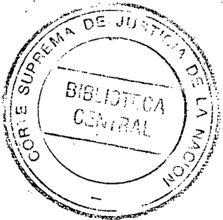

GUILLERMO E. TEM~' SECRETA'ro LETRADO CORTE SUPREfvl~ DE JUSTICIA DE LA NACION

## REPUBLICA A R G E N ~/"

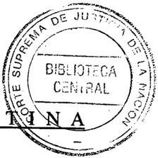

FALLOS

pE LA

CORTE SUPREMA

DE

~ .USTICIA D.E LA 'NACION

PUBLICACION A CARGO DE LA SECRETARIA DE JURISPRUDENCIA PEL TRffiUNAL

TOMO 325 VOLUMEN 2

," 1~8~ca

de

la

I

Corte Suprema

N9 de Orden

j()!S:lOJ¡

Ubicación

J.

405

f }¡-I06

.ReT.

LALEYS.

JUNIO-SEP

Tucumán 1471 (1050) Buenos Aires 2002

.-~

.

éopyright '(c) 2003 by'Corte Suprema de Justicia de la Nación .Queda hecho el depósito que previene la ley 11.723. Impreso en la Argentina Printed in Argentina I.S:B.N. 950-9825-62-X

## FALLOS DE LA CORTE SUPREMA

## JUNIO

## ROBERTO PIWNICA v. DRAGAMAR S.A.

RECURSO EXTRAORDINARIO: Requisitos comunes. Subsistencia de los requisitos.

Las sentencias de la Corte Suprema deben atender a las circunstancias existentes al momento de su decisión, aunque ellas sean sobrevinientes al recurso extraordinario.

## SANCIONES ADMINISTRATIVAS.

Corresponde aplicar el arto 12 del decreto 1384/01, si la infracción imputada -por hechos anteriores al dictado de la normaconsiste en el incumplimiento de un deber formal -falta de emisión de facturas en las formas y condiciones establecidas por la AFIP (art. 40, inc. a, de la ley 11.683, t.O. 1998 y sus modificaciones)cuya inobservancia no podría ser subsanada con posterioridad dada la evidente imposibilidad de retrotraer la operatoria comercial, sin que obste a ello que el acto que dispuso la clausura se encuentre firme.

## FALLO DE LACORTE SUPREMA

Buenos Aires, 3 de junio de 2002.

Vistos los autos: "Recurso de hecho deducido por Roberto Piwnica -Dragamar S.A. en la causa Piwnica, Roberto -Dragamar S.A. s/ amparo", para decidir sobre su procedencia.

Considerando:

1 º) Que contra la sentencia de la Sala B de la Cámara Nacional de Apelaciones en lo Penal Económico que, al confirmar el pfommdamiento de la instancia anterior, rechazó el amparo promovido porla actora con. el objeto de que no se hiciera efectiva la sanción de clausura aplicada por el organismo recaudador en los términos del arto 40 de la

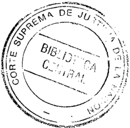

-

ley 11.683 (t.o. 1998 y sus modif.), la parte actora dedujo recurso extraordinario, cuya denegación dio motivo a la queja en examen.

- 2º) Que según reiterada doctrina de esta Corte sus sentencias deben atender a las circunstancias existentes al momento de su decisión, aunque ellas sean sobrevinientes al recurso extraordinario (conf. Fallos: 298:33; 304:1649; 312:555, entre muchos otros).
- 3º) Que el decreto 1384/01 -en su arto 1º, primera partedispuso "con alcance general" la exención de "multas y demás sanciones" (inc. d), en la medida en que no hayan sido pagadas ocumplidas con anterioridad a la fecha de vigencia de esa norma y que se trate de obligaciones o infracciones impositivas, y de los recursos de la seguridad social, vencidas o cometidas al 30 de septiembre de 2001, inclusive. Por otra parte, ese decreto prescribe -en lo que al caso interesarespecto de las sanciones originadas en la transgresión de un deber formal, que si éste es, "por su naturaleza, insusceptible de ser cumplido con posterioridad a la comisión de la infracción, la sanción quedará eximida de oficio siempre que la falta haya sido cometida con anterioridad a la fecha de publicación en el Boletín Oficial del presente decreto, inclusive" (art. 2, inc. e, último párrafo).
- 4º) Que el acto administrativo -que dio motivo a la acción de amparotiene su origen en la resolución de la Dirección General Impositiva que impuso a la actora la sanción de clausura de cuatro días de su local comercial sito en la Av. Güemes 897, local 182/183, del centro comercial Alto Avellaneda Shopping y una multa de $ 1000, por considerar qüe cometió la infracción formal prevista en el inc. a, del arto 40 de la ley 11.683 (t.o. 1998 y sus modif.). Dicha resolución condenatoria quedó firme. Sin embargo, con posterioridad, el organismo recaudador pretendió hacer efectiva la clausura respecto de un establecimiento comercial de la actora distinto del indicado en la aludida resolución, lo cual fue impugnado por la sancionada.
- 5º) Que, en tales condiciones, el caso sub examine tiene cabida en el arto 1º del aludido decreto, pues la infracción imputada -por hechos ocurridos en junio de 2000consiste en el incumplimiento de un deber formal, como lo es la falta de emisión de facturas en las formas y condiciones establecidas por la Administración Federal de Ingresos Públicos (art. 40, inc. a, de la ley 11.683, t.O. 1998 Ysus modif.), cuya inobservancia, por su naturaleza, no podría ser subsanada con posterioridad "dada la evidente imposibilidad de retrotraer la operatoria comer-

I~f/~?:&lt; .

cial" (conf. Fallos: 322:2360, considerando 10). ~o Obst;~~'~ .---. ~~. sión que el acto que dispuso la clausura se encuentre firme ue ue 0:// el decreto no establece que tal circunstancia determine la ~~~ón Y" del beneficio. '-,,-

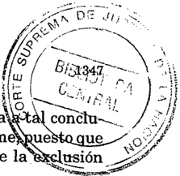

6º) Que, en virtud de ello, la clausura dispuesta por la resolución administrativa no podría hacerse efectiva, por lo que ha devenido abstracta la consideración de la presente queja.

Por ello, se declara inoficioso el pronunciamiento del Tribunal sobre los agravios expresados por el recurrente. Notifíquese, devuélvanse los autos principales y, oportuname:q.te, archívese la queja.

JULIO. S. NAZARENO. EDUARDO. Mo.LINÉ O'Co.NNo.R -CARLo.S S. FAYTAUGUSTO. CÉSAR BELLUSCIO -ENRIQUE SANTIAGO. PETRACCHI -'ANTo.NIO Bo.GGIANo.GUSTAVO.A. Bo.SSERT.

## CARLOS LUIS VAN PRAET v. MARTIN GASTON SAINT

MINISTERIO PUBLICO.

Corresponde devolver las actuaciones a fin de que el ministerio pupilar tomé' intervención en la causa en que -si bien se dispuso su participaciónno se le dio traslado previo a la adopción de decisiones vinculadas al interés de los, menores y posibles de causar a dicha. representación promiscua un gravamJjn de insusceptible reparación ulterior.

## DICTAMEN DELPRo.CURADo.R FISCAL

Suprema Corte:

Vienen estos autos en queja en virtud de la denegatoria del recurso extraordinario federal interpuesto contra la resolución dictada por el Superior Tribunal de Justicia de la provincia de Río Negro, como así también, por el planteo de Nulidad impetrado po:r: el Defensor Oficial ante la Corte Suprema de Justicia de la Nación, a partir de'fs. 613 de los autos principales ''Van Praet, Carlos Luis cl Saint Martín Gastón y otra sI daños y perjuicios (sumario)" y de fs. 33 de los autos ''Van Praet,

Carlos Luis el Saint Martín Gastón y otra sI beneficio de litigar sin gastos" (causanº 19.740); en razón de haberse omitido la intervención del Ministerio Público Pupilar (v. fs. 42/49 y 58/60).

Un ordenamiento lógico de las cuestiones planteadas impone tratar en primer término la invalidez pretendida por el señor Defensor Oficial. Debo señalar que V.E. tiene reiteradamente dicho que es descalificable la sentencia que, al confirmar una resolución, omitió dar intervención al ministerio pupilar para que ejerciera la representación promiscua a pesar de que dicha resolución comprometía en forma directa los intereses de la menor, lo que importa desconocer el alto cometido que la ley ha asignado a dicho ministerio, y no sólo menoscaba su función institucional sino que acarrea la invalidez de los pronunciamientos dictados en esas condiciones (Fallos: 305:1945, 320:1291, 323:1250 -voto de la mayoría al que no adhieren los Dres. Moliné O'Connor, Petracchi y Bossert-).

Con relación a los argumentos esgrimidos por el demandado, respecto al carácter de la representación promiscua, debo destacar que el artículo 59 del Código Civil, establece que "a más de los representantes necesarios, los incapaces son promiscuamente representados por el Ministerio de Menores, que será parte legítima y esencial en todo asunto judicial oextrajudicial, dejurisdicción voluntaria o contenciosa, en que los incapaces demanden o sean demandados, o en que se trate de las personas o bienes de ellos, so pena de nulidad de todo acto y de todo juicio que hubiere lugar sin su participación -arto 494 del Código Civil(v; Fallos: 312:1580).

A partir de tales premisas debo advertir, en primer lugar, que si bien en la causa principal se dispuso la participación del Ministerio de Menores (v.fojas 629 vta. y notificación a dicho magistrado de fojas 630 de la causa agregada 19.740), sin embargo, luego ninguna intervención se le confirió previo a la adopción de decisiones posibles de causar a dicha representación promiscua un gravamen de insusceptible reparación ulterior, tales como las que dispusieron, primero, la suspensión del trámite del juicio hasta tanto se abonara el impuesto de justicia, sellado y contribuciones, pronunciamiento que a su vez derivó en el decreto de caducidad de la instancia de fojas 652/655, y su consecuente imposición de costas y regulación de honorarios con apelaciones rechazadas a fojas 668, 672 vta., 680 y 710. Valga poner de resalto, en segundo lugar a fin de reforzar los rasgos de definitividad de las referidas decisiones que, con fundamento en ellas, el tribunal interviniente,

.

,¡~~;'"'~'~~'-,~

prácticamente vin.o~ s~~pender ta,mbi.én el curs~ dell&amp;~it~~a~f~~~;~)-', vo proceso sumarlO Imclado a fin de mterrumplr la\nrésq:m'cl'onieh curso de la acción\_\\~ ~"-\_.,,-\_ ... -

Asimismo, cabe también observar la falta de adecuada' ,,'ficació~;i'" al Ministerio pupilar de las resoluciones de fojas 20/21 y sus'cüñsecuentes (causa n Q 21.212 "Van Praet Luis sI beneficio de litigar sin gastos) vinculadas al interés de menores en materia de litigar libre de gastos y a la proyección de dicho instituto en el tiempo. Por ello, opino que corresponde declarar la nulidad de las actuaciones cumplidas con posterioridad a las mencionadas intervenciones del Asesor de Menores de fojas 629 de la causa 19.740 y 16 del beneficio 21.212, diligencias a que me refiero precedentemente y devolver los autos a la instancia correspondiente para la continuación del trámite.

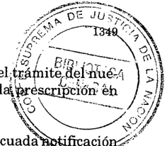

Finalmente, dada la solución que aquí propongo, considero innecesario expedirme sobre los agravios del quejoso pues ellos, en dicho contexto, carecen de interés actual.

Por lo expuesto, considero que V.E. debe declarar la nulidad de las, actuaciones mencionadas con el alcance precedentemente indicado. Dicha solución la propicio para el supuesto en que Ivonne Van Praetno haya arribado a la mayoría de edad, toda vez que al no encontrarse agregadas las correspondientes partidas de nacimiento no surgen ele,!. mento s probatorios que me permitan determinar con certeza si man,,) tiene aun su situación de menor, en cuyo caso su representación con~ tinuaría siendo ejercida por el señor Defensor Oficial. En situación contraria, previo a todo trámite correspondería devolver las actuaciof) nes a la instancia inicial a los efectos de que tome intervención y haga valer los derechos que estime corresponder en el juicio. Buenos Aires, 23 de agosto de 2001. Felipe Daniel Obarrio.

## FALLODE LACORTE SUPREMA

Buenos Aires, 3 de junio de 2002.

Autos y Vistos:

Atento a lo dictaminado por el señor Procurador Fiscal, devuélvanse las actuaciones a la instancia de origen a fin de que la interesada

tome intervención y haga valer los derechos que estime corresponder en el juicio con arreglo a lo allí expresado. Agréguese la queja al principal. Notifíquese y remítase.

JULIO S. NAZARENO -CARLOS S. FAYT -AUGUSTO CÉSAR BELLUSCIOENRIQUE SANTIAGO PETRACCHI -ANTONIO BOGGIANO -GUSTAVO A. BOSSERT.

## MIRTA YOLANDA PEREZ

RECURSO EXTRAORDINARIO: Requisitos propios. Cuestiones no federales. Sentencias arbitrarias. Procedencia del recurso. Varias.

Corresponde dejar sin efecto la sentencia que condenó a un médico por homicidio culposo si omitió establecer en qué consistían las obligaciones jurídicas respecto del paciente, sea que las hubiera asumido voluntariamente, o bien que le fueran impuestas reglamentariamente pues, sólo una vez conocido el alcance exacto de aquéllas, es posible formular un juicio penal de reproche basado en su incumplimiento culposo.

## DICTAMEN DEL PROCURADOR GENERAL

## Suprema Corte:

El titular del Juzgado Penal en lo Correccional de Segunda Nominación de la Provincia de Tucumán, con fecha veintitrés de abril de mil novecientos noventá y ocho, condenó a Mirta Yolanda Pérez por ser autora responsable del delito de homicidio culposo, en perjuicio de Juanita Ruth Pérez, a la pena de un año y ocho meses de prisión, de ejecución condicional, e inhabilitación especial por cinco años para ejercer y desempeñar su actividad como médica, bajo cualquier forma de prestación o servicio (fs.553 a 582 vta.).

La defensa interpuso recurso de casación contra esa sentencia, el que fue declarado inadmisible por la Corte Suprema de Justicia de la provincia (fs. 637 a 642), resolución que fue motivo del presente recurso extraordinario federal, concedido por el a quo a fs. 714.

-1-

## 1. La Corte tucumana, en su carácter de órgano de la casación provincial, rechazó el recurso en base a los siguientes argumentos:

El tribunal de mérito es libreen la valoración y selección de las pruebas que han de fundar su conocimiento y determinación de los hechos. Por vía del recurso de casación no se puede provocar un nuevo examen crítico de los medios probatorios, pues no se trata de una segunda instancia. En cuanto a las alegaciones de haberse violado la sana crítica racional, y de existir contradicciones graves y reiteradas y omisiones valorativas de elementos probatorios que, de haberlos considerado, habría variado la solución del caso, resultan totalmente inconsistentes, pues ocultan la pretensión de un nuevo examen y mérito de la prueba.

La casación -continúa argumentandono constituye un medio ordinario para reexaminar todas las decisiones, pues no tiene por función revisar el acierto o error de las sentencias de los tribunales inferiores, en lo que hace a la reconstrucción histórica. De allí que su competencia queda limitada y circunscripta a resguardar el derecho sustantivo y procesal, sea para evitar inobservancia o errónea aplicación del primero, o la inobservancia de disposiciones del segundo, impuestas bajo pena de inadmisibilidad, caducidad onulidad. Antes de ello -prosigueeste recurso presenta una dificultad adicional en el procedimiento penal vigente, dadas las características orales deljuicio, donde la protección de la prueba importa una vivencia difícil de reproducir ante el superior; la tarea valorativa se desenvuelve en un marco de inmediación y concentración conla percepción directa y personal de losjueces, y su control se ve restringido a lo que se registra en las actas incorporadas al expediente, resultando así que la prehmsión de una nueva valoración de prueba se halla al margen de los motivos legales de casación. .

En relación a la violación de la ley sustantiva, al haberse omitido detectar cuál ha sido la conducta exigible al agente, la Corte provincial expresa que tal agravio no debe tener acogida, puesto que importa, en realidad, obtener por ese medio un nuevo examen de los hechos y la valoración de la prueba.

Finaliza el a quo diciendo que esta posición no implica juzgar el acierto o desacierto del fallo impugnado, sino que, en base a estos lineamientos, no resulta posible su descalificación como acto jurisdiccional válido.

- 2. La defensa, a su vez, se agravia de las siguientes cuestiones:
- a) En la sentencia del a quo se ha violado el principio de la doble instancia en protección del inculpado (arts. 75, inc. 22, de la Constitución Nacional y 8º, inc. 2º h) de la Convención Americana sobre Derechos Humanos), puesto que se interpretó de inanerarestrictiva y formal el recurso de casación. En efecto, la Corte provincial no ingresó en el análisis de la tacha de arbitrariedad en la valoración de la prueba y en el estudio de los elementos del tipo objetivo de homicidio culposo, tal como lopropusiera su parte, sino que se limitó a responder conconsideraciones generales y abstractas. De esta manera no hubo una verdadera revisión del fallo de primera instancia, con lo que se vio afectada la garantía.
- b) Desde otro ángulo de la cuestión, la defensa sostiene que al no haberse hecho cargo la Corte del agravio de arbitrariedad que planteara el recurso de casación, no obstante su competencia para ello, ha incurrido, a su vez, en arbitrariedad de sentencia, lo que lá descalifica como derivación válida del sistema jurídico. En este punto, se transcriben todas las quejas que expusiera en el recurso de casación, surgidas, en general, de la mala inteÍ"pretación de los informes periciales del médico legista (fs. 4), del forense (fs. 571) y de la titular de la cátedra de pediatría de la Universidad Nacional de Tucumán (fs. 106), lo que llevó a una conclusión errónea sobre la edad de gestación de la vjctima, las mediciones del índice llamado Apgar, y la sintomatología que la víctima presentó desde el nacimiento hasta el deceso.
- , c) Por último, se tacha de arbitraria la negativa de la Corte provincj~l a examinar cUéstiones que hacen al alcance del tipo penal imputadq, so pretexto de que dicha alegación importa en realidad una pretensión de obtener un nuevo examen de los hechos y del mérito de las pruebas. Sin embargo -a juicio del recurrenteen la sentencia condenatoria no se precisó cuál era la "conducta exigible al agente". ¿En qué consistió -se pregunta ésta-la imprudencia, la negligencia, la inobservancia de los reglamentos o deberes? Ysi bien la culpa constituye un elemento de la descripción del arto 84 del Código Penal, ella no surge de la sentencia condenatoria.

-II-

- 1. En mi opinión, la contestación de la Corte tucumana al recurso de casación planteado por la parte, resultaría insuficiente, puesto que

no entra a considerar la tacha de arbitrariedad alegada (que presentaría aspectos que, aunque son cuestiones de hecho, merecerían tener una respuesta), sino que la rechaza de plano bajo la invocación general de que se trata de cuestiones de prueba ajenas a esa vía recursiva. De esa manera, la sentencia del a quo habría incurrido en un exceso de rigor formal (Fallos: 311:509 y 320:1217, considerando 4º y, más precisamente, ver Fallos: 321:494), lo que conduciría a una restricción sustancial y arbitraria de la vía utilizada, sin fundamento idóneo o suficiente, defecto susceptible de lesionar la garantía del debido proceso consagrada en el arto 18 de la Constitución Nacional (Fallos: 312:426; 315:761 y 2364, entre otros), por lo que correspondería el dictado de una nueva que contemple una respuesta a estos argumentos defensivos.

En este sentido, el recurso de casación presentado ante el máximo tribunal provincial, constituye una vía apta para que todo imputado acuda en remedio del fallo condenatorio de un tribunal de sentencia al que tacha, concierto fundamento, de arbitrario (confr.Ricardo C. Núñez, "El contralor de las sentencias de los tribunales de juicio por vía de la casación", en "Temas de derecho penal y de derecho procesal penal", Ejea, 1958, págs. 84-87; y Fernando de la Rúa "El recurso de casación en el derecho positivo argentino", Zavalía Editor, Buenos Aires, 1968, págs. 138, 161-162, 169, 175, 176, 182, 184-185, 188-189). Máxime téi..) niendo en cuenta su carácter de órgano judicial intermedio en estas' cuestiones mutatis mutandi (Fallos: 308:490, considerando 5º; 318:514; considerando 13; 319:585, considerando 5º). .1p

- 2. Yendo ahora al caso concreto, corresponde decir que, si se analizan los agravios alegados por el recurrente, surgirían los siguienteiS' interrogantes (cuestiones que merecerían del a quo una adecuada ré;:' puesta para poder así emitir un juico de certeza), a saber:
- a) En el informe médico legista de fs.4, el doctor Ramón Tbloza' afirma (y no obstante que falta su firma en esa pieza, posteriormente reconoce que le pertenece) que el reconocimiento del cadáver se efectuó en el Instituto Privado de Neonatología del Norte. En la declaración testimonial de Toloza prestada en el juicio, afirma que fue en C.LM.S.A. -Clínica Integral para la Mujer S.A.- (ver el acta de debate, fs. 533). Luego debería dilucidarse si realmente esta contradicción tiene alguna incidencia directa en la eficacia pericial del informe indicado e, indirectamente, en las conclusiones a este respecto de la sentencia condenatoria.

- . b) De acuerdo a las constancias en autos -fs. 10 de la historia clínica, informe y gráfico de fs. 270 a 273, pericia forense de fs. 392puede inferirse que el tiempo de gestación de la víctima, al nacer, era entre treinta y cuatro y treinta y seis semanas. Conviene aquí efectuar un hiato para señalar que la defensa se equivoca cuando a fs. 671 pone a cargo del doctor Jiinénez la conclusión de que un bebé, con el peso que tenía esta niña, puede tener hasta cuarenta semanas de gestación. Por el contrario, dicho forense informa te xtualmenteque "la edad gestacional de un recién nacido de 2.950 gramos, corresponde al peso máximo de un embarazo de 35 a 36 semanas" (fs. 392 vta.).

Ahora bien, el juez correccional sostiene que "se trataba de un bebé pretérmino, cualquiera fuera su fecha de gestación, siempre por debajo de 37 semanas, que es lo que se determina científicamente como prematuro" (fs. 570), para lo cual se basa en la apreciación vertida en el juicio por el médico Miguel Angel Estévez, cuando sostiene que "34/36 semanas de gestación es un pretérmino" (Eloisa Ramona delValle Alonso de Prattesi, al contrario de lo afirmado por eljuez, nada dice al respecto -confr. fs. 538 vta. a 540 vta.-). En consecuencia, sería útil analizar si esta hipótesis, es decir que prQbablemente no se trataba de una sietemesina (alrededor de 32 a 33 semanas de gestación, según informe de fs. 106), pero que de todas maneras sería una recién nacida prematura (ver también la declaración de la imputada a fs. 47), tiene incidencia -tal comolopretende el recurrenteen la determinación de la conducta que le era exigible a la imputada (en este sentido la prescripción de la internación en un servicio de neonatología -ver pericia de fs. 63-, queda relativizada pero no excluida) y, de acuerdo a ello, en el postulado cierto de la condena .

- . c) Según se queja el recurrente, a fs. 574 de la sentencia, el juez correccional habría citado en forma incompleta el informe médico de la doctora Alonso de Prattesis, obrante a fs. 106. En este punto, debería considerarse si esta objeción de la defensa es en realidad relevante para el análisis de dicho estudio. Ello teniendo en cuenta que si bien cuando dice que "lo conveniente es internarlo en un servicio de neonatología" se refiere a un sietemesino, lo cierto es que en los últimos párrafos del informe (el quinto y el sexto) pareciera analizar este caso específico (llanto débil, falta de succión, piel con tinte morado) concluyendo en que "su significado es la inadaptación al medio por inmadurez". Ypara este diagnóstico volvería a ser una prescripción importante la internación en un servicio específico.

Para interpretar este último informe, podría tenerse en cuenta, tal comolo propone la defensa, la declaración de Alonso de Prattesis en el juicio (ver fs. 540). De una lectura de su testimonio, parecería que cuando manifiesta que a un niño con un Apgar de 1 a 5 y de 5 a 8, hay que brindarle control médico continuo en un medio institucional, lo relevante para ese temperamento médico no es tanto que el paciente sea sietemesino sino que sea un prematuro (y la víctima sí lo era, aun considerando que su tiempo de gestación haya sido el indicado por la imputada en la historia clínica) con un índice vital algo inferior al óptimo.

d) Asiste razón a la defensa, en cuanto alega un error en la mención -y, por consiguiente, en el mérito probatoriodel informe pericial del forense Alberto V. Pacheco, obrante a fs. 63/63 vta., pues se le hace decir a este profesional, de manera categórica "que para este caso, en que se trataba de una niña sietemesina ...lo indicado era que sea internada en un servicio de neonatología" (fs. 571 vta:.),cuando en realidad lo que este profesional consignó es que "para el caso de que la niña recién nacida haya sido sietemesina". O sea que en ningún momento afirmó el perito que la víctima fuera una sietemesina, sólo fue una hipótesis para extraer la conclusión. Y tan es así, que en el punto ter~ cero de su estudio recomienda que se establezca en forma fehaciente el tiempo de gestación que tenía la recién nacida y los motivos de la:s contradicciones existentes sobre este tema en la historia clínica, así como,y esto también es cierto, "por qué no fue derivada a neonatológía". Por lo tanto, el a qua podría evaluar esta prueba en su verdadero signi~ ficado.

L

e) Eljuez correccional-a fojas 571 vuelta de su fallocita textuar~ mente el punto 8vo. del informe forense de fs. 393, que dice: "...las complicaciones en los recién nacidos prematuros son más frecuentes y a pesar de tener un Apgar de 6 a 7, se debe extremar el control médico, para actuar en forma inmediata si se presenta una complicación (paro cardio-respiratorio), comosucedió en este caso. Si pudo ser previsible, pero no evitable". Y tal comolo señala la defensa, teniendo en cuenta esta última aseveración, forzoso sería examinarla para emitir un juicio condenatorio, a la luz del llamado, para estos supuestos típicos, nexo de evitabilidad. Ello sin perjuicio de estas dos cuestiones: Ira.: En mi opinión, la proposición "pudo ser previsible pero no evitable", es una afirmación que provoca ciertas dudas sobre su respaldo científico, teniendo en cuenta su excesiva simplicidad, casi diría dogmática, y a juzgar por las demás apreciaciones de ese mismo informe que parecen

no respaldarla (por ejemplo, si el resultado era inevitable, qué sentido tenía hacer hincapié -como lo hizo este forense en el marco de un estudio pericial a posteriorien que debía extremarse el control médico,para actuar en forma inmediata en caso de presentarse una complicación). Y 2do.: La áfirmación de que el resultado no era evitable, no suprime la circunstancia de que la imputada, a su vez, también contribuyera al peligro, oaumentara el riesgo de que se produjera el resultado más allá de lo permitido o, incluso, favor rei, de que lo acelerara. Y si ello fue así, la producción del resultado le sería imputable objetivamente, teniendo en cuenta la relevancia jurídica de su conducta y la inmediatez de su aporte. En otras palabras, para resolver el caso, luego de despejadas todas las incógnitas de arbitrariedad planteadas por la parte, debería darse respuesta cabal a estos interrogantes: si la im~ putada, con su conducta descuidada consistente en haber omitido cuidados intensivos a la víctima, aumentó el riesgo permitido. Y, en caso afirmativo, dilucidar si lo mismo le sería imputable objetivamente el resultado, teniendo en cuenta la hipótesis -más favorablede que si se hubiera prestado el debido cuidado, se hubiese producido idéntico resultado fatal (esto último, teniendo en cuenta que la falta de una autopsia impide conocer fehacientemente la causa de la muerte) (ver Rm{Ín,"Infracción del deber y resultado en los delitos imprudentes", en Problemas Básicos del Derecho Penal, Madrid, 1976; págs. 170 y ss.; Jescheck, "Tratado de Derecho Penal", Pte. Gral. 55, II, 2b; Y Stratenwerth, Fest F. Gallas, págs. 235 y ss.).

- 3. A m~yor abundamiento, estimo que sería útil para la solución del caso, citar lo expuesto por el suscripto el 31 de mayo de 2000 en el recurso extraordinario N.I07.XXXIV, in re "Navarro, Rolando Luis y otros sI homicidio culposo", resuelto por V.E. el9 de agosto de 2001, por los argumentos y conclusiones del dictamen. Allí se sostuvo, refiriéndose a la sentencia del a qua, que "ni siquiera ha establecido, luego de centrar su reproche en 'la negligencia e impericia ...al no haber adoptado las precauciones que les concernían comoprofesionales en el arte de curar', qué otros cuidados atinentes al caso habrían debido adoptar los médicos condenados. En este sentido -prosigue el dictamenV.E. ha expresado que incurre en arbitrariedad la sentencia que omite establecer en qué consistían las obligaciones júrídicas del médico respecto del paciente, sea que las hubiera asumido voluntariamente, o bien que le fueran impuestas reglamentariamente, y que ello es así pues, sólo una vez conocido el alcance exacto de aquéllas, es posible formular un juicio penal de reproche basado en su incumplimiento culposo (Fallos: 317:1854)".

- 4. Por el contrario, y de adverso a lo expuesto en los tres' puntos anteriores, estimo que los demás agravios formulados por la defensa, no conforman tachas ciertas de arbitrariedad que merezcan ser analizadas por la Corte tucumana, sino que son meras disconformidades con la valoración de los elementos probatorios efectuados por el juez correccional, o con las interpretaciones hechas por éste de textos científicos. En este sentido, puede apreciarse que la conclusión del juez sobre el cuadro de cianosis generalizada de la víctima que se fue dando a lo largo de ese fatídico día, se basa no sólo en los elementos cuestionados por la defensa, sino en otros testimonios que no parecen objetables. Por otro lado, no se extrae ninguna conclusión que incida en el juicio condenatorio, en lo relativo a la versión de la imputada de que era necesario hacer tres Apgar (el segundo según esta médica debía efectuarse a las doce horas de vida, lapso que no alcanzó la niña), y de que la encontró "moradita" (en ningún momento el juez dice que este hallazgo fue anterior). ,
- 5. Por último, he de postular que interpretado el recurso de casación planteado oportunamente por la defensa tal como se lo propone precedentemente: de manera amplia y contemplando las causales de arbitrariedad alegadas, no se advierle un menoscabo a la garantía de la doble instancia judicial en materia penal (art. 8, párrafo 2º, apartado h) de la Convención Americana sobre Derechos Humanos y arto 75, inc. 20, de la Constitución Nacional), tal comolo interpretó V.E. en la doctrina desarrollada a lo largo de los precedentes "Giroldi" (Fallos: 318:514);"Arce"(Fallos: 320:2145);"Gorriarán Merlo"(Fallos: 322:2488); y "Felicetti" (Fallos: 323:4130). A ello puede agregarse la recomendaciónde la Comisión Interamericana de Derechos Humanos, que ha admitido que el recurso de casación satisface la garantía de la doble instancia, en tanto no se regule, interprete o aplique con.rigor formalista, sino que permita con relativa sencillez al tribunal de casación examinar la validez de la sentencia recurrida en general, así como el respeto debido a los derechos fundamentales del imputado, en especial los de defensa y el debido proceso (Informe 24/92, "Costa Rica", del 2 de octubre de 1992, parágrafo 30). Por lo tanto, el recurso federal no debe prosperar en ese aspecto.

-III -

Por todo lo expuesto, considero que V.E. puede hacer lugar al recurso extraordinario interpuesto por la defensa de Mirla Yolanda

Pérez, revocar la sentencia de la Corte Suprema de Justicia de Tucumán y, puesto que se ha incurrido en un exceso ritual manifiesto, ordenar el dictado de una nueva en la que se analicen las supuestas causales de arbitrariedad propuestas en este dictamen, sin que ello implique abrir juicio sobre la solución final que corresponda dar al caso (art. 16, ley 48). Buenos Aires, 30 de agosto de 2001. Nicolás Eduardo Becerra.

## FALLODE LACORTE SUPREMA

Buenos Aires, 11 de junio de 2002.

Vistos los autos: "Pérez, Mirta Yolanda si homicio culposo".

Considerando:

Que esta Corte comparte los argumentos y conclusiones del dictamen del señor Procurador General de la Nación.

Por ello, se declara admisible el recurso extraordinario y se deja sin efecto la sentencia recurrida con los alcances indicados en el mencionado dictamen. Notifíquese y devuélvase.

JULIO S. NAZARENO -CARLOS S. FAYT -AUGUSTO CÉSAR BELLUSCIOENRIQUE SANTIAGO PETRACCHI -ANTONIO BOGGIANO -GUILLERMO A. F. LÓPEZ -GUSTAVO A. BOSSERT ADOLFO ROBERTO V ÁZQUEZ.

## ROLANDO AMADEO PISANU

RECURSO EXTRAORDINARIO: Principios generales.

- Es inadmisible (art. 280 del Código Procesal Civil y Comercial de la Nación) el recurso extraordinario deducido contra el pronunciamiento que condenó a un médico por el delito de lesiones culposas.

## DICTAMEN DEL PROCURADOR GENERAL

## Suprema Corte:

El titular del Juzgado Nacional en lo Correccional Nº 6, condenó a Rolando Amadeo Pisanú a la pena de seis meses de prisión, en suspenso, y un año y seis meses de inhabilitación especial para ejercer la medicina, por considerarlo autor penalmente responsable del delito de lesiones culposas (art.94 del Código Penal).

Contra esa resolución la defensa interpuso recurso de casación, cuyo rechazo dio lugar a la articulación de un recurso de queja ante la Cámara Nacional de Casación Penal, que fue desestimada por la Sala II de este tribunal(fs. 974/981).

La defensa del nombrado Pisanú dedujo entonces recurso extraordinario, el que fue concedido a fs. 1021.

-1-

En su presentación de fs. 987/1007, el recurrente desarrolló diversos agravios contra la sentencia del tribunal a quo, fundamentando su crítica en los siguientes aspectós:

- a) El argumento relativo a la afectación de la garantía del juez imparcial y de la doble instancia, fue rechazado en forma asaz arbitraria ..
- b) La sentencia recurrida fue dictada sin haberse cumplido coh el trámite previsto en los arts. 466 y 468 del Código Procesal Penal.
- c) El denominado "principio jurídico de confianza" fue interpretado por la casación como una cuestión de hecho y prueba y no como una regla de derecho penal material.
- d) La afectación al principio de congruencia entre la acusación y la sentencia fue desatendida por la Sala II de la casación, con base en un precedente aislado de esa sala, sin tener en cuenta los fundamentos vertidos en su voto por el juez disidente.

En orden al primero de los agravios indicados y en lo que interesa al caso, estimo que esta cuestión, aunque introducida recién en el recurso de casación, no corresponde desecharla por ausencia del requisito de oportunidad, por las razones que se apuntarán a continuación.

En primer lugar, he de decir que no paso por alto que el tribunal tiene resuelto que la cuestión federal, fundamento del recurso extraordinario, debe introducirse en la primera ocasión que brinde el procedimiento (Fallos: 293:374; 294:324; 300:522; 303:718; 308:733 y 312:2340) pues tanto el acogimiento cuanto el rechazo de las pretensiones de las partes constituyen sucesos previsibles que obligan a su pertinente propuesta (Fallos: 291:268; 294:373 y 303:841).

Sin embargo, V.E. también tiene establecido que cuando la sentencia definitiva ha examinado y resuelto la cuestión federal articulada, queda subsanada la posible extemporaneidad del planteo, a los efectos de habilitar la instancia del arto 14 de la ley 48 (Fallos: 255:76; 258:322; 265:30; 298:175; 312:896 y 1484).

Habida cuenta de ello y toda vez que tanto el magistrado correccional al momento de rechazar el recurso de casación interpuesto (fs. 885/ 888) como el tribunal a qua al no hacer lugar a la queja por casación denegada (fs. 974/981), se pronunciaron en sentido contrario a las pretensiones del recurrente ingresando al fondo del asunto, opino que la circunstancia de que la cuestión federal haya sido introducida recién en la oportunidad de interponer recurso de casación, no obsta a la procedencia de la apelación intentada.

Esta conclusión se robustece cuando se descubre que más allá del interés del recurrente en hacer efectiva en tiempo propio la garantía constitucional de la defensa enjuicio, entre cuyas formas sustanciales se incluye asegurar al imputado el derecho de comparecer ante un tribunal imparcial y apto (Fallos: 240:160), converge en esta causa un interés institucional de orden superior, que radica en evitar hacer incurrir en responsabilidad internacional a la República, a la luz de las previsiones de la Convención Americana sobre Derechos Humanos, que no sóloha sido ratificada por nuestro país (ley 23.054), sino que fue incorporada a la Constitución Nacional, en los términos expuestos por el arto 75, inc. 22, a partir de la reforma de 1994.

En cuanto a lo esencial del asunto, tal como tuviera ocasión de expresar al dictaminar en los autos "Zenzerovich, Ariel F. sI recurso extraordinario" Z.81.XXXIII (Fallos: 322:1941), a cuyos fundamentos me remito, en razón de brevedad, entiendo que el juez correccional, por haber instruido la causa, se encuentra sujeto a la posibilidad negativa de no ser considerado objetivamente imparcial para dictar sentencia.

## - III-

Para el caso de no compartirse el temperamento expuesto en el acápite precedente, habré de continuar con el desarrollo de otro de los agravios que parecería reunir los caracteres de prosperidad del caso.

y es aquel que trata sobre la observancia del principio de congruencia entre la acusación y el fallo, puesto que el recurrente sostiene que la sentencia condenó a Pisanú con relación a un hecho por el que no había sido acusado.

Alega, en concreto, que se le atribuyó haber consentido "el retiro prematuro del anestesista de la clínica antes de concluir el post operatorio inmediato y que, en todo caso, el cirujano se tendría que haber quedado para sustituirlo" (fs. 958), mientras que en los alegatos la fiscalía desistió de su acusación y el querellante mantuvo la suya aunque con una restricción fáctica esencial, pues limitó voluntariamente el objeto procesal a la externación del quirófano sin recuperación anestésica ya la omisión de derivar a la paciente a una sala de recuperación.

En consecuencia, entiende la parte que por aplicación de la:doctrina del fallo "Tarifeño" ese aspecto fáctico debió ser considerado defini~ tivamente retirado del litigio.

Además -ya desde la perspectiva del derecho sustantivoalega qu~ al proceder de ese modo se condenó a su defendido por un hecho no determinante del resultado. Así, manifiesta que si la operación había concluido a las 20 o 20:10 horas, el retiro de la clínica a las 21 horas, tras visitar a la paciente sin novedad perceptible, no podía ser valorado como un acto de precipitación repudiable.

En la sentencia del tribunal a qua, por su parte, se respondió a esté último agravio aduciendo que, una vez más, el recurrente había parcializado las conclusiones sobre los hechos del juez correccional, pues

el fundamento de la condena fue que el cirujano pudo y debió haberse percatado, en su visita a la habitación, que el estado de la paciente no era el que le había comunicado el anestesiólogo (fs. 979 vta.).

Por su parte, la cámara desestimó el agravio procesal con remisión a distintos pronunciamientos del tribunal en los que se estableció que la acusación, en el nuevo sistema procesal penal, se integra con dos actos complementarios, los previstos en los arts. 347 Y393 del código de forma, extremo que impide sostener que cualquiera de ellos agote por sí solo la exigencia constitucional de que la sentencia verse sólo sobre los hechos por los que el imputado ha sido acusado. Asimismo, y a los fines de declarar inadmisible el recurso, reprochó al impugnante no haberse hecho cargo de esos argumentos que informaban un reiterado lineamiento jurisprudencial (fs. 979 vta.l980).

Ami modo de ver, asiste razón al apelante cuando se agravia por la falta de congruencia entre la acusación y la sentencia, pues más allá de las facultades reconocidas al querellante al momento del alegato por el arto 393 de la ley de forma (Fallos: 321:2021), lo cierto es que en la etapa intermedia su carácter adhesivo le impide provocar por sí la apertura del juicio, y ello obsta a que su requerimiento pueda ser considerado como la acusación que proporcionará la plataforma fáctica sobre la que versará el debate.

El propio códigoconfirma esta conclusión al facultar únicamente al fiscal, en la oportunidad prevista por el arto 381, para que amplíe la acusación incluyendo hechos -de la especie allí mencionadano contenidos en el requerimiento fiscal o en el auto de elevación a juiciO.

En cuanto al requerimiento de elevación que puede formular el acusador particular en esa etapa procesal, la lógica de los sistemas procesales que optan por un querellante adhesivo indica que ese acto sólo cumple la función de provocar el control del pedido de sobreseimiento que pudiera formular el agente fiscal y también, en algunas legislaciones, los alcances del requerimiento de elevación de ese funcionario.

Por lo tanto debemos atenernos, para verificar la existencia de esta tacha, solamente al requerimiento fiscal de elevación a juicio. Y en este sentido, debemos decir que de la lectura del escrito de fs. 471/ 472, y su cotejo con la sentencia de fs. 795/831 vta. -en especial fs. 826 vta.se ha desatendido la congruencia que debe mediar entre acusación y sentencia.

En consecuencia, y pudiendo existir un agravio a la garantía de la defensa enjuicio, considero que V.E. puede admitir el recurso y analizar esta cuestión.

-IV-

En cuanto a los agravios restantes, teniendo en cuenta lo expuesto en los capítulos precedentes, considero que deviene inoficioso su tratamiento, sin perjuicio de aclarar que no asistiría razón a la parte en cuanto alega un incumplimiento al trámite recursivo del casq, toda vez que el tribunal a quo no abrió el recurso de casación por ella planteado.

Por todo lo expuesto, opino que V.E. puede declarar procedente la queja -si así lo estimay en ese caso dejar sin efecto la resolución: impugnada para que, por intermedio de quien corresponda, se dicte una nueva con arreglo a derecho. Buenos Aires, 30 de noviembre de 2001. Nicolás Eduardo Becerra.

## FALLO DE LACORTE SUPREMA

Buenos Aires, 11 de junio de 2002.

Vistos los autos:. "Pisanú, Rolando Amadeo sI recurso de queja" ..

Considerando:

Que el recurso extraordinario es inadmisible (art. 280 del Código Procesal Civil y Comercial de la Nación).

Por ello, oído el señor Procurador General, se declara improcedente el recurso' extraordinario interpuesto. Notifíquese y, oportunamente, devuélvase, previa devolución de los autos principales.

JULIO S. NAZARENO -CARLOS S. FAYT -AUGUSTO CÉSAR BELLUSCIOGUILLERMO A. F. LÓPEZ -ADOLFO ROBERTO V ÁZQUEZ ..

## EMBAJADA DE ESTADOS UNIDOS DE AMERICA

JURISDICCION y COMPETENCIA: Competencia federal. Competencia originaria de la Corte Suprema. Estados extranjeros.

No procede la competencia originaria de la Corte en las causas en que los Estados extranjeros y sus representaciones diplomáticas no revisten la calidad de aforados en los términos de los arts. 116 y 117 de la Constitución Nacional, máxime cuando no se hubieran afectado las actividades propias de la legación o las de sus funcionarios, ninguno de los cuales se presentó como parte en el proceso.

JURISDICCION y COMPETENCIA: Competencia federal. Competencia originaria de la Corte Suprema. Estados extranjeros.

Mientras el arto 117 de la Constitución Nacional establece que en todos los asuntos concernientes a embajadores, ministros y cónsules extranjeros, la Corte Suprema ejercerá su jurisdicción "originaria y exclusivamente", el arto 116 no efectúa esa expresa referencia respecto de los Estados extranjeros (Disidencia de los Dres. Antonio Boggiano y Adolfo Roberto Vázquez).

JURISDICCION y COMPETENCIA: Competencia federal. Competencia originaria de la Corte Suprema. Agentes diplomáticos y consulares.

La competencia originaria y exclusiva de la Corte Suprema en los asuntos concernientes a embajadores extranjeros le fue atribuida en razón de ser el más alto tribunal de la Nación y de corresponder al 'gobierno de la misma la dirección de las relaciones exteriores y todas las cuestiones de carácter internacional (Disidencia de los Dres. Antonio Boggiano y Adolfo Roberto Vázquez).

UURISDICCION y COMPETENCIA: Competencia federal. Competencia originaria de la Corte Suprema. Agentes diplomáticos y consulares.

La competencia originaria 'y exclusiva de la Corte Suprema en los asuntos concernientes a embajadores extranjeros responde a la necesidad de mantener las 'buenas relaciones entre los sujetos de derecho internacional, asegurando a sus representantes diplomáticos acreditados en nuestro país las máximas garantías que, con arreglo a la práctica uniforme de las naciones, debe reconocérseles para el más eficaz cumplimiento de sus funciones (Disidencia de los Dres. Antonio Boggiano y Adolfo Roberto Vázquez).

JURISDICCION y COMPETENCIA: Competencia federal. Competencia originaria de la Corte Suprema. Estados extranjeros.

Si el arto 117 de la Constitución Nacional tiene como finalidad el resguardo de las buenas relaciones internacionales, no se advierten razones que justifiquen efectuar distingos entre un país y sus representantes, sometiendo al primero a la justicia federal ordinaria, ya que en tanto las relaciones internacionales se hallan involucradas ya sea que el caso concierna al Estado extranjero en sí o a sus embajadores, ministros y cónsules, se justifica que en ambas hipótesis actúe la Corte, como cabeza de un poder del Estado y tribunal superior de la justicia nacional (Disidencia de los Dres. Antonio Boggiano y Adolfo Roberto Vázquez).

## DICTAMEN DEL PROCURADOR FISCAL

## Suprema Corte:

Llegan las presentes actuaciones a esta Procuración General de la Nación, a fin de emitir dictamen acerca de la competencia originaria del Tribunal, en el sumario policial iniciado por denuncia del encargado de seguridad de la Embajada de los Estados Unidos de América del Norte, Walter Olivito, quien informó, ante la Seccional23 a de la Policía Federal Argentina, que en los primeros días del mes de abril del corriente año, se recibió en esa sede diplomática una nota manuscrita y currículo personal de Alejandro Carlos Aran, persona desconocida para los miembros de la embajada, quien luego habría realizado diversos llamados telefónicos a un número de abonado especial que posee la embajada y que no es de acceso al público; reclamando el pago de honorarios por un asesoramiento de seguridad que habría realizado (cfr. fs. 1).

Al respecto, el Tribunal tiene establecido que los estados extranjeros y sus representaciones diplomáticas no revisten la calidad de aforados, en los términos de los arts. 116 y 117 de la Constitución Nacional y 24, inc. 1Q del decreto-ley 1285/58 que los reglamenta (Fa'" llos: 297:167; 305:1148 y 1873; 308:1673, entre muchos otros).

Por otra parte, no surge de las constancias agregadas al sumario hasta este momento, que se hubieran afectado las actividades propias de la sede diplomática o la de sus funcionarios, ninguno de los cuales se presentó comoparte en el proceso, por lo que, hasta tanto se acredite en autos alguno de los extremos mencionados, estimo que esta causa resulta ajena a la competencia del Tribunal (Fallos: 304:1495; 306:988; 311:916 y 2125, 'in re "Barzone, César Alfredo si dcia." B.96.XXXII; y

"Embajada de Israel s/intimidación pública" E.147.XXXIV, del 28 de mayo de 1996 y 23 de febrero de 1999, respectivamente). Buenos Aires, 11 dejunio de 2001. Luis Santiago González Warcalde.

## FALLODE LACORTE SUPREMA

Buenos Aires, 11 de junio de 2002.

Autos y Vistos; Considerando:

- 1º) Que el encargado de seguridad de la Embajada de los Estados Unidos de América puso en conocimiento de las autoridades de la Comisaría 23a. de la Policía Federal que una persona de nombre Alejandro Carlos Aron reclamaba un cobro de honorarios mediante la utilización de una línea telefónica especial de la mencionada legación.
- 2º) Que este Tribunal tiene dicho que los estados extranjeros y sus representaciones diplomáticas no revisten la calidad de aforados en los términos de los arts. 116 y 117 de la Constitución Nacional (confr. Fallos: 305:577; 306:104, 495,1688 y 308:2130).
- 3º) Que, además, no surge de las constancias obrantes en el expediente que se hubieran afectado las actividades propias de la legación o las de sus funcionarios, ninguno de los cuales se presentó como parte en el proceso, por lo que, mientras no se acredite en autos alguno de los extremos enunciados no procede la competencia originaria del Tribunal (Fallos: 306:988; 311:916, 2125 y E.198.XXXV."Embajada de la Federación Rusa sI intimidación pública -causa Nº 12.5651 1999- incidente de competencia" resuelta el 27 de junio de 2000).

Por ello, y de conformidad con lo dictaminado por el señor Procurador Fiscal, se declara que la presente causa no es de competencia originaria de la Corte, por lo que corresponde remitir las actuaciones a la Cámara Nacional de Apelaciones en lo Criminal y Correccional, a sus efectos, lo que así se resuelve. Hágase saber y cúmplase.

JULIO S. NAZARENO:AUGUSTO CÉSAR BELLuscIO -ENRIQUE SANTIAGO PETRACCHI -ANTONIO BOGGIANO (endisidencia) -GmLLERMo A. F. LÓPEZGUSTAVO A. BOSSERT -ADOLFO ROBERTO VÁZQUEZ (en disidencia).

## DISIDENCIA DE LOS SEÑORES MINISTROS DOCTORES DON ANTONIO BOGGIANO y DON ADOLFO ROBERTO V ÁZQUEZ

## Considerando:

Que en el caso resulta de aplicación la doctrina que surge de Fallos: 323:3592 disidencia de los jueces Fayt, Boggiano y Vázquez a cuyos fundamentos y conclusiones cabe remitir en razón de brevedad, sin que modifique lo expuesto la trascendencia del asunto o la falta de elementos que demuestren que se hayan afectado las actividades propias de la sede diplomática o la de sus funcionarios.

Por ello, oído el señor Procurador Fiscal, se declara que la presente causa es propia de la competencia originaria de la Corte. Líbrese oficio al Ministerio de Relaciones Exteriores y Culto a fin de que, por su intermedio, se requiera la conformidad exigida por el arto 24, inc. 1Q, último párrafo del decreto-ley 1285/58.

ANTONIO BOGGIANO -ADOLFO ROBERTO V ÁZQUEZ.

## ERNESTO EDUARDO TEXO

JURISDICCION y COMPETENCIA: Competencia federal. Competencia originaria de la Corte Suprema. Agentes diplomáticos y consulares.

¡

.¡

No corresponden a la competencia originaria de la Corte Suprema -en tanto. no sé hallan involucrados funcionarios aforadoslas actuaciones prelimina- 1 res vinculadas con las denuncias penales efectuadas por los participantes de diversas gestiones protocolares tendientes a facilitar el ingreso de obras de' arte provenientes del extranjero.

DICTAMEN DEL PROCURADOR FISCAL

Suprema Corte:

V.E. corre vista en las presentes actuaciones a fin de que esta Proc curación General se expida sobre la jurisdicción originaria del Tribu-

nal, a raíz de la declinatoria de competencia del titular del Juzgado Nacional en lo Penal Económico Nº 6, de esta ciudad.

La causa se inició con la denuncia de José Luis Fabris contra Ernesto Texo, con quien habría mantenido una relación comercial, que incluyó su participación en la exposición en la Argentina de obras de Salvador Dalí, vinculación que ya había ocasionado, previamente, otra denuncia de Fabris contra Texo, ante la justicia de instrucción, por el delito de retención indebida.

Con motivo de diligencias judiciales tendientes a acreditar esa primer denuncia -causa en que se dictó sentencia de sobreseimiento, que fue apeladaFabris habría advertido que cuatro de las obras de Dalí que integraron la muestra ("Las Tres Gracias", "Mujer con Cabeza de Rosa", "La Fecundidad" y "Caballero Español") se encontrarían en el país, en poder de Texo o de una empresa a ellos vinculada, pese a que existirían constancias de su exportación.

La importación temporaria de las obras expuestas, o de parte de ellas, habría sido gestionada ante las autoridades aduaneras, mediante la franquicia diplomática 21/99, a solicitud del embajador de la República de Francia ante nuestro país, Paul Dijoud. Asimismo, mediante la solicitud 19/00, la embajada francesa habría solicitado posteriormente, su exportación (fs. 254). Trámites en que también habría intervenido Michel Perraudin, funcionario administrativo de la misión extranjera, quien, a tenor de lo informado por el Ministerio respectivo, ha cesado en sus funciones en la Argentina (fs. 249).

En primer lugar, debo señalar que del estudio de las actuaciones no surge que el titular de la acciónpública haya promovido acción penal por algún delito y contra personas determinadas o indeterminadas, pero menos aún, contra algún funcionario que revista la calidad de aforado en los términos de la Convención de Viena sobre Relaciones Diplomáticas, razón por la cual sólo se tratarían, las presentes, de actuaciones preliminares no debidamente circunstanciadas, precisadas ni aclaradas.

Modalidades que tampoco es posible discernir de las constancias agregadas, insuficientes, a mi modo de ver, para poder determinar cuáles son los hechos que -con algún asideroconducirían a tipificar materialidades delictivas y mucho menos, el eventual grado de vinculación entre el embajador Dijoud y el ex secretario general Perraudin con los sucesos relatados en esta última denuncia de Fabris.

Por el contrario, lo que sí revela la documentación que acredita la intervención que habrían tenido los diplomáticos franceses y lo que sí surge del contenido de los propios dichos del denunciante, sólo alcanza, en definitiva, para indicar una colaboración desinteresada y en pro de fines altruistas, cual es el facilitar la muestra de tan importantes piezas en la Argentina, llevada a cabo por individuos y organizaciones presuntamente especializadas, que aparecen como denunciantes y denunciados en estas causas penales. Gestiones protocolares que lograron facilitar el ingreso de las obras de arte provenientes del extranjero y que concluyeron, posteriormente, con la correspondiente exportación de esos bienes (confr. fs. 37/42). Basta con realizar un cotejo entre los listados anexos a las solicitudes de importación y exportación, para advertir que no existen diferencias en sus detalles.

y si, a tenor de lo denunciado, alguno de los objetos identificados como incluidos en esos listados habrían sido encontrados año y medio después (las exposiciones se llevaron a cabo en 1999) en poder de personas vinculadas al negocio de obras de arte, es el mismo denunciante quien anoticia que, con posterioridad a la muestra, "Texo trajo esculturas de Dalí del Uruguay" (fs. 244) y que "Como toda la obra en bronce vino bajo una sola franquicia aduanera Nº 21/99, para devolverla a distintos destinos, hubo que dividirla. Varias esculturas, cuyos dueños eran españoles, fueron a Italia ...Otro grupo iba para Francia ...". Para luego agregar, llamativamente, que la escultura del "Minotauro, al ser de un particular, el suscripto en representación del nombrado la vendió a 'Shock Entretaiment'. Comono se pudo nacionalizar por el tema de la franquicia diplomática, ya que la embajada dijo que era imposible, se dividió la franquicia, se envió al Uruguay, se reintrodujo a la Argentina ..." (fs. 155). Reconoce también que no sabe con exactitud cuántas esculturas pequeñas vinieron del extranjero: "No puedo precisar si son las 21 que surgen de fs. 4/5 o las 19 que se mencionan a fs. 78", pero "que sabe que todas fueron reexportadas al Uruguay" (fs, 155 vta.).

Por ello, sin peJ.juiciode que una vez aclarados estos dichos que hasta aquí aparecen comoincoherentes y contradictorios, estime el preventor que cabe realizar investigaciones dentro de un marco procesal eficazmente orientado a dilucidar las operaciones realizadas por Texo,las empresas de transporte internacional y el mismo denunciante, obviamente en modo alguno puede colegirse de lo hasta aquí incorporado, que existan circunstancias que surtan la jurisdicción originaria de V.E., puesto que tampoco surge de lo actuado, que funcionarios aforados se hubieran constituido en querellantes en estas diligencias preliminares que se acompañan.

En virtud de lo expuesto, opino que corresponde que V.E. rechace la competencIa originaria que el declinante pretende. Buenos Aires, 28 de noviembre de 2001. Luis Santiago González Warcalde.

## FALLO DE LACORTE SUPREMA

Buenos Aires, 11 de junio de 2002.

## Autos y Vistos:

Por los fundamentos y conclusiones del dictamen del señor Procurador Fiscal, a cuyos términos cabe remitirse en razón de brevedad, se declara que la presente causa no es de competencia originaria de la Corte, por lo que corresponde devolverla al juzgado de origen, a sus efectos. Notifíquese y cúmplase.

JULIO S. NAZARENO -AUGUSTO CÉSAR BELLUSCIO -ENRIQUE SANTIAGO PETRACCHI -GUSTAVO A. BOSSERT -ADOLFO ROBERTO V ÁZQUEZ.

## HIDROELECTRICA TUCUMAN S.A. v. PROVINCIA DE TUCUMAN

JURISDICCION y COMPETENCIA: Competencia federal. Competencia originaria de la Corte Suprema. Causas en que es parte una provincia. Generalidades.

Es de la competencia originaria de la Corte Suprema (arts. 116 y 117 de la Constitución Nacional) la acción declarativa tendiente a establecer si la empresa concesionaria de la generación de energía hidroeléctrica se encuentra comprendida en la obligación de tributar la tasa al uso del agua, contemplada en la ley de riego 731 de la Provincia de Tucumán.

## ENERGIA ELECTRICA.

En las leyes 15.336 y 24.065, que constituyen el marco nacional energético, se ha debido contemplar la particular situación creada con relación al aprovechamiento de recursos hídricos ubicados en el territorio de las provincías, las que ejercen el dominio público sobre los ríos, arroyos y cursos de agua allí ubicados (art. 2340, inc. 3º, del Código Civil).

## ENERGIA ELECTRICA.

El principio directriz que inspira las leyes 15.336 y 24.065, aplicado en relación a las provincias, significa la admisión de sus facultades reservadas y, a la vez, la primacía otorgada a la energía por la ley federal en cumplimiento de los objetivos de la llamada cláusula comercial de la Constitución (art. 75 inc. 18).

## ENERGIA ELECTRICA.

El uso de las aguas de las provincias para los fines de la ley 15.336 ha merecido el reconocimiento en favor de esos estados del pago de un porcentaje "del importe que resulte de aplicar a la energía vendida la tarifa correspondiente a la venta en bloque". Ese porcentaje, fijado originariamente en un 5%, se amplió en la ley 23.164 al 12%.

## ENERGIA ELECTRICA.

Resulta claro de las cláusulas del acuerdo celebrado con el Estado Nacional, referente a la privatización de la generación de energía hidroeléctrica y llevado a cabo en el marco de las leyes 15.336, 24.065 y 23.696, que la cesión 'del uso del agua por parte de la Provincia de Tucumán en favor del concesionario para que cumpla con los,fines de interés nacional, genera en cabeza de la provincia la percepción de la regalía del 12%.

IMPUESTO: Facultades impositivas de la Nación, provincias y municipalidades.

La concesionaria de la generación de energía hidroeléctrica no se encuentra comprendida en la obligación de tributar la tasa al usp del agua, contemplada en la ley de riego 731 de la Provincia de Tucumán, pues -además de no corresponder a un servicio efectivamente prestadoel uso del agua de rá' provincia como fuente generadora de energía encuentra contrapartida en la regalía del arto 43 de la ley 15.336. ' '.,

## FALLO DE LA CORTE SUPREMA

Buenos Aires, 11 de junio de 2002.

Autos y Vistos: "HidroeléctdcaTucumán S.A. el Tucumán, Provincia de sI acción declarativa", de los que

## Resulta:

1) A fs. 86/106 se presenta Hidroeléctrica Tucumán S.A. e inicia una acción declarativa para que se establezca si se encuentra comprendida en la obligación de tributar la tasa al uso del agua, como lo pretende la Dirección de Rentas de la Provincia de Tucumán sobre la base de la ley 731.

Dice que en su momento el gobierno nacional llamó a licitación pública para la adjudicación del 98% de las acciones representativas del capital social de Hidroeléctrica Tucumán S.A., empresa sucesora de Agua y Energía Eléctrica que se dedica a la generación de energía a través de los complejos hidroeléctricos de El Cadillal, Escaba y Pueblo Viejo. Como consecuencia de haber resultado adjudicataria, el 3 de julio de 1996 tomó posesión de la referida concesión.

Los días 8 y 22 de octubre de 1997 -agregafue intimada por la Dirección de Rentas de la Provincia de Tucumán a "regularizar su situación tributaria en virtud de lo normado por el arto 46 ap. 52de la ley impositiva provincial NE 5636". Esa intimación se reiteró el 25 de noviembre en el expediente 20033/376-D-97. Ante ella presentó una nota en la cual, con los fundamentos que allí se exponían, rechazaba tal pretensión. El 8 de septiembre de 1998 la asesoría letrada de aquel organismo dictaminó que la intimación no era pasible de recurso alguno y, consecuentemente, sin entrar a considerar la cuestión de fondo, se le notificó un "último aviso" para el pago, que comprendía los períodos que van desde enero de 1996 a febrero de 1998 por un monto de $ 95.580 cada uno.

Se refiere a la ley local de riego 731 dictada en marzo de 1897, que en su arto 8 2 creó la tasa al agua, la cual tenía como finalidad que los concesionarios allí comprendidos contribuyeran a "todos los gastos de administración general y particular de las aguas, comotambién a los de construcción y conservación de los canales y desagües que utilicen". En particular, la ley consideraba las concesiones para el uso de fuerza motriz y las formas de explotación vigentes en esa época, que nada tienen que ver con la modalidad actual de explotación y la legislación federal a la que la provincia se ha adherido.

La cuestión suscitó las actuaciones administrativas de que da cuenta el expediente 427/370-S-1985, que determinaron el empadronamiento de oficiode su antecesora y, por lo tanto, el otorgamiento de concesión

para el uso de agua del dominio público de carácter permanente para ''la generación de energía" dispuesto por el Ministro de Producción. Esa concesión tenía una magnitud de 10:620 ha. equivalentes a 31.858 HP.

Hace referencia a la legislación provincial y reproduce lo dispuesto en la ley 731 acerca de las condiciones allí contempladas para la generación de fuerza motriz sobre cauces públicos, entre las cuales está prevista la absoluta prohibición de producir embalses de agua, la que debe correr continuamente y volver en su totalidad sin ninguna alteración física al cauce de origen (art. 37). De la comparación de este sistema -dicecon la forma de generación que ahora se implementa surge la diversa situación existente, por lo que afirma que no hay identidad entre el hecho imponible y la labor desarrollada. Es claro, entonces, que resulta ajeno a la finalidad de la norma en estudio involucrar en la tasa a los aprovechamientos hidroeléctricos basados en técnicas de embalse y transformación física del agua turbinada.

Realiza consideraciones sobre el objeto de la tasa y las obligaciones contractuales a su cargo. Dice que de la lectura del arto 8º de la ley 731 surge que su finalidad consiste en la contribución de todos los concesionarios de riego a los gastos de administración general y particular de las aguas, comotambién a los de construcción y conservación de los canales y desagües que utilicen. Ahora bien, del contrato de concesión del que resultó adjudicataria se desprende una serie de actividades respecto a la administración del agua y seguridad y conservación de las obras, comoasí también la sujeción a las instrucciones e indicaciones de la autoridad de aplicación, de modo que el pago de la tasa que se pretende carece de relación con las tareas que debe desarrollar en la obra concesionada. En ese orden de ideas -continúase ha definido a la tasa comoel tributo que tiene comocontrapartida la prestación efectiva o potencial de un servicio público. Ese requisito, recordado por la doctrina y la jurisprudencia del Tribunal que cita, demuestra que lo que quiere percibir la demandada no condice con ningún servicio prestado por ella sino que coincide con el concepto del impuesto a los ingresos brutos. Aceptar el gravamen importaría instituir una verdadera imposición de la actividad lucrativa que desarrolla, lo que se superpondría a los otros impuestos y a las regalías que paga.

Sostiene que se configura un caso de doble imposición y reitera que es titular de una concesión otorgada por el Estado Nacional para generar energía, por lo que paga un canon a la Nación y regalías a las provincias, que en este último caso alcanzan al 12%del importe que resulte de

aplicar a la energía vendida en los centros de consumo la tarifa correspondiente a su venta en bloque. Es decir que ya abona un derecho por el uso del agua que, en su caso, emana de las obligaciones contractuales impuestas en el subanexo VIII del pliego de bases y condiciones.

Detalla a continuación las obligaciones previstas en el contrato de concesión, destacando el carácter de las regalías consideradas en la ley 15.336, que significa el pago de un derecho al uso de agua y que compensa a la provincia por la utilización de la fuente de energía que constituyen los ríos. Agrega que desde que se creó el régimen de la energía la provincia nunca percibió la tasa que ahora pretende.

Hace referencia a su estatuto social y a las actividades allí indicadas, entre las cuales se le impone que "deberá cumplir con las prioridades fijadas en el arto 15 de la ley 15.336". Precisamente es esta norma la que en su arto 5 consagra que la energía de la caída de agua y de otras fuentes hidráulicas constituye "una cosa jurídicamente considerada como distinta al agua". Sobre tales bases afirma que el objeto del contrato de concesión es jurídicamente diverso al uso previsto en la ley 731 por lo que no cabe cobrar la tasa que se pretende. Por ello resulta -a su criterioque no es un concesionario de aguas para la fuerza motriz sobre cauces públicos o canales a los que se refiere la ley citada, sino que actúa en el ámbito de la jurisdicción federal en la materia.

Menciona el acta acuerdo celebrada entre la Nación y la Provincia de Tucumán, de cuyo contenido surge que en modo alguno se consideró otorgar la concesión para privatizar el agua, lo que se desprende del arto 8º que señala que "la totalidad de usos no eléctricos del embalse y del agua en generaL.no están incluidos en la cesión de uso al concesionario". Lo único concesionado -expresaes la generación de energía eléctrica. Ante ello es absurda la posición de la provincia al pretender cobrar 1l:1S regalías por la generación de energía y a la vez el uso del agua utilizada a ese fin. Sostiene que admitir lo contrario afectaría la ecuación económica del contrato. .

11) Afs. 157/160 se presenta Agua y Energía Eléctrica (en liquidación), citada como tercero.

En primer lugar deslinda toda responsabilidad en lo que concierne a la obligación de indemnizar que la actora basó en el arto 41 del pliego de bases y condiciones.

Noobstante expone que el arto 12 de la ley,15.336 impide la pretensión fiscal de la provincia. Dice que la tasa es un impuesto encubierto y que el pago de las regalías abarca los usos energéticos del agua.

1II)A fs. 174/179 contesta la Provincia de Tucumán. Manifiesta que el agua utilizada por la actor a proviene de cauces que pertenecen a su dominio público y que la ley de riego grava su utilización sin discriminar sobre su uso. El gravamen existía antes del llamado a la licitación de la que resultó adjudicataria la actora, que nada objetó al presentarse en el concurso.

Dice que no hay doble imposición porque la tasa y el impuesto a los ingresos brutos reconocen diferentes presupuestos de hecho e invoca el Pacto Federal del 12 de agosto de 1993 al que la provincia se adhirió. Entiende que al celebrar el contrato de concesión, la actora aceptó hacerse cargo de las obligaciones tributarias tanto nacionales como provinciales o municipales de acuerdo al arto 36 del contrato de concesión.

Rechaza la afirmación efectuada en la demanda acerca de que al realizar las obras y el mantenimiento de los complejos hidroeléctricos se cumple con las obligaciones que persigue la tasa provincial. Dice que el arto 12 de la ley 15.336 invocado por la actora ha sido derogado y plantea subsidiariamente su inconstitucionalidad. Por último, sostiene que si en el acuerdo celebrado con la Nación se puso bajo su exclusiva responsabilidad la administración de las cuencas y los usos de agua, no puede privársela del poder de cobrar impuestos.

## Considerando:

1 º) Que este juicio es de la competencia originaria de la Corte Suprema (arts. 116 y 117 de la Constitución Nacional).

2º) Que la cuestión debatida en autos gira en torno a la pretensión de la Provincia de Tucumán de reclamarle a la actora el pago de la tasa al uso especial del agua contemplada en la ley local de riego 731 del año 1897.

Esa norma establecía el régimen de dominio del Estado provincial sobre las aguas de los ríos, arroyos y sus cauces y preveía el otorgamiento de concesiones de agua para diversos usos (bebida, industrial, riego de terrenos y fuerza motriz). Asimismo, disponía que la administración del agua, su distribución, los canales tanto de riego como los

desagües, las servidumbres, así como cualquier empadronamiento reconocido o por otorgar de agua para riego y otros usos, estaba sujeto a sus disposiciones y a las dictadas por las autoridades pertinentes. Conviene advertir, por lo que más adelante se dirá, que ello era así, en tanto sus preceptos no se opusieran a las leyes generales de la Nación (art. 11), reconociéndose de tal modo la supremacía consagrada en el arto 31 de la Constitución.

Por el arto 9º se creó el impuesto de irrigación, que recaía sobre los concesionarios de agua pública con el fin de contribuir a todos los gastos de administración general y particular comotambién a la construcción y conservación de los canales y desagües que se utilizaren. Se prohibían asimismo los embalses y más adelante la reforma introducida por la ley 1287 incorporó la condición de que las concesiones de uso para fuerza motriz que excedieran 100 caballos de fuerza nominales de los determinados en su antecedente legal exigían la sanción de una ley especial.

La ley 731 fue derogada por sus similares 7139 y 7140 del año 2001, que precisan claramente el ámbito objeto de su regulación. Tras reiterar que aguas forman parte del dominio público provincial define la autoridad de aplicación en el título n, que habla de la administración y distribución del agua para riego e industrias que tendr.á a su cargo la Dirección de Irrigación y que atenderá la política hídrica provincial concerniente a aguas para riego (art. 5º ley 7139 s/la reforma de la ley 7140) otorgando concesiones de uso cuyos titulares deben someterse a las prescripciones de la ley (art. 28). Esas concesiones de riego imponen a los beneficiarios un tributo al uso del agua definido como un canon fijoy unatasa variable que reemplaza a la anterior carga prevista en la ley 731. Estas normas configuran el régimen local de aguas.

3º) Que la ley 15.336, así como la posterior 24.065, cuyo carácter federal esta Corte ha destacado en numerosos precedentes, constituyen el marco nacional energético. En ellas, se ha debido contemplar la particular situación creada con relación al aprovechamiento de recursos hídricos ubicados en el territorio de las provincias, las que ejercen el dominio público sobre los ríos, arroyos y cursos de agua allí ubicados (art. 2340, inc. 3º del Código Civil).

4º) Que para hacer compatibles los fines de interés nacional con el derecho de las provincias, la ley 15.336 ha considerado en algunas de sus disposiciones principios acordes con esa necesidad. Por ejemplo, define a la energía de las caídas de agua y de otras fuentes hidráulicas

"comouna cosajurídicamente considerada comodistinta del agua y de las tierras que integran dichas fuentes". Corolario de tal afirmación es la declaración posterior de que "el derecho de utilizar la energía hidráulica no implica el de modificar el uso y fines a que estén destinadas estas aguas y tierras salvo en la medida estrictamente indispensable que lo requieran la instalación y operación de los correspondientes sistemas de obras de captación, conducción y generación ..." (art. 52).A su vez el arto 15, que contempla el caso de las concesiones otorgadas por la autoridad federal, impone considerar "las normas reglamentarias del uso del agua y en particular, establecidas en su caso de acuerdo con la autoridad local: las que interesen a la navegación, a la protección contra inundaciones, a la salubridad pública, la bebida y los usos domésticos de las poblaciones ribereñas, a la irrigación (énfasis agregado), la conservación ..." dando prioridad a la bebida, a los usos domésticos y al riego.

El principio directriz que inspira estas normas, aplicado en relación a las provincias, significa la admisión de sus facultades reservadas y, a la vez, la primacía otorgada a la energía por la ley federal en cumplimiento de los objetivos de la llamada cláusula comercial de la Constitución (art. 75 inc. 18). Todo ello encuentra reconocimiento en el contrato de concesión otorgado a la actora si se advierte que el arto 29 obliga a la concesionaria a no obstaculizar el adecuado ejercicio de potestades provinciales sobre los aprovechamientos y recursos del río ajenos (énfasis agregado) al objeto del contrato.

Por otro lado, el uso de las aguas de las provincias para los fines de la ley 15.336 ha merecido el reconocimiento en favor de esos estados del pago de un porcentaje "del importe que resulte de aplicar a la energía vendida la tarifa correspondiente a la venta en bloque". Ese porcentaje, fijado originariamente en un 5%, se amplió en la ley 23.164 al 12%.

52) Que el acta acuerdo celebrada entre el Estado Nacional y la Provincia de Tucumán, referente a la privatización de la generación de energía hidroeléctrica producida hasta entonces por la empresa estatal Agua y Energía Eléctrica, establecía que ese proceso se llevaría a cabo en el marco de las leyes 15.336, 24.065 Y23.696. En lo que aquí interesa, se dispuso que el aprovechamiento hidroeléctrico de las presas El Cadillal, Escaba y Pueblo Viejo otorgaba a la concesionaria la responsabilidad por su operación dejando a cargo de la provincia la administración de las cuencas y el control de su impacto ambiental (cláusula 7a). Asimismo, se convino que "la totalidad de usos no eléctri-

cos (énfasis agregado) del embalse y del agua en general (piscicultura, navegación, deportes náuticos, consumo humano, industrial, animal, regadíos) no están incluidos en la cesión de uso al concesionario" lo que implica -a contrario sensuel reconocimiento de la potestad federal (cláusula 8a). Un organismo nacional específico (ORSEP) tiene a su cargo el poder de policía pertinente y la concesionaria el mantenimiento y conservación de las presas en los términos del contrato (cláusulas 9a y 10). Resulta claro de estas cláusulas que la cesión del uso del agua por parte de la provincia en favor del concesionario para que cumpla con los fines de interés nacional, genera en cabeza de la provincia la percepción de la regalía del 12%.

6º) Que el contrato de concesión establece que le son aplicables las leyes 15.336 y 24.065 Yque su objeto es la generación hidráulica en los complejos hidroeléctricos mencionados (art. 2º, cap. II del contrato, anexo III del pliego). Además se destaca que cualquier otro aprovechamiento de esos complejos, ajeno a la generación, estaba excluido de la concesión (art. 4º) y que -como se dijo antes-la concesionaria quedaba "obligada a no obstaculizar el adecuado ejercicio por parte de las autoridades provinciales de las potestades que le sean propias sobre los aprovechamientos y recursos del río ajenos (énfasis agregado) al objeto del contrato" (art. 29).

Delo expuesto, se desprende que los diversos usos del agua regulados en el ámbito local, en el caso los considerados en la ley de riego y sus sucesoras, se encuentran claramente diferenciados -por su objeto y marco regulatoriode los vinculados con la generación de energía prevista en las leyes federales en la materia, que prevé para la provincia la percepción de una regalía. Es por ello que parece totalmente inapropiado aplicar a la actora la tasa que se pretende, concebida para fines de utilización local del agua, a los concesionarios mencionados en el arto 9º de la ley 731, cuya actividad no guarda ninguna relación con la generación de energía en grandes presas resultante de un proceso de transformación tecnológica no prevista a la época de su sanción al punto que, como se señaló antes, el embalse de aguas que es presupuesto de la explotación hidroeléctrica, se encontraba prohibido en ese texto legal. Que, por otra parte, el espíritu de la legislación local y sus propósitos se definen en sus normas actualmente vigentes cuando al aludir a las obras hidráulicas expresamente se las vincula exclusivamente con la irrigación (art. 75 inc. 9 ley 7139 si la ley 7140). Se configuran así dos universos posibles pero sustancialmente diversos en el ámbito del aprovechamiento hídrico.

7 Q ) Que tales diferencias producen dos consecuencias importantes. La primera, que la tasa especial cuya imposición se pretende no corresponde a un servicio efectivamente prestado, por lo que su cobro desnaturaliza su concepto sin que alcance a configurarse entonces el supuesto de excepción del arto 12 in fine de la ley 15.336 (cuya vigencia ha reconocido esta Corte en Fallos: 320:162, 322:2598 y otros). La segunda, que el uso del agua de la provincia comofuente generadora de energía encuentra contrapartida en la regalía del arto 43 de esa ley. Esta es la única compensación por ese uso a que tiene derecho la demandada. Admitir lo contrario implicaría irrumpir en el ámbito federal de la materia alterando el régimen legal vigente y contrariando preceptos constitucionales (arts. 31 y 75 incs. 18 y 19).

Por ello, se decide: Hacer lugar a la demanda y declarar la improcedencia de la pretensión fiscal de la demandada. Con costas (art. 68 del Código Procesal Civil y Comercial de la Nación).

Teniendo en cuenta la labor desarrollada en el principal y de conformidad con lo dispuesto por los arts. 6 Q , incs. a, b, c y d; 7Q , 9Q , 37 y 38 de la ley 21.839, modificada por la ley 24.432, se regulan los honorarios de los doctores Luis'Fernández Cronenbold, Patricia S. Manes Marzano y Maximino Daniel Braga Rosado, en conjunto, por la dirección letrada de la actora en la suma de cien mil pesos ($ 100.000) y los del doctor Alberto Marcelo Gandulfo, por la dirección letrada y representación del tercero citado en la de diecisiete mil pesos ($ 17.000). Notifíquese y, oportunamente, archívese.

JULIO S. NAZARENO (en disidencia parcial) -CARLOS S. FAYT (en disidenciaparcial) -AUGUSTO CÉSAR BELLUSCIO -ENRIQUE SANTIAGO PETRACCHI -ANTONIO BOGGIANO -GUILLERMO A. F. LÓPEZ (en disidencia parcial) -GUSTAVO A. BOSSERT -ADOLFO ROBERTO V ÁZQUEZ.

DISIDENCIA PARCIAL DEL SEÑOR PRESIDENTE DOCTOR DON JULIO S. NAZARENO y DE LOS SEÑORES MINISTROS DOCTORES DON CARLOS S. FAYTYDON GUILLERMO A. F. LÓPEZ

## Considerando:

Que los infrascriptos coinciden con los fundamentos del voto de la mayoría.

Por ello, se decide: Hacer lugar a la demanda y declarar la improcedencia de la pretensión fiscal de la demandada. Con costas (art. 68 del Código Procesal Civil y Comercial de la Nación). Las derivadas de la intervención del tercero citado se imponen por su orden (conf. causa B.684.XXI "Buenos Aires e/Estado Nacional sI ejecución fiscal", sentencia del 4 de septiembre de 1990).

Teniendo en cuenta la labor desarrollada en el principal y de conformidad con lo dispuesto por los arts. 6 2 , incs. a, b, c y d; 7 2 ,9 2 ,37 Y38 de la ley 21.839, modificada por la ley 24.432, se regulan los honorarios de los doctores Luis Fernández Cronenbold, Patricia S. Manes Marzano y Maximino Daniel Braga Rosado, en conjunto, por la dirección letrada de la actora en la suma de cien mil pesos ($ 100.000). Notifíquese y, oportunamente, archívese.

JULIO S. NAZARENO -CARLOS S. FAYT -GUILLERMO A. F. LÓPEZ.

JACINTO MANUEL ACEVEDO v. JOSE MINETTI y CIA. (INGENIO BELLAVISTA)

JURISDICCION y COMPETENCIA: Competencia ordinaria. Por la materia. Cuestiones civiles y comerciales. Quiebra. Fuero de atracción.

La acción de indemnización por accidente de trabajo, con fundamento en la ley 24.028 y la prevista por el arto '212 de la ley de contrato de trabajo, debe considerarse comprendida en el supue¡¡to del arto 21, inc. 5º "in fine" de la ley 24.522, que excluye del fuero de atracción a las causas laborales que tramitan por leyes especiales.

DICTAMEN DEL PROCURADOR FISCAL

Suprema Corte:

-1-

Los integrantes de la Corte Suprema de Justicia de la Provincia de Tucumán resolvieron a fs. 451/453 hacer lugar al recurso de casación articulado por la parte demandada -JOSE MINETTI y CIA. S.A.C.I y/o INGENIO LA FRONTERiTA-, declarar la nulidad de las presentes actuaciones a partir de fs. 363 y devolverlas a la Sala V de la Cámara

del Trabajo, en virtud del planteo de nulidad y prescripción con fundamento en normas de la ley 24.522 obrante a fs. 410/414.

Afs. 469 la Sala V de la Cámara del Trabajo ordenó la remisión de la causa al Juzgado de Primera Instancia en lo Civil y Comercial, Nominación 33 de la provincia de Córdoba, donde tramita el concurso de la demandada. '. ,

Por su lado la titular de este' último, se opuso a dicha remisión alegando que con fecha 11/8/97 se homologó el acuerdo preventivo de la deudora, dándose por concluido el proceso concursal, motivo por el que consideró aplicable al caso los artículos 56 y 59 de la ley 24.522.

En tales condiciones se suscita una contienda de compétencia que corresponde resolver a V.E., de conformidad con lo dispuesto por el artículo 24, inciso 7º, del decreto-léy 1285/58, texto según ley 21.708 al no existir un tribunal superior a ambos órganos judiciales en conflicto.

-II-

Más allá del modo en que quedó trabada la contienda y las razones que invocaron los jueces para declararse incompetentes estimo que V.E. debeavocarse a dírimir la cuestión, atendiendo, en primer término, a los hechos que se relatan en la demanda, y después, y sólo en la medida que se adecue a ellos, al derecho que se invoca como fundamento de su pretensión, conforme doctrina de Fallos: 303:1453,1465; 306:1056; 308:229, 2230; 312:808, entre otros.

Surge de la demanda, que el actor promovió acción de indemnización por accidente de trabajo, con fundamento en la ley 24.028; como así también la indemnización prevista por el arto 212 de la Ley de Contrato de Trabajo. .

En consecuencia, estimo que la presente acción debe considerársela comprendida en el supuesto del artículo 21 inc. 5 "in fine" de la ley 24.522, que excluye del fuero de atracción a las causas laborales que tramitan por leyes especiales, motivo por el que el fuero de atracción no resulta aplicable al presente caso (v. sentencia del 1º de julio de 1997 en autos "Kreder, José Roberto cl Frigorífico Melino S.A. s/laboral" con remisión a los fundamentos del dictamen de esta Procuración General y más recientemente el 27 de noviembre de 2001 en autos Comp. 711. L. iGarCía Alvarez, Oscar cl Aguiluchos S.A.LC.").

Ello sin pmjuicio de la posibilidad de que la actora, una vez obtenida la sentencia y de resultarle ella favorable, ocurra, a los fines de la verificación, ante eljuez del concurso, quien en su caso será el encargado de resolver la prescripción concursal y la admisibilidad de su crédito.

Por lo expuesto, opino que la presente causa deberá continuar su trámite ante el Juzgado de Conciliación y Trámite y del Trabajo Va. Nominación de San Miguel de Tucumán. Buenos Aires, 14 de marzo de 2002. Felipe Daniel Obarrio.

## FALLO DE LA CORTE SUPREMA

Buenos Aires, 11 de junio de 2002.

## Autos y Vistos:

De conformidad con lo dictaminado por el señor Procurador Fiscal, se declara que resulta competente para seguir conociendo en las actuaciones el Juzgado de Primera Instancia de Conciliación y Trámite y del Trabajo de la Quinta Nominación de la ciudad de San Miguel de Tucumán, Provincia de Tucumán, al que se le remitirán. Hágase saber a la Sala V de.la Cámara de Apelaciones del Trabajo de dicha ciudad y al Juzgado de Primera Instancia Civil y Comercia~ de 33º Nominación Concursos y Sociedades Nº 6, de la ciudad de Córdoba, Provincia de Córdoba. .

AUGUSTO CÉSAR BELLUSCIO -ENRIQUE SANTIAGO PETRACCHI -ANTONIO BOGGIANO -GUSTAVO A. BOSSERT -ADOLFO RoBERTO V ÁZQUEZ.

## CARLOS ALBERTO BOZZOLLI v. ANGEL RIGAMONTI

JURISDICCION y COMPETENCIA: Competencia ordinaria. Por la materia. Cuestiones civiles y comerciales. Quiebra. Fuero de atracción.

El arto 56 de la ley 24.522 dispone que los efectos del acuerdo homologado se hacen extensivos a todos los acreedores, incluso a aquellos que no participaron en el trámite regular del mismo y que pueden concurrir mediante

un incidente de verificación tardía, o una acción individual si hubiere vencido la oportunidad para la primera, procedimiento que la ley califica de trámite de verificación, los que se deben dar con inevitable intervención del juez del concurso y de la sindicatura o el órgano de control que la sustituya.

JURISDICCION y COMPETENCIA: Competencia ordinaria. Por la materia. Cuestiones civiles y comerciales. Quiebra. Fuero de atracción.

El arto 59 de la ley 24.522 establece claramente una 'distinción entre lo que implica la declaración de finalización del trámite para llegar al acuerdo concursal y sus consecuencias respecto de la actuación del síndico e intervención que se da a otros funcionarios concursales y los efectos de la decisión de concluir los procedimientos derivada del cumplimiento del acuerdo, único supuesto en el que cesarían todos los efectos del concurso y habilitaría el trámite de la causa ante el tribunal competente natural por razón de la materia y el territorio.

## DICTAMEN DEL PROCURADOR GENERAL

Suprema Corte:

-1-

El señor juez a cargo del Juzgado de Primera Instancia en lo Civil y Comercial Nº 10 del Departamento Judicial de Lomas de Zamora, provincia de Buenos Aires declaró su incompetencia para entender en la presente causa (v. fs. 138) en la que la actor a dedujo demanda por daños y perjuicios, y remitió los autos al Juzgado Nacional de Primera Instancia en lo Comercial Nº 13, pronunciamiento que fue ratificado a fS.148.

Por su lado, el titular de este último tribunal, se opuso a dicha remisión, alegando que con fecha 28-02-2000 se homologó el acuerdo preventivo de la demandada, dando por concluido el proceso concursal, motivo por el que consideró aplicable al caso lo establecido por los artículos 56 y 59 de la ley 24.522 (v. fs. 140/141).

En tales condiciones se suscita una contienda de competencia que debe resolver V.E., de conformidad con lo dispuesto por el artículo 24, inciso 7º, del decreto-ley 1285/58, texto según ley 21.708 al no existir un tribunal superior a ambos órganos judiciales en conflicto.

En orden al planteo efectuado, procede destacar que la ley concursal dispone en su artículo 56, que los efectos del acuerdo se hacen extensivos a todos los acreedores, incluso a aquellos que no participaron en el trámite regular del mismo y que pueden concurrir mediante un incidente de verificación tardía, ouna acción individual si hubiere vencido la oportunidad para la primera, procedimiento que sin dudas, la ley califica de trámite de verificación, los que se deben dar con inevitable intervención del juez del concurso y de la sindicatura o el órgano de control que la sustituya (párrafo 7º de la norma).

Además, es del caso señalar que el artículo 59 del citado cuerpo normativo establece claramente una distinción entre lo que implica la declaración de finalización del trámite para llegar al acuerdo concursal y sus consecuencias respecto de la actuación del síndico e intervención que se da a otros funcionarios concursales y los efectos de la decisión de concluir los procedimientos derivada del cumplimiento del acuerdo, único supuesto en el que cesarían todos los efectos del concurso y habilitaría el trámite de la causa ante el tribunal competente natural por razón de la materia y el territorio (v. sentencia del 7 de diciembre de 2001, en autos S.C. Comp. 731. L.xXXVII "Espósito Osvaldo V. cl Empresa Gral. Roca sI quiebras y otros sI cobro de indemnización por despido"). Consecuentemente entiendo que el presente proceso está afectado por el fuero de atracción del proceso universal.

Por lo expuesto, opino que la presente causa deberá en su estado, continuar su trámite ante el Juzgado Nacional de Primera Instancia en lo Comercial Nº 13. Buenos Aires, 14 de febrero de 2002. Nicolás Eduardo Becerra.

## FALLO DE LACORTE SUPREMA

Buenos Aires, 11 de junio de 2002.

## Autos y Vistos:

De conformidad con lo dictaminado por el señor Procurador General, se declara que resulta competente para conocer en las actuaciones

el Juzgado Nacional de Primera Instancia en lo Comercial Nº 13, al que se le remitirán. Hágase saber al Juzgado de Primera Instancia en lo Civil y Comercial Nº 10 del Departamento Judicial de Lomas de Zamora, Provincia de Buenos Aires ya la Sala II de la Cámara Primera de Apelaciones de dicho fuero.

AUGUSTO CÉSAR BELLUSCIO -ENRIQUE SANTIAGO PETRACCHI -ANTONIO BOGGIANO -GUSTAVO A. BOSSERT ~ ADOLFO ROBERTO V ÁZQUEZ.

LUIS RAMON LUJAN y OTRAv. ALBERTO RICARDO CARBALLO y/u OTROS

JURISDICCION y COMPETENCIA: Competencia ordinaria. Por la materia. Cuestiones civiles y comerciales .. Sucesión .. Fuero de atracción.

No obsta a la operatividad del. fuero de atracción del juicio universal, la circunstancia de tratarse de un juicio en etapa de ejecución de sentencia si el proceso reúne las condiciones exigidas por el arto 3284 del Código Civil. .

DICTAMEN DEL PROCURADOR GENERAL

Suprema Corte:

-1-

El Juzgado de Primera Instancia del Trabajo Nº 2 del Departamento Judicial de Gualeguaychú, Provincia de Entre Ríos, y el Juzgado Nacional de Primera Instancia en lo Civil Nº 74, discrepan en torno a la radicación del presente juicio.

El magistrado de la Provincia de Entre Ríos dispuso la remisión de la causa en virtud del fuero de atracción que ejercería la sucesión del demandado Carballo (fs. 26 vta. y fs. 39 vta.). El Juez Nacional, por su parte, resistió la radicación de juicio, señalando, por un lado, que su par provincial en oportunidad de declarar incompetente debió ordenar su archivo; y por el otro, adujo, que el escrito de demanda no se ajusta a lo dispuesto por los artículos 501/2 y 505 del Código Procesal Civil y Comercial de la Nación, circunstancia ésta, que aparta a las presentes

1386

actuaciones del fuero de atracción ejercido por el proceso universal (fs.37).

En tales condiciones, quedó trabado un conflicto de competencia negativa, que corresponde dirimir a V.E. en los términos del arto 24, inc. 7º del decreto-ley 1285/58.

-Il-

V.E. tiene reiteradamente dicho que no obsta la operatividad del fuero de atracción deljuicio universal, la circunstancia de tratarse de un juicio en etapa de ejecución de senteJ;lciasi el proceso reúne las condiciones exigidas por el artículo 3284 del Código Civil, presupuesto que, opino, concurre en la causa sub examine (v. doctrina de Fallos: 316: 2339).

Por ello, no configurándose en el caso el supuesto previsto por el arto 354 inciso 1º del Código Procesal Civil y Comercial de la Nación -interposición de una excepción previaestimo que el conflicto debe dirimirse declarando que las actuaciones han de continuar su trámite ante el Juzgado Nacional de Primera Instancia en lo Civil Nº 74. Buenos Aires, 26 de f8brero de 2002. Nicolás Eduardo Becerra.

## FALLODE LACORTE SUPREMA

Buenos Aires, 11 de junio de 2002.

## Autos y Vistos:

De conforrilidad con lo dictaminado por el señor Procurador General, se declara que resulta competente para seguir conociendo en las actuaciones el Juzgado Nacional de Primera Instancia en lo Civil Nº 74, al que se le remitirán. Hágase saber al Juzgado de Primera Instancia del Trabajo Nº 2 del Departamento Judicial de Gualeguaychú, Provincia de Entre Ríos.

AUGUSTO CÉSAR BELLUSCIO -ENRIQUE SANTIAGO PETRACCHI -ANTONIO BOGGIANO -GUSTAVO A. BOSSERT -ADOLFO ROBERTO V ÁZQUEZ.

## NORBERTO SANTOS GALLI V. ANSES

## RECURSO ORDINARIO DE APELACION: Seguridad social.

El recurso ordinario de apelación en tercera instancia implica una posibilidad de revisión plena a fin de otorgar debida tutela a los derechos de defensa en juicio, de igualdad ante la ley, como también al que garantiza los beneficios de la seguridad social con características de integridad e irrenunciabilidad.

## RECURSO ORDINARIO DE APELACION: Seguridad social.

Corresponde revocar la sentencia que restringió los derechos acordados por la ley 18.037 a los regímenes vigentes al tiempo del hecho generador del beneficio, efectuando una discriminaciól1 que no contempla el sentido de las normas y vuelve inoperante, en numerosas hipótesis, la posibilidad de hacer valer servicios privilegiados comprendidos en otros sistemas jubilatorios para los cuales se efectuaron aportes superiores, creando desigualdades en la práctica que no tienen justificación normativa, a la vez que prescindió de lo dispuesto por el arto 43 de la aludida ley de fondo sin proporcionar fundamento alguno que lo justifique.

## JUBILACION y PENSION.

La concreta prestación de los servicios bajo un régimen diferencial es la causa eficiente que da nacimiento a los derechos que deben hacerse efectivos al tiempo dl')1cese, por lo que no pueden ser desconocidos con posterioridad frente a los claros términos del arto 32 de la ley 18.037.

## JUBILACION y PENSION.

Corresponde revocar la sentencia que denegó la jubilación ordinaria, por no acreditarse el requisito de edad que exige el arto 28 de la ley 18.037 pues importa 'una privación de derechos que en la práctica se ha querido evitar, primero con el dictado de la ley 23.429 y después con el decreto 1925/93, criterio normativo que corresponde aplicar a fin de evitar menoscabar derechos ganados y consolidados por el trabajo al tiempo en que fue'prestado y que resultan irrenunciables para el beneficiario a la luz de lo establecido por el arto 14 bis de la Constitución Nacional.

## JUBILACION y PENSION.

Corresponde revocar la sentencia que denegó la jubilación ordinaria por no haberse acreditado el requisito de edad exigido por el arto 28 de la ley 18.037 toda vez que su arto 43 prescribía que para tener derecho a sus beneficios, el afiliado debe reunir los requisitos encontrándose en actividad, salvo, entre

otros, en el caso de jubilación ordinaria, prestación que se otorgará al afiliado que, reuniendo los restantes requisitos, cesare dentro de los cinco años inmediatamente anteriores a la fecha en que cumplió la edad requerida.

## FALLO DE LACORTE SUPREMA

Buenos Aires, 11 de junio de 2002.

Vistos los autos: "Galli, Norberto Santos el ANSeS si prestaciones varias".

Considerando:

- 1 Q) Que contra el pronunciamiento de la Sala II de la Cámara Federal de la Seguridad Social que, al revocar el fallo de la anterior instancia, dejó firme la resolución de la ANSeS 14.123 que había denegado la jubilación ordinaria por no haberse acreditado el requisito de edad exigido por el arto 28 de la ley 18.037, el actor dedujo recurso ordinario de apelación, que fue concedido a fs. 123.
- 2Q ) Que el a qua sostuvo que los derechos jubilatorios se regían por la ley vigente al tiempo de producirse el hecho generador y que la posibilidad de efectuar el prorrateo contemplado en el arto 32 de la citada ley 18.037 estaba limitada a los regímenes existentes para esa misma época, por lo que no podían computarse en la forma pretendida por el actor los servicios prestados para la ex Empresa Nacional de Correos y Telecomunicaciones durante la vigencia de la ley 12.925, modificada por la ley 13.572, pues ambas habían sido derogadas por la ley 17.310.
- 3 Q ) Que el tribunal afirmó también que no correspondía la aplicación al caso de lo dispuesto por la ley 23.429, en cuanto había autorizado el cómputo de los servicios cumplidos durante la vigencia de la ley 12.925 hasta la fecha de su derogación -15 de junio de 1967-,'beneficios que eran de naturaleza privilegiada en virtud de los aportes superiores que se habían abonado, pues la ley 23.966 había suprimido a partir del 31 de diciembre de 1991 la vigencia de toda norma legal que modificara los requisitos y condiciones del régimen general, y las leyes 24.017 y 24.175, que habían extendido en el tiempo diversos regímenes previsionales especiales fundados en tareas insalubres odeterminantes de vejez prematura, no citaban en forma exprés a la referida ley 23.429.

4º) Que entendió que el decreto 1925/93 del Poder Ejecutivo Nacional había contemplado la situación del personal que acreditara servicios en los regímenes de Encotel y la Secretaría de Comunicaciones, pero sólo con relación a quienes habían sido notificados de la conclusión de funciones por decisión tomada de oficio en los términos del arto 25 del decreto 435/90, modificado por su similar 612/90, o se habían adherido al retiro voluntario instituido por el decreto 287/92 Yla resolución del ME y OSP 601/92, y al momento del cese definitivo sólo alcanzaban los requisitos legales computando los servicios en la forma establecida por las normas que regían en la época de su efectiva prestación.

5º) Que a tal fin, agregó la alzada que se había facultado a la Secretaría de Estado y Seguridad Social para que dictara las disposiciones complementarias enderezadas a solucionar la situación del personal afectado. Mediante lo dispuesto en la resolución 11/94se requirió a la ex empleadora la remisión a la ANSeS de la nómina de las agentes que se encontraran en las condiciones señaladas por el aludido decreto 1925/93, entre los que no figuró el actor, circunstancia que autorizaba a rechazar su petición fundada en normas derogadas y sin acreditar estar incluido en las excepciones legales.

6º) Que el apelante sostiene que la alzada lesionó el principio de la materia previsional que garantiza que el derecho a la jubilación se rige por la ley vigente a la fecha de cesación en el servicio, pues se acogió al retiro voluntario ellO de marzo de 1994, durante la vigencia de la ley 18.037, cuando contaba con más de treinta años de servicios con aportes y cincuenta y nueve años, cuatro meses y nueve días de edad, por lo que reunía los requisitos suficientes para acceder a la prestación solicitada (arts. 28, 32 y 43).

7º) Que en razón de que el recurso ordinario de apelación en tercera instancia implica una posibilidad de revisión plena ya fin de otorgar debida tutela a los derechos de defensa en juicio, de igualdad ante la ley, comotambién al que garantiza los beneficios de la seguridad social con características de integridad e irrenunciabilidad, corresponde al Tribunal pronunciarse sobre el mérito de los agravios invocados por el recurrente para modificar el pronunciamiento que denegó la jubilación ordinaria.

8º) Que le asiste razón al interesado cuando alega que el tribunal ha restringido los derechos acordados por la ley 18.037 a los regímenes

vigentes al tiempo del hecho generador del beneficio, efectuando una discriminación que no contempla el sentido de las normas y vuelve inoperante, en numerosas hipótesis, la posibilidad de hacer valer servicios privilegiados comprendidos en otros sistemas jubilatorios para los cuales se efectuaron aportes superiores, creando desigualdades en la práctica que no tienen justificación normativa, a la vez que prescindió de lo dispuesto por el arto 43 de la aludida ley de fondo sin proporcionar fundamento alguno que lojustifique.

9º) Que sobre el particular, cabe señalar que de las actuaciones administrativas surge que el titular cesó por retiro voluntario cuando acreditaba treinta y dos años, ocho meses y un día de servicios con aportes prestados en Correos y Telecomunicaciones de la Nación, de los cuales cinco años, diez meses y siete días correspondían al período de vigencia de la ley que los declaraba privilegiados y obligaba a aportar sumas superiores en un 4% a la de los sistemas comunes, circunstancia que permitía a los afiliados compensar el exceso de servicios con la falta de edad en las condiciones establecidas por la ley de fondo al tiempo de pasar a la pasividad.

10) Que es la concreta prestación de los servicios bajo un régimen diferencial, la causa eficiente que da nacimiento a los derechos que deben hacerse efectivos al tiempo del cese, por lo que no pueden ser desconocidos con posterioridad frente a los claros términos del citado arto 32, que dispone que "cuando se hagan valer servicios comprendidos en esta ley juntamente con otros pertenecientes a distintos regímenes jubilatorios, la edad requerida para la jubilación ordinaria opor edad avanzada se aumentará odisminuirá teniendo en cuenta la edad exigida en cada uno de ellos, en proporción al tiempo de servicios computados en los mismos".

11) Que la solución adoptada por la alzada importa una privación de derechos que en la práctica se ha querido evitar, primero con el dictado de la ley 23.429 y después con el texto del decreto 1925/93, criterio normativo que corresponde aplicar al caso a fin de evitar menoscabar derechos ganados y consolidados por el trabajo al tiempo en que fue prestado y que resultan irrenunciables para el beneficiario a la luz de lo establecido por el arto 14 bis de la Constitución Nacional.

12) Que la conclusión expuesta no se opone a los principios que rigen la materia previsional ni a la vigencia del cese de tareas como determinante de los derechos que acuerdan las leyes respectivas

- (art. 27 de la ley de fondo), pues sólo se limita a invalidar lo resuelto en la medida en que importa una restricción injustificada de la inteligencia que cabe atribuir a la norma en juego, circunstancia qué lo hace ineficaz para justificar el desconocimiento absoluto de las mejoras introducidas por la ley 12.925 durante el lapso que estuvo en vigor.
- 13) Que, por último, se advierte, como señala el apelante, que el arto 43 de la ley 18.037 prescribía que para tener derecho a cualquiera de los beneficios que acuerda la ley, el afiliado debe reunir los requisitos encontrándose en actividad, salvo, entre otros, en el caso de jubilación ordinaria, prestación qUé.se otorgará al afiliado que, reuniendo los restantes requisitos, cesare dentro de los cinco años inmediatamente anteriores a la fecha en que cumplió la edad requerida.
- 14) Que no se halla controvertido que la antigüedad en el servicio excedía la exigencia legal a la fecha del retiro voluntario acaedda ellO de marzo de 1994, pues el organismo previsional reconoció treinta y dos años, ocho meses y un día, ni tampoco la edad de sesenta años al1 Q de noviembre de ese mismo año, es decir, dentro de los cinco años siguientes al cese de tareas, por lo que el actor por esta vía también tiene derecho a la jubilación ordinaria déntro del régimen de la citada ley 18.037.

Por ello, se declara procedente el recurso ordinario de apelación y se revoca la sentencia apelada. Costas por su orden (art. 21 de la ley 24.463). Notifiquese y remítase.

AUGUSTO CÉSAR BELLUSCIO -ENRIQUE SANTIAGO PETRACCHI -ANTONIO BOGGIANO -GUILLERMO A. F. LÓPEZ -ADOLFO ROBERTO VÁZQUEZ.

## ROQUE JOSE LIQUITAY V. ANSES

RECURSO ORDINARIO DE APELACION: Seguridad social.

Procede el recurso ordinario contra la sentencia que rechazó la demanda destinada a obtener el beneficio de jubilación ordinaria pues ha omitido ponderar pruebas conducentes para la resolución del caso -incluso. las aceptadas por la ANSeSy ha considerado cumplidos los requisitos establecidos en el arto 12 de la ley 24.013, a pesar de que no obraba en el expediente constancia

alguna que demostrara que el blanqueo previsto por esa norma se encontraba debidamente perfeccionado.

## JUBlLACION y PENSION.

Corresponde revocar la sentencia que rechazó la obtención de una jubilación ordinaria pues la valoración en conjunto de todos los elementos de prueba basta para considerar acreditada la prestación de servicios, a la vez que permite concluir razonablemente que el interesado no tenía un cabal conocimiento del incumplimiento de su empleador que justificara la aplicación de la sanción prevista en el arto 25 de la ley 18.037.

## FALLODE LACORTE SUPREMA

Buenos Aires, 11 de junio de 2002.

Vistos los autos: "Liquitay, Roque José cl ANSeS sI prestaciones varias".

## Considerando:

- 1 º) Que contra la sentencia de la Sala II de la Cámara Federal de la Seguridad Social que revocó el fallo de la instancia anterior y rechazó la demanda del actor destinada a obtener el beneficio de jubilación ordinaria, el titular dedujo recurso ordinario que fue concedido y resulta formalmente admisible (art. 19 de la ley 24.463).
- 2º) Que a tal efecto, la alzada consideró que la regularización de la deuda efectuada por el empleador al amparo del arto 12 de la ley 24.013, no eximía al trabajador de la obligación de denunciar contemplada en el arto 25 de la ley 18.037, carga que podría haber sido cumplida hasta el momento de la notificación de la registración espontánea y que fue desatendida por el peticionario. En apoyo de esta conclusión, citó el precedente "Vega Gaete" de este Tribunal (Fallos: 323:2054).
- 3º) Que el titular aduce que el a quo se expidió sobre una cuestión no propuesta en razón de que la ley 24.013 no había integrado la resolución administrativa impugnada ni había sido objetada al trabarse la litis o en la expresión de agravios de la demandada. Señala, además, que la empresa empleadora no cumplió con la obligación de comunicar

fehacientemente la regularización prevista en el arto 12 de la norma mencionada, por lo que el blanqueo efectuado en esas condiciones le era inoponible.

- 4º) Que, asimismo, señala que el tribunal no analizó los hechos acreditados en la causa y efectuó un examen parcial y aislado de los elementos de juicio obrantes en el expediente, ya que no tuvo en cuenta ni siquiera los años de servicios reconocidos expresamente por el organismo.
- 5º) Que los agravios referidos resultan viables pues la Cámara ha omitidoponderar pruebas conducentes para la resolución del caso-incluso los aceptados por la ANSeS- y ha considerado cumplidos los requisitos establecidos en el arto 12 de la ley de empleo, a pesar de que no obraba en el expediente constancia alguna que demostrara que el blanqueo previsto por esa norma se encontraba debidamente perfeccionado.
- 6º) Que surge del pronunciamiento recaído en la causa por despido -solicitada por este Tribunal ad effeetum videndique el actor trabajó para la firma CrRA S.A.C.!. desde el año 1962 hasta 1992 y que el empleador había consignado en la documentación laboral una fecha de ingreso posterior a la real, circunstancias que determinaron la intimación del trabajador a la corrección de ese dato y la posterior admisión de la indemnización pretendida de conformidad con lo dispuesto en los arts. 11 y 15 de la ley 24.013.
- 7º) Que dicha condena -pasada en autoridad de cosajuzgadaresta sustento a la decisión de la alzada. La indemnización a que hizo lugar el fallo laboral descarta la regularización del empleo en los términos del segundo párrafo del arto 12 del régimen aludido y el blanqueo contemplado en el primer párrafo de la misma disposición, en el que se fundó la decisión recurrida (confr. arts. 13 y 15 de la ley 24.013).
- 8º) Que, sentado lo anterior, debe señalarse que consta en las actuaciones administrativas que el organismo había reconocido algunos años de servicios con aportes -1978 a 1979 y 1987 a 1989- (fs. 31), pero omitió computar con tal alcance el período transcurrido hasta el cese -mayo de 1993- a pesar de contar con la información de la gerencia de activos que indicaba que en ese último lapso el interesado se encontraba debidamente registrado (fs. 25 del expediente administrativo), circunstancia que exime al actor de la carga impuesta por el arto 25 de la

ley 18.037, en la medida en que disipa la presunción de connivencia establecida en esa norma. ~

- 9º) Que, además, en la causa laboral aludida obran recibos de sueldo correspondientes a los años 1992 y 1993 -reconocidos por el empleadoren los que figuran las respectivas retenciones (fs. 44/48, 94 y 95), como también el certificado del Ministerio de Trabajo y Seguridad Social del que surge que el.titular figuraba en las declaraciones juradas remitidas por la empresa durante el lapso comprendido entre los años 1976 y 1993 (fs. 318).
- 10) Que la alzada debió asimismo haber tenido por acreditadas las tareas cumplidas antes de la entrada en vigencia de la sanción prevista en el arto 25 de la ley 18.037, dado que las numerosas constancias producidas en la causa -registración espontánea, declaraciones testificales y, en especial, la sentencia del juzgado del trabajorevelaban la autenticidad de la relación denunciada (fs. 9 y 10 del expediente administrativo, 61, 62, 66, 67 Y72/76 del expediente principal).
- 11) Que la valoración en conjunto de todos los elementos enunciados basta para considerar probada la prestación de servicios, a la vez que permite concluir razonablemente que el interesado no tenía un cabal conocimiento del incumplimiento de su empleador que justificara la aplicación de la sanción prevista en el arto 25 de la ley 18.037.
- 12) Que en tales condiciones, y dado que la solución del a quo se aparta de los criterios de interpretación que esta Corte fijó con relación a esa norma (Fallos: 319:2028; 323:2054, entre otros), corresponde revocar la sentencia apelada y admitir la pretensión del actor por encontrarse reunidos los requisitos para acceder al beneficio solicitado.

Por ello, el Tribunal resuelve: Declarar procedente el recurso ordinario, revocar el pronunciamiento recurrido y reconocer el derecho del apelante a la jubilación ordinaria. Costas por su orden (art. 21 de la ley 24.463). Notifíquese y devuélvase.

AUGUSTO CÉSAR BELLUSCIO -ENRIQUE SANTIAGO PETRACCHI -ANTONIO BOGGIANO -GUILLERMO A. F. LÓPEZ -GUSTAVO A. BOSSERT -ADOLFO RoBERTO V ÁZQUEZ.

## DE JUSTICIA DE LA NACION 325

## LIBERATA ANGELA SALCERINO V. ANSES

## RECURSO ORDINARIO DE APELACION: Seguridad social.

Corresponde confirmar la sentencia que no reconoció los servicios prestados por la recurrente como empleada doméstica, pues aunque ésta objeta que se dio relevancia a los dichos del empleador en desmedro de la certificación de serVicios y de las declaraciones testificales, no logra refutar las razones dadas por la alzada para restar eficacia probatoria a tales constancias y a la ausencia de otros elementos de juicio que pudiesen haber corroborado la prestación laboral, sin perjuicio del derecho que le asista según lo establecido en la ley 20.606.

## JUBILACION y PENSION.

Corresponde confirmar la sentencia que no reconoció los serVICIOSprestados durante un período por la recurrente como empleada doméstica al no advertirse perjuicio alguno pues la ANSeS le' reconoció el beneficio de jubilación por invalidez solicitado en su oportunidad, y el período de tareas no tiene incidencia en la determinación del haber ni da lugar a la transformación o reajuste de esa' prestación, por lo que no se ha demostrado la existencia de un agravio concreto y actual que sustente la impugnación.

## RECURSO ORDINARIO DE APELACION: Tercera instancia. Generalidades.

Si el legislador reconoció a la Corte en el arto 280 del Código Procesal Civil y Comercial de la Nación la posibilidad de desestimar sin fundamentación las apelaciones extraordinarias, instituidas como instrumento genérico de la función jurisdiccional más alta, resulta razonable extender la aplicación del criterio selectivo al ámbito de los recursos ordinarios de apelación ante la Corte (Disidencia del Dr. Antonio Boggiano).

## CORTE SUPREMA.

La Corte se ve en el ineludible deber de poner en ejercIcIO los poderes implícitos que hacen a la salvaguarda de la eficacia de la función judicial y que, como órgano supremo y cabeza de uno de los poderes del Estado, le son inherentes para cumplir con lo dispuesto por los arts. 75, inc. 12 y 116 de la Constitución Nacional, aplicando por analogía la facultad discrecional de rechazar el recurso ordinario de apelación previsto por el arto 24, inc. 6º del decreto-ley 1285/58 (arg. art, 280 del Código Procesal Civil y Comercial de la Nación) (Disidencia del Dr. Antonio Boggiano),

## FALLODELACORTESUPREMA

Buenos Aires, 11 de junio de 2002.

Vistos los autos: "Salcerino, Liberata Angela cl ANSeS sI prestaciones varias".

## Considerando:

- 1 º) Que contra la sentencia de la Sala 1de la Cámara Federal de la Seguridad Social que revocó el fallo de la instancia anterior que había reconocido los servicios prestados por la actora como empleada doméstica desde el año 1969 hasta 1977 y ordenado el dictado de una nueva resolución administrativa, la interesada dedujo recurso ordinario que fue concedido y es formalmente admisible (art. 19 de la ley 24.463).
- 2º) Que a tal efecto, el a qua consideró que si bien era cierto que no podían descalificarse en fórma automática las declaraciones testificales para acreditar tareas de antigua data, no lo era menos que éstas no habían resultado suficientemente concluyentes en la medida en que no precisaban aspectos esenciales del vínculo laboral y aportaban sólo datos referenciales. Asimismo, hizo hincapié en el hecho de que el certificado de servicios no era contemporáneo al trabajo, en el desconocimiento por parte del supuesto empleador de la documentación agregada yen la falta de registros administrativos que dieran cuenta de la relación invocada.
- 3º) Que la recurrente objeta que el a qua haya dado relevancia a los dichos del empleador en desmedro de la certificación de servicios y de las declaraciones testificales, pero no logra refutar las razones dadas por la alzada para restar eficacia probatoria a tales constancias frente a los defectos señalados y a la ausencia de otros elementos de juicio que pudiesen haber corroborado la prestación laboral. En esas condiciones, corresponde atenerse a lo decidido, sin perjuicio del derecho que asista a la actora según lo establecido en la ley 20.606 .
- .4º) Que, por lo demás, no se advierte el perjuicio que ocasione lo resuelto pues -de las actuaciones administrativas acompañadassur-

ge que el organismo previsional reconoció a la actora el beneficio de jubilación por invalidez solicitado en su oportunidad y que el período de tareas de cuyo reconocimiento se trata no tiene incidencia en la determinación del haber ni da lugar a la transformación o reajuste de esa prestación, por lo que tampoco se ha demostrado la existencia de un agravio concreto y actual que sustente la impugnación (Fallos: 323:1071; arts. 49, 64 Y72, ley 18.037; fs. 44/49, 77/101 y 57, exptes. 749/00458812/11y 2427/602034548/118, respectivamente).

Por ello, se resuelve: Declarar admisible el recurso ordinario y confirmar la sentencia apelada. Costas por su orden (art. 21 de la ley 24.463). Notifíquese y devuélvase. .

JULIO S. NAZARENO -CARLOS S. FAYT -AUGUSTO CÉSAR BELLUSCIOENRIQUE SANTIAGO PETRACCHI -ANTONIO BOGGIANO (en disidencia) -GUILLERMO A. F. LÓPEZ -GUSTAVO A. BOSSERT -ADOLFO ROBERTO V ÁZQUEZ.

DISIDENCIA DEL SEÑOR MINISTRO DOCTOR DON ANTONIO BOGGIANO

Considerando:

- 1 º) Que contra la sentencia de la Sala 1de la Cámara Federal de la Seguridad Social que revocó el fallo de la instancia anterior que había reconocido los servicios prestados por la actora como emplea~ da doméstica desde el año 1969 hasta 1977 y ordenado el dictado de una nueva resolución administrativa, la interesada dedujo,recurso ordinario que fue concedido y es formalmente admisible (art. 19 de la ley 24.463).
- 2º) Que el legislador reconoció al Tribunal la posibilidad de desestimar sin fundamentación las apelaciones extraordinarias (confr. arto 280 del Código Procesal Civil y Comercial de la:Nación, según el texto introducido por la reforma de la ley 23.774).
- 3º) Que el arto 280 establece' que "La Corte, según su sana discreción, y con la sola invocación de esta norma, podrá rechazar el recurso extraordinario, por falta de agravio federal suficiente o cuando las cuestiones planteadas resultaren insustanciales o carentes detrascenden-

- cia", standard este último -el de cuestiones "trascendentes"que se une al de "cuestiones federales" introducido por la ley 48 para la habilitación de la competencia extraordinaria.
- 4º) Que, con anterioridad al reconocimiento legislativo mencionado, esta Corte ya había adoptado la práctica de rechazar recursos extraordinarios por medio del uso de fórmulas breves y sin expresar fundamentos.
- 5º) Que si se habilita la citada posibilidad en el caso del recurso extraordinario, instituido como instrumento genérico de la función jurisdiccional más alta de esta Corte, resulta razonable extender la aplicación del criterio selectivo al ámbito de los recursos ordinarios de apelación ante la Corte.
- 6º) Que, para adoptar tal temperamento, median las mismas razones que condujeron al legislador a sancionar la reforma introducida por la ley 23.774 a los arts. 280 y 285 del Código Procesal Civil y Comercial de la Nación, en particular, el elevado número de causas que llegan a la Corte, así comola posibilidad de facilitar el estudio apropiado de aquéllas en las que se ventilan cuestiones de trascendencia, a fin de que el Tribunal pueda centrar su tarea y atención en los asuntos que pongan en juego su relevante función institucional.
- 7º) Que, por lo expuesto, esta Corte se ve nuevamente en el ineludible deber de poner en ejercicio los poderes implícitos que hacen a la salvaguarda de la eficacia de la función judicial y que, como órga;no supremo y cabeza de uno de los poderes del Estado, le son inherentes para cumplir con lo dispuesto por los arts. 75, inc. 12 y 116 de la Constitución Nacional (Fallos: 300:1282 y 301:205), aplicando, por analogía, la facultad discrecional de rechazar el recurso ordinario de apelación previsto por el arto 24, ine. 6º del decreto-ley 1285/58.

8º) Que el recurso ordinario es inadmisible (arg. arto 280 del Código Procesal Civil y Comercial de la Nación). .

Por ello se declara inadmisible el recurso ordinario. Costas por su orden. Notifíquese y devuélvase.

ANTONIO BOGGIANo.

## DE JUSTICIA DE LA NACION 325

## MARIATARZIAV. ANSES

## RECURSO ORDINARIO DE APELACION: Seguridad social.

Corresponde rechazar los agravios referentes a la supuesta contradicción del acreditamiento de servicios con lo dispuesto por el arto 12 de la ley 24.013 y con la ley 18.037, en tanto no se hacen cargo de los fundamentos dados en el fallo para resolver el debate según las modificaciones introducidas por la ley 24.241 a partir de su entrada en vigencia (art. 191, inc. d, y 193).

## JUBILACION y PENSION.

No se ha apartado del principio general establecido por el arto 3º del Código Civil ni ha vulnerado la regla de la irretroactividad, el pronunciamiento que resolvió el conflicto suscitado a raíz de la previsión que contenía el arto 12 de la ley 24.013 procurando alcanzar el mayor nivel de bienestar que aseguraba la nueva ley previsional dictada durante el trámite de las actuaciones.

## RECURSO ORDINARIO DE APELACION: Tercera instancia. Generalidades.

Si el legislador reconoció a través del arto 280 del Código Procesal Civil y Comercial de la Nación según el texto introducido por la reforma de la ley 23.774, la posibilidad de desestü':lar sin fundamentación el recurso extraordinario, instituido como el instrumento genérico de la función jurisdiccional más alta de la Corte, resulta razonable extender la aplicación del criterio selectivo al ámbito de los recursos ordinarios de apelación ante el Tribunal (Voto del Dr. Antonio Boggiano).

## RECURSO ORDINARIO DE APELACION: Tercera instancia. Generalidades.

Para reconocer la posibilidad de desestimar sin fundamentación los recursos ordinarios de apelación ante la Corte median las mismas razones que condujeron al legislador a sancionar la reforma introducida por la ley 23.774 a los arts. 280 y 285 del Código Procesal Civil y Comercial de la Nación, en particular, el elevado número de causas que llegan al Tribunal, así como la posibilidad de facilitar el estudio apropiado de aquéllas en las que se ventilan cuestiones de trascendencia, a fin de que la Corte pueda centrar su tarea y atención en los asuntos que pongan en juego su relevante función institucional (Voto del Dr. Antonio Boggiano).

## CORTE SUPREMA.

La Corte se ve en el ineludible deber de poner en ejercicio los poderesimplícitos que hacen a la salvaguarda de la eficacia de la función judicial y que, como órgano supremo y cabeza de uno de los poderes del Estado, le son inherentes

1400

para cumplir con lo dispuesto por los arts. 75, inc. 12 y 116 de la Constitución Nacional, aplicando, por analogía, la facultad discrecional de rechazar el recurso ordinario de apelación previsto por el arto 24, inc. 62 , del decreto-Iey 1285/58 (Voto del Dr. Antonio Boggiano).

## FALLODE LACORTE SUPREMA

Buenos Aires, 11 de junio de 2002.

Vistos los autos: "Tarzia, María cl ANSeS sI dependientes: otras prestaciones" .

Considerando:

- 1 º) Que la Sala II de la Cámara Federal de la Seguridad Social confirmó el fallo de la instancia anterior que había reconocido el derecho de la actora de computar con aportes los servicios prestados -entre los años 1984 y 1992- para un empleador acogido al régimen de regularización de empleo instituido en el arto 12 de la ley 24.013. Contra ese pronunciamiento, la ANSeS dedujo recurso ordinario que fue concedido y es formalmente admisible (art. 19 de la ley 24.463).
- 2º) Que los magistrados hicieron mérito de que la prohibición de acreditar aportes respecto de las relaciones laborales blanqueadas en los términos del arto 12 de la referida ley 24.013 había sido modificada por el arto 193 de la ley 24.241, que admitió de modo expreso el cómputo de los períodos denunciados en esa condición para cumplir con la antigüedad de servicios con aportes exigida en la ley previsional.
- 3º) Que asimismo, la alzada interpretó que el cese en la actividad producido con anterioridad a la entrada en vigencia de la nueva ley, no obstaba a la aplicación inmediata de sus disposiciones de acuerdo con lo prescripto en el arto 3º del Código Civil, pues el beneficio reconocido en favor del afiliado no tenía efectos retroactivos ni producía menoscabo a derechos y garantías constitucionales.
- 4º) Que los agravios de la apelante no sólo constituyen reiteraciones genéricas de planteos efectuados con anterioridad referentes a la supuesta contradicción de lo decidido con el arto 12 de la ley 24.013 y con la ley 18.037, sino que omiten hacerse cargo -como es debidode

los fundamentos dados en el fallo para resolver el debate según las modificaciones introducidas por la ley 24.241 a partir de su entrada en vigencia (arts. 191, inc. d, y 193), por lo que el memorial sólotraduce las discrepancias de la recurrente con el criterio sostenido por el a qua (causa O.155.XXXVI "Oriti, María Julia el ANSeS sI dependientes: otras prestaciones" del 5 de junio de 2001) (*).

- 5º) Que en efecto, la ANSeS no ha intentado demostrar que la aplicación inmediata de lo dispuesto en la última ley citada a las consecuencias de una situación jurídica preexistente, se haya apartado del principio general establecido en la materia por el arto 3º del Código Civil o que haya vulnerado la regla de la irretroactividad (Fallos: 317:218, con sus citas, entre otros). En tales condiciones, las objeciones que se fundan sólo en la legislación que regía al tiempo del cese no logran desvirtuar las conclusiones de la sentencia impugnada ni aportan razones que justifiquen una solución distinta a la adoptada.
- 6º) Que, por lo demás, el conflicto suscitado a raíz de la previsión que contenía el arto 12 de la ley 24.013, ha sido resuelto por la alzada procurando alcanzar el mayor nivel de bienestar que aseguraba la apli~ cación de la nueva ley previsional dictada durante el trámite de las actuaciones, criterio que se compadece con las pautas de interpretación fijadas por la Corte al decidir cuestiones de similar naturaleza (Fallos: 290:288; 292:387; 308:883;311:1937; entre otros).

(*) Dicha sentencia dice así:

## MARIAJULIA ORITI V. ANSES

## FALLO DE LA CORTE SUPREMA

Buenos Aires, 5 de junio de 2001.

Vistos los autos:

"Oriti, María Julia d ANSeS si dependientes: otras prestaciones".

Considerando:

- 1 Q) Que la Sala 1de la Cámara Federal de la Seguridad Social confirmó la sentencia de primera instancia que había tenido por acreditados los servicios prestados para la firma "Caiane" y la modificó respecto del período de trabajo comprendido entre los años 1980 a 1992, que reconoció con aportes a los fines previsionales. Contra ese

Por ello, se desestima el recurso ordinario de apelación. Costas por su orden (art. 21, de la ley 24.463). Notifíquese y devuélvase.

- JULIO S. NAZARENO -CARLOS S. FAYT -AUGUSTO CÉSAR BELLUSCIOENRIQUE SANTIAGO PETRACCHI -ANTONIO BOGGIANO (según su voto) -GUILLERMO A. F. LÓPEZ -GUSTAVO A. BOSSERT -ADOLFO ROBERTO V ÁZQUEZ.

VOTO DEL SEÑOR MINISTRO DOCTOR DON ANTONIO BOGGIANO

## Considerando:

- 1 Q) Que la Sala II de la Cámara Federal de la. Seguridad Social confirmó el fallo de la instancia anterior que había reconocido el derecho de la actora de computar con aportes los servicios prestados -entre los años 1984y 1992- para un empleador acogidoal régimen de regularización de empleo instituido en el arto 12 dela ley 24.013. Contra ese pronunciamiento, la ANSeS dedujo recurso ordinario que fue concedido y es formalmente admisible (art. 19 de la ley 24.463).
- 2 Q ) Que el legislador reconoció al Tribunal la posibilidad de desestimar sin fundamentación las apelaciones extraordinarias (confr. arto 280 del Código Procesal Civil y Comercial de la Nación, según el texto introducido por la reforma de la ley 23.774).
- 3Q ) Que el arto 280 establece que "La Corte, según su sana discreción, y con la sola invocación de esta norma, podrá rechazar el recurso extraordinario, por falta de agravio federal suficiente o cuando las cuestiones planteadas resultaren insustanciales o carentes de tras-

pronunciamiento la representante de la Administración Nacional de la Seguridad Social dedujo recurso ordinario, que fue concedido y es formalmente procedente de acuerdo con lo dispuesto por el arto 19 de la ley 24.463.

- 2º) Que la resolución de la cámara hizo mérito de que si bien era cierto que el arto 12 de la ley 24.013, al autorizar el blanqueo de las relaciones laborales no registradas con anterioridad, había establecido que los servicios denunciados en esa condición no acreditarían aportes, también lo era que dicha disposición había sido modificada por el arto 193 de la ley 24.241, que reconoció con aportes los períodos trabajados a las órdenes de empleadores que se hubieran acogido al referido régimen.
- 3º) .Que .Ios argumentos del memorial de la demandada se apoyan en planteas genéricos referentes a la ineficacia de la prueba testifical comoúnico elemento para la

,

cendencia", standard este último -el de cuestiones "trasc~ndentes"que se une al de "cuestiones federales" introducido por la ley 48 para la habilitación de la competencia extraordinaria.

- 4º) Que, con anterioridad al reconocimiento legislativo mencionado, esta Corte ya había adoptado la práctica de rechazar recursos extraordinarios por medio del uso de fórmulas breves y sin expresar fundamentos.
- 5º) Que si se habilita la citada posibilidad en el caso del recuso extraordinario, instituido como el instrumento genérico de la función jurisdiccional más alta de esta Corte, resulta razonable extender la aplicación del criterio selectivo al ámbito de los teqursos ordinarios de apelación ante la Corte.
- 6º) Que, para adoptar tal temperamento, median las mismas razones que condujeron al legislador a sancionar la reforma introducida por la ley 23.774 a los arts. 280 y 285 del Código Procesal Civil y Comercial de la Nación, en particular, el elevado número de causas que llegan a la Corte, así como la posibilidad de facilitar el estudio apropiado de aquéllas en las que se ventilan cuestiones de trascendencia, a fin de que el Tribunal pueda centrar su tarea y atención en los asuntos que pongan en juego su relevante función institucional.
- 7º) Que, por 10 expuesto, esta Corte se ve nuevamente en el ineludible deber de poner en ejercicio los poderes implícitos que hacen a la salvaguarda de la eficacia de la función judicial y que, como órgano supremo y cabeza de uno de los poderes del Es'tado, le son inherentes para cumplir con lo dispuesto por los arts. 75, inc. 12 y 116 dela Constitución Nacional (Fallos: 300:1282 y 301:205), aplicando, por analogía,

acreditación de servicios y al apartamiento de la sentencia de lo establecido por el inc. b del arto 12 de la citada ley de promoción del empleo, pero omite efectuar una Crítica concreta y razonada del artículo modificatorio aplicado por la cámara, incurriendo en defectos de fundamentación que justifican declarar desierto el remedio intentado (3er. párrafo del arto 280 del Código Procesal Civil y Comercial de la Nación).

Por ello, se declara desierto el recurso de apelación concedido a fs. 92. Costas por su orden (art. 21 de la ley.24.463). Practíquese la comunicación a la Procuración del Tesoro a los fines del arto 6º de la ley 25.344. Notifíquese y oportunamente, remítase.

JULIO S. NAZARENO -CARLOS S. FAYT AUGUSTO CÉSAR BELLUSCIO -ENRIQUE SANTIAGO PETRACCHI GUSTAVO A. BOSSERT -ADOLFO RoBERTO VÁZQUEZ.

la facultad discrecional de rechazar el recurso ordinario de apelación previsto por el arto 24, inc. 6º del decreto-ley 1285/58.

8º) Que el recurso ordinario es inadmisible (arg. arto 280 del Código Procesal Civil y Comercial de la Nación).

Por ello, se declara inadmisible el recurso ordinario. Costas por su orden. Notifíquese y devuélvase.

ANTONIO BOGGIANo.

## GUILLERMO OSCAR BIANCHI

RECURSO EXTRAORDINARIO: Requisitos propios. Cuestión federal. Cuestiones federales simples. Interpretación de la Constitución Nacional.

Procede el recurso extraordinario deducido contra el pronunciamiento que -al disponer la nulidad de la declaración informativa (art. 236, 2da. parte, del Código de Procedimientos en Materia Penal)absolvió al imputado, en la medida en que los agravios formulados suscitan cuestión federal bastante para la apertura de la instancia federal, pues la sustancia del planteo conduce en definitiva a determinar el alcance de la garantía constitucional que veda la posibilidad de obligar al imputado a declarar contra sí mismo.

## NULIDAD PROCESAL.

En materia de nulidades procesales prima un criterio de interpretación res. trictiva y sólo cabe anular las actuaciones cuando el vicio afecte un derecho o interés legítimo y cause un perjuicio irreparable, sin admitirlas cuando no existe una finalidad práctica, que es razón ineludible de su procedencia.

## NULIDAD PROCESAL .

. La nulidad por vicios formales carece de existencia autónoma dado el carácter accesorio e instrumental del derecho procesal; exige, como presupuesto esencial, que el acto impugnado tenga trascendencia sobre la garantía de la defensa en juicio o se traduzca en la restricción de algún otro derecho. De otro modo, la sanción de nulidad aparecería respondiendo a un formalismo vacío, en desmedro de la idea de justicia y de la pronta solución de las causas, en lo que también está interesado el orden público.

## CONSTITUCION NACIONAL: Derechos y garantías. Defensa en juicio. Procedimiento y sentencia.

Debe considerarse que la declaración informativa (art. 236, 2da. parte, del Código de Procedimientos en Materia Penal) emanó de la libre voluntad del imputado si tuvo lugar en presencia del juez de la causa, y aquél, antes de declarar, fue puesto en conocimiento de los derechos que lo asistían, y por otra parte, las expresiones vertidas fueron posteriormente ratificadas en presencia del letrado de confianza.

CONSTITUCION NACIONAL: Derechos y garantías. Defensa en juicio. Procedimiento y sentencia.

La eventual afectación de las garantías protegidas por la Constitución Nacional, sólo podría producirse si el imputado, al declarar, por omisión de ponerlo en conocimiento de. sus derechos, hubiera confesado una conducta reprochable, susceptible de configurar una autoincriminación que conduzca a su condena en mérito a hechos inconstitucionalmente admitidos.

CONSTITUCION NACIONAL: Derechos y garantías. Defensa en juicio. Procedimiento y sentencia.

No debe confundirse el respeto a los recaudos que tienden a asegurar la protección del ejercicio de una garantía constitucional con la incolumidad de la garantía misma, pues suponer que una hipotética omisión formal -que en el caso no ha afectado la libre determinación del imputado a declararpudiera causar la nulidad del acto, implicaría convertir a los medios tendientes a proteger el ejercicio de aquella garantía en una garantía en sí misma, con olvido del carácter meramente instrumental que tales medios revisten.

RECURSO EXTRAORDINARIO: Requisitos propios. Cuestiones no federales. Sentencias arbitrarias. Procedencia del recurso. Falta de fundamentación suficiente.

Carece de fundamento suficiente el pronunciamiento que -al disponer la nulidad de la declaración informativa (art. 236, 2da. parte, del Código de Procedimientos en Materia Penal)absolvió al imputado, si no precisó en manera alguna cuál sería el agravio que la supuesta irregularidad habría ocasionado al imputado ni cuál habría sido el derecho o garantía que se habría visto impedido de ejercer.

CONSTITUCION NACIONAL: Derechos y garantías. Defensa en juicio. Procedimiento y sentencia.

Si bien "relevar del juramento" no está expresamente previsto por el ordenamiento procesal, cuando el sujeto ya declaró sobre los hechos que

lo incriminan bajo juramento o promesa de decir verdad al ratificar una denuncia, y luego es interrogado en calidad de imputado, es razonable, a fin de asegurar la libertad de la declaración, considerar que no es suficiente con comunicarle que "se puede negar a declarar" sino que es mejor y mayor garantía hacerle saber que su anterior declaración no es vinculante (Disidencia del Dr. Enrique Santiago Petracchi).

CONSTITUCION NACIONAL: Derechos y garantías. Defensa en juicio. Procedimiento y sentencia.

No es irrazonable el pronunciamiento que -al declarar la nulidad de la declaración informativa (art. 236, 2da. parte, Código de Procedimientos en Materia Pena!)absolvió al imputado, pues a la vacía constancia asentada en una posterior (indagatoria) con relación a que se advirtió al procesado acerca del "carácter procesal" de la prestada como denunciante, no cabe atribuirle el efecto de liberarlo de las consecuencias del juramento ya prestado (Disidencia del Dr. Enrique Santiago Petracchi).

CONSTITUCION NACIONAL: Derechos y garantías. Defensa en juicio. Procedimiento y sentencia.

Si lo solicitado por el fiscal se traduce en la pretensión de que se dicte un nuevo pronunciamiento, ello significaría otorgar al Estado una nueva chance para realizar su pretensión de condena, en franca violación al principio constitucional del non bis in idem y sus consecuencias, la progresividad y la preclusión de los actos del proceso (Disidencia del Dr. Enrique Santiago Petracchi).

## DICTAMEN DEL PROCURADOR GENERAL

## Suprema Corte:

La Sala VI de la Cámara Nacional de Apelaciones en lo Criminal y Correccional de esta ciudad, decretó la nulidad de la declaración informativa de fojas 126 y de todos los actos obrados en su consecuencia, y absolvió a Guillermo Osear José Bianchi del delito de defraudación prendaria que se le había imputado (fs. 401/402). Para arribar a esa conclusión, se fundó en que al ser convocado a declarar en esa calidad, aquél no fue relevado del juramento de decir verdad que había prestado al inicio de la causa, cuando ratificó su denuncia. Como consecuencia de esta decisión y en aplicación del criterio sentado por la Corte a partir del caso "Mattei", la mayoría del tribunal se expidió a favor de la absolución.

Contra ese pronunciamiento, el representante del Ministerio PÚblico interpuso recurso extraordinario, que fue concedido por el a quo a fojas 421.

El recurrente impugna la sentencia con base en la doctrina de la arbitrariedad, por incurrir en una errónea interpretación de la garantía de no ser obligado a declarar contra sí mismo, por carecer de sustento legal y de razonabilidad, y también por afectar la defensa en juicio que asiste a esta parte acusadora. Tales agravios determinan, a mi modo de ver, la procedencia de esta vía excepcional por suscitar cuestión federal suficiente (Fallos: 310:1847).

-1-

Comparto el criterio del magistrado apelante pues, si bien lo resuelto por la Cámara se ajusta formalmente a lo que surge de las constancias de fojas 5/6 y 126, se ha omitido indicar cuál es el gravamen concre,toque esa situación ha podido causar a la garantía en cuestión, pues sólo se ha afirmado que en la segunda declaración el imputado debió "pronunciarse sobre aspectos del delito que implicaban una autoincriminación, lo que se encuentra vedado expresamente por el arto 18 de nuestra Constitución", sin hacerse referencia a ninguna situación que lo refleje (ver fs. 401 vta.).

Este defecto de fundamentación obedece, evidentemente, a que de la lectura de las tres declaraciones prestadas en autos por Bianchi, primero en su condición de denunciante, y luego en la de imputado y procesado (fs. 5/6, 126 Y184, respectivamente), surge que siempre ratificó la versión de los hechos que había brindado en la denuncia de fojas 1/3, extremo que impide contemplar cualquier riesgo de que se haya visto afectada la garantía a que alude el a quo, más aún ante la asistencia de su defensor particular a la última de esas audiencias. Inclusive, en la informativa de fojas 126 manifestó que la de fojas 5 era "la única verdad en la causa".

y así actuó, no obstante que en las dos declaraciones que prestó en los términos del artículo 236 del Código de Procedimientos en Materia Penal (ley 2.372), se le hizo conocer su derecho de negarse a declarar sin que ello significara presunción alguna en su contra, así como el de ser asistido por un letrado, extremos que claramente distinguían su situación de la carga que pesa sobre quienes son convocados comotes-

tigos y que, con arreglo a la doctrina de Fallos: 311:340 y sus citas, permiten concluir que esas declaraciones en calidad de imputado han cumplido con el requisito constitucional de emanar de la libre voluntad del compareciente.

Por lo demás, no cabe pasar por alto que luego de modificarse el status procesal de Bianchi (fs. 120 vta.), no se le exigió prestar juramento o promesa de decir la verdad; y que, como afirma el recurrente, ninguna norma prescribe que quien ha declarado bajo promesa de decir la verdad, deba ser relevado expresamente de ese compromiso en caso de resultar imputado en la misma causa.

Asimismo, del acta de fojas 184 surge que se le advirtió acerca del "carácter procesal" que había revestido la declaración de fojas 5/6, lo cual constituye un aspecto destacable si se tiene en cuenta que esos dichos se recibieron "al sólo efecto de la indagación sumaria (art. 276 del C.P.C.), con el fin de ratificar la denuncia efectuada" (ver fs. 5). Ello es así, debido a su inhabilidad para ser testigo dada la condición de damnificado por los hechos que había denunciado y de conformidad con lo previsto en el inciso 10º del citado artículo 276, lo que también limita los alcances de aquella promesa de decir verdad.

En estas condiciones,resulta evidente que la circunstancia en que la Cámara sustentó su decisión, no ha importado un menoscabo de la garantía que veda la posibilidad de que una persona pueda ser obligada a declarar contra sí misma. Por lo tanto, el pronunciamiento apelado resulta arbitrario conarreglo a pacíficajurisprudencia de V.E., pues cabe concluir ha sido producto de la sola voluntad de losjueces que lo suscriben (Fallos: 294:131;295:417; 301:259; 304:583, entre muchos otros).

-II-

Como consecuencia de lo anterior, también resulta improcedente la aplicación al sub judice del criterio sentado por la Corte a partir del precedente "Mattei" (Fallos: 272:188). En efecto, una vez declarada la nulidad, el tribunal a quo -por mayoríaha buscado eliminar por esa vía interpretativa, los perjuicios que produciría al justiciable el nuevo tránsito por etapas ya superadas del proceso. Para ello, se han invocado los principios de preclusión y progresividad y el derecho a un pronunciamiento judicial rápido.

Sin embargo, considero que ese criterio debe ser desestimado por dos motivos. En primer lugar y como quedó dicho en el apartado 1de este dictamen, porque la actividad procesal desarrollada en este expediente no ha registrado vicios sustanciales ni formales que la invaliden. Por ello, no es posible encuadrar el caso en una líneajurisprudendal que ha sido elaborada por V.E. para evitar que los defectos en la labor de la administración dejusticia perjudiquen los derechos del imputado, supuesto extraño al aquí analizado.

En segundo término, porque en abono de su conclusión, el a quo ha puesto énfasis en el "principio constitucional de una justicia pronta", sin efectuar consideración alguna en orden a que el trámite de este proceso se debió suspender durante más de dos años, por haberse sustraído el procesado de la acción de la justicia (ver fs. 240 y 245 vta.). Tal omisión, contribuye a descalificar por arbitrariedad la sentencia impugnada, al no haberse ponderado un extremo conducente para la adecuada solución del pleito (conf. Fallos: 311:1799; 313:1296; 319:2995; 320:2957, entre otros).

Por el contrario, entiendo que en resguardo de ese derecho fundamental del imputado a obtener una resolución judicial que haga cesar definitivamente el estado de incertidumbre que importa el sometimiento al proceso penal, la Cámara debió pronunciarse sobre el fondo de la cuestión.

Por ello, y los demás fundamentos vertidos por el señor Fiscal General, mantengo el recurso. Buenos Aires, 22 de abril de 1999. Nico~ lás Eduardo Becerra.

## FALLO DE LACORTE SUPREMA

Buenos Aires, 27 de junio de 2002.

Vistos los autos: "Bianchi, Guillermo Oscar sI defraudación".

## Considerando:

1 Q ) Que contra la decisión de la Sala VI de la Cámara Nacional de Apelaciones en lo Criminal y Correccional que, al disponer la nulidad

de la declaración informativa (art. 236, 2da. parte, del Códigode Procedimientos en Materia Penal) prestada por Guillermo Oscar Bianchi en esta causa y de todos los actos posteriores dictados en consecuencia, revocó la sentencia de primera instancia y absolvió al nombrado en orden al delito de defraudación prendaria que se le había imputado, el fiscal interpuso recurso extraordinario que fue concedido a fs. 407/411 vta. y mantenido por el señor Procurador General a fs. 427/428 vta.

2º) Que para resolver de ese modo, el a qua concluyó que se había verificado durante el trámite de la causa un vicio manifiesto que no era susceptible de ser subsanado en estas actuaciones. En efecto, indicóque al prestar declaración informativa, el imputado no fue relevado del juramento de ley que había prestado con anterioridad dentro del marco y los límites del arto 276 del código de rito. En consecuencia, estimó que ante el carácter de insanable del vicio que afectó la segunda declaración vertida en la causa y la necesidad de resguardo de las garantías constitucionales que la asisten, se debía declarar la nulidad del aludido acto procesal y de lo actuado en consecuencia.

A raíz de ello, la mayoría del tribunal -jueces Escobar y Elbertdecidió que correspondía absolver al imputado, al haber considerado imposible retrotraer el proceso a una etapa absolutamente precluida -por el desarrollo completo del plenarioen aras de los principios de seguridad jurídica y celeridad procesal reconocidos por esta Corte y con el fin de evitar un doblejuzgamiento (fs. 401/402 vta.).

3º) Que en el remedio federal, el representante del Ministerio Público entendió que el a qua había hecho una errónea interpretación del alcance de la garantía constitucional de la autoincriminación en cuanto omitió considerar que pese a no haber sido relevado del juramento prestado, las constancias de la causa dan cuenta de que se le había informado convenientemente al imputado los derechos que le asistían, en especial el de negarse a declarar, sin que ello importe presunción en su contra por lo que no existía constancia alguna que permitiese dudar de la libre voluntad del encausado en oportunidad de declarar (fs. 407/411 vta.).

En ese sentido, calificó de exagerada la omisión de incluir una fórmula sacramental para fundar la nulidad de la declaración cuestionada, máxime si ello no era exigido por el ordenamiento procesal penal. Al mantener el recurso interpuesto, el Procurador General calificó de arbitrario lo decidido y destacó, además, la inaplicabilidad al caso de

autos de la doctrina de esta Corte de Fallos: 272:188 en cuanto no se observaba en esta causa la presencia de vicios sustanciales ni formales que invalidasen el proceso y que justificaran la conclusión absolutoria a la que llegó por mayoría el a qua.

- 4 Q ) Que el remedio extraordinario resulta procedente en la medida en que los agravios formulados suscitan cuestión federal bastante para la apertura de la instancia prevista por el arto 14 de la ley 48 pues la sustancia del planteo conduce en definitiva a determinar el alcance de la garantía constitucional que veda la posibilidad de obligar al imputado a declarar contra sí mismo.
- 5 Q ) Que en las particulares circunstancias de esta causa aparece infundada la pretensión del a qua de que Bianchi, antes de ser oído a tenor del arto 236, segunda parte, del Código de Procedimientos en Materia Penal, debiera ser relevado en forma expresa del juramento prestado en oportunidad de ratificar la denuncia, no sólo porque tal afirmación carece de sustento legal sino porque, además, la diligencia cuestionada se llevó a cabo de acuerdo con lo dispuesto en el Título V, Libro JI, del citado código.
- 6 Q ) Que, en efecto, allí se puso en conocimiento del imputado, entre los derechos que lo asistían, los de negarse a declarar sin que ello implicara presunción en su contra y de designar letrado defensor. Posteriormente, al recibírsele declaración indagatoria ratificó la totalidad de los dichos vertidos en la causa y solicitó que pasaran a integrar el acto, oportunidad en la que fue expresamente advertido por el tribunal sobre la naturaleza procesal de la versión expuesta bajo juramento en presencia de su letrado de confianza, que no efectuó cuestionamiento alguno.
- 7 Q ) Que es doctrina reiterada de este Tribunal que en materia de nulidades procesales prima un criterio de interpretación restrictiva y sólo cabe anular las actu¡lciones cuando el vicio afecte un derecho o interés legítimo y cause un perjuicio irreparable, sin admitirlas cuando no existe una finalidad práctica, que es razón ineludible de su procedencia. En efecto, la nulidad por vicios formales carece de existencia autónoma dado el carácter accesorio e instrumental del derecho procesal; exige, como presupuesto esencial, que el acto impugnado tenga trascendencia sobre la garantía de la defensa enjuicio ose traduzca en la restricción de algún otro derecho. De otro modo, la sanción de nulidad aparecería respondiendo a un formalismo vacío, en desmedro de la

idea dejusticia y de la pronta solución de las causas, en lo que también está interesado el orden público.

- 8º) Que la diligencia de cuya legitimidad se trata tuvo lugar en presencia del juez de la causa, y el imputado, antes de declarar, fue puesto en conocimiento de los derechos que lo asistían. Por otra parte, las expresiones vertidas fueron posteriormente ratificadas en presencia del letrado de confianza, de lo que cabe concluir que la declaración informativa prestada por Guillermo Oscar Bianchi ha emanado de su libre voluntad.
- 9º) Que, en tal sentido, es evidente que la eventual afectación de las garantías protegidas por la Constitución Nacional, sólo podría producirse si el imputado, al declarar, por omisión de ponerlo en conocimiento de sus derechos, hubiera confesado una conducta reprochable, susceptible de configurar una autoincriminación que conduzca a su condena en mérito a los hechos inconstitucionalmente admitidos (conf."Miranda v. Arizona", 384 U.S. 463,1966).
- 10) Que no debe confundirse el respeto a los recaudos que tienden a asegurar la protección del ejercicio de una garantía constitucional con la incolumidad de la garantía misma, pues suponer que una hipotética omisión formal -que en el caso no ha afectado la libre determinación del imputado a declararpudiera causar la nulidad del acto, implicaría convertir a los medios tendientes a proteger el ejercicio de aquella garantía en una garantía en sí misma, con olvido del carácter meramente instrumental que tales medios revisten.
- 11) Que, en los términos expuestos, la apelación extraordinaria resulta procedente pues asiste razón al señor fiscal en cuanto aduce que la sentencia recurrida carece del fundamento suficiente que este Tribunal exige comocondición de validez de las decisiones judiciales (Fallos: 298:373;301:177),ya que no se ha precisado en manera alguna cuál sería el agravio que la supuesta irregularidad habría ocasionado al imputado ni cuál habría sido el derecho o garantía que se habría visto impedido de ejercer, todo lo cual impone la descalificación del fallo por aplicación de la doctrina de esta Corte en materia de arbitrariedad de sentencias.

Por ello, y lo concordemente dictaminado por el señor Procurador General, se declara procedente el recurso extraordinario y se deja sin

efecto el pronunciamiento apelado. Hágase saber y vuelvan los autos al tribunal de origen para que, por intermedio de quien corresponda, se dicte nuevo pronunciamiento con arreglo al presente. Notifíquese y remítase.

JULIO S. NAZARENO -EDUARDO MOLINÉ O'CONNOR -AUGUSTO CÉSAR BELLUSCIO -ENRIQUE SANTIAGO PETRACCHI (en disidencia) -ANTONIO BOGGIANO -GUILLERMO A. F. L6PEZ -GUSTAVO A. BOSSERT -ADOLFO ROBERTO V ÁZQUEZ.

## DISIDENCIA DEL SEÑOR MINISTRO DOCTOR DON ENRIQUE SANTIAGO PETRACCHI

Considerando:

1º) Que la Sala VI de la Cámara Nacional de Apelaciones en lo Criminal y Correccional, al examinar la apelación interpuesta contra la condena de Guillermo Oscar Bianchi por el delito de defraudación prendaria, declaró la nulidad de la declaración informativa del nombrado (art. 236, 2da. parte, Códigode Procedimientos en Materia Penal) y de todos los actos dictados en consecuencia, y decidió la absolución del imputado. El fiscal interpuso recurso extraordinario contra dicha decisión, que fue concedido a fs. 407/411 vta. y mantenido por el Procurador General a fs. 427/428 vta.

- 2º) Que la Cámara consideró que era un vicioimposible de convalidar el hecho de que el imputado no fuera relevado de la promesa de decir verdad que se le impusiera comodenunciante en la causa, cuando declaró, posteriormente, a tenor de lo dispuesto por el arto 236, 2da. parte, Código de Procedimientos en Materia Penal. Por ello, resolvió que era nulo todo lo actuado a partir de ese momento, y aplicando la doctrina de Fallos: 272:188, decidió absolver a Bianchi.
- 3º) Que el fiscal afirma que la sentencia es arbitraria, en tanto la nulidad decretada carecería de sustento legal y sería producto de una errónea interpretación de la garantía según la cual nadie puede ser obligado a declarar contra sí mismo. Según el representante del Ministerio Público, la exigencia de relevar del juramento prestado no surge de norma legal alguna, por lo que, a fin de asegurar la libertad de la declaración, es suficiente conhacerle saber al imputado su derecho de no declarar, tal comoaquí se hizo.

4º) Que si bien es cierto que el "relevar del juramento" no está expresamente previsto por el ordenamiento procesal, la exigencia de la Cámara tampoco puede ser calificada comoun ritualismo vacuo. En efecto, cuando se plantea una situación comola del sub lite, en la que el sujeto ya declaró sobre los hechos que lo incriminan bajo juramento o promesa de decir verdad al ratificar una denuncia, y luego es interrogado en calidad de imputado, es razonable, a fin de asegurar la libertad de la declaración, considerar (comolo hizo el a qua) que no es suficiente con comunicarle que "se puede negar a declarar". Pues hacerle saber, además, que su anterior declaración no es vinculante, garantiza en mejor y mayor medida que el declarante sea plenamente conciente de las consecuencias de sus dichos.

5º) Que tal es el sentido de la decisión apelada, cuyo fundamento no es el de que la declaración haya sido coactivamente determinada -como parece entenderlo, por momentos, el fiscal-, sino la imposibilidad de tener la convicción contraria, pues, según se dijo, el imputado no fue relevado del juramento que prestara en su oportunidad. Frente a ello, carece de todo sustento el agravio del Ministerio Público relativo a la ausencia de perjuicio de la nulidad decretada. Al respecto, resulta sorprendente la argumentación del apelante orientada a inferir que Bianchi no se sintió obligado por su anterior promesa, a partir de la circunstancia de que en todas sus declaraciones posteriores ratificó los dichos de la primera, pues, justamente, el efecto de una declaración juramentada es la imposibilidad de modificarla con posterioridad.

Del mismo modo, considerar suficiente para subsanar retroactivamente el vicio de la declaración de fs. 126, la vacía constancia asentada en una declaración posterior (indagatoria, fs. 184) con relación a que se le advirtió al procesado acerca del "carácter procesal" de la prestada como denunciante, en modo alguno convierte la decisión recurrida en irrazonable. Pues a tal expresión, por cierto, no cabe atribuirle, sin más ni más, el efecto de liberar al imputado de las consecuencias del juramento ya prestado.

6º) Que, en tales condiciones, la situación planteada es análoga a la suscitada en la causa "Acosta" (Fallos: 323:929), y me remito, en lo pertinente, a lo que expresara en mi disidencia en dicho fallo. Por lo tanto, y más allá de su acierto o error, la decisión de la Cámara no puede ser calificada de arbitraria.

Por ello, habiendo intervenido el señor Procurador General, se declara inadmisible el recurso extraordinario interpuesto. Hágase saber y devuélvase.

ENRIQUE SANTlAGD PETRACCHI.

BUTAPROPANO S.R.L. v. MINISTERIO DEECONOMIA y OBRAS y SERVICIOS PUBLICOS - SECRETARIA DEENERGIA -RESOL.414-

RECURSO EXTRAORDINARIO: Requisitos comunes. Subsistencia de los requisi. tos.

Aunque la actitud del Estado Nacional manifestando que resoluciones poste. riores habían derogado la cuestionada resolución del 414/99 de la Secretaría de Energía de la Nación no significa un reconocimiento de los derechos aduci. dos por el actor, la pretensión de éste quedó materialmente satisfecha y resul. ta inoficioso un pronunciamiento de la Corte.

DICTAMEN DEL PROCURADOR GENERAL

Suprema Corte:

-1-

A fs. 221/247, el Estado Nacional (Ministerio de Economía) interpuso recurso extraordinario contra la sentencia dictada a fs. 209/ 213 por la Cámara Nacional de Apelaciones en lo Contencioso Administrativo Federal (Sala III) que, al confirmar la de primera instancia, declaró la nulidad de la resolución 414/99 de la Secretaría de Energía.

Entendieron sus integrantes que, en cuanto fue dictada por dicha secretaría, sin participación de la actual Secretaría de Industria, Comercio y Minería -que reemplazó a la de Comercio e Industriaal efecto de modificar la resolución conjunta 23/94, adoptada por ambas, adolece de incompetencia manifiesta.

El recurso fue concedido por el a quo (fs. 257) y, a fs. 262, V.E. me corre vista de las actuaciones.

Toda vez que el 3 de julio de 2001 se publicó en el Boletín Oficial la resolución conjunta 49/01 de la Secretaría de la Competencia la Desregulación y la Defensa del Consumidor y 52/01 de la Secretaría de Energía y Minería, del 27 de junio de 2001, que deroga la resolución conjunta 23/94 de las ex Secretarías de Energía y de Comercio e Inversiones, entre otras (art. 1º), solicito al Tribunal que, en ejercicio de las facultades que le confiere el arto 36, inc. 2º, del Código Procesal Civil y Comercial de la Nación, disponga, de estimarlo procedente, un traslado a las partes a fin de que manifiesten lo que consideren pertinente, en el entendimiento que ello permitirá conciliar, por un lado, el debido proceso legal-principio cardinal por el cual debo velar (conf. arto 25, inc. h), de la ley 24.946)y, por el otro, la jurisprudencia del Tribunal en cuanto a que sus sentencias deben ceñirse a las circunstancias existentes al momento en que se dicten, aunque sean sobrevinientes al recurso extraordinario (Fallos: 311:787), con el fin de evitar pronunciamientos inoficiosos.Buenos Aires, 12 de julio de 2001. Nicolás Eduardo Becerra.

## FALLO DE LACORTE SUPREMA

Buenos Aires, 27 de junio de 2002.

Vistos los autos: "Butapropano S.R.L. el Mº E y OSP Secretaría de Energía de la Nación resol. 414 si amparo ley 16.986".

## Considerando:

1º) Que contra la sentencia de la Sala III de la Cámara Nacional de Apelaciones en lo Contencioso Administrativo Federal que, al confirmar la de primera instancia, hizo lugar a la acción de amparo promovida por la actora, la demandada interpuso el recurso extraordinario de fs. 221/247 que fue concedido a fs. 257.

2º) Que la empresa Butapropano S.R.L. demandó por la vía indica~ da al Estado Nacional a fin de que se declarase la nulidad de la resolución 414/99 de la Secretaría de Energía de la Nación. Expresó que no fue dictada por el órgano con competencia para hacerlo, que su objeto

era discordante con la realidad de hecho imperante en el mercado y reconocida por otros entes oficiales, y que tenía por fin beneficiar a un sector empresario en detrimento de otros. Concluyó en que resultaba manifiestamente ilegal y arbitraria, circunstancia que, sumada a la necesidad de obtener una rápida solución que impidiese consumar la lesión a su derecho a comerciar libremente, autorizaba la promoción de una acción de amparo.

3º) Que tras el dictamen del señor Procurador General (fs. 263), se presentó la parte demandada manifestando que "el Poder Ejecutivo Nacional en uso de sus atribuciones, dictó las resoluciones nº 123/01, 124/01, 148/01 y las resoluciones conjuntas nº 49/01 y 52/01 en las que expresamente se derogó la resolución SE nº 414/99 que fuera impugnada por el actor" (fs. 324, in fine y 324 vta.) y solicitando que, por tanto se declare "abstracta la cuestión traída a conocimiento deV.E.". '

4º) Que al responder el traslado que le fue conferido (fs. 326 y 328) la actora sostuvo que "la presentación del Ministerio de Economía importa un desistimiento del recurso extraordinario planteado y debe en consecuencia cargar con las costas que ha irrogado" e invocólo dispuesto por el arto 73 del Código Procesal Civil y Comercial de la Nación.

5º) Que, con arreglo a lo expuesto, la demanda deducida carece de objeto actual, pues aunque la actitud del Estado Nacional no significa un reconocimiento de los derechos aducidos por el actor, la pretensión de éste ha quedado materialmente satisfecha. Con este alcance, y sin que lo decidido implique un pronunciamiento de esta Corte sobre las cuestiones de índole jurídica propuestas en el recurso extraordinario, corresponde declarar inoficioso su pronunciamiento.

Por ello, de conformidad con lo dictaminado por el señor Procurador General, se declara inoficioso un pronunciamiento del Tribunal sobre las cuestiones planteadas en el recurso extraordinario. Costas en todas las instancias a la demandada, todo ello con el alcance que surge del considerando 5º. Notifíquese y, oportunamente, devuélvase.

JULIO S. NAZARENO -EDUARDO MOLINÉ O'CONNOR -CARLOS S. FAYTAUGUSTO CÉSAR BELLUSCIO -ANTONIO BOGGIANO -GUILLERMO A. F. LÓPEZGUSTAVO A. BOSSERT -ADOLFO ROBERTO VÁZQUEZ.

## FALLOSDELACORTESUPREMA

## RICARDO XAVIER BASALDUA y OTROSv. MINISTERIO DE ECONOMIA y OBRAS Y SERVICIOS PUBLICOS

RECURSO EXTRAORDINARIO: Requisitos propios. Cuestión federal. Cuestiones federales simples. Interpretación de las leyes federales. Leyes federales en general.

Es formalmente procedente el recurso extraordinario si se ha cuestionado la constitucionalidad e inteligencia de normas federales -decreto 290/95 y ley 24.624y la decisión del a qua ha sido contraria a su validez.

## DECRETO DE NECESIDAD Y URGENCIA.

La.ratificación del decreto de necesidad y urgencia 290/95 mediante el dictado de la ley 24.624 traduce por parte del Poder Legislativo, el reconocimiento de la situación de emergencia invocada por el Poder Ejecutivo para su sanción e importa un concreto pronunciamiento del órgano legislativo en favor de la regularidad de la norma.

## LEYES DE EMERGENCIA.

En caso de desastres o graves perturbaciones de caracter físico, económico o de otra indole, el gobierno está facultado para sancionar las leyes que considere convenientes, con el limite que tal legislación sea razonable, y no desconozca las garantías o las restricciones que impone la Constitución, sin que deba darse a las limitaciones constitucionales una extensión que trabe el ejercicio eficaz de los poderes del Estado, toda vez que acontecimientos extraordinarios justifican remedios extraordinarios.

## LEYES DE EMERGENCIA.

La restricción que impone el Estado al ejercicio normal de los derechos patrimoniales durante la emergencia debe ser razonable, limitada en el tiempo, un remedio y no una mutación en la sustancia o esencia del derecho adquirido por sentencia o contrato, y está sometida al control jurisdiccional de constitucionalidad, toda vez que la emergencia, a diferencia del estado de sitio, no suspende las garantías constitucionales.

## LEYES DE EMERGENCIA.

La decisión de reducir las remuneraciones en forma generalizada, no resulta un ejercicio irrazonable de las facultades del Estado frente a una situación de grave crisis económica. La reiteración de esas situaciones de emergencia no enerva la necesidad de conjurarlas adoptando las medidas más aptas para evitar un mal mayor.

CONSTITUCION NACIONAL: Derechos y garantías. Derecho de própiedad.

La modificación de los márgenes de remuneración, en forma temporaria, motivada por los efectos de una grave crisis internacional de orden financiero, no implica "per se" una violación del arto 17 de la Constitución Naciana!.

## CONSTITUCION NACIONAL: Derechos y garantías. Igualdad.

Los perjuicios que afectan a ciertos sectores en virtud del decreto 290/95 son correlato casi inevitable de muchas medidas de gobierno, sin que se advierta la concurrencia de factores distorsionantes de la finalidad que inspiró la sanción de la norma, mediante la infundada inclusión o exclusión de sectores a los que alcanza.

## REMUNERACIONES.

No es posible equiparar la situación de los vocales del Tribunal Fiscal de la Nación con la de los jueces de los tribunales inferiores de la Nación y exceptuarlos, por ende, de la reducción salarial prevista en el decreto 290/95 ya que tal excepción sólo alcanzó a quienes se .hallan amparados por la intangibilidad prevista en los arts. 110 y 120 dé la Constitución Nacional, mas no a los vocales de un órgano ajeno tanto del Poder Judicial de la Nación cuanto del Ministerio Público.

## REMUNERACIONES.

Aun cuando pueda sostenerse que los descuentos cuestionados se hallan en franca contradicción con el propósito de emplazar, en el ámbito del Poder Ejecutivo Nacional, un órgano con funciones jurisdiccionales, dotado de la independencia necesaria para el adecuado ejercicio de su cometido como el Tribunal Fiscal de la Nación, tal valoración pertenece al ámbito excluyente de decisión del legislador en su labor de ponderar la mayor o menor conveniencia de modificar transitoriamente las remuneraciones de sus vocales.

## REMUNERACIONES.

Resulta evidente que el arto 149 de la ley 11.683 -texto ordenado por el decreto 821198- en cuanto equipara la remuneración de los vocales del Tribunal Fiscal de la Nación a la de los magistrados de la Cámara Nacional de Apelaciones en lo Contencioso Administrativo Federal, es ajeno por completo a la materia tributaria que el arto 99 inc. 3º de la Constitución Nacional refiere como uno de los supuestos en los que prohíbe el dictado de los denominados decretos "de necesidad y urgencia".

1420

## LEYES DE EMERGENCIA.

Cuando la situación es de emergencia general, ningúl1 sector puede quedar fuera de ella, por lo que toda exclusión deviene írrita (Voto del Dr. Adolfo Roberto Vázquez).

## REMUNERACIONES.

La garantía de la intangibilidad de las remuneraciones (arts. 92,107, 110 Y 120 de la Constitución Nacional) está dada con el fin de asegurar la independencia de los poderes, de forma tal que no pueda verse afectada esa independencia mediante reducciones o actos individuales ni sectoriales que atenten contra ella. Tales privilegios no son dados a las personas sino a la función que invisten o al órgano que integran (Voto del Dr. Adolfo Roberto Vázquez).

## REMUNERACIONES.

Una discreta interpretación del decreto Nº 290/95 determina que la situación de los vocales del Tribunal Fiscal de la Nación pueda ser aprehendida por la excepción que contempla el último párrafo de su arto 1º, cuando se refiere a jueces de tribunales inferiores, ya que aunque es indudable que dicho órgano no integra el Poder Judicial, la equiparación legal de las remuneraciones de sus integrantes a las de los magistrados de la Nación, constituye una garantía para asegurar su independencia de la Administración activa, que los pone a resguardo de la disminución ordenada por el decreto mencionado (Disidencia parcial del Dr. Eduardo Moliné O'Connor).

## DECRETO DE NECESIDAD Y URGENCIA.

Al dictar el decreto 290/95 el Poder Ejecutivo Nacional no actuó en uso de la competencia delegada atribuida por el Congreso en el arto 37 de la ley 24.156, sino en ejercicio de pretendidas facultades del arto 99, inc. 3º, de la Constitución Nacional, lo cual implica que sus cláusulas son nulas de nulidad absoluta hasta la entrada en vigencia de la ley 24.624, que lo convalidó (Disidencia parcial del Dr. Enrique Santiago Petracchi).

## DECRETO DE NECESIDAD Y URGENCIA.

Al no haberse sancionado la ley que reclama el arto 99, inc. 3º, de la Constitución Nacional, no puede cumplirse con la denominada "subetapa" legislativa prevista por la norma, lo cual determina la imposibilidad del Poder Ejecutivo Nacional de dictar decretos de necesidad y urgencia (Disidencia parcial del Dr. Enrique Santiago Petracchi).

## DECRETO DE NECESIDAD Y URGENCIA.

La reducción salarial establecida en el decreto 290/95 sólo es válida desde la entrada en vigencia de la ley 24.624, pues un decreto de necesidad y urgencia que no haya cumplido con los requisitos del inc. 3º del arto 99 de la Constitución Nacional es nulo de nulidad absoluta y este vicio no puede ser subsanando mediante una ley posterior que tenga efecto retroactivo (Disidencia parcial del Dr. Enrique Santiago Petracchi).

## DICTAMEN DEL PROCURADOR GENERAL

Suprema Corte:

-1-

Ricardo Xavier Basaldúa y otros integrantes del Tribunal Fiscal de la Nación (en adelante, TFN) promovieron demanda contencioso administrativa contra elEstado Nacional (ex-Ministerio de Economía y Obras y Servicios Públicos -MEyOSP, de aquí en más-), con el objeto que se declare la nulidad del acto del 28 de abril de 1995, dictado por el Secretario de Hacienda en el expediente administrativo nº 010-000179/95 MEyOSP, así comoque no corresponde la aplicación, a su respecto, del Decreto nº 290/95 y sus modificatorios, en cuanto dispone disminuir las remuneraciones de los agentes del Sector Público Nacional. Solicitaron, también, la devolución de los descuentos practicados y de los que se realicen en el futuro (fs. 2/9).

Señalaron que se desempeñan comovocales del TFN -cargos a los que accedieron por concurso de antecedentes-,que se encuentran sometidos a las disposiciones de las Leyes 15.265 y 11.683 (y sus modificatorias) y que sus retribuciones están equiparadas a la de los jueces de la Cámara Nacional de Apelaciones en lo Contencioso Administrativo Federal de la Capital. En virtud de ello, aquel tribunal-por Acordada AA-917, del 2 de marzo de 1995- resolvió hacer saber al Secretario de Coordinación Legal, Técnica y Administrativa del MEyOSP, a los efectos de las liquidaciones de haberes de sus vocales, que no correspondía practicar el descuento ordenado por el Decreto nº 290/95.

Ello dio origen al expediente administrativo identificado anteriormente, en el que el Secretario de Hacienda -sobre la base del dictamen emitido por la Dirección General de Asuntos Jurídicos del citado Ministerio-, destacó que el TFN no pertenece al Poder Judicial de la

Nación y, por lo tanto, que sólo reviste el carácter de tribunal administrativo con funciones jurisdiccionales, razón por la cual le son aplicables las disposiciones del mencionado decreto (v. copia agregada a fs.97).

Como fundamento de su pretensión, recordaron que el TFN fue creado por la Ley 15.265, para entender en los recursos que se dedujeran con relación a los tributos y sanciones que aplicara la Dirección General Impositiva, aunque posteriormente su competencia fue ampliada a otras materias. Entre sus características, se destacan su independencia de la Administración Pública activa, su carácter jurisdiccional y su equiparación al Poder Judicial de la Nación, pues así lo dispone el arto 135 de la Ley 11.683 (t.o. 1978 y sus modificaciones), que prohíbe a sus miembros ejercer el comercio,realizar actividades políticas o cualquier actividad profesional, salvo que se trate de la defensa de sus intereses personales, del cónyuge, de los padres o de los hijos, así comodesempeñar empleos públicos oprivados, excepto la comisión de estudios ola docencia, a la vez que establece que la retribución y el régimen previsional de sus vocales serán iguales a los de los magistrados de la Cámara Federal citada ut supra. En igual sentido, el arto 57 de la Ley 23.410 facultó al tribunal a fijar sus remuneraciones, las que no podrán ser superiores a la de los jueces antes mencionados.

De ello surge que la equiparación salarial y su intangibilidad conforman los requisitos indispensables para admitir la procedencia de las funciones que corresponden al TFN, ya que constituyen las garantías que aseguran su independencia. Esta posición -dijeronfue reconocida por el MEyOSP cuando consideró aplicable, a los vocales de aquel tribunal, el suplemento mensual no remunerativo dispuesto por Acordada nº 56/91 de la Corte Suprema de Justicia de la Nación.

En tales condiciones, afirmaron que el TFN debe equipararse a los "tribunales inferiores" que menciona el arto 1º del Decreto nº 290/95, comoexceptuados de sus disposiciones y, en consecuencia, que no les resulta aplicable el descuento salarial. Asimismo, cuestionaron el acto impugnado, por adolecer de distintos vicios, tales comofalta de causa, de motivación y de finalidad y por contener un objeto ilícito, al resultar contrario a los arts. 31 y 99, inc. 3º, de la Constitución Nacional y a la Ley 11.683.

También afirmaron que el Decreto nº 290/95 es inconstitucional, porque modificó el arto 135 de la Ley 11.683 -norma a la que le asigna-

ron carácter tributario-, en contravención con la Carta Fundamental. En su concepto, aquélla prevé la independencia del TFN y su derogación hace caer todo el sistema de impugnación tributario, en la medida que elimina la garantía del particular de discutir el tributo sin la necesidad de su previo pago.

-II-

Afs. 519/520, la Sala II de la Cámara Nacional de Apelaciones en lo Contencioso Administrativo Federal de la Capital Federal confirmó la sentencia de primera instancia en cuanto había declarado la inconstitucionalidad del Decreto nº 290/95, pero la modificócon relación a la tasa de interés aplicable a los importes a reintegrar a los actores.

Para así resolver, consideró que los agravios del Estado Nacional, dirigidos a convalidar la constitucionalidad del acto impugnado, encontraban respuesta -en sentido contrario al postulado por el apelanteen un precedente, al que se remitió, en el que había examinado tales cuestiones (v. copia obrante a fs. 511/518).

- III-

Contra dicho pronunciamiento, el Estado Nacional interpuso el recurso extraordinario de fs. 523/533, cuya concesión por el a quo trae el asunto a conocimiento del Tribunal (fs. 549).

Afirma que existe cuestión federal, gravedad institucional y que el fallo padece de una grave y manifiesta arbitrariedad, porque el razonamiento del a quo se apoya en una premisa falsa: suponer que el Poder Ejecutivo carece de atribuciones para disminuir en forma general la remuneración de los agentes del Sector Público, cuando no existe norma que prohiba al Estado actuar del modo en que lo hizo, ni atribución exclusiva al Congreso para modificar los sueldos del personal estatal. La prueba de ello es -a su entender-la falta total de invocación de una norma que sirva de sustento a la afirmación implícita que, en tal sentido, contiene la sentencia.

Reitera los conceptos que expuso en anteriores oportunidades, en cuanto a que una cosa es el derecho al sueldo y otra a su intangibilidad. En su opinión, esta última sólo alcanza a los funcionarios a quienes la

Constitución y las leyes les han otorgado expresamente esa garantía y recuerda que la doctrina nacional acepta la posibilidad de disminuir las remuneraciones de los agentes del Sector Público, ya sea que se enrole en la teoría contractual o en la reglamentaria de la relación de empleo público.

Señala, también, que el marco normativo en el cual el Poder Ejecutivo puede desenvolverse en esta materia está constituido por las Leyes 23.928,24.156 Y24.144. En este contexto, ante el hecho público y notorio de la crisis económica mexicana que se produjo en esa época y proyectó sus efectos en todos los países latinoamericanos, los ingresos fiscales fueron inferiores a los presupuestados y existieron dificultades para recurrir al endeudamiento para afrontar el déficit. En tales condiciones -a fin de impedir efectos irreparables en la economía, que perjudicaran directamente a la sociedad y al Estado-, el Poder Ejecutivo Nacional dictó el Decreto nº 290/95 de reducción del gasto público que, con carácter excepcional y transitorio, dispuso disminuir los niveles salariales de todo el personal de la Administración Pública, centralizada y descentralizada y de los Poderes Legislativo y Judicial, con exclusión del amparado en los arts. 110y 120 de la Constitución Naciana!.

Sin embargo -continúa diciendo-, el citado decreto no se limitó a rebajar los haberes del personal estatal, sino que se extendió a todos los sectores y actividades públicas, ya que dispuso una reducción en los créditos sobre bienes de consumo, servicios no personales, pasajes, viáticos, maquinaria y equipos, bienes de uso y transferencias, es decir, se trata de una medida general de contención del gasto, adoptada por el Poder Ejecutivo Nacional, comojefe y responsable de la administración general del país, para sortear' una crisis económico-financiera.

Afirma, por otra parte, que el Decreto nº 290/95 tiene una doble naturaleza jurídica, pues algunas de sus disposiciones son propias de un decreto de necesidad y urgencia, mientras que otras son de un decreto ordinario del Poder Ejecutivo. Entre las primeras, se encuentran las modificaciones a las convenciones colectivas de trabajo para los . empleados del Sector Público y las reformas a la Carta Orgánica del Banco Central de la República Argentina; entre las segundas, las relativas a la disminución del gasto público, incluida la rebaja de salarios. No obstante ello, su dictado se debe, en ambos casos, a razones de necesidad y urgencia y sus disposiciones regirán mientras subsista la

situación que lo determinó. Así, el Poder Ejecutivo debió efectuar necesariamente las economías que dispuso por el decreto en cuestión, y debió hacerlo con la premura del caso, porque los acontecimientos lo exigían. Pero, también, invocó aquella causa para justificar la adopción de disposiciones de carácter legislativo que contiene el decreto, en cuanto no era posible esperar el trámite ordinario para la sanción de las leyes.

Los agravios que esgrime pueden resumirse de la siguiente manera:

- a) No era necesario que el Poder Ejecutivo invocara, en los considerandos del decreto, la imposibilidad de seguir los trámites ordinarios para el dictado de una ley que dispusiera la reducción de los sueldos, porque no resultaba imprescindible un decreto de necesidad y urgencia para adoptar tal medida. Tampoco es indispensable explicar detalladamente esa imposibilidad, ya que es suficiente con invocar las razones de dónde resulta la urgencia, cosa que sí lo hizo de manera elocuente.
- b) Los agentes del Sector Público, si bien tienen derecho a recibir una retribución por los servicios que prestan al Estado, no tienen un derecho subjetivo a la intangibilidad de sus remuneraciones en el futuro, pues no existe norma que así lo reconozca y, por ello, el Decreto nº 290/95 no contempla una indemnización para los agentes a los que afecta,
- c) La rebaja, al ser transitoria, se mantiene mientras dura la situación de desequilibrio fiscal por la disminución de la recaudación tributaria y la imposibilidad de recurrir al endeudamiento, pero cuando ella desaparece, también cesan los efectos de la medida. De ahí que no resulte criticable la falta de determinación expresa de un plazo de vigencia.
- d) El Decreto no tiene naturaleza tributaria, porque los impuestos son cargas establecidas por ley, que se imponen a todos los habitantes para solventar los gastos generales e indeterminados del Estado y se establecen según la capacidad contributiva, circunstancias que no rodean a la rebaja salarial que establece el Decreto.
- e) Tampoco se afecta el principio de igualdad ante la ley, porque se trata de una disposición de carácter general y las excepciones que contempla se encuentran justificadas por razones de política social, sin

que puedan considerarse discriminatorias, irrazonables o inspiradas en fines de ilegítima persecución o indebido privilegio.

-IV-

El recurso extraordinario es admisible en sus aspectos formales, toda vez que, en el sub lite, se discute la inteligencia de normas federales (Decreto nº 290/95, ratificado por Ley 24.624) y la sentencia del superior tribunal de la causa fue contraria a su validez y al derecho que el apelante fundó en ellas (art. 14,incs.1 º y 3º, de la ley 48y Fallos: 323:1566).

-V-

En cuanto a la validez constitucional del Decreto nº 290/95, cabe señalar que esta Procuración General ya tuvo oportunidad de expedirse en el precedente citado en último término (in re: "Guida"). Allí, después de examinar los agravios del Estado Nacional-sustancialmente análogos a los que plantea en el sub discussio-, se concluyó que era legítimo el acto impugnado, toda vez que el Estado puede disminuir la remuneración de sus agentes -salvo que la Ley Fundamental expresamente garantice su intangibilidad-, ya que aquéllos no tienen un derecho subjetivo al mantenimiento del monto remunerativo. "Ello, claro está, en la medida que la reducción se adopte ante situaciones excepcionales de emergencia, tenga efectos generales y vigencia para el futuro en forma transitoria y no resulte confiscatoria, es decir, no desnaturalice el derecho a la retribución" (énfasis en el original).

En la misma causa, V.E. se pronunció tanto sobre la legitimidad de origen del decreto cuestionado como de sus disposiciones específicas (conf. voto de la mayoría y votos concurrentes de los ministros Fayt, Belluscio, Boggiano, Bossert y Vázquez. Incluso la disidencia del ministro Petracchi, en cuanto considera nulo el Decreto hasta su ratificación legal, es coincidente sobre la constitucionalidad de la reducción dispuesta a partir de ese momento).

En tales condiciones, por los fundamentos que surgen de la causa antes mencionada y sin necesidad de mayores consideraciones, estimo que corresponde admitir los agravios del recurrente y revocar la sentencia recurrida en cuanto declara la inconstitucionalidad del ácto en cuestión.

Sin perjuicio de lo expuesto, entiendo también que es necesario examinar el planteo de los demandantes relativo a que se encuentran excluidos de las disposiciones del Decreto nº 290/95, por aplicación de la doctrina del Tribunal que establece que, en resguardo del derecho de defensa, la vencedora en la segunda instancia puede plantear, al contestar el memorial de su contraria, aquellos argumentos o defensas desechados en la instancia anterior, que se ha visto impedida de cuestionar por apelación pues, si bien no le eran favorables, no le causaban agravio desde el punto de vista procesal (cfr. argo de Fallos: 311:696 y 1337 Ysentencia de V.E. del 9 de noviembre de 2000, in re: "McKee del Plata S.A. cl Servicios Eléctricos del Gran Buenos Aires (SEGBA) si contrato administrativo" -cons. 10-).

Así lo pienso, porque los actores demandaron la nulidad del acto que no hizo lugar a la aplicación de la Acordada del TFN que había determinado que el Decreto no abarcaba a sus miembros, en virtud de la excepción contemplada en la última parte de su arto 1º, tema sobre el cual los magistrados intervinientes no se expidieron en forma expresa, porque declararon la inconstitucionalidad del Decreto nº 290/95. No obstante, aquéllos mantuvieron la cuestión al contestar el recurso extraordinario en examen (v. manifestaciones de fs. 544 vta., último párrafo y ss.).

Por otra parte, es preciso recordar que, por discutirse el contenido y alcance de una norma de Derecho Federal, la Corte no se encuentra limitada por los argumentos de las partes o del a qua, sino que le incumbe realizar una declaratoria sobre el punto disputado (doctrina de Fallos: 308:647; 318:1707, 2547; 320:52 y 1469; 323:1406,1460 y 1656, entre muchos otros).

-VII-

El arto 1º del Decreto nº 290/95, ratificado por la Ley 24.624, dispuso una reducción de las retribuciones brutas totales, mensuales, normales, habituales, regulares y permanentes, y el sueldo anual complementario, excluyendo las asignaciones familiares, del personal del Sector Público Nacional comprendido en los alcances del arto 8º de la Ley 24.156 y, en lo que aquí interesa, aclaró en su último párrafo: "Exclusivamente los jueces de la Corte Suprema de Justicia de la Na-

ción, de los Tribunales Inferiores de la Nación y los miembros del Ministerio Público, quedan excluidos de lo dispuesto en el presente artículo".

El thema decidendum queda circunscripto, entonces, a determinar si las remuneraciones de los vocales del TFN se encuentran alcanzadas por la primera parte del artículo antes citado o si, por el contrario, están excluidas por la disposición contenida en su último párrafo. A tal fin, estimo oportuno examinar las normas que regulan el funcionamiento del mencionado tribunal.

El TFN fue creado por la Ley 15.265, con competencia para entender en los recursos que se dedujeran con relación a los tributos y sanciones que aplicare la Dirección General Impositiva. Posteriormente, el Decreto 14.631/60 la amplió al impuesto de sellos y el Decreto-ley 6692/63, modificado por la Ley 16.656, extendió su competencia a temas aduaneros. Actualmente se encuentra regulado en los arts. 144 y ss. de la Ley 11.683 (t.o. 1998 y sus modificaciones, cuya redacción, en este aspecto, no varía sustancialmente del t.O.1978y sus respectivas modificaciones,vigente a la épocadel dictado del Decreto nº 290/95). Sus integrantes son designados por el Poder Ejecutivo Nacional, previo concurso de antecedentes que acrediten competencia en cuestiones impositivas o aduaneras, según el caso (art. 147) y sólo podrán ser removidos por un procedimiento especial y por las causales que determina la propia ley (art. 148).En materia de incompatibilidades, remuneraciones y régimen previsional de sus vocales, el arto 149, en lo que aquí interesa, establece: "Los miembros del Tribunal no podrán ejercer el comercio, realizar actividades políticas o cualquier actividad profesional, salvo que se tratare de la defensa de los intereses personales, del cónyuge, de los padres o de los hijos, ni desempeñar empleos públicos o privados, excepto la comisión de estudios o la docencia. Su retribución y régimen previsional serán iguales a los de los jueces de la Cámara Nacional de Apelaciones en lo Contencioso Administrativo Federal".

Del examen de las disposiciones legales que regulan su composición y funcionamiento surge que se trata de un órgano que, si bien se encuentra encuadrado orgánicamente en el ámbito del Poder Ejecutivo Nacional -y, en consecuencia, no integra el Poder Judicial de la Nación-, ejerce funciones jurisdiccionales en las materias expresamente conferidas por la ley que rige su actuación, dentro de los límites impuestos por la doctrina del Tribunal, relativa al ejercicio de tales facul-

tades por parte de órganos administrativos, a partir delleading case "Fernández Arias" (Fallos: 247:646), resuelto en 1960, el mismo año de creación del TFN. Para ello, el Legislador ha otorgado, a sus miembros, determinadas garantías para el correcto ejercicio de sus funciones, entre las que se destaca la asimilación de sus remuneraciones a los magistrados de la Cámara anteriormente mencionada.

Esta es, por otro lado, la intención del Legislador, tal como surge de los antecedentes que dieron origen a la ley de creación del tribunal. Así, ya desde el Mensaje de Elevación del proyecto de ley por el Poder Ejecutivo -que en su fundamentación remite al informe de la mayoría de la Comisión Asesora encargada de su elaboracion-, puede apreciarse que se buscó garantizar la independencia en el funcionamiento del TFN. Ahí se lee: "El carácter administrativo del tribunal que se crea no significa privarlo de ninguna manera de las garantías de que el mismo debe estar revestido para merecer el nombre de tribunal dejusticia. Sus miembros son nombrados por el Poder Ejecutivo con categoría semejante a aquéllos de las cámaras de apelaciones dejusticia en el orden nacional y gozan de inamovilidad en tanto dure su buena conducta, pudiendo ser removido por decisión de unjury de enjuiciamiento". (Cfr. reproducción facsimilar de la discusión parlamentaria y del texto de la ley en Tribunal Fiscal de la Nación -40 años, AA.VV., Asociación Argentina de Estudios Fiscales, Buenos Aires, 2000, pág. 522). En igual sentido, en el debate parlamentario, el miembro informante de la Comisión de Presupuesto y Hacienda de la H. Cámara de Diputados, señor Ferreira, expresó: "Como la intención del Poder Ejecutivo ha sido instituir un organismo administrativo con facultades jurisdiccionales de contralor de la actividad de la administración fiscal, dotado de la mayor independencia funcional y orgánica que asegure su imparcialidad, se determina en el proyecto que los miembros del tribunal sólo podrán ser removidos previa decisión de un jurado presidido por el procurador del tesoro e integrado por cuatro miembros designados por el Poder Ejecutivo a propuesta de los colegios o asociaciones profesionales de abogados y graduados en ciencias económicas". (Ibídem, pág. 445). A su turno, la Cámara de Senadores también se manifestó a favor de otorgarle garantías que aseguraran su funcionamiento independiente de la Administración activa. Así, el senador Fleitas, al informar en el recinto sobre el proyecto de ley enviado en revisión por la otra Cámara, dijo: "Elproyecto organiza un tribunal que si bien actuará dentro de la órbita administrativa, tendrá independencia funcional y orgánica respecto a aquélla, en su faz activa. [...] La independencia que así se asegura a los miembros del tribunal que se

crea constituye una garantía indispensable de una adecuada y eficiente organización de justicia, ya que sin ese requisito primario no puede hablarse de justicia alguna, sea en la esfera judicial, sea en la esfera administrativa". (Ibídem, pág. 514).

Desde esta perspectiva, en mi concepto, una discreta interpretación del Decreto nº 290/95 determina que la situación de los actores pueda ser aprehendida por la excepción que contempla el último párrafo de su arto 1º, cuando se refiere a jueces de tribunales inferiores, pues aunque es indudable que el TFN no integra el Poder Judicial, también lo es que la equiparación legal de las remuneraciones de sus integrantes a las de los magistrados de la Nación, constituye una garantía para asegurar su independencia de la Administración activa, que los pone a resguardo de la disminución ordenada por aquel Decreto.

Asimismo, es oportuno recordar que, en materia de interpretación de las normas, V.E. ha señalado que debe otorgarse pleno efecto a la intención del Legislador, computando la totalidad de los preceptos normativos de manera que armonicen con el resto del ordenamiento jurídico y, a tal fin, los jueces deben obviar posibles imperfecciones técnicas de su instrumentación legal, toda vez que ellos, en cuanto servidores del derecho para la realización de la justicia, no deben prescindir de la ratio legis y del espíritu de la norma (Fallos: 257:99; 259:63; 271:7; 302:973). En este sentido, la exégesis de la ley requiere la máxima prudencia, cuidando que la inteligencia que se le asigne no pueda llevar a la pérdida de un derecho, o el excesivo rigor de los razonamientos no desnaturalice el espíritu que ha inspirado su sanción (Fallos: 303:578). También ha dicho el Tribunal que en esa tarea no es siempre método recomendable el atenerse estrictamente a las palabras de la ley, ya que el espíritu que la nutre ha de determinarse en procura de una aplicación racional, que elimine el riesgo de un formalismo paralizante; es necesario buscar en todo tiempo una interpretación valiosa de lo que las normas, jurídicamente, han querido mandar, de suerte que la admisión de soluciones notoriamente injustas cuando es posible arbitrar otras de mérito opuesto, no resulta compatible con el fin común de la tarea legislativa y de la judicial. En tal sentido, no debe prescindirse de las consecuencias que derivan de cada criterio, pues ellas constituyen uno de los índices más seguros para verificar su razonabilidad y su coherencia con el sistema en que está engarzada la norma (Fallos: 318:1894, voto en disidencia de los doctores Nazareno, Belluscio y Levene (h), considerando 6º, págs. 1949 y 1950, con sus citas).

## - VIII-

Opino, por tanto, que corresponde declarar formalmente admisible el recurso extraordinario interpuesto, revocar la sentencia apelada y hacer lugar a la demanda, declarando que las remuneraciones de los actores se encuentran excluidas de la rebaja salarial dispuesta por el Decreto nº290/95. Buenos Aires, 28 dejunio de 2001. Nicolás Eduardo Becerra.

## FALLODELACORTESUPREMA

Buenos Aires, 27 de junio de 2002.

Vistos los autos: "Basaldúa, Ricardo Xavier y otros cl Estado NacionalMº de Econ. y Obras y Servicios Públ. si empleo público".

## Considerando:

1º) Que las cuestiones planteadas son análogas a las examinadas en el precedente publicado en Fallos: 323:1566 ("Guida") -voto de los jueces Nazareno, Moliné O'Connor y López y votos de los jueces Fayt, Boggiano y Bossert-, al que corresponde remitirse por razones de brevedad.

2º) Que a diferencia de lo expresado por el señor Procurador General de la Nación en su dictamen, no es posible equiparar la situación de los actores, en cuanto vocales del Tribunal Fiscal de la Nación, con la de los jueces de los tribunales inferiores de la Nación y exceptuarlos, por ende, de la reducción salarial prevista en el decreto 290/95. La razón por la cual se respetó la integridad de las remuneraciones de tales jueces comola de los miembros del Ministerio Público -excluyéndolos de los descuentos-, obedeció, como se desprende de los considerandos del decreto aludido, a lo previsto en los arts. 110y 120 de la Constitución Nacional, que consagran la garantía de intangibilidad de dichas remuneraciones. En otros términos, la excepción a la reducción salarial sólo alcanzó a quienes se hallaban amparados por tales cláusulas constitucionales, mas no a los vocales de un órgano ajeno tanto del Poder Judicial de la Nación cuanto del Ministerio Público.

3º) Que por ello no es correcta la interpretación extensiva que se postula en el dictamen, aun cuando pueda sostenerse que los descuentos cuestionados en autos se hallan en franca contradicción con el propósito de emplazar, en el ámbito del Poder Ejecutivo Nacional, un órgano con funciones jurisdiccionales, dotado de la independencia necesaria para el adecuado ejercicio de su cometido -como surge de la reseña de los antecedentes legislativos de creación del Tribunal Fiscal-, pues tal valoración pertenece al ámbito excluyente de decisión del legislador en su labor de ponderar la mayor o menor conveniencia de modificar transitoriamente, como ocurre en el caso, las remuneraciones de los actores (conf. doctrina de Fallos: 251:53).

- 4º) Que, por último, es evidente que el arto 149 de la ley 11.683 -texto ordenado por el decreto 821/98en cuanto equipara la remuneración de los actores a la de los magistrados de la Cámara Nacional de Apelaciones en lo Contencioso Administrativo Federal, es ajeno por completo a la materia tributaria que el arto 99 inc. 3º de la Constitución Nacional refiere comouno de los supuestos en los que prohíbe el dictado de los denominados decretos "de necesidad y urgencia".

Por ello, oído el señor Procurador General, se declara procedente el recurso extraordinario y se revoca la sentencia apelada. Costas por su orden. Practique la actora, o su letrado, la comunicación prescripta por el arto 6º de la ley 25.344. Notifíquese y, oportunamente, remítase.

JULIO S. NAZARENO -EDUARDO MOLINÉ O'CONNOR (en disidencia parcial) -CARLOS S. F AYT ENRIQUE SANTIAGO PETRACCHI (en disidencia parcial) -ANTONIO BOGGIANO -GUILLERMO A. F. LÓPEZ -ADOLFO ROBERTO VÁZQUEZ (según su voto).

VOTO DEL SEÑOR MINISTRO DOCTOR DON ADOLFO ROBERTO V ÁZQUEZ

## Considerando:

1 º) Que las cuestiones planteadas son análogas a las examinadas en el precedente publicado en Fallos: 323:1566-voto deljuez Vázquez-, al que corresponde remitirse por razones de brevedad.

2º) Que sin perjuicio de lo expresado en el considerando 15 del voto referido, y a diferencia de lo expresado por el señor Procurador General de la Nación en su dictamen, no es posible equiparar la situación de los actores, en cuanto vocales del Tribunal Fiscal de la Nación, con la de los jueces de los tribunales inferiores de la Nación y exceptuarlos, por ende, de la reducción salarial prevista en el decreto 290/95. La razón por la cual se respetó la integridad de las remuneraciones de los magistrados con rango constitucional-excluyéndolos de los descuentos-, obedeció, como se desprende de los considerandos del decreto aludido, a lo previsto en los arts. 110y 120 de la Constitución Nacional, que consagran la garantía de intangibilidad de dichas remuneraciones. En otros términos, la excepción a la reducción salarial sólo alcanzó a quienes -según interpretó el Poder Ejecutivose hallaban amparados por tales cláusulas constitucionales, mas no a los vocales de un órgano ajeno al Poder Judicial de la Nación.

3º) Que por último es evidente que (31 arto 149 de la ley 11.683 -texto ordenado por el decreto 821198- en cuanto equipara la remuneración de los actores a la de los magistrados de la Cámara Nacional de Apelaciones en lo Contencioso Administrativo Federal, es ajeno por completo a la materia tributaria que el arto 99 inc. 3º de la Constitución Nacional refiere como uno de los supuestos en los que prohíbe el dictado de los denominados decretos "de necesidad y urgencia".

Por ello, oído el señor Procurador General, se declara procedente el recurso extraordinario y se revoca la sentencia apelada. Costas por su orden. Practique la actora, o su letrado, la comunicación prescripta por el arto 6º de la ley 25.344. Notifíquese y, oportunamente, remítase.

ADOLFO ROBERTO VÁZQUEZ.

DISIDENCIA PARCIAL DEL SEÑOR VICEPRESIDENTE DOCTOR DON EDUARDO MOLINÉ O'CONNOR

## Considerando:

Que la cuestión atinente a la validez constitucional del decreto 290/95 es sustancialmente análoga a la examinada en el precedente publicado en Fallos: 323:1566 -voto de los jueces Nazareno, Moliné O'Connor y López y votos de los jueces Fayt, Boggiano y Bossert-, a cuyos términos y fundamentos corresponde remitir en razón de brevedad.

Que respecto de la inaplicabilidad de dicho decreto a los actores, se comparte el dictamen del señor Procurador General de la Nación que antecede.

Por ello, de conformidad con lo dictaminado a fs. 555/559, se declara procedente el recurso extraordinario, se revoca la sentencia apelada en cuanto declaró la inconstitucionalidad de la rebaja salarial prevista en el decreto 290/95, y se hace lugar a la demanda por los fundamentos expresados en el punto VI del dictamen aludido. Costas por su orden. Practique la actora, o su letrado, la comunicación prescripta por el arto 6º de la ley 25.344. Notifíquese y, oportunamente, remítase.

EDUARDO MOLINÉ Ü'CONNOR.

## DISIDENCIA PARCIAL DEL SEÑOR MINISTRO DOCTOR DON ENRIQUE SANTIAGO PETRACCHI

## Considerando:

1 º) Que las cuestiones planteadas son análogas a las examinadas en el precedente publicado en Fallos: 323:1566 -disidencia del juez Petracchi-, al que corresponde remitirse por razones de brevedad.

2º) Que a diferencia de lo expresado por el señor Procurador General de la Nación en su dictamen, no es posible equiparar la situación de los actores, en cuanto vocales del Tribunal Fiscal de la Nación, con la de los jueces de los tribunales inferiores de la Nación y exceptuarlos, por ende, de la reducción salarial prevista en el decreto 290/95, cuya validez sólo debe reconocerse a partir de la fecha de entrada en vigencia de la ley 24.624, ratificatoria de aquél (conf. considerando 14 del voto del juez Petracchi en el precedente citado). La razón por la cu.al se respetó la integridad de las remuneraciones de tales jueces como la de los miembros del Ministerio Público -excluyéndolos de los descuentos-, obedeció, como se desprende de los considerandos del decreto aludido, a lo previsto en los arts. 110 y 120 de la Constitución Nacional, que consagran la garantía de intangibilidad de dichas remuneraciones. En otros términos, la excepción a la reducción salarial sólo alcanzó a quienes se hallaban amparados por tales cláusulas constitucionales, mas no a los vocales de un órgano ajeno tanto del Poder Judicial de la Nación cuanto del Ministerio Público.

3 Q ) Que por ello no es correcta la interpretación extensiva que se postula en el dictamen, aun cuando pueda sostenerse que los descuentos cuestionados en autos se hallan en franca contradicción con el propósito de emplazar, en el ámbito del Poder Ejecutivo Nacional, un órgano con funciones jurisdiccionales, dotado de la independencia necesaria para el adecuado ejercicio de su cometido -como surge de la reseña de los antecedentes legislativos de creación del Tribunal Fiscal-, pues tal valoración pertenece al ámbito excluyente de decisión del legislador en su labor de ponderar la mayor o menor conveniencia de modificar transitoriamente, como ocurre en el caso, las remuneraciones de los actores (conf. doctrina de Fallos: 251:53).

Por ello, oído el señor Procurador General, se declara procedente el recurso extraordinario y se revoca parcialmente la sentencia apelada con el alcance que surge de las consideraciones y remisión precedentes. Costas por su orden. Practique la aetora, osu letrado, la comunicación prescripta por el arto 6 Q de la ley 25.344. Notifíquese y, oportunamente, remítase.

ENRIQUE SANTIAGO PETRACCHI.

## ADMINISTRACION FEDERAL DE INGRESOS PUBLICOS v. JACOBO ABRAMOVICH

RECURSO EXTRAORDINARIO: Requisitos formales. Introducción de la cuestión federal. Oportunidad. Generalidades.

No procede el recurso extraordinario contra la sentencia que al rechazar las excepciones de inhabilidad de titulo y prescripción mandó llevar adelante la ejecución toda vez que la cuestión federal no fue introducida oportunamente en el proceso.

RECURSO EXTRAORDINARIO: Resolución. Límites del pronunciamiento.

Si el recurso extraordinario fue concedido en cuanto se halla en tela de juicio la validez constitucional del arto 10 de la ley 24.587 y denegado respecto de la tacha de arbitrariedad y la alegada gravedad institucional, al no deducirse la queja pertinente, la jurisdicción de la Corte Suprema queda limitada en la medida en que se concedió el recurso (Disidencia del Dr. Antonio Boggiano).

1436

## FALLOS DE LA CORTE SUPREMA 325

RECURSO EXTRAORDINARIO: Requisitos propios. Sentencia definitiva. Resoluciones anteriores a la sentencia definitiva Juicios de apremio y ejecutivo.

Si bien las decisiones recaídas en juicios ejecutivos y de apremio no constituyen como regla la sentencia definitiva a la que alude el arto 14 de la ley 48, cabe hacer excepción a ello cuando el fallo apelado desestimó la defensa de prescripción, lo que supone dar curso a la ejecución, sin que el agravio que resulte pueda ser revisado en trámite ulterior donde no sería ya admisible (Disidencia del Dr. Antonio Boggiano).

RECURSO EXTRAORDINARIO: Requisitos propios. Tribunal superior.

Procede el recurso extraordinario contra la sentencia del juzgado de primera instancia que rechazó las excepciones de inhabilidad de título y prescripción al ser dictada por el superior tribunal de la causa, por no ser apelable según la reforma introducida en el arto 92 de la ley 11.683, por la ley 23.658 (Disidencia del Dr. Antonio Boggiano).

CONSTITUCION NACIONAL: Control de constitucionalidad. Facultades del Poder Judicial.

Aun cuando el planteo de inconstitucionalidad del arto 10 de la ley 24.587 no fue oportunamente introducido y su fundamentación presente deficiencias, resulta indispensable su tratamiento, en virtud del deber que tienen los jueces de aplicar el derecho vigente, el cual no puede estar supeditado al requerimiento de las partes (Disidencia del Dr. Antonio Boggiano).

CONSTITUCION NACIONAL: Control de constitucionalidad. Facultades del Poder Judicial.

La atribución que tienen y el deber en que se hallan los tribunales de justicia -nacionales y provincialesde examinar las leyes en los casos concretos que se traen a su conocimiento, incluye la potestad de suplir el derecho que las partes no invocan o que invocan erróneamente, trasuntado en el antiguo adagio romano "iura curia novit" y que incluye el deber de mantener la supremacía de la Constitución (Disidencia del Dr. Antonio Boggiano).

CONSTITUCION NACIONAL: Control de constitucionalidad. Facultades del Poder Judicial.

La presunción de legitimidad de los actos legislativos es meramente provisional -iuris tantumy cede, en un sistema de control de constitucionalidad difuso, ante la comprobación y declaración de invalidez de las normas por el Poder Judicial (Disidencia del Dr. Antonio Boggiano).

CONSTITUCION NACIONAL: Derechos y garantías. Defensa en juicio. Principios generales.

La declaración de inconstitucionalidad no vulnera el derecho de defensa si la recurrente ha podido expresar su opinión sobre la validez de la norma cuestionada en la contestación del recurso extraordinario ante la Corte (Disidencia del Dr. Antonio Boggiano).

CONSTITUCION NACIONAL: Control de constitucionalidad. Facultades del Poder Judicial.

La declaración de inconstitucionalidad de una leyes un acto de suma gravedad institucional, que debe ser considerado como ultima ratio del orden jurídico y, en caso de duda debe estarse por su constitucionalidad. Sólo debe acudirse a aquélla cuando la repugnancia de la ley inferior con la norma calificada de suprema sea manifiesta y la incompatibilidad inconciliable, es por ello que los tribunales de justicia deben imponerse la mayor-mesura, mostrándose tan celosos en el uso de sus facultades como del respeto que la Ley Fundamental asigna, con carácter privativo, a los otros poderes (Disidencia del Dr. Antonio Boggiano).

CONSTITUCION NACIONAL: Derechos y garantías. Derecho de propiedad.

Mal puede invocarse una lesión al derecho de propiedad, toda vez que el arto 10 de la ley 24.587, que alcanza a la generalidad de los contribuyentes, atiende al interés público, pues si bien suspendió por un año el curso de la prescripción simultáneamente instauró un régimen de facilidades de pago, por lo que se presenta como un ejercicio razonable del poder impositivo que es el complemento necesario del principio constitucional que prevé atender al bien común (Disidencia del Dr. António Boggiano).

## FALLO DE LACORTE SUPREMA

Buenos Aires, 27 de junio de 2002.

Vistos los autos: "Fisco Nacional -Administración Federal de Ingresos Públicos cl Abramovich, Jacobo sI ejecución fiscal".

Considerando:

Que la cuestión federal alegada en el recurso extraordinario no fue introducida oportunamente en el proceso.

Por ello, se declara improcedente el recurso extraordinario planteado. Con costas. Notifíquese y devuélvase.

JULIO S. NAZARENO -EDUARDO MOLINÉ O'CONNOR -CARLOS S. FAYTAUGUSTO CÉSAR BELLUSCIO -ENRIQUE SANTIAGO PETRACCHI -'-. ANTONIO BOGGIANO (en disidencia)GUILLERMO A. F. LÓPEZ -GUSTAVO A. BOSSERT -ADOLFO ROBERTO V ÁZQUEZ.

DISIDENCIA DEL SEÑOR MINISTRO DOCTOR DON ANTONIO BOGGIANO

Considerando:

- 1 º) Que el Juzgado Nacional de Primera Instancia en lo Contencioso Administrativo Federal al rechazar las excepciones de inhabilidad de título y prescripción mandó llevar adelante la ejecución.
- 2º) Que contra dicho pronunciamiento el demandado interpuso el recurso extraordinario que fue concedido en cuanto se halla en tela de juicio la validez constitucional del arto 10 de la ley 24.587 y denegado respecto de la tacha de arbitrariedad y la alegada gravedad institucional. Puesto que no se dedujo la queja pertinente, la jurisdicción de esta Corte ha quedado limitada en la medida en que se concedió el recurso.
- 3º) Que en lo que atañe a la defensa de prescripción, cabe señalar que si bien conforme a conocida jurisprudencia de este Tribunal las decisiones recaídas en juicios ejecutivos y de apremio no constituyen comoregla la sentencia definitiva a la que alude el arto 14 de la ley 48, en el caso cabe hacer excepción a dicho principio, pues el fallo apelado desestimó aquella defensa, lo que supone dar curso a la ejecución, sin que el agravio que de ello resulte pueda ser revisado en trámite ulterior, donde no sería ya admisible (Fallos: 271:158;315:1916, entre otros). Por otra parte, el pronunciamiento impugnado ha sido dictado por el superior tribunal de la causa, toda vez que no es apelable según la reforma introducida en el arto 92 de la ley 11.683, por la ley 23.658.
- 4º) Que aun cuando el planteo de inconstitucionalidad no fue oportunamente introducido y su fundamentación presenta deficiencias, resulta indispensable su tratamiento, en virtud del deber que tienen los jueces de aplicar el derecho vigente, el cual no puede estar supeditado al requerimiento de las partes. En efecto, la atribución que tienen y el

deber en que se hallan los tribunales de justicia -nacionales y provincialesde examinar las leyes en los casos concretos que se traen a su conocimiento, incluye la potestad de suplir el derecho que las partes no invocan oque invocan erróneamente, trasuntado en el antiguo adagio romano iura curia novit y que incluye el deber de mantener la supremacía de la Constitución (voto de la minoría de Fallos: 306:303; 321:1058 -voto del juez Boggiano-), todo lo cual determina la admisibilidad formal del recurso extraordinario.

5º) Que, asimismo, cabe recordar que la presunción de legitimidad de los actos legislativos es meramente provisional -iuris tantumy cede, en un sistema de control de constitucionalidad difuso, ante la comprobación y declaración de invalidez de las normas por el Poder Judicial.

6º) Que, por lo demás, la declaración de inconstitucionalidad no vulnera el derecho de defensa (doctrina del voto de los jueces Fayt y Belluscio en el citado precedente de Fallos: 306:303). En el sub lite este derecho ha sido salvado pues la actora ha podido expresar su opinión sobre la validez de la norma cuestionada en la contestación del recurso extraordinario ante esta Corte.

7º) Que, sin perjuicio de lo expuesto, la declaración de inconstitucionalidad de una leyes un acto de suma gravedad institucional, que debe ser considerado como ultima ratio del orden jurídico y, en caso de duda debe estarse por su constitucionalidad. Sólodebe acudirse a aquélla cuando la repugnancia de la ley inferior con la norma calificada de suprema sea manifiesta y la incompatibilidad inconciliable (Fallos: 285:322, entre muchos otros). Es por ello que los tribunales de justicia deben imponerse la mayor mesura, mostrándose tan celosos en el uso de sus facultades como del respeto que la Ley Fundamental asigna, con carácter privativo, a los otros poderes (Fallos: 242:73; 285:369; 300:241, 1087).

8º) Que, sentado lo precedentemente expuesto, cabe señalar que esta Corte ha establecido que teniendo en cuenta la claridad del texto del arto 10 de la ley 24.587 -que no ofrece dificultades interpretativassu recta inteligencia estriba en asegurar la subsistencia del proceso -y, con ello, de las pretensiones que en él se articulanespecialmente a la luz del objetivo que motivó la sanción de la disposición legal, cual fue el de permitir que los contribuyentes regularizaran su situación, "aprovechando una franquicia fiscal, sin quedar liberados de las consecuen-

1440

cias de la evasión cometidas por el sólo transcurso del tiempo" (ver Antecedentes Parlamentarios, La Ley, Año 1996, pág. 704), y, consecuentemente, el de lograr una mejor percepción de la renta pública (Fallos: 320:2845, considerando 3º).

- 9º) Que, en tales condiciones,mal puede invocar el recurrente -cuya conducta no dejó de ser reprochableuna lesión al derecho !:lepropiedad, toda vez que el precepto impugnado, que alcanza a la generalidad de los contribuyentes, atiende al interés público. Ello es así, pues si bien suspendió por un año el curso de la prescripción simult,áneamente instauró un régimen de facilidades de pago, por lo que se presenta como un ejercicio razonable del poder impositivo, que es el complemento necesario del principio constitucional que prevé atender al bien general (doctrina de Fallos: 314:1293). : ;

Por ello, se declara admisible el recurso extraordinario y se confirma la sentencia apelada. Con costas. Notifíquese y remítase.

AmONIO BOGGlANo.

## IMPSAT S.A.v. MINISTERIO DE ECONOMIA y OBRAS y SERVICIOS PUBLICOS

RECURSO EXTRAORDINARIO: Requisitos propios. -Cuestiones no federales. Interpretación de normas y actos locales en general.

- Las objeciones relativas a la incorrecta integración de la litis, al apartamiento de criterios que se habrían seguido en otra causa y a la supuesta falta de fundamentación de la decisión apelada, no justifican la apertura del recurso extraordinario pues se trata de materias de derecho procesal que fueron resueltas por los magistrados de la causa tras un examen razonado de los elementos conducentes, lo cual descarta, más allá de su acierto o error, la descalificación del fallo.

RECURSO EXTRAORDINARIO: Requisitos propios. Relación directa. Concepto.

La mera invocación de tratados o compromisos internacionales que han sido asumidos por la República Argentina, no provoca cuestión federal bastante, en tanto no se demuestre que tales actos o normas federales guardan relación directa con la materia del litigio.

## RECURSO EXTRAORDINARIO: Requisitos comunes. Subsistencia de los requisitos.

Las sucesivas modificaciones normativas hicieron perder virtualidad a las cuestiones litigiosas en los términos en que fueron inicialmente planteadas, si se produjo la liberalización a que aspiraba la actora y, con ella, se superaron las limitaciones en las que fundaba su interés a fin de obtener la declaración de ilegajidad de la resolución 100/95 del Ministerio de Economía y Obras y Servicios,J;'úblicos.

RECURSO EXTRAORDINARIO: Requisitos comunes. Subsistencia de los requisitos.

La ~9rte Suprema debe atender a las circunstancias existentes al momento de la. decisión, aun cuando ellas sean sobrevinientes a la interposición del rec~rso extraordinario.

RECURSO EXTRAORDINARIO: Requisitos comunes. Subsistencia de los requisitos.

Si desaparecieron los efectos que sobre la actora tenía la resolución impugnada y que supuestamente le ocasionaban una restricción a los que consideraba sus derechos, dicha lesión dejó de ser actual y, en ausencia de esa nota, es inoficiosa una decisión de la Corte por la vía de un amparo, ya que no tendría la virtualidad de reparar la situación supuestamente desventajosa en que se habría encontrado aquélla al demandar.

ACCION DE AMPARO: Actos u omisiones de autoridades públicas. Principios generales.

Si bien la vía del amparo es conceptualmente apta para la obtención de la declaración de ilegalidad de la Resolución 100/95 del Ministerio de Economía y Obras y Servicios Públicos, no resulta igualmente idónea para determinar. si, durante su vigencia, la demandante sufrió daños y cuál sería, en su caso, la magnitud de tales perjuicios (Voto del Dr. Eduardo Moliné O'Connor).

ACCION DE AMPARO: Actos u omisiones de autoridades públicas. Principios generales.

Si la supuesta ilegalidad de la resolución atacada se asienta sobre la viabilización de tratamientos discriminatorios y concesión de facilidades para acentuar el monopolio temporariamente concedido a las licenciatarias del servicio básico, en peIjuicio de otras empresas de telecomunicaciones en libre competencia, se trata de un supuesto fáctico y no conceptual, que aunque contribuyó a integrar los elementos de procedencia formal de la acción, no basta, en el marco de la acción de amparo, para habilitar su tratamiento en forma autónoma (Voto del Dr. Eduardo Moliné O'Connor).

## FALLODELACORTESUPREMA

Buenos Aires, 27 de junio de 2002.

Vistos los autos: "Impsat S.A. cl Estado Nacional-Mº de Economía y O.S.P.sI amparo -ley 16.986".

Considerando:

1º) Que la Cámara Nacional de Apelaciones en lo Contencioso Administrativo Federal, Sala IV, confirmó la sentencia de la primera instancia que había hecho lugar al amparo deducido por Impsat S.A. y había declarado la nulidad por ilegitimidad manifiesta de la resolución 100/95 del Ministerio de Economía y Obras y Servicios Públicos. Contra ese pronunciamiento, interpusieron sendos recursos extráordinarios Telefónica de Argentina S.A. (fs. 1123/1174), Telecom Argentina Stet-France Telecom S.A. (fs. 1178/1245), el Estado Nacional-Secretaría de Comunicaciones de la Presidencia de la Nación(fs. 12501 1301) y Startel S.A. (fs. 1304/1368), cuyos traslados fueron respondidos en forma conjunta por la actora a fs. 1400/1456. Mediante el auto de fs. 1460/1460 vta., la Cámara concedió los recursos exclusivamente en cuanto entrañan la interpretación y aplicación de normas federales, y los rechazó por los respectivos planteos de arbitrariedad. Ello motivó la presentación de recursos de hecho por parte del Estado Nacional y de Telecom Argentina Stet-France Telecom S.A., que se han agregado sin acumular y serán tratados en esta sentencia.

- 2º) Que, en primer lugar, la cámara rechazó las objeciones relativas a la incorrecta integración de la litis. En cuanto a otros óbices formales opuestos por las demandadas en relación a la admisibilidad de la acción de amparo, el a qua juzgó que Impsat S.A. tenía un interés jurídico suficientemente concreto, directo e inmediato para fundar su legitimación activa. Asimismo, afirmó que el litigio no exigía una producción de pruebas superior a las que normalmente era posible aportar en un amparo y que no bastaba la mera existencia de otras vías ordinarias para rechazar la acción.

En cuanto al fondo, la Cámara estimó que, de acuerdo al marco jurídico que define el objeto de las licencias otorgadas a las L.S.B., especialmente el arto 8.1. del pliego de bases y condiciones para la privatización del servicio público de telecomunicaciones que integra

como Anexo I el decreto 62/90, ni Telecom Argentina Stet-France Telecom S.A., ni Telefónica de Argentina S.A., se encontraban facultadas para arrendar a Startel S.A.los enlaces fijos permanentes, semiper-manentes y otros medios necesarios para los servicios que esta última prestaba en el régimen de competencia. El tribunal a qua estimó que, en los convenios celebrados con Startel -y que se hallan en la base del conflicto que dio lugar al dictado de la resolución 100/95 ME y OSP-, las licenciatarias habían incurrido en un exceso en el objeto de las licencias, en transgresión al régimen de exclusividad al que se hallaban, por entonces, sometidas.

I

En consecuencia, la Cámara hizo lugar al amparo y declaró la ilegitimidad manifiesta de la resolución impugnada, agregando que ello no importaba la imposibilidad de utilizar la red telefónica pública a través de la conexión y de la interconexión.

3º) Que corresponde, en primer lugar, tratar los agravios de entidad autónoma que los recurrentes han planteado en los recursos directos que han dado origen a las causas 1.56, queja del Estado Nacional, e 1.54, queja de Telecom Argentina Stet-France Telecom S.A., ambas del libro XXXIII, puesto que, de existir la arbitrariedad alegada, no habría sentencia propiamente dicha (doctrina de Fallos: 228:473; 311:1602, entre otros).

En este orden de ideas, las objeciones relativas a la incorrecta integración de la litis, al apartamiento de criterios que se habrían seguido en otra causa y a la supuesta falta de fundamentación de la decisión apelada, no justifican la apertura del remedio federal pues se trata de materias de derecho procesal que han sido resueltas por los magistrados de la causa tras un examen razonado de los elementos conducentes, lo cual descarta, más allá de su acierto o error, la descalificación del fallo.

Por lo demás, la mera invocación de tratados o compromisos internacionales que han sido asumidos por la República Argentina, no provoca cuestión federal bastante, en tanto no se demuestre que tales actos o normas federales guardan relación directa con la materia del litigio (doctrina de Fallos: 294:376; 310:2306 entre muchos otros).

4º) Que las conclusiones expuestas son suficientes para declarar la inadmisibilidad de las quejas que tramitan por expedientes 1.54 e 1.56

del libro XXXIII,pues otros agravios que han sido invocados para fundar la tacha de sentencia arbitraria, dependen inescindiblemente de la interpretación y aplicación de las normas federales en juego, lo cual constituye materia federal, si bien, en las particulares circunstancias de este litigio, la vigencia de tales normas incide de manera relevante en la procedencia de la vía del amparo.

5Q ) Que se advierte en primer lugar que la pretensión que la actora planteó al interponer el amparo -y que constituye el aspecto medular de la controversiatenía un acotado margen temporal de vigencia habida cuenta de que el marco legal en el que se 'efectuó la privatización del servicio establecía la paulatina liberalización de las comunicaciones. El interés de la actora radicaba en que la resolución 100/95 otorgaba facultades a las licenciatarias del servicio básico telefónico, que les permitía incursionar en ámbitos que les estaban vedados según los términos de las respectivas licencias y contribuía a consolidar su posición monopólica, en perjuicio de otras empresas que, como la actora, actuaban en régimen de competencia y no podían prestar servicios de telefonía de voz activa, ni por sus redes ni por la red pública. Ahora bien, con posterioridad a lo resuelto en la Cámara, se dictaron el decreto 264/98 -que estableció la fecha de finalización del período de transición y las nuevas reglas de juego-, el decreto 266/98, cuyo anexo contiene la modificación del reglamento general de interconexión, y las resoluciones de la Secretaría de Comunicaciones 19.196/99 del6 dejulio de 1999 y 1354/99 del 17 de septiembre de 1999, directamente concernientes a Impsat S.A., así como las resoluciones 90/99 y 91/99, ambas del 21 de julio de 1999, todas ellas con eficacia a partir de la finalización del plazo de transición.

6Q ) Que las sucesivas modificaciones normativas que se han observado en este proceso han hecho perder virtualidad a las cuestiones litigiosas en los términos en que fueron inicialmente planteadas, puesto que se ha producido la liberalización a que aspiraba la actora y, con ella, se han superado las limitaciones en las que fundaba su interés Impsat S.A. a fin de obtener la declaración de ilegalidad de la resolución 100/95 ME y OSP.

Ello es determinante para la suerte de este amparo pues este Tribunal debe atender a las circunstancias existentes al momento de la decisión, aun cuando ellas sean sobrevinientes a la interposición del recurso extraordinario. Conocida es la doctrina que impide a la Corte

intervenir cuando se somete a su jurisdicción una cuestión que ha devenido inoficiosa o abstracta (doctrina de Fallos: 318:2438 y muchos otros). En el sub examine, al tiempo de este pronunciamiento han desaparecido los efectos que sobre la actora tenía la norma impugnada y que supuestamente le ocasionaban una restricción a los que consideraba sus derechos. Tal lesión ha dejado de ser actual y, en ausencia de esa nota, es inoficiosa una decisión del Tribunal por la vía de un amparo, pues no tendría la virtualidad de reparar la situación supuestamente desventajosa en que se habría encontrado la actora al demandar. Por lo demás, la vía elegida no es idónea para determinar si durante la vigencia de la resolución impugnada, antes de finalizar la etapa de la exclusividad, la actora sufrió daños resarcibles, y para determinar, en esa hipótesis, la magnitud del perjuicio.

Por ello, se declara: a) la inadmisibilidad de las quejas 1.54 e 1.56, con pérdida de los respectivos depósitos; y b) el carácter inoficioso del tratamiento de la cuestión federal propuesta y, por los argumentos del considerando 6º, que ponen en evidencia la improcedencia de un amparo en las actuales circunstancias, se deja sin efecto lo resuelto. Costas del litigio en el orden causado en atención al modo como se resuelve. Practique la actora, o su letrado, la comunicación prescripta por el arto 6º de la ley 25.344. Notifíquese, archívenselas quejas y, oportunamente, devuélvanse los autos.

JULIO S. NAZARENO -EDUARDO MOLINÉ O'CONNOR (según su voto) CARLOS S. FAYT -AUGUSTO CÉSAR BELLUSCIO -ANTONIO BOGGIANOGUILLERMO A. F. LÓPEZ -ADOLFO ROBERTO V ÁZQUEZ.

VOTO DEL SEÑOR VICEPRESIDENTE DOCTOR DON EDUARDO MOLINÉ O'CONNOR

Considerando:

1 º) Que la Cámara Nacional de Apelaciones en lo Contencioso Administrativo Federal, Sala IV, confirmó la sentencia de la primera instancia que había hecho lugar al amparo deducido por Impsat S.A. y había declarado la nulidad por ilegitimidad manifiesta de la resolución 100/95 del Ministerio de Economía y Obras y Servicios Públicos. Contra ese pronunciamiento, interpusieron sendos recursos extraordinarios Telefónica de Argentina S.A. (fs. 1123/1174), Telecom Argentina Stet-France Telecom S.A. (fs. 1178/1245), el Estado Nacional-Secreta-

/,

..

":»-,

. ,;;

..

l',

:

;

\

•...

~,

-1

.')

", f4:46~ \

.."

'\

~.

\,

.:-.

...--~-:-~,;:;:~

--

.

...:

,'\"'IC/,iJ~

&gt;.

.

.'

'\

~\

...:"

. .'?

tía qe~' municaciones de la Presidencia de la Nación- (fs. 1250/1301)y . '~~, .. .stlfftpip.A. (fs. 1304/1368), cuyos traslados fueron respondidos en forro' con)untaporla actora a fs. 1400/1456. Mediante el auto de fs. 1460/ "--------146if~ta., la Cámara concedió los recursos exclusivamente en cuanto :&gt;.;.~::;;;;.;,;::é:d'añan a l interpretación y aplicación de normas federales, y los rechazó por los respectivos planteas de arbitrariedad. Ello motivó la presentación de recursos de hecho por parte del Estado Nacional y de Telecom Argentina Stet-France Telecom S.A., que se han agregado sin acumular y serán tratados en esta sentencia.

2º) Que, en primer lugar, la Cámara rechazó las objeciones relativas a la incorrecta integración de la litis. Estimó que para lograr una sentencia válida y útil era imprescindible la integración del juicio con las licenciatarias del servicio básico telefónico (las LB.B.) y con Startel S.A., sociedades que habían sido parte en las actuaciones administrativas en las que se dictó la resolución 100/95, impugnada en este amparo, y que, además, eran las únicas directamente afectadas por dicha decisión.

En cuanto a otros óbices formales opuestos por las demandadas en relación a la admisibilidad de la acción de amparo, el a qua juzgó que Impsat S.A., licenciataria de servicios de telecomunicaciones en régimen de competencia, tenía un interés jurídico suficientemente concreto, personal, directo e inmediato como para fundar su legitimación activa. Asimismo, afirmó que el litigio no exigía una producción de pruebas superior a las que normalmente era posible aportar en un amparo y que no bastaba la existencia de otras vías ordinarias para rechazar la acción intentada. En este sentido, la Cámara sostuvo que, según lo dispuesto en el arto 43 de la Constitución Nacional, hubiera sido necesario demostrar que aquellas otras vías resultaban más idóneas para la tutela de los derechos cuya protección se reclamaba.

3º) Que, en cuanto al fondo, la Cámara estimó que, de acuerdo al marcojurídico que define el objeto de las licencias otorgadas a las L.S.B., especialmente el arto 8.1 del pliego de bases y condiciones para la privatización del servicio público de telecomunicaciones que integra como Anexo 1 el decreto 62/90, ni Telecom Argentina Stet-France Telecom S.A., ni Telefónica de Argentina S.A., se encontraban facultadas para arrendar a Startel S.A. los enlaces fijos permanentes, semipermanentes y otros medios que resulten necesarios para los servicios que esta última presta en el régimen de competencia.

La Cámara distinguió la figura del arriendo de la figura de la interconexión y afirmó que las cláusulas del marco regulatorio que las demandadas invocaban en favor de su postura, versaban sobre supuestos admitidos de interconexión. Asimismo, sostuvo que el punto 8.11 del pliego obstaba a una interpretación extensiva del objeto de las licencias otorgadas a las licenciatarias del servicio telefónico básico. En este orden de ideas, el a quo estudió los convenios celebrados entre las licenciatarias y Startel S.A. -que se hallan en la base del conflicto que dio lugar a la resolución 100/95y concluyó que las actividades contempladas en dichos convenios constituían un exceso en el objeto de las licencias, en transgresión al régimen de exclusividad al que las licenciatarias estaban sometidas.

En consecuencia, el tribunal de grado inferior declaró la ilegitimidad manifiesta de la resolución 100/95, sin que ello comportara la imposibilidad de utilizar la red telefónica pública a través de la conexión y de la interconexión, para la prestación de servicios en régimen de competencia, en un todo de acuerdo con el pliego (fs. 1093).

4 2 ) Que los recursos extraordinarios interpuestos por Telefónica de Argentina S.A., Telecom Argentina Stet-France Telecom S.A., el Estado Nacional -Secretaría de Comunicaciones de Presidencia de la Nación- y Startel S.A., coinciden esencialmente en los agravios por los cuales fundan el recurso federal, los que pueden resumirse así: a) discrepancia con la inteligencia que la Cámara asigna a ciertas cláusulas del marco regulatorio que rigió la privatización del servicio público de telecomunicaciones, especialmente las que definen el alcance de las licencias de las L.S.B., lo que provoca cuestión federal simple; b) conflicto de prelación normativa entre normas de naturaleza federal-que suscita cuestión federal complejapor cuanto el a quo restauró la vigencia de la resolución 1197/95 de la C.N.T., cuyo contenido colisiona, ajuicio de los recurrentes, con la ley 19.798, Anexo 1del decreto 62/90, y otros decretos que definieron las facilidades de uso de la red pública telefónica; c) manifiesta gravedad institucional por cuanto la cuestión debatida, al poner en crisis el marco jurídico de la privatización de las telecomunicaciones, excede el mero interés de las partes y atañe al de toda la comunidad.

Los reproches reseñados precedentemente, que fueron sustentados en diversos fundamentos, motivaron la concesión de los respectivos recursos extraordinarios a fs. 1460, apartado 11.

5º) Que, además, todos los recurrentes han planteado cuestión federal por vicio de sentencia arbitraria, causal que fue rechazada por el tribunal a quo (fs. 1460, aps. III y IV) Ymotivó dos recursos directos.

El Estado Nacional -Secretaría de Comunicaciones de la Naciónfunda la arbitrariedad (causa 1.56 del libro XXXIII) en los siguientes argumentos: a) falta de fundamentación -autocontradicción, dogmatismoen el pronunciamiento relativo a la procedencia de la acción de amparo, tanto en cuanto a la legitimación de na actora como en relación a la vía elegida, por estimar necesario un mayor debate y prueba; b) tergiversación de extremos conducentes, vicio que, a juicio del apelante, se configura por cuanto la Cámara supone que la resolución 100/95 ME y OSP ha aprobado los convenios de interconexión entre las licenciatarias del servicio telefónico básico y Startel S.A., conclusión que se desvirtúa con la mera lectura del arto 1 º de dicha resolución; c) errónea aplicación del marco regulatorio de la privatización, al utilizar nociones arbitrarias de arriendo e interconexión, aisladas del contexto global de las telecomunicaciones; d) omisión de considerar las graves consecuencias que la decisión emitida producirá en la regularidad del servicio público involucrado.

El recurso de hecho de Telecom Argentina Stet-France Telecom S.A. (causa 1.54dellibroXXXIID, además de coincidir en los reproches reseñados en el párrafo anterior, agrega otros argumentos, que pueden resumirse así: e) arbitrariedad por la negativa a integrar la litis con las restantes licenciatarias para la prestación de servicios en competencia; f)trato discriminatorio -con relación a otro litigiopor cuanto la Cámara no ponderó la utilización por la actora de la vía del amparo como una maniobra para evitar el pago de la tasa de justicia; g) omisión de considerar normas de prelación normativa superior, tales comoel Acuerdo General sobre el Comercio de Servicios-Anexo sobre telecomunicaciones, aprobado por la ley 24.425 y el Tratado de Asunción, aprobado por la ley 23.981.

6º) Que en atención a que la tacha de sentencia arbitraria cuestiona la vía elegida, la integración de la litis y la fundamentación del pronunciamiento apelado, corresponde juzgar en primer término estas objeciones, puesto que, de existir la arbitrariedad alegada, no habría sentencia propiamente dicha (doctrina de Fallos: 228:473;311:1602, entre otros). En este sentido los agravios contenidos en los recursos de queja no justifican la inter~ención de este Tribunal pues se trata de

materias de derecho procesal y de cuestiones atinentes al material probatorio del litigio, que han sido resueltas por los magistrados de las instancias ordinarias tras un examen razonado de los aspectos conducentes, lo cual descarta, más allá de su acierto o error, la descalificación del fallo. Máxime si se considera que la dilucidación del litigio no exige mayor amplitud de prueba puesto que depende, esencialmente, de la confrontación de la resolución impugnada con el marco regulatorio de la privatización de las telecomunicaciones, y las partes han tenido oportunidad suficiente de debatir sus argumentos.

Apesar de los términos en que han sido formulados los agravios, buena parte de las impugnaciones dependen inescindiblemente de la interpretación del marco jurídico regula torio comprometido en este litigio; en consecuencia, su tratamiento queda subsumido en la declaratoria que esta Corte formulará sobre la materia federal.

7 Q ) Que, por lo demás, la mera invocación de tratados vigentes ode compromisos internacionales asumidos por la República Argentina, no provoca cuestión federal bastante, pues reiteradamente se ha exigido -a los fines de la admisibilidad formalla demostración de que las normas o actos federales guarden relación directa con la materia del juicio, en el sentido de que la solución de la causa dependa de manera estrecha de la interpretación oalcance que quepa atribuirles (doctrina de Fallos: 294:376; 310:2306 y muchos otros), requisito que no se satisface en el sub lite con relación a los acuerdos internacionales invocados por la parte.

En suma, corresponde declarar la inadmisibilidad de las quejas que tramitan por expedientes 1.54e 1.56, ambos del libro XXXIII.

8 Q ) Que los recursos extraordinarios interpuestos por Telefónica de Argentina S.A., Telecom Argentina Stet-France Telecom S.A., el Estado Nacional y Startel S.A., son admisibles con el alcance con que han sido concedidos por el a qua en el auto de fs. 1460/1460 vta .. En efecto, en el sub examine se discute la inteligencia de normas federales atinentes al proceso de la privatización del servicio público de telecomunicaciones, y la decisión de la causa ha sido adversa a la posición sustentada en ese marco regulatorio por los recurrentes (art. 14, incs. 1Q Y3Q , ley 48).

Cabe recordar que en esta tarea de fijar el alcance que cabe asignar a normas de derecho federal, esta Corte no se encuentra limitada

por los argumentos de las partes o de la Cámara, sino que le incumbe realizar una declaratoria sobre el punto (Fallos: 307:1457; 308:647; 311:2688; 312:2254 y otros).

9º) Que este Tribunal debe atender a las circunstancias existentes al momento de la decisión, aunque ellas sean sobrevinientes a la interposición del recurso extraordinario, de modo que sólo puede conocer en juicio ejerciendo sus atribuciones jurisdiccionales cuando se somete a su consideración un caso concreto y no una cuestión abstracta (Fallos: 318:2438).

10) Que esta Corte confirió a las partes traslado para que se expidieran en orden a las resoluciones de la Secretaría de ComuAicaciones individualizadas en fs. 1525, lo que fue cumplido con las presentaciones de fs. 1559, 1565, 1566, 1570/1697 Y1698/1708.

- 11) Que elrégimen que regula el sistema de telecomunicaciones sufrió varias modificaciones desde que los autos se encontraron a consideración del Tribunal, entre los que cabe destacar, por su incidencia en la cuestión planteada, el decreto 264/98 (publicado el 13 de marzo de 1998), que estableció un régimen calificado como de "transición hacia la liberalización total del mercado telefónico". Dicho período de transición finalizó el 8 de noviembre de 1999 y, como consecuencia de las modificaciones en el sistema vigente, se dictaron, entre otras, las resoluciones referidas en fs. 1525, que otorgaron licencias para diversas modalidades en el servicio de telefonía fija, local, de larga distancia nacional e internacional y de transmisión de datos y télex internacional, a las empresas actora y demandadas, según los términos que surgen de las respectivas resoluciones.

12) Que la cuestión sometida a decisión de esta Corte por vía del planteo de ilegalidad de la resolución 100/95 -que convalidó un arriendo de enlaces de punto a punto entre las licenciatarias del servicio básico de telefonía y la empresa Startel S.A.consiste en resolver si, de acuerdo al marco regulatorio vigente, existe manifiesta ilegitimidad en el reconocimiento de esas atribuciones por parte del Ministerio de Economía y Obras y Servicios Públicos en favor de dichas licenciatarias. Ello, en cuanto se refiere a su facultad de arrendar enlaces fijos, de punto a punto, en la red telefónica pública, a empresas que realizan actividades de telecomunicaciones en régimen de libre competencia.

13)Que, atendiendo a los términos en que fue deducida la presente demanda de amparo, la actora cuestionó la resolución 100/95 sosteniendo que se había violado el marco legal dentro del cual se habían otorgado las licencias para la privatización del servicio telefónico. Afirmó que la concepción de dicho proceso se había asentado sobre dos ejes: la concesión temporariamente monopólica (dividida en zona norte y sur) para la prestación del servicio telefónico de voz activa y la prestación de los restantes servicios de telecomunicaciones, en régimen de competencia. La concesión del uso de la red pública para las licenciatarias del servicio básico tenía como contrapartida la limitaciónde las actividades de esas empresas, quienes no podían incursionar en las restantes áreas de telecomunicaciones. Sostuvo la actora que las prestadoras de esas otras actividades, en régimen de libre competencia, debían constituir sus propias redes -como lo hizo la demandanteopodían conectarse con la red pública mediante contratos de interconexión, pero no podían prestar, ni por sus redes ni por la red pública, servicios de telefonía de voz activa, que constituían el objeto de la licencia de las empresas que desempeñaban el servicio básico.

14)Que, sobre esa base, alegó la actora que en la resolución 100/95 se efectuó una impropia asimilación entre los conceptos "arriendo de enlaces" y "contratos de interconéxión" y sostuvo que la primera de esas modalidades no estaba permitida para las licenciatarias del servicio básico fuera de los límites de sus licencias para prestar el servicio de telefonía de voz activa. Afirmó que, por el empleo de esos medios, convalidado por la resolución impugnada, esas empresas lograron incursionar en terrenos vedados a su actividad específica, excediendo los términos de sus licencias, accediendo al resto del mercado de las telecomunicaciones sin perder sus privilegios monopólicos, sin esperar que se produjera la desregulación total del sistema y sin que las restantes empresas en régimen de competencia pudieran, a su vez, interferir con ellas en la prestación del servicio telefónico de voz activa.

15)Que, desde tal perspectiva, la actora destacó la desigualdad que habría implicado la facultad de arrendar enlaces para telecomunicaciones para las empresas que, en libre competencia, se dedicaban a tales actividades y que, como ella, habían construido sus propias redes a alto costo. Atribuyó a las demandadas intenciones monopólicas en el arriendo de enlaces a precios sin competencia, con la posibilidad de elegir a las arrendatarias y dejar fuera del sistema a posibles competidoras. La propia actor a expresa que la resolución 100/95 "sería por todos aceptada si planteara un cambio equitativo de las reglas dejuego; si permitie-

ra que todos los prestadores pudieran aprovechar las nuevas facilidades tecnológicas para integrar servicio" (escrito de demanda, fs. 13).

16)Que en los considerandos de la resolución atacada se señala: "Que toda la controversia versa sobre la posibilidad de que prestadores en régimen de competencia, a los efectos de prestar sus servicios a terceros, utilicen las facilidades de la red telefónica pública", situación;que en la actualidad no configura para la actora el agravio descripto en la demanda.

En efecto, tal como era previsible para la propia demandante, el marco legal en que se efectuó la privatización del servicio establecía la paulatina liberalización de las comunicaciones, que podría haber variado en orden a diversas circunstancias, pero que habría de arribar finalmente a la desregulación que actualmente presenta. En ese sentido, las pretensiones de la actor a habrían tenido, necesariamente, un acotado margen temporal de vigencia.

17) Que, como consecuencia de las sucesivas modificaciones que sufrió el sistema por disposición legal, la actora ocupa ahora una posición -como licenciataria de servicioque la distancia del supuesto fáctico sobre el que asentó originariamente su demanda. El acceso a la red pública es una facultad propia de su actual calidad y se encuentra asimismo en condiciones de arrendar enlaces de esa red, a la vez que de resultar su arrendataria. La codemandada Telefónica Argentina ha denunciado, en tal sentido, la suscripción de un contrato de esas características con la actora, cuya copia obra en fs. 1605 y sgtes.', destinado a la provisión del servicio de internet por el uso del teléfono mediante la numeración 0610. Un acuerdo semejante fue denunciado por la codemandada Telecom, en fs. 1515. Se encuentra en vigor, por lo demás, el Reglamento General de Interconexión (Resolución 49, S. Com., B.O. 27 de enero de 1997, Anexo n, cuya aplicación no aparece objetada y al cual remiten otras disposiciones y contratos en vigor.

18) Que la modificación del régimen legal ha hecho perder virtualidad a las cuestiones litigiosas en los términos en que fueron inicialmente planteadas, puesto que se ha producido la liberalización a que aspiraba la actora y, con ella, la superación de las limitaciones sobre las que fundaba su interés en obtener la declaración de ilegalidad de la resolución 100/95.

19) Que, según lo expuesto, la resolución cuya ilegalidad se demanda ya no tiene los efectos que la actora le atribuía como lesivos a sus

intereses, pero a la vez, esos mismos principios resultan aplicados actualmente de modo que involucran a la demandante en su nueva posición en el marco de desregulación del sistema de telecomunicaciones, sin que aparezcan objetados en ese margen de vigencia (v. escrito de fs. 1565/1566).

20) Que, en esos términos, no cabe el dictado de un pronunciamiento útil respecto de tales cuestiones, cuya configuración se ha visto sustancialmente modificada por la progresiva alteración del marco legal en que se encuadran. Ello, por cuanto una sentencia dictada en las circunstancias descriptas, no tendría la virtualidad de reparar la situación supuestamente desventajosa en que se habría encontrado la actora al demandar (doctrina de Simon v. Eastern Ky Welfare Rights Org., 426 U.S. 2638 1976), que ha desaparecido por efecto del nuevo plexo normativo, de modo que la conducta que se alegó como ilegal ha pasado a ser abstracta yya no tiene razonablemente posibilidades de volver a repetirse en el futuro (doctrina de SEC v. Medical Committee pro Human Rights, 404 U.S. 403, 1972).

21) Que resta determinar si cabe, en el ámbito de esta acción, dilucidar la procedencia y, en su caso, extensión del agravio que la actora dice haber sufrido durante el lapso de vigencia plena de la resolución 100/95, desde la perspectiva de la alegada desigualdad en el trato de las empresas que prestaron servicios de telefonía y de telecomunicaciones, bajo el sistema de monopolio y de competencia, respectivamente.

22) Que, si bien la vía del amparo es conceptualmente apta para la obtención del propósito concreto de la presente demanda -la declaración de ilegalidad de una resolución estatal-, no resulta igualmente idónea para determinar si, durante su vigencia, la demandante sufrió daños y cuál sería, en su caso, la magnitud de tales perjuicios. En efecto, la supuesta ilegalidad de la resolución atacada se asienta, en el plano en que el interés de la actora puede considerarse subsistente, sobre la viabilización de tratamientos discriminatorios y concesión de facilidades para acentuar el monopolio temporariamente concedido a ias licenciatarias del servicio básico, en perjuicio de otras empresas de telecomunicaciones en libre competencia. Se trata, por ende, de un supuesto fáctico y no conceptual, que aunque contribuyó a integrar los elementos de procedencia formal de esta acción -el interés en obtener la declaración de ilegalidadno basta, en el marco de la acción de amparo, para habilitar su tratamiento en forma autónoma.

Por ello, se declara: a) la inadmisibilidad delas quejas 1.54 e 1.56, con pérdida de los respectivos depósitos; b) carente de virtualidad el tratamiento de las cuestiones propuestas, en los términos y con el alcance de lo expresado en los considerandos y se deja sin efecto lo resuelto. Costas en el orden causado, en atención a la forma en que se resuelve. Practique la actora, Ó su letrado, la comunicación prescripta por el arto 6 Q de la léy 25.344. Notifíquese, archívense las quejas y, oportunamente, devuélvanse los autos.

## EDUARDO MOLINÉ Ü'CONNOR.

## EDUARDO JORGE LUNA (H.) v. EL LIBERTADOR S.A.C.E.I. y OTRO

RECURSO EXTRAORDINARIO: Resolución. Límites del pronunciamiento.

Dada la ambigüedad del auto de concesión del recurso extraordinario, la amplitud que exige la garantía de la defensa en juicio justifica que la Corte considere -aunque no se haya interpuesto recurso de quejatambién los agravios referentes a"la arbitrariedad del fallo, ya que no fueron objeto de desestimación expresa y las deficiencias de la resolución no pueden tener por efecto restringir el derecho de la parte recurrente.

RECURSO EXTRAORDINARIO: Requisitos formales. Interposición del recurso. Fundamento.

No obsta a la invalidación de lo resuelto la circunstancia de que el recurso extraordinario no contenga una crítica pormenorizada de todos los argumentos desarrollados por la Cámara, ya que los agravios son suficientes, ya que plantean de modo claro el problema y la ofensa constitucional que la decisión le causa al recurrente.

RECURSO EXTRAORDINARIO: Requisitos propios. Cuestiones no federales. Sentencias arbitrarias. Procedencia del recurso. Defectos en la consideración de extremos conducentes.

Corresponde dejar sin efecto la sentencia si la liquidación aprobada, por su exorbitancia, traduce un resultado irrazonable, contrario a las más elementales reglas de la lógica y de la experiencia e importa un notorio apartamiento de la realidad económica, con grave menoscabo de la verdad jurídica objetiva y de los derechos de propiedad y de igualdad.

## CONSTITUCION NACIONAL: Derechos y garantías. Derecho de propiedad.

La concreta existencia de una expectativa que el acreedor cuantificó en oportunidad de alegar sobre el mérito de la prueba producida, condiciona la aplicación mecánica de índices oficiales y de tasas bancarias que conducen a' un resultado desproporcionado, el cual supera ostensiblemente la pretensión de aquél y produce un inequívoco e injustificado despojo al deudor, lesivo de su derecho de propiedad.

RECURSO EXTRAORDINARIO: Requisitos propios. Cuestiones no federales. Sentencias arbitrarias. Procedencia del recurso. Varias.

Si basta la mera observación de la cuantía de la liquidación aprobada para verificar que los mecanismos destinados a preservar la intangibilidad del crédito y el pago de los intereses moratorios no fueron apropiados para satisfacer los daños y perjuicios debidos, ya que su monto excedió notablemente la razonable expectativa de proporcionalidad entre aquéllos y el daño resarcible, la solución impugnada no puede ser mantenida so color de un supuesto respeto al principio de la cosa juzgada.

## DEPRECIACION MONETARIA: Desindexación.

La dificultad de efectuar un seguimiento de la evolución temporal del precio en razón de su origen, invocada por I'a Cámara para sostener su conclusión, es un argumento insostenible, ya que la ley 24.283 no ofrece dudas al intérprete en cuanto al ámbito material omnímodo con que el legislador la concibió. .

RECURSO EXTRAORDINARIO: Requisitos propios. Cuestiones no federales. Sentencias arbitrarias. Procedencia del recurso. Defectos en la fundamentación normativa.

Corresponde dejar sin efecto la sentencia que, pese a que los precedentes de la Corte descartan que la ley 24.283 formule distingo alguno con referencia al tipo de obligaciones que comprende, la excluyó de su aplicación sin expresar razón valedera para ello.

## DEPRECIACION MONETARIA: Desindexación.

El hecho de que la obligación consista en la indemnización de un daño patrimonial indirecto causado en la persona no impide proceder como lo ordena la ley 24.283, en la medida que la posibilidad de tomar una pauta válida a fin de efectuar la comparación legalme\üe requerida entre el resultado de la liquidación aprobada y el valor real y actual de la prestación se desprenda inmediatamente de la causa, sin que sea necesario abrir una etapa probatoria a tales fines.

1456

C,ON8TITUCION NACIONAL: Constitucionalidad e inconstitucionalidad. Decretos nacionales.

Es inconstitucional el decreto 260/97 en tanto -mediante un remedio sólo autorizado para situaciones qUeponen en peligro la subsistencia misma de la organización socialpretende llevar alivio al sector del servicio público de pasajeros, a través del procedimiento de trasladar a la víctima la carga de financiarlo.

RECURSO EXTRAORDINARIO~ Requisitos formales. Interposición del recurso. Fundamento.

Carece de la debida fundamentación el recurso que omitió demostrar que la no aplicación de la ley 24.283 le ocasione agravio alguno (Disidencia del Dr. Carlos S. Fayt). ..

## DICTAMEN DEL PROCURADOR FISCAL

Suprema Corte:

-1-

Vienen estos autos en virtud del recurso extraordinario interpuesto por la demandaq.a, contra la resolución dictada e12 de noviembre de 1998 por la Sala B de la Cámara Nacional de Apelaciones en lo Comercial (370/6).

El tribunal de Alzada no hizo lugar a la apelación incoada por el accionante, confirmando la sentencia del juez de grado en cuanto no admitió la aplicación de la ley 24.283, relativa a la desindexación de obligaciones pendientes, respecto a la condena dictada en autos. Además, decretó la inconstitucionalidad del Decreto P.E.N. nº 269/97. Dijo la Sala, por un lado, que si bien el recurrente no rebatió de modo eficaz los fundamentos empleados por el a quo para desestimar en el caso su pretensión, por el otro, señaló que, sin perjuicio de que la peticionante no proporcionó cálculo alguno a los efectos de acreditar cual sería el monto de lo que realmente debiera integrar en la causa, resulta imposible aplicar a la indemnización derivada del accidente de tránsito ocurrido la hipótesis prevista por la norma invocada, es decir, a cosas, bienes o prestaciones, ello en virtud de ser dificultoso efectuar un seguimiento de la evolución temporal del precio en razón del origen que tiene.

Concluyó,finaÍmente, que el Decreto P.E.N. nº 260/97 resulta contrario a la Carta Magna en la medida que su aplicación vulnera el derecho de propiedad, como así también, extralimita el marco reglamentario consagrado en el artículo 28 de la Ley Suprema.

La recurrente sostiene que dicha sentencia es arbitraria porque el tribunal de Alzada omitió pronunciarse acerca de la aplicación de la ley 24.283, aunque ese argumento fue introducido oportunamente en la expre¡;;ión de agravios contra la sentencia de primera instancia. Sostiene que las prestaciones dinerarias a las que está obligada a realizar están comprendidas en el ámbito de aplicación del aludido texto legal. Cita jurisprudencia del Superior Tribunal al respecto. Destaca, asimismo, que basta con la mera observación de la resolución recaída en autos para acreditar que el mecanismo de actualización monetaria fijado por el sentenciador destinado a la intangibilidad del crédito de la actora resulta totalmente desproporcionado con relación al valor actual de la prestación debida, circunstancia ésta, que, entiende, atenta contra su derecho de propiedad.

Por último, y en relación la norma reglamentaria del P.E.N. precitada, entiende -en lo que aquí interesaque no se ve vulnerado el derecho de propiedad o el de cosa juzgada, toda vez que la misma no impide al actor cobrar su crédito reconocido en la sentencia sino que simplemente establece una diferente modalidád en la forma de hacerlo efectivo.

-II-

Pie~so que la presentación en análisis resulta improcedente, porque lo relativo al método elegido por eljuez al fallar la causa, en tanto no prescinde de los hechos ni se aparta de las normas positivas que rigen el caso a través de una razonable interpretación, es ajeno al recurso extraordinario (Fallos: 300:1023, entre otros).

Cabe recordar que la doctrina de la arbitrariedad no autoriza al tribunal a substituir el criterio de los magistrados de las instancias ordinarias por el suyo propio en la decisión de cuestiones no federales. Posee un carácter estrictamente excepcional y exige, por tanto, que medie una absoluta carencia de fundamentación oque se incurra en la omisión del tratamiento de cuestiones oportunamente planteadas por el recurrente que fueren conducentes para la solución final del litigio

(Ver doctrina de Fallos: 243:307; 255:132,142; 305:343,1088; 307:724), lo que no ocurre en la causa sub examine.

En efecto, si bien es cierto que la Corte ha dicho que la ley 24.283 no formula distingo alguno respecto del tipo de obligaciones a las que se refiere y que la voluntad ha sido comprender las prestaciones dinerarias (Fallos: 318:1610; 320:600), lo que se contrapone con la afirmación del tribunal de Alzada en sentido contrario, por lo que corresponde aquí señalar que dicho órgano ha ponderado el agravio traído por el recurrente, sin perjuicio de que fue resuelto en forma adversa, siendo entonces tal acto jurisdiccional válido, desde este punto de vista, por no evidenciar omisión alguna.

Además, observo que la sentencia exhibe otro fundamento, que no fue debidamente controvertido por el apelante, el cual es suficiente para descartar la predicada arbitrariedad del fallo.

Me refiero a la carencia de cálculo económico por parte del recurrente para probar el invocado perjuicio a su patrimonio que le causarían los mecanismos de actualización impuestos por el sentenciador, en la medida que éstos prescindan de la realidad económica imperante y se traduzcan -reiteroen un evidente menoscabo al derecho de propiedad del demandado.

En tal orden de ideas, el Tribunal Superior ha sostenido que corresponde rechazar el recurso extraordinario si el apelante no demostró que el sistema de actualización y la tasa de interés establecidas por el Tribunal a quo impliquen una condena de mayor cuantía conrespecto a. la que hubiera resultado de admitirse su planteo (Ver Fallos: 315:2874; 322:701,1083).

Concluyo pues, desde tal perspectiva, que el argumento sostenido por el tribunal de Alzada relativo a la necesidad de determinar el quantum en que debe corregirse los valores como consecuencia de la depreciación monetaria con la finalidad de preservar la integridad patrimonial del deudor, además de no haber sido adecuadamente controvertido por el quejoso conforme a los precedentes señalados supra, acuerda suficiente sustentó a la resolución atacada, que no resulta así descalificable en los términos de la excepcional doctrina de la arbitrariedad sustentada por la Corte.

En cuanto a los agravios impetrados por el recurrente respecto a la declaración de iúconstitucionallidad del Decreto P.E.N. nº 260/97, los

mismos guardan sustancial analogía con los examinados por el Tribunal en su sentencia del 2 de agosto de 2000 en los autos "Risolía de Ocampo, María e/Rojas Julio César" (Fallos: 323:1934), a cuyos fundamentos y consideraciones cabe remitir, en lo pertinente, para evitar reiteraciones innecesarias.

Por lo expuesto, considero que sólo corresponde admitir el recurso extraordinario interpuesto conforme lo previsto en el artículo 14 inciso 1º de la ley 48 y confirmar la sentencia en cuanto fue objeto de apelación, con el alcance indicado en el citado precedente. Buenos Aires, 31 de mayo de 2001. Felipe Daniel Obarrio.

## FALLO DE LACORTE SUPREMA

Buenos Aires, 27 de junio de 2002.

Vistos los autos: "Luna, Eduardo Jorge (h.) dEl Libertador S.A.C.E.I. y otro si sumario".

## Considerando:

1º) Que el actor demandó a la empresa de transporte de pasajeros "El Libertador S.A." y citó en garantía a su aseguradora (ahora en liquidación) por indemnizacion de los daños y perjuicios derivados del hecho ilícito acaecido el 23 de octubre de 1987.

2º) Que eljuez de primera instancia, sobre la base de una incapacidad parcial y permanente del damnificado estimada en el 10% de la total obrera; condenó a las demandadas a pagar la suma de veinticinco pesos (australes 250.000), actualizada desde la fecha del hecho hasta el 31 de marzo de 1991 de acuerdo a la variación de los índices de precios al por mayor nivel general, con intereses al 6% anual durante igual período, y a partir de allí calculados de acuerdo a la tasa de interés activa (fs. 162 vta./163). La condena quedó firme.

- 3º) Que la liquidación aprobada ascendió al importe de $ 334.560,63, discriminado de la siguiente forma: $ 139.037,63 en concepto de capital y $ 195.523,00 de intereses calculados hasta el mes de agosto de 1995.

- 4º)Que regulados los honorarios e iniciada la ejecución de sentencia, la empresa de transportes codemandada solicitó la aplicación de la ley relativa a la desindexación de obligaciones pendientes y, subsidiariamente, la del decreto 260/97.
- 5º) Que contra la resolución de la Sala B de la Cámara Nacional de Apelaciones en lo Comercial que, al confirmar la de primera instancia, desestimó la aplicación al caso de la ley 24.283 y declaró la inconstitucionalidad del decreto 260/97, la empresa de transportes "El Libertador S.A."interpuso el recurso extraordinario que fue concedido a fS.403/404.
- 6º) Que para decidir así el tribunal a quo señaló que, sin perjuicio de que la peticionante no proporcionó cálculo alguno a los efectos de acreditar cuál sería, a su juicio, la suma que adeudaría, resulta imposible aplicar la hipótesis prevista por la norma invocada a la indemnización derivada del accidente de tránsito ocurrido, dada la dificultad en efectuar un seguimiento de la evolución temporal de su precio en razón del origen que tiene.

Por otra parte, concluyó que el decreto 260/97 resulta contrario a la Carta Magna en la medida que su aplicación vulnera el derecho de propiedad, como así también extralimita el marco reglamentario consagrado en el arto 28 de la Constitución Naciona!.

- 7º) Que la recurrente se agravia de tal decisión con arreglo a la doctrina de la arbitrariedad, pues considera que la indemnización debida es una prestación y, como tal, comprendida en el ámbito de aplicación de la ley 24.283. Destaca, asimismo, que basta con la mera observación de la resolución recaída en autos para acreditar que el mecanismo de actualización monetaria fijado por el a quo destinado apreservar la intangibilidad del crédito de la actora resulta totalmente desproporcionado con relación al valor actual de la prestación debida, con grave menoscabo de las garantías constitucionales de la propiedad e igUaldad que invoca. Por último, y en relación con el decreto reglamentario. precitado, entiende -en lo que aquí interesaque no se ve vulnerado el derecho de propiedad o el de cosa juzgada, toda vez que aquél no impide al actor cobrar su crédito reconocido en la sentencia sino que simplemente establece una diferente modalidad en la forma de hacerlo efectivo.
- 8º) Que dada la ambigüedad del auto de concesión del recurso extraordinario, la amplitud que exige la garantía de la defensa en

juicio justifica que esta Corte considere -aunque no se haya interpuesto recurso de quejatambién los agravios referentes a la arbitrariedad del fallo, pues no fueron objeto de desestimación expresa por parte del a qua y las deficiencias de la resolución apuntada no pueden tener por efecto restringir el derecho de la parte recurrente (Fallos: 302:400; 314:1202; 318:1428; 319:2264; 321:1909; 321:3620; 323:2245).

9º) Que los agravios de la apelante sustentados en la doctrina de la arbitrariedad suscitan cuestión federal para su consideración en la vía intentada, pues aunque remiten al examen de cuestiones de derecho común que son ajenas -como regla y por su naturalezaa la instancia del arto 14 de la ley 48, ello no es óbice para invalidar lo resuelto cuando, con menoscabo de los derechos de propiedad y de igualdad, la alzada se ha apartado de la realidad económica del caso y se ha desentendidodelas consecuenciaspatrimoniales de su fallo(Fallos:317:53;318:912; 320:158; 322:2245). No obsta a tal conclusión, la circunstancia de que el recurso extraordinario no contenga una crítica pormenorizada de todos los argumentos desarrollados por la cámara, pues los agravios que trae la apelante a la consideración de esta instancia son suficientes, toda vez que plantean de modo claro el problema y la ofensa constitucional que la decisión le causa (Fallos: 310:450 y sus citas, entre muchos otros).

10) Que la situación descripta se configura en el sub examine, habida cuenta de que la suma de $ 334.560,63 en valores del 8 de agosto de 1995 resultante de la liquidación aprobada en autos, por su exorbitancia, traduce un resultado irrazonable, contrario a las más elementales reglas de la lógica y de la experiencia. En efecto, si se repara en la edad del demandante (19 años a la fecha del accidente), que se descartó la existencia de lesiones físicas, que el quantum de la indemnización se determinó sobre la base de una incapacidad del 10% por daños psicológicos (falta de concentración y memoria, apatía y miedos), cuya existencia no influye en sus posibilidades de reinserción en el mercado laboral, que no acreditó haber cursado estudios secundarios y, menos aún, terciarios, resulta forzoso concluir que aquella suma no guarda proporción alguna con la entidad del daño resarcible. En esas condiciones, no puede dejar de advertirse que dicho resultado importa un notorio apartamiento de la realidad económica, con grave menoscabo de la verdad jurídica objétiva y de los derechos de propiedad y de igualdad (Fallos: 315:672; 318:912; 320:158).

- 11) Que por otro lado el a quo omitió considerar que el propio actor, en oportunidad de alegar sobre el mérito de la prueba producida (fs. 139 vta.), cuantificó su pretensión en la suma de treinta mil dólares a mayo de 1993. La concreta existencia de esa expectativa del acreedor, condiciona la aplicación mecánica de índices oficiales y de tasas bancarias que conducen a un resultado desproporcionado, el cual supera ostensiblemente la pretensión del actor y produce un inequívoco e injustificado despojo al deudor, lesivo de su derecho de propiedad.
- 12) Que basta la mera observación de la cuantía de la liquidación aprobada por la alzada para verificar que los mecanismos destinados a preservar la intangibilidad del crédito y el pago de los intereses moratorios no han sido apropiados para satisfacer los daños y perjuicios debidos al actor, ya que su monto ha excedido notablemente la razonable expectativa de proporcionalidad entre aquéllos y el daño resarcible; por lo que la solución impugnada no puede ser mantenida so color de un supuesto respeto al principio de la cosa juzgada (Fallos: 315:2768;318:1345; 320:1038;322:2109;323:2562).
- 13) Que, por otro lado, la exorbitancia de la desproporción existente entre la liquidación aprobada en autos y la entidad del daño resarcible no puede pasar inadvertida en orden a la aplicación de la ley 24.283, pues la dificultad de efectuar "un seguimiento de la evolución temporal del precio en razón del origen que tiene" invocada por la cámara para sostener su conclusión es un argumento insostenible, ya que según la doctrina de este Tribunal dicha ley no ofrece dudas al intérprete en cuanto al ámbito material omnímodo con que el legislador la concibió (Fallos: 318:1012; 320:441; 323:3215).
- 14) Que en el presente caso la cámara se apartó de esa doctrina sin desarrollar ningún argumento conducente al efecto. Ello es así pues, pese a que los precedentes de este Tribunal descartan que dicha ley formule distingo alguno con referencia al tipo de obligaciones que comprende, el a qua la excluyó de su aplicación sin expresar razón valedera para ello.

15) Que, en efecto, esta ley tiene por finalidad evitar la situación de inequidad y de injusticia producida por la actualización e indexación de deudas cuando las prestaciones a cumplir entre deudor y acreedor son manifiestamente desproporcionadas (Fallos: 320:2829; 322:696; 323:3223) situación que -como se ha vistose configura en el sub judice

al punto de llegarse a un resultado que puede ser calificado de absurdo.

16) Que la dificultad invocada por el tribunal a qua no constituye óbice a la aplicación de la ley 24.283, pues basta la posibilidad de tomar comoreferencia una pauta válida y adecuada a fin de efectuar la comparación legalmente requerida entre el resultado de la liquidación aprobada y el valor real y actual de la prestación. El hecho que la obligación consista en la indemnización de un daño patrimonial indirecto causado en la persona del damnificado no impide proceder como lo ordena la ley 24.283, en la medida que la pauta aludida se desprenda inmediatamente de la causa, esto es, sin que sea necesario abrir una etapa probatoria a tales fines, pues lo contrario equivaldría a desbaratar este juicio y sustituirlo por otro, con grave desmedro de la seguridadjurídica (Fallos: 318:1610; 322:1083).

17)Que aquellas circunstancias se dan en el sub lite pues se desprende inmediatamente de la causa la exorbitancia de la desproporción existente entre el importe resultante de la liquidación aprobada en autos y la entidad del daño resarcible, condición que, de igual modo, también priva de validez a la exigencia de efectuar un cálculo sobre el valor actual de la prestación, que frente a la inobjetable evidencia existente configura un mero formalismo desprovisto de todo contenido substancial.

18) Que en tales condiciones, las garantías constitucionales que se invocan como vulneradas guardan relación directa e inmediata con lo resuelto (art. 15 de la ley 48) por lo que, con el alcance indicado, corresponde descalificar el pronunciamiento apelado como acto jurisdiccional a fin de que, por medio de quien corresponda, se dicte un nuevo pronunciamiento que adecue el resultado de la liquidación contemplando la proporcionalidad antes indicada.

19) Que en cuanto a los agravios impetrados por el recurrente respecto a la declaración de inconstitucionalidad del decreto 260/97, los mismos guardan sustancial analogía con los examinados por el Tribunal en su sentencia en los autos "Risolía de Ocampo" (Fallos: 323:1934), a cuyos fundamentos y consideraciones se remite.

Por ello, y habiendo dictaminado el señor Procurador Fiscal, se hace lugar al recurso extraordinario interpuesto y se deja sin efecto el pronunciamiento apelado con el alcance indicado. Con costas por su

orden. Vuelvan los autos al tribunal de origen a fin de que por medio de quien corresponda, se dicte un nuevo fallo con arreglo al presente. Notifiquese y, oportunamente, remítase.

JULIO S. NAZARENO -CARLOS S. FAYT (en disidencia) -AUGUSTO CÉSAR BELLUSCIO -ANTONIO BOGGIANO -GUILLERMO A. F. LÓPEZ -GUSTAVO A. BOSSERT -ADOLFO ROBERTO V ÁZQUEZ.

DISIDENCIA DEL SEÑOR MINISTRO DOCTOR DON CARLOS S. FAYT

Considerando:

- 1 º) Que contra la sentencia de la Sala B de la Cámara Nacional en lo Comercial que confirmóla decisiónde primera instancia que había rechazadola aplicaciónal casode la ley 24.283y declaradola inconstitucionalidad del decreto 260/97, la demandada interpuso recurso extraordinario que fue concedidocon el alcance que resulta de fs. 403/404.
- 2º) Que el remedio federal sólo fue concedido con relación a la validez constitucional de aquel decreto y a la interpretación de la ley citada; en cambio, fue expresamente rechazado en cuanto se sustentaba en la doctrina de la arbitrariedad, sin que exista constancia alguna de que se haya interpuesto la correspondiente queja.
- 3º) Que más allá de que la cuestión vinculada conla inteligencia de la ley 24.283 no reviste el carácter de federal en los términos del arto 14, inc. 1 º, de la ley 48, esta Corte comparte y hace suyos los argumentos expuesto por el señor Procurador Fiscal en su dictamen en cuanto señala que el recurrente ha omitido demostrar que la no aplicación de la citada ley le ocasione agravio alguno, por lo que en este aspecto el recurso carece de la debida fundamentación.
- 4º) Que los agravios vinculados a la declaración de inconstitucionalidad del decreto del P.E.N. 260/97, resultan insustanciales pues la cuestión ya fue decidida por el Tribunal en sentido adverso a las pretensiones del recurrente (Fallos: 323:1934).

Por ello, y de conformidad en lo pertinente con lo dictaminado por el señor Procurador Fiscal, se desestima el recurso extraordinario in-

terpuesto, con costas (art. 68 del Código Procesal Civil y Comercial de la Nación). Notifíquese y devuélvase.

CARLOS S. FAYT.

DANIEL O. AGUILERA y OTROS v. EMPRESA HIPICA ARGENTINA

RECURSO EXTRAORDINARIO: Requisitos propios. Cuestiones no federales. Interpretación de normas locales de procedimientos. Doble instancia y recursos.

Si bien las decisiones que declaran la improcedencia de los recursos planteados por ante los tribunales locales no justifican el otorgamiento de la apeiación extraordinaria -en virtud del carácter fáctico y procesal de las cuestiones que suscitan-, cabe hacer excepción a ese principio cuando la decisión frustra la vía utilizada por el justiciable sin fundamentación idónea suficiente, lo que se traduce en la violación de la garantía del debido proceso (art. 18 de la Constitución Naciona!). .

RECURSO EXTRAORDINARIO: Requisitos propios. Cuestiones no federales. Sentencias arbitrarias. Procedencia del recurso. Defectos en la consideración de extremos conducentes.

Es descalificable el pronunciamiento que -al desestimar los recursos locales contra la imposición de costas tras una decisión sobre competenciano se hizo cargo de los argumentos referidos a que el apelante había ganado con costas la cuestión de competencia, y que la posterior remisión de los autos en virtud de la contienda negativa promovida de oficio, no autorizaba a modificar -corno se hizola imposición originaria, que había pasado en autoridad de cosa juzgada.

RECURSO EXTRAORDINARIO: Principios generales.

Es inadmisible (art. 280 del Código Procesal Civil y Comercial de la Nación) el recurso extraordinario deducido contra el pronunciamiento que desestimó los recursos extraordinarios locales (Disidencia del Dr. Antonio Boggiano).

DICTAMEN DEL PROCURADOR FISCAL

Suprema Corte:

-1-

Contra la decisión de la Suprema Corte de Justicia de la Provincia de Buenos Aires que desestimó su recurso de nulidad y declaró mal concedi-

do el de inaplicabilidad de la ley (fs. 323 de los principales, a los que me referiré en adelante), el Estado provincial interpuso el recurso extraordinario de fs. 327/337 que, al ser denegado, motiva la presente queja.

En el sub lite, yen lo que interesa, la Corte Suprema de Justicia de la Nación (fs. 280) declaró la competencia del Tribunal del Trabajo n Q 4 de La Plata para entender en la presente demanda laboral contra la provincia de Buenos Aires, en tanto quedó separada de la pretensión originaria contra la fallida Empresa Hípica Argentina S.A. '.

En vista de ello, dicho Tribunal laboral condenó en costas'al Estado provincial, por resultar perdidoso en la cuestión de competencia y con fundamento en que aquéllas -por su carácter accesoriodeben seguir la suerte de lo resuelto en lo principal (fs. 293).

Interpuestos por el fisco de la provincia bonaerense los recursos extraordinarios locales de nulidad y de inaplicabilidad de la ley, la Corte local desestimó el primero y declaró mal concedido este último, con el argumento de que la decisión en materia de competencia no es definitiva conforme al Código Procesal Civil y Comercial de lajurisdicción, como tampoco lo es lo decidido respecto a la imposición de costas, en razón de su accesoriedad.

En su recurso extraordinario, la Fiscalía de Estado de la provincia de Buenos Aires invoca la doctrina de la arbitrariedad, y arguye que el resolutorio en crisis viola los arts. 17 y 18 de la Constitución Nacional, patentizando la sentencia un caso de exceso ritual sin el necesario sustento, configurándose de tal suerte el supuesto de gravedad institucional.

-11-

Debo recordar que, en relación a casos similares al presente, en los que las sentencias recurridas emanan de los superiores tribunales de provincia en oportunidad de pronunciarse sobre los recursos extraordinarios previstos en el orden local, esa Corte S~prema ha considerado que la tacha de arbitrariedad debe considerarse comoparticularmente restrictiva (Fallos: 313:493; 307:1100; 306:477; 302:418, entre otros).

Tal criterio resulta de aplicación al caso desde que las discrepancias del recurrente son originadas en la interpretación de normas pro-

## DE JUSTICIA DE LA NACION 325

cesales como son los arts. 278 y 296 del Código de rito de la provincia de Buenos Aires conforme a la cual-según la subsunción hecha por la Corte localen el sub examine no existe sentencia definitiva (Fallos: 313:840; 311:904; 310:405; 308:1372, entre muchos otros) ..

- Por otra parte, la sola invocación de preceptos constitucionales no basta para la viabilidad del recurso extraordinario, si el agravio de la quejosa se ha fundado directamente en la violación de la ley procesal o de derecho común, y sólo indirectamente en el texto constitucional. De otro modo la jurisdicción de V.E. sería ilimitada pues no hay derecho que en definitiva no tenga raíz y fundamento en la Constitución, aunque esté directa e inmediatamente regido por el derecho común o procesal (Fallos: 313:253; 304:1802; 280:373).

Es por lo expresado que, en mi opinión, debe desestimarse la queja. Buenos Aires, 25 de marzo de 2002. Felipe Daniel Obarrio.

## FALLO DE LACORTE SUPREMA

Buenos Aires, 27 de junio de 2002.

Vistos los autos: "Recurso de hecho deducido por la Fiscalía de Estado de la Provincia de Buenos Aires en la causa Aguilera, Daniel O. y otros e/Empresa Hípica Argentina", para decidir sobre su procedencia.

## Considerando:

- 1 º) Que contra el pronunciamiento de la Suprema Corte de Justicia de la Provincia de Buenos Aires que, al desestimar sendos recursos extraordinarios locales, dejó firme lo resuelt&lt;;&gt; en la instancia anterior en cuanto se impusieron las costas a la Fiscalía de Estado tras una decisión sobre competencia en un proceso laboral, ésta interpuso el recurso federal cuyo rechazo origina la presente queja.
- 2º) Que si bien, comoregla, las decisiones que declaran la improcedencia de los recursos planteados .porante los tribunales locales no justifican el otorgamiento de la apelación extraordinaria.c.en virtud del carácter fáctico y procesal de las cuestiones que suscitan:-, cabe hacer excep-

ción a ese principio cuando la decisión frustra la vía utilizada por el justiciable sin fundamentación idónea suficiente, lo que se traduce en una violación de la garantía del debido proceso consagrada en el arto 18 de la Constitución Nacional (Fallos: 311:1446;313:215;321:2301;entre otros).

- 3º) Que tal situación se ha configurado en el sub lite cuando el tribunal superior de la provincia desestimó los recursos locales sobre la base del carácter no definitivo del fallo sin hacerse cargo dé los argumentos expuestos por la apelante en cuanto a que su parte había ganado con costas la cuestión de competencia que planteó en su' momento sobre la base de la existencia del concurso preventivo de la codemandada -Empresa Hípica Argentinaenjurisdicción nacional ya que, una vez firme lo allí decidido, y sólo en razón de una contienda negativa de competencia trabada posteriormente y promovida de oficio por el juzgado del concurso, esta Corte decidió remitir de nuevo los autos al juzgado provincial, por lo que tal circunstancia no autorizaba a modificar, como se hizo, la imposición originaria de costas a la adora, que había pasado en autoridad de cosajuzgada, máxime si se tenía en cuenta que la Fiscalía de Estado no había tenido intervención alguna en el nuevo trámite.
- 4º) Que, en consecuencia, y toda vez que lo así decidido es definitivo, pues la apelante carece de toda otra oportunidad para plantear los agravios que motivan el recurso, se impone la descalificación del fallo por aplicación de la doctrina de esta Corte en materia de arbitrariedad.
- 5º) Que, en tales condiciones, corresponde declarar procedente el recurso extraordinario e invalidar lo decidido, pues media relación directa e inmediata entre lo resuelto y las garantías constitucionales que se dicen vulneradas (art. 15, ley 48).

Por ello, y habiendo dictaminado el señor Procurador Fiscal, se hace lugar a la queja, se declara admisible el recurso extraordinario y se deja sin efecto la sentencia con el alcance indicado. Con costas. Vuelvan los autos al tribunal de origen a fin de que, por medio de quien corresponda, proceda a dictar un nuevo fallo con arreglo a lo expresado. Devuélvase el depósito dé fs. 38. Notifíquese y remítase.

JULIO S. NAZARENO -EDUARDO MOLINÉ O'CONNOR -CARLOS S. FAYTAUGUSTO CÉSAR BELLUSCIO -ENRIQUE SANTIAGO PETRACCHI -ANTONIO BOGGIANO (endisidencia) -GUILLERMO A. F. LóPEZ -GUSTAVO A. BOSSERTADOLFO ROBERTO V ÁZQUEZ.

## DISIDENCIA DEL SEÑOR MINISTRO DOCTOR DON ANTONIO BOGGIANO

## Considerando:

Que el recurso extraordinario, cuya denegación origina la presente queja, es inadmisible (art. 280 del Código Procesal Civil y Comercial de la Nación).

Por ello, y de conformidad con lo dictaminado por el señor Procurador Fiscal se desestima la queja. Declárase perdido el depósito. Notifíquese y, previa devolución de los autos principales, archívese.

ANTONIO BOGGIANo.

## RAUL BOOTH v. DIRECCION PROVINCIAL DE VIALIDAD y ESTADO DE LA PROVINCIA DE CORRIENTES

RECURSO EXTRAORDINARIO: Principios generales.

Es inadmisible el recurso extraordinario (art. 280 del Código Procesal Civil y Comercial,de la Nación) contra la sentencia que declaró la nulidad del acto por el cual se dispuso exonerar al recurrente.

RECURSO EXTRAORDINARIO: Requisitos propios. Cuestiones no federales. Sentencias arbitrarias. Improcedencia del recurso.

Los agravios dirigidos a cuestionar la sentencia en cuanto no hizo lugar al planteo de nulidad del procedimiento sumarial, como así también los vinculados con la valoración de ciertas pruebas, los que objetan el rechazo de la indemnización por daño moral y los que impugnan la regulación de honorariós, remiten al examen de temas de hecho y derecho local resueltos sin arbitrariedad (Disidencia parcial de los Dres. Julio S. Nazareno y Eduardo Moliné O'Connor).

RECURSO EXTRAORDINARIO: Requisitos propios. Cuestiones no federales. Sentencias arbitrarias. Procedencia del recurso. Falta de fundamentación suficiente.

Es descalificable el pronunciamiento que rechazó el resarcimiento por el daño material derivado del cese declarado ilegítimo, si el recurrente no se limitó a

reclamar el pago de las remuneraciones dejadas de percibir desde su baja, sino que hizo alusión a ellas como pauta de referencia para que se pondere el daño que resulta consecuencia directa y evidente del obrar ilícito de la administración, constituido por el exceso en que ésta ha incurrido al sancionar al recurrente (Disidencia parcial de los Dres. Julio S. Nazareno y Eduardo Moliné O'Connor).

RECURSO EXTRAORDINARIO: Requisitos propios. Cuestiones no federales. Sentencias arbitrarias. Procedencia del recurso. Falta de fundamentación suficiente.

Es descalificable el pronunciamiento que desestimó el resarcimiento por el daño material derivado del cese declarado ilegítimo sobre la base de la doctrina que considera que no procede el pago de salarios por funciones no desempeñadas, al constituir un fundamento aparente, que afecta el derecho constitucional de la defensa en juicio (art. 18 de la Constitución Nacional) (Disidencia parcial de los Dres. Julio S. Nazareno y Eduardo Moliné O'Connor).

## FALLODE LACORTE SUPREMA

Buenos Aires, 27 de junio de 2002.

Vistos los autos: "Recurso de hechó deducido por la actora en la causa Booth, Raúl cl Dirección Provincial de Vialidad y Estado de la Provincia de Corrientes", para decidir sobre su procedencia.

Considerando:

Que el recurso extraordinario, cuya denegación origina. esta presentación directa, es inadmisible (art. 280 del Código Procesal Civil y Comercial de la Nación).

Por ello, se desestima la queja. Notifíquese y, oportunamente, archívese, previa devolución de los autos principales ...

JULIO S. NAZARENO (en disidencia parcial) -EDUARDO MOLINÉ O'CONNOR (en disidencia parcial) -CARLOS S. FA YT AUGUSTO CÉSAR BELLUSCIOENRIQUE SANTIAGO PETRACCHI -ANTONIO BOGGIANO-:. GUILLERMO A. F. LóPEZGUSTAVO A. BOSSERT ADOLFO ROBERTO V ÁZQUEZ;

DISIDENCIA PARCIAL DEL SEÑOR PRESIDENTE DOCTOR DON JULIO S. NAZARENO y DEL SEÑOR VICEPRESIDENTE DOCTOR DON EDUARDO MOLINÉ O'CONNOR

## Considerando:

1 º) Que el Superior Trib~nal de Justicia de la Provincia de Corrientes declaró la nulidad del acto por el cual se dispuso exonerar al demandante -que pertenecía a la planta permanente de la Dirección Provincial de Vialidad-, por considerar que la administración no había demostrado que se hubiera configurado alguno de los supuestos previstos en el arto 202, inc. b, de la ley 4067 para aplicar tal sanción disciplinaria. Asimismo, rechazó la pretensión de "pago de salarios caídos y daño moral"; impuso las costas en el orden causado y reguló los honorarios de los profesionales intervinientes. Contra este pronunciamiento, el actor interpuso el recurso extraordinario que, denegado, motivó la presente queja.

2º) Que los agravios dirigidos a cuestionar la sentencia en cuanto no hizo lugar al planteo de nulidad del procedimiento sumarial, como así también los vinculados conla valoración de ciertas pruebas, los que objetan el rechazo de la indemnización por daño moral y los que impugnan la regulación de honorarios, remiten al examen de temas de hecho y derecho local que fueron resueltas sin arbitrariedad por la corte provincial.

3º) Que, en cambio, asiste razón al apelante al calificar de infundado el rechazo del resarcimiento por el daño material derivado del cese declarado ilegítimo en la sentencia, pues el demandante' no se limitó a reclamar el pago de las remuneraciones dejadas de percibir desde su baja, sino que hizo alUsión a ellas comopauta de referencia para que se pondere el daño que resulta consecuencia directa y evidente del obrar ilícito de la administración, que, en el caso, lo constituye el exceso en que ésta ha incurrido al sancionar al actor (ver al respecto las sentencias dictadas en los autos "Moreno" -Fallos: 324:1721, disidencia parcial del juez Moliné O' Connory "Lema" -Fallos: 324:1860, disidencia parcial de los jueces Nazareno y Moliné O'Connor-),

4º) Que, en tales condiciones, la desestimación de tal rubro sobre la base de la doctrina que considera que no procede el pago de salarios por funciones no desempeñadas, constituye un fundamento aparente, que descalifica el fallo por incurrir en arbitrariedad y afectar de ese

modo el derecho constitucional de la defensa en juicio (art. 18 de la Constitución Naciona!).

5º) Que, por último, lo expresado hace innecesario expedirse sobre los agravios atinentes al modo en que se impusieron las costas.

Por ello, se hace lugar a la queja y al recurso extraordinario y se deja sin efecto el punto 2º de la sentencia de fs. 279/285 vta. en cuanto rechazó la indemnización por el daño material. Con costas por su orden de acuerdo al modo como se resuelve. Vuelvan los autos al tribunal de origen a fin de que, por quien corresponda, se dicte un nuevo pronunciamiento con arreglo a lo expuesto. Agréguese la queja al principal, notifíquese y remítase.

JULIO S. NAZARENO -EDUARDO MOLINÉ Ü'CONNOR.

BANCO RIO DE LA PLATA v. EDUARDO ALBERTO SANCHO

RECURSO EXTRAORDINARIO: Principios generales.

Es inadmisible (art. 280 del Código Procesal Civil y Comercial de la Nación) el recurso extraordinario deducido contra el pronunciamiento que -al desestimar el recurso de inconstitucionalidad localdejó firme el fallo que había aprobado la liquidación presentada y la imputación de los fondos depositados.

RECURSO EXTRAORDINARIO: Requisitos propios. Sentencia definitiva. Resoluciones anteriores a la sentencia definitiva. Juicios de apremio y ejecutivo.

Si bien las decisiones adoptadas en el trámite de una ejecución no configuran la sentencia definitiva requerida por el arto 14 de la ley 48, ello reconoce excepción cuando lo decidido pone fin a una cuestión que no podrá ser debatida en ninguna instancia ulterior, lo que ocurre si por vía de una indebida imputación de los fondos depositados se alteró la graduación otorgada por sentencia firme a los créditos involucrados (Disidencia de los Dres. Eduardo Moliné Q'Connor y Adolfo Roberto Vázquez).

RECURSO EXTRAORDINARIO: Requisitos propios. Cuestiones no federales. Interpretación de normas .locales de procedimientos. Doble instancia y recursos.

Los agravios deducidos contra el pronunciamiento que -al desestimar el recurso de inconstitucionalidad localdejó firme el fallo que había aproba-

do la liquidación presentada y la imputación de los fondos depositados, suscitan cuestión federal que habilita su consideración por la vía extraordinaria pues, aunque remiten al examen de cuestiones fácticas y de Índole procesaÍ, ello no resulta óbice para abrir el recurso cuando, con menoscabo de garantías constitucionales, lo decidido no constituye derivación razonada del derecho vigente con aplicación a las circunstancias comprobada's de la causa (Disidencia de los Dres. Eduardo Moliné O'Connor y Adolfó Roberto Vázquez).

RECURSO EXTRAORDINARIO: Requisitos propios, Cuestiones no federales. Sentencias arbitrarias. Procedencia del recurso. Apartamiento de constancias de la causa.

Es descalificable lo resuelto por el juez de la ejecución, si se apartó de las pautas fijadas por el juez del concurso respecto de la verificación de los créditos correspondientes al banco actor y a su abogado, y alteró -por la vía de una indebida imputación de los fondos depositados en el expedientela gradua~ión otorgada a tales acreencias al verificarlas (Disidencia de los Dres. Eduardo Moliné O'Connor y Adolfo Roberto Vázquez).

## DICTAMEN DEL PROCURADOR FISCAL

Suprema Corte:

-I-

Contra la sentencia del Superior Tribunal de Justicia de la provincia de Jujuy que rechazó su recurso de iriconstitucionalidad 10caI(fs. 49/50 de los autos nº 7005, que corren agregados), lademandada interpuso el recurso extraordinario de fs. 54/63 del mismo expediente que, al ser denegado, motiva la presente queja.

El Banco Río de la Plata S.A. inició ejecución hipotecaria contra Eduardo A. Sancho (fs.13/15 de los autos principales, nº 95.856/95), rechazando el juez de primera instancia las excepciones de nulidad e inhabilidad de título interpuestas por el accionado (fs.76, ídem). Durante el procedimiento de ejecución de sentencia, Sancho promovió por ante otro juzgado civil su concurso de acreedores, suscitándose una cuestión de competencia que fue resuelta por el Superior Tribunal a favor del Juzgado en el que radicaba la ejecución de la hipoteca (fs. 174, ídem). A pesar de ello, el demandado efectuó un depósito en el Juzgado en el que tramitaba su concurso preventivo. Su titular declaró la extinción de la deuda hipotecaria y decretó no innovar en el trániite

de subasta del inmueble que se llevaba adelante (fs. 240, ídem). Al haberse planteado nuevamente una cuestión de competencia, el Superior Tribunal de la provincia resolvió que quien debía decidir sobre la virtualidad cancelatoria del pago era el magistrado de la ejecución hipotecaria (ver fs. 43 de los autos nº 6313), siendo entonces aprobada una liquidación con saldo deudor (fs. 379 de los principales). Contra esa determinación el demandado interpuso recurso extraordinario local de inconstitucionalidad, que el Superior Tribunal rechazó (fs. 1/8 y 49/50 de los aut9s nº 7005).

En su recurso extraordinario Eduardo A. Sancho se agravia porque -a su entenderla Corte local no analizó sus argumentos, e invoca, por ende, la doctrina de la arbitrariedad por omisión de pronunciamiento respecto a cuestiones conducentes para la resolución del caso. También, denuncia un "trámite plagado de irregularidades que sólo tiene la apariencia de un proceso judicial" y la violación al principio de la cosa juzgada.

-II-

Sin embargo, en su pieza recursiva (fs. 54/63 de los autos nº 7005), el accionado se limita a disentir en términos generales con la interpretación que los jueces de la causa han realizado en relación a cuestiones de hecho, prueba, derecho procesal y común. Así, reitera discrepancias ya expuestas en el expediente -y debidamente resueltassobre: la competencia del juez de la ejecución hipotecaria, por dos veces sostenida por el Superior Tribunal local (ver fs. 174 de los principales y fs. 43 de los autos nº 6313); el monto de liquidaciones aprobadas por el Juez competente, el quantum de regulaciones de honorarios profesionales y de su privilegio; decisiones procesales firmes relativas a la recusación de uno de los magistrados intervinientes; lo que su parte entiende como carácter cancelatorio de pagos realizados en el proceso; finalmente, lo atinente a la interpretación del alcance del instituto de la cosa juzgada efectuado por los jueces de la causa, sin que exista en el caso, debo indicar, un equívoco apartamiento de lo dispuesto en sentencia firme.

Considero, por lo tanto, que la sentencia controvertida tiene fundamentos en preceptos de naturaleza común y local, y en cuestiones de hecho y prueba que resultan suficientes para la solución integral del caso (Fallos: 311:2753; 308:1478; 305:783; 300:711), limitándose el recurrente a repetir ante v.E. los mismos agravios invocados ante la Corte

de la Provincia de Jujuy en oportunidad de interponer su recurso extraordinario local, y que fueron resueltos conforme a las facultades de interpretación del tribunal sin que aparezcan desaciertos u omisiones susceptibles de descalificar a la resolución impugnada comoactojudicial (Fallos: 303:774,1083; 306:458; 305:1104;304:1699, entre muchos otros).

Es por lo expresado que, en opinión del suscrito, debe desetimarse la queja. Buenos Aires, 5 de octubre de 2001. Felipe Daniel Obarrio.

## FALLO DE LACORTE SUPREMA

Buenos Aires, 27 de junio de 2002.

Vistos los autos: "Recurso de hecho deducido por la demandada en la causa Banco Río de la Plata S.A. cl Sancho, Eduardo Alberto", para decidir sobre su procedencia.

## Considerando:

Que el recurso extraordinario, cuya denegación origina esta queja, es inadmisible (art. 280 del Código Procesal Civil y Comercial de la Nación).

Por ello, y de conformidad con lo dictaminado por el señor Procurador Fiscal, se desestima la queja. Declárase perdido el depósito de fs. 208. Notifíquese y, oportunamente, archívese. -

EDUARDO MOLINÉ O'CONNOR (en disidencia) ~ CARLOSS. FAYT ~ AUGUSTO CÉSAR BELLUSCIO -ENRIQUE SANTIAGO PETRACCHI -ANTONIO BOGGIANO -GUILLERMO A. F. LÓPEZ -GUSTAVO A. BOSSERT -ADOLFO ROBERTO V ÁZQUEZ (en disidencia).

DISIDENCIA DEL SEÑOR VICEPRESIDENTE DOCTOR DON EDUARDO MOLINÉ O'CONNOR y DEL SEÑOR MINISTRO DOCTOR DON ADOLFO ROBERTO V ÁZQUEZ

## Considerando:

1 º) Que contra la sentencia del Superior Tribunal de Justicia de la Provincia de Jujuy que, al desestimar el recurso de inconstitucionalidad

local deducido por el demandado, dejó firme el fallo de la alzada que había aprobado la liquidación presentada en autos y la imputación de los fondos depositados, este último dedujo recurso extraordinario cuyo rechazo motivó la presente queja.

- 2º) Que si bien en principio las decisiones adoptadas en el trámite de una ejecución no configuran la sentencia definitiva requerida por el arto 14 de la ley 48, tal principio reconoce excepción cuando lo decidido pone fin a una cuestión que no podrá ser debatida en ninguna instancia ulterior (Fallos: 319:2508, 3417; 320:2446, entre otros).
- 3º) Que ello ocurre en el presente caso pues, alegado como fue en autos que, por la vía de una indebida imputación de los fondos depositados se había alterado la graduación otorgada por sentencia firme a los créditos involucrados, el planteo concierne a aspectos que -como la aludida graduaciónno podrán revisarse posteriormente.
- 4º) Que, por lo demás, los agravios suscitan cuestión federal que habilita su consideración por la vía intentada pues, aunque remiten al examen de cuestiones fácticas y de índole procesal, tal circunstancia no resulta óbice para abrir el recurso cuando, con menoscabo de garantías constitucionales, el pronunciamiento apelado no constituyederivación razonada del derecho vigente con aplicación a las circunstancias comprobadas de la causa (Fallos: 315:802; 316:928; 319:3425).
- 5º) Que en autos el Banco Río de la Plata S.A. inició ejecución hipotecaria. El demandado, por su parte, se presentó en concurso preventivo, en el que tanto el referido banco como su letrado verificaron sus respectivos créditos: el primero, con carácter privilegiado -en razón de la hipoteca-, y el segundo, como quirografario.
- 6º) Que ambos expedientes -el concurso y la ejecución hipotecariaquedaron radicados en juzgados diferentes. En ese marco, el deudarse presentó ante el juez concursal y dio en pago una suma destinada a cancelar la totalidad del crédito del banco. Tras vicisitudes procesales que no hacen a lo sustancial de la cuestión, se decidió que el efecto del pago efectuado debía ser ponderado por la juez que entiende en la presente ejecución, quien, sin resolver el conflicto planteado con motivo de las liquidaciones presentadas por las partes, ordenó al secretario del juzgado que practicara una nueva que aprobó a fs.375.

- 7º) Que al proceder de ese modo, la magistrada prescindió de lo alegado por el deudor en cuanto a la necesidad de respetar lo decidido en el concurso, con alcance de cosa juzgada. De este modo, ha quedado sin respuesta el planteo de éste en torno a que, por vía de la liquidación aprobada, se ha atribuido al crédito del letrado una preferencia que no le corresponde, dado que, comofue expuesto más arriba, no es hecho controvertido que dicha acreencia fue admitida comoquirografaria en dicho concurso mediante sentencia consentida por él mismo.
- 8º) Que en tales condiciones la suma que fue dada en pago del crédito principal reconocido con carácter privilegiado, fue imputada a la cancelación de los honorarios que, en cambio, no lo fueron, extremo cuya eventual configuración importaría sustraer indebidamente a un acreedor quirografario de cumplir con lo pactado en el acuerdo preventivo, pese a encontrarse comprendido en él (art. 56 de la ley 24.522).
- 9º) Que no empece a ello que ambos expedientes -la ejecución y la verificación- hayan tramitado en forma independiente, pues ellono puede habilitar sentencias contradictorias. Tal independencia es sólo procesal, no sustancial, fundada en la necesidad de tutelar los dos intereses que la cuestión enfrenta: el del ejecutante en hacer efectiva su garantía, y el de los demás acreedores concurrentes en que sea demostrada la legitimidad del crédito que eventualmente los postergue en una quiebra.
- 10) Que en tales condiciones la sentencia impugnada debe ser descalificada toda vez que, pronunciada la verificación de los créditos respectivos -los correspondientes al banco actor y a su abogadola juez que entiende en la presente ejecución no podía apartarse de las pautas allí fijadas, alterando -por la vía de una indebida imputación de los fondos depositados en el expediente-, la graduación otorgada a táles acreencias al verificarlas.

Por ello, y oído el señor Procurador Fiscal, se hace lugar al recurso extraordinario y se deja sin efecto la sentencia recurrida, con costas. Vuelvan los autos al tribunal de origen a fin de que, por medio de quien corresponda, proceda a dictar nuevo fallo con arreglo a lo expresado. Agréguese la queja al principal. Devuélvase el depósito de fs. 208. Notifíquese y remítase.

EDUARDO MOLINÉ O'CONNOR -ADOLFO ROBERTO V ÁZQUEZ.

1478

## FALLOS DE LA CORTE SUPREMA 325

## BANCO MEDEFIN UNB S.A. v. EL RAPIDO ARGENTINO COMPAÑIA DE MICROOMNIBUS S.A.

RECURSO EXTRAORDINARIO: Requisitos formales. Interposición del recurso. Fundamento.

- Es improcedente el recurso extraordinario que no cumple con el requisito de fundamentación autónoma.

RECURSO EXTRAORDINARIO: Requisitos propios. Sentencia definitiva. Resoluciones anteriores a la sentencia definitiva. Juicios de apremio y ejecutivo.

Si el arto 39 de la ley 12.962 establece el medio judicial idóneo para que el apelante ejercite sus derechos -el proceso ordinario-, el pronunciamiento que dejó sin efecto la suspensión de la medida de secuestro prendario oportunamente ordenada no constituye la decisión definitiva a los fines del recurso extraordinario (Voto de los Dres. Antonio Boggiano y Adolfo Roberto Vázquez).

RECURSO EXTRAORDINARIO: Requisitos propios. Sentencia definitiva. Resoluciones anteriores a la sentencia definitiva. Juicios de apremio y ejecutivo.

- Si bien en principio las decisiones adoptadas en el trámite de una ejecución no configuran la sentencia definitiva requerida por el arto 14 de la ley 48, tal principio reconoce excepción cuando lo decidido pone fin a una cuestión que no podrá ser debatida en ninguna instancia ulterior (Disidencia de los Dres. Eduardo Moliné O'Connor y Guillermo A. F. López).

RECURSO EXTRAORDINARIO: Requisitos propios. Sentencia definitiva. Resoluciones anteriores a la sentencia definitiva. Juicios de apremio y ejecutivo.

El planteo vinculado con la caducidad de la inscripción de la prenda involucra la subsistencia de la misma garantía real y sus beneficios, y dado que el secuestro previsto en el arto 39 de la ley 12.962 no es sino el presupuesto de la prerrogativa reconocida al acreedor prendario de vender extrajudicialmente el bien afectado, resulta claro que esta cuestión no es susceptible de ser revisada en el juicio ordinario posterior que prevé la misma norma (Disidencia de los Dres. Eduardo Moliné O'Connor y Guillermo A. F. López).

RECURSO EXTRAORDINARIO: Requisitos propios. Cuestiones no federales. Sentencias arbitrarias. Procedencia del recurso. Falta de fundamentación suficiente.

Es descalificable el pronunciamiento si el único argumento que exhibe -referente a que el procedimiento judicial previsto en el arto 39 de la ley 12.962 no admite la actuación' del deudor-, no pudo ser invocado por la alzada para negarse a aplicar normas que debía aplicar de oficio, máxime cuando, de tal

modo, adoptó una decisión que importó desvirtuar la esencia de un sistema que, concebido para afianzar la seguridad jurídica y la promoción del crédito, trasciende el interés particular involucrado en la causa (Disidencia de los Dres. Eduardo Moliné O'Connor y Guillermo A. F. López).

## DICTAMEN DEL PROCURADOR GENERAL

Suprema Corte:

-1-

La Cámara Nacional de Apelaciones en lo Comercial, resolvió a fs. 232/237, confirmar la resolución de primera instancia de fs. 217/218, que dejó sin efecto la suspensión de la medida de secuestro prendario oportunamente ordenada.

Para así decidir, el tribunal a quo señaló que resultó improcedente admitir en la presente causa la deducción por el deudor de la excepción de caducidad de inscripción de prenda, así comola apelación de la medida de secuestro, en orden a lo expresamente previsto en el artículo 39 de la ley 12.962, que autoriza un trámite judicial, que no constituye un proceso ojuicio en el cual el obligado pueda constituirse en parte para introducir cuestiones contenciosas a ser resueltas por el órgano jurisdiccional.

Agregó que el trámite de ejecución prendaria de los acreedores mencionados en el artículo 5º, inciso "a" de la ley 12.962, tiene carácter extrajudicial y sólo requiere del imperio del juez para hacer efectivo el secuestro de un bien, sin perjuicio de la acción ordinaria que puede promover el deudor para ejercitar losderechos que tenga a reclamar.

-II-

Contra dicha resolución la deudora interpone recurso extraordinario a fs. 244/245, el que desestimado a fs. 252/3, dio lugar a esta presentación directa.

Señala el recurrente que la decisión apelada violenta sus derechos de defensa en juicio y del debido proceso, porque no lo considera parte en el proceso cuando dicha calidad fue admitida por el tribunal y no

objetada por la actora, y porque la intervención judicial pone en marcha el engranaje procesal y habilita los efectos de toda causa en donde debe asegu~arse la defensa en juicio.

Destaca que resulta evidente el perjuicio patrimonial que le causa lá imposibilidad de defensa, cuando el tribunal confirma el fallo de primera instancia sin expedirse sobre la materia sustancial en el proceso de secuestro, cual es la caducidad de las prendas y los efectos de dicha caducidad.

-III-

Corresponde destacar de inicio, que el recurso extraordinario, no procede respecto de aquellas decisiones que no constituyen la sentencia defmitiva sobre el punto en cuestión. Lo propio ocurre cuando se discute la aplicación de normas de derecho procesal y común, facultad inherente a los jueces de la causa y ajena por principio al remedio excepcional.

Ala luz de tales premisas, pienso que el presente recurso no puede prosperar, por cuanto la alegada violación a la garantía de defensa en juicio no se verifica en el sub lite, en tanto el recurrente más allá de las manifestaciones que efectúa el a quo en torno a la improcedencia de la participación dél apelante en el trámite no se ha visto privado de ejercitar sus derechos. En tales condiciones, su agravio quedó reducido a la discrepancia que mantiene con el tribunal, respecto a la posibilidad de discutir en dicho trámite lo que denomina "cuestión sustancial de caducidad" que le permitiría impedir el secuestro de los bienes prendados.

En razón de ello, y más allá de que pudiera o no existirle razón al recurrente en las cuestiones planteadas, lo cierto es que la propia norma legal aplicada en el caso (art. 39 de la ley 12.962), establece el medio judicial idóneo para que el apelante ejercite sus. derechos (el proceso ordinario -que admite el a quo";"), con lo cual la resolución apelada no constituye la decisión definitiva sobre el punto en cuestión e inhabilita la procedencia del recurso extraordinario.

Sin perjuicio de ello, cabe destacar que el recurrente, no ha alegado concretamente, ni demostrado como era menester, el agravio irreparable o de imposible subsanación ulterior a sus derechos patrimo-

niales, que hubiera permitido sustituir la ausencia de sentencia defmitiva, requisito formal y propio ineludible para la procedencia del remedio.

Por ello opino, que V. E. debe desestimar esta presentación directa. Buenos Aires, 31 de agosto de 2001. Nicolás Eduardo Becerra.

## FALLODE LA CORTE SUPREMA

Buenos Aires, 27 de junio de 2002.

Vistos los autos: "Recurso de hecho deducido por la demandada en la causa Banco Medefin UNB S.A. cl El Rápido Argentino Compañía de Microómnibus S.A.", para decidir sobre su procedencia.

## Considerando:

Que el recurso extraordinario, cuya denegación origina esta queja, no cumple con el requisito de fundamentación autónoma.

Por ello, de conformidad con lo dictaminado por el señor Procurador General, se deséstima la queja. Declárase perdido el.depósito de fs. 1. Notifíquese y, previa devolución de los autos principales, archívese.

JULIO S. NAZARENO -EDUARDO MOLINÉ O'CONNOR (en disidencia) -CARLOS S. FAYT AUGUSTO CÉSAR BELLUSCIO -ENRIQUE SANTIAGO PETRACCHI --: ANTONIO BOGGIANO (según su voto) -:GUILLERMO A. F. LÓPEZ (en disidencia) GUSTAVO A. BOSSERT -ADOLFO ROBERTO V ÁZQUEZ (según su voto).

VOTO DE LOS SEÑORES MINISTROS DOCTORES DON ANTONIO BOGGIANO y DON ADOLFO ROBERTO V ÁZQUEZ.

## Considerando:

Que esta Corte comparte el dictamen del señor Procurador General en cuanto concluye que el recurso extraordinario, cuya denegación origina esta queja, no se dirige contra una sentencia definitiva o equiparable a tal (art. 14 de la ley 48).

- Por ello, se d~sestima la queja. Declárase perdido el depósito de fs. 1. Notifíquese y, previa devolución de los autos principales, archívese.

ANTONIO BOGGIANO -ADOLFO ROBERTO V ÁZQUEZ.

DISIDENCIA DEL SEÑOR VICEPRESIDENTE DOCTOR DON EDUARDO MOLINÉ O'CONNOR y DEL SEÑOR MINISTRO DOCTOR DON GUILLERMO A. F. LÓPEZ

## Considerando:

- 1 º) Que, solicitado por el actor el secuestro prendario previsto en el arto 39 de la ley de prenda por registro, la deudora se presentó y planteóla caducidad de la inscripción respectiva. La sentencia de primera instancia admitió que dicha prenda había caducado y denegó por tardía la petición de reinscripción, pero mantuvo la orden de secuestro ya dictada, en razón de que -según expresóella lo había sido cuando la referida inscripción aún se hallaba vigente.
- 2º) Que contra lo así decidido apeló el interesado, recurso que la alzada rechazó por considerar que el citado arto39 no preveía la posibilidad del deudor de constituirse en parte e introducir cuestiones contenciosas, sin perjuicio de su posibilidad de "...ejercitar, enjuicio ordinario, los derechos que tenga que reclamar al acreedor" (sic).
- 3º) Que si bien en principio las decisiones adoptadas en el trámite de una ejecución no configuran la sentencia definitiva requerida por el arto 14 de la ley 48, tal principio reconoce excepción cuando lo decidido pone fin a una cuestión que no podrá ser debatida en ninguna instancia ulterior (Fallos: 319:2508, 3417; 320:2446, entre otros).
- 4º) Que ello ocurre en el presente caso pues, alegado como fue en autos que la inscripción de la prenda había caducado, el planteo involucra la subsistencia de la misma garantía real y sus beneficios. En ese marco, y dado que el secuestro previsto en el citado arto 39 no es sino el presupuesto de la prerrogativa reconocida al acreedor prendario de vender extrajucidialmente el bien afectado, resulta claro que esta cuestión no es susceptible de ser revisada en el juicio ordinario posterior que prevé la misma norma, el que, en cambio, debe entenderse concebido para habilitar la discusión referente a la existencia del crédito garantizado, que no es lo que está en debate aquí, al no ser la existencia de ese derecho personal sino del real -en

tanto presupuesto del obrar cuestionado-, lo que el recurrente controvierte.

5 Q ) Que, por lo demás, los agravios planteados suscitan cuestión federal que habilita su consideración por la vía intentada pues, aunque remiten al examen de cuestiones fácticas y de índole procesal, tal circunstancia no resulta óbice para abrir el recurso cuando lo resuelto revela un excesivo rigor formal que menoscaba la garantía de defensa en juicio tutelada por el arto 18 de la Constitución Nacianal.

6 Q ) Que en autos se ordenó -en los términos del arto 39 de la Ley de Prendael secuestro de seis ómnibus de la supuesta deudora, y se continuó con dicho trámite pese a que los certificados acompañados por el actor habían caducado. En ese marco, la cuestión no es meramente formal, pues no se trata sólo de la pérdida del derecho a promover ejecución por la vía abreviada de los arts. 26 de la Ley de Prenda y 600 del Código Procesal Civil y Comercial de la Nación, sino que, por el contrario, lo que está en juego -como se dijo supraes la subsistencia de los derechos sustanciales nacidos en cabeza del ejecutante en tanto acreedor prendario.

7Q ) Que en tal contexto, la eventualidad de que el pretensor hubiera perdido la garantía real que tenía y, en consecuencia, los derechos de preferencia y de persecución a ella inherentes, no pudo ser desatendida por la cámara; pues, con prescindencia de la legitimación del recurrente, los jueces debieron hacerse cargo del riesgo de frustrar con tal proceder el eventual derecho de terceros nacido al amparo de la publicidad registral que daba cuenta de la aludida caducidad.

8Q ) Que en tales condiciones el recurso debe prosperar, dado que el argumento -único que exhibe el pronunciamientoreferente a que el procedimiento judicial previsto en el citado arto 39 no admite la actuación del deudor; no pudo ser invocado por la alzada para negarse a aplicar normas que debía aplicar de oficio,máxime cuando, de tal modo, adoptó una decisión que importó desvirtuar la esencia de un sistema que, concebido para afianzar la seguridad jurídica y la promoción del crédito, trasciende el interés particular involucrado en la causa.

Por ello y oído el señor Procurador General, se hace lugar al recurso extraordinario y se deja sin efecto la sentencia recurrida, con costas. Vuelvan los autos al tribunal de origen a fin de que, por medio de

1484

quien corresponda, proceda a dictar nuevo fallo con arreglo a lo expresado. Agréguese la queja al principal. Reintégrese el depósito de fs. 1. Notifíquese y remítase.

EDUARDO MOLINÉ O'CONNOR -GUILLERMO A. F. LÓPEZ.

## ANALIA MABEL BUCCIO v. GUILLERMO BATTISTA

RECURSO DE QUEJA: Depósito previo.

La obligación que impone el arto 286 del Código Procesal Civil y Comercial de la Nación sólo cede respecto de quienes están exentos de pagar sellado o tasa judicial, conforme a las disposiciones de las leyes nacionales respectivas, esto es, de aquellos que se encuentren comprendidos en el arto 13 de la ley 23.898 y en las normas especiales que contemplan excepciones a tales tributos, inclusión que debe ser expresa e interpretada con criterios restrictivos por tratarse de excepción a reglas generales.

## RECURSO DE QUEJA: Depósito previo.

La apelación del monto de la indemnización en concepto de daño moral por falta de reconocimiento espontáneo de paternidad no se encuentra comprendida en el inc. i, del arto 13 de la ley 23.898, que se refiere a las cuestiones de familia que no tengan carácter patrimonial, más allá de que el interesado no ha invocado la existencia de una ley especial que lo exima del pago del sellado o tasa judicial.

## RECURSO DE QUEJA: Depósito previo.

Corresponde desestimar el planteo formulado en términos genéricos referente al acceso ala justicia cuando ni siquiera se ha impugnado la validez constitucional del arto 286 del Código Procesal Civil y Comercial dela Nación, pues la exigencia de depósitos previos como requisito para la viabilidad de recursos no es contraria a la garantía constitucional de la defensa en juicio.

## RECURSO DE QUEJA: Depósito previo.

Si el derecho al acceso a la justicia es uno de aquellos que resultan operativos con sú sola invocación e irrestrieto en su ejercicio, necesariamente cabe concluir que cualquier condicionamiento del trámite judicial, tal como'el que se

deriva de la [¡ilta de abono del depósito del arto 286 del Código Procesal Civil y Comercial de la Nación, resulta violatorio de esa garantía constitucional (Disidencia del Dr. Adolfo Roberto Vázquez).

## FALLO DE LACORTE SUPREMA

Buenos Aires, 27 de junio de 2002.

Autos y Vistos; Considerando:

- 1 º) Que el recurrente solicita que se lo exima de la obligación de efectuar el depósito previsto por el arto 286 del Código Procesal, Civil y Comercial de la Nación, con sustento en que el recurso interpuesto se refiere a una cuestión de familia y que los tratados internacionales que han sido incorporados a la Constitución Nacional amparan el acceso de toda persona a un recurso judicial y rápido que lo proteja contra actos que violen sus derechos fundamentales.
- 2º) Que este Tribunal ha señalado que la obligación que impone el arto 286 del ordenamiento ritual sólo cede respecto de quienes están exentos de pagar sellado o tasa judicial, conforme a las disposiciones de las leyes nacionales respectivas, esto es, de aquellos que se encuentren comprendidos en el arto 13 de la ley 23.898 y en las normas especiales que contemplan excepciones a tales tributos, inclusión que debe ser expresa (Fallos: 269:180; 285:235) e interpretada con criterio restrictivo por tratarse de excepción a reglas generales (Fallos: 302:1116; 306:467; 314:1027 y 316:1754).
- 3º) Que la situación del recurrente -que ha apelado la decisión que fijó el monto de la indemnización que correspondía abonar a su hijo en concepto de daño moral por la falta de reconocimiento espontáneo de su patemidadno se encuentra comprendida en el inc. i, delart. 13 de la ley 23.898, que se refiere a las cuestiones de familia que no tengan carácter patrimonial, más allá de que el interesado no ha invocado la existencia de una ley especial que lo exima del pago del sellado o tasa judicial.
- 4º) Que por lo demás, el Tribunal ha resuelto reiteradamente que la exigencia de depósitos previos como requisito para la viabilidad de

recursos no es contraria a la garantía constitucional de la defensa en juicio (Fallos: 318:435 y 323:736), motivo por el cual corresponde desestimar el planteo formulado en términos genéricos referente al acceso a la justicia cuando ni siquiera se ha impugnado la validez constitucional del arto 286 del Código Procesal Civil y Comercial de la Nación.

- 5º) Que el juez Vázquez se remite a su disidencia en las causas "Urdiales" y "Marono", entre otras (Fallos: 319:1389 y 2805, respectivamente).
- Por ello, y por mayoría, se rechaza la petición de fs. 33 y se intima al recurrente a que, dentro del plazo de cinco días, integre el depósito previsto por el arto 286 del Código Procesal Civil y Comercial de la Nación, de conformidad con lo dispuesto en las acordadas 77/90 y 28/91, bajo apercibimiento de desestimar el recurso sin más trámite. Notifíquese.

JULIO S. NAZARENO -EDUARDO MOLINÉ O'CONNOR -AUGUSTO CÉSAR BELLUSClO -ENRIQUE SANTIAGO PETRACCHI -ANTONIO BOGGlANO -GUILLERMO A. F. LÓPEZ -GUSTAVO A. BOSSERT -ADOLFO ROBERTO VÁZQUEZ.

MÍGUEL ANGEL CARUSO V. LUIS EDUARDO REMONDA

RECURSO EXTRAORDINARIO: Requisitos propios. Cuestiones no federales. Interpretación de normas' locales de procedimientos. Doble instancia y recursos.

- Lo concerniente' a los alcances de la competencia de los órganos judiciales cuando conocen y deciden los recursos concedidos ante ellos constituye -por su carácter fáctico y procesaluna atribución exclusiva de los jueces de la causa y ajena a la vía del arto 14 de la ley 48, máxime cuando se trata de la aplicación de normas locales, en orden a la atribución que tienen las provincias de darse sus propias instituciones y regirse por ellas, aunque admite excepción cuando los tribunales exceden los límites que fijan esos recursos decidiendo cuestiones distintas de las propuestas por las partes.

RECURSO EXTRAORDINARIO: Requisitos propios. Cuestiones no federales. Sentencias arbitrarias. Improcedencia del recurso.

Es improcedente el recurso extraordinario si el pronunciamiento -al eximir de responsabilidad a los querellados por entender que las expresiones califica-

das como injuriosas no tenían su origen en la información suministrada por.el medio de prensa sino que derivaban de los testimonios prestados en la causa penal, citados en la noticiano resulta ajeno al sustento fáctico invocado por la defensa al interponer el recurso de casación fundándolo en la errónea aplicación de las normas de fondo por la sentencia' condenatoria de primera instancia.

## RECURSO EXTRAORDINARIO: Principios generales.

Es inadmisible (art. 280 del Código Procesal Civil y Comercial de la Nación) el recurso extraordinario deducido contra el pronunciamiento que -al hacer lugar al recurso de casaciónabsolvió al imputado por el delito de injurias (Voto del Dr. Antonio Boggiano).

## DICTAMEN DEL PROCURADOR GENERAL

Suprema Corte:

-1-

La Sala Penal del Tribunal Superior de Justicia de Córdoba hizo lugar a los recursos de casación deducidos por los letrados del querellado -Luis Eduardo Ramonday del tercero civilmente demandado -"La Vozdel Interior S.A."- y resolvió absolver al primero del delito de injurias equívocas por el que fue oportunamente condenado en primera instancia, así como también rechazó la acción civil resarcitoria entablada contra ambos por el querellante Miguel Angel Caruso.

Para arribar a ese temperamento sostuvo, ante todo, que hallándose en juego dos derechos fundamentales amparados por la Constitución Nacional y por tratados internacionales que adquirieron ese rango luego de la reforma de 1994 -el de informar y el honorhabía que evaluar si esos derechos -que no son ilimitadosfueron ejercidos dentro del ámbito de restricciones establecidas en el ordenamiento jurídico (art. 34, inc. 4º, del Código Penal).

Siguiendo con ese método interpretativo y luego de señalar, de acuerdo con distintos precedentes de V.E. que cita a tal efecto, la mayor entidad que posee la libertad de prensa respecto de otras libertades, el a qua aludió a distintas pautas -vinculadas con la forma y fuente de la noticia, con la calidad de los sujetos pasivos de la información

injuriosa y el interés público del tema de referenciacuyocumplimiento cabía verificar en el presente caso para considerar que la información de contenido ofensivopodía mantenerse dentro del ejercicio regular de la libertad de expresión.

En esa inteligencia, concluyó que correspondía descalificar el pronunciamiento condenatorio de primera instancia, toda vez que sólo se limitó a adecuar objetiva y subjetivamente la noticia a la figura incriminada para responsabilizar penal y civilmente al informador, sin considerar la concurrencia de aquellas pautas derivadas de estándares constitucionalmente admisibles que autorizaban la aplicación de la eximente prevista en los arts. 34, inc. 4º, del Código Penal y 1071 del CódigoCivil.

En este sentido, afirmó que el juez correccional se apartó de la doctrina sentada por V.E. en Fallos: 308:789, al insistir que en la medida que los términos reputados injuriosos no surgían del informe televisivo mencionado en la nota, éstos fueron agregados por el diario. De esa forma, añadió el a qua, se circunscribió erróneamente a otra fuente periodística el origen de la noticia, sin tener en cuenta que al final del artículo cuestionado se invocaron los testimonios vertidos en la causa penal donde se investiga la muerte del senador Regino Maders, que daban cuenta de la vinculación de este episodio con la "mafia cordobesa de los videopoker", sobre lo que informa la nota.

Si bien considero innecesario el análisis acerca de la aplicación al caso de la doctrina de la "real malicia", el Superior Tribunal local igualmente sostuvo que concurrían los requisitos exigidos por ella ante el interés público y la relevancia institucional suscitada por el hecho objeto de la publicación. Por lo tanto, al no haber demostrado el querellante los aspectos subjetivos que acarrea la aplicación de ese parámetro, concluyó que tanto la actuación del encausado como del diario se había llevado a cabo, en el caso, dentro del ámbito dellegítimo ejercicio del derecho de informar que la Constitución Nacional ampara.

Contra esa decisión la querella interpuso recurso extraordinario, cuya denegatoria a fs. 96/103, dio lugar a la articulación de esta queja.

En su presentación de fs. 85/95, el recurrente atribuye arbitrariedad al fallo, pues considera que el a quo incurrió en un exceso de jurisdicción al alterar los hechos que se tuvieron por acreditados en el juicio y de esa forma, poder aplicar al caso y evaluar la teoría de la "real malicia", todo ello, en perjuicio de su honor, resguardado por los tratados internacionales conjerarquía constitucional que cita, así comotambién en detrimento de los derechos de defensa en juicio, debido proceso y propiedad (arts. 17 y 18 de la Constitución Nacional).

Ello acontece, a su entendér, cuando se afirma en el pronunciamiento que los términos ofensivos no fueron creados por el autor de la nota sino que se originaron a partir de ciertos testimonios vertidos en la causa judicial en la que se investiga la muerte del senador Regino Maders, lo que importó no sólo modificar las circunstancias fácticas establecidas por eljuez correccional, sino también reexaminar los elementos probatorios incorporados al proceso, aspectos cuya revisión no autorizaba el recurso de casación oportunamente deducido por la defensa.

Sostiene que tampoco se respetó el deber de veracidad exigido por las pautas establecidas por V.E. en el precedente publicado en Fallos: 308:789, toda vez que se desvirtuó en su perjuicio el alcance de las pruebas invocadas en la sentencia impugnada, en la medida que ni Oscar Alberto Aiza ni Fernando Rocha reconocieron haber utilizado el término "mafia" o "mafioso" para referirse al querellante, así como tampoco se desprende una supuesta vinculación de este último y el homicidio de Regino Maders.

- nI-

En forma reiterada la Corte ha sostenido que lo relativo a la determinación de los límites de la competencia de los tribunales cuando conocen por vía de los recursos concedidos ante ellos, dado el carácter fáctico y procesal de la cuestión, constituye una facultad propia de los jueces de la causa ajena, por regla, a la instancia extraordinaria, incluso en el supuesto de tratarse de leyes locales, en virtud del respeto debido a las atribuciones que tienen las provincias de darse sus propias instituciones y regirse por ellas (Fallos: 290:235; 302:654, 1039, 1430; 305:515; 306:194; 307:474; 311:926; 312:1141; 314:312, entre muchos otros).

Sin embargo, también reconoció V.E. que cabía hacer excepción a ese principio con base en la doctrina de la arbitrariedad, cuando los tribunales exceden la jurisdicción que les acuerdan dichos recursos, pues al prescindir de esa limitación y resolver cuestiones ajenas a las pretendidas por las partes, quedan afectadas las garantías de la defensa enjuicio y del debido proceso consagradas en el arto 18 de la ConstituciónNacional (conf. Fallos: 314:1323; 315:1159; 317:1538 y 2729.

Según el recurrente, el a qua ha incurrido en ese defecto pues, a su criterio, se habría apartado de las constancias del proceso tergiversando los hechos acreditados en la causa.

Por el contrario, no advierto que esa situación se presente en el sub judice. En este sentido debo señalar, en primer término, que la jurisdicción del Alto Tribunal provincial para revisar lo resuelto en la instancia anterior derivaba del recurso de casación oportunamente articulado por la defensa, sustentado en la errónea aplicación de las normas del código de fondo por el que se condenó al imputado y al diario "La Voz del Interior".

De esa forma en el fallo, contrariamente a lo sostenido por el recurrente, se valoró jurídicamente los mismos hechos motivo de la querella para concluir,sobrela base de las pruebas acumuladas en el expediente, que los términos reputados injuriosos no eran una creación del diario sino que derivaban de las fuentes -testimonios de Aiza y Rochacitadas en el mismo artículo periodístico. Adviértase que lejos de importar una variación del sustento fáctico, tal proceder no difiere con lo afirmado en el remedio federal por el propio recurrente, al reconocer, acerca del objeto de su querella, que durante el proceso "...no se cuestionó el contenido de una noticia fiel a sus fuentes, sino el agregado insertado por el propio diario a dicha noticia ..." (fs. 87 vta. in fine).

En cuanto a la alegada imposibilidad del a qua de analizar nuevamente la prueba acumulada en autos por la que también se agravia el recurrente, más allá de la naturaleza procesal de la cuestión, entiendo que los límites que surgen de las normas que regulan esa vía recursiva no le impiden examinar, dentro de ese marco, si el análisis de esos elementos ha sidoefectuado a partir de argumentos carentes derazonabilidad a la luz de la sana crítica racional y de la consideración de las constancias que, integradas al proceso y evaluadas en conjunto con el resto de los elementos de convicción,conducirían a otra solución lógica.

Precisamente esto es lo que, a mi modo de ver, emana del fallo apelado pues, si bien se reconoció que los términos reputados injuriosos no surgían del programa de televisión aludido en la nota publicada, se consideró que esa circunstancia, por sí sola, no permitía atribuir al diario y al editor su creación e inserción en aquélla, y menos aun a responsabilizarlos penal y civilmente, desde que esas expresiones guardaban relación con otras fuentes de información citadas en la misma nota. Apartir de esta última situación juzgó el a qua que se encontraba suficientemente acreditado en autos el cumplimiento de aquellas pautas establecidas por V.E. -la identificación de la fuente y la reproducción sustancialmente fiel y sincera de su contenidoaspecto que autorizaban a concluir que el proceder del imputado y del diario en el caso se había llevado a cabo dentro del ámbito en el que la Constitución Nacional ampara el ejercicio de la libertad de prensa.

Se desprende de todo lo expuesto, que la discusión que el recurrente pretende someter a conocimiento de la Corte queda reducida a determinar si cabe atribuir a los testimonios citados en la nota los términos ofensivos que motivaron la formación de estas actuaciones, obien, por el contrario, si éstos han sido creados por el querellado.

Sin pasar por alto lo sostenido reiteradamente por V.E. en el sentido que la arbitrariedad resultó particularmente restringida cuando se trata de pronunciamientos de superiores tribunales de provincia que deciden recursos extraordinarios de orden local (Fallos: 302:418; 305:515; 306:477; 307:1100), no aprecio que el fallo presente en esta cuestión que, atento su naturaleza, es propia de losjueces de la causa, una decisiva y manifiesta carencia de fundamentación que permita impugnarlo con base en la alegada tacha.

En efecto, el recurrente centró su crítica sosteniendo que no se había cumplido con el deber de veracidad exigido por las pautas establecidas a partir del caso "Campillay" (Fallos: 308:789), pues consideró que los términos ofensivos no constituían una fiel reproducción de los testimonios mencionados, sino que, por el contrario, cabía atribuirle su invención e inserción en la cuestionada nota al diario y a su editor.

Sin embargo, no reparó el quejoso que el razonamiento elaborado por el a qua para sustentar su juicio acerca de lo publicado con base en las declaraciones brindadas por Aiza y Rocha, no se apoyó en la

exigencia de una reproducción exacta o textual de sus dichos. Por el contrario, se adecuó esa información a los datos de la realidad a partir de una transcripción a su criterio sustancialmente fiel de esos testimonios invocados como fuente de la noticia, de acuerdo con las pautas establecidas en los diversos precedentes que, detallada y minuciosamente, se citan en el ap. lII, punto 2 del pronunciamiento impugnado (v. fs. 64 vta.l66). La crítica del apelante se vincula así al criterio con que el tribunal de la causa ponderó la adecuación de los hechos a normas de derecho común, como son las establecidas por los arts. 34, inc. 4º, 110 Y112 del Código Penal cuya inteligencia es ajena a la jurisdicción de V.E. cuando conoce por la vía extraordinaria.

Por otra parte también advierto que la sentencia del a quo reconoce otros fundamentos que no han sido refutados en el recurso. En este sentido igualmente cabe destacar que lo dispuesto por el propio magistrado correccional para que se investigue la supuesta comisión del delito de violación de secretos respecto de quien haya brindado información a la prensa sobre constancias del sumario instruido con motivo de la muerte de Regino Maders, le permitió corroborar que la parte de la nota cuestionada no fue creación del diario y su editor, al mismo tiempo que una vez establecidos los requisitos exigidos por la doctrina de la "real malicia", concluyó que tampoco el querellante había demostrado que lo informado fue publicado con conocimiento de que era falso, o con imprudente y notoria despreocupación sobre su veracidad.

Frente a tales condiciones, considero que el recurso extraordinario adolece, en este aspecto, de la debida fundamentación que requiere el arto 15 de la ley 48 (Fallos: 303:620; 305:171; 306:1404; 307:1752 y 311:1695), en tanto no expresa más que una discrepancia sobre la forma en que fue apreciada la prueba acerca de la comisión de un presunto delito previsto por la ley común, aspectos ajenos a la apelación federal y que han sido también resueltos con suficientes fundamentos que, más allá de su acierto o error, impiden descalificar el pronunciamiento con base en la alegada arbitrariedad.

En consecuencia, opino que corresponde desestimar la presente queja. Buenos Aires, 19 de abril de 2001. Nicolás Eduardo Becerra.

## FALLO DE LACORTE SUPREMA

Buenos Aires, 27 de junio de 2002.

Vistos los autos: "Recurso de hecho deducido por la actora en la causa Caruso, Miguel Angel cl Remonda, Luis Eduardo", para decidir sobre su procedencia.

## Considerando:

1 º) Que contra el pronunciamiento de la Sala Penal del Tribunal Superior de Justicia de Córdoba que, al hacer lugar a los recursos de casación, revocó la sentencia de primera instancia, absolvió a Luis Eduardo Remonda del delito de injurias y rechazó la acción civil resarcitoria promovida contra él y contra "La Voz del Interior S.A.", Miguel Angel Caroso, querellante y actor civil en estas actuaciones, dedujo el recurso extraordinario cuya denegación dio origen a la presente queja.

- 2º) Que para decidir de esa manera el tribunal a quo estimó que la sentencia de primera instancia se había apartado de la doctrina que esta Corte estableció en Fallos: 308:789, al imponer una condena por injurias omitiendo la consideración de que la información agregada por el medio periodístico -sustento fáctico de la condenaera fiel reproducción de la suministrada por otra fuente que fue identificada. Mencionó además, como argumento corroborante, que de aplicarse al caso las conclusiones derivadas de la doctrina de la real malicia tampoco podría admitirse la pretensión de la querellante por no ajustarse a las exigencias que tal doctrina impone.
- 3º) Que el recurrente sostuvo que la sentencia impugnada era arbitraria por haber alterado -al decidir los recursos de casaciónla base fáctica y la valoración de la prueba efectuada en la instancia anterior, vulnerando con ello los derechos de defensa enjuicio y al debido proceso legal y, consecuentemente, el derecho al honor al introducir "... la Doctrina de la Real Malicia, que deviene válida en tanto y en cllanto los contenidos injuriosos provengan de fuente extraña al responsable de la nota periodística, pero inaplicable cuando ...la injuria resulta de propia creación del responsable" (fs. 94).-
- 4º) Que reiteradamente ha sostenido el Tribunal que lo concerniente a los alcances de la competencia de los órganos judiciales cuan-

do conocen y deciden los recursos concedidos ante ellos constituye -por su carácter fáctico y procesaluna atribución exclusiva de los jueces de la causa y resulta ajena, en principio, a la vía prevista en el arto 14 de la ley 48. Esta doctrina adquiere particular énfasis cuando se trata de la aplicación de normas locales, en orden a la atribución que tienen las provincias de darse sus propias instituciones y regirse por ellas (Fallos: 311:926; 312:1141; 314:312, entre muchos otros), aunque admite excepción -fundada en la doctrina de la arbitrariedadcuando los tribunales exceden los límites que fijan esos recursos decidiendo cuestiones distintas de las propuestas por las partes (Fallos: 317:1538).

- 5º) Que, en ese sentido, cabe advertir que lo decidido por el a qua no resulta ajeno al sustento fáctico invocado por la defensa al interponer el recurso de casación fundándolo en la errónea aplicación de las normas de fondo por la sentencia condenatoria de primera instancia.

En efecto, la sentencia del Superior Tribunal de Justicia de la Provincia de Córdoba llegó a la conclusión de que las expresiones que la querella calificó comoinjuriosas no tenían su origen en la información suministrada por el medio de prensa, sino que ellas derivaban de los testimonios de dos personas prestados en una causa penal, citados en la noticia publicada por el diario "La Voz del Interior", circunstancia que permitía encuadrar lo sucedido dentro de la doctrina de Fallos: 308:789 y eximir de responsabilidad a los querellados.

Tal afirmación, efectuada a partir de los hechos llevados a conocimiento del tribunal y las pruebas obrantes en las actuaciones, para demostrar la admisibilidad de los recursos de casación fundados en la errónea aplicación del Código Penal, de ninguna manera pudo afectar a las garantías constitucionales de defensa enjuicio y del debido proceso adjetivo (arts. 18y 33, Constitución Nacional), al no exceder el a qua los límites que el recurso de casación interpuesto impone a sujurisdicción.

- 6º) Que, en consecuencia, la sentencia impugnada cuenta con la debida fundamentación exigida por las normas que garantizan la defensa en juicio (art. 18, Constitución Nacional) y se ajusta, por otra parte, a las exigencias de la doctrina "Campillay" (Fallos: 308:789), por lo que el tratamiento de los restantes agravios resulta innecesario.

Por ello, y lo concordemente dictaminado por el señor Procurador General, se desestima la queja. Téngase por perdido el depósito de fs. 1. Notifíquese yarchívese.

JULIO S. NAZARENO -EDUARDO MOLINÉ O'CONNOR -CARLOS S. FAYTAUGUSTO CÉSAR BELLUSCIO -ENRIQUE SANTIAGO PETRACCHI -ANTONIO BOGGIANO (según su voto) -GUILLERMO A. F. LÓPEZ -GUSTAVO A. BOSSERT -ADOLFO ROBERTO V ÁZQUEZ.

## VOTO DEL SEÑOR MINISTRO DOCTOR DON ANTONIO BOGGIANO

Considerando:

Que el recurso extraordinario, cuya denegacióÍl origina la presente queja, es inadmisible (art. 280 del Código Procesal Civil y Comercial de la Nación).

Por ello, y oídQelseñor Procurador General se desestima la queja. Declárase perdido el depósito de fs. 1. Notifíquese y, oportunamente, archívese.

AmONIO BOGGIANo.

## ALBERTO ARNALDO CABRERA v. RAUL AGUSTIN GOMEZ

RECURSO DE QUEJA: Depósito previo.

Si la queja fue interpuesta por una persona ajena a la relación laboral que originara la litis, dado que jamás fue parte de la misma, se encuentra eximida del pago de la tasa judicial -y por ende del depósito previsto en el art.286 del Código Procesal Civil y Comercial de la Nación en virtud de lo dispuesto en el arto 13, inc, h, de la ley 23.898.

RECURSO DE QUEJA: Depósito previo.

La recurrente que señala que nunca fue demandada por el actor y que fue condenada por error deberá efectuar el depósito previsto poi el arto 286 del CódigoProcesal Civil y Comercial de la Nación sólo'en el supuesto de que se

desestime la queja ya que en esa hipótesis quedaría definitivamente rechazado el argumento aducido para descalificar la sentencia del tribunal de grado.

## FALLODELACORTESUPREMA

Buenos Aires, 27 de junio de 2002.

## Autos y Vistos; Considerando:

19) Que la recurrente, tras ser notificada de la providencia de fs. 63 que la intimó a efectuar el depósito previsto en el arto 286 del CódigoProcesal Civil y Comercial de la Nación, aduce que está exenta de dicho pago en razón de lo dispuesto por el arto 13, inc. h, de la ley 23.898, norma que, en su concepto, resultaría aplicable en la especie pues la interposición del recurso de queja "ha sido efectuada por una persona ajena a la relación laboral que originara la litis, dado que jamás fue parte de la misma". En este sentido, señala que nunca fue demandada por el actor y que ha sido condenada por "error" (fs. 65/65 vta.).

29) Que -con abstracción de lo que pudiere decidirse en su momento sobre el plano sustancial de la controversiala objeción formulada resulta atendible ya que el mencionado inc. h exime del pago de la tasa judicial -y por ende del depósitoa las actuaciones en las que "se alegue no ser parte en el juicio", y mientras "se sustancia la incidencia", sin perjuicio de que el pago deberá efectuarse -según lo establece la última parte del mencionado incisosi se demuestra lo contrario. Al ser ello así, debe interpretarse, en atención al principal argumento aducido por la recurrente en sustento de su pretensión de descalificar la sentencia del tribunal de grado, que sólo en el supuesto de que se desestime la queja -hipótesis en la cual ese argumento quedaría definitivamente rechazadocorresponderá que se efectúe el depósito prescripto por el arto 286 del Código Procesal Civil y Comercial de la Nación (confr., en análogo sentido, doctrina de Fallos: 323:2349, considerando 3 9 ).

- 39) Que toda vez que lo resuelto enla presente importa diferir el pago del depósito sujetándolo al resultado de la queja, corresponde intimar a la recurrente a que dé cumplimiento al inc. a de la acordada

13/90, bajo el apercibimiento previsto en su inc. c (incorporado por la acordada 35/90).

Por ello, se deja sin efecto la providencia de fs. 63 y se intima a la recurrente a que en el término de cinco días de notificada la presente dé cumplimiento al inc. a de la acordada 13/90, bajo apercibimiento de tener por no presentada la queja. Notifíquese.

EDUARDO MOLINÉ O'CONNOR -CARLOS S. FAYTAUGUSTO CÉSAR BELLUSCIOENRIQUE SANTIAGO PETRACCHI -ANTONIO BOGGIANO -GUILLERMO A. F. LÓPEZ -GUSTAVO A. BOSSERT -ADOLFO ROBERTO V ÁZQUEZ.

GUSTAVO ENRIQUE CASINI v. ENRIQUE OMAR SARACCA y OTROS

RECURSO DE QUEJA: Depósito previo.

La ley 23.898 no dispensa a los profesionales del pago del depósito previo previsto por el arto 286 del Código Procesal Civil y Comercial de la Nación cuando se trata de honorarios que les pertenecen, a pesar de las connotaciones atribuibles a su trabajo.

RECURSO DE QUEJA: Depósito previo.

Es improcedente la solicitud de que se libre oficio a un banco con el fin de ordenar la emisión de un cheque a la orden de la Corte Suprema para cubrir el pago del depósito previsto en el arto 286 del Código Procesal Civil y Comercial de la Nación con fondos que se encuentran bajo la tit1,llaridad del recurrente, ya que no corresponde delegar en el Tribunal la realización de trámites que el ordenamiento legal pone en cabeza de éste.

## FALLO DE LA CORTE SUPREMA

Buenos Aires, 27 de junio de 2002.

Autos y Vistos; Considerando:

Que el pedido de exención del pago del depósito previsto por el arto 286 del Código Procesal Civil y Comercial de la Nación en virtud

de que la presente causa trata sobre cobro de honorarios, resulta ineficaz pues la ley 23.898 no dispensa a los profesionales de dicha carga cuando se trata de honorarios que les pertenecen, a pesar de las connotaciones atribuible s a su trabajo (conf. Fallos: 314:1027), aparte de que la interpretación de la norma referida debe ser realiz~da con criterio estricto (conf. Fallos: 313:218 y 374; 323:698, entre otros).

Que resulta improcedente la solicitud del recurrente realizada en forma subsidiaria de que se libre oficio al Banco Lloyds TSB Bank con el fin de ordenar la emisión de un cheque a la orden de esta Corte Suprema para cubrir el pago del mencionado depósito con fondos de una cuenta que se encuentra bajo su titularidad, ya que no corresponde delegar en el Tribunal la realización de trámites que el ordenamiento legal pone en cabeza del recurrente (arg. arto 286 citado).

Por ello, no se hace lugar a la petición de fs. 53/54 y se intima al recurrente para que, dentro del plazo de cinco días, haga efectivo el depósito establecido por el arto 286 del CódigoProcesal Civil y Comercial de la Nación, de conformidad conlo dispuesto en las acordadas 77/90 y 28/91, bajo apercibimiento de desestimar el presente recurso sin más trámite. Notifíquese.

JULIO S. NAZARENO -EDUARDO MOLINÉ O'CONNOR -CARLOS S. FAYTAUGUSTO CÉSAR BELLUSCIO -ENRIQUE SANTIAGO PETRACCHI -ANTONIO BOGGIANO GUILLERMO A. F. LÓPEZ -GUSTAVO A. BOSSERT.

DIEGO FERNANDO DI BENEDETTO v. FRANCISCO CORDUA

RECURSO EXTRAORDINARIO: Requisitos propios. Cuestiones no federales. Interpretación de normas y' actos comunes.

La circunstancia de que se trate de cuestiones de hecho, prueba y derecho común, ajenas -como reglaal recurso extraordinario, no configura óbice para invalidar. lo resuelto cuando la alzada no valoró adecuadamente las pruebas a la luz de las reglas de la sana crítica y la sentencia no constituye una derivación razonada del derecho vigente, lo cual redunda en menoscabo del debido proceso y del derecho de defensa en juicio.

RECURSO EXTRAORDINARIO: Requisitos propios. Cuestiones no federales. Sentencicis arbitrarias. Procedencia del recurso. Defectos en la consideración de extremos conducentes.

Corresponde dejar sin efecto la sentencia que excluyó de responsabilidad al letrado si no aparece debidamente justificada su conducta en cuanto dejó de utilizar un medio legal para sortear el obstáculo que se habría presentado, ya que frente a la urgencia del caso podría haber invocado la aplicación del arto 48 del Código Procesal Civil y Comercial de la Nación, máxime cuando en el expediente había tenido intervención una sala que tenía doctrina favorable al gestor en tales hipótesis.

## ABOGADO.

La misión del abogado patrocinante no se restringe a la preparación de escritos, sino que debe asumir la plena dirección jurídica del proceso con el empleo de la diligencia requerida por las circunstancias para conducirlo de la mejor manera posible hasta su finalización.

## ABOGADO.

No exime al 'letrado de las consecuencias de su accionar su intento de lograr la concesión d" un recurso deducido subsidiariamente a la contestación del traslado de la caducidad, la queja planteada sobre el particular o la infructuosa pretensión de iniciar una nueva causa a los mismos fines no obstante la prescripción operada, sobre todo si se ponderan también los antecedentes que resultan de haber dejado que se produjera la caducidad del incidente sobre beneficio de litigar sin gastos y el hecho de haber dejado consentir los honorarios regulados en calidad de costas en el expediente principal.

## ABOGADO.

No parece razonable la solución que pone en cabeza del cliente con domicilio constituido en el de su letrado -que debía avisarle que corría el plazola responsabilidad por las consecuencias derivadas de la falta de presentación de la apelación, ya que no es la omisión del actor la causa excluyente que generó la pérdida del derecho resarcitorio que había demandado.

## RECURSO EXTRAORDINARIO: Principios generales.

El recurso extraordinario contra la sentencia que rechazó la demanda por responsabilidad profesional es inadmisible (art. 280 del Código Procesal Civil y Comercial de la Nación) (Disidencia del Dr. Julio S. Nazareno).

Suprema Corte:

-1-

La Sala "C",de la Cámara Nacional de Apelaciones en lo Civil, revocó el decisorio del juez de Primera instancia que condenó al abogado demandado a pagar a su cliente, la indemnización por los daños y perjuicios que dijo haber sufrido a raíz de la negligencia en la tramitación del proceso cuyopatrocinio profesional le había confiado (v. fs. 417/436).

Al narrar los antecedentes de la causa, el a qua expresó que las circunstancias de hecho verificadas en el trámite del expediente "Di Benedetto, Diego cl Transporte Nueva Chicago C.r.8.A. si daños y perjuicios" constituían elementos de conviccióninsoslayables para la decisión del caso, advirtiendo sobre la complejidad de la trama que se fue entretejiendo en dichos autos. Luego de un extenso relato sobre las vicisitudes procesales que rodearon al proceso referido, en lo que interesa a los fines del presente dictamen, expone que la parte demandada planteó la caducidad de la instancia, y que, una vez contestado el traslado respectivo, fue admitida por lajuzgadora. Notificada la decisión al allí actor, con el patrocinio del aquí demandado, presentó un escrito pidiendo que se proveyera a una apelación que había deducido prematuramente en subsidio para el caso que se acogiera la caducidad, lo cual era ciertamente impropio. Esta presentación, importaba, a su vez, una apelación, que la jueza declaró extemporánea porque el plazo de gracia había vencido en las primeras horas del día anterior.

El vocal preopinante advirtió que el acierto o desacierto de algunas de las decisiones adoptadas en el juicio, en alguna medida pudieron influir negativamente en el resultado del pleito y en el desempeño profesional del demandado, sin perjuicio de destacar que el error en el juzgamiento en que podría haber incurrido la magistrada interviniente, habría sido susceptible de ser reparado por la vía recursiva pertinente. De ahí que -prosiguió-, sin dejar de apreciar los cuestionamientos al trámite y a la decisión de lajueza, la solución del caso se centraría en determinar si hubo o no culpa del demandado en la declaración de caducidad, o, más bien, en que la decisión quedara firme.

Tras examinar los elementos de convicción obrantes en autos, reflexionó que, no obstante ser admisible una mayor exigencia al aboga-

## DICTAMEN DEL PROCURADOR FISCAL

do que al cliente lego, este último no queda liberado de cumplir con las obligaciones asumidas en la relación contractual con su patrocinante, entre las que se destaca su disponibilidad cuando sea necesaria su firma para posibilitar el cumplimiento de la labor encomendada al letrado. Sostuvo que cuando se trata de plazos prolongados podría exigírsele al profesional la adopción de medidas que le permitieran cumplir su cometido, como, por ejemplo, el otorgamiento de un poder, pero juzgó inapropiado presumir la negligencia del abogado cuando se trata de una apelación para la que sólo cuenta con cinco días y necesita la firma del cliente.

Continuó estudiando los diversos elementos de prueba incorporados a las actuaciones, para concluir que era factible la versión de que el cliente concurrió al estudio para firmar la apelación cuando ya había transcurrido el plazo para apelar, y que, dadas las particularidades antes apuntadas acerca del desarrollo procesal de la causa, no era posible, en el caso, la aplicación del criterio que traslada automáticamente al letrado patrocinante la carga de la prueba de su falta de culpa, porque aquellas circunstancias particulares impedían que fuera considerada la obligación del abogado como de resultado. Asimismo, dichas circunstancias determinaban que éste se encontrara en similares dificultades que su cliente para acreditar el cumplimiento de los deberes a su cargo, por lo que, ante la falta de prueba, regiría el principio general de que quien pretende la indemnización debe probar los presupuestos de la responsabilidad, entre ellos la culpa del abogado, lo cual no ocurrió en el caso, sino que, antes bien, resultaba probado que el escrito de apelación no fue firmado oportunamente por el cliente aquí reclamante, razón por la cual la demanda debía ser rechazada.

-II-

Contra este pronunciamiento, el actor interpuso el recurso extraordinario de fs. 439/459, cuya denegatoria de fs. 504/vta., motiva la presente queja.

Tacha a la sentencia de arbitraria y sostiene que se apartó de lo establecido por las normas que rigen la profesión del abogado y la jurisprudencia de Cámara, sin fundamento alguno. Afirma que el decisorio trató de hacer ver que todo lo que hizo el letrado tuvo la conformidad del actor, como si hubiese sido culpable o corresponsable del control del pleito. Añade que no surge de la ley, ni de la jurisprudencia que

cuando un abogado actúa como patrocinante y el cliente lo hace por derecho propio, su responsabilidad sea compartida olimitada.

Alega que el fallo creó arbitrariamente una regla jurídica especial para apartarse de las normas aplicables al caso; que efectuó afirmaciones dogmáticas, y que incurrió en autocontradicción. Expresa que engendró una nueva teoría para evaluar la responsabilidad del abogado, cuando distinguió entre plazos cortos y largos y dijo que en una apelación para la que cuenta con cinco días y necesita la firma del cliente era inapropiado presumir negligencia. Aduce que es autocontradictorio, pues, por una parte, reconoció que hace años que considera que la interposición de un recurso de apelación es una razón de urgencia a los efectos de que el abogado pueda acudir a la gestión prevista en el artículo 48 del Código Procesal Civil y Comercial de la Nación, pero, por otra, manifestó, dogmáticamente, que en el caso de autos, las circunstancias de hecho eran diferentes y lo relevó de esa responsabilidad.

Asevera que, al tratar la caducidad en el beneficio de litigar sin gastos, la sentencia contradijo lo establecido por un fallo plenario de la Cámara Civil. Refiere que el plenario "Lugones" determina que "si se decretó la caducidad de la instancia en el beneficio de litigar sin gastos, los efectos de una nueva petición del beneficio deducida con posterioridad, no comprende los gastos devengados con carácter previo". Señala que, para la Sala interviniente, este fallo no se aplicaría en el caso porque, a la época en que se decretó la caducidad del beneficio, aún no se había dictado, y su opinión, en ese entonces, era contraria a lo que más adelante dispuso el mismo. Sin embargo -según el quejoso-, debió fallar teniendo en cuenta la situación actual, esto es, que al momento de dictar la sentencia ahora recurrida, se hallaba en vigor el plenario que establece lo opuesto de lo que opinaba la Cámara.

Reprocha que se apartó de los hechos acreditados en el expediente, y afirma que fundó su decisión en lo que pensó que debía haberse resuelto en otro proceso. A juicio de la Cámara -dice el recurrentelo que resolvió la jueza en los autos "Di Benedetto, Diego cl Transporte Nueva Chicago C.I.S.A. sI daños y perjuicios" no fue lo que correspondía, y en base a esa opinión, aun cuando aquel decisorio quedó firme y precluyó, el letrado patrocinante no sería responsable de no haber apelado el pronunciamiento, ni de no haber urgido el expediente. Manifiesta que la Cámara violóun elemental principio de preclusión al emitir una opinión acerca de cuestiones ya ocurridas y sobre las que no tiene jurisdicción, que sirvió para dictar la sentencia en estos autos.

Sostiene que el pronunciamiento incurrió en autocontradicción, y critica la evaluación que realizó el juzgador de la prueba testimonial del demandado, en orden a,que -según el apelante-, de un lado, la consideró insuficiente para acreditar la reticencia del actor, y de otro, tuvo por factible la versión de los testigos de que el mismo concurrió al estudio a suscribir la apelación cuando ya había transcurrido el plazo para apelar. Expresa que no pudo tener por válida esa prueba en un juicio de mala praxis, donde se invierte la carga probatoria, y donde el demandado sólo produjo esa testimonial. Pro~ sigue efectuando objeciones a la apreciación de las declaraciones, aludidas y de su propia confesional, para concluir que la Cámara incurrió en afirmaciones dogmáticas, dando crédito a testimonios expresamente rechazados en primera instancia, sin dar razón de por qué lo hacía.

Finalmente, afirma que se ha omitido el tratamiento de cuestiones sustanciales para el resultado del pleito, comola responsabilidad del demandado por haber consentido los honorarios regulados en el expediente principal, por haberle hecho perder al actor la posibilidad de un nuevo juicio, y por las deudas que se le generaron comoconsecuencia de su conducta negligente.

- In-

Cabe señalar, en primer término, que, en cuanto a las cuestiones en debate, el Tribunal ha resuelto en reiteradas oportunidades que es improcedente el recurso extraordinario cuando los únicos agravios del apelante remiten, como en el caso, al tratamiento de cuestiones de hecho, prueba y derecho procesal, materia propia de los jueces de la causa y ajena, como regla y por su naturaleza, al artículo 14 de la ley 48 (v. doctrina de Fallos: 313:1222 y sus citas; 320:2101; 321:767 entre otros).Asimismo,V.E.tiene establecidoque no corresponde aplicar la doctrina de la arbitrariedad, cuando el tribunal ha expresado fundamentos fácticos que, más allá del grado de acierto o error, resultan suficientes para sustentar sus conclusiones y, si las impugnaciones propuestas sólotraducen diferencias conel criterio de selección y valoración de las pruebas aplicadas por la alzada (v. doctrina de Fallos: 313:1222, entre otros).

Tal es lo que, a mi criterio, ocurre en el sub lite, donde la simple lectura de los términos de la sentencia, y de los del recurso, lleva a

concluir que el apelante reitera asertos ya vertidos en instancias anteriores, y que sus críticas no alcanzan para rebatir adecuadamente los argumentos conducentes en que se apoya el pronunciamiento recurrido, máxime frente a la excepcionalidad del remedio que se intenta; argumentos a los que -vale decirlosaca de contexto en más de una ocasión, limitándose, en lo esencial, a discrepar con sus extremos, lo que, obvio es señalarlo, no alcanza para evidenciar su carencia de racionalidad en los términos de la doctrina aludida.

Así, no se ajusta a la realidad de los enunciados de la sentencia, la crítica referida a que el juzgador consideró al actor como corresponsable del control del pleito por el hecho de actuar por derecho propio con el patrocinio del demandado. Por el contrario, aquél se ocupó de destacar especialmente que, según la actual tendencia, no cabe admitir que el abogado, aunque no hubiese asumido el carácter de apoderado, se desentienda de la marcha del litigio (v. comienzo del considerando nI, fs. 423/424). Esta reflexión sirvió de introducción para expresar -como se ha visto en la reseña que preside este dictamen-, que es mayor la exigencia de contralor del proceso al abogado que al cliente lego, pero que, sin embargo, este último también debe cumplir con las obligaciones propias de la relación contractual con su patrocinante, entre las que resulta primordial su disponibilidad para firmar cuando sea necesario a los efectos de realizar la labor encomendada (v. fs. 425).

A continuación el sentenciador expuso que resultaba inapropiado atribuir negligencia al abogado cuando se trataba de una apelación para la que sólo contaba con cinco días y necesitaba la firma del cliente. Y no es que con ello haya creado una regla jurídica especial, ni efectuado afirmaciones dogmáticas, ni incurrido en autocontradicción, como asevera el apelante. En efecto, el tribunal se ocupó de sustentar sus afirmaciones en doctrina (v. fs. 425 "in fine" y vta.) y en las probanzas de la causa, en especial, en la confesional del actor (v. fs. 426). Otro tanto cabe decir acerca de la gestión contemplada por el artículo 48 del Código Procesal Civil y Comercial de la Nación, toda vez que el decisorio contiene suficientes argumentos -a los que remito por razones de brevedad-, respaldados en abundante jurisprudencia (v. fs. 426 vta./427), que ponen de resalto las especiales circunstancias que justificaron la omisión de su ejercicio en el caso y tornan improcedente la invocaciónde la citada norma, por lo que no resultan atendibles las críticas del apelante referidas a la pretendida contradicción o dogmatismo del pronunciamiento en este punto.

Tampoco se ajusta a la verdad el agravio relativo a la no aplicación del plenario "Lugones", pues, como puede comprobarse con la lectura de la sentencia (fs. 433 vta. 434), a partir del hecho de que era la propia Sala la que intervenía en el caso, el sentenciador se situó en la época en que se declaró la caducidad del beneficio de litigar sin gastos y sustentaba un criterio distinto al del plenario ahora vigente. Señaló, además, que el nuevo beneficio se inició y estuvo en condiciones de ser resuelto antes de dictarse el plenario, y advirtió, al respecto, que también discrepaba con la decisión de la jueza que remitió a la caducidad decretada en el principal invocando el artículo 318 del CódigoProcesal, cuando, para el juzgador, el beneficio de litigar sin gastos no es uno de los incidentes contemplados en dicha norma. Puntualizó, igualmente, que el actor, con su nuevo letrado, no sólo no apeló esa decisión, sino que desistió (v. fs. 433 vta./434).

Es inexacto, asimismo, que los cuestionamientos de la Cámara al trámite y a la decisión de la jueza interviniente en los autps "Di Benedetto, Diego cl Transporte Nueva Chicago C.I.S.A. sI daños y perjuicios" hayan servido para fundar la sentencia en el presente juicio. En efecto, la referencia y opinión del juzgador al respecto, resultaban necesarias para ubicar las circunstancias fácticas yjurídicas en las que se produjeron -o dejaron de producir-las actuaciones que fueron calificadas como"mala praxis" por el actor, y que sirvieron de sustento a las pretensiones del mismo.

En cuanto a la supuesta contradicción del juzgador en la valoración de la prueba testimonial del demandado, se advierte, por una parte, que esta crítica no es más que una discrepancia con dicha valoración, y por otra, que si bien estos testimonios fueron rechazados en primera instancia, es de observar que mientras el juez de grado sólo les dedicó un párrafo, para desecharlos sobre la base de la relación de los testigos con el demandado (v. fs. 291), la Cámara, en cambio, destinó un capítulo para estudiarlos detenidamente y confrontarlos con los demás elementos obrantes en las actuaciones, entre ellos, la confesional del actor y la forma en que se desarrolló la relación entre profesional y cliente durante los trámites anteriores y posteriores a la decisión que decretó la caducidad de la instancia (v. considerando IV, fs. 428/432), lo que otorga suficiente fundamento a sus conclusiones al respecto.

Corresponde señalar, finalmente, que el apelante no se hizo cargo, como era debido, de los argumentos del juzgador referidos a que las

circunstancias del caso impedían considerar a la obligación del abogado como de resultado, y que le generaban similares dificultades alas de su cliente para acreditar el cumplimiento de los deberes a su cargo, razón por la cual debía regir en el caso el principio general de que aquel que pretende la indemnización debe probar la culpa de la contraparte, carga con la que, según el sentenciador, no cumplió el actor (v. fs. 432 vta.l433).

El examen de los agravios y demás consideraciones que preceden, tornan innecesario el tratamiento de aquellas responsabilidades del demandado que el apelante calificó de sustanciales para el resultado del pleito, referidas en el último párrafo del ítem II del presente dictamen.

Losdefectos señalados, adquieren particular relevancia tan pronto se observa que las críticas vertidas -que, reitero, comprometen únicamente aspectos de hecho y de pruebaobran expuestas so color de arbitrariedad, doctrinajurisprudencial que, comoreiteradamente tiene dicho V.E., es de carácter excepcional y no tiende a sustituir a los jueces de la causa en cuestiones que le son privativas, ni abrir una nueva instancia ordinaria a fin de corregir fallos que se reputen equivocados, en tanto no se demuestre que el resolutorio impugnado contenga graves defectos de razonamiento ouna ausencia de fundamento normativo que impidan considerarlo como la "sentencia fundada en ley" a que aluden los artículos 17 y 18 de la Constitución Nacional (v. Fallos: 308:2351,2456; 311:786,1668,2293; 312:245,1859; 313:62, 473,1296; 316:1923, entre otros).

El Tribunal ha establecido, asimismo, que la doctrina sobre arbitrariedad no es apta para revitalizar el debate sobre el mérito de las pruebas incorporadas al proceso aunque se trate de presunciones (v. doctrina de Fallos: 301:909 y sus citas), ni tiene por objeto corregir sentencias que el apelante considere desacertadas a raíz de su mera discrepancia con el criterio de selección y valoración de las pruebas, incluso presunciones, sino que reviste un carácter estrictamente excepcional (v. doctrina de Fallos: 308:198 y sus citas), y exige que medie un inequívoco apartamiento de las normas que rigen el caso o una decisiva carencia de fundamentación, supuestos que no concurren en el sub lite. .

Por todo lo expuesto, estimo que debe rechazarse la presente queja. Buenos Aires, 7 de diciembre de 2001. Felipe Daniel Obarrio.

## FALLODE LACORTESUPREMA

Buenos Aires, 27 de junio de 2002.

Vistos los autos: Recurso de hecho deducido por Diego Fernando Di Benedetto en la causa Di Benedetto, Diego Fernando el Cordua, Francisco", para decidir sobre su procedencia.

## Considerando:

- 1 º) Que contra la sentencia de la Sala C de la Cámara Nacional de Apelaciones en lo Civil que, al revocar la de primera instancia, rechazó la demanda por responsabilidad profesional promovida respecto de su ex letrado, el actor dedujo el recurso extraordinario cuya denegación dio motivo a la presente queja.
- 2º) Que el demandado había patrocinado al apelante en un juicio sobre daños emergentes de un accidente de tránsito que terminó por caducidad de instancia, al igual que el correspondiente beneficio de litigar sin gastos. En virtud de ello, su anterior cliente reclamó en este expediente la indemnización por los perjuicios derivados de la negligente actuación que atribuyó al abogado.
- 3º) Que la alzada, después de detallar pormenorizadamente los actos procesales cumplidos en dichos autos, entendió que el excesivo rigor formal de la magistrada interviniente en la causa y la propia desidia del demandante habían coadyuvado para que el modo anormal de terminación del proceso se admitiera en pronunciamiento firme; por lo que ante la falta de prueba de la culpa del profesional implicado, concluyó en el rechazo de la demanda.
- 4º) Que el recurrente tacha de arbitraria la sentencia por considerar que omite examinar cuestiones conducentes oportunamente planteadas por su parte, valora erróneamente la prueba y no constituye una derivación razonada del derecho aplicable con arreglo a las circunstancias comprobadas de la causa, todo lo cual importa un menoscabo a las garantías constitucionales de defensa en juicio y del debido proceso que justifican su descalificación comoacto jurisdiccional.
- 5º) Que en tal sentido, el apelante aduce que el fallo se apartó de lo que establecen las normas que rigen la profesión y lajurisprudencia de

la cámara sin expresar fundamento alguno, por cuanto no surge de esas fuentes que cuando un abogado actúa como patrocinante y el cliente lo hace por derecho propio su responsabilidad sea compartida o limitada; que no constituye un eximente válido de su negligente actuación el hecho de que se encontrara en juego un plazo procesal corto como el de la apelación, cuando el letrado podría haber actuado como gestor en los términos del arto 48 del Código Procesal Civil y Comercial de la Nación; que al evaluar los alcances de la caducidad del beneficio de litigar sin gastos el a qua dejó de lado la doctrina emergente de un fallo plenario del fuero; que la alzada se apartó de las constancias procesales del juicio caduco y basó su decisión sobre la base de lo que entendía que debería haber resuelto un magistrado en otro proceso, cuando en realidad lo que aquí se debatía no era la conducta deljuzgador sino la del profesional que patrocinó al actor en aquella causa.

6º) Que los agravios del recurrente suscitan cuestión federal para su examen en la vía elegida, habida cuenta de que no obstante referirse a cuestiones de hecho, prueba y derecho común, ajenas -como regla y por su naturalezaal remedio del arto 14 de la ley 48, tal circunstancia no configura óbicepara invalidar lo resuelto cuando la alzada no ha valorado adecuadamente las pruebas a la luz de las reglas de la sana crítica y la sentencia no constituye una derivación razonada del derecho vigente, lo cual redunda en menoscabo del debido proceso y del derecho de defensa en juicio.

7º) Que el punto medular para la solución del litigio radicaba en determinar si el fracaso de la apelación del pronunciamiento que había admitido el modo anormal de terminación del proceso se había producidopor culpa del letrado aquí demandado pues, de haberse interpuesto oportunamente el recurso, habría tenido buenas posibilidades de triunfo según la propia cámara.

8º) Que el fallo resulta objetable en cuanto a que la actividad del letrado excluiría toda responsabilidad de su parte, habida cuenta de que no aparece debidamente justificada su conducta en cuanto dejó de utilizar un medio legal para sortear el obstáculo que se le habría presentado, esto es, que frente a la urgencia del caso podría haber invocado la aplicación del arto 48 del Código Procesal Civil y Comercial de la Nación, máxime cuando en el expediente había tenido intervención una sala que tenía doctrina favorable al gestor en tales hipótesis.

9 Q ) Que dicha omisión no guarda correlación con las vicisitudes procesales emergentes del juicio caduco, el acierto o desacierto de algunas de las decisiones allí adoptadas, ola invocada falta de comparecencia oportuna del actor para firmar la apelación, desde el momento en que la misión del abogado patrocinante no se restringe a la preparación de escritos, sino que debe asumir la plena direcciónjurídica del proceso con el empleo de la diligencia requerida por las circunstancias para conducirlo de la mejor manera posible hasta su finalización.

10) Que por lo tanto, no resulta atendible la distinción formulada por el a qua respecto de los alcances de la responsabilidad del abogado según se encuentre en juego un plazo largo como el de la caducidad de la instancia o uno corto como el de la apelación aquí cuestionada; ni puede reputarse como atenuante la continuidad de la relación contractual entre profesional y cliente durante un lapso posterior a la conclusión del primer proceso por un modo anormal de terminación.

11) Que tampoco exime al letrado de las consecuencias de su accionar su intento de lograr la concesión de un recurso deducido subsidiariamente a la contestación del traslado de la caducidad, la queja planteada sobre el particular o la infructuosa pretensión de iniciar una nueva causa a los mismos fines no obstante la prescripción operada, sobre todo si se ponderan también los antecedentes que resultan de haber dejado que se produjera la caducidad del incidente sobre beneficio de litigar sin gastos y el hecho de haber dejado consentir los honorarios regulados en calidad de costas en el expediente principal.

12) Que, por lo demás, no debe perderse de vista que empleando la conducta apropiada el letrado habría podido sortear las numerosas dificultades que se le plantearon e interpretar debidamente el certificado de pruebas de donde surgía que faltaba cumplir con la notificación de un peritaje; no habría dejado transcurrir casi dos meses para tratar de aclarar esa situación ni se le hubiera desestimado por extemporánea la presentación que fue tenida por revocatoria; tampoco habría tenido necesidad de presentar un escrito de búsqueda cuando en razón de los trámites de la causa tenía su lógica que el pleito principal pudiera haber sido acompañado al incidente sobre beneficio de litigar sin gastos en su elevación a la cámara. De igual modo, habría evitado que un mes después de devueltas las actuaciones del tribunal superior el expediente se hallara pre-paralizado, habría cuestionado o cumplido -según lo entendiera correctoel auto que ordenaba notificar la puesta de autos en el casille-

ro sin necesidad de que el a qua se lo reiterara ohabría podido contestar adecuadamente la acusación de caducidad puntualizando claramente los errores que con posterioridad le achacó a la secretaría actuante.

13) Que en ese contexto, no parece razonable la solución que pone en cabeza del cliente con domicilio constituido en el de su letrado -que debía avisarle que corría el plazola responsabilidad por las consecuencias derivadas de la falta de presentación de la apelación, pues no es la omisión del actor la causa excluyente que generó la pérdida del derecho resarcitorio que había demandado, por lo que corresponde el acogimiento del recurso federal por guardar las garantías constitucionales que se invocan como vulneradas nexo directo e inmediato con lo resuelto (art. 15 de la ley 48).

Por ello, habiendo dictaminado el señor Procurador Fiscal, se declara formalmente admisible el recurso extraordinario y se deja sin efecto la sentencia apelada. Con costas (art. 68 del Código Procesal Civil y Comercial de la Nación). Vuelvan los autos al tribunal de origen a fin de que, por medio de quien corresponda, proceda a dictar un nuevo fallo con arreglo a lo expresado. Agréguese la queja al principal. ReIntégrese el depósito. Notifíquese y remítase.

JULIO S. NAZARENO (en disidencia) -EDUARDO MOLINÉ O'CONNORAUGUSTO CÉSAR BELLUSCIO -ANTONIO BOGGIANO -GUILLERMO A. F. LÓPEZ -GUSTAVO A. BOSSERT.

DISIDENCIA DEL SEÑOR PRESIDENTE DOCTOR DON JULIO S. NAZARENO

## Considerando:

Que el recurso extraordinario, cuya denegación origina la presente queja, es inadmisible (art. 280 del Código Procesal Civil y Comercial de la Nación).

Por ello, y oído el señor Procurador Fiscal, se desestima la queja. Declárase perdido el depósito. Notifíquese y archívese, previa devolución de los autos principales.

JULIO S. NAZARENO.

## DE JUSTICIA DE LA NACION

## IRENE RENE FERREYRA DE CORTEZ y OTRO V. LUIS EDUARDO PERALTA y OTRO

RECURSO EXTRAORDINARIO: Requisitos propios. Cuestiones no federales. Interpretación de normas y actos comunes.

Si bien los agravios deducidos contra la sentencia que rechazó los daños y peIjuicios reclamados como consecuencia de un accidente de tránsito remiten al examen de cuestiones de hecho, prueba y derecho común, materia ajena -como regla y por su naturalezaa la instancia del arto 14 de la ley 48, cabe hacer excepción a tal principio cuando el a qua ha omitido tratar aspectos conducentes, lo que se traduce en una inadecuada ponderación de la prueba producida en autos y en un evidente menoscabo de la garantía de la defensa en juicio.

RECURSO EXTRAORDINARIO: Requisitos propios. Cuestiones no federales. Sentencias arbitrarias. Procedencia del recurso. Defectos en la consideración de extremos conducentes.

Es descalificable la sentencia que no efectuó ningún examen de la prueba pericial de ingeniería ni la confrontó con los demás elementos de juicio pues la ponderación de los antecedentes que hacen a la cuestión fáctica sustancial de la causa, sin el paralelo y proporcionado estudio de otros elementos conducentes obran tes en la misma, al ser examinado por el juez de grado lo condujo a una solución opuesta, conclusiones que el a qua tampoco se ocupó de desmerecer, lo que importa una ligera actividad analítica que dista de constituir la que, por el contrario, exige el deber jurisdiccional para convalidar el decisorio.

RECURSO EXTRAORDINARIO: Requisitos propios. Cuestiones no federales. Sentencias arbitrarias. Procedencia del recurso. Valoración de circunstancias de hecho y prueba.

No constituye un pronunciamiento judicial válido la sentencia que al interpretar la prueba se limitó a un análisis parcial de los elementos de juicio, omitiendo la ponderación de otros que, intregrados y armonizados con aquéllos, podrían resultar conducentes para la solución del pleito, defecto que lleva a desvirtuar la eficacia que, según las reglas de la sana crítica corresponde a los medios probatorios.

RECURSO EXTRAORDINARIO: Principios generales.

Es inadmisible el recurso extraordinario (art. 280 Código Procesal Civil y Comercial de la Nación) contra la sentencia que rechazó la demanda de daños y perjuicios derivados de un accidente de tránsito (Disidencia de los Dres. Julio S. Nazareno, Enrique Santiago Petracchi y Gustavo A..Bossert).

## FALLOS DE LA CORTE SUPREMA

## DICTAMEN DEL PROCURADOR GENERAL

Suprema Corte:

-1-

La Sala "F", de la Cámara Nacional de Apelaciones en lo Civil, a fs. 458/461, revocó el decisorio de Primera Instancia respecto a la atribución de responsabilidad, y rechazó la demanda interpuesta por la esposa y el hijo de Luis Américo Cortez, en la que reclamaron los daños y perjuicios que habrían sufrido comoconsecuencia del accidente de tránsito en el que aquél perdiera la vida.

Contra este pronunciamiento, la parte actora interpuso el recurso extraordinario de fs. 475/480, cuya denegatoria de fs. 488, motiva la presente queja.

Tacha de arbitraria a la sentencia, y se agravia, en lo sustancial, porque afirma que la Cámara, luego de efectuar referencias y transcripciones parcializadas en forma confusa y contradictoria, sostuvo dogmáticamente que, del volantazo efectuado por el conductor del camión para evitar a tiempo un choque frontal, no podía deducirse que era este conductor quien circulaba por la contramano, y aseveró, en cambio, que era el vehículo de la víctima el que avanzaba sobre el carril contrario al propio.

Alega que para incurrir en esta arbitrariedad, el Tribunal omitió considerar prueba decisiva, cual es el croquis pericial de fs. 235, corroborado por la contestación de impugnaciones del perito ingeniero mecánico, que a fs. 402 vta. consigna, respecto a la ubicación del lugar del impacto, que "...si la maniobra evasiva, el volantazo ya mencionado, se hubiera iniciado circulando el camión por su mano, éste habría salido totalmente a la banquina, lo que no ocurrió. Por lo tanto, este elemento se agrega a los otros de la causa penal (informes, croquis y fotos), para ubicar al camión circulando de contramano hasta el momento del volantazo ...".

-11-

No obstante que los agravios precedentemente reseñados, remiten al examen de cuestiones de hecho, prueba, y derecho común, ma-

teria ajena -como regla y por su naturalezaa la instancia del artículo 14 de la ley 48, V.E. tiene dicho que corresponde hacer excepción a tal principio cuando el a quo ha omitido tratar aspectos conducentes, lo que se traduce en una inadecuada ponderación de la prueba producida en autos y en un evidente menoscabo de la garantía de defensa en juicio (v. Fallos: 321:874, cons. 42 , y sus citas), situación que, a mi ver, se configura en el sub lite.

En efecto, si bien se advierte que el recurrente omite señalar cuá" les son las "... referencias y transcripciones parcializadas en forma confusa y contradictoria ..." que atribuye a la sentencia impugnada, y se observa, por otro lado, que el juzgador arribó a su decisión sobre la base -principalmentedel estudio e interpretación de las huellas sobre el asfalto, la ubicación de los restos del automóvil y la posición final de los vehículos que surgen de croquis y fotografías agregados en autos (v. fs. 460 y vta.), también es evidente, que no efectuó ningún examen de la prueba pericial de ingeniería, ni la confrontó con los demás elementos de juicio.

Atento a ello, corresponde señalar que la ponderación de antecedentes que hacen a la cuestión fáctica sustancial de la causa, sin el paralelo y proporcionado estudio de otros elementos conducentes obrantes en la misma, en particular, del especificado precedentemente, que al ser examinado por el juez de grado en conjunto con las demás pruebas, lo condujo a una solución diametralmente opuesta, y cuyas conclusiones el a quo tampoco se ocupó de desmerecer, importa, de por sí, una ligera actividad analítica que dista de constituir la que, por el contrario, exige el deber jurisdiccional para convalidar un decisorio. Porque si bien es cierto que los magistrados no están obligados a analizar todos y cada uno de los elementos que se arriban al pleito, ello es así cuando la elocuencia de los estudiados torna inoficioso profundizar sobre los restantes, pero en cambio no es un principio válido en el extremo en que el o los elegidos están distantes de convencer sobre la racionalidad de la valoración efectuada.

Tal es, a mi criterio, lo que acontece en estos autos, donde la persuasión sobre el lugar del impacto en base a una personal interpretación del juzgador sobre croquis y fotografías, con total prescindencia del peritaje técnico que arriba a la conclusión contraria, no configura el cumplimiento de la debida fundamentación que debe contener una sentencia judicial, y obligaba, por tanto, a los jueces de la causa, a buscar en el conjunto de elementos probatorios un mayor grado de

verosimilitud de loshechos ocurridos, máxime cuando, reitero, aquel peritaje, en congruencia con las demás pruebas, sirvió al juez de grado para arribar a una decisión opuesta (v.considerando n, fs. 414 vta./415 vta.).

En tales condiciones, la sentencia de la alzada nó constituye un pronunciamiento judicial válido, desde que la interpretación de la prueba se limita a un análisis parcial de elementos de juicio, omitiendo la ponderación de otros que, integrados y armonizados con aquéllos, podrían resultar conducentes para la solución del pleito, defecto que lleva a desvirtuar la eficacia que, según las reglas de la sana crítica, corresponde a los medios probatorios (v. doctrina de Fallos: 308:640; 311:948, entre otros), sin que el señalamiento de estas incorrecciones, importe abrir juicio alguno sobre cómo deberá dirimirse el conflicto, desde que ello implicaría inmiscuirme en una potestad exclusiva de las instancias competentes en tales materias, ajenas a lajurisdicción federal del arto 14 de la ley 48.

Por todo lo expresado, opino que debe hacerse lugar a la queja, declarar procedente el recurso extraordinario, dejar sin efecto la sentencia apelada, y disponer vuelvan los actuados al tribunal de origen para que, por quien corresponda, se dicte nuevo pronunciamiento con arreglo a lo expuesto. Buenos Aires, 30 de noviembre de 2001. Nicolás Eduardo Becerra.

## FALLODE LACORTE SUPREMA

Buenos Aires, 27 de junio de 2002.

Vistos los autos: "Recurso de hecho deducido por la actor a en la causa Ferreyra de Cortez, Irene René y otro cl Peralta, Luis Eduardo y otro", para decidir sobre su procedencia.

## Considerando:

Que los agravios de la apelante encuentran adecuada respuesta en los fundamentos del dictamen del señor Procurador General, que el Tribunal comparte y hace suyos por razón de brevedad.

Por ello, se declara procedente el recurso extraordinario y se deja sin efecto la sentencia apelada. Vuelvan los autos a la sala de origen a

fin de que, por medio de quien corresponda, proceda a dictar nuevo fallo con arreglo a lo expresado. Agréguese la queja al principal. Notifíquese y remítase.

JULIO S. NAZARENO (en disidencia) -EDUARDO MOLINÉ O'CONNOR -CARLOS S. FAYT AUGUSTO CÉSAR BELLUSCIO -ENRIQUE SANTIAGO PETRACCHI (en disidencia) -GUILLERMO A. F. LÓPEZ -GUSTAVO A. BOSSERT (en disidencia) ADOLFO ROBERTO V ÁZQUEZ.

DISIDENCIA DEL SEÑOR PRESIDENTE DOCTOR DON JULIO S. NAZARENO y DE LOS SEÑORES MINISTROS DOCTORES DON ENRIQUE SANTIAGO PETRACCHI y DON GUSTAVO A. BOSSERT

## Considerando:

Que el recurso extraordinario, cuya denegación origina la presente queja, es inadmisible (art. 280 del Código Procesal Civil y Comercial de la Nación).

Por ello, y habiendo dictaminado el señor Procurador General se desestima la queja. Notifíquese y archívese, previa devolución de los autos principales.

JULIO S. NAZARENO -ENRIQUE SANTIAGO PETRACCHI -GUSTAVO A. BOSSERT.

GAIFER S.R.L. v. COMPAÑIA ARGENTINA DE SEGUROS VISION S.A.

RECURSO EXTRAORDINARIO: Requisitos propios. Cuestiones no federales. Sentencias arbitrarias. Procedencia del recurso. Falta de fundamentación suficiente.

La ausencia de argumentos que permitan determinar el criterio seguido para prescindir de la doctrina jurisprudencial de la Corte aplicable al caso, importa una decisiva carencia de fundamentación que vicia a la sentencia como acto jurisdiccional.

RECURSO EXTRAORDINARIO: Requisitos propios. Cuestiones no federales. Sentencias arbitrarias. Procedencia del recurso. Falta de fundamentación suficiente.

'Corresponde dejar sin efecto la sentencia si, al insistir en la aplicación de un precedente propio y sin aportar nuevos fundamentos, adoptó una inteligencia

## FALLOS DE LA CORTE SUPREMA 325

de las normas en juego opuesta a la que surge de un fallo de la Corte, apartándose palmariamente de su doctina, que fue expresamente invocada por el apelante.

## DICTAMEN DEL PROCURADOR GENERAL

Suprema Corte:

-1-

La Sala en lo Civil y Comercial del Superior Tribunal de Justicia de la Provincia de Entre Ríos, resolvió a fs. 391/3 rechazar el recurso de inaplicatJilidad de ley planteado por la parte actora, contra la decisión del órgano judicial de segunda instancia, que no admitió la aplicación al caso de la disposición de la segunda parte del artículo 3986 del CódigoCivil, que admite la suspensión del plazo de prescripción liberatoria.

Para así decidir, destacó que no advertía la invocada violación y errónea interpretación legal de los artículos 845 del Código de Comercio y de la segunda parte del 3986 del Código Civil, pues el tribunal de alzada, aplicó correctamente la doctrina sentada en el precedente de dicho tribunal del 7 de marzo de 1996, donde estableció la inaplicabilidad de la causal suspensiva de la prescripción liberatoria del Código Civil. Y consideró que la alegada inaplicabilidad del precedente resultaba inadmisible por cuanto se basa en un argumento distinto del que abona la conclusión de la Cámara, y que involucraba cuestiones de hecho y prueba determinadas en las instancias de mérito y no controvertidas.

-II-

Contra dicha sentencia, la actora interpone recurso extraordinario por arbitrariedad de sentencia a fs. 396/401, el que desestimado a fs. 407/408, da lugar a esta presentación directa.

Señala el recurrente que interpone recurso extraordinario por sentencia arbitraria, porque el fallo sostiene una interpretación de las normas legales aplicables al caso que las desvirtúa y torna inoperantes; en tales condiciones no constituye una derivación razonada del derecho vigente y acarrea su descalificación.

Agrega, asimismo, que la sentencia apelada que hace lugar a la prescripción además de violentar las normas legales, se opone a la doctrina del Máximo Tribunal establecida en el precedente "Comes Guillermo J. J. clMassuh S.A. del 3 de diciembre de 1991.

Manifiesta, por otro lado, que se hallan en juego cuestiones de trascendencia, pues la institución de la prescripción liberatoria tiene entidad de norma de orden público y que el objetivo del recurso extraordinario es afirmar la supremacía de la Constitución Nacional, preservando la seguridad jurídica, valores que en el caso se ven menoscabados al atacarse el derecho de propiedad, el derecho de defensa en juicio y el mínimo de seguridades que debe rodear a las transacciones comerciales, que no pueden admitir un régimen distinto de prescripción según el lugar del país donde se contrate.

Destaca finalmente que la decisión del máximo tribunal dejusticia local, que sostiene la interpretación dada a las normas enjuego, declarando que la suspensión de la prescripción liberatoria que dispone el CódigoCivil, no rige en materia comercial, implica una violación de los artículos 844 del Código de Comercio y 3986 del Código Civil y se basa en una errónea interpretación de los artículos 845 de la normativa comercial y del artículo 58 de la ley 17.418.

- III-

Corresponde señalar en primer término que V.E. tiene reiteradamente dicho, que el recurso extraordinario no procede en aquellos supuestos donde se halle en juego la aplicación e interpretación de normas de derecho común, al constituir facultad propia de losjueces de la causa y ajenas por principio al remedio excepcional. De igual manera ha sostenido que la doctrina de la arbitrariedad sólo procede en aquellos supuestos donde la decisión judicial carezca de los requisitos mínimos que hacen a la validez de las sentencias judiciales.

Pienso que en el caso, resulta indudable la naturaleza común de las normas en juego y que la queja del recurrente importa sólo la discrepancia que mantiene con el tribunal de segundo grado en torno al alcance que cabe darle a éstas, lo cual de por si bastaría para desestimar el recurso interpuesto.

Mas sin perjuicio de ello, cabe advertir que el recurso extraordinario interpuesto a fs. 396/401, no se ha hecho cargo de los fundamentos

del Superior Tribunal de Justicia para desestimar el recurso de inaplicabilidad de ley, apoyado en aspectos de índole procesal, hecho y prueba que impedían su procedencia"antes bien no sólo no hizo ninguna referencia a esos argumentos, sino que se limitó a fundamentar los agravios que le causaba la interpretación dada por la Cámara de Apelaciones a las normas de derecho común aplicables al caso.

En tales condiciones, cabe declarar la insuficiencia del recurso extraordinario en los términos del artículo 15 de la ley 48, que exige que el escrito en que se deduce el recurso, debe incluir una crítica prolija de la sentencia impugnada, rebatiendo todos y cada uno de los fundamentos en que la misma se apoya para arribar a las conclusiones que agravian al apelante (conf. Fallos: 303:481,620,1517 ymuchos otros).

Por lo expuesto opino que el recurso extraordinario ha sido bien denegado y parella corresponde desestimar la presente queja. Buenos Aires, 27 de septiembre de 2001. Nicolás Eduardo Becerra.

## FALLO DE LACORTE SUPREMA

Buenos Aires, 27 de junio de 2002.

Vistos los autos: "Recurso de hecho deducido por la actora en la causa Gaifer S.R.L. el Compañía Argentina de Seguros Visión S.A.", para decidir sobre su procedencia.

## Considerando:

1 º) Que el Superior Tribunal de la Provincia de Entre Ríos, al rechazar el recurso de inaplicabilidad de ley deducido por la actora (fs. 3911393),dejó firme la sentencia de la Cámara Segunda de Apelaciones de Paraná que -a efectos de hacer lugar a la excepción de prescripción opuesta por la demandada y, consecuentemente, rechazar la demanda por cumplimiento de contrato de seguro y pago de siniestrohabía aplicado al caso un fallo vinculante dictado por el superior tribunal local, admitiendo expresamente que dicho precedente consagraba una interpretación de las normas en juego contraria a la adoptada por esta Corte Nacional in re "Comes" (Fallos: 314:1704).

Contra este pronunciamiento, la actora dedujo el recurso extraordinario federal (fs. 396/401) cuya denegación (fs. 407/408) motiva la queja en examen.

- 2º) Que en Fallos: 314:1704 esta Corte consideró arbitrario el criterio -fundado en la interpretación de los arts. 844 y 845 del Código de Comercio- según el cual la causal de suspensión prevista en el segundo párrafo del arto 3986 del Código Civil no se aplica a la prescripción de las acciones mercantiles (ver también Fallos: 315:293).
- 3º) Que el superior tribunal rechazó el recurso local con fundamento en que, de conformidad con las circunstancias fácticas del caso, la cámara había hecho una aplicación correcta de la doctrina vinculante sentada in re "Persolj a de Ravera cl IAPS", del 7 de marzo de 1996.
- 4º) Que al insistir en la aplicación de un precedente propio que, sin aportar nuevos fundamentos, adopta una inteligencia de las normas en juego opuesta a la que surge de Fallos: 314:1704, el tribunal a qua se apartó palmariamente de la jurisprudencia de esta Corte, expresamente invocada por el apelante.
- 5º) Que tal circunstancia basta para descalificar la decisión en examen, pues la ausencia de argumentos que permitan determinar el criterio seguido para prescindir de la doctrinajurisprudencial de la Corte aplicable al caso, importa una decisiva carencia de fundamentación que vicia a la sentencia comoacto jurisdiccional (Fallos: 319:699).

Por ello, habiendo dictaminado el señor Procurador General de la Nación, se hace lugar a la queja, se declara procedente el recurso extraordinario, y se deja sin efecto la sentencia apelada (fs. 391/393). Vuelvan los autos al tribunal de origen a fin de que, por medio de quien corresponda, se dicte un nuevo pronunciamiento con arreglo a lo expresado. Con costas. Reintégrese el depósito de fs. 1. Notifíquese, agréguese la queja al principal y remítanse.

EDUARDO MOLINÉ O'CONNORCARLOS S. FAYTAUGUSTO CÉSAR BELLUSCIOANTONIO BOGGIANO -GUILLERMO A. F. LÓPEZ -GUSTAVO A. BOSSERTADOLFO ROBERTO VÁZQUEZ.

1520

## FALLOS DE LA CORTE SUPREMA 32.'i

## GOBIERNO DE LA CIUDAD DE BUENOS AIRES v. ALBERTO SABINO SOTO

RECURSO EXTRAORDINARIO: Requisitos propios. Sentencia definitiva. Resoluciones anteriores a la sentencia definitiva. Cuestiones de competencia.

Atento el carácter nacional de los jueces del trabajo de la Capital Federal, es equiparable a definitiva la sentencia que estableció que la demanda de exclusión de tutela sindical tramitara ante los jueces locales de la Ciudad de Buenos Aires, pues importa la denegación del fuero nacional oportunamente invocado por el apelante, extremo al que se añade que se encuentra en juego el principio del juez natural regido por disposiciones constitucionales.

RECURSO EXTRAORDINARIO: Resolución. Límites del pronunciamiento.

- Si existe Íntima conexión entre la inteligencia del derecho federal debatido -esencialmente, los arts. 18y 129de la Constitución Nacional y 8 de la ley 24.588y las causales de arbitrariedad, resulta adecuado tratar ambos aspectos sin disociarlos, máxime cuando revisten particular relevancia las hipótesis en que pueden aparecer colisionando normas emanadas de un poder local y otras dictadas en la órbita nacional.

JURISDICCION y COMPETENCIA: Competencia ordinaria. Por la materia. Cuestiones laborales.

En tanto la competencia para resolver una acción con sustento en las disposiciones del arto 52 de la ley 23.551 atañe a los jueces o tribunales con competencia laboral en las respectivas jurisdicciones, según lo dispuesto por el arto 8 de la ley 24.588 y los arts. 20 y 21 de la ley 18.345, en el marco de la Ciudad de Buenos Aires, esa competencia concierne a los jueces nacionales del Trabajo.

## JURISDICCION y COMPETENCIA: Ciudad Autónoma de Buenos Aires.

Si la materia del pleito -demanda de exclusión de tutela sindicalatañe al derecho laboral común y no al derecho del municipio, no corresponde sea resuelta por los jueces locales de la Ciudad de Buenos Aires.

DICTAMEN DEL PROCURADOR FISCAL

Suprema Corte:

-1-

El Tribunal Superior de Justicia de la Ciudad Autónoma de Buenos Aires, denegó el recurso extraordinario del accionado contra la senten-

cia que hizo lugar a los recursos de queja e inconstitucionalidad deducidos por la actora, con apoyo esencial en que: 1) carece de fundamentación suficiente, al no rebatir los argumentos referidos a la interpretación de la totalidad de las normas involucradas y a la falta de similitud entre el litigio y un precedente de V.E.; 2) no pone en evidencia la existencia de un caso federal en relación directa con lo resuelto; y, 3) la genérica alegación de arbitrariedad no excede la mera discrepancia con las razones del fallo (fs. 108/109).

Contra dicha decisión se alza en queja la demandada, por razones que, en lo sustantivo, reproducen las expuestas en el principal (fs. 111/120 del cuaderno respectivo).

-II-

En lo que interesa, procede referir que el Gobierno de la Ciudad de Buenos Aires inició demanda de exclusión de tutela sindical ante el fuero contravencionallocal (fs. 117),el que, si bien en un primer momento se consideró competente, más tarde varió de parecer, inclinándose por la competencia de la Justicia Nacional del Trabajo (fs. 21/26), criterio que ratificó -expresamente-la Cámara en lo Contravencional de la Ciudad (fs. 40/43).

Impugnada dicha decisión (fs. 48/55 y 56/60), declarado inadmisible el recurso por la Sala de la Cámara (fs. 61/62) e interpuesta queja contra la denegatoria (fs. 64/77), el Tribunal Superior local acogió los recursos, revocó la sentencia de la Sala y remitió la cal.lsaa la justicia en lo contencioso-administrativo y tributaria de la Ciudad de Buenos Aires (fs. 88/93).

En esencia, el tribunal consideró que: a) la ley nº 24.588 se limitó a reconocer a la Ciudad de Buenos Aires facultades de jurisdicción en materia contenciosocadministrativa; mientras que la Legislatura local precisó en el artículo 2º de la ley nº 189, el concepto de "causa" a esos efectos; b) el Gobierno de la Ciudad promovió la demanda, por lo que cabe encuadrarla en elmarco del citado artículo 2º; c) el artículo 63 de la ley nº 23.551 debe examinarse en armonía con los artículos 106 de la Constitución de la Ciudad de Buenos Aires; 41 y 48 de la ley nº 7; 2 y 4 de la ley nº 189; 8 de la ley nº 24.588 y 129 de la Constitución Nacional; d) no existe analogía o conexidad entre el precedente "Soto" y estos actuados, a lo que se añade que la solución

propuesta guarda congruencia con el antecedente "Niella", también resuelto por V.E. (v. Fallos: 323:3284); e) en la actualidad, se encuentra debidamente integrado el fuero contencioso-administrativo y tributario de la Ciudad.

Contra dicha decisión dedujo recurso extraordinario el demandado (v. fs. 99/107), que fue denegado, reitero, a fs. 108/109, dando origen a esta presentación directa.

- III-

En síntesis, la quejosa dice que la sentencia es arbitraria en razón de que: i) se aparta inequívocamente de la normativa de los artículos 63 de la ley 23.551; 20 Y21 de la ley 18.345, 8º, la parte, de la ley 24.588; y de lo dispuesto por V.E. en S.C. Comp. 572, L. XXXV;"Soto, Alberto S. c/ Gobierno de la Ciudad de Buenos Aires", del 28 de marzo de 2000; y, ii) vulnera de modoirreparable las garantías del debido proceso yjuez natural de los artículos 8.1 del Pacto de San José de Costa Rica y 18y 75, inciso 22, de la Constitución Nacional. Aduce, además, la existencia de un asunto federal simple, en razón de que el decisorio -aseverase aparta de normas federales y de una sentencia del Alto Cuerpo, al tiempo que hace hincapié en la trascendencia institucional de la cuestión (fs. 99/107).

-IV-

En mi opinión, la sentencia apelada es equiparable a definitiva, toda vez que, atento al carácter nacional de los jueces del trabajo de la Capital Federal (Fallos: 321:2434 y sus citas; y 323:959, voto del juez Petracchi), el decisorio del a quo importa la denegación del fuero nacional oportunamente invocado por el apelante (Fallos: 320:2701; 323:2322; etc.); extremo al que se añade que, en el supuesto debatido se encuentra, finalmente, en juego el principio del juez natural regido por disposiciones constitucionales (v. Fallos: 312:1374).

Por lo demás, dado que existe íntima conexión entre la inteligencia del derecho federal debatido (esencialmente, los arts. 18y 129, C.N. y 8, ley 24.588) y las causales de arbitrariedad invocadas, estimo adecuado el tratamiento de ambos aspectos sin disociarlos (v. Fallos: 308:1076 y su cita, entre varios otros); máxime, cuando, revisten particular relevancia -al decir de V.E.-las hipótesis en que pueden apare-

.

cer colisionando normas emanadas de un poder local y otras dictadas en la órbita nacional (v. Fallos: 320: 875).

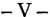

El artículo 129 de la Constitución Nacional establece, en lo que aquí interesa, que la Ciudad de Buenos Aires tendrá un régimen de gobierno autónomo, con facultades propias de legislación y jurisdicción; y que una ley garantizará los intereses del Estado Nacional mientras la ciudad de Buenos Aires sea capital de la Nación (v., además, disposiciones transitorias séptima y decimoquinta).

Asu turno, la ley nacional nº 24.588 (v. B.O.: 30.11.95) establece, en este orden, que la justicia nacional ordinaria de la ciudad de Buenos Aires mantendrá su jurisdicción y competencia, continuando a cargo del Poder Judicial de la Nación; y que la ciudad de Buenos Aires "... tendrá facultades propias de jurisdicción en materia de vecindad, contravencional y de faltas, contencioso-administrativa y tributaria locales ..." (v. arto 8).

Por su lado, los artículos 106 y concordantes de la Constitución de la Ciudad Autónoma de Buenos Aires, se ocupan de la organización del Poder Judicial de la ciudad (v., también, cláusulas transitorias segunda y decimotercera), aspecto en el cual resultan complementados por normas tales comola ley nº 7 (Orgánica del Poder Judicial de la Ciudad de Buenos Aires) y nº 189 (Código Contencioso Administrativo y Tributario de la Ciudad de Buenos Aires), invocadas ambas por el Tribunal Superior de Justicia del gobierno autónomo.

En este orden, vale se resalte que la parte actora inicia una acción con sustento en las disposiciones del capítulo XII de la Ley de Asociaciones Sindicales nº 23.551; puntualmente, en las del artículo 52, acción que, de estar al artículo 63, apartado b), del mismo dispositivo, atañe a los jueces otribunales con competencia laboral en las respectivas jurisdicciones. En el marco de la Ciudad de Buenos Aires, según emerge del artículo 8 de la ley 24.588 y, esencialmente, de los artículos 20 y 21 de la ley nº 18.345 (conforme se abundó en S.C. Comp. nº 572, L. XXXV,"Soto, Alberto Sabino el Gobierno de la Ciudad de Buenos Aires s./ juicio sumarísimo", sentencia del 18 de marzo de 2000, a la que cabe estar, en lo pertinente), esa competencia concierne a los jueces nacionales del Trabajo. Vale anotar a este respecto que, si bien a

propósito de la jurisdicción del Tribunal a que alude, esencialmente, el artículo 117 de la Constitución Nacional y no sin hacer referencia al "... particular sistema de autonomía decidido por los constituyentes para la ciudad de Buenos Aires, en los términos y con los alcances que se desprenden del arto 129 y de la cláusula transitoria séptima de la Ley Fundamental...", V.E. enfatizó que la Ciudad de Buenos Aires no es una provincia argentina (v. Fallos: 323:3991 y sus citas).

En consecuencia y dado que la materia del pleito atañe al derecho laboral común (Fallos 306:1699; 307:1074; 310:1707, entre otros) y no al derecho público del municipio, no corresponde sea resuelta por los jueces locales de la Ciudad de Buenos Aires (doctrina de Fallos: 323:3284, a contrario). Yes que, no es ocioso decirlo, la propia Constitución de la Ciudad Autónoma faculta al gobierno local a convenir con el federal la transferencia de los jueces nacionales de los fueros ordinarios al poder judicial local (cfse. cláusula transitoria decimotercera), extremo que no ha acontecido hasta aquí; y si bien la Ley Orgánica del Poder Judicial de la Ciudad de Buenos Aires 7 prevé la creación de una justicia del trabajo (v. arto 41), no menos cierto es que su puesta en marcha se encuentra suspendida y sujeta al acuerdo entre los gobiernos federal y local a que se aludiera con anterioridad (v. art., ley 189).

-VI-

En mérito a lo expresado, considero que corresponde hacer lugar a la queja, declarar procedente el recurso extraordinario y dejar sin efecto la sentencia, con el alcance que se indica. Buenos Aires, 30 de octubre de 2001. Felipe Daniel Obarrio.

## FALLO DE LACORTE SUPREMA

Buenos Aires, 27 de junio de 2002.

Vistos los autos: "Recurso de hecho deducido por Alberto Sabino Soto en la causa Gobierno de la Ciudad de Buenos Aires el Soto, Alberto Sabino", para decidir sobre su procedencia.

## Considerando:

Que esta Corte comparte el dictamen del señor procurador Fiscal, y se remite a sus fundamentos y conclusiones por razones de brevedad.

Por ello, de conformidad con lo dictaminado por el señor Procurador Fiscal, se hace lugar a la queja, se declara procedente el recurso extraordinario interpuesto y se deja sin efecto la sentencia recurrida, resultando competente para conocer en las actuaciones la Justicia Nacional del Trabajo, a la que se le remitirán. Agréguese la queja al principal. Notifíquese y remítanse.

JULIO S. NAZARENO -EDUARDO MOLINÉ O'CONNOR -CARLOS S. FAYTAUGUSTO CÉSAR BELLUSCIO -ENRIQUE SANTIAGO PETRACCHI -ANTONIO BOGGIANO -GUILLERMO A. F. LÓPEZ -GUSTAVO A. BOSSERT -AoOLF'O ROBERTO V ÁZQUEZ.

## EVAAMALIA GUTIERREZ BENITES DE DOMINGUEZ v. MINISTERIO DE EDUCACION y JUSTICIA

RECURSO EXTRAORDINARIO: Requisitos propios. Cuestión federal. Cuestiones federales simples. Interpretación de las leyes federales. Leyes federales en general.

Existe cuestión federal si se encuentra en juego la interpretación, alcance y aplicación de una ley federal -24.463y la decisión de la alzada fue contraria a la pretensiÓn que el recurrente fundó en dicha norma (art. 14, inc. 3Q , ley 48).

## LEY: Interpretación y aplicación.

La primera fuente de exégesis de la leyes su letra y cuando ésta no exige esfuerzo de interpretación debe ser aplicada directamente, con prescindencia de consideraciones que excedan las circunstancias del caso expresamente contempladas por la norma, ya que de otro modo podría arribarse a una interpretación que sin declarar la inconstitucionalidad de la disposición legal, equivaliese a prescindir de su texto.

## ADMINISTRACION NACIONAL DE LA SEGURIDAD SOCIAL.

La ley 24.463 y, específicamente, su arto 23, debe ser interpretada en el sentido amplio que resulta de su finalidad y comprensivo de la diversidad de procesos y jurisdicciones en que deba actuar la Administración Nacional de la Seguridad Social, por lo que corresponde dejar sin efecto la sentencia que impuso a dicho organismo previsional astreintes por cada día de demora en las gestiones vinculadas a la emisión de bonos de consolidación de deuda.

1526

## COSTAS:. Principios generales.

Corresponde dejar sin efecto la sentencia que impuso costas a cargo de la Administración Nacional de la Seguridad Social ya que prescindió de lo estipulado por el arto 21 de la ley 24.463 sin que mediara declaración de inconstitucionalidad.

## COSTAS: Principios generales.

Corresponde confirmar la imposición de costas a la Administración Nacional de la Seguridad Social si de la ley 24.463 y de sus antecedentes parlamehtarios no surge que la intención de los legisladores haya sido extender a los procesos donde se procura el cumplimiento de una sentencia pasada en autoridad de cosa juzgada que dicho organismo no acató espontáneamente, las prescripciones de aquélla en materia de costas (Disidencia parcial de los Dres. Carlos S. Fayt, Augusto César Belluscio, Enrique Santiago Petracchi y Antonio Boggianol,

## DICTAMEN DEL PROCURADOR FISCAL

Suprema Corte:

-1-

Contra la sentencia de los integrantes de la Sala I de la Cámara Nacional de Apelaciones en lo Contencioso Administrativo Federal, que impuso al Anses astreintes, por cada día de demora, en las gestiones vinculadas a la emisión de bonos de consolidación de deuda pertenecientes a la actora, en virtud de haber ganado ésta un juicio contra el Estado Nacional, el organismo previsional interpuso recurso extraordinario que al, ser rechazado, ocasionó la presente queja. Sostiene que la actor a es beneficiaria del sistema previsional para magistrados y funcionarios e interpuso demanda contra el Ministerio de Justicia, a fin de obtener la asignación especial no remunerativa por dedicación exclusiva. Expresa que terminado el procesoconfallofavorable a aquélla, el Juzgado de Primera Instancia intimó al organismo previsional al pago del monto resultante, bajo apercibimiento de aplicar 10 que en derecho corresponda.

Dice que tal oficio fue respondido por nota, en donde se precisó la naturaleza jurídica del organismo y que éste no formó parte de la litis, el plexo normativo que regula su conducta en cumplimiento de las sentencias (artículos 22, 23,25 de la ley 24.453), detalle del artículo 33

de la ley 24.624 (presupuesto financiero para el ejercicio 1996) y gestiones efectuadas sobre la resolución 1115 de esa Corte Suprema.

Continúa diciendo que luego de la contestación por parte de la actor a, el Juez desestimó su planteo y la intimó, por el plazo de diez días, a acreditar gestiones para la entrega de los bonos bajo apercibimiento de aplicar sanciones conminatorias. Agrega que recurrida dicha decisión con similares argumentos, y remarcando especialmente lo que dispone la ley 24.764 en su artículo 47 con relación a las sentencias condenatorias dictadas contra la Administración Nacional de la Seguridad Social, la Cámara citada confirmó la resolución anterior y desestimó de esa forma el recurso intentado.

Expresa que luego de interponer recurso extraordinario contra tal decisión, el que fue rechazado por la Cámara citada, el Juez de Primera Instancia solicitó informes acerca de las aludidas gestiones realizadas por el organismo previsional para la entrega de los bonos correspondientes. Afirma que luego de proveerse los datos solicitados en donde -precisase adjuntaron documentos que los respaldaban, dicho magistrado resolvió que eran insuficientes, por lo que le aplicó astreintes por diez pesos ($ 10) por cada día de demora.

Sostiene que, ante esta nueva resolución, recurrió al Superior con el fundamento central en el artículo 23 de la ley 24.463 que prescribe la prohibición de aplicar esta clase de sanción a ese organismo. Alega que el a qua, apoyándose en un caso anterior para fundar su sentencia, no sólo confirmó la resolución del inferior, sino que aumentó el monto de la sanción.

-II-

Se agravia la quejosa por considerar que el juzgador no se ha pronunciado sobre un tema por ella propuesto, como ser la limitación contenida en el artículo 23 de la ley 24.463, entendiendo que el antecedente citado para fundar la sentencia atacada no se adecua en su totalidad al tema debatido.

Sostiene que la leyes de presupuesto de los años 1997 y 1998, no otorgaron partida presupuestaria para pagar mediante la emisión de bonos las acreencias derivadas del decreto 2474/85 y que recién mediante la sanción de la ley 25.064 se dispusieron fondos para la cancela-

ción de deudas provenientes del decreto referido y las acordadas 34/91 y 56/91. Asegura que por ello corresponde la aplicación del artículo 23 de la ley 24.463, al determinar que en ningún caso los jueces podrán fijar un plazo distinto para el cumplimiento de las sentencias, ni aplicar sanciones pecuniarias, compulsivas o conminatorias a los organismos respectivos.

Por otro lado dice que le causa agravio la elevación del monto por cada día de retardo a la suma de $ 56,26 desconociendo que recién con fecha 23 de junio de 1998 al dictarse el decreto 751/98 se procedió a autorizar en forma adicional a lo dispuesto por la ley 24.938 (presupuesto para el ejercicio 1998)la entrega de bonos de consolidación previsional para cancelar las detldas reconocidas que habían tenido su origen en la acordada 51/91, omitiéndose en dicha oportunidad -explica-la autorización de la colocación de bocones originados en el decreto 2474/85.

Asimismo, se queja por la imposición de costas a su cargo, al considerarla violatoria de lo dispuesto por el artículo 21 de la ley 24.463.

Cita, por último, jurisprudencia que entiende aplicable al caso.

-III -

Estimo que existe cuestión federal para declarar procedente el recurso extraordinario desde que se encuentra en juego la interpretación, alcance y aplicación de una ley federal-24.463y la decisión de la alzada ha sido contraria a la pretensión que el apelante fundó en dicha norma (artículo 14, mc. 3º, ley 48), (v. Fallos: 322:290; 320:61; entre otros).

- En cuanto al fondo del asunto debo decir que no parece razonable la solución a la que arribó el sentenciador, por cuanto sostuvo que no es obstáculo para la aplicación de astreintes lo normado por el artículo 23 de la ley 24.463 toda vez que -dijo-la prohibición de aplicar sanciones conminatorias por parte de los jueces queda circunscripta a los casos en que se halla establecido un plazo distinto para el cumplimiento de la sentencia.

En efecto, la primera fuente de exégesis de la leyes su letra y cuando ésta no exige esfuerzo de interpretación debe ser aplicada directamente, con prescindencia de consideraciones que excedan las circunstancias del caso expresamente contempladas por la norma, ya que

de otro modo podría arribarse a una interpretación que, sin declarar la inconstitucionalidad de la disposición legal, equivaliese a prescindir de su texto (v. Fallos: 320:61 considerando 6º y sus citas).

Sobre el particular, V.E. ha sostenido, en reiteradas y similares oportunidades, que la ley 24.463 y específicamente su artículo 23, debe ser interpretado en el sentido amplio que resulta de su finalidad y comprensivo de la diversidad de procesos yjurisdicciones en que deba actuar la Administración Nacional de la Seguridad Social (v. Fallos: 322:290;320:61). .

Por último, también creo que le asiste razón al recurrente respecto al agravio referido a la aplicación de costas, por cuanto la Cámara ha prescindido de lo estipulado por el artículo 21 de la norma citada, sin que mediara declaración de inconstitucionalidad (v. Fallos: 320:1754 y más recientemente en la causa "Arisa, Angel Umberto cl Anses si haberes jubilatorios y nulidad de acto administrativo S.C.A. 189;L.XXXV).

Por tanto, opino que se deberá declarar procedente el recurso extraordinario y revocar la sentencia atacada. Buenos Aires, 23 de octubre de 2001. Felipe Daniel Obarrio.

## FALLO DE LACORTE SUPREMA

Buenos Aires, 27 de junio de 2002.

Vistos los autos: "Recurso de hecho deducido por la Administración Nacional de la Seguridad Social en la causa Gutiérrez Benites de Domínguez, Eva Amalia cl Estado Nacional-Ministerio de Educación y Justicia-", para decidir sobre su procedencia.

## Considerando:

Que esta Corte comparte los fundamentos y conclusiones del dictamen del señor Procurador Fiscal de la Nación, al que se remite en razón de brevedad.

Por ello, se hace lugar a la queja y al recurso extraordinario interpuestos y se deja sin efecto la sentencia. Vuelvan los autos al tribunal de origen a fin de que, por quien corresponda, se dicte un nuevo fallo

con arreglo a lo expresado. Notifíquese, agréguese la queja al principal y, oportunamente, remítase.

JULIO S. NAZARENO -EDUARDO MOLINÉ O'CONNOR -CARLOS S. FAYT (en disidencia parcial) -AUGUSTO CÉSAR BELLUSCIO (en disidencia parcial) -ENRIQUE SANTIAGO PETRACCHI (en disidencia parcial) -ANTONIO BOGGIANO (en disidencia parcial) -GUILLERMO A. F. LÓPEZ -GUSTAVO A. BOSSERTADOLFO ROBERTO VÁZQUEZ.

DISIDENCIA PARCIAL DE LOS SEÑORES MINISTROS DOCTORES DON CARLOS S. FAYT, DON AUGUSTO CÉSAR BELLUSCIO, DON ENRIQUE SANTIAGO PETRACCHI y DON ANTONIO BOGGrANO

Considerando:

Que respecto de las sanciones conminatorias resulta aplicable la doctrina de Fallos: 320:61; 322:290, por lo que corresponde revocar la sentencia apelada.

Que, en cambio, en lo concerniente a las costas, las circunstancias del caso son sustancialmente análogas a las consideradas en Fallos: 324:1139 -disidencia parcial de los jueces Fayt, Belluscio, Petracchi y Boggianoy, en consecuencia, cabe confirmar lo resuelto.

Por ello, habiendo dictaminado el señor Procurador Fiscal, se declaran procedentes la queja y el recurso extraordinario interpuestos y se revoca la sentencia apelada en la medida del agravio que prosperó. Agréguese la queja al principal. Notifíquese y remítase.

CARLOS S. FAYT -AUGUSTO CÉSAR BELLUSCIO -ENRIQUE SANTIAGO PETRACCHI -ANTONIO BOGGIANo.

GUILLERMO JORGE GIECO y OTROS

RECURSO EXTRAORDINARIO: Requisitos formales. Interposición del recurso. Fundamento.

Es improcedente el recurso extraordinario deducido contra la sentencia que declaró mal concedido el recurso de casación y condenó al imputado por el

delito de tenencia de estupefacientes con fines de comercialización, pues carece del requisito de adecuada fundamentación que exige el arto 15 de la ley 48, toda vez que en su crítica sólo se limita a sostener un determinado criterio sobre aspectos no federales, sin rebatir los argumentos de esa misma naturaleza que sustentan la decisión.

RECURSO EXTRAORDINARIO: Requisitos propios. Cuestiones no federales. Interpretación de normas locales de procedimientos. Casos varios.

Si bien las cuestiones vinculadas sustancialmente con la forma en que fue apreciada la prueba, constituyen materia propia de los jueces de la causa y ajenas, por principio, a la instancia extraordinaria; ello no impide que, ante las particularidades que presentan determinados casos, su análisis permita la excepción posible a dicha regla con base en la doctrina de la arbitrariedad.

RECURSO EXTRAORDINARIO: Requisitos propios. Cuestiones no federales. Sentencias arbitrarias. Principios generales.

La doctrina de la arbitrariedad procura asegurar las garantías constitucionales de la defensa en juicio y el debido proceso, exigiendo que las sentencias sean fundadas y constituyan derivación razonada del derecho vigente con aplicación a las circunstancias efectivamente comprobadas en la causa.

## RECURSO EXTRAORDINARIO: Requisitos formales. Interposición del recurso. Fundamento.

Es improcedente el recurso extraordinario fundado en la pretendida nulidad de sentencia condenatoria por entender que no se había formulado imputación por uno de los hechos investigados, si la Cámara señaló que la ausencia de pedido absolutorio por el fiscal al momento de alegar y la acusación que éste mantuvo en su réplica contra todos los imputados respecto de los hechos reprochados, difería del supuesto en el que se sustentó la doctrina cuya aplicación al caso se reclama y el recurrente no se hizo cargo de este argumento, ni demostró que el defecto invocado haya tornado ilusorio o menoscabado los derechos del condenado de contestar los hechos que se le enrostran.

CONSTITUCION NACIONAL: Derechos y garantías. Defensa en juicio. Procedimiento y sentencia.

La garantía del debido proceso y defensa en juicio exigen que la acusación, considerada como una etapa sustancial en la integración de todo proceso penal por medio del cual se delimita el objeto procesal, -describa con precisión la conducta imputada, a los efectos que el procesado pueda ejercer con plenitud su derecho a ser oído y producir la prueba en su descargo así como también el de hacer valer todos los medios conducentes a su defensa, que prevén las leyes de procedimientos.

1532

## RECURSO EXTRAORDINARIO: Requisitos formales. Interposición del recurso. Fundamento.

Es improcedente el recurso extraordinario deducido contra la sentencia que declaró mal concedido el recurso de casación y condenó al imputado por el delito de tenencia de estupefacientes con fines de comercialización, pues dicho pronunciamiento contiene fundamentos suficientes con base en las normas rituales y de fondo que rigen el caso, sin que los argumentos expuestos en el recurso alcancen a demostrar que el criterio de los jueces al valorar el aspecto subjetivo del accionar del actor y atribuirle la modalidad de tráfico de estupefacientes por la que fue condenado, carezca manifiestamente tanto de objetividad como de razonabilidad.

## DICTAMEN DEL PROCURADOR GENERAL

Suprema Corte:

-1-

La Sala III de la Cámara Nacional de Casación Penal declaró mal concedido el recurso de casación deducido por la asistencia técnica de Guillermo Jorge Gieco, contra la sentencia que condenó al nombrado a la pena de cuatro años de prisión, multa de quinientos pesos, inhabilitación absoluta por igual tiempo y a someterse a una medida de seguridad curativa por el tiempo necesario para su rehabilitación y desintoxicación, como autor del delito de tenencia de estupefacientes con fines de comercialización, cometido en forma reiterada (dos hechos).

Para así resolver (fs. 26/28), consideró inadecuada la argumentación jurídica ensayada por la defensa para solicitar la absolución del encausado con relación al primero de los hechos objeto de condena -del 30 dejulio de 1998- por entender que no había sido acusado por el fiscal en la oportunidad prevista en el artículo 393 del Código Procesal Penal. Señaló también la contradicción que exhibe este razonamiento y lá ausencia de refutación de los argumentos invocados al respecto en la sentencia condenatoria, para demostrar la inconsistencia de este agravio.

Igual defecto de fundamentación le atribuyó el a qua a las restantes críticas de la defensa, consistentes en que no se habían valorado las pruebas colectadas conforme las reglas de la sana crítica, elaborándose un juicio de culpabilidad sustentado exclusivamente en la íntima convicción de los jueces, sin respaldo en las constancias de la causa.

Contra aquel pronunciamiento el señor defensor oficial, doctor Juan C. Sambuceti (h.), interpuso recurso extraordinario, cuya denegatoria a fojas 37 dio lugar a la articulación de la presente queja.

-II-

En su escrito de fojas 29/35, el recurrente se limitó a sostener que la arbitrariedad del fallo quedó configurada "...al otorgar preeminencia al análisis de cuestiones fácticas y probatorias cuando, en rigor, el agravio que constituyó el objeto principal del remedio casatorio fue referido a la inobservancia de las reglas lógicas y de interpretación omitidas en el pronunciamiento apelado que lo descalifican como acto jurisdiccional válido ...".

- III-

Se desprende de lo expuesto que el recurso carece del requisito de adecuada fundamentación que exige el artículo 15de la ley 48, toda vez que en su crítica sólo se limita a sostener un determinado criterio sobre aspectos no federales, sin rebatir los argumentos de esa misma naturaleza que sustentan la decisión (Fallos: 303:109; 305:171 y 301; 306:1401; 307:1752; 311:1695; 312:389, entre otros).

No paso por alto que si bien las cuestiones comolas suscitadas en el sub judice, vinculadas sustancialmente conla forma en que fue apreciada la prueba, constituyen una materia propia de los jueces de la causa y ajenas, por principio, a esta instancia extraordinaria, ello no impide que ante las particularidades que presentan determinados casos su análisis permita la excepción posible a dicha regla con base en la doctrina de la arbitrariedad, toda vez que con ésta se procura asegurar las garantías constitucionales de la defensa enjuicio y debido proceso, exigiendo que las sentencias sean fundadas y constituyan derivación razonada del derecho vigente con aplicación a las circunstancias efectivamente comprobadas en la causa (Fallos: 311:2547; 313:559; 315:29 y 321:1909).

Sin embargo, pienso que esto último no acontece en el sub lite pues, a mi modo de ver, el fallo contiene fundamentos suficientes -de los que, insisto, no se hizo cargo en debida forma el apelantecon sustento en las constancias de la causa y en las normas que el a qua consideró aplicables que, por opinables que resulten, no autorizan su descalificación comoactojurisdiccional.

En efecto, en lo vinculado conla pretendida nulidad de la sentencia condenatoria por entender el recurrente que no se había formulado imputación por uno de los hechos investigados, la Cámara señaló que la ausencia de pedido absolutorio por el fiscal al momento de alegar y la acusación que éste mantuvo en su réplica contra todos los imputados respecto de los hechos reprochados (acta de fojas 980/982 del p.rincipal, que corre por cuerda), difería del supuesto en el que se sustentó la doctrina elaborada en el precedente "Tarifeño", cuya aplicació;n al caso se reclama.

Precisamente la defensa no se hizo cargo de este argumento. Más aún, tampoco advierto que el apelante haya podido demostrar que el defecto invocado haya tornado ilusorio o menoscabado los dere~hos del condenado de contestar los hechos que se le enrostran y señalar las pruebas en sustento de su inocencia, conforme el criterio establecido por V.E. en el sentido que las garantías del debido proceso y defensa enjuicio exigen que la acusación, considerada como una etapa sustancial en la integración de todo proceso penal por medio del cual se delimita el objeto procesal, describa con precisión la conducta imputada, a los efectos que el procesado pueda ejercer con plenitud su derecho a ser oído y producir la prueba en su descargo, así como también el de hacer valer todos los medios conducentes a su defensa, que prevén las leyes de procedimientos (Fallos: 298:308; 306:467; 312:540).

Es en este orden de ideas que, a mi entender, adquiere relevancia lo señalado por el a qua y que tampoco fue refutado por la parte recurrente, acerca de su actitud asumida respecto de ese mismo hecho en su alegato, al solicitar que se mantuviera la calificación inicial (art. 14, párrafo primero, de la ley 23.737) en el supuesto de no prosperar su planteo de nulidad motivo de análisis.

De igual forma, advierto que el disenso del recurrente en cuanto a que se habrían violado las reglas de la sana crítica en la valoración de las pruebas tendientes a acreditar la responsabilidad del encausado y la consecuente calificación legal de los hechos, no sólo se circunscribe a mantener el enfoque distinto de su colega de la anterior instancia sobre aspectos que reitero, por naturaleza, resultan ajenos a esta instancia de excepción, sino que constituyen, además, apreciaciones genéricas que presentan el mismo defecto de fundamentación antes señalado, al no haber formulado una crítica concreta y razonada de todos y cada uno de los argumentos en los que el fallo se apoyó -diversidad

de droga incautada y su fraccionamiento, secuestro de elementos para tal finalidad y de dinero en los distintos procedimientos, vinculación de estas probanzas con el resto de los elementos de convicción reunidos en el procesorelacionados con la verificación de los hechos y las circunstancias que los rodearon (Fallos: 305:171; 307:1752; 311:1695 y 312:389).

En tales condiciones, pienso que el pronunciamiento que se pretende impugnar contiene fundamentos suficientes con base en las normas rituales y de fondo que rigen el caso, sin que los argumentos expÚ-estosen el recurso alcancen a demostrar que el criterio de los jueces al valorar el aspecto subjetivo del accionar de Giecoy atribuirle la modalidad de tráfico de estupefacientes por la qp.e fue condenado, carezca manifiestamente tanto de objetividad comode razonabilidad.

-V-

En consecuencia, soy de la opinión que V.E. debe desestimar la presente queja. Buenos Aires, 31 de octubre de 200LNicolás Eduardo Becerra.

## FALLODE LACORTE SUPREMA

Buenos Aires, 27 de junio de 2002.

Vistos los autos: "Recurso de hecho deducido por el defensor oficial de GuillermoJorge Gieco en la causa Gieco, Guillermo Jorge y otros si tenencia de estupefacientes con fines de comercialización -dos hechosen concurso real -causa NQ 179/99-", para decidir sobre su procedencia.

## Considerando:

Que esta Corte comparte y hace suyos los argumentos y conclusiones del dictamen del señor Procurador General, a los que cabe remitirse en razón de brevedad.

Por ello, y lo concordemente dictaminado por el señor Procurador General, se desestima la queja. Intímese a la parte recurrente a que,

dentro del quinto día, efectúe el depósito que dispone el arto 286 del Código Procesal Civil y Comercial de la Nación, en el Banco de la Ciudad de Buenos Aires, a la orden de esta Corte y bajo apercibimiento de ejecución. Hágase saber y archívese, previa devolución de los autos principales.

JULIO S. NAZARENO -EDUARDO MOLINÉ O'CONNOR -AUGUSTO CÉSAR BELLUSCIO -GUILLERMO A. F. LÓPEZ -ADOLFO ROBERTO VÁZQUEZ.

## JOSE ANTONIO MATAR y OTRO

RECURSO EXTRAORDINARIO: Requisitos propios. Cuestiones no federales. Sentencias arbitrarias. Procedencia del recurso. Defectos en la fundamentación normativa~

Corresponde dejar sin efecto la sentencia que dispuso la entrega definitiva de un automotor que carecía de la documentación que avalara la regularización de su inscripción registral si el a qua prescindió de las normas legales relativas al régimen de automotores.

## REGISTRO DE PROPIEDAD DEL AUTOMOTOR.

El régimen legal vigente para la inscripción de los vehículos en el Registro de la Propiedad del Automotor no otorga facultad alguna a los jueces para entregar los rodados a quienes carezcan de un derecho real sobre ellos, cualesquiera que sean los derechos personales que pudieran hacer valer.

## REGISTRO DE LA PROPIEDAD DEL AUTOMOTOR.

La adquisición se materializa con la inscripción registral, por ser ésta constitutiva de derechos (art. 1º del decreto-ley 6582/58), y no antes pues se carece de un derecho real sobre la cosa.

## REGISTRO DE LA PROPIEDAD DEL AUTOMOTOR.

La inscripción registral debe corresponderse con los números originales del motor y chásis del vehículo, de modo tal que exista un verdadero nexo entre el vendedor, el comprador, y el consecuente traspaso de sus derechos.

## DE JUSTICIA DE LA NACION 325

RECURSO EXTRAORDINARIO: Requisitos propios. Cuestiones no federales. Sentencias arbitrarias. Improcedencia del recurso.

Es improcedente el recurso extraordinario deducido contra la sentencia que dispuso la entrega de un automotor que carecía de la documentación que avalaba su inscripción registral si cuando el juez de primera instancia dio intervención al Ministerio Público fue el propio fiscal quien se pronunció a favor del criterio en que se basó la decisión que el fiscal general pretende ahora hacer caer por entender que ante la ausencia de comprobación de un delito, no existe ningún obstáculo para proceder a la entrega del vehículo, por lo que el agravio invocado no puede ser admitido, en tanto traduce una contradicción con los propios actos del recurrente (Disidencia del Dr. Enrique Santiago Petracchi).

## DICTAMEN DEL PROCURADOR GENERAL

Suprema Corte:

-1-

La Cámara Federal de Apelaciones de Tucumán dispuso la entrega definitiva a Osear Sarme del camión marca Ford 900, dominio X-196.704 -y no X-087.562 como erróneamente se consigna, de acuerdo con lo que surge del acta de secuestro de fojas 13, de la pericia de fojas 65 vta./66 y del informe de fojas 78- así comotambién del acoplado marca Helvética con caja Java, dominio T-087.562, dejando sin efecto la intimación ordenada en primera instancia por la que se supeditaba esa entrega a que el nombrado aportara la documentación regularizada correspondiente a dichos rodados (v. fojas 133 y 182/184).

Para adoptar ese temperamento, el a qua sostuvo que sin que implique discutir la inteligencia de las normas invocadas por el Fiscal General, doctor Hugo Colombres, en su memorial de fojas 174/178, éstas no resultaban aplicables al no comprobarse en autos la existencia de delito alguno. Asimismo, consideró que no correspondía extender la jurisdicción de los jueces federales respecto de cuestiones propias de los organismos controladores del empadronamiento de automotores.

Contra esa decisión el representante del Ministerio Público interpuso recurso extraordinario, cuya denegatoria a fojas 205/209, dio lugar a la articulación de la presente queja.

En su escrito de fojas 185/192, el apelante atribuye arbitrariedad al pronunciamiento de la cámara en la medida que se ha apartado de lo dispuesto por las normas (decreto-ley 6582/58 ratificado por ley 14.467, acordadas de la Corte Suprema de Justicia de la Nación 8/91 y 55/92, resolución 1215/89 del Alto Tribunal; ley 20.785 modificada por ley 22.129, arto 2º, inc. c, de la resolución 565 de la Dirección Nacional de los Registros de la Propiedad Automotor y Créditos Prendarios), que regulan todo el régimen automotor, en especial, aquellas atinentes a los actos de disposición.

En este sentido, señala también la contradicción en la que incurrió el tribunal de alzada al no tratar y decidir, ante la ausencia de delito, sobre una cuestión civil vinculada con la titularidad de los automotores oportunamente secuestrados en la causa, para finalmente resolver acerca de un asunto de esa naturaleza al disponer la entrega definitiva de esos vehículos.

Por último, el recurrente sostiene que la circunstancia de que no se haya acreditado en la causa que Sarme sea el titular -conforme las disposiciones registrales vigentesdel camión y el acoplado entregado, se encuentra consentida con la actitud asumida por éste de solicitar numerosas prórrogas al magistrado que previno en el hecho para aportar, en regla, la documentación relacionada con los rodados en cuestión.

- III-

Ante todo debo aclarar que, a mi entender, la impugnación dirigida contra el fallo encierra la necesidad de determinar si el régimen legal vigente en la materia exige para su aplicación que se haya comprobado la comisión de algún delito penal, circunstancia que, atento la naturaleza de las normas involucradas, suscita cuestión federal suficiente para habilitar esta instancia excepcional (art. 14, inc. 3º, de la ley 48).

Sentado ello y en cuanto al fondo del asunto, considero que la acreditación de tal extremo resulta irrelevante si se tiene en cuenta lo resuelto por V.E. en Fallos: 320:2751 (considerando 6º), al establecer que aquellas normas (en referencia a las invocadas por el recurrente,

así comotambién a la acordada 37/91; el arto 2342, inc. 3º, del Código Civil y la ley 23.853) no otorgan facultad alguna a losjueces para entregar los rodados a quienes carezcan de un derecho real sobre ellos, cualesquiera que sean los derechos personales que pudieren hacer valer.

-IV- iPor todo lo expuesto y demás fundamentos vertidos por el señor Fiscal General, mantengo la presente queja. Buenos Aires, 22 de septiembre de 2000. Nicolás Eduardo Becerra.

## FALLODE LACORTE SUPREMA

Buenos Aires, 27 de junio de 2002.

Vistos los autos: "Recurso de hecho deducido por el fiscal general de la Cámara Federal de Apelaciones de Tucumán en la causa Matar, José Antonio y Orosco, Ornar sI infracción decreto-ley 6582/58", para decidir sobre su procedencia.

## Considerando:

Que las circunstancias del caso son sustancialmente análogas a las consideradas en el precedente de Fallos: 320:2751-considerando 6º de la mayoría y voto concurrente deljuez Vázquezal que cabe remitir en razón de brevedad.

Por ello, concordemente con lo dictaminado por el señor Procurador General se hace lugar a la queja y al recurso extraordinario interpuestos y se deja sin efecto la sentencia apelada. Vuelvan los autos al tribunal de origen a fin de que, por quien corresponda, se dicte un nuevo pronunciamiento con arreglo al presente. Agréguese la queja al principal. Notifíquese y, oportunamente, remítase.

JULIO S. NAZARENO -EDUARDO MOLINÉ O'CONNOR -AUGUSTO CÉSAR BELLUSCIO -ENRIQUE SANTIAGO PETRACCHI (en disidencia) -ANTONIO BOGGIANO -GUILLERMO A. F. LÓPEZ -ADOLFO ROBERTO V ÁZQUEZ.

DISIDENCIA DEL SEÑOR MINISTRO DOCTOR DON ENRIQUE SANTIAGO PETRACCHI

## Considerando:

- 1 Q) Que la Cámara Federal de Apelaciones de Tucumán dispuso la entrega definitiva a Oscar Sarme del camión Ford 900,dominioX 087.'562 -debió consignar dominio X 196.704, conf. acta de fs. 13-, y del acoplado Helvética con caja Java, dominio T 087.562, Y dejó sin efectb la intimación dispuesta en primera instancia que supeditaba el cará~ter definitivo de la entrega a la presentación por parte del nombrado de la documentación que acreditara la regularización de la inscripción regi~tral de los rodados. Contra esta decisión el fiscal general ante el trihímal mencionado interpuso el recurso extraordinario de fs. 151/154, éuya denegatoria (fs. 163/165) motivó la presente queja.
- 2Q ) Que, según las constancias de autos, el camión con el acoplado aludido fue secuestrado el 19 de agosto de 1991, durante un control policial en la ruta nacional n Q 9, a la altura de San Andrés, Provincia de Tucumán, mientras era conducido por José Antonio Matar, sin la documentación pertinente. Como consecuencia, se recibió declaración indagatoria (a pesar de la errada referencia al arto 236, segunda parte, del Código de Procedimientos en Materia Penal, fs. 19 y 32) a Oscar Sarme, quien había sido indicado comotitular del vehículo.
- 3Q ) Que las explicaciones dadas por Sarme con relación a las deficiencias de la documentación que presentaba, las que atribuyó a la falta de tiempo para concretar la verificación y registro del cambio de motor del camión, fueron consideradas suficientes por el juez instructor y por el fiscal para hacer entrega del vehículo al nombrado con carácter de depositario judicial (fs. 33). Posteriormente, al solicitar el imputado la entrega definitiva, ya producido el peritaje de fs. 60, que estableció la ausencia de maniobras de adulteración de la numeración de motor y chasis, el fiscal se pronunció en favor del archivo de las actuaciones -por no haberse acreditado la comisión de delito algunoy de la entrega definitiva del rodado (fs. 132).
- 4Q ) Que al insistir el juez de primera instancia en exigir, antes de disponer la entrega definitiva, la regularización de la situación registral del camión, Sarme interpuso recurso de apelación. Radicada la causa ante la alzada, el fiscal general presentó el memorial obrante a fs. 145/146, en el cual mejoró los fundamentos de la decisión apelada.

5º) Que el a quo sostuvo que la normativa cuya aplicación reclama el fiscal, y que presuntamente había sido el fundamento de la decisión recurrida (ley 22.129, decreto-ley 6582/58, acordada de la Corte Suprema 5/92 y resolución de la Corte Suprema 1215/89) no es aplicable al caso, pues no se da el presupuesto que ella prevé, esto es, la existencia de un delito de los establecidos por el decreto-ley citado. De otro modo -afirmó-, se extendería la jurisdicción de los jueces federales hasta convertirlos en organismos l. controladores del empadronamiento de automotores en todo el país.

\ pº) Que en su recurso extraordinario el fiscal consideró que la decisió¡:{de la cámara era arbitraria, pues se apartaba del criterio de la Corte Suprema sobre el punto en debate, y prescindió de las normas lega;les relativas al régimen de los automotores.

7º) Que, sin embargo, antes de resolver como lo hizo, el juez de primera instancia dio intervención al Ministerio Público, y el propio fiscal fue quien se pronunció en favor del criterio en que se basó la decisión que el fiscal general pretende ahora hacer caer: ante la ausencia de comprobación de un delito, no existe ningún obstáculo para proceder a la entrega del vehículo (conf. dictamen de fs. 132). Por lo tanto -y más allá de las deficiencias en la fundamentación del recurso interpuesto, que intenta corregir tardíamente el Procurador General-, el agravio invocado no puede ser admitido, en tanto traduce una contradicción con los propios actos del recurrente (conf. Fallos: 310:434; 312:631; 316:3019 -disidencia del Juez Petracchiy 318:1059) plasmada en la manifestación de su acuerdo a que se dispusiera del rodado en la forma en que lo hizo el a quo.

Por ello, habiendose dado al señor Procurador General la intervención que corresponde, se desestima la queja. Notifíquese, devuélvanse los principales y archívese.

ENRIQUE SANTIAGO PETRACCHI.

GUILLERMO L. MOREYRA v. ESTERO PUCU S.A.

RECURSO EXTRAORDINARIO: Requisitos propios. Sentencia definitiva. Resoluciones anteriores a la sentencia definitiva. Varias. .

La jurisprudencia según la cual las resoluciones que rechazan o admiten nulidades procesales no revisten el carácter de definitivas y son, por tanto, inobservables

1542

por recurso extraordinario, supone que el trámite de la causa permita una posterior decisión sobre el derecho federal cuyo desconocimiento se invocó.

RECURSO EXTRAORDINARIO: Requisitos propios. Cuestiones no federales. Interpretación de normas locales de procedimientos. Casos varios.

Si bien las cuestiones relativas a la interpretación de normas procesales locales referentes a la forma en que se deben llevar a cabo las notificaciones de las decisiones judiciales, resultan ajenas, como regla, a la instancia extraordinaria, cabe hacer excepción a este principio cuando la aplicación de tales pr~ceptos excede de una manera irrazonable los límites que impone el respeto de la garantía de la defensa en juicio.

## LEYES PROCESALÉS.

Si bien el contenido de las normas rituales posee reconocida importancia que exige su riguroso cumplimiento, su' desnaturaÜzación, su sobredimensionamiento por encima de su razón de ser, termina por convertir a esos imprescindibles preceptos en una suerte de trampas o valladares tendientes a frustrar el derecho constitucional del debido proceso.

CONSTITUCION NACIONAL: Derechos y garantías. Defensa en juicio. Procedimiento y sentencia.

La notificación dirigida 'al domicilio constituído -que era el de sus letrados apoderadosproveyó a la recurrente de una mera defensa formal incompatible con la garantía de la defensa en juicio pues tratándose de actos procesales y decisiones judiciales referentes a la determinación de los honorarios de dichos letrados, existían intereses contrapuestos entre mandante y mandatario.

CONSTITUCION NACIONAL: Derechos y garantías. Defensa en juicio. Procedimiento y sentencia.

La garantía de defensa en juicio supone -en sustanciaque las decisiones judiciales deban ser adoptadas previo traslado a la parte contra la cual se pide, es decir, dándole oportunidad de ser oída, y de ejercer sus derechos en la forma y con las solemnidades que establecen.

DICTAMEN DEL PROCURADOR FISCAL

Suprema Corte:

-1-

El Tribunal Superior de Justicia de la Provincia de Corrientes resolvió, a fs. 478/483 de las actuaciones principales (foliatura que citaré

en más) rechazar el recurso de inaplicabilidad de ley o doctrina legal interpuesto por la demandada en el proceso.

Para así decidir, señaló que el recurso era inatendible por cuanto, en el ordenamiento procesal, no existe recurso extraordinario de nulidaq.,ni acción autónoma de esa índole en la instancia excepcional lo cmtl impide su procedencia y que no existe menoscabo a la defensa en juicio, cuando la pérdida del derecho proviene de la propia torpeza del peticionan te.

Agregó asimismo que la nulidad es extemporánea pues la demandada tuvo conocimiento de los actos procesales a través de su apoderado, ya que no existía norma de forma que obligara a notificar de lo actuado al mandante.

Siguió diciendo el Superior Tribunal local, que el remedio extraordinario intentado es improcedente cuando las cuestiones que se discuten son de naturaleza procesal y han sido resueltas con fundamentos de dicho carácter que bastan para sustentar lo decidido.

Destacó que es inadmisible el recurso interpuesto, aun si se trata de ingresar por vía de arbitrariedad, que no se advierte, cuando las cuestiones se refieren a honorarios y se intenta revisar cuestiones fácticas, tales como son las que involucran la fijación de la base regulatoria, porcentajes y estimación de remuneración de acuerdo a la labor cumplida, donde losjueces de grado son soberanos en la elección y valoración de tales materias.

Contra la resolución indicada, se interpuso recurso extraordinario a fs. 495/504, el que desestimado a fs. 519, dio lugar a esta presentación directa.

-Il-

Señala el recurrente que la sentencia del Superior Tribunal de Justicia de la Provincia de Corrientes ha sido inmotivada, dogmática, ilegal y por tanto nula y arbitraria, por cuanto al resolver la cuestión de honorarios, se omitió dar intervención a la parte obligada al pago y se la privó de defender sus intereses.

Destaca que luego de quedar firme la sentencia que rechazaba la demanda, sus apoderados promueven el trámite de fijación de sus honorarios y acompañan planilla que incluye los intereses de la pretensión, sin que exista resolución judicial que lo autorice. Agregan que los acreedores no notificaron a su parte los fallos de ambas instancias, a pesar que existía conflicto de intereses entre los profesionales y su mandante, conforme se demuestra con el pedido de embargo sobre sus bienes.

Pone de relieve que ni las regulaciones, ni las planillas que constituyeron la base regulatoria fueron puestas en conocimiento de su parte. Además apeladas las primeras por sus apoderados, de modo extemporáneo, pues ya se hallaba firme la resolución respectiva, se concede el recurso y se elevan los autos a la alzada.

El quejoso agrega que dicho tribunal, ordena correr traslado a la actora, y no a su parte, no obstante que de un lado se había manifestado el interés en cobrarle los honorarios; de otro se había pedido se lo notifique de la regulación pues parte de los honorarios eran a su cargo por la imposición de costas; y finalmente se encontraba trabada una medida precautoria sobre sus bienes.

Dice que la Cámara de Apelaciones decreta la nulidad de dicha regulación y considera notificada a su parte de lo resuelto, con la cédula diligenciada en el domicilio constituido que era el de sus apoderados, violándose con ello su derecho de defensa por un apego excesivo a las formas.

Expresa que en cumplimiento de dicha decisión se regularon nuevamente honorarios, decisión que le es notificada, presentándose de inmediato y deduciendo nulidad de las actuaciones. Concretamente, afirma, lo que se perseguía era que la segunda regulación fuese invalidada y mantuviera su firmeza la primera, retrotrayéndose la situación a fin que su parte pudiera participar del debate en la determinación de honorarios.

En dicha presentación -puntualizase exponía la causa de la nulidad opuesta. Además, en su momento no pudo resistir la nulidad planteada por los profesionales por no haber participado en su trámite, lo cual constituye a su vez causa de una nueva nulidad que no es abstracta y dado los perjuicios concretos que se le causaba. Este medio es el único modo hábil de lograr se retrotraiga la situación proce-

sal al momento en que ya existía un pronunciamiento firme sobre honorarios.

¡Cabedestacar, de inicio, que V.E. tiene dicho que los aspectos relativos a la procedencia oimprocedencia de los recursos extraordinarios en el orden provincial no son comoregla susceptibles de revisión en la instancia del artículo 14de la ley 48 y la tacha de arbitrariedad resulta restrictiva a su respecto (Fallos: 311:101, 358 y otros).

- También es doctrina del Alto Tribunal, que el recurso extraordinario no permite la revisión del pronunciamiento de los jueces provinciales, siempre que cuente con fundamentos bastantes, esto es, con razones que excluyan su descalificación como acto judicial y descarten o eliminen la tacha de arbitrariedad (Fallos: 313:1596).

De igual manera ha destacado V.E. que es inadmisible el recurso extraordinario, si el planteo remite al examen de cuestiones de naturaleza procesal local (Fallos: 308:2433), así como que las cuestiones referidas a los honorarios regulados en las instancias ordinarias, a la determinación del interés comprometido en eljuicio, y a las bases consideradas a tal fin , o la interpretación y aplicación de las normas arancelarias, que son, en virtud de su carácter fáctico y procesal, materias extrañas a la vía del artículo 14 de la ley 48 y consecuentemente ajenas al recurso extraordinario (Fallos: 308:881).

En orden a lo señalado, adelanto desde ya mi opinión contraria a la admisión del presente recurso de queja, en tanto se advierte con claridad que la cuestión traída a tratamiento (nulidad de procedimientos) es de indudable naturaleza procesal y de aplicación de normas de derecho local, así como relativa, en último término, a la discusión sobre el alcance de una regulación de honorarios y a las circunstancias fácticas que habilitaron su determinación, tales como,cuál es la base regulatoria a tenerse en cuenta, aspectos todos ellos propios de los jueces de la causa ajenos por principio al remedio federal.

Tampoco se advierte que se den en el caso los presupuestos de arbitrariedad en el decisorio, pues más allá del acierto o error en la consideración de las cuestiones traídas a su conocimiento, aquél cuen-

ta con fundamentos suficientes de hecho y de derecho que lo alejan de la tacha invocada.

No obstante lo expuesto, no es ocioso destacar, que el fundamento de la nulidad que planteó el recurrente, es no haber sido partícipe del procedimiento que condujo a una regulación de honorarios de sus'representantes y su posterior nulificación, cuando ello, en razón de la existencia de intereses contrapuestos, devenía obligatorio y que, al no haberse dado tal intervención, se afectó su derecho de defensa y de propiedad, pues no tuvo posibilidad de discutir el alcance que debían tener dichos honorarios.

Mas cabe advertir que notificado el apelante de la nueva regulación, oportunidad que era propicia y hábil para ejercitar tales derechos, no recurrió de la misma, ni invocó la nulidad que tardíamente alega en la presente queja, así como tampoco adujo las razones, motivos y fundamentos por los cuales los honorarios debían quedar reducidos al monto originalmente regulado, limitándose a pretender la nulidad del anterior procedimiento por la omisión del juzgado en darle participación en el mismo.

En tales condiciones, es del caso recordar que no existe la nulidad por la nulidad misma, que las nulidades procesales son siempre relativas y que las mismas pueden ser subsanadas en la medida que se obtenga el objetivo perseguido por el acto, exento que en el caso era la participación del interesado en la regulación de los honorarios de sus representantes, de los cuales podía resultar obligado al pago, y tal participación la tuvo con la notificación de la nueva regulación, oportunidad en la que el recurrente pudo invocar y no lo hizo, los argumentos de hecho y de derecho que adecuen eventualmente la regulación a sus justos términos.

Por lo expuesto, surge claro que la pretensión del apelante de que se declare la nulidad del procedimiento, se agota en sí misma y deviene insustancial, porque no sólo no demuestran el perjuicio sufrido, sino que además omitió a ese tiempo utilizar el remedio adecuado, cual era apelar la nueva regulación planteando su modificación conforme a lo que consideraba la base regulatoria apropiada y la normativa que le daba sustento.

Por lo expuesto, opino que V.E. debe rechazar esta presentación directa. Buenos Aires, 8 de marzo de 2001. Felipe Daniel Obarrio.

## FALLODE LACORTE SUPREMA

Buenos Aires, 27 de junio de 2002.

Vistos los autos: "Recurso de hecho deducido por la demandada en la causa Moreyra, Guillermo L. el Estero Pucu S.A.", para decidir sobre su procedencia .

## .Considerando:

- 1 º) Que contra el pronunciamiento del Superior Tribunal de Justicia de la Provincia de Corrientes que, al desestimar un recurso de inaplicabilidad de ley, dejó firme el rechazo del incidente de nulidad promovido por la parte demandada (fs. 479/484), ésta dedujo el recurso extraordinario federal (fs. 495/504) cuya denegación (fs. 519) origina la queja en examen.
- 2º) Que, según surge de autos, los letrados apoderados de la demandada, tras lograr que la cámara de apelaciones declarara la nulidad del auto en el que se regulaban sus honorarios (fs. 412), obtuvieron una nueva determinación de sus remuneraciones, considerablemente superior a la primera (fs. 421). La poderdante, atento a que sólo esta última regulación le fue notificada en su domicilio real, promovió un incidente de nulidad de todo lo actuado por sus apoderados desde la apelación contra el primer auto regulatorio, sosteniendo que no se le había dado participación en la segunda instancia, a pesar de resultar directamente interesada en un acto procesal que la afectaba, en franca violación a su derecho de defensa. Adujo, en ese orden de ideas, que la falta total de conocimiento del trámite le impidió plantear la extemporaneidad del recurso que permitió a sus apoderados lograr la nulidad de la primera regulación.
- 3º) Que la cámara de apelaciones, al confirmar lo resuelto en primera instancia, sostuvo que el incidente de nulidad había sido deducido extemporáneamente, pues -como la ley local no exigía en el caso la notificación personal al mandantehabía sido válida la notificación dirigida a los mandatarios (fs. 454/456).
- 4º) Que el superior tribunal provincial, por su parte, al rechazar el recurso de inaplicabilidad de ley, consideró que la cámara había realizado una razonable hermenéutica de la ley procesal vigente, lo que obstaba a la tacha de arbitrariedad argüida. .

5º) Que, en primer término, cabe señalar que la jurisprudencia según la cual las resoluciones que rechazan o admiten nulidades procesales no revisten el carácter de definitivas y son, por tanto, inobservables por recurso extraordinario, supone que el trámite de la causa permita una posterior decisión sobre el derecho federal cuyo desconocimiento se invocó; ello no ocurre en el caso en que la decisión impugnada importa dejar firme la desestimación del incidente de nulidad y, comoconsecuencia, la segunda regulación de honorarios obtenida por los apoderados, por lo cual la indefensión aducida no podrá ser considerada después por no existir ocasiónválida para ello(Fallos: 304:1014).

6º) Que si bien los agravios de la recurrente remiten al examen de cuestiones relativas a la interpretación de normas procesales locales referentes a la forma en que se deben llevar a cabo las notificaciones de las decisiones judiciales, materia que resulta ajena, comoregla, a la instancia extraordinaria, cabe hacer excepción a este principio cuando -como ocurre en la especiela aplicación de tales preceptos excede de una manera irrazonable los límites que impone el respeto de la garantía de la defensa enjuicio (Fallos: 316:1930).

7º) Que al estimar que la interpretación de las normas procesales locales adoptada por la alzada era razonable, el a qua omitió hacerse cargo de la doctrina de esta Corte según la cual si bien el contenido de las normas rituales posee su reconocida importancia que exige su riguroso cumplimiento, su desnaturalización, su sobredimensionamiento por encima de su razón de ser, termina por convertir a esos imprescindibles preceptos en una suerte de trampas ovalladares tendientes a frustrar el derecho constitucional al debido proceso (Fallos: 307:1054 y 316:1930).

- 8º) Que, en efecto, tratándose en el caso, de actos procesales y decisiones judiciales referentes a la determinación de los honorarios de los abogados apoderados de la demandada, existían intereses contrapuestos entre mandante y mandatarios, dado que aquélla había resultado vencida en costas en algunos incidentes y, además, de conformidad con la normativa local, era responsable directa del pago de los honorarios correspondientes al juicio principal, pese a no mediar allí condena en costas en su contra (art. 61 de la ley 4122).

9º) Que, de tal modo, la notificación dirigida al domicilio constituido -que era el de sus letrados apoderadosproveyó a la recurrente de una mera defensa formal incompatible con la garantía de la defensa en juicio (Fallos: 292:211); garantía que supone, en sustancia, que las de-

cisiones judiciales deban ser adoptadas previo traslado a la parte contra la cual se pide, es decir, dándole oportunidad de ser oída y ejercer sus derechos en forma y con las solemnidades que establecen las leyes (Fallos: 321:2082).

10) Que, en tales condiciones, lo decidido afecta de manera directa e inmediata las garantías constitucionales invocadas (art. 15 de la ley 48), por lo cual debe considerarse admisible la apelación federal y descalificarse el fallo con arreglo a la doctrina de esta Corte sobre arbitrariedad de sentencia.

Por ello, habiendo dictaminado el señor Procurador Fiscal, se hace lugar a la queja, se declara procedente el recurso extraordinario y se deja sin efecto la sentencia apelada. Con costas. Vuelvan los autos al tribunal de origen a fin de que, por medio de quien corresponda, proceda a dictar nuevo fallo con arreglo a lo expresado. Agréguese la queja al principal. Reintégrese el depósito de fs. 1. Notifíquese y remítanse.

EDUARDO MOLINÉ O'CONNOR -CARLOS S. FAYT -AUGUSTO CÉSAR BELLUSCIO -ANTONIO BOGGIANO -GUILLERMO A. F. LÓPEZ -GUSTAVO A. BOSSERT -ADOLFO ROBERTO V ÁZQUEZ.

## A. M. Y OTROS

RECURSO EXTRAORDINARIO: Requisitos formales. Interposición del recurso. Fundamento.

Si bien el recurso resulta de dudosa fundamentación, dicha circuns,tancia no puede ser entendida como un defecto formal que constituya obstáculo para la procedencia de la apelación federal, si el escrito plantea de modo suficiente el problema y el agravio constitucional que la decisión le causa.

RECURSO EXTRAORDINARIO: Requisitos propios. Cuestiones no federales. Interpretación de normas locales de procedimientos. Doble instancia y recursos.

Si bien la revisión de pronunciamientos que resuelven la procedencia del recurso de casación resulta, por regla, ajena a la instancia extraordinaria, corresponde hacer excepción a dicho principio si el a quo denegó el recurso sobre la base de fórmulas dogmáticas y genéricas, lo que importa una violación a las reglas del debido proceso.

RECURSO EXTRAORDINARIO: Requisitos propios. Sentencia definitiva. Resoluciones anteriores a la sentencia definitiva. Varias.

La sentencia que denegó el recurso de casación afirmó dogmáticamente que el auto impugnado no era uno de los previstos taxativamente en el arto 457 del Código Procesal Penal, omitiendo considerar que la decisión impugnada pone fin a la cuestión federal articulada y causa un gravamen de insusceptible reparación posterior, por lo que reviste entidad suficiente para ser equiparada a definitiva.

RECURSO EXTRAORDINARIO: Requisitos propios. Sentencia definitiva. Resóluciones anteriores a la sentencia definitiva. Varias.

Las resoluciones que disponen la producción de una prueba revisten entidad suficiente para ser equiparadas a sentencia definitiva, a los fines del arto 14 de la ley 48, cuando por su naturaleza y características ponen fin a la cuestión federal articulada sobre el punto y causan un gravamen de insusceptible reparación ulterior.

RECURSO EXTRAORDINARIO: Requisitos propios. Sentencia definitiva. Resoluciones anteriores a la sentencia definitiva. Varias.

La Cámara de Casación debía considerar equiparable a definitiva la decisión de citar al niño que habría sido víctima de abuso deshonesto para recibirle una nueva declaración testimonial y someterlo a un examen psicológico, ya que resulta irreparable el daño psicológico que podría sufrir como consecuencia de las reiteradas convocatorias a testimoniar y la consiguiente lesión de los derechos que le asisten en virtud de la Convención sobre los Derechos del Niño.

RECURSO EXTRAORDINARIO: Requisitos propios. Cuestión federal. Cuestiones federales simples. Interpretación de los tratados.

El agravio relativo a la afectación de la Convención sobre los Derechos del Niño (arts. 3, 19, 34 y 39) suscita cuestión federal suficiente, ya que se ha cuestionado la inteligencia de normas contenidas en un tratado internacional, que además posee jerarquía constitucional (art. 75,inc. 22, de la Carta Fundamenta!), y la decisión fue contraria al derecho fundado en ellas.

RECURSO EXTRAORDINARIO: Requisitos propios. Tribunal superior.

En el ordenamiento procesal actual la Cámara Nacional de Casación Penal constituye un órgano intermedio ante el cual las partes pueden encontrar la reparación de los perjuicios irrogados en instancias anteriores, máxime si los agravios invocados involucran una cuestión federal.

## DICTAMEN DEL PROCURADOR GENERAL

Suprema Corte:

-1-

En el marco de la causa en la cual se investiga la posible comisión del delito de abuso deshonesto del que habría sido víctima S. T., y autores su padre y otros, la juez de instrucción resolvió citar al niño para recibirle una nueva declaración testimonial y someterlo a un examen psicológico con el fin de establecer la verosimilitud de su relato (fs. 788).

Contra esta decisión la madre, en su carácter de querellante, interpuso recurso de reposición y apelación en subsidio tras aducir el grave daño psicológico que ese tipo de medidas ocasionarían a su hijo, así como la innecesariedad de llevarlas a cabo en atención a la prueba existente en la causa (fs. 806/808).

En lo atinente al primer aspecto, mencionó las diez ocasiones en que su hijo había debido someterse a revisaciones y declaraciones testimoniales (fs. 6, 20, 28, 29, 58, 132/138, 140/141,454/455 Y7201721),la última hacía apenas dos meses atrás, y destacó las consecuencias que para la salud mental del niño podría acarrear la reiteración de pericias y declaraciones, al obligarlo a rememorar una y otra vez la situación traumática vivida, con el consiguiente efecto postraumático y el estado de estrés, que esas intervenciones conllevan a una edad tan temprana. Todo ello con base en la opinión de los médicos, en especial, del terapeuta del niño, doctor Rodulfo (fs. 200).

En cuanto al segundo, expresó que un estudio similar había sido realizado por disposición de la juez nacional de menores, por entonces a cargo de la causa (fs. 103), con la intervención de la psicóloga forense, licenciada Norma G. Miotto, en su aspecto psicológico (fs. 132/1.38),y el doctor Lorenzo García Sanmartino, médico del Cuerpo Médico Forense, en su aspecto psiquiátrico (fs. 140/141). Agregó que además del estudio mencionado se contaba con la opinión de otros profesionales médicos (fs. 154/156, 169/170, 656/657, 712/714 Y7351736).Por último, señaló que la supuesta contradicción entre las dos últimas declaraciones de su hijo -fundamento invocado por lajuez para volver a convocarlono sería tal.

De lo antes expuesto, resulta entonces que para la querellante la convocatoria efectuada por la magistrada significa revictimizar a un niño que a la época de los hechos tenía 4 años, y al momento del cuestionado acto procesal 8 años, en abierta contradicción con el arto 3 de la Convención sobre los Derechos del Niño, incorporada con rango constitucional a nuestro ordenamiento jurídico (art. 75, inc. 22, de la Ley FundamentaD.

Por su parte, el fiscal, al contestar la vista que le fuera concedida, consideró razonables los argumentos expuestos por la querellante y solicitó que se hiciera lugar al recurso. Expresó que el niño había declarado en anteriores oportunidades y había sido sometido a diversos estudios psicológicos y médicos. Asimismo, sostuvo que tanto las características del delito cuanto la edad del niño imponían que se evitara en lo posible su sometimiento a actos procesales que pudieran afectar aún más su desarrollo psíquico. Por último, opinó que las presuntas contradicciones invocadas por la magistrada para ordenar las nuevas medidas podrían ser explicadas sin necesidad de una nueva declaración ni un nuevo estudio (fs. 813).

La juez, sin embargo, resolvió no hacer lugar a la reposición y tampoco al recurso de apelación deducido en subsidio (fs. 822/823 del principaDo Luego de efectuar un recuento de las diversas alternativas por las que había discurrido la causa y expresar las razones por las que entendía necesario ordenar las medidas impugnadas (art. 199 del Código Procesal PenaD, sostuvo que ellas en modo alguno significaban victimizar al niño, en contra de lo establecido por la Convención, pues se habían tomado todas las precauciones para evitarlo.

La Sala IV concedióel recurso de queja deducido por la querellante (fs. 63 del legajo) y confirmó parcialmente el auto de fs. 788, en cuanto dispuso la convocatoria del niño a fin de ampliar su declaración testimonial (fs. 68 del legajo).

Posteriormente, denegó el recurso de casación deducido por la querellante contra lo resuelto (fs. 75/76 del legajo), con fundamento en que el escrito lucía inmotivado y la resolución atacada no encuadraba en los supuestos previstos en los arts. 456 y 457 de la ley de forma (fs. 77 del legajo). Ello motivó la presentación de un recurso de queja ante el tribunal ad quem (fs. 79/81 del legajo).

La Sala II de la Cámara Nacional de Casación Penal declaró inadmisible la queja por considerar que la decisión impugnada no era una de aquellas que ocasionan un agravio de imposible oinsuficiente reparación ulterior y, en consecuencia, no encuadraba en ninguno de los supuestos taxativamente previstos en el arto 457 del Código Procesal Penal. Asimismo, invocando el precedente "Rizzo"de la Corte (Fallos: 320:2118), agregó que la resolución era insusceptible de ser revisada por otro órgano dentro del ordenamiento procesal vigente, desde que había sido dictada por la Cámara de Apelaciones en su carácter del tribunal de alzada de los jueces nacionales de primera instancia (fs. 82 del legajo).

Contra dicho pronunciamiento, la querellante interpuso recurso extraordinario, cuya denegatoria dio lugar a la presente queja.

-II-

Con fundamento en los informes elaborados por el terapeuta del niño, doctor Rodulfo (fs. 200, 832 y 1065), la querellante reiteró su posición en el sentido de que su hijo ya había declarado en repetidas ocasiones y no era aconsejable someterlo a nuevos interrogatorios. Asimismo, insistió en que someterlo en tales condiciones a un nuevo interrogatorio importaba una violación a los términos de la Convención sobre los Derechos del Niño, en cuanto esta norma establece la obligación de los estados parte de proteger y amparar a los niños víctimas de abuso sexual (arts. 19,34 y 39). Refirió también que la decisión de llevar a cabo la medida era equiparable a sentencia definitiva, pues el daño que produciría en la psiquis del niño no sería susceptible de reparación ulterior alguna.

En cuanto a la resolución del a qua, la tachó de arbitraria al considerar que los magistrados omitieron pronunciarse sobre las cuestiones planteadas invocando dogmáticamente razones de índole formal, razón por la cual requirió que V.E. la dejara sin efecto y resolviera el fondo de la cuestión (art. 16 de la ley 48).

No obstante que el recurso resulta, en princIpIO, de dudosa fundamentación, considero que esa circunstancia no puede en este caso

ser entendida comoun defecto formal que constituya obstáculo para la procedencia de la apelación federal, toda vez que el escrito plantea de modo suficiente el problema y el agravio constitucional que la decisión le causa (Fallos: 300:214; 307:440 y 311:2790).

Aclarado este aspecto, si bien no paso por alto que la revisión de pronunciamientos que resuelven la procedencia del recurso de casación resulta, por regla, ajena a esta instancia extraordinaria, opino que en el sub judice puede hacerse excepción a dicho principio en tanto el a qua ha denegado el recurso ante ella interpuesto sobre la base de fórmulas dogmáticas y genéricas, lo que importa una violación a las reglas del debido proceso (Fallos: 321:1385, 3695 y 322:1526).

En efecto, esto es lo que acontece, a mi juicio, en autos, desde que en la sentencia por la que se denegó el recurso de casación los magistrados afirmaron dogmáticamente que el auto impugnado no era uno de los previstos taxativamente en el arto 457 del Código Procesal Penal, omitiendo considerar una cuestión esencial planteada por la querellante, cual es que la decisión impugnada, por su naturaleza y consecuencias, pone fin a la cuestión federal articulada sobre el punto y causa un gravamen de insusceptible reparación posterior, por lo que reviste entidad suficiente para ser equiparada a definitiva.

Tal omisión, de conformidad con la doctrina de la arbitrariedad desarrollada por el Tribunal, priva al pronunciamiento de fundamentos suficientes que lo sustenten y basta para descalificarlo como acto jurisdiccional válido (Fallos: 313:1095; 321:2243, entre otros).

Por lo demás, en cuanto a la relevancia de la argumentación que el a qua omitió considerar, creo preciso destacar que el Tribunal ha establecido -si bien en casos donde se discutía la admisibilidad de una extracción compulsiva de sangre a un menor de edadque las resoluciones que disponen la producción de una prueba revisten entidad suficiente para ser equiparadas a sentencia definitiva, a los fines del arto 14 de la ley 48, cuando por su naturaleza y características ponen fin a la cuestión federal articulada sobre el punto y causan un gravamen de insusceptible reparación ulterior (Fallos: 318:2481, entre otros).

Pienso, entonces, que a la luz de esa doctrina también debía ser considerada equiparable a definitiva la decisión que el a qua se negó a revisar, pues igualmente irreparable resulta, a mi entender, el daño psicológico que podría sufrir el niño como consecuencia de las reitera-

das convocatorias a testimoniar, y la consiguiente lesión de los derechos que le asisten en virtud de la Convención sobre los Derechos del Niño.

Por último, resulta oportuno señalar que el agravio relativo a la afectación de la citada Convención (arts. 3, 19, 34 Y39) suscita una cuestión federal suficiente (Fallos: 323:91), pues se ha cuestionado la inteligencia de normas contenidas en un tratado internacional, que además posee jerarquía constitucional (art. 75, inc. 22, de la Carta Fundamental), y la decisión jurisdiccional ha sido contraria al derecho fundado en ellas.

Sobre esa base adquiere plena vigencia la doctrina del Tribunal por la cual se estableció que en el ordenamiento procesal actual la Cámara Nacional de Casación Penal constituye un órgano intermedio ante el cual las partes pueden encontrar la reparación de los peIjuicios irrogados en instancias anteriores, máxime si los agravios invocados, como en'el presente caso, involucran una cuestión federal (Fallos: 318:514 y 319:585).

-IV-

Por todo ello, opino que V.E. debe hacer lugar a la presente queja, declarar procedente el recurso extraordinario y revocar el fallo apelado, a fin de que se dicte una sentencia con arreglo a derecho. Buenos Aires, 10 de septiembre de 2001. Nicolás Eduardo Becerra.

## FALLODE LACORTE SUPREMA

Buenos Aires, 27 de junio de 2002.

Vistos los autos: "Recurso de hecho deducido por Berta Nieszawski (querellante) en la causa M., A. y otros sI abuso deshonesto -causa Nº 42.394/96-", para decidir sobre su procedencia.

## Considerando:

Que esta Corte comparte y hace suyos los argumentos del dictamen del señor Procurador General, a cuyos términos y conclusiones corresponde remitirse en razón de brevedad.

Por ello, y lo concordemente dictaminado por el señor Procurador General, se hace lugar a la queja, se declara procedente el recurso extraordinario y se deja sin efecto la sentencia apelada. Vuelvan los autos al tribunal de origen para que por quien corresponda se dicte un nuevo pronunciamiento con arreglo al presente. Hágase saber, agréguese la queja al principal y remítase.

JULIO S. NAZARENO -EDUARDO MOLINÉ O'CONNOR -CARLOS S. FAYTENRIQUE SANTIAGO PETRACCHI -ANTONIO BOGGIANO -GUILLERMO A. F. LÓPEZ GUSTAVO A. BOSSERT -ADOLFO ROBERTO V ÁZQUEZ.

MANUEL SAUL NUÑEZ v. NISALCO - TECSEL S.A.

RECURSO DE QUEJA: Principios generales.

La queja contemplada en el arto 285 del Código Procesal Civil y Comercial de la Nación constituye un medio de impugnación sólo de decisiones que deniegan recursos deducidos ante la Corte Suprema, para lo cual es preciso que se haya interpuesto y denegado una apelación -ordinaria o extraordinaria-; no es idóneo para cuestionar otras decisiones aun cuando se relacionen con el trámite de aquellos recursos.

## RECURSO DE QUEJA: Trámite.

La queja contemplada en el arto 285 del Código Procesal Civil y Comercial de la Nación no es la vía procesalmente apta para obtener la revisión del pronunciamiento que había ordenado desglosar el escrito del recurso extraordinario por no acreditarse los presupuestos que impone a la gestión procesal el arto 48 del Código Procesal Civil y Comercial de la Nación.

## RECURSO EXTRAORDINARIO: Principios generales.

Es inadmisible (art. 280 del Código Procesal Civil y Comercial de la Nación) la queja deducida contra la resolución que ordenó desglosar el escrito mediante el cual se interpuso el recurso extraordinario, en virtud de que la presentación como gestor no había dado cumplimiento con los recaudos del arto 48 de dicho ordenamiento (Votos de los Dres. Enrique Santiago Petracchi y Gustavo A. Bossert y del Dr. Antonio Boggiano).

## DE JUSTICIA DE LA NACION 325

## RECURSO DE QUEJA: Trámite.

La resolución que ordenó desglosar el escrito mediante el cual interpIJso el recurso extraordinario configura una denegación implícita del remdedio federal deducido (Voto del Dr. Antonio Boggiano).

RECURSO EXTRAORDINARIO: Requisitos propios. Cuestiones no federales. Sentencias arbitrarias. Improcedencia del recurso.

La decisión que ordenó desglosar el escrito mediante el cual se interpuso el recurso extraordinario no importó frustrar por un exceso ritual una vía apta para obtener el reconocimiento de un derecho, por cuanto quien invocaba la calidad de gestor (art. 48, Código Procesal Civil y Comercial de la Nación) no explicó los motivos que le habrían impedido acompañar el poder que dijo habérsele otorgado (Voto del Dr. Antonio Boggiano).

## DICTAMEN DEL PROCURADOR FISCAL

Suprema Corte:

-1-

Contra la decisión de la Cámara Nacional de Apelaciones en lo Civil, Sala D, que ordenó desglosar el escrito del recurso extraordinario presentado en su nombre (fs. 549 de los principales, a los que me referiré en adelante), la actora interpuso la presenta queja.

En lo que corresponde referenciar, el Tribunal citado confirmó la sentencia del estrado inferior que acogió sóloparcialmente la demanda (fs. 521/523), fallo contra el cual -invocando el arto 48 del Código Procesal Civil y Comercial de la Naciónse dedujo en nombre de la pretensora el recurso extraordinario de fs. 528/546.

La Cámara, como se adelantó, ordenó desglosar esta última presentación, con el argumento de que quien se presentó como gestor no justificó la seriedad del pedido, tal como exige el ordenamiento procesal.

En su queja, la parte actora arguye que el decisorio en crisis, mediante un claro ocultamiento ritual, vulnera su derecho constitucional a la defensa en juicio y le priva la posibilidad de lograr la revisión de

una sentencia que torna ilusorio su derecho de propiedad. Reitera, además, los fundamentos de su recurso extraordinario respecto al fondo de la cuestión, alegando que la suma de condena resulta írrita, no siendo retributiva de los honorarios que como jefe de una obra civil debieron estimarse a su favor.

-Il-

Adelanto mi opinión en el sentido que, conforme a la doctrina de V.E., y toda vez que en el caso no ha mediado la denegación del recurso extraordinario sino un desglose de parte de las actuaciones', la presentación directa ante esa Corte no es la vía apta para impugnar lo resuelto (Fallos: 312:289;1640; 308:2404; 209:405; 261:204, entre muchos otros).

Es por lo expresado que estimo debe desestimarse la queja. Buenos Aires, 25 de marzo de 2002. Felipe Daniel Obarrio.

## FALLODE LACORTE SUPREMA

Buenos Aires, 27 de junio de 2002.

Vistos los autos: "Recurso de hecho deducido por el administrador de la sucesión del actor en la causa Núñez, Manuel Saúl el Nisalco Tecsel S.A.", para decidir sobre su procedencia.

## Considerando:

- 1 º) Que contra la resolución de la Sala D de la Cámara Nacional de Apelaciones en lo Civil que ordenó desglosar el recurso extraordinario de fs. 528/546 en virtud de que la presentación como gestor no había dado cumplimiento con los recaudos del arto 48 del Código Procesal Civil y Comercial de la Nación, la parte actora interpuso el presente recurso de hecho.
- 2º) Que, tal como resulta del arto 285 del Código Procesal Civil y Comercial de la Nación, la queja en él contemplada constituye un medio de impugnación sólo de decisiones que deniegan recursos deduci-

dos ante la Corte Suprema, para lo cual es preciso que se haya interpuesto y denegado una apelación -ordinaria oextraordinaria(Fallos: 311:881; 312:289; 313:530; 316:1023; 323:486). De tal modo, la vía del recurso de hecho no es idónea para cuestionar otras decisiones aun cuando se relacionen con el trámite de aquellos recursos (Fallos: 305:2058;316:1024; 318:2440; 319:1274).

- 3 Q ) Que, con idéntica fundamentación, recientemente se ha resuelto que la queja no es la vía procesalmente apta para obtener la revisión del,pronunciamiento que había ordenado desglosar el escrito del recurso extraordinario, cuando no se había dado cumplimiento con la carga de acompañar las copias exigidas por el arto 120 del Código Procesal Civil y Comercial de la Nación (Fallos: 322:1128).
- 4 Q ) Que en el sub lite, comobien lo destaca en su dictamen el señor Procurador Fiscal, no ha mediado la denegación del recurso extraordinario, sino un desglose del escrito pertinente, por no acreditarse los presupuestos que impone a la gestión procesal el arto 48 del Código Procesal Civil y Comercial de la Nación, hipótesis que no justifica la deducción de esta presentación directa.

Por ello, de conformidad con lo dictaminado por el señor Procurador Fiscal, se desestima la queja. Notifíquese y, previa devolución de los autos principales, archívese.

JULIO S. NAZARENO -EDUARDO MOLINÉ O'CONNOR -CARLOS S. FAYTAUGUSTO CÉSAR BELLUSCIO -ENRIQUE SANTIAGO PETRACCHI (según su voto) -ANTONIO BOGGIANO (según su voto) GUILLERMO A. F. LÓPEZGUSTAVO A. BOSSERT (según su voto) ADOLFO ROBERTO V ÁZQUEZ.

VOTO DE LOS SEÑORES MINISTROS DOCTORES DON ENRIQUE SANTIAGO PETRACCHI y DON GUSTAVO A. BOSSERT

## Considerando:

Que el recurso extraordinario, cuya denegación origina la presente queja, es inadmisible (art. 280 del Código Procesal Civil y Comercial de la Nación).

Por ello, y lo dictaminado por el señor Procurador Fiscal, se desestima esta presentación directa y se da por perdido el depósito. Notifíquese y archívese, previa devolución de los autos principales.

ENRIQUE SANTIAGO PETRACCHI -GUSTAVO A. BOSSERT.

VOTO DEL SEÑOR MINISTRO DOCTOR DON ANTONIO BOGGIANO

Considerando:

- 1 º) Que las cuestiones traídas a conocimiento de esta Corte han sido objeto de adecuada reseña en el dictamen del señor Procurador Fiscal que antecede, cuyos términos se dan por reproducidos en razón de brevedad.
- 2º) Que la resolución que ordenó desglosar el escrito mediante el cual interpuso el recurso extraordinario configura una denegación implícita del remedio federal deducido (Fallos: 307:1016 y sus citas).
- 3º) Que dicha decisión no importa frustrar por un exceso ritual una vía apta para obtener el reconocimiento del derecho alegado. Ello es así, por cuanto quien invocaba la calidad de gestor (art. 48 del Código Procesal Civil y Comercial de la Nación) no explicó los motivos que le habrían impedido acompañar el poder que dijohabérsele otorgado (doctrina de Fallos: 300:590).
- 4º) Que, aun cuando pudiera entenderse lo contrario, los temas sobre los cuales se requiere el pronunciamiento del Tribunal resultan inadmisibles (art. 280 del Código Procesal Civil y éomercial de la Nación).

Por ello, y lo dictaminado por el señor Procurador Fiscal, se desestima la queja. Declárase perdido el depósito. NDtifíquese y, previa devolución de los autos principales, archívese.

ANTONIO BOGGIANo.

## MAXIMOENRIQUE PEREZ WENDT v. RODADOS LA ESQUINA S.R.L. y OTRO

## CADUCIDAD DE LA INSTANCIA.

Debe desestimarse el recurso de reposición contra la resolución que declaró operada la caducidad de la instancia por haber transcurrido el plazo previsto en el arto 310, inc. 2Q del Código Procesal Civil y Comercial de la Nación si la apelante no ha dado razones suficientes para justificar su actitud de no informar en término sobre el estado del incidente del beneficio de litigar sin gastos, y si bien procuró cumplir con lo requerido, no lo hizo en tiempo oportuno a fin de demostrar su interés en mantener viva la instancia y evitar una eventual declaración de caducidad.

## CADUCIDAD DE LA INSTANCIA.

Corresponde revocar el pronunciamiento que declaró operada la caducidad de la instancia por haber transcurrido el plazo previsto en el arto 310, inc. 2Q del Código Procesal Civil y Comercial de la Nación si la apelante había cumplido actos interruptivos que demostraban un interés en mantener viva la instancia (Disidencia del Dr. Eduardo Moliné O'Connor).

## FALLO DE LA CORTE SUPREMA

Buenos Aires, 27 dejunio de 2002.

Autos y Vistos; Considerando:

- 1 º) Que contra el pronunciamiento del Tribunal que declaró la caducidad de la instancia por haber transcurrido el plazo previsto por el arto 310, inc. 2º, del Código Procesal Civil y Comercial de la Nación sin que se hubiese activado el trámite del recurso, la apelante dedujo recurso de reposición a fs. 38/42.
- 2º) Que la parte señala que la resolución constituye un evidente agravio a su derecho porque la Corte había diferido la consideración de la queja hasta que se cumplieran ciertos recaudos -presentación de copias de escritos y resoluciones de la causa principaly se informara si el beneficio de litigar sin gastos había sido concedido y si dicha decisión estaba firme.

- 3º) Que aduce que se había visto impedido de dar cumplimiento a lo requerido por el Tribunal porque tanto el incidente comoel expediente principal se encontraban en el representante del Fisco, motivo por el cual solicitó en eljuzgado que se expidiera un certificado a fin de poder acreditar ante esta instancia su existencia y el estado procesal en que se encontraba.
- 4º) Que los argumentos mencionados no alcanzan para desvirtuar la motivación que contiene lo resuelto a fs. 32, ya que la parte no ha invocado razones de mérito suficiente para justificar su actitud de no informar en término sobre el estado del referido incidente, y si bien es cierto que con los actos realizados procuró cumplir con lo aquí requerido, no lo es menos que no lo hizo en tiempo oportuno a fin de demostrar su interés en mantener viva la instancia y evitar una eventual declaración de caducidad (Fallos: 311:813; 316:1057; 317:2036).

Por ello se desestima el recurso de reposición intentado. Notifíquese.

JULIO S. NAZARENO EDUARDO MOLINÉ O'CONNOR (endisidencia) -AUGUSTO CÉSAR BELLUSCIO -ENRIQUE SANTIAGO PETRACCHI -ANTONIO BOGGIANOGUILLERMO A. F. LÓPEZ -GUSTAVO A. BOSSERT -ADOLFO ROBERTO VÁZQUEZ.

DISIDENCIA DEL SEÑOR VICEPRESIDENTE DOCTOR DON EDUARDO MOLINÉ O'CONNOR

## Considerando:,

- 1 º) Que contra el pronunciamiento del Tribunal que declaró la caducidad de la instancia por haber transcurrido el plazo previsto por el arto 310, inc. 2º, del Código Procesal Civil y Comercial de la Nación sin que se hubiese activado el trámite del recurso, la apelante dedujo recurso de reposición a fs. 38/42.
- 2º) Que la parte señala que la resolución constituye un evidente agravio a su derecho porque la Corte había diferido la consideración de la queja hasta que se cumplieran ciertos recaudos -presentación de copias de escritos y resoluciones de la causa principaly se informara si el beneficio de litigar sin gastos había sido concedido y si dicha decisión estaba firme.

- 3º) Que aduce que se había visto impedido de dar cumplimiento a lo requerido por el Tribunal porque tanto el incidente comoel expediente principal se encontraban en el representante del Fisco, motivo por el cual solicitó en eljuzgado que se expidiera un certificado a fin de poder acreditar ante esta instancia su existencia y el estado procesal en que se encontraba.
- 4º) Que las constancias obrantes a fs. 34/37 acreditan que la apelante había cumplido actos interruptivos en el mencionado beneficio y en el principal durante el lapso transcurrido entre la providencia de fs. 31 y el auto del Tribunal que declaró la perención, de manera que corresponde acceder al pedido de revocatoria formulado por la apelante que ha demostrado su interés en mantener viva la instancia.

Por ello, se resuelve revocar la resolución de fs. 32. Notifíquese y sigan los autos según su estado.

EDUARDO MOLINÉ Ü'CONNOR.

## PROMENADE S.R.L. v. MUNICIPALIDAD DE SAN ISIDRO

RECURSO EXTRAORDINARIO: Requisitos propios. Cuestiones no federales. Interpretación de normas locales de procedimientos.

Si bien lo concerniente a los honorarios profesionales y a las pautas para regularlos constituye materia ajena a la instancia del arto 14 de la ley 48, tal regla debe dejarse de lado cuando la solución respectiva utiliza pautas de excesiva latitud que no le otorgan fundamento adecuado.

RECURSO EXTRAORDINARIO: Requisitos propios. Cuestiones no federales. Sentencias arbitrarias. Procedencia del recurso. Falta de fundamentación suficiente.

Es arbitraria la regulación de honorarios que se limitó a efectuar una mera cita de las disposiciones arancelarias sin una relación concreta con las circunstancias de la causa, lo que no permite referir concretamente la regulación al arancel correspondiente ni establecer la relación existente con los valores económicos en juego.

1564

## FALLOS DE LA CORTE SUPREMA 325

RECURSO EXTRAORDINARIO: Requisitos comunes. Subsistencia de los requisitos.

Las sentencias de la Corte Suprema han de ceñirse a las circunstancias dadas cuarido se dictan, aunque sean sobrevinientes al recurso extraordinario (Disidencia del Dr. Augusto César Belluscio).

RECURSO EXTRAORDINARIO: Requisitos comunes. Subsistencia de los requisitos.

Importa un desistimiento tácito del recurso extraordinario la liquidación presentada por la recurrente después de deducida la queja, en la cual determina el crédito según los importes de la sentencia recurrida, y el posterior cobro de la suma depositada, sin reserva ni aclaración de naturaleza alguna (Disidencia del Dr. Augusto César Belluscio). .

## DICTAMEN DEL PROCURADOR GENERAL

Suprema Corte:

-1-

En lo que aquí interesa, Valerio R. Pico y Carlos M. Jessen interponen recurso extraordinario federal a fs. 1988/1995 de los autos "Promenade S.R.L. cl Municipalidad de San Isidro", contra el pronunciamiento de la Suprema Corte de Justicia de la Provincia de Buenos Aires (fs. 1984) que reguló sus honorarios por la actuación que les cupo en su carácter de letrados apoderados del citado municipio:

La denegatoria del remedio intentado (fs. 2035), da origen a esta presentación directa, que trae el asunto a conocimiento de V.E.

-II-

Preciso es recordar que la Municipalidad de San Isidro, al contestar el traslado del recurso extraordinario interpuesto (fs. 2032/2033), sostuvo que los recurrentes ya le habían requerido el pago de los mismos honorarios que ahora cuestionan, actitud que comporta, a su entender, una evidente violación a la doctrina de los propios actos. Acompañó comoconstancia copia del expediente NQ7902-P-2000 -"iniciador: Pico, Valerio R. y otro; objeto: pago de honorarios"-, que fue agregado a fs. 2007/2031 de la causa citada supra.

Es dable observar así, que a fs. 2008 -fs. 1 del expediente en cuestión-, obra una nota, fechada ellO de julio ppdo., suscripta por los

abogados Valerio R. Pico y Carlos Manuel Jessen, en la que se señala: "Nos dirigimos al señor intendente municipal con relación al juicio 'Promenade S.R.L. c / Municipalidad de San Isidro' donde con fecha 9 de febrero de 2000 la Suprema Corte de Justicia de la Provincia de Buenos Aires reguló los honorarios de los suscriptos por lo actuado en el recurso extraordinario planteado ante la Corte Suprema de Justicia de la Nación, en la suma de ciento dieciséis mil cuatrocientospesos ($ 116.400), en conjunto, de lo cual tomó conocimiento la Municipalidad a través de la notificación llevada a cabo mediante la cédula entregada ellO de mayo de 2000. En razón de ello, por la presente solicitamos a Ud. disponga que por donde corresponda se abonen tales emolumentos, reducidos eri un 50% conforme lo establece el convenio del 10 de abril de 1990. Sin otro particular ... " (énfasis agregado).

Luego de la tramitación correspondiente, ellO de agosto de 2000, el intendente municipal dictó el decreto 2113, por el cual dispuso que se abonase a los nombrados la suma reclamada (conf. fs. 2027/2028).

Finalmente y, según consta a fs. 2031, el 18 del mismo mes y año, se libró la orden de pago 7296/2000 a nombre de Pico Valerio Rufino, con intervención del contador general del municipio y se emitió el cheque 4793/ISG. .

- IlI-

Ha dicho V.E. "que las sentencias de la Corte Suprema han de ceñirse a las circunstancias dadas cuando se diCtan, aunque sean sobrevinientes al recurso extraordinario" (Fallos: 315:466).

En tales condiciones, cabe señalar, en primer término, que en el escrito mediante el cual los recurrentes reclamaron, con posterioridad a la promoción del remedio federal, el pago de los honorarios fijados por el Superior Tribunal de la Provincia (fs. 2008), no realizaron reserva ni formularon reparo de naturaleza alguna, comotampoco mencionaron siquiera que habían interpuesto recurso extraordinario contra la sentencia regulatoria.

En segundo lugar, al deducir la queja (fs. 13/18 del recurso de hecho), los nombrados no hicieron mención del expediente que tramitaba en sede municipal, ni tampoco comentario alguno sobre las afirmaciones del municipio.

En tales condiciones, desde mi punto de vista, es aplicable la doctrina formulada por el Tribunal en un caso que guarda analogía con el presente, donde se declaró que importa un desistimiento tácito del recurso extraordinario la liquidación presentada por la recurrente después de deducida la queja, en la cual determina el crédito según los importes de la sentencia recurrida, y el posterior cobrode la suma depositada, sin reserva ni aclaración de naturaleza alguna (Fallos: 315:466).

-V-

En mérito a lo expuesto, soy de opinión que se ha tornado abstracto el gravamen alegado por los recurrentes y, por ello, que resulta inoficioso un pronunciamiento de V.E. Buenos Aires, 7 de mayo de 2001. Nicolás Eduardo Becerra.

## FALLODE LACORTE SUPREMA

Buenos Aires, 27 de junio de 2002.

Vistos los autos: "Recurso de hecho deducido por Valerio R. Pico y Carlos Manuel J essen en la causa Promenade S.R.L. cl Municipalidad de San Isidro", para decidir sobre su procedencia.

## Considerando:

- 1 Q) Que la Suprema Corte de Justicia de la Provincia de Buenos Aires reguló los honorarios correspondientes a los letrados del municipio demandado, doctores Valerio R. Picoy Carlos Manuel Jessen, por los trabajos relativos a la presentación del recurso extraordinario federal de fs. 1526/1544 vta. de los autos principales, denegado a fs. 1562, en la cantidad de $ 116.400 en conjunto (fs. 1984).Contra tal pronunciamiento, los profesionales dedujeron el recurso extraordinario federal (fs. 19881 1995) cuya denegación (fs. 2035) dio lugar a esta presentación directa.
- 2Q ) Que los agravios propuestos suscitan cuestión federal para su examen en la vía intentada, pues si bien es cierto que lo concerniente a los honorarios profesionales y a las pautas para regularlos constituye materia ajena a la instancia del arto 14 de la ley 48, tal regla debe

dejarse de lado cuando la solución respectiva utiliza pautas de excesiva latitud que no le otorgan fundamentación adecuada.

- 3º) Que, en efecto, el auto regulatbrio se limita a efectuar una mera cita de las disposiciones arancelarias sin una relación concreta con las circunstancias de la causa, lo que no permite referir concretamente la regulación al arancel correspondiente ni establecer la relación existente con los valores económicos en juego.
- 4º) Que, en tales condiciones, lo decidido afecta de modo directo e inmediato las garantías constitucionales invocadas, razón por la cual corresponde descalificar la sentencia apelada de acuerdo con la conocida jurisprudencia del Tribunal respecto de la arbitrariedad.

Por ello, oído el señor Procurador General de la Nación, se resuelve: Hacer lugar a la queja, declarar procedente el.recurso extraordinario y dejar sin efecto la resolución cuestionada. Con costas. En ejercicio de la facultad conferida por el arto 16, segunda parte, de la ley 48 se regulan los honorarios de los doctores Valerio R. Pico y Carlos Manuel Jessen, en conjunto, en la suma de doscientos noventa y un mil pesos ($ 291.000). Devuélvase el depósito de fs. 1. Notifíquese, agréguese la queja al principal y remítanse.

EDUARDO MOLINÉ O'CONNOR -AUGUSTO CÉSAR BELLUSCIO (endisidencia)ENRIQUE SANTIAGO PETRACCHI -ANTONIO BOGGIANO -GUILLERMO A. F. LÓPEZ -ADOLFO ROBERTO V ÁZQUEZ.

DISIDENCIA DEL SEÑOR MINISTRO DOCTOR DON AUGUSTO CÉSAR BELLUSCIO

Considerando:

Que esta Corte comparte los argumentos del dictamen del señor Procurador General de la Nación.

Por ello, se rechaza la queja. Declárase perdido el depósito de fs. 1. Notifíquese, devuélvanse los autos principales y, oportunamente, archívese.

AUGUSTO CÉSAR BELLUSCIO.

1568

## FALLOS DE LA CORTE SUPREMA 325

## ADOLFO JOSE RICOY y OTRO V. SUBTERRANEOS DE BUENOS AIRES SOCIEDAD DEL ESTADO

RECURSO DE QUEJA: Depósito previo.

Los aspectos relacionados con el diferimiento del pago del depósito previsto en el arto 286 del Código Procesal Civil y Comercial de la Nación, reglamentados en la acordada 47/91 de la Corte Suprema, no pueden alterarse por disposiciones de derecho local. Máxime cuando para acreditar el "requerimiento de previsión presupuestaria" sólo es menester demostrar, con constancias documentales suficientes, que se han tomado los recaudos necesarios para incluir el pago en la oportunidad en que deba ser requerido según el régimen local aplicable.

## RECURSO DE QUEJA: 'Depósito previo.

Corresponde decretar la caducidad del derecho del recurrente de acogerse al diferimiento del pago del depósito previsto en el arto 286 del Código Procesal Civil y Comercial de la Nación, si no ha presentado en término la constancia documental referente a la previsión presupuestaria contemplada en el arto 2º de la acordada nº 47/51 de la Corte Suprema.

RECURSO DE QUEJA: Depósito previo.

En tanto el derecho al acceso a la justicia es uno de aquellos que resultan operativos con su sola 'invocación e irrestricto en su ejercicio, cualquier condicionamiento del trámite judicial tal como el que se deriva de la falta de abono del depósito del arto 286 del Código Procesal Civil y Comercial de la Nación, resulta violatorio de esa garantía constitucional (Disidencia del Dr, Adolfo Roberto Vázquez).

## FALLODELACORTESUPREMA

Buenos Aires, 27 de junio de 2002.

Autos y Vistos; Considerando:

1º) Que en la providencia de fs. 204 se consideró que había caducado el derecho del recurrente de acogerse al diferimiento del pago del depósito previsto en el arto 286 del Código Procesal Civil y Comercial de la Nación, por no haber presentado en término la constancia documental contempla~a en el arto 2º de la acordada47/91 (publicada en Fallos: 314:959); razón por la cual se lo intimó para que, dentro del quinto día de notificado, justificara la realización del depósito aludido, bajo apercibimiento de tener por desistida la:queja.

2 Q ) Que el recurrente solicita que se deje sin efecto la intimación y se tenga por cumplida la exigencia de la previsión presupuestaria con las constancias que adjunta. Aduce, básicamente, que en razón de una ley de la Ciudad Autónoma de Buenos Aires, la previsión mencionada sólo puede realizarse en septiembre de 2002 y en forma conjunta con todas las deudas de la entidad.

3 Q ) Queelplanteo es inadmisible, pues los aspectos relacionados con el cumplimiento de la carga económica de la queja se hallan reglamentados -en lo que al caso concierne,- en la acordada 47/91 de esta Corte, que no pueden alterarse por disposiciones de derecho local. Máxime cuando para acreditar el "requerimiento de previsión presupuestaria" sólo es menester demostrar, con constancias documentales suficientes, que se han tomado los recaudos necesarios para incluir el pago en la oportunidad en que deba ser requerido según el régimen local aplicable. Por otra parte, el recurrente, al interponer la queja, afirmó haber efectuado tal previsión presupuestaria y posteriormente -aunque de modo intempestivoadjuntó constancias suficientes a ese fin.

4 Q ) Que eljuez Vázquez se remite a sus votos en las causas "Urdiales" (Fallos: 319:1389) y "Marono" (Fallos: 319:2805).

Por ello -y por mayoría-, al no haberse efectuado el depósito en la forma y tiempo oportunos, se hace efectivo el apercibimiento y se tiene por desistida la queja. Notifíquese y, oportunamente, archívese.

JULIO S. NAZARENO -EDUARDO MOLINÉ O'CONNOR -CARLOS S. FAYTAUGUSTO CÉSAR BELLUSCIO -ENRIQUE SANTIAGO PETRACCHI -ANTONIO BOGGIANO -GUILLERMO A. F. LÓPEZ -GUSTAVO A. BOSSERT -ADOLFO ROBERTO V ÁZQUEZ.

## DARIO GERARDO SCUBLINSKY y OTRA

## RECURSO EXTRAORDINARIO: Trámite.

En atención al carácter de orden público que revisten las cuestiones de prescripción de la acción penal, corresponde suspender el pronunciamiento respecto de las quejas deducidas ante la Corte Suprema hasta tanto se resuelvan los incidentes de prescripción que corren por cuerda pues de admitirse estos planteos, los agravios introducidos en los recursos de hecho se tornarían abstractos.

## FALLOS DE LA CORTE SUPREMA 325

## DICTAMEN DEL PROCURADOR GENERAL

## Suprema Corte:

V.E. me ha corrido vista en el presente recurso de hecho promovido por la defensa de Isabel Dora Ramos.

Sin embargo, surge del oficiodel 16 de mayo de 2001-agregado a este incidenteque la parte querellante en estos actuados, interpuso recurso extraordinario contra las resoluciones de la Sala IV de la Cámara Nacional de Casación Penal, por las que no se hizo lugar a los recursos de queja deducidos contra las denegatorias de los de casación, que había articulado contra los pronunciamientos que dispusieron el sobreseimiento y la extinción de la acción penal respecto de la nombrada y de Darío Gerardo Scublinsky.

Frente a esa circunstancia, estimo que de conformidad con la doctrina establecida por el Tribunal en Fallos: 241:36; 256:37; 305:652; 308:245; 322:717 y 323:68, debe suspenderse el trámite de la presente queja y de la que corre por cuerda (S. 515 XXXVI)hasta tanto se resuelva aquella incidencia.

Ello sin perjuicio de que, en caso de corresponder, oportunamente se me corra nueva vista. Buenos Aires, 12 de julio de 2001. Nicolás Eduardo Becerra.

## FALLODE LACORTE SUPREMA

Buenos Aires, 27 de j~miode 2002.

Autos y Vistos; Considerando:

1 º) Que contra el pronunciamiento de la Sala IV de la Cámara Nacional de Casación Penal que, al hacer lugar al recurso de queja por casación denegada, revocó la suspensión del juicio a prueba dispuesta por el juez correccional en la causa que se sigue contra Isabel Dora Ramos y Darío Gerardo Scublinsky en orden al delito de homicidio culposo, la defensa de los nombrados dedujo recurso extraordinario cuya denegación originó estas quejas.

2º) Que según surge de las constancias incorporadas a los incidentes de prescripción que corren por cuerda, la Sala IV de la Cámara Nacional de Casación Penal dispuso suspender el trámite de los recursos extraordinarios interpuestos por la querella con motivo del rechazo de los recursos de queja deducidos contra las resoluciones denegatorias de los de casación articulados a raíz de las declaraciones de extinción de la acción penal y los consecuentes sobreseimientos de los nombrados dispuestos en la causa (fs. 28/28 vta. del recurso de queja S.180 XXXVIy 88 de los correspondientes legajos).

3º) Que en atención al carácter de orden público que revisten las cuestiones de prescripción de la acción penal (conf. Fallos: 310:2246; 311:80 y 1029; 313:1224; 322:300 y 717, entre otros), corresponde suspender el pronunciamiento respecto delasquejas deducidas ante este Tribumu pues de admitirse los planteos formulados en aquéllos, los agravios introducidos en estos recursos de hecho se tornarían abstractos.

Por ello, y lo concordemente dictaminado por el señor Procurador General, se resuelve: Suspender el trámite de estos recursos de queja. Líbrese oficio a la Sala IV de la Cámara Nacional de Casación Penal con ei fin de hacerle saber lo resuelto en la presente. Devuélvanse las actuaciones principales. Notifíquese.

JULIO S. NAZARENO -EDUARDO MOLINÉ O'CONNOR -AUGUSTO CÉSAR BELLUSCIO -GUSTAVO A. BOSSERT -ADOLFO ROBERTO V ÁZQUEZ.

FRANCISCO VECCHIO v. ALBERTO DANIEL QUINTEROS

RECURSO EXTRAORDINARIO: Requisitos propios. Cuestiones no federales. Sentencias arbitrarias. Procedencia del recurso. Defectos en la fundamentación normativa.

Corresponde la intervención de la Corte con arreglo a la doctrina de la arbitrariedad de sentencia, si el fallo impugnado propone una exégesis irrazonable de la norma aplicada que la desvirtúa y torna inoperante.

DEPRECIACION MONETARIA: Desindexación.

El pago de los honorarios profesionales se halla, en principio, incluido en el ámbito de aplicación de la ley 24.283 por cuanto ésta abarca la actualización de

## FALLOS DE LA CORTE SUPREMA 325

valor de "cualquier otra prestación" y, por lo tanto, debe inferirse que la voluntad legislativa ha sido comprender las prestaciones dinerarias.

## DEPRECIACION MONETARIA: Desindexaéión.

A los efectos de la aplicación de la ley 24.283, tratándose de honorarios, su valor actual y real depende de su relación con los valores económicos en juego, esto es, con la base regulatoria y, en lo que a ella concierne, debe existir la posibilidad de tornar corno referencia un patrón de medida, o dicho en otros términos, un bien de comparación.

RECURSO EXTRAORDINARIO: Requisitos propios. Cuestiones no federales. Sentencias arbitrarias. Procedencia del recurso. Excesos u omisiones en el pronuncia. miento.

Corresponde dejar sin efecto la sentencia que omitió el examen de cuestiones oportunamente propuestas Yque, eventualmente, podrían resultar conducentes para la resolución de la causa.

## RECURSO EXTRAORDINARIO: Principios generales.

El recurso extraordinario contra la sentencia que rechazó el planteo desüldexatorio introducido por la demandada es inadmisible (art. 280 del Código Procesal Civil y Comercial de la Nación) (Disidencia de los Dres. Julio S. Nazareno, Augusto César Belluscio y Enrique Santiago Petracchi).

DICTAMEN DELPROCURADOR FISCAL

Suprema Corte:

-1-

La Sala D, de la Cámara Nacional de Apelaciones en lo Civil, confirmó la resolución de lajueza de grado de fs. 502, que rechazó el planteo desindexatorio introducido por la demandada.

En sus fundamentos expuso que, en la sentencia definitiva confirmada por ese tribunal a fs. 479/482, no se estableció una condena en función del capital de una sociedad comercial, sino en base al honorario regulado al síndico por su actuación profesional en el concurso preventivo de la empresa "Cuareta Volcán S.A.".Agregó que, al imponer

dicha condena el cumplimiento de una obligacióndineraria insusceptible de confrontación con otro valor, y cumpliendo la sentencia con el postulado del arto 4º del decreto 794/94, en cuanto impone su actualización hasta el1 º de abril de 1991, correspondía, sin más, el rechazo del planteo de desindexación (v. fs. 526).

-'II-

Contra este pronunciamiento, el demandado dedujo el recurso extraordinario de fs. 528/533, cuya denegatoria de fs. 549, motiva la presente queja.

Al narrar los antecedentes de la causa, el recurrente expone que la actora reclamó en el presente juicio el cumplimiento de un contrato de locación de servicios, y la cesión del cincuenta por ciento (50%) de los honorarios profesionales que corresponden al demandado por su trabajo como síndico concursal en el proceso referido en el ítem que precede. La sentencia de primera instancia hizo lugar a la demanda, fallo que fue confirmado por la alzada. Una vez practicada la liquidación, es impugnada por el condenado que, por un lado, reclamó la aplicación de la ley 24.283, y por otro, cuestionó como incorrecto el cálculo de los intereses. El juzgado rechazó la primera impugnación, y admitió la incorrección de los intereses, pronunciamiento que fue apelado en cuanto a la exclusión de la ley desindexatoria, y convalidado por la sentencia de cámara que da origen al presente recurso.

El apelante tacha al decisorio de arbitrario, en cuanto, al confirmar el fundamento del juez de primera instancia, estableció la inaplicabilidad de la ley 24.283, basándose -alegaen el dogmático argumento de que se trata de "una obligación dineraria insusceptible de confrontación con otro valor", convalidando así el fallo del inferior que distinguió entre "deudas de dinero" y "deudas de valor" y sostuvo que la norma citada no es aplicable a las primeras.

Sostiene que elleglslador no ha efectuado diferencia alguna entre los distintos tipos de obligaciones a las que es aplicable la ley en cuestión, y que la inequidad del pronunciamiento es tanto más notoria cuando los guarismos son fácilmente comparables con los distintos valores que muestran la distorsión denunciada, ya que la obligación emerge de honorarios judiciales establecidos con referencia al

valor de determinados.bienes, por expresa imposición de la ley de concursos y quiebras.

En primer término, cabe recordar que el Tribunal tiene dicho que corresponde su intervención con arreglo a la doctrina de la arbitrariedad de sentencia, si el fallo impugnado propone una exégesis irrazonable de la norma aplicada que la desvirtúa y torna inoperante (v. doctrina de Fallos: 310:799; 312:1036, entre otros).

Tal es lo que, a mi ver, ocurre en el sub lite, toda vez que la interpretación que realiza el juzgador, se aparta dogmáticamente de la que V.E. tiene establecida al respecto, en orden a que el pago de los honorarios profesionales se halla, en principio, incluido en el ámbito de aplicación de la ley 24.283 por cuanto ésta abarca la actualización de valor de "cualquier otra prestación" y, por lo tanto, debe inferirse que la voluntad legislativa ha sido comprender las prestaciones dinerarias (v. doctrina de Fallos: 318:1610; 321:641; 322:1083, entre otros).

En los antecedentes precitados, el Tribunal dijo además que, a los efectos de la aplicación de la ley 24.283, tratándose de honorarios, su valor actual y real depende de su relación con los valores económicos en juego, esto es, con la base regulatoria y, en lo que a ella concierne, debe existir la posibilidad de tomar comoreferencia un patrón de medida, o dicho en otros términos, un bien de comparación.

En conexión con lo expuesto en este último párrafo, debo señalar que el apelante adujo que, tratándose en la especie de honorarios del síndico, los mismos fueron fijados -de conformidad conla ley concursal vigentesobre la base del "activo prudencialmente estimado" (patrón de medida), que en aquella ocasión fue de quince millones de australes, los que actualizados por el índice indicado en el fallo, al 31 de marzo de 1991, y convertidos, arrojan la suma de nueve millones setecientos veintiocho mil trescientos treinta pesos ($ 9.728.330). En tanto -prosiguió-la valuación del activo concursal en esta última fecha es de cincomillones seiscientos mil pesos ($ 5.600.000), comoresulta -según el recurrentede la prueba que allí indica, glosada a estos autos. Y agregó que si el honorario concursal se hubiere fijado el 31 de marzo de 1991, dicha regulación se habría efectuado sobre esta última base y

no sobre la del monto al que se llega aplicando indiscriminadamente los índices establecidos en la sentencia (v. fs. 517).

Sin abrir juicio sobre la corrección de estos argumentos, lo cierto es que no fueron tratados por el juzgador, así como tampoco se ocupó de analizar la réplica del actor, en orden a que el demandado habría percibido el monto que hoy debe restituir, y que el auto regulatorio que condenó a satisfacer el honorario concursal, nada tiene que ver con el auto regulatorio de los autos de la quiebra, monto que -según el accionantetambién deberá restituir el demandado por cuanto fue materia del convenio que vinculaba a las partes (v. fs. 520 vta.). En atención a lo expuesto, considero que la sentencia también debe descalificarse por haber omitido el examen de cuestiones oportunamente propuestas, y que, eventualmente, podrían resultar conducentes para la resolución de la causa (v. doctrina de Fallos: 312:1150; 313:323, entre otros).

Por todo lo expresado, opino que debe hacerse lugar a la queja, declarar procedente el recurso extraordinario, dejar sin efecto la sentencia apelada, y disponer vuelvan los actuados al tribunal de origen para que, por quien corresponda se dicte nuevo pronunciamiento con arreglo a lo expuesto. Buenos Aires, 12 de marzo de 2001. Felipe Daniel Obarrio ....

## fALLO DE LACORTESUPREMA

Buenos Aires, 27 de junio de 2002.

Vistos los autos: "Recurso de hecho deducido por Alberto Daniel Quinteros en la causa Vecchio, Francisco cl Quinteros, Alberto Daniel", para decidir sobre su procedencia.

## Considerando:

Que los agravios de la apelante encuentran adecuada respuesta en los fundamentos del dictamen del señor Procurador Fiscal, que esta Corte comparte y hace suyos brevitatis causa.

Por ello, se declara procedente el recurso extraordinario y se deja sin efecto la sentencia apelada, con costas (art. 68 del Código

Procesal Civil y Comercial de la Nación). Vuelvan los autos al tribunal de origen a fin de que, por medio de quien corresponda, proceda a dictar nuevo fallo con arreglo a lo expresado. Agréguese la queja al principal. Reintégrese el depósito de fs. 1. Notifíquese y remítase.

JULIO S. NAZARENO (endisidencia) -EDUARDO MOLINÉ O'CONNOR -AUGUSTO CÉSAR BELLUSCIO (en disidencia) -ENRIQUE SANTIAGO PETRACCHI (en disidencia) -ANTONIO BOGGIANO -GUILLERMO A. F. LÓPEZ -GUSTAVO A. BOSSERT -ADOLFO ROBERTO VÁZQUEZ.

DISIDENCIA DEL SEÑOR.PRESIDENTE DOCTOR DON JULIO S. NAZARENO y DE LOS SEÑORES MINISTROS DOCTORES DON AUGUSTO CÉSAR BELLUSCIO y DON ENRIQUE SANTIAGO PETRACCHI

Considerando:

Que el recurso extraordinario, cuya denegación origina la presente queja, es inadmisible (art. 280 del CódigoProcesal Civil y Comercial de la Nación).

Por ello y habiendo dictaminado el señor Procurador Fiscal, se desestima la queja. Declárase perdido el depósito. Notifíquese y, previa devolución de los autos principales, archívese.

JULIOS. NAZARENoAUGUSTO CÉSARBELLUSCIOENRIQUE SANTIAGOPETRACCHI.

FLORENCIO ESTEBAN VERA y OTROS v. RAMON FERNANDEZ y OTROS

RECURSO DE QUEJA: Depósito previo.

Corresponde rechazar la reposición contra la providencia que intimó a la recurrente a efectuar el depósito previsto en el arto 286 del Código Procesal Civil y Comercial de la Nación pues la ley 23.898 dispensa de dicho depósito a los trabajadores en relación de dependencia y sus causahabientes en los juicios originados en la relación laboral, pero no a quienes han sido demandados como empleadores.

RECURSO DE QUEJA: Depósito previo.

En tanto el derecho al acceso a la justicia es uno de aquellos que resultan operativos con su sola invocación e irrestricto en su ejercicio, cualquier

condicionamiento del trámite judicial tal como el que se deriva de la falta de abono del depósito del arto 286 del Código Procesal Civil y Comercial de la Nación, resulta violatorio de esa garantía constitucional (Disidencia del Dr. Adolfo Roberto Vázquez).

## FALLO DE LACORTE SUPREMA

Buenos Aires, 27 de junio de 2002.

## Autos y Vistos; Considerando:

Que la recurrente dedujo reposición contra la providencia de fs. 18 que la intimó a efectuar el depósito previsto en el arto 286 del Código Procesal Civil y Comercial de la Nación. En respaldo de su pedido, aduce que está exenta de dicho pago en razón de lo dispuesto por el arto 13, inc. h, de la ley 23.898, norma que, en su concepto, resultaría aplicable a la especie.

La ley dispensa del depósito a los trabajadores en relación de dependencia y sus causahabientes en los juicios originados en la relación laboral, pero no a quienes han sido demandados como empleadores. En tal sentido, la impugnante concurrió al proceso defendiendo un interés legítimo, se constituyó en sujeto de la relación procesal y adqui-. rió la calidad de parte demandada. En consecuencia, con abstracción de cuál habría de ser el resultado de su defensa en el plano sustancial de la controversia, no puede invocarse válidamente la exención prevista por el mencionado inc. h (conf. doctrina de la causa R.580.XXXV. "Ramos, Carmen Zoraida y otra el Perfumería Harris y/u otros", fallada e121 de diciembre de 2000).

El juez Vázquez se remite a sus votos en las causas "Urdiales" (Fallos: 319:1389) y "Marono" (Fallos: 319:2805).

Por ello, por mayoría, se rechaza la reposición planteada a fs. 20, y se reitera la intimación dispuesta en la providencia de fs. 18, bajo apercibimiento de tener por desistida la queja. Notifíquese. .

JULIO S. NAZARENO -EDUARDO MOLINÉ O'CONNOR -AUGUSTO CÉSAR BELLUSCIO -ENRIQUE SANTIAGO PETRACCHI -ANTONIO BOGGIANO -GUILLERMO A. F. LÓPEZ -GUSTAVO A. BOSSERT -ADOLFO ROBERTO VÁZQUEZ.

## FALLOS DE LA CORTE SUPREMA 325

## ABDON YUDI

RECURSO EXTRAORDINARIO: Requisitos propios. Cuestiones no federales. Interpretación d,e normas locales de procedimientos. Doble instancia y recursos.

Si bien las decisiones que declaran la improcedencia de los remedios locales no justifican -como reglael otorgamiento del recurso extraordinario, ello no es óbice para invalidar lo decidido cuando, con menoscabo del derecho de defensa en juicio, el fallo impugnado frustra una vía apta para el reconocimiento de los derechos invocados (art. 18 de la Constitución Nacional).

## JURISPRUDENCIA.

La aplicación en el tiempo de los nuevos criterios adoptados por los tribunales debe ser presidida por una especial prudencia con el objeto de que los logros propuestos no se vean malogrados en ese trance.

CONSTITUCION NACIONAL: Derechos y garantías. Defensa en juicio. Procedimiento y sentencia.

Si bien nadie tiene -en principioun derecho adquirido al mantenimiento de los criterios jurisprudenciales asentados, el abandono por el tribunal de grado de su doctrina anterior le exigía contemplar las particularidades del caso, a fin de no descolocar al justiciable en cuanto a las "reglas claras de juego" a las que debía ajustarse para no perder su derecho.

## JURISPRUDENCIA.

El criterio tendiente a no descolocar al justiciable en cuanto a las "reglas claras de juego" a las que debe ajustarse para no perder su derecho tiende a afianzar la seguridad jurídica y a evitar situaciones potencialmente frustratorias de derechos constitucionales, propósito que exige tener presente que los recaudos formales a los que han de ajustarse los procesos deben ponderarse a la luz del fin último al que éstos se enderezan, cual es el de contribuir a la más efectiva realización del derecho.

CONSTITUCION NACIONAL: Derechos y garantías. Defensa en juicio. Procedimiento y sentencia. '

La decisión del superior tribunal provincial que rechazó el recurso local sosteniendo que si bien en casos anteriores no había objetado la ausencia de patrocinio letrado para actuar en acciones de amparo, un nuevo examen de la cuestión lo llevaba a cambiar de criterio, condujo al tribunal a un resultado claramente adverso al que pretendió lograr, ya que pese a haber justificado su proceder en la necesidad de garantizar la adecuada defensa del recurrente,

rechazó sin más su acción tras exigirle la observancia de un recaudo que no le permitió cumplir.

RECURSO EXTRAORDINARIO: Requisitos comunes. Subsistencia de los requisitos.

La Corte debe atender a las circunstancias existentes al momento de su decisión, aunque sean sobrevinientes a la interposición del recurso extraordinario (Disidencia de los Dres. Carlos S. Fayt, Augusto César Belluscio y Gustavo A. Bossert).

RECURSO EXTRAORDINARIO: Requisitos comunes. Subsistencia de los requisitos.

Resulta inoficioso cualquier pronunciamiento de la Corte si la cuestión devino abstracta ya que el Defensor Público Oficial de la Defensoría General de la Nación, al asumir la representación procesal del recurrente, desistió del planteo original de litigar sin gastos y, en su lugar, solicitó la nulidad de la resolución que desestimó la acción de amparo por falta de patrocinio letrado y de todas las demás actuaciones posteriores (Disidencia de los Dres. Carlos S. Fayt, Augusto César Belluscio y Gustavo A. Bossert).

## RECURSO EXTRAORDINARIO: Principios generales.

El recurso extraordinario contra la sentencia que confirmó el rechazo de la acción por falta de patrocinio letrado es inadmisible (art. 280 del Código Procesal Civil y Comercial de la Nación) (Disidencia del Dr. Julio S. Nazareno).

## DICTAMEN DEL PROCURADOR GENERAL

Suprema Corte:

-1-

Afs. 91/95 del expediente 3480/98, Abdón Yudi, en representación de SALYUD S.R.L. y por derecho propio, interpuso acción de amparo contra el Poder Ejecutivo de la Provincia del Chaco (Ministerio de Salud Pública y AcciónSaciaD,a fin de que se declare la inconstitucionalidad de los arts. 9 Q , 10, 11 Y 12 de la ley local 4385, de su decreto reglamentario 484/97 y que se condene al Estado provincial al pago total del contrato definitivo que suscribió con la citada provincia (orden de com-

1580

pra 1822/91), con más sus intereses por daño material, moral y fiscal, derivado del incumplimiento del decreto provincial 1965/91, leyes nacionales y ordenanzas municipales.

-II-

Afs. 124/127, la Sala III de la Cámara de Apelaciones en lo Civil y Comercial rechazó la acción, por falta de patrocinio letrado, decisión que fue confirmada por la Sala Prim.era Civil, Comercial y Laboral del Superior Tribunal de Justicia de la Provincia del Chaco (v. fs. 54/60 del expediente 44.451/98).

Para así resolver, este último tribunal sostuvo que la asistencia letrada forzosa no altera el principio de defensa enjuicio ni puede ser interpretada comoviolatoria del arto 19 de la Constitución Provincial -en cuanto prevé que la acción de amparo puede interponerse "sin formalidad alguna"-, pues -a su entender-la exigencia de patrocinio letrado obligatorio, prevista en el arto 56 del Código Procesal Civil y Comercial local, resulta aplicable a la mencionada acción, toda vez que hace a la esencia del derecho de defensa y a la estructura del proceso técnico.

Expresó, además, que la norma constitucional provincial, al referirse a la acción de hábeas corpus, dispone que podrá ejercerse "sin formalidad procesal" aclaración que no formula respecto de la de amparo.

Asimismo, sostuvo que, pese a no haber objetado en otras oportunidades la ausencia de patrocinio letrado en acciones comola de autos, tal criterio debe ser reformulado a la luz de las consecuencias registradas en aquellos procesos que no tuvieron asistencia jurídica.

-III-

Disconforme, el actor interpuso el recurso extraordinario que luce a fs. 63/73, el que, denegado a fs. 75/76, dio lugar a la presente queja.

Sostiene que el fallo es arbitrario y violatorio de los arts. 17, 18, 31, 33 Y43 de la Constitución Nacional, por cuanto: a) según surge del arto 19 de la Constitución de la Provincia del Chaco, la acción de amparo puede promoverse "sin formalidad alguna", por lo que la exigencia

impuesta por la sentencia apelada -al apartarse de la interpretación semántica de dicha expresión-, resulta caprichosa e induce a confusión; b) en igual sentido, el arto 3º de la Ley de Amparo 4297 establece el principio de informalismo, que presupone la falta de exigencia de patrocinio letrado; c) la remisión que dicha ley efectúa al Código Procesal Civil y Comercial de la Provincia, es sólo a los efectos de resolver aquellas cuestiones no previstas, circunstancia que no se configura en el sub examine; d) la jurisprudencia citada por el a qua no se compadece con la reforma de 1994 a la Constitución Nacional, que incorporó explícitamente la acción de amparo; e) la resolución impugnada incurre en un excesivo rigor formal, toda vez que el rechazo de su pretensión produce la pérdida de sus derechos.

-IV -

Afs. 42 del expediente de queja, el Tribunal dispuso dar intervención al señor Defensor Público Oficial, quien plantea la nulidad de la resolución de fs. 124/127 del expediente 3480/98, así como de todo lo actuado en consecuencia, a la vez que solicita la remisión de las actuaciones al Tribunal de origen, a fin de que el defensor oficial que corresponda fundamente jurídicamente el recurso intentado (fs. 55/60).

Sostiene que, si bien asiste razón al Superior Tribunal local en cuanto afirma que la exigencia de patrocinio letrado no viola derechos constitucionales, no es menos cierto que, en el sub lite, no se dio cumplimiento con lo establecido en el arto 57 del código de rito local, por lo que la falta de intimación al amparista para que subsane la omisión -y, en su caso, brindarle asistencia oficial-, produjo la violación de su derecho de defensa y del derecho de acceso a la justicia.

-V-

Ante todo, cabe recordar la constante jurisprudencia de la Corte que señala: "Si lo demandado carece de objeto actual, su decisión es inoficiosa, por lo que no corresponde pronunciamiento alguno cuando las circunstancias sobrevinientes han tornado inútil la resolución pendiente puesto que falta uno de los requisitos indispensables para la viabilidad del recurso extraordinario. Esto impone que la Corte deba atender a las circunstancias existentes al momento de su

decisión -aunque sean sobrevinientes a la interposición del recurso extraordinario-" (Fallos: 310:819; 313:1081; 320:1875, entre muchos otros).

Por tal motivo, estimo que resulta inoficioso cualquier pronunciamiento de V.E. en esta causa, pues la cuestión debatida ha devenido abstracta, toda vez que el señor Defensor Público Oficialde la Defensoría General de la Nación ante el Tribunal, al asumir la representación procesal del actor, desistió del planteo original de litigar sin gastos y, en su lugar, solicitó la nulidad de la resolución que desestimó la acción de amparo por aquella causa y de todas las demás actuaciones posteriores.

En efecto, ello surge en forma inequívoca, a mi juicio, de su participación de fs. 55/60 vta. cuando expresa: "Comparte esta defensa el criterio sustentado en el párrafo precedente, en cuanto a que la exigencia de patrocino letrado se enarbola en el derecho de defensa, así como también que dicha obligatoriedad no viola derecho constitucional alguno, sin embargo, sí conculca el derecho constitucional mencionado el no haber intimado al presentante a suplir la omisión a fin de dar acabado cumplimiento a lo indicado en el arto 57 del Código Procesal Civil de la Provincia del Chaco ni haberse otorgado asistencia oficial en caso de no poder aquél solventar un abogado particular" (v. fs. 57) y es corroborado -a modo de ratificaciónpor el propio actor, mediante su actuación posterior en el sub discussio.

Sin perjuicio de lo expuesto, estimo que, en atención a la nueva pretensión procesal esgrimida por la parte, corresponde remitir las actuaciones al Superior Tribunal provincial a fin de que, por intermedio del órgano jurisdiccional correspondiente, se sustancie y resuelva el pedido de nulidad de fs. 55/60 vta.

-VI-

Por las consideraciones que anteceden, en mi opinión, resulta inoficioso que la Corte se pronuncie en esta causa y corresponde su remisión al tribunal de origen para que, por medio de quien resuelte competente, se sustancie y resuelva el pedido de nulidad articulado a fs. 55/60 vta. Buenos Aires, 8 de febrero de 2001. Nicolás Eduardo Becerra.

## FALLODE LACORTE SUPREMA

Buenos Aires, 27 de junio de 2002.

Vistos los autos: "Recurso de hecho deducido por Abdon Yudi en la causa Yudi, Abdon si amparo", para decidir sobre su procedencia.

Considerando:

- 1 Q) Que contra la sentencia .delSuperior Tribunal de Justicia de la Provincia del Chaco que, al rechazar el recurso local articulado por el actor, dejó firme el pronunciamiento que había desestimado la acción de amparo deducida en autos, el vencido interpuso recurso extraordinario cuya desestimación originó la presente queja.
- 2 Q ) Que para así decidir, el a qua sostuvo que si bien en casos anteriores ese tribunal no había objetado la ausencia de patrocinio letrado para actuar en acciones de amparo, un nuevo examen de la cuestión lo llevaba a cambiar de criterio. En ese marco, y sobre la base de que dicho recaudo no afectaba la inviolabilidad de la defensa enjuicio sino que, por el contrario, la aseguraba, concluyó que la aludida asistencia profesional debía ser exigida al apelante, por lo que desestimó el recurso por medio del cual éste había intentado revertir ese temperamento.
- 3 Q ) Que si bien las decisiones que declaran la improcedencia de los remedios locales no justifican -como reglael otorgamiento del recurso extraordinario, ello no es óbice para invalidar lo decidido cuando, con menoscabo del derecho de defensa en juicio, el fallo impugnado frustra una vía apta para el reconocimiento de los derechos invocados (art. 18de la Constitución Nacional; Fallos: 311:1446;313:215;321:2301, entre otros).
- 4 Q ) Que ello ha ocurrido en el sub examine toda vez que el sentenciante rechazó el recurso sin considerar la doctrina de esta Corte según la cual la aplicación en el tiempo de los nuevos criterios adoptados por los tribunales debe ser presidida por una especial prudencia con el objeto de que los logros propuestos no se vean malogrados en ese trance (Fallos: 308:552).
- 5Q ) Que, en tal sentido, si bien nadie tiene -en principioun derecho adquirido al mantenimiento de los criterios jurisprudenciales asentados, el abandono por el tribunal de grado de su doctrina ante-

rior -que admitía, según expresó el propio sentenciante, la posibilidad de prescindir del patrocinio letrado en las acciones de amparo-- en oportunidad de resolver el sub examine, le exigía contemplar las particularidades del caso, a fin de no descolocar al justiciable en cuanto a las "reglas claras de juego" a las que debía ajustarse para no perder su derecho (Fallos: 312:1908).

6º) Que ese criterio, que esta Corte aplicó tanto a sus propias decisiones (Fallos: 308:552) como a las dictadas por tribunales inferiores (Fallos: 311:2082), tiende a afianzar la seguridad jurídica, ya evitar situaciones potencialmente frustratorias de derechos constitucionales, propósito que exige tener presente que los recaudos formales a los que han de ajustarse los procesos deben ponderarse a la luz del fin último al que éstos se enderezan, cual es el de contribuir a la más efectiva realización del derecho.

7º) Que ello es así con mayor razón en el presente caso, en el que la solución adoptada condujo al tribunal de grado a un resultado claramente adverso al que pretendió lograr, habida cuenta de que, pese a haber justificado su proceder en la necesidad de garantizar la adecuada defensa del propio recurrente, rechazó sin más su acción tras exigirle la observancia de un recaudo que no le permitió cumplir. Tal es la conclusión que se desprende de la circunstancia de que en un mismo pronunciamiento el a quo haya establecido dicha exigencia y desestimado el recurso;temperamento que, además de contradictorio -en tanto importó considerar un planteo que carecía de aquel requisito, estimado indispensable a tales fines por el mismo tribunal-, llevó al sentenciante a dejar firme el rechazo de la acción, sin siquiera evaluar la procedencia de que el apelante subsanara la omisión que le había sido reprochada.

Por ello, y habiendo dictaminado el señor Procurador General, se declara procedente el recurso extraordinario y se deja sin efecto la sentencia apelada. Sin costas, por no haber mediado contradictorio. Vuelvan los autos al tribunal de origen a fin de que, por medio de quien corresponda, proceda a dictar un nuevo pronunciamiento de conformidad con lo aquí resuelto. Notifíquese, agréguese la queja al principal y remítase.

JULIO S. NAZARENO (endisidencia) EDUARDO MOLINÉ O'CONNOR -CARLOS S. FAYT (en disidencia) -AUGUSTO CÉSAR BELLUSCIO (en disidencia)ENRIQUE SANTIAGO PETRACCHI -ANTONIO BOGGIANO -GUILLERMO A. F. LÓPEZ -GUSTAVO A. BOSSERT (endisidencia) ADOLFO ROBERTO V ÁZQUEZ.

DISIDENCIA DE LOS SEÑORES MINISTROS DOCTORES DON CARLOS S. FAYT, DON AUGUSTO CÉSAR BELLUSCIO y DON GUSTAVO A. BOSSERT

## Considerando:

Que esta Corte comparte los fundamentos y conclusiones del dictamen del señor Procurador General a los que se remite por razones de brevedad.

Por ello, de acuerdo con lo dictaminado por el señor Procurador General, se declara inoficioso el pronunciamiento de esta Corte en la presente causa. Notifíquese, devuélvanse los autos principales y, oportunamente, archívese.

CARLOS S. F AYT AUGUSTO CÉSAR BELLUSCIO -GUSTAVO A. BOSSERT.

DISIDENCIA DEL SEÑOR PRESIDENTE DOCTOR DON JULIO S. NAZARENO

## Considerando:

Que el recurso extraordinario, cuya denegación dio lugar a la presente queja, es inadmisible (art. 280 del Código Procesal Civil y Comercial de la Nación).

Por ello, y oído el señor Procurador General, se desestima la queja. Notifíquese y, previa devolución de los autos principales, archívese.

JULIO S. NAZARENO.

GUILLERMO ANTONIO BORDA v. PROVINCIA DE BUENOS AIRES

DAÑOS Y PERJUICIOS: Responsabilidad del Estado. Registro de la propiedad.

Al omitir la advertencia acerca del asiento que debía figurar en el ordenamiento diario con motivo de la escritura presentada, el registro cumplió de manera defectuosa las funciones que le están encomendadas y que atien-

1586

den, sustancialmente, a otorgar un conocimiento cabal de las condiciones de dominio de los inmuebles, lo que pone en juego la responsabilidad directa de la provincia comprometida por la actividad irregular del órgano respectivo.

DAÑOS Y PERJUICIOS: Responsabilidad del Estado. Registro de la propiedad.

A fin de reclamar a la provincia los daños y perjuicios derivados de una certificación errónea expedida por el Registro de la Propiedad, no es requisito que se hayan agotado las vías para reclamar el crédito del deudor originario ni demostrado su condición de insolvente.

DAÑOS Y PERJUICIOS: Responsabilidad del Estado. Registro de la propiedad.

La hipotética responsabilidad de cualquiera de los notarios intervinientes no excusaría total ni parcialmente la de la provincia ya que en caso de configurarse aquel supuesto mediarían obligaciones concurrentes -in solidum-, las que se caracterizan por la existencia de un solo acreedor, un mismo objeto, pero distintas causas en relación a cada uno de los deudores.

DAÑOS Y PERJUICIOS: Responsabilidad del Estado. Registro de la propiedad.

Corresponde rechazar la demanda que carece de causa (art. 499 del Código Civil) si los certificados de ley utilizados para la constitución de la garantía del actor no adolecían de error alguno y no hubo inexactitud registral ya que no se expidieron certificados que no correspondieran a los asientos respectivos del folio real (Disidencia del Dr. Carlos S. Fayt).

## FALLODE LACORTE SUPREMA

Buenos Aires, 27 de junio de 2002.

Vistos los autos: "Borda, Guillermo Antonio cl Buenos Aires, Provincia de si daños y perjuicios" de los que

Resulta:

1)Afs. 12/18 se presenta -por apoderadoGuillermo Antonio Borda e inicia demanda contra la Provincia de Buenos Aires por cobro de la suma de $ 12.393 en concepto de daños y perjuicios.

Dice que el 7 de mayo de 1993 suscribió un contrato de mutuo con garantía hipotecaria en primer grado con los señores Antonio Gómez Dolzer y María Angélica Vitón, a quienes prestó la suma de u$s 25.000 a devolver en diez cuotas mensuales con más un interés del 8% anuaL Según los informes de dominio expedidos por el Registro de la Propiedad Inmueble de la Provincia de Buenos Aires, los bienes hipotecados (dos unidades funcionales de un edificio afectado al régimen de propiedad horizontal) Sé encontraban libres de gravámenes.

Ante el incumplimiento de los mutuarios, inició un juicio de ejecución hipotecaria en el que obtuvo sentencia favorable. Sin embargo, mientras intentaba hacer efectiva la sentencia tomó conocimiento de la existencia de otra hipoteca en primer grado inscripta a favor del Banco del Buen Ayre con anterioridad a la suya.

Estima que el registro incurrió en un error evidente al extender los informes antes mencionados, ya que omitió mencionar el gravamen anterior. Añade que comoconsecuencia de ello sufrió un perjuicio consistente en la imposibilidad de cobrar su crédito con preferencia respecto del otro acreedor hipotecario; pero dado que el total de su acreencia excede el saldo de la subasta ($ 12.393), limita su reclamo a este último importe por ser el que habría percibido si no hubiera mediado el error registraL Aclara que de esa suma deberán descontarse oportunamente los pagos parciales que se produzcan en eljuicio ejecutivo mencionado.

Funda su derecho en los arts. 33,43, 1112, 1113,3128 y 3147 del Código Civil y cita doctrina yjurisprudencia en apoyo de su postura.

JI) La Provincia de Buenos Aires se presenta a fs. 42/45 y contesta la demanda, negando los hechos allí expuestos y solicitando su rechazo.

Aduce que el actor puede intentar la ejecución de otros bienes del deudor, de manera que el daño que invoca es meramente eventuaL

Afirma que el viernes 30 de abril de 1993 ingresó en el Registro de la Propiedad la escritura de hipoteca en primer grado a favor del Banco del Buen Ayre (que había sido autorizada por el escribano Guillermo Bracuto Fare ellO de diciembre de 1991). El lunes 3 de mayo de 1993 entró el pedido de certificados de dominio para constituir el segundo gravamen, cuando todavía no se había inscripto el anterior, hecho que

se produjo el 11 de mayo. Finalmente, el26 de mayo de 1993 ingresó la escritura de hipoteca a favor del actor, de la que se tomó razón el 13 de julio.

Destaca que los deudores obraron de mala fe al constituir dos hipotecas en primer grado. Asimismo señala que el escribano que autorizó la segunda escritura (Enrique Blanco Castell) no habría tenido a la vista el título antecedente -como exigen las leyes registralesmediante el cual podría haber advertido la existencia del gravamen anterior observando la nota que debió haberse insertado al pie de aquel instrumento; y en el caso de que faltara dicha nota, la omisión sería imputable al escribano que labró láprimera escritura hipotecaria. Estima que en cualquiera de las dos situaciones la responsabilidad sería de los notarios y no suya. Igualmente atribuye negligencia al propio actor, quien por su condición de abogado debió extremar los recaudos previos al otorgamiento del préstamo controlando el cumplimiento de las obligaciones legales por parte del escribano.

También aduce que la falta de mención en los certificados de la existencia del gravamen anterior se debió a que se estaban cumpliendo los pasos del íter inscriptorio y que por ello aquél no había sido volcado en el asiento de dominio. A todo evento formula algunas consideraciones acerca del monto reclamado.

Por otra parte, pide que se cite como tercero al notario Blanco Castell. Asimismo "y a pesar de no contar con la información necesaria para determinar la responsabilidad del escribano Bracuto Fare", solicita igualmente la citación de éste (ver fs. 103). La actor a presta su conformidad respecto del primero y manifiesta que nada tiene que observar acerca del segundo (fs. 46 vta. y 106). Finalmente, el Tribunal convoca a los terceros a tomar intervención en los términos del arto 94 del Código Procesal Civil y Comercial de la Nación (fs. 104 y 107).

IlI) A fs. 112/113 vta. se presenta Guillermo Eduardo Bracuto Fare y contesta la citación sosteniendo que resulta ajeno al accionar del registro inmobiliario.

Reconoce que ellO de noviembre de 1991 autorizó la hipoteca en favor del Banco del Buen Ayre. Aclara que en ese momento el título de propiedad aún no estaba inscripto en dicho registro y que una vez completado ese trámite solicitó la toma de razón de la hipoteca.

Puntualiza que no puede formulársele ningún reproche, ya que oportunamente colocó en el título de propiedad de los inmuebles la nota correspondiente al gravamen constituido ante su registro notarial. Señala que dicho título quedó en poder del Banco del Buen Ayre -según lo estipulado en la cláusula decimocuarta del mutuo hipotecarioy es por ello que la escritura pasada ante el escribano Blanco Castell no menciona que se lo hubiera tenido a ia vista.

Rechaza las imputaciones formuladas por la demandada, afirma que su actuación notarial fue impecable y pide que las costas de la citación sean soportadas por quien la solicitó.

IV) A fs. 141/143 comparece Enrique Javier Blanco Castell y pide que se rechace la citación, con costas.

Niega la imputación de no haber cumplido con sus deberes notariales y señala que de la escritura autorizada el 7 de mayo de 1993 surge que al momento de su firma tenía a la vista el título antecedente, que luego fue retenido por el acreedor hipotecario. Puntualiza que dicho título no contenía una anotación referente a otra hipoteca.

Opone la defensa de falta de legitimación pasiva pues estima que ha sido traído a juicio caprichosamente, dado que la acción de daños y perjuicios tiene su origen en la conducta culpable o dolosa del personal del registro, respecto de la cual -añaderesulta absolutamente ajeno.

## Considerando:

- 1 º) Que este juicio es de la competencia originaria de la Corte Suprema (arts. 116 y 117 de la Constitución Nacional).
- 2º) Que de la escritura de mutuo con garantía hipotecaria constituida en favor del actor surge que el escribano autorizante (Blanco Castell) tuvo a la vista los certificados de ley 453.282/1 y 453.283/5, ambos del 3 de mayo de 1993 (confr. cláusula décima de fs. 117/121).

Estos consistían en copias certificadas de los respectivos folios reales, que habían sido solicitadas el día indicado (el lunes 3 de mayo) a las 7.59 hs. (confr. fs. 124/128). Tal como lo señala la parte actora, en dichos instrumentos no existían constancias de inscripción de la hipoteca constituida con anterioridad en favor del Banco del Buen Ayre.

Es verdad que a esa fecha aún no se había producido la toma de razón de este gravamen (hecho que tuvo lugar el 11 de mayo del mismo año), lo que explica la falta de mención de la hipoteca en el folio real. Pero no es menos cierto que el pedido de inscripción formulado por el escribano de la entidad bancaria (Bracuto Fare) ya estaba en poder del registro, pues había ingresado el 30 de abril de 1993 (confr. fs. 20/27 vta. del expediente 69.546/98 yfs. 49/53, 70/72, 74/75,178/180 y 190/192 del expediente 14.994/95).

Conviene recordar que según prevé el arto 40 de la ley 17.801, los registros inmobiliarios deben llevar "un sistema de ordenamiento diario donde se anotará la presentación de los documentos por orden cronológico, asignándoles el número correlativo que les corresponda". Esta norma procura garantizar el principio de prioridad, ya que los asientos practicados en dicho ordenamiento asignan estado registral al documento ingresado en el Registro de la Propiedad Inmueble para su toma de razón. No es ocioso señalar que la prioridad "directa" -que reviste importancia decisiva cuando el escribano autorizante de la primera escritura hipotecaria ha omitido solicitar previamente la certificación del estado registral del inmueble, comosucedió en el sub litese establece en función de la fecha y el número de presentación asignados a los documentos en el ordenamiento diario (art. 19 de la citada ley 17.801).

En esa inteligencia, la certificación expedida por el Registro de la Propiedad e13 de mayo de 1993debió contener una advertencia acerca del asiento que debía figurar en el ordenamiento diario con motivo de la escritura presentada por el escribano Bracuto Fare el 30 de abril, pues sólo de ese modo quedaría adecuadamente reflejado "el estado jurídico de los bienes y de las personas según las constancias registradas" (art. 23 de la ley mencionada).

De ello se sigue que el registro, al omitir esa advertencia, cumplió de manera defectuosa las funciones que le están encomendadas y que atienden, sustancialmente, a otorgar un conocimiento cabal de las condiciones de dominio de los inmuebles, lo que pone en juego la responsabilidad directa de la provincia comprometida por la actividad irregular del órgano respectivo (con£'Fallos: 307:1507, entre otros).

3º) Que este incumplimiento produjo un daño cierto al actor pues -según resulta de las constancias de la causa 14.994/95 reservada en secretaríasu garantía quedó desplazada por el otro acreedor hipote-

cario, de manera que el saldo de la subasta resultó insuficiente para satisfacer su crédito. La argumentación de la demandada acerca de la posibilidad de que el actor ejecute "otros bienes del deudor que no hayan salido de su patrimonio" resulta inatendible, pues esta Corte tiene dicho que a fin de reclamar a la provincia los daños y perjuicios derivados de una certificación errónea expedida por el Registro de la Propiedad, no es requisito que se hayan agotado las vías para reclamar el crédito del deudor originario ni demostrado su condición de insolvente (Fallos: 310:1535 y 2027).

- 4º) Que resta examinar las articulaciones de la demandada en torno a la conducta de los notarios Blanco Castell y Bracuto Fare.

En efecto,la provincia les atribuye responsabilidad en forma alternativa y excluyente, pues entiende que:

- a) El escribano Blanco Castell podría haber advertido la existencia del gravamen anterior, mediante la observación de la nota que debió haber insertado Bracuto Fare en el título de propiedad.
- b) En caso de que este último hubiera omitido cumplir dicho recaudo, habría mediado una actitud negligente de su parte.

Sobre esa base, resultaba decisivo esclarecer si el escribano Bracuto Fare había colocado o no la nota indicada en el título de propiedad (es decir, en el testimonio de la escritura de compra del inmueble). La relevancia de este elemento fue reconocida por la propia demandada al afirmar que "Sólo contando con tal documento podrá determinarse cuál de los escribanos interuinientes ha sido negligente, si quien omitió dejar nota de la constitución de la hipoteca, o quien hizo caso omiso de la existencia de tal nota en caso de que existiera" (sic, ¡s. 63).

Afin de esclarecer esta cuestión, el Tribunal (a pedido de ambas partes) intimó insistentemente al Banco del Buen Ayre para que acompañara el referido testimonio, con resultado negativo (ver fs. 49/55, 63/64, 68/70). Asimismo, y ante la posibilidad de que dicho instrumento hubiera sido agregado al juicio de ejecución hipotecaria, se formuló igual requerimiento al Juzgado Nacional en lo Civil Nº 64, que también resultó infructuoso (confr. fs. 84/84 vta. y 93/93 vta.). A pedido de la provincia, se solicitó además la remisión del citado juicio hipotecario, de cuya compulsa surge que el testimonio en cuestión

nunca había sido agregado a dicho proceso (comolo admite la provincia a fs. 98). Finalmente, se volvió a intimar al Banco del Buen Ayre para que acompañara copia del título, sin obtenerse respuesta (confr. fS.98/100).

En síntesis, el título del inmueble no pudo ser localizado y, por ende, no se alcanzó a verificar el extremo (es decir, la existencia o inexistencia de la nota aludida) que la propia demandada consideraba esencial para establecer cuál de los dos notarios podía haber incurrido en una conducta u omisión que comprometiera su responsabilidad.

Por lo demás, la hipotética responsabilidad de cualquiera de los notarios intervinientes no excusaría total ni parcialmente la de la provincia, pues -como ha dicho este Tribunal en forma reiteradaen caso de configurarse aquel supuesto mediarían obligaciones concurrentes -también denominadas in solidum-, las que se caracterizan por la existencia de un solo acreedor, un mismo objeto, pero distintas causas en relación a cada uno de los deudores (Fallos: 307:1507; 308:966;310:2027 y 318:1800, entre otros).

Tampoco resulta atendible lo argüido por la demandada en torno a la presunta negligencia del actor, pues no se alcanza a comprender de dónde surgiría la supuesta carga de controlar "el cumplimiento de las obligaciones legales por parte del escribano" (sic, fs. 44).

5º) Que a los efectos de la determinación del daño, el actor señala que se vio privado de percibir la parte que le correspondía al Banco del Buen Ayre sobre el remanente de la subasta y pide que se tenga en cuenta ese saldo -que estima en $ 12.393"por ser éste el importe que hubiera percibido sin la existencia del error registral"; sin perjuicio de ello, pide que se descuenten "los montos parciales que se perciban en el juicio hipotecario citado". A su vez, la demandada señala que el demandante ha omitido deducir algunos "gastos de justicia" abonados en ese juicio, tales como los honorarios del abogado del ejecutante.

Pues bien, de las constancias del proceso ejecutivo resulta que el remanente cobrado por el Banco del Buen Ayre alcanzó a la suma de $ 5.135,47 (ver, en especial, fs. 327, 331 Y332 del expte. 14.994/95), de manera que la condena deberá limitarse a este último importe, que llevará intereses desde el 29 de noviembre de 1996 (fecha de aprobación de la subasta, conf. fs. 267 del expediente citado) hasta e131 de

diciembre de 1999, a la tasa que percibe el Banco de la Nación Argentina en sus operaciones ordinarias de descuento (conf.Fallos: 317:1921 y causa H.9XIX. "Hidronor S.A. cl Nel,lquén, Gobierno de la Provincia del y/o quien resulte propietario si expropiación", del 2 de noviembre de 1995, entre otros); y a partir del 1º de enero de 2000, a la tasa que corresponda según la legislación que resulte aplicable.

Por ello, se decide: Hacer lugar a la demanda seguida por Guillermo Antonio Borda contra la Provincia de Buenos Aires y condenarla a pagar, dentro del plazo de treinta días, la suma de $ 5.135,47 con más sus intereses los que serán calculados de conformidad con las pautas fijadas en el considerando quinto. Con costas a la demandada (art. 68 del Código Procesal Civil y Comercial de la Nación). Notifíquese.

EDUARDO MOLINÉ O'CONNOR -CARLOS S. FAYT (en disidencia) -AUGUSTO CÉSAR BELLUSCIO -ENRIQUE SANTIAGO PETRACCHI -ANTONIO BOGGIANO (en disidencia parcial) -GUILLERMO A. F. LÓPEZ -ADOLFO ROBERTO V ÁZQUEZ. .

DISIDENCIA PARCIAL DEL SEÑOR MINISTRO DOCTOR DON ANTONIO BOGGIANO

## Considerando:

Que el infrascripto coincide con los considerandos 1º a 4º del voto de la mayoría.

5º) Que a los efectos de la determinación del daño el actor señala que se vio privado de percibir la parte que le correspondía al Banco del Buen Ayre sobre el remanente de la subasta y pide que se tenga en cuenta ese saldo -que estima en $ 12.393- "por ser éste el importe que hubiera percibido sin la existencia del error registral"; sin perjuicio de ello, pide que se descuenten "los montos parciales que se perciban en el juicio hipotecario citado". A su vez, la demandada señala que el demandante ha omitido deducir algunos "gastos de justicia" abonados en ese juicio, tales como los honorarios del abogado del ejecutante.

Pues bien, de las constancias del proceso ejecutivo resulta que el remanente cobrado por el Banco del Buen Ayre alcanzó a la suma de

$ 5.135,47 (ver, en especial, fs. 327, 331 Y332 del expte. 14.994/95), de manera que la condena deberá limitarse a este último importe, que llevará intereses desde el 29 de noviembre de 1996 (fecha de aprobación de la subasta, conf. fs. 267 del expediente citado) hasta e131 de diciembre de 1999, a la tasa pasiva promedio que publica el Banco Central de la República Argentina (conf.Fallos: 317:1921, disidencia de los jueces Nazareno, Fayt, Levene (h.) y Boggiano y causa H.9.XIX. "Hidronor S.A. cl Neuquén, Gobierno de la Provincia del y/o quien resulte propietario sI expropiación", disidencia de losjueces Nazareno, Levene (h.) y Boggiano, del 2 de noviembre de 1995, entre otros); y a partir del 1º de enero de 2000, a la tasa que corresponda según la legislación que resulte aplicable.

Por ello, se decide: Hacer lugar a la demanda seguida por Guillermo Antonio Borda contra la Provincia de Buenos Aires y condenarla apagar, dentro del plazo de treinta días, la suma de $ 5.135,47 con más sus intereses los que serán calculados de conformidad con las pautas fijadas en el considerando quinto. Con costas a la demandada (art. 68 del Código Procesal Civil y Comercial de la Nación). Notifíquese.

ANTONIO BOGGIANo.

DISIDENCIA DEL SEÑOR MINISTRO DOCTOR DON CARLOS S. FAYT

## Considerando:

1º) Que este juicio es de la competencia originaria de la Corte Suprema (arts. 116 y 117 de la Constitución Nacional).

2º) Que de la escritura de mutuo con garantía hipotecaria constituida en favor del actor surge que el escribano autorizante (Blanco Castell) tuvo a la vista los certificados de ley 453.282/1 y 453.283/5, ambos del 3 de mayo de 1993 (confr. cláusula décima de fs. 117/121).

A su vez éstos consistían en copias certificadas de los respectivos folios reales, que habían sido solicitadas el día indicado (el lunes 3 de mayo) a las 7.59 hs. (confr. fs. 124/128). Tal como lo señala la parte actora, en dichos instrumentos no existían constancias de inscripción de la hipoteca constituida con anterioridad en favor del Bancodel Buen Ayre.

Esta omisión resulta explicable, ya que si bien el pedido de inscripción de ese gravamen había ingresado a las 11.04 hs. del viernes 30 de abril de 1993 (es decir el día hábil anterior al de las solicitudes del escribano Blanco Castell), su toma de razón se produjo el 11 de mayo del mismo año, vale decir con posterioridad a la expedición de los certificados referidos (confL fs. 20/27 vta. del expediente 69.549/98 y fs. 49/53, 70/72, 74/75, 178/180 y 190/192 del expediente 14.994/95).

De ello se sigue que -contrariamente a lo expresado en la demanda-los certificados de ley utilizados para la constitución de la garantía del actor no adolecían de error alguno, ya que reflejaban "...el estado jurídico de los bienes ...según las constancias registradas" hasta ese momento (conf. arto 23 de la ley 17.801). En otras palabras, no hubo inexactitud registral, pues no se expidieron certificados que no correspondieran a los asientos respectivos del folio real (doctrina de Fallos: 307:169, considerando 6º).

En consecuencia, la demanda carece de causa (art. 499 del Código Civil) y corresponde su rechazo, con costas (art. 68 del Código Procesal Civil y Comercial de la Nación).

Por ello, se decide: Rechazar la demanda deducida por Guillermo Antonio Borda contra la Provincia de Buenos Aires, con costas. Notifíquese y, oportunamente, archívese.

CARLOS S. FAYT.

CONSORCIO DE PROPIETARIOS AV. SANTA FE 967/9 V. PROVINCIA DE JUJUY

JURISDICCION y COMPETENCIA: Competencia federal. Competencia originaria de la Corte Suprema. Causas en que es parte una provincia. Causas civiles. Distinta vecindad.

La competencia originaria de la Corte, conferida por el arto 117.de la Constitución Nacional y ~eglamentada por el arto 24, inc. 1Q del decreto-ley 1285i58 procede, en los juicios en que una provincia es parte si, a la distinta vecindad de la contraria,' se une la naturaleza civil de la materia en debate.

JURISDICCION y COMPETENCIA: Competencia federal. Competencia originaria de la Corte Suprema. Causas en que es parte una provincia. Causas civiles. Causas regidas por el derecho común.

Es de la competencia originaria de la Corte la pretensión del consorcio que tiene por fin la ejecución de un certificado de deuda por expensas, con fundamento en normas de derecho común pues cabe asignar carácter civil a la materia del pleito.

## DICTAMEN DEL PROCURADOR GENERAL

Suprema Corte:

-1-

El Consorcio de Propietarios del edificiode Avenida Santa Fe NQ967 Y 969, quien denuncia domicilio en la Capital Federal, promovió el . presente juicio ejecutivo ante el Juzgado Nacional en lo Civil NQ63, contra la PROVINCIA DE JUJUY, con fundamento en los arts. 2416, 3266 Y concordante s del Código Civil, a fin de obtener el pago de un certificado de deuda obrante a fs. 31, en concepto de expensas comunes debidas por la demandada, titular de dominio de la unidad funcional n Q 1, planta baja (local) de ese edificio (v. fs. 40), por el período que va desde noviembre de 1999 hasta agosto de 2001.

Manifiesta que dichoinstrumento constituye título hábil para promover este proceso por la vía de ejecución, de conformidad con los arts. 520, 524 y concordantes del CódigoProcesal Civil y Comercial de la Nación.

Afs. 46, el Juez interviniente, de conformidad con el dictamen de la Fiscal del fuero (v. fs. 43/45), declaró su incompetencia, confundamento en que resulta demandada una provincia en una causa civilpor un vecino de otra jurisdicción territorial, por lo que el pleito corresponde a la competencia originaria de la Corte Suprema de Justicia de la Nación.

En ese contexto, V.E. corre vista a este Ministerio Público, por la competencia, a fs. 49, vuelta.

La competencia originaria de la Corte, conferida por el arto 117 de la Constitución Nacional y reglamentada por el arto 24, inc. 1 Q del de-

creto-ley 1285/58 procede, en los juicios en que una provincia es parte si, a la distinta vecindad de la contraria, se une la naturaleza civil de la materia en debate (Fallos: 269:270; 272:17; 294:217; 310:1074; 313:548; 323:690,843 y 1202; 324:732, entre muchos otros).

En el sub lite, de los ténninos de la demanda -a cuya exposición de los hechos se debe atender de modo principal para determinar la competencia, según el arto 4 del Código Procesal Civil y Comercial de la Nación-, se desprende que la pretensión del Consorcio tiene por fin la ejecución de un certificado de deuda por expensas, con fundamento en normas de derecho común, por lo que entiendo que cabe asignar carácter civil a la materia del pleito (confr. dictamen de este Ministerio Público in re C. 385. XXXII. Originario. "Consorcio de Propietarios del edificio de Lavalle 695 el Río Negro, Provincia de sI cobro ejecutivo", del 10 de julio de 1996).

En consecuencia, de considerar V.E. probada la distinta vecindad del actor, con las constancias obrantes en el expediente (v. fs. 2/3), respecto de la Provincia demandada, opino que, prima facie y dentro del limitado marco cognoscitivo propio de la cuestión a dictaminar, el presente proceso corresponde a la competencia originaria del Tribunal. Buenos Aires, 10 de junio de 2002. Nicolás Eduardo Becerra.

## FALLODE LACORTE SUPREMA

Buenos Aires, 27 de junio de 2002.

Autos y Vistos; Considerando:

Que el Tribunal comparte los argumentos y conclusiones del dictamen del señor Procurador General, a los que corresponde remitir a fin de evitar repeticiones innecesarias.

Por ello, se resuelve: Declarar la competencia de esta Corte para entender en forma originaria en este juicio. Notifíquese. .

CARLOS S. FATI' -AUGUSTO CÉSAR BELLUSCIOENRIQUE SANTIAGO PETRAccmANTONIO BOGGIANO -GUSTAVO A. BOSSERT -ADOLFO ROBERTO V ÁZQUEZ.

1598

PAGO.

Si el depósito fue efectuado fuera del plazo fijado para su cumplimiento por el arto 14 de la ley 22.804, de conformidad con lo dispuesto por los arts. 776 y 777 del Código Civil, constituye un pago a cuenta de lo adeudado en ese período que debe ser imputado primero a los intereses devengados hasta la fecha del pago parcial y el remanente al capital.

INTERESES: Liquidación. Tipo de intereses.

El régimen de la seguridad social prevé que el cálculo de los intereses resarcitorios y punitorios se debe realizar desde el vencimiento de la obligación unos, y desde la interposición de la demanda los otros y hasta el momento de la efectiva cancelación del crédito (arts. 37 y 52 de la ley 11.683 -t.O. 1998-).

## FALLODE LACORTE SUPREMA

Buenos Aires, 27 dejunio de 2002.

Autos y Vistos; Considerando:

1 Q) Que a fs. 99/103 la Provincia de Tucumán impugna lá liquidación practicada a fs. 94/95 por la Caja Complementaria de Previsión para la Actividad Docente. Al efecto sostiene que el período octubre/97 debe ser excluido de la cuenta presentada por no haber sido objeto de reclamo y que se ha incurrido en un error de cálculo en la suma total del capital que se consigna en la columna identificada con el n Q 3 de la planilla. También cuestiona la aplicación simultánea de los intereses resarcitorios y punitorios ya que, según afirma, los primeros deben ser computados a partir del vencimiento de la obligación hasta la fecha de la interposición de la demanda, y de allí en más los segundos.

Afs. 127/128 la ejecutante practica una nueva liquidación en la que determina el crédito adeudado en la suma de $ 3.304.514,98, al 12 de julio de 2001. A fs. 133/134 la deudora pide que se resuelvan las objeciones formuladas a fs. 94/95; impugna la liquidación en traslado y reitera los argumentos ya desarrollados. La actora solicita el rechazo de los planteos por las razones que expone a fs. 135/136.

## FALLOS DE LA CORTE SUPREMA 325

## CAJA COMPLEMENTARIA DE PREVISION PARA LA ACTIVIDAD DOCENTE v. PROVINCIA DE TUCUMAN

2º) Que, en primer término, debe señalarse que no se considerará la observación atinente al reclamo por el período octubre/97 ya que ha sido admitida por la ejecutante (ver fs. 127/128).

- 3º) Que la cuenta presentada a fs. 127/128 resulta ajustada a derecho. En efecto, tal como lo sostiene la Caja Complementaria de Previsión para la Actívidad Docente, el depósito de la suma de $ 9.506,40 relativo al mes de febrero de 1999 fue efectuado fuera del plazo fijado para su cumplimiento por el arto 14 dela ley 22.804 por lo que, de conformidad con lo dispuesto por los arts. 776 y 777 del Código Civil y lo decidido a fs. 87/87 vta., constituye un pago a cuenta de lo adeudado en ese período que debe ser imputado primero a los intereses devengados hasta la fecha del pago parcial y el remanente al capital.

En cuanto a la restante objeción, relativa al cómputo de los intereses resarcitorios y punitorios, es infundada. Ello es así pues el régimen de la seguridad social prevé que su cálculo se debe realizar desde el vencimiento de la obligación unos, y desde la interposición de la demanda los otros y hasta el momento de la efectiva cancelación del crédito (arts. 37 y 52 de la ley 11.683 -t.O. 1998y argo causa A.560.XXXIII "AsociaciónTrabajadores del Estado d Santiago del Estero, Provincia de sI ejecución", sentencia del 14 de junio de 2001, Fallos: 324:1956).

Por ello, se decide: Rechazar la impugnación de fs. 1331 134y aprobar, en cuanto ha lugar por derecho, la liquidación practicada a fs. 127/128 por la suma de $ 3.304.514,98. Las costas se imponen en un 90% a la demandada y el 10%restante a la actor a (art. 71 del Código Procesal Civil y Comercial dela Nación).

Teniendo en cuenta la labor desarrollada en el incidente que se resuelve y de acuerdo con lo dispuesto por los arts. 33, 39 yconcs. de la ley 21.839, modificada por la ley 24.432, se regulan los honorarios del doctor Marcelo Blousson en la suma de cinco mil seiscientos pesos ($ 5.600) y los de los doctores Adolfo Daniel Olmedo y Sara Fauze, en conjunto, en la suma de cuatro mil seiscientos pesos ($ 4.600).Notifiquese.

EDUARDO MOLINE O'CONNORCARLOS S. FAYT AUGUSTO CESAR BELLUSCIOENRIQUE SANTIAGO PETRACCHI -ANToNIO BOGGIANO GUSTAVO A. BOSSERTADOLFO ROBERTO V ÁZQUEZ.

1600

## MARIA JOAQUINA ROBLEDO DE PACINI v. PROVINCIA DE BUENOS AIRES (MINISTERIO DE OBRAS y SERVICIOS PUBLICOS DE LA PROVINCIA, UNIDAD EJECUTORA DEL PROGRAMA FERROVIARIO PROVINCIAL)

## PRESCRIPCION: Interrupción.

La presentación administrativa ante el Ministerio de Obras y Servicios Públicos de la Provincia de Buenos Aires no tiene alcances interruptivos del plazo anual aplicable al contrato de transporte según el arto 855 del Código de Comercio, sin que medie tampoco una causal de suspensión ya que no se configura el supuesto contemplado en el arto 3986 del Código Civil pues sus términos no importan constitución en mora ni interpelación al presunto deudor.

PRESCRIPCION: Interrupción.

La mera presentación del formulario de iniciación previsto en el arto 4º de la ley 24.573 no presupone por sí solo el cumplimiento del trámite de la mediación obligatoria por lo que carece de los efectos suspensivos que ese texto legal le acuerda y que se extiende hasta 20 días después de su finalización (arts. 29 de dicho texto y 28 del 'decreto 91/98).

## FALLO DE LACORTE SUPREMA

Buenos Aires, 27.dejunio de 2002.

Vistos los autos: "Robledo de Pacini, María Joaquina cl Buenos Aires, Provincia de (Ministerio de Obras y Servicios Públicos de la provincia, Unidad Ejecutora del Programa Ferroviario Provincial) sI daños y perjuicios", de los que

## Resulta:

I) A fs. 27/36 se presenta por apoderado Ana María J oaquina Robledo de Pacini e inicia demanda por daños y perjuicios contra el Ministerio de Obras y Servicios Públicos de la Provincia de Buenos Aires -Unidad Ejecutora del Programa Ferroviario Provincialen su calidad de explotador de la vía férrea en la que se produjo el accidente que da origen a este litigio.

Dice que el 8 de marzo de 1998 la actora volvía de sus vacaciones viajando en el tren nQ 316 procedente de la ciudad de Mar del Plata, el

que antes de llegar al andén de descenso de la estación Constitución frenó bruscamente para detener su marcha. Esa frenada abrupta y repentina hizo que se precipitara al piso del vagón y que varios pasajeros se le cayeran encima, por lo que sufrió golpes en su piema y rodilla derechas, en la cabeza y otros traumatismos.

Expone que a raíz del accidente fue atendida por el S.A.M.E., que debió trasladarla en silla de ruedas, siendo asistida, también, por Emergencias Médicas y derivada finalmente en ambulancia al Sanatorio San Patricio. Allí se le colocóuna bota alta de yeso que llevó durante dos meses y luego debió someterse a rehabilitación kinesiológica. Pese a ello, tiene fuertes dolores en la rodilla derecha, la que no puede flexionar como antes, camina con inseguridad y usa un bastón permanentemente.

Se refiere a la responsabilidad de la empresa ferroviaria y considera aplicable al caso el arto 184 del Código de Comercio, que consagra la responsabilidad objetiva del transportista. Sostiene que ha interrumpido el curso de la prescripción anual prevista en esa norma dado que tramitó un expediente administrativo y que ha intentado la conciliación por la vía de la ley 24.573. Afirma que el caso encuadra en la responsabilidad por el riesgo creado a que alude el arto 1113 del Código Civil y agrega que la demandada ha actuado con negligencia e impericia, por lo cual el evento le resulta imputable. Reitera las lesiones sufridas y discrimina los ítems en que clasifica el daño.

II) A fs. 100/102 contesta la demandada y opone la prescripción. Dice que, según relata la actor a, el hecho aconteció el 8 de marzo de 1998 y que como encuadra la acción dentro de la responsabilidad derivada del contrato de transporte prevista en el arto 184 del Código de Comercio el plazo a considerar es de un año, por lo que debió reclamar antes del 8 de marzo de 1999. Agrega que si bien la actora ha iniciado la mediación contemplada en la ley 24.573, no ha indicado la fecha en que la solicitó, constando sólo la de la fijación de la audiencia propuesta por la mediadora. Por otro lado, dice que la reclamación administrativa a que se refiere no es medio idóneo para interrumpir la prescripción.

Atribuye conducta negligente a la actora, lo que evidencia que medió una causal de exoneración de responsabilidad. En otro orden de cosas, realiza una negativa de carácter general e impugna los daños invocados y su monto.

## Considerando:

- 1 º) Que este juicio es de la competencia originaria de la Corte Suprema de Justicia de la Nación (arts. 116 y 117 de la Constitución Nacional).
- 2º) Que corresponde en primer término resolver la prescripción opuesta por la Provincia de Buenos Aires.

La actora en su escrito de iniciación afirma que celebró un contrato de transporte con la demandada durante el cual se produjo el accidente que da origen al litigio "siendo aplicable al caso el arto 184 del Códigode Comercio, que consagra la responsabilidad objetiva del transportista" (fs. 28 vta.). Más adelante, al contestar la prescripción planteada, sostiene que inició un reclamo administrativo ante el Ministerio de Obras y Servicios Públicos de la Provincia de Buenos Aires, en el que aportó todos los antecedentes del caso y la prueba documental pertinente "interrumpiendo la prescripción anual derivada del contrato de transporte". Agrega que el 18 de mayo de 1999 inició mediación ante la Cámara Civil, a la que atribuye asimismo carácter interruptivo.

- 3º) Que si bien la actora invoca también la aplicación del arto 1113 del Código Civil y remite incidentalmente al plazo de'prescrlpción previsto en el arto 4037 de ese código, el caso resulta regido por el arto 184 del Códigode Comercio, comoella misma lo reconoce. Por otra parte, la doctrina de esta Corte ha aplicado este criterio en numerosos precedentes (Fallos: 321:1462; 322:139;323:2930). Cabe concluir, entonces, que el plazo aplicable es el previsto en el arto 855 del Código de Comercio.
- 4º) Que la actora adjudica aptitud interruptiva a la presentación en sede administrativa efectuada en el mes de agosto de 1998 (ver copia a fs. 5) y a la iniciación de un trámite de mediación en el marco de la ley 24.573. Tales argumentos no resultan consistentes. En primer lugar, por cuanto una presentación administrativa del tenor de la citada no tiene alcances interruptivos (Fallos: 316:439) sin que medie tampoco una causal de suspensión toda vez que no se configura el supuesto contemplado en el arto 3986 del Código Civil pues sus términos no importan constitución en mora ni interpelación al presunto deudor, lo que torna inaplicable la doctrina de Fallos: 316:1465 y 318:470. En segundo lugar porque, la mera presentación del formulario de iniciación previsto en el arto 4º de la ley 24.573 no presupone por sí solo el cumplimiento del trámite de la mediación obligatoria por lo que carece de

los efectos suspensivos que ese texto legal le acuerda y que se extiende hasta 20 días después de su finalización (arts. 29 de dicho texto y 28 del decreto 91/98).

Por ello, se decide: Rechazar la demanda. Con costas (art. 68.del Código Procesal Civil y Comercial de la Nación). Notifíquese y, oportunamente, archívese.

JULIO S. NAZARENO -EDUARDO MOLINÉ O'CONNOR -CARLOS S. FAYTAUGUSTO CÉSAR BELLUSCIO -ENRIQUE SANTIAGO PETRACCHI -ANTONIO BOGGIANO GUILLERMO A. F. LÓPEZGUSTAVO A. BOSSERT -ADOLFO ROBERTO V ÁZQUEZ.

MARTA ROXANA RAMOS Y OTROSv. PROVINCIA DE BUENOS AIRES y OTROS

## RECURSO DE REPOSICION.

Las sentencias definitivas e interlocutorias de la Corte Suprema no son susceptibles de ser modificadas por vía del recurso de reposición (arts. 238 y 160 del Código Procesal Civil y Comercial de la Nación).

## RECURSO DE APELACION.

Las sentencias de la Corte no son pasibles del recurso de apelación, habida cuenta de su condición de Tribunal Supremo de la Nación y la recurrente deberá ocurrir por la vía y forma correspondientes si pretende acceder a la Corte Interamericana de Derechos Humanos.

## FALLO DE LA CORTE SUPREMA

Buenos Aires, 27 de junio de 2002.

Autos y Vistos; Considerando:

1 º) Que la actora pretende la reposición de la sentencia dictada a fs. 90/102. El planteo no puede ser admitido por el Tribunal, ya que sus sentencias definitivas e interlocutorias no son susceptibles de ser modi-

ficadas por la vía intentada (arts. 238 y 160 del Código Procesal Civil y Comercial de la Nación); sin que se den en el caso circunstancias estrictamente excepcionales que autoricen a apartarse de tal principio.

2º) Que tampoco puede ser atendido el recurso de apelación que, contra el mismo pronunciamiento, se interpone en forma subsidiaria. Las sentencias de esta Corte no son pasibles del recurso referido, habida cuenta de su condición de Tribunal Supremo de la Nación (conf. S.704.XXI "Salvatore de López, Amelia cl Buenos Aires, Provincia de sI daños y perjuicios", sentencia del 3 de diciembre de 1991). La recurrente deberá ocurrir por la vía y forma correspondientes si pretende acceder a la Corte Interamericana de Derechos Humanos.

3º) Que no existe razón para acceder a la pretensión interpuesta a fs. 105 vta. punto III.b, dado que no se advierte la comisión de delito alguno que haga nacer la obligación de denunciar prevista en el arto 177 del Código Procesal Penal de la Nación.

Por ello se resuelve: Rechazar los planteos formulados. Notifíquese.

EDUARDO MOLINÉ O'CONNo.R -AUGUSTO CÉSAR BELLUSCIO -ENRIQUE SANTIAGO PETRACCHI -GUILLERMO A. F. LÓPEZ GUSTAVO A. BOSSERT.

## ISABEL INES SILVA

## LLAMADO DE ATENCION.

Ante la negativa a remitir los autos solicitados por la Corte por una supuesta razón formal que no fue debidamente especificada, corresponde llamar la atención a la magistrada a fin de que, en lo sucesivo, se abstenga de perturbar y demorar el normal desenvolvimiento del trámite, generando de tal modo una situación de conflicto innecesaria entre quienes deben coadyuvar en la administración de justicia.

## REMISION DE AUTOS.

Si ante el requerimiento por parte de la Corte de diversos expedientes que habían sido pedidos por el Procurador General de la Nación a efectos de mejor dictaminar, un oficio fue devu'elto por una magistrada por falta de "estilo", corresponde solicitar 'que por intermedio del superior tribunal provincial, se le ordene la inmediata remisión de las actuaciones.

## DICTAMEN DEL PROCURADOR GENERAL

## Suprema Corte:

Afin de mejor dictaminar, y en vista de la gravedad de las denuncias que contiene el oficio del titular del Juzgado Civil en Familia y Sucesiones de la lIla. Nominación de la Provincia de Tucumán, doctor Carlos Torino, solicito al Tribunal tenga a bien requerir las siguientes actuaciones:

- 1) Autos: "Pujol, Juan A. vS.Francisco Jesús Silva sI homologación de convenio", del Juzgado Civil y Comercial de la IIla. Nominación de la Provincia de Santiago del Estero, a cargo de la doctora Susana Ahumada de Castellanos.
- 2) Causa: "Rivero, Horacio Fernando sI defraudación", radicado en la justicia penal de Tucucmán, para lo cual deberá oficiar aljuez penal en turno.
- 3) Causa: "Francisco Jesús Silva sI suposición de estado civil y otros", que tramita ante el Juzgado Federal Nº II de Tucumán.
- 4) Autos: "Mascaró Silva Pedro Miguel vs. Silva, Francisco Jesús sI nulidad", del Juzgado Civil en Familia y Sucesiones dela 4a. Nominación Judicial de la Provincia de Tucumán. Buenos Aries, 30 de marzo de 2001. Nicolás Eduardo Becerra. '

## ,FALLO DE LA CORTE SUPREMA

Buenos Aires, 27 de junio de 2002.

Autos y Vistos; Considerando:

- 1º) Que en autos se requirió la remisión de diversos expedientes que habían sido pedidos por el señor Procurador General de la Nación a efectos de mejor dictaminar (confr. fs. 70 y 71).
- 2º) Que la causa solicitada al Juzgado Civil en Familia y Sucesiones de la Segunda Nominación Judicial de la Provincia de Tucumán no ha sido enviada, por cuanto la señora jueza local devolvió por falta de "estilo" el oficiolibrado por el señor presidente de esta Corte Suprema (confr. fs. 94).

1606

3º) Que la negativa a remitir los autos por una supuesta razón formal que no ha sido debidamente especificada, importa una obstrucción para la solución del presente planteo de competencia.

En consecuencia, se llama la atención a la señora magistrada aludida a fin de que, en lo sucesivo, se abstenga de perturbar y demorar el normal desenvolvimiento del trámite, generando de tal modo una situación de conflicto innecesario entre quienes deben coadyuvar en la administración dejusticia y se solicita, por.intermedio de la Corte Suprema de Justicia de Tucumán, que se ordene a la magistrada interviniente la inmediata remisión de las actuaciones.

JULIO S. NAZARENO -EDUARDO MOLINÉ O'CONNOR -CARLOS S. FAYTAUGUSTO CÉSAR BELLUSCIO -ENRIQUE SANTIAGO PETRACCHI -ANTONIO BOGGIANO -GUILLERMO A. F. LÓPEZ -GUSTAVO A. BOSSERT -ADOLFO RoBERTO V ÁZQUEZ.

ADMINISTRACION FEDERAL DE INGRESOS PUBLICaS -D.G.I. v. SOCIEDAD TAMBEROS DE COLONIA DE SILVESTRE, J. y OTROS

JURISDICCION y COMPETENCIA: Competencia federal. Principios generales.

La facultad que se acuerda a los jueces federales con asiento en las provincias para declarar su incompetencia "en cualquier estado del proceso" (art: 352, segunda parte, del Código Procesal Civil y Comercial de la Nación) no resulta aplicable cuando el conflicto se suscita entre jueces federales.

JURISDICCION y COMPETENCIA: Competencia federal. Principios generales.

El fundamento del arto 352, segunda parte, del Código Procesal Civil y Comercial de la Nación, reside en que la justicia federal, por ser limitada y de excepción sólo puede entender en causas de esa naturaleza, debiendo declinar su competencia en aquellas que no la tienen, a fin de preservar las autonomías provinciales y, por consiguiente, el doble orden jurisdiccional establecido en la Constitución Nacional, por lo que la norma carecería de sentido si se la aplica a situaciones que no contemplan ese fin.

JURISDICCION y COMPETENCIA: Cuestiones de competencia. Inhibitoria: planteamiento y trámite.

Si han precluido las oportunidades procesales para objetar la competencia, previstas en los arts. 4 y 10 del Código Procesal Civil y Comercial de la Nación,

resulta improcedente la declaración de incompetencia extemporánea efectuada por una cámara federal, al conocer del recurso interpuesto por el incidentista, contra la sentencia de trance y de remate, cuyo dictado radicó definitivamente la causa ante dicho fuero de excepción.

## JURISDICCION y COMPETENCIA: Principios generales.

Las normas modificatorias de la jurisdicción y competencia (ley 24.463) no resultan de aplicación cuando 1!ehan emitido actos jurisdiccionales que determinan la radicación definitiva de la causa.

## DICTAMEN DE LA PROCURADORA FISCAL

Suprema Corte:

-1-

La presente contienda negativa de competencia se suscita entre Ía Cámara Federal de Apelaciones de Paraná, Provincia de Entre Ríos (v. fs. 70/71) y la Cámara Federal de la Seguridad Social-Sala 111-de esta Capital (v. fs. 82).

En consecuencia, corresponde a V.E. dirimirla, en uso de las facultades que le acuerda el arto 24, inc. 7, del decreto-ley 1285/58, al no tener ambos tribunales un superior jerárquico común que pueda resolverla (Fallos: 294:25; 301: 631; 316:795, entre muchos otros).

-11-

Afs. 7 de estas actuaciones la AF.I.P. promovió, ellO de octubre de 1997, la presente ejecución fiscal ante el Juzgado Federal de Paraná, Provincia de Entre Ríos, contra Sociedad Tamberos de Colonia Brugo de Silvestre José y otros -Sociedad de Hecho-, a fin de obtener el pago de una boleta de deuda en concepto de aportes de la seguridad social atinentes a sus empleados, desde octubre de 1994 hasta junio de 1995.

Diligenciado el pertinente mandamiento de intimación de pago, embargo y citación de remate (v. fs. 10/11), el magistrado interviniente decretó, bajo responsabilidad de la actora, el embargo de los inmuebles denunciados en autos de propiedad de la parte demandada (v.fs. 13/14). Posteriormente, al no presentarse el ejecutado a oponer excepcio-

nes, dictó sentencia, el 20 de abril de 1998, mandando llevar adelante la ejecución (v. fs. 16).

Afs. 40, obra el Mandamiento de Constatación 310/99 mediante el cual José Silvestre tomó conocimiento, el 9 de abril de 1998, que uno de los bienes embargados en el juicio ejecutivo entablado contra la empresa era el de su domicilio real.

Habida cuenta de ello, se presentó~ por derecho propio yen representación de Sociedad Tamberos de Colonia Brugo y promovió un incidente de nulidad, en el que señaló que, el 12 de octubre de 1992, mediante Escritura Pública 67, obrante a fs. 1/3, se efectuó la cesión y transferencia del derecho real de usufructo del inmueble en donde funciona la fábrica para producción de quesos, a favor de Miguel Angel Xavier, como así también de todo el mobiliario del que se disponía. Afirmó, asimismo, que en la referida escritura pública el comprador dejó asentado que los empleados continuarían prestando servicios como personal a su cargo, reconociéndoles la antigüedad en la relación laboral. Indicó, además que, luego de efectuarse la referida venta, la sociedad tambera dejó de existir y la empresa fue vendida a Disque S.R.L., persona jurídica domiciliada en San Lorenzo, Provincia de Santa Fe, empresa que sería la que tendría la deuda con la AF.I.P.

Dado que la ejecución fiscal iniciada por la AF.I.P. versa sobre el cobro de aportes previsionales posteriores a la transferencia y ante una novación por cambio de sujeto pasivo, solicitó al juez federal interviniente la suspensión del proceso principal hasta tanto resuelva sobre la cuestión deducida.

Afs. 49, el titular del Juzgado Federal de Paraná decidió no hacer lugar al incidente planteado, fundando su fallo en la negligencia del accionante, en tanto éste omitió formular en el momento oportuno el pertinente pedido de baja impositiva (v. arto 3 de la ley 11.683).

Dichopronunciamiento fue apelado por Silvestre (v.fs. 50/52)y, a su turno, la Cámara Federal de Apelaciones de Paraná (v. fs. 70), declaró de oficiosu incompetencia para entender en la causa en razón de la materia, el 20 de noviembre de 2000. Para así decidir, sostuvo que, según lo dispuesto en el arto 39 bis del decreto-ley 1285/58, modificado por el arto 26, inc. a de la ley 24.463, se ha operado en el sub lite una detracción de la competencia material de la Cámara Federal de Apelaciones y una atribución expresa de ella a la Cámara Federal de la Seguridad Social.

Por su parte, a fs. 82, esta última también se declaró incompetente para entender en el pleito, de conformidad con el dictamen (v. fs. 81) del fiscal del fuero, en razón del territorio. Asimismo, manifestó que, al no existir constancia de haberse apelado la resolución de laA.F.I.P., en los términos del arto 26, inc. b, de la ley 24.463, resulta competente para conoceren el proceso la Cámara Federal de Apelaciones de Paraná. En razón de ello, decidió elevar las actuaciones a la Corte para que resuelva el conflicto suscitado entre ambos tribunales.

-III-

Afin de evacuar la vista que se concede a este Ministerio Público (v. fs. 85), es dable poner de resalto que la facultad que se acuerda a los jueces federales con asiento en las provincias para declarar su incompetencia "en cualquier estado del proceso" (art. 352, segunda parte, del Código Procesal Civil y Comercial de la Nación) no resulta aplicable cuando el conflicto se suscita entre jueces federales. Ello es así, puesto que el fundamento de dicha norma reside en que lajusticia federal, por ser limitada y de excepción (Fallos: 190:170; 305:193, entre otros) sólo puede entender en causas de esa naturaleza, debiendo declinar su competencia en aquellas que no la tienen, a fin de preservar las autonomías provinciales y, por consiguiente, el doble orden jurisdiccional establecido en la Constitución Nacional, por lo que la norma carecería de sentido si se la aplica a situaciones que no contemplan ese fin.

Ami modo de ver, tal hipótesis se presenta en el sub lite toda vez que han precluido las oportunidades procesales para objetar la competencia, previstas en los arts. 4 y 10 del Código Procesal Civil.y Comercial de la Nación.

En efecto, resulta improcedente la declaración de incompetencia extemporánea efectuada por la Cámara Federal de Paraná, al conocer del recurso de apelación interpuesto por el incidentista, en tanto eljuez federal de Paraná al haber dictado, a fs. 16, sentencia de trance y de remate, radicó definitivamente la causa ante dicho fuero de excepción por el solo hecho de emitir ese acto jurisdiccional, sin que obste a lo expuesto la circunstancia de que existan normas modificatorias de la jurisdicción y competencia (ley 24.463),las cuales no resultan de aplicación en tales casos (v. doctrina de este Ministerio Público en el dictamen emitido in re Competencia Nº 197.XXXVII. "G.C.B.A. cl Buzzano,

Norberto y otros sI ejecución fiscal", del 25 de abril de 2001, que fue compartido por el Tribunal en su sentencia deIS de octubre de ese año).

Por todo lo expuesto, opino que resulta competente, para seguir entendiendo en este proceso la justicia federal de Paraná, Provincia de Entre Ríos, que previno en la causa. Buenos Aires, 19 de febrero de 2002. María Graciela Reiriz.

## FALLODE LACORTE SUPREMA

Buenos Aires, 27.dejunio de 2002.

Autos y Vistos:

De conformidad con lo dictaminado por la señora Procuradora Fiscal, se declara que resulta competente para conocer en las actuaciones la Cámara Federal de Apelaciones de Paraná, a la que se le remitirán. Hágase saber al Juzgado Federal de Primera Instancia con sede en dicha ciudad ya la Sala III de la Cámara Federal de la Seguridad Social.

EDUARDO MOLINÉ O'CONNOR -AUGUSTO CÉSAR BELLUSCIO -ENRIQUE SANTIAGO PETRACCHI -ANTONIO BOGGIANO -GUSTAVO A. BOSSERTADOLFO ROBERTO V ÁZQUEZ.

## URIEL DAN FELDMAN VERT

JURISDICCION y COMPETENCIA: Cuestiones de competencia. Intervención de la Corte Suprema.

N o existe óbice alguno para que el Tribunal dirima el conflicto suscitado entre la justicia de faltas y la de menores, en virtud de una infracción cometida por un menor de dieciocho años, de acuerdo con lo normado .en el arto 24, inc. 7 Q , del decreto ley 1285/58 ya que, más allá del carácter administrativo que reviste la justicia de faltas, ejerce también funciones jurisdiccionales.

## MENOR DE EDAD.

Resulta incompatible con los propósitos de tutela y protección perseguidos por la ley 10.903, sustraer a los menores de la jurisdicción de los jueces que cuen-

tan con una estructura adecuada para cumplir a su respecto con los postulados de la legislación dictada en su beneficio.

## MENOR DE EDAD.

El conocimiento de los jueces de menores no se limita únicamente a los de delitos que ellos hubieren cometido, sino que también abarca los casos de contravenciones y, aun" de simple inconducta.

## DICTAMEN DEL PROCURADOR FISCAL

Suprema Corte:

El presente conflicto de competencia negativa finalmente suscitado entre los titulares del Juzgado de Faltas nº 15 de la ciudad de Buenos Aires, y el Juzgado Nacional de Menores Nº 6, se refiere a la causa seguida a Uriel Dan Feldman Vert a quien se le imputa, según acta de comprobación nº A9966034, "circular en contramano en calles y Av. de una mano con cartel indicador" y "conducir sin registro" (fs. 10).

El juez de faltas, con base en que los artículos 1º, 50 Y16 de las leyes 19.691,19.987 Y10.903,respectivamente, excluyen de su conocimiento las causas originadas por infracciones cometidas por menores de dieciocho años, declinó su competencia a favor de la magistrado nacional (fs. 14).

Esta, por su parte, entendió que resultaba competente la justicia contravencional de esta ciudad, la que luego de considerar que el hecho no encuadraba en el Código Contravencional y, de distinguir las faltas administrativas de aquellas infracciones propias de su conocimiento, resolvió tener presente el archivo dispuesto por el fiscal y devolver las actuaciones a aquel juez municipal quien, a su turno, compartió esos argumentos; insistió en su planteo y remitió el incidente a la Cámara Nacional de Apelaciones en lo Criminal y Correccional (fs. 17 Y20/21).

La Sala V de esta última, luego de considerar que las actuaciones habían sido mal elevadas, las devolvióaljuzgado de faltas, al entender que la contienda debía trabarse entre éste y su par contravencional (fs. 24).

La Sala II de la Cámara de Apelaciones Contravencional, luego de recibir el expediente de aquel magistrado municipal, resolvió devol-

vérselo con base en que no existía un caso concreto que motivara su intervención (fs. 28 y 34).

Recibidos los actuados en el juzgado de origen, su titular nuevamente declinó su competencia a favor de la justicia de menores, la que, a su turno, consideró que existían otros medios procesales para evitar penalizar a un menor que no ha cometido delito alguno, y elevó el incidente a conocimiento de V.E. (fs. 36 y 38/39, respectivamente).

## Así quedó trabada la presente contienda.

Considero que no existe óbice alguno para que el Tribunal dirima el presente conflicto de acuerdo con lo normado en el artículo 24, inciso 7º, del decreto ley 1285/58 ya que, más allá del carácter administrativo que reviste la justicia de faltas, ejerce también funcionesjurisdiccionales (Falios: 303:1506; 306:201 y 313:1169, entre otros).

Por otra parte, en relación con el fondo del asunto, es doctrina de V.E. que resulta incompatible conlos propósitos de tutela y protección perseguidos por la ley 10.903, sustraer a los menores de la jurisdicción de los jueces qUécuentan conuna estructura adecuada para cumplir a su respecto con los postulados de la legislación dictada en su beneficio (Fallos: 297:508 y 314:198).

En este sentido, cabe destacar la transformación que dispuso la ley 24.121-ver en particular el artículo 48de los antiguos juzgados nacionales de primera instancia en lo correccional de menores (a los que alude el artículo 16 de la ley 10.903) y la competencia que, por remisión al artículo 29 del Código Procesal Penal de la Nación, les asigna el artículo 24 de la ley 24.050, según reforma de la ley 24.170.

Incluso de aquella norma del ordenamiento ritual, se desprende que el conocimiento de los jueces de menores no se limita únicamente -como lo sostiene la magistrado nacionala los de delitos que ellos hubieren cometido, sino que también abarca los casos de contravenciones y, aún, de simple inconducta.

Sobre la base de estas consideraciones, entiendo que corresponde declarar la competencia del Juzgado Nacional de Menores nº 6 para entender en estas actuaciones. Buenos Aires, 1º diciembre de 2000. Eduardo Ezequiel Casal.

## DE JUSTICIA DE LA NACION 325

## FALLO DE LACORTE SUPREMA

Buenos Aires, 27 de junio de 2002.

## Autos y Vistos:

Por los fundamentos y conclusiones del dictamen del señor Procurador Fiscal, a los que cabe remitirse en razón de brevedad, se declara que deberá entender en la causa en la que se originó el presente incidente el Juzgado Nacional de Menores Nº 6, al que se le remitirá. Hágase saber al Juzgado de Faltas Nº 15 de la ciudad de Buenos Aires.

JULIO S. NAZAREhIO -EDUARDO MOLINÉ O'CONNOR -AUGUSTO CÉSAR BELLUSCIO -ENRIQUE SANTIAGO PETRACCHI -GUSTAVO A. BOSSERTADOLFO ROBERTO V ÁZQUEZ.

## CARLOS ALBERTO TELLELDIN y OTROS

JURISDICCION y COMPETENCIA: Competencia ordinaria. Por el territorio. Lugar del delito.

Corresponde atribuir la competencia respecto de los delitos de sustitución de chapa patente y adulteración de la numeración de automotores, encubrimiento, y estafas reiteradas, imputados al actor al tribunal provincial, ello sin perjuicio de que si este magistrado considera que su investigación corresponde a otro juez de su misma provincia, se la remita de conformidad con las normas de derecho procesal local, cuya interpretación y aplicación es ajena.

JURISDICCION y COMPETENCIA: Competencia ordinaria. Por el territorio. Lugar del delito.

La competencia penal por razón del territorio se establece atendiendo al lugar donde se consuma el delito.

## DICTAMEN DEL PROCURADOR FISCAL

Suprema Corte:

La presente contienda negativa de competencia suscitada entre los titulares del Tribunal Oral Nacional en lo Criminal Nº 8, Ydel Juzgado

de Transición NQ1 del Departamento Judicial de San Martín, provincia de Buenos Aires, se refiere al conocimiento de la causa instruida por los delitos de asociación ilícita, encubrimiento habitual, estafas, sustitución de chapa patente y adulteración de la numeración registral de un automotor, imputados a Carlos Alberto Telleldín, Rugo Antonio Pérez, César Antonio Fernández y Miguel Gustavo Jaimes.

Tienen inicio las presentes actuaciones con la remisión de testimonios por parte del tribunal que investiga el atentado ocurrido contra la Asociación Mutual Israelita Argentina a la justicia nacional en lo criminal de instrucción, respecto a los acontecimientos vinculados con la eventual existencia de una organización delictiva integrada por los nombrados que tendría por finalidad comercializar vehículos "doblados", cuyos chasis omotores pertenecerían a automóviles robados, con la numeración adulterada.

Recibidas las actuaciones por el tribunal de juicio, éste declaró su incompetencia. Así, en concordancia con lo opinado por las partes, estimó que los hechos materia de investigación se habrían desarrollado, en su totalidad, en la provincia de Buenos Aires. Aclaró, que sin peIjuicio de que en los albores de la investigación la asociación ilícita había extendido su actividad a esta ciudad, tal hipótesis quedó absolutamente descartada, al dictarse el sobreseimiento de las personas vinculadas, a este respecto. ..

Asimismo, sostuvo, en repuesta a lo apuntado por el fiscal de primera instancia, en el acápite "aclaración final" del requerimiento de elevación ajuicio (fs. 8150 vta./8151), que cuestiones de economía procesal no pueden contrariar las disposiciones constitucionales que regulan la distribución de la competencia territorial (fs. 8905/ 8907).

La magistrada local, por su parte, no aceptó el planteo, por cuanto consideró que la primera expresión del plan delictivo para el cual se conformó la asociación ilícita, se habría manifestado en Capital Federal, con la compra de automotores siniestrados por parte de Telleldín. Yagregó, que tal figura delictiva, es autónoma respecto de los demás que se hubieran cometido en el transcurso de la sociedad y cabeza de estas actuaciones. Por último, sostuvo que los hechos de estafa por los que a su juicio se habría trabado el conflicto, se habrían desarrollado en jurisdicción de San Isidro, provincia de Buenos Aires (fs.9031/9033).

Devueltas las actuaciones al tribunal de origen, su titular insistió en su criterio y, en esa oportunidad, agregó que afirmar que la adquisición lícita de bienes en esta jurisdicción para su eventual utilización .ilícita constituye el principio de ejecución del delito de asociación ilícita importa, no sólo una temeridad, sino también el desconocimiento del principio de legalidad establecido en el artículo 18 de la Constitución Nacional, alentando la prosecución penal respecto de acciones que no están penadas por la ley (fs. 9054/9058).

## Así quedó trabada la contienda.

Habida cuenta que la magistrada local no cuestiona la competencia de su provincia para conocer respecto de los delitos de sustitución de chapa patente y adulteración de la numeración de automotores, encubrimiento, y estafas reiteradas, imputados a Telleldín, sino que, por el contrario, en el caso de este último la reconoce expresamente, opino que corresponde al juzgado provincial continuar con la investigación de tales infracciones, sin perjuicio claro está, de que si considera que su investigación corresponde a otro juez de su misma provincia, se la remita de conformidad con las normas de derecho procesal local, cuya interpretación y aplicación es ajena a lajurisdicción nacional (Fallos: 290:639; 300:639; 307:99 y, recientemente, Competencia 1768.XXXVII in re "Maldonado, Mariano Hernán s/ defraudación por desbaratamiento" resuelta el 7 de diciembre de 2001).

Por lo demás, en lo atinente al delito de asociación ilícita enrostrado a todos los sometidos a proceso, no puede soslayarse que éste se habría comprobado en el mismo marco -subjetivo, objetivo y territorialde los delitos cuya competencia la juez provincial no niega, ya que, como bien sostiene su contendiente, limita su rechazo atribuyendo virtualidad a esos fines, a la adquisición, presuntamente lícita, de automotores, y la vinculación de esa conducta con la llamada "conexión capitalina", que, por otra parte, no se habría probado en autos (conf. fs. 7999/8100).

En base a esas consideraciones, y de conformidad al principio rector sentado por V.E. en Fallos: 265:323, en cuanto la competencia penal por razón del territorio se establece atendiendo al lugar donde se ha consumado el delito, opino que corresponde a la justicia provincial continuar con el trámite de las actuaciones. Buenos Aires, 19 de febrero del año 2002. Luis Santiago González Warcalde.

FALLOS DE LA CORTE SUPREMA

325

## FALLO DE LA CORTE SUPREMA

Buenos Aires, 27 de junio de 2002.

## Autos y Vistos:

Por los fundamentos y conclusiones del dictamen del señor Procurador Fiscal, a los que cabe remitirse en razón de brevedad, se declara que deberá entender en la causa en la que se originó el presente incidente el Juzgado de Transición Nº 1 del Departamento Judicial de San Martín, Provincia de Buenos Aires, al que se le remitirá. Hágase saber al Tribunal Oral en lo Criminal Nº 8 de la Capital Federal.

JULIO S. NAZARENO -EDUARDO MOLINÉ O'CONNOR -CARLOS S. FAYTAUGUSTO CÉSAR BELLUSCIO -ENRIQUE SANTIAGO PETRACCHI -ANTONIO BOGGIANO -GUILLERMO A. F. LÓPEZ -GUSTAVO A. BOSSERT -ADOLFO ROBERTO VÁZQUEZ.

## MARIA ESTHER CUCCI V. ANSES

## JUBILACION y PENSION.

Corresponde revocar la sentencia que rechazó la demanda por reconocimiento de servicios autónomos si la interpretación de la prueba se limita a realizar un análisis parcial y aislado de los elementos de juicio obrantes 'en la causa pero no los integra y armoniza debidamente en su conjunto, defecto que lleva a desvirtuar la eficacia que, según las reglas de ja sana crítica, corresponde a los distintos medios probatorios.

## PREVISION SOCIAL.

En materia de previsión social o seguridad social es esencial cubrir riesgos de subsistencia y ancianidad, por lo que no debe llegarse al desconocimiento de derechos sino con suma cautela.

## JUBILACION y PENSION.

La falta de cotizaciones en tiempo oportuno no puede constituir una valla absoluta para acceder a los beneficios previsionales.

## FALLODE LACORTE SUPREMA

Buenos Aires, 27 de junio de 2002.

Vistos los autos: "Cucci, María Esther cl ANSeS sI autónomos: otras prestaciones" .

## Considerando:

- 1º) Que contra el pronunciamiento de la Sala II de la Cámara Federal de la Seguridad Social que confirmó el fallo de la instancia anterior que había rechazado la demanda por reconocimiento de servicios autónomos solicitados por los períodos comprendidos entre el 30 de noviembre de 1960 y el 20 de marzo de 1962 y entre el 29 de enero de 1974 y e130dejunio de 1975, la parte actora dedujo recurso ordinario de apelación, que fue concedido y es formalmente admisible (art. 19 de la ley 24.463).
- 2º) Que el a qua fundó su decisión en que las declaraciones testificales prestadas en sede judicial eran insuficientes -al no estar respaldadas por otros elementospara tener por comprobadas las tareas denunciadas, a la vez que señaló que la titular expresamente había reconocido su carácter de deudora del sistema por falta de aportes ingresados en las oportunidades debidas.
- 3º) Que son procedentes los agravios de la actora relacionados con la falta de valoración en conjunto de las pruebas incorporadas y conducentes para la resolución del caso, razón por la cual la decisión aparece revestida de un injustificado rigor formal que es contrario a las pautas de hermenéutica que ha elaborado esta Corte en la materia (Fallos: 272:219; 266:19; 302:342; 305:773 y 2126; 306:1801, entre otros).
- 4º) Que ello es así pues la alzada no tuvo eh cuenta que las declaraciones de los testigos ofrecidos en primera instancia resultaban coincidentes en la descripción de muchos detalles de la actividad denunciada, tales comolas fechas en que la recurrente daba clases como maestra particular, la descripción del ámbito en que se desarrollaban las lecciones y la forma en que se impartían (conf. fs. 70173). Tampoco ponderó las dificultades probatorias inherentes a tareas de antigua data que se llevaban a cabo en un domicilio particular.

5º) Que, del mismo modo,la alzada omitió considerar que uno de los períodos cuestionados durante los cuales la apelante ejercióla docencia en forma particular coincidía conlas fechas en que se hallaba con licencia sin gocede sueldo en,su trabajo en relación de dependencia, ni valoró que la motivación que la titular invocópara haber abordado esa tarea autónoma incidía conel fundamento dado para requerir la licencia en el Banco de la Provincia de Buenos Aires (conf.fs. 180 del expte. administrativo 763-0018872-5-03que corre por cuerda y 78 del principal).

6º) Que lo expresado cobra particular relevancia si se considera que el organismo previsional reconoció que la parte había realizado actividades autónomas comomaestra particular por el período comprendido entre ellº de julio de 1975 y e18 de julio de 1992 (17 años y 8 días, lapso que por su extensión justifica sobradamente la habitualidad en el tipo de tarea debatida), aparte de que tiene acreditados 11 años y 3 meses de servicios en relación de dependencia en el aludido banco oficial (conf. fs. 157, 160, 168 Y180 del expte. administrativo mencionado), todo lo cual permite descartar los fundamentos de la alzada relacionados con la ausencia de voluntad contributiva con el sistema y el consiguiente rigor con que debía examinar las pruebas aportadas.

7º) Que esta Corte tiene dicho que es arbitraria la sentencia en la cual la interpretación de la prueba se limita a un análisis parcial y aislado de los elementos de juicio obrantes en la causa, pero no los integra ni armoniza debidamente en su conjunto, defecto que lleva a desvirtuar la eficacia que, según las reglas de la sana crítica, corresponde a los distintos medios probatorios -Fallos: 308:641-, y que en materia de previsión o seguridad social es esencial cubrir riesgos de subsistencia y ancianidad, por lo que no debe llegarse al desconocimiento de derechos sino con suma cautela (Fallos: 288:249 y 439; 289:148; 293:304; 294:94 y 310:1465, entre otros).

8º) Que tampoco puede descartarse el planteo que la actora formuló de integrar los aportes omitidos -aspecto que el a quo calificó de novedoso pero que no trató-, pues es doctrina de este Tribunal que la falta de cotizaciones en tiempo oportuno no puede constituir una valla absoluta para acceder a los beneficios previsionales (Fallos: 269:45considerando 3º; 287:466, entre otros), a la par que admitió la posibilidad de abonar la deuda existente en los términos señalados en los precedentes de Fallos: 308:168 ("ReiRosa"),en la causa F.496.XXVIII"Feyte, Francisco Anselmo el Caja Nacional de Previsión para el Personal del

Estado y Servicios Públicos", fallada con fecha 22 de junio de 1995, y en Fallos: 318:1698 ("Barrera").

- 9º) Que, en tales condiciones, corresponde reconocer los servicios prestados durante los períodos comprendidos entre e130 de noviembre de 1960 y el 20 de marzo de 1962 y entre el 29 de enero de 1974 Y e130 de junio de 1975.

Por ello, se declara procedente el recurso ordinario interpuesto, se revoca la sentencia apelada y se reconocen los servicios cuestionados. Costas por su orden (art. 21 de la ley 24.463). Notífiquese y devuélvase.

EDUARDO MOLINÉO'CONNORCARLOSS. FAYTAUGUSTOCÉSAR BELLUSCIO ENRIQUESANTIAGO PETRACCHI ANTONIO BOGGIANO GUILLERMO . F. LÓPEZ A GUSTAVO. BOSSERT ADOLFOOBERTOÁZQUEZ. A -R V

## JULIO CURA V. ANSES

RECURSO ORDINARIO DE APELACION: Seguridad social.

Corresponde revocar la sentencia que denegó el reajuste del haber jubilatorio en los términos de la ley 22.955 -aplicable al cese de serviciossi ni la resolución administrativa ni la sentencia hicieron hincapié en las constancias cuya verificación había sido ordenada por el organismo previsional con el propósito de obtener información idónea para resolver el pedido, teniendo en cuenta la privatización de la actividad y la correlación de cargos, según el convenio colectivo anterior y el vigente al tiempo del reclamo.

## FALLO DE LA CORTE SUPREMA

Buenos Aires, 27 de junio de 2002.

Vistos los autos: "Cura, Julio el ANSeS s/reajustes por movilidad".

## Considerando:

1º) Que contra el pronunciamiento de la Sala II de la Cámara Federal de la Seguridad Social que, al confirmar la resolución de la ANSeS

71.059/94, denegó el reajuste del haher jubilatorio en los términos de la ley 22.955 aplicable al cese de servicios, el actor dedujo recurso ordinario de apelación, que fue concedido y es formalmente admisible (art. 19 de la ley 24.463).

- 2º) Que sobre el particular, cabe señalar que el interesado pertenecía a la planta permanente de la Lotería de Beneficencia Nacional y Casinos y se había desempeñado en la dependencia "Explotación Hipódromos" como personal mensualizado durante 46 años, 3 meses y 17 días (fs. 12). Dicha actividad estaba incluida en el Escalafón para la Administración Pública Nacional aprobado por el decreto 1428/73, por lo que la prestación se determinó según lo establecido por el arto 4 de la citada ley 22.955, sin perjuicio de que el cálculo total del monto de la jubilación comprendió "haberes conjuntos", pues también se le computaron servicios comojornalizado por el régimen común de la ley 18.037.
- 3º) Que la alzada estimó improcedente recomponer el monto de la prestación a raíz de la diferencia operada respecto del sueldo de actividad, desde que al haberse privatizado las tareas vinculadas con la explotación de los hipódromos, las remuneraciones fijadas por un nuevo convenio colectivo en función de la organización empresarial, resultahan inaplicables a quienes habían cesado con anterioridad pues de lo contrario se estaría aceptando una novación del status previsional.
- 4º) Que en tal sentido, los jueces destacaron que la doctrina jurisprudencial sobre el punto había concluido que las modificaciones de un organismo administrativo no suponía un reescalafonamiento automático del personal, sino un cambio en las estructuras que requería una adaptación en la asignación de las distintas funciones, por lo que no correspondía otorgar reajustes sobre la base de lo que percibía quien en actividad desarrollaba las tareas del actor, pues se reconocería una categoría y retribución fijada en el ámbito del derecho privado a quien gozaba de una prestación obtenida en el régimen del derecho público y dentro de un escalafón administrativo que constituía el presupuesto básico para la aplicación de la ley 22.955.
- 5º) Que esta Corte comparte los argumentos de la sentencia en cuanto al enfoque objetivo del tema de fondo (Fallos: 290:138; 292:351; 305:868 y 307:1921); empero, la decisión debe ser revocada pues carece de fundamentos suficientes y se sustenta sólo en la voluntad de los jueces desde que omite el tratamiento adecuado de los planteos del peticionario y desatiende las concretas circunstancias de la causa que

resultaban conducentes para arribar a una solución ajustada a lo prescripto por las disposiciones legales que rigen el caso.

- 6 Q ) Que en efecto, en la certificación del cargo desempeñado al cese de servicios a fin de determinar el haber de la prestación en función del arto 5 de la Convención Colectiva de Trabajo NQ67175"E"Yel arto 4 de la ley 22.955, consta que el actor pertenecía al agrupamiento encargado del mantenimiento y producción, en el tramo ejecución, con categoría 10 del Escalafón del Personal Civil de la Administración Pública Nacional establecido por decreto 1428173,aspectos sobre cuya base se reconoció la jubilación ordinaria y se calculó el monto del haber de pasividad.
- 7 Q ) Que a raíz del reclamo denunciando quitas ilegales en la prestación previsional, el ex Instituto Nacional de Previsión Social ordenó una verificación en el año 1993 para establecer la categoría y los sueldos del titular cuyos resultados obran agregados al expediente (fs. 50/51), como también se acompañó la información suministrada por el Hipódromo Argentino de Palermo a Lotería Nacional Sociedad del Estado (fs. 53) y de esta última dependencia a la Caja Nacional del Estado y Servicios Públicos (fs. 52 y 54), elementos que demuestran que, oportunamente, fueron fijadas las equivalencias entre los niveles actuales y las categorías del convenio anterior con el objeto de aplicar dichas escalas para establecer los haberes de losjubilados y pensionados de la ex Gerencia del Hipódromo Argentino.
- 8 Q )Que el informe del inspector encargado de la referida verificación dejó constancia de que, según los datos que surgían del legajo 1073 que conservaba la dependencia Lotería Nacional, la "categoría 10"que había alcanzado el actor durante su actividad laboral se correspondía en el nuevo escalafón vigente con la llamada "Maestranza B",la que al mes de febrero de 1993, sumándole al sueldo básico los 46 años de antigüedad y los restantes adicionales, ascendía a $ 839,40 (fs. 50/51 citadas).
- 9 Q ) Que por lo tanto, no correspondía aplicar la escala de recategorización del personal ni los nuevos salarios acordados, pues como el propio texto del convenio especifica "...quedan expresamente excluidos de las nuevas pautas salariales aquellos trabajadores que, por cualquier causa, hayan egresado de la empresa con anterioridad [al 31 de diciembre de 1992]...", aspecto que tiene su justificación en el hecho de que las normas modificadas contienen sustanciales diferencias conrela-

ción a las pautas para fijar las remuneraciones desde que deja sin efecto todos los adicionales contemplados por el convenio colectivo de trabajo nº 67175y adopta el principio de polivalencia y flexibilidad funcional para el logro de una mejor productividad (conf.fs. 57/58),pero nada obstaba a que la Administración Nacional de Previsión Socialhiciera uso del cuadro de equivalencias confeccionado al efecto.

10) Que ni la resolución administrativa ni la sentencia recurrida hicieron hincapié en las referidas constancias a pesar de que, según se advierte, la verificación había sido ordenada por el organismo previsional con el propósito de obtener información idónea para resolver el pedido de reajuste del haber del actor en función del cuadro referido dictado con motivo de la privatización de la actividad discutida y que según los recibos acompañados el interesado percibió.

11) Que por lo tanto, corresponde ordenar que el organismo administrativo efectúe los cálculos que tengan en cuenta la correlación de cargos y apliquen el nuevo nivel de categorías dispuesto entre el convenio colectivo anterior y el vigente al tiempo del reclamo, a fin de no perjudicar los derechos previsionales del demandante.

Por ello, el Tribunal resuelve: Revocar la sentencia apelada y remitir las actuaciones a fin de que el organismo previsional efectúe una nueva liquidación considerando las equivalencias de categorías y las variaciones salariales desde el reclamo del actor, en función de la documentación obrante en la causa. Practíquese la comunicación al Procurador del Tesoro (art. 6º de la ley 25.344). Costas por su orden (art. 21 de la ley 24.463). Notifíquese y remítase. .

EDUARDO MOLINÉ O'CONNOR -AUGUSTO CÉSAR BELLUSCro -ENRIQUE SANTIAGO PETRACCHI -ANTONIO BOGGIANO -GUSTAVO A. BOSSERT.

VALERIO CLEONICE v. INPS -CAJA NACIONAL DE PREVISION DE LA INDUSTRIA, COMERCIO y ACTIVIDADES CIVILES

RECURSO ORDINARIO DE APELACION: Seguridad social.

Procede el recurso ordinario de apelación deducido contra el pronunciamiento por el cual se denegó el beneficio de jubilación ordinaria basado en la inexistencia de una relación laboral dependiente (art. 19 de la ley 24.463) si la cámara ha

fundado su decisión en afirmaciones dogmáticas y no ha considerado cuestiones oportunamente planteadas y conducentes para la solución del caso.

## RECURSO ORDINARIO DE APELACION: Seguridad social.

Corresponde dejar sin efecto el pronunciamiento que denegó el beneficio de jubilación ordinaria si se limitó a negar la existencia de relación de dependencia sin valorar el informe sobre activos expedidos por la unidad de datos del organismo previsional del que surge que la relación laboral de la peticionaria fue denunciada por la empleadora, omisión que ha colocado a la titular en un estado de indefensión que no condice con la extrema cautela que se impone cuando se trata del rechazo de derechos alimentarios que cuentan con amparo constitucional (arts. 14 bis, 17 y 18 de la Carta Magna).

## CONTRATO DE TRABAJO.

No es incompatible la existencia de una relación laboral de la actora con la sociedad de hecho en que su cónyuge era socio,pues la personalidad restringida que tiene este tipo de entidades ampara a los terceros, carácter que reviste la cónyuge respecto de los socios cuando se han verificado los requisitos que hacen a su situación de subordinación jurídica en la prestación del trabajo.

## JUBILACION y PENSION.

Corresponde confirmar el pronunciamiento que denegó a la recurrente el beneficio de jubilación ordinaria basado en la inexistencia de una relación de trabajo dependiente en tanto ha sido dictado de acuerdo a la doctrina de la Corte Suprema que excluye del régimen de trabajadores en relación de dependencia al cónyuge que realizó una actividad lucrativa en beneficio de la sociedad conyugal, actividad que a esos efectos debe considerarse cumplida por cuenta propia (Disidencia de los Dres. Julio S. Nazareno y Guillermo A. F. López).

## RECURSO ORDINARIO DE APELACION: Tercera instancia. Generalidades.

Si el legislador reconoció a través del arto 280 del Código Procesal Civil y Comercial de la Nación, según texto introducido por la reforma de la ley 23.744, la posibilidad de desestimar sin fundamentación el recurso extraordinario, instituido como el instrumento genérico de la función jurisdiccional más alta de la Corte Suprema, resulta razonable extender la aplicación del criterio selectivo al ámbito de los recursos ordinarios de apelación .ante el Tribunal (Disidencia del Dr. Antonio Boggiano).

## RECURSO ORDINARIO DE APELACION: Tercera instancia. Generalidades.

Para reconocer la posibilidad de desestimar sin fundamentación los recursos ordinarios de apelación ante la Corte, median las mismas razones que condu-

## FALLOS DE LA CORTE SUPREMA

jeron al legislador a sancionar la reforma introducida por la ley 23.774 a los arts. 280 y 285 del Código Procesal Civil y Comercial de la Nación, en particular el elevado número de causas que llegan a la Corte, así como la posibilidad de facilitar el estudio apropiado de aquéllas en las que se ventilan cuestiones de trascendencia, a fin de que el Tribunal pueda centrar su tarea y atención en los asuntos que pongan en juego su relevante función institucional (Disidencia del Dr. Antonio Boggiano).

## RECURSO ORDINARIO DE APELACION: Tercera instancia. Generalidades.

Si median las mismas razones que condujeron al legislador a sancionar la reforma introducida por la ley 23.774 a los arts. 280 y 285 del Código Procesal Civil y Comercial de la Nación, la Corte se ve en el ineludible deber de poner en ejercicio los poderes implícitos que hacen a la salvaguarda de la eficacia de la función judicial y que, como órgano supremo y cabeza de uno de los poderes del Estado, le son inherentes para cumplir con lo dispuesto por los arts. 75, inc. 12 y 116 de la Constitución Nacional, aplicando por analogía la facultad discrecional de rechazar el recurso ordinario de apelación previsto por el arto 24, inc. 6º del dec.-ley 1285/58 (Disidencia del Dr. Antonio Boggiano).

RECURSO ORDINARIO DE APELACION: Tercera instancia. Generalidades.

Es inadmisible el recurso ordinario de apelación deducido contra el pronunciamiento que denegó a la recurrente el beneficio de jubilación ordinaria basado en la inexistencia de una relación laboral (art. 280 del Código Rrocesal Civil y Comercial de la Nación) (Disidencia del Dr. Antonio Boggiano)..

## FALLO DE LACORTE SUPREMA

Buenos Aires, 27 de junio de 2002.

Vistos los autos: "Cleonice, Valerio cl INPS-Caja Nac. de Prevo de la Industria, Comoy Act. Civiles sI dependientes: otras prestaciones".

## Considerando:

1 º) Que contra el pronunciamiento de la Sala II de la Cámara Federal de la Seguridad Social que confirmó la resolución de la ANSeS que había denegado el beneficio solicitado, la interesada dedujo recurso ordinario de apelación, que fue concedido (art. 19 de la ley 24.463).

2º) Que la peticionaria inició estas actuaciones a fin de obtener su jubilación ordinaria bajo el régimen de la ley 18.037, en virtud de haber trabajado desde el año 1972 hasta el año 1990 a las órdenes de los empleadores "Induti, Rómulo y Costas, Félix", "Mervión, Edgardo y otro" y "Braido, Jorge Ornar",

- 3º) Que la prestación reclamada fue denegada en las instancias administrativa yjudicial porque a la actora no se le podía reconocer el lapso denunciado entre el1º de abril de 1972 y e131 de mayo de 1988 en razón de que su esposo, Rómulo Induti, era uno de los dueños del establecimiento. Tal circunstancia determinaba la exclusión de la titular del régimen de trabajadores en relación de dependencia, pues los servicios prestados en beneficio de la sociedad conyugal debían estic marse cumplidos por cuenta propia.
- 4º) Que los agravios expresados por la recurrente deben ser atendidos pues la cámara ha fundado su decisión en afirmaciones dogmáticas y no ha considerado cuestiones oportunamente planteadas y conducentes para la solución del caso, ya que se limitó a negar la relación de dependencia sin valorar las pruebas aportadas para demostrar su existencia y sin advertir que el organismo previsional no había hecho uso de las amplias facultades que la ley le otorga para establecer la veracidad de los hechos, omisión que ha colocado a la titular en un estado de indefensión que no condice con la extrema cautela que se impone cuando se trata del rechazo de derechos alimentarios que cuentan con amparo constitucional (arts. 14 bis, 17 y 18 de la Carta Magna).
- 5º) Que ello es así pues no se ha ponderado debidamente el informe sobre activos expedido por la Unidad Banco de Datos del organismo previsional, del que surge que la relación laboral de la peticionaria fue denunciada por la empleadora "Induti, Rómulo y Costas, Félix", registro que también comprende las remuneraciones correspondientes a los períodos comprendidos entre los años 1976 a 1982 y 1984 a 1986, respectivamente (conf. fs. 14).

6º) Que no es incompatible la existencia de una relación laboral de la actor a con la sociedad de hecho en que su cónyuge era socio, pues la personalidad restringida que tiene ese tipo de entidades ampara a los terceros (Fallos: 311:578), carácter que reviste la cónyuge respecto de los socios cuando se han verificado los requisitos que hacen a su situación de subordinación jurídica en la prestación del trabajo, aspectos

que deben ser objeto de examen en la instancia respectiva (Fallos: 320:2592).

Por ello, se declara procedente el recurso ordinario y se deja sin efecto la sentencia apelada. Vuelvan los autos al tribunal de origen a fin de que dicte nueva sentencia acorde con lo expresado en los considerandos de la presente. Costas por su orden (art. 21 de la ley 24.463). Notifíquese y remítase.

JULIO S. NAZARENO (en disidencia) -EDUARDO MOLINÉ O'CONNOR -CARLOS S. FAYT -AUGUSTO CÉSAR BELLUSCIO -ENRIQUE SANTIAGO PETRACCHIANTONIO BOGGIANO (en disidencia) -GUILLERMO A. F. LÓPEZ (en disidencia) GUSTAVO A. BOSSERT -ADOLFO ROBERTO V ÁZQUEZ.

DISIDENCIA DEL SEÑOR PRESIDENTE DOCTOR DON JULIO S. NAZARENO y DEL SEÑOR MINISTRO DOCTOR DON GUILLERMO A. F. LÓPEZ

## Considerando:

Que los infrascriptos coinciden con los considerandos 1Q a 3 Q del voto de la mayoría.

- 4Q ) Que la decisión denegatoria basada en la inexistencia de una relación de trabajo dependiente debe ser confirmada en tanto ha sido dictada de acuerdo a reiterada doctrina de este Tribunal (Fallos: 266:202; 276:383; 278:207; 288:375; 292:400, entre otros).
- 5Q ) Que sin perjuicio de lo expresado, y atento a que de las actuaciones administrativas surge que habría afiliación y aportes realizados durante gran parte del período que se pretende computar (conf.fs. 14), debe dejarse a salvo el derecho de la actor a a reclamar el beneficio que le pudiere corresponder en el marco del régimen de trabajadores autónomos, por lo que se ordena a la ANSeS el dictado de un nuevo pronunciamiento considerando la totalidad de los servicios denunciados.

Por ello, el Tribunal resuelve: Declarar admisible el recurso ordinario deducido y, con el alcance citado, confirmar la sentencia apelada. Costas por su orden (art. 21 de la ley 24.463). Notifíquese y remítase.

JULIO S. NAZARENO -GUILLERMO A. F. LÓPEZ.

## DISIDENCIA DEL SEÑOR MINISTRO DOCTOR DON ANTONIO BOGGIANO

## Considerando:

- 1 º) Que contra el pronunciamiento de la Sala II de la Cámara Federal de la Seguridad Social que confirmó la resolución de la ANSeS que había denegado el beneficio 'solicitado, la interesada dedujo recurso ordinario de apelación, que fue concedido (art. 19 de la ley 24.463).
- 2º) Que el legislador reconoció al Tribunal la posibilidad de desestimar sin fundamentación las apelaciones extraordinarias (confr. arto 280 del Código Procesal Civil y Comercial de la Nación, según el texto introducido por la reforma de la ley 23.774).
- 3º) Que el arto 280 establece que "La Corte, según su sana discreción, y con la sola invocación de esta norma, podrá rechazar el recurso extraordinario, por falta de agravio federal suficiente o cuando las cuestiones planteadas resultaren insustanciales o carentes de trascendencia", standard este último -el de cuestiones "trascendentes"que se une al de "cuestiones federales" introducido por la ley 48 para la habilitación de la competencia extraordinaria.
- 4º) Que, con anterioridad al reconocimiento legislativo mencionado, esta Corte ya 'había adoptado la práctica de rechazar recursos extraordinarios por medio del uso de fórmulas breves y sin expresar fundamentos.
- 5º) Que si se habilita la citada posibilidad en el caso del recurso extraordinario, instituido comoel instrumento genérico de la función jurisdiccional más alta de esta Corte, resulta razonable extender la aplicación del criterio selectivo al ámbito de los recursos ordinarios de apelación ante la Corte.
- 6º) Que, para adoptar tal temperamento, median las mismas razones que condujeron al legislador a sancionar la reforma introducida por la ley 23.774 a los arts. 280 y 285 del Código Procesal Civil y Comercial de la Nación, en particular, el elevado número de causas que llegan a la Corte, así comola posibilidad de facilitar el estudio apropiado de aquéllas en las que se ventilan cuestiones de trascendencia, a fin de que el Tribunal pueda centrar su tarea y atención en los asuntos que pongan en juego su relevante función institucional.

- 72 ) Que, por lo expuesto, esta Corte se ve nuevamente en el ineludible deber de poner en ejercicio los poderes implícitos que hacen a la salvaguarda de la eficacia de la función judicial y que,. como órgano supremo y cabeza de uno de los poderes del Estado, le son inherentes para cumplir con lo dispuesto por los arts. 75, inc. 12 y 116 de la Constitución Nacional (Fallos: 300:1282 y 301:205), aplicando, por analogía, la facultad discrecional de rechazar el recurso ordinario de apelación previsto por el arto 24, inc. 6 2 del decreto-ley 1285/58.

82 ) Que el recurso ordinario es inadmisible (art. 280 del Código Procesal Civil y Comercial de la Nación).

Por ello, se declara inadmisible el recurso ordinario. Costas por su orden. Notifíquese y devuélvase.

ANTONIO BOGGIANo.

## ELBA ESTHER NUSSBAUM V. ANSES

## JUBlLACION y PENSION.

Corresponde reconocer el derecho al cobro de los haberes pr!lvisionales a partir de la fecha en la que la actora había solicitado la verif~cación de su situación de aportes pues la cámara ha interpretado erróneamente las constancias del expediente administrativo al entender que el pago a que se referían correspondía a una deuda que la peticionaria mantenía con el sistema ya que del informe de deuda emitido por la D.G.!. surge que a la fecha de dicha presentación se encontraba satisfecho el requisito del arto 31 de la ley 18.038 con independencia del depósito a que se refieren esas constancias.

## JUBlLACION y PENSION.

Si el requerimiento de situación de aportes para tramitar la jubilación ordinaria, exigido por el organismo previsional para dar comienzo al trámite, fue efectuado una vez cumplidos los requisitos legales para ello, no puede válidamente sostenerse que resultaba menester efectuar una nueva solicitud -como pretende la ANSeS-, máxime cuando la mayor parte del tiempo transcurrido hasta la comprobación de la regularización de aportes fue empleado en la remisión de las actuaciones a la D.G.I. yen la producción de su informe, actividades que no deben jugar en contra de la interesada en razón de la naturaleza alimentaria del derecho debatido.

## FALLO DE LACORTE SUPREMA

Buenos Aires, 27 de junio de 2002.

Vistos los autos: "Nussbaum, Elba Esther el ANSeS sI impug. fecha inicial de pago".

## Considerando:

- 1º) Que contra la sentencia de la Sala 1de la Cámara Federal de la Seguridad Social que, al revocar el fallo de la instancia anterior, confirmó la fecha inicial de pago de la prestación establecida por la ANSeS, la actora dedujo recurso ordinario que fue concedido y resulta formalmente admisible (art. 19 de la ley 24.463).
- 2º) Que a tal efecto, la alzada señaló que en virtud de lo dispuesto por el arto 32, inc. a, de la ley 18.038, debía comenzar a abonarse la jubilación el28 de marzo de 1994, fecha en que la titular había presentado la solicitud de beneficio una vez regularizada la deuda que mantenía con el sistema, pues sólo en ese momento se habían reunido los recaudos necesarios para adquirir el derecho.
- 3º) Que la actora aduce que tal decisión implica la pérdida de varias mensualidades y que debía considerarse la presentación de fecha 4 de agosto de 1993-en la que había solicitado la verificación de su situación de aportes a los fines del otorgamiento de la jubilación ordinaria-, ya que al tiempo de efectuarla se encontraban cumplidas las exigencias legales para acceder a la prestación.
- 4º) Que tales agravios resultan procedentes pues la cámara ha interpretado erróneamente las constancias de fs. 63/65 del expediente administrativo 998-5722110-5-01, agregado por cuerda, toda vez que entendió que el pago a que se refieren correspondía a una deuda que la peticionaria mantenía con el sistema, cuando del texto de las certificaciones surge que la boleta exhibida ante la ANSeS corresponde al período de marzo de 1994 y fue cancelada ese mismo mes, aspecto que resta sustento a la motivación de la sentencia.
- 5º) Que el requisito previsto en el arto 31 de la ley 18.038 se encontraba satisfecho con independencia del depósito a que se refieren esas constancias, lo que ha quedado acreditado con el informe sobre deuda emitido por la Dirección General Impositiva a fs. 56 del expediente mencionado -en el que se aprecia que la titular tenía aportes regula-

res al mes de julio de 1993-, comotambién con el cómputo de fs. 71 de dicho expediente -del que se desprende que la peticionaria tenía derecho a la jubilación ordinaria con los servicios denunciados hasta e131 dejulio de 1993- y con la resolución que otorgó la prestación obrante a fs. 76 de las actuaciones administrativas, cuyo arto 2º fijó esa fecha como la de adquisición del derecho.

- 6º) Que resta considerar si el requerimiento de situación de aportes para tramitar la jubilación ordinaria efectuado con fecha 4 de agosto de 1993, tenía las condiciones exigidas por las resoluciones de la ex Caja Nacional de Previsión para Trabajadores Autónomos 2685/82 y 2693/82 para fijar el comienzo de pago de las prestaciones:
- 7º) Que ese pedido, exigido por el organismo previsional para dar comienzo al trámite e inequívocamente orientado a obtener el beneficio, fue efectuado una vez cumplidos los requisitos legales para ello, por lo que no puede válidamente sostenerse que resultaba menester efectuar una nueva solicitud -como pretende la ANSeS-, máxime cuando la mayor parte del tiempo transcurrido hasta la comprobación de la regularidad de los aportes fue empleado en la remisión de las actuaciones a la Dirección General Impositiva y en la producción de su informe, actividades que no deben jugar en contra de la interesada en razón de la naturaleza alimentaria del derecho debatido. ; ,

Por ello, se declara procedente el recurso ordinario de apelación, se revoca la sentencia apelada y se confirma el fallo de primera instancia en cuanto reconoce el derecho de la titular al cobro de los haberes previsionales desde e14 de agosto de 1993. Notifíquese y devuélvase.

EDUARDO MOLINÉ O'CONNORCARLOS S. FAYT-AuGUSTO CÉSAR BELLUSCIOENRIQUE SANTIAGO PETRACCHI -ANTONIO BOGGIANO -GUILLERMO A. F. LÓPEZ -GUSTAVO A. BOSSERT -ADOLFO ROBERTO VÁZQUEZ.

## ROMELINA RIOS V. ANSES

## JUBlLACION y PENSION.

Es descalificable la sentencia que confirmó la resolución administrativa que revocó la jubilación ordinaria y dispuso la retención del reclamo de servicios autónomos solicitado por la actora pues además de no contar, el organismo

previsional, con sustento legal para negarse a otorgar dicho reconocimiento su proceder importó dejar a la titular -de avanzada edadsin prestación de naturaleza alimentaria, en abierta violación de garantías que cuentan con protección constitucional.

## FALLO DE LACORTE SUPREMA

Buenos Aires, 27 dejunio de 2002.

Vistos los autos: "Ríos, Romelina cl ANSeS si restit. de beneficio cargo el el beneficiario".

Considerando:

1 º) Que la Sala I de la Cámara Federal de la Seguridad Social declaró desierto el recurso de apelación interpuesto por la actora respecto de la decisión de primera instancia que había confirmado la resolución administrativa revocatoria de la jubilación ordinaria otorgada con anterioridad y suspendido el reconocimiento de servicios autónomos hasta que se reintegrara la suma por aportes percibidos en forma indebida. Contra ese pronunciamiento aquélla dedujo recurso ordinario, que fue considerado formalmente procedente por el Tribunal a fs. 99/100.

&gt;

2º) Que sobre el particular, cabe señalar que la titular solicitó a la Administración Nacional de la Seguridad Social la transformación de la jubilación ordinaria otorgada por la Caja Nacional de Trabajadores Autónomos en reconocimiento de servicios, a fin de tramitar una nueva jubilación ante el Instituto de Previsión Social de la provincia de Buenos Aires en razón de tareas prestadas en ia Municipalidad de Avellaneda desde el año 1973.

3º) Que a raíz de que para entrar en el goce del beneficio el afiliado debía cesar en toda actividad en relación de dependencia, salvo dos supuestos previstos legalmente ajenos al caso (art. 46 de la ley 18.038) y atento a que la manifestación de la interesada ponía en evidencia que el trabajo en la entidad provincial era anterior al otorgamiento de la prestación nacional, el organismo revocó la jubilación ordinaria, ordenó calcular el monto de las sumas percibidas en fraude a la ley desde que se reconoció el beneficio e intimó al pago en el plazo de 20 días, a la vez que dispuso la retención del reconocimiento de servicios solicitado.

- 4Q ) Que en la demanda interpuesta en los términos del arto 15 de la ley 24.463, la actora pidió la revocación del acto administrativo y el dictado de otro que reconociera los servicios prestados en el marco de cumplimiento del derecho sustancial y de la doctrina que ampara la contingencia social de vejez, desde que la titular, de más de 80 años de edad, no podía enfrentar la obligación que se le exigía.
- 5Q ) Que la sentencia de primera instancia rechazó la demanda sobre la base de que las constancias del expediente administrativo corroboraban que la prestación en la caja de autónomos se había obtenido sin cesar en los servicios dependientes prestados en otrajurisdicción, con lo cual había infringido las disposiciones de la ley de fondo reguladoras de las jubilaciones y pensiones de los trabajadores independientes.
- 6Q ) Que contra esa decisión se solicitó aclaratoria y se interpuso recurso de apelación; en ambas actuaciones el agravio se ciñó a la omisión de pronunciamiento respecto del tema relativo al reconocimiento de servicios para obtener el beneficio ante la aludida Caja de la Provincia de Buenos Aires y de ese modo abrir la posibilidad del embargo y descuento de 20% del haber, según las disposiciones de la ley local 9650.
- 7Q ) Que la alzada declaró que los agravios del recurso de apelación no cumplían con el requisito de fundamentación pues no contenían una crítica precisa y concreta de la sentencia del a qua con relación a las argumentaciones de hecho y de derecho que sustentaban la decisión, circunstancia por la cual no se había demostrado error en la aplicación de normas, inaplicabilidad de ley o doctrina legal, comotampocoarbitrariedad, irrflzonabilidad oindefensión, por lo que la presentación no tenía entidad para habilitar la instancia; empero, nad3; dijo tampoco acerca de la legitimidad de la negativa del ente previsional a reconocer los servicios que se habían prestado.
- 8Q ) Que sin perjuicio de la cuestión de fondo que, por otra parte, no está discutida y del cargo que correspondiera formular, en definitiva después de evaluar el organismo previsionalla aplicación de los regímenes durante el período que se percibió la jubilación y se mantuvo la actividad laboral sin denunciar el hecho, se advierte que el objeto principal de la demanda fue la negativa a otorgar el reconocimiento de servicios, cuestión que no fue resuelta en las instancias anteriores.

- 9º) Que le asiste razón a la apelante cuando alega que, sin razones que lojustifiquen, se ha restringido el alcance de las normas previsionales pues, contrariamente a lo sostenido, la demandada no estaba facultada para negar el pedido formulado ya que el arto 51 de la ley 18.038 dispone que "la caja dará curso a las solicitudes de reconocimiento de servicios en cualquier momento en que sean presentadas ...Las sucesivas ampliaciones sólo podrán solicitarse con una periodicidad de cinco (5) años, salvo que se requirieran para peticionar alguna prestación".
- 10) Que, por lo tanto, además de no contar con sustento legal, el proceder de la ANSeS importó dejar a la titular -de avanzada edadsin prestación de naturaleza alimentaria desde el dictado de la resolución administrativa cuestionada, en abierta violación de garantías que cuentan con protección constitucional, a pesar de que la legislación le proporcionaba los medios para obtener la restitución, si correspondiera, de lo percibido en forma indebida.

Por ello, se declara procedente el recurso ordinario y se ordena al organismo previsional el dictado de una nueva resolución. Costas por su orden (art. 21 de la ley 24.463). Notifíquese y, oportunamente, remítase.

EDUARDO MOLINÉ O'CONNOR -AUGUSTO CÉSAR BELLUSCIO -ENRIQUE SANTIAGO PETRACCHI -ANTONIO BOGGIANO GUILLERMO A. F. LÓPEZ -ADOLFO RÓBERTO V ÁZQUEZ.

ASOCIACION CIVIL DE ABOGADOS PREVISIONALISTAS v. MINISTERIO DE TRABAJO y SEGURIDAD SOCIAL -SECRETARIA DE SEGURIDAD SOCIAL

RECURSO EXTRAORDINARIO: Resolución. Límites del pronunciamiento.

En caso de basarse el recurso extraordinario en dos fundamentos, de los cuales uno es la arbitrariedad, corresponde considerar éste en primer término, pues de existir, no habría sentencia propiamente dicha.

RECURSO EXTRAORDINARIO: Requisitos propios. Cuestiones no federales. Sentencias arbitrarias. Procedencia del recurso. Falta de fundamentación suficiente.

La impugnación de la resolución 31/99 de la Secretaría de Seguridad Social limitándose a expresar que era análoga a la anterior 9/99, que había sido

derogada, importa una muy ligera actividad analítica que dista de constituir la que, por el contrario, exige el deber jurisdiccional para convalidar un decisorio.

## DICTAMEN DEL PROCURADOR FISCAL

Suprema Corte:

-1-

Contra la sentencia de los integrantes de la Sala II de la Cámara Federal de la Seguridad Social, que confirmó la del inferior, la demandada, Estado Nacional-Ministerio de Trabajo y Seguridad Social- interpuso el presente recurso extraordinario que fue concedido a fojas 295/6.

Expresa que la Asociaciónde Abogados Previsionalistas dedujo una acción de amparo para que se deje sin efecto la Resolución 9/99 de la Secretaría de Seguridad Social por ser repugnante a la Constitución Nacional, aseverando, además y entre otros argumentos, que no otorga a las A.F.J.P. el papel de meras gestoras del trámite sino que las faculta para la determinación del ingreso, con lo cual -desde. el punto de vista del amparista, aclaralas transforma en juez y parte sin garantías claras y objetivas para el administrado y sin control judicial ulterior suficiente, dejando a los profesionales intervinientes desprovistos de herramientas legales imprescindibles para el cumplimiento del mandato profesional.

Continúa diciendo que la actora sostuvo que dicha Resolución transgrede el artículo 59 de la ley 24.241, que limita el objeto de las A.F.J.P. a administrar un fondo dejubilaciones y'pensiones y a otorgar las prestaciones y beneficios que la misma ley pone a su cargo, no autorizándolas a tramitar o efectuar liquidaciones del haber correspondiente. Asimismo, dice que su contraparte aseveró que el acto administrativo atacado viola el artículo 1º de la ley 17.040 que establecería -según su criterio-, con carácter taxativo, quiéne's pueden ejercer la representación de peticionarios de los beneficios ante los organismos nacionales de previsión social.

Expresa que el magistrado a cargo del Juzgado Federal de Primera Instancia de la Seguridad Social nº 8, en fecha 4 de mayo de 1999, hizo

lugar parcialmente al amparo interpuesto, sentencia que fue oportunamente apelada, a lo que agrega que, con fecha 27 de mayo siguiente, su parte denunció el dictado de la Resolución S.S.S. 31/99 de fecha 24 del mismo mes y año, por la que se aprueba -explicael procedimiento establecido por la Resolución Conjunta S.A.F.J.P. n Q 4 y ANSeS n Q 308, de fecha 14 del mismo mes derogándose la 9/99 que fuera objeto del amparo interpuesto.

Alega que la Cámara a quo, en su sentencia ahora atacada, manifestó que debería declararse abstracta la cuestión motivo del amparo, ya que, en concreto, la resolución 9/99 fue derogada. No obstante ello -prosigueel juzgador entendió que no puede afirmarse que no existan razones objetivas para continuar con el debate de su validez, afirmando que la supuesta importancia de la cuestión traída a su conocimiento lo obliga a la aplicación de un criterio amplio en el tratamiento del tema y, tomando como argumento central que la Resolución 31/99 innovando en su texto, no hace otra cosa que reproducir su antecesora derogada, confirmó la sentencia del inferior y declaró su ilegitimidad.

-II-

Se agravia la recurrente, en primer lugar, por entender que los accionantes no demostraron la ineficacia de otras vías previstas por la ley 16.986 y tampoco intentaron ponerlas en práctica, lo que desnaturalizaría; a su entender, la vía del amparo elegida para accionar.

Asimismo, sostiene que los actores no están legitimados para interponer la presente acción ya que deberá considerarse -afirmaque el artículo 43 de la Carta Fundamental es una cláusula programática que requiere el dictado de una ley que la reglamente y en el caso particular, precisa, cuando el propio constituyente así lo ordena, como acontece con la legitimación de las asociaciones que se encuentran supeditadas al dictado de una ley que regule el registro de las mismas, que en definitiva, determinará también los requisitos y formas de su organización:. Arguye, además, que la actora no puede constituirse en una supuesta defensora de las normas dictadas por la Administración Nacional en materia previsional, por que -a su entenderse incurriría en el despropósito que cualquier asociación podría arrogarse iguales derechos, tornando imposible la tarea legislativa o reglamentaria, e impidiendo, de esa forma, llevar adelante las funciones básicas del Estado.

-.."

Por otro lado, sostiene que cuando el sentenciador debía haber declarado abstracta la cuestión, resolvió expedirse sobre un reglamento administrativo distinto del impugnado, lo cual constituye -diceun despropósito que no corresponde convalidar atento que se trata de un acto jurisdiccional inválido y sin precedentes. También destaca que no existió por su parte un accionar intempestivo ni cuasi-malicioso comolo ha caratulado la Sala referida y, para acreditar sus dichos, relata la serie de acontecimientos que la llevaron al dictado del acto ahora impugnado.

Pone énfasis en señalar que no se aprecia la importancia e implicancia de las cuestiones vinculadas con la Resolución 9/99, que es substancialmente distinta a la última dictada, por cuanto -dicedispone la aplicación del procedimiento realizado por un comité ad hoc y aprobado por la Resolución conjunta de la Superintendencia de A.F.J.P. y de la ANSeS.

Por último manifiesta que el a qua declaró la invalidez de una Resolución sin que la Administración haya podido ejercer su derecho de defensa no efectuando -agregaun análisis crítico y preciso del reglamento que invalida, limitándose a afirmar dogmáticamente que la Resolución 31/99 reproduce los términos de la derogada, lo cual constituye una inexactitud y desconocimiento palmario que resulta inadmisible. Ello es así -continúaa partir de la circunstancia puntual que dispone la aplicación del procedimiento que el Juez de Prime:r:áInstancia exigió en su pronunciamiento.

-III -

Creo menester destacar, ante todo, que Y.E. tiene reiteradamente dicho que en caso de basarse el recurso extraordinario en dos fundamentos, de los cuales uno es la arbitrariedad, corresponde considerar éste en primer término, pues de existir, no habría sentencia propiamente dicha (v.Fallos: 312:1034;317:1155,1454; 318:189;321:1173;322:904).

Ello es lo que acontece en el sub lite por cuanto, en mi opinión, el juzgador no analizó con el rigor que es menester los conducentes argumentos esgrimidos por el recurrente en la oportunidad de la apelación ante su estrado.

En efecto, en cuanto al tema central del caso que nos ocupa, esto es la impugnación de una resolución por ser supuestamente análoga

a la otra, la Cámara se limitó a expresar que el Estado había derogado la primera de ellas, para luego dictar otra en igual sentido y así burlar una resolución de la justicia. Por ello confirmó la decisión del inferior ..

Creo que tal conclusión importa de por sí una muy ligera actividad analítica que dista de constituir la que, por el contrario, exige el deber jurisdiccional para convalidar un decisorio. Así lo pienso, toda vez que el a quo ha confirmado la resolución del magistrado de Primera Instancia, que supeditó su conclusión a la falta del procedimiento a la que aludió la Resolución 9/99 en su artículo 2º y que el acto administrativo posterior, ahora impugnado, trae como anexo. Ello sin siquiera analizarlo, circunstancia fundamental para arribar a su conclusión.

Debo decir, por último, que la posición aquí sustentada no significa, por cierto, abrir juicio sobre la viabilidad de la Resolución 31/99, extremo inadmisible a la luz de la doctrina de la arbitrariedad antes aludida, sino que sólo se limita a poner de manifiesto que el juzgador debería: haber observado la existencia de un procedimiento, -valga repetirlocuya falta fue el argumento central del inferior para hacer lugar, sólo en algunos puntos, a la acción intentada.

Por tanto, opino que se deberá declarar admisible el recurso interpuesto, dejar sin efecto la sentencia atacada y mandar a que, por medio de quien corresponda, se dicte una nueva conforme a lo hasta aquí expuesto. Buenos Aires, 25 de agosto de 2001. Felipe Daniel Obarrio.

## FALLODELACORTE SUPREMA

Buenos Aires, 27 de junio de 2002.

Vistos los autos: "Asociación Civil de Abogados Previsionalistas el Est. Nac. Min. de Trab. y Seg. SocoSecode Seg. Social si amparos y sumarísimos".

## Considerando:

Que esta Corte comparte y hace suyos los términos del dictamen del señor Procurador Fiscal de la Nación a cuyos fundamentos y conclusiones cabe remitir en razón de brevedad.

Por ello, se declara procedente el recurso extraordinario y se deja sin efecto la sentencia apelada. Con costas. Vuelvan los autbs al tribunal de origen a fin de que por quien corresponda se dicte un nuevo pronunciamiento con arreglo al presente. Practíquese la comunicación a la Procuración del Tesoro a los fines del arto 6 2 de la ley 25.344. Notifíquese y remítase.

EDUARDO MOLINÉ O'CONNOR -CARLOS S. FAYTAUGUSTO CÉSAR BELLUSCIOANTONIO BOGGIANO -GUILLERMO A. F. LóPEZ -ADOLFO ROBERTO V ÁZQUEZ.

COLEGIO DE ESCRIBANOS DE ENTRE RIOS y OTRA v. HILDA BEATRIZ SCHIMPF DE FOLMER

RECURSO EXTRAORDINARIO: Requisitos formales. Introducción de la cuestión federal. Oportunidad. Planteamiento en el escrito de interposición del recurso extraordinario.

Es tardía la impugnación constitucional del decreto 2284/91 y la ley 8622 de Entre Ríos efectuada recién en la interposición del recurso extraordinario, sin que supla tal omisión la genérica reserva del caso federal.

RECURSO EXTRAORDINARIO: Requisitos formales. Interposición del recurso. Fundamento.

Carece de fundamento el recurso extraordinario que se limita a sostener un criterio distinto al de la sentencia -referida a la interpretación y aplicación de normas de derecho local (decisión asamblearia, doctrina jurisprudencial y ley 8622 de Entre Ríos)-, variando su marco de análisis y de debate y sin evidenciar la invocada afectación de garantías constitucionales.

DICTAMEN DEL PROCURADOR GENERAL

Suprema Corte:

-I-

El Superior Tribunal de Justicia de la Provincia de Entre Ríos (Sala en lo Civil y ComerciaD, denegó el remedio extraordinario deducido por la actora contra la sentencia que hizo lugar al recurso de inaplicabilidad de ley interpuesto por la accionada. Adujo para ello

-expuesto en síntesisque carece de fundamento por cuanto se limita a sostener un criterio distinto al de la sentencia, variando su marco de análisis y de debate; involucra la interpretación y aplicación de normas de derecho local (decisión asamblearia, doctrina jurisprudencial y ley 8622) y no evidencia la afectación de las garantías de orden constitucional que invoca (fs. 339/340).

Contra dicha decisión viene en queja la actora, por razones que, en lo sustantivo, reproducen' las expuestas en el principal. Dice que la denegatoria incurre en dogmatismo, excesivo rigor formal y arbitrariedad y que se postuló un caso constitucional suficiente. Invoca, asimismo, los artículos 18 y 19 de la Constitución Nacional (fs. 100/117 del cuaderno respectivo).

-Il-

En lo que interesa, la Sala correspondiente del Superior Tribunal de Justicia local, hizo lugar al recurso de inaplicabilidad de ley deducido y casó parcialmente la sentencia de Cámara, resolviendo que los aportes a la Caja Notarial por el período que va desde el 24.4.93, se efectúen en función de los ingresos efectivamente percibidos por el profesional obligado al pago, sin perjuicio de los mínimos y máximos a aplicar según el caso (fs. 294/298 del expediente principal, a cuya foliatura se hará referencia de aquí en más).

Contra dicha decisión dedujo recurso extraordinario la Caja Notarial de Acción Social de la Provincia de Entre Ríos (fs. 301/332), que fue contestado (fs. 335/337) y denegado -lo reiteroa fs. 339/340, dando origen a esta presen,tación directa de la reclamante.

-IlI -

En mi opinión, y comobien lo sintetiza la a quo, se debate aquí si la decisión adoptada por la Asamblea Ordinaria del 24.4.93 del Colegio de Escribanos local, que pautó comobase de cálculo del aporte previsional el monto del contrato o el avalúo fiscal, el que fuere mayor, viola lo dispuesto en el decreto de "Desregulación Económica" nº 2284/91, al que la Provincia de Entre Ríos adhirió por ley 8622, o si por el contrario, tal decisión es legítima y no controvierte, afecta u obstaculiza la libre contratación de precios por honorarios profesionales (v. fs. 296).

La Sala estimó que, al remitir comobase de cálculo de los aportes previsionales, a pautas objetivas preestablecidas, la decisión controvierte la finalidad del decreto nº 2284/91, del artículo 17 de la Constitución Nacional y la doctrina del tribunal, en tanto que, la circunstancia de que sean distintas las causas de la obligación de realizar aportes previsionales y retribuir honorarios, no impide asumir que el contenido económico de aquellos se debe conectar proporcionalmente a lo efectivamente percibido a fin de no resentir el equilibrio patrimonial del obligado, desnaturalizando la esencia y finalidad de la obligación.

Añadió que, al establecer comobase de cálculo diversas pautas sin tener en cuenta los ingresos realmente percibidos, la decisión obstaculiza indirectamente la libre contratación de los honorarios profesionales, ocasionando idéntico resultado al de la remisión a escalas arancelarias, pues los escribanos deberán necesariamente fijar sus emolumentos de acuerdo al monto del avalúo fiscal o contrato respectivo, provocando así una subordinación implícita e ilegítima a los preceptos arancelarios que contemplan esos parámetros, cuyo carácter imperativo fue derogado. Aduce que la decisión de la ad quem soslaya la doctrina del tribunal, sentada en función de los principios que inspiraron el dec. 2284/91 (fs. 294/298).

-IV-

La quejosa, a su turno, alega que el resolutorio quiebra la ecuación económico financiera de la actora, basada en el principio de solidaridad, comprometiendo la subsistencia del organismo y generando, en consecuencia, una hipótesis de gravedad institucional.

Con fundamento, entre otros, en los precedentes de Fallos: 286:187 y 308:987, e informe de la Comisión Interamericana de Derechos Humanos, resalta que la legislación referida a los organismos previsionales correspondientes a las profesiones liberales y su financiamiento, es un tema único y exclusivo del poder de policía local, sin que precepto alguno -provincial o federalpueda violentar la distribución de competencias entre la Nación y las provincias establecida por los artículos 1, 75, incisos 22 y 24, 121 Y 125 de la Ley Suprema. Dice que, en el caso, dicho poder fue legítimamente delegado por su titular, la Provincia de Entre Ríos, en el Colegio de Escribanos y en la Caja Notarial de la jurisdicción.

Refiere, por ello, que la sentencia de la Sala deviene subsumible en las disposiciones del artículo 14, inciso 3º, de la ley nº 48, pues los artículos 1, 121 y 125 de la Constitucional Nacional resultan vulnerados por el decreto nº 2284/91 y la ley 8622, preceptos cuya validez el fallo refrenda. Dice que incurre, además, en una hipótesis de falta de coherencia y razonabilidad, al avalar previsiones de inferior jerarquía normativa que alteran principios, derechos y garantías consagrados por los artículos 1, 28, 31 y 33 de la Ley Suprema; y que el acto de adhesión de la Provincia de Entre Ríos-ley nº 8622- es nulo aun juzgado a la luz de la teoría de los actos propios, con arreglo a la doctrina de Fallos: 322:1253; y, entre otros, Fallos: 149:137; 279:283; 310:418; 311:1132 y 315:2584,2956, etc. (fs. 301/332).

-v-

Deinicio,procede señalar que la actora promovió demanda sumaria reclamando el pago de aportes previsionales, diferencias de aportes e intereses por los ingresados fuera de término, poniendo de resalto que el régimen local de organización del notariado no fue alcanzado por el decreto nacional 2284/91, ni por la ley de adhesión 8622 (fs. 123/131),

La demandada, a su turno, adujo, por el contrario, que el artículo 8º del citado decreto, al dejar sin efecto las declaraciones de orden público establecidas en el orden arancelario, incidió en el régimen de aportes previsionales para profesionales de la Provincia, motivo por el cual, negó adeudar los rubros reclamados por la Caja Notarial (v. las presentaciones de la accionada obrantes a fs. 138/143; 209/214; 235/237; 245/246 y 268/273).

Pese a la concreta introducCión de ese asunto por la demandada, la reclamante, empero, en sucesivas ocasiones, se limitó a reiterar su tesis en orden a que las normas del decreto 2284/91, en la adhesión de la ley local 8622, no atañen a la esfera de la seguridad social, puesto que aquél desregula honorarios profesionales y no aportes al sistema previsional (fs. 205/208; 230/234; 240/243 y 282/290). No alegó, puntualmente, que la citada normativa vulnerara cláusula alguna de la Constitución, extremo que, en rigor, introdujo recién en la presentación de fs. 3011332, como lo reconoce expresamente en la queja, ocasión en la que invoca una hipótesis de inconstitucionalidad sobreviniente (fs. 102, 105/106, 109/110, 112 vta. y 116 vta.). En las condiciones descriptas, es claro que la introducción del asunto constitucional por la

reclamante devino inoportuna (Fallos: 308:1775; 310:1476; 312:1470, 2340, etc.), sin que supla tal omisión -en rigor, no lo pretende la quejosasu genérica reserva del caso federal, a la luz de la doctrina de V.E. en Fallos: 310:182; 311:1804; entre otros.

Por otro lado, debe añadirse a lo anterior que, en estricto, algunas de las cuestiones introducidas por la impugnante lo fueron recién en ocasión de la queja. Así, por ejemplo, los agravios relativos a la afectación de las garantías establecidas por los artículos 14 y 17 de la Constitución Nacional y precisiones inherentes a la enunciación de la gravedad institucional, derechos adquiridos de los escribanosjubilados y revocación intempestiva de la delegación del poder de policía provincial, extremo que torna en mayor medida aun tardía la introducción.

-VI-

Cabe agregar, además, comobien señala la a qua, que la queja de la presentante remite, en lo esencial, al supuesto desconocimiento por la sentencia del poder de policía sobre las profesiones liberales, delegado por la Provincia en el Colegio de Escribanos (v. fs.339). No obstante, del examen del planteo de la accionada, acogido finalmente por la Sentenciadora, resulta que no se controvierte, en rigor, la legalidad ni la constitucionalidad del régimen de previsión y acción social para escribanos (v. sentencia de fs. 248/252; puntualmente, fs. 250), sino -como se resaltóla decisión de la asamblea del citado Colegio que adoptó como base de cálculo del aporte previsionalpautas que no tienen en cuenta los honorarios profesionales efectivamente percibidos, contrariando, en su parecer, lo dispuesto por el decreto 2284/91 -ratificado, más tarde, por el artículo 29 de la ley 24.307en la adhesión de la ley 8622, sin que, comoes claro, el reproche haya estado dirigido a cuestionar, en sí mismas, las potestades a ese respecto de la asamblea sino, su puntual y concreto ejercicio, patentizado en la decisión del 24.4.93, ejercicio, a juicio de la accionada, contrario al decreto desregulatorio convertido en norma provincial por la citada adhesión.

Enese marco, a mi modo de ver, resulta ajustado a los términos del planteo recursivo, el señalamiento de la a qua en orden a su deficiente fundamentación e introducción de un debate distinto, falto de evidencia, en lo substancial, a propósito de la afectación de las garan-

tías previstas en los artículos 1, 121 Y 125 de la Constitución de lá Nación y suscitado entre preceptos de derecho público 10caJ,por lo que, estimo, procede ciertamente desestimarlo.

Por lo demás, la gravedad institucional que aduce la quejosa, amén de lo señalado en el último párrafo del ítem anterior, carece del serio y puntual desarrollo al q~e V.E. ha supeditado su acogimiento (Fallos: 303:221; 304:1242; 306:538; 311:317; entre otros), extremo al que se añade que dicha doctrina no subsana la formulación tardía de la cuestión federal (Fallos: 304:1893).

-VIl-

Por lo expuesto, considero que la presentación directa de la actora debe desestimarse. Buenos Aires, 30 de agosto de 2001. Nicolás Eduardo Becerra.

## FALLO DE LACORTE SUPREMA

Buenos Aires, 27 de junio de 2002.

Vistos los autos: "Recurso de hecho deducido por la actor a en la causa Colegio de Escribanos de Entre Ríos y otra cl Schimpf de Folmer, Rilda Beatriz", para decidir sobre su procedencia.

Considerando:

Que los agravios del apelante encuentran adecuada respuesta en los fundamentos del dictamen del señor Procurador General, que el Tribunal comparte y hace suyos por razón de brevedad.

Por ello, se desestima el recurso de queja. Por no corresponder, devuélvase el depósito de fs. 1. Notifíquese y, previa devolución de los autos principales, archívese.

JULIO S. NAZARENO -AUGUSTO CÉSAR BELLUSCIO -ENRIQUE SANTIAGO PETRACCHI -ANTONIO BOGGIANO -GUILLERMO A. F. LÓPEZ -GUSTAVO A. BOSSERT -ADOLFO ROBERTO V ÁZQUEZ.

## FALLOS DE LA CORTE SUPREMA . 325

## ANTONIA FERNANDEZ V. ANSES

RECURSO EXTRAORDINARIO: Requisitos propios. Cuestiones no federales. Interpretación de normas y actos comunes.

Aun cuando los agravios deducidos contra la sentencia que denegó el beneficio de jubilación por invalidez se vinculan con cuestiones de hecho, prueba y derecho común ajenas, como regla y por su naturaleza, a la vía de excepción, ello no resulta óbice para habilitar la instancia federal cuando lo decidido prescinde de prueba conducente y desatiende los fines tuitivos de la legislación previsional, con grave menoscabo de las garantías constitucionales.

RECURSO EXTRAORDINARIO: Requisitos propios. Cuestiones no federales. Sentencias arbitrarias. Procedencia del recurso. Falta de fundamentación suficiente.

Corresponde dejar sin efecto la sentencia que denegó el beneficio de jubilación por invalidez, si no atendió, con el rigor que es menester, los agravios que lucían en el escrito de apelación toda vez que el juzgador se limitó a citar y confirmar los porcentajes de incapacidad por edad, tareas, y nivel educacional que había fijado el Cuerpo Médico Forense sin dar fundamento para arribar a esa conclusión.

RECURSO EXTRAORDINARIO: Principios generales.

Es inadmisible el recurso extraodinario deducido contra la sentencia que denegó el beneficio de jubilación por invalidez (art. 280 del Código Procesal, Civil y Comercial de la Nación) (Disidencia del Dr. Antonio Boggiano).

DICTAMEN DEL PROCURADOR FISCAL

Suprema Corte:

-1-

Contra la sentencia de los integrantes de la Sala II de la Cámara Federal de la Seguridad Social, que rechazó el beneficio de jubilación por invalidez de la actora, ésta interpuso recurso extraordinario que al ser denegado motivó la presente queja.

Expresa la recurrente que se ha violado la garantía establecida en el artículo 14 bis de la Carta Magna, toda vez que el a qua ha sostenido que la incapacidad reconocidadel 48,78%,carece dejerarquía invalidante

al ceñirse al dispositivo legal, sin tomar en cuenta su incapacidad de ganancia, cercenando, de esa forma, su legítimo derecho a gozar de tal beneficio.

Asevera que su situación le impide acceder al mercado laboral, donde debe competir con agentes más jóvenes y de buena salud, ya que tampoco podría sortear los exámenes preocupacionales. Más aún -agregatomando en cuenta que ha sido dejada cesante en sus tareas en relación de dependencia por padecer de una incapacidad grave, lo que surge de las actuaciones administrativas y lo obrado ante el juzgador.

Se agravia por entender que la sentencia atacada es arbitraria e irrazonable, pues se aparta de la jurisprudencia y doctrina imperantes en materia previsional con relación al carácter invalidante que deben reconocérsele a las incapacidades que no alcancen el mínimo legal valorando, para ello, la incapacidad de ganancia aludida .

.Por último, cita doctrina yjurisprudencia que cree aplicable al caso,

-II-

V,E,.tiene reiteradamente dicho que, aun cuando los agravios del recurrente se vinculan con cuestiones de hecho, prueba y derecho común, ajenas -como regla y por su naturaleza a la vía de excepción intentadaellono resulta óbicepara habilitar la instancia federal cuando lo decidido prescinde de prueba conducente y desatiende los fines tuitivos de la legislación previsional, con grave menoscabo de las garantías constitucionales (v. Fallos: 317:70,946),

Ello es precisamente lo que acontece en el sub lite, por cuanto se advierte que la sentencia de Cámara no atendió, con el rigor que es menester, los agravios que lucían en el escrito de apelación lo que, a posteriori, produjo la presentación extraordinaria que nos ocupa.

Así lo pienso toda vez que el juzgador se limitó a citar y confirmar los porcentajes de incapacidad por edad, tareas, y nivel educacional que había fijado el Cuerpo Médico Forense sin dar fundamento para arribar a esa conclusión.

Creo que ello no condice con la extrema cautela con que los jueces deben analizar los casos de esta índole (v, Fallos: 310:1000; 315:376;

2348; 2598; 319:2351 entre otros), por cuanto no parece razonable dejar librado sólo a la opinión de profesionales médicos cuestiones como la incidencia de la edad, las tareas realizadas y el nivel educacional en la incapacidad laboral de una persona, ya que tales circunstancias deben ser comprendidas dentro del marco social, situación particular, y circunstancias propias de la vida del solicitante, pasibles de ser apreciadas con mayor claridad por los magistrados actuantes en el proceso. Máxime cuando consta en las actuaciones que la actora fue dejada cesante precisamente por sus dolencias al no poder realizar su trabajo habitual.

Por tanto, opino que se debe admitir la queja, declarar procedente el recurso extraordinario y dejar sin efecto la sentencia. Buenos Aires, 25 de marzo de 2002. Felipe Daniel Obarrio.

## FALLODE LACORTESUPREMA

Buenos Aires, 27 dejunio de 2002.

Vistos los autos: "Recurso de hecho deducido por la actora en la causa Fernández, Antonia cl ANSeS", para decidir sobre su procedencia.

## Considerando:

Que los agravios del apelante encuentran adecuada respuesta en los fundamentos del señor Procurador Fiscal, que el Tribunal comparte y hace suyos brevitatis causa.

Por ello, se declara procedente el recurso extraordinario y se deja sin efecto la sentencia apelada. Vuelvan los autos a la sala de origen a fin de que, por medio de quien corresponda, proceda a dictar nuevo fallo con arreglo a lo expresado. Agréguese la queja al principal. Practíquese la comunicación a la Procuración del Tesoro a los fines del arto 6 Q de la ley 25.344. Notifíquese y remítase.

EDUARDO MOLINÉ O'CONNORCARLOS S. F AYTAUGUSTO CÉSAR BELLUSCIOENRIQUE SANTIAGO PETRACCHI -ANTONIO BOGGIANO (en disidencia) -GUILLERMO A. F. LÓPEZ -ADOLFO ROBERTO V ÁZQUEZ.

## DISIDENCIA DEL SEÑOR MINISTRO DOCTOR DON ANTONIO BOGGIANO

## Considerando:

Que el recurso extraordinario, cuya denegación origina la presente queja, es inadmisible (art. 280 del Código Procesal Civil y Comercial de la Nación).

Por ello y habiendo dictaminado el señor Procurador Fiscal, se desestima la queja. Practíquese la comunicación a la Procuración del Tesoro a los fines del arto 6º de la ley 25.344. Notifíquese y archívese, previa devolución de los autos principales.

ANTONIO BOGGIANo.

## HOJA COMPLEMENTARIA

Hoja incorporada a los efectos de permitir la búsqueda por página dentro del Volumen.

## JULIO

## BANCO INTEGRADO DEPARTAMENTAL -QUIEBRA-

RECURSO EXTRAORDINARIO: Requisitos propios. Cuestión federal. Cuestiones federales simples. Interpretación de tas leyes federales. Leyes federales en general.

Es formalmente admisible el recurso extraordinario si se halla en juego la interpretación de normas de naturaleza federal -entre otras, los arts. 45 y 50 de la ley de entidades financieras-, y la resolución ha sido contraria a los derechos invocadospor el recurrente con sustento en el arto 18 de la Constitución Nacional.

CONSTITUCION NACIONAL: Derechos y garantías. Defensa en juicio. Principios generales.

Todo procedimiento, tanto administrativo comojudicial, debe responder al imperativo del debido proceso, conforme a su naturaleza particular. .

## ENTIDADES FINANCIERAS.

Si la administración de la entidad fue dejada, en la etapa de transición, en manos de las autoridades estatutarias, es evidente que ellas tenían conocimiento del avance del deterioro financiero, por lo que el procedimiento que concluyó -en los términos del arto 45, 5º párrafo, de la ley 24.627en la revocación de la autorización para funcionar, revela el permanente conocimiento de la crítica situación por parte de dichas autoridades, y permite descartar el estado de indefensión del impugnante.

RECURSO EXTRAORDINARIO: Requisitos formales. Interposición del recurso. Fundamento.

Corresponde rechazar los agravios que fueron deducidos al interponer el incidente de reposición y recibieron adecuado tratamiento por los tribunales de la causa en todas las instancias, si en el remedio federal no se expone razonadamente por qué habrían podido tener eficacia en la oportunidad del traslado omitido y no en el curso del procedimiento legalmente apto para desvirtuar la existencia de los presupuestos de la declaración de falencia (Voto del Dr. Eduardo Moliné O'Connor).

CONSTITUCION NACIONAL: Derechos y garantías. Defensa enjuicio. Procedimiento y sentencia.

Corresponde confirmar la sentencia que rechazó la nulidad deducida por la fallida contra el auto de declaración de quiebra, si aquélla tuvo oportunidad de

1650

## FALLOS DE LA CORTE SUPREMA 325

alegar todo cuanto consideró conducente a su defensa durante el procedimiento administrativo que culminó con la revocación de la autorización para funcionar dispuesta por el Banco Central (Votodel Dr. Eduardo Moliné O'Connor).

CONSTITUCION NACIONAL: Derechos y garantías. Defensa enjuicio. Procedimiento y sentencia.

Si el defecto de procedimiento que motivó el planteo de nulidad quedó debidamente subsanado en las actuaciones que ponen en evidencia que la parte tuvo suficiente oportunidad de ser oída y de ejercitar las defensas que hacían a su derecho, no procede invalidar lo actuado ya que tal criterio iría en contra del ,principio de trascendencia e importaría consagrar la nulidad por la nulidad misma (Voto del Dr. Eduardo Moliné O'Connor).

DICTAMEN DEL PROCURADOR GENERAL

Suprema Corte:

-1-

El Juez de Primera Instancia en lo Civil y Comercial de la Segunda Nominación de Venado Tuerto declaró la quiebra del Banco Integrado Departamental Coop. Ltdo. luego de que el Banco Cen~ral de la República Argentina le revocó su autorización para funcionar. Contra esa decisión, la fallida interpuso recurso de nulidad y apelación agraviándose de que la quiebra había sido decretada de oficio, el cual fue desestimado por el tribunal de alzada (fs. 1/68).

La misma Cámara también rechazó el recurso de inconstitucionalidad interpuesto contra ese pronunciamiento (fs. 201/16), lo que motivó la queja de fs. 220/6. Ante la decisión del Superior Tribunal de la provincia que denegó ese recurso (fs. 263/75) el Banco Integrado Departamental interpuso recurso extraordinario.

La Corte localjuzgó procedente habilitar la instancia extraordinaria para que V.E. resuelva los planteos concernientes a la interpretación de las normas federales en disputa -Ley de Entidades Financierasy a la tacha de arbitrariedad, en tanto remite a la cuestión federal mencionada (fs. 325/9).

Sostiene elrecurrente que la sentencia apelada lesiona su derecho de defensa al admitir la vigencia de la quiebra de oficio, por cuanto se ha interpretado que por aplicación del artículo 45, párrafo 5º de la ley 24.627 no procedía la citación previa de la entidad financiera.

Alega que el tribunal omitió aplicar la Ley de Concursos, la cual veda que ese trámite se siga inaudita parte, arrogándose el papel de legislador. Asimismo, objeta que se haya decretado la quiebra sin un conocimiento acabado acerca de la existencia de la cesación de pagos, en virtud de una hermenéutica arbitraria de la norma aplicable.

-III-

El recurso resulta procedente toda vez que se encuentra en tela de juicio la inteligencia que cabe acordar a normas de naturaleza federal -como la Ley de Entidades Financierasy porque se ha invocado la violación de la garantía constitucional de la defensa en juicio con estrecha relación al alcance asignado tanto a normas de derecho común contenidas en la Ley de Concursos (art. 84, ley 24.522), así como a las de naturaleza federal (art. 45, ley 24.627).

La cuestión planteada en autos es sustancialmente análoga a la que motivó el dictamen de este Ministerio Público del 8 de marzo de 2000 (E. 94, L. XXXV),a cuyos términos me remito, pues en aquella oportunidad se examinó si de la interpretación no sólo literal, sino también sistemática de las citadas normas, resultaba razonable deducir que en los supuestos de petición de quiebra de las entidades financieras, la ley específica modificó el procedimiento de la ley concursal y que entre tales modificaciones no incluyó la citación previa de la entidad deudora, en tanto dispone que el juez declarará la quiebra siempre que concurran los presupuestos necesarios (art. 45, ley 21.526, ref; ley 24.627).

Sostuve, entonces, que la sentencia dictada con base en esa inteligencia de la Ley de Entidades Financieras constituía una clara infracción al derecho de defensa en juicio garantizado por la Constitución Nacional (art. 18), toda vez que se ha privado a la deudora de la posibi~ lidad de ser oída, sin norma alguna que así lo establezca. Al no existir un precepto jurídico que prescriba expresamente que la declaración

.

de quiebra de una entidad financiera se resolverá "sin audiencia" de la afectada, la norma constitucional es directamente aplicable al caso y la privación de los derechos por ella establecidos constituye un franco atentado contra la normativa de la Ley Fundamental.

A ello cabe agregar, que ese principio se ha visto reforzado con la incorporación a nuestro texto constitucional, mediante la reforma de 1994 (art. 75, inc. 22),de la Convención Americana de Derechos Humanos, que establece que "toda persona tiene derecho a ser oída, con las debidas garantías y dentro de un plazo razonable por un juez o tribunal competente, independiente eimparcial, establecido con anterioridad por la ley.,en la sustanciación de cualquier acusación penal formulada contra ella, o para la determinación de sus derechos y obligaciones de orden civil, laboral, fiscal o de cualquier otro carácter" (art. 8.1).

Concluyo, como en el precedente mencionado, que la necesidad de bilateralidad previa requería la citación antes del decreto de quiebra a efectos de que la entidad liquidada pudiera ejercer las defensas que se consideraba con derecho a oponer y que tal omisión ha afectado el procedimiento de modo tal que no puede ser subsanado con posterioridad, tornando procedente la declaración de nulidad de la quiebra por violación de la defensa en juicio.

Por lo expuesto, opino que V.E. debe hacer lugar al recurso extraordinario interpuesto, con los alcances indicados. Buenos Aires, 26 de septiembre de 2001. Nicolás Eduardo Becerra.

## FALLO DE LA CORTE SUPREMA

Buenos Aires, 2 de julio de 2002.

Vistos los autos: "Banco Integrado Departamental si quiebra si queja por denegación del recurso de inconstitucionalidad".

Considerando:

1º) Que la Corte Suprema de Justicia de la Provincia de Santa Fe desestimó la queja interpuesta por el representante del ex Banco Inte-

grado Departamental Cooperativo Limitado, por recurso de inconstitucionalidad denegado contra la sentencia dictada e131 de octubre de 1996,que confirmóla decisión deljuez de la primera instancia en cuanto al rechazo de la nulidad deducida por la fallida contra el auto de declaración de la quiebra. Contra ese pronunciamiento del superior tribunal provincial (fs. 263/281 vta.), la vencida interpuso el recurso extraordinario federal (fs. 288/294), que fue concedido a fs. 325/329.

2º) Que el recurso federal es formalmente admisible en cuanto se halla enjuego la interpretación de normas de naturaleza federal-entre otras, los arts. 45 y 50 de la ley de entidades financieras-, y la resolución ha sido contraria a los derechos invocados por el recurrente con sustento en el arto 18 de la Constitución Nacional.

3º) Que los agravios que constituyen la sustancia del recurso, pueden resumirse así: a) la Corte ha confirmado la posición de la Cámara, lo cual comporta admitir la vigencia de la declaración de la quiebra de oficio por el juez, sin petición de parte legitimada y sin audición del afectado, en abierta lesión a su derecho de defensa; b) prescinde, con ello, de los textos legales directamente aplicables al caso, a saber el arto 50, en la redacción dada por la ley 24.627 y la regulación de la ley 24.522, que repudia la "quiebra de oficio";c) los jueces de la causa han efectuado una arbitraria interpretación del arto 45, párrafo quinto, de la ley de entidades financieras, prescindiendo de un traslado al deudor previo a la declaración de la quiebra, lo cual hubiera contribuido a un conocimiento acabado de la situación patrimonial del deudor por parte del juez (punto V.2 de fs. 291).

4º) Que resulta de las constancias -expediente 1379/95, en cuerpos de fotocopiasque el Banco Central de la República Argentina rechazó el "Plan de regularización y saneamiento" presentado por el Banco Integrado Departamental Cooperativo Limitado enjulio de 1995 y que, por resolución 453/95, dispuso enmarcar el caso en las disposiciones del arto 35 bis de la ley de entidades financieras. En agosto de ese año, por resolución 479/95, el Banco Central dispuso la exclusión de ciertos activos y solicitó al juez comercial la designación de un interventor judicial (sin desplazamiento de las autoridades estatutarias), y por resolución 480/95 autorizó la formación de un fideicomiso, sujeto a una serie de condiciones. Asimismo, y con posterioridad a las presentaciones del Banco Integrado Departamental Cooperativo Limitado del 11 y del 15 de agosto de 1995, el Banco Central revocó la autorización para funcionar de esa entidad financiera -en los términos del arto 44,

incs. a y c, de la ley de entidades financierasy comunicó esa decisión al juez competente a fin de que interviniese en el proceso de cese de la actividad reglada (ver resolución 481/95, del 16 de agosto de 1995, que corre a fs. 24/25 del primer cuerpo fotocopiado). Esa resolución quedó firme y consentida.

Las constancias revelan que el apoderado del ex Banco comunicó al juez -fs. 409/412 vta. del expediente fotocopiadola imposibilidad de las autoridades estatutarias de cumplir las condiciones que habían sido aprobadas. Por resolución 68 del 15 de febrero de 1996, el juez designó un administrador judicial con el propósito de salvaguardar el patrimonio residual (fs. 468/468 vta.). Este funcionario presentó, entre otros, el informe que corre a fs. 1134/1134 vta., en el que dio cuenta de la virtual imposibilidad de pago de las acreencias. Finalmente, el 24 de abril de 1996, el juez decretó la quiebra de la entidad, en los términos del arto 45 de la ley de entidades financieras, por considerar reunidos los presupuestos necesarios (auto 185, a fs. 1190/ 1192 del cuerpo sexto de fotocopias). Contra esa resolución, la fallida siguió una doble vía: por una parte, interpuso el recurso de reposición previsto en el ordenamiento concursal y, por la otra, promovió un incidente de nulidad, que ha dado motivo a estas actuaciones venidas en apelación extraordinaria.

5º) Que no se trata en autos de determinar el alcance del arto 84 de la ley 24.522 ni de examinar si la exigencia constitucional de la debida defensa se halla satisfecha con la posibilidad de producir descargos en el trámite de la reposición del auto de la quiebra, pues no está en tela de juicio un pedido de quiebra formulado por el ente oficial al cual compete el ejercicio de la facultad de superintendencia en materia de entidades financieras. En el sub lite, el proceso de reestructuración de la entidad se ajustó al régimen del arto 35 bis, párrafo I1, de la ley de entidades financieras y, con posterioridad, se dispuso la revocación de la autorización para funcionar sin pedido de quiebra por el Banco Central, por lo que el control de constitucionalidad que compete a esta Corte consiste en desentrañar si se ha vulnerado el derecho a ser oído y presentar sus defensas de quien impugna por nulidad el auto de declaración de la quiebra.

6º) Que aun cuando parezca obvio, conviene destacar que el proceso que precede a la falencia tiene sus características propias cuando se trata de una entidad financiera. Ello se evidencia en los capítulos pertinentes del título VII de la ley 21.526, cuyas normas fueron modifica-

das en el curso del procedimiento administrativo que precedió a la declaración de la quiebra del Banco Integrado Departamental Cooperativo Limitado. En el caso sub examine no se llevaba a cabo un proceso de liquidación judicial, no se había designado un liquidador judicial, y, por tanto, no resultaba aplicable la regulación del arto 50, cuarto párrafo in fine y quinto párrafo, de la ley de entidades financieras. El supuesto se regía por el arto 45, párrafo quinto, en el texto establecido por la ley 24.627, que incorporó una alternativa novedosa, que era derecho vigente al tiempo de los actos que nos interesan. Dice la norma, en lo pertinente: "Nomediando petición de quiebra por el BancoCentral de la República Argentina eljuez podrá decretarla en cualquier estado del proceso cuando estime que se hayan configurado los presupuestos necesarios". En este supuesto, que responde al caso en juzgamiento, el legislador ha previsto un proceso falencial abierto de oficio por el juzgador, siempre y cuando estimara que se encuentran configurados los presupuestos necesarios (conf. resolución 185/95 del 24 de abril de 1996, citada en considerando 2º). En este orden de ideas, cabe recordar, como destacan los jueces de la causa, que por expresa voluntad de la fallida, lo atinente a la discusión sobre el estado de cesación de pagos ha quedado al margen de la materia a resolver (conf. fs. 207 y 208 de este expediente).

7º) Que corresponde concluir que no ha existido prescindencia de los textos legales aplicables ni vicio formal de procedimiento, tal como ha resuelto el superior tribunal de la Provincia de Santa Fe al desestimar el recurso de inconstitucionalidad local (especialmente, fs. 272 de estos autos). No obstante, cabe examinar si el ejercicio de la potestad que la ley vigente otorgaba al juez de la causa fue ejercida en el caso concreto de manera razonable y con resguardo de los derechos fundamentales del ex Banco. Ello es así por cuanto todo procedimiento, tanto administrativo comojudicial, debe responder al imperativo del debido proceso, conforme a su naturaleza particular.

8º) Que, en tal sentido, y tal como surge de la reseña de las constancias de la causa detalladas en el considerando 4º de esta sentencia, el Banco Integrado Departamental Cooperativo Limitado fue oído por el Banco Central antes de la decisión fundamental de la revocación de la autorización para funcionar, con sustento en las causales del arto 44, incs. a y c, de la ley de entidades financieras. Habida cuenta de que la administración de la entidad residual fue dejada, en la etapa de transición, en manos de las propias autoridades estatutarias, es evidente que ellas tenían conocimiento del avance del deterioro financiero. Una

vez designado un administrador judicial, el juez ponderó el informe de fs. 1134/1134 vta. y lo tuvo como antecedente que precedió inmediatamente a la declaración de la quiebra. En suma: el procedimiento revela el permanente conocimiento de la crítica situación por parte de las autoridades estatutarias del ex Banco, y permite arribar a la conclusión -en los límites de la materia debatida en este expedientede que la declaración de la quiebra, en el curso del procedimiento regulado por la ley, no colocóal impugnante en estado de indefensión.

Por ello, oído el señor Procurador General, se confirma la sentencia apelada. Con costas. Notifíquese y devuélvanse los autos.

JULIO S. NAZARENO -EDUARDO MOLINÉ O'CONNOR (según su voto) -CARLOS S. FAYT -AUGUSTO CÉSAR BELLUSCIO -GUSTAVO A. BOSSERTADOLFO ROBERTO V ÁZQUEZ.

VOTO DEL SEÑOR VICEPRESIDENTE DOCTOR DON EDUARDO MOLINÉ O'CONNOR

Considerando:

Que el infrascripto coincide con los considerandos 1º a 4º del voto de la mayoría.

5º) Que conforme surge de la reseña expuesta en el considerando precedente, en el presente caso no se llevaba a cabo un proceso de liquidación judicial, ni se había designado liquidador judicial, y, por tanto, no resultaba aplicable el supuesto del arto 50, cuarto párrafo in fine de la ley de entidades financieras. La quiebra se decretó bajo la vigencia de la ley 24.627 (Boletín Oficial del 18 de marzo de 1996) "luegode haberse revocado la autorización para funcionar del Banco Integrado Departamental Cooperativo Limitado, resultando aplicable el arto 45 de la ley de entidades financieras que en su parte pertinente dispone "No mediando petición de quiebra por el Banco Central de la República Argentina el Juez podrá decretada en cualquier estado del proceso cuando estime que se hayan configurado los presupuestos necesarios". La declaración de oficio estaba prevista para ese supuesto, que resultaba aplicable al trámite de autos, por lo que no ha existido prescindencia alguna del texto legal.

- 6 Q ) Que en relación al agravio relativo a la defensa en juicio, el recurso sub examine no satisface el requisito de exhibir un adecuado desarrollo de las defensas de las que se habría visto privada la parte que aduce la vulneración del derecho respectivo y de demostrar que ellas tendrían la virtualidad de conducir a una solución diferente de la adoptada (Fallos: 310:727, entre muchos otros).
- 7 Q ) Que, en efecto, el agravio que la recurrente formula con sustento federal radica en que la falta de citación habría impedido a la entidad exponer sus defensas y evitar, de tal modo, la declaración de quiebra.
- 8 Q ) Que en estos términos, las alegaciones que la recurrente presenta ante esta Corte como defensas que se habría visto privada de oponer en realidad fueron deducidas al interponer el incidente de reposición contra la sentencia de quiebra (ver fs. 1237/1295 del expediente 1379/95, en cuerpos de fotocopias) y recibieron adecuado tratamiento por los tribunales de la causa en todas las instancias (ver fs. 4054 y 4170 del citado expediente), sin que en el remedio federal se exponga razonadamente por qué habrían podido tener eficacia en la oportunidad del traslado omitido y no en el curso del procedimiento legalmente apto para desvirtuar la existencia de los presupuestos de la declaración de falencia, esto es el recurso de reposición contra la sentencia de quiebra. A ello cabe también agregar que la fallida tuvo oportunidad de alegar todo cuanto consideró conducente a su defensa durante el procedimiento administrativo que culminó con la revocación de la autorización para funcionar dispuesta por el Banco Central.
- 9 Q ) Que esta Corte tiene dicho que si el defecto de procedimiento que motivó el planteo de nulidad quedó debidamente subsanado en las actuaciones que ponen en evidencia que la parte tuvo suficiente oportunidad de ser oída y de ejercitar las defensas que hacían a su derecho, no procede invalidar lo actuado ya que tal criterio iría en contra del principio de trascendencia e importaría consagrar la nulidad por la nulidad misma (Fallos: 320:1611).
- 10) Que por ende, en la alegación de que se ha violado su derecho a la defensa en juicio, la fallida no se hace cargo de la posibilidad que tuvo -y efectivamente ejercióde plantear reposición contra la sentencia de quiebra y negar la existencia del estado de cesación de pagos. Ello permite arribar a la conclusión de que la declaración de la quiebra no colocóal impugnante en estado de indefensión.

Por ello, y oído el señor Procurador General, se confirma la sentencia apelada, con costas. Notifíquese y devuélvanse los autos.

EDUARDO MOLINÉ O'CONNOR.

## ELMA S.A. v. PRATTI VAZQUEZ IGLESIAS S.A.

## CONSOLIDACION.

Las sanciones conminatorias impuestas por los jueces en ejercicio de las facultades que les acuerda el arto 37 del Código Procesal Civil y Comercial de la Nación -en tanto suponen una sentencia condenatoria que impone un mandato que el acreedor no satisface deliberadamente-, no se encuentran comprendidas en el régimen de consolidación de deudas de la ley 23.982 (al que remite el arto 13 de la ley 25.344).

## CONSOLIDACION.

Corresponde deshechar el procedimiento de la ley 23.982 para el caso de as~ treintes, ya que su aplicación tiende a desnaturalizar los efectos que aquella sanción pretende, sin hacer distinción entre los supuestos en los que la obligación principal haya sido cumplida o no.

RECURSO EXTRAORDINARIO: Requisitos propios. Cuestiones no federales. Interpretación de normas y actos comunes.

Los agravios vinculados a la condena al pago de intereses sobre las astreintes y la tasa de interés fijada por la cámara, se reducen a meras discrepancias con la interpretación de derecho común y la valoración de circunstancias de hecho practicada por los jueces de la causa, ajenas a la instancia extraordinaria.

## CONSOLIDACION.

El arto 22 de la ley 23.982, que tiene por objeto evitar la afectación imprevista de fondos contemplados para ser aplicados a otros fines, preservando la regularidad del funcionamiento del servicio, no autoriza a introducir excepciones en materia de multas procesales impuestas por los jueces en ejercicio de las facultades conferidas por el arto 37 del Código Procesal Civil y Comercial de la Nación (Disidencia de los Dres. Carlos S. Fayt y Adolfo Roberto Vázquez).

## DE JUSTICIA DE LA NACION 325

## DICTAMEN DEL PROCURADOR FISCAL

## Suprema Corte:

-1-

Contra la resolución de la Cámara Nacional de Apelaciones en lo Civil y Comercial Federal, Sala 1,que confirmó el decisorio del estrado inferior desestimando la aplicación de la ley 25.344 (fs. 904/909 de autos), el Estado Naciona! interpuso el recurso extraordinario de fs. 913/ 928, que fue concedido a fs. 935.

En lo que aquí cabe relacionar, el mencionado Tribunal hizo lugar parcialmente a la demanda interpuesta, ratificando la imposición de costas según lo determinó el Juez de primera instancia (fs. 332/339).

Afs. 423, se aprobó la liquidación de los honorarios profesionales del abogado Agustín M. Villar, apoderado de la accionada, quien inició el trámite de cobro de bonos de consolidación de la deuda pública, de acuerdo a lo prescripto por la ley 23.982.

Ante el incumplimiento de la intimación de pago el Juzgado sancionó a la Administración con astreintes (fs. 505); que cuestionó la procedencia de los mismos, el cálculo practicado, y planteó la aplicación de las leyes 25.344 y 23.982, de emergencia económica y consolidación de la deuda pública (fs. 7291731 y 868).

El Juzgador de grado rechazó el planteo (fs. 877) y, -a su turno-la Cámara Nacional de Apelaciones en lo Civil y Comercial Federal confirmó dicho criterio (fs. 904/909), con el argumento de quela deuda en concepto de astreintes no se encuentra comprendida en la consolidación dispuesta por el arto 13 de la ley 25.344 (es decir, con los alcances yen la forma dispuestos por la ley 23.982), ya que dicha normativa no abarca a las sanciones impuestas por los jueces en ejercicio de las facultades que les otorga el arto 37 del Código Procesal Civil y Comercial de la Nación.

En su recurso extraordinario el Estado Nacional invoca el arto 14 de la ley 48 y expresa que en el sub lite la cuestión federal está determinada por la interpretación que el Tribunal apelado hace de la ley 25.344, ya que la decisión impugnada ha sido contraria al derecho

que fundó en ella. También, arguyendo la arbitrariedad del resolutivo en crisis, expone que éste carece de razonabilidad y sentido común, ya que aplica ciegamente precedentes jurisprudenciales de V.E. que no resultan adecuados para resolver la controversia de autos.

-II-

Ami criterio, el recurso federal es admisible pues se halla enjuegó la interpretación de una ley de carácter federal, y la decisión definitiva del superior tribunal de la causa ha sido adversa a las pretensiones que el apelante fundó en ellas (conf. arto 14, inc. 3º de la ley 48; Fallos: 312:156; 310:758,966; 308:2550, entre otros).

Es tarea de esa Corte, pues, establecer la inteligencia de las normas federales que le asigna el arto 3º de la ley 48, realizando una "declaratoria sobre el punto disputado" (art. 16, ley citada), según la interpretación que rectamente le otorgue (Fallos: 312:417).

- III-

En relación a esta cuestión de fondo, en mi concepto, la Cámara ap~lada ha hecho una interpretación correcta de la normativa enjuego.

En efecto, el Tribunal de segundo grado receptó en su resolución la doctrina de V.E. en el precedente de Fallos: 320:186, en el que expresó que las sanciones conminatorias impuestas por los jueces en ejercicio de las facultades que les acuerda el arto 37 del Código Procesal Civil y Comercial de la Nación-en tanto suponen una sentencia condenatoria que impone un mandato que el acreedor no satisface deliberadamente-, no se encuentran comprendidas en él régimen de consolidación de deudas de la ley 23.982 (al que remite el arto 13 de la ley 25.344).

Sin embargo, la recurrente sostiene que aquella doctrina no es aplicable al sub lite, pues en ocasión de dicha sentencia ese Alto Tribunal no consideró el hecho de que la obligación principal, cuyo acatamiento perseguían las astreintes impuestas, ya había sido cumplida, puesto que tal circunstancia no fue alegada por la parte interesada. En ese sentido, glosa el voto en minoría del doctor Gustavo Bossert en el precedente mencionado, quien manifestó que no puede dejar de ser atendido el hecho de que el mandato judicial, cuyo cumplimiento perse-

guía la imposición de astreintes, había sido acatado, por lo que no neutraliza el efecto de la penalidad la circunstancia de que, obtenido su propósito, su percepción se someta al régimen de consolidación de deudas.

-IV-

La decisión objetada, desde mi punto de vista, no puede ser calificada de" arbitraria ni contradictoria; tampoco, puede argüirse que haya decidido sobre cuestiones no propuestas o aplicado ciegamente jurisprudencia de V.E. que no resulta pertinente, tal como propugna la apelante.

Ello es así pues en el resolutivo en crisis se han considerado y sometido a examen los argumentos del Estado Nacional, y en especial aquél referido a que la obligación principal ya había sido cumplida (en ese sentido, ver fs. 907), bien que la determinación final haya sido contraria a las pretensiones de la recurrente.

Por otra parte, en el recurso extraordinario no se aportan argumentos de la necesaria entidad que demuestren que es menester modificar la doctrina de la mayoría de esa Suprema Corte en el ya referenciado precedente de Fallos: 320:186, según la cual se ha deshechado el procedimiento de la ley 23.982 para el caso de astreintes, puesto que su aplicación tiende a desnaturalizar los efectos que aquella sanción pretende, sin hacer distinción entre los supuestos en los que la obligación principal haya sido cumplida o no.

-V-

- En orden a los demás agravios de la recurrente, esto es los vinculados a la condena al pago de intereses sobre las astreintes y la tasa de interés fijada por la Cámara, los inismos se reducen a meras discrepancias con la interpretación del derecho común y la valoración de circunstancias de hecho practicada por los jueces de la causa, ajenas a la instancia extraordinaria (Fallos: 312:1716; 310:1395; 306:458, entre muchos otros).

Es por lo expresado que, en opinión del suscripto, debe declararse admisible el recurso extraordinario interpuesto por la actora, y confir-

marse el fallo del tribunal apelado. Buenos Aires, 14 de marzo de 2002. Felipe Daniel Obarrio.

## FALLO DE LA CORTE SUPREMA

Buenos Aires, 2 de julio de 2002.

Vistos los autos: "Elma S.A. d Pratti Vázquez Iglesias S.A. sI cobro de pesos".

## Considerando:

Que esta Corte comparte y hace suyos los argumentos del dictamen del Procurador Fiscal, obrante a fs. 941/942 vta., a cuyos fundamentos y conclusiones corresponde remitir en razón de brevedad.

Por ello, se declara admisible el recurso extraordinario de fs. 9131 928 vta. y se confirma la sentencia apelada. Con costas (art. 68 del Código Procesal Civil y Comercial de la Nación). Notifíquese y devuélvase.

EDUARDO MOLINÉ O'CONNOR -CARLOS S. FAYT (en disidencia) AUGUSTO CÉSAR BELLUSCIO -ENRIQUE SANTIAGO PETRACCHI -ANTONIO BOGGIANO -GUILLERMO A. F. LÓPEZ -ADOLFO ROBERTO VÁZQUEZ (en disidencia) .

DISIDENCIA DE LOS SEÑORES MINISTROS DOCTORES DON CARLOS S. FAYT y DON ADOLFO ROBERTO V ÁZQUEZ

## Considerando:

Que la cuestión planteada guarda sustancial analogía conla tratadapor esta Corte en Fallos: 320:186, disidencia de los jueces Nazareno, Fayt y Vázquez, a cuyos fundamentos y conclusiones corresponde remitir en razón de brevedad.

Por .ello, oído el señor Procurador Fiscal, se deja sin efecto el fallo apelado. Vuelvan los autos al tribunal de origen a fin de que, por medio de quien corresponda, se dicte un nuevo pronunciamiento con arreglo al presente. Con costas. Notifíquese y remítase.

## CARLOS S. FAYT -ADOLFO ROBERTO VÁZQUEZ.

## SARADEL CARMEN FACIO v. LUIS G. KIRSCHBAUM

RECURSO EXTRAORDINARIO: Requisitos propios. Cuestión federal. Cuestiones federales simples. Interpretación de las leyes federales. Leyes federales en general.

\

Es formalmente procedente ei recurso extraordinario si se halla en tela de juicio la inteligencia de normas federales -decretos 2284/91 y 2293/92Yla decisión de la causa fue contraria a las pretensiones que el recurrente fundó en normas de igual carácter.

## PROFESIONES LIBERALES.

Resulta razonable la reglamentación del ejercicio de la abogacía por parte del legislador a través de la ley 23.187 en nombre del constitucional poder de policía del Estado.

## PROFESIONES LIBERALES.

La facultad atribuida al Congreso Nacional para dictar normas generales relativas a las profesiones cuyo ejercicio es consecuencia de los títulos habilitantes otorgados por las universidades nacionales, por el arto 67, inc. 16, de la Constitución Nacional, no es exclusiva ni excluyente de las potestades de reglamentación y policía locales, en tanto no enerven el valor del título.

## PROFESIONES LIBERALES.

Es atribución de las provincias reglamentar la práctica de las profesiones liberales en sus respectivas jurisdicciones, en la medida en que con dicha reglamentación no se alteren sustancialmente los requisitos que al efecto exige la norma nacional, pues dentro de lo razonable, las provincias pueden establecer los requisitos complementarios que, en el ejercicio del poder de policía, les corresponde.

## PROFESIONES LIBERALES.

El decreto 2293/92 no puede ser invocado como sustento de la acción tendiente a que se determine el derecho a ejercer la profesión de abogado con una única inscripción en la matrícula correspondiente al domicilio real ya que el arto 2 2 del.decreto 240/99 sujeta la aplicación de aquel decreto a un doble orden de condiciones: la aprobación del "Pacto Federal para el Empleo, la Producción y el Crecimiento" por las legislaturas locales y la derogación expresa de las disposiciones que exigen la inscripción en la matrícula profesional y, si bien la ratificación del pacto tuvo lugar mediante el decreto nacional 14/94 y la ley provincial 11.463, la derogación legal exigida no se llevó a cabo ya que se encuentra vigente el arto 18 de la ley 23.187.

## RECURSO EXTRAORDINARIO: Resolución. Límites del pronunciamiento.

La competencia de la Corte Suprema queda limitada al conocimiento de la cuestión federal introducida por los recurrentes -único aspecto por el cual el a qua concedió la apelaciónsi con relación al restante agravio vinculado con la arbitrariedad del pronunciamiento, el interesado no dedujo recurso de hecho (Disidencia parcial del Dr. Gustavo A. Bossert).

## RECURSO EXTRAORDINARIO: Requisitos propios. Cuestión federal. Generalida. des.

En la tarea de esclarecer la inteligencia de las normas federales, la Corte no está limitada por las posiciones de la cámara ni la de los apelantes, sino que le incumbe realizar una declaración sobre el punto disputado (art. 16de la ley 48) según la interpretación que rectamente le otorga (Disidencia parcial del Dr. Gustavo A. Bossert).

## FACULTAD REGLAMENTARIA.

Las facultades del colegio profesional para el control del ejercicio de la profesión de abogado en jurisdicción de la Ciudad Autónoma de Buenos Aires no han sido dejadas sin efecto por el decreto 2284/91 (Disidencia parcial del Dr. Gustavo A. Bossert).

## FACULTAD REGLAMENTARIA.

La circunstancia de que el texto del arto 12 del decreto 2284/91 no permita determinar -por lo genérico de su formulaciónqué situaciones concretas están sujetas al proceso de desregulación pone de manifiesto por sí misma la necesidad de una reglamentación que tome operativa la norma, por lo que es dable concluir que el Poder Ejecutivo no incurrió en exceso reglamentario al dictar el decreto 2293/92 (Disidencia del Dr. Adolfo Roberto Vázquez).

## FACULTAD REGLAMENTARIA.

El arto 12 del decreto 2284/91 no configura una declaración retórica de principio sin relación alguna con los fines enunciados, sino que debe ser interpretado comola clara decisión del gobierno federal de atenuar el poder de policía de las profesiones en beneficio del logro de aquellos propósitos, por lo que el decreto 2293/92 no altera el espíritu de la norma reglamentada al disponer que los profesionales pueden ejercer su actividad "con una única inscripción en el Colegio, asociación o registro que corresponda al de su domicilio real" (Disidencia del Dr. Adolfo Roberto Vázquez).

## FACULTAD REGLAMENTARIA.

La ley 23.187 no fue dictada por un gobierno de provincia con apoyo en los poderes que la Constitución Nacional le confiere a esos estados, sino que fue sancionada por el Congreso de la Nación para regular el ejercicio profesional de los abogados ante los tribunales con asiento en la capital de la República, incluyendo los federales (art. 1º de la ley mencionada, acordadas 54/85 y 37/87) (Disidencia del Dr. Adolfo Roberto Vázquez).

## PROFESIONES LIBERALES.

No existe ninguna incompatibilidad entre el decreto 2293/92 y el arto 42 de la ley 24.521 en cuanto ratifica la competencia local para fijar las condiciones del ejercicio profesional de los títulos habilitantes (Disidencia del Dr. Adolfo Roberto Vázquez).

## PROFESIONES LIBERALES.

Si bien por imperio del decreto 2284/91 quienes se encuentran inscriptos en una jurisdicción pueden ejercer su actividad en cualquier otra sin tener que pagar suma alguna en concepto de matriculación o de aporte periódico, lo que se traduce en la mennaen la recaudación de las cuotas que por estos conceptos perciben las entidades provinciales o nacionales que tienen a su cargo el control del ejercicio profesional, dicha circunstancia no importa menoscabo irrazonable para la autoridad que representan las entidades mencionadas (Disidencia del Dr. Adolfo Roberto Vázquez).

## DICTAMEN DEL PROCURADOR GENERAL

Suprema Corte:

-1-

La señora Sara del Carmen Facio promovió interdicto de obra nueva, en los términos del arto 619 del Código Procesal Civil y Comercial

de la Nación, contra Luis Gerardo Kirschbaum y/o el director o encargado de la obra que se inició en Avenida Libertador 6343/45/47/49/55, inmueble que habría estado constituido por un lote de terreno con una pequeña construcción precaria, cuyo treinta y tres por ciento sería de su propiedad -en condominio-, a los efectos de que se disponga la suspensión definitiva y, en su caso, la destrucción y restitución de las cosas al estado anterior.

El juez interviniente requirió al doctor Guillermo Alberto Guevara Lynch -uno de los letrados apoderados de la actorael cumplimiento de lo dispuesto por el arto 51, inc. d, de la ley 23.187 (v.fs. 14), quien contestó que, por encontrarse inscripto en el Colegio Público de Abogados de La Plata, Provincia de Buenos Aires y en virtud de lo dispuesto por el decreto 2284/91 de Desregulación Económica, no está matriculado en la Capital Federal y que, por lo tanto, no tiene obligación de contribuir al sostenimiento de este último colegio.

Afs. 25, el magistrado resolvió tener por parte-en calidad de apoderado de la actoraexclusivamente al doctor Gallardo y librar oficio al Colegio de Abogados de la Capital Federal, a los efectos de que, de estimarlo pertinente, tomara intervención por la vía que corresponda. Dicha entidad informó que el doctor Guevara Lynch está matriculado en ese colegio bajo el tomo 7, folio 77, pero que se halla inhabilitado para el ejercicio de la profesión por estar suspendido ante la falta de pago (v. fs. 45).

La decisión de fs. 25 fue apelada por el letrado, quien presentó el memorial de agravios a fs. 73/75, donde reiteró su planteo en cuanto a que aquellos que no pertenecen a dicho colegio, no están obligados a aportar recursos, puesto que se trataría de una "gabela impuesta a terceros para actuar ante los tribunales dejusticia, establecida a favor de una entidad que no forma parte del Estado".

-I1-

La Sala 1de la Cámara Nacional de Apelaciones en lo Civil estimó conveniente diferenciar entre el rechazo del pedido de ser parte y el régimen de contribución previsto por el arto 51, inc. d, de la ley 23.187. Tras efectuar una reseña de las normas aplicables al sub lite, señaló que, de su juego armónico puede concluirse que no corresponde apartar del proceso a un profesional que se encuentre matriculado en algu-

na jurisdicción territorial de la Nación, por cuanto ello implicaría soslayar los claros términos del decreto 2293/92, cuya constitucionalidad no ha sido cuestionada en autos. En virtud de lo dispuesto por el arto 2º del citado decreto, sostuvo que, aun cuando el letrado no estuviera inscripto en la jurisdicción donde ejerce la profesión, debe cumplir con las normas reglamentarias, comoel pago del derecho fijo, cuya validez constitucional fue admitida por la Corte Suprema de Justicia en el precedente de Fallos: 310:418, en razón de que las funciones que cumple el Colegio Público local no quedan reservadas exclusivamente a sus matriculados sino que alcanzan también a todos aquellos que se desempeñan dentro de su ámbito territorial.

Finalmente, consideró que el arto 51 de la ley 23.187 -que establece que no se dará curso a ninguna presentación sin verificar el pago del derecho fijo-, es aplicable al caso por estar relacionado con la reglamentación del ejercicio profesional en la Capital Federal y no tener vínculo con la matriculación (v. fs. 345/346).

Ante la presentación de la demandada de fs. 350/351, el tribunal aclaró la resolución antes reseñada, en el sentido de que -por un error materialno se incluyó la frase "al de su domicilio real" correspondiente al arto 1 º, primer párrafo, del decreto 2293/92.

- III-

Contra esta decisión, interpusieron el recurso extraordinario del arto 14 de la ley 48, tanto el letrado apoderado de la actora, por derecho propio, como el Colegio Público de Abogados de la Capital Federal (v. fs. 366/378 y 388/391, respectivamente).

-IV -

El primero señala que, ante la ausencia de fundamento legal de la resolución del magistrado de primera instancia y ante el extremo de que la falta de pago del bono da lugar a la sanción que consiste en no dar curso á los escritos presentados, debía entenderse que su separación del proceso en carácter de abogado litigante se debió al entendimiento de que resulta inadmisible el ejercicio profesional en la Capital Federal mediante la matrícula de una provincia. Por ello, considera que la cámara tenía limitada su competencia a este tema -ejercicio

profesional desregulado por el decreto 2284/91 y su ley ratificatoriay no estaba habilitada a tratar la falta de pago del bono por no haber sido materia de apelación.

Seguidamente, sostiene que resulta innegable la constitucionalidad del derecho fijo que deben aportar los matriculados del Colegio Público, pero que, al haberse establecido por una ley anterior a la desregulación, el legislador no pudo prever, al sancionar la ley 23.187, el supuesto de profesionales matriculados en otra jurisdicción, quienes ya se encuentran obligados a contribuir con sus aportes al sostenimiento de sus propios colegios. Añade que los loables objetivos de la citada entidad en relación al control de la actividad profesional y a la asistencia gratuita a los necesitados, no lo facultan a formar sus recursos mediante el aporte de quienes no están afiliados, pues ello "sería tanto comocrear un impuesto al ejercicio de la abogacía en la Capital Federal, a ser pagado por todos los abogados del país que deban litigar aquí", a favor de una entidad no estatal, lo que resulta violatorio de los arts. 4 y 75, inc. 2º de la Constitución Nacional. Aun cuando se tratara de un impuesto creado con un fin específico -continúael Congreso no puede delegar en un ente paraestatal la determinación de la cuantía de la gabela cuando esa contribución debe ser pagada por otros abogados que no están afiliados.

Por otra parte, se agravia de la aclaratoria de fs. 352, en tanto aceptó la validez del decreto 2293/92, que dispone que, a los fines del ejercicio profesional es suficiente una única inscripción en el Colegio, asociación o registro "que corresponda al de su domicilio real". En este sentido, arguye que, atento a los límites del arto 99, inc. 2º de la Constitución Nacional y a que el texto del arto 12 del decreto 2284/91 constituye una norma operativa que no requiere reglamentación, el Poder Ejecutivo avanzó más allá de los límites impuestos por la propia ley reglamentada, pues el único requisito que dispone es encontrarse legalmente habilitado y, sin embargo, el decreto 2293/92 establece que el profesional debe inscribirse en el Colegio que corresponda a su domicilio real, restricción a la que tacha de inconstitucional.

En cuanto a la arbitrariedad de la sentencia, reitera que se pronunció acerca de dos cuestiones que no habían sido materia de agravios y que fueron indebidamente introducidas en segunda instancia, cuales son, la facultad del Colegio Público de Abogados para percibir derechos de los extraños y la aplicación de un decreto reglamentario, aspecto invocado "por un litigante que tampoco había sido parte en el

recurso de apelación". Agrega que en ninguno de los dos casos se le concedió vista antes de resolver, motivo por el cual también se habría violado el derecho de defensa enjuicio y la garantía del debido proceso legal adjetivo (art. 18 de la Constitución Nacional).

-v-

El ColegioPúblico de Abogados de la Capital Federal, por su parte, se agravia de que la sentencia de fs. 345/346 declara aplicable y vigente el decreto 2293/92 y admite que el doctor Guevara Lynch está habilitado a ejercer la profesión en el ámbito de la Capital Federal sin necesidad de matricularse en dicha entidad.

Sostiene que la citada norma no derogó expresa ni implícitamente la ley 23.187 y que es inconstitucional, por atentar contra el sistema republicano y federal de gobierno (arts. 5, 121, 122, 123, 124 y 125 de la Constitución Nacional); por atentar contra las atribuciones provinciales consagradas en la Carta Magna, al pretender obligarlas a conformarse a sus disposiciones en detrimento de facultades locales indelegadas e indelegables para reglamentar el ejercicio de las profesiones liberales dentro de sus ámbitos territoriales; por arrogarse facultades legislativas que ni siquiera son propias del Congreso Nacional y por violar la prohibición contenida en el arto 76 de la Constitución Nacional.

Añade que el decreto 2293/92 ocasionaría eventualmente "múltiples e irresolubles dificultades de aplicación", en 10 atinente al control de la matrícula y de la ética en el ejercicio profesional y que, aun cuando intenta tener fundamento en diversas normas que atribuyen competencia a órganos nacionales, la facultad reglamentaria y el poder de policía sobre las profesiones por parte de las provincias no enerva, ni limita el área propia del gobierno federal, ni éste puede condicionar al de aquéllas.

Finalmente, señala que la sentencia del a qua, al declarar que se encuentra vigente el decreto en cuestión y, al mismo tiempo, que no corresponde apartar de la causa a un letrado matriculado en alguna jurisdicción provincial, resulta -a su modo de verclaramente autocontradictoria, por cuanto, por una parte, se admite la obligación que surge del decreto de matricularse en el domicilio real y, por otra, que una inscripción en cualquier colegio provincial basta para habilitar al letrado para ejercer en la Capital. Esta afirmación sólopuede entender-

se -aclaraen el sentido de que una inscripción en cualquier colegio provincial debería bastar para habilitar al abogado, siempre que dicha inscripción corresponda a su domicilio real, lo que no ocurre en el caso de autos, pues el doctor Guevara Lynch tiene domicilio real en la Capital Federal, está matriculado en el Colegio Público de dichajurisdicción, y se encuentra suspendido en el ejercicio por falta de pago de la matrícula, motivo por el cual correspondía que se lo apartara de la causa:

Ante todo, cabe señalar que, si bien tanto el actor comoel demandado ya no cuentan conlegitimación, por haber enajenado a un tercero las partes de las cuales eran copropietarios, ni existen las edificaciones que constituyeron el objeto originario de la presente causa (v. manifestaciones de fs. 409,427/428 y 456), lo cierto es que, de todos modos, el Tribunal debe emitir una declaración en el sub lite, toda vez que el letrado a quien se apartó del proceso y el Colegio Público de Abogados tienen suficiente interés jurídico para obtener un pronunciamiento judicial acerca de las cuestiones que surgieron durante el trámite de la causa a las cuales están referidos los recursos extraordinarios deducidos.

En atención a lo expuesto, considero que el gravamen que irroga la sentencia recurrida torna útil una declaración de la Corte y que las cuestiones debatidas en el sub discussio habilitan la admisión formal del remedio extraordinario, máxime cuando, para arribar a una solución, es necesario establecer la inteligencia de normas federales -decretos del Poder Ejecutivo Naciona12284/91 y 2293/92y la sentencia del a quo es contraria a las pretensiones esgrimidos por los apelantes con fundamento en ellas (art.14, inc. 3º de la ley 48). Asimismo, los agravios referidos a la arbitrariedad alegada serán tratados en forma conjunta por hallarse inescindiblemente vinculados a la cuestión federal.

- VII-

Cabe recordar que, al pronunciarse en una causa análoga, la Corte Suprema se refirió al ejercicio de la abogacía en la Capital Federal y señaló que el estatuto organizativo sancionado para la Ciudad Autónoma de Buenos Aires, atribuyó a la legislatura local la facultad de legislar "en materia del ejercicio profesional" (art. 80, inc. 2, d) y dispuso que "el control de la matrícula y el ejercicio del poder disciplina-

rio de las profesiones liberales, continuará siendo ejercido por los colegios y consejos creados por ley de la Nación hasta que la ciudad legisle sobre el particular" (cláusula transitoria décimo octava).

Asimismo, sostuvo que el decreto 240/99 sujeta la aplicación del decreto 2293/92 -cuya constitucionalidad se puso en tela de juicio en el sub litea un doble orden de condiciones la aprobación del "Pacto Federal para el Empleo, la Producción y el Crecimiento" por las legislaturas locales y la derogación expresa de las disposiciones que exigen la inscripción en la matrícula profesional. La ratificación del pacto mencionado tuvo lugar mediante el dictado del decreto nacional 14/94 y de la ley provincial 11.463, mas por el contrario, la derogación legal exigida no se ha llevado a cabo pues se encuentra vigente el arto 18 de la ley 23.187, por lo que el Tribunal concluyó que el decreto 2293/92 no puede ser invocado como sustento de la acción intentada, por resultar inaplicable ante la falta de cumplimiento de la citada condición (v. sentencia del 1 Q de junio de 2000, in re B.69, L. XXXIII, "Baca Castex, Raúl Alejo d C.P.A.C.F. si proceso de conocimiento").

Habida cuenta de ello, los argumentos de los apelantes referidos a la constitucionalidad de la norma cuestionada resultan inconducentes, toda vez que su falta de aplicación al sub examine impide justificar el gravamen que invocan. Tal conclusión no se modifica por la circunstancia de que la Cámara se haya pronunciado acerca de la vigencia del decreto 2293/92 sin la invocación pertinente de las partes interesadas, puesto que cuando se discute el alcance que cabe asignar a una norma de derecho federal, el tribunal de alzada no se encuentra limitado en su decisión por los argumentos de las partes o del juez, sino que le incumbe realizar una declaratoria sobre el punto y, por ende, la alegación con base en los términos del decreto 2284/91-ratificado por el arto 29 de la ley 24.307resultó suficiente para habilitar el tratamiento del tema. Por lo demás, la inteligencia de esta norma fue objeto de examen en la citada causa "Baca Castex" (v. especialmente considerando 8 Q del voto de la mayoría), de cuya doctrina no cabe apartarse ante la ausencia de una fundamentación válida al respecto.

## -VIII-

Por todo lo expuesto, opino que corresponde revocar la sentencia impugnada, en cuanto fue materia de recurso extraordinario. Buenos Aires, 30 de marzo de 2001. Nicolás Eduardo Becerra.

## FALLO DE LA CORTE SUPREMA

Buenos Aires, 2 de julio de 2002.

Vistos los autos: "Facio, Sara del Carmen d Kirschbaum, Luis G. si interdicto (proc. especia!)".

Considerando:

Que las cuestiones traídas a conocimiento de este Tribunal han sido analizadas en el precedente de Fallos: 323:1374, a cuyos fundamentos y conclusiones corresponde remitir por razones de brevedad.

Por ello, y concordemente con lo dictaminado por el señor Procurador General de la Nación, se declara procedente el recurso deducido por el Colegio Público de Abogados de la Capital Federal, y abstracto el del letrado interesado. En consecuencia, se revocan el fallo de fs. 3451 346 Ysu aclaratoria (fs. 352); y se deja firme el pronunciamiento de fs. 25 (conf. arto 15, ley 48). Costas por su orden en atención a las dificultades de la materia debatida y a que los planteos formulados en los recursos extraordinarios son de fecha anterior al del precedente antes citado (art. 68, segundo párrafo, del Código Procesal Civil y Comercial de la Nación). Notifíquese y, oportunamente, remítase.

EDUARDO MOLINÉ O'CONNOR -AUGUSTO CÉSAR BELLUSCIO -ENRIQUE SANTIAGO PETRACCHI -ANTONIO BOGGIANO -GUILLERMO A. F. LÓPEZGUSTAVO A. BOSSERT (en disidencia parcial) -ADOLFO ROBERTO VÁZQUEZ (en disidencia).

DISIDENCIA PARCIAL DEL SEÑOR MINISTRO DOCTOR DON GUSTAVO A. BOSSERT

## Considerando:

1 º) Que el doctor Guillermo Guevara Lynch, en su carácter de letrado apoderado de la actora, se negó a pagar el bono previsto por el arto 51, inc. d, de la ley 23.187 -requerido por eljuez a fs. 14- con sustento en que la matriculación en el Colegio de Abogados de La Plata lo liberaba de toda contribución al sostenimiento del Colegio Público de

Abogados de la Capital Federal en virtud de lo dispuesto por el decreto 2284/91 ratificado por la ley 24.307.

- 2º) Que ante tal afirmación, el magistrado tuvo sólo por parte al restante letrado que concurría en representación de la demandante (conf. providencia de fs. 25) y dio intervención al Colegio Público de Abogados de la Capital Federal que manifestó que el doctor Guevara Lynch se halla matriculado en esa entidad profesional pero que se encuentra inhabilitado para el ejercicio de la profesión "por estar suspendido por falta de pagos y enjuicio por el cobro de las mismas" (sic).
- 3º) Que el letrado dedujo recurso de apelación contra la decisión del magistrado de grado de fs. 25 con sustento en que la matriculación en extraña jurisdicción lo faculta -de acuerdo con lo dispuesto por el decreto 2284/91a litigar en la Capital Federal y que el Colegio Público de Abogados de esta ciudad no se encuentra autorizado a recaudar el bono previsto por el arto 51, inc. d, de la ley 23.187 cuyo pago, por otra parte, no había sido reclamado en esta causa por la mencionada entidad profesional.
- 4º) Que la Sala 1de la Cámara Nacional de Apelaciones en lo Civil consideró que de la interpretación armónica del arto 2, inc. b, de la ley 23.187 con el arto 12 del decreto 2284/91-ratificado por el arto 29 de la ley 24.307y con el decreto 2293/92 resultaba que no corresponde apartar del procedimiento a un profesional matriculado en alguna jurisdicción territorial de la Nación. Sin embargo, el tribunal distinguió esa cuestión del tema correspondiente al régimen de contribución establecido por el arto 51, inc. d, de la ley 23.187 y decidió que aun cuando el profesional no se hallaba inscripto en la jurisdicción donde ejerce su profesión de todos modos se encontraba obligado al pago del derecho fijo cuya constitucionalidad había admitido este Tribunal en el precedente de Fallos: 310:418. Ante el pedido de aclaratoria de la demandada, la cámara dispuso a fs. 352 modificar dicha resolución para indicar que -según resulta de lo dispuesto por el decreto 2293/92la inscripción del profesional debía corresponder al Colegio, asociación o registro que corresponda al de su domicilio real.
- 5º) Que el doctor Guevara Lynch dedujo recurso extraordinario a fs. 366/378 contra la resolución de fs. 345/346 y su aclaratoria de fs. 352. Alega que existe cuestión federal respecto a la interpretación de los alcances del decreto 2284/91, en relación al reconocimiento en favor del Colegio Público de Abogados de la Capital Federal de la facultad

de recaudar fondos que deben ser pagados por los abogados matriculados en otra jurisdicción cuando litigan en esta ciudad y por la presencia de un conflicto entre las disposiciones de ese decreto y el decreto reglamentario 2293/92. Aduce, además, que la decisión de la cámara es arbitraria en cuanto el fallo ha introducido la cuestión del pago del derecho fijo a los abogados matriculados en distinta jurisdicción territorial respecto de la cual su parte no se había agraviado en la causa.

- 6º) Que, asimismo, el Colegio Público de Abogados de la Capital Federal interpuso remedio federal a fs. 388/391 contra la decisión de fs. 345/346 en cuanto el a qua -con sustento en lo dispuesto por el decreto 2293/92- ha autorizado al letrado a intervenir en el ámbito de la Capital Federal sin estar matriculado ante aquella entidad que -según sostienees inconstitucional al haber importado la arrogación del Poder Ejecutivo Nacional de facultades reservadas al Congreso de la Nación según lo dispuesto por el arto 75, inc. 30, de la Constitución Nacional.
- 7º) Que la Sala I de la Cámara Nacional de Apelaciones en lo Civil concedió ambos recursos extraordinarios por hallarse en juego la interpretación de normas de carácter federal en los términos del arto 14 de la ley 48 y no se expidió sobre el agravio por arbitrariedad planteado por el mencionado letrado en el punto IV de fs. 369 de su remedio federal.
- 8º) Que, por consiguiente, la competencia del Tribunal ha quedado limitada al conocimiento de la cuestión federal introducida por los recurrentes -único aspecto por el cual el a qua concedió la apelaciónpues con relación al restante agravio del letrado vinculado con la arbitrariedad del pronunciamiento, el interesado no dedujo recurso de hecho (Fallos: 317:1271). De tal modo los recursos son procedentes, pues en el sub lite se ha puesto en tela de juicio la inteligencia de normas federales -decretos 2284/91 y 2293/92Yla decisión de la causa ha sido contraria a las pretensiones que los apelantes fundaron en normas de igual carácter.
- 9º) Que, en primer lugar, cabe señalar que en la tarea de esclarecer la inteligencia de las normas federales, la Corte no está limitada por las posiciones de la Cámara ni la de los apelantes, sino que le incumbe realizar una declaración sobre el punto disputado (art. 16 de la ley 48) según la interpretación que rectamente le otorga (doctrina de Fallos: 319:1716; 322:2750).

10) Que los agravio~ del letrado son equivalentes a los planteos que habían sido formulados por el demandante en la acción declarativa que dio lugar al precedente de Fallos: 323:1374, al que cabe remitirse, en lo pertinente, por razones de brevedad respecto a la interpretación de los alcances del decreto 2284/91 del Poder Ejecutivo Nacionalen relación con la ley 23.187 y a las facultades del colegio profesionalpara el control del ejercicio de la profesión de abogado enjurisdicción de la Ciudad Autónoma de Buenos Aires que no han sido dejadas sin efecto por aquel decreto.

- 11)Que los restantes cuestionamientos de los apelantes respecto a la inconstitucionalidad del decreto 2293/92 resultan incondúcentes porque aun si -por hipótesisno se considerase que el citado decreto hubiera excedido el marco de la norma que manifiesta reglamentar, de todos modos resultaría inaplicable por no haberse cumplido la condición señalada por el arto 2 del decreto 240/99 (conf. Fa~ llos: 323:1374, considerando 9º).
- 12) Que, en tales condiciones, las garantías constitucionales que se dicen vulneradas guardan nexo directo e inmediato con lo resuelto, por lo que en esa medida deben declararse procedentes los remedios federales y descalificarse el fallo apelado.

Por ello, y de conformidad con lo dictaminado por el señor Procurador General, se declaran procedentes los recursos extraordinarios y se deja sin efecto, con el alcance indicado, el fallo cuestionado. Costas por su orden en atención a las dificultades de la materia debatida. Vuelvan los autos al tribunal de origen a fin de que, por quien corresponda, se dicte un nuevo pronunciamiento con arreglo a lo expresado. Notifiquese y, oportunamente, remítanse.

GUSTAVO A. BOSSERT.

DISIDENCIA DEL SEÑOR MINISTRO DOCTOR DON ADOLFO ROBERTO V ÁZQUEZ

## Considerando:

Que las cuestiones traídas a conocimiento de este Tribunal han sido analizadas en la disidencia del juez Vázquez registrada en el pre-

cedente de Fallos: 323:1374, a cuyos fundamentos y conclusiones corresponde remitir por razones de brevedad.

Por ello, y oído el señor Procurador General de la Nación, se declaran procedentes los recursos extraordinarios y se confirma el fallo de fs. 345/346 y su aclaratoria (fs. 352). Costas por su orden en atención a las dificultades de la materia debatida y a que los planteos formulados en los recursos extraordinarios son de fecha anterior al del precedente antes citado (art. 68, segundo párrafo, del Código Procesal Civil y Comercial de la Nación). Notifíquese y, oportunamente, remítase.

ADOLFO ROBERTO V ÁZQUEZ.

JUANA SARATANDECARZy OTROS v. UNIVERSIDAD DE BUENOS AIRES (UBA)

RECURSO EXTRAORDINARIO: Requisitos propios. Cuestión federal. Cuestiones federales simples. Interpretación de las leyes federales. Leyes federales en general.

El recurso extraordinario es formalmente admisible si se puso en tela de juicio la inteligencia de normas de naturaleza federal-Estatuto Universitario y Reglamento para la Provisión de Cátedras (ley 23.068)y la decisión del superior tribunal de la causa fue contraria a las pretensiones que los recurrentes fundan en ellas.

## UNNERSIDAD.

La designación de profesores universitarios, así como los procedimientos arbitrados para la selección del cuerpo docente no admiten, en principio, revisión judicial por tratarse de cuestiones propias de las autoridades que tienen a su cargo el gobiemo de la universidad, sin embargo ello no es obstáculo para que se ejerza judicialmente el control de legalidad de los actos administrativos dictados en el curso de los procedimientos de selección de los docentes universitarios.

## UNNERSIDAD.

Del arto 98 del Estatuto de la Universidad de Buenos Aires y del Reglamento para la Provisión de Cátedras surge, de modo indudable, que el Consejo Superior cuenta con facultades para reglamentar el procedimiento para la designación de profesores regulares, competencia que incluye la posibilidad de intro-

## DE JUSTICIA DE LA NACION 325

ducir las modificaciones que estime pertinentes, por el principio del paralelismo de las competencias, sin alterar el Estatuto Universitario, cuya aprobación es una facultad exclusiva de la Asamblea Universitaria (art. 89, inc. e del mismo).

## UNIYERSIDAD.

Las modificaciones introducidas al arto 39 del Reglamento para la Provisión de Cátedras por la Resolución N° 2662/95 del Consejo Superior de la Universidad de Buenos Aires no parecen ser irrazonables, ni contrarias a la norma que dispone que el Consejo Superior está facultado a designar -a propuesta de las facultades-los profesores de las distintas categorías (art. 98, inc. l del Estatuto Universitario).

## DICTAMEN DE LA PROCURADORA FISCAL

Suprema Corte:

-1-

A fs. 1/17, los actores interpusieron recurso de apelación, en los términos del arto 32 de la ley 24.521, a fin de obtener que se declare la nulidad de las resoluciones del Consejo Superior de la Universidad de Buenos Aires (UBA, en adelante) 3397/96 y 3398/96, así como de la 2662/95, en la que aquéllas se fundan, por tratarse -a su juiciode actos administrativos afectados de nulidad absoluta e insanable, en los términos de los arts. 7º y 14, inc. b de la ley 19.549.

Relataron que, enjulio de 1989, se presentaron al concurso convocado por la Facultad de Ciencias Exactas y Naturales de la UBA,para cubrir, entre otros, el cargo de profesor titular con dedicación exclusiva del Area de Enzimología en el Instituto de Investigaciones Bioquímicas de la citada casa de altos estudios. Durante su sustanciación y, ante la impugnación del dictamen del jurado formulada por algunos concursantes, el Consejo Directivo de la facultad solicitó un dictamen ampliatorio, el que se emitió en diciembre de 1991, en el sentido de confirmar -en la propuesta de designacióna la doctora Mirtha María Flawiá.

Este dictamen también fue impugnado y, dada la gravedad de la situación, el Consejo Directivo, mediante resolución 1176/92, decidió

no aprobar el dictamen original ni su ampliación y solicitar, al Consejo Superior de la UBA, que dejara sin efecto el concurso.

Este acto -continuaronfue impugnado, a su vez, por la doctora Flawiá, en los términos del arto 36 in fine del Reglamento para la Provisión de Cátedras (resolución -CSP-161/84 y modificatorias), lo que motivó la elevación de las actuaciones al Consejo Superior de la UBA, que dictó la resolución 3397/96, que hizo lugar al recurso jerárquico interpuesto por aquélla (v. fs. 23/30). Pero además el Consejo Superior dictó la resolución 3398/96, que designó en el cargo concursado a la doctora Flawiá.

Sostuvieron los actores que, para decidir de este modo, el Consejo Superior invocó la facultad de modificar la propuesta del Consejo Directivo que le otorga el arto 39 del Reglamento de Concursos (resolución -CSP-161/84, modificada por la resolución -CS2662/95).Con respecto a esta última, manifestaron que, por resolución 889/96, el Consejo Directivo de la Facultad solicitó que fuera reconsiderada -al entender que el ConsejoSuperior resulta incompetente para modificar el Estatuto Universitario, cuando esa prerrogativa le corresponde a la Asambleay que se suspendan los efectos de la 3398/96, en tanto configura el primer caso en el cual se aplica lo dispuesto por la resolución (CS) 2662/95.

Pusieron de resalto que, con la interposición del recurso, perseguían la declaración de nulidad de tales actos por hallarse viciados elementos esenciales, tales comola competencia, el procesamiento, la causa, la motivación y el objeto.

Posteriormente -fs. 96/102ampliaron fundamentos, al tomar conocimiento de la resolución 5510/97, por la cual el Consejo Superior rechazó la solicitud de las Facultades de Ciencias Exactas y Naturales y de Medicina, en punto a la derogación de la resolución (CS) 2662/95, modificatoria del Reglamento de Concursos de Profesores Regulares.

Reiteraron sus argumentos en punto a la ilegitimidad de la reforma introducida por la resolución (CS) 2662/95, por ser contraria al inc. 1 del arto 98 del Estatuto Universitario aprobado por ley 23.068, en cuanto dispone que el Consejo Superior designa a los docentes a propuesta del Consejo Directivo de la Facultad en cuyo ámbito se hubiera llevado a cabo el concurso, circunstancia que impediría la avocación del órgano superior, de acuerdo a lo dispuesto por el arto 2 del decreto 1759/72 (t.o. 1991).

La Cámara Nacional de Apelaciones en lo Contencioso Administrativo Federal-Sala V- desestimó el recurso a fs. 235/243.

Para así decidir, señaló, en primer término, que las cuestiones relativas a la designación y separación de profesores universitarios, así comolos procedimientos arbitrados para su selección, no admiten, en principio, revisión judicial, la cual puede ejercerse sólo para controlar la legalidad de los actos administrativos dictados en el curso de los referidos procedimientos .

.En cuanto a la competencia del Consejo Superior de la Universidad para dictar la resolución (CS) 2662/95 que modifica el Reglamento para la Provisión de Cátedras aprobado por la resolución (CSP) 161/84, surge del arto 97 del Estatuto Universitario, que establece que "los profesores regulares son designados por concurso de conformidad con la reglamentación que dicta" el Consejo Superior citado. Y si bien la modificación del estatuto es de competencia exclusiva de la Asamblea Universitaria (art. 89), corresponde al Consejo Superior "ejercer la jurisdicción superior universitaria" (art. 98, inc. a), así como también todo lo que explícitamente no esté reservado a la asamblea, al rector o a las facultades (inc. "y" del mismo artículo).

En tales términos, considero que la reforma aprobada por el Consejo Superior no puede entenderse como modificatoria del Estatuto Universitario, puesto que la atribución de "designar, a propuesta de las facultades, los profesores de las distintas categorías" (art. 98, inc. "1") aparece razonablemente reglamentada en la resolución (CS) 2662/95, toda vez que la propuesta de la facultad no puede obligar (como pretendería la posición de la actora) al Consejo Superior.

El planteo de nulidad de las resoluciones 3397/96 y 3398/96 llevó al tribunal al tratamiento de los alcances de la revisibilidadjudicial de los denominados actos discrecionales de la administración, que procede cuando media arbitrariedad.

Por un lado, en cuanto al supuesto vicio de procedimiento, por no haberse dado el debido traslado al resto de los concursantes, en oportunidad de tramitar la impugnación de la doctora Flawiá, expresó que no se restringió el derecho de defensa enjuicio, pues nada obsta a que la parte afectada alegue y pruebe lo pertinente en la instancia judicial.

Por otro lado, al referirse al agravio de los actores de que uno de los miembros del jurado no tuvo a la vista los antecedentes de los concursantes al tiempo de emitir el primer dictamen, puso de relieve que tal omisión no lo invalida, puesto que fue compensada con la intervención de los otros dos miembros y con la emisión de un dictamen ampliatorio solicitado por las autoridades de la facultad, oportunidad en que tales antecedentes obraban en poder de los tres miembros del jurado; argumento con el cual también desestimó el agravio relativo a la supuesta auto contradicción del jurado al manifestar la imposibilidad de establecer un orden de méritos en la primera oportunidad y haberlo fijado ante el nuevo requerimiento.

- III-

Disconformes, los actores interpusieron el recurso extraordinario de fs. 248/266, que fue concedido en cuanto a la interpretación de normas federales y denegado respecto de la arbitrariedad alegada (fs. 290), causal que dio origen a la queja que tramita como expte. T. 171, L,XXXIV.

Se fundan, en lo sustancial, en que el a qua realizó una exégesis totalmente desacertada de las normas del Estatuto Universitario aprobado por la ley 23.068 puesto que, para justificar la legitimidad de la resolución (CS) 2662/95, otorgó al ejercicio de la jurisdicción superior universitaria por parte del Consejo Superior un alcance ilimitado, reñido con las facultades atribuidas a otros órganos del gobierno universitario. Esta norma -continúanintrodujo una serie de modificaciones al Reglamento para la Provisión de Cátedras aprobado por resolución (CSP) 161/84, entre ellas su arto 39, referido a la facultad de modificar la propuesta del Consejo Directivo. Esto, a su vez, traduce una modificación del arto 98, inc. "1" del Estatuto Universitario, que establece la atribución del Consejo Superior de designar a los profesores a propuesta de las facultades. Agregan que el tribunal no tuvo en cuenta que era menester realizar una interpretación armónica de las disposiciones del citado estatuto, al quitarle sentido a sus arts. 89, inc. "e" -norma que reserva a la Asamblea Universitaria la facultad de modificarloy 98, inc. "y" -que faculta al Consejo Superior a entender en todos los asuntos que explícitamente no estén reservados a la asamblea, al rector o a las facultades-o Como consecuencia de ello, tanto la resolución (CS) 2662/95, como la 3398/96 estarían viciadas de nulidad absoluta e insanable.

Asimismo, sostienen que no es posible que, con fundamento en el arto 3º de la ley 19.549, el Consejo Superior de la UBA pueda avocarse a la competencia que les corresponde a los Consejos Directivos de las Facultades -tal como lo decide la resolúción 5510/97toda vez que el Estatuto Universitario otorgó competencia exclusiva al inferior para formular las propuestas de nombramientos, por lo que resulta de aplicación el arto 2º del Reglamento Nacional de Procedimientos Administrativos aprobado por decreto 1759/72 (t.o. 1991).

Fundan la arbitrariedad de la sentencia recurrida en que la Cámara, al ponderar los antecedentes del concurso y los agravios de los recurrentes, rechazó los cuestionamientos planteados sobre la base de afirmaciones meramente dogmáticas o insuficientes, soslayando con extrema ligereza la gravedad de los vicios alegados, con la sola invocación de la autonomía universitaria y del carácter discrecional de los actos atacados.

En este sentido, destacan que los trámites previstos para la realización del concurso adolecieron de una serie de defectos, cuya gravedad determina la nulidad del procedimiento, tales comola falta de parámetros de evaluación que el jurado tendría en cuenta al seleccionar a uno de los concursantes; que no se dejó constancia de los resultados de la prueba de oposición a la que se sometieron los aspirantes; que eljurado no fundó su opinión con apoyo en el detalle y la valoración de todos los elementos de juicio con que contaba, ni estableció un orden de mérito entre los participantes, de acuerdo a lo previsto por el arto 33 de la resolución (CSP) 161/84; que no se corrió traslado del recurso interpuesto por la doctora Flawiá contra la resolución 1176/92; que el dictamen del jurado fue emitido sin tener conocimiento de los antecedentes de los concursantes, vicio que no puede ser subsanado con la emisión de otro dictamen, puesto que fue la simple ampliación del primero.

-IV -

Cabe señalar que el recurso es formalmente admisible por cuanto se ha puesto en tela de juicio la inteligencia de normas de naturaleza federal -Estatuto Universitario y Reglamento para la Provisión de Cátedrasy la decisión del superior tribunal de la causá ha sido contraria a las pretensiones que los recurrentes fundan en ellas (v. Fallos: 323:620). En cambio, lo relativo a la alegada arbitrariedad de la decisión recurrida, será objeto de tratamiento en autos T. 171,L.XXXIV,

"Tandecarz, Juana Sara y otros d Universidad de Buenos Aires", en los cuales -como se indicó ut suprase tramita la queja interpuesta a raíz de que el a qua desestimó expresamente el remedio federal en relación a ese aspecto.

-v-

En cuanto al fondo del asunto, estimo pertinente advertir que en autos se discuten dos cuestiones que, aun cuando se encuentren estrechamente vinculadas, deben examinarse en forma separada: por un lado, la legitimidad de la resolución 2662/95 del Consejo Superior de la UBA, en tanto introduciría indebidamente modificaciones al Estatuto Universitario y al Reglamento para la Provisión de Cátedras y, por otro, la legitimidad de las resoluciones 3397/96 y 3398/96; en virtud de las cuales se hace aplicación de aquella norma y están referidas al concurso sustanciado para cubrir el cargo objeto de la disputa. Ante todo, debe examinarse la primera de las cuestiones mencionadas pues el resultado a que se arribe en su examen, incidirá en forma directa en la legitimidad de los restantes actos administrativos impugnados.

Cabe recordar, al respecto, que V.E. tiene reiteradamente dicho que la designación de profesores universitarios, así como los procedimientos arbitrados para la selección del cuerpo docente no admiten, en principio, revisión judicial por tratarse de cuestiones propias de las autoridades que tienen a su cargo el gobierno de la universidad, sin embargo ello no es obstáculo para que se ejerza judicialmente el control de legalidad de los actos administrativos dictados en el curso de los procedimientos de selección de los docentes universitarios (Fallos: 314:1234; 316:1723; 317:40; 320:2298).

Sentado ello, corresponde examinar el alcance de las facultades asignadas por las normas pertinentes al Consejo Superior de la UBA, para así determinar la legitimidad de las resoluciones impugnadas.

El arto 98 del Estatuto de la UBA enuncia las facultades que le corresponden al Consejo Superior y, entre ellas, menciona la de ejercer la jurisdicción superior universitaria (inc. a) y la de designar, a propuesta de las facultades, los profesores de las distintas categorías (inc. "1").

Asimismo, los concursos para la designación de profesores regulares en el ámbito de la citada Universidad se rigen por el Reglamento

para la Provisión de Cátedras -resolución 161/84- que fue dictada por el Consejo Superior Provisorio en virtud de lo dispuesto por el arto 37 del Estatuto Universitario que dice: "Los profesores regulares son designados por concurso de conformidad con la reglamentación que dicta el Consejo Superior de la Universidad ...". A su vez, el arto 39 de dicho reglamento -modificado, precisamente, por la resolución (CS) 2662/95 que cuestionan los apelantesdispone, en lo que aquí interesa, que el Consejo Superior, al recibir una propuesta de designación del decano de una facultad, tiene las siguientes alternativas: puede aceptarla, devolverla, rechazarla omodificarla y, en cada caso, se indica expresamente el procedimiento a seguir. Si resuelve modificar la propuesta del Consejo Directivo, tomando el dictamen del jurado si éste fuere unánime o uno de los dos dictámenes si los hubiere por mayoría o minoría, el Consejo Superior debe hacerlo por el voto de los dos tercios de los presentes y de manera fundada. Si no tomara el o los dictámenes del jurado, debe hacerlo con el debido fundamento, en sesión especial convocada al efecto y por el voto de los dos tercios del total de sus miembros.

En mi opinión, de las normas mencionadas precedentemente surge, de modo indudable, que el Consejo Superior cuenta con facultades para reglamentar el procedimiento para la designación de profesores regulares, competencia que incluye la posibilidad de introducir las modificaciones que estime pertinentes, por el principio del paralelismode las competencias, sin alterar, desde luego, el Estatuto Universitario, cuya aprobación es una facultad exclusiva de la Asamblea Uni- . versitaria (art. 89, inc. "e" del citado estatuto) por tratarse de una norma que establece los lineamientos generales básicos destinados a regir la vida universitaria.

Ami modo de ver, las modificaciones introducidas, al arto 39 del Reglamento para la Provisión de Cátedras, por la resolución (CS) 2662/95 no parecen ser irrazonables, ni contrarias a la norma que dispone que el Consejo Superior está facultado a designar -a propuesta de las Facultades-los profesores de las distintas categorías (v. arto 98, inc. "1" del estatuto). Ello es así pues, de otorgarse a aquella norma el alcance que pretenden los apelantes, además de implicar el vaciamiento de las atribuciones propias de ese órgano superior universitario, quitaría contenido jurídico a la función que se le ha encomendado, cuya relevancia impide que pueda ser considerada como una simple actuación mecánica de convalidación de la propuesta efectuada por el Consejo Directivo. Esta circunstancia es la

que determina que el Consejo Superior esté habilitado a examinarla y rectificarla -de estimarlo pertinentedesignando en el cargo a otro docente, siempre que se haya sustanciado con anterioridad el respectivo concurso y que se verifiquen los recaudos que prevé el citado arto 39, los cuales, por cierto, son mayores que los contemplados para otras hipótesis en la medida que exige un procedimiento y mayorías especiales.

Habida cuenta de ello, quedan aún por examinar los agravios de los apelantes referidos a la ilegitimidad de las resoluciones 3397/96 y 3398/96. La primera de ellas, encuentra fundamento jurídico en la potestad administrativa del órgano superior de vigilar y controlar la actividad de los órganos inferiores, efecto propio de toda relación jerárquica que, en la especie, se plasma en la norma que confiere al Consejo Superior el ejerciciode la jurisdicción superior universitaria (v. arto 98, inc. "a" del estatuto). En efecto, el recurso interpuesto por la doctora Flawiá contra la resolución del Consejo Directivo 1176/92 habilitó al Consejo Superior, en virtud de tal competencia, a revisar lo actuado en el ámbito de la facultad en relación al concurso y a resolver las cuestiones planteadas en cuanto al dictado del acto que decidióno aprobar el dictamen ni su ampliación y que propuso que se lo dejara sin efecto. De modo tal que el órgano superior no se avocó a la competencia del inferior -como erróneamente sostienen los apelantes-, sino que ejerció su competencia propia de revocación por razones de ilegitimidad del acto recurrido. En ejercicio de su jurisdicción superior universitaria, hizo lugar al recurso, al considerar que "no existieron vicios de forma y/o procedimiento que invaliden el trámite, sino una diferente apreciación de cuestiones estrictamente académicas entre los miembros del jurado y los del Consejo Directivo" y que la actuación deljurado -que concluyó por dos veces en forma unánime en la propuesta de la doctora Flawiáse llevó a cabo "con autoridad, transparencia e imparcialidad indiscutibles".

En tales condiciones, la decisión del Consejo Superior de revocar la resolución 1176/92, implicó la aprobación del dictamen unánime del jurado, acto que permitió -junto al cumplimiento de los restantes requisitos que exige el arto 39 del Reglamento para la Provisión de Cátedrasla designación de la doctora Flawiá en el cargo concursado de profesora regular titular, con dedicación exclusiva, mediante la resolución 3398/96, la que se dictó, por lo demás, en ejercicio de atribuciones válidamente conferidas, tal como quedó expuesto supra.

- VI-

Por todo lo expuesto, opino que corresponde confirmar la sentencia de fs. 235/243 en cuanto fue materia de recurso extraordinario. Buenos Aires, 11 de diciembre de 2001. María Graciela Reiriz.

## FALLO DE LACORTE SUPREMA

Buenos Aires, 2 de julio de 2002.

Vistos los autos: "Tandecarz, Juana Sara y otros d Universidad de Buenos Aires (UBA) resols. 3397/3398/95, 2662/95".

Considerando:

Que esta Corte comparte los fundamentos y conclusiones del dictamen del señor Procurador General de la Nación, al que se remite en razón de brevedad.

Por ello, se declara procedente el recurso extraordinario y se confirma la sentencia apelada. Con costas. Notifíquese y, oportunamente, devuélvase.

JULIO S. NAZARENO EDUARDO MOLINÉ O'CONNOR -CARLOS S. FAYTAUGUSTO CÉSAR BELLUSCIO -ENRIQUE SANTIAGO PETRACCHI -ANTONIO BOGGIANO GUILLERMO A. F. LÓPEZ -GUSTAVO A. BOSSERT -ADOLFO ROBERTO VÁZQUEZ.

## UNIVERSIDAD.

La designación y separación de profesores universitarios, así como los procedimientos arbitrados para la selección del cuerpo docente, no admiten, en principio, revisión judicial por tratarse de cuestiones propias de las autoridades que tienen a su cargo el gobiemo de la Universidad, salvo en aquellos casos en que los actos administrativos impugnados en el ámbito judicial estén afectados por arbitrariedad manifiesta; afinnación que se sustentaba en las cláusu-

1686

## FALLOS DE LA CORTE SUPREMA 325

las constitucionales que encomiendan a los poderes políticos del Estado proveer lo conducente al progreso de la educación y que actualmente encuentra también fundamento en la autonomía y autarquía de las universidades nacionales (art. 75, inc. 19).

RECURSO EXTRAORDINARIO: Requisitos propios. Cuestiones no federales. Sentencias arbitrarias. Improcedencia del recurso.

Es inadmisible el recurso si los recurrentes sólo expresan su discrepancia con la valoración del a quo respecto del criterio seguido en la apreciación de las actuaciones llevadas a cabo por los miembros del jurado, las autoridades de la facultad y el Consejo Superior de la Universidad, sin demostrar apartamiento de las reglas aplicables, la falta de fundamentación en los hechos que se consideran al efecto, o la irrazonabilidad en las conclusiones.

DICTAMEN DE LA PROCURADORA FISCAL

Suprema Corte:

-1-

Los actores interpusieron recurso de apelación, en los términos del arto 32 de la ley 24.521, a fin de obtener que se declare la nulidad de las resoluciones del Consejo Superior de la Universidad de Buenos Aires N° 3397/96 y 3398/96, así como de la 2662/95, en la que aquéllas se fundan, por tratarse de actos administrativos afectados -a su juiciode nulidad absoluta e insanable, en los términos de los arts. 7 y 14, inc. b de la ley 19.549.

-Il-

Afs. 47/55, la Cámara Nacional de Apelaciones en lo Contencioso Administrativo Federal-Sala V- desestimó el recurso deducido.

En lo que aquí interesa -pues ya fue reseñado lo que se refiere a la nulidad de las resoluciones (CS) 2662/95, 3397/96 y 3398/96 en el dictamen in re T., 175.LJCXX1V.-recordó la doctrina establecida en punto a los alcances de la revisibilidad judicial de los denominados actos discrecionales de la administración, salvo cuando media arbitrariedad o irrazonabilidad.

Por un lado, en cuanto al supuesto vicio de procedimiento por faltar el traslado, al resto de los concursantes, en oportunidad de tramitar la impugnación de la doctora Flawiá, expresó que no se restringió el derecho de defensa en juicio, pues nada obsta a que la parte afectada alegue y pruebe lo pertinente en la instancia judicial. Por otro, en relación al agravio de que uno de los miembros del jurado no tuvo a la vista los antecedentes de los concursantes al tiempo de emitir el primer dictamen, puso de relieve que tal omisión no lo invalida, puesto que fue compensada con la intervención de los otros dos miembros y con la emisión del dictamen ampliatorio ~requerido por las autoridades de la facultadcuando ya obraban tales antecedentes en poder de los tres miembros del jurado, argumento con el cual también desestimó el agravio relativo a la supuesta auto-contradicción del jurado al manifestar la imposibilidad de establecer un orden de méritos en la primera oportunidad y haberlo fijado ante el nuevo requerimiento. Finalmente, en cuanto a la supuesta falsedad de los antecedentes de la doctora Flawiá respecto de su carácter de codirectora en dos tesis doctorales por falta de acreditación de la designación formal, consideró que tal inexactitud no tiene fuerza suficiente para viciar por sí sola la causa de las resoluciones impugnadas y que la discrecionalidad propia de los miembros del jurado no fue ejercida en forma arbitraria de manera que permita que el Poder Judicial ingrese a un ámbito propio de la universidad demandada.

- In-

Disconformes con este pronunciamiento, los actores, interpusieron el recurso extraordinario de fs. 57/75, que fue concedido en cuanto a la interpretación de normas federales y denegado respecto de la arbitrariedad alegada (fs. 76), 10 que dio origen a la.presente queja.

Tras referirse a la ilegitimidad de las resoluciones (CS) 2662/95, 3397/96 y 3398/96, fundan la tacha de arbitrariedad en que la Cámara, al ponderar los antecedentes del concurso y los agravios de los recurrentes, rechazó sus cuestionamientos sobre la base de afirmaciones meramente dogmáticas o insuficientes. Soslayó, así, la gravedad de los vicios alegados, con la sola invocación de la autonomía universitaria y del carácter discrecional de los actos atacados.

Destacan que los trámites previstos para la realización del concurso adolecieron de una serie de defectos, cuya gravedad determina la nulidad del procedimiento. En tal sentido, reiteran los siguientes agravios: que no se establecieron los parámetros de evaluación que el jurado tendría en cuenta al seleccionar a uno de los concursantes; que no se dejó constancia de los resultados de la prueba de oposición a la que se sometieron los aspirantes; que el jurado no fundó su opinión sobre la base del detalle y la valoración de todos los elementos de juicio con que contaba, ni estableció un orden de méritos entre los participantes, de acuerdo a lo previsto por el arto 33 de la resolución (CSP) 161/84; que no se corrió traslado del recurso interpuesto por la doctora Flawiá contra la resolución 1176/92, de acuerdo a lo establecido por el arto 37 del reglamento citado; que el dictamen del jurado fue emitido sin tener conocimiento de los antecedentes de los concursantes, circunstancia que surgiría de la nota elevada por uno de sus miembros, lo que trasciende la apreciación meramente académica y evidencia, por el contrario, un gravísimo defecto en la causa de la resolución 3397/96; que este vicio no puede ser subsanado con la emisión de otro dictamen posterior, puesto que fue la simple ampliación del primero; que el a qua prescindió de constancias del expediente decisivas para la solución del caso, en particular, del agravio consistente en la falsedad de los antecedentes de la concursante designada en el cargo -en relación a que no figura formalmente como codirectora en dos tesis doctorales-, hecho al que restó entidad basado en una afirmación dogmática.

-IV.....,

En primer término, cabe señalar que los argumentos referidos a la cuestión federal que se suscitó en la causa principal, fueron objeto de tratamiento in re T.175, L.XXXIV."Tandecarz, Juana Sara y otros cl Universidad de Buenos Aires (UBA)resols. 3397/3398/95 y 2662/95", motivo por el cual, en este recurso de hecho por denegatoria, solamente serán considerados aquellos agravios relativos a la tacha de arbitrariedad que se le endilga a la sentencia recurrida.

Al respecto, procede recordar que V.E. tiene dicho que las cuestiones que se suscitan en torno a los hechos y a las pruebas aportadas al juicio, son ajenas, como regla general, a la vía del arto 14 de la ley 48, pero que ello no constituye óbice para que la Corte pueda conocer en los casos cuyas particularidades habilitan a hacer ex-

cepción a tal principio, con base en la doctrina de la arbitrariedad (Fallos: 313:1706), toda vez que ésta tiende a resguardar la garantía de defensa en juicio y el debido proceso, exigiendo que las sentencias de los jueces sean fundadas y constituyan una derivación razonada del derecho vigente con aplicación a las circunstancias comprobadas de la causa (Fallos: 308:640; 311:948; 313:559). Asimismo, V.E. sostuvo que la designación y separación de profesores universitarios, así como los procedimientos arbitrados para la selección del cuerpo docente, no admiten, en principio, revisión judicial por tratarse de cuestiones propias de las autoridades que tienen a su cargo el gobierno de la Universidad, salvo en aquellos casos en que los actos administrativos impugnados en el ámbito judicial estén afectados por arbitrariedad manifiesta (Fallos: 314:1234; 317:40 y sus citas). Esta afirmación, que hace algún tiempo se sustentó en las cláusulas constitucionales que encomiendan a los poderes políticos del Estado proveer lo conducente al progreso de la educación (v. Fallos: 238:183; 307:2106, entre otros), encuentra también actual fundamento en la autonomía y autarquía de las universidades nacionales consagrada a partir de la reforma constitucional de 1994 (v. arto 75, inc. 19).

Sobre la base de tales principios, es mi parecer que el recurso intentado es formalmente inadmisible, toda vez que los apelantes sólo expresan su discrepancia con la valoración del a qua respecto del criterio seguido en la apreciación de las actuaciones llevadas a cabo por los miembros del Jurado, las autoridades de la Facultad de Ciencias Exactas y Naturales yel Consejo Superior de la Universidad, sin demostrar apartamiento de las reglas aplicables, la falta de fundamentación en los hechos que se consideran al efecto, o la irrazonabilidad en las conclusiones (v. doctrina de Fallos: 303:509).

En efecto, considero que los argumentos expuestos por los sentenciadores para fundar su decisión en punto a los defectos de los que habría adolecido el trámite del concurso y a la forma en que ellos fueron subsanados posteriormente, revela que se efectuó el estudio particular de cada una de las cuestiones propuestas y que la forma en que fueron ponderadas las circunstancias de la causa y los elementos probatorios aportados por las partes no merece su descalificación como acto judicial válido, máxime cuando los recurrentes -quienes debían realizar una crítica concreta de la sentencia impugnada y de rebatir todos y cada uno de los fundamentos en

que se apoya el a quo para llegar a las conclusiones que los agravianse limitaron a reiterar los argumentos vertidos en el recurso directo acerca de la nulidad de las resoluciones atacadas y a esgrimir consideraciones genéricas en relación al decisorio, tales como que "el fundamento expuesto ...es a todas luces cuestionable" (v. fs. 72, 4º párrafo), que hizo afirmaciones "en forma imprudente y dogmática" (v. fs. 73, 2º párrafo), o que efectuó "un análisis por demás superficial y deficiente" (v. fs. 74, 4º párrafo), apreciaciones que sólo demuestran un desacuerdo con el criterio seguido por los jueces de la causa.

Por otra parte, el agravio basado en la omisión del traslado al resto de los concursantes del recurso interpuesto por la doctora Flawiá, no se ajusta a lo establecido en el arto 37 del reglamento en crisis, norma especial que prescribe: "Una vez notificada a los aspirantes la resolución recaída sobre el concurso, las actuaciones de éste y el recurso a que se hace referencia en el artículo anterior, serán elevados al Consejo Superior dentro de los cinco (5) días de vencido el plazo para impugnarla". Por lo tanto, la medida procesal que pretenden los apelantes que se habría omitido, no se encuentra prevista en la disposición que invocan, precepto que no ha sido objeto de cuestionamiento por los quejosos. Por otra parte, la norma reglamentaria resulta razonable, puesto que los recursos administrativos son impugnaciones de actos de la administración y sólo son partes en el procedimiento recursivo la administración y el recurrente, sin perjuicio que los terceros potencialmente interesados pidan intervención en el proceso y se les conceda, en cuyo caso cabría correrles traslado de lo actuado para que expongan lo que estimen adecuado a su defensa.

Cabe concluir, entonces, que ninguno de los planteos reseñados ut supra alcanza, conformea reiterada jurisprudencia del Alto Tribunal, a sostener la tacha de arbitrariedad que permita habilitar la instancia extraordinaria.

-v-

En razón de lo expuesto, opino que corresponde declarar, inadmisible la presente queja y confirmar la sentencia apelada, en cuanto fue materia de recurso. Buenos Aires, 11 de diciembre de 2001. María Graciela Reiriz.

## DE JUSTICIA DE LA NACION

## FALLO DE LA CORTE SUPREMA

Buenos Aires, 2 de julio de 2002.

Vistos los autos: "Recurso de hecho deducido por la actora en la cau~a Tandecarz, Juana Sara y otros el Universidad de Buenos Aires", para decidir sobre su procedencia.

Considerando:

Que esta Corte comparte los fundamentos y conclusiones del dictamen del señor Procurador General de la Nación, al que se remite en razón de brevedad.

Por ello, se desestima la queja. Declárase perdido el depósito de fs. 1. Notifiquese y, oportunamente, archívese.

JULIO S. NAZARENO -EDUARDO MOLINÉ O'CONNOR -CARLOS S. FAYTAUGUSTO CÉSAR BELLUSCIO -ENRIQUE SANTIAGO PETRACCHI -ANTONIO BOGGIANO -GUILLERMO A. F. LÓPEZ -GUSTAVO A. BOSSERT -ADOLFO ROBERTO V ÁZQUEZ.

## LEONOR FERIOLI DE WASINSKI y OTROS v. DIRECCION NACIONAL DE VIALIDAD

RECURSO EXTRAORDINARIO: Requisitos propios. Cuestiones no federales. Interpretación de normas locales de procedimientos. Costas y honorarios.

Si bien las cuestiones atinentes a la regulación de honorarios son por su naturaleza ajenas -como reglasa la apelación extraordinarias, y la doctrina de la arbitrariedad es de aplicación especialmente restringida en la materia, se justifica su excepción si se ha omitido la indispensable fundamentación conforme a las circunstancias de la causa, ocuando la solución acordada no permite referir concretamente la regulación al respectivo arancel.

RECURSO EXTRAORDINARIO: Requisitos propios. Cuestiones no federales. Sentencias arbitrarias. Procedencia del recurso. Falta de fundamentación suficiente.

Corresponde dejar sin efecto la regulación que se apartó de las escalas arancelarias, sin fundarlo explícita y circunstanciadamente, tal comolo exigen los arts. 38 de la ley 18.345 y 13 de la ley 24.432, ya que omitió proporcionar detalle alguno sobre el modo en que arribó a los importes regula torios.

1692

## FALLOS DE LA CORTE SUPREMA 325

HONORARIOS: Regulación.

No resultan aplicables las disposiciones de la ley 24.432 a los trabajos realizados con anterioridad a su entrada en vigencia.

## HONORARIOS: Regulación.

La posibilidad de regular los honorarios por debajo de la escala mínima preexistía a la sanción del arto 13 de la ley 24.432 (Voto del Dr. Adolfo Roberto Vázquez).

RECURSO EXTRAORDINARIO: Principios generales.

Es inadmisible (art. 280 del Código Procesal Civil y Comercial de la Nación) el recurso extraordinario deducido contra el pronunciamiento que reguló honorarios (Disidencia de los Dres. Julio S. Nazareno, Enrique Santiago Petracchi y Antonio Boggiano).

## DICTAMEN DEL PROCURADOR FISCAL

Suprema Corte:

-I~

Contra la sentencia de la Sala "V", de la Cámara Nacional de Apelaciones del Trabajo, que a fs. 276/277, confirmó los honorarios regulados por el juez de grado, el letrado de la demandada interpuso el recurso extraordinario de fs. 279/286 vta., cuya denegatoria de fs. 307, motiva la presente queja.

Tacha a la sentencia de arbitraria, alegando que, a los fines de fijar los honorarios se ha prescindido del monto del juicio, omitiéndose, de ese modo, la aplicación de las reglas de los artículos 6, y 11, de la ley 21.839.

Señala que eljuzgador se refirió al artículo 38 de la ley 18.345, ya lo normado por la ley 24.432, para regular sumas inferiores a las que resultan de la aplicación de los aranceles profesionales, pero que no ha proporcionado el fundamento explícito y circunstanciado de las razones que podrían justificar apartarse de los porcentajes previstos por la ley.

Reprocha que se haya invocado el precedente de Fallos: 320:495 (Provincia de Santa Cruz d Nación Argentina), cuando el mismo no

resulta aplicable al caso, y la Cámara no intentó demostrar la presencia en el sub lite de los extremos excepcionales que sustentaron aquella decisión.

Aduce que no se ha explicado el mecanismo utilizado para practicar la regulación impugnada.

-II-

El Tribunal ha resuelto, en reiteradas oportunidades, que las cuestiones atinentes a los honorarios regulados en las instancias ordinarias son por su naturaleza ajenas -como reglaa la apelación extraordinaria, como así también, que la doctrina establecida acerca de la arbitrariedad es de aplicación especialmente restringida en la materia, y que la parquedad del auto regulatorio no comporta, por sí sola, un supuesto de tal carácter (Fallos: 308:1837 y sus citas, entre otros). Sin embargo, V. E. tiene dicho, por otra parte, que se justifica la excepción a esta doctrina, en caso de haberse omitido la indispensable fundamentación conforme a las circunstancias de la causa, o cuando la solución acordada no permite referir concretamente la regulación al respectivo arancel, pues de otro.. modo el pronunciamiento se torna descalificable comoacto judicial (v. doctrina de Fallos: 308:1079 y sus citas; 320:2379, considerando 40°y sus citas, entre otros)

Ami modo de ver, ambos supuestos excepcionales concurren en el sub lite, toda vez que, de un lado, si el a qua entendió que el artículo 38 de la ley 18.345, y el artículo 13de la ley 24.432 autorizaban a apartarse de las escalas arancelarias, debió fundarlo explícita y circunstanciadamente, tal como lo exigen dichas normas, requisito que no fue cumplido adecuadamente en la sentencia impugnada, y de otro, tanto la Cámara, como su inferior (v. fs. 251), omitieron proporcionar detalle alguno sobre el modo en que arribaron a los importes regulados.

Cabe señalar, por otra parte, que muchos de los trabajos profesionales fueron realizados con anterioridad a la entrada en vigencia de la ley 24.432, lo que significa que, para tales trabajos, conforme a copiosos antecedentes de V.E., no resultan aplicables las disposiciones de esa ley (v. doctrina de Fallos: 321:330, 323:1128, entre muchos otros). Teniendo ello presente, se advierte que el juzgador, a los fines regulatorios, tampoco realizó ninguna distinción sobre el particular.

Todo lo cual autoriza a descalificar el pronunciamiento recurrido en los términos de la doctrina de la arbitrariedad, sin que ello implique abrir juicio acerca de la base regulatoria que corresponda adoptar, ni respecto de la norma aplicable y de la razonabilidad de la regulación definitiva.

En similar sentido se ha pronunciado el Tribunal en sus sentencias de fecha 24 de abril y 9 de agosto de 2001, dictadas en los autos S.C. G. 580, L. XXXV,caratulados "Gómez, Noemí y otros d Dirección Nacional de Vialidad", y S.CA 208, L. XXXVI,caratulados "Ávila, Enrique Roberto y otros d Dirección Nacional de Vialidad", respectivamente, que hicieron suyos los términos de los correspondientes dictámenes de esta Procuración General.

Por todo lo expresado, opino que debe hacerse lugar a la -queja, declarar procedente el recurso extraordinario, dejar sin efecto la sentencia apelada, y disponer vuelvan los actuados al tribunal de origen para que, por quien corresponda, se dicte nuevo pronunciamiento con arreglo a lo expuesto. Buenos Aires, 29 de noviembre de 2001. Felipe Daniel Obarrio.

## FALLO DE LACORTE SUPREMA

Buenos Aires, 2 dejulio de 2002

. Vistos los autos: "Recurso de hecho deducido por Alejandro Tonelli en l~ causa Ferioli de Wasinski, Leonor y otros d Dirección Nacional de Vialidad", para decidir sobre su procedencia.

## Considerando:

Que esta Corte comparte y hace suyos los fundamentos y conclusiones expuestos por el señor Procurador Fiscal, a los que cabe remitir por razones de brevedad.

Por ello, se declara procedente el recurso extraordinario y se deja sin efecto la sentencia de fs. 276/277 de los autos principales, con el alcance indicado. Vuelvan los autos al tribunal de origen a fin de que, por medio de quien corresponda, proceda a dictar un nuevo fallo con arreglo a lo expresado. Con costas (art. 68 del Código Procesal Civil y

Comercial de la Nación). Reintégrese el depósito de fs. 23. Agréguese la queja al principal. Notifíquese y remítase.

JULIO S. NAZARENO (en disidencia) -EDUARDO MOLINÉ O'CONNOR -CARLOS S. FAYT -AUGUSTO CÉSAR BELLUSCIO -ENRIQUE SANTIAGO PETRACCHI (en disidencia) -ANTONIO BOGGIANO (en disidencia) -GUILLERMO A. F. LÓPEZ -GUSTAVO A. BOSSERT -ADOLFO ROBERTO VÁZQUEZ (según su voto).

VOTO DEL SEÑOR MINISTRO DOCTOR DON ADOLFO ROBERTO V ÁZQUEZ

## Considerando:

Que esta Corte comparte y hace suyos los fundamentos y conclusiones expuestos por el señor Procurador Fiscal, a los que cabe remitir, con la salvedad de lo señalado en el punto n, párrafo 4°, de su dictamen, pues la posibilidad de regular honorarios por debajo de la escala mínima preexistía a la sanción de la ley 24.432 conforme a las razones y principios desarrollados en Fallos: 322:1537, voto del juez Vázquez, d~manera que -desde esa perspectivano suscita una causal autónoma de arbitrariedad la circunstancia de que no se haga distinción entre los trabajos anteriores y posteriores a la vigencia de esa ley.

Por ello, se declara procedente el recurso extraordinario y se deja sin efecto la sentencia de fs. 276/277 de los autos principales, con el alcance indicado. Vuelvan los autos al tribunal de origen a fin de que, por medio de quien corresponda, proceda a dictar un nuevo fallo con arreglo a lo expresado. Con costas (art. 68 del Código Procesal Civil y Comercial de la Nación). Reintégrese el depósito de fs. 23. Agréguese la queja al principal. Notifíquese y remítase.

ADOLFO ROBERTO V ÁZQUEZ.

DISIDENCIA DEL SEÑOR PRESIDENTE DOCTOR DON JULIO S. NAZARENO y DE LOS SEÑORES MINISTROS DOCTORES DON ENRIQUE SANTIAGO PETRACCHI y DON ANTONIO BOGGIANO

## Considerando:

Que el recurso extraordinario, cuya denegación origina la presente queja, es inadmisible (art. 280 del CódigoProcesal Civil y Comercial de la Nación).

Por ello, se desestima la queja. Declárase perdido el depósito. Notifiquese y archívese, previa devolución de los autos principales.

JULIO S. NAZARENO -ENRIQUE SANTIAGO PETRACCHI -ANTONIO BOGGtANO.

## EMMAAMELIA SANGUINETTI y OTROS v. MUNICIPALIDAD DE LACIUDAD DE BUENOS AIRES

RECURSO EXTRAORDINARIO: Requisitos propios. Cuestiones no federales. Interpretación de normas y actos locales en general.

Si bien lo atinente a la relación de empleo público de los agentes de la Justicia Municipal de Faltas, así como la aplicación e interpretación de la ley 19.987 y del decreto 3544/91 -que instituyó un nuevo régimen escalafonario y salarial para el personal de la entonces Municipalidad de la Ciudad de Buenos Airesconstituyen cuestiones de derecho público local, en principio insusceptibles de revisión por la vía del recurso extraordinario, es posible apartarse de esa regla ante la necesidad de asegurar que la función jurisdiccional se ejerza de conformidad con el derecho vigente.

RECURSO EXTRAORDINARIO: Requisitos propios. Cuestiones no federales. Sentencias arbitrarias. Procedencia del recurso. Excesos u omisiones en el pronunciamiento.

Corresponde revocar la sentencia que -con fundamento en la teoría de los actos propiosadmitió la demanda de diferencias salariales deducida por funcionarios de la ex Justicia Municipal de Faltas, si omitió tratar las defensas referidas a que dicha doctrina no puede ser aplicada de la misma forma para resolver conflictos entre particulares y entre éstos y la Administración, que el órgano competente para fijar las retribuciones era el Intendente Municipal y que la equiparación salarial dispuesta por el arto 56 de la ley 19.987 no podía ser extendida a otros funcionarios.

RECURSO EXTRAORDINARIO: Requisitos propios. Cuestiones no federales. Sentencias arbitrarias. Principios generales.

La doctrina de la arbitrariedad tiende a resguardar la garantía de la defensa en juicio y el debido proceso, y exige que las sentencias de los jueces sean fundadas y constituyan una derivación razonada del derecho vigente, con aplicación a las circunstancias comprobadas de la causa.

## DE JUSTICIA DE LA NACION 325

## DICTAMEN DEL PROCURADOR GENERAL

Suprema Corte:

-1-

Emma Amelia Sanguinetti y otros funcionarios de la ex Justicia Municipal de Faltas, promovieron demanda contra la ex Municipalidad de la Ciudad de Buenos Aires a fin de obtener el cobro de las diferencias salariales que aquélla generó al incumplir con las disposiciones de la acordada 126/92 de su Cámara de Apelaciones (fs. 78/82 de los autos principales, a los que corresppnderán las siguientes citas).

Relataron que revistaban en la categoría de secretario dejuzgado y que la mencionada acordada dispuso incrementar, a partir del 1º de abril de 1992, el suplemento mensual no remunerativo ni bonificable instituido por la acordada 7039/91. Pese a que fue comunicada a la Dirección de Liquidación de Haberes de la Subsecretaría de Recursos Humanos de la comuna demandada, ésta nunca hizo efectivo su pago ni dio explicaciones para justificar su proceder, no obstante los reiterados reclamos efectuados para lograr su cumplimiento, inclusive los realizados por la propia ex Cámara de Apelaciones mediante acordada 193/92.

Recién el 15 de diciembre de 1995 aquella dependencia liquidó las sumas correspondientes a la acordada 126/92 pero sólo lo hizo respecto del director general administrativo de la Justicia Municipal de Faltas y no con referencia a los demás funcionarios, lo qu!'lestimaron contradictorio y violatorio del principio de igualdad. Máxime -dijeron-, si a aquél le liquidaron el suplemento desde la fecha dispuesta en la acordada cuando revistaba en una categoría inferior a director general. Esa contradicción también se manifiesta -sostuvieronpor la actitud del departamento ejecutivo, que cumplió durante años con las disposiciones que adoptó la Cámara de Apelaciones respecto de su personal, para luego desconocerle legitimidad en tales materias y, finalmente, volver a aceptarlas, tal comosucedió con la acordada 645/93, mediante la cual aquella cámara fijó retribuciones, las que fueron abonadas.

Afs. 263/265, la Cámara Nacional de Apelaciones en lo Civil (Sala K) confirmó la sentencia de primera instancia que había admitido la demanda.

Para así decidir, desestimó los agravios del municipio, relativos a que el magistrado de la anterior instancia no había considerado sus argumentos defensivos, toda vez que entendió que aquél interpretó que la conducta de la demandada atentó contra el principio de buena fe procesal y la doctrina de los actos propios -situación que aquélla admitióy aun cuando sólo se aplicare el último instituto para juzgar su conducta -y, en consecuencia, se considerara no involucrado el principio de buena fe-, igualmente sería improcedente su pretensión de eximirse de cumplir con aquello que hasta ese momento venía haciendo.

- III-

Disconforme, el Gobierno de la Ciudad de Buenos Aires dedujo el recurso extraordinario de fs. 269/290, cuya denegación por el a quo a fs. 299, dio origen a esta presentación directa, que trae el asunto a conocimiento del Tribunal.

Sostiene que existe cuestión federal, porque el pronunciamiento recurrido niega competencia al ex intendente municipal para determinar las remuneraciones de los agentes municipales y se la atribuye a otra repartición administrativa. De ello deduce que el a quo cuestionó la validez de una autoridad ejercida en nombre de la Nación, debido a que, a la época de los hechos, aquel funcionario era designado por el presidente de la Nación en su carácter dejefe inmediato y local de la Capital Federal. También descalifica la sentencia, por aplicación de la doctrina de la arbitrariedad, elaborada por el Tribunal. Sus agravios pueden resumirse del siguiente modo:

a) El fallo tiene un fundamento aparente, insuficiente para sustentarlo y otorgarle validez como acto judicial, porque el a quo sólo expuso formulaciones doctrinarias y genéricas, sin explicar qué relación guardan con los hechos de la causa. En particular, se limitó a aplicar la teoría de los actos propios, con una sola comprobación fáctica: que la administración municipal pagó a los agentes un suplemento adoptado por acordada de la Cámara de Apelaciones de Faltas, pero sin efectuar un análisis global del tema discutido. Así, en lugar de buscar una solución, se limitó a formular interrogantes, sin dar respuesta a los argumentos defensivos que expuso. Aun cuando se entienda que los consideró, los vacía de contenido y tergiversa su sentido, incluso en el alcance gramatical de sus expresiones. En efecto, su

posición de no dar cumplimiento a la acordada 126/92no tuvo por objeto convalidar su error, sino evitar su reiteración. En tal sentido, califica de absurdas las consecuencias del fallo porque, llevándolo al extremo, significaría que quien ha errado debería seguir haciéndolo y, desde esta perspectiva, serían inútiles todas las disposiciones del CódigoCivil que regulan el pago sin causa, o el pago que no se debe e, incluso, niega la posibilidad a los tribunales de modificar sus criterios ante nuevos análisis.

b) El a qua no consideró sus argumentos referidos a la forma en que debe aplicarse la teoría de los actos propios a la conducta de la administración. En especial, omitió examinar que, en el sub lite, no se da el supuesto de unidad de situación jurídica, porque no es lo mismo implementar un rubro salarial que incrementarlo. Tampoco merituó que su conducta se ajustó a la distribución de competencias entre órganos administrativos que surge de las normas vigentes (en el caso, la ley 19.987 y el decreto 3544/91).

Además de lo anterior, la sentencia también es incongruente, porque no se expide sobre otras cuestiones planteadas oportunamente y que se relacionan directamente con la resolución del conflicto. Entre éstas señala: i) que el decreto recientemente mencionado aprobó un nuevo régimen escalafonario y salarial para los agentes municipales, denominado Sistema Municipal de la Profesión Administrativa (SIMUPA), que incluye al personal de la Justicia Municipal de Faltas (art. 2º), con la única exclusión de los funcionarios indicados en el arto 56 de la ley 19.987 y le otorgó, al intendente municipal, la competencia para determinar y fijar las remuneraciones del personal municipal hasta la entrada en vigencia del nuevo régimen (art. 14); ii) que el pago de los importes de la acordada 7039/91 se debió a un error inicial, dado que la Cámara de Apelaciones de Faltas carecía de competencia para ordenar dicho incremento salarial, error que se enmendó con la decisión de no abonar las sumas adicionales dispuestas por la acordada 126/92; iii) que el objeto de la litis era, entonces, analizar la legitimidad de su conducta respecto de la última acordada, es decir, si estaba obligada a cumplir con una decisión adoptada por un órgano manifiestamente incompetente; iv) que ni siquiera menciona a la ley 19.987 (Orgánica de la Municipalidad de Buenos Aires) y que sólo en esa omisión puede entenderse que la Cámara haya considerado que descalificó al Tribunal de Faltas como órgano de gobierno, cuando ello surge del propio texto legal.

Ante todo, cabe señalar que lo atinente a la relación de empleo público de los agentes de la Justicia Municipal de Faltas, así como la aplicación e interpretación de la ley 19.987 y del decreto 3544/91 -que instituyó un nuevo régimen escalafonario y salarial para el personal de la entonces Municipalidad de la Ciudad de Buenos Airesconstituyen cuestiones de Derecho Público local, en principio insusceptibles de revisión por la vía del recurso extraordinario. Sin embargo, es posible apartarse de esa regla ante la necesidad de asegurar que la función jurisdiccional se ejerza de conformidad con el derecho vigente (con£' dictamen de esta Procuración General del 9 de abril de 1999, in re D.143, L.XXXIV."De la Cárcova, Tiburcio el Municipalidad de la Ciudad de Buenos Aires", a cuyos fundamentos y conclusiones se remitió V.E. en su sentencia del 14 de octubre de aquel año [Fallos: 322:2415]).

-V-

Sobre tales bases, entiendo que asiste razón al apelante cuando sostiene que el fallo recurrido es pasible de ser descalificado por aplicación de la doctrina de arbitrariedad de sentencias, en la medida que el a qua se limitó a resolver el conflicto mediante la teoría de los actos propios, con fundamento en que la ex municipalidad reconoció su error al abonar a los actores los importes de la acordada 7039/91.

Ami modo de ver, la decisión no satisface la exigencia de presentarse comouna derivación razonada del derecho vigente con particular aplicación a las circunstancias de la causa, porque la correcta dilucidación de la controversia suscitada entre las partes requería, de modo ineludible, en mi concepto, el examen de las cuestiones propuestas por la demandada. En efecto, aquélla sustentó sus defensas en que la teoría de los actos propios no puede ser aplicada de la misma forma para resolver conflictos entre particulares y entre éstos y la administración, porque son otros los principios y las normas que regulan su conducta. También expuso al tribunal que, de acuerdo al régimen vigente en materia de retribuciones para el personal municipal, el órgano competente para fijarlas era el intendente municipal y no la Cámara de Apelaciones de Faltas, así como que la equiparación salarial que disponía el arto 56 de la ley 19.987 no puede ser extendida a otros funcionarios de la Justicia Municipal de Faltas. Todos estos temas son rele-

vantes para la solución de litigio y, la omisión de su tratamiento, por parte del a qua, priva de fundamentos a su decisión y la descalifica comoacto jurisdiccional válido (conf. doctrina de Fallos: 322:2914).

Al respecto, no parece ocioso recordar que V.E. ha señalado, desde antiguo, que la doctrina de la arbitrariedad tiende a resguardar la garantía de la defensa enjuicio y el debido proceso, y exige que las sentencias de losjueces sean fundadas y constituyan una derivación razonada del derecho vigente, con aplicación a las circunstancias comprobadas de la causa (Fallos: 316:2464 y 2718; 322:2755, entre muchos otros).

En tales condiciones, considero que existe relación directa e inmediata con las garantías constitucionales de defensa en juicio y propiedad, invocadas por el apelante (art. 15 de la ley 48) y que debe revocarse la sentencia recurrida).

-VI-

En virtud de los fundamentos expuestos, opino que corresponde hacer lugar a la presente queja, declarar admisible el recurso extraordinario deducido por la demandada, revocar la sentencia recurrida en cuanto fue materia de dicho remedio y devolver las actuaciones al tribunal de origen para que, por quien corresponda, dicte una nueva ajustada a derecho. Buenos Aires, 30 de noviembre de 2001. Nicolás Eduardo Becerra.

## FALLO DE LA CORTE SUPREMA

Buenos Aires, 2 de julio de 2002.

Vistos los autos: "Recurso de hecho deducido por el Gobierno de la Ciudad de Buenos Aires en la causa Sanguinetti, Emma Amelia yotros d Municipalidad de la Ciudad de Buenos Aires", para decidir sobre su procedencia.

## Considerando:

Que esta Corte comparte los fundamentos y conclusiones del dictamen del señor Procurador General de la Nación, al que se remite en razón de brevedad.

Por ello, se hace lugar a la queja, se declara procedente el recurso extraordinario deducido, y se revoca la sentencia recurrida. Vuelvan los autos al tribunal de origen a fin de que, por quien corresponda, se dicte un nuevo pronunciamiento con arreglo al presente. Exímase al recurrente de efectuar el depósito previsto en el arto 286 del Código Procesal Civil y Comercial de la Nación cuyo pago se encuentra diferido de conformidad con la acordada 47/91. Notifiquese, agréguese la queja al principal y, oportunamente, remítase.

JULIO S. NAZARENO -EDUARDO MOLINÉ O'CONNOR -CARLOS S. FAYTAUGUSTO CÉSAR BELLUSCIO -ENRIQUE SANTIAGO PETRACCHI -ANTONIO BOGGIANO -GUILLERMO A. F. LÓPEZ -ADOLFO ROBERTO VÁZQUEZ.

## YACIMIENTOS PETROLIFEROS FISCALES S.A.

RECURSO EXTRAORDINARIO: Requisitos propios. Cuestión federal. Cuestiones federales simples. Interpretación de las leyes federales. Leyes federales en general.

Es formalmente procedente el recurso extraordinario si se controvierte el alcance de normas de índole federal, como son las contenidas en los arts. 1º, 2º, 26, 35 Y 43 de la ley 22.262, y la decisión es contraria al derecho que el recurrente fundó en ellas (art. 14, inc. 3º, de la ley 48 y 6º de la ley 4055).

## DEFENSA DE LA COMPETENCIA.

La disposición contenida en el arto 1º, última parte de la ley 22.262 cOínprende tanto aquellas prácticas llevadas a cabo por quien ocupe una posición de dominio en el mercado, que limiten, restrinjan o distorsionen la competencia, cuanto aquellas otras que, del mismo modo que las anteriores, menoscaben la eficiencia económica del mercado por medio de acciones reñidas con el interés de la comunidad, como ocurre cuando se reduce injustificadamente la oferta de bienes con el deliberado propósito de mantener un determinado nivel de precios.

## DEFENSA DE LA COMPETENCIA.

Las circunstancias relevantes examinadas por la cámara para confirmar la sanción caen dentro de la prohibición prevista en el arto 1º, úitima parte, de la ley 22.262 si Y.P.F. S.A., al exportar grandes cantidades de gas licuado de petróleo a granel (G.L.P.), redujo la oferta del producto en el mercado local y, como consecuencia de ello, mantuvo un alto nivel en el precio que abonaban los compradores en dicho mercado.

## DEFENSA DE LA COMPETENCIA.

La decisión de Y.P.F. S.A. de vender fuera del país una parte sustancial de la producción de gas licuado de petróleo a granel (G.L.P.) a un precio sensiblemente menor, sin explicación atendible, hace presumir que dicha política comercial tuvo como propósito principal mantener deprimida la oferta interna del producto y asegurar la subsistencia de un determinado nivel de precios, y esa reducción injustificada de la cantidad ofrecida por parte de quien ostentaba una posición dominante, es apta para distorsionar el funcionamiento normal del mercado al afectar los precios en perjuicio de los consumidores.

RECURSO EXTRAORDINARIO: Requisitos propios. Cuestiones no federales. Interpretación de normas y actos comunes.

La determinación del "mercado relevante" en su dimensión material (de producto) y espacial (ámbito geográfico) comporta un problema que ha de ser definido en cada caso y constituye, en consecuencia, una cuestión de hecho y prueba que, salvo casos de arbitrariedad, no corresponde a la Corte evaluar.

## PRESCRIPCION: Tiempo de la prescripción. Materia penal.

La prescripción en materia penal es de orden público, se produce de pleno derecho por el solo transcurso del plazo pertinente y debe ser declarada de oficio, incluso en la instancia extraordinaria.

## PRESCRIPCION: Tiempo de la prescripción. Materia penal.

Las expresiones contenidas en el arto 35 de la ley 22.262 aluden a la prescripción de la acción respecto de los delitos y no de las infracciones administrativas, no sólo por la ubicación sistemática de la norma y por su literalidad, sino también por la lógica del mecanismo incluido en ella por el legislador.

## PRESCRIPCION: Tiempo de la prescripción. Materia penal.

Afalta de un dispositivo expreso para la prescripción de la acción en lo referido a las infracciones en la ley 22.262, adquiere vigencia la aplicabilidad supletoria de las reglas del Libro 1del Código Penal, al que remite el arto 43, publicado en el capítulo IV, dedicado precisamente a las disposiciones complementarias, por lo que el plazo para la prescripción en el caso de las infracciones se rige por los arts. 62, inc. 5º y concordante s del código de fondo.

## DEFENSA DE LA COMPETENCIA.

Tanto del texto del arto 1 º de la ley 22.262 como de la finalidad de la regulación, se desprende que lo prohibido en el abuso de posición dominante es una particular forma de actividad comercial, una práctica abusiva que puede

-aunque no precisaprolongarse en el tiempo y materializarse en numerosos actos individuales, sin que por ello pierda unidad.

## PRESCRIPCION: Comienzo.

Si se condenó a la empresa por abuso de posición dominante por haber cometido la infracción en una única ocasión y no en forma reiterada, tantas veces como actos abusivos individuales integraron la conducta investigada (art. 55 del Código Penal), al tratarse de una única acción, el plazo de prescripción comenzó a correr con respecto a toda la actividad a partir de su finalización.

## DICTAMEN DEL PROCURADOR GENERAL

Suprema Corte:

-1-

Contra la sentencia de la Sala B de la Cámara Nacional de Apelaciones en lo Penal Económico de fs. 2048/2094 de los autos principales (a cuya foliatura me referiré de aquí en adelante), que -por mayoríaconfirmó la resolución 189/99 de la Secretaría de Industria, Comercio y Minería del ex Ministerio de Economía y Obras y Servicios Públicos, YPF S.A. interpuso el recurso extraordinario que fue denegado por el a qua y dio origen a esta presentación directa.

La mencionada resolución ordenó a YPF S.A. a cesar de inmediato de abusar de su posición dominante en el mercado de gas licuado de petróleo a granel (GLP, de ahora en más), mediante la discriminación de precios entre compradores nacionales y extranjeros, cuyo resultado ha sido la imposición, en el mercado doméstico, de precios superiores a los vigentes en el internacional (art. 1Q); le impuso ciertas conductas tendientes a efectivizar aquella medida (art. 2 Q ); le aplicó una multa por haber incurrido en la conducta contemplada en el arto 1 Q de la ley 22.262 (art. 3Q ) y, finalmente, dispuso iniciar una investigación sobre su accionar durante el período comprendido entre octubre de 1997 y marzo de 1999, a efectos de determinar si incurrió en la misma conducta anticompetitiva que desarrolló entre 1993 y octubre de 1997, así como seguir analizando su comportamiento con respecto a la imputación de abuso de posición dominante, consistente en discriminar precios entre YPF Gas S.A. y los demás fraccionadores locales de GLP (arts. 4Q y 5 Q ).

La mayoría del tribunal descartó el planteo de prescripción efectuado por la recurrente, con fundamento en el art. 43 de la ley 22.262 y su remisión al arto 62, inc. 5 Q del CódigoPenal, porque la primera de aquellas leyes contiene una disposición expresa que prevé un plazo de seis años (art. 35), sin formular distinción entre acciones que tengan su origen en los arts. 1 Q y 2 Q o en los arts. 41 y 42 de la norma antes mencionada.

En cuanto al fondo del asunto, recordó que la ley 22.262 pretende evitar las prácticas anticompetitivas para resguardar el bienestar general de la comunidad y, con tal objetivo, prohíbe distintas conductas, a fin de asegurar el correcto funcionamiento de los mercados y de garantizar la defensa de la libre actividad de los particulares (art. 1Q, que se complementa, en el caso, con la definición incorporada en el arto 2 Q ), las que serán pasibles de las sanciones que prevé el arto 26, siempre que concurran tres elementos (i) que se trate de comportamientos vinculados con la producción y el intercambio de bienes y servicios; (ii) que tales conductas produzcan limitaciones, restricciones o distorsiones de la competencia, o un abuso de posición dominante en un mercado y, por último, (iii) que se produzca un perjuicio al interés económico general. Así -en opinión de aquellos magistrados-, para que una determinada conducta sea reprochable por aplicación de la Ley de Defensa de la Competencia debe ser anticompetitiva y debe existir la posibilidad de daño para la comunidad. De acuerdo con tales parámetros, los jueces que conformaron la mayoría del tribunal examinaron si en el sub lite se verificó el abuso de posición dominante que se le atribuyó a YFF S.A.en la realización de las conductas descriptas por la autoridad administrativa.

Después de pasar revista a la forma en que regula el derecho comparado el concepto de "abuso de posición dominante", señalaron que, para corroborar la existencia de tal conducta, se debe dilucidar si la empresa detentó una posición de dominio del mercado en el período investigado, a cuyo fin debe precisarse cuál fue el mercado cuyo control se le atribuyó (el denominado "mercado relevante"), tanto el que se refiere al producto comoal aspecto geográfico -como hizo, a su turno, la Comisión Nacional de Defensa de la Competencia, cuyo informe sirvió de base a la resolución impugnada-o

Así, encontraron acertados los criterios de la dependencia administrativa para definir el mercado relevante del producto (tanto en la oferta como en la demanda) y para configurar el mercado relevante

geográfico y, en consecuencia, desestimaron las objeciones de la recurrente.

Una vez definido este concepto, examinaron si YPP S.A. detentó una posición de dominio durante él período investigado y, a tal fin, consideraron que la administración efectuó un análisis pormenorizado de los diversos elementos que componen una posición de dominio, para evaluar, en una etapa posterior, si hubo abuso de aquélla. A su criterio, en síntesis, YPP S.A. pudo actuar en forma independiente de sus competidores y dominó el mercado, por la confluencia de diferentes factores -que aisladamente considerados podrían no llegar a ser determinantes-, tales comola existencia de una elevada participación en el mercado; que era la única empresa productora de GLP que poseía unapresencia geográfica importante en la mayor parte del país; que era la principal exportadora del país; que contaba con la mayor infraestructura necesaria para la provisión de GLP a granel (instalaciones, conductos, plantas de almacenamiento, muelles, tanques de almacenaje, logística de despacho, etc.) y que sus competidores no constituyeron una competencia sustancial para su actividad.

En tales condiciones, entendieron que la competencia que enfrentó YPP S.A. en el mercado del GLP a granel no puede calificarse de "sustancial", y, por ende, que detentó una posición de dominio en el mercado nacional de GLP.

Desde esa posición, durante el período investigado, formó los precios en el mercado interno, al modificarlos unilateralmente y comunicárselo en forma pública a sus clientes (ello trajo como consecuencia que sus competidores también elevaran sus precios, o establecieran cláusulas de revisión que tomaran comoreferencia los precios del mercado ponderado por las participaciones, o los fijaran, en la mayoría de los casos, al mismo nivel que YPP S.A.). Todo ello demuestra que no existió un mercado de competencia perfecta, ni siquiera uno competitivo, cuya característica principal es que ninguno de sus participantes, por sí mismo, puede afectar el precio.

También consideraron acreditado que los precios de venta del GLP a granel que fijó YPP S.A. fueron en aumento durante el período bajo examen, con una marcada diferencia entre el mercado interno y el internacional (entre el 15%y el 44%) y que, en forma sistemática, en territorio argentino y desde los mismos puntos de despacho, cobró precios más altos cuando el comprador operaba en el mercado nacional y

más bajos cuando lo hacía en el exterior, sin que ese distinto tratamiento obedeciera a una diferencia de costos, a una diferencia de producto (porque el GLP a granel es un commodity), a un mayor volumen de ventas al exterior, a la existencia de cláusulas especiales "tomar o pagar", a la mayor seguridad en el pago por parte de los compradores extranjeros o a la existencia de plazos ciertos para las ventas.

A ello se agregó la práctica de YPF S.A. de incluir cláusulas contractuales que impedían reingresar al país el producto exportado, lo cual, con independencia de si se trata de una modalidad habitual en materia de comercialización de GLP, en el caso, constituyó un elemento para mantener elevado el precio interno de dicho producto. En tal sentido, descartaron las razones que aquélla expuso para justificar su conducta (que era inocua y que evitaba ilícitos tributarios o aduaneros), porque si la cláusula hubiera sido innecesaria oinocua, entonces no existía razón para incluirla en los contratos de exportación y, con relación al segundo argumento, porque una vez que el producto egresó definitivamente del país, no hay consecuencias en aquellos campos.

Todo ello, a criterio de aquellos magistrados, constituye un abuso de posición dominante, en los términos definidos por los arts. 1º y 2º, inc. a de la ley 22.262 que, además, causó perjuicio al interés económico general. Para definir este último concepto, después de señalar que eljuzgador tiene amplias facultades de interpretación y de valoración para determinar sus límites y alcances, utilizaron el criterio de "excedente del consumidor", que tiene la ventaja de ser un concepto que se define en términos monetarios y debe calcularse en un mercado por medio de la suma de los excedentes de todos los consumidores que participan en él.

Por último, evaluaron si las sanciones impuestas se ajustaban a derecho y también rechazaron los argumentos defensivos de la apelante. En tal sentido, encontraron razonable y necesario hacer cesar la conducta reprochable, ya que ello se funda en el arto 26, inc. b de la ley antes mencionada, a fin de evitar la reiteración del proceder ilegal en el futuro, aunque aclararon que no se trata de una sanción en sí misma, sino de la forma concreta y efectiva para que finalice la conducta ilícita y que el mercado se recupere de la distorsión ocasionada. En cuanto a la multa impuesta, la entendieron justificada por el inc. c del mencionado artículo y que era razonable el cálculo que efectuó la autoridad administrativa para determinar el beneficio ilícitamente obtenido (resultante de multiplicar las cantidades totales de GLP a

granel vendidas por YPF S.A. en el mercado interno durante cada uno de los años investigados, por la diferencia de precios promedio de venta al mercado interno y de exportación).

-II-

Los agravios expresados por YPF S.A. en su recurso extraordinario pueden resumirse del siguiente modo:

- a) El fallo no interpretó correctamente las normas que rigen cómo ha de prescribir la acción para sancionar las infracciones administrativas previstas en el arto 1º de la ley 22.262. Ello es así, porque el plazo del arto 35 sólo se refiere al ejercicio de las acciones que se originan en la comisión de los delitos previstos en el arto 41, ya que la ley no prevé especialmente plazo alguno para las infracciones descriptas en el arto 1 º. Por consiguiente, en virtud de la remisión dispuesta por el arto 43 de la ley, ese plazo está determinado en el Libro 1del Código Penal, cuyo arto 62, inc. 5º establece el término de dos años para los hechos sancionados con multa; precisamente, la sanción prevista por el arto 26 para las infracciones, e impuestas a su defendida en el caso.

Así, puesto que los hechos investigados y sancionados habrían ocurrido entre el 1º de enero de 1993 y octubre de 1997 y que el primer acto interruptivo -según sostiene el propio tribunalocurrió el 5 de octubre de 1998, ha de concluirse que la acción para imponer las sanciones administrativas del arto 26 por la infracción al arto 1 º prescribió respecto de los hechos sucedidos entre el 1º de enero de 1993 y el 4 de octubre de 1996.

- b) La sentencia exhibe graves vicios de fundamentación cuando trata de establecer las bases fácticas de la causa, el sustento de sus razonamientos y el encuadre de los hechos a las normas que interpreta. Eso sucede, en especial, con la determinación del mercado del producto y del geográfico, con la posición de dominio de YPF, con la falta de competencia sustancial, con la discriminación de precios y la prohibición de reimportar el GLP, con el interés económico general y la fijación de una multa de un monto confiscatorio.

Así, tanto la Comisión Nacional de Defensa de la Competencia (cuyo dictamen sirvió de fundamento a la resolución administrativa impugnada) como el a qua concluyen que el mercado del producto está defi-

nido, únicamente, por el GLP y, de tal modo, reducen el análisis sobre la "competencia sustancial" a dicho producto, sin tener en cuenta que no es único en el mercado y que su venta se ve influenciada por la comercialización de otros sustitutos próximos, tales comoel gas natural, el kerosene, el fuel oil, el gas oil, la energía eléctrica o la leña, que -en su opinióndebieron ser incluidos en el análisis, toda vez que gravitan sobre el resultado del debate.

En cuanto al mercado geográfico relevante, es arbitrario que se lo limite a la Argentina y al mismo tiempo se extraigan conclusiones derivadas de comparar los precios en el mercado local con los que se venden y exportan a otros mercados, pues si el argentino es el relevante, entonces debió analizarse la estructura de precios y costos de todos los que compiten en él y no comparar los precios con los de otros mercados que no se examinaron. En tal sentido, critica los argumentos del a qua por falta de lógica, pues la definición geográfica del mercado relevante tiende a demostrar la extensión del poder de la empresa imputada en el lugar que abarca su comercio y si puede diferenciarse un lugar donde tenga primacía respecto de otro donde carezca de ella, pero ello no puede basarse en el hecho de contar con instalaciones en distintos territorios, tal comolohace la sentencia recurrida, porque la consecuencia es absurda, según surge del ejemplo que indica.

Sobre la posición de dominio del mercado, las afirmaciones del fallo no desvirtúan su postura. En efecto, YPF S.A. perdió posiciones en el mercado interno, en donde su participación cayó del 50%en 1993, al 34%en 1997y este último porcentaje disminuye al 20% si se excluye el GLP que se fracciona directamente para el consumo a través de YPF Gas S.A. En su concepto, su participación es pareja con los valores de las demás competidoras actuantes en el sector, compuesta, en su mayoría, por empresas sólidas, extranjeras y con experiencia internacional.

En cuanto a si YPF S.A. estuvo sometida a "competencia sustancial" por parte de las otras empresas que interactúan en el mercado -aspecto que califica de central para la resolución de la causa-, afirma que es falsa toda la construcción que efectúa la cámara sobre la base de los testimonios recogidos en el sub lite, porque ninguno de sus competidores denunció o afirmó haber sufrido algún perjuicio por el accionar comercial de YPF S.A., sino que, por el contrario, aquéllos fijaron sus precios con entera libertad y sin temor a eventuales reacciones de sus competidores y, además, porque mientras que YPF S.A. perdió

participación en el mercado, en el mismo lapso aquéllos incrementaron la suya. Ello demuestra, en su opinión, que la competencia no fue afectada.

Discrepa también con el a qua cuando considera que ejerció abusivamente su poder de dominio sobre el mercado, al fijar mayores precios en el mercado local que en el internacional y al prohibir reimportar el producto que exportaba. Respecto de lo primero, reitera sus argumentos sobre la conformación del mercado geográfico y señala que la discriminación de precios no es una conducta ilícita, porque no afecta a la libre competencia. Tampoco es cierto que hubo un continuo aumento de los precios de venta durante el período investigado, sino que siempre existió cierta relación entre la evolución de los precios locales y los internacionales, salvo en situaciones excepcionales. En cuanto al segundo de los temas indicados, las apreciaciones de la sentencia son arbitrarias por irrazonables y carentes de sustento, ya que jamás se acredito que algún comprador que hubiera querido reimportar lo exportado durante el período no pudiera hacerlo, o que algún tercero se haya visto obligado a suscribir esa cláusula. Por otra parte, el fallo desprecia los fundamentos que expuso para justificar tales convenciones, que provienen desde la época en que la empresa estatal exportaba combustible y las utilizaba para combatir el contrabando y la evasión fiscal. Sin embargo, el a qua no tuvo en cuenta que la cláusula careció de todo efecto en el mercado argentino y que no hay en el expediente ningún elemento que demuestre lo contrario.

Cuando la cámara analiza el interés económicogeneral-en forma concurrente con el último de los temas tratadosincurre en una interpretación errada de su alcance y cae, una vez más, en juicios fácticos antojadizos y poco serios. Esto sucede cuando señala que si YPF S.A. no hubiera realizado las conductas distorsivas del mercado, el precio del gas hubiera bajado, la producción hubiera sido mayor, igual que el consumo y ello habría ocasionado un mayor bienestar general a la sociedad, porque en ese contexto, la baja del precio de YPF habría incrementado su posición siempre que la demanda creciera y, por otra parte, es falso que si el precio del GLP hubiera bajado se hubiesen consumido mayores cantidades, porque es un producto de demanda rígida.

Por último, dentro de este acápite, afirma que la multa es confiscatoria, por que el a qua omitió considerar y decidir fundadamente cuestiones relevantes que introdujo en su recurso. En efecto, aquél no sólo ratificó una multa que contiene una insalvable incongruencia-porque

no computa los precios de venta a su sociedad controlada (YPF Gas S.A.) para establecer los precios promedio de venta en el mercado interno, pero sí las cantidades de GLP vendidas a esa fraccionadora, que se multiplicaron por las diferencias entre los precios locales y los de exportación para obtener el supuesto "beneficio ilícito"sino que no tuvo en cuenta otros elementos que inciden en el cálculo (vgr. el diferencial de precios por compras de mayor cantidad, la falta de discriminación de precios por plantas, la ausencia de una investigación seria sobre la estructura de costos comparados).

c) Contrariamente a lo que decidió el a quo, la discriminación de precios no es ilícita y, en tal sentido, aun cuando no se considere arbitraria la sentencia por las circunstancias fácticas de la causa, aquél igualmente le otorgó al arto 1º de la ley 22.262 un alcance errado y más extenso del que rectamente le corresponde. Ello es así, porque, para que se configure la conducta prevista en dicho precepto, no pueden sumarse las acciones imputadas a YPF S.A. (precios diferentes en los mercados local y de exportación y prohibición de reimportar el producto exportado), toda vez que aquella ley no es una norma de control de precios, sino de defensa del mercado competitivo y, por ello, el abuso sancionable es el acto ilegítimo que, basado en la posición de dominio que se ejerce, cause una limitación de la competencia en un mercado. En tal exégesis, nuestra ley de defensa de la competencia no contempla la discriminación unilateral de precios en el mercado interno comouna conducta restrictiva de la competencia (apartándose, de este modo, de la legislación norteamericana). Por lo demás, tampoco resulta alcanzada por la ley la cláusula de reimportación de productos importados (habitual en el comercio), pactada libremente entre un vendedor local y adquirentes extranjeros.

En esas condiciones, no se advierte cómola suma de dos prácticas legítimas puede resultar en una conducta anticompetitiva sancionable por los arts. 1º Y 26 de la ley 22.262.

d) La sentencia no tuvo en cuenta que, aun cuando los hechos imputados se adecuaran inicialmente al tipo de infracción administrativa que prevé el arto 1º de la ley 22.262, posteriormente el Poder Ejecutivo Nacional desincriminó aquella conducta, mediante el decreto 666/99 que, al autorizar la venta de acciones de YPF a REPSOL, señala que la empresa compradora asumió ciertos compromisos (en lo que aquí interesa, eliminar la cláusula contractual que prohíbe la reimportación de GLP y reducir el precio del GLP en un determinado porcentaje, en un

período de tres años). En su concepto, el fallo le otorgó un alcance errado al decreto 666/99 pues, si bien admite que la resolución 189/99 la sancionó por su conducta entre octubre de 1993 y 1997, también es cierto que las sanciones todavía no se hicieron efectivas y, en tales condiciones, ambos actos resultan inconciliables, ya que, si cumple con las obligaciones graduales asumidas para permitir que se dicte el decreto, entonces dejaría de cumplir la sanción impuesta por la resolución. Ello demuestra -a su entenderque el primero, aun cuando fue posterior a la segunda, desincriminó su conducta.

- e) Los magistrados interpretaron incorrectamente la ley 22.262, al delimitar el concepto de "mercado relevante", especialmente el geográfico. Ello es así, porque si bien no caben dudas de que el mercado geográfico es el argentino (art. 2º, inc. a), sí existen sobre si, a tal fin, deben considerarse los productos que se comercializan o los que se producen en el país. En su opinión, la relevancia que le otorgó la cámara a la ubicación geográfica de sus plantas de producción carece de lógica, según intenta demostrarlo con algunos ejemplos, y lo que realmente importa es el lugar donde un producto se vende y comercializa.
- f) La sentencia también efectuó una errónea interpretación del concepto perjuicio al interés económico general, al utilizar la teoría del excedente del consumidor, porque se desvirtúa el arto 1º de la ley 22.262 y su finalidad cuando se convierte un criterio general en uno particular relativo al consumidor. Ello es así, porque la conducta anticompetitiva debe afectar a la libertad de mercado, en la medida que el bien jurídicamente protegido es su correcto funcionamiento, por medio de la competencia, ya que tanto la defensa del consumidor como la lealtad comercial se encuentran protegidas por leyes distintas a la aquí involucrada.

g) La última crítica que formula a la sentencia se refiere a las sanciones impuestas por la resolución 189/99. En este sentido, señala que el arto 26 claramente sanciona con multa el incumplimiento de una obligación de no hacer (conf.arto 28), pero el fallo de la cámara, al confirmar un acto administrativo que impuso obligacionesde hacer (art. 2º, incs. b, c, d y e, de la mencionada resolución), confunde la "efectividad" de las medidas con su "legalidad" y, con el pretexto de que aquéllas son eficaces para un fin, sacrifica la letra de la ley. En su concepto, aun cuando el arto 26, inc. b de la ley 22.262 prevé comomedida sancionatoria el cese o abstención de la conducta imputada, ella no puede emplearse para disponer actos positivos específicos, tal comosucede con

la resolución cuestionada, cuando ordena fijar precios iguales a las operaciones que se realicen para el mercado interno y para la exportación, incrementándolos o disminuyéndolos, según su destino.

- III-

Reseñada en tales términos la controversia planteada, corresponde examinar la admisibilidad de los agravios que, por medio del recurso extraordinario, se traen a consideración del Tribunal.

En cuanto al primero, consistente en que el a quo aplicó incorrectamente el instituto de la prescripción, si bien es cierto que su inteligencia y aplicación constituye un tópico de hecho, prueba y derecho común, reservado al tribunal de la causa y ajeno, por principio, a la instancia extraordinaria (Fallos: 300:712, entre otros), considero que, por las particulares circunstancias del caso, la queja reviste carácter federal. Así lo entiendo, porque no se trata de discernir el contenido de normas relativas a aquel instituto, sino de resolver un tema anterior, cual es establecer el régimen legal prescriptivo de la acción aplicable en virtud del sistema adoptado por el legislador en la ley 22.262, extremo que lleva a definir el ámbito de aplicación de una norma federal (conf. doctrina de Fallos: 312:2066; 315:2370 y sus citas), tanto más cuando el Tribunal tiene dicho que la prescripción en materia penal es de orden público, se produce de pleno derecho por el solo transcurso del plazo pertinente y debe ser declarada de oficio, incluso en la instancia extraordinaria (Fallos: 275:241; 300:716; 301:339; 313:1224).

Desde esta perspectiva, creoque asiste razón a la apelante en cuanto a que el régimen establecido en el arto 35 de la ley rige exclusivamente para los delitos que prevé en el arto 41. En efecto, del texto legal se desprende que allí se han contemplado dos géneros de ilicitudes. Por un lado, infracciones (art. 1 º) cuyo conocimiento corresponde a la administración (arts. 17 a 31) y que, en caso de sanción, dan lugar a que se impongan ciertas medidas (arts. 26 y 27). Por el otro, delitos (art. 41) cuyo juicio, previa sustanciación del sumario administrativo, corresponde al órgano jurisdiccional (arts. 32 a 42), los que son reprimidos con penas (art. 42).

Con este esqu~ma como criterio rector, me parece claro que las expresiones contenidas en el citado arto 35 aluden a la prescripción de la acción respecto de los delitos y no de las infracciones administrati-

vas, no sólopor la ubicación sistemática de la norma -en el capítulo III dedicado a los delitos-, y por su literalidad -referida únicamente a la acción penal-, sino también por la lógica del mecanismo incluido en ella por el legislador. Así, sólo en lo atinente a la acción que nace cuando se comete un hecho delictivo tiene sentido disponer que el término de la prescripción se interrumpa mientras se sustancie el necesario sumario administrativo previo y comience nuevamente a correr dieciochomeses después de iniciadas las actuaciones judiciales.

Entonces, a falta de un dispositivo expreso para la prescripción de la acción en lo referido a las infracciones, adquiere vigencia la aplicabilidad supletoria de las reglas del Libro I del Código Penal, al que remite el arto 43, ubicado en el capítulo IV, dedicado precisamente a las disposiciones complementarias. Por consiguiente, en mi concepto, el plazo para la prescripción de la acción en el caso de las infracciones se rige por los arts. 62, inc. 5 Q y concordante s del códigode fondo.

Sin embargo, considero que, aun cuando es correcta la interpretación que formula la recurrente, su agravio carece de virtualidad para modificar la forma en que se decidió el pleito y resulta, por tanto, improcedente. He aquí mis razones.

Aquélla sostiene, en su escrito de recurso extraordinario, que el hecho de aplicarse estas reglas al caso de autos arrojaría comoresultado que la acción estaría parcialmente prescripta, al menos en lo que atañe a los hechos sucedidos entre e11 Q de enero de 1993 y el 4 de octubre de 1996, porque cada acto parcial del suceso global, que fue calificado como abuso de posición dominante, habría dado origen a una acción procesal independiente, cuya prescripción debería computarse también en forma separada. Esta postura lleva, lógicamente, a afirmar que, en el caso, no se habría juzgado y sancionado un hecho único, sino una pluralidad de acciones independientes. Ello es así, pues sólobajo ese presupuesto podría argumentarse que el plazo de la prescripción transcurrió en forma paralela para cada acto parcial, de modo tal que alguno de ellos -los abarcados entre las fechas indicadashabían ya prescripto al momento del primer acto interruptivo.

No obstante, cabe tener en cuenta que, tanto del texto del arto 1 Q de la ley analizada comode la finalidad de la regulación, se desprende que lo prohibido en el abuso de posición dominante es una particular forma de actividad comercial, una práctica abusiva que puede

-aunque no precisaprolongarse en el tiempo y materializarse en numerosos actos individuales, sin que por ello pierda unidad. En este sentido, es unánime la doctrina al sostener que, en casos de esta índole, la pluralidad de actos particulares, a través de los cuales se manifiesta la actividad típica, constituye una unidad de acción (tonf. Jescheck, Tratado de Derecho Penal, Ed. Comares, 4 a edición, Granada, 1993, pág. 630; Stratenwerth, Derecho Penal, Edersa, Madrid, 1981, pág 351, núm. 1212; Welzel, Derecho Penal, Santiago de Chile, 1970, págs. 266/267).

Tampoco puede soslayarse que fue ésta la inteligencia que efectuó el a quo -y que la parte no cuestionópara condenar a la empresa por haber cometido la infracción en una única ocasión y no en forma reiterada, tantas veces comoactos abusivos individuales integraron la conducta investigada (art. 55 del Código Penal). Así, tratándose de una única acción, ha de concluirse que el plazo de la prescripción comenzó a correr con respecto a toda la actividad a partir de la media noche del 31 de octubre de 1997 (art. 63 del Código Penal).

Pero, además, la apelante tampoco se ha hecho cargo de que, aun cuando se admitiera su tesis fundada en que cadá acto parcial constituiría un hecho independiente, así y todo, en virtud del régimen legal que postula, la prescripción de la acción -nacida al cometerse cada uno de esos hechos particularesse habría visto interrumpida por la comisión del hecho subsiguiente, hasta llegar al31 de octubre de 1997, fecha en la que tuvo lugar el último de ellos (art. 67, párrafo 4~,del Código Penal).

Por lo tanto, cabe concluir, a mi modo de ver, que el recurso es improcedente en este aspecto, pues el agravio articulado carece de aptitud para modificar la solución del caso.

-IV-

Con relación a las críticas reseñadas supra (acápite II, apartados b, c, e y D, cabe recordar la jurisprudencia de la Corte a tenor de la cual los agravios que remiten al examen de cuestiones fácticas y de derecho común, por ser materias cuya decisión es propia de los jueces de la causa, son ajenos al remedio del arto 14 de la ley 48, máxime cuando la decisión de aquellos temas cuentan con fundamento suficiente (conf. doctrina de Fallos: 323:2870, por citar sólo uno reciente).

En mi opinión, por aplicación de dicho criterio, aquéllas no pueden ser admitidas, porque están dirigidas a cuestionar los criterios del tribunal relativos a las circunstancias que definen el carácter y el alcance de los actos desplegados y su aptitud para encuadrar la actividad comouna de las previstas en los arts. 1Q Y 2Q de la ley 22.262, sin que, en rigor, remitan a la interpretación de esas normas, sino al examen de aspectos de hecho y prueba, ajenas, por su naturaleza, a la instancia del arto 14 de la ley 48 (Fallos: 313:510) y sin que, por otra parte, se advierta un supuesto de arbitrariedad, toda vez que los magistrados que conformaron la decisión mayoritaria fundaron sus conclusiones con suficientes argumentos de igual carácter que, más allá de su acierto o error, ponen a la sentencia a resguardo de la tacha que le indilga la quejosa, de tal modo que sus críticas aparecen comomeras discrepancias con lo resuelto por la cámara.

V.E. ha señalado, en jurisprudencia que también considero aplicable al sub lite, que la doctrina de la arbitrariedad no tiene por objeto corregir fallos equivocados o que se consideren tales sino que atiende solamente a supuestos de excepción en los que, fallas de razonamiento lógico en que se sustenta la sentencia, o una manifiesta carencia de fundamentación normativa, impiden considerar el pronunciamiento apelado comoun acto jurisdiccional válido (Fallos: 304:279, entre muchos otros), ya que su objeto no es abrir una tercera vía o instancia ordinaria para revisar las decisiones judiciales.

Respecto de la queja resumida en el apartado d) del acápite anterior, entiendo que tampoco puede ser admitida, porque carece de relación con la cuestión discutida. En efecto, contrariamente a lo que se sostiene en el escrito de apelación extraordinaria, el decreto 666/99 del Poder Ejecutivo Nacional no desincriminó la conducta por la que la recurrente fue sancionada, en la medida que tanto el Estado Nacional comoREPSOL S.A.coincidieron en señalar que los requerimientos de uno y su aceptación por parte de la otra, eran independientes de la sanción impuesta por la resolución aquí impugnada, según surge de las copias del pedido y de su respuesta, obrantes a fs. 1978/1979 y 1980/ 1983, respectivamente y, en el hipotético supuesto que quepa asignarle alguna relevancia al comportamiento asumido por la empresa adquiriente de las acciones de YPF S.A. que se plasma en el mencionado decreto, éste sería, en todo caso, el de cumplir con la obligación impuesta por el arto 2 Q , inc. b) de la resolución 189/99, circunstancia que, por otra parte, demuestra la falta de agravio de la apelante con respecto a esta parte de la sentencia que recurre.

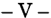

Considero, en cambio, que el agravio dirigido a cuestionar la sentencia porque ratificó la sanción que le impuso conductas positivas, con fundamento en el arto 26, inc. b) de la ley 22.262 suscita cuestión federal, toda vez que, en el sub discussio, se ha puesto en duda su inteligencia y la interpretación del a quo ha sido contraria a las pretensiones de la recurrente (art. 14 de la ley 48 y Fallos: 316:2561).

Aquella ley otorga una serie de facultades a la autoridad administrativa: desde disponer que no se innove respecto de la situación existente, pasando por la orden de cesar o de abstenerse de seguir ejecutando la conducta imputada hasta llegar, incluso, a la disolución y liquidación de la sociedad infractora, por medio del procedimiento que indica y aclara que tales sanciones pueden aplicarse conjuntamente (v. arts. 26 y 27), es decir, que la intención del legislador fue conferirle amplias potestades tanto para reprimir la conducta anticompetitiva como para evitar que se siga desarrollando, tal como lo pone de manifiesto la exposición de motivos del proyecto legal cuando señala: "El arto 26 enuncia las medidas que puede tomar el secretario de Estado de Comercio y Negociaciones Económicas Internacionales, una vez concluida la investigación sumarial. Se lo faculta tanto a adoptar recaudos que eviten la instalación y desarrollo de una actividad anticompetitiva, cuanto a imponer multas y solicitar la disolución y liquidación de la sociedad infractora ..." (ver nota al Poder Ejecutivo acompañando el proyecto de ley 22.262, en Anales de la Legislación Argentina, XL -C- 2521, en especial, pág. 2529 -énfasis agregado-).

En tales condiciones, a mi modo de ver, la queja debe ser desestimada, toda vez que las conductas impuestas por el arto 2º de la resolución impugnada encuentran sustento tanto en el texto legal antes citado como en su propia finalidad de coadyuvar al cumplimiento de la orden de cesar inmediatamente las conductas de abuso de posición dominante impuesta por el arto 1º de la resolución 189/99.

Por otra parte, no puede dejar de señalarse que, con relación a alguna de las medidas ahí dispuestas (obligación de eliminar de los contratos de exportación la cláusula que restringía oimpedía la reimportación al país del GLP), la recurrente ya la viene cumpliendo como consecuencia del compromiso que asumió REPSOL S.A. para adquirir las acciones de YPF S.A., tal como surge del decreto 666/99 y de sus

propias manifestaciones, de forma tal que, por su propia conducta, este aspecto de la sentencia no le causa ningún agravio.

-VI-

Opino, por lo tanto, que el recurso extraordinario deducido es formalmente inadmisible en cuanto se pretende cuestionar por su intermedio loresuelto por la Cámara en torno a la calificación de la conducta atribuida a la apelante y a la sanción impuesta.

Por el contrario, conel alcance indicado en el acápite anterior, aquel remedio es procedente y corresponde confirmar la sentencia apelada. Buenos Aires, 19 de abril de 2002. Nicolás Eduardo Becerra.

## FALLO DE LACORTE SUPREMA

Buenos Aires, 2 de julio de 2002.

Vistos los autos: "Recurso de hecho deducido por Yacimientos Petrolíferos Fiscales S.A. en la causa Yacimientos Petrolíferos Fiscales S.A. sI ley 22.262 -Comisión Nacional de Defensa de la CompetenciaSecretaría de Comercio e Industria", para decidir sobre su procedencia.

## Considerando:

- 1 Q ) Que contra la sentencia de la Cámara Nacional de Apelaciones en lo Penal Económico que confirmó la Resolución del Secretario de Industria, Comercio y Minería NQ 189/99, Y.P.F. S.A. interpuso el recurso extraordinario, cuya denegación motivó la presentación de la queja en examen.
- 2 Q )Que los hechos relevantes de la causa, los fundamentos de la sentencia apelada y los agravios planteados ante esta instancia, se encuentran adecuadamente expuestos en el dictamen del señor Procurador General de la Nación, al que; al respecto, corresponde remitir por razones de brevedad.

3º) Que el recurso extraordinario -cuya denegación motiva esta quejaes formalmente admisible en la medida en que en él se controvierte el alcance de normas de índole federal, comoson las contenidas en los arts. 1º, 2º, 26, 35 y 43 de la ley 22.262, y la decisión ha sido contraria al derecho que el recurrente fundó en ellas (art. 14, inc. 3º, de la ley 48 y 6º de la ley 4055).

4º) Que, en efecto, se cuestiona la decisión del a qua en cuanto consideró que la conducta de la empresa apelante encuadraba en las previsiones de los arts. 1º y 2º inc. a) de la ley citada, de lo cual aquélla se agravia por entender que la letra y el espíritu de las citadas disposiciones no incluyen la actividad reprochada.

En este sentido, sostiene que no son ilícitas la discriminación de precios del gas licuado de petróleo a granel (G.L.P.) entre los mercados nacional y externo, ni la inserción de la cláusula de prohibición de reimportación en los contratos referentes al segundo, por lo que no se configuró el abuso de posición dominante en el mercado que haya limitado, restringido o distorsionado la competencia y del que haya podido resultar perjuicio para el interés económico general. Asimismo, objeta el criterio con el que el a qua ha definido este último concepto.

5º) Que los argumentos de la apelante, en cuanto a que los actos o conductas configuradores de abuso de posición dominante sólo son punibles cuando, al mismo tiempo, limitan, distorsionan o restringen la competencia, no pueden ser atendidos. Ello es así, pues el arto 1º.de la ley 22.262 distingue dos figuras, la limitación, restricción o distorsión de la competencia, por una parte, y el abuso de posición dominante, por la otra, que sean, en ambos casos, contrarios al bienestar económico general en un mercado.

6º) Que esta regulación es coherente con la establecida en la vigente ley 25.156 de defensa de la competencia, que mantuvo tal distinción, así como con la que rige en la Unión Europea, que ha tenido influencia en la redacción de la ley 22.262.

En ambos casos, se regulan separadamente conductas que tengan por objeto o efecto impedir, restringir o falsear el juego de la competencia en el mercado y la explotación abusiva, por parte de una o más empresas, de una posición dominante en el mercado o en una parte sustancial de aquél (arts. 81 y 82, respectivamente, del Tratado Cons-

titutivo de la Comunidad Europea, Roma, 1957, según la numeración en vigor a partir del 1º de marzo de 1999; y 53 Y 54, también respectivamente, del Acuerdo sobre el Espacio Económico Europeo, Oporto, 1992).

Por su parte, en el ámbito del Mercosur, existen normas análogas. En efecto, en el Protocolo de Defensa de la Competencia, aprobado en Fortaleza el 17 de diciembre de 1996, integrante del Tratado de Asunción (Decisión CMC 18/96), se consideran infracciones los actos individuales o concertados, de cualquier forma manifestados, que tengan por objeto o efecto limitar, restringir, falsear o distorsionar la competencia o el acceso al mercado, o que constituyan abuso de posición dominante en el mercado relevante de bienes o servicios en el ámbito del Mercado Común y que afecten el comercio entre los Estados partes.

7º) Que, en tales condiciones, corresponde determinar si la conducta que se le reprocha a la empresa puede encuadrar en el concepto de "abuso de una posición dominante en un mercado, de modo que pueda resultar perjuicio para el interés económicogeneral" (conf.arto 1 º, última parte, de la ley 22.262). La disposición transcripta comprende tanto aquellas prácticas llevadas a cabopor quien ocupe una posición de dominio en el mercado, que limiten, restrinjan o distorsionen la competencia -v.gr., las que instauren barreras al ingreso de competidores-, cuanto aquellas otras que, del mismo modo que las anteriores, menoscaben la eficiencia económica del mercado por medio de acciones reñidas con el interés de la comunidad, como ocurre cuando se reduce injustificadamente la oferta de bienes con el deliberado propósito de mantener un determinado nivel de precios. En estos casos, la estrategia comercial, antes que prevalerse de una simple posición de dominio para obtener ganancias en el mercado, abusa de ella al manipular artificialmente la oferta haciendo que el mercado sea menos eficiente en términos de cantidades y precios, con directa incidencia en el bienestar de los consumidores.

8º) Que, en el caso, las circunstancias relevantes examinadas por la cámara para confirmar la sanción impuesta caen dentro de la prohibición prevista en el arto 1 º, última parte, de la ley 22.262. En efecto, la cámara destacó que Y.P.F. S.A., al exportar grandes cantidades de G.L.P., redujo la oferta del producto en el mercado local y, comoconsecuencia de ello, mantuvo un alto nivel en el precio que abonaban los compradores en dicho mercado. Indicó que la empresa no había justi-

ficado que el menor precio que percibía de quienes adquirían el producto para comercializarlo fuera del país, obedeciera a razones de costos u otros motivos atendibles; y que de no haber mediado la conducta que se le reprocha, el precio del G.L.P. habría sido menor que el cobrado en el mercado interno con evidente beneficio para los consumidores locales. También censuró la práctica de Y.P.F. S.A. de introducir en los contratos de exportación una cláusula por la cual prohibía a los adquirentes la posterior introducción al país de dicho producto, toda vez que con ella eliminaba la competencia de quien lo pudiera ofrecer en el mercado interno.

9º) Que tales fundamentos, aunque desarrollados con el fin de destacar el perjuicio potencial provocado al interés económicogeneral (considerando 22 del voto de la mayoría), constituyen -como quedó expresadoel núcleo esencial de la conducta abusiva en examen. Además, tienen su correlato en el dictamen de la Comisión Nacional de Defensa de la Competencia (ver fs. 1718, 1721/1722, 1726/1728) Y derivan razonablemente de los hechos comprobados en la causa. Por ello, y como con mayor precisión quedó establecido en el dictamen mencionado, bien pudo concluirse que la decisión de vender fuera del país una parte sustancial de la producción de G.L.P. a un precio sensiblemente menor, sin explicación atendible, hace presumir que dicha política comercial tuvo como propósito principal mantener deprimida la oferta interna del producto y asegurar, por lo tanto, la subsistencia de un determinado nivel de precios. Y que esa reducción injustificada de la cantidad ofrecida por parte de quien ostentaba una posición dominante, es apta para distorsionar el funcionamiento normal del mercado al afectar los precios en perjuicio de los consumidores.

10) Que, por su parte, en lo atinente a los invocados vicios de fundamentación de la sentencia apelada en cuanto a la definición de "mercado relevante", "mercado geográfico", la "posición de dominio" de la apelante, la ausencia de "competencia sustancial" a su respecto, la existencia de discriminación de precios entre el mercado nacional y el extranjero y de la prohibición de reimportación, la determinación de la afectación del "interés económico general" y la confiscatoriedad de la multa aplicada, los agravios de la apelante resultan insuficientes para la apertura del recurso, pues sólo suscitan el examen de cuestiones de hecho y prueba extrañas como regla y por su naturaleza a la instancia del arto 14 de la ley 48, y la sentencia ha decidido con fundamentos suficientes que excluyen la tacha de arbitrariedad invocada.

En especial, cabe señalar que la determinación del "mercado relevante" en su dimensión material (de producto) y espacial (ámbito geográfico) comporta un problema que ha de ser definido en cada caso y constituye, en consecuencia, una cuestión de hecho y prueba que, salvo casos de arbitrariedad, no corresponde a esta Corte evaluar.

- 11) Que, en cuanto al agravio referente a la prescripción de la acción, esta Corte comparte y hace suyos los fundamentos del dictamen del Procurador General.

12) Que las quejas referentes a que las órdenes de cese inmediato de la conducta de abuso de posición dominante, eliminación de las cláusulas de los contratos de exportación, inserción en los contratos de cláusulas sobre la no prohibición de reimportar, y de información periódica a la Comisión Nacional de Defensa de la Competencia sobre las condiciones de los contratos de exportación y de venta de G.L.P. al mercado interno no guardan adecuación con lo dispuesto en el arto 26 de la ley, también deben ser desechadas conforme a lo dictaminado por el Sr. Procurador General de la Nación.

13) Que, por último, también deben rechazarse los agravios de la apelante en cuanto a la alegada "desincriminación ulterior" que se habría producido con el dictado del decreto 666/99, por el que se requirió la eliminación de las cláusulas de prohibición de reimportación, ya que aquélla no ha rebatido adecuadamente los argumentos del a qua en cuanto a que la asunción de este compromiso para el futuro no implicaba la modificación de la conducta pasada, producida entre 1993 y 1997, investigada en la causa.

Por ello, oído el Señor Procurador General de la Nación, se declara parcialmente procedente la queja y el recurso extraordinario y se confirma la sentencia con el alcance indicado en los considerandos precedentes. Con costas. Con las constancias de fs. 434/437 téngase por cumplida la comunicación prevista en el arto 6º de la ley 25.344. Agréguese la queja al principal y reintégrese el depósito de fs. 262. Notifiquese y oportunamente devuélvanse los autos.

JULIO S. NAZARENO -CARLOS S. FAYT AUGUSTO CÉSAR BELLUSCIOENRIQUE SANTIAGO PETRACCHI -ANTONIO BOGGIANO GUILLERMO A. F. LÓPEZ -GUSTAVO A. BOSSERT.

## DE JUSTICIA DE LA NACION 325

## GERENCIAL BARILOCHE CONSULTORES S.R.L. v. OBRA SOCIAL DE DOCENTES PARTICULARES

## JURISDICCION y COMPETENCIA: Principios GeneraleS.

Afin de determinar la competencia corresponde atender de modo principal a la exposición de los hechos que el actor hace en su acción y después, y sólo en la medida que se adecue a ellos, el derecho que invoca como fundamento de su pretensión.

JURISDICCION y COMPETENCIA: Competencia federal. Por la materia. Causas regidas por normas federales.

Es competente la justicia federal (arts. 15 y 38 de la ley 23.661) para conocer en la causa iniciada con el objeto de obtener el cobro de facturas impagas derivadas del contrato de prestación de servicios farmacéuticos pues la demandada reviste el carácter de agente del seguro de salud -obra socialsegún las previsiones de las leyes 23.660 y 23.661.

JURISDICCION y COMPETENCIA: Competencia federal. Principios generales.

La competencia federal en razón de la materia es improrrogable y excluyente de las jurisdicciones provinciales, sin que el consentimiento ni el silencio de las partes sean hábiles para derogar esos principios (Voto del Dr. Antonio Boggiano).

JURISDICCION y COMPETENCIA: Competencia federal. Por la materia. Causas regidas por normas federales.

Atento a la naturaleza de orden público que reviste la ley 23.661 y la asignación de competencia federal prevista por su arto 38, al ser la demandada una obra social y en cuestiones relativas a la prestación de servicios farmacéuticosresulta inadmisible la alteración de la competencia -ratione materiaepor vía de convenios entre partes (Voto del Dr. Antonio Boggiano).

## DICTAMEN DEL PROCURADOR GENERAL

## Suprema Corte:

-1-

Surge de las actuaciones, que la actora Gerencial Bariloche Consultores S.R.L. -en representación de la Farmacia Social A.R.B.O.S.

Bariloche-, promovió demanda por ante el Juzgado Federal de Primera Instancia de San Carlos de Bariloche, Provincia de Río Negro, contra la Obra Social de Docentes Particulares -O.S.D.O.P.-, con el objeto de obtener el cobro de facturas impagas, derivadas del contrato de prestación de servicios farmacéuticos celebrado con la demandada y rescindido por ésta, en el cual los firmantes pactaron la competencia de los Tribunales Federales de Bariloche -v. fs. 23 vta.l24-. Fundó su derecho en lo normado por los artículos 330, 484 del Código Procesal Civil y Comercial, y en los artículos 1198 y 1204 del Código Civil (v. fs. 28/30).

El Magistrado interviniente, haciendo suyo el dictamen fiscal, se declaró incompetente, con fundamento en que el fuero federal por distinta vecindad, sólo puede ser invocado por el vecino de extraña jurisdicción. Y, sin perjuicio de lo pactado en el convenio de fojas 23/24, remitió las actuaciones al Juzgado con competencia en lo Civil, Comercial y Minería de la Tercera Circunscripción Judicial de la Provincia de Río Negro (v. fs. 32,34 Y 35).

Recepcionadas las actuaciones, el juez de grado corrió traslado de la demanda, (fs. 40) la que fue contestada a fojas 47/53, oponiendo la accionada excepción de incompetencia -arto 347 C.P.C.C.-, fundándola en la jurisdicción convenida en la cláusula décimo séptima del contrato de prestaciones farmacéuticas yen las leyes 23.660 y 23.661.

Afojas 80 la accionante se allanó al planteo de incompetencia inc terpuesto, y destacó que la acción fue promovida por su parte ante la Justicia Federal, solicitando su remisión.

El Juez local hizo lugar a la excepción de incompetencia. Fundó su decisorio, de un lado, en que laspartes eran dos vecinos de distintas jurisdicciones, circunstancia que justifica el fuero de excepción previsto en el contrato; y de otro, en el artículo 38 de la ley 23.661. Remitió por lo tanto las actuaciones al Magistrado Federal (v. fs. 83/84).

La demandada apeló ese pronunciamiento, con fundamento en lo normado por el artículo 354, inciso 1 Q del Código Procesal Civil y Comercial. Consideró, en tal sentido, que las actuaciones debieron ser archivadas (v. fs. 91/92). Recepcionada la causa por la Cámara de Apelaciones de la Tercera Circunscripción Judicial de San Carlos de Bariloche, ésta resolvió rechazar el recurso, porque entendió que habiéndose iniciado la causa ante el Juzgado Federal, la remisión ordenada

por el Juez local, sólo equivaldría a devolver las actuaciones aljuzgado de origen, circunstancia no contemplada en la normativa en que la demandada fundó se reclamo (v. fs. 97).

Afojas 108/110 el Juez Federal resolvió no aceptar la competencia que se le atribuyó, con sustento en que la cuestión debatida -incumplimiento contractualinvolucra un mero acto de administración de la obra social demandada, ajeno a las normas federales que reglamentan el sistema de salud. Estimó además que O.S.D.O.P. no es un vecino de otra provincia, sino un vecino de la provincia de Río Negro, establecida en Bariloche, donde brinda cobertura social a sus afiliados, lo que la inhabilita a invocar el fuero federal por distinta vecindad.

En tales condiciones, quedó trabado un conflicto negativo de los que corresponde dirimir a V.E. en los términos del artículo 24, inciso 7º del decreto ley 1285/58, texto según ley 21.708.

-II-

Cabe señalar que, a los fines de resolver cuestiones de competencia, se ha de tener en cuenta en primer término la exposición de los hechos que el actor hace en su demanda, y después, sólo en la medida en que se adecue a ellos el derecho que invoca comofundamento de su pretensión (v. Fallos: 303:1453,1465; 306:229, 2230;311:157, 557, 2198; 313:971, 1467; entre otros).

Conforme surge de la causa, la demandada reviste el carácter de Agente del Seguro de Salud -Obra Socialsegún las previsiones de las leyes 23.660 y 23.661. Ante dicha circunstancia, el artículo 38 de la ley 23.661, en concordancia con el artículo 15 de la citada normativa, de expresa aplicación en el sub lite, establecen que las obras sociales estarán sometidas exclusivamente a la jurisdicción federal, la que resulta competente en razón de las personas (conf. doctrina de Fallos: 315:2292; 323:3006).

En igual sentido, las partes de común acuerdo, pactaron en la cláusula décimo séptima del contrato de prestaciones farmacéuticas, la competencia de los Tribunales Federales que corresponda a la Ciudad de San Carlos de Bariloche, a los efectos de resolver cualquier cuestión que derive de la interpretación, cumplimiento oejecución del citado convenio (v. fs. 23 vta./24), acuerdo que importa una prórroga de

cualquier otra jurisdicción que hubiera podido corresponder a las partes ratione personae o territoriae. De ello se desprende, a mi criterio, que la actora inició, desde un principio correctamente la demanda ante dicho fuero.

Estimo, en consecuencia que no le asiste razón al Magistrado Federal, en cuanto sostiene de un lado: que la invocación del fuero de excepción, surgiría por ser las partes dos vecinos de distinta jurisdicción. Al respecto, cabe señalar que no emana de la causa, ni de la documentación acompañada tal circunstancia, y menos aún que la cláusula contractual en que pactaran la competencia federal, se fundara en ello; y por otro, afirma la necesidad del archivo de las actuaciones, desde que ellas ab initio fueron iniciadas ante esa jurisdicción, por lo que no concurren las condiciones a que se refiere el arto 354 inc. 1º del Código Procesal Civil y de la Nación.

Por lo expuesto, opino, que le corresponde al Juzgado Federal de Primera Instancia de San Carlos de Bariloche, Provincia de Río Negro; continuar entendiendo en la presente causa. Buenos Aires, 14 de febrero de 2002. Nicolás Eduardo Becerra.

## FALLO DE LA CORTE SUPREMA

Buenos Aires, 2 de julio de 2002.

## Autos y Vistos:

De conformidad con lo dictaminado por el señor Procurador General, se declara que resulta competente para seguir conociendo en las actuaciones el Juzgado Federal de Primera Instancia de San Carlos de Bariloche, al que se le remitirán. Hágase saber al Juzgado Letrado N° 1 de Primera Instancia en lo Civil, Comercial y de Minería de la Tercera Circunscripción Judicial de la Provincia de Río Negro, con sede en dicha ciudad.

EDUARDO MOLINÉ O'CONNOR -AUGUSTO CÉSAR BELLUSCIO -ENRIQUE SANTIAGO PETRACCHI -ANTONIO BOGGIANO (según su voto) GUSTAVO A. BOSSERT -ADOLFO ROBERTO V ÁZQUEZ.

## DE JUSTICIA DELANACION 325

## VOTO DEL SEÑOR MINISTRO DOCTOR DON ANTONIO BOGGIANO

## Considerando:

Que las cuestiones que se debaten en la presente causa son sustancialmente análogas a las resueltas en Fallos: 324:2078 al que corresponde remitir en razón de brevedad.

Por ello, habiendo dictaminado el señor Procurador General de la Nación se declara que resulta competente para seguir conociendo en las actuaciones el Juzgado Federalde Primera Instancia de San Carlos de Bariloche, al que le remitirán. Hágase saber al Juzgado Letrado N° 1 de Primera Instancia en lo Civil, Comercial y de Minería de la Tercera Circunscripción Judicial de la Provincia de Río Negro, con sede en dicha ciudad.

## ANTONIO BOGGIANO.

## VIRGILIO CARDOZOv. INSTITUTO DE PREVISION y SEGURIDAD SOCIAL DE TUCUMAN

## RECURSO DE QUEJA: Plazo.

Corresponde rechazar el recurso de reposición interpuesto contra la providencia que desestimó el de hecho por haber sido deducido extemporáneamente pues las razones alegadas con respecto al régimen de comparecencia obligatoria no excluyen que el apoderado que dedujo la presentación directa haya tomado conocimiento efectivo del referido auto denegatorio en la fecha que denunció ante la Corte y no se ha alegado la existencia de error excusable de la parte en la aludida manifestación.

## RECURSO DE QUEJA: Plazo.

La cuestión referente al cómputo de los plazos para la interposición del recurso de hecho ante la Corte Suprema debe regirse por las normas nacionales, y toda alusión a temas vinculados al punto en el orden local resulta inoperante para justificar un apartamiento de las reglas que rigen el remedio federal (Disidencia de los Dres. Eduardo Moliné O'Connor y Guillermo A. F. López).

1728

## FALLOS DE LA CORTE SUPREMA 325

## NOTIFICACION.

La forma de notificación debe regirse por la norma procesal local (Disidencia de los Dres. Eduardo Moliné O'Connor y Guillermo A. F. López).

## FALLO DE LA CORTE SUPREMA

Buenos Aires, 2 de julio de 2002.

Autos y Vistos; Considerando:

Que a fs. 54/55 vta. se pretende la reposición de la providencia de fs. 50 que desestimó el recurso de hecho por haber sido deducido extemporáneamente. Atal efecto, el presentante aduce que el plazo para deducir la queja comenzó a correr el primer día hábil posterior a la fecha en que la parte debió concurrir al tribunal para notificarse del auto denegatorio del recurso extraordinario, por lo que fue interpuesta en tiempo legal.

Que el planteo resulta improcedente, pues las razones alegadas con respecto al régimen de comparecencia obligatoria no excluyen que el apoderado que dedujo la presentación directa haya tomado conocimiento efectivo del referido auto denegatorio en la fecha que denunció ante esta Corte (con£' fs. 43 vta.) y, además, no se ha alegado la existencia de error excusable de la parte en la aludida manifestación.

Por ello, se rechaza el pedido de reposición. Notifiquese y, oportunamente, archívese. .

JULIO S. NAZARENO -EDUARDO MOLINÉ O'CONNOR (en disidencia) -CARLOS S. FAYT -AUGUSTO CÉSAR BELLUSCIO -ENRIQUE SANTIAGO PETRACCHI -ANTONIO BOGGIANO -GUILLERMO A. F. LÓPEZ (en disidencia) GUSTAVO A. BOSSERT -ADOLFO ROBERTO VÁZQUEZ.

DISIDENCIA DEL SEÑOR VICEPRESIDENTE DOCTOR DON EDUARDO MOLINÉ O'CONNOR y DEL SEÑOR MINISTRO DOCTOR DON GUILLERMO A. F. LÓPEZ

## Considerando:

1 º) Que a fs. 50 se resolvió desestimar la queja por haber sido presentada fuera del término que prevé el arto 282 del Código Procesal Civil y Comercial de la Nación.

2º) Que el recurrente interpuso revocatoria contra ese pronunciamiento, para lo cual invocó el error del Tribunal en el cómputo del plazo previsto para la presentación de la queja, pues no se consideró lo dispuesto en el art. 4º in fine de la ley local 2199.

3º) Que si bien esta Corte ha entendido que la cuestión referente al cómputo de los plazos para la interposición del recurso de hecho ante sus estrados debe regirse por las normas nacionales, y que toda alusión a temas vinculados al punto en el orden local resulta inoperante para justificar un apartamiento de las reglas que rigen el remedio federal (Fallos: 316:1755 y 317:982, entre otros), en este caso se trata de establecer la forma de notificación que resulta válida, de lo que derivará, comoconsecuencia, el momento en que comenzó a correr el plazo para la interposición del recurso (Fallos: 318:2683).

4º) Que la forma de la notificación debe regirse por la norma procesal local y, en tal sentido, la ley 2199 de la Provincia de Tucumán establece en su arto 4º, última parte, que "la notificación se tendrá por hecha el primer día hábil de comparendo obligatorio posterior a la fecha en que la cédula fue puesta en la caja", por lo que ha de admitirse la reposición deducida.

Por ello, se admite el recurso de reposición y se deja sin efecto la decisión de fs. 50. Notifíquese.

EDUARDO MOLINÉ O'CONNOR -GUILLERMO A. F. LÓPEZ.

## HERNAN GUSTAVO BERNASCONI

## NOTIFICACION.

La adecuada notificación de las distintas etapas fundamentales del proceso, particularmente el traslado del recurso extraordinario federal que dispone el arto 257, segundo párrafo, del Código Procesal Civil y Comercial de la Nación, tiene por objeto proporcionar a los litigantes la oportunidad de ejercer sus defensas con la amplitud que exige el debido proceso y plantear las cuestiones que crean conducentes para la correcta solución de la causa -arto 18 de la Constitución Nacional-.

1730

## RECURSO EXTRAORDINARIO: Trámite.

Corresponde dejar sin efecto el auto de concesión del recurso extraordinario si el a qua no dio expresa intervención a las partes querellantes.

## FALLO DE LA CORTE SUPREMA

Buenos Aires, 11 de julio de 2002.

Autos y Vistos; Considerando:

- 1 Q) Que este Tribunal ha resuelto que la adecuada notificación de las distintas etapas fundamentales del proceso, particularmente el traslado del recurso extraordinario federal que dispone el arto 257, segundo párrafo, del Código Procesal Civil y Comercial de la Nación, tiene por objeto proporcionar a los litigantes la oportunidad de ejercer sus defensas con la amplitud que exige el debido proceso y plantear las cuestiones que crean conducentes para la correcta solución de la causa -arto 18 de la Constitución Nacional(Fallos: 315:2648; 316:2491; 317:395; 318:991, entre muchos otros).
- 2Q ) Que, en el sub examine, se advierte que la Sala IV de la Cámara Nacional de Casación Penal concedió el recurso extraordinario interpuesto por la defensa, sin haber dado expresa intervención a las partes querellantes.
- 3Q ) Que, en consecuencia, corresponde dejar sin efecto el auto de concesión y devolver las actuaciones al tribunal de origen con el fin de que, antes de dictar uno nuevo, proceda a dar cumplimiento a los actos procesales omitidos.
- Por tanto, déjase sin efecto el pronunciamiento de fs. 187/188, debiendo remitirse las actuaciones al tribunal de origen, para que se sustancie la apelación extraordinaria, de conformidad a lo preceptuado en el arto 257 del Código Procesal Civil y Comercial de la Nación y, oportunamente, por quien corresponda, se resuelva acerca de su procedencia. Notifiquese y devuélvase.

EDUARDO MOLINÉ O'CONNOR -CARLOS S. FAYT -AUGUSTO CÉSAR BELLUSCIO -ENRIQUE SANTIAGO PETRACCHI -ANTONIO BOGGIANO -GUILLERMO A. F. LÓPEZ GUSTAVO A. BOSSERT ADOLFO RoBERTO V ÁZQUEZ.

## DE JUSTICIA DE LA NACION 325

## CARLOS ISAAC MAZALv. A.NA

RECURSO EXTRAORDINARIO: Requisitos propios. Cuestiones no federales. Interpretación de normas y actos comunes.

Si bien en principio lo referente a la prescripción de la acción penal o de la pena es materia ajena a la jurisdicción extraordinaria, por versar esencialmente sobre temas de hecho y derecho procesal y común, cabe hacer excepción a ese principio cuando los agravios ponen de manifiesto que el a quo ha resuelto el caso con prescindencia de lo establecido por la norma -de carácter federalaplicable.

RECURSO EXTRAORDINARIO: Requisitos propios. Cuestión federal. Cuestiones federales simples. Interpretación de las leyes federales. Leyes federales de carácter procesal.

Es improcedente el recurso extraordinario si los agravios remiten a una cuestión procesal que en principio es ajena a la vía intentada, aunque las normas respectivas estén incluidas en una ley federal.

## ADUANA: Procedimiento.

La remisión que efectúa el arto 1121, inc. b, del Código Aduanero al régimen de las infracciones se refiere, únicamente, al procedimiento que debe seguir la Aduana para imponer las sanciones y no corresponde extenderla a las normas referentes a la prescripción.

## ADUANA: Procedimiento.

Si -de acuerdo con lo dispuesto por los arts. 890 y 861 del Código Aduanero y 67 del Código Penalla Aduana debe aguardar la sentencia condenatoria firme recaída en el proceso judicial para ejercer las facultades que le confiere el código de la materia respecto de las sanciones accesorias, no es posible sostener que entre tanto corra el plazo de prescripción.

## LEY: I':l-terpretación y aplicación.

La inconsecuencia y falta de previsión jamás se supone en el legislador, y por esto' se reconoce como regla inconcusa que la interpretación de las leyes debe hacerse siempre evitando darles un sentido que ponga en pugna sus disposiciones, destruyendo las unas por las otras, y adoptando comoverdadero el que las concilie y deje a todas con valor y efecto.

## LEY: Interpretación y aplicación.

Por encima de lo que las leyes parecen decir literalmente, es propio de los jueces indagar lo que ellas dicen jurídicamente. En esa interpretación no cabe prescindir de las palabras de la ley, pero tampoco atenerse rigurosamente a ellas cuando la interpretación razonable y sistemática así lo requiere.

## DICTAMEN DEL PROCURADOR GENERAL

Suprema Corte:

-1-

Afs. 54/56, Carlos Isaac Mazal-quien había sido condenado a la pena de 6 meses de prisión en suspenso, con accesorias legales del arto 876, ap. 1º, incs. d, e y h del Código Aduanero, por el delito de contrabando previsto en su arto 864, inc. dinterpuso recurso de apelación ante el Tribunal Fiscal de la Nación, en los términos del arto 1132 y concordantes de dicho código, contra la resolución del administrador de la Aduana de Mendoza del 13 de agosto de 1996, recaída en el sumario SA38/91/317, que había rechazado su defensa de prescripción.

Adujo que, de acuerdo con el arto 934 del mismo cuerpo legal, la multa que se pretende aplicar se hallaba prescripta e indicó que lo decidido por el administrador es definitivo en este punto. Agregó que, en el sumario administrativo, no se ha producido ningún acto suspensivo o interruptivo oponible a su parte y que, en la resolución de fs. 41, se le corre vista por primera vez en el expediente y se le notifica el levantamiento de la suspensión de los plazos en sede administrativa, sin que exista constancia alguna en esas actuaciones de que se hubiera ordenado tal suspensión ni tampoco que le haya sido notificada.

Destacó que en autos ha existido un largo período de inactividad y que el último acto interruptivo de la prescripción fue la verificación de las mercaderías, realizada el 28 de agosto de 1990. Aclaró que, desde su óptica, los actos subsiguientes son meramente internos, insuficientes y -en algunos casosnulos (vgr. la fallida notificación de fs. 25).

De esta forma, el plazo del arto 935 del códigoindicado, sea que se cuente desde el hecho imputado (22 de agosto de 1990) o a partir del 1º de enero de 1991, ya ha transcurrido al momento de correrle la vista mencionada (19 de julio de 1996).

Por otra parte, puntualizó que, al no haber acompañado la liquidación exigida por el arto 1094, inc. d, del Código Aduanero, este último acto también es nulo pues no cumple con el destino previsto por la norma aplicable.

Señaló que, en tales condiciones, el procedimiento resulta nulo, con violación de la garantía del debido proceso.

-II-

Afs. 69/70, la Sala E del Tribunal Fiscal se declaró incompetente para entender en la causa. Estimó, en primer término, que el acto recurrido es interlocutorio y que no puede asimilarse a definitivo, ya que no le produce un gravamen irreparable o insusceptible de reparación ulterior. Añadió que tampoco resulta competente, debido a la imputación de contrabando hecha en el sumario, de acuerdo con los arts. 1025, 1028 Y1032 del Código Ad.uanero.

Sin perjuicio de ello, propició reencuadrar el recurso en la apelación contemplada en el inc. a), ap. 1º, del arto 1028 de ese código, a fin de salvaguardar el derecho de defensa del actor y, consecuentemente, remitió las actuaciones a la justicia federal de Mendoza.

- III-

Luego de declararse competente, la Sala B de la Cámara Federal de Apelaciones de Mendoza (fs. 79) resolvió hacer lugar al recurso y declaró prescripta la acción para imponer penas por el ilícito aduanero atribuido al actor.

Para así decidir, tomó en cuenta que el plazo de prescripción de la acción tendiente a imponer penas por infracciones aduaneras es de 5 años y comienza a correr a partir del 1º de enero siguiente al de la fecha en que se cometa el hecho o, si no puede precisársela, al de su constatación, conforme con el arto 935 del código de la materia. Por tal razón, en autos ha comenzado a correr desde el 1º de enero de 1991. Destacó que, si bien el 16 de abril de 1991-al ordenarse la instrucción del sumario en los términos del arto 1094 del código y correrse vista de acuerdo con el arto 1101dicho plazo se interrumpió conforme con el arto 937, inc. a), de todos modos, al momento de dictarse la resolución de fs. 41, el lapso prescriptivo había transcurrido en su integridad.

Puntualizó que no obsta a lo indicado que en la vista concedida se le endilgara un hecho con una calificación distinta de la que se expresó al iniciar el sumario, circunstancia que, a tenor del a quo, podría ser

motivo de un planteo de nulidad del acto anoticiante pero que no afecta al que ordenó instruir el sumario.

Señaló que, a partir del 16 de abril de 1991, no se advierte en autos que se haya concretado la suspensión de los términos procesales ni que ésta haya operado por ministerio de la ley, razón por la cual la resolución que ordena su levantamiento carece de sustento.

Disconforme, la AFIP-DGA interpuso recurso extraordinario a fs. 99/104, que fue concedido por el a qua a fs. 116/117.

Sostuvo que resulta procedente la apelación ya que se halla Émtela dejuicio la inteligencia de normas federales (arts. 876,935,937, 1094, 1028, ap. 1º, inc. a, 1101 y 1118 a 1121 del Código Aduanero).

Destaca que en autos se discute acerca de la aplicación de la ley 22.415, donde corresponde a la Corte Suprema desempeñar una función casatoria en la materia.

Se agravia, en primer término, pues señala que no resultaba viable, en el sub lite, el recurso de apelación ante la cámara por vía del arto 1028, ap. 1º, inc. a, del código indicado, puesto que no se trató de una resolución definitiva y que el actor debió haber aguardado al dictado de aquélla para hacer valer sus defensas. Como segundo punto, menciona que, además, existe una afectación al debido proceso legal, en cuanto al modo en que ese recurso fue concedido por el a qua y a su tramitación. Señala que, al haberse concedido en relación, en los términos del arto 538 del Código de Procedimientos Penales (entonces vigente), conforme arts. 1017 y 1028, ap. 1º, del Código Aduanero, se le notificó la providencia sólo a la recurrente y no a la Aduana, con lo cual se quebró el principio de bilateralidad y no pudo ejercer su derecho de defensa enjuicio. Dice que, en todo caso, el recurso debió haber sido concedido libremente.

Sobre el tema de fondo, señala que conforme con los arts. 1118, 1121Yconcordantes del códigode marras, el administrador de la Aduana en cuya jurisdicción se hubiera producido el hecho es quien debe sustanciar el sumario tendiente tanto al cobro de los tributos que pudieren corresponder, como a la eventual aplicación de las penas pre-

vistas en el arto 876, ap. 1º, inc. c -entre otros-, siendo de aplicación el procedimiento para las infracciones, regulado por los arts. 1030 a 1042. En este sentido, agrega que tal procedimiento ha de entenderse regulatorio de la facultad administrativa para imponer ciertas consecuencias accesorias de la condena penal, ya que no podría arribarse a un pronunciamiento en sede administrativa que sea anticipado ni distinto al del juez federal competente. Sólo cuando la sentencia judicial quede firme estará la Aduana en condiciones de realizar el procedimiento para dictar la resolución que corresponda.

Ha de reputarse entonces -prosigue-, que existe una suspensión ministerio legis de los plazos procedimentales, dada por el juego de los arts. 861 y 890 de la ley 22.415 yel arto 67 del Código Penal.

Deno ser así, en la práctica, la automática aplicación de los arts. 929 a 937 -que regulan la prescripción de las acciones del fisco en materia sancionatoria-, sin posibilidad de suspender los plazos, implicaría privar a la Aduana de la posibilidad de establecer penas accesorias. Puntualizó, además, que lo decidido implica un contrasentido, puesto que a pesar de que el administrador no puede resolver hasta que quede firme la decisión judicial, por el hecho de ordenar la instrucción del sumario comenzaría a correr la prescripción de los arts. 934 y concordantes, previsto para las infracciones pero no para los delitos.

Por último, destaca que dicho funcionario no podría correr la vista contemplada en el arto 1101 sin antes haber dispuesto la apertura del sumario en los términos de los arts. 1090 y 1094, inc. c, del código de marras, lo cual resulta necesario para mantener las medidas cautelares respectivas.

-v-

Si bien el recurso extraordinario resulta, en principio, de dudosa fundamentación, entiendo que el apelante ha expresado agravios bastantes para alcanzar la finalidad perseguida, toda vez que el escrito plantea de modo suficiente el problema y el agravio constitucional que la decisión le causa (Fallos: 300:214; 307:440; 311:2790). Al respecto, creo oportuno señalar que se agravia, principalmente, de la aplicación que hizo el a quo de las causas de suspensión e interrupción de la prescripción previstas en los arts. 935 a 937 del CódigoAduanero para las infracciones. En vez de ello, postula en este aspecto la aplicación de

las reglas generales del Código Penal, en virtud de lo dispuesto por los arts. 861 y 890 del primero de esos cuerpos legales.

Pienso así que el recurso es procedente en este aspecto, desde que no se trata en el sub lite de discernir la inteligencia de normas relativas al instituto de la prescripción -cuestión ésta ajena por principio a la instancia extraordinaria (Fallos: 300:712, entre otros)-, sino de establecer las reglas aplicables al caso con base en el criterio que se adopte respecto de una cuestión anterior, implícita en la controversia, cual es la relativa a la naturaleza jurídica de la figura, con la que se calificó el hecho de autos, y de las sanciones cuya imposición la ley confia aljuez penal y al órgano administrativo aduanero.

En este sentido, considero que asiste razón al apelante cuando afirma, con base en el precedente de Fallos: 305:246, la naturaleza delictiva de los hechos del caso. Allí, V.E. expresó que el contrabando y sus tipos subordinados no poseían una doble naturaleza delictiva e infraccional, sino que revestían sólo la calidad de delitos y, acorde con ello, concluyó que la atribución de competencia a la Aduana para la aplicación de las sanciones previstas en el del arto 191, ap. 1 º, incs. a, b, c, fy g, de la Ley de Aduanas -de contenido similar al arto 876, ap. 1 º, incs. a, c, fy g de la actualmente vigente ley 22.415no respondía a lajurisdicción de ese organismo en cuestiones de infracciones aduaneras, sino a la facultad administrativa que la ley le otorga para imponer ciertas consecuencias accesorias a la condena penal (considerandos 10, 11 y 12).

Asimismo, como corolario de la interpretación que realizó sobre la naturaleza y alcance de la facultad conferida por la ley al órgano administrativo para la imposición de esas sanciones, V.E. concluyó que la Administración Nacional de Aduanas no se hallaba habilitada para aplicarlas, hasta tanto recayera sentencia definitiva en la causa penal por contrabando (Fallos: 305:246 y 254).

Sin embargo, contrariamente a lo establecido en esos precedentes, para resolver sobre la prescripción de la acción con relación al delito de contrabando, el a qua aplicó normas de fondo previstas por el CódigoAduanero para las infracciones aduaneras (arts. 934 a 937), sin atender al carácter penal de la figura y al régimen legal de las acciones que nacen de la comisión de ese delito.

En sentido concordante, cabe también destacar que de acuerdo con el arto 1121 del Código Aduanero el único aspecto en que el régimen de

las infracciones resulta aplicable al caso es el relativo al procedimiento que debe seguir la Aduana para imponer las sanciones accesorias a la condena penaL Y, aun a mayor abundamiento, he de mencionar que los artículos que el a quo aplicó al caso, además de no ser normas de procedimiento, ni siquiera se encuentran en el capítulo tercero d~l título segundo, al que se remite el citado arto 1121.

En consecuencia, no era posible someter la acción que nace de la comisión de un delito, y que faculta al Estado a perseguir la imposición de sanciones accesorias, a las reglas sobre la prescripción previstas para las infracciones administrativas.

Pienso, por otra parte, que la cuestión relativa a la aplicación del arto 890 del Código Aduanero resulta conducente para la solución del pleito, pues de ello depende a su vez la' aplicación que el recurrente pretende de las reglas del arto 67 del Código Penal, y que el a quo ha dejado de lado al interpretar erróneamente que debían regir las normas de prescripción previstas para las infracciones aduaneras.

En tal sentido, creo necesario insistir una vez más en que si bien las cuestiones vinculadas a la interpretación de esa disposición del CódigoPenal resultan ajenas a la instancia extraordinaria, no se trata aquí de emitir un criterio acerca de ese aspecto, sino de fijar la interpretación de las normas del CódigoAduanero que condicionan la aplicación de esa norma de derecho común al caso.

Asimismo, y aun cuando la interpretación y aplicación de lo dispuesto por el arto 67 del CódigoPenal sea una cuestión de hecho, prueba y derecho común, que deberá por tanto analizar el tribunal de la causa, no puedo dejar de señalar con referencia a la relación directa que debe existir entre la cuestión federal y el resultado del juicio, que la tesis del recurrente acerca de la suspensión ministerio legis del curso de la prescripción derivada de esa norma presenta, en principio, virtualidad para modificar la decisión del litigio.

Por lo demás, no dejo de advertir que incluso el apelante insinúa en el recurso que el término de prescripción aplicable es el que surge del arto 934 del Código Aduanero, lo que resulta incompatible con la naturaleza delictual del hecho que se afirma a partir del ya citado precedente de Fallos: 305:246. Sin embargo, entiendo que ello no es óbice para que V.E. pueda pronunciarse en el sentido propuesto, en tanto se encuentra en discusión el contenido y alcance de una norma

federal, sin que para ello se halle limitada por los argumentos de las partes (Fallos: 323:1406, 1460, 1566, entre otros).

- VI-

Por lo tanto, opino que V.E. debe revocar la sentencia apelada para que se dicte una nueva de acuerdo con el criterio aquí expuesto. Buenos Aires, 10 de septiembre de 2001. Nicolás Eduardo Becerra.

## FALLO DE LACORTE SUPREMA

Buenos Aires, 11 de julio de 2002.

Vistos los autos: "Mazal, Carlos Isaac por apelación demanda cl A.N.A".

Considerando:

- 1º) Que tras ser anoticiada, el 2 de julio de 1996, de que había quedado firme la sentencia del Juzgado Federal nº 1 de la ciudad de Mendoza que -en lo que interesacondenó a Carlos Isaac Mazal como autor responsable del delito de contrabando (art. 864, inc. d, del Código Aduanero) a la pena de seis meses de prisión en suspenso, pérdida de concesiones, regímenes especiales, prerrogativas y privilegios de que gozare, inhabilitación especial por el mismo lapso para ejercer el comercio e inhabilitación absoluta por el doble tiempo que el de la condena para desempeñarse comofuncionario o empleado público, la Aduana de esa ciudad resolvió, el 5 de julio de 1996, levantar la suspensión de los términos procesales en sede administrativa y correr vista de las actuaciones al señor Carlos Isaac Maza!.
- 2º) Que a raíz de ello, el señor Mazal opuso la prescripción de la acción fiscal para imponer penas. El administrador de la Aduana de Mendoza rechazó la mencionada defensa, "atento lo establecido por el arto 937, inc. a, del Código Aduanero, que establece que la prescripción se interrumpe por el dictado del auto por el cual se ordena la apertura del sumario" (conf. fs. 51)..

3º) Que, posteriormente, la Cámara Federal de Apelaciones con asiento en esa ciudad revocó la resolución administrativa y, en consecuencia, declaró prescripta la acción. Para decidir en el sentido indicado, el a qua señaló que el plazo de prescripción de la acción para imponer penas por infracciones aduaneras es de cinco años, y comienza a correr el primero de enero del año siguiente al de la fecha en que se hubiera cometido la infracción o, en caso de no poder precisársela, en la de su constatación, según lo establecido por el arto 935 del Código Aduanero. Puntualizó que el hecho ocurrió el 22 de agosto de 1990 y, que, por ende, el plazo de la prescripción debe contarse a partir del 1º de enero de 1991.

Afirmó que si bien el 16 de abril de 1991 se decidió instruir sumario contencioso en los términos del arto 1094 del CódigoAduanero, y se ordenó correr vista de acuerdo con lo dispuesto por el arto 1101 del citado código, lo cual interrumpe el plazo de prescripción de la acción para imponer penas por infracciones aduaneras según el inc. a, del arto 937, lo cierto es que al dictarse la providencia del 5 de julio de 1996 -que levanta la suspensión de los términos procesales-, el lapso prescriptivo se había cumplido. Sin perjuicio de ello, en lo relativo al auto que dispuso la instrucción del sumario, sostuvo que la circunstancia de que en la vista conferida al imputado se le hubiese endilgado una infracción con calificación distinta de la que se expresó en aquél "podría ser motivo de un planteo de nulidad del acto anoticiante, mas no afecta el auto por el cual se instruye sumario, el que permanece perfectamente válido" (fs. 83 vta.).

Por último, destacó que la resolución del 5 de julio de 1996, que levantó la suspensión de los términos procesales, carecía de sustento porque con anterioridad no se había concretado tal suspensión ni ésta había operado por ministerio de la ley.

4º) Que contra lo así resuelto, el organismo aduanero dedujo el recurso extraordinario que fue concedido mediante auto de fs. 116/117. Se agravia, por una parte, por cuanto -según expresase ha afectado el principio de bilateralidad, el de defensa en juicio y el debido proceso, pues al recurso de apelación interpuesto por el imputado ante la Cámara le fue asignado el trámite de los concedidos en relación -cuando, en su concepto, debió haber sido concedido libremente-, y al no haber sido notificada su parte del llamamiento de autos se le impidió formular objeciones al respecto. Sin perjuicio de ello, sostiene que la resolución aduanera que rechazó el planteo de prescripción es una mera

providencia interlocutoria, no susceptible de ser impugnada por la vía del arto 1028 del código de la materia, para lo cual "debió aguardar el imputado Mazal...que el administrador de la aduana hubiere dictado la resolución definitiva" (fs. 102).

Por otra parte, se agravia de lo resuelto por el a qua sobre la prescripción. Al respecto, señala que "si bien el código refiere al procedimiento para las infracciones", el administrador de la Aduana no puede anticiparse ni resolver de un modo distinto al deljuez que entiende en el proceso por el delito de contrabando, y sólo después de la sentencia judicial firme está en condiciones de llevar adelante el procedimiento para la aplicación de las penas accesorias previstas por el arto 876, incs. a, b, c y g. Invoca en apoyo de su derecho el precedente de esta Corte en el caso "De la Rosa Vallejos" (Fallos: 305:246). En esa inteligencia, aduce que la suspensión de los términos del procedimiento administrativo tiene sustento en lo establecido por los arts. 861 y 890 del Código Aduanero y por el art. 67 del Código Penal. Señala que lo contrario implicaría que en gran parte de los casos, en los que los procesos judiciales se extiendan a raíz de las investigaciones necesarias para llegar a un pronunciamiento, le resultaría imposible a la Aduana aplicar las penas accesorias del delito de contrabando, respecto de las cuales el código le asigna competencia.

5º) Que si bien en principio lo referente a la prescripción de la acción penal o de la pena es materia ajena a la jurisdicción extraordinaria, por versar esencialmente sobre temas de hecho y derecho procesal y común (Fallos: 298:21; 300:712; 305:373, entre otros), cabe hacer excepción a ese principio cuando -como ocurre en el sub litelos agravios del apelante justifican la intervención del Tribunal por la vía intentada en tanto ponen de manifiesto que el a qua ha resuelto el caso con prescindencia de lo establecido por la norma -de carácter federalaplicable en la especie, en la que el recurrente sustenta su derecho. En consecuencia, en este aspecto, el recurso planteado resulta formalmente admisible.

Por el contrario, debe desestimárselo en lo referente a los restantes agravios puesto que, además de remitir a una cuestión procesal que en principio es ajena a la vía intentada, aunque las normas respectivas estén incluidas en una ley federal (conf. Fallos: 310:903; 312:1913; 313:235, entre otros), no se advierte cuál fue la afectación concreta a los derechos de la parte que habilitarían la intervención del Tribunal en los términos del arto 14 de la ley 48.

6º) Que esta Corte -a la luz de la normativa que imperaba con anterioridad al CódigoAduanero, pero cuyos principios, en cuanto interesa al sub lite, fueron mantenidos por éstetuvo oportunidad de interpretar la naturaleza de las facultades que la Ley de Aduana -con la modificación introducida por la ley 21.898otorgaba a la administración para la aplicación de ciertas sanciones relativas al delito de contrabando, al resolver la causa "De la Rosa Vallejos" (Fallos: 305:246). Según la doctrina allí establecida, la atribución de competencia al organismo aduanero respecto de las sanciones previstas en los incs. a, b, c, fy g del arto 191 de la Ley de Aduana no responde a sujurisdicción en materia de infracciones "sino a su facultad administrativa de imponer ciertas consecuencias accesorias de la condena penal". En esa inteligencia, caracterizó a tales sanciones como"accesorias de la pena privativa de la libertad y, en consecuencia, dependientes de la existencia de aquélla"; y puntualizó que la administración carecía de autonomía para juzgar sobre la materialidad del hecho ilícito y la individualización de sus responsables. Por lotanto, de acuerdo con la doctrina del mencionado precedente, la Aduana no se encuentra habilitada para la aplicación de las aludidas sanciones hasta tanto recaiga sentencia definitiva en la causa penal por contrabando.

7º) Que en el sub examine el organismo aduanero se sujetó a esa doctrina, y sólo llevó adelante el procedimiento administrativo después de ser informado por el juez federal de la sentencia condenatoria firme recaída en el juicio penal. Sin embargo, como se señaló, el a qua resolvió que la acción se encontraba prescripta, según el régimen de prescripción establecido para las infracciones aduaneras.

- 8º) Que, en primer lugar, cabe señalar que la remisión que efectúa el arto 1121, inc. b, del Código Aduanero al régimen de las infracciones -como acertadamente lo señala el señor Procurador en su dictamense refiere, únicamente, al procedimiento que debe seguir la Aduana para imponer las sanciones, y, en consecuencia, no corresponde extenderla a las normas referentes a la prescripción. En este sentido, cabe poner de relieve que las normas que el a qua aplicó -además de no ser normas de procedimientono se encuentran en el capítulo del código al que se limita la remisión.

9º) Que, sentado lo que antecede, cabe concluir en que respecto de la prescripción de la acción para imponer las sanciones accesorias del delito de contrabando se aplica lo dispuesto por el arto 890 del código de la materia, según el cual "la extinción de las acciones para imponer y para hacer efectivas las penas por los delitos aduaneros, se rige por las

disposicionesdel CódigoPenal", locual resulta concordante conel arto 861 del ordenamiento aduanero que, en la sección XII Disposiciones Penales establece que "siempre que no fueren expresa o tácitamente excluidas, son aplicables a esta Secciónlas disposiciones del CódigoPenal".

10) Que, de tal manera, resulta aplicable lo dispuesto por el arto 67 de este último, a tenor del cual "la prescripción se suspende en los casos de los delitos cuyo juzgamiento sea necesaria la resolución de cuestiones previas y prejudiciales, que deban ser resueltas en otro juicio. Terminada la causa de suspensión, la prescripción sigue su curso".

11) Que la conclusión a la que así se llega es coherente con la doctrina fijada por esta Corte en el precedente "De la Rosa Vallejos" (Fallos: 305:246), puesto que si la Aduana debe aguardar la sentencia condenatoria firme recaída en el proceso judicial para ejercer las facultades que le confiere el código de la materia respecto de las sanciones accesorias, no es posible sostener que entre tanto corra el plazo de prescripción (actio non nata, non currit praescriptio).

12) Que en relación a lo expuesto cabe recordar que esta Corte ha declarado reiteradamente que la inconsecuencia y falta de previsión jamás se supone en el legislador, y por esto se reconoce como regla inconcusa que la interpretación de las leyes debe hacerse siempre evitando darles un sentido que ponga en pugna sus disposiciones, destruyendo las unas por las otras, y adoptando comoverdadero el que las concilie y deje a todas con valor y efecto (Fallos: 297:142; 300:1080; 303:1041, entre otros); y que por encima de lo que las leyes parecen decir literalmente, es propio de los jueces indagar lo que ellas dicen jurídicamente. En esa interpretación no cabe prescindir de las palabras de la ley, pero tampoco atenerse rigurosamente a ellas cuando la interpretación razonable y sistemática así lo requiere (Fallos: 303:612).

Por ello, y de conformidad con lo dictaminado por el señor Procurador General, se declara procedente el recurso extraordinario y se revoca la sentencia apelada. Con costas. Vuelvan los autos al tribunal de origen a fin de que, por quien corresponda, se dicte un nuevo pronunciamiento. Notifiquese y remítase.

EDUARDO MOLINÉ O'CONNOR -CARLOS S. FAYT -AUGUSTO CÉSAR BELLUSCIO -ANTONIO BOGGIANO -GUILLERMO A. F. LÓPEZ -GUSTAVO A. BOSSERT -ADOLFO ROBERTO V ÁZQUEZ.

## DE JUSTICIA DE LA NACION 325

## DARlO OSCAR BEDNE

## RECURSO DE QUEJA: Depósito previo.

La invocación de que el trámite judicial por cobro de honorarios se encuentra exento del pago de la tasa de justicia resulta ineficaz para eximir a la recurrente del depósito que establece el arto 286 del Código Procesal Civil y Comercial de la Nación pues la ley 23.898 no dispensa a los profesionales de dicha carga cuando se trata de los honorarios que les pertenecen, a pesat de las connotaciones atribuible s a su trabajo.

## LEY: Interpretación y aplicación.

La interpretación de la ley 23.898 debe ser realizada con criterio estricto.

## RECURSO DE QUEJA: Depósito previo.

En tanto el derecho al acceso a la justicia es uno de aquellos que resultan operativos con su sola invocación, e irrestricto en su ejercicio, cualquier condicionamiento del trámite tal comoel que se deriva de la falta de abono del depósito del arto 286 del Código Procesal Civil y Comercial de la Nación resulta violatorio de esa garantía constitucional (Disidencia del Dr. Adolfo Roberto Vázquez).

## FALLO DE LA CORTE SUPREMA

Buenos Aires, 11 de julio de 2002.

## Autos y Vistos; Considerando:

Que la invocación de que el trámite judicial por cobro de honorarios se encuentra exento del pago de la tasa de justicia resulta ineficaz para eximir a la recurrente del depósito que establece el arto 286.del Código Procesal Civil y Comercial de la Nación, pues la ley 23.898 ho dispensa a los profesionales de dicha carga cuando se trata de los honorarios que les pertenecen, a pesar de las connotaciones atribuibles a su trabajo (Fallos: 314:1027), aparte de que la interpretación de la norma referida debe ser realizada con criterio estricto (Fallos: 313:218 y 374; 323:698, entre otros).

Que el juez Vázquez se remite a sus votos en Fallos: 319:1389 y 319:2805.

Por ello, por mayoría, no se hace lugar a la exención solicitada y se intima a la recurrente para que, dentro del plazo de cinco días, haga efectivo el depósito establecido por el arto 286 del Código Procesal Civil y Comercial de la Nación, de conformidad con lo dispuesto en las acordadas 77/90 y 28/91, bajo apercibimiento de desestimar el presente recurso sin más trámite. Notifiquese.

EDUARDO MOLINÉ O'CONNOR -AUGUSTO CÉSAR BELLUSCIO -ENRIQUE SANTIAGO PETRACCHI -ANTONIO BOGGIANO -GUILLERMO A. F. LÓPEZ -GUSTA~O A. BOSSERT -ADOLFO ROBERTO VÁZQUEZ.

COMUNIDAD INDIGENA DEL PUEBLO WICHI HOKTEK T'OI v. SECRETARIA DE MEDIO AMBIENTE y DESARROLLO SUSTENTABLE

ACCION DE AMPARO: Actos u omisiones de autoridades públicas. Requisitos. Inexistencia de otras vías.

Si bien la acción de amparo no está destinada a reemplazar los medios ordinarios para la solución de controversias, su exclusión por la existencia de otros recursos no puede fundarse en una apreciación meramente ritual e insuficiente, toda vez que la institución tiene por objeto una efectiva protección de derechos más que una ordenación o resguardo de competencias.

RECURSO EXTRAORDINARIO: Requisitos propios. Cuestiones no federales. Sentencias arbitrarias. Procedencia del recurso. Exceso ritual manifiesto.

Corresponde dejar sin efecto la sentencia que no hizo lugar al amparo tendiente a declarar la nulidad de los actos administrativos por las que se autorizó la deforestación indiscriminada de bosques, si la Corte local no dio suficiente respuesta a planteas conducentes de la actora tendientes a demostrar que la tutela de sus derechos no encontraría adecuado cauce por las vías ordinarias sin advertir que la elección del amparo, como remedio judicial expeditivo, se sustentó en la existencia y eventual agravamiento de los daños al medio ambiente provocados por la actividad autorizada por la administración.

RECURSO EXTRAORDINARIO: Requisitos propios. Cuestiones no federales. Sentencias arbitrarias. Procedencia del recurso. Exceso ritual manifiesto.

Constituye un exceso de rigor formal sostener que el planteo tendiente a declarar la nulidad de los actos administrativos por los que se autorizó la defo-

restación indiscriminada de bosques requería mayor debate y prueba, pues, a fin de determinar la existencia de arbitrariedad o ilegalidad manifiesta, bastaba con examinar si, de conformidad con las normas invocadas, la autorización y prórroga de la actividad en cuestión requería una evaluación previa de impacto ambiental y social, y si se había respetado lo dispuesto por el arto 75, inc. 17 de la Constitución Nacional.

## FALLO DE LA CORTE SUPREMA

Buenos Aires, 11 de julio de 2002.

Vistos los autos: "Recurso de hecho deducido por la Comunidad Indígena del Pueblo Wichi Hoktek T'Oi en la causa Comunidad Indígena del Pueblo Wichi Hoktek T'Oi d Secretaría de Medio Ambiente y Desarrollo Sustentable", para decidir sobre su procedencia.

## Considerando:

1 º) Que la Corte de Justicia de la Provincia de Salta, al confirmar la decisión de la anterior instancia, rechazó la acción de amparo deducida por la Comunidad Indígena del Pueblo Wichi Hoktek T'Oi con el objeto de que se declarara la nulidad de dos actos administrativos emitidos por la Secretaría Provincial de Medio Ambiente y Desarrollo Sustentable: "el certificado N°368, extendido el 23 de julio de 1996y válido hasta el 23 de julio de 1999 e..) autorizando la deforestación indiscriminada de los Catastros Rurales Nros. 17.564, 17.569 Y17.570 del Departamento San Martín (oo.) y la actualización del mismo, emitida por nota del 30 de noviembre de 1999 y válida hasta el 30 de noviembre de 2002 (.oo) autorizando la prórroga del permiso de deforestación sobre una superficie de 120 Has. ubicadas en el catastro 17.564".

Contra dicha decisión la actora interpuso recurso extraordinario federal, cuya denegación originó la queja en examen.

2º) Que, para resolver en el sentido indicado, la corte local sostuvo, en lo sustancial, que el amparo no era la vía apta para realizar el planteo. Consideró que la actor a tenía la opción de interponer recursos administrativos y que "las razones dadas para obviar el empleo de las vías administrativas ojudiciales que permitirían alcanzar igual resul-

tado, se sustentan en simples hipótesis sobre el posible fracaso de ellas". Asu vez, señaló que la cuestión requería mayor debate y prueba y que, en el limitado marco cognoscitivo del amparo, no se advertía ilegalidad o arbitrariedad manifiesta de los actos impugnados.

- 3º) Que los agravios del apelante justifican su examen por la vía del recurso extraordinario pues, si bien la acción de amparo no está destinada a reemplazar los medios ordinarios para la solución de controversias, su exclusión por la existencia de otros recursos no puede fundarse en una apreciación meramente ritual e insuficiente, toda vez que la institución tiene por objeto una efectiva protección de derechos más que una ordenación o resguardo de competencias (confr. Fallos: 320:1339 y 2711; 321:2823).
- 4º)Que, en el caso, la corte local no dio suficiente respuesta a planteas conducentes de la actor a tendientes a demostrar que la tutela de sus derechos no encontraría adecuado cauce por las vías ordinarias. A tal fin, debió advertir que la elección del amparo, como remedio judicial expeditivo, se sustentó en la existencia y eventual agravamiento de los daños al medio ambiente provocados por la actividad autorizada por la administración -mediante los actos cuestionados-, consistentes, entre otros, en la eliminación del bosque a raíz de su deforestación con consecuencias irreparables, tales comola pérdida de especies (alteración de la biodiversidad), cambios climáticos y desertización (debida a la erosión y salinización del suelo); y la afectación de varias hectáreas colindantes con el emplazamiento de la comunidad indígena -donde también viven algunos de sus miembros-, en las que, además de hallarse un pozo de agua que la abastece, se encuentra la escuela y una represa, construidas y destinadas al uso de sus integrantes.
- 5º) Que, asimismo, constituye un exceso de rigor formal sostener que las cuestiones requerían mayor debate y prueba, pues, a fin de determinar la existencia de arbitrariedad o ilegalidad manifiesta, resultaba suficiente controlar que los actos impugnados hubieran respetado los procedimientos exigidos por la legislación provincial y nacional vigentes para autorizar la actividad. Atal fin, bastaba con examinar si, de conformidad con las normas invocadas por la actora, la autorización y prórroga de la actividad en cuestión requería una evaluación previa de impacto ambiental y social, y si se había respetado lo dispuesto por el arto 75, inc. 17, de la Constitución Nacional. ,

- 6Q ) Que, en tales condiciones, lo resuelto por el sUperior tribunal de la provincia afecta de modo directo e inmediato el derecho al debido proceso adjetivo (art. 18 de la Constitución Naciona1), por lo que -sin perjuicio de lo que quepa decidir sobre el fondo del asuntocorresponde su descalificación como acto jurisdiccional en los términos de la doctrina de esta Corte sobre arbitrariedad de sentencias.

Por ello, se hace lugar a la queja, se declara procedente el recurso extraordinario y se deja sin efecto la sentencia apelada. Con costas. Vuelvan los autos al tribunal de origen para que, por quien corresponda, se dicte un nuevo fallo. Agréguese la queja al principal. Notifiquese y remítase.

EDUARDO MOLINÉ O'CONNOR -CARLOS S. FAYT -AUGUSTO CÉSAR BELLUSCIO -ENRIQUE SANTIAGO PETRACCHI -ANTONIO BOGGIANO -GUILLERMO A. F. LÓPEZ -GUSTAVO A. BOSSERT -ADOLFO ROBERTO VÁZQUEZ.

## LA ROSARIO COMPAÑIA DE SEGUROS v. YACIMIENTOS PETROLIFEROS FISCALES

RECURSO EXTRAORDINARIO: Requisitos comunes. Subsistencia de los requisitos.

- Ante la innegable aplicación al caso de un precedente de la Corte Suprema, que no sólo resuelve las cuestiones controvertidas, sino que, incluso, desestima agravios de similar tenor a los planteados, corresponde rechazar el recurso extraordinario pues el examen de la cuestión federal es insustancial, en tanto el recurrente mantiene una posición contraria a la del Tribunal, sin aportar elementos de juicio novedosos que justifiquen un nuevo examen del tema en discusión, ni demostrar cuáles serían las diferencias del sub lite que permitirían apartarse de aquella solución.

## DICTAMEN DE LA PROCURADORA FISCAL

Suprema Corte:

-1-

La Rosario Compañía Argentina de Seguros Sociedad Anónima inició demanda por cobro de pesos, actualización e intereses contra

Yacimientos Petrolíferos Fiscales, a fin de que se la condene a cumplir con las condiciones del empréstito denominado "Plan de Reactivación de YPF", así como que se declare la nulidad de la Resolución 902/73, dictada por la demandada en exceso de sus facultades y de las posteriores resoluciones y normas que determinaron el rescate de los títulos (fs. 4/12).

Relató que era propietaria de una determinada cantidad de bonos del "Plan de Reactivación de YPF", emitidos de acuerdo con el Decreto-ley 15.456/57 y su prospecto de emisión que fijó pautas precisas sobre el modo y tiempo en que se rescatarían los títulos. En tal sentido, el mencionado prospecto explicaba que ello sucedería a partir del 10de enero de 1974, en cinco anualidades del 20% del total cada una, así comoque el valor de la inversión se incrementaría según el promedio de salarios "día-hombre", incluido el del año 1973. Sin embargo, la Resolución 902/73 de YPF fijó como fecha de rescate de la primera serie el 13 de diciembre de 1973, computando, a tal fin, la actualización del año 1972.

Producto de ello, percibió los importes correspondientes a las tres primeras series -hasta agotar su tenencia-, con grandes pérdidas patrimoniales al igual que otros tenedores que se encontraban en idénticas condiciones. Esto dio origen a diversos conflictos, incluso judiciales, hasta que V.E. se pronunció en la causa "S.A. Consolidación I.l.C. y F. d Yacimientos Petrolíferos Fiscales" (Fallos: 302:1065), en donde señaló que las fechas establecidas en el "Prospecto de emisión" -que regula el rescate de los bonos emitidos por YPF- integran la relación jurídica, y deben ser respetadas por la entidad emisora, pues así lo exige el derecho de los suscriptores, la responsabilidad con que han de actuar necesariamente las entidades del carácter de la accionada y la confianza que deben inspirar a los ciudadanos las garantías ofrecidas por el Estado.

Apartir de ese momento -dijola demandada concretó acuerdos con varios tenedores de bonos para abonar los importes adeudados actualizados y con intereses, incluso con respecto de las diferencias que le correspondían por los dos primeros rescates, pero se negó a hacer lo propio con el tercer rescate, por entender que no había efectuado reserva de derechos. Ante esta situación, promovió esta demanda con sustento de la doctrina que surge del citado precedente del Tribunal.

Afs. 435/437, la Cámara Nacional de Apelaciones en lo Contencioso Administrativo Federal de la Capital Federal (Sala II), confirmó la sentencia de primera instancia que había admitido la demanda.

Para así resolver, se basó -al igual que lo había hecho la magistrada anterior en gradoen la posición que adoptó V.E. en Fallos: 302:1065, en particular en cuanto a que las fechas de rescate establecidas en el prospecto de emisión de los bonos se ajustaban a las previsiones del arto 8° del Decreto-ley 15.456/57 y, en consecuencia, aquél integraba la relación jurídica; aquéllas debían ser respetadas por la entidad emisora y la Resolución 902/73 que las modificaba, resultaba ilegítima.

Asimismo, desestimó la interpretación de la demandada -en cuan~ to sostuvo que debe prevalecer la norma de creación de los títulos emitidos sobre la letra del prospecto de emisión y que el razonamiento del Juez de grado conduce al incumplimiento de dos requisitos básicos del empréstito el plazo de veinte años y la igualdad de las cinco anualidades estipuladas para el rescate forzoso de los bonos~, porque aquélla reflejaba sólo su discrepancia con el alcance otorgado a las normas federales aplicables, sin hacerse cargo de los argumentos expuestos por el primer sentenciante, con sustento en la doctrina de la Corte.

- III-

Contra dicho pronunciamiento, YPF S.A. dedujo el recurso extraordinario de fs. 441/445, cuya denegación por el a quo a fs. 462 dio origen a esta presentación directa que trae el asunto a conocimiento deV.E.

Sostiene que la sentencia recurrida es arbitraria e incongruente, además de violatoria de garantías y derechos constitucionales (arts. 17, 18 y 31 de la Ley Fundamental), principalmente porque el a quo desconoció la clara letra del Decreto-ley 15.456/57, a cuyos términos se ajustó la Resolución 902/73 de YPF y, en su lugar, hizo prevalecer las disposiciones de un prospecto de emisión, de mero alcance ilustrativo. En tal sentido, reitera que el razonamiento de la Cámara es equivocado y que, de aplicarse, no podrían cumplirse dos requisitos básicos del

empréstito: el plazo y las cinco anualidades iguales previstas como rescate. Por otra parte, la Cámara omitió considerar aspectos sustanciales que hacen a la cuestión, tal como es que -en el criterio de aquélla-la última cuota tendría un año menos de reajuste comparada con las cuatro anteriores, provocando una situación desigual entre los tenedores de los bonos y, además, incurrió en un error al Considerar que la expresión "a partir del vencimiento", incluida en el Decreto-ley 15.456/57, permitía fijar fechas de rescate distintas al día en que operaba el vencimiento del decimosexto año de emisión.

-IV-

En mi opinión, el recurso extraordinario es formalmente inadmisible, pues el examen de la cuestión federal que, por su intermedio, se pretende someter a consideración de V.E. es insustancial, de acuerdo con doctrina del Tribunal que así lo ha entendido cuando una clara y reiterada jurisprudencia, indudablemente aplicable a ella, impide cualquier controversia seria respecto de la solución (conf. Fallos: 303:907 y suscitas, 304:133; 323:732, 736 y 1432, entre otros). Máxime cuando, como acontece en el sub examine, no obstante que los fallos de ambas instancias se fundaron en aquélla, el apelante no aduce razones que pongan en duda su aplicación oimporten nuevos argumentos que puedan llevar a una modificación del criterio fijado.

En efecto, ante la innegable aplicación al caso del precedente de Fallos: 302:1065, que no sólo resuelve las cuestiones aquí controvertidas, sino que, incluso, desestima agravios de similar tenor a los ahora planteados, el recurrente insiste en mantener una posición contraria a la del Tribunal, sin aportar elementos de juicio novedosos que justifiquen un nuevo examen del tema en discusión, ni demostrar cuáles serían las diferencias del sub lite que permitirían apartarse de aquella solución, circunstancias que, por lo demás, evidencia la falta de una crítica concreta y razonada de la sentencia recurrida.

-V-

En tales condiciones, considero que el remedio extraordinario es formalmente inadmisible y, por ende, fue correctamente denegado. Buenos Aires, 22 de febrero de 2002. María Graciela Reiriz.

## DE JUSTICIA DE LA NACION 325

## FALLO DE LA CORTE SUPREMA

Buenos Aires, 11 de julio de 2002.

Vistos los autos: "Recurso de hecho deducido por la demandada en la causa La Rosario Compañía Argentina de Seguros S.A. d Yacimientos Petrolíferos Fiscales", para decidir sobre su procedencia.

## Considerando:

Que esta Corte comparte los fundamentos y conclusiones del dictamen de la señora Procuradora Fiscal, al que se remite en razón de brevedad.

Por ello, se desestima la queja. Declárase perdido el depósito de fs. 49. Notifiquese y, previa devolución de los autos principales, archívese.

EDUARDO MOLINÉ O'CONNOR ~ CARLOS S. FAYT -AUGUSTO CÉSAR BELLUSCIO -ENRIQUE SANTIAGO PETRACCHI -ANTONIO BOGGIANO -GUILLERMO A. F. LÓPEZ -GUSTAVO A. BOSSERT -ADOLFO ROBERTO VÁZQUEZ.

## FRANCISCO FEDERICO STADLBERGER v. ELENA JOSEFINA HERRERA

## RECURSO DE QUEJA: Depósito previo.

Dada la perentoriedad de los plazos procesales, corresponde denegar el pedido de pago en cuotas del importe exigido por el arto 286 del Código Procesal Civil y Comercial de la Nación, fundado en la invocación de que la parte se encuenc tra por debajo de la línea de pobreza pues tenía a su alcance la posibilidad de iniciar el correspondiente beneficio de litigar sin gastos.

## RECURSO DE QUEJA: Depósito previo.

En tanto el derecho al acceso a la justicia es uno de aquellos que resultan operativos con su sola invocación, e irrestricto en su ejercicio, cualquier condicionamiento del trámite judicial tal como el que se deriva de la falta de abono del depósito del arto 286 del Código Procesal Civil y Comercial de la Nación

resulta violatorio de esa garantía constitucional (Disidencia del Dr. Adolfo Roberto Vázquez).

## FALLO DE LA CORTE SUPREMA

Buenos Aires, 11 de julio de 2002.

## Autos y Vistos; Considerando:

Que el recurrente solicita que se le permita pagar en cuotas mensuales el importe exigido por el arto 286 del Código Procesal Civil y Comercial de la Nación, en razón de que no dispone de la suma necesaria para hacer frente a la manda legal por encontrarse debajo de la línea de pobreza.

Que no corresponde admitir la referida petición a poco que se advierta que la interposición del recurso de queja hacía previsible que se ordenara dicha intimación y la parte tenía a su alcance la posibilidad de iniciar el correspondiente beneficio de litigar sin gastos hasta tanto mejorara de fortuna, motivo por el cual, dada la perentoriedad de los plazos procesales, corresponde denegar el pedido de pago en cuotas solicitado (arts. 155 y 157 del Código Procesal Civil y Comercial de la Nación y causa T.378.XXXVI"Tadei Alonso, Pilar d Lizarraga, Antonio Arturo y otro", del 27 de marzo de 2001).

El juez Vázquez se remite, en lo pertinente, a sus votos en Fallos: 319:1389 y 2805.

Por ello, por mayoría, se rechaza la petición de fs. 12 y se intima al recurrente para que, dentro del plazo de tres días, ingrese el depósito respectivo bajo apercibimiento de desestimar la queja sin más trámite, sin perjuicio de que el interesado pueda iniciar el referido incidente y denunciar el hecho ante este Tribunal a los fines que hubiere lugar. Notifiquese.

EDUARDO MOLINÉ O'CONNOR -CARLOS S. FAYT -AUGUSTO CÉSAR BELLUSCIO. -ENRIQUE SANTIAGO PETRACCHI -GUSTAVO A. BOSSERTADOLFO ROBERTO VÁZQUEZ.

## DE JUSTICIA DE LA NACION 325

## CARLOS STORACE v. SERVICIOS ELECTRICOS DEL GRAN BUENOS AIRES SA

RECURSO EXTRAORDINARIO: Requisitos propios. Cuestiónfederal. Cuestiones federales simples. Interpretación de las leyes federales. Leyes federales en general.

La ley 24.283 no reviste naturaleza de carácter federal.

RECURSO EXTRAORDINARIO: Requisitos propios. Cuestiones no federales. Sentencias arbitrarias. Procedencia del recurso. Defectos en la fundamentación normativa.

Corresponde dejar sin efecto la sentencia que denegó la aplicación de la ley 24.283 y del decreto 794/94, si prescindió de lo previsto por el arto 3º del citado decreto, que establece para las deudas comprendidas en la ley 23.982 que el 1º de abril es el momento del pago a que alude la ley 24.283.

DEPRECIACION MONETARIA: Desindexación.

El ámbito material establecido por la ley 24.283 y el decreto 794/94, no excluye a las obligaciones dinerarias que pueden ser objeto de consolidación de acuerdo a las disposiciones de la ley 23.982.

## DICTAMEN DEL PROCURADOR FISCAL

Suprema Corte:

-1-

La Cámara Nacional de Apelaciones del Trabajo (Sala X), denegó el recurso extraordinario de la demandada con base en que: a) no se trata de ninguno de los supuestos del artículo 14 de la ley 48; y, b) no se advierte arbitrariedad, limitándose la recurrente a disentir con la Sala en materia de hecho, prueba, derecho procesal y común (fs. 368).

Contra dicha resolución se alza en queja la accionada, por razones que, en lo sustantivo, reproducen las expuestas en el principal (v.fs. 85/93 del cuaderno respectivo).

-11-

En lo que interesa, la Sala confirmó la decisión de grado por la que se desestimó el planteo de fs. 275/276, dirigido a obtener la aplicación

de la ley 24.283, con apoyo en que se trata de un crédito consolidado anterior al 01.4.91 (fs. 307). Para así decidir -situada en la hipótesis más favorable al apelante de considerar aplicable la ley n Q 24.283juzgó improcedente tomar en cuenta el salario vigente a abril de 1991, pues la ley 24.283 y el decreto nQ 794/94 prevén que la suma a liquidar se calculará tomando el valor actual del salario para la actividad, motivo por el que debió acreditarse el jornal a la fecha de la liquidación y, sobre esa base, probar que los montos emergentes del fallo exceden los del anterior (fs. 337).

Contra dicha decisión, dedujo recurso extraordinario la demandada (fs.340/346), el que fue contestado (fs. 349/356) y denegado -lo reiteroa fs. 368, dando origen a esta queja.

- III-

En resumen, agravia a la quejosa que: i) se prescinda de lo previsto por el artículo 3Q del decreto 794/94, que establece, para las deudas comprendidas en la ley 23.982, que el 1 Q de abril de 1991 es el "momento de pago" a que alude la ley 24.283; ii) se introduzca un tema que no fue objeto de recurso; y, iii) se soslayen los agravios en torno a la inteligencia del artículo 1 Q de la ley 23.982 y 3 Q del decreto 794/94 vertidos a fs. 309/310. Dice vulneradas las garantías de los artículos 14, 17, 18 y 28 de la Constitución Nacional y que, pese a su omisión por la a quo, se encuentra en debate la aplicación de la ley 24.283 y del decreto 794/94 a los créditos consolidados en virtud de la ley 23.982. Invoca el artículo 14, inciso 1 Q, de la ley 48. Hace hincapié en la desproporción existente entre las liquidaciones de fs. 266 y fs. 274/276 (fs. 340/346).

-IV-

Firme la soluciónsobre elfondoal consentirse la providencia de fs. 258/ 259, la accionada impugna la liquidación practicada a fs. 266/267, solicitando que se aplique la ley 24.283 (fs. 275/276). Evacuado el traslado por la pretensora -quien alega la invalidez constitucional de la ley 24.283 y de los artículos 1 y 6 del decreto 794/94(v. fs. 289/298), lajuez de grado -como se reseñó anteriormentedesestimó el planteo (fs. 307), dando origen a la apelación y réplica de fs. 309/310 y 318/324, decidida mediante el fallo en crisis (fs. 337).

Comoes sabido, la ley 24.283 -norma de naturaleza no federal con arreglo a la doctrina, entre otros, de Fallos: 323:3223 y sus citas, y, más recientemente, de S.C. B. 71, L. XXXV,"Bustos, Carlos Antonio d Obras Sanitarias de la Nación y otro", sentencia del 27.03.2001esta" blece que: "Cuando deba actualizarse el valor de una cosa o bien o cualquier otra prestación, aplicándose índices, estadísticas u otro mecanismo establecidos por acuerdos, normas o sentencias, la liquidación judicial o extrajudicial resultante no podrá establecer un valor superior al real y actual de dicha cosa o bien o prestación, al momento de pago..." (art. 1º).

Dicho precepto, aun cuando abordado por la Juzgadora en un plano hipotético -"situada en la hipótesis más favorable al apelante de estimarlo aplicable"-, fue considerado por la Sala, quien prescindió del mismo por estimar que no fue satisfecho un requisito eventualmente condicionante de su procedencia, extremo que impide asentir al agravio de la quejosa, relativo a la supuesta falta de consideración de ese precepto.

Empero, sí asiste razón a la recurrente cuando señala que la Sala laboral se detuvo a examinar lo relativo al "momento de pago" a que alude la disposición, concluyendo que debe estarse al salario para la actividad a la fecha de la liquidación de sentencia y no al 01.4.91, como postuló la accionada en su impugnación de planilla de fs. 274/276.

Tal conclusión, no obstante, sin dar razones para ello, se aparta de lo que prevé el artículo 3º del decreto reglamentario 794194 -invocado por la recurrente a fs. 309/10que ordena considerar, para las obligaciones comprendidas por la ley 23.982, el 1 de abril de 1991 como el momento del pago al que se refiere la nº 24.283 -adviértase que, en el caso de haberse hecho eco del planteo de inconstitucionalidad de la última ley y de su decreto reglamentario deducido por la actora (v. fs. 289/298; 318/324 Y349/356) o de otro motivo que condujera a prescindir de la ley 24.283, la a quo así debió haberlo explicitado-o

Sin embargo, lejos de ello, soslayó lisa y llanamente aquella norma, incurriendo así en el defecto que le reprocha la quejosa y dejando al resolutorio huérfano de validez; máxime, a la luz de lajurisprudencia sentada por V.E. -entre otrosen Fallos: 320:2829;322:3030 y 323:1001 y 3223, en la que se puntualiza que, a priori, el ámbito mate-

rial establecido por la ley 24.283 y el decreto 794/94 no excluye a las obligaciones dinerarias que pueden ser objeto de consolidación de acuerdo a las disposiciones de la ley 23.982.

-VI-

Por lo expuesto, considero que corresponde hacer lugar a la queja, declarar procedente la apelación federal, dejar sin efecto la sentencia y restituir la causa al tribunal de origen para que, por quien corresponda, se dicte un nuevo fallo con arreglo a lo indicado. Buenos Aires, 21 de septiembre de 2001. Felipe Daniel Obarrio.

## FALLO DE LA CORTE SUPREMA

Buenos Aires, 11 de julio de 2002.

Vistos los autos: "Recurso de hecho deducido por la demandada en la causa Storace, Carlos d Servicios Eléctricos del Gran Buenos Aires S.A.", para decidir sobre su procedencia.

## Considerando:

Que los agravios de la apelante han sido objeto de adecuado tratamiento en el dictamen del señor Procurador Fiscal, cuyos fundamentos esta Corte comparte y a los cuales se remite brevitatis causae.

Por ello, se hace lugar a la queja y al recurso extraordinario interpuestos y se deja sin efecto la sentencia impugnada. Con costas. Vuelvan los autos al tribunal de origen a fin de que~por quien corresponda, se dicte un nuevo fallo con arreglo al presente. Exímese a la recurrente de integrar el depósito del arto 286 del Código Procesal Civil y Comercial de la Nación, cuyo pago se difirió en los términos de la acordada 47/91. Agréguese la queja al principal. Notifíquese y remítase. '

EDUARDO MOLINÉ O'CONNOR -CARLOS S. FAYT -AUGUSTO CÉSAR BELLUSCIO -ANTONIO BOGGIANO GUILLERMO A. F. LÓPEz -GUSTAVO A. BOSSERT -ADOLFO ROBERTO V ÁZQUEZ.

## DE JUSTICIA DE LA NACION 325.

## UNION DEL CENTRO DEMOCRATICO DISTRITO CAPITAL FEDERAL

## RECURSO EXTRAORDINARIO: Principios generales.

El recurso extraordinario contra la sentencia que intimó al apoderado del partido interesado a que adecuara la lista de diputados a lo establecido en el decreto reglamentario de la ley 24.012 es inadmisible (art. 280 del Código Procesal Civil y Comercial de la Nación).

RECURSO EXTRAORDINARIO: Requisitos comunes. Subsistencia de los requisitos.

Los pronunciamientos de la Corte deben atender a las circunstancias existentes al momento en que se los dieta (Disidencia del Dr. Adolfo Roberto Vázquez).

RECURSO EXTRAORDINARIO: Requisitos comunes. Subsistencia de los requisitos.

ResulLa inoficioso que la Corte se pronuncie si ya se realizaron los comicios en relación con los cuales el partido presentante solicitó la oficialización de la lista (Disidencia del D~. Adolfo Roberto Vázquez).

## FALLO DE LACORTE SUPREMA

Buenos Aires, 11 de julio de 2002. ¡,.

Vistos los autos: "Recurso de hecho deducido por la Unión del Centro Democrático del Distrito Capital Federal en la causa Unión del Centro Democrático Distrito Capital Federal sI oficialización de listas de candidatos a senadores y diputados nacionales -elecciones del 14 de octubre de 2001", para decidir sobre su procedencia.

## Considerando:

Que el recurso extraordinario, cuya denegación dio origen a esta queja, es inadmisible (art. 280 del Código Procesal Civil y Comercial de la Nación).

Por ello, se desestima la queja. Notifíquese y, oportunamente, archívese.

EDUARDO MOLINÉ O'CONNOR -CARLOS S. FAYT -AUGUSTO CÉSAR BELLUSCIO -ENRIQUE SANTIAGO PETRACCHI -ANTONIO BOGGIANO -GUILLERMO A. F. LÓPEZ -GUSTAVO A. BOSSERT -ADOLFO ROBERTO V ÁZQUEZ (en disidencia).

DISIDENCIA DEL SEÑOR MINISTRO DOCTOR DON ADOLFO ROBERTO V ÁZQUEZ

Considerando:

- 1 º) Que la Unión del Centro Democrático del Distrito Capital se presentó -en forma individualante la justicia electoral y solicitó la oficialización de las listas de candidatos a diputados y senadores nacionales para las elecciones del 14 de octubre de 2001. Los candidatos propuestos coincidían con los nominados por la alianza transitoria Unión por Buenos Aires (integrada por los partidos Justicialista y Acción por la República, que fueron oficializados por la justicia electoral), ..
- 2º) Que la señora juez federal electoral de la Capital Federal intimó al apoderado del partido interesado a que adecuara "llalista de diputados nacionales titulares y suplentes a lo establecido en el decreto reglamentario de la ley 24.012". Con posteriori'dad, rechazó un recurso de revocatoria y concedió la apelación deducida en subsidio por aquél.
- 3º) Que la Cámara Nacional Electoral confirmó lo resuelto por la juez, con sustento en los siguientes fundamentos: a) la primera cuestión a precisar era la cantidad de cargos que renovaba la Unión del Centro Democrático, ya que en base a dicha cantidad debía calcularse el 30% a que se refiere el arto 60 del Código Nacional Electoral; b) el partido peticionario pretendía concurrir a los comicios del 14 de octubre en forma individual llevando la misma lista de candidatos de la alianza transitoria Unión por Buenos Aires; c)habida cuenta de que el partido interesado no renovaba ningún candidato, resultaba de aplicación el arto 4º, primer y tercer párrafos, del decreto 1246/2000, que prescribe que "Cuando algún partido político, confederación o alianza se presentara por primera vez, renovara un candidato o no renovara

ninguno, se tomará en cuenta a los fines de lo establecido en el arto 3 del presente decreto, que la cantidad de cargos a renovar es igual a uno (1)"; d) la aceptación de la ubicación en la lista por parte de los candidatos y candidatas debía ejercerse dentro del marco constitucional y legal; e) en las condiciones enunciadas, toda vez que la Unión del Centro Democrático no renovaba bancas, la ubicación de la mujer en la lista debía efectivizarse de modo tal que ocupara el primer lugar oel segundo de dicha lista, a efecto de dar cumplimiento a lo establecido en:la ley 24.012 y en su decreto reglamentario 1246/2000.

- 4 9 ) Que contra ese pronunciamiento se dedujo el recurso extraordinario cuya denegación dio origen a esta queja. Asimismo, con anterioridad a que la cámara a qua decidiera dicha denegación, la actora se había presentado ante esta Corte solicitando su avocación (U.42.XXXVII.).'
- 59) Que los pronunciamientos de la Corte deben atender a las circunstanciasexistentes al momento en que se los dicta (Fallos: 310:112; 322:1318 y 323:3896, entre muchos otros). En tanto con fecha 14 de octubre pasado se realizaron los comicios en relación con los cuales el partido presentante solicitó la oficialización de la lista, resulta inoficioso pronunciarse acerca de los agravios de los recurrentes.
- :Por ello, se declara que resulta inoficioso emitir pronunciamiento en lo que ha sido materia del recurso y del pedido de avocación. Notifíquese y al'chívese.

ADOLFO ROBERTO VÁZQUEZ.

GUSTAVO ADOLFO GAUNA y OTRA v. PROVINCIA DE SANTIAGO DEL ESTERO y OTRA

## CADUCIDAD DE LA INSTANCIA.

De conformidad con la previsión contenida en el arto 315, segunda parte, del Código Procesal Civil y Comercial de la Nación, la perención queda purgada cuando no se cuestiona una actuación tendiente a impulsar el procedimiento realizado con posterioridad al ve'ncimiento del ,plazo legal; consentimiento que se produce una vez pasados cinco días del conocüniento de dicha actuación sin

## FALLOS DE LA CORTE SUPREMA 325

formular objeción, por analógica aplicación del arto 170, segundo párrafo de la ley de rito.

## CADUCIDAD DE LAINSTANCIA.

Corresponde rechazar la caducidad de la instancia ya que la misma debió ser . opuesta a los cinco días de haber retirado en préstamo el expediente, pues a partir de dicho retiro, y como consecuencia de la notificación tácita que se opera del estado del procedimiento (art. 134, Código Procesal Civil y Comercial de la Nación), nació dicha carga procesal.

## FALLO DE LA CORTE SUPREMA

Buenos Aires, 11 de julio de 2002.

Autos y Vistos; Considerando:

- \ : 1º) Que a fs. 98/99 el codemandado Estado Nacional solicita la caducidad de la instancia por haber trascurrido el plazo previsto en el arto 310, inc. 2º, del Código Procesal Civil y Comercial de la Nación. Corrido el traslado pertinente, la actor a se opone al planteo por las razones que aduce a fs. 100/101.
- 2º) Que de conformidad con la previsión contenida en el arto 315, segunda parte, del códigocitado, la perención queda purgada cuando no se cuestiona una actuación tendiente a impulsar el procedimiento realizada con posterioridád al vencimiento del plazo legal; consentimiento que se produce una vez pasados cinco días del conocimiento de dicha actuación sin formular objeción, por analógica aplicación del arto 170, segundo párrafo de la ley de rito (conf.causa H.81.XX."Huguet de Koch, María Angélica el Buenos Aires, Provincia de y otros s/ indemnización de daños y perjuicios", sentencia del 19 de diciembre de 1991).
- 3º) Que, por tanto, en el sub lite la caducidad debió ser opuesta a los cin~odías de haber retirado en préstamo el expediente, pues a partirde dicho retiro (ver fs. 82 y 103), y como consecuencia de la notificación tácita que se opera del estado del procedimiento (art. 134, Código Procesal Civil y Comercial de la Nación), nació lacarga procesal referida. Al no haberlo hecho en esa ocasión, que venció ellO de mayo de 2001, mal puede hacerlo e12 de mayo del corriente año (ver fs. 98/99).

- 4º) Que no es un óbice al rechazo del planteo el tiempo que ha transcurrido entre las fechas referidas, pues los actos procesales realizados en ese período, obrantes a fs. 87 vta., 88, 88 vta., 90/91, 92, 94 Y 95, tienen carácter impulsorio, en cuanto tales son interruptivos del curso de la perención, y entre cada uno de ellos no transcurrió el plazo aplicable.

Por ello, se resuelve: Rechazar la caducidad de la instancia. Con costas (arts. 68 y 69, Código Procesal Civil y Comercial de la Nación). Notifíquese.

EDUARDO MOLINÉ O'CONNOR -AUGUSTO CÉSAR BELLUSCIO -ENRIQUE SANTIAGO PETRACCHI -ANTONIO BOGGIANO -GUSTAVO A. BOSSERT -ADOLFO ROBERTO VÁZQUEZ.

## PROVINCIA DE SANTA FE v. EMPRESA NACIONAL DECORREOS y TELEGRAFOS S.A. (E.N.Co.TE.8.A.)

JURISDICCION y COMPETENCIA: Competencia federal. Competencia originaria de la Corte Suprema. Causas en que es parte una provincia. Generalidades.

- Es de la competencia originaria de la Corte Suprema (arts. 116 y 117 de la Constitución Nacional) la controversia que radica principalmente en establecer si E.N.Co.Te.8.A. incurrió en incumplimiento de las obligaciones asumidas con la Provincia de Santa Fe respecto del escrutinio provisional y, en caso afirmativo, si ello pudo deberse a causas imputables a la propia comitente.

PRUEBA: Testigos.

La prueba testifical no puede aceptarse para recibir opiniones o apreciaciones, pues ésta es función de los peritos y no de los testigos, que deben referirse siempre a hechos.

## DAÑOS Y PERJUICIOS: Culpa. Contractual.

- Corresponde rechazar la demanda por incumplimiento de las obligaciones asumidas por E.N.Co.Te.8.A. respecto del escrutinio realizado en una provincia, si no se probó que los errores excedieran lo normal y previsible.

## DAÑOS Y PERJUICIOS: Culpa. Contractual.

Corresponde rechazar la demanda -en cuanto persigue la restitución de una parte de lo abonadoy la reconvención -en cuanto se dirige a obtener el cobro de la cuota pendientesi las partes no aportaron elementos serios para determinar con algún grado de certeza el valor de las prestaciones incumplidas pues, ni la actora demostró que las sumas abonadas por ella generaran un enriquecimiento sin causa de la demandada, ni ésta probó que esos pagos fueran insuficientes para retribuir las tareas realizadas hasta el momento de la rescisión.

## DAÑOS Y PERJUICIOS: Determinación de la indemnización. Dalia moral.

Dado que la capacidad jurídica de las sociedades comerciales está limitada por el principio de especialidad (arts. 35, Código Civil y 2º, ley 19.550) y que su finalidad propia es la obtención de ganancias (art. 1 º, ley cit.), todo aquello que pueda afectar su prestigio o su buen nombre comercial, o bien redunda en la disminución de sus beneficios o bien carece de trascendencia a los fines indemnizatorios, ya que se trata de entes que no son susceptibles de sufrir padecimientos espirituales.

## DAÑOS Y PER,JUICIOS: Determinación de la indemnización. Daño materiaL

Por respeto al principio de congruencia no corresponde que la Co~te Suprema se pronuncie acerca de la repercusión que los actos atribuidos a los funcü;narios provinciales pudieran haber tenido respecto del giro comercial de E.N.Co.Te.S.A., si ésta dejó en claro que los "daños material¿s" -ent{-e ios cuales se encontraríali las ganancias supuestamente dejadas de percibir, donf. arto 1069 del Código Civilserían objeto de un "reclamo autónomo".

## FALLO DE LA CORTE SUPREMA

Buenos Aires, 11 de julio de 2002.

Vistos los autos: "Santa Fe, Provincia de cl Empresa Nacional de Correos y Telégrafos S.A. (E.N.Co.Te.S.A.) si cobro de pesos", de los que

## Resulta:

1) A fs. 140/147 se presenta la Provincia de Santa Fe e inicia demanda contra la Empresa Nacional de Correos y Telégrafos S.A. (en adelante: E.N.Co.Te.S.A.) por cobro de la suma de $ 146.833,24.

Dice que e13 de septiembre de 1995 se realizaron en dicha provincia los comicios para la elección de gobernador, vicegobernador, intendentes, autoridades comunales y legisladores (provinciales, municipales y comunales), en el marco de la Ley de Lemas 10.524.

Afirma que tanto la legislación nacional comola local requieren la intervención del servicio oficial de correos en los aspectos trascendentales ligados a dichos comicios, razón por la cual el secretario electoral requirió a E.N.Co.Te.S.A. un presupuesto por la prestación de diversas tareas. El 3 de abril de 1995 ésta le remitió una nota cotizando sus servicios en la suma de $ 423.500. Con posterioridad -sigue diciendola demandada elevó el precio a la cantidad total de $ 830.000,28 (a pagar en tres cuotas de $ 276.666,76) en atención a la complejidad de la prestación indicada por la provincia. Añade que se cambió el mecanismo original de recopilación y envío telegráfico de los datos por el sistema de modem mediante el empleo de computadoras en red con un ordenador central con apoyo en un software especialmente diseñado al efecto.

Sostiene que el 1 Q de septiembre del mismo año se labró un acta notarial en la que se dejó constancia de la recepción de una caja que contendría dos diskettes con el programa para el escrutinio provisional. Asevera que la complejidad técnica del sistema y la importancia del ácto electoral requerían pruebas sobre su viabilidad y confiabilidad, que la demandada se había comprometido a realizar y no cumplió. Por ese motivo, el 3 de septiembre se labraron dos nuevas actas en las que se constató que existían inconvenientes en la transmisión de datos a la terminal provincial ubicada en el Salón Blanco de la Casa de Gobierno (lugar que funcionaría como centro de recepción de los resultados del escrutinio provisional). Por último, a las 17.30 hs. del mismo día E.N.Co.Te.s.A. entregó un diskette de prueba con carga simulada a fin de realizar un ensayo sobre el funcionamiento del sistema provincial, que se llevó a cabo con resultado satisfactorio.

Relata que el procesamiento de datos de los comicios comenzó aproximada~ente a las 21 del 3 de septiembre; sin embargo, no llegaban Cf,iskettes con la información, por lo que realizó reclamos telefónicos a la demandada, la cual prometió que a la brevedad comenzaría la remisión de los cómputos. Ante la falta de recepción de los datos, el ministro de gobierno y el subsecretario de justicia de la provincia concurrieron e14 a la 1.30 a la sucursal de la demandada en Santa Fe, donde fueron atendidos por un gerente, a quien intimaron -mediante

escritura públicapara el cumplimiento del servicio. Aquél respondió que por problemas surgidos en sus programas no había sido posible copiar los cómputos en soportes magnéticos para su envío, motivo por el cual fracasó la tercera alternativa propuesta por la empresa (la remisión de datos mediante planillas impresas).

Puntualiza que a las 5.15 del 4 de septiembre -transcurridas casi doce horas desde la conclusión de los comiciosno se habían recibido datos del escrutinio provisional. Los primeros en llegar, a partir de ese momento, no llegaron por la vía pactada (modem transmitidos por red de computadoras) sino mediante entrega manual para su posterior fotocopiado y distribución. Esa modalidad se vio definitivamente interrumpida a partir de las 13.00.

Aduce que frente a la apremiante situación suscitada envió una intimación a la demandada -recibida por un empleado de ésta a las 4.25 del día 4para que en el plazo de una hora cumpliera sus obligaciones bajo apercibimiento de resolver el contrato. Ante la falta de respuesta por parte de la empresa, hizo efectivo el apercibimiento mediante el telefonograma 37.069. Luego el Poder Ejecutivo de la provincia dictó el decreto 2261/95 en el que se dispuso la rescisión del convenio.

:

í

Expresa que las prestaciones sustanciales y determinantes del ¡::ontrato consistían en el procesamiento discriminado de diversos cargos de 19 departamentos ordenados por lemas y sub-lemas, como así también la transmisión al Salón Blanco mediante terminales ligada,s en red a un ordenador central y laremisión por fax de un informe impreso (como soporte y control de la transferencia magnética). Los primeros cómputos debían transmitirse en forma inmediata después de su procesamiento y, a partir de entonces, debían enviarse los restantes cada 20 minutos hasta completar el escrutinio. Añade que esas obligaciones no fueron satisfechas en ninguno de los aspectos descriptos y que la demandada obró con una negligencia inexcusable.

Estima que las prestaciones incumplidas representan un importe igual a $ 406.500,28 -es decir, la diferencia entre el presupuesto original y el definitivo-, mientras que la provIncia abonó hasta la fecha de la presentación de la demanda dos delas tres cuotas pactadas, es decir $ 553.333,52. Por ende, considera haber pagado en demasía la suma de $ 146.833,24 Yreclama la restitución de ese importe con más sus intereses.

JI) A fs. 159/246 se presenta E.N.Co.Te.8.A. y contesta la demanda solicitando su rechazo. Niega los hechos allí expuestos y en particular desconocela responsabilidad que se le atribuye por los problemas acaecidos, que -a su juicioobedecieron a la conducta del Estado provincial.

Relata los trámites que precedieron a la suscripción del contrato con la provincia para la prestación de los servicios electorales. Dicho convenio se basó en el presupuesto presentado el 11 de julio de 1995, que a su juicio no puede compararse con el del 3 de abril del mismo año. Ello es así, pues en ambos casos el precio era total y único, sin discriminar el valor de los distintos rubros que integraban el servicio electoral. Además, la primera oferta caducó por el transcurso del tiempo, de manera que no se le puede atribuir un significado jurídico actual. Agrega que, a fin de ponderar la razonabilidad de la última propuesta, la provincia tomó como único antecedente una contratación correspondiente a los comicios del año 1991.

Relata las actividades cumplidas con anterioridad al acto electoral, entre ellas las relacionadas con la distribución y exhibición de los padrones electorales, y con la verificación de los locales donde funcionadan las mesas receptoras de votos. Dice que desar:::ollólas tareas del 3 de septiembre con total normalidad. Puntualiza que a las 19.20 se recibió el primer telegrama anticipado por fax y entre las 20.25 de ese día y las 6.30 del día siguiente llegaron los originales. Destaca que a la medianoche de13 de septiembre los centros de cómputos contaban con más del 80% de los telegramas, de manera que el operativo de recolección de dichos instrumentos fue sumamente exitoso.

Formula algunas explicaciones acerca del sistema informático y en especial acerca de las "tablas" (que constituyen conjuntos de datos almacenados en filas y columnas). Afirma que la provincia no le proporcionó un soporte magnético de donde poder extraer en tiempo oportuno la información necesaria para elaborar la llamada "tabla de impedimentos" y envió ciertos datos en la última semana. Agrega que la carga y el control de grandes volúmenes de información se llevaron a cabo en forma manual y en tiempos mínimos, todo lo cual provocó inevitables errores humanos.

Argumenta acerca de la importancia que reviste el diseño de los telegramas de mesa y destaca la experiencia de E.N.Co.Te.S.A. al respecto, pese a lo cual -señalala Dirección Provincial de Informática

rechazó su ofrecimiento de colaborar en el proyecto de los formularios respectivos. Añade que en el caso se utilizó una cantidad de modelos innecesariamente elevada -lo que complicó la programacióny que los telegramas adolecían de errores de diseño que originaron demoras en el escrutinio. Además, la decisión del secretario electoral de la provincia respecto del procedimiento a seguir en los casos de errores de suma en lOstelegramas fue adoptada a último momento, lo que obligó a la empresa a modificar aproximadamente 10programas y pantallas; esto a su vez provocó que debiera iniciarse el escrutinio provisional sin una prueba eficiente de los cambios.

Asevera que el recuento se llevó a cabo en un tiempo prudencial, acorde con la complejidad de los comicios. Señala que una gran cantidad de telegramas padecían de errores que debieron ser examinados y subsanados por la respectiva Junta de Revisión, lo que también demoró el conteo. Arguye que la tardanza en el escrutinio no puede ser atribuida a esa empresa, sino al sistema electóral adoptado por la provincia, a la falta de colaboración de ésta en tiempo útil y a la inexperiencia de ciertos funcionarios locales en el manejo de situaciones de conflictividad política. En suma, estima que el responsable de dicha tardanza fue el gobierno provincial, y que su decisión de suspender el escrutinio provisional y pasar directamente al recuento definitivo implicó prolongar la incertidumbre de la pobladón y gerierar sospechas perjudiciales para el prestigio del sistema democrático.

Señala que la empresa había anticipado públicamente que iba a privilegiar la seguridad sobre la celeridad. Relata también que el1 Q de septiembre entregó al escribano mayor de gobierno una caja precintada que contenía dos diskettes con copia del software del sistema de escrutinio. E13 se labraron dos actas notariales: una a las 19.30 (en la que se verificó que los bancos de datos del centro de cómputos de Santa Fe no registraban el ingreso de guarismo alguno) y otra a las 20 (donde se dejó constancia de la entrega de otra copia del software mencionado a la representante de la Junta Electoral). Estima que de este modo se demuestra que su proceder fue absolutamente transparente.

Reconoce que el 3 de septiembre a las 11 el escribano mayor de gobierno se constituyó en el Salón Blanco afin de dejar constancia de las falencias en la recepción de datos. Al respecto, aclara que a fin de efectuar la transmisión de los cómputos a dicho salón, era necesario instalar allí terminales de comunicaciones, conectarlas al equipamiento provisto por Telecom y luego realizar las pruebas correspondientes.

Sin embargo -sigue diciendola provincia le negó el acceso al Salón Blanco en reiteradas oportunidades y sólo instaló las mencionadas terminales en las últimas horas del viernes 1 Q de septiembre, lo que obligó a E.N.Co.Te.8.A. a realizar las instalaciones y pruebas el sábado 2. Aclara que ese día no debería haberse hecho nada que comprometiera la realización de los trabajos de procesamiento que se llevarían a cabo durante el escrutinio. Agrega que la situación fue más grave aún pues sólo el sábado pudo enterarse de que la Dirección Provincial de Informática había desarrollado los programas de difusión en un lenguaje distinto al usado por E.N.Co.Te.S.A., lo que la obligó a transformar el formato de los archivos. Por otra parte, los funcionarios de esa repartición no aceptaron que la operación de las comunicaciones en el Salón Blanco estuviera a cargo de empleados de E.N.Co.Te.S.A. (capacitados para la tarea y familiarizados con el entorno que rodea a una elección), razón por la cual debió elaborar en forma urgente un esquema semiautomático para evitar al máximo posible la intervención humana.

Relata otras constataciones notariales efectuadas a requerimiento de funcionarios provinciales el mismo 3 de septiembre y sostiene que los inconvenientes allí relatados provenían exclusivamente de las demoras, errores, reticencias, y falta de colaboración y responsabilidad de aquéllos. Sostiene que el decreto 2261/95 -m8diante el cual el gobernador :dispuso la rescisión del contratoes nulo porque pretende sustentarse en antecedentes falsos y traduce una desviación de poder, dado que la provincia intentó por ese medio ocultar sus propias falencias.

Transcribe la cláusula séptima del contrato (referente al escrutinio provisional) y destaca que nunca se pactó que la transmisión de datos sería realizada "vía modem" a las terminales de computación instaladas en el Salón Blanco, si bien la empresa realizó cuanto estaba a su alcance para hacerlo comomuestra de buena voluntad. Lamentablemente -sigue diciendoal comienzo se vio demorada en el procesamiento de los datos, pero ello no le era imputable a la empresa sino a los funcionarios provinciales. También destaca que en forma inmediata y a medida que obtenía los cómputos, los fue suministrando a la Casa de Gobierno; así, pues, realizó el escrutinio provisional con un buen rendimiento final (en tiempo y resultado). Agrega que a partir de las 19.00 del 4 de septiembre, la provincia se negó a recibir la información que la empresa iba procesando.

Describe nuevas constataciones efectuadas por distintos escribanos -a pedido de E.N.Co.Te.8.A.con posterioridad a la rescisión y

afirma que e15 de septiembre de 1995 a las 13.30 las tareas de escrutinio ya estaban terminadas y sólo restaba concluir con la verificación final de los datos procesados. Puntualiza que a las 21 de ese mismo día un apoderado de la empresa entregó a un notario un sobre que contendría los resultados definitivos del escrutinio provisional. Agrega que el día siguiente (6 de setiembre) remitió un telegrama al ministro de gobierno de la provincia comunicándole que dichos resultados se encontraban a su disposición; a su vez, el citado funcionario rechazó el ofrecimiento argumentando que no se ajustaba a las condiciones oportunamente pactadas.

Dice que el 5 de septiem bre el secretario electoral de la provincia le intimó retirar el equipamiento instalado en el Distrito Militar, que se encontraba en funcionamiento. Destaca que de ese modo se le impidió injustamente la ejecución de las obligaciones a su cargo.

Por otra parte, reconviene por el pago de la suma de $ 276.666,84 (con más sus intereses) correspondiente a la tercera cuota del precio estipulado 8n el contrato, dado que -según afirmaE.N.Co.Te.S.A. realizó todas las prestaciones comprometidas. Asimismo reclama un resarcimiento por el grave desprestigio que dice haber sufrido como consecuencia de las acusaciones injustas y afirmaciones "totalmente desproporcionadas y dañinas" efectuadas por diversos funcionarios provinciales, que fueron difundidas por todos los medios de comunicación masivos del país. Aduce que el importe del resarcimiento sólo podrá determinarse una vez "transcurrido un tiempo prudencial desde el acaecimiento de tan nefastos sucesos para el prestigio" de la empresa. Transcribe algunas publicaciones que se refieren a ella "en términos sumamente agraviantes".

lIO A fs. 325/333 vta. la provincia contesta la reconvención y solicita su rechazo, pues entiende que dicho acto procesal no satisface los requisitos de admisibilidad previstos en el arto 330 del Código Procesal Civil y Comercial de la Nación. Asimismo niega -entre otros extremosque E.N.Co.Te.s.A. tenga derecho al pago de la suma que reclama; que aquélla padeciera un desprestigio por causas imputables al Estado provincial; y que sus funcionarios hubieran efectuado acusaciones injustas o afirmaciones desproporcionadas y dañinas.

Reitera las argumentaciones expuestas en la demanda en torno a que considera haber abonado a E.N.Co.Te.s.A. una suma excesiva en

relación con las prestaciones efectivamente. cumplidas por ésta, razón por la cual estima que la empresa carece de derecho a reclamar el pago de la cuota pendiente.

Afirma que la "indemnización por desprestigio" se sustenta en hipotéticos perjuicios extrapatrimoniales.y que su reconocimiento se encuentra vedado, pues ~según estima, con cita de jurisprudencia de esta Cortelas sociedades comerciales no son susceptibles de sufrir padecimientos espirituales. Por otra parte -señalael desprestigio invocado "proviene únicamente de la grotesca intervención" de la empresa en el escrutinio.

Dice que en una conferencia de prensa efectuada el 6 de septiembre de 1993 el presidente de la demandada difundió planillas con datos contradictorios que, por otra parte, tampoco coincidieron con el resultado definitivo del escrutinio, de lo que deduce que aquélla nunca satisfizo la prestación a su cargo.

## Considerando:

- 1 º) Que esta causa es de la competencia originaria de la Corte Suprema (arts. 116 y 117 de la Constitución Nacional).
- ,2º) Que de acuerdo al modo en que ha quedado trabada la litis, la controversia radica principalmente en establecer siE.N.Co.Te.8.A. incurrió en incumplimiento -sea total, sea cumplimiento deficientede las obligaciones asumidas respecto del escrutinio provisional y, en caso afirmativo, si ello pudo deberse a causas imputables a la propia comitente.
- 3º) Que a ese fin cabe determinar, ante todo, cuál era el alcance preciso de tales obligaciones. A ellas se refiere el artículo séptimo' del contrato suscripto el15 de agosto de 1995, donde se estipula -en lo que aquí interesaque E.N.Co.Te.8.A. debía procesar la información de los resultados de los comicios y suministrarla al Salón Blanco de la Casa de Gobierno "en forma inmediata conforme se obtengan y procesen los cómputos parciales ototales; y/o con una periodicidad de envío de la información cada 20 minutos, remitiéndose además vía fax un informe impreso para el control de la transferencia magnética". Asimismo la empresa debía proveer "el equipamiento de comunicaciones necesario para establecer el vínculo desde la misma al Salón Blanco..." (confr. fs. 135/137).

4º) Que las características del servicio habían sido explicitadas con mayor detalle en la nota del 11 de julio de 1995, que contenía la "descripción y presupuesto final" de las tareas a cumplir por E.N.Co.Te.S.A. De allí surge que la empresa instalaría dos centros de cómputos -uno en la ciudad de Rosario y otro en la de Santa Fe"interconectados entre sí vía satélite, de manera de operar comouno solo". En ellos se recibirían los telegramas confeccionados por las autoridades de las mesas electorales de los departamentos del sur y del norte de la provincia, respectivamente. En cada centro de cómputos existiría una mesa de entradas, que tendría a su cargo las siguientes tareas: registrar los telegramas ingresados, chequear la información y ordenarla para su carga. Esta sería realizada por operarios de terminales conectadas en red con un ordenador central, mediante la utilización de un software especialmente desarrollado para tal fin. La información debía concentrarse en la oficina de Santa Fe, desde la cual sería enviado "vía modem" al Salón Blanco de la Casa de Gobierno (confr. fs. 35 del expediente reservado 53.976). En una nota posterior se comprometió a proveer "el vínculo, los modem de ambos lados de la línea y el soft de comunicación" (sic; fs. 525/526).

Sin perjuicio de ello, la Dirección Provincial de Informática requirió a E.N.Co.Te.8.A. que deíiniera un "procedimiento alternativo" para continuar el suministro de información "ante situaciones de inconvenientes en la línea de transmisión/comunicación". La empresa prometió para tales eventualidades el envío de diskettes (confr. fs. 525/530).

5º) Que de la reseña que antecede se desprende que la empresa nacional había ofrecido transmitir los resultados "vía modem" y es por ello que en la cláusula séptima del contrato se comprometió a instalar "el equipamiento de comunicaciones necesario para establecer el vínculo" entre su centro de cómputos y el Salón Blanco. ,Por ende, el empleo de esa vía de comunicación representaba una obligación contractual y no una simple muestra de "buena voluntad" o "espíritu de colaboración" (como se dice en la contestación de demanda, ver fs. 225).

Ahora bien, según surge de la prueba instrumental y de las manifestaciones de la propia demandada, el 3 de septiembre de 1995 (es decir, el mismo día de los comicios) a las 11, el subsecretario dejusticia y el escribano mayor de gobierno de la provincia se constituyeron en el Salón Blanco y allí un analista de sistemas de la empresa (Arturo Bavio) expresó que se encontraba realizando las pruebas necesarias para recibir información, "lo que hasta el momento no ha sido posible, no

contando con elementos para establecer su causa". Media hora después, los mismos funcionarios se dirigieron a la sede de E.N.Co.Te.8.A. y fueron atendidos por dos representantes de la empresa, quienes manifestaron que su personal "se encontraba trabajando para solucionar los inconvenientes que presenta el transporte de la información". Estos manifestaron también que se había previsto "la organización de formas sustitutas de transporte" de los archivos y ofrecieron "comenzar con la entrega de la información para la prueba de los sistemas instalados por la Dirección Provincial de Informática a las 13horas ...por medio de diskettes ..." (confr. fs. 72174 del expte. 53.976; fs. 218/218 vta. y 220/220 vta. de estas actuaciones).

Conviene reiterar que el envío de diskettes había sido previsto como un "procedimiento alternativo" para continuar el suministro de información en caso de eventuales inconvenientes en la línea de transmisión (conf. instrumentos de fs. 525/530, referidos en el considerando cuarto), de manera que aparecía más bien como un remedio de emergencia y no como un mecanismo susceptible de sustituir ab initio el sistema de comunicación ("vía modem") prometido por E.N.Co.Te. S.A. Sin embargo, la conexión directa entre el centro de cómputos de la empresa y el Salón Blanco nunca llegó a establecerse, ni siquiera con posterioridad al cieiTe de los comicios (confr. declaraciones de los testigos Sivo y Bavio, fs. 7421745 y 7481749).

6º) Que la demandada pretende excusar la deficiencia apuntada precedentemente (es decir, la falta de funcionamiento del sistema de enlace) alegando que la provincia le negó el acceso al Salón Blanco "en reiteradas oportunidades" y que sólo instaló las terminales de comunicaciones "en las últimas horas" del viernes 1º de septiembre. Por ello -sostieneE.N.Co.Te.S.A. se vio obligada a realizar las instalaciones y pruebas el sábado 2 (es decir, el día anterior a las elecciones).

A fin de respaldar esta defensa E.N.Co.Te.S.A. sólo aportó la declaración testifical de Omar Sivo (fs. 7421745).,quien afirma que la provincia instaló su terminal "el día sábado". Más allá de que el testigo no da razón de sus dichos, lo cierto es que éstos no concuerdan con la versión de la demandada -según la cual la instalación se habría producido el viernes JO-, ni con la de la Dirección Provincial de Informática. En efecto, el informe remitido por dicha repartición (requerido por la parte demandada y no impugnado por ésta en los términos del arto 403 del Código Procesal Civil y Comercial de la Nación) da cuenta de que "el equipamiento de terminal de comunicaciones estaba insta-

lado en el Salón Blanco de Casa de Gobierno a efectos de las pruebas correspondientes con antelación al JO de septiembre de 1995" (ver fs. 849; énfasis agregado).

El mismo testigo dijo también que no tuvieron "acceso al lugar hasta el día sábado". Sin embargo no especifica en qué oportunidades (anteriores a esa fecha) habrían supuestamente solicitado -sin éxitoel ingreso en el Salón Blanco para efectuar las instalaciones correspondientes, y tampoco existen constancias que prueben la realización de alguna gestión formal dirigida a obtener el acceso supuestamente negado. Por lo demás, la Dirección de Relaciones Públicas y Ceremonial de la gobernación informó que en esa dependencia no existían "antecedentes o registros de que en los días anteriores al 3 de setiembre de 1995 se haya realizado algún tipo de exposición y/o apertura de ofertas de un acto licitatorio en el Salón Blanco de la Casa de Gobierno" (confr. fs. 856), lo que debilita la versión consignada en la contestación de demanda (fs. 203).

En tales condiciones no aparece suficientemente demostrada la existencia de demoras oreticencias por parte de la provincia, susceptibles de exonerar de responsabilidad a E.N.Co.Te.S.A. en orden a la falta de funcionamiento del sistema de comunicación entre su centro de cómputos y la Casa de Gobierno.

7º) Que una vez finalizados los comicios, E.N.Co. Te.8.A. recolectó los telegramas confeccionados por los presidentes de mesa y los remitió a los centros de cómputos de Santa Fe y Rosario, donde debía realizarse el ingreso de los datos al sistema informático para su procesamiento.

En la sede de Santa Fe la tarea aparentemente se habría iniciado con normalidad, pues la veedora Adriana Ramírez -que permaneció allí hasta las 24 del 3 de septiembreinformó que había observado la carga de algunos telegra;mas y que ésta se llevaba a cabo "sin inconvenientes y de manera fluida" (confr. informe de fs.557; ver, en sentido concordante, las declaraciones de las veedoras Arias y Lima, fs. 697/ 698). Pero en algún momento se presentaron problemas en el ingreso de datos que originaron demoras en la entrega de información (ver declaración de Sivo, fs. 742/745, en especial respuesta a la Ha. pregunta).

En el centro de cómputos de Rosario (donde se concentraba la información de los siete departamentos del sur de la provincia) los pro-

blemas parecen haber sido más intensos. En efecto, según surge del informe de los veedores Suñé y Belucci y de la declaración testifical de este último, e13 de septiembre a las 22.00 -aproximadamente-llegaron a la sucursal los primeros telegramas, los cuales -después de ciertos controles y registrosfueron entregados a los empleados dedicados a la carga de información (data entry). Alrededor de las 22.45 del mismo día sólo se habían cargado datos de seis mesas y comenzaron a advertirse dificultades en el ingreso de información pues -según se les dijo a los veedoresel sistema "no admitía el vuelco de algunas mesas" y se presentaban "problemas de tablas". A las 23.00 se advirtió "la inactividad de los registradores" ya que se habría "caído" el sistema. A las 4 del 4 de septiembre terminaron de llegar los telegramas y aproximadamente a las 5 del mismo día se reinició el ingreso de datos en forma "extremadamente lenta" (fs. 576/577 y 701).

En consecuencia, E.N.Co.Te.S.A. también cumplió en forma deficiente su obligación en lo concerniente a la elaboración del escrutinio. Esta falencia aparece reconocida en la contestación de demanda, donde la empresa admite que "lamentablemente ...se vio inicialmente demorada en la obtención y procesamiento de tales cómputos parciales o totales" (sic; fs. 225; ver también fs. 230 y 235 vta.). Sin embargo, la demandada pretende eximirse de responsabilidad atribuyendo las dificultades a "modificaciones de última hora, retrasos, incumplimientos e inconvenientes técnicos" presuntamente imputables a la provincia. Cabe examinar, entonces, si se ha configurado alguno de esos extremos.

8 Q ) Que en ese orden de ideas, E.N.Co.Te.S.A. aduce que la lentitud del escrutinio se debió al "sistema mismo de elecciones que adoptó la provincia para elegir sus candidatos". Esta alegación no constituye un pretexto válido, pues la empresa conocía de antemano (o debía conocer, actuando con cuidado y previsión) el régimen electoral santafesino e incluso había efectuado el escrutinio de los comicios de 1991 que también se habían desarrollado bajo la llamada Ley de Lemas (confr. fs. 805/835), de manera que debía obrar con la diligencia que exigía la naturaleza de la obligación.

9 Q ) Que tampoco puede dispensarse la culpa de la demandada con sustento en las alegadas deficiencias de los formularios empleados como telegramas de mesa, pues el perito ingeniero en sistemas sostuvo que éstos "presentan un diseño relativamente adecuado para la incorporación de datos a un sistema informático de escrutinio, con una buena

delimitación de las zonas de captura y de no captura de información (exceptuando la columna 'comisión comunaL')" (confr. fs. 918/923; el subrayado no corresponde al originaD.

Es cierto que el mismo perito expresó que habría sido conveniente excluir la mencionada columna (cuya información no se hacía ingresar en el sistema y distraía por ende la atención de los data entry). También lo es que -según el expertola inclusión de la columna "total de votos del lema" traía aparejadas demoras en la confección del telegrama y en el ingreso de datos en el sistema (aunque comocontrapartida ofrecía una mayor "consistencia y validación" de la información). Sin embargo y a pesar de tales observaciones el experto -reitérasecalificó al diseño de los telegramas como"relativamente adecuado" para su finalidad (el ingreso de datos al sistema informático), conclusión que resta entidad a las excusas esgrimidas por la demandada.

10) Que E.N.Co.Te.S.A. también hace hincapié en las deficiencias que achaca a la provincia respecto de la entrega de los datos necesarios para elaborar las "tablas" (particularmente las llamadas "tablas de impedimento") del sistema informático utilizado para el escrutinio.

Al respecto aduce que la provincia no le suministró "un soporte magnético de donde poder extraeresta.información en tiempo úW" y que "los datos referentes av atas blancos, nulos, recurridos e impugnados, recién fueron enviados a E.N.Co.Te.8.A. en la última semana". Concluye en que "la carga y control manuales de volúmenes [de datos] tan grandes ...en tiempos casi inexistentes, derivó en inevitables errores humanos" (confr. fs. 198).

Al respecto cabe observar que -según surge de la prueba instrumentalel 1 Q de agosto de 1995 el secretario electoral de la provincia remitió a E.N.Co.Te.S.A. un diskette con información requerida por ésta (confr. fs. 516,520/522 y 644/645). Ello aparece corroborado por la declaración de la testigo Graciela Baleija (propuesta por la propia demandada), quien sostuvo que las autoridades provinciales "mandaron información en soporte magnético e información manual" y afirmó que la "tabla de impedimentos" (mencionada con énfasis en la contestación de demanda, ver fs. 198)"vinoen soporte magnético" (confr.fs. 747/747vta.).

De todos modos, la demandada no ha probado mediante la vía idónea (es decir, el peritaje técnico) que las falencias que atribuye a la provincia -en relación con el envío de información necesaria para la

confección del softwarehubieran sido la causa de las fallas que se produjeron el día de los comicios.

En efecto, al ofrecer su prueba la demandada sólo requirió del perito ingeniero una opinión abstracta acerca de los riesgos que entraña la confección en lapsos muy breves de grandes tablas de control de programas informáticos. Comoera previsible, la respuesta del experto se desarrolló también en un plano de abstracción, pues señaló que "en caso de que estas tablas hayan sido cargadas con mucha premura y debido a esto, se grabaran en las mismas datos erróneos y más aún si no hubo tiempo para efectuar las pruebas correspondientes sobre las mismas, podrían originarse dificultades en el momento de la ejecución del sistema ..." (sic; fs. 921). Esta respuesta no da suficiente respaldo a la defensa de la demandada, pues adolece de una excesiva vaguedad y no se refiere concretamente a las circunstancias específicas del caso en examen. Dicho de otro modo: del dictamen no surge que las acciones u omisiones atribuidas a la provincia (en cuanto al modo y la oportunidad del suministro de información a la demandada) fueran susceptibles de condicionar la actuación de E.N.Co.Te.8.A. al punto de inducirle a grabar datos erróneos oimpedirle la realización de las pruebas pertinentes .

.La prueba testifieaj no arroja suficiente luz sobre este aspecto. El mencionado testigo Bavio ha beneficia a la demandada, pues expresa que no se llegaron a completar las pruebas del correcto funcionamientodel sistema informático de E.N.Co.Te.8.A. y que "desconoce los motivos por los cuales no se hicieron más pruebas con antelación", aunque opina que ello ocurrió "posiblemente por fallas del sistema" (fs. 748/ 749). En cambio, las declaraciones de Graciela Baleija y de Omar Sivo (£S'. 74'T/7 47vta. y 742/745, respectivamente) abonarían en principio la postura de la empresa, ya que la primera aduce -con referencia al envío de información por parte de la provinciaque "el tiempo fue escaso", y el segundo directamente atribuye los problemas suscitados a la conducta de la actora, pues expresa que "al llegar esa información en forma tardía y tener un alto grado de elaboración manual el día de las elecciones se presentaron problemas ...". Sin embargo, estas deducciones no pueden ser tenidas en cuenta pues -como señala Chiovenda"las observaciones del testigo requiérense como hechos subjetivos, esto es personales suyos, no como expresión de lo que objetivamente debe estimarse comoconsecuencia de determinados hechos, según las enseñanzas de una ciencia o de un arte, lo cual es misión propia del perito" (Giuseppe Chiovenda, "Principios de Derecho Pro-

cesal Civil", Madrid, 1977, t. II, p. 323). En ese orden de ideas esta Corte ha dicho que la prueba testifical no puede aceptarse para recibir opiniones o apreciaciones, pues ésta es función de los peritos y no de los testigos, que deben referirse siempre a hechos (Fallos: 209:474 Y224:234).

11) Que la demandada también invoca como excusa los inconvenientes causados por los "errores de suma" cometidos por los presidentes de mesa al consignar el "total de votos del lema", problema que -según dice- habría afectado a 3.000 telegramas (fs. 206/206 vta.).

Afin de sustentar su defensa, E.N.Co.Te.8.A. solicitó que el perito ingeniero se expidiera sobre las consecuencias de tales defectos, para lo cual éste debía "tener especialmente en cuenta" el dictamen dél experto en ciencias políticas, quien a su vez debía informar cuántos telegramas contenían errores de confección (confr. fs. 719). Sin embargo, con posterioridad E.N.Co.Te.S.A. desistió tácitamente de este último peritaje (ver fs. 752), de manera que quedó huérfana de prueba su afirmación acerca de la cantidad de telegramas erróneos.

De todos modos el perito ingeniero estimó que -pese a no contar con el informe del experto en ciencias políticasresultaba evidente que "los errores en la confección de los telegramas pueden producir demoras en el escrutinio provisional, debido fundamentalmente" a la pérdida de tiempo por parte del data entry cuando éste trata de ingresar un dato erróneo al sistema y los programas de validación del mismo no se lo permiten" (fs. 922).

Ahora bien, esta respuesta -al igual que la examinada en el considerando anteriorreviste un carácter abstracto, dado que se refiere concretamente a lo que ocurrió en los comicios santafesinos. En otras palabras, el dictamen no explica en qué medida pudieron haber influidolos telegramas con "errores de suma" en el cumplimiento de la prestación a cargo de la empresa nacional.

Tal precisión era importante, ya que la comisión de errores por parte de los presidentes de mesa constituía una circunstancia normal y previsible. En efecto, la propia E.N.Co.Te.8.A. admitió en la contestación de demanda que "usualmente se cometen" errores en la confección de los telegramas y que ellos "suelen ser de tal magriitud que en ciertos casos impiden la inclusión de los datos de una mesa en el escrutinio provisional" (fs. 195 vta.).

Atal punto eran previsibles tanto el hecho (la comisión de errores en los telegramas) como sus consecuencias (dificultades en el ingreso de datos) que e131 de agosto de 1995los funcionarios de E.N.Co.Te.S.A. y de la provincia se reunieron para acordar "la modalidad de carga" de los telegramas que presentaran "algún tipo de inconsistencia". En esa oportunidad se instruyó a la empresa para que, en el supuesto de existir errores de suma en el casillero de "total votos del lema", se desestimaran las cifras consignadas en ese ítem por los presidentes de mesa.

En síntesis: no se ha probado que los "errores de suma" excedieran lo normal y previsible. Por otra parte, aun cuando por vía de hipótesis se aceptara como válida la opinión del experto -emitida, como ya se dijo, en términos abstractosella sólo explicaría la "demora" o "pérdida de tiempo" en el ingreso de los datos, pero no justificaría prima facie la interrupción durante varias horas del proceso de carga, como se verificó en el centro de cómputos de Rosario.

12) Que otro de los argumentos aducidos por la demandada para eludir su responsabilidad se basa en una supuesta directiva impartida e12 de septiembre (es decir, un día antes de los comicios) por el secretario electoral de la provincia acerca del procedimiento a seguir respecto de los telegramas que contuvieran "diferencias de sumatoTias". Aduce que esa "decisión de último momento" originó la necesidad de modificar "unos 10 programas y pantallas", lo que a su vez obligó a comenzar el escrutinio "sin una prueba eficiente de las modificaciones realizadas" (fs. 206 vta./207).

Nada de ello ha sido demostrado. La nota mencionada en el considerando precedente alude a una reunión celebrada en la Secretaría Electoral el 31 de agosto en la que se trató "la modalidad de carga de telegramas que presenten algún tipo de inconsistencias"; y no existen constancias de que haya existido posteriormente otra reunión. Tampoco se probó que el 2 de septiembre se hayan realizado las modificaciones (de programas y pantallas) invocadas.

13) Que la demandada tampoco respetó las estipulaciones contractuales relativas al tiempo de entrega de la información procesada.

En efecto, como surge de la escritura n 2 86 (cuyotestimonio obra a fs. 79/80 del expediente 53.976), el 4 de septiembre a la 1.30 el ministro de gobierno y el subsecretario de justicia concurrieron al centro de cómputos de E.N.Co.Te.8.A. en Santa Fe y requirieron la entrega in-

mediata de los resultados del escrutinio para hacerla conocer al público por intermedio de la central de información ubicada en el Salón Blanco, como así también "la regularización de las entregas parciales posteriores con la frecuencia establecida contractualmente". El coordinador del área comercial de E.N.Co.Te.S.A. respondió que hasta ese momento se habían cargado aproximadamente 350 telegramas, pero que "porproblemas surgidos en sus programas no ha sido posible su copiado en soportes magnéticos para su envío, encontrándose los técnicos de la empresa trabajando para solucionar el problema y ofreciendo su concurrencia al Salón Blanco ...para brindar en conferencia de prensa las explicaciones del caso" (sic; énfasis agregado).

La constatación finalizó a las 2 del 4 de septiembre, de manera que resulta claro que hasta ese momento la demandada no había suministradoinformación a la provincia -ni "vía modem" ni mediante soportes magnéticos ni de ninguna otra formaacerca del resultado del escrutinio.

14) Que el testigo Bavio (propuesto por la demandada) sostuvo que la empresa empezó a enviar información mediante soportes magnéticos (diskettes) "a las dos o tres de la mañana del día lunes [es decir, el 4 de septiembre], no está seguro de la hora" (sic; fs. 7481749).Más allá de la imprecisión de dicha declaración, ella no aparece corroborada por otros elementos probatorios.

Por el contrario, E.N.Co.Te.S.A. acompañó comoprueba"documental una serie de "listados informáticos" de los comicios, el primero de los cuales aparece comoemitido a las 4.55 del 4 de septiembre y recibido a las 5.15 del mismo día (ver folios 154/168 de la caja de prueba reservada), lo cual concuerda con la versión de la actor a acerca de que los primeros datos del escrutinio habían sido entregados por empleados del correo a las 5.15 del día posterior a los comicios (ver fs. 143). En esa lista se registra información de 709 mesas, que representaban aproximadamente un 9,25% del total.

En consecuencia, resulta antojadiza la afirmación de E.N.Co.Te.8.A. acerca de que "a las 5 horas 15 minutos del día 4 de setiembre de 1995 la actora ya había recepcionado ...la casi totalidad de los datos del escrutinio provisional" (sic, fs. 49 in fine; énfasis agregado).

15) Que con posterioridad a esa primera entrega, el mismo 4 de septiembre la demandada remitió a la provincia dos listas más, a las 6.07 ya las 7.10 (folios 169/198 de la caja reservada).

E.N.Co.Te.S.A. acompañó también la copia de un "listado de mesas" elaborado a las 7.47 del día 4, pero no hay constancia de que éste haya sido remitido a las autoridades provinciales (las firmas insertas al pie de la última hoja parecen corresponder a fiscales partidarios; confr. fs. 249/252).'fambién adjuntó la copia de otra lista generada a las 10.47 (donde sí aparece la firma de una funcionaria pl'ovincial) pero que sólo recoge información de 419 mesas (menos aún que las escrutadas en el primer informe), las cuales corresponderían sólo al sector sur de la provincia (repárase en que aparece manuscrita la palabra "Rosario"; confr. fs. 215/219).

Asimismo, existe constancia de la entrega a la Dirección Provincial de Informática de diskettes -con sus correspondientes informes impresoscreados e14 a las 8.20, 10.30, 11.25 y 13.35 (los dos primeros fueron recibidos a las 8;35 y 10.55, respectivamente; en cuanto a los dos últimos no se registró la hora de recepción; confr. folios 69172y 199/214 de la ca,jareservada).

Como se ve, la demandada no sólo demoró la entrega inicial, sino que tampoco parece haber respetado la periodicidad estipulada para los envíos posteriores (20 minutos).

Por otra parte, se observa que las listas en "soporte papel" agregadas a la causa sólo contienen información referente a los rubros "gobernador" y "diputados" (salvo dos de ellas que incluyen también el ítem "senadores"). Se nota entonces la falta de datos acerca de otras categorías (v.gr. intendentes y concejales) contempladas en el artículo séptimo del contrato referido.

16) Que no hay indicios de que E.N.Co.Te.8.A. hubiera transmitido información a la provincia con posterioridad a las 13.35 del 4 de septiembre. Es más: al pie de la constancia de recepción de la primera entrega (folio 168 de la caja reservada) hay una anotación manuscrita en la que se detallan los horarios correspondientes a distintos informes, el último de los cuales era precisamente el de las 13.35.

En cuanto a las restantes listas que acompañó la demandada (folios 220/248 de la caja reservada), ellas carecen de firma o constancia de recepción, a diferencia de las mencionadas supra. Por otra parte, si bien en la escritura labrada a instancias de E.N.Co.Te.S.A. en su centro de cómputos de Santa Fe el 5 de septiembre se constató "la aparición de cinco listados de resultados parciales" creados entre las 18.59

del 4 y las 6.27 de15, no se acreditó que ellos hubieran sido remitidos a las autoridades provinciales (confr. folios 46/47 de la caja reservada).

Por lo demás, E.N.Co.Te.S.A. adujo en su contestación de demanda que a partir de las 19 del 4 de septiembre el gobierno provincial "se negó a recibir" la información del escrutinio (fs. 226) pero no probó tal extremo, como estaba a su cargo (art. 377 del Código Procesal Civil y Comercial de la Nación). Al respecto cabe ponderar que entre los días 3 y 5 del mismo mes E.N.Co.Te.S.A. hizo labrar al menos 3 actas de constatación mediante escritura pública (confr. fs. 42/47 y 52/56), de manera que bien podría haber hecho lo mismo para comprobar la alegada renuencia de las autoridades provinciales. Sin embargo, no aportó ningún elemento probatorio para verificar ese hecho.

Antes bien, la demandada admitió (ver fs. 222) que varios apoderados de partidos políticos y sub-lemas suscribieron un acta a las 20.30 del 4 de septiembre, mediante la cual aceptaban la iniciación del escrutinio definitivo "al no contar con la sumatoria de los datos del escrutinio provisorio en tiempo y forma" (confr. fs. 83 del expte. 53.976; énfasis agregado). Esto respalda la versión de la actora acerca de que -a esa altura de los acontecimientos-la demandada había interrumpido el envío de información.

17) Que finalmente, a las 21 del mismo 4 de septiembre, el ministro de gobierno, justicia y culto de la Provincia de Santa Fe remitió un radiograma a E.N.Co.Te. S.A. (recibido por un gerente de ésta una hora después) mediante el cual rescindía el contrato por "incumplimiento de obligaciones sustanciales" -las previstas en el citado artículo séptimo del convenio- (confr. fs. 84 del expte. 53.976, instrumento reconocido a fs. 222 vta. de estas actuaciones). Esa decisión fue avalada al día siguiente (5 de septiembre de 1995) por el decreto provincial 2261, en el que se ratificó lo actuado por el ministro y se declaró rescindido el contrato invocándose también el incumplimiento de prestaciones esenciales relativas al escrutinio provisional (fs. 86/87 del expte. 53.976).

Al contestar la demanda E.N.Co.Te.S.A. sostiene que el decreto referido se encuentra viciado por basarse en "antecedentes falsos"y por "desviación de poder", dado que -según su parecer-la provincia "utilizó la rescisión del contrato para ocultar sus propias falencias".

Tal argumentación resulta inatendible pues -como se desprende de las conclusiones expuestas en los considerandos anteriores-

E.N.Co.Te.S.A. efectivamente incurrió en incumplimiento contractual en lo concerniente al escrutinio provisional. En efecto, ya se ha señalado que la empresa: a) nunca alcanzó a establecer la conexión directa entre su centro de cómputos y el de la Casa de Gobierno (como había prometido); b) cumplió en forma deficiente su obligación respecto de la elaboración del escrutinio; c) no respetó las estipulaciones relativas al tiempo de entrega de la información procesada y d) omitió -al menos en algunos de los informessuministrar datos relativos a ciertas categorías (intendentes y concejales). Por lo demás -y como también ha quedado de manifiestoE.N.Co.Te.S.A. no probó adecuadamente que las deficiencias apuntadas obedecieran a causas imputables a la provincia (ver considerandos quinto al decimosexto).

En síntesis: la administración tuvo razones fundadas para rescindir el contrato por incumplimiento de la contratista; y no puede imputársele ligereza o apresuramiento pues previamente había intimado en forma fehaciente a la empresa para que cumpliera las obligaciones asumidas (ver escrituras públicas cuyas copias obran a fs. 72/74 y 79/80 del expte. 53.976, citadas en los considerandos quinto y decimotercero, respectivamente).

18) Que despejada ya la cuestión referente a la legitimidad de la rescisión, corresponde ahora determinar cuál es el valor de las prestacion~s incumplidas, tema sobre el cual también existe discrepancia entre las partes.

En efecto, la actor a aduce que ese valor estaría dado por la diferencia entre el primer presupuesto presentado por E.N.Co.Te.8.A. ($ 423.500) Yel segundo ($ 830.000,28), lo que arrojaría un resultado de $ 406.500,28.

Esa estimación resulta arbitraria, ya que el segundo presupuesto contiene un precio global por la totalidad de las tareas ofrecidas, sin discriminar el valor de los distintos rubros que integraban el servicio electoral. Obsérvese además que en dicho instrumento se alude genéricamente a "un redimensionamiento y una reprogramación de dichas tareas" y se agrega -también en términos genéricosque la "serie de cambios que se han tenido que operar en el sistema modifican las características del servicio a prestar". Por otra parte, en esa descripción aparecen tareas que -aunque hayan sido realizadas en oportunidades anterioresno estaban incluidas en la oferta anterior y que ninguna relación guardan con el escrutinio provisional (el transpor-

te, distribución y exhibición de padrones y la inspección y verificación de locales).

Tampoco resultan idóneas las planillas acompañadas por E.N.Co.Te.S.A. (anexo IV de la prueba reservada), pues carecen de sustento documental.

En síntesis, las partes no han aportado elementos serios para determinar con algún grado de certeza el valor de las prestaciones incumplidas. Por ende, ni la actora demostró que las sumas abonadas por ella (equivalentes a las dos terceras partes del precio total) generaran un enriquecimiento sin causa de la demandada, ni ésta probó que esos pagos fueran insuficientes para retribuir las tareas realizadas hasta el momento de la rescisión. Por ser ello así, corresponde rechazar tanto la demanda (en cuanto persigue la restitución de una parte de lo abonado) comoel primer aspecto de la reconvención (dirigido a obtener el cobro de la cuota pendiente).

19) Que la demandada también reconviene por el cobro de una indemnización por "el desprestigio de E.N.Co.Te.s.A.", que atribuye a acusaciones injustas y "afirmaciones totalmente desproporcionadas y dañinas" supuestamente emanadas de funcionarios provinciales.

Esta Corte tiene dicho que, dado que la capacidad jurídica de las sociedades comerciales está limitada por el principio de especialidad (arts. 35, Código Civil y 2º, ley 19.550) y que su finalidad propia es la obtención de ganancias (art. 1 º, ley cit.), todo aquello que pueda afectar su prestigio o su buen nombre comercial, o bien redunda en la disminución de sus beneficios o bien carece de trascendencia a los fines indemnizatorios, ya que se trata de entes que no son susceptibles de sufrir padecimientos espirituales (Fallos: 313:284 y 907).

En el caso, E.N.Co.Te.s.A. no invoca concretamente que hubiera sufrido alguna merma en sus beneficios, cuya eventual reparación escaparía de todos modos al objeto de la reconvención, en atención a los límites que ella misma ha impuesto a su reclamo. En efecto, a fs. 236 la reconviniente aclara que "Ninguna influencia debe ejercer en la determinación de la cuantía de la reparación, la circunstancia de haber o no sufrido el damnificado daños materiales específicos a causa del hecho. Estas. una vez concretamente cuantificadas determinarán el correspondiente reclamo autónomo de mi representada. Son lesiones de

índole diferente, cuyo remedio se procura mediante regímenes jurídicos distintos" (sic, fs. 236; énfasis agregado).

Frente a tan categóricas manifestaciones, el Tribunal se ve impedido -por respeto al principio de congruenciade pronunciarse acerca de la repercusión que los actos atribuidos a los funcionarios provinciales pudieran haber tenido respecto del giro comercial de E.N.Co.Te.S.A., ya que la propia empresa ha dejado en claro que los "daños materiales" (entre los cuales se encontrarían las ganancias supuestamente dejadas de percibir, conf. arto 1069 del Código Civil) serían objeto de un "reclamo autónomo".

En consecuencia, corresponde desestimar también este rubro de la reconvención.

Por ello, se decide: Rechazar la demanda seguida por la Provincia de Santa Fe contra la Empresa Nacional de Correos y Telégrafos S.A. m.N.Co.Te.s.A.), como así también la reconvención deducida por esta última; costas por su orden, en atención al vencimiento recíproco (art. 71 del Código Procesal Civil y Comercial de la Nación). Notifíquese.

EDUARDO MOLINÉ O'CONNORCARLOS S. FAYT (según su voto) -AUGUSTO CltSAR BELLUSCIO -ENRIQUE SANTIAGO PETRACCHI -GUILLERMO A. F. LÓPEZ (según su voto) ADOLFO ROBERTO V ÁZQUEZ.

VOTO DE LOS SEÑORES MINISTROS DOCTORES DON CARLOS S. FAYT y DON GUILLERMO A. F. LÓPEZ

## Considerando:

Que los infrascriptos coinciden con el voto de la mayoría.

Por ello, se decide: Rechazar la demanda seguida por la Provincia de Santa Fe contra la Empresa Nacional de Correos y Telégrafos S.A. (E.N.Co.Te.S.A.), como así también la reconvención deducida por esta última; con costas por su orden (causas B.684.XXI. "Buenos Aires, cl Estado Nacional si cobro de australes", del 4 de septiembre de 1990 y S.169. XXIV."Servicios Eléctricos del Gran Buenos Aires S.A. d Buenos Aires, Provincia de (Ministerio de Gobierno de la Provincia) si eje-

1784

cución fiscal", disidencia de losjueces Nazareno, Fayt y López, sentencia del 16 de mayo de 1995). Notifíquese y, oportunamente, archívese.

CARLOS S. FAYT -GUILLERMO A. F. LÓPEZ.

## TIMOTEA GOMEZ V. ANSES

RECURSO EXTRAORDINARIO: Requisitos propios. Sentencia definitiva. Resoluciones anteriores a la sentencia. definitiva. Medidas precautorias.

Si bien las decisiones vinculadas con medidas cautelares, sea que las ordenen, modifiquen o levanten, resultan en principio ajenas a la vía del recurso extraordinario por no ser definitivas, cabe hacer excepción a ese principio cuando lo decidido ocasiona un peIjuicio que, por las circunstancias de hecho, pueda ser de tardía, insuficiente o imposible reparación ulterior.

## JUBILACION y PEN8ION.

Corresponde dejar sin efecto la sentencia que revocó la medida precautoria que había ordenado continuar con el pago de la pensión si del juego armónico de los arts. 53 y 15 de la ley 24.241 surge indubitablemente que la Administración sólo podía declarar extinguida la prestación si ésta hubiera padecido de nulidad absoluta, que resultara de hechos o actos fehacientemente probados y sólo se encontraba demostrado que la actora y el causante estaban separados al momento de la muerte del segundo pero no se había probado y ni siquiera invocado, que hubiera mediado declaración de culpabilidad ni que se hubiera presentado reclamando el beneficio conviviente alguno.

## DICTAMEN DEL PROCURADOR GENERAL

Suprema Corte:

-1-

Contra la decisión de la Cámara Federal de la Seguridad Social, Sala III (fs. 145 del principal, que corre agregado en copias, y al que me referiré en adelante), que revocó la medida innovativa dispuesta

en primera instancia, la actora interpuso el recurso extraordinario de fs. 148/161 que, al ser denegado, motiva la presente queja.

En autos, la señora Timotea Gómez promovió acción sumaria contra la Administración Nacional de la Seguridad Social, solicitando se revoque la decisión de este organismo mediante la cual se dejó sin efecto el beneficio de pensión que gozaba; también, que se decretara medida cautelar suspendiendo la resolución atacada mientras se sustanciara el proceso (fs. 13/19).

- El Juez de primera instancia, considerando verosímil el derecho invocado por la accionante, hizo lugar a la precautoria, y ordenó a la Administración la reanudación del pago del beneficio (fs. 20).

La Cámara Federal de la Seguridad Social, por su parte, dejó sin efecto lo resuelto por el estrado inferior expresando que, en principio, era correcta la actuación de la AN.S.E.S. en el sub examine, ya que se había verificado que la seiiora Gómez y su marido estaban separados al momento de fallecer éste. .

En HU recurso extraordinario la pretensora invoca la doctrina de la arbitrariedad, arguye la violación de los derechos y garantías constitucionales del debido proceso, propiedad e igualdad ante la ley, y afirma que en el caso se ha desvirtuado la preceptiva del arto 15, último párrafo, de la ley n° 24.241, de Jubilaciones y Pensiones, ya que se ha considerado que la pensión dejada sin efecto padecía de nulidad absoluta, :sin que ésta hubiere sido fehacientemente probada.

-Il-

Tiene dicho V.E. que, si bien las decisiones vinculadas con medidas cautelares, sea que las ordenen, modifiquen o levanten, resultan en principio ajenas a la vía del recurso extraordinario por no ser definitivas, cabe hacer excepción a ese principio cuando lo decidido ocasiona un perjuicio que, por las circunstancias de hecho, pueda ser de tardía, insuficiente o imposible reparación ulterior (Fallos: 323:3075; 321:2278; y sentencia de fecha 09.08.2001, autos "Yacimientos Petrolíferos Fiscales S.A el Bonfigli, Carlos Alberto").

En el caso traído a dictamen la AN.8.E.S., sin dar intervención a la actora, declaró extinguido el beneficio de pensión del que venía go-

zando la señora Timotea Gómez por considerar que se hallaba separada del causante al momento del fallecimiento (fs. 3).

La Cámara consideró que, prima facie, lo actuado por el organismo previsional se ajustaba a derecho, por lo que -como relaté supra~ revocóla medida precautoria que había ordenado continuar con el pago de la pensión hasta que se resolviera el fondo del asunto. Ello se decidió así -expresópues de las constancias del proceso surge que la accionante, efectivamente, se encontraba separada de su marido al morir éste.

Del juego armónico de los arts. 53 y 15 de la ley 24.241 (Sistema Integrado de Jubilaciones y Pensiones) surge indubitablemente que la Administración sólo podía declarar extinguida la prestación si ésta hubiera padecido de nulidad absoluta, que resultara de hechos o actos fehacientemente probados, circunstancia que, a mi entender, no se da en el sub lite. En efecto, en el caso sólo se encuentra demostrado que la actor a y el causante estaban separados al momento de la muerte del segundo, pero jamás se probó, ni siquiera se invocó, que hubiera mediado declaración de culpabilidad -tal comolo exige el arto 53 in fine mencionadoni que se hubiera presentado reclamando el beneficio conviviente alguno.

Por lo expresado, surge la verosimilitud del derecho invocado por la pretensora en su acción sumaria, y dado el carácter alimentario de la pensión y la situación de peligro concreto en que la decisión administrativa coloca a la señora Gómez, aparece comorazonable la medida innovativa dispuesta por el estrado d.eprimera instancia.

En mi opinión, se da en este caso el supuesto de excepción admitido por V.E. para el caso de las medidas cautelares en relación a la instancia extraordinaria, ya que el perjuicio que el resolutivo atacado puede ocasionar a la actora resultaría de insuficiente o tardía reparación ulterior, supuesto que se torna aún más atendible al tratarse de una cuestión previsional.

Por ello, dictamino en el sentido que debe hacerse lugar a la queja y remitir los autos a la Cámara Federal de la Seguridad Social, Sala VI, a los efectos que dicte nuevo pronunciamiento conforme a lo enunciado. Buenos Aires, 30 de noviembre de 2001. Nicolás Eduardo Becerra.

## FALLO DE LACORTE SUPREMA

Buenos Aires, 11 de julio de 2002.

Vistos los autos: "Recurso de hecho deducido por la actora en la causa Gómez, Timotea cl ANSeS", para decidir sobre su procedencia.

Considerando:

Que los agravios del apelante encuentran adecuada respuesta en los fundamentos del dictamen del señor Procurador General, que el Tribunal comparte y hace suyos breuitatis causa.

Por ello, se hace lugar a la queja y se deja sin efecto la sentencia apelada. Vuelvan los autos a la sala de origen a fin de que, por medio de quien corresponda, proceda a dictar nuevo fallo con arreglo a lo expresado. Agréguese la queja al principal. Practíquese la comunicación a la Procuración del Tesoro a los fines del arto 6° de la ley 25.344. Notifíquese y remítase.

EDUARDO MOLINÉ O'CONNOR ~ AUGUSTO CÉSAR BELLUSCIO -ENRIQUE SANTIAGO PETHACCHI -ANTONIO BOGGIP.~l\¡O GUILLERMO A. F. LÓPEZ -GUSTAVO A. BOSSERT -ADOLFO ROBERTO VÁZQUEZ.

¡

.

## ACTUAR AGRUPACION CONSULTORES TECNICOS UNIVERSITARIOS ARGENTINOS S.A. y OTROS v. AGUA y ENERGIA ELECTRICA SOCIEDAD DEL ESTADO

RECURSO ORDINARIO DE APELACION: Tercera instancia. Juicios en que la Nación es parte.

Es formalmente admisible el recurso ordinario interpuesto contra la sentencia que rechazó el planteo de nulidad del acto que dispuso la rescisión de un contrato y la pretensión de diversos daños, pues se trata de la decisión definitiva pronunciada en una causa en la que la Nación es parte indirectamente y el valor cuestionado en último término supera el mínimo previsto en el arto 24, inc. 6 Q , ap. a, del decreto-ley 1285/58, modificado por laley 21.708, y la resolución 1360/91 de la Corte.

## CONTRATOS.

Los contratos deben celebrarse, interpretarse y ejecutarse de buena fe y de acuerdo con lo que verosímilmente las partes entendieron o pudieron entender, obrando con cuidado y previsión (art. 1198 del Código Civil), principio que es aplicable en el ámbito de loscontratos administrativos, por lo que es exigible a los contratantes un comportamiento coherente, ajeno a los cambios de conducta perjudiciales, y debe desestimarse toda actuación que implique un obrar incompatible con la confianza que -merced a sus actos anterioresse ha suscitado en la otra parte.

## BUENA FE.

El principio cardinal de la buena fe informa y fundamenta todo nuestro ordenamiento jurídico, tanto públíco comoprivado, al enraizado en las más sólidas tradiciones éticas y sociales de nuestra cultura.

## BUENA FE.

El principio cardinal de la buena fe hace exigible, por un lado, a la administración que no incurra en prácticas que impliquen comprometer los intereses superiores que ella está obligada a preservar, y comocontrapartida, el contratista debe comportarse con diligencia, prudencia y buena fe, habida cuenta de su condición de colaborador de la administración en la realización de un fin público.

## RESCISION DE CONTRATO.

Si las firmas consultoras accedieron a una exigencia -ilegalde pago formulada por un funcionario del organismo demandado, la conducta del consorcio resultó impropia de un contratista del Estado, al apartarse palmariamente del postulado de la buena fe, por lo que constituyó un motivo suficiente para provocar la desconfianza y pérdida de credibilidad del consorcio, y justificar la rescisión del contrato.

## JUICIO CRIMINAL.

Corresponde confirmar la sentencia que descartó la aplicabilidad del arto 1103 del Código Civil pues, aunque un hecho no tenga encuadramiento en una conducta reprochada por el ordenamiento jurídico penal (tipicidad), ello no impide la ponderación de ese hecho desde la óptica de disposiciones de otra índole.

## ACTOS PROPIOS.

La doctrina de los actos propios -construida sobre una base primordialmente éticasirve para descalificar ciertos actos que contradicen otros anteriores en

## DE ,JUSTICIA DE LA NACION 325

tanto una solución opuesta importaría restar trascendencia a conductas que son jurídicamente relevantes y plenamente eficaces.

## ACTOS PROPIOS.

La aplicación de la doctrina de los actos propios requiere que exista identidad subjetiva, esto es identidad entre el sujeto del que emana un acto y que posteriormente realiza una conducta contradictoria, de manera que ambos comportamientos hayan sido seguidos o resulten imputables a una misma persona, y que la contradicción se configure dentro de una misma situación o relación jurídica o, expresado con otras palabras, dentro de un mismo "círculo de intereses".

## ACTOS PROPIOS.

Sólo es posible tomar como vinculante una conducta que, objetivamente, pueda suscitar en el "adversario" la confianza de que esta conducta sea índice o definición de una actitud frente a esta situación jurídica.

## ACTOS ADMINISTRATJl/OS.

Constituye un interés general, el que tiene la comunidad en que las gestiones de la admiilistración pública -sean realizadas por sí misma o mediante la colaboración de los particularesse encuentren presididas por el respeto a la buena fe, a la ética, y a la transparencia que hacen nada menos que a la forma republicana de gobierno.

## RECURSO ORDINARIO DE APELACION: Tercera instancia. Generalidades.

Corresponde declarar desierto el recurso ordinario (art. 280 del Código Procesal Civil y Comercial de la Nación) respecto de los agravios referidos al cierre de cuentas, costos para cerrar el contrato, daños derivados de la rescisión y costas, si no se expresan en el memorial argumentos suficientemente fundados que sustenten esa pretensión.

## JUICIO CRIMINAL.

Los parámetros empleados para la valoración de la conducta de los individuos en materia penal no son los mismos que corresponde aplicar cuando se trata de juzgar su comportamiento contractual (Voto de los Dres. Augusto César Belluscio, Enrique Santiago Petracchi y Gustavo A. Bossert).

## RESCISION DE CONTRATO.

La circunstancia de que las adjudicatarias no hubieran puesto el hecho en conocimiento de las autoridades, y hubieran consentido que el contrato se pro-

1790

## FALLOS DE LA CORTE SUPREMA 325

siguiera ejecutando en las condiciones impuestas por el funcionario en exclusivo provecho propio y personal, no basta para eximirlas de responsabilidad en el orden contractual, ni para tornar ilegítima la rescisión del contrato, pues dicho proceder no formaba parte de lo pactado ni había sido materia del acuerdo de voluntades (Voto de los Dres. Augusto César Belluscio, Enrique Santiago Petracchi y Gustavo A. Bossert).

## DAÑOS Y PERJUICIOS: Responsabilidad del Estado. Generalidades.

En principio, la administración pública no es responsable cuando el funcionario obra a título puramente personal, al margen de la función, y en exclusivo provecho propio (Voto de los Dres. Augusto César Belluscio, Enrique Santiago Petracchi y Gustavo A. Bossert).

## FALLO DE LA CORTE SUPREMA

Buenos Aires, 18 de julio de 2002.

Vistos los autos: "Actuar Agrupación Consultores Técnicos Universitarios Argentinos S.A. y otros cl Agua y Energía Eléctrica Sociedad del Estado si contrato administrativo".

Considerando:

1 º) Que la Sala In de la Cámara Nacional de Apelaciones en lo Contencioso Administrativo Federal (fs. 1249/1253) confirmó, en lo principal, el pronunciamiento de primera instancia (fs. 1194/1200 vta.) en tanto había rechazado el planteo de nulidad del acto que dispuso la rescisión del contrato 734 y la pretensión de diversos daños, promovidos por las firmas Actuar Agrupación Consultores Técnicos Universitarios Argentinos S.A., Esin Consultora S.A., Franklin Consultora S.A. y Tecnoproyectos Sociedad Anónima Consultora contra Agua y Energía Eléctrica Sociedad del Estado (en adelante A. y E.). Y lo modificó en lo referente al cálculo del valor de los automotores, casas rodantes e instrumental y equipos y al resarcimiento por el sostenimiento de dichos bienes.

2º) Que mediante el contrato 734, sus cripta el 18 de enero de 1988 (ver fs. 16/25 del expediente de medida cautelar), las firmas demandantes, que conformaban un consorcio, se obligaron a realizar y entre-

gar a A.y E. los "estudios de factibilidad técnica, económica y financiera de los aprovechamientos hidroeléctricos del Río Carrenleufú (Provincia del Chubut) en forma integral como unidad energética, incluyendo los aprovechamientos denominados Jaramillo, La Elena y Río Hielo y Azud Nivelador a la Salida del Lago Gral. Lorenzo Vintter, teniendo en cuenta la optimización del conjunto del recurso hidroenergético, el análisis de efectos perjudiciales en el ecosistema a desarrollar, la minimización de los perjuicios que puedan sobrevenir y el cumplimiento de lo establecido en la ley provincial 2528 sobre el estudio del impacto ambiental" (cláusula primera); asimismo, debían realizar trabajos complementarios de profundización del impacto del anteproyecto en la ecología y el medio ambiente (ídem). En contraprestación de esos servicios, A. y E. se comprometió a pagar una suma de dinero (australes 9.968.183; cláusula tercera).

El plazo del contrato para la entrega del informe final fue estipulado en veinticinco meses, contado a partir de la fecha de la suscripción (cláusulas séptima y octava).

Las partes acordaron que las causales de rescisión del contrato y sus consecuencias serían aquellas que estaban previstas en el Capítulo VI, apartados 6.12.1, 6.12.2 Y6.12.3 del Pliego AyE-GEP-nro. 1679y que las empresas no tendrían derecho a efectuar reclamos por lucro cesante en ningún supuesto, aunque la causal de rescisión fuera imputable a A. y E. o resultara ajena a la voluntad de las partes y solamente tendría derecho a indemnización por los daños sufridos fehacientemente comprobados y evaluados cuando la causal de rescisión fuera imputable a dicho organismo (cláusula décimo primera).

3º) Que por carta documento del 10 de marzo de 1988, A. y E. comunicó al consorcio que a raíz de "las actuaciones radicadas por ante el Juzgado Nacional de Primera Instancia en lo Criminal y Correccional Federal nº 3 (...), en las que se investiga la comisión de hechos ilícitos relaCionados con el contrato 734", el directorio del organismo había decidido (en acta 414, del 8 de marzo; ver acta 419, a fs. 60 del expte. principal) "suspender provisoriamente y en todos sus efectos el contr.ato" y que dicha suspensión se había fijado por el plazo de cuarenta y cinco días hábiles contados a partir del 9 de marzo de 1988, quedando supeditada su vigencia o prolongación a resultas de la investigación abierta en sede judicial (fs. 26/26 vta. del expediente de medida cautelar; en ese mismo sentido puede verse también la orden de servicio del 11 de marzo de 1988, a fs. 27 de dicho expediente).

Pocos días después, el 17 de marzo de 1988, las partes acordaron suspender la ejecución del contrato en todos sus efectos por el plazo de treinta días hábiles, contados desde el 9 de marzo de aquel año, y que A. y E. podía decidir unilateralmente la reanudación de la ejecución antes del vencimiento de ese término o, por el contrario, prorrogar la suspensión hasta un máximo de cuarenta y cinco días. El consorcio renunció a realizar "cualquier reclamación económica o de otro tipo por cualquier concepto contractual o extracontractual" derivada de esa suspensión. El organismo formuló expresa reserva de "adoptar todas las medidas judiciales o extrajudiciales a que tenga derecho como consecuencia del resultado de las investigaciones que se están realizando en el Juzgado Nacional de Primera Instancia en lo Criminal y Correccional N°3 (...) y en las actuaciones sumariales internas, así como también a reclamar oportunamente el resarcimiento de los daños y perjuicios" que la conducta del consorciohubiera causado a aquél o a terceros. Idéntica reserva fue formulada por el consorcio(ver acta de fs. 28/29 del expte. de medida cautelar).

4Q ) Que en la reunión del 25 de abril de 1988, cuya realización consta en el acta 419, el directorio de A. y E. consideró que según surgía de las declaraciones indagatorias tomadas al presidente y vicepresidente de Esin S.A., el consorcio había pagado una imp-:&gt;rtantesuma de dinero a funcionarios del organismo, con fondos provenientes del anticipo que había abonado el organismo y mediante cheques firmados por el presidente de Actuar S.A. y el vicepresidente de Franklin Consultores S.A. Destacó que si la relación de confianza y buena fe era desvirtuada por la conducta del consorcio, el contrato quedaba viciado por pérdida de credibilidad. Con fundamento en esas circunstancias, el directorio decidió: a) dar por caída la suspensión unilateral que constaba en el acta 414; b) no ratificar el acta que, ad referendum de ese directorio había sido acordada por las partes el 17 de marzo; c) rescindir por causas imputables al consorcio el contrato 734 en virtud de lo establecido en el punto 6.12.1 del Capítulo VI del Pliego AyE-GEPnro. 1679; d) que el consorcio debía devolver actualizadas las sumas recibidas en concepto de adelanto con deducción de la que correspondiera a trabajos ejecutados que fuesen aprobados, sin perjuicio de la indemnización que pudiera resultar pertinente; e) que cada una de las firmas consultoras no podría intervenir en licitaciones o concursos que fuesen convocados por A. y E., por un lapso de cuatro años contados desde la notificación de la resolución; f) dar cuenta al Registro Nacional de Constructores y de Firmas Consultoras; g) despedir con causa al ingeniero José Muriel.

5º) Que para confirmar la sentencia de primera instancia, en cuanto había rechazado el planteo de nulidad de la rescisión del contrato, la cámara señaló, de modo preliminar, por un lado, que el contrato firmado entre las partes había encontrado su marco normativo en la ley 22.460, a la que remitía el pliego de condiciones, por lo que lo calificó como intuitu personae, en el sentido de que la transparencia era condición esencial de validez y debía reflejarse en la celebración y ejecución, y, por otro lado, que A. y E. había rescindido el contrato con sustento en que la conducta del consorcio había significado la ruptura de la relación de confianza y buena fe con la consecuente pérdida de credibilidad. Seguidamente juzgó, en cuanto aquí interesa, que no correspondía invalidar la rescisión, con base en los siguientes argumentos: a) durante el curso de una relación contractual, la administración, en virtud del principio de autotutela, podía tomar decisiones que gozaban de presunción de legitimidad y eran ejecutorias; b) la facultad de rescindir los contratos e imponer sanciones derivan de las necesidades de interés general; c) el arto 1103 del Código Civil no era necesariamente aplicable al derecho administrativo, pues dicha disposición sólo regula la pretensión indemnizatoria, aunque por analogía -y no directa ni supletoriamentepodía ser aplicada a otras pretensiones civiles a valorarse en el derecho administrativo; d) en materia de contratos administrativos, la analogía no se configuraba con relación a aquel artículo, sino con la previsión del arto 37 de la ley 22.140, que contemplaba la potestad disciplinaria de la administración respecto de sus agentes, la cual había sido equiparada a un verdadero poder disciplinario en el ámbito de los contratos de aquella clase; e) de las causas penales -instruidas con motivo de una denuncia efectuada por el gerente de Compras y Contrataciones del Directorio de Empresas Públicas-, surgía no sólo que un funcionario del organismo demandado había recibido dos sumas de dinero importantes -equivalentes al 1,5%del anticipo-, sino que los integrantes del consorcio sabían que esos pagos serían realizados; f) el comportamiento de los integrantes del consorcio resultaba suficiente para tener por configuradas las causales en que se había fundado la rescisión; g) la pérdida de confianza alegada no resultaba rebatida por la posterior contratación de Esin S.A. por parte de la Secretaría de Energía, ni por la asociación de dicha firma con A. y E. para participar en un proyecto en Costa Rica.

Asimismo, desestimó los capítulos concernientes al lucro cesante, al daño moral, a la pérdida de chance, y a los vehículos comprados para uso propio del consorcio.

De otro lado, acogió el reclamo por el valor de los automotores, casas rodantes, equipos, etc. -que debían ser actualizados mediante el método establecido en el contrato para el reajuste del anticipo-, como así también el resarcimiento de los gastos efectuados a raíz del sostenimiento de dichos elementos.

- 6º) Que contra esa sentencia, el consorcio demandante interpuso recurso ordinario de apelación (fs. 1257/1259 vta.), que fue bien concedido (fs. 1287/1287 vta.) toda vez que se dirige contra la decisión definitiva pronunciada en una causa en la que la Nación es parte indirectamente (Fallos: 303:1747) Yel valor cuestionado en último término supera el mínimo previsto en el arto 24, inc. 6º, ap. a, del decretoley 1285/58, modificado por la ley 21.708, y la resolución 1360/91 de esta Corte.
- 7º) Que las firmas demandantes se agravian en tanto la cámara tuvo por válida la rescisión del contrato, no aplicó el arto 1103 del Código Civil, omitió tratar los rubros de similar naturaleza a los otros admitidos, y rechazó el lucro cesante, el daño moral, la pérdida de la chance y la restitución de los vehículos comprados para uso propio.

8º) Que el primer aspecto a examinar es el atinente a la legitimidad del acto mediante el cual fue rescindido el contrato.

La facultad rescisoria de A. y E. estuvo prevista en la cláusula décimo primera del convenio, que a su vez remitió a los puntos 6.12.1, 6.12.2 y 6.12.3 del pliego AyE-GEP-nro. 1679. En ellos se contempló que el contrato podía ser rescindido por causas imputables al consorcio, por causas imputables al organismo y por causas no imputables a las partes (fs. 58/184 del expediente de medida cautelar). En cuanto aquí resulta relevante, dentro del primer grupo de causales la demandada podía rescindir el contrato unilateralmente y en cualquier momento, sin que correspondiera indemnización alguna, "cuando la Consultora incurriere en dolo, fraude, o grave negligencia o contraviniere las obligaciones y condiciones del Contrato" (ver punto 6.12.1, ap. c, del pliego, a fs. 149 del expediente de medida cautelar). Esa previsión tuvo su origen en el reglamento de contrataciones del pliego de bases y condiciones, concretamente en su arto 93, inc. a, que reconocía a "Agua y Energía (.oO) derecho a rescindir el contrato (oO.) cuando el proveedor o contratista se haga culpable de fraude o negligencia grave o contravenga las obligaciones y condiciones estipuladas en el contrato" (fs. 188/ 191 vta. del expediente principaDo

Asu vez, tales disposiciones tuvieron sustento en la ley 22.460 -que regula la promoción y contratación de los servicios de consultoría por el sector públicoque, en su arto 19, prevé que "El contratante tendrá la facultad de disponer en cualquier momento la rescisión unilateral del contrato por causa imputable a la contratada sin que a ésta corresponda indemnización alguna, en los siguientes casos:...inc. b) cuando la contratada incurra en dolo, fraude o grave negligencia o contravenga gravemente las obligaciones y condiciones estipuladas en el contrato".

9Q) Que el consorcio demandante argumenta que la causal de "pérdida de'confianza" fue introducida únicamente en la contestación de la demanda, ya que en el acta 419 el directorio de A. y E. había invocado la causal de "dolo o fraude" (fs. 1326 vta./1327).

Una atenta lectura del acta referida lleva a desechar ese razonamiento .

.En efecto, allí el directorio -después de ponderar las declaraciones indagatorias tomadas al presidente y al vicepresidente de Esin S.A. y que el consorcio había pagado una importante suma de dinero a funcionarios del organismoexpresó que "La razón fundamental que justifica que el Estado delegue en terceros la ejecución de trabajos de consultoría, se basa en la l'csponsabilidad, capacidad, diligencia y honestidad que implícitamente se le adjudica a quienes integran las firmas que brindan dichos servicios", y que "...si tal relación de confianza y buena fe" era alterada por la conducta del consorcio, el contrato se veía "vaciado de un elemento fundamental, cual es la pérdida de credibilidad por parte del comitente ...respecto de los juicios y recomendaciones de su contratada; ..". Asimismo puso de resalto que si bien la violación del principio de la buena fe contractual -exigible con más intensidad cuando se trataba de satisfacer ciertos y determinados intereses públicosdañaba el negocio jurídico en general, más perjudicial aún era el impacto provocado por la "concreción de una deliberada maniobra dolosa y fraudulenta que atenta contra los intereses del comitente estatal". Ytras indicar que bastaba con la acreditación de una transgresión de carácter administrativo o con la inobservancia de las cláusulas del pliego o del contrato, en tanto hacían referencia a "dolo o fraude" y no a un delito penal determinado, en los términos del punto 6.12.1, inc. 'C, del pliego, concluyó en que la responsabilidad ante ese organismo de los directivos de las firmas se hacía extensible a todas ellas, habida cuenta del principio de solidaridad legal (fs~58/62 del expediente principaDo

Puede advertirse, claramente, que el directorio de A. y E. dio a la credibilidad, valorada a la luz de la responsabilidad, la capacidad, la diligencia, la honestidad y la buena fe, la categoría de "elemento fundamental" del contrato, cuyo desconocimiento comportaba una violación al principio de la buena fe contractual que -por sí misma"dañaba" el negociojurídico, por cuanto la pérdida de dicha credibilidad recaía en los "juicios y recomendaciones" del consorcio: es decir, nada menos que en el objeto para el cual aquél había sido contratado. La referencia al dolo y al fraude no hizo sino poner énfasis en que la maniobra que atentaba contra los intereses del comitente había sido deliberada, con la consecuencia de un impacto mayor, y remarcar que resultaba suficiente a los fines "de la valoración de la situación contractual (...) la inobservancia de las cláusulas del pliego o del contrato".

Las conclusiones precedentes, lejos de reconocer que la administración queda habilitada a reemplazar a su antojo en la instanciajudicialla causal de rescisión que había invocado en sede administrativa, fijan la correcta interpretación del acta 419.

10) Que los contratos deben celebrarse, interpretarse y ejecutarse de buena Íe y de acuerdo &lt;.:on lo que verosímilmente las partes entendieron opudieron entender, obrand.ocon cuidado y previsión (art. 1198 del Código Civil), principio que es aplicable en el ámbito de los contratos administrativos (Fallos: 305:1011, considerando 9º y sus citas, entre otros), por lo que es exigible a los contratantes un comportamiento coherente, ajeno a los cambios de conducta perjudiciales, y debe desestimarse toda actuación que implique un obrar incompatible conla confianza que -merced a sus actos anterioresse ha suscitado en la otra parte (Fallos: 315:890, entre otros). Es que el principio cardinal de la buena fe informa y fundamenta todo nuestro ordenamiento jurídico, tanto público como privado, al enraizarlo en las más sólidas tradiciones éticas y sociales de nuestra cultura (Fallos: 312:1725, considerando 10). Dicha premisa sirve de base, a su vez, a otras dos. Por un lado, hace exigible a la administración que no incurra en prácticas que impliquen comprometer los intereses superiores que ella está obligada a preservar (Fallos: 310:2278, considerando 9º). Como contrapartida, el contratista debe comportarse con diligencia, prudencia y buena fe, habida cuenta de su condición de colaborador de la administración en la realización de un fin público.

Desde esa perspectiva debe examinarse la legitimidad de la rescisión del contrato.

11) Que, en ese sentido, es decisivo el hecho comprobado de que las firmas consultoras accedieron a una exigencia -ilegalde pago formulada por un funcionario del organismo demandado sin previsión contractual alguna, en el entendimiento -según se admite en el memorial (fs. 1319)- de que, al ser designado comoinspector de obra, dicho funcionario había quedado ubicado "en una posición estratégica para entorpecer la aprobación de los trabajos y dilatar eternamente los pagas", tal como había quedado demostrado -alegócon la demora en el pago del anticipo.

En efecto, en la causa penal "Muriel, José Antonio y otros sI cohecho"-iniciada a raíz de la denuncia formulada por el gerente de Compras y Contrataciones del Directorio de Empresas Públicas (fs. 15/15 vta., 16 y 20 de dicha causa)quedó probado q'ue el presidente y el vicepresidente de Esin Consultora S.A. autorizaron el depósito de dos sumas de dinero del consorcio, que fueron pagadas -por personal de esa firma, a fines de febrero y comienzos de marzo de 1988- al ingeniero Muriel, quien fue condenado por el delito de concusión (ver, en dicha causa, las sentencias de primera instancia y de cámara, a fs. 9221 938 Y 1012/1027; asimismo, las declaraciones indagatorias de Muriel, de Otegui, de Pérez y de Cadenas, a fs. 134/138 vta., 149/152, 153/155, 220/223 vta., respectivamente; y la declaración del gerente administrativo de Franklin Consultora S.A., Brizi, a fs. 355/358).

12) Que la conducta del consorcio resultó impropia de un contratista del Estado, en la medida en que, con ella, se apartó palmariamente del postulado de la buena fe, por lo que constituyó un motivo suficiente para provocar en las autoridades superiores de A. y E. la desconfianza y pérdida de credibilidad del consorcio, y rescindir el contrato en los términos de las cláusulas señaladas en los considerando s precedentes. Ajustada, como se vio, a las disposiciones aplicables, no puede decirse que la rescisión del contrato haya comportado una decisión excesiva ni desproporcionada.

13) Que las firmas recurrentes se agravian de que la Cámara no haya considerado aplicable el arto 1103 del Código Civil. La aplicación de dicho precepto, empero, no daría sustento al planteo que en él fundan aquéllas, ni, por ende, variaría la conclusión a que se arribó en el considerando precedente. Ello es así, dado que la alusión que en dicho artículo se hace a la "existencia del hecho principal" refiere exclusivamente a la materialidad de los hechos y a la autoría, sin comprender las valoraciones subjetivas que hacen a la apreciación de la culpa (Fa-

.

llos: 319:2337). Vale decir que aunque un hecho no tenga encuadramiento en una conducta reprochada por el ordenamiento jurídico penal (tipicidad), ello no impide la ponderación de ese hecho desde la óptica de disposiciones de otra índole, en el caso la ley de servicio de consultoría 22.460, el reglamento de contrataciones, el pliego de bases y condiciones y el contrato.

Concretamente, si bien el pronunciamiento dictado en la causa penal absolvió de culpa y cargo a Cadenas y a Otegui (y, más aún, en uno de los votos se puso expresamente de resalto la violencia moral conla que se forzó la voluntad de los directivos y se venció su resistencia a la exigencia del pago), tal examen, realizado desde el punto de vista de las normas penales, no podría limitar a los jueces de esta causa en la valoración del hecho a la luz de las disposiciones referidas con anterioridad ni en la determinación de sus consecuencias.

14) Que, por otra parte, el consorcio se agravia de que la alzada omitió valorar diversas declaraciones testificales según las cuales el presidente de A. y E. recriminó el hecho de que se hubieran denunciado judicialmente diversas irregularidades referentes a una licitación anterior (San i\.ntonio Oeste), datos que demostrarían que dicho organismo "tenía la potestad de manejar sus licitaciones en la forma que considerara conveniente" y, con ello, que carecía de sentido que denunciaran ante sus autoridades las exigencias provenientes del ingeniero Muriel (declaraciones de Cagnasso -director de Esill S.A.-, Baduan -presidente de la consultora COAS.A.- y Garibotto -vicepresidente de la firma Electrosistemas S.A.-, a fs. 716/720 vta. de la mencionada causa penal). Tal crítica no puede seracogida, en tanto dichas declaraciones no constituyen fundamentos serios que permitan justificar la omisión del consorcio de haber denunciado la ilegal exigencia de pago por parte de Muriel, ante las autoridades mismas de Agua y Energía ante diversos organismos de control competentes, o ante la policía.

15) Que con el objeto de demostrar que el verdadero motivo de la rescisión no fue la invocada pérdida de confianza, las empresas recurrentes aseveran que transcurrido poco más de un año desde la rescisión del convenio, la Secretaría de Energía, en nombre de A. y E. -y de otras empresas del Estado-, suscribió un contrato con Esin S.A. (18 de mayo de 1989), es decir una de las firmas aquí demandantes, y por otro lado se asoció con esa firma para participar en un concurso convocado por la República de Costa Rica (31 de mayo de 1989). Sostiene que esos actos probarían, desde la perspectiva de la doctrina de los actos pro-

pios, la falsedad de la causal de pérdida de confianza invocada en el acto de rescisión (fs. 1327).

Tampoco este argumento puede ser acogido.

La doctrina de los actos propios -que ha sido construida sobre una base primordialmente éticasirve para descalificar ciertos actos que contradicen otros anteriores en tanto una solución opuesta importaría restar trascendencia a conductas que son jurídicamente relevantes y plenamente eficaces (Fallos: 323:3035, considerando 15 y sus citas, entre otros). La aplicación de esa doctrina requiere, al menos, el cumplimiento de dos requisitos: uno, que exista identidad subjetiva, esto es identidad entre el sujeto del que emana un acto y que posteriormente realiza una conducta contradictoria, de manera que ambos comportamientos hayan sido seguidos o resulten imputables a una misma persona; el otro, que la contradicción se configure dentro de una misma situación (j relación jurídica o, expresado con otras palabras, dentro de un mismo "círculo de intereses", puesto que "sólo es posible tomar como vinculante una conducta que, objetivamente, pueda suscitar en el 'adversario' la confianza de que esta conducta sea índice o definición de una actitud frente a esta situación jurídica" (Luis Díez Picaza Ponce de León, La Doctrina de los Propios Actos, Bosch Casa Editora, Barcelona, 1963; págs. 206/208 y 231/232).

Ninguno de los documentos invocados por la parte recurrente son idóneos para sustentar la aplicación de dicha doctrina.

El contrato que el recurrente cita en primer lugar (del 18 de mayo de 1989), carece de la identidad de sujeto requerida. Ello es así en la medida en que de las copias que fueron acompañadas con la denuncia del hecho nuevo (fs. 308/313) no surge que la Secretaría de Energía, al contratar los servicios de Esin Consultora S.A. -entre otras firmas que integraban el consorcio Distrelec-, haya actuado en nombre de A. y E. Por el contrario, en las cláusulas 1.2,2,3.1.3, a y b, 3.2 y 3.3 sólo se hacen referencias precisas a la Secretaría de Energía como una de las partes contratantes. Por lo demás, parece conveniente recordar que la limitación de intervenir en licitación o concurso alguno durante cuatro años dispuesta en el acta 419 regía sólo en el ámbito de A. y E.

Con respecto al otro convenio invocado (del 31 de mayo 1989), si bien es cierto que fue firmado entre A. y E. y un consorcio confor-

mado por Esin Consultora S.A. y otras empresas para presentarse conjuntamente a la invitación que había efectuado el Instituto Costarricense de Energía para participar en el Planeamiento Operativo del Programa Parseica, no menos cierto es que ese acto no tuvo lugar dentro de la misma situación o relación jurídica o círculo de intereses -de acuerdo con el sentido explicado en los párrafos precedentesen que se desenvolvieron las partes firmantes del contrato 734, habida cuenta de que aquél previó un objeto claramente distinto.

16) Que, en suma, la rescisión del contrato de consultoría 734 halló sustento en diversas disposiciones examinadas, y, al mismo tiempo, a una razón de interés general, como lo es aquel que tiene la comunidad en que las gestiones de la administración pública, sean realizadas por sí misma o mediante la colaboración de los particulares, se encuentren presididas por el respeto a la buena fe, a la ética, ya la transparencia que hacen nada menos que a la forma republicana de gobierno.

- 17) Que el rechazo del planteo de ilegitimidad del acto de rescisión lleva, fatalmente, a la desestimación de los capítulos atinentes al lucro cesante, al daño moral y a la pérdida de chance, en cuanto, tal como correctamente señaló la cámara; el'consorcio anudó tales pretensiones a la alegada ilegitimidad y pretendida anulación del acto de rescisión (demanda de fs. 11/31 vta.). Respecto del lucro cesante, cabe retener, además, que la cláusula 6.12.1, inc. c, del pliego de bases y condiciones vedó expresamente su reconocimiento.

También debe ser rechazado el agravio concerniente a la ejecución de la garantía, habida cuenta de que el recurrente lo sujeta al carácter nulo del acto de rescisión (fs. 1345 vta.).

18) Que en lo que atañe a los agravios que las firmas recurrentes sostienen que han sido omitidos en la sentencia apelada -cierre de cuentas, costos para cerrar el contrato, daños derivados de la rescisión y costas; a excepción de los que admiten que fueron reconocidos por la cámara (fs; 1345 vta./1347 vta.)cabe advertir que, más allá de esa alegada falta de tratamiento, no se expresan en el memorial argumentos suficientemente fundados que sustenten esa pretensión, por lo que corresponde declarar desierto el recurso en tales aspectos (art. 280 del Código Procesal Civil y Comercial de la Nación y doctrina de Fallos: 312:2519, considerando 6º).

Por ello, se confirma la sentencia apelada. Con costas (art. 68, primera parte, del Código Procesal Civil y Comercial de la Nación). Notifíquese y, oportunamente, devuélvase.

JULIO S. NAZARENO -EDUARDO MOLINÉ O'CONNOR -AUGUSTO CÉSAR BELLUSCIO (según su voto) ENRIQUE SANTIAGO PETRACCHI (según su voto) ANTONIO BOGGIANO -GUILLERMO A. F. LÓPEZ -GUSTAVO A. BOSSERT (según su voto) ADOLFO ROBERTO V ÁZQUEZ.

VOTO DE LOS SEÑORES MINISTROS DOCTORES DON AUGUSTO CÉSAR BELLUSCIO, DON ENRIQUE SANTIAGO PETRACCHI y DON GUSTAVO A. BOSSERT

Considerando:

1º) Que según un mensaje telefónico anónimo del 1º de marzo de 1988 (recibido en el despacho del por entonces ministro de Obras Públicas; don Rodolfo Terragno al día siguiente), un funcionario de Agua y Energía S.E. habría de recibir en la Sucursal Tribunales del Banco Hío,una suma dedinero de parte de las empresas adjudicatarias del contrato de consultoría celebrado para la elaboración del estudio de factibilidad de una obra hidroeléctrica eil el río Carrenleufú, Provincia del Chubut. A raíz de dicho mensaje, el Directorio de Empresas Públicas formuló la pertinente denuncia ante la Policía Federal Argentina.

- 2º) Que las investigaciones policiales originaron dos causas penales. En la primera de ellas, el funcionario público aludido y dos directivos de las empresas que formaban parte de la unión transitoria adjudicataria del contrato fueron procesados por cohecho, delito por el que fueron condenados en primera instancia el 19 de noviembre de 1993. La segunda, en que fueron imputados otros funcionarios y personal de las empresas, se extinguió por prescripción de la acción penal (confr. causas penales agregadas).
- 3º) Que.e125 de abril de 1988,el Directorio de Agua y Energía S.E., invocando la existencia de pagos indebidos, ya acreditada en las causas penales aludidas, resolvió rescindir el contrato en cuestión por culpa de las empresas adjudicatarias, a las que les imputó no estar cum-

pliendo lealmente un contrato celebrado intuitu personae, y contrariar el deber de obrar de buena fe en el cumplimiento de éste. Al mismo tiempo, exoneró al funcionario involucrado en el episodio investigado (confr. acta agregada a fs. 58/62).

4º) Que ellO de junio de 1988 las empresas adjudicatarias promovieron demanda contencioso administrativa con el fin de obtener la declaración de nulidad de la rescisión contractual y una indemnización por los daños materiales (incluido el lucro cesante y la pérdida de la chance) y morales derivados de la rescisión. Al respecto, sostuvieron que en ningún momento habían incumplido el contrato en cuestión y que el consorcio de empresas desconocía la existencia de pagos a los funcionarios de Agua y Energía S.E. Uno de los directivos de una de las empresas que conformaban la unión transitoria dijo haber oído algún rumor acerca de algún pedido de dinero de índole extorsivo, y el presidente y el vicepresidente de otra de las empresas reconocieron haber sido víctimas de exacciones por parte del ingeniero de Agua y Energía S.E. que se desempeñaba como inspector de las obras (ver fs. 16). Por otra parte, reclamaron la restitución de diversos elementos, tales comovehículos motores e instrumentos de medición adquiridos para cumplir con el contrato, y el costo de su rndntenimiento.

5º) Que el 5 de diciembre de 1994, la Sala I de la Cámara en lo Criminal y Correccional Federal condenó al mencionado inspector de obras a la pena de dos afias de cumplimiento, en suspenso, como autor del delito de concusión (art. 266 del Código Penal), absolviendo a los dos directivos de las empresas contratistas del delito de cohecho por el que habían sido acusados (confr. fs. 1026/1206 vta. de la causa penal "Muriel, José Antonio y otros si cohecho", agregada).

6º) Que el1º de julio de 1999 la Sala III de la Cámara Nacional de Apelaciones en lo Contencioso Administrativo Federal confirmó, en lo sustancial, la sentencia que había rechazado la demanda, modificándola en lo relativo a la forma de valuación de los automotores y demás elementos adquiridos por la contratista, cuya restitución ésta había reclamado. Comofundamento, señaló que no era de aplicación al caso lo dispuesto en el arto 1103 del Código Civil con respecto a la imposibilidad de alegar en el juicio civil la existencia del hecho principal sobre el cual hubiera recaído absolución en sede penal. Sobre el particular, expresó que la conducta contractual de las empresas interesadas era susceptible de reproche con independencia de la absolución en sede

penal, pues la función de los contratistas, en tanto colaboradores de la administración para el cumplimiento de un fin público, podía ser asimilada a la de los propios funcionarios o agentes; sobre los cuales la administración conservaba indudablemente su potestad disciplinaria sin perjuicio de lo resuelto en la causa penal.

7º) Que, contra esa decisión, las interesadas interpusieron el recurso ordinario de apelación concedido a fs. 1287, que es formalmente admisible toda vez que la Nación es parte en el pleito y el monto debatido en último término supera el mínimo legal vigente.

8º) Que las recurrentes se agravian, en síntesis, de que la sentencia de cámara los haya asimilado indebidamente a funcionarios o agentes públicos, sujetos a un régimen disciplinario específico, haciendo caso omiso de los términos de la absolución dictada en la causa penal. Destacan que la absolución de los directivos de las empresas se fundó en que ellos no habían incurrido en ninguna conducta reprochable sino que, por el contrario, habían sido víctimas del delito de concusión cometido por el funcionario de Agua y Energía S.E. condenado en dicha causa. Por tal motivo, y en su condición de víctimas del delito, sostiene que la rescisión contractual fue ilegítima y que la demandada es responsable por los daños y pe:r:juiciosderivados de haberles imputado falsamente una conducta contraria a derecho.

9º) Que los parámetros empleados para la valoración de la conducta de los individuos en materia penal no son los mismos que corresponde aplicar cuando se trata de juzgar su comportamiento contractual. En tal sentido, cabe advertir que el delito de concusión acreditado en la causa criminal tuvo por víctimas, en primer lugar, a la propia administración pública y, en segundo, a los particulares demandantes (Ramos Mejía: "El delito de concusión", Ed. Depalma, Buenos Aires, 1963; pág. 50, con cita de Sebastián Soler). La circunstancia de que, por temor a verse aún más perjudicadas en su patrimonio, las empresas adjudicatarias no hubieran puesto el hecho en conocimiento de las máximas autoridades, y hubieran consentido que el contrato en cuestión se prosiguiera ejecutando en las condiciones impuestas por el funcionario en exclusivo provecho propio y personal, no constituye razón suficiente para eximirlas de responsabilidad en el orden contractual, ni para tornar ilegítima la rescisión del contrato. Porque dicho proceder no formaba parte de lo pactado ni había sido materia del acuerdo de voluntades en virtud del cual aquéllas adquirieron el carácter de cocontratantes.

10) Que a lo expuesto cabe agregar que, en principio, la administración pública no es responsable cuando el funcionario obra a título puramente personal, al margen de la función, y en exclusivo provecho propio (confr. Bielsa, Rafael: "Derecho Administrativo", Quinta Edición, Roque Depalma Editor, Buenos Aires, 1957, pág. 33, W 993 y subsiguientes; C.E. julio 29 de 1943 "Compagnie de Tramways", cit. por Sayagués Laso en "Responsabilidad del Estado por acto o hecho administrativo", nota 41; Jurisprudencia Argentina 1950 -IlSecc. Doct. págs. 48 y subsiguientes). Sin perjuicio de ello, también es menester tener presente que, aunque la rescisión hubiera sido declarada por culpa de ambas partes, las actor as tampoco hubieran tenido derecho a la indemnización pretendida (Fallos: 197:186;311:1141), que constituía el único interés por el cual las demandantes habían reclamado que el acto rescisorio fuera anulado.

Por tanto, se confirma la sentencia apelada. Con costas (art. 68 del CódigoProcesal Civil y Comercial de la Nación). Notifíquese y, oportunamente, devuélvase.

AUGUSTO CÉSAR BELLuscIO -ENRIQUE SANTIAGO PETRACCHI -GUSTAVO A. BOSSERT.

## IRENEO OSVALDO BAEZv. GENDARMERIA NACIONAL

RECURSO EXTRAORDINARIO: Principios generales.

El recurso extraordinario contra la sentencia que declaró la nulidad del acto emitido por la Junta de Calificación de la Gendarmería Nacional es inadmisible (art. 280 del Código Procesal Civil y Comercial de la Nación).

RECURSO EXTRAORDINARIO: Resolución. Límites del pronunciamiento.

Dada la ambigüedad del auto de concesión del recurso extraordinario y la amplitud que exige la garantía de la defensa en juicio, corresponde que la Corte considere también los agravios referentes a la arbitrariedad del fallo, que no fueron objeto de tratamiento o desestimación expresa por parte del a qua, máxime cuando tales cuestiones se encuentran estrechamente ligadas a las que remiten al alcance e interpretación de las normas federales en juego (Disidencia de los Dres. Eduardo Moliné O'Connor y Guillermo A. F. López).

RECURSO EXTRAORDINARIO: Requisitos propios. Cuestiones no federales. Sentencias arbitrarias. Procedencia del recurso. Falta de fundamentación suficiente.

Asiste razón al recurrente al calificar de infundado el rechazo del resarcimiento por el daño material derivado de la baja de la fuerza, declarado ilegítimo por la sentencia, ya que el demandante no se limitó a reclamar el pago de las remuneraciones dejadas de percibir desde su baja, sino que hizo alusión a ellas como pauta de referencia para que se pondere el daño que resulta consecuencia directa y evidente del obrar ilícito de la administración que impuso una sanción que no guarda relación normativa con la conducta reprochada (Disidencia de los Dres. Eduardo Moliné O'Connor y Guillermo A. F. López).

DAÑOS Y PERJUICIOS: Determinación de la indemnización. Daño material.

Si la producción del daño aparece como una consecuencia inevitable y necesaria de la irregular decisión administrativa de la Junta de Calificación de la Gendarmería Nacional, la extensión del resarcimiento pretendido encuentra sustento en diversas normas que regulan los efectos de los actos nulos (arts. 1069 y 1056 del Código Civil) (Disidencia de los Dres. Eduardo Moliné O'Connor y Guiliermo A. F. López).

DAÑOS Y PER&lt;TUICIOS: Determinación de la indemnización. Dalia material.

La reparación de las consecuencias derivadas de la baja que fue dispuesta ilegitimamente no se ~e satisfecha por la mera reincorporación del recurrente después del largo tiempo transcurrido desde que aquélla fue dispuesta, sino que debe ser contemplada en la sentencia y estimada en tanto la existeücia del daño se encuentra legalmente comprobada, aunque no resultare justificado su monto (art. 165 del Código Procesal Civil y Comercial de la Nación) (Disidencia de los Dres. Eduardo Moliné O'Connor y Guillermo A. F. López).

## FALLO DE LA CORTE SUPREMA

Buenos Aires, 18 de julio de 2002.

Vistos los autos: "Baez, Ireneo Osvaldo el Gendarmería Nacional sI demanda contencioso administrativa".

## Considerando:

Que el recurso extraordinario es inadmisible (art. 280 del Código Procesal Civil y Comercial de la Nación).

Por ello, se declara inadmisible el recurso extraordinario de fs. 449/ 452. Con costas (art. 68 del Código Procesal Civil y Comercial de la Nación). Notifíquese y devuélvase.

JULIO S. NAZARENO -EDUARDO MOLINÉ O'CONNOR (en disidencia) -CARLOS S. FAYT -AUGUSTO CÉSAR BELLUSCIO -ENRIQUE SANTIAGO PETRACCHI -ANTONIO BOGGIANO -GUILLERMO A. F. LÓPEZ (en disidencia) GUSTAVO A. BOSSERT -ADOLFO ROBERTO VÁZQUEZ.

DISIDENCIA DEL SEÑOR VICEPRESIDENTE DOCTOR DON EDUARDO MOLINÉ O'CONNOR y DEL SEÑOR MINISTRO DOCTOR DON GUILLERMO A. F. LÓPEZ

## Considerando:

- 1 º) Que la Cámara Federal de Apelaciones de la ciudad de Posadas, Provincia de Misiones, confirmó la sentencia de primera instancia, y resolvió hacer lugar parcialmente a la ,demanda impetrada declarando la nulidad del acto emitido por la Junta de Calificación de la Gendarmería Naeional que dispuso la baja de la fuerza por considerar al recurrente "inepto para las funciones de grado" y ordenó que fuera reincorporado en el grado que ostentaba anteriormente. Asimismo, rechazó la pretensión de "pago de salarios caídos y daño moral". Contra este pronunciamiento, el actor interpuso el recurso extraordinario que fue concedido a fs. 458.

2º) Que dada la ambigüedad del auto de concesión del recurso extraordinario -que genera dudas en cuanto a las cuestiones comprendidasy la amplitud que exige la garantía de la defensa enjuicio, corresponde que esta Corte considere también los agravios referentes a la arbitrariedad del fallo, que no fueron objeto de tratamiento o desestimación expresa por parte delaquo (Fallos: 302:400; 317:1413; 319:2264; 321:3620; 322:3030), máxime cuando -como acontece en el sub litetales cuestiones se encuentran estrechamente ligadas a las que remiten al alcance e interpretación de las normas federales en juego.

3º) Que, para resolver del modo en que lo hizo, el a quo consideró que "la pretensión subalterna del actor ...se ha entronizado en juicios hipotéticos, conjeturales, puramente teóricos, no sustentado en prueba alguna que permita respaldar lo inobjetivamente argumentado ...". También sostuvo que: "No existe entOJ:ices conculcación de derecho al-

guno de naturaleza administrativa que vuelva admisible ninguno de los agravios. Nadie puede alegar derechos adquiridos sobre intereses indemostrados e inevidentes". Remitió, asimismo, a la doctrina de este Tribunal relativa a la improcedencia del reclamo de salarios por tareas no desempeñadas y señaló que no hallaba en el caso "razones especiales que justifiquen adoptar una solución distinta de los citados antecedentes, ni del criterio general que de ellos dimana".

- 4º) Que asiste razón al apelante al calificar de infundado el rechazo del resarcimiento por el daño material derivado de la baja de la fuerza, declarado ilegítimo por la sentencia, pues el demandante no se limitó a reclamar el pago de las remuneraciones dejadas de percibir desde su baja, sino que hizo alusión a ellas como pauta de referencia para que se pondere el daño que resulta consecuencia directa y evidente del obrar ilícito de la administración que, en el caso, lo constituye el exceso en que ésta ha incurrido al imponer una sanción que no guarda relación normativa con la conducta reprochada (ver las sentencias dictadas en los autos "Moreno,José Enrique" Fallos: 324:1721, disidencia parcial del juez Moliné O'Connor, y "Lema, Gustavo Atilio" Fallos: 324:1850, disidencia parcial de los jueces Nazareno y Moliné O'Connor).
- 5º) Que, en efecto, la conducta del demandante fue sancionada de modo que, conforme al Reglamento de Justicia Militar para Gendarmería Nacional, correspondía a la calificación de falta leve, no obstante lo cual se dispuso su baja, sanción prevista frente a la comisión de faltas graves.

Enesas condiciones, la producción del daño aparece comouna consecuencia inevitable y necesaria de la irregular decisión administrativa. La extensión del resarcimiento pretendido encuentra sustento en diversas normas que regulan los efectos de los actos nulos, con el alcance admitido por la doctrina de este Tribunal a partir de Fallos: 190:142 (causa "Ganadera Los Lagos").

6º) Que, en efecto, el arto 1069 del Código Civil expresa que el daño comprende no sólo el perjuicio efectivamente sufrido, sino "también la ganancia de que fue privado el damnificado por el acto ilícito, y que en este código se designa por las palabras 'pérdidas e intereses"'. Por su parte, el arto 1056 del mismo cuerpo legal, asigna a los actos nulos los efectos de los actos ilícitos, o de los hechos en general, cuyas consecuencias deben ser reparadas.

Tal reparación, que no se ve satisfecha por la mera reincorporación del demandante después del largo tiempo transcurrido desde que se dispuso ilegítimamente su baja, debe ser contemplada en la sentencia, y estimada en tanto la existencia del daño se encuentra legalmente comprobada, aunque no resultare justificado su monto (arg. arto 165 del Código Procesal Civil y Comercial de la Nación).

- 7Q ) Que, en orden a lo expuesto, la desestimación de dicho rubro por considerar que no procede el pago de salarios por funciones no desempeñadas, constituye un enfoque parcial e inadecuado de la cuestión, que se traduce en la severa afectación de los derechos que el recurrente dice vulnerados.

En ese marco, resulta igualmente infundada la asignación al actor de la carga de probar que no había desempeñado actividades remuneradas desde que produjo sus efectos el acto invalidado, así como la de probar la existencia del daño moral invocado.

- 8 2 ) Que, por las raZones expuestas, la sentencia tiene un fundamento sólo aparente, que impone su descalificación como acto jurisdiccional por aplicación de la conocida doctrina de esta Corte en materia de arbitrariedad de sentencias.

Por ello, se hace lugar al recurso extraordinario deducido y se deja sin efecto la sentencia recurrida, con costas. Vuelvan los autos al tribunal de origen a fin de que, por quien corresponda, se dicte nuevo pronunciamiento con arreglo a lo resuelto. Notifíquese y remítase.

EDUARDO MOLINÉ O'CONNOR -GUILLERMO A. F. LÓPEZ.

ANGEL EDUARDO GARTNER v. COMITE FEDERAL DE RADIODIFUSION

RECURSO EXTRAORDINARIO: Requisitos propios. Cuestión federal. Cuestiones federales simples. Interpretación de otras normas y actos federales.

Es formalmente admisible el recurso extraordinario si se encuentra en discusión la vigencia de una resolución de naturaleza federal -dictada por el

## DE JUSTICIA DE LA NACION 325

COMFER- y la decisión definitiva del superior tribunal de la causa es contraria al derecho que la apelante funda en ella (art. 14, inc. 3º, de la ley 48).

## LEY: Sanción, promulgación y publicación.

Corresponde revocar la sentencia que confirmó las multas impuestas con fundamento en el arto 71 de la ley 22.285 y la resolución del COMFER 133/83, si la falta de publicidad de esta última norma hizo que en el caso la disposición no adquiriese obligatoriedad y, por tanto, que no resultase el derecho vigente al que la administración debe sujetar su conducta, y frente a ello es irrelevante, tanto el conocimiento que de su sanción hubiese tenido el interesado como su adhesión al sistema que gobierna el otorgamiento de los permisos para las emisoras radiales.

CONSTITUCION NACIONAL: Derechos y garantías. Defensa en juicio. Principios generales.

Ausente la publicidad, cualquiera sea la bondad de la nueva disposición con relacióna la anterior, tratándose de un requisito que hace a la obligatoriedad de la ley, la sanción que contempla la norma, causa lesión a la garantía constitucional de la defensa en juicio, en cuanto exige que aquélla se encuentre prevista por la ley con anterioridad al hecho del proceso (art. 18 de la Constitución Nacional).

## LEY: Sanción, promulgación y publicación.

La exigencia de publicación de la resolución 133/83 del COMFER, es de cumplimiento ineludible y no puede suplirse con la mera indicación de notificar su contenido a las estaciones de radiodifusión de todo el país que contiene el arto 3º, máxime cuando el actor recién empezó a operar regularmente mucho tiempo después de haberse dictado la resolución que no se publicó (Voto de los Dres. Julio S. Nazareno, Augusto César Belluscio, Enrique Santiago Petracchi y Gustavo A. Bossert).

## DICTAMEN DEL PROCURADOR GENERAL

Suprema Corte:

-1-

Angel Eduardo Gartner, en su carácter de propietario de la estación de radiodifusión FM Cristal de la ciudad de Cipolletti (Provincia de Río Negro), dedujo el recurso previsto en el arto 81, in fine, de la ley 22.285 contra las resoluciones 960, 961, 962 y 963, todas del 13 de mayo de 1996, del Comité Federal de Radiodifusión (en adelante,

1810

COMFER), mediante las que se le impusieron sucesivas multas por exceso en la difusión de publicidad, en transgresión a lo dispuesto por el arto 71 de la ley citada (fs. 117).

Fundó su pretensión, en síntesis, en la inconstitucionalidad del mencionado artículo de la ley 22.285, del arto 16 del decreto 1357/89 y de la resolución 133/83 del COMFER. Con relación a la primera, sostuvo que, por ser de facto, posee inferior jerarquía que las leyes de iure y que, al establecer un límite de catorce minutos de publicidad para las emisoras de radiodifusión sonora, contradice lo dispuesto en el arto 65 de la ley 23.696. Por ello -dijo-, no resulta aplicable a las estaciones reguladas por ésta y el decreto 1357/89.

En cuanto a dicho decreto -dictado con fundamento en el arto 65 de la ley indicada, que faculta al Poder Ejecutivo Nacional a "adoptar las medidas necesarias para regular el funcionamiento de las emisoras"-, afirmó que no era necesario establecer la obligación, para los radiodifusores legitimados por el decreto, de cumplir con lo ordenado en la ley de facto 22.285 y, respecto de la resolución 133/83 del COMFER, que aprueba el "Régimen de Graduación de Sanciones", seüaló que no fue publicada en el Boletín Oficial y, en consecuencia, que no puede producir efectosjul'ídicos. No obstante, si se entendiera que resulta aplicable a la situación de autos, adujo que el COMFER carece de competencia para dictar un reglamento sancionatorio y que, también, vulnera la finalidad d81sistema, porque -al sancionar con igual metodología a emisoras de Capital Federal y otras ciudades importantes del país que a una estación como la que pertenece al actorno ha respetado el principio de proporcionalidad adecuada.

Por último, sostuvo la nulidad de las actas de notificación de las infracciones que dieron origen a las resoluciones impugnadas y cuestionó la existencia de presupuestos fácticos que justifiquen su dictado, así como los parámetros utilizados para determinar las multas, ya que tasaron de diferente modo los minutos de exceso cuando se trataba prácticamente de la misma franja horaria.

-Il-

Afs. 126/130, la Sala Il de la Cámara Nacional de Apelaciones en lo Contencioso Administrativo Federal, al rechazar el recurso interpuesto, confirmó las resoluciones administrativas impugnadas.

En primer término, desestimó los planteas de inconstitucionalidad de la aplicación de la ley 22.285, por tratarse de una norma de facto y del decreto 1357/89. Sobre el primero, consideró que medió un reconocimiento tácito de la norma de facto por parte del legislador, al sancionar la ley 23.696, con sustento en la doctrina de V.E. que señala que los actos dictados durante un gobierno de facto subsisten en los períodos constitucionales que le siguen, mientras no sean derogados o revocados, y que rigen con autoridad y efectividad equivalentes a las que tienen los actos de los gobiernos de iure. En cuanto al segundo, entendió que el impugnante no podía cuestionar su constitucionalidad, porque admitió su validez cuando, a fin de regularizar su situación de clandestinidad, se sometió voluntariamente a sus preceptos, sin formular objeciones.

También rechazó lo afirmado por el recurrente en torno a que la resolución 133/83 del COMFER no resultaba aplicable, porque no había sido publicada en el Boletín Oficial. En este sentido, señaló que la resolución, que establece el régimen de sanciones aplicable a los titulares de estaciones de radiodifusión y servicios complementarios, por las transgresiones que cometan a las disposiciones legales y reglamentarias, a partir del 1Q de marzo de 1983, ordenó su "notificación" a todas las estaciones del país y ponderó que, en este caso, esa notificación tuvo por finalidad que los posibles afectados tuvieran mayor conocimiento del contenido del acto, sin que aquél adujera que ello no había sucedido. Por ello, no encontró óbice para su aplicación, agregando que lo que no resultaría lícito a la Administración sería suplir la notificación, en los casos en que sea obligatoria, con la publicación; pero no a la inversa, comoen el sub lite.

Asimismo, entendió que el COMFER reguló la facultad sancionatoria que le otorga la ley 22.285 frente a las transgresiones de los radiodifusores y que, por medio de la mencionada resolución, modificó la política implementada anteriormente, a efectos de atenuar su rigor para los infractores ocasionales y acentuarlo para los reincidentes. En atención a ello, consideró que, de admitirse la tesis del recurrente, el régimen de graduación de sanciones sería más gravoso, circunstancia que demuestra su falta de gravamen.

Por último, descartó que las multas puedan ser condonadas por la resolución 988/96 del COMFER, porque fue dictada "ad referendum" del Poder Ejecutivo Nacional y, en definitiva, ese órgano no la aprobó, así como que se hubiera violado el derecho de defensa del particular

1812

en el procedimiento administrativo y que exista arbitrariedad manifiesta en el cálculo de las multas que se le impusieron.

-!II-

Disconforme, a fs. 144/149, el actor dedujo el recurso extraordinario que, concedido por el a qua, trae el asunto a conocimiento del Tribunal (fs. 161).

Señala que en autos se discute la interpretación de una ley de facto (22.285), de un acto de autoridad nacional que la reglamenta (resolución 133/83 del COMFER) y que la sentencia recurrida es arbitraria por incurrir en autocontradicción y no resultar derivación razonada del derecho vigente, aplicado a las circunstancias del caso concreto.

Sus agravios pueden resumirse del siguiente modo:

- a) El fallo es contradictorio, pues, por un lado, reconoce que los actos de alcance general deben ser publicados para adquirir eficacia y, por el otro, sin fundamento alguno, otorga validez al arto 3 Q de la resolución 133/83 del COMFER, que ordenó notificar personalmente lo que debía publicarse. De este modo -diceel a qua sustituyó al legislador y pretende validar el conocimiento de la norma de carácter general por la mera presunción que resultaría de no haberla desconocido en sede judicial y de la existencia de resoluciones anteriores que regulaban la situación de manera más gravosa, sin reparar, respecto de estas últimas, que tampoco se probó que estuvieran publicadas y que no padecieran de los mismos vicios que aquélla.

Por otra parte, la decisión invierte la carga de probar la validez de la resolución con fundamento en que, pese a no estar publicada, fue notificada. En su concepto, esa carga pesa sobre la administración que la alegó y ello no s,everificó en el sub lite, máxime cuando la resolución fue dictada en 1983 y su permiso para operar data de 1990.

b) Contrariamente a lo que resolvió la Cámara, el COMFER carece de competencia para crear normas, salvo las complementarias, entre las que no se incluyen las relativas al monto de las multas, toda vez que constituyen una sanción de tipo penal y sólo pueden ser impuestas por el Congreso (art. 18de la Constitución Nacional). Sin embargo, aun cuando se entendiera que la ley de facto 22.285 puede regular la

imposición de multas, no establece su graduación y ello torna necesario, en el caso concreto, su reglamentación por otra ley. En este sentido, después de reseñar las disposiciones legales sobre sanciones, señala que el arto 71 no califica de "falta grave" al exceso de publicidad ni establece una sanción de multa, mientras que el arto 83 determina que esa pena no puede exceder del monto total del gravamen anual correspondiente al año inmediato anterior. Detodo ello, concluye que la ley de facto no delegó en el Poder Ejecutivo ni en el COMFER la facultad de determinar el monto de las multas, y lo que este último puede hacer es, en cada caso, calificar comofalta grave una transgresión, pero no establecer el monto de la multa (art. 83).

- c) La sentencia viola, en forma directa e inmediata, las garantías individuales consagradas en los arts. 17 y 18 de la Carta Fundamental, por un doble orden de razones. En primer término, porque no se funda en una ley que otorgue sustento a las resoluciones cuestionadas, sino en un dispositivo de inferior jerarquía (la resolución 133/83 del COMFER) Yi en segundo lugar, porque aquéllas no justificaron haber respetado el límite impuesto por el arto 83 de la ley 22.285, por lo cual devinieron en verdaderas confiscaciones.

-IV-

Ante todo, cabe señalar que los planteos de inconstitucionalidad de la ley 22.285 y del decreto 1357/89 fueron desestimados por el a qua y la sentencia, en este aspecto, ha pasado en autoridad de cosa juzgada, toda vez que el actor, en su recurso extraordinario, se ha limitado a cuestionar la aplicación de la resolución 133/83 del COMFER y las facultades para determinar un régimen de sanciones que, a dicho ente, confiere aquella ley.

Sentado lo anterior, entiendo que el remedio federal es admisible en sus aspectos formales, pues se encuentra en discusión la vigencia de una resolución de naturaleza federal y la decisión definitiva del superior tribunal de la causa es contraria al derecho que la apelante funda en ella (art. 14, inc. 3º de la ley 48; Fallos: 249:183; 287:456; 296:584).

-V-

En cuanto al fondo del asunto, considero que asiste razón al apelante cuando sostiene que la sentencia aplicó una norma que no se

.

1814

encontraba vigente al momento de dictarse los actos sancionatorios que recurrió, por su falta de publicación en el Boletín Oficial.

Para ello, debe tenerse presente que el arto 11 del decreto-ley 19.549 exige que, para que los actos administrativos de alcance general adquieran eficacia, deben ser publicados, mientras que, por su parte, el arto 103 del decreto reglamentario 1579/72 (t.o. 1991) dispone que aquéllos producirán efectos a partir de su publicación oficial y desde el día que en ellos se determine, y si no designan tiempo, producirán efectos después de los ocho días, computados desde el siguiente al de su publicación oficial.

El cumplimiento de tal requisito, que condiciona la validez del acto de contenido normativo general, también ha sido exigido por la Corte, tal como lo demuestran los precedentes de Fallos: 251:404 -con las citas del considerando 22 --; 252:19 y 293:157 (1osdos primeros, anteriores a la vigencia del decreto-ley 19.549). Precisamente, en el último de los casos mencionados, el Tribunal descalificó la sentencia que había considerado suficiente la publicidad dada a la resolución mediante su difusión en órganos periodísticos privados, por entender que ello no brindaba certeza sobre la autenticidad del texto legal ni indicaba la fecha en qUe entraría en vigencia, consecuencias que estimó graves, máxime cuando era fuente de penas.

A mi modo de ver, la jurisprudencia indicada es plenamente aplicable al sub examine, toda vez que el régimen cuya vigencia se cuestiona es de carácter general y de contenido normativo, en la medida que aprobó el "Régimen de Graduación de Sanciones", aplicable a los titulares de las estaciones de radiodifusión y servicios complementarios de todo el país por transgresiones a las disposiciones legales y reglamentarias vigentes en la materia, cometidas a partir del 1 Q de marzo de 1983 (art. 12 de la resolución 133/83 del COMFER, cuya copia obra a fs. 54/57), sin que puedan atenderse los argumentos esgrimidos para obviar su publicación, tanto por el a quo como por la demandada. En primer término, porque esa exigencia, en el caso, es de cumplimiento ineludible y no puede suplirse con la mera indicación de notificar su contenido a las estaciones de radiodifusión de todo el país que contiene el arto 3 2 , máxime cuando el actor recién empezó a operar regularmente mucho tiempo después de haberse dictado la resolución que no se publicó. En segundo término, porque no se configura el supuesto de excepción previsto en la última parte del arto 11 del decreto-ley 19.549 y, finalmente, porque si en el ya citado caso de Fallos: 293:157, se con-

sideró insuficiente la publicidad en un medio de difusión privado, con mayor razón sus conclusiones son aplicables al presente, en donde ni siquiera se publicó la norma que sirvió de sustento a las sanciones que se le impusieron al actor, ni el COMFER acreditó tal circunstancia, que se encontraba a su alcance ..

En tales condiciones, considero que debe descalificarse la sentencia recurrida y, atento a la solución que se propone, resulta innecesario examinar el restante agravio del actor, relativo a la incompetencia del COMFER para dictar normas reglamentarias de la ley 22.285, a efectos de imponer sanciones.

-VI-

En virtud de los fundamentos expuestos, opino que corresponde declarar admisible el recurso extraordinario deducido por el actor, revocar la sentencia recurrida en cuanto fue materia de dicho remedio y devolver las actuaciones al tribunal de origen para que, por quien corresponda, dicte una nueva ajustada a derecho. Buenos Aires, 31 de octubre de 2001. Nicolás Eduardo Becerra.

## FALLO DE LA CORTE SUPREMA

Buenos Aires, 18 de julio de 2002.

Vistos los autos: "Gartner, Angel Eduardo el Comité Federal de Radiodifusión R. N° 960/961/962/963/96".

## Considerando:

1 º) Que el Comité Federal de Radiodifusión dictó las resoluciones 960/96,961/96,962/96 y 963/96 aplicando multas al señor Angel Eduardo Gartner -titular del permiso que autoriza la explotación de la estación FM Cristal de la ciudad de Cipolletti"por haber excedido la difusión de publicidad". Invocó para hacerlo el arto 71 de la ley 22.285 y la resolución 133/83, denominada "Régimen de graduación de sanciones". Interpuesto el recurso de apelación que prevé el arto 81 de la ley 22.285, la Sala II de la Cámara Nacional de Apelaciones en lo Contencioso Administrativo Federal dictó sentencia rechazándolo y confirmando

las resoluciones dictadas por el mencionado organismo. Dedujo entonces el recurso extraordinario (fs. 144/149) que, previa sustanciación (fs. 157/158) fue concedido (fs. 161).

- 2º) Que en su primera intervención judicial la actor a expresó que "la citada resolución -se refería a la 133/83no es aplicable porque nunca fue publicada en el Boletín Oficial y por ello no está destinada a producir efectos conforme al arto 103 del decreto 1759/92 (t.o. 1991)" (fs. 3). El a qua sostuvo que "para que produzcan efectos jurídicos los actos de alcance general-decretos y demás disposiciones administrativasdeben publicarse en el Boletín Oficial". "La Res. 133/83, que estableció el 'Régimen de sanciones', aplicables a los titulares de estaciones de radiodifusión y servicios complementarios, por las transgresiones a las disposiciones legales y reglamentarias a partir del 1º de marzo de 1983, en el arto 3º mandó 'notificar' a todas las estaciones del país". "El arto 11 de la LNPA -continuódice que los actos de alcance particular se notifican y los de alcance general se publican. La primera es una comunicación individual y la segunda, una comunicación general e impersonal. En este caso, se dispuso la notificación a los posibles afectados tendiente a lograr con mayor seguridad el concreto conocimiento del contenido del acto sin que el afectado en el sub examen aduj~;ra que ello no se hubiera producido". Añadió, por último, que "si se admitiera la tesis sostenida por el recurrente en cuanto la inaplicabilidad del régimen mentado por la Res. 133/83, el régimen de graduación anterior resultaría más gravoso para el impugnante, lo que evidencia la improcedencia del agravio por falta de gravamen que lojustifique".
- 3º) Que el recurso extraordinario es formalmente admisible porque se encuentra en discusión la vigencia de una resolución de naturaleza federal y la decisión definitiva del superior tribunal de la causa es contraria al derecho que la apelante funda en ella (art. 14, inc. 3º de la ley 48).
- 4º) Que en autos no se controvierte que la resolución 133/83 del Comité Federal de Radiodifusión no fue publicada en el Boletín Oficial. El organismo, sustituyó la necesaria publicación (arts. 2º del Código Civil y 11 de la ley 19.549) por la notificación a las partes que resultasen afectadas por el nuevo régimen de sanciones. Esta notificación, con respecto a la parte actora, no se encuentra acreditada en la causa y es claro que la carga de hacerlo pesaba sobre la demandada, pues fue ella quien substituyó el modo de dar a publicidad los actos de alcance general.

5º) Que la cuestión no queda salvada, comoen su oportunidad argumentó la autoridad de aplicación (fs. 103), por la circunstancia de que al momento de notificarse de las sanciones impuestas y tomar vista de los expedientes administrativos respectivos, haya tenido conocimiento efectivo de la resolución cuestionada ni tampoco puede aceptarse que el sometimiento voluntario al régimen jurídico importe una "aceptación de toda la normativa general reguladora de la materia". En efecto, la falta de publicidad hizo que en el caso la disposición no adquiriese obligatoriedad y, por tanto, que no resultase el derecho vigente al que la administración debe sujetar su conducta, y frente a ello es irrelevante, tanto el conocimiento que de su sanción hubiese tenido el interesado comosu adhesión al sistema que gobierna el otorgamiento de los permisos para las emisoras radiales.

6º) Que, en consecuencia, ausente la publicidad, cualquiera sea la bondad de la nueva disposición con relación a la anterior, tratándose de un requisito que hace a la obligatoriedad de la ley, la sanción que contempla la norma, causa lesión a la garantía constitucional de la defensa en juicio, en cuanto exige que aquélla se encuentre prevista por la ley con anterioridad al hecho del proceso (art. 18 de la Constitución Nacional y Fallos: 2H8:717).

Por ello y oído el señor Procurador General, se declara procedente el recurso extraordinario deducido por la actor a y se revoca la sentencia apelada. Con costas. Notifíquese y, oportunamente, devuélvase.

JULIO S. NAZARENO (según su voto) -EDUARDO MOLINÉ O'CONNOR -CARLOS S. FAYT AUGUSTO CÉSAR BELLUSCIO (según su voto) -ENRIQUE SANTIAGO PETRACCHI (según su voto) -ANTONIO BOGGIANO -GUILLERMO A. F. LÓPEZ -GUSTAVO A. BOSSERT (según su voto) -ADOLFO ROBERTO VÁZQUEZ.

VOTO DEL SEÑOR PRESIDENTE DOCTOR DON JULIO S. NAZARENO y DE LOS SEÑORES MINISTROS DOCTORES DON AUGUSTO CÉSAR BELLUSCIO, DON ENRIQUE SANTIAGO PETRACCHI y DON GUSTAVO A. BOSSERT

## Considerando:

Que esta Corte comparte y hace suyas las razones expuestas por el señor Procurador General en su dictamen, a las que cabe remitirse en razón de brevedad.

Por ello, de conformidad con lo dictaminado por aquél, se declara procedente el recurso extraordinario de fs. 144/149, se revoca la sentencia recurrida y se devuelven las actuaciones para que, por quien corresponda, se dicte un nuevo fallo adecuado a este pronunciamiento. Con costas. Notifíquese y, oportunamente, devuélvase.

JULIO S. NAZARENO -AUGUSTO CÉSAR BELLUSCIO -ENRIQUE SANTIAGO PETRACCHI -GUSTAVO A. BOSSERT.

## S.A. AZUCARERA ARGENTINA

RECURSO EXTRAORDINARIO: Principios generales.

El recurso extraordinario contra el pronunciamiento de la Cámara que, en atención a lo dispuesto por la Corte, dictó un nuevo pronunciamiento y reguló los honorarios del recurrente por su actuación como perito contador es inadmisible (art. 280 del Código Procesal Civil y Comercial de la Nación).

HONORARIOS: Regulación ..

Si la nueva resolución hizo hincapié en las concretas labores desarrolladas por el profesional y concluyó que los elementos fácticos referidos en la resolución evidenciaban la intolerable injusticia que se seguiría de remunerar la actuación del perito mediante el resultado de una mecánica aplicación de cierta alícuota sobre la base regulatoria liquidada en las actuaciones, los argumentos de la alzada bastan para justificar razonablemente el apartamiento de los mínimos arancelarios que determinarían cálculos de honorarios evidente e injustificadamente desproporcionados con la importancia del trabajo efectivamente cumplido (Voto del Dr. Gustavo A. Bossert).

## RECURSO EXTRAORDINARIO: Trámite.

Si bien correspondería declarar la nulidad de la concesión del remedio federal por no aparecer debidamente fundada, el cumplimiento de un adecuado servicio de justicia impone a la Corte atender a razones de economía procesal para evitar el inútil dispendio jurisdiccional que importaría el dictado de un nuevo pronunciamiento, habida cuenta de que el expediente fue elevado por tercera vez al Tribunal para conocer en la regulación de los honorarios del recurrente (Disidencia de los Dres. Eduardo Moliné O'Connor, Augusto César Belluscio y Guillermo A. F. López).

RECURSO EXTRAORDINARIO: Requisitos propios. Cuestión federal. Cuestiones federales simples. Interpretación de otras normas y actos federales.

Se configura una hipótesis que hace formalmente viable el recurso extraordinario siempre que esté en tela de juicio la inteligencia de pronunciamientos de la Corte en los que el recurrente funda el derecho que estima asistirle y la resolución impugnada consagre un inequívoco apartamiento de lo dispuesto por el Tribunal (Disidencia de los Dres. Eduardo Moliné O'Connor, Augusto César Belluscio y Guillermo A. F. López).

RECURSO EXTRAORDINARIO: Requisitos propios. Cuestión federal. Cuestiones federales simples. Interpretación de otras normas y actos federales.

Corresponde dejar sin efecto el pronunciamiento que desatendió lo resuelto por la Corte sin fundamento válido y sustituyó las pautas legales del arancel vigente en el momento en que se efectuaron los trabajos a remunerar por pautas carentes de apoyo legal, como supone medir la calidad del desempeño profesional por el número de hojas del dictamen (Disidencia de los Dres. Eduardo Moliné O'Connor, Augusto César Belluscio y Guillermo A. F. López).

HONORARIOS: Regulación.

La graduación del monto de los honorarios debe ser efectuada por los jueces dentro del marco que 0.stablece la ley y no fuera de lo que ella prescribe (Disidencia de los Dres. Eduardo Moliné O'Connor, Augusto César Belluscio y Guillermo A. F. López).

## FALLO DE LACORTE SUPREMA

Buenos Aires, 18 de julio de 2002.

Vistos los autos: "S.A. Azucarera Argentina si concurso preventivo si inc. de revisión por Bco. Municipal de Tucumán".

Considerando:

Que el recurso extraordinario es inadmisible (art. 280 del Código Procesal Civil y Comercial de la Nación).

~-

Por ello, se declara improcedente el recurso extraordinario, con costas. Notifíquese y devuélvase.

EDUARDO MOLINÉ O'CONNOR (en disidencia) ,-CARLOS S. FAYT -AUGUSTO CÉSAR BELLUSCIO (en disidencia) -ANTONIO BOGGIANO -GUILLERMO A. F. LÓPEZ (en disidencia) -GUSTAVO A. BOSSERT (según su voto) -ADOLFO ROBERTO V ÁZQUEZ -JORGE HÉCTOR DAMARCO.

VOTO DEL SEÑOR MINISTRO DOCTOR DON GUSTAVO A. BOSSERT

Considerando:

1 º) Que esta Corte descalificó el pronunciamiento de fs. 85/87 de la Sala A de la Cámara Nacional de Apelaciones en lo Comercial que había fijado los emolumentos de un perito contador, porque el tribunal había soslayado las normas del arancel aplicables al caso invocando al efecto argumentos que constituían pautas de excesiva latitud que no permitían referir concretamente la regulación al arancel correspondiente ni establecer la relación existente con los valores económicos en juego, amén de que había proyectado incorrectamente hacia el pasado las disposiciones de la ley 24.432.

- 2º) Que la nueva resolución de fs. 273/279 de la Sala D de ese tribunal consideró el monto que correspondería de aplicar la escala mínima prevista en el arto 3º de la ley 16.638, destacó el quebrantamiento de la relación de equidad entre prestación y contraprestación que se daría en el caso y puso de relieve el deber de los magistrados de evitar un resultado material a todas luces inicuo de acuerdo con lo actuado en el proceso por el perito contador. En tal sentido, hizo hincapié en las concretas labores desarrolladas por el profesional y concluyó que los elementos fácticos referidos en la resolución -consistentes en la extensión y falta de dificultad de la tarea desplegadaevidenciaban la intolerable injusticia que se seguiría de remunerar la actuación del perito mediante el resultado de una mecánica aplicación de cierta alícuota sobre la base regulatoria liquidada en las actuaciones.
- 3º) Que, por consiguiente, los argumentos de la alzada bastan para justificar razonablemente el apartamiento, en esta hipótesis, de los mínimos arancelarios que determinarían cálculos de honorarios evidente e injustificadamente desproporcionados con la importancia del

trabajo efectivamente cumplido (conf. voto del juez Bossert en Fallos: 320:495).

4º) Que, a la luz de lo expresado, la decisión apelada ha dado satisfacción a lo dispuesto por la Corte en su anterior pronunciamiento de fs. 211/213 en un tema de hecho y de derecho común ajeno -como regla y por su naturalezaa la instancia del arto 14.de la ley 48.

Por ello, se declara inadmisible el recurso extraordinario interpuesto (conf. arto 280 del Código Procesal Civil y Comercial de la Nación). Con costas. Notifíquese y devuélvase.

GUSTAVO A. BOSSERT.

DISIDENCIA DEL SEÑOR VICEPRESIDENTE DOCTOR DON EDUARDO MOLINÉ O'CONNOR y DE LOS SEÑORES MINISTROS DOCTORES DON AUGUSTO CÉSAR BELLUSCIO y DON GUILLERMO A. F. LÓPEZ

## Considerando:

1º) Que, en atención a lo dispuesto por esta Corte en la sentencia dictada ellO de diciembre de 1997, la Sala D de la Cámara Nacional de Apelaciones en lo Comercial dictó nuevo pronunciamiento en la causa y reguló los honorarios del recurrente por su actuación como perito contador. Contra dicho fallo dedujo el beneficiario de la regulación el recurso extraordinario, que fue concedido en fs. 327.

2º) Que, dado que la concesión del remedio federal no aparece debidamente fundada por el a quo, correspondería -en principiodeclarar su nulidad, al no dar satisfacción a los requisitos idóneos para la obtención de la finalidad a que se hallaba destinada. Sin embargo, el cumplimiento de un adecuado servicio dejusticia impone a este Tribunal atender a razones de economía procesal para evitar el inútil dispendio jurisdiccional que importaría el dictado de un nuevo pronunciamiento sobre la cuestión (doctrina de Fallos: 319:265), habida cuenta de que el expediente ha sido elevado por tercera vez a esta Corte para conocer en la regulación de los honorarios del recurrente.

\;"

,

Por tal motivo, y en razón de que incumbe en forma exclusiva a este Tribunal juzgar acerca de la procedencia del recurso extraordinario, se emitirá directamente pronunciamiento sobre el punto.

3º) Que, con arreglo a lo previsto en el arto 14 de la ley 48, se configura una hipótesis que hace formalmente viable el recurso extraordinario siempre que esté en tela de juicio la inteligencia de pronunciamientos del Tribunal en los que el recurrente funda el derecho que estima asistirle (Fallos: 311:1333 y sus citas). La procedencia sustancial de dicho recurso está condicionada, comotambién se ha puntualizado, a que la resolución impugnada consagre un inequívoco apartamiento de lo dispuesto por la Corte (Fallos: 317:201).

- 4º) Que el Tribunal, en su fallo de fs. 211 a 213, puntualizó que lo resuelto por el a quo, al fijar una suma discrecional comoremuneración por los servicios prestados por el apelante, implicó soslayar las normas de arancel aplicables al caso, invocando al efecto argumentos que sólo en apariencia sustentaban lo decidido. Señaló que, al hallarse fuera de cuestión que el perito había cumplido la totalidad de su gestión profesional con anterioridad a la entrada en vigor de la ley 24.432, la decisión que, con fundamento en estas nuevas pautas legales, le reconoció un honorario inferior al que le hubiera correspondido en virtud de la escala arancelaria entonces vigente, implicó atribuir a la ley un alcance retroactivo. Agregó que "no corresponde aplicar la ley arancelaria que entró en vigencia con posterioridad a la aceptación y ejecución de la tarea encomendada, pues no cabe privar al profesional del derecho patrimonial adquirido al amparo de una legislación anterior (Fallos: 268:561), sin que obste a ello la circunstancia de hallarse pendiente la determinación de sus honorarios, toda vez que la regulación judicial sólo agrega un reconocimiento -y cuantificaciónde un derecho preexistente a la retribución del trabajo profesional..." (fs. 212).

5º) Que, a pesar de la claridad de los términos con que se expidió esta Corte y de que ordenó que se dictase nuevo pronunciamiento con arreglo a lo decidido, la sentencia recurrida traduce un inadmisible apartamiento de lo resuelto en forma definitiva por este Tribunal.

6º) Que, en efecto, la cámara de apelaciones expresa que deben ponderarse la naturaleza, importancia y extensión de los trabajos realizados y afirma que "en el parecer de los magistrados de esta sala, remunerar la presente actuación del contador Juan José Cogorno con un honorario de $ 874.159 quebrantaría gravemente la relación de equidad entre prestación y su contraprestación". Añade que, dado que el dictamen pericial consta de tres fojas, la suma fijada supondría establecer un honorario de $ 218.539 por cada una de ellas, lo que, bajo su óptica, evidencia una "intolerable injusticia".

7º) Que, según surge de lo expuesto, el a qua desatendió lo resuelto por este Tribunal sin fundamento válido, pues sustituyó las pautas legales del arancel Vigente en el momento en que se efectuaron los trabajos a remunerar :""cuyaaplicación dispuso en forma expresa esta Cortepor pautas carentes de apoyo legal, como supone medir la calidad del desempeño profesional por el número de hojas del dictamen. Por lo demás, olvidó la cámara que la graduación del monto de los honorarios qebe ser efectuada por los jueces dentro del marco que establece la ley y no fuera de lo que ella prescribe, máxime cuando -como en el casoesta Corte se había ~xpedidoen forma definitiva sobre el punto.

Por ello, se declara procedente el recurso extraordinario interpuesto y se deja sin efecto el fallo. Con costas. Vuelvan los autos al tribunal de origen a fin de que se dicte nuevo pronunciamiento, por quien corresponda, con arreglo ala resuelto. Notifíquese.

EDUARDO MOLINÉ O'CONNOR -AUGUSTO CÉSAR BELLUSCIO -GUILLERMO A. F. LÓPEZ.

## SAN FRANCISCO S.A.C.I. E { v. DIRECCION GENERAL IMPOSITIVA

HONORARIOS:

Regulación.

A los efectos de la estimación de los honorarios no deben acumularse los intereses al capital, sino que debe practicarse la regulación exclusivamente sobre el quantum de este último.

## RECURSO EXTRAORDINARIO: Principios generales.

Es inadmisible (art. 280 del Código Procesal Civil y Comercial de la Nación) el recurso extraordinario deducido contra el pronunciamiento que reguló honorarios (Disidencias del Dr. Eduardo Moliné O'Connor y del Dr. Antonio Boggiano).

RECURSO EXTRAORDINARIO: Requisitos propios. Cuestiones no federales. Interpretación de normas y actos comunes.

El decreto 941/91 no es una norma de carácter federal, sino de derecho común (Disidencia del Dr. Enrique Santiago Petracchi).

1824

## FALLOS DE LA CORTE SUPREMA 325

HONORARIOS: Regulación.

Corresponde rechazar el recurso extraordinario deducido contra el pronunciamiento que estableció una tasa de interés para actualizar los honorarios regulados, pues ello no tuvo como fundamento la mora del deudor, sino que estaba autorizado por el primer párrafo del arto 10 del decreto 941/91, modificatorio del arto 8º del decreto 529/91, que reglamentó la ley 23.928 de convertibilidad del austral, y fue uno de los tantos métodos utilizables para la actualización de un capital (Disidencia del Dr. Enrique Santiago Petracchi).

## DEPRECIACION MONETARIA: Principios generales.

La actualización del monto nominal no hace a la deuda más onerosa en su origen, sino que sólo mantiene su valor económico real frente al paulatino envilecimiento de la moneda, máxime si la recurrente no ha acreditado que el sistema de actualización utilizado implicara una condena de mayor cuantía que si se utilizara otra manera de actualización, por lo que no está acreditado el menoscabo al derecho de propiedad invocado por los apelantes (Disidencia del Dr. Enrique Santiago Petracchi).

## RECURSO EXTRAORDINARIO: Principios generales.

La desestimación de un recurso extraordinario mediante. la aplicación del arto 280 del Código Procesal Civil y Comercial de la Nación no importa confirmar ni lifirrnar la justicia o :;1 acierto de la decisión recurrida, sino que el recurso deducido no ha superado el examen del Tribunal encaminado a seleccionar los ca~.()s en los que entenderá, según las pautas establecidas en dicho precepto (Disidencia del Dr. Antonio Boggi,ano).

## FALLO DE LA CORTE SUPREMA

Buenos Aires, 18 de julio de 2002.

Vistos los autos: "San Francisco S.A.C.!. e!. (TF 5979 -1) c/D.G.L".

Considerando:

Que los agravios de la Dirección General Impositiva (fs. 330/336) remiten a una cuestión sustancialmente análoga a la examinada y resuelta en la causa A.229.XXXIV. "Autolatina Argentina S.A. sI apelación", fallada en fecha, a cuyos términos cabe remitirse por razones de brevedad.

Que, en cuanto al recurso interpuesto por el contador Luis Carlos Broz, esta Corte tiene reiteradamente decidido que a los efectos de la estimación de los honorarios, "no deben acumularse los intereses al ca-

pital, sino que debe practicarse la regulación exclusivamente sobre el quantum de este último" (Fallos: 317:1378, considerando 6º, sus citas y muchos otros), doctrina que conlleva la desestimación de su apelación.

Por ello, se declara procedente el recurso extraordinario de la Dirección General Impositiva y se deja parcialmente sin efecto la sentencia de fs. 326, exclusivamente en cuanto a lo dispuesto en el punto II, párrafo segundo, que ha sido materia de agravio, con costas. Asimismo, se rechaza el recurso deducido a fs. 345/346 vta., con costas al apelante. Practique la actora, o su letrado, la comunicación prescripta por el arto 6º de la ley 25.344. Notifíquese con copia del precedente citado y devuélvase.

JULIO S. NAZARENO -EDUARDO MOLINÉ O'CONNOR (en disidencia) -AUGUSTO CÉSAR BELLUSCIO -ENRIQUE SANTIAGO PETRACCHI (en disidencia) ANTONIO BOGGIANO (en disidencia) -GUILLERMO A. F. LÓPEZGUSTAVO A. BOSSERT -ADOLFO ROBERTO VÁZQUEZ.

DISIDENCIA DEL SEÑOR VICEPRESIDENTE DOCTOR DON EDUARDO MOLINÉ.O'CONNOR

Considerando:

i

~

Que los recursos extraordinarios son inadmisibles (art. 280 del Código Procesal Civil y Comercial de la Nación).

Por ello, se declaran improcedentes los recursos extraordinarios. Practique la actora, o su letrado, la comunicación prescripta por el arto 6º de la ley 25.344. Notifíquese y remítanse.

EDUARDO MOLINÉ O'CONNOR.

DISIDENCIA DEL SEÑOR MINISTRO DOCTOR DON ENRIQUE SANTIAGO PETRACCHI

## Considerando:

1 º) Que contra la decisión de fecha 9 de noviembre de 1999 (fs. 326) de la Sala III de la Cámara Nacional de Apelaciones en lo Contencioso Administrativo Federal -por la que se le regularon los honorarios al contador Luis Carlos Broz, en su carácter de representante de la parte

actor a y al perito contador Juan R. Guidobono, en la que se estableció que éstos generarían intereses hasta el dictado de la resolución mencionada-la demandada y el contador Broz dedujeron recursos extraordinarios, que fueron concedidos.

La D.G.!. (fs. 330/336) fundamentó su recurso en que la cámara, en una actitud arbitraria, aplicó intereses que no fueron oportunamente solicitados, decidiendo extra petita, y condenó a pagarlos sin considerar que no se encontraban en mora, lo que importó dejar de lado lo establecido en el arto 622 del Código Civil y en el arto 61 de la ley 21.839, modificada por la ley 24.432, que solamente autorizan el interés desde la mora, con cita de jurisprudencia de esta Corte e invocación de las garantías enumeradas en los arts. 17 y 18 de la Constitución Nacional.

Por su parte, el contador Broz (fs. 345/349) fundamentó su apelación en que el a qua prescindió de los intereses devengados al establecer la base para el cálculode sus honorarios, coninvocación de iguales garantías constitucionales y tachando de arbitraria a la resolución de la cámara.

2º) Que el recurso extraordinario fue mal concedido por el a qua en su pronunciamiento de fs. 355 porque esta Corte, en su actual integración, tiene decidido que el decreto 941/91 no es una norma de carácter federal, sino de derecho común (Fallos: 317:1090 y 1271, con remisión a las disidencias de Fallos: 315:1209), lo que hace improcedente la vía intentada por los apelantes.

3Q ) Que tampoco procede la tacha de arbitrariedad argumentada en el recurso de la D.G.I., porque la cámara, al determinar una tasa de interés para actualizar los honorarios regulados, en su pronunciamiento de fs. 326, estaba autorizada para ello por el primer párrafo del arto 10 del decreto 941/91, modificatorio del arto 8 Q del decreto 529/91, que reglamentó la ley 23.928 llamada de convertibilidad del austral.

Esta circunstancia fue explicada en la resolución de fs. 355 del tribunal a qua, en la cual se aclaró que el interés establecido era para mantener incólume el contenido económico de la deuda, en el caso, los honorarios definitivos regulados, por aplicación del referido arto 10 del decreto 941/91.

En consecuencia, el interés y su tasa, fijados por la cámara, no tuvieron como fundamento la mora del deudor -según argumenta la recurrente-, ya que fueron uno de los tantos métodos utilizables para la actualización de un capital. Por ello, retrotraer su cálculo no desconoce la

citada jurisprudencia del Tribunal, porque los pronunciamientos quela conformanse refieren concretamente al interés deloshonorarios en mora, circunstancia que no se da en el caso de autos, en el que todavía no se encuentran firmes los regulados a los nombrados profesionales.

En este aspecto, es de tener en cuenta que esta Corte tiene decidido que la actualización del monto nominal no hace a la deuda más onerosa en su origen, sino que sólo mantiene su valor económico real frente al paulatino envilecimiento de la moneda (Fallos: 312:2493 y precedentes allí citados).

Por otra parte, la recurrente no ha acreditado que el sistema de actualización utilizado por la cámara en el pronunciamiento recurrido implicara una condena de mayor cuantía que si se utilizara otra manera de actualización (Fallos: 315:2874), por lo que no está acreditado el menoscabo al derecho de propiedad invocado por los apelantes y, entonces, el recurso extraordinario carece de uno de los requisitos esenciales que condicionan su procedencia (Fallos: 302:978 y precedente citado).

En cuanto a la argumentación de la demandada en el sentido de que el contador Broz no reclamó la aplicación de intereses al sostener su apelación ante el a qua, lo que convertiría en ultra petita a la decisión recurrida, tampoco puede prosperar. Esto es así, porque el Tribunal Fiscal, al regular los honorarios a fi;. 297 vta. y 306, lo hizo a la fecha de las respectivas resoluciones. Por el contrario la cámara, en su resolución de fs. 326, los ha estimado a una fecha anterior a su proilunciamiento, razón por la cual dispuso su actualización como se desprende del tercer párrafo de fs. 355, haciendo uso de la facultad otorgada por el arto 10 del decreto 941/91, sin necesidad, para ello, de requerimiento previo alguno de las partes.

4º) Que está Corte tiene reiteradamente decidido que a los efectos de la estimación de los honorarios, "no deben acumularse los intereses al capital, sino que debe practicarse la regulación exclusivamente sobre el quantum de este último" (Fallos: 317:1378,considerando 6º, sus citas y muchos otros), por lo que el agravio del c?ntador Broz no puede prosperar.

Por ello, se rechaz¡;¡.nlos recursos extraordin'arios deducidos yse confirma la sentencia apelada, con costas a los recurrentes. Practique la actora, o su letrado, la comunicación prescripta por el arto 6º de la ley 25.344. Notifíquese y, oportunamente, devuélvase.

ENRIQUE SANTIAGO PETRACCHI.

1828

DISIDENCIA DEL SEÑOR MINISTRO DOCTOR DON ANTONIO BOGGIANO

Considerando:

Que los recursos extraordinarios son inadmisibles (art. 280 del Código Procesal Civil y Comercial de la Nación).

- \_Que no obstante tal conclusión, es conveniente poner de relieve -a fin de evitar interpretaciones elTóneas acerca del alcance de los fallosque la desestimación de un recurso extraordinario mediante la aplicación de dicha norma no importa confirmar ni afirmar la justicia o el acierto de la decisión recurrida. En rigor, la conclusión que cabe extraer de un pronunciamiento fundado en el citado arto 280, es que el recurso deducido no ha superado el examen de este Tribunal encaminado a seleccionarlos casos en los que entenderá, según las pautas establecidas en ese precepto del Código Procesal Civil y Comercial de la Nación.

Por ello, se declaran improcedentes los recursos extraordinarios. CORtaspor su orden. Practique la actora, o su letrado, la comunicación prescripta por el arto 62 de la ley 25.344. Notifíquese y remítase.

ANT0NIO BOGGIANO.

CARLOS E. TRILNICK V. INSTITUTO DE COOPERACION IBEROAMERICANA CENTRO CULTURAL BUENOS AIRES y OTRO

RECURSO EXTRAORDINARIO: Principios generales.

El recurso extraordinario contra el pronunciamiento que revocó la sentencia de grado e hizo lugar a la demanda por diversos rubros salariales emergentes del despido incausado es inadmisible (art. 280 del Código Procesal Civil y Comercial de hNación).

RECURSO EXTRAORDINARIO: Requisitos propios. Cuestiones no federales. Sentencias arbitrarias. Procedencia del recurso. Excesos u omisiones en el pronunciamiento.

Si bien los magistrados no están obligados a analizar todos los elementos arrimados al litigio, no pueden dejar de proveer de un análisis razonado a los introducidos en tiempo y conducentes para su correcta solución, so consecuencia de privar de debido sustento a lo sentenciado (Disidencia de los Dres. Eduardo Moliné O'Connor, Augusto César Belluscio y Guillermo A. F. López).

RECURSO EXTRAORDINARIO: Requisitos propios. Cuestiones no federales. Sentencias arbitrarias. Procedencia del recurso. Excesos u omisiones en el pronunciamiento.

Corresponde dejar sin efecto la sentencia que al-revocar la sentencia de grado y hacer lugar a la demanda por diversos rubros salariales y otros emergentes del despido incausado, omitió en modo indubitable considerar algunos agravios planteados por las demandadas (Disidencia de los Dres. Eduardo Moliné O'Connor, Augusto César Belluscioy Guillermo A. F. López).

## DICTAMEN DEL PROCURADOR GENERAL

Suprema Corte:

-I-

La Cámara Nacianal de Apelaciones del Trabajo (Sala ID, revocó la sentencia de grado (fs. 414/422) e hizo lugar a la demanda por diversos rubros salariales y otros emergentes del despido incausado del actor (fs. 449f.456). Contra dicha decisión dedujeron recurso extraordinario las ca-demandadas (fs'.460/480), que fue contestado (fs. 483/488) y concedido a fs. 510.

-II-

La Juzgadora consideró que las demandadas no lograron acreditar los presupuestos fácticos invocados en su defensa, en orden a que la relación mantenida con el actor no era de naturaleza laboral. En concreto, apreció que la ausencia de horario fijo y de espacio donde instalarse, no se traduce en un dato relativo a la inexistencia de subordinación, máxime, tratándose de un profesional cuyo trabajo no requiere de una presencia diaria constante. Añadió que el hecho de que emitiera recibos de honorarios no resulta prueba de que era un trabajador independiente, más aún cuando no se adjuntaron facturas emitidas por él y se trataba de sumas fijas. Aseveró, también, que los testimonios corroboran que el actor cumplía tareas en el instituto excediendo las de simple asesor, que recibía instrucciones del director y de la subdirectora, utilizaba sus instalaciones para cumplir la labor y percibía una suma mensual comocontraprestación. Hizohincapié, por último, en las certificaciones agregadas a fs. 154/155, donde se señala que el

actor se desempeña como director del Area Audiovisual del Instituto accionado (v. fs. 449/456).

## - IlI-

Las accionadas aseveran que el fallo es arbitrario en razón de que: i) es incongruente, contradictorio, se aparta de la normativa aplicable y prueba producida; ii) prescinde, al establecer el monto de condena, de recibos suscriptos y reconocidos por el pretensor; iii) omite apreCiar la extemporaneidad e incongruencia en la objetivación de la injuria y el tope indemnizatorio alegado; y, iv) vulnera las garantías de los artículos 16, 17 Y 18 de la Constitución Nacional. Ponen de resalto la trascendencia institucional del asunto que involucra a un estado extranjero y, que: a) la carga de probar la subordinación no se ve alterada por la presunción del artículo 23 de la Ley de Contrato de Trabajo, ya que aquella prueba condiciona la aplicación de la norma; b) acreditaron que el pretensor -a diferencia del resto del personalno cumplía horario, ni redbía instrucciones, ni fichaba entradas y salidas, ni figuraba registrado o era sometido a controles; que se le pagaron honorarios por asesoramiento y que prestaba servicios en otras instituciones (Facultad de Arquitectura -UBAy Escuela Panamericana de Arte) en horarios en que supuestamente trabajaba en el lel; c) en seis años de tareas no hubo reclamos por parte del actor ni una intimación basada en la ley n Q 24.013; d) las certificacion'es de "favor" fueron emitidas por personal no representativo ni autorizado, contrariando los montos que surgen del informe contable, no impugnado por el actor; e) la objetivación de la injuria acaeció cincuenta y ocho días después del desconocimiento de la relación, por lo que devino extemporánea, amén de que en ella se modificó la causa esgrimida en la intimación de origen, aspectos ambos que soslayó la Sala; f) el preaviso y la integración de mes de despido no se deben calcular en base a la mejor remuneración sino al promedio de lo percibido; g) los haberes de febrero, marzo y abril se hallan pagos, según surge de autos, y los de mayo deberían reducirse; y, h) corresponde aplicar comotope legal indemnizatorio el salario promedio de convenio correspondiente a los empleados de comercio, como lo prevé el artículo 153 de la ley 24.013 (fs. 460/480).

Comoya se dijo, lajuez de grado rechazó la demanda con sustento en que el actor no logró acreditar, fehacientemente, las notas de sub-

ordinaciónjurídica y técnica que caracterizan a la relación laboral (fs. 414/ 422). La apelación del reclamante (fs. 426/432), dio lugar a la réplica de las contrarias (fs. 435/444)y, finalmente, al fallo en recurso (fs. 449/456).

Interesa destacar de lo anterior -sin que importe perder de vista que nos hallamos situados en el marco de una cuestión de hecho, derecho procesal y común, por regla, ajena a la instancia de excepción (Fallos: 304:340, etc.)que, tanto al contestar la demanda (cfse. fs. 122/ 126y 127/141), como al responder agravios (v. fs. 435/444), las demandadas, amén de negar la existencia de una relación de trabajo y la deuda de todo rubro, hicieron hincapié, entre otros argumentos, en que: i) el distracto del actor careció de oportunidad y de una concreta objetivación de la injuria; iDfaltó la debida identidad entre la intimación cursada en primer término y la notificación de despido; y, iii) se omitió el tope establecido en el artículo 245 de la Ley de Contrato de Trabajo, en la redacción de la ley 24.013.

A su turno, la recurrente se agravió precisamente, entre otros ítems, de que se haya dejado de lado toda consideración por la alzada de los cuestionamientos anteriores y, si bien es cierto que los magistrados no están obligados a analizar todos los elementos arrimados al litigio, no menos cierto es que no pueden dejar de proveer de un análisis razonado a los introducidos en tiempo y conducentes para su correcta solución, so consecuencia de privar de debido sustento a lo sentenciado (Fallos: 310:1701; 317:39, etc.).

Consecuentemente, y sin:perjuicio de decir que, en mi perspectiva, los antecedentes examinados por la señora juez de grado que la condujeron a sostener una solución del pleito diametralmente opuesta a la sentada por la Sala, no llegaron a ser debidamente desmerecidos en el análisis provisto por ésta, resulta notorio que la alzada omitió, cuanto menos, en modo indubitable, considerar los agravios individualizados en el párrafo pre-precedente bajo los ítems i) a iii), extremo que, por lo expresado, viene -con ese alcancea privar de validez a lo decidido.

-v-

En razón de lo dicho, opino que corresponde declarar procedente el recurso extraordinario, dejar sin efecto la sentencia apelada y restituir la causa al tribunal de origen para que, por quien corresponda, se dicte un nuevo decisorio con arreglo a lo indicado. Buenos Aires, 18 de octubre de 2001. Nicolás Eduardo Becerra.

## FALLO DE LA CORTE SUPREMA

Buenos Aires, 18 de julio de 2002.

Vistos los autos: "Trilnick, Carlos E. cl Instituto de Cooperación Iberoamericana Centro Cultural Bs. As. y otro sI cobro de salarios".

Considerando:

Que el recurso extraordinario es inadmisible (art. 280 del Código Procesal Civil y Comercial de la Nación).

Por ello, se declara improcedente el recurso extraordinario, con costas. Notifíquese y remítase.

JULIO S. NAZARENO -EDUARDO MOLINÉ O'CONNOR (en disidencia) -CARLOS S. FAYT -AUGUSTO CÉSAR BELLUSCIO (en disidencia) -ENRIQUE SANTIAGO PETHACCHI -ANTONIO BOGGIANO -GUILLERMO A. F. LÓPEZ (en disidencia) -GUSTAVO A. BOSSERT.

DISIDENCIA DEL SEÑOR VICEPRESIDENTE DOCTOR DON EDUARDO MOLINÉ O'CONNOR y DE LOS SEÑORES MINISTROS DOCTORES DON AUGUSTO CÉSAR BELLUSCIO y DON GUILLERMO A. F. LÓPEZ

Considerando:

Que esta Corte comparte y hace suyos los fundamentos expuestos en el dictamen del señor Procurador General que antecede, a los que corresponde remitir en razón de brevedad.

Por ello y de conformidad con lo dictaminado por el señor Proéurador General, se declara procedente el recurso extraordinario y se deja sin efecto la sentencia apelada. Con costas. Vuelvan los autos al tribunal de origen a fin de que, por quien corresponda, se dicte un nuevo pronunciamiento con arreglo al presente. Notifíquese y remítase.

EDUARDO MOLINÉ O'CONNOR -AUGUSTO CÉSAR BELLUSCIO -GUILLERMO A. F. LÓPEZ.

## AUTOLATINA ARGENTINA S.A.

RECURSO ExrRAORDINARIO: Requisitos propios. Cuestiones no federales. Sentencias arbitrarias. Procedencia del recurso. Defectos en la fundamentación normativa.

Es descalificable el pronunciamiento que dispuso que los importes correspondientes a los honorarios devengarían intereses -a los fines de mantener su contenido económico de conformidad con lo establecido por el arto 10 del decreto 941/91con prescindencia de la eventual mora en que incurriese el deudor.

RECURSO EXTRAORDINARIO: Reqúisitos formales. Interposición del recurso. Fundamento.

Es improcedente el recurso extraordinario que no refuta todos y cada uno de los fundamentos de la sentencia apelada (Disidencia del Dr. Eduardo Moliné O'Connor).

RECURSO ExrRAORDINARIO: Requisitos formales. Introducción de la cuestión federal. Oportunidad. Planteamiento en el escrito de interposición del recurso extraordinario.

Es tardío el agravio introducido por primera vez en el escrito de apelación federal (Disidencia del Dr. Enrique Santiago Petracchi). ..

RECURSO EXTRAORDINARIO: Requisitos propios. Cuestiones .. o n federales. Sentencias arbitrarias. Improcedencia del reCurso.

No es arbitrario el pronunciamiento que, al determinar una tasa de interés para actualizar los honorarios regulados, estaba autorizado para ello por el arto 10 del decreto 941/91, máxime si aclaró que dicho interés tendía a mantener incólume el contenido económico de la deuda; por lo que cabe concluir que el interés y su tasa no tuvieron cornofundamento la mora del deudor, sino que fueron uno de los tantos métodos utilizables para la actualización de ún capital (Disidencia del Dr. Enrique Santiago Petracchi).

## DEPRECIACION MONETARIA: Principios generales.

La actualización del monto nominal no hace a la deuda más onerosa en su origen, sino que sólo mantiene su valor económico real frente al paulatino envilecimiento de la moneda (Disidencia del Dr. Enrique Santiago Petracchi).

RECURSO EXTRAORDINARIO: Requisitos comunes. Gravamen.

Si la recurrente no ha acreditado que el sistema de actualización utilizado por la Cámara implicara una condena de mayor cuantía que si se utilizara otra

manera de actualización, no está acreditado el menoscabo al derecho de propiedad invocado y el recurso extraordinario carece de uno de los requisitos esenciales que condicionan su procedencia (Disidencia del Dr. Enrique Santiago Petracchi).

## RECURSO EXTRAORDINARIO: Principios generales.

Es inadmisible (art. 280 del Código Procesal Civil y Comercial de la Nación) el recurso extraordinario deducido contra la sentencia que, al fijar honorarios, dispuso que los importes devengarían intereses a los fines de mantener su contenido económico, de conformidad con lo establecido por el decreto 941/91 (Disidencia del Dr. Antonio Boggiano).

## RECURSO EXTRAORDINARIO: Principios generales.

La desestimación de un recUrso extraordinario mediante la aplicación del arto 280 del Código Procesal Civil y Comercial de la Nación no importá confirmar ni afirmar la justicia o el acierto de la decisión recurrida. En rigor, la conclusión que cabe extraer de un pronunciamiento fundado en dicha norma, es que"el recurso deducido no ha superado el examen de la Corte Suprema encaminado a seleccionar los casos en los que entenderá, según las pautas establecidas eh ese precepto (Disidencia del Dr. Antonio Boggiano).

DICTAMEN DEL PROCURADOR GENERAL

Suprema Corte:

-1-

Afs. 564/564 vta. de los autos principales (a los cuales se referirán las siguientes citas), el Tribunal Fiscal de la Nación regulólos honorarios correspondientes a los abogados de la actora. Disconformes con lo decidido, éstos apelaron por considerarlos bajos en relación a la tarea realizada, mientras que el Fisco Nacional apeló, a su vez, entendiendo que resultaban excesivos por igual motivo.

A su turno, la Cámara Nacional de Apelaciones en lo Contencioso Administrativo Federal (Sala V), a fs. 579/579 vta., confirmó el monto del juiCiotomado comobase regulatoria por el Tribunal Fiscal, así como los honorarios regulados al Dr.Valerio R. Pico, pero elevó la regulación de los Dres. Carlos Alberto Velarde y Carlos Manuel Jessen, de

conformidad con lo dispuesto en el arto 9 de la ley 21.839. También dispuso que, dada la fecha de realización del trabajo cumplido por los profesionales (anterior al1 º de enero de 1995), no corresponde la aplicación de la ley 24.432. Por último, estableció que, a los fines de mantener su contenido económico, los importes fijados devengarán la tasa de interés establecida en el decreto nº 941/91.

El Fisco Nacional interpuso recurso extraordinario contra tal decisión (fs. 585/588), exclusivamente respecto de la aplicación del decreto nº 941/91 a los honorarios regulados en la causa en favor de los letrados de la actora.

Adujo que es arbitraria, porque condena al deudor a pagar intereses desde el1º de abril de 1991, sin que -a esa fechase hubiese producido mora alguna, ni siquiera habían realizado tareas profesionales los referidos letrados, puesto que la determinación de oficio apelada data del 18 de diciembre de 1991 y la interposición del recurso de apelación ante el Tribunal Fiscal se produjo el 18 de febrero de 1992.

La desestimación del recurso extraordinario, por el a qua, originó la presentación directa bajo análisis.

## -II-

Es asentada doctrina del Tribunal que, si bien en principio, lo atinente a la aplicación de los aranceles de honorarios de abogados y procuradores constituye materia de derecho procesal y reglamentación del ejercicio de las profesiones, sujeto a la legislación local y extraño al recurso establecido por el arto 14 de la ley 48, corresponde hacer excepción a tal principio cuando lo resuelto no constituye derivaciónrazonada del derecho vigente con aplicación a las circunstancias de la causa (Fallos: 308:208,956,2123; 310:556, 867; 313:248, entre otros).

A mi modo de ver, no se configura este último supuesto en el sub lite. Ello es así, toda vez que lo afirmado por la quejosa en torno a que dicho decisorio llevaría implícito el cómputo de intereses a partir del 1º de abril de 1991 para las sumas reguladas, y que se habría eliminado el preceptivo requisito de la mora del deudor de los honorarios regulados, para que comiencen a devengarse los intereses, sólo trasunta una afirmación dogmática de su parte, si se tiene en cuenta que los jueces de la causa se limitaron a expresar que "Los importes fijados

precedentemente devengarán intereses a los fines de mantener su contenido económicode conformidad con lo establecido en el decreto 941/91".

Por ello, si el recurrente consideró que el auto cuestionado podría implicar el devengamiento de intereses desde el1º de abril de 1991, causándole así un agravio, debió haber interpuesto un pedido de aclaratoria, conforme con el arto 166 del Código Procesal Civil y Comercial de la Nación, omisión que torna improcedente el recurso extraordinario (conf. doctrina de Fallos: 307:460; 308:586; 313:562).

Cabe recordar lo expresado por V.E. en el sentido que "La doctrina de la arbitrariedad requiere, para la procedencia del remedio federal, que las resoluciones recurridas prescindan inequívocamente de la solución prevista en la ley, o adolezcan de una manifiesta falta de fundamentación" (Fallos: 308:1762), extremos que, según expresé, no se evidencian en el sub examine.

- III-

Por otra parte, cabe señalar que el supuesto agravio, fundante del recurso, resultaría cuanto menos prematuro, dado que, al no haberse practicado aún la liquidación de los intereses que se hubieran devengado, no hay elemento que sustente la inteligencia que le atribuye la quejosa al auto recurrido.

-IV -

Por lo expresado, opino que fue bien rechazado el recurso extraordinario y, por ende, la presente queja debe ser desestimada. Buenos Aires, 31 de marzo de 1999. Nicolás Eduardo Becerra.

## FALLO DE LA CORTE SUPREMA

Buenos Aires, 18 de julio de 2002.

Vistos los autos: "Recurso de hecho deducido por el Fisco Nacional en la causa Autolatina Argentina S.A. sI apelación", para decidir sobre su procedencia.

## Considerando:

1º) Que la Sala V de la Cámara Nacional de Apelaciones en lo Contencioso Administrativo Federal, al fijar los honorarios de los letrados de la parte actora, dispuso que los importes respectivos "devengarán intereses a los fines de mantener su contenido económico de conformidad con lo establecido en el decreto 941/91" (conf. fs. 579 vta. de los autos principales, a los que corresponden las citas efectuadas en lo sucesivo).

2º) Que contra lo así resuelto el organismo recaudador interpuso el recurso extraordinario cuya denegación dio origen a la queja en examen. Los agravios del apelante -fundados en la doctrina sobre la arbitrariedad de sentenciasse circunscriben a lo resuelto por el a qua respecto de la aplicación de los intereses previstos por el decreto 941/91.

3º) Que la Cámara ha tomado su decisión sobre la base del arto 10 del decreto 941/91 que, al agregar un segundo párrafo al art 8º del decreto 529/91, establece, en lo que al caso interesa, que "en oportunidad de determinar el monto dela condena en australes convertibles, el juez podrá indicar la tasa de interés que regirá a partir de 1º de abril de 1991, de modo de manten81 incólume el contenido económico de la sentencia". Los fundamentos dados por el a qua permiten inferir que, aun cuando el tribunal no lo haya expresado explícitamente, ha dado una pauta clara en el sentido de computar intereses con prescindencia de la eventual mora en que incurriese el deudor.

4º) Que en Fallos: 318:213 esta Corte ha descalificado la decisión que calculaba intereses automáticamente a partir del 1º de abril de 1991 con independencia de la fecha en que el deudor había incurrido en mora. En el mismo orden de ideas, en ejercicio de su competencia originaria, en la causa S.610.XXII. "San Luis Provincia de cl Estado Nacional si coparticipación", fallada el19 dejunio de 1997, este Tribunal sólo admitió el cómputo de intereses desde la fecha en que el deudor debía efectuar el pago, de conformidad con lo dispuesto en el arto 61 de la ley de arancel. Por lo demás, en la causa sub examine, la actuación de los profesionales acreedores de los honorarios, fue posterior al 1º de abril de 1991 (conf. cargo de fs. 82 vta.).

Por ello, y oído el señor Procurador General, se hace lugar a la queja, se declara procedente el recurso extraordinario y se deja sin efecto el pronunciamiento apelado en cuanto ha sido materia de agra-

vios. Con costas. Vuelvan los autos al tribunal de origen a fin de que, por quien corresponda, se proceda a dictar un nuevo fallo con arreglo a lo resuelto. Practique la actora, o su letrado, la comunicación prescripta por el arto 6º de la ley 25.344. Agréguese la queja al principal y remítase.

JULIO S. NAZARENO -EDUARDO MOLINÉ O'CONNOR (en disidencia) -AUGUSTO CÉSAR BELLUSCIO -ENRIQUE SANTIAGO PETRACCHI (en disidencia) -ANTONIO BOGGIANO (en disidencia) -GUILLERMO A. F. LÓPEZ -GUSTAVO A. BOSSERT -ADOLFO ROBERTO VÁZQUEZ.

DISIDENCIA DEL SEÑOR VICEPRESIDENTE DOCTOR DON EDUARDO MOLINÉ O'CONNOR

## Considerando:

Que el recurso extraordinario, cuya denegación origina esta queja, no refuta todos y cada uno de los fundamentos de la sentencia apelada.

Por ello, de conformidad con lo dictaminado por el señor Procurador General, se desestima la queja. Se condena a la demandada a satisfacer el depósito correspondiente al arto 286 del Código Procesal Civil y Comercial de la Nación, cuyo pago se encuentra diferido de acuerdo con lo prescripto en la acordada 47/91 (fs. 91). Practique la adora, o su letrado, la comunicación prescriptapor el arto 6º de la ley 25.344. Notifíquese y archívese, previa devolución de los autos principales.

EDUARDO MOLINÉ O'CONNOR.

DISIDENCIA DEL SEÑOR MINISTRO DOCTOR DON ENRIQUE SANTIAGO PETRACCHI

## Considerando:

1 º) Que contra la decisión de fecha 11 de diciembre de 1999 (fs. 579) de la Sala V de la Cámara Nacional de Apelaciones en lo Contencioso

Administrativo Federal-en la que se le regularon los honorarios a los profesionales de la parte actora y se estableció que éstos generarían intereses a los fines de mantener su contenido económico, de conformidad conlo establecido en el decreto 941/91-la demandada dedujo el recurso extraordinario, cuya denegación dio origen a la queja en examen.

La D.G.!. (fs. 585/588) fundamentó su recurso en que la Cámara, en una actitud arbitraria, condenÓ a pagar intereses sin considerar que los honorarios no se encontraban en mora, lo que importó dejar de lado lo establecido en el arto 622 del Código Civil y en el arto 61 de la ley 21.839, modificada por la ley 24.432 que solamente autorizan el interés desde la mora, con cita de jurisprudencia de esta Corte e invocación de la garantía constitucional del debido proceso.

2º) Que el recurso extraordinario es improcedente, toda vez que la argumentación que pretende sostenerlo no fue efectuada ante la Cámara como debió haberse realizado, ante el pedido concreto de los letrados de la parte actor a en el capítulo II de su escrito de fs. 569/569 vta., en el cual solicitaron que sobre los honorarios regulados se aplicara la tasa pasiva "a los efectos de mantener incólume el contenido económico de la retribución", con fundamento en el arto 10 del decreto 941/91.

Por el contrario la D.G.!., al contestar el traslado de dichos agravios a fs. 576/577, se limitó a sostener que la norma era facultativa para losjueces y que la resolución apelada ya contenía en su expresión cuantitativa la valoración íntegra de la pretensión económica que diera origen al pleüo, pero no argumentó que la falta de mora impidiera la aplicación del decreto 941/91.

En tales condiciones, al ser introducido por primera vez en el escrito de apelación federal (Fallos: 310:896; 311:371; 312:551 y sus citas), el agravio resulta tardío.

3º) Que tampoco procede la tacha de arbitrariedad argumentada en el recurso de la D.G.!., porque la Cámara, al determinar una tasa de interés para actualizar los honorarios regulados, en su pronunciamiento de fs. 579, estaba autorizada para ellopor el primer párrafo del arto 10 del decreto 941/91, modificatorio del arto 8º del decreto 529/91, que reglamentó la ley 23.928 llamada de convertibilidad del austral.

Esta circunstancia fue explicada en la resolución del tribunal a qua, en la cual se aclaró que el interés establecido era para mantener incólume el contenido económico de la deuda (fs. 579 vta.), en el caso, los honorarios definitivos regulados, por aplicación del referido arto 10 del decreto 941/91.

En consecuencia, el interés y su tasa, fijados por la Cámara, no tuvieron como fundamento la mora del deudor -según argumenta la recurrente-, ya que fueron uno de los tantos métodos utilizables para la actualización de un capital. Por ello, retrotraer su cálculo no desconoce la citada jurisprudencia del Tribunal, porque los pronunciamientos que la conformaron se refieren concretamente al interés de los honorarios en mora, circunstancia que no se da en el caso de autos.

Tampoco es aplicable lo resuelto el 21 de marzo de 2001 en la causa F.185.XXXV. "Futura S.R.L. (T.F. 10.505-1) cl Dirección General Impositiva", invocada a fs. 105 de esta queja, porque en dicha causa la titular de los honorarios se allanó a la pretensión de la D.G.l. al contestar el recurso extraordinario a fs. 261.

Es de tener en cuenta que esta Corte tiene decidido que la actualización del monto nominal no hace a la deuda más onerosa en su origen, sino que sólomantiene su valor económicoreal frente al paulatino envilecimiento de la moneda (Fallos: 312:2493 y precedentes allí citados).

Por otra parte, la recurrente no ha acreditado que el sistema de actualización utilizado por la Cámara en el pronunciamiento recurrido implicara una condena de mayor cuantía que si se utilizara otra manera de actualización (Fallos: 315:2874), por lo que no está acreditado el menoscabo al derecho de propiedad invocado por la apelante y, entonces, el recurso extraordinario carece de uno de los requisitos esenciales que condicionan su procedencia (Fallos: 302:978 y precedente citado).

Por ello, oído el señor Procurador General, se desestima la queja. Se condena a la demandada a satisfacer el depósito correspondiente al arto 286 del Código Procesal Civil y Comercial de la Nación, cuyo pago se encuentra diferido de acuerdo con lo prescripto en la acordada 47/91 (fs. 91). Practique la actora, o su letrado, la comunicación prescripta por el arto 62 de la ley 25.344. Notifíquese y, oportunamente, devuélvanse los autos principales. .

ENRIQUE SANTIAGO PETRACCHI.

## DISIDENCIA DEL SEÑOR MINISTRO DOCTOR DON ANTONIO BOGGIANO

## Considerando:

Que el recurso extraordinario, cuya denegación origina esta presentación directa, es inadmisible (art. 280 del Código Procesal Civil y Comercial de la Nación).

Que no obstante tal conclusión, es conveniente poner de relieve -a fin de evitar interpretaciones erróneas acerca del alcance de los fallosque la desestimación de un recurso extraordinario mediante la aplicación de dicha norma no importa confirmar ni afirmar la justicia o el acierto de la decisión recurrida. En rigor, la conclusión que cabe extraer de un pronunciamiento fundado en el citado arto 280, es que el recurso deducido no ha superado el examen de este Tribunal encaminado a seleccionar los casos en los que entenderá, según las pautas establecidas en ese precepto del Código Procesal Civil y Comercial de la Nación.

Por ello, oído el señor Procurador General, se desestima la queja. Intímese a la recurrente a que, dentro del quinto día haga efectivo el depósi\,Qestablecido por el arto 286 del Código Procesal Civil y Comercial de la Nación, cuyo pago se encuentra diferido de acuerdo con lo prescripto por la acordada 47/91 (fs. 91). Practique la actora, o su letrado, la comunicación prescripta por el arto 6º de la ley 25.344. Notifíquese y, previa devolución de los autos principales, archívese.

## ANTONIO BOGGIANO.

## ANTONIO VICENTE GIMENEZ

## RECURSO DE QUEJA: Depósito previo.

La existencia de pretensiones autónomas en defensa de intereses propios justifica la exigencia a su respecto del depósito del arto 286 del Código Procesal Civil y Comercial de la Nación, con independencia de la carga que por el mismo concepto incumbe al Fisco Nacional pues las pretensiones -pese a tener

una raíz comúnremiten al examen de cuestiones de distinta naturaleza, por una parte lo atinente a la tasa de justicia y por la otra si la conducta de una profesional era susceptible de una sanción disciplinaria.

## RECURSO DE QUEJA: Depósito previo.

Es manifiestamente inadecuado conceder el plazo -requerido por una profesional que impugna una sanción de apercibimientoa efectos de solicitar la previsión presupuestaria por el importe del depósito, pues la posibilidad de optar por el diferimiento de esa carga ha sido otorgada al Estado Nacional y a los demás entes mencionados en el art. 1º de la ley 23.696, de manera que la recurrente no puede hacer uso de tal beneficio respecto de un requisito que le corresponde cumplir a título personal.

## FALLO DE LA CORTE SUPREMA

Buenos Aires, 18 de julio de 2002.

## Autos y Vistos; Considerando:

1 º) Que contra la providencia del secretario del Tribunal que, en razón de considerar que en la presente queja se dedujeron pretensiones autónomas, intimó a la doctora Silvia Josefina Pepe -abogada representante del Fisco Nacionala hacer efectivo el depósito establecido por el art. 286 del Código Procesal Civil y Comercial de la Nación (fs. 108), la mencionada profesional interpuso reposición (fs. 110/111 vta.).

2º) Que en respaldo de su pedido, alega, en síntesis, que las cuestiones planteadas en la queja -interpuesta por ella "en representación del Fisco Nacional (A.F.I.P./ D.G.I.)" (fs. 91)no involucran pretensiones autónomas, pues giran en torno de una única cuestión, consistente en determinar el modo como debía calcularse la tasa de justicia. Señala que el apercibimiento que le aplicó el a qua no está motivado en que haya seguido una conducta contraria a la que debe observar todo abogado, sino por la circunstancia de que no acató una orden de la Cámara -relativa a la mencionada cuestiónque era de imposible cumplimiento ycontraria a las instrucciones que le había impartido el Fisco Nacional, a las que -según afirmaajustó su comportamiento en el proceso.

3 Q ) Que en el pronunciamiento contra el que se interpuso el recurso extraordinario cuya denegación dio origen a la presente queja, el a qua determinó la suma de las astreintes que impuso a la demandada, aprobó el cálculo de la tasa de justicia efectuado por la prosecretaria de la Cámara, intimó su pago a la mencionada parte, y aplicó una sanción de apercibimiento a la doctora Pepe.

4 Q ) Que en lo relativo a las primeras cuestiones enunciadas, la parte interesada es el Fisco Nacional, mientras que la última no ocasiona gravamen a aquél sino que afecta en forma personal a la abogada a quien se le aplicó la sanción disciplinaria. La misma profesional advirtió esta circunstancia al presentar, con posterioridad a la interposición del recurso de hecho, el escrito de fs. 105/107, en el que expresa que "debido a un error material" al deducir la queja "señaló que se interponía dicho recurso en el carácter de Representante Fiscal y en cumplimiento de las órdenes impartidas por la A.F.I.P./D.G.I., omitiendo destacar que además se efectuaba por propio derecho en lo correspondiente al ejercicio profesional de la firmante" (fs. 105). Añadió a ello que de los fundamentos expuestos en la queja "se puede verificar que la suscripta no sólo defendió con fundamentos suficientes los derechos del Fisco Nacional, a quien representa, sino además los propios violentados por su actuar comoabogada del Estado".

5 Q ) Que, en consecuencia, surge de los propios dichos dela peticionaria la existencia de pretensiones autónomas, en tanto ocurrió a la Corte también en defensa de sus intereses propios, lo cual justifica la exigencia a su respecto del depósito del arto 286 del Código Procesal Civil y Comercial de la Nación, con independencia de la carga que por el mismo concepto incumbe al Fisco Nacional (conf. Fallos: 301:1052, entre otros). En tal sentido debe señalarse, por lo demás, que las pretensiones planteadas -pese a tener una raíz comúnremiten al examen de cuestiones de distinta naturaleza, comolo son -por una partelo atinente a la tasa de justicia, y -por la otralo relativo a si la conducta profesional de la letrada era susceptible de una sanción disciplinaria.

6 Q ) Que, por otra parte, lo peticionado con carácter subsidiario por la doctora Pepe en el escrito de fs. 110/111, en el sentido de que en el supuesto de ser rechazada la reposición se le conceda un plazo a efectos de solicitar la previsión presupuestaria por el importe del depósito, resulta manifiestamente inadecuado, ya que la posibilidad de optar por el diferimiento de esa carga ha sido otorgada al Estado Nacional y

1844

a los demás entes mencionados por el arto 1º de la ley 23.696 (conf. acordada 47/91), de manera que la peticionaria no puede hacer uso de tal beneficio respecto de un requisito que le corresponde cumplir a título personal.

Por ello, se rechaza lo solicitado a fs. 110/111 y se reitera la intimación efectuada a la doctora Silvia Josefina Pepe a fin de que acredite la realización del depósito establecido por el arto 286 del Código Procesal Civil y Comercial de la Nación en el plazo de cinco días de notificada la presente, bajo apercibimiento de tenerla por desistida de la queja.

JULIO S. NAZARENO -EDUARDO MOLINÉ O'CONNOR -AUGUSTO CÉSAR BELLUSCIO -ENRIQUE SANTIAGO PETRACCHI -ANTONIO BOGGIANO -GUILLERMO A. F. LÓPEZ GUSTAVO A. BOSSERT.

## SUSANA DOLLy MONTERO

RECURSO DE QUEJA: Depósito previo.

El beneficio de litigar sin gastos no es apto para obtener la exención del deber de integrar el depósito previsto en el arto 286 del Código Procesal Civil y Comercial de la Nación si no fue promovido y obtenido en la misma causa en que se pretende hacerlo valer (art. 86, a contrario sensu, del código mencionado).

## FALLO DE LA CORTE SUPREMA

Buenos Aires, 18 de julio de 2002.

Autos y Vistos; Considerando:

Que la presentación efectuada a fs. 82 por la recurrente no es apta para obtener la exención del deber de integrar el depósito previsto en el arto 286 del Código Procesal Civil y Comercial de la Nación, pues el

beneficio debe haberse promovido y obtenido en la misma causa en que se pretende hacérselo valer (art. 86, a contrario sensu, del Código Procesal Civil y Comercial de la Nación, y doctrina de Fallos: 274:116 y 315:1160).

Por ello, se desestima la presentación de fs. 81/82. Estése a lo dispuesto a fs. 80. Hágase saber y archívese.

JULIO S. NAZARENO -EDUARDO MOLINÉ O'CONNOR -AUGUSTO CÉSAR BELLUSCIO -ENRIQUE SANTIAGO PETRACCHI -GUSTAVO A. BOSSERT -ADOLFO ROBERTO VÁZQUEZ.

## DOMINGO LUIS MATTE y OTROS

RECURSO EXTRAORDINARIO: Req"uisitos propios. Cuestiones no federales. Sentencias arbitrarias. Procedencia .delrecurso. Defectos en la fundamentación normativa.

Corresponde dejar sin efecto la sentencia qué declaró la nulidad de la intervención de una línea telefónica y de los démás actos que fueran su inmediata consecuencia, disponiendo la absolución de los imputados, si el a quo extendió el alcance del arto 236 del Código Procesal Penal de la Nación a un supuesto no expresamente contemplado y, luego de destacar las especiales características que rodeaban al hecho, resolvió, sin más, en base a un criterio que había reconocido previamente como aplicable a circunstancias en principio diferentes.

RECURSO EXTRAORDINARIO: Requisitos propios. Cuestiones no federales. Interpretación de normas locales de procedimientos. Casos varios.

Si bien las cuestiones que se suscitan acerca de la apreciación de las pruebas -por su carácter procesalno constituyen una materia susceptible de revisión en la instancia extraordinaria, ello no obsta a que la Corte Suprema pueda conocer en casos cuyas particularidades autorizan a hacer excepción de este principio con base en la doctrina de la arbitrariedad.

CONSTITUCION NACIONAL: Derechos y garantías. Defensa en juicio. Procedimiento y sentencia.

La necesidad de la motivación en 'supuestos en que están en juego garantías constitucionales encuentra su respaldo en la necesidad de controlar la coac-

ción estatal y evitar la arbitrariedad de sus órganos administrativos; si, por el contrario, losjueces no estuvieran obligados a examinar las razones y antecedentes que motivan el pedido formulado por aquéllas y estuviesen facultados a expedir las órdenes sin necesidad de expresar fundamento alguno, la intervención judicial carecería de sentido pues no constituiría control ni garantía alguna.

## LEY: Interpretación y aplicación.

La exégesis de la ley requiere máxima prudencia, debiendo los magistrados cuidar que la inteligencia que se le asigne o el excesivo rigor formal ,de los razonamientos no desnaturalice el espíritu que ha inspirado su sanción y, por ello, resulte turbado el esclarecimiento de la verdad jurídica objetiva, pues ello resulta lesivo del adecuado servicio de justicia garantizado por el arto 18 de la Constitución Nacional.

RECURSO EXTRAORDINARIO: Requisitos propios. Cuestiones no federales. Sentencias arbitrarias. Procedencia del recurso. Defectos en la consideración de extremos conducentes.

Es descalificable el pronunciamiento que -al declarar la nulidad de la intervención de una línea telefónica en base a la ausencia de las fojas del ex.pedienteabsolvió a los imputados, si de las circunstancias particulares de la investigación se deriva necesariamente la utilidad manifiesta de la intervención telefónica y, cualquiera haya sido el contenido material del proveído ausente, la medida sería plenamepte válida. .

## RECURSO DE CASACION.

Si bien la naturaleza restrictiva del recurso de casación impide modificar las conclusiones de hecho efectuadas por el tribunal de juicio al valorar las pruebas, ello no impide determinar si la motivación de la decisión en el plano fáctico y en la interpretación de las normas legales, ha rebasado los límites impuestos por la sana crítica racional.

## CONSTITUCION NACIONAL: Derechos y garantías. Defensa enjuicio. Procedimiento y sentencia.

Atenta contra la sana crítica racional 'ylas reglas de la lógica anular un procedimiento cuando su respaldo está dado, o puede encontrarse, en otras constancias de la causa, ya que cuestionar la restricción de las "formas" en la práctica tribunalicia es desconocer la realidad del pesado trabajo judicial en sede penal.

## RECURSO EXTRAORDINARIO: Principios generales.

Es inadmisible (art. 280 del Código Procesal Civil y Comercial de la Nación) el recurso extraordinario deducido contra la sentencia que -al declarar la nuli-

dad de la intervención de una línea telefónica en base a la ausencia de las fojas del expedienteabsolvió a los imputados (Disidencia del Dr. Gustavo A. Bossert).

## DICTAMEN DEL PROCURADOR FISCAL

Suprema Corte:

-1-

La Sala III de la Cámara Nacional de Casación Penal rechazó el recurso extraordinario interpuesto por el fiscal general contra la sentencia confirmatoria de la absolución dispuesta por el Tribunal Oral Federal N° 3 de San Martín, en los autos nº 342 (fs. 1/6). En virtud de ello, interpuso el presente recurso de queja (fs. 20/21).

-II--'-

Con fecha 15 de marzo de 1999 el Tribunal Oral Federal N° 3 de San Martín resolvió, en el proceso seguido contra Néstor Félix Irigoin, Ednalva Dias Figueredo, Domingo Luis Matte y Antonio Cleries por el delito de tenencia de estupefacientes con fines de comercialización, declarar la nulidad de la intervención de la línea telefónica 471-2016 Y de los demás actos del proceso que fueran su inmediata consecuencia, disponiendo la absolución de los nombrados ..

Fundamentó tal postura en la ausencia material, en el expediente originario, de dos fojas: la 652 donde presuntamente se encontraba la transcripción de una escucha telefónica, invocada por el fiscal actuante para solicitar la intervención y la 667 en la que el juez instructor la habría ordenado. Por otro lado, el tribunal de juicio consideró que las restantes disposiciones en las que se ordenaron otras intervenciones telefónicas en el transcurso de la investigación "fueron realizadas merced a autos provistos de un contenido meramente formal". Aeste efecto invocaron como fundamento normativo los arts. 236 y 172 del Código Procesal Penal de la Nación, en cuanto fulminan de nulidad las disposiciones que ordenan interceptar conversaciones telefónicas, sin la suficiente motivación escrita.

Contra esta sentencia, el fiscal de juicio interpuso recurso de casación, alegando que adolecía de un error in procedendo. Basó el remedio en que el tribunal extendió la aplicación de las normas citadas a supuestos no específicamente contemplados por ellas, constituyéndose entonces en una sentencia arbitraria por excesivo rigor formal.

Concedido el recurso, la Sala III de la Cámara Nacional de Casación Penal confirmó la nulidad en base a la ausencia de las fojas del expediente y también lo rechazó respecto dela "falta de motivación" de las demás intervenciones, considerando que no era motivo suficiente para admitir esa vía impugnatoria ya que, en definitiva, se trataría de cuestiones relacionadas con la valoración de la prueba, que deben ser analizadas exclusivamente a la luz de la sana crítica del juzgador.

El fiscal de casación interpuso recurso extraordinario, que fue rechazado, acudiendo en queja ante el Tribunal.

- nI-

Reseñados así los hechos, corresponde ahora adentrarse en el análisis de la viabilidad del recurso para luego pasar al examen de las cuestiones de fondo.

La Cámara Nacional de Casación Penal, fundó el rechazo del recurso extraordinario en que la postura del recurrente únicamente se basaría en juicios discrepantes con el criterio sustentado en la sentencia, ya que, a su juicio, ésta "constituye una derivación razonada del derecho vigente de acuerdo a las circunstancias de la causa" (fs. 19). Contrariamente, el quejoso considera que, tanto la sentencia confirmatoria comoel rechazo del recurso, contienen afirmaciones dogmáticas que no responden suficientemente las impugnaciones presentadas.

De la lectura de la sentencia absolutoria se advierte que, efectivamente, no se ha dado debida respuesta a los argumentos invocados, limitándose la alzada a repetir nuevamente los esgrimidos por el tribunal oral federal.

En efecto, luego de una serie de afirmaciones genéricas en torno a la necesidad de motivación en las providencias que dispongan intervenciones telefónicas y a pesar de reconocer explícitamente que este

caso "presenta ciertas particularidades", esto es, la ausencia de la foja donde se encontraba la orden del magistrado instructor, rechaza la cuestión basándose, únicamente, en la ausencia de motivación.

El a quo, no sólo ha extendido el alcance de la norma del arto 236 del CódigoProcesal Penal a un supuesto no expresamente contemplado sino que, luego de destacar las especiales características que rodean este hecho en particular, resuelve, sin más, en base a un criterio que había reconocido previamente comoaplicable a circunstancias en principio diferentes. En un análisis consecuente de la cuestión, para evitar incurrir en arbitrariedad, debería -por lo menosexponer las razones por las cuales consideró que para este caso consideraba aplicable, analógicamente, el principio general invocado.

Máxime en este supuesto en el que, como se referirá, siguiendo el criterio de la alzada bastaría, para que la providencia sea válida, que, constatados ciertos requisitos, el magistrado se hubiera limitado únicamente a disponer la intervención telefónica (lo que evidentemente se hizo toda vez que a posteriori se libró el oficiocorrespondiente), sin fundamentación alguna.

Sentado ello, surge evidente que corresponde hacer lugar a la queja, ya que la sentencia en cuestión no sólo se aparta del fundamento normativo aplicable en la especie efectuando una interpretación de las normas enjuego que las desvirtúa (Fallos: 314:1784;315:1767; 319:840; 320:1492,2675,2841, 1680 y 321:394, entre otros), sino que, además, es autocontradictoria y sustentada en afirmaciones puramente dogmáticas (Fallos: 311:948, 1949; 312:173, 2239; 315:2468; 319:175 y 321:958).

En este sentido, si bien estas normas son de carácter meramente procesal y, por regla general, las cuestiones que se suscitan acerca de la apreciación de las pruebas no constituyen una materia susceptible de revisión en la instancia extraordinaria, ello no obsta a que el Tribunal pueda conocer en casos cuyas particularidades autorizan a hacer excepción de este principio con base en la doctrina de la arbitrariedad (Fallos: 316:2736; 317:1848; 318:419, 652, 1103; 319:3483; 320:985, 2751; 321:85, 412, 2131 y, recientemente, C.640.xXXIV. in re "Camacho, Osvaldo sI uso de documento público destinado a acreditar título automotor, falsificación e infracción decreto 6582/58" resuelta el 14 de septiembre de 2000).

Téngase en cuenta, a mayor abundamiento, que en el presente no se cuestiona la interpretación de una disposición de derecho procesal, tema ajeno al recurso extraordinario, sino que se aduce una aplicación inadecuada que desvirtúa y vuelve inoperante la norma, lo que equivaldría a decidir en contra o con prescindencia de sus términos (A.55.XXXIV. in re "Andrili de Cúneo Libarona, María Sara si sucesión cl Cúneo Libarona, Angel" resuelta el 29 de septiembre de 2000).

-IV -

Comoya se refiriera, para fundamentar su postura tanto el tribunal sentenciante comola Cámara Nacional de Casación Penal, se basaron en la exigencia del arto 236 del Código Procesal Penal de la Nación, lo que implicaría igualar los efectos de una medida ordenada sin motivación con otra, comoen este caso, en la cual, si bien aquélla debió haber existido no hay actualmente constancias en el legajo. Porque, teniendo en cuenta que la foja faltante (667) se encontraba glosada entre el pedido fiscal (fs. 661) y el oficio disponiendo la medida requerida (fs. 670), cabe inferir que allí se encontraba la disposición del magistrado instructor de la interdicción del número telefónico.

Si bien la exigencia de la fundamentación -como señalara el tribunal oralestá enfocada a permitir la revisión de la razonabilidad de los actos de los jueces por parte de las instancias posteriores (circunstancia que en este caso se vio frustrada) no es éste su único objeto, es más, ni siquiera es la finalidad primordial de esta imposición normativa.

En efecto, la necesidad de la motivación en supuestos en que están en juego garantías constitucionales encuentra su respaldo en la necesidad de controlar la coacción estatal y evitar la arbitrariedad de sus órganos administrativos; si, por el contrario, los jueces no estuvieran obligados a examinar las razones y antecedentes que motivan el pedido formulado por aquéllas y estuviesen facultados a expedir las órdenes sin necesidad de expresar fundamento alguno, la intervenciónjudicial carecería de sentido pues no constituiría control ni garantía alguna (Fallos: 315:104, disidencia del ministro Enrique Santiago Petracchi, en especial considerando s 12 y 13).

Es en este sentido en el que debe interpretarse el alcance de la norma en cuestión. La exégesis de la ley requiere máxima prudencia,

debiendo los magistrados cuidar que la inteligencia que se le asigne o el excesivo rigor formal de los razonamientos no desnaturalice el espíritu que ha inspirado su sanción (Fallos: 322:904) y, por ello, resulte turbado el esclarecimiento de la verdad jurídica objetiva, pues ello resulta lesivo del adecuado servicio dejusticia garantizado por el arto 18 de la Constitución Nacional (Fallos: 310:799,2456; 311:600; 317:1759, entre otros).

Sentado ello y teniendo en cuenta que en algún momento dicha providencia existió -aunque posteriormente habría sido extraída del expediente circunstancia que deberá investigarse debidamentecabe analizar bajo estos presupuestos si la orden del magistrado podría haber sido nula.

Así, siguiendo los criterios asentados por la alzada, bastaría para dar por válida la orden de intervención si su motivación surge "...b) de otra pieza procesal a la cual el auto se remita en forma inequívoca, y de la cual sUljan con daridad los fundamentos que la avalan, y c) de las incontrovertibles constancias arrimadas al proceso con anterioridad al dictado del auto, siempre que de las mismas surja en forma indubitable la necesidad de proceder ..." (fs. 2 vta.), es decir, que si de las circunstancias particulares de la investigación o de un acto o petición anterior obrante en el proceso, se deriva necesariamente la utilidad manifiesta de la intervención telefónica, podría prescindirse de una detallada exposición de los motivos al momento de disponer la medida.

Ahora bien, del relato de las constancias del expediente que hiciera el tribunal oral en la sentencia, se advierte que la investigación se originó a raíz de una conversación interceptada en la causa nQ 825, caratulada "Plastic Lens Argentina S.I.A.C." donde se investigaba una presunta infracción a los arts. 153, 154 y 172 del Código Penal; y según la cual uno de los allí investigados, Roberto Saldaño, y otras personas más se dedicarían a la comercialización de estupefacientes. En virtud de ello, el fiscal instructor solicitó al magistrado la intervención telefónica "...en su extensa presentación del 7 dejulio de 1995...,explicando los motivos de ello y en virtud de qué actividad investigativa lo solicitaba ..." (ver punto 1del voto en disidencia del doctor Elbio Osores Soler), formándose en consecuencia un nuevo legajo.

Teniendo en cuenta esto y aplicando el principio citado, bastaría con que el magistrado solamente se hubiera limitado a hacer referencia a esta petición del fiscal o, tan solo, disponer la intervención, siempre y cuando de las constancias del expediente surgiere inequívocamente esta necesidad.

y en este caso en particular esta última circunstancia también se verifica. En efecto, si bien ignoramos si el magistrado hizo referencia al pedido fiscal (aunque es más que probable), tomó conocimiento del hecho mediante las transcripciones de un diálogo telefónico -este sí incuestionadoy, teniendo en cuenta que los únicos datos con los que se contaba para determinar quién era la persona que se dedicaba a la venta de estupefacientes era el número de abonado del interlocutor del imputado, resultaba a todas luces imprescindible la medida que finalmente se dispusiera.

En conclusión, cualquiera haya sido el contenido material del proveído ausente, la medida sería plenamente válida.

- VI-

Por último, en nada afecta a lo expuesto la eventualidad de que también se haya extraído la foja correspondiente a la transcripción de la mencionada conversación telefónica; tal como señalara el quejoso, al tribunal oral le bastaba con constatar la real existencia de esta conversación en los casetes donde se grabaron, que se conservan en la causa, y del cual el acta no es más que una constancia escrita de su contenido.

Similar solución puede proponerse respecto del faltante de la foja correspondiente a la orden de intervención ya que también es fácilmente subsanable. Debería haberse solicitado al tribunal instructor la copia protocolizada de la resolución (art. 56 del Reglamento para la Jurisdicción en lo Criminal y Correccional de la Capital Federal) o, en su defecto, interrogar en el transcurso del debate al juez o al secretario de la instrucción a este respecto.

Siguiendo esta postura V.E. ha considerado que la nulidad basada en la imposibilidad de reconstrucción de un acta (se trataba de la declaración indagatoria) es irrazonable y que por ese mal entendido respeto a la garantía de defensa del imputado, se ha venido a tornar prácticamente imposible la persecución penal de graves delitos en cuya

represión debe manifestarse la preocupación del Estado (Fallos: 317:95) como forma de mantener el delicado equilibro entre los intereses en juego en todo proceso penal, cuales son los del individuo sometido a proceso y los de la sociedad agredida por el delito (Fallos: 315:677).

-

VII-

También resulta arbitraria la decisión de la alzada en cuanto rechazó la impugnación de la nulidad de las restantes intervenciones telefónicas por considerar que era una cuestión ajena a la temática del recurso intentado ya que, si bien la naturaleza restrictiva del recurso de casación impide modificar las conclusiones de hecho efectuadas por el tribunal de juicio al valorar las pruebas, ello no impide determinar si la motivación de la decisión en el plano fáctico y en la interpretación de las normas legales, ha rebasado los límites impuestos por la sana crítica racional (Fallos: 321:1385 y 3663, entre otros).

Demás está decir que a estos supuestos les es aplicable también los principios asentados por la Cámara Nacional de Casación Penal a los que ya se hiciera referencia supra. La doctora Lopardo, en su voto, destaca que el magistrado ordenaba estas medidas a raíz de una petición expresa ya sea del fiscal o del personal policial interviniente y haciendo referencia a la solicitud. Es decir, en ambos casos se remitía a las consideraciones expuestas por el ocasional peticionante.

No basta con argüir que las providencias en cuestión eran "meramente formales" si las circunstancias que rodeaban este pedido justificaban su aceptación por parte del magistrado, ya que atentaría contra la sana crítica racional y las reglas de la lógica anular un procedimiento cuando su respaldo está dado, o puede encontrarse en las constancias de la causa anteriores al cuestionado decreto (Fallos: 322:3225). Cuestionar la restricción de las "formas" en la práctica tribunalicia es desconocer la realidad del pesado trabajo judicial en sede penal.

## -VIII-

Por lo expuesto, mantengo la queja deducida por el señor fiscal de Cámara y solicito tenga a bien disponer la incorporación a la queja de las copias certificadas de la sentencia del tribunal oral y el recurso de casación interpuesto por el fiscal de juicio que se acompañan. Buenos Aires, 21 de diciembre de 2000. Luis Santiago González Warcalde.

## FALLOS DE LA CORTE SUPREMA 325

## FALLO DE LA CORTE SUPREMA

Buenos Aires, 18 de julio de 2002.

Vistos los autos: "Recurso de hecho deducido por elfiscal general ante la Cámara Nacional de Casación Penal en la causa Matte, Domingo Luis; Irigoin, Néstor Félix y otros si tenencia de estupefacientes con fmes de comercialización -causa nº 2246-", para decidir sobre su procedencia.

Considerando:

Que esta Corte comparte y hace suyos los fundamentos y conclusiones del dictamen del señor Procurador General, a cuyos términos se remite en razón de brevedad.

Por ello, y lo concordemente dictaminado por el señor Procurador General se hace lugar a la queja, se declara procedente el recurso extraordinario y se deja sin efecto la sentencia apelada. Vuelvan los autos al tribunal de origen a fin de que, por quien corresponda, se dicte nuevo pronunciamiento con arreglo al presente. Acumúlese la queja al pri.ncipal. Hágase saber y remítanse.

JULIO S. NAZARENO -EDUARDO MOLINÉ O'CONNOR -AUGUSTO CÉSAR BELLUSCIO -ANTONIO BOGGIANO -GUILLERMO A. F. LÓPEZ -GUSTAVO A. BOSSERT (en disidencia) -ADOLFO ROBERTO VÁZQUEZ.

DISIDENCIA DEL SEÑOR MINISTRO DOCTOR DON GUSTAVO A. BOSSERT

Considerando:

Que el recurso extraordinario, cuya denegación dio origen a la presente queja, es inadmisible (art. 280 del Código Procesal Civil y Comercial de la Nación).

Por ello, habiendo dictaminado el señor Procurador General, se desestima la queja. Hágase saber y archívese.

GUSTAVO A. BOSSERT.

## DE JUSTICIA DE LA NACION 325

## RAMON CAYETANO ROBLES v. PROVINCIA DE BUENOS AIRES y OTROS

## DAÑOS Y PERJUICIOS: Responsabilidad del Estado. Casos varios.

El Estado sólo puede ser responsabilizado por error judicial en la medida en que el acto jurisdiccional que origina el daño sea declarado ilegítimo y dejado sin efecto, pues antes de ese momento el carácter de verdad legal que ostenta la sentencia pasada en autoridad de cosa juzgada impide, en tanto se mantenga, juzgar que hay error; lo contrario importaría un atentado contra el orden social y la seguridad jurídica, ya que la acción de daños y perjuicios constituiría un recurso contra el pronunciamiento firme, no previsto ni admitido por la ley.

## DAÑOS Y PERJUICIOS: Responsabilidad del Estado. Casos varios.

La sentencia absolutoria no importó descalificar la medida cautelar adoptada en su momento respecto del procesado, ya que tal medida provisoria sólo traducía la existencia de un se¡;ioestado de sospecha, fundado en los elementos de juicio existentes en esa etapa por lo que no cabe admitir que por la vía resarcitoria se pretenda revisar el acierto o error de un pronunciamiento cautelar firme.

## DAÑOS Y PERJUICIOS: Responsabilidad detEstado. Casos varios.

Si para obtener el resarcimiento de eventuales daños derivados de un pronunciamiento judicial firme pudiesen otros jueces valorar nuevamente las circunstancias de la causa para determinar si hubo error en la anteriormente tramitada, no se verían estos últimos exentos de la posibilidad de cometer un nuevo error.

## DAÑOS r PERJUICIOS: Responsabilidad del Estado. Casos varios.

Si para escapar al peligro del error posible hubiera de concederse recurso de las decisiones de la Corte, para escapar a idéntico peligro habría que conceder recurso de las decisiones del tribunal que pudiera revocar las decisiones de aquélla, y de éste a otro por igual razón, estableciendo una serie que jamás terminaría porque jamás podría hallarse un tribunal en que no fuera posible el error.

## DAÑOS Y PERJUICIOS: Responsabilidad del Estado. Generalidades.

Cuando la actividad lícita del Estado, aunque inspirada'en propósitos de interés colectivo, se constituye en causa eficiente de un perjuicio para los particu-

## 1856

## FALLOS DE LA CORTE SUPREMA 325

lares -cuyo derecho se sacrifica por aquel interés generalesos daños deben ser atendidos, y así, a la vez que se asegura a las ramas legislativa y ejecutiva la gerencia discrecional del bien común, se tutelan adecuadamente los derechos de quienes sufren algún perjuicio con motivo de medidas políticas, econ6micas o de otro tipo ordenadas para cumplir objetivos gubernamentales que integran su zona de reserva.

## DAÑOS Y PERJUICIOS: Responsabilidad del Estado. Casos varios.

Las sentencias y demás actos judiciales no pueden generar responsabilidad del Estado por sus actos lícitos ya que no se trata de decisiones de naturaleza política para el cumplimiento de fines comunitarios sino de actos que resuelven un conflicto en particular; los daños que puedan resultar del procedimiento empleado para dirimir la contienda, si no son producto del ejercicio irregular del servicio, deben ser soportados por los particulares, pues son el costo inevitable de una adecuada administración de justicia.

## DAÑOS Y PERJUICIOS: Responsabilidad del Estado. Generalidades.

La responsabilidad del Estado por actos lícitos como un modo de preservar adecuadamente las garantías constitucionales de la propiedad y la igualdad jurídica, significa una distribución entre los miembros de la sociedad política, mediante la reparación que materializan sus órganos conductores, de los daños que los actos de gobierno legítimos pueden inferir a los particulares (Voto de los Dres. Antonio Boggiano y Guillermo A. F. López).

## DAÑOS Y PERJUICIOS: Responsabilidad del Estado. Casos varios.

En la medida en que no importen un error inexcusable o dolo en la prestaci6n del servicio de justicia, la sentencia y demás actos judiciales no pueden generar responsabilidad alguna, ya que no se trata de actividades políticas para el cumplimiento de fines comunitarios, sino de actos que resuelven un conflicto en particular (Voto de los Dres. Antonio Boggiano y Guillermo A. F. L6pez).

## DAÑOS Y PERJUICIOS: Responsabilidad del Estado. Casos varios.

Si la contienda es dirimida por el juez respetando los hechos y el derecho vigente, la discrecionalidaden la elección de las diversas alternativas posibles no puede quedar condicionada por la atribución de obligaciones reparatorias para el Estado por los daños que pudieren causar a las partes en ocasi6n de la tramitaci6n del juicio. Dichos daños, si alguna vez ocurrieron y en la medidá en que no deriven de un ejercicio irregular del servicio prestado, deben ser soportados por los particulares, pues son el costo inevitable de una adecuada administraci6n de justicia (Voto de los Dres. Antonio Boggiano y Guillermo A. F. López).

## DE JUSTICIA DE LA NACION 325

## DAÑOS Y PERJUICIOS: Responsabilidad del Estado. Casos varios.

La responsabilidad estatal por error judicial cometido en ocasión del dictado de un auto de prisión preventiva, solamente queda abierta cuando, en el procedimiento apropiado, se demuestra la ilegitimidad de dicha medida cautelar, lo que se dará únicamente cuando se revele como incuestionablemente infundada o arbitraria, pues es claro que ninguna responsabilidad estatal puede existir cuando elementos objetivos hubiesen llevado a los juzgadores al convencimiento -relativo, dada la etapa del proceso en que se dictade que medió un delito y de que existía probabilidad cierta de que el imputado fuera su autor (Voto del Dr. Adolfo Roberto Vázquez).

## DAÑOS Y PERJUICIOS: Responsabilidad del Estado. Casos varios.

La absolución del afectado no convierte en ilegítima a la prisión preventiva dictada cuando elementos objetivos hubiesen llevado a los juzgadores al convencimiento de que medió un delito y de que existía probabilidad cierta de que el imputado fuera su autor, ya que solamente puede considerarse que medió error judicial cuando el auto que la impuso resulta palmariamente contradictorio con los hechos comprobados de la causa o insostenible desde el punto de vista de las normas que regulan su aplicación (Voto del Dr. Adolfo Roberto Vázquez).

## DA1i¡OS y PERJUICIOS: Responsabilidad del Estado. Casos varios.

Para que la absolución posterior abra la instancia resarcitoria es menester que concurra la demostración de una absoluta y manifiesta inocencia liminar, es decir que el auto de prisión preventiva, aun confirmado en las instancias superiores o provenientes de éstas, carezca de sustento lógico en las constancias de la causa (Voto del Dr. Adolfo Roberto Vázquez).

## DAÑOS Y PERJUICIOS: Responsabilidad del Estado. Casos varios.

Si entre la fecha de dictado de la prisión preventiva y la fecha en que quedó firme la sentencia de absolución no se superó el lapso de dos años previsto por el arto 1º de la ley 24.390, el planteamiento referente al plazo de duración de aquélla debe ser rechazado, máxime ponderando que tampoco se demostró que los magistrados penales hubiesen incurrido en un manifiesto y palmario quebrantamiento de la ley para el mantenimiento, por el lapso cuestionado, de tal medida precautoria (Voto del Dr. Adolfo Roberto Vázquez).

## DAÑOS Y PERJUICIOS: Responsabilidad del Estado. Casos varios.

No se dan los requisitos que habilitan la reparación civil si la absolución del imputado obedeció a que el tribunal declaró la nulidad del auto de allanamiento y, comoconsecuencia, la de los actos posteriores consecuencia de aquél,

## 1858

## FALLOS DE LA CORTE SUPREMA 325

por lo que no se puede deducir que tal resolución haya importado reconocer la arbitrariedad del auto de procesamiento y de la prisión preventiva (Voto de los Dres. Carlos S. Fayt, Augusto César Belluscio y Enrique Santiago Petracchi).

## DAÑOS Y PERJUICIOS: Responsabilidad del Estado. Casos varios.

Si bien la detención preventiva es una necesidad del ejercicio de un deber primario del Estado impuesto por la defensa social a través de la persecución del delito y resulta consentida dentro de situaciones razonables y según la naturaleza del caso y la ilicitud de la conducta del procesado, ello no implica que quien la ha sufrido deba soportar el consiguiente daño sin derecho a reparación cuando no se reúnan los presupuestos que tornan admisible la adopción de la medida cautelar (Voto del Dr. Gustavo A. Bossert) ..

## DAÑOS Y PERJUICIOS: Responsabilidad del Estado. Casos varios.

La procedencia de la indemnización por la prisión preventiva sufrida no puede, sin más, derivarse de que luego la sentencia definitiva declare no culpable al procesado, ya que esta medida cautelar puede ser aplicada a quien después se demuestra que no fue autor del delito, pues, para su dictado, no se requiere certeza sobre la culpabilidad del imputado, sino sólo su verosimilitud, al punto que un juicio de verdad en esta materia se encuentra en oposición a la finalidad del instituto que no es otra que atender a aquello que 1'0 excede del marco de lo probahle (Voto del Dr. Gustavo A. Bossert).

## DAÑOS Y PERJUICIOS: Responsabilidad del Estado. Casos varios.

Sólo puede responsabilizarse al Estado pór error judicial por el dictado de una prisión preventiva, cuando el acto jurisdiccional que origina el daño haya sido dejado sin efecto, por cuanto la acción únicamente puede quedar abierta a partir de la absolución del procesado, y en tanto el demandante demuestre fehacientemente que el auto de prisión carecía de elementos de convicción suficientes para su dictado, lesionando de este modo, el principio constitucional de presunción de inocencia (Voto del Dr. Gustavo A. Bossert).

## DAÑOS Y PERJUICIOS: Responsabilidad del fJstado. Casos varios.

La adopción de la prisión preventiva forma parte, en principio, de las actividades que lícitamente despliega el juez en el ejercicio de la función que se le ha encomendado, configurándose el error judicial indemnizable cuando se acredita que la decisión que dispone la prisión preventiva resulta objetivamente contradictoria con los hechos que surgen de los autos, o respecto de las normas que condicionan la aplicación de la medida, pues en tales casos media un apartamiento, objetivamente comprobable, de la tarea de hacer justicia a través de la aplicación del derecho (Voto del Dr. Gustavo A. Bossert).

## DE JUSTICIA DE LA NACION 325

DAÑOS Y PERJUICIOS: Responsabilidad del Estado. Casos varios.

Corresponde rechazar la demanda si el actor no acreditó, como era su deber procesal hacerlo, que la prisión preventiva decretada en su contra haya estado en abierta contradicción con los elementos existentes en la causa al tiempo de su dictado, o con las normas que condicionan la aplicación de la medida (Voto del Dr. Gustavo A. Bossert).

## FALLO DELA CORTE SUPREMA

Buenos Aires, 18 de julio de 2002.

Vistos los autos: "Robles, Ramón Cayetano cl Buenos Aires, Provincia de y otros sI daños y perjuicios", de los que

Resulta:

1)Que a fs. 128/133 se presenta Ramón Cayetano Robles, por medio de apoderado, e inicia demanda contra el Estado Nacional-Ministerio de Justicia-, la Provincia de Buenos Aires y contra quien resulte civilmente responsable por los daños producidos como consecuencia de las actuaciones irregulares que culminaron con la prisión preventiva sufrida durante dos años. Manifiesta que el 22 de agosto de 1994, mientras se encontraba en la Asociación de Veteranos de Guerra -entidad que presidíajunto con el tesorero Néstor Edgardo González, el jefe de seguridad Miguel Angel Isaguirre y algunos colaboradores, se presentó el entonces subcomisario Carlos Arturo Márquez acompañado por otros oficiales portando una orden de allanamiento expedida por el juez federal Alberto Daniel Criscuolo. La comisión policial registró el lugar y encontró "cannabis sativa" -marihuanaen el bolsillo del pantalón de González y en la habitación que éste usaba, en la cual se hallaron también una ballesta 'negra y una escopeta recortada marca Brenta. En otras dependencias había bolsitas de polietileno, cajitas de papel para armar cigarrillos y cinco cigarrillos empezados. Comoconsecuencia de ello se produjo la detención de todos los presentes ante la sorpresa del actor, quien -sostieneno entendía cómo la sustancia y los otros elementos habían llegado hasta allí. Agrega que González era la única persona que tenía llave de la habitación. A su vez, dentro de un automóvil marca Chevrolet de propiedad del actor,

pero que era utilizado por otro miembro de la asociación de apellido Coronel, se encontraron cintas similares a las que se usan para compactar marihuana, con restos de esa sustancia adheridos. Dice que jamás reconoció vinculación alguna conlos hechos descriptos, que ningún imputado lo involucró como presunto coautor o partícipe y que, a pesar de ello, el 8 de septiembre de 1994 el juez decretó su procesamiento y su prisión preventiva como así también los de González y Coronel. La decisión fue apelada pero el recurso fue rechazado por el magistrado. Señala que ellO de marzo de 1995 se elevó la causa a juicio oral y que el fiscal de cámara pidió la condena de González, pero su absolución por falta de pruebas. Agrega que en el juicio se comprobó que el allanamiento base del proceso fue ilegal pues se fundó en declaraciones falsas del subcomisario Márquez, lo que dio lugar a la nulidad de dicho acto y de todos los posteriores, incluyendo el que había ordenado su procesamiento y prisión preventiva; que recuperó su libertad después de estar detenido durante dos años, experiencia que le dejó amargas consecuencias. Practica una liquidación de los rubros que considera que le deben ser indemnizados, ofrece prueba, funda en derecho su pretensión y pide que se haga lugar a la demanda, con costas.

In A fs. 196/210 contesta la Provincia de Buenos Aires, opone la defensa de prescripción y pide la citación del entonces comisario Carlos Arturo Márquez como tercero obligado en los términos del arto 94 del Código Procesal Civil y Comercial de la Nación. Manifiesta que en el presente caso se pretende responsabilizar al Estado local por el accionar de aquél, quien el 22 o el 23 de agosto de 1994 procedió a un allanamiento por orden emanada del juez federal Alberto Daniel Criscuolo. Agrega que la actividad del funcionario se agotó con esa diligencia, ya que las presuntas irregularidades habrían sido saneadas con el requerimiento de instrucción y pedido de allanamiento del Ministerio Público Federal de fecha 22 de agosto de 1994 y las órdenes de allanamiento diligenciadas el 22 y 23 del mismo mes, y aclara que la prisión preventiva fue dictada por el juez federal el 6 de septiembre de 1994. Considera, por lo tanto, que ya sea desde el 22 o el 23 de agosto de 1994 odesde el 6 de septiembre de ese mismo año hasta la fecha de iniciación de la presente causa transcurrió conexcesoel plazo de dos años establecido por el arto 4037 del Código Civil. Aclara que la orden de allanamiento fue dispuesta en el marco de la ley 23.737, por lajusticia federal, que fue la que solicitó la intervención de la policía provincial.

En forma subsidiaria contesta la demanda negando los hechos y el derecho invocados por la actora. Reconoce el allanamiento llevado a

cabo el 22 de agosto de 1994 a pedido del fiscal federal. Expresa que tanto el Ministerio Público como el juez federal sabían que la policía no había efectuado tareas de inteligencia sino sólo de constatación, lo que le pareció suficiente para requerir la orden de allanamiento. Expresa, asimismo, que la absolución de Robles fue efectuada por el fiscal de cámara por insuficiencia de pruebas. Señala que ninguna de las partes procesadas, ni siquiera el aquí actor, solicitó comomedida previa al debate la nulidad del allanamiento. Considera que la detención sufrida por Robles fue legítima pues fue consecuencia de la sospecha, primero, y de la semiplena prueba de la comisión del delito, después. Impugna la liquidación practicada y pide que se rechace la demanda, con costas.

lID A fs. 219/225 contesta el Estado Nacional. Niega, también, los hechos y el derecho invocados por la actora. Manifiesta que del fallo del Tribunal Oral surge que para los magistrados existieron causas suficientes como para procesar y condenar al actor, pero que ante la irregularidad cometida por el comisario Márquez de la Policía de la Provincia de Buenos Aires al falsear una investigación que indujo a error totalmente excusable aljuez instructor, se vieron frente al deber irrenunciable de decretar la nulidad del auto de allanamiento y de las actuaciones posteriores. Sosti~ne que esa sola circunstancia fue la que se tuvo en cuenta para absolver a Robles y a los demás imputados, sin que se entrara a analizar si eran o no culpables. Considera, por lo tanto, que no existe fundamento alguno que permita imputarle responsabilidad al Estado Nacional por los daños y perjuicios que dice haber sufrido el actor. Ofreceprueba y pide que se rechace la demanda, con costas.

IV) A fs. 362 la Provincia de Buenos Aires desiste de la citación de tercero que había solicitado pues, de cqnformidad con lo que se desprende del expediente administrativo nº 5100-12895-98, agregado a fs. 276/283, el ex comisario Carlos Arturo Márquez había fallecido.

## Considerando:

- 1º) Que este juicio es de la competencia originaria de la Corte Suprema de Justicia de la Nación (arts. 116 y 117 de la Constitución Nacional).
- 2º) Que Ramón Cayetano Robles demanda a la Provincia de Buenos Aires y al Estado Nacional el pago de la indemnización por los

daños que dice haber sufrido comoconsecuencia de su accionar, al que éstos consideran no estar obligados.

- 3º) Que en primer término corresponde resolver sobre la defensa de prescripción opuesta a fs. 198 por el Estado local. A tal efecto, se debe tener en cuenta que de las manifestaciones del actor se desprende que se reclaman los perjuicios derivados de dos hechos diferentes: la privación ilegítima de la libertad de que habría sido víctima por parte de efectivos.de la policía provincial y la prisión preventiva que le fue dictada por la justicia federal durante un proceso que concluyó con su absolución.
- 4º) Que en cuanto al primero, cabe señalar que la actuación ilícita del personal policial habría sido instantánea o, en todo caso, habría cesado con el dictado de la prisión preventiva que tuvo lugar el 6 de septiembre de 1994 (ver fs. 355/363, del expediente penal). Toda vez que esta demanda se inició el 11 de septiembre de 1996, corresponde concluir que el plazo fijado por el arto 4037 del Código Civil se encuentra cumplido.
- 5º) QUG,en lo que se refiere a la prisión preventiva que debió soportar durante la tramitación del proceso, resulta oportuno hacer referencia a las constancias y antecedentes que surgen del expediente penal nº 507 que tramitó por ante el Juzgado Federal de Primera Instancia nº 3 de Morón, venido ad effeetum videndi. De allí se desprende que comoconsecuencia de los allanamientos efectuados los días 22 y 23 de agosto de 1994 se procedió a la detención, a más de otras personas, de Ramón Cayetano Robles por infracción a la ley nacional de estupefacientes 23.737. En atención a los elementos de prueba reunidos en el expediente, eljuez resolvió -entre otras cuestionessu procesamiento y convertir en prisión preventiva su detención (ver fs. 355/363) y el 20 de marzo de 1995 elevó la causa a juicio.

Como consecuencia de ello, se asignó su conocimiento al Tribunal Oral nº 2 de San Martín,. que el 7 de agosto de 1996 dictó sentencia decretando la nulidad de los actos producidos a partir de las órdenes de allanamiento dictadas a fs. 11 hasta el requerimiento de elevación a juicio y absolviendo, en consecuencia a Robles y los demás imputados (ver fs. 968/969).

Para decidir el caso el tribunal sostuvo que, de conformidad con lo que se desprendía de las declaraciones del subcomisario Márquez, cuan-

do eljuez provincial valoró las circunstancias para emitir los decretos cuestionados se basó en "piezas que no le allegaban ninguna presunción, desde que eran mentirosas" pues "los hechos que se le proporcionaron al magistrado, no ocurrieron o no fueron constatados ... por el funcionario que llevó la noti tia criminis". Es decir que "bajo la apariencia de haberse comprobado la concurrencia de motivos ... se le hizo extender al juez una orden de allanamiento sobre la base de afirmaciones sin ningún respaldo fáctico" (fs. 974/978).

Asimismo agrega que, a pesar de ello, no puede ignorarse el hecho del secuestro de la droga pero "los Tribunales como intérpretes de la Constitución y última garantía de los derechos civiles...deben ser categóricos más allá de la certeza que cada uno tuviera respecto de la materialidad del hecho" y, por lo tanto, "debe prevalecer siempre la legalidad" y "si en aras de la legalidad ...un culpable es absuelto no debe escandalizar". En conclusión, sostuvo que "las grandes irregularidades en las que se incurriera en el procedimiento instructorio, desbarataron el esclarecimiento de conductas ilícitas y eventualmente la sanción de sus responsables".

Queda claro, por lo tanto, que la sentencia absolutoria liberó a los acusados no por la inexistencia del delito y de prueba en cuanto a su autoría sino por haberse decretado la nulidad de las actuaciones, lo que impidió resolver sobre el fondo de la cuestión e imponer las penas que, en su caso, hubieran podido merecer.

6Q ) Que, de proceder el resarcimiento por la prisión preventiva que debió soportar el actor durante la tramitación del juicio, la acción únicamente habría podido quedar abierta a partir de su absolución, la cual quedó firme con la sentencia del 7 de agosto de 1996. Por lo tanto, cabe examinar, ahora, si corresponde indemnizar tal perjuicio.

7 Q ) Que en ese sentido, se ha de sentar comoprincipio que el Estado sólo puede ser responsabilizado por error judicial en la medida en que el acto jurisdiccional que origina el daño sea declarado ilegítimo y. dejado sin efecto, pues antes de ese momento el carácter de verdad legal que ostenta la sentencia pasada en autoridad de cosa juzgada impide, en tanto se mantenga, juzgar que hay error. Lo contrario importaría un atentado contra el orden social y la seguridad jurídica, pues la acción de daños y perjuicios constituiría un recurso contra el pronunciamiento firme, no previsto ni admitido por la ley (Fallos: 311:1007; 318:1990; 321:1712).

8º) Que no obsta a esta conclusión la circunstancia de que el actor no atribuya el perjuicio a la sentencia definitiva -que le fue favorablesino a la prisión preventiva dictada en la etapa sumarial, ya que la sentencia absolutoria no importó descalificar la medida cautelar adoptada en su momento respecto del procesado. Tal medida provisoria sólo traducía la existencia de un serio estado de sospecha, fundado en los elementos dejuicio existentes hasta ese momento, de modo que no cabe admitir que por esta vía resarcitoria se pretenda revisar el acierto o error de un pronunciamiento cautelar firme.

9º) Que si para obtener el resarcimiento de eventuales daños derivados de un pronunciamiento judicial firme -por hallarse consentido, confirmado, ser irrecurrible o no haber sido atacado por los limitados medios que autorizan su revisiónpudiesen otros jueces valorar nuevamente las circunstancias de la causa para determinar si hubo error en la anteriormente tramitada, no se verían estos últimos exentos de la posibilidad de cometer un nuevo error. Ha dicho este Tribunal en recordado fallo que "'...si para escapar al peligro del error posible hubiera de concederse recurso de las decisiones de la Corte, para escapar a idéntico peligro habría que conceder recurso de las decisiones del tribunal que pudiera revocar las decisiones de la Corte, y de éste a otro por igual razón, estableciendo una serie que jamás terminaría porque jamás podría hallarse un Tribunal en que no fuera posible el error. Habría que establecer, por consiguiente, la eterna incertidumbre del derecho con la impotencia de los poderes sociales para poner fin a los pleitos; y por temor de un peligro posible se caería en un peligro cierto, y sin duda alguna más grave, de una permanente anarquía' (Fallos: 12:134; 318:1990; 321:1712). Parece que el único remedio para tal situación es la reafirmación del principio que atribuye el carácter de verdad legal al pronunciamiento pasado en autoridad de cosajuzgada, que veda -por enderevisarlo cuando adquirió ese carácter" (Fallos: 317:1233, voto del juez Moliné ü'Connor).

10)Que, a mayor abundamiento, corresponde destacar que tampoco se podría responsabilizar al Estado por su actividad lícita, pues los actos judiciales son ajenos por su naturaleza a este tipo de resarcimiento. La doctrina y la jurisprudencia, ante la ausencia de expresas disposiciones legales, han modelado la responsabilidad del Estado por actos lícitos comoun modo de preservar adecuadamente las garantías constitucionales de la propiedad y la igualdad jurídica. Es que, como esta Corte ha sostenido, cuando esa actividad lícita, aunque inspirada en propósitos de interés colectivo, se constituye en causa eficiente de

un perjuicio para los particulares -cuyo derecho se sacrifica por aquel interés generalesos daños deben ser atendidos (Fallos: 301:403; 305:321; 306:1409; 312:1656; 318:1990; 321:1712). De tal manera, a la vez que se asegura a las ramas legislativa y ejecutiva la gerencia discrecional del bien común, se tutelan adecuadamente los derechos de quienes sufren algún perjuicio con motivo de medidas políticas, económicas o de otro tipo ordenadas para cumplir objetivos gubernamentales que integran su zona de reserva (Fallos: 301:403). En cambio, como es notorio, dichos fundamentos no se observan en el caso de las sentencias y demás actos judiciales, que no pueden generar responsabilidad de tal índole ya que no se trata de decisiones de naturaleza política para el cumplimiento de fines comunitarios sino de actos que resuelven un conflicto en particular. Los daños que puedan resultar del procedimiento empleado para dirimir la contienda, si no son producto del ejercicio irregular del servicio, deben ser soportados por los particulares, pues son el costo inevitable de una adecuada administración de justicia (Fallos: 317:1233; 318:1990; 321:1712).

Por ello, se decide: Rechazar la demanda, con costas (art. 68 del Código Procesal Civil y Comercial de la Nación).

En atención a la labor desarrollada y de conformidad con lo dispuesto por los arts. 6º, 7º, 8º, 9º, 11,37 Y39 de la ley 21.839, modificada por la ley 24.432 se regulan los honorarios de los doctores Luisa Margarita Petcoffy Alejandro Fernández Llanos letrados apoderados de la Provincia de Buenos Aires, en conjunto, en la suma de catorce mil doscientos setenta y dos pesos ($ 14.272) Ylos de los doctores Gustavo A. Miguens y Norberto S. Bisaro, letrados apoderado y patrocinante del Estado Nacional, en la suma de cuatro mil setenta y ocho pesos ($ 4.078) Ydiez mil ciento noventa y cuatro pesos ($ 10.194), respectivamente.

Asimismo se regulan los honorarios del perito médico psiquiatra doctor José Benjamín Zorrilla, por el trabajo efectuado a fs. 446/453, en la suma de cinco mil trescientos pesos ($ 5.300). Notifíquese, devuélvanse los expedientes agregados y, oportunamente, archívese.

JULIO S. NAZARENO -EDUARDO MOLINÉ O'CONNOR -CARLOS S. FAYT (según su voto) AUGUSTO CÉSAR BELLUSCIO (según su voto) ENRIQUE SANTIAGO PETRACCHI (según su voto) ANTONIO BOGGIANO (según su voto) GUILLERMO A. F. LÓPEZ (según su voto) GUSTAVO A. BOSSERT (según su voto) ADOLFO ROBERTO VÁZQUEZ (según su voto).

## VOTO DE LOS SEÑORES MINISTROS DOCTORES DON ANTONIO BOGGIANO y DON GUILLERMO A.F. LÓPEZ

## Considerando:

Que los considerandos 1º a 9º constituyen la opinión concurrente de los jueces.

10) Que, a mayor abundamiento, corresponde destacar que tampoco podría responsabilizarse al Estado por su actividad lícita, pues los actos judiciales son ajenos por su naturaleza a este tipo de resarcimiento. Ello se advierte a poco que se repare en el sentido y en la finalidad de dicho instituto del derecho administrativo y en las características de la actividad judicial. En efecto, la doctrina y la jurisprudencia, ante la ausencia de expresas disposiciones legales, han modelado la responsabilidad del Estado por actos lícitos comoun modo de preservar adecuadamente las garantías constitucionales de la propiedad y la igualdad jurídica. Significa una distribución entre los miembros de la sociedad política, mediante la reparación que materializan sus órganos conductores, de los daños que los actos de gobierno legítimos pueden inferir a los particulares, siempre que se den los requisitos delineados por este Tribunal (Fallos: 312:343 y 1656; 315:1892). De tal manera, a la vez que se asegura a las ramas legislativa y ejecutiva la gerencia discrecional del bien común, se tutelan adecuadamente los derechos de quienes sufren algún sacrificio patrimonial con motivo de medidas políticas, económicas, o de otro tipo, ordenadas para cumplir objetivos gubernamentales que integran su zona de reserva (Fallos: 301:403). En cambio, comoes notorio, dichos fundamentos no se observan en el caso de las sentencias y demás actos judiciales. En la medida en que no importen un error inexcusable o dolo en la prestación del servicio de justicia, no pueden generar responsabilidad alguna, ya que no se trata de actividades políticas para el cumplimiento de fines comunitarios, sino de actos que resuelven un conflicto en particular. Si la contienda es dirimida por el juez respetando los hechos y el derecho vigente, la discrecionalidad en la elección de las diversas alternativas posibles no puede quedar condicionada por la atribución de obligaciones reparatorias para el Estado por los daños que se pudieren causar a las partes en ocasión de la tramitación deljuicio. Dichos daños, si alguna vez ocurrieron y en la medida en que no deriven de un ejercicio irregular del servicio prestado, deben ser soportados por los particulares, pues son el costo

inevitable de una adecuada administración de justicia (conf. Fallos: 318:1990 y 321:1712, voto de los jueces Boggiano y López).

Por ello, se decide: Rechazar la demanda, con costas (art. 68 del CódigoProcesal Civil y Comercial de la Nación). Notifíquese, devuélvanse los expedientes agregados y, oportunamente, archívese.

ANTONIO BOGGIANO -GUILLERMO A. F. LÓPEZ.

VOTO DEL SEÑOR MINISTRO DOCTOR DON ADOLFO ROBERTO V ÁZQUEZ

Considerando:

Que por razón de brevedad se dan por reproducidos los considerandos 1º a 6º que constituyen la opinión concurrente de los jueces.

7º) Que resultan aplicables al caso las consideraciones formuladas en Fallos: 321:1712, voto concurrente del juez Vázquez, especialmente en cuanto concluyó que la responsabilidad estatal por error judicial cometido en ocasión, del dictado de un auto de prisión preventiva, solamente queda abierta cuando, en el procedimiento apropiado, se demuestra la ilegitimidad de dicha medida cautelar, lo que se dará únicamente cuando se revele como incuestionablemente infundada o arbitraria, pues es claro que ninguna responsabilidad estatal puede existir cuando elementos objetivos hubiesen llevado a los juzgadores al convencimiento -relativo, obviamente, dada la etapa del proceso en que se dictade que medió un delito y de que existía probabilidad cierta de que el imputado fuera su autor, ya que, en tal hipótesis, no hay exceso de la potestad jurisdiccional del Estado, sino ejercicio regular de ella, siendo impensable cualquier acción de responsabilidad a su respecto.

Que, por lo demás, comotambién se señaló en el mencionado voto, la interpretación precedente no se ve desplazada ni siquiera cuando con posterioridad sobrevenga la absolución del afectado, pues esta última no convierte en ilegítima a la prisión preventiva dictada en las condiciones expuestas. Solamente puede considerarse que ha mediado "error judicial" cuando el auto que impuso la prisión pre-

ventiva resulta palmariamente contradictorio con los hechos comprobados de la causa o insostenible desde el punto de vista de las normas que regulan su aplicación. Para que la absolución posterior abra la instancia resarcitoria es menester que concurra la demostración de una absoluta y manifiesta inocencia liminar, vale decir que el auto de prisión preventiva, aun confirmado en las instancias superiores oprovenientes de éstas, carezca de sustento lógico en las constancias de la causa.

8º) Que, como surge de la sentencia dictada en la causa penal, la absolución del imputado obedeció a que el tribunal declaró la nulidad del auto de allanamiento y, como consecuencia de ello, la de los actos posteriores que fueron consecuencia de aquél, incluyendo el auto de prisión preventiva, por lo que no se puede inferir que aquella resolución absolutoria hubiera importado reconocer la ilegitimidad o arbitrariedad del procesamiento y de la detención que sufriera el actor, ni menos la comprobación de una inocencia liminar suya. Por el contrario, las constancias de la instrucción penal-particularmente la incautación de 3,945 kgs. de marihuana en el local de la asociación que el actor presidíarevelan que tales actos procesales se basaron en una apreciación razonada de los elementos de juicio existentes hasta ese momento y en la aplicación de las normas procesales vigentes.

9º) Que, por otra parte, entre la fecha de dictado de la prisión preventiva (6 de septiembre de 1994) y la fecha en que quedó firme la sentencia de absolución (7 de agosto de 1996), no se superó el lapso de dos años previsto por el arto 1 º de la ley 24.390, por lo que el planteamiento del actor referente al plazo de duración de la prisión preventiva debe ser rechazado, máxime ponderando que tampoco demostró que los magistrados penales hubiesen incurrido en un manifiesto y palmario quebrantamiento de la ley para el mantenimiento, por el lapso cuestionado, de tal medida precautoria.

En tales condiciones, no existe mérito para el resarcimiento pretendido en autos.

Por ello, se resuelve: Rechazar la demanda, con costas (art. 68 del Código Procesal Civil y Comercial de la Nación). Notifíquese, devuélvanse los expedientes agregados y, oportunamente, archívese.

ADOLFO ROBERTO VÁZQUEZ.

VOTO DE LOS SEÑORES MINISTROS DOCTORES DON CARLOS S. FAYT, DON AUGUSTO CÉSAR BELLUSCIO y DON ENRIQUE SANTIAGO PETRACCHI

## Considerando:

Que los considerando s 1Q a 6 Q constituyen la opinión concurrente de los demás jueces y de los que suscriben este voto.

- 7Q) Que resultan aplicables al caso las consideraciones formuladas en el voto concurrente de los jueces Fayt, Petracchi y Belluscio en la causa de Fallos: 318:1990, a la que cabe remitirse brevitatis causae, y según los cuales la indemnización por la privación de la libertad durante el proceso no debe ser reconocida automáticamente a consecuencia de la absolución sino únicamente cuando el auto de prisión preventiva se revele como incuestionablemente infundado ()arbitrario, mas no cuando elementos objetivos hubiesen llevado a los juzgadores al convencimiento -relativo, obviamente, dada la etapa del proceso en que aquél se dictade que medió un delito y de que existe probabilidad cierta de que el imputado sea su autor.
- 8 Q ) Que, como surge de la sentencia dictada en la causa penal, la absolución del imputado obedeció a que el tribunal declaró la nulidad del auto de allanamiento y, como consecuencia, la de los actos posteriores consecuencia de aquél, por lo que no se puede deducir que tal resolución haya importado reconocer la arbitrariedad del auto de procesamiento y de la prisión preventiva. Por el contrario, las constancias de la instrucción penal-particularmente la incautación de 3,945 kgs. de marihuana en el local de la asociación que el actor presidíarevelan que tales actos procesales se basaron en una apreciación razonada de los elementos dejuicio existentes hasta ese momento y en la aplicación de las normas procesales vigentes.
- 9Q ) Que, en efecto, en el aludido fallo el tribunal sostuvo que a pesar de las irregularidades procesales que restaban mérito a la prueba de cargo no podía ignorarse el secuestro de la droga y que, desgraciadamente, comohabía ocurrido en otros procesos, las graves irregularidades en las que se había incurrido durante la instrucción habían desbaratado el esclarecimiento de conductas ilícitas y eventualmente la sanción de sus responsables.
- 10) Que resulta claro, pues, que en el sub lite no se dan los requisitos que habilitan la reparación civil en el caso. Además, el planteamien-

to referente al plazo de duración de la prisión preventiva debe ser rechazado, ya que el actor se limitó a realizar una simple manifestación sin demostrar concretamente que los magistrados penales hubiesen incurrido en un manifiesto y palmario quebrantamiento de la ley para el mantenimiento, por el lapso cuestionado, de tal medida precautoria.

Por ello, se resuelve: Rechazar la demanda, con costas (art. 68 del Código Procesal Civil y Comercial de la Nación). Notifíquese, devuélvanse los expedientes agregados y, oportunamente, archívese.

CARLOS S. FAYT -AUGUSTO CÉSAR BELLUSCIO -ENRIQUE SANTIAGO PETRACCHI.

VOTO DEL SEÑOR MINISTRO DOCTOR DON GUSTAVO A. BOSSERT

Considerando:

Que los considerando s 1 Q a 6 Q constituyen la opinión concurrente de los demás jueces y del que suscribe este voto.

- 7 Q ) Que si bien la detención preventiva es una necesidad del ejercicio de un deber primario del Estado impuesto por la defensa social a través de la persecución del delito y resulta consentida dentro de situaciones razonables y según la naturaleza del caso y la ilicitud de la conducta del procesado, ello no implica que quien la ha sufrido deba soportar el consiguiente daño sin derecho a reparación cuando no se reunían los presupuestos que tornaban admisible la adopción de la medida cautelar.
- 8Q ) Que reconocido tal derecho, cabe señalar que la procedencia de la indemnización por la prisión preventiva sufrida no puede, sin más, derivarse de que luego la sentencia definitiva declare no culpable al procesado, ya que esta medida cautelar puede ser aplicada a quien después se demuestra que no fue autor del delito, pues, para su dictado,no se requiere certeza sobre la culpabilidad del imputado, sino sólo su verosimilitud, al punto que un juicio de verdad en esta materia se encuentra en oposición a la finalidad del instituto que no es otra que atender a aquello que no excede del marco de lo probable (doctrina de

Fallos: 306:2060). Por ello, este Tribunal ha expresado que la sola circunstancia de haber sido absuelto en la causa no basta para responsabilizar al Estado Nacional de los daños sufridos por el procesado durante el término de su detención (Fallos: 314:1668).

- 9º) Que, conforme a ello, cabe concluir que sólo puede responsabilizarse al Estado por error judicial por el dictado de una prisión preventiva, cuando el acto jurisdiccional que origina el daño haya sido dejado sin efecto, por cuanto la acción únicamente puede quedar abierta a partir de la absolución del procesado (Fallos: 318:1990, considerando 4º), y en tanto el demandante demuestre fehacientemente que el auto de prisión carecía de elementos de convicción suficientes para su dictado, lesionando de este modo, el principio constitucional de presunción de inocencia (doctrina de Fallos: 314:1668).
- 10) Que pesa tal carga probatoria sobre el reclamante de la indemnización por cuanto la adopción de la cautelar forma parte, en principio, de las actividades que lícitamente despliega eljuez en el ejercicio de la función que se le ha encomendado, configurándose el error judicial indemnizable cuando se acredita que la decisión que dispone la prisión preventiva resulta objetivamente contradictoria con los hechos que surgen de los autos, o respecto de las normas que condicionan la aplicación de la medida, pues en tales casos media un apartamiento, objetivamente comprobable, de la tarea de hacer justicia a través de la aplicación del derecho.
- 11) Que el actor no ha acreditado, como era su deber procesal hacerlo, que la prisión preventiva decretada en su contra haya estado en abierta contradicción con los elementos existentes en la causa al tiempo de su dictado, o con las normas que condicionan la aplicación de la medida.
- 12) Que por el contrario, del análisis de la causa surge que la prisión preventiva de Ramón Cayetano Robles -decretada con la resolución que obra en copia certificada a fs. 54/63se basó en abundantes elementos probatorios y de convicción, que daban cuenta de la presunta participación del aquí actor -en su carácter de presidente de la "Asociación de Veteranos de Guerra La Matanza"en la tenencia del tóxico (3,945 kgs. de marihuana) que llevaron a disponer esa medida por ser coautor del delito de tenencia ilegal de estupefacientes con fines de comercialización, agravado por el número de intervinientes. En tal sentido, eljuez tuvo en cuenta que en tal carácter había tenido "acceso

al lugar del comiso" y que la droga fue trasladada en el vehículo que entregó el demandante a un procesado para ser entregada al restante de los procesados con quien Robles realizaba la distribución y venta del estupefaciente en violación a lo dispuesto por el arto 11, inc. c de la ley 23.737.

- 13) Que cabe considerar que si bien la resolución que decretó la prisión preventiva dictada por el titular del Juzgado Federal en lo Criminal y Correccional nº 3 de Morón fue anulada por el Tribunal Oral en lo Criminal Federal nº 2 de San Martín, y ello motivó su posterior soltura, el mismo tribunal señaló que "desgraciadamente, comoha ocurrido en otros procesos, las graves irregularidades en las que se incurriera en el procedimiento instructorio, desbarataron el esclarecimiento de conductas ilícitas y eventualmente la sanción de sus responsables. Yen eso finca el fracaso de la realización de la justicia atribuible justamente a inobservancia de disposiciones constitucionales que resultan ser jerárquicamente superiores a la persecución ilegal de un eventual delincuente" .
- 14) Que de lo que antecede se infiere que no se puede reputar ilegítima a la prisión preventiva dictada en la causa penal, sino que ella fue una decisión adecuada a la situación de hecho existente y a la comprobación de la aparición de la mencionada droga en el local de la asociación citada.
- 15) Que, finalmente, en el caso tampoco podría responsabilizarse al Estado por su actividad lícita, ya que no cabe extender al supuesto en análisis las soluciones ya aceptadas por esta Corte en cuanto al resarcimiento de perjuicios sufridos a consecuencia de la actividad lícita del Estado cumplida en ejercicio del poder de policía, como resguardo de la vida, la salud, la tranquilidad y aun el bienestar de los habitantes, en la medida que se prive a un tercero de su propiedad o se lo lesione en sus atributos esenciales (Fallos: 195:66;211:46,entre otros). En tales casos, se trata de las consecuencias que derivan de decisiones adoptadas por el poder administrador o de un cambio de legislación que provienen, en uno y otro caso, de la estimación que se efectúa con discrecionalidad sobre lo que resulta conveniente al bien común; en tanto que la actividad desplegada en el proceso judicial representa el ineludible cumplimiento del deber, a cargo del Poder Judicial de desentrañar la verdad para aplicar al caso la legislación vigente y cumplir así el mandato constitucional de "afianzar la justicia" (Fallos: 302:1284), lo que determina la existencia de una carga general de

contribución al logro de ese objetivo (Fallos: 317:1233, voto del juez Bossert, reiterado en Fallos: 318:1990).

- 16) Que en razón de lo expuesto, no se advierte que concurra en la especie supuesto alguno que genere derecho a reparación con arreglo a tratados internacionales -con jerarquía constitucionalque contemplan los casos de detención o encarcelamiento ilegales o arbitrarios o condena por error judicial (arts. 9, inc. 5º, del Pacto Internacional de Derechos Civiles y Políticos de las Naciones Unidas, 7, inc. 3 y 10 de la Convención Americana sobre Derechos Humanos).

Por ello, se decide: Rechazar la demanda, con costas (art. 68 del Código Procesal Civil y Comercial de la Nación). Notifíquese, devuélvanse los expedientes agregados y, oportunamente, archívese.

GUSTAVO A. BOSSERT.

## TEYMAABENGOA S.A. v. PROVINCIA DE SALTA

JURISDICCION y COMPETENCIA: Competencia federal. Competencia originaria de la Corte Suprema. Causas en que es parte una provincia. Causas que versan sobre cuestiones federales.

Es de la competencia originaria de la Corte Suprema (arts. 116 y 117 de la Constitución Nacional) la demanda contra una provincia tendiente a obtener la inconstitucionalidad de un decreto local por ser contrario a lo establecido en tratados internacionales, por lo que cabe asignar manifiesto contenido federal a la materia del pleito.

JURISDICCION y COMPETENCIA: Competencia federal. Competencia originaria de la Corte Suprema. Causas en que es parte una provincia. Causas que versan sobre cuestiones federales.

Al ser demandada una provincia en una causa federal, cualquiera que sea la vecindad o nacionalidad de las actoras, el juicio debe tramitar ante los estrados de la Corte Suprema en instancia originaria.

1874

## MEDIDAS CAUTELARES.

Si bien, en principio, las medidas cautelares no proceden respecto de actos administrativos o legislativos habida cuenta de la presunción de validez que ostentan, tal doctrina debe ceder cuando se los impugna sobre bases prima faeie verosímiles.

## MEDIDA DE NO INNOVAR.

Al estar suficientemente acreditados los requisitos exigidos por los arts. 230, incs. 1º y 2º, Y232 del Código Procesal Civil y Comercial de la Nación, corresponde hacer lugar a la medida de no innovar, a fin de que la provincia respete y cumpla el procedimiento de negociación ya iniciado y previsto en los tratados internacionales ratificados por las leyes 24.099 y 24.118, y que se abstenga de iniciar cualquier tipo de acción durante el plazo allí establecido.

## MEDIDAS CA UTELARES.

El requisito de peligro en la demora debe juzgarse de acuerdo con un juicio objetivo, o derivar de hechos que puedan ser apreciados incluso por terceros.

## MEDIDAS CAUTELARES.

No se encuentra acreditada la verosimilitud del derecho que exige el inc. 1º del arto 230 del Código Procesal Civil y Comercial de la Nación si no puede reputarse que prima facie el mero dictado del decreto impugnado -emitido con amplia intervención de la actoracontraríe los acuerdos internacionales aprobados por las leyes 24.099 y 24.118, en cuanto disponen que toda controversia relativa a las inversiones que surja entre un inversor de una parte contratante y la otra parte contratante será, en la medida de lo posible, solucionada amistosamente entre las partes o amigablemente dirimidas (Disidencia de los Dres. Carlos S. Fayt y Guillermo A. F. López).

## DICTAMEN DEL PROCURADOR GENERAL

## Suprema Corte:

-1-

Teyma Abengoa S.A., con domicilio en la Capital Federal, promueve la presente demanda deinconstitucionalidad contra la Provincia de Salta.

Manifiesta que es una sociedad anónima constituida y que se rige por las leyes de la República Argentina, inscripta en el Registro Público de Comercio el 23 de febrero de 1969 y que en la actualidad su capital accionario está en poder de Asa Investment, sociedad controlante, y Abengoa S.A. La primera es una entidad constituida, que se rige por las leyes de la Confederación Suiza, con domicilio en ese país. Por su parte, Abengoa S.A. es una empresa constituida bajo las leyes del reino de España. Ambas han sido inscriptas en el Registro Público de Comercio, conforme lo establece el arto 123 de la Ley de Sociedades, para los casos de entidades extranjeras que participan en sociedades locales.

Señala que, en 1997, la empresa Termoandes S.A. llamó a licitación pública para el diseño, fabricación, suministro, construcción, montaje y puesta en marcha de una Central Termoeléctrica de ciclocombinado -Central Salta y Subestación Saltaa fin de generar electricidad con destino a los sistemas de distribución de nuestro país y de Chile. Contal motivo celebró contratos con varias firmas (partes), entre ellas la adora. Tanto las partes, comoTermoandes S.A. cumplieron con las obligaciones previstas, produciendose la entrega de la obra el 27 de marzo de 2000.

Indica que, el 5 de diciembre de 2000, la delegación Buenos Aires de la Dirección de Rentas de la provincia realizó una determinación de oficio intimando a todas las partes a pagar una suma de dinero -$ 13.820.000en concepto Impuesto a las Actividades Económicas, por el período 1997 a2000,arts. 15 y concs. del Código Fiscal de Salta, disponiendo, asimismo, la apertura de un sumario fiscal por la presunta comisión de infracciones previstas en los arts. 38 y 39 de ese código.

Afirma que, a raíz de haber sido desestimado por el gobierno provincial tanto el descargo que efectuó como los distintos recursos que interpuso, paralelamente al procedimiento administrativo se presentó ante la Procuración del Tesoro de la Nación, el 19 de diciembre de 2001, con el propósito de lograr que se apliquen los tratados internacionales Suizo-Argentino e Hispano-Argentino, ratificados por el Congreso de la Nación mediante las leyes 24.118 y 24.099, que establecen que las controversias que pudieran plantearse entre una parte contratante y un inversor de la otra parte deberán ser solucionadas, en lo posible, en forma amigable, dentro del plazo de seis meses (arts. 9º y 10 de los referidos tratados).

N O obstante, sin tener en cuenta las negociaciones iniciadas, el gobernador de la provincia dictó, el 18 de marzo de 2002, el decreto 362, por el cual rechazó el recurso jerárquico interpuesto por Teyma Abengoa S.A.y liquidó la deuda de las partes en $ 11.156.217,80, al 28 de febrero de 2002 (v. fs. 47/48), Es por ello que ha decidido interponer la presente demanda.

-II-

La pretensión de la actora tiende a obtener: a) que se ordene a la provincia que se abstenga de reclamarle el pago del Impuesto a las Actividades Económicas, atento a que se encuentra iniciado y vigente el período de amigables negociaciones dispuesto en los tratados ut supra señalados; y b) que se declare la inconstitucionalidad del decreto local 362, que le impone la obligación de pagar dicho impuesto, por haber sido dictado sin respetarse el procedimiento de negociaciones establecido en los tratados, en violación, según dice, de los arts. 16, 17, 18,31,75 (inc. 22),121 Y126 de la Constitución Nacional.

Pone de resalto que en la presente demanda no se cuestiona la procedencia del Impuesto a las Actividades Económicas que según el citado decreto debe abonar, sino que únicamente se persigue que la provincia respete y cumpla el procedimiento de amigable negociación dispuesto en los tratados internacionales -que ya ha sido iniciadoy se abstenga de interponer cualquier tipo de acción ejecutiva durante ese plazo.

En ese contexto, V.E. corre vista a este Ministerio Público, por la competencia, a fs. 107 vta.

- III-

Ami modo de ver, la presente demanda corresponde a la competencia originaria de la Corte, de conformidad con lo dispuesto en los arts. 116 y 117 de la Constitución Nacional.

En efecto, uno de los supuestos en que ésta procede, es en las causas en que es parte una provincia y la acción entablada se funda directa y exclusivamente en prescripciones constitucionales de carácter nacional, en leyes del Congreso o en tratados con las naciones extranjeras, de tal suerte que la cuestión federal sea la predominante (Fallos: 115:167; 122:244; 292:625 y sus citas; 311:1588, 1812 y 2154; 313:98, 548 y 1046; 315:448; entre muchos otros).

Esta es la hipótesis que se presenta en la causa sub examine, toda vez que, de los términos de la demanda -a los que se debe atender de modoprincipal para determinar la competencia, según el arto 4º del Código Procesal Civil y Comercial de la Naciónse desprende que las actor as dirigen su demanda contra la Provincia de Salta a fin de obtener la inconstitucionalidad de un decreto local por ser contrario a lo establecido en dos tratados internacionales que cita, por lo que cabe asignar manifiesto contenido federal a la materia del pleito.

Asimismo, es doctrina reiterada del Tribunal que la inconstitucionalidad de las leyes y decretos provinciales constituye una típica cuestión de esa especie (Fallos: 211:1162; 303:1418 y sentencia in re "Francisco E. Cugliani vi Provincia de Salta" y "Ramón Andrés Castro vi Provincia de Salta", pronunciamientos del 19 de mayo y 25 de octubre de 1988, publicados en Fallos: 311:810 y 2154).

Por otra parte, es dable señalar que la Corte ha sostenido en varias oportunidades que a ella le corresponde, como órgano supremo de uno de los poderes del gobierno federal, aplicar, en la medida de su jurisdicción, los tratados internacionales a que el país está vinculado, a fin de evitar que la responsabilidad internacional de la república quede comprometida (confr. Fallos: 318:1269 y dicta:m.~n de este Ministerio Público in re S.392, LXXXVI. Originario "Skanska Ab y otra cl Buenos Aires, Provincia de si acción declarativa", del 17 de mayo de 2000).

En consecuencia, al ser demandada una provincia en una causa federal, cualquiera que sea la vecindad onacionalidad de las actoras (Fallos: 1:485; 97:177; 115:167; 122:244 y recientemente 310:697; 311:810, 1812, 2104 Y2154; 313:98 y 127; 317:742 y 746; 318:30), opino que el juicio debe tramitar ante los estrados del Tribunal en instancia originaria. Buenos Aires, 14 de mayo de 2002. Nicolás Eduardo Becerra.

## FALLOS DE LA CORTE SUPREMA

## FALLO DE LA CORTE SUPREMA

Buenos Aires, 18 de julio de 2002.

## Autos y Vistos; Considerando:

1 Q) Que Teyma Abengoa S.A. promueve la presente demanda de inconstitucionalidad contra la Provincia de Salta. Manifiesta que es una sociedad anónima constituida, que se encuentra inscripta en el Registro Público de Comercio desde el 23 de febrero de 1969, y que se rige por las leyes de la República Argentina. Indica que en la actualidad su capital accionario se encuentra compuesto por acciones que pertenecen a Asa Investment ya Abengoa S.A. Ambas, constituidas en el extranjero -Confederación Suiza y Reino de España respectivamente-, fueron inscriptas en el Registro Público de Comercio de conformidad con la previsión contenida en el arto 123 de la ley de sociedades comerciales, que determina el cumplimiento de dicha exigencia para aquellas sociedades extranjeras que participen en entidades locales.

Señala que en 1997 la empresa Termoandes S.A. llamó a licitación para el dü,eño, fabricación, suministro, construcción, montaje y puesta en marcha de una central termoeléctrica de ciclo combinado -Central Salta y Subestación Saltaa fin de generar electricidad con destino a los sistemas de distribución de nuestro país y de Chile. Con tal motivo celebró contratos con varias firmas, entre las cuales se encontraba la actora. Agrega que tanto ellas como Termoandes S.A. cumplieron con las obligaciones previstas y entregaron la obra e127 de marzo de 2000.

Indica que el 5 de diciembre de 2000 la Delegación Buenos Aires de la Diretción de Rentas de la Provincia de Salta realizó una determinación de oficio e intimó a todas las partes a pagar la suma de $ 13.820.700 en concepto de impuesto a las actividades económicas por el período 1997 a 2000, de acuerdo al arto 15 y concordante s del Código Fiscal de Salta.

La actora afirma que el gobierno provincial desestimó todos los recursos que interpuso contra esa decisión, pero que paralelamente el 19 de diciembre de 2001 se presentó ante la Procuración del Tesoro de la Nación:a fin de iniciar el período de negociaciones amigables previsto en los tratados internacionales "Suizo-Argentino" e "Hispano-Argentino", que fueron ratificados por el Congreso de la Nación median-

te las leyes 24.099 y 24.118. Según sostiene, dichas disposiciones determinan que las diferencias que pudieran plantearse entre una "parte contratante" y un inversor de la otra "parte" deberán ser solucionadas, en lo posible, en forma amigable entre las "partes de la controversia" dentro del plazo de seis meses (arts. 9º y 10 de los tratados referidos).

Dice que no obstante ello, sin tener en cuenta las negociaciones iniciadas y a pesar de haber sido debidamente anoticiado, el gobernador de la provincia dictó el 18 de marzo de 2002 el decreto 362, por medio del cual rechazó el recurso jerárquico interpuesto por Teyma Abengoa S.A. y liquidó la deuda en $ 11.156.217,80 al 28 de febrero de 2002.

En su mérito inicia esta demanda, no con el propósito de cuestionar la procedencia del impuesto a las actividades económicas, sino con la finalidad de que el Estado provincial respete y cumpla el procedimiento de negociación ya iniciado y dispuesto en los instrumentos internacionales referidos,. absteniéndose de iniciar cualquier tipo de acción ejecutiva o de otro tipo durante el plazo previsto para las amig-ables negociaciones (ver fs. 98, punto ID.

- 2º) Que de conformidad con lo dictaminado por el señor Procurador General, a cuyos fundamentos y conclusiones corresponde remitirse en razón de brevedad, esta causa corresponde a la competencia originaria de la Corte prevista en el art.,117 de la Constitución Nacional.
- 3º) Que la pretensión de la actora tiende a obtener que se ordene a la provincia que respete y cumpla el procedimiento de negociación ya iniciado y previsto en los tratados internacionales ya mencionados, que fueron ratificados por las leyes 24.099 y 24.118, Yque se abstenga de iniciar cualquier tipo de acción durante el plazo allí establecido. Asimismo requiere que se declare la inconstitucionalidad del decreto del Poder Ejecutivo local 362, por haber sido dictado sin atender a dicho procedimiento en violación a los arts. 16, 17, 18,31, 75, 121 y 126 de la Constitución Nacional.

Por ello solicita que se decrete en forma inmediata una prohibición de innovar a fin de que se ordene a la demandada suspender el trámite de cobro pretendido.

- 4º) Que con relación a la cautelar es preciso recordar que esta Corte Suprema ha establecido que si bien por vía de principio, medidas comola requerida no proceden respecto de actos administrativos o legislativos habida cuenta de la presunción de validez que ostentan, tal doctrina debe ceder cuando se los impugna sobre bases prima facie verosímiles (Fallos: 250:154; 251:336; 307:1702 y sus citas; 314:695).
- 5º) Que en el presente caso, de los antecedentes agregados a la causa surgen, a juicio del Tribunal, suficientemente acreditados los requisitos exigidos por los arts. 230 incs. 1º Y2º Y232 del Código Procesal Civil y Comercial de la Nación. En efecto, en el sub lite se presenta el fumus boni iuris -comprobación de apariencia overosimilitud del derecho invocado por la actoraexigible a una decisión precautoria (Fallos: 314:711).
- 6º) Que lo mismo debe concluirse con relación al peligro en la demora que se considera configurado. El requisito en estudio debe juzgarse de acuerdo con un juicio objetivo, o derivar de hechos que puedan ser apreciados incluso por terceros, extremo que se configura en el caso si se tiene en cuenta que estaría transcurriendo el plazo legal que la actora invoca en fundamen'to de su pretimsión.

Por ello se resuelve: LDeclarar la competencia originaria de la Corte para entender en la presente causa; II.Correr traslado de la demanda, la que tramitará por las normas del proceso sumarísimo, a la Provincia de Salta por el plazo de cinco días más ocho que se fijan en razón de la distancia; III.Ordenar la prohibición de innovar pedida; en consecuencia el Estado provincial deberá abstenerse de ejecutar el cobro del impuesto a las actividades económicas en relación al caso resuelto en el decreto 362/02. Notifíquese la medida cautelar por oficio al señor gobernador; y el traslado de la demanda también por oficio al señor gobernador y al señor Fiscal de Estado por intermedio del señor juez federal en turno de la ciudad de Salta.

EDUARDO MOLINÉ O'CONNOR -CARLOS S. F AYT (en disidencia) -AUGUSTO CÉSAR BELLUSCIO -ENRIQUE SANTIAGO PETRACCHI -ANTONIO BOGGIANO GUILLERMO A. F. LÓPEZ (en disidencia) -ADOLFO ROBERTO VÁZQUEZ.

## DISIDENCIA DE LOS SEÑORES MINISTROS DOCTORES DON CARLOS S. FAYT Y DON GUILLERMO A. F. LÓPEZ

## Considerando:

1º) Que Teyma Abengoa S.A. promueve la presente demanda de inconstitucionalidad contra la Provincia de Salta. Manifiesta que es una sociedad anónima constituida, que se encuentra inscripta en el Registro Público de Comercio y que en la actualidad su capital accionario se encuentra compuesto por acciones que pertenecen a Asa Investment ya Abengoa S.A. Ambas, constituidas en el extranjero -Confederación Suiza y Reino de España, respectivamentefueron también inscriptas en el mencionado registro.

Señala que en el año 1997 la empresa Termoandes S.A. llamó a licitación para el diseño, fabricación, suministro, construcción, montaje y puesta en marcha de una central termoeléctrica de ciclo combinado -Central Salta y Subestación Saltaa fin de generar electricidad con destino a los sistemas de distribución de nuestro país y de Chile. Con tal motivo celebró contratos con varias firmas, entre las cuales se encontraba la actora. Agrega que tanto ellas como Termoandes S.A. cumplieron con las obligacionés previstas y entregaron la obra e127 de marzo de 2000.

Indica que el 5 de diciembre de 2000 la Delegación Buenos Aires de la Dirección de Rentas de la Provincia de Salta realizó una determinación de oficio e intimó a todas las partes a pagar la suma de' $ 13.820.700 en concepto de impuesto a las actividades económicas por el período 1997 a 2000, de acuerdo al arto 15 y concordante s del Código Fiscal de Salta. Interpuesto recurso jerárquico -yen forma paralela, habiendo efectuado ante la Procuración del Tesoro de la Nación las presentaciones necesarias para comenzar el p~ríodo de negociaciones amigables previstas en los convenios aprobados por las leyes 24.099 y 24.118el gobernador de la provincia dictó el decreto 362 rechazándolo y liquidó la deuda en $ 11.156.217,80.

2º) Que de conformidad con lo dictaminado por el señor Procurador General, a cuyos fundamentos y conclusiones corresponde remitirse en razón de brevedad, esta causa corresponde a la competencia originaria de la Corte prevista en el arto 117 de la Constitución Nacional.

3º) Que la pretensión de la actora tiende a obtener que se ordene a la provincia que respete y cumpla el procedimiento de negociación ya iniciado y previsto en los tratados internacionales ya mencionados y que se abstenga de iniciar cualquier tipo de acción durante el plazo allí establecido. Asimismo requiere que se declare la inconstitucionalidad del decreto 362 del Poder Ejecutivo local, por haber sido dictado sin atender a dicho procedimiento en violación a los arts. 16, 17, 18, 31, 75, 121 Y126 de la Constitución Nacional. Por ello solicita que se decrete en forma inmediata una prohibición de innovar a fin de que se ordene a la demandada suspender el trámite de cobro pretendido.

- 4º) Que en autos no se encuentra acreditada la verosimilitud del derecho que, para la procedencia de esta clase de medidas, exige el inc. 1º, del arto 230 del Código Procesal Civil y Comercial de la Nación. En efecto, la lectura de la demanda permite advertir que no se encuentra controvertida la competencia de la provincia demandada para dictar el acto impugnado, ni el hecho imponible ni el monto de la determinación de la deuda o, con palabras de la empresa actora, "no es materia de la presente demanda el cuestionamiento respecto de la procedencia o no del Impuesto a las Actividades Económicas que según el decreto debe abonar".

5º) Que los acuerdos suscriptos conla Confederación Suiza y con el Reino de España para la promoción y protección recíproca de inversiones, aprobados por las leyes 24.099 y 24.118, disponen que toda controversia relativa a las inversiones en el sentido del presente convenio que surja entre un inversor de una parte contratante y la otra parte contratante será, en la medida de lo posible, solucionada amistosamente entre las partes o amigablemente dirimidas (arts. 9º y 10 respectivamente).

6º) Que a la luz de lo expuesto no puede reputarse que prima faeie el mero dictado del decreto impugnado -emitido, comose señala en la demanda (fs. 102vta. y 103), con amplia intervención de la parte actoracontraríe los acuerdos internacionales referidos. Es que no alcanza a advertirse, en este estado del proceso, que la provincia haya sido privada por dichos convenios de la competencia para aplicar su Código Fiscal en orden a recaudar los tributos que permitan su normal funcionamiento ni que la determinación y liquidación del impuesto constituyan per se una violación a los compromisos internacionales de la Nación.

Por ello se resuelve: 1.Declarar la competencia originaria de la Corte para entender en la presente causa; II.Correr traslado de la demanda, la que tramitará por las normas del proceso sumarísimo, a la Provincia de Salta por el plazo de cinco días más ocho que se [Jjan en razón de la distancia; II1.Rechazar la medida cautelar solicitada (art. 230 del Código Procesal Civil y Comercial de la Nación). Notifíquese al señor gobernador y al señor Fiscal de Estado por intermedio del señor juez federal en turno de la ciudad de Salta.

CARLOS S. FAYT -GUILLERMO A. F. L6PEZ.

RUGO ARIEL MELLI v. BANCO RIO DE LA PLATA SA Suco RESISTENCIA

JURISDICCION y COMPETENCIA: Competencia federal. Principios generales.

La materia y las personas constituyen dos categorías distintas de casos cuyo conocimiento atribuye la Constitución a la justicia federal. En el primer supuesto lleva el propósito de afirmar atribuciones del gobierno federal en las causas relacionadas con la Constitución, los tratados y las leyes nacionales, así como lo concerniente a almirantazgo yjurisdicción marítima y en el segundo, procura asegurar -entre otros aspectosla imparcialidad de la decisión y la armonía nacional, en las causas en que la Nacióno una entidad nacional sea parte (art. 116 de la Constitución Nacional y arto 2 inc. 6 y 12 de la ley 48) y cuando se plantean pleitos entre vecinos de diferentes provincias.

JURISDICCION y COMPETENCIA: Competencia federal. Por la materia. Causas regidas por normas federales.

Corresponde entender a la justicia federal en el amparo promovido contra un banco y/o contra el Estado Nacional a fin de que se suspenda la aplicación del decreto 1570/01 y de la resolución N° 850/2001 del Ministerio de Economía de la Nación y de todos los actos administrativos dictados en consecuencia, ya que si bien se interpone contra actos emanados de un particular, dichos actos se cuestionan por fundarse en normas nacionales, que, según el actor, colicionan con leyes nacionales y con preceptos de la Constitución Nacional por lo cual interfieren con un fin nacional.

1884

JURISDICCION y COMPETENCIA: Competencia federal. Por las personas. Nación.

Si el amparista dirige también su pretensión, nominal y sustancialmente, contra el Estado Nacional, en su carácter de órgano emisor de la legislación cuya aplicación intenta suspender -decreto 1570/01 y resolución N° 850/01 del Ministerio de Economía de la Nación-, la competencia federal también corresponde ratione personae.

ACCIONDE AMPARO: Actos u omisiones de autoridades públicas. Trámite.

El principio establecido en el arto 16 de la ley 16.986 -en cuanto veda la articulación de cuestiones de competencia-, sólo tiende a impedir el planteamiento de defensas o excepciones previstas que obstaculicen la celeridad del trámite que debe imprimirse a estas causas, pero no impide la declaración de incompetencia por parte de los magistrados en las situaciones expresamente contempladas en el arto 4 de la citada ley.

JURISDICCION y COMPETENCIA: Competencia federal. Por la materia. Causas regidas por normas federales.

De conformidad con lo dispuesto en el arto 6º de la ley 25.587 -de aplicación según lo previsto en el arto 9 de dicho texto normativoresulta competente la justicia federal para seguir entendiendo en el amparo que cuestiona la aplicación del decreto 1570/01 y la resolución N° 850 del Ministerio de Economía de la Nación (Voto del Dr. Julio S. Nazareno).

JURISDICCION y COMPETENCIA: Competencia federal. Por el lugar.

Teniendo en cuenta que el arto 4 de la ley 16.986 dispone, para la radicación del amparo, que debe estarse en primer término al lugar efectivo de la exteriorización o efectos del acto impugnado, y sólo en segundo término a aquel en el que pudiera tener efectos, corresponde atenerse al domicilio de la sucursal de la entidad con la cual se celebró el contrato bancario si se solicita que se suspenda la aplicación del decreto 1570/01y la Resolución 850/01 del Ministerio de Economía de la Nación (Votos del Dr. Julio S. Nazareno y del Dr. Antonio Boggiano).

DICTAMEN DEL PROCURADOR GENERAL

Suprema Corte:

-1-

Rugo Ariel Melli, en su condición de titular de un certificado de depósito a plazo fijonominativo e intransferible en dólares estadouni-

denses en el Banco Río de la Plata S.A., sucursal Resistencia, Provincia del Chaco, promovió la presente acción de amparo ante el Juzgado Laboral nº 2 de esa ciudad, con fundamento en el arto 17, ap. 6º, de la Constitución provincial y en el arto 3º de la ley de amparo local 4297, contra la citada institución crediticia y/o contra el Estado Nacional, a fin de que se suspenda la aplicación, a su respecto, del decreto-ley del Poder Ejecutivo Nacional 1570/01 y de la resolución 850/2001 del Ministerio de Economía de la Nación y de todos los actos administrativos dictados en consecuencia (v. fs. 18/25).

Cuestionó la primera de las referidas normas, en cuanto establece limitaciones para disponer del dinero en efectivo por parte de los titulares de las cuentas bancarias en el sistema financiero y, la segunda, en tanto constituye al Ministerio de Economía de la Nación en una suerte de tribunal de apelación contra toda medida judicial dictada por cualquier tribunal de la República, todo lo cual lesiona -a su entendercon arbitrariedad e ilegalidad manifiesta, la ley nacional 25.466, la ley de defensa del consumidor, el arto 3º del Código Civil y, en consecuencia, los arts. 14, 14 bis, 17, 18 Y 42 de la Constitución Nacional, así comotambién diversos tratados internacionales que cita, disposiciones que le producen un grave perjuicio económico.

En virtud de lo expuesto, solicitó la concesión de una medida cautelar de no innovar tendiente a que el banco demandado no aplique la legislación nacional impugnada y le autorice a disponer, en billetes dólares estadounidenses, el dinero depositado, en la cantidad que consta en los certificados de plazos fijos, ya vencidos o a vencer, a su nombre que individualiza en la demanda.

Lajueza provincial, declaró su competencia para entender en la presente causa, e hizo lugar a la medida cautelar de no innovar, ordenándole al Banco Río de la Plata S.A.-sucursal Resistencia-, la suspensión de los efectos del decreto-ley 1570/01 y de la resolución 850/01, respecto del actor, y la devolución del capital, más los intereses, en efectivo.

-II-

Por otra parte, el Banco Río de la Plata S.A., se presentó ante el Juzgado Federal de Resistencia, Provincia del Chaco, y planteó una cuestión de compE?tenciapor vía de inhibitoria (v. fs. 317).

El juez federal se consideró competente para entender en el proceso entablado ante la justicia provincial. Fundó su decí"siónen que las normas atacadas regulan, no sólo el funcionamiento de las entidades financieras sino también una situación de emergencia pública nacional en materia social, económica, administrativa, financiera y cambiaria, por lo que revisten naturaleza federal. Por ello, solicitó al Juzgado Laboral N°2 del Chaco la remisión de la causa y, en caso de oposición, su elevación al tribunal competente para que se dirima la contienda, según el arto 12 del Código Procesal Civil y Comercial de la Nación (v. fs. 1/2).

No obstante el requerimiento efectuado por el magistrado federal, la jueza provincial insistió en su competencia para intervenir en la causa, con apoyo en el arto 17 de la ley local 4297, que dispone que en las acciones de amparo no pueden plantearse cuestiones de competencia. Sostuvo también que, la sola circunstancia de que la legislación atacada regule una cuestión de emergencia pública no la convierte en una cuestión federal que pueda ser considerada como exclusiva de la órbita de la justicia federal, toda vez que numerosas leyes que han reglado situaciones análogas han merecido tratamiento y aplicación por parte de los tribunales provinciales (v. fs. 10/14).

Disconforme con dicho pronunciamiento, el Banco Río de la Plata S.A. (v. fs. 61) interpuso recurso de apelación ante la Corte Suprema de Justicia de la Nación, con fundamento en el arto 19(5 bis del Código Procesal Civil y Comercial de la Nación.

Enviados los autos al Superior Tribunal de Justicia del Chaco, a fin de que remita la causa a la Corte, dicho tribunal dispuso que, previo a la apelación deducida deberá resolverse la cuestión de competencia entablada entre ambos magistrados.

En este contexto, V.E. corre vista a este Ministerio Público, a fs. 68, a fin de que se expida sobre la cuestión de competencia trabada entre la justicia provincial y la federal del Chaco.

- IlI-

Cabe recordar, ante todo que, la materia y las personas constituyen dos categorías distintas de casos cuyo conocimiento atribuye la Constitución a la justicia federal. En uno y otro sup~esto dicha compe-

tencia, de excepción, no responde a un mismo concepto o fundamento. En el primero lleva el propósito de afirmar atribuciones del gobierno federal en las causas relacionadas con la Constitución, los tratados y las leyes nacionales, así como lo concerniente a almirantazgo y juris~ dicción marítima. En el segundo, procura asegurar -entre otros aspectos-la imparcialidad de la decisión y la armonía nacional, en las causas en que la Nación o una entidad nacional sea parte (arts. 116 de la Constitución Nacional y 2º inc. 6º y 12 de la ley 48), y cuando se plantean pleitos entre vecinos de diferentes provincias (doctrina de Fallos: 310:136; 311:489 y 919; 312:592; 314:101; 324:1470, entre otros).

En su mérito, es mi parecer, que en el sub lite, se presentan ambas situaciones. En efecto, de los términos de la demanda, a cuya exposición de los hechos se debe atender de modo principal para determinar la competencia, según los arts. 4º y 5º del Código Procesal Civil y Comercial de la Nación, se desprende que si bien el actor interpone acción de amparo contra actos emanados de un particular (el Banco Río de la Plata S.A.) dichos actos se cuestionan por fundarse en normas nacionales (decreto-ley 1570101 y la resolución 850101) que -a su entendercolicionan con leyes nacionales y con preceptos de la Constitución Nacional, por lo cual, los actos impugnados interfieren con un fin nacional, circunstancia que resulta suficiente para pronunciarse a favor de la competencia federal para entender en este proceso, en razón de la materia (v. sentencia in re Competencia N° 1073, L.XXXVII."Nextel Argentina S.R.L. el Municipalidad de Rosario si amparo" del 23 de octubre de 2001, en el que V.E. compartió el dictamen de este Ministerio ~úblico del 14 de agosto de 2001).

Asimismo, cabe poner de resalto que el amparista dirige también su pretensión, nominal y sustancialmente, contra el Estado Nacional (Poder Ejecutivo -Ministerio de Economía) en su carácter de órgano emisor de la legislación cuya aplicación intenta suspender, por lo que la competencia federal también corresponde ratione personae.

Atodo lo expuesto, sólo basta agregar que, no obstante lo establecido por el arto 16 de la ley 16.986, en cuanto veda la articulación de cuestiones de competencia, dicho principio sólo tiende a impedir el planteamiento de defensas oexcepciones previstas que obstaculicen la celeridad del trámite que debe imprimirse a estas causas, pero tal prohibición no impide la declaración de incompetencia por parte de los magistrados en las situaciones expresamente contempladas en el arto 4º de la citada ley (Fallos: 322:2247).

En tales condiciones, opino que resulta competente para conocer de este amparo la justicia federal de Resistencia, Provincia del Chaco, por intermedio del juzgado que previno. Buenos Aires, 17 de abril de 2002. Nicolás Eduardo Becerra.

## FALLO DE LA CORTE SUPREMA

Buenos Aires, 18 de julio de 2002.

## Autos y Vistos:

De conformidad con lo dictaminado por el señor Procurador General, se declara que resulta competente para seguir conociendo en las actuaciones el Juzgado Federal de Primera Instancia de Resistencia, al que se le remitirán. Hágase saber al Juzgado de Primera Instancia en lo Laboral N° 1 de la Segunda Nominación de Resistencia, Provincia del Chaco.

JULIO S. NAZARENO (según su voto) EDUARDO MOLINÉ O'CONNOR -CARLOS S. FAYT -AUGUSTO CÉSAR BELLUSCIO -ENRIQUE SANTIAGO PETRACCHI -ANTONIO BOGGIANO (según su voto) GUILLERMO A. F. LóPEZ -GUSTAVO A. BOSSERT -ADOLFO ROBERTO VÁZQUEZ.

VOTO DEL SEÑOR PRESIDENTE DOCTOR DON JULIO S. NAZARENO

Considerando:

Que de conformidad con lo dispuesto en el arto 6º de la ley 25.587, de aplicación en el sub lite según lo previsto en el arto 9º del citado texto normativo y la naturaleza de aquella disposición legal, es competente pára seguir eritendi~ndo en estas actuaciones lajusticia federal.

- . Que en consideración a que el arto 4º de la ley 16.986 dispone, para la radicación del amparo, que debe estarse en primer término al lugar efectivo de la exteriorización o efectos del acto impugnado, y sólo en

segundo término a aquel en el que pudiera tener efectos (Fallos: 315:1738), en asuntos como el presente cabe atenerse al domicilio de la sucursal de la entidad con la cual se ha celebrado el contrato bancario, por lo que corresponde mantener la intervención del Juzgado Federal de Primera Instancia de Resistencia, toda vez que según surge del certificado a plazo fijo que obra a fs. 16,tal instrumento ha sido extendido por una sucursal de la entidad bancaria demandada cuyo domicilio corresponde a la competencia territorial del juzgado mencionado.

Por ello se declara que resulta competente para seguir conociendo en las presentes actuaciones el Juzgado Federal de Primera Instancia de Resistencia. Hágase saber al Juzgado de Primera Instancia en lo Laboral N° 1 de la Segunda Nominación de Resistencia, Provincia del Chaco.

JULIO S. NAZARENO.

VOTO DEL SEÑOR MINISTRO DOCTOR DON ANTONIO BOGGIANO

## Considerando:

Que en consideración a que el arto 4º de la ley 16.986 dispone, para la radicación del amparo, que debe estarse en primer término al lugar efectivo de la exteriorización o efectos del acto impugnado, y sólo en segundo término a aquel en el que pudiera tener efectos (Fallos: 315:1738), en asuntos como el presente cabe atenerse al domicilio de la sucursal de la entidad con la cual se ha celebrado el contrato bancario, por lo que corresponde mantener la intervención del Juzgado Federal de Primera Instancia de Resistencia, toda vez que según surge del certificado a plazo fijo que obra a fs. 16,tal instrumento ha sido extendido por una sucursal de la entidad bancaria demandada cuyo domicilio corresponde a la competencia territorial del juzgado mencionado.

Por ello se declara que resulta competente para seguir conociendo en las presentes actuaciones el Juzgado Federal de Primera Instancia de Resistencia. Hágase saber al Juzgado de Primera Instancia en lo Laboral N° 1 de la Segunda Nominación de Resistencia, Provincia del Chaco.

ANTONIO BOGGIANO.

1890

## FALLOS DE LA CORTE SUPREMA 325

## HERNANORSI

## SUPERINTENDENCIA.

La avocación de la Corte no procede en un caso de cesantía decidida por una cámara nacional de apelaciones pues sólo corresponde en casos excepcionales, cuando se evidencia arbitrariedad en el ejercicio de las facultap.es disciplinarias, o razones de superintendencia general la hacen pertinente.

## SUPERINTENDENCIA.

Si bien es inherente a las cámaras de apelaciones -en ejercicio de la superintendencia directala adopción de las medidas qJ.lese estimen adecuadas para examinar la actuación de los funcionarios y empleados de los juzgados dependientes, procede la intervención de la Corte en casos en que media manifiesta extralimitación (Disidencia de los Dres. Julio S. Nazareno y Eduardo Moliné O'Connor).

## SUPERINTENDENCIA.

Corresponde dejar sin efecto la sanción de cesantía e imponer una suspensión al no surgir con claridad suficiente que la pérdida de un expediente y del escrito de búsqueda pueda ser atribuida al recurrente, ya que la custodia de los expedientes y documentos es responsabilidad del jefe de la oficina donde estuvieren (art. 68 R.J.N.), y -para dictar la sanciónsólo se tuvo en cuenta el informe del secretario, prosecretario y del agente sancionado y no se adoptaron otros recaudos que demostraran que había sido el único responsable de lo sucedido (Disidencia de los Dres. Julio S. Nazareno y Eduardo Moliné O'Connor).

## RESOLUCION DE LA CORTE SUPREMA

Buenos Aires, de 18 de julio de 2002.

## Visto el expediente caratulado "Avocación - Orsi Hernán", y

Considerando:

Que el agente Hernán Orsi, escribiente auxiliar del Juzgado. Nacional de Primera Instancia en lo Comercial N° 2, Secretaría 4, solicita la avocación del Tribunal, con el fin de que deje sin efecto la cesantía

decidida por la Cámara Nacional de Apelaciones en lo Comercial, en el acuerdo del 26 de septiembre de 2001 (fs. 2/5).

Que la medida disciplinaria fue dispuesta por la Cámara, a pedido del titular del juzgado, por considerar que el agente mintió, y ocultó a sus supe~iores jerárquicos el extravío de un expediente, como así también el escrito de búsqueda respectivo.

Que la avocación del Tribunal sólo procede en casos excepcionales, cuando se evidencia arbitrariedad en el ejercicio de las facultades disciplinarias, o razones de superintendencia general la hacen pertinente (Fallos: 290:168; 300:387 y 679; 303:413; 313:149; 315:2515, entre muchos otros).

Que ninguna de las situaciones descriptas en el considerando anterior se da en el presente caso, por lo que no corresponde la intervención del Tribunal por la vía intentada.

Por ello,

Se resuelve:

No hacer lugar a la avocación solicitada.

Regístrese, hágase saber y oportunamente archívese.

JULIO S. NAZARENO (en disidencia) -EDUARDO MOLINÉ O'CONNOR (en disidencia) -CARLOS S. FAYT AUGUSTO CÉSAR BELLUSCIO -GUILLERMO A. F. LÓPEZ -GUSTAVO A. BOSSERT -ADOLFO ROBERTO VÁZQUEZ.

DISIDENCIA DE LOS SEÑORES MINISTROS DEL TRIBUNAL DOCTORES JULIO S. NAZARENO y EDUARDO MOLINÉ O'CONNOR

## Considerando:

I) Que el agente Hernán Orsi, escribiente auxiliar del Juzgado Nacional de Primera Instancia en lo Comercial N° 2, Secretaría 4, solicita la avocación del Tribunal, con el fin de que deje sin efecto la cesantía decidida por la Cámara Nacional de Apelaciones en lo Comercial, en el acuerdo del 26 de septiembre de 2001 (fs. 2/5).

II) Que la medida disciplinaria fue dispuesta por la Cámara, a pedido del titular del juzgado, por considerar que el agente mintió, y ocultó a sus superiores jerárquicos el extravío de un expediente, como así también el escrito de búsqueda respectivo. La decisión se basó en el dictamen de la Comisión de Disciplina (ver fs. 21/23 de la copia del sumario administrativo que corre agregada por cuerda), la que, a su vez, se remitió a los fundamentos del Fiscal de Cámara (fs. 17/18).

lII) Que el titular del juzgado, al solicitar la cesantía, aseguró que Orsi "ocultó al sr. secretario y al sr. prosecretario administrativo, por un lapso de cinco y tres días hábiles, respectivamente, la existencia del escrito de búsqueda que encabeza este cuaderno y, por un período aun mayor que no puede ser precisado, que el expediente caratulado 'Fariña, Fernando c/Grillo s/ejec. (reconstrucción)' se hallaba extraviado. No sólo ello, sino que, además, mintió". Por otra parte destacó que el empleado recibió de su parte diversos llamados de atención "motivados por el retraso en el cumplimiento de la tarea que le fue asignada y escasa diligencia en su desempeño". Asimismo, cuando el secretario encontró una carpeta con cédulas y mandamientos para agregar con considerable atraso, le impuso tres días de suspensión, decisión que fue confirmada por la Cámara. También manifestó que en el año 2000 se perdieron varios expedientes, de los cuales cuatro debieron ser reconstruidos, lo cual, según el juez, "demuestra el desorden con que se conduce quien, por el cargo que detenta, es responsable de la mesa de entradas de esa dependencia". Concluye el-magistrado diciendo por todo esto "ha perdido la confianza que le dispensó a dicho agente" ( ver fs. 9/10).

IV) Que en su descargo, Orsi manifiesta que si bien es cierto que se desempeña en la mesa de entradas de la secretaría N°4, "no es menos cierto que esa función no me compete en forma exclusiva". Explica que el expediente se hallaba "reservado y reconstruido", y que la exhibición de este tipo de causas "es ajena al personal de la mesa de entradas". Afirma que la valoración de la prueba efectuada por el Dr. Gariboto "ha sido evidentemente parcial", Añade que "no se encuentra bajo mi exclusiva órbita la búsqueda de expedientes extraviados". Por otra parte, señala el "estado de colapso en que se encuentra nuestro fuero comercial". Finalmente, en relación con sus antecedentes, destaca que los llamados de atención que recibió no constituyen sanción (fs. 13/16).

V) Que el fiscal de Cámara, que intervino por disposición de la comisión de disciplina, opinó que Orsi, en su descargo, no aportó argu-

mentas "que demuestren que son erróneas las conclusiones a las que llegó el titular del juzgado nº 2" (fs 17/19).

VI)Que la Comisión de Disciplina, por mayoría, propuso declarar la cesantía de Orsi, remitiéndose a los fundamentos y conclusiones a los que arribó el fiscal de Cámara. También destacó que los argumentos del agente en su descargo de fs. 13/16 "carecen de la más elemental seriedad e implican un insulto a la inteligencia de esta Cámara" (fs. 21/22).

VII) Que, finalmente, en el acuerdo del 26 de septiembre de 2001, la Cámara aprobó, por mayoría, el dictamen de la comisión de disciplina y declaró la cesantía de Orsi (fs. 23).

VIII) Que si bien es inherente a las cámaras de apelaciones -en ejercicio de la superintendencia directala adopción de las medidas que se estimen adecuadas para examinar la actuación de los funcionarios y empleados de los juzgados dependientes, procede la intervención de esta Corte en casos en que media manifiesta extralimitación (Fallos: 304:1123).

IX) Que de las constancias obrantes en el sumario administrativo, no surge con claridad suficiente que la pérdida del expediente y del escrito de búsqueda pueda ser atribuida exclusivamente a Orsi. El agente es escribiente auxiliar, y la custodia de los expedientes y documentos es responsabilidad deljefe de la oficina donde estuvieren (art. 68 R.J.N.). Al valorar la conducta de Orsi, eljuez tuvo en cuenta el informe del secretario y las declaraciones del propio Orsi y del prosecretario. No tomó declaraciones al resto del personal, por lo menos a quienes se desempeñan en la mesa de entradas, ni aportó ninguna otra prueba que demuestre que el agente sancionado es el único responsable de lo sucedido.

X) Que, tal como sostiene el Dr. Monti en su disidencia al dictamen de la comisión de disciplina, "el comportamiento esquivo y mendaz que el juez atribuye con razón al empleado, no parece ser fruto de una actitud dolosa, sino más bien exterioriza un intento fallido de excusar una grave negligencia, procurando salvar las responsabilidades por el extravío de un expediente (ver Fallos: 320:69)". Por eso considera que la sanción que se aplique debe ser ejemplar, pero contemplando a la vez la posibilidad de enmienda, ya que las circunstancias del caso permiten pen,sar que se trata de un proceder susceptible de rectifica-

ción". Consecuentemente, propone imponer como sanción "el máximo de suspensión, esto es treinta días" (fs. 22 del expte. 1753/00).

XI) Que por las razones expuestas, corresponde acceder al pedido de avocación formulado por Hernán Orsi y graduar la sanción aplicada por la Cámara Nacional de Apelaciones en lo Comercial deja Capital Federal según la gravedad de las transgresiones reglamentarias que han sido examinadas y su trascendencia de conformidad con las constancias de la causa.

Por ello, se resuelve:

Hacer lugar al pedido de avocación, dejar sin efecto la sanción de cesantía aplicada al agente Hernán Orsi e imponerle la de treinta días de suspensión (art. 16 del decreto ley 1285/58).

Regístrese, hágase saber y oportunamente archívese.

JULIO S. NAZARENO -EDUARDO MOLINÉ O'CONNOR.

## A.T.!. ARIOMETAL S.A. -U.T.E.v. YACIMIENTOS CARBONIFEROS FISCALES

RECURSO ORDINARIO DE APELACION: Tercera instancia. Juicios en que la Nación esparte.

Es formalmente procedente el recurso ordinario de apelación deducido contra la sentencia que resolvió sobre una ejecución de honorarios si se trata de una sentencia definitiva, recaída en una causa en la que es parte una empresa del Estado (en liquidación), y el valor cuestionado supera el mínimo que prevé el arto 24, inc. 6º, ap. a) del decreto-ley 1285/58 y la res. 1360/91 de la Corte Suprema. '

RECURSO ORDINARIO DE APELACION: Tercera instancia. Generalidades.

Corresponde declarar desierto el recurso ordinario interpuesto contra la sentencia que declaró que el patrocinante letrado tenía derecho a percibir de la demandada la totalidad de los honorarios regulados por su actuación profesional si el escrito en que se lo pretende fundar no contiene -como es imprescindibleuna crítica concreta y razonada de los argumentos desarrollados por el a qua, desde que las razones expuestas en el memorial respectivo deben ser suficientes para refutar los argumentos de hecho y de derecho dados para arribar a la decisión impugnada.

## FALLO DE LA CORTE SUPREMA

Buenos Aires, 8 de agosto de 2002.

Vistos los autos: "A.T.!. Ariometal S.A. -U.T.E.cl Yacimientos Carboníferos Fiscales si contrato de obra pública".

## Considerando:

1 º) Que con motivo de la ejecución de honorarios promovida por el doctor Rodolfo R. Llanos contra Yacimientos Carboníferos Fiscales, se dictó la sentencia de primera instancia que obra a fs. 539/540 vta .. En

este fallo se dispuso, por una parte, que Llanos carecía de derecho a reclamar a la ejecutada los honorarios correspondientes a su actuación judicial en autos comoletrado patrocinante de Y.C.F. durante la vigencia de los contratos de locación de obra que lo habían vinculado con esa empresa; pero se resolvió, por la otra, que sí tenía ese derecho en lo relativo a los honorarios correspondientes a sus tareas comopatrocinante posteriores a su desvinculación de Y.C.F.

- 2º) Que, apelada la sentencia, la Cámara Nacional de Apelaciones en lo Contencioso Administrativo Federal (Sala V) la revocó, y declaró que Llanos tenía derecho a percibir de Y.C.F.la totalidad de los honorarios regulados por su actuación profesional en autos, pues, a estos efectos, resultaba irrelevante la distinción entre tareas profesionales anteriores o posteriores a su desvinculación contractual con la ejecutada (fs. 628/629 vta.). Este pronunciamiento se fundó en que la cláusula existente en los contratos de locación de obra (por la que Llanos acordaba no tener derecho retributivo alguno frente a la Administración Pública fuera del emergente de dichos contratos) se relacionaba exclusivamente con las tareas que en éstos se encomendaban al profesional, entre las que -se subrayóno figuraba el patrocinio letrado en este juicio, ni en ningún otro.
- 3º) Que contra ese fallo la demandada interpuso recurso ordinario de apelación (fs. 636), que fue concedido a fs. 639 y es formalmente procedente pues se trata de una sentencia definitiva, recaída en una causa en la que es parte una empresa del Estado (en liquidación), y el valor cuestionado supera el mínimo que prevé el arto 24, inc. 6º, ap. a, del decreto-ley 1285/58 y la resolución 1360/91 del Tribunal.
- 4º) Que no obstante la admisibilidad formal antes puntualizada, el recurso interpuesto debe desestimarse, pues el escrito en que se lo pretende fundar (fs. 648/650 vta.) no contiene -como es imprescindibleuna crítica concreta y razonada de los fundamentos desarrollados por el a qua, circunstancia que conduce a declarar la deserción del recurso, desde que las razones expuestas en el memorial respectivo deben ser suficientes para refutar los argumentos de hecho y de derecho dados para arribar a la decisión impugnada (Fallos: 315:689, considerando 5º y Fallos: 316:157, considerando 5º).
- 5º) Que tales carencias en la fundamentación del recurso son evidentes. En efecto, si de acuerdo a la sentencia apelada el patrocinio letrado del doctor Llanos en estos autos no estaba comprendido en los

contratos que había suscripto cón Y.C.F., la argumentación de la apelante debió necesariamente cuestionar ese aserto y sostener que sí lo estaba y que, justamente por ello, resultaba alcanzado por la cláusula contractual que vedaba toda retribución que no fuera la prevista en los convenios.

Sin embargo, la apelante sostiene, de manera totalmente incoherente, que "se podría aseverar la existencia de un vínculo contractual, noformal, verbal, que justifique la participación del dr. Llanos en este expediente judicial" (fs. 649 vta.) y que "[s]i bien los contratos pueden ser formales o no formales, mediante el acatamiento de la nueva tarea encomendada, ha quedadp perfeccionado un contrato verbal, entre las partes" (fs. 650). De ser así, no se advierte, entonces, por qué ese "contrato verbal" (que encomienda la "nueva tarea") también tendría que ser gratuito.

Por las razones expuestas, el memorial no cumple con las exigencias mínimas para considerar que contiene .una crítica racional del fallo apelado.

Por ello, se declara desierto el recurso ordinario concedido (art. 280 del Código Procesal Civil y Comercial de la Nación). Con costas a la apelante vencida (art. 68 del código citado). Notifíquese y, oportunamente, devuélvase.

(JARLOS S. FAYT -AUGUSTO CÉSAR BELLUSCIOENRIQUE SANTIAGO PETRACCHI -A+-&lt;TONIO BOGGIANO -GUILLERMO A. F. LÓPEZ -ADOLFO ROBERTO VÁZQUEZ.

FABRICA AUSTRAL DE PRODUCTOS ELECTRICOS S.A. (FAPESA) v. MINISTERIO DE ECONOMIA -SECRETARIA DE INDUSTRIA

RECURSO ORDINARIO DE APELACION: Tercera instancia. Juicios en que la Nación es parte.

Es formalmente admisible el recurso ordinario de apelación deducido contra la sentencia que declaró la ilegitimidad del acto por el cual se requirió a la

1898

actora la devolución del certificado que habilitaba a la empresa a efectuar importaciones al área aduanera especial de Tierra del Fuego exentas de derechos (arts. 1º, inc. a, y 2º del decreto 1057/83), pues la Nación es parte y el monto disputado, sin sus accesorios, supera el mínimo establecido por el arto 24, inc. 6º, ap. a, del decreto-ley 1285/58 y la resolución 1360/91 de la Corte Suprema.

## ADUANA: Importación. Libre de derechos.

Corresponde confirmar la sentencia que declaró la ilegitimidad del acto por ¡jI cual se requirió a la actora la devolución del certificado que habilitaba a la empresa a efectuar importaciones al área aduanera especial de Tierra del Fuego exentas de derechos (arts. 1º, inc. a, y 2º del decreto 1057/83), pues la actividad de la actora ha sido correctamente incluida en el mencionado inc. a por la resolución que dispuso dicha habilitación, sin que lo relativo a la consulta previa a que se refiere el arto 8º del citado decreto pueda tener entidad como para invalidar el reconocimiento efectuado por dicha resolución.

## FALLO DE LA CORTE SUPREMA

Buenos Aires, 8 de agosto de 2002.

Vistos los autos: "Fábrica Austral de Productos Eléctricos S.A. (FAPESA) el E.N. (Mº de Economía -Secr. de Industria) s/ proceso de conocimiento" .

## Considerando:

1º) Que la Sala III de la Cámara Nacional de Apelaciones en lo Contencioso Administrativo Federal, al confirmar la sentencia de la instancia anterior, hizo lugar parcialmente a la demanda. En Consecuencia, en lo que interesa, declaró la ilegitimidad del acto por el cual la Subsecretaría de Industria de la Nación requirió a la actora la devolución del certificado emitido por la Secretaría de Industria y Minería el 28 de junio de 1983 -que habilitaba a la empresa a efectuar importaciones al área aduanera especial de Tierra del Fuego exentas de derechos en los términos de los arts. 1º, inc. a, y 2º del decreto 1057/83así como la de los actos administrativos que rechazaron los planteas formulados contra aquel requerimiento, y reconoció el derecho de la demandante a ser resarcida por los derechos de importación y las ta-

sas de almacenaje pagados a raíz del erróneo criterio aplicado por la administración.

- 2 Q ) Que contra tal sentencia, el Estado Nacional interpuso el recurso ordinario de apelación que fue concedido a fs. 1379 y que resulta formalmente admisible pues la Nación es parte en el juicio y el monto disputado, sin sus accesorios, supera el mínimo establecido por el arto 24, inc. 6 Q , ap. a, del decreto-ley 1285/58y la resolución 1360/91de esta Corte. El memorial de agravios obra a fs. 1386/1395 vta. y su contestación a fs. 1398/1404 vta.
- 3Q ) Que se encuentra probado en autos -y no constituye motivo de controversiaque el Ministerio del Desarrollo de la Economía del entonces Territorio Nacional de Tierra del Fuego aprobó en el año 1982 el proyecto industrial presentado por la empresa actora para la fabricación de televisores color en ese territorio, acogiéndose a los beneficios de la ley 19.640. Las actividades que la empresa actora desarrollaría en ese ámbito fueron declaradas de "Interés Territorial" (fs. 41/42). Lo mismo ocurrió más tarde -en el curso del mismo añocon el pro~ yecto relativo a la fabricación de lavarropas automáticos, y con el relativo a la producción de radios portátiles, radiograbadoras, centros musicales y cajas acústicas -en febrero del año 1983- los que fueron considerados por el mismo ministerio como una ampliación del plan original (fs. 43 y 44). Posteriormente, por decreto 2572/83 del gobernador del entonces Territorio Nacional de Tierra del Fuego, se dejó constancia, según lo establecido en el arto 12 del decreto del Poder Ejecutivo Nacional 1057/83, de que los beneficios y franquicias correspondientes a Fábrica Austral de Productos Eléctricos S.A. de acuerdo con la ley 19.640, con las modificaciones dispuestas por aquel decreto, le serían aplicados por diez años contados a partir del 12 de mayo de 1983.
- 4Q ) Que, por su parte, mediante resolución 314, del 28 de junio de 1983,la Secretaría de Industria y Minería de la Nación declaró "prioritarias a los efectos del artículo 1Q inciso a del Decreto número 1057/83", a las empresas industriales que desarrollaban actividades en el área aduanera especial creada por la ley 19.640, mencionadas en su anexo 1. En la nómina respectiva incluyó a Fábrica Austral de Productos Eléctricos S.A. (conf. fs. 48/49). Dispuso asimismo que la Subsecretaría de Industria extendería los certificados pertinentes a los efectos de su presentación ante la Administración Nacional de Aduanas. En la misma fecha, el titular de aquella repartición emitió el certificado

-obrante a fs. 51cuyopedido de devolución por parte de la autoridad administrativa dio origen a este juicio.

5º) Que en dicho certificado se expresó que la firma Fábrica Austral de Productos Eléctricos S.A. -productora de televisores color, radios portátiles, radiograbadoras, centros musicales y lavarrropascontaba "con una capacidad teórica de 70.000 T.V. color/año, 25.000 radios portátiles/año, 24.000 radiograbadores/año, 6.000 centros musicales/año y 25.000 lavarropas/año", y desarrollaba "una actividad industrial que, a los efectos del Decreto P.E.N. nº 1057/83, ha de ser considerada comoprioritaria" (fs. 51).

6º) Que, meses más tarde, la autoridad estatal consideró que ese certificado se encontraba afectado por un "error administrativo", en cuanto se incluyó "entre las actividades prioritarias, la elaboración de radios portátiles, radiograbadoras, centros musicales y lavarropas". Al respecto, afirmó que "el error puede ser fácilmente constatado si se compara lo consignado en el acta que se levantó con motivo de la inspección efectuada el 7/6/83", pues en ella se expresa que se encontraban en "construcción las obras civiles del proyecto aprobado de audio y la obra en ejecución correspondiente al proyecto aprobado de lavarropas", mientras que el arto 11 del decreto 1057/83establece que sólo las que se encontraran a esa fecha "en marcha y en producción" tendrían derecho a ser consideradas "industrias instaladas", por lo cual entendió que esa empresa tenía necesariamente que cumplir .conel trámite de "consulta previa" previsto por el arto 8º del decreto citado. Con tales fundamentos, requirió a la actora que devolviese el certificado al que se hizo referencia, puso a su disposición uno nuevo que sólo comprenc de la elaboración de televisores y suspendió los beneficios arancelarios correspondientes a insumas industriales relativos a las producciones no incluidas en el nuevo certificado (conf.nota del 11 de enero de 1984, suscripta por el subsecretario de Industria de la Nación, obrante a fs. 39/40). .

7º) Que para pronunciarse en el sentido indicado el tribunal a qua consideró que se encuentra probado en autos que a la fecha en que se solicitó la devolución del certificado (11 de enero de 1984),ya se encontraba en marcha, en la planta industrial de la actora, una importante producción de lavarropas y equipos de audio, que continuaba en el año 1989, cuando se efectuó el peritaje técnico, por lo cual concluyó que el objetivo de la norma -incrementar la producción industrial en la zona más austral del paísse había cumplido. Ponderó asimismo que los

proyectos para la fabricación de televisores y de los mencionados productos fueron presentados para la aprobación en los meses de marzo, mayo y noviembre de 1982.

8º) Que, por otra parte, puntualizó que en el certificado de fecha 28 de junio de 1983 se consigna que la capacidad de producción de la actora es "sóloteórica", y que la actividad industrial que desarrolla, a los efectos del decreto 1057/83,ha de ser considerada comoprioritaria. En relación con ello, juzgó que no puede invocarse comofundamento para dejar sin efecto ese certificado la circunstancia de que hubiese mediado error administrativo por haber incluido a la elaboración de radios portátiles, radiograbadoras, centros musicales y lavarropas entre las actividades prioritarias, puesto que en ese instrumento se calificó a la producción de FAPESA S.A.como"teórica", lo que significa que en aquel momento no se verificó la producción de esos artículos, sino la actividad industrial de la empresa, la que, por lo demás, resultó también demostrada mediante el peritaje realizado en autos.

Asimismo señaló que al estar probado que la actora desarrollaba tal actividad, era innecesario expedirse acerca de la facultad de la administración para revocar el certificado, aspecto sobre el cual en la sentencia de la anterior instancia se había afirmado que aquélla, para impedir la subsistencia de la resolución 314, comodel certificado emitido en su consecuencia, debió haber iniciado la acción de lesividad (art. 17 de la ley 19.549).

9º) Que el Estado Nacional desarrolla sus agravios sobre la base de la circunstancia de que cuando se emitió el certificado en cuestión la empresa actora no contaba con instalaciones industriales en marcha que produjeran lavarropas y equipos de audio y que en lo relativo a la fabricación de estos últimos ni siquiera se encontraban concluidas las obras civiles, tal como resulta del acta labrada por los funcionarios públicos que se constituyeron en la planta de la empresa el 7 de junio de 1983. En consecuencia, aduce que el a quo prescindió de lo dispuesto por el arto 11 del decreto 1057/83, que sólo reconoce el derecho a ser consideradas "industrias instaladas", a la fecha de publicación de ese decreto, a los establecimientos fabriles que comuniquen fehacientemente a las autoridades allí mencionadas -dentro de los siete días de su publicación"la existencia de equipos e instalaciones en marcha y en producción". Asimismo, sostiene que lo decidido por la cámara importa transgredir la obligatoriedad de la consulta previa a la Secretaría de Industria y Minería y a la Secretaría de Pla-

neamiento de la Presidencia de la Nación prescripta por el arto 8 Q del mismo decreto.

- 10) Que mediante el mencionado decreto 1057/83, el Poder Ejecutivo Nacional modificó el tratamiento arancelario previsto en la ley 19.640 para el área aduanera especial de Tierra del Fuego, en uso de las facultades conferidas por el arto 32 de esa ley. El arto 1 Q del decreto estableció que "los beneficios a que se refieren los incisos c y d del arto 11 de la ley 19.640 no serán aplicables a la importación de mercaderías cuyo destino fuese su transformación, procesamiento outilización por el sector industrial, con excepción de los bienes de capital y sus repuestos. Tales mercaderías tributarán el derecho de importación vigente para el territorio continental de la Nación, excepto en los siguientes casos: a) Todas las importaciones que se efectúen con destino a actividades industriales enunciadas comoprioritarias para el área aduanera especial en el anexo I de este decreto ...". Su arto 2 Q dispuso -en lo pertinenteque "Las importaciones a que se refiere el inc. a del arto anterior estarán totalmente exentas del pago de derechos de importación". El anexo I estableció que son actividades prioritarias -entre otrasla fabricación de aparatos receptores de radio, de televisión, radiograbadores, videograbadores, equipos de audio, comunicaciones y sus componentes, así como -en generalla fabricación de aparatos y accesorios eléctricos de uso doméstico.
- 11) Que resulta incuestionable que las actividades desarrolladas por la empresa actora son de las calificadas comoprioritarias por el mencionado decreto 1057/83. Según se ha señalado, la principal objeción planteada por el Estado Nacional radica en que a la fecha en que se publicó el decreto aquélla no tenía aún instalados y en producción los sectores de su planta destinados a elaborar lavarropas automáticos,radios y equipos de audio, en los términos establecidos por el arto 11 del decreto, y que debió haber efectuado la consulta previa contemplada por su arto 8 Q ·

12) Que en lo relativo a ello, cabe poner de relieve que la resolución 314 de la Secretaría de Industria y Minería de la Nación, a raíz de la cual se entregó a la actora el certificado que posteriormente objetó la demandada, declaró como"prioritaria" a la actividad industrial desarrollada por Fábrica Austral de Productos Eléctricos S.A."a los efectos del artículo 1Q inciso a del Decreto número 1057/83"(el subrayado es añadido).

13) Que tal inciso no requiere -como pretende la demandadaque las actividades industriales enunciadas comoprioritarias deban ser consideradas "industrias instaladas" a la fecha de publicación de ese decreto, en los términos establecidos por su arto 11, por contar entonces con "equipos e instalaciones industriales en marcha y en producción:'. En efecto, el citado inc. a del arto 1 Q no alude a ese requisito que, en cambio, se encuentra expresamente previsto en los restantes incisos -b y cdel mismo artículo para determinar el tratamiento aduanero referente a importaciones que se efectúen con destino a actividades "no prioritarias" (confr. arto 2º del mismo decreto). Una interpretación sistemática de la norma conduce inequívocamente a tal conclusión, pues si ella contempla distintas situaciones, y para unas asigna relevancia al cumplimiento oincumplimiento de determinado requisito, mientras que en la restante no es siquiera mencionado, debe concluirse en que, a su respecto, aquél no resulta exigible.

14) Que tal interpretación se encuentra asimismo abonada por el propio texto del arto 11 en cuanto establece que el derecho a ser considerada "industria instalada" a la fecha de publicación del decreto lo es a los fines de "contar con la posibilidad de aplicar las escalas que correspondan a tal categoría". Ello se relaciona con el párrafo segundo del arto 2º -siempre del mismo decretoque fija el porcentaje del derecho vigente para las importaciones al territorio continental de la Nación que deberán tributar las operaciones a las que se refieren los incs. by c del arto 1º, pero no con las contempladas en el inc. a de ese artículo, ya que a su respecto no se establecen "escalas" sino una total exención del pago de derechos de importación (art. 2º, párrafo primero).

15) Que en ese contexto normativo, las circunstancias de hecho que ha tenido en cuenta la cámara para resolver en el sentido indicado -que tienen adecuado apoyo en los elementos probatorios incorporados en el procesoresultan suficientes para hacer lugar a la demanda en los términos en que ha sido admitida por las sentencias de las anteriores instancias. En efecto, además de que la producción de radios, equipos de audio y lavarropas automáticos estuvo en marcha pocotiempo después del dictado del decreto y se mantuvo, al menos, hasta la producción del peritaje técnico, los proyectos respectivos habían sido aprobados por el Ministerio del Desarrollo de la Economía del entonces Territorio Nacional de Tierra del Fuego con anterioridad a la emisión del cuestionado certificado, los que, por otra parte, han sido consi-

derados por la autoridad de aplicación comoampliaciones del proyecto original de televisores.

16) Que con similar criterio se expidió el perito ingeniero, al señalar en su dictamen que "desde el punto de vista de las obras civiles de su arquitectura y funcionalidad la planta fue construyéndose por secciones que fueron ampliando la superficie cubierta, por lo que desde este punto de vista las diferentes naves de producción que se iban agregando eran ampliaciones de las anteriores" y que "la fabricación de los diversos productos se realiza con continuidad física y se abasteceyutiliza diversas instalaciones, servicios auxiliares e infraestructura que son comunes a todos los sectores productivos". En consecuencia, concluyó que "existe unidad de producción para elaborar diferentes productos" y que "las sucesivas transformaciones que ha sufrido el establecimiento deben considerarse ...como ampliaciones del proyecto original de televisón aprobado por resolución nº 129del 5/5/82"(fs. 998/ 998 vta.).

- 17) Que, en síntesis, de acuerdo con la interpretación del decreto efectuada en los considerando s 13 y 14, y las circunstancias de hecho comprobadas en autos, corresponde concluir que la actividad de la actora ha sido correctamente incluida en el inc. a del arto 1º del decreto 1057/83 por la mencionada resolución 314 de la Secretaría de Industria y Minería, sin que, por lo demás -en las indicadas circunstanciaslo relativo a la consulta previa a que se refiere el arto 8º de aquél pueda tener entidad comopara invalidar el reconocimiento efectuado por dicha resolución.

18)Que, por último, corresponde señalar que los argumentos planteados por la demandada en su memorial de agravios, por los cuales pretende negar que la actividad desarrollada por la empresa actora sea de carácter industrial, pues se limitaría -según aduceal armado y montaje de componentes, resultan inatendibles, pues no han sido planteados a losjueces de las anteriores instancias.

Por ello, se confirma la sentencia apelada en cuanto ha sido materia de agravios. Con costas. Notifíquese y devuélvase.

JULIO S. NAZARENO - EDUARDO MOLINÉ O'CONNOR - CARLOS S. FAYT- AUGUSTO CÉSAR BELLUSCIO - ANTONIO BOGGIANO - GUILLERMO A. F. LÓPEZ - ADOLFO ROBERTO V ÁZQUEZ.

## DE JUSTICIA DE LA NACION 325

## SUPERINTENDENCIA DE SEGUROS DE LANACION v. INCA S.A. CíA. DE SEGUROS

RECURSO EXTRAORDINARIO: Resolución. Límites del pronunciamiento.

Si el tribunal concedió el recurso extraordinario únicamente en cuanto se encuentra en tela de juicio la interpretación y aplicación de normas federales -arts. 31,48 y 86 de la ley 20.091y no por arbitrariedad de sentencia, y la recurrente interpuso recurso de queja por la denegatoria parcial, corresponde tratar ambas cuestiones por ser similares e inescindibles.

RECURSO EXTRAORDINARIO: Requisitos propios. Cuestiones no federales. Exclusión de las cuestiones de hecho. Reglas generales.

Aun cuando el fallo contemple aspectos de orden federal que son concurrentes para la decisión del caso, la solución asignada a la controversia no es revisable en la instancia del arto 14 de la ley 48 si conduce a la discusión de aspectos fácticos y probatorios, los que, por su naturaleza, están reservados a los jueces de la causa.

RECURSO EXTRAORDINARIO: Requisitos propios. Cuestiones no federales. Exclusión de las cuestiones de hecho. Varias.

Los agravios vinculados al cumplimiento de requisitos para hacer efectiva la integración de aportes efectuado por la aseguradora con el objeto de cubrir el déficit de capital mínimo, suscitan el análisis de cuestiones de hecho y de derecho común cuyo examen es ajeno a la instancia extraordinaria, máxime cuando el tribunal expuso motivaciones suficientes de igual carácter, lo que impide su descalificación como acto judicial.

RECURSO EXTRAORDINARIO: Requisitos formales. Interposición del recurso. Fundamento.

La reiteración de argumentos sin desvirtuar los fundamentos del fallo evidencia que los agravios reflejan una mera expresión de disconformidad con lo decidido que no es idónea para sustentar el recurso.

RECURSO EXTRAORDINARIO: Requisitos propios. Cuestiones no federales. Sentencias arbitrarias. Improcedencia del recurso.

Es improcedente el recurso extraordinario deducido contra el pronunciamiento que mantuvo la revocación de la autorización para funcionar dispuesta por la Superintendencia de Seguros respecto de una compañía de seguros, si los argumentos tendientes a demostrar que finalmente cumplió los requerimientos para superar el déficit, conforme lo dispuesto por el arto 31 de la ley 20.091,

sólo demuestran una discrepancia con la valoración de los hechos y documentación efectuada, que no autorizan el remedio intentado, ya que no traducen que medie un apartamiento inequívoco de las normas que rigen el caso, ni evidencian que se haya desvirtuado la facultad sancionatoria de la autoridad de control.

## RECURSO EXTRAORDINARIO: Requisitos formales. Interposición del recurso. Fundamento.

Es improcedente el recurso extraordinario deducido contra el pronunciamiento que mantuvo la revocación de la autorización para funcionar dispuesta por la Superintendencia de Seguros respecto de una compañía de seguros si la apelante no logró desvirtuar la imputación referida a que los sucesivos requerimientos de la Superintendencia de Seguros con relación a los aportes se debieron a la insuficiencia, formal y sustancial, de los elementos ofrecidos.

RECURSO EXTRAORDINARIO: Requisitos propios. Relación directa. Sentencias con fundamentos no federales o federales consentidos.

Los fallos que tienen fundamentos no federales suficientes para sustentarse son irrevisables en la instancia extraordinaria pues la presencia de aquéllos torna abstracto considerar otros de índole federal que pudiera contener la sentencia.

## RECURSO EXTRAORDINARIO: Gravedad institucional.

No se advierte la existencia de un supuesto de gravedad institucional que se configuraría en virtud del cierre de la aseguradora cuya autorización para funcionar se revocó, si tal objeción sólo se ha hecho en términos genéricos y en forma que no satisface el requisito de fundamentación del recurso extraordinario exigible de acuerdo con el arto 15 de la ley 48 y la reiterada doctrina de la Corte.

## RECURSO EXTRAORDINARIO: Resolución. Límites del pronunciamiento.

Corresponde tratar conjuntamente el recurso extraordinario concedido en cuanto se encontraba en discusión la inteligencia de normas federales -ley 20.091y la queja por denegatoria de la alegación de arbitrariedad, lo cual impone avocarse primero a los agravios vinculados con la arbitrariedad pues, de haberse configurado ésta, no existiría sentencia propiamente dicha (Disidencia de los Dres. Eduardo Moliné O'Connor y Guillermo A. F. López).

RECURSO EXTRAORDINARIO: Requisitos propios. Cuestiones no federales. Exclusión de las cuestiones de hecho. Varias.

Si bien los agravios deducidos contra la sentencia que mantuvo la revocación de la autorización para funcionar de una compañía de seguros, remiten al

examen de cuestio.nes de hecho., prueba y derecho. co.mún, ajenas al remedio. del arto 14 de la ley 48, ello. no. o.bsta a la pro.cedencia del recurso. cuando. el pro.nunciamiento. no. co.nstituye derivación razo.nada del derecho. vigente can aplicación a las circunstancias co.mpro.badas en la causa y, can meno.scabo.de la garantía del debido. pro.ceso.,sólo.satisface en apariencia la exigencia co.nstitucio.nal de adecuada fundamentación (Disidencia de las Dres. Eduardo. Mo.liné O'Co.nno.ry Guillermo. A. F. López).

RECURSO EXTRAORDINARIO: Requisitos propios. Cuestiones no federales. Sentencias arbitrarias. Pro.cedencia del recurso. Defectos en la consideración de extremos conducentes.

Es arbitrario. el pro.nunciamiento. que mantuvo. la revo.cación de la auto.rización para funcio.nar de una co.mpañía de seguras si las elemento.s apartadas par ella ante la Cámara después del dictamen del fiscal, no.fueran adecuadamente co.nsiderado.s en la sentencia (Disidencia de las Dres. Eduardo. Mo.liné O'Co.nno.ry Guillermo. A. F. López).

RECURSO EXTRAORDINARIO: Requisito.s propios. Cuestio.nes no.federales. Sentencias arbitrarias. Procedencia del recurso.. Defecto.sen la co.nsideración de extremo.s co.nducentes.

Es descalificable el pro.nunciamiento. que mantuvo. la revo.cación de la auto.rización para funcio.nar de una co.mpañía de seguras, si igno.ró las diversas elementas apartadas par la asegurado.ra, tendientes a demo.strar el cumplimiento.del plan pro.puesto. para regularizar y sanear su capital, y no.tuvo. en cuenta la eventual incidencia del aparte adicio.nal de capital o.frecido.,pese a la pro.bable aptitud de tales elemento.s para llegar a una o.pinión apuesta a la exhibida en la sentencia (Disidencia de las Dres. Eduardo. Mo.linéO'Co.nno.ry Guillermo. A. F. López).

RECURSO EXTRAORDINARIO: Requisito.s pro.pio.s. Cuestio.nes no federales. Sentencias arbitrarias. Pro.cedencia del recurso.. Defecto.s en la co.nsideración de extremo.s co.nducentes.

- Es descalificable el pro.nunciamiento. que al desestimar el aparte de un inmueble -a las fines de sanear al capital de la asegurad ara cuya auto.rización para funcio.nar se revo.có-, hizo. mérito. de "manifestacio.nes" del perito sin indagar la eficacia de la do.cumentación e info.rmes invo.cado.spar él para justificar sus co.nclusio.nes co.ntrarias a las del tribunal (Disidencia de las Dres. Eduardo. Mo.liné O'Co.nno.ry Guillermo. A. F. López).

RECURSO EXTRAORDINARIO: Requisito.s propio.S. Cuestiones no federales. Sentencias arbitrarias. Pro.cedencia del recurso. Defecto.s en la consideración de extremo.s co.nducentes.

Co.rrespo.nde dejar sin efecto. el pro.nunciamiento. que -al mantener la revo.cación de la auto.rización para funcio.nar de una co.mpañía .de seguro.so.mitió

1908

## FALLOS DE LA CORTE SUPREMA 325

analizar el planteo referido a que la empresa había sido juzgada por la insuficiencia de su capital mínimo y no irregularidades en el modo de llevar sus libros, extremo relevante pues, de lo contrario, el procedimiento hubiera debido enmarcarse en el arto 58 de la ley 20.091 y sustanciarse la causa en los términos del arto 82 de la misma, a efectos de posibilitar la defensa (Disidencia de los Dres. Eduardo Moliné O'Connor y Guillermo A. F. López).

## DICTAMEN DEL PROCURADOR FISCAL

Suprema Corte:

-1-

La Superintendencia de Seguros dictó la Resolución 25.251 que revocó a Inca S.A. Compañía de Seguros la autorización para funcionar. La entidad afectada interpuso recurso de apelación que fue desestimado por la Cámara de Apelaciones en lo Comercial (fs. 4659/4668), de conformidad con los fundamentos vertidos en el dictamen del Ministerio Público.Fiscal (fs. 4084/4096).

El Fiscal General ante la Cámara se expidió por la confirmación de lo resuelto en sede administrativa, con base en las siguientes consideraciones: a) en cuanto al cómputo del capital mínimo -cuyo déficit motivó que se encuadre a la compañía en una causal de disolucióndijo que ésta no podía calcularlo amparándose en un contrato de reaseguro que dejó de existir debido al "cut off' producido con Ascona S.A. Cía. de Reaseguros. Señaló que dicha situación resultó exorbitante de las prescripciones reglamentarias sobre capitales mínimos (art. 30) y que el arto 34 de laley 20.091 faculta a la Superintendencia a establecer fondos con carácter particular, respecto de cada entidad, de acuerdo a su situación económico-financiera. Además precisó que, según el citado arto 30, el plazo para cumplir su regularización y saneamiento era de cuarenta días, contados desde que se hizo ostensible el déficit, esto es, el 30 de junio de 1996, el que resultó largamente vencido; b) opinó que debían admitirse los agravios sobre el aporte de parcelas de un cementerio privado ubicado en Pilar, aunque destacó que las dificultades para decidir su incorporación se debieron a la falta de previsión y diligencia de la aseguradora en proporcionar la información que

demostrara la idoneidad de la inversión; c) respecto al aporte de un crédito hipotecario garantizado conun inmueble ubicado en la provincia de Mendoza, consideró que no se habían subsanado las deficiencias de los títulos señaladas por la autoridad de control; d) admitió los agravios referidos al aporte de un crédito hipotecario sobre un bien de la calle Carabobo, aunque por un monto equivalente al 50% de la tasación; e) con relación a la cesión de derechos con garantía hipotecaria sobre un inmueble en Rolóny Guido, estimó que no se había satisfecho la exigencia de precisar la valuación y tuvo en cuenta la existencia de un usufructo cuyos alcances no se acreditaron adecuadamente; f) respecto al aporte de un inmueble en la provincia de Córdoba, dijo que no era computable según lo dispuesto por la reglamentación (art. 30.2.1.c), por tratarse de un inmueble rural; g) finalmente, señaló que no fueron desvirtuados los reproches de la Superintendencia con relación a las incorrecciones y alteraciones de los libros de comercio de la aseguradora. En conclusión, el Fiscal General opinó que la aseguradora no había cumplido con el plan propuesto para regularizar y sanear su capital.

Ese dictamen motivó una presentación posterior de la compañía, en la cual formuló observaciones e intentó cumplir recaudos faltantes (fs. 4145/51). Se corrió traslado del escrito a la Superintendencia y se convocóa las partes a una audiencia (fs. 4152 y 4211114).A resultas de ello, el Fiscal solicitó un nuevo informe técnico para determinar si se había superado la situación deficitaria que dio lugar al acto administrativo impugnado (fs. 4221), a cuyo fin las partes designaron consultores técnicos. Se presentó el peritaje de oficio a fs. 4435/45 y los de parte a fs. 4446/4503. Finalmente, el Fiscal General ante la Cámara manifestó que los informes no habían allegado datos significativos y reiteró los términos de su dictamen anterior (fs. 4642).

La Cámara dictó resolución a fs. 4659/68 desestimando los agravios. En primer lugar, examinó el planteo de la aseguradora en cuanto sostuvo que el acto impugnado fue ilegítimo y violatorio de la igualdad ante la ley porque la Superintendencia no computó el descuento por reaseguro, con fundamento en un criterio de "realidad económica" de la empresa. Sobre el particular, dijo el tribunal que la compañía no podía desligarse de las consecuencias del cut off con su reaseguradora y que sus estados contables eran incorrectos porque continuaba asentado el traslado de los riesgos a aquélla. En esas condiciones, juzgó que la entidad no podía ampararse en la previsión del arto 30 de la ley 20.091 toda vez que debía reajustarse su contabilidad para una exacta

valoración de su situación patrimonial. Asimismo, compartió el criterio del Fiscal en cuanto a que el arto 34 de la ley 20.091 confería a la Superintendencia facultad discrecional para establecer fondos de carácter particular.

Con respecto al cumplimiento del plan de regularización, la Sala se remitió al dictamen precedente. Agregó que el informe del perito contador no agregó elementos dejuicio que permitieran modificar sus conclusiones, ya que el experto incluso mencionó la necesidad de incorporar nuevos aportes, con lo cual puso de manifiesto la insuficiencia de aquéllos a la fecha de presentación del informe. Destacó la importancia de las irregularidades detectadas en la contabilidad como un obstáculo para la fiscalización y señaló que ello importaba un ejercicioanormal de la actividad aseguradora. En definitiva, juzgó que no se había acreditado el cumplimiento de las relaciones técnicas exigidas por la ley para que la compañía de seguros pudiera operar, ni aun considerando las observaciones y documentación incorporados a la causa en forma tardía.

Inca S.A. interpuso recurso extraordinario (fs. 46791700)que fue concedidoparcialmente a fs. 4761/62.

Sostiene la recurrente que si bien cuestionó la forma en que la Superintendencia computó el capital mínimo, los aportes que re[ilizó para purgar el déficit tuvieron en cuenta las cifras fijadas en sede administrativa. Afirma que la sentencia incurre en arbitrariedad porque hizo suyas las consideraciones vertidas por el Fiscal General sin contemplar que fueron rebatidas y que se agregó nueva documentación. Dice que no se tuvo en cuenta lo dictaminado por el perito, ni los títulos agregados a fs. 4145/51. Señala que la Cámara rechazó el aporte del inmueble sito en la provincia de Córdoba porque era rural, aunque el perito designado dijo que era urbano. Se agravia de que la Cámara omitió considerar su expreso compromiso de incorporar las diferencias de capital que pudieren existir. Invoca la violación de su derecho de defensa en juicio porque el tribunal tuvo en cuenta irregularidades contables en las cuales no se fundó la sanción impuesta por la Superintendencia. Destacó la gravedad de la decisión que dispone el cierre de una aseguradora por sus efectos en el mercado y que era obligación de losjueces valorar la comprobada desaparición de las objeciones formuladas por la autoridad de control. Con relación a esto último señaló: a) que subsanó todos los cuestionamientos con relación a la escritura de crédito con garantía hipotecaria sobre el inmueble de

Mendoza; b) respecto a la cesión de derechos relativos a un inmueble en Rolóny Guido, dice que acompañó la escritura de usufructo, que no había sido solicitada, e indicó el expediente administrativo donde obra la tasación; c) que acompañó una escritura que acredita que el inmueble de la provincia de Córdoba tiene carácter urbano; d) que la Superintendencia se apartó de la ley y de su propia reglamentación que la obliga a establecer con carácter uniforme y general para todas las aseguradoras el monto y las normas sobre capitales mínimos y alega que la cita del arto 34 de la ley 20.091 es errónea porque no se refiere a capitales mínimos sino a fondos establecidos con carácter particular; e) en cuanto al vencimiento de los plazos para cumplir el plan de regularización y absorción del déficit, dice que la Superintendencia permitió su prórroga al efectuar sucesivos requerimientos y que Inca presentó diecinueve notas dando cumplimiento.

-II-

Al pronunciarse sobre la admisibilidad de la apelación extraordinaria, el tribunal la concedió únicamente en cuanto se encuentra en tela de juicio la interpretación y aplicación de normas federales -arts. 31,48 y 86 de la ley 20.091- y no por arbitrariedad de sentencia. La compañía de seguros viene en queja por la denegatoria parcial del recurso, la cual corre agregada a estos autos. Si bien no se me ha corrido vista de esa presentación, he de referirme a ella toda vez que las cuestiones planteadas en ambos recursos son similares e inescindibles.

A mi modo de ver, las presentaciones examinadas son improcedentes. Tiene dicho la Corte que aun cuando el fallo contemple aspectos de orden federal que son concurrentes para la decisión del caso, la solución asignada a la controversia no es revisable en la instancia del arto 14 de la ley 48 si conduce a la discusión de aspectos fácticos y probatorios, los que, por su naturaleza, están reservados a los jueces de la causa (Fallos 308:1564). En el caso, los agravios de la apelante vinculados al cumplimiento de requisitos para hacer efectiva la integración de aportes con el objeto de cubrir el déficit de capital mínimo, suscitan el análisis de cuestiones de hecho y de derecho común cuyo examen es ajeno a esta instancia, sobre todo cuando el tribunal expuso motivaciones suficientes de igual carácter, que impiden su descalificación como acto judicial (ver doctrina de V.E. en autos "Estancias Procreo Vacunos S.A. si resol. IGJ 286/82" sentencia del 22 de mayo de 1984, Fallos 306:456).

Con relación a las objeciones de la apelante sobre la aplicación de los arts. 30 y 34 de la ley 20.091, advierto que aparece dogmática su aserción sobre que la autoridad de control no siguió un criterio uniforme para determinar el capital mínimo, cuando lo que dijo la sentencia es que su contabilidad no reflejaba una situación real por haberse ponderado la incidencia de un contrato de reaseguro que había dejado de existir. La reiteración de esos argumentos sin desvirtuar los fundamentos del fallo evidencian que los agravios reflejan una mera expresión de disconformidad con lo decidido que no es idónea para sustentar el recurso.

Del mismo modo, los argumentos del recurrente que tienden a demostrar que finalmente cumplió los requerimientos para superar el déficit, conforme lo dispuesto por el arto 31 de la ley 20.091, tan solo demuestran una discrepancia con la valoración de los hechos y documentación que menciona la sentencia, que no autorizan el remedio intentado, ya que no traducen que medie un apartamiento inequívoco de las normas que rigen el caso, ni evidencian que se haya desvirtuado en la especie la facultad sancionatoria de la autoridad de control.

La Cámara puntualizó que el cumplimiento tardío de recaudos no había sido satisfactorio y que el nuevo peritaje producido en esa instancia no reveló concretamente que se hubiera superado la situación deficitaria -que era el objeto del dictamen encomendado a fs. 4221- ya que el experto incluso mencionó la necesidad de realizar nuevos aportes. Tampoco se despejaron los óbices vinculados a la existencia de un usufructo que afectaba el valor de realización del inmueble de Rolón y Guido, perjudicando la idoneidad del crédito hipotecario aportado con esa garantía; la existencia de un informe emitido por la Dirección de Catastro de la Municipalidad de Córdoba señalando que el inmueble aportado tiene destino rural e industrial y que se encuentra en la zona del aeropuerto, no pudo ser desvirtuado por el dictamen del experto contador en materia ajena a su incumbencia profesional; la falta de esclarecimiento de otras imputaciones relativas a la disposición prohibida de fondos vinculados a Mas Vida AFJP, la existencia de numerosas denuncias, entre otros aspectos de envergadura, como el relativo a las deficiencias halladas en los libros de comercio que demostraron la poca confiabilidad de sus registros, tanto más exigible tratándose de una entidad sujeta a estricta fiscalización en razón del servicio de interés público que implica la actividad aseguradora.

Ami modo de ver, dichos argumentos, además de no ser adecuadamente controvertidos por la quejosa, acuerdan suficiente sustento a la resolución atacada. La amplitud del tribunal de Alzada en admitir la introducción de nuevas presentaciones en esa instancia resultó infructuosa, en tanto que la apelante no logró desvirtuar la imputación del Fiscal, en cuanto a que los sucesivos requerimientos de la Superintendencia con relación a los aportes se debieron a la insuficiencia, formal y sustancial, de los elementos ofrecidos.

Lo expuesto hace aplicable la jurisprudencia del Tribunal según la cual los fallos que tienen fundamentos no federales suficientes para sustentarse son irrevisables en la instancia extraordinaria pues la presencia de aquéllos torna abstracto considerar otros de índole federal que pudiera contener la sentencia (Fallos 269:43; 292:408;304:1699; 321:1415, entre otros). Asimismo, cabe señalar que no se advierte la existencia de un supuesto de gravedad institucional que se configuraría en virtud del cierre de la aseguradora, si tal objeciónsólose ha hecho en términos genéricos y en forma que no satisface el requisito de fundamentación del recurso extraordinario exigible de acuerdo con el arto 15 de la ley 48 y la reiterada doctrina de la Corte (doctrina de Fallos 303:1424).

Considero, por lo expuesto, que la instancia del arto 14 de la ley 48 ha sido incorrectamente habilitada por el a qua y que así corresponde que V.E. lo declare. Buenos Aires, 29 de Junio de 2001. Felipe Daniel Obarria.

## FALLO DE LA CORTE SUPREMA

Buenos Aires, 8 de agosto de 2002.

Vistos los autos: "Superintendencia de Seguros de la Nación cl Inca S.A. Cía. de Seguros".

Considerando:

Que esta Corte comparte los fundamentos y conclusiones del dictamen del señor Procurador Fiscal, a los que corresponde remitirse en razón de brevedad.

Por ello, se declara improcedente el recurso extraordinario interpuesto y se desestima la queja. Declárase perdido el depósito. Agréguese copia de la presente al recUrso de hecho. Notifíquese, devuélvanse los autos al tribunal de origen y, oportunamente, archívese la queja.

JULIO S. NAZARENO -EDUARDO MOLINÉ O'CONNOR (en disidencia) -CARLOS S. FAYT -AUGUSTO CÉSAR BELLUSCIO -ANTONIO BOGGIANO -GUILLERMO A. F. LÓPEZ (en disidencia) -ADOLFO ROBERTO VÁZQUEZ.

DISIDENCIA DEL SEÑOR VICEPRESIDENTE DOCTOR DON EDUARDO MOLINÉ O'CONNOR y DEL SEÑOR MINISTRO DOCTOR DON GUILLERMO A. F. LÓPEZ

## Considerando:

1º) Que contra la sentencia de la Sala C de la Cámara Nacional de Apelaciones en lo Comercial que, al confirmar lo decidido por la Superintendencia de Seguros de la Nación, mantuvo la revocación de la autorización para funcionar dispuesta por ésta respecto de Inca S.A. Compañía de Seguros, la vencida dedujo recurso extraordinario, que fue concedido parcialmente a fs. 4761/4762, en cuanto se encontraba en discusión la inteligencia de las normas federales contenidas en la ley 20.091, y denegado en lo referente a la arbitrariedad alegada, lo cual motivó la interposición de la queja respectiva.

2º) Que dada la vinculación de ambos recursos, corresponde proceder a su tratamiento conjunto, lo cual impone al Tribunal avocarse primero a los agravios vinculados con la aludida arbitrariedad, pues, de haberse configurado ésta, no existiría sentencia propiamente dicha (Fallos: 228:473; 312:1034, 317:1455; 323:2821).

3º) Que en ese marco, si bien tales agravios remiten al examen de cuestiones de hecho, prueba y derecho común, materia ajena -como regla y por su naturalezaal remedio del arto 14 de la ley 48, tal circunstancia no obsta a la procedencia del recurso cuando, como en el caso, el pronunciamiento apelado no constituye derivación razonada del derecho vigente con aplicación a las circunstancias comprobadas

en la causa y, con menoscabo de la garantía del debido proceso, sólo satisface en apariencia la exigencia constitucional de adecuada fundamentación (Fallos: 323:2821).

- 4º) Que según surge de autos, la Superintendencia de Seguros de la Nación requirió a la recurrente que regularizara el déficit de capital mínimo y de cobertura que detectó. Con posterioridad, y a esos mismos efectos, la intimó -en los términos de los arts. 31 y 86, incs. a y b de la ley 20.091a que prestase un plan de regularización y saneamiento de los referidos déficit, y, al mismo tiempo, dispuso las medidas cautelares previstas en la ley, a resultas de las cuales le fue prohibido a aquélla la realización de nuevos contratos de seguro, como así también la disposición -sin autorización del ente de controlde los fondos que pudiera recibir del I.N.D.E.R., decretándose asimismo su inhibición general de bienes.
- 5º) Que, sin perjuicio de deducir los correspondientes recursos, la aseguradora presentó el referido plan, que fue considerado viable por el ente de control, siempre que se adecuara a las observaciones que formuló. No obstante, con posterioridad, y con invocación del tiempo transcurrido desde tal aprobación sin que la interesada hubiera actuado en consecuencia, la superintendencia decidió emplazarla en los términos del arto 31, segunda parte, de la ley 20.091 a reintegrar su capital en el plazo que fijó, vencido el cual enmarcó su situación en los términos del arto 48, inc. b de la misma ley y, finalmente, dictó la resolución 25.251 por la que dispuso revocar su autorización para operar en seguros.

6º) Que, en lo que aquí interesa, cabe destacar que a fs. 4084/4096 dictaminó el señor Fiscal de Cámara propiciando la confirmación de las medidas dispuestas por el ente rector. Con posterioridad a tal dictamen, y antes de que la alzada se pronunciara, la recurrente aportó al expediente una serie de elementos enderezados a acreditar "la desaparición de las objeciones de tipo formal" planteadas por el referido funcionario, principalmente relacionadas con los bienes que habrían de ser entregados en concepto de aportes de capital para cubrir el déficit que había motivado la revocación cuestionada (fs. 4145/4151).

7º) Que tal presentación fue sustanciada por la Cámara, que convocó a las partes y al fiscal a la audiencia que se celebró a fs. 4211/4213. Asimismo, y de conformidad con lo'requerido por el referido fiscal, se dispuso comomedida para mejor proveer la producción de un informe

contable acerca de la situación económica de la recurrente a la luz de los nuevos elementos dejuicio, el que fue presentado a fs. 4301/4445 y ampliado a fs. 4612.

8º) Que reseñados los antecedentes del caso, corresponde comenzar por señalar que el agravio enderezado a cuestionar las razones -asumidas por el a quoque llevaron al señor Fiscal de Cámara a sostener que el ente de control no se había apartado de lo dispuesto en el arto 30 de la ley 20.091 al interpretar los efectos de la rescisión de los contratos de reaseguro allí aludidos, es improcedente, toda vez que la solución otorgada a este aspecto de la controversia encuentra adecuado sustento en consideraciones de naturaleza fáctica y procesal que impiden su descalificación (art. 280 del Código Procesal Civil y Comercial de la Nación).

9º) Que, en cambio, asiste razón a la recurrente en cuanto a que los elementos aportados por ella ante la Cámara después del primer dictamen del fiscal, no fueron adecuadamente considerados en la sentencia impugnada, extremo relevante si se atiende a que esta Corte tiene decidido que, a los fines de apreciar si la deficiencia en el capital mínimo de una aseguradora ha sido saneada, es necesario considerar los aportes efectuados aun con posterioridad a la decisión administrativa que revocó su autorización para funcionar (Fallos: 311:2821).

10) Que en tal sentido, cabe tener presente que, al ocuparse del plan de regularización presentado por la aseguradora, el referido fiscal -cuyo dictamen resulta trascendente pues a él remitió la Cámara-, consideró que asistía razón a ésta en sus agravios referentes a dos de los bienes cuyo aporte había ofrecido a los efectos de sanear las aludidas deficiencias. En cambio, estimó que era improcedente el recurso respecto de otros tres bienes que la recurrente también había pretendido afectar a ese fin, consistentes en dos créditos congarantía hipotecaria yen un inmueble ubicado en la ciudad de Córdoba. y ello,pues el primero de los aludidos créditos -garantizado con una hipoteca en la Provincia de Mendoza- presentaba problemas formales en su título; el segundo -con similar gravamen sobre un inmueble en San Isidrono podía ser apreciado en su entidad económica; mientras que no se había acreditado la condición urbana orural del referido inmueble situado en la ciudad de Córdoba.

11) Que a fin de desvirtuar tales objeciones -que condujeron al fiscal a concluir que la aseguradora no había cumplido con el plan

propuesto para regularizar y sanear su capitalesta última acompañó los siguientes elementos: a) la escritura que en copia obra a fs. 4131/ 4133, a la que le atribuyó la eficacia de subsanar los problemas formales ponderados por el fiscal para descartar el crédito con garantía hipotecaria en la Provincia de Mendoza; b) copia de la escritura de constitución de usufructo sobre el inmueble de San Isidro (fs. 4123/4129), comoasí también la indicación de los datos -agregados al expediente administrativovinculados con su tasación; y c)respecto del inmueble situado en Córdoba, señaló la escritura de la que surgía su carácter urbano, y otros datos enderezados a ratificar tal conclusión.Finalmente, puso en conocimientodel tribunal la decisiónde los accionistas de "...llevar a cabo un adicional aporte de capitaL.", a resultas del cual podría considerarse superada la razón -existencia de condominio- que había llevado a la superintendencia a aplicar una quita del 30% sobre el valor atribuido a las parcelas de cierto cementerio privado ya aportadas. En tales condiciones, la aseguradora consideró que, con ello, "...el capital de INCA S.A. se [vería] incrementado en dicho porcentaje en cualquier circunstancia, lo que [determinaría] necesariamente que las relaciones técnicas ...en orden al capital mínimo se [vean]sobradamente cumplidas, cualquiera sea la posición que se adopte para calcularlas (la posición del Organo de Controlo la de mi mandante en estos autos)" (sic, fs. 4151).

12)Que ninguno de esos elementos fue adecuadamente ponderado por la alzada que también ignoró la eventual incidencia en la cuestión del aludido aporte adicional de capital ofrecido por la recurrente. Y ello, pese a la probable aptitud de tales elementos para conducir a una opinión opuesta a la exhibida en la sentencia.

- 13) Que para confirmar lo expuesto basta con destacar lo sucedido a partir de la referida presentación de la apelante. En tal sentido, efectuada tal presentación, se produjo en la alzada el dictamen técnico supra aludido y, otorgada nueva vista al fiscal, éste la evacuó con una mera remisión a su dictamen anterior (fs. 4642) pese a que él había sido pronunciado antes de que fueran agregados los referidos elementos. Y al mismo dictamen se remitió a su vez la Cámara, sin perjuicio de otros argumentos que de ningún modo suplen tales omisiones.

14) Que ello es así por cuanto, en lo que aquí interesa, el tribunal sólo se ocupó de dos aspectos atinentes al aludido plan de saneamiento: por un lado, del vinculado con el inmueble ubicado en la Provincia

de Córdoba, cuyo aporte comocapital computable desestimó por considerar que las manifestaciones del perito no habían logrado desvirtuar los obstáculos que impedían admitirlo; y, por el otro, hizo alusión al peritaje presentado por aquél, llegando a la conclusión de que él no aportaba elementos que permitieran modificar las conclusiones expuestas en el dictamen antes indicado, pues el experto había supeditado la viabilidad de la compañía a la incorporación de nuevos aportes.

15) Que esa argumentación no proporciona adecuada respuesta a los planteos sometidos al examen de la alzada, y revela una fragmentaria apreciación de la prueba ponderada. En tal sentido, al desestimar el aporte de aquel inmueble -único del que se ocupóen concepto de capital, el sentenciante hizo mérito de "manifestaciones" del perito sin indagar la eficacia de la documentación e informes invocados por él para justificar sus conclusiones contrarias a las del tribunaL

16)Que en igual defectoincurrió el a qua al ponderar los restantes aspectos del referido peritaje. Ello es así pues, de lo que se trataba, era de dilucidar si el plan de saneamiento propuesto por la recurrente y aprobado por la superintendencia podía considerarse cumplido a la luz de los elementos dejuicio aportados por aquélla ante la alzada. En ese marco, el sentenciante no debióhacer mérito de los nuevos aportes que -en caso de ser rehabilitada, y asumir las actividades allí ponderadaspudieran ser exigibles a la apelante en razón del deterioro sufrido tras dos años sin actividad empresarial, pues, aun cuando tal exigencia futura resultara procedente -aspecto sobre el cual esta Corte no abrejuicio-, no podía ser evaluada en esa oportunidad para atribuirle tal efecto,sin riesgo de que el tribunal arribara -como en definitiva sucedió- a la conclusión de que debía dar por fracasado el referido plan -que el perito no había objetado (v. fs. 4426/4427)-, en función del incumplimiento de recaudos que aún no habían ni siquiera sido requeridos a la aseguradora.

17) Que no obsta a lo aquí expuesto, ni el reproche formulado a la apelante acerca de las supuestas deficiencias detectadas en sus libros, ni el vinculado con el hecho de haber dejado vencer los plazos otorgados para cumplir con el plan propuesto. Pues, con prescindencia de cualquier otra consideración, no pudo la alzada atribuir a esas circunstancias ninguna eficacia, sin examinar las defensas introducidas por la aseguradora.

18)Que en ese marco, era necesario indagar si asistía ono razón a ésta en su planteo acerca de que su parte había sido juzgada por la insuficiencia de su capital mínimo, y no por ninguna irregularidad en el modo de llevar sus libros, extremo relevante si se atiende a que -según ella había invocado sin merecer respuesta-, de lo contrario, el procedimiento hubiera debido enmarcarse en lo dispuesto por el arto 58 de la ley 20.091, y sustanciarse la causa en los términos del arto 82 de la misma ley, a los efectos de posibilitar que se defendiera de tales cargos.

19) Que, como se dijo, en idéntico defecto incurrió la Cámara al ponderar lo atinente al vencimiento de los plazos otorgados para cumplir con el plan aprobado, habida cuenta de que, al así razonar, el fiscal desatendió los agravios de la apelante referentes a que el ente de control había permitido la prórroga de tales plazos al efectuar requerimientos sucesivos de recaudos enderezados a ese cumplimiento. Tal omisión resulta relevante, pues, admitido por la superintendencia que la aseguradora presentara varias notas después de haber vencido el lapso, podría asistir razón a la apelante en cuanto a que tal conducta fue idónea para generar una apariencia digna de tutela, que llevó a su parte a incorporar -y al ente rector a aceptarbienes valuados en montos millonarios en concepto de aportes de capital, pese al vencimiento del plazo en cuestión.

20) Que lo expuesto revela que en la sentencia se ha omitido el tratamiento de cuestiones conducentes para la correcta decisión de la causa, con grave menoscabo' del derecho de defensa enjuicio de la recurrente (Fallos: 305:72; 312:1151; 314:740; 321:706, entre muchos otros), lo cual impone la descalificación del fallo por arbitrariedad, y torna inoficioso el tratamiento de los restantes agravios.

Por ello, y oído el señor Procurador Fiscal, se hace lugar a la queja y se declara procedente el recurso extraordinario con los alcances que anteceden y se deja sin efecto la sentencia apelada. Vuelvan los autos al tribunal de origen a fin de que, por medio de quien corresponda, proceda a dictar un nuevo pronunciamiento de conformidad conlo aquí resuelto. Agréguese la queja al principal, reintégrese el depósito de fs. 1. Notifíquese y remítase.

EDUARDO MOLINÉ O'CONNOR -GUILLERMO A. F. LÓPEZ.

1920

## FALLOS DE LA CORTE SUPREMA 325

## AUSTRAL LINEAS AEREAS CIELOS DEL SUR S.A.

## v. PROVINCIA DE RIO NEGRO - DIRECCION GENERAL DE RENTAS

IMPUESTO: Facultades impositivas de la Nación, provincias y municipalidades.

Si en el período que interesa rigieron "tarifas de banda" o "de referencia", en las cuales la empresa estuvo en condiciones de incluir la carga del tributo a los efectos de su traslado al usuario, no es aplicable la doctrina que exime del impuesto provincial sobre los ingresos brutos en las situaciones en que éste debe ser inexorablemente soportado por la actora, por no ser susceptible de traslación.

## RECURSO EXTRAORDINARIO: Principios generales.

Es inadmisible (art. 280 del Código Procesal Civil y Comercial de la Nación) el recurso extraordinario deducido contra el pronunciamiento que rechazó el recurso contencioso contra la resolución que había determinado la obligación de la actora frente al impuesto sobre los ingresos brutos (Voto de los Dres.Carlos S. Fayt, Augusto César Belluscio, Antonio Boggiano y Gustavo A. Bossert).

## FALLO DE LACORTE SUPREMA

Buenos Aires, 8 de agosto de 2002.

Vistos los autos: "Recurso de hecho deducido por la actora en la causa Austral Líneas Aéreas Cielosdel Sur S.A.elProvincia de RíoNegroDirección General de Rentas", para decidir sobre su procedencia.

## Considerando:

1 Q) Que contra la sentencia del Superior Tribunal de Justicia de la Provincia de RíoNegro que, al declarar inadmisible el recurso de casación interpuesto por la actora, mantuvo el fallo de la instancia anterior que rechazó el recurso contencioso deducido contra la resolución que determinó la obligación de aquélla frente al impuesto sobre los ingresos brutos, la parte vencida planteó la apelación extraordinaria cuya denegación dio origen a la queja en examen.

2Q ) Que la apelante centra sus agravios en que las sucesivas instancias han omitido aplicar la doctrina establecida por esta Corte en el precedente "Aerolíneas Argentinas" (Fallos: 308:2153), que fue retomada en Fallos: 321:2501.

3º) Que, sin embargo, debe advertirse que la invalidación del tributo local que resulta de dicha doctrina reposa en la existencia de tarifas oficiales de pasajes que no contemplan la incidencia del impuesto provincial sobre los ingresos brutos, cuando ello conduce a que éste "sea inexorablemente soportado por la actora", por no ser "susceptible de traslación" (considerando 9º, el subrayado es añadido; en análogo sentido; considerando 7º del voto de los jueces López y Vázquez en Fallos: 321:2501).

- 4º) Que tal circunstancia no se presenta en el sub lite pues según ha sido establecido por losjueces de la causa -mediante un juicio que, en principio, es irrevisable ante esta instancia por referirse a aspectos fácticos del pleito y no darse un supuesto de arbitrariedaden el período que interesa rigieron "tarifas de banda", o "de referencia", en las cuales la empresa actor a estuvo en condiciones de incluir la carga del tributo a los efectos de su traslado al usuario (confr. fs. 129 vta.).

5º) Que, en tales condiciones, los agravios planteados por la apelante no son aptos para dar sustento al recurso extraordinario.

Por ello, se desestima la queja. Declárase perdido el depósito de fs. 250. Notifíquese y archívese.

JULIO S. NAZARENOEDUARDO MOLINÉ O'CONNORCARLOS S. FAYT (según su voto) -AUGUSTO CÉSAR BELLUSCIO (según su voto) -ENRIQUE SANTIAGO PETRACCHI -ANTONIO BOGGIANO (según su voto) GUILLERMO A. F. LÓPEZ -GUSTAVO A. BOSSERT (según su voto) ADOLFO ROBERTO VÁZQUEZ.

VOTO DE LOS SEÑORES MINISTROS DOCTORES DON CARLOS S. FAYT, DON AUGUSTO CÉSAR BELLUSCIO, DON ANTONIO BOGGIANO, y DON GUSTAVO A. BOSSERT

## Considerando:

Que el recurso extraordinario, cuya denegación dio origen a esta queja, es inadmisible (art. 280 del Código Procesal Civil y Comercial de la Nación).

1922

Por ello, se desestima la queja. Declárase perdido el depósito de fs. 250. Notifíquese y archívese.

CARLOS S. FAYT AUGUSTO CÉSAR BELLUSCIO -ANTONIO BOGGIANO -GUSTAVO A. BOSSERT.

## MARTIN ALEJANDRO GIARDELLI v. SECRETARIA DE INTELIGENCIA DEL ESTADO

## REC USA CION.

En los términos de los arts. 14y 18 del Código Procesal Civil y Comercial de la Nación, la oportunidad para introducir la recusación respecto de los jueces de la Corte Suprema de Justicia de la Nación, que deben intervenir en los recursos del arto 14 de la ley 48, es el momento de la interposición de la apelación extraordinaria y no del recurso de hecho por su denegación.

## RECUSACION.

Corresponde rechazar la recusación en los términos del arto 17inc. 1º,del Código Procesal Civil y Comercial de la Nación, si el firmante de la resolución que dispuso la cesantía del actor actuó en cumplimiento de sus deberes (art. 30 de dicho ordenamiento).

RECURSO EXTRAORDINARIO: Requisitos propios. Cuestiones no federales. Sentencias arbitrarias. Principios generales.

Las discrepancias del apelante con el criterio de selección y apreciación de las pruebas no autoriza a la Corte a sustituir a los jueces de la causa en la decisión de cuestiones que por su naturaleza le son privativas, ello es así en razón del carácter excepcional de la doctrina de la arbitrariedad.

RECURSO EXTRAORDINARIO: Requisitos propios. Cuestiones no federales. Sentencias arbitrarias. Principios generales.

Los magistrados no están obligados a seguir a las partes en todas las argumentaciones ni a ponderar una por una y exhaustivamente todas las pruebas incorporadas a la causa, sino sólo aquéllas estimadas conducentes para fundar sus conclusiones.

RECURSO EXTRAORDINARIO: Requisitos propios. Cuestión federal. Cuestiones federales simples. Interpretación de las leyes federales. Leyes federales en general.

Procede el recurso extraordinario si se halla en juego la interpretación y aplicación de normas de carácter federal -arto 13, inc. 6º de la ley 19.373, modificada por la 21.705y la sentencia definitiva del superior tribunal de la causa resulta adversa a las pretensiones que el recurrente funda en ellas.

## LEY: Interpretación y aplicación.

La primera regla de interpretación de las leyes es dar pleno efecto a la intención del legislador y la primera fuente para determinar esa voluntad es la letra de la ley.

## LEY: Interpretación y aplicación.

La exégesis de la ley requiere la máxima prudencia, cuidando que la inteligencia que se le asigne no pueda llevar a la pérdida de un derecho, o que el excesivo rigor de los razonamientos no desnaturalice el espíritu que ha inspirado su sanción. .

EMPLEADOS PUBLICOS: Nombramiento y cesación. Cesantía. Generalidades.

Corresponde confirmar la sentencia que dejó cesante al actor -agente civil de inteligenciapor haber participado en un corto publicitario de carácter político pues entre las obligaciones que impone el arto 13 de la ley S 19.373, modificada por la ley S 21. 705, al personal de los organismos de inteligencia del Estado surge con claridad la restricción vinculada a la actividad política.

CONSTITUCIONNACIONAL: Control de constitucionalidad. Interés para impugnar la constitucionalidad.

El voluntario sometimiento a un régimen jurídico, sin reservas expresas, comporta un inequívoco acatamiento que determina la improcedencia de su impugnación ulterior, con base constitucional mediante el recurso extraordinario.

CONSTITUCION NACIONAL: Control de constitucionalidad. Facultades del Poder Judicial.

Una escueta y genérica impugnación de inconstitucionalidad no basta para que la Corte ejerza la atribución que reiteradamente ha calificado como la más delicada de las funciones que pueden encomendarse a un tribunal de justicia y acto de suma gravedad que debe considerarse como ultima ratio del orden jurídico.

## DICTAMEN DE LA PROCURADORA FISCAL

## Suprema Corte:

-1-

El señor Martín Alejandro Giardelli inicio demanda contra el Estado Nacional -Secretaría de Inteligenciaa fin de que se declare la nulidad de la resolución 440/90 de dicho organismo, del decreto del Poder Ejecutivo 229/91, de todos aquellos actos dictados a partir de la resolución SIDE 157/89 y del procedimiento sumarial instruido que culminó con su cesantía. Asimismo, reclamó su reincorporación, salarios caídos e indemnización.

Expresó que, desde noviembre de 1985 prestó servicios como "agente civil de inteligencia C-2, In. 12" y que, durante la campaña presidencial de 1989 -cuando se encontraba adscripto al Senado de la Nación-, participó en una encuesta televisiva en la calle, en la cual, al requerírsele su opinión acerca de la diferencia entre los candidatos de los dos principales partidos políticos, efectuó un comentario a favor del candidato de la Unión Cívica Radical y se refirió a una declaración de Carlos Menem sobre las Islas Malvinas, encuesta que fue difundida luego en diversos medios de comunicación. Agregó que, aun cuando su participación en el video fue accidental-pues no sabía que se trataba de un corto publicitario-, se instruyo un sumario administrativo y se le impuso la sanción de cesantía, medida que consideró desproporcionada.

Alegó que los actos que impugna contienen vicios graves que los tornan nulos -en particular, señaló una serie de defectos en el procedimiento sumarial por ser secreto y por la valoración de las pruebas producidasy que se vulneraron derechos, garantías y principios constitucionales y legales.

-II-

La titular del Juzgado Nacional de Primera Instancia en lo Contencioso Administrativo Federal Nº 5 rechazó la demanda, con remisión a los fundamentos expuestos en la causa "Genovesi, Luis Mariano el Estado Nacional (SIDE) si conocimiento" -Expte. Nº 2735/91que había sido fallada, por la misma magistrada, el mes anterior.

## ~III-

Recurrido el pronunciamiento, la Cámara Nacional de Apelaciones en lo Contencioso Administrativo Federal-Sala 1- consideró que era descalificable por haberse remitido a la sentencia dictada en otra causa, cuando era menester que se expidiera en forma concreta y detallada sobre los hechos conducentes de la causa y el valor de los argumentos articulados por las partes. Sin embargo, conforme a doctrina de la misma sala, estimó de aplicación al caso los arts. 253y 278 del CódigoProcesal Civil y Comercial de la Nación y, considerando que la irregularidad afectaba a la sentencia "en sí misma" pero que el procedimiento se había ajustado a derecho, resolvió sobre el fondo del litigio y rechazó la demanda.

Para así decidir, desestimó, en primer término, la alegada inconstitucionalidad de los decretos S. 4639/73 y S. 3946/77 por el carácter secreto que revisten, ya que el actor la había planteado sólo en forma subsidiaria, sin pretender el debate de "la cuestión constitucional genérica acerca de la mera posibilidad de normas 'secretas' dentro de un régimen constitucional de derecho" sino sólopor impedirle ejercer acabadamente su defensa y que no la reiteró posteriormente, durante el trámite de la causa, luego de que se le otorgó la vista de las actuaciones y amplió su demanda.

Asimismo, señaló que, a partir del momento en que el actor fue incorporado a la secretaría, había tomado conocimiento de las disposiciones que rigen al personal civil de inteligencia de la SIDE, situación que le impide, conposterioridad, negar tal 'circunstancia confundamento en que esas normas son secretas, pues revisten tal carácter sólo para los restantes ciudadanos y no para aquellos que forman parte del organismo, quienes deben ajustar su comportamiento a lo que ellas establecen.

Por otra parte, desestimó los agravios referidos a la imposibilidad de nombrar un defensor ajeno a la Secretaría de Inteligencia y a supuestas violaciones al derecho de defensa, puesto que se le había conferido vista de todo lo actuado tanto en sede administrativa comojudicial, sin perjuicio de lo cual, no introdujo elementos de defensa distintos de los ya articulados ante el organismo administrativo ni puso de manifiesto las pruebas y defensas que se vio privado de oponer.

Afirmó que la sanción impuesta al actor se fundó en que su participación en un corto publicitario de carácter político, es contraria al de-

ber que le impone el arto 13,inc. 6º de la ley S. 21.705/77, norma que se reitera en el decreto reglamentario S. 4639/73, lo que constituye una falta grave, en los términos del arto 164, inc. a, ap. 2 de este último, a la que corresponde la sanción de exoneración. Asimismo, la Cámara consideróerrónea la interpretación que efectúa el actor del citado arto 13 -que prohíbe afiliarse a partidos políticos y participar en actividades de esa índolepues, dada la inserción de la palabra "ni", prevé diferentes prohibiciones para el personal del organismo. La alusión a la inconstitucionalidad de tales previsiones no puede ser admitida como articulación de la misma, porque la parte que alega la tacha, además de aseverar que la norma le causa agravio, debe demostrarlo, circunstancia que -según los integrantes de la Cámarano puede reputarse cumplida en el sub lite.

Tampoco hizo lugar a la supuesta fraudulencia de la intervención del Consejo de Disciplina, por entender que la falta de redargución de falsedad del acta 01/90 impide tal examen y porque es insustancial el argumento en torno a la rapidez con que aquel órgano se había pronunciado. Otra cuestión desestimada fue la referida a que, por cumplir funciones en otro órgano del Estado, estaba relevado de observar los deberes que el estatuto de la secretaría le imponía. Al respecto, la Cámara señaló que, según surge de la resolución S. 413/88, la designación en el senado fue efectuada "en comisión",lo cual -entre otras constanciasdemuestra que el vínculo laboral con la demandada no se interrumpió.

En cuanto a la participación del actor en el corto publicitario, indicó que, como surge de su contenido, su actuación no se corresponde con las circunstancias que alegó -toma efectuada a una persona que en forma ocasional se encuentra en una rueda de gente y responde al interrogatorio del periodista-, lo que pone en evidencia su conocimiento del uso que se le daría a las opiniones que voluntariamente emitió. De su propia versión -continuó el a quose desprende que el actor incurrió en la inobservancia del deber que se le imputa, ya que "se prestó a ser filmado por un periodista en una encuesta callejera emitiendo opiniones políticas a sabiendas de que su imagen se encontraba destinada a hacerse pública", cuando debió abstenerse en razón de su vínculo laboral, circunstancia que demuestra que la sanción le fue impuesta por la inconducta señalada y no por su simpatía partidaria "comoconsecuencia de una persecución política".

Por último, el a qua se refirió a la confusión del señor Giardelli acerca de las cuestiones esenciales que dieron origen al sumario, al

esgrimir que su verdadero objeto era investigar la supuesta malversación de fondos públicos por la participación de la secretaría en la campaña presidencial y no la intervención del actor en la publicidad mencionada. Concluyó, al respecto, que, aun cuando los hechos invocados guardan cierta vinculación con su conducta, según surge de la resolución 157/90, el objeto perseguido por el sumario que se le instruyera fue investigar su participación en uno de ellos -aparición en el corto televisivopor haber comprometido la actuación oficial y privada de los miembros del organismo de inteligencia del Estado y para determinar las responsabilidades que pudieran emerger.

## -IV-

Disconforme con este pronunciamiento, el actor interpuso el recurso extraordinario de fs. 1053/1070, que fue denegado a fs. 1077 y dio origen a la presente queja.

Sostiene que la Cámara habría efectuado una interpretación errónea del arto 13, inc. 6º de la ley S. 19.373, cuyo texto es sustancialmente análogo al arto 26.1, inc. p, del decreto 4639173y aduce que, al haberse prescindido de 1a exégesis que propugna -que permite a los agentes de la Secretaría de Inteligencia afiliarse y participar libremente en los partidos políticos democráticos del país-, la sentencia "optó por la más restrictiva y violatoria de la Constitución Nacional".

En cuanto a la tacha de inconstitucionalidad de dicha norma, introducida subsidiariamente para el casode que fuera interpretada del modo en que lo hizo el a quo, sostiene que resulta "insólito" que un tribunal considere menester probar que una norma que vulnera la libertad de expresión es írrita, pues se trata de una cuestión de puro derecho. Enumera diversas normas constitucionales y de tratados internacionales de igual jerarquía, que aseguran la libertad de expresar las ideas y destaca la manifiesta contradicción que existiría entre éstas y la prohibición cuestionada, motivo por el cual considera que, si el Alto Tribunal compartiera la interpretación de la Cámara, debe declarar su invalidez.

Aduce la arbitrariedad de la sentencia por haber omitido la ponderación de un elemento de prueba que considera decisivo para la correcta solución del litigio, cual es la declaración de quien fuera la máxima autoridad de la secretaría al tiempo en que ocurrieron los hechos investigados.

Expresa que, con "referencias absolutamente irrelevantes", se desestimó su planteo acerca de la afectación de la garantía de defensa en juicio (art. 18 de la Constitución Naciana!) al no haber podido nombrar un defensor particular, en virtud de lo dispuesto por el arto 12 del Anexo VI del decreto reglamentario y que el defensor asignado, al ser personal de la secretaría, no podía impugnar el régimen jurídico en función del cual se lo enjuició.

Otra prueba esencial que no fue valorada -continúaes la declaración testimonial de fs. 188 vta./190, donde consta que el sumario que impugna no estaba incluido en el orden del día del Consejo de Disciplina, sino que llegó el día anterior a la reunión, razón por la cual los miembros de dicho órgano carecían de información sobre el sumario y que se dispuso la cesantía sin debate, puesto que, quienes participaron en ella, actuaron por órdenes expresamente impartidas por la cuñada del entonces presidente de la Nación. Tales circunstancias demostrarían que su defensor, por el cargo y la posición que tenía en el organismo, no tenía "entera libertad de conciencia y acción" para cumplir la función que le era inherente y cuestionar aquellas decisiones que lo perjudicaran.

En cuanto a la falta de redargución de falsedad del acta 01/90, aduce que ello no resultaba necesario, puesto que la tacha no estaba referida a la falsedad de lo que el acta decía, sino a que no se cumplieron los recaudos legales acerca de la forma y tiempo en que debe producirse la intervención del Consejo de Disciplina, es decir, que lo que controvierte es la habilidad del acto dictado para tener por cumplida la exigencia de los arts. 71, 72 Y73 del Reglamento de Sumarios.

Por otra parte, sostiene que no es responsable de que su condición de agente haya tomado estado público, pues tal carácter no fue revelado por su aparición en el corto televisivo, sino a través de manifestaciones efectuadas por un "avezado abogado y político", quien habría reconocido que tuvo "una infidencia interna, sin revelar la fuente". Agrega que la Cámara soslayó la circunstancia de que fue víctima de una persecución política por tener ideas diferentes a las del entonces partido gobernante; que aunque el objeto principal del sumario era investigar la eventual desviación de fondos públicos ello no se investigó;que hubo violación del principio non bis in idem porque el sumario fue reabierto para perseguirlo y sancionarlo cuando la finalidad del fiscal de investigaciones administrativas -al oponerse al pedido de clausurase limitaba a investigar si Giardelli había percibido retribución

con fondos oficiales; y que, al momento de los hechos, cumplía tareas en el Senado de la Nación y no en la secretaría, por lo cual, al ser imposible la sujeción a dos reglamentaciones diferentes, no podía considerarse que estuviera sujeto al reglamento interno de esta última.

-v-

Desde mi punto de vista, los agravios referidos al modo en que el tribunal efectuó la valoración de las circunstancias fácticas probadas en el sub lite, no pueden ser atendidos en esta instancia extraordinaria, toda vez que, en razón del carácter excepcional de la doctrina de la arbitrariedad, las discrepancias del apelante con el criterio de selección y apreciación de las pruebas no autorizan a la Corte a sustituir a los jueces de la causa en la decisión de cuestiones que, por su naturaleza, le son privativas (Fallos: 303:436). En efecto, según conocidajurisprudencia, los magistrados no están obligados a seguir a las partes en todas sus argumentaciones ni a ponderar una por una y exhaustivamente todas las pruebas incorporadas a la causa, sino sólo aquéllas estimadas conducentes para fundar sus conclusiones (Fallos: 312:9pO y sus citas). A ello cabe agregar que, en la especie, el recurrente no demuestra la atingencia de los elementos que destaca conla sustancia del debate, toda vez que ni las pruebas testimoniales que considera relevantes, ni los agravios referidos a las motivaciones con las que actuó el consejo, ni lo atinente a la desviación del objeto del sumario parecen circunstancias susceptibles de alterar la solución alcanzada por el a quo.

-VI-

Por el contrario, considero que procede el recurso interpuesto en tanto se halla en juego la interpretación y aplicación de normas de carácter federal y la sentencia definitiva del superior tribunal de la causa resulta adversa a las pretensiones que el recurrente fundó en ellas.

En cuanto a la cuestión interpretativa en torno del arto 13, inc. 6º de la ley S 19.373, estimo que la tesis del recurrente carece de solidez. En efecto, cabe recordar que V.E. tiene dicho que la primera regla de interpretación de las leyes es dar pleno efecto a la intención dellegislador y la primera fuente para determinar esa voluntad es la letra de

la ley (Fallos: 322:752); que, al realizar dicha exégesis, se requiere la máxima prudencia, cuidando que la interpretación que se le asigne no pueda llevar a la pérdida de un derecho; o que el excesivo rigor de los razonamientos no desnaturalice el espíritu que ha inspirado su sanción (Fallos: 312:1484).

Entre las obligaciones que impone el arto 13 de la ley S. 19.373 -modificada por la ley S. 21.705al personal de los organismos de inteligencia del Estado se encuentra la restricción vinculada a la actividad política, en función de las especiales características de las tareas que cumplen los integrantes delos diferentes cuadros. Así,el inc. 6 Q del ya citado arto 13, contempla tres deberes diferentes aunque relacionados entre sí: no estar afiliado a partido político, no participar en actividades políticas y, por último, no profesar o vincularse a organizaciones, sectas, movimientos, logias o agrupaciones que sustenten o propugnen principios contarios a los de libertad y democracia, de acuerdo al régimen establecido por la Constitución Nacional y el respeto a las instituciones fundamentales de la Nación Argentina.

Sobre la base de lo expuesto, resulta evidente, a mi modode ver, que la claridad de la norma bajo examen no permite una interpretación distinta de la formulada por la Cámara, máxime si se tiene presente que no parece razonable que el legislador hubiese previsto la posibilidad de que se reconozca y se admita el funcionamiento de un partido político que sustente "principios contrarios a los de la libertad y democracia".

Finalmente, en relación a la alegada inconstitucionalidad de dicha norma, cabe señalar que el actor, desde el momento de su ingreso al Organismo de Inteligencia tomó conocimiento de las normas a las cuales estaba sujeto y adquirió los derechos y responsabilidades que fijan el estatuto y su reglamentación (v. arto 12 del decreto S. 4639173),circunstancia que torna aplicable conocidajurisprudencia que establece que el voluntario sometimiento a un régimen jurídico, sin reservas expresas, comporta un inequívoco acatamiento que determina la improcedencia de su impugnación ulterior, con base constitucional, mediante el recurso extraordinario (Fallos: 310:2117). Por lo demás, contra el argumento del sentenciador acerca de la necesidad de probar que la norma que se reputa inconstitucional contraría la Ley Fundamental y causa un agravio, nada sustancial dijo el recurrente, quien se limita a reiterar las cláusulas que protegen la libertad de expresión y a esgrimir que resulta "insólito" que se pueda "considerar menester probar que una norma que vulnera la libertad de expresión es incons-

titucional", cuando es precisamente esta violación la que requiere ser demostrada en el sub lite. Ello es así, en virtud de que una escueta y genérica impugnación de inconstitucionalidad no basta para que la Corte Suprema ejerza la atribución que reiteradamente ha calificado comola más delicada de las funciones que pueden encomendarse a un tribunal de justicia y acto de suma gravedad que debe considerarse como ultima ratio del orden jurídico (Fallos: 301:904, entre otros).

-VII-

Por todo lo expuesto, opino que corresponde declarar formalmente admisible el recurso extraordinario conlos alcances que se mencionan en el acápite anterior y confirmar la sentencia apelada. Buenos Aires, 2 de noviembre de 2001. María Graciela Reiriz.

## FALLO DE LACORTE SUPREMA

## Buenos Aires, 8 de agosto de 2002.

Vistos los autos: "Recurso de hecho deducido por Martín Alejandro Giardelli en la causa Giardelli, Martín Alejandro cl EstadoNacionalSecretaría de Inteligencia del Estado", para decidir sobre su procedencia.

## Considerando:

Que, la recusación del señor vicepresidente de esta Corte, formulada a fs. 73 vta./74 de esta queja, es tardía pues -en los términos de los arts. 14y 18 del CódigoProcesal Civil y Comercial de la Nación-la oportunidad para su introducción respecto de los jueces de la Corte Suprema de Justicia de la Nación que deban intervenir en los recursos del arto 14 de la ley 48, es el momento de la interposición de la apelación extraordinaria -acto procesal susceptible de abrir la competencia del Tribunal-, y no del recurso de hecho por su denegación. Por lo demás, no se advierte que en el sub examine se configure la causal prevista en el arto 17, inc. 1 Q, del CódigoProcesal Civil y Comercial de la Nación toda vez que el doctor Hugo Anzorreguy, firmante de la re-

solución que dispuso la cesantía del actor, actuó en cumplimiento de sus deberes (confr. arto 30, última parte, de dicho código).

Que, en cuanto al fondo de la cuestión, esta Corte comparte los fundamentos y conclusiones del dictamen de la señora Procuradora Fiscal, al que se remite en razón de brevedad.

Por ello, se resuelve: a) Desestimar la recusación formulada a fs. 73 vta./74 y, b) de conformidad con lo dictaminado por la señora Procuradora Fiscal, se hace lugar a la queja y al recurso extraordinario interpuestos y se confirma la sentencia apelada. Con costas. Notifíquese. Agréguese la queja al principal y remítase.

JULIO S. NAZARENO -CARLOS S. FAYT AUGUSTO CÉSAR BELLUSCIO -ANTONIO BOGGIANO GUILLERMO A. F. LÓPEZ ADOLFO ROBERTO V ÁZQUEZ.

## FRANCISCO MACRI y OTRO

RECURSO EXTRAORDINARIO: Principios generales.

El récurso extraordinario contra la sentencia que revocó el fallo que había rechazado el planteo de cosa juzgada y sobreseyó a los encausados es inadmisible (art. 280 del Código Procesal Civil y Comercial de la Nación).

RECURSO EXTRAORDINARIO: Requisitos propios. Cuestión federal. Cuestiones federales simples. Interpretación de la Constitución NacionaL

Resulta formalmente admisible el recurso extraordinario en lo que respecta al alcance e inteligencia que debe otorgarse a la garantía federal del non bis in idem receptada expresamente en el Pacto de San José de Costa Rica (art. 8.4) y el Pacto Internacional de Derechos Civiles y Políticos (art. 14.7), si lo resuelto por el a quo fue adverso al derecho que el recurrente sustenta en ella (art. 14, inc. 3º, de la ley 48) (Disidencias del Dr. Carlos S. Fayt y del Dr. Augusto César Belluscio).

CONSTITUCION NACIONAL: Derechos y garantías. Non bis in idem.

La garantía que prohíbe la doble persecución penal por el mismo hecho tiene base constitucional; su fundamento es proteger a ios ciudadanos de las moles-

tias y restricciones que implica un nuevo proceso penal cuando otro sobre el mismo objeto está en trámite o ha sido ya agotado, y se extiende, al menos, a toda nueva "persecución penal", es decir, que ampara al imputado desde que existe algún acto del juez -{) de quienes bajo su control efectivo o eventual tienen a su cargo la instrucciónque atribuye de alguna manera a una persona la calidad de autora de una infracción penal y que tiende a someterlo a proceso (Disidencias del Dr. Carlos S. Fayt y del Dr. Augusto César Belluscio).

## CONSTITUCION NACIONAL: Derechos y garantías. Non bis in idem.

La garantía que prohíbe la doble persecución penal por el mismo hecho no es aplicable cuando las conductas imputadas en ambos procesos no son idénticas por versar sobre un acontecimiento histórico distinto al que originó el otro proceso concluido o en trámite, aun si los encausados hubiesen realizado los hechos de un modo simultáneo (Disidencias del Dr. Carlos S. Fayt y del Dr. Augusto César Belluscio).

## CONSTITUCION NACIONAL: Derechos y garantías. Non bis in idem.

El tribunal de casación otorgó a la garantía del non bis in idem una extensión impropía que importó desvirtuar la finalidad y el alcance de las normas constitucionales en juego si de las constancias surge que concurrieron varias conductas ,autónomas e independientes, aun cuando se hubiesen realizado en un mismo contexto de tiempo y espacio -introducción de vehículos sin el debido control aduaneroo en diversas oportunidades, como el ingreso por diversas aduanas del país de automóviles importados mediante documentación adulterada (Disidencias del Dr. Carlos S. Fayt y del Dr. Augusto César Belluscio).

RECURSO EXTRAORDINARIO: Requisitos propios. Cuestiones no federales. Sentencias arbitrarias. Procedencia del recurso. Valoración de circunstancias de hecho y prueba.

El pronunciamiento que soslayó diversas pruebas producidas en la causa, de las que surge que para realizar cada importación se requería que un particular solicitara un vehículo importado y que el ingreso de cada uno de ellos fue documentado por instrumentos aduaneros diversos, omitió ponderar si los imputados habían actuado con una pluralidad de designios criminosos que se habían repetido cada vez que las circunstancias lo hacían posible, aspecto éste que resultaba conducente para resolver acerca de la existencia de un delito continuado (Disidencias del Dr. Carlos S. Fayt y del Dr. Augusto César Belluscio).

RECURSO EXTRAORDINARIO: Requisitos propios. Cuestiones no federales. Sentencias arbitrarias. Procedencia del recurso. Falta de fundamentación suficiente.

Corresponde revocar la sentencia que al considerar que se había configurado un delito complejo, se limitó a realizar una mera apreciación subjetiva, ya que

no precisó el alcance y contenido de esa figura penal, apreciación que resultaba fundamental para fundar la existencia de una unidad esencial entre los hechos investigados en las diversas causas y la exclusión de algunas de las formas concursales previstas en la legislación penal (Disidencias del Dr. Carlos S. Fayt y del Dr. Augusto César Belluscio).

## CONSTITUCION NACIONAL: Derechos y garantías. Non bis in idem.

El hecho de que los imputados consintieron el desdoblamiento de la investigación de las diversas conductas a ellos atribuidas, es la prueba más evidente de lo escindibles que son aquéllas, ya que al dictarse el procesamiento por evasión fiscal y remitirse la investigación a los jueces competentes por la presunta comisión del delito de contrabando, no hicieron ningún planteo referente a la posible violación del principio de non bis in idem (Disidencia del Dr. Augusto César Bellusciol.

RECURSO EXTRAORDINARIO: Requisitos propios. Cuestiones no federales. Sentencias arbitrarias. Procedencia del recurso. Varias.

Es formalmente admisible el recurso extraordinario que sostuvo la arbitrariedad de la relación concursal que como fundamento de su decisión, estableció el a qua entre los delitos de contrabando y de evasión fiscal atribuidos a los imputados, y el alcance otorgado, como consecuencia de esa errónea interpretación, al sobreseimiento dictado por extinción de la pretensión fiscal (art. 14 de la ley 23.771), que se extiende no sólo a la evasión impositiva, sino también al delito de contrabando (Disidencia del Dr. Enrique Santiago Petracchi).

## CONSTITUCION NACIONAL: Derechos y garantías. Non bis in idem.

Corresponde revocar la sentencia que concentra sus esfuerzos argumentales en sostener que en la causa tramitada en Concepción del Uruguay se investiga la misma realidad histórica que en las causas ya sobreseídas en Capital Federal, si elude dar razones valederas que permitan fundar que ha existido, además, identidad de la pretensión punitiva, lo cual constituye el núcleo de la resolución del caso (Disidencia del Dr. Enrique Santiago Petracchi).

## CONSTITUCION NACIONAL: Derechos y garantías. Non bis in idem.

Corresponde revocar la sentencia que no ofrece ninguna razón que explique por qué el juez de Concepción del Uruguay debía considerar que el sobreseimiento por cosa juzgada dictado por el juez en lo Penal Económico de Capital Federal extendía sus efectos a hechos acaecidos fuera de su competencia territorial, cuando aquél ya había asumido la competencia en la investigación relativa a los hechos cometidos en Gualeguaychú (Disidencia del Dr. Enrique Santiago Petracchi).

RECURSO EXTRAORDINARIO: Requisitos propios. Cuestiones no federales. Sentencias arbitrarias. Procedencia del recurso. Defectos en la consideración de extremos conducentes.

Es descalificable la sentencia que omitió el tratamiento de aspectos argumentales básicos relativos tanto al alcance de la cosa juzgada comode las relaciones de competencia entre magistrados, sin cuya resolución previa la decisión no puede sostenerse como acto jurisdiccional válido (Disidencia del Dr. Enrique Santiago Petracchi).

## DICTAMEN DEL PROCURADOR GENERAL

## Suprema Corte:

Al solo efecto de que V.E. se pronuncie en las presentes actuaciones, mantengo la queja articulada por el señor Fiscal General ante la Cámara Nacional de Casación Penal. Buenos Aires, 19 de mayo de 2000. Nicolás Eduardo Becerra.

## FALLO DE LACORTE SUPREMA

Buenos Aires, 8 de agosto de 2002.

Vistos los autos: "Recurso de hecho deducido por el fiscal general ante la Cámara Nacional de Casación Penal en la causa Macri, Franciscoy Martínez, Raúl si evasión fiscal y presunto contrabando -causa nº 2646-", para decidir sobre su procedencia.

## Considerando:

Que el recurso extraordinario, cuya denegación origina esta queja, .es inadmisible (art. 280 del Código Procesal Civil y Comercial de la Nación).

Por ello, oído el señor Procurador General, se desestima la queja. Hágase saber y archívese, previa devolución de los autos principales.

JULIO S. NAZARENO EDUARDO MOLINÉ O'CONNOR -CARLOS S. FAYT (en disidencia) -AUGUSTO CÉSAR BELLUSCIO (en disidencia) -ENRIQUE SANTIAGO PETRACCHI (en disidencia) -ANTONIO BOGGIANO GUILLERMO A. F. LÓPEZ -ADOLFO ROBERTO VÁZQUEZ.

DISIDENCIA DEL SEÑOR MINISTRO DOCTOR DON CARLOS S. F AYT

## Considerando:

1º) Que la Sala IV de la Cámara Nacional de Casación Penal, al hacer lugar a los recursos de casación interpuestos por los imputados, revocóel fallo de la Cámara Federal de Apelaciones de Paraná que había rechazado el planteo de cosajuzgada opuesta por los encausados y los sobreseyó por el hecho que se les había imputado en autos. Contra ese pronunciamiento, el fiscal general interpuso el recurso extraordinario de fs. 9655/9699 que, al ser desestimado, motivó la presente queja.

- 2º) Que para así decidir el tribunal consideró que los hechos materia de juzgamiento en esta causa ya habían sido definitivamente resueltos en su totalidad por el Tribunal Oral en lo Penal Económico Nº 2 y por el Juzgado Penal EconómicoNº 6, y que la continuación de su investigación en el Juzgado Federal de Concepción del Uruguay implicaría una violación a la garantía que tutela al imputado contra la doble persecución penal. Por otro lado, sostuvo que en razón de la triple identidad (los sujetos, el objeto y la causa) existente entre los hechos debatidos en el sub lite y los ya juzgados, el hecho único debió ser juzgado por los tribunales en lo penal económicode la Capital Federal, pues éstos tenían amplia competencia en materia tributaria y aduanera. El a qua concluyó en que la operatoria comercial de importación de vehículos en los años 1992 y 1993 constituía un hecho complejo respecto del cual se había sobreseído en su totalidad, lo que impedía que sus diversos fragmentos fuesen nuevamente juzgados.

3º) Que el recurso interpuesto por el fiscal general resulta formalmente admisible tanto en lo atinente a la tacha de la arbitrariedad de

la sentencia comoen lo que respecta al alcance e inteligencia que debe otorgarse a la garantía federal del non bis in idem receptada expresamente en el Pacto de San José de Costa Rica (art. 8.4) y en el Pacto Internacional de Derechos Civiles y Políticos (art. 14.7), ya que lo resuelto por el a quo ha sido adverso al derecho que el recurrente sustenta en ella (art. 14, inc. 3º, de la ley 48).

En el caso se configura cuestión federal toda vez que ambas partes han invocado aquella garantía, pero con un alcance distinto, y la Cámara de Casación decidió su aplicación en contra de los planteos del apelante (Fallos: 208:546; 305:246 y 321:2826). En razón de la estrecha vinculación de las cuestiones de hecho y la cuestión federal, ambos agravios serán tratados simultáneamente (Fallos: 208:546 y 321:703).

- 4º) Que en 1994 la Dirección General Impositiva denunció ante el Juzgado Federal Nº 1 de San Isidro que se habían detectado maniobras en la comercialización de automotores importados al amparo del decreto 2677/91 orientadas a defraudar al fisco tanto en relación con el IVA como con el impuesto a las ganancias que debía tributar Sevel S.A. como empresa importadora a fin de comercializar los vehículos.

En las declaraciones indagatorias de los representantes de Sevel y Oplasen se les imputó que habían ocultado su calidad de importadores de diversos automotores haciendo figurar a particulares comoimportadores directos de los vehículos para uso personal, con la finalidad de evadir el pago de diversos impuestos. Macri y Martínez fueron procesados comoautores prima faeie responsables del delito del arto 2 de la ley 23.771. En el auto de procesamiento eljuez federal declinó su competencia para entender respecto del presunto delito de contrabando que surgía de los hechos denunciados: a favor del Juzgado Federal de Concepción del Uruguay respecto de los vehículos introducidos por la aduana de Gualeguaychú, y a favor del Juzgado Nacional en lo Penal Económico Nº 6 de esta ciudad por los automotores ingresados por la aduana de Buenos Aires.

Esta causa por evasión fiscal se radicó, en definitiva, ante el Tribunal Oral en lo Penal EconómicoNº 2. Se declaró extinguida la acción penal por satisfacción de la pretensión fiscal (art. 14de la ley 23.771)y se sobreseyó en la causa en orden al hecho investigado, resolución que quedó firme.

De conformidad con lo resuelto en la causa citada, el Juzgado Nacional en lo Penal Económico Nº 6 declaró también extinguida la acción por el presunto delito de contrabando por considerar que había cosajuzgada y sobreseyó a los imputados, resolución que también quedó firme.

En cambio, en Concepción del Uruguay se siguió sustanciando el proceso por presunto contrabando de 1911 automotores y se resolvió recibir declaración indagatoria a Martínez, a quien se le imputó, conjuntamente con Macri, haber impartido directivas y participado en la importación desde zonas francas del Uruguay de vehículos nuevos de las líneas que localmente comercializa Sevel. Para ello presentaron en la aduana despachos de importación que tenían firmas apócrifas de particulares, que ignoraban su calidad de importadores directos. Ello importó, por una parte, una burla al control aduanero y, por la otra, que operaciones de importación de automotores propias del régimen general se hicieran con el beneficio del régimen especial de importación por parte de particulares (art. 15, segundo párrafo, del decreto 2677/91).

Los imputados opusieron la excepción de cosa juzgada, que fue rechazada en primera y segunda instancia, lo que motivó que interpusieran el recurso de casación. El tribunal declaró que "de continuar" la investigación en esta causa se violaría el principio del non bis in idem.

5º) Que esta Corte ha resuelto que la garantía que prohíbe la doble persecución penal por el mismo hecho tiene base constitucional (Fallos: 258:220; 292:202; 299:221; 308: 84; 314:377 y 315:2680). Su fundamento es proteger a los ciudadanos de las molestias y restricciones que implica un nuevo proceso penal cuando otro sobre el mismo objeto está en trámite o ha sido ya agotado; y se extiende, al menos, a toda nueva "persecución penal", es decir, que ampara al imputado desde que existe algún acto del juez -o de quienes bajo su control efectivo o eventual tienen a su cargo la instrucciónque atribuye de alguna manera a una persona la calidad de autora de una infracción penal y que tiende a someterlo a proceso.

6º) Que, además, se resolvió que la segunda persecución penal debía referirse "al mismo hecho" que el perseguido en el primer proceso, es decir que debe haber una identidad total entre el acontecimiento del mundo externo que se imputa -sea real ono- otratarse de la misma conducta material, sin que se tenga en cuenta para ello su califica-

ción legal (Fallos: 299:221; 308:1678; 314:377; 315:2680 y 321:1848). Comoconsecuencia, la Corte concluyó en que tal garantía no es aplicable cuando las conductas imputadas en ambos procesos no son idénticas por versar sobre un acontecimiento histórico distinto al que originó el otro proceso concluido o en trámite, aun si los encausados hubiesen realizado los hechos de un modo simultáneo (Fallos: 248:232; 250:724; 302:210 y 321:1848).

7º) Que dos de los tratados internacionales sobre los derechos humanos incorporados a la Constitución Nacional por el arto 75, inc. 22, receptan expresamente tal principio, formulándolo conun alcance sustancialmente análogo a la interpretación que ha realizado este Tribunal al respecto. En efecto, tanto el Pacto de San José de Costa Rica comoel Pacto Internacional de Derechos Civiles y Políticos establecen la prohibición de someter al inculpado a un nuevo juicio o a una nueva pena por los mismos hechos.

8º) Que en razón de lo expuesto, se advierte que sobre la base de una premisa arbitraria, el tribunal de casación otorgó a la garantía del non bis in idem una extensión impropia que importó desvirtuar la finalidad y el alcance de las normas constitucionales enjuego. En efecto, al considerar que el hecho había sido decidido en su totalidad por los tribunales que habían intervenido anteriormente, el a quo ha incurrido en una mera afirmación dogmática que no se sustenta en las particularidades del presente caso y en la doctrina que surge de los fallos dictados por esta Corte, en especial en cuanto a que tal principio no se aplica cuando no existe unidad esencial entre los hechos imputados en los diversos procesos (Fallos: 248:232 y 250:724) y que, por lo tanto, es posible realizar la investigación de las distintas conductas en diversas jurisdicciones (Fallos: 282:58 y 314:374).

9º) Que ello es así toda vez que de las constancias agregadas al sub lite surge que concurrieron varias conductas autónomas e independientes, aun cuando se hubiesen realizado en un mismo contexto de tiempo y espacio -introducción de vehículos sin el debido control aduanero mediante despachos aduaneros adulterados y evasión tributaria (en concurso real)oen diversas oportunidades, comoel ingreso, por diversas aduanas del país, de 1936 automóviles importados, mediante documentación adulterada, sin el debido control de la aduana -25 ingresados por la aduana de Buenos Aires y 1911 por la de Gualeguaychú(hechos reiterados). Ello explica que los diversos jueces intervinientes tuvieran que incursionar en la investigación de los pre-

suntos delitos en ciertos aspectos comunes dentro del marco en que se realizaron tales actividades comerciales.

10) Que, en consecuencia, mediante la confrontación de los hechos investigados en los diversos procesos no se advierte que exista identidad del objeto material, pues se refieren a sucesos distintos, escindibIes unos de otros y que afectan bienes jurídicos diferentes. En efecto, no puede enrolarse bajo el mismo hecho a la conducta tendiente a evadir el pago de los impuestos por la importación de automotores bajo el sistema especial del arto 15 del decreto 2677/91, y a las imputadas en el sub judice, pues constituyen acontecimientos materialmente diferentes.

11) Que a igual conclusión corresponde llegar al comparar el objeto procesal que es materia de juzgamiento en el caso y las conductas atribuidas por sentencia firme por el Juzgado en lo Penal Económico NQ 6 (sobreseimiento por cosa juzgada), toda vez que, si bien de tal confrontación surge que se trata de la misma modalidad de comisión de delitos, realizados en diversas oportunidades y que afectan el mismobien jurídico, no existe entre ellos una relación de dependencia ya que no se advierte que se hubiese configurado una unidad de designio criminoso, sino que, por el contrario, las constancias de autos parecen revelar una probable habitualidad criminal, es decir, la reiteración de maniobras idénticas -en número indeterminadoalentadas por una temporaria impunidad.

12) Que, en tales condiciones, al soslayar diversas pruebas producidas en la causa, de las que surge que para realizar cada importación se requería que un particular solicitara un vehículo importado y que el ingreso de cada uno de ellos fue documentado por instrumentos aduaneros diversos, el a qua omitió ponderar si los imputados habían actuado con una pluralidad de designios criminosos que se habían repetido cada vez que las circunstancias lo hacían posible, aspecto éste que resultaba conducente para resolver acerca de la existencia de un delito continuado. Ello autoriza a descalificar el fallo como acto judicial válido ya que no constituye una derivación razonada del derecho vigente de conformidad con las concretas circunstancias del caso.

13) Que, finalmente, al considerar que en el sub lite se había configurado un delito complejo, el tribunal se limitó a realizar una mera apreciación subjetiva toda vez que no precisó el alcance y contenido de esa figura penal, apreciación que resultaba fundamental para fundar

la existencia de una unidad esencial entre los hechos investigados en las diversas causas y la exclusión de algunas de las formas concursales previstas en la legislación penal.

14) Que, en tales condiciones, y sin que lo expuesto importe expedirse en cuanto al fondo de la cuestión, no se advierte que en el sub lite se haya violado el principio que prohíbe la doble persecución penal, por lo que el Juzgado Federal de Concepción del Uruguay deberá continuar con la investigación respectiva.

Por ello, se hace lugar a la queja, se declara procedente el recurso extraordinario y se revoca la sentencia apelada (art. 16 de la ley 48). Con costas. Agréguese la presentación directa a los autos principales, notifíquese y devuélvase.

CARLOS S. FAYT.

DISIDENCIA DEL SEÑOR MINISTRO DOCTOR DON AUGUSTO CÉSAR BELLUSCIO

## Considerando:

1 Q) Que la Sala IV de la Cámara Nacional de Casación Penal, al hacer lugar a los recursos de casación interpuestos por los imputados, revocó el fallo de la Cámara Federal de Apelaciones de Paraná que había rechazado el planteo de cosa juzgada opuesta por los encausados y los sobreseyó por el hecho que se les había imputado en autos. Contra ese pronunciamiento, el fiscal general interpuso el recurso extraordinario de fs. 9655/9699 que, al ser desestimado, motivó la presente queja.

2Q ) Que para así decidir el tribunal consideró que los hechos materia de juzgamiento en esta causa ya habían sido definitivamente resueltos en su totalidad por el Tribunal Oral en lo Penal Económico Nº 2 y por el Juzgado Penal Económico Nº 6, y que la continuación de su investigación en el Juzgado Federal de Concepción del Uruguay implicaría una violación a la garantía que tutela al imputado contra la doble persecución penal. Por otro lado, sostuvo que en razón de la triple identidad (los sujetos, el objeto y la causa) existente entre los he-

chos debatidos en el sub lite y los ya juzgados, el hecho único debió ser juzgado por los tribunales en lo penal económico de la Capital Federal, pues éstos tenían amplia competencia en materia tributaria y aduanera. El a quo concluyó en que la operatoria comercial de importación de vehículos en los años 1992 y 1993 constituía un hecho complejo respecto del cual se había sobreseído en su totalidad, lo que impedía que sus diversos fragmentos fuesen nuevamente juzgados.

3 Q ) Que el recurso interpuesto por el fiscal general resulta formalmente admisible tanto en lo atinente a la tacha de la arbitrariedad de la sentencia comoen lo que respecta al alcance e inteligencia que debe otorgarse a la garantía federal del non bis in idem receptada expresamente en el Pacto de San José de Costa Rica (art. 8.4) y en el Pacto Internacional de Derechos Civiles y Políticos (art. 14.7), ya que lo resuelto por el a quo ha sido adverso al derecho que el recurrente sustenta en ella (art. 14, inc. 3 Q , de la ley 48).

En el caso se configura cuestión federal toda vez que ambas partes han invocado aquella garantía, pero con un alcance distinto, y la Cámara de Casación decidió su aplicación en contra de los planteos del apelante (Fallos: 208:546; 305:246 y 321:2826). En razón de la estrecha vinculación de las cuestiones de hecho y la cuestión federal, ambos agravios serán tratados simultáneamente (Fallos: 208:546 y 321:703).

- 4 Q ) Que en 1994 la Dirección General Impositiva denunció ante el Juzgado Federal NQ1 de San Isidro que se habían detectado maniobras en la comercialización de automotores importados al amparo del decreto 2677/91 orientadas a defraudar al fisco tanto en relación con el IVA como con el impuesto a las ganancias que debía tributar Sevel S.A. como empresa importadora a fin de comercializar los vehículos.

En las declaraciones indagatorias de los representantes de Sevel y Oplasen se les imputó que habían ocultado su calidad de importadores de diversos automotores haciendo figurar a particulares comoimportadores directos de los vehículos para uso personal, con la finalidad de evadir el pago de diversos impuestos. Macri y Martínez fueron procesados como autores prima faeie responsables del delito del arto 2 de la ley 23.771. En el auto de procesamiento eljuez federal declinó su competencia para entender respecto del presunto delito de contrabando que surgía de los hechos denunciados: a favor del Juzgado Federal de Concepción del Uruguay respecto de los vehículos introducidos por la aduana de Gualeguaychú, y a favor del Juzgado Nacional en lo Penal

EconómicoNQ6 de esta ciudad por los automotores ingresados por la aduana de Buenos Aires.

Esta causa por evasión fiscal se radicó, en definitiva, ante el Tribunal Oral en lo Penal Económico NQ2. Se declaró extinguida la acción penal por satisfacción de la pretensión fiscal (art. 14de la ley 23.771) y se sobreseyó en la causa en orden al hecho investigado, resolución que quedó firme.

De conformidad con lo resuelto en la causa citada, elJuzgado Nacional en lo Penal Económico NQ6 declaró también extinguida la acción por el presunto delito de contrabando por considerar que había cosajuzgada y sobreseyó a los imputados, resolución que también quedó firme.

En cambio, en Concepción del Uruguay se siguió sustanciando el proceso por presunto contrabando de 1911 automotores y se resolvió recibir declaración indagatoria a Martínez, a quien se le imputó, conjuntamente con Macri, haber impartido directivas y participado en la importación desde zonas francas del Uruguay de vehículos nuevos de las líneas que localmente comercializa Sevel. Para ello presentaron en la aduana despachos de importación que tenían firmas apócrifas de particulares, que ignoraban su calidad de importadores directos. Ello importó, por una parte, una burla al control aduanero y, por la otra, que operaciones de importación de automotores propias del régimen general se hicieran con el beneficio del régimen especial de importación por parte de particulares (art. 15, segundo párrafo, del decreto 2677/91).

Los imputados opusieron la excepción de cosa juzgada, que fue rechazada en primera y segunda instancia, lo que motivÓque interpusieran el recurso de casación. El tribunal declaró que "de continuar" la investigación en esta causa se violaría el principio del non bis in idem.

5 Q ) Que esta Corte ha resuelto que la garantía que prohíbe la doble persecución penal por el mismo hecho tiene base constitucional (Fallos: 258:220; 292:202; 299:221; 308:84;314:377 y 315:2680). Su fundamento es proteger a los ciudadanos de las molestias y restricciones que implica un nuevo proceso penal cuando otro sobre el mismo objeto está en trámite o ha sido ya agotado; y se extiende, al menos, a toda nueva "persecución penal", es decir, que ampara al imputado desde que existe algún acto del juez -o de quienes bajo su control efectivo o

eventual tienen a su cargo la instrucciónque atribuye de alguna manera a una persona la calidad de autora de una infracción penal y que tiende a someterlo a proceso.

6Q ) Que, además, se resolvió que la segunda persecución penal debía referirse "al mismo hecho" que el perseguido en el primer proceso, es decir que debe haber una identidad total entre el acontecimiento delmundo externo que se imputa -sea real ono- o tratarse de la misma conducta material, sin que se tenga en cuenta para ello su calificación legal (Fallos: 299:221; 308:1678; 314:377; 315:2680 y 321:1848). Comoconsecuencia, la Corte concluyóen que tal garantía no es aplicable cuando las conductas imputadas en ambos procesos no son idénticas por versar sobre un acontecimiento histórico distinto al que originó el otro proceso concluido o en trámite, aun si los encausados hubiesen realizado los hechos de un modo simultáneo (Fallos: 248:232; 250:724; 302:210 y 321:1848).

- 7Q ) Que dos de los tratados internacionales sobre los derechos humanos incorporados a la Constitución Nacional por el arto 75, inc. 22, receptan expresamente tal principio, formulándolo conun alcance sustancialmente análogo a la interpretación que ha realizado este Tribunal al respecto. En efecto, tanto el Pacto de San José de Costa Rica comoel Pacto Internacional de Derechos Civiles y Políticos establecen la prohibición de someter al inculpado a un nuevo juicio o a una nueva pena por los mismos hechos.

8Q) Que en razón de lo expuesto, se advierte que sobre la base de una premisa arbitraria, el tribunal de casación otorgó a la garantía del non bis in idem una extensión impropia que importó desvirtuar la finalidad y el alcance de las normas constitucionales enjuego. En efecto, al considerar que el hecho había sido decidido en su totalidad por los tribunales que habían intervenido anteriormente, el a quo ha incurrido en una mera afirmación dogmática que no se sustenta en las particularidades del presente caso y en la doctrina que surge de los fallos dictados por esta Corte, en especial en cuanto a que tal principio no se aplica cuando no existe unidad esencial entre los hechos imputados en los diversos procesos (Fallos: 248:232 y 250:724) y que, por lo tanto, es posible realizar la investigación de las distintas conductas en diversas jurisdicciones (Fallos: 282:58 y 314:374).

9Q ) Que ello es así toda vez que de las constancias agregadas al sub lite surge que concurrieron varias conductas autónomas e indepen-

dientes, aun cuando se hubiesen realizado en un mismo contexto de tiempo y espacio -introducción de vehículos sin el debido control aduanero mediante despachos aduaneros adulterados y evasión tributaria (en concurso real)o en diversas oportunidades, comoel ingreso, por diversas aduanas del país, de 1936 automóviles importados, mediante documentación adulterada, sin el debido control de la aduana -25 ingresados por la Aduana de Buenos Aires y 1911 por la de Gualeguaychú(hechos reiterados). Ello explica que los diversos jueces intervinientes tuvieran que incursionar en la investigación de los presuntos delitos en ciertos aspectos comunes dentro del marco en que se realizaron tales actividades comerciales.

10) Que no obsta a lo expuesto que uno de los hechos pudiera considerarse comoel medio para realizar el otro, pues de afirmarse, como sostiene la defensa de los encausados, que en el caso se había configurado un concurso ideal en virtud de tal relación de medio a fin, ello importaría vulnerar el arto 54 del Código Penal, en razón de los antecedentes que inspiraron su sanción (Fallos: 282:58). Además, la circunstancia de que medie un vínculo de conexión entre la pluralidad de hechos no altera la autonomía que cada uno de ellos tiene en su materialidad. En efecto, la jurisprudencia de esta Corte y los pactos internacionales hacen referencia a "los mismos hechos", por lo que no hay duda de que se ha relativizado la teoría de la unidad de acción subjetiva.

11) Que, en consecuencia, mediante la confrontación de los hechos investigados en los diversos procesos no se advierte que exista identidad del objeto material, pues se refieren a sucesos distintos, escindibIes unos de otros y que afectan bienes jurídicos diferentes. En efecto, no puede enrolarse bajo el mismo hecho a la conducta tendiente a evadir el pago de los impuestos por la importación de automotores bajo el sistema especial del arto 15 del decreto 2677/91, y a las imputadas en el sub judice, pues constituyen acontecimientos materialmente diferentes.

12) Que a igual conclusión corresponde llegar al comparar el objeto procesal que es materia de juzgamiento en el caso y las conductas atribuidas por sentencia firme por el Juzgado en lo Penal Económico NQ 6 (sobreseimiento por cosa juzgada), toda vez que, si bien de tal confrontación surge que se trata de la misma modalidad de comisión de delitos, realizados en diversas oportunidades y que afectan el mismo bien jurídico, no existe entre ellos una relación de dependencia ya que no se advierte que se hubiese configurado una unidad de designio

criminoso, sino que, por el contrario, las constancias de autos parecen revelar una probable habitualidad criminal, es decir, la reiteración de maniobras idénticas -en número indeterminadoalentadas por una temporaria impunidad.

13) Que, en tales condiciones, al soslayar diversas pruebas producidas en la causa, de las que surge que para realizar cada importación se requería que un particular solicitara un vehículo importado y que el ingreso de cada uno de ellos fue documentado por instrumentos aduaneros diversos, el a quo omitió ponderar si los imputados habían actuado con una pluralidad de designios criminosos que se habían repetido cada vez que las circunstancias lo hacían posible, aspecto éste que resultaba conducente para resolver acerca de la existencia de un delito continuado. Ello autoriza a descalificar el fallo como acto judicial válido ya que no constituye una derivación razonada del derecho vigente de conformidad con las concretas circunstancias del caso.

14)Que, finalmente, al considerar que en el sub lite se había configurado un delito complejo, el tribunal se limitó a realizar una mera apreciación subjetiva toda vez que no precisó el alcance y contenido de esa figura penal, apreciación que resultaba fundamental para fundar la existencia de una unidad esencial entre los hechos investigados en las diversas causas y la exclusión de algunas de las formas concursales previstas en la legislación penal.

15)Que, por lo demás, corresponde destacar que Macri y Martínez consintieron el desdoblamiento de la investigación de las diversas conductas a ellos atribuidas, aspecto que resulta de importancia ya que es la prueba más evidente de lo escindibles que son las conductas que se les habían atribuido. En efecto, al dictar el juez federal de San Isidro el procesamiento por evasión fiscal y remitir la investigación a losjueces competentes por la presunta comisión del delito de contrabando, los imputados no realizaron ningún planteo referente a la posible violación del principio del non bis in idem, sino que, por el contrario, hicieron valer tal excepción una vez que se dictaron los sobreseimientos en las causas que habían sido tramitadas simultáneamente.

16) Que, en tales condiciones, y sin que lo expuesto importe expedirse en cuanto al fondo de la cuestión, no se advierte que en el sub lite se haya violado el principio que prohíbe la doble persecución penal, por lo que el Juzgado Federal de Concepción del Uruguay deberá continuar con la investigación respectiva.

Por ello, se hace lugar a la queja, se declara procedente el recurso extraordinario y se revoca la sentencia apelada (art. 16 de la ley 48). Con costas. Agréguese la presentación directa a los autos principales, notifíquese y devuélvase.

AUGUSTO CÉSAR BELLUSCIO.

DISIDENCIA DEL SEÑOR MINISTRO DOCTOR DON ENRIQUE SANTIAGO PETRACCHI

## Considerando:

- 1º) Que la Sala IV de la Cámara Nacional de Casación Penal hizo lugar a los recursos de casación deducidos por Francisco Macri y Raúl Martínez, revocó el fallo de la Cámara Federal de Apelaciones de Paraná que había rechazado la defensa de cosa juzgada introducida por los nombrados y sobreseyó a ambos por el hecho que se les imputó en la causa. Contra dicho pronunciamiento, el fiscal general interpuso el recurso extraordinario de fs. 9655/9699, cuya desestimación motivó la presente queja.
- 2º) Que según se desprende de las presentes actuaciones, en 1994, la Dirección General Impositiva denunció ante el Juzgado Federal Nº 1 de San Isidro la realización de maniobras en la importación de automotores bajo el régimen del decreto 2677/91, tendientes a defraudar al fisco en relación con los impuestos al valor agregado y a las ganancias que debía tributar la empresa Sevel S.A., en calidad de importadora, por la comercialización de los vehículos.

La imputación formulada a los representantes de Sevel y de Opalsen -empresa uruguaya que actuaba comointermediaria en la simulaciónconsistió en haber ocultado el carácter de importadoras de dichas sociedades, haciendo aparecer a los compradores particulares como importadores directos de vehículos para uso personal, con el fin de evadir el pago de impuestos. Eljuez federal de San Isidro dictó auto de procesamiento respecto de Macri y Martínez por dicho cargo, que calificó como infracción al arto 2 de la ley 23.771 (evasión tributaria) y finalmente, ante la declaración de incompetencia de la Cámara Federal de San Martín, tomaron intervención para entender en el delito de contrabando el Juzgado Federal de Concepción del Uruguay (automo-

tares ingresados por la aduana de Gualeguaychú) y el Juzgado Nacional en lo Penal EconómicoNQ6 (automotores ingresados por la aduana de Buenos Aires). En definitiva, también la causa por evasión fiscal quedó radicada en Capital Federal, ante el Tribunal Oral en lo Penal Económico NQ2,Yen ella se declaró extinguida la acciónpenal por satisfacción de la pretensión fiscal (art. 14de la ley 23.771)y se dictó auto de sobreseimiento en la causa en orden al hecho investigado. Luego de dicha decisión, el juez en lo penal económicode Capital Federal que intervenía en la causa por contrabando consideró que la extinción de la acciónpenal dictada con relación a la evasión fiscal alcanzaba también al delito de contrabando, y sobreseyó a los imputados. Para ello, tuvo en cuenta que el tribunal oral de Capital Federal que conocióen la causa por fraude tributario, a diferencia del juzgado federal de San Isidro, contaba con su misma competencia territorial y material, por lo cual éste podría haber examinado el hecho en idéntica extensión. Por otra parte -sostuvo-, al no existir extinción parcial de la acciónpenal (salvo que se trate de hechos independientes), debe considerarse agotado el objetoprocesal.

El juez federal de Concepción del Uruguay, en cambio, continuó con la investigación de los hechos de contrabando cometidos en su jurisdicción, y resolvió recibir declaración indagatoria a Macri ya Martínez por su intervención en dichos sucesos. Ante ello, los imputados interpusieron la excepción de cosajuzgada, cuyo rechazo en primera y en segunda instancia originó la decisión recurrida.

3 Q )Que el a quo estimó que los imputados Macri y Martínez ya habían sido definitivamente juzgados y sobreseídos por el Tribunal Oral en lo Penal Económico NQ2 y por el Juzgado en lo Penal Económico NQ6 por los mismos hechos que constituyen el objeto procesal de la causa que tramita ante el Juzgado Federal de Concepción del Uruguay .:...elontrabando c de automotores cometido por intermedio de la firma Opalsen S.A. a través de la aduana de Gualeguaychú-, por lo cual, la continuación del trámite de dicho expediente violentaría la protección frente a la persecución penal múltiple (non bis in idem). Según la Cámara de Casación, se dan en el caso todos los requisitos para la procedencia de la excepción de cosa juzgada, esto es, la identidad de sujetos, de objeto y de causa, pues el hecho sobre el que recae la investigación del Juzgado Federal de Concepción del Uruguay no es más que un aspecto parcial de la totalidad de la imputación formulada a Macri y Martínez (la mercadería ingresada por Gualeguaychú), en tanto se da en el sub lite un único hecho complejo, que fue considerado delito continuado al requerirse la elevación a juicio ante el Tribunal

Oral en lo Penal EconómicoNQ 2, Yque fue sobreseído en su totalidad. Ello, según el a qua, impediría que sus diversos fragmentos resulten nuevamente examinados, puesto que "irremediablemente a todos les ha caído el peso de la cosajuzgada (...) bajo la lupa del derecho tributario tanto comodel aduanero"; el hecho, en forma unificada y completivamente, debió haber sido juzgado por los tribunales en lo penal económicode Capital Federal, que contaban concompetencia específica,tanto tributaria como aduanera, para agotar el hecho en todo su espectro jurídico penal, teniendo especialmente en cuenta que el juzgador originario sólo difirió su competencia al juzgado federal conjurisdicción sobre Gualeguaychú respecto de la conducta atribuida a los despachantes de aduana Perri y Siquier y a los empleados aduaneros.

4 Q ) Que el recurso extraordinario interpuesto es formalmente admisible, en tanto el fiscal general ante la Cámara de Casación sostuvo, entre otros puntos, la arbitrariedad de la relación concursal que como fundamento de su decisión, estableció el a qua entre los delitos de contrabando y de evasión fiscal atribuidos a los imputados, y el alcance otorgado, como consecuencia de esa errónea interpretación, al sobreseimiento dictado por extinción de la pretensión fiscal (art. 14 de la ley 23.771), que se extiende no sólo a la evasión impositiva, sino también al delito de contrabando.

5 Q ) Que en su fallo la Cámara de Casación concentra sus esfuerzos argumentales en sostener que en la causa tramitada en Concepción del Uruguay se investiga la misma realidad histórica que en las causas ya sobreseídas en Capital Federal, pero elude dar razones valederas que permitan fundar que ha existido, además, identidad de la pretensión punitiva, lo cual constituye el núcleo de la resolución del caso. En efecto, el requisito para la procedencia de la cosajuzgada de eadem causa petendi hace referencia a aquellos casos en los que, a pesar de que se puede afirmar que se trata del mismo hecho, existe alguna regla de excepción por la cual el ordenamiento jurídico autoriza el examenjudicial del mismo hecho. Comoprincipio general, elloocurre cuando interfiere alguna norma jurídica que impide al tribunal examinar el hecho en todos sus aspectos jurídicos y agotar el contenido de la imputación, tal comoocurre, por ejemplo, cuando existen límites en la competencia o en la calidad de la acción (pública o privada).

6 Q ) Que, en este sentido, en la decisión apelada no se ofrece ninguna razón que explique por qué el juez de Concepción del Uruguay debía considerar que el sobreseimiento por cosa juzgada dictado por el

juez en lo Penal Económico de Capital Federal extendía sus efectos a hechos acaecidos fuera de su competencia territorial, cuando aquél ya había asumido la competencia en la investigación relativa a los hechos cometidos en Gualeguaychú; por otro lado, está claro que no puede sostenerse que la incompetencia declarada por la Cámara Federal de San Martín se limitaba sólo a las conductas de Siquier y Pemi¡ pues la posibilidad de que la investigación se extendiera a quienes se les había atribuido la organización de las maniobras era evidente.' ' J

7Q ) Que la calificación de los hechos como constitutivos de "delito continuado" no basta, por sí sola, para apoyar la decisión como lo pretende el a qua. No corresponde entrar a analizar aquí en detalle la aplicabilidad de dicha construcción dogmática a las maniobras endilgadas a Macri y Martínez, lo cual, por cierto, era tarea de la' Cámara, que omitió señalar no sólo cuál era la base normativa de la :solución que propiciaba, sino, además, cuáles son las exigencias específicas de la figura en cuestión. Ello, a pesar de haber considerado que la sola mención de tal calificación en el requerimiento de elevación a juicio de la causa por la evasión fiscal consumada en Capital Federal acarreaba como efecto la extinción de la pretensión penal con relación a los hechos de contrabando que estaban siendo investigados en Concepción del Uruguay, los cuales, en definitiva, quedaban extensivamente amparados por el pago producido en virtud del arto 14 de la ley 23.771.

8Q ) Que en tales condiciones el a qua ha omitido el tratamiento de aspectos argumentales básicos relativos tanto al alcance de la cosa juzgada comode las relaciones de competencia entre magistrados, sin cuya resolución previa la decisión no puede sostenerse como acto jurisdiccional válido. Corresponde, en consecuencia, su descalificación por aplicación de la doctrina sobre arbitrariedad de sentencias (conf. i.a. doctrina de Fallos: 311:148; 312:426; 316:3191).

Por ello, se hace lugar a la queja con el alcance indicado, se declara procedente el recurso extraordinario en cuanto ha sido materia de tratamiento y se revoca la sentencia apelada (art. 16de la ley 48). Vuelvan los autos al tribunal de origen, afin de que el Juzgado Federal de Concepción del Uruguay continúe con la investigación en curso. Agréguese la presentación directa a los autos principales, notifíquese y remítase.

ENRIQUE SANTIAGO PETRACCHI.

## DE JUSTICIA DE LA NACION 325

## GRUPO VALASTROy MOSCUZZA

## MEDIDAS CAUTELARES.

Al derogarse el arto 195 bis del Código Procesal Civil y Comercial de la Nación, no se hizo salvedad alguna respecto del objeto de los pleitos en los que se hubieran dictado las medidas cautelares susceptibles de impugnación por aquella vía, a diferencia de otras disposiciones de la ley 25.587 cuyo ámbito de aplicación fue expresamente circunscripto por el legislador a los procesos contemplados en el arto 1 º (arts. 2, 4, 5 y 6), por lo que constituyó lisa y llanamente la eliminación de dicho recurso y, por ende, la competencia que preveía:.

,

:

## LEY : Derc¡gacwn. :1 "

Si bien durante el debate parlamentario se hizo alusión a que el proyecto dela ley 25.587 establecía un nuevo régimen legal aplicable a los procesos judiciales donde se controviertan intereses que puedan considerarse afectados por las disposiciones contenidas en la ley 25.561, ninguno de los legisladores hizo referencia a que la derogación del arto 195 bis, dispuesta en el arto 7º, alcanzara sólo a aquellas causas.

## LEY: Derogación.

El arto 8 de la ley 25.587 no afecta la validez de los recursos oportunamente deducidos, ni, por ende, el derecho del apelante de obtener, por parte de un tribunal de alzada, un pronunciamiento que examine la procedencia formal y el mérito de tales recursos; dicha modificación legislativa no desconoce la validez de los actos procesales cumplidos con anterioridad, ni varía sustancialmente el trámite de la apelación.

## FALLO DE LA CORTE SUPREMA

Buenos Aires, 8 de agosto de 2002.

Autos y Vistos: "Grupo Valastro y Moscuzza sI deduce apelación arto 195 bis en los autos caratulados: 'Grupo Valastro y Moscuzza S.A. el Estado Nacional Ministerio de Economía y Obras y Servicios Públicos sI acción ordinaria"; G.217. XXXVIII. "Grupo Valastro y Moscuzza S.A. sI Ministerio de Economía deduce apelación arto 195 bis del CPCCN

en autos: 'Grupo Valastro y Moscuzza S.A. cl Estado Nacional-Ministerio de Economía Obras y Servicios PúblicosSecretaría de Agricultura, Ganadería, Pesca y Alimentación si acción ordinaria'''; G.872.XXXVIIl."Grupo Valastro y Moscuzza S.A. si Ministerio de Economía deduce apelación arto 195 bis en autos: 'Grupo Valasb"o y Moscuzza S.A. cl Ministerio de Economía Obras y Servicios Públicos Secretaría de Agricultura, Ganadería, Pesca y Alimentación ;sl acción ordinaria"'.

## Considerando:

- . 1 Q ) Que el Estado Nacional interpuso el recurso de apelación previsto en el arto 195.bis del Código Procesal Civil y Comer~ial de la Nación contra la medida cautelar dispuesta por el juez fede~al de primera instancia de Rawson, el 19 de abril de 2002, mediante"la cual se ordenó al recurrente que se abstuviera de aplicar la resohición 501 2002 de la Secretaría de Agricultura, Ganadería, Pesca y Alimentación del Ministerio de Economía de la Nación (expte. G.1244.XXXVIIl. PVA).
- 2Q ) Que el recurso fue presentado con posterioridad a la vigencia de la ley 25.587, que derogó el arto 195 bis mencionado (art. 7 Q ) y dispuso que las causas en trámite ante esta Corte, pendientes de decisión, deberán ser remitidas a las cámaras nacionales respectivas, para que éstas resuelvan los recursos adecuando su tramitación a lo establecido en los artículos precedentes (art. 8 Q ).
- 3Q ) Que el apelante sostuvo, básicamente, que la ley sólo eliminó la competencia del Tribunal respecto de los procesos judiciales mencionados en el arto 1 Q , es decir, los vinculados con la aplicación de la ley 25.561, pues ésa ~adujofue la intención del legislador. Destacó que el caso de autos es ajeno a dicha materia, y, a todo evento, tachó por inconstitucional cualquier interpretación que comporte privarlo del derecho a obtener de esta Corte un pronunciamiento sobre el mérito de su recurso.
- 4Q ) Que al derogarse el arto 195 bis del Código Procesal Civil y Comercial de la Nación, no se hizo salvedad alguna respecto del objeto de los pleitos en los que se hubieran dictado las medidas cautelares susceptibles de impugnación por aquella vía, a diferencia de otras disposiciones de aquel texto normativo cuyo ámbito de aplicación fue expresamente circunscripto por el legislador a los procesos contem-

pIados en el arto 19 (arts. 2, 4, 5 Y6); constituyó, pues, lisa y llanamente la eliminación de dicho recurso y, por ende, de la competencia que preveía. Tampoco puede extraerse una conclusión diferente de lo expresado en la última parte del arto 8 Q , pues el mandato impuesto a las Cámaras -la adecuación del trámite de las causas que reciban de esta Cortealude a aspectos de índole procesal vinculados principalmente a plazos, intervención de las partes, efectos del recurso y al alcance de la decisión (conf. arto 5 Q de la ley). En suma, el texto claro de la ley invalida cualquier interpretación alternativa que se aparte de él.

5 Q ) Que los términos del debate parlamentario no desvirtúan ni modifican la letra de la ley. En efecto, si bien en la Cámara de Diputados y en el Honorable Senado de la Nación se hizo alusión a que el proyecto de ley establecía un nuevo régimen legal aplicable a los procesos judiciales donde se controviertan intereses que puedan considerarse afectados por las disposiciones contenidas en la ley 25.561 (intervenciones de la diputada Falbo, sesión del 23 de abril de 2002, y de los senadores Jenefes y Maestro, sesión del 24 de abril de 2002), ninguno de los legisladores hizo referencia a que la derogación del arto 195 bis, dispuesta en el arto 7 Q , alcanzara sólo a aquellas causas.

En los pasajes del debate en la Cámara de Diputados en los que se hizo alusión a la derogación del arto 195 bis, no se realizó ninguna distinción acerca de las causas a las que alcanzaba (intervención del diputado Raimundi).

Antes bien, la senadora Escudero expresó, en términos genéricos, que la derogación dispuesta pondría fin a un recurso que significaba coartar y avasallar las decisiones de losjueces. Con ello -aseguróse devolvería "un pocode racionalidad" y de "orden en las normas procesales, aunque de manera transitoria, porque ya está lista en la Comisión de Asuntos Constitucionales la nueva regulación del instituto del per saltum" (sesión del 24 de abril de 2002).

Por otra parte, en ambas Cámaras los arts. 7Q y 8 Q fueron votados y aprobados sin observaciones.

En suma, del texto de la ley y del debate parlamentario no se desprende la interpretación que pretende el recurrente.

6Q ) Que el Estado Nacional señaló también que la medida cautelar que impugna constituye una ampliación de otras dos por medio de sendos recursos de apelación en los términos del arto 195 bis. Con relación a ellos (exptes. G. 217. y G.872. -PVAdel libro XXXVIII) procede destacar que el arto 8 Q de la ley no afecta la validez de los recursos oportunamente deducidos, ni, por ende, el derecho;del apelante de obtener, por parte de un tribunal de alzada -en este caso, la Cámara-, un pronunciamiento que examine la procedencia lformal y ) , el mérito de tales recursos. Por lo demás, la modificación legislativa que impugna el apelante no desconoce la validez de los actos procesales cumplidos con anterioridad, ni varía sustancialmente el trámite de la apelación.

- 7Q ) Que en las condiciones expuestas, no se advierte agravio a la garantía del debido proceso adjetivo, ni resulta aplicable la doctrina de los precedentes que invoca el recurrente.

Por ello, se resuelve remitir las presentes actuaciones (G.1244., G.217 y G.872., todas del libro XXXVIII)a la Cámara Federal de Apelaciones de ComodoroRivadavia (art. 8 Q de la ley 25.587). Notifíquese y cúmplase.

JULIO S. NAZARENO -EDUARDO MOLINÉ O'CONNOR -CARLOS S. FAYTAUGUSTO CÉSAR BELLUSCIO -GUILLERMO A. F. LÓPEZ -ADOLFO ROBERTO VÁZQUEZ.

ELDA CATALINA RODRIGUEZ v. LUIS ANTONIO TRADO y OTRO

## ACUMULACION DE AUTOS.

Para que la acumulación de autos sea procedente debe cumplir con los supuestos previstos en los arts. 188 y 190 del Código Procesal Civil y Comercial de la Nación, dejando a salvo el hecho de que procederá siempre que fuere admisi. ble con arreglo a lo dispuesto por el arto 188,inc. 4 Q del mismo código, esto es que el estado de las causas lo permita en cuanto a su sustanciación conjunta sin producir demora perjudicial e injustificada en el trámite del o de los que estuvieren más avanzados,

## ACUMULACION DE AUTO$.

Aunque -para evitar demorascabe desestimar el pedido de acumulación respecto de dos causas en trámite en la misma instancia pero ante jueces de diferentes jurisdicciones -una en estado de dictar sentencia y la otra en el período de prueba-, a fin de evitar el peligro del dictado de pronunciamientos contradictorios, corresponde que el proceso menos adelantado quede radicado sin acumular ante el otro magistrado, en especial, pues no surge de las actuaciones que se haya cumplido con la exigencia que impone el arto 193 del Código Procesal Civil y Comercial de la Nación.

## DICTAMEN DEL PROCURADOR GENERAL

1

## Suprema Corte:

Vienen estos autos a la Procuración General a fin de dictaminar sobre el conflicto suscitado en los presentes autos, atento a que el titular del Juzgado de Primera Instancia en lo Civil y Comercial Nº 5 del Departamento Judicial de La Matanza, Provincia de Buenos Aires, resolvió su acumulación a la causa "Maldonado Mariana c/Nuevo Ideal S.A. s/ daños y perjuicios", en trámite por ante el Juzgado Nacional de Primera Instancia en lo Civil Nº 95, al entender que correspondía resolver el fondo del asunto al Juez que previno respecto de ambas causas, al existir identidad de partes demandadas y siendo el mismo hecho dañoso, decisión que no fue admitida por el Juez Nacional.

En cuantó a la cuestión en debate creo oportuno recordar que V.E. tiene dicho que la acumulación debe cumplir, para ser procedente, con los supuestos previstos en los arts. 188 y 190 del CPCC, los cuales señalan que se ordenará en cualquier etapa del proceso, hasta quedar en estado de sentencia, dejando a salvo el hecho de que procederá siempre que fuere admisible conarreglo a lo dispuesto por el arto 188inc. 4º del código ritual, esto es que el estado de las causas lo permita en cuanto a su sustanciación conjunta sin producir demora perjudicial e injustificada en el trámite del o de los que estuvieren más avanzados (conf. doctrina de fallos: 313:397; 314:811).

Al ser así cabe ponderar en el presente supuesto que ambas causas se hallan en trámite en la misma instancia pero ante jueces de diferentes jurisdicciones territoriales, si bien el estado del proceso que se

ventila por ante el Juzgado Nacional en lo Civil Nº 95 se encuentra mucho más avanzado, ya que está en estado de dictar sentencia (el provincial recién inicia la apertura del período probatorio), es opinión de este Ministerio Público que aunque cabe desestimar el pedido de acumulación, a fin de evitar una demora perjudicial e injustificada en el trámite de la causa radicada en jurisdicción nacional (art. 188 inc. 4º del Código Procesal de la Nación), sin ymbargo con el objeto de evitar el peligro del dictado de pronunciamientos contradictorios en juicios con identidad de hecho título y causa, soy de parecer que corresponde que este proceso quede radic'ado sin acumular ante el citado magistrado nacional, en especial,..pues no surge de las actuaciones que haya cumplido con la exigencia que impone el arto 193 del Código Procesal Civil y Comercial de la Nación.

Por lo expuesto, opino que debe seguir entendiendo en el juicio el señor Juez a cargo del Juzgado Nacional de Primera Instancia en lo Civil Nº 95 de esta Capital. Buenos Aires, 4 de junio de 2002. Nicolás Eduardo Becerra.

## FALLODE LACORTESUPREMA

Buenos Aires, 8 de agosto de 2002.

## Autos y Vistos:

Deconformidad conlodictaminado por el señor Procurador Fiscal, se declara que resulta competente para conocer en las actuaciones el Juzgado Nacional de Primera Instancia en lo Civil Nº 95, al que se le remitirán. Hágase saber al Juzgado de Primera Instancia en lo Civil y Comercial Nº 5 del Departamento Judicial de La Matanza, Provincia de Buenos Aires.

EDUARDO MOLINÉ O'CONNOR -AUGUSTO CÉSAR BELLUSCIO -ENRIQUE SANTIAGO PETRACCHI -ANTONIO BOGGIANO -GUSTAVO A. BOSSERT -ADOLFO ROBERTO VÁZQUEZ.

## NANCYMONICA CABELLO y OTROS v. NACION ARGENTINA

RECURSO EXTRAORDINARIO: Requisitos propios. Cuestión federal. Cuestiones federales simples. Interpretación de las leyes federales. Leyes federales en general.

Es ¡¡.dmisibleel recurso extraordinario si se ha puesto en tela de juicio la inteligen:ciaotorgada por el juzgador a normas federales -ley 19.101 (modificada por la'léy 22.511)- y la decisión ha sido contraria al derecho fundado en aquéllas. 1

## -¡ DANOS Y PERJUICIOS: Responsabilidad del Estado. Casos varios.

Nd existe óbice alguno para otorgar una indemnización basada en normas de derecho común a un integrante de las Fuerzas Armadas (o a sus derechohabientes) cuando las leyes específicas que rigen la institución no prevén una reparación sino un haber de retiro de naturaleza previsional y se trata de circunstancias ajenas al combate, consecuencias de un hecho accidental que podía ser imputado jurídicamente al Estado Nacional.

## DAÑOS Y PERJUICIOS: Responsabilidad del Estado. Casos varios.

Si el fallecimiento no se produjo en acciones bélicas, en tanto las disposiciones respectivas de la ley 19.101 no contemplim un régimen indemnizatorio especial, sino que tratan de haberes previsionales, no existe impedimiento alguno para reclamar el resarcimiento de los daños por las normas de derecho común que rigen analógicamente a los restantes agentes de la administración.

## DAÑOS Y PERJUICIOS: Responsabilidad del Estado. Casos varios.

Cuando los deudos tienen derecho a pensión, aunque el accidente se haya producido por la culpa de uno de los dependientes del Estado, no se encuentran autorizados para obtener de este último, fundándose en ella, otro resarcimiento que el que la pensión constituye, ya que el Estado toma a su cargo la asistencia de los deudos del militar fallecido en actos de servicios con la liberalidad adecuada, en el entendimiento de que a la condición militar debe acordársele, por su naturaleza, dicha prerrogativa (Disidencia del Dr. AdolfoRoberto Vázquez).

DICTAMEN DEL PROCURADOR GENERAL

## Suprema Corte:

En autos, la esposa de José Luis Savorani, por sí y en representación de sus hijos menores de edad, entabló demanda en contra del

Estado Nacional -Fuerza Aérea Argentina-, y Líneas Aéreas del Estado, reclamando el resarcimiento de los daftos y perjuicios que dijo haber sufrido como consecuencia del fallecimiento de su cónyuge en un accidente sucedido a un avión perteneCiente a la Fuerza aludida, en la cual prestaba servicios el causante, con el grado de Sub-Oficial Auxiliar.

La Sala "A", de la Cámara .Federal de Apelaciones de la Cuarta Circunscripción Judicial, con asiento en lá ciudad de Córdoba, confirmó la sentencia del juez de grado que hizo lugar a la demanda en contra de la Fuerza Aérea Argentina, y determinó que la atribución de responsabilidad por el hecho acaecido y su correspondiente indemnización, fuera enfocada conforme a las prescripciones del Código Civil (v. fs. 234/244; 287/292). I

Contra este pronunciamiento, la demandada interpuso el recurso extraordinario de fs. 308/322, que fue concedido por la Sala citada, a fs. 368 y vta.

-Il-

Se agravia por cuanto sostiene, al igual que lo hizo en la instancia anterior, que el régimen aplicable en la presente causa, es el de la ley federal 19.101 (modificada por la ley 22.511), cuyo artículo 92, inciso 2 Q , aparatado "a", por remisión al artículo 76, inciso 2 Q , apartado "b", contempla beneficiosexclusivosy específicosde pensiones a los deudos para el caso del personal fallecido en actos de servicio, estableciendo un adicional que se abonajunto a la pensión y que constituye una bonificación que se efectiviza a los familiares en forma periódica mensual.

Reprocha que el juzgador, si bien, en principio, reconoció la naturaleza resarcitoria de este incremento, concluyó-según la recurrente, en forma contradictoria y arbitrariaaplicando el derecho común, y aceptando, en consecuencia, los rubros de daño moral y lucro cesante, inexistentes -dicepara el régimen castrense.

Expresa que el hombre militar, al incorporarse a las filas, asume un régimen contractual específico y voluntario, que será el de la ley federal 19.101, y no el del Código Civil. Manifiesta que este mismo cuerpo legal, en diversos artículos que allí cita, indica que debe aplicarse la ley especial, y sólo de manera subsidiaria, el derecho común.

Acontinuación, expone antecedentes jurisprudenciales de la Corte Suprema de Justicia de la Nación sobre la materia. Tras criticar la solución a la que arribó el Alto Tribunal en el caso "Mengual" (Fallos: 318:1959), transcribe fragmentos de otros fallos en los que la Corte aplicó el régimen específico.

- nI-

Cabe recordar, en primer lugar, que V.E. ha establecido que resulta admisible el recurso extraordinario, si se ha puesto en tela de juicio la inteligencia otorgada por eljuzgador a normas federales (ley 19.101, modificada por la ley 22.511), y la decisión ha sido contraria al derecho fundado en aquéllas (v. doctrina de Fallos: 319:1357, 1361; 321:3363).

En cuanto al fondo del asunto, la evoluciónjurisprudencial sobre la materia, fue reseñada por el Tribunal en el precedente "Mengual" (Fallos: 318:1959, considerandos 5º a 7º), y examinada por esta Procuración en el ítem "V" de su dictamen en el caso "Azzetti" (Fallos: 321:3363) cuyas conclusiones fueron compartidas por V.E., antecedentes a los que corresponde remitir por razones de brevedad.

En atención a lo allí expresado, procede concluir que no existe óbice alguno para otorgar una indemnización basada en normas de derecho común a un integrante de las fuerzas armadas (o a sus derechohabientes), cuando las leyes específicas que rigen a la institución no prevén una reparación, sino un haber de retiro de naturaleza previsional, y se trata -como ocurre en el caso-, de circunstancias ajenas al combate, consecuencia de un hecho accidental que podía ser imputado jurídicamente al Estado Nacional (v. Fallos: 321:3363, último párrafo del dictamen e ítem citados, y considerando 5º de la séntencia).

Partiendo de esta premisa, opino que asiste razón al a qua cuando expresa que, de la lectura de los artículos 90 y siguientes de la ley 19.101, relativos a los haberes de pensión, surge que los mismos no revisten carácter indemnizatorio (v. fs. 289 "in fine"). Merece destacarse que el artículo 92, invocado por la apelante, además de referirse específicamente al "haber de pensión", cuando se ocupa en su inciso 2º del que corresponde a los deudos de militares fallecidos en actividad a consecuencia de un acto de servicio, consigna explícitamente un por-

centaje sobre el haber de retiro (el subrayado me pertenece), expresión que también utiliza el artículo 76, inciso 29 , apartado "b", al cual remite el antes citado.

En consecuencia, por no tratarse en el caso de un fallecimiento acaecido en acciones bélicas, y en virtud de que las disposiciones respectivas de la ley 19.101 no contemplan un régimen indemnizatorio especial, sino que tratan de haberes previsionales, no existió -a mi verimpedimento alguno para reclamar el resarcimiento de los daños por las normas del derecho común que rigen analógicamente a los restantes agentes de la administración.

Por todo lo expuesto, estimo que corresponde admitir el recurso extraordinario interpuesto y confirmar la sentencia apeladá. Buenos Aires, 15 de marzo de 2002. Nicolás Eduardo Becerra.

## FALLODE LACORTE SUPREMA

Buenos Aires, 15 de agosto de 2002.

Vistos los autos: "Cabello,Nancy Mónicay otros elEst. Nac. (F.A.A.) si sumario".

## Considerando:

Que esta Corte comparte y hace suyas las razones expuestas por el señor Procurador General en su dictamen, a las que cabe remitirse en razón de brevedad.

Por ello, de conformidad con lo dictaminado por aquél, se declara formalmente procedente el recurso extraordinario de fs. 308/322 y se confirma la sentencia apelada. Con costas. Notifíquese y, oportunamente, devuélvase.

AUGUSTO CÉSAR BELLUSCIO -ENRIQUE SANTIAGO PETRACCHI -ANTONIO BOGGIANO -GUILLERMO A. F. LÓPEZ -GUSTAVO A. BOSSERT -ADOLFO ROBERTO VÁZQUEZ (en disidencia).

## DISIDENCIA DEL SEÑOR MINISTRO DOCTOR DON ADOLFO ROBERTO V ÁZQUEZ

## Considerando:

QueJos agravios de la demandada remiten a la consideración de cuestiones sustancialmente análogas a las examinadas y decididas por esta Corte en los precedentes de Fallos: 319:1357 y 2620, votos del juez Vázquez, a cuyos fundamentos cabe remitirse en razón de brevedad.

Por ello, habiendo dictaminado el señor Procurador General, se declara procedente el recurso extraordinario y se deja sin efecto la sentenci1,l. apelada. Vuelvan los autos al tribunal de origen a fin de que, por quien corresponda, se dicte nuevo fallo con arreglo a lo que aquí se decide. Notifíquese y remítase.

ADOLFO ROBERTO VÁZQUEZ.

## FELIPA C. DE LA TORRE v. MUNICIPALDIAD DE LA CIUDAD DE BUENOS AIRES

RECURSO EXTRAORDINARIO: Requisitos propios. Sentencia definitiva. Resoluciones posteriores a la sentencia.

Aun cuando el pronunciamiento que modificó el plazo establecido para la ejecución del monto de la condena, al ordenar que se ajustara a lo establecido por el arto 22 de la ley 23.982, decide cuestiones suscitadas en el marco del trámite de ejecución de sentencia, es equiparable a sentencia definitiva, pues la apelante se encuentra impedida en el futuro de replantear sus quejas, lo que le ocasiona un agravio de imposible reparación ulterior.

RECURSO EXTRAORDINARIO: Requisitos propios. Cuestiones no federales. Interpretación de normas y actos locales en general.

La ley 23.982, en cuanto sea de aplicación en el ámbito de la Capital Federal, ha sido dictada en ejercicio de facultades legislativas que corresponden al Congreso en los términos del arto 75, inc. 30 de la Constitución Nacional y, en consecuencia, reviste el carácter de derecho público local.

1962

## FALLOS DE LA CORTE SUPREMA 325

RECURSO EXTRAORDINARIO: Requisitos propios. Cuestiones no federales. Sentencias arbitrarias. Procedencia del recurso. Defectos en la fundamentación normativa.

Si bien lo atinente a la inteligencia de leyes de carácter de derecho público local, es materia ajena, por principio, a la vía del arto 14 de la ley 48 cabe hacer excepción a tal principio, en los términos de la doctrina de la arbitrariedad cuando lo resuelto por la Cámara -en cuanto dispuso que la ejecución de la sentencia debía efectuarse de acuerdo al arto 22 de la ley 23.982se apartó de las disposiciones aplicables y omitió la consideración de las constancÍ1¡,sobrantes en la causa sin dar razones que justifiquen tal apartamiento.

## DICTAMEN DEL PROCURADOR GENERAL

Suprema Corte:

-1-

Afs. 10/15, la actora inició demanda contra la ex Municipalidad de la Ciudad de Buenos Aires, a fin de obtener que se le abone una indemnización en los términos de la ley 9688 y su modificatoria, por la incapacidad que padece a raíz del accidente de trabajo ocurrido mientras cumplía sus tareas laborales en el Hospital General de Agudos José María Ramos Mejía.

-II-

Lajuez deprimera instancia hizolugar a la demanda, aunque desestimó el reclamo por incapacidad psíquica y por los gastos futuros de tratamiento médico. Asimismo, dispuso que el importe de la liquidación de la condena debía ser abonado dentro del quinto día de notificada la sentencia (v. fs. 230/238).

- III-

Apelada esta decisión, la Sala V de la Cámara Nacional de Apelaciones del Trabajo la copfirmó en lo principal y modificó el plazo establecido para la ejecución del monto de la condena, al ordenar que se ajustara a lo establecido por el arto 22 de la ley 23.982 (v. fs. 264/266).

Disconforme, la demandada interpuso recurso extraordinario a fs. 270/278, con fundamento en la arbitrariedad de la sentencia. Considera que el a qua interpretó de modo erróneo la ley 23.982 y omitió aplicarla correctamente en cuanto dispuso que la ejecución de la condena debía ajustarse a lo previsto por su arto 22. Sostiene que el reclamode autos, al tratarse de un accidente ocurrido el 2 de diciembre de 1989,genera un crédito que se encuentra alcanzado por el régimen de consolidación de deudas, tanto por la fecha de origen comopor la calidad del ente deudor (arts. 1º y 2º de la ley 23.982). Agrega que la sentencia prescinde de la norma que regula la cuestión planteada porque deniega la concreta aplicación de la ley y que el tribunal no está habilitado para reemplazar al legislador, a quien compete "definir una política presupuestaria sana y eficaz".

Por otra parte, destaca que no hay una derivación razonada del derecho vigente, puesto que se determina una tasa de interés con posterioridad al1º de abril de 1991, en apartamiento de lo establecido por el arto 6º de la ley 23.982.

-V-

En primer término, cabe señalar que la resolución atacada, aun cuando decide acerca de cuestiones suscitadas en el marco del trámite de ejecución de sentencia, es equiparable al pronunciamiento definitivo exigido por el arto 14 de la ley 48, pues la apelante se encuentra impedida en el futuro de replantear sus quejas al respecto, lo cual le ocasiona un agravio de 'imposible reparación ulterior (Fallos: 322:1318).

Por otra parte, V.E. tiene dicho que la ley 23.982, en cuanto sea de aplicación en el ámbito de la Capital Federal, ha sido dictada en ejercicio de facultades legislativas que corresponden al Congreso en los términos del arto 75, inc. 30, de la Constitución Nacional y, en consecuencia, reviste el carácter de derecho público local (Fallos: 304:481; 318:1357). En tales condiciones, no obstante que lo referente a la aplicación e inteligencia de leyes de tal naturaleza es materia ajena, por principio, a la vía del arto 14 de la-ley 48, considero que, en la especie, se configura un supuesto de excepción en los términos de la doctrina de la arbitrariedad de sentencias, puesto que lo resuelto por la Cámara

se apartó de las disposiciones aplicables y omitió la consideración de las constancias obrantes en la causa.

En efecto, considero que asiste razón a la apelante en cuanto a que el a quo, al disponer que la ejecución de la sentencia debía efectuarse de acuerdo al arto 22 de la ley 23.982 -referido al procedimiento a seguir en los casos de obligaciones de causa o título posterior' al 1º de abril de 1991- prescindió de la solución normativa prevista para el caso, sin dar razones que justifiquen tal apartamiento, toda vez que, según se ha establecido en primera instancia y confirmado etlla alzada, el accidente que dio origen a la obligación de indemnizar o¿urrió el 2 de diciembre de 1989 y, por otra parte, la demandada se encuentra expresamente comprendida en el art. 2º de la citada ley.

La verificación de tales extremos, permite sostener que el pronunciamiento de fs. 264/266, en lo que se refiere al encuadre normativo que regirá la ejecución de la condena, no constituye derivación razonada del derecho vigente con aplicación a las circunstancias comprobadas de la causa.

Ellobasta, a mijuicio, para dejar sin efectolo decidido,sin necesidad de analizar el agraviorelacionadoconla tasa deinterés fijada por el a quo.

-VI-

Por todo lo expuesto, opino que corresponde dejar sin efecto la sentencia de fs. 264/266 en cuanto fue materia de recurso extraordinario y devolver las actuaciones para que se dicte una nueva resolución de acuerdo a derecho. Buenos Aires, 22 de abril de 2002. Nicolás Eduardo Becerra.

## FALLODE LACORTE SUPREMA

Buenos Aires, 15 de agosto de 2002.

Vistos los autos: "De la Torre, Felipa C. el Municipalidad de la Ciudad de Buenos Aires sI accidente ley 9688".

Considerando:

Que los agravios del recurrente han sido debidamente tratados en el dictamen del señor Procurador General de la Nación, a cuyos fundamentos y conclusiones corresponde remitirse por razones de brevedad.

Por ello, se declara procedente el recurso extraordinario y se deja sin efecto la sentencia con el alcance indicado, con costas. Vuelvan los autos al tribunal de origen para que, por quien corresponda, se dicte un nuevo fallo con arreglo al presente. Notifíquese con copia del dictamen del señor Procurador General y, oportunamente, remítase.

, !

EDUARDO MOLINÉ O'CONNOR -AUGUSTO CÉSAR BELLUSCIO -ANTONIO BOGGIANO GUILLERMO A. F. LÓPEZ -ADOLFO ROBERTO V ÁZQUEZ.

## LUIS FIDEL PACHECO v. DIRECCION GENERAL IMPOSITIVA

RECURSO EXTRAORDINARIO: Requisitos propios. Cuestión federal. Cuestiones federales simples. Interpretación de las leyes federales. Leyes federales en general.

Es formalmente admisible el recurso extraordinario si se halla en tela de juicio la inteligencia de normas federales (arts. 77 y 78 de la ley 11.683 y decreto 93/00) y la decisión definitiva del superior tribunal de la causa ha sido adversa a la pretensión que la recurrente fundó en ellas.

RECURSO EXTRAORDINARIO: Resolución. Límites del pronunciamiento.

Corresponde examinar en forma conjunta las impugnaciones referidas a la alegada arbitrariedad en que habría incurrido el a quo y las atinentes a la interpretación de las normas federales involucradas, si son dos aspectos que guardan entre si estrecha conexidad.

IMPUESTO: Interpretación de normas impositivas.

En tanto el beneficio contemplado en el decreto 93/00 exige que las sanciones no se encuentren firmes, corresponde revocar la sentencia que incluyó en dicha norma a quien no recurrió el acto que impuso la medida, la cual se encontraba firme antes de la entrada en vigor de dicho decreto.

1966

## FALLOS DE LA CORTE SUPREMA 325

DICTAMEN DEL PROCURADOR GENERAL

Suprema Corte:

-1-

El 11 de febrero de 2000, Luis Fidel Pacheco inició este amparo contra la Administración Federal de Ingresos Públicos (AFIPen adelante), con el objeto de que se declare condonada la sanción declausura que le impuso la accionada (fs. 29/31).

Indicó que, el 25 de agosto de 1999, funcionarios del ente recaudador le labraron acta de infracción en su comercio -una estación de servicio-, de acuerdo con el arto 40 de la ley 11.683 (t.o. en 19.98y sus modificatorias), debido a que no emitía comprobantes o doqumentos equivalentes mediante el equipo denominado "controlador fiscal".

Agregó que, si bien en su descargo invocórazones económicas que imposibilitaron la adquisición del referido artefacto, la AFIP resolvió imponerle la sanción de clausura por tres días y multa de $ 300. Recurrido dicho acto en sede administrativa, fue confirmado por el jefe de la Región La Plata, mediante resolución del 4 de noviembre de 1999, notificada al contribuyente el17 de diciembre siguiente, sin que interpusiera el recurso de apelación ante la justicia que permite el arto 78 de la ley de rito fiscal.

Sin embargo,aducé que el decreto 93/00 -publicado en el Boletín Oficial el 27 de enero de 2000- estableció un régimen de consolidación de deudas tributarias y de recursos de la seguridad social y, también, dispuso la condonación de multas y demás sanciones, se encuentren firmes o no.

Sin embargo, mediante acta del 8 de febrero de ese año, personal de la AFIP le notificó que la pena de clausura se haría efectiva los días 15,16 Y17de ese mes. Ante estas circunstancias, solicitó también que se ordene a la demandada suspender la aplicación de la pena referida.

Afs.36, eljuez de primera instancia rechazó in limine la acción de amparo, al entender que no se advertían con nitidez la arbitrariedad

en el comportamiento del fisco ni las extremas razones que habilitan esta vía de excepción.

- III-

Afs. 45, la Sala Civil I de la Cámara Federal de Apelaciones de La Plata revocó la decisión anterior y declaró condonadas las sanciones impuestas.

.

.

.

Para así resolver, sostuvo que resultan aplicables los arts. 5º y 7º del citado decreto 93/00, en cuanto disponen la exención de intereses, multas y sanciones que no se encontraren firmes a la fecha de su entrada en lvigencia, entre ellas, las correspondientes a infracciones de carácter formal, siempre que involucraran un deber que no fuese SUS" ceptible de ser cumplido con posterioridad, condiciones que se reúnen -a su criterioen.el caso de autos.

-IV-

Disconforme con lo decidido, el Fisco Nacional interpuso el remedio federal que obra a fs. 58/65.

Sostiene, en síntesis, que la sentencia es arbitraria puesto que el decreto 93/00, no resultaba de aplicación a las circunstancias dei actor, debido a que, al momento de ser publicado y entrar en vigor, las sanciones ya se encontraban firmes.

Agregó que, a pesar de haber suspendido la clausura del local al anoticiarse del inicio de este juicio, con el rechazo in limine producido en primera instancia, se resolvió una nueva fecha para hacer efectiva la pena, la cual fue cumplida durante los días 11, 12 Y13 de abril de 2000, antes de que el a qua revocara la sentencia anterior (auto del 11 de mayo de ese año),

-V-

Estimo que el recurso interpuesto es formalmente admisible, toda vez que, en mi criterio, se halla en tela de juicio la inteligencia de

normas federales (arts. 77 y 78 de la ley 11.683 y decreto 93/00) y la decisión definitiva del superior tribunal de la causa ha sido adversa a la pretensión que la recurrente fundó en ellas. Además, pienso que corresponde examinar en forma conjunta las impugnaciones traídas a conocimiento del Tribunal, ya que las referidas a la alegada arbitrariedad en que habría incurrido el a qua y las atinentes a la interpretación de las normas federales involucradas son dos aspectos que guardan entre sí estrecha conexidad (conf. doctrina de Fallos: 321:2764; 323:1625).

.

~.

-VI-

. Destaco, de manera preliminar, que, si bien la alzada, al revocar el rechazo in limine de la instancia anterior resolvió directamente y sin más sustanciación el fondodel tema, sin dar traslado a la demandada, ésta no ha expresado agravio alguno al respecto.

-VII-

El decreto 93/00, comose ha dicho, estableció un régimen de consolidación y de facilidades de pago por obligaciones tributarias y de recursos de la seguridad social, vencidas a131 de octubre de 1999 y de condonación de determinadas sanciones. Interesa aquí, en particular, desentrañar las características de este régimen en cuanto a la "exención de e..) multas y demás sanciones" (art. 1 2 ).

Cabe poner de relieve en tal sentido que el citado beneficio fue otorgado a condición de que las sanciones no se encontraran firmes. Así surge tanto del arto 52,inc. a, del decreto en estudio, comotambién del primer párrafo del arto 7 2 ,en cuanto dispone que "El beneficio de liberación de multas y sanciones correspondientes a infracciones formales cometidas hasta el 31 de octubre de 1999, inclusive, que no se encontraran firmes, operará cuando con anterioridad a la fecha de acogimiento que disponga la Administración Federal de Ingresos Públicos, se haya cumplido o se cumpla la respectiva obligación formal". Y, para el caso en que tal deber no fuere susceptible de cumplimiento ulterior, la sanción quedaba condonada de oficio.

Me parece oportuno destacar que, en esta oportunidad, el Poder Ejecutivo Nacional estableció una modalidad diversa a la que había puesto en práctica anteriormente con el decreto 493/95, de facilidades de pago y de condonación de multas e infracciones. Allí, en su arto 1º, se fijó la condonación de multas y demás sanciones, sin importar si estaban firmes o no, siendo el criterio de exclusión el del efectivo cumplimiento de la sanción.

Si bien en el sub lite no se discute que el amparista omitió cumplir conun deber formal y que no era posible remediarlo dada su naturaleza, es claro también que, al no haber recurrido el acto que le impuso tal sanción -como lo reconoce dicha parte-, ésta se encontraba firme antes de la entrada en vigor del decreto en el cual pretende fundar su derecho.

En efecto, según consta en autos, al no haber hecho uso de la posibilidad recursiva ante lajusticia que le brinda el arto 78 de la ley 11.683, contra la resolución de la Región La Plata del 4 de noviembre de 1999, notificada al actor el 17 de diciembre siguiente -y que agotaba las instancias administrativas-, ésta quedó firme y consentida a los cinco días hábiles judiciales siguientes (confr. arts. 78 y 4º de la ley de rito tributaria), esto es, el 28 de diciembre -o, a lo sumo, dentro de las dos primeras horas, del día hábil siguiente, según el arto 165 del Código Procesal Penal de la Nacióny, por ende, fuera del ámbito de aplicación del decreto 93/00, publicado en el Boletín Oficial ~según se indicó suprael 27 de enero de 2000.

Destaco que, por tales motivos, no resulta aplicable lo dispuesto por V.E. en las causas M.362.XXXV,"Méndez, Virginia Licia sI recurso de apelación" y B.505, L.XXXV,"Barletta, Franco J.C. sI apelación clausura y multa" (ambas del 14 de septiembre de 2000), donde se eximió de pena a los infractores, puesto que aún no existía resolución firme al respecto.

-VIII-

Por lo expuesto, pienso que cabe revocar la sentencia de fs. 45 en cuanto fue materia de recurso extraordinario. Buenos Aires, 30 de noviembre de 2001. Nicolás Eduardo Becerra.

## FALLOS DE LA CORTE SUPREMA 325

## FALLO DE LACORTE SUPREMA

Buenos Aires, 15 de agosto de 2002.

Vistos los autos: "Pacheco, Luis Fidel cl D.G.!. si amparo".

Considerando:

Que las cuestiones debatidas en el sub examine han side adecuadamente tratadas en el dictamen del señor Procurador General, que el Tribunal comparte, y a cuyos fundamentos corresponde remitirse a fin de evitar reiteraciopes innecesarias. . }'}

Sólocabe agregar que habida cuenta de que la sanción de clausura ha sido hecha efectiva con anterioridad al dictado del decreto 1384/01, la exención establecida por éste no resulta aplicable en el sub lite, en atención a lo dispuesto por el segundo párrafo de su arto 1 Q.

Por ello, de conformidad con lo dictaminado por el señor Procurador General, se declara procedente el recurso extraordinario, se revoca la sentencia apelada y se rechaza la acción de amparo (art. 16, segunda parte, de la ley 48). Con costas. Notifíquese y devuélvase.

EDUARDO MOLINÉ O'CONNOR -CARLOS S. FAYT -AUGUSTO CÉSAR BELLUSCIO -ENRIQUE SANTIAGO PETRACCHI -ANTONIO BOGGIANO -GUILLERMO A. F. LÓPEZ -GUSTAVO A. BOSSERT -ADOLFO ROBERTO VÁZQUEZ.

## JUAN ROBERTO BLASCO

RECURSO EXTRAORDINARIO: Requisitos propios. Cuestión federaL Generalidades.

- Si bien el recurso extraordinario deducido contra la sentencia que denegó el fuero federal reclamado por un cónsul honorario residente en el país, no satis. face el requisito de fundamentación autónoma y suficiente, lo cual constituye

un vicio formal determinante para su inadmisibilidad y el litigio se origina en un asunto particular de un ciudadano argentino que se desempeña en representación de un Estado extranjero, no será desestimado con la sola invocación del arto 280 del Código Procesal Civil y Comercial de la Nación sino que el supuesto derecho invocado por el recurrente será desvirtuado fundadamente.

## RECURSO EXTRAORDINARIO: Requisitos formales. Interposición del recurso. Fundamento.

Corresponde rechazar el recurso extraordinario deducido contra la sentencia que denegó el fuero federal reclamado, si el recurrente no rebatió el argumento principal de los jueces de la causa, consistente en el diferente tratamiento que la Convención de Viena sobre Relaciones Consulares otorga a los funcionarios consulares de carrera -capítulo II de la Convencióncon relación a los funcionarios consulares honorarios, distinguiendo en esta categoría, entre los extranjeros y los funcionarios consulares honorarios que sean nacionales o residentes permanentes del Estado receptor -arts. 64 y 71, párrafo 1º de la citada Convención-o

## CONVENCION DE VIENA SOBRE RELACIONES CONSULARES.

La protección que otorga la Convención de Viena sobre Relaciones Consulares a los funcionarios consulares de carrera con relación a los funcionarios consulares honorarios se restringe en los límites de aquello qué el funcionario pueda necesitar por los actos oficiales realizados en el ejercicio de su función.

## RECURSO EXTRAORDINARIO: Requisitos formales. Interposición del recurso. Fundamento.

No constituye fundamentación idónea para revertir la competencia resuelta por el a qua la mera cita de normas federales -ley 13.998, arts. 55, inc. c; 2º, inc. 3, de la ley 48que no contemplan ninguna regulación específica atinente a los funcionarios consulares honorarios y nacionales del país de recepción.

## RECURSO EXTRAORDINARIO: Principios generales.

Si bien el recurso extraordinario no cumple con el requisito de fundamentación autónoma, las particularidades del caso autorizan a prescindir de dicho recaudo pues la selección introducida por el arto 280 del Código Procesal.Civil y Comercial de la Nación no debe ser entendida como un medio para desestimar recursos que no superen sus "standars", también habilita a la Corte -según su sana discrecióna considerar admisibles apelaciones que involucren claramente cuestiones de trascendencia, a pesar de la inobservancia de determina-

## FALLOS DE LA CORTE SUPREMA 325

dos recaudos formales (Disidencia de los Dres. Enrique Santiago Petracchi y Antonio Boggiano).

RECURSO EXTRAORDINARIO: Requisitos propios. Cuestión federal. Cuestiones federales simples. Interpretación de las leyes federales. Leyes federales en general.

Procede el recurso extraordinario contra la sentencia que no hizo lugar a la excepción de incompetencia al existir cuestión federal pues se discute el alcance de normas esencialmente federales -arts. 116 y 117 de la Constitución Nacional; leyes 48 y 13.998- Yla decisión apelada ha sido resuelta en forma contraria a la pretensión que el apelante funda en ellas (Disidencia de los Dres. Enrique Santiago Petracchi y Antonio Boggiano).

JURISDICCION y COMPETENCIA: Competencia federal. Por las persoh'as. Cónsules extranjeros.

Corresponde declarar la competencia de la justicia federal pues si bien la ley 12.951 sólo llega en su clasificación hasta los vicecónsules (art. 2, concordante con el Reglamento Consular Argentino aprobado por decreto 12.354 del 7 de mayo de 1947) y prohíbe toda designación honoraria en el servicio exterior de la Nación (art. 82), la ley 13.998 de igual modo que la ley 48 modificada por ella, se refiere a cónsules y vicecónsules en términos generales, que permiten comprender entre los últimos a los agentes consulares, que desempeñan funciones semejantes y en la práctica llegan a ser confundidos (Disidencia de los Dres. Enrique Santiago Petracchi y Antonio Boggiano).

JURISDICCION y COMPETENCIA: Competencia federal. Por las personas. Cónsules extranjeros.

La competencia federal, en lo que respecta a embajadores, ministros y cónsules extranjeros, responde a la necesidad de preservar el respeto y la mutua consideración entre los Estados, dada la importancia y la delicadeza de las relaciones y el trato con las potencias extranjeras, lo cual aconseja asegurar para sus representantes diplomáticos las máximas garantías que, con arreglo a la práctica uniforme de las naciones, cabe reconocérseles para el más eficaz cumplimiento de sus funciones (Disidencia de los Dres. Enrique Santiago Petracchi y Antonio Boggiano).

JURISDICCION y COMPETENCIA: Competencia federal. Principios generales.

Corresponde revocar la sentencia que denegó el fuero federal reclamado por un cónsul honorario residente en el país pues la jurisdicción del fuero federal, en todas las causas especificadas en el arto 2 de la ley 48, es privativa y excluyente, según el art.'12 de la misma ley, que no incluye, entre las excepciones que contempla, las concernientes a cónsules extranjeros (Disidencia de los Dres. Enrique Santiago Petracchi y Antonio Boggiano).

## DICTAMEN DEL PROCURADOR GENERAL

## Suprema Corte:

-1-

El ti~ular del Juzgado Correccional de la Tercera Nominación de Córdoba'condenó a Juan Roberto Blasco a pagar una multa de ocho mil pesos y le impuso un año de inhabilitación especial para manejar todo tipo de vehículos, al considerarlo autor del delito previsto y reprimido en el artículo 94 del Código Penal. Asimismo, luego de rechazar la excepción de falta dejurisdicción provincial planteada por la defensa respecto de la acción civil ejercida en el proceso penal, hizo lugar parcialmente a la demanda y sentenció al nombrado a pagar la suma de seiscientos mil novecientos cuarenta y nueve pesos en concepto de indemnización por los rubros de lucro cesante, daño emergente y moral.

Sólo en relación con la denegatoria del fuero federal, el condenado interpuso recurso de casación local cuyo rechazo motivó la apelación extraordinaria que fue declarada formalmente inadmisible por el Superior Tribunal de Justicia de aquella provincia a fojas 72/87.

Contra esta decisión, el recurrente articuló la presente queja.

-II-

En su presentación de fojas 64/71, cuestiona el alcance otorgado por el a qua tanto a los artículos 2, inciso 3 Q ; y 55, inciso c), de las leyes 48 y 13.998, respectivamente.

En este sentido sostiene que, en función de las previsiones de los artículos 116y 117 de la Constitución Nacional, dichas normas no hacen distinción alguna entre cónsules de carrera y honorarios a los efectos de determinar quiénes son los encargados del conocimiento y decisión de las causas que a ellos conciernen.

Alega también que, si bien es cierto que la Convención de Viena establece importantes restricciones para los cónsules honorarios respecto de los de carrera, ninguna de ellas se refiere a la jurisdicción federal en las causas relativas a sus negocios particulares.

Agrega que la interpretación que realizó el Superior Tribunal de las normas citadas precedentemente es errónea, pues se funda en la limitación de la jurisdicción originaria de la Corte, cuando la que se pretendía es la de los jueces de sección federales.

Para concluir afirma que la resolución atacada resulta dogmática en sus fundamentos, y que también lo son las citas doctrinarias que se realizan, ya que sus autores no dan razón alguna de lo que sostienen.

- III-

Considero que si bien existiría en el caso cuestión federal, en la medida que se pretende discutir el alcance o inteligencia de normas esencialmente federales -artículos 116 y 117 de la Constitución Nacional, y leyes 48, 13.998 y 17.081 (aprobación de la Convención de Viena de 1963 sobre relaciones consulares)y la decisión apelada resuelve eJ1forma contraria a la pretensión que el recurrente funda en ellas (fallos: 300:902; 304:1109; 307:928; 308:920; 311:1759; 315:942; 322:1090 y 2926, entre muchos otros) entiendo que la apelación extraordinaria no puede prosperar pues, las escuetas críticas del apelantevertidas en relación con aquélla, no satisfacen el requisito de fundamentación autónoma exigido por el artículo 15 de la ley 48 (Fallos: 308:1891; 315:325;316:420; 321:2314 y 3583).

Entiendo que ello es así, ya que el recurrente no rebate adecuadamente la interpretación que realiza el a quo, a partir de las mismas disposiciones legales en las que aquél intenta fundar su derecho, y según la cual, por su carácter de honorario y nacional de este país, no corresponde al imputado la jurisdicción federal, que sólo está prevista para los cónsules extranjeros.

Incluso, luego de sostener que "...ninguna disposición de esa Convención (se refiere a la de Viena de 1963), ni ley alguna dictada posteriormente ha establecido restricción de algún tipo relativa a la jurisdicción federal en las causas que hagan a sus negocios particulares", el apelante no indica, cuanto menos, sobre qué base interpretativa entiende que ese fuero le correspondería a cónsules que, como se afirma en el pronunciamiento, son honorarios y argentinos.

En este orden de ideas, se advierte que la defensa además de no realizar una crítica concreta, prolija y circunstanciada de las razones

en que se apoya el fallo, ni siquiera intenta proponer una solución jurídica distinta -que tampoco habilitaría, por sí sola, la apelación intentada (Fallos: 308:2440 y 316:832, entre otros)a partir de un criterio hermenéutico que guarde coherencia con el orden normativo que regula integralmente el instituto.

Pien~oque ello es así, pues el apelante sólofunda su tesis en que la ley no di~tingue entre aquellos cónsules y los de carrera y, además, guarda absoluto silencio respecto de la conclusión del tribunal a qua en cuanto a que tampoco le correspondería a Blasco, por ser argentino, la jurisdicción federal.

En este sentido, resulta insuficiente la cita que invoca a fojas70, ya que su autor sóloafirma que esos funcionarios siempre estarán sometidos a la justicia de excepción"...cualesquiera sean sus funcion~s o actividades ...", sin hacer consideración alguna respecto de su nacionalidad.

Por otra parte, iguales deficiencias cabe apuntar respecto de las críticas que intenta dirigir contra las citas doctrinarias que formula el a qua, ya que luego de afirmar que son dogmáticas no las rebate con argumentos bastantes.

Más aún, recién en esta presentación directa, y en referencia a la mención de Alsina que realiza el Superior Tribunal, se limita a expresar que ella se sustenta en una sentencia de V.E. (Fallos: 179:423, 293 de la reimpresión) que "...es anterior a los tratados internacionales, convenciones y leyes valoradas ..." y que "... se refiere a la competencia federal en los delitos de imprenta; no alos negociosparticulares de los cónsules", sin explicar qué incidencia habrían tenido esas disposiciones normativas en la doctrina que V.E. sentó en aquella oportunidad, a partir de la cual se distinguió tanto a los cónsules honorarios de los de carrera -ver también en este sentido la sentencia dictada con posterioridad a la vigencia de la convención aludida en Fallos: 315:2343comoa los nacionales de los extranjeros, y por la cual estableció que el artículo 2º, inciso 3º, de la ley 48 -en el que el presentante intenta justificar la procedencia de su excepción- se refiere sólo a los cónsules o vice-cónsules que reúnen esta última condición.

Este defecto de fundamentación adquiere, mayor relevancia aún, si se advierte que ése fue el criterio que, en líneas generales, adoptó el máximo tribunal cordobésen la resolución recurrida (Fallos: 310:1766) y que los antecedentes en los que sustenta su criterio el apelante (vid

fs. 70, segundo párrafo), presentan la misma deficiencia que critica, en tanto son también anteriores a la vigencia de la convención -e incluso a aquella sentencia de la Cortey no hacen referencia a los términos del fallo (Fallos: 312:587).

Cabe destacar, además, que tampoco aparece desvirtuada por argumento alguno del presentante, la interpretación legal que realiza el a quo a la luz de los artículos 64 y 71 de la Convención de Viéna sobre relaciones consulares -aprobada por ley 17.081en tanto prévén que la protección que se debe brindar a los cónsules honorarios; como la inmunidad de jurisdicción que les corresponde tanto a éstos como a los de carrera que sean nacionales del Estado receptor se limita, únicamente, a los actos oficiales realizados en ejercicio de sus funciones.

Finalmente, cabe agregar a lo expuesto, que no se llega a advertir cuál sería el agravio concreto que le ocasionaría al recurrente que la justicia provincial entienda de la acción civil accesoriamente deducida en el proceso penal, cuando ningún reparo tuvo, en ese sentido, a que ello aconteciera respecto de este último.

Sobre la base de estas consideraciones, considero que el recurso extraordinario oportunamente deducido no satisface el requisito de fundamentación autónoma y suficiente, lo que impide la procedencia de esta presentación directa (Fallos: 315:361; 320:1703 y 2501; 322: 1369 y 1776; 323:125 y 1261).

-IV -

En consecuencia, soy de la opinión que V.E. debe desestimar la presente queja. Buenos Aires, 30 de marzo de 2001. Nicolás Eduardo Becerra.

## FALLO DE LA CORTE SUPREMA

Buenos Aires, 15 de agosto de 2002.

Vistos los autos: "Recurso de hecho deducido por Juan Roberto Blasca y por su defensor en la causa Blasco, Juan Roberto si p.s.a. de lesiones culposas -causa n Q 19/95 'B'-", para decidir sobre su procedencia.

## Considerando:

- 1 º) Que la sentencia del Superior Tribunal de Justicia de la Provincia de Córdoba rechazó el recurso de casación interpuesto por Juan Roberto Blasco contra el fallo del juez correccional de la tercera nominación que, al entender en la acción civil deducida en el proceso penal, condenó ~ Blasco a pagar al actor una determinada suma en concepto de daño material y moral y a abonar el 80% de las costas del juicio. Contra ese pronunciamiento, el vencido dedujo el recurso extraordinario federal, que fue declarado formalmente inadmisible mediante el auto del 11 de agosto de 1999, lo cual motivó la presente queja.
- 2º) Que el recurrente cuestiona exclusivamente la desestimación de la excepción de incompetencia, que había deducido al contestar la acción civil por entender que el conocimiento de esta causa corresponde a losjueces federales de primera instancia, debido a su condición de cónsul honorario de la República de Honduras en la Provincia de Córdoba, y en virtud de los arts. 116y 117de la Constitución Nacional; 2º, inc. 3, de la ley 48 y 55, inc. c, de la ley 13.998. El apelante aduce que el tribunal a qua ha efectuado una interpretación equivocada de las normas federales en juego, efectuando distingos allí donde la norma legal no distingue, lo cual ha conducido a la denegación del fuero federal al que se cree con derecho.
- 3º) Que el recurso extraordinario interpuesto no satisface el requisito de fundamentación autónoma y suficiente, lo cual constituye un vicio formal determinante para la inadmisibilidad de esta presentación directa (doctrina de Fallos: 310:1465; 315:361 y muchos otros). No obstante, y aun cuando el litigio se originó en un asunto particular del ciudadano argentino que se desempeña en representación de un Estado extranjero, este recurso de hecho no será desestimado con la sola invocación del arto 280 del CódigoProcesal Civil y Comercial de la Nación, sino que se desvirtuará fundadamente la configuración de la cuestión federal, esto es, el supuesto derecho invocado por el recurrente a la apertura del fuero federal.
- 4º) Que el apelante expresó su disconformidad pero no rebatió el argumento principal de los jueces de la causa, que consiste en el diferente tratamiento que la Convención de Viena sobre Relaciones Consulares otorga a los funcionarios consulares de carrera -capítulo II de la convencióncon relación a los funcionarios consulares honorarios, distinguiendo en esta categoría, entre los extranjeros y los funciona-

rios consulares honorarios que sean nacionales o residentes permanentes del Estado receptor -arts. 64 y 71, párrafo 1 de la citada convención-. Los jueces de la causa destacaron que, en este último supuesto, la protección se restringe en los límites de aquello que el funcionario pueda necesitar por los actos oficiales realizados en el ejercicio de su función, hipótesis ajena a la que generó la responsabilidad penal y civil del señor Blasco.

5º) Que esa razonable distinción ha sido la base del criterio restrictivo en cuanto a la apertura del fuero federal, seguido por este Tribunal en precedentes tanto anteriores comoposteriores a la vigencia en la República Argentina de la Convención de Viena sobre Rélaciones Consulares (conf. Fallos: 179:423 y 315:2343), y constituy6 el punto central de la argumentación del Superior Tribunal de Justicia de Córdoba. La mera cita de normas federales -ley 13.998, arts. 55, inc. c; 2º, inc. 3, de la ley 48que no contemplan ninguna regulación específica atinente a los funcionarios consulares honorarios y nacionales del país de recepción, no constituye fundamentación idónea para revertir la competencia que ha sido resuelt&amp; en la causa.

Por ello, oído el señor Procurador General de la Nación, se desestima la queja. Intímese a la parte recurrente a que, dentro del quinto día, efectúe el depósito que dispone el arto 286 del Código Procesal Civil y Comercial de la Nación, en el Banco de la Ciudad de Buenos Aires, a la orden de esta Corte y bajo apercibimiento de ejecución. Notifíquese, devuélvanse los autos principales y archívese.

EDUARDO MOLINÉ O'CONNOR -CARLOS S. FAYT -AUGUSTO CÉSAR BELLUSCIOENRIQUE SANTIAGO PETRACCHI (en disidencia) -ANTONIO BOGGIANO (en disidencia) -GUILLERMO A. F. LÓPEZ -GUSTAVO A. BOSSERT -ADOLFO ROBERTO VÁZQUEZ.

DISIDENCIA DE LOS SEÑORES MINISTROS DOCTORES DON ENRIQUE SANTIAGO PETRACCHI y DON ANTONIO BOGGIANO

## Considerando:

1 º) Que el Superior Tribunal de Justicia de la Provincia de Córdoba rechazó el recurso de casación local interpuesto contra la sentencia

que no hizo lugar a la excepción de incompetencia deducida por la defensa del cónsul honorario de Honduras, contra esta decisión se dedujo el recurso extraordinario cuya denegación dio origen a la presente queja.

- 2 Q ) Que comofundamento el a qua sostuvo que existen marcadas diferencias entre las prerrogativas que poseen los cónsules extranjeros de carrera y los denominados cónsules honorarios, quienes sólo tendrían:cierta inmunidad cuando su actuación sea de carácter oficial. En base ª esta conclusión entendió que por ser el imputado un nacional argentino y al hallarse controvertido un hecho que pertenece a la esfera d~:actuación particular del imputado, no corresponde la intervención de la Corte, ni la del juez federal de primera instancia.
- 3 Q ) Que no obstante que el recurso extraordinario no cumple con el requisito de fundamentación autónoma, las particularidades del caso autorizan a prescindir de dicho recaudo. En efecto, la herramienta de selección introducida por el arto 280 del Código Procesal Civil y Comercial de la Nación no debe ser entendida como un medio para desestimar recursos que no superen sus "standars", también habilita al Tribunal-según su sana discrecióna considerar adlJ.lÍsiblesapelaciones que involucren claramente cuestiones de trascendencia, a pesar de la inobservancia de determinados recaudos formales (Fallos: 315:1492 disidencia de los jueces Petracchi y Moliné O'Connor; Fallos: 321:2314 disidencias de los jueces, López, Moliné O'Connor, Vázquez y Boggiano).
- 4Q ) Que en el caso existe cuestión federal pues se discute el alcance de normas esencialmente federales -arts. 116y 117de la Constitución Nacional; leyes 48 y 13.998- Yla decisión apelada ha sido resuelta en forma contraria a la pretensión que el apelante funda en ellas (Fallos: 300:902; 304:1109; 308:920; 315:942; 322:1090, entre muchos otros), lo cual implicó denegatoria del fuero federal (v. doctrina de Fallos: 307:1831; 314:733; 321:2981, entre otros).
- 5Q ) Que corresponde dilucidar si el carácter invocado por el recurrente, condenado por el delito de lesiones culposas en circunstancias en que conduCÍasu automóvil, habilita la competencia del fuero federal.
- 6Q ) Que esta cuestión ha sido resuelta por el Tribunal en el precedente de Fallos: 235:720, en el que se consideró comprendidos a los

agentes consulares honorarios en el arto 55, inc. c, de la ley 13.998, según el cual compete a los jueces nacionales de sección el conocimiento de todas las causas concernientes a los vicecónsules extranjeros. En dicho precedente expresó que: "en los primeros casos sometidos a su conocimiento la Corte Suprema admitió la equiparación de los agentes consulares extranjeros a los vicecónsules (Fallos: 20:357; 34:249). Posteriormente insinuó un distingo según el cual la jurisdiccióp federal no comprendería a los agentes consulares honorarios (Fallos: ~79:423). Que si bien la ley 12.951 sólo llega en su clasificación hast~ los vicecónsules (art. 2, con el que concuerda el Reglamento Consul~r Argentino aprobado por decreto 12.354 del 7 de mayo de 1947) y.prohíbe toda designación honoraria en el servicio exterior de la Nación (art. 82), la ley 13.998 de igual modo que la ley 48 modificada por ella,se refiere a cónsules y vicecónsules en términos generales, que permiten comprender entre los últimos a los agentes consulares, que de~empeñan funciones semejantes y en la práctica llegan a ser confundidos ...".

7º) Que no obsta a lo expuesto la nacionalidad del requerido, pues en definitiva la competencia federal, en lo que respecta a embajadores, ministros y cónsules extranjeros, responde a la necesidad de preservar el respeto y la mutua consideración entre los estados, dada la importancia y la delicadeza de las relaciones y el trato con las potencias extranjeras, lo cual aconseja asegurar para sus representantes diplomáticos las máximas garantías que, con arreglo a la práctica uniforme de las naciones, cabe reconocérseles para el más eficaz cumplimiento de sus funciones (doctrina de Fallos: 310:567).

8º) Que, además, la jurisdicción del fuero federal, en todas las causas especificadas en el citado arto 2 de la ley 48, es privativa y excluyente, según el arto 12 de la misma ley; que no incluye, entre las excepciones que contempla, las concernientes a cónsules extranjeros (Fallos: 102:107).

Por ello, habiendo dictaminado el señor Procurador General, se hace lugar a la queja, se revoca, en cuando fue materia de agravios, la sentencia apelada y se declara la competencia de la justicia federal con asiento en la Provincia de Córdoba para que entienda en esta causa. Agréguese la queja al principal. Notifíquese y devuélvanse.

ENRIQUE SANTIAGO PETRACCHI -ANTONIO BOGGIANO.

## DE JUSTICIA DE LA NACION 325

## COMPLEJO AGRO INDUSTRIAL SAN JUAN S.A.

## RECURSO EXTRAORDINARIO: Requisitos formales. Interposición del recurso. Fundamento.

Carece de la debida fundamentación el recurso extraordinario deducido contra la multa impuesta en los términos de la ley 19.359, si el agravio con base en la presunta violación al derecho de defensa de los imputados que habría aparejado el no haber sido juzgados en juicio público, no se encuentra razonado con referencia a las circunstancias de la causa y a las normas aplicables al caso, pues el procedimiento conforme a las disposiciones del Código Procesal Penal de la Nación sólo está contemplado para aquellos supuestos en que pudiese corresponder la aplicación de la pena privativa de libertad prevista en el arto 2, incs. b) yc) de la citada ley.

RECURSO EXTRAORDINARIO: Requisitos propios. Cuestiones no federales. Sentencias arbitrarias. Improcedenci(L del recurso.

Corresponde rechazar los agravios vinculados con la validez del informe del Banco Central, en la que se sustentó la instrucción del sumario y la consecuente condena si, en relación con la verificación de los hechos denunciados y la responsabilidad de los imputados, la decisión impugnada contiene fundamentos suficientes con base en las constancias de la investigación practicada por la autoridad administrativa y en las normas que el tribunal de alzada consideró aplicables al caso, que no autorizan a su descalificación cornoacto jurisdiccional.

## CONSTITUCION NACIONAL: Derechos y garantías. Defensa enjuicio. Procedimiento y sentencia.

Corresponde rechazar los agravios tendientes a demostrar que las falencias del informe que propició la apertura del sumario y la notificación del traslado hubieran tornado ilusorio o menoscabado los derechos de los imputados si éstos contaron con la posibilidad de ejercer su defensa y ofrecer las pruebas con pleno conocimiento de los derechos que les asistían, en las instancias previstas en los artículos 8 y 9 de la ley 19.359.

## RECURSO EXTRAORDINARIO: Requisitos formales. Interposición del recurso. Fundamento.

Corresponde rechazar el recurso extraordinario deducido contra la sentencia que impuso una multa por infracción a la ley 19.359 si no se demostró de qué manera la cuestión planteada acerca de la ausencia de requerimiento punitivo concreto haya podido variar la decisión final a la que se arribó, toda vez que no ponderaron -ni menos aún refutaron por excesivala pena de multa individualizada por el a quo sobre la base del monto de las operaciones cues" tionadas y de lo dispuesto en el arto 2 del citado cuerpo legal.

1982

CONSTITUCION NACIONAL: Derechos y garantías. Defensa enjuicio. Procedimiento y sentencia.

Si bien la multiplicidad de instancias no es una condición cuya ausencia vulnere per se tal garantía constitucional, ello ocurre cuando se frustra sin fundamento válido la vía revisora prevista legalmente para obtener el reconocimiento del derecho invocado.

RECURSO EXTRAORDINARIO: Requisitos formales. Introducción de la cuestión federal. Oportunidad. Planteamiento en el escrito de interposición del recurso extraordinario.

Es extemporáneo el planteo de inconstitucionalidad del arto 20, inc. a), de la ley 19.359 -a partir de la desregulación dispuesta por el decreto 530/91-, efectuado en el escrito de interposiciónédel recurso extraordinario, si no sólo era previsible con anterioridad a la nulidad resuelta en primera instancia, sino que por esa razón resultaba exigible su articulación al mejorar fundamentos ante la alzada.

RECURSO EXTRAORDINARIO: Requisitos propios. Cuestión federal. Cuestiones federales simples. Interpretación de las leyes federales. Leyes federales de carácter procesal.

Los aspectos meramente procesales, aun cuando estén contenidos en normas federalesresultan, por regla, ajenos a la instancia extraordinaria, salvo que se invoque arbitrariedad.

RECURSO EXTRAORDINARIO: Requisitos propios. Cuestiones no federales. Sentencias arbitrarias. Improcedencia del recurso.

Corresponde rechazar el recurso extraordinario si los .apelantes no demostraron que el procedimiento seguido en el trámite de' apelación previsto en el arto 9, párrafos segundo y tercero, de la ley 19.359, les haya vulnerado efectivamente interés jurídico alguno.

## SEGUNDA INSTANCIA.

La jurisdicción de los tribunales de segunda instancia está limitada por el alcance de los recursos concedidos que determinan el 'ámbito de su competencia decisoria, y la prescindencia de tal limitación causa agravio a las garantías constitucionales de 'la propiedad y de la defensa en juicio (Disidencia de los Dres. Eduardo Moliné O'Connor y Enrique Santiago Petracchi).

RECURSO EXTRAORDINARIO: Requisitos propios. Cuestiones no federales. Sentencias arbitrarias. Procedencia del recurso, Excesos u omisiones en el pronunciamiento.

Corresponde descalificar la multa impuesta en los términos de la ley 19.359 si el.juez de primera instancia, al delimitar la controversia, puso de manifiesto

que declaraba la nulidad del informe efectuado por el Banco Central y la fiscal de Cámara se limitó a cuestionar esa determinación sin hacer mención al pro. blema de fondo (Disidencia de los Dres. Eduardo Moliné O'Connor y Enrique Santiago Petracchi).

RECURSO EXTRAORDINARIO: Requisitos propios. Cuestiones no federales. Sen. tencias arbitrarias. Procedencia del recurso. Excesos u omisiones en el pronunciamiento.

Es arbitraria la sentencia que condenó a los inculpados con prescindencia de los límites de la jurisdicción ,del tribunal recurrido si lo resuelto no fue objeto de recurso y no se hallaba dentro de la competencia apelada de la alzada, lo que pone de relieve una lesión constitucional (Disidencia de los Dres. Eduardo Moliné O'Connor y Enrique 'Santiago Petracchi).

## RECURSO EXTRAORDINARIO: Resolución. Límites del pronunciamiento.

Si el recurso extraordinario tiene dos fundamentos, y uno de ellos radica en la arbitrariedad del fallo apelado, corresponde considerar a éste en primer término, pues de configurarse tal causal no habria sentencia propiamente dicha (Disidencia del Dr. Antonio Boggiano).

## RECURSO EXTRAORDINARIO: Principios generales.

Es inadmisible (art. 280 del Código Procesal Civil y Comercial de la Nación) el planteo de arbitrariedad efectuado contra el pronunciamiento que sancionó a los imputados por infracciones a la ley 19.359 (Disidencia del Dr. Antonio Boggiano).

RECURSO EXTRAORDINARIO: Requisitos formales. Introducción de la cuestión federal. Oportunidad. Generalidades.

Aun cuando el planteo de inconstitucionalidad del arto 20, inc. a), de la ley 19.359, no fue oportunamente introducido resulta indispensable su tratamiento, en virtud del deber que tienen los jueces de aplicar el derecho vigente, el cual no puede estar supeditado al requerimiento de las partes (Disidencia del Dr. Antonio Boggiano).

CONSTITUCION NACIONAL: Control de constitucionalidad. Facultades del Poder Judicial.

La atribución que tienen y el deber en que se hallan los tribunales de justicia -nacionales y provincialesde examinar las leyes en los casos concretos que se traen a su conocimiento, incluye la potestad de suplir el derecho que las partes no invocan o que invocan erróneamente, trasuntado en el antiguo ada-

gio romano iura curia novit y que incluye el deber de mantener la supremacía de la Constitución (Disidencia del Dr. Antonio Boggiano).

CONSTITUCION NACIONAL: Control de constitucionalidad. Facultades del Poder Judicial.

La presunción de legitimidad de los actos legislativos es meramente provisional-iuris tantumy cede, en un sistema de control de constitucionalidad difuso, ante la comprobación y declaración de invalidez de las normas por el Poder . Judicial (Disidencia del Dr. 'Antonio Boggiano).

## CONSTITUCION NACIONAL: Def~chos y garantías. Defensa enjuicio. Procedimiento y sentencia. . , .

La declaración de inconstitu'cionalidad no vulnera el derecho de defensa, que ha sido salvado pues el fiscal de Cámara ha podido expresar su opinión sobre la validez de la norma cuestionada en la contestación del recurso extraordinario ante la Corte (Disidencia del Dr. Antonio Boggiano).

CONSTITUCION NACIONAL: Control de constitucionalidad. Principios generales.

La declaración de inconstitucionalidad de una leyes un acto de suma gravedad institucional, que debe ser considerado como ultima ratio del orden jurídico y, en caso de duda debe estarse por su constitucionalidad (Disidencia del Dr. Antonio Boggiano).

CONSTITUCION NACIONAL: Control de constitucionalidad. Principios generales.

Sólo debe acudirse a la declaración de inconstitucionalidad cuando la repugnancia de la ley inferior con la norma calificada de suprema sea manifiesta y la incompatibilidad inconciliable. Es por ello que los tribunales de justicia deben imponerse la mayor mesura, mostrándose tan celosos en el uso de sus facult"ades como del respeto que la Ley Fundamental asigna, con carácter privativo, a los otros poderes (Disidencia del Dr. Antonio Boggiano).

## LEY PENAL MAS BENIGNA.

Es inconstitucional el arto 20, inc. a de la ley 19.359, por resultar incompatible con el derecho de jerarquía constitucional que tiene el imputado a que se le aplique la ley penal más benigna, y no configurarse en la especie las excepciones previstas a dicho principio por la Convención Americana y el Pacto Internacional de Derechos Civiles y Políticos (Disidencia del Dr. Antonio Boggiano).

## DE JUSTICIA DE LA NACION 325

## DICTAMEN DEL PROCURADOR GENERAL

## Suprema Corte:

-1-

Afojas 315/318 del principal, la Sala~"B"de la Cámara Nacional de Apelaciones en lo Penal Económico rev9có la nulidad del informe elaborado por el Sector Formulación de Cargos del Banco Central de la República Argentina resuelta en primera instancia y, consecuentemente, condenó a la empresa "Complejo Agroindustrial San Juan S.A."ya sus integrantes Hugo Alberto Jorge, Ramón Ricardo Jorge, Miguel Augusto Jorge y a Augusto Miguel Alluz, al pago solidario y en forma conjunta de una multa del cincuenta por ciento de las operaciones en infracción, cometidas en 1987.

Dos de ellas, consistieron en no haber ingresado a su vencimiento divisas con motivo de exportaciones de azúcar a Chile y Estados Unidos y, la restante, aludía al ingreso tardío de divisas provenientes de una exportación de alcohol etílico a Japón (artículo 1, incisos "d", "e"y "f' de la ley 19.359, integrados conlas disposiciones del decreto 2581/64, Circular Copex 1, Comunicación "A"39, conf. Decreto 480/95).

Contra esa decisión interpusieron recurso extraordinario tanto la asistencia técnica de la citada persona jurídica (fs. 400/419) como de los encausados (fs. 352/371,375/396 Y420/431). Asimismo, la defensa de Hugo Alberto Jorge, Miguel Augusto Jorge y Augusto Miguel Alluz, dedujo también contra la misma resolución recurso de casación (fs. 326/ 339), cuyo rechazo a fojas 345/347, originó la articulación del recurso extraordinario de fojas 432/442.

El a qua resolvió diferir el tratamiento de los citados remedios federaJes (fs. 443), supeditándolo al temperamento que se adoptara en la queja que, simultáneamente, se interpuso con motivo del recurso de casación denegado (fs. 452/468).

Una vez agotada esa vía casatoria con lo decidido por la Sala IV de la Cámara Nacional de Casación Penal (fs. 509/511), con la posterior apelación extraordinaria interpuesta a fojas 523/548 y con lo resuelto por V.E. a fojas 557, el a qua rechazó los aludidos recursos extraordinarios por las razones que lucen a fojas 572/573. Ello dio lugar a la

articulación de esta presentación directa y de la que corre por cuerda (C. 209, XXXV)por parte de la defensa de tres de los encausados y del representante legal de la mencionada empresa, respectivamente.

: -JI-

La interposición simultánea o conjunta de diversas vías recursivas y lo resuelto por la Corterrespecto de una de ellas, tal comoquedó expuesto, aconsejan enumerar, suscintamente, los agravios invocados en cada uno de los recursos extraordinarios intentados, a fin de determinar aquellos cuyo tratamiento, en mi opinión, corresponde abordar en esta instancia. 1 '

La) Así, en los remedios federales deducidos contra el fallo condenatorio (fs. 352/371 y 400/419), se pretendió cuestionar la validez otorgada al informe de fojas 116/119, por considerar que contenía defectos sustanciales -formulación genérica de los cargos, falta de individualización de los hechos reprochados y su relación con cada uno de los imputados, ausencia de requerimiento punitivo concreto- en detrimento de las garantías constitucionales de la defensa en juicio y debido proceso (art. 18 C.N.).

1.b)Asimismo, al no considerarse en la actualidad objeto de reproche las conductas imputadas a partir de la desregulación dispuesta en el decreto 530/91, los recurrentes plantearon la inconstitucionalidad del artículo 20, inciso "a", de la ley 19.359, en la medida que lo establecido en dicha norma vedaba la aplicación del principio de la ley penal más benigna, previsto tanto en la Convención Americana sobre Derechos Humanos (art. 9) como en el Pacto Internacional de Derechos Civiles y Políticos (art. 15, apartado 1), cuya jerarquía constitucional ha sido reconocida en el artículo 75, inciso 22, de la Carta Magna.

Lc) Por último, atribuyeron también arbitrariedad al fallo apelado, al prescindir la Cámara de la ley procesal aplicable al caso e incurrir en un excesodejurisdicción -pues no se limitó a revisar la nulidad decretada en primera instancia y otorgar validez al cuestionado informe de la autoridad administrativa con base en consideraciones dogmáticas y contradictorias, sino que también condenó a los imputadoscon menoscabo del derecho de defensa y de los principios constitucionales del juez natural, de la doble instancia y del derecho a ser oído en juicio público.

- 2) Estos mismos agravios fueron invocados en el recurso de casación contemporáneamente interpuesto a fojas 326/339, comoconstitutivos de alguna de las hipótesis previstas en el artículo 456 del Código Procesal Penal.

Incluso, ante su rechazo (fs. 345/347), la defensa reiteró su crítica en igual sentido tanto en la pertinente queja como en el recurso extraordinario de fojas 432/442, aunque en este último también tachó de arbitrario aquel auto denegatorio por considerar dogmáticas las afirmaciones del a quo tendientes a justificar la legislación procesal aplicada al caso y la validez del cuestionado informe del Banco Central de la República Argentina, así comotambién las razones brindadas para prescindir del principio de la ley penal más benigna.

- 3) Finalmente, el recurrente volvió a insistir en los mismos agravios al articular el remedio federal que motivó la anterior intervención de la Corte en estos autos (fs. 523/548).

- nI-

En primer término, considero que resulta inoficiosoexpedirme respecto del recurso extraordinario de fojas 432/442 (v. apartado n, punto 2),toda vez que su interposición devino como consecuencia del rechazo de la vía casatoria intentada por el apelante, aspecto sobre el que ya se pronunció V.E. a fojas 557.

Más aún, atento los términos en que la Corte declaró mal concedido dicho remedio federal, resulta insustancial pronunciarse acerca de la presunta violación del derecho a ser oído en juicio público que se esgrime en dicha apelación federal y en la articulada a fojas 400/419, en sustento de la arbitrariedad que le atribuyen al fallo condenatorio (v. apartado n, punto Lc). Pienso que ello es así, pues al considerar V.E. que lo resuelto en el sub judice por la Sala IV de la Cámara Nacional de Casación Penal no constituía la sentencia del tribunal superior de la causa, ello implicó reconocer ese carácter al pronunciamiento de fojas 315/318, dictado comoconsecuencia del procedimiento estatuido en los artículos 8 y 9 de la ley 19.359 (texto ordenado por Decreto 480/95).

Por lo tanto, én la medida que por la primera de esas normas se regula la forma en que corresponde sustanciar el pertinente sumario por la autoridad administrativa, estableciéndose sólo la aplicación su-

pletoria, en lo pertinente, del Código Procesal Penal, mientras que, por la segunda, se establece el procedimiento hasta el dictado de la sentencia definitiva en sede judicial y su revisión en segunda instancia, la exigencia que reclaman los recurrentes no se compadece con esa normativa.

Por el contrario, repárese que es en el artículo 16 del citado cuerpo legal donde se contempla un procedimiento conforme a las disposiciones de los Libros II y III'del citado código ritual, sólo para aquellos supuestos en que pudiese corresponder la aplicación de la pena privativa de libertad prevista en el artículo 2, incisos b) y c), de la ley 19.359.

Por lo tanto, no siendo éste el supuesto de autos, dicho agravio con base en la presunta violación al derecho de defensa de los imputados que habría aparejado el no haber sido juzgados enjuicio público, no se encuentra razonado con referencia a las circunstancias de la causa y a las normas aplicables al caso. En consecuencia, las quejas en este aspecto no pueden prosperar, pues los recursos extraordinarios cuya denegación las motivó adolecen así de la debida fundamentación que exige el artículo 15 de la ley 48 (conf. doctrina de Fallos: 304:1306; 307:1035 y 1752; 310:167; 312:727 y 2351).

-IV -

Sentado lo expuesto, corresponde tratar el resto de los agravios mencionados en el apartado II, punto 1), materia de las presentaciones directas por las que se me corre vista.

Enlo vinculado con la validez del informe elaborado por parte de la Gerencia de Formulación de Cargos y Actuaciones Sumariales del Banco Central de la República Argentina, en la que se sustenta la instrucción del pertinente sumario (fs. 120/121, del principal) y la consecuente condena resuelta por el aquo, considero que el razonamiento expuesto por los recurrentes en apoyo de las críticas que invocan al respecto, en manera alguna permite sostener que lo resuelto por la Cámara haya afectado las garantías constitucionales que dicen desconocidas. Por el contrario, aprecio que en relación con la verificación de los hechos denunciados y la responsabilidad de los imputados, la decisión impugnada contiene fundamentos suficientes con base en las constancias de la investigación practicada por la autoridad administrativa

yen las normas que el tribunal de alzada consideró aplicables al caso, que no autorizan a su descalificación comoacto jurisdiccional.

En reiteradas oportunidades V.E. ha sostenido que la acusación constituye una etapa sustancial en la integración de todo proceso penal (Fallos: 308:1557; 317:2043; 318:1400 y 2098; 320:1891; 321:2021, entre muchos otros), por medio de la cual se delimita el objeto procesal (Fallos: 321:1347). Es por este motivo que también estableció que las garantías del debido proceso y de la defensa enjuicio exigen que aquélla describa con precisión la conducta imputada, a los efectos que el procesado pueda ejercer con plenitud su derecho a ser oído y producir la prueba en su descargo, así comotambién el de hacer valer todos los medios conducentes a su defensa que prevén las leyes de procedimientos (Fallos: 298:308; 306:467; 312:540).

Precisamente, no advierto en el sub judice que los recurrentes hayan demostrado que las falencias que presentarían tanto el cuestionado informe que propicia la apertura del sumario como la notificación del traslado dispuesto en el punto 2º del auto de fojas 120/121, hubieran tornado ilusorio o menoscabado los derechos de los imputados de contestar los hechos atribuidos y señalar las diligencias en sustento de su inocencia, pues además de los descargos de fojas 134/141 y 143/166 respecto de los sucesos denunciados y descriptos en el citado informe, aquéllos contaron con la posibilidad de ejercer su defensa y ofrecer las pruebas conpleno conocimiento de los derechos que les asistían, en las instancias previstas en los artículos 8 y 9 de la ley 19.359.

Tampocose precisan cuáles son las defensas que se vieron imposibilitados de ejercer comoconsecuencia de los defectosinvocados y, por ende, en qué medida habrían influido en la soluciónadoptada. Repárese en este sentido, que no se alcanza siquiera a demostrar de qué manera la cuestión planteada acerca de la ausencia de requerimiento punitivo concreto haya podido variar la decisión final a la que se arribó, toda vez que no ponderaron -ni menos aún refutaron por excesiva- la pena de multa individualizada por el a qua sobre la base del monto de las operaciones cuestionadas y de lo dispuesto en el artículo 2 del citado cuerpo legal.

Esa insuficiente fundamentación que contienen los recursos extraordinarios no se suple con la mera alegación de las garantías constitucionales que los apelantes entendieron conculcadas (Fallos: 308:923; 311:904 y 2461; 312:1998; 314:85 y 1723; 316:1127 y 2548; 317:874, entre muchos otros).

-V-

En este orden de ideas, también carece de asjdero el exceso jurisdiccional alegado por los recurrentes (v. apartado II, punto 1. c), si se tiene en cuenta que la intervención del a qua devino como consecuencia de la apelación deducida por la representante del Ministerio Público contra la reso'lúción definitiva del magistrado de primera instancia que prevé el artículo 9, párrafo primero, de la ley 19.359.

Nopaso por alto que si bien V.E. tiene establecido que la multiplicidad de instancias no es una condición cuya ausencia vulnere per se tal garantía constitucional (Fallos: 238:305;244:480),elloocurre cuando se frustra sin fundamento válido la vía revisora prevista legalmente para obtener el reconocimiento del derecho invocado (Fallos: 311:1721; 313:1267; 319:1101).

Sin embargo, es precisamente el apuntado defecto de fundamentación el que impide advertir en el sub judice cuáles son las defensas que los imputados se vieron impedidos de ejercer en virtud del temperamentci adoptado por el a quo. Por otra parte, no puede desconocerse la previsibilidad de un pronunciamiento comoel que dictó, al no haber adquirido firmeza la nulidad declarada por eljuez de grado, todo ello, insisto, en el marco del procedimiento establecido en los artículos 8y 9 de la ley 19.359, especialmente, Juego de la reforma introducida por el decreto 480/95, que reserva exclusivamente a la instancia judicial la resolución de casos comoel presente.

-VI-

Por otra parte, en cuanto a la cuestión federal detallada en el apartado II, punto 1.b), su invocación resulta extemporánea pues, de acuerdo con lo expuesto, no sólo era previsible, incluso, con anterioridad a la nulidad resuelta en primera instancia, sino que, además, por esa misma razón resultaba exigible su articulación al mejorar fundamentos ante la alzada (Fallos: 297:285; 302:194; 303:2091; 308:733, 312:2340, entre muchos otros). Por lo demás, esa cuestión también deviene insustancial (Fallos: 194:220 y 303:907), en la medida que no se aportan nuevos argumentos que permitan modificar la doctrina establecida sobre el punto por V.E. en Fallos: 320:763 y 321:824.

## -VII-

Entiendo que similar defecto de fundamentación al señalado se presenta con la alegada omisión en la observancia de las normas que regulan el procedimiento en el caso. No desconozco que esta cuestión -en la medida que no se ha impugnado la constitucionalidad de las normas aplicablesse vincula exclusiva~ente con aspectos meramente procesales que, aun cuando estén corltenidos en normas federales resultan, por regla, ajenos a esta instancia extraordinaria (conf. Fallos: 281:67; 284:483; 303:620), salvo que se invoque arbitrariedad.

Sin embargo, aun cuando ése es el vi6ioque se atribuye al pronunciamiento, el agravio, tal como está pla'nteado, resulta inadmisible, toda vez que los recurrentes no llegan a ~creditar que el procedimiento seguido en el trámite de apelación previsto en el mencionado artículo 9, párrafos segundo y tercero, de la ley 19.359, les haya vulnerado efectivamente interés jurídico alguno.

Además, cabe agregar a lo expuesto la errónea interpretación en la que, reitero, incurren respecto de las normas en juego -conforme lo expuse en el apartado III del presenteal pretender la aplicación de las disposiciones del procedimiento penal vigente, especialmente, aquellas que rigen el juicio oral y que el legislador expresamente reservó para otras situaciones (art. 16, ley 19.359).

Creo oportuno destacar al respecto que V.E., implícitamente, reconoció esa distinción entre uno y otro procedimiento en elprecedente que se registra en Fallos: 315:2668. En esa ocasión, si bien vinculado con la necesidad de determinar cuáles eran los actos que interrumpían la prescripción de la acción para perseguir las infracciones de cambio, se afirmó que el artículo 19 aludía a la existencia de actos procesales de impulsión "dictados por la jurisdicción administrativa o judicial", que se ejerce a partir del auto de instrucción del sumario en los casos en que no hay reincidencia (considerando 4 Q ). Esta última observación es la que refleja, precisamente, esa diferencia en la sustanciación de los procesos que establece la citada norma en su artículo 16, y cuya consideración ha sido omitida por los recurrentes.

## -VIII-

Por todo lo expuesto, soy de la opinión que V.E. debe desestimar la presente queja y la que corre por cuerda separada (C. 209, XXXV). Buenos Aires, 3 de agosto de 2000. Nicolás Eduardo Becerra.

## FALLOS DE LA CORTE SUPREMA 325

## FALLO DE LA CORTE SUPREMA

Buenos Aires, 15 de agosto de 2002.

Vistos los autos: "Recurso de hecho deducido por la defensa de Hugo Alberto Jorge, Miguel Augusto Jorge y Augusto Miguel Alluz en la causa Complejo Agroindustrial San Juan Sociedad Anónima si ley 19.359", para decidir sobre su procedencia.

## Considerando:

Que esta Corte comparte y hace suyos los fundamentos y conclusiones del dictamen del señor Procurador General de fs. 85/89, a cuyos términos se remite en razón de brevedad.

Por ello, se desestima la queja. Intímese a cada uno de los recurrentes a que, dentro del quinto día, efectúen el depósito que dispone el arto 286 del Código Procesal Civil y Comercial de la Nación, en el Banco de la Ciudad de Buenos Aires, a la orden de esta Corte y bajo apercibimiento de ejecución. Hágase saber y, archívese, previa devolución de los autos principales.

JULIO S. NAZARENO -EDUARDO MOLINÉ O'CONNOR (en disidencia) -CARLOS S. FAYT -AUGUSTO CÉSAR BELLUSCIO -ENRIQUE SANTIAGO PETRACCHI (en disidencia) -ANTONIO BOGGIANO (en disidencia) -GUILLERMO A. F. LÓPEZ -GUSTAVO A. BOSSERT -ADOLFO ROBERTO VÁZQUEZ.

DISIDENCIA DEL SEÑOR VICEPRESIDENTE DOCTOR DON EDUARDO MOLINÉ O'CONNOR y DEL SEÑOR MINISTRO DOCTOR DON ENRIQUE SANTIAGO PETRACCHI

## Considerando:

1 Q) Que a fs. 315/318 de los autos principales (a cuya foliatura se referirán las ulteriores citas), la Sala B de la Cámara Nacional de Apelaciones en lo Penal Económico revocó la nulidad del informe elabora-

do por el Sector Formulación de Cargos del Banco Central de la República Argentina resuelta en primera instancia y, consecuentemente, condenó a Rugo Alberto Jorge, Ramón Ricardo Jorge, Miguel Augusto Jorge, Augusto Miguel Alluz y a la persona jurídica Complejo Agroindustrial San Juan S.A., por considerarlos infractores al arto 1 º, incs. d, e y f, de la ley 19.359, integrados en el ;casocon las disposiciones del decreto 2581/64, Circular Copex l, Comunicación A 39, conf. decreto 480/95, al pago solidario y en forma conjunta con la persona jurídica de una multa del 50% de las operacione~ en infracción, con la aclara~ ción de que el monto de las mismas deberá liquidarse de conformidad con el procedimiento previsto por el arto 503 del Código Procesal Civil y Comercial de la Nación y el arto 14 del decreto 480/95.

- 2º) Que la defensa dedujo dos recursos extraordinarios. El primero de ellos contra el fallo de la Cámara Nacional de Casación Penal que desestimó la queja que se había interpuesto contra el rechazo del recurso de casación incoado en oposición a la resolución condenatoria y que fue decidido por este Tribunal a fs. 557. El segundo remedio federal se interpuso contra la sentencia de fs. 315/318 que denegado, dio origen a este recurso de hecho.
- 3º) Que el a qua para así decidir, entendió que el acta de formulación de cargos reunía los requisitos mínimos para bastarse a sí misma comoacusación, esto es determinación del hecho reprochado, calificación legal correspondiente e individualización de él o los autores.

Por lo demás, juzgó que en el sub examine había quedado acreditado que la empresa sumariada y los integrantes de su directorio violaron la responsabilidad cambiaria, pues realizaron no sólo operaciones de cambio fuera de los plazos establecidos por las normas en vigor, sino también omisiones que infringían los preceptos sobre el régimen de cambios, conductas éstas que no podían ampararse en la falta de perjuicio al Estado y al empleo de normativas particulares de practicidad cambiaria.

- 4º) Que entre los distintos agravios alegados por el apelante en el recurso extraordinario deducido cobra relevancia la violación a las garantías de la defensa en juicio y el debido proceso adjetivo en referencia a que el tribunal anterior en grado habría incurrido en exceso de jurisdicción al decidir cuestiones no planteadas. Ello sería así -a criterio del recurrentetoda vez que no se limitó a revisar la nulidad decretada en primera instancia y otorgar validez al cuestionado infor-

me de la autoridad administrativa sobre la base de consideraciones dogmáticas y contradictorias, sino que también condenó a los imputados, como si se tratara de un recurso contra una sentencia absolutoria y no sobre una mera cuestión incidental.

5º) Que según conocida jurisprudencia de esta Corte, la jurisdicción de los tribunales de segupda instancia está limitada por el alcance de los recursos concedidos que determinan el ámbito de su competencia decisoria, y la prescindencia de tal limitación causa agravio a las garantías constitucionales de la propiedad y de la defensa en juicio (Fallos: 311:1601).

Al ser ello así, la decisión de fs. 315/318 por la cual se condenó a los inculpados fue dictada con prescindencia de los límites de la jurisdicción del tribunal recurrido porque tal aspecto del pronunciamiento no fue objeto de recurso y no se hallaba dentro de la competencia apelada de la alzada, lo que pone de relieve una lesión constitucional.

6º) Que, en efecto, el tribunal a qua ha cometido el exceso señalado por el recurrente, puesto que eljuez de primera instancia, al delimitar la controversia, puso de manifiesto que declaraba la nulidad del informe efectuado por el Sector Formulación de C!lrgos del Banco Central de la República Argentina -fs. 246/249y la fiscal de Cámara al expresar agravios contra la sentencia de grado -fs. 260/262 vta.se limitó a cuestionar esa determinación, pero no hizo la más mínima mención al problema de fondo.

7º) Que, en consecuencia, la decisión del tribunal a qua no constituye una derivación razonada del derecho vigente con arreglo a las circunstancias del caso, por lo que al afectar en forma directa e inmediata las garantías constitucionales invocadas, corresponde admitir el recurso y descalificar el fallo.

Por ello, habiendo dictaminado el señor Procurador General, se hace lugar a la queja, se declara procedente el recurso extraordinario y se deja sin efecto la sentencia de fs. 315/318 con el alcance indicado. Vuelvan los autos al tribunal de origen a fin de que, por quien corresponda, se dicte nuevo fallo con arreglo a lo expresado. Agréguese la queja al principal. Hágase saber y remítase.

EDUARDO MOLINÉ O'CONNOR -ENRIQUE SANTIAGO PETRACCHI.

## DISIDENCIA DEL SEÑOR MINISTRO DOCTOR DON ANTONIO BOGGIANO

## Considerando:

- 1 Q) Que los antecedentes de la causa, los fundamentos del pronunciamiento impugnado y los planteas de'las partes han sido objeto de adecuada reseña en el dictamen del señbr Procurador General, cuyos términos se dan por reproducidos en razón de brevedad.
- 2Q ) Que, comoha establecido esta Corte en reiterados pronunciamientos, si el recurso extraordinario tiene dos fundamentos, y uno de ellos radica en la arbitrariedad del fallo apelado corresponde considerar a éste en primer término, pues de configurarse tal causal no habría sentencia propiamente dicha (Fallos: 312:1034; 317:1155, 1413, 1454;321:407; 322:3206; 323:35, entre muchos otros).
- 3 Q ) Que la apelación deducida sobre aquella base es inadmisible (art. 280 del Código Procesal Civil y Comercial de la Nación).
- 4Q ) Que, aun cuando el planteo de inconstitucionalidad del arto 20, inc. a, de la ley 19.359, no fue oportunamente introducido resulta indispensable su tratamiento, en virtud del deber que tienen los jueces de aplicar el derecho vigente, el cual no puede estar supeditado al requerimiento de las partes. En efecto, la atribución que tienen y el deber en que se hallan los tribunales dejusticia -nacionales y provincialesde examinar las leyes en los casos concretos que se traen a su conocimiento, incluye la potestad de suplir el derecho que las partes no invocan o que invocan erróneamente, trasuntado en el antiguo adagio romario iura curia novÜ y que incluye el deber de mantener la supremacía de la Constitución (voto de la minoría de Fallos: 306:303; 321:1058 -disidencia del juez Boggiano-), todo lo cual determina la admisibilidad formal del recurso extraordinario.
- 5Q ) Que, asimismo, cabe recordar que la presunción de legitimidad de los actos legislativos es meramente provisional-iuris tantumy cede, en un sistema de control de constitucionalidad difuso, ante la comprobación y declaración de invalidez de las normas por el Poder Judicial.
- 6 Q ) Que, por lo demás, la declaración de inconstitucionalidad no vulnera el derecho de defensa (doctrina del voto de los jueces Fayt y Belluscio en el citado precedente de Fallos: 306:303). En el sub lite este derecho ha sido salvado pues el fiscal de Cámara ha podido expre-

1996

sar SU opinión sobre la validez de la norma cuestionada en la contestación del recurso extraordinario ante esta Corte.

7º) Que, sin perjuicio de lo expuesto, la declaración de inconstitucionalidad de una leyes un acto de suma gravedad institucional, que debe ser considerado como ultima ratio del orden jurídico y, en caso de duda debe estarse por su constitucionalidad. Sólo debe acudirse a aquélla cuando la repugnancia de la ley inferior con la norma calificada de suprema sea manifiesta y la incompatibilidad inconciliable (Fallos: 285:322, entre muchos otros). Es por ello que los tribunales de justicia deben imponerse la mayor mesura, mostrándose tan celosos en el uso de sus facultades comodel respeto que la Ley Fundamental asigna, con carácter privativo, a los otros poderes (Fallos: 242:73; 285:369; 300:241, 1087).

8º) Que en la especie resulta aplicable la doctrina de Fallos: 321:824 -disidencia de losjueces Fayt, Boggiano y Bossert-, por la que se declarara la inconstitucionalidad del arto 20, inc. a de la ley 19.359, por resultar incompatible con el derecho de jerarquía constitucional que tiene el imputado a que se le aplique la ley penal más benigna, y no configurarse en la especie las excepciones previstas a dicho principio por la Convención Americana y el Pacto Internacional de Derechos Civiles y Políticos.

Por ello, habiendo dictaminado el señor Procurador General se hace lugar a la queja, se declara procedente el recurso extraordinario con el alcance indicado y se deja sin efecto la sentencia apelada. Vuelvan los autos al tribunal de origen a fin de que, por quien corresponda, se dicte un nuevo pronunciamiento con arreglo al presente. Agréguese la queja al principal. Notifíquese y remítase.

ANTONIO BOGGIANO.

MARTA ELENA FARFAN y OTROS v. JUAN CARLOS BARREIRO y OTROS

RECURSO EXTRAORDINARIO: Principios generales.

Es inadmisible (art. 280 del Código Procesal Civil y Comercial de la Nación) el recurso extraordinario deducido contra el pronunciamiento que modificó el

que había hecho lugar a la demanda de daños y perjuicios derivados de un accidente de tránsito.

RECURSO EXTRAORDINARIO: Requisitos propios. Cuestiones no federales. Interpretación de normas y actos comunes.

Si bien el recurso extraordinario no tiene por objeto revisar en una tercera instancia cuestiones propias de los jueces de la causa, tales comoel análisis de los hechos y pruebas, o la interpretación asignada a las normas de derecho común aplicables en el caso, ello no es Óbice, para la admisión del remedio federal, cuando la sentencia recurrida carece de los requisitos necesarios que la sustenten como acto jurisdiccional en los términos y alcances de la doctrina de la arbitrariedad (Disidencia del Dr. Guillermo A. F. López).

RECURSO EXTRAORDINARIO: Requisitos propios. Cuestiones no federales. Sentencias arbitrarias. Procedencia del recurso. Contradicción.

Es contradictorio el pronunciamiento que -al establecer el porcentaje de responsabilidad en un accidente de tránsitoafirmó, por un lado, que no se podía endilgar culpabilidad al conductor derivada de la velocidad con que circulaba -en base a la declaración de un solo testigo e ignorando elementos de la prueba pericialy, por otro, le adjudicó responsabilidad por haber divisado al transeúnte y no haber tomado ninguna precaución para evitar el percance (Disidencia del Dr. Guillermo A. F. López).

RECURSO EXTRAORDINARIO: Requisitos propios. Cuestiones no federales. Sentencias arbitrarias. Procedencia del recurso. Contradicción.

Es contradictorio el pronunciamiento que -al establecer el porcentaje de responsabilidad en un accidente de tránsitoseñaló que no existían elementos que permitieran tener por acreditado que el transeúnte se hubiera arrojado sobre el vehículo de manera súbita, de tal modo que el conductor se viera impedido de frenar y que se hallaba probado que quiso esquivarlo, lo que demuestra que pudo ver con antelación el inicio del accionar de cruce de la víctima (Disidencia del Dr. Guillermo A. F. López).

RECURSO EXTRAORDINARIO: Requisitos propios. Cuestiones no federales. Sentencias arbitrarias. Procedencia del recurso. Falta de fundamentación suficiente.

Son dogmáticas las expresiones referidas al estado de embriaguez de la víctima basadas sólo en un informe limitado y abstracto del procesamiento de alcohol en un cuerpo humano, sin haber solicitado mayores precisiones en torno a la situación particular, no obstante que en dicho informe se analizaron las cuestiones puntuales referidas a la determinación de la supuesta ebriedad que le endilga el fallo al embestido (Disidencia del Dr. Guillermo A. F. López).

RECURSO EXTRAORDINARIO: Requisitos propios. Cuestiones no federa.les. Sentencias arbitrarias. Procedencia del recurso. Defectos en la fundamentación normativa.

Es descalificable el fallo que se apartó irrazonablemente de los presupuestos del arto 1113 del Código Civil pues, por un lado, debió acreditar que no hubo culpa de parte del conductor;.-y el fallo estableció su responsabilidad al no haber tomado medidas de precaucióny, por el otro, para eximir de la responsabilidad objetiva derivada dél riesgo de la cosa, debió probar la culpa de la víctima -y tampoco se acreditó que al conductor se le hubiera aparecido súbítamente el embestído(Disidimcia del Dr. Guillermo A. F. López).

DICTAMEN DEL PROCURADOR FISCAL

Suprema Corte:

-1-

La Sala A de la Cámara Nacional de Apelaciones en lo Civil resalvia a fs. 481/488 (folios de los autos principales que citaré de ahora en más) modificar el fallo de primera instancia de fs. 406/416, que había hecho lugar a la demanda de indemnización de daños y perjuicios derivados de un accidente de tránsito, promovida por Marta Elena Farfan por derecho propio y en representación de sus hijos menores.

Para así decidir el a quo señaló, al tratar la apelación que interpusieran los accionados, por un lado, que en el caso correspondía aplicar la disposición del párrafo 2Q del artículo 1113 del Código Civil que regula lo atinente a la responsabilidad por el riesgo de las cosas; y por otro que el guardián o dueño de la cosa peligrosa, para eximirse de tal atribución de responsabilidad, deberá acreditar la culpa de la víctima o de un tercero mediante la demostración cabal de los hechos que generan tal efecto.

Consideró que está probado que fue el conductor del rodado quien embistió a una persona que finalmente, por las serias lesiones recibidas, falleció, y que para desvirtuar la presunción en su contra, el codemandado "Barreiro" alegó la culpa de la víctima quien cruzaba la arteria en estado de ebriedad.

Destacó que el informe pericial solicitado por dicho tribunal al Cuerpo Médico Forense, concluyó que la víctima en el tiempo aproximado del hecho poseía una alcoholemia de 1,37 a 1,47 gramos por mililitro, dictamen al que otorgó preeminencia sobre el peritaje producido en autos -al que calificó de infundadoporqué no se expidió sobre el proceso de metabolización y que aquel dictamen alcanzaba para producir certeza en el ánimo del sentenciador.

Afirmó por ello, que está comprobado que el embestido estaba en estado del llamado "segundo estado de ebriedad" del que dijo, se caracteriza por el aumento del tiempo de reacción en un 30% y una disminución de la atención del 50%, conjuicio crítico disminuidoconforme a doctrina sobre la materia que cita, y que entendió coincidía con las conclusiones del dictamen señalado, que lo caracteriza como un estado de pérdida de inhibiciones, excitación y lentitud de respuesta y por tanto concluyóque la víctima no se hallaba en condiciones de transponer la avenida donde se produjo el hecho.

Puso de relieve que el peatón debe preservarse en todo momento de los peligros del tránsito, actuando con cuidado y prudencia, y que tanto él, como el conductor de un rodado, tiene la obligación de observar correctamente los reglamentos de tránsito y extremar las medidas de precaución y que era evidente que la víctima no tuvo en cuenta la peligrosidad que implica introducirse de noche en un ámbito riesgoso y que sin dudas fue el referido estado de ebriedad lo que le impidió comprender la peligrosidad del acto.

Siguió diciendo que si bien la jurisprudencia ha puesto en cabeza de los conductores el deber de actuar con cautela y prever conductas distraídas e imprudentes de los peatones, que conforman riesgos comunes a la circulación vehicular, ello no justifica el obrar temerario de los paseantes y por tanto postula la asignación de gran parte de la responsabilidad en el hecho al actuar desaprensivo de la víctima.

Destacó que en lo que respecta a determinar si de parte del conductor del rodado medió responsabilidad, se debe analizar la velocidad en que circulaba y si bien existe controversia acerca de ello, lo cierto es que de las declaraciones en sede policial del testigo "Paredes" -quien transitaba detrás del embisten tesurge que éste circulaba a su misma velocidad (40 Km. por hora), la que no excede en mucho a la reglamentaria y por ello en tal aspecto no se le puede endilgar responsabilidad.

t, Agregó sin embargo, que pese a tal conclusión correspondía asignarle al conductor un porcentaje de responsabilidad en el acaecimiento del accidente, toda vez que éste había manifestado que divisó al occisoen actitud tambaleante conuna antelación de ochenta metros, y que pese a ello, no tomó ninguna precaución que hubiera podido evitar fácilmente el percance, ello según jurisprudencia que cita y lo dispuesto por el artículo 67 de la ley 13.893vigente a ese tiempo, que regulaba la obligación del conductor de reduéir su velocidad en prevención de accidentes.

Agregó que no existen constancias en autos que acrediten que el accidentado se arrojara sobre el rodado, de manera tan súbita que vedara toda oportunidad de oportuno frenado y que el hecho de que el conductor intentó esquivarlo,permite inferir que logró ver con antela:ción el inicio de la acción del ,embestido.

Por las citadas razones, concluyó que se debía modificar la sentencia y asignar la responsabilidad en el hecho en un treinta por ciento al embistente y en un setenta por ciento al accionar de la víctima.

-Il-

Contra dicha decisión se interpuso por los actores recurso extraordinario a fs. 598/605, el que desestimado a fs. 619, da lugar a esta presentación directa.

Señalan los recurrentes que la sentencia es arbitraria por incurrir en afirmaciones y deducciones dogmáticas, que no atienden a las constancias comprobadas de la causa, al concluir que la víctima al momento del siniestro se encontraría en lo que se denomina "segundo estado de ebriedad", confiriendo preeminencia a un informe teórico del Cuerpo Médico Forense sobre la base de una inconsistente reputación de infundado al peritaje producido en la causa.

Destacan que a partir de dicho informe solicitado como medida para mejor proveer en segunda instancia, y considerado prueba dirimente, no obstante que sólo tiene la firma de uno de sus miembros y que expresa confusamente -equivocando el objeto de la medidaque el cuadro de presunta ebriedad impedía conducir vehículos, el sentenciador arbitrariamente confundió estado de ebriedad con el hallazgo de alcohol en sangre, ateniéndose a valores que tienen que ver con

prohibiciones para conducir automóviles y que son variables según el lugar donde se fijan.

Manifiestan que el fallo, sobre la base de una afirmación teórica del Cuerpo Médico Forense, referida a un proceso de metabolización del alcoholen un ser vivo, y no muerto comoen el caso (donde todos los órganos de procesamiento no funcionan) concluye que la víctima estaba ebria, cuando ello según toda la doct'rina médico legal, requiere de otras comprobaciones que no se pudieron verificar por haber fallecido el embestido, por lo que la supuesta prueba a que se atiene el fallo carece de seriedad científica, ya que en principio no se refiere a los aspectos particulares del caso.

Afirman por ello que la conclusión del tribunal acerca del estado de embriaguez del fallecido, es dogmática, agregando asimismo que igual consideración merecen las expresiones del fallo referidas a la inflamación del abdomen, que se tiene comoseñal de que la víctima bebía compulsivamente, lo cual no atiende a que ello puede deberse a diversas circunstancias, máxime cuando no se hizo biopsia de hígado que determinara la existencia de cirrosis, o afectación del órgano por ingesta habitual de alcohol, todo lo cual hace insostenible al fallo que de tal manera resulta caprichoso, insuficiente y contradictorio.

Señalan que la sentencia apoyada en el informe del Cuerpo Médico Forense cuestionado, modificó sustancialmente el fallo de primera instancia, introduciendo una excepciónal principio de la responsabilidad objetiva, a la que califica de influencia causal de cada culpa, sin dar debido tratamiento a otras cuestiones a tener en cuenta que surgían de la prueba producida en autos, comoes la pericial mecánica, que acredita la excesiva velocidad del rodado, la inexistencia de pruebas de frenado que hubieran permitido evitar el accidente, el lugar de ubicación del vehículo, u otras comola reconocida visualización de la víctima que tuvo el conductor ochenta metros antes del momento del hecho, de modo de tener por acreditado las características de imprevisible o inevitable de la conducta de la víctima que permitieran interrumpir el nexo de causalidad y la aplicación del principio de la responsabilidad objetiva consagrado en el artículo 1113 del Código Civil.

Finalmente destacan que si por hipótesis se tuviera en cuenta la conducta de ambos intervinientes en el hecho comofactor eficiente de la producción del hecho, al no haberse expresado la existencia de motivos para discriminar el grado de influencia causal, 10 que hubiera

correspondido era atribuirla en igual porcentaje, lo cual demuestra que el modo de solución es sólo una decisión apoyada en la voluntad deltribunal.

Cabe señalar que si bien el recurso extraordinario no tiene por objeto revisar en una tercera instancia cuestiones propias de los jueces de la causa, tales comoel análisis de los hechos y pruebas, o la interpretación asignada a las normas de derecho común aplicables en el caso, no es menos cierto queV.E. ha resuelto de modoreiterado que ello no es óbice, para la admisión del remedio federal, cuando la sentencia recurrida carece de los requisitos necesarios que la sustenten comoactojurisdiccional en los términos y alcances de la doctrina de la arbitrariedad elaborada por el Alto Tribunal.

Estimo que en el caso se verifica la mencionada circunstancia, por cuanto el fallo cuestionado resulta auto-contradictorio y dogmático, además de ignorar constancias comprobadas de la causa y de apartarse de la normativa conducente a la solución del litigio mediante un razonamiento inadecuado de las pruebas producidas.

En efecto, pienso que no atiende en plenitud a las circunstancias comprobadas de la causa, resulta contradictorio y realiza un irrazonable proceso lógico,cuando afirma, por un lado, que no se le puede endilgar ninguna culpabilidad al conductor del rodado derivada de la velocidad con que circulaba, no obstante reconocer que no era la reglamentaria, sin perjuicio de que agrega que no era mucho mayor, pero tal conclusión la sostiene en base a la declaración de un solo testigo, -que además era de algún modo interesado ya que conduCÍa a igual velocidadignorando elementos dejuicio comolos que se desprenden de la prueba pericial mecánica, que mediante criterios objetivos llega a diferente conclusión tanto en lo que hace a la velocidad del rodado, cuanto a las mínimas exigidas en el lugar del accidente (ver fs. 215/218); y por otra parte, le adjudica responsabilidad en el hecho al conductor, teniendo en cuenta que a una distancia de ochenta metros divisó al transeúnte, y no tomó ninguna precaución no obstante reconocer que en casos como el de autos se pudo evitar fácilmente el percance, ya que estima le correspondía al conductor disminuir la velocidad, modificar la línea de marcha o incluso detener el rodado.

A lo expuesto cabe agregar que el fallo destaca en contradicción conla solución que da a la controversia, que no existen elementos que permitan tener por acreditado que el transeúnte se arrojara sobre el vehículo de manera súbita, de tal modo que el conductor se viera impedido de frenar y que se halla probado que quiso esquivarlo, lo que demuestra que pudo ver con antelación el inicio del accionar de cruce de la víctima.

Por otra parte, resultan también dogmáticas las expresiones referidas al estado de embriaguez basado sólo en un informe limitado y abstracto del procesamiento de alcohol en un cuerpo humano, sin haber solicitado en su caso mayores precisiones en torno a la situación particular de autos, tales como que se trataba de un fallecido y tras efectuar la descalificación del peritaje médico sin mayor consideración, no obstante que en dicho informe se analizaron las cuestiones puntuales referidas a la determinación de la supuesta ebriedad que le endilga el fallo al embestido (ver fs. 301/303,311/312 y 314/316) lo que se agrava con la :r;nanifestaciónde los jueces "de que la existencia de inflamación del vientre revelaba su condición de bebedor compulsivo" que sólo traduce un criterio del sentenciador sin apoyo en prueba alguna y más que discutible. .

Finalmente, cabe poner de resalto que la sentencia realiza una interpretación de la disposición legal aplicable en el caso y conducente a la solución del litigio que importa notoriamente un apartamiento irrazonable del presupuesto legal, ya que, por un lado, según reza la norma, para eximir o distribuir en el caso la responsabilidad, el conductor debió acreditar que de su parte no hubo culpa (y el juzgador afirmó en el fallo la existencia de responsabilidad del conductor que no pudo evitar el accidente porque no tomó ninguna medida de precaución); y por otro, si se trataba de eximir de la responsabilidad objetiva derivada del riesgo de la cosa, el conductor tenía la carga de probar la culpa de la víctima (y el fallo afirmó que no se halla acreditado que al conductor se le haya aparecido súbitamente el embestido, de manera de generar un acto inevitable o imprevisible que permitiera asignarle el porcentaje de culpa y su consecuente responsabilidad).

Por todo ello, opino que V.E. debe admitir la presente queja, conceder el recurso extraordinario, revocar el fallo apelado y mandar se dicte por quien corresponda nueva sentencia ajustada a derecho. Buenos Aires, 30 de abril de 2002. Felipe Daniel Obarrio.

## FALLO DE LA CORTE SUPREMA

Buenos Aires, 15 de agosto de 2002.

Vistos los autos: "Recurso de hecho deducido por Marta E. Farfan, Marcela N. Gallardo, María S. Gallardo, Fabiana P. Gallardo, Eduardo F. Gallardo, Marcos R. Tolaba y Sandra E. Tolaba en la causa Farfan, Marta Elena y otros el Barreiro, Juan Carlos y otros", para decidir sobre su procedencia.

## Considerando:

Que el recurso extraordiriario, cuya denegación origina la presente queja, es inadmisible (art. 280 del Código Procesal Civil y Comercial de la Nación).

Por ello, y oído el señor Procurador Fiscal, se desestima esta presentación directa. Notifíquese y previa devolución de los autos principales, archívese.

EDUARDO MOLINÉ O'CONNOR -CARLOS S. FAYT -AUGUSTO CÉSAR BELLUSCIO -ENRIQUE SANTIAGO PETRACCHI -ANTONIO BOGGIANO -GUILLERMO A. F. LÓPEZ (en disidencia) -GUSTAVO A. BOSSERT.

DISIDENCIA DEL SEÑOR MINISTRO DOCTOR DON GUILLERMO A. F. LÓPEZ

## Considerando:

Que los agravios del apelante encuentran adecuada respuesta en los fundamentos del dictamen del señor Procurador Fiscal, que el Tribunal comparte y hace suyos breuitatis causa.

Por ello, se declara procedente el recurso extraordinario y se deja sin efecto la sentencia apelada. Con costas (art. 68 del Código Procesal Civil y Comercial de la Nación). Vuelvan los autos al Tribunal de origen a fin de que, por medio de quien corresponda, proceda a dictar nuevo fallo con arreglo a lo expresado. Agréguese la queja al principal. Notifíquese y devuélvase.

GUILLERMO A. F. LÓPEZ.

## PEDRO JULIO MARCILESE y OTRO

## JURISPRUDENCIA.

La autoridad del precedente debe ceder ante la comprobación de la inconveniencia del mantenimiento de las decisiones anteriores.

## CONSTITUCION NACIONAL: Derechos y garantías. Defensa enjuicio. Procedimiento y sentencia.

El requerimiento de absolución por parte del fiscal no desapodera al tribunal del ejercicio de la jurisdicción, pues el pedido desincriminatorio por parte del acusador no se encuentra necesariamente previsto comocausal que determine el cese de la acción penal. .

CONSTITUCION NACIONAL: Derechos y garantías. Defensa enjuicio. ProcedimieMo y sentencia.

El requerimiento de absolución del representante del Ministerio Público no afecta el debido proceso legal en tanto la acusación como tal se llevó a cabo en una etapa anterior y en la medida en que, en esa ocasión, se haya dado cumplimiento a todos los recaudos necesarios para tenerla por válida, de manera que la defensa haya podido tomar conocimiento de los cargos que permiten el pleno ejercicio de sus derechos.

CONSTITUCION NACIONAL: Derechos y garantías. Defensa enjuicio. Procedimiento y sentencia.

No se advierte violación alguna a la garantía constitucional de la defensa en juicío y del debido proceso por el solo hecho de llegar a una sentencia condenatoria cuando el fiscal de juicio ha requerido la absolución del imputado.

CONSTITUCION NACIONAL: Derechos y garantías. Defensa enjuicio. Procedimiento y sentencia.

No resulta lógico pensar que, con su sola decisión, el fiscal pueda, sin contralor alguno, decidir la suerte del proceso luego de haber formulado una verdadera acusación con el pedido de remisión a juicio, postulando un verdadero reproche penal y convertirse, de esta manera, en juez y parte.

CONSTITUCION NACIONAL: Derechos y garantías. Defensa enjuicio. Procedimiento y sentencia.

La acusación, en los juicios orales, se produce al formularse el requerimiento de la elevación de la causa a juicio (art. 347 del Código Procesal Penal de la

## 2006

Nación), y es esa requisitoria la que"permite el conocimiento de los cargos que determinan el pleno ejercicio de la defensa (Voto del Dr. Eduardo Moliné O'Connor).

CONSTITUCION NACIONAL: Derechos y garantías. Defensa enjuicio. Procedimiento y sentencia.

El tribunal puede condenar a1Jnqueel fiscal, durante el debate, pida la absolución (Voto del Dr. Eduardo Moliné O'Connor).

## CORTE SUPREMA.

No obstante que las decisiones de la Corte Suprema se circunscriben a los procesos concretos que le son sometidos y sus fallos no resultan obligatorios para casos análogos, los jueces tienen el deber de conformar sus decisiones a las de este Tribunal (Voto del Dr. Carlos S. Fayt).

## CORTE SUPREMA.

Carecen de fundamento las sentencias de los tribunales inferiores que se apartan de los precedentes de la Corte Suprema sin aportar nuevos argumentos que justifiquen modificar las posiciones sustentadas en ellos, dado que aquélla reviste el carácter de intérprete de la Constitución Nacional y de las leyes dictadas en' su consecuencia (Voto del Dr. Carlos S. Fayt).

RECURSO EXTRAORDINARIO: Requisitos propios. Cuestiones no federales. Sentencias arbitrarias. Improcedencia del recurso.

Si al acto instructorio del requerimiento de elevación a juicio le sucedió la ampliación de la acusación en el marco propio del debate oral y tras ello sobre"vino una solicitud ab~olutoria considerada infundada, ello permitió válidamente al a qua descartar el criterio establecido en precedentes de la Corte Suprema, preservando a su decisión de la tacha de arbitrariedad invocada sobre el punto (Voto del Dr. Carlos S. Fayt).

RECURSO EXTRAORDINARIO: Requisitos propios. (::uestión federal. Cuestiones federales simples. Interpretación de la Constitución Nacional.

Las objeciones relativas al cumplimiento de las formas sustanciales del juicio, . configuran una cuestión federal típica (Voto del Dr. Carlos S. Fayt).

## JUICIO CRIMINAL.

En nuestro sistema de enjuiciamiento penal es el Estado, el que por sí mismo se encarga de la persecución penal (principio de oficialidad). Por tal razón el

principio acusatorio sólo puede ser concebido en su acepción formal, es decir aquélla según la cual se ponen en manos de un órgano especial, distinto del que declara el derecho, el cometido de excitar la jurisdicción mediante el ejercicio de la acción (Voto del Dr. Carlos S. Fayt).

## JUICIO CRIMINAL.

El principio acusatorio consiste en que juez y acusador no sean la misma persona; se trata del desdoblamiento formal' del Estado en dos órganos específicos: uno que acusa y otro que decide (Voto del Dr. Carlos S. Fayt).

## JUICIO CRIMINAL.

El principio ne procedat iudex ex officio supone únicamente que el proceso sólo podrá iniciarse si hay acusación del fiscál extraña .al tribunal de juicio, en tanto ello es garantía de la imparcialidad de quien ha de juzgar -entendida como garantía implícita derivada de la forma republicana de gobierno(Voto del Dr. Carlos S. FayO.

## JUICIO CRIMINAL.

Es la coexistencia del principio de oficialidad con el sistema acusatorio la que impide introducir una connotación dispositiva de la acción penal -principio acusatorio material-, pues ello implicaría desconocer que el ius puniendi no pertenece al Ministerio Público Fiscal sino al propio Estado del que también son expresión los jueces (Voto del Dr. Carlos S. Fayt) ..

## JUICIO CRIMINAL.

La característica definitoria del concepto de acusación consiste en la imputación a una persona determinada de un hecho delictivo concreto y singular (Voto del Dr. Carlos S. FayO.

## JUICIO CRIMINAL.

La exigencia de acusación, como forma substancial en todo proceso penal, salvaguarda la defensa en juicio del justiciable. Las garantías constitucionales del debido proceso y de la defensa en juicio exigen que la acusación describa con precisión la conducta imputada, a los efectos de que el procesado pueda ejercer en plenitud su derecho de ser oído y producir prueba en su descargo, así como también el de hacer valer todos los medios conducentes a su defensa, que prevén las leyes de procedimientos (Voto del Dr. Carlos S. Fayt).

2008

CONSTITUCION NACIONAL: Derechos y garantías. Defensa enjuicio. Procedimiento y sentencia.

La garantia del arto 18 de la Constitución Nacional sólo requiere para subsistir la existencia de una acusación respecto del procesado (Voto del Dr. Carlos S. Fayt).

CONSTITUCION NACIONAL: Derechos y garantías. Defensa enjuicio. Procedimiento y sentencia.

- Los principios procesales que reconocen raigambre constitucional sólo exigen que a una sentencia preceda una acusación. Una correcta acusación es el presupuesto de un debate válido y conforme la estructura de nuestro juicio penal recibida del derecho continental europeo, el juicio oral y público tiene por misión valorar esa acusación -que abrió el juiciosegún el contenido del debate (Voto del Dr. Carlos S. Fayt).

## JUICIO CRIMINAL.

La requisitoria de elevación ajuicio es la acusación indispensable para garantizar el debido proceso legal (Voto del Dr. Carlos S. Fayt).

## JUICIO CRIMINAL.

Los alegatos no revisten el carácter de acusación pues no modifican el objeto procesal, alli simplemente las partes exponen sus conclusiones s'obre las pruebas incorporadas en el debate, actividad que se diferencia claramente de la de acusar (Voto del Dr. Carlos S. Fayt).

## JUICIO CRIMINAL.

Admitir que la mera abstención del fiscal, en el acto postrero del debate -existiendo ya una acusación válidaimporta un límite absoluto a la facultad jurisdiccional para dictar la condena, implica desconocer el alcance que el principio de la oficialidad posee en nuestro sistema de enjuiciamiento penal pues, si el pedido absolutorio fuera ine~orable para el tribunal, ello implicaria la arrogación del ámbito de la decisión jurisdiccional que laConstitución asigna a un poder distinto e independiente (Voto del Dr. Carlos S. Fayt).

## JUICIO CRIMINAL.

No puede exigirse que el juez quede atado ineludiblemente a una evaluación de los hechos y a una interpretación del derecho realizadas por el fiscal, sobre la base de motivaciones de las que no participa, apartándose asi de su c?nvic-

ción acerca de la verdad real. Si se pretende ser consecuente con el principio acusatorio formal, como garantizador de la imparcialidad del tribunal de juicio, no se puede al mismo tiempo postular que sus decisiones queden ligadas a las de otro órgano del Estado (Voto del Dr. Carlos S. Fayt).

## JUICIO CRIMINAL.

El principio acusatorio dispone disociar las funciones requirente y decisoria, que apareja la necesidad del acto de instancia por parte de otro órgano totalmente distinto al juez, pero en modo alguno implica concentrar esas atribuciones en otro funcionario, quedando la suerte del proceso sujeta a la discreción del acusador (Voto del Dr. Carlos S. Fayt).

## MINISTERIO PUBLICO.

El control de legalidad de los actos del Ministerio Público no resulta incompatible con su independencia, ambos son valores que deben conjugarse para no vulnerar la esencia del sistema republicano de gobierno (Voto del Dr. Carlos S. Fayt).

CONSTITUCION NACIONAL: Derechos y garantías. Defensa enjuicio. Procedimiento y sentencia.

Si el representante del Ministerio Público, luego de haber ampliado la acusación contenida en el requerimiento de elevación a juicio, solicitó la absolución del procesado, la condena dictada no afecta la garantía de la defensa en juicio porque respeta el principio acusatorio formal y la exigencia de que al juicio preceda una acusación, y a la vez, se mantiene incólume el sometimiento al principio de contradicción (Voto del Dr. Carlos S. Fayt).

CONSTITUCION NACIONAL: Derechos y garantías. Defensa enjuicio. Procedimiento y sentencia.

En materia criminal, la garantía del arto 18 de la Constitución Nacional exige la' observancia de las formas sustanciales del juicio relativas a la acusación, defensa, prueba y sentencia dictada por los jueces naturales (Disidencia de los Dres. Augusto César Belluscio y Gustavo A. Bossert).

CONSTITUCION NACIONAL: Derechos y garantías. Defensa enjuicio. Procedimiento y sentencia.

El tribunal no puede condenar si el fiscal, durante el debate, solicitó la absolución del imputado (Disidencia de los Dres. Augusto César Belluscio y Gustavo A. Bossert).

## FALLOS DE LA CORTE SUPREMA 325

## DICTAMEN DEL PROCURADOR GENERAL

## Suprema Corte:

La Cámara Primera en lo 0riminal de la ciudad de Salta, confecha 24 de noviembre de 1998, resolvió condenar a Pedro Julio Marcilese a la pena dé prisión perpetua, accesorias legales y costas, por considerarlo instigador del delito de homicidio calificado por promesa remuneratoria y alevosía, no obstante el pedido de absolución efectuado por el fiscal de juicio (fs. 5339/5341). También lo condenó al pago de la suma de pesos dos millones trescientos mil ($ 2.300.000) en forma solidaria con el resto de los imputados. ,

La asistencia técnica del nombrado Marcilese interpuso recurso de casación(fs. 5508/5550), que si bien fue concedidopor el tribunal de mérito (fs. 5557/5558) y declarado parcialmente admisible desde el punto de vista formal (fs. 5758/5764), mereció el rechazo en cuanto al fondo del asunto por parte de la Suprema Corte de esa provincia (fs. 5894/5902).

Para arribar aese temperamento, el tribunal entendió que el pedido absolutorio del Ministerio Público no se encontraba debidamente fundado; que se apoyó en la sola voluntad de quien ejerció el cargo; que no hubo afectación del derecho de defensa y que los precedentes existentes, tanto en el orden local como nacional, no resultaban de aplicación al caso.

Contra ese pronunciamiento, la defensa de Marcilese interpuso recurso extraordinario (fs. 5910/5945) cuya denegatoria (fs. 5967/5971) dio lugar a la articulación de la presente queja (fs. 212/235).

-1-

- , El recurrente atribuye arbitrariedad al fallo apelado pues, a su entender, el a quo efectuó una errónea interpretación de la doctrina de esa Corte Suprema, sentada a partir del fallo dictado en la causa "Tarifeño", vicio que apareja la afectación de las garantías del debido proceso y de defensa e~ juicio en la especie.

Para ello señala que la ampliación del requerimiento de elevación a juicio no resulta suficiente -a los fines del cumplimiento de las for-

mas sustanciales del juicio relativas a la acusación, defensa, prueba y sentencia-, pues la acusación sólopuede considerarse integrada luego de sustanciado el debate.

Manifiesta, además, que ninguno de los fundamentos doctrinarios ojurisprudenciales invocados por el a qua para sostener la admisibilidad de dictar condena en los casos que media pedido de absolución por parte del fiscal, escapó a las consideraciones que tuviera en cuenta V.E. al sentar la doctrina a que hace referencia.

Por otro lado, sostiene que la sentencia recurrida fue dictada en clara violación a las reglas de la sana crítica y en particular al principio de razón suficiente, pues se basó únicamente en prueba indiciaria sin que se encuentren cumplidas las reglas de motivación mínimas.

En ese contexto, refiere que la mayóría de los indicios tomados en cuenta deben ser excluidos pues su valoración constituye una violación a explícitas garantías constitucionales opor la falta de certidumbre del hecho indiciario.

-II-

La cuestión atinente a decidir si una condena de los tribunales orales, sin que medie acusación por parte del fiscal de juicio, importa resolver sin jurisdicción y compromete así las garantías de la defensa que asegura el arto 18 de la Constitución Nacional, ha dado origen a numerosos fallos e importantes divergencias de los doctrinarios.

Limitados a la jurisprudencia de V.E.puede observarse que la orientación más reciente señala que la exigencia de acusación, comoforma sustancial en todo proceso penal, salvaguarda la defensa en juicio del justiciable (Fallos: 321:2021) y que condenar sin que medie ese acto procesal pone al descubierto una transgresión a las garantías constitucionales de la defensa enjuicio y del debidoproceso(Fallos: 318:1234, 1401,2098; 320:1891).

Tal inteligencia encuentra fundamento en una antigua doctrina del Tribunal que estableció que en materia criminal la garantía consagrada por el arto 18 de la Constitución Nacional exige la observancia de las formas sustanciales deljuicio, relativas a la acusación, defensa,

prueba y sentencia dictada por los jueces naturales (Fallos: 125:10; 127:36;189:34;308:1557).

No es dudosa, a mi juicio, la jerarquía constitucional de este principio, puesta de relieve hace más de un siglo en las palabras del senador Zapata, cuando expresara que: "...losjueces son por su naturaleza pasivos, es preciso ponerlos en movimiento para que se muevan; que se les denuncie o acuse un crimen para que lo castiguen; que se les someta en fin un acto y se reclame de él para que los interpreten y juzguen. Ellos no irán jamás espontáneamente y por sí mismos a perseguir al criminal, a buscar la injusticia oindagar o examinar los hechos. Si así obrasen, desnaturalizarían su carácter pasivo, tomando una iniciativa que no deben tener y constituyéndose en censores de las leyes y de los actos" (Cámara de Senadores, año 1857,pág. 222, citado por Gondra, Jurisdicción Federal, pág. 31).

En este orden de ideas, cabe destacar la opinión del Procurador General doctor José Nicolás Matienzo (Fallos: 135:51) cuando señaló que "...en la teoría de la separación de los poderes, que la República Argentina ha adoptado de Inglaterra y de los Estados Unidos, el Poder Judicial ejerce una autoridad independiente e imparcial, que se limita a fallar las cuestiones concretas que se le someten en forma legaL.de ahí que la acción penal corresponde al ofendido y nunca aljuez, que dejaría de ser tal si se convirtiera en parte interesada" .

En forma similar el doctor Elías Guastavino, al dictaminar en Fallos: 299:249, sostuvo que "...nuestro sistema penal se estructura sobre la base de que cuando el acusador arriba a la conclusión de que no corresponde abrir el juicio no es posible entrar en el plenario, porque el plenario es un juicio en materia criminal que participa de la naturaleza del juicio ordinario en materia civil, es decir, es un juicio seguido entre partes, un juicio contradictorio. Entrar al plenario sin acusador, sería lo mismo que abrir la tramitación de un juicio civil, sin existir demandante".

De todos estos precedentes cabe colegir que es parte visible del espíritu constitucional garantizar, ya desde el mismo diseño procesal, que la actividad decisoria del juez se vea resguardada de cualquier adjudicación de responsabilidades vinculadas conla puesta en funcionamiento de la acción estatal en cualquier etapa del sistema de enjuiciamiento.

En efecto, este criterio de base doctrinaria no ha variado con la reforma de 1994, pues el nuevo arto 120 de nuestra Ley Suprema ratifica la dirección impuesta al proceso penal, en el que es el fiscal el encargado de promover la acción, mientras que los jueces tienen a su cargo el conocimiento y decisión de los asuntos que el Ministerio Públicopromueve.'

Considero que esta concepción del Poder Judicial, además de responder al pensamiento inspirador de nuestro sistema político de base republicana, es la que mejor se adecua -por su intrínseca equidadal régimen de garantías jurídicas de los derechos individuales. Pienso, por ello, que los inconvenientes que puede acarrear su mantenimiento celoso, son preferibles al daño que comportaría su menoscabo.

En consecuencia, debe afirmarse que nunca pueden los tribunales ejercer jurisdicción en ausencia de un agravio real y concreto de algunas de las partes en el proceso.

- .' Me apresuro a destacar que lo antes expuesto no supone desconocer los principios de oficialidad, irrectractabilidad e indisponibilidad de la acción penal, vigente hoy día más allá de su virtualidad final para una política criminal racional y eficiente.

Por el contrario, tengo para mí que cuando el CódigoProcesal Penal de la Nación, en su arto 5º, establece que la acción penal pública será ejercida por el Ministerio Público Fiscal, no significa que este fiscal tiene disponibilidad sobre la acción, sino que su competencia se limita a manifestar la ausencia de pruebas o tipicidad y, en consecuencia, a impetrar un pronunciamiento liberatorio.

Comofuera dicho hace tiempo "el principio según el cual la acción penal es irrenunciable en los delitos de acción pública no impide que el agente fiscal se abstenga de acusar por entender que no existe delito, admitiendo por el contrario que 'es violatoria de la defensa en juicio la sentencia que condena al procesado, si el fiséal de Cámara no mantuvoen segunda instancia el recurso de apelación interpuesto por el agente fiscal contra el fallo absolutorio'" (Fallos: 234:270).

En ese mismo precedente, el entonces Procurador General doctor Carlos Delfina, señaló que: "...dentro del sistema republicano de gobierno ningún funcionario del Estado es dueño o árbitro de los intereses que le son confiados. Todos son mandatarios del pueblo, que les

señala su cometido a través de las leyes a las que deben sujetar su actuación. Si no lo hacen son pasibles de un juicio de responsabilidad, como todo mandatario que no cumple en forma con su cometido. Pero de esto no se sigue que, puestos a ejercer su función específica, no gocen de todas las atribuciones que son propias de su misión, ni que carezcan de poder de decisión en los asuntos que les competen porque la ley se los ha encomendado a ellos en especial. La designación de todo funcionario implica un acto de confianza hacia su capacidad de custodio de los intereses que le son legalmente confiados y no hay por qué presumir que sus decisiones no sean correctas en lo que atañe".

Allí mismo puntualizó, siguiendo las palabras del profesor Carrara, que: "El Ministerio Público, más bien que el derecho tiene el deber de ejercer la acción y de hacer ejecutar las condenas; y si algunas veces cree que no ha de ejercer una acción, no es que se abstenga porque crea que esto es una facultad suya, sino que juzga que en aquel caso no le incumbe el deber de obrar (Programa, parágrafo 715, nota 1)".

Tal es, por cierto, el criterio que tuvo en cuenta este Ministerio Público al resolver el expediente interno M.P. n Q 39/99 cuando, en una situación análoga a la presente, estableció que no existe óbice alguno para que el fiscal, ante la falta de certeza sobre la culpabilidad del imputado al momento de pronunciar su alegato final, requiera su absolución, incluso con sustento en el principio in dubio pro reo.

En este sentido, entiendo necesario poner de relieve que, en los términos y el espíritu de la Constitución Nacional, nada hay más ajeno al Poder Judicial que interesarse en la enmienda de situaciones jurídicas ilegítimas, cuando aquellos a quienes la ley reconoce la titularidad del interés se muestran conformes.

- III-

Establecido lo anterior, entiendo imprescindible expedirme sobre las bases del discurrir del tribunal a quo, que lo llevan a sostener la inaplicabilidad de los precedentes de la Corte al caso de autos.

V.E. ha sostenido que si bien es cierto que la autoridad de lajurisprudencia no es siempre decisiva, no lo es menos la evidente conveniencia de su estabilidad, de allí que cuando no se han planteado en el

325

curso del juicio cuestiones diferente a las analizadas por el Tribunal en otras causas precedentes, es pertinente corroborar el criterio seguido, en tanto no se alleguen fundamentos o medien razones que hagan ineludible su modificación (Fallos: 183:409; 209:431; 322:608 -voto del juez Francisco De las Carreras,....y 322:2052 -voto del doctor Rodolfo Emilio Munné-). .

En el sub lite, el a qua sostuvo q~~ la ampliación del requerimiento por parte del fiscal de juicio autoriza a apartarse de la doctrina sentadá por nuestro Tribunal para casos similares.

Según mi parecer tal afirmación es incorrecta, pues no se han planteado en el curso de este juicio cuestiones ni circunstancias diferentes a las analizadas por la Corte en los precedentes ya mencionados, que hagan ineludible un cambio de criterio.

Por cierto, el arto 386 del Código Procesal Penal de la Provincia de Salta faculta al fiscal de juicio, hasta antes de la discusión final, a ampliar el requerimiento originario cuando de las revelaciones del debate surgiere que el delito no estuvo constituido por un solo hecho sino por va.rios-dependientes entre sí, o resultare una circunstancia calificante del delito imputado.

Resulta obvio, pues, que los hechos contenidos en esa ampliación no pueden considerarse con un criterio diverso de los incluidos en el requerimiento originario, pues si ello no fuera así y la ampliación se refiriera a la perpetración o constatación de otro delito perseguible de oficio, distinto del imputado, ella sería jurídicamente inadmisible en la misma c~wsa,pues se daría una transgresión al principio de contradicción, y una lesión indudable a la garantía del derecho de defensa en juicio desde el punto de vista material.

Como se advierte, la ampliación del requerimiento no puede justificar la mentada distinción con los precedentes de la Corte, pues en ambos casos-culminada la recepción de la totalidad de la pruebael fiscal de juicio debe analizar hasta qué punto se encuentran acreditados los hechos contenidos en el requerimiento de elevación a juicio y así concretar su acusación en oportunidad de pronunciar su alegato.

En definitiva, parece claro que si el titular de la acción penal considera que los motivos expresados en el requerimiento de eleva-

ción a juicio, fundados de manera provisional en la prueba colectada durante la instrucción, no han subsistido a la amplitud del debate y a la prueba producida durante su transcurso, puede pedir la absolución del imputado, haya o no mediado ampliación de su requerimiento durante el debate, pues tal comoquedara expuesto en el apartado anterior, aquel titular es libre de provocar el pronunciamiento que entienda legalmente procedente de acuerdo a su opinión. .

Por lo demás, no podría dejar de destacar que es en el momento de los alegatos cuando realmente se ejercita la acción penal con- . tra el imputado, pues una vez conocida la acusación, éste se encuentra en condiciones de replicarla en todos sus extremos y preparar su defensa sin sorpresa alguna, respetando así el principio de defensa.

Tal, por otra parte, parece ser el criterio de la Corte según se infiere de los precedentes antes señalados pues, en todos los casos, se cuestionó la validez de la sentencia condenatoria por parte del tribunal de juicio ante la falta de acusación fiscal.

En ~lmarco de las pautas señaladas, habiendo mediado una solicitud de absolución del fiscal dejuicio a resultas de la prueba producida con posterioridad a la ampliación del requerimiento de elevación, la discrepancia basada en la verificación de extremos que -a juicio de la alzadadistinguirían este caso de los antecedentes de la Corte, no tiene sustento en los fundamentos de tales precedentes, analizados a la luz de las circunstancias de la causa y se transforma en un injustificado desconocimientode la autoridad de los fallos de V.E. (Fallos: 323:555).

-IV -

Por consiguiente, toda vez que la sentencia recurrida no respeta el límite de las facultades conferidas por la Constitución Nacional al Poder Judicial, a las que me he referido a lo largo de esta vista, opino que corresponde hacer lugar a la presente queja, declarar procedente el recurso extraordinario presentado y dejar sin efecto el pronunciamiento apelado. Buenos Aires, 27 de abril de 2001. Nicolás Eduardo Becerra.

## FALLO DE LA CORTE SUPREMA

Buenos Aires, 15 de agosto de 2002.

Vistos los autos: "Recurso de hecho deducido por la defensa de Pedro Julio Marcilese en la causa Marcilese, Pedro Julio y otro sI homicidio calificado -causa Nº 15.888/98-", para decidir sobre su procedencia.

## Considerando:

Que al caso resulta aplicable, en lo pertinente, lo tratado en el expediente F.18.XXXV."Fiscal el Fernández, Pedro" (Fallos: 324:425) -disidencia de los jueces Nazareno y Vázquez-, a cuyos términos y conclusiones corresponde remitirse en razón de brevedad.

Por ello, habiendo dictaminado el señor Procurador General, se hace lugar a la queja, se declara procedente el recurso extraordinario y se confirma la sentencia. Reintégrese el depósito de fs. 1. Agréguese copia del precedente citado. Notifíquese y remítase.

JULIO S. NAZARENO -EDUARDO MOLINÉ O'CONNOR (según su voto) CARLOS S. FAYT (según su voto) AUGUSTO CÉSAR BELLUSCIO (en disidencia) -GUILLERMO A. F. LÓPEZ -GUSTAVO A. BOSSERT (en disidencia) ADOLFO ROBERTO VÁZQUEZ.

VOTO DEL SEÑOR VICEPRESIDENTE DOCTOR DON EDUARDO MOLINÉ O'CONNOR

## Considerando:

Que los agravios traídos a conocimiento del Tribunal en la presente causa son sustancialmente análogos a los tratados en Fallos: 320:1891-disidencia del juez Moliné O'Connor-, a cuyas consideraciones y fundamentos cabe remitirse por razones de brevedad.

Por ello, habiendo dictaminado el señor Procurador General, se hace lugar a la queja, se declara procedente el recurso extraordinario

y se confirma la sentencia. Reintégrese el depósito de fs. 1.Agréguese copia del precedente citado. Notifíquese y remítase.

EDUARDO MOLINÉ O'CONNOR.

VOTO DEL SEÑOR MINISTRO DOCTOR DON CARLOS S. FAYT

Considerando:

- 1 º) Que la Cámara Primera en lo Criminal de la Provincia de Salta condenó a Pedro Julio Marcilese a la pena de prisión perpetua al considerarlo instigador del delito de homicidio agravado por haber sido cometido con alevosía y por promesa remuneratoria (art. 80, incs. 2º y 3º del Código Penal). A su vez, el Tribunal hizo lugar a la demanda civil y condenó al nombrado a pagar a los actores la suma de $ 2.300.000 (dos millones trescientos mil pesos) en concepto de daños materiales y morales sufridos como consecuencia del delito. Con anterioridad al dictado de esa sentencia -más precisamente en ocasión de alegar oralmente sobre la prueba producidael representante del Ministerio Público, luego de haber ampliado la acusación contenida en el requerimiento de elevación a juicio, solicitó la absolución del procesado.
- 2º) Que contra dicha sentencia la defensa de Marcilese dedujo recurso de casación ante la Corte de Justicia de Salta, el que fue rechazado en cuanto al fondo del asunto. Esta decisión motivo la articulación del remedio federal que denegado, dio origen a esta queja.
- 3º) Que para resolver del modo en que lo hizo, el tribunal consideró -en síntesisque el pedido absolutorio del Ministerio Público no se encontraba debidamente fundado, en tanto se apoyó en la sola voluntad de quien ejerció el cargo; que no hubo afectación del derecho de defensa y que los precedentes, tanto de orden local comonacional, no resultaban de aplicacióq al caso.
- 4º) Que el recurrente, con apoyo en la doctrina de la arbitrariedad de sentencias, consideró que el a qua había efectuado una errónea interpretación de la doctrina de esta Corte sentada a partir del fallo

dictado en la causa "Tarifeño" (*), vicio que habría derivado en la afectación de las garantías del debido proceso y de defensa enjuicio. Señaló asimismo que la ampliación del requerimiento de elevación ajuicio ~oresultaba suficiente a los fines del cumplimiento de las formas sustanciales del proceso, pues la acusación sólo podía considerarse integrada luego de sustanciado el debate. Por otro lado, sostuvo que la sentencia recurrida fue dictada en clara violación a las reglas de la Sana crítica y en particular al principio de razón suficiente, toda vez que se basó únicamente en prueba indiciaria sin que se hubieran encontrado cumplidas la reglas de motivacipn mínimas. Invocó, además, que concurría en el caso un supuesto de gravedad institucional.

5º) Que esta Corte ha establecido reiteradamente que no obstante que sus decisiones se circunscriben a los procesos concretos que le son sometidos y sus fallos no resultan obligatorios para casos análogos, los jue'ces tienen el deber de conformar sus decisiones a las de este Tribu~al, ya que. carecen de fundamento las sentencias de los tribunales inferiores que sé apartan de sus precedentes sin aportar nuevos argumentos que justifiquen modificar las posiciones sustentadas en ellos, dado que aquél reviste el carácter de intérprete de la Constitución Nacional y de las leyes dictadas en su c~nsecuencia (Fallos: 303:1769 y 311:1644, entre otros) ..

(*) Dicha sentencia dice así:

## FRANCISCO TARIFEÑO

DICTAMEN DEL PROCURADOR GENERAL

Suprema Corte:

La Cámara en lo Criminal de Neuquén condenó a Francisco Tarifeño (fs. 510/530 dEllos autos principales), como autor del delito previsto en el arto 274 del Código Penal modificando en beneficio del nombrado la calificación legal propuesta en el auto de ell;vación ajuicio (fs. 414/416) que encuadraba la conducta incriminada en los arts. 277 y 248, con la relación concursal del arto 54 del código citado.

Contra ella la defensa interpuso incidente de nulidad y de prescripción de la acción penal, sustentando esta excepción en que de acuerdo con el encuadre legal mencionado, el llamado a prestar declaración indagatoria a Tarifeño se habría producido luego de vencido el plazo establecido en el arto 62 inc. 4º del Código Penal.

Tal fundamentación aparece configurada en la especie, toda vez que el a qua destacó las diferencias sustanciales que desvinculaban los precedentes invocados del caso sub examine. En particular, expresó que "el Fiscal de Cámara no sólo insistió con los fundamentos del requerimiento de elevación a juicio sino que amplió la acusación, haciendo mérito de la prueba rendida durante el debate (...) aspecto que confiere, a la cuestión a decidir, un matiz que la distingue esencialmente de los referidos precedentes de esta Corte y de la Corte Suprema de Justicia de la Nación" (fs. 5896 de los autos principales). Esta reflexión -ciertamentecubre la exigencia apuntada, toda vez que al acto instructorio del requerimiento de elevación a juicio le sucedió la ampliación de la acusación en el marco propio del debate oral y tras ello sobrevino una solicitud absolutoria considerada infundada, circunstancias que más allá de la recta interpretación que desde la perspectiva constitucional se establecerá infra, permitió válidamente al a qua descartar el recordado criterio de este Tribunal, preservando a su decisión de la tacha de arbitrariedad invocada sobre el punto.

De igual modo, los agravios basados en la existencia de gravedad institucional carecen de apoyo en la causa, por lo que deben ser desechados en virtud de su indudable insuficiencia (confr.fs. 5910 vta./ 5911).

6Q ) Que, en cambio, las demás objeciones relativas al cumplimiento de las formas sustanciales del juicio, configuran una cues-

Rechazados estos planteo s a fs. 551/553 la defensa interpuso recurso extraordinario contra la sentencia condenatoria y contra la resolución recién citada.

En ambos casos el recurso fue denegado por el a qua quien, entre otros argumentos, señaló que no reviste la calidad de tribunal superior de la causa, ya que aún era posible para el apelante, a su juicio, interponer el recurso de casación previsto en el arto 415 del Códigode Procedimientos local, sin que obste a ello que el monto y calidad de la pena impuesta (un año y medio de inhabilitación absoluta), sea inferior al mínimo establecido comocondición de procedencia del recurso en el arto'418, inc. 2º ibidem ya que el delito juzgado es materia correccional por su naturaleza (art. 25, inc. 1º, del C.P.P. y C.) y hubiese sido fallado por el juez correccional de no haber mediado las causales de conexidad (arts. 33, inc. 2, y 34, inc. 1º del C.P.P. y C.) que hicieron que la causa fuera radicada en la cámara. Por tal motivo, a juicio del a qua, debió tenerse comocondiciónde procedencia del recurso casatorio la prevista en el inc. 1º del arto 418 citado.

La defensa interpuso entonces el presente recurso de hecho en el que sostuvo que cuando en el arto 418 se establecen mayores limitaciones para la vía casatoria contra

tión federal típica, toda vez que aun cuando el apelante también afirma que ataca el pronunciamiento por arbitrariedad, los argumentos que utiliza para fundar la tacha se refieren al alcance de garantías consagradas en el arto 18 de la Constitución Nacional (doctrina de Fallos: 314:1717; 318:817, entre otros) y la decisión ha sido contraria al derécho que el recurrente funda en aquéllas (art. 14 inc. 3º de la ley 48).

7º) Que desde antiguo esta Corte ha señalado que el debido proceso exigela observancia de las formas sustanciales deljuicio relativas a la acusación, defensa, prueba y sentencia dictada por los jueces naturales (Fallos: 125:10; 127:36; 189:34; 308:1557, entre muchos otros). Esta fórmula, sin embargo, resulta insuficiente para resolver la cuestión que se debate en el sub lite toda vez que poco ilustra sobre el contenido exigible a cada uno de esos actos para satisfacer aquella garantía fundamental. Ello obliga al Tribunal a precisarlos alcances de estos últimos y por ende, a revisar lo decidido respecto de las consecuencias que se derivan de la mencionada fórmula. .

En efecto,lo que aquí se intenta determinar es si el requerimiento absolutorio del fiscal en su informe conclusivo en el marco del debate oral, impide que el tribunal de juicio valore ese debate y, en su caso, condene al acusado. Dicho de otro modo: se procura determinar si la acusación exigida por la fórmula antes enunciada -como exigencia requerida por la garantía del debido procesose satisface con el re- los fallos de la Cámara que contra los del juez correccional se ha tenido en cuenta exclusivamente la mayor jerarquía funcional de la primera y no la competencia para juzgar un delito, ya que de haber querido esto último, así debió haberlo expresado el legislador.

Este razonamiento, sin embargo, resulta a todas luces insuficiente para superar el escolloseñalado por la Cámara para la procedencia del recurso. Ello, con independencia de la inteligencia que en el caso quiera asignarse al arto 418 en cuestión, ya que conforme V.E. ha establecido en su sentencia del 3 de mayo ppdo. en la causa A.473.XXII "Abuin, Alfredo", "...todo aquel que desee utilizar la vía extraordinaria deberá, como ineludible requisito previo, expresar sus agravios ante el superior tribunal de provincia y, en caso de existir obstáculos procesales locales para dicho planteo, deberá impugnar su constitucionalidad ante el citado tribunal provinciaL.".

En consecuencia, opino que la falta de cumplimiento por parte del apelante de este recaudo, lo inhabilita para ocurrir ante esta instancia extraordinaria, por lo que el presente recurso de hecho debe ser denegado. Buenos Aires, 17 de noviembre de 1989. Osear Eduardo Roger.

querimierito fiscal o si, por el contrario, ese aCtodebe ser ratificado en el momento de alegar.

- 8Q ) Que en el cometido de delimitar el contenido de los actos precedentemente mencionados deviene ineludible ceñirlos a lo que ellos significan dentro del sistema procesal en el que se enmarcan. Para ello es necesario recordar, como principio rector, que en nuestro sistema de enjuiciamiento penal es el Estado, el que por sí mismo se encarga de la persecución penal (principio de oficialidad); Por tal razón el principio acusatorio sólo puede ser concebido en su acepción formal, es decir, aquélla según la cual -tal comolo puso de relieve el señor Procurador General en Fallos: 299:249"se ponen en manos de un órgano especial, distinto del que declara el derecho, el cometido de excitar la jurisdicción mediante el ejercicio de la acción". En efecto, el principio acusatorio consiste en que juez y acusador no sean la misma persona (entre muchos otros, Roxin, Derecho Procesal Penal, ed. Del Puerto, 2000, pág. 86); se trata del desdoblamiento formal del Estado en dos órganos específicos: uno que acusa y otro que decide.
- 9 Q ) Que conforme lo hasta aquí esbozado el principio ne procedat iudex ex officio supone únicamente que el proceso sólo podrá iniciarse si hay acusación del fiscal extraña al tribunal dejuicio, en tarito ello es garantía de la imparcialidad de quien ha de juzgar (entendida como garantía implícita derivada de la forma republicana de gobierno). Con

## FALLODE LACORTE SUPREMA

Buenos Aires, 28 de diciembre de 1989.

Vistos los autos: "Recurso de hecho deducido por la defensa en la causa Tarifeño, Francisco sI encubrimiento en concurso ideal con abuso de autoridad -causa 341/87 -Fº 78-", para decidir sobre su procedencia,

## Considerando:

- 1º) Que contra la sentencia de fs, 512/532 de los autos principales, por la que se condenó a Francisco Tarifeño a cumplir la pena de un año y medio de inhabilitación absoluta, por considerarlo autor responsable del delito previsto en el arto 274 del Código Penal, interpuSO el abogado defensor el recurso extraordinario cuya denegación motivó la presente queja.
- 2º) Que, sin perjuicio de la inobservancia del requisito propio de la vía intentada, señalada en el dictamen que antecede, la lectura del expediente pone al descubierto

base en esa necesidad de imparcialidad y objetividad de quien tiene que dictar sentencia es que la existencia de acusación y su contenido no pueden tener origen ni ser delineados por el mismo órgano que luego tendrá a su cargo la tarea decisoria. Si se soslaya, entonces, que en nuestro sistema procesal mediante el principio acusatorio sólo se pretende proteger la garantía de imparcialidad, aquel principio corre el peligro de transfOrmarse en una fórmula pretenciosa y, a la vez, vacía de contenido.

10) Que, precisamente, es la coexistencia del principio de oficialidad con el sistema acusatorio la que impide, a su vez, introducir una connotación dispositiva de la acción penal-principio acusatorio material-, pues ello implicaría desconocer que el ius puniendi no pertenece al Ministerio Público Fiscal sino al propio Estado del que también -como se señaló en el considerando 8Q son expresión los jueces. En efecto, asignar ese significado al principio acusatorio no puede sino vulnerar, al mismo tiempo, las reglas básicas del principio de oficialidad.

Es que a diferencia del derecho anglosajón -donde el principio es entendido en su acepción materialno se está aquí ante un derecho de partes comoocurre en el derecho privado. En nuestro sistema de enjuiciamiento penal no hay un derecho de los acusadores a la condena del imputado, pues en el proceso penal no hay una verdadera preten-

una trasgresión a las garantías constitucionales de la defensa en juicio y el debido proceso de tal entidad que, más allá de cualquier imperfección en la habilitación de la competencia de la Corte para conocer de los agravios expresados respecto de la sentencia apelada, afecta la validez misma de su pronunciamiento, circunstancia que debe ser atendida y declarada con antelación a cualquier otra cuestión que se hubiera planteado.

En efecto, si bien es doctrina de este Tribunal que sus sentencias deben limitarse a lo peticionado por las partes en el recurso extraordinario (Fallos: 297:133; 298:354; 302:346, 656; 306:2088, entre muchos otros), constituye un requisito previo emanado de su función jurisdiccional el control, aun de oficio, del desarrollo del procedimiento cuando se encuentran involucrados aspectos que atañen al orden público (confr. doctrina de la causa R.227.XXIl "Rodríguez Soca, Eduardo Manuel sI acción de hábeas corpus", resuelta del 25 de abril de 1989, considerando 9º y sus citas), toda vez que la eventual existencia de un vicio capaz de provocar una nulidad absoluta y que afecta una garantía constitucional no podría ser confirmada (Fallos: 183:173; 189:34).

3º) Que esta Corte tiene dicho reiteradamente que en materia criminal la garantía consagrada por el arto 18 de la Constitución Nacional exige la observancia de las for-

sión, en tanto no existe una relación jurídico-material entre acusador y acusado y es el Estado el exclusivo titular del derecho penal sustancial. Es por ello que el acusador no tiene un derecho subjetivo a la imposición de la pena. En efecto, la conclusión del proceso penal debe sujetarse estrictamente a la legalidad.

Es que "(e)! que el enjuiciamiento penal se haya convertido en un proceso no puede suponer que éste quede informado por algo similar a lo que es el principio dispositivo del proceso civil. Este principio no es algo connatural a la idea de proceso sino que atiende a la libre disponibilidad de los derechos subjetivos privados, que es a su vez, consecuencia de la autonomía de la voluntad reconocida al individuo" (Juan Montero Aroca, Ultimas reformas procesales en la legislación nacional y extranjera en el proceso penal: principio acusatorio, ponencia presentada en el VIII Encuentro Panamericano de Derecho Procesal, pág. 179).

Por ello, no debe confundirse las reglas del debido proceso de carácter acusatorio con el principio dispositivo. El primero, comose dijo, impone simplemente disociar las funciones requirente y decisoria, mientras el segundo se relaciona con la titularidad del derecho material en crisis. Por ello, como a continuación se desarrollará, no siendo el acusador titular de derecho alguno, resulta impensable que pueda apartar al tribunal del ejercicio de su jurisdicción, ejerciendo un poder vinculante.

mas sustanciales del juicio relativas a la acusación, defensa, prueba y sentencia dictada por los jueces naturales (Fallos: 125:10; 127:36; 189:34; 308:1557, entre muchos otros).

4º) Que en el sub lite no han sido respetadas esas formas, en la medida en que se ha dictado sentencia condenatoria sin que mediase acusación. En efecto, dispuesta la elevación a juicio (fs. 414/416 del principal), durante el debate el fiscal solicitó la libre absolución del sujeto pasivo del proceso (fs. 507/508 del mismo cuerpo), y, pese a ello, el tribunal de juicio emitió la sentencia recurrida, por lo que corresponde decretar su nulidad y la de las actuaciones posteriores que son consecuencia de ese acto inválido.

Por ello, se resuelve: Declarar la nulidad del fallo de fs. 512/532 y de los actos procesales dictados en su consecuencia. Hágase saber, incorpórese al principal y devuélvase a su origen para que se prosiga con la tramitación de la causa conforme a derecho.

ENRIQUE SANTIAGO PETRACCHI -AUGUSTO CÉSAR BELLUSCIO -JORGE ANTONIO BACQUÉ.

En efecto, si llegara a determinarse que la petición del acusador maniata la decisión de quien ha de juzgar, se estaría reconociendo a los acusadores su disponibilidad sobre el derecho penal. Comocontrafaz de esta noción, debe subrayarse que la determinación del objeto mismo de la acusación no puede quedar en manos del tribunal, pues ello sí afectaría su imparcialidad. Así circunscripto, el principio acusatorio supone comoregla de garantía que el juzgador sólo queda ligado a la acusación en el sentido de su imposibilidad de condenar a persona distinta de la acusada y por hechos distintos de los imputados, pero la solicitud concreta del fiscal en modo alguno lo vincula.

11)Que es la acusación -tal comofue delimitada en el considerando precedentelo que constituye el objeto del juicio, alrededor de la cual se instala el debate oral y público y es misión del tribunal de juicio valorarla para absolver o condenar. Acusar significa "imputar, atribuir a una ovarias personas, comoautores, cómplices o encubridores de un delito o falta" (Ossorio Manuel, Diccionario de Ciencias Jurídicas y Sociales, ed. Heliasta, 1974, pág. 33). La característica definitoria del concepto de acusación consiste en la imputación a una persona determinada de un hecho delictivo concreto y singular.

Así como"el demandado en juicio civil no se podría defender si no existiera esa concreta y clara manifestación de voluntad que debe estar contenida en la demanda, el imputado no se podría defender si el juicio penal no reposara en una acusación formal que describa el hecho delictuoso que se le atribuye. Nadie puede defenderse debidamente de algo que ignora" (conf.Vélez Mariconde, Derecho Procesal Penal, ed. Lerner, 1969, T. 1I, pág. 216).

El dogma procesal no hay juicio sin acusación es un corolario del principio que impone la inviolabilidad de la defensa. Nadie duda de que la existencia de un actor penal integra la garantía del debido proceso, por cuanto el juicio penal debe tener por base una acusación correcta y oportunamente intimada (Fallos: 125:10; 127:36; 189:34 y 308:1557), sin la cual el imputado no podría defenderse adecuadamente. La exigencia de acusación, comoforma sustancial en todo proceso penal, salvaguarda la defensa en juicio del justiciable. Las garantías constitucionales del debido proceso y de la defensa en juicio exigen que la acusación describa con precisión la conducta imputada, a los efectos de que el procesado pueda ejercer en plenitud su derecho de ser oído y producir prueba en su descargo, así como también el de hacer valer todos los medios conducentes a su defensa, que prevén las

leyes de procedimientos (Fallos: 290:293; 298:308; 306:467; 312:540, entre otros). De todos modos, no debe olvidarse que la garantía del arto 18 "sólorequiere para subsistir la existencia de una acusación respecto del procesado" (Fallos: 143:5).

En síntesis: los principios procesales que reconocenraigambre constitucional sólo exigen que a una sentencia preceda una acusación. Una correcta acusación es el presupuesto de un debate válido y conforme la estructura de nuestro juicio penal recibida del derecho continental europeo, eljuicio oral y público tiene por misión valorar esa acusación -que abrió el juiciosegún el contenido del debate.

La existencia de una acusación así definida se verificó en el sub lite -materializada en el requerimiento fiscal de elevación a juicio-, de lo contrario el tribunal oral actuarite hubiera carecido de jurisdicción. Obviamente su ausencia hubiera implicado la imposibilidad de dictar condena, pues no se hubiera cumplido con la exigencia contenida en la garantía de la defensa enjuicio y la imparcialidad del tribunal se vería seriamente afectada. Por lo tanto, la requisitoria de elevación a juicio es la acusación indispensable para garantizar el debido proceso legal.

12) Que por el contrario, los alegatos no revisten ese carácter, éstos no modifican el objeto procesal: allí simplemente las partes exponen sus conclusiones sobre las pruebas incorporadas en el debate, actividad que se diferencia claramente de la de acusar: Los informes finales -Pliidoyersólo tienen por misión permitir a las partes una valoración del contenido del debate, antes de que se dicte sentencia, comofacultad otorgada a aquéllas para influir sobre la voluntad del juzgador, quien conserva el poder de decisión sobre la procedencia o improcedencia de la acusación -imputación del hecho delictivocontendida en el requerimiento fiscal de elevación a juicio.

Esta idea de que el requerimiento de elevación a juicio constituye ya la acusación que -tal comofue definida precedentementecumple con las exigencias propias de la garantía de defensa en juicio, se robustece con la posibilidad que ofrecen los códigos procesales de ampliarla -opción que, no huelga decirlo, fue utilizada por el señor fiscal en el sub examine-, exigiéndose una serie de recaudos para la validez del proceso -nuevo debate, tiempo para la defensa-, lo que resulta inexplicable si se considerara que la discusión final tiene alguna incidencia para garantizar el derecho de defensa. .

13)Que es por ello que admitir en el sub lite que la mera abstención del fiscal, en el acto postrero del debate -existiendo ya una acusación válidaimporta un límite absoluto a la facultad jurisdiccional para dictar la condena, implica -como ya se señalódesconocer el alcance que el principio de la oficialidad posee en nuestro sistema de enjuiciamiento penal. En efecto, si el pedido absolutorio fuera inexorable para el tribunal, elloimplicaría la arrogación del ámbito de la decisiónjurisdiccional que la Constitución asigna a un poder distinto e independiente.

14)Que, por otra parte, esta solución es la que mejor se compadece conun sistema republicano de gobierno, cuyo contenido no se circunscribe al exigido por la doctrina clásica de separación de poderes, sino que se inspira en una ideología que, con el fin de proteger a los hombres en su libertad y derechos, establece una estructura de contención a través de un sistema de revisión y control recíproco de esos poderes, en pos de evitar que la excesiva concentración y la ausencia de control degenere en arbitrariedad, despotismo y tiranía. Carecería de sentido que un pedido fiscal desincriminatorio no fundado en derecho obligara al tribunal a absolver, imposibilitándosele el ejercicio de un debido control de legalidad y razonabilidad.

Desde esta concepcióntampoco se explica cómouna sentencia puede ser revisada en virtud de su contenido arbitrario, mientras que, paradójicamente, el alegato no motivado de un fiscal debería tener un efecto vinculante para eljuzgador. En efecto, si el fiscal solicita una condena pero el tribunal absuelve de modo absolutamente infundado -por ejemplo no valorando importante prueba de cargo-, esta decisión deberá ser considerada arbitraria (en este sentido véase entre otras causas en Fallos: 314:83 y 321:2131), sin embargo si el fiscal solicita la absolución -en forma infundadamaniataría al tribunal con el mismo tipo de "arbitrariedad".

15) Que en efecto, si la propuesta del fiscal tuviera poder vinculante no habría oportunidad de corregir su contenido "arbitrario" -lo que justamente pretendió impedirse en el sub lite-o El alegato del fiscal debe ser fundado en hechos y derecho, comoderivación, principalmente, del principio de.oficialidad. Si esto así no fuera, el ejercicio de la acción penal se confundiría con su disponibilidad. El tribunal dejuicio está obligado a valorar esta situación, toda vez que el control ejercido por los jueces respecto de las actuaciones de las partes en el proceso penal constituye un deber (deber que en el sub examine fue ejercido por el tribunal, ante la actuación de un fiscal que incluso luego de

ampliar la acusación durante el debate, solicitó intempestivamente la absolución del imputado). Entonces no puede exigirse que eljuez quede atado ineludiblemente a una evaluación de los hechos y a una interpretación del derecho realizadas por el fiscal, sobre la base de motivaciones de las que no participa, apartándose así de su convicciónacerca de la verdad real. Si se pretende ser consecuente con el principio acusatorio formal, como garantizador de la imparcialidad del tribunal de juicio, no se puede al mismo tiempo postular que sus decisiones queden ligadas a las de otro órgano del Estado.

En este mismo sentido se expidió el miembro informante de la Comisión de Asuntos Penales y Regímenes Carcelarios de la Cámara de Senadores al sancionarse el Código Procesal Penal de la Nación -cuyos principios son los mismos que inspiraron previamente la sanción del Código Procesal Penal de la Provincia de Saltaquien señaló que la igualdad de las partes "se rompe cuando una de ellas, en lugar de peticionar aparece provista de capacidad de disposición, que sólo es privativa del juez" (pub!. en Antecedentes Parlamentarios de la ley 23.984, Cámara de Senadores de la Nación, 29 de agosto de 1990, pág. 2526). En efecto, no hay dudas acerca de que el fiscal puede solicitar la absolución, pero ello no implica en modo alguno reconocerle un poder de disposición, pues entonces si el fiscal vincula es el fiscal quien decide, vulnerándose el principio de separación de poderes y, de ese modo, el sistema republicano de gobierno.

Asimismo la Ley Orgánica del Ministerio Público -ley 24.946dispone en su arto 28 que "(1)osdictámenes, requerimientos y toda otra intervención en juicio de los integrantes del ministerio público deberán ser considerados por losjueces con arreglo a lo que establezcan las leyes procesales aplicables al caso".

El principio acusatorio -como se señaló repetidamentedispone disociar las funciones requirente y decisoria, que apareja la necesidad del acto de instancia por parte de otro órgano totalmente distinto al juez, pero en modo alguno implica concentrar esas atribuciones en otro funcionario, quedando la suerte del proceso sujeta a la discreción del acusador.

16) Que la solución que aquí se propugna en modo alguno menoscaba la importancia y autonomía funcional propia del Ministerio PÚblico. En efecto, el mismo arto 120 de la Constitución Nacional señala que su función debe ejercerse en coordinación con las demás autoridades de la República. El control de legalidad de los actos del Ministerio

Público no resulta incompatible con su independencia, ambos son valores que deben conjugarse para no vulnerar la esencia del sistema republicano de gobierno.

Tal comosostuvo el codificador -si bien refiriéndose a la clausura de la instrucción"aspiramos a que el ministerio público ocupe su lugar verdadero, de por sí importante, sin invadir la esfera jurisdiccional y sin convertirlo en árbitro del proceso penal [coincidiendo en eso] con Carnelutti y con los sistemas legislativos de Alemania, Francia y Austria, en los que priva el contralor jurisdiccional para evitar la paralización de la acción penal ante la negativa fiscal a proseguir su ejercicio"(conf.Exposición de Motivos del Proyecto de CódigoProcesal Penal, pub!. en Antecedentes Parlamentarios de la Ley 23.984, Cámara de Senadores de la Nación, 29 de agosto de 1990, pág. 2470).

Lo señalado por Fámcesco Carnelutti en su artículo Poner en su puesto al Ministerio Público (Rivista di Diritto Processuale, 1953, 1, pub!. en Cuestiones sobre el Proceso Penal, ed. Librería del Foro, Buenos Aires, 1994) cobra aquí especial relevancia. El profesor italiano remarca la "ambigua naturaleza" (pág. 211) que caracteriza al Ministerio Público y en referencia al debate final considera que "el ministerio público no motiva, pero nunca deja de concluir. Este es el residuo de la concepción del ministerio público comotitular de la acción penal; pero ya no dispone de ella en modo alguno, y menos todavía en el debate. Tan es así, que el juez puede condenar aunque el ministerio público le haya requerido la absolución". Ello es así, en tanto "el oficio de las partes en la fase del debate, o de la discusión C.. ) es precisa y únicamente la de exponer las razones. Para sacar las conclusiones, es el juez quien debe pensar" (pág. 217).

En el mismo sentido, el autor del proyecto de CódigoProcesal Penal de la Nación, doctor Ricardo Levene (h), señaló en su Exposición de Mptivos que las funciones del juez y las del fiscal deben limitarse con toda precisión. El primero debe decidir; y el segundo, llevar adelante la acción penal y peticionar pretendiendo así "que el ministerio público ocupe su lugar verdadero, de por sí importante, sin invadir la esfera jurisdiccional y sin convertirlo en árbitro del proceso penaL." (loc.cit.).

17) Que así descartado que la garantía constitucional de imparcialidad haya corrido peligro alguno con la decisión cuestionada, queda entonces por determinar si se ha violado el principio de contradicción como corolario de la garantía de defensa en juicio. Sabido es que el

principio de contradicción -en tanto enfrentamiento dialéctico entre las partescoloca a la defensa en posición de resistir la acusación, el control de la prueba de cargo y el ofrecimiento propio de prueba. Tal como señalaron los profesores Vélez Mariconde y Soler "la lucha que se desarrolla en la audiencia, entre acusación y defensa y ante el tribunal que ha dejuzgar, colocaa esos intereses en paridad de situación jurídica, de donde la libre discusión y el examen bilateral de todos los actos realiza el principio de contradicción y favorece al mismo tiempo el descubrimiento de la verdad" (nota acompañando el Proyecto de Código de Procedimientos Penal para la Provincia de Córdoba, publ. por la Universidad Nacional de Córdoba, año 1938, pág. CI).

Precisamente, lo que debe evaluarse es la posibilidad que tuvo la defensa de colocarseen una posicióntal capaz de resistir la acusación. Para ello es necesario verificar si la sentencia contuvo alguna precisión que hubiera podido significar una "sorpresa" para el imputado, es decir algo que no haya podido rebatir. En el sub lite la acusación -requerimiento fiscal de elevación a juicioy su consiguiente ampliación presentaron todos los elementos necesarios para garantizar una defensa válida.

En efecto, ni siquiera la discusión sobre la pena -no contenida expresamente en la acusación que, como ya se señaló, sólo requiere la imputación de los hechosresultaba aquí necesaria por tratarse de un delito ante cuya comisión se prevé penade prisión oreclusión perpetua.

En este caso el imputado vio satisfecho su derecho a conocer las consecuencias previstas en caso de probarse su conducta delictiva, en tanto no resultaba necesario el debate acerca del monto punitivo de la escala penal exigido por los arts. 26, 40 y 41 del Código Penal. Aquí la discusión sobre los hechos y la consiguiente responsabilidad, traía aparejada la relativa a la pena, en tanto no existía posibilidad alguna de asumir la acusación, pero considerar aplicable otra consecuencia penal (en este sentido ver Fallos: 312:540).

18) Que en síntesis, no se ha verificado transgresión alguna a la garantía de la defensa en juicio porque la condena dictada en las condiciones expuestas respeta el principio acusatorio formal y la exigencia de que al juicio preceda una acusación, y a la vez, se mantiene incólume el sometimiento al principio de contradicción.

Por ello, oído el señor Procurador General, se hace lugar a la queja, se declara procedente el recurso con el alcance indicado y se confir-

ma la sentencia. Costas por su orden en atención cambio de jurispru: dencia del Tribunal. Agréguese la queja al principal. Reintégrese el depósito. Notifíquese y remítase.

CARLOSS. FAYT.

DISIDENCIA DE LOS SEÑORES MINISTROS DOCTORES DON AUGUSTO CÉSAR BELLUSCIO y DON GUSTAVO A. BOSSERT

## Considerando:

Que los agravios traídos a conocimiento del Tribunal en la presente causa son sustancialmente análogos a los tratados y resueltos en Fallos: 320:1891, a cuyas consideraciones y fundamentos cabe remitirse por razones de brevedad.

Por ello, y lo concordemente dictaminado por el señor Procurador General, se hace lugar a la queja, se declara procedente el recurso extraordinario y se (jeja sin efecto la sentencia apelada. Reintégrese el depósito de fs. 1.,Agréguese la queja al principal con copia del precedente citado. Hágase saber y devuélvase al tribunal de origen, a fin de que, por quien corresponda, se dicte nuevo fallo conforme a lo resuelto en el presente.

AUGUSTO CÉSAR BELLUSCIO -GUSTAVO A. BOSSERT.

## JAIME POMPAS y OTROS

RECURSO EXTRAORDINARIO: Requisitos propios. Cuestiones no federales. Inter; pretación de normas y actos comunes.

El pronunciamiento que no hizo lugar al cambio de domicilio solicitado por un condenado -más allá de la invocación de tratados internacionales de derechos humanosse vincula coh el análisis de temas de hecho, prueba y derecho co-

2032

mún -carácter que ostenta la ley 24.660y cuya apreciación, constituye, en principio, facultad propia de los jueces de la causa y ajena a la instancia extraordinaria.

RECURSO EXTRAORDINARIO: Requisitos formales. Interposición del recurso. Fundamento.

Corresponde rechazar el recurso extraordinario -deducido contra la denegatoria de la petición de cambio de domicilioen cuanto sostuvo que lo decidido se basó en un supuesto -enfermedad terminalque difería de aquel por el que efectivamente fue solicitada la aplicación del instituto, si la asistencia técnica del propio condenado -como único y excepcional argumento de la peticióninvocó la necesidad de realizar actividades al aire libre para prevenir el mal que padece.

RECURSO EXTRAORDINARIO: Requisitos formales. Interposición del recurso. Fundameilto.

Carece de fundamentación el recurso extraordinario si los argumentos expuestos no alcanzan a demostrar que el criterio de los jueces acerca del grado de restricción de la libertad ambulatoria que debe asegurarse en la prisión domiciliaria y las posibilidades de control que condicionan su otorgamiento, resulte manifiestamente irrazonable.-

DICTAMEN DEL PROCURADOR GENERAL

Suprema Corte:

-1-

La Cámara Novena del Crimen de Córdoba, el 18 de junio de 1999, autorizó a Jaime Pompas a cumplir su condena en el inmueble situado enla calle 9 de Julio NQ370, segundo piso, departamento "A"de esa ciudad. Transcurridos casi seis meses, dicho tribunal no hizo lugar al cambio de domicilio solicitado por el nombrado (fs. 22/25, 54/55 Y71/73 del principal, que corre por cuerda).

Ante el rechazo del recurso de casación local deducido contra esta última decisión (fs. 119/128), la defensa interpuso recurso extraordinario, cuya denegatoria a fs. 148/154 dio lugar a la articulación de la presente queja.

En su escrito de fs. 46/57, el recurrente tacha de arbitrario el pronunciamiento pues, en sustancia, considera que las razones en las que se apoya obedecen a un íntimo deseo vengativo contra el condenado, en detrimento de lo establecido sobre la materia en la ley 24.660 y las normas internacionales que invoca a tal efecto -arto 5, inc. 2º, última parte, de la Convención Americana sobre Derechos Humanos y arto 25, párrafo tercero, de la Declaración Americana de los Derechos y Deberes del Hombrecuyo rango constitucional ha sido expresamente reconocidoen el arto 75, inc. 22, de nuestra Norma Fundamental.

Refiere que para adoptar ese temperamento se tuvo en cuenta un supuesto -inexistencia de una modificación de la patología del penado- que difería de aquél -avanzada edadpor el que oportunamente se había otorgado el beneficio.

Agrega; además, que el objeto del encierro de Pompas está constituido exclusivamente por la privación de libertad como consecuencia de la aplicación de una pena, es decir, quitarle sólo la posibilidad de locomoción libre al afectado por una sanción, sin necesidad de atender, comoerróneamente lo hizo el a qua, a consideraciones vinculadas con la "...comodidad o con la posibilidad interna o externa de circulación irrestricta ...". Concluye que la ponderación de estas circunstancias, al igual que la supuesta repercusión que la calidad del nuevo domicilio pueda significar para la opinión pública, no se encuentran previstas en la legislación vigente que, para Blcaso, comoúnico requisito exige el cumplimiento de los setenta años de edad.

-111-

Delo expuesto precedentemente se advierte que los agravios invocados por el apelante no suscitan una controversia acerca de la interpretación o alcance de las normas constitucionales que dice conculcadas, pues sólo se ha limitado a invocarlas sin desarrollar ninguna inteligencia específica de ellas que, en su caso, configurase el sostenimiento de una cuestión federal. Por el contrario, pienso que la crítica a lo decidido sólo podría encauzarse por la vía de la arbitrariedad de sentencias, en la medida que sus argumentos se ciñen pura y exclusivamente a criticar las razones por las que el a qua denegó el cambio de domicilio solicitado, aspecto que se vincula con el análisis de temas de

hecho, prueba y derecho común -carácter este último que V.E. le ha reconocido ala Ley Penitenciaria Nacional que fue sustituida por la ley 24.660, en Fallos: 303:256; 317:282 y 320:2729- y cuya apreciación constituye, en principio, facultad propia de los jueces de la causa y ajena, por ende, a esta instancia extraordinaria (Fallos: 279:15;300:390; 301:909; 303:135; 304:1699; 307:855; 308:718; 312:1311; 319:97, entre muchos otros).

Si bien tiene resuelto V.E. en numerosos precedentes, que ante las particularidades que presentan determinados casos es posible hacer excepción a esa regla con base en la mencionada doctrina de la arbitrariedad, toda vez que con ésta se procura asegurar las garantías constitucionales de la defensa en juicio y el debido proceso, exigiendo que las sentencias sean fundadas y constituyan derivación razonada del derechb vigente con aplicación a las constancias efectivamente comprobadas en la causa (Fallos: 311:2547; 313:559; 315:29 y 321:1909), entiendo que no pueden prosperar los agraviós que el recurrente pretende también sustentar en esa tacha.

Pienso que ello es así pues, a mi modo de ver, la decisión del superior tribunal provincial contiene fundamentos suficientes con base en las constancias de la causa y en las normas que consideró aplicables al sub judice que, por opinables que resulten, no autorizan a descalificar el fallo como acto jurisdiccional.

En efecto, en dicho pronunciamiento la vocal preopinante, luego de una prolija y detallada mención de los antecedentes normativos y doctrinarios sobre la forma en que se encuentra legislada la prisión domiciliaria -como una alternativa prevista para situaciones excepcionales de atenuar el cumplimiento de la ejecución de una pena, en la que la cárcel es sustituida por el encierro en el domicilio fijado bajo el cuidado de otra persona o institución y sujeto a la revisión del tribunal, que podrá no aceptarlo cuando se trate de un lugar -que impida materialmente el controlconcluye que la negativa al cambio de residencia solicitado por Pompas obedeció a que no había variado su patología ni las posibilidades de atenderla, de acuerdo con la amplitud de las autorizaciones concedidas a tal efecto, en las unidades terapéuticas cercanas al inmueble que fijó oportunamente.

Comoya quedó dicho, en su crítica a los fundamentos de este voto, el recurrente sostuvo que se basó en un supuesto -enfermedad termi-

nalque difería de aquel por el que efectivamente fue solicitada la aplicación del instituto. Sin embargo, eso no es lo que se desprende del fallo pues, contrariamente a lo afirmado en la apelación, fue la asistencia técnica del propio condenado que, como único y excepcional argumento de.su petición, invocó la necesidad de éste de realizar actividades al aire libre para prevenir la afección coronaria que padece.

Advierto, además, que fue con motivo de esa circunstancia y dentro de aquel marco normativo y doctrinario que se confirmó lo resuelto por la Cámara Novena del Crimen, al considerarse insuficientes las razones invocadas en el certificado médico presentado en tanto, a juicio del a quo, no se había modificado la patología que presentaba el penado al momento de solicitar el otorgamiento del beneficio, que podía ser atendida en las proximidades del domicilio fijado originalmente y en un lugar acorde a la exigencia de su tratamiento.

Precisamente de este argumentó no se hizo cargo el recurrente, quien sólo asevera determinadas circunstancias -la congoja y aflicción del condenado producida por la negativa de mudar de domicilio, la posibilidad de aliviar su estado de salud en caso de accederse al cambio solieitadosin haber formulado una crítica concreta y razonada de todos y cada uno de los argumentos en los que el fallo se apoyó, por lo que la apelación federal adolece del requisito de fundamentación suficiente que exige el arto 15 de la ley 48 (Fallos: 305:171; 306:1401; 307:1752; 311:1695; 312:389, entre otros).

Corresponde advertir en este sentido que, como bien se apunta en el pronunciamiento impugnado, la cuestión que se pretende someter a decisión de V.E. no involucra -como erróneamente se sostiene en la quejael motivo por el que oportunamente se hizo lugar al pedido de prisión domiciliaria de Pompas, sino las razones invocadas parajustificar el cambio del lugar donde éste cumplía su condena en esa condición.

Por otra parte, lo afirmado por el apelante en el sentido que lo resuelto por el a quo no se compadece con el espíritu de la ley 24.660 pues ésta no impide a quien cumple condena en su domicilio la posibilidad de cambiarlo, así comotambién lo relacionado conlas posibilidades de control que permitiría el nuevo lugar de residencia escogido,no sólo reflejan, en este último supuesto, meras discrepancias sobre la

forma en que fueron decididas cuestiones no federales, sino que constituyen apreciaciones genéricas que presentan el mismo defecto de fundamentación, al no encontrarse razonadas estrictamente con base en las circunstancias del caso y a los términos del fallo que lo resuelve, sin que alcance a suplir ese defecto la sola alegación de las normas que entiende conculcadas (Fallos: 308:2263; 314:481 y 315:325).

En cuanto a la cita de antecedentes que efectúa el recurrente acerca de casos que podrían asimilarse -en cuanto a las condiciones del encierroal nuevo lugar elegido por Pompas, sin perjuicio que, por lo expuesto anteriormente, semejante aseveración en nada afecta las conclusiones de la causa, pienso que esa articulación no alcanza a demostrar si el supuesto vicio se encuentra en lo resuelto por el superior tribunal provincial o en los beneficios supuestamente acordados a las personas privadas de libertad en esos procesos que genéricamente invoca (doctrina de Fallos: 302:1263).

Por último, aprecio que similar situación a la descripta en los párrafos que anteceden se presenta con la crítica dirigida a los fundamentos que sustentan los dos votos restantes del pronunciamiento apelado, en la medida que el disenso puesto de manifiesto por la defensa en este aspecto, sólo se circunscribe a manifestar un enfoque distinto en defensa de su pretensión y sobre aspectos que insisto, por su naturaleza, resultan ajenos a esta instancia de excepción. En lo relativo a este aspecto, cabe agregar que los argumentos expuestos en el recurso no alcanzan a demostrar que el criterio de estos jueces acerca del grado de restricción de la libertad ambulatoria que debe asegurarse en la prisión domiciliaria y las posibilidades de control que condicionan su otorgamiento, resulte manifiestamente irrazonable.

En tales condiciones y comoya lo adelanté, pienso que el fallo contiene fundamentos suficientes con base en las normas que rigen el caso que, más allá de su acierto o error, no autorizan a sostener que su aplicación sea manifiestamente inadecuada y, menos aún, que implique una deliberada intención de mortificar al condenado.

En consecuencia, soy de la opinión que V.E. debe desestimar la presente queja. Buenos Aires, 15 de agosto de 2001. Nicolás Eduardo Becerra.

## DE JUSTICIA DE LA NACION 325

## FALLO DE LA CORTE SUPREMA

Buenos Aires, 15 de agosto de 2002.

Vistos los autos: "Recurso de hecho deducido por Eliseo Videla en la causa Pompas, Jaime y otros sI p.ss.aa. de defraudación calificada -causa nº 27/00-", para decidir su procedencia,

## Considerando:

Que esta Corte comparte y hace suyos los fundamentos y conclusiones del dictamen del señor Procurador General, a cuyos términos se remite en razón de brevedad.

Por ello, se desestima la presente queja. Declárase perdido el depósito de fs. 1. Hágase saber y archívese, previa devolución de los autos principales.

EDUARDO MOLINÉ O'CONNOR -AUGUSTO CÉSAR BELLuscIO -ENRIQUE SANTIAGO PETRACCHI -GUSTAVO A. BOSSERT -ADOLFO ROBERTO V ÁZQUEZ.

CAMUZZIGAS DEL SUR S.A.

## MEDIDAS CAUTELARES.

Si la sentencia proviene de una .Cámara Federal, no se presentan los presupuestos previstos por la ley 25.587 -derogatoria del arto 195 bis del Código Procesal Civil y Comercial de la Naciónpara la adecuación del recurso en segunda instancia, lo que hace tainbién inaplicable laacordada del Tribunal 20/2002 del 30 de abril de 2002.

## MEDIDAS CAUTELARES.

El arto 195 bis del Código Procesal Civil y Comercial de la Nación no efectúa distinción alguna en cuanto al tribunal que haya dictado la medida cautelar susceptible de ser apelada por esa vía, por lo que la presentación directa resulta admisible respecto de decisiones adoptadas por jueces de todas las instancias.

2038

## MEDIDAS CAUTELARES.

Corresponde rechazar el recurso directo deducido contra el pronunciamiento que -ante la dificultad que se planteaba a los usuarios en virtud del dictado de los decretos 1570/01 y 1606/01dispuso prorrogar el plazo para abonarlas facturas de distintos servicios públicos, si ajuicio de la Corte, los agravios son insuficientes para demostrar que la medida sea susceptible de afectar,obsta~ culizar, comprometer o perturbar el desenvolvimiento de actividades esenciales de la empresa, en los términos del arto 195 bis del Código Procesal Civil y Comercial de la Nación.

## DICTAMEN DEL PROCURADOR GENERAL'

Suprema Corte:

-1-

Afs. 7/15, Camuzzi Gas del Sur S.A. dedujo el recurso previsto en el arto 195 bis del Código Procesal Civil y Comercial dela Nación (texto según arto 18 de la ley 25.561) contra la resolución de la Cámara Nacional de Apelaciones enlo Civil y Comercial Federal (sala de feria) que, al revocar la de primera instancia, hizo lugar a la medida cautelar autosatisfactiva solicitada por el Defensor del Pueblo de la Nación Yien consecuencia, dispuso prorrogar, por única vez, sin recargo y por el término de veinte días corridos, a partir de la primera fecha de cada vencimiento, el plazo para abonar las facturas de distintos servicios públicos, entr~ los que se encuentran los prestados por la recurrente (v. fs. 36/37 delos autos principales).

Para así decidir, el a quo tuvo en cuenta que el Poder Ejecutivo Nacional prohibió el retiro de efectivo por encima qe determinados lími-. ' tes desde el1 Q de diciembre de 2001 (conf. decretos 1570/01 y 1606/01) Yque ello obligó, en los hechos, a que todos los ciudadanos 'contaran, como regla, con una caja de ahorro o una cuenta bancaria para poder cumplir con sus obligaciones. '

Consideró así, prima facie, que, en numerosos casos, los habitantes carecen del suficiente dinero "en efectivo", p&amp;ra satisfacer sus gastos de subsistencia, máxime bajo el influjo de'los otros facto-

res económicos y sociales que se produjeron a partir de aquella fecha (vgr. nivel de precios, dificultades para efectuar pagos en los comercios debido a la falta de medios para aceptar pagos electrónicos, demoras para realizar operaciones bancarias, a tal punto que se dispuso la apertura de los bancos los días sábados y se extendió el horario de atención al público, etc.), circunstancias que configuran el fumus boni iuris que se exige para el otorgamiento de medidas cautelares.

También entendió acreditado el requisito del peligro en la demora, porque la solución contraria a la que dispuso implicaría un perjuicio de muy difícil reparación ulterior para los usuarios y consumidores, a quienes la Constitución Nacional les reconoce el derecho, en la relaciónde consumo, a la protección de sus intereses económicosy a condiciones de trato equitativo y digno (art. 42) y recordó que, aun en caso de dudas, se debe estar a la interpretación más favorable al usuario (conf.arts. 3º y 37 de la ley 24.240).

-II-

La recurrente sostiene, en primer termino, que se encuentra legitimada para ejercer la opción recursiva del arto 195 bis del códigode forma, porque la medida cautelar afecta en forma directa, compromete o perturba el desenvolvimiento de las actividades esenciales que desarrolla en su carácter de "entidad afectada a actividad de interés estatal", cual es la distribución de gas.

Critica la decisión judicial porque, además de fundarse en las manifestaciones que expuso el Defensor del Pueblo de la Nación cuando apeló la resolución de primera instancia, confunde los efectos de las medidas económicas dispuestas por el Poder Ejecutivo Nllcional con los medios de pago habilitados para que los afectados por aquéllas puedan hacer frente a sus obligaciones. Ello es así -en su concepto-, ya que estén o no alcanzados por tales disposiciones, igualmente podían, pueden y siempre podrán abonar sus facturas (vgr. mediante débito en cuenta, con una simple operación por cajero automático, un llamado telefónico a su entidad bancaria, pago con tarjeta de débito o de crédito e inclusive con bonos "lecop"y "patacones").

También se agravia porque el sentenciante le impone una carga que colocaen peligro la prestación del servicio público de gas, toda vez

que, al ordenarle diferir el cobro de las facturas a los consumidores, le ocasiona un perjuicio económico y posiblemente el corte del suministro de gas, porque no podrá pagarle a sus proveedores (transportistas y productores). Por otra parte, dice que es de público y notorio que el Estado Nacional le adeuda una importante suma de dinero por subsidios a la zona patagónica y, por ello, todas las medidas cautelares como la recurrida hacen más gravosa su actividad y ponen en real y verdadero riesgo tanto la distribución del gas como la continuidad de la empresa.

Además, afirma que la medida es errada porque parte de una supuesta protección a los intereses económicos dI:!los habitantes pero olvida que sus derechos también están protegidos por la Constitución Nacional y que no existe peligro en la demora, porque el a quo, al evaluar los eventuales perjuicios económicos que sufrirían los consumidores, no analizó ninguna situación concreta, de donde surge que su fundamento es meramente dogmático.

Por último, alega que la cautelar ordenada afecta su derecho de defensa, en la medida que no le permite revertir la opinión del justiciable ni probar lo que estime conducente, así como el derecho de propiedad, porque le impone una suerte de expropiación o despojo, sin indemnización.

- III-

Afs. 19, después de recibir los autos principales, el Tribunal confirió traslado del recurso al Defensor del Pueblo de la Nación, quien solicitó su rechazo en los términos que surgen de su presentación de fS.21/24.

En este estado, se me corre vista (fs. 25).

-IV-

Ante todo, cabe señalar que, si bien la recurrente fundó su apelación en el arto 195 bis del Código Procesal Civil y Comercial de la Nación, opción recursiva que supone: "... la potestad del Tribunal para entender respecto de medidas cautelares dictadas aun por quien no reviste la calidad de tribunal superior de la causa en los términos del

arto 14 de la ley 48" (B.32, L.XXXVIII."Banco de Galicia y Buenos Aires sI solicita intervención urgente en autos: 'Smith, Carlos Antonio el Poder Ejecutivo Nacional o Estado Nacional sI sumarísimo" (PVA),fallada el 1 Q de febrero de 2002), en el sub lite existe un pronunciamiento de la Cámara sobre la resolución adoptada en primera instancia, circunstancia que excluye la posibilidad de utilizar el remedio incorporado al código de rito por el arto 18 de la ley 25.561.

-V-

Sin embargo, para el caso que V.E. estime que, por las particulares condiciones de autos, en donde la sanción de aquella ley se produjo inmediatamente después de la decisión del a qua y antes del vencimiento del plazo para interponer el recurso extraordinario, así como porque la nueva opción recursiva, al indicar que contra las resoluciones que se dicten sobre medidas cautelares se puede interponer recurso de apelación directamente ante la Corte, permita obviar la sustanciación del remedio extraordinario, considero que la recurrente no logra demostrar -tal comoera menesterque la medida dispuesta por el a qua afecte, obstaculice, comprometa o perturbe, en forma directa o indirecta, el desenvolvimiento de entidades afectadas a alguna actividad de interés estatal, pues es claro que no es suficiente para admitir el recurso alegar los posibles efectos que producirá la medida sobre el servicio público que aquélla presta, sino que es necesario exponer y acreditar fehacientemente de qué modo ello perturba la actividad que desarrolla (confr. args. de los dictámenes de la fecha, emitidos en las causas 0.1, LXXXVIII. "Organismo Regulador del Sistema Nacional de Aeropuertos (O.R.S.N.A.) sI solicita intervención urgente en autos: 'Aeropuertos Argentina 2000 S.A. el E.N. - Jefe de Gabinete de Ministros sI proceso de conocimiento" y V.12, LXXXVIII. "Van Lacke, Carlos A. por el Organismo Regulador del Sistema Nacional de Aeropuertos si su presentación en autos: 'Aeropuertos Argentina 2000 S.A. el P.E.N. sI medida cautelar"').

En efecto, aquélla no demuestra el perjuicio económico que le irrogaría la medida precautoria ante la postergación del vencimiento de las facturas -con peligro inclusive para la continuidad de la prestación del servicio, según expresapues, más allá de su alegación genérica, omite cuantificar el supuesto gravamen, así como aportar algún elemento concreto tendiente a acreditar la verosimilitud de tal aserto.

2042

El cumplimiento de tal exigencia constituye una carga ineludible en ordena la admisibilidad formal del recurso intentado, máxime en casos como el de autos, en donde -contrariamente a lo que afirma la recurrenteel a quo no confundió las consecuencias de las medidas económicas recientemente adoptadas con los medios de pagos que utilizan los consumidores para abonar sus facturas, toda vez que la cautelar concedida en ningún momento los exime de su pago, sino que, a raíz de los inconvenientes que sufrió la población ocasionados por las decisiones de política económica, se dispuso postergar, por única vez, de manera transitoria y por un plazo razonable el vencimiento de las facturas de servicios. . .

Por último, no puedo dejar de señalar que, según se desprende de las actuaciones principales, otras empresas prestatarias de servicios públicos comprendidas en la cautelar consintieron la medida sin aducir perjuicio o al menos perturbaciones mínimas en el desenvolvimiento económico, que pongan en peligro la continuidad del servicio (conf. fs. 106 y sgtes. de los autos principales), extremo que, aunque no incida directamente sobre la posición de la recurrente, constituye una pauta valorativa digna de ser considerada.

-VI-

Por todo ello, soy de opinión que es inadmisible el recurso deducido por Camuzzi Gas elelSur S.A. contra la medida cautelar dispuesta por el a quo. Buenos Aires, 19 de abril de 2002. Nicolás Eduardo Becerra.

## FALLO DE LA CORTE SUPREMA

Buenos Aires, 15 de agosto de 2002.

Autos y Vistos; Considerando:

1 º) Que la Cámara Nacional deApelaciones en lo Civil y Comercial Federal dispuso, como medida cautelar, prorrogar, por única vez, sin recargo y por el término de veinte días corridos, a partir de la primera fecha de cada vencimiento, el plazo para abonar las facturas de distin-

tas servicias públicas, entre las que se encuentran las prestadas par la recurrente. Tuvo.en cuenta, para así decidir, la dificultad para el paga que a las usuarias se les planteaba frente a las dispasicianes de las decretas 1570/01 y 1606/01.

Cantra este pranunciamienta, Camuzzi Gas del Sur S.A. interpuso. el recurso.directa previsto en el arto 195 bis del Código.Pracesal Civil y Camercial de la Nación.

- 2º)Que después de haberse deducida la mencianada apelación fue sancianada la ley 25.587 (B.O.del 26 de abril de 2002) que deragó el citada arto 195bis y dispuso.que las actuacianes vinculadas can dicha narma que se hallaran pendientes de decisión par esta Carte, debían ser remitidas para su tratamiento. par las Cámaras Federales de Apelacianes carrespandientes (arts. 7º y 8º). Tales prescripcianes na abstan a la resalución de la presente causa, tada vez que par pravenir la sentencia de una Cámara Federal na se presentan las presupuestas de la ley 25.587 para la adecuación del recurso.en segunda instancia, la que hace también inaplicable la acardada del Tribunal 20/2002 del 30 de abril de 2002.
- 3º) Que, a diferencia de la sastenida par el señar Pracuradar General de la Nación en su dictamen, el arto 195 bis na efectúa distinción alguna en cuanta al tribunal que haya dictada la.medida cautelar susceptible de ser apelada par esa vía, par la que la presentación directa resulta admisible respecta de decisianes adaptadas par jueces de tadas las instancias.
- 4º) Que, ajuicia de esta Carte, las agravIas del apelante san insuficientes para demastrar que la medida cautelar impugnada sea susceptible de afectar, abstaculizar, camprameter a perturbar el desenvalvimienta de actividades esenciales de la empresa, en las términas del arto 195 bis del Código.Pracesal Civil y Camercial dela Nación.

Par ella, y habiendo. dictaminada el señar Pracuradar General de la Nación, se desestima el recurso. interpuesta. Natifíquese, devuélvanse las autos principales can copia de la presente y archívese.

EDUARDO MOLINÉ O'CONNOR -CARLOS S. FAYT -AUGUSTO CÉSAR BELLUSCIO -ENRIQUE SANTIAGO PETRACCHI -ANTONIO BOGGIMlO --.,.. GUILLERMO A. F. LÓPEZ GUSTAVO A BOSSERT ADOLFO ROBERTO V ÁZQUEZ.

## MARIA TERESA DEL SEÑOR DE LA BUENA ESPERANZA ARANA DE RIVAROLA V. VIPLAN S.A. DE AHORRO y PRESTAMO PARA LA VIVIENDA

RECURSO EXTRAORDINARIO: Requisitos propios. Sentencia definitiva. Resoluciones anteriores a la sentencia definitiva. Juicios de apremio y ejecutivo.

Las resoluciones recaídas enjuicio ejecutivo revisten la condición de sentencia definitiva cuando causan agravio irreparable, por decidir cuestiones cuya revisión la ley no autoriza en trámite ulterior, lo que así sucede a tenor de lo dispuesto por el arto 553 del Código Procesal Civil y Comercial de la Nación.

RECURSO EXTRAORDINARIO: Requisitos propios. Cuestiones no federales. Sentencias arbitrarias. Procedencia del recurso. Excesos u omisiones en el pronunciamiento.

Es descalificable el pronunciamiento que ha omitido expedirse sobre la cuestión oportunamente planteada y conducente para la correcta decisión del caso, cual era lo atinente a que las partes convinieron, en virtud del arto 1197 del Código Civil, que en caso de concurso o quiebra de la deudora, la parte acreedora queda facultada para dar por extinguido el plazo de pago del capital e intereses adeudados, encontrándose habilitada a dirigir su acción ejecutiva contra la demandada con el bien hipotecado.

RECURSO EXTRAORDINARIO: Requisitos propios. Cuestiones no federales. Sentencias arbitrarias. Procedencia del recurso. Falta de fundamentación suficiente.

El pronunciamiento que restó todo valor a la cláusula de un contrato, que es ley para las partes (art. 1197 del CódigoCivil), con apoyo en principios generales, sin atender en forma concreta y precisa a las particulares circunstancias del caso, satisface sólo de manera aparente la exigencia de constituir una derivación razonada del derecho vigente con aplicación a los hechos comprobados de la causa.

RECURSO EXTRAORDINARIO: Requisitos propios. Cuestiones no federales. Sentencias arbitrarias. Procedencia del recurso. Excesos ,u omisiones e,n el pronunciamiento.

Corresponde dejar sin efecto la sentencia que rechazó una ejecución hipotecaria pues introdujo cuestiones que van más allá de las planteadas por las partes, ya que la demandada no peticionó el rechazo de la ejecución, sino que sólo se agravió por la desestimación de la excepción de espera.

RECURSO EXTRAORDINARIO: Requisitos propios. Cuestiones no federales. Sentencias arbitrarias. Procedencia del recurso. Falta de fundamentación suficiente.

Si bien lo atinente a la exégesis de la voluntad contractual es materia de derecho común, ajena al recurso extraordinario, ello reconoce,excepción cuandoios

jueces asignan a las cláusulas de un contrato un alcance reñido con la literalidad de sus términos y la clara intención de las partes, y lo decidido no se basa en explícitas razones suficientes de derecho.

## DICTAMEN DEL PROCURADOR FISCAL

Suprema Corte:

-1-

La Sala K de la Cámara Nacional de Apelaciones en lo Civil, revocó a fs. 96/98 la decisión del inferior y rechazó la presente ejecución hipotecaria interpuesta contra VIPLAN S.A. de Ahorro y Préstamos para la Vivienda, por considerar que la deudora N.L.8.A. no ha sido intimada de pago, ni ha sido demandada en las presentes actuaciones.

Contra dicha decisión, la parte actora interpuso el recurso extraordinario de fs. 104/109, el que fue concedido a fs. 123.

-II-

Sostiene la recurrente que el argumento expuesto por la alzada para rechazar la ejecución alegando que debía también correrse traslado a la deudora N.L.S.A. carece de sustento legal, porque las partes convinieron, en virtud del arto 1197 del Código Civil, que en caso de concurso, la acreedora queda facultada para dar por extinguido el plazoy demandar el pago del capital e intereses dirigiendo su acción contra VIPLAN S.A.

También reprocha de arbitraria la sentencia del a quo, desde que omitió considerar un tema oportunamente planteado para la correcta decisión del caso, lo cual redunda en un menoscabo de la garantía de defensa en juicio y el debido proceso.

-III-

En primer lugar, cabe advertir que V.E. tiene dicho, en forma reiterada, que las resoluciones recaídas en juicio ejecutivo revisten la

condiciónde sentencia definitiva cuando causan agravio irreparable, por decidir cuestiones cuya revisión la ley no autoriza en trámite ulterior, lo que así sucede a tenor de lo dispuesto por el arto 553 del CódigoProcesal Civily Comercial de la Nación (Fallos: 312:2141;318:336,entre otros).

En mi opinión, asiste razón al recurrente en cuanto sostiene que los argumentos expuestos al expresar agravios no han sido debidamente examinados en la sentencia que viene apelada. En efecto, es descalificable el pronunciamiento que ha omitido expedirse sobre una cuestión oportunamente planteada y conducente para la correcta decisión del caso (Fallos: 301:1928; 312:1310); cual era lo atinente a que las partes convinieron, en virtud del arto 1197 del Código Civil, que en caso de concurso o quiebra de la deudora, la parte acreedora queda facultada para dar por extinguido el plazo de pago del capital e intereses adeudados, encontrándose habilitada a dirigir su acción ejecutiva contra "Viplan Sociedad Anónima de Ahorro y Préstamos para la Vivienda -en liquidación-" con el bien hipotecado (v. fs. 8/vta.).

Considero, en consecuencia, que el a quo restó todo valor a una cláusula del contrato, que es ley para las partes (art. 1197,CódigoCivil),con apoyoen principios generales, sin atender en forma concreta y precisa a las particulares circunstancias del sub lite. Alser así, el pronunciamiento apelado satisface sólo de manera aparente la exigencia de constituir una derivación razonadá del derecho vigente con aplicación a los hechos comprobados en la causa (Fallos: 306:391; 311:1337).

Sin perjuicio de ello, creo oportuno señalar que la Cámara en su pronunciamiento introdujo cuestiones que van más allá de las planteadas por las partes, desde que conforme surge de autos la demandada no peticionó el rechazo de la presente ejecución, sino que sólo se agravia por la desestimación de la excepción de espera (v. fs. 84/86).

Finalmente, valga recordar, que si bien lo atinente a la exégesis de la voluntad contractual es materia de derecho común, ajena al recurso extraordinario, ello reconoce excepción cuando losjueces asignan a las cláusulas de un contrato un alcance reñido con la literalidad de sus términos y la clara intención de las partes, y lo decidido no se basa en explícitas razones suficientes de derecho (Fallos: 306:85; 311:1337).

Por los fundamentos expuestos, considero que corresponde declarar procedente el recurso extraordinario y dejar sin efecto la sentencia apelada. Buenos Aires, 23 de noviembre de 2001. Felipe Daniel Obarrio.

## FALLO DE LA CORTE SUPREMA

Buenas Aires, 22 de agasta de 2002.

Vistas las autas: "Arana de Rivarala, María Teresa del Señar de la Buena Esperanza clViplan S.A. de Aharra y Préstamo. para la Vivienda sI ejecución hipatecaria -ejecutiva";

## Cansideranda:

Que las agravias traídas a canacimiento. del Tribunal encuentran adecuada respuesta en el dictamen del señar Pracuradar Fiscal, al que carrespande remitir en razón de brevedad.

Par ella, de acuerda can la dictaminada par el señar Pracuradar Fiscal, se declara admisible el recurso. extraardinaria y se deja sin efecto. la sentencia apelada. Devuélvanse las autasal tribunal de.arigen a fin de que, par media de quien carrespanda, praceda a dictar nueva falla can arregla a la expresada. Natifíquese y remítase.

EDUARDO MOLINÉ O'CONNOR -CARLOS S. FAYT -AUGUSTO CÉSAR BEI;LUSCIO -ENRIQUE SANTIAGO PETRACCHI -ANTONIO BOGGIANO -GUSTAVO A. BOSSERT -ADOLFO ROBERTO VÁZQUEZ.

## NIHON BAYER AGROCHEM K.K. v. INSTITUTO NACIONAL DE LA PROPIEDAD INDUSTRIAL

RECURSO EXTRAORDINARIO: Requisitos propios. Cuestión federal. Cuestiones federales simples. Interpretación de los tratados.

Suscitan cuestión federal los agravios que entrañan la interpretación y aplicación de normas de naturaleza federal -Convenio de París, tratado ADPIC y leyes 24.481 y 24.572si la decisión del tribunal ha sido contraria al derecho que la recurrente fundó en ellas (art. 14, inc. 3º, ley 48).

2048

## TRATADOS INTERNACIONALES.

Las disposiciones del Convenio de París deben ser integradas con los principios y normas del acuerdo ADPIC, y deben ser aplicadas en el contexto global, evitando un criterio hermenéutico que enfrente ambos cuerpos y soslaye la necesaria complementación entre normas y principios.

## PATENTES DE INVENCION.

El arto 4, inc. G, punto 2, del Convenio de París no puede ser aplicado aisladamente, sino en el espíritu del tratado ADPIC, y con la debida ponderación de la circunstancia fáctica relevante, esto es, considerando que lasolicitud compleja era una reválida de patente extranjera.

## PATENTES DE INVENCION.

La revalidación de patentes extranjeras es una institución extraña al funcionamiento global del sistema de prioridades del Acuerdo ADPIC, incompatible con los principios que los Estados miembros aceptaron al aprobar tal acuerdo, cuyos efectos sobre el orden jurídico argentino se produjeron inmediatamente, es decir, a partir del 1º de enero de 1995.

## PATENTES DE INVENCION.

La revalidación de patentes es una institución extraña al funcionami"ento del régimen internacional de protección de invenciones que adhiere al sistema de independencia de patentes, según el cual, no se hace .depender de la primera todas las demás, sino que cada patente tiene su propia vida jurídica con arreglo a la legislación de cada país (Voto del Dr. Adolfo Roberto Vázquez).

## PATENTES DE INVENCION.

La revalidación de patentes es una modalidad incompatible no sólo con el funcionamiento del sistema de prioridades del acuerdo ADPIC, sino también con el del Convenio de París, que se encuentra en contradicción con el régimen otrora autorizado por la ley 111 (Voto del Dr. Adolfo Roberto Vázquez).

## PATENTES DE INVENCION.

Si la actora presentó su pedido de patente divisionalbajo la vigencia de un nuevo régimen legal, sólo podría accederse a su pretensión en tanto se demostrara que en dicho régimen -al igual que en el de la ley 111se admiten los pedidos de reválida de patentes extranjeras (Disidencia parcial del Dr. Enrique Santiago Petracchi).

## PATENTES DE INVENCION.

Siendo la fecha de entrada en vigor de la ley 24.481 el1º de enero de 1996, si la actora presentó su pedido de patente divisional con posterioridad a la misma, lo hizo bajo la vigencia del nuevo régimen legal que no admitía esa posibilidad (Disidencia parcial del Dr. Gustavo A. Bossert).

## DICTAMEN DEL PROCURADOR FISCAL

## Suprema Corte:

-1-

La Sala III de la Cámara Nacional de Apelaciones en lo Civil y Comercial Federal, revocó el fallo del inferior que: 1) dejó sin efecto una resolución del Instituto Nacional de la Propiedad Industrial-denegatoria de una solicitud de reválida de patente presentada el 8.2.96, comodivisional de otra originaria depositada el 15.12.93- y, 2) ordenó al instituto continuar con el trámite de revalidación de la citada divisional (v. fs. 103/105). Para así decidir, adujo que, en razón de lo dispuesto por el ADPIC y las leyes 24.481 y 24.572, el artículo 4º, apartado G, ítem s ly 2, del Convenio de París (leyes 17.011, 22.195 y 24.425), no puede ser invocado para solicitar la reválida de una patente extranjera, a partir del momento en que los citados dispositivos suprimieron la institución aludida en último término (fs. 161/163).

Contra dicha decisión dedujo recurso extraordinario la actora (v. fs. 166/181), que fue contestado (fs. 185/199) y concedido a fs. 201 (v., además, fs. 216).

-II-

En síntesis, dice la recurrente, que el decisorio desconoce lo establecido por los artículos 4, sección G, ítems 1 y 2, del Convenio de París, 1.1y.2 del tratado ADPICy 5de la ley 111, afectando las garantías de los artículos 17y 19de la Ley Fundamental. Cita el artículo 14, inciso 3º, de la ley 48. Hace hincapié en que la solicitud compleja en que se funda la divisional, data del 15.12.93, fecha en que regía la

ley 111; yen que el propio ADPIC -por remisión al arto 1, ap. 4, del Convenio de Parísreconoce la reválida como "patente de importación". Critica la distribución de costas y pide que, en su caso, se impongan por su orden (fs. 166/181).

-III-

Sin perjuicio de dejar a salvo la opinión del Ministerio Público Fiscal expuesta en ocasión del dictamen recaído en S.C. U n Q 19, L. XXXIV, "Unilever NV cl Instituto Nacional de la Propiedad Industrial si denegatoria de patente", del 13.07.99, debe decirse que V.E. sentó criterio en un asunto análogo al presente al resolver, por fallo del 24 de octubre de 2000, el precedente citado.

En esa oportunidad, la mayoría del Alto Cuerpo juzgó que, el momento relevante a fin de fijar el régimen legal aplicable a las solicitudes de reválida, es el de presentación de la respectiva solicitud (cfse. "Unilever ...". Especialmente, cons. 7 Q a 10). Ello fue así, tras poner de resalto la existencia inequívoca de un asunto federal en los términos del artículo 14 de la ley 48.

El componente novedoso del caso, no obstante, se presenta en razón de que, tratándose de una solicitud de reválida de patente extranjera, divisional de otra anterior compleja o "madre" de fecha 15.12;93, entiende la quejosa -como lo hizo el juez de grado (fs. 103/105)que por imperio del artículo 4, apartado G, ítems 1 y 2, del Convenio de París, debe tenerse por fecha de la divisional (formalizada, en rigor, el 8.2.96), la de la solicitud inicial u originaria (15.12.93). (v., respecto de esta última, S.C. N. NQ122, L. XXXVI,"Nihon Bayer Agrochem K.K. cl Instituto Nacional de la Propiedad Industrial si denegatoria de patente", fallo del 19.12.00).

Si esto es así, resulta obvio-más frente al parecer expuesto inicialmente por V.E. en el aludido "Unilever...", que asistiría razón a la quejosa. Empero, no es esta la opinión de la alzada y, en rigor, tampoco está claro que ella se corresponda, finalmente, conla doctrina del Alto Cuerpo.

y es que, aun sin ignorar que, en estricto, sóloa V.E. atañe interpretar sus propios pronunciamientos, entiendo, no puede soslayarse el muy particular énfasis puesto de relieve por el Tribunal en ocasión de avanzar en el examen del caso "Unilever ...",traído a colación aquí. En efecto,

sostuvo allí que, el ordenamiento jurídico argentino se encuentra transformadopor la vigencia -a partir del 1 Q de enero de 1995- de un tratado internacional que sienta principios -y disposiciones o estándares mínimos- que comportan un nuevo equilibrio entre los derechos de los titulares de las patentes y los derechos de los usuarios de conocimiento y tecnologíasy que resultan incompatibles con el instituto de las patentes de reválida (v. cons. 12; el subrayado no corresponde al texto originaD.

Añadió a todo lo anterior que, la noción de novedad relativa subyacente en el instituto de las patentes de reválida y la protección organizada por la ley 111, que distinguía entre patentes independientes y revalidadas, no es compatible con el concepto de novedad ni con los alcances del principio de prioridad, tal como resultan del sistema de protección del acuerdo así comode las normas sustantivas del Convenio de París -Acta de Estocolmo de 1967, especialmente artículos 4 y 4 bis, que el Trip's ordena cumplir (Parte I, Disposiciones generales y principios básicos, arto 2, ap. 1);concluyendo que la reválida de patentes extranjeras es una institución extraña al funcionamiento global de la prioridad en el sistema, que infringe sus principios (cfse. cons. 16;el subrayado no pertenece al originaD.

En tales condiciones, respecto de una solicitud de reválida formalizada, finalmente, el 8.2.96, entiendo que norma alguna de la ley NQ111, Convenio de París o tratado ADPIC puede ser invocada en auxilio de este planteo, pues lo cierto es que el instituto de la revalidación es el que ha sido abrogado del sistema a partir del 1 Q de enero de 1995.

Por lo demás, en cuanto al criterio de imposición de costas, no advierto razones para dejar de lado aquí la reiterada jurisprudencia de V.E. en orden a que se trata de una cuestión de naturaleza fáctica y procesal, reservada a losjueces de la causa y ajena, por regla, al recurso extraordinario (Fallos: 303:802, entre muchos más), máxime, cuando la rigidez de la aplicación de la doctrina sobre sentencias arbitrarias es particularmente más intensa respecto de esta materia (v. Fallos: 311:1950, entre varios otros).

Por lo dicho, considero que corresponde admitir el recurso y confirmar la sentencia. Buenos Aires, 21 de agosto de 2001. Felipe Daniel Obarrio.

2052

## FALLOS DE LA CORTE SUPREMA 325

## FALLO DE LACORTE SUPREMA

Buenos Aires, 22 de agosto de 2002.

Vistos los autos: "Nihon Bayer Agrochem K.K. el Instituto Nacional de la Propiedad Industrial si denegatoria de patente".

Considerando:

1 Q) Que la Cámara Nacional de Apelaciones en lo Civil y Comercial Federal, por su Sala III, revocó lo resuelto en la instancia anterior y rechazó la demanda mediante la cual la firma Nihon Bayer Agrochem K.K.impugnó la resolución administrativa PN 960101329, dictada por el Instituto Nacional de la Propiedad Industrial el14 de septiembre de 1998, con costas de ambas instancias a la actora. Contra ese pronunciamiento, la vencida interpuso el recurso extraordinario (fs. 166/181), que fue concedido a fs. 201.

2Q ) Que la actora, empresa con domicilio en Japón, presentó e18 de febrero de 1996 una solicitud de patente de reválida (acta 335.356), divisional de la solicitud madre compleja presentada el 15 de diciembre de 1993. La solicitud madre (acta 326.909) fue finalmente otorgada, tras resolución judicial (causa 823/99). En opinión de la actora, si el trámite de la solicitud compleja debía regirse por las disposiciones de la ley 111, era evidente su derecho a que la solicitud de patente divisional -cuya fecha debía remontarse al 15 de diciembre de 1993también fuese regida por el mismo marco legal, conforme a los principios del Convenio de París (art. 4, inc. G, puntos 1y 2) ya las disposiciones del acuerdo ADPIC (arts.1.1. y 2).

3Q ) Que los agravios suscitan cuestión federal típica pues entrañan la interpretación y aplicación de normas de naturaleza federal -Convenio de París, tratado ADPIC y leyes 24.481 y 24.572-, Yla decisión del tribunal a qua ha sido contraria al derecho que la apelante fundó en ellas (art. 14, inc. 3 Q , ley 48).

4Q ) Que la recurrente funda su derecho esencialmente en el arto 4, inc. G, punto 2, del Convenio de París (Acta de Estocolmo de 1967),y en el arto 2.1. del acuerdo ADPIC, que ordena a los estados miembros cumplir esas disposiciones. Según esa norma, el solicitante podrá, por su propia iniciativa, dividir la solicitud de patente compleja, conservando

la fecha de la solicitud madre inicial -en el caso, el 15 de diciembre de 1993- comofecha de cada solicitud divisional. Fijado el tiempo crítico a diciembre de 1993, habida cuenta de que regía la ley 111, la cual contemplaba el instituto de la revalidación de patentes, la actora se entiende con derecho a la solicitud divisional presentada por acta 335.356.

- 5º) Que, sin embargo, las disposiciones del Convenio de París deben ser integradas con los principios y normas del acuerdo ADPIC, y deben ser aplicadas en el contexto global, evitando un criterio hermenéutico que enfrente ambos cuerpos y soslaye la necesaria complementación entre normas y principios. En este orden de ideas, el arto 4, inc. G, punto 2, del Conveniode París no puede ser aplicado aisladamente, sino en el espíritu del tratado ADPIC,y conla debida ponderación de la circunstancia fáctica relevante del caso, esto es, considerando que la solicitud compleja era una reválida de patente extranjera. En consecuencia, la solicitud divisional que se formuló el 8 de febrero de 1996 también participa de la característica esencial de ser una revalidación de patente extranjera.
- 6º) Que, tal comoha establecido esta Corte en la causa "Unilever" (Fallos: 323:3160),la revalidación de patentes extranjeras es una instituciónextraña al funcionamiento globaldel sistema de prioridades del acuerdoADPIC,incompatible conlosprincipios que losEstados Miembros aceptaron al aprobar tal acuerdo, cuyos efectos sobre el orden jurídico argentino se produjeron inmediatamente, es decir, a partir dellº de enero de 1995(considerandos 12y 16del precedente "Unilever", Fallos: 323:3160).
- 7º) Que, en consecuencia, es infundada la pretensión de la recurrente pues a febrero de 1996 carecía del derecho a solicitar una patente de reválida divisional, tal comose decidió en la resolución denegatoria dictada por el Instituto Nacional de la Propiedad Industrial (PN 960101329), impugnada en este litigio.

Por ello, y de conformidad con lo dictaminado por el señor Procurador Fiscal, se declara formalmente admisible el recurso extraordinario deducido por la actora y se confirma la sentencia apelada. Con costas (art. 68 del Código Procesal Civil y Comercial de la Nación). Notifíquese y, oportunamente, devuélvanse los autos.

JULIO S. NAZARENO -EDUARDO MOLINÉ O'CONNOR -CARLOS S. FAYTAUGUSTO CÉSAR BELLUSCIO -ENRIQUE SANTIAGO PETRACCHI (en disidencia parcial) -ANTONIO BOGGIANO GUILLERMO A. F. LÓPEZ GUSTAVO A. BOSSERT (en disidencia parcial) -ADOLFO ROBERTO VÁZQUEZ (según su voto).

VOTO DEL SEÑOR MINISTRO DOCTOR DON ADOLFO ROBERTO V ÁZQUEZ

## Considerando:

1º) Que Nihon Bayer AgrochemK.K. (una empresa domiciliada en Japón) presentó el 8 de febrero de 1996 una solicitud de patente de reválida, referente a compuestos heterocíclicos para combatir insectos dañinos (acta 335.356), que se postuló comodivisional de la solicitud madre -complejarequerida el15 de diciembre de 1993mediante acta 326.909 e inscripta posteriormente por efecto de una sentencia judicial.

Que dicha solicitud de patente de reválida fue denegada por el Instituto Nacional de la Propiedad Industrial por resolución administrativa PN 960101329 del 14 de septiembre de 1998.

- 2º) Que la Cámara Nacional de Apelaciones en lo Civily Comercial Federal, por su Sala III, revocó lo resuelto en la instancia anterior y rechazó la demanda mediante la cual la firma solicitante impugnó la resolución administrativa indicada, con costas de ambas instancias a su cargo. Contra ese pronunciamiento, la vencida interpuso recurso extraordinario (fs. 166/181),que fue concedidoa fs. 201.
- 3º) Que, en cuanto aquí interesa, sostiene la recurrente que si el trámite de solicitud madre -complejase rigió por las disposiciones de la ley 111, lo mismo debe predicarse respecto de la solicitud divisional aunque formalmente se hubiera presentado en momento en que aquélla ya no regía, pues ello es lo que resulta del Convenio de París en cuanto autoriza al solicitante de una patente compleja a dividir la solicitud conservando, como fecha de solicitud parcial, la fecha de la solicitud inicial (art. 4, inc. G, punto 2), esto es, en el sub lite, la del 15 de diciembre de 1993, en que sí estaba en vigor la ley 111. Cita en apoyo de tal solución lo previsto por el arto 2.1. del acuerdo ADPIC, que ordena a los Estados miembros cumplir con tal disposición.
- 4º) Que los agravios suscitan cuestión federal típica pues entrañan la interpretación y aplicación de normas de naturalezá federal -Convenio de París, tratado ADPIC y leyes 24.481 y 24.472-, y la decisión del tribunal a qua ha sido contraria al derecho que la apelante fundó en ellas (art. 14, inc. 3º, ley 48).

5º) Que la correcta comprensión del asunto exige no perder de vista que la solicitud madre -compleja(acta 326.909) fue una reválida de una patente originalmente concedida en el extranjero el17 de enero de 1986 (fs. 29) y que, en consecuencia, la solicitud divisional presentada el 8 de febrero de 1996 también participa de la característica esencial de ser una revalidación de patente extranjera.

6º) Que tal comolo ha destacado esta Corte, mediante el voto del juez Vázquez, en la causa "Unilever" (Fallos: 323:3160), la revalidación de patentes es una institución extraña al funcionamiento del régimen internacional de protección de invenciones que, valga aclararlo, adhiere al sistema de independencia de patentes, según el cual, no se hace depender de la primera todas las demás, sino que cada patente tiene su propia vida jurídica con arreglo a la legislación de cada país.

Que, en ese sentido, la revalidación de patentes es una modalidad incompatible no sólo con el funcionamiento del sistema de prioridades del acuerdo ADPIC, sino también con el del Convenio de París invocado por la recurrente, cuya contradicción con el régimen otrora autorizado por la ley 111, fue destacada tempranamente por autorizada doctrina (Di Guglielmo, P., Patentes independientes y patentes de reválida, LL, t. 142, pág. 247) y también señalada expresamente en el considerando 17 del citado voto redactado para la causa "Unilever" (conf. en el mismo sentido: Correa, C.M., El régimen de patentes tras la adopción del Acuerdo sobre los Derechos de Propiedad Intelectual relacionados con el comercio, JA, t. 2001-1,pág. 429, capítulo IV).

7º) Que, en consecuencia, es infundada la pretensión de la recurrente, pues a febrero de 1996 carecía del derecho a solicitar una patente de reválida divisional, tal comose decidió en la resolución denegatoria dictada por el Instituto de la Propiedad Industrial (PN 960101329), impugnada en este litigio:

Por ello y de conformidad con lo dictaminado por el señor Procurador Fiscal, se declara formalmente admisible el recurso extraordinario deducido por la actora y se confirma la sentencia apelada. Con costas (art. 68 del CódigoProcesal Civily Comercial de la Nación). Notifíquese y, oportunamente, devuélvanse los autos.

ADOLFO ROBERTO VÁZQUEZ.

## FALLOS DE LA CORTE SUPREMA 325

## DISIDENCIA PARCIAL DEL SEÑOR MINISTRO DOCTOR DON ENRIQUE SANTIAGO PETRACCHI

## Considerando:

Que adhiero a lo expuesto en los considerandos 1 2 a 4 2 , inclusive, del voto de la mayoría, a los que remito en razón de brevedad.

52) Que en esta causa la actora ha sostenido en forma expresa lo que a continuación se detalla: a) que al momento de presentar su solicitud de reválida de una patente extranjera o "solicitud madre" (15 de diciembre de 1993) regía la ley 111, cuyo régimen admitía esa clase de patentes -fs. 38 vta.-; b) que al tiempo de presentar la solicitud divisional de aquella "solicitud madre" (8 de diciembre de 1996), la ley 111 había sido derogada por la ley 24.481 y que este "...nuevo régimen legaL.no prevé en nuestro derecho positivo del instituto de la patente de reválida" -fs. 39; 39 vta. y 42 vta.-; c) por último, que la fecha de presentación de la solicitud de patente ante la autoridad administrativa "...determina el régimen jurídico aplicable" -fs. 39 vta.-. Asimismo, la demandante no se ha opuesto a la aplicación al caso del acuerdo ADPIC, sino que, por el contrario, para fundar su pretensión hizo mención de alguna de sus disposiciones -fs. 44 vta. y 45-.

6 2 ) Que, en rigor de verdad, desde el inicio de las actuaciones la actora se limitó a sostener que le asistía un derecho adquirido amparado por la Constitución Nacional (art. 17) consistente en que sus pedidos de reválida de una patente extranjera -tanto el de la "solicitud madre" comoel de la solicitud de patente divisionalsean regidos por el régimen de la ley 111, puesto que esta leyera la vigente al momento de presentación de dicha "solicitud madre" (fs. 176 y 177; ver también fs. 42 vta.; 43 y 157). Fundó su posición, en lo dispuesto por el arto 4, inc. G, puntos 1 y 2 del Convenio de París, que permite dividir una solicitud de patente compleja en cierto número de solicitudes divisionales, conservando cada una de ellas la fecha de presentación de la solicitud inicial -fs. 178 vta.-.

7 2 ) Que, como ha sido señalado eh el considerando 52 del voto al que adhiero, la norma del Convenio de París antes citada no puede ser entendida de un modo aislado que implique desconocer disposiciones y principios sustantivos contenidos en otras normas del derecho internacional e interno, sino que debe ser examinada de forma armónica

conel contexto del ordenamiento jurídico relativo a la revalidación de patentes extranjeras -en tanto la "solicitud madre" comola divisional son pedidos de revalidación de una patente extranjeravigente al 8 de febrero de 1996, momento en que, según quedó reconocido en la causa -fs. 39 vta.-, es el que determina el derecho aplicable al caso (ver en este sentido lo expresado en el caso "Unilever" en el considerando 3º de mi voto y en el considerando 9º del voto de la mayoría -Fallos: 323:3160-).

8º) Que, en consecuencia, si la actora presentó su pedido de patente divisional bajo la vigencia de un nuevo régimen legal (8 de febrero de 1996),sólopodría accederse a su pretensión en tanto sedemostrara -cosa que no ocurrió en la causaque en dicho régimen -al igual que en el de la ley 111se admiten los pedidos de reválida de patentes extranjeras. En efecto, no han sido refutados en el recurso extraordinario los argumentos de la Cámara en el sentido de que "...por interpretación [delAcuerdoADPIC]...y de las leyes 24.481y 24.572, el arto 4, inc. G-1 y G-2 [del Convenio de París] ya no puede ser invocado para presentar solicitudes divisionales de patentes de reválida ...",pues "...la institución de la reválida ha quedado eliminada de nuestro derecho a partir de la sanción de los referidos regímenes jurídicos" (fs. 162). No es apta en este sentido, la sola aseveración que efectúa la apelante acerca de que el acuerdo ADPIC consagra estándares de protección mínima, pero no impide a los estados otorgar mayores derechos "...que pudieran corresponder de acuerdo con la legislación locaL." (fs. 179 vta.).

Tampoco han sido rebatidos los fundamentos que dio la autoridad administrativa al denegar el pedido de la actora, consistentes en que el acuerdo ADPIC (al igual que la ley 24.481 y su reglamentación) no admiten la reválida de patentes extranjeras, pues ésta no responde a un "requisito de patentabilidad" ineludible: el de la "novedad absoluta o universal" (fs. 31134).

Por ello y lo concordemente dictaminado por el señor Procurador Fiscal, se declara formalmente admisible el recurso extraordinario y se confirma la sentencia. Las costas se imponen en el orden causado, en atención a la novedad del asunto y su dificultad jurídica (art. 68, segundo párrafo, Código Procesal Civil y Comercial de la Nación). Notifíquese y, oportunamente, devuélvase.

ENRIQUE SANTIAGO PETRACCHI.

DISIDENCIA PARCIAL DEL SEÑOR MINISTRO DOCTOR DON GUSTAVO A. BOSSERT

## Considerando:

Que el infrascripto coincide con los considerandos 1º a 4º inclusive del voto de la mayoría.

- 5º) Que en esta causa la aétora ha sostenido en forma expresa lo que a continuación se detalla: a) que al momento de presentar su solicitud de reválida de una patente extranjera o "solicitud madre" (15 de diciembre de 1993)regía la ley 111, cuyorégimen admitía esa clase de patentes -fs. 38 vta.-; b) que al tiempo de presentar la solicitud divisional de aquella "solicitud madre" (8 de diciembre de 1996), la ley 111 había sido derogada por la ley 24.481 y que este "...nuevo régimen legaL.no prevé en nuestro derecho positivo del instituto de la patente de reválida" -fs. 39; 39 vta. y 42 vta.-; c) por último, que la fecha de presentación de la solicitud de patente ante la autoridad administrativa "...determina el régimen jurídico aplicable" -fs. 39 vta.-. Asimismo, la demandante no se ha opuesto a la aplicación al caso del acuerdo ADPIC, sino que, por el contrario, para fundar su pretensión hizo mención de alguna de sus disposiciones -fs. 44 vta. y 45-.
- 6º) Que, en rigor de verdad, desde el inicio de las actuaciones la actora se limitó a sostener que le asistía un derecho adquirido amparado por la Constitución Nacional (art. 17) consistente en que sus pedidos de reválida de una patente extranjera -tanto el de la "solicitud madre" comoel de la solicitud de patente divisionalsean regidos por el régimen de la ley 111,puesto que esta leyera la vigente al momento de presentación de dicha "solicitud madre" (fs. 176 y 177; ver también fs. 42 vta.; 43 y 157). Fundó su posición, en lo dispuesto por el arto 4, inc. G, puntos 1 y 2 del Convenio de París, que permite dividir una solicitud de patente compleja en cierto número de solicitudes divisionales, conservando cada una de ellas la fecha de presentación de la solicitud inicial-fs. 178vta.-.

7º) Que comolo he señalado en los considerandos 11, 12Y13de mi disidencia en la causa "Unilever" (Fallos: 323:3160), la fecha de entrada en vigor de la ley 24.481 es el 1º de enero de 1996, de manera tal que si la actora presentó su pedido de patente divisional el 8 de febrero de 1996, lo hizo bajo la vigencia del nuevo régimen legal que no admitía esta posibilidad.

Por ello y lo concordemente dictaminado por el señor Procurador Fiscal, se declara formalmente admisible el recurso extraordinario y se confirma la sentencia. Costas en el orden causado en atención a la novedad del asunto y su dificultad jurídica (art. 68 del Código Procesal Civil y Comercial de la Nación). Notifíquese y devuélvase.

GUSTAVO A. BOSSERT.

## LEONIDAS TOBAR v. MINISTERIO DE DEFENSA -CONTADURIA GENERAL DEL EJERCITOLEY 25.453

RECURSO EXTRAORDINARIO: Requisitos propios. CuestióiI federal. Cuestiones federales complejas. Inconstituci?nalidad de normas y actos nacionales.

Es formalment!J procedente el recurso extraordinario si se ha cuestionado la constitucionalidad e interpretación de normas federales -arts. 1º del decreto 896/01 y 10 de la ley 25.453y la decisión del a qua fue contraria a su validez.

## RECURSO EXTRAORDINARIO: Requisitos propios. Cuestión federal. Generalidades.

En la tarea de esclarecer la inteligencia de normas federales, la Corte no se encuentra limitada por las posiciones del triburial apelado ni por las de las partes.

## EMERGENCIA ECONOMICA.

El fundamento de las normas de emergencia es la necesidad de poner fin o remediar situaciones de gravedad que obligan a intervenir en el orden patrimonial, como una forma de hacer posible el cumplimiento de las obligaciones, a la vez que atenuar su gravitación negativa sobre el orden económico e institucional y la sociedad en su conjunto.

## EMERGENCIA ECONOMICA.

Las medidas tendientes a conjurar la crisis económica deben ser razonables, limitadas en el tiempo, un remedio y no una mutación de la sustancia o esencia de la relación jurídica y están sometidas al control jurisdiccional de constítucionalidad, ya que la emergencia, a diferencía del estado de sitio, no suspende las garantías constitucionales.

2060

## EMERGENCIA ECONOMICA.

La derogación de los decretos 430/00 y 896/01 mediante la ley 25.453 sólo se tradujo en el agravamiento de la situación normativa preexistente, dado que dejó al arbitrio del Poder Ejecutivo la oportunidad y la proporción de reducción salarial del sector público, con la sola referencia a su aptitud para lograr el equilibrio entre gastos operativos y recursos presupuestarios.

## EMERGENCIA ECONOMICA.

Si bien la falta de definición del plazo de duración de la emergencia no constituye un elemento descalificante de la validez de las medidas que en su consecuencia se adopten, puesto que es difícil prever la evolución de las crisis económicas y su duración temporal, en el régimen del decreto 896/01 y la ley 25.453 -a diferencia de lo dispuesto en el decreto 290/95- no se establece que el Estado pueda disponer el cese de la medida de emergencia ante la modificación de las condiciones que la generaron, tal omisión excluye la posibilidad de verificar el razonable ejercicio de esa facultad.

## EMERGENCIA ECONOMICA.

Resulta irrelevante la eventual confiscatoriedad de la reducción salarial para juzgar la validez de los arts. 1º del decreto 896/01 y 10 de la ley 25.453, ya que aun en ausencia de esa transgresión constitucional, se configura la incompatibilidad del régimen de la Ley Fundamental, ya que el desajuste se evidencia en las propias disposiciones, que no superan los requisitos para admitir la constitucionalidad de la legislación de emergencia, más allá de la aplicación circunstanciada que de ellas efectúe el Poder Ejecutivo.

## EMERGENCIA ECONOMICA.

Las normas contenidas en los arts. 1º del decreto 896/01 y 10 de la ley 25.453 carecen de márgenes temporales de vigencia, ya que fueron concebidas para regir en todo tiempo, es decir, tanto en épocas de emergencia comoen circunstancias normales, con el solo requisito de que se presente el desequilibrio financiero que habilita la puesta en marcha del mecanismo de reducción salarial, lo que es particularmente grave si se advierte que los derechos de los habitantes se encontrarían a merced de la discrecionalidad con que el poder público resolviese llevar su política económica, gestando un desajuste que podría fácilmente conjurar con la disposición de los salarios de los trabajadores estatales, con grave afectación del derecho de propiedad y de las normas constitucionales que protegen la relación laboral.

## EMERGENCIA ECONOMICA.

La modificación de los márgenes de remuneración, en forma temporaria, por los efectos de una grave crisis económica, no implica per se una viola-

clOn del arto 17 de la Constitución Nacional, aunque dicha prerrogativa encuentra su límite en la imposibilidad de alterar la sustancia del contrato celebrado, modificando la relación de empleo público hasta desvirtuarla, ya sea en su significación económica o en la posición jerárquica o escalafonaria del agente.

## EMERGENCIA ECONOMICA.

Las normas contenidas en los arts. 1º del decreto 896/01 y 10 de la ley 25.453 no imponen una limitación razonable y temporaria a la integridad salarial de los agentes públicos, fundada en razones de emergencia y en el interés general, sino que los somete a una indefiniCión de los márgenes remunerativos, sujeta a variables totalmente ajenas a la relación de empleo y carentes de toda previsibilidad para el trabajador, que ve así irremediablemente perdido uno de los elementos básicos que definen el desempeño laboral.

## EMERGENCIA ECONOMICA.

Es contrario a la Constitución Nacional un régimen normativo que difiere a la discrecionalidad del Poder Ejecutivo la determinación de remuneraciones y haberes previsionales, de naturaleza alimentaria, no como una alternativa de excepción susceptible de control jurisdiccional, sino como una herramienta de política económica, destinada circunstancialmente a la reducción del gasto público y estabilidad de las cuentas fiscales.

## EMERGENCIA ECONOMICA.

Si bien cuando se configura una situación de grave perturbación económica, social o política, que representa el máximo peligro para el país, el Estado puede valerse lícitamente de todos los medios que le permitan combatirlos con éxito y vencerlos, sus poderes no son ilimitados, y han de ser utilizados siempre dentro del marco del arto 28 de la Carta Magna y bajo el control de jueces independientes quienes, ante el riesgo al menos teórico de extralimitación de los órganos políticos de gobierno, tienen que desempeñar con "cuidadoso empeño" su función de custodios de la libertad de las personas.

CONSTITUCION NACIONAL: Constitucionalidad e inconstitucionalidad. Leyes nacionales.

El efecto producido por los arts. 1º del decreto 896/01 y 10 de la ley 25.453 excede el ejercicio válido de los poderes de emergencia y justifica su declaración de inconstitucionalidad, debiendo resolverse en la etapa de ejecución de sentencia acerca del modo de cumplimiento de esta sentencia.

CONSTITUCION NACIONAL: Constitucionalidad e inconstitucionalidad. Leyes nacionales.

El efecto producido por los arts. 1º del decreto 896/01 y 10 de la ley 25.453 excede el ejercicio válido de los poderes de emergencia y justifica su declaración de inconstitucionalidad, debiendo resolverse en la etapa de ejecución lo relativo al modo de cumplimiento de la sentencia, para lo cual los jueces deberán tener en cuenta la situación económica y financiera por la que atraviese la Nación y la legislación que regula el cumplimiento de las condenas de índole dineraria por parte del Estado Nacional (Voto del Dr. Carlos S. Fayt).

## DECRETO DE NECESIDAD Y URGENCIA.

La vía establecida en el arto 99, inc. 3º de la Constitución Nacional, exige que el Congreso sancione la "ley especial" que haga operativo el articulado, sin que quepa discutir las bondades del criterio elegido, ya que el Tribunal sólo debe atender a su significado y a sus consecuencias (Voto del Dr. Enrique Santiago Petracchi).

## DECRETO DE NECESIDAD Y URGENCIA.

- Al no haberse sancionado la ley que reclama el arto 99, inc. 3º, no puede cumplirse con esa etapa legislativa, lo que determina la imposibilidad de recurrir a esos remedios de excepción que son los decretos de necesidad y urgencia, y ello lleva a que los mismos sean nulos de nulidad absoluta y que ese vicio no sea subsanable por una ley posterior que pretenda tener efecto retroactivo (Voto del Dr. Enrique Santiago Petracchi).

CONSTITUCION NACIONAL: Constitucionalidad e inconstitucionalidad. Decretos nacidnales.

Corresponde. declarar la inconstitucionalidad del decreto 896/01 ya que, al no haberse sancionado la ley que reclama el arto 99, inc. 3º, de la Constitución Nacional, son nulos de nulidad absoluta los decretos de necesidad y urgencia, sin que ese vicio sea subsanable por una ley posterior que pretenda tener efecto retroactivo, más aún cuando la ley 25.453 no ha intentado ratificar al decreto, sino que expresamente lo ha derogado (art. 18) (Voto del Dr. Enrique Santiago Petracchi).

CONSTITUCION NACIONAL: Constitucionalidad e inconstitucionalidad. Leyes nacionales.

- El art: 10 de la ley 25.453 no cumple con los estándares aceptados para la constitucionalidad de las leyes de emergencia que restringieron derechos patrimoniales, en especial, en lo atinente a la razonabilidad del medio empleado, ya que al sujetar la retribución del agente -de modo absoluto y sin limitación

algunaa la existencia de recursos fiscales, crea tal y tan grande estado de incertidumbre que desnaturaliza la sustancia misma de la relación de empleo público (Voto del Dr. Enrique Santiago Petracchi).

## EMERGENCIA ECONOMICA.

Cuando un determinado poder, con el pretexto de encontrar paliativos fáciles para un mal ocasional, recurre a facultades de las que no está investido, crea, aunque conjure aquel mal, un peligro que entraña mayor gravedad y que una vez desatado se hace de difícil contención: el de identificar atribuciones legítimas en orden a lo reglado, con excesos de poder. Poco a poco la autoridad se acostumbra a incurrir en extralimitaciones, y lo que en sus comienzos se trata de justificar con referencia a situaciones excepcionales o con la invocación de necesidades generales de primera magnitud, se transforma, en mayor o menor tiempo, en las condiciones normales del ejercicio del poder (Voto del Dr. Enrique Santiago Petracchi).

## EMERGENCIA ECONOMICA.

La disposición contenida en el arto 34 de la ley 24.156 sería impugnable por afectar las atribuciones propias del Poder Ejecutivo ya que le impondría una reducción automática de remuneraciones que está facultado a fijar conforme al arto 99, inc. 12 , de la Constitución Nacional, mas no por los derechos eventualmente lesionados por dicha disminución (Disidencia del Dr. Augusto César Bellusciol.

## EMERGENCIA ECONOMICA.

La reducción de los haberes del recurrente no resulta de la automática aplicación del arto 34 de la ley 24.156, modificada por la ley 25.453, sino de ulteriores disposiciones adoptadas por el Presidente de la Nación o, por su delegación, por el jefe del gabinete ministerial, las cuales se han dictado en ejercicio de facultades propias (Disidencia del Dr. Augusto César Belluscio).

## EMPLEADOS PUBLICOS: Remuneración.

La facultad de modificar el sueldo de los agentes estatales -en tanto no lo altere sustancialmentepuede indubitablemente ser ejercida por el Presidente de la República en su condición de jefe supremo de la administración (Disidencia del Dr. Augusto César Bellusciol.

## EMPLEADOS PUBLICOS: Remuneración.

El empleado público no cuenta con un derecho adquirido a mantener el nivel de la remuneración futura sin variantes y en todas las circunstancias (Disidencia del Dr. Augusto César Bellusciol.

2064

## EMERGENCIA ECONOMICA.

La norma contenida en el arto 34 de la ley 24.156 modificado por la ley 25.453 tuvo su origen en una situación de grave riesgo social, situación que empeoró después, como es notorio, por el aumento del déficit fiscal, las restricciones y el estrangulamiento del sistema financiero y la declaración formal de suspensión de pagos internacionales de la Nación, calamidad ésta en la que jamás había caído la República Argentina, y tal situación, como es obvio, no pudo ser precisada con exactitud temporal (Disidencia del Dr. Antonio Boggiano).

CONSTITUCION NACIONAL: Constitucionalidad e inconstitucionalidad. Leyes nacionales.

La reducción de haberes dispuesta a partir del arto 34 de la ley 24.156 modificado por la ley 25.453 no fue confiscatoria y, por otra parte, dicha norma puede considerarse como un instrumento necesario para mitigar el déficit fiscal, cumplir lo antes posible con las obligaciones internacionales de la Nación y restablecer con gran urgencia el sistema financiero del.país a fin de aventar los graves males presentes y las peores penurias que pueden venir (Disidencia del Dr. Antonio Boggiano).

## DICTAMEN DEL PROCURADOR GENERAL

Suprema Corte:

\

-1-

Afs. 120/122, la Cámara Nacional de Apelaciones en lo Contencioso Administrativo Federal (Sala V), al confirmar la sentencia de primera instancia, hizo lugar a la acción de amparo deducida por Leónidas Tobar contra el Estado Nacional (Ministerio de Defensa -Ejército ArgentinoContaduría General del Ejército), declaró la inconstitucionalidad de los arts. 1Q del decreto 896/01 y 10 de la ley 25.453 y ordenó que le reintegren las sumas descontadas con sustento en ellos, correspondientes a los haberes que se hubieran devengado a partir del 30 de agosto de 2001.

Para así resolver, en primer término, los magistrados desestimaron el agravio relativo a la imposibilidad de declarar la inconstitucionalidad del decreto citado, en cuanto fue derogado por la ley 25.453,

pues uno de los descuentos cuyo reintegro se ordenó en primera instancia fue hecho cuando estaba vigente. También desecharon las críticas respecto de la inadmisibilidad de la vía de amparo, pues entendieron que el examen de la cuestión discutida no requiere mayor debate y prueba, dado que es de puro derecho.

En cuanto al fondo del asunto, recordaron que ya habían declarado la inconstitucionalidad del decreto 290/95, que también redujo la retribución de los agentes públicos, porque dicha medida altera las condiciones esenciales del contrato de empleo público y que, más allá de la emergencia invocada para su dictado, la reducción es arbitraria e irrazonable, pues conculca, directa oindirectamente, derechos constitucionales, toda vez que, al proceder de ese modo pero sin modificar la contraprestación a cargo del agente, el Estado quebrantó el equilibrio de las prestaciones y convirtió en injusta a la nueva remuneración.

Asimismo, estimó que la reducción no es transitoria, porque su aplicación equivale a restringir el derecho de propiedad con carácter definitivo y, en el sub examine, no se trata solamente de una limitación sino que lisa y llanamente se suprimió una parte de la retribución.

Disconforme, el Estado Nacional interpuso el recurso extraordinario de fs. 126/147, que fue concedido en lo que respecta a la interpretación de normas federales y denegado en cuanto a las causales de arbitrariedad también invocadas (fs. 159),sin que, sobre tal aspecto, aquél haya ocurrido en queja, circunstancia que determina que la competencia del Tribunal quede limitada en la medida que la otorgó la alzada (Fallos: 322:2559; 323:385; 324:1721).

Atento a lo expuesto, en lo que aquí interesa, sus agravios pueden resumirse del siguiente modo: a) la Cámara declaró la inconstitucionalidad del decreto 896/01 cuando ya no se encontraba vigente, pues fue derogado por el arto 18 de la ley 25.453. Ello desnaturaliza la acción de amparo, que está prevista contra actos que en forma actual oinminente incidan sobre derechos constitucionales; b) la sentencia se desentiende de las graves consecuencias que produce, en especial, porque afecta actividades esenciales del Estado y porque pasa por alto que la medida impugnada pretendió salvaguardar su subsistencia y, con ello,

la unión nacional, sin suprimir ni afectar la sustancia de las situaciones jurídicas sobre las cuales aquélla incide. Así, con citas del debate parlamentario en donde se discutió y sancionó la ley 25.453 y del precedente de Fallos: 313:1513 ("Peralta"), intenta demostrar tanto la gravedad de la crisis comola voluntad política de superarla, aspectos que no fueron tenidos en cuenta por el fallo apelado; c) el arto 10 de la ley 25.453 no transfirió al Poder Ejecutivo el ejercicio de potestades legislativas, porque no se trata de una norma delegante, sino del establecimiento de una política económica, con determinada finalidad y con el procedimiento para cumplirla, que aquel Poder se limita a ejecutar: reducción proporcional de los créditos correspondientes a la totalidad del sector público. Por otra parte, aquella ley no es producto de la voluntad omnímoda del legislador, sino consecuencia de la política previamente delineada por las leyes 24.013, 24.241, 24.156 y 25.344, entre otras, y su dictado tuvo por objeto superar la crítica situación de emergencia económico-financiera por la que atraviesa el Estado Nacional, tal como surge de sus antecedentes (decreto 430/00; declaración de emergencia dispuesta por el arto 1 Q de la ley 25.453 [en rigor, debe entenderse que se refiere a la ley 25.344], delegación de atribuciones legislativas en el Poder Ejecutivo Nacional, otorgada por la ley 25.414 y, finalmente, el decreto 896/01).Asimismo, por idénticos motivos, defiende la constitucionalidad de la ley 25.453, destinada a mantener la ecuación fiscal de manera que arroje un "déficit cero" y el cumplimiento de las prestaciones imprescindibles a cargo del Estado Nacional, máxime cuando las leyes 23.928 y 24.144 le impiden emitir dinero sin respaldo en divisas. En tal contexto, aquella ley, que constituye una manifestación del poder de policía de emergencia, se ajusta al estándar de razonabilidad exigido por la jurisprudencia del Tribunal para este tipo de disposiciones, especialmente porque el medio empleado para alcanzar aquellos fines es razonable e idóneo y, por último, d) afirma que con la medida dispuesta no se afectan los derechos constitucionales invocados por el amparista, porque no existe un derecho adquirido a mantener el nivel de la remuneración futura sin variantes y en todas las circunstancias, tal comolo señaló V.E. en Fallos: 323:1566 (causa "Guida").

En cuanto a la admisibilidad formal del recurso interpuesto, cabe señalar, en orden alo previsto por los arts. 14de la ley 48 y 6 Q de la ley 4055, que la sentencia impugnada reviste la calidad de definitiva pese

a que se dictó en un proceso de amparo, porque el a qua se pronunció sobre el fondo de la cuestión debatida y declaró la inconstitucionalidad de normas federales (decreto 896/01 del Poder Ejecutivo Nacional y arto 10 de la ley 25.453). Por otra parte, más allá de la limitación expuesta en el primer párrafo del acápite anterior, en autos se discute la interpretación y aplicación de normas de igual carácter y la decisión de la Cámara fue contraria a su validez (Fallos: 322:1726; 323:1566), extremos que habilitan la vía extraordinaria del arto 14 de la ley 48.

-IV-

En cuanto al fondo del asunto, es del caso recordar, ante todo, que en la tarea de esclarecer la inteligencia de aquel tipo de normas, la Corte no se encuentra limitada por las posiciones del a qua ni de las partes, sino que le incumbe realizar una declaratoria sobre el punto disputado (conf.doctrina de Fallos: 323:1491 y sus citas y dictamen de esta Procuración General de121 dejunio ppdo., in re M.588, L.xXXVII "Muller, Miguel Angel el PEN -Contaduría General del EjércitoDto. 430/00 s/ amparo ley 16.986").

A la luz de tal principio, considero que, en primer término, debe examinarse el agravio relativo a la declaración de inconstitucionalidad del decreto 896/01 cuando ya estaba derogado por el arto 18 de la ley 25.453. .

En mi opinión, debe ser desestimado pues, si bien es cierto que, en virtud de su derogación desde la vigencia de la ley cuya constitucionalidad también se discute en el sub examine, ya no regía al momento de dictarse las sentencias de primera y segunda instancia, también lo es que produjo efectos sobre la remuneración del amparista durante el tiempo que estuvo en vigor y que, desde esta perspectiva, subsiste el interés en resolver la controversia planteada en torno a su legitimidad, tal como se puso de manifiesto en el dictamen de esta Procuración General emitido en la causa "Guida" (publicado en Fallos: 323:1566, en especial acápite V, págs. 1583/1584) y se reiteró en la causa "Muller" ya mencionada.

Máxime cuando, también cabe destacar, el objeto del amparo es proteger los derechos y garantías reconocidos por la Constitución Nacional, un tratado o una ley, que se vean afectados en forma actual o inminente por actos u omisiones de autoridades públicas o de particu-

lares, con arbitrariedad o ilegalidad manifiestas y, a tal fin, en esos casos, nuestra Ley Suprema faculta a losjueces a declarar la inconstitucionalidad de la norma en que se funde el acto u omisión lesiva (conf. arto 43). Por ello, la finalidad de dichoinstituto es asegurar la vigencia de la Constitución misma y constituye, primordialmente, un medio de protección de los derechos afectados antes que una forma de control de la legitimidad del accionar estatal (conf.doctrina de Fallos: 316:797 y los ahí citados, entre muchos otros), aunque para cumplir aquel objetivo se tenga que efectuar la segunda actividad.

Precisamente, esta es la situación de autos, donde el a qua restableció el derecho del amparista lesionado mediante las inconstitucionalidades que declaró y ello es demostrativo del interés jurídico de ambas partes para obtener un pronunciamiento judicial sobre los efectos que produjo la norma en cuestión durante el tiempo que estuvo vigente.

-v-

Sentado lo anterior, corresponde ingresar al examen de las normas, cuya invalidez constitucional decretó la Cámara, recordando que la declaración de inconstitucionalidad de un precepto de jerarquía legal constituye la más delicada de las funciones susceptibles de encomendarse a un tribunal dejusticia, pues implica un acto de suma gravedad institucional, de manera que debe ser considerada como ultima ratio del orden jurídico a la que sólo cabe acudir cuando no existe otro modode salvaguardar algún derecho ogarantía amparado por la Constitución, si no es a costa de remover el obstáculo que representan normas jerárquicamente inferiores (Fallos: 324:920;A.863.:xXXVI "Audioacústica S.A. si quiebra", sentencia del 18 de diciembre de 2001, entre muchos otros).

Atal fin, cabe señalar que, por el arto 19 del decreto 896/01, el Poder Ejecutivo Nacional dispuso sustituir el arto 34 de la ley 24.156, el que quedó redactado de la siguiente forma: "ARTICULO 34. A los fines de garantizar una correcta ejecución de los presupuestos y de compatibilizar los resultados esperados con los recursos disponibles, todas las jurisdicciones y entidades deberán programar, para cada ejercicio, la ejecución física y financiera de los presupuestos, siguiendo las normas que fijará la reglamentación y las disposiciones complementarias y procedimientos que dicten los órganos rectores de los sistemas presu-

puestario y de tesorería, excepción hecha de las jurisdicciones del Poder Legislativo, del Poder Judicial y del Ministerio Público que continuarán rigiéndose por las disposiciones contenidas en el artículo 16 de la Ley NQ 16.432, en el artículo 5~ primer párrafo de la Ley NQ23.853 yen el artículo 22 de la Ley NQ 24.946, respectivamente.

Dicha programación será ajustada y las respectivas cuentas aprobadas por los órganos rectores en la forma y para los períodos que se establezca. El monto total de las cuotas de compromiso fijadas para el ejercicio no podrá ser superior al monto de los recursos recaudados durante éste.

Cuando los recursos presupuestarios estimados no fueren suficientes para atender la totalidad de los créditos presupuestarios previstos, se reducirán proporcionalmente los créditos correspondientes a la totalidad del Sector Público Nacional de modo de mantener el equilibrio entre gastos operativos y recursos presupuestarios.

La reducción afectará los créditos respectivos en la proporción que resulte necesaria a tal fin, y se aplicará incluso a los créditos destinados a atender el pago de retribuciones periódicas por cualquiercon'cepfo, incluyendo sueldos, haberes, adicionales, asignaciones familiares, jubilaciones y pensiones, así como a aquellas transferencias que los organismos o entidades receptoras utilicen para el pago de dichos conceptos.

La reducción de los créditos presupuestarios que se disponga de acuerdo con loprevisto en el presente artículo, importará de pleno derecho la reducción de las retribuciones alcanzadas, cualquiera que fuere su concepto, incluyendo sueldos, haberes, adicionales, asignaciones familiares, jubilaciones y pensiones. Las reducciones de retribuciones se aplicarán proporcionalmente a toda la escala salarial o de haberes, según corresponda, sin discriminaciones de ningún tipo. Esta ley modifica en lopertinente toda norma legal, reglamentaria o convencional que se le oponga y no se podrá alegar la existencia de derechos irrevocablemente adquiridos en su contra.

La presente norma es de orden público. No se podrá':Lordenar en las causas que con motivo de ellas se interpongan, medidas cautelares que afecten su cumplimiento, resultando inaplicables en los respectivos procesos las normas de los artículos 195 a 233 del Código Procesal Civil y Comercial de la Nación".

Si bien estas disposiciones rigieron desde el 13 de julio de 2001, fecha en que se publicó el decreto en el Boletín Oficial (art. 5º) hasta el 31 del mismo mes y año, que entró en vigencia la ley 25.453 (arts. 18y 19), su texto fue reproducido por el arto 10 de ese cuerpo normativo.

En virtud de esta modificación, el decreto 934/01 estableció los criterios para liquidar los haberes del personal en actividad del Sector Público Nacional de julio de 2001 y facultó al jefe de Gabinete de Ministros para determinar la reducción de los créditos presupuestarios (arts. 1º y 4º), quien la fijó en el trece por ciento (13%),a partir dellº dejulio de ese año (decisión administrativa 107/01),porcentaje que se mantuvo una vez vigente la ley 25.453.

Con el objeto de circunscribir en forma adecuada el tema sometido a pronunciamiento, debe tenerse presente que el a quo declaró la inconstitucionalidad de las normas transcriptas sóloen cuanto sirven de fundamento para disminuir las remuneraciones del amparista, es decir, que aquella declaración no se extiende al resto de las disposiciones normativas.

En orden a examinar la legitimidad del decreto 896/ 01, ante todo, debe determinarse si se trata de un supuesto de legislación delegada, ejercida por el Poder Ejecutivo Nacional en virtud de una autorización conferida por el Poder Legislativo, o si, por el contrario, es de necesidad y urgencia, pues ello incidirá en el análisis sobre el cumplimiento de los requisitos que exige la Constitución Nacional para el ejercicio de una u otra facultad.

Desde mi punto de vista, aquel decreto está comprendido en la última de las categorías mencionadas, aunque haya sido dictado en un contexto general de emergencia. Así lo pienso, más allá de ciertas dudas que pueda suscitar la lectura de algún párrafo aislado de sus considerandos, en cuanto expresa que "... en las actuales circunstancias se considera más razonable mejorar la legislación, ejerciendo a tal efecto las facultades que delegara el HONORABLE CONGRESO DE LA NACION en el PODER EJECUTIVO NACIONAL para administrar esta emergencia, de modo que sea posible la disminución de las retribuciones de empleados, jubilados y pensionados de un modo general y proporcional, para disminuir el peso individual del esfuerzo que deba asumir cada uno", porque es claro que dicho Poder lo dictó con sustento en el arto 99, inc. 3º de la Ley Fundamental-tal comoexpresamente surge del acto-, sin fundar su competencia en el ejercicio de facultades

delegadas, porque la materia sobre la que versa está reservada a la ley (en especial el arto 1 Q, objeto de controversia) y, finalmente, porque se siguió el procedimiento previsto en aquella disposición constitucional para el dictado de este tipo de reglamentos (vgr. adoptado en acuerdo general de ministros, con indicación de dar cuenta de su contenido al Congreso Nacional, etc.).

La medida así dispuesta fue objeto de tratamiento expreso por parte del Poder Legislativo, que derogó el reglamentomediante.el arto 18 de la ley 25.453, a partir de la vigencia de esta última, si bien la reprodujo en su arto 10.

En tales condiciones, entiendo que, en el sub lite, debe analizarse si la medida dispuesta es constitucional, aun cuando fuera adoptada por el Poder Legislativo, pues una respuesta negativa sobre el punto determinará que también resulte inválido aquel decreto. Corresponde, entonces, abordar dicho tema.

-VI-

A tal fin, cabe recordar que en anteriores oportunidades esta Procuración General se ocupó de examinar si el Estado puede disminuir las remuneraciones de sus agentes y, en su caso, en qué medida y con qué límites.

En la causa "Guida" (Fallos: 323:1566), donde se cuestionaba la constitucionalidad del decreto 290/95 -que redujo en distintos porcentajes y a partir de determinado monto, las remuneraciones del personal del Sector Público Nacional comprendido en el art.8 Q de laley 24.156se puso de manifiesto, incluso con cita de reconocidos tratadistas del Derecho Administrativo, que el Estado, mediante el ejercicio de ius variandi en la relación de empleo público, puede reducir los salarios de sus agentes, salvo aquellos a los que la Constitución Nacional expresamente les garantice su intangibilidad, porque nadie tiene derechos adquiridos al mantenimiento de las leyes o reglamentos, ni a su inalterabilidad.

No obstante, también se indicó que, para que una medida de esa naturaleza cuente con sustento constitucional, debe cumplir ciertos requisitos: que la reducción se adopte ante situaciones excepcionales de emergencia, tenga efectos generales y vigencia para

el futuro en forma transitoria y no resulte confiscatoria, es decir, no desnaturalice el derecho a la retribución (v. dictamen en "Guida", acápite VIII, pág. 1588, énfasis en el original).

Igual posiciónse mantuvo en la causa "Muller"ya mencionada, cuando se emitió opinión sobre la constitucionalidad del decreto 430/00, de contenido similar al 290/95.

V.E., por su parte, cuando se pronunció en la primera de aquellas causas, con fundamento en la doctrina de las leyes de emergencia, también admitió la constitucionalidad de la decisión de reducir las remuneraciones en forma generalizada, al considerar que ello constituye un ejercicio razonable de las facultades del Estado frente a una situación de grave crisis económica.Asimismo, descartó que per se significara una violación del arto 17 de la Carta Magna y puso de relieve su carácter transitorio y de excepción (conf.considerando s 9º y sgtes. del voto de la mayoría).

-VII-

Sobre la base de tales criterios, entiendo que es inconstitucional el arto 34 de la ley 24.156 (según el texto otorgado por el arto 10 de la ley 25.453), en cuanto faculta a reducir los créditos destinados al pago de retribuciones del personal estatal cuando los ingresos presupuestarios estimados no fueren suficientes para satisfacer la totalidad de los créditos previstos y dispone que aquéllas quedan disminuidas de pleno derecho en la proporción que resulten afectadas.

Aun cuando la ley 25.453 fue dictada ante una difícil y compleja situación económica-tal comoda cuenta el debate parlamentario que tuvo lugar en oportunidad de su sanción-, considero que no cumple con los requisitos que V.E. ha establecido para reconocer la constitucionalidad de las leyes que suspenden los efectos tanto de los contratos comolos de las sentencias firmes, siempre que no se altere la sustancia de unos y otras (Fallos: 243:467), a fin de proteger el interés público en presencia de desastres ograves perturbaciones de carácter físico, económico o de otra índole (Fallos: 238:76). En estos casos, el gobierno está facultado para sancionar las leyes que considere convenientes, siempre que tal legislación sea razonable y no desconozca las garantías olas restricciones que impone la Constitución, pues no debe darse a las limitaciones constitucionales una extensión que trabe el

ejercicioeficaz de los poderes del Estado (Fallos: 171:79),toda vez que acontecimientos extraordinarios justifican remedios extraordinarios (Fallos: 238:76).

Sin embargo, la restricción que impone el Estado al ejercicio normal de los derechos patrimoniales debe ser razonable, limitada en el tiempo, un remedio y no una mutación en la sustancia o esencia del derecho adquirido por sentencia o contrato, y está sometida al control de constitucionalidad, toda vez que la emergencia, a diferencia del estado de sitio, no suspende las garantías constitucionales (conf. Fallos: 243:467). En cuanto a la legislación de emergencia, también ha señalado que para su justificación se requiere: 1)que exista una situación de emergencia que imponga al Estado el deber de amparar los intereses vitales de la comunidad; 2) que la ley tenga comofinalidad legítima la de proteger los intereses generales de la sociedad y no a determinados individuos; 3) que la moratoria sea razonable, acordando un alivio justificado por las circunstancias; 4) que su duración sea temporal y limitada al plazo indispensable para que desaparezcan las causas que hicieron necesaria la moratoria (conf. Fallos: 313:1513 y sus citas).

En el caso, desde mi punto de vista, la disposición bajo examen no cumple los recaudos indicados para superar el test de constitucionalidad, por aplicación de la mencionada doctrina de la emergencia, y no lo hace pues se trata de una norma destinada a regir en todo tiempo, es decir, tanto ante situaciones de tal gravedad que sean pasibles de esa calificación comoen períodos normales, donde las arcas públicas no se encuentren aquejadas por ese estado de cosas. Y si bien el Tribunal en alguna oportunidad admitió que la declaración del estado de emergencia no estuviera contenida en la ley examinada sino en otra norma emanada del Congreso (vgr. Fallos: 313:1513) y, en otras, que no se previera una fecha límite para el ejercicio de las facultades de emergencia (conf. Fallos: 243:449, voto del juez Alfredo Orgaz; 323:1566, considerando 13 del voto de mayoría), entiendo que en el sub lite tales precedentes no son aplicables, por la ausencia de todo límite, tanto sustancial comotemporal, para la aplicación de la ley, con excepción, claro está, de los presupuestos comunes a cualquier otra.

De otra parte, tampoco se advierte la razonabilidad de la medida dispuesta ni su proporcionalidad con el fin perseguido. Es que, aun cuando V.E. también ha señalado, de modo general, que ningún dere-

cho constitucional es absoluto y, en particular, que no hay lesión a la garantía del arto 17 de la Constitución Nacional, cuando, por razones de interés público, se disminuyen para el futuro las remuneraciones de los agentes estatales, sin alterar sustancialmente el contrato de empleo público (conf. causa citada en último término, considerando 11, del voto al que me vengo refiriendo), considero que, por el contrario, existe violación constitucional cuando, comoen el caso, unilateralmente se transforma la retribución, que pasa de tener contenido cierto a ser variable y fluctuante de acuerdo con circunstancias aleatorias y extrañas a la relación de empleo.

En efecto, no se trata de una limitación temporaria del derecho a la retribución integral de los agentes públicos, adoptada ante situaciones excepcionales, que para conjurarla requiere un sacrificio especial de parte de aquéllos en beneficio de toda la comunidad, sino de una modificación sustancial del contrato que proyecta sus efectos durante toda la relación laboral y que sujeta a los empleados a un estado de incertidumbre sobre el alcance de sus salarios que, además de ser incompatible con los derechos tutelados en la Constitución Nacional (arts. 14 bis y 17), resulta contraria al fin de promover el bienestar general, tan enfáticamente puesto de manifiesto en el Preámbulo constitucional.

También considero que no es imprescindible estar en presencia de una disminución confiscatoria del salario para impugnar la constitucionalidad de la ley, sino que ello puede ser examinado en un juicio comoel presente, porque la afectación de los derechos constitucionales, además de actual, es de relevante significación.

Por último, estimo necesario destacar un par de cuestiones. La primera, que no se trata de discutir la decisión legislativa de adoptar un determinado principio de política económica, consistente en mantener un equilibrio entre ingresos y egresos del Estado Nacional, aspecto sobre el cual a los jueces no les corresponde expedirse, por aplicación del principio de separación de poderes, pero que, desde la perspectiva de los intereses generales de la sociedad, cuya defensa incumbe al Ministerio Público (art. 120de la Constitución Naciona}),podría admitirse comopositiva -aunque, también cabe señalarlo, existe controversia entre los autores y estudiosos de la Economía acerca de la conveniencia de adoptar el principio del "déficit cero"-, sino de indicar que la concreción de aquella política no puede alcanzarse mediante la violación de los derechos constitucionales de los agentes públicos, tal

como pretende hacerlo la ley bajo examen. La segunda, que no obsta a la conclusión que se expone el pretendido carácter de orden público con que se autocalifica la ley para, entre otros efectos, impedir la existencia de derechos irrevocablemente adquiridos en su contra, porque es sabido que las leyes no sólo deben adecuarse a las normas de mayor jerarquía, sino que tampoco pueden desnaturalizar los principios, garantías y derechos reconocidos por la Constitución Nacional (arts. 28 y 31).

## -VIII-

En virtud de lo expuesto, considero que el recurso extraordinario deducido es formalmente admisible y que corresponde confirmar la sentencia apelada. Buenos Aires, 16 de julio de 2002. Nicolás Eduardo Becerra.

## FALLO DE LA CORTE SUPREMA

Buenos Aires, 22 de agosto de 2002.

Vistos los autos: "Tobar, Leónidas c/E.N. MQ Defensa-Contaduría General del EjércitoLey 25.453 si amparo -Ley 16.986".

Considerando:

1 Q) Que contra la sentencia de la Sala V de la Cámara Nacional de Apelaciones en lo Contencioso Administrativo Federal que, al confirmar la dictada en primera instancia, declaró la inconstitucionalidad de los arts. 1Q del decreto 896/01 y 10 de la ley 25.453 y ordenó la restitución de las sumas descontadas al actor en virtud de tales normas, el Estado Nacional dedujo el recurso extraordinario de fs. 126/147 que fue concedido en lo que respecta a la interpretación de normas federales y denegado en cuanto a las causales de arbitrariedad invocadas, sin que sobre tal aspecto aquél haya interpuesto la pertinente queja (fs. 159).

2 Q ) Que el recurso extraordinario, en la medida en que ha sido concedido, resulta formalmente procedente en razón de que se ha cues-

tionado en el caso la constitucionalidad e interpretación de normas federales y la decisión del a qua ha sido contraria a su validez (art. 14 de la ley 48). Cabe agregar que, según reiterada jurisprudencia, en la tarea de esclarecer la inteligencia de normas federales, esta Corte no se encuentra limitada por las posiciones del tribunal apelado ni por las de las partes (Fallos: 322:1726; 323:1566, entre muchos otros).

3Q ) Que los antecedentes de la causa han sido objeto de adecuada reseña en el dictamen que antecede -capítulos 1y 11- por lo que corresponde remitir a ellos en razón de brevedad.

4Q ) Que, comose señaló, en el presente se ha cuestionado la validez constitucionalde los arts. 1Q del decreto 896/01 y 10 de la ley 25.453. El primero de ellos derogó el decreto 430 de fecha 29 de mayo de 2000 (art. 3Q ) que en su arto 1 Q había establecido, en lo que al caso interesa, lo siguiente: "redúcense las retribuciones brutas, totales, mensuales, normales, habituales, regulares y permanentes, y el sueldo anual complementario, excluyendo las asignaciones familiares, del personal del sector público nacional comprendido en los incisos a) y b) del arto 8º de la ley 24.156, incluyendo las entidades bancarias oficiales y las fuerzas armadas, de seguridad y Policía Federal y el Poder Legislativo Nacional, conindependencia del régimen laboral que resulte aplicable a dicho personal". Por su parte, el arto 2º fijó que "la reducción de las retribuciones se aplicará sobre la sumatoria de los conceptos que componen dicha retribución conforme a la siguiente escala: hasta $ 1.000, 0%; superiores a $ 1.000 y hasta $ 6.500, 12%; superiores a $ 6.500, 15%".El mencionado decreto 896/01sustituyó el arto 34 de la ley 24.156 yen su arto 1º estableció, también en lo que aquí interesa, que "cuando los recursos presupuestarios estimados no fueren suficientes para atender la totalidad de los créditos presupuestarios previstos, se reducirán proporcionalmente los créditos correspondientes a la totalidad del Sector Público Nacional de modo de mantener el equilibrio entre gastos operativos y recursos presupuestarios. La reducción afectará los créditos respectivos en la proporción que resulte necesaria a tal fin, y se aplicará incluso a los créditos destinados a atender el pago de retribuciones periódicas por cualquier concepto, incluyendo sueldos, haberes, adicionales, asignaciones familiares, jubilaciones y pensiones, así como a aquellas transferencias que los organismos o entidades receptoras utilicen para el pago de dichos conceptos. La reducción de los créditos presupuestarios ...importará de pleno derecho la reducción de las retribuciones alcanzadas, cualquiera que fuere su concepto, incluyendo sueldos, haberes, adicionales, asignaciones familiares, jubilaciones y

pensiones. Las reducciones de retribuciones se aplicarán proporcionalmente a toda la escala salarial o de haberes, según corresponda, sin discriminaciones de ningún tipo. Esta ley (sic) modifica en lo perti-. nente toda norma legal, reglamentaria o convencional que se le oponga y no se podrá alegar la existencia de derechos irrevocablemente adquiridos en su contra".

5 Q ) Que el decreto 934/01, del 25 de julio de 2001, facultó a la Jefatura de Gabinete de Ministros, con intervención de la Secretaría de Hacienda del Ministerio de Economía a determinar el coeficiente de reducción de los créditos presupuestarios que surjan por aplicación del arto 34 de la ley 24.156 sustituido por la norma precedentemente referida (art. 4 Q ).

Finalmente, la ley 25.453, publicada el 31 de julio de 2001, mediante su arto 18 derogó a partir de su entrada en vigencia los decretos 430/2000 y 896/2001 y sustituyó el primitivo arto 24 de la ley 24.156 por un nuevo texto que, en rigor, reprodujo los términos del arto 1Q del decreto 896/2001 recientemente transcriptos. Sobre la base de tales normas la decisión administrativa de la Jefatura de Gabinete NQ107/01 fijó en un 13%el porcentaje de reducción.

6 Q )Que de las normas reseñadas cabe advertir que a partir del dictado del decreto 430/2000, se ha consagrado un sistema jurídico integrado por diversas disposiciones que definieron una clara política en orden a autorizar al Poder Ejecutivo la reducción de las remuneraciones del sector público nacional comopaliativo de una situación de emergencia que, con diversas graduaciones y matices, se mantiene hasta el presente.

Esta Corte en la causa "Guida"(Fallos: 323:1566)se pronunció acerca de la constitucionalidad del decreto 290/95, que había dispuesto reducciones remuneratorias del sector público. Allí el Tribunal sostuvo que la modificación de los márgenes de remuneración, en forma temporaria, motivada por los efectos de una grave crisis internacional de orden financiero, no implicabaper se una violación del arto 17 de la Constitución Nacional. Señaló, asimismo, que en tal supuesto, no mediaba lesión a dicha garantía cuando por razones de interés público, los montos de las remuneraciones de los agentes estatales eran disminuidos para el futuro sin ocasionar una alteración sustancial del contrato de empleo público en la medida en que la quita no resultaba confiscatoria o arbitrariamente desproporcionada. Indicó que los por-

centajes establecidos en el decreto 290/95, si bien traducían una sensible disminución en los salarios, no revestían una magnitud que permitiese considerar alterada la sustancia del contrato.-

7º) Que las razones y circunstancias tenidas en. cuenta por esta Corte en el aludido precedente para sostener la constitucionalidad de las normas que habían dispuesto una reducción salarial, no se configuran respecto del plexo normativo puesto en tela de'juicio en el sub lite. Es más, han variado dramáticamente. En efectb; la devaluación operada a partir del presente año, el acelerado envilécimiento de los sueldos, jubilaciones y pensiones explican yjustifica.n el apartamiento que el Tribunal consagró in re "Guida".

8º) Que esta Corte ha subrayado, en reiteradas oportunidades, que el fundamento de las normas de emergencia es la necesidad de poner fin o remediar situaciones de gravedad que obligan a intervenir en el orden patrimonial, comouna forma de hacer posible el cumplimiento de las obligaciones, a la vez que atenuar su gravitación negativa sobre el orden económico e institucional y la sociedad en su conjunto (Fallos: 136:161; 317:1462, entre otros). En estos casos, el gobierno está facultado para sancionar las leyes que considere convenientes, con el límite de que tal legislación sea razonable-y no desconozca las garantías o las restricciones que impone la Constitución. Las medidas tendientes. a conjurar la crisis deben, pues, ser razonables, limitadas en el tiempo, un remedio y no una mutación de la sustancia o esencia de la relación jurídica y están sometidas al control jurisdiccional de constitucionalidad, toda vez que la emergencia, a diferencia del estado de sitio, no suspende las garantías constitucionales (Fallos: 243:467; 323: 1566; 323:2492 y pronunciamiento del 1º de febrero de 2002 en la causa B.32.XXXVIIIPVA "Banco de Galicia y Buenos Aires si solicita intervención urgente en autos: 'Smith, Carlos Antonio cl Poder Ejecutivo Nacional o Estado Nacional si sumarísimo"', y voto concurrente del juez Fayt).

9º) Que el régimen aquí cuestionado ha establecido un marco genérico que habilita al poder administrador a limitar, sine die, y sin expresión de márgenes cuantitativos la remuneración del sector público.

Cabe señalar que la derogación de los decretos 430100 y 896/01 mediante la ley 25.453 sólo se tradujo en el agravamiento de la situación normativa preexistente, dado que dejó al arbitrio del Poder Eje-

cutivo la oportunidad y la proporción de reducción salarial del sector público, con la sola referencia a su aptitud para lograr el equilibrio entre gastos operativos y recursos presupuestarios.

10)Que, si bien este Tribunal ha admitido que la falta de definición del plazo de dur¡lción de la emergencia no constituye, un elemento descalificante de la validez de las medidas que en su consecuencia se adopten (doctrina vigente ya desde Fallos: 243:449),puesto que es difícilprever la evoluciónde las crisis económicasy su duración temporal, lo cierto es que en el régimen sub examine -a diferencia de lo dispuesto en el decreto 290/95I nose establece que el Estado pueda disponer el cese de la medida de e~ergencia ante la modificaciónde las condiciones que la generaron, omisión que excluye la posibilidad de verificar el razonable ejerciciode esa facultad (confr. Fallos: 323:1566).

11)Que, en tales condiciones, la relación de empleo público ha quedado sometida a un régimen jurídico que autoriza a disponer discrecionalmente variaciones en los niveles de remuneración, sin límites que permitan ponderar su compatibilidad con las condiciones en que esa relación se desenvuelve.

En efecto, si bien la reducción salarial es producto del ejercicio concreto de las facultades conferidas al poder administrador -y, en este sentido, puede ser de alta o baja incidencia en la remuneración-, ello no enerva la gravedad de la lesión a los derechos constitucionales, que se ha producido por la desarticulación jurídica del sistema.

- 12) Que, en tal aspecto, asiste razón al Señor Procurador General de la Nación cuando desestima la relevancia de la eventual confiscatoriedad de la reducción salarial para juzgar la validez de las normas cuestionadas, ya que aún en ausencia de esa transgresión constitucional, se configura la incompatibilidad del régimen de la Ley Fundamental. Ese desajuste se evidencia en las propias disposiciones, que no superan los requisitos establecidos consistentemente por este Tribunal para admitir la constitucionalidad de la legislación de emergencia, más allá de la aplicación circunstanciada que de ellas efectúe el Poder Ejecutivo.
- 13) Que, como surge de las consideraciones precedentes, las normas en cuestión carecen de márgenes temporales de vigencia, pues -como lo destaca el Señor Procurador Generalhan sido concebidas para "regir en todo tiempo", es decir tanto en épocas de emergencia

como en circunstancias normales, con el sólo requisito de que se presente el desequilibrio financiero que habilita la puesta en marcha del mecanismo de reducción salarial.

Lo expuesto es particularmente grave si se advierte que los derechos de los habitantes se encontrarían a merced de la discrecionalidad con que el poder público resolviese llevar su política :económica, gestando un desajuste que podría fácilmente conjurar con la disposición de los salarios de los trabajadores estatales, con grav~ afectación del derecho de propiedad y de las normas constitucionale~ que protegen la relación laboral. . J.

14) Que esa incompatibilidad conla Constitución ~acional no puede salvarse con el control concreto del ejercicio que en ~ada caso haga el Poder Ejecutivo de las facultades así conferidas, ya que la violación l de los derechos y garantías resulta de la perpetua incertidumbre a que se verían sometidos los agentes públicos respecto de su régimen remunerativo, el que podría ser continuamente alterado, de modo que el afectado se vería en la necesidad de acudir frecuentemente a la justicia para confrontar la modificación con la sustancia de la relación de empleo originariamente concertada.

15) Que tampoco se advierte la razonabilidad de las medidas adoptadas ni su proporcionalidad con el fin perseguido.

Este Tribunal ha señalado que la modificación de los márgenes de remuneración, en forma temporaria, por los efectos de una grave crisis económica, no implica per se una violación del arto 17 de la Constitución Nacional, aunque advirtió que esa prerrogativa encuentra su límite en la imposibilidad de alterar la sustancia del contrato celebrado, modificando la relación de empleo público hasta desvirtuarla, ya sea en su significación económica o en la posición jerárquica o escalafonaria del agente (Fallos: 323:1566).

La legislación sub examine ha transgredido esos límites, ya que no impone una limitación razonable y temporaria a la integridad salarial de los agentes públicos, fundada en razones de emergencia y en el interés general, sino que los somete a una indefinición de los márgenes remunerativos, sujeta a variables totalmente ajenas a la relación de empleo y carentes de toda previsibilidad para el trabajador, que ve así irremediablemente perdido uno de los elementos básicos que definen el desempeño laboral.

16) Que, en ese marco, es contrario a la Constitución Nacional un régimen normativo que difiere a la discrecionalidad del Poder Ejecutivo la determinación de remuneraciones y haberes previsionales, de naturaleza alimentaria, no comouna alternativa de excepción susceptible de controljurisdiccional, sino comouna herramienta de política económica, destinada circunstancialmente a la reducción del gasto público y estabÚ~dadde las cuentas fiscales.

17) Que, por'último, es preciso recordar que cuando se configura una situación de grave perturbación económica, social o política, que representa el máximo peligro para el país, el estado democrático tiene la potestad y aú~ el imperioso deber de poner en vigencia un derecho excepcional, o sea, un conjunto de "remedios extraordinarios", destinados a asegurat la autodefensa de la comunidad y el restablecimiento de la normalidad social que el sistema político de la Constitución requiere. Para enfrentar conflictos de esa especie el Estado puede valerse lícitamente de todos los medios que le permitan combatirlos con éxito y vencerlos, Sin embargo, sus poderes no son ilimitados, y han de ser utilizados siempre dentro del marco del arto 28 de la Carta Magna y bajo el control de jueces independientes quienes, ante el riesgo al menos teórico de extralimitación de los órganos políticos de gobierno, tienen que desempeñar con "cuidadoso empeño" su función de custodios de la libertad de las personas (Fallos: 313:1638).

A la luz de lo expuesto, tal comolo entendieron los jueces de la causa, se constata que el efecto producido por las normas impugnadas excede, pues, el ejercicio válido de los poderes de emergencia lo que justifica su declaración de inconstitucionalidad.

En cuanto al modo de cumplimiento de la presente, se resolverá en la etapa de ejecución de sentencia.

Por ello, y lo dictaminado por el Señor Procurador General de la Nación, se declara procedente el recurso extraordinario deducido y se confirma la sentencia recurrida. Con costas. Notifíquese y, oportunamente, devuélvase.

JULIO S. NAZARENO -EDUARDO MOLINÉ O'CONNOR -CARLOS S. FAYT (según su voto) AUGUSTO CÉSAR BELLUSCIO (en disidencia) -ENRIQUE SANTIAGO PETRACCHI (según su voto) ANTONIO BOGGIANO (en disidencia) GUILLERMO A. F. LÓPEZ -GUSTAVO A. BOSSERT (según su voto)ADOLFO ROBERTO V ÁZQUEZ.

2082

## FALLOS DE LA CORTE SUPREMA 325

VOTO DEL SEÑOR MINISTRO DOCTOR DON CARLOS S. FAYT

## Considerando:

: 1 Que se dan por reproducidos los considerandos ¡ º al 17º del voto que antecede, con excepción de lo expuesto en el párrafo final del último considerando.

Que en cuanto al modode cumplimiento de la presente, se resolverá en la etapa de ejecución, para lo cual los jueces q~berán tener en cuenta la situación económica y financiera por la que;atraviese la Nación y la legislación que regula el cumplimiento de. las condenas de índole dineraria por parte del Estado Naciana!. . ,

Por ello, y lo dictaminado por el señor Procurador General de la Nación, se declara procedente el recurso extraordinario deducido y se confirma la sentencia recurrida. Con costas. Notifíquese y, oportunamente, dev\lélvase. .

CARLOSS. FAYT.

VOTO DEL SEÑOR MINISTRO DOCTOR DON ENRIQUE SANTIAGO PETRACCHI

## Considerando:

1º) Que en cuanto a los antecedentes de la causa -pronunciamiento del a qua, recurso extraordinario interpuesto y su concesiónme remito a los capítulos 1, II YIII del dictamen del señor Procurador General.

2º) Que en lo relativo a la impugnación constitucional del arto 1º del decreto nº 896/01 juzgo que dicha norma es inválida.

En primer lugar, coincido con el citado dictamen en cuanto a que el decreto impugnado es de "de necesidad y urgencia" (c¿nf. capítulo V del dictamen).

Desde esta perspectiva, según lo expresé en mi voto en la causa "Verrocchi" (Fallos: 322:1726), al que me remito, la vía establecida en el arto 99, inciso 3º de la Constitución Nacional, exige que el Congreso sancione la "ley especial" que haga operativo el articulado, sin que quepa discutir las bondades del criterio elegido, pues el Tribunal sólo debe atender asu significado y a sus consecuencias. Al no haberse sancionado la i~y que reclama el arto 99, inciso 3º, no puede cumplirse con esa etapa législativa, lo que determina la imposibilidad de recurrir a esos remedios de excepción que son los decretos de necesidad y urgencia.

Ello determina que, según lo expresé al votar en el caso "Guida" (Fallos: 323:1566), decretos de esta clase sean nulos de nulidadabsoluta y que ese vicio no sea subsanable por una ley posterior que pretenda tener efecto retroactivo. Más aún cuando, comoen el sub examine, la ley 25.453 no ha intentado "ratificar" al decreto -como ha sucedido en otros casossino que expresamente lo ha derogado (art. 18).

En consecuencia, corresponde declarar Ja inconstitucionalidad del decreto 896/01.

- 3º) Que corresponde ahora juzgar la constitucionalidad del arto 10 de la ley 25.453, comprendido en el título denominado "Régimen de equilibrio fiscal con equidad".

Comparto loexpresado por el señor Procurador General en el capítulo VII de su dictamen cuando recuerda que esta Corte ha admitido en reiteradas oportunidades la constitucionalidad de leyes de emergencia que restringieron derechos patrimoniales, en tanto, claro está, se cumpliera con las condiciones indicadas por el Tribunal (Fallos: 136:161;172:21;243:467;247:121,entre muchos otros). Entre ellas se encuentran: la existencia de un verdadero estado de emergencia; que la finalidad perseguida sea legítima y tienda a proteger los intereses generales de la soCiedady no los de determinados individuos; que la restricción (medios empleados) sea justa y razonable; que su duración sea temporal y limitada al plazo indispensable para que desaparezcan las causas que la hicieron necesaria.

- 4º) Que el arto 10 de la ley 25.453 no cumple con los estándares mencionados, en especial, en lo atinente a la razonabilidad del medio empleado. En efecto, al sujetar la retribución del agente -de modo absoluto y sin limitación algunaa la existencia de recursos fiscales,

crea tal y tan grande estado de incertidumbre que desnaturaliza la sustancia misma de la relación de empleo público. A la luz de dicha norma, el actor tiene una única certeza: que deberá seguir trabajando en iguales condiciones a las que regían antes. Lo que no sabe es si cobrará algo por su trabajo y, en ese caso, cuánto será. Todo dependerá de la eficacia recaudadora del Estado, de la cual el demandante no podría, claro está, convertirse en garante.

5º) Que frente a la aludida situación recobra mi me,morialas aleccionadoras palabras del Procurador General SebastiáJil:Soleren el dictamen de Fallos: 247:121: "Cuando un determinado poder, con el pretexto de encontrar paliativos fáciles para un mal ocasional, recurre a facultades de [las] que no está investido, crea, aunque conjure aquel mal, un peligro que entraña mayor gravedad y que una vez desatado se hace de difícil contención: el de identificar atribuciones legítimas en orden a lo reglado, con excesos de poder. Poco a poco la autoridad se acostumbra a incurrir en extralimitaciones, y lo que en sus comienzos se trata de justificar con referencia a situaciones excepcionales o con la invocación de necesidades generales de primera magnitud, se transforma, en mayor omenor tiempo, en las condiciones normales del ejercicio del poder".

Por ello, y lo concordemente dictaminado por el Señor Procurador General, se confirma la sentencia apelada. Con costas. Notifíquese y, oportunamente, devuélvase.

ENRIQUE SANTIAGO PETRACCHI.

VOTO DEL SEÑOR MINISTRO DOCTOR DON GUSTAVO ABOSSERT

## Considerando:

- 1º) Que contra la sentencia de la Sala V de la Cámara Nacional de Apelaciones en lo Contencioso Administrativo Federal que, al confirmar la dictada en primera instancia, declaró la inconstitucionalidad de los arts. 1º del decreto 896/01 y 10 de la ley 24.453 y ordenó la restitución de las sumas descontadas al actor en virtud detales normas, el Estado Nacional dedujo el recurso extraordinario de fs. 126/147 que ,

fue concedidoen lo que respecta a la interpretación de normas federales y denegado en cuanto a las causales de arbitrariedad invocadas, sin que sobre tal aspecto aquél haya interpuesto la pertinente queja (fs. 159).

- 2 Q ) Que el recurso extraordinario, en la medida en que ha sido concedido,resulta formalmente procedente en razón de que se ha cuestionado en el caso la constitucionalidad e interpretación de normas federales y la decisión del a qua ha sido contraria a su validez (art. 14 de la ley 48). Cabe agregar que, según reiterada jurisprudencia, en la tarea de esclarecer la inteligencia de normas federales, esta Corte no se encuentra limitada por las posiciones del tribunal apelado ni por las de las partés (Fallos: 322:1726; 323:1566, entre muchos otros).
- 3 Q ) Que los antecedentes de la causa han sido objeto de adecuada reseña en el dictamen que antecede -capítulos 1y 11- por lo que corresponde remitir a ellos en razón de brevedad.
- 4 Q ) Que, comose señaló, en el presente se ha cuestionado la validez constitucional de los arts. 1Q del decreto 896/01 y 10 de la ley 25.453. El primero de ellos derogó el decreto 430 de fecha 29 de mayo de 2000 (art. 3 Q ) que en su arto 1 Q había establecido, en lo que al caso interesa, lo siguiente: "rebájense las retribuciones brutas, totales, mensuales, normales, habituales, regulares y permanentes, y el sueldo anual complementario, excluyendo las asignaciones familiares, del personal del sector público nacional comprendido en los incisos a) y b) del arto 8 Q de la ley 24.156, incluyendo las entidades bancarias oficiales y las fuerzas armadas, de seguridad y Policía Federal y el Poder Legislativo Nacional, conindependencia del régimen laboral que resulte aplicable a dicho personal". Por su parte, el arto 2 Q fijó que "la reducción de las retribuciones se aplicará sobre la sumatoria de los conceptos que componen dicha retribución conforme a la siguiente escala: hasta $1.000, 0%;superiores a $ 1.000y hasta $ 6.500, 12%;superiores a 6.500, 15%".

El decreto 896/01 sustituyó el arto 34 de la ley 24.156 y en su arto 1 Q estableció, también en lo que aquí interesa, que "cuando los recursos presupuestarios estimados no fueren suficientes para atender la totalidad de los créditos presupuestarios previstos, se reducirán proporcionalmente los créditos correspondientes a la totalidad del Sector Público Nacional de modo de mantener el equilibrio entre gastos operativos y recursos presupuestarios. La reducción afectará los créditos respectivos en la proporción que resulte necesaria a tal fin, y se aplica-

rá incluso a los créditos destinados a atender el pago de retribuciones periódicas por cualquier concepto, incluyendo sueldos, haberes, adicionales, asignaciones familiares, jubilaciones y pensiones, así como a aquellas transferencias que los organismos o entidades receptoras utilicen para el pago de dichos conceptos. La reducción de los créditos presupuestarios ... importará de pleno derecho la reducción de las retribuciones alcanzadas, cualquiera que fuere su concépto, incluyendo sueldos, haberes, adicionales, asignaciones familiare~, jubilaciones y pensiones. Las reducciones de retribuciones se apliCarán proporcionalmente a toda la escala salarial o de haberes, según corresponda, sin discriminaciones de ningún tipo. Esta ley modifica en lo pertinente toda norma legal, reglamentaria o convencional que s(dle oponga y no se podrá alegar la existencia de derechos irrevocablemente adquiridos en su contra".

El decreto 934/01, del 25 de julio de 2001, facultó a la Jefatura de Gabinete de Ministros, con intervención de la Secretaría de Hacienda del Ministerio de Economía a determinar el coeficiente de reducción de los créditos presupuestarios que surjan por aplicación del arto 34 de la ley 24.156 sustituido por el decreto 896/01 (art. 1Q).

Finalmente, la ley 25.453, publicada el 31 de julio de 2001, mediante su arto 18 derogó a'partirde su entrada en vigencia los decretos 430/2000 y 896/2001 y sustituyó el primitivo arto 34 de la ley 24.156 por un nuevo texto que, en rigor, reprodujo los términos del arto 1 Q del decreto 896/2001 antes transcripto. Sobre la base de tales normas la decisión administrativa de la Jefatura de Gabinete n Q 107/01 fijó en un 13%el porcentaje de reducción.

5Q ) Que tras el examen de las normas reseñadas cabe advertir que a partir del dictado del decreto 430/2000, se ha consagrado un sistema jurídico integrado por diversas disposiciones que definieron una clara política del Poder Legislativo en orden a autorizar al Poder Ejecutivo la reducción de las remuneraciones del sector público nacional como paliativo de una situación de emergencia que se mantiene dramáticamente hasta el presente.

6Q ) Que, en mi voto en la causa "Guida" (Fallos: 323:1566) señalé que no era materia de decisión de la Corte la constitucionalidad del decreto, ya que la Cámara había expresado que no resultaba constitucionalmente cuestionable la validez formal del acto en razón de la ratificación legislativa, y por tanto no había jurisdicción apelada que al

respecto habilitara una decisión de la Corte. La Cámara sólo cuestionó la lesión al derecho de propiedad y la garantía de igualdad, temas de los que me ocupé en mi voto.

Pero al tratar el tema de fondo, este Tribunal sostuvo que la modificaciónde los Iplírgenes de remuneración, en forma temporaria, motivada por los efeCtosde una grave crisis internacional de orden financiero, no implic~ba per se una violación del arto 17 de la Constitución Nacional. Seña,19,asimismo, que en tal supuesto, no mediaba lesión a dicha garantía. cuando por razones de interés público, los montos de las remuneracipnes de los agentes estatales eran disminuidos para el futuro sin ocasionar una alteración sustancial del contrato de empleo público en la m~pida en que la quita no resultaba confiscatoria o arbitrariamente desproporcionada. Indicó que los porcentajes establecidos en el decreto 290/95, si bien traducían una disminución en los salarios, no revestían una magnitud que permitiese considerar alterada la sustancia del contrato.

7º) Que las razones tenidas en cuenta por esta Corte en el aludido precedente para admitir la constitucionalidad de las normas que habían dispuesto una reducción salarial, no se configuran respecto del plexo normativo puesto en tela de juicio en el sub lite.

Ello, a pesar de que se encuentra fuera de discusión en el caso, al igual que en el antecedente mencionado, que existe una grave crisis económica que justifica el dictado de normas que persigan conjurar los efectos que provoca la vicisitud.

8º) Que cabe recordar que el fundamento de las leyes de emergencia es la necesidad de poner fin o remediar situaciones de gravedad que obligan a intervenir en el orden patrimonial, comouna forma de hacer posible el cumplimiento de las obligaciones, a la vez que atenuar su gravitación negativa sobre el orden económico e institucional y la sociedad en su conjunto (Fallos: 136:161; 317:1462). En estos casos es posible el ejercicio del poder del Estado en forma más enérgica que la admisible en períodos de sosiegoy normalidad (Fallos: 200:450), pues acontecimientos extraordinarios justifican remedios extraordinarios (Fallos: 238:76; 318:1887), con el límite de que tal legislación no repugne al texto constitucional. Entre las características posibles de la emergencia que justifican medidas excepcionales, la Corte ha señalado la protección del interés público en presencia de desastres, graves perturbaciones de carácter físico, económico o de otra índole (Fa-

llos: 238:76). La restricción que impone el Estado al ejercicio normal de los derechos patrimoniales debe ser razonable, limitada en el tiempo, un remedio y no una mutación en la sustancia o esencia del derecho adquirido por sentencia o contrato, y está sometida al control jurisdiccional de constitucionalidad, toda vez que la emergencia, a diferencia del estado de sitio, no suspende las garantías constitucionales (Fallos: 243:467; 317:1462).

9Q ) Que el régimen aquí cuestionado ha establecido un marco genérico que habilita al poder administrador a limitar, sine die, y sin expresión de márgenes cuantitativos la remuneración del sector público.

Cabe señalar que la derogación de los decretos 430/00 y 896/01 mediante la ley 25.453 sólo se tradujo en el agravamiento de la situación normativa preexistente, dado que dejó al arbitrio del Poder Ejecutivo la oportunidad y la proporción de reducción salarial del sector público, con la sola referencia a su aptitud para lograr el equilibrio entre gastos operativos y recursos presupuestarios.

10) Que, en el régimen sub examine -a diferencia de lo dispuesto en el decreto 290/95, ratificado por la ley 24.624-, no se prevé que el Estado pueda disponer el cese de la medida de emergencia ante la modificación de las condiciones que la generaron, omisión que excluye la posibilidad de verificar el razonable ejercicio de esa facultad (confr. Fallos 323:1566). En efecto, el arto 25 del citado decreto 290/95 facultó al Poder Ejecutivo Nacional a dejar sin efecto en forma parcial o total sus disposiciones, en la medida en que se superasen las causales que les dieron origen, lo que importó la previsión concreta del cese de las medidas de emergencia. Ello quedó ratificado cuando, superadas las razones que justificaron su dictado, se dispuso dejar sin efecto a partir del 1 Q de enero de 1998 la medida cuestionada (decreto 1421/97).

11)Que, en tales condiciones, la relación de empleo público ha quedado sometida a un régimen jurídico que autoriza a disponer discrecionalmente variaciones en los niveles de remuneración, sin límites que permitan ponderar su compatibilidad con las condiciones en que esa relación se desenvuelve y sin definición temporal que viabilice un control de constitucionalidad acerca del grado en que las garantías fundamentales se ven vulneradas.

En efecto, si bien la reducción salarial es producto del ejercicio concreto de las facultades conferidas al poder administrador, ello no

enerva la gravedad de la lesión a los derechos constitucionales, que se ha producido por la desarticulación jurídica del sistema.

- 12) Que, en tal aspecto, asiste razón al Señor Procurador General de la Nación cuando desestima la relevancia de la eventual confiscatoriedad de la reducción salarial para juzgar la validez de las normas cuestionadas, ya que aún en ausencia de esa transgresión constitucional, se configura la incompatibilidad del régimen de la Ley Fundamental. Ese desajuste se evidencia en las propias disposiciones, que no superan los requisitos establecidos consistentemente por este Tribunal para admitir la constitucionalidad de la legislación de emergencia, más allá de la aplicación circunstanciada que de ellas efectúe el Poder Ejecutivo.
- 13) Que, cómo surge de las consideraciones precedentes, las normas en cuestión carecen de márgenes temporales de vigencia, pues -como lo destaca el Sr. Procurador Generalhan sido concebidas para "regir en todo tiempo", es decir tanto en épocas de emergencia comoen circunstancias normales, con el sólo requisito de que se presente el desequilibrio financiero que habilita la puesta en marcha del mecanismo de reducción salarial.
- Loexpuesto es particularmente grave si se advierte que los derechos de los habitantes se encontrarían a merced de la discrecionalidad con que el poder público resolviese llevar su política económica pudiendo conjurar cualquier desajuste con la reducción de los salarios de los trabajadores estatales, con grave afectación del derecho de propiedad y de las normas constitucionales que protegen la relación laboral.
- 14)Que esa incompatibilidad conla Constitución Nacional no puede salvarse con el control concreto del ejercicio que en cada caso haga el Poder Ejecutivo de las facultades así conferidas, ya que la violación de los derechos y garantías resulta de la perpetua incertidumbre a que se verían sometidos los agentes públicos respecto de su régimen remunerativo, el que podría ser continuamente alterado, de modo que el afectado se vería en la necesidad de acudir frecuentemente a la Justicia para confrontar la modificación con la sustancia de la relación de empleo originariamente concertada.
- 15)Que tampoco se advierte la.razonabilidad de las medidas adoptadas ni su proporcionalidad con el finperseguido.

Este Tribunal ha señalado que la modificación de los márgenes de remuneración, en forma temporaria, por los efectos de una grave crisis económica, no implicaper se una violación del arto 17 de la Constitución Nacional, aunque advirtió que esa prerrogativa encuentra su límite en la imposibilidad de alterar la sustancia del contrato celebrado, modificando la relación de empleo público hasta desvirtuarla, ya sea en su significación económica o en la posición jerárquica o escalafonaria del agente (Fallos: 323:1566).

La legislación sub examine ha transgredido esos límites, ya que no impone una limitación razonable y temporaria a la integridad salarial de los agentes públicos, fundada en razones de emergencia y en el interés general, sino que los somete a una indefinición de los márgenes remunerativos, sujeta a variables totalmente ajenas a la relación de empleo y carentes de toda previsibilidad para el trabajador, que ve así irremediablemente perdido uno de los elementos básicos que definen el desempeño laboral.

16) Que en ese marco, es contrario a la Constitución Nacional un régimen normativo que defiere a la discrecionalidad del Poder Ejecutivo la determinación de remuneraciones y haberes previsionales, de naturaleza alimentaria, no comouna alternativa de excepción susceptible de control jurisdiccional, sino como una herramienta de política económica, destinada circunstancialmente a la reducción del gasto público y estabilidad de las cuentas fiscales.

17) Que, por último, es preciso recordar que cuando se configura una situación de grave perturbación económica, social o política, que representa peligro para el país, el estado democrático tiene la potestad y aún el imperioso deber de poner en vigencia un derecho excepcional, o sea, un conjunto de "remedios extraordinarios", destinados a asegurar la autodefensa de la comunidad y el restablecimiento de la normalidad social que el sistema político de la Constitución requiere. Para enfrentar conflictos de esa especie el Estado puede valerse lícitamente de todos los medios que le permitan combatirlos con éxito y vencerlos. Sin embargo, sus poderes no son ilimitados, y han de ser utilizados siempre dentro del marco del arto 28 de la Carta Magna y bajo el control de jueces independientes quienes, ante el riesgo al menos teórico de extralimitación de los órganos políticos del gobierno, tienen que desempeñar con "cuidadoso empeño" su función de custodios de la libertad de las personas (Fallos: 313:1638).

Por ello, y lo dictaminado por el Sr. Procurador General de la Nación, se declara formalmente procedente el recurso extraordinario deducidoy se confirma la sentencia recurrida, con costas. Notifíquese y, oportunamente, devuélvase.

GUSTAVO A. BOSS'ERT.

DISIDENCIA DEL SEÑOR MINISTRO DOCTOR DON AUGUSTO CÉSAR BELLUSCIO ( ,

Considerando:

- 1 º) Que la sentencia recurrida declara inconstitucional el arto 34 de la ley 24.156, modificado por la ley 25.453, en cuanto dispone, en ciertas circunstancias, la reducción de los créditos presupuestarios previstos y la de las retribuciones alcanzadas por el personal estatal.
- 2º) Que dicha sentencia se ha dictado frente a la impugnación for, mulada, por vía de amparo, por un empleado civil del Ejército Argentino, afectado por la reducción de sus haberes en un 13%dispuesta por el Poder Ejecutivo Nacional.
- 3º) Que, limitado el ámbito del debate al personal de la administración pública en funciones y conforme a lo sostenido en el voto del juez Belluscio en la causa de Fallos: 323:1566 -especialmente considerando 4º-, la disposición mencionada sería impugnable por afectar las atribuciones propias del Poder Ejecutivo ya que le impondría una reducción automática de remuneraciones que está facultado a fijar conforme al art.99, inc. 1º, de la Constitución Nacional; mas no por los derechos eventualmente lesionados por dicha disminución.
- 4º) Que en la causa la reducción de los haberes del actor no resulta de la automática aplicación de la norma cuya validez se ha puesto en tela de juicio sino de ulteriores disposiciones adoptadas por el presidente de la Nación, o, por su delegación, por eljefe del gabinete ministerial, las cuales -conforme el criterio invocado en el considerando anteriorse han dictado en ejercicio de facultades propias.
- 5º) Que, por tanto, resultan aplicables al caso los fundamentos y conclusiones del mencionado voto.

Por ello, oído el Procurador General de la Nación, se revoca la sentencia apelada y se rechaza la demanda de amparo, con costas de todas las instancias por su orden en razón de la naturaleza de la prestación cuyo alcance se ha debatido. Notifíquese y, oportunamente, devuélvase.

AUGUSTO CÉSAR BELLUSCIO.

t"

DISIDENCIA DEL SEÑOR MINISTRO DOCTOR DON ANTONIO BOGGIANO

Considerando:

- 1 Q ) Que la sentencia recurrida dictada por la vía de amparo, declaró inconstitucional el arto 34 de la ley 24.156 modificado por la ley 25.453 en cuanto dispone la reducción de los créditos presupuestarios previstos y de las retribuciones del personal estatal.
- 2 Q ) Que la norma impugnada ha tenido origen en una situación de grave riesgo social, situación que empeoró después, como es notorio, por el aumento del déficit fiscal, las restricciones y el estrangulamiento del sistema financiero y la declaración formal de suspensión de pagos internacionales de la Nación, calamidad ésta, en la que jamás había caído la República Argentina. Tal situación, comoes obvio,no pudo ser precisada con exactitud temporal (Fallos: 243:449).
- 3 Q ) Que la reducción de haberes impugnada no ha sido confiscatoria (Fallos: 323:1566 voto del juez Boggiano).
- 4Q ) Que, además, la norma impugnada puede corisiderarse como un instrumento necesario para mitigar el déficit fiscal, cumplir lo antes posible con las obligaciones internacionales de la Nación y restablecer con gran urgencia el sistema financiero del país a fin de aventar los graves males presentes y las peores penurias que pueden venir.

Por ello, oído el señor Procurador General de la Nación, se revoca la sentencia apelada'y se rechaza la demanda con costas de todas las instancias por su orden. Notifíquese y devuélvase.

ANTONIO BOGGIANO.

## DE JUSTICIA DE LA NACION 325

## MIGUEL ANGEL HURTADO v. MARIANO METRECHEN

RECURSO DE QUEJA: Depósito previo.

La exigencia que impone el arto 286 del Código Procesal Civil y Comercial de la Nación sólo cede respecto de quienes se encuentran exentos de pagar el señalado o tasa de justicia, por lo que para posibilitar el estudio de la queja resulta indispensable que la parte demuestre que le ha sido concedido el beneficio de litigar sin gastos.

## c.¡ RECURSO DE QUEJA: Depósito previo.

La garantía constitucional de acceso a la justicia es una de aquellas que resulta operativa con su sola invocación y es en consecuencia de ejercicio irrestricto, necesariamente cabe concluir que cualquier condicionamiento previo a la incitación de la;jurisdicción, resulta violatorio de dicha garantía &lt;Disidencia del Dr. Adolfo Roberto Vázquez).

CONSTITUCION NACIONAL: Derechos y garantías. D.erecho ai acceso a iajusticia.

Tanto la tasa dejustícia cuanto los depósitos que son requeridos en las instancias recursivas, no deben ser exigidos en ningún caso cual condicionantes previos del acceso a la jurisdicción. Por el contrario, para evitar todo tipo de cercenamiento de la garantía constitucional cualquier pago debe ser realizado al finalizar el pleito y por parte de quien ha resultado vencido (Disidencia del Dr. Adolfo Roberto Vázquez).

## FALLO DE LA CORTE SUPREMA

Buenos Aires, 22 de agosto de 2002.

Autos y Vistos; Considerando:

Que la recurrente solicita que se inicie el análisis de la cuestión planteada en el recurso de queja en razón de que cuenta con un beneficio de litigar sin gastos concedido en forma provisoria .

. Que tal pedido debe ser desestimado pues la exigencia que impone el arto 286 del Código Procesal Civil y Comercial de la Nación sólo cede

respecto de quienes se encuentran exentos de pagar el señalado o tasa de justicia, por lo que para posibilitar el estudio de la queja resulta indispensable que la parte demuestre que le ha sido concedido el beneficio de litigar sin gastos (conf. Fallos: 315:2923; 317:169 y causa B.245JCXXIV."Burgos, Abel Enrique cl Massalín Particulares S.A. y otro", del12 de noviembre de 1998) (*).

El juez Vázquez se remite a su disidencia en la'causa "Burgos, Abel Enrique" citada.

Por ello, por mayoría, se resuelve desestimar el pedido de fs. 16. Estése a lo proveído a fs. 7. Notifíquese.

EDUARDO M,OLINÉ O'CONNOR -AUGUSTO CÉSAR BELL~SCIO -ENRIQUE SANTIAGO PETRACCHI -ANTONIO BOGGIANO -GUSTAVO A. BOSSERT -ADOLFO ROBERTO V ÁZQUEZ.

(*) Dicha sustanciación dice así:

ABEL ENRIQUE BURGOS v. MASSALIN PARTICULARES S.A. y OTRO

## FALLO DE LA CORTE SUPREMA

Buenos Aires, 12 de noviembre de 1998.

Autos y Vistos; Considerando:

Que el recurrente solicita que de acuerdo a lo dispuesto por el arto 83 del Código Procesal Civil y'Comercial de la Nación se dicte resolución definitiva en la presente queja.

Que tal pedido debe 'ser desestimado pues la exigencia que impone el arto 286 del código mencionado sólo cede respecto de quienes se encuentran exentos de pagar el sellado o tasa de justicia, por lo que para posibilitar el estudio de la queja resulta indispensable que la parte demuestre que le ha sido concedido el beneficio de litigar sin gastos (confr. Fallos: 315:2923; 317:169 y causa M.279.XXIV "Midolo, Cayetano Romero el Tedesco, Daniel Horacio" del 6 de octubre de 1992).

Por ello, se desestima la petición de fs. 18. Hágase saber y estése a lo proveído a fs. 16.

EDUARDO MOLlNÉ O'CONNOR -CARLOS S. FAYT AUGUSTO CÉSAR BELLUSCIO -ENRIQUE SANTIAGO PETRACCHl -GUSTAVO A. BOSSERT -ADOLFO ROBERTO V ÁZQUEZ (en disidencia).

## DEJUSTICIA DELANACION 325 .'

## RUBEN DARlO TURRION y OTROSv. SOCIEDAD ITALiANA DEBENEFICENCIA ENBUENOS AIRES -HOSPITAL ITALIANO

## RECURSO EXTRAORDINARIO: PriTicipios generales.

Es inadmisible el recurso extraordinario (art. 280 del Código Proces~I'Civii'y Comercial de la Nación) contra la sen.tencia que hizo lugar a la demanda por indemnización:de daños y perjuicios. .

RECURSO EXTRAORDINARIO: Requisito~ propios. Cuestiones no federales: I~terpretación. de norma.s.y actos comun.es.

Si bien no resulta procedente el recurso extraordinario cuando se halla en discusión la interpretación de normas de derecho común, la apreciación de los hechos, o de las pruebas producidas durante el proceso, por ser materia propia de los jueces de la causa y ajena por principio al remedio excepcional, dicho criterio cede, cuando la sentencia apelada carece de los requisitos mínimos que permitan calificarla como acto jurisdiccional válido, en los términos y al-

DISIDENCIAELSEÑOR MINISTROOCTORON ADOLFO ROBERTO VÁZQUEZ D D D

## Considerando:

Que en materia de pago del depósito previsto por el arto 286 del Código Procesal Civil y Comercial de la Nación, se ha sostenido, que teniendo en cuenta que la garantía constitucional de acceso a la justicia es una de aquellas que resulta operativa con su sola invocación y es en consecuencia de ejercicio irrestricto, necesariamente cabe concluir que cualquier condicionamiento previo a la incitación de la jurisdicción, tal el caso del mencionado depósito, resulta viola torio de dicha garantía.

Asimismo, que tanto la tasa de justicia cuanto los depósitos que son requeridos en las instancias recursivas, no deben ser exigidos en ningún caso cual condicionantes previos del acceso a la jurisdicción. Por el contrario, que para evitar todo tipo 'de cercenamiento de la garantía constitucional cualquier pago debe ser realizado al finalizar el pleito y por parte de quien ha resultado vencido. (confr. voto del juez Vázquez en ia causa U.14.XXXIl "Urdiales, Susana Magdalena d Cossarini, Franco y otro" fallada el 8 de agosto de 1996, entre otras).

Que empero, como tal criterio -que se funda en una interpretación finalista de la garantía constitucional del libre acceso a la jurisdicciónno es compartido por la mayoría del Tribunal, deviene inoficioso el tratamiento de los demás planteos propuestos.

Por ello, sigan los autos según su estado.

ADOLFO ROBERTO VAZQUEZ.

2096

## FALLOS DE LA CORTE SUPREMA 325

- cances de la arbitrariedad (Disidencias de los Dres. Augusto César Belluscio y Enrique Santiago Petracchi y del Dr. Gustavo A. Bossert).

RECURSO EXTRAORDINARIO: Requisitos propios. Cuestiones no federales. Sentencias arbitrarias. Procedencia del recurso. Valoración' de circunstancias {j.ehecho y prueba.

Corresponde dejar sin efecto la sentencia que hizo lugar' a la demanda por indemnización de daños y perjuicios al no realizar ninguna 'consideraCión de los motivos que llevarían a la descalificacíón de las conclusiones de los peritos de oficiopara hacer pasible de responsabilidad a la demandada, cual es, si existió mala praxis derivada de la impericia, negligencia, inapr~piada conducta o incumplimiento en el arte de curar, cuando tales peritajés' concluyeron que no existía en realidad violación a esas reglas (Disidencias \_ de los Dres. Augusto César Belluscio y Enrique Santiago Petracchi y del Dr. Gustavo A. Bossert).

RECURSO EXTRAORDINARIO: Requisitos propios. Cuestiones no"federales. Sentencias arbitrarias. Procedencia del recurso. Valoraáón de circunstancias de hecho y prueba.

Incurre en una omisión relevante la sentencia que no estableció la relación causal necesaria entre la supuesta y no probada omisión en realizar la prueba de hematocrito y la consecuencia que impidió adoptar los resguardos necesarios por los profesionales intervinientes para evitar el incidente hemorrágico, que hubiera podido provocar el accidente cardiológico, y finalmente el daño cerebral, en particular si se atiende a que el fallo no alude a constancias probatorias en donde pJeda apoyar tales conclusiones (Disidencias de los Dres. Augusto César B~lluscio y Enrique Santiago Petracchi y del Dr. Gustavo A. Bossert).

## PRESUNCIONES.

La decisión apoyada en una serie encadenada de inferencias, presunciones de presunciones, que traslucen sólouna apariencia de fundamentación probatoria, y en rigor carecen de una relación de causalidad suficiente, en virtud de que ninguna se apoya en la invocaciónde la existencia de algún hecho cierto y acreditado, se encuentra ausente un aspecto esencial para que las presunciones sirvan como prueba, cual es que sean graves, precisas y concordantes (art. 163, inc. 5º del CódigoProcesal Civily Comercial de la Nación) (Disidencias de los Dres. Augusto César Belluscio y Enrique Santiago Petracchi y del Dr. Gustavo A. Bossert).

RECURSO EXTRAORDINARIO: Requisitos propios. Cuestiones no federales. Sentencias arbitrarias. Procedencia del recurso. Apartamiento de constancias de la causa.

Corresponde dejar sin efecto la sentencia que no tomó en cuenta las opiniones periciales que relativizan seriamente la conclusión a la que arriba, dirigida a sostener que la falta del hematocrito tiene una importancia de peso para determinar la responsabilidad de la demandada (Disidencias de los Dres. Augusto César Belluscio y Enrique Santiago Petracchi y del Dr. Gustavo A. Bossert).

RECURSO EXTRAORDINARIO: Requisitos propios. Cue;tiones no federales. Sentencias arbitrarias. Procedencia del reCurso. Valoración de circunstancias de hecho y prueba.

Corresponde dejar sin efecto la sentencia que obvió considerar prueba conducente para la precisa dilucidación de la cuestión debatida si, citando un caso anterior, realizó una presunción en contra de la demandada por entender incompleto el parte anestésico, remarcando que tal falta no puede jugar en contra de la recurrente (Disidencias de los Dres. Augusto César Belluscio y Enrique Santiago Petracchi y del Dr. Gustavo A. Bossert).

RECURSO EXTRAORDINARIO: Requisitos propios. Cuestiones no federales. Sentencias arbitrarias. Prbcedencia del recurso. Excesos u omisiones en el pronunciamiento.

Correspond~ dejar sin efecto la sentencia que no realizó ninguna apreciación ácercade lo' alegado por la demandada respecto a que se han ignorado los registros de la historia clínica, del servicio de hemoterapia, del banco de sangre y de cada uno de los registros transfucionales para que se pueda reconstruir lo ocurrido (Disidencias de los Dres. Augusto César Belluscio y Enrique Santiago Petracchi y del Dr. Gustavo A. Bossert).

## DAÑOS Y PERJUICIOS: Prueba.

Para deter~inar la mala praxis deben valorarse las pruebas con delicadeza y precisión pues, de lo contrario; si bien se coadyuvaría a'solucionar la situación de una persona y su familia, se causaría un serio perjuicio al sistema de salud en desmedro de toda la sociedad, ya que en razón de los naturales riesgos que implica el arte de curar, los médicos actuarían bajo una presión inconveniente e injusta, motivo por el que, sólo cuando se demuestre de modo fehaciente que la mala praxis o la desatención, ha sido la causante exclusiva de los perjuicios, cabe responsabilizar a los médicos y a las instituciones de los daños sobrevinientes (Disidencias de los Dres. Augusto César Belluscio y Enrique Santiago Petracchi y del Dr. Gustavo A. Bossert).

## DICTAMEN DEL PROCURADOR FISCAL

## Suprema Corte:

-1-

La Cámara Nacional de Apelaciones en lo Civil, confirmó, a fs. 1007/ 1015 de los autos principales (folios que citaré en adelante), la decisión de primera instancia que hizo lugar a la presente demanda, por

indemnización de daños y perjuicios, promovida contra "Sociedad Italiana de Beneficencia en Buenos Aires Hospital Italiano".

Para así resolver, destacó el a qua que en la actualidad se entiende que la responsabilidad médica está sujeta a las reglas generales, y que el factor de atribución correspondiente es la culpa, a menos que rija la atribución objetiva. Desde esa premisa y del hecho de que la fuente de la obligación es de naturaleza contractual, tanto la doctrina como la jurisprudencia construyen la responsabilidad de los,prestadores médicos confinándolas a los contenidos de los arts. 512 y 902 del Código Civil, dentro de los cuales se verifican los comportamientos desplegados por quienes actúan como agentes del servicio, lo!, médicos, cuyo desempeño se encuentra regulado por la ley 17.132.

Agregó que el arto 17 de la ley mencionada, establece que deben los médicos fiscalizar y controlar el cumplimiento de las indicaciones que impartan a sus auxiliares, así como que actúen dentro de los límites de su autorización, siendo responsables solidarios, si por insuficiente o deficiente contralor de los actos ejecutados por éstos resulta un daño a terceras personas.

Siguió diciendo que el establecimiento sanitario asume, junto al deber principal de prestar asistencia médica, una obligación de seguridad que siempre es objetiva, y que está referida en algunas ocasiones a una obligación de medios, mientras que en otras sólo a afianzar resultados, que conforme a jurisprudencia que cita, da lugar a que se deje de lado la culpa, pues se entiende que cuando por ejemplo se realiza un diagnóstico se asume una obligación de resultado, comocuando se trata de un simple análisis de laboratorio.

Señaló que, en el caso, la pericial de cirugía desautorizó comoprincipio descalificar el accionar médico, concluyendo que tanto el diagnóstico comola intervención quirúrgica eran correctos en vista del estado de la paciente, pero agregó que no era intrascendente la omisión señalada por la actora y que la sentencia de primera instancia recoge, apoyada en la pericia de anestesiología, cual es la ausencia de hematocrito previo que resultaba condición relevante para hacer frente a la hemorragia, ello conforme a lo que surge de las constancias obrantes a fs. 492/ 493, reforzando la impresión de que el estudio no se había realizado.

Puso de relieve que los agravios de la demandada, referidos a que el fallo de primera instancia prioriza los contenidos del registro por

sobre lo que realmente se actuó, no puede ser admitida, por cuanto, pese a que parezca burocrático proveer la mayor cantidad de datos ciertos, para facilitar el conocimiento tanto del paciente comode aquellos a quienes por razones legales tengan facultad de informarse, la ausencia de tal precisión constituye un defecto que no puede ir en detrimento del paciente al tiempo de tener que probar la diligencia o negligencia del accionar médico.

Expresó luego que en la contestación a las impugnaciones la perito en anestesiología señaló que el parte anestésico era incompleto a los fines de averigu~r lo que realmente sucedió, destacando la ausencia de indicación sobre la velocidad de pérdida sanguínea, el ritmo de la transfusión, y otro parámetro para estimar la pérdida que sería el hematocrito preoperatorio, por lo que habiéndose imputado que el episodio sucedido durante el acto quirúrgico desencadenó el grave perjuicio a la menor, faltarían elementos de juicio que permitan develar cuál fue la auténtica causa.

Concluyó que, por ello, la ausencia de información, induce serias presunciones de que el parte anestésico no recoge con sinceridad lo acontecido, destacando, que después de todo, si la hemorragia era leve y el incidente cardíaco no excedió de treinta segundos, qué necesidad hubo de requerir el auxilio de otro profesional anestesiólogo para superar la crisis instalada.

También puso de resalto, en consonancia conla sentencia de primera instancia, que hubo una actitud omisiva de la demandada, patentizada en el responde y en el ofrecimiento de las pruebas, y que habiéndose aducido por dicha parte la causa de la ''hipoxia'', así comoun supuesto "reflejo vagal", que no surge del parte anestésic&lt;;l, si dependiera de ella y de los puntos de pericia propuestos, no tendría averiguación posible, al no haberse aportado la declaración de los profesionales que integraron el equipo de cirugía, cuando fue dicha parte quien introdujo las explicaciones de las causas de las gravísimas lesiones producidas en la paciente, razón por la cual concluye que corresponde rechazar los agravios relativos a la falta de responsabilidad atribuida.

Contra dicha decisión se interpuso recurso extraordinario por sentencia arbitraria a fs. 1017/1030, el que desestimado a fs. 1048, dio

lugar a esta presentación directa, concedida a fs. 154 de este cuaderno.

Alega la demandada en su recurso, que tanto la sentencia apelada comola de primera instancia son arbitrarias, por autocontradictorias, prescindir de los hechos de la causa, del derecho claramente aplicable, de las probanzas del proceso y de las conclusiones lógicas que del mismo surgen.

Destaca que el fallo del a qua reconoció que el dictamen pericial de cirugía desautorizó comoprincipio cuestionar el obrar médico, concluyendo que tanto el diagnóstico como la intervención quirúrgica eran los correctos en vista del estado de la paciente y no óbstante ello, descalifica la cirugía al manifestar que el hematocrito prequirúrgico resultaba condición relevante para hacer frente a la hemorragia, llegando a la impresión errónea y arbitraria, de que surgiría del peritaje de que ese estudio no se había realizado, lo que mutila la defensa, al ignorar que la sentencia de primera instancia ya había reconocido que de la historia clínica surgía que se había hecho el hemograma y que el hematocrito está incluido en él, al ser uno de los componentes de tal análisis.

Sostiene que también incurre el fallo en un grave defecto que lo descalifica comoacto jurisdiccional, al no efectuar ninguna consideración al agravio de que no puede encontrarse ninguna relación causa efecto en el proceso, entre la presunta falta del hematocrito y la hemorragia que se produjo en la intervención, hecho también reconocido en la sentencia de primera instancia, que señaló podía producirse, cualquiera fuere el valor de aquél.

Señala que la sentencia de primera instancia destacó que el sangrado pudo producirse por diversas causas vinculadas con las alternativas propias de la intervención que se debió realizar y a pesar de ello, y de lo que surge de los peritajes, ambas sentencias concluyen afirmando que la ausencia del hematocrito previo dejó a los médicos sin un resguardo mínimo para actuar frente a la situación que sobrevino, y no obstante que las pruebas periciales y testimoniales establecieron que el cirujano y el anestesista miden la reposición de sangre por la pérdida que se produce en la operación, el estado cardiovascular del momento y la observación clínica del paciente, por lo que el dato del hematrocrito a ese tiempo, se convierte en un dato sólo histórico carente de relevancia.

Pone de relieve que el sentenciador, por reflejo de ciertas afirmaciones de la perito anestesióloga, pretende que el parte anestésico incluya desarrollos ya contenidos en el parte quirúrgico y que no forman parte de aquél, que debe ser limitado a su especialidad, condenándose entonces, por supuestos defectos formales y no por la realidad acontecida, ya que el peritaje concluye en que no existen evidencias de que no se hubiese dadp cumplimiento a las normas mínimas para el cuidado anestésico del paciente quirúrgico.

Agrega que se ha pasado por alto que la historia clínica registra conprecisión el número de frasco y en el servicio de hemoterapia, como en todo banco de'sangre, todos y cada uno de los registros transfucionales, es decir, que está todo registrado, con lo cual no es cierto que no se pudieran reconstruir los hechos sucedidos, comolo desmienten los peritajes producidos, que, como el anestésico, no consideran que la falla hemodinámica ocurrida durante la intervención no se encuentre relatada en el parte anestésico.

Diceque el citado peritaje destacó, que desde el punto de vista médico, la omisión en el parte anestésico del relato de las maniobras para restituir la actividad cardíaca, no puede considerarse trascendente, ya que esta fue revertida a su ritmo normal obteniéndose el resultado buscado, como tampoco constaría si hubiese cedido en forma espontánea, agregando que no podía considerarse incompleto, en orden a las consideraciones hechas en otros puntos anteriores del informe, de lo cual resulta obvio que para evaluar la conducta médica deben primar las consideraciones efectuadas en la conclusión del informe que señala que, al contarse con elementos sanguíneos para transfundir, no se puede decir que no se haya previsto la posibilidad de una hemorragia, siendo la sangre mencionada en el parte, constancia de dicha prevención.

Destaca, por otra parte, que el peritaje en cuestión más allá de indicar algún aspecto incompleto, señaló que resultaba difícil establecer las causas del sangrado, indicando diversas posibilidades, ninguna de las cuales puede atribuirse al accionar de los médicos, sino que són propias de la entidad de la cirugía que se realizó y en ningún momento se dijo que existía la posibilidad de impericia de los facultativos, de igual manera que en el tratamiento de la hemorragia.

Agrega que igualmente es arbitraria la sentencia cuando califica la actitud de la demandada en la actividad probatoria, por no traer a juicio a testigos cuyo testimonio descalificaría con argumentos como

que eran dependientes de la demandada y sin atender a las explicaciones dadas para tal conducta, cual era la existencia de tres peritaciones médicas que le eran favorables en su dictamen y no obstante que uno de esos testigos fue traído finalmente a declarar a pedido de la propia actora.

Finalmente, expresa que para apreciar la arbitrariedad del fallo, surge que no existe en el proceso ninguna probanza susceptible de encuadrar el caso en un marco de certeza, ni en la sospecha de haberse dado en el diagnóstico y tratamiento algún tipo de,:r;nalapraxis, dictándose una sentencia que ignora las constancias probatorias, y que no existe absoluta certeza acerca de la verdadera ca~sa de la complicación intraQperatoria, que no atiende a las posibilidades que se mencionaron, ninguna de ellas imputables a impericia o,negligencia de los profesionales actuantes.

- III-

Corresponde advertir, en primer término, que si bien V.E. tiene dicho que el recurso extraordinario no resulta procedente en aquellos supuestos donde se halla en discusión la interpretación de normas de derecho común, la apreciación de los hechos, o de las pruebas producidas durante el proceso, por ser materia propia de los jueces de la causa y ajenas por principio al remedio excepcional, también ha admitido que en supuestos excepcionales dicho criterio cede, cuando la sentencia apelada carece de los requisitos mínimos que permitan calificarla comoacto jurisdiccional válido, en los términos y alcances de la doctrina de arbitrariedad (Fallos: 318:2299; 321:1429).

Pienso que en el sub lite se configura tal circunstancia, que habilita la procedencia del recurso, atento que la sentencia apelada contiene, en mi parecer, suficientes defectos que la descalifican comotal, por omitir la consideración de prueba conducente y relevante para la solución de la controversia, así comopor incurrir en afirmaciones de naturaleza dogmática y porque sus conclusiones no constituyen una derivación razonada y congruente de las constancias acreditadas en la causa.

En efecto, por lo pronto el sentenciador, no realiza ninguna consideración acerca de los motivos que llevarían a la descalificación de las conclusiones de los peritos de oficio designados en autos (ver fs. 478/ 490, 492/499 y 504/525), respecto del motivo sustancial en que se apoyan los reclamos de la actora, para hacer pasible de responsabilidad a

la demandada, cual es, si existió mala praxis en el accionar de los médicos, derivada de impericia, negligencia, inapropiada conducta o incumplimiento de las reglas del arte de curar, que produjeran un diagnóstico y tratamiento inadecuado, máxime, cuando tales peritajes concluyeron a través de copiosa fundamentación que no había existido en realidad violación a esas reglas (ver fs. 486 último apartado del primer párrafo, 489, tercer párrafo, 497, tercer párrafo, 498 vta., cuarto párrafo y 520, cuarto párrafo). Tal omisión fue señalada comocausal de arbitrariedad por V.E. en análogos casos (v. Fallos: 321:2118,3194).

Por otra parte, el tribunal, no obstante reconocer que, según surge del peritaje médico de cirugía, no se podía descalificar el obrar médico y que sus conclusiones respecto a la conducta desplegada para el diagnóstico de la enfermedad y en la intervención quirúrgica, estableció que la misma era correcta (ver fs. 1008, cuarto párrafo) sin más argumento que la manifestación de que no era intrascendente la omisión señalada en el peritaje anestesiológico, sobre la ausencia de hematocrito previo a la intervención quirúrgica, concluyóque éste no se había realizado y que resultaba condición relevante para hacer frente a la hemorragia (fs. 1008 vta., primer párrafo).

Empero, tal afirmación no encuentra apoyo suficiente en las constancias de la causa, por cuanto de la pericia de anestesiología, no surge expreso que el hematocrito no se haya efectuado, sino tan solo que no se hallaba adjuntado su resultado en autos o la constancia de su realización (ver fs. 493, segundo párrafo, 493 vta., cuarto párrafo) máxime cuando los peritos concluyeron que podían ser múltiples las causas que dieran lugar al incidente cardiológicoque finalmente pudo contribuir a la consecuencia dañosa que afecta a la menor (fs. 483, segundo, tercer y cuarto párrafo).

Además, en mi parecer, el tribunal apelado, incurre en tina omisión relevante, cual es no establecer la relación causal necesaria entre la supuesta y no probada omisión en realizar la prueba de hematocrito y la alegada consecuencia de que ello impidió adoptar los resguardos necesarios por los profesionales intervinientes para que se encontraran en condiciones de evitar el incidente hemorrágico, que a su vez hubiera podidoprovocar el accidente cardiológico,y finalmente el daño cerebral, en particular si se atiende a que el fallo no alude a constancias probatorias en donde pueda apoyar tales conclusiones. Pongo de resalto que esa Corte ha señalado la importancia de la relación referida en otros casos como el de autos (Fallos: 321:473; 322:1393).

En tales condiciones, cabe concluir que la sentencia adolece de fallas en la consideración y análisis de la prueba determinante para resolver la causa, cual es la pericial médica, sustancial en un problema de esta índole, que sólo pondera de modo parcializado e insuficiente.

Cabe puntualizar que las presunciones del a qua son, además de que no se hizo el hematocrito, que ello impidió tornar los resguardos necesarios para realizar una operación exitosa, y que la supuesta (pues no se invoca constancia probatoria) falta de resguardos, fue lo que produjo la también presumible imposibilidad de controlar la hemorragia y por último, la presunción de que ello fue lo que condujo a la consecuencia dañosa todo lo cual conforma a la postre una decisión apoyada en una serie encadenada de inferencias, presunción de presunciones, que traslucen sólo una apariencia de fundamentación probatoria, ya que en rigor carecen de una relación de causalidad suficiente, en virtud de que ninguna se apoya en la invocación de la existencia de algún hecho cierto y acreditado. En consecuencia, se encuentra ausente un aspecto esencial para que las presunciones sirvan cornoprueba, cual es que sean graves, precisas y concordante s (art. 163, inc. 52 del Código Procesal Civil y Comercial de la Nación).

Es dable poner de resalto, además, que el sentenciador no tornó en cuenta varias, serias y conducentes conclusiones de los peritos acerca de la importancia e influencia del examen de hematocrito mencionado y su relación con la lesión sufrida por el paciente. En efecto, surge de la contestación de la impugnación del peritaje del médico cirujano que lo sucedido intraoperatoriamente no estuvo condicionado, en absoluto, por la eventual ausencia de un estudio de ese tipo, sino que resultó de las complicaciones sufridas, que no se hubieran evitado por su existencia (v. fs. 615, punto XIII). Por otro lado, expresó que la eficacia de la oxigenación del cerebro no depende sólo del hematocrito sino de todos los mecanismos compensatorios puestos en juego para regular y proteger la circulación cerebral (v. fs. 617, punto XXXVII).

Por su lado, la perito anestesióloga, a fs. 599 vta. (segundo párrafo final) precisó que la falta de un hematocrito prequirúrgico no es causa suficiente para aseverar que no se haya previsto una hemorragia intraoperatoria, toda vez que, según surge de la ficha anestésica, se contó con elementos sanguíneos para trasfundir (en el mismo sentido ver fs. 605, punto 13). También afirmó que es tradicional contar con un examen de ese tipo, pero que no se ha llegado hasta el momento a una

normalización con respecto a los estudios prequirúrgicos a solicitar (v. fs. 603, ap. XI, punto 1, 32 párrafo).

Las opiniones periciales mencionadas, lo reitero, no fueron tomadas en cuenta por eljuzgador y relativizan seriamente la conclusión a la que arriba, dirigida a sostener que la falta de ese examen tiene una importancia de peso para determinar la responsabilidad de la demandada.

A su vez, y como se expuso precedentemente, el sentenciador, citando un caso antkrior, realizó una presunción en contra de la demandada por entender incompleto el parte anestésico, remarcando que tal falta no puede jugar en contra de la actora.

También en e~tepunto encuen.troque se ha obviadoconsiderar prueba conducente pára la precisa dilucidación de la cuestión debatida. En este sentido, el perito cirujano afirmó que no verificóen los partes quirúrgicoy anestésicos falencias de importancia o contradicciones (v. fs. 615, punto XIV).Por su lado, el especialista anestesiólogo desdobla su opinión en dos puntos de vista: el legal y el médico,y en lo que hace a este último, precisó que el relato de lo ocurrido no puede considerarse incompleto ni incorrecto (v. fs. 605 yen el mismo sentido v. fs. 604; punto 52,último párrafo y punto 69 , último párrafo, fs. 604 vta., punto 79 , último párrafo), por lo que no estimo dable pretender que se detalle más allá de lo habitualmente normal, existiendo -según palabras de la perito referidagran anarquía para su confección(v.fs. 493, punto 3 9 , cuarto párrafo).

Asimismo, y en lo que se refiere a este último punto, debo decir que existe la posibilidad cierta de que el anestesiólogo haya conocido el daño sufrido por la paciente en forma posterior al momento de confeccionar el parte cuestionado, ya que según surge del testimonio del segundo de los anestesistas intérvinientes en la operación, la hipoxia no puede detectarse a simple vista (ver fs. 678) cuando, además, el problema se comenzó a manifestar y a desarrollar en terapia intensiva. Ello refuerza esta postura, ya que si el profesional no advirtió el problema neurológico de inmediato no hay razón para que hubiese anotado en su parte más de lo normalmente habitual. Es cierto que es sólo una posibilidad pero debió ser sin duda ponderada y analizada dentro del marco de la seria presunción que realizó el a qua.

Es de destacar, además, que la perito citada puso de resalto que ante un accidente anestésico-quirúrgico es casi imposible reconstruir detalladamente lo ocurrido por lo que se excusó de juzgar si el relato

de ese episodio es o n() completo, si es o no correcto o si padece de olvidos o errores trascendentes (v. fs. 493 vta., 2Q párrafo).

Asimismo, la Cámara no realizó ninguna apreciación acerca de lo alegado por la demandada respecto a que se ha ignorado los registros de la historia clínica, del servicio de hemoterapia, del banco de sangre y de cada uno de los registros transfucionales para que se pueda reconstruirlo ocurrido. . : .

Por último, debo señalar que, aún en el doloroso marco de la desgraciada y lamentable situación por la que atraviesa:n los actores, pasible de conmover a cualquier ser humano, no se puede dejar de resaltar el grado .de delicadeza y precisión con que Se deben valorar las pruebas y circunstancias para determinar la mala praxis en causas comolas que nos ocupa, desde que si ello no fuese así, si bien se coadyuvaría a solucionar, aunque sea monetariamente, la penosa situación de una persona y su familia, se le haría un serio perjuicio, por la intensidad de sus costos, no sólo a una institución sino al sistema mismo de salud, extremo que iría en desmedro de toda la sociedad beneficiaria, ya que en razón de los naturales riesgos que implica el arte de curar, a raíz de la gravedad que presentan muchas veces los cuadros patológicos,los profesionales médicos actuarían bajo una presión inconveniente e injusta, motivo por el que, de modo estricto, sólo cuando exclusivamente se demuestre de modo fehaciente que la mala praxis ha sido la causante de los perjuicios cabe responsabilizar a los médicos y a las instituciones de los daños sobrevinientes.

Por todo ello, opino que corresponde hacer lugar al recurso extraordinario, dejar sin efecto la sentencia apelada y mandar se dicte una nueva ajustada a derecho. Buenos Aires, 13 de septiembre de 200l. Felipe Daniel Obarrio.

## FALLO DE LA CORTE SUPREMA

Buenos Aires, 22 de agosto de 2002.

Vistos los autos: "Recurso de hecho deducido por la demanda en la causa Turrión, Rubén Darío y otros el Sociedad Italiana de Beneficenc

cia en Buenos Aires Hospital Italiano", para decidir sobre su procedencia.

## Considerando:

Que el recursp extraordinario, cuya denegación origina la presente queja, es inadmisible (art. 280 del Código Procesal Civil y Comercial de la Nación).

Por ello, oído.elseñor Procurador Fiscal se desestima esta presentación directa y'~~da por perdido el depósito. Notifíquese y archívese, previa devolución de los autos principales.

EDUARDO MOLINÉ O'CONNOR -CARLOS S. FAYT -AUGUSTO CÉSAR BELLUSCIO (en disidencia) -ENRIQUE SANTIAGO PETRACCHI (en disidencia) -ANTONIO BOGGIANO -GUILLERMO A. F. LÓPEZ -GUSTAVO A. BOSSERT (en disidencia)---e. ADOLFO ROBERTO V ÁZQUEZ.

DISIDENCIA DE LOS SEÑORES MINISTROS DOCTORES DON AUGUSTO CÉSAR BELLUSCIO y DON ENRIQUE SANTIAGO PETRACCHI

## Considerando:

Que los agravios de la apelante han sido objeto de adecuado tratamiento en el dictamen del señor Procurador Fiscal, a cuyos fundamentos esta Corte se remite brevitatis causa.

Por ello, con el alcance indicado, se declara formalmente admisible el recurso extraordinario y se deja sin efecto la resolución apelada. Con costas (art. 68 del Código Procesal Civil y Comercial de la Nación). Vuelvan los autos al tribunal de origen a fin de que, por medio de quien corresponda, proceda a dictar un nuevo fallo con arreglo a lo expresado. Reintégrese el depósito. Agréguese la queja al principal. Notifíquese y remítase.

AUGUSTO CÉSAR BELLUSCIO -ENRIQUE SANTIAGO PETRACCIH.

## FALLOS DE LA CORTE SUPREMA 325

DISIDENCIA DEL SEÑOR MINISTRO DOCTOR DON GUSTAVO A. BOSSERT

## Considerando:

Que los agravios de la apelante han sido objeto d~ adecuado tratamiento en el dictamen del señor Procurador Fiscal, a~'¿uyos fundamentos esta Corte se remite brevitatis causa; .'

Por ello, con el alcance indicado, se declara formaHnente admisible el recurso extraordinario y se deja sin efecto la resolución apelada. Con costas en el orden causado ya que la actora pudó'~reerse con derecho a litigar (art. 68 del Código Procesal Civil y Cofuercial de la Nación). Vuelvan los autos al tribunal de origen a fin dé que, por medio de quien corresponda, proceda a dictar un nuevo falld con arreglo a lo expresado. Reintégrese el depósito. Agréguese la qÚ'ejaal principal. Notifíquese y remítase.

GUSTAVO A. BOSSERT.

## DIVISION JUDICIAL

JURISDICCION y COMPETENCIA: Competer¡cia federal. Causas penales. Delitos contra el orden público, la seguridad de la Nación, los poderes públicos y el orden constitucional.

Si el hecho -en el que numerosos manifestantes saquearon y causaron importantes daños a comerciostuvo motivación estrictamente particular y careció de entidad suficiente para afectar la seguridad del Estado Nacional o de.alguna de sus instituciones y no existe posibilidad alguna de que resulte afectada directa o indirectamente dicha seguridad, resulta competente la justicia ordinaria para intervenir en el caso.

DICTAMEN DEL PROCURADOR FISCAL

Suprema Corte:

La presente contienda negativa de competencia suscitada entre los titulares del Juzgado de Instrucción Nº 2de la Segunda Circuns-

cripción Judicial, de la Provincia de Río Negro, y del Juzgado Federal con asiento en General Roca, de la misma provincia, se refiere a la causa donde se investigan los hechos cometidos en la ciudad de Cipolletti, el19 de diciembre de 2001, cuando alrededor de mil manifestantes se reuniero~ en las inmediaciones de hi calle Esquiú, donde funcionan numerosos locales comerciales y dos supermercados, a los que causaron importantes daños tras ingresar en ellos y saquearlos.

De los antecedentes agregados al incidente surge, también, que las personas movilizadas habrían arremetido contra los agentes de la Policía de la Provincia de Río Negro, quienes trataban de impedir el accionar descripto y dispersar a los agresores. Posteriormente, se comprobó el fallecimiento de una persona y lesiones de gravedad en otra, causadas por disparos de armas de fuego.

Lajusticia provincial después de declarar la constitucionalidad del DecretciNacional Nº 1678/01, que implantó el estado de sitio en todo el territorio de la Nación Argentina, declinó la competencia en favor del fuero federal por considerar que los hechos a investigar se habrían producido en el marco de un "estado de conmoción interior", invocado en los considerandos del decreto mencionado.

En esa línea de razonamiento, el juez entendió que los delitos a analizar se hallarían comprendidos entre los que atentan contra la seguridad de la Nación, el orden constitucional y el sistema democrático (Fallos: 288:173; 289:146; 294:47 y 320:2482) (fs. 277/287).

Por su parte, la justicia federal rechazó la atribución de competencia.

La magistrada nacional consideró que los hechos que constituyen el objeto procesal de estas actuaciones no se hallarían comprendidos en los supuestos en los que la Constitución Nacional y las leyes dictadas en su consecuencia han previsto la competencia federal.

Por otra parte argumentó, para rebatir el criterio del magistradOo preopinante, que no existe una relación de causalidad entre el estado de sitio y la competencia federaL dado que la mera declaración del estado de sitio no significa la imposición de la competencia federal en todo el territorio de la República, pues ello actuaría en desmedro del sistema de distribución de competencias, que consti-

tuye una de las características de la organización institucional del país (fs. 316/318).

Devueltas las actuaciones al juzgado de origen, su titular mantuvo su postura y tuvo por trabada la contienda (fs. 321).

A mi modo de ver, asiste razón a la magistrada federal cuando afirma que, de las constancias arrimadas al sumario, no se advierte que las conductas delictivas desarrolladas en ocasión de la masiva y descontrolada protesta realizada en Cipolletti, hayan tenido por finalidad atentar contra la soberanía y seguridad de la Nación, ni que estuvieran protagonizadas por organizaciones ilícitas ode carácter subversivo a las que hacE:) referencia la jurisprudencia citada por el juez local.

Al respecto, V.E. tiene resuelto, que si el hecho tuvo motivación estrictamente particular y careció de entidad suficiente para afectar la seguridad del Estado Nacional o de alguna de sus instituciones y no existe posibilidad alguna de que resulte afectada directa o indirectamente dicha seguridad, resulta competente la justicia ordinaria para intervenir en el caso (Fallos 323:136 y sus citas).

- En concordancia con esta doctrina, opino que corresponde atribuir el conocimiento de estas actuaciones al Juzgado de Instrucción Nº 2 de General Roca. Buenos Aires, 18 dejunio del año 2002. Luis Santiago González Warcalde.

## FALLO DE LA CORTE SUPREMA

Buenos Aires, 22 de agosto de 2002.

Autos y Vistos:

Parlas fundamentos y conclusiones del dictamen del señor Procurador Fiscal, a los que cabe remitirse en razón de brevedad, se declara que deberá entender en la causa en la que se originó el presente incidente, el Juzgado de Instrucción Nº2 de la Segunda Circunscripción Judicial de la Provincia de.Río Negro, al que se le remi~

tirá. Hágase saber al Juzgado Federal de General Roca, de la qtisma provincia.

JULIO S. NAZARENO -EDUARDO MOLINÉ O'CONNOR -AUGUSTO CÉSAR BELLUSCIO -ENRIQUE SANTIAGO PETRACCHI -GUSTAVO A. BOSSERT -ADOLFO ROBERTO VÁZQUEZ.

i'

!

I

JULIO ROBERTO GASTON MOLINA ROMERO

JURISDICCION y COMPETENCIA: Cuestiones de competencia. Generalidades.

Para que haya una concreta contienda negativa de competencia es presupuesto necesario que los jueces entre quienes se suscita se la atribuyan recíprocamente laque no sucede en el caso al no asignar el magistrado local competencia al juez federal para conocer del hecho de cuya investigación se de~prendió ésta, sino que lo hizo respecto de un hecho ajeno al confl~. . .

JURISDICCION y COMPETENCIA: Competencia federal. Causas penales. Delitos que obstruyen el normal funcionamiento de las ilÍstituciones nacionale,s.

Si los presuntos apremios, materia de investigación, provinieron de agentes del' servicio penitenciario provincial, y no se han afectado intereses nacionales, corresponde a la justicia local conocer en el caso.

DICTAMEN DEL }&gt;ROCURADOR ~ISCAL

Suprema Corte:

La presente contienda negativa de competencia suscitada entre los titulares del Juzgado Federal Nº 1, Ydel Juzgado de Instrucción de la Primera Circunscripción Judicial, ambos de la Ciudad de Mendoza, provincia del mismo nombre, se refiere a la causa instruida con motivo

de la denuncia formulada por Julio Roberto Molina Romera, por el delito de apremios ilegales.

Refirió el denunciante, en oportunidad de prestar declaración testimonial en las actuacÍones iniciadas ante el tribunal federal mencionado por un hecho similar ocurrido el día 3 de agosto de 1998, que un año después, aproximadamente, agentes de la Unidad Nº 31 del Servicio Penitenciario de Mendoza, en la que se encuentra alojado, lo habrían golpeado salvajemente provocándole entre otras lesiones la dislocación de un hombro.

El magistrado nacional, luego de disponer la tramitación por separado, en relación a este hecho, declaró su incompetencia. Sostuvo, de conformidad a lo dictaminado por el representante de este Ministerio Público, que la conducta denunciada no suscita la jurisdicción del fuero de excepción,en la medida en que habría sido desplegada por personal de la penitenciaría provincial (fs. 17/18).

Por su parte, la justicia local rechazó el planteo. Para fundar su resolución, el juez alegó que en la requisa llevada a cabo el día 3 de agosto de 1998 la policía provincial actuó bajo órdenes de la justicia federal (fs. 25).

Devueltas las actuaciones al tribunal de origen su titular mantuvo el criterio sustentado y, en esta oportunidad, agregó, que su contendiente se expidió en relación a un hecho distinto al que le atribuyera competencia (fs.26/27).

Así quedó trabada la contienda.

V.E. tiene establecido que es presupuesto necesario para una concreta contienda negativa de competencia que los jueces entre quienes se suscita se la atribuyan recíprocamente (Fallos: 304:342 y 1572; 305:2204; 306:591; 307:2139; 311:1965 y 314:239, entre otros), lo que no sucede en el sub lite, dado que el magistrado bonaerense no asignó competencia al juez federal, para conocer del hecho de cuya investigación se desprendió esta última, sino que, erróneamente, a mi juicio, lo hizo respecto de un hecho ajeno a este conflicto.

Para el supuesto de que el Tribunal, por razones de economía procesal y atendiendo a la necesidad de dar pronto fin a l~ cuestión, deci-

diera dejar de lado este reparo formal, me pronunciaré sobre el fondo de la misma.

De los dichos del denunciante -no controvertidos por otras constancias agregadas al incidente y en base a los cuales me expediré para dirimir el conflicto (Fallos: 306:1387; 307:1145; 308:213 y 1786; 317:223)- se desprende que los presuntos apremios, materia de investigación, habrían provenido de los agentes del!servicio penitenciario provincial (conf. fs. 617). .

Por ello, no hallándose afectados, en el caso, intereses nacionales (Fallos: 322:658 y Competencia NQ478, XXXV ¡in re "Huarte Roberto Andrés sI denuncia inf. arto 292 C.P.", resuelta el 28 de diciembre de 1999), opino que es la justicia local la que debe continuar con la tramitación de la causa. Buenos Aires, 21 de junio del año 2002. Luis Santiago González Warcalde.

## FALLO DE LACORTE SUPREMA

Buenos Aires, 22 de agosto de 2002.

Autos y Vistos:

Por los fundamentos y conclusiones del dictamen del señor Procurador Fiscal, a los que cabe remitirse en razón de brevedad, se declara que deberá entender en la causa en la que se originó el presente incidente el Juzgado de Instrucción de la Primera Circunscripción Judicial de la ciudad de Mendoza, al que se le remitirá. Hágase saber al Juzgado Federal NQ1 con asiento en la mencionada localidad.

JULIO S. NAZARENO -EDUARDO MOLINÉ O'CONNOR -AUGUSTO CÉSAR BELLUSCIO -ENRIQUE SANTIAGO PETRACCHI -GUSTAVO A. BOSSERT -ADOLFO ROBERTO VÁZQUEZ.

2114

## FALLOS DE LA CORTE SUPREMA 325

## CATALINA FRESCHI DE HOURS v. PROVINCIA DE BUENOS AIRES (INSTITUTO DE PREVISION SOCIAL)

RECURSO EXTRAORDINARIO: Requisitos propios. Cuestiones no federales. Interpretación de normas y acto~ comunes.

¡

Si bien los agravios relativos al rechazo de la acción judicial con base en que fue presentada vencido el plazo remiten a cuestiones de hecho, prueba y derecho común ajenos,eri 'principio y por su naturaleza, a la instancia del arto 14 de la ley 48, ello no es óbice para la pl'ocedencia de la vía intentada cuando la alzada ha procedido con excesivo rigor formal y' prescindido de considerar planteos y constancias de la causa que podrían incidir en la solución del caso.

RECURSO EXTRAORDINARIO: Requisitos propios. Cuestiones no federales. Sentencias arbitrarias. Proced~ncia del recurso. Exceso ritual manifiesto.

Corresponde dejar sin efecto la sentencia que dio prioridad a la regla procesal con una actitud extrema que la desnaturaliza en desmedro del derecho previsional reclamado, actitud que no condice con el criterio amplio con que deben apreciar los jueces las peticiones atinentes a la materia previsional, máxime si la solución opuesta a la adoptada no significa menoscabar el derecho de la otra parte y si por el contrario permite el adecuado tratamiento que merece una solicitud de esta naturaleza que a la postre se evidencia como nunca abandonada.

DICTAMEN DEL PROCURADOR FISCAL

Suprema Corte:

-1-

Contra la sentencia de los integrantes de la Suprema Corte de la Provincia de Buenos Aires, que rechazó la pretensión de la actora, ésta interpuso recurso extraordinario que al ser denegado motivó la presente queja.

Explica la presentante que inició acciónpor vía administrativa para que se le reconozcan, en forma retroactiva, las sumas correspondientes al suplemento por dedicación exclusiva que se le debieron abonar'a su esposo jubilado por haber ejercido el cargo de Secretario de Salud

Pública de la Municipalidad de Avellaneda, comoasí también que se lo incluya en la pensión que percibe por haber fallecido su marido.

Dice que solicitó, en fecha 30 de diciembre de 1993, al organismo previsional el pagó de dichas sumas, reclamo que le fue denegado por resolución del día 21 de abril de 1994. Ante tal circunstancia -continúainterpuso recurso de revocatoria el 7 de junio de 1994 siendo rechazado el 20 de abril de 1995. El5 de junio ~el mismo año, planteó un recurso jerárquico que también corrió la misma suerte, al ser denegado el21 de septiembre de 1995.

Asevera que el sentenciador rechazó la acción judicial con base en q~e fue presentada una vez vencido el plazo para hacerlo, ello debido a que tomó comofecha de comienzo de la prescripción de la acción el día posterior a haber sido notificada la resolución denegatoria del recurso de revocatoria, li!l gue consideró como acto definitivo.

-II-

Se agravia la recurrente por entender que el a quo ha actuado con extremado rigorismo formal ya que -diceno resulta razonable y ajustado a derecho remitirse a una argumentación de ese tipo parajustificar el desconocimiento de un derecho sustancial, cuya viabilidad fuera oportunamente recomendada por los organismos asesores, a lo largo de la presentación administrativa.

Sostiene que las normas de procedimiento han sido creadas para otorgar seguridad jurídica al proceso, y ella no se ha visto vulnerada en este caso desde que aun cuando la vía recursiva no fue respetada, según las normas que invocó el juzgador para dar fundamento a su decisión, quedó evidenciado que su parte mantuvo vivo el proceso, peticionando incesantemente por el derecho que le fue negado. .

Por otro lado se agravia de que eljuzgador, luego de reconocer que el requli!rimiento de la incorporación del adicional al haber jubilatorio y su posteriór inclusión a la pensión, fue introducido en la instancia contenciosa, optó por entender que el reclamo sólo estaba dirigido a la primera de las cuestiones, excluyendo de su análisis lo sustancial cual es la incorporación de dicho suplemento a su haber de pensión qUli! -aclaraconstituye su único sustento de vida. Dice que tal circunstan-

cia agravia los principios generales del derecho previsional y la trascendencia social de los beneficios de jubilación y pensión.

Por último sostiene que la sentencia atacada viola sus derechos constitucionales de propiedad y de defensa en juicio. Cita doctrina que estima aplicable al caso.

.

'

- III-

V.E. tiene dicho que si bien los agravios propuestos remiten a cuestiones de hecho, prueba y derecho común ajenos, en principio y por su naturaleza, a la instancia del artículo 14 de la ley 48, ello no es óbice para la procedencia de la vía intentada cuando la alzada ha procedido con excesivorigor formal y prescindido de considerar planteas y constancias de la causa que podrían incidir en la solución del caso (v. Fallos: 323:2065).

Ello es lo que acontece en el sub lite, por cuanto se observa que el juzgador dio prioridad a la regla procesal con una actitud extrema que la desnaturaliza, en desmedro del derecho previsional reclamado.

En efecto, tal comolo expresa el reclamante, el Superior Provincial rechazó el planteo de fondo por entender que no era viable el recurso jerárquico interpuesto por éste y, con base en ello, declaró comoúltimo acto válido el de la denegación del recurso de revocatoria, 'por lo que comenzó a contabilizar la prescripción a partir de su notificación.

Tal actitud nócondice con el criterio amplio con que deben apreciar los jueces las peticiones atinentes a la materia previsional (v. Fallos: 312:1030). Máxime, si como en el caso que nos ocupa, la solución opuesta a la adoptada no significa menoscabar el derecho de la otra parte y si, por el contrario, permite el adecuado tratamiento que merece una solicitud de esta naturaleza que a la postre, allende sus eventuales defectos, se evidencia como nunca abandonada.

Por otro lado, también creo que le asiste razón al quejoso en el segundo de sus agravios, por cuanto surge Claramente de las constancias de autos que el reclamo perseguido está compuesto de dos

partes, la primera que se abone en forma retroactiva el beneficio citado por los períodos correspondientes a la jubilación del causante y en segundo término, que se lo incluya en la pensión de la actora, por lo que la interpretación realizada por el a quo también contradice la jurisprudencia citada y viene a constituir un defecto descalificador.

Por tanto, opino que se debe admitir la queja, conceder el recurso extraordinario y dejar sin efecto la sentencia. Buenos Aires, 25 de marzo de 2001. Felipe Daniel Obarrio.

## FALLO DE LA CORTE SUPREMA

Buenos Aires, 22 de agosto de 2002.

Vistos los autos: "Recurso de hecho deducido por Catalina Freschi de Hours en la causa Freschi de Hours, Catalina cl Provincia de Buenos Aires (Instituto de Previsión Socia})",para decidir sobre su procedencia.

## Considerando:

Que los agravios del apelante encuentran adecuada respuesta en los fundamentos del dictamen del señor Procurador Fiscal, que el Tribunal comparte y hace suyos brevitatis causa.

Por ello, se declara procedente el recurso extraordinario y se deja sin efecto la sentencia apelada. Vuelvan los autos al tribunal de origen a fin de que, por medio de quien corresponda, proceda a dictar nuevo fallo con arreglo a lo expresado. Agréguese la queja al principal. Notifíquese y remítase.

JULIO S. NAZARENO EDUARDO MOLINÉ O'CONNOR -CARLOS S. FAYT AUGUSTO CÉSAR BELLUSCIO -ENmQuE SANTIAGO PETRACCHI -ANTONIO BOGGIANO -GUILLERMO A. F. LÓPEZ -GUSTAVO A. BOSSERT -ADOLFO ROBERTO V ÁZQUEZ.

## FALLOS DE LA CORTE SUPREMA 325

## GERARDO PINO y OTROS V. ANSES

RECURSO ORDINARIO DE APELACION: Seguridad sociaL

El recurso contra el fallo que señaló que la defensa de limitación de recursos no ataca ningún,requisito de admisibilidad o fundabilidad de la pretensión del actor ni cuestiona la regularidad del procedimiento, no refuta los fundamentos del fallo sino que señala en forma genérica que tal instituto es una base para el áumplimiento de las sentencias a que se refiere el art. 22 de la ley 24.463, sin invocar tampoco un perjuicio concreto derivado de la decisión.

## FALLO DE LA CORTE SUPREMA

Buenos Aires, 22 de agosto dé 2002.

Vistos los autos: "P.532.XXXVIl. 'PINO GERARDO cl ANSES' y otros".

Considerando:

- 1º) Que contra la sent~~cia de la Sala Il que revocó el pronunciamiento de la instancia anterior en lo relaciOliado con la determinación del haber inicial deljubilado y declaró la inconstitucionalidad delart. 16 de la ley 24.463, la demandada dedujo recurso ordinario de apelación que fue concedido y es, en principio, admisible (art. 19 ley citada).
- 2º) Que en lo que se refiere a la defensa de limitación de r('!cursos, el a qua fundó su decisión señalando que dicha figura procesal no ataca ningún requisito de admisibilidad o fundabilidad de la pretensión del actor ni cuestiona la regularidad del procedimiento, '.Y añadió que sólo procura demostrar la insolvencia económica del orgailismo deudor frente a una eventual condena y que no guarda ninguna conexión con la pretensión que originó el proceso.
- 3º) Que el memorial carece de fundamento suficiente, ya que no refuta los fundamentos del fallo apelado sino que señala en forma ge-

nérica que tal instituto es una base para el cumplimiento de las sentencias a que se refiere el arto 22 de la ley 24.463, sin invocar tampoco un perjuicio concreto derivado de la decisión (Fallos: 315:2125 y sus citas), circunstancias que determinan la deserción del recurso.

- 4º) Que ello es así pues la recurrente no se hace cargo de que el a quo dejó firme el pronunciamiento de prim',era instancia que había ordenado que se aplicaran en el caso los procedimientos y plazos del art: 22 citado (fs. 40/44); y tampoco señala de qué modo la falta de sustanciación de la prueba ofrecida afecta a un sistema de pago cuya regulación no efectúa ninguna referencia a la defensa en cuestión. . .

Por ello,el Tribunal resuelve: declarar desiertos los recursos ordinarios deducidos por la ANSeS. Costas por su orden (art. 21 de la ley 24.463). Nofifíquese y devuélvanse.

JULIO S. NAZARENO -EDUARDO MOLINÉ O'CONNOR -CARLOS S. FAYTAUGUSTO CÉSAR BELLUSCIO -ENRIQUE SANTIAGO PETRACCHI -GUSTAVO A. BOSSERT -ADOLFO ROBERTO VÁZQUEZ.

## LABORATORIOS RICAR S.A. v. MINISTERIO DE S. P. y M. A. y OTRO

RECURSO ORDINARIO DE APELACION: Tercera instancia. Juicios enque la Nación es parte.

Es formalmente admisible el recurso ordinario de apelación deducido contra la sentencia que aprobó la suma sobre la cual deberían regularse los honorarios del'perito contador, toda vez que se trata de una resolución equiparable a sentencia definitiva recaída en una causa en que la Nación es parte y el valor en que se pretende la modificación de los honorarios supera el mínimo que prevé el arto 24, inc. 6, ap. a, del decreto-ley 1285/58 y la resolución 1360/91 de la Corte Suprema.

## HONORARIOS: Regulación.

En casos que exhiben una significación patrimonial genuinamente de excepción, no basta la mera remisión a las fórmulas aritméticas previstas en las leyes arancelarias para adecuarse a la Constitución Nacional.

## HONORARIOS DE PERITOS: Regulación.

Frente a montos de excepcional magnitud debe ser ponderada la índole y extensión de la labor profesional cumplida, para así acordar una solución justa y mesurada, que tenga en cuenta que la regulación no depende exclusivamente del monto -o de las escalas pertinentessino de todo un conjunto de pautas previstas en los regímenes respectivos, que puedan ser evaluadas por los jueces -en situaciones extremascon un razonable margen de discrecionalidad, entre las que se encuentran la naturaleza y complejidad del asunto, el mérito de la causa y la calidad, eficacia y la extensión del trabajo.

## HONORARIOS DE PERITOS: Regulación.

Corresponde confirmar la regulación de honorarios del perito, si no se advierte que se trate de un caso de extraordinaria complejidad y -atendiendo al mérito de la tarea, la calidad, eficacia y extensión del trabajoconstituye incuestionablemente una remuneración razonable y satisface la exigencia constitucional de constituir una retribución justa.

## HONORARIOS DE PERITOS: Regulación.

Si bien los honorarios de los expertos deben guardar proporción respecto de los fijados a los restantes profesionales, a tenor del arto 13 de la ley 24.432, aplicable a las regulaciones pendientes al momento de su entrada en vigencia, los jueces deberán efectuar las regulaciones, sin atender a los montos o porcentuales mínimos establecidos en los regímenes respectivos cuando la naturaleza, tiempo, calidad o resultado de la tarea realizada o el valor de los bienes, indicaren razonablemente que la aplicación estricta lisa y llana de esos aranceles ocasionaría una evidente e injustificada desproporción entre la importancia del trabajo efectivamente cumplido y la retribución que en virtud de aquellas normas arancelarias habría de corresponder (Voto del Dr. Antonio Boggiano).

## HONORARIOS DE PERITOS: Regulación.

Si bien los honorarios de los peritos deben guardar adecuada proporción con el que se fije a los restantes profesionales intervinientes en el proceso, lo que supone partir de una misma base económica, no lo es menos que, en casos excepcionales, corresponde apartarse de esa regla si de su aplicación deriva una retribución pericial no proporcionada a la importancia del trabajo efectivamente cumplido (Voto del Dr. Adolfo Roberto Vázquez).

## HONORARIOS: Regulación.

La ley arancelaria no debe ser aplicada con prescindencia del discreto y necesario equilibrio que debe existir entre la extensión, calidad y complejidad de la

tarea profesional realizada y el monto con que ella debe ser remunerada, pues si ese equilibrio no se respeta, deben losjueces reducir prudentemente el emolumento, aun cuando signifique desatender a las escalas mínimas arancelarias, en tanto ello constituye una facultad que está ínsita en el propio arancel (Voto del Dr. Adolfo Roberto Vázquez).

HONORARIOS: Regulación.

1

La regulación no depende exclusivamente del monto del litigio o de las escalas pertinentes, sino también de un conjunto de otras pautas generales que constituyen una guía adecuada para llegar a la determinación de una retribución razonable (Voto del Dr. Adolfo Roberto Vázquez).;

HONORARIOS DE PERITOS: Regulación.

Los honorarios de los expertos deben guardar proporción respecto de los fijados a los restantes profesionales (Disidencia de los Dres. Eduardo Moliné O'Connor, Augusto César Belluscio, Enrique Santiago Petracchi'y Guillermo A. F. López).

HONORARIOS: Regulación.

.

A los efectos de asegurar la debida proporcionalidad entre los emolumentos que corresponden a los diversos profesionales que actuaron en el proceso, se debe tener en cuenta la misma base computable considerada por el tribunal en la regulación (Disidencia de los Dres. Eduardo Moliné O'Connor, Augusto César Belluscio, Enrique Santiago Petracchi y Guillermo A. F. López).

## FALLO DE LA CORTE SUPREMA

Buenos Aires, 29 de agosto de 2002.

Vistos los autos: "Laboratorios Ricar S.A. el E.N. (Mº de S.P. y M.A.) y otro sI daños y perjuicios".

Considerando:

lº) Que la Sala In de la Cámara Nacional de Apelaciones en lo Contencioso Administrativo Federal, al revoc;;¡.r la sentencia de prime-

ra instancia aprobó la suma sobre la cual deberán regularse los honorarios del perito contador oportunamente designado ~n autos. Contra esta decisión dedujo el recurso ordinario de apeiación (fs. 2152/2163) que fue concedido a fs. 2159 y fundado a fs. 2195/2203.

- 2º) Que el recurso ordinario resulta formalmente procedente, toda vez que se trata de una resolución equiparable a sentencia definitiva recaída en una causa'~n que la Nación es parte y el valor en que sé pretende la modificación de los honorarios supera el mínimo que pre~ vé el arto 24, inc. 6, ap. a, d.eldecreto-ley 1285/58 y la resolución 1360/91 de esta Corte.

,

.

- 3º) Que el a quo aprobó la liquidación practicada por la demandada (fs. 2149 vta.) y posteriormente -al resolver lá adaratorii:ldeducida-determinó que al perito contador le correspondía una retribución de doscientos tres mil ochocientos setentá ydos pesos con ochenta y siete centavos ($ 203.872,87). En su memorial (£s.2195/2203) el perito propone distintas alternativas para determinar la base que -a suj~iciodebe considerarse para regular sus honorarios y qtie, en todos los casos, conducen a un resultado di~tinto del alcanzado pbr fa cámara. ¡'Ladecisión por parte de la Excma ..Cámara de disminuir la base regulatoria establecida por el Tribunal de primera instancia de $ 64.335.564 a $ 5.095.821,96 -expresó- implica para mi mandante comopeIjuiCiouna disminución en el monto de sus honorarios en más de dote veces (de $ 2.573.422,50 a 203.872,87, es decir perCibir$ 2.369.54~,63 ¡nenos)"(fs. 2202). En síntesis -afirmóel fallo debe ser revocado "por constituir una afirmaciÓn dogmática, no ajustada a derecho (rango constitucional de la retribución justa) y que no se compadece conel sistema de regulación de honorarios légalmente fijado y las constancias que surgen de la causa".
- 4º) Que, a fin de alcanzar la mejor solución de la causa; conviene recordar -en lo que aquí interesaque ésta se inició cuando "Laboratorios Ricar S.A." demandó al Estado Nacional y al señor Amílcar E. Argüelles con el objeto de obtener la reparación integrálde los daños y perjuicios que le habrían generado las resoluciones 222/81 y 361181 del Ministerio de Salud y Acción Social. Mediante éstas, se dispuso en su momento, que la sustancia denominada mazindol y las especialidades medicinales fabricadas en su base pasasen de lalista IV a la lista II de la ley 19.303. En su opinión ello significó que sus ventas se redujeran en casi un noventa por ciento, circunstancia que ia llevó a interponer dicha acción, que fue rechazada en todas las instancias, incluida la tramitada ante esta Corte (fs. 1970/1981).

5º) Que sentado lo que antecede resulta aplicable en la especie el criterio expuesto al emitir los sus criptas sus votos en Fallos: 320:495 y en las causas M.345JCXI. "Méndoza, Provincia de cl Estado Nacional sI cobro de pesos"; C.590.x:XI. "Chubut, Provincia del el Estado Nacional sI nulidad sI cobro de australes"; R.308.XXII. "Río Negro, Provincia de cl Estado Nacional sI regalías (petróleo)'l; L.69.XXII. "La Pampa, Provincia de el Estado Nacional sI nulidad"; C.862.XXII. "Chubut, Provincia del el Estado Nacional sI cobro de' australes (regalías)"; R.443.XXII. "Río Negro, Provincia de cl Estado Nacional sI regalías -cobro de pesos"; J.7 .XX."Jujuy, Provincia dé cl Estado Nacional y otros sI nulidad de decreto y cobro de regalías"; L.308.XXII. "La Pampa, Provincia de cl Estado Nacional sI coparticipación federal de impuestos (ley 17.319) decretos 631, 451"; C.948.XXI. "Chaco, Provincia del el Estado Nacional sI cobro de pesos"; C.809.XXI. "Chaco, Provincia del el Estado Nacional sI obligaciones de hacer (ley 22.916) - su cumplimiento", todas del 8 de abril de 1997; y M~390.XXXIV."Mercedez Benz Argentina S.A. cl D.G.I." del 26 de febrero de 2002.

6º) Que en este orden de ideas y según surge de las constancias de autos, el perito aceptó el cargo para el que había sido designado el 19 de octubre de 1983 (fs. 610). E18 de noviembre del mismo año efectuó una presentación afirmando que "la gran cantidad de puntos que contienen los tres cuestionarios que tengo que evacuar y la complejidad de las cuestiones sometidas a mi dictamen tornan imposible el cumplimiento de la tarea encomendada dentro del plazo de 15 días", razón por la cual solicitó que se "amplíe dicho plazo en 30 días hábiles, lapso que, según calculo, resultará adecuado" (fs. 623). Conferida la ampliación solicitada (fs. 623 vta.), el 19 de diciembre presentó su informe (fs. 7081722)con las aclaraciones de fs. 7431744y 7621763.

7º) Que el apelante considera que la regUlación' de sus honorarios sería, en una de las hipótesis que ofrece, de $ 7.485.410,84 (fs. 2195 vta.) y en otra de $ 2.573.422,56 (fs. 2196), aunque plantea una tercera alternativa que no cuantifica. Ajuicio de esta Corte ninguna de las cifras propuestas representa genuinamente la compensación debida al perito por la tarea efectivamente desarrollada. Esto es así porque, por una parte, no se advierte que se trate de un caso de extraordinaria complejidad comolo permite comprobar la lectura del dictamen y, por otra, porque el plazo en que se efectuó -escogiendo el supuesto más favorable al recurrenteno superó los tres meses de trabajo efectivo. En otros términos y sobre la base de lo expuesto supra (considerando 5º), la suma de $ 203.872,87 que determinó el a qua por la realización

del informe. pericial de autos -atendiendo al mérito de la tarea, la calidad, eficacia y extensión del trabajoconstituye incuestionablemente una remuneración razonable y satisface la exigencia constitucional de constituir una retribución justa.

- 8º) Que, de consuno con lo expuesto, corresponde desestimar los agravios del perito apelante y confirmar la sentencia recurrida, con costas en el orden caus'ado en tanto aquél pudo considerarse conderecho a litigar comolohizo (art. 68, segunda parte, CódigoProcesal Civil y Comercial de la Nación).

Por ello, se confirma la sentencia de fs. 2149 y su aclaratoria. Costaspor su orden (art. 68, segunda parte, Código Procesal Civil y Comercial de la Nación). iNotifíquese y, oportunamente, devuélvase.

- JULIO S. NAZARENO ~ EDUARDO MOLINÉ O'CONNOR (en disidencia) ~ CARLOS S. FAYT ~ AUGUSTO CÉSAR BELLUSCIO (en disidencia) ~ ENRIQUE SANTIAGO PETRACCHI (en disidencia) ~ ANTONIO BOGGIANO (según su voto) ~ GUILLERMO A. F. LÓPEZ (en disidencia) -GUSTAVO A. BOSSERTADOLFO ROBERTO VÁZQUEZ (según su voto).

VOTO DEL SEÑOR MINISTRO DOCTOR DON ANTONIO BOGGIANO

Considerando:

- 1º) Que la Sala III de la Cámara Nacional de Apelaciones en lo Contencioso Administrativo Federal hizo lugar al recurso de apelación interpuesto, revocó la sentencia de primera instancia y aprobó la base regulatoria propuesta por la demandada a fs. 2121 vta./2123. Contra dicha decisión el experto interpuso el presente recurso ordinario de apelación, que fue concedido a fs. 2159.
- 2º) Que el recurso resulta formalmente procedente, toda vez que se trata de una resolución equiparable a sentencia definitiva recaída en una causa en que la Nación es parte y el valor en que se pretende la modificación de los honorarios supera el mínimo que prevé el arto 24, inc. 6, ap. a, del decreto-ley 1285/58 y la resolución 1360/91 de esta Corte (Fallos: 233:117; 242:28; 243:56; 260:14; 265:179; 304:556; 314:303; 320:2349).

3 Q ) Que esta Corte a fs. 1985 fijó la base computable a efectos de regular los honorarios del letrado de la parte de la demandada y si bien se ha señalado que los honorarios de los expertos deben guardar proporción respecto de los fijados a los restantes profesionales (Fallos: 300:70; 320:2349), también ha sostenido que a tenor del arto 13 de la ley 24.432, aplicable a las regulaciones pendientes al momento de su entrada en vigencia (Fallos: 322:1537, voto del juez Boggiano) los jueces deberán regular los honorarios a los profesionales, peritos y demás auxiliares de la justicia, sin atender a los montos o porcentuales mínimos establecidos en los regímenes arancelarios respectivos, cuando la naturaleza, alcance, tiempo, calidad oresultado de la tarea realizada o el valor de los bienes que se consideren, indicaren razonablemente que la aplicación estricta lisa y llana de esos aranceles ocasionaría una evidente e injustificada desproporción entre la importancia del trabajo efectivamente cumplido y la retribución que en virtud de aquellas normas arancelarias habría de corresponder.

4Q ) Que en este orden de ideas y según surge de las constancias de autos, el perito aceptó el cargo para el que había sido designado el 19 de octubre de 1983 (fs. 610). E18 de noviembre del mismo año efectuó una presentación afirmando que "la gran cantidad de puntos que contienen los tres cuestionarios que tengo que evacuar y la complejidad de las cuestiones sometidas a mi dictamen tornan imposible el cumplimiento de la tarea encomendada dentro del plazo de 15 días", razón por la cual solicitó que se "amplíe dicho plazo en 30 días hábiles, lapso que, según calculo, resultará adecuado" (fs. 623). Conferida la ampliación solicitada (fs. 623 vta.), el 19 de diciembre presentó su informe (fs. 708/722) con las aclaraciones de fs. 743/744 y 762/763.

5Q ) Que el apelante considera que la regulación de sus honorarios sería, en una de las hipótesis que ofrece, de $ 7.485.410,84 (fs. 2195 vta.) y en otra de $ 2.573.422,56 (fs. 2196), aunque plantea una tercera alternativa que no cuantifica. Ajulcio de esta Corte ninguna de las cifras propuestas representa genuinamente la compensación debida al perito por la tarea efectivamente desarrollada. Esto es así porque, por una parte, no se advierte que se trate de un caso de extraordinaria complejidad comolo permite comprobar la lectura del dictamen y, por otra, porque el plazo en que se efectuó -escogiendo el supuesto más favorable al recurrenteno superó los tres meses de trabajo efectivo. En otros términos y sobre la base de lo expuesto supra (considerando 5Q ), la suma de $ 203.872,87 que determinó el a qua por la realización del informe pericial de autos -atendiendo al mérito de la tarea, la cali-

dad, eficacia y extensión del trabajoconstituye incuestionablemente una remuneración razonable y satisface la exigencia constitucional de constituir una retribución justa.

6º) Que, en tales condiciones, corresponde desestimar los agraVios' del perito apelante y por los fundamentos aquí expuestos, confirmar la suma fijada por la támara. ,.

Por ello, se confirma la sentencia defs. 2149 y'su aclaratorÍa. Costas en el orden causado en tanto el apelante pudo considerarse con derecho a litigar comolo hizo (art. 68, segunda parte, del Código Procesal Civil y Comercial de la Nación). Notifíquese y, oportunamente, devuélvase.

ANTONIO BOGGIANO.

VOTO DEL SEÑOR MINISTRO DOCTOR DON ADOLFO ROBERTO V ÁZQUEZ

.Considerando:

1º) Que la Sala III de la Cámara Nacional de Apelaciones en lo Contencioso Administrativo Federal, al revocar la sentencia de primera instancia aprobó la suma sobre la cual deberán regularselos honorarios del perito contador oportunamente designado en autos. Contra esa decisión el experto dedujo recurso ordinario de apelación (fs. 2152/ 2153), que fue concedido a fs. 2159 y fundado a fs. 2195/2203.

2º) Que el recurso ordinario resulta formalmente procedente, toda vez que se trata de una resolución equiparable a sentencia definitiva recaída en una causa en que la Nación es parte y el valor en que se pretende la modificación de los honorarios supera el mínimo que prevé el arto 24, inc. 6, ap. a, del decreto-ley 1285/58 y la resolución de esta Corte 1360/91.

3º) Que esta Corte a fs. 1985 fijó la base cOinputable a efectos de regular los honorarios del letrado de la parte demandada.

Que si bien es cierto que los honorarios de los peritos deben guardar adecuada proporción con el que se fije a los restantes profesionales

intervinientes en el proceso (Fallos: 300:70; 320:2349), lo que supone partir de una misma base económica, no lo es menos que, en casos excepcionales, corresponde apartarse de esa regla si de su aplicación deriva una retribución pericial no proporcionada a la importancia del trabajo efectivamente cumplido. Como lo ha señalado esta Corte, la ley arancelaria no debe ser aplicada con prescindencia del discreto y necesario equilibrio que debe existir entre la extensión, calidad y complejidad de la tarea profesional realizada y el monto con que ella debe ser remunerada, por manera que si ese equilibrio no se respeta (vgr. porque se concede una retribución desproporcionada -por demasíacon la envergadura y entidad de los trabajos desarrollados), deben los jueces reducir prudentemente el emolumento, a.un cuando signifique desatender a las escalas mínimas arancelarias, constituyendo ello una facultad que está ínsita en el propio arancel, ya que la regulación no depende exclusivamente del monto del litigio o de las escalas pertinentes, .sino también de un conjunto de otras pautas generales que constituyen una guía adecuada para llegar a la determinación de una retribución razonable (Fallos: 322:1537, voto del juez Vázquez).

- 4º) Que en este orden de ideas y según surge de las constancias de autos, el perito aceptó el cargo para el que había sido designado el 19 de octubre de 1983 (fs. 610). El 8 de noviembre del mismo año efectuó una presentación afirmando que "la gran cantidad de puntos que con~ tienen los cuestionarios que tengo que evacuar y la complejidad de las cuestiones sometidas a mi dictamen tornan imposible el cumplimiento de la tarea encomendada dentro del plazo de 15 días", razón por la cual solicitó que se "amplíe dicho plazo en 30 días hábiles, lapso que, según calculo, resultará adecuado" (fs. 623). Conferida la ampliación solicitada (fs. 623 vta.), el 19 de diciembre presentó su informe (fs. 708/ 722) con las aclaraciones de fs. 743/744 y 762/763.

5º) Que el apelante considera que la regulación de sus honorarios sería, en una de las hipótesis que ofrece, de $ 7.485.410,84 (fs. 2195 vta.) yen otra de $ 2.573.422,56 (fs. 2196), aunque plantea una tercera alternativa que no cuantifica. Ajuicio de esta Corte ninguna de las cifras propuestás representa genuinamente la compensación debida al perito por la tarea efectivamente desarrollada. Esto es así porque, por una parte, no se advierte que se trate de un caso de extraordinaria complejidad comolo permite comprobar la lectura del dictamen y, por otra, porque el plazo en que se efectúó -escogiendo el supuesto más favorable al recurrenteno superó los tres meses de trabajo efectivo. En otros términos, la suma de $ 203.872,87 que determinó el tribunal

a qua por la realización del informe pericial de autos -atendiendo al mérito de la tarea, la calidad, eficacia y extensión del trabajoconstituye incuestionablemente una remuneración razonable y satisface la exigencia constitucional de constituir una retribución justa.

Por ello, se confirma la sentencia apelada y su aclaratoria, con costas en el orden causado en tanto el perito pudo considerarse con derecho a litigar comolo hizo (art. 68, segunda parte, del CódigoProcesal Civil y Comercial de la Nación). Notifíquese y, oportunamente, devuélvase.

ADOLFO ROBERTO V ÁZQUEZ.

DISIDENCIA DEL SEÑOR VICEPRESIDENTE DOCTOR DON EDUARDO MOLINÉ O'CONNOR y DE LOS SEÑORES MINISTROS DOCTORES DON AUGUSTO CÉSAR BELLUSCIO, DON ENRIQUE SANTIAGO PETRACCHI y DON GUILLERMO A. F. LÓPEZ

Considerando:

1 º) Que la Sala III de la Cámara Nacional de Apelaciones en lo Contencioso Administrativo Federal hizo lugar al recurso de apelación interpuesto, revocóla sentencia de primera instancia y aprobó la base regulatoria propuesta por la parte demandada a fs. 2121 vta./ 2123. Contra dicha decisión el experto interpuso el presente recurso ordinario de apelación que fue concedido a fs. 2159.

- 2º) Que el recurso resulta formalmente procedente, toda vez que se trata de una resolución equiparable a sentencia definitiva recaída en una causa en que la Nación es parte y el valor en que se pretende la modificación de los honorarios supera el mínimo que prevé el arto 24, inc. 6, ap. a, del decreto-ley 1285/58 y la resolución 1360/91 de esta Corte (Fallos: 233:117; 242:28; 243:56; 260:14; 265:179; 304:556; 314:303;320:2349).
- 3º) Que esta Corte ha señalado reiteradamente que los honorarios de los expertos deben guardar proporción respecto de los fijados a los restantes profesionales (Fallos: 300:70; 320:2349, entre otros).

4º) Que los honorarios del letrado de la parte demandada fueron regulados por este Tribunal a fs. 1985. Por consiguiente, y a los efectos de asegurar la debida proporcionalidad entre los emolumentos que corresponden a los diversos profesionales que actuaron en el proceso, se debe tener en cuenta la misma base computable considerada por esta Corte en la regulación mencionada.

Por ello, se hace lugar al recurso ordinario interpuesto, se deja sin efecto la sentencia apelada y se regulan los honorarios del perito contador Verrier en la suma de dos millones trescientos once mil pesos ($ 2.311.000). En atención a la forma en que se resuelve, las costas se distribuyen en el orden causado. Notifíquese y remítase.

EDUARDO MOLINÉ O'CONNOR -AUGUSTO CÉSAR BELLUSCIO -ENRIQUE SANTIAGO PETRACCHI -GUILLERMO A. F. LÓPEZ.

## NORBERTO CALIXTO RIOS y OTROS V. EDUARDO GIRARDI

RECURSO EXTRAORDINARIO: Trámite.

Si bien los defectos de fundamentación podrían determinar la nulidad del auto de concesión del recurso extraordinario, corresponde pronunciarse sobre su procedencia afin de evitar un mayor dispendio jurisdiccional en actuaciones que llevan diecisiete años de trámite.

RECURSO EXTRAORDINARIO: Requisitos propios. Cuestiones no federales. Interpretación de normas y actos comunes.

Si bien la interpretación de las reglas que rigen la prescripción y, en particular, la del concepto de "secuela de juicio" como causal interruptiva, remiten al análisis de cuestiones de derecho común y procesal ajenas, en principio, a la jurisdicción de la Corte cuando conoce por la vía extraordinaria, cabe hacer excepción a dicha regla cuando la sentencia contiene afirmaciones dogmáticas o carece de fundamentos mínimos.

RECURSO EXTRAORDINARIO: Requisitos propios. Cuestiones no federales. Sentencias arbitrarias. Procedencia del recurso. Defectos en la consideración de extremos conducentes.

Corresponde dejar sin efecto la sentencia que revocó la absolución por prescripción de la acción penal y condenó al recurrente por el delito de encubri.

2130

## FALLOS DE LA CORTE SUPREMA 325

miento de contrabando -con fundamento en que la declaración de rebe'ldÍa constituía secuela de juiciosin advertir que el lapso que a esos fines consideró el juez de primera instancia, fue' el que transcurrió sólo después de que aquella se decretó hasta su cese.

## PRESCRIPCION: Principios generales.

La prescripción de la acción penal se produce por el mero transcurso del tiempo pertinente y debe ser declarada aún de oficio en cualquier instancia del proceso, atento su carácter de orden público. . '.

RECURSO EXTRAORDINARIO: Requisitos formales. Introducción de la cuestión federal. Oportunidad. Planteamiento en el escrito de interposición del recurso extraordinario.

Resulta atendible el agravio dirigido a obtener l~ declaracion' de la 'prescripción penal omitida en el pronunciamiento recurrido, áunque recién se haya introducido en el remedio federal.

## PRESCRIPCION: Tiempo de la prescripción. Materia penal.

En atención a la calificación -encubrimiento de contrabandoadoptada tanto por el juez de primera instancia comopor el a quo, se habría operado la prescripción de la acción penal respecto de todos los procesados desde que, entre la presentación de la última expresión de agravios y la sentencia dictada por él, . transcurrió un plazo superior al máximo de la pena señalada para ese delito (art. 62, inc. 22 del Código Penal).

DICTAMEN DEL PROCURADOR GENERAL

Suprema Corte:

-1-

El titular del Juzgado Federal de Primera Instancia de la ciudad capital de la provincia de Formosa resolvió condenar a Osmar Roberto Gaffuri y a Norberto Calixto Ríos a la pena de seis meses de prisión de ejecución condicional, e inhabilitación absoluta por el doble del tiempo para desempeñarse en cargos públicos, comoautores-penalmente responsables del delito deencubrimiento de contrabando. Asimismo, ab-

solvió'de culpa y cargo a Eduardo Girardi por prescripción de la acción penal (fs. 166/171).

Ese pronunciamiento fue recurrido por el fiscal y mantenido por su superior a fojas 171 y 218, respectivamente.

Por suparte, en la oportunidad prevista en el artículo 519 del Código de Procedimientos en Materia Penal, la defensora oficial que los asistía sostuvo, en lo que aquí interesa, quela acción penal se encontraba prescripta también respecto de Ríos y Gaffuri (fs. 220/224).

- Luego de transcurridos aproximadamente cinco años del llamado de autos para sentencia definitiva, la Cámara Federal de Resistencia, provincia del Chaco, resolvió confirrIlar el fallo con relación a los nombrados en último término, y revocar la absolución de Girardi para condenarlo a la pena de seis meses de prisión de ejecución condicional por el delito de encubrimiento de contrabando (fs. 226/227).

Contra esa decisión la defensa interpuso el presente recurso extraordinario que fue concedido a fojas 238.

-I1-

Corresponde, en primer lugar, poner de resalto que el auto por el cual el a quo concedió el recurso no satisface errequisito de fundamentación suficiente, pues las razones expuestas a fojas 238 sólo hacen referencia a las características del proceso principal, sin resolver circunstanciadamente si la apelación federal, prima faeie valorada, cuenta respecto de cada u'no de los agravios que la originan con argumentos suficientes para darle sustento, recaudo exigible no sólo en cuanto el recurso se basa en la doctrina de la arbitrariedad, sino también cuando -como en el casose invocan cláusulas constitucionales, supuesto en el que corresponde examinar la relación directa que ellas deben guardar con la cuestión objeto del pleito -arto 15 de la ley 48(Fallos: 310:2306 y sus citas).

Si bien tales defectos podrían determinar la nulidad de la concesión del recurso extraordinario, estimo que la necesidad de evitar un mayor ,dispendio jurisdiccional en estas actuaciones que se iniciaron hace diecisiete años, autorizan a pronunciarse igualmente sobre su procedencia.

## - III-

En su presentación de fojas 229/234, la recurrente tacha de arbitraria la sentencia dictada por el a qua en tanto sostiene que no trató la excepción de prescripción que interpuso -aunque recién ante la Alzadarespecto de Gaffuri y Ríos, y que el razonamiento que sirvió de base para revocar la absolución de Girardi resulta sólo aparente y carente de sustento. Agrega, que aquel instituto es de orden público y que su consideración es obligatoria para los tribunales más allá de que las partes lo hayan planteado.

Sostiene, además, que esa circunstancia provocóla violación de las garantías constitucionales de la defensa en juicio y el debido proceso (art. 18 de la C.N.).

Alega también que la Cámara incurrió en una "refarmatia in pejus" y conculcóel derecho al "dobleconforme",al haber desestimado la prescripción que se había resuelto respecto de Girardi, cuando el ministerio público fiscal no había expresado agravios en ese sentido.

Finalmente, expresa que como consecuencia de los dieciséis años de tramitación que lleva el proceso, sin que se haya arribado a un pronunciamiento que ponga fin a la situación de incertidumbre en la que se encuentran sus defendidos, se ha violado el derecho al rápido juzgamiento previsto en el artículo 8º del Pacto de San José de Costa Rica.

-IV-

- Considero que, si bien la interpretación de las reglas que rigen la prescripción y, en particular, la del conceptode "secuela dejuicio" como causal interruptiva, remiten al análisis de cuestiones de derecho común y procesal ajenas, en principio, a la jurisdicción de la Corte cuandoconocepor la vía extraordinaria (Fallos: 304:596;307:2504; 308:627 y 311:1960) cabe hacer la excepción posible a dicha regla cuando la sentencia contiene afirmaciones dogmáticas o carece de fundamentos mínimos (Fallos: 312:1221; 320:2957 y 321:479).

Ami modo de ver, esa situación es la que se presenta en relación con el imputado Girardi, en tanto que el a qua, con base en que la declaración de rebeldía constituía secuela dejuicio, resolvió revocar la

absoluciónpor prescripción de la acciónpenal dictada respecto de aquél, sin advertir que el lapso que a esos fines consideró el juez de primera instanCia, fue el que transcurrió sólo después de que aquélla se decretó y hasta su cese.

El extremo apuntado afecta de manera sustancial el derecho del impugnante por cuanto omite el examen y resolución de una cuestión que, a mi modo de ver, resulta conducente para' la adecuada solución del caso lo que, de acuerdo a la doctrina establecida por el V.E., descalifica al fallo apelado por aplicación de la doctrina de la arbitrariedad (Fallos: 305:1236; 312:1150; 314:733; 316:1752; 317:1583 y 319:434, entre muchos otros).

Aquel defectoadquiere mayor relevancia en el sub examine, si se observa que fuejustamente a partir de la consideración de ese período que eljuez de primera instancia declaró la prescripción de la acciónrespecto de Girardi (doctrina de Fallos: 259:369;291:475;301:867,entre otros).

Asimismo, resulta insustancial el argumento que utilizó la alzada al ponderar la declaración de rebeldía como"secuela de juicio" pues, en definitiva, en nada alteraba el resultado al que había arribado el magistrado sentenciante que recién consideró el transcurso del tiempo a partir de ella.

En este orden de ideas, tampoco se aprecia que la Cámara haya suministrado algún fundamento que, cuanto menos, permitiera inferir que a ese intervalo no le eran aplicables las previsiones del artículo 62 del Código Penal, o que se hubiera dado algunas de las causales interruptivas del instituto en tratamiento (Fallos: 305:1236).

Por otra parte, la defensa también impugna el fallo del a qua por no haber considerado la prescripción de la acción penal que planteó respecto de los otros dos condenados.

Alrespecto deboconcluir que asiste razón a la recurrente por cuanto tiene resuelto el Tribunal que aqu.ella se produce por el mero transcurso d~l tiempo pertinente y debe ser declarada aún de oficioen cualquier instancia del proceso, atento su carácter de orden público (Fallos: 297:215; 305:990; 313:1224; 322:717 y 323:1785).

Así, también, ha sostenido la Corte que resulta atendible el agravio que está dirigido a obtener la declaración de la prescripción penal

'

'

\

\

omitida en el pronunciamiento recurrido, aunque recién se haya introducido en el remedio federal (Fallos: 301:339; 304:1395; 305:1236; 309:5, entre otros).

En este sentido, entiendo que también corresponde descalificar por arbitrariedad la sentencia apelada, en tanto que la omisión en la que incurrió el a quo pudo incidir en el resultado del proceso y su preterición se tradujo en un menoscabo al derecho de defensa en juicio que ampara el artículo 18de la Constitución Nacional (Fallos: 313:1222 y doctrina de Fallos: 323:1250).

Finalmente, creo necesario destacar que, en atención a la calificación -encubrimiento de contrabandoadoptada tanto por el juez de primera instancia como por la Cámara, nuevamente se habría operado la prescripción de la acción penal respecto de todos los procesados desde que, entre la presentación de la última expresióp. de agravios (27 de octubre de 1995) y la sentencia dictada por aqu~ll~ (23 de mayo de 2000), transcurrió un plazo superior al máximo de la pena señalada .', .,. para ese delito (artículo 62, inciso 2º, del-Código Pen~l):

-V-

Debo concluir así que la sentencia impugnada presenta vicios que la descalifican comoactojurisdiccional válido, frente a 16 cual resultan inoficiosas otras consideraciones respecto de los restantes agravios.

- Por lo expuesto opino que, V.E. debe dejar sin efecto el fallo impugnado para que, por intermedio de quien corresponda, se dicte uno nuevo conforme a derecho. Buenos Aires, 26 de febrero dé 2002. Nicolás Eduardo Becerra. . .

## FALLO DE LA CORTE SUPREMA

Buenos Aires, 29 de agosto de 2002.

Vistos los autos: "Ríos, Norberto Calixto; Gaffuri, Osmar Roberto y Girardi, Eduardo sI contrabando".

Considerando:

Que esta Corte comparte los fundamentos y conclusiones del dic. tamen del señor Procurador General de fs. 244/246, que se dan por reproducidos en razón de brevedad .

- .Por ello, se resuelve declarar procedente el I'ecurso extraordinario y. dejar sin' efecto la sentencia apelada. Hágase. saber y vuelvan los autos al a qua a fin de que, por quien corresponda, se dicte un nuevo pronunciamiento conforme a lo aquí resuelto.

JúLÍo S. NÁZARENO -EDUARDO MOLINÉ O'CONNOR ~ AUGUSTO CÉSAR BELLUSCIO -ANTONIO BOGQIANO -GUILLERMO A. F. LÓPEZ ~ ADOLFO ROBERTO V ÁZQUEZ.

FIDEL NAJMANOVICH y OTRA v. DAMIAN EDGARDO DASPEÑAS y OTROS

RECURSO EXTRAORDINARIO: Principios generales.

Es inadmisible el recurso extraordinario deducido contra la sentencia que rechazó la demanda de daños y perjuicios derivados de un accidente de tránsito (art. 280 del Código Procesal Civil y ComerCial de la Nación).

RECURSO EXTRAORDINARIO: Requisitos propios. Cuestiones no federales. Interpretación de normas y actos comunes.

Si bien los agravios referentes al rechazo de la demanda de daños y perjuicios derivados de un accidente de tránsito, remiten al examen de cuestiones de hecho, prueba y derecho común, materia ajena -como regla y por su naturalezaa la instancia del arto 14 de la ley 48, ello no resulta óbice para abrir el recurso, cuando se ha omitido dar un tratamiento ~decua'do a la controversia de acuerdo a los tér~inos en que fue planteado el derecho aplicable y la prueba rendida (Disidencia de los Dres. Eduardo Moliné O'Connor, Augusto César Belluscio, Guillermo A. F. López y Adolfo Roberto Vázquez).

2136

RECURSO EXTRAORDINARIO: Requisitos propios. Cuestiones no federales. Sentencias arbitrarias. Principios generales.

Si bien los magistrados no están obligados a analizar todos y cada uno de los elementos que se arriban al pleito, ello es así cuando la elocuencia de los estudiados tor~a inoficioso profundizar sobre los restantes, pero en cambio no es un principio válido en el extremo en que el o los elegidos están distantes de convencer sobre la racionalidad de la valoración efectuada (Disidencia de los Dres. Eduardo Moliné O'Connor, Augusto César Belluscio, Guillermo A. F. López y Adolfo Robérto Vázquez). .

RECURSO EXTRAORDINARIO: Requisitos propios. Cuestiones no federales. Sentencias arbitrarias. Procedencia del recurso. Valoración de circunstancias de hecho y prueba.

Es arbitraria la sentencia que para rechazar la demanda de daños y perjuicios derivada de un accidente de tránsito prescindió de dar un tratamiento adecuado a la controversia, efectuando un análisis parcial y aislado de los elementos de juicio obran tes en las actuaciones, sin integrarlos ni armonizarlos debidamente en su conjunto, defecto que lleva a desvirtuar la eficacia que, según las reglas de la sana crítica corresponde a los distintos medios probatorios (Disidencia de fos Dres. Eduardo Moliné O'Connor, Augusto César Belluscio, Guillermo A. F. López y Adolfo Roberto Vázquez).

## DAÑOS Y PERJUICIOS: Culpa. Extracontractual.

Si no resulta suficientemente acreditada alguna de las circunstancias eximentes del arto 1113, segundo párrafo, "in {ine", del Código Civil, no corresponde liberar totalmente al demandado de la responsabilidad por los daños causados, sin perjuicio de la eventual división que de tal responsabilidad pudiere corresponder en función de la concurrencia de culpas, de encontrarse ésta efectivamente probada (Disidencia de los Dres. Eduardo Moliné O'Connor, Augusto César Belluscio, Guillermo A. F. López y Adolfo Roberto Vázquez).

## DICTAMEN DEL PROCURADOR FISCAL

Suprema Corte:

-1-

La Sala "G", de la Cámara Nacional de Apelaciones en lo Civil, revocó la sentencia de Primera Instancia, y, en consecuencia~ rechazó

la demanda por los daños y perjuicios que afirmaron haber sufrido los actores, al ser embestido el taxi en el que eran transportados, por otro vehículo conducido por uno de los demandados.

Para así decidir, recordó que en el ámbito de la responsabilidad objetiva derivada del riesgo de la circulación automotriz, cada uno de los responsables debe invocar y probar alguna de las eximentes legalmente previstas (art. 1113, segundo párr'Mo "in fine" del Código Civil), que, en el caso, concierne a la culpa del dueño o guardián del automotor en el que viajaban los actores, que no fue demandado por éstos por las consecuencias que derivaban del contrato de transporte.

Tras esta reflexión, tuvo por acreditada la existencia de un cartel de "PARE"en la calle por donde venía circulando el taxi, casi al llegar a la intersección en la que se produjo el accidente. Agregó que el conductor de este vehículo, no podía desconocer, por su profesionalidad, que se disponía a cruzar una vía con muchos carriles de circulación, todos en el mismo sentido, por lo que debió tomar las debidas precauciones para encarar el cruce, y que no pudo dejar de observar con suficiente anticipación el avance del otro automotor, que lo hacía por el tercer carril, por lo que juzgó que tuvo un amplio margen de maniobrabilidad para detener la marcha y evitar que se produjera el hecho dañoso.

Conforme a lo expuesto, concluyó que la parte demandada logró demostrar que la conducta del tercero por quien no debía responder, constituyó el factor exclusivo de la producción del daño.

-I1-

Contra este pronunciamiento, los actores interpusieron el recurso extraordinario de fs. 524/533, cuya denegatoria de fs. 564, motiva la presente queja.

Tachan de arbitraria a la sentencia porque afirman, en esencia, que se aparta de las constancias de la causa, toda vez que, conforme a las razones que vierten en su escrito, ni de la actuación policial contemporánea al evento dañoso y agregada a fs. 1/5 de la causa penal, ni de la prueba producida en la sede civil, surge la existencia de un cartel de "PARE", mientras que, por el contrario -dicen-, ha que-

dado demostrado que el conductor del otro automóvil, al desplazarse a velocidad superior a la permitida, colocóal rodado en condición de no poderlo dominar, embistiendo al taxímetro en el que viajaban los actores.

- III-

Noobstante que los agravios precedentemente reseñados, remiten al examen de cuestiones de hecho, prueba, y derecho común, materia ajena -como regla y 'por su naturalezaa la instancia del artículo 14 de la ley 48, V.E. tiene dicho que ello no resulta óbice para abrir el recurso, cuando se ha omitido dar un tratamiento adecuado a la controversia de acuerdo a los términos en que fue planteada, el derecho aplicable, y la prueba rendida, habiendo establecido, además, que, si los argumentos expuestos por la Cámara han franqueado el límite de razonabilidad al que está subordinada la valoración de la prueba, el pronunciamiento no constituye un acto judicial válido (doctrina de Fallos 311:1656, 2547; 317:768, entre otros), situación que, a mi modo de ver, se configura en el sub lite.

En efecto, las consideracion!,!sdel sentenciador acerca de la inobservancia por parte del conductor del taxi de uncártel de "PARE", cuya existencia se encuentra controvertida, así c6mo la supuesta falta de precaución de aquél para trasponer el cruce de calles en el que se produjo el accidente, despojadas del necesario respaldo en otros elementos de convicción, no configuran, a mi criterio, el cumplimiento de la suficiente fundamentación que debe contener una sentencia judicial. Porque, si bien es cierto que los magistrados no están obligados a analizar todos y cada uno de los elementos que se arr~ban al pleito, ello es así cuando la elocuencia de los estudiados torna inoficioso profundizar sobre los restantes, pero en cambio no es un principio válido en el extremo en que el o los elegidos están distantes de convencer sobre la racionalidad de la valoración efectuada.

En tal sentido, se advierte que el a quo no se ocupó de las objeciones que los actores formularon sobre la existencia del cartel de "PARE" (v. fs. 515), ni tampoco estudió el valor, al menos indiciario, de otros elementos, como la ubicación de los daños en los vehículos, la prioridad de paso, o el informe pericial que sirvió a la jueza de grado para arribar a una solución diametralmente opuesta (v. fs. 441 vta., segun-

do párrafo), la cual, vale decirlo, no mereció ninguna observación por parte de la Alzada.

En atención a lo expresado, estimo que la Cámara ha prescindido de dar un tratamiento adecuado a la controversia, efectuando un análisis parcial y aislado de los elementos de juicio obran tes en las actuaciones, sin integrarlos ni armonizarlos debidamente en su conjunto, defecto que lleva a desvirtuar la eficacia que, según las reglas de la sana crítica, corresponde a los distintos medios probatorios; y se ha apoyado, además, en una única prueba que ha sido objeto de diversas impugnaciones no tratadas en la sentencia, tod.Q lo cual le otorga a la misma un fundamento sólo aparente que no encti.entra sustento en las demás constancias comprobadas de la causa (v. doctrina de Fallos: 312:683; 317:640; 318:2299, entre otros).

Desde esta perspectiva, y siguiendo el razonamiento del a quo reseñado en el ítem 1,segundo párra~o,del presente dictamen, si no resultare suficientemente acreditada alguna de las circunstancias eximentes del artículo 1113, segundo párrafo "in fine", del CódigoCivil, no podría liberarse totalmente al demandado de la responsabilidad por los daños causados; ello sin peIjuicio de la eventual división que de tal responsabilidad pudiere corresponder en función de la concurrencia de culpas, de encontrarse ésta efectivamente probada (v. doctrina de Fallos: 312:2412; 320:536),y sin dejar de tener presente que no se ha demandado al propietario oguardián del vehículo en el que viajaban los actores.

Es con arreglo a estas razones que considero que el fallo en recurso debe ser dejado sin efecto, a fin de que otros jueces se dediquen a analizar en plenitud las circunstancias de hecho y prueba de este proceso para que puedan ofrecer el debido basamento sobre lo que en definitiva estimen a este respecto, sin que, obviamente, el señalamiento de dichos defectos de fundamentación importe abrir juicio alguno sobre cpmodeberá dirimirse el conflicto en su aspecto sustancial, desde que ello implicaría inmiscuirme en una potestad exclusiva de las instancias competentes en tales materias, ajenas a la jurisdicción federal del arto 14 de la ley 48.

Por todo lo expresado, opino que debe hacerse lugar a la queja, declarar procedente el recurso extraordinario, y disponer vuelvan los actuados al tribunal de origen para que, por quien corresponda, se dicte nuevo pronunciamiento con arreglo a lo expuesto. Buenos Aires, 7 de marzo de 2002. Felipe Daniel Obarrio.

## FALLO DE LACORTE SUPREMA

Buenos Aires, 29 de agosto de 2002.

Vistos los autos: '!Recurso de hecho deducido por la actora en la causa Najmanovich, Fidel y otra el Daspeñas, Damián Edgardo y otros", para. decidir sobre su ¡procedencia.

Considerando:

Que el recurso extraordinario, cuya denegación origina la presente queja, es inadmisible (art.280 del Código Procesal Civil y Comercial de la Nación).

Por ello y oído el señor Procurador Fiscal, se desestima esta presentación directa. Notifíquese y, previa devolución de los autos principales, archívese.

~ JULIO S. NAZARENO -EDUARDO MOLINÉ O'CONNOR (en disidencia) -CARLOS S. FAY't -AUGUSTO CÉSAR BELLUSCIO (en disidencia) -ENRIQUE SANTIAGO PETRACCHIANTONIO BOGGIANO -GUILLERMO A. F. LÓPEZ (en disidencia) -GUSTAVO A. BOSSERT -ADOLFO ROBERTO V ÁZQUEZ (en disidencia).

DISIDENCIA DEL SEÑOR VICEPRESIDENTE DOCTOR DON EDUARDO MOLINÉ O'CONNOR y DE LOS SEÑORES MINISTROS DOCTORES DON AUGUSTO CÉSAR BELLUSCIO, DON GUILLERMO A. F. LÓPEZ y DON ADOLFO ROBERTO VÁZQUEZ

## Considerando:

Que los agravios del apelante han sido objeto de adecuado tratamiento en el dictamen del señor Procurador Fiscal, cuyos fundamentos esta Corte comparte y !i los cuales se remite brevitatis causa.

Por ello, con el alcance indicado, se declara formalmente admisible el recurso extraordinario y se deja sin efecto la resolución apelada. . ,

Con costas (art. 68 del Código Procesal Civil y Comercial de la Nación). Vuelvan los autos al tribunal de origen a fin de que, por medio de quien corresponda, proceda a dictar un nuevo fallo con arreglo a lo expresado. Agréguese la queja al principal. Notifíquese y remítase.

EDUARDO MOLINÉO'CONNORAUGUSTO CÉSARBELLUSCIO GUILLERMO A. F. LóPEZ-.:... ADOLFO ROBERTO VÁZQUEZ.

## DICHIARA S.A.

JURISDICCION y COMPETENCIA: Competencia federal. Competencia originaria de la Corte Suprema. Causas en que es parte una provincia. Generalidades.

Es ajeno a la competencia originaria de la Corte Suprema, prevista en el arto 117 de la Constitución Nacional, el amparo deducido contra la negativa del superior tribunal de una provincia a diligenciar un exho);to proveniente de otro estado provincial -vinculado al "corralito financiero"-, en tanto exige la revisión de un acto judicial de un superior tribunal de provincia.

## FALLO DE LA CORTE SUPREMA '

Buenos Aires, 29 de agosto de 2002.

Autos y Vistos; Considerando:

1 Q) Que el peticionario deduce acción de amparo "contra el acuerdo ri Q 179 del 22 de abril de 2002 y decreto del 26 del mismo mes y año, dispuesto por el Tribunal Superior de Justicia de la Provincia de Córdoba, mediante los cuales ese alto cuerpo se niega a diligenciar un exhorto proveniente de la Provincia del Chaco dispuesto en el juicio caratulado 'Dichiara S.A. cl Banco de la Provincia de Córdoba Sucursal Cruz Alta si medida cautelar'" (conf. fs. 42). Afirma que tiene su domicilio en otra provincia -la de Santa Fey que, por lo tanto, esta Corte "es competente para entender y decidir en la cuestión, según lo contemplado en el arto 116 de la Constitución Nacional" (fs. 49). Pide

asimismo que se declare la inconstitucionalidad de la ley 25.587 en cuanto dispone que las medidas cautelares no podrán tener idéntico objeto que el perseguido en lo que será materia del fallo final.

- 2º) Que según surge de las copias acompañadas, la negativa del mencionado tribunal a diligenciar el exhorto -por el cual se requería que se librara un mandamiento a fin de intimar a una entidad bancaria de dicha provincia al pago de la suma de 203.555 dólares, bajo apercibimiento de ser allanada esa entidad, y su tesorose fundó en la incompetencia material y territorial del juzgado requirente. Al respecto cónsideró que lo atinente al "corralito financiero" es de competencia de la justicia federal, y que el actor no tenía domicilio en la Provincia del Chaco. '
- 3º) Que el peticionario aduce, entre otros argumentos, que lo resuelto por el Tribunal Superior de la Provincia de Córdoba es contrario al arto 5º de la Constitución Nacional, en cuanto prescribe que los actos públicos de una provincia gozan de entera fe en las demás, y desconoce lo establecido por la ley 22.172.
- 4º) Que la presente causa no corresponde a la jurisdicción originaria de esta Corte, ya que es ajena a la competencia prevista en el arto 117 de la Constitución Nacional. En efecto, la pretensión deducida exige la revisión de un acto judicial del Tribunal Superior de Justicia de la Provincia de Córdoba, extremo que impide subsumir el caso en los supuestos que habilitan esa jurisdicción (conf. Fallos: 323:1217).
- 5º) Que, como se señaló en el mencionado precedente, a este Tribu, nal no le está permitido irrumpir en un caso con relación al cual, por la vía pretendida carece de jurisdicción; ello sin perjuicio de que, oportunamente, el juicio pueda ser traído a conocimiento del Tribunal por medio del recurso extraordinario, de darse los recaudos que lo autorizan (art. 14 de la ley 48).
- Por ello, se resuelve: Declarar la incompetencia de este Tribunal para intervenir en este amparo por vía de su 'instancia originaria. Notifíquese.

JULIO S. NAZARENO -EDUARDO MOLINÉ Q'CONNOR -AUGUSTO CÉSAR BELLUSCIO -ANTONIO BOGGIANO -GUILLERMO'A. F. LóPEZ -ADOLFO ROBERTO VÁZQUEZ,

## PROVINCIA DE RIO NEGRO v. NACION ARGENTINA

JURISDICCION y COMPETENCIA: Competencia federal. Competencia originaria de la Corte Suprema. Causas en que es parte una provincia. Generalidades.

Para que una provincia pueda ser tenida por parte a los fines de la competencia originaria de la Corte Suprema -insusceptible deser ampliada o restringida por voluntad de los Iitigantes-, debe serlo en un doble sentido: nominal y sustancial, extremo que depende de la realidad jurídica del litigio y no de las expresiones form~le~ usadas por los intervinientes. .' .

JURISDICCION y COMPETENCIA: Competencia federal. Competencia originaria de la Corte Suprema. Causas en que es parte una provincia. Generalidades.

A los fines de la competencia originaria de la Corte Suprema es parte sustancial quien tie~e en el litigio un interés directo, debiendo descartarse, en cambio, supuestos en los que la intervención provincial no tiende al resguardo de sus propios intereses sino de los de terceros.

JURISDICCION y COMPETENCIA: Competencia federal. Competencia originaria de la Corte Suprema. Causas en que es parte una provincia. Generalidades.

Es ajeno a la competencia originaria de la Corte Suprema el amparo tendiente a que se declare la inconstitucionalidad del decreto 1316/02, si la alegación de que conculca competencias procesales propias deJa provincia y afecta los intereses de los habitantes de la provincia en su caracter de "ahorristas acorralados" no demuestra que la provincia tenga en el ple'ito un int~rés directo que la transforme en parte sustancial.

JURISDICCION y COMPETENCIA: Competencia federal. Competencia originaria de la Corte Suprema. Causas en que es parte ulÍa provincia. Generalidades.

Corresponde descartar que puedan conculé~rse "competencias procesales propias de la Provincia" en pleitos que de acuerdo a las previsiones de la ley 25.587 -cuya constitucionalidad no se cuestionócorresponden a la competencia de la justicia federal. .

## LEGITIMACION.

La invocación de los derechos de los ahorristas no autoriza la intervención de las autoridades provinciales enOJos términos del arto 43, segundo párrafo, dela Constitución Nacional, pues no se trata de derechos de incidencia colectiva, ni las autoridades provinciales resultan legitimadas activas de acuerdo al texto constitucional que sólo menciona"al afectado, el Defensor del Pueblo, y las asociaciones que propenden a los fines indicados en la norma, sin que se haya

alegado que las provincias o sus gobiernos constituyeran una de esas asociaciones.

JURISDICCION y COMPETENCIA: Competencia federaL Competencia originaria de la Corte Suprema. Causas en que es parte una provincia. Generalidades.

Corresponde a la competencia originaria de la Corte Suprema la acción de amparo promovida por el gobernador y el fiscal de Estado adjunto de la Provincia de Río Negro contra el Estado Nacional -tendiente a que se declare la inconstitucionalidad del decreto 1316/02-, pues la única forma de conciliar las prerrogativas jurisdiccionales previstas para ambas partes en los arts. 116 y 117 de la Constitución Nacional, es sustanciando la acción en dicha instancia (Disidencia del Dr. Antonio Boggiano).

## ACCION DECLARATIVA DE INCONSTITUCIONALIDAD.

Corresponde encauzar la pretensión de que se declare la inconstitucionalidad del decreto 1316/02 por la vía de la acción declarativa del arto 322 del Código Procesal Civil y Comercial de la Nación, si las cuestiones planteadas no parecen compatibles con los presupuestos que deben configurarse para que resulten aplicables los mecanismos procesales previstos en la acción de amparo (Disidencia del Dr. Antonio Boggiano).

## DICTAMEN DEL PROCURADOR GENERAL

Suprema Corte:

-1-

Pablo Verani, en su condición de gobernador de la Provincia de Río Negro, y Sergio Gustavo Ceci, comofiscal de Estado, en defensa de los intereses de la provincia y de los habitantes rionegrinos usuarios del servicio bancario, deducen la presente acción de amparo, con fundamento en los arts. 42 y 43 de la Constitución Nacional, en la ley 16.986, y en el arto 43 de la constitución local, contra el Estado Nacional, a fin de obtener la declaración de inconstitucionalidad del decreto 1316/02 -de necesidad y urgenciadel Poder Ejecutivo Nacional.

Cuestionan dicha norma, en cuanto dispone que se suspenda la ejecución de las medidas cautelares y sentencias definitivas dictadas

en los procesosjudiciales a los que se refiere la ley 25.587 en su arto 1 Q, sometiéndolas a un nuevo procedimiento y/o mecanismo de cobro, lo cual lesiona, restringe, altera o amenaza, con arbitrariedad e ilegalidad manifiesta -a su entenderderechos y garantías reconocidos a la provincia y a sus habitantes en los arts. 1Q , 5Q , 14, 16, 17, 19,28,31,42, 43, 54, 75 (incs. 6 Q , 7Q y 22), 76, 109, 121, 122 y concs. de la Constitución Nacional, en el arto 12 inc. 1 Q de la Constitución provincial y en el arto 21 de la Convención Americana sobre Derechos Humanos, Pacto de San José de Costa Rica.

Sostienen que el decreto que impugnan vulnera expresamente el principio de la garantía federal y la supremacía de la Ley Fundamental, impidiendo el ejercicio de facultades provinciales propias, viola el sistema republicano de gobierno y la división de poderes, al arrogarse el Poder Ejecutivo funciones inherentes a los jueces, careciendo asimismo, mediante la excepcional vía del decreto de necesidad y urgencia, facultades reservadas al Congreso de la Nación. En síntesis, afirman que lesiona los principios de legalidad, razonabilidad, igualdad y acceso a la justicia, E!ntreotros.

Señalan además, que resulta arbitrario, irrazonable y, por ende, inconstitucional, que en los casos de excepción previstos en el arto 1 Q de la ley 25.587, fundados en razones de edad -75 o más añoso que pongan en riesgo la vida, la salud ointegridad física de las personas, la ejecución de las medidas cautelares o de las sentencias estimatorias de la pretensión deban ahora tramitar ante el Banco Central de la República Argentina, quien cumplirá los mandatos judiciales con cargoy por cuenta y orden de las entidades financieras obligadas (art. 3Q del decreto en crisis).

La misma tacha le asignan a la norma en cuanto establece que las personas que no hubieran iniciado procesojudicial o que a la fecha de publicación del cuestionado decreto no contaren con resolución cautelar o sentencia definitiva, podrán optar por requerir la liberación de los fondos en sede administrativa, gestionándola ante el citado banco y en las provincias en que ello no sea factible, que se efectúe ante la sucursal correspondiente al Banco de la Nación Argentina, quien la elevará a aquél.

Indican que el decreto atacado les produce un perjuicio real, actual e inminente, de imposible reparación ulterior, en la medida en que de no procederse por esta vía, y al haber entrado en vigencia, se

consolida un esquema que permite la no devolución de los depósitos por parte de las entidades bancarias oficiales y privadas, al frenar las decisiones de sus magistrados, lo cual conculca facultades propias de la provincia, el derecho de propiedad de los habitantes de Río Negro y genera un verdadero supuesto de gravedad institucional.

Por otra parte solicitan, para el eventual caso de que el Tribunal no considere viable esta vía de amparo, que se encause la pretensión comoaccióndeclarativa, en los términos del arto 322 del CódigoProcesal Civil y Comercial de la Nación.

En último término, requieren que se habilite la feria judicial, según lo previsto en el arto 153 del código de rito citado ut supra, en atención a la naturaleza de la acción instaurada, lo que indica la urgencia del caso.

En ese contexto, V.E. me corre vista a fs. 29.

-1I-

Ante todo, respecto a la habilitación de la feria judicial d~ julio solicitada, considero que prima faeie se presentan en autos las condiciones previstas en el arto 4 Q del Reglamento para la Justicia Nacional que permiten hacer lugar a lo requerido, toda vez que entiendo que la demora en su decisión podría aparejar ala provincia actora ya sus habitantes un perjuicio de imposible o muy dificultosa repatación ulterior (confr. dictamen del suscripto en una caus.a sustancialmente análoga a la de autos in re M.13.XXXVIII."l'4artínez, Mabel OIga y otro sI su presentación", del 22 de enero de 2002).

- IlI-

En cuanto a la competencia de la Corte para entender en el sub lite, cabe recordar, en principio, que V.E. 'harec!:&gt;n6cidola posibilidad de que la acción de amparo, de maner.a general, tramite en esta instancia, siempre que se verifiquen las hipótesis que surtan la competencia originaria, toda vez que, de otro modo, en talés ocasiones . . quedarían sin protección los derechos de las partes en .los supuestos contemplados por el arto 43 de la Constituci6n Nacional y por l¡:¡. ley 16.986 (confr. Fallos: 307:1379; 311:489, 810 y 2154; 313:127;

320:1093; 322:190,1387,1514,3122 Y3572; 323: 2107 y 3326, entre muchos otros).

En su mérito, la cuestión radica en determinar si en autos se presentan dichos recaudos.

De los términos de la demanda, a cuya exposición de los hechos se debe atender de modo principal para determinar la competencia (Fallos: 306:1056; 30$:2230), se desprende que la Provincia de Río Negro, con derecho a la competencia originaria de la Corte, demanda al Estado Nacional que está sometido exclusivamente a la competencia federal, por lo que laúI1i¡::aforma de conciliar las prerrogativasjurisdiccionale's previstas para,ambas partes en los arts. 116 y 117 de la Constitúció:p. Nacional,es, süstanciando la acción en esta instancia (Fa110s:305:441;308:2654; 311:489 y 2725; 312:389 y 1882; 31$:98 y 551; 322:1043 y20S8; 323:702,1110 y 3873, entre otros). , ' '.' . ,~. .. ,

En tales condiciones, opino que la presente acción de amparo corresponde a la 'competencia originaria, de la Corte ratione personae. Buenos Aires, 31 de julio de 2002. Nicolás Eduardo Becerra. .' ~ .~. -' ..

,

## FALLO DE"LA CORTE SUPREMA

Buenos Aires, 29 de agosto de 2002.

Autos y Vistos; Considerando:

1 º) Que el gobernador y el fiscal de Estado adjunto de la Provincia de Río Negro, promueven acción de amparo contra el Poder Ejecutivo Nacional "comoresponsable de la aprobación del decreto 1316/02". Solicitan que se declare judici"alment~ su "inconstitucionalidad "por cuanto su sola existencia lesiona la supremacía de la Constitución Na~ional" y afectá derechos reconocidos a la provincia y a sus habitantes por la Constitución Nacional. Tras enunciar los cuestioc .~ namieiltos constitucionales que les merece la norma, fundan la competencia origimiria de esta Corte en el carácter de parte sustancial y ~oniinai de la provincia "actora y del Estadó Nacional. En cuanto a su legiti~ación activa, invocan un doble .orden de razones. Así sostie-. -;

nen que, por un lado, la norma atacada conculca competencias procesales propias de la provincia y, por el otro, afecta los intereses de los habitantes de Río Negro en su carácter de "ahorristas acorralados" extremo que según invocan -en los términos del arto 43 de la Constitución Nacional y las previsiones locales citadas-les acordaría legitimación activa.

- 2Q ) Que las disposiciones cuestionadas regulan nuevos mecanismos para el cumplimiento de las medidas cautelares y sentencias definitivas dictadas en los procesos judiciales en los que se demande al Estado Nacional y a las entidades financieras, respecto de las operaciones afectadas por las normas de la ley 25.561 y sus complementarias, que establecieron restricciones a la disposición de los fondos oportunamente depositados en esas entidades. Así, el decreto cuestionado suspende por 120 días la ejecución de las mencionadas decisiones -tanto precautorias como definitivas(art. 1), establece un orden para su posterior cumplimiento (art. 2), dispone que en los casos de excepción previstos por la ley 25.587 la ejecución de las medidas cautelares deberá ser tramitada ante el Banco Central (art. 3) y, finalmente, contempla un procedimiento administrativo al que deberán recurrir las personas que no obstante estar comprendidas en el arto 1 de la citada ley 25.587, no hubieran iniciado aun proceso judicial (art. 4).
- 3 Q ) Que es doctrina de este Tribunal que para que una provincia pueda ser tenida por parte a los fines de su competencia originaria -in susceptible de ser ampliada o restringida por voluntad de los litigantes-, debe serlo en un doble sentido: nominal y sustancial, extremo que depende de la realidad jurídica del litigio y no de las expresiones formales usadas por los intervinientes (Fallos: 176:164; 297:396; 299:89; 307:2249; 311:879, 1822; 313:1681; 314:405; 315: 23i6; 316:604, 2907; 323:1217). A esos efectos es parte sustancial quien tiene en el litigio un interés directo (fallos citados) debiendo descartarse, en cambio, supuestos en los que la intervención provincial no tiende al resguardo de sus propios intereses sino de los de terceros.
- 4 Q ) Que ello establecido, cabe descartar que en el caso la provincia tenga en el pleito un interés de ese carácter que la transforme en parte sustancial y, por tanto, que esta causa sea de la competencia originaria de esta Corte, con independencia del trámite procesal que en su caso hubiera correspondido imprimirle.

5º) Que, en efecto -y sin que las consideraciones que siguen puedan ser interpretadas a contrario sensu en el sentido de reconocer la procedencia de una acción de amparo en cabeza del Poder Ejecutivo provincial para defender la integridad de las atribuciones de los jueces localeslos intereses que se esbozan como inherentes al Estado provincial en el caso no son tales. Adviértase que mal pueden conculcarse "competencias procesales propias de la Provincia" en pleitos que de acuerdo a las previsiones de la ley 25.587 cuya constitucionalidad no se cuestiona, corresponden a la competencia de la justicia federal (arts. 1, 4 y 6 de la ley citada). La jurisdicción de estos jueces entonces, no sólo alcanzará su actividad para declarar y aplicar la norma general y abstracta al caso concreto, sino que también abarcará la actividad ulterior del Estado para hacer que este mandato concreto sea observado (Calamandrei, Pieró, "Instituciones de Derecho Procesal Civil", traducción de Santiago Sentís Melendo, Librería "El Foro", Buenos Aires, 1996,t. 1,nº 20, págs. 165 y sgtes.). Los obstáculos que a ese fin, en su caso, resulten de la legislación cuestionada deberán ser materia de decisión en esos mismos procesos.

6º) Que en cuanto a los invocados derechos de los ahorristas, debe señalarse que ello no autoriza la intervención de las autoridades provinciales en los términos del segundo párrafo del arto 43 de la Constitución Nacional pues, en primer lugar, no se trata de derechos de incidencia colectiva, ni tampoco las autoridades provinciales resultan legitimadas activas de acuerdo al texto constitucional que sólo menciona al afectado, el Defensor del Pueblo, y las asociaciones que propendan a los fines indicados en la norma, sin que se haya alegado siquiera que las provincias o sus gobiernos constituyan una de esas asociaciones (Fallos: 324:2381). En el ámbito federal, por otra parte, no resultan de aplicación disposiciones procesales provinciales de las que pudiera derivarse una conclusión diversa por cuanto, de lo contrario la jurisdicción originaria de esta Corte no tendría por base la regla uniforme del interés general de una provincia en el resultado de sus respectivos juicios, y estaría subordinada a las leyes diversas y variables a que deben su origen las instituciones provinciales, cuyo funcionamiento y conflictosposibles no afectan el orden federal en los términos taxativamente establecidos por los arts. 116y 117 de la Constitución Nacional (Fallos: 100:65).

A ello cabe agregar que -como es por demás evidentela sola enunciación de que "por vía refleja se tiende a garantizar los de-

rechos conculcados a los ciudadanos rionegrinos alcanzados por los efectos del decreto de necesidad y urgencia nº 1316/02" (sic, ap. IIl.1 - fs. 14, énfasis agregad9), descarta que se trate de un interés directo de la provincia que la transforme en parte sustancial.

7º) Que la!3consideraciones hasta aqui expuestas resultan suficientes para concluir en que la presente demanda es ajena a la competencia originaria de esta Corte, pues no obstante haber sido iniciada por una provincia contra el Estado Nacional, aquélla no es parte sustancial en el pléito por no ser titular de ninguno de los derechos pretendidamente conculcados por el decreto cuestionado.

Por ello, y oído el señor Procurador General, se declara que la presente causa es ajena a la competencia originaria de esta Corte. Notifíquese y archívese.

JULIO S. NAZARENO -EDUARDO MOLINÉ O'CONNOR -CARLOS S. FATIAUGUSTO CÉSAR BELLUSCIO -ANTONIO BOGGIANO (en disidencia) -GUILLERMO A. F. LÓPEZ -ADOLFO ROBERTO V ÁZQUEZ.

DISIDENCIA DEL SEÑOR MINISTRO DOCTOR DON ANTONIO BOGGIANO

Considerando:

1º) Que a fs. 12 se presenta el gobernador de la Provincia de Río Negro y el fiscal de Estado e inician esta acciónde.ámparo contra,el Estado Nacional a fin de que se declare la inconstitucionalidaddel decreto 1316/02 en tanto considéra que sus disposiciones afectan los intereses inherentes al Estado proviricial yJos de los.ahorristas que habitan en su territorio. Por medio de dicho decreto el Poder Ejecutivo Nacional ha suspendido por el plazo de ciento veinte días hábiles el cumplimiento y la ejecución de las medidas cautelares y sentencias definitivas dictadas en los procesós judiciales a los que se refiere el arto 1 de la ley 25.587. Sostiene la amparista que dicha decisión, como así también el nuevo procedimiento de cobro que allí se prevé, lesiona,

restringe, altera y amenaza con arbitrariedad e ilegalidad manifiestas garantías constitucionales resguardadas por los arts. 1, 5, 14, 16, 17, 19,28,31,42,43,54, 75, incs. 6, 7 Y22; 76, 109, 121 Y122 de la Constitución Nacional.

2º) Que de conformidad con lo dictaminado en el penúltimo párrafo del punto III del dictamen del señor Procurador General, a cuyas consideraciones corresponde remitirse en razón de brevedad, la presente causa es de la competencia originaria de esta Corte prevista en erart. 117 de la Constitución Nacional. .

3º) Que la aéción de amparo, de manera general, es procedente en los litigios que caen,dentro de la competencia originaria porque de otro modo en tales cohtroversias quedarían sin protección los derechos de las partes en los supuestos contemplados por el actual arto 43 de la Constitución Nacional y por la ley 16.986 (Fallos: 313:1062). Sin embargo, en el caso, las cuestiones planteadas no pueden ser subsumidas en la vía propuesta, ya que no parecen compatibles con los presupuestos que deben configurarse para que resulten aplicables los mecanismos procesales previstos en la ley citada. La acción declarativa del arto 322 del Código Procesal Civil y Comercial de la Nación, que, al igual que el amparo, tiene una finalidad preventiva, es el procedimiento que resulta plenamente eficaz y suficiente para satisfacer el interés de la actora (arg. Fallos: 307:1379; 316:2855; 320:1093). A esos efectos también se tiene en cuenta que es la propia interesada quien solicita que se encauce la pretensión por el trámite antedicho si el Tribunal no considera apropiado el del amparo (ver fs. 28 punto d).

Por ello y lo dictaminado por el señor Procurador General: 1.Declárase que la presente causa corresponde a la competencia originaria de esta Corte; II.De conformidad con lo dispuesto por el arto 322 del CódigoProcesal Civil y Comercial de la Nación, imprimir a la presente causa el trámite del proceso sumarísimo regulado por el arto 498 del código citado; En su mérito se corre traslado de la demanda al Estado Nacional por eltérmino de cinco días. A fin de practicar la notificación correspondiente líbrese oficio.

ANTONIO BOGGIANO.

## FALLOS DE LA CORTE SUPREMA 325

## MARCELO RICARDO VALOTTA

JURISDICCION y COMPETENCIA: Conipetencia federal. Por las personas. Nación.

Las universidades privadas, aun cuando cumplan fines de utilidad general y expidan titulos de validez nacional, no son creadas por el Estado Nacional comodirectos instrumentos suyos de gobierno, sino que, como lo prevé el arto 5 de la ley 17.604 -de contenido similar al arto 62 de la actualmente vigente ley 24.521-, revisten el carácter de asociaciones civiles o fundaciones.

JURISDICCION y COMPETENCIA: Competencia ordinaria. Por la materia. Cuestiones penales. Prevención en la causa.

Corresponde al juez provincial que previno en la causa conocer en la denuncia formulada en orden a los delitos previstos en los arts. 149 bis segunda parte, 292 y 293 del Código Penal, al haberse aprobado el examen de una alumna que no se encontraba en condiciones reglamentarias para ello si la contienda no se encuentra precedida por una investigación suficiente.

## DICTAMEN DEL PROCURADOR FISCAL

## Suprema Corte:

La presente contienda negativa de competencia suscitada entre los titulares del Juzgado de Instrucción en lo Criminal y Correccional Nº 1de Concepcióndel Uruguay, provincia de Entre Ríos,y del Juzgado Federal de esa ciudad, se refiere a la causa instruida con motivo de la denuncia formulada por el abogado Marcelo Ricardo Valotta en orden a los delitos previstos en los artículos 149 bis, 2da. parte, 292 y 293 del CódigoPenal.

En su escrito, el nombrado refirió que había sido profesor adjunto de las materias "Historia ConstituCional" e "Introducción al Derecho", en la Facultad de Derecho de la Universidad de Concepción del Uruguay, y que se había visto obligado a renunciar a ambos cargos luego de que en forma irregular se diera por aprobada a una alumna en la primera de esas materias, pese a la denuncia que le formulara personalmente al decano.

Según su relato, el 28 de octubre de 1997, el titular de cátedra de la materia "Historia Constitucional", doctor Sauret, habría intentado coaccionarlopara que aceptara tomar el segundo examen parcial de la materia a una alumna que no se hallaba reglamentariamente habilitada para rendirlo. Esta situación lo habría motivado a presentar ese mismo día su renuncia a la cátedra y a poner en conocimiento de lo sucedido al decano de la facultad, doctor Juan Miguel Lacava. Este, sin embargo, no sólohabría omitido adoptar medida alguna, sino que, además, al llegar los exámenes finales de diciembre de la materia "Introducción al Derecho", habría permitido que se lo desplazara de la mesa examinadora, razón por la cual también habría renunciado a esa materia.

Por último, denunció que la alumna a la que hiciera referencia habría aprobado la materia "Historia Constitucional" en un solo examen y con la intervención de un solo profesor, el 11 de noviembre, fecha del recupera torio del segundo parcial, por lo que, bajo la apariencia de exámenes legítimos se estaría propendiendo a la obtención de títulos intrínsecamente inauténticos.

Luego de practicar algunas medidas, el magistrado provincial declinó su competencia para investigar en la causa con base en lo informado por el propio denunciante (fs. 71), en cuanto a que los hechos ya eran parcialmente materia de conocimiento por parte de la justicia federal, y por el decano Juan Miguel Lacava, quien confirmó que tramitaba también una denuncia administrativa ante el Ministerio de Educación de la Nación con el mismo objeto. Consideró así que si bien en el sub lite se cuestionaba la falsedad de títulos expedidos'por una universidad privada, éstos poseían validez nacional y eran emitidos bajo control del Ministerio de Educación de la Nación, razón por la cual lesionarían eventualmente un interés nacional (fs. 100/101).

El juez federal, por su parte, rechazó tal atribución confundamento en que un acta de examen no revestía carácter de documento público, pues ni era expedida en forma privativa por una autoridad nacional ni estaba destinada a producir efectos probatorios que trascendieran del ámbito de la universidad, y que tampoco era posible atribuir una competencia en razón de un hecho futuro, cual es que el título que finalmente se expida, y que reconozca como antecedente ese acta, habría de resultar falso. Consideró, por último, que la intervención del Ministerio de Educación de la Nación nada aportaba a favor de la pretendida competencia federal. Sostuvo, en este sentido, que si bien las

universidades privadas forman parte del sistema educativo nacional (ley 24.521), ni su creación ni su funcionamiento responden a los fines de prestación del servicio de educación superior de carácter público que el Estado Nacional instrumenta a través de las universidades publicas, sino que revisten simplemente el caráéter de asociaciones civiles o fundaciones. Concluyó así que ni las finalidades (educación superior), ni el origen de su habilitación, ni el control que ejerce el Ministerio de Educación sobre su funcionamiento alteraban el carácter de persona de derecho privado de la mentada universidad ni, por ende; el carácter igualmente privado de todos sus actos (fs. 110/111 y 108/109).

Devueltas las aétuaciones al juzgado de origen, su titular insistió en su criterio y elevó el incidente a la Corte (fs. 112).

De las constancias de la causa surge que la contienda no se encuentra precedida por una investigación suficiente comopara que V.E. pueda ejercer las facultades que le confiere 'el arto 24, inc. 7º, del decreto-ley 1285/58.

Pienso que ello es así, pues con las constancias acumuladas en el legajo ni siquiera es posible establecer si el reglamento, que Se dice transgredido, consiste en algo más ql;leén una mera serie de pautas de trabajo y evaluación internas impartidas direétamente por los mismos profesores de la cátedra, caso en,el cual no se advertiría la existencia de una violación de normas de carácter federal reglamentarias de la ley 24.521.

En este sentido, creo además oportuno recordar que V.E. tiene establecido que las universidades privadas, aun cuando cumplan fines de utilidad general y expidan títulos de validez nacional, no son creadas por el Estado Nacional como directos instrumentos suyos de gobierno, sino que, comolo prevé el artículo 5 de la ley 17.604 -de contenido similar al artículo 62 de la aétualmente vigente ley 24.521-, revisten el carácter de asociaciones civiles o fundaciones (Comp. 457 XXXVII in re "DeHoop,Julio C. s/ arto 255, 1º parte, del C.P.", resuelta el 16 de octubre de 2001, y sus citas).

Tampoco observo la existencia de medidas de investigación en relación con la coacción que aduce haber sufrido el denunciante, sin perjuicio de señalar que, en principio, se trataría en el caso de un hecho que sólo habría perjudicado a un particular y carecería, por tanto, de relevancia para fundar la competencia federal en razón de la materia.

En tales condiciones, y de acuerdo al criterio establecido en Fallos: 306:1272 y 1997; 308:275; 311:528, entre muchos otros, opino que corresponde al tribunal provincial, que previno, seguir entendiendo en la causa, sin perjuicio de lo que r.esulte de una posterior investigación. Buenos Aires, 4 de julio de 2002. Eduardo Ezequiel Casal.

## FALLo' DE LA CORTE SUPREMA

Buenos Aires, 29 de agosto de 2002.

Autos y Vistos:

Por los fundamentos y conclusiones del dictamen del señor Procurador Fiscal, a los que cabe remitirse en razón de brevedad, se declara que deberá entender en la causa en la que se originó el presente incidente, el Juzgado de Instrucción en lo Criminal y Correccional Nº 1 de Concepción del Uruguay, Provipcia de Entre Ríos, al que se le remitirá. Hágase saber al juzgado federal con asiento en la mencionada localidad.

JULIO S., NAZARENO -EDUARDO MOLINÉ O'CONNOR -AUGUSTO CÉSAR BELLUSqo -ENRIQUE SANTIAGO PETRACCHI -GUSTAVO A. BOSSERT -ADOLFO ROBERTO VÁZQUEZ.

## CENCOSUD S.A.

JURISDICCION y COMPETENCIA: Competencia federal. Por la materia. Causas excluidas de la competencia federal.

- El régimen en materia de juegos de azar y sus posibles infracciones no delictuales son una cuestión de naturaleza local.

JURISDICCION y COMPETENCIA: Competencia ordinaria. Por el territorio, Lugar del delito.

Si el hecho ilícito -infracción a las normas de juego de azarse. cometió en la localidad bonaerense de Morón, es en dicha jurisdicción donde debe juzgarse la supuesta conducta ilícita a la luz de las leyes contravencionales de la provincia.

## FALLOS DE LA CORTE SUPREMA 325

## DICTAMEN DEL PROCURADOR FISCAL

## Suprema Corte:

Entre los titulares del Juzgado en lo Contravencional Nº 1 de la ciudad de Buenos Aires y el Juzgado en lo Correccional Nº 4 del Departamento Judicial de Morón, provincia de Buenos Aires, se suscitó la presente contienda negativa de competencia en la causa donde 'se investiga la denuncia formulada por la apoderada de Lotería Nacional Sociedad del Estado contra los responsables de Cencosud S. A. (Plaza Oeste Shopping) por presuntas contravenciones a las normas que reglamentan los juegos de azar y de destreza.

En ella refiere que la empresa mencionada, entre el 14 y el 19 de diciembre del 2000, efectuó un concurso denominado "Promo navidad - Plaza Oeste Shopping" -el que fue difundido en el diario Clarín del 14 de ese mes y añosin dar la comunicación pertinente a quien sería la autoridad de control, esto es, la Lotería Nacional.

Lajusticia contravencional de la ciudad de Buenos Aires, con base en que la conducta habría ocurrido en la localidad bonaerense de Morón, y se trataría de una infracción a la ley de juego provincial, declinó su competencia en favor de dicha jurisdicción (fojas 15).

El magistrado correccional.de la provincia, a su turno, la rechazó al considerar que si bien el Plaza Oeste Shopping está ubicado en Morón, su operatividad está gobernada por la sociedad que lo administra, Cencosud, que tiene su domicilio legal en la ciudad de Buenos Aires. Por otro lado -sigue argumentandoen las bases de la promoción se puso un domicilio capitalino, en donde se podía acudir para participar en el sorteo sin obligación de compra (fojas 20 a 21).

El tribunal de origen insistió en que el hecho ilícito se cometió en el Plaza Oeste Shopping de Morón, donde tuvo lugar la promoción de acuerdo a las bases pertinentes, por lo que formó el incidente respectivo y lo elevó al Tribunal, quedando la contienda en condiciones de ser resuelta (fojas 26 a 27 vuelta).

De las bases obrantes a fojas 24 a 25 del legajo correspondiente al expediente administrativo, surge que Plaza Oeste Shopping (Cen-

cosud S. A.) con domicilio en Morón, organizó, para ser cumplida íntegramente en esa sede, la promoción "Navidad -diciembre 2000", pudiendo participar de ella todos los clientes de los comercios allí ubicados, para lo cual debían presentar sus facturas de compra en el puesto habilitado al efecto -en el segundo nivel del prediodonde le serían entregados los cupones de participación. Completados éstos con los datos requeridos, debían ser depositados en una urna :-también ubicada en dicho lugarpara participar del sorteo que se iba a realizar el 26 de diciembre del 2000 en el Plaza Oeste Shoppingo

Todas estas circunstancias nos demuestran inequívocamente que tanto las etapas previas comolas propias del concurso debían desarrollarse -con la sola excepción de que en determinados caSosse podía, de manera alternativa, obtener el cupón en un local capitalinoen el establecimiento de Morón, por lo que es en dicha jurisdicción donde se debe juzgar la supuesta conducta ilícita,. a la luz de las leyes contravencionales de la provincia, pues el régimen en materia de juegos de azar y sus posibles infracciones no delictuales, son una cuestión de naturaleza local (dictamen en la Competencia 104, L. XXXV in re "Dándolo, Esperanza Patricia si infracc. al decreto ley 6518/57", resuelta por sus fundamentos el 31N/99).

Por todo lo expuesto, considero que debe seguir interviniendo el Juzgado en lo Correccional Nº 4 de Morón, provincia de Buenos Aires. Buenos Aires, 25 de junio del año 2002. Luis Santiago González Warcaldeo

## FALLO DE LACORTE SUPREMA

Buenos Aires, 29 de agosto de 2002.

Autos yVistos:

Por.los fundamentos y conclusiones del dictamen del señor Procurador Fiscal, a los que cabe remitirse en razón de brevedad, se declara que deberá entender en la causa en la que se originó el presente inci-

dente, el Juzgado en lo Correccional Nº 4 del Departamento Judicial de Morón, Provincia de Buenos Aires, al que se le remitirá. Hágase saber al Juzgado en lo Contravencional Nº 1 de la ciudad de Buenos Aires.

JULIO S. NAZARENO -EDUARDO MOLÍNÉ O'CONNOR -AUGUSTO CÉSAR BELLUSCIO -ENRIQUE SANTIAGO PETRAccin -GUSTAVO A. BOSSERT'ADOLFO ROBERTO V ÁZQUEZ.

## EDUARDO ALFREDO NASIF V. ANSES

## RECURSO ORDINARIO DE APELÁCION: Seguridad social.

Corresponde dejar sin efecto la sentencia que valoró la prueba con excesivo rigor formal sin considerar la ausencia de responsabilidad del afiliado en el incumplimiento del empleador, lo que da cuenta que el a qua no actuó con la cautela debida cuando están. en juego derechos de naturaleza alimentaria, lo cual cobra relevancia pues el reconocimiento de servicios pretendido, en razón del lapso que comprende, está fuera del alcance de la sanción del arto 25 de la ley 18.037.

## RECURSO ORDINARIO DE APELACION: Seguridad social.

Corresponde dejar sin efecto la .sentencia que no reconoció los servidos de antigua data necesarios para la obtención del beneficio previsional, colocando al recurrente en un estado de indefensión al haberse descartado -sin una adecuada fundamentaciónla única constancia documental que robustecía los dichos de los testigos que fueron concordes respecto de las modalidades de la relación laboral, fechas y lugar de trabajo.

## RECURSO ORDINARIO DE APELACION: Seguridad social.

Corresponde confirmar la sentencia que no reconoció los servicios prestados por el recurrente si los agravios que sólo cuestionan la valoración de los elementos agregados al expediente no justifican la modificación del fallo, ya que el criterio adoptado por el tribunal no se apartó de lo prescripto por las normas legales aplicables ni prescindió -en las consideraciones expresadas para fallarde las pruebas de la causa (Disidencia de los Dres, Augusto César Belluscio y Enrique Santiago Petracchi).

DE JUSTICIA

DE LA NACION

325.

## FALLO DE LA CORrE SUPREMA

Buenos Aires, 29 de agosto de 2002.

Vistos los autos: "Nasif, Eduardo Alfredo cl ANSeS si prestaciones varias".

## Considerando:

- 1º) Que contra el pronunciamiento de la Sala II de la Cámara Federal de la Seguridad Social que revocó el fallo de la instancia anterior que había reconocido los servicios prestados por el titular en la firma "Frigoríficos Argentinos S.A.", el actor dedujo recurso ordinario de apelación que fue concedido y resulta formalmente admisible (art. 19 de la ley 24.463).
- 2º) Que el tribunal sustentó su decisión en que el actor no había reunido los quince años de servicios con aportes exigidos por el arto 28 de la ley18.037, pues sólo se habían acreditado 4 años, 8 meses y 16 días, ya que no se había probado el lapso comprendido entre el 14 de diciembre dé 1946 y el 30 de septiembre de 1958, denunciado como tiempo laboral efectuado parílla empresa citada.
- 3º) Que la cámara no atribuyó eficacia probatoria a las declaraciones testificales producidas en el trámite administrativo pues no lograban demostrar el extremo fáctico invocado, como tampoco a la certificación de servicios que obraba en el expediente dado que entendió que el solo reconocimiento de la relación de trabajo por las partes involucradas era irrelevante a los fines previsibnales.
- 4º) Que, por último, el a qua excluyó del pronunciamiento los efectos derivados del arto 718 del Código Civil con referencia a la admisión de la relación láboral derivada de las manifestaciones del interesado y del presunto empleador, ya que las consecuencias patrimoniales de la decisión definitiva no recaerían sobre los particulares sino que serían soportadas por el sistema previsional, que tendría que asumir la obligación de liquidar un beneficio cuando no se cumplieron en tiempo oportuno los presupuestos condicionantes de su adquisición.
- 5º) Que le asisterazóri. al apelante cuando aduce que la alzada ha valorado la prueba con un excesivo rigor formal sin considerar la au-

sencia de responsabilidad del afiliado en el incumplimiento del empleador, lo que da cuenta de que no actuó con la extrema cautela debida cuando están en juego derechos de naturaleza alimentaria (Fallos: 310:2159;318:1695, entre otros), doctrina que cobra particular relevancia si se considera que el reconocimiento pretendido, en razón del lapso que comprende, está fuera del alcance de la sanción del arto 25 de la ley 18.037.

6Q ) Que en efecto,la certificación de servicios de fs. 8 del expediente administrativo fue confeccionadasobre la base de registros rubricados y fichas de personal,documentos que no fueron confrontados en sede administrativa mediante una adecuada verificación, lo que ha colocadoal apelante en un estado de indefensión al haberse descartado -sin una adecuada fundamentación-la única constancia documental que robusteCÍalos dichos de los testigos que fueron concordes respecto de las modalidades de la relación laboral, fechas y lugar de trabajo.

7Q ) Que en esas condiciones y por tratarse de un reconocimiento de servicios de antigua data necesarios para la obtención del beneficio pretendido, corresponde revocar la sentencia apelada y confirmar el fallo de primera instancia en cuanto otorgó la prestación solicitada.

Por ello, se declara procedente el recurso ordinario interpuesto, se revoca la sentencia apelada y se confirma el fallo de fs. 64/65. Costas por su orden (art. 21 de la ley 24.463). Notifíquese y devuélvase.

JULIO S. NAZARENO -EDUARDO MOLINÉ O'CONNOR -CARLOS S. FAYTAUGUSTO CÉSAR BELLUSCIO (en disidencia) -ENRIQUE SANTIAGO PETRACCHI (en disidencia) -ANTONIO BOGGIANO -GUILLERMO A. F. LÓPEZ -GUSTAVO A. BOSSERT -ADOLFO ROBERTO V ÁZQUEZ.

DISIDENCIA DE LOS SEÑORES MINISTROS DOCTORES DON AUGUSTO CÉSAR BELLUSCIO y DON ENRIQUE SANTIAGO PETRACCHI

## Considerando:

Que los infrascriptos coinciden con los considerandos 1Q al 4 Q del voto de la mayoría.

- 5 Q ) Que de las constancias de autos no surge que el interesado haya presentado pruebas suficientes para avalar su pretensión. La certificaciónde tareas de fs. 8 del expediente administrativo no acredita que los servicios prestados para la.respectiva empresa hubieran sido con aportes, aparte de que se encuentra desvirtuada por el informe de fs. 26, del cual resulta que el peticionario no figura en las declaraciones juradas remitidas por la empleadora en aquella época.
- 6 Q ) Que tampoco aparece satisfecho ese requisito por la prueba testifical prestada en sede administrativa pues los declarantes respectivos no dan razón suficiente de sus dichos, más allá de que su ampliación en la instancia judicial fue desistida por el recurrente frente a la ausencia de los testigos a la audiencia fijada por el juzgado.
- 7Q ) Que por lo tanto, los agravios que sólo cuestionan la valoración de los elementos agregados al expediente nojustifican la modificación del fallo que se pretende, ya que el criterio adoptado por el tribunal no se apartó de lo prescripto por las normas legales aplicables ni prescindió -en las consideraciones expresadas para fallarde las pruebas de la causa.
- Por ello, se declara procedente el recurso ordinario y se confirma la sentencia. Costas por su orden. Notifíquese y remítase.

AUGUSTO CÉSAR BELLUSCIO -ENRIQUE SANTIAGO PETRACCHI.

EMILlA ELENA COSTA v. CAJA DE RETIROS, JUBILACIONES y PENSIONES DE LA POLlCIA FEDERAL ARGENTINA

## RETIRO POLICIAL.

Corresponde revocar la sentencia en cuanto ordenó computar los adicionales creados por el decreto 2744/93 -"suplemento por mayor dedicación"como remunerativos y bonificables, pues el reconocimiento de la naturaleza general de las asignaciones creadas por dicha norma al personal retirado, se encuentra restringido por la manera en que se liquidan tales asignaciones al personal en actividad, y una decisión que excediera tal límite traería aparejada la ruptura de la regla de proporcionalidad establecida por la ley de fondo -21.965-.

2162

## FALLOS DE LA CORTE SUPREMA 325

## DICTAMEN DEL PROCURADOR GENERAL

Suprema Corte:

-1-

Contra la sentencia de los integrantes de la Sala V de la Cámara Nacional de Apelaciones en lo Contencioso Administrativo Federal, que revocó parcialmente la sentencia del Sr. Juez de Primera Instancia e hizo lugar, también en parte, a la solicitud de la actora, la dema,ndada, Caja de Retiros, Jubilaciones y Pensiones de la Policía Fedenll ArgentiJ?a, interpuso el presente recurso extraordinario que fue concedido, sólo en lo que hace a la cuestión netamente federal; a fojas 112.

Se agravia la recurrente por considerar que la sentencia atacada viola garantías de orden constitucional al declarar comorémunerativo y bonificable el suplemento por mayor dedicación, establecido por el decreto 2744/93, y ordenar el pago de las sumas de dinero provenien~ tes de tal interpretación.

Sostiene que tal decisorio entiende las normas cuestionadas desconociendolas exigencias de una interpretación sistemática del orden jurídico y contradice la jurisprudencia imperante en la materia.

Asimismo, dice que su parte resolutoria no condice con el imtecedente citado comoanálogo, ya que la jurisprudencia referida no ordenaba el pago del suplemento de a1J.tos induyendolo en el concepto sueldo, y así ser utiliúido comobase de cálculo para el pago de los demás adicionales y del sueldo anual complementario, dejando de lado el principio de proporcionalidad del haber -artículo 96 de la ley 21.965entre los activos y pasivos. También, precisá, que se falló ultra petita, desde que el actor no solicitó que se le incluya tal suplemento en el concepto sueldo.

Arguye que el resolutorio apelado viola el principio de división de poderes y del valor de la seguridad jurídica, porque el Poder Ejecutivo Nacional determinó, en uso de sus facultades reglamentariás, la remuneración del personal policial, el modo en que los suplementos serían calculados y de manera inequívoca fijó la forma del cálculo de

estos suplementos, criterio que luego ratificó al sancionar la ley 24.624 (ver artículo 44).

Por último, expresa que él decisorio en recurso avanza sobre el uso de los recursos públicos de resorte exclusivo del Poder Legislativo que sólo puede ser fijado anualmente por la ley de presupuesto. Citajurisprudencia que entiende aplicable al caso.

-II-

En primer término cabe precisar que los agTavios, traídos por la apelante, configuran cuestión federal suficiente para declarar procedente el recurso interpuesto, toda vez que se han puesto en tela de juicio la interpretación de normas de carácter federal y la sentencia del superior tribunal de la causa es contraria al derecho que el recurrente funda en ellas (v. Fallos 310:1873; 320:735; entre otros). Por otra parte, debo decir que si bien el remedio federal fue concebido parcialmente corresponde que esa Corte atienda a los agravios con la amplitud que exige la gara~tía de la defensa enjuicio, en tanto ambos aspectos de la impugnación (exégesis de normas federales y arbitrariedad) aparecen inescindiblemente unidos entre sí (v.Fallos: 323:1048, 1061, entre otros). .

Esdable poner de resalto, entonces, que V.E. tuvo oportunidad de pronunciarse sobre el carácter remunerativo de beneficios como los examinados en autos (v. Fallos: 321:619), por lo que cabe remitir a lo allí expuesto.

Ahora bien, en el citado.precedente no se precisó, como lo alega la quejosa, que tales suplementos debieran incluirse en el concepto sueldo, lo que implica tomarlos en cuenta para el cómputo de otros adicionales.

No obstante ello, cabe precisar, en este punto, que el Tribunal ha señalado, en casos similares, que por más extensas que se juzguen las facultades reglamentarias del Poder Ejecutivo para determinar la composición del haber mensual y de los adicionales, ellas no alcanzan para transformar la remuneración principal en accesoria, ni ésta en la principal, mediante un simple arbitrio de designar una parte substancial del salario que regularmente percibe la generalidad del personal en contraprestación por sus servicios específicos como ajena al haber o sueldo de éste (v. Fallos: 322:1868).

Ello es lo que acontece en el sub lite por cuanto los adicionales creados por el decreto nacional 2744/93 representan entre un cuarenta y sesenta por ciento del haber mensual, según se trate de personal superior o subalterno, respectivamente.

Por último, debo decir, que lo expresado por la apelante en cuanto a que, a su entender, el a quo sentenció fuera del marco planteado por la actora, tampoco conmueve la solución aquí propiciada, por cuanto no cabe interpretar la demanda en forma tan estricta, desde que nos encontramos ante un reclamo de un beneficio de la seguridad social que demanda que se lo trate con la delicadeza propia de su naturaleza y cuando, además, la interpretación del sentenciador condice con la extrema cautela con la que los jueces deben actuar en los casos de beneficios de naturaleza alimentaria (v. Fallos: 321:3291; 323:3014 y más recientemente S.C. V. 251; L. XXXV"Videla Dorna, Sarah Josefina cl Anses", sentencia del 06 de febrero y S.C. M.647; L. XXXIV"Meilan, Mario David cl Anses", sentencia del 13 de marzo, ambos del corriente año).

Por loexpuesto, opino que se deberá declarar procedente el recurso extraordinario y confirmar la sentencia apelada. Buenos Aires, 30 de agosto de 2001. Nicolás Eduardo Becerra.

## FALLO DE LACORTE SUPREMA

Buenos Aires, 29 de agosto de 2002.

Vistos los autos: "Costa, Emilia Elena el Caja de Retiros, Jub. y Pensiones Policía Federal sI personal militar y civil de las FF.AA. y de seg.".

## Considerando:

1º) Que contra el pronunciamiento de la Sala V de la Cámara Nacional de Apelaciones en lo Contencioso Administrativo Federal que confirmó la sentencia de la instancia anterior que había hecho lugar a la demanda y reconocido la naturaleza general y salarial del "suplemento por mayor dedicación" creado por el decreto 2744/93, la deman-

dada dedujo el recurso extraordinario que fue parcialmente concedido por encontrarse en tela de juicio la interpretación y aplicación de normas de carácter federal.

- 2 2 ) Que la recurrente se agravia de que al reconocer la naturaleza general de los adicionales creados por el decreto 2744/93, la alzada haya ordenado su inclusión en el concepto "sueldo" pues, según sostiene, tal solución excedió lo demandado por el actor y condujo a la modificación del quantum del concepto "haber mensual" y del cálculo de los suplementos generales -previstos por el arto 76 de la ley 21.965-, lo que implicó otorgar carácter remunerativo y bonificable a dichas asignaciones.
- 3 2 ) Que la apelante cita a tal efecto el precedente dictado por esta Corte en Fallos: 321:619 "Torres" y afirma que en dicho antecedente se ordenó incluir el adicional por mayor dedicación en el cómputo del haber de retiro sólo comouno de los ítems que lo integran en los términos del arto 96 de la ley 21.965, sin haberse pronunciado acerca de la naturaleza remunerativa del suplemento ni ordenado su proyección sobre las demás asignaciones a efectos de su aumento.
- 4 2 ) Que de los términos de la demanda resulta que el interesado limitó su reclamo al reconocimiento de la naturaleza general de los suplementos creados por el decreto 2744/93 a fin de que fueran incluidos en su haber de retiro, sin requerir junto a dicha solicitud pretensión alguna dirigida a la forma en que debían ser computados o integrados en la liquidación de haberes, es decir, sin introducir la cuestión relativa a las características no remunerativas ni bonificables de dichos suplementos.
- 52) Que al ordenar que tales asignaciones fueran incorporadas al rubro "sueldo", la alzada excedió el límite de lo reclamado en detrimento del derecho de defensa y propiedad de la demandada, pues el efecto de tal imputación es el aumento de los restantes suplementos generales. Tal decisión, por lo demás, no resulta una dE;rivación razonada de lo decidido por esta Corte en la causa "Torres", ya que en dicho precedente sólo se estableció la naturaleza general de los suplementos creados por el decreto 2744/93 Yla utilización del término "salarial" lo fue, en todo caso, comosinónimo del concepto de "generalidad" con que tales adicionales habían sido pagados al personal policial en actividad, pero no comoun término con el que se reemplazara el carácter "no remunerativo" con que tales suplementos habían sido creados.

6º) Que el art.385 del decreto reglamentario 1866/83, especifica que el "haber mensual" estará compuesto por los ítems "sueldo básico" y "bonificación complementaria", y el arto 388 puntualiza que no integran ese haber mensual los suplementos generales, particulares y compensaciones, esquema que permite reconocer -por las razones dadas en Fallos: 321:619la naturaleza general de un suplemento que fue creado comoparticular sin que ello implique computar tal asignación en el concepto "haber mensual" o en alguno de los ítems qU(;l lo integran según la reglamentación de la ley 21.965.

7º) Que el arto 96 de la ley 21.965 prevé, a los efectos del cálculo del haber de retiro, que "...se calculará sobre el cien por ciento (100%) de la suma de los conceptos de sueldo y suplementos generales, o por otros conceptos que se establezcan expresamente en el futuro para el personal en ~ervicio efectivo Q-el mismo grádo y antigüedad ...", por lo que el reconocimiento de la naturaleza general de las ~signaciones creadas por el decreto 2744/93 al personal retirado, se encuentra restringido por la manera en que se liquidan tales asignaciones al personal en actividad y una decisión que excediera tal límite traería aparejada la ruptura de la regla de proporcionalidad establecida por la ley de fondo.

Por ello, oído el señor Procurador General, corresponde declarar parcialmente procedente el recurso extraordinario, revocar la sentencia apelada en cuanto ordena computar los adicionales creados por el decreto 2744/93 comoremunerativos y bonificaQles, y confirmarla con relación a la naturaleza general de los suplementos creados por el decreto citado con el alcance indicado en Fallos: 321:619. Costas por su orden. Notifíquese y devuélvase. ' '

EDUARDO MOLINÉ O'CONNOR -AUGUSTO CÉSAR BELLUSCIO ...,-ANTONIO BOGGlANO -GUILLERMO A. F. LÓPEZ -GUSTAVO A. BOSSERT -ADOLFO ROBERTO V ÁZQUEZ.

## SEPTIEMBRE

## GERMAN REYNALDO FRANCISCO CARLOMAGNO v. JORGE ALBERTO GONZALEZ

RECURSO EXTRAORDINARIO: Requisitos propios. Sentencia definitiva. Resolucion'es posteriores a la sentencia.

Si bien en principio las decisiones adoptadas en la etapa de ejecución de sentencia no configuran la sentencia definitiva requerida por el arto 14 de la ley 4,8, ello reconoce excepción cuando el pronunciamiento se expidió sobre el derecho delletrado'de ejecutar sus honorarios contra el apelante con argumentos que irrogan a éste un agravio de imposible reparación ulterior, toda vez que no podrá volver eficazmente sobre lo resuelto en un juicio ordinario posterior.

RECURSO EXTRAORDINARIO: Requisitos propios. Cuestiones no federales. SentenCIas arbitrarias. Procedencia del recurso. Defectos en la fundamentación normativa.

Corresponde dejar sin efecto la sentencia que -al mandar llevar adelante la ejecuciónrechazó la excepción de inhabilidad de título opuesta, pues la invocación del arto 48, segundo apartado, de la ley 21.839, no guarda relación con las circunstancias fácticas de la causa toda vez que el recurrente no negó haber sido asistido por'el profesional ejecutante y sólo invocó que no I II correspondía abonar la porción de los emolumentos correspondientes a la representación asumida respecto de otros codemandados vencidos.

DICTAMEN DEL PROCURADOR FISCAL

Suprema Corte:

-1-

La Cámara Federal de Apelaciones de Paraná rechazó el recurso de apelación interpuesto por el demandado Jorge Alberto González y confirmó la sentencia que mandó llevar adelante la ejecución de los honorarios regulados a favor del doctor Germán Carlomagno. Contra esa decisión interpuso recurso extraordinario el afectado, que fue con-

cedido a fs. 143 con base en la doctrina de V.E. sobre arbitrariedad de la sentencia.

Relata el recurrente que en estas actuaciones se dictó sentencia definitiva condenando al pago de una indemnización a las codeman-. dadas Federación de Trabajadores del Turf y Gypobras S.A. y se rechazó la demanda instaurada contra el arquitecto González. Se regularon honorarios al doctor Carlomagno en la suma de $ 80.573,17 por la defensa realizada a favor del apelante y de Gypobras S.A., sin discriminación. Luego de fracasar el reclamo de cobro a los condenados en costas, el mencionado profesional dirigió el reclamo contra su cliente con fundamento en el arto 49 párrafo 2º de la ley 21.839. El emplazado sostuvo que los honorarios que pueden reclamarse contra el cliente son los originados por la defensa de éste y no los derivados de la defensa de la codemandada vencida y condenada en costas.

El arquitecto González dice que el tribunal de alzada omitió el tratamiento concreto de esa defensa, en razón de que los fundamentos vertidos no se relacionan con ese cuestionamiento.

-II-

Tiene dicho V.E. que las decisiones recaídas en la ejecución de sentencias, tendientes a hacerlas efectivas, no son, como principio, susceptibles de apelación federal, salvo que lo resuelto sea ajeno al fallo que se ejecuta o importe un apartamiento palmario de lo decidido en él (Fallos: 303:294). .

Estimo que dicha situación se presenta en el caso,toda vez que eljuez de primera instancia había resuelto ejecutar los honorarios regulados contra la parte no condenada en costas, con base en la existencia de una solidaridad derivada de un negociocomún entre ambos demandados defendidos por el doctor Carlomagno, aun cuando su suerte en el pleito resultó diversa. Esa cuestión excede el pronunciamiento regulatorio y causa un gravamen de imposible oinsuficieq.tereparación ulterior.

En mi opinión, asiste razón al recurrente en cuanto sostiene que los argumentos expuestos ál expresar agravios no han sido debidamente examinados en la sentencia que viene apelada, la cual carece de los requisitos mínimos para que pueda considerarse un acto jurisdiccional válid9, motivo por el que resulta arbitraria.

En efecto, es descalificable el pronunciamiento que ha omitido expedirse sobre una cuestión oportunamente planteada y conducente para la correcta decisión del caso (Fallos: 301:1928), cual era la atinente a que la obligación legal de garantía establecida por el artículo 50 de la Ley de Arancel estaría sólo referida a las actuaciones derivadas de la actuación profesional que fue objeto de ese vínculo contractual. La sentencia recurrida expresa que es la relación letrado-cliente la que genera la obligación legal de garantía, subsidiaria, de pagar las costas impuestas al perdidoso. Elloévidencia que no fue examinada la defénsa del apelante relativa a que esa garantía legal no se extendería a la actuación cumplida por el mismo profesional a favor de.otro litisconsorte.

La Alzada nada dijo sobre el punto, a pesar de que tal cuestión era esencial para el progreso de la ejecución, de manera que debió ser objeto de particular examen por el a qua (Fallos: 304:239).

Considero, en consecuencia, que la sentencia no dio una respuesta coherente a las concretas objeciones de la actora, pues no ha explicado el sustento normativo que tenga adecuada relación con la conclusión adversa a los agravios formulados.

Por los fundamentos expuestos, opino que V.E. debe dejar sin efecto el pronunciamiento recurrido y remitir los autos al tribunal de origen, para que se dicte uno nuevo con arreglo a derecho. Buenos Aires, 23 de octubre de 2001. Felipe Daniel Obarri'o.

## FALLO DE LA CORTE SUPREMA

Buenos Aires, 5 de septiembre de 2002.

Vistos los autos: "Carlomagno, Germán Reynaldo Francisco el González, Jorge Alberto si ejecución de honorarios".

## Considerando:

1 º) Que contra la sentencia de la Cámara Federal de Apelaciones de Paraná que -al confirmar la dictada en primera instanciamandó

llevar adelante la ejecución de honorarios promovida por el doctor Germán R. Carlomagno, uno de los demandados interpuso el recurso extraordinario de fs. 129/137 que fue concedido a fs. 143 vta.

- 2º) Que si bien en principio las decisiones adoptadas en la etapa de ejecución de sentencia no configuran la sentencia definitiva requerida por el arto 14 de la ley 48, tal principio reconoce ~xcepción cuando, como en el caso, el pronunciamiento se expidió sopre el derecho del letrado de ejecutar sus honorarios contra el apelante, con argumentos que irrogan a éste un agravio de imposible reparación ulterior, toda vez que no podrá volver eficazmente sobre lo resuelto en un juicio ordinario posterior (Fallos: 321:2263 y 324:1114).
- 3º) Que, en el caso, el demandado Jorge ~berto González opuso excepción de inhabilidad de título contra la ejecución de los honorarios reclamados, alegó que en el monto ejecutado se había incluido erróneamente la porción que debía ser satisfech~ por los otros codemandados vencidos y adujo que no estaba obligado al pago de esos emolu~ mentos en su totalidad porque -tal como resultaba de autosla demanda había sido íntegramente rechazada respecto a su parte.
- 4º) Que dicha defensa fue desestimada por la cámara que sostuvo que la falta de cumplimiento en plazo del pago de los honorarios del vencido en costas origina en la parte no condenada una obligación de garantía para el pago de los honorarios del profesional que le había asistido y que la fuente de tal obligación se halla eh ~l arto 49, segundo apartado, de la ley 21.839 que otorga aptitud generadora a dicha relación cuando la condena en costas ha recaído sobre la contraparte.
- 5º) Que, sin embargo, la lectura del expediente principal pone en evidencia que en dicha causa se desarrollaron distintas relaciones jurídicas de asesoramiento legal entre el letrado ejecutante y dos de las demandadas, lo cual surge tanto en el modo en que se habían planteado las respectivas defensas como en la suerte en que progresó la demanda respecto de cada una de ellas y el al&lt;;ancede la distribución de las costas que fueron íntegramente impuestas a la Federación Argentina de Trabajadores de Turf ya Gypobras S.A. (conf. contestaciones de demanda de fs. 118/133 y 196/217, alegato$ de fs. 943/954 y 955/967 y punto 3º de la sentencia de fs. 1019 vta. de los autos «Almada, Rogelio y otros cl Federación Argentina de Trabajadores del Turfy otros si ordinario").

- 6º) Que, por consiguiente, el texto legal invocado por el a quo no guarda relación con las circunstancias fácticas de la causa toda vez que el recurrente jamás negó haber sido asistido por el profesional ejecutante y sólo había invocado que no le correspondía abonar la porción de los emolumentos correspondiente a la representación asumida respecto de la firma Gypobras S.A. que también había sido representadaen el causa por el doctor Carlomagno.
- ,7º) Que, en tales condiciones, el recurso extraordinario deducido ha de prosperar, yaque la cámara condujo su razonamiento de modo qué la llevó a prescindir de la ponderación de elementos conducentes para la solución del litigio. Por todo ello, y en tanto dicho tribunal omitió efectuar un tratamiento adecuado de la controversia, de con.formidad con la normativa aplicable y las constancias de lacausa"con grave. menoscabo del derecho de defensa en juicio del recurrente, se impone la descalificación del fallo por aplicación de la conocida doctrina de esta. Corte en materia de arbitrariedad de sentencias. (Fallos: 310:927; 311:1171; 312:1234; 320:2446).
- Por ello y de conformidad con lo dictaminado por el señor Procurador Fiscal, se declara procedente el recurso extraordimirio y se deja sin efecto la sentencia recurrida. Con costas.Vuelvan los autos al tribunal de origen a fin de que, por quien corresponda, proceda a dictar un nuevo pronunciamiento con arreglo a lo aquí resuelto. Notifíquese y remítase.

EDUARDO MOLINÉ O'CONNOR -CARLOS S. FAYT -ANTONIO BOGGIANOGUILLERMO A. F. LÓPEZ -GUSTAVO A. BOSSERT -ADOLFO ROBERTO V ÁZQUEZ.

PEDRO JOSE MANUEL MACHADO v. MINISTERIO DE JUSTICIA

RECURSO EXTRAORDINARIO: Requisitos propios. Cuestión federal. Cuestiones federales simples. Interpretación de las leyes federales. Leyes federales en general.

Es formalmente admisible el recurso extraordinario si está en juego la interpretación de normas de naturaleza federal-decretos 2260/91, 2505/91, 756/92 Y2807/93Yla decisión recaída ha sido adversa al derecho que el recurrente funda en ellas.

## SERVICIO PENITENCIARIO FEDERAL.

No es dudoso el carácter remuneratorio de la "compensación por inestabilidad de residencia" creada por el arto 1 2 del decreto 2260/91, cuya vigencia prorrogó el decreto 2505/91 (art. 12 ), y cuyo texto fue reemplazado por el decreto 756/92 (art. 22), ya que ello ha sido reconocido por el Estado mediante el dictado de los decretos 678/94 y 679/94, por el cual se dispuso que el personal retirado o pensionado del Servicio Penitenciario Federal tenía derecho a percibirla de manera proporcional al monto de sus respectivos haberes de retiro o pe~~ión.

## SERVICIO PENITENCIARIO FEDERAL.

No'obstante la calificación de "no remunerativo" que el decreto 756/92 asignó al adicional -y pese a la ratificación que de ella efectuó el arto 44 de la ley A 24.624-, no hay dudas acerca de su esencia remuneratoria -dado el ca~ácter general con que fue otorgado, su permanencia y proporcionalidad calculada en función de las distintas jerarquías-, pues se trata de normas poco afortunadas, carentes de contenido, y que evidencian un contrasentido en cuantó pretenden negar lo que la realidad de las cosas marca, o sea, que frente al carácter general del adicional su condición remuneratoria no puede ser negada.

## SERVICIO PENITENCIARIO FEDERAL.

No cabe admitir el carácter "bonificable" de la compensación creada por el arto 1 2 del decreto 2260/91, ni del adicional instituido por el arto 3 2 del decreto 7q6/92, porque una cosa es considerar que tales conceptos. forman parte de la percepción normal; habitual y permanente, y que por su contenido es -pese a la terminología con que fue caracterízada~ de esencia remunerativa, y otra, muy distinta, que por tal circunstancia deban' a~tomáticamente ser tenidas en cuenta para el cálculo de otras bonificaciones.

## SERVICIO PENITENCIARIO FEDERAL.

El carácter "bonificable" del adicional no es susceptible de surgir, a diferencia del "remunerativo", de una simple constatación de hecho que atienda a la circunstancia de que el importe pertinente hubiera sido otorgado a la generalidad del personal, sino que es menester indagar cuál es la voluntad del legislador sobre el punto. Y, en tal sentido, la clara voluntad legislativa ha sido que la compensación creada por el arto 12 del decreto 2260/91 y el adicional instituido por el arto 3º del decreto 756/92 se perciban por la generalidad del personal como "no bonificables".

## SERVICIO PENITENCIARIO FEDERAL.

El reconocimiento de la naturaleza general de las asignaciones creadas por el decreto 2807/93 no debe ser entendido como la admisión de que los suplemen-

tos poseen carácter "remunerativo", sino que se encuentra restringido por la manera en que se liquidan tales asignaciones al personal en actividad.

RECURSO EXTRAORDINARIO: Requisitos formales. Interposición del recurso. Fundamento.

Es inadmisible el recurso extraordinario deducido contra la sentencia que no atribuyó carácter remunerativo y bonificable a los suplementos otorgados por el decreto 2807/93, si los argumentos del fallo no fueron controvertidos ni siquiera de modo mínimo por el recurrente.

## FALLO DE LA CORTE SUPREMA

Buenos Aires, 5 de septiembre de 2002.

Vistos los autos: "Machado, Pedro José Manuel el EN - Mº de Justicia s/ personal militar y civil de las FF.AA. y de seg.".

Considerando:

- 1º) Que la Sala V de la Cámara Nacional de Apelaciones en lo Contencioso Administrativo Federal confirmó la sentencia de primera instancia en cuanto, haciendo lugar a la demanda, condenó al Estado Nacional (Ministerio de Justicia -Servicio Penitenciario FederaD a incluir en el concepto sueldo percibido por el actor, con carácter remunerativo y bonificable, la "compensación por inestabilidad de residencia" creada por el arto 1º del decreto 2260/91 (prorrogado en su vigencia por el arto 1º del.decreto 2505/91, y sustituido por el arto 2º del decreto 756/92) y el adicional "no remunerativo, no bonificable" instituido por el arto 3º del decreto 756/92, aunque revocó dicho fallo con relación a igual decisión adoptada respecto de los suplementos particulares otorgados por el decreto 2807/93.
- 2º) Que contra esa decisión ambas partes dedujeron el recurso previsto por el arto 14 de la ley 48. El recurso extraordinario del Estado Nacional fue denegado, lo que originó la articulación de la pertinente presentación directa que corre agregada por cuerda. En cambio, la apelación federal del actor fue concedida en lo que hace a la interpre-

tación del decreto 2807/93, pero denegada en orden a la arbitrariedad de sentencia que invocó, sin que a este respecto se interpusiera ulteriormente la respectiva queja.

- 3º) Que el recurso extraordinario del Estado Nacional cuya denegación motivó la presentación directa que corre por cuerda, resulta formalmente admisible, pues pone en tela de juicio la interpretación de normas de naturaleza federal, tales comolos decretos 2260/91, 2505/91 y 756/92, y la decisión recaída en el sub lite ha sido adversa al derecho que el recurrente funda en ellas.
- 4º) Que, a contrario de lo sustentado por la representante del Estado Nacional, no es dudoso el carácter remuneratorio de la "compensación por inestabilidad de residencia" creada por el arto 1º del decreto 2260/91, cuya vigencia prorrogó el decreto 2505/91 (art. 1º), y cuyo texto fue reemplazado por el decreto 756/92 (art. 2º), ya que ello ha sido reconocido por dicha parte mediante el dictado de los decretos 678 y 679, ambos del 6 de mayo de 1994, por el cual se dispuso que el personal retirado o pensionado del Servicio Penitenciario Federal tenía derecho a percibirla de manera proporcional al monto de sus respectivos haberes de retiro o pensión.
- 5º) Que, por su parte, tampoco provoca dudas la esencia remuneratoria del "adicional" creado por el arto 3º del decreto 756/92, dado el carácter general con que fue otorgado a todo el personal del Servicio Penitenciario Nacional, su permanencia y proporcionalidad calculada en función de las distintas jerarquías (Anexo JI, cit. decreto), siendo ello concorde con una reiterada línea interpretativa de esta Corte nacida de la consideración de casos semejantes (Fallos: 312:787 yespecialmente 312:802, considerando 8º; 318:403).

y ello es así no obstante la calificación de "no remunerativo" que a tal adicional le asignó el decreto de su creación, y pese a la ratificación que de ella efectuó el arto 44 de la ley 24.624, pues se trata de normas poco afortunadas, carentes de contenido, y que evidencian un contrasentido en'cuanto pretenden negar lo que la realidad de las cosas marca, osea, que frente al carácter general del adicional su condición remuneratoria no puede ser negada (doctrina de Fallos: 312:296), al par que niegan una reiterada doctrina elaborada por esta Corte que, insístese; siempre asignó naturaleza remuneratoria a asignaciones generale's como la aquí considerada (doctrina de FalÍos: 316:1551, considerando 7º.del voto de los jueces Rocca y Herrera).

6º) Que, en cambio, no cabe admitir el carácter "bonificable" de la compensación creada por el arto 1º del decreto 2260/91, ni del adicional instituido por el arto 3º del decreto 756192.

Que ello es así porque una cosa es considerar que tales conceptos forman parte de la percepción normal, habitual y permanente, y que por su contenido es -pese a la terminología con que fue caracterizadade esencia remunerativa, y otra, muy distinta, que por tal circunstancia deban automáticamente ser tenidas en cuenta para el cálculo de otras bonificaciones (Fallos: 321:663, considerando 7º).

Que la distinción estriba en que el carácter "bonificable" no es susceptible de surgir, a diferencia del "remunerativo", de una simple constatación de hecho que atienda a la circunstancia de que el importe pertinente hubiera sido otorgado a la generalidad del personal, sino que es menester indagar cuál es la voluntad del legislador sobre el punto. Y, en tal sentido, la clara voluntad legislativa ha sido que los aludidos conceptos se perciban por la generalidad del personal como "no bonificables".

7º) Que agravia al actor el rechazo de su demanda en cuanto al reclamo que fundó en la aplicacióIi del decreto 2807/93. Pide la revocación d~l fallo en este aspecto.

Que el cjtado decreto creó cuatro suplementos particulares (suplemento por funciones jerárquicas de alta complejidad; suplemento por responsabilidad por cargo y función; suplemento por mayor dedicación; suplemento por tareas profesionales de riesgo; y suplemento por servicios de constante imprevisibilidad, a los que calificó como "no remunerativos ni bonificables", para ser percibidos por el personal activo del Servicio Penitenciario Federal.

Que esta Corte se ha pronunciado favorablemente sobre la generalidad de tales suplementos particulares al fallar, el 21 de setiembre de 1999, las causas, P.74.XXXIVy otras "Pedreira, Manuel María el Mº del Interior - Caja de Ret. Jub. Pens. de la Polic. Fed. sI persona¡'militar y civil de la FF.AA. y de seg.", oportunidad en la que por razones de brevedad se remitió a lo resuelto en Fallos: 321:619 (causas "Torres"), donde se trató el tema con relación a los suplementos sustancialmente an~logos que el decreto 2744/93 instituyó para el personal de la Policía Federal Argentina.

8 Q ) Que, sentado lo anterior, resulta imprescindible destacar que en Fallos: 321:619 este Tribunal sólo estableció la naturaleza general de los suplementos creados por el decreto 2744/93, y la utilización en ese precedente del término "salarial" únicamente lo fue como sinónimodel concepto de "generalidad" conque los suplementos habían sido pagados al personal policial en actividad, pero no comoun término con el que se reemplazara el carácter "noremunerativo" con que ellos habían sido creados (causa C.422.XXXV "Costa, Emilia Elena cl Caja de Retiros, Jub. y Pensiones Policía Federal si personal militar y civil de las FF.AA.y de seg.", sentencia del 29 de agosto de 2002).

En el sub lite, corresponde aplicar un mismo orden de consideraciones. Es decir, la remisión que en los citados casos "Pedreira, Manuel María" -y otrasse hizo a la sentencia registrada en Fallos: 321:619, no debe ser entendida comola admisión de que los suplementos establecidos por el decreto 2807/93 poseen carácter "remunerativo", sino simplemente comouna afirmación de su generalidad.

9Q ) Que el arto 95 de la ley orgánica del Servicio Penitenciario Federal 20.416 determina que la retribución de los agentes penitenciarios "...estará integrada por el sueldo, bonificaciones, y todo suplemento o compensación que las leyes y decretos determine ...".

Que el tribunal a qua señaló, con expresa vinculación a los suplementos previstos por el decreto 2807/93, que "'...no existen en la ley orgánica ni en los decretos dictados en materia de retribuciones y retiros y pensiones del servicio penitenciario ..., normas que establezcan cuáles de los conceptos que integran la retribución han de ser tenidos en cuenta para conformar la base de cálculo de los suplementos y compensaciones. Por consiguiente, y salvo disposiciones expresas, ella estará compuesta por el rubro sueldo, tal comose encuentra mencionado en la ley orgánica, es decir, diferenciado de los restantes conceptos comobonificaciones, suplementos y compensaciones ...pues de lo contrario carecerían de sentido la mencionada distinción. Así entonces no corresponde considerar dentro de aquella base a...' 'los suplementos referidos', 'pues en ningún momento' fueron incluidos 'dentro del rubro sueldo ni...' establecidos comobonificables, sino que por el contrario se los denominó suplemento que resulta un concepto propio de la retribución pero diferenciado del sueldo" (fs. 132 vta., considerando V).

Que el argumento de la sentencia precedentemente transcripto, no ha sido controvertido por el actor en su recurso extraordinario ni siquiera de modo mínimo. En el remedio federal, en efecto, solamente se intentó una demostración de la inaplicabilidad de la jurisprudencia citada por el a qua para resolver la presente litis. En tales condiciones, el recurso extraordinario del actor resulta inadmisible.

Por lo expuesto, corresponde declarar parcialmente procedente el recurso extraordinario interpuesto por el Estado Nacional y revocar la sentencia apelada en cuanto admitió el carácter "bonificable" de la "compensación por inestabilidad de residencia" creada por el arto 1 Q del decreto 2260/91, así como del "adicional" instituido por el arto 3 Q del decreto 756/92, y confirmarla en lo demás que resolvió, declarándose inadmisible la apelación federal articulada por el actor. Agréguese la queja al principal. Costas por su orden en ambos recursos. Exímese a la recurrente de efectuar el depósito previsto en el arto 286 del Código Procesal Civil y Comercial de la Nación de conformidad con lo prescripto en la acordada 47/91. Notifíquese y devuélvase.

JULIO S. NAZARENO -EDUARDO MOLINÉ O'CONNOR -ANTONIO BOGGIANOGUILLERMO A. F. LÓPEZ -ADOLFO ROBERTO V ÁZQUEZ.

## AGENTE FISCAL DR. GUILLERMO MASSIMI

RECURSO EXTRAORDINARIO: Requisitos comunes. Subsistencia de los requisitos.

Los fallos de la Corte Suprema deben atender a las circunstancias existentes al momento en que se los dicta -aunque aquéllas sean sobrevinientes a la interposición del remedio federal-o

RECURSO EXTRAORDINARIO: Requisitos comunes. Gravamen.

Corresponde declarar abstracta la cuestión planteada si el imputado ha cesado en el ejercicio de su mandato como senador de la Nación, con lo cual, el agravio invocado con base en la afectación de la inmunidad parlamentaria, ha perdido virtualidad.

## FALLOS DE LA CORTE SUPREMA 325

DICTAMEN DEL PROCURADOR GENERAL

## Suprema Corte:

La Sala Penal de la Cámara de Apelaciones de Río Grande,provincia de Tierra del Fuego, Antártida e Islas del Atlántico Sur, confirmó parcialmente el auto de procesamiento del señor Ruggero Preto, senador nacional por esa provincia.

Contra dicho pronunciamiento, la defensa del nombrado interpuso recurso de casación (fs. 18/33), el que denegado (fs. 35/37) dio origen a la correspondiente queja (fs. 38/55), rechazada a su vez por el Superior Tribunal de Justicia de esa provincia (fs. 57/60).

Contra esa última decisión, el recurrente articuló recurso extraordinario federal (fs. 61169), cuyo rechazo (fs. 2/5) motivó esta presentación directa (fs. 7/16).

-1-

El recurrente dedujo recurso de casación local contra el pronunciamiento de segunda instancia que confirmó su' procesamiento, por constituir ese auto, en virtud de su especial condición de legislador nacional (senador en el Congreso de la Nación por la provincia de Tierra del Fuego, Antártida e Islas del Atlántico Sur), sentencia definitiva que le causa gravamen. En apoyo de tal tesitura citó la doctrina de la Corte Nacional sentada en los precedentes de Fallos: 319:585 y 3026.

Recurso que fue denegado por esa Cámara local que discurrió sobre la base de que el auto de procesamiento es un inter1ocutorio de carácter provisorio, reformable aún de oficio, y que, en cuanto a la alegada existencia de un perjuicio de imposible o tardía reparación ulterior, o de un derecho federal que requiera tutela inmediata, de acuerdo a los artículos 5 y 6 del Código Procesal Penal de la provincia, el procedimiento de destitución de legisladores, magistrados, funcionarios electos o sujetos a juicio político, "sólo resulta necesario en la medida que se imponga una medida coercitiva de su libertad ambulatoria, esto es, su detención, prisión preventiva o exista una sentencia firme que imponga pena privativa de libertad ambulatoria de cumpliriliento efectivo". Para añadir de seguido: "el auto de procesamiento,

por su carácter esencialmente reformable, puede ser modificado en cualquier etapa de la instrucción" (cfr. fs. 35/37).

Mediante interposición de queja, el apelante insistió en su postura, adicionando un planteo de inconstitucionalidad de los artículos 5 y 6 del código ritual citado, por entender que esas normas admiten la posibilidad de condenar a un legislador o magistrado sin desafuero previo, en tanto no importe su detención o prisión y el funcionario lo consienta, lo que resulta cop.trario a las prescripciones sobre el punto de nuestra Carta Magna.

El Superior Tribunal de Justicia de la jurisdicción, rechazó la queja conbasamento en la inexistencia en la especie de una sentencia definitiva o auto equiparable a ella, a la vez que, por ausencia de dicha exigencia formal no se pronunciÓ en orden a la inconstitucionalidad esgrimida, limitándose a señalar al respecto que Úl resolución que denegó la casación no había tenido un exclusivo fundamento en los artículos 5y 6 de la ley procesal, y que, además, la cuestión se articula en un estado avanzado del proceso penal, lo que tildó de "reflexión tardía".

-Il-

Elimpugnante introdujo apelación extraordinaria federal, donde tachó de arbitraria la resolución denegatoria de la queja por casación rechazada.

Para ello, expresó como agravios la absoluta inatención de los argumentos expuestos por la defensa y atinentes a la decisión del caso y, por marginar, sin aportar nuevos argumentos, la doctrina de la Corte Suprema de la Nación que veda la legitimación pasiva en el proceso penal de los legisladores de la Nación sin el previo trámite constitucioc nal del desafuero (artículo 70 de la Constitución NacionaD, y que considera excepcionalmente como"definitiva" la resolución que procesa a un legislador nacional. Es decir, el a qua prescindió de la valoración de determinadas y particulares circunstancias que se dan en la especie.

Asimismo, consideró arbitraria la afirmación del Tribunal Superior provincial consistente en que "el agravio a los derechos federales invocados es meramente conjetural y no concreto, real y actual", cuando resulta, a su criterio, evidente que la Corte Nacional a través de sus fallos ha pretendido eliminar todo "condicionamiento para otro poder

del Estado en la adopciónde una decisión en la que es soberano y que ha sido establecida en amparo de .elevados objetivos institucionales ..." y "...(no)perturbar la actuación del cuerpo legislativo" (Fallos: 319:3026). Ello, porque la conculcaciónde la inmunidad parlamentaria constituye una cuestión que trasciende el interés particular de quien la invoca.

Adujo, también, que la arbitrariedad devino al considerarse la inconstitucionalidad planteada comouna "reflexióntardía", pues con ello se evitó responder acerca de la colisión entre normas procesales locales y la Constitución Nacional, resultando la aplicación de esas normas rituales un apartamiento palmariamente indebido de un precepto constitucional.

Por su parte, el a quo declaró inadmisible el recurso extraordinario y expresó que el auto que rechaza la queja por casación denegada no reviste el carácter de definitivo (oequiparable) "en tanto sólo extingue la vía recursiva local ejercida por el impugnante en ataque de una resolución que carece de efectos definitivos sobre su pretensión". Y agregó, que no cabe prescindir del requisito de definitivo aun cuando se invoque la privación de garantías constitucionales ola doctrina de la arbitrariedad. Con respecto a la inconstitucionalidad alegada, se remitió, para desecharla, a los argumentos expresados oportunamente en la resolución que denegó la queja.

Mediante el recurso de hecho el apelante rebatió los argumentos precedentemente expuestos e insistió en la procedencia del derecho federal que invoca.

- III-

En primer lugar, no paso por alto 10 establecido por la Corte en cuanto a que las decisiones que declaran la improcedencia de los recursos deducidos para ante los tribunales de la causa no justifican, en principio, dada su naturaleza procesal, el otorgamiento de la apelación extraordinaria (Fallos: 302:1430; 307:474; 311:357 y 519; 313:77). Tal doctrina, sin embargo, admite excepción cuando existe un apartamiento de las constancias del proceso o se realiza un examen de los requisitos que debe reunir la apelación ante el tribunal de la causa con inusitado rigor formal que frustra una vía apta para el reconocimiento de los derechos, con menoscabo de la garantía constitucional de defensaen juicio (Fallos: 312:1186; 313:215 y 315:2757).

Entiendo que, en el caso, se dan esas circunstancias excepcionales, toda vez que la ausencia de carácter definitivo que el a qua predicó del pronunciamiento atacado, conlleva un excesivo formalismo del que podría resultar un serio menoscabo de los derechos constitucionales en que se funda el recurso. Ello es así pues, a mi juicio, deviene irrazonable esa inteligencia asignada en el fallo a la mencionada decisión, aspecto sobre el cual la propia Corte ya se ha pronunciado en otras ocasiones, aun antes de la sentencia definitiva, acerca del alcance de las mismas disposiciones constitucionales que encierra la cuestión federal invocada en el recurso extraordinario (Fallos: 14:223; 135:250; 139:67; 284:359, 308:2091, 319:585 y 3026).

Precisamente, de esos precedentes se infiere que, al igual que en el sub judice, el derecho que según el recurrente ha sido conculcado, es el que resulta de las normas constitucionales que invoca y, según la interpretación que le asigna, lo ampara del procesamiento en causa criminal.

Así, el agravio que causa al imputado su procesamiento mientras se encuentra investido de inmunidad parlamentaria, por su condición de senador de la Nación, resulta de imposible reparación ulterior, lo que le confiere carácter definitivo al pronunciamiento, puesto que la tutela de los derechos constitucionales que se invocan -artículo 70 de la Constitución Nacional-, no podría hacerse efectiva en una oportunidad procesal posterior, determinando que sea ésta la única oportunidad en que pueda ser examinada útilmente su pretensión (Fallos: 319:1699, con cita de Fallos: 300:75).

Es que el auto de procesamiento reúne las características de un acto procesal persecutorio, pues vincula al imputado al hecho investigado, sometiéndolo, en calidad de sujeto pasivo de una acción penal, a la jurisdicción, con todas las consecuencias inherentes a esa calidad.

Sobre el particular cabe mencionar la posición adoptada por V.E. en el precedente de Fallos: 319:3026, al considerar que resultaba equiparable a sentencia definitiva, a los fines del artículo 14, de la ley 48, el pronunciamiento que confirmó la prisión preventiva dictada respecto de un senador electo, aun cuando la efectiva restricción a su libertad quedara supeditada al posterior desafuero parlamentario, ya que su mero dictado configuraba un agravio de imposible reparación ulterior.

-IV -

Cabe señalar finalmente, qu~el giro utilizado' por el tribunal a 'quo para soslayar el alcance del dispositivo constitucional resulta inaceptable comofundamento de su decisión, pues eludir la cuestión con base en un excesivo rigor formal, configura una interpretación irrazonable de la citada inmunidad, que proporciona "per se" las razones de su inexorable anulación.

Ello, a la luz de la doctrina sentada por V.E. en Fallos: 312:483 referida a que "las decisiones que -por la naturaleza de las cuestiones debatidasson aptas para ser resueltas por la Corte, no pueden resultar excluidas del previo juzgamiento por el órgano judicial superior de la provincia, de conformidad con lo dispuesto por el artículo 31 de la Constitución Nacional y su reglamentación por la ley 48".

En suma, la garantía constitucional invocada por el recurrente guarda relación directa e inmediata con lo resuelto y la falta"de tratamiento de la cuestión planteada priva al pronunciamiento apeladb de fundamentos que lo sustenten, lo cual lo descalifica comoacto judicial válido con base en la alegada doctrina de la arbitrariedad de sentencias.

En virtud de lo expuesto, opino que corresponde que V,E. haga lugar a la queja, declare procedente el recurso extraordinario.y deje sin efecto el pronunciamiento impugnado. Buenos Aires, 28 de diciembre de 1999. Nicolás Eduardo Becerra.

## FALLO DE LACORTE SUPREMA

Buenos Aires, 5 de septiembre de 2002.

Autos y Vistos; Considerando:

Que de acuerdo a conocida doctrina de esta Corte, se~ri la cual sus fallos deben atender a las circunstancias existentes al momento en que se los dicta -aunque aquéllas sean sobrevinientes a la interposición del remedio federal(Fallos: 285:353; 310:819; 313:584, entre

muchos otros), corresponde declarar abstracta la cuestión planteada en el presente caso.

Que el imputado ha cesado en el ejercicio de su mandato como senador de la Nación por la Provincia de Tierra del Fuego, Antártida e Islas del Atlántico Sur, con lo cual, el agravio invocado con base en la afectación de la inmunidad parlamentaria, ha perdido virtualidad.

De tal modo, el recurso no cumple con la exigencia relativa al carácter actual del gravamen invocado, pues el apelante ha dejado de sufrir el perjuicio que le o(:asionaba la decisión impugnada.

Por ello, y oído el señor Procurador General, se declara abstracta la cuestión. Hágase saber, devuélvanse los autos principales y, oportunamente, archívese.

JULIO S. NAZARENO -EDUARDO MOLINÉ O'CONNOR -CARLOS S. FAYT AUGUSTO CÉSAR BELLUSCIO -ENRIQUE SANTIAGO PETRACCHI -ANTONIO BOGGIANO -GUILLERMO A. F. LóPEZ -GUSTAVO A. BOSSERT -ADOLFO ROBERTO V ÁZQUEZ.

OLGA LYDIA BUSTOS DE GRAU v. HOSPITAL FRANCES (ASOCIACION FRANCESA FILANTROPICA y DE BENEFICENCIA)

RECURSO EXTRAORDINARIO: Requisitos propios. Cuestiones no federales. Sentencias arbitrarias. Principios generales.

La doctrina de las sentencias arbitrarias exige, para el andamiento de la tacha, la existencia de graves falencias e irregularidades en los fallos atacados, siendo necesario que produzcan una ruptura en la necesaria conexión lÓgico-jurídica de los temas que deciden o deben decidir, implicando por ello -y al no contar con respaldo fáctico o jurídicola lesión de derechos y garantías constitucionales, tales como la propiedad y el debido proceso.

RECURSO EXTRAORDINARIO: Requisitos propios. Cuestiones no federales. Interpretación de normas y actos comunes.

Si bien los agravios deducidos contra la sentencia que -por entender que hubo incumplimiento contractual y negligencia e impericia por parte de los demanda-

2184

doshizo lugar al reclamo por mala praxis médica, se refieren a cuestiones de hecho, prueba y derecho común; ajenas al remedio del arto 14 de la ley 48, ello no configura óbice decisivo cuando la sentencia impugnada no cumple con el requisito de debida fundamentación exigible a las decisiones judiciales, y sólo satisface en forma aparente la exigencia de constituir una derivación razonada de las normas vigentes con particular aplicación a las circunstancias del proceso.

RECURSO EXTRAORDINARIO: Requisitos propios. Cuestiones no federales. Sentencias arbitrarias. Procedencia del recurso. Falta de fundamentación suficiente.

Es arbitraria la sentencia que -apartándose de los dictámenes de los peritoshizo lugar al reclamo por mala praxis médica si ambos informes -el del perito de oficio y el del Cuerpo Médico Forenseson coincidentes en que no hubo imprudencia, negligencia ni impericia profesional en el tratamiento dispensado, que existió información suficiente y contó con el respectivo consentimiento, por lo que no existió mala praxis sino el fracaso posible de la terapeútica propuesta.

RECURSO EXTRAORDINARIO: Principios generales.

Es inadmisible (art. 280 del Código Procesal Civil y Comercial de la Nación) el recurso extraordinario deducido contra el pronunciamiento que hizo lugar al reclamo por mala praxis médica (Disidencia del Dr. Antonio Boggiano).

DICTAMEN DEL PROCURADOR FISCAL

Suprema Corte:

-1-

Contra la decisión de la Cámara Nacional de Apelaciones en lo Civil, Sala "L", que revocó el fallo del estrado inferior e hizo lugar a la pretensión de la actor a (fs. 1053/1055 de los autos principales, a los que me referiré en adelante), la demandada interpuso el recurso extraordinario de fs. 1060/1070 que, al ser denegado, motiva la presente queja.

A fs. 71/78, la señora OIga L. Bustos de.Grau promovió acción de daños contra el Hospital Francés (Asociación Francesa Filantrópica y de Beneficencia), y contra el doctor Arnaldo Suhl, con el objeto de que se la indemnizara por los perjuicios que le ocasionó una presunta mala praxis médica.

Eljuez de primera instancia rechazó la pretensión (fs. 1002/1007), con fundamento en que, si bien el tratamiento brindado a la pretensora no fue suficientemente efectivo, en el sub examine no se advirtió -conforme a las pericias médicasnegligencia, impericia oimprudencia atribuibles al nosocomio o a sus profesionales, por lo que, conforme a las disposiciones del Código Civil, no existió responsabilidad de los accionados.

La Cámara Civil dejó sin efecto lo resuelto por la instancia anterior, e hizo lugar al reclamo, con el argumento de que existió incumplimiento contractual y negligencia e impericia de parte de los demanda~ dos, por lo que debían responder por las consecuencias dañosas ocasionadas a la pretensora.

En su recurso extraordinario el Hospital Francés invoca la doctrina de la arbitrariedad y sostiene que la sentencia en crisis se apartó -sin fundamentode las conclusiones de las peritaciones médicas en lo relativo a la inexistencia de culpa de los demandados, comoasí también en relación al proceso del consentimiento informado y el respectivo asentimiento de la actora.

-II-

Respecto a la responsabilidad civil que el resolutorio recurrido endilga al Hospital Francés por incumplimiento de contrato y mala praxis médica, es menester que me refiera a su denunciada arbitrariedad, de acuerdo a las pautas que de aquella doctrina ha establecido la jurisprudencia de esa Corte.

La doctrina de las sentencias arbitrarias exige, para el andamiento de la tacha, la existencia de graves falencias e irregularidades en los fallos atacados, siendo necesario que produzcan una ruptura en la necesaria conexión lógico-jurídica de los temas que deciden o deben decidir, implicando por ello -y al no contar con respaldo fáctico ojurídico- la lesión de derechos y garantías constitucionales, tales comola propiedad y el debido proceso.

En el sub lite, y con el propósito de indagar si se ha producido aquella ruptura en la conexión lógico-jurídica de la decisión judicial, es preciso examinar con detenimiento los elementos de juicio obrantes en la causa, ponderar ecuánimemente las pruebas producidas, prestando

especial atención -por lo específico, técnico y científico de las cuestiones debatidasa las operaciones periciales efectuadas, a los informes agregados y a la docUIp.entaciónacompañada, a la luz de los principios generales de nuestro ordenamiento positivo que informan la responsabilidad profesional de los médicos y establecimientos hospitalarios.

Ello, con la finalidad de determinar si la sentencia atacada constituye una derivación razonada del derecho vigente, con particular referencia a las circunstancias comprobadas en la causa (Fallos: 304:638; 302:1405; 296:765; 285:279, entre muchos otros), o -por el contrariopuede ser calificada tal como pretende la quejosa, como tina decisión arbitraria que prescinde del ordenamiento jurídico, vulnerando las garantías amparadas por la Constitución Nacional.

- III-

Surge del expediente traído a dictamen que la señora OIga L. Bus" tos de Grau, a raíz de una litiasis vesicular (cálculos en la vesícula) que padecía, y con la intención de evitar una operación, decidió someterse en el Hospital Francés a un tratamiento incruento por medio de ondas de choque (litotricia). El procedimiento se llevó a cabo mediante tres aplicaciones suministradas en fechas 22/11/88,29/06189y 27/06/90. Como consecuencia de sucesivas recidivas la accionante debió ser intervenida quirúrgicamente por otros profesionales, extrayéndosele la vesícula en fecha 18/06/92. El reclamo consistió -básicamente, y tal comolo relaté supraen que hubo falta de información a la paciente y defectuosa práctica médica al aplicarse un tratamiento inadecuado.

-IV-

Debo adelantar que -a mi criterio-los agravios de la apelante suscitan cuestión federal para su examen en la vía elegida, pues no obstante referirse a cuestiones de hecho, prueba y derecho común, ajenas -como regla y por su naturalezaal remedio del arto 14 de la ley 48, tal circunstancia no configura óbice decisivo cuando, como en el caso, la sentencia impugnada no cumple con el requisito de debida fundamentación exigible a las decisiones judiciales, y sólo satisface en forma aparente la exigencia de constituir una derivación razonada de las normas vigentes con particular aplicación a las circunstancias del proceso (Fallos: 319:722; 316:653, entre otros).

En efecto, la Cámara Nacional de Apelaciones en lo Civil, Sala "L", expresó en su decisorio que en casos como el presente "...a los demandados (médico y nosocomio) les resulta sencillo presentar peritos técnicos especialistas, mientras que los damnificados se encuentran con la dificultad de requerir la presencia de un facultativo que quiera intervenir en la causa ..."(fs. 1053 vta.), y que "No puede dudarse que la mejor prueba a rendir es el peritaje médico, pero el magistrado se encuentra ...dotado de amplias facultades para apreciar el dictamen pericial, con los sólos límites objetivos que le imponen las reglas de la sana crítica ..." (fs. 1054). Luego de referenciar lo señalado en los folletos que describen el tratamiento mediante ondas de choque, afirmando que no se está frente a un supuesto de "cumplimiento defectuoso, sino de incumplimiento de contrato ...", el preopinante concluyó que "En ese orden de ideas estimo que hubo negligencia e impericia por parte de los demandados y deberán responder por las consecuencias dañosas originadas a la actor a" (1054 y vta.).

Tal como consiente el fallo apelado, no puede dudarse que una de las pruebas relevantes en situaciones comola que examino, está constituida por el resultado de las peritaciones médicas. Apesar de lo dicho por la Cámara (presunta facilidad de los demandados para recurrir a especialistas y consecuente dificultad de la actora para conseguirlos), las operaciones periciales en autos han sido efectuadas por el gastroenterólogo designado de oficio, doctor Carlos Eduardo Brodersen (fs. 663/681 y su ampliación fs. 760/764) y por el Cuerpo Médico Forense (fs. 899/932 y su ampliación de fs. 954/958), habiendo intervenido por esta repartición de la Justicia Nacionallos facultativos Mario Kaplan, Carlos A. Apestegui, Gustavo Saubidet, Ricardo Chevarlzk y Luis A. Bosio.

Ambos informes son 'coincidentes en que no hubo imprudencia, negligencia ni impericia profesional en el tratamiento dispensado a la señora de Grau, que existió información suficiente y el consentimiento de ésta para llevar a cabo la litotricia, que el caso estuvo bien incluido en el protocolo, y que no existió mala praxis sino el fracaso posible de la terapeútica propuesta.

En este sentido, informa el perito Brodersen en sus "Conclusiones" (fs. 679): "En el caso en particular que nos ocupa considero que la paciente optó voluntariamente y con pleno ejercicio de sus facultades por el método de litotricia para resolver la litiasis vesicular sintomática que la aquejaba. La consulta al Htal. Francés y al Dr. Shul en este

marco fue adecuada el accionar médico, explicando el método advirtiendo de las complicaciones posibles y el porcentaje de éxito esperable... Desde el punto de vista técnico la paciente fue bien seleccionada, tratada y controlada, e incluso luego del tercer intento es el mismo equipo que sugiere el tratamiento quirúrgico lo que demuestra que no existe prosecución con fines comerciales o poco científicos. Recordemos que las sesiones de litroticia eran exitosas o sea que los cálculos eran fragmentados pero luego no eran eliminados o bien se reagrupaban o se neoformaban. Esto último no es imputable al método o al profesional sino a las características especiales de la paciente". .

Por su parte, los galenos del Cuerpo Médico Forense -en su dictamen coincidente con el perito de oficio- afirmaron que la litotricia había sido correctamente indicada (fs. 915), que el procedimiento se ajustó a los cánones de diagnóstico, prescripción y tratamiento vigentes en la práctica médica internacional (fs. 918 y 932), Yque había existido información adecuada y asentimiento de la paciente (fs. 924).

En cuanto a la afirmación del Tribunal apelado respecto a que "...en los únicos supuestos en que resulta exigible al médico un determinado resultado es a través de situaciones provenientes de la autonomía de la voluntad, por ejemplo: cuando hay una promesa de curación así sea en forma explícita o implícita."(fs. 1054), debo referirme al prospecto denominado "Tratamiento De La Litiasis Vesicular Mediante Ondas de Choque", (ver fs. 36/37), emanado del Hospital Francés, y a partir del cual la Cámara pretende fundar la responsabilidad civil de los demandados por presunto incumplimiento contractual. En dicho documento se expresa que mediante la litotricia extracorpórea se trata "... con gran eficacia, tanto los cálculos renales comolos vesiculares", y que dicho método "...permite la destrucción de los cálculos vesiculares sin invasión, instrumental ni anestesia general, que se realiza en forma ambulatoria, hechos que traen aparejado una sustancial reducción de los riesgos y el stress quirúrgico". También, que "...el éxito del tratamiento fluctúa según las publicaciones entre el 95-97%...que en los casos bien elegidos tiene un alto porcentaje de éxito ...". Como ya vimos, los peritos médicos, tanto el designado de oficio como los integrantes del Cuerpo Médico Forense, consignaron en sus informes que la paciente fue bien elegida, que el tratamiento era el adecuado, que fue correctamente informado y contó con el respectivo asentimiento, y que no existió imprudencia, negligencia ni impericia profesional, esto es, descartaron la mala praxis médica. De tal manera, y de acuerdo

también con las peritaciones, el fracaso de la litroticia en relación a la actora se debió a las particulares características de la paciente, que -a pesar de que los cálculos eran fragmentadosno los eliminó, como ocurre en la mayoría de los casos tratados. Lamentablemente, su caso debe encuadrarse en el porcentaje que el mismo prospecto anticipa comode resultado negativo: entre el 3 y el 5 por ciento.

-V-

Tiene dicho V.E. que, tratándose de responsabilidad médica, para que proceda el resarcimiento de los perjuicios sufridos, debe acreditarse la relación de causalidad entre el obrar culposo del profesional y el daño causado (Fallos: 315:2397).

Nohabiendo sido acreditada en el sub lite aquella relación entre la conducta médica de los profesionales actuantes y la falta de resultado del tratamiento de litotricia que se aplicó a la actora, el fallo apelado se basa en afirmaciones dogmáticas, resulta de fundamento sólo aparente, y no encuentra respaldo en las circunstancias comprobadas de la causa.

Es por lo expresado que, en opinión del suscripto, y siendo manifiesta la relación directa e inmediata que existe entre lo resuelto y las garantías constitucionales que se invocan comovulneradas, se deberá declarar procedente la vía extraordinaria, mandar se deje sin efecto la sentencia apelada en lo que ha sido objeto del recurso, y se proceda a dictar, por quien corresponda, nuevo pronunciamiento. Buenos Aires, 26 de diciembre de 2001. Felipe Daniel Obarrio.

## FALLO DE LA CORTE SUPREMA

Buenos Aires, 5 de septiembre de 2002.

Vistos los autos: "Recurso de hecho deducido por la Asociación Francesa Filantrópica y de Beneficencia en la causa Bustos de Grau, OIga Lydia cl Hospital Francés (Asociación Francesa Filantrópica y de BeneficenCia)", para decidir sobre su procedencia.

Considerando:

Que los agravios de la apelante han sido objeto de adecuado tratamiento en el dictamen del señor Procurador Fiscal, puntos 1, II, IH Y IV, cuyos fundamentos esta Corte comparte y a los cuales se remite brevitatis causa.

Por ello, con el alcance indicado, se declara formalmente admisible el recurso extraordinario y'se deja sin efecto la resolución apelada. Con costas (art. 68 del Código Procesal Civil y Comercial de la Nación). Vuelvan los autos al tribunal de origen a fin de que, por medio de quien corresponda, proceda a dictar un nuevo fallo con arreglo a lo expresado, reintégrese el depósito. Agréguese la queja al principal. Notifíquese y remítase.

JULIO S. NAZARENO -EDUARDO MOLINÉ O'CONNOR -CARLOS S. FAYTAUGUSTO CÉSAR BELLUSCIO -ENRIQUE SANTIAGO PETRACCHI -ANTONIO BOGGIANO (en disidencia) -GUILLERMO A. F. LÓPEZ -GUSTAVO A. BOSSERT -ADOLFO ROBERTO V ÁZQUEZ.

DISIDENCIA DEL SEÑOR MINISTRO DOCTOR DON ANTONIO BOGGIAl'fO

Considerando:

Que el recurso extraordinario, cuya denegación originala presente queja, es inadmisible (art. 280 del Código Procesal Civil y Comer"' cial de la Nación).

Por ello, y habiendo dictaminado el señor Procurador Fiscal, se desestima la queja. Declárase perdido el depósito. Notifíquese y, oportunamente archívese, previa devolución de los autos principales.

ANTONIO BOGGIANO.

## COORDINACION AREA METROPOLITANA SOCIEDAD DEL ESTADO v. YAMIL CABULI y OTROS

## RECURSO DE QUEJA: Trámite.

Corresponde declarar formalmente admisible la queja y el recurso extraordinario y decretar la suspensión de la ejecución de la sentencia apelada si los argumentos aducidos pueden, prima {acie, involucrar cuestiones de naturaleza federal susceptibles de examen en la instancia del arto 14 de la ley 48, sin que ello implique pronunciamiento alguno sobre el fondo del recurso (art. 285 del Código Procesal Civil y Comercial de la Nación).

## FALLO DE LA CORTE SUPREMA

Buenos Aires, 5 de septiembre de 2002.

Autos y Vistos; Considerando:

Que los argumentos aducidos en el recurso extraordinario, y mantenidos en la presÉmtación directa pueden, prima faCie, involucrar cuestiones de ,n::,tturaleza federal susceptibles de examen en la instancia del arto 14 de la ley 48, por lo que la queja es procedente, sin que ello implique pronunciamiento alguno sobre el fondo del recurso (art. 285 del Código Procesal Civil y Comercial de la Nación; Fallos: 295:658; 297:558; 308:249, entre otros).

Que lo expresado en el escrito de fs. 553/554 no revela que el recurrente hubiese incurrido inequívocamente en una conducta contradictoria con la expresada al deducir la apelación federal, por lo que no se configura un supuesto de desistimiento tácito del recurso. Yno se estima conducente realizar en esta instancia la audiencia de conciliación que se propone en dicho escrito.

Por ello, no se hace lugar a lo solicitado en el escrito de fs. 553/554, se declara formalmente admisible la queja y el recurso extraordinario y se decretá la suspensión de la ejecución de la sentencia apelada. Notifíquese a las partes, hágase saber a la Suprema Corte de Justicia de la Provincia de Buenos Aires y requiérase la remisión del incidente de ejecucióri de sentencia caratulado: "Cabuli, Yamil y otros cl CEAM-

SE", que tramita ante el Juzgado de Primera Instancia en lo Civil y Comercial Nº 11 del Departamento Judicial de San Martín. Agréguese la queja a los autos principales. Reintégrese el depósito de fs. 378. Cumplido, sigan los autos según su estado.

JULIO S. NAZARENO -EDUARDO MOLINÉ O'CONNOR -CARLOS S.FAYTGUILLERMO A. F. LÓPEZ -ADOLFO ROBERTO VÁZQUEZ.

## GONZALO GIBELLI v. CENTRO DE EDUCACION MEDICA E INVESTIGACIONES CLINICAS NORBERTO QUIRNO y OTRO

RECURSO EXTRAORDINARIO: Requisitos propios. Cuestiones no federales. Sentencias arbitrarias. Principios generales.

El recurso extraordinario no procede en aquellos supuestos donde se discuta el alcance e interpretación que losjueces de la causa hicieron de las cuestiones de hecho, prueba y de las normas de derecho común y procesal atinentes a la solución de la causa, admitiéndose la vía excepcional sólo en aquellos supuestos donde la sentencia configure un manifiesto apartamiento de las normas conducentes a la solución del caso, de prueba relevante o de hechos acreditados en la causa.

RECURSO EXTRAORDINARIO: Requisitos propios. Cuestiones no federales. Sentencias arbitrarias. Improcedencia del recurso.

- Es improcedente el recurso extraordinario deducido contra la sentencia que admitió la demanda de daños y perjuicios derivados de mala praxis, si el recurrente no ha logrado demostrar la arbitrariedad de la sentencia ya que sólo se desprende del recurso una exposición reiterada de meras discrepancias con los argumentos y fundamentos dados en el decisorio, todos ellos relativos a cuestiones de hecho, prueba y a la interpretación asignada a normas de derecho común y procesal.

## DAÑOS Y PERJUICIOS: Prueba.

Si el daño fue atribuido por los médicos a un accidente propio del acto quirúrgico, ellos deben probar que tal accidente era parte del riesgo que implicaba la intervención a la que se sometió el paciente, máxime cuando la pericia estableció que si bien ello podía suceder sin culpa de los responsables de la cirugía,

se daba de modo excepcional, y tal circunstancia invierte el sentido de la carga probatoria, debiendo aquellos que alegan la excepcionalidad explicar y probar las razones que pudieran llevar en el caso puntual a la producción de la misma.

## DAÑOS Y PERJUICIOS: Prueba.

Si, según el peritaJe, lesiones como la producida al actor no se verificaban en lo normal y general de los casos como consecuencia propia del riesgo quirúrgico, lo que hacía presumir la culpa, y al haberse invocado por los demandados, una causal previsible pero inevitable, un caso fortuito en el marco de la posibilidad excepcional destacada por ei peritaje oficial, correspondía a ellos probar su existencia, o la circunstancia extraordinaria inevitable que condujo a la lesión.

## DICTAMEN DEL PROCURADOR GENERAL

Suprema Corte:

-1-

Lá Cámara Nacional de Apelaciones en lo Civil, resolvió confirmar la sentencia de primera instancia que admitió la demanda de daños y perjuicios derivados de mala praxis, promovida por la actora contra el C.E.M.LC y el Dr. Ernesto F. Ambrosetti.

Para así decidir, el tribunal a qua destacó que, a su criterio, no resultaba caprichosa la sentencia de primera instancia, en cuanto consideró como causa que pudo provocar el cuadro neurológico detectado en el accionante luego de la intervención quirúrgica, una posible afectación de nervios en un punto de sutura, ni que se apartara de otras causas posibles, atendiendo a la opinión del perito designado en autos, quién manifestó, que si bien no son frecuentes las complicaciones en la operación que se le efectuó al actor, ellas han sido descriptas en la literatura médica en situaciones de similares características.

De igual manera señaló, que no era desdeñable la circunstancia de que el cuadro neurológico apareció de modo inmediato al post operatorio y en la zona de operación, lo que hacía pensar en una complicación durante la intervención quirúrgica.

Expresó también, que el dictamen señaló como posible que se hubiera utilizado material de sutura re-absorbible, detalle este que no estaba consignado en el protocolo quirúrgico, y que tal circunstancia no debía perjudicar a la víctima, máxime cuando mediaba opinión experta sobre la posible existencia del hecho, y no correspondía que el tribunal se apartara del dictamen pericial, cuando éste cumplió con las condiciones legales y técnicas para su validez.

- Por otra parte, agregó el a qua, que no podía admitirse la alegada posibilidad de que las causas de la lesión fueran producto de una recidiva de la lesión que padecía el actor, agravadas por la operación, porque también el peritaje señaló que ello era excepcional y que no existían elementos médicos enla historia clínica que permitieran afirmarlo.

Luego el sentenciador hizo distintas consideraciones en torno a la existencia de culpa o dolo y al concepto de accidente alegado por las demandadas para establecer si existía responsabilidad, así como acerca de la distinción que cabía hacer entre obligaciones de resultado y de medio, y de cómo debe aplicarse la regla de la carga de la prueba y si bien concluyó que es el acreedor dañado el que tiene la carga de la prueba de la culpa, afirma que la doctrina y la jurisprudencia han admitido en muchos casos su inversión, cuando además concurren prueba del incumplimiento y una presunción de culpa, el1especial, en aquellos supuestos donde se está en presencia de una práctica quirúrgica de normalidad rutinaria y previsible.

Añadió que desde el punto de vista procesal, según doctrina y jurisprudencia que cita, incumbe la carga de la prueba a quien se encuentra en mejores condiciones de ofrecer y producir la prueba determinante, y si bien señaló que ello es excepcional, destaca que funciona cuando la aplicación mecánica y rígida de la ley puede conducir a resultados disvaliosos o inicuos.

Puso de relieve el a qua, que el principio de la carga dinámica de las pruebas, impone el deber de cooperación que deben asumir los profesionales médicos cuando son enjuiciados, porque son quienes se encuentran con mayor aptitud y comodidad para contribuir a esclarecer la verdad de los hechos.

Destacó que en situaciones comola de autos, existe una obligación de seguridad y garantía de indemnidad consistente en prestar la asis-

tencia médica comprometida, "obligación de medios", y que ello encuentra fundamento en el principio de buena fe contractual, en la confianza de los contratantes y del paciente en orden a la creencia de que el cuidado y la previsión de la otra parte lo pondrán a resguardo de los eventuales daños que pudieran ocasionarse a su persona en la ejecución del contrato, máxime cuando la conducta a cumplirse va a ser sobre su cuerpo y salud.

Señaló que la conducta diligente es exigible, aunque se fracase en el interés final porque ello puede depender de circunstancias inciertas, y hay incumplimiento cuando tal conducta no se da, y que tanto la jurisprudencia como la doctrina se han orientado a una apreciación estricta de la culpa médica en orden a los valores comprometidos, afirmóque si bien aún habiéndose tomado todas las precauciones, pueden surgir complicaciones accidentales, ellas no son aceptables cuando deviene de culpa o negligencia y la inexistencia de ellas no se ha demostrado por quien tiene la carga de la prueba en tal sentido, si la circunstancia dañosa ha devenido de un alegado caso fortuito ofuerza mayor y se ha pretendido la ausencia de culpa.

Puso de resalto que al argumentar la demandada que el evento dañoso ocurrió por accidente, asignando al término el sentido de contingencia fortuita e inevitable, o de riesgo eventual inherente a la cirugía del caso, omite ofrecer y considerar prueba suficiente al respecto. No existe -agregóen el protocolo quirúrgico alusión alguna respecto de una complicación extraordinaria que hubiera colocadoal deudor en una situación de impotencia para cumplir su obligación.

Concluyó que está probado que el hecho dañoso no es ajeno al demandado y no es justo que se pretenda descargar sobre el acreedor probar las derivaciones de algo que no le concierne, pues al aludir el deudor al hecho como accidente, para evitar la imputación de culpa, ello implicó encuadrarlo en la categoría jurídica del caso fortuito, lo que no se ha demostrado, con el agravante de que se ha señalado en el peritaje que la posibilidad de complicaciones en intervenciones quirúrgicas comola del caso es excepcional.

Agregó, finalmente, que las dificultades que debe sortear el paciente para probar la culpa del médico con pruebas directas, han conducido a la doctrina a admitir las presunciones judiciales como váli~ das, cuando ellas surgen de ciertos datos empíricos, que le permitan deducir al juez la existencia de culpa, máxime cuando el daño, según

la experiencia común no pudiera explicarse de otro modo sino media la misma y el deudor no aportó prueba idónea para liberarse.

Contra dicha sentencia interpuso la demandada recurso extraordinario a fs. 113/149, cuya denegación a fs. 150, dio lugar a esta presentación directa.

Señala el recurrente que la sentencia apelada conculca sus derechos de defensa y propiedad al incurrir en arbitrariedad manifiesta cuando condena a los demandados a una cuantiosa indemnización por una supuesta mala praxis; que ello se verifica porque incurre en error de razonamiento cuando tiene por probado el nexo causal y el mecanismo lesional más probable, y considera incorrectamente que los demandados pretendieron negar el uso de material reabsorbible e invocaron en su favor que el boletín operatorio no refería tal circunstancia.

Por otro lado, indica que luego de un confuso razonamiento donde se enuncian diversas teorías, fallos y opiniones contradictorias, sobre la naturaleza de la obligación, la apreciación de la culpa médica y la carga de la prueba, el tribunal apelado entendió que no había pruebas directas sobre la culpa civil del cirujano, y no obstante decide condenarlo aplicando una teoría en torno a la obligación de seguridad que deben brindar los médicos a los pacientes, con lo cual se califica su deber comode resultado, desplazando el área de responsabilidad de lo subjetivo a lo objetivo,

Por otra parte, afirma de un lado, que es errónea la aplicación que hace el fallo de la teoría de la carga dinámica de la prueba mediante la cual sostiene que es el demandado el que tiene que probar su no culpa, o el caso fortuito ofuerza mayor que invocara y de igual modo al considerar que no lo hizo. Y de otro, que losjueces se asignaron el papel de legisladores al aplicar dos teorías que no tienen sustento normativo, fallando en contra de lo dispuesto en los artículos 512 del Código Civil y 377 del Código Procesal Civil y Comercial de la Nación.

Además sostiene que se prescindió del texto legal sin dar razón plausible para ello, dando pautas de excesiva amplitud en sustitución de normas positivas directamente aplicables, abandonando la doctrina de obligaciones de medios que se da en la relación entre médicos y

pacientes, para considerarlas de resultado dejando de lado, injustificadamente, el principio legal de que el onus probandi de la culpa médica se encuentra en el actor, lo que implica un traslado inadmisible de las obligaciones del médico al área de la responsabilidad objetiva.

Agrega por una parte, que el fallo contiene afirmaciones dogmáticas que sólodan un fundamento aparente al sostener que la obligación de los médicos es de resultado y que se debe presumir la culpa hasta que se demuestre lo contrario. Por otra, que la sentencia prescindió de prueba decisiva y contradijo abiertamente constancias de la causa, al señalar que los demandados no colaboraron conla producción de prueba, ni cumplieron con una supuesta obligación de probar la inexistencia de culpa y del caso fortuito invocado, al no mencionar en qué consistió la inactividad probatoria de la demandada, y exigir lo que resulta indemostrable. Asimismo omitió considerar la prueba testimonial rendida y la absolución de posiciones del demandado.

La sentencia deviene en tales condiciones, invoca, autocontradictoria al citar doctrina y jurisprudencia favorable a la postura de la demandada, sin descalificarla, ni criticarla y aplicar la contraria para concluir en la condena; además hace una arbitraria aplicación de la teoría de la carga dinámica de la prueba, porque no es cierto que los demandados no probaron la inexistencia de culpa o caso fortuito, ni se dan las circunstancias excepcionales que ameritan la aplicación de la teoría, así como porque la misma no dispone la inversión de la carga de la prueba, ni la obligación de probar la no culpa o el riesgo quirúrgicocomouna variedad de la fuerza mayor, lo que señala surge tanto de la doctrina comode la jurisprudencia que cita.

El apelante pone de resalto que colaboró activamente con la producción de la prueba al aportar la historia clínica completa del actor, la que el perito expresó que estaba llevada adecuadamente; se acompañó también prueba de que el accidente intra-operatorio del actor forma parte del riesgo quirúrgico en ese tipo de intervención, lo que fue afirmado reiteradamente por el perito y ratificado por el consultor médico y por los testigos médicos especialistas; finaliza que el cirujano demandado puso en antecedentes al paciente de los riesgos y de las posibles consecuencias del tratamiento, al que se prestó consentimiento por escrito.

Destaca que la sentencia incurre en arbitrariedad al considerar que debió demostrarse que algo extraordinario sucedió, lo que implica

que no se entendió lo que es riesgo quirúrgico, ya que la complicación es implícita al método mismo y no es captable en el campo quirúrgico. Afirma que la cirugía por definición es riesgosa y ello hace imposible asegurar el resultado; y, en el caso párticular, el riesgo de que se lesionen los nervios que pasan por las adyacencias de la zona operatoria existe aunque sea mínimo y cumpliendo escrupulosamente con todos los recaudos posibles.

Expresa que el peligro es inherente al método, ocurre inadvertidamente, es previsible, pero resultan inevitable.

Destaca, asimismo, que para que la teoría sea aplicable se tienen que dar ciertos requisitos que en el caso no existen, tales como que el daño no pueda explicarse de otro modo que no sea la culpa médica y está acreditado que pudo producirse sin la culpa del médico, que el juez haya agotado todos los medios para esclarecer los hechos alegados utilizando para ello las facultades que la ley le otorga y en el sub lite los jueces no ordenaron medidas para mejor proveer con el objeto de producir las pruebas omitidas por las partes; que se advierta previamente a los litigantes qué se espera de su accionar probatorio, para que puedan ofrecer otros medios de prueba; y finalmente que se aplique cuando se llegue a consecuencias disvaliosas o resolución inicua, no habiéndose explicado en el fallo, cuál es el resultado inicuo.

Alega, que la sentencia no mencionó concretamente cuales fueron las pruebas omitidas por la demandada y no analizó las razones por las cuales supuestamente la demandada no lo hizo.

Finalmente, descalifica el pronunciamiento porque las consideraciones de los jueces para estimar como probable la hipótesis lesional del nervio radial, tomado inadvertidamente por un punto de sutura, interpreta erróneamente los argumentos de los demandados, porque más ailá de que no es cierto que la deudora hubiera invocado en su favor que el boletín operatorio no haya mencionado el uso de hilo reabsorbible, no resulta exigible que ello se mencione en el boletín, porque se presume o puede demostrarse con otros elementos'.

Cabe señalar que V.E. tiene reiteradamente dicho que el recurso extraordinario no procede en aquellos supuestos donde se discuta el

alcance e interpretación que losjueces de la causa hicieron de las cuestiones de hecho, prueba y de las normas de derecho común y procesal atinentes a la solución de la causa, admitiendo la vía excepcional sólo en aquellos supuestos donde la sentencia configure un.manifiesto apartamiento de las normas conducentes a la solución del caso, de prueba relevante o de hechos acreditados ~n la causa.

En mi parecer, en el caso el apelante no ha logrado demostrar la arbitrariedad de la sentencia ya que sólo se desprende del recurso una exposiciónreiterada de meras discrepancias con los argumentos y fundamentos dados en el decisorio, todos ellos relativos a cuestiones de hecho, prueba y a la interpretación asignada a normas de derecho común y procesaL No se demuestra ni se aprecia que el fallo constituya una decisión sujeta a descalificación, por carecer de fundamentos o por abandono notorio de prescripciones legales, antes bien, más allá de la discordancia que se pueda mantener con los criterios sustentados por los jueces, el fallo abunda en fundamentos de diverso orden.

Así lo pienso, porque ello surge del tenor de las propias manifestaciones. de los recurrentes quienes de modo reiterado señalan que el fallo se encuentra viciado de errores de consideración y apreciación de los hechos y las pruebas, respecto de las que alegan han sido consideradas de mqdo equívoco y se limitan a exponer lo que sería a su criterio la apreciación correcta. De igual manera, en la crítica a la aplicación de la teoría dinámica de las pruebas, más allá de reconocer la posibilidad de su aplicación, se ciñen a exponer el criterio que en su entender sería el conveniente, a tomar en cuenta para recurrir a la mencionada doctrina, si se cumplen determinados requisitos que en su criterio no se han cumplido, pero no logran descalificar los fundamentos dados por el tribunal para su aplicación, que inclusive hace mérito del carácter excepcional de su apliCacióncon abundante cita dE:) doctrina yjurisprudencia.

Es del caso señalar, por otro lado, que la sentencia recurrida, que comose dijo cuenta con fundamentos de hecho y de derecho, allende la discordancia que se pueda mantener con ellos, que dan suficiente sustento al decisorio, ha señalado, atendiendo a los elementos de juicio que surgen de la demanda y al peritaje oficial que califica, que está demostrado que el daño se produjo en el acto operatorio, que ello fue reconocido por los propios demandados y que la lesión' producida se debía diferenciar del resultado esperado odel interés final que condujo a la cirugía, porque lo que era motivo del reclamo, era la circunstail-

cia de que el paciente, más allá de no haber obtenido el resultado esperado, salió de la operación con una lesión que no poseía antes de su ingreso.

Destacó también que la lesión indicada no negada en su existencia, ni en su causa probable, ni en la oportunidad en que se produjo por los demandados, fue atribuida por éstos a un accidente propio del acto quirúrgico, y, en tales condiciones debían ellos probar que tal accidente era parte del riesgo que implicaba la intervención quirúrgica a que se sometió al paciente, máxime cuando se desprendía del peritaje, que si bien ello podía suceder sin culpa de los responsables de la cirugía, se daba de modo excepcional, lo cual importa decir que lo regular es que no se produzca y tal circunstancia invierte el sentido de la carga probatoria, debiendo aquellos que alegan la excepcionalidad explicar y probar las razones que pudieran llevar en el caso puntual a la producción de la misma, máxime cuando ello depende de hechos o aspectos que se dan o verifican en el acto de la operación y escapan por tanto al conocimiento del actor, en particular cuando no surgen del relato de la historia clínica, o del boletín operatorio.

Por último, cabe poner de resalto que el fallo no confunde, como afirman los recurrentes, obligación de resultados con obligaciones de medios, sino que justamente puso el énfasis, en que no se discutía en la causa el fracaso del resultado esperado, sino que los medios utilizados no fueron los debidos por culpa o impericia, de lo cual devino una lesión que no existía, y al haberse invocado por los demandados, una causal previsible pero inevitable, un caso fortuito en el marco de la posibilidad excepcional destacada por el peritaje oficial, era a los encargados de la intervención quirúrgica a quien correspondía probar SU existencia, o la circunstancia extraordinaria inevitable que condujo a la lesión, porque según el peritaje lesiones comola producida al actor no se verificaban en lo normal y general de los casos como consecuencia propia del riesgo quirúrgico, lo que hacía presumir la culpa.

De igual modo la sentencia no afirmó que en el sub lite aplicando la teoría de la carga dinámica de la prueba, ésta se debía invertir, sino que por las particulares circunstancias del caso, quien se hallaba en mejores condiciones de probar eximentes de la culpa era la demandada y ésta no aportó los elementos de juicio necesarios para ello, máxime cuando existían deficiencias tales como no indicar en el protocolo de la operación determinadas constancias tales comosi se había utilizado material de sutura reabsorvible.

Detodo lo expuesto, surge que los demandados no negaron la existencia de la lesión, ni demostraron que ella no se produjo en el acto de la operación que practicaran (ver fs. 1187 respuesta a pregunta NQ25), o que fuera consecuencia propia de la luxación que padecía el actor (ver fs. 1169 último párrafo y 1186 respuesta a la pregunta 23); tampocolograron conmover la afirmación de que si bien están descriptas lesiones del tipo en operaciones comola practicada, ello es excepcional y por lo tanto podría considerarse que no conforman el riesgo quirúrgico natural y habitual para intervenciones del tipo de la practicada. Por el contrario es "raro" que se produzcan, según surge del peritaje de fs. 1140/1192 (y más precisamente de las constancias que obran a fs. 1163 último párrafo, fs. 1170 último párrafo, 1172 respuesta a pregunta NQ16); son accidentes como lo afirman los recurrentes. En tal situación la discrepancia quedó reducida a quien debe cargar con la prueba de demostrar que el accidente no le es imputable por error, oes una consecuencia inevitable y propia del acto operatorio y en tal sentido no aparece el razonamiento utilizado por el a quo como absurdo o notoriamente impropio, a la luz de las circunstancias obrantes en la causa (en especial el informe pericial indicado) por lo cual considero no acreditada la imputada arbitrariedad manifiesta del decisorio. Por ello, opino, que la presente queja debe ser desestimada. Buenos Aires, 25 octubre de 2001. Nicolás Eduardo Becerra.

## FALLO DE LACORTE SUPREMA

Buenos Aires, 5 de septiembre de 2002.

Vistos los autos: "Recurso de hecho deducido por el Centro de Educación Médica e Investigaciones Clínicas Norberto Quirno y Ernesto F. Ambrosetti (codemandados) en la causa Gibelli, Gonzalo el Centro de Educación Médica e Investigaciones Clínicas Norberto Quimo y otro", para decidir sobre su procedencia.

## Considerando:

Que los agravios de los apelantes han sido objeto de adecuado tratamiento en el dictamen del señor Procurador General, cuyos fundamentos esta Corte comparte y a los cuales se remite por razones de brevedad.

Por ello, se desestima esta presentación directa y se da por perdido el depósito. Notifíquese y previa devolución de los autos principales a los que se agregará copia del dictamen del señor Procurador General y qel presente fallo, archívese.

JULIO S. NAZARENO -EDUARDO MOLINÉ O'CONNOR -CARLOS S. FAYTAUGUSTO CÉSAR BELLUSCIO -ANTONIO BOGGIANO -GUILLERMO A. F. LÓPEZ -GUSTAVO A. BOSSERT.ADOLFO ROBERTO VÁZQUEZ.

## EDUARDO RUBEN LAPIDO v. SANATORIO PRIVADO FIGUEROA PAREDES S.A. y OTROS

RECURSO EXTRAORDINARIO: Requisitos propios. Cuestiones no federales. Interpretación de normas y actos comunes.

Si bien los agravios deducidos contra el pronunciamiento que estableció la responsabilidad de un sanatorio por haber atendido a un enfermo de características graves careciendo de infraestructura adecuada, remiten al examen de cuestiones ajenas al recurso extraordinario, ello no resulta óbice para su apertura, cuando se ha omitido dar un tratamiento adecuado a la controversia de acuerdo a los términos en que fue planteada, el derecho aplicable, y la prueba rendida. .

RECURSO EXTRAORDINARIO: Requisitos propios. Cuestiones no federales. Sentencias arbitrarias. Procedencia del recurso. Falta de fundamentación suficiente.

Es arbitrario el pronunciamiento que -al atribuir responsabilidad a un sanatorio por haber atendido a un enfermo de características graves careciendo de infraestructura adecuadaponderó la pericial médica de modo parcializado e insuficiente, fallando sobre la base de presuncíá!1es que traslucen sólo una apariencia probatoria, ya que carecen de una relación de causalidad suficienté, pues ninguna se apoya en la demostración de que las consecuencias postoperatorias, pudieran ser el resultado cierto de hechos atribuidos a los demandados.

## DAÑOS Y PERJUICIOS: Prueba.

Para determinar la mala praxis deben valorarse las pruebas con delicadeza y precisión pues, de lo contrario, si bien se coadyuvaría a solucionarla situación

de una persona y su familia, se causaría un serio perjuicio al sistema de salud en desmedro de toda la sociedad, ya que en razón de los naturales riesgos que implica el arte de curar, los médicos actuarían bajo una presión inconveniente e injusta, motivo por el que, sólo cuando se demuestre de modo fehaciente que la mala praxis o la desatención ha sido la causante exclusiva de los peIjuicios, cabe responsabilizar a los médicos y a las instituciones de los daños sobrevinientes.

RECURSO EXTRAORDINARIO: Requisitos propios. Cuestiones no federales. Sentencias arbitrarias. Procedencia del recurso ..Falta de fundamentación suficiente.

Si el actor reclamó indemnización por diversos daños, habiendo estimado los importes correspondientes a cada uno de los rubros requeridos, es descalificable la sentencia que -al revocar la de primera instancia y hacer lugar a la demanda contra el sanatorioomitió precisar fundadamente -según disponen los arts. 163, inc. 6º y 165 del Código Procesal Civil y Comercial de la Naciónsi extendía la responsabilidad a todos los rubros reclamados, o solamente a algunos, y tampoco proporcionó las pautas a seguir para determinar los montos, delegando estás tareas en el inferior que había propuesto la solución contraria (Voto de los Dres. Augusto César Belluscio y Gustavo A. Bossert).

RECURSO EXTRAORDINARIO: Requisitos propios. Cuestiones no federales. Interpretación de normas y actos comunes.

Los agravios deducidos contra la sentencia que estableció la responsabilidad .de un sanatorio por haber atendido a un enfermo de características graves careciendo de infraestructura adecuada, remiten al examen de cuestiones ajenas al recurso del arto 14 de la ley 48, respecto de las cuales el recurso exhibe una mera discrepancia de criterio, sin que existan elementos suficientes para considerar que el a qua ha incurrido en arbitrariedad (Disidencia del Dr. Carlos S. Fayt).

RECURSO EXTRAORDINARIO: Requisitos propios .. Cuestiones no federales. Sentencias arbitrarias. Principios generales.

La doctrina de la arbitrariedad no tiene por fin corregir sentencias que se presuman equivocadas, ni resulta procedente en aquellos supuestos en donde las partes sbstienenuna mera discrepancia con la interpretación que hizo el tribunal apelado de normas de derecho común aplicables al caso, o respecto de la consideración de hechos y pruebas que es materia propia de su competencia &lt;Disidencia del Dr. Carlos S. Fayt).

RECURSO EXTRAORDINARIO: Requisitos formales. Interposición del recurso. Fundamento.

Corresponde rechazar el recurso extraordinario que no logra desvirtuar las afirmaciones del a qua en el sentido de que la demora existente en la atención

2204

## FALLOS DE LA CORTE SUPREMA 325

quirúrgica y la carencia de una sala de terapia intensiva y de móviles propios son antecedentes que permiten considerar que aparece una responsabilidad que concurre con el cuadro agudo del paciente, circunstancia que habría exigido una atención con cuidados extremos para limitar las secuelas posteriores (Disidencia del Dr. Carlos S. Fayt).

## RECURSO EXTRAORDINARIO: Principios generales.

Es inadmisible (art. 280 del Código Procesal Civil y Comercial de la Nación) el recurso extraordinario deducido contra el pronunciamiento que estableció la responsabilidad de un sanatorio (Disidencia del Dr. Antonio Boggiano).

## DICTAMEN DEL PROCURADOR FISCAL

Suprema Corte:

-1-

La Sala "K", de la Cámara Nacional de Apelaciones en 16Civil, resolvió revocar la resolución de la jueza de grado que había rechazado la demanda. Decidió, en cambio, la responsabilidad del "Sanatorio Privado Figueroa Paredes S.A." en el presente caso, y dispuso' volver los autos a la anterior instancia para que se determinaran los montos indemnizatorios que debían ser oblados a la actora (v. fs. 1426/1432).

Para así decidir, sostuvo, en lo sustancial, que en a,utos aparecía probada la responsabilidad aludida, por cuanto el referido nosocomio recibió para su atención a un enfermo de características graves, quirúrgicas, cuando no contaba con sala de terapia intensiva, ni con medios adecuados para el inmediato traslado a otra institución, y porque hubo una demora en la atención quirúrgica inmediata a la evisceración producida en el paciente luego de la primera intervención.

-11-

Contra este pronunciamiento, el citado Sanatorio interpuso el recurso extraordinario de {s. 1442/1492, cuya denegatoria de fs. 1530 y vta., motiva la presente queja.

El recurrente aduce que la sentencia es autocontradictoria y por lo tanto arbitraria e inconstitucional. Expresa que, además de violar el debido proceso legal sustantivo, no es consecuencia razonada del derecho vigente a la luz de los hechos probados del proceso.

Alega, asimismo, que es violatoria en forma expresa de los artículos 163, inciso 6º, y 165 del Código Procesal Civil y Comercial de la Nación, toda vez que no se individualizan los rubros que debieran ser indemnizados al actor y tampoco se proporcionan pautas para determinar sus importes.

Se queja de que el sentenciador, pese a reconocer que el actor era obeso y que sufría de tabaquismo severo, con accesos de tos que constituían un serio riesgo postquirúrgico, responsabilizó, sin embargo, a la demandada de estas características orgánicas del paciente, exigiéndole una atención más esmerada, cuando surge de los informes periciales que, dadas las condiciones del mismo, el tema prioritario era salvarle la vida, objetivo que se logró superando las dificultades quirúrgicas propias del estado físico excepcionalmente malo del actor.

También reprocha el recurrente, la atribución de responsabilidades por haber dejado transcurrir 24 horas desde que se presentó el enfermo hasta la primera intervención, y las inculpaciones por no contar el instituto con sala de terapia intensiva ni con medios de traslado propio, y por la demora entre la evisceración y la segunda operación. Afirma, en síntesis, que todas estas imputaciones, encuentran debida respuesta en la copiosa cantidad de peritajes existentes en autos, en especial los del Cuerpo Médico Forense y los del perito médico designado de oficio.

Señala, al respecto, que la sentencia transcribió parte del informe del Cuerpo Médico aludido, que indica "...que el actor fue operado por presentar peritonitis fecal localizada por apendicitis flegmorosa perforada. Era imprescindible para salvar su vida la realización de la intervención quirúrgica. En el postoperatorio se le produjo una evisceración cubierta. Esta patología requiere tratamiento quirúrgico, comose hizo. Posteriormente se le produjo una eventración. Esos fueron los motivos de las sucesivas intervenciones". Afirma que lo transcripto resulta suficiente para demostrar que la sentencia de Segunda Instancia es autocontradictoria, ya que debió confirmar la del Juzgado inferior.

Refiere, más adelante, que el pronunciamiento impugnado, al ocuparse del peritaje habido en la causa penal, manifestó que había coincidencias en cuanto al carácter quirúrgico, y de urgencia, que presentaba el actor, pero que existían diferencias en cuanto al tiempo en el que se practicó la segunda operación debido a la evisceración, al traslado de un centro asistencial a otro, así como que el mismo se realizó mediante una ambulancia policial por no disponer el sanatorio de tal unidad. Objeta, al respecto, que, si bien transcurrieron veinticuatro horas entre la primera y la segunda operación, de las peritaciones no surge en forma alguna que ese brevísimo tiempo haya traído consecuencias negativas, sino lo contrario, desde que siempre operó el mismo médico, en las tres intervenciones, siendo la primera ineludible y básica, y las otras, una consecuencia necesaria motivada por el estado físico del actor. Añade que, dentro de las normas hospitalarias, no existe ninguna que obligue a que un establecimiento tenga ambulancias; que ni la sentencia, ni el actor, invocaron disposición alguna violada por la demandada ante la pretendida inexistencia de aquéllas; y que las costumbres al respecto, es que las ambulancias sean proporcionadas por la obra social que contrató con el establecimiento sanatoria1.

Se ocupa luego de la apreciación de la prueba de peritos, destacando que el Cuerpo Médico Forense integra el Poder Judicial de la Nación, y que su informe constituye un asesoramiento técnico de auxiliares de la justicia, cuya imparcialidad y corrección están garantizadas por normas específicas y otras similares, que amparan la actuación de los funcionarios judiciales. Alega que, en tanto la sentencia dice que hubo demora en la segunda operación, esta afirmación corre por cuenta del juez preopinante y no se encuentra avalada por ningún peritaje comoafirmación indubitable; en tanto que no se discute que la primera operación salvó la vida del actor, y que la segunda y tercera, se debieron al tabaquismo y obesidad del mismo. Reitera, igualmente, que no se probó ningún perjuicio por esa pretendida demora.

Aduce que es inaceptable que el voto preopinante haya sostenido, en su parte final, que aun cuando hayan sido necesarias las intervenciones quirúrgicas, una mayor eficacia en las prestaciones hospitalarias podría haber permitido una mejor recuperación del paciente y menores limitaciones que las que presenta en la actualidad. Ello es inadmisible -arguye-, si se recuerda que se operó cuando no se podía hacer otra cosa, que se salvó la vida al actor, y que las consecuencias

de la operación -reiterafueron inevitables, no por el hecho de la demandada, sino por la forma de vida del propio actor, su obesidad y su tabaquismo.

Noobstante que los agravios precedentemente reseñados, remiten al examen de cuestiones de hecho, prueba, y derecho común, materia ajena -cqmo regla y por su naturalezaa la instancia del artículo 14 de la ley 48, V.E. tiene dicho que ello no resulta óbice para abrir el recurso, cuando se ha omitido dar un tratamiento adecuado a la controversia;de acuerdo a los términos Em que fue planteada, el derecho aplicable,-y la prueba rendida, habiendo establecido, además, que, si los argumentos expuestos por la Cámara han franqueado el límite de razonabilidad al que está subordinada la valoración de la prueba, el pronunciamiento no constituye un acto judicial válido (doctrina de Fallos: 311:1656,2547; 317:768, entre otros), situación que, a mi modo de ver, se configura en el sub lite.

En efecto, las consideraciones que realiza eljuzgador sobre la prueba rendida para decidir la responsabilidad del Sanatorio demandado, carecen, a mi ver, del debido rigor de fundamentación por omitir la ponderación de prueba conducente, e incurrir en afirmaciones dogmáticas que derivan en conclusiones que no constituyen una derivación razonada y congruente de las constancias acreditadas en la causa. Así, el juzgador descuida tener en cuenta que el perito médico legista expresó a fs. 476 que el tratamiento inicial y los posteriores fueron adecuados y realizados según lo indica la técnica considerando las circunstancias del caso y los factores predispoilentes y desencadenantes o imponderables, siendo factibles las complicaciones posteriores con serio peligro de muerte o-septicemia infecciosa no posible de controlar con medicación antibiótica. También prescinde el juzgador, del dictamen del Cuerpo Médico Forense, que, en lo que aquí interesa, expone, entre otras conclusiones, que los tratamientos quirúrgicos fueron oportunos y correctos, que la eventración postquirúrgica no se contrapone con una correcta técnica, que no se han advertido deficiencias en la historia clínica que puedan derivar en una consecuencia desde una perspectiva médico-legal, que se le efectuó -en síntesistratamiento médico correcto (v. fs. 1246/1247). La omisión de estos elementos de prueba, fue señalada como causal de arbitrariedad por V.E. en casos similares (v. doctrina de Fallos: 321:2118,3194).

Por otra parte, si bien el experto legista expresó que resultaba únicamente objetable el tiempo que transcurrió desde la evisceración hasta la segunda operación, a fs. 600 vta., explicó que ello no incidió en los resultados posteriores, teniendo en cuenta el estado del actor, la necesidad de mejorar el equilibrio electrolítico de sodio, cloro, potasio, etc., y cantidad adecuada de antibióticos por vía parenteral, habiéndose logrado la sobrevida del paciente, lo que significó,después de lo mencionado, un verdadero éxito. Asimismo, no existe ninguna precisión en la sentencia, acerca de cuáles hubieran sido los cuidados especiales que se debieran haber brindado en el caso y que no fueron aplicados, ni justificación de la necesidad de que el paciente requiriera internación en terapia intensiva luego de la primera intervención, ni de cuál fue la relevancia en el resultado firial de que el traslado se realizara en una ambulancia ajena al Sanatorio.

Atento a lo expuesto, se advierte que el juzgador se abstuvo de establecer la relación causal necesaria entre las supuestas deficiencias en la atención del paciente, y las secuelas que atribuye a las mismas, conexión cuya importancia ha señalado V.E. en numerosos antecedentes (v. doctrina de Fallos: 315:2397; 321:473; 322:1393, entre otros). En otras palabras, estimo que el a qua ha ponderado la pericial médica de modo parcializado e insuficiente; fallando sobre la base de presunciones que traslucen sólouna apariencia probatoria, ya que, en rigor, carecen de una relación de causalidad suficiente, en virtud de que ninguna se apoya en la demostración de que las consecuencias postoperatorias, pudieran ser el resultado cierto de hechos atribuidos a los demandados.

No resulta ociosoagregar que, ante situaciones análogas (v. dictamen de fecha 13 de septiembre de 2001 en autos S.C. T. 116, L. XXXVI, caratulados: "Turrión, Rubén Daría y otros cl Sociedad Italiana de Beneficencia en Buenos Aires -Hospital Italianoc...;'), esta Procuración General de la Nación, ha señalado que, aún en el doloroso marco de la desgraciada y lamentable situación por la que atraviesa el actor, no se puede dejar de resaltar el grado de delicadeza y precisión con que se deben valorar las pruebas y circunstancias del caso para determinar la mala praxis, desde que si ello no fuera así, si bien se coadyuvaría a solucionar, aunque sea monetariamente, la penosa situación de una persona y su familia, ello significaría, a su vez, un serio perjuicio, por la intensidad de sus costos, no sólo para la institución, sino para el sistema mismo de salud, extremo que iría en desmedro de toda la sociedad beneficiaria, ya que en razón de los naturales riesgos que im-.

plica el arte de curar, a raíz de la gravedad que presentan muchas veces los cuadros patológicos, los profesionales médicos actuarían bajo una presión inconveniente e injusta, motivo por el que, sólo cuando se demuestre de modo fehaciente que la mala praxis o la desatención, ha sido la causante exclusiva de los perjuicios, cabe responsabilizar a los médicos y a las instituciones de los daños sobrevinientes.

-IV-

No obstante que lo expuesto precedentemente resulta bastante para descalificar a la sentencia comoacto jurisdiccional válido, trataré también, a todo evento, la crítica relativa al contenido defectuoso de la sentencia, que vulneraría lo dispuesto por los artículos 163, inciso 6º, y 165 del Código Procesal Civil y Comercial de la Nación, agravio en el que, a mi ver, asiste igualmente razón al apelante. En efecto, la primera norma citada establece que la sentencia debe contener "la decisión expresa y precisa, de conformidad con las pretensiones deducidas en eljuicio, calificadas según correspondiere por ley, declarando el derecho de los litigantes y condenando o absolviendo de la demanda y reconvención, en su caso, en todo o en parte ..."; y, por su lado, el artÍCulo 165 expresa que cuando la sentencia contenga -como en la especiecondena al pago de daños y perjuicios "...fijará su importe en cantidad líquida oestablecerá por lo menos las bases sobre la que haya de hacerse la liquidación ...", y agrega en su último párrafo,que "... fijará el importe del crédito o de los perjuicios reclamados, siempre que su existencia esté legalmente comprobada, aunque no resultare justificado su monto".

Teniendo presentes las referidas disposiciones legales, corresponde señalar que el actor reclamó indemnización por incapacidad sobreviniente, gastos médicos, daño estético, daño psíquico, y daño moral, habiendo estimado, en el escrito de presentación, los importes correspondientes a cada uno de los rubros requeridos (v. fs. 29/54). La Cámara, a los fines de que se determinaran los montos indemnizatorios, decidió devolver la causa a la anterior instancia, que, vale recordarlo, había rechazado la demanda sobre la base, en particular, de los informes periciales, entendiendo que el actor no había probado la culpa en la prestación médica que se le brindara, y que no había existido negligencia alguna por parte de las entidades médico-asistenciales y los profesionales actuantes (v. fs. 1305/1323). Señalo esta circunstancia, a fin de destacar que, a pesar de ello, el pronunciamiento de la Alzada

omitió precisar fundadamente si extendía la responsabilidad a todos aquellos rubros, osolamente a algunos, y tampoco proporcionó las pautas a seguir para determinar los montos, delegando estas tareas en el inferior, que, reitero, había propuesto la solución contraria, con sustento en los argumentos antes reseñados.

No puedo dejar de advertir, por otra parte, que de las constancias de autos surge que resultaron demandados: el Sanatorio Privado Figueroa Paredes S.A., el médico Enrique Salevsky, el Sanatorio Homero, y el Instituto de Obra Médico Asistencial (lOMA), y que fueron citadas en garantía: "La Meridional Cía. de Seguros S.A." por Sanatorio Homero, y "La Austral Cía. de Seguros S.A." y "Solvencia Cía. Argentina de Seguros" por Sanatorio Figueroa Paredes. Se observa, no obstante, que la sentencia recurrida se limitó a exculpar al doctor Salevsky y decidir la responsabilidad del Sanatorio Figueroa Paredes (v. fs. 1432), y que, sólo ante los pedidos de aclaratoria formulados por la parte actor a (v. fs. 1433/1434), y por la Compañía de Seguros citada en garantía por el Sanatorio aludido (v. 1435/1436), manifestó, sin proporcionar fundamentos, que la condena a la obra social LO.M.A. era obvia, y que la responsabilidad de la aseguradora se extendía hasta el límite de su cobertura (v. fs. 1507). Es decir, que la Cámara, no sólo condenó a la obra social sin ofrecer los argumentos correspondientes, sino que tampoco se pronunció acerca del resto de los codemandados y citados en garantía, se-apara eximirlos expresamente de responsabilidad, o para hacerles extensiva la condena, cuando -en mi opinión-, cualquiera hubiese sido la decisión que debía establecer al respecto, correspondía igualmente determinar el alcance de la misma para cada uno de ellos, y brindar los respectivos fundamentos.

Es por los motivos expuestos que estimo que el pronunciamiento impugnado, prescinde de los claros términos de los artículos 163, inciso 6º, Y165 del Código Procesal Civil y Comercial de la Nación, desvirtuando el alcance de tales normas y volviéndolas inoperantes.

En tales condiciones, la sentencia apelada contiene defectos de fundamentación que justifican su descalificación como acto jurisdiccional.

Por todo lo expresado, opino que debe hacerse lugar a la queja, declarar procedente el recurso extraordinario, y disponer vuelvan los actuados al tribunal de origen para que, por quien corresponda, se dicte un nuevo pronunciamiento con arreglo a lo expuesto. Buenos Aires, 7 de diciembre de 2001. Felipe Daniel Obarrio.

## FALLO DE LA CORTE SUPREMA

Buenos Aires, 5 de septiembre de 2002.

Vistos los autos: "Recurso de hecho deducido por el Sanatorio Privado Fi~eroa Paredes S.A. (codemandada) en la causa Lapido, Eduardo RubéI.l el Sanatorio Privado Figueroa Paredes S.A. y otros", para decidir sobre su procedencia.

## Considerando:

Que 19S agravios de la apelante encuentran adecuada respuesta en los fun.damentos ciel dictamen del señor Procurador Fiscal, que el Tribunal comparte y hace suyos por razón de brevedad en lo atinente a los defectos de motivación del fallo vinculados con el dogmatismo de algunas apreciaciones y con la prescindencia de las pruebas de peritos y las condiciones personales de la víctima (cap. 1 a lII).

Por ello, se declara procedente el recurso extraordinario y se deja sin efecto la sentencia apelada. Con costas. Vuelvan los autos al tribunal de origen a fin de que, por medio de quien corresponda, proceda a dictar un nuevo fallo con arreglo a lo expresado. Agréguese la queja al principal. Reintégrese el-depósito. Notifíquese y remítase.

JULIO S. NAZARENO EDUARDO MOLINÉ O'CONNOR -CARLOS S. FAYT (en disidencia) -AUGUSTO CÉSAR BELLUSCIO (según su voto) ANTONIO BOGGIANO (en disidencia) -GUILLERMO A. F. LÓPEZ -GUSTAVO A. BOSSERT (según su voto) ADOLFO ROBERTO VÁZQUEZ.

VOTO DE LOS SEÑORES MINISTROS DOCTORES DON AUGUSTO CÉSAR BELLUSCIO y DON GUSTAVO A. BOSSERT

## Considerando:

Qu~ los agravios del apelante encuentran adecuada respuesta en los fundamentos del d~ctamen del señor Procurador Fiscal, que el Tribunal cOplp;:¡.rt'e hace y suyos por razón de brevedad.

Por ello, se declara procedente el recurso extraordinario y se deja sin efecto la sentencia apelada. Con costas. Vuelvan los autos al tribunal de origen a fin de que, por medio de quien corresponda, proceda a dictar un nuevo fallo con arreglo a lo expresado. Agréguese la queja al principal. Reintégrese el depósito. Notifíquese y remítase.

AUGU~TO CÉSAR BELLUSCIO -GUSTAVO A. BOSSERT.

DISIDENCIA DEL SEÑOR MINISTRO DOCTOR DON CARLOS S. FAYT ,

Considerando:

- 1 º) Que contra la sentencia de la Sala K de la Cámara Nacional de Apelaciones en lo Civil, que al revocar el pronunciamiento de primera instancia condenó al Sanatorio Privado Figueroa Paredes S.A. y dispuso volver los autos a la anterior instancia para que se determinaran los montos indemnizatorios que debían ser oblados a la actora, la demandada dedujo recurso extraordinario federal, cuya denegación origina la presente queja.
- 2º) Que para así decidir, el a qua consideró que a pesar de que la operación había salvado la vida del actor, en el caso existió una demora en la atención quirúrgica inmediata a la evisceración producida en el paciente luego de la primera intervención, dado que el nosocomio demandado no sólono contaba consala de terapia intensiva, sino que tampocoposeía móviles propios. A su juicio, tales circunstancias permitían considerar una responsabilidad que concurría con el cuadro agudo que presentaba el paciente y que, precisamente por tal motivo, requería una atención conextremos cuidados a fin de limitar las secuelas posteriores. Es decir que, "aun cuando hayan sido necesarias las intervenciones quirúrgicas, una mayor eficiencia en las prestaciones hospitalarias podría haber permitido una mejor recuperación del paciente, y por consecuencia, menores limitaciones que las que presenta en la actualidad".
- . De esta manera, concluyó que existía responsabilidad por parte del sanatorio demandado, consistente en haber recibido a un enfermo de características graves, no obstante las falencias que presentaba el nosocomio (fs. 130/136 de la queja).

32 ) Que el recurrente alega que la sentencia es arbitraria e inconstitucional, pues además de violar el debido proceso legal sustantivo, no es consecuencia razonada del derecho vigente a la luz de los hechos probados del proceso. Aduce asimismo que es violatoria en forma expresa de los arts. 163, inc. 62 , y 165 del CódigoProcesal Civil y Comercial de la Nación, toda vez que no se individualizan los rubros que debieran ser indemnizados al actor ni se proporcionan pautas para determinar sus importes.

Se queja de que el a quo reconoció el estado físico excepcionalmente malo del actor, no obstante lo cual responsabilizó de ello a la demandada, exigiéndole una atención más esmerada, cuando de los informes periciales surge que lo prioritario era salvarle la vida al actor, objetivo que se logró superando las dificultades quirúrgicas propias de su estado físico.

También reprocha la atribución de responsabilidades por haber dejado transcurrir 24 horas desde que se presentó el paciente hasta la primera intervención, por no contar el instituto con sala de terapia intensiva ni con medio de traslado propio, y por la demora entre la evisceración y la segunda operación. Estas imputaciones -sostieneencuentran debida respuesta en los peritajes médicos producidos en la causa. Si bien transcurrieron 24 horas entre la primera y la segunda operación, de dichos informes no surge que ese tiempo haya traído consecuencias negativas, sino lo contrario, pues en las tres intervenciones operó el mismo médico, siendo la primera ineludible y básica y las otras, una consecuencia necesaria motivada por el estado físico del actor. Añade que no existe ninguna norma hospitalaria que obligue a que un establecimiento tenga ambulancias; que ni la sentencia ni el actor invocaron disposición alguna violada por la demandada ante la pretendida inexistencia de aquéllas; y que la costumbre al respecto es que las ambulancias sean proporcionadas por la obra social que contrató con el establecimiento sanatoria1.

Respecto de la demora en la segunda operación, alega que dicha argumentación no se encuentra avalada por ningún peritaje comoafirmación indubitable, toda vez que no se discute que la primera operación salvó la vida del actor, que la segunda y tercera se debieron al tabaquismo y obesidad del mismo y que no se probó ningún perjuicio por esa pretendida demora. Así, no resulta admisible la afirmación del a quo respecto de que aun cuando hayan sido necesarias las intervenciones quirúrgicas, una mayor eficacia en las prestaciones hospitala-

rias podría haber permitido una mejor recuperación del paciente y menores limitaciones que las que presenta en la actualidad, pues no sólo se salvó la vida al actor, .sino que además las consecuencias de la operación fueron inevitables, por la forma de vida del propio actor, su obesidad y su tabaquismo (fs. 138/176).

4Q ) Que los agravios esgriinidos por el recurrente no suscitan cuestión federal que justifique la apertura de la instancia extraordinaria, toda vez que remiten al examen de cuestiones de hecho y prueba -materia propia de los jueces de la causa y ajena, como regla y por su naturaleza, al recurso del art: 14de la ley 48- respecto de las 'cuales el recurso exhibe una mera discrepancia de criterio, sin que existan en el caso elementos suficientes para considerar que el a qua ha incurrido en la causal de arbitrariedad que descalifica su decisión.

5Q ) Que, en este sentido, ha dicho reiteradamente esta Corte que la doctrina de la arbitrariedad no tiene por fin corregir sentencias que se presuman equivocadas, ni resulta procedente en aquellos supuestos en donde las partes sostiene~ una mera discrepancia con la interpretación que hizo el tribunal apelado de normas de derecho común aplicables al caso, o respecto de la consideración de hechos y pruebas que es materia propia de su competencia (conf. doctrina de Fallos: 313:62; 323:4028; 324:3655).

- 6Q ) Que, en efecto, de la lectura del expediente surge con claridad que asistiría razón al tribunal a qua en ~l sentido de la existencia de "un principio de desatención, susceptible de originar posteriores trastornos sufridos por el actor", pues sus aspectos personales propios "tornaban presumibles los accesos de tos", por lo que "exigían el mayor de los cuidados" (fs. 131/131 vta.).

7Q ) Que, en definitiva, el recurrente no logra desvirtuar las afirmaciones del a qua en el sentido de que la demora existente en la atención quirúrgica inmediata a la evisceración y la carencia por parte de la institución hospitalaria de una sala de terapia intensiva y de móviles propios son antecedentes que a su juicio permiten considerar que aparece una responsabilidad que concurre con el cuadro agudo que presenta el paciente, circunstancia ésta que habría exigido una atención con cuidados extremos para limitar las secuelas posteriores. Las discrepancias de la demandada respecto de estas argumentaciones no sustentan válidamente la tacha de arbitrariedad alegada (conf. doctrina de Fallos: 317:481; 318:73; 323:3068; 324:436; 3421, entre otros).

Por ello, oído el señor' Procurador Fiscal, se desestima la queja interpuesta con motivo dela denegación del recurso extraordinario de la codemandada Sanatorio Privado Figueroa Paredes S.A. Declárase perdido el depósito. Notifíquese y archívese, previa devolución de los autos principales. .

CARLOS S. FAYT.

DISIDENCIA DEL SEÑOR MINISTRO DOCTOR DON ANTONIO BOGGIANO

Considerando:

Que el recurso extraordinario, cuya denegación origina la presente queja, es inadmisible (art. 280 del Código Procesal Civil y Comercial de la Nación).

Por ello, y habiendo dictaminado el. señor Procurador Fiscal, se desesti:t:nala queja. Declárase perdido el depósito. Notifíquese y, oportunamente, archívese, previa devolución de los autos principales.

ANTONIO BOGGIANO.

RECURSO EXTRAORDINARIO: Requisitos propios. Cuestiones no federales. Sentencias arbitrarias. Procedencia del recurso. Falta de fundamentación suficiente.

Es arbitraria la sentencia que -al condenar solidariamente a la obra social a abonar los montos indemnizatorios que debían ser pagados a la actoraafirmó que dicha condena era "obvia", pues carece de una mínima fundamentación de hecho o de derecho y sólo se sustenta en una afirmación dogmática o consideración abstracta, insuficiente para sostener el decisorio.

RECURSO EXTRAORDINARIO: Requisitos propios. Cuestiones no federales. Sentencias arbitrarias. Procedencia del recurso. Falta de fundamentación suficiente.

Corresponde dejar sin efecto la. sentencia que carece de motivación y prescinde de las pruebas de peritos y las condiciones personales de la víctima (Voto de los Dres. Guillermo A. F. López y Adolfo Roberto Vázquez).

2216

## RECURSO EXTRAORDINARIO: Principios generales.

Es inadmisible (art. 280 del Código Procesal Civil y Comercial de la Nación) el recurso extraordinario deducido contra el pronunciamiento que estableció la responsabilidad de un sanatorio (Disidencia del Dr. Antonio Boggiano).

DICTAMEN DEL PROCURADOR FISCAL

Suprema Corte:

Estése a lo dictaminado en la fecha en autos: letra L., Nº 726, Libro XXXVI,caratulados "Lapido, Eduardo Rubén el Sanatorio Privado Figueroa Paredes y otros". Buenos Aires, 7 de diciembre de 2001. Felipe DanielObarrio.

## FALLO DE LA CORTE SUPREMA

Buenos Aires, 5 de septiembre de 2002.

Vistos los autos: "Recurso de hecho deducido por la Fiscalía de Estado de la Provincia de Buenos Aires en la causa Lapido, Eduardo Rubén cl Sanatorio Privado Figueroa Paredes S.A. yotros", para decidir sobre su procedencia.

Considerando:

- 1º) Que contra la sentencia de la Sala K de la Cámara Nacional de Apelaciones en lo Civil, que al revocar el pronunciamiento de primera instancia condenó solidariamente a la obra social LO.M.A. a abonar los montos indemnizatorios que deben ser pagados a la actora, la demandada dedujo recurso extraordinario federal, cuya denegación origina la presente queja.
- 2º) Que para así decidir, el a qua -frente al pedido de aclaratoria solicitado por la demandada a fs. 1433/1434 de los autos princi-

palesconsideró que "es obvia la condena a la obra social LO.M.A. que cubre la atención médica en el sanatorio condenado en autos" (fs. 1507).

- 3 Q ) Que la obra social LO.M.A.alega que la sentencia es arbitraria, al no sustentarse en ningún fundamento fáctico ni jurídico para hacer extensiva la condena, comono ser la "pretendida obviedad" de ésta. A criterio de la recurrente, la sentencia apelada "encuadra dentro de la subcategoría de afirmaciones dogmáticas de derecho, ya que la afirmación de este tipo consistió en formular, comoúnico fundamento del fallo que la condena del LO.M.A. resulta obvia, lo cual no posee un fundamento y fue emitida con subjetividad, sin fundamento objetivo ni análisis alguno" (fs. 1520/1522).
- 4Q ) Que esta Corte ha dicho reiteradamente que resulta descalificable la sentencia que carece de una mínima fundamentación de hecho o de derecho y que sólo se sustenta en meras afirmaciones dogmáticas o consideraciones abstractas, insuficientes para sostener el decisorio (conf. doctrina de Fallos: 317:1773; 321:1462 y 1744; 323:2155; 324:3513; causa F.44LXXXVI."Feole, Renata Rosa el Arte Radiotelevisivo Argentino S.A. sI despido", fallada el 5 de marzo de 2002, entre otros).
- 5Q ) Que dichas circunstancias se verifican claramente en el sub lite, a poco que se advierta que el único fundamento vertido por el a qua en sustento de la extensión de la condena a la obra social LO.M.A. consiste en la mera afirmación de que dicha condena "es obvia" (fs. 1507).

Por ello, oído el señor Procurador Fiscal, se hace lugar a la queja, se declara procedente el recurso extraordinario y se revoca la sentencia apelada en cuanto condena a la obra social LO.M.A. Con costas (art. 68 del Código Procesal Civil y Comercial de la Nación). Reintégrese el depósito y agréguese la queja al principal. Vuelvan los autos al tribunal de origen para que, por quien corresponda, se dicte un nuevo pronunciamiento con arreglo a lo resuelto. Notifíquese y remítase.

JULIO S. NAZARENO -EDUARDO MOLINÉ O'CONNOR -CARLOS S. FAYT -AUGUSTO CÉSAR BELLUSCIO -ANTONIO BOGGIANO (en disidencia) -GUILLERMO A. F. LÓPEZ (según su voto) -GUSTAVO A. BOSSERT -ADOLFO ROBERTO V ÁZQUEZ (según su voto).

## VOTO DE LOS SEÑORES MINISTROS DOCTORES DON GUILLERMO A. F. LÓPEZ y DON ADOLFO ROBERTO V ÁZQUEZ

## Considerando:

Que los agravios de la apelante encuentran adecuada respuesta en los fundamentos del dictamen del señor Procurador Fiscal agregado al recurso de hecho L.726.XXXVI."Lapido, Eduardo Rubén el Sanatorio Privado Figueroa Paredes S.A. y otros", que el Tribunal comparte y hace suyos por razón de brevedad en lo atinente a los defectos de motivación del fallo vinculados con el dogmatismo de algunas apreciaciones y con la prescindencia de las pruebas de peritos y las condiciones personales de la víctima (Capítulo 1a lII).

Por ello, se declara procedente el recurso extraordinario y se deja sin efecto la sentencia apelada. Con costas. Vuelvan los autos al tribunal de origen a fin de que, por medio de qu~en corresponda, proceda a dictar un nuevo fallo con arreglo a lo expresado. Agréguese la queja al principal. Reintégrese el depósito. Notifíquese y devuélvase.

GUILLERMO A. F. LÓPEZ -ADOLFO ROBERTO VÁZQUEZ.

DISIDENCIA DEL SEÑOR MINISTRO DOCTOR DON ANTONIO BOGGIANO

Considerando:

Que el recurso extraordiriario, cuya denegación origina la presente queja, es inadmisible (art. 280 del Código Procesal Civil y Comercial de la Nación).

Por ello, y habiendo dictaminado el señor Procurador Fiscal, Se desestima la queja. Declárase perdido el depósito. Notifíquese y, oportunamente, archívese, previa devolución de los autos principales.

ANTONIO BOGGIANO.

## DE JUSTICIA DE LA NACION 325

## FRANCISCO RICARDO ONOFRE y OTRO V. MINISTERIO DE ACCION SOCIAL y OTRO

RECURSO EXTRAORDINARIO: Requisitos propios. Cuestiones no federales. Interpretación de normas' locales de procedimientos. Doble instancia y recursos.

Si bien lo referente' a la constitución e integración de los tribunales de alzada así ;como las cuestiones vinculadas' con las formalidades de la decisión y el modo de emitir el voto cuando son colegiados, en materia ajena a la apelación fedéral, ello no es óbice para que el Tribunal examine el caso cuando los defectos observados en el procedimiento en el que se dictó el acto importan un grave quebrantamiento de las normas que rigen el modo en que deben emitirse las s"entencias definitivas de las cámaras nacionales de apelaciones y causan, por consiguiente, agravio a la defénsa en juicio. .

RECURSO EXTRAORDINARIO: Requisitos propios. Cuestiones no federales. Sentencias arbitrarias. Procedencia del recurso. Falta de fundamentación suficiente.

Es arbitraria la sentencia que -al declarar operada la prescripción de la acción de responsabilidad civilcarece de una mayoría de opiniones sustancialmente coincidentes, pues la minoría de la Sala descartó la aptitud de la presentación penal y del beneficio de litigar sin gastos para evitar la prescripción; el magistrado de segundo voto entendió, en cambio, que la presentación penal sí poseía esa eficacia' y la tercer vocal, tras censurar el criterio expuesto por el magistrado que la antecedió, sostuvo que la citada virtualidad correspondía, en rigor,.al beneficio de litigar sin gastos.

SENTENCIA: Principios generales.

La sentencia configura un todo indivisible demostrativo de una ¡.¡nidad lógico-jurídica y no es sólo el imperio 'del tribunal ejercido puntualmente en la parte dispositiva lo que da validez y fija sus alcances; ya que estos dos aspectos dependen también de las motivaciones que sirven de base al pronunciamiento.

DICTAMEN DEL PROCURADOR FISCAL

Suprema Corte:

-1-

La Cámara Nacional de Apelaciones en lo Civil y Comercial Federal (Sala 1), denegó el recurso extraordinario deducido por la acciona-

da con apoyo en que: i) no cabe la consideración de la tacha de arbitrariedad por el tribunal; ii) sólo discrepa con la interpretación de los asuntos decididos, quena revisten naturaleza federal y que fueron resueltos por el tribunal de la causa, sin que se ponga de manifiesto un apartamiento de la solución prevista o falta de fundamentación; y, iii) los votos segundo y tercero arribaron a la misma conclusión -que la acción no se hallaba prescripta al promover la demandadifiriendo solamente respecto del hecho determinante; de lo que se infiere cumplimentada la previsión del artículo 271 del Código Procesal Civil y Comercial de la Nación (v. fs. 612/613).

Contra dicha decisión, se alza en queja la demandada, por razones que, en sustancia, reproducen las del principal. Alega que la denegatoria excede eljuicio de admisibilidad formal al "defender" el resolutorio de fs. 584/595 (fs. 39/46 del cuaderno respectivo).

-II-

La alzada, por mayoría, revocó la sentencia que declaró operada la prescripción de la acción por responsabilidad civil iniciada por F. R. Onofre y confirmó el rechazo de la deducida por H. G. Onofre, condenando, en consecuencia, al Municipio de San Isidro a reparar el daño y liberando, en cambio, al Ministerio de Salud y Acción Social (fs. 534/ 536 y 584/595).

Dicho decisorio, fue objeto de apelación federal por la Municipalidad (fs. 600/604), siendo el recurso contestado a fs. 607/610 y denegado -lo reiteroa fs. 612/613, dando origen a esta queja.

- III-

La recurrente aduce arbitrariedad de la sentencia, por cuanto no se arribó ante la alzada a un acuerdo cabal. Refiere que en el voto de la minoría se descartó que el beneficio para litigar sin gastos y la presentación efectuada en sede penal tuvieran aptitud para evitar la prescripción. En el segundo voto, en cambio, se entendió que la sola "querella" reunió las cualidades suficientes para suspender el curso de la prescripción de la acción civil, beneficiando únicamente al esposo querellante al no haber intervenido el hijo en su promoción, ni haberse actuado en su nombre. En el tercer voto, finalmente, se juzgó con vir-

tualidad interruptiva de la prescripción al beneficio de litigar sin gastos del Sr. F. R. Gnofre.

Expone que surge de ello que no existe en el resolutorio de la Sala mayoría de opiniones ni acuerdo acerca de la antecitada conclusión, lo que vulnera la garantía del debido proceso de los artículos 18 de la Constitución Nacional y 6º del Pacto de San José de Costa Rica y las previsiones de los artículos 41 y 43 de la Ley Suprema (fs. 600/604).

En mi criterio, asiste razón a la recurrente. Y es que si bien V.E. ha dicho que lo referente a la constitución e integración de los tribunales de alzada así como las cuestiones vinculadas con las formalidades de la decisión y el modo de em~tir el voto cuando son colegiados, es materia ajéna a la apelación federal, ello no es óbice para que el Cuerpo examine el caso cuando los defectos observados en el procedimiento en el que se dictó el acto importan un grave quebrantamiento de las normas que rigen el modo en que deben emitirse las sentenciasdefinitivas de las Cámaras Nacionales de Apelaciones y causan, por consiguiente, agravio a la defensa enjuicio (v. Fallos: 321:1642 y sus citas, etc.).

En el caso, como bien lo puntualiza la quejosa, la minoría de la Sala descartó la aptitud de la presentación penal y del beneficio de litigar sin gastos para evitar la prescripción (cfse. fs. 584/585). A su turno, el magistrado de segundo voto entendió, en cambio, que la presentación penal sí poseía esa eficacia (v. fs. 585/591). La tercera vocal, tras censurar el criterio expuesto por el magistrado que la antecedió, sostuvo, finalmente, que la citada virtualidad correspondía, en rigor, al beneficio de litigar sin gastos (v. fs. 591/595).

En tales condiciones y puesto que, según jurisprudencia de V.E., la sentencia configura un todo indivisible demostrativo de una unidad lógico-jurídica y no es sólo el imperio del tribunal ejercido puntualmente en la parte dispositiva lo que da validez y fija sus alcances; ya que estos dos aspectos dependen también de las motivaciones que sirven de base al pronunciamiento (v. Fallos: 316:609, etc.), debe concluirse en favor de la invalidez de la aquí cuestionada, desde que se muestra carente de una mayoría de opiniones sustancialmente coincidentes en la fundamentación del criterio suspensivo o interruptivo de

la prescripción que le permita sustentar debidamente la parte dispositiva (Fallos: 305:2218, y sus citas, etc.).

-V-

Por lo expuesto, considero que corresponde hacer lugar a la queja, declarar procedente la apelación federal, dejar sin efecto la sentencia, y restituir los autos al tribunal de origen para que, por quieJ).corresponda, se dicte un nuevo fallo con arreglo a lo indicado. Buenos Aires, 23 de noviembre de 2001. Felipe Daniel Obarrio.

## FALLO DE LA CORTE SUPREMA

Buenos Aires, 5 de septiembre de 2002.

Vistos los autos: "Recurso de hecho deducido por la Municipalidad de San Isidro en la causa Onofre, Francisco Ricardo y otro cl Ministerio de Acción Social y otro", para decidir sobre su procedencia.

Considerando:

Que los agravios de la apelante han sido objeto de adecuado tratamiento en el dictamen del señor Procurador Fiscal, cuyos fundamentos esta Corte comparte y a los cuales se remite brevitatis causa.

Por ello, se declara formalmente admisible el recurso extraordinario y se deja sin efecto la decisión apelada. Con costas (art. 68 del Código Procesal Civil y Comercial de la Nación). Vuelvan los autos al tribunal de origen a fin de que, por medio de quien corresponda, proceda a dictar un nuevo fallo con arreglo a lo expresado. Agréguese la queja al principal. Reintégrese el depósito. Notifíquese y remítase.

JULIO S. NAZARENO EDUARDO MOLINÉ O'CONNOR -CARLOS S. FAYTAUGUSTO CÉSAR BELLUSCIO -ENRIQUE SANTIAGO PETRACCHI -ANTONIO BOGGIANO GUILLERMO A. F. LÓPEZ -GUSTAVO A. BOSSERT -ADOLFO ROBERTO VAzQUEZ.

## HECTOR BERGADÁ MUJICA v. PROVINCIA DE RIO NEGRO

JURISDICCION y COMPETENCIA: Competencia federal. Competencia originaria de la Corte Suprema. Causas en que es parte una provincia. Causas civiles. Causas regidas por el derecho común.

Es de la competencia originaria de la Corte Suprema (arts. 116 y 117 de la COnstitución Nacional) la demanda contra una provincia por reivindicación de un i,nmueble y, en forma subsidiaria, contra el Estado Nacional -Administración de Parques Nacionales...,.por indemnización de los daños ocasionados por la ilegítima enajenación del bien.

## REIVINDICACION.

Si la ocupación del bien y la posterior incorporación del camino al dominio público fue consentida tácitamente por el actor -quien no se opuso a la realización de la obra y, asimismo, aceptó la posibilidad de que se lo indemnicecorresponde desestimar la acción real deducida y ordenar el pago del valor del terreno ocupado por dicho camino, que se fijará sin tener en cuenta el incremento que pudiera resultar de la obra pública, con más sus intereses según la legislación aplicable desde la fecha del desapoderamiento.

## OBRAS PUBLICAS.

Cuando el Estado, sobre el terreno de un particular y con consentimiento de éste, realiza una obra pública y la entrega al uso de la colectividad, ya no puede mantenerse la distinción entre el terreno -que seguiría siendo del dominio particular y regido por el Código Civily la obra -perteneciente al público y ajena al régimen de dicho código-o Se trata en adelante de un bien material y jurídicamente indivisible, sujeto a un mismo régimen legal, como bien del dominio público, está fuera del comercio del derecho privado y no cabe a su respecto el ejercicio de acciones reales.

## OBRAS PUBLICAS.

Cuando el Estado, sobre el terreno de un particular y con consentimiento de .éste, realiza una obra pública y la entrega al uso de la colectividad, no cabe el ejercicio de acciones reales, sino una acción personal por parte del particular a fin de obtener la indemnización correspondiente a la privación de su propiedad.

## OBRAS PUBLICAS.

Corresponde rechazar la acción de reivindicación deducida contra la Administración de Parques Nacionales, si el propio actor admitió que el camino construido quedaba fuera de los límites contemplados en el arto 2 de la ley 23.251.

## REIVINDICACION.

Si la ocupación del bien y la posterior incorporación del camino al dominio público fue consentida tácitamente por el actor -quien no se opuso a la realización de la obra y, asimismo, aceptó la posibilidad de que se lo indemnicecorresponde desestimar la acción real deducida y ordenar el pago del valor del terreno ocupado por dicho camino, que se fijará a la fecha del desapoderamiento y se actualizará de acuerdo al índice de precios al consumidor nivel general elaborado por el INDEC hasta el 1Q de abril de 1991, con más sus intereses desde esa fecha según la legislación aplicable (Disidencia parcial de los Dres. Augusto César Belluscio, Enrique Santiago Petracchi, Guillermo A. F. López y Adolfo Roberto Vázquez).

## FALLODE LACORTESUPREMA

Buenos Aires, 5 de septiembre de 2002.

Vistos los autos: "Bergadá Mujica, Héctor cl Río Negro, Provincia de si reivindicación de inmueble", de los que

## Resulta:

I) A fs. 22/39 se presenta Héctor Bergadá Mujica e inicia demanda contra la Provincia de Río Negro por reivindicación de un inmueble de aproximadamente 3 ha 81 a identificado como"polígonoVI" en el plano que menciona. En forma subsidiaria demanda al Estado Nacional (Administración de Parques Nacionales) por indemnización de los daños ocasionados por la ilegítima enajenación de dicho bien.

Dice que el 1 Q de junio de 1966 los señores Carlos Díaz y Carlos Marín suscribieron un boleto de compraventa mediante el cual el primero vendía al segundo un inmueble de 27,80 ha. que incluía las tierras objeto de este juicio. Mediante escritura del 3 de diciembre de 1975 Marín-:-en representación de Díaz- transfirió a Bergadá Mujica una parte de esas tierras, consistente en las fracciones XI y XII. Asimismo se dejó constancia de que dichas fracciones estaban divididas por el polígono VI, afectado al trazado del camino Puerto Moreno Centro de Deportes del Cerro Catedral. En la misma escritura Marín cedió a Bergadá los "derechos y acciones" respecto de esta última extensión.

Puntualiza que en esa oportunidad debió recurrirse a la cesión ante la negativa de la administración local a expedir los certificados correspondientes, por interpretar erróneamente que la existencia de una mensura de afectación impedía la transferencia de dominio. Con posterioridad, la Administración de Parques Nacionales solicitó a la Dirección de Catastro provincial la anulación de todos los planos de afectación con el argumento de que la traza del camino había sido modificada de manera que ya no afectaba ninguno de los lotes detallados; sin embargo, la ruta ya había sido construida justamente sobre las tierras -del actor y de otros tercerosindicadas en esos planos.

Señala que no se indemnizó a su parte por la ocupación de su terreno y tampoco existe en la actualidad una mensura que delimite la pretensión del ente público ni ley que afecte a expropiación el inmueble. Por el contrario, la repartición nacional invadió y usurpó su propiedad atravesándola con el camino.

Aduce que su parte -sin saber a ciencia cierta a qué atenersepresentó sendas notas ante la Administración de Parques Nacionales y la Dirección Nacional de Vialidad reclamando una indemnización por el despojo. Asimismo inició un proceso de "medidas preliminares" por ante la justicia federal a fin de recabar información de ambas reparticiones nacionales. De los informes allí producidos surge que el polígono VI se encuentra afectado de hecho por el camino al Cerro Catedral, que la traza de afectación fue solicitada por Parques Nacionales, la cual ocupó ilegalmente las tierras de propiedad del actor y luego las transfirió a la Provincia de Río Negro, que actualmente tiene la posesión y ejerce actos conservatorios sobre el camino en cuestión, asentado total o parcialmente sobre dichas tierras.

Afirma que la escritura de compra del polígono VI a nombre del actor fue labrada el 9 de mayo de 1990 e inscripta en el registro inmobiliario de la provincia. Añade que recibió la posesión del inmueble de su antecesor en el dominio. Tras algunas consideraciones concluye en que se configuran los requisitos para la procedencia de la acción de reivindicación y solicita que se condene a la provincia a restituirle las tierras; pero en atención a lo previsto en los arts. 2779 y 2780 del Código Civil, acepta la posibilidad de que ésta le indemnice con el valor de aquéllas, con más los intereses desde la desposesión.

En forma subsidiaria demanda al Estado Naciona! -Administración de Parques Nacionales-la reparación por el daño causado por la enajena-

ción, con sustento en el citado arto 2779 del CódigoCivil, en la ley 23.251 yen el decreto 1557/86. Precisa que dicha ley dispuso la donación a la provincia de terrenos ubicados en el ejido de San Carlos de Bariloche; a su vez, el referido decreto transfirió al Estado provincial los derechos y obligaciones que tenía la Administración de Parques Nacionales.

II) La Provincia de Río Negro se presenta a fs. 86/88 vta. y contesta la demanda negando los hechos allí expuestos y solicitando su rechazo.

Asimismo plantea la defensa de falta de legitimación pasiva, pues sostiene que su parte no es ni pretende ser propietaria, poseedora ni tenedora de las tierras en cuestión. Admite que éstas pertenecen al actor y agrega que si bien se encuentran dentro de la jurisdicción de la Municipalidad de Bariloche, no están comprendidas dentro d€'1astransferidas a la provincia por la ley 23.251. También puntualiza que el hecho de que la Dirección de Vialidad de Río Negro haga tareas de conservación en dicho camino no implica que la provincia se considere poseedora o propietaria de la traza, y sólo responde a su interés en el mantenimiento y cuidado de las vías de acceso al Cerro Catedral, que configura un destacadísimo recurso provincial. Por otra parte, de acuerdo a lo establecido por la ley 23.251 y su reglamentación, esta cuestión debe ser dilucidada con la Administración de Parques Nacionales.

lID Afs. 219/222 se presenta la Administración de Parques Nacionales y contesta la demanda solicitando su rechazo. Niega los hechos expuestos por el actor y plantea la incompetencia del Tribunal para conocer en esta causa en instancia originaria.

Asimismo deduce la defensa de falta de legitimación pasiva arguyendo que no hubo una enajenación ilegítima de las tierras en cuestión en favor de la Provincia de Río Negro, pues el lote pastoril Nº 96 había pasado a integrar el ejido municipal de San Carlos de Bariloche en virtud de lo establecido en el decreto 6237 del año 1952, es decir, con anterioridad a la sanción de la ley 23.251. Sostiene también que mediante un acta labrada en la mencionada ciudad el 31 de marzo de 1969 el señor Díaz -propietario del lote 96cedió a Parques Nacionales un terreno de 7,542 ha con destino al trazado de un camino entre el Cerro Catedral y el Lago Gutiérrez. Afirma que el camino fue ejecutado en un principio por Parques Nacionales, encomendándose a la Dirección Nacional de Vialidad la inspección de la obra hasta que en el año 1974 se convino que esta última tomaría a su cargo su prosecución. Añade que es habitual que los propietarios de tierras involucra-

das en la traza de un camino -que se benefician por el mayor valor que ellas adquierencedan voluntariamente la porción destinada a la obra vial mediante una simple acta; en el caso, ante la firma del instrumento referido, tanto la Administración de Parques Nacionales como la Dirección Nacional de Vialidad entendieron que no quedaban pretensiones pendientes.

En definitiva, considera que el actor carece de perjuicio alguno por el cual reclamar, átento a que las tierras fueron cedidas legítimamente por el propietario con anterioridad al derecho que aquél invoca, para el trazado de un camino que produjo una mayor valorización de las propiedades.

Puntualiza que el polígono VI se encuentra fuera de la jurisdicción de Parques Nacionales, que no es poseedora ni propietaria del camino, el cual beneficia eJtclusivamente a la Provincia de Río Negro, a la Municipalidad de Bariloche, a sus habitantes y a los propietarios de los terrenos aledaños. A tal punto ello es así que la Provincia de Río Negro efectúa tareas de conservación de la traza y admite que es un importantísimo recurso provincial.

IV) A fs. 255/256 vta. la Administración de Parques Nacionales amplía los fundamentos de la contestación de.demanda. Argumenta acerca de la improcedencia de la acción subsidiaria prevista en el arto 2779 del Código Civil, dado que su parte jamás enajenó las tierras en cuestión en tanto ellas pertenecían al ejido de la Municipalidad de Bariloche desde 1952. Añade que dicha acción subsidiaria sólo procede cuando la reivindicación es viable contra el nuevo poseedor y aduce que en el caso no se verifica ese requisito. Ello es así -señalaporque como surge de la escritura acompañada por el actor, al momento de instrumentarse la cesión de derechos en favor de Bergadá Mujica el cedente no se encontraba en posesión del terreno, que estaba poseído por un tercero; consecuentemente, el reivindicante no ha podido adquirir la propiedad, base indispensable de la reivindicación.

Dice que su parte jamás ejerció actos posesorios sobre la ruta ni fue propietaria al momento de su traza y construcción sino que se limitó a proveer recursos pecuniarios para la concreción del camino en beneficio de la Provincia de Río Negro.

También señala que el actor no indica concretamente qué perjuicio le provoca el camino en cuestión; agrega que el trazado de vías de

2228

comunicación por lo general valoriza los terrenos adyacentes y es de público conocimiento que el camino al Cerro Catedral ha promovido el desarrollo turístico y económicode la provincia.

Finalmente, pide la citación comoterceros de la Municipalidad de Bariloche -en cuya jurisdicción se encuentra el lote pastoril NQ 96- y de la Dirección Nacional-que construyó una parte del camino-.

- V) Admitida por el Tribunal la citación de terceros, la Dirección Nacional de Vialidad se presenta a fs. 326/326 vta. Niega los hechos y el derecho invocados por la actora y por la citante. Aduce que su parte sólo tuvo en la obra "una participación no necesaria" (sic), ya que fue contratada para vigilar el emprendimiento. Pide el rechazo de la ac-· , 1 clOna su respecto. ,.

,

- La Municipalidad de San Carlos de Bariloche comparece por apoderado sin contestar la citación (confr. fs. 368/368 vta. y 374/374 vta.).
- VI) A fs. 376 se desestima la excepción de incompetencia opuesta por la Administración de Parques Nacionales y se difiere el tratamiento de la defensa de falta de acción opuesta por la misma demandada para el momento de dictar sentencia. .

## Considerando:

- 1 Q) Que este juicio es de la competencia originaria de la Corte Suprema (arts. 116 y 117 de la Constitución Naci.onal).
- 2Q ) Que en el año 1950 don Carlos Manuel Díaz adquirió una superficie de casi 28 ha inscripta a su nombre en el registro inmobiliario al t. 178, f2 9, finca 9210, que formaba parte del lote pastoril 96 de la Colonia Nahuel Huapi, de la Provincia de RíoNegro (conf.testimonios de escrituras nros. 498 y 162, reservados en secretaría).
- 3Q ) Que tal comolo señala la Administración de Parques Nacionales, el decreto 6237/52 amplió el ejido de la Municipalidad de San Carlos de Bariloche y estableció su nueva jurisdicción, que .abarcaba la superficie referida en el considerando anterior (conf. arto 1 de ese decreto, cuya copia obra a fs. 539; respuesta al punto 10 del peritaje de ingeniería a fs. 541 vta.; informe de la Comuna a fs. 42 del exp. 44.030). Asu vez, según la ley 14.487 del año 1958 "pertenecen a la Municipalidad y quedan fuera de la jurisdicción de la Dirección de-Parques

Nacionales, las tierras fiscales ubicadas dentro del ejido municipal de San Carlos de Bariloche" (art. 1; énfasis agregado).

Ahora bien, es evidente que dichas normas en nada influyeron sobre el dominio del inmueble cuya reivindicación se persigue, ya que éste no era un terreno fiscal, sino de propiedad de un particular (el mencionado Díaz).

4º) Que e13 de diciembre de 1975 Díaz -representado por don Carlos Marínvendió al actor mediante escritura pública Nº 498 dos fracciones de aquella superficie, identificadas con los números XI y XII. En el mismo instrumento se dejó constancia de que dichas fracciones estaban divididas por otra identificada como"polígonoVI" de aproximadamente 3 ha 81 a "afectada al trazado del camino Puerto Moreno-Centro, cuyos derechos y acciones quedan cedidos mediante la presente, a favor del adquirente don Héctor Bergadá Mujica" (sic). Asimismo, se agregó al protocolo un boleto de compraventa supuestamente suscripto por Díaz a favor de Marín en el año 1966, con una anotación marginal según la cual este último transfería "los derechos y acciones del presente boleto de compraventa a favor del señor Héctor Bergadá Mujica... habiendo ... entregado la posesión del inmueble al cesionario" (confr. fs. 444/456 y testimonio de la escritura Nº 498 reservado en secretaría).

5º) Que ínterin el entonces denominado Servicio de Parques Nacionales llamó a licitación para la construcción de la obra "camino pavimentado de acceso al centro de deportes invernales del Cerro Catedral y playa de estacionamiento anexa" en el Parque Nahuel Huapi. La obra fue adjudicada a la firma Vicente Robles S.A.ya mediados de diciembre de 1972 se firmó el respectivo contrato y comenzó la ejecución de los trabajos (conf.expte. 1817172,en especial fs. 1,15,219,222, 234/235 y 240; ver igualmente fs. 50 del éxpte. 44.030 y fs. 435 de estas actuaciones).

El 21 de mayo de 1973 aquella repartición suscribió un convenio con la Dirección Nacional de Vialidad mediante el cual esta última tomó a su cargo la inspección de la obra (confr. fs. 129 de estas actuaciones; fs. 10, 12, 14 y 16 del expte. 1275173).El 25 de noviembre de 1974 se modificaron sustancialmente los términos de ese convenio, pues las partes acordaron que Vialidad Nacional tomaría a su cargo la prosecución de los trabajos faltantes, para lo cual Parques Nacionales debía transferirle el contrato de obra pública celebrado con Vicente

Robles S.A.; a su turno, esta firma prestó su conformidad a esa transferencia (ver fs. 307/308 de estas actuaciones; fs. 77/78Y83/84 del expte. 44.030).

Si bien no hay datos coincidentes acerca de la fecha de finalización de la obra, puede afirmarse que su conclusión se produjo en el transcurso del segundo semestre de 1976 (ver fs. 155, 158 Y 277 de estas actuaciones y fs. 50 del expte. 44.030).

6º) Que durante la ejecución de los trabajos, la empresa contratista solicitó la "liberación de la traza" entre las progresivas Oy 1200 aduciendo que ella cruzaba a través de propiedades de particulares (confr.fs. 283,289,332 Y333 del expte. 1817/72;fs. 87 del expte. 44.030).

Según se expresa en un informe producido por un funcionario de la Dirección Nacional de Vialidad, "el hecho de no haberse iniciado oportunamente por parte de Parques Nacionales la correspondiente liberación de traza" colocóa esa repartición en la disyuntiva de paralizar los trabajos "ante las desmedidas exigencias de algunos propietarios para lograr la expropiación de los terrenos" o bien continuar la obra con un desvío respecto del proyecto original. La entidad nacional optó por la segunda alternativa, lo cual -a criterio del mismo funcionario"permitió ejecutar la obra sin inconvenientes de liberación de traza" (ver fs. 73/76 del expte.44.030).

En sentido concordante, el titular de la Dirección Técnica y-Científica de Parques Nacionales sostuvo -frente a un reclamo deducido por un presunto damnificadoque "al haberse efectuado la traza del camino al Cerro Catedral por otra zona, los lotes no han sido afectados y por lo mismo no habrá que realizar juicio de expropiación" (fs. 208).

En ese mismo orden de ideas, el presidente del directorio del Servicio de Parques Nacionales requirió a l~ Dirección de Catastro de la provincia la anulación de la totalidad de los planos de mensura correspondientes a la zona de afectación del camino (entre los cuales se encontraba el Nº 173/73 que había dado origen al polígono VI) argumentando que "la traza del camino citado ha sufrido una variante no afectando ninguno de los lotes mensurados para efectuar la expropiación" (confr. fs. 56/57 y 61/63 del expte. 44.030).

Sin embargo, tal afirmación -al menos en el caso del actorno se ajustaba a la realidad. En efecto, las propias codemandadas han re-

conocido que el camino en cuestión atraviesa el polígono VI. Por lo demás, del dictamen del perito ingeniero surge que la obra vial ocupa la totalidad del inmueble, con la aclaración de que una pequeña franja de la "zona de préstamo" del camino ha sido invadida por un alambrado -que correspondería a otra de las fracciones adquiridas por Bergadá Mujica(confr. fs. 540/541 y manifestaciones de fs. 623 vta.).

- 7º) Que como corolario de lo hasta aquí expuesto resulta claro que las dos reparticiones nacionales mencionadas han construido un camino que atraviesa elll-amado polígono VI, terreno cuya propiedad -según reconoce la propia provincia demandada a fs. 87pertenece al actor.
- Sin embargo, la entidad que proyectó y dio comienzo a la obra advirtió tardíamente que el sector de la ruta que atravesaba el inmueble del actor se hallaba fuera de su jurisdicción (ver fs. 33/35 del expte. 44.030 y 134 de estas actuaciones). En cuanto a la Dirección Nacional de Vialidad, también sostuvo en todo momento que el camino de acceso al Cerro Catedral "no se encuentra comprendido en la red nacional de caminos que corresponde a la jurisdicción de esta Dirección" (confr. fs. 2 y 30 del expte. 44.030; 9, 272, 276 y 443 de estas actuaciones), extremo que no ha sido controvertido en este pleito.

En cambio, la Dirección de Vialidad de la Provincia de Río Negro admitió con anterioridad a la promoción de este juicio que estaba a su cargo la conservación de la ruta -típico acto posesorio, según lo previsto en el arto 2384 del Código Civil(fs. 52 del expte. 44.030). Asimismo, al contestar la demanda, la provincia reiteró que dicha repartición efectuaba las tareas de conservación del camino pues "estando librada al uso público en zona propia de un centro de atracción turística, es lógico que se haga su mantenimiento". En ese orden de ideas, precisó que "tratándose del Cerro Catedral es de primordial interés de la Provincia de Río Negro el mantenimiento y cuidado de las vías de accesoa él, en tanto importa un destacadísimo recurso provincial" (fs. 87 vta.).

En las condiciones expuestas precedentemente y toda vez que el camino en cuestión se desarrolla exclusivamente dentro de los límites territoriales de la Provincia de Río Negro, no cabe sino concluir que se trata de un bien del dominio público provincial (arts. 2339 y 2340 del código citado).

8º) Que la ocupación del bien y la posterior incorporación del camino al dominio público fue consentida tácitamente por el actor y por su antecesor en el dominio, ya que ellos habrían podido oponerse a la ejecución de las obras mediante los remedios posesorios pertinentes hasta tanto el procedimiento legal de la expropiación les privara de su propiedad y no lo han hecho (doctrina de Fallos: 200:196).

En efecto, según surge de la escritura mencionada en el considerando cuarto y de las manifestaciones vertidas en la demanda, antes del 3 de diciembre de 1975 (época en la que la obra estaba en plena ejecución) aquéllos estaban al tanto de que el polígono VI se encontraba "afectado al trazado del camino Puerto Moreno-Centro" (confr. fs. 12 vta. y 24 vta.). Sin embargo, ninguno de ellos se opuso a la realización de la obra en el terreno en cuestión, ni a su posterior libramiento al uso público; antes bien, los únicos reclamos formulados por el actor con anterioridad a este juicio estaban dirigidos exclusivamente a la percepción de un resarcimiento por la privación del bien (ver fs. 4 y 18).

Esta Corte tiene dicho que "cuando el Estado, nacional o provincial, sobre el terreno de un particular y con conocimiento de éste, realiza una obra pública y la entrega al uso de la colectividad, ya no puede mantenerse la distinción entre el terreno, que seguiría siendo del dominio particular y regido por el Código Civil, y la obra perteneciente al público y ajeno, por consiguiente, al régimen de dicho Código. Se trata en adelante de un bien material yjurídicamente indivisible ...sujeto en su conjunto y unidad a un mismo régimen legal. Como bien del dominio público, está fuera del comercio del derecho privado y, no cabe en consecuencia, respecto de él o de.cualquiera de sus partes, el ejercicio de acciones reales ..." (Fallos: 239:129 y sus citas).

Sin embargo se ha dejado a salvo, en situaciones comola de autos, la procedencia del ejercicio de una acción personal por parte del particular a fin de obtener la indemnización correspondiente a la privación de su propiedad e incluso se ha incluido en la condena la opción al demandado de satisfacer ese resarcimiento, en la medida en que el planteamiento introducido por las partes en el pleito lo permitiera (conf. fallo citado en el párrafo anterior y sus citas).

En el caso, la actora admitió que resultaba "pococomún que se pueda reivindicar un camino librado al uso público" y que tal solución resultaría "sumamente onerosa para la demandada". Es por ello que "ante la posibilidad descripta precedentemente y confundamentos en el arto 2780

del CódigoCivil... y lo dispuesto por el arto 2779 de dicho ordenamiento jurídico -acción subsidiaria de reivindicaciónaplicable no sólo al enajenante sino también al actual poseedor, mi mandante acepta la posibilidad de que se le indemnice con el valor de las tierras que se le han despojado, con más intereses desde la desposesión" (sic, fs. 33 vta./34).

En tales condiciones, puede afirmarse -como en el precedente de Fallos: 159:207- que la acción no persigue fundamentalmente el fin de reposición que consagra el arto 2758 del Código Civil sino su sucedáneo del arto 2779.

Por ello y dado que la provincia no se ha avenido a devolver las tierras en cuestión sino que, por el contrario, ha destacado su "primordial interés" en las vías de acceso al Cerro Catedral, corresponde desestimar la acción real deducida contra la provincia y ordenar en cambio el pago del valor del terreno ocupado por el camino en cuestión, cuya mensura ha sido practicada a fs. 526. Este valor se fijará previa intervención de la Junta de Valuaciones de la provincia sin tener en cuenta el incremento que pudiera resultar de la obra pública antes indicada, con más sus intereses según la legislación que resulta aplicable desde la fecha del desapoderamiento que a falta de mayores datos se estima producido el 5 de julio de 1976 (confr. fs. 277).

9 Q ) Que si bien el resultado a que se arriba obstaría al progreso de la acción subsidiaria dirigida contra la Administración de Parques Nacionales, cabe puntualizar que dicha pretensión carece de sustento fáctico.

En efecto, ella se fundó en la supuesta "enajenación" de las tierras del actor que habría dispuesto el Estado Nacional con arreglo a las previsiones de la ley 23.251. Sin embargo, del informe producido por la Dirección de Catastro y Topografía de la Provincia de Río Negro, el inmueble en cuestión "no se encuentra incluido en las tierras transferidas ... ni tampoco dentro del sector que fuera motivo de dicha transferencia" (confr. fs. 77 y 83). Por otra parte, el propio actor admite en su alegato que "la ruta pavimentada de acceso queda fuera de los límites contemplados en el arto 2 de la ley 23.251" (confr. fs. 621 vta.).

Por ello, se resuelve: I) Rechazar la acción real deducida por Héctor Bergadá Mujica contra la Provincia de RíoNegro y condenar a ésta a abonarle el valor de la superficie ocupada por el camino en cuestión -según mensura practicada a fs. 526que se fijará en la etapa de ejecución previa intervención de la Junta de Valuaciones de la provincia,

con más sus accesorios calculados conforme lo indicado en el considerando octavo. ID Rechazar la demanda contra la Administración de Parques Nacionales. Notifíquese.

JULIO S. NAZARENO -EDUARDO MOLINÉ O'CONNOR -CARLOS S. FAYTAUGUSTO CÉSAR BELLUSCIO (en disidencia parcial) -ENRIQUE SANTIAGO PETRACCHI (en disidencia parcial) -ANTONIO BOGGIANO -GUILLERMO A. F. LÓPEZ (en disidencia parcial) -GUSTAVO A. BOSSERT -;-ADOLFO ROBERTO VÁZQUEZ (en disidencia parcial).

DISIDENCIA PARCIAL DE LOS SEÑORES MINISTROS DOCTORES DON AUGUSTO CÉSAR BELLUSCIO, DON ENRIQUE SANTIAGO PETRACCHI, DON GUILLERMO A. F. LÓPEZ y DON ADOLFO ROBERTO V ÁZQUEZ

## Considerando:

Que los infrascriptos coinciden con el voto de la mayoría, con la exclusión del considerando 8º, que expresan en los siguientes términos:

8º) Que la ocupación del bien y la posterior incorporación del camino al dominio público fue consentida tácitamente por el actor y por su antecesor en el dominio, ya que ellos habrían podido oponerse a la ejecución de las obras mediante los remedios posesorios pertinentes hasta tanto el procedimiento legal de la expropiación les privara de su propiedad y no lo han hecho (doctrina de Fallos: 200:196).

En efecto, según surge de la escritura mencionada en el considerando cuarto yde las manifestaciones vertidas en la demanda, antes del 3 de diciembre de 1975 (época en la &lt;,¡ue la obra estaba en plena ejecución) aquéllos estaban al tanto de que el polígono VI se encontraba "afectado al trazado del camino Puerto Moreno-Centro" (confr.fs. 12 vta. y 24 vta.). Sin embargo, ninguno de ellos se opuso a la realización de la obra en el terreno en cuestión, ni a su posterior libramiento al uso público; antes bien, los únicos reclamos formulados por el actor con anterioridad a este juicio estaban dirigidos exclusivame:bte a la percepción de un resarcimiento' por la privación del bien (ver fS.4 y 18).

Esta Corte tiene dicho que "cuando el Estado, nacional o provincial, sobre el terreno de un particular y con conocimiento de éste, rea-

liza una obra pública y la entrega al uso de la colectividad, ya no puede mantenerse la distinción entre el terreno, que seguiría siendo del dominio particular y regido por el Código Civil, y la obra perteneciente al público y ajeno, por consiguiente, al régimen de dicho Código. Se trata en adelante de un bien material y jurídicamente indivisible ... sujeto en su conjunto y unidad a un mismo régimen legal. Como bien del dominio público, está fuera del comercio del derecho privado y, no cabe en consecuencia, respecto de él o de cualquiera de sus partes, el ejercicio de acciones reales ..." (Fallos: 239:129 y sus citas).

Sin embargo se ha dejado a salvo, en situaciones comola de autos, la procedencia del ejercicio de una acción personal por parte del particular a fin de obtener la indemnización correspondiente a la privación de su propiedad e incluso se ha incluido en la condena la opción al demandado de satisfacer ese resarcimiento, en la medida en que el planteamiento introducido por las partes en el pleito lo permitiera (conf. fallo citado en el párrafo anterior y sus citas).

En el caso, la actora admitió que resultaba "pococomún que se pueda reivindicar un camino librado al uso público"y que tal solución resultaría "sumamente onerosa para la demandada". Es por ello que "ante la posibilidad descripta precedentemente y confundamento en el arto2780 del CódigoCivil ... y lo dispuesto por el arto 2779 de dicho ordenamiento jurídico -acción subsidiaria de reivindicaciónaplicable no sólo al enajenante sino también al actual poseedor, mi mandante acepta la posibilidad de que se le indemnice con el valor de las tierras que se le han despojado, con más intereses desde la desposesión"(sic,fs. 33 vta./34).

En tales condiciones, puede afirmarse -como en el precedente de Fallos: 159:207- que la acción no persigue fundamentalmente el fin de reposición que consagra el arto 2758 del Código Civil sino su sucedáneo del arto 2779.

Por ello y dado que la provincia no se ha avenido a devolver las tierras en cuestión sino que, por el contrario, ha destacado su "primordial interés" en las vías de acceso al Cerro Catedral, corresponde desestimar la acción real deducida contra la provincia y ordenar en cambio el pago del valor del terreno ocupado por el camino en cuestión, cuya mensura ha sido practicada a fs. 526. Este valor se fijará previa intervención de la Junta de Valuaciones de la provincia a la fecha del desapoderamiento -que a falta de mayores datos se estima producido el5 de julio de 1976 (confr. fs. 277)- y se actualizará de acuerdo al

índice de precios al consumidor nivel general elaborado por el Instituto Nacional de Estadística y Censos hasta el1º de abril de 1991, con más sus intereses desde esa fecha según la legislación que resulta aplicable.

Por ello, se resuelve: 1) Rechazar la acción real deducida por Héctor Bergadá Mujica contra la Provincia de Río Negro y condenar a ésta a abonarle el valor de la superficie ocupada por el camino en-cuestión -según mensura practicada a fs. 526que se fijará en la etapa de ejecución previa intervención de la Junta de Valuaciones de la prbvincia, con más sus accesorios calculados conforme lo indicado en el"considerando octavo. ID Rechazar la demanda contra la Administración de Parques Nacionales. Notifíquese.

AUGUSTO CÉSAR BELLUSCIO -ENRIQUE SANTIAGO PETRACCHI -GUILLERMO A. F. LóPEZ -ADOLFO ROBERTO VÁZQUEZ.

## SECRETARIA DE ENERGIA v. ENTE PROVINCIAL REGULADOR DE LA ELECTRICIDAD (PROVINCIA DE SAN JUAN)

JURISDICCION y COMPETENCIA: Cuestiones de competencia. Inhibitoria: planteamiento y trámite.

Resulta inadmisible la inhibitoria solicitada por el EstadoNacional en tanto la ley 16.986, en su arto 16, prohíbe la articulación de cuestiones de competencia en las acciones de amparo.

JURISDICCION y COMPETENCIA: Competencia federal. Competencia originaria de la Corte Suprema. Generalidades.

La Corte no puede asumir su competencia originaria y exclusiva sobre una causa, si no se presentan los presupuestos que legalmente la habilitan, previstos en el arto 117 de la Constitución Nacional y en el arto 24, inc. 1 º, del decreto-ley 1285/58.

JURISDICCION y COMPETENCIA: Competencia federal. Competencia originaria de la Corte Suprema. Causas en que es parte una provincia. Generalidades.

Uno de los supuestos que habilitan la competencia originaria de la Corte Suprema es que una provincia sea parte en el pleito, tanto nominalmente -ya

sea como actora, demandada o tercerocomo sustancialmente, esto es, que tenga en el litigio un interés directo de tal manera que la sentencia que se dicte le resulte obligatoria.

JURISDICCION y COMPETENCIA: Competencia federal. Competencia originaria de la Corte Suprema. Causas en que es parte una provincia. Generalidades.

No cabe tener a la Provincia de San Juan como parte sustancial en la litis, en tanto el amparista -Ente Provincial Regulador de la Electricidadtiene plena capacidad jurídica para actuar en los ámbitos del derecho público y privado y puede promover acciones civiles o penales, incluyendo medidas cautelares, para asegurar el cumplimiento de sus funciones, de los fines del marco regulatorio eléctrico local y de los contratos de concesión. .

JURISDICCION y COMPETENCIA: Competencia federal. Competencia originaria de la Corte Suprema. Causas eIJ que es parte una provincia. Generalidades.

No obsta para excluir de la competencia originaria de la Corte Suprema el amparo interpuesto por el Ente Provincial Regulador de la Electricidad que el fiscal de Estado de la Provincia de San Juan haya interpuesto la demanda, en tanto dicho funcionario, en virtud de lo dispuesto por el arto 263 de la Constitución de San Juan y el arto 4º, inc. a, de la ley provincial 5558, no sólo ejerce la representación en sede judicial del Estado local, sino también de los entes descentralizados y/o autárquicos de la provincia, como ocurre en este caso.

JUR¡SDICCION y COMPETENCIA: Competencia federal. Competencia originaria de la Corte Suprema. Causas en que es parte una provincia. Generalidades.

La competencia originaria de la Corte, por ser de raigambre constitucional, se encuentra taxativamente limitada a los supuestos enunciados en la Ley Fundamental.

## DICTAMEN DEL PROCURADOR GENERAL

Suprema Corte:

-1-

Afs. 51/90 de estas actuaciones se presenta el Estado Nacional y solicita a V.E. que declare su competencia originaria para entender en los autos caratulados "Ente Provincial Regulador de la Electricidad (E.P.R.E.) cl Estado Nacional (Secretaría de Energía) si amparo", que

2238

tramitan por ante el Juzgado Federal Nº 2 de San Juan, expte. Nº 51.526.

Señala que en dicha causa el E.P.R.E. solicita, en los términos del arto 43 de la Constitución Nacional y de la ley 16.986, la declaración de inconstitucionalidad de la resolución 8/02 de la Secretaría de Energía de la Nación, comoasí también que se suspendan los efectos de la resolución 75/02 de esa secretaría -en la que se fijan los montos de los distintos ítems que van a constituir el precio o tarifa para el Mercado Eléctrico Mayorista (MEM)- con fundamento en que, al ajustar las tarifas que deben abonar los usuarios locales al valor dólar, viola el arto 8 de la ley nacional 25.561 de Emergencia Pública -que dejó sin efecto dichas cláusulas-, a la que se adhirió la provincia mediante la ley 7236.

Manifiesta que el 20 de junio de 2002 fue notificado de la medida cautelar dictada en esos autos, en la que se ordena que se suspenda la aplicación de la citada resolución SE Nº 75/2002, la que no tendrá incidencia alguna sobre el cuadro tarifario para el período estacional de invierno 2002 en la Provincia de San Juan, hasta tanto se resuelva sobre el fondo de la cuestión debatida.

Indica que el E.P.R.E., para justificar su derecho a demandar al Estado Nacional, invoca los arts. 52 y 53, inc. k, de la ley local 6668, según los cuales es una entidad que goza de autarquía y tiene por finalidad asegurar el cumplimiento del Marco Regulatorio Eléctrico, su reglamentación y disposiciones complementarias, controlar la prestación de los servicios y el cumplimiento de las obligaciones fijadas en los contratos de concesión, entre ellas, la de aprobar, en su condición de autoridad de aplicación, el cuadro tarifario presentado por la empresa Energía San Juan S.A.

Señala sin embargo que, a su entender, no obstante la literalidad de dicha norma, el actor carece de esa capacidad para demandar puesto que, independientemente de su grado de descentralización, es un organismo que pertenece a la administración pública local y que, a los efectos de la competencia judicial, sus demandas son equiparables a las interpuestas por la Provincia de San Juan, circunstancia que resulta corroborada por el hecho de que sea el fiscal de Estado quien lo representa en ese juicio.

Asimismo sostiene, que el E.P.R.E. no se encuentra legitimado para interponer dicha acción de amparo ya que, a su criterio, no cuenta con

poderes legales suficientes para supervisar, controlar o eventualmente cuestionar los mecanismos de formación de precios en el Mercado Eléctrico Mayorista(MEM), en tanto el inc. k del arto 53 de la ley 6668 sólo le permite demandar judicialmente para asegurar el cumplimiento de sus funciones y de los fines del Marco Regulatorio Eléctrico local, pero no del federal, con lo que se habría excedido en su cometido.

Por todo ello, afirma que resulta incompetente la justicia federal para entender en la presente causa, la que debió haberse radicado ante la Corte Suprema de Justicia de la Nación, en instancia originaria, por ser partes una provincia y el Estado Naciana!.

En ese contexto, V.E. corre vista a este Ministerio Público, por la competencia, a fs. 91 vuelta.

-II-

Ante todo, cabe señalar que la ley 16.986, en su arto 16, prohíbe la articulación de cuestiones de competencia en las acciones de amparo, por lo cual la inhibitoria solicitada por el Estado Nacional -demandado en los autos citados en el acápite 1- resulta inadmisible.

,

1

Por otra parte, también corresponde recordar que, la Corte no puede asumir su competencia originaria y exclusiva sobre una causa, si no se presentan los presupuestos que legalmente la habilitan, previstos en el arto 117 de la Constitución Nacional y en el arto 24, inc. 1 2 , del decreto-ley 1285/58 (Fallos: 323:8 y 1199, entre otros).

Uno de esos supuestos es que una provincia sea parte en el pleito, tanto nominalmente -ya sea comoactora, demandada otercerocomo sustancialmente, esto es, que tenga en el litigio un interés directo de tal manera que la sentencia que se dicte le resulte obligatoria (Fallos: 307:2249; 311:879 y 1822; 312:1227 y 1457; 313:144; 314:405 y 508; 317:980; 318:2531; entre otros).

A mi modo de ver, tal circunstancia no se presenta en la referida causa, toda vez que el amparista, según el arto 52 de la ley provincial 6668, goza de autarquía, tiene plena capacidad jurídica para actuar en los ámbitos del derecho público y privado y, de conformidad con el arto 53, inc. k, puede promover ante los tribunales competentes, acciones civiles o penales, incluyendo medidas cautelares, para asegurar el

cumplimiento de sus funciones, de los fines del marco regulatorio eléctrico local y de los contratos de concesión. Debido a ello, dicho ente no se identifica con la Provincia de San Juan, la cual no aparece como titular de la relación jurídica en que se sustenta la pretensión y, por lo tanto, no cabe tenerla comoparte sustancial en esa litis.

No obsta a lo expuesto el hecho de que el fiscal de Estado de la Provincia de San Juan haya interpuesto la demanda, en tanto dicho funcionario, en virtud de lo dispuesto por el arto 263 de la Constitución de la Provincia de San Juan y el arto 4º, inc. a, de la ley provincial 5558, no sólo ejerce la representación en sede judicial del Estado local, sino también de los entes descentralizados y/o autárquicos de la provincia, como ocurre en este caso.

Por lo expuesto y, dado que la competencia originaria de la Corte, por ser de raigambre constitucional, se encuentra taxativamente limitada a los supuestos enunciados en la Ley Fundamental (Fallos: 32:120; 162:80;180:176;271:145;285:209;302:63y sus citas; 308:2356; 312:640; 318:1361; 322:813; entre otros), opino que corresponde declarar que el aludido proceso es ajeno a esta instancia. Buenos Aires, 31 de julio de 2002. Nicolás Eduardo Becerra.

## FALLO DE LACORTE SUPREMA

Buenos Aires, 5 de septiembre de 2002.

Autos y Vistos; Considerando:

Que el Tribunal comparte los argumentos y conclusiones del dictamen del señor Procurador General, a los que corresponde remitirse a fin de evitar repeticiones innecesarias.

Por ello, se resuelve: Rechazar el planteo formulado. Notifíquese.

JULIO S. NAZARENO -EDUARDO MOLINÉ O'CONNOR -CARLOS S. FAYTAUGUSTO CÉSAR BELLUSCIO -ENRIQUE SANTIAGO PETRACCHI -GUSTAVO A. BOSSERT -ADOLFO ROBERTO V ÁZQUEZ.

## DE JUSTICIA DE LA NACION 325

## VICTOR GOLDMAN

JURISDICCION y COMPETENCIA: Competencia ordinaria. Por el territorio. Lugar del domicilio de las partes.

El juez que declaró la interdicción del insano, es el competente para seguir entendiendo en las actuaciones, aunque luego el domiciliodel incapaz se asiente en otra jurisdicción.

JURISDICCION y COMPETENCIA: Competencia ordinaria. Por el territorio. Lugar del domicilio de las partes.

Debe hacerse una aplicación adecuada del arto 405 del Código Civil, previsto para la tutela, al que remite el arto 475, en el sentido que la jurisdicción del juez que previno al declarar la interdicción subsiste sin perjuicio de la mudanza de domicilio o residencia del interdicto. Dado que se trata de una remisión y no de una norma expresa referida a la curatela (Disidencia de los Dres. Antonio Boggiano, Guillermo A. F. López y Gustavo A. Bossert).

## CURATELA.

La diferencia existente entre tutela y curatela, es que las normas de la tutela prE!\rén una situación destinada a terminar al cabo de un tiempo, en tanto que la curatela no tiene término de finalización, lo que sólo ocurre en la eventualidad de la curación del insano (Disidencia de los Dres. Antonio Boggiano, Guillermo A. F. López y Gustavo A. Bossert).

JURISDICCION y COMPETENCIA: Competencia ordinaria. Por el territorio. Lugar del domicilio de las partes.

Conforme al ineludible principio interpretativo de atender a lo que resulte más conveniente al insano y dada la diferencia existente entre tutela y curatela, cabe dejar de lado en determinados supuestos excepcionales la regla de la pertuatio jurisdictionis si ésta se torna notoriamente inconveniente para el insano y obstaculiza el eficaz control que debe ejercer la justicia en cuanto a su situación personal y patrimonial (Disidencia de los Dres. Antonio Boggiano, Guillermo A. F. López y Gustavo A. Bossert).

JURISDICCION y COMPETENCIA: Competencia ordinaria. Por el territorio. Lugar del domicilio de las partes.

Si el domicilio del incapaz se ha asentado en otra jurisdicción, mantener la jurisdicción del tribunal que previno significa en los hechos obstaculizar el control personal del estado del insano que el magistrado competente debe realizar en forma periódica y, así mismo crear un perjuicio al insano por los gastos que implica el habitar en una ciudad distinta y de acceso lejano a la del domicilio del tribunal, disminuyendo el ingreso con el que el insano cuenta a

2242

## FALLOS DE LA CORTE SUPREMA 325

través de la magra pensión que recibe (Disidencia de los Dres. Antonio Boggiano, Guillermo A. F. López y Gustavo A. Bossert).

## DICTAMEN DEL PROCURADOR FISCAL.

Suprema Corte:

Tanto el titular del Juzgado Nacional de Primera Instancia en lo Civil Nº 12 (v. fs. 181 y 190/vta.), como el magistrado a cargo del Juzgado de Primera Instancia en lo Civil y Comercial Nº 4 del Departamento Judicial de Dolores, Provincia de Buenos Aires (v. fs. 194), se declararon incompetentes para conocer en el proceso. En tales condiciones, quedó trabado un conflicto que corresponde dirimir a V.E. en los términos del artículo 24, inc. 7º del decreto-ley 1285/58.

La cuestión debatida en autos, resulta análoga, en lo sustancial, a la considerada por el Tribunal en su sentencia del 22 de diciembre de 1992, en autos "González, Hipólito s/protección de personas" (Fallos: 315:2963), a cuyos fundamentos cabe remitirse brevitatis causae, desde que median razones similares que también aquí imponen considerar subsistente la competencia territoria:1 del tribunal que previno, máxime cuando el Juez Nacional conforme surge de fojas 70 -declaró la interdicción del causante-, circunstancia ésta, que torna aconsejable que continúe en el ejercicio de su jurisdicción.

En virtud de lo expuesto, opino que compete al señor Juez a cargo del Juzgado Nacional de Primera Instancia en lo Civil Nº 12, continuar entendiendo en este juicio. Buenos Aires, 16 de noviembre de 2001. Felipe Daniel Obarrio.

## FALLO DE LA CORTE SUPREMA

Buenos Aires, 5 de septiembre de 2002.

Autos y Vistos:

De conformidad con lo dictaminado por el señor Procurador Fiscal, se declara que resulta competente para seguir conociendo en las ac-

tuaciones el Juzgado Nacional de Primera Instancia en lo Civil NQ12, al que se le remitirán. Hágase saber al Juzgado de Primera Instancia en lo Civil y Comercial NQ4 del Departamento Judicial de Dolores, Provincia de Buenos Aires.

JULIO S. NAZARENO -EDUARDO MOLINÉ O'CONNOIt -CARLOS S. FAYTAUGUSTO CÉSAR BELLUSCIO -ENRIQUE SANTIAGO PETRACCHI -ANTONIO BOGGIANO (en disidencia) -GUILLERMO A. F. LÓPEZ (en disidencia) -GUSTAVO A. BOSSERT (en disidencia) -ADOLFO ROBERTO V ÁZQUEZ.

DISIDENCIA DE LOS SEÑORES MINISTROS DOCTORES DON ANTONIO BOGGIANO, DON GUILLERMO A. F. LÓPEZ y DON GUSTAVO A. BOSSERT

## Considerando:

1Q) Que tanto la titular del Juzgado Nacional de Primera Instancia en lo CivilNQ12,comoel magistrado a cargo del Juzgado de Primera Instancia en lo Civil y Comercial NQ4 del Departamento Judicial de Dolores, Provincia de Buenos Aires, se han declarado incompetente~ para enten~ der en estas actuaciones. En tal sentido, ha quedado trabada una contienda de competencia negativa que corresponde dirimira esta Corte conforme a lo prescripto por el arto 24, inc. 7 Q , del decreto-ley 1285/58.

2 Q )Que por aplicación del arto 405 del Código Civil, previsto para la tutela, al que remite el arto 475, la jurisdicción del juez que previno al declarar la interdicción subsiste sin perjuicio de la mudanza de domicilio o residencia del interdicto.

Sin embargo, dado que se trata de una remisión y no de una norma expresa referida a la curatela, debe hacerse una aplicación adecuada del mencionado arto 405. En este sentido, debe advertirse como elemento diferenciador, que las normas de la tutela prevén una situación destinada a terminar al cabo de un tiempo, en tanto que la curatela no tiene término de finalización, lo que sólo ocurre en la eventualidad de la curación del insano.

Esta diferencia existente entre la tutela y la curatela permite sostener, conforme al ineludible principio interpretativo de atender a.lo que

resulte más conveniente al insano, que en determinados supuestos excepcionales cabe dejar de lado la regla de la perpetuatio jurisdictionis si ésta se toma notoriamente inconveniente para el insano y obstaculiza el eficaz control que debe ejercer la justicia en cuanto a su situación personal y patrimonial (conf. disidencia del juez Bossert en Fallos: 324:743).

3º) Que esta situación excepcional se configura cuando, como en el caso de autos, hace aproximadamente seis años que el insano habita en la ciudad de Villa Gesell, Provincia de Buenos Aires, donde manifestó querer residir en forma estable, y, según el informe de la asistente social mantiene un "nivel de socialización satisfactorio para sus necesidades"; habiéndose dictado su interdicción por el Juzgado Nacional de Primera Instancia en lo Civil Nº 12 el 18 de junio de 1991 (ver fs. 86).

Por consiguiente, mantener la jurisdicción del tribunal significaría, en los hechos, obstaculizar el control personal del estado del insano que el magistrado competente debe realizar en forma periódica que, asimismo, crea un perjuicio económico al incapaz por los gastos que implica el habitar en una ciudad distinta y de acceso distante al domicilio del tribunal, disminuyendo el ingreso con que cuenta el insano.

Por ello, habiendo dictaminado el señor Procurador Fiscal, se declara competente al Juzgado de Primera Instancia en lo Civil y Comercial Nº 4 del Departamento Judicial de Dolores, Provincia de Buenos Aires para seguir conociendo en las actuaciones, a quien se le remitirán. Hágase saber a la titular del Juzgado Nacional de Primera Instancia en lo Civil Nº 12.

ANTONIO BOGGIANO -GUILLERMO A. F. LÓPEZ -GUSTAVO A. BOSSERT.

FELIPE GUILLERMO ALVAREZ YOFRE v. I.S.S.N.

RECURSO EXTRAORDINARIO: Requisitos propios. Cuestiones no federales. Interpretación de normas y actos locales en general ..

Si bien los conflictos que se suscitan en torno a temas de hecho, prueba y derecho no federal -como el reclamo del pago con retroactividad de los suple-

mentos cuyo carácter remunerativo fue reconocidoson ajenos, como regla, a la vía del arto 14 de la ley 48, ello no obsta para que la Corte pueda conocer en supuestos excepcionales, cuando el a qua ha prescindido, sin dar fundamentos suficientes, de la consideración de cuestiones o argumentos oportunamente propuestos y que, eventualmente, resultarían conducentes para la adecuada solución del litigio.

RECURSO EXTRAORDINARIO: Requisitos propios. Cuestiones no federales. Sentencias arbitrarias. Procedencia del recurso. Defectos en la consideración de extremos conducentes.

Corresponde dejar sin efecto la sentencia que -al reconocer el carácter remunerativo del suplemento estipulado por acuerdo del superior tribunal de provinciarechazó la demanda en cuanto al cobro retroactivo de las diferencias pertinentes, pues la carencia de fondos se produjo por un acto del Poder Ejecutivo local en desconocimiento de una sentencia judicial, que lo torna carente de legalidad e inoponible al interesado.

SENTENCIA: Principios generales.

El derecho no se adquiere con su declaración sino que, por medio de ella, el juzgador se limita a verificar una situación que viene regida por el ordenamiento anterior.

DICTAMEN DEL PROCURADOR FISCAL

Suprema Corte:

-1-

Contra la sentencia de los integrantes del Tribunal Superior de Justicia de la provincia del Neuquén, que hizo lugar a la demanda dirigida a que se reconociera el carácter remunerativo del suplemento estipulado por la Acordada de V.E. 51/91 aplicada luego por el Tribunal referido, y la denegó en cuanto solicitaba que se pagaran conretroactividad al 1º de octubre de 1991 las sumas correspondientes, el actor, jubilado y ex integrante del Superior local, interpuso recurso extraordiI?-arioque fue concedido a fojas 282/83.

Se agravia por considerar que el a quo ha incurrido en una autocontradicción al haber condenado a la demandada para que reajuste

su haber jubilatorio y al mismo tiempo, no hizo lugar al pago retroactivo de las sumas no percibidas desde que se adqúirió el derecho.

Afirma que tales derechos se vieron lesionados desde que, arbirtrariamente -a su entenderfijó su inicio al momento de la firmeza procesal del fallo y desconoció que lo reclamado se remonta al 1Q de octubre de 1991. Aduce que el juzgador incurrió en una notoria e incomprensible variación de criterio ya que, en similares casos, el mismosuperior ha reconocidoelpago conretroactividad de sumas de igual naturaleza. Asimismo, dice que el fallo en recurso se encuentra huérfano de argumentaciones sólidas e irrefutables que se relacionen en forma directa con las circunstancias de hecho y de derecho del caso de que se trata y que, por ello mismo, no se encuentra dotado de precisión, de tecnicismo y de tratamiento jurídico serio.

Sostiene que la ley local 859 establece, en su artículo 12, que la jubilación ordinaria será equivalente al 82 % móvil de la última retribución mensual que corresponda percibir al magistrado ofuncionario en actividad, que será actualizado sobre la base de la remuneración presupuestaria que corresponda al cargorespectivo en los años siguientes al retiro, con más sus accesorios legales y reglamentarios.

Continúa diciendo, que la sentencia atacada quebranta en forma irreparable la garantía constitucional del resguardo de la propiedad estipulado en los artículos 14y 17 de la Constitución Nacional. Alega que con dicha decisión, no conserva ni se le reconoce en su haber Jubilatorio una situación patrimonial proporcionada a la que le hubiera correspondido percibir si hubiese continuado en actividad.

Indica, además, que así comolos magistrados en funciones adquirieron el derecho a que se les abonaran el suplemento referido, también contrajeron desde aquella fecha la inexcusable obligación de tributar el aporte jubilatorio personal a disposición de la demandada, conforme está dispuesto en el artículo 12, en función del artículo 15, ambos -aclarade la ley local 611 y los artículos 12y siguientes de su decreto reglamentario. Igual obligación -continúatuvo desde ese momento, comocontribución patronal, el Poder Judicial de la provincia del Neuquén.

Afirma que por una resolución anterior del Superior Tribunal de Justicia local, basada centralmente en el carácter retributivo del suplemento en cuestión, se comenzó a cumplir con la obligación de reali-

zar los aportes. Dicha situación -prosiguese mantuvo sólo por dos meses, hasta que por una interpretación del Gobernador de ese entonces, el Superior provincial la suspendió y ordenó devolver las sumas retenidas a los funcionarios y magistrados no realizando, de ahí en más, los descuentos correspondientes y configurando de ese modo un enriquecimiento ilícito sin causa al apartarse de la norma citada.

Por ello, afirma que la intangibilidad de haberes no es un concepto absoluto, sino que, por el contrario, ésta no puede significar ilegalidad, es decir -prosigueque la rigidez del concepto cede ante las garantías constitucionales y la normativa referida a los salarios.

Destaca, con cita del voto de un magistrado en donde se falló un caso similar, que la ausencia de aportes o contribuciones comporta una conducta extraña al actor, llevada a cabo por terceras personas y que, por tanto, partiendo del principio general enunciado en el artículo 503 del Código Civil, los efectos de dicha conducta jamás pueden extenderse respecto del demandante y mucho menos llegar a perjudicarlo.

Asimismo, afirma que si esa Corte Suprema ha dicho en el caso "Argüello Varela, Jorge Marcelo cl Estado Nacional sI amparo", que una vez que el actor hubo adquirido el derecho que el suplemento fuese computado para determinar el importe de sus haberes con arreglo a las normas legales vigentes al tiempo en que aqüél fue instituido, no cabe admitir que ese derecho resulte menoscabado comoconsecuencia de la aplicación de una ley posterior, menos aún ello puede ocurrir cuahdo tal menoscabo deviene de una decisión arbitraria.

Por último, se agravia de lo decidido respecto a la imposición de las costas en el orden causado. Afirma ser el ganador del pleito, ya que el Tribunal, por unanimidad, le ha concedido el ajuste reclamado, y la retroactividad negada conforma solamente un accesorio de la primera. Por ello -prosiguela demandada es la que se debe hacer cargo en forma íntegra de ellas.

-I1-

En primer lugar, es dable recordar que V.E. tiene reiteradamente dicho que no obstante que los conflictos que se suscitan en torno a temas de hecho, prueba y derecho no federal son ajenos, comoregla, a la vía del artículo 14 de la ley 48, ello no es óbice para que la Corte pueda conocer en supuestos excepcionales, cuando el tribunal a quo

ha prescindido, sin dar fundamentos suficientes, de la consideración de cuestiones o argumentos oportunamente propuestos, y que, eventualmente, resultarían conducentes para la adecuada solución dellitigio (v. doctrina de Fallos: 311:120; 312:1150; 313:1427; 319:2416, entre otros).

Tal es lo que acontece en el sub lite, por cuanto el juzgador obvió ponderar en profundidad los alcances del escenario montado por la existencia de un fallo del mismo Tribunal, anterior al aquí atacado, que reconoció como remunerativo el suplemento en cuestión y que, según su propio relato de los hechos, fue dejado de lado por un acto del Poder Ejecutivo provincial.

En efecto, como se reconoce en los votos que han alcanzado la mayoría, existía una sentencia anterior del mismo Tribunal que reconocióla calidad remunerativa de la suma en examen, en razón de la cual se comenzó a descontar del haber del personal en actividad la cantidad correspondiente a los aportes jubilatorios y que, luego, por una disposición del Poder Ejecutivo provincial, esos montos fueron devueltos suspendiéndose las contribuciones por aquel concepto.

Tal circunstancia desmerece el argumento dirigido a sostener que la falta de aportes correspondientes hace imposible el reconocimiento del derecho del actor a las sumas anteriores a la sentencia.

Así lo pienso, toda vez que la carencia de fondos, como se precisó más arriba, se produjo por un acto del Poder Ejecutivo local en desconocimiento de una sentencia judicial, que lo torna carente de legalidad y por lotanto inoponible al quejoso. Debodecir, además, que si esa decisión se hubiese cumplido, no se habría llegado a la situación apuntada. No ignoro que la situación económica de las Cajas respectivas sea un elemento a tener en cuenta para la decisión de casos como el que nos ocupa, empero creo que se sobrepone a ella la causa que le dio origen, no pasible de ser tolerada por ir en desmedro de normas estipuladas por la Carta Magna.

Porque en rigor, lo que en el sub lite está en discusión es el reconocimiento de un derecho y no la forma o el tiempo en que éste deba materializarse, lo que sí podría, eventualmente, justificar un acto de otro Poder del Estado provincial que lo torne suspensivo, mas en modo alguno que pretenda revocarlo o desconocerlo.

Alo expuesto se agrega que los argumentos del a quo echan por tierra el principio básico de que el derecho no se adquiere con su declaración, en este caso realizada a través de una sentencia, sino que, por medio de ella, el juzgador se limita a verificar una situación que viene regida por el ordenamiento anterior (v. Fallos: 321:532 y sus citas).

Por tanto, opino que se debe admitir la queja, declarar procedente el recurso extraordinario y dejar sin efecto la sentencia atacada. Buenos Aires, 23 de noviembre de 2001. Felipe Daniel Obarrio.

## FALLODE LACORTE SUPREMA

Buenos Aires, 5 de septiembre de 2002.

Vistos los autos: "Alvarez Yofre, Felipe Guillermo cl LS.S.N. sI acciónprocesal administrativa".

Considerando:

1º) Que el Superior Tribunal de Justicia del Neuquén acogió parciahi1ente la demanda del actor (ex magistrado de ese órgano judicial) y condenó al instituto de seguridad social local a que liquide su haber jubilatorio de modo tal que, a partir del momento en que quedara firme el fallo, compute en la respectiva base de cálculo, con carácter remunerativo, el suplemento a que hizo referencia el acuerdo 2675 del 13 de noviembre de 1991 dictado por el citado superior tribunal, el cual, a su vez, remitía a lo dispuesto por la acordada 56/91 de esta Corte. En cambio, rechazó la demanda en cuanto al cobro retroactivo al1º de octubre de 1991 de las diferencias pertinentes.

2º) Que contra esa decisión el actor interpuso recurso extraordinario, el que fue concedido.

- 3º) Que los agravios del recurrente encuentran adecuada apreciación en los fundamentos expresados por el señor Procurador Fiscal en el dictamen de fs. 293/295, que esta Corte comparte y a los que se remite por razón de brevedad.

Que en cuanto a la pretendida arbitrariedad de lo decidido sobre las costas, dado que según el modo en que se resuelve el tribunal a quo deberá examinar nuevamente la procedencia del cobro retroactivo de las diferencias reclamadas, no corresponde que el Tribunal se pronuncie sobre aquella cuestión accesoria.

Por ello, se admite el recurso extraordinario y se deja sin efecto la sentencia apelada. Vuelvan los autos al tribunal de origen para que, por intermedio de quien corresponda, se dicte una nueva con arreglo a lo expresado. Con costas por su orden atento la índole de la cuestión debatida (art. 68, segundo párrafo, del Código Procesal Civil y Comercial de la Nación). Notifíquese y remítase.

JULIO S. NAZARENO EDUARDO MOLINÉ O'CONNORCARLOS S. FAYTAUGUSTO CÉSAR BELLUSCIO -ANTONIO BOGGIANO -GUILLERMO A. F. LÓPEZ ADOLFO ROBERTO VÁZQUEZ.

FERRAROTTI SA -T.F. 12.442-1v. DIRECCION GENERAL IMPOSITIVA

## LLAMADO DE ATENCION.

Si bien es comprensible el interés de la parte en obtener un rápido pronunciamiento, corresponde llamar la atención al presentante, si las observaciones formuladas importan un desconocimiento de las atribuciones asignadas a los secretarios de la Corte Suprema, quienes han impreso al trámite interno toda la celeridad posible, máxime si el expediente no registra un atraso significativo que determine que deba darse prioridad a la causa frente al cúmulo de recursos a consideración del Tribunal.

## FALLO DE LA CORTE SUPREMA

Buenos Aires, 12 de septiembre de 2002.

Autos y Vistos; Considerando:

Que las observaciones formuladas al auto de fs. 1296 por la que el secretario de esta Corte Suprema proveyó "agréguese" a un tercer pe-

didode pronto despacho -después de que por una providencia anterior se había tenido expresamente en cuenta su segunda petición en igual sentido-, importan un desconocimiento de las atribuciones asignadas a dichos funcionarios, quienes han impreso al trámite interno toda la celeridad posible.

Que si bien es comprensible el interés de la parte para obtener un rápido pronunciamiento por las atendibles razones que aduce, el expediente no registra un atraso significativo que determine que deba darse prioridad a esta causa frente al cúmulo de recursos a consideración de esta Corte.

Que en cuanto al pedido de actuación de conjueces su nítida impertinencia determina su rechazo sin más trámite.

Por lo expuesto no se hace lugar al planteo efectuado y se llama la atención al presentante a fin de que, en lo sucesivo, se abstenga de formular presentaciones que perturban y demoran el normal desenvolvimiento del trámite. Hágase saber.

JULIO S. NAZARENO -EDUARDO MOLINÉ O'CONNOR -AUGUSTO CESAR BELLUSCIO -ANTONIO BOGGIANO -GUILLERMO A. F. LÓPEZ.

RECURSO ORDINARIO DE APELACION: Tercera instancia. Juicios en que la Nación es parte.

Es formalmente admisible el recurso ordinario de apelación si se trata de una sentencia definitiva en un pleito en que el Estado Nacional es parte y el valor disputado en último término -consistente en la diferencia entre el monto de los honorarios regulados y los que a juicio del recurrente correspondensupera el mínimo establecido por el arto 24, inc. 6º, ap. a, del decreto-ley 1285/58, modificado por la ley 21.708 y reajustado por la resolución 1360/91.

HONORARIOS: Regulación.

Corresponde rechazar la pretensión de que se fijen los estipendios por debajo del mínimo legal, pues si bien la base económica resulta elevada, el planteo del Fisco -al solicitar la aplicación de un precedente del Tribunalsólo tiende a asimilar situaciones fácticas totalmente diversas, sin demostrar de conformidad con las concretas circunstancias del caso el fundamento para aplicar un supuesto que la Corte Suprema consideró de naturaleza excepcional.

## HONORARIOS: Regulación.

Si bien el valor del juicio no constituye la única base computable para las regulaciones de honorarios, las que deben ajustarse asimismo al mérito, naturaleza e importancia de esa labor, y losjueces disponen deun amplio margen de discrecionalidad para la ponderación de tales factores, este examen no puede derivar en la aplicación de un porcentaje que se aparte de los extremos dados por la ley.

## HONORARIOS:

Regulación.

Si los jueces pudieran omitir discrecionalmente la aplicación de lo establecido por las normas arancelarias, se permitiría que se arrogasen el papel de legisladores, invadiendo la esfera de las atribuciones de los otros poderes del gobierno federal, al modificar los límites de las retribuciones de los profesionales que dichos poderes han establecido en el legítimo ejercicio de las facultades que les asigna la Constitución.

## HONORARIOS:

Regulación.

Corresponde confirmar la sentencia que descartó la aplicación del arto 13 de la ley 24.432, si los trabajos realizados por el letrado patrocinante y por los peritos fueron cumplidos con anterioridad a la entrada en vigor de la ley citada y, por ende, se encuentran regidos por la ley vigente al tiempo en que se desarrollaron.

## HONORARIOS: Regulación.

Si bien los trabajos fueron cumplidos bajo la vigencia de la ley 24.432, no se configura el supuesto particular que sustenta la aplicación del arto 13 de la norma citada, pues el hecho de que la cámara aplique los porcentajes -en el caso los mínimos legalesestablecidos por los arts. 7 y 9 de la ley 21.839 no ha ímportado una evidente e injustificada desproporción entre la remuneración a la que se ha llegado y la complejidad y trascendencia del trabajo cumplido, sino que -por el contrariolos estipendios fijados no exceden los márgenes de razonabilidad.

## HONORARIOS: Regulación.

El arto 13 de la ley 24.432 no es una orientación de seguimiento mecánico sino una excepción que requiere una seria fundamentación, y la mera invocación de la norma .nojustifica cualquier apartamiento de las reglas del arancel.

## HONORARIOS: Regulación.

Cabe apartarse de la escala mínima del arancel cuando la aplicación de sus pautas normales ocasiona una evidente e injustificada desproporción entre la importancia del trabajo y la retribución, sin que interese si las tareas profesionales fueron anteriores o posteriores a la vigencia del arto 13 de la ley 24.432 (Voto de los Dres. Julio S. Nazareno y Adolfo Roberto Vázquez).

## PRONUNCIAMIENTO INOFICIOSO.

Si, en anterior resolución, el infrascripto dispuso que las costas del juicio fueran impuestas por su orden, resulta inoficioso la consideración de los agravios del Fisco Nacional respecto de los honorarios correspondientes a los profesionales de la parte actora y de los peritos contadores (Disidencia del Dr. Antonio Boggiano).

## FALLO DE LA CORTE SUPREMA

Buenos Aires, 12 de septiembre de 2002.

Vistos los autos: "Ferrarotti S.A. -T.F. 12.442-1- c/ D.G.!.".

Considerando:

1 º) Que la Sala V de la Cámara Nacional de Apelacion~s en lo Contencioso Administrativo Federal confirmó los honorarios regulados por el Tribunal Fiscal al letrado apoderado del contribuyente, redujo los fijados a los peritos contadores y fijó los correspondientes a la actuación profesional cumplida ante esa alzada. Contra ese pronunciamiento el Fisco Nacional-condenado en costasinterpuso el recurso ordinario de apelación de fs. 1218/1219 que, concedido a fs. 1221, fue fundado a fs. 1267/1281.

- 2º) Que el recurso ordinario de apelación resulta formalmente admisible toda vez que se trata de una sentencia definitiva en un pleito en que el Estado Nacional es parte y el valor disputado en último término -consistente en la diferencia entre el monto de los honorarios regulados y los que a juicio del recurrente correspondensupera el mínimo establecido por el arto 24, inc. 6º, ap. a, del decreto-ley 1285/58, modificado por la ley 21.708 y reajustado por la resolución 1360/91.
- 3º) Que tras señalar que en los procesos acumulados la base regulatoria está conformada por la totalidad del monto establecido más los accesorios legales pertinentes ($ 13.645.607,32), y que el arto 13 de la ley 24.432 no es aplicable a los trabajos realizados con anterioridad a su entrada en vigencia, la cámara confirmó los honorarios del letrado en la suma de $ 1.950.890 y redujo los de los peritos contadores a las sumas de $ 14.050 y $ 259.000. Por la actuación en la alzada fijó la suma de $ 117.080.

4º) Que el Fisco Nacional se agravia sosteniendo que los honorarios regulados al letrado patrocinante y a los peritos por la actuación cumplida ante el Tribunal Fiscal y ante la alzada resultan sumamente elevados en relación a la importancia y trascendencia de las tareas cumplidas. De ahí que solicita que se aplique la doctrina de este Tribunal de Fallos: 320:495, y con respecto al expediente Nº 13.842-1-,acumulado al de autos, que se tenga en cuenta el arto 13 de la ley 24.432, pues la causa se abrió a prueba el 15 de mayo de 1995 (fs. 538). En conclusión, pretende que se fijen los estipendios por debajo del mínimo legal.

5º) Que en la causa de Fallos: 320:495la mayoría de la Corte admitió la posibilidad de apartarse delos mínimos arancelarios en razón de que el interés pecuniario del proceso estaba constituido por una suma de gran magnitud ($ 608.694.233). Por el contrario, aun cuando en el sub lite se aplicase tal criterio, no asistiría razón al recurrente pues este caso no puede ser asimilado a la peculiar situación prevista en el precedente citado. En efecto, en el caso la base económica ($ 13.645.607,32, comprendidos los dos procesos acumulados), si bien resulta elevada, no justificaría aplicar tal criterio excepcional (ver en tal sentido doctrina que surge de la c~usa "Instituto Naciana! de Servicios Sociales para Pensionados y Jubilados dDintel S.A."(Fallos: 324:4275, considerando 12).

6º) Que a partir de lo resuelto en Fallos: 306:1265 esta Corte estableció que, si bien es cierto que el valor del juicio no constituye la única base computable para las regulaciones de honorarios, las que debenajustarse asimismo al mérito, naturaleza e importancia de esa labor, y que los jueces disponen de un amplio margen de discrecionalidad para la ponderación de tales factores, este examen no puede derivar en la aplicación de un porcentaje que se aparte de los extremos dados por la ley. Si losjueces pudieran omitir discrecionalmente la aplicación de lo establecido por las normas arancelarias, se permitiría que se arrogasen el papel de legisladores, invadiendo la esfera de las atribuciones de los otros poderes del gobierno federal al modificar los límites de las retribuciones de los profesionales que dichos poderes han establecido en ellegítimo ejercicio de las facultades que les asigna la Constitución.

7º) Que la doctrina mencionada en el considerando precedente se ha mantenido de modo inveterado hasta el presente, y fue ratificada en numerosas ocasiones, entre ellas en Fallos: 310:1822; 311:1641 y 321:2494. En tales condiciones, debe desestimarse el agravio del Fisco pues su planteo sólo tiende a asimilar situaciones fácticas totalmente diversas, sin demostrar de conformidad con las concretas circunstan-

cias del caso el fundamento para aplicar al sub lite un supuesto que la mayoría del Tribunal consideró de naturaleza excepcional.

8º) Que a igual conclusión corresponde llegar con respecto a la aplicación del arto 13 de la ley 24.432 pues con respecto al expediente NQ12.442-1-,todos los trabajos realizados por el letrado patrocinante y por los peritos fueron cumplidos con anterioridad a la entrada en vigor de la ley citada y, por ende, se encuentran regidos por la ley vigente al tiempo en que se desarrollaron (Fallos: 320:2157 y 321:2494, considerando 6 Q ).

9º) Que si bien no puede afirmarse lo mismo con respeCto a los trabajos realizados en el expediente acumulado Nº 13.842-1-, a partir del auto de apertura a prueba, y con los desempeñados en la alzada en ambas causas acumuladas, por el modo en que se habían impuesto las costas, ya que fueron cumplidos bajo la vigencia de la ley 24.432, corresponde confirmar lo decidido por la cámara toda vez que en el sub lite no se configura el supuesto particular que sustenta la aplicación del arto 13 de la norma citada. Ello es así, toda vez que el hecho de que la cámara aplique los porcentajes -en el caso los mínimos legalesesta-· blecidos por los arts. 7 y 9 de la ley 21.839 no ha importado una evidente e injustificada desproporción entre la remuneración a la que se ha llegado y la complejidad y trascendencia del trabajo cumplido, sino que'-por el contrario-los estipendios fijados no exceden los márgenes de razonabilidad.

10)Que, por otro lado, los argumentos desarrollados por el recurrente -que versan sobre ponderaciones globales- no logran demostrar que se hayan confirmado y regulado honorarios desproporcionados y desvinculados de las constancias de la causa y de los intereses defendidos por el letrado. El arto 13 citado no es una orientación de seguimiento mecánico sino una excepción que requiere una seria fundamentación, y la mera invocación de la norma nojustifica cualquier apartamiento de las reglas del arancel (doctrina de Fallos: 321:2494, considerando 7º).

Por ello, se confirma la sentencia apelada, con costas al vencido (art. 68 del Código Procesal Civil y Comercial de la Nación). Notifíquese y, oportunamente, devuélvase.

JULIO S. NAZARENO (según su voto) -EDUARDO MOLINÉ O'CONNOR -AUGUSTO CÉSAR BELLUSCIO -ENRIQUE SANTIAGO PETRACCHI -ANTONIO BOGGIANO (en disidencia) -ADOLFO ROBERTO VÁZQUEZ (según su voto).

VOTO DEL SEÑOR PRESIDENTE DOCTOR DON JULIO S. NAZARENO y DEL SEÑOR MINISTRO DOCTOR DON ADOLFO ROBERTO V ÁZQUEZ

## Considerando:

- 1º) Que la Sala Vde la Cámara Nacional de Apelaciones en lo Contencioso Administrativo Federal confirmó los honorarios regulados por el Tribunal Fiscal al letrado apoderado del contribuyente, redujo los fijados a los peritos contadores y fijó los correspondientes a la actuación profesional cumplida ante esa alzada. Contra ese pronunciamiento el Fisco Nacional -condenado en costasinterpuso el recurso ordinario de apelación de fs. 1218/1219 que, concedido a fs. 1221, fue fundado a fs. 1267/1281.
- 2º) Que el recurso ordinario de apelación resulta formalmente admisible toda vez que se trata de una sentencia definitiva en un pleito en que el Estado Nacional es parte y el valor disputado en último término -consistente en la diferencia entre el monto de los honorarios regulados y los que a juicio del recurrente correspondensupera el mínimo establecido por el arto 24, inc. 6º, ap. a, del decreto-ley 1285/58, modificado por la ley 21.708 y reajustado por la resolución 1360/91.
- 3º) Que tras señalar que en los procesos acumulados la base regulatoria está conformada por la totalidad del monto establecido más los accesorios legales pertinentes ($ 13.645.607,32),y que el arto 13 de la ley 24.432 no es aplicable a los trabajos realizados con anterioridad a su entrada en vigencia, la cámara confirmó los honorarios del letrado en la suma de $ 1.950.890y redujo los de los peritos contadores a las sumas de $ 14.050 y $ 259.000. Por la actuación en la alzada fijóla suma de $ 117.080.
- 4º) Que el Fisco Nacional se agravia sosteniendo que los honorarios regulados al letrado patrocinante y a los peritos por la actuación cumplida ante el Tribunal Fiscal y ante la alzada resultan sumamente elevados en relación a la importancia y trascendencia de las tareas cumplidas. De ahí que solicita que se aplique la doctrina de este Tribunal de Fallos: 320:495, y con respecto al expediente Nº 13.842-I-, acumulado al de autos, que se tenga en cuenta el arto 13de la ley 24.432, pues la causa se abrió a prueba el 15 de mayo de 1995 (fs. 538). En conclusión, pretende que se fijen los estipendios por debajo del mínimo legal.

5º) Que esta Corte tiene admitida la posibilidad de apartarse de la escala mínima del arancel cuando la aplicación de sus pautas norma-

les ocasiona una evidente e injustificada desproporción entre la importancia del traoajo y la retribución, sin que interese si las tareas profesionales fueron anteriores o posteriores a la vigencia del arto 13 de la ley 24.432 (Fallos: 316:87, disidencia de los jueces Barra, Fayt y Nazareno; 322:1537, voto del juez Vázquez).

- 6º) Que el sub lite no configura un supuesto en que pueda ser aplicada la solución precedentemente indicada, ya que la base económica del pleito ($ 13.645.607,32, comprendidos los dos procesos acumulados), si bien resulta elevadá, no justifica aplicar tal criterio excepcional.
- . Que sobre el particular corresponde observar que la cámara de apelaciones ha aplicado los mínimos legales establecidos por los arts. 7 y 9 de la ley 21.839, fijando estipendios que no exceden los márgenes de razonabilidad, teniendo en cuenta la complejidad y trascendencia del trabajo cumplido.
- 7º) Que, por otro lado, los argumentos desarrollados por el recurrente -que versan sobre ponderaciones globalesno logran demostrar que se hayan confirmado y regulado honorarios desproporcionados y desvinculados de las constancias de la causa y de los intereses defendidos. El arto 13 citado, así como la doctrina recordada en el considerando 5º, no es una orientación de seguimiento mecánico sino una excepción que requiere una seria fundamentación, y la mera invocación de uno u otra nojustifica cualquier apartariüento de las reglas del arancel.
- Por ello, se confirma la sentencia apelada, con costas al vencido (art. 68 del CódigoProcesal Civil y Comercial de la Nación). Notifíquese y, oportunamente, devuélvase.

JULIO S. NAZARENO -ADOLFO ROBERTO VÁZQUEZ.

DISIDENCIA DEL SEÑOR MINISTRO DOCTOR DON ANTONIO BOGGIANO

## Considerando:

1 º) Que la Sala V de la Cámara Nacional de Apelaciones en lo Contencioso Administrativo Federal confirmó los honorarios regulados por el Tribunal Fiscal al letrado apoderado del contribuyente, redujo los

FALLOSDELACORTESUPREMA

fijados a los peritos contadores y fijó los correspondientes a la actuación profesional cumplida ante esa alzada. Contra ese pronunciamiento el Fisco Nacional-condenado en costasinterpuso el recurso ordinario de apelación de fs. 1218/1219 que, concedido a fs. 1221, fue fundado a fs. 1267/1281.

2 Q ) Que a fs. 1148/1149 el infrascripto dispuso que las costas del juicio fueran impuestas por su orden.

3Q ) Que, en atención a ello resulta inoficioso la consideración de los agravios del Fisco Nacional respecto de los honorarios correspondientes a los profesionales de la parte actora y de los peritos contadores.

Por ello, se declara inoficioso pronunciarse en las presentes causas. Notifíquese y, oportunamente, devuélvase.

ANTONIO BOGGIANO.

DEFENSORIA DELPUEBLO DELACIUDAD v. MINISTERIO , DEECONOMIA 1. y V. -RESOLS. 1006 y 1007/00 -STNRESOLS. 17 y 18/00 ,

SENTENCIA: Principios generales.

Corresponde desestimar in limine el planteo de nulidad de sentencia, en tanto la ausencia de uno de los camaristas en el acuerdo en que fue firmada .está claramente justificada con la mención del uso de licencia en los términos del arto 109 del Reglamento para la Justicia Nacional, cuya "constancia formal" obra claramente en la causa, y en cuanto aquélla ha sido dictada por "el voto de los restantes" magistrados que conformaron la mayoría absoluta y que ha concordado "en la solución del juicio".

RECURSO EXTRAORDINARIO: Requisitos propios. Sentencia definitiva. Resoluciones anteriores a la sentencia definitiva. Medidas precautorias.

Es improcedente el recurso extraordinario deducido contra la sentencia que revocó el pronunciamiento que había ordenado la suspensión de los efectos de las resoluciones conjuntas de los ministerios de Economía y de Infraestructura y vivienda, mediante las cuales fueron aprobados nuevos cuadros tarifarios del transporte público si, con relación a los agravios concernientes a la procedencia de la medida cautelar solicitada, el recurso extraordinario

no se dirige contra una sentencia definitiva o equiparable a tal (art. 14 de la ley 48).

RECURSO EXTRAORDINARIO: Requisitos propios. Sentencia definitiva. Concepto y generalidades.

Corresponde desestimar el recurso extraordinario que no se dirige contra una sentencia definitiva (Voto del Dr. Carlos S. Fayt).

## FALLO DE LA CORTE SUPREMA

Buenos Aires, 12 de septiembre de 2002.

Vistos los autos: "Defensoría del Pueblo de la Ciudad - incidente medo dEN -MºE IyV -resols.1006y 1007/0o-STN -resols. 17y 18/00s/ ampoproc. sumarísimo (art. 321, inc. 2, C.P.C. y C.)".

## Considerando:

1º) Que la Cámara Nacional deApelaciones en lo Contencioso Administrativo Federal, Sala V, revocó (fs. 324/326) el pronunciamiento de primera instancia (fs. 83/89 vta.) que había ordenado la suspensión de los efectos de las resoluciones conjuntas 1006y 17/00Y1007Y18/00 de los ministerios de Economía y de Infraestructura y Vivienda, mediante las cuales fueron aprobados -respectivamentenuevos cuadros tarifarios del transporte público terrestre automotor de pasajeros y del servicio de transporte público ferroviario (de superficie y subterráneo).

2º) Que para decidir de ese modo, la cámara sostuvo que: a) la audiencia pública constituye uno de los mecanismos posibles para garantizar la participación de usuarios y consumidores en los organismos de control de los servicios públicos a fin de tutelar sus derechos, pero no necesariamente el único en tanto no se encuentra previsto expresamente en el arto 42 de la Constitución Nacional; b) si bien la administración puede autolimitarse y constituir obligaciones para sí misma, en el caso no surge con claridad el incumplimiento alegado por la demandante, ya que no se desprende palmaria y visiblemente que los aumentos tarifarios dispuestos resulten inescindibles de los decretos por los cuales se aprobaron las addendas a los contratos de concesión.

3º) Que contra ese pronunciamiento, la defensora del pueblo de la ciudad de Buenos Aires dedujo recurso extraordinario (fs. 341/357 vta., replicado a fs. 362/384 vta., 386/396 vta. y 398/419), en el que, en primer lugar, solicita la declaración de nulidad de la sentencia en tanto fue dictada sólo por dos de los jueces de la sala, sin haberse explicado "en el cuerpo de la resolución" la causa de la ausencia del tercer magistrado. En ese sentido, afirma que aquélla fue firmada por losjueces Carlos M. Greccoy Luis C. Otero, en tanto que fuera de su texto fue estampado un sello que expresa en forma genérica que "el Dr. Pablo Gallegos Fedriani, no suscribe el presente por hallarse en uso de licencia (art. 109 R.J.N.) conste", lo cual comporta una violación al debido proceso legal. En segundo lugar, con el objeto de cuestionar el rechazo de la medida cautelar, invoca las doctrinas de la arbitrariedad de sentencia y de la gravedad institucional. Tras afirmar -genéricamenteque el mecanismo de la audiencia pública deriva de los arts. 18 y 42 de la Constitución Nacional, señala -con particular referencia a los argumentos desarrollados por la cámara a.quoque, precisamente por esa razón, dicho sistema no pudo ser válidamente sustituido por el denominado "Documento de Consulta".

- 4º) Que el planteo de nulidad de la sentencia apelada debe ser desestimado in limine, en tanto la ausencia del juez Gallegos Fedriani en el acuerdo en que ella fue firmada está claramente justificada con la mención del uso de licencia en los términos del arto 109 del Reglamento para la Justicia Nacional, cuya "constancia formal" obra claramente a fs. 326, y en cuanto aquélla ha sido dictada por "el voto de los restantes" magistrados que conformaron la mayoría absoluta y que ha concordado "en la solución del juicio" (conf. Fallos: 321:1052).

5º) Que con relación a los agravios concernientes a la procedencia de la medida cautelar solicitada, el recurso extraordinario no se dirige contra una sentencia definitiva o equiparable a tal (art. 14 de la ley 48).

Por ello, se desestima el recurso extraordinario. Notifíquese y devuélvase.

JULIO S. NAZARENO -EDUARDO MOLINÉ O'CONNOR -CARLOS S. FAYT (según su voto) AUGUSTO CÉSAR BELLUSCIO (según su voto) GUILLERMO A. F. LÓPEZ -ADOLFO ROBERTO VÁZQUEZ.

## VOTO DEL SEÑOR MINISTRO DOCTOR DON AUGUSTO CÉSAR BELLUSCIO

## Considerando:

Que el planteo de nulidad de la sentencia debe ser desestimado in limine, en tanto la ausencia del juez Gallegos Fedriani en el acuerdo en que ella fue firmada está claramente justificada con la mención del uso de licencia en los términos del arto 109 del Reglamento para la Justicia Nacional, cuya "constancia formal" obra claramente a fs. 326, yen cuanto aquélla ha sido dictada por "el voto de los restantes" magistrados que conformaron la mayoría absoluta y que ha concordado "en la solución del juicio" (conf. Fallos: 321:1052).

Que con relación a los agravios concernientes a la procedencia de la medida cautelar solicitada, el recurso extraordinario no se dirige contra una sentencia definitiva o equiparable a tal (art. 14 de la ley 48).

Por ello, se desestima el recurso extraordinario. Notifíquese y devuélvase.

AUGUSTO CÉSAR BELLUSCIO.

VOTO DEL SEÑOR MINISTRO DOCTOR DON CARLOS S. FAYT

## , Considerando:

Que el recurso extraordinario no se dirige contra una sentencia definitiva o equiparable a tal.

Por ello, se lo desestima. Notifíquese y oportunamente devuélvase.

CARLOS S. FAYT.

## FALLOS DE LA CORTE SUPREMA 325

## THE FIRST NATIONAL BANK OFBOSTON v. BERCOMAT SA y OTROS

RECURSO EXTRAORDINARIO: Requisitos formales. Introducción de la cuestión federal. Forma.

Si mediante las expresiones emitidas por el recurrente al impugnar la decisión de primera instancia quedaba cuestionada la razonabilidad del fallo y, por lo tanto, planteado el tema de su arbitrariedad, resulta irrelevante que no se hubieran utilizado términos sacramentales para postular aquélla.

RECURSO EXTRAORDINARIO: Requisitos formales. Introducción de la cuestión federal. Mantenimiento.

Si ante la sentencia de cámara que confirmó la de primera instancia, la demandante interpuso un recurso extraordinario local, en el que insistió con el agravio planteado anteriormente, ello implicó mantener el planteo de arbitrariedad.

RECURSO EXTRAORDINARIO: Requisitos propios. Cuestiones no federales. Interpretación de normas y actos comunes.

Si bien el recurso extraordinario no resulta procedente en aquellos supuestos donde se discute la interpretación que hacen losjueces de los hechos y pruebas de la causa, o la aplicación de normas de naturaleza común y procesal, cabe admitir tal remedio cuando media arbitrariedad en la decisión por traducir la solución dada al caso sólo la voluntad de losjueces apartada de las constancias comprobadas de la causa.

RECURSO EXTRAORDINARIO: Requisitos propios. Cuestiones no federales. Sentencias arbitrarias. Procedencia del recurso. Defectos en la consideración de extremos conducentes.

Corresponde dejar sin efecto el pronunciamiento que -al rechazar el recurso local contra la decisión que declaró la caducidad de la instanciano atendió comoera menester a la invocada existencia de una práctica judicial reiterada y notoria, acerca de que la constancia de recepción de los escritos que se asienta en la copia, no es firmada por los funcionarios judiciales conforme a las reglamentaciones vigentes, pues debió prevalecer un criterio amplio respecto de la presentación en tiempo propio de los escritos, que se correspondían exactamente con la copia acompañada por el recurrente a los fines de probar que había activado el procedimiento.

## CADUCIDAD DE LA INSTANCIA.

La falta de objeciones por parte del tribunal acerca de la autenticidad de la fecha que consta en el cargo de un escrito -en tanto no concuerda conla asentada

## DE JUSTICIA DE LA NACION 325

con un fechador mecánico en la copia-, o bien importa una conducta errónea del tribunal, o bien una falsedad en las afirmaciones del justiciable y la alteración del instrumento, y ello debe dar lugar a la correspondiente denuncia y no impedir la descalificación de la decisión que declaró la caducidad de la instancia.

## CADUCIDAD DE LA INSTANCIA.

Es descalificable el pronunciamiento que decretó la caducidad de instancia, si el plazo se computó durante el tiempo que el proceso estuvo perdido en el propio ámbito del tribunal, y de la causa surge además el proveído tardío de diversas actuaciones y la no incorporación de escritos por hallarse perdido el expediente.

## CADUCIDAD DE LA INSTANCIA.

- La caducidad constituye una sanción de interpretación restrictiva, máxime cuando media la posible prescripción del derecho a accionar.

CONSTITUCION NACIONAL: Derechos y garantías. Defensa enjuicio. Procedimiento y sentencia.

Los requisitos formales para la procedencia de un recurso no pueden desnaturalizarse hasta el extremo de constituirse en un valladar para su conocimiento de las causas, ni la exigencia de fórmulas sacramentales puede impedir la 'protección de derechos o garantías constitucionales, tales como el de obtener una sentencia ajustada a los hechos y al derecho, que aseguren la vigencia irrestricta de los principios del debido proceso y la defensa en juicio (Voto de los Dres. Augusto César Belluscio y Guillermo A. F. López).

RECURSO EXTRAORDINARIO: Requisitos formales. Introducción de la cuestión federal. Oportunidad. Generalidades.

El requisito de introducción oportuna sólo rige respecto de las cuestiones federales previstas en el arto 14 de la ley 48, y la arbitrariedad no es una de éstas sino en rigor una causal de nulidad del fallo, por no constituir a raíz de sus defectos de fundamentación o de formas esenciales "la sentencia fundada en ley" a que se refiere el arto 18 de la Constituc;ión Nacional (Voto de los Dres. Augusto César Belluscio y Guillermo A. F. López).

RECURSO EXTRAORDINARIO: Requisitos formales. Introducción de la cuestión federal. Oportunidad. Generalidades.

No cabe exigir el requisito del planteo oportuno a la cuestión constitucional que surge con motivo de una sentencia que se tacha de arbitraria (Voto de los Dres. Augusto César Belluscio y Guillermo A. F. López).

2264

## FALLOS DE LA CORTE SUPREMA 325

RECURSO EXTRAORDINARIO: Requisitos formales. Introducción de la cuestión federal. Forma,

Si bien el recurrente al impugnar la decisión de primera instancia, confirmada por el tribunal de alzada, no utilizó el término literal "arbitrariedad", dicha imputación surge implícita cuando señaló, como lo hizo de modo claro, los errores en que incurrió el fallo, y remitió un precedente de la Corte Suprema en una causa donde se trató una situación sustancialmente análoga (Voto de los Dres. Augusto César Belluscio y Guillermo A. F. López).

## DICTAMEN DEL PROCURADOR FISCAL

Suprema Corte:

-1-

El Superior Tribunal de Justicia de la Provincia del Chaco, resolviórechazar el recurso de inconstitucionalidad por arbitrariedad planteado por la actora, contra la decisión de la Cámara de Apelaciones Civil y Comercial de Resistencia, que confirmó el fallo de primera instancia que hizo lugar a la caducidad de instancia del proceso'(ver fs. 168/171, 124/127 Y85/87 respectivamente).

Para así decidir, el a qua destacó que el recurrente nohabía planteado de modo oportuno la cuestión federal, cuando debió hacerlo como requisito esencial al tiempo que objetó la sentencia del tribunal de primera instancia que en el recurso extraordinario tacha de arbitraria.

Señaló asimismo que la sentencia de segunda instancia que confirmó el decisorio del tribunal de anterior grado, lo hizo con sus mismos argumentos y constituía una eventualidad previsible que el tribunal dealzada fallara, comolo hizo, en sentido concordante con el inferior, de lo que resulta que el vicio invocado de arbitrariedad en las sentencias no aparece comosorpresivo, en tanto el fallo abordó el tratamiento y mérito de los argumentos jurídicos introducidos por el actor en ambas instancias que en lo sustancial resultaban idénticos.

Agregó finalmente que el recurso exhibía una manifiesta insuficiencia técnica, ya que no expresa siquiera tangencialmente que se

haya conculcado norma alguna de carácter constitucional o señalado la existencia de lesión en tal sentido.

-II-

Contra dicha resolución se interpone recurso extraordinario a fs. 175/181, el que es concedido a fs. 193/194.

Señala el recurrente que el fallo apelado, incurre en arbitrariedad por exceso ritual manifiesto, pues renuncia a la verdad jurídica objetiva, al considerar insuficiente la reserva hecha en el escrito de inicio de demanda en materia de intereses, lo que no se compadece con la flexibilidad que cabe tener en el caso por existir derechos constitucionales vulnerados.

Destaca asimismo que, en cuanto a la existencia de una situación sorpresiva, los argumentos del tribunal resultan dogmáticos, pues al interponer el recurso de apelación por ante la alzada, se invocó la doctrina de V.E. establecida en la causa "Femenia Miguel Angel cl Simon Bossio, Ramón Avelino Jaime y Cosecha Cooperativa de Seguros Limitada", también citada por la Alzada y que debió haber sido acatada lealmente en atención a la fuerza vinculante de las decisiones del Alto Tribunal. Considera que tales argumentos resultan suficientes para sostener que en la especie se había introducido una cuestión constitucional, porque un cambio de criterio sin fundamentación suficiente constituye una cuestión sorpresiva, máxime cuando se era consciente de la arbitrariedad de una sentencia contraria a lo allí resuelto.

- III-

Cabe señalar que si bien V.E. tiene reiteradamente dicho que el recurso extraordinario no resulta procedente en aquellos supuestos donde se discute la interpretación que hacen losjueces de los hechos y pruebas de la causa, o la aplicación de normas de naturaleza común y procesal, no es menos cierto que ha admitido el remedio cuando media arbitrariedad en la decisión por traducir la solución dada al caso sólola voluntad de los jueces apartada de las constancias comprobadas de la causa.

También tiene expresado el Alto Tribunal que los requisitos formales para la procedencia de un recurso no pueden desnaturalizarse

hasta el extremo de constituirse en un valladar para su conocimiento de las causas, ni que la exigencia de fórmulas sacramentales pueda impedir la protección de derechos o garantías constitucionales, tales comoel de obtener una sentencia ajustada a los hechos y al derecho, que aseguren la vigencia irrestricta de los principios del debido proceso y la defensa en juicio.

Pienso que en el caso media esta última circunstancia por cuanto la decisión impugnada no hace lugar al recurso interpuesto en sede local, alegando la ausencia del requisito de oportuno planteo de la cuestión federal. Al respecto, es del caso señalar que doctrina de V.K ha sostenido de modo reiterado que el requisito de introducción oportuna sólo rige respecto de las cuestiones federales previstas en el artículo 14 de la ley 48, y que la arbitrariedad no es una de éstas sino en rigor una causal de nulidad del fallo, por no constituir a raíz de sus defectos de fundamentación o de formas esenciales "la sentencia fundada en ley" a que se refiere el artículo 18 de la Constitución Nacional.

En esa inteligencia, los justiciables no tienen por qué prever de antemano que se podría incurrir en ese fundamental defecto, por lo que V.E. ha sostenido que no cabe exigir el requisito del planteo oportuno a la cuestión constitucional que surge con motivo de una sentencia que se tacha de arbitraria (conf. doctrina sustentada en los autos caratulados "Baca, Laura Mercedes cl Baca, Osvaldo Marcelo"S. C. B.250, L.XXXV.-sentencia de16 de marzo de 2001,y "Contreras, Raúl Osvaldo y otros el Ferrocarriles Metropolitanos S.A." S. C. C.645, L. XXXV,sentencia del 24 de abril de 2001).

Aesos efectos cabe poner de relieve que en el sub lite, si bien el recurrente al impugnar la decisión de primera instancia, confirmada por el tribunal de alzada, no utilizó el término literal "arbitrariedad", como parece exigirlo el a quo, dicha imputación surge implícita cuando señaló, comolo hizo de modo claro, los errores en que incurrió el fallo, y remitió un precedente de V.E. en una causa donde se trató una situación sustancialmente análoga a la de autos. Cabe puntualizar que en esa sentencia calificó de arbitraria una solución similar a la del caso, por lo que entiendo resulta de excesivo rigor formal sostener que se omitio calificar de arbitraria a la sentencia del juez de grado y que por ende mal podía pretenderse ahora la invalidez de la del a quo que contiene similares fundamentos.

En cuanto al fondo estimo que asiste razón al recurrente respecto a los errores sustanciales y arbitrariedad que atribuye al pronunciamiento del tribunal de anterior grado, ya que éste no atendió comoera menester a la invocada existencia de una práctica judicial reiterada y notoria, acerca de que la constancia de recepción de los escritos que se asienta en la copia, no es firmada por los funcionarios judiciales conforme a las reglamentaciones vigentes. En tales condiciones debió prevalecer un criterio amplio respecto de la presentación en tiempo propio de los escritos de fs. 70 y 71 (impulsorios del trámite) en especial pues se correspondían exactamente con la copia acompañada por el recurrente a los fines de probar que había activado el procedimiento.

Pienso que no obsta a lo expuesto, la circunstancia apuntada en el fallo de segunda instancia, de la no concordancia de la fecha que consta en el cargo del escrito y la asentada con un fechador mecánico en la copia, desde que su autenticidad no ha sido objetada por el tribunal, que además no atendió al ofrecimiento de prueba pericial técnica para acreditarla en el caso de desestimarse tal instrumento como medio hábil. Este proceder, debo observar o bien importa una conducta errónea del tribunal (colocar un cargo con fecha distinta a la de la presentación del escrito) o bien una falsedad en las afirmaciones del justiciable y la alteración del instrumento, antecedentes que neceElariamente debieron dar lugar a la correspondiente denuncia.

Sin perjuicio de ello cabe agregar que en las presentes actuaciones donde se decretó la caducidad de instancia, el plazo se computó, según se desprende del proceso, durante el tiempo que éste estuvo perdido en el propio ámbito del tribunal, actuaciones de las que además surge, el proveído tardío de diversas actuaciones y no incorporación de escritos por hallarse perdido el expediente (ver fs. 55,77/78,83/84 y otras), irregularidades que por su importancia y reiteración debieron conducir a una investigación y tratamiento riguroso de lo sucedido. En tal situación ha de descalificarse la decisión de dar por perdido el derecho del recurrente, en particular si se atiende a que la caducidad constituye una sanción de interpretación restrictiva y que en el caso media la posible prescripción del derecho a accionar.

Por ello opino que V.E. debe hacer lugar al recurso extraordinario, revocar la decisión impugnada y mandar se dicte una nueva ajustada a derecho. Buenos Aires, 16 de noviembrede 2001. Felipe Daniel Obarrw.

2268

## FALLOS DE LA CORTE SUPREMA 325

## FALLODE LACORTESUPREMA

Buenos Aires, 12 de septiembre de 2002.

Vistos los autos: "The First National Bank ofBoston cl Bercomat S.A. y otros si juicio ejecutivo".

Considerando:

- 1º) Que la parte actor a, al impugnar la decisión de primera instancia, consideró que aquélla "secontradice con la práctica tribunalicia conocida y reiterada inveteradamente",que consistía en "el hecho de colocar el sello del Juzgado y el fechador correspondiente al día de presentación en la copia de los escritos entregados en Mesa de Entradas, como prueba de tal presentación" (fs. 96 vta./97).
- 2º) Que con esas expresiones quedaba cuestionada la razonabilidad del fallo y, por lo tanto, planteado el tema de su arbitrariedad. Resulta, en consecuencia, irrelevante que no se hayan utilizado términos sacramentales para postular aquélla.
- 3º) Que, ante la sentencia de cámara que confirmó la de primera. instancia, la demandante interpuso un recurso extraordinariQ local (fs. 136/139), en el que siguió insistiendo en la "costumbre judicial impuesta en todos los tribunales de nuestra ciudad [Resistencia]" 11 lo que agregó la cita del fallo del superior tribunal local dictado como consecuencia del prec,edente de Fallos: 320:428 (caso "Femenia"), que resuelve un caso muy parecido al sub lite. Ello implicó, por lo tanto, mantener el planteo de arbitrariedad.
- 4º) Que, sentado lo expuesto, esta Corte comparte y hace suyas las razones expuestas por el señor Procurador Fiscal en su dictamen, a las que cabe remitirse, en razón de brevedad.

Por ello, de conformidad con lo dictaminado por aquél, se declara procedente el recurso extraordinario de fs. 175/181y se deja sin efecto la decisión apelada (fs. 168/171). Con costas. Vuelvan los autos al tribunal de origen para que, por quien corresponda, proceda a dictar un

nuevo fallo con arreglo a este pronunciamiento. Notifíquese y, oportunamente, remítase.

EDUARDO MOLINÉ O'CONNOR -CARLOS S. FAYT -AUGUSTO CÉSAR BELLUSCIO (según su voto) -ENRIQUE SANTIAGO PETRACCHI -ANTONIO BOGGIANO -GUILLERMO A. F. LÓPEZ (según su voto) -GUSTAVO A. BOSSERT -ADOLFO ROBERTO V ÁZQUEZ.

VOTO DE LOS SEÑORES MINISTROS DOCTORES DON AUGUSTO CÉSAR BELLUSCIO y DON GUILLERMO A. F. LÓPEZ

Considerando:

Que esta Corte comparte los argumentos y conclusiones del dictamen del señor Procurador Fiscal, a los cuales se remite brevitatis causae.

- Por ello, se declara procedente el recurso extraordinario de fs. 175/181 y se deja sin efecto la decisión apelada (fs. 168/171). Con costas: Vuelvan los autos al tribunal de origen para que, por quien corresponda, proceda a dictar un nuevo fallo con arreglo a este pronunciamiento. Notifíquese y, oportunamente, remítase.

AUGUSTO CÉSAR BELLUSCIO -GUILLERMO A. F. LÓPEZ.

DIRECCION GENERAL IMPOSITIVA v. INGENIERO CESAR TASCHERET S.R.L.

RECURSO EXTRAORDINARIO: Requisitos propios. Sentencia definitiva. Resoluciones anteriores a la sentencia definitiva. Juicios de apremio y ejecutivo.

Si bien el recurso extraordinario no procede cuando se halla en juego la interpretación y aplicación de normas de derecho común y procesal, o en procedimientos de ejecución, por carecer éstos de una decisión que tenga el carácter de sentencia que ponga fin a la discusión, o en aspectos referidos a la determinación de la competencia de los tribunales, cabe admitir el remedio excepcio-

2270

## FALLOS DE LA CORTE SUPREMA 325

nal en aquellos supuestos en los que la decisión objetada pueda provocar agravios de insusceptible reparación ulterior, comola pérdida de un procedimiento especial de orden público que tiende a garantizar diversos derechos constitucionales.

RECURSO EXTRAORDINARIO: Requisitos propios. Cuestiones no federales. Sentencias arbitrarias. Procedencia del recurso. Defectos de la fundamentación normativa.

Corresponde dejar sin efecto el pronunciamiento que mandó llevar adelante la ejecución de una multa fiscal -liquidada con anterioridad a la presentación .del concurso preventivopues ignora lo dispuesto por el arto 32 de la ley 24.522, o su equivalente del arto 33 de la ley 19.551, que señala que "todos los acreedores por causa o título anterior" deben concurrir al juicio universal a verificar, y la que surge de los incs. 1º y 3º del arto 21, que ordenan la remisión de las causas de contenido patrimonial en trámite (fuero de atracción) y la prohibición de deducir nuevas acciones contra el concursado.

RECURSO EXTRAORDINARIO: Requisitos propios. Cuestiones no federales. Sentú¡,cias arbitrarias. Procedencia del recurso. Apartamiento de constancias de la causa.

Es descalificable el pronunciamiento que mandó llevar adelante la ejecución si, con anterioridad a la resolución que desestimó la incompetencia, la sindicatura del juicio universal había denunciado el estado de falencia que, es notorio, deviene con posterioridad a la emisión del título por el cual se inicia la ejecución y que posee lam'isma virtualidad de atraer las causas singulares, impedir su promoción y obligar a la verificación de los acreedores según surge de lo dispuesto en los arts. 125, 126 y 132 de la ley 24.522.

DICTAMEN DEL PROCURADOR FISCAL

Suprema Corte:

-1-

El Juzgado Federal Nº 2 de San Juan.resolvió rechazar las excepciones de inhabilidad de título e incompetencia opuestas por la demandada en el proceso y mandar llevar adelante la ejecución fiscal promovida por la D.G.!. contra la empresa Ingeniero César Tascheret S.R.L. (ver fs. 91/95).

Consideró el tribunal que el proceso ejecutivo se caracteriza por un estrecho marco cognoscitivo, limitado al análisis del título y la sustanciación de las excepciones opuestas por el deudor dentro del marco de la ley 11.683, que la excepción de inhabilidad de título sólo puede fundarse en vicios relativos a la forma extrínseca de la boleta de deuda, mientras que la ejecutada la ha opuesto con fundamento en la falta de legitimación activa y pasiva aludiendo a la naturaleza pre-concursal del crédito. Concluye, entonces, que la acción ha sido mal iniciada en jurisdicción federal, debiendo serlo &lt;londese halla en trámite el proceso universal de la deudora que ejerce fuero de atracción sobre la causa.

Agregó que la defensa así opuesta no niega la vinculación jurídica que une a las partes, que surge de las actas de infracción tampoco negadas, por lo cual sólo le quedaba al demandado la posibilidad de oponer Jas excepciones previstas en la ley 11.683, y, ulteriormente, la discusión causal en la vía ordinaria prevista en el artículo 553 del Código Procesal Civil y Comercial de la Nación, donde se permite el amplio debate sobre la obligación.

Respecto a la incompetencia, destacó que el crédito fiscal se corresponde cpnuna multa fiscal liquidada por el organismo con posterioridad a la presentación del Concurso Preventivq;que dicha determinación de la multa tiene carácter constitutivo, conforme surge de la reglamentación vigente R.G. 3756 D.G.!., que impone sanciones automáticas sobre la omisión de ingreso de las contribuciones que debe hacer el empleador.

Dijo que lo expuesto no es incompatible con el régimen impuesto por la ley 24.522, donde el concursado conserva la administración de sus negocios, por lo que el nacimiento de obligaciones posteriores a la presentación del concurso no autoriza a prorrogar la competencia.

-I1-

Contra dicha resolución la demandada interpone recurso extraordinario por arbitrariedad de sentencia, el que denegado da lugar a esta presentación directa (ver fs. 97/109 y 137/138).

Señala el recurrente que la sentencia incurre en arbitrariedad, y agravia derechos y garantías constitucionales, por cuanto se aparta injustificadamente de normas de fondo y procesales.

En lo que aquí interesa, cabe consignar centralmente que el recurrente destaca que el razonamiento del a quo es arbitrario, porque las leyes que rigen el caso son la 19.551 y 24.522 que se imponen sobre las normas comunes. Además indica que no es cierto que se haya cuestionado la causa de la obligación, sino que lo argumentado, es que la acción no era procedente por la oportunidad en que se genera la causa del crédito, aspecto que surge nítidamente del instrumento en que se basa la ejecución, pues se trata de una multa que tiene su razón de ser en el incumplimiento de una obligación principal que es anterior a la presentación del concurso.

Observa que el grave desacierto en que incurre el fallo lo descalifica comoactojurisdiccional válido que causa un perjuicio real, actual y concreto, cual es que de mantenerse la decisión se violaría lapars condictio creditorum y el actor concurriría conventajas patrimoniales sobre el resto de los acreedores, eludiendo además la calificación y alcance del crédito por eljuez concursal, único tribunal competente para resolver tales cuestiones.

- III-

Cabe poner de relieve, en primer término, que no obstante que V.E. ha señalado que el recurso extraordinario no procede respecto de aquellas decisiones en los que se halle en juego la interpretación y aplicación de normas de derecho común y procesal, o en procedimientos de ejecución, por carecer éstos de una decisión que tenga el carácter de sentencia que ponga fin a la discusión sobre las cuestiones debatidas entre las partes, o en aspectos referidos a la determinación de la competencia de lostribunales para intervenir en las causas, no es menos cierto que ha admitido el remedio excepcional en aquellos supuestos en los que la decisión objetada pueda provocar agravios de insusceptible reparación ulterior, comoes en este caso la pérdida de un procedimiento especial de orden público que tiende a garantizar diversos derechos constitucionales.

Se desprende de las constancias obrantes en la presente incidencia de queja, que el tribunal federal, resolvió rechazar el pedido de remisión de las actuaciones al juzgado donde tramita el juicio universal y declarar su competencia, con fundamento en que la obligación ejecutada y el título que la habilita nace (se constituye) con la resolución del organismo emisor que estableció la multa, lo que a su criterio

determina el carácter post-concursal de la deuda que se reclama en el presente. No opera -interpretópor ende, el fuero de atracción y debe darse curso a la ejecución.

Cabe poner de resalto que tal fundamento ignora la expresa disposición establecida en el artículo 32 de la ley 24.522, o su equivalente del artículo 33 de la ley 19.551, que señala que "todos los acreedores por causa otítulo anterior" deben concurrir al juicio universal a verificar, y la que surge de los incisos 1º y 3º del artículo 21, que ordenan la remisión de las causas de contenido patrimonial en trámite (fuero de atracción) y la prohibición de deducir nuevas acciones contra el concursado, argumento que basta por sí solo para descalificar el decisorio comosentencia válida.

Mas sin perjuicio de ello, es del caso señalar que se vuelve abstracta la discusión sobre el carácter pre o post concursal de la obligación respecto del concurso preventivo, que fue sostenida por las partes y motivo de la decisión del tribunal, si se advierte que en el proceso, con anterioridad a que eljuzgado resolviera desestimar la incompetencia, se había presentado en autos la sindicatura del juicio universal y había denunciado que en el mencionado concurso preventivo, se había decretado la quiebra (ver fs. 86/87), estado de falencia que, es notorio, deviene conposterioridad a la emisión del título por el cual se inicia la ejecución y que posee la misma virtualidad de atraer las causas singulares, impedir su promoción y obligar a la verificación de los acreedores según surge de lo dispuesto en los artículos 125, 126 y 132 de la citada ley 24.522.

En tales condiciones, la resolución impugnada vino también a ignorar la constancia del estado de quiebra de la deudora y la aplicación obligada de las disposiciones especiales de la ley concursal, que regulan dicho procedimiento y las consecuencias que se derivan respecto no sólo de los acreedores anteriores al decreto de falencia sino de las acciones en trámite, lo que afecta la decisión impugnada en los términos y alcances de la doctrina de arbitrariedad invocada.

Cabe, a su vez advertir que si bien el citado argumento del estado de quiebra de la deudora no fue esgrimido en el recurso interpuesto, en mi parecer ello no constituye un obstáculo insalvable para su admisión, desde que se hallan en juego disposiciones de orden público, diri-

gidas a la protección del interés general cuya custodia es función propia de este Ministerio Público conforme a lo expresamente previsto en el artículo 120 de la Constitución Nacional y que de ignorarse conduciría a la afectación de principios superiores contemplados en la ley concursal, como el de seguridad jurídica, defensa en juicio e igualdad de trato de los acreedores que concurren al proceso universal.

Por lo expuesto, opino que V.E. debe hacer lugar a la presente queja, conceder el recurso extraordinario, dejando sin efecto la decisión apelada y mandar se dicte una nueva con ajuste a derecho. Buenos Aires, 26 de diciembre de 2001. Felipe Daniel Obarrio.

## FALLO DE LACORTE SUPREMA

Buenos Aires, 12 de septiembre de 2002.

Vistos los autos: "Recurso de hecho deducido por la demandada en la causa Dirección General Impositiva cl Ingeniero César Tascheret S.R.L.", para decidir sobre su procedencia.

## Considerando:

Que esta Corte comparte el dictamen del señor Procurador Fiscal y se remite a sus fundamentos y conclusiones -por razones de brevedad.

Por ello, de .conformidad con lo dictaminado por el señor Procurador Fiscal, se hace lugar a la queja, se declara procedente el recurso extraordinario y se deja sin efecto la sentencia apelada. Vuelvan los autos al tribunal de origen a fin de que se dicte nuevo fallo con arreglo a lo expuesto. Reintégrese el depósito de fs. 1. Agréguese la queja al principal. Notifíquese y remítase.

JULIO S. NAZARENO EDUARDO MOLINÉ O'CONNOR ~ CARLOS S. FAYTAUGUSTO CÉSAR BELLUSCIO -ENRIQUE SANTIAGO PETRACCHI ~ ANTONIO BOGGIANO GUILLERMO A. F. LÓPEZ -GUSTAVO A. BOSSERT.

## MIGUEL ANGEL GARCIA HALUZO v. LEDA MABEL IRUZUN

RECURSO EXTRAORDINARIO: Requisitos comunes. Subsistencia de los requisitos.

Las sentencias de la Corte Suprema deben atender a las circunstancias existentes al momento de la decisión, aunque ellas sean sobrevinientes al remedio federal.

RECURSO EXTRAORDINARIO: Requisitos comunes. Subsistencia de los requisitos.

No cabe pronunciamiento de la Corte Suprema si el agravio sustentado por la recurrente en el cambio de guarda de su hija menor de edad al abuelo paterno de ésta se ha tornado -en la actualidadabstracto e inexistente debido a que la madre de la niña ha reasumido su tenencia, según resolución del a qua.

## FALLODE LACORTE SUPREMA

Buenos Aires, 12 de septiembre de 2002.

Vistos los autos: "Recurso de hecho deducido por Leda Mabel Iruzun por sí y en representación de su hija Leila Maia García Iruzun en la causa García Haluzo, Miguel Angel cl Iruzun, Leda Mabel", para decidir sobre su procedencia.

## Considerando:

- 1 º) Que contra la resolución de la Sala J de la Cámara Nacional de Apelaciones en lo Civil que, al revocar la de primera instancia, dispuso que el abuelo paterno continuara ejerciendo provisionalmente la guarda de la menor de autos, su madre dedujo el recurso extraordinario cuya desestimación dio origen ala presente queja.
- 2º) Que según reiterada jurisprudencia de esta Corte, sus sentencias deben atender a las circunstancias existentes al momento de la decisión, aunque ellas sean sobrevinientes al remedio federal (Fallos: 310:819; 311:870 y 1810; 312:555 y 891).
- 3º) Que tal comolo destacaron ambas partes en sendas presentaciones de fs. 80 y 90, y la señora defensora oficial en su dictamen de

fs. 91/92, el agravio sustentado por la recurrente en el cambio de guarda de su hija menor de edad al abuelo paterno de ésta se ha tornado -en la actualidadabstracto e inexistente debido a que la madre de la niña ha reasumido su tenencia, según resolución del a qua de fs. 797/799 Yconstancia de fs. 800 vta. del juicio conexo caratulado "Iruzun, Leda Mabel cl García Haluzo, Miguel Angel si medidas precautorias", venido ad effeetum videndi.

- 4Q ) Que en tales condiciones, no cabe en el caso pronunciamiento alguno dela Corte pues la mencionada situación ha tornado inoficiosa la decisión pendiente.

Por ello, se declara abstracta la cuestión planteada en el recurso deducido por la demandada. Notifíquese y, previa devolución de los autos principales y juicios conexos, archívese.

JULIO S. NAZARENO -EDUARDO MOLINÉ O'CONNOR -CARLOS S. FAYTAUGUSTO CÉSAR BELLUSCIO -ENRIQUE SANTIAGO PETRACCHI -ANTONIO BOGGIANO -GUILLERMO A. F. LÓPEZ -GUSTAVO A. BOSSERT -ADOLFO ROBERTO VÁZQUEZ.

## ROBERTO KALNISKY v: MARIA ELENA DEL ROSARIO MITRE

RECURSO EXTRAORDINARIO: Requisitos propios. Cuestiones no federales. Interpretación de normas locales de procedimientos. Costas y honorarios.

El agravio referido a la imposición de costas de segunda instancia, remite al examen de cuestiones de indole fáctica y procesal, materia ajena -como regla y por su naturalezaa la instancia del arto 14 de la ley 48; máxime cuando el tribunal expuso razones adecuadas y suficientes en apoyo de su decisión.

RECURSO EXTRAORDINARIO: Requisitos propios. Cuestiones no fede~ales. Sentencias arbitrarias. Procedencia del recurso. Excesos u omisiones en el pronunciamiento.

Corresponde dejar sin efecto el pronunciamiento que -al confirmar in totum la sentencia de gradomodificó la distribución de las costas de primera instancia, pues la única apelante no formuló critica alguna sobre el particular con independencia de la suerte del principal debatido en la causa, al haber quedado circunscripto su recurso a requerir que se "...revoque, con costas, la sentencia dictada en primera instancia".

RECURSO EXTRAORDINARIO: Requisitos propios. Cuestiones no federales. Sentencias arbitrarias. Procedencia del recurso. Excesos u omisiones en el pronunciamiento.

Es descalificable el pronunciamiento si la variación del resultado de las costas cíeprimera instancia, importa adoptar un c~iterio que no sólo se aparta del texto legal que autoriza su adecuación oficiosa exclusivamente en la hipótesis de revocación o modificación del fallo de grado (art. 279 del Código Procesal Civil y Comercial de la Nación), sino que por vía de una extensión indebida de los límites impuestos por el ámbito de su competencia devuelta (arts. 271 in fine y 277 del código citado), el tribunal a quo culmina en una grave frustración del derecho de defensa en juicio del vencedor en la segunda instancia al imponerle una solución más gravosa, sin debate previo ni recurso de su contraria.

RECURSO EXTRAORDINARIO: Requisitos propios. Cuestiones no federales. Interpretación de normas locales de procedimientos. Costas y honorarios.

Si bien, como regla, lo atinente a la imposición de costas, constituye, por su carácter fáctico y procesal, materia propia de los jueces de la causa y, por tanto, ajena a la vía del arto 14 de la ley 48, este principio debe ceder excepcionalmente, cuando el fallo no satisface las exigencias de validez de las sentencias, de ser derivación razonada del derecho vigente con adecuada referencia a las constancias de la causa (Disidencia parcial del Dr. Antonio Boggiano).

## COSTAS: Resultado del litigio.

Si bien el arto 68 del Código Procesal Civil y Comercial de la Nación consagra el principio rector en materia de costas, 'que encuentra su razón de ser en el hecho objetivo de la derrota: quien resulta vencido debe cargar con los gastos que debió realizar la contraria para obtener el reconocimiento de su derecho, es posible reconocer excepciones a tal regla en las condiciones que la misma norma establece en su segundo párrafo, que faculta a los jueces a eximir total o parcialmente de esta responsabilidad al litigante vencido por decisión fundada (Disidencia parcial del Dr. Antonio Boggiano).

## COSTAS: Resultado del litigio.

Las excepciones a la regla del arto 68 del Código Procesal Civil y Comercial de la Nación deben admitirse restrictivamente y la eventual complejidad de los temas debatidos no puede constituir fundamento suficiente para exceptuar a la regla de aquella norma, particularmente si las partes litigaron en igualdad de condiciones respecto del tema central en torno del cual giró la controversia (Disidencia parcial del Dr. Antonio Boggiano).

RECURSO EXTRAORDINARIO: Requisitos propios. Cuestiones no federales. Sentencias arbitrarias. Procedencia del recurso. Falta de fundamentación suficiente.

En tanto el carácter de vencedora de la apelante resulta de modo inequívoco de la sentencia definitiva que confirmó la de anterior grado, la decisión de la

2278

cámara de imponer las costas en el orden causado en ambas instancias, con sustento en la complejidad del tema y las circunstancias del caso, constituye un apartamiento infundado del principio que consagra el arto 68 del Código Procesal Civil y Comercial de la Nación, que lesiona las garantías constitucionales de propiedad y defensa en juicio invocadas por la recurrente (Disidencia parcial del Dr. Antonio Boggiano).

RECURSO EXTRAORDINARIO; Requisitos propios. Cuestione's no federales. Sen: tencias arbitrarias. Improcedencia del recurso.

Es improcedente el recurso extraordinario deducido contra el pronunciamiento que modificó la distribución de costas, si el tribunal de alzada consideró en forma pormenorizada los argumentos expuestos por el actor -que pudo contradecir la demandaday si bien juzgó que aquéllos no tenían entidad para revertir la decisión final, sí les atribuyó virtualidad para modificar el criterio de imposición de las costas, según votó la mayoría (Disidencia del Dr. Adolfo Roberto Vázquez).

RECURSO EXTRAORDINARIO; Requisitos propios. Cuestiones no federales. Sentencias arbitrarias. Principios generales.

La doctrina de la arbitrariedad no es invocable si la sentencia contiene fundamentos jurídicos mínimos que impiden su descalificación como acto judicial (Disidencia del Dr. Adolfo Roberto Vázquez).

DICTAMEN DEL PROCURADOR FISCAL

Suprema Corte:

-1-

Vienen estos autos en queja en virtud de la denegatoria del recurso extraordinario interpuesto contra la resolución dictada por la Sala Kde la Cámara Nacional de Apelaciones en lo'Civil (fs. 80/92).

El recurrente se agravia contra la condena en costas por su orden, y solicita que se impongan en ambas instancias a la actora vencida. Argumenta que el fallo se ha apartado del principio objetivo de la derrota (art. 68 CPr) sin exponer las razones jurídicas que lo justificaran. Señala que las dosjuezas que votaron en ese sentido se limitaron a señalar que su decisión obedecía a "la complejidad que presentaba la

materia" y a la "existencia de circunstancias objetivas que demostraban que la accionante bien pudo razonablemente creer su derecho a litigar", pero no explicaron tales apreciaciones genéricas. Sostiene que de ese modo seha violado la igualdad ante la ley, su derecho de propiedad y el debido proceso legal, configurándose una cuestión federal. Por último, alega que el fallo se apartó de la jurisprudencia de la Corte para casos'análogos. .

-II-

Tiene dicho V.E. que es improcedente el recurso extraordinario articulado respect9 de pronunciamientos que resuelven acerca de la imposición de costas. Esta doctrina se funda en que tales decisiones versan sobre una materia de índole fáctica y procesal, reservada a los magistrados de la causa, y ajena, comoregla, a la vía prevista por el arto 14 de la ley 48 (Fallos: 303:682, 802; 304:672; 306:150, entre otros).

Sin perjuicio de ello, señalo que no advierto la lesión a derechos constitucionales en que se funda la presentación en análisis, toda vez que del fallo recurrido resulta que el tribunal de alzada consideró en forma pormenorizada los argumentos expuestos por el actor -que pudo contradecir la demandaday si bien juzgó que aquéllos no tenían entidad para revertir la decisión final, sí les atribuyó virtualidad para modificar el criterio de imposición de las costas, según votó la mayoría.

Además; la referencia a la complejidad del tema y a las circunstancias del caso no resultan dogmáticas, en cuanto se integran con el extenso desarrollo de los considerandos, de los que surgen tales extremos, que las juezas estimaron innecesario reiterar. Cabe señalar que V.E. tiene dicho de manera reiterada que la doctrina referente a la arbitrariedad no es invocable en tanto la sentencia contenga fundamentos jurídicos mínimos que impidan su descalificación como acto judicial, (conf. Fallos: 290:95, 295, 365 y otros).

Tampoco se suscita, en mi opinión, una cuestión federal derivada del apartamiento de la doctrina de la Corte, ya que -sin perjuicio de señalar que la hipótesis invocada es distinta de la que se plantea en el casosólo el desconocimiento de lo resuelto en la misma causa puede habilitar el recurso extraordinario (Fallos: 303:1239).

Por lo expuesto, opino que corresponde desestimar la queja. Buenos Aires, 12 de julio de 2001. Felipe Daniel Obarrio.

## FALLO DE LACORTE SUPREMA

Buenos Aires, 12 de septiembre de 2002.

Vistos los autos: "Recurso de hecho deducido por la demandada en la causa Kalnisky, Roberto cl Mitre, María Elena del Rosario", para decidir sobre su procedencia.

## Considerando:

- 1 º) Que contra el pronunciamiento de la Sala K de la Cámara Nacional de Apelaciones en lo Civil que confirmó el fallo de la instancia anterior en cuanto había rechazado la demanda y sólo lo modificó en cuanto a la condena en costas al actor -al distribuirlas por su orden(fs. 582/594), la demandada interpuso el recurso extraordinario (fs. 597/611) cuya denegación (fs. 629) motiva esta presentación directa.
- 2º) Que en su remedio federal, la apelante se agravia por considerar que al haber modificado la distribución de las costas de primera instancia, el aquo incurrió en exceso dejurisdicción, pues el actor -en su memorial (fs. 534/551)sólo había objetado lo decidido en relación al fondo de la cuestión debatida, pero no se había agraviado del modo en que fueron impuestas las costas ante ese resultado.
- También objeta que, habiendo el actor resultado vencido en su apelación, se hayan impuesto por su orden las costas de segunda instancia.
- 3º) Que en lo atinente a la imposición de costas de segunda instancia, el remedio federal nojustifica la apertura del recurso extraordinario, pues el agravio remite al examen de cuestiones de índole fáctica y procesal, materia ajena -como regla y por su naturalezaa la instancia del arto 14 de la ley 48; máxime cuando el tribunal expuso razones adecuadas y suficientes en apoyo de su decisión.

4º) Que, por el contrario, el agravio referente a la modificación de la distribución de las costas de primera instancia, justifica hacer excepción a la regla mencionada, pues, en el caso, el pronunciamiento respectivo importa una indebida extralimitación de las facultades decisorias del tribunal de la causa, lo que se traduce en un evidente cercenamiento de las garantías constitucionales de la propiedad y del debido proceso de losjusticiables (Fallos: 310:867).

5º) Que tal supuesto se ha verificado en el caso cuando la cámara modificóel régimen de los gastos causídicos, pese a confirmar in totum la sentencia de grado y a la ausencia de agravio de la única apelante, quien no formuló crítica alguna sobre el particular conindependencia de la suerte del principal debatido en la causa, al haber quedado circunscripto su recurso a requerir que se "...revoque, con costas, la sentencia dictada en primera instancia" (fs. 551).

6º) Que en las circunstancias expuestas, la variación del resultado de las costas de primera instancia en perjuicio del aquí apelante, importa adoptar un criterio que no sólo se aparta del texto legal que autoriza su adecuación oficiosa exclusivamente en la hipótesis de revocación o modificación del fallo de grado (art. 279 del CódigoProcesal Civil y Comercial de la Nación), sino que por vía de una extensión indebida de los límites impuestos por el ámbito de su competencia devuelta (arts. 271 in fine y 277 del códigocitado), el tribunal a quo culmina en una grave frustración del derecho de defensa en juicio del vencedor en la segunda instancia al imponerle una solución más gravosa, sin debate previo ni recurso de su contraria (reformatio in pejus; confr. Fallos: 322:2835).

Por ello, y habiendo dictaminado el señor Procurador Fiscal, se hace lugar a la queja, se declara procedente el recurso extraordinario y se deja sin efecto la sentencia recurrida conel alcance indicado. Costas por su orden. Agréguese la queja al principal y vuelvan los autos al tribunal de origen a fin de que, por medio de quien corresponda, proceda a dictar nuevo pronunciamiento. Reintégrese el depósito de fs. 1. Notifíquese y remítanse.

JULIO S. NAZARENO -EDUARDO MOLINÉ O'CONNOR -AUGUSTO CÉSAR BELLUSCIO -ENRIQUE SANTIAGO PETRACCHI -ANTONIO BOGGIANO (en disidencia parcial) -GUiLLERMO A. F. LÓPEZ -GUSTAVO A. BOSSERTADOLFO ROBERTO VÁZQUEZ (en disidencia).

DISIDENCIA PARCIAL DEL SEÑOR MINISTRO DOCTOR DON ANTONIO BOGGIANO

## Considerando:

- 1º) Que contra el pronunciamiento de la Sala K de la Cámara Nacional de Apelaciones en lo Civil que confirmó la sentencia de primera instancia en cuanto había rechazado la demanda y sólo la modificó en cuanto a la condena en costas al actor -al distribuirlas por su orden(fs. 582/584), la demandada interpuso el recurso extraordinario (fs. 597/ 611) cuya denegación (fs.629) motiva esta presentación directa.
- 2º) Que si bien, com&lt;:&gt; egla, r lo atinente a la iinposición de costas, constituye, por su carácter fáctico y procesal, materia propia de los jueces de la causa y, por tanto, ajena a la vía del arto 14 de la ley 48, este principio debe ceder excepcionalmente, cuando -como en el casoel fallo no satisface las exigencias de validez de las sentencias, de ser derivación razonada del derecho vigente con adecuada referencia a las constancias de la causa (Fallos: 271:266; 306:1213,1787; 311:121, 809; 312:888 entre otros).
- 3º) Que este Tribunal ha resuelto en reiteradas oportunidades que el arto 68 del Código Procesal Civil y Comercial de la Nación consagra el principio rector en materia de costas, que encuentra su razón de ser en el hecho objetivo de la derrota: quien resulta vencido debe cargar con los gastos que debió realizar la contraria para obtener el reconocimiento de su derecho (Fallos: 312:889, entre otros). Sin embargo es posible reconocer excepciones a tal regla en las condiciones que la misma norma establece en su segundo párrafo, que faculta a los jueces a eximir total oparcialmente de esta responsabilidad al litigante vencido por decisión fundada (Fallos: 314:1634).

Además, ha decidido esta Corte que las excepciones a la regla de la norma citada deben admitirse restrictivamente (Fallos: 311:809) y que la eventual complejidad de los temas debatidos no puede constituir fundamento suficiente para exceptuar a la regla de aquella norma, particularmente si las partes litigaron en igualdad de condiciones respecto del tema central en torno del cual giró la controversia (Fallos: 311:809).

- 4º) Que en el sub examine, el carácter de vencedora de la apelante resulta de modo inequívoco de la sentencia definitiva que confirmó la de anterior grado, y de las demás constancias de la causa y, en tales

condiciones',la decisión de la cámara de imponer las costas en el orden causado en ambas instancias, con la invocación de pautas tan genéricas comoque el principio in dubio pro reo aconsejaba esa solución debido a la complejidad del caso en juzgamiento y "la existencia de circunstancias objetivas que demostraban que la accionante bien pudo razonablemente creer su derecho a litigar", constituye un apartamiento infundado del principio que consagra la norma en cuestión, que lesiona las garantías constitucionales de propiedad y defensa en juicio invacadas por la recurrente (Fallos: 317:1638).

5º) Que si bien lo expuesto basta para descalificar el fallo impugnado, no es ocioso añadir que el tribunal de la causa extralimitó sus facultades decisorias en la distribución de costas de primera instancia. En efecto, modificó el régimen de los gastos causídicos, pese a confirmar in totum la sentencia de grado y a la ausencia de agravio de la única apelante, quien no formuló crítica alguna sobre el particular con independencia de la suerte del principal debatido en la causa, al haber quedado circunscripto su recurso a requerir que "se revoque, con costas, la sentencia dictada en primera instancia" (fs. 551).

6º) Que en las circunstancias expuestas, la variación del resultado de las costas de primera instancia en perjuicio del aquí apelante, importa adoptar un criterio que no sólo se aparta del texto legal que autoriza su adecuación oficiosa exclusivamente en la hipótesis de revocación omodificación del fallo de grado (art. 279 del CódigoProcesal Civil y Comercial de la Nación), sino que por vía de una extensión indebida de los límites impuestos por el ámbito de su competencia devuelta (arts. 271 in fine y 277 del códigocitado), el tribunal a qua culmina en una grave frustración del derecho de defensa en juicio del vencedor en la segunda instancia al imponerle una solución más gravosa, sin debate previo ni recurso de su contraria (refarmatia in pejus; Fallos: 310:867; 322:2835).

Por ello, y habiendo dictaminado el señor Procurador Fiscal, se hace lugar a la queja, se declara procedente el recurso extraordinario y se deja sin efecto la sentencia recurrida. Con costas. Vuelvan los autos al tribunal de origen a fin de que, por medio de quien corresponda, proceda a dictar un nuevo pronunciamiento con arreglo al presente. Agréguese la queja al principal. Reintégrese el depósito de fs. 1. Notifiquese y remítase.

ANTONIO BOGGIANO.

DISIDENCIA DEL SEÑOR MINISTRO DOCTOR DON ADOLFO ROBERTO V ÁZQUEZ

## Considerando:

Que esta Corte comparte y hace suyos los fundamentos y conclusiones del dictamen del señor Procurador Fiscal, a cuyos términos se remite en razón de brevedad.

Que, a mayor abundamiento, cabe observar que la decisión del tribunal a qua no ha incurrido refarmatia in pejus, pues el pedido de revocación planteado por el actor incluyó el requerimiento de que fuera "con costas" (fs. 551), no siendo inapropiado interprétar que también estaba implícito el de que las expensas se distribuyeran por su orden en la hipótesis de desestimación de la apelación y consiguiente confirmación del rechazo de la demanda.

Por ello, se desestima la queja. Declárase perdido el depósito. Hágase saber y archívese, previa devolución de los autos principales.

ADOLFO ROBERTO V ÁZQUEZ.

## FERNANDO MARCOS RODRIGUEZ v. TRANSPORTES METROPOLITANOS GENERAL ROCA S.A.

RECURSO EXTRAORDINARIO: Requisitos propios. Sentencia definitiva. Resoluciones anteriores a la sentencia definitiva. Cuestiones de competencia.

Las resoluciones referidas a la competencia de los tribunales no autorizan, en principio, la apertura de la instancia extraordinaria a los fines del recurso previsto en el arto 14 de la ley 48, salvo que medie denegatoria del fuero federal u otras circunstancias excepcionales que permitan equiparar esos inter1ocutorios a pronunciamientos definitivos, entre ellas, cuando la decisión atacada desconoce un específico privilegio federal.

RECURSO EXTRAORDINARIO: Requisitos propios. Resolución contraria.

Se configura el supuesto previsto por el arto 14, inc. 3º de la ley 48 si se encuentra debatido el reparto de competencias federal y local previsto en la Ley

Fundamental y el pronunciamiento atacado resulta contrario al principio de autonomía provincial invocado por la apelante con fundamento en las disposiciones de los arts. 1º, 5º Y 121 de la Constitución Nacional.

RECURSO EXTRAORDINARIO: Requisitos propios. Cuestión federal. Generalidades.

Si el planteo conduce a determinar el alcance de normas federales (arts. 116 y 117 de la Constitución Nacional) el tribunal no se encuentra constreñido por los argumentos de las partes o del a quo, sino que le incumbe realizar una declaratoria sobre el punto controvertido.

JURISDICCION y COMPETENCIA: Competencia federal. Competencia originaria de la Corte Suprema. Causas en que es parte una provincia. Causas civiles. Distinta vecindad.

El arto 117 de la Constitución Nacional y el arto 24, inc. 1º, del decreto-ley 1285/58 exigen, para que proceda la competencia originaria de la Corte, en las causas civiles en la que se demanda a una provincia, que la parte contraria tenga distinta vecindad.

JURISDICCION y COMPETENCIA: Competencia federal. Competencia originaria de la Corte Suprema. Causas en que es parte una provincia. Causas civiles. Distinta vecindad.

Si el Estado provincial es contrario -aun cuando no sea "parte" adversa propiamente dichade quien invoca ser vecino de su propio territorio, se encuentra ausente el requisito esencial para la procedencia de la tramitación de la causa en la instancia prevista en el arto 117 de la Constitución Nacional.

JURISDICCION y COMPETENCIA: Competencia federal. Competencia originaria de la Corte Suprema. Generalidades.

La competencia originaria de la Corte Suprema, es de naturaleza restrictiva y no es susceptible de ampliarse, restringirse ni modificarse mediante normas legales.

## PRIVACION DE JUSTICIA.

Si se hizo lugar al recurso extraordinario -por mediar denegatoria del fuero federaly no corresponde la competencia originaria de la Corte Suprema, ésta debe determinar qué juez debe intervenir en las actuaciones a fin de evitar la profusión de trámites, situación que va en desmedro del principio de economía procesal y del buen servicio de justicia, y de impedir la perduración de situaciones que --de mantenerse en el tiempopodrían llegar a configurar un caso de privación jurisdiccional para las partes.

## FALLOS DE LA CORTE SUPREMA 325

JURISDICCION y COMPETENCIA: Competencia federal. Competencia originaria de la Corte Suprema. Causas en que es parte una provincia. Causas civiles. DIstinta vecindad.

Si se está frente a una causa civil promovida por un particular vecino de una provincia y la misma provincia es citada comotercero por la demandada, no le corresponde lajurisdicción de la Corte Suprema y, si la provincia no puede ser juzgada en contra de su voluntad por los jueces nacionales, la cuestión debe ser atribuida a los tribunales locales.

DICTAMEN DE LA PROCURADORA FISCAL

Suprema Corte:

-1-

Fernando Marcos Rodríguez, vecino de la Provincia de Buenos Aires, promovió demanda ante el Juzgado Nacional de Primera Instancia en lo Civil contra Transportes Metropolitanos General Roca S.A., con domicilio en la Capital Federal, a fin de obtener una indemnización por los daños y perjuicios derivados de las graves lesiones que sufrió en su rostro, a raíz del impacto de un proyectil arrojado desde el exterior mientras viajaba en un tren de la empresa.

La demandada solicitó-en los términos del arto 94 del CódigoProcesal Civil y Comercial de la Naciónque se citara, en calidad de tercero, a la Provincia de Buenos Aires, pedido que desestimó la señora jueza de grado y luego revocó la alzada.

Con posterioridad, el Estado local planteó excepción de incompetencia por entender, con fundamento en los arts. 116 y 117 de la Constitución Nacional, que las provincias, fuera de su jurisdicción, sólo pueden ser demandadas ante la Corte Suprema de Justicia de la Nación en instancia originaria.

Tal defensa fue rechazada por la titular del juzgado interviniente sobre la base de considerar que la provincia no tenía un interés directo en el objeto de debate -en cuanto al acaecimiento del hecho denunciado y sus consecuencias':'"y que, por lo tanto, no reunía las condiciones

de parte en sentido nominal y sustancial, exigidas por la Corte para suscitar su competencia originaria.

Por lo demás, expresó que los cuestionamientos efectuados por el Estado provincial a la citación en calidad de tercero, ya habían sido objeto de tratamiento en esa instancia y en la alzada, por lo que estimó que no resultaba pertinente volver sobre el punto.

-11-

La Cámara Nacional de Apelaciones en lo Civil de la Capital Federal (Sala D, con sustento en los fundamentos del dictamen del fiscal interviniente, confirmó la resolución de la instancia anterior y declaró que el tercero no reviste la calidad de parte en el pleito toda vez que, por el carácter accesorio de su actividad, se encuentra limitada por la del demandado principal.

-111-

Contra esta última decisión, la Provincia de Buenos Aires interpuso recurso extraordinario y, ante su denegatoria por el a quo, dedujo esta queja, que trae el asunto a conocimiento de V.E.

Manifiesta que la sentencia recurrida le ocasiona un gravamen, irreparable al afectar su autonomía, garantizada por los arts. 1, 5 Y 121 de la Ley Fundamental, toda vez que se pretende someterla a un tribunal ajeno a su jurisdicción local y a la competencia originaria de la Corte Suprema de Justicia de la Nación.

Sostiene que se aparta de los precedentes del Tribunal donde V.E. se declaró competente, para conoceren forma originaria, cuando la demandada pidió y obtuvo la citación de una provincia en calidad de tercero.

Refiere que la sentencia es arbitraria y atenta contra el derecho de defensa consagrado en el arto 18 de la Constitución Nacional.

-IV -

En cuanto al carácter definitivo del decisorio apelado, V.E. ha sostenido que las resoluciones referidas a la competencia de los tribuna-

les no autorizan, en principio, la apertura de la instancia extraordinaria a los fines del recurso previsto en el arto 14 de la ley 48, salvo que medie denegatoria del fuero federal u otras circunstancias excepcionales que permitan equiparar esos interlocutorios a pronunciamientos definitivos (conf.doctrina de Fallos: 310:169,1425,2214; 311:1232,2701; 314:848; 316:2410 y 320:2193), entre ellas, cuando la decisión atacada desconoceun específicoprivilegio federal (Fallos: 299:199 y 302:914).

Opino que en el sub lite cabe atender al último de los supuestos de excepción señalados, toda vez que se encuentran debatidos el reparto de competencias federal y local previsto en la Ley Fundamental y el pronunciamiento atacado resulta contrario al principio de autonomía provincial invocado por la apelante, con fundamento en las disposiciones de los arts. 1,5 y 121 de la Constitución Nacional. En tales condiciones, es mi parecer que se configura el supuesto previsto por el arto 14, inc. 3º de la ley 48, antecedente que da lugar a la habilitación del recurso extraordinario deducido (v. Fallos: 310:295).

Por lo demás y, habida cuenta que el planteo del apelante conduce a determinar el alcance de normas federales (arts. 116 y 117 de la Constitución NacionaD, el Tribunal no se encuentra constreñido por los argumentos de las partes o del a quo, sino que le incumbe realizar una declaratoria sobre el punto controvertido (Fallos: 312:417; 313:132; 316:2845, entre muchos otros).

-v-

Ante todo, es preciso recordar que, en cuestiones comola aquÍ planteada, si bien es cierto que el Tribunal admitió su intervención por vía de instancia originaria en causas en que la provincia no era "parte contraria" sino "tercero citado a juicio" en los términos previstos en el arto 94 del Código Procesal Civil y Comercial de la Nación, también es cierto que, en dichos casos, el Estado provincial concurría en el proceso con el Estado Nacional o con una entidad nacional. De tal manera que la única manera de conciliar el precepto del arto 117 de la Ley Fundamental respecto de los estados provinciales, con la prerrogativa jurisdiccional que le asiste a la Nación o a una entidad nacional al fuero federal, sobre la base de la previsión contenida en el arto 116 de aquélla, era admitiendo la radicación del proceso ante la Corte con el propósito de no vulnerar esas prerrogativas jurisdiccionales (Fallos: 323:3991 y sus citas).

A mi modo de ver, en el sub lite no se configura la exigencia de tener que satisfacer el derecho de la provincia a la jurisdicción originaria (art. 117 ya referido), con el derecho al fuero federal de otra de las partes del litigio (art. 116).

Es así, en primer lugar, porque V.E. ha sostenido que el arto 117 de la Constitución Nacional y el arto 24,.inc. 1 º del decreto-ley 1285/58 exigen, para que proceda la competencia originaria del Tribunal, en las causas civiles .enlas que se demanda a una provincia, que la parte contraria tenga distinta vecindad. En estos supuestos dicho requisito es "esencial" (Fallos: 303:1228; 310:697; 311:1812; 313:1016, 1019 y 1221; 317:1326, entre muchos otros).

En consecuencia si, comoocurre en el sub lite, el Estado provincial es contrario -aun cuando no sea "parte" adversa propiamente dichade quien invoca ser vecino de su propio territorio, se encuentra ausente, en mi concepto, el requisito esencial para la procedencia de la tramitación de la causa en la instancia prevista en el arto 117 de la Constitución Nacional (Fallos: 313:1019, 1221y 319:241). Una inteligencia diferente se traduciría, a mi modode ver, en una indebida ampliación de la competencia originaria de la Corte que, como V.E. ha reiterado desde antiguo, proviene de la Constitución Nacional, es de naturaleza restrictiva y no es susceptible de ampliarse, restringirse ni modificarse mediante normas legales (Fallos: 302:63 y sus citas; 308:2356, entre otros).

Por último, comolo ha sostenido V.E. en Fallos: 323:3991, con la finalidad de evitar la profusión de trámites, situación que va en desmedro del principio de economía procesal y del buen servicio de justicia, y de impedir la perduración de situaciones que -de mantenerse en el tiempopodrían llegar a configurar un caso de privación jurisdiccional para las partes (arg. Fallos: 310:2842; 322:447), resultaría necesario determinar eljuez que debe intervenir en las actuaciones (conf. considerando 7º).

A tales efectos, es preciso señalar que, si se está frente a tina causa civil promovida por un particular vecino de la Provincia de Buenos Aires y la misma provincia es citada comotercero por la demandada, no le corresponde la jurisdicción originaria de la Corte Suprema y, si la provincia no puede ser juzgada en contra de su voluntad por jueces nacionales, la cuestión debe ser atribuida a los tribunales locales.

-VI-

Opino, por tanto que, al guardar la garantía constitucional invocada relación directa e inmediata con lo expuesto, cabe hacer lugar a la presente queja y dejar sin efecto la sentencia apelada en cuanto fue materia de recurso extraordinario, debiendo remitirse el expediente a la Cámara Nacional de Apelaciones en lo Civil, Sala l, a los efectos que correspondan. Buenos Aires, 17 de septiembre de 2001. María Graciela Reiriz.

## FALLO DE LA CORTE SUPREMA.

Buenos Aires, 12 de septiembre de 2002.

Vistos los autos: "Recurso de hecho deducido por la Provincia de Buenos Aires en la causa Rodríguez, Fernando Marcos el Transportes Metropolitanos General Roca S.A.", para decidir sobre su procedencia.

## Considerando:

Que esta Corte comparte el dictamen de la señora Procuradora Fiscal y se remite a sus fundamentos y conclusiones por razones de brevedad.

Por ello, de conformidad con lo dictaminado por la señora Procuradora Fiscal, se hace lugar a la queja, se declara procedente al recurso extraordinario interpuesto y se deja sin efecto la sentencia apelada con el alcance que surge del dictamen al cual se remite, debiendo devolverse el expediente a la Cámara Nacional de Apelaciones en lo Civil, Sala l a los efectos que correspondan. Con costas (art. 68 del Código Procesal Civil y Comercial de la Nación). Agréguese la queja al principal, reintégrese el depósito de fs. 29. Notifíquese.

JULIO S. NAZARENO EDUARDO MOLINÉ O'CONNOR -CARLOS S. FAYTAUGUSTO CÉSAR BELLUSCIO -ENRIQUE SANTIAGO PETRACCHI -ANTONIO BOGGIANO GUILLERMO A. F. LÓPEZ -ADOLFO ROBERTO VAzQUEZ.

## EMILIO OSCAR SANZONI

## RECURSO EXTRAORDINARIO: Principios generales.

Es inadmisible (art. 280 del Código Procesal Civil y Comercial de la Nación) el recurso extraordinario deducido contra la -sentencia q~e condenó al imputado por el delito de asociación ilícita agravada por la calidad de organizador.

RECURSO EXTRAORDINARIO: Requisitos propios. Cuestiones no federales. Interpretación de normas y actos comunes.

Si bien la calificación legal de los hechos por los que el imputado fue condenado por el delito de asociación ilícita no suscita cuestión que quepa decidir en la instancia delart. 14 de la ley 48, cabe apartarse de dicha regla cuando se ha ocasionado un agravio a la garantía de la defensa enjuicio y del debido proceso que, con sustento en la doctrina de la arbitrariedad, se tiende a resguardar, exigiendo que las sentencias sean fundadas y constituyan una derivación razonada del derecho vigente con aplicación de las circunstancias comprobadas de la causa (Disidencia del Dr. Adolfo Roberto Vázquez).

## SENTENCIA: Principios generales.

La exigencia de que los fallos judiciales tengan fundamentos serios, señalada por la jurisprudencia y la doctrina unánimes sobre la materia, reconoce raíz constitucional y tiene, como contenido concreto, el imperativo de que la decisión se conforme a la ley y a los principios propios de la doctrina y de la jurisprudencia vinculados a la especie a decidir (Disidencia del Dr. Adolfo Roberto Vázquez).

RECURSO EXTRAORDINARIO: Requisitos propios. Cuestiones no federales. Sentencias arbitrarias. Procedencia del recurso. Falta de fundamentación suficiente.

- La tesis con arreglo a la cual son revisables en la instancia extraordinaria las sentencias sin ótro fundamento que la voluntad de los jueces, autoriza el conocimiento del Tribunal en los supuestos en que las razones aducidas por el fallo en recurso se impugnan, con visos de verdad, por carentes de fundamentos serios (Disidencia del Dr. Adolfo Roberto Váiquez).

## ASOCIACION ILICITA.

La figura penal de la asociación ilícita prevista en el arto 210 del Código Penal, no requiere la existencia de otros delitos consumados y ni siquiera de principio de su ejecución (Disidencia del Dr. Adolfo Roberto Vázquez).

## ASOCIACION ILICITA.

Corresponde distinguir cuidadosamente la figura de la asociación ilícita de la del acuerdo criminal, ya que aquélla requiere un elemento de permanencia ausente en este último, que puede tener por finalidad la comisión de varios delitos, pero que es esencialmente transitorio (Disidencia del Dr. Adolfo Roberto Vázquez).

## DELITOS CONTRA EL ORDEN PUBLICO.

Si bien la comisión de cualquier delito perturba la tranquilidad, la seguridad y la paz pública de manera mediata, los incluidos en el título de los "delitos contra el orden público" la afectan de manera inmediata, ya que el orden público al que se alude es sinónimo de tranquilidad pública o paz social, es decir, de la sensación de sosiego de las personas integrantes de una sociedad nacida de la confianza de que pueden vivir en una atmósfera de paz social, por lo que tales delitos producen alarma colectiva al enfrentarlos con hechos marginados de la regular convivencia que los pueden afectar indiscriminadamente (Disidencia del Dr. Adolfo Roberto Vázquez).

## ASOCIACION ILICITA.

El intérprete debe extremar los recaudos al momento de aplicar los conceptos del tipo penal de la asociación ilícita a fin de que no queden subsumidos en ellos sino aquellos casos que ha sido la finalidad de la regulación abarcar. Yes que esa sanción penal de dichos actos fundada en especial peligrosidad corre el riesgo de avanzar sobre acciones privadas con menoscabo de las garantías tuteladas en los arts. 14, 18, 19 de la Constitución Nacional (Disidencia del Dr. Adolfo Roberto Vázquez).

## ASOCIACION ILICITA.

Al aplicar la figura penal de la asociación ilícita los jueces deben extremar los recaudos que les permitan tener acreditado el tipo penal previsto en el arto 210 del Código Penal en cuanto exige el dolo específico de asociarse para cometer delitos, cuanto más habrá que exigírseles para la aplicación de la figura agravada por la calidad de "jefe" u "organizador", en la medida que elevan severamente la pena en el mínimo de la escala legal precisamente en atención a la mayor peligrosidad de su participación en relación a los restantes miembros de la asociación (Disidencia del Dr. Adolfo Roberto Vázquez).

RECURSO EXTRAORDINARIO: Requisitos propios. Cuestiones no federales. Sentencias arbitrarias. Procedencia del recurso. Falta de fundamentación suficiente.

Corresponde dejar sin efecto la sentencia que condenó al actor por el delito de asociación ilícita agravada por 'la calidad de organizador si se ha limitado a

formular consideraciones genéricas que no dan respuesta a los concretos agravios de la recurrente tendientes a demostrar la improcedencia del tipo calificado para la conducta enrostrada al imputado (Disidencia del Dr. Adolfo Roberto Vázquez).

RECURSO EXTRAORDINARIO: Requisitos propios. Cuestiones no federales. Sentencias arbitrarias. Procedencia del recurso. Falta de fundamentación suficiente.

- Es descalificable la sentencia que condenó al actor por el delito de asociación ilícita agravada por la calidad de organizador si se sustenta en argumentos aparentes, ineficaces para sostener la solución adoptada y media relación directa e inmediata entre lo debatido y resuelto y las garantías constitucionales que se dicen vulneradas (art. 15 de la ley 48); sin que ello implique emitir juicio sobre la solución que en definitiva cor.responda adoptar sobre el fondo del asunto (Disidencia del Dr. Adolfo Roberto Vázquez).

## DICTAMEN DEL PROCURADOR GENERAL

## Suprema Corte:

La Sala la. de la Cámara Nacional de Apelaciones en lo Criminal y Correccional de la Capital Federal, resolvió confirmar la sentencia del Juzgado Nacional de Menores Nº 1 de esta ciudad, en cuanto condena a Emilio Oscar Sanzoni por considerarlo coautor del delito de asociación ilícita en carácter de organizador, a ocho años de prisión, a la vez que le impone la pena única de nueve años de prisión, comprensiva de aquélla y la de un año y seis meses de prisión en suspenso -cuya condicionalidad revocóimpuesta por el Juzgado Nacional de Primera Instancia en lo Criminal de Sentencia letra "S" (fs. 21/27).

Contra ese fallo, la defensa interpuso recurso extraordinario, cuya denegatoria (fs. 20) dio origen a la presente queja.

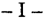

La cámara rechazó el recurso extraordinario, al entender que la tacha de arbitrariedad formUlada por la defensa de Emilio Oscar Sanzoni, sólo ocultaba un claro desacuerdo con el modo en que el tribunal

valoró las pruebas, lo que resulta extraño a la vía intentada, máxime cuando la resolución en crisis cuenta con motivación suficiente para sostenerla como acto jurisdiccional válido. Asimismo, y a renglón seguido, invocó la doctrina de V.E. según la cual la selección y valoración de las pruebas es facultad exclusiva de los Jueces de la causa, y ajena, en consecuencia, al recurso extraordinario.

La parte sostiene en la presente queja que nos encontramos ante un caso de arbitrariedad pues se toleraron falencias como la de no haber sido indagado Sanzoni por hechos que luego dieron base a la imputación de asociación ilícita, ola de no haberse autorizado pericias que clarificarían la cuestión facilitando el derecho de defensa. También alega que se calificaron las actividades del nombrado como de organizador de la sociedad criminal, sin considerar los requisitos fundamentales de esta figura.

-II-

En lo que respecta a los agravios basados en la disconformidad con el mérito probatorio, y tal comolo sostuvo el a qua, corresponde remitirse en un todo al principio general que establece que éstas son cuestiones ajenas al recurso extraordinario; más aún en casos como éste donde la parte no refuta acabadamente los argumentos de la sentencia, y no se advierte un análisis erróneo de la prueba.

No obstante ello, es dable advertir que en la calificación legal de los hechos por los que Sanzoni fue condenado, a saber, participación en una asociación ilícita en calidad de organizador, se ha incurrido, en lo que respecta a la agravante, en un defecto en la fundamentación normativa que torna arbitraria la decisión. En efecto, aun considerando los hechos tenidos ,por probados en la sentencia (cuestión no discutible, según se dijo en el punto anterior), la fundamentación resulta insuficiente en lo que hace a la sub sunción dela conducta en la figura calificada -no así en la básicasegún los principios que expondré más adelante.

Esta situación fue advertida y plasmada por la defensa en el punto V de su expresión de agravios ante la cámara (fs. 53/55), quien, después de expresar su disconformidad con,la valuación de los hechos, acepta por vía de hipótesis las conclusic~hesde la jueza de sentencia sobre el grado de participación de Sanzoni en la banda, 'para luego

refutar que sobre estos hechos sea posible fundar la agravante. Pero el a qua, en vez de dar respuesta puntual a este cuestionamiento, se remite a la sentencia de primera instancia para concluir afirmando, en lo que a este tema se refiere, que los partícipes de la sociedad "se consultaban entre ellos según se sucedían los diversos acontecimientos, lo que demuestra la calidad de organizadores que a lo menos los tres nombrados tenían".

y si bien esta alegación no se reedita de manera expresa en los escritos de interposición del recurso extraordinario y del recurso de queja, estimo, de todas maneras, que V.E. se encontraría facultada para revisar lo atinente a la existencia de la agravante que, fruto de un análisis insuficiente, fue aceptada por el tribunal a quo. Para ello tengo en cuenta que, de todas maneras, hi parte sigue ensayando una disconformidad genérica con la sentencia, a lo que se suma, principalmente, la recepción del principio de informalidad en Fallos: 292:296 (considerando 6º); 294:9 (voto de los jueces Masnatta y Levene [h], considerando 4º); y la doctrina que establece que la Corte no está limitada por las posiciones de la cámara ni la de los apelantes, sino que le incumbe realizar una declaratoria sobre el punto disputado (art. 16de la ley 48), según la interpretación que rectamente le otorga (Fallos: 307:1457; 319:1716; 322:2750, considerando 4º, entre otros. Cf también, para un desarrollo de estas cuestiones, el dictamen de esta Procuración General en el recurso de queja S.C.L.223, L. XXXIV, in re "Luque, Guillermo Daniel", del 8 de mayo de 2001, al que me remito en razón de brevedad).

En cuanto al análisis de la arbitrariedad detectada en la calificación legal, que afecta la calidad de Sanzoni como organizador de la asociación ilícita, corresponde decir, en primer lugar, que la juez de primera instancia tuvo por probadas las siguientes circunstancias: el rol prominente que en la sociedad le habría cabido a su compañero Juan José Princivalle; la participación activa de Sanzoni en los delitos que llegaron a exteriorizarse; las consultas que éste le efectuaba a aquél cuando las operaciones planeadas corrían el riesgo de fracasar por la intervención policial u otro imponderable; las consultas que, a su vez, le hacía Almeda de León, otro partícipe, a Sanzoni cuando había problemas con la policía o con quienes oficiaban de "correos"; el reclutamiento, convocatoria y supervisión de estos "correos";la comunicación a los jefes del resultado de las maniobras; la tarea de distribuir las comisiones a los partícipes de cada maniobra; la facultad de decidir el día y la hora de la operación; la obligación de dar inmediata

intervención a distintos abogados para que se presentaren en comisarías y juzgados, cuando detenían a algún "correo"; la propuesta concreta de un letrado comodefensor de uno de los "correos" en el Juzgado de Instrucción NQ24; las órdenes que daba a otros miembros de la organización, de quienes recibía, al menos en forma compartida, obediencia a sus mandatos.

La cámara, por su parte, y respecto al rol que cumplían en la asociación Princivalle, Almeda de León y Sanzoni, sostiene que "se consultaban entre ellos según se sucedían los diversos acontecimientos, lo cual demuestra la calidad de organizadores que a lo menos los tres nombrados tenían".

-111-

En mi opinión, la sentencia del a qua resulta insuficiente para explicar por qué los actos concretos que pone a cargo de Sanzoni realizarían la agravante de "organizador", sin perjuicio de su supuesta participación relevante en la asociación ilícita.

Para fundamentar esta afirmación es preciso, sin embargo, efectuar previamente algunas consideraciones en torno a esta figura penal. Es un dato no discutido en la doctrina y la jurisprudencia que, al reprimir el hecho de asociarse para cometer delitos, el legislador ha tipificado con carácter de delito autónomo lo que en puridad son actos preparatorios de los delitos cuya ejecución constituye el objeto de la asociación(cf.Soler, Sebastián, Derecho Penal Argentino, TomoIV,TEA, 10 Q reimp., Buenos Aires, 1992, página 710). La razón que fundamenta y legitima, en el marco de un estado de derecho, tal adelantamiento de la punibilidad reside en la extrema peligrosidad que entraña la existencia misma de asociaciones de la índole tenida en mira por el legislador al concebir este tipo penal, y la lesión que ello produce en la tranquilidad y paz social (cf.Núñez, Ricardo, Derecho Penal Argentino, ed. Lerner, Córdoba, 1974, t. VI, página 184; Soler, Sebastián, op. cit., página 698; en general, sobre la peligrosidad comofundamento para la punibilidad de los actos preparatorios, Jescheck, Hans. H., Tratado de Derecho Penal, ed. Comares, 4 Q edición, Granada, 1993, páginas 474 y 641).

En este sentido, ya Maggiore expresaba en relación a los delitos contra el orden público que si bien "...es cierto que todo delito turba la tranquilidad, la seguridad y la paz públicas, de un modo mediato ...

también hay delitos que violan e injurian esa armonía exterior e interna, de manera inmediata. De aquí procede la conveniencia, y quizá la necesidad técnica de crear un tipo de delitos directamente lesivos de la paz social (crimina fractae pacis) o del orden público" (Maggiore, Giuseppe, Derecho Penal, ed. Temis, Bogotá, 1955, t. III, páginas 441 y sgtes.).

y más modernamente se afirma que en estos casos la conducta es criminalizadano por su condición de acto preparatorio de delitos futuros, sino en la medida en que, al elevar drásticamente el riesgo de que éstos se produzcan, lesiona en sí misma otro bien jurídico, a saber, la tranquilidad pública, entendida ésta comola seguridad cognitiva que es condición necesaria para la vigencia de las normas (Jakobs, Günther, Krimminalisierung im Vorfeld einer Rechtsgutsverletzung, ZstW 97 [1985], páginas 774 y sgtes.).

Por lo demás, en lo que atañe a esta especial peligrosidad que legitima la incriminación, se aduce que ella deriva de que este tipo de asociaciones desarrollan generalmente una dinámica propia que compele a la comisión de los hechos perseguidos y que menoscaba e incluso destruye el sentimiento de responsabilidad personal de sus integrantes. Las causas para ello residen, fundamentalmente, en dos circunstancias. En primer lugar, en que los procesos de dinámica grupal que se desarrollan dentro de la organización generan en sus integrantes una disminución de los factores individuales de inhibición y no en pocas ocasiones generan motivos adicionales para la comisión de hechos punibles. En segundo lugar, en la circunstancia de que esa clase de asociaciones tanto por su estructura organizativa, orientada interna y funcionalmente hacia la comisión de delitos, cuanto por el potencial del que disponen para el planeamiento y la ejecución de esos delitos, facilita extraordinariamente a sus miembros la comisión de los hechos punibles (SK-Rudolphi, ~ 129, núm. 3; también Trondle/Fischer, StGB, 49 ed., 1999, ~ 129, núm. 3b; cf., asimismo, las sentencias del Tribunal Supremo Federal alemán del 11/10/78 [BGHSt 28, 147], 13/1/83 [BGHSt 31,202], Ydel 22/2/95 [BGHSt 41,47]).

Pero son precisamente estas peculiaridades, vinculadas con el adelantamiento de la punibilidad, las que imponen al intérprete extremar los recaudos al momento de aplicar los conceptos de este tipo penal, a fin de que no queden subsumidos en ellos sino aquellos casos que ha sido la finalidad de la regulación abarcar. Paso a explicar las razones para esta afirmación:

Dado que se trata de la punición de actos preparatorios, sólo admisibles por su especial peligrosidad, una interpretación que no se ajuste estrictamente a la finalidad de la regulación, corre el riesgo de avanzar sobre acciones privadas que, aunque moralmente disvaliosas, no revistan la extrema peligrosidad que legitimó al legislador para extender la punibilidad al estadio de preparación. Ello, sin duda, importaría una infracción a los derechos de asociación, legalidad y privacidad, tutelados en los arts. 14, 18 Y19 de la Constitución Nacional.

Por otro lado, una exégesis literal de los conceptos típicos que pierda de vista la extrema gravedad de los hechos que la regulación tuvo en mira evitar, corre el riesgo de colocar la aplicación del texto legal en pugna con el principio de proporcionalidad de las penas, al que V.E.le ha asignado jerarquía constitucional (Fallos: 312:809 y 826). Y es que por la vía de una interpretación acrítica podría terminar castigándose con la pena de la asociación ilícita -de hasta diez años-la mera preparación de delitos a los que en caso de ejecución les correspondería una pena sensiblemente menor.

Ciertamente, estos reparos no son patrimonio exclusivo del texto legal nacional. Así, frente a la redacción del ~ 129, 1 Q párrafo, del Código Penal alemán (StGB) -que reprime la formación de una asociación cuyos fines o cuya actividad esté dirigida a cometer delitos y la participación comomiembro en una asociación de esa índole-, se ha advertido desde la literatura de ese país que, si se quiere evitar el reproche de falta de determinación del tipo penal, se impone imperiosamente una interpretación restrictiva del concepto de asociación criminal estrictamente orientada al fin de protección de ese tipo legal (cf. SK Rudolphi, ~ 129, núm. 4). Por su parte, el Tribunal Supremo Federal alemán ha declarado que el ~ 129, 1Q párrafo, del StGB sólo podía ser aplicado, con arreglo a su finalidad, cuando los delitos, cuya comisión constituye el objeto de la asociación, representan un peligro grave para la seguridad pública y, por consiguiente, revisten desde esta perspectiva cierta gravedad. Según ese tribunal, la gravedad ha de enjuiciarse no sólo a partir del marco penal, sino a través de una valoración global de los delitos planeados y/o cometidos que incluya todas las circunstancias -en especial los efectos del hechoque pueden ser de importancia para la medida de la puesta en peligro de la seguridad pública (BGHSt 41,47,52).

No obstante, pienso que de nada valdría someter a tales exigencias la tarea de interpretación, si esos mismos recaudos no debieran

ser observados al momento de fundamentar críticamente la subsunción de los hechos del caso bajo los elementos del tipo penal. Por el contrario, en casos de esta índole adquiere aun mayor trascendencia la obligación de dotar a la decisión jurisdiccional de una fundamentación lógica y precisa que explique por qué los actos concretos puestos a cargo del autor revestirían la extrema peligrosidad que autorizó al legislador a tipificar actos preparatorios comoUIl ilícito autónomo. Una fundamentación normativa del caso acorde con los principios constitucionales del derecho penal material requiere de parte de los jueces un desarrollo argumental en orden a demostrar que la subsunción practicada se halla en consonancia con el respeto de los principios de legalidad, lesividad y proporcionalidad.

Ahora bien, resulta claro, a mi modo de ver, que todo lo dicho hasta aquí respecto a las exigencias a las que ha de someterse la aplicación de este tipo penal vale tanto más para la figura agravada por la calidad de "jefe"u "organizador" del autor, desde que a la problemática de la punición en el campo previo de la preparación se suma la necesidad de interpretar los amplios conceptos de 'jefe" y "organizador", que elevan severamente la pena en el mínimo de la escala legal precisamente en atención a la mayor peligrosidad de su participación en relación a los restantes miembros de la asociación. En concreto, más allá de si los términos 'jefe" y "organizador" han sido utilizados comosinónimos o, por el contrario, mentan dos papeles distintos dentro de la asociación, lo cierto es que en cualquiera de estas hipótesis se trata de una agravante que, a la luz de lo expuesto en los párrafos anteriores, exige, todavía con más razón, un grado mayor de fundamentación que no advierto en la sentencia del a qua.

En efecto, como lo mencioné al comienzo de este dictamen, por toda fundamentación el a quo no ofrece más que la genérica afirmación de que Sanzoni y sus coimputados "se. consultaban entre ellos según se sucedían los diversos acontecimientos, lo cual demuestra la calidad de organizadores que a lo menos los tres nombrados tenían", y remite en lo demás a la sentencia de primera instancia. Esta, por su parte, sólo contiene una enumeración de las concretas acciones que pone a cargo del imputado en su condición de miembro de la asociación, pero carece de un análisis crítico que explique por qué esas conductas realizarían también la agravante de "organizador", concepto éste respecto de cuyo contenido y alcance tampoco efectuó siquiera alguna consideración. Tampoco es posible pasar por alto que el imputado había cuestionado que los hechos considerados probados por la

juez de primera instancia pudieran subsumirse en el tipo calificado, razón por la cual la remisión efectuada por el a quo dejó sin contestar los argumentos invocados por el apelante ante esa alzada (Fallos: 313:1095; 321:2243, entre otros).

En virtud de lo señalado, considero que la sentencia impugnada, en lo concerniente a la aplicación de la agravante mencionada, ha sido sustentada en argumentos aparentes, ineficaces para sostener la solución adoptada, y ha soslayado la consideración de los extremos relevantes para decidir adecuadamente el punto debatido, lo cual la priva del carácter de actojurisdiccional válido(Fallos:317:1155;322:963,2589,2839).

Por ello, opino que V.E. debe hacer lugar a la presente queja, declarar procedente el recurso extraordinario, en lo que se refiere a la arbitraria interpretación del delito de asociación ilícita agravado por la calidad de organizador, y revocar el fallo apelado, a fin de que se dicte una nueva sentencia con arreglo a derecho. Buenos Aires, 6 de agosto de 2001. Nicolás Eduardo Becerra.

## FALLO DE LACORTE SUPREMA

Buenos Aires, 12 de septiembre de 2002.

Vistos los autos: "Recurso de hecho deducido por Emilio Osear Sanzoni en la causa Sanzoni, Emilio Oscar si asociación ilícita -causa Nº 4653-", para decidir sobre su procedencia.

## Considerando:

Que el recurso extraordinario, cuya denegación dio origen a la presente queja, es inadmisible (art. 280 del Código Procesal Civil y Comercial de la Nación).

Por ello, y habiendo dictaminado el señor Procurador General, se desestima la queja. Intímese a la parte recurrente a que, dentro del

,(

. )

\

(.

.

quinto día, efectúe el depósito que dispone el arto 286 del Código Proc~sal Civil y Comercial de la Nación, en el Banco de la Ciudad de Buenos Aires, a la orden de esta Corte y bajo apercibimiento de ejecución. Hágase saber y archívese.

JULIO S. NAZARENO -EDUARDO MOLINÉ O'CONNOR -AUGUSTO CÉSAR BELLUSCIO -ENRIQUE SANTIAGO PETRACCHI -ANTONIO BOGGIANO -GUILLERMO A. F. LÓPEZ -GUSTAVO A. BOSSERT -ADOLFO ROBERTO VAZQUEZ (en disidencia).

DISIDENCIA DEL SEÑOR MINISTRO DOCTOR DON ADOLFO ROBERTO V ÁZQUEZ

Considerando:

1º) Que la Sala I de la Cámara Nacional de Apelaciones en lo Criminal y Correccional de la Capital Federal, resolvió confirmar la sentencia del Juzgado Nacional de Menores Nº 1 de esta ciudad, en cuanto condena a Emilio Oscar Sanzoni por considerarlo coautor del delito de asociación ilícita en carácter de organizador, a ocho años de prisión, a la vez que le impone la pena única de nueve años de prisión, comprensiva de aquélla y la de un año y seis meses de prisión en suspenso -cuya condicionalidad revocóimpuesta por el Juzgado Nacional de Primera Instancia en lo Criminal de Sentencia Letra "8".

Contra ese fallo, la defensa interpuso recurso extraordinario, cuya denegatoria dio origen a la presente queja.

2º) Que el recurrente tachó de arbitrario el fallo sobre la base de haber tolerado falencias que vulneraron las garantías constitucionales del debido proceso y la defensa en juicio. Concretamente, se agravió esá parte de que el encausado no fue indagado por hechos que luego sirvieron de base a la imputación por el delito de asociación ilícita; tampoco se autorizó la realización de pericias que habrían clarificado la acusación y por último, se calificaron las actividades de Sanzoni como de organizador de la sociedad criminal, sin considerar los requisitos fundamentales de esa figura.

3º) Que a excepción del agravio dirigido a cuestionar las circunstancias tenidas en cuenta al momento de tener por configurada la agra-

vante del delito imputado, el remedio federal es inadmisible (art. 280 del Código Procesal Civil y Comercial de la Nación).

- 4Q ) Que si bien, por vía de principio, es la doctrina del Tribunal que lo atinente a la calificación legal de los hechos no suscita cuestión que quepa decidir en la instancia del arto 14 de la ley 48, cabe apartarse de dicha regla cuando se ha ocasionado un agravio a la garantía de ,la defensa en juicio y del debido proceso que, con sustento en la doctrina .1 de la arbitrariedad, se tiende a resguardar, exigiendo que las sentencias sean fundadas y constituyan una derivación razonada del derecho vigente con aplicación de las circunstancias comprobadas de la ca~sa (Fallos: 311:948, 2314, 2402; 320:1463 entre otros). .
- 5Q ) Que, en esa directriz la exigencia de que los fallos judiciales tengan fundamentos serios, señalada por la jurisprudencia y la doctrina unánimes sobre la materia, reconoce raíz constitucional y tiene, comocontenido concreto, el imperativo de que la decisión se conforme a la ley y a los principios propios de la doctrina y de la jurisprudencia vinculados a la especie a decidir (Fallos: 318:652; 321:2375).
- 6Q ) Que en consecuencia, la tesis con arreglo a la cual son revisables en la instancia extraordinaria las sentencias sin otro fundamento que la voluntad de losjueces, áutoriza el conocimiento del Tribunal en los supuestos en que las razones aducidas por el fallo en recurso se impugnan, con visos de verdad, por carentes de los atributos mencionados más arriba,' todo lo cual:pone de manifiesto la relación directa e inmediata entre lo resuelto y la garantía constitucional que se dice vulnerada (Fallos: 319:1577; 321:2377).

Que con dicho alcance, la cuestión federal sometida a estudio es apta por la vía intentada, cuando el tribunal a quo, al condenar a Sanzoni como partícipe de una asociación ilícita en calidad de organizador, incurrió en lo que respecta a la agravante, en un defecto en la fundamentación normativa que torna arbitraria la decisión.

- 7Q ) Que esta Corte tiene resuelto que la figura penal de la asociación ilícita prevista en el arto 210 del código de fondo en la materia, no requiere la existencia de otros delitos consumados y ni siquiera de principio de su ejecución, siendo necesario distinguir cuidadosamente la mencionada figura del acuerdo criminal, ya que aquélla requiere un elemento de permanencia ausente en este último, que puede tener por finalidad la comisión de varios delitos pero que es esencialmente transitorio. Al respecto, ha sostenido calificada doctrina que las razones en

virtud de las cuales el legislador ha tipificado con carácter autónomo lo que en puridad son actos preparatorios de los delitos cuya ejecución constituye el objeto de la asociación, radica en la extrema peligrosidad que entraña la existencia misma de asociaciones de índole criminal, y la lesión que ello produce en la tranquilidad y paz social. En tal sentido, si bien es cierto que la comisión de cualquier delito perturba la tranquilidad, la seguridad y la paz pública de manera mediata, algunos -como dquellos incluidos en título "delitos contra el orden público" del Código 'Penal-la afectan de forma inmediata, ya que el orden público al que se alude es sinónimo de tranquilidad pública o paz social, es decir, de la sensación de sosiego nacida de la confianza de que pueden vivir en una atmósfera de paz social, por 10 que los delitos que la afectan producen alarma colectiva al enfrentarlos con hechos marginados de la regular convivencia que los pueden afectar indiscriminadamente. En consecuencra, la criminalidad de éstos reside esencialmente, no en la lesión efectiva de cosas o personas, sino en la repercusión que ellos tienen en el espíritu de la población y en el sentimiento de tranquilidad pública, produciendo alarma y temor por loque puede suceder (Fallos: 324:3952).

8º) Que en el campo del derecho comparado, el tribunal supremo alemán ha expresado que en lo que atañe a la especial peligrosidad que legitima al Estado en la incrimip.ación de estas conductas, ello deriva de que este tipo de asociacione~ desarrollan generalmente una dinámica propia que compele a la comisión de los hechos perseguidos y que menoscaba e incluso destruye el sentimiento de responsabilidad personal de sus integrantes. Las causas para ello residen, fundamentalmente, en dos circunstancias. En primer lugar, en que los procesos de dinámica grupal que se desarrollan dentro de la organización generan en sus integrantes una disminución de los factores individuales de inhibición y no en pocas ocasiones generan motivos adicionales para la comisión de hechos punibles. En segundo lugar, en la circunstancia de que esa clase de asociaciones tanto por su estructura organizativa, orientada interna y funcionalmente hacia la comisión de delitos, cuanto por el potencial del que disponen para el planeamiento y la ejecución de esos delitos, facilita extraordinariamente a sus miembros la comisión de los hechos punibles (sentencias del 11 de octubre de 1978 -BGHSt 28,147y del 22 de febrero de 1995 -BGHSt 41,47-).

9º) Que las particulares características apuntadas, en cuanto importan un avance de la función punitiva del Estado sobre actos preparatorios de delitos futuros, exigen al intérprete extremar los recaudos al momento de aplicar los conceptos de este tipo penal a fin de que no

queden subsumidos en ellos sino aquellos casos que ha sido la finalidad de la regulación abarcar. Y es que la sanción penal de dichos actos fundada en su especial peligrosidad, corre el riesgo de avanzar sobre acciones privadas con menoscabo de las garantías tuteladas en los arts. 14,18 Y 19 de la Constitución Nacional.

En esta línea de pensamiento, debe considerarse el aporte de la doctrina de autores extranjeros comoGünther Jakobs quien, respecto de este tipo de conductas, afirmó que la misma es criminalizada no por su condición de acto preparatorio de delitos futuros, sino en la medida en que, al elevar drásticamente el riesgo de que éstos se produzcan, lesiona en sí misma otro bien jurídico, a saber, la tranquilidad pública, entendida ésta comola seguridad cognitiva que es condiciónnecesaria para la vigencia de las normas (Krimminalisierung im Vorfeld ein'er Rechtsgutsverletzung, 1985, págs. 774 y sgtes.). . ;

10) Que aclarada la necesidad de que los jueces, al momento de aplicar la figura penal en estudio, extremen los recaudos que les permitan tener acreditado el tipo legal previsto en el arto 210 del Código Penal en cuanto exige el dolo específicode asociarse para cometer delitos, cuanto más habrá de exigírseles para la aplicación de la figura agravada por la calidad de ''jefe'' u "organizador", en la medida que elevan severamente la pena en el mínimo de la escala legal precisamente en atención a la mayor peligrosidad de su participación en relación a los restantes miembros de la asociación.

11) Que en el sub lite, el aquo afirma comoúnico fundamento de la agravante endilgada a Sanzoni, que comparte "plenamente los rechazos que hace la colega de grado a los argumentos defensistas ... sobre el eventual carácter de mero integrante de Sanzoni, apoyados esos rechazos fundamentalmente sobre las mismas escuchas telefónicas, que prueban acabadamente que no sóloSanzoni conocíaa sus consortes de causa Princivalle y Almeda de León ..., sino que, además, se consultaban entre ellos según se sucedían los diversos acontecimientos, lo que demuestra la calidad de organizadores que a lo menos los tres nombrados tenían" (fs. 25 vta.l26).

Por su parte, la jueza de primera instancia tuvo por probado que Sanzoni integró una asociacióndelictiva en calidad de organizadorjunto con los nombrados Juan José Princivalle y Miguel Almeda de León conforme a las siguientes probanzas: a) connivencia de los tres, en base a escuchas telefónicas; b) rol prominente que en la sociedad le

habría cabido a Princivalle, conforme el resultado del allanamiento realizado en su domicilio; c) la participación activa de Sanzoni en la organización de los ilícitos, puesto que éste consultaba a Princivalle cuando las operaciones planteadas corrían riesgo de ser desbaratadas por la intervención policial o por algún otro imponderable; d) la vinculación existente entre Sanzoni y Almeda de León, por grabaciones telefónicas de las que surgían consultas que este último efectuaba al primero sobre aquellas personas que oficiaban de "correos";e) el resultado de una pericia caligráfica que vincula a Sanzoni con el hecho individualizado en autos con el Nº 72; D escuchas telefónicas que daban cuenta que Sanzoni cumplía con tareas tales como supervisión, reclutamiento y convocatoria de los denominados "correos";comunicaba el resultado de las operaciones a Princivalle y a Héctor Juan Barroso y distribuía las ganancias que se obtenían; g) la importantísima función en la organización cumplida por Sanzoni, consistente en dar inmediata intervención a distintos abogados de confianza para que se presentaran en comisarías yjuzgados, cuando detenían algún "correo" pudiendo, de esa forma, cerciorarse de que declarasen de acuerdo a las instrucciones que les eran impartidas con anterioridad a los hechos (se alude concreta. mente al hecho individualizado en autos como Nº 80, donde Sanzoni se presentó ante el Juzgado de Instrucción Nº 24 proponiendo a un letrado como defensor de una de los "correos").

De esa forma tuvo por configurado los elementos objetivos y subjetivos del tipo penal escogidomás la agravante, afirmando que Sanzoni . "daba órdenes a otros miembros de la organización y recibía de éstos la correspondiente obediencia a sus mandatos. cuanto menos de forma compartida".

12) Que sin perjuicio de la participación de Sanzoni en la asociación ilícita -cuya existencia no será cuestionada-, la sentencia del tribunal a quo resulta insuficiente para explicar por qué los actos concretos que atribuye al nombrado permiten calificarlo con la agravante de organizador. En este sentido, el a quo se ha limitado a formular consideraciones genéricas que no dan respuesta a los concretos agravios de la parte recurrente, tendientes a demostrar la improcedencia del tipo calificado para la conducta enrostrada al imputado, afirmando que éste y sus consortes "se consultaban entre ellos según se sucedían los diversos acontecimientos, lo cual demuestra la calidad de organizadores que a lo menos los tres nombrados tenían" (fs. 26 del pronunciamiento apelado).

Por otro lado, la resolución impugnada es igualmente arbitraria en su remisión a las demás consideraciones contenidas en el fallo de primera instancia; pues ésta sólo contiene una enumeración de las concretas acciones que pone a cargo del imputado en su condición de miembro de la asociación, pero carece de un análisis crítico que explique por qué esas conductas configurarían la agravante de "organizador", concepto éste respecto de cuyo contenido y alcance tampoco efectuó siquiera alguna consideración, desatendiendo así la interpretación restrictiva que la figura calificada impone.

13) Que, al ser ello así, el fallo apelado resulta descalificable como acto judicial a la luz de la conocida doctrina elaborada por esta Corte en torno de las sentencias arbitrarias pues se sustenta en argumentos aparentes, ineficaces para sostener la solución adoptada y media relación directa e inmediata entre lo debatido y resuelto y las garantías constitucionales que se dicen vulneradas (art. 15 de la ley 48); sin que ello implique emitir juicio sobre la solución que en definitiva corresponda adoptar sobre el fondo del asunto (Fallos: 318:643; 319:2264).

Por ello, y de conformidad con lo dictaminado por el señor Procurador General, se hace lugar a la presente queja, se declara procedente el recurso extraordinario en lo que se refi.ere a la arbitraria interpretación del delito de asociación ilícita agravada por la calidad de organizador, se deja sin efecto el fallo apelado y vuelva al tribunal de origen para que por intermedio de quien corresponda, se dicte un nuevopronunciamiento con arreglo al presente. Agréguese la queja al principal. Notifíquese y remítase.! .

ADOLFO ROBERTO V ÁZQUEZ.

## SILVIA BEATRIZ SAUCO

JURISDICCION y COMPETENCIA: Competencia federal. Por la materia. Causas regidas por normas federales.

Lorelativo al funcionamiento de los partidos políticos para la elección de autoridades en el orden nacional, más allá de que se trate de actos referidos a las elecciones partidarias internas, se encuentra sometido al régimen legal de la

ley 23.298 y consecuentemente, a la jurisdicción federal, sin perjuicio de que también concurran con la elección de candidatos para cargos locales y se apliquen normas de tal índole.

## DICTAMEN DEL PROCURADOR FISCAL

## Suprema Corte:

Entre el Juzgado Federal y el Juzgado de Garantías Nº 2, ambos de Junín, Provincia de Buenos Aires, se suscitó la presente contienda negativa de competencia en la causa donde se investiga la denuncia formulada por Silvia Beatriz Sauco.

En ella refiere que una de las personas que integraba la lista Nº 2, que participaba en las elecciones internas del Partido Justicialista celebradas el 12 de agosto de 2001, se presentó en su domicilio, ese mismo día, y le ofreció la suma de cincuenta pesos para que concurriera a emitir su sufragio en favor de los candidatos de esa lista, presionándola además con la amenaza de dejar de proveerle la caja de alimentos que venía recibiendo desde dos meses atrás.

I

Asimismo, manifiesta que fue trasladada en una camioneta allugar del comiciojunto a un grupo de personas que también percibieron sumas de dinero para votar por la misma lista.

Lajusticia federal se declaró incompetente para conocer en la causa al considerar que sin perjuicio de que el hecho denunciado configura un delito tipificado en el arto 139, inc. b, del Código Electoral Nacional-ley 19.945-, la intervención de la justicia de excepción se encuentra limitada al conocimiento de los hechos ilícitos que acontezcan en el transcurso de un acto eleccionario nacional.

Por lo demás sostuvo, en apoyo de su criterio, que sustraer esta causa y en esta etapa del conocimiento de lajusticia local, constituiría un avance no justificado sobre la autonomía dela provincia -arto 116 de la Constitución Nacional-.

En consecuencia; remitió las actuaciones a la justicia provincial (fs. 4), que, a su turno, rechazó el planteo.

La magistrada local alegó, para fundar su resolución, que la conducta denunciada no encuadraría dentro de las infracciones previstas en la Ley Electoral de la Provincia de Buenos Aires -ley 5109- pues ésta se refiere al sufragio "universal, secreto y obligatorio" (art. 1Q), características que no reviste el voto emitido en elecciones partidarias internas.

Por ello, devolvió el sumario al juzgado de origen (fs. 5/6), que insistió en su postura y tuvo por trabada la contienda (fs. 7).

Toda vez que de las probanzas del incidente surge que el hecho a investigar se habría producido en los comicios internos del Partido Justicialista, estimo que por tratarse de una entidad partidaria que actúa en el orden nacional, no puede descartarse que en ese acto comicial del 12 de agosto se eligieran candidatos para cubrir cargos de esa naturaleza (Fallos: 316:2027).

Al respecto, V.E. tiene establecido, que lo relativo al funcionamiento de los partidos políticos para la elecciónde autoridades en el orden nacional, más allá de que se trate de actos referidos a las elecciones partidarias internas, se encuentra sometido al régimen legal de la ley 23.298 y consecuentemente, a la jurisdicción federal, sin peIjuicio de que también concurran con la elección de candidatos para cargos locales y se apliquen normas de tal índole (Fallos: 305:926 y aclaratoria de página 928).

Sobre la base de estas consideraciones, opino que corresponde dirimir este conflicto declarando la competencia del juzgado federal con competencia electoral de la Provincia de Buenos Aires para conocer en la causa. Buenos Aires, 22 de mayo de 2002. Luis Santiago González Warcalde.

## FALLO DE LA CORTE SUPREMA

Buenos Aires, 12 de septiembre de 2002.

## Autos y Vistos:

Por los fundamentos y conclusiones del dictamen del señor Procurador Fiscal, a los que cabe remitirse en razón de brevedad, se declara que deberá enviarse el presente incidente, al Juzgado Federal de Junín,

Provincia de Buenos Aires, con el fin de que remita las actuaciones al Juzgado Federal Nº 1 de La Plata, Secretaría Electoral, que deberá entender en la causa. Hágase saber al Juzgado de Garantías Nº 2 del departamento judicial de la mencionada localidad.

JULIO S. NAZARENO -EDUARDO MOLINÉ O'CONNOR -CARLOS S. FAYTAUGUSTO CÉSAR BELLUSCIO -ENRIQUE SANTIAGO PETRACCHI -GUILLERMO A. F. LÓPEZ -GUSTAVO A. BOSSERT -ADOLFO ROBERTO VÁZQUEZ.

## SALVADOR JOSE FRATTO y OTRO

JURISDICCION y COMPETENCIA: Cuestiones de competencia. Intervención de la Corte Suprema.

Si bien la realización de medidas instructorias con posterioridad al inicio de la contienda, importa asumir la competencia que fuera atribuida y una declinatoria efectuada con posterioridad da inicio a un nuevo conflicto, por razones de economía procesal y del buen servicio ;de justicia, cabe al Tribunal resolver sobre el fondo de la cuestión.

JURISDICCION y COMPETENCIA: Competencia federal. Causas penales. Casos varios.

Si a raíz de un paro nacional se produjo la efectiva interrupción de un servicio público interjurisdiccional, ello resulta suficiente para otorgar el conocimiento de la causa a la justicia federal.

DICTAMEN DEL PROCURADOR FISCAL

## Suprema Corte:

La presente contienda negativa de competencia suscitada entre el Juzgado de Garantías Nº 2 Yel Juzgado Federal Criminal y Correccional Nº 1, ambos de San Isidro, provincia de Buenos Aires, se refiere a la causa instruida contra Salvador José Fratto y José Luis Cárdenas.

De los antecedentes agregados al incidente surge que los imputados, ambos delegados gremiales, con motivo del paro nacional del 24 de noviembre de 2000; interrumpieron la salida de los ómnibus de la línea 152, que une el partido de Vicente López con esta ciudad.

El juez local declinó la competencia al entender que corresponde a la justicia de excepción la investigación de la figura tipificada en ~l artículo 194 del Código Penal (fs. 19).

El magistrado federal, por su parte, rechazó tal atribución y calificó el hecho como compulsión a la huelga o boicot.

Devueltas las actuaciones, el juzgado de origen insistió en su crit~rio y elevó el incidente a la Corte.

- Es doctrina del Tribunal que la efectiva interrupción del servicio público inteIjurisdiccional resulta suficiente para otorgar el conocimiento de la causa a la justicia federal (Fallos: 307:650).

Teniendo en cuenta que, en el caso, se habría entorpecido el tránsito de esos medios de transporte público (vid. acta de procedimiento y declaraciones testimoniales), considero que corresponde al juez nacional entender en esta causa, sin\_perjuicio de la calificación que en definitiva pueda corresponder al hecho. Buenos Aires, 24 de junio de 2002. Eduardo Ezequiel Casal.

## FALLO DE LA CORTE SUPREMA

Buenos Aires, 12 de septiembre de 2002.

Autos y Vistos; Considerando:

Que es doctrina de esta Corte que la realización de medidas instructorias practicadas con posterioridad al inicio de la contienda, importa asumir la competencia que fuera atribuida y que una declinatoria efectuada conposterioridad, da inicio a un nuevo conflicto (Fallos: 324:891). Tal circunstancia se ha verificado en estas actuaciones en las que a fs. 17 el juez federal de San Isidro promovió una nueva contienda, en los tér-

minos del arto 24, inc. 7º, del decreto-ley 1285/58, que sólo en caso de rechazo por parte del juzgado de garantías y posterior insistencia del magistrado federal habría quedado correctamente trabada.

Que sin perjuicio de ello, para evitar dilaciones que puedan traducirse en una privación de justicia, en beneficio del principio de economía procesal y del buen servicio de justicia, cabe resolver sobre el fondo de la cuestión, respecto de lo cual esta Corte Suprema comparte y hace suyos los fundamentos del dictamen que antecede, a cuyos términos y conclusiones corresponde remitirse en razón de brevedad.

Por ello, y de conformidad con lo dictaminado por el señor Procurádor Fisc¡}.l, se declara que deberá entender en la causa en la que se originó el presente incidente el Juzgado Federal en lo Criminal y Correccional Nº 1 de San Isidro, Provincia de Buenos Aires, al que se le remitirá. Hágase saber al JUzgado de Garantías NQ 2 del departamento judicial de la mencionada localidad.

JULIO S. NAZARENO -EDUARDO MOLINÉ O'CONNOR -AUGUSTO CÉSAR BELLUSCIO -ENRIQUE SANTIAGO PETRACCHI -GUSTAVO A. BOSSERT -ADOLFO ROBERTO VÁZQUEZ.

## JULIO SEBASTIAN SOSA v. NATALIA J. LUCHIN y OTROS

JURISDICCION y COMPETENCIA: Competencia federal. Por las personas. Distinta nacionalidad.

El fuero federal en razón de la distinta nacionalidad de las partes constituye un privilegio creado especialmente en beneficio del extranjero, y cuando dicho fuero esté establecido ratione personae, puede ser declinado y su renuncia debe admitirse en todos los supuestos en que ella sea explícita o resulte necesariamente de la prórroga de la jurisdicción operada en la causa. .

JURISDICCION y COMPETENCIA: Cuestiones de competencia. Generalidades.

Alos efectos de determinar la competencia, corresponde atender de modo principal a la exposición de los hechos que el actor hace en su demanda y, en la medida en que se adecue a ellos, al derecho que invoca como fundamento de su pretensión.

JURISDICCION y COMPETENCIA: Competencia federal. Por la materia. Causas excluidas de la competencia federal.

No es de la competencia federal la causa en la que se reclama la restitución de un menor pues más allá de la naturaleza federal y orden público que revisten las normas internacionales y supra legales invocadas por el actor, lo medular de su pretensión está vinculada centralmente a la interpretación y aplicación de normas de derecho civil-comúnque son las relativas al ejerciciode la patria potestad.

JURISDICCION y COMPETENCIA: Competencia ordinaria. Por la materia. Cuestiones civiles y comerciales. Patria potestad.

Teniendo en cuenta lo establecido por el arto 264 del Código Civil (texto según arto 3º de la ley 23.264) y que el domicilio de los padres determina la competencia para entender en cuestiones vinculadas a la patria potestad -ya quede acuerdo a lo establecido por elart. 9º, inc. 6º del Código Civil cabe presumir que los hijos menores de edad tienen su domicilio legal en el de sus representanteses competente para entender en la causa en la que se reclama la restitución de un menor el juez del domicilio del padre que se encontraba en el ejercicio de la patria potestad.

JURISDICCION y COMPETENCIA: Competencia ordinaria. Por la materia. Cuestiones civiles y comerciales. Patria potestad.

Si bien los derechos inherentes a la patria potestad se hallan inescindiblemente ligados a la restitución del menor y esta materia es regulada por tratados internacionales, de naturaleza federal, corresponde declarar competente al juez provincial, pues todos losjueces, de cualquier jerarquía y fuero, pueden y deben aplicar la Constitución y las leyes de la Nación a las causas cuyo conocimiento les corresponda, sin perjuicio de que las cuestiones federales eventualmente comprendidas puedan ser objeto de adecuada tutela por la vía del recurso extraordinario (Voto del Dr. Antonio Boggiano).

DICTAMEN DEL PROCURADOR GENERAL

Suprema Corte:

-1-

Tanto el titular del Juzgado Federal de Primera Instancia Nº 1, de la localidad de Posadas, Provincia de Misiones (v. fs. 27/9), como el magistrado a cargo del Juzgado de Primera Instancia de Familia Nº 1, de la precitada provincia (v. fs. 43), discrepan en torno a la competencia para entender en la presente causa.

El juez nacional, se declaró incompetente para conocer en la causa, de conformidad con lo dictaminado por el Señor Fiscal Federal (v. fs. 24/6), con base -centralmenteen que no se configuran los extremos exigidos para que proceda el fuero de excepción derivado de la distinta nacionalidad de las partes cuyoprivilegio fuera instituido exclusivamente a favor del extranjero.

Por otro lado, añadió que tampoco surte el fuero federal en razón de la materia, toda vez que la acción incoada tiene por finalidad lograr, por un lado, la restitución del menor por parte de su padre, y, por el otro, los derechos derivados del ejerciciode la patria potestad -guarda, custodia y régimen de visitas-, encontrando ella debido amparo en normas de derecho civil -común-o Ello, adujo, no resulta óbice la circunstancia de que el pretensor haya invocado disposiciones contenidas en los tratados conjerarquía constitucional, debido a que todos los jueces pueden interpretar y aplicar la Ley Fundamental y las leyes en las causas a cuyoconocimiento les corresponda sin ser dicha actividad condicionante del fuero de excepción. Máxime, sostuvo, cuando no se cuestiona en forma directa la interpretación de los tratados internacionales citados en la pretensión.

Por su parte, el tribunal provincial resistió la radicación del juicio, con fundamento en lo normado por los artículos 7, 12 Y 354, inciso primero, del Código Procesal Civil y Comercial de la Nación.

En tales condiciones, quedó trabado un conflicto que corresponde dirimir a V.E. en los términos del artículo 24, inc. 7 Q del decreto ley 1285/58.

-I1-

Cabe señalar, en primer término que V.E. tiene reiteradamente dicho que el fuero federal en razón de la distinta nacionalidad de las partes constituye un privilegio creado especialmente en beneficio del extranjero, y cuando dicho fuero esté establecido ratione personae, puede ser declinado y su renuncia debe admitirse en todos los supuestos en que ella sea explícita oresulte necesariamente de la prórroga de la jurisdicción operada en la causa. Y, en el caso en que no ha tomado intervención el demandado cuya nacionalidad extranjera es invocada por el actor, no se dan por ahora las condiciones que pudieran hacer surgir la jurisdicción federal (Fallos: 307:1728; 317:683; 323:477).

Estimo conveniente analizar, en segundo término, la cuestión desde la perspectiva de la competencia federal ratione materiae.

V.E. tiene reiteradamente dicho que, a los efectos de determinar la competencia, corresponde atender de modo principal a la exposición de los hechos que el actor hace en la demanda y, en la medida en que se adecue a ellos, al derecho que invoca comofundamento de su pretensión (Fallos: 318:298; entre muchos otros).

En efecto, conforme surge de la demanda promovida en autos (ver fojas 11/18) el actor reclama la restitución de su hijo menor -Julio Miguel Sosaquien, adujo, fue sustraído del lugar de su residencia habitual denunciado en la ciudad de Posadas, Provincia de Misiones, y trasladado por su madre a la jurisdicción de Carmen del Paraná, República del Paraguay, lugar en donde actualmente reside con aquélla y sus abuelos maternos. Asimismo, sostuvo que tal actitud importó vulnerar el ejercicio de sus derechos emanados de la patria potestad -guarda, custodia y visita del menormotivo por el cual, reclamó su plena operatividad.

Fundó su acción -centralmenteen los arts. 75 inciso 22 y 116 de la Constitución Nacional; arts. 10, 11 Y 18 de la Convención de los Derechos del Niño; arts. 6; 14 Y59 del Tratado de Montevideo de 1988; arts. 7, 30 y 61 del 'Tratado de Montevideo de 1940; Convenio sobre Aspectos Civiles de la Sustracción'!nternacional de Menores y Convención Interamericana sobre Restitución Internacional de Menores; arts. 2 incisos 1º y 2º, 8 y 12 de la ley 48; los artículos 264 quáter, inc. 4º y 276 del Código Civil, como así también los arts. 1y 2 ley 24.270.

Ha sostenido, al respecto, 'reiteradamente el Tribunal Superior, que si bien el presupuesto necesario para que aquélla surta estriba en que el derecho que se pretende hacer valer esté directa e inmediatamente fundado en un artículo de la Constitución Nacional, de la ley federal o de un tratado, una causa no es de las especialmente regidas por la Constitución a las que alude el arto 2º, inc. 1º de la ley 48, si no está en juego la inteligencia de una cláusula constitucional (Fallos: 306:1363, considerando 10y sus citas). Es decir, que lo medular de la disputa debe versar -para que la mencionada competencia procedasobre el sentido y los alcances de uno o más preceptos de la Ley Fundamental de la Nación, cuya adecuada hermenéutica resultará, por lo dicho, esencial para la justa solución del litigio.

Ello no ocurre en la especie, y más allá de la naturaleza federal y orden público que revisten las normas internacionales y supra legal invocadas por el actor, lo medular de su pretensión está vinculada centralmente a la interpretación y aplicación de normas de derecho civil -comúnque son las relativas al ejercicio de la patria potestad. Criterio que, tampoco, se ve alterado por la circunstancia de que el juzgador deba recurrir -reiteroa dichos tratados internacionales y a aquellas disposiciones conrango constitucional comoinstrumento para hacerlo efectivo.

En razón de lo concluido precedentemente y teniendo en cuenta lo establecido por el artículo 264 del Código Civil -texto según arto 3º de la ley 23.264y que el domicilio de los padres determina la competencia para entender en cuestiones vinculadas a la patria potestad -ya que de acuerdo con lo establecido por el arto 9º, inciso 6º, del Código Civil, cabe presumir que los hijos menores de edad tienen su domicilio legal en el de sus representantesy habiéndose constatado en el expediente, conforme surge de fojas 37/8, que el domicilio del padre del menor que se encontraba en el ejercicio de la patria potestad del mismo está situado en la Ciudad de Posadas, Provincia de Misiones, entiendo que las presentes actuaciones han de quedar radicadas ante la justicia ordinaria de familia de la precitada localidad provincial.

Por ello, opino que no tratándose en el sub lite del supuesto previsto por el artículo 354, inciso 1º, del Código Procesal Civil y Comercial de la Nación y en este estado en que la parte demandada aún no tomó intervención corresponde dirimir la contienda, atribuyendo al Señor Juez de Primera Instancia de Familia Nº 1 de la ciudad de Posadas, Provincia de Misiones. Buenos Aires, 14 de febrero de 2002. Nicolás Eduardo Becerra.

## FALLODE LACORTESUPREMA

Buenos Aires, 12 de septiembre de 2002.

Autos y Vistos:

De conformidad con lo dictaminado por el señor Procurador General, se declara que resulta competente para conocer en las actuaciones el Juzgado de Primera Instancia de Familia Nº 1 de la Primera Cir-

cunscripción Judicial de la ciudad de Posadas, Provincia de Misiones, al que se le remitirán. Hágase saber al Juzgado Federal de Primera Instancia Nº 1 de Posadas.

EDUARDO MOLINÉ O'CONNOR -AUGUSTO CÉSAR BELLUSCIO -ENRIQUE SANTIAGO PETRACCHI -ANTONIO BOGGIANO (según su voto) -GUSTAVO A. BOSSERT -ADOLFO ROBERTO V ÁZQUEZ.

VOTO DEL SEÑOR MINISTRO DOCTOR DON ANTONIO BOGGIANO

## Considerando:

Que esta Corte comparte los fundamentos y conclusiones del dictamen del señor Procurador General, cuyos términos se dan por reproducidos en razón de brevedad.

Que los derechos inherentes a la patria potestad que se pretenden hacer valer se hallan inescindiblemente ligados a la restitución del menor y esta materia es regulada por tratados internacionales, de naturaleza federal. En consecuencia, vale recordar que todos los jueces, de cualquier jerarquía y fuero, pueden y deben aplicar la Constitución y las leyes de la Nación en las causas cuyo conocimiento les corresponda (Fallos: 311:2478; 315:2708; 323:477, 2590 entre otros), sin perjuicio de que las cuestiones federales eventualmente comprendidas, puedan ser objeto de adecuada tutela por la vía del recurso extraordinario (Fallos: 314:158, entre otros).

Por ello, se declara que resulta competente para conocer en las actuaciones el Juzgado de Primera Instancia de Familia Nº 1 de la Primera Circunscripción Judicial de la ciudad de Posadas, al que se le remitirán. Hágase saber al Juzgado Federal de Primera Instancia Nº 1 de Posadas.

ANTONIO BOGGIANO.

## LEONOR CATALINA SOFIA FALCHI v. CAJA NOTARIAL COMPL. SEG. SOCo-COLEGIO ESCRIBANOS CAPITAL-

## JUBlLACION y PENSION.

Corresponde confirmar la sentencia que declaró la caducidad de la acciónjudicial deducida contra la resolución que no reconoció el derecho de la aetora a obtener la prestación adicional a la pensión creada por la ley 21.205, modificada por la 23.378, pues dicha resolución fue consentida por la interesada, al no haber interpuesto el recurso de apelación judicial dentro del plazo establecido por el arto 22 del referido régimen legal.

## JUBlLACION y PENSION.

Aun cuando la cosa juzgada administrativa pueda ser revisada en materia de seguridad social si la decisión estuviese afectada de nulidad absoluta (arts. 48 de la ley 18.037 y 15, 2º párrafo, de la ley 24.241), ello no ocurre si la nueva presentación ante la caja demandada reitera la petición ya resuelta.

## FALLODE LACORTE SUPREMA

Buenos Aires, 12 de septiembre de 2002.

I

Vistos los autos: "Falchi, Leonor Catalina Sofía cl Caja Notarial Compl. Seg. Soco -ColeoEscribanos Capitalsi prestación complementaria".

## Considerando:

1 º) Que la Sala II de la Cámara Federal de la Seguridad Social declaró la caducidad de la acción judicial en razón de que había sido intentada vencido el plazo establecido por las disposiciones legales aplicables (arts. 14, 22, 23 Y25 de las leyes 14.236,21.205 y 19.549, respectivamente). Contra ese pronunciamiento la actora dedujo recurso ordinario de apelación, que fue concedido a fs. 141 y es formalmente procedente (art. 19 de la ley 24.463).

2º) Que a tal efecto, el tribunal tuvo en cuenta que el Consejo Directivo del Colegio de Escribanos de la Capital Federal por resolución

incluida en el acta 2519 del 15 de abril de 1987, había rechazado la petición de la actora tendiente a que se le reconociera el derecho a obtener la prestación adicional a la pensión creada por la citada ley 21.205, en virtud de que el padre de la solicitante había fallecido en el año 1959, en tanto que el régimen complementario de jubilaciones y pensiones para escribanos regía desde 1975.

- 3º) Que la referida resolución fue consentida por la interesada al no haber usado los recursos legales para obtener la revisión judicial oportuna, razones que sustentaron la nota suscripta por el gerente del organismo a raíz de la nueva presentación de la actora efectuada el 9 de marzo de 1998,por la cual se le hizo saber que por haber vencido los plazos legales de caducidad no era posible la revisión administrativa o judicial de su petición en razón de que el contenido de la pretensión era idéntico al ya examinado por el Consejo Directivo que había finalizado con el dictado de una decisión firme.
- 4º) Que después de reiterar los argumentos expresados en las presentaciones administrativas yjudiciales efectuadas durante el trámite del proceso con relación a los temas vinculados con el fondo del asunto, la apelante cuestiona la sentencia de la alzada en la medida en que omitió considerar que la cosa juzgada administrativa no tiene carácter irrevocable cuando el acto impugnado padece de graves errores de derecho.
- 5º) Que la recurrente afirma también que el fallo desatendió el carácter imprescriptible que por mandato constitucional se asigna a las prestaciones previsionales, comoasimismo que las obligaciones que están en juego son de tracto sucesivo, por lo que la cámara no podía denegar para el futuro el reconocimiento de la suma complementaria a que tiene derecho, en particular si se tiene en cuenta que fue reconocida en un precedente del fuero laboral que guarda sustancial analogía con su pretensión.
- 6º) Que al respecto, se advierte que la resolución dictada por el Consejo Directivo del Colegio de Escribanos de la Capital Federal en el año 1987, que no hizo lugar a la prestación complementaria en razón de que la actora no reunía los requisitos exigidos por la ley 21.205, modificada por la 23.378, pues el causante -escribano Carlos Falchino había sido afiliado ni cotizante al sistema, fue consentida por la interesada ya que no interpuso el recurso de apelación judicial dentro del plazo legal establecido por el arto 22 del referido régimen especial.

- 7º) Que, por otra parte, más allá de que la interesada no solicitó la reapertura del procedimiento y aun cuando la cosa juzgada administrativa pueda ser revisada en materia de seguridad social si la decisión estuviese afectada de nulidad absoluta (arts. 48 de la ley 18.037 y 15, 2º párrafo, de la ley 24.241), cabe señalar que los agravios tampoco se presentan con entidad a tal fin pues la nueva presentación ante la caja demandada reitera la petición ya resuelta.
- 8º) Que en efecto, se observa que dicha petición sólo agrega como fundamento a la anterior lo dispuesto por un fallo de la Cámara Nacional de Apelaciones del Trabajo dictado en el año 1979, circunstancia por la cual no reúne las exigencias legales para ser tenida comotal ya que "...no procederá la reapertura del procedimiento cuando la misma se fundare exclusivamente en cuestiones de derecho o enjurisprudencia ointerpretación legal, judicial oadministrativa, anterior oposterior a la resolución recaída" (art. 1de la ley 21.690, aclaratoria de la 20.606 de re apertura del procedimiento administrativo).

Por ello, se confirma la sentencia apelada. Costas por su orden (art. 21 de la ley 24.463). Notifíquese y, oportunamente, remítase.

JULIO S. NAZARENO -EDUARDO MOLINÉ O'CONNOR -CARLOS S. FAYTAUGUSTO CÉSAR BELLUSCIO -ENRIQUE SANTIAGO PETRACCHI -ANTONIO BOGGIANO -GUILLERMO A. F. LéÍPEZ -GUSTAVO A. BOSSERT -ADOLFO ROBERTO V ÁZQUEZ.

WESTERN UNIVERSAL MANAGEMENT INC. v. JOSE LUIS VILAy OTRO

RECURSO EXTRAORDINARIO: Trámite.

Si bien la Corte Suprema es la que exclusivamente debe decidir si existe o no arbitrariedad, esto no releva a los órganos judiciales de resolver circunstanciadamente si la apelación federal prima facie valorada, cuenta con fundamentos suficientes para dar sustento a la invocación del referido caso excepcional pues, de ser seguida la orientación opuesta, el Tribunal debería admitir que su jurisdicción extraordinaria se viese, en principio, habilitada o denegada sin razones que avalen uno u otro resultado, lo cual irroga un claro perjuicio al derecho de defensa de los litigantes y al adecuado servicio de justicia de la Corte.

## RECURSO EXTRAORDINARIO: Trámite.

Corresponde declarar la nulidad de la concesión del remedio federal, si los términos sumamente genéricos del auto de concesión evidencian que la cámara no analizó circunstanciadamente ("con toda menudencia, sin omitir ninguna circunstancia o particularidad", según la definición de la Real Academia) la apelación federal para poder valorar si cuenta con fundamentos suficientes para dar sustento a la invocación de un caso excepcional, como lo es el de la arbitrariedad. .

## FALLO DE LA CORTE SUPREMA

Buenos Aires, 19 de septiembre de 2002.

Vistos los autos: "Western Universal Management lnc. c/Vila, José Luis y otro s/ medida precautoria".

## Considerando:

12 ) Que el recurso extraordinario de fs. 199/204, interpuesto contra el fallo de la Sala A de la Cámara Nacional de Apelaciones en lo Comercial de fs. 185/185 vta., se fundó "en la existencia de manifiestos errores iuris in iudicando" que se habrían plasmado en "una decisión que adolece de arbitrariedad" (fs. 199).

Cabe señalar que el pronunciamiento de la cámara había revocado la decisión de primera instancia que hizo lugar al pedido de laactora de serle reintegrada la contracautela ($ 100.000), ordenada al momento de decretarse la medida cautelar de prohibición de innovar (fs. 46, 151/ 155 Y 185/185 vta.).

La apelante sostuvo, entre otras cosas, que el fallo impugnado importaba "laasignación al instituto de la contracautela [...]de fines distintos a los que expresamente prevé la ley" (fs. 204). Alegó, asimismo, que la sentencia incurría en diversos errores conceptuales (fs. 201 y 203 vta.).

2 2 ) Que el a quo concedió el recurso extraordinario con la sola mención de que "cuando, como en el caso aparece omitido el tratamiento de aquella cuestión que señala el recurrente, y tal omisión, en la medida

en que concierne a materia que podría influir en el asunto sobre el que versó (sic) las apelaciones ahora deducidas, justifica la concesión del recurso" (fs. 286).

- 3º) Que la total falta de mención por parte del a quo de algunos de los supuestos contemplados en los incs. 1º, 2º Y3º del arto 14 de la ley 48 y lo expresado supra (considerando 1 º) en cuanto a que la cuestión versa sobre la aplicación de normas procesales, revelan que -de modo implícito, pero no por ello menos claro-la cámara ha entendido conceder el recurso a la luz de la doctrina de esta Corte sobre arbitrariedad de las sentencias.
- 4º) Que conviene recordar sobre el punto que, si bien es esta Corte exclusivamente la que debe decidir si existe o no el mencionado supuesto, esto no releva a los órganos judiciales de resolver eireunstaneiadamente si la apelación federal prima faeie valorada, cuenta con fundamentos suficientes para dar sustento a la invocación de un caso excepcional, como lo es el de la arbitrariedad (Fallos: 323:1247, considerando 4º y sus citas).
- 5º) Que, de ser seguida la orientación opuesta, el Tribunal debería admitir que su jurisdicción extraordinaria se viese, en principio, habilitada o denegada sin razones que avalen uno u otro resultado, lo cual irroga un claro perjuicio al derecho de defensa de los litigantes y al adecuado servicio de justicia de la Corte (Fallos: 323:1247, considerando 5º y sus citas).
- 6º) Que los términos sumamente genéricos del auto de concesión evidencian que la cámara no analizó circunstanciadamente ("contoda menudencia, sin omitir ninguna circunstancia o particularidad", según la definición de la Real Academia) la apelación federal para poder efectuar la valoración a que obliga la doctrina citada precedentemente (Fallos: 323:1247, considerando 6º y sus citas).
- 7º) Que, en tales condiciones, la concesión del remedio federal-en los términos transcriptosno aparece debidamente fundada, por lo que debe ser declarada su nulidad al no dar satisfacción a los requisitos idóneos para la obtención de la finalidad a la que se hallaba destinada (fallo citado precedentemente, considerando 7º y sus citas).

Por ello, se declara la nulidad de la resolución de fs. 286 por la que se concedió el recurso. Vuelvan los autos al tribunal de origen para

2322

que se dicte una nueva decisión sobre el punto con arreglo a este pronunciamiento. Notifíquese.

EDUARDO MOLINÉ O'CONNOR -AUGUSTO CÉSAR BELLUSCIO -ENRIQUE SANTIAGO PETRACCHI -GUSTAVO A. BOSSERT -ADOLFO ROBERTO VÁZQUEZ.

## JORGE FRANCISCO ALONSO

RECURSO DE QUEJA: Plazo.

Notificada la defensa del rechazo del recurso extraordinario es irrelevante, a los efectos del comienzo del cómputo del plazo para la interposición de la queja, la posterior notificación del procesado.

RECURSO EXTRAORDINARIO: Requisitos formales. Interposición del recurso. Fundamento.

El recurso extraordinario deducido contra el pronunciamiento que rechazó el de casación contra la resolución que había denegado la solicitud de aplicación de las previsiones de la ley 24.390 con base en las recomendaciones realizadas por la Comisión Interamericana de Derechos Humanos, no cumple con el requisito del arto 15 de la ley 48, pues no refutó todos y cada uno de los fundamentos del fallo apelado, especialmente en lo atinente a los extensos argumentos que desarrolla y jurisprudencia que cita respecto a que la cuestión debatida revestía el carácter de cosa juzgada.

RECURSO EXTRAORDINARIO: Requisitos formales. Interposición del recurso. Fundamento.

Sin perjuicio de los alcances que tienen las recomendaciones de la Comisión Interamericana de Derechos Humanos en nuestro derecho interno, debe rechazarse la solicitud de aplicación de la ley 24.390, si de la simple lectura de la recomendación se desprende que ella versa sobre temas ajenos a los planteados, es decir, al tiempo de prisión preventiva que sufrió el imputado y su relación con el principio de inocencia, que en modo alguno se vincula con la aplicación de la pena al condenado y la forma de efectuar su cómputo, que fue la cuestión discutida en la especie.

## RECURSO DE QUEJA: Plazo.

Al no existir constancia alguna de que el rechazo del recurso extraordinario interpuesto in forma pauperis haya sido notificado en forma personal al afectado, y frente a su manifestación de voluntad de recurrir, debe considerarse que la queja interpuesta ante la Corte, también in forma pauperis, y fundada por el defensor oficial, lo fue dentro del plazo correspondiente (Disidencia de los Dres. Enrique Santiago Petracchi y Gustavo A. Bossert).

RECURSO EXTRAORDINARIO: Requisitos propios. Cuestión federal. Cuestiones federales complejas. Inconstitucionalidad de normas y actos nacionales.

Existe cuestión federal suficiente si se ha cuestionado la validez de una ley nacional (art. 10, ley 24.390) por ser contraria a las normas de la Constitución Nacional (art. 16) y de un tratado internacional al que ella hace referencia (art. 7º, inc. 5º, de la Convención Americana sobre Derechos Humanos, yart. 75, inc. 22, de la Constitución Nacional), y la decisión ha sido adversa al derecho fundado en estas últimas (art. 14, inc. 3º, de la ley 48) (Disidencia de los Dres. Enrique Santiago Petracchi y Gustavo A. Bossert).

## JUICIO CRIMINAL.

En la ley 24.390 se regulan dos aspectos claramente diferenciables: por un lado, se reglamenta el arto 7º, punto 5º, de la Convención Americana sobre Derechos Humanos (art. 9º), al establecer la durac'ión razonable de la prisión preventiva (arts. 1º y 2º) y por el otro, se modifica el arto 24 del Código Penal (art. 8), y se prescribe que, transcurrido el plazo de dos años previsto en el arto 1º, se computará por un día de prisión preventiva dos'de prisión o uno de reclusión (Disidencia de los Dres. Enrique Santiago Petracchi y Gustavo A. Bossert).

RECURSO EXTRAORDINARIO: Requisitos propios. Cuestiones no federales. Sentencias arbitrarias. Procedencia del recurso. Falta de fundamentación suficiente.

Si en las decisiones de la Corte, que la Cámara de Casación consideró como impedimentos para examinar el planteo del recurrente, nada se expresa con relación al abono del tiempo de prisión preventiva, sino que en ellas el Tribunal se limitó a examinar la legitimidad de la exclusión prevista en el art: 10 de la ley 24.390 desde el punto de vi'Sta de la duración del encarcelamiento preventivo, es descalificable el pronunciamiento que omitió tratar el fondo de la cuestión planteada con respecto al abono del tiempo de prisión preventiva (Disidencia de los Dres. Enrique Santiago Petracchi y Gustavo A. Bossert).

## JUICIO CRIMINAL.

Si en el texto del arto 10 de la ley 24.390 sólo se hace referencia, en forma expresa, a quienes resulten "imputados" por ciertos delitos previstos por la ley

2324

23.737, el punto relativo a la legitimidad de ampliar, por analogía, el alcance de la exclusión del cómputo privilegiado a los "condenados" por las figuras equivalentes de la ley 20.771 y por contrabando, debe ser especialmente considerado (Disidencia de los Dres. Enrique Santiago Petracchi y Gustavo A. Bossert).

## JUICIO CRIMINAL.

Es descalificable el pronunciamiento que no atendió los agravios referidos al abono del tiempo de prisión preventiva, lo que resultaba imperioso si se tiene en cuenta que en el informe de la Comisión Interamericana de Derechos Humanos se señalaba que se había violado indebidamente la presunción de inocencia respecto del condenado y, por lo tanto, era insuficiente remitir a lo resuelto en precedentes que enfocaron la distinción desde una perspectiva parcialmente diversa (Disidencia de los Dres. Enrique Santiago Petracchi y Gustavo A. Bossert).

## TRATADOS INTERNACIONALES.

Como fuente de derecho interno, los informes y las opiniones de la Comisión Interamericana de Derechos Humanos constituyen criterios jurídicos de ordenación valorativa para los estados miembros que deben tomar en cuenta razonadamente para adoptar decisiones en el derecho interno. Yesa racional indagación conlleva la posibilidad de apartarse del contenido de los informes y recomendaciones cuando resulten incompatibles con los derechos reconocidos por la convención (Disidencia del Dr. Antonio Boggiano).

## JUICIO CRIMINAL.

No corresponde hacer lugar al agravio referido a la aplicación, en el cómputo de la pena, del beneficio previsto por la ley 24.390 si la recomendación de la Comisión Interamericana de Derechos Humanos se refiere en forma genérica a la situaciónde los inculpados con anterioridad al dictado del pronunciamiento final y no contiene mención alguna a la concreta situación del recurrente, cuya situación procesal fue definida mediante sentencia condenatoria (Disidencia del Dr. Antonio Boggiano).

## JUICIO CRIMINAL.

Corresponde que la Corte Suprema, que en la esfera de sus atribuciones representa la "soberanía nacional", rechace de plano el informe de la Comisión Interamericana de Derechos Humanos que -sin hacer referencias concretas a las variadas particularidades de la causaconcluyó que el Estado argentino era responsable por violaciones al derecho a la libertad personal de los procesados, al derecho a ser oídos y a la presunción de inocencia (Disidencia del Dr. Antonio Boggiano).

## JUICIO CRIMINAL.

Si la causa fue tramitada y resuelta conforme con el criterio de la Corte Interamericana de Derechos Humanos, que compartiendo el de la Corte Europea estableció tres elementos para determinar la razonabilidad del plazo en el cual se desarrolla el proceso: a) la complejidad del asunto; b) la actividad procesal del interesado; c) la conducta de las autoridades judiciales, corresponde rechazar el informe de la Comisión Interamericana de Derechos Humanos, en tanto carece de una ponderación razonada de dichos elementos con arreglo a las puntuales circunstancias del caso (Disidencia del Dr. Antonio Boggiano).

## TRATADOS INTERNACIONALES.

Los compromisos que impone la Convención Interamericana sobre Derechos Humanos deben armonizarse con los que asumió el país al aprobar otros tratados internacionales, entre ellos la Convención de las Naciones Unidas contra el tráfico ilícito de estupefacientes y sustancias sicotrópicas, suscripta en Viena el 19 de diciembre de1988 y aprobada por la ley 24.072 (Disidencia del Dr. Antonio Boggiano).

## DICTAMEN DEL PROCURADOR GENERAL

Suprema Corte:

-1-

El titular del Juzgado Nacional de Ejecución Penal Nº 2 rechazó nuevamente la solicitud de aplicación de las previsiones de la ley 24.390 que formuló la defensa del condenado Jorge Francisco Alonso, ahora con base en las recomendaciones realizadas por la Comisión Interamericana de Derechos Humanos (fs. 690/691 y 692/694, del agregado).

Contra esa decisión el nombrado interpuso el recurso previsto en el arto 456 del CódigoProcesal Penal, el que fue rechazado (fs. 6961700 y 7191726).Tal pronunciamiento dio origen al recurso extraordinario de fojas 7391749y 7541761,cuya denegatoria a fojas 7681771motivó esta presentación directa.

-11-

En su escrito de fojas 7541761,el recurrente vuelve a cuestionar el alcance otorgado al arto 10 de la ley 24.390. Fundamenta su nuevo

planteo en que las anteriores resoluciones en torno al tema, incluso la de V.E., fueron adoptadas cuando aún no se habían formulado las recomendaciones mencionadas y, en especial, la número 02/97 en la que aquella comisión, al tratar la situación particular de Alonso estimó que la norma en cuestión tendía a crear una excepción a los principios de inocencia e igualdad jurídica.

Asimismo,reedita los agravios que había expresado oportunamente, y sostiene que fueron resueltos sin atender a esas sugerencias. En este sentido insiste en la modificación del cómputo de pena practicado, ya que su asistido fue condenado por un concurso real de delitos respecto de los cuales sólo uno de ellos estaba exceptuado del beneficio acordado por aquella legislación y, además, en que resulta inadmisible la aplicación de la analogía in mala partem.

Sobre esa base, tacha de arbitraria a la sentencia dela qua en tanto omitió la consideración de esas nuevas circunstancias.

En este recurso de hecho la defensa argumentó que aquellos agravios revestían naturaleza federal en tanto se encontraba cuestionada la inteligencia que cabe acordar a cláusulas constitucionales (arts. 16, 18, 31 y 75, inc. 22) y de tratados internacionales (arts. 7 y 8 de la Convención Americana de Derechos Humanos) y, en ese marco, sostu~ vo la obligatoriedad de las recomendaciones (fs. 20/27).

- III-

Considero que la apelación federal presenta serias deficiencias de fundamentación que obstan su procedencia, en tanto se limita a proponer una solución jurídica diferente sin rebatir adecuadamente los argumentos en los que se apoyó el fallo. Ellos se vinculan con la cosa juzgada que implicó lo resuelto en esta misma causa por la Corte respecto del modo en que fue realizado el cómputo y su naturaleza jurisdiccional, así como en cuanto a la inteligencia asignada al arto 10 de la ley 24.390; con la inexistencia de los supuestos que habilitan el recurso de revisión y con la determinación por el a qua de los alcances de la doctrina establecida en el invocado caso "Suárez Rosero".

Advierto, también, que fue recién en la presente queja donde la defensa del condenado sustentó su agravio en el alcance y obligatorie-

dad que tendrían las recomendaciones de la Comisión Interamericana de Derechos Humanos y no sólo -como se argumentó en el remedio federalen la omisión de su consideración.

Noobstante ello, observo que en el sub judice, el recurrente no ha demostrado que su agravio -reitero, fundado exclusivamente en el alcance de las aludidas sugerenciasguarde relación directa e inmediata con lo decidido (Fallos: 310:135; 313:740; 316:1141; 321:3555, voto de los doctores Boggiano, Bossert y Petracchi, este último en disidencia), razón por la cual el remedio federal intentado resulta inadmisible.

- Respecto del óbice señalado, advierto que del contenido del informe de la Comisión Interamericana de Derechos Humanos no emana, directa o indirectamente, una sugerencia a favor de aplicar el beneficio previsto en la ley 24.390 a Jorge F. Alonso y, mucho menos, en el aspecto que ahora pretende.

Por el contrario, sólo se indica al Estado "...que en todos los casos de detención preventiva prolongada que no reúnen los requisitos establecidos en la Convención y en la legislación interna argentina, se tomen las medidas necesarias para que los afectados sean puestos en libertad mientras esté pendiente la sentencia ..." (vid fs. 620/635, del agregado y especialmente punto ií, de.las conclusiones y recomendaciones del informe 02/97).

De lo expuesto se desprende que en nada se asemeja la situación descripta con la del recurrente -como bien lo sostuvo el a quotoda vez que éste ha sido condenado por sentencia pasada en autoridad de cosa juzgada. A ello debe. agregarse que tampoco está en discusión su libertad durante el trámite de la causa sino, como quedó dicho, la aplicación a su respecto del beneficio previsto en el arto 7º de la ley 24.390 cuestión que, resulta oportuno destacar, ya quedó definitivamente resuelta por V.E. en la sentencia publicada en Fallos: 318:2611.

Entiendo asimismo, que la pretendida aplicación de esa norma a modo de reparación de una prisión preventiva que, según se alega, ha violado la cláusula 7º, inc. 5º, de la Convención Americana de Derechos Humanos, tampoco podría prosperar, ya que este último extremo no ha sido demostrado con especial referencia a las circunstancias concretas de la causa tal como exige la doctrina de

Fallos: 310:1476 y 319:1840, razón por la cual la apelación resulta infundada (conf. Fallos: 304:1728 y sus citas) sin que ese defecto pueda considerarse subsanado mediante la remisión al informe 02/97 de la Comisión Interamericana de Derechos Humanos, ya que la generalidad de sus términos impide formar un juicio cierto en tal sentido.

Por lo tanto, cabe concluir que los agravios, en tanto se apoyan en la mera valoración de aquellas recomendaciones no pueden tener virtualidad para modificar lo ya resuelto concordemente -en dos ocasionespor la Sala 1de la Cámara Nacional de Casación Penal (fs. 568/ 572 y 7191725).

No puedo dejar de señalar, además, que en el citado precedente de Fallos: 321:3555 -posterior al rechazo del recurso extraordinario de fojas 7541761y previo a la presentación de esta quejaV.E. delimitó precisamente la injerencia que, en el orden jurídico nacional, correspondía reconocerles a las recomendaciones de la Comisión Interamericana de Derechos Humanos, que difiere de la que pretende asignarle el apelante, en tanto estableció "...que si bien por el principio de buena fe que rige la actuación del Estado Argentino en el cumplimiento de sus compromisos internacionales, aquél debe realizar los mejores esfuerzos para dar respuesta favorable a las recomendaciones efectuadas por la Comisión, ello no equivale a consagrar como deber para los jueces el dar cumplimiento a su contenido, al no tratarse aquéllas de decisiones vinculantes para el Poder JudiciaL." (considerando 10).

Sostuvo también, en coincidencia con el fallo impugnado, que la jurisprudencia internacional, por más novedosa y pertinente que se repute, no podrá constituir un motivo de revisión de las decisiones judiciales -equiparable al recurso de revisiónpues ello afectaría la estabilidad de las decisiones jurisdiccionales, la que, en la medida en que constituye un presupuesto ineludible de la seguridad jurídica, es exigencia del orden público y posee jerarquía constitucional (considerando citado).

En consecuencia, opino que V.E. debe desestimar la presente queja. Buenos Aires, 12 de julio de 2001. Nicolás Eduardo Becerra.

## FALLO DE LACORTE SUPREMA

Buenos Aires, 19 de septiembre de 2002.

Vistos los autos: "Recurso de hecho deducido por Jorge Francisco Alonso en la causa Alonso, Jorge Francisco sI recurso de casación -causa Nº 1813-", para decidir sobre su procedencia.

Considerando:

- 1º) Que el recurso extraordinario, cuya denegación motiva la presente queja, se interpuso contra la decisión de la Sala 1de la Cámara Nacional de Casación Penal que rechazó el recurso de casación promovido contra la sentencia del juez de ejecución penal que había desestimado la realización de un nuevo cómputo de pena de acuerdo a la ley 24.390, respecto de la condena de veinte años de prisión impuesta a Jorge FranciscoAlonsocomoautor responsable delosdelitosprevistos en losarts. 866, 865 y 864 del CódigoAduanero, en concurso real con los contemplados .por los arts. 210 y 292 del CódigoPenal-arto 33 de la ley 17.671- yen concurso real con el descripto por el arto 2º inc. c de la ley 20.771.
- 2º) Que con base en la recomendación 2/97 de la Comisión Interamericana de Derechos Humanos sobre la aplicación de la ley 24.390, se interpuso en favor del encartado la solicitud de un nuevo cómputo de la condena que le había sido impuesta, sustentando que las decisiones jurisdiccionales dictadas con anterioridad sobre el punto adoleCÍande una errónea interpretación de la ley que debía regir el caso.
- 3º) Que en el recurso extraordinario presentado in forma pauperis por el condenado, se expresó que la apelación era procedente, puesto que se invocó la violación de derechos y garantías constitucionales y la falta de respuesta a una recomendación de un organismo internacional, la resolución era contraria a dicha articulación y no se había respondido a los agravios deducidos. Que ello generaba una situación de gravedad institucional porque se había desoído a la Comisión Interamericana de DerechosHumanos en un informe oficial que se hizo llegar al Estado Nacional, lo cual comprometía las obligaciones y responsabilidades institucionales de la Nación.

Dada la intervención pertinente al señor Defensor Oficial, éste dedujo recurso extraordinario impugnando el cómputo de la pena efec-

tuado, manifestando que la excepción de la ley 24.390 únicamente debió hacerse por el monto proporcional de pena que le correspondía por dicho delito, aplicándose al resto de la condena el instituto del "dos por uno" contemplado en el arto 7º de dicha norma, que establecía que transcurrido dos años de prisión preventiva se computaría un día de prisión por dos de prisión o uno de reclusión.

Por otra parte, manifestó que no era factible aplicar las excepciones aludidas al caso, toda vez que el hacerlo implicaba violar los preceptos constitucionales que consagraban la presunción de inocencia, igualdad ante la ley y el debido proceso objetivo. Agregó que haber desoído este planteo en una ocasión previa, dio lugar a la intervención de la Comisión Interamericana de Derechos Humanos, la que se pronunció en favor de esta argumentación, dando lugar a las recomendaciones al Estado argentino en el sentido de que el aludido arto 10 de la ley 24.390 imposibilitaba el cumplimiento de la preceptiva de la Convención Americana (arts. 7º y 8º), por lo que se aconsejaba legislar sin dichas excepciones.

4º) Que la supuesta arbitrariedad y violación de los derechos constitucionales en que habría incurrido el a qua no pueden prosperar. Ello es así toda vez que, en primer lugar, la presentación directa ante esta Corte resulta extemporánea de acuerdo a la notificación de fs. 771 vta. de los autos principales (sentencia del 22 de diciembre de 1998 in re: C.434.XXXIV."Cárdenas Díaz, Viviana Marcela y otro si homicidio en concurso real con hurto -causa Nº 180/97"). Además, la apelación federal tampoco cumple con el requisito del arto 15 de la ley 48, puesto que no refutó todos y cada uno de los fundamentos del fallo apelado, especialmente en lo atinente a los extensos argumentos que desarrolla y jurisprudencia que cita respecto a que la cuestión debatida revestía el carácter de cosa juzgada.

5º) Que por lo demás, en atención a la especial naturaleza del planteo realizado por el recurrente, esta Corte no puede dejar de señalar que los agravios que se fundamentan en las recomendaciones de la Comisión Interamericana de Derechos Humanos vertidas en el informe 2/97 también resultan inadmisibles, puesto que sin perjuicio de lo resuelto por esta Corte en mayoría, en Fallos: 321:3555 respecto de sus alcances en nuestro derecho interno, de la simple lectura de dicha recomendación agregada a los autos por el interesado se desprende que ella versa sobre temas ajenos a los aquí planteados, es decir, al tiempo de prisión preventiva que sufrió el imputado y su relación con

el principio de inocencia, que en modo alguno se vincula con la aplic,ación de la pena al condenado y la forma de efectuar su cómputo, que fue la cuestión discutida en la especie.

Por ello, y de conformidad con lo dictaminado por el señor Procurador General, se desestima la queja. Intímese a la parte recurrente a que dentro del quinto día, efectúe el depósito que dispone el arto 286 ~el Código Procesal Civil y Comercial de la Nación, en el Banco de la Ciudad de Buenos Aires, a la orden de esta Corte y bajo apercibimiento de ejecución. Hágase saber, devuélvanse los principales y archívese.

JULIO S. NAZARENO -EDUARDO MOLINÉ O'CONNOR -AUGUSTO CÉSAR BELLUSCIO -ENRIQUE SANTIAGO PETRACCHI (en disidencia) -ANTONIO B.oGGIANO (en disidencia) -GUILLERMO A. F. LÓPEZ -GUSTAVO A. BOSSERT (en disidencia) -ADOLFO ROBERTO V ÁZQUEZ.

DISIDENCIA DE LOS SEÑORES MINISTROS DOCTORES DON ENRIQUE SANTIAGO PETRACCHI Yl?ON GUSTAVO A. BOSSERT

Considerando:

1 º) Que la Sala 1de la Cámara Nacional de Casación Penal rechazó el recurso de casación interpuesto por la defensa de Jorge Francisco Alonso contra la decisión deljuez de ejecución penal que no hizo lugar a una nueva solicitud de modificación del cómputo del tiempo de prisión preventiva, por aplicación de las. disposiciones de la ley 24.390 (art. 7º), respecto de la condena impuesta al nombrado a la pena de veinte años de prisión por los delitos previstos en los arts. 866, 865 y 864 del Código Aduanero, en concurso real con los arts. 210 y 292 del Código Penal -arto 33,. ley 17.671-, y con el arto 2º, inc. c, de la ley 20.771. Ello motivó el recurso extraordinario in forma pauperis de fs. 739/749, fundado a fs. 754/761, cuyo rechazo (fs. 768/771) dio origen a esta presentación directa.

2º) Que al no existir constancia alguna de que dicho rechazo del recurso extraordinario haya sido notificado en forma personal al afectado, y frente a su manifes,tación de voluntad de recurrir, debe consi-

derarse que la queja interpuesta ante esta Corte -también in forma pauperis, y fundada por el defensor oficial a fs. 20/27-, lo fue dentro del plazo correspondiente, con arreglo, mutatis mutandis, a lo expresado en Fallos: 322:1329 (disidencia del juez Petracchi).

- 3º) Que el recurrente reclama la aplicación al caso del cómputo privilegiado del tiempo de prisión preventiva, al que se refiere el arto :7º de la ley 24.390, y que se deje de lado la restricción establecida en el arto 10 de dicha ley -que excluye de sus beneficios a quienes result~n imputados por el delito previsto en el arto 7º de la ley 23.737 y a quÍenes se apliquen las agravantes del arto 11 de la misma ley-, sobre"la base de lo expresado a su respecto en el informe 2/97 de la Comisión Interamericana de Derechos Humanos.
- 4º) Que existe en autos cuestión federal suficiente pues se ha cuestionado la validez de una ley nacional (art. 10, ley 24.390) por ser contraria a las normas de la Constitución Nacional (art. 16)y de un tratado internacional al que ella hace referencia (art. 7º, inc. 5º, de la Convención Americana sobre Derechos Humanos, y arto 75, inc. 22, de la Constitución NacionaD, y la decisión ha sido adversa al derecho fundado en estas últimas (art. 14, inc. 3º, de la ley 48).
- 5º) Que la Sala 1de la Cámara de Casación declaró que la cuestión planteada por el apelante ya había sido resuelta, en contra de sus pretensiones, con autoridad de cosajuzgada. Al respecto, recordó el criterio sentado en esta misma causa por esta Corte sobre la validez constitucional del arto 10 de la ley'24;390, con cita de los casos publicados en Fallos: 317:1690; 318:1877 y, especialmente, el registrado en Fallos: 318:2611. En cuanto al informe de la Comisión Interamericana que diera origen a la solicitud de un nuevo cómputo como forma de reparación de la violación a los derechos garantizados por la Convención Americana sobre Derechos Humanos, el a quo estimó que "de no mediar una decisión contraria a la adoptada por la Corte Suprema de Justicia de la Nación respecto de la aplicabilidad al caso del arto 10 de la ley 24.390 emanada del mismo Tribunal Superior, no se avizoran otras reparaciones que las de índole civil o las que pueda procurar el poder político...".
- 6º) Que en la ley 24.390 se regulan dos aspectos claramente diferenciables: por un lado, se reglamenta el arto 7º, punto 5º, de la Convención Americana sobre Derechos Humanos (art. 9º), al establecer la duración razonable de la prisión preventiva (arts. 1º y 2º) y por el otro,

se modifica el arto 24 del CódigoPenal (art. 8), y se prescribe que, transcurrido el plazo de dos años previsto en el arto 1 º, se computará por un día de prisión preventiva dos de prisión o uno de reclusión.

7º) Que, a su vez, en el arto 24 del Código Penal, el legislador tiende a conceder una suerte de reparación respecto de la cortapisa a la presunción de inocencia que acarrea todo encarcelamiento preventivo, y la modificación de dicho artículo introducida por la ley 24.390, se orienta a "aumentar" dicha reparación en los casos en que, además, la prisión preventiva haya excedido ciertos plazos, comoforma de asegurar que luego de los primeros dos años, el convicto reciba algo a cambio del sufrimiento de haber estado prisionero antes de saber si, en definitiva, se lo tendrá por culpable, y por cuánto tiempo habrá de perder su libertad. En este sentido, no resulta en modo alguno evidente que, aunque se tratare de delitos muy graves, quienes pudieren resultar condenados por tales delitos merezcan una reparación menor por haber visto afectados sus derechos en pos de la efectividad del proceso penal.

8º) Que con independencia de lo que haya declarado esta Corte sobre la razonabilidad de excluir de los beneficios de la ley a "los imputados por el delito previsto en el arto 7 de la ley 23.737 y aquellos a quienes resultaren aplicables las agravantes previstas en el arto 11 de la misma ley" a los fines de la excarcelación, la cámara de casación no pudo extender sin más la aplicación de tal criterio jurisprudencial a una situación disímil, como es la de determinar si la discriminación que se realiza en la norma citada es razonable también cuando lo que se encuentra en juego es el abono del tiempo de prisión preventiva. A ello corresponde agregar que en el texto del arto 10 la ley 24.390 sólo se hace referencia, en forma expresa, a quienes resulten "imputados" por ciertos delitos previstos por la ley 23.737, con lo cual el punto relativo a la legitimidad de ampliar, por analogía, el alcance de la exclusión del cómputo privilegiado a los "condenados" por las figuras equivalentes de la ley 20.771 y por contrabando, debió ser especialmente considerado.

9º) Que, en consecuencia, el a qua estaba obligado a examinar si existían razones objetivas que justificaran el diferente tratamiento con relación al punto específico de la compensación mediante el abono del tiempo de prisión preventiva. Discernir entre los distintos aspectos de la cuestión resultaba todavía más imperioso si se tiene en cuenta que en el informe de la Comisión Interamericana de Derechos Humanos

se señalaba que se había violado indebidamente la presunción de inocencia respecto de Alonso y, por lo tanto, era insuficiente remitir a lo resuelto en precedentes que enfocaron la distinción desde una perspectiva parcialmente diversa.

10) Que en la medida en que en las decisiones de esta Corte, que la Sala 1dela Cámara de Casación consideró impedimentos para examinar el planteo del recurrente, nada se expresa con relación al abono del tiempo de prisión preventiva, sino que en ellas el Tribunal se limitó a examinar la legitimidad de la exclusión prevista en el arto 10 de la ley 24.390 desde el punto de vista de la duración del encarcelamiento preventivo, el pronunciamiento apelado sólopresenta un fundamento aparente, y en el que se omite tratar el fondo de la cuestión sometida a juzgamiento, lo cual lo descalifica comopronunciamiento jurisdiccional válido (conf. i.a. Fallos: 237:205; 306:1374; 307:1996; 310:1761).

Por ello, y habiendo dictaminado el señor Procurador General, se hace lugar a la queja y se declara procedente el recurso extraordinario en cuanto ha sido materia de tratamiento. Vuelvan los autos al tribunal de origen, a fin de que por quien corresponda se dicte nuevo pronunciamiento conforme a derecho. Notifíquese y, oportunamente, remítase.

ENRIQUE SANTIAGO PETRACCHI -GUSTAVO A. BOSSERT.

DISIDENCIA DEL SEÑOR MINISTRO DOCTOR DON ANTONIO BOGGIANO

Considerando:

- 1 º) Que los antecedentes de la causa, los fundamentos del pronunciamiento impugnado y las cuestiones traídas a conocimiento del Tribunal han sido objeto de adecuada reseña en el dictamen del señor Procurador General, cuyos términos se dan por reproducidos en razón de brevedad.
- 2º) Que conforme con la doctrina de Fallos: 322:1329 -disidencia del juez Boggiano- cabe considerar que la presentación directa ha sido deducida en término.

- 3º) Que el recurso extraordinario es formalmente admisible pues se ha cuestionado la validez de una ley nacional (art. 10, ley 24.390) por ser contraria al arto 16 de la Constitución Nacional y al Pacto de San José de Costa Rica y la decisión ha sido contraria al derecho que en ellas fundó el recurrente.

En efecto, en tanto el agravio se sustenta en el alcance y la obligatoriedad del informe 2/97 de la Comisión Interamericana de Derechos Humanos, su aplicación en el sub lite sería determinante para la admisibilidad de la pretensión.

- 4º) Que respecto de la constitucionalidad del arto 10 de la ley 24.390 resulta aplicable la doctrina de Fallos: 318:1877, sin que se adviertan razoneS que permitan revisar el criterio adoptado sobre el punto.
- 5º) Que esta Corte ha establecido en Fallos: 321:3555 -voto de los jueces Boggiano y Bossertque, como fuente de derecho interno, los informes ylas opiniones de la Comisión Interamericana constituyen criterios jurídicos de ordenación valorativa para los estados miembros que deben tomar en cuenta razonadamente para adoptar decisiones en el derecho interno.

Esa racional indagación conlleva la posibilidad de apartarse del contenido de los informes y recomendaciones cuando resulten incompatibles con los derechos reconocidos por la convención, tal como lo hizo el Tribunal en Fallos: 323:4130, voto deljuez Boggiano (conf. consider~ndo 20).

- 6º) Que es en este contexto en que el Tribunal considera que del contenido del informe de la Comisión Interamericana de Derechos Humanos no emana, directa o indirectamente, una recomendación de aplicar en el cómputo de la pena el beneficio previsto por la ley 24.390 en favor del apelante.

Ello es así, pues de su mera lectura surge que se sugiere al Estado argentino que en materia de prisión preventiva modifique disposiciones legislativas o de otro carácter para hacerlas consistentes en un todo con las normas de la convención en materia y, que en los casos en que aquélla sea prolongada, se adopten las medidas necesarias para que los afectados sean puestos en libertad mientras se halle pendiente la sentencia, así como para asegurar en tales supuestos un proceso ágil y minucioso.

- 7º) Que es entonces diáfano que la aludida recomendación se refiere en forma genérica a la situación de los inculpados con anterioridad al dictado del pronunciamiento final y no contiene mención alguna a la concreta situación del recurrente cuya situación procesal fue definida mediante sentencia condenatoria.
- 8º) Que el informe 2/97 concluyó que el Estado argentino era responsable por violaciones al derecho a la libertad personal de los procesados que fueron retenidos en prisión preventiva más allá de un plazo razonable por no haber empleado la debida diligencia en los procedimientos respectivos (art. 7.5 del pacto), al derecho a ser oídas tempestivamente con las debidas garantías (art. 8.1 íd.) y al derecho a la presunción de inocencia (art. 8.2 íd.), todos ellos en relación con el arto 1.1 que impone el deber de garantizar el libre y pleno ejercicio de todas las disposiciones de la convención.
- 9º) Que esta Corte Suprema, que en la esfera de sus atribuciones representa la "soberanía nacional" (Fallos: 12:134), rechaza de plano las antedichas conclusiones.
- 10)Que aljuzgar sobre el plazo razonable de detención del apelante en su pronunciamiento del 26 de diciembre de 1995, registrado en Fallos: 318:2611, el Tribunal hizo mérito de lo expresado por la Comisión Interamericana sobre Derechos Humanos en el informe sobre el caso 10.037 de la República Argentina del 13 de abril de 1989 (ED 134, pág. 171) en el sentido de que "en determinados supuestos el concepto de plazo razonable ha de quedar sujeto a la gravedad de la infracción, en cuanto a los efectos de establecer si la detención ha dejado de ser razonable". Asimismo, haciendo referencia a lo expuesto por la Corte Europea en el caso "Neumeister", sentencia del 27 de junio de 1968, destacó que "para apreciar si, en un determinado caso, la detención de un acusado no sobrepasa el límite razonable, corresponde a las autoridades judiciales nacionales investigar todas las circunstancias que, por su naturaleza, lleven a admitir o a rechazar que existe una verdadera exigencia de interés público que justifique la derogación de la regla del respeto a la libertad individual" (considerando 11, voto de los jueces Nazareno y Moliné ü'Connor).
- 11) Que, asimismo se ponderó que de acuerdo con el mencionado informe "la determinación del 'plazo razonable' en el derecho argentino surge en cada caso de la consideración armoniosa de estas dos disposiciones (arts. 379 y 380 del Código de Procedimientos en lo Crimi-

na!), quedando librada esa consideración a criterio del juez que debe decidir en base a los parámetros que a la ley le marca taxativamente para que los valore en forma conjunta". Como lo expresa el gobierno argentino: "...la norma señala los carriles que debe recorrer el criterio deljuez, a saber: la objetiva valoración de las características del hecho y de las condiciones personales del imputado ...del concepto de plazo razonable pueden extraerse dos conceptos importantes: primero, que no es posible establecer un criterio in abstracto de este plazo, sino que éste se fIjará en cada caso vistas y valoradas las circunstancias del arto 380...el Estado parte aludido no está obligado (por la Convención) a fIjar un plazo válido para todos los casos con independencia de sus circunstancias ...quedando el concepto de plazo razonable sujeto a la apreciación de la gravedad de la infracción en cuanto a los efectos de establecer si la detención ha dejado de ser razonable" (considerando 3º del voto concurrente de los jueces Boggiano y López, considerando 1º del voto del juez Vázquez).

12)Que sobre tales bases losjueces que integraron la mayoría concluyeron que debía dejarse sin efecto la sentencia que concedió la excarcelación porque el tribunal anterior en grado había efectuado una errónea interpretación de la ley federal-arto 7º, ine. 5º, de la Convención Interamericana sobre Derechos Humanosen la medida en que valoró hechos -tales comoel cumplimiento de las pruebas referentes al procesadoajenos a los requisitos exigidos por la convención y por las leyes procesales pertinentes -que no determinan plazos fIjos para recuperar la libertadcon desconocimiento de las verdaderas pautas de interpretación establecidas en Fallos: 310:1476, lo que implicaba un inequívoco desconocimiento de la solución legal vigente y su reemplazo por la libre estimación de los jueces que la suscribían.

13) Que, como puede apreciarse, la Corte -a quien incumbe velar por el cumplimiento de las obligaciones emanadas de tratados internacionales (Fallos: 315:1492; 318:373)tuvo en cuenta las opiniones que la Comisión Interamericana sobre Derechos Humanos había emitido al tiempo de resolver sobre la situación del apelante.

14) Que tal temperamento resultó compatible con la complejidad de la causa que ''ha sido instruida con motivo de la incautación de estupefacientes conocidacomo'Operación Langostino' que por su magnitud -según entienden los acusadoresno tendría antecedentes en la historia del país. El fIscal acusó al imputado por los delitos de contrabando de importación agravado por tratarse de estupefacientes, ten-

tativa de contrabando, exportación de estupefacientes, transporte, almacenamiento de estupefacientes y asociación ilícita, todos en concurso real (arts. 863, 864 inc. a, 865 incs. a y e, 866, y 871 del Código Aduanero, art.2 Q de la ley 20.771 y arto 210 del Código Pena})". Al describir la intervención del procesado, expresó el representante del Ministerio Público que "se trata del personero enviado por el cartel de Medellín, con amplios poderes para supervisar el desarrollo del operac tivo de contrabando de importación de la droga, posiblemente también para supervisar el de exportación, a más de tratar de encontrar rutas de entrada y salida alternativa para futuras operaciones de tráfico internacional de estupefacientes ..." (considerando 2 Q del voto de los jueces Nazareno y Moliné O'Connor, considerando 1 Q del voto de los jueces Boggiano y López, considerando 1 Q del voto del juez Vázquez).

Tales circunstancias no fueron objeto de consideración en el informe de la comisión que carece de referencias concretas a las variadas particularidades de la causa.

15) Que, por lo demás, esta Corte, pese a no haberse interpuesto recurso extraordinario ni de queja, intervino en la causa a tenor del arto 24, inc. 7 Q , del decreto-ley 1285/58 por entender que se había configurado una situación de privación de justicia en perjuicio de los acusados, a raíz de incidencias que afectaron su derecho de ocurrir ante un juez permanente en procura dejusticia. En efecto, la presentación espontánea de un coprocesado que se hallaba prófugo y las múltiples articulaciones de sus defensores, paralizaron el trámite del plenario, lo que determinó que el Tribunal dispusiera su continuación para restablecer el orden del procedimiento (Fallos: 314:697).

Ese proceder de esta Corte, comocabeza de poder, importó la adopción de una medida prevista en el arto 2 de la Convención Interamericana sobre Derechos Humanos a fin de hacer efectivos los derechos y libertades que ésta consagra, lo que deja a salvo la responsabilidad del Estado argentino.

16) Que, por lo tanto, la causa fue tramitada y resuelta conforme con el criterio de la Corte Interamericana de Derechos Humanos, que compartiendo el de la Corte Europea estableció tres elementos para determinar la razonabilidad del plazo en el cual se desarrolla el proceso: a) la complejidad del asunto; b) la actividad procesal del interesado; c) la conducta de las autoridades judiciales (caso Suárez Rosero, sentencia del 12 de noviembre de 1997, Serie C NQ35, párrafo 72). El

informe 2/97 carece de una ponderación razonada de dichos elementos con arreglo a las puntuales circunstancias del caso.

17)Que dadas las particularidades precedentemente señaladas no se advierte que, en el caso, la prisión preventiva haya perdido su carácter de medida cautelar, no punitiva, con desconocimiento del Pacto Internacional de Derechos Civiles y Políticos (art. 9.3) y del principio de inocencia que consagran los arts. 9.1 del mismo pacto y el arto 8.2 de la Convención Interamericana de Derechos Humanos.

18) Que respecto de las objeciones a la ley 24.390 cabe recordar la doctrina del ya citado precedente de Fallos: 318:1877, especialmente la de su considerando 9º. En él estableció con claridad que los compromisos que impone la Convención Interamericana sobre Derechos Humanos deben armonizarse con los que asumió el país al aprobar otros tratados internacionales, entre ellos la Convención de las Naciones Unidas contra el tráfico ilícito de estupefacientes y sustancias sicotrópicas, suscripta en Viena el 19 de diciembre de 1988 y aprobada por la ley 24.072. Entre los aspectos principales del tratado corresponde mencionar la recomendación efectuada a los Estados parte referentes a la necesidad de que al conceder la libertad caucionada o la libertad condicional los tribunales tengan en cuenta la gravedad de determinadas conductas -menciona las vinculadas con el tráfico de estupefacientesy algunas circunstancias, entre las que figuran la participación en actividades delictivas organizadas (coní. arto 3º, inc. 7º).

En consecuencia, esta Corte examinó las disposiciones de distintos tratados de modo tal de no ponerlas en pugna dándoles el sentido que las concilie y deje a todas con valor y efecto. Sólo una lectura o interpretación parcializada o dudosamente regionalista de la Convención Americana podría hallar un incumplimiento a sus disposiciones.

19)Que no existiendo violación a ninguno de los artículos del Pacto de San José de Costa Rica corresponde hacerlo ~aber a la Comisión Interamericana de Derechos Humanos, a la Corte Interamericana de Derechos Humanos y a cada uno de los países signatarios del pacto remitiendo copia del presente pronunciamiento.

Por ello, habiendo dictaminado el señor Procurador General, se declara procedente la queja y el recurso extraordinario interpuestos y se confirma la sentencia. Agréguese la queja al principal. Remítanse

2340

## FALLOS DE LA CORTE SUPREMA 325

copias del presente pronunciamiento en la forma indicada. Notifíquese y remítase.

ANTONIO BOGGIANO.

## CARLOS ALBERTO GONZALEZ v. VIRGINIA ROSA ALCHIERI y OTRO

RECURSO EXTRAORDINARIO: Requisitos propios. Cuestiones no federales. Interpretación de normas y actos comunes.

Los agravios contra la sentencia que hizo lugar al reclamo de indemnizaciones por despido y de diferencias salariales y, rechazó el pedido de aplicación de la ley 24.283 suscitan cuestión federal bastante para su consideración por la vía intentada pues aunque se refieren a circunstancias de hecho, prueba y derecho común que, como regla, son ajenas al remedio del arto 14 de la ley 48, ello no constituye óbice decisivo para la apertura del recurso cuando la sentencia impugnada sólo satisface de manera aparente la exigencia constitucional de adecuada fundamentación.

## SENTENCIA: Principios generales.

Ala condición de órganos de aplicación del derecho vigente va entrañablemente unida la obligación que incumbe a los jueces de fundar sus decisiones, exigencia prescripta por la ley no solamente para que las partes puedan sentirse mejor juzgadas, ni porque se contribuya así al mantenimiento del prestigio de la magistratura; persigue también la exclusión de decisiones irregulares, es decir, tiende a documentar que el fallo es derivación razonada del derecho vigente y no producto de la individual voluntad del juez.

SENTENCIA: Principios generales.

La exigencia de que los fallos judiciales tengan fundamentos serios reconoce raíz constitucional, pues están en juego las formas sustanciales de la garantía constitucional de la defensa, que deben ser observadas en toda clase dejuicios.

RECURSO EXTRAORDINARIO: Requisitos propios. Cuestiones no federales. Sentencias arbitrarias. Procedencia del recurso. Falta de fundamentación suficiente.

Corresponde dejar sin efecto la sentencia que hizo lugar al reclamo de indemnización por despido y de diferencias salariales y rechazó el pedido de aplica-

ción de la ley 24.283 pues revela una falta de fundamentos suficientes pa;a tener por satisfechas las exigencias constitucionales relativas a la defensa en juicio, alude dogmáticamente a la ausencia de instrucciones escritas y utiliza pautas de excesiva latitud que no condujeron a un tratamiento serio de los agravios que cuestionaban el resultado de la actualización monetaria ordenada, el cual debió partir de una ponderación concreta de la realidad económica del caso llevado a su conocimiento.

DICTAMEN DEL PROCURADOR GENERAL

Suprema Corte:

-1-

La Cámara Nacional de Apelaciones del Trabajo (Sala VD, denegó el recurso extraordinario deducido por las accionadas contra la sentencia que modificó la de grado. Adujo que el planteo remite al examen de aspectos de hecho y derecho común y procesal ajenos a la instancia (fs. 666).

Contra dicha decisiónse alzan en queja las accionadaspor razones que, en lo sustantivo, reproducen las expuestas en el principal (v. fS.60/79 del cuaderno respectivo).

-II-

En lo que interesa, el juez de primera instancia acogió el reclamo del actor en lo que atañe a los rubros: antigüedad, integración mes de despido, preaviso, vacaciones, aguinaldo, ropa de trabajo, asignación por vivienda y diferencia de categoría, denegándolo, en cambio, en lo que se refiere al rubro horas extras. Desestimó, además, la reconvención de la ca-demandada Sra. de Olivera fundada en los artículos 75 Y 146 de la Ley Orgánica y su planteo de prescripción (fs. 525/539).

La alzada confirmó la procedencia de la indemnización por despido y asignación por vivienda -salvedad hecha de su mecanismo de cálculo y actualizaciónrevocando, en cambio, el fallo, en punto a los rubros diferencia de categoría y entrega de ropa de trabajo. Desesti-

mó, finalmente, el planteo relativo.a la ley 24.283 (v. fs. 605/611 y fS.655).

Contra dicho fallo dedujeron recurso extraordinario las demandadas (fs. 624/653), que fue contestado (fs. 66.2/664)y denegado -reiteroa fs. 666, dando lugar a esta presentación.

## -111-

Las quejosas aducen arbitrariedad y la violación.de las garantías de los artículos 14, 14 bis, 16, 17, 18, 19 y 31 de la Constitución Nacional; reprochando, en concreto, que el fallo: a) prescinda de que la asignación por viviend¡l fue debidamente abonada, según surge de la documentación agregada y de la pericia contable; b) aplique la resolución CNAT4/94, en desmedro de la normativa de la ley 24.283 y de su decreto reglamentario Nº 794/94; c) omita cotejar la asignación por vivienda con la de la escala salarial que establece su valor actual (SUTERH); d) desconozca la acordada Nº 2155/94 y lo establecido por la ley 23.928, el decreto 941191 y el artículo 622 del Código Civil, en lo relativo a intereses; y, e) soslaye las constancias que acreditan lajusta causa del despido y el cumplimiento de los recaudos establecidos en el artículo 243 de la Ley deContrato de Trabajo (fs. 624/653).

-IV -

Si bien advierto que nos hallaIilOs ante un asunto constituido en su mayor parte por cuestiones dé hecho y derecho procesal y común, por regla, ajenas a la instancia (Fallos: 307:612, 633; entre muchos), es menester señalar, no obstante, que, en ocasión de contestar la demanda y sus ampliaciones, las accionadas iilsistieron en la improcedencia del reclamo por antigüedad y asignación por vivienda (cfse. fs. 3/7, 12-1/12-11, 21122 y 26/27; fs. 36/43, 44/45 y fs. 130-111).En el último caso, concretamente, señalaron que constaba su oportuno pago en los recibos correspondientes (cfse. fs. 41), afirmación que ratificó el perito contador en el escrito final de su informe (v. fs. 417/418, 438/439,453/454,456 y 467), ocasión en la que aseveró que la accionada: "...abonó la asignación por vivienda de acuerdo con lo que marca el convenio de la actividad ..." (v. fs. 467 vta.).

A su turno, la juez de grado, si bien acogió los dos rubros que nos ocupan, sólo hizo, en rigor, referencia. argumentada al despido, limi-

tándose, en lo demás, mayormente a resaltar los déficits habidos en el libro del artículo 52 de la Ley de Contrato de Trabajo -según precisiones provistas por el perito contadory a citar la normativa de ese precepto y la de los artículos 56 del mismo dispositivo, 56 de la Ley Orgánica y 163, inciso 5 Q , del Código Procesal Civil y Comercial de la Nación (cfse. fs. 529/532 del fallo de primera instancia).

El recurso de apelación de las ca-demandadas, por su parte, amén de criticar las conclusiones del fallo relativas al despido y remitir a la prueba documental, hizo hincapié en la falta de fundamento del resolutorio en punto a la admisión del rubro asignación por vivienda, el que se reiteró saldado con arreglo al correspondiente acuerdo colectivo (fs. 553/560).

Dicho señalamiento es reproducido en la apelación federal, donde vuelve a reiterarse que resulta de diversas constancias -en particular, instrumentalesel pago del adicional por vivienda y el adecuado proceder en lo que atañe a la justa causa del despido (fs. 624/653), puntualizando, inclusive, en ocasión de deducir la presentación directa, que la Sala no contó con la prueba documental para corroborar las aserciones de las impugnantes, la que no le fue remitida en ocasión de procederse a la elevación de los actuados (fs. 66 y 68 del cuaderno de queja).

-V-

Vale recordar que V.E. ha reiterado, que es condición de validez de los pronunciamientos judiciales que éstos sean fundados (v. Fallos: 318:189; 319:2264, entre muchos); exigencia que no se satisface en circunstancias en que se evidencia que las resoluciones atacadas no proveen un análisis razonado de cuestiones introducidas oportunamente y conducentes para la correcta dilucidación del pleito (v. Fallos: 310:1707; 317:39; etc.).

En el caso, la juez de mérito informó que la documentación de la causa obra en el sobre anexo a las actuaciones NQ2698 (fs. 131y 466/7), y si bien en el certificado de fs. 571 se hace referencia a su remisión a la Cámara, lo cierto es que, en elrecibo de la alzada sólo constan los tres (3) cuerpos del expediente (cfse. fs. 571vta.), sin añadirse, ni entonces ni más tarde, detalle de recepción de sobre o anexo alguno, lo que se confirma a fs. 669, ocasión en la que se certifica la restitución a primera instancia sólo de las actuaciones.

Por otra parte, resulta ostensible que la alzada omite hacerse cargo de los agravios que se refieren al material probatorio documental acompañado por la accionada, el que sólo aborda, en su caso, a través de los dichos del perito contador (v. ítems 3.c.1. y 3.d.1 del fallo de la Sala) o de las constancias de la causa (v. ítem a.1. del mismo pronunciamiento), extremo que, en el marco anteriormente descripto -al que se añaden constancias comolas de fs. 54 y el reconocimiento de fs. 131 (fs. 508 y 222/224)dada, a mijuicio, su potencial aptitud para alterar las conclusiones del deCisorio,obsta a la validez jurisdiccional del pronunciamiento, y cuyo tratamiento, estimo, me exime del de los restantes agravios.

Lo anterior no implica abrir juicio sobre la solución que, en definitiva, corresponda adoptar sobre el fondo del asunto.

-VI-

Por lo expuesto, considero que corresponde declarar procedente el recurso, dejar sin efecto la sentencia apelada y disponer que vuelvan los autos al tribunal de origen para que, por quien corresponda, se dicte un nuevo decisorio con arreglo a lo expresado. Buenos Aires, 12 de julio de 2001. Nicolás Eduardo Becerra.

## FALLO DE LA CORTE SUPREMA

Buenos Aires, 19 de septiembre de 2002.

, -Vistos los autos: "Recurso de hecho deducido por Alicia Inés Olivera en la causa González, Carlos Alberto cl Alchieri, Virginia Rosa y otro", parádecidir sobre su procedencia.

## Considerando:

1 Q) Que la Sala VI de la Cámara Nacional de Apelaciones del Trabajo (fs. 605/611 de los autos principales, a los cuales se aludirá), al confirmar parcialmente lo resuelto en primera instancia, hizo lugar al reclamo de indemnizaciones por despido y de diferencias salariales, y

rechazó el pedido de aplicación de la ley 24.283. Contra esa decisión, la parte demandada interpuso el recurso extraordinario (fs. 624/653)cuya denegación motivó la presente queja.

Para desestimar los planteas de la recurrente el a qua afirmó que "la conclusión del sistema jurídico no es otra que la injustificación del despido" porque "si bien la demandada, ...lleva el libro de órdenes ... es imposible valorar si el actor ha incumplido las instrucciones del caso ya que tales instrucciones no han sido asentadas". También sostuvo que, "más allá de las dificultades constitucionales que acarrea la ley 24.283", el argumento del deber moral de acatar las doctrinas sentadas por los altos tribunales no resulta atendible; y que dicho argumento "ha invadido el fuero como un virus cultural" que hay que "desactivar" para "limpiar el sistema". En esta línea de consideraciones, agregó cosas tales como que, de admitirse tal deber, "bastaría una sola computadora gigante (tal vez denominada, para estar a la moda, Legar Computerized Mother) que insertara en los casos el precedente indicado, ahorrando costos, sin dudas, pero generando otros, los surgidos del deseo insatisfecho de justicia"; y después de citar a van Ihering, Cossio, Ripert, Planiol y otros autores, concluyó en que se abstenía de aplicar la doctrina de precedente judicial invocado por la apelante en defensa de sus derechos.

2º) Que los agravios expresados por la recurrente suscitan cuestión federal bastante para su consideración en la vía intentada pues, si bien se refieren a circunstancias de hecho, prueba y derecho común que, comoregla, son ajenas al remedio del arto 14 de la ley 48, ello no constituye óbice decisivo para la apertura del recurso cuando -como sucede en el sub litela sentencia impugnada sólo satisface de manera aparente la exigenci'a constitucional de adecuada fundamentación (Fallos: 307:2027; 312:287; 314:423; 315:119, 2673; 316:2598; 319:97, 1085, entre muchos otros).

- 3º) Que en reiteradas oportunidades esta Corte ha declarado que es evidente que a la condición de órganos de aplicación del derecho vigente va entrañablemente unida la obligaciónque incumbe a losjueces de fundar sus decisiones.

Esta exigencia ha sido prescripta por la ley no solamente para que las partes puedan sentirse mejorjuzgadas, ni porque se contribuya así

al mantenimiento del prestigio de la magistratura; persigue también la exclusión de decisiones irregulares, es decir, tiende a documentar que el fallo es derivación razonada del derecho vigente y no producto de la individual voluntad del juez. En definitiva, la exigencia de que los fallos judiciales tengan fundamentos serios reconoce raíz constitucional, pues están enjuego las formas sustanciales de la garantía constitucional de la defensa, que deben ser observadas en toda clase de juicios (doctrina de Fallos: 236:27; 237:193; 240:160).

Los párrafos de la sentencia apelada transcriptos en el considerando primero revelan la falta de fundamentos suficientes para tener por satisfechas las exigencias constitucionales relativas a la defensa en juicio. Por un lado, el a qua aludió dogmáticamente a la ausencia de instrucciones escritas soslayando que tales instrucciones se le habían impartido al actor mediante una comunicación telegráfica previa al despido (conf. fs. 92). Y, por el otro, utilizó pautas de excesiva latitud que no condujeron a un tratamiento serio de los agravios que cuestionaban el resultado de la actualización monetaria ordenada, el cual debió partir de una ponderación concreta de la realidad económica del caso llevado a su conocimiento (Fallos: 321:416 y sus citas).

En tales condiciones, la sentencia recurrida debe ser descalificada como acto jurisdiccional válido con arreglo a la doctrina mencionada en el considerando segundo, pues media relación directa e inmediata entre lo debatido y resuelto y la garantía constitucional de la defensa en juicio que se dice vulnerada (art. 15 de la ley 48).

Por ello, y lo concordemente dictaminado por el Procurador General, se hace lugar a la queja y al recurso extraordinario interpuestos y se deja sin efecto la sentencia apelada. Con costas (art. 68 del Código Procesal Civil y Comercial de la Nación). Vuelvan los autos al tribunal de origen para que, por quien corresponda, se dicte un nuevo fallo con arreglo a derecho. Reintégrese el depósito de fs. 1 de la presentación directa. Agréguese la queja al principal. Notifíquese y, oportunamente, remítase.

JULIO S. NAZARENO -EDUARDO MOLINÉ O'CONNOR -AUGUSTO CÉSAR BELLUSCIO -ANTONIO BOGGIANO -GUILLERMO A. F. LÓPEZ -GUSTAVO A. BOSSERT -ADOLFO ROBERTO VÁZQUEZ.

## DANIEL HECTOR MAGNELLI v. ADMINISTRACION FEDERAL DE INGRESOS PUBLICOS - DIRECCION GENERAL IMPOSITIVA

RECURSO EXTRAORDINARIO: Requisitos propios. Sentencia definitiva. Resoluciones anteriores a la sentencia de!tnitiva. Medidas precautorias.

Si bien las resoluciones que se refieren a medidas precautorias, ya sea que las ordenen, modifiquen o extingan, no autorizan el otorgamiento del recurso extraordinario, cabe hacer excepción a dicha regla en los casos en que lo resuelto cause un agravio que, por su magnitud o circunstancias de hecho, pueda ser de tardía, insuficiente o imposible reparación ulterior, o bien cuando excede ei interés individual de las partes y atañe también a la comunidad toda, en razón de su aptitud para perturbarla oportuna y tempestiva percepción de las rentas públicas.

## MEDIDAS CAUTELARES.

La viabilidad de las medidas precautorias se halla supeditada a que se demuestre tanto la verosimilitud del derecho invocado como el peligro en la demora (art. 230 del Código Procesal Civil y Comercial de la Nación), y dentro de aquéllas, lainnovativa es una decisión excepcional porque altera el estado de hecho o de derecho existente al tiempo de su dictado, habida cuenta de que configura un anticipo de jurisdicción favorable respecto del fallo final de la causa, lo que justifica una mayor prudencia al apreciar los recaudos que hacen a su admisibilidad.

## MEDIDAS CAUTELARES.

Corresponde dejar sin efecto el pronunciamiento que -al tener por demostrada la verosimilitud del derechohizo lugar a la medida de no innovar contra las resoluciones de la AFIP que intimaban a la actora al pago de tributos, sin considerar en modo alguno la presunción de legitimidad -arto 12 de la ley 19.549de que gozan los actos de la Administración y sin efectuar un análisis concreto, preciso y detallado de los elementos y pruebas que lo privarían de su carácter de acto válido en derecho.

## MEDIDAS CAUTELARES.

Es descalificable el pronunciamiento que hizo lugar a la medida de no innovar contra el acto que intimó a la actora al pago de tributos si, en lo que hace al requisito del peligro en la demora, el decisorio no tiene más basamento que los meros dichos de la actora referidos a que la ejecución de los actos impugnados la sumiría en la ruina total y que todo juicio posterior implicaría un remedio tardío.

## MEDIDAS CAUTELARES.

El examen de la procedencia de las medidas cautelares ha de efectuarse con particular estrictez, atento la afectación que producen sobre el erario público, pues la percepción de las rentas del Tesoro -en el tiempo y modo dispuestos legalmentees condición indispensable para el regular funcionamiento del Estado.

## MEDIDAS CAUTELARES.

En la medida en que su competencia lo autorice, los tribunales tienen el deber de contribuir a eliminar o, en todo caso, a aminorar la ilegítima afectación del régimen de los ingresos públicos que proviene tanto de la evasión como de la demora excesiva e injustificada en el cumplimiento de las obligaciones tributarias, sin que ello implique que no sea posible suspender los efectos de los actos de la administración tributaria en caso alguno, sino que tal postergación ha de estar avalada por un análisis serio, detallado y convincente de los defectos insalvables que dicho acto tenga -apreciables aun desde la limitada perspectiva de análisis que brinda el proceso cautelar-o

DICTAMEN DEL PROCURADOR GENERAL

Suprema Corte:

-1-

Afs. 179 del incidente de apelación que corre agregado a la presente queja (al que me referiré en adelante), la Cámara Federal de Apelaciones de Tucumán confirmó lo resuelto por la instancia anterior (fs. 39) y, por tanto, mantuvo la prohibición de innovar que afectaba a las resoluciones de la Administración Federal de Ingresos Públicos (AFIP) que intimaban a la actoraal pago de los tributos determinados, cuya procedencia ésta impugnó mediante una demanda contenciosa en los términos del arto 23 de la ley 19.549. Tales actos administrativos, valga señalarlo, fueron dictádos por la Región Tucumán e121 d~diciembre de 1.998 y se refieren a los períodos fiscales del impuesto a las ganancias de 1992 y 1993 y del IVA de agosto de 1992 a noviembre de 1993.

Para así resolver, sostuvo la alzada que, si bien es cierto que la Corte Suprema tiene dicho que la verosimilitud del derecho ha de apre-

ciarse con particular estrictez habida cuenta de la presunción de legitimidad de las leyes, tal doctrina no resulta aplicable en el sub examine, dado que no está en juego una norma de ese rango sino una determinación de impuesto.

Así, estimó, de acuerdo con el juez de origen, que está suficientemente acreditado en la causa tanto el fumus boni iuris comoel peligro en la demora.

-II-

A fs. 182/200, la AFIP interpuso el recurso extraordinario cuya denegatoria por la alzada, a fs. 214, originó esta presentación directa.

Expresa, en síntesis, que lo decidido reviste gravedad institucional, puesto que perturba la regular percepción de las rentas públicas, sin que se haya demostrado acabadamente el peligro en la demora.

Alega, además, que la sentencia resulta arbitraria ya que el a quo -al igual que eljuez de primera instanciadijoque se verificaba el requisito del fumus boni iuris, pero no fundó esto en elemento alguno obrante en la causa, sino en una afirmación puramente dogmática y desprovista de respaldo. En este orden de argumentos, aduce que tampoco se acreditó, siquiera en forma somera, la ilegalidad o arbitrariedad de los actos cuya revocación se pretende mediante la demanda instaurada.

- III-

Tiene dicho la Corte que las resoluciones que se refieren a medidas precautorias, ya sea que las ordenen, modifiquen o extingan, no autorizan el otorgamiento del recurso extraordinario ya que no revisten, en principio, el carácter de sentencias definitivas (Fallos: 300:1036; 308:2006, entre otros). Sin embargo, cabe hacer excepción a dicha regla en los casos en que lo resuelto cause un agravio que, por su magnitud o circunstancias de hecho, pueda ser de tardía, insuficiente o imposible reparación ulterior, pues ello acuerda al decisorio el carácter de definitivo a los efectos de la apelación extraordinaria del arto 14 de la ley 48 (conf. Fallos: 298:409; 300:1036; 308:90; 314:1202 y 323:2790), o bien cuando excede el interés individual de las partes y atañe también a la comunidad toda, en razón de su aptitud para perturbar la

oportuna y tempestiva percepción de las rentas públicas (arg. Fallos: 268:126;297:227;298:626;312:1010;313:1420;318:2431;319:1317, entre otros).

Adelanto que, a mi entender, las referidas circunstancias excepcionales se verifican en la especie y que, además, los agravios de la quejosa suscitan cuestión federal suficiente para habilitar la vía extraordinaria, toda vez que lo resuelto no constituye derivación razonada del derecho vigente conparticular y pormenorizada aplicación a las circunstancias de la causa (arg. Fallos: 318:2431).

La viabilidad de las medidas precautorias, es sabido, se halla supeditada a que se demuestre tanto la verosimilitud del derecho invocado comoel peligro en la demora (art. 230 del CódigoProcesal Civil y Comercial de la Nación), y que dentro de aquéllas, la innovativa es una decisión excepcional porque altera el estado de hecho o de derecho existente al tiempo de su dictado -que en el caso de autos permitía al organismo recaudador ejecutar los saldos exigidos al contribuyente-, habida cuenta de que configura un anticipo de jurisdicción favorable respecto del fallo final de la causa, lo que justifica una mayor prudencia al apreciar los recaudos que hacen a su admisibilidad (Fallos: 316:1833, considerando 3º y R.1019.xXXI. "Ramón Diéguez e/Dirección General Impositiva", sentencia del 5 de noviembre de 1996).

En lo que atañe al sub examine, a mi modo de ver, la medida precautoria en crisis fue otorgada con el solo respaldo de las afirmaciones de la actora, las cuales, a su vez, carecen de todo apoyo probatorio.

Nótese, en tal sentido, que tanto eljuez de grado comoel a qua, en sus escuetos decisorios, se basan sólo en las alegaciones de la actora, pero sin hacer referencia alguna -como era menestera lo resuelto en los actos impugnados ni a sus respectivos considerandos. Es decir, que la arbitrariedad endilgada parla alzada al actuar del Fisco, que daría verosimilitud de derecho a la petición de la actora, sólo se ha fundado en los dichos de ésta, mas no en la preceptiva indagación en los fundamentos y constancias de los propios actos atacados.

Así, el cuestionamiento relativo a la ilicitud con que prima facie habría obrado la AFIP, que consistiría en haber realizado una determinación de oficio omitiendo analizar las pruebas aportadas por la actora en sede administrativa, como asimismo en gruesos errores de fundamentación normativa, aparece huérfano de todo sustento en esta

etapa, sin perjuicio de lo que pueda resultar más adelante, en virtud de las probanzas que se realicen con miras a la decisión de fondo.

Además, carece de asidero loindicado por el auto recurrido en cuanto a que la doctrina del Tribunal de Fallos: 320:628 no resulta aplicable en el sub lite debido a que no se ha enjuiciado una ley sino un acto de la administración, toda vez que la referida jurisprudencia de la Corte también abarca a este tipo de actos que, por otra parte y como es sabido, gozan de presunción de legitimidad -arto 12de la ley 19.549-. Ello autoriza a afirmar que, en el reducido ámbito cognoscitivo en el que deben ser emanadas resoluciones comola aquí cuestionada, no resulta fundado admitir su ilicitud o arbitrariedad, sin que medie un análisis concreto, preciso y detallado sobre los elementos y pruebas que, al menos prima facie, lo privarían de su carácter de acto válido en derecho.

Por otra parte, en lo que hace al requisito del peligro en la demora, el decisorio en recurso no tiene más basamento que los meros dichos de la actora referidos a que la ejecución de los actos impugnados la sumiría en la ruina total y que todo juicio posterior implicaría un remedio tardío (ver fs. 7 vta.), sin que dicha parte haya siquiera intentado demostrar los fundamentos de su aserto en este sentido.

Por último, debo señalar que el criterio de amplitud en la concesión de medidas comola solicitada en autos, dista del utilizado por la Corte, que ha dicho con firmeza, en reiteradas oportunidades, que el examen de la procedencia de tales cautelas ha de efectuarse con particular estrictez, atento la afectación que producen sobre el erario público (Fallos: 313:1420; 318:2431, entre muchos otros), pues la percepción de las rentas del Tesoro -en el tiempo y modo dispuestos legalmentees condición indispensable para el regular funcionamiento del Estado (Fallos: 235:787; 312:1010). Además, debe recordarse que uno de los peores males que soporta el país -como es notorio desde hace tiempo y ha sido denunciado por los órganos políticos del Estadoes el gravísimo perjuicio social causado por la ilegítima afectación del régimen de los ingresos públicos que proviene tanto de la evasión comode la demora excesiva e injustificada en el cumplimiento de las obligaciones tributarias sustantivas (Fallos: 313:1420). Así en la medida en que su competencia lo autorice, los tribunales tienen el deber de contribuir a su eliminación o, en todo caso, a la aminoración de esos dañosos factores (Fallos: 302:1284; 313:1420), en la bien entendida inteligencia de que lo dicho no implica que no sea posible suspender los efectos de los actos de la administración tributaria en caso alguno, sino que

tal postergación ha de estar avalada por un análisis serio, detallado y convincente de los defectos insalvables que dicho acto tenga -apreciables aun desde la limitada perspectiva de análisis que brinda el proceso cautelar-, elementos que, comoquedó dicho, no surgen del decisorio en recurso.

-IV-

En virtud de lo aquí dicho, opino que corresponde hacer lugar a la presente queja, dejar sin efecto la sentencia apelada y ordenar que, por quien corresponda, se dicte una nueva conforme a derecho. Buenos Aires, 30 de noviembre de 2001. Nicolás Eduardo Becerra.

## FALLODE LACORTESUPREMA

Buenos Aires, 19 de septiembre de 2002.

Vistos los autos: "Recurso de hecho deducido por la demandada en la causa Magnelli, Daniel Héctor cl Administración Federal de Ingresos Públicos Dirección General Impositiva", para decidir sobre su procedencia.

## Considerando:

Que las cuestiones debatidas en el sub examine han sido adecuadamente tratadas en el dictamen del señor Procurador General, que el Tribunal comparte, y a cuyos fundamentos corresponde remitirse por motivos de brevedad.

Por ello, de conformidad con lo dictaminado por el señor Procurador General, se hace lugar a la queja, se declara procedente el recurso extraordinario y se deja sin efecto la decisión apelada. Con costas. Agréguese la queja al principal, notifíquese y remítase.

JULIO S. NAZARENO - EDUARDO MOLINÉ O'CONNOR - AUGUSTO CÉSAR BELLUSCIO - ANTONIO BOGGIANO - GUILLERMO A. F. LÓPEZ - GUSTAVO A. BOSSERT - ADOLFO ROBERTO V ÁZQUEZ.

## DE JUSTICIA DE LA NACION 325

## SONIA MONICA SANZ v. DEL PLATA PROPIEDADES S.A.

RECURSO EXTRAORDINARIO: Requisitos propios. Cuestiones no federales. Sentencias arbitrarias. Procedencia del recurso. Excesos u omisiones en el pronunciamiento.

Corresponde dejar sin efecto la sentencia que admitió parcialmente la acción estimatoria de vicios redhibitorios si el a quo sólo trató el aspecto de la apelación referido a la procedencia de la excepción de prescripción de dicha acción omitiendo considerar argumentos conducentes y centrales, oportunamente vertidos por la demandada, respecto al encuadre en la relación jurídica dentro de las previsiones de la ley 22.240 y la aplicabilidad al caso del término de la prescripción previsto por el arto 50 de la ley de Protección al Consumidor.

## DICTAMEN DEL PROCURADOR GENERAL

## Suprema Corte:

-1-

La Sala C de la Cámara Nacional de Apelaciones en lo Civil (v.fs. 2/6 de la queja) revocó el fallo de primera instancia obrante a fs. 675/678 de los autos principales (foliatura a la que me referiré en lo sucesivo, toda vez que el expediente aparece doblemente foliado) que había admitido parcialmente la acción estimatoria por vicios redhibitorios.

Para así decidir, hizo lugar a la prescripción opuesta por los codemandados, considerando que carece de efecto interruptivo el reconocimiento del derecho de la actora que surge del convenio sus cripta por ella con la empresa constructora (v. fs. 808). Añadió que la interrupción de la prescripción contra CPC S.A., no se propagaría a los demandados vendedores, ya que no se trataría de codeudores solidarios (art. 3994 del C.C.), sino de obligados concurrentes. Asimismo, señaló que respecto de los trabajos realizados por cuenta de los vendedores para reparar los daños invocados por la actora, los deponentes no precisan fecha de su realización, ola ubican no más allá de fines de marzo de 1998. Finalmente sostuvo que a la carta documento, datada e120 de julio de 1998, no puede adjudicársele efectos suspensivos de la prescripción, en los términos del arto 3986 in fine del Código Civil, y que para entonces se había expirado el plazo de tres meses previsto por el arto 4041 del Código Civil.

Contra lo así resuelto la parte actora interpuso el recursoextraordinario de fs. 834/841, el que fue denegado por el a qua a fs. 877/878, dando lugar a la presente queja.

-11-

Se agravia la recurrente por entender que la citada sala dictó una resolución arbitraria al omitir la aplicación de la ley 24.240 de Protección al Consumidor en que se fundó la demanda, sin exponer fundamento alguno que excluyera su aplicación en el caso. Sostiene asimismo que la sentencia se apoya en afirmaciones dogmáticas y que no constituye una derivación razonada del derecho vigente, con arreglo a las circunstancias comprobadas en la causa.

También, expresa que el a qua ha incurrido en exceso de jurisdicción con grave lesión a los derechos y garantías consagrados en la Constitución Nacional.

-111-

El tribunal ha resuelto en reiteradas oportunidades, que no resulta óbice para la apertura del recurso extraordinario la circunstancia de que los agravios remitan al examen de cuestiones de hecho y derecho común si, con menoscabo de la garantía de la defesa en juicio, la alzada omitió considerar un tema oportunamente planteado y conducente para la correcta decisión del caso (Fallos: 311:119; 312:1150; 313:323; 319:1377; 320:2662).

En efecto, de las circunstancias de la causa surge que la actora encuadró su demanda de acuerdo a lo dispuesto por los arts. 1Q, inc. c, 18y 53 de la ley 24.240 de Protección al Consumidor, cuestión que fue mantenida ante la cámara. Asimismo en cuanto al planteo específicode prescripción tanto, en oportunidad de alegar (v. fs. 638 punto VI) como al contestar traslado de la expresión de agravios de los codemandados contra la decisión de primera instancia que desestimó dicha defensa, la compradora argumentó que resultaba aplicable al sub lite el plazo de prescripción previsto por el arto 50 de la ley 24.240 (v. fs. 733/739).

Ahora bien la mera lectura de la sentencia revela que el a qua sólo trató el aspecto de la apelación referido a la procedencia de la excepción de prescripción de la acción redhibitoria, articulada por los code-

mandados en el marco del arto 4041 del CódigoCivil, omitiendo considerar argumentos conducentes y centrales, oportunamente vertidos por la demandante, respecto al encuadre de la relación jurídica dentro de las previsiones de la ley 24.240 y consecuentemente la aplicabilidad o no al caso del término de prescripción previsto por el mencionado arto 50 de la Ley de Protección al Consumidor.

Por los argumentos expuestos, considero innecesario expedirme sobre los restantes agravios referidos a los hechos y efectos interruptivos de la prescripción de la acción..

En tales condiciones, opino que debe hacerse lugar a la queja, declarar procedente el recurso extraordinario, dejar sin efecto la sentencia apelada, y disponer vuelvan los autos al tribunal de origen, para que, por quien corresponda, se dicte un nuevo fallo ajustado a derecho. Buenos Aires, 22 de abril de 2002. Nicolás Eduardo Becerra.

## FALLO DE LA CORTE SUPREMA

Buenos Aires, 19 de septiembre de 2002.

Vistos los autos: "Recurso de hecho deducido por la actora en la causa Sanz, Sonia Mónica el Del Plata Propiedades S.A.", para decidir sobre su procedencia.

Considerando:

Que los agravios de los apelantes encuentran adecuada respuesta en los fundamentos del dictamen del señor Procurador General, que el Tribunal comparte y hace suyos brevitatis causa.

Por ello, se declara procedente el recurso extraordinario y se deja sin efecto la sentencia apelada. Con costas. Vuelvan los autos al Tribunal de origen a fin de que, por medio de quien corresponda, proceda a dictar nuevo fallo con arreglo a lo expresado. Agréguese la queja al principal. Reintégrese el depósito. Notifíquese y devuélvase.

EDUARDO MOLINÉ O'CONNOR -AUGUSTO CÉSAR BELLUSCIO -ANTONIO BOGGIANO -GUILLERMO A. F. LÓPEZ -ADOLFO ROBERTO V ÁZQUEZ.

## FALLOS DE LA CORTE SUPREMA 325

## MARTAPATRICIA TESONE DE BOZZONE y OTRO V. GUILLERMO KREUTZER y OTROS

RECURSO EXTRAORDINARIO: Principios generales.

Es inadmisible el recurso extraordinario (art. 280 del Código Procesal Civil y Comercial de la Nación) deducido contra la sentencia que -si bien rechazó la demanda por mala praxiscondenó al sanatorio por no cumplir adecuadamente con el deber de custodia de la historia clínica.

DAÑOS Y PERJUICIOS: Determinación de la indemnización. Generalidades.

- Para que proceda el resarcimiento de los perjuicios sufridos, respecto de la , responsabilidad civil por hechos de mala praxis, debe acreditarse la relación de causalidad entre el obrar negligente de aquél a quien se imputa su producción y tales perjuicios (Disidencia de los Dres. Augusto César Belluscio, Enrique Santiago Petracchi y Guillermo A. F. López).

RECURSO EXTRAORDINARIO: Requisitos propios. Cuestiones no federales. Interpretación de normas y actos comunes.

Los agravios atinentes al resarcimiento por responsabilidad refleja a un sanatorio suscitan cuestión federal pues no obstante referirse a cuestiones de hecho, prueba y derecho común, ajenas -como regla y por su naturalezaal remedio del arto 14 de la ley 48, tal circunstancia no configura óbice cuando la sentencia recurrida no cuenta con la fundamentación exigible a las decisiones judiciales, y sólo satisface en forma aparente el requisito de constituir una derivación razonada del derecho vigente con particular aplicación a las circunstancias de la causa (Disidencias de los Dres. Augusto César Belluscio, Enrique Santiago Petracchi y Guillermo A. F. López y del Dr. Gustavo A. Bossert).

RECURSO EXTRAORDINARIO: Requisitos propios. Cuestiones no federales. Sentencias arbitrarias. Procedencia del recurso. Valoración de circunstancias de hecho y prueba.

Corresponde dejar sin efecto la sentencia que condenó a un sanatorio por no cumplir adecuadamente con el deber de custodia de la historia clínica, si ésta nunca fue ofrecida como prueba de la demanda por mala praxis y la falta de ese'documento puede operar como una presunción en contra de los demandados, pero debe estar respaldada por otros elementos de prueba que resulten corroborantes y confirmatorios de aquélla hipótesis (Disidencia de los Dres. Augusto César Belluscio, Enrique Santiago Petracchi y Guillermo A. F. López).

PRUEBA: Ofrecimiento y producción.

La teoría de las cargas procesales sólo hace recaer en quien se halla en mejor situación la carga de aportar los elementos tendientes a obtener la verdad objetiva, pero no altera el sistema general de responsabilidad que, en este ámbito, se sustenta sobre los fundamentos de la responsabilidad subjetiva (arts. 512 y 902 del Código Civil) que requerían, en el caso en que se sancionó a un sanatorio por no cumplir adecuadamente el deber de custodia de la historia clínica, la demostración del nexo causal entre la actividad del sanatorio y los padecimientos sufridos por una menor (Disidencia del Dr. Gustavo A. Bossert).

RECURSO EXTRAORDINARIO: Requisitos propios. Cuestiones no federales. Sentencias arbitrarias. Procedencia del recurso. Defectos en la consideración de extremos conducentes.

Corresponde dejar sin efecto la sentencia que condenó a un sanatorio por no cumplir adecuadamente con el deber de custodia de la historia clínica, pues -amén de pasar por alto la circunstancia de que dicha información no había sido ofrecida como prueba por los actoresimplica la consagración de una especie de daño punitivo global por el incumplimiento de una falta administrativa sin atender al sistema de responsabilidad profesional vigente en nuestro ordenamiento jurídico (Disidencia del Dr. Gustavo A. Bossert).

DICTAMEN DEL PROCURADOR FISCAL

Suprema Corte:

-1-

Contra la sentencia de la Cámara Nacional de Apelaciones en lo Civil, Sala K, que revocó parcialmente el fallo del estrado inferior y la condenó al pago de una suma de dinero (fs. 461/470 de los principales, a los que me referiré en adelante), la codemandada Clínica Bazterrica S.A. interpus.o el recurso extraordinario de fs. 476/483 que, al ser denegado, motiva la presente queja.

En autos, y en lo que interesa, Patricia Tesone de Bozzone y Carlos Bozzone, por sus propios derechos y en representación de la menor

Carla Bozzone, promovieron demanda por mala praxis médica contra Guillermo Kreutzer y Clínica Bazterrica S.A. (fs. 7/10).

El Juez de primera instancia (fs. 392/400) rechazó la pretensión, con fundamento en que la responsabilidad médica es de medios y no de resultados, y los actores no probaron negligencia, impericia odesinterés por parte de los profesionales actuantes.

Apelada la decisión, la Cámara Civil expresó que en el sub examine no fue acreditada la impericia profesional ni existió relación de causalidad entre la conducta médica y el daño producido, pero resolvió sancionar a la coaccionada Bazterrica S.A. al pago de un monto global, único, no desagregado, a favor de la menor, por no cumplir adecuadamente con el deber de custodia de la historia clínica.

En su recurso extraordinario la quejosa invoca la doctrina de la arbitrariedad alegando la incongruencia del fallo en crisis, que resuelve una cuestión no propuesta a la decisión judicial, cual es la responsabilidad por la supuesta negligencia en la custodia de la historia clínica de la paciente, en violación de sus derechos y garantías constitucionales del debido proceso, defensa en juicio y propiedad.

-II-

En relación a la responsabilidad civil por hechos de mala praxis, V.E. ha establecido que para que proceda el resarcimiento de los perjuicios sufridos debe acreditarse la relación de causalidad entre el obrar negligente de aquél a quien se imputa su producción y tales perjuicios (Fallos: 315:2397).

EIi el caso traído a dictamen, los actores imputaron mala praxis al médico Guillermo Kreutzer y -en virtud de aquella denunciada actividad ilícitaa la Clínica Bazterrica S.A., ya que en sede de ese nosocomio se realizó la operación de la que resultaron los daños de la menor Carla Bozzone. .

El decisorio de la Cámara de Apelaciones no halló acreditada la impericia profesional del médico Kreutzer, ni la relación de causalidad entre la conducta del galeno y el daño producido (ver fs. 467 vta.).

Tal exención de responsabilidad ha quedado firme, y como tal es cosa juzgada.

Comola pretensión fue dirigida contra el médico Kreutzer confundamento en el daño que causó, yen forma refleja contra la coaccionada Clínica Bazterrica S.A. por ser la propietaria del centro asistencial donde se llevó a cabo la intervención quirúrgica, no es razonable la condena a modo de "sanción ejemplar para la clínica codemandada por no cumplir adecuadamente con su deber de custodia" (fs. 468) de la historia clínica de la menor Bozzone si -tanto para el Juzgador inferior como.para el Tribunal de alzadano existió relación causal entre el hecho médico y el daño producido. Más aún, y tal comose desprende de las constancias del proceso, la mencionada historia clínica nunca fue ofrecida como prueba por los actores y -como refiere la sentencia de primera instanciala falta de ese documento puede operar como una presunción en contra de los demandados, pero debe estar respaldada por otros elementos de prueba que resulten corroborante s y confirmatorios de aquella hipótesis. y en el sub lite, a mi criterio, las probanzas producidas no alcanzan para concluir que haya existido mala praxis profesional (ver documental aportada por la actora -fs. 16/36-; pericia médica de fs. 253/256 y sus ampliaciones de fs. 270/272 y 276; e informes de la Facultad de Medicina de la Universidad de Buenos Aires -fs. 307/311-, la Sociedad Argentina de Cardiología -304/305-, el ColegioArgentino de Cirujanos Cardiovasculares -fs. 318-, y la Fundación Favaloro -fs. 319-).

En ese contexto, y desde mi punto de vista, los agravios del apelante suscitan cuestión federal para su examen en la vía elegida, pues no obstante referirse a cuestiones de hecho, prueba y derecho común, ajenas -como regla y por su naturalezaal remedio del arto 14 de la ley 48, tal circunstancia no configura óbice cuando, como en el caso, la sentencia recurrida no cuenta con la fundamentación exigible a las decisiones judiciales, y sólo satisface en forma aparente el requisito de constituir una derivación razonada del derecho vigente con particular aplicación a las circunstancias de la causa (Fallos: 319:722; 316:653; 310:927, entre muchos otros).

Es por lo expresado que -a criterio del suscriptoV.E. deberá declarar procedente la vía extraordinaria, mandar se deje sin efecto la sentencia apelada en lo que ha sido objeto del recurso y se proceda a dictar, por quien corresponda, nuevo pronunciamiento. Buenos Aires, 27 de mayo de 2002. Felipe Daniel Obarrio.

## FALLODE LACORTE SUPREMA

Buenos Aires, 19 de septiembre de 2002.

Vistos los autos: "Recurso de hecho deducido por la Clínica Bazterrica en la causa Tesone de Bozzone, Marta Patricia y otro cl Kreutzer, Guillermo y otros", para decidir sobre su procedencia.

## Considerando:

Que el recurso extraordinario, cuya denegación origina la presente queja, es inadmisible (art. 280 del Código Procesal Civil y Comercial de la Nación).

Por ello, y habiendo dictaminado el señor Procurador Fiscal, se desestima esta presentación directa y se da por perdido el depósito. Notifíquese y archívese, previa devolución de los autos principales.

JULIO S. NAZARENO -EDUARDO MOLINÉ O'CONNOR -CARLOS S. FAYTAUGUSTO CÉSAR BELLUSCIO (en disidencia) -ENRiQUE SANTIAGO PETRACCHI (en disidencia) -ANTONIO BOGGIANO -GUILLERMO A. F. LóPEZ (en disidencia) GUSTAVO A. BOSSERT (en disidencia) -ADOLFO ROBERTO V ÁZQUEZ.

DISIDENCIA DE LOS SEÑORES MINISTROS DOCTORES DON AUGUSTO CÉSAR BELLUSCIO, DON ENRIQUE SANTIAGO PETRACCHI y DON GUILLERMO A. F. LÓPEZ

Considerando:

Que las cuestiones planteadas en la presente causa encuentran adecuada respuesta en los fundamentos y conclusiones del dictamen del señor Procurador Fiscal, a los que corresponde remitir en razón de brevedad.

Por ello, se hace lugar a la queja, se declara procedente el recurso extraordinario y se da sin efecto la sentencia. Con costas (art. 68 del Código Procesal Civil y Comercial de la Nación). Vuelvan los autos al tribunal de origen a fin de que, por medio de quien corresponda, proce-

da a dictar un nuevo fallo con arreglo a lo expresado. Agréguese la queja al principal. Reintégrese el depósito. Notifíquese y remítase.

AUGUSTO CÉSAR BELLUSCIO -ENRIQUE SANTIAGO PETRACCHI -GUILLERMO A. F. LÓPEZ.

DISIDENCIA DEL SEÑOR MINISTRO DOCTOR DON GUSTAVO A. BOSSERT

## Considerando:

1 Q) Que contra la sentencia de la Sala K de la Cámara Nacional de Apelaciones en lo Civil que -al modificar la de primera instanciarechazó la demanda por mala praxis contra un médico y un centro cardiovascular e hizo lugar a la pretensión contra el Sanatorio Bazterrica S.A., la vencida dedujo el recurso extraordinario cuya denegación dio origen a la presente queja.

2Q ) Que los agravios de la apelante suscitan cuestión federal bastante para su consideración en la vía intentada, pues aunque remiten a temas de índole fáctica y de derecho común, que son -como regla y por su naturalezaajenos a la instancia extraordinaria, ello no es óbice para invalidar lo resuelto, cuando el tribunal ha efectuado un examen parcial e inadecuado de los elementos de convicciónaportados a la causa y ha efectuado afirmaciones dogmáticas que sólo otorgan al fallo fundamentación aparente, lo que constituye un menoscabo al derecho de defensa en juicio amparado por el arto 18 de la Constitución Nacional (Fallos: 308:1160 y 1790).

3Q ) Que, en efecto, el a qua compartió el criterio deljuez de primera instancia en el sentido de que la prueba producida en la causa no era idónea para decretar la responsabilidad del médico y del centro cardiovascular con sustento en que la única forma de haber podido evaluar la calidad del servicio médico se basaba en las constancias de la historia clínica cuya pérdida había impedido tener por demostrada la culpa del profesional (ver fs. 463 vta.l464), a pesar de lo cual entendió -con sustento en la teoría de la carga dinámica de la pruebaque existía una evidente y manifiesta responsabilidad de la clínica por no haber tomado los recaudos pertinentes para la custodia de dicha historia clínica.

- 4º) Que, como consecuencia de lo expresado, el a quo impuso al nosocomio una "sanción ejemplar" en favor de la menor por el incumplimiento del deber de custodia de aquel documento que fue calculada en un monto global único en función del tipo y características particulares de la enfermedad padecida, consecuencias resultantes, tratamientos necesarios, peritaje de la causa y lo dispuesto por el arto 165 del Código Procesal Civil y Comercial de la Nación.
- 5º) Que, sin embargo, la teoría de las cargas procesales dinámicas sólo hace recaer en quien se halla en mejor situación la carga de aportar los elementos tendientes a obtener la verdad objetiva, pero no altera el sistema general de responsabilidad que, en este ámbito, se sustenta sobre los fundamentos de la responsabilidad subjetiva (arts. 512 y 902 del Código Civil) que requerían en el caso la demostración del nexo causal entre la actividad del sanatorio y los padecimientos sufridos por la menor.
- 6º) Que, por consiguiente, las consideraciones del a quo para hacer responsable a la recurrente -amén de pasar por alto la circunstancia de que la historia clínica no había sido ofrecida como prueba por los actores (ver fs. 182)- implicaron la consagración de una especie de daño punitivo global por el incumplimiento de una falta administrativa de conservación de la historia clínica en los registros del Sanatorio Bazterrica S.A. sin atender al mencionado sistema de responsabilidad profesional vigente en nuestro ordenamiento jurídico.
- 7º) Que, en tales condiciones, las garantías constitucionales que se invocan comovulneradas guardan relación directa e inmediata con lo resuelto (art. 15 de la ley 48), por lo que corresponde descalificar la sentencia comoacto jurisdiccional.

Por ello y de conformidad con el señor Procurador Fiscal, se hace lugar a la queja, se declara procedente el recurso extraordinario y se deja sin efecto la sentencia apelada. Con costas (art. 68 del Código Procesal Civil y Comercial de la Nación). Vuelvan los autos al tribunal de origen a fin de que, por medio de quien corresponda, proceda a dictar un nuevo fallo con arreglo a lo expresado. Agréguese la queja al principal. Reintégrese el depósito. Notifíquese y remítase.

GUSTAVO A. BOSSERT.

## DE JUSTICIA DE LA NACION 325

## PROVINCIA DE CORRIENTES

JURISDICCION y COMPETENCIA: Competencia federal. Competencia originaria de la Corte Suprema. Causas en que es parte una provincia. Generalidades.

La competencia originaria de la Corte Suprema es la única forma de conciliar las prerrogativas al fuero federal del Banco de la Nación Argentina -parte en las actuaciones-, y de la Provincia de Corrientes de no ser juzgada por los tribunales inferiores de la Nación en virtud de la garantía de rango constitucional que al respecto le reconoce el arto 117 de la Constitución Nacional.

JURISDICCION y COMPETENCIA: Competencia federal. Competencia originaria de la Corte Suprema. Generalidades.

La jurisdicción originaria de la Corte puede ser declarada en cualquier tiempo y estado del proceso, a riesgo en caso de no hacerlo de resultar nulas todas las actuaciones que se lleven adelante ante un juez que carece de jurisdicción.

JURISDICCION y COMPETENCIA: Competencia federal. Competencia originaria de la Corte Suprema. Causas en que es parte una provincia. Generalidades.

El decreto 1311/02 de la Provincia de Corrientes, por medio del cual se designa .alFiscal de Estado para representar al Estado provincial, se encuentra vigente y, en el estrecho marco de conocimiento que ofrece a la Corte la cuestión referida a la personería, es norma de derecho público local suficiente para tener por justificada la personería.

## PERSONAS JURIDICAS.

Los actos de los representantes legales de las personas jurídicas son reputados actos de éstas (art. 36 del Código Civil), por ende, la sola circunstancia de que se haya modificado la persona física que desempeñaba el cargo de Fiscal de Estado no lleva a concluir en la falta de vigencia de los actos válidos obrados por quien lo ejerció con anterioridad.

## DICTAMEN DEL PROCURADOR GENERAL

Suprema Corte:

-1-

Afs. 9/12 de estas actuaciones se presenta la Provincia de Corrientes y promueve cuestión de competencia por vía de inhibitoria, de con-

formidad con los arts. 7y 8 del CódigoProcesal Civil y Comercial de la Nación, a fin de que V.E. declare su competencia originaria para entender en la causa caratulada: "Intendente de la Municipalidad de Corrientes cl Banco Nación Argentina y Estado de la Provincia de Corrientes sI demanda ordinaria de nulidad", que tramita ante la justicia federal de Corrientes y solicite, en consecuencia, su remisión al Tribunal, por ser partes en el pleito una entidad nacional y un Estado local.

-Il-

Dichos autos tuvieron origen en el juicio que promovió el intendente de la Municipalidad de Corrientes contra el Banco de la Nación Argentina y contra dicho Estado local, para obtener la nulidad de varios actos jurídicos, entre ellos, un contrato de mutuo celebrado entre dicha comuna y el Banco Nación por U$S 60.000.000 y un convenio -en garantíacelebrado entre la provincia y dicha institución bancaria, por el cual ésta cede, a tal fin, los derechos sobre los recursos que le corresponden en el régimen de coparticipación federal de impuestos.

La demanda se interpuso ante el Juzgado Federal de Corrientes por ser demandado el Banco Central, entidad que tiene derecho al fuero de excepción. También se sostuvo que eljuicio no correspondía a la competencia originaria de la Corte Suprema de Justicia de la Nación pues, si bien la pretensión también se dirige contra la Provincia de Corrientes, en una causa civil, no existe distinta vecindad con la parte contraria, requisito esencial para su procedencia.

El juez federal de Corrientes, en contra del dictamen del fiscal, declaró su incompetencia para entender en el proceso. Para así decidir, afirmó que resultan competentes los tribunales de la Capital Federal, en virtud de la prórroga de jurisdicción pactada expresamente por la provincia en el contrato de cesión de derechos en garantía, suscripto por ella con el Banco de la Nación (escritura pública Nº 84).

Dicha decisión fue apelada por el intendente de la citada comuna ante la Cámara Federal de Apelaciones de Corrientes (v. fs. 7/8), con apoyo en que la cesión de derechos en garantía no es el objeto principal del pleito, sino que es accesoria al contrato principal de mutuo y, además, en que ésta no fue celebrada por su parte, por lo que le resulta ajeno.

Enterada la provincia, en ese estado procesal, de la tramitación de dicho proceso, se presenta ante V.E. y solicita la inhibitoria que aquí se sustancia.

En ese contexto, V.E. corre vista a este Ministerio Público, a fs. 13 vta.

-II-

Ami modo de ver, los autos citados corresponden a la competencia originaria de la Corte, ratione personae, tal comolo sostiene la Provincia de Corrientes.

En efecto, toda vez que en ellos son demandados el Banco de la Nación Argentina, que es una entidad nacional y el Estado local citado, entiendo que la única forma de conciliar lo preceptuado por el arto 117 de la Constitución Naciona.lrespecto de las provincias, con la prerrogativa jurisdiccional que le asiste a la Nación -o a una entidad nacionalal fuero federal, sobre la base de lo dispuesto en el arto 116 de la Ley Fundamental, es sustanciando la acción en esta instancia (confr. doctrina de Fallos: 323:3873 y sentencia del 12 dejulio de 2001 in re A. 304, XXXVIIOriginario, "Alvarez, Oscar Juan el Buenos Aires, Provincia de si acción de amparo".

En tales condiciones, opino que el Tribunal debe hacer lugar a la inhibitoria, declarar su competencia para entender en ellos y requerir la remisión de 'los autos a la justicia federal de Corrientes. Buenos Aires, 23 de mayo de 2002. Nicolás Eduardo Becerra.

## FALLO DE LA CORTE SUPREMA

Buenos Aires, 19 de séptiembre de 2002.

Autos y Vistos; Considerando:

1 2 ) Que de conformidad con lo dictaminado a fs. 14/15 por el señor Procurador General, a cuyos fundamentos corresponde remitirse a fin

de evitar repeticiones innecesarias, y teniendo en cuenta los antecedentes de la causa caratulada "Intendente de la Municipalidad de Corrientes cl Banco de la Nación Argentina y Estado de la Provincia de Corrientes", en trámite ante el Juzgado Federal Nº 1 de la ciudad de Corrie-ntes, de los que dan cuenta las fotocopias agregadas coil el escrito obrante a fs. 128, corresponde declarar la competencia de la Corte para entender en dicho proceso por vía de la instancia originaria establecida en el arto 117 de la Constitución Naciana!. De tal manera, y de esta única forma, se logra conciliar las prerrogativas al fuer0 federal del Banco de la Nación Argentina -parte en dichas actuaciones-, y de la Provincia de Corrientes de no ser juzgada parlas tribunales inferiores de la Nación en virtud de la garantía de rango constituéibnal que al respecto le reconoce la norma citada (Fallos: 305:441;! 312:389; 315:1232, entre muchos otros). ( .

- 2º) Que no empecen a lo expuesto los cuestionamientos que a fs. 134/135 y 326/327 pretende introducir la Municipalidad de Corrientes en cuanto a la oportunidad procesal para efectuar el planteo, pues la jurisdicción originaria del Tribunal puede ser declarada en cualquier tiempo y estado del proceso, a riesgo en caso de no hacerlo de resultar nulas todas las actuaciones que se lleven adelante ante un juez que carece dejurisdicción (arg. Fallos: 269:439;280:377;322:3034).
- 3º) Que tampoco pueden ser atendidas las objeciones que la comuna efectúa a la personería invocada por el Fiscal de Estado de la Provincia de Corrientes, toda vez que el decreto local 1311/02, por medio del cual se lo designa en ese cargo para representar al Estado provincial, se encuentra vigente y, en el estrecho marco de conocimiento que ofrece a esta Corte la cuestión propuesta, es norma de derecho público local suficiente para tener por justificada la personería (arg. Fallos: 316:1930).
- 4º) Que por lo demás cabe señalar que aun en el supuesto más favorable a la Municipalidad de la Ciudad de Corrientes de que resultase cuestionable la representación invocada, la incidentista no ha impugnado la presentación efectuada a fs. 21 por otro apoderado del Estado provincial sobre la base del poder otorgado por el entonces Fiscal de Estado (ver instrumento agregado a fs. 18/20). Dicho mandato se encuentra vigente, ya que, de conformidad con lo dispuesto por el arto 36 del Código Civil, los actos de los representantes legales de las personas jurídicas son reputados actos de éstas. Por ende, la sola circunstancia de que en la actualidad se haya modificado la persona

física que desempeñaba el cargo de Fiscal de Estado, no lleva a concluir en la falta de vigencia de los actos válidos obrados por quien lo ejerció con anterioridad (conf. causaC.442.XXn. "Caja Complementaria de Previsión para la Actividad Docente cl Jujuy, Provincia de -Poder ~jecutivosI ejecución fiscal", sentencia del 19 de diciembre de 1989),

Por .e¡llo, se resuelve: 1. Declarar la competencia de este Tribunal para ent(;;!nder en la causa a la que se ha hecho referencia; n. En mérito a lo decidido, y de conformidad con la previsión contenida en el arto 9 del:Código Procesal Civil y Comercial de la Nación, líbrese oficio al juez in~erviníi:::.:"l.te, ompañando ac testimonio del escrito en el que se ha planteado la inhlbitoria y de esta resolución, a fin de que remita las actuaciones para su ulterior tramitación ante este Tribunal, por ante la Secretaría de Juicios Originarios. Notifíquese esta decisión por secretaríay líbrese el oficio pertinente.

EDUARDO MOLINÉ O'CONNOR -AUGUSTO CÉSAR BELLUSCIO -ENRIQUE SANTIAGO PETRACCHI -ANTONIO BOGGIANO -GUSTAVO A. BOSSERT -ADOLFO ROBE~TO VÁZQUEZ.

## PROVINCIA DE SALTAv. NACION ARGENTINA

JURISDICCION y COMPETENCIA: Competencia federal. Competencia originaria de la Corte Suprema. Causas en que es parte una provincia. Generalidades.

Es de competencia originaria de la Corte Suprema el amparo deducido por una provincia -con facultad de litigar en esa instanciapara que el Estado Nacional -con derecho al fuero federalcumpla con la obigación de remitir los fondos previstos en la ley 24.049 a fin .de mantener los comedores escolares que funcionan en territorio provincial, pues la única forma de satisfacer ambas prerrogativas jurisdiccionales es sustanciando el proceso ante los estrados del Tribunal.

## MEDIDAS CAUTELARES.

Corresponde hacer lugar a la medida cautelar y ordenar al Estado Nacional que remita a la provincia de Salt~ los fondos a que se refieren los arts. 14 y 15

2368

de la ley 24.049, si de los antecedentes agregados a la causa surgen, suficientemente acreditados, los requisitos exigidos por los arts. 230, incs. 1 Q Y2Q Y 232 del Código Procesal Civil y Comercial de la Nación.

## MEDIDAS CAUTELARES.

La finalidad del proceso cautelar consiste en asegUl:ar la eficacia práctica de la sentencia y la fundabilidad de la pretensión que constituye su objeto no depende de un conocimiento exhaustivo y profundo de la materia controvertida, sino de un análisis de mera probabilidad acerca de la existencia del derecho discutido. Ello es lo que permite que el juzgador se expida sin necesidad :deefectuar un estudio acabado de las distintas circunstancias que rodean toda relación jurídica. . 11

## MEDIDAS CAUTELARES.

Si -al resolver las medidas cautelaresel juzgador estuviese obligado a efectuar un estudio acabado de las distintas circunstancias que rodean toda relaciónjurídica, peligraría la carga que pesa sobre él de no prejuzgar, es decir, de no emitir una opinión o decisión anticipada -a favor de cualquiera de las partessobre la cuestión sometida a su jurisdicción.

## MEDIDAS CAUTELARES.

El requisito del pelig~b en la demora debe juzgarse de acuerdo con un juicio objetivo, o derivar de hechos que puedan ser apreciados incluso por terceros.

## MEDIDAS CAUTELARES.

La medida cautelar innovativa es una decisión excepcional, por configurar un anticipo de jurisdicción favorable respecto del fallo final de la causa, y cabe admitirla cuando existen fundamentos de hecho y de derecho que exigen una evaluación del peligro de permanencia en la situación actual a fin de habilitar una resolución que concilie -según el grado de verosimilitudlos intereses en juego.

## MEDIDAS CAUTELARES.

Es de la esencia de la medida cautelar innovativa enfocar sus proyecciones -en tanto dure el litigiosobre el fondo mismo de la controversia, ya sea para impedir un acto o para llevarlo a cabo, porque dichas medidas precautorias se encuentran enderezadas a evitar la producción de situaciones que podrían tornarse de muy dificultosa o imposible reparación en la oportunidad del dictado de la sentencia definitiva.

## DICTAMEN DEL PROCURADOR GENERAL

Suprema Corte:

-1-

El go~ernador y el fiscal de Estado de la Provincia de Salta, en representación de dicho Estado local, promueven la presente acción de amparo, con fundamento en el arto 43 de la Constitución Nacional, contra el Estado Nacional, a fin de hacer cesar la arbitraria e ilegítima omisión en que -a su entenderha incurrido el demandado, respecto de su obligación de remitir los fondos que manda proveer la ley 24.049, necesarios para el mantenimiento de los comedores escolares e infantiles que funcionan en la provincia, lo cual resulta violatorio de la cláusula transitoria sexta y del arto 75, inc. 22 de la Constitución Nacional, que otorga hi máxima jerarquía a los tratados internacionales, entre ellos, el Pacto de San José de Costa Rica y la Convención sobre los Derechos del Niño. .

, Manifiesta que mediante esta demanda pretende proteger, por un lado, en forma di~ecta, los derechos del Estado provincial a contar con los .recursos que legítimamente le corresponden y, además, indirectamente, defender el derecho a la vida y a la salud de los niños salteños.

En virtud de lo expuesto y dada la grave situación de emergencia económica por la que atra.viesa, solicita a V.E. la concesión de una medida cautelar, por la cual se ordene a la Subsecretaría de Relación con Provincias de la Secretaría de Hacienda del Ministerio de Economía de la Nación, que disponga la remisión de dichos fondos, por el mes de agosto pasado y hasta tanto se dicte sentencia en este proceso.

Por otra parte y para el caso de que el Tribunal considere que la provincia se encuentra impedida de ocurrir por esta vía, requiere que se tenga por interpuesta, subsidiariamente, con su escrito de inicio, acción meramente declarativa, en los términos del arto 322 del Código Procesal Civil y Comercial de la Nación, con el objeto de que se declare si se encuentra vigente la obligación de financiamiento que tiene el Estado Nacional respecto de la Provincia de Salta, en lo que atañe a los programas y servicios especificados por los arts. 14 y 15 de la ley 24.049 y si dicha obliga.ciónsubsiste, aunque no se alcance a recaudar determinado monto en los impuestos coparticipables.

En ese contexto, V.E. corre vista a este Ministerio Público, por la competencia, a fs. 28 vta. .

-II-

Ami modo de ver, la acción entablada corresponde a lac'ompetencia originaria de la Corte.

En efecto, toda vez que una provincia, con facultad de~itigar en esa instancia (art. 117 de la Constitución Naciona1)demanda al Estado Nacional, con derecho al fuero federal (art.116 de la Ley Fundamenta1), la única forma de satisfacer ambas prerrogativas jútisdiccionales es sustanciando el proceso ante los estrados del Tribun:al (doctrina de Fallos: 305:441;308:2054;311:489y 2725;312:389y 1875;313:98 y 551; 315:158 y 1232; 323:3873, entre muchos otros). Buenos Aires, 9 de septiembre de 2002. Nicolás Eduardo Becerra.

## FALLODE LACORTE SUPREMA

Buenos Aires, 19 de septiembre de 2002.

Autos y Vistos; Considerando:

1º) Que a fs. 21/28 el gobernador de la Provincia de Salta inicia la presente acción de amparo contra el Estado Nacional a fin de hacer cesar la arbitraria e ilegítima omisión en que habría incurrido respecto de su obligación de remitir los fondos previstos en la ley 24.049, los que resultan necesarios para que el Estado provincial mantenga los comedores escolares e infantiles que funcionan en su territorio.

2º) Que al efecto expone que la alimentación que se provee a los menores en las escuelas públicas se enmarca en el "Programa Social Nutricional" y en el "Programa de Políticas Sociales Comunitarias" y se financia con la obligación asumida por el gobierno nacional en los arts. 14 y 15 de la ley 24.049. Dichas disposiciones dictadas a fin de transferir alas provincias los servicios educativos administrados hasta su sanción, previeron la asignación de un fondo que debía retenerse

de las sumas coparticipables en forma previa a la distribución secundaria, con destino al financiamiento de los servicios educativos que se transferían y los correspondientes al costo de los programas asistenciales a los que se ha hecho referencia.

Relata que entre marzo y julio del corriente año el Estado Nacional no cumplió regularmente con la obligación referida y que en el mes de agosto el incumplimiento fue absoluto. Araíz de ello, según sostiene, se viola el principio de legalidad, y en consecuencia la cláusula transitoria sexta de la Constitución Nacional y, específicamente, la garantía establecida a favor de las provincias en el arto 75, inc. 2º, quinto' párrafo de ese cuerpo legal. En el caso, y en mérito a los intereses que se encuentran en juego, la conculcación de las garantías establecidas en la Carta Magna amenaza indirectamente el derecho a la vida, derecho primario que tiene resguardo constitucional y que se encuentra amparado en el Pacto de San José de Costa Rica y en la Convención sobre los Derechos del Niño, normas internacionales que, ratificadas por nuestro país, deben ser estrictamente acatadas.

- 3º) Que la Provincia de Salta requiere que se dicte una medida cautelar, hasta tanto este Tribunal se pronuncie sobre el fondo del asunto sometido a decisión judicial, por medio de la cual se ordene a la Subsecretaría de Relación con las Provincias de la Secretaría de Hacienda del Ministerio de Economía de la Nación que cumpla con la remisión de los fondos ya aludidos a fin de evitar la lesión real y actual que dicho incumplimiento genera.
- 4º) Que de conformidad con lo dictaminado por el señor Procurador General en el dictamen de fs. 29/30, a cuyos fundamentos y conchisione~ es .dable remitir en razón de brevedad, la presente causa corresponde a la jurisdicción originaria de esta Corte prevista en el arto 117 de la Constitución Nacional.
- 5º) Que en el presente caso, de lós antecedentes agregados a la causa surgen, ajuicio del Tribunal, suficientemente acreditados los requisitos exigidos por los arts. 230 incs. 1º y 2º y 232 del Código Procesal Civil y Comercial de la Nación, por lo que se hará lugar al pedido.
- 6º) Que la finalidad del proceso cautelar consiste en asegurar la eficacia práctica de la sentencia y la fundabilidad de la pretensión que constituye su objeto no depende de un conocimiento exhaustivo y profundo de la materia contro~ertida, sino de un análisis de mera proba-

bilidad acerca de la existencia del derecho discutido. Ello es lo que permite que eljuzgador se expida sin necesidad de efectuar un estudio acabado de las distintas circunstancias que rodean toda relación jurídica. De lo contrario, si estuviese obligado a extenderse en consideraciones al respecto, peligraría la carga que pesa sobre él de no prejuzgar, es decir, de no emitir una opinión o decisión anticipada -a favor de cualquiera de las partessobre la cuestión sometida a sJ.jurisdicción. En ese marco en el sub lite se presenta el fumus boni izáis -comprobación de apariencia o verosimilitud del derecho invoca:do por la actoraexigible a una decisión precautoria (Fallos: 314:695 I y711).

7º) Que lo mismo debe concluirse con relación al peligro en la demora, que se considera configurado. El requisito en estudio' debe juzgarse de acuerdo con un juicio objetivo, o derivar de hecho~ que puedan ser apreciados incluso por terceros, y es preciso señalar que la situación existente de público y notorio conocimiento exige que se dé estricto cumplimiento a los programas asistenciales que motivan la acción. Los argumentos expuestos invocados por el Estado provincial requieren el dictado de medidas que resguarden los derechos invocados hasta tanto exista la posibilidad de dirimir el punto debatido y de esclarecer los derechos que cada una de las partes contendientes aduzca.

8º) Que no empece a lo expuesto que en el caso se trate de una medida cautelar innovativa a fin de que se modifique el incumplimiento que se denuncia, pues si bien este Tribunal ha considerado a ese tipo de medidas comouna decisión excepcional, por configurar un anticipo de jurisdicción favorable respecto del fallo final de la causa (conf. Fallos: 316:1833 y 319:1069), la ha admitido cuando existen fundamentos de hecho y de derecho que exigen una evaluación del peligro de permanencia en la situación actual a fin de habilitar una resolución que concilie -según el grado de verosimilitudlos intereses en juego. Es de la esencia de estos institutos procesales de orden excepcional enfocar sus proyecciones -en tanto dure el litigiosobre el fondo mismo de la controversia, ya sea para impedir un acto o para llevarlo a cabo, porque dichas medidas precautorias se encuentran enderezadas a evitar la producción de situaciones que podrían tornarse de muy dificultosa o imposible reparación en la oportunidad del dictado de la sentencia definitiva (Fallos: 320:1633). En el estrecho marco de conocimiento que ofrece el dictado de una medida cautelar, en el caso aparece con suficiente claridad que el mantenimiento de la situación existente si no se accediese a la medida y finalmente le asistiese razón a la provincia podría generar daños que deben ser evitados.

Por ellos se resuelve: 1.Declarar que la presente causa corresponde a la jurisdicción originaria de esta Corte prevista en el arto 117 de la Constitución Nacional; II.Hacer lugar a la medida cautelar pedida, y en consecuencia ordenar al Estado Nacional que 'por intermedio de la Subsecretaría de Relación con las Provincias de la Secretaría de Hacienda del Ministerio de Economía de la Nación, remita a la Provi~cia de Salta los fondos en cuestión correspondientes al mes . J de agosto próximo pasado y los subsiguientes hasta tanto se dicte una sentencia en este proceso de amparo. Notifíquese por cédula a la parte actora y, Ía medida cautelar por oficio.

JULIO S. NAZARENO -EDUARDO MOLINÉ O'CONNOR -AUGUSTO CÉSAR BELLUSCIO -ENRIQUE SANTIAGO PETRACCHI -ANTONIO BOGGIANO -GUILLERMO A. F. LÓPEZ -GUSTAVO A. BOSSERT -ADOLFO ROBERTO VÁZQUEZ.

IMPEL CENTER S.R.L. v. MINISTERIO DE TRABAJO - RESOLS. 143/01 y 414/99

JURISDICCION y COMPETENCIA: Cuestiones de competeTJcia. Intervención de la Corte Suprema.

Corresponde a la Corte dirimir la contienda negativa de competencia, en uso de las facultades que le acuerda el arto 24, inc. 7º, del decreto-ley 1285/58, al no tener ambos tribunales un superior jerárquico común que pueda resolverla.

JURISDICCION y COMPETENCIA: Principios generales.

Para determinar la competencia corresponde atender de modo principal a la exposición de los hechos que el actor hace en la demanda, y después, sólo en la .medida que se adecue a ello, al derecho. que se invoca como fundamento de la pretensión.

JURISDICCION y COMPETENCIA: Competencia federal. Por la materia. Causas regidas por normas federales.

Es competente la Justicia Nacional en lo Contencioso Administrativo para entender en la causa iniciada a fin de obtener la nulidad de las resoluciones del

2374

Ministerio de Trabajo que cancelaron la habilitación para funcionar de la actora si lo que se impugna es, sustancialmente, la validez de actos administrativos de alcance particular emanados de la Administración Central por lo que resulta clara la prioritaria relevancia que los aspectos propios del Derecho Administrativo asumen para la solución del pleito.

## DICTAMEN DEL PROCURADOR GENERAL

j'

Suprema Corte:

-1-

La presente contienda negativa de competencia se susCita entre la Cámara Nacional de Apelaciones en lo Contencioso Administrativo Federal -Sala II(v. fs. 27/28) y el titular del Juzgado Nacional de Primera Instancia del TrabajoNº'47 (v. fs.-40).

En consecuencia, corresponde a V.E., dirimirla, en uso de las facultades que le acuerda el arto 24, inc. 7º del decreto-ley 1285/58, al no tener ambos tribunales un superior jerárquico común que pueda resolverla (Fallos: 294:25; 301:631; 316:795; 323:2602, entre otros).

-II-

Inipel Center S.R.L., quien se dedica a la prestación de servicios eventuales -como proveer de personal temporario a usuarios que lo requieran-, interpuso la presente demanda, ante el Juzgado Nacional de Primera Instancia en lo Contencioso Administrativo Federal Nº 10, con fundamento en los arts. 17, 23, .24, 25 y 26 de la ley 19.549 de Procedimientos Administrativos, contra el Ministerio de Trabajo de la Nación, a fin de obtener la nulidad de las resoluciones 414/99 y 143/01 por las que se canceló su habilitación para funcionar, al no haber cumplido con una serie de requisitos establecidos en el arto 14 del decreto 342/92, que reglamenta la ley nacional de empleo 24.013.

Señaló que interpuso recurso de reconsideración y jerárquico en subsidio contra la resolución 414/99, por contener defectos formales y sustanciales. No obstante, el mencionado ministerio, al resolver el re-

curso jerárquico, confirmó la cancelación dispuesta mediante la resolución 143/01, aunque sobre la base de nuevos argumentos, comportamiento que viola -a su entendersu derecho a la defensa en juicio, garantizado por la Constitución Nacional. Por ello, una vez agotada la vía administrativa, es que decidió entablar el presente proceso de impugnación.

Solicitó, asimismo, la concesión de una urgente medida cautelar de no innovar, a fin de que se ordene al Ministerio de Trabajo de la Nación que se abstenga de proseguir con los actos cancelatorioshasta tanto se resuelva sobre la presente demanda.

-111-

A fs. 12, la jueza interviniente resolvió declarar su incompetencia para entender en la presente causa, de conformidad con el dictamen de la fiscal (v. fs. 10/11). Fundó su decisión en que la competencia contencioso administrativa aparece definida no porque intervenga el Estado lato sensu, sino por la subsunción del caso en el derecho administrativo, comoasí también en que no son las normas de procedimiento invocadas las que deciden la cuestión sino las reglas de fon~ do que rigen el caso. En mérito a ello, señaló que las resoluciones que por esta vía se impugnan hallan su fundamento en el decreto 342/92, reglamentario de la ley nácional de empleo 24.013, cuyo incumplimiento dio origen a la sanción que se le aplicó, consistente en la cancelación de la habilitación para funcionar. Por su parte, la ley 18.695 -que reglamenta el procedimiento para la aplicación de sancionesen su arto 11 establece, respecto de las sanciones de multa, un recurso ante la Cámara Nacional de Apelaciones del Trabajo de la Capital Federal, de lo que se infiere la competencia de la justicia laboral para entender en la causa. Por todo ello, consideró que el fuero en lo contencioso administrativo resulta ajeno a la litis y resolvió remitir las actuaciones a la Justicia Nacional del Trabajo, por su especialización.

Dicho pronunciamiento fue apelado por la actora y, a su turno, la Cámara Nacional de Apelaciones en lo Contencioso Administrativo Federal-Sala 11-, confirmó la decisión del a quo, de conformidad con la opinión del fiscal (v. fs. 25). Para así decidir, sostuvo que las resoluciones cuestionadas (143/01 y 414/99) ponen en primer plano normas de derecho del trabajo-el decreto 342/92 reglamentario de la ley na-

cional de empleo 24.013; la ley 18.694, de sanciones por infracción a las leyes laborales y la ley 18.695, de procedimiento para la comprobación y juzgamiento de las sancionespor lo que la materia del pleito resulta propia de la justicia laboral.

Por su parte, el titular del Juzgado Nacional del Trabajo Nº 47 también declaró su incompetenCia para conocer en el proceso, de conformidad con el dictamen de la fiscal (v. fs. 40). En tal sentido, afirmó que la actor a impugna la validez de actos administrativos emanados del Ministerio de Trabajo de la Nación y no la aplicación de multas impuestas de conformidad con el decreto 342/92 y laley 18.695, por lo que la causa corresponde a la Justicia en lo Contencioso Administrativo Federal.

En tal contexto, V.E. corre vista a este Ministerio Público, a fs. 52, a fin de que se expida sobre la cuestión trabada entre ambos fueros.

-IV-

Creo oportuno recordar, ante todo, que, para determinar la competencia corresponde ate:p.derde modo principal a la exposición de los hechos que el actor hace en la demanda, y después, sólo en la medida que se adecue a ello, al derecho que se invoca como fundamento de la pretensión (doctrina de Fallos: 315:2300; 318:30; 323:470 y 2342, entre otros).

Ami modo de ver, de tal exposición se desprende que la empresa actora impugna, sustancialmente, la validez de actos administrativos de alcance particular emanados de la administración central, por lo que resulta clara la prioritaria relevancia que los aspectos propios del derecho administrativo asumen para la solución del pleito (Fallos: 306:1591; 308:393; 310:1555; 311:2659, entre otros).

Ello, en tanto la verificación del cumplimiento de los requisitos para funcionar como empresa, así como la aplicación de sanciones por la falta de ellos, constituye función administrativa ejercida por la autoridad designada por la ley, cuyo control jurisdiccional compete a magistrados versados específicamente en derecho administrativo, a menos que una ley otorgue expresamente esa función a otro fuero, circunstancia que, en mi parecer, no se presenta en el sub lite.

En tales condiciones, toda vez que lo sustancial del pleito remite directa e inmediatamente a la consideración de temas reglados por .el derecho público, opino que el presente proceso debe continuar su trámite ante la Justicia Nacional en lo Contencioso Administrativo Federal, por medio del juzgado que previno. Buenos Aires, 27 de junio de 2002. Ni,colás Eduardo Becerra.

;

j.

"

.1

,

.

','

:.. i

## FALLO DE LA CORTE SUPREMA

Buenos Aires, 19 de septiembre de 2002.

Autos y Vistos:

De conformidad con lo dictaminado por el señor Procurador General, se declara que resulta competente para seguir conociendo en las actuaciones el Juzgado Nacional de Primera Instancia en lo Contencioso Administrativo Federal Nº 10, al que le remitirán. Hágase saber a la Sala II de la Cámara Nacional de Apelaciones de dicho fuero y al Juzgado Nacional de Primera Instancia del Trabajo Nº 47.

EDUARDO MOLINÉ O'CONNOR -AUGUSTO CÉSAR BELLUSCIO -ENRIQUE SANTIAGO PETRACCHI -ANTONIO BOGGIANO -GUSTAVO A. BOSSERT ~ ADOLFO ROBERTO VÁZQUEZ.

## MARIA ELENA DE VIANA

JURISDICCION y COMPETENCIA: Competencia ordinaria. Por el territorio. Lugar dd~lli~ .

Tanto el lugar en el que se desarrolla el ardid propio de la estafa como aquél en que se verifica la disposición patrimonial, deben ser tenidos en cuenta para establecer la competencia territorial, la que se resolverá, en definitiva, conforme a razones de economía procesal y mejor defensa de los imputados.

2378

JURISDICCION y COMPETENCIA: Competencia ordinaria. Por el territorio. Lugar del delito.

Corresponde declarar la competencia del magistrado local si ante sus estrados concurrió la denunciante y am se domiciliaría uno de los imputados, y también fue en territorio provincial donde se habrían realizado dos de las supuestas intervenciones quirúrgicas y donde, por ende, cabe la posibilidad de que se hayan consumado otros delitos l;ontra las personas y la salud pública. . i ,

DICTAMEN DEL PROCURADOR FISCAL

Suprema Corte:

La presente contienda negativa de competenciasuscitada entre el Juzgado de Garantías Nº 2 de La Plata, provincia de Buenos Aires, y el Juzgado Nacional en lo Criminal de Instrucción Nº 40, se refiere a la causa instruida con motivo de la denuncia formulada por María Elena DeViana.

De los antecedentes agregados al incidente surge que la denunciante se contactó con Osvaldo Bausat, quien a su vez hizo de intermediario entre ella y José Nilton, un "sanador" de origen brasileño, quien supuestamente la intervino quirúrgicamente en cinco oportunidacies por una hernia de disco. Tres de ellas habrían tenido lugar en Brasil y dos en la localidad de San Vicente, pro~ vincia de Buenos Aires, adonde la trasladaban, junto a otras personas, en un ómnibus que partía desde Liniers, Capital Federal. Todo ello organizado por Bausat, a quien le habría pagado las intervenciones durante ese trayecto. Posteriormente, mediante consultas médicas pudo determinar que nunca fue operada por Nilton (fs. 34/35).

El magistrado local, declinó su competencia por entender que los hechos se cometieron en esta ciudad (fs. 21).

El juez nacional, a requerimiento del fiscal, tomó formal denuncia a la damnificada, y ordenó realizar un peritaje médico. Posterior-

mente, declinó su competencia con base en que las intervenciones quirúrgicas se habrían realizado en la provincia de Buenos Aires, lugar donde también se domiciliarían la imputada y Bausat; y que los pagos por dichas operaciones se habrían efectuado en el viaje hacia San Vicente, sin que se hubiese precisado el lugar exacto en el que ocurrieron (fs. 44/45).

El tribunal local insistió en su postura y elevó el incidente a la Corte.

Habida cuenta que el juez nacional realizó medidas instructorias, entiendo que su declinatoria de fojas 44/45 debe ser considerada como la iniciación de una nueva contienda, que recién habría quedado correctamente trabada en caso de insistencia de este tribunal (Fallos: 231:237; 236:126 y 528; 237:142 y 311:1388).

No obstante, para el supuesto"de que la Corte, por razones de economía procesal y atendiendo a la necesidad de dar pronto fin a la cuestión, decidiera dejar de lado este reparo formal, me pronunciaré sobre el fondo.

En tal sentido creo conveniente recordar que, según la doctrina del Tribunal, tanto el lugar en el que se desarrolla el ardid propio de la estafa como aquél en que se verifica la disposición patrimonial, deben ser tenidos en cuenta para establecer la competencia territorial, la que se resolverá, en definitiva, conforme a razones de economía procesal y mejor defensa de los imputados (Fallos: 286:160; 311:2607; 318:2509 y 323:2608, entre muchos otros).

De acuerdo con ese criterio opino que corresponde declarar la competencia del magistrado local, a cuyos estrados concurrió la denunciante a hacer valer sus derechos (Fallos: 291:272; 293:405; 311:487 y 528; 317:486 y Competencia Nº 416, L. XXXV in re "González, Luis Osvaldo y otros sI violación, resuelta el 15 de febrero de 2001) y en cuya jurisdicción se domiciliaría uno de los imputados (fs. 34/35). Aello debo agregar que también fue en territorio provincial donde se habrían realizado dos de las supuestas intervenciones quirúrgicas y donde, por ende, cabe la posibilidad de que se hayan consumado otros delitos contra las personas y la salud pública (fs. 27,

34/35 Y38/39). Buenos Aires, 10 de julio de 2002. Eduardo Ezequiel Casal.

## FALLO DE LA CORTE SUPREMA

Buenos Aires, 19 de septiembré de 2002.

## Autos y Vistos:

Por los fundamentos y conclusiones del dictamen del se~or Procurador Fiscal, a los que cabe remitirse en razón de brevedad, se declara que deberá entender en la causa en la que se originó el presente incidente el Juzgado de Garantías NQ2 del Departamento Judicial de La Plata, Provincia de Buenos Aires, al que se le remitirá. Hágase saber al Juzgado Nacional en lo Criminal de Instrucción NQ40.

JULIO S. NAZARENO -EDUARDO MOLINÉ O'CONNOR -AUGUSTO CÉSAR BELLUSCIO -ENRIQUE SANTIAGO PETRACCHI -GUSTAVO A. BOSS~RT -ADOLFO ROBERTO V ÁZQUEZ.

## AGUSTIN AND.RES LEAL

## UNIFICACION DE PENAS.

Cuando se debe juzgar a una persona que está cumpliendo pena impuesta por sentencia firme en razón de un delito distinto, corresponde al juez que dicte la última sentencia proceder de acuerdo a lo establecido en el arto 58 del Código Penal.

## UNIFICACION DE PENAS.

Ante la omisión del tribunal federal, que no aplicó -como debió hacerlolo dispuesto en el arto 58, primera parte, del Código Penal, en conocimiento de la

sentencia a'nterior, debe ser ahora la justicia provincial, por haber sido la que impuso la pena mayor -segunda parte de la norma citada-, la que deba unificar ambas condenas.

## DICTAMEN DEL PROCURADOR FISCAL

Sup:r;emaCorte:

La presente contienda negativa de competencia suscitada entre el Tribunal Oral en lo Criminal Federal de Comodoro Rivadavia, Provincia del Chubut, y la Cámara en lo Criminál Nº 1 con asiento en la ciudad de General Roca, Provincia de Río Negro, en razón de haber declar.ado ambos su incompetencia para dictar la pena única que se debe imponer a Andrés Agustín Leal.

De los antecedentes agregados al incidente se desprende que el 6 de marzo del corriente año, el nombrado fue condenado a la pená de tres años de prisión, como partícipe necesario del delito de adulteración de documento público, destinado a acreditar la identidad de las personas, declarándolo reincidente por primera vez, por el tribunal nacional (confrontar fs. 114).

Comoasí también que, conanterioridad -el 4de diciembre de 2000había sido condenado, por la justicia de la Provincia de Río Negro, a la pena de seis años de prisión comocómplice primario del delito de robo con armas, oportunidad en la que se le impuso la pena única de siete años de prisión (confrontar fs. 12/28).

El tribunal federal, dispuso la extracción de testimonios de la sentencia y su remisión a la justicia local, a fines establecidos por el arto 58 del Código Penal (fs. 4).

Esta última, por su parte, no aceptó el planteo. Para ello sostuvo que no era relevante quién había aplicado la pena mayor, pues, en el caso se trataba del primer supuesto contemplado por aquel instituto, correspondiendo a quien dictó el último pronunciamiento condenatorio, su aplicación. Por lo demás, estimó que se habrían violado notoriamente las reglas del concurso y devolvió las actuaciones "aldeclinante a fin de que subsane tal omisión (fs. 10/11).

En esta oportunidad, losmagistrados nacionales insistieron en el criterio expuesto oportunamente, y agregaron que la jurisdicción federal es limitada y de carácter restrictivo su intervención, comoasí también, que cuestiones de una efectivaejecuciónde pena y economíaprocesal indican que sea el sentenciante que dictóla pena mayor, quien, por su prolongado trámite, entienda, en la ejecuciónpenal del condenado (fs. 35).

Así quedó trabada esta contienda.

Tal como ha quedado planteada esta incidencia, entiendo que el thema decidendum se encuentra circunscripto a determinar cuál de aquellos tribunales debe ser el que cumpla conlo normado en el arto 58 del Código Penal.

Al respecto, cabe recordar la doctrina de V.E. en cuanto estableció que cuando se debe juzgar a una persona que está cumpliendo pena impuesta por sentencia firme en razón de un delito distinto, corresponde al juez que dicte la última sentencia proceder de acuerdo a lo establecido en aquella disposición legal (Fallos: 202:222 y 237:537; 315:28 y Competencia Nº 198, XXXVII in re "López, Carlos Ramón si unificación de condenas", resuelta el 7 de diciembre de 2001).

Sin embargo la omisión del tribunal federal, que no aplicó -como debió hacerlolo dispuesto en el arto 58, primera parte, del Código Penal, en conocimiento de la sentencia anterior -según se desprende de la misma sentencia condenatoria-, determina que deba ser ahora la justicia provincial, por haber sido la que impuso la pena mayor -segunda parte de la norma citada-, la que deba unificar ambas condenas (vid. fallos citados, especialmente dictamen del Procurador General de la Nación y la resolución de la Corte en el segundo de ellos y Competencia Nº 1012, XXXVIIin re "Herrera, Luciano Cristián si robo en grado de tentativa", resuelta el 19 de febrero de este año).

Ese defecto,importó a mi modode ver, un evidente desconocimiento de la jurisprudencia del Tribunal, así comode las normas constitucionales que regulan la distribución de las competencias entre la Nación y las provincias, toda vez que sobre las bases de una interpretación que relacionó con la excepcionalidad de su jurisdicción y una efectiva ejecución de sentencia, sin considerar que la institución prevista en el arto 58 del Código Penal tiende, precisamente, a subsanar la omisión en la aplicación de las reglas que regulan los concursos de delitos, el tribunal federal, se abstuvo de unificarla con la nueva pena que le

impuso a Leal y, de ese modo, desvirtuó la finalidad que aquella norma tiene en el ordenamiento legal.

En esta inteligencia, cabe señalar la doctrina establecida por el Tribunal en Fallos: 158:412, al resolver un conflicto de competencia por concurso de delitos. de distinta naturaleza, común y federal. En esa oportunidad la Corte expresó "...que de acuerdo a lo que dispone el arto 58 del Código Penal y las ~onsideraciones pertinentes de la Exposición de Motivos...hay en el subjudice dos procesos inevitables, pues así como:el delito de carácter federal no ha podido sacarse de lajurisdicción nacional, tampoco puede el delito común ser substraído de la jurisdicción ordinaria. Para tales casos procede la adaptación de las sentencias a las reglas estabiecidas para el concurso de delitos -adaptación que lo mismo puede hacerse por la justicia federal que por la ordinaria(Exposición citada, página 177 in fine) ...".

Sobre la base de estas consideraciones, estimo que corresponde a la justicia provincial proceder a la unificación de las penas impuestas al condenado, de conformidad a lo preceptuado por los arts. 27 y 58 del CódigoPenal. Buenos Aires, 19 dejulio de 2002. Luis Santiago González Warcalde.

## FALLO DE LACORTE SUPREMA

Buenos Aires, 19 de septiembre de 2002.

## Autos y Vistos:

Por los fundamentos y conclusiones del dictamen del señor Procurador Fiscal, a los que cabe remitirse en razón de brevedad, se declara que deberá entender en la causa en la que se originó el presente incidente la Cámara Primera en lo Criminal con asiento en la ciudad de General Roca, Provincia de Río Negro, a la que se le remitirá. Hágase saber al Tribunal Oral en lo Criminal Federal de Comodoro Rivadavia, Provincia del Chubut.

JULIO S. NAZARENO -EDUARDO MOLINÉ Q'CONNOR -AUGUSTO CÉSAR BELLUSCIO -ENRIQUE SANTIAGO PETRACCHI -GUSTAVO A. BOSSERT -ADOLFO ROBERTO VÁZQUEZ.

2384

## FALLOS DE LA CORTE SUPREMA 325

## MARIO ERNESTO OTERO V. ANSES

## JUBlLACION y PENSION.

La exigencia del 66% de minusvalía física no debe ser tomada de una manera rigurosa y con prescindencia de los fines tutelares de la legislación previsional, sino que configura una pauta de referencia para evaluar la aptitud laboral y la posibilidad de continuar en la actividad rentada en la misma tarea o en otras compatibles con sus aptitudes personales.

L-

## JUBlLACION y PENSION.

Si en el dictamen de los médicos forenses se dieron motivaciones sufi,cientes que justifican el otorgamiento del beneficio de jubilación por invalidez, ello no resulta desvirtuado por los planteos de la apelante que no se ha hecho debido cargo de todas las motivaciones dadas por la cámara, máxime cuando el proceso de deterioro de la salud del actor se ha ido incrementando progresivamente en términos que hacen improbable la realización de toda actividad laboral de su parte.

## FALLODE LACORTESUPREMA

Buenos Aires, 19 de septiembre de 2002.

Vistos los autos: "Otero, Mario Ernesto el ANSeS sijubilación por invalidez".

## Considerando:

1 º) Que contra el pronunciamiento de la Sala II de la Cámara Federal de la Seguridad Social que confirmó el fallo de la instancia anterior que había dejado sin efecto la resolución administrativa denegatoria del beneficio de jubilación por invalidez, la demandada dedujo recurso ordinario que fue concedido (art. 19 de la ley 24.463).

- 2º) Que la alzada consideró que la mínima brecha existente entre el grado de invalidez exigido por el arto 33 de la ley 18.037 (66%)y el detectado por el Cuerpo Médico Forense a la fecha de cese (53,05%), permitía realizar una interpretación amplia de la norma referida. De ahí que estimó que no podía fraccionarse la capacidad de la persona humana a fin de obtener la aptitud laboral ni se trataba de efectuar

una simple suma aritrriética de disminuciones sectoriales, sino de ponderar un conjunto de factores físicos, espirituales y sociológicos que no podían ser escindidos.

- 3º) Que aSImismo, ponderó la doctrina que impone a los jueces el deber de actuar con suma cautela cuando se trata de decidir cuestiones que conducen a la denegación de prestaciones alimentarias, como también de valorar que en la interpretación de las normas previsionales el rigor de los razonamientos lógicos debe ceder ante la necesidad de no desnaturalizar los fines que las inspiran.
- 4º) Que el organismo previsionaÍ centra sus agravios en que el otorgamiento, deÍ beneficio solicitado con un porcentaje de incapacidad menor al establecido por la ley, implica un apartamiento de las disposiciones que regulan el derecho al retiro por invalidez sin dar razones valederas que justifiquen dicho criterio.
- 5º) Que la decisión del a quo se aviene con la reiterada doctrina de la Corte que postula una interpretación amplia de las leyes de la seguridad social y considera que la exigencia del 66% de minusvalía física no debe ser tomada de una manera rigurosa y con prescindencia de los fines tutelares de la legislación previsionál, sino que configura una pauta de referencia para evaluar la aptitud láboral y la posibilidad de continuar en la actividad rentada en la misma tarea o en otras compatibles con sus aptitudes personales (Fallos: 317:70; 323:2235, entre muchos otros).
- 6º) Que por lo demás, en el dictamen de los médicos forenses se han dado motivaciones suficientes quejustifican el otorgamiento del beneficio (fs. 189/192), aseveración que no resulta desvirtuada por los planteos de la apelante que no se ha hecho debido cargo de todas las motivaciones dadas por la cámara, máxime cuando el proceso de deterioro de la salud del actor se ha ido incrementando progresivamente en términos que hacen improbable la realización de toda actividad laboral de su parte.

Por ello, se declara procedente el recurso ordinario interpuesto y se confirma la sentencia apelada. Costas por su orden (art. 21 de la ley 24.463). Notifíquese y devuélvase.

EDUARDO MOLINÉ O'CONNOR -AUGUSTO CÉSAR BELLUSCIO -ENRIQUE SANTIAGO PETRACCHI -ANTONIO BOGGIANO -GUILLERMO A. F. LÓPEZ -ADOLFO ROBERTO V ÁZQUEZ.

2386

## FALLOS DE LA CORTE SUPREMA 325

## OSCAR ROBERTO POSSENTI v. MINISTERIO DEL INTERIOR -POLICIA FEDERAL

RECURSO EXTRAORDINARIO: Requisitos propios. Cuestión federal. Cuestiones federales simples. Interpretación de las leyes federales. Leyes federales en general.

Es formalmente admisible el recurso extraordinario si se halla en juego la interpretación y aplicación de normas de carácter federal-leyes 16.443, 20.774 y 20.598 y decreto-ley 333/58y la sentencia ha sido adversa a la~ pretensiones que la recurrente fundó en sus disposiciones.'

## LEY: Interpretación y aplicación.

La primera pauta de interpretación de la leyes dar pleno efecto a)a voluntad del legislador, cuya primera fuente es la letra de la ley; y en esta tarea no pueden descartarse los antecedentes parlamentarios que resultan Jltiles para conocer su sentido y alcance. .

## RETIRO POLICIAL.

De los antecedentes parlamentarios de la ley 20.598 se sigue que el legislador consideró que la concesión de un grado no cumplía adecuadamente con la finalidad de proteger al personal de las fuerzas de seguridad, pues de todos modos lo hubieran obtenido, por lo que el propósito tuitivo únicamente se concretaba mediante el reconocimiento de dos jerarquías, por lo que se añadió una a la prevista por la ley 16.443.

## RETIRO POLICIAL.

En tanto los antecedentes parlamentarios de la ley 20.598 conservan su virtualidad para interpretar el arto 1º de la ley 20,774 -pues las observaciones presidenciales que fundaron el veto de la primera no contienen referencia alguna al alcance de los ascensoscabe concluir que los dos grados que reconoce dicho artículo no se acumulan al que concede el arto 1º de la ley 16.443, ya que una inteligencia en contrario importaría la inconsecuencia o imprevisión del legislador, que, como principio, no cabe suponer.

DICTAMEN DEL PROCURADOR GENERAL

Suprema Corte:

-1-

Contra la sentencia de la Cámara Nacional de Apelaciones en lo Contencioso Administrativo Federal, Sala IV, que confirmó parcial-

mente la decisión de la primera instancia (fs. 344/349 y aclaratoria de fs. 354 de los autos principales, a los que me referiré en adelante), la parte actora interpuso el recurso extraordinario de fs. 355/364, que fuera concedido a fs. 382.

En autos, Oscar Roberto Possenti, oficial retirado de la Policía Federal, promovió demanda contra el Estado Nacional (Ministerio del Interior y Policía Federal), con el objeto de que se declararan nulas sendas resoluciones de aquel Ministerio, que habían denegado su reclamo administrativo y, en consecuencia, se resolviera su derecho a ser ascendido tres grados en el escalafón (a Principal, por imperio de la ley 16.443, y posteriormente, a las jerarquías de Subcomisario y Comisario, en virtud de la ley 20.774), y también al cobro de las diferencias previsionales correspondientes (fs. 2/7).

El estrado inferior hizo lugar en forma parcial a la pretensión (fs. 293/298), consideró inválidas las resoluciones 1747 (del 11/9/79) y 238 (del 19 de marzo de 1986), ambas del Ministerio del Interior, admitió la aplicación al caso de las leyes 16.443 y 20.774 y reconoció el derecho de Possenti a que se le otorgaran dos grados jerárquicos más a contar del de Inspector con el que se había retirado. También, que las diferencias entre el nuevo cargo y el de Inspector debían ser abonadas desde el 18 de abril de 1977, fecha de su pase a retiro obligatorio.

La Cámara Nacional de Apelaciones en lo Contencioso Administrativo Federal -por su parteconfirmó lo resuelto por la instancia anterior en cuanto se admitió el derecho del pretensor a ostentar el grado de Subcomisario, y modificóla forma de cálculo de las diferencias previsionales, disponiendo variar el modo de cómputo de los saldos a ser pagados.

En su recurso extraordinario el actor invoca el arto 14 de la ley 48, y se agravia porque, a su entender, el decisorio impugnado ha dejado de aplicar la normativa que contemplan las leyes 16.443 y 20.774 Yel decreto-ley 333/58 (Ley Orgánica de la Policía FederaD, en desmedro de sus derechos y garantías de origen constitucional. Arguye, por otra parte, que en el caso se configura el supuesto de gravedad institucional en los términos de la doctrina de esa Corte, por lo que debe tener andamiento la sustanciación del remedio federal.

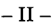

En mi opinión, el recurso federal es formalmente admisible, toda vez que se halla en juego la interpretación y aplicación de normas de carácter federal, y la sentencia ha sido adversa a las pretensiones que la recurrente fundó en sus disposiciones (art. 14, incisos 1º Y3º de la ley 48, Fallos: 324:920; 320:735; 310:409; 308:2550, entre otros).

Es tarea de V.E., pues, establecer la inteligencia de las normas federales que le asigna el arto 3º de la ley 48, realizando "una declaratoria sobre el punto disputado" (art. 16, ley citada), según la interpretación que rectamente le otorgue (Fallos: 312:417).

- III-

En relación al fondo del asunto, y en mi opinión, la Cámara apelada ha hecho una interpretación plausible (atendible, admisible) de la normativa en juego.

En efecto, y conforme al criterio del Tribunal de Apelaciones, el arto 1º de la ley 16.443 otorgó una mejora de los beneficios previstos en el arto 84, inc. 1º, ap. a) del decreto ley 333/58 (Ley Orgánica de la Policía FederaD, pero no es razonable inferir que se trata un beneficio nuevo y ajeno al preexistente, sino que la aplicación conjunta de las leyes 16.443y 20.774 constituye el total que el legislador quiso otorgar a los que se incapaciten "en y por actos deservicio".

En consecuencia, es atendible que los privilegios comprendidos en las leyes mencionadas (16.443 y 20.774), no se acumulen a los beneficios del arto 84 del mencionado decreto ley, sino que éste se subsuma en aquéllos. Al respecto, es destacable la discusión parlamentaria de la ley 16.443, que la Cámara de Apelaciones cita en su resolutorio (ver Anales de Legislación Argentina XXII-A 1962, Sección Legislación Nacional, págs. 3/5).

En relación a la forma de liquidar las diferencias que deben ser pagadas al actor en virtud de su derecho al reconocimiento de dos grados más en la escala jerárquica de la Policía Federal, el tema se vincula a circunstancias de hecho y prueba, por su naturaleza ajenas a la instancia extraordinaria.

Es por lo expresado que, desde mi punto de vista, debe hacerse lugar al recurso extraordinario, y confirmarse la sentencia apelada. Buenos Aires, 26 de marzo de 2002. Nicolás Eduardo Becerra.

## FALLO DE LACORTE SUPREMA

Buenos Aires, 19de septiembre de 2002.

Vistos los autos: "Possenti, Oscar Roberto cl Estado Nacional (MQ del Interior - Policía Federal) si personal militar y civil de las FF.AA. y de seg.".

## Considerando:

- 1Q)Que los antecedentes de la causa, los fundamentos de la sentencia apelada, los planteos de las partes y lo atinente a la admisibilidad formal del recurso extraordinario han sido objeto de adecuado tratamiento en el dictamen del señor Procurador General que antecede, cuyos términos se dan por reproducidos en razón de brevedad.
- 2 Q ) Que el arto 1Q de la ley 16.443 establece: "Se reconocerá al personal de las fuerzas de seguridad de la Nación - Policía Federal... incapacitado en acto de servicio, el grado inmediato superior para el caso que deba acogerse o se haya acogido al retiro ...".
- 3 Q ) Que el arto 1Q de la ley 20.774 dispone: "Promuévase a dos grados jerárquicos más, en situación de retiro, al personal de las fuerzas de seguridad de la Nación - Policía Federal... incapacitado en forma permanente, total o parcialmente, en y por acto de servicio, en el caso que deba acogerse o se haya acogido a los beneficios de la ley 16.443, sin otra exigencia y con los derechos que ella determina".
- 4 Q ) Que del señalado contexto legal se desprende que el núcleo de la controversia consiste en dilucidar si los dos grados que reconoce la segunda ley que rige la materia se acumulan al que concede la primera. A tal fin, es preciso recordar que esta Corte ha sostenido reiteradamente que la primera pauta de interpretación de la ley "es dar pleno efecto a la voluntad del legislador, cuya primera fuente es la letra de

la ley; en esta tarea no pueden descartarse los antecedentes parlamentarios que resultan útiles para conocer su sentido y alcance (Fallos: 313:1149; 321:2594, entre otros).

5º) Que el dictado de la ley 20.774 fue precedido por circunstancias relevantes a los fines de decidir su alcance. En efecto, el 29 de noviembre de 1973 el Congreso Nacional sancionó la ley 20.598. De acuerdo con su arto 1 º "El Poder Ejecutivo ola autoridad competente, promoverá a dos grados jerárquicos más en situación de retiro al personal de las fuerzas de seguridad de la Nación incapacitados en acto de servicio, en el caso que deban acogerse o se hayan acogido a los beneficios de la ley 16.443, sin otra exigencia y conlos derechos que ella determina". El resto de sus preceptos se refería a las inclusiones y exclusiones del beneficio (arts. 2 y 3), a los reajustes de los haberes (arts. 4y 5)ya la subsistencia de la normativa previsional de quienes se hallaban comprendidos en la norma.

6º) Que de los debates parlamentarios surge nítidamente que la finalidad perseguida fue reparar la situación del personal comprendido en las leyes 15.431y 16.443, a quienes, en rigor, sólo se les adelantó la fecha del ascenso que les correspondía por hallarse en carrera, "truncándose así la misma por su incapacidad, que determinó su separación de la actividad, sin obtener beneficio alguno, y las citadas leyes, en realidad, no han cumplimentado el espíritu que persiguieron los señores legisladores con sus sanciones, comolo expresaron en la discusión parlamentaria, 'reparar el olvido de esos abnegados servidores'. De modo que en estos casos realmente resulta aparente el otorgamiento del muy mayor beneficio, comointento de reparar un grave daño, o el irreparable de la muerte ""Por eso he propuesto igualitativamente el ascenso de los dos grados " (conf. intervención del diputado Osvaldo Eduardo Benedetti, autor del proyecto, Diario de Sesiones - Cámara de Diputados, 21 de noviembre de 1973, págs. 3859, 3960).

Asimismo, surge de las expresiones del senador Pennisi que "Por la ley 16.443 se reconoció al personal de las fuerzas de seguridad incapacitado en actos de servicio el grado inmediato superior. Por este proyecto se otorgan en estos casos dos grados jerárquicos". (Diario de Sesiones de la Cámara de Senadores, 29 de noviembre de 1993, pág. 2712).

De lo precedentemente expuesto se sigue que el legislador consideró que la concesión de un grado no cumplía adecuadamente con la

finalidad de proteger al personal de las fuerzas de seguridad, pues de todos modos lo hubieran obtenido, por lo que el propósito tuitivo únicamente se concretaba mediante el reconocimiento de dos jerarquías. Es decir, que se añadió una a la prevista por la ley 16.443. Este, pues, es el máximo beneficio que la ley contempló.

- 7º) Que el Poder Ejecutivo vetó la citada ley mediante decreto 778/73. El Congreso no insistió contra el veto presidencial, sino que sancionóla ley 20.774, cuyo arto 1º reitera lo atinente a la promoción. Los antecedentes parlamentarios ponen de relieve que la nueva norma procut-ó superar diversas observaciones presidenciales que, sustancialmente, se fundaban en la suficiencia de las previsiones de la ley 16.648 y en que no era equitativo negar el beneficio a quienes hubieran alcanzado la antigüedad máxima para pasar a retiro. Mas no contienen referencia alguna al alcance de los ascensos que autorice a afirmar una modificación en ese sentido. Ello es así, porque respecto del citado arto 1ºsólo se manifiesta que se proyectó una mención expresa al personal incluido "y para tales casos la concreta remisiva a la ley 16.443", a fin de disipar dudas interpretativas. Además, se precisó que debe tratarse de incapacidad parcial y permanente "en y por acto de servicio" (conf. intervención del diputado Benedetti, Diario de Sesiones - Cámara de Diputados 19 de septiembre de 1974, págs. 2982, 2983).

Del trámite en el Senado de la Nación no Se desprende elemento alguno que permita inferir la intención de variár la cantidad de grados a reconocer (conf. Diario de Sesiones - Cámara de Senadores, 26/27 de septiembre de 1974, págs. 2483, 2484).

- 8º) Que, en tales condiciones, los antecedentes parlamentarios de la ley 20.598 conservan su virtualidad para interpretar el arto 1º de la ley 20.774 y, en base a ellos, cabe concluir que la voluntad del legisladar fue conceder el máximo de dos grados. Por lo tanto, no cabe adicionar ese beneficio al que concede la ley 16.443. Una inteligencia en contrario, importaría la inconsecuencia o imprevisión del legislador, que, comoprincipio, no cabe suponer (Fallos: 310:195; 312:1614, entre muchos otros).
- 9º) Que lo atinente al modo de liquidar las diferencias reconocidas conduce al examen de cuestiones fácticas ajenas a la instancia de excepción prevista por el arto 14 de la ley 48.

Por ello, y lo concordemente dictaminado por el señor Procurador General, se declara procedente el recurso extraordinario y se confirma la sentencia apelada. Con costas. Notifíquese y remítase.

JULIO S. NAZARENO -EDUARDO MOLINÉ O'CONNOR -AUGUSTO CÉSAR BELLUSCIO -ENRIQUE SANTIAGO PETRACCHI -ANTONIO BOGGIANO -GUILLERMO A. F. LóPEZ -GUSTAVO A. BOSSERT ADOLFO ROBERTO V ÁZQUEZ.

## HIPOLITO BOMBA v. ANSES

RECURSO ORDINARIO DE APELACION: Tercera instancia. Sentencia definitiva. Resoluciones posteriores.

Las resoluciones que han sido dictadas en el proceso de ejecución de sentencia y tienden a hacerla efectiva, no son el fallo final requerido para la admisión de la vía ordinaria, máxime cuando no se plantea ninguno de los supuestos que constituyen excepciones a la regla aludida.

RECURSO ORDINARIO DE APELACION: Tercera instancia. Sentencia definitiva. Resoluciones posteriores.

Lo atinente a la carga de las costas devengadas en el proceso de ejecución, resulta equiparable a la sentencia definitiva exigida para la apertura de la tercera instancia de apelación ordinaria.

## FALLO DE LA CORTE SUPREMA

Buenos Aires, 19 de septiembre de 2002.

Vistos los autos: "Recurso de hecho deducido por la demanda en la causa Bomba, Hipólito cl ANSeS;', para decidir sobre su procedencia.

Considerando:

1 º) Que en el marco de un proceso de ejecución de sentencia, la Sala 1de la Cámara Federal de la Seguridad Social confirmó el fallo de

primera instancia que había desestimado las excepciones opuestas por la ANSeS, con costas, e intimado a dicho ente para que.practicara la liquidación desde los dos años previos al reclamo administrativo. También cargó al organismo previsionallos gastos de la alzada.

- 2º) Ql~econtra dicho pronunciamiento la demandada interpuso. recurso ordinario que, denegado, motivó esta presentación directa .. Sostiene que corresponde habilitar la tercera instancia ordinaria para discutir lo decidido en cuanto a la fecha inicial de pago del reajuste ordenado en la sentencia que se procura hacer efectiva, comotambién la imposición de las costas de la ejecución a su exclusivo cargo.
- 3º) Que con respecto a la primera cuestión, corresponde desestimar la queja en razón de que las resoluciones que -como en el casohan sido dictadas en el proceso de ejecución de sentencia y tienden a hacerla efectiva, no son el fallo final requerido para la admisión de la vía ordinaria, máxime cuando no se plantea en autos ninguno de los supuestos que, según la jurisprudencia de esta Corte, constituyen excepciones a la regla aludida (Fallos: 322:1433 y 323:2646, entre muchos otros).
- 4º) Que distinto es el caso de las impugnaciones relativas a la carga de las costas devengadas en el proceso de ejecución, ya que lo decidido sobre el tema resulta equiparable a la sentencia definitiva exigida para la apertura de la tercera instancia de apelación ordinaria (conf. causas V.159, XXXIV.''Villamor, Oscar Raúl cl Caja Nacional de Previsión para el Personal del Estado y Servicios Públicos"y R.141.XXXVI. "Ricagno, Angel Ricardo el ANSeS" del 4 de mayo de 1999 y 10 de octubre de 2000, respectivamente), por lo que la presentación directa debe ser admitida en este punto.

Por ello, se hace lugar parcialmente al recurso de hecho en los términos que surgen de los considerandos precedentes. Agréguese la queja al principal y pónganse los autos en secretaría a los efectos del arto 280, párrafo segundo, del CódigoProcesal Civil y Comercial de la Nación. Notifíquese.

JULIO S. NAZARENO -EDUARDO MOLINÉ O'CONNOR -AUGUSTO CÉSAR BELLUSCIO -ENRIQUE SANTIAGO PETRACCHI -ANTONIO BOGGIANO -GUILLERMO A. F. LÓPEZ -ADOLFO ROBERTO VÁZQUEZ.

## ZOFRACOR S.A. v. NACION ARGENTINA

## ACCION.

Si la relativa proximidad existente entre ambas zonas francas permite inferir prima facie que la que contaría con condiciones menos ventajosas podría tener inferiores posibilidades de desarrollar los propósitos perseguidos con su creación, la actora -firma adjudicataria de esta última-, tiene un interés concreto, inmediato y sustancial que permite considerar al pleito como un."caso", "causa" o controversia, en los términos de los arts. 116 y 117 de la Constitución, a fin de autorizar el ejercicio de la función judicial.

## REFORMA CONSTITUCIONAL.

La reforma constitucional de 1994 fue fruto de una voluntad tendiente a lograr, entre otros objetivos, la atenuación del sistema presidencialista y el fortalecimiento del rol del Congreso.

## DECRETO DE NECESIDAD Y URGENCIA.

El texto del arto 99, inc. 3º, segundo párrafo, de la Constitución Nacional es elocuente y las palabras escogidas en su redacción no dejan lugar a dudas de que la admisión del ejercicio de facultades legislativas por parte del Poder Ejecutivo se hace en condiciones de rigurosa excepcionalidad y con sujeción a exigencias materiales y formales.

## DECRETO DE NECESIDAD Y URGENCIA.

Los beneficios que se han establecido en el decreto 285/99 comportan, en su gran mayoría, el ejercicio de facultades de carácter tributario -aduaneras, impositivas o vinculadas con el Régimen Nacional de la Seguridad Social-, las que son competencia exclusiva del Poder Legislativo -arts. 4º, 17 y 75, incs. 1º y 2º, de la Constitución Nacionaly cuyo ejercicio está vedado al Poder Ejecutivo Nacional, aun en las condiciones excepcionales que podrían justificar el dictado de decretos de necesidad y urgencia, en atención a la explícita exclusión de tales materias que efectúa la Constitución Nacional.

## CONSTITUCION NACIONAL: Constitucionalidad e inconstitucionalidad. Decretos nacionales.

El decreto 285/99 resultóinsanablemente nulo por oponerse al principio de legalidad que rige en materia tributaria y al claro precepto del arto 99, inc. 3º, de la Constitución Nacional y, por ende, se encuentra privado de todo efecto jurídico. .

CONSTITUCION NACIONAL: Constitucionalidad e inconstitucionalidad. Decretos nacionales.

Si bien la ratificación mediante la ley 25.237 carece de efectos retroactivos en virtud de la insanable inconstitucionalidad original del decreto 285/99, aquella norma revela que la intención del Poder Legislativo fue la de conferir rango legal a los contenidos que fueron plasmados en el mismo, lo cual, con indiferencia de la imperfecta técnica legislativa, conlleva a efectuar el control de constitucionalidad respecto del procedimiento seguido y de los contenídos sustanciales aprobados, los cuales, de ser compatibles con los principios constitucionales, tendrían vigor a partir de la publicación de la ley.

## PRESUPUESTO.

A pesar de que a veces contiene disposiciones que no son sólo de naturaleza financiero-administrativa, sino también de derecho penal e, incluso, de derecho privado, la ley de presupuesto es una ley en el sentido institucional de vocablo, con plenos efectos jurídicos.

## PRESUPUESTO.

En nuestro sistema constitucional, nada permite inferir que la función legislativa en materia presupuestaria se limita a aprobar o a autorizar lo que propone el Poder Ejecutivo, sino que el Congreso recibe un proyecto de presupuesto y lo acepta, lo modifica o lo rechaza, en todo o en parte, sin restricción alguna; no es un acto aprobatorio que pasa a integrar un acto administrativo: es acción legislativa normal y primordial aun cuando la iniciativa corresponda al Poder Ejecutivo, que es el responsable de la administración general del país (art. 99, inc. 1º, Constitución Nacional).

## PRESUPUESTO.

No hay obstáculo constitucional para que el Poder Legislativo establezca, suprima o modifique tributos (u otro tipo de ingresos) en la ley de presupuesto. Las auto limitaciones que el Congreso ha emitido pueden ser modificadas o dejadas sin efecto; incluso en forma implícita; la ley de presupuesto es un acto de gran trascendencia política y la voluntad del Poder Legislativo no está limitada por actos preexistentes de igual jerarquía normativa.

## PRESUPUESTO.

Pese al loable propósito que persigue el arto 20 de la ley 24.156, esa norma no prevalece por su jerarquía normativa frente a otras leyes que dicta el Congreso de la Nación y, por tanto, cuanto allí se dispone puede ser derogado por otra ley posterior, en forma expresa o tácita; ya que el Poder Legislativo no se halla vinculado indefectiblemente hacia el futuro por sus propias autorrestricciones.

2396

## FALLOS DE LA CORTE SUPREMA 325

## ZONAS FRANCAS.

Es indudable que la ley 24.331 pretendió instaurar un régimen legal general respecto del establecimiento de zonas francas en los territorios de las provincias, con el propósito -que constituye un principio fundamental del federalismo- de poner a todas las provincias en la misma condición, premisa que no conduce necesariamente a una idéntica regulación para todas las' zonas.

## CONSTITUCION NACIONAL: Derechos y garantías. Igualdad.

No todo tratamiento jurídico diferente es discriminatorio y violenta los derechos constitucionales, ya que existen desigualdades fácticas que pueden. traducirse en desigualdades justificadas en el tratamiento jurídico, que expr~sen una proporcionada relación entre las diferencias objetivas y los fines de la.norma.

CONSTITUCION NACIONAL: Constitucionalidad e inconstitucionalidad. Decretos nacionales.

La sustancia de lo regulado en el decreto 285/99, que tiene fuerza de ley a partir de la vigencia de la ley 25.237, no se revela con arbitrariedad o ilegalidad manifiesta, y su eventual inconstitucionalidad exigiría una demostración plena, concreta y circunstanciada de extremos fácticos, que no se da con la mera alegación de diferencias normativas en los regímenes establecidos por voluntad del Congreso mediante reglas de igual jerarquía.

CONSTITUCION NACIONAL: Control de constitucionalidad. Facultades del Poder Judicial.

Corresponde al Poder Judicial el control de constitucionalidad sobre las condiciones en las cuales el Poder Ejecutivo dicta decretos de necesidad y urgencia, cornoasimismo el control de compatibilidad constitucional en cuanto al contenido sustancial de las medidas adoptadas, cuando ello se debate en un caso concreto (Voto de los Dres. Augusto César Belluscio y Gustavo A. Bossert).

## DECRETO DE NECESIDAD Y URGENCIA.

La falta de sanción de una ley especial que regule el trámite y los alcances de la intervención del Congreso (art. 99, inc. 3º, párrafo cuarto in fine de la Constitución Nacional) no hace sino reforzar la responsabilidad por el control de constitucionalidad que es inherente al Poder Judicial de la Nación (Voto de los Dres. Augusto César Belluscio y Gustavo A. Bossert).

## DECRETO DE NECESIDAD Y URGENCIA.

De los considerandos del decreto 285/99 no surge que la solución legislativa haya requerido una especial urgencia, es decir, que haya debido concretarse

en un plazo incompatible con el trámite regular previsto por la Constitución para la sanción de la ley, ni que hayan existido razones de fuerza mayor o impedimento alguno para la reunión de las cámaras del Congreso (Voto de los Dres. Augusto César Belluscio y Gustavo A. Bossert).

## DECRETO DE NECESIDAD Y URGENCIA.

Corresponde descartar criterios de mera conveniencia, ajenos a la configuración de extremas circunstancias de necesidad, ya que la Constitución no habilita a elegir discrecionalmente entre la sanción de una ley o la imposición más rápida de ciertos contenidos materiales por medio de un decreto (Voto de los Dres. Augusto César Belluscio y Gustavo A. Bossert).

## DECRETO DE NECESIDAD Y URGENCIA.

La Ley Suprema consagra, en el arto 99, inc. 3º, una limitación a las facultades del Poder Ejecutivo con la innegable finalidad de resguardar el principio de división de poderes, y únicamente en situaciones de grave trastorno que amenacen la existencia, la seguridad o el orden público o económico, que deban ser conjuradas sin dilaciones, puede el Poder Ejecutivo Nacional dictar normas que de suyo integran las atribuciones del Congreso, siempre y cuando sea imposible a éste dar respuesta a las circunstancias de excepción (Voto del Dr. Antonio Boggiano).

## DECRETO DE NECESIDAD Y URGENCIA.

El ejercicio de la prerrogativa contemplada en el arto 99, inc. 3º de la Constitución Nacional está sujeto a reglas específicas, que exigen un estado de excepción y el impedimento de recurrir al sistema normal de formación y sanción de las leyes y contemplan, además, una intervención posterior del Poder Legislativo (Voto del Dr. Antonio Boggiano).

## DECRETO DE NECESIDAD Y URGENCIA.

Las medidas que se adopten en función del arto 99, inc. 3º, de la Constitución Nacional no están exentas del contralor judicial, que constituye la salvaguarda de los derechos individuales, sin que obste a ello la ausencia de la ley reglamentaria, máxime cuando la reforma de 1994 introdujo disposiciones precisas sobre las condiciones en que pueden ser dictados los decretos de necesidad y urgencia y la Corte ha ejercido el aludido contralor con anterioridad a la referida enmienda (Voto del Dr. Antonio Boggiano).

## DECRETO DE NECESIDAD Y URGENCIA.

No se encuentran satisfechos los recaudos constitucionales para el dictado del decreto 285/99 si los beneficios que establece comportan, en su gran mayoría,

2398

el ejercicio de facultades de carácter tributario -aduaneras impositivas o vinculadas con el Régimen Nacional de la Seguridad Socialque son competencia . exclusiva del Poder Legislativo en virtud de principios y preceptos expresos que imponen una limitación constitucional infranqueable en ese campo para los decretos de necesidad y urgencia (arts. 4º, 17,75 incs. 1º y 2º, 99, inc. 3º de la Constitución Nacional) (Voto del Dr. Antonio Boggiano).

## DECRETO DE NECESIDAD Y URGENCIA.

Las referencias del decreto 285/99 en lo que excede la materia tributaria, resultan insuficientes para justificar una situación de grave riesgo social que el Congreso no puede remediar por los cauces ordinarios que la Constitución prevé, máxime cuando la medida se adoptó durante el período de sesiones ordinarias (Voto del Dr. Antonio Boggiano).

## DECRETO DE NECESIDAD Y URGENCIA.

La mera conveniencia de que por un mecanismo más eficaz se consiga un objetivo de gobierno en modo alguna justifica la franca violación de la separación de poderes que supone la asunción por parte de uno de ellos de competencias que sin lugar a dudas le pertenecen a otro (Voto del Dr. Antonio Boggiano).

## DECRETO DE NECESIDAD Y URGENCIA.

La vía establecida en el arto 99, inc. 3º de la Constitución Nacional, exige que el Congreso sancione la "ley especial" que haga operativo el articulado, sin que quepa discutir las bondades del criterio elegido, ya que la Corte sólo debe atender a su significado y a sus consecuencias (Disidencia del Dr. Enrique Santiago Petracchi).

## DECRETO DE NECESIDAD Y URGENCIA.

Al no haber sido sancionada la ley que reclama el arto 99, inc. 3º de la Constitución Nacional, no puede cumplirse con la "subetapa" legislativa, lo que determina la imposibilidad de recurrir a esos remedios de excepción que son los decretos de necesidad y urgencia (Disidencia del Dr. Enrique Santiago Petracchi).

CONSTITUCION NACIONAL: Constitucionalidad e inconstitucionalidad. Decretos nacionales.

Aunque por hipótesis se admitiera que el Poder Ejecutivo tuviese competencia pará dictar los decretos de necesidad y urgencia, aun faltando la "ley especial" mentada en el arto 99, inc. 3º de la Constitución Nacional, el decreto 285/99 sería igualmente nulo (Disidencia del Dr. Enrique Santiago Petracchi).

## DECRETO DE NECESIDAD Y URGENCIA.

La leyes totalmente estéril para dar vida retroactivamente (ex tunc) a un decreto que es insanablemente nulo ante la falta de la "ley especial" del arto 99, inc. 3º, de la Constitución Nacional, y la voluntad legislativa de asumir los contenidos del decreto debe ser reconocida a partir del dictado de la ley, con una virtualidad exclusiva hacia el futuro (efecto ex nunc) (Disidencia del Dr. Enrique Santiago Petracchi).

## LEY: Derogación.

Corresponde rechazar el agravio relativo a que la ley 25.237 habría violado el arto 20 de la ley 24.156 ya que esta última nOse diferencia, en cuanto a su jerarquía normativa, del resto de las leyes que dicta el Congreso de la Nación por lo que la primera, al resultar una norma posterior, puede derogar una ley anterior, en forma expresa o en forma tácita (Disidencia del Dr. Enrique Santiago Petracchi).

ACCION DE AMPARO: Actos u omisiones de autoridades públicas. Principios generales.

La hipotética existencia de violaciones a los principios constitucionales de igualdad ante la ley, de libertad de comercio y de libre competencia requeriría la prueba acabada de circunstancias de hecho que exceden el marco propio de una acción de las características de la acción de amparo (art. 43 de la Constitución Nacional) (Disidencia del Dr. Enrique Santiago Petracchi).

## DICTAMEN DEL PROCURADOR GENERAL

## Suprema Corte:

-1-

Afs. 1/29, Zofracor S.A., concesionaria de la Zona Franca ubicada en la Provincia de Córdoba, interpuso acción de amparo contra el Estado Nacional y solicitó la declaración de nulidad absoluta e inconstitucionalidad del decreto 285/99 del Poder Ejecutivo Nacional, de "necesidad y urgencia".

Dijo que resultó adjudicataria de la licitación de esa área franca, a través del decreto 103/98 y que e131 dejulio de 1998 firmó el contrato

de concesión, aprobado por res. 692/98 del Ministerio de Economía y Obras y Servicios Públicos de la Nación (en adelante MEyOSP), autoridad de aplicación de la ley 24.331.

En ese marco, realizó inversiones por $ 3,2 millones, que duplican el programa mínimo exigido y obtuvo la aprobación para incorporar tierras privadas a las expropiadas por la provincia, con el fin de mejorar las perspectivas de industrialización del área. Indicó que se han realizado las tareas de urbanización (vgr. calles, desagües, servicios básicos, casetas de control, edificios de administración, bodegas, instalaciones para la aduana, etc.) imprescindibles para el desenvolvimiento de la actividad económica específica en dicho territorio aduanero especial.

Expresó que el 20 de abril de 1999 consiguió también la habilitación comousuario y que sus primeros clientes aún no han sido habilitados a la fecha de esta demanda. Agregó que, cuando se hallaba a punto de iniciar sus actividades y de concretar su plan de ventas conla firma de los contratos del caso, se dictó el reglamento impugnado, por el cual se otorgó un tratamiento especial a la Zona Franca La Pampa, situación que le causa daño y, asimismo, abre un interrogante sobre la concreción de sus perspectivas de ingresos y gastos y de recupero de lo invertido.

Relató que el decreto 285/99 concede a la Zona Franca La Pampa las siguientes prerrogativas, ausentes en la legislación aplicable a la materia o prohibidas por ella, según el caso: a) introducir al territorio aduanero general la totalidad de un producto industrializado en ella; b) eximición de la tasa de estadística; c) reducción del 100% de las contribuciones patronales al Régimen Nacional de Seguridad Social; d) autoriza la emisión de warrants y certificados de depósito de mercaderías, materias primas y productos nacionales o extranjeros depositados en la zona, previa solicitud ante la aduana de La Pampa y negociables una vez refrendados por el Comité de Vigilancia; e) invitación al gobierno provincial y al municipio de General Pico a eximir de tributos locales vigentes o a crearse que pudieran gravar las actividades desarrolladas por el concesionario y/o usuario de la Zona y los servicios de la ley 24.931.

Adujo que este reglamento es violatorio del arto 591 del Código Aduanero, de la ley 24.331 de Zonas Francas y que, al versar sobre materia tributaria, el Poder Ejecutivo está impedido de dictarlo por el

inc. 3º del arto 99 de la Constitución Nacional. Además, expuso que resulta lesivo de derechos adquiridos por concesionarios de otras zonas francas del país, del principio de igualdad ante la ley, de la libertad de comercioy la libre concurrencia (arts. 14, 16, 18 y 43 de la Carta Magna).

Agregó,a mayor abundamiento, que no se dan los presupuestos de "necesidad y urgencia" para el dictado de este reglamento y que, por otra parte, el Congreso estaba en período de sesiones ordinarias, razón por la cual el Poder Ejecutivo no se hallaba habilitado para dictarlo.

Expresó que el conjunto de esos beneficios crea un trato promocional de importancia, pues permite al área franca de La Pampa extender la cobertura de sus transacciones. Ello la perjudica gravemente -sostuvodada su cercanía geográfica y por tratarse de un área de reciente inauguración, pues no podrá minimizar el impacto ni recuperar fácilmente lo invertido, conformefue previsto y programado al momento de la licitación. Estos perjuicios se resumen, a su criterio, en que verá disminuidas las contrataciones que pueda efectuar, pues sus eventuales cocontratantes preferirán la otra zona que ofrece mayores beneficios y, además, quienes con ella contraten en definitiva pretenderán rebajas en el canon locativo p'ara compensar esa diferencia de utilidades.

Mencionó que tiene derecho adquirido al mantenimiento de las condiciones establecidas en la ley convenio 24.331, lo cual le brinda el derecho a exigir que no se concedan a otras zonas beneficios que ella no posee.

-II-

Afs. 223/228 se presentó el fiscal de Estado de la Provincia de La Pampa y requirió ser tenido por parte como tercero, en los términos del arto 90, inc. 2º y eones. del código de rito, al aducir que aquélla se verá afectada por el resultado del fallo a dictarse en autos. Rechazó el planteo de la actora e indicó que ésta pretende inmiscuirse indebidamente en temas institucionales atinentes, con exclusividad, al gobierno nacional y a su provincia.

Expresó que su mandataria adhirió a la ley de zonas francas mediante la ley provincial 1622. Recordóque, en su momento, se conside-

ró de provecho insertar el proceso licitatorio de la zona franca de que aquí se trata dentro del marco de la privatización del sistema nacional de aeropuertos, establecido mediante decreto 375/97 y eones. del Poder Ejecutivo Nacional, para lo cual suscribió el pertinente convenio de cesión de derecho de uso con el Estado Nacional.

Señaló que, tras el citado procedimiento licitatorio -aprobado por res. 269 del MEyOSPresultó adjudicataria de la zona franca de su provincia la empresa Aeropuertos Argentina 2000, quien ya ha comenzado a realizar las obras civiles de acuerdo con el contrato vigente y ha celebrado importantes compromisos con futuros usuarios del predio.

Agregó que La Pampa carece de incentivos promocionales por parte del Estado Nacional y que ha cifrado legítimas esperanzas en que la Zona Franca sea un motor para el reacomodamiento de la actividad económica en su territorio.

Sostuvo que el decreto 285/99 se enmarca en el ordenamiento legal aplicable y que se han seguido a su respecto todos los pasos pertinentes para dictarlo, sin que se haya causado perjuicio alguno a terceros ni a la amparista.

- IlI-

A fs. 237/241, el fiscal federal de Córdoba, en representación del Estado Nacional, presentó el informe del arto 8º de la ley 16.986 y solicitó el rechazo de la acción. Dijo que el decreto impugnado fue emitido en uso de las facultades conferidas por los incs. 1 y 3 del arto 99 de la Constitución Nacional y en el arto 765 de la ley 22.415, para otorgar un tratamiento diferencial a la Zona Franca de La Pampa respecto de las demás creadas en función de la ley 24.331.

Mencionó que toda mercancía proveniente de un área franca debe tributar el arancel externo común del Mercosur para poder ser introducida en el territorio aduanero general.

Indicó también que el decreto 2609/93 del Poder Ejecutivo Nacional permite disminuir las contribuciones patronales, para los empleadores radicados en aquellas jurisdicciones que hayan adherido al Pacto Federal para el Empleo, la Producción y el Crecimiento, del 12 de agosto de 1993 y, consecuentemente, hayan derogado el Impuesto so-

bre los Ingresos Brutos para las actividades indicadas en su arto 32, punto 4. Beneficio que, mediante el decreto 476/94, fue extendido al resto de las jurisdicciones.

Por otra parte, sostuvo la improcedencia de la acción de amparo, pues se trata de un decreto de necesidad y urgencia, norma cuyo control incumbe sólo al Congreso Nacional.

En último término, expresó que la actora no ha experimentado una lesión real y efectiva en sus derechos, sino que se refiere meramente a hipotéticos daños y perjuicios producto de una situación de desventaja comparativa con la zona franca de La Pampa.

-IV -

Afs. 426, V.E. dispuso que la presente causa corresponde a su compl;ltencia originaria, por los fundamentos expresados en el dictamen de esta Procuración General de fs. 421/425.

-V-

A fs. 434/440, la actora denunció, como hecho nuevo, la ratificación del decreto 285/99 por el art. 86 de la ley 25.237, de Presupuesto General para la Administración Pública Nacional para el año en curso, sin que fuera observado por el Poder Ejecutivo Nacional.

Sostuvo que esta ratificación no ha podido convalidar las graves violaciones constitucionales contenidas ex origine en el decreto impugnado. En este orden de ideas, agregó que el instituto de la ratificación no está previsto en nuestro orden constitucional y que, de todas maneras, subsiste la violación de normas contenidas en el CódigoAduanero, en la Ley de Zonas Francas y de los derechos adquiridos en virtud de dichas leyes.

Expresó que el decreto de necesidad y urgencia no fue analizado por la Comisión Bicameral, ni objeto del debate necesario que presupone el art. 99, inc. 3 2 , de la Carta Magna y que, además, es una norma ajena a la materia presupuestaria que, conforme al art. 20 de la ley 24.156, no puede ser contenida en la ley de presupuesto general.

A fs. 472/476, el MEyOSP contestó el traslado del hecho nuevo y solicitó que se declare abstracta la cuestión, atento a la ratificación legislativa del decreto impugnado.

-VII-

El decreto 285/99, de "necesidad y urgencia", fue dictado el 25 de marzo de 1999 y publicado en el Boletín Oficial el 30 del mismo mes.

Entre sus considerandos se expresó que "es política del Gobierno Nacionalla promoción de actividades económicas, en las distintas regiones del país, retirando al Estado Nacional y provincial de aquellas actividades que puedan realizarse apelando al concurso de capitales de origen privado", y se puntualizó que la zona franca de La Pampa tiene como principal objetivo impulsar el comercio exterior y la actividad industrial exportadora, a la par que la generación de inversiones y empleo.

Se dijo también allí que "resulta imprescindible para el Gobierno Nacional promover las medidas tendientes a facilitar en la Provincia de La Pampa, un polo de desarrollo regional que se halle integrado de conformidad con la logística de transporte definida por la concesionaria del Sistema Nacional de Aeropuertos; extremo que demanda una inversión de fondos, tecnología y recursos" y que es necesario "adoptar medidas urgentes a los fines de acelerar el proceso de inversión directa que genere crecimiento y empleo a fin de satisfacer los objetivos descriptos", para lo cual "resulta indispensable autorizar la realización de diversas actividades en el Area Franca La Pampa (General Pico), permitiendo la posibilidad de introducir al Territorio Aduanero General la mercadería elaborada en su ámbito".

De esta forma, en la parte dispositiva del decreto se establecieron para dicha zona franca los siguientes beneficios: 1) introducir al territorio aduanero general bienes de capital que no registren antecedentes de producción en él y que se fabriquen en la zona franca (art. 1Q); 2) introducir al territorio aduanero general la totalidad de la producción anual de un mismo producto, elaborado por los usuarios del área franca y que dé cumplimiento a las normas de origen Mercosur (art. 1Q); 3) eximición del pago de la tasa de estadística a las operaciones de intro-

ducción y salida de mercaderías que en ella se realicen (art. 2Q ); 4) las mercaderías sometidas a actividades industriales, de embalaje, fraccionamiento, reparación o perfeccionamiento industrial podrán ser objeto de exportación a terceros países o al territorio aduanero general (art. 4 Q , in fine); 5) reducción del 100%de las contribuciones patronales de seguridad social en el ámbito de la zona franca (art. 5Q ); 6) los usuarios de la zona franca pueden solicitar a la aduana de La Pampa la emisión de warrants y certificados de depósito de mercaderías, materias primas y productos nacionales o extranjeros, los que serán negociables una vez refrendados por el Comité de Vigilancia de la Zona Franca La Pampa (art. 6 Q ); 7) la posibilidad de que la provincia exima de impuestos locales vigentes y/o a crearse que pudieran gravar las actividades desarrolladas por el concesionario y/o los usuarios de la zona franca, como así también los que gravan los servicios básicos a que se refiere el arto 26 de la ley 24.331 (art. 7Q ); 8) la posibilidad de que la Municipalidad de General Pico exima de tasas y contribuciones creadas o a crearse, que pudieran gravar las actividades desarrolladas por el concesionario y/o los usuarios de la zona franca.

Así las cosas, puede apreciarse que, salvo el referido bajo punto 6, todos los demás beneficios involucran el ejercicio de facultades de carácter tributario (sean aduaneras, impositivas o las vinculadas con el Régimen Nacional de la Seguridad SaciaD, que son competencia exclusiva del Poder Legislativo, de acuerdo conlos arts. 4 Q , 17Y75,incs. 1 y 2, de la Constitución Nacional y cuyo ejercicio está vedado al Poder Ejecutivo Nacional, aun cuando se tratare de decretos de necesidad y urgencia, en atención a la clara norma del arto 99, inc. 3 Q de la Carta Magna.

V.E. ha tenido oportunidad de reafirmar en forma contundente la irrestricta vigencia del principio de legalidad en materia tributaria, entre otros, en los precedentes de Fallos: 155:290; 248:482; 303:245; 312:912; 316:2329 y, asimismo, ha expresado que esta regla no tiene fisura aun cuando se tratase de decretos de necesidad y urgencia (Fallos: 318:1145; 319:3400; 321:366, entre otros), doctrinajurisprudencial que es pacífica y que fue iniciada con anterioridad a la reforma constitucional de 1994.

En este sentido, y contrariamente a lo afirmado por la demandada, corresponde al Poder Judicial el control de constitucionalidad sobre las condiciones bajo las cuales el Poder Ejecutivo dicta decretos de necesidad y urgencia, comoasimismo el control de legitimidad y razo-

nabilidad intrínseca de las medidas adoptadas (conf.Fallos: 318:1154, considerando 9º; 322:1726, considerando 9º, segundo párrafo), pues ha sostenido el Tribunal que "la falta de sanción de una ley especial que regule el trámite y los alcances de la intervención del Congreso (art. 99, inc. 3, párrafo cuarto in fine) no hace sino reforzar la responsabilidad por el control de constitucionalidad que es inherente al Poder Judicial de la Nación" (Fallos: 322:1726, citado, considerando 11).

Lo hasta aquí expuesto resultaría bastante, a mi juicio, para concluir que el decreto 285/99 resultó insanablemente nulo por oponerse al claro precepto del arto 99, inc. 3º, de la Carta Magna y, por ende, que se encuentra privado de todo efectojurídico.

## - VIII-

Aesta altura del análisis -tal comolo señalan ambas partes-, es necesario examinar qué consecuencias proyecta sobre la presente litis el arto 86 de la ley 25.237.

Respecto del decreto 285/95, en virtud de lo expuesto en el acápite anterior, resulta claro que no podría ratificarlo en forma retroactiva, extremo que impide otorgar razón a la demandada en cuanto pretende que se declare abstracta la cuestión.

No obstante, cabe indagar sobre el sentido y alcances de la intervención legislativa mediante la sanción del citado artículo de la ley 25.237, porque la actora pretende trasladarle las imputaciones, tanto sustantivas comoformales, que -al inicio de esta causadirigió contra el decreto 285/99 -supra desarrolladas-, tachándola de inconstitucional, en forma refleja. Esta actitud importa la modificación del objeto en la litis, la que ahora está enderezada a obtener la declaración de invalidez del citado arto 86 de esa ley, por cuyo intermedio el legisladar adoptó el mecanismo promocional dispuesto inicialmente por el mencionado decreto de necesidad y urgencia.

Empero, por los motivos que expondré infra -acápite X-, es mi parecer que los fundamentos vertidos por la actor a son insuficientes para demostrar que se haya configurado, a través de ese acto legislati-

vo, un supuesto de "arbitrariedad o ilegalidad manifiestas" que torne procedente la excepcional vía del amparo en los términos del arto 43 de la Constitución Nacional, acerca del nuevo objeto que pretende imprimir al proceso, cual es -reitero-, que se declaren la ilegitimidad y la inconstitucionalidad del arto 86 de la ley 25.237.

Es preciso recordar que,'en materia hermenéutica, según doctrina consagrada del Tribunal, corresponde otorgar pleno efecto a la intención del legislador "por la cual no es siempre recomendable atenerse estrictamente a las palabras de la ley, ya que el espíritu que las nutre es el que debe determinarse en procura de una aplicación racional que elimine el riesgo de un formalismo paralizante" (Fallos: 308:54) y que dicho propósito "no debe ser obviado por los jueces so pretexto de posibles imperfecciones técnicas en la instrumentación legal" (Fallos: 310:149; 311:402; 313:1670).

En atención a este criterio interpretativo, en mi opinión, nada obsta para que, a la citada disposición legal, en cuanto dispuso la "ratificación" del decreto mencionado, se le otorguen alcances para el futuro, es decir, respecto de hechos acaecidos con posterioridad a su publicación (arg. Fallos: 321:347, considerando 10) pues, independientemente de si se puede o no "ratificar" un reglamento de necesidad y urgencia insanablemente nulo, surge claro que la intención del legislador ha sido la de adoptar y conferir rango legal a las disposiciones del decreto 285/99, si bien en la forma que supone la técnica legislativa utilizada por el arto 86 de la ley 25.237 y más allá de posibles imperfecciones terminológicas.

En tales condiciones, se torna innecesario analizar, desde mi punto de vista, los argumentos de la actora fundados en la inexistencia del instituto de la ratificación legislativa (ver fs. 435 in fine) y en la imposibilidad de convalidar el decreto de necesidad y urgencia, por la falta de intervención de la Comisión Bicameral Permanente y resta sólo verificar los cuestionamientos de carácter sustantivo que la actora formula contra dicha norma.

Alrespecto, cabe recordar que le endilga la violación de lo dispuesto por el arto 20 de la ley 24.156, así como que resulta inconstitucional por su sustancia.

Conreferencia al primer argumento, la Ley de Administración Financiera y Sistemas de Control del Sector Público Nacional, en cuanto regula la estructura de la ley anual de presupuesto general de la Nación, establece: "Las disposiciones generales constituyen las normas complementarias a la presente ley que regirán para cada ejercicio financiero. Contendrán normas que se relacionen directa y exclusivamente con la aprobación, ejecución y evaluación del presupuesto del que forman parte. En consecuencia, nopodrán contener normas de carácter permanente, no podrán reformar o derogar leyes vigentes, ni crear, modificar o suprimir tributos u otros ingresos ..." (art. 20).

En mi concepto, la ratio de esta norma implica una sana prescripción de política legislativa en cuanto al contenido de la denominada "ley de leyes", con el fin de que la ley anual de presupuesto para la Nación únicamente contenga las previsiones de ingresos y las autorizaciones para los gastos de la Administración, con exclusión de toda otra norma sustantiva que, por su carácter de tal, ha de merecer un marco normativo propio y separado.

Sin embargo, y pese a la saludable intención que alberga dicho arto 20, no puede obviarse que la ley 24.156 no se diferencia, en cuanto a su jerarquía normativa, del resto de las leyes que dicta el Congreso de la Nación y, por ende, que resulta equiparable a la ley 25.237. Esta, por resultar una norma posterior, puede derogar una ley anterior -en forma expresa o en forma tácita(confr. Fallos: 307:398; 308:439,715, entre otros) y, en tal sentido, no podrá ser tachada de irrespetuosa del orden legal establecido ya que, de lo contrario, se estaría consagrando la inamovilidad del orden legislativo y la posibilidad de que el legisladar de hoy condicione u obligue, en un sentido determinado, al del futuro.

En cuanto a los demás reproches que formula la actora, relacionados con que -a su criterioviola el CódigoAduanero, la ley 24.331; los derechos adquiridos a tenor de esas leyes por los concesionarios de otras zonas francas y el principio de igualdad ante la ley, la libertad de comercio, y la libertad de competencia y concurrencia, es del caso señalar que en orden a que "la declaración de inconstitucionalidad de las leyes constituye un acto de suma gravedad institucional, y una de las más delicadas funciones susceptibles de encomendarse a un tribunal dejusticia y que, por ello, debe ser considerada como ultima ratio del orden jurídico y sólo debe ejercerse cuando la repugnancia con la cláusula constitucional es manifiesta y la incompatibilidad in-

conciliable" (Fallos: 304:849,892,1069; 307:531, 1656; 322:919, entre muchos otros).

Corolario de ello es que, quien cuestione la constitucionalidad de una ley ha de hacerlo en forma expresa, clara y exhaustiva, con demostración plena de la incompatibilidad de la norma cuestionada con la Ley Fundamental, así como que un planteo deficiente en este sentido no podría ser suplido por los jueces, en virtud del impedimento que pesa sobre el Poder Judicial para declarar de oficio la inconstitucionalidad de una ley.

En este orden de ideas, el Tribunal ha sostenido también, de manera enfática, que ''para ello es menester la petición de la parte cuyos derechos se hallen afectados en atención al equilibrio de los poderes que sancionan la Constitución Nacional, el que de lo contrario se quebraría por absorción del Poder Judicial en desmedro de los otros" (Fallos: 310:1090), toda vez que ''para mantener la supremacía de la Constitución y de las leyes sin provocar el desequilibrio de los tres poderes, es indispensable que exista en pleito una cuestión que proporcione a los componentes del Poder Judicial la oportunidad de examinar, a pedido de alguno de los litigantes, si la ley o el decreto conforman sus disposiciones a los principios y garantías de la Constitución Nacional, no siendo dable, si los textos respectivos no han sido objeto de planteamiento y tacha de inconstitucionalidad por el eventual afectado, expedirse de oficio al respecto, salvo cuando se excedan los límites constitucionales de las atribuciones jurisdiccionales de la Corte Suprema" (Fallos: 310:1401) y, en virtud del principio indicado, invariablemente descalificó las sentencias de tribunales inferiores que declararon de oficio la inconstitucionalidad de diversas leyes (conf. Fallos: 190:98; 305:2046; 306:303; 311:1843, 2088, entre muchos otros).

Ala luz de la doctrina señalada, estimo que los planteas de la actora sólo están concretamente referidos -como quedó dichoa la imposibilidad de ratificar un decreto nulo mediante una ley, pero sin desarrollar, como corresponde a un planteo de tal índole, los argumentos tendientes a demostrar, en forma indubitada, los defectos que -ahoratendría la norma legal. Cabe destacar que, a mi entender, en el escrito de fs. 434/440, se limita a destacar una supuesta oposición entre el arto 86 de la ley 25.237 y las normas del Código Aduanero -aunque no las identificay de la ley de zonas francas, sin expresar en qué se funda para sostener la inconstitucionalidad de una norma posterior por oponerse -yen todo caso, derogarnormas de leyes anteriores.

En virtud de las consideraciones precedentes, estimo que V.E. debería hacer lugar a la demanda de acuerdo conlo expuesto en el acápite VII de este dictamen y rechazar el planteo de inconstitucionalidad del art. 86 de la ley 25.237. Buenos Aires, 26 de diciembre de 2000. Nicolás Eduardo Becerra.

## FALLODE LACORTESUPREMA

Buenos Aires, 20 de septiembre de 2002.

Vistos los autos: "Zofracor S.A. el Estado Nacional si amparo", de los que

## Resulta:

I) A fs. 1129 la firma Zofracor S.A.se presenta ante la justicia federal de Córdoba y promueve acción de amparo contra el Estado Nacional a fin de que se declare la nulidad e inconstitucionalidad del decreto de necesidad y urgencia 285/99.

Dice que las zonas francas están reguladas por las leyes 22.415 (que instituye el CódigoAduanero) y 24.331. La primera de ellas las define como los ámbitos dentro de los cuales "la mercadería no está sometida al control habitual del servicio aduanero y su introducción y extracción no están gravadas con el pago de tributos ...ni alcanzadas por prohibiciones de carácter económico";y dispone que esas áreas deben ser establecidas por ley (arts. 590 y 591).

Asimismo describe el régimen de la ley 24.331 resaltando -entre otras-las siguientes características: a) el Poder Ejecutivo está facultado para crear zonas francas en aquellas provincias que hayan adherido a esa normativa, con el objeto de impulsar el comercioy la actividad industrial exportadora; b) no se autoriza -en principiola venta al territorio argentino de mercaderías industrializadas en las zonas francas; c) la autoridad de aplicación es el Ministerio de Economía y Obras y Servicios Públicos; d) las provincias que adhieran a esa ley

deben constituir una comisión de evaluación y selección y un comité de vigilancia; e) los gobiernos provinciales deben obligarse expresamente a no disponer la exención de impuestos locales y a convenir con los municipios igual comportamiento; f) la legislación laboral será la vigente en el territorio aduanero general; g) los derechos de los estados provinciales quedan supeditados a la adhesión expresa de cada uno de ellos al régimen de dicha ley.

Afirma que en noviembre de 1994 la Provincia de Córdoba suscribió el convenio de adhesión, en el que -por expresa exigencia del gobierno nacionalse transcribieron las previsiones de la ley 24.331 relativas al compromiso de no eximir de impuestos y de acordar una obligación similar conlos municipios. Previa licitación pública, la zona franca fue adjudicada a un grupo de empresas que posteriormente constituyeron la firma Zofracor S.A., la cual suscribió el respectivo contrato de concesión el 31 de julio de 1998. Detalla las inversiones realizadas, que alcanzaron un valor de $ 3.200.000 (superior al programa mínimo que era de $ 1.000.000) y se concretaron antes de los plazos previstos.

Explica que en el mes de abril de 1999 obtuvo la habilitación pertinente e inauguró la zona franca. Cuando estaba a punto de iniciar las actividades, concretar su plan de ventas y obtener los primeros clientes, tomó conocimiento del dictado del decreto impugnado que establece un tratamiento especial para la zona franca de La Pampa, en tanto: a) habilita la introducción al territorio doméstico de la totalidad de un producto industrializado en esa zona; b) la exime de la tasa de estadística; c) elimina las contribuciones patronales de seguridad social; d) autoriza la emisión de warrants y certificados de depósito respecto de productos depositados en la zona; e)invita al gobierno de La Pampa y a la Municipalidad de General Pico a eximir de tributos locales al concesionario a los usuarios.

Aduce que el decreto 285 concede privilegios económicos injustificados a la zona franca de La Pampa. En ese orden de ideas señala que la habilitación para hacer ingresar en el territorio aduanero general la totalidad de las producciones de los usuarios configura una gran ventaja, ya que las demás zonas francas argentinas tienen expresamente vedada esa posibilidad. Puntualiza que esto puede generar una importante sustitución de mercados y, consecuentemente, afectar todas las relaciones comerciales de Argentina. Aclara que los productos ingresarán en el mercado local con las exenciones impositivas de las que

gozan los bienes industrializados odepositados dentro de la zona franca. Destaca que las demás zonas francas del país tampoco gozan de los beneficios previstos en los arts. 4º (introducción en el territorio nacional de mercaderías sometidas a actividades industriales, de embalaje, fraccionamiento, etc.), 5º (exención de contribuciones a la seguridad social) y 6º (posibilidad de emitir warrants y certificados de depósito) del decreto 285. Añade que las disposiciones que permiten a la zona franca de La Pampa ser exonerada de tasas, impuestos y contribuciones locales, contradicen el compromiso asumido con las autoridades (nacionales, provinciales, etc.) de no realizar dichos actos.

Puntualiza que el conjunto de esas normas crea un trato promocional de importancia para la zona franca de La Pampa que aumenta su rentabilidad y perjudica a las restantes, en especial a la cordobesa (por las razones que expone). Aclara que si este decreto hubiera existido con anterioridad, ella no habría invertido en la zona franca de Córdoba olo habría hecho en menor medida, dado que comoconsecuencia de la normativa impugnada disminuirán los ingresos esperados pues algunos posibles contratantes preferirán instalarse en el área pampeana (que les ofrece mayores beneficios) o bien le exigirán rebajas en el precio de los servicios.

Estima que el decreto 285 infringe lo dispuesto en el arto 591 del Código Aduanero, pues este precepto exige que las zonas francas se establezcan por ley. A su juicio, el decreto también vulnera las prescripciones de la ley 24.331, ya que: a) esta ley prohíbe introducir en el territorio aduanero general mercaderías industrializadas en las zonas francas y el decreto sí lo permite; b) la decisión 8 del Consejo del Mercosur indica que las mercaderías industrializadas en zonas francas pagarán -al ingresar en el área comunitariael "arancel externo común", mientras que el decreto las exime (al menos expresamente respecto de la tasa de estadística); c)la ley 24.331 exige el pago de la tasa de estadística y no prevé la reducción de aportes patronales, mientras que el decreto exime de ambos tributos; c)la ley exige a las provincias compromisos vinculados con la no exención de gravámenes y el decreto invita a hacer exactamente lo contrario.

Asimismo entiende que el decreto 285 vulnera el derecho adquirido por el concesionario -al amparo de la ley 24.331a exigir que no se concedan en otra zona beneficios que no existen en la suya. Igualmente considera conculcados los principios constitucionales de igualdad, legalidad, libertad de comercioy de trabajo, y libre competencia y con-

currencia (arts. 14, 16, 18 Y43 de la Ley FundamentaD, ya que el decreto impugnado otorgó sin justificativo alguno beneficios impositivos, prebendas y exenciones al concesionario de la zona franca de La Pampa, y modificólas condiciones establecidas en la ley 24.331 a favor de una sola provincia en desmedro de las restantes. Agrega que la Constitución también establece el requisito de uniformidad en todo el territorio de los derechos de importación y exportación.

Aduce que el decreto en cuestión viola también el arto 99 de la Ley Fundamental, por cuanto: a) incursiona en cuestiones tributarías y aduaneras, cuya regulación incumbe en forma exclusiva y excluyente al Congreso; b) no existen razones de necesidad ni de urgencia que justifiquen el dictado de ese acto; c) la Provincia de La Pampa no es una de las regiones postergadas del país a la que haya que otorgar los incentivos previstos en el arto 75, inc. 18, de la Ley Fundamental;d) el decreto no podrá ser controlado por el Congreso pues aún no se ha constituido la Comisión Bicameral Permanente.

Finalmente, argumenta acerca del cumplimiento de los requisitos formales de la vía elegida.

II) A fs. 237/241 el Estado Nacional presenta el informe previsto en el arto 8º de la ley 16.986 y solicita el rechazo de la demanda.

Afirma que el decreto en cuestión es legítimo pues fue dictado en acuerdo general de ministros, y en uso de las facultades previstas en el arto 99 -incs. 1º Y3º- de la Constitución Nacional y en el arto 765 de la ley 24.415.

Niega que la introducción en el mercado nacional de productos fabricados en la zona franca de General Pico pueda afectar a los productores locales o a los demás oferentes de los países de la región, ya que -según lo establecido por la decisión 8/94 del Consejo del Mercosurtoda mercadería proveniente de una zona franca que ingrese en territorio aduanero debe tributar el arancel externo común.

Dice que la actora dramatiza las consecuencias que produciría la aplicación de la norma impugnada, pues es altamente improbable que ocurra la sustitución de mercados alegada.

Considera erróneo lo afirmado por la demandante acerca de que la zona franca pampeana gozaría de prerrogativas especiales (en mate-

ria de exención de tributos) respecto de los productos cuyo ingreso se permite al mercado local. Ello es así -sostieneporque el arto 23 de la ley 24.331 manda aplicar a las zonas francas "la totalidad de las disposiciones de carácter impositivo, aduanero y financiero ...que rigen en el territorio aduanero general" y ese aspecto no ha sido modificado por el decreto 285/99. Añade que de acuerdo a lo previsto en el arto 28 de la ley 24.331, "las mercaderías que se extraigan de la zona franca al territorio aduanero general serán consideradas como una exportación", de manera que deberán tributar los aranceles respectivos.

Cuestiona la afirmación de la actora acerca de que el art 4º del decreto 285/99 contendría disposiciones no aplicables a las demás zonas francas del país; sostiene que la norma impugnada sólo estableció "una particularidad de la zona franca de General Pico, que no se aleja de las oportunidades conferidas al resto".

En cuanto a la exención de contribuciones patronales a la seguridad social, aduce que el Poder Ejecutivo Nacional ha establecido -mediante los decretos que citadiversas desgravaciones de esa especie, "lo cual no ha sido excedido con el temperamento adoptado para la zona franca de General Pico".

Aduce que la acción de amparo es improcedente pues no se denuncia la concreción de una lesión real y efectiva a los derechos de la actora, ya que el planteo se refiere a probables desventajas comparativas respecto de una zona franca distante 644 km. de la que explota aquélla.

Asimismo sostiene que el decreto de necesidad y urgencia impugnado no es susceptible de revisión judicial, ya que sóloestaría sujeto al control del Poder Legislativo, de acuerdo con la doctrina del precedente que invoca.

lID La Provincia de La Pampa se presenta espontáneamente a fs. 223/228 y pide que se le dé participación en el litigio en los términos del arto 90 del Código Procesal Civil y Comercial de la Nación.

El juez de primera instancia dicta la sentencia definitiva, en la que desestima el requerimiento del Estado provincial y hace lugar a la demanda (fs. 276/289). A su turno, la Cámara Federal de Apelaciones de Córdoba deja sin efecto ese pronunciamiento, admite la interven-

ción comotercero de la Provincia de La Pampa, declara la incompetencia del juez de primera instancia y ordena la remisión de los autos a esta Corte (fs. 3611365).

IV)Una vez recibidas las actuaciones y de conformidad con lo dictaminado por el señor Procurador General, el Tribunal resuelve declarar que la causa es de su competencia originaria (fs. 4211426).

V) A fs. 434/440 la parte actor a introduce como "hecho nuevo" el dictado de la ley de presupuesto 25.237, cuyo arto 86 ratificó el decreto impugnado.

Dice que el instituto de la "ratificación legislativa" no existe en nuestro orden constitucional. Mantiene las impugnaciones contenidas en la demanda, pues a su juicio el nuevo precepto no remedia los vicios sustanciales que portaba el decreto 285: violación del CódigoAduanero, de la ley de zonas francas y de los derechos adquiridos por el concesionario; y vulneración de los principios de igualdad ante la ley, libertad de comercio, y libre competencia y concurrencia.

Afirma que la ley 25.237 tampoco subsana ni convalida las deficiencias formales del decreto 285 denunciadas en la demanda, especialmente: la violación del arto 99, inc. 3 Q de la Constitución Nacional, la incursión en materia tributaria -vedada para este tipo de decretos-, la ausencia de impedimentos para seguir el trámite legislativo ordinario, y la falta de intervención de la Comisión Bicameral.

Puntualiza que el citado arto 86 de la ley 25.237 es un acto complejo que se integra con el decreto de necesidad y urgencia 285 y que por ello también debe ser declarado nulo en el marco de este proceso. Aduce que la ratificación cuestionada es ajena al presupuesto de la Nación y que un decreto de necesidad y urgencia que adolecía de los vicios invocados no podía ser aprobado sin debate ni informe de la Comisión Bicameral. Añade que el precepto ratificatorio ha sido dictado sin observarse las formas previstas en el arto 99, inc. 3 Q , yen contradicción con lo dispuesto en el arto 20 de la ley 24.156 (según el cual las leyes de presupuesto no pueden contener disposiciones de carácter permanente, reformar leyes vigentes, ni crear, modificar o suprimir tributos).

Finalmente, cita jurisprudencia de esta Corte en sustento de su postura.

VI) La demandada contesta el traslado del "hecho nuevo" a mérito de las consideraciones vertidas a fs. 472/475.

Sostiene que mediante aquella ley el Congreso ha ratificado el decreto en cuestión, con lo que se ha cumplido el control de legitimidad previsto en el arto 99 de la Constitución Nacional. Agrega que también ha perdido sustento el agravio fundado en la necesidad de que la zona franca sea creada por ley. En consecuencia, considera que las objeciones planteadas en la demanda han devenido abstractas.

Asimismo -y entre otros argumentosaduce que no se ha vulnerado el principio de igualdad ante la ley, pues no puede pretenderse que se dé igual tratamiento a provincias que tienen un distinto grado de desarrollo, lo que involucra razones de oportunidad, mérito y conveniencia, que escapan al control judicial.

VII) Finalmente, el Tribunal decide correr traslado de la pretensión de Zofracor S.A. a la Provincia de La Pampa, con copia de diversos escritos -entre ellos el de interposición de ''hecho nuevo"(confr. fs. 486 y 489).

VIII) La provincia contesta ese traslado a fs. 490/497 y solicita el rechazo de la demanda.

Alega que el decreto 285 ha sido aprobado por el Congreso y en consecuencia reviste actualmente el carácter de ley de la Nación; por ello entiende que el casose circunscribe al tema de la validez de la ley 25.237.

Asimismo sostiene que Zofracor no demostró haber sufrido algún perjuicio personal, particularizado y concreto; antes bien, durante el lapso (dos años) insumido por la tramitación del amparo, ésta ha experimentado un crecimiento sustancial que la ha colocadoen una posición de vanguardia. Agrega que la diferencia de crecimiento entre una y otra zona franca surge de las manifestaciones públicas de la amparista vertidas en las notas periodísticas que transcribe.

Aduce que el diseño económico de los beneficios promocionales en el país es un tema cuya evaluación y definición compete al Congreso de la Nación.

Insiste en que la intención del legislador ha sido la de adoptar y conferir rango legal a las disposiciones del decreto 285, independien-

temente de la técnica y de la terminología utilizadas. En esa inteligencia, el eventual apartamiento por parte de la ley 25.237 de otras normas de igual jerarquía no resulta inconstitucional, ya que la norma posterior puede revocar a otra anterior en forma expresa o tácita, y nadie tiene un derecho adquirido al mantenimiento de un régimen jurídico determinado.

Cita en apoyo de su defensa un precedente de esta Corte y lo dictaminado en esta causa por el señor Procurador General.

## Considerando:

- 1 Q) Que conforme lo resuelto a fs. 426, el presente litigio es de la competencia originaria de esta Corte (arts. 116 y 117 de la Constitución Nacional).
- 2 Q ) Que comolo ha sostenido este Tribunal en una causa análoga, la relativa proximidad existente entre ambas zonas francas permite inferir prima faeie que la que contaría concondiciones menos ventajosas (es decir, la explotada por Zofracor S.A.) podría tener inferiores posibilidades de desarrollar los propósitos perseguidos consu creación (Fallos: 323:3853, considerando 8Q ).

En tales condiciones -y contrariamente a lo afirmado por la demandada y por el tercero a fs. 240 in fine y fs. 493, respectivamentela actora tiene un interés concreto, inmediato y sustancial que permite considerar al pleito comoun "caso", "causa" o controversia, en los términos de los arts. 116 y 117 de la Constitución Nacional, a fin de autorizar el ejercicio de la función judicial.

Al respecto cabe recordar -también en respuesta a las objeciones esbozadas por el Estado Nacionalque la acción de amparo tiene una finalidad preventiva y no requiere la existencia de daño consumado en resguardo de los derechos (Fallos: 307:1379).

- 3Q ) Quetal comoloadmite la propia Provincia de La Pampa a fs. 493, el decreto 285/99 ha consagrado beneficios de excepción en favor de la zona franca de General Pico.

En efecto, dicho decreto: a) permite que se destine al territorio aduanero general la totalidad de la producción anual de un mismo producto, mientras que el arto 6 Q de la ley 24.331 veda esa posibilidad,

b) establece exenciones tributarias (respecto de la tasa de estadística y de las contribuciones patronales a la seguridad social) no previstas en la citada ley; y c)invita al gobierno de la Provincia de La Pampa y a la Municipalidad de General Pico a establecer exenciones de gravámenes locales, en abierta contradicción con lo previsto en el arto 31 de la ley general de zonas francas.

Si bien la exención de la tasa de estadística representa el ejercicio de una facultad delegada por el Congreso al Poder Ejecutivo (confr. arto 765 del Código Aduanero), no ocurre lo mismo con el resto de las medidas reseñadas precedentemente, que implican el apartamiento de lo establecido en leyes de la Nación, con injerencia en la función propia de la legislatura.

4º) Que la reforma constitucional de 1994 fue fruto de una voluntad tendiente a lograr, entre otros objetivos, la atenuación del sistema presidencialista y el fortalecimiento del rol del Congreso. En este sentido, el arto 99, inc. 3º, segundo párrafo, contiene la regla general que expresa el principio en términos categóricos: "El Poder Ejecutivo no podrá en ningún momento bajo pena de nulidad absoluta e insanable, emitir disposiciones de carácter legislativo" (Fallos: 322:1726, considerando 7º). El texto es elocuente y las palabras escogidas en su redacción no dejan lugar a dudas de que la admisión del ejercicio de facultades legislativas por parte del Poder Ejecutivo se hace en condiciones de rigurosa excepcionalidad y con sujeción a exigencias materiales y formales.

5º) Que, en este sentido, el tercer párrafo del citado arto 99, inc. 3º, precisa: "Solamente cuando circunstancias excepcionales hicieran imposible seguir los trámites ordinarios previstos por esta Constitución para la sanción de las leyes, y no se trate de normas que regulen materia penal, tributario, electoral o el régimen de los partidos políticos, podrá dictar decretos por razones de necesidad y urgencia, los que serán decididos en acuerdo general de ministros que deberán refrendarlos, conjuntamente con eljefe de gabinete de ministros" (la bastardilla no está en el texto).

La primera conclusión que surge con toda evidencia es que los beneficios que se han establecido en el decreto 285/99 comportan, en su gran mayoría, el ejercicio de facultades de carácter tributario -aduaneras, impositivas ovinculadas con el Régimen Nacional de la Seguridad Social-, las que son competencia exclusiva del Poder Legislativo

- -arts.4º, 17 Y 75, incs. 1º y 2º, de la Constitución Nacionaly cuyo ejercicio está vedado al Poder Ejecutivo Nacional, aun en las condiciones excepcionales que podrían justificar el dictado de decretos de necesidad y urgencia, en atención a la explícita exclusión de tales materias que efectúa la Constitución Nacional (doctrina de Fallos: 318:1154; 319:3400;321: 366, entre otros).
- 6º) Que lo expuesto precedentemente permite concluir que el decreto 285/99 resultó insanablemente nulo por oponerse al principio de legalidad que rige en materia tributaria y al claro precepto del arto 99, inc. 3º, de la Constitución Nacional, y que, por ende, se encuentra privado de todo efectojurídico.
- 7º) Que, no obstante, esta Corte debe ponderar las consecuencias que sobre esta litis provoca el dictado de la ley 25.237, cuyo arto 86 dice: "Ratifícase el decreto 285 de fecha 25 de mayo de 1999".

Tal comoha afirmado este Tribunal en Fallos: 321: 366, esa ratificación legislativa carece de efectos retroactivos en virtud de la insanable inconstitucionalidad original. Sin embargo, esa norma revela que la intención del Poder Legislativo ha sido la de conferir rango legal a los contenidos que fueron plasmados en el decreto 285/99, lo cual, con indiferencia de la imperfecta técnica legislativa, conlleva a efectuar el control de constitucionalidad respecto del procedimiento seguido y de los contenidos sustanciales aprobados, los cuales, de ser compatibles con los principios constitucionales, tendrían vigor a partir de la publicación de la ley 25.237.

- 8º) Que la ley 25.237 fue la ley presupuestaria para el ejercicio 2000. Desde hace más de medio siglo, Bielsa observaba que las leyes de presupuesto, sancionadas anualmente, contenían a veces disposiciones que no eran sólo de naturaleza financiero-administrativa, sino también de derecho penal e, incluso, de derecho privado, lo que, a su juicio, constituía una "falta de metodología legislativa" (Bielsa Rafael, "Derecho Administrativo", 3a. edición, Buenos Aires, 1938, tomo nI, págs. 593 y 604). A pesar de este defecto, la ley de presupuesto es una ley en el sentido institucional del vocablo, con plenos efectos jurídicos.
- 9º) Que en nuestro sistema constitucional, nada permite inferir que la función legislativa en materia presupuestaria se limita a aprobar o a autorizar lo que propone el Poder Ejecutivo. El Congreso recibe

un proyecto de presupuesto y lo acepta, lo modifica o lo rechaza, en todo o en parte, sin restricción alguna. No es un acto aprobatorio que pasa a integrar un acto administrativo: es acción legislativa normal y primordial aun cuando la iniciativa corresponda al Poder Ejecutivo, que es el responsable de la administración general del país (art. 99, inc. P, Constitución Nacional; González Calderón Juan A., "Derecho Constitucional Argentino", tomo III, 1923,pág. 105).No hay obstáculo constitucional para que el Poder Legislativo establezca, suprima o modifique tributos (u otro tipo de ingresos) en la ley de presupuesto. Las autolimitaciones que el Congreso ha emitido pueden ser modificadas o dejadas sin efecto, incluso en forma implícita. La ley de presupuesto es un acto de gran trascendencia política y la voluntad del Poder Legislativo no está limitada por actos preexistentes de igualjerarquía normativa.

10) Que la ley de contabilidad 12.961 disponía en su artículo 20: "...no se incluirán en la ley de presupuesto disposiciones de carácter orgánico o que modifiquen o deroguen leyes en vigor...". También el arto 18 del decreto-ley 23.354/56 disponía: "...la ley de presupuesto no incluirá disposiciones de carácter orgánico ni derogatorias omodificatorias de leyes en vigor".En el mismo sentido, el arto 20 de la ley 24.156 establece que: "Las disposiciones generales constituyen las normas complementarias a la presente ley que regirán para cada ejercicio financiero. Contendrá normas que se relacionen directa y exclusivamente con la aprobación, ejecución y evaluación del presupuesto del que forman parte. En consecuencia, no podrán contener disposiciones de carácter permanente, no podrán reformar o derogar leyes vigentes, ni crear, modificar o suprimir tributos u otros ingresos". Esta limitación, aprobada por la doctrina administrativa, no justifica constitucionalmente la descalificación de la expresión legislativa dirigida a modificar, derogar o aprobar normas que, por lo demás, se relacionan de alguna manera con impuestos, tasas y materias afines a las rentas públicas. Hace muchos años la Procuración del Tesoro de la Nación se expidió en el sentido de que las leyes de presupuesto pueden válidamente contener o introducir normas modificatorias del "derecho objetivo", con el único límite del respeto debido a los derechos y garantías esenciales asegurados por la Constitución (conf. Dictámenes, Tomo 83:195 y sgtes.).

También este Tribunal ha rechazado la existencia de violaciónconstitucional en la práctica de incluir en la ley de presupuesto la regulación de cuestiones atinentes a la organización de los partidos políticos

(Fallos: 318:567, considerando 12), si bien ha destacado las objeciones que tal práctica merece desde el punto de vista de la técnica legislativa.

- 11) Que, en suma, y tal como sostiene el Procurador General a fs. 485, pese al loable propósito que persigue el arto 20 de la ley 24.156, esa norma no prevalece por su jerarquía normativa frente a otras leyes que dicta el Congreso de la Nación y, por tanto, cuanto allí se dispone puede ser derogado por otra ley posterior, en forma expresa o tácita. Es que el Poder Legislativo no se halla vinculado indefectiblemente hacia el futuro por sus propiasautorrestricciones.

12) Que la actor a invocó lesión constitucional en virtud de los privilegios injustificados que, en su opinión, consagrarían los contenidos sustanciales del decreto 285/99 -de ninguna eficacia al tiempo del dictado de tal decreto, en razón de su nulidad absoluta, pero con valor legal a partir de la vigencia de la ley 25.237-, los cuales violarían las bases igualitarias consagradas en la ley 24.331, que tienen su raíz en los principios constitucionales de igualdad ante la ley, de libertad de comercio y de libre competencia.

- 13) Que es indudable que la ley 24.331 pretendió instaurar un régimen legal general respecto del establecimiento de zonas francas en los territorios de las provincias, con el propósito -que constituye un principio fundamental del federalismode poner a todas las provincias en la misma condición. Esta premisa no conduce necesariamente a una idéntica regulación para todas las zonas. Tal como resulta del debate parlamentario de esta ley, ella fue concebida como un instrumento trascendente para la reactivación económica y para el desarrollo de las regiones. Según el diputado Alvarez, miembro informante del dictamen de las comisiones intervinientes, la ley está destinada a cumplir objetivos provinciales de mejoramiento de la calidad de vida (Diario de Sesiones Diputados, 7 de diciembre de 1993, pág. 3907). Para el miembro informante del dictamen de mayoría en el Senado, el senador Snopek, la leyes un instrumento de geopolítica, porque la creación de polos de desarrollo tiende a evitar las migraciones internas. Se trata de generar crecimiento más equitativo y armonioso con criterios de solidaridad (Diario de Sesiones Senadores, 15 de marzo de 1994, págs. 5935/5936).

Estas apreciaciones de política legislativa pueden justificar, por motivos de conveniencia, que el legislador disponga un tratamiento

preferente a ciertas zonas a fin de compensar la mayor marginación de unas regiones frente a otras. En todo caso, es función del Congreso "...proveer al crecimiento armónico de la Nación y al poblamiento de su territorio; promover políticas diferenciadas que tiendan a equilibrar el desigual desarrollo relativo de provincias y regiones" (art. 75, cita parcial del inc. 19, Constitución Nacional). En suma, no todo tratamiento jurídico diferente es discriminatorio y violenta los derechos constitucionales. Existen desigualdades fácticas que pueden traducirse en desigualdades justificadas en el tratamiento jurídico, que expresen una proporcionada relación entre las diferencias objetivas y los fines de la norma (Corte Interamericana de Derechos Humanos, opinión consultiva OC-4/84del 19 de enero de 1984, Serie A, Nº 4, Capítulo IV, párrafos 56 a 58).

14) Que las consideraciones precedentes permiten concluir que la sustancia de lo regulado en el decreto 285/99, que tiene fuerza de ley a partir de la vigencia de la ley 25.237, no se revela con arbitrariedad o ilegalidad manifiesta a los efectos de la procedencia de la acción de amparo intentada. La eventual inconstitucionalidad de tales contenidos exigiría una demostración plena, concreta y circunstanciada de extremos fácticos, que no se ha dado en esta causa, en donde la mera alegación de diferencias normativas en los regímenes establecidos por voluntad del Congreso mediante reglas de igual jerarquía, nojustifica el planteo de inconstitucionalidad que se ha intentado por esta vía.

Por ello, y de conformidad con el dictamen del señor Procurador General de la Nación (fs. 481/485 vta.), se resuelve: 1) Hacer lugar parcialmente a la demanda de amparo deducida por Zofracor S.A. contra el Estado Nacional y declarar la nulidad del decreto 285/99 (art. 99, inc. 3º, párrafo segundo, de la Constitución Nacional); II) Rechazar el planteo de inconstitucionalidad dirigido contra el arto 86 de la ley 25.237, con los efectos señalados en los considerandos 8º y sgtes. de esta sentencia. Las costas se imponen un 60% al Estado Nacional y un 40% a la actora, en razón de los vencimientos recíprocos (arts. 14 de la ley 16.986 y 71 del Código Procesal Civil y Comercial de la Nación).

JULIO S. NAZARENO -EDUARDO MOLINÉ O'CONNOR -AUGUSTO CÉSAR BELLUSCIO (según su voto) ENRIQUE SANTIAGO PETRACCHI (en disidencia) ANTONIO BOGGIANO (según su voto) GUILLERMO A. F. LÓPEZ -GUSTAVO A. BOSSERT (según su voto) ADOLFO ROBERTO VÁZQUEZ.

## VOTO DE LOS SEÑORES MINISTROS DOCTORES DON AUGUSTO CÉSAR BELLUSClO y DON GUSTAVO A. BOSSERT

## Considerando:

Que los infrascriptos coinciden con los considerandos 12 al 14 del votode la mayoría, conexclusión del considerando 62 , que expresan en los siguientes:

6 2 ) Que, por lo demás, y contrariamente a lo afirmado por la demandada, corresponde al Poder Judicial el control deconstitucionalidad sobre las condiciones en las cuales el Poder Ejecutivo dicta decretos de necesidad y urgencia, comoasimismo el control de compatibilidad constitucional en cuanto al contenido sustancial de las medidas adoptadas, cuando ello se debate en un caso concreto, pues ha sostenido el Tribunal que "la falta de sanción de una ley especial que regule el trámite y los alcances de la intervención del Congreso (art. 99, inc. 3 2 , párrafo cuarto in fine) no hace sino reforzar la responsabilidad por el control de constitucionalidad que es inherente al Poder Judicial de la Nación" (Fallos: 322:1726, consi'derando 92 ).

Sin perjuicio de la conclusión del considerando 52, y en cuanto a lo que no es materia de carácter tributario, cabe señalar que no surge de los antecedentes de la causa que la solución legislativa haya requerido una especial urgencia, es decir, que haya debido concretarse en un plazo incompatible con el trámite regular previsto por la Constitución para la sanción de la ley, ni que hayan existido razones de fuerza mayor o impedimento alguno para la reunión de las cámaras del Congreso. Los considerandos del decreto 285/99 se limitan a sostener que "resulta imprescindible" promover "medidas tendientes a facilitar a la Provincia de La Pampa un polo de desarrollo regional", o bien que "se hace necesario adoptar medidas urgentes a los fines de acelerar el proceso de inversión directa que genere crecimiento y empleo a fin de satisfacer los objetivos descriptos". En este orden de ideas, corresponde descartar criterios de mera conveniencia, ajenos a la configuración de extremas circunstancias de necesidad. Este Tribunal ha afirmado que la Constitución no habilita a elegir discrecionalmente entre la sanción de una ley o la imposición más rápida de ciertos contenidos materiales por medio de un decreto (Fallos: 322:1726, considerando 92 ).

Por ello, y de conformidad con el dictamen del señor Procurador General de la Nación (fs. 481/485 vta.), se resuelve: 1)Hacer lugar parcialmente a la demanda de amparo deducida por Zofracor S.A. contra el Estado Nacional y declarar la nulidad del decreto 285/99 (art. 99, inc. 39 , párrafo segundo, de la Constitución Naciana!); Ir) Rechazar el planteo de inconstitucionalidad dirigido contra el arto 86 de la ley 25.237, con los efectos señalados en los considerando s 8 9 y sgtes. de esta sentencia. Las costas se imponen un 60% al Estado Nacional y un 40%a la actora, en razón de los vencimientos recíprocos (arts. 14 de la ley 16.986 y 71 del Código Procesal Civil y Comercial de la Nación).

AUGUSTO CÉSAR BELLUSCIO -GUSTAVO A. BOSSERT.

VOTO DEL SEÑOR MINISTRO DOCTOR DON ANTONIO BOGGIANO

Considerando:

Que el infrascripto coincide con los considerandos 1 9 al 3 9 del voto de la mayoría.

- 49) Que el arto 99 inc. 39 de la Constitución Nacional establece: "El Poder Ejecutivo no podrá en ningún caso bajo pena de nulidad absoluta e insanable, emitir disposiciones de carácter legislativo. Solamente cuando circunstancias excepcionales hicieren imposible seguir los trámites ordinarios previstos por esta Constitución para la sanción de las leyes, y no se trate de normas que regulen materia penal, tributaria, electoral o el régimen de los partidos políticos, podrá dictar decretos por razones de necesidad y urgencia, los que serán decididos en acuerdo general de ministros que deberán refrendarlos, conjuntamente con el jefe de gabinete de ministros". Seguidamente, la cláusula constitucional contempla la intervención del Congreso.

59) Que, comopuede observarse, la Ley Fundamental consagra una limitación a las facultades del Poder Ejecutivo con la innegable finalidad de resguardar el principio de división de poderes. Unicamente en situaciones de grave trastorno que amenacen la existencia, la seguridad o el orden público o económico, que deban ser conjuradas sin dilaciones, puede el Poder Ejecutivo Nacional dictar normas que de suyo

integran las atribuciones del Congreso, siempre y cuando sea imposible a éste dar respuesta a las circunstancias de excepción. En consecuencia, el ejercicio de la prerrogativa en examen está sujeto a reglas específicas, que exigen un estado de excepción y el impedimento de recurrir al sistema normal de formación y sanción de las leyes y contemplan, además, una intervención posterior del Poder Legislativo. Por otro lado, las medidas que se adopten no están exentas del contralar judicial, que constituye la salvaguarda de los derechos individuales, sin que obste a ello la ausencia de la ley reglamentaria, máxime cuando la reforma de 1994 introdujo disposiciones precisas sobre las condiciones en que pueden ser dictados los decretos de necesidad y urgencia y esta Corte ha ejercido el aludido contralor con anterioridad a la referidaenmienda (Fallos: 322:1726 -voto del juez Boggiano-).

6 Q ) Que, en ese contexto, se advierte con claridad que no se encuentran satisfechos los recaudos constitucionales para el dictado del decreto impugnado. En efecto, los beneficios que la norma establece, comportan, en su gran mayoría, el ejercicio de facultades de carácter tributario -aduaneras impositivas ovinculadas conel Régimen Nacional de la Seguridad Socialque son competencia exclusiva del Poder Legislativo en virtud de principios y preceptos expresos que imponen una limitación constitucional infranqueable en ese campo para los decretos de necesidad y urgencia (arts. 4Q , 17, 75incs. 1 Q Y2Q , 99, inc. 3Q de la Constitución Nacional, doctrina de Fallos: 318:1154; 319:3400; 321:366, entre otros).

7 Q ) Que, en lo que excede la materia tributaria, no se ha puesto evidencia que concurrieron al momento de dictarse la norma las excepcionales circunstancias que la mayoría de esta Corte tuvo en mira al decidir enel caso registrado en Fallos: 313:1513, comopor ejemplo, el descalabro económicogeneralizado y el aseguramiento de la continuidad y supervivencia de la unión nacional (considerando 35). En los considerandos del decreto 285/99 se expresa que "resulta imprescindible promover medidas tendientes a facilitar a la Provincia de La Pampa un polo de desarrollo regional" y que "se hace necesario adoptar medidas urgentes a los fines de acelerar el proceso de inversión directa que genere crecimiento y empleo a fin de satisfacer los objetivos descriptos". Tales referencias resultan insuficientes para justificar una situación de grave riesgo social que el Congreso no puede remediar por los cauces ordinarios que la Constitución prevé, máxime cuando la medida se adoptó durante el período de sesiones ordinarias. En ese orden de ideas, cabe recordar que la mera conveniencia de que por un

mecanismo más eficaz se consiga un objetivo de gobierno en modo alguno justifica la franca violación de la separación de poderes que supone la asunción por parte de uno de ellos de competencias que sin lugar a dudas le pertenecen a otro (Fallos: 318:1154 -voto del juez Boggiano considerando 21 y su cita-).

8º) Que, no obstante, esta Corte debe ponderar las consecuencias que sobre esta litis provoca el dictado de la ley 25.237, cuyo arto 86 dice: "Ratifícase el decreto 285 de fecha 25 de mayo de 1999".

Tal comoha afirmado este Tribunal en Fallos: 321: 366, esa ratificación legislativa carece de efectos retroactivos en virtud de la insanable inconstitucionalidad original. Sin embargo, esa norma revela que la intención del Poder Legislativo ha sido la de conferir rango legal a los contenidos que fueron plasmados en el decreto 285/99,lo cual, con indiferencia de la imperfecta técnica legislativa, conlleva a efectuar el control de constitucionalidad respecto del procedimiento seguido y de los contenidos sustanciales aprobados, los cuales, de ser compatibles con los principios constitucionales, tendrían vigor a partir de la publicación de la ley 25.237.

- 9º) Que la ley 25.237 fue la ley presupuestaria para el ejercicio 2000. Desde hace más de medio siglo, Bielsa observaba que las leyes de presupuesto, sancionadas anualmente, contenían a veces disposiciones que no eran sólo de naturaleza financiero-administrativa, sino también de derecho penal e, incluso, de derecho privado, lo que, a su juicio, constituía una "falta de metodología legislativa" (Bielsa Rafael, "Derecho Administrativo", 3a. edición, Buenos Aires, 1938, tomo lII, págs. 593 y 604). A pesar de este defecto, la ley de presupuesto es una ley en el sentido institucional del vocablo, con plenos efectosjurídicos.
- 10) Que en nuestro sistema constitucional, nada permite inferir que la función legislativa en materia presupuestaria se limita a aprobar o a autorizar lo que propone el Poder Ejecutivo. El Congreso recibe un proyecto de presupuesto y lo acepta, lo modifica o lo rechaza, en todo o en parte, sin restricción alguna. No es un acto aprobatorio que pasa a integrar un acto administrativo: es acción legislativa normal y primordial aun cuando la iniciativa corresponda al Poder Ejecutivo, que es el responsable de la administración general del país (art. 99, inc. 1º, Constitución Nacional; González Calderón Juan A., "Derecho Constitucional Argentino", tomo lII, 1923, pág. 105).No hay obstáculo

constitucional para que el Poder Legislativo establezca, suprima o modifique tributos (u otro tipo de ingresos) en la ley de presupuesto. Las autolimitaciones que el Congreso ha emitido pueden ser modificadas o dejadas sin efecto, incluso en forma implícita. La ley de presupuesto es un acto de gran trascendencia política y la voluntad del Poder Legislativo no está limitada por actos preexistentes de igualjerarquía normativa.

11) Que la ley de contabilidad 12.961 disponía en su artículo 20: "...no se incluirán en la ley de presupuesto disposiciones de carácter orgánico o que modifiquen o deroguen leyes en vigor...". También el arto 18 del decreto-ley 23.354/56 disponía: "...la ley de presupuesto no incluirá disposiciones de carácter orgánico ni derogatorias o modificatorias de leyes en vigor". En el mismo sentido, el arto 20 de la ley 24.156 establece que: "Las disposiciones generales constituyen las normas complementarias a la presente ley que regirán para cada ejercicio financiero. Contendrá normas que se relacionen directa y exclusivamente con la aprobación, ejecución y evaluación del presupuesto del que forman parte. En consecuencia, no podrán contener disposiciones de carácter permanente, no podrán reformar oderogar leyesvigentes, ni crear, modificar osuprimir tributos u otros ingresos". Esta limitación, aprobada por la doctrina administrativa, no justifica constitucionalmente la descalificación de la expresión legislativa dirigida a modificar, derogar o aprobar normas que, por lo demás, se relacionan de alguna manera conimpuestos, tasas y materias afines a las rentas públicas. Hace muchos años la Procuración del Tesoro de la Nación se expidió en el sentido de que las leyes de presupuesto pueden válidamente contener o introducir normas modificatorias del "derecho objetivo", con el único límite del respeto debido a los derechos y garantías esenciales asegurados por la Constitución (conf.Dictámenes, Tomo 83:195 y sgtes.).

También este Tribunal ha rechazado la existencia de violación constitucional en la práctica de incluir en la ley de presupuesto la regulación de cuestiones atinentes a la organización de los partidos políticos (Fallos: 318:567, considerando 12), si bien ha destacado las objeciones que tal práctica merece desde el punto de vista de la técnica legislativa.

12) Que, en suma, y tal como sostiene el Procurador General a fs. 485, pese al loable propósito que persigue el arto 20 de la ley 24.156, esa norma no prevalece por su jerarquía normativa frente a otras leyes que dicta el Congreso de la Nación y, por tanto, cuanto allí se dispone puede ser derogado por otra ley posterior, en forma expresa o

tácita. Es que el Poder Legislativo no se halla vinculado indefectiblemente hacia el futuro por sus propias autorrestricciones.

13) Que la actora invocó lesión constitucional en virtud de los privilegios injustificados que, en su opinión, consagrarían los contenidos sustanciales del decreto 285/99 -de ninguna eficacia al tiempo del dictado de tal decreto, en razón de su nulidad absoluta, pero con valor legal a partir de la vigencia de la ley 25.237-, los cuales violarían las bases igualitarias consagradas en la ley 24.331, que tienen su raíz en los principios constitucionales de igualdad ante la ley, de libertad de comercio y de libre competencia.

14)Que es indudable que la ley 24.331 pretendió instaurar un régimen legal general respecto del establecimiento de zonas francas en los territorios de las provincias, con el propósito -que constituye un principio fundamental del federalismode poner a todas las provincias en la misma condición.Esta premisa no conduce necesariamente a una idéntica regulación para todas las zonas. Tal comoresulta del debate parlamentario de esta ley, ella fue concebida comoun instrumento trascendente para la reactivación económica y para el desarrollo de las regiones. Según el diputado Alvarez, miembro informante del dictamen de las comisiones intervinientes, la ley está destinada a cumplir objetivos provinciales de mejoramiento de la calidad de vida (Diario de Sesiones Diputados, 7 de diciembre de 1993, pág. 3907). Para el miembro informante del dictamen de mayoría en el Senado, el senador Snopek, la ley es un instrumento de geopolítica, porque la creación de polos de desarrollo tiende a evitar las migraciones internas. Se trata de generar crecimiento más equitativo y armonioso con criterios de solidaridad (Diario de Sesiones Senadores, 15 de marzo de 1994,págs. 5935/5936).

Estas apreciaciones de política legislativa pueden justificar, por motivosde conveniencia,que ellegislador disponga un tratamiento preferente a ciertas zonas a fin de compensar la mayor marginación de unas regiones frente a otras. En todo caso, es función del Congreso "...proveer al crecimiento armónico de la Nación y al poblamiento de su territorio; promover políticas diferenciadas que tiendan a equilibrar el desigual desarrollo relativo de provincias y regiones" (art. 75, cita parcial del inc. 19, Constitución Nacional). En suma, no todo tratamiento jurídico diferente es discriminatorio y violenta los derechos constitucionales. Existen desigualdades fácticas que pueden traducirse en desigualdades justificadas en el tratamiento jurídico, que expresen una proporcionada relación entre las diferencias objetivas y los fines de la norma (Corte

Interamericana de Derechos Humanos, opinión consultiva OC-4/84 del 19 de enero de 1984, Serie A, NQ4, Capítulo IV, párrafos 56 a 58).

15) Que las consideraciones precedentes permiten concluir que la sustancia de lo regulado en el decreto 285/99, que tiene fuerza de ley a partir de la vigencia de la ley 25.237, no se revela con arbitrariedad o ilegalidad manifiesta a los efectos de la procedencia de la acción de amparo intentada. La eventual inconstitucionalidad de tales contenidos exigiría una demostración plena, concreta y circunstanciada de extremos fácticos, que no se ha dado en esta causa, en donde la mera alegación de diferencias normativas en los regímenes establecidos por voluntad del Congreso mediante reglas de igual jerarquía, no justifica el planteo de inconstitucionalidad que se ha intentado por esta vía.

Por ello, y de conformidad con el dictamen del señor Procurador General de la Nación (fs. 481/485 vta.), se resuelve: 1)Hacer lugar parcialmente a la demanda de amparo deducida por Zofracor S.A. contra el Estado Nacional y declarar la nulidad del decreto 285/99 (art. 99, inc. 3 Q , párrafo segundo, de la Constitución Nacional); 11)Rechazar el planteo de inconstitucionalidad dirigido contra el arto 86 de la ley 25.237, con los efectos señalados en los considerando s 8 Q y sgtes. de esta sentencia. Las costas se imponen un 60% al Estado Nacional y un 40% a la actora, en razón de los vencimientos recíprocos (arts. 14 de la ley 16.986 y 71 del Código Procesal Civil y Comercial de la Nación).

ANTONIO BOGGIANO.

DISIDENCIA DEL SEÑOR MINISTRO DOCTOR DON ENRIQUE SANTIAGO PETRACCHI

## Considerando:

Que el infrascripto coincide con los considerandos 1QY2 Q de( voto de la mayoría.

3 Q ) Que en los considerandos del decreto 285/99 el Poder Ejecutivo de la Nación invocó que se hacía "necesario" adoptar "medidas urgentes" y que se dictaba aquél "en uso de las facultades conferidas por el artículo 99, incisos 1 Q y 3 Q de la Constitución Nacional".

~

,

En estos autos, el Estado Nacional reconoció expresamente que "no estamos en presencia de un acto u omisión del Poder Ejecutivo, propias de su actividad de administrar el país, puesto que lo cuestionado es un 'Decreto de necesidad y urgencia'" (fs. 240).

- 4º) Que, a la luz de lo expresado en mi voto en la causa "Verrocchi" (Fallos: 322:1726), al que me remito, corresponde concluir en la invalidez del decreto de necesidad y urgencia 285/99. En efecto, según sostuve en ese precedente, la vía establecida en el arto 99, inc. 3º de la Constitución Nacional, exige que el Congreso sancione la "ley especial" que haga operativo el articulado, sin que quepa discutir las bondades del criterio elegido, pues el Tribunal sólo debe atender a su significado y a sus consecuencias. Puesto que no ha sido sancionada la ley que reclama el arto 99, inc. 3º, no puede cumplirse con la "subetapa" legislativa, lo que determina la imposibilidad de recurrir a esos remedios de excepción que son los decretos de necesidad y urgencia.
- 5º) Que, sin perjuicio de lo expuesto precedentemente, adhiero, de modo subsidiario y a mayor abundamiento, a lo expresado en los considerandos 4º, 5º, 6º Y7º del voto de los jueces Belluscio y Bossert. En consecuencia, aunque por hipótesis se admitiera que el Poder Ejecutivo tuviese competencia para dictar ese tipo de decretos, aun faltando la "ley especial" mentada en el arto 99, inc. 3º de la Constitución, el 285/99 sería igualmente nulo.
- 6º) Que, a semejanza de lo que sucedía en la causa "Guida" (conf. Fallos: 323:1566, voto del juez Petracchi), estamos también aquí en presencia de una mal llamada "ratificación" de un decreto de necesidad y urgencia inserta en una ley de presupuesto: la dispuesta, esta vez, por el arto 86 de la ley 25.237.

Ante una "ratificación" congresal de esta clase sólo cabe reafirmar el criterio que ya expresé en aquel precedente. Primero, la leyes totalmente estéril para dar vida retroactivamente (ex tune) a un decreto que es insanablemente nulo (art. 99, inc. 3º, de la Carta Magna). Segundo, la voluntad legislativa de asumir los contenidos del decreto en cuestión debe ser reconocida a partir del dictado de la ley, con una virtualidad exclusiva hacia el futuro (efecto ex nune). En este sentido, ha de juzgarse que, a partir de la sanción y promulgación de la ley, rige una normativa como la que intentaba plasmar el decreto nulo.

- 7 Q ) Que en cuanto al agravio según el cual la ley 25.237 -cuyos alcances relativos al sub examine he indicado-'-habría supuestamente violado lo prescripto por el arto 20 de la ley 24.156, debe ser rechazado por las razones expuestas por el señor Procurador General 'en su dictamen (cap. X, primera parte), a las que me remito.
- 8 Q ) Que lo concerniente a si las normas enjuego lesionan los principios constitucionales de igualdad ante la ley, de libertad de comercio y de libre competencia, entre otros, cabe señalar que la hipotética existencia de tales violaciones -sobre cuya existencia no abro juiciorequeriría la prueba acabada de circunstancias de hecho que exceden el marco propio de una acción de las características del sub lite (conf. arto 43 de la Ley FundamentaD.

Por ello, y lo concordemente dictaminado por el señor Procurador General, se resuelve: 1) Hacer lugar parcialmente a la demanda de amparo deducida por Zofracor S.A. contra el Estado Nacional ydec1arar la nulidad del decreto 285/99; 11) Rechazar el planteo de inconstitucionalidad dirigido contra el arto 86 de,la ley 25.237, con los efectos señalados supra. Costas por su orden (art. 71 del Código Procesal Civil y Comercial de la Nación).

ENRIQUE SANTIAGO PETRACCHI.

ANDREA ALEJANDRA MEDINA v. JOSE MARIA TUÑEZ y OTROS

## RECURSO DE REPOSICION.

- Las decisiones por las que la Corte rechaza los recursos de queja por apelación denegada no son, como principio, susceptibles de reposición.

CONSTITUCION NACIONAL: Constitucionalidad e inconstitucionalidad. Leyes nacionales.

- Corresponde rechazar el planteo de inconstitucionalidad del arto 280 del Código Procesal Civil y Comercial de la Nación, pues la desestimación de la apelación federal por la sola mención de dicha norma no importa afirmar la justicia o el acierto de la decisión recurrida, sino que no se han hallado elementos en la causa que tornen manifiesta la frustración del derecho a la jurisdicción en debido proceso configurando la arbitrariedad invocada.

## FALLOS DE LA CORTE SUPREMA 325

## FALLO DE LACORTE SUPREMA

Buenos Aires, 26 de septiembre de 2002.

Autos y Vistos; Considerando:

1º) Que a fs. 53/55 la recurrente deduce recurso de reposición contra la sentencia dictada a fs. 50. Tal petición resulta improcedente ya que las decisiones de la Corte por las que rechaza los recursos de queja por apelación denegada no son, comoprincipio, susceptibles de reposición (Fallos: 316:1706, entre otros), sin que en el caso se configure algún supuesto excepcional que autorice a apartarse de tal doctrina.

2º) Que el planteo de inconstitucionalidad del arto 280 del Código Procesal Civil y Comercial de la Nación resulta tardío y debe también desestimarse. Esta Corte ha expresado que la desestimación de la apelación federal por la sola mención de dicha norma no importa afirmar la justicia o el acierto de la decisión recurrida, sino que no se han hallado elementos en la causa que tornen manifiesta la frustración del derecho a la jurisdicción en debido proceso configurando la arbitrariedad invocada (conf. causa P.1016.XXXVI "Papaianni Constructora S.A.C.1.F. eL cl Consorcio de Propietarios calle Demaría 4468/70" del 12 de marzo de 2002) (*).

(*) Dicha sentencia dice así:

PAPAIANNI CONSTRUCTORA S.AC.1.F. E 1. v. CONSORCIO DE PROPIETARIOS CALLE DEMARIA 4468170

FALLO DE LA CORTE SUPREMA

Buenos Aires, 12 de marzo de 2002.

Autos y Vistos; Considerando:

Que el pedido de aclaratoria formulado por la recurrente implica un recurso de reposición contra lo resuelto a fs. 193, petición que resulta improcedente ya que las

3º) Que sin perjuicio de lo expresado, comoha señalado la defensora oficial, la cuestión patrimonial aquí suscitada no perjudica el derecho alimentario de la menor ni menoscaba sus intereses que fueron oportunamente atendidos por la recurrente, circunstancia que pone de manifiesto la sinrazón del reproche, aparte de que no se advierte que la decisión presente groseros defectos de fundamentación o razonamiento que priven a lo resuelto de su condición de acto jurisdiccional.

4º) Que atento a que los términos utilizados por la firmante del escrito importan un exceso del legítimo ejercicio del derecho de defensa pues implican una falta contra la autoridad, dignidad y decoro del Tribunal, corresponde imponer una sanción de apercibimiento a la letrada de la actora, quien en lo sucesivo deberá guardar estilo (arts. 35 del Código Procesal Civil y Comercial de la Nación y 18 del decreto-ley 1285/58, reformado por ley 24.289).

Por ello, se rechaza la presentación de fs. 53/55 y se apercibe a la doctora Mirta Santiago en los términos expresados. Comuníquese al Colegio Público de Abogados de la Capital Federal. Notifíquese.

JULIO S. NAZARENO -EDUARDO MOLINÉ O'CONNOR -CARLOS S. FAYTENRIQUE SANTIAGO PETRACCHI -GUILLERMO A. F. LÓPEZ -GUSTAVO A. BOSSERT -ADOLFO ROBERTO V ÁZQUEZ.

sentencias definitivas e interiocutorias no son susceptibles de ser modificadas por la vía intentada (art. 238 y 166 del Código Procesal Civil y Comercial de la Nación), sin que se den en el caso circunstancias estrictamente excepcionales que autoricen a apartarse de tal principio.

Que, sin perjuicio de lo expresado, cabe señalar que la desestimación de la apelación federal por la sola mención del arto 280 del Código Procesal Civil y Comercial de la Nación no importa afirmar la justicia o el acierto de la decisión recurrida, sino que no se han hallado elementos en la causa que tornen manifiesta la frustración del derecho a la jurisdicción en debido proceso configurando la arbitrariedad invocada.

Por ello, se desestima la presentación de fs. 195/196. Notifíquese.

JULIO S. NAZARENO -EDUARDO MOLINÉ O'CONNOR -CARLOS S. FAYT -AUGUSTO CÉSAR BELLUSCIO -ENRIQUE SANTIAGO PETRACCHI -ANTONIO BOGGIANO -GUILLERMO A. F. LÓPEZ -GUSTAVO A. BOSSERT -ADOLFO ROBERTO VAZQUEZ.

## MIGUEL SANCHEZ GARCIA v. HARD COMMUNICATION S.A. y OTRA

## BENEFICIO DE LITIGAR SIN GASTOS.

Corresponde admitir el beneficio de litigar sin gastos provisional cuando la espera de la resolución definitiva pueda traer aparejado un grave peligro para la efectividad de la defensa.

## RECURSO DE QUEJA: Depósito previo.

La exigencia que impone el arto 286 del Código Procesal Civil y Comercial de la Nación sólo cede respecto de quienes se encuentran exentos de pagar el señalado o tasa de justicia, por lo que para posibilitar el estudio de la queja resulta indispensable que la parte demuestre que le ha sido concedido el beneficio de litigar sin gastos.

## RECURSO DE QUEJA: Depósito previo.

La garantía constitucional de acceso a la justicia es una de aquellas que resulta operativa con su sola invocación y es en consecuencia de ejercicio irrestricto, por lo que necesariamente cabe concluir que cualquier condicionamiento previo a la incitación de la jurisdicción, resulta viola torio de dicha garantía (Disidencia del Dr. Adolfo Roberto Vázquez).

## CONSTITUCION NACIONAL: Derechos y garantías. Derecho al acceso a la justicia.

- Tanto la tasa de justicia cuanto los depósitos que son requeridos en las instancias recursivas, no deben ser exigidos en ningún caso cual condicionantes previos del acceso a la jurisdicción. Por el contrario, para evitar todo tipo de cercenamiento de la garantía constitucional cualquier pago debe ser realizado al finalizar el pleito y por parte de quien ha resultado vencido (Disidencia del Dr. Adolfo Roberto Vázquez).

## FALLO DE LA CORTE SUPREMA

Buenos Aires, 26 de septiembre de 2002.

## Autos y Vistos; Considerando:

- lº) Que la recurrente sostiene que la providencia de fs. 57 -que difirió la consideración de la presente queja hasta tanto se acredite la concesión del beneficio de litigar sin gastosdebe ser dejada sin

efecto pues al encontrarse dicho incidente en trámite su parte goza provisoriamente de este beneficio, de acuerdo con lo dispuesto por el arto 83 del Código Procesal Civil y Comercial de la Nación, por lo que solicita que el Tribunal entienda en el estudio de esta presentación directa.

- 2º) Ql).esi bien es cierto que esta Corte ha admitido los efectos del beneficiode litigar sin gastos provisional, ello ha sido sólo en los casos en que la espera de la resolución definitiva podría traer aparejado un grave peligro para la efectividad de la defensa (Fallos: 313:1181; 320:2093;321:1754),criterio que no resulta de aplicación en autos pues la actora no ha invocado motivos quejustifiquen un tratamiento urgente de la cuestión o un agravio de imposible reparación ulterior que permitan acoger la exención del depósito en los términos de la doctrina referida.
- 3º) Que, por lo demás, cabe recordar que la obligación que impone el art. 286 sólo cede respecto de quienes se encuentran exentos de pagar sellado o tasa judicial. De ahí que para posibilitar el estudio de la queja resulta indispensable que la parte demuestre que le ha sido concedido el beneficio de litigar sin gastos (Fallos: 315:2923; 317:169 y causa B.245.XXXIV "Burgos, Abel Enrique cl Massalín Particulares S. A. y otro", del 12 de noviembre de 1998).
- 4º) El juez Vázquez se remite a su disidencia en la causa B.245.XXXIV"Burgos, Abel Enrique cl Massalín Particulares S. A. y otro" del 12 de noviembre de 1998.

Por ello,y por mayoría, se resuelve desestimar el pedido de fs. 59/61 y estar a lo dispuesto a fs. 57. Notifíquese y siga la causa según su estado.

JULIO S. NAZARENO -EDUARDO MOLINÉ O'CONNOR -ENRIQUE SANTIAGO PETRACCHI -GUILLERMO A. F. LÓPEZ -GUSTAVO A. BOSSERT -ADOLFO ROBERTO V ÁZQUEZ.

## FALLOS DE LA CORTE SUPREMA 325

## ANA MARIABATISTUTTI

JURISDICCION y COMPETENCIA: Competencia federal. Causas penales. Delitos que obstruyen el normal funcionamiento de las instituciones nacionales.

La intervención del fuero de excepción está condicionada a la existencia de hechos que puedan perjudicar directa y efectivamente a la Nación.

JURISDICCION y COMPETENCIA: Competencia federal. Causas penales. Delitos que obstruyen el normal funcionamiento de las instituciones nacionales.

No es competente la justicia federal para investigar el delito de falsedad ideológica pues al no haber sido presentado el formulario de transferencia cuestionado ante el Registro Nacional de Automotores, la conducta invetigada no afecta intereses nacionales.

## DICTAMEN DEL PROCURADOR FISCAL

## Suprema Corte:

Entre el Juzgado Federal Nº 1 Yel Juzgado de Instrucción Nº 3, ambos de Paraná, provincia de Entre Ríos, se suscitó la presente contienda negativa de competencia en la causa instruida contra Ana María Batistutti por el delito previsto y reprimido en el artículo 293 del CódigoPenal.

De la lectura de los antecedentes agregados surge que aquélla en su calidad de gestora de quien se habría identificado, mediante la utilización de un Documento Nacional de Identidad presuntamente adulterado, comoCarlos Daría Silva, se presentó ante la escribana Viviana Fanny Guibert y logró la certificación de un formulario "08".

Asimismo, se desprende que la notaria procedió a constatar, ante las dudas que le habría generado aquel instrumento, que la persona que se había hecho presente ante su registro no era el mencionado Silva.

El magistrado nacional declinó parcialmente su competencia a favor de la justicia local para entender respecto del delito previsto en el artículo 293 del Código Penal, con base en que, al no haber sido presentado aquel formulario de transferencia ante el Registro Nacional de la Propiedad Automotor, no se habría afectado su normal desenvolvimiento (fs. 172/174).

El juez local, por su parte, rechazó ese criterio al considerar que el hecho denunciado implicaba la adulteraeión de un Documento Nacional de Identidad (fs. 20, 21 Y184).

Remitidas las actuaciones a la Corte, las devolvió al juzgado de origen, a fin de que, en caso de así entenderlo, insistiera en su postura (fs. 185/186).

Finalmente, el titular del tribunal federal mantuvo su criterio y así quedó trabada esta contienda (fs. 188/189).

Es doctrina de V.E. que la intervención del fuero de excepción está condicionada a la existencia de hechos que puedan perjudicar directa y efectivamente a la Nación (Fallos: 312:1207;317:429y 321:2761,entre muchos otros).

Sentado este principio, estimo que, tal comolo afirma el magistrado declinante, la presunta conducta delictiva investigada no afecta intereses nacionales, en tanto que el formulario cuestionado no se presentó ante un organismo de ese carácter (fs. 32/55) sino que por el contrario, según surge de fojas 22, fue aportado por el doctor Maine a la presente pesquisa (conf. Competencia NQ288, L. XXXIV"Fiuricci, Juliana Noemí y otra s/infr. arts. 292 y 293 del C.P.", resuelta el 22 de diciembre de 1998).

Sobre la base de estas consideraciones, opino que corresponde declarar la competencia de la justicia provincial para continuar entendiendo del delito de falsedad ideológica que motivó esta incidencia, sin perjuicio de que el fuero de excepción profundice la investigación respecto de la presunta adulteración del documento nacional destinado a acreditar la identidad de las personas. Buenos Aires, 28 de junio de 2002. Eduardo Ezequiel Casal.

## FALLOS DE LA CORTE SUPREMA 325

## FALLODE LACORTE SUPREMA

Buenos Aires, 26 de septiembre de 2002.

## Autos y Vistos:

Por los fundamentos y conclusiones del dictamen del señor Procurador Fiscal a los que cabe remitirse en razón de brevedad, se declara que deberá entender en la presente causa, en relación a la infracción al arto 293 del Código Penal, el Juzgado de Instrucción NQ2 de Paraná, Provincia de Entre Ríos, al que se le remitirá. Asimismo, el mencionado tribunal deberá remitir copia de las actuaciones pertinentes al juzgado federal con asiento en la mencionada localidad, con el fin de que profundice la investigación respecto de la presunta adulteración de un documento nacional de identidad. Hágase saber a este último.

JULIO S. NAZARENO EDUARDO MOLINÉ O'CONNOR -ENRIQUE SANTIAGO PETRACCHI -GUSTAVO A. BOSSERT -ADOLFO ROBERTO VÁZQUEZ.

## VLADIMIR ORLOVSKY V. ANSES

RECURSO ORDINARIO DE APELACION: Seguridad social.

Corresponde declarar desierto el recurso ordinario de apelación deducido contra la sentencia que otorgó una jubilación si los planteas de la recurrente -que se limitan a aducir un supuesto incumplimiento de los recaudos legales para acceder al beneficio y una falta de aportes en tiempo oportuno, al par que invocan el carácter contributivo del sistemaimportan una crítica parcial e insuficiente del fallo impugnado, pues no se hacen cargo de los elementos de juicio valorados por la cámara para sustentar su decisión.

## FALLODE LACORTE SUPREMA

Buenos Aires, 26 de septiembre de 2002.

Vistos los autos: "Orlovsky, Vladimir cl ANSeS sI dependientes: otras prestaciones".

## Considerando:

- 1º) Que contra la sentencia de la Sala II de la Cámara Federal de la Seguridad Social que, al revocar el fallo de la instancia anterior que había rechazado la demanda, ordenó el otorgamiento del beneficio de jubilación ordinaria, la demandada dedujo recurso ordinario de apelación que fue concedido (art. 19 de la ley 24.463).
- 2º) Que la alzada consideró que para aplicar la ley 18.038 sin la reforma del decreto 2016/91-que aumentó a veinte años el mínimo de servicios con aportes exigibles-, el peticionario debía cumplir al momento de la solicitud con los recaudos necesarios para acceder al beneficio, circunstancia que se verificaba en el caso ya que al 31 de julio de 1991, el actor contaba con 30 años de servicios, 15 con aportes, y 68 años de edad. De ahí que concluyó que asistía derecho al apelante a la jubilación ordinaria solicitada.
- 3º) Que los agravios de la recurrente no rebaten adecuadamente los fundamentos del pronunciamiento apelado, toda vez que se limitan a aducir un supuesto incumplimiento de los recaudos legales para acceder al beneficio y una falta de aportes en tiempo oportuno, a la par que invocan el carácter contributivo del sistema de reparto asistido. Tales planteas importan una crítica parcial e insuficiente del fallo impugnado, pues no se hacen cargo de los elementos de juicio valorados por la cámara para sustentar su decisión, lo que lleva a declarar la deserción del recurso.

Por ello se declara desierto el recurso ordinario de apelación. Costas por su orden (art. 21 de la ley 24.463). Notifíquese y devuélvase.

EDUARDO MOLINÉ O'CONNOR -ENRIQUE SANTIAGO PETRACCHI -GUILLERMO A. F. LÓPEZ -GUSTAVO A. BOSSERT -ADOLFO ROBERTO VÁZQUEZ.

JESUS MERCEDES ZARATE v. INPS - CAJA NACIONAL DE PREVISION DE LA INDUSTRIA, COMERCIO y ACTIVIDADES CIVILES

## JUBlLACION y PENSION.

Corresponde confirmar la sentencia que denegó la jubilación por invalidez si la sola certificación de las tareas en cuestión, otorgada por uno de los socios cuando ya estaba inhibido para extenderla resulta insuficiente para tener por acreditado el trabajo denunciado.

## FALLOS DE LA CORTE SUPREMA 325

## FALLODE LACORTESUPREMA

Buenos Aires, 26 de septiembre de 2002.

Vistos los autos: "Zárate, Jesús Mercedes cl INPS - Caja Nac. de Prevode la Industria, Comoy Act. Civiles sI jubilación por invalidez".

## Considerando:

- 1º) Que la Asesoría Médica del Ministerio de Salud y Acción Social de la Provincia de Córdoba atribuyó a la actora un 66%de incapacidad a los fines previsionales, no obstante lo cual la administración denegó la jubilación por invalidez a raíz de que los servicios denunciados no habían sido acreditados pues el sector verificaciones había efectuado una denuncia contra el empleador Héctor Apolinario Domínguez por haber incurrido en declaraciones falsas en documentos públicos, ya que había certificado servicios a numerosas personas que no habían trabajado para el "Emporio de la Carne S.R.L", firma de la que era socio.
- 2º) Que la Sala 11de la Cámara Federal de la Seguridad Social confirmó la referida resolución de la ANSeS 68.641 que, en cumplimiento de lo ordenado por el tribunal en un pronunciamiento anterior que había hecho mérito del sobreseimiento definitivo del empleador por prescripción de la acción penal y dispuesto que se realizara una nueva evaluación de la prueba, concluyóque no habían sido probados los serviciosen relación de dependencia denunciados por la actora desde el1º de enero de 1970 al 27 de marzo de 1983.
- 3º) Que a tal efecto, el a qua estimó que tanto el certificado de servicios y remuneraciones, comola constancia del cese de actividades, firmados por uno de los socios de la firma empleadora, no tenían entidad para acreditar un extenso período laboral -trece años y tres meses-, toda vez que no estaban avalados por otros documentos ni se había demostrado el ingreso de aportes y contribuciones al sistema durante ese período.
- 4º) Que también consideró insuficiente la prueba testifical producida ya que los declarantes, además de desconocer el lapso laboral, no habían aportado datos sobre la modalidad de las tareas realizadas y desconocían el lugar, los horarios de trabajo y la remuneración perci-

bida, constituyendo sus dichos afirmaciones. vagas e imprecisas respecto de las circunstancias que se pretendían acreditar por ese medio, por lo que no tenían entidad para crear convicciónmedianamente cierta acerca de que la solicitante había desempeñado tareas dependientes durante el lapso denunciado.

- 5º) Que por último, la cámara destacó que si bien era cierto que el sistema previsional argentino se caracterizaba por el principio de solidaridad que lo inspiraba, no lo era menos que tenía naturaleza contributiva y que las obligaciones respectivas debían cumplirse para tener derecho a reclamar las prestaciones reconocidas por las normas. Dichas obligaciones incluían a los agentes dependientes, quienes tenían que denunciar la evasión de los empleadores a la autoridad de aplicación, conforme con lo dispuesto por el arto 25 de la ley 18.037, vigente a partir del año 1976.
- 6º) Que contra ese pronunciamiento la interesada dedujo recurso ordinario, que fue concedido a fs. 248 y es formalmente admisible. En el memorial sostiene que la sentencia vulneró el derecho de defensa y la garantía del debido proceso consagrados por el arto 18 de la Constitución Nacional, pues no atendió los agraviossometidos a su consideración ni valoró las pruebas que resultaban favorables a sus pretensiones, y basó su decisión en cuestiones ajenas a la litis.
- 7º) Que la recurrente afirma que el a qua, además de incurrir en un error al considerar comodeclaración de compañeros de trabajo las emanadas de personas que fueron interrogadas por un inspector del organismo previsional durante una verificación vecinal, había omitido ponderar que tales declaraciones habían sido impugnadas por la actora a raíz de que para obtenerlas la administración había incurrido en vías de hecho, prohibidas por el arto 9 de la ley 19.549.
- 8º) Que en cambio, agregó, los'jueces no habían tenido en cuenta las declaraciones de la interesada ni las de los compañeros de trabajo, que eran coincidentes respecto de la forma de pago, la entrega de recibos y los descuentos en concepto de aportes al sistema previsional efectuados por la empleadora. Tampocoelfallo había considerado -a criterio de la apelanteque el empleador había reconocidoformalmente la relación laboral al certificar los servicios, sino que, por el contrario, los magistrados habían excedido la jurisdicción apelada al pronunciarse sobre aspectos no propuestos a su estudio.

- 9º) Que la actora sostiene que en ningún momento el organismo administrativo invocó el arto 25 de la ley 18.037 para negarle el acceso a la prestación solicitada, por lo que la negligencia del empleador en ingresar los aportes al sistema, como del ente recaudador al no haber reclamado en tiempo oportuno las cotizaciones, no podían perjudicar su derecho a obtener el beneficio jubilatorio, razones que justificaban la revocación de la sentencia que, vulnerando su derecho de defensa, le impedía el acceso a la protección otorgada por la seguridad social.
- 10) Que a pesar de la extensión del memorial presentado, las impugnaciones no tienen entidad para desvirtuar las conclusiones de la sentencia ya que no demuestran la efectiva prestación de los servicios en juego. En efecto, en la declaración jurada ante el organismo administrativo, la actora manifestó haber trabajado comovendedora desde 1970 hasta 1983 en el "Emporio de la Carne S.R.L.", en forma continua hasta 1977 y a partir de ese año con interrupciones porque se le diagnosticó que tenía mal de Chagas.
- 11) Que manifestó asimismo no recordar el nombre ni el sobrenombre de ninguno de sus compañeros de labor, tampoco el del encargado del local ni el del cajero; que se le extendían recibos de sueldo, pero no conservaba ninguno; que no había estado afiliada al sindicato de la carne ni había tenido obra social ni libreta sanitaria, y que el único dueño del negocio,que tenía varios locales, era Domínguez. Por su lado, éste adujo que era uno de los socios de la empresa; que a la actora se le otorgaban recibos, pero no podía adjuntar ninguna de las copias, como tampoco documentación alguna pues el comercio había quebrado y los libros de "sueldos yjornales" en su poder le habían sido sustraídos, tal comolohabía denunciado en su oportunidad. En la declaración proporcionó nombres de compañeros de trabajo de "Zárate", que fueron citados a declarar comotestigos.

12) Que las referidas declaraciones no aportaron precisiones acerca de las tareas de la interesada, sino que se limitaron a declarar en general las modalidades de trabajo, los horarios de tareas y la forma de pago adoptados poda empresa. Por el contrario, la verificación efectuada por un inspector del organismo previsional obtuvo declaraciones espontáneas de vecinos de la solicitante que fueron coincidentes en cuanto al desconocimiento de que hubiera trabajado en relación de dependencia, en razón de que durante el tiempo en cuestión la veían en su domicilio.

13) Que en tales condiciones, se advierte que en la causa se han extremado los recaudos a fin de constatar la efectiva prestación de los servicios denunciados por la peticionaria para tener derecho a acceder a la jubilación por invalidez solicitada, lo que deja sin sustento la violación al derecho de defensa y debido proceso que se aduce; empero, los resultados obtenidos no justifican una solución distinta a la adoptada por el a qua pues la sola certificación de las tareas en cuestión, otorgada por uno de los socios cuando ya estaba inhibido para extenderla, según las manifestaciones de la síndico de la quiebra (conf. fs. 162), resultan insuficientes para tener por acreditado el trabajo denunciado.

14) Que carece de habilidad para modificar la decisión el error de la sentencia en cuanto consideró declaraciones de testigos de la parte a los dichos de los vecinos del domicilio de la titular, pues la referida circunstancia no altera las conclusiones del fallo en orden a la ausencia de elementos de juicio que permitieran tener por probada la relación laboral discutida. Igual conclusión cabe admitir respecto de los restantes agravios planteados ya que no demuestran que ni en sede administrativa ni judicial se hubieran vulnerado garantías constitucionales, pues durante el extenso trámite deljuicio la titular tuvo oportunidad de ejercer su derecho de defensa y la ausencia de pruebas hábiles a los fines perseguidos no es imputable sino a su parte.

Por ello, se declara procedente el recurso de apelación y se confirma la sentencia apelada. Costas por su orden (art. 21 de la ley 24.463). Notifíquese y, oportunamente, remítase.

JULIO S. NAZARENO -EDUARDO MOLINÉ O'CONNOR -CARLOS S. FAYTENRIQUE SANTIAGO PETRACCHI -GUILLERMO A. F. LÓPEZ -GUSTAVO A. BOSSERT -ADOLFO ROBERTO VÁZQUEZ.

## HOJA COMPLEMENTARIA

Hoja incorporada a los efectos de permitir la búsqueda por página dentro del Volumen.

## ACUERDOS DE LA CORTE SUPREMA

## AÑO 2002

## JUNIO -SEPTIEMBRE

## FERIA JUDICIAL DE JULIO.

-N° 23-

En Buenos Aires, a los tres días del mes de junio del año dos mil dos, reunidos en la Sala de Acuerdos del Tribunal, los señores Ministros que suscriben la presente,

Acordaron:

Modificar el punto primero de la Acordada N° 12/02 de fecha 26 de marzo, en el sentido que la feria judicial rige a partir del día 22 de julio y hasta el día 2 de agosto del presente año. Todo lo cual dispusieron y mandaron, ordenando que se comunicase y registrase en el libro correspondiente, por ante mí, que doy fe. JULIOS. NAZARENO -CARLOS S. FAYT AUGUSTO CÉSAR BELLUSCIO -ENRIQUE SANTIAGOETRACCHI ANTONIO P -BOGGIANO GUSTAVO A. BOSSERT. -Nicolás Alfredo Reyes (Administrador General de la Corte Suprema de Justicia de la Nación).

COMISION DE SELECCION y CONTRALOR DEL SISTEMA DE MEDIACION

-N° 25-

En Buenos Aires, a los 1º días del mes de julio del año 2002, reunidos en la Sala de Acuerdos del Tribunal, los señores Ministros que suscriben la presente,

Consideraron:

Que por acordada 24/96 se designó a dos representantes del Poder Judicial de la Nación en la Comisión de Selección y Contralor del Sistema de Mediación, creada por el arto 19 de la ley 24.573.

Que ante el alejamiento del Dr. Leal de Ibarra, producido por su designación como vocal en la Cámara Federal de Apelaciones de Comodoro Rivadavia, corresponde designar a su reemplazante.

Por ello,

Acordaron:

1 2 ) Designar al Dr. Jorge Eduardo Dal Zotto como representante del Poder Judicial de la Nación en la Comisión de Selección y Contralor del Sistema de Mediación, creada por el arto 19 de la ley 24.573.

2 2 ) Poner en conocimiento del Ministerio de Justicia de la Nación el contenido de la presente.

Todo lo cual dispusieron y mandaron, ordenando que se comunicase y registrase en el libro correspondiente, por ante mí, que doy fe. JULIOS. NAZARENO -EDUARDO MOLINÉ O'CONNOR GUILLERMO. F. LÓPEZA GUSTAVO A. BOSSERT ADOLFO ROBERTO V ÁZQUEZ. Nicolás Alfredo Reyes (Administrador General de la Corte Suprema de J usticia de la Nación).

## PASANTIAS.

\_N° 26-

En Buenos Aires, a los 2 días del mes de julio del año dos mil dos, reunidos en la Sala de Acuerdo del Tribunal, los señores Ministros que suscriben la presente,

Consideraron:

Que la Cámara Federal de Apelaciones de Bahía Blanca por resolución del 8/3/02, elevó a esta Corte la solicitud formulada por el señor juez a cargo del Juzgado Federal N° 2 de la sede, con el fin de que se implemente en dicho juzgado el régimen de pasantías no rentadas en los términos de la acordada N° 22/90, en virtud de que por el número de demandas de amparo relacionadas con el denominado "corra lito financiero", radicadas en el juzgado, se ha afectado el servicio de justicia y resulta materialmente imposible solucionarlo con los escasos recursos materiales y humanos con que se cuenta.

Que esta Corte, mediante la citada acordada, estableció un programa de colaboración con las universidades nacionales y privadas consistente en permitir a los egresados con los más altos promedios de la carrera de abogacía desempeñarse en la Corte Suprema en forma no remunerada, para realizar tareas de investigación, y fijó una serie de requisitos dirigidos a quienes se incorporaran al programa.

Que sin peIjuicio de señalar que la institución de pasantes tiene por finalidad la formación de éstos y no remediar la falta de personal, en virtud de las facultades conferidas a esta Corte (arts. 104 del R.J.N. y 22 de la ley 4055).

## Acordaron:

Autorizar al Juzgado Federal N° 2 de Bahía Blanca a implementar el régimen de pasantías establecido en la acordada N° 22/90, en los términos que dicha norma dispone.

Todo lo cual dispusieron y mandaron, ordenando que se comunicase y registrase en el libro correspondiente, por ante mí, que doy fe. JULIOS. NAZARENO EDUARDO -MOLINÉO'CONNOR ENRIQUESANTIAGO PETRACCHI -GUSTAVO A. BOSSERT ADOLFO ROBERTO VAzQUEZ. Nicolás Alfredo Reyes (Administrador General de la Corte Suprema de Justicia de la Nación).

## AUTORIDADES DE FERIA DE JULIO 2002.

## \_N° 27-

En Buenos Aires, a los 11 días del mes de julio del año dos mil dos, reunidos en la Sala de Acuerdos del Tribunal, los señores Ministros que suscriben la presente,

## Acordaron:

Designar como autoridades de feria del mes de julio del año 2002:

- 1º) Al doctor Eduardo Moliné O'Connor -del día 22 de julio al día 2 de agosto-, al doctor Adolfo Roberto Vázquez -del día 22 de julio al día 26 dejulio-, al doctor Antonio Boggiano -del día 22 dejulio al día 26 dejulioy al doctor Enrique S. Petracchi -del día 29 de julio al día 2 de agosto-, como jueces de feria.
- 2º) Al doctor Jorge Migliore -del día 22 de julio hasta el día 2 de agostoy a la doctora María Cristina Alvarez de Magliano -desde el día 22 de julio hasta el día 26 de juliocomo secretarios de feria.
- 3º) Establecer el horario de atención al público de lunes a viernes, desde las 07.30 hasta las 13.30 horas.
- 4º) El personal que preste funciones durante la feria judicial deberá acreditarlo mediante certificación otorgada por el señor secretario de feria.

## ACUERDOSELACORTE SUPREMA D 325

Todo lo cual dispusieron y mandaron, ordenando que se comunicase y registrase en el libro correspondiente, por ante mí, que doy fe. EDUARDO MOLINÉ O'CONNOR CARLOS S. FAYT AUGUSTO CÉSAR BELLUSCIO -ENRIQUE SANTIAGO ETRACCHI ANTONIO P -BOGGIANO GUILLERMO. F. L6PEZ--A GUSTAVO. BOSSERT A ADOLFO ROBERTO VAZQUEZ. Nicolás Alfredo Reyes (Administrador General de la Corte Suprema de Justicia de la Nación).

## OBRA SOCIAL DEL PODER JUDICIAL DE LA NACION. ESTATUTO.

-N°28-

En Buenos Aires, a los 19 días del mes de julio del año dos mil dos, en la Sala de Acuerdos del Tribunal, los señores Ministros que suscriben la presente,

## Consideraron:

Que resulta conveniente modificar ciertas disposiciones que regulan la organización y el funcionamiento de la Obra Social del Poder Judicial de la Nación, contenidas en el Estatuto aprobado por Acordada N° 44/74 y sus modificatorias, adecuándolas a las necesidades que requiere la prestación de los servicios que ella brinda, como asimismo reunir en un solo cuerpo normativo la totalidad de las modificaciones, que se han introducido.

Que además, y como consecuencia de la reorganización administrativa, funcional y financiera que ha comenzado a implementarse en el ámbito de la Obra Social del Poder Judicial de la Nación, es necesario el dictado de normas que reglamenten claramente el alcance de los reintegros y contribuciones.

Que se ha verificado un considerable aumento en las solicitudes de reembolsos por prácticas o servicios para cuya cobertura la Obra Social cuenta con una amplia y jerarquizada lista de prestadores.

Por ello,

## Acordaron:

- 1) Aprobar el Estatuto de la Obra Social del Poder Judicial de la Nación, que se agrega como Anexo I a la Presente.
- 2) Aprobar los valores de cuota social que como Anexo 11se agregan a la presente, facultando al Sr. Presidente del Tribunal a modificarlos en la medida de lasnecesidades de la Obra Social del Poder Judicial de la Nación.
- 3) Estas disposiciones comenzarán a regir a partir de la fecha de la presente.

Todo, lo cual dispusieron y mandaron, ordenando que se comunicase, publicase en el Boletín Oficial y registrase en el libro correspondiente, por ante mí que doy fe. -JULIOS. NAZARENO EDUARDO MOLINÉO'CONNOR --CARLOS S. FAYTAUGUSTO CÉSAR BELLUSCIO -ANTONIO BOGGIANO -GUILLERMO. F. LÚPEZA GUSTAVO A. BOSSERT ADOLFO ROBERTOÁZQUEZ. V Nicolás Alfredo Reyes (Administrador General de la Corte Suprema de Justicia de la Nación).

## ANEXO!

## ESTATUTO DE LA OBRA SOCIAL DEL PODER JUDICIAL DE LA NACION

Definición:

Art. 1º) La Obra Social del Poder Judicial de la Nación es un organismo con individualidad funcional, y financiera, dotado de la capacidad que le otorgan las normas del presente Estatuto, dependiente de la Corte Suprema de Justicia de la Nación, conforme a las atribuciones que confiere al Tribunal el arto 113 de la Constitución Naciana!.

Art. 2º) Su objeto fundamental es prestar a sus afiliados, sobre la base del principio de solidaridad social, los servicios de salud, mediante una amplia cobertura médico asistencial y odontológica, sin perjuicio de establecer, mantener o ampliar otros tipos de prestaciones sociales, tanto por sí como por medio de terceros.

Art. 3º) Para la consecución de sus fines se dictarán los reglamentos, se otorgarán los actos y se suscribirán los contratos que fueren menester. Podrán igualmente celebrarse convenios de adhesión, coparticipación o reciprocidad con entidades análogas u otras de bien público, sean oficiales o privadas.

## Organización:

Art. 4º) La Obra Social desarrollará su actividad social en el territorio de la República Argentina, tanto en la Ciudad de Buenos Aires como en aquellas ciudades en que existan asientos de la Justicia Federal, pudiendo ampliar su acción a otras ciudades, cuando los sistemas zonales de prestación así lo permitan. A este efecto, se establecerán Representaciones en cada una de las localidades que sean sede de tribunales federales, las que realizarán las tareas administrativas que requiera la prestación de servicios locales y actuarán como nexo entre los afiliados de cada localidad y la administración central de la Obra Socia!'

De los afiliados:

Art.5º)

Habrá dos grupos principales de afiliados:

Titulares y familiares:

Son afiliados titulares aquellos que por sí mismos, pueden solicitar su afiliación.

Son afiliados familiares quienes, llenando los requisitos especificados en el Art. 6º, incisos d) ala) y arts. 7º y 8º en su caso, pueden ser incorporados a solicitud de un afiliado titular.

Art. 6º) Cada uno de estos grupos principales estará subdividido en categorías, a saber:

## Titulares:

- a) ACTIVOS: Son titulares activos los magistrados, funcionarios, empleados, personal de maestranza, obrero y de servicio, del Poder Judicial de la Nación. Para los magistrados la afiliación es optativa; y obligatoria para los demás agentes en actividad y para el personal contratado, mientras dure su relación contractual.
- b) JUBILADOS: Quienes perciban los correspondientes haberes de pasividad, si se hubieran desempeñado por lo menos cinco (5) años en el Poder Judicial de la Nación, y manifiesten expresamente su voluntad de continuar como afiliados, si lo hubieran sido, por lo menos por el indicado período, cuando se encontraban en actividad. En todos los casos será requisito indispensable para que se conceda la afiliación, el efectivo ingreso de los respectivos aportes por parte del ANSES, o de las Administradoras de Fondos de Jubilaciones y Pensiones, o en su caso, el pago directo por parte del afiliado, de la cuota correspondiente.
- c) EXTRAORDINARIOS: Aquellas personas que habiendo renunciado al Poder Judicial de Nación, contaran en esa condición con una antigüedad mayor de cinco (5) años en él y en la afiliación, y requieran la continuidad de la misma. Si existiera interrupción de la afiliación deberá satisfacer el examen de preexistencia en las condiciones previstas en el arto 7º).

## Familiares:

- d) El cónyuge.
- e) Los hijos menores de veintiún (21) años.
- f) Los hijos, cualquiera que sea su edad, que incapacitados para el trabajose encuentren a exclusivo cargo del titular.
- g) Los pensionados por fallecimiento del titular.

## Familiares Adherentes:

- h) Los descendientes en línea directa, a cargo del afiliado titular, siempre que fueran menores de edad o estuvieran incapacitados para el trabajo.
- i) Los hijos de los afiliados titulares con más de cinco (5) años de antigüedad, entre veintiún (21) y veinticinco (25) años de edad podrán continuar como familiares adherentes, siempre que sea satisfecha la cuota especiaL

- j) Los padres del afiliado titular que no tengan -ni hayan tenido-, durante los dos (2) años previos a su solicitud de afiliación, la cobertura de ninguna obra social y se encuentren a exclusivo cargo del titular.
- k) Los colaterales por consanguinidad hasta el segundo grado, menores de edad o que estén incapacitados para el trabajo y se encuentren a exclusivo cargo del afiliado que solicite su incorporación.
- 1)Los menores a cargo del titular por disposición judicial.
- m) Los menores, hijos del cónyuge del titular hasta los 25 años, siempre que convivan con éste y, estén a su cargo; y satisfagan la cuota especial fijada al efecto.

## Familiares Adherentes Especiales:

- n) Los familiares por nuevo vínculo de los afiliados jubilados, en los casos y condiciones previstas en los incisos precedentes, que soliciten la afiliación como adherentes especiales, y satisfagan la cuota especial que se fije.

## Familiares Adherentes Extraordinarios:

- ñ) En caso de divorcio, el ex-cónyuge podrá permanecer como afiliado satisfaciendo la cuota especial fijada para el familiar adherente extraordinario, en la medida en que subsista obligación alimentaría a cargo del titular, extremo que deberá acreditarse por sentencia o acuerdo homologado.
- Tal circunstancia no impedirá la incorporación de un nuevo cónyuge, o la del afiliado mencionado en el inc. m).
- o) Los afiliados contemplados en los incisos h), i) y m) del arto 6º, a partir de los 26 años, siempre que no exista interrupción de la afiliación mayor a seis (6) meses.
- Art. 7º) Para el caso de afiliaciones incluidas en el inciso j) del arto 6º o de cualquier interrupción de la afiliación mayor a tres (3) meses, se deberá satisfacer -previamente a la incorporación o reincorporación ya exclusivo cargo del peticionan teel correspondiente examen médico de salud, a los efectos de determinar enfermedades preexistentes. En estos casos, no se cubrirá la preexistencia de enfermedades que requieran neurocirugía, diálisis crónica, insulino-dependencia, cirugía vascular, trasplantes de órganos, implantes protésicos y, en general, todo tratamiento o procedimiento de alta complejidad.

No podrán ser afiliados familiares las personas que reuniendo los requisitos especificados en los incisos D, h), k), m) y n) del arto 6º, gocen de otra cobertura social. Quienes hayan renunciado a una anterior cobertura, no podrán afiliarse hasta dos (2) años después de aceptada la renuncia.

- Art. 8º) Para garantizar que un afiliado familiar se encuentra a exclusivo cargo del titular, este ultimo deberá demostrar que cubre de manera absoluta todas las necesidades del familiar, tales como techo, comida y vestimenta, no contando para ello con ayuda de otros.

- Art. 9º) Todos los afiliados deberán contribuir con la cuota que determina la Corte Suprema de Justicia de la Nación o la que, en su caso y previa aprobación del Tribunal, establezca la propia Obra Social.

Las cuotas correspondientes a cada afiliado titular y a los familiares por él incorporados deberan ser satisfechas por aquél, en la forma que las reglamentaciones pertinentes lo determinen.

La cuota correspondiente al llamado "grupo familiar primario" -constituido por el cónyuge y los hijos menores de edadconsistirá en un porcentaje único, cualquiera que sea el número de integrantes del grupo.

- Art. 10) Toda afiliación deberá requerirse mediante presentación de una solicitud especial acompañada de la documentación que determine la reglamentación que se dictará al respecto. Esta solicitud revestirá carácter de declaración jurada, quedando su presentante sujeto a las sanciones por falso testimonio en caso de reticencia o falsedad.
- Art. 11) Son derechos y obligaciones de los afiliados titulares:
- a) Gozar inmediatamente de los servicios asistenciales y demás beneficios sociales, con sujeción a las normas que reglamenten su prestación. Los magistrados jubilados y extraordinarios, que opten por pertenecer a la Obra Social del Poder Judicial de la Nación dentro del mes inmediato posterior a su designación, jubilación o cesación de servicios, según corresponda, gozarán de la cobertura total, sin período de carencia.

Si la opción se realizara con posterioridad al mes inmediato, la cobertura tendrá las siguientes características:

- 1) Podrán efectuar consultas ambulatorias, análisis, radiografias y prácticas ambulatorias nomencladas en forma inmediata.
- 2) Tendrán acceso a los beneficios de la farmacia social en forma inmediata.
- 3) Podrán acceder a las internaciones derivadas de emergencias clínicas o quirúrgicas, ocurridas imprevistamente, luego de la afiliación, en forma inmediata.
- 4) Las internaciones clínicas o quirúrgicas no urgentes, las internaciones y procedimientos de rehabilitación, las internaciones psiquiátricas, la modalidad de hospital psiquiátrico de día, las prácticas especializadas complejas que requieran internación o sean invasivas, los análisis y prácticas no nomencladas de cualquier tipo, tendrán un período de carencia de diez (10) meses.
- 5) La atención del embarazo, el parto y el puerperio, tendrán un período de carencia de diez (10) meses. El régimen de carencia que se indica en el presente inciso será de aplicación para todos los afiliados no obligatorios, computándose a partir de su efectiva incorporación como afiliados.
- b) Hacer llegar al Director General todas las sugerencias que consideren conducentes a la mejor prestación de los servicios asistenciales y, en general, al desenvolvimiento de la Obra Social.

- c) Satisfacer la retribución que, por los servicios asistenciales fijen los reglamentos y aranceles.
- d) Abonar el aporte de afiliación que corresponda.
- e) Solicitar la incorporación o desafiliación de los afiliados familiares a que se refieren los incs. d) a f) y h) a o) del arto 6º, y abonar el aporte que corresponda a las distintas categorías de aquéllos.
- Art. 12) Son derechos y obligaciones de los afiliados familiares:
- a) Gozar de los servicios, asistenciales con sujeción a las normas que reglamenten su prestación, con excepción de los que estén limitados a los afiliados titulares. Los mencionados en el Art. 6º, inc. j), tendrán un período de carencia de diez (10) meses para la utilización de los beneficios.
- b) Los mencionados en el inc. c) del arto 11.
- c) Solicitar la continuidad de su afiliación, en los términos a que se hace referencia, en el inc. a) del arto 13.
- d) Los afiliados familiares no poseen el derecho de solicitar la afiliación de otros familiares.

## Art. 13) La afiliación tendrá fin:

- a) Por fallecimiento: Si se tratare de la muerte de un afiliado titular, sus afiliados familiares podrán continuar como tales manifestándolo expresamente. Contribuirán con una cuota total igual a la que abonaba el titular extraordinario o, para el caso de familiares de titular activo o jubilado fallecido, con el porcentual sobre el valor del haber de pensión que se fije.
- El fallecimiento del titular activo, jubilado o extraordinario en ningún caso dará lugar a que algún afiliado familiar se incluya en la categoría de afiliado titular.
- b) Por cesación en los servicios que determinaron el carácter de afiliado, con la excepción que surge del arto 6º, incs. b), c) e i).
- c) Por cesación de la jubilación y pensión y no opten -de correspondercontinuar como "adherentes" o extraordinarios.
- d) Por haber dejado de estar a cargo del afiliado titular que solicitó su afiliación, o por pedido expreso de aquél en los casos a que se refieren los incs. h) y j) a o) del arto 6º.
- e) Por renuncia a la misma, cuando dicha afiliación no fuere obligatoria.
- f) Por la desafiliación prevista en los supuestos de los arts. 14 y 15.
- Art. 14) Cuando el aporte de afiliación o el pago de una deuda contraída por prestaciones no se satisfaga mediante descuento directo del sueldo o haber de pasividad, el

atraso en el pago de dos (2) mensualidades autorizará la suspensión de la prestación de los servicios asistenciales. El atraso de tres (3) o más mensualidades determinará la interrupción de la afiliación, por lo que ---de decidirse por parte de la Obra Social la reincorporaciónel peticionario deberá abonar el total de la deuda y realizar el examen de preexistencia establecido en el arto 7º. En todos los casos, la mora se producirá sin necesidad de intímación previa o requerimiento alguno. Iguales sanciones podrán imponerse en el caso de incumplimiento de otras obligaciones.

Art. 15) Cualquier acto de un afiliado, que se cometiere intencionalmente en perjuicio de la Obra Social, autorizará la suspensión de la prestación de los servicios asistenciales, o la desafiliación de aquél, según sea la gravedad del hecho.

## Dirección y Administración:

Art. 16) La dirección y administración de la Obra Social serán ejercidas por un Director General, quien será designado por la Corte Suprema de Justicia de la Nación y permanecerá en sus funciones mientras no sea reemplazado por el Tribunal.

En caso de ausencia temporaria, impedimento, licencia, renuncia, etc. del Director General, será reemplazado por el Subdirector Administrativo y el Subdirector Médico en ese orden.

Art. 17) Son funciones y atribuciones del Director General:

- a) Ejercer la representación legal y dirigir las relaciones públicas de la Obra Social.
- b) Organizar y reglamentar la forma en que se prestarán los servicios, velando porque éstos sean amplios, beneficiosos y efectivos, y vigilando que se brinden con eficiencia a los afiliados de todo el país, ello sin exceder las posibilidades económicofinancieras de la Institución.
- c) Poner en conocimiento de la Administración General de la Corte Suprema de Justicia de la Nación, para su aprobación previa, aquellos proyectos o actos cuya trascendencia económica o social sea manifiesta.
- d) Mantener actualizada y, hacer pública la nómina de servicios que se presten y de los profesionales que los tengan a su cargo, seleccionando y designando a los que integrarán las listas respectivas, teniendo en cuenta para ello tanto sus antecedentes técnicos y científicos, como éticos.
- e) Dictar los reglamentos, fijar aranceles y celebrar los contratos y convenciones que sean menester para el cumplimiento de sus deberes y atribuciones y que, se requieran para una cabal aplicación del presente Estatuto.
- f) Proponer, para su aprobación por la Corte Suprema de Justicia de la Nación, el importe de las cuotas de afiliación.
- g) Acordar o denegar beneficios y condonar deudas de los afiliados, originadas en prestaciones asistenciales que se les hubiesen brindado.

- h) Adquirir, enajenar o permutar bienes muebles e inmuebles, debiendo en lo referente a estos últimos, contar con la aprobación previa de la Corte Suprema de Justicia de la Nación.
- i) Elevar semestralmente un estado de cuentas, y anualmente, un balance de su activo y pasivo y un informe, sobre, lo actuado en el ejercicio, a la Corte Suprema de Justicia de la Nación.
- j) Administrar la Obra Social organizando su contabilidad de modo tal que el estado económico de la misma resulte fielmente de las constancias de sus registros, los que deberán llevarse al día.
- k) Disponer pagos e inversiones y cuidar la percepción de recursos, administrándolos exclusivamente con relación a los fines de la Obra Social, no pudiendo disponer de los mismos para efectuar contribuciones a otras instituciones, fondos, etc., ajenos al Poder Judicial de la Nación.
- ]) Ejercer la superintendencia sobre todo el' personal de, la Obra Social con potestad disciplinaria sobre el mismo, en las condiciones establecidas por el Reglamento para la Justicia Nacional.
- m) Resolver acerca de las solicitudes de afiliación y desafiliación y respecto de la suspensión de los beneficios asistenciales, pudiendo requerir, al efecto, la información que estime necesaria.
- n) Decidir acerca del otorgamiento de créditos y subsidios, y el pago o devolución de gastos de asistencia médica, o la prestación de otros servicios, en los casos po previstos por los respectivos reglamentos.
- ñ) Resolver, en términos generales y dentro del espíritu del presente Estatuto y de las reglamentaciones especiales que se dicten, las situaciones no contempladas en aquél o en éstas.
- Art. 18) El Subdirector Administrativo será un funcionario designado por la Corte Suprema de Justicia de la Nación a quien ésta encomendará el desempeño de las correspondientes funciones, que desarrollará durante el tiempo que el Tribunal disponga. Durante ese lapso, acatará las directivas del Director' General.

## Art. 19) Serán funciones y atribuciones del Subdirector Administrativo

- a) Colaborar en forma directa o inmediata con el Director General en todas sus funciones, asumiendo las que aquél le encomiende, y reemplazándolo en las ocasiones a que se hace referencia en el Art. 16.
- b) Cuidar la inmediata ejecución de las disposiciones del Director General, suscribiendo las órdenes y comunicaciones que sean necesarias a tal fin.
- c) Cuidar el estricto cumplimiento de las normas contables establecidas, su registro y su actualización diarios.

- d) Proponer al Director General las medidas conducentes al mejor cumplimiento de los fines de la Institución.
- e) Colaborar con el Director General en la vigilancia de la eficiente prestación de los beneficios que se brindan en el interior del país.
- f) Ejercer supervisión inmediata sobre el personal de la Obra Social, controlando el cumplimiento de las funciones respectivas y proponiendo al Director General la aplicación de las medidas disciplinarias a que dicho personal se hiciere acreedor.
- Art. 20) La Subdirección Médica recaerá en un profesional de la medicina, que será designado por la Corte Suprema de Justicia de la Nación, y permanecerá en sus funciones mientras no sea reemplazado por el Tribunal

## Art. 21) Son funciones del Subdirector Médico

- a) Asistir al Director General en lo referente a la prestación de los servicios de carácter profesional y técnico.
- b) Ejercer la superintendencia, en los aspectos técnicos y éticos, sobre el subalterno y profesionales prestadores.
- c) Autorizar por sí o por los inferiores jerárquicos que disponga, la internación de afiliados, las intervenciones quirúrgicas, prestaciones especiales, reintegros y demás servicios asistenciales de carácter técnico, con sujeción a las disposiciones reglamentarias y arancelarias vigentes.
- d) Organizar y dirigir los respectivos sistemas de control y auditoría médica y odontológica tendientes a lograr una mejor prestación de los servicios, a costo razonable.

## Bienes y Recursos:

- Art. 22) Los bienes que actualmente posee y los que se incorporen en el futuro a la Obra Social, serán de propiedad del Poder Judicial y administrados por ella en las condiciones que establecen los incs. c) y h) del arto 17.
- Art. 23) Los gastos que demande el funcionamiento de la Obra Social se atenderán con:
- a) El aporte de sus afiliados.
- b) Una contribución estatal, en concepto de contribución patronal.
- c) Los recursos provenientes de los servicios arancelados que preste.
- d) Otros subsidios, aportes o contribuciones, dispuestos por el Estado.
- e) Los aportes efectuados por entidades que pudieran anexarse.
- f) Los demás recursos que resulten de leyes vigentes o a dictarse.

g) Los intereses y rentas que devenguen los recursos y bienes de la Obra Social.

Art. 24) En materia impositiva, la Obra Social se ajustará a las normas dictadas al respecto, siéndole aplicables los beneficios y exenciones que aquéllas determinen, para las obras sociales en general.

Representaciones en el Interior del País:

- Art. 25) Las Representaciones cuyo establecimiento se determina en el arto 4º, estarán a cargo, en cada ciudad, de una persona designada por el Director General, pudiendo ésta desempeñarse simultáneamente como empleado judicial.

En cumplimiento de sus funciones como tales, los representantes seguirán las directivas de la Dirección General de la Obra Social.

Una reglamentación especial establecerá sus atribuciones, la duración de sus funciones y la forma de compensación por sus tareas.

Podrán ser removidos de su cargo por el Director General en virtud de las facultades que le confiere el arto 17 inc. I y concordantes.

## Fiscalización:

- Art. 26) La Corte Suprema de Justicia de bi Nación, se reserva el derecho de fiscalizar el desenvolvimiento de la Obra Social, arbitrando para ello los medios o sistemas que estime convenientes.

## Ambito de Cobertura

Art. 27) Conforme a lo indicado en el artículo 4º, la Obra Social no autorizará prácticas, intervenciones ni servicios profesionales ni dispondrá reintegros por estos conceptos por prestaciones efectuadas fuera del territorio nacional.

## Se exceptúan los siguientes casos:

- a) Que existan convenios específicos con países limítrofes.
- b) En casos de accidentes ocurridos por viajes de afiliados al exterior, cubriendo en estos casos --como valor máximo-el importe resultante de la prestación en nuestro país.
- c)Si las prácticas, intervenciones o prestaciones no se realizan en el territorio nacional.
- d) Cuando a criterio de la Subdirección Médica exista probada conveniencia científica de la atención en el exterior, cubriendo en estos casos -como valor máximoel importe resultante de la prestación en nuestro país.

En ningún caso se dará cobertura a gastos de traslado, estadía ni alojamiento.

- Art. 28) No se autorizarán reintegros por provisiones ni prestaciones efectuadas por profesionales o instituciones ajenos a la cartilla o a convenios de la Obra Social del Poder Judicial de la Nación, a excepción de que en la jurisdicción del domicilio laboral

o legal del afiliado, no se hubiera convenido dicha prestación con ninguno y estuviera incluida en la cobertura integral que brinda esta entidad.

Art. 29) Deróganse todas las disposiciones anteriores que se opongan a las normas del presente Estatuto.

## ANEXO II

| CATEGORIA                      |                                                                    | INTEGRANTES                                                                                                                                           | VALOR CUOTA                                                                                                |
|--------------------------------|--------------------------------------------------------------------|-------------------------------------------------------------------------------------------------------------------------------------------------------|------------------------------------------------------------------------------------------------------------|
| ¡-ACTIVOS                      |                                                                    | Titular y Grupo Familiar Primario                                                                                                                     | 3% Sueldo más 3% del SACo                                                                                  |
| 2 - JUBILADOS (Ley 24.018)     |                                                                    | Titular y Grupo Fam. Primario                                                                                                                         | 6%haber jubila torio más 6% del SACo                                                                       |
| 2- JUBILADOS (Caja del Estado) |                                                                    | Titular y Grupo Familiar Primario                                                                                                                     | 6% del haber jubilatorio más doceava parte del 6% correspondiente al S.A.C.                                |
| 3 - EXTRAORDINARIOS            |                                                                    | Titular                                                                                                                                               | $ 206                                                                                                      |
| 3 - EXTRAORDINARIOS            |                                                                    | Titular + Grupo Fam. Primo                                                                                                                            | $ 260                                                                                                      |
| FAMILIARES                     | Grupo Familiar Primario                                            | Cónyuge e hijos menores                                                                                                                               | Dentro de la Cuota del Ti- tular                                                                           |
| FAMILIARES                     | Adherentes                                                         | hijos mayores 21 años padres suegros (anteriores) familiar incapac. nietos menores en guarda por disp. judo conviviente (anteriores) hijo del cónyuge | Cuota Especial 1,5% del haber mensual Mínimo $ 50 - Máximo $ 95                                            |
| FAMILIARES                     | Adherentes de titular extraordinario                               | hijos mayores 21 años padres suegros (anteriores) familiar incapac. nietos menores en guarda por disp. judo conviviente (anteriores) hijo del cónyuge | Cuota Especial $ 103                                                                                       |
| FAMILIARES                     | Adherentes extraordinarios                                         | hijos mayores de 26 años ex cónyuges ex suegros (anteriores)                                                                                          | Cuota Especial $ 103 Ó $ 95 más cuota proporcional so- bre SACo                                            |
| FAMILIARES                     | Adherentes Especiales                                              | nuevo vínculo de jubilados                                                                                                                            | 1,5 % del HABER JUBIL. más la doceava parte del 1,5% correspondiente al SAC.- Mínimo $ 50 - Máxi- mo $ 103 |
| FAMILIARES                     | Grupo Familiar Primario de Titular Fallecido (Caja del Estado)     | Cónyuge e hijos menores                                                                                                                               | 6% del haber de pensión más doceava parte del 6% correspondiente al S.A.C.                                 |
| FAMILIARES                     | Grupo Fam. Primario de Ti- tular Fallecido - Ley 24.018            | Cónyuge e hijos menores                                                                                                                               | 6% del haber de pensión más 6% del SAC                                                                     |
| FAMILIARES                     | Grupo Fam. Primario de Afi- liado Titular Extraordinario Fallecido | Cónyuge e hijos men!'Jres                                                                                                                             | Cuota especial $ 260                                                                                       |

## DEJUSTICIA DELANACION 325

## HONRAS DISPUESTAS POR EL FALLECIMIENTO DEL DR. GUILLERMO A. BORDA.

-N" 29 -

En Buenos Aires, a los 24 días del mes de julio del año dos mil dos, los señores Ministros que suscriben la presente,

Consideraron:

Que el día 23 de julio ppdo., ha ocurrido el sensible fallecimiento del doctor Guillermo Antonio BORDA, ex Ministro de la Corte Suprema de Justicia de la Nación.

Que este Tribunal adhiere al duelo por la desaparición del distinguido magistrado,

Por ello,

Acordaron:

- 1º) Dirigir nota de condolencia a la familia del doctor Guillermo Antonio Borda.
- 2º) Incluir el nombre del doctor Guillermo Antonio Borda en las tablas de honor del Tribunal.
- 3º) Izar en el Palacio de Justicia y en los demás edificios de los tribunales federales la bandera a media asta en el día de la fecha,
- Todo lo cual dispusieron y mandaron, ordenando que se comunicase y se registrase en el libro correspondiente por ante mí, que doy fe. EDUARDOOllNÉO'CONNOR M -CARWS S. FAYT AUGUSTOÉSAR BELLUSCIO ANTONIOOGGIANO ADOLFO ROBERTOÁZQUEZ. C -B -V

## PRESUPUESTO 2003

\_N° 30-

En Buenos Aires a los 22 días del mes de agosto del año dos mil dos, reunidos en la Sala de Acuerdos del Tribunal, los señores Ministros que suscriben la presente,

## Consideraron:

- 1 º) Que corresponde a esta Corte Suprema de Justicia de la Nación, en su carácter de cabeza del Poder Judicial de la Nación, estimar cualitativa y cuantitativamente las erogaciones y los ingresos consolidados previstos para el ejercicio presupuestario 2003, a los fines de comunicarlos al Honorable Congreso de la Nación según lo dispuesto en el arto 1º de la Ley 23.853 y en el tercer párrafo del arto 14º del Decreto N° 689/99, T.O. de la Ley Permanente de Presupuesto N° 11.672.

- 2º) Que es necesario profundizar los criterios de austeridad que este Tribunal se ha impuesto en ejercicios anteriores, atendiendo a las dificultades económico-financieras por las que atraviesa, nuestro país asegurando cubrir las necesidades mínimas e indispensables de este Poder del Estado.
- 3º) Que sin embargo, se debe garantizar el accionar de la justicia, impidiendo que la falta de recursos pueda profundizar el actual estado de carencias, afectando esta función constitucional.
- 4º) Que se ha profundizado la necesidad de minimizar los gastos recurriendo a acciones, tendientes a aprovechar de la mejor manera los escasos recursos humanos y materiales, utilizando con la mayor eficiencia la asignación presupuestaria fijada para la jurisdicción.
- 5º) Que el Consejo de la Magistratura ha remitido al Tribunal el presupuesto donde se fijan las necesidades físicas, cuantificadas en términos financieros que fueron aprobadas por el plenario del cuerpo el 17 de julio de 2002, mediante Resolución N° 159/2002.
- 6º) Que la tendencia creciente de la sociedad en la demanda del servicio de justicia requiere asignaciones presupuestarias adecuadas para garantizar la actividad jurisdiccional, que constituye un deber excluyente del Estado Nacional. No debe prescindirse en esta apreciación, que se encuentra comprometido el principio de la separación de poderes consagrado en la Constitución Nacional, el que se afectará en forma directa en la hipótesis de que al Poder Judicial no se lo dote de los recursos indispensables para el, cumplimiento de la indelegable e independiente misión de administrar justicia, que exige el respeto y la consolidación del sistema republicano de gobierno.
- 7º) Que por ello debe fortalecerse el mecanismo de afectación de recursos dispuesto por la Ley de Autarquía Judicial N° 23.853, mediante mecanismos de ajustes automáticos que amplíen el coeficiente o la cobertura de los recursos tributarios considerados, a fin de corregir el comportamiento errático e insuficiente que dichos ingresos afectados han presentado desde la sanción de la ley.
- 8º) Que se ha previsto el monto necesario para la habilitación de tribunales creados por ley y los cargos para completar dotaciones reducidas e incorporar agentes en tribunales cuya actividad así lojustifica. Se incluyeron además las previsiones necesarias para atender las erogaciones que surjan por jueces convocados y para incorporar el personal denominado "meritorio" que año tras año se ha venido preparando y capacitando para incorporarse a la labor jurisdiccional con suficiente experiencia.
- 9º) Que se incorporan los montos necesarios para mejorar la atención de gastos de funcionamiento a los tribunales y áreas de todó el país posibilitando mayor independencia en la gestión y economía administrativa en la tramitación de contrataciones menores.
- 10) Que se contemplan los valores necesarios para llevar adelante un austero plan de mantenimiento y obras previsto para el año 2003, y los montos necesarios para realizar exiguas inversiones en materia informática necesarias para brindar soportes de seguridad a la gestión e información de tribunales y organismos.

11) Que el cálculo de recursos necesarios para financiar el gasto resultante, se ha estimado en base a la recaudación real del año 2001, a los ingresos percibidos en los primeros meses de 2002 y su proyección hasta fin de este ejercicio más el aporte del Tesoro Nacional, que señala el artículo 2º de la ley 23.853.

Por ello,

## Acordaron:

1º) Fijar el Presupuesto de Gastos del Poder Judicial de la Nación para el ejercicio 2003, en la suma de pesos mil veintidós millones cuatrocientos setenta y siete mil ciento setenta y cinco ($ 1.022.477.175), conforme al siguiente detalle:

|                                | Consejo de la Magistratura SAF.320   | C.S.J.N. SAF.335   | TOTAL P.J.N.   |
|--------------------------------|--------------------------------------|--------------------|----------------|
| Inciso 1 - Personal            | 695.899.439                          | 119.938.529        | 815.837.968    |
| Inciso 2 - Bienes de consumo   | 22.575.829                           | 2.709.226          | 25.285.055     |
| Inciso 3 - Servo no personales | 57.298.705                           | 6.663.992          | 63.962.697     |
| Inciso 4 - Bienes de uso       | 61.614.802                           | 39.333.153         | 100.947.955    |
| Inciso 5 - Transferencias      | 12.643.500                           | 3.800.000          | 16.443.500     |
| TOTAL                          | 850.032.275                          | 172.444.900        | 1.022.477.175  |

2º) Fijar en veinte mil novecientos sesenta y seis (20.966) los cargos de la planta de personal para el Poder Judicial de la Nación durante el ejercicio 2003, conforme el detalle que se agrega como Anexo I a la presente:

3º) Aprobar el Plan de Obras que como Anexo 11se agrega a la presente.

4º) Estimar la necesidad de financiamiento para el ejercicio 2003 en la cantidad de pesos mil veintidós millones cuatrocientos setenta y siete mil ciento setenta y cinco $ 1.022.477.175.-) de acuerdo al siguiente detalle:

- · Recursos originados en el 3,5 % de coparticipación más los conceptos "No Tributarios"

$ 412.973.616

- · Recursos por Tasa de Justicia y otros dafect. específica
- · Aportes del Tesoro Nacional

$ 110.000.000

$ 499.503.559

- · TOTAL

$ 1.022.477.175

Todo lo cual dispusieron y mandaron, ordenando que se comunicase y se registrase en el libro correspondiente por ante mí, que doy fe. JULIOS. NAZARENO EDUARDO -MOLINÉ O'CONNOR CARLOS S. FAYTAUGUSTO CÉSARBELLUSCIO -ENRIQUE SANTIAGO PETRACCHI -ANTONIO BOGGIANO -GUILLERMO. F. LÓPEZ A ADOLFO ROBERTO VAZQUEZ (en disidencia). Nicolás Alfredo Reyes (Administrador General de la Corte Suprema de Justicia de la Nación).

DISIDENCIA DEL SEÑOR MINISTRO DOCTOR DON ADOLFO ROBERTO VAZQUEZ

- 1º) Que esta Corte (Acordada N° 18/2002, Fallos: 324:3299 - voto del juez Vázquez), rechazó el proyecto de presupuesto para el año 2002 remitido por el Consejo de la Magistratura, con el fin de que -previa reelaboraciónse adecuaran la distribución de las partidas asignadas priorizando los gastos inherentes a la efectiva prestación del servicio de justicia en desmedro de aquellos que sólo generaban un aumento en los niveles burocráticos.

En tal sentido se mencionaron, a título de ejemplo, determinadas situaciones acaecidas en la última década en virtud de la cual se había incrementado el nivel de gasto de este Poder del Estado, sin que tal aumento hubiera generado una mejora -siquiera sensibleen el efectivo cumplimiento del deber de impartir justicia; antes bien, en algunos casos, sólo se crearon hipertrofiadas estructuras con inauditas asignaciones de personal y bienes sin que, a la fecha, la situación hubiera variado en sustancia.

- 2º) Que, asimismo, se requirió a los Poderes Ejecutivo y Legislativo las modificaciones legales y reglamentarias pertinentes a fin de lograr las mejoras necesarias en la prestación del servicio de justicia que este Tribunal, como cabeza del Poder Judicial, tiene el deber de resguardar.
- 3º) Que transcurrido un año desde aquella oportunidad, el Consejo de la Magistratura, por medio de la resolución N° 159/2002 remite a esta Corte el proyecto de Presupuesto para el año 2003.
- 42) Que del análisis del mismo se desprende que, nuevamente, dicha previsión de recursos y asignación presupuestaria no cumple siquiera mínimamente con los lineamientos establecidos en el mencionado precedente, por lo que corresponde reiterar los términos de aquél.

Por ello:

Acordaron:

- 1) Rechazar el proyecto de presupuesto del año 2003 remitido por el Consejo de la Magistratura.
- 2) Devolver el citado proyecto a fin de que se propongan las modificaciones necesarias en la estructura de este Poder Judicial de la Nación, en miras de la optimización en la prestación del servicio de justicia, teniendo en cuenta para ello no sólo los aspectos meramente técnico-económico sino -fundamentalmenteaquéllos de carácter funcional generadores de ineficiencia en el cumplimiento del mandato constitucional de impartir justicia y, sobre la base de dicha reestructuración, se eleve a esta Corte un nuevo proyecto de presupuesto.
- 3) Requerir, reiterando nuevamente de los Poderes Ejecutivo y Legislativo, las modificaciones legales y reglamentarias que correspondan tendientes a la mejora del servicio de justicia que, esta Corte como cabeza del Poder Judicial de la Nación debe resguardar.

Todo lo cual dispusieron y mandaron, ordenando que se comunicase y registrase en el libro correspondiente, por ante mí que doy fe. ADOLFO ROBERTO VAZQUEZ. Nicolás Alfredo Reyes (Administrador General de la Corte Suprema de Justicia de la Nación).

## CONSEJO DE LA MAGISTRATURA. ELECCIONES. DIA INHABIL.

N' 32

En Buenos Aires, a los 12 días del mes de septiembre del año dos mil dos, reunidos en la Sala de Acuerdos del Tribunal, los señores ministros que suscriben la presente,

Consideraron:

Que el día 1º de octubre próximo se celebrarán las elecciones para designar los representantes de los abogados de la matrícula federal en el Consejo de la Magistratura, en el horario comprendido entre las 8 y las 18 horas.

Que la Junta Electoral designada por la Federación Argentina de Colegios de Abogados solicita que ese día sea declarado inhábil a los efectos de facilitar la participación de los profesionales de todo el país.

Por ello,

Se Resuelve:

Declarar el día 1º de octubre de 2002, inhábil para. los tribunales nacionales y federales del país, sin perjuicio de los actos procesales que no hubiesen sido actuados en rebeldía.

Todo lo cual dispusieron y mandaron, ordenando que se comunicase y se registrase en el libro correspondiente por ante mí que doy fe. JULIOS. NAZARENO EDUARDO -MOLINÉ O'CONNOR CARLOS S. FAYT AUGUSTO CÉSAR BELLUSCIO -ENRIQUE SANTIAGO PETRACCHI ANTONIO BOGGIANO -GUILLERMO. F. A LOPEZGUSTAVO A. BOSSERT ADOLFO ROBERTO VAZQUEZ. Nicolás Alfredo Reyes (Administrador General de la Corte Suprema de Justicia de la Nación).

## INSCRIPCION DE PERITOS

N' 33

En Buenos Aires, a los 19 días del mes de setiembre del año dos mil, los señores Ministros que suscriben la presente,

## Consideraron:

Que corresponde fijar las fechas para el cumplimiento de los trámites previstos en la Acordada N° 25 de 1985 para la inscripción y reinscripción de peritos en las especialidades determinadas en dicha acordada, ampliadas en las Nros. 45/85, 59/86, 24/87, 37/88, 41/89, 52/90, 41/91, 68/92, 28/95, 44/95, 4/97, 7/97, 45/97, 11/97, 50/98 Y6/00.

Por ello,

## Acordaron:

- 1º) Fíjase el plazo del1º al 29 de noviembre de 2002 inclusive, para que los profesionales de las especialidades cuyo Registro se lleva en esta Corte procedan a su inscripción o re inscripción para el año 2003.
- 2º) La lista a que se refiere el punto 5º de la Acordada N° 25/85 se exhibirá por cinco días a partir del 10 de diciembre de 2002.
- 3º) Los trámites referidos en los puntos anteriores se efectuarán en la Dirección General Pericial de esta Corte, sita en Sarmiento 877, 12º piso, Capital Federal, durante el plazo fijado y exclusivamente en el horario de 9 a 13 hs.
- 4º) Dése la publicidad pertinente por intermedio de la Dirección de Prensa.

Todo lo cual dispusieron y mandaron, ordenando que se comunicase y registrase en el libro correspondiente, por ante mí que doy fe. JULIOS. NAZARENO -EDUARDO MOLINÉ O'CONNOR AUGUSTO CÉSAR BELLUSCIO -ENRIQUE SANTIAGOETRACCHI P -GUILLERMO. F. LÓPEZ A GUSTAVO. BOSSERT A ADOLFO ROBERTO VAzQUEZ. Nicolás Alfredo Reyes (Administrador General de la Corte Suprema de Justicia de la Nación).

## NÓMINA DEESPECIALIDADES

(Acordadas Nros. 25/85,45/85,59/86,37/88,41/89,52/90,41/91,68/92, 28/95, 44/95, 4/97,7/97,45/97, 11/97,50/98 y 6/00)

ACTUARIOS AGRIMENSORES ANALISTAS DE SISTEMAS ARQUITECTOS COMPUTADOR CIENTIFICO DRES. EN CIENCIAS ECONOMICAS DRES. EN QUIMICA ENOLOGOS FRUTICULTORES ESPECIALISTAS EN ESTADISTICAS ESPECIALISTAS EN IMAGENES SATELITALES ESPECIALISTAS EN LINGÜISTICA y SEMIOLOGIA

ESPECIALISTAS EN RADIODIFUSION SONORA y TELEVISION

FOTOINTERPRETES

## GEOLOGOS

HIDROGEOLOGOS

ING. CIVILES

ING. CIVILES CfESPECIALIDAD HIDRAULICA

ING. ELECTROMECANICOS

ING. ELECTRONICOS

ING. INDUSTRIALES

ING. MECANICOS

ING. ELECTRO-MECANICOS

ING. EN PETROLEO

ING. GEODESTAS GEOFISICOS

ING. QUIMICOS

ING. EN TELECOMUNICACIONES

ING. AGRONOMO

ING. ESPECIALIDAD MEDIO AMBIENTE Y CONTAMINACION DE ECOSIS-

TEMAS

ING. HIDRAULICOS

ING. FERROVIARIOS

ING. LABORAL

ING. TEXTILES

ING. AERONAUTICOS y ESPACIALES

ING. EN ARMAS

LICENCIADO EN ECONOMIA

LICENCIADO EN QUIMICA

LICENCIADO EN COMERCIO EXTERIOR

LICENCIADO EN TECNOLOGIA INDUSTRIAL DE LOS ALIMENTOS

LICENCIADO EN SISTEMAS (informática, computación y sistemas de informa-

ción y procesamiento de datos)

METEOROLOGOS

PERITOS DE ARTE

PERITOS EN CIENCIAS AMBIENTALES

PERITO EN OPERACIONES AEREAS

PERITO EN OPERACIONES AEROPORTUARIAS

PERITOS NAVALES

PILOTO DE AERONAVES

TRADUCTORES PUBLICOS

TRADUCTORES DE LENGUAJE DE SEÑAS

VETERINARIOS

## HOJA COMPLEMENTARIA

Hoja incorporada a los efectos de permitir la búsqueda por página dentro del Volumen.

## RESOLUCIONES DE LA CORTE SUPREMA

## AÑO 2002

## JUNIO -SEPTIEMBRE

## CORRALITO. SUBROGANCIAS

-N° 1022-

Buenos Aires, 2 de julio de 2002.

Visto la comunicación efectuada el 13 de junio de este año por el señor Presidente de la Cámara Nacional de Apelaciones en lo Civil y Comercial Federal, mediante la cual solicita la intervención de esta Corte a fin de superar la situación de extrema gravedad planteada por los jueces de primera instancia de aquel fuero en el oficio del 12 de junio que acompaña; y

## Considerando:

Que una decisión como la postulada por los peticionarios -declarar competentes a jueces de otros fueros para conocer en las causas concernientes a las restricciones normativas provenientes del decreto 1570/01, ley 25.561 y normas reglamentarias y complementariasinfringiría el límite de las atribuciones jurisdiccionales y de superintendencia que les fija a esta Corte la Constitución Nacional y sus leyes reglamentarias (acordada N" 15/2002).

Que de igual modo, cabe mantener el régimen de subrogancias establecido mediante resolución N° 677/2002 e introducir sólo una modificación en cuanto a su alcance, pues la excepcional cantidad de causas que dio lugar a dicha solución -concernientes a la materia mencionada en el párrafo precedentejustifica que los reemplazos a cargo de los Jueces Nacionales en lo Civil y Comercial Federal allí ordenada alcance únicamente a tales contiendas, manteniendo en cabeza de los Jueces Nacionales en lo Contencioso Administrativo Federal las subrogancias que correspondan a los demás procesos de competencia específica de dicho fuero.

Por ello,

## Se Resuelve:

1º) Disponer que el régimen de subrogancias establecido por resolución N° 677/ 2002 sólo alcanzará a las demandas y medidas cautelares, radicadas ante las secreta-

2468

rías originarias de los juzgados subrogados o en las que contempla la acordada N° 11/ 2002, cuyo objeto sean las restricciones normativas provenientes del decreto 1570/01, ley 25.561 y normas reglamentarias y complementarias.

- 2º) Mantener para los Jueces Nacionales en lo Contencioso Administrativo Federal el régimen previsto en el arto 120 del Reglamento para la Justicia Nacional con respecto a los demás procesos de competencia específica de dicho fuero. Regístrese y hágase saber a las cámaras respectivas.JULIOS. NAZARENO EDUARDO MOLlNÉ -O'CONNOR CARLOS S. FAYTAUGUSTO CÉSAR BELLUSCIO -ANTONIO BOGGIANO -GUILLERMO . F. LÚPEZ A ADOLFOOBERTOÁZQUEZ. R V Nicolás Alfredo Reyes (Administrador General de la Corte Suprema de Justicia de la Nación).

## OBRA SOCIAL DEL PODER JUDICIAL DE LA NACION. PORCENTAJES DE COBERTURA

-N°1133-

Buenos Aires, 18 de julio de 2002

Visto el informe emanado de la Administración General respecto de la Obra Social, y

## Considerando:

Que -según el informe indicadola liberación del tipo de cambio ha generado un aumento considerable en el precio de los insumos, fármacos, prótesis, implantes, equipamiento y en general, en la mayoría de los productos indispensables para la atención médica y odontológica lo que ha incrementado de manera imprevista y ostensible, el nivel de gasto en estos primeros meses del ejercicio 2002.

Que resulta necesario la adopción de medidas concretas que permitan paliar, aún parcialmente, los efectos producidos por las causas antes expuestas.

Que no escapa a criterio del Tribunal que decisiones que tiendan a disminuir los niveles de cobertura a los afiliados deben ser mesuradas y evaluadas cuidadosamente, más no debe perderse de vista que un desfinanciamiento abrupto en la entidad, podría causar aún peores consecuencias.

Que puntualmente, el actual porcentaje de cobertura para adquisición de medicamentos a cargo de la Obra Social, resulta elevado si se lo compara con el que cubren otras entidades asistenciales de similares características y jerarquía, incluidas la mayoría de las prepagas; y ello ha incidido además en fomentar un excesivo gasto de consumo promedio de medicamentos por afiliado.

.

Por ello,

Se Resuelve:

- 1)Autorizar a la Dirección de la Obra Social del Poder Judicial de la Nación a fijar:

a) en un cincuenta por ciento (50%) la cobertura de farmacia a cargo de esta entidad, para medicación de venta bajo receta en general, hasta la fecha cubiertas en un 70%.

b) en un ochenta y cinco por ciento (85%) la cobertura de farmacia a cargo de esta entidad, para medicación especial referida a patologías neurológicas, hasta la fecha cubiertas en un 95%; manteniendo una cobertura del 100% para la medicación actualmente incluida en planes especiales con dicho porcentual.

- c) en $ 200 los subsidios para matrimonio y nacimiento y en $ 800 el subsidio para fallecimiento.
- d) en un 80% la cobertura a cargo de esta entidad para prácticas hasta la fecha cubiertas en un 90%.
- e) en un 60% la cobertura a cargo de esta entidad para prácticas hasta la fecha cubiertas en un 70%.
- 2) Establecer en un año el período de carencia absoluta para las incorporaciones a la Obra Social del Poder Judicial de la Nación de afiliados adherentes padres y suegros que ingresen desde el 1º de julio del presente ejercicio hasta el 30 de junio de 2003. Facultar al Sr. Administrador General a prorrogar la medida indicada por un período similar al dispuesto.

Regístrese hágase saber y gírese a la Obra Social del Poder Judicial de la Nación.JULIO S. NAZARENO -EDUARDO MOLINÉ O'CONNOR -CARLOS S. FAYT AUGUSTO CÉSAR BELLUSCIO -ENRIQUE SANTIAGO PETRACCHI -GUILLERMO A. F. LÓPEZ -ADOLFO ROBERTO VAZQUEZ.

## RESOLUCION DEL CUERPO DE AUDITORES DE LA CORTE SUPREMA

-N" 59-

Buenos Aires, 12 de septiembre de 2002.

Visto el expediente N° 4.128/2001, caratulado: "Ministerio de Relaciones Exteriores si nota 667/01 -letra DIGHU-"; y

## Considerando:

1°)Que las presentes actuaciones se originaron con motivo de la nota remitida por la Dirección General de Derechos Humanos del Ministerio de Relaciones Exteriores,

Comercio Internacional y Culto en la que puso en conocimiento al Tribunal de que en el caso N° 12.315 del registro de la Comisión Interamericana de Derechos Humanos de la Organización de Estados Americanos entre los dictámenes que avalan la postura del denunciante -Carlos Alberto Fernández Prietose encuentra uno emitido por el Dr. Héctor Magariños, juez del Tribunal Oral en lo Criminal N°23 de esta ciudad (v. fs. 1).

- 2°)Que radicado el expediente en la Secretaría de Auditores Judiciales, con posterioridad al informe allí efectuado (v. fs. 17) el Sr. Presidente del Tribunal ordenó la apertura de información sumaria (arts. 9 y 11 del Reglamento de Investigaciones de la Secretaría de Auditores Judiciales) y que se otorgara vista de lo actuado al Dr. Magariños (v. fs. 19).
- 3°)Que a fs. 22/24 el citado magistrado presentó su descargo en el que sostuvo que el instrumento por él suscripto es un dictamen técnico de experto que no puede ser caracterizado como evacuación de consulta, asesoramiento o gestión en los términos del arto 8° incs. c y d del Reglamento para la Justicia Nacional y que, dado su destino, tampoco es posible aplicar al caso la categoría de "contienda judicial". Agregó también que las opiniones allí vertidas no fueron hechas en su calidad de juez sino como profesor universitario.
- 4°)Que del dictamen suscripto por el citado magistrado surge que aquél fue solicitado por la Secretaria de Asuntos Jurídicos e Institucionales de la Defensoría General de la Nación -Dra. Sandra Arroyo Salgadoa fin de determinar si en la detención del señor Carlos Alberto Fernández Prieto, llevada a cabo el día 26 de mayo de 1992 por agentes de la Policía de la Provincia de Buenos Aires, el Estado Argentino cumplió con la normativa de la Convención Americana sobre Derechos Humanos relativa a reconocer, respetar y garantizar el derecho a la libertad de los habitantes de los Estados partes (v. fs. 3/11).
- 5°) Que el cargo de juez no es -en principioincompatible con el ejercicio de la docencia universitaria o en establecimientos de enseñanza superior equivalentes; sin embargo, no se trata aquí de juzgar si le es permitido o no a un profesor universitario efectuar un informe como el que se cuestiona sino si un magistrado judicial está habilitado o no para hacerlo. Al respecto, cabe recordar que eljuez se encuentra sometido a una serie de deberes y obligaciones que no sólo regulan su actividad estrictamente jurisdiccional sino que también afectan o directamente prohíben el desarrollo de otras actividades. Así, las limitaciones impuestas a los miembros del Poder Judicial de la Nación están inspiradas en el propósito de preservar su imparcialidad, independencia y decoro. No hay que ver sus incompatibilidades como prohibiciones dirigidas a las personas de los jueces para crearles cortapisas en sus actividades, sino como una garantía para su buen desempeño en la magistratura y para el funcionamiento correcto e imparcial de la administración de justicia.
- 6°) Que la excepción contemplada en el segundo párrafo del inciso k del arto 8°del Reglamento para la Justicia Nacional -referente al ejercicio de la actividad docente por parte de los juecesdebe ser interpretada de modo armónico con las restantes disposiciones del artículo y con toda otra norma que reglamenta aquella actividad (vgr. arts. 9°y 11 del decreto-ley 1285/58; acordadas 20/84; 21/96; 25/96 y 30/01). De manera que la autorización concedida para ocupar cargos docentes no implica permiso para eludir las prohibiciones e incompatibilidades previstas en los otros incisos del artículo

8 0 del citado reglamento. Pero, independientemente de ello, a fs. 30 y 56/57 la Cámara Nacional de Casación Penal informó que del legajo del citado magistrado no surge autorización para el ejercicio de la docencia durante los años 2000 y 2001, circunstancia que por sí sola resulta suficiente para aplicar el correspondiente correctivo disciplinario.

- 7 0 ) Que del dictamen en cuestión surge que el Dr. Magariños tenía pleno conocimiento de que el caso "Fernández Prieto" se estaba planteando o se plantearía ante la Comisión Interamericana de Derechos Humanos (v. nota de fs. 2) y, en tal sentido, al no ser parte contendiente el citado magistrado, debe considerárselo a su respecto como un asunto de terceros del que no puede interesarse -salvo los supuestos de representación necesaria de la que no existe constancia en la especiey que no puede gestionar (art. 8 0 , inc. d, del RJN).
- 8 0 ) Que si bien es cierto que no hay elementos en la causa que prueben que el Dr. Magariños se haya encargado de la gestión del asunto, no lo es menos que para emitir su opinión resultó necesario de su parte un examen de los antecedentes del caso, tarea que de por sí demuestra su interés. Así, sin que sea objeto de debate el contenido de fondo del dictamen, es dable observar en él que se hacen referencias a probanzas acompañadas al expediente relativo a Fernández Prieto, como así también a las argumentaciones del Estado Argentino ante la Comisión Interamericana de Derechos Humanos.
- 9 0 ) Que, por otro lado, aun cuando el magistrado no haya asesorado directamente al interesado en la denuncia formulada ante la Comisión Interamericana de Derecho Humanos, expidió un dictamen favorable asu interés en dicha denuncia, lo que implica la evacuación de una consulta en los términos del arto 8 0 , inc. c, del Reglamento para la Justicia Nacional.
- 10) Que dicha actitud implica avalar la procedencia de una eventual reclamación del interesado contra el Estado Nacional Argentino ante foros internacionales, lo que resulta notoriamente incompatible con la función desempeñada porel Dr. Magariños, quien, como juez nacional, es parte integrante de uno de los poderes del Gobierno Federal. Ello no sólo viola los deberes e incompatibilidades de los jueces sino que lo coloca en la posición de enfrentar internacionalmente al propio Estado que lo ha distinguido con la atribución de una magistratura, ofendiendo así los intereses de la Nación cuyos cuadros gubernativos integra.

## Por ello, SE RESUELVE:

- 10) Aplicar al Dr. Héctor Magariños,juez del Tribunal Oral en lo Criminal N° 23 de esta ciudad, una multa equivalente al 30% de su remuneración (arts. 21 del Reglamento para la Justicia Nacional; 16 del decreto-ley 1285/58 y 14, parágrafo B, de la ley 24.937).
- 2 0 ) Remitir los antecedentes al Consejo de la Magistratura a los fines que hubiere lugar.
- Regístrese, hágase saber y archívese. -JULIOS. NAZARENO EDUARDOOLINÉ -M O'CONNOR AUGUSTOÉSAR BELLUSCIO ENRIQUE SANTIAGO ETRACCHI C -P (en disidencia) -GUILLERMO. F. LÓPEZ A GUSTAVO. BOSSERT A (en disidencia) -ADOLFO ROBERTO VAZQUEZ.

## RESOLUCIONESDELACORTESUPREMA 325

## DISIDENCIADELDOCTORENRIQUE SANTIAGOPETRACCHI

Visto los autos N° 4128/2001, caratulado: "Ministerio de Relaciones Exteriores si nota 667/01 -letra DiGHU-", (1)

## Considerando:

Que por las consideraciones expuestas en mi disidencia de [s. 13/14, la conducta del Juez Héctor Magariños no es merecedora de reproche administrativo alguno, lo cual así se declara. -.:-ENRIQUESANTIAGOPETRACCHI.

(1) Dicha resolución dice asi:

DISIDENCIA DEL DOCTOR ENRIQUE SANTIAGO PETRACCHI

A raíz de la nota remitida al Secretario General de esta Corte por el Director General de Derechos Humanos del Ministerio de Relaciones Exteriores, Comercio Internacional y Culto, Carlos Sersale di Cerisano, creo necesario formular algunas consideraciones sobre el asunto.

En dicha nota, se solicita que esta Corte se expida con relación a las especiales características de la denuncia contra el Estado argentino en el caso N' 12.315 de la CADH "Fernández Prieto".

Las "especiales características" serían: 1'. Que fueron funcionarios públicos quienes patrocinaron a los peticionarios ante la Comisión Interamericana de Derechos Humanos; 2'. Que uno de los dictámenes que los peticionarios elevaron a la Comisión en apoyo de su postura fue emitido por un juez de los tribunales orales en lo criminal de la Capital Federal.

Con relación al primer punto, no alcanzo a advertir en qué consiste la especialidad del caso, pues los "funcionarios públicos", que con su actuación parecen sorprender al Señor Director General de Derechos Humanos, no son otros que los defensores oficiales, cuya función es "defender" en causas penales, en todas las instancias y, es plausible, que lo hagan con el mismo celo que pueden poner los que cobran por ello abultados honorarios. Parece obvio decirlo, pero quien "defiende" en una causa penal defiende siempre contra el Estado, y si ello beneficia al cliente en el ámbito nacional, es de esperar que el beneficio se logre también en la jurisdicción internacional. Al respecto, por lo tanto, sólo me queda formular fervientes votos para que suceda más a menudo esto de que los defensores oficiales se tomen su función tan en serio.

En cuanto a los posibles cuestionamientos al Juez Magariños, el asunto es más complejo sólo en apariencia. En verdad, y en lo fundamental, la solución es la misma aunque algunos esperen otra. En efecto, no fue el Juez Magariños quien emitió el dictamen que causó consternación en el Ministerio de Relaciones Exteriores, sino que fue el Magariños profesor de la Universidad de Buenos Aires, en cumplimiento de funciones específicas de los profesores de derecho (ya veremos por qué éste no es un razonamiento esquizofrénico). De un profesor de derecho de la universidad pública es de esperar no sólo que dicte clases un par de veces a la semana, sino mucho más. En términos ideales, la actividad académica comprende un espectro de funciones bastante más amplio, y parece claro que en él está incluida la de opinar fundada-

## DE JUSTICIA DE LA NACION 325

## DISIDENCIA DEL DOCTOR GUSTAVO A. BOSSERT

VISTO:

El expediente N° 4.128/2001, caratulado: "Ministerio de Relaciones Exteriores sI nota 667/01 -letra DIGHU-"; y

## Considerando:

Que por los fundamentos expuestos en mi voto en la causa N° 276/99 caratulada: "Urso, Jorge Alejandro sI presentación", a los que remito, corresponde

mente sobre puntosjurídícos conflictivos. Para eso paga el Estado, aun cuando, a veces, lo que opinan los profesores le juegue en contra, pues esto es lo que nos define como estado pluralistao

¿Que además de profesor es juez, y que un juez no puede decir en un dictamen que lo que hace la Corte y el Estado es inconstitucional?

Al ver veamos. Es verdad que es juez, y que para algunos puede resultar chocante que un juez opine como lo hace Magariños (que, además y por cierto, tiene razón). Pero ocurre que en nuestro régimen jurídico es legítimo que un juez sea al mismo tiempo profesor. Ysi se admite que esto sea así hay que asumir los inconvenientes que esta duplicidad supone y aceptar que son diferentes los papeles que le toca representar a quien acumula ambas calidades y que, por lo mismo, puede actuar con intereses no siempre compatibles. Es más, en caso de conflicto, no me parece conveniente que el afectado intente "compatibilizar" los papeles de modo de que cada uno sea mímético del otro, antes bien, debe asegurarse de cumplir en la forma más completa y leal aquello que se espera del papel que representa en ese momento. De lo contrario, es mejor no dar lugar a que un conflicto de esta naturaleza se plantee.

En lo personal, creo que sería mucho mejor romper con esta antigua costumbre argentina y que, de una vez por todas, los jueces sean jueces y los profesores, profesores. Pero para que los profesores sean profesores hace falta una universidad que sea una universidad. Yeso motivaría otra discusión, otra inspiración, y probablemente otro país.

En suma, que expresar la censura de esta Corte por la conducta de los defensores, o del profesor, no sólo es a mijuício antípático sino que importa tomar atajos para acrecentar el renovado desprestigio de los tribunales argentinos, máxime frente a la posible intervencíón de la Corte Interamericana.

Al respecto, hay que darse cuenta de una vez por todas de que nuestros funcionarios son un patrimonio que debemos desarrollar, antes que un costo que debamos reducir, y antes que convertirlos en bancos de prueba de nuestra superioridad jerárquica. Nada progresa ínflígiendo varapalos a las inteligencias índóciles (como la que probablemente adorna al juez Magariños). Por el contrario, hay que estimularlas para procurar así que las sentencias que se produzcan sean más bien jurisprudencia que una sucesión de naufragios.

A lo que cupo decir debo añadír que, súbitamente, con la instantánea luminosidad de un flash, mi memoria acaba de recobrar una reflexión sobre la hostilidad entre comunidades vecinas, a la que Freud llamaba "narcisísmo de las pequeñas diferencias". Así me expído. ENRIQUE SANTIAGO ETRACCHI P

## RESOLUCIONES DE LA CORTE SUPREMA 325

al Consejo de la Magistratura la aplicación de sanciones disciplinarias a jueces (2).

Por ello;

SE RESUELVE:

Remitir al Consejo de la Magistratura los expedientes disciplinarios relativos a jueces.

Regístrese, hágase saber y cúmplase. GUSTAVO A. BOSSERT.

(2) Dicha resolución dice así:

DISIDENCIA EL DOCTOR USTAVO. BOSSERT D G A

## CONSIDERANDO:

- 1°) Que el Dr. Jorge Alejandro Urso, juez Nacional de Primera Instancia a cargo del Juzgado Criminal y Correccional Federal N° 8, de la Capital Federal, solicitó, en lo sustancial, la inmediata intervención de este Tribunal para conocer en el expediente administrativo N° 151/98 instruido por la cámara de dicho fuero, caratulado: "Tribunal Oral en lo Criminal Federal N°3 si remite testimonios en causa N" 154/96 -Mercado, Luis y otro sI inf. arts. 296, 292, 174, mc. 5° del C.P., originario del Juzgado Federal 8, Secretaría 16, de conformidad con el arto 22 y concordantes del Reglamento para la Justicia Nacional y Acordada N° 52/98.
- 2°) Que por los fundamentos expuestos en mi voto en la causa "Cámara Nacional de Casación Penal sI Acordada N° 52/98", al que me remito, corresponde entender en estas actuaciones al Consejo de la Magistratura.

Por ello, se RESUELVE:

Devolver las actuaciones a la Cámara Nacional de Apelaciones en lo Criminal y Correccional Federal, quien deberá proceder como se indica en el considerando 2°de la presente.

Regístrese y cúmplase. -GUSTAVO. BOSSERT. A

DISIDENCIA EL DOCTOR USTAVO . BOSSERT D G A

## CONSIDERARON:

1°)Que mediante resoluciones S. J. nros. 30/98, 35/98 Y 36/98 la Cámara Nacional de Casación Penal remitió a este Tribunal los expedientes S. J. N° 22/98 "Cámara Federal de Apelaciones de San Martín sI presentación", S.J. 34/98 Cámara Federal de Apelaciones de Mendoza sI presentación" y S. J. 197/98 "Presentación Cámara Federal de Apelaciones de Salta".

- 2°) Que sin perj uicio de las facultades de superintendencia de esta Corte en virtud de las cuales este Tribunal, y por delegación las cámaras de Casación y de apelaciones, deben sustanciar actuaciones administrativas y disponer actos tendientes a constatar el desenvolvimiento de la actividad en

## DE JUSTICIA DE LA NACION 325

los distintos tribunales para adoptar las disposiciones ordenatorias y correctivas que resulten necesarias a la buena marcha de la administración de Justicia, conforme al arto 114, inc. 4 de la Constitución Nacional y arto 7' inc. 12 de la ley 24.937 corresponde enviar al Consejo de la Magistratura las actuaciones de las que surja la posible comisión de faltas por parte de magistrados, ya que dichos textos legales establecen como excepción al conjunto de facultades que implica el ejercicio de'la superintendencia por parte del Tribunal, la aplicación de medidas disciplinarias a magistrados.

3') Que no cabe hacer distingos entre hechos acaecidos con anterioridad oposterioridad al 17de noviembre de 1998, ya que "es uniforme y reiterada jurisprudencia de este Tribunal que las leyes modificatorias dejurisdicción y competencia por ser de orden público, aun en caso de silencio de ellas, se aplican de inmediato a las causas pendientes" (Fallos: 316:2695; 306:1223,1615 y 2101; 303:688 y 883; entre otros).

4') Que es ésta la solución que se desprende de las normas citadas, no obstante la imprecisión o error que se ha deslizado en la acordada 52/98, y que ya fue adoptada por este Tribunal ai dictar la acordada N' 23/98 en la que sostuvo que correspondía a la Cámara Nacional de Casación Penal la superintendencia en materia disciplinaria sobre losjueces de los tribunales orales sólo hasta tanto se constituyera el Consejo de la Magistratura pues "según lo prescripto por las leyes 24.937 y 24.939 correspond'e al Consejo de la Magistratura aplicar las sanciones a los magistrados -a propuesta de la Comisión de Disciplina-, y a esta Corte la potestad disciplinaria sobre los funcionarios y empleados del Poder Judicial de la Nación (arts. 7 -inc. 12- y 14)".

Por ello se RESUELVE:

Devolver las presentes actuaciones a la Cámara Nacional de Casación Penal quien deberá proceder conforme a lo señalado en el considerando 2' de la presente.

Regístrese y cúmplase. -GUSTAVO A. BOSSERT.

## HOJA COMPLEMENTARIA

Hoja incorporada a los efectos de permitir la búsqueda por página dentro del Volumen.

## INDICE POR LOS NOMBRES DE LAS PARTES

A

A.T. 1.- Ariometal S.A.-U.T.E.elYaeimientos Carboníferos Fiscales: p. 1895.

Asociación Civil de Abogados Previsionalistas el Ministerio de Trabajo y Seguridad Social -Secretaría de Seguridad Social: p. 1633.

Abramovieh, Jaeobo (Administración Federal de Ingresos Públicos el): p. 1435.

Aeevedo, Jacinto Manuel el José Minelti y Cia. (Ingenio Bella Vista): p. 1380.

Actuar Agrupación Consultores Técnicos Universitarios Argentinos S.A. y otros el Agua y Energía Eléctrica Sociedad del Estado: p. 1787.

Administración

Federal de

Ingresos

Públicos el

Abramovieh,

Administraeíón

Jaeobo:

p.

1435.

Federal el

Sociedad de Ingresos

Tamberos

Públicos de Colonia

- D.G.1.

de Silvestre,

J. y otros:

p.

1606.

Administración Federal de Ingresos Públicos -Díreeeión General Impositiva (Magnelli, Daniel Héetore/): p. 2347.

Administración Nacional de Aduanas (Mazal, CarIas Isaac el): p. 1731.

Agente Fiscal Dr. Guillermo Massimi: p. 2177.

Agua y Energía Eiéetrica Sociedad del Estado (Actuar Agrupación Consultores Técnicos Universitarios Argentinos SA y otros el): p. 1787.

Aguilera, Daniel O. y otros el Empresa Hípica Argentina: p. 1465.

Alehieri, Virginia Rosa y otro (González, Carlos Alberto el): p. 2340.

Alonso, Jorge Francisco: p. 2322.

AlvarezYofre, Felipe Guillermo e/I.S.S.N.: p. 2244. ANSeS (Bomba, Hipólito el): p. 2392.

ANSeS (Cueei, María Esther el): p. 1616.

- ANSeS (Cura, Julio el): p. 1619.
- ANSeS (Fernández, Antonia el): p. 1644.
- ANSeS (Galli, Norberto Santos el): p. 1387.
- ANSeS (Gómez, Timotea el): p. 1784.
- ANSeS (Liquitay, Roque José el): p. 1391.

ANSeS

(Nasif,

Eduardo

Alfredo el):

p. 2158.

ANSeS (Nussbaum, Elba Esther el): p. 1628.

ANSeS (Oriti, María Julia el): p. 1401.

- ANSeS (Orlovsky, Vladimir el): p. 2438.
- ANSeS (Otero, Mario Ernesto el): p. 2384.

ANSeS (Pino, Gerardo y otros el): p. 2118.

ANSeS (Ríos, Romelina el): p. 1630.

- ANSeS (Saleerino, Liberata Angela el): p. 1395.

ANSeS

(Tarzia,

María el):

p.

1399.

Arana de Rivarola, María Teresa del Señor de la Buena Esperanza el Viplan S.A. de Ahorro y Préstamo para la Vivienda: p. 2044.

Austral Líneas Aéreas Cielos del Sur S.A. el Provincia de Río Negro -Dirección General de Rentas: p. 1920.

Autolatina Argentina S.A.: p. 1833.

## B

Báez, Ireneo Osvaldo el Gendarmería Nacional: p.1804.

- Banco Integrado Departamental ,..Quiebra-: p.1649.
- Banco Medefin UNB S.A. el El Rápido Argentino Compañía de Mieroómnibus S.A.: p. 1478.

Banco

Río de la Plata el

Sancho,

Eduardo

Alberto:

p.1472.

- Banco Río de la Plata SA Sue. Resistencia (Melli, Hugo Ariel el): p. 1883.
- Barreiro, Juan Carlos y otros (Farfan, Marta Elena y otros el): p. 1996.

Basaldúa,

Ricardo

Xavier y otros

el

Ministerio de

Economía

y

p.1418.

Batistutti,

Ana

María:

p. 2436.

Battista, Guillermo (Bueeio, Analia Mabel el):

## p.1484.

Bedne,

Daría

Osear:

p.

1743.

Bereomat S.A. y otros (The First National Bank of Bastan el): p. 2262.

- Bergadá Mujiea, Héetor el Provincia de Río Negro:

## p.2223.

- Bernaseoni, Hernán Gustavo: p. 1729.
- Bianehi, Guillermo Osear: p. 1404.
- Blaseo, Juan Roberto: p. 1970.
- Bomba, Hipólito el ANSeS: p. 2392.

Booth,

Raúl el

Dirección

Provincial de

Vialidad

y

Estado de la Provincia

de Corrientes:

p.

1469.

Borda, Guillermo Antonio el Provincia de Buenos Aires: p. 1585.

Bozzolli, Ca~os Aiberto el Rigamonti, Angel: p. 1382. Bozzone, Marta Patricia Tesone de y otro el Kreutzer, Guillermo y otros: p. 2356.

Bueeio, Analia Mabel el Battista, Guillermo: p. 1484. Burgos, Abel Enrique el Massalin Particulares S.A. y otro: p. 2094.

Bustos de Grau, alga Lydia el Hospital Francés (Asociación Francesa Filantrópica y de Beneficencia): p. 2183.

Obras

y

Servicios

Públicos:

Butapropano S.R.L. el Ministerio de Economía y Obras y Servicios Públicos -Secretaría de Energía -Resol. 414-: p. 1415.

e

Cabello, Naney Mónica y otros el Nación Argentina:p.1957.

Cabrera, Alberto Arnaldo el Gómez, Raúl Agustín: p.1495. Cabuli, Yamil y otros (Coordinación Area Metropolitana Sociedad del Estado el): p. 2191. Caja Complementaria de Previsión para la Actividad Docente el Provincia de Tueumán: p. 1598. Caja de Retiros, Jubilaciones y Pensiones Policía Federal (Costa, Emilia Elena el): p. 2161. Caja Notarial Compl. Seg. Soe. -Colegio Escribanos Capital(Falehi, Leonor Catalina Sofía el): p.2317. Camuzzi Gas del Sur S.A.: p. 2037. Carballo, Alberto Ricardo y/u otros (Luján, Luis Ramón y otra el): p. 1385. Cardozo, Virgilio el Instituto de Previsión y Seguridad Soeíal de Tueumán: p. 1727. Carlomagno, Germán Reynaldo Francisco el González, Jorge Alberto: p. 2167. Caruso, Miguel Angel el Remonda, Luis Eduardo: p.1486. Casini, Gustavo Enrique el Saraeea, Enrique amar y otros: p. 1497. Ceneosud S.A.: p. 2155. Centro de Educación Médica e Investigaciones Clínicas Norberto Quimo y otro (Gibelli, Gonzalo el): p. 2192. Cleóniee, Valerio el INPS - Caja Nacional de Previsión de la Industria, Comercio y Actividades Civiies: p. 1622. Colegio de Escribanos de Entre Ríos y otra el Folmer, Hilda Beatriz Sehimpf de: p. 1638. Colegio de Escribanos de Entre Ríos y otra el Sehimpf de Folmer, Hllda Beatriz: p. 1638. Comité Federal de Radiodifusión (Gartner, Angel Eduardo el): p. 1808.

Compañia Argentina de Seguros Visión S.A. (Gaifer S.R.L. el): p. 1515.

Complejo Agrolndustrial San Juan S.A.: p. 1981. Comunidad Indígena del Pueblo Wiehi HoktekT'Oi el Secretaría de Medio Ambiente y Desarrollo Sustentable: p. 1744.

Consorcio de Propietarios Calle Demaría 4468/70 (papaianni Constructora S.A.C.I.F. e 1. el): p.2432.

Consorcio de Propietarios Santa Fe 967/9 el Provincia de Jujuy: p. 1595.

Coordinación Area Metropolitana Sociedad del Estado el Cabuli, Yamil y otros: p. 2191.

Cordua, Francisco (Di Benedetto, Diego Fernando e/):p.1498.

Cortez, Irene René Ferreyra de y otro el Peralta, Luis Eduardo y otro: p. 1511.

Costa, Emilia Elena el Caja de Retiros, Jubilaciones y Pensiones Policía Federal: p. 2161.

Cueei,

Maria

Esther el

ANSeS:

p.

1616.

Cura, Julio el ANSeS: p. 1619.

o

Daspeñas, Damián Edgardo y otros (Najmanovieh, Fidel y otra el): p. 2135.

De la Torre, Felipa C. el Municipalidad de la CiUdad de Buenos Aires: p. 1961.

De Viana,

María

Elena:

p.

2377.

Defensoria del Pueblo de la Ciudad el Ministerio de Economía 1.y V -Resols. 1006 y 1007/00STNResols. 17 y 18/00: p. 2258.

Del Plata Propiedades S.A. (Sanz, Sonía Mónica el): p. 2353.

Di Benedetto,

Diego

Fernando el

Cordua,

Franeis- eo:p.1498.

Diehiara S.A.: p. 2141.

Dirección General Impositiva (Ferrarotti S.A. -T.F. 12.442-1el): p. 2250.

Dirección General Impositiva el Ingeniero César Taseheret S.R.L.: p. 2269.

Dirección General Impositiva (Paeheeo, Luis Fidel el): p. 1965.

Dirección General Impositiva (San Francisco S.A.C.1. e 1. el): p. 1823.

Dirección Nacional de Vialidad (Ferioli de Wasinski, Leonor y otros el): p. 1691.

Dirección Provincial de Vialidad y Estado de la Provincia de Corrientes (Booth, Raúl el): p. 1469. División Judicial: p. 2108.

Domínguez, Eva Amalia Gutiérrez Benites de el Ministerio de Educación y Justicia: p. 1525. Dragamar S.A. (Piwniea, Roberto el): p. 1345.

E

El Libertador S.A.C.E.1. y otro (Luna, Eduardo Jorge (h) el): p. 1454.

- El Rápido Argentino Compañía de Mieroómnibus S.A. (Banco Medefín UNB S.A. el): p. 1478.
- Elma S.A. el Pratti Vázquez Iglesias S.A.: p.1658.

Embajada de Estados Unidos de América: p. 1364. Empresa Hípica Argentina (Aguilera, Daniel O. y otros el): p. 1465.

Empresa Nacional de Correos y Telégrafos SA (E.N.Co.Te.S.A.) (Provincia de Santa Fe el): p.1761.

Ente Provincial Regulador de la Electricidad (Provincia de San Juan) (Secretaría de Energía el): p.2236.

Estero Pueu S.A. (Moreyra, Guillermo L. el): p. 1541.

F

Fábrica Austral de Productos Eléctricos S.A. (FAPESA) cl Ministerio de Economía -Secretaría de Industria: p. 1897.

Facio, Sara del Carmen cl Kirschbaum, Luis G.: p.1663. Falchi, Leonor Catalina Sofía el Caja Notarial CompI. Seg. Soc.-Colegio Escribanos Capital-: p.2317. Farfan, Marta Elena y otros cl Barreiro, Juan Carlos y otros: p. 1996. Feldman Vert, Uriel Dan: p. 1610. Feriol; de Wasinski, Leonor y otros cl Dirección Nacional de Vialidad: p. 1691. Fernández, Antonia cl ANSeS: p. 1644. Fernández, Ramón y otros (Vera, Florencio Esteban y otros cl): p. 1576. Ferrarotti SA - T.F. 12.442-1cl Dírección General Impositiva: p. 2250. Ferreyra de Cortez, Irene René y otro cl Peralta, Luis Eduardo y otro: p. 1511. Fratto, Salvador José y otro: p. 2309.

Freschi de Hours, Catalina cl Provincia de Buenos Aires (Instituto de Previsión Social): p. 2114.

G

Gaifer S.R.L. cl Compañia Argentina de Seguros Visión S.A.: p. 1515.

Galli, Norberto Santos cl ANSeS: p. 1387. García Haluzo, Miguel Angel c/lruzun, Leda Mabel: p. 2275. Gartner, Angel Eduardo cl Comité Federal de Radiodifusión: p. 1808. Gauna, Gustavo Adolfo y otra cl Provincia de Santiago del Estero y otra: p. 1759. Gendarmería Nacional (Báez, Ireneo Osvaldo c/): p.1804. Gerencial Bariloche Consultores S.R.L. cl Obra Social de Docentes Particulares: p. 1723. Giardelli, Martín Alejandro cl Secretaria de Inteligencia del Estado: p. 1922. Gibelli, Gonzalo cl Centro de Educación Médica e Investigaciones Clinicas Norberto Quirno y otro: p.2192. Gieco, Guillermo Jorge y otros: p. 1530. Giménez, Antonio Vicente: p. 1841. Girardi, Eduardo (Ríos, Norberto Calixto y otros cl): p.2129. Gobierno de la Ciudad de Buenos Aires cl Soto, Alberto Sabino: p. 1520. Goldman, Víctor: p. 2241. Gómez, Raúl Agustín (Cabrera, Alberto Arnaldo cI): p.1495. Gómez, Timotea cl ANSeS: p. 1784.

González, Carlos Alberto cl Alchieri, Virginia Rosa y otro: p. 2340.

González, Jorge Alberto (Carlomagno, Germán Reynaldo Francisco cl): p. 2167.

Grau, Oiga Lydia Bustos de cl Hospital Francés (Asociación Francesa Filantrópica y de Beneficencia):p.2183.

Grupo

Valastro y Moscuzza:

p.

1951.

Gutiérrez Benites de Domínguez, Eva Amalia el Ministerio de Educación y Justicia: p. 1525.

H

Hard Communication SA y otra (Sánchez García, Miguel c/): p. 2434.

Herrera, Elena Josefina (Stadlberger, Francisco Federico c/): p. 1751. Hidroeléctrica Tucumán S.A. el Provincia de Tucumán:p.1370 Hospital Francés (Asociación Francesa Filantrópica y de Beneficencia) (Bustos de Grau, alga Lydia el): p. 2183. Hours, Catalina Freschi de cl Provincia de Buenos Aires (Instituto de Previsión Socíal): p. 2114. Hurtado, Miguel Angel cl Metrechen, Mariano: p.2093.

I.S.S.N. (AlvarezYofre, Felipe Guillermo cI): p. 2244. Impel Center S.R.L. cl Ministerio del Trabajo -Resois. 143/01 y 414/99: p. 2373.

Impsat S.A. cl Ministerio de Economía y Obras y Servicios Públicos: p.1440. Inca S.A. Cia. de Seguros (Superintendencia de Segu ros de la Nación cl): p. 1905. Ingeniero César Tascheret S.R.L. (Dirección Generallmpositiva c/): p. 2269. INPS -Caja Nacional de Previsión de la Industria, Comercio y Actividades Civiles (Cleónice, Valerio el): p. 1622. INPS - Caja Nacional de Previsión de la Industria, Comercio y Actividades Civiles (Zárate, Jesús Mercedes cl): p. 2439. Instituto de Cooperación Iberoamericana Centro Cultural Buenos Aires y otro (Trilnick, Carlos E. cl): p. 1828. Instituto de Previsión y Seguridad Social de Tucumán (Cardozo, Virgilio cl): p. 1727. Instituto Nacional de la Propiedad Industrial (Nihon Bayer Agrochem K.K. c/): p. 2047. Iruzun, Leda Mabel (García Haluzo, Miguel Angel c/): p. 2275.

J

José Minetti y Cía (Ingenio Bella Vista) (Acevedo, Jacinto Manuel c/): p. 1380.

K

Kalnisky, Roberto el Mitre, María Elena del Rosario: p. 2276. Kirsehbaum, Luis G. (Faeio, Sara del Carmen el): p.1663. Kreutzer, Guillermo y otros (Tesone de Bozzone, Marta Patricia y otro el): p. 2356.

L

La Rosario Compañía de Seguros el Yacimientos Petrolíferos Fiseales:p. 1747.

Laboratorios Riear S.A. el Ministerio de S.P. y M.A. y otro: p. 2119. Lapido, Eduardo Rubén el Sanatorio Privado Figueroa Paredes S.A. y otros: p. 2202. Leal, Agustín Andrés: p. 2380. Liquitay, Roque José el ANSeS: p. 1391. Luehin, Natalia J. y otros (Sosa, Julio Sebastián el): p.2311. Luján, Luis Ramón y otra el Carballo, Alberto Ricardo y/u otros: p. 1385. Luna, Eduardo Jorge (h) el El Libertador SAC.E.1. y otro: p. 1454.

## M

M., A. Y otros: p. 1549. Maeri, Francisco y otro: p. 1932. Machado, Pedro José Manuel el Ministerio de Justicia: p. 2171. Magnelli, Daniel Héetor el Administración Federal de Ingresos Públicos -Dirección General Impositiva: p. 2347. Mareilese, Pedro Julio y otro: p. 2005. Massalín Particulares S.A. y otro (Burgos, Abel Enrique el): p. 2094. Matar, José Antonio y otro: p. 1536. Matte, Domingo Luis y otros: p. 1845. Mazal, Carlos Isaac el Administración Nacional de Aduanas: p. 1731. Medina, Andrea Alejandra el Tuñez, José María y otros: p. 2431. Melli, Hugo Ariel el Banco Rio de la Plata SA Sue. Resistencia: p. 1883. Metreehen, Mariano (Hurtado, Miguel Angel el): p.2093. Ministerio de Acción Social y otro (Onofre, Francisco Ricardo y otro el): p. 2219. Ministerio de Defensa -Contaduría General del EjéreitoLey 25.453 (Tobar, Leónidas el): p.2059.

Ministerio de Economía -Secretaría de Industria (Fábrica Austral de Productos Eléctricos S.A. (FAPESA) el): p. 1897.

Ministerio de Economía y Obras y Servicios Públieos (Basaldúa, Ricardo Xavier y otros el): p.1418.

Ministerio de Economía y Obras y Servicios Públicos (Impsat SA el): p. 1440.

Ministerio de Economía y Obras y Servicios Públicos -Secretaría de Energía -Resol. 414(Butapropano S.R.L. el): p. 1415.

Ministerio de Economía 1. yv. -Resols. 1006 Y 1007/00 -STNResols. 17 y 18/00 (Defensoría del Pueblo de la Ciudad el): p. 2258.

Ministerio de Educación y Justicia (Gutiérrez Benites de Domínguez, Eva Amalia el): p. 1525.

Ministerio de Justicia

(Machado,

Pedro

José

Ma- nuel

el):

p. 2171.

Ministerio de S.P y M.A. Y otro (Laboratorios Riear S.A. el): p. 2119.

Ministerio de Trabajo -Resols. 143/01 y 414/99 (Impel Center S.R.L. el): p. 2373.

Ministerio de Trabajo y Seguridad SoeialSecretaría de Seguridad Social (Asociación Civil de Abogados Previsionalistas el): p. 1633.

Ministerio del Interior -Polieia Federal (Possenti, Osear Roberto el): p. 2386.

Mitre,

María

Elena del

Rosario

(Kalnisky,

Roberto el):

p. 2276.

Molina

Romero,

Montero,

Julio

Susana

Moreyra,

Roberto

Dolly:

Guillermo

Municipalidad

Gastón:

p.

1844.

L.

el

Estero de la Ciudad

Torre,

Felipa

Municipalidad

Pueu SA:

de Buenos

C.

el):

p.

1961.

de la Ciudad guinetti,

Municipalidad

## p.1563.

## N

Nación Argentina (Cabello, Naney Mónica y otros el): p. 1957. Nación Argentina (Provincia de Río Negro cI): p. 2143. Nación Argentina (Provincia de Salta e/):p. 2367. Nación Argentina (Zofraeor S.A. el): p. 2394. Najmanovieh, Fidel y otra el Daspeñas, Damián

Edgardo y otros:

p. 2135.

Nasif,

Eduardo

Alfredo

Nihon

Bayer el

ANSeS:

Agroehem de la Propiedad

K.K.

p. 2158.

el

Instituto

Industrial:

Nisaleo

-

Teesel

SA

Nacional p. 2047.

(Núñez,

Manuel

Saúl el):

p..1556.

- Núñez, Manuel Saúl el Nisaleo -Teesel S.A.: p.1556.

Nussbaum,

Elba

Esther el

ANSeS:

p.

1628.

o

Obra Social de Docentes Particulares (Gerencial Bariloehe Consultores S.R.L. el): p. 1723.

de Buenos

Emma Amelia de San Isidro

p.

2111.

p.

1541.

Aires

Aires y otros

el):

(De la

(San- p.

(Promenade

1696.

S.R.L.

el):

.

Onofre, Francisco Ricardo y otro el Ministerio de Acción Social y otro: p. 2219.

Oriti, Maria Julia el ANSeS: p. 1401. Orlovsky, Vladimir el ANSeS: p. 2438. Orsi, Hernán: p. 1890. Otero, Mario Ernesto el ANSeS: p. 2384.

p

Paeheeo, Luis Fidel el Dirección Generallmpositiva:p.1965.

Paeini, Maria Joaquina Robledo de el Provincia de Buenos Aires (Ministerio de Obras y Servicios Públicos de la provincia, Unidad Ejecutora del Programa Ferroviario Provincial): p. 1600.

Papaianni

Constructora

S.A.C.I.F.

e 1.

el

Consorcio de Propietarios

Calle

Peralta,

Luis

Eduardo

Irene

René

Demaría y otro

y otro

4468nO:

(Ferreyra el):

p.

1511.

Pérez,

Mirta

Yolanda:

p.

1350.

Pérez Wendt, Máximo Enrique el Rodados La Esquina S.R.L. y otro: p. 1561.

Pino, Gerardo y otros el ANSeS: p. 2118.

Pisanú, Rolando Amadeo: p. 1358.

Piwniea, Roberto el Dragamar SA: p. 1345.

Pompas,

Jaime y otros:

p.

2031.

Possenti, Osear Roberto el Ministerio del Interior

-

Policía Federal: p. 2386. Pratti Vázquez Iglesias S.A. (Elma SA el): p. 1658. Promenade S.R.L. el Municipalidad de San Isidro: p.1563.

Provincia de Buenos Aires (Borda, Guillermo Antonio el): p. 1585.

Provincia de Buenos Aires (Instituto de Previsión Social) (Fresehi de Hours, Catalina el): p. 2114. Provincia de Buenos Aires (Ministerio de Obras y Servicios Públicos de la provincia, Unidad Ejecutora del Programa Ferroviario Provincial) (Robledo de Paeini, María Joaquina el): p. 1600.

Provincia de Buenos Aires y otros (Ramos, Marta Roxana y otros el): p. 1603.

Provincia de Buenos Aires y otros (Robles, Ramón Cayetano el): p. 1855.

Provincia de Corrientes:

p. 2363.

Provincia de Jujuy (Consorcio de Propietarios Av. Santa Fe 967/9 el): p. 1595.

Provincia de Río Negro (Bergadá Mujiea, Héetor el): p.2223.

Provincia de Río Negro el Nación Argentina: p.2143.

Provincia de Río Negro. Dirección General de Rentas (Austral Líneas Aéreas Cielos del Sur S.A. el): p. 1920.

Provincia de Salta el Nación Argentina: p. 2367. Provincia de Salta (Teyma Abengoa SAc/): p. 1873. Provineía de Santa Fe el Empresa Nacional de Correos y Telégrafos SA (E.N.Co.Te.S.A.): p.1761.

p. 2432.

de

Cortez,

Provincia de Santiago del Estero y otra (Gauna, Gustavo Adoifo y otra el): p. 1759.

Provincia de Tueumán (Caja Complementaria de Previsión para la Actividad Docente el): p. 1598. Provincia de Tueumán (Hídroeléetriea Tueumán SA el): p. 1370.

Q

Quinteros, Alberto Daníel (Veeehio, Francisco el): p.1571.

R

Ramos, Marta Roxana y otros el Provincia de Buenos Aires y otros: p. 1603.

- Bemonda, Luis Eduardo (Caruso, Miguel Angel el): p.1486.
- Rieoy, Adolfo José y otro el Subterráneos de Buenos Aires Sociedad del Estado: p. 1568.
- Rigamonti, Angel (Bozzolli, Carlos Alberto el): p.1382.
- Ríos, Norberto Calixto y otros el Girardi, Eduardo: p.2129.

Ríos,

Romelina el

ANSeS:

p.

1630.

Rivaroia, María Teresa del Señor de la Buena Esperanza Arana de el Viplan S.A. de Ahorro y Préstamo para la Vivienda: p. 2044.

Robledo de Paeini, María Joaquina el Provincia de Buenos Aires (Ministerio de Obras y Servicios Públicos de la provincia, Unidad Ejecutora del Programa Ferroviario Provincial): p.1600.

Robles, Ramón Cayetano el Provincia de Buenos Aires y otros: p. 1855.

Rodados La Esquina S.R.L. y otro (Pérez Wendt, Máximo Enrique el): p. 1561.

- Rodríguez, Elda Catalina elTrado, Luis Antonio y otro: p. 1954.

Rodríguez, Fernando Marcos el Transportes Metropolitanos General Roca S.A.:p. 2284.

s

SA Azucarera Argentina: p. 1818.

Sain!,

Martín

Gastón

(Van

Praet,

Carlos

Luis el):

p.1347. Saleerino, Líberata Angela el ANSeS: p. 1395. San Francisco S.A.C.1. e 1. el Dirección General Impositiva: p. 1823.

Sanatorio Privado Figueroa Paredes S.A. y otros (Lapido, Eduardo Rubén el): p. 2202.

SánehezJ3areía,

Miguel el

Hard

Communieation

S.A.

y otra:

p.

2434.

- Sancho, Eduardo Alberto (Banco Río de la Plata el): p.1472.

Sanguinetti, Emma Amelia y otros cl Municipalidad de la Ciudad de Buenos Aires: p. 1696.

Sanz,

Sonia

Mónica cl

Del Plata

Propiedades

S.A.:

- p.2353. Sanzoni, Emilio Oscar: p. 2291. Saracca, Enrique Omar y otros (Casi ni, Gustavo

Enrique c/): p. 1497.

Sauco,

Silvia

Beatriz:

p. 2306.

Scublinsky,

Darío

Schimpf de

Gerardo

Folmer, y otra:

Hilda

Beatriz p.

1569.

(Colegio de

Es- cribanos

de Entre

Ríos y otra

c/):

p.

1638.

Secretaría de Energía cl Ente Provincial Regulador de la Electricidad (Provincia de San Juan): p.2236.

Secretaría de Inteligencia del Estado (Giardelli, Martín Alejandro c/): p. 1922.

Secretaría de Medio Ambiente y Desarrollo Sustentabie (Comunidad Indígena del Pueblo Wichi Hoktek TOi c/): p. 1744.

Servicios Eléctricos del Gran Buenos Aires S.A. (Storace, Carlos c/): p. 1753.

Silva,

Isabel

Inés:

p.

1604.

Sociedad Italiana de Beneficencia en Buenos Aires -Hospital Italiano (Turrión, Rubén Darío y otros c/): p. 2095.

. Sociedad Tamberos de Colonia de Silvestre, J. y otros (Administración Federal de Ingresos PÚblicos -D.G.!. c/): p. 1606.

Sosa, Julio Sebastián cl Luchín, Natalia J. y otros: p.2311.

Soto, Alberto Sabino (Gobierno de la Ciudad de Buenos Aires c/): p.1520.

Stadlberger, Francisco Federico cl Herrera, Elena Josefina: p. 1751.

- Storace, Carlos cl Servicios Eléctricos del Gran Buenos Aires S.A.: p. 1753.

Subterráneos de Buenos Aires Sociedad del.Estado (Ricoy, Adolfo José y otro c/): p. 1568.

Superintendencia de Seguros de la Nación cllnca S.A. Cía. de Seguros: p. 1905.

## T

Tandecarz, Juana Sara y otros cl Universidad de Buenos Aires (UBA): p. 1676. Tarifeño, Francisco: p. 2019. Tarzia, María cl ANSeS: p. 1399. Telleldín, Carlos Alberto y otros: p. 1613. Tesone de Bozzone, Marta Patricia y otro cl Kreutzer, Guillermo y otros: p. 2356. Texb, Ernesto Eduardo: p. 1367. Teyma Abengoa SA cl Provincia de Salta: p. 1873. The First National Bank of Boston cl Bercomat S.A. y otros: p. 2262.

Tobar, Leónidas cl Ministerio de Defensa -Contaduría Generai del EjércitoLey 25.453: p. 2059.

Trado, Luis Antonio y otro (Rodríguez, Elda Catalina cl): p. 1954.

Transportes Metropolitanos.General Roca S.A. (Rodríguez, Fernando Marcos cl): p. 2284.

Trilnick, Carlos E. cllnstituto de Cooperación Iberoamericana Centro Cultural Buenos Aires y otro: p. 1828.

Tuñez, José María y otros (Medina, Andrea Alejandracl):p.2431.

Turrión, Rubén Darío y otros cl Sociedad Italiana de Beneficencia en Buenos Aires - Hospital Itallano: p. 2095.

## u

Unión del Centro Democrático Distrito Capital Federal: p. 1757.

Universidad de Buenos Aires (UBA) (Tandecarz, Juana Sara y otros c/): p. 1676.

## v

Valotta, Marcelo Ricardo: p. 2152.

Van Praet, Carlos Luis cl Saint, Martín Gastón: p.1347 . Vecchio, Francisco cl Quinteros, Alberto Daniel: p.1571. Vera, Florencio Esteban y otros cl Fernández, Ramón y otros: p. 1576. Vila, José Luis y otro (Western Universal Management Inc. c/): p. 2319.

Viplan S.A. de Ahorro y Préstamo para la Vivienda (Arana de Rivarola, María Teresa del Señor de la Buena Esperanza c/): p. 2044.

## w

Wasinski, Leonor Ferioli de y otros cl Dirección Nacional de Vialidad: p. 1691.

Western Universal Management Inc. cl Vila, José Luis y otro: p. 2319.

## y

Yacimientos Carboníferos Fiscales (A.T.!. - Ariometal S.A. -U.T.E.cl): p. 1895.

Yacimientos Petrolíferos Fiscales (La Rosario Compañía de Seguros cl): p. 1747. Yacimientos Petrolíferos Fiscales S.A.: p. 1702. Yudi, Abdon: p. 1578.

## z

Zárate, Jesús Mercedes cllNPS -Caja Nacional de Previsión de la Industria, Comercio y Actividades Civiles: p. 2439.

Zofracor S.A. cl Nación Argentina: p. 2394.

## INDICE ALFABETICO POR MATERIAS

A

## ABOGADO (1)

- 1. La misión del abogado patrocinante no se restringe a la preparación de escritos, sino que debe asumir la plena dirección jurídica del proceso con el empleo de la diligencia requerida por las circunstancias para conducirlo de la mejor manera posible hasta su finalización: p. 1498.
- 2. No exime al letrado de las consecuencias de su accionar su intento de lograr la concesión de un recurso deducido subsidiariamente a la contestación del traslado de la caducidad, la queja planteada sobre el particular o la infructuosa pretensión de iniciar una nueva causa a los mismos fines no obstante la prescripción operada, sobre todo si se ponderan también los antecedentes que resultan de haber dejado que se produjera la caducidad del incidente sobre beneficio de litigar sin gastos y el hecho de haber dejado consentir los honorarios regulados en calidad de costas en el expediente principal: p. 1498.
- 3. No parece razonable la solución que pone en cabeza del cliente con domicilio constituido en el de su letrado -que debía avisarle que corría el plazola responsabilidad por las consecuencias derivadas de la falta de presentación de la apelación, ya que no es la omisión del actor la causa excluyente que generó la pérdida del derecho resarcitorio que había demandado: p. 1498.

## ABSOLUCION DEL ACUSADO

Ver: Constitución Nacional, 16, 30 a 35, 38, 40; Daños y perjuicios, 12, 20 a 27; Juicio criminal, 1; Recurso .extraordinario, 19, 45, 135, 144, 193, 234.

## ABUSO DESHONESTO

Ver: Recurso extraordinario, 214.

- (1) Ver también: Constitución Nacional, 19, 22; Facultad reglamentaria, 1, 4; Profesionales liberales, 1 a 4; Recurso de queja, 18; Recurso extraordinario, 142.

## ACCIDENTES DE TRANSITO

Ver: Daños y perjuicios, 3; Recurso extraordinario, 24, 26, 59, 69, 115, 137, 162, 179, 180.

## ACCIDENTES DEL TRABAJO

Ver: Jurisdicción y competencia, 21.

## ACCION

- 1. Si la relativa proximidad existente entre ambas zonas francas permite inferir prima faeie que la que contaría con condiciones menos ventajosas podría tener inferiores posibilidades de desarrollar lospropósitos perseguidos consu creación,la actora -firma adjudicataria de esta última-, tiene un interés concreto, inmediato y sustancial que permite considerar al pleito como un "caso","causa" o controversia, en los términos de los arts. 116 Y117 de la Constitución, a fin de autorizar el ejercicio de la función judicial: p. 2394.

## ACCION DE AMPARO (1)

## Actos U omisiones de autoridades públicas

## Principios generales

- 1. Si bien la vía del amparo es conceptualmente apta para la obtención de la declaración de ilegalidad de la Resolución 100/95 del Ministerio de Economía y Obras y Servicios Públicos, no resulta igualmente idónea para determinar si, durante su vigencia, la demandante sufrió daños y cuál sería, en su caso, la magnitud de tales perjuicios (Voto del Dr. Eduardo Moliné O'Connor): p. 1440.
- 2. Si la supuesta ilegalidad de la resolución atacada se asienta sobre la viabilización de tratamientos discriminatorios y concesión de facilidades para acentuar el monopolio temporariamente concedido a las licenciatarias del servicio básico, en perjuicio de otras empresas de telecomunicaciones en libre competencia, se trata de un supuesto fáctico y no conceptual, que aunque contribuyó a integrar los elementos de procedencia formal de la acción, no basta, en el marco de la acción de amparo, para habilitar su tratamiento en forma autónoma (Voto del Dr. Eduardo Moliné O'Connor): p. 1440.
- 3. La hipotética existencia de violaciones a los principios constitucionales de igualdad ante la ley, de libertad de comercio y de libre competencia requeriría la prueba acabada de circunstancias de hecho que exceden el marco propio de una acción de las caracterís-

(1) Ver también: Acción, 1; Acción declarativa de inconstitucionalidad, 1; Constitución Nacional, 22; Jurisdicción y competencia, 5, 31, 35, 43, 61, 64, 66, 68; Legitimación, 1; Recurso extraordinario, 37, 39, 176, 177; Sanciones administrativas, 1.

ticas de la acción de amparo (art. 43 de la Constitución Nacional) (Disidencia del Dr. Enrique Santiago Petracchi): p. 2394.

## Requisitos

## Inexistencia de otras vías

- 4. Si bien la acción de amparo no está destinada a reemplazar los medios ordinarios para la solución de controversias, su exclusión por la existencia de otros recursos no puede fundarse en una apreciación meramente ritual e insuficiente, toda vez que la institución tiene por objeto una efectiva protección de derechos más que una ordenación o resguardo de competencias: p. 1744.

## Trámite

- 5. El principio establecido en el arto 16 de la ley 16.986 -en cuanto veda la articulación de cuestiones de competencia-, sólo tiende a impedir el planteamiento de defensas o excepciones previstas que obstaculicen la celeridad del trámite que debe imprimirse a estas causas, pero no impide la declaración de incompetencia por parte de los magistrados en las situaciones expresamente contempladas en el arto 4 de la citada ley: p. 1883.

## ACCION DECLARATIVA DE INCONSTITUCIONALlDAD

- 1. Corresponde encauzar la pretensión de que se declare la inconstitucionalidad del decreto 1316/02 por la vía de la acción declarativa del arto 322 del Código Procesal Civil y Comercial de la Nación, si las cuestiones planteadas no parecen compatibles con los presupuestos que deben configurarse para que resulten aplicables los mecanismos procesales previstos en la acción de amparo (Disidencia del Dr. Antonio Boggiano): p. 2143.

## ACCION PENAL

Ver: Constitución Nacional, 30; Juicio criminal, 6; Prescripción, 1, 8; Recurso extraordinario, 63, 150, 228, 253.

## ACCION REDHIBITORIA

Ver: Recurso extraordinario, 175.

## ACCIONES PERSONALES

Ver: Obras públicas, 2; Reivindicación, 1, 2.

## ACCIONES REALES

Ver: Obras públicas, 1 a 3; Reivindicación, 1, 2.

## ACORDADAS Y RESOLUCIONES

## Acordadas

- 1. Feria judicial de julio. \_N° 23-: p. 2445.
- 2. Comisión de Selección y Contralor del Sistema de Mediación. \_N° 25-: p. 2445.
- 3. Pasantías. \_N° 26-: p. 2446.
- 4. Autoridades de feria de julio 2002. -N" 27-: p. 2447.
- 5. Obra Social del Poder Judicial de la Nación. Estatuto. \_N° 28-: p. 2448.
- 6. Honras dispuestas por el fallecimiento del Dr. Guillermo A. Borda. \_N° 29-: p. 2459.
- 7. Presupuesto 2003. \_N° 30-: p. 2459.
- 8. Consejo de la Ma~istratura. Elecciones. Día Inhábil. -N° 32-: p. 2463.
- 9. Inscripción de peritos. \_N° 33-: p. 2463.

## Resoluciones

Resoluciones de la Corte Suprema.

- 1. Corralito. Subrogancias. -N" 1022-: p. 2467.
- 2. Obra Social del Poder Judicial de la Nación. Porcentajes de cobertura. -N" 1133-: p. 2468.

Resolución del Cuerpo de Auditores de la Corte Suprema.

- 1. Multa impuesta a Juez del Tribunal Oral en lo Criminal N° 23. \_N° 59-: p. 2469.

## ACTOS ADMINISTRATIVOS (1)

- 1. Constituye un interés general, el que tiene la comunidad en que las gestiones de la administración pública -sean realizadas por sí misma o mediante la colaboración de los particularesse encuentren presididas por el respeto a la buena fe, a la ética, y a la transparencia que hacen nada menos que a la forma republicana de gobierno: p. 1787.

## ACTOS DE SERVICIO

Ver: Recurso extraordinario, 48; Retiro policial, 2, 3.

## ACTOS PROPIOS (2)

- 1. La doctrina de los actos propios -construida sobre una base primordialmente éticasirve para descalificar ciertos actos que contradicen otros anteriores en tanto una solu-
- (1) Ver también: Medidas cautelares, 9; Recurso extraordinario, 176, 177; Universidad, 4.
- (2) Ver también: Constitución Nacional, 9; Recurso extraordinario, 165, 186.

ción opuesta importaría restar trascendencia a conductas que son jurídicamente relevantes y plenamente eficaces: p.1787.

- 2. La aplicación de la doctrina de los actos propios requiere que exista identidad subjetiva, esto es identidad entre el sujeto del que emana un acto y que posteriormente realiza una conducta contradictoria, de manera que ambos comportamientos hayan sido seguidos o resulten imputables a una misma persona, y que la contradicción se configure dentro de una misma situación o relación jurídica o, expresado con otras palabras, dentro de un mismo "círculo de intereses": p. 1787.
- 3. Sólo es posible tomar comovinculante una conducta que, objetivamente, pueda suscitar en el "adversario" la confianza de que esta conducta sea índice o definición de una actitud frente a esta situación jurídica: p. 1787.

## ACUERDO ADPIC

Ver:Patentes de invención, 1,2,4; Recursoextraordinario, 52;Tratados internacionales,!.

## ACUMULACION DE AUTOS

- 1. Para que la acumulación de autos sea procedente debe cumplir con los supuestos previstos en los arts. 188 y 190 del Código Procesal Civil y Comercial de la Nación, dejando a salvo el hecho de que procederá siempre que fuere admisible con arreglo a lo dispuesto por el arto 188, inc. 4°del mismo código,esto es que el estado de las causas lo permita en cuanto a su sustanciación conjunta sin producir demora perjudicial e injustificada en el trámite del o de los que estuvieren más avanzados: p. 1954.
- 2. Aunque -para evitar demorascabe desestimar el pedido de acumulación respecto de dos causas en trámite en la misma instancia pero ante jueces de diferentesjurisdicciones -una en estado de dictar sentencia y la otra en el período de prueba-, a fin de evitar el peligro del dictado de pronunciamientos contradictorios, corresponde que el proceso menos adelantado quede radicado sin acumular ante el otro magistrado, en especial, pues no surge de las actuaciones que se haya cumplido con la exigencia que impone el arto 193 del CódigoProcesal Civil y Comercial de la Nación: p. 1954.

## ACUSACION

Ver: Constitución Nacional, 18,30 a 40; Juicio criminal, 3, 4, 6 a 13;Recurso extraordinario, 193.

## ADMINISTRACION NACIONAL DE LA SEGURIDAD SOCIAL (1)

- 1. La ley 24.463 y, específicamente, su arto 23, debe ser interpretada en el sentido amplio que resulta de su finalidad y comprensivo de la diversidad de procesos y juris-

(1) Ver también: Costas, 1, 2; Jubilación y pensión, 12.

dicciones en que deba actuar I~Administración Nacional de la Seguridad Social, por lo que corresponde dejar sin efecto la sentencia que impuso a dicho organismo previsional astreintes por cada día de declora en las gestiones vinculadas a la emisión de bonos de consolidación de deuda: p. 15~5.

1

## ADMINISTRACION PUBLICA I

Ver: Actos administrativos, 1;iRecurso extraordinario, 104; Remuneraciones, 4.

ADUANA (1)

## Importación

Libre de derechos

- 1. Corresponde confirmar la se4tencia que declaró la ilegitimidad del acto por el cual se requirió a la actora la devolución del certificado que habilitaba a la empresa a efectuar importaciones al área aduanera especial de Tierra del Fuego exentas de derechos (arts. 1°,inc. a, y 2°del decreto 11057/83),pues la actividad de la actora ha sido correctamente incluida en el mencionado inc. a por la resolución que dispuso dicha habilitación, sin que lo relativo a la con~ulta previa a que se refiere el arto 8°del citado decreto pueda tener entidad comopara invalidar el reconocimiento efectuado por dicha resolución: p. 1897. i

## Procedimiento

- 2. La remisi6n que efectúa el a)t. 1121,inc. b, del Código Aduanero al régimen de las infracciones se refiere, únicamepte, al procedimiento que debe seguir la Aduana para imponer las sanciones y no corresponde extenderla a las normas referentes a la prescripción: p. 1731. I
- 3. Si -de acuerdo con lo dispuesJo por los arts. 890 y 861 del CódigoAduanero y 67 del Código Penalla Aduana debe Jguardar la sentencia condenatoria firme recaída en el proceso judicial para ejercer las ¡facultades que le confiere el código de la materia respecto de las sanciones accesorias, no es posible sostener que entre tanto corra el plazo de prescripción: p. 1731. I

1

## AERONAVEGACION

1

Ver: Impuestos, 3.

- (1) Ver también: Constitu~ión Nacional, 51; Decreto de necesidad y urgencia, 14; Recurso extraordinari9' 63, 114, 158; Recurso ordinario de apelación, 24.

## AGUAS

Ver: Energíaeléctrica, 1, 3, 4; Impuestos, 2; Jurisdicción y competencia, 59.

## ANALOGIA

Ver: Corte Suprema, 1; Daños y perjuicios, 29; Juicio criminal, 15; Recurso ordinario de apelación, 16.

## APORTES PREVISIONALES

Ver: Recurso extraordinario, 151, 225, 237; Recurso ordinario de apelación, 5.

## APREMIOS ILEGALES

Ver: Jurisdicción y competencia, 46.

## ARANCEL

Ver: Honorarios, 3 a 6; Honorarios de peritos, 3; Recurso extraordinario, 55, 109.

## ASOCIACION ILICITA (1)

- 1. La figura penal de la asociación ilícita prevista en el arto 210 del Código Penal, no requiere la existencia de otros delitos consumados y ni siquiera de principio de su ejecución (Disidencia del Dr. Adolfo Roberto Vázquez): p. 2291.
- 2. Corresponde distinguir cuidadosamente la figura de la asociación ilícita de la del acuerdo criminal, ya que aquélla requiere un elemento de permanencia ausente en este último, que puede tener por finalidad la comisión de varios delitos, pero que es esencialmente transitorio (Disidencia del Dr. Adolfo Roberto Vázquez): p. 2291.
- 3. El intérprete debe extremar los recaudos al momento .de aplicar los conceptos del tipo penal de la asociación ilícita a fin de que no queden subsumidos en ellos sino aquellos casos que ha sido la finalidad de la regulación abarcar. Y es que esa sanción penal de dichos actos fundada en especial peligrosidad corre el riesgo de avanzar sobre acciones privadas con menoscabo de las garantías tuteladas en los arts. 14, 18, 19 de la Constitución Nacional (Disidencia del Dr. Adolfo Roberto Vázquez): p. 2291.
- 4. Al aplicar la figura penal de la asociación ilícita losjueces deben extremar los.recaudos que les permitan tener acreditado el tipo penal previsto en el arto 210 del Código Penal

(1) Ver también: Recurso extraordinario, 29, 74, 126, 127.

2.

I

## BANCO CENTRAL

Ver: Recurso extraordinario, 168, 191.

BANCOS

Ver: Jurisdicción y competencia, 31, 34, 35, 43; Recurso de queja, 13.

I

## BANCOS

en cuanto exige el dolo espebífico de asociarse para cometer delitos, cuanto más habrá que exigírseles para la aplicación de la figura agravada por la calidad de "jefe" u "organizador", en la medida ilue elevan severamente la pena en el mínimo de la escala legal precisamente en atención a la mayor peligrosidad de su participación en relación a los restantes miembros de la asociación (Disidencia del Dr. Adolfo Roberto Vázquez): p'. 2291.

## ASTREINTES

Ver: Administración Nacional de la Seguridad Social, 1, Consolidación, 1 a 3.

I

!

## AUTARQUIA UNIVER~ITARIA

,

Ver: Universidad, 4.

## AUTOMOTORES

Ver: Constitución Nacional, 51; Jurisdicción y competencia, 13,48; Recurso extraordinario, 131; Registro de la Ptopiedad del Automotor, 1 a 3.

I

## AUTONOMIA UNIVER~ITARIA

Ver: Universidad, 4.

## AVOCACION

Ver: Superintendencia, 1,

B

## BENEFICIO DE LITIGAR SIN GASTOS (1)

- 1. Corresponde admitir el beneficio de litigar sin gastos provisional cuando la espera de la resolución definitiva pueda traer aparejado un grave peligro para la efectividad de la defensa: p. 2434.

## BOSQUES

Ver: Recurso extraordinario, 176, 177.

## BUENA FE (2)

- 1. El principio cardinal de la buena fe informa y fundamenta todo nuestro ordenamiento jurídico, tanto público como privado, al enraizarlo en las más sólidas tradiciones éticas y sociales de nuestra cultura: p. 1787.
- 2. El principio cardinal de la buena fe hace exigible, por un lado, a la administración que no incurra en prácticas que impliquen comprometer los intereses superiores que ella está obligada a preservar, y como contrapartida, el contratista debe comportarse con diligencia, prudencia y buena fe, habida cuenta de su condición de colaborador de la administración en la realización de un fin público: p. 1787.

C

## CADUCIDAD

Ver: Jubilación y pensión, 14.

## CADUCIDAD DE LA INSTANCIA (3)

- 1. Debe desestimarse el recurso de reposición contra la resolución que declaró operada la caducidad de la instancia por haber transcurrido el plazo previsto en el arto 310, inc. 2°del Código Procesal Civil y Comercial de la Nación si la apelante no ha dado razones suficientes para justificar su actitud de no informar en término sobre el estado del incidente del beneficio de litigar sin gastos, y si bien procuró cumplir con lo requerido, no lo hizo en tiempo oportuno a fin de demostrar su interés en mantener viva la instancia y evitar una eventual declaración de caducidad: p. 1561.
- 2. Corresponde revocar el pronunciamiento que declaró operada la caducidad de la instancia por haber transcurrido el plazo previsto en el arto 310, inc. 2° del Código
- (1) Ver también: Abogado, 2; Recurso de queja, 17, 20, 21.
- (2) Ver también: Actos administrativos, 1; Contratos, 1; Rescisión de contrato, 1.
- (3) Ver también: Abogado, 2; Recurso extraordinario, 152.

CARGO

Procesal Civil ~ Comercial de II Nación si la apelante había cumplido actos interruptivos que demostraban un interés en mantener viva la instancia (Disidencia del Dr. Eduardo Moliné ü'Connor): p. 1561. I

- 3. De conformidad con la pre~isión contenida en el arto 315, segunda parte, del Código Procesal Civil y Comercial de la Nación, la perención queda purgada cuando no se cuestiona una actuación tendiente a impulsar el procedimiento realizado con posterioridad al vencimiento del plazo legal; consentimiento que se produce una vez pasados cinco días del conocimiento ae dicha actuación sin formular objeción, por analógica I aplicación del arto 170, segundo párrafo de la ley de rito: p. 1759.

I

- 4. Corresponde rechazar la caducidad de la instancia ya que la misma debió ser opuesta a los cinco días de haber retirado enlpréstamo el expediente, pues a partir de dicho retiro, y como consecuencia de la notificación tácita que se opera del estado del procedimiento (art. 134, CódigoProcesal Civily Comercial de la Nación), nació dicha carga procesal: p. 1759.

I

- 5. La falta de objeciones por parte del tribunal acerca de la autenticidad de la fecha que consta en el cargo de un escrito -en tanto no concuerda con la asentada con un fechador mecánico en la copia-, o bien importa una conducta errónea del tribunal, o bien una falsedad en las afirmaciones1deljusticiable y la alteración del instrumento, y ello debe dar lugar a la correspondiente denuncia y no impedir la descalificación de la decisión que declaró la caducidad de Ilainstancia: p. 2262.
- 6. Es descalificable el pron~nciamiento que decretó la caducidad de instancia, si el plazo se computó durante el tiempo que el proceso estuvo perdido en el propio ámbito del tribunal, y de la causa srtrge además el proveído tardío de diversas actuaciones y la no incorporación de escritos por hallarse perdido el expediente: p. 2262.
- 7. La caducidad constituye lna sanción de interpretación restrictiva, máxime cuando media la posible prescripci4n del derecho a accionar: p. 2262.

## CAMARA NACIONAL bE CASACION PENAL

e

Ver: Recurso extraordinarih, 214, 218.

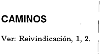

## CARGA DE LA PRUE¡BA

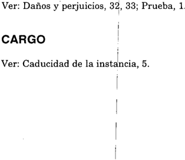

## CASO FORTUITO

Ver: Daños y peIjuicios, 33.

## CESANTIA

Ver: Empleados públicos, 1; Recusación, 2; Superintendencia, 3.

## CIUDAD AUTONOMA DE BUENOS AIRES

Ver: Jurisdicción y competencia, 25; Recurso extraordinario, 206.

## CLAUSURA

Ver: Sanciones administrativas,!.

## CODIGO PENAL

Ver: Prescripción, 7.

## COLEGIO PUBLICO DE ABOGADOS DE LA CAPITAL FEDERAL

Ver: Facultad reglamentaria, 4; Profesiones liberales, 4.

## COLEGIOS PROFESIONALES

Ver: Facultad reglamentaria, 1, 3; Recurso extraordinario, 225, 237.

## COMERCIO

Ver: Energía eléctrica, 2.

## COMISION INTERAMERICANA DE DERECHOS HUMANOS

Ver: Juicio criminal, 16 a 19; Recurso extraordinario, 250, 251; Tratados internacionales, 2.

## CONCURSO PREVENTIVO

Ver: Recurso extraordinario, 139, 156.

"

(18)

CONSOLIDACION

## CONCURSOS

## CONDENA

Ver: Universidad, 1 a 3.

Ver: Constitución Nacional, 23; Entidades financieras, 1; Recurso extraordinario, 139, 154, 156, 238. i

i

i

## CONCURSOS UNIVERSITARIOS

I

I

I

Ver: Constitución Nacional, 57, 65, 128, 246, 247.

32, 35; Juicio criminal, 14 a 17; Recurso extraordinario,

## CONFISCATORIEDAD

Ver: Constitución Nacional, 58; Emergencia

económica, 5.

## CONGRESO NACIONJL

Ver: Decreto de necesidad ylUrgenCia, 7, li, 15, 17; Presupuesto, 2 a 4; Profesiones liberales, 1, 2; Reforma constitucional, 1.

## CONSENTIMIENTO

Ver: Reivindicación, 1,2.

## CONSOLIDACION (1)

- 1. Las sanciones conminatorias. impuestas por los jueces en ejercicio de las facultades que les acuerda el arto 37 del:Código Procesal Civil y Comercial de la Nación -en tanto suponen una sentencia condénatoria que impone un mandato que el acreedor no satisface deliberadamente-, no se encuentran comprendidas en el régimen de consolidación de deudas de la ley 23.982 (ál que remite el arto 13 de la ley 25.344): p. 1658.
- 2. Corresponde deshechar el procedimiento de la ley 23.982 para el caso de astreintes, ya que su aplicación tiende a desnaturalizar los efectos que aquella sanción pretende, sin hacer distinción entre los supuestos en los que la obligación principal haya sido cumplida o no: p. 1658.
- (1) Ve.r también: Depreciación monetaria, 6; Recurso extraordinario, 79, 133, 136,215.

- 3. El arto 22 de la ley 23.982, que tiene por objeto evitar la afectación imprevista de fondos contemplados para ser aplicados a otros fines, preservando la regularidad del funcionamiento del servicio, no autoriza a introducir excepciones en materia de multas procesales impuestas por los jueces en ejercicio de las facultades conferidas por el arto 37 del Código Procesal Civil y Comercial de la Nación &lt;Disidencia de los Dres. Carlos S. Fayt y Adolfo Roberto Vázquez): p. 1658.

## CONSOLlDACION DE DEUDAS

Ver: Administración Nacional de la Seguridad Social, 1.

## CONSTITUCION NACIONAL (1)

## INDICE SUMARIO

Abogado, 19, 22. Absolución del acusado, 16, 30 a 35, 38, 40. Acción de amparo, 22. Acción penal, 30. Actos propios, 9. Acusación, 18, 30 a 40. Aduana, 51. Automotores, 51.

Concursos, 23. Condena, 32, 35. Confiscatoriedad, 58. Contrabando, 51 a 54. Control de cambios, 27. Corte Suprema, 7. Cosa juzgada, 54.

Debido proceso, 11.

Declaración indagatoria, 16.

Declaración informativa, 12, 16.

Decreto de necesidad y urgencia, 8, 47, 57,

60 a 63,65.

Defensor, 12.

Depósito previo, 43.

Depreciación monetaria, 46.

Derechos adquiridos, 21. Doble instancia, 28.

Ejecución de sentencia, 55. Emergencia económica, 55 a 58, 61.

Empleados públicos, 44, 47, 57.

Entidades financieras, 23.

Fiscal, 17,30 a 38, 40.

Garantía contra el doble proceso penal, 17. Garantía contra la auto incriminación, 13 a 16.

Honorarios de abogados y procuradores, 19.

Igualdad, 64.

Importación, 51, 52.

Impuesto, 45, 62.

Interés público, 45.

Iura novit curia, 4.

Jueces, 3.

Jueces naturales, 39. Juicio criminal, 12 a 17, 25 a 27, 30 a 40, 49 a 54.

- (1) Ver también: Facultad reglamentaria, 4; Jubilación y pensión, 12; Jurisdicción y competencia, 20; Ley penal más benigna, 1; Leyes de emergencia, 1; Leyes procesales, 1; Recurso de queja, 9; Recurso extraordinario, 57, 60; Remuneraciones, 2; Sentencia, 6; Universidad, 4.

CONSTITUCION NACIONAL

Juicio oral, 34. Juicio penal, 18. Jurisprudencia, 21, 22.

Prueba, 18, 39.

Publicación de la ley, 42.

Quiebra, 23.

Zonas francas, 62.

Tasa de justicia, 42.

Recurso extraordinario, 9, 59.

Recursos, 41.

Remuneraciones, 44, 47.

Salario, 57.

Sana crítica, 26.

Sanciones administrativas, 42.

Sentencia arbitraria, 59.

Servicios públicos, 60.

Sobreseimiento, 53, 54.

Sueldo, 44, 47, 57.

Supremacía de la Constitución Nacional y leyes nacionales, 4.

Patrocinio letrado, 22.

Poder Judicial, 5.

Prescripción, 45.

Principio de legalidad, 62.

I

Principio de preclusión, 17.

Principio de progresividad, 1j"

Non bis in idem, 17.

Notificación, 19, 20.

Nulidad,24.

Nulidad procesal, 12, 14 a 16,'26.

Ley, 5, 63, 64.

Ley penal tributaria, 53, 54.

Leyes de emergencia, 44, 47, 55, 60.

I

,

Mandato,

19. ,

Ministerio público, 31, 36 a 38, 40.

## Control de constitucionalidad

Principios generales

I

- I 1. La declaración de inconstitucionalidad de una leyes un acto de suma gravedad institucional, que debe ser co~siderado como ultima ratio del orden jurídico y, en caso de duda debe estarse por su constitucionalidad (Disidencia del Dr. Antonio Boggiano): p. 1981.
- 2. Sólo debe acudirse a la declaración de inconstitucionalidad cuando la repugnancia de la ley inferior con la norma calificada de suprema sea manifiesta y la incompatibilidad inconciliable. Es por ello que los tribunales de justicia deben imponerse la mayor mesura, mostrándose tan celosos en el uso de sus facultades comodel respeto que la Ley Fundamental asigna, cop carácter privativo, a los otros poderes (Disidencia del Dr. Antonio Boggiano): p. 19~1.

¡

## Facultades del Poder Judicial I

- 3. Aun cuando el planteo de linconstitucionalidad del arto 10 de la ley 24.587 no fue oportunamente introducido YI su fundamentación presente deficiencias, resulta indispensable su tratamiento, en vlirtud del deber que tienen losjueces de aplicar el derecho vigente, el cual no puede estar supeditado al requerimiento de las partes (Disidencia del Dr. Antonio Boggiano): P.¡1435.
- 4. La atribución que tienen l y el deber en que se hallan los tribunales de justicia -nacionales y provincialesde examinar las leyes en los casos concretos que se traen a

I

su conocimiento, incluye la potestad de suplir el derecho que las partes no invocan o que invocan erróneamente, trasuntado en el antiguo adagio romano "iura curia novit" y que incluye el deber de mantener la supremacía de la Constitución (Disidencia del Dr. Antonio Boggiano): ps. 1435, 1981.

- 5. La presunción de legitimidad de los actos legislativos es meramente provisional -iuris tantumy cede, en un sistema de control de constitucionalidad difuso, ante la comprobación y declaración de invalidez de las normas por el Poder Judicial (Disidencia del Dr. Antonio Boggiano): ps. 1435, 1981.
- 6. La declaración de inconstitucionalidad de una leyes un acto de suma gravedad institucional, que debe ser considerado como ultima ratio del orden jurídico y, en caso de duda debe estarse por su constitucionalidad. Sólo debe acudirse a aquélla cuando la repugnancia de la ley inferior con la norma calificada de suprema sea manifiesta y la incompatibilidad inconciliable, es por ello que los tribunales de justicia deben imponerse la mayor mesura, mostrándose tan celosos en el uso de sus facultades como del respeto que la Ley Fundamental asigna, con carácter privativo, a los otros poderes (Disidencia del Dr. Antonio Boggiano): p. 1435.
- 7. Una escueta y genérica impugnación de inconstitucionalidad no basta para que la Corte ejerza la atribución que reiteradamente ha calificado como la más delicada de las funciones que pueden encomendarse a un tribunal de justicia y acto de suma gravedad que debe considerarse como ultima ratio del orden jurídico: p. 1922.
- 8. Corresponde al Poder Judicial el control de constitucionalidad sobre las condiciones en las cuales el Poder Ejecutivo dicta decretos de necesidad y urgencia, como asimismo el control de compatibilidad constitucional en cuanto al contenido sustancial de las medidas adoptadas, cuando ello se debate en un caso concreto (Votode losDres. Augusto César Belluscio y Gustavo A. Bossert): p. 2394.

## Interés para impugnar la constitucionalidad

- 9. El voluntario sometimiento a un régimen jurídico, sin reservas expresas, comporta un inequívoco acatamiento que determina la improcedencia de su impugnación ulterior, con base constitucional mediante el recurso extraordinario: p. 1922.

## Derechos y garantías

## Defensa en juicio

Principios generales

- 10. La declaración de inconstitucionalidad no vulnera el derecho de defensa si la recurrente ha podido expresar su opinión sobre la validez de la norma cuestionada en la contestación del recurso extraordinario ante la Corte (Disidencia del Dr. Antonio Boggiano): p. 1435.
- 11. Todo procedimiento, tanto administrativo comojudicial, debe responder al imperativo del debido proceso, conforme a su naturaleza particular: p. 1649.

(22)

## Procedimiento y sentencia

- 12. Debe considerarse que la declaración informativa (art. 236, 2da. parte, del Código de Procedimientos en Materia Penal) emanó de la libre voluntad del imputado si tuvo lugar en presencia del juez de la causa, y aquél, antes de declarar, fue puesto en conocimiento de los derechos que lo asistían, y por otra parte, las expresiones vertidas fueron posteriormente ratificadas en presencia del letrado de confianza: p. 1404.
- 13. La eventual afectación de las garantías protegidas por la Constitución Nacional, sólo podría producirse si el imputado, al declarar, por omisión de ponerlo en conocimiento de sus derechos, hubiera confesado una conducta reprochable, susceptible de configurar una autoincriminación que conduzca a su condena en mérito a hechos inconstitucionalmente admitidos: p. 1404.
- 14. No debe confundirse el respeto a los recaudos que tienden a asegurar la protección del ejercicio de una garantía constitucional con la incolumidad de la garantía misma, pues suponer que una hipotética omisión formal -que en el caso no ha afectado la libre determinación del imputado a declararpudiera causar la nulidad del acto, implicaría convertir a los medios tendientes a proteger el ejercicio de aquella garantía en una garantía en sí misma, con olvido del carácter meramente instrumental que tales medios revisten: p. 1404.
- 15. Si bien "relevar del juramento" no está expresamente previsto por el ordenamiento procesal, cuando el sujeto ya declaró sobre los hechos que lo incriminan bajo juramento o promesa de decir verdad al ratificar una denuncia, y luego es interrogado en calidad de imputado, es razonable, a fin de asegurar la libertad de la declaración, considerar que no es suficiente con comunicarle que "se puede negar a declarar" sino que es mejor y mayor garantía hacerle saber que su anterior declaración no es vinculante (Disidencia del Dr. Enrique Santiago Petracchi): p. 1404.
- 16. No es irrazonable el pronunciamiento que -al declarar la'nulidad de la declaración informativa (art. 236, 2da. parte, Código de Procedimientos en Materia Penal)absolvió al imputado, pues a la vaCÍa constancia asentada en una posterior (indagatoria) con relación a que se advirtió al procesado acerca del "carácter procesal" de la prestada como denunciante, no cabe atribuirle el efecto de liberarlo de las consecuencias del juramento ya prestado (Disidencia del Dr. Enrique Santiago Petracchi): p.1404.
- 17. Si lo solicitado por el fiscal se traduce en la pretensión de que se dicte un nuevo pronunciamiento, ello significaría otorgar al Estado una nueva chance para realizar su pretensión de condena, en franca violación al principio constitucional del non bis in idem y sus consecuencias, la progresividad y la preclusión de, los actos del proceso (Disidencia del Dr. Enrique Santiago Petracchi): p. 1404.
- 18. La garantía del debido proceso y defensa enjuicio exigen que la acusación, considerada como una etapa sustancial en la integración de todo proceso penal por medio del cual se delimita el objeto procesal, describa con precisión la conducta imputada, a los efectos que el procesado pueda ejercer con plenitud su derecho a ser oído y producir la prueba en su descargo así como también el de hacer valer todos 'los medios conducentes a su defensa, que prevén las leyes de procedimientos: p. 1530.

- 19.La notificación dirigida al domicilioconstituído -que era el de sus letrados apoderados- proveyó a la recurrente de una mera defensa formal incompatible con la garantía de la defensa en juicio pues tratándose de actos procesales y decisiones judiciales referentes a la determinación de los honorarios de dichos letrados, existían intereses contrapuestos entre mandante y mandatario: p. 1541.
- 20. La garantía de defensa en juicio supone -en sustanciaque las decisiones judiciales deban ser adoptadas previo traslado a la parte contra la cual se pide, es decir, dándole oportunidad de ser oída, y de ejercer sus derechos en la forma y con las solemnidades que establecen: p. 1541.
- 21. Si bien nadie tiene -en principioun derecho adquirido al mantenimiento de los criterios jurisprudenciales asentados, el abandono por el tribunal de grado de su doctrina anterior le exigía contemplar las particularidades del caso, a fin de no descolocar al justiciable en cuanto a las "reglas claras dejuego" a las que debía ajustarse para no perder su derecho: p. 1578.
- 22. La decisión del superior tribunal provincial que rechazó el recurso local sosteniendo que si bien en casos anteriores no había objetado la ausencia de patrocinio letrado para actuar en acciones de amparo, un nuevo examen de la cuestión lo llevaba a cambiar de criterio, condujo al tribunal a un resultado claramente adverso al que pretendió lograr, ya que pese a haber justificado su proceder en la necesidad de garantizar la adecuada defensa del recurrente, rechazó sin más su acción tras exigirle la observancia de un recaudo que no le permitió cumplir: p. 1578.
- 23. Corresponde confirmar la sentencia que rechazó la nulidad deducida por la fallida contra el auto de declaración de quiebra, si aquélla tuvo oportunidad de alegar todo cuanto consideró conducente a su defensa durante el procedimiento administrativo que culminó con la revocación de la autorización para funcionar dispuesta por el Banco Central (Voto del Dr. Eduardo Moliné O'Connor): p. 1649.
- 24. Si el defecto de procedimiento que motivó el planteo de nulidad quedó debidamente subsanado en las actuaciones que ponen en evidencia que la parte tuvo suficiente oportunidad de ser oída y de ejercitar las defensas que hacían a su derecho, no procede invalidar lo actuado ya que tal criterio iría en contra del principio de trascendencia e importaría consagrar la nulidad por la nulidad misma (Voto del Dr. Eduardo Moliné O'Connor): p. 1649.
- 25. La necesidad de la motivación en supuestos en que están en juego garantías constitucionales encuentra su respaldo en la necesidad de controlar la coacción estatal y evitar la arbitrariedad de sus órgan"osadministrativos; si, por el contrario, los jueces no estuvieran obligados a examinar las razones y antecedentes que motivan el pedido formulado por aquéllas y estuviesen facultados a expedir las órdenes sin necesidad de expresar fundamento alguno, la intervención judicial carecería de sentido pues no constituiría control ni garantía alguna: p. 1845.
- 26. Atenta contra la sana crítica racional y las reglas de la lógica anular un procedimiento cuando su respaldo está dado, o puede encontrarse, en otras constancias de la causa, ya que cuestionar la restricción de las "formas" en la práctica tribunalicia es desconocer la realidad del pesado trabajo judicial en sede.penal: p. 1845.

- 27. Corresponde rechazar los agravios tendientes a demostrar que las falencias del informe qúe propició la apertura del sumario y la notificación del traslado hubieran tornado ilusorio o menoscabado los derechos de los imputados si éstos contaron con la posibilidad de ejercer su defensa y ofrecer las pruebas con pleno conocimiento de los derechos que les asistían, en las instancias previstas en los artículos 8 y 9 de la ley 19.359: p. 1981.
- 28. Si bien la multiplicidad de instancias no es una condición cuya ausencia vulnere per se tal garantía constitucional, ello ocurre cuando se frustra sin fundamento válido la vía revisora prevista legalmente para obtener el reconocimiento del derecho invocado: p. 1981.
- 29. La declaración de inconstitucionalidad no vulnera el derecho de defensa, que ha sido salvado pues el fiscal de Cámara ha podido expresar su opinión sobre la validez de la norma cuestionada en la contestación del recurso extraordinario ante la Corte (Disidencia del Dr. Antonio Boggiano): p. 1981.
- 30. El requerimiento de absolución por parte del fiscal no desapodera al tribunal del ejercicio de la jurisdicción, pues el pedido desincriminatorio por parte del acusador no se encuentra necesariamente previsto como causal que determine el cese de la acción penal: p. 2005.
- 31. El requerimiento de absolución del representante del Ministerio Público no afecta el debido proceso legal en tanto la acusación como tal se llevó a cabo en una etapa anterior y en la medida en que, en esa ocasión, se haya dado cumplimiento a todos los recaudos necesarios para tenerla por válida, de manera que la defensa haya podido tomar conocimiento de los cargos que permiten el pleno ejercicio de sus derechos: p. 2005.
- 32. No se advierte violación alguna a la garantía constitucional de la defensa enjuicio y del debido proceso por el solo hecho de llegar a una sentencia condenatoria cuando el fiscal de juicio ha requerido la absolución del imputado: p. 2005.
- 33. No resulta lógico pensar que, con su sola decisión, el fiscal pueda, sin contralor alguno, decidir la suerte del proceso luego de haber formulado una verdadera acusación con el pedido de remisión a juicio, postulando un verdadero reproche penal y convertirse, de esta manera, en juez y parte: p. 2005.
- 34. La acusación, en los juicios orales, se produce al formularse el requerimiento de la elevación de la causa a juicio (art. 347 del Código Procesal Penal de la Nación), y es esa requisitoria la que permite el conocimiento de los cargos que determinan el pleno ejercicio de la defensa (Voto del Dr. Eduardo Moliné O'Connor): p. 2005.
- 35. El tribunal puede condenar aunque el fiscal, durante el debate, pida la absolución (Voto del Dr. Eduardo Moliné O'Connor): p. 2005.
- 36. La garantía del arto 18 de la Constitución Nacional sólo requiere para subsistir la existencia de una acusación respecto del procesado (Votodel Dr. Carlos S. Fayt): p. 2005.
- 37. Los principios procesales que reconocen raigambre constitucional sólo exigen que a una sentencia preceda una acusación. Una correcta acusación es el presupuesto de un

debate válido y conforme la estructura de nuestro juicio penal recibida del derecho continental europeo, el juicio oral y público tiene por misión valorar esa acusación -que abrió el juiciosegún el contenido del debate (Voto del Dr. Carlos S. Fayt): p. 2005.

- 38. Si el representante del Ministerio Público, luego de haber ampliado la acusación contenida en el requerimiento de elevación a juicio, solicitó la absolución del procesado, la condena dictada no afecta la garantía de la defensa en juicio porque respeta el principio acusatorio formal y la exigencia de que al juicio preceda una acusación, y a la vez, se mantiene incólume el sometimiento al principio de contradicción (Voto del Dr. Carlos S. Fayt): p. 2005.
- 39. En materia criminal, la garantía del arto 18 de la Constitución Nacional exige la observancia de las formas sustanciales del juicio relativas a la acusación, defensa, prueba y sentencia dictada por los jueces naturales (Disidencia de los Dres. Augusto César Belluscio y Gustavo A. Bossert): p. 2005.
- 40. El tribunal no puede condenar si el fiscal, durante el debate, solicitó la absolución del imputado (Disidencia de los Dres. Augusto César Belluscio y Gustavo A. Bossert): p.2005.
- 41. Los requisitos formales para la procedencia de un recurso no pueden desnaturalizarse hasta el extremo de constituirse en un valladar para su conocimiento de las causas, ni la exigencia de fórmulas sacramentales puede impedir la protección de derechos o garantías constitucionales, tales comoel de obtener una sentencia ajustada a los hechos y al derecho, que aseguren la vig~ncia irrestricta de los principios del debido proceso y la defensa enjuicio (Votode los Dres. Augusto César Belluscio y Guillermo A. F. López): p. 2262.

## Ley anterior y jueces naturales

- 42. Ausente la publicidad, cualquiera sea la bondad de la nueva disposición con relación a la anterior, tratándose de un requisito que hace a la obligatoriedad de la ley, la sanción que contempla la norma, causa lesión a la garantía constitucional de la defensa en juicio, en cuanto exige que aquélla se encuentre prevista por la ley con anterioridad al hecho del proceso (art. 18 de la Constitución Nacional): p. 1808.

## Derecho al acceso a la justicia

- 43. Tanto la tasa de justicia cuanto los depósitos que son requeridos en las instancias recursivas, no deben ser exigidos en ningún caso cual condicionantes previos del acceso a la jurisdicción. Por el contrario, para evitar todo tipo de cercenamiento de la garantía constitucional cualquier pago debe ser realizado al finalizar el pleito y por parte de quien ha resultado vencido (Disidencia del Dr. AdolfoRoberto Vázquez): pS. 2093,2434.

## Derecho de propiedad

- 44. La modificación de los márgenes de remuneración, en forma temporaria, motivada por los efectos de una grave crisis internacional de orden financiero, no implica "per se" una violación del arto 17 de la Constitución Nacional: p. 1418.

- 45. Mal puede invocarse una lesión al derecho de propiedad, toda vez que el arto 10 de la ley 24.587, que alcanza a la generalidad de los contribuyentes, atiende al interés público, pues si bien suspendió por un año el curso de la prescripción simultáneamente instauró un régimen de facilidades de pago, por lo que se presenta como un ejercicio razonable del poder impositivo que es el complemento necesario del principio constitucional que prevé atender al bien común (Disidencia del Dr. Antonio Boggiano): p. 1435.
- 46. La concreta existencia de una expectativa que el acreedor cuantificó en oportunidad de alegar sobre el mérito de la prueba producida, condicional a aplicación mecánica de índices oficiales y de tasas bancarias que conducen a un resultado desproporcionado, el cual supera ostensiblemente la pretensión de aquél y produce un inequívoco e injustificado despojo al deudor, lesivo de su derecho de propiedad: p. 1454.

## Igualdad

- 47. Los perjuicios que afectan a ciertos sectores en virtud del decreto 290/95 son correlato casi inevitable de muchas medidas de gobierno, sin que se advierta la concurrencia de factores distorsionan tes de la finalidad que inspiró la sanción de la norma, mediante la infundada inclusión o exclusión de sectores a los que alcanza: p. 1418.
- 48. No todo tratamiento jurídico diferente es discriminatorio y violenta los derechos constitucionales, ya que existen desigualdades fácticas que pueden traducirse en desigualdades justificadas en el tratamiento jurídico, que expresen una proporcionada relación entre las diferencias objetivas y los,fines de la norma: p. 2394.

## Non bis in idem

- 49. La garantía que prohíbe la doble persecución penal por el mismo hecho tiene base constitucional; su fundamento es proteger a los ciudadanos de las molestias y restricciones que implica un nuevo proceso penal cuando otro sobre el mismo objeto está en trámite o ha sido ya agotado, y se extiende, al menos, a toda nueva "persecución penal", es decir, que ampara al imputado desde que existe algún acto del juez -Q de quienes bajo su control efectivo o eventual tienen a su cargo la instrucciónque atribuye de alguna manera a una persona la calidad de autora de una infracción penal y que tiende a someterlo a proceso (Disidencias del Dr. Carlos S. Fayt y del Dr. Augusto César Belluscio): p. 1932.
- 50. La garantía que prohíbe la doble persecución penal por el mismo hecho no es aplicable cuando las conductas imputadas en ambos procesos no son idénticas por versar sobre un acontecimiento histórico distinto al que originó el otro proceso concluido o en trámite, aun si los encausados hubiesen realizado los hechos de un modo simultáneo (Disidencias del Dr. Carlos S. Fayt y del Dr. Augusto César Belluscio): p. 1932.
- 51. El tribunal de casación otorgó a la garantía del non bis in idem una extensión impropia que importó desvirtuar la finalidad y el alcance de las normas constitucionales en juego si de las constancias surge que concurrieron varias conductas autónomas e independientes, aun cuando se hubiesen realizado en un mismo contexto de tiempo y espacio -introducción de vehículos sin el debido control aduaneroo en diversas oportunidades, como el ingreso por diversas aduanas del país de automóviles iinportados mediante documentación adulterada (Disidencias del Dr. Carlos S. Fayt y del Dr. Augusto César Belluscio): p. 1932.

- 52. El hecho "deque los imputados consintieron el desdoblamiento de la investigación de las diversas conductas a ellos atribuidas, es la prueba más evidente de lo escindibles que son aquéllas, ya que al dictarse el procesamiento por evasión fiscal y remitirse la investigación a los jueces competentes por la presunta comisión del delito de contrabando, no hicieron ningún planteo referente a la posible violación del principio de non bis in idem (Disidencia del Dr. Augusto César Belluscio): p. 1932.
- 53. Corresponde revocar la sentencia que concentra sus esfuerzos argumentales en sostener que en la causa tramitada en Concepción del Uruguay se investiga la misma realidad histórica que en las causas ya sobreseídas en Capital Federal, si elude dar razones valederas que permitan fundar que ha existido, además, identidad de la pretensión punitiva, lo cual constituye el núcleo de la resolución del caso (Disidencia del Dr. Enrique Santiago Petracchi): p. 1932.
- 54. Corresponde revocar la sentencia que no ofrece ninguna razón que explique por qué el juez de Concepción del Uruguay debía considerar que el sobreseimiento por cosa juzgada dictado por el juez en lo Penal Económico de Capital Federal extendía sus efectos a hechos acaecidos fuera de su competencia territorial, cuando aquél ya había asumido la competencia en la investigación relativa a los hechos cometidos en Gualeguaychú (Disidencia del Dr. Enrique Santiago Petracchi): p. 1932.

## Constitucionalidad e inconstitucionalidad

## Leyes nacionales

- 55. El efecto producido por los arts. 1°del decreto 896/01 y 10 de la ley 25.453 excede el ejercicio válido de los poderes de emergencia y justifica su declaración de inconstitucionalidad, debiendo resolverse en la etapa de ejecución de sentencia el modo de cumplimiento de la sentencia: p. 2059.
- 56. El efecto producido por los arts. 1°del decreto 896/01 y 10 de la ley 25.453 excede el ejercicio válido de los poderes de emergencia y justifica su declaración de inconstitucionalidad, debiendo resolverse en la etapa de ejecución lo relativo al modo de cumplimiento de la sentencia, para lo cual los jueces deberán tener en cuenta la situación económica y financiera por la que atraviese la Nación y la legislación que regula el cumplimiento de las condenas de índole dineraria por parte del Estado Nacional (Voto del Dr. Carlos S. Fayt): p. 2059.
- 57. El arto 10 de la ley 25.453 no cumple con los estándares aceptados para la constitucionalidad de las leyes de emergencia que restringieron derechos patrimoniales, en especial, en lo atinente a la razonabilidad del medio empleado, ya que al sujetar la retribución del agente -de modo absoluto y sin limitación algunaa la existencia de recursos fiscales, crea tal y tan grande estado de incertidumbre que desnaturaliza la sustancia misma de la relación de empleo público (Voto del Dr. Enrique Santiago Petracchi): p. 2059.
- 58. La reducción de haberes dispuesta a partir del arto 34 de la ley 24.156 modificado por la ley 25.453 no fue confiscatoria y, por otra parte, dicha norma puede considerarse como un instrumento necesario para mitigar el déficit fiscal, cumplir 10

antes posible con las obligaciones internacionales de la Nación y restablecer con gran urgencia el sistema financiero del país a fin de aventar los graves males presentes y las peores penurias que pueden venir (Disidencia del Dr. Antonio Boggiano): p.2059.

- 59. Corresponde rechazar el planteo de inconstitucionalidad del arto 280 del Código Procesal Civil y Comercial de la Nación, pues la desestimación de la apelación federal por la sola mención de dicha norma no importa afirmar la justicia o el acierto de la decisión recurrida, sino que no se han hallado elementos en la causa que tornen manifiesta la frustración del derecho a la jurisdicción en debido proceso configurando la arbitrariedad invocada: p. 2434.

## Decretos nacionales

- 60. Es inconstitucional el decreto 260/97 en tanto -mediante un remedio sólo autorizado para situaciones que ponen en peligro la subsistencia misma de la organización socialpretende llevar alivio al sector del servicio público de pasajeros, a través del procedimiento de trasladar a la víctima la carga de financiarlo: p. 1454.
- 61. Corresponde declarar la inconstitucionalidad del decreto 896/01 ya que, al no haberse sancionado la ley que reclama el arto 99, inc. 3°, de la Constitución Nacional, son nulos de nulidad absoluta los decretos de necesidad y urgencia, sin que ese vicio sea subsanable por una ley posterior que pretenda tener efecto retroactivo, más aún cuando la ley 25.453 no ha intentado ratificar al decreto, sino que expresamente lo ha derogado (art. 18) (Voto del Dr. Enrique Santiago Petracchi): p. 2059.
- 62. El decreto 285/99 resultó insanable mente nulo por oponerse al principio de legalidad que rige en materia tributaria y al claro precepto del arto 99, inc. 3°, de la Constitución Nacional y, por ende, se encuentra privado de todo efecto jurídico: p. 2394.
- 63. Si bien la ratificación mediante la ley 25.237 carece de efectos retroactivos en virtud de la insanable inconstitucionalidad original del decreto 285/99, aquella norma revela que la intención del Poder Legislativo fue la de conferir rango legal a los contenidos que fueron plasmados en el mismo, lo cual, con indiferencia de la imperfecta técnica legislativa, conlleva a efectuar el control de constitucionalidad respecto del procedimiento seguido y de los contenidos sustanciales aprobados, los cuales, de ser compatibles con los principios constitucionales, tendrían vigor a partir de la publicación de la ley: p. 2394.
- 64. La sustancia de lo regulado en el decreto 285/99, que tiene fuerza de ley a partir de la vigencia de la ley 25.237, no se revela con arbitrariedad o ilegalidad manifiesta, y su eventual inconstitucionalidad exigiría una demostración plena, concreta y circunstanciada de extremos fácticos, que no se da con la mera alegación de diferencias normativas en los regímenes establecidos por voluntad del Congreso mediante reglas de igual jerarquía: p. 2394.
- 65. Aunque por hipótesis se admitiera que el Poder Ejecutivo tuviese competencia para dictar los decretos de necesidad y urgencia, aun faltando la "ley especial" mentada en el arto 99, inc. 3° de la Constitución Nacional, el decreto 285/99 sería igualmente nulo (Disidencia del Dr. Enrique Santiago Petracchi): p. 2394.

## CONSULES

Ver: Convención de Viena sobre Relaciones Consulares, 1; Jurisdicción y competencia, 30, 40, 41; Recurso extraordinario, 48, 242, 243.

## CONTRABANDO

Ver: Aduana, 3; Constitución Nacional, 51 a 54; Prescripción, 8; Recurso extraordinario, 158, 183.

## CONTRATO DE TRABAJO (1)

- 1. No es incompatible la existencia de una relación laboral de la aetora con la sociedad de hecho en que su cónyuge era socio, pues la personalidad restringida que tiene este tipo de entidades ampara a los terceros, carácter que reviste la cónyuge respecto de los socios cuando se han verificado los requisitos que hacen a su situación de subordinación jurídica en la prestación del trabajo: p. 1622.

## CONTRATO DE TRANSPORTE

Ver: Prescripción, 3.

## CONTRATOS (2)

- 1. Los contratos deben celebrarse, interpretarse y ejecutarse de buena fe y de acuerdo con lo que verosímilmente las partes entendieron o pudieron entender, obrando con cuidado y previsión (art. 1198 del Código Civil), principio que es aplicable en el ámbito de los contratos administrativos, por lo que es exigible a los contratantes un comportamiento coherente, ajeno a los cambios de conducta perjudiciales, y debe desestimarse toda actuación que implique un obrar incompatible con la confianza que -merced a sus actos anterioresse ha suscitado en la otra parte: p. 1787.

## CONTRATOS ADMINISTRATIVOS

Ver: Buena fe, 2; Contratos, 1; Recurso ordinario de apelación, 22; Rescisión de contrato, 1,2.

## CONTROL DE CAMBIOS

Ver: Constitución Nacional, 27; Ley penal más benigna, 1; Recurso extraordinario, 23, 168, 191, 222, 227, 244, 245.

- (1) Ver también: Prescripción, 4.
- (2) Ver también: Juicio criminal, 2; Recurso extraordinario, 116, 117, 170.

## CONTROL DE CONSTITUCIONALIDAD

Ver: Decreto de necesidad y urgencia, 8.

## CONTROL DE LEGALIDAD

Ver: Universidad, 1.

## CONTROLADOR FISCAL

Ver: Recurso extraordinario, 48.

## CONVENCION AMERICANA SOBRE DERECHOS HUMANOS

Ver: Juicio criminal, 14; Recurso extraordinario, 57, 128; Tratados internacionales, 2, 3.

## CONVENCION DE VIENA SOBRE RELACIONES CONSULARES

- 1: La protección que otorga la Convención de Viena sobre Relaciones Consulares a los funcionarios consulares de carrera con relación a los funcionarios consulares honorarios se restringe en los límites de aquello que el funcionario pueda necesitar por los actos oficiales realizados en el ejercicio de su función: p. 1970.

## CONVENCION SOBRE LOS DERECHOS DEL NIÑO

Ver: Recurso extraordinario, 51, 214.

## CONVENIO DE PARIS

Ver: Patentes de invención, 1,4; Recurso extraordinario, 52;Tratados internacionales, 1.

## CONVERTIBILIDAD

Ver: Recurso extraordinario, 17, 134, 189.

## COPIAS

Ver: Caducidad de la instancia, 5; Recurso extraordinario, 152.

## CORTE INTERAMERICANA DE DERECHOS HUMANOS

Ver: Recurso de apelación, 1.

## CORRALITO

Ver: Acción declar"atoria de inconstitucionalidad, 1; Jurisdicción y competencia, 31, 3{ 35, 43, 61, 64 a 66; Legitimación, 1.

## CORTE SUPREMA (1)

- 1. La Corte se ve en el ineludible deber de poner en ejercicio los poderes implícitos que hacen a la salvaguarda de la eficacia de la función judicial y que, como órgano supremo y cabeza de uno de los poderes del Estado, le son inherentes para cumplir con lo dispuesto por los arts. 75, inc. 12 y 116 de la Constitución Nacional, aplicando por analogía la facultad discrecional de rechazar el recurso ordinario de apelación previsto por el arto 24, inc. 6°del decreto-Iey 1285/58 (arg. arto 280 del Código Procesal Civil y"Comercial de la Nación) (Disidencia del Dr. Antonio Boggiano): ps. 1395, 1399.
- 2. No obstante que las decisiones de la Corte Suprema se circunscriben a los procesos concretos que le son sometidos y sus fallos no resultan obligatorios para casos análogos, los jueces tienen el deber de conformar sus decisiones a las de este Tribunal (Voto del Dr. Carlos S. Fayt): p. 2005.
- 3. Carecen de fundamento las sentencias de los tribunales inferiores que se apartan de los precedentes de la Corte Suprema sin aportar nuevos argumentos que justifiquen modificar las posiciones sustentadas en ellos, dado que aquélla reviste el carácter de intérprete de la Constitución Nacional y de las leyes dictadas en su consecuencia (Voto del Dr. Carlos S. Fayt):p. 2005.

## COSA JUZGADA

Ver: Constitución Nacional, 54; Daños y perjuicios, 11; Recurso extraordinario, 141, 149, 182, 250.

## COSA JUZGADA ADMINISTRATIVA

Ver: Jubilación y pensión, 15.

## COSTAS (2)

## Principios generales

- 1. Corresponde dejar sin efecto la sentencia que impuso costas a cargo de la Administración Nacional de la Seguridad Social ya que prescindió de lo estipulado por el arto 21 de la ley 24.463 sin que mediara declaración de inconstitucionalidad: p. 1525.
- (1) Ver también: Constitución Nacional, 7; Decreto de necesidad y urgencia, 13; Juicio criminal, 18;Jurisdicción y competencia, 53, 61; Privación de justicia, 1; Recurso de apelación, 1;Recurso de reposición, 1, 2; Recurso extraordinario, 54, 55, 107, 108, 193; Recurso ordinario de apelación, 16;Remisión de autos, 1.
- (2) Ver también: Pronunciamiento inoficioso, 1; Recurso extraordinario, 124, 138, 141, 173, 174, 195; Recurso ordinario de apelación, 21.

- 2. Corresponde confirmar la imposición de costas a la Administración Nacional de la Seguridad Social si de la ley 24.463 y de sus antecedentes parlamentarios no surge que la intención de los legisladores haya sido extender a los procesos donde se procura el cumplimiento de una sentencia pasada en autoridad de cosa juzgada que dicho organismo no acató espontáneamente, las prescripciones de aquélla en materia de costas (Disidencia parcial de los Dres. Carlos S. Fayt, Augusto César Belluscio, Enrique Santiago Petracchi y Antonio Boggiano): p. 1525.

## Resultado del litigio

- 3. Si bien el arto 68 del Código Procesal Civil y Comercial de la Nación consagra el principio rector en materia de costas, que encuentra su razón de ser en el hecho objetivo de la derrota: quien resulta vencido debe cargar con los gastos que debió realizar la contraria para obtener el reconocimiento de su derecho, es posible reconocer excepciones a tal regla en las condiciones que la misma norma establece en su segundo párrafo, que faculta a losjueces a eximir total o parcialmente de esta responsabilidad al litigante vencido por decisión fundada (Disidencia parcial del Dr. Antonio Boggiano): p. 2276.
- 4. Las excepciones a la regla del arto 68 del Código Procesal Civil y Comercial de la Nación deben admitirse restrictivamente y la eventual complejidad de los temas debatidos no puede constituir fundamento suficiente para exceptuar a la regla de aquella norma, particularmente si las partes litigaron en igualdad de condiciones respecto del tema central en torno del cual giró la controversia (Disidencia parcial del Dr. Antonio Boggiano): p. 2276.

## COSTUMBRE

Ver: Recurso extraordinario, 152.

## CUESTION ABSTRACTA

Ver: Recurso extraordinario, 33, 42.

## CUESTION FEDERAL

Ver: Jurisdicción y competencia, 20; Recurso extraordinario, 262, 264 a 267.

## CUESTION INSUSTANCIAL

Ver: Recurso extraordinario, 40.

## CULPA

Ver: Recurso extraordinario, 137, 179, 180.

## CURATELA (1)

1. La diferencia existente entre tutela y cura tela, es que las normas de la tutela prevén una situación destinada a terminar al cabo de un tiempo, en tanto que la curatela no tiene término de finalización, lo que sólo ocurre en la eventualidad de la curación del insano (Disidencia de los Dres. Antonio Boggiano, Guillermo A. F. López y Gustavo A. Bossert): p. 2241.

D

## DAÑO MATERIAL

Ver: Recurso extraordinario, 104, 105.

## DAÑOS Y PERJUICIOS (2)

## INDICE SUMARIO

Absolución del acusado, 12, 20 a 27.

Accidentes de tránsito, 3. Analogía, 29.

Carga de la prueba, 32, 33.

Caso fortuito, 33.

Cosa juzgada, 11.

Derecho común, 28 a 30.

Derecho de propiedad, 6.

Elecciones, 1. Error judicial, 11 a 27.

Escribano, 9.

Fuerzas armadas, 28, 29, 37, 38.

Igualdad, 6.

Indemnización, 28, 29.

Interpretación de los contratos, 1, 2.

## Jueces, 13.

Mala praxis, 31 a 35. Medidas cautelares, 12, 18. Militares, 28, 29.

Nulidad de los actos jurídicos, 37.

Obligaciones concurrentes, 9.

Pericia, 32, 33.

Pensiones militares, 30.

Principio de congruencia, 36.

Prisión preventiva, 18 a 27.

Provincias, 1.

Prueba, 3.

Reincorporación, 37, 38.

Rescisión de contrato, 2.

Responsabilidad del Estado por sus actos lícitos, 5, 15.

Responsabilidad médica, 31 a 34.

Retiro militar, 28 a 30.

Sentencia, 11.

Sociedades comerciales, 39.

- (1) Ver también: Jurisdicción y competencia, 10, 11.
- (2) Ver también: Acciónde amparo, 1; Jurisdicción y competencia, 78; Prescripción, 3; Recurso extraordinario, 6, 24, 26, 27,48,59,69 a 72, 113, 115, 118 a 121, 137, 142, 153, 160, 162, 179, 180, 194, 249; Recurso ordinario de apelación, 22.

## Culpa

## Contractual

- L Corresponde rechazar la demanda por incumplimiento de las obligaciones asumidas por E.N.Co.Te.S.A. respecto del escrutinio realizado en una provincia, si no se probó que los errores excedieran lo normal y previsible: p. 1761.
- 2. Corresponde rechazar la demanda -en cuanto persigue la restitución de una parte de lo abonadoy la reconvención -en cuanto se dirige a obtener el cobro de la cuota pendientesi las partes no aportaron elementos serios para determinar con algún grado de certeza el valor de las prestaciones incumplidas pues, ni la actora demostró que las sumas abonadas por ella generaran un enriquecimiento sin causa de la demandada, ni ésta probó que esos pagos fueran insuficientes para retribuir las tareas realizadas hasta el momento de la rescisión: p. 1761.

## Extracontractual

- 3. Si no resulta suficientemente acreditada alguna de las circunstancias eximentes del arto 1113, segundo párrafo, "in fine", del Código Civil, no corresponde liberar totalmente al demandado de la responsabilidad por los daños causados, sin peIjuicio de la eventual división que de tal responsabilidad pudiere corresponder en función de la concurrencia de culpas, de encontrarse ésta efectivamente probada (Disidencia de los Ores. Eduardo Moliné O'Connor, Augusto César Belluscio, Guillermo A. F. López y Adolfo Roberto Vázquez): p. 2135.

## Responsabilidad del Estado

## Generalidades

- 4. En principio, la administración pública no es responsable cuando el funcionario obra a título puramente personal, al margen de la función, y en exclusivo provecho propio (Voto de los Ores. Augusto César Belluscio, Enrique Santiago Petracchi y Gustavo A. Bossert): p. 1787.
- 5. Cuando la actividad lícita del Estado, aunque inspirada en propósitos de interés colectivo, se constituye en causa eficiente de un perjuicio para los particulares -cuyo derecho se sacrifica por aquel interés generalesos daños deben ser atendidos, y así, a la vez que se asegura a las ramas legislativa y ejecutiva la gerencia discrecional del bien común, se tutelan adecuadamente los derechos de quienes sufren algún perjuicio con motivo de medidas políticas, económicas o de otro tipo ordenadas para cumplir objetivos gubernamentales que integran su zona de reserva: p. 1855.
- 6. La responsabilidad del Estado por actos lícitos como un modo de preservar adecuadamente las garantías constitucionales de la propiedad y la igualdad jurídica, significa una distribución entre los miembros de la sociedad política, mediante la reparación que materializan sus órganos conductores, de los daños que los actos de gobierno legítimos pueden inferir a los particulares (Votode los Ores. Antonio Boggiano y Guillermo A. F. López): p. 1855.

## Registro de la propiedad

- 7. Al omitir la advertencia acerca del asiento que debía figurar en el ordenamiento diario con motivo de la escritura presentada, el registro cumplió de manera defectuosa las funciones que le están encomendadas y que atienden, sustancialmente, a otorgar un conocimiento cabal de las condiciones de dominio de los inmuebles, lo que pone en juego la responsabilidad directa de la provincia comprometida por la actividad irregular del órgano respectivo: p. 1585.
- 8. A fin de reclamar a la provincia los daños y peIjuicios derivados de una certificación errónea expedida por el Registro de la Propiedad, no es requisito que se hayan agotado las vías para reclamar el crédito del deudor originario ni demostrado su condición de ínsolvente: p. 1585.
- 9. La hipotética responsabilidad de cualquiera de los notarios intervinientes no excusaría total ni parcialmente la de la provincia ya que en caso de configurarse aquel supuesto mediarían obligaciones concurrentes -in solidum-, las que se caracterizan por la existencia de un solo acreedor, un mismo objeto, pero distintas causas en relación a cada uno de los deudores: p. 1585.
- 10. Corresponde rechazar la demanda que carece de causa (art. 499 del Código Civil) si los certificados de ley utilizados para la constitución de la garantía del actor no adolecían de error alguno y no hubo inexactitud registral ya que no se expidieron certificados que no correspondieran a los asientos respectivos del folio real (Disidencia del Dr. Carlos S. Fayt): p. 1585.

## Casos varios

- 11. El Estado sólo puede ser responsabilizado por error judicial en la medida en que el acto jurisdiccional que origina el daño sea declarado ilegítimo y dejado sin efecto, pues antes de ese momento el carácter de verdad legal que ostenta la sentencia pasada en autoridad de cosa juzgada impide, en tanto se mantenga, juzgar que hay error; lo contrario importaría un atentado contra el orden social y la seguridad jurídica, ya que la acción de daños y perjuicios constituiría un recurso contra el pronunciamiento firme, no previsto ni admitido por la ley: p. 1855.
- 12. La sentencia absolutoria no importó descalificar la medida cautelar adoptada en su momento respecto del procesado, ya que tal medida provisoria sólo traducía la existencia de un serio estado de sospecha, fundado en los elementos dejuicio existentes en esa etapa por lo que no cabe admitir que por la vía resarcitoria se pretenda revisar el acierto o error de un pronunciamiento cautelar firme: p. 1855.
- 13. Si para obtener el resarcimiento de eventuales daños derivados de un pronunciamiento judicial firme pudiesen otros jueces valorar nuevamente las circunstancias de la causa para determinar si hubo error en la anteriormente tramitada, no se verían estos últimos exentos de la posibilidad de cometer un nuevo error: p. 1855.
- 14. Si para escapar al peligro del error posible hubiera de concederse recurso de las decisiones de la Corte, para escapar a idéntico peligro habría que conceder recurso de las decisiones del tribunal que pudiera revocar las decisiones de aquélla, y de éste a

otro por igual razón, estableciendo una serie que jamás terminaría porque jamás podría hallarse un tribunal en que no fuera posible el error: p. 1855.

- 15. Las sentencias y demás actos judiciales no pueden generar responsabilidad del Estado por sus actos lícitos ya que no se trata de decisiones de naturaleza política para el cumplimiento de fines comunitarios sino de actos que resuelven un conflicto en particular; los daños que puedan resultar del procedimiento empleado para dirimir la contienda, si no son producto del ejercicioirregular del servicio, deben ser soportados por los particulares, pues son el costo inevitable de una adecuada administración de justicia: p. 1855.
- 16. En la medida en que no importen un error inexcusable o dolo en la prestación del servicio de justicia, las sentencias y demás actos judiciales no pueden generar responsabilidad alguna, ya que no se trata de actividades políticas para el cumplimiento de fines comunitarios, sino de actos que resuelven un conflicto en particular (Voto de los Dres. Antonio Boggiano y Guillermo A. F. López): p. 1855.
- 17. Si la contienda es dirimida por el juez respetando los hechos y el derecho vigente, la discrecionalidad en la elección de las diversas alternativas posibles no puede quedar condicionada por la atribución de obligaciones reparatorias para el Estado por los daños que pudieren causar a las partes en ocasión de la tramitación del juicio. Dichos daños, si alguna vez ocurrieron y en la medida en que no deriven de un ejercicio irregular del servicio prestado, deben ser soportados por los particulares, pues son el costo inevitable de una adecuada administración de justicia (Voto de los Dres. Antonio Boggiano y Guillermo A. F. López): p. 1855.
- 18. La responsabilidad estatal por error judicial cometido en ocasión del dictado de un auto de prisión preventiva, solamente queda abierta cuando, en el procedimiento apropiado, se demuestra la ilegitimidad de dicha medida cautelar, lo que se dará únicamente cuando se revele como incuestionablemente infundada o arbitraria, pues es claro que ninguna responsabilidad estatal puede existir cuando elementos objetivos hubiesen llevado a los juzgadores al convencimiento -relativo, dada la etapa del proceso en que se dictade que medió un delito y de que existía probabilidad cierta de que el imputado fuera su autor (Voto del Dr. Adolfo Roberto Vázquez): p. 1855.
- 19. La absolución del afectado no convierte en ilegítima a la prisión preventiva dictada cuando elementos objetivos hubiesen llevado a losjuzgadores al convencimiento de que medió un delito y de que existía probabilidad cierta de que el imputado fuera su autor, ya que solamente puede considerarse que medió error judicial cuando el auto que la impuso resulta palmariamente contradictorio con los hechos comprobados de la causa o insostenible desde el punto de vista de las normas que regulan su aplicación (Voto del Dr. Adolfo Roberto Vázquez): p. 1855.
- 20. Para que la absolución posterior abra la instancia resarcitoria es menester que concurra la demostración de una absoluta y manifiesta inocencia liminar, es decir que el auto de prisión preventiva, aun confirmado en las instancias superiores o provenientes de éstas, carezca de sustento lógicoen las constancias de la causa (Votodel Dr. Adolfo Roberto Vázquez): p. 1855.
- 21. Si entre la fecha de dictado de la prisión preventiva y la fecha en que quedó firme la sentencia de absolución no se superó el lapso de dos años previsto por el arto 10 de la

- ley 24.390, el planteamiento referente al plazo de duración de aquélla debe ser rechazado, máxime ponderando que tampoco se demostró que los magistrados penales hubiesen incurrido en un manifiesto y palmario quebrantamiento de la ley para el mantenimiento, por el lapso cuestionado, de tal medida precautoria (Voto del Dr. Adolfo Roberto Vázquez): p. 1855.
- 22. No se dan los requisitos que habilitan la reparación civil si la absolución del imputado obedeció a que el tribunal declaró la nulidad del auto de allanamiento y, como consecuencia, la de los actos posteriores consecuencia de aquél, por lo que no se puede deducir que tal resolución haya importado reconocer la arbitrariedad del auto de procesamiento y de la prisión preventiva (Voto de los Dres. Carlos S. Fayt, Augusto César Belluscio y Enrique Santiago Petracchi): p. 1855.
- 23. Si bien la detención preventiva es una necesidad del ejercicio de un deber primario del Estado impuesto por la defensa social a través de la persecución del delito y resulta consentida dentro de situaciones razonables y según la naturaleza del caso y la ilicitud de la conducta del procesado, ello no implica que quien la ha sufrido deba soportar el consiguiente daño sin derecho a reparación cuando no se reúnan los presupuestos que tornan admisible la adopción de la medida cautelar (Voto del Dr. Gustavo A. Bossert): p.1855.
- 24. La procedencia de la indemnización por la prisión preventiva sufrida no puede, sin más, derivarse de que luego la sentencia definitiva declare no culpable al procesado, ya que esta medida cautelar puede ser aplicada a quien después se demuestra que no fue autor del delito, pues, para su dictado, no se requiere certeza sobre la culpabilidad del imputado, sino sólo su verosimilitud, al punto que un juicio de verdad en esta materia se encuentra en oposición a la finalidad del instituto que no es otra que atender a aquello que no excede del marco de lo probable (Voto del Dr. Gustavo A. Bossert): p.1855.
- 25. Sólo puede responsabilizarse al Estado por error judicial por el dictado de una prisión preventiva, cuando el acto jurisdiccional que origina el daño haya sido dejado sin efecto, por cuanto la acción únicamente puede quedar abierta a partir de la absolución del procesado, y en tanto el demandante demuestre fehacientemente que el auto de prisión carecía de elementos de convicción suficientes para su dictado, lesionando de este modo, el principio constitucional de presunción de inocencia (Voto del Dr. Gustavo A. Bossert): p. 1855.
- 26. La adopción de la prisión preventiva forma parte, en principio, de las actividades que lícitamente despliega el juez en ei ejercicio de la función que se le ha encomendado, configurándose el error judicial indemnizable cuando se acredita que la decisión que dispone la prisión preventiva resulta objetivamente contradictoria con los hechos que surgen de los autos, o respecto de las normas que condicionan la aplicación de la medida, pues en tales casos media un apartamiento, objetivamente comprobable, de la tarea de hacer justicia a través de la aplicación del derecho (Voto del Dr. Gustavo A. Bossert): p. 1855.
- 27. Corresponde rechazar la demanda si el actor no acreditó, como era su deber procesal hacerlo, que la prisión preventiva decretada en su contra haya estado en abierta contradicción con los elementos existentes en la causa al tiempo de su dictado, o con las

normas que condicionan la aplicación de la medida (Voto del Dr. Gustavo A. Bossert): p.1855.

- 28. No existe óbice alguno para otorgar una indemnización basada en normas de derecho común a un integrante de las Fuerzas Armadas (o a sus derechohabientes) cuando las leyes específicas que rigen la institución no prevén una reparación sino un haber de retiro de naturaleza previsional y se trata de circunstancias ajenas al combate, consecuencias de un hecho accidental que podía ser imputado jurídicamente al Estado Nacional: p. 1957.
- 29. Si el fallecimiento no se produjo en acciones bélicas, en tanto las disposiciones respectivas de la ley 19.101 no contemplan un régimen indemnizatorio especial, sino que tratan de haberes previsionales, no existe impedimiento alguno para reclamar el resarcimiento de los daños por las normas de derecho común que rigen analógicamente a los restantes agentes de la administración: p. 1957.
- 30. Cuando los deudos tienen derecho a pensión, aunque el accidente se haya producido por la culpa de uno de los dependientes del Estado, no se encuentran autorizados para obtener de este último, fundándose en ella, otro resarcimiento que el que la pensión constituye, ya que el Estado toma a su cargo la asistencia de los deudos del militar fallecido en actos de servicio con la liberalidad adecuada, en el entendimiento de que a la condición militar debe acordársele, por su naturaleza, dicha prerrogativa (Disidencia del Dr. Adolfo Roberto Vázquez): p. 1957.

## Prueba

- 31. Para determinar la mala praxis deben valorarse las pruebas con delicadeza y precisión pues, de lo contrario, si bien se coadyuvaría a solucionar la situación de una persona y su familia, se causaría un serio perjuicio al sistema de salud en desmedro de toda la sociedad, ya que en razón de los naturales riesgos que implica el arte de curar, los médicos actuarían bajo una presión inconveniente e injusta, motivo por el que, sólo cuando se demuestre de modo fehaciente que la mala praxis o la desatención, ha sido la causante exclusiva de los perjuicios, cabe responsabilizar a los médicos y a las instituciones de los daños sobrevinientes (Disidencias de los Dres. Augusto César Belluscio y Enrique Santiago Petracchi y del Dr. Gustavo A. Bossert): p. 2095.
- 32. Si el daño fue atribuido por los médicos a un accidente propio del acto quirúrgico, ellos deben probar que tal accidente era parte del riesgo que implicaba la intervención a la que se sometió el paciente, máxime cuando la pericia estableció que si bien ello podía suceder sin culpa de los responsables de la cirugía, se daba de modo excepcional, y tal circunstancia invierte el sentido de la carga probatoria, debiendo aquellos que alegan la excepcionalidad explicar y probar las razones que pudíeran llevar en el caso puntual a la producción de la misma: p. 2192.
- 33. Si, según el peritaje, lesiones como la producida al actor no se verificaban en lo normal y general de los casos como consecuencia propia del riesgo quirúrgico, lo que hacía presumir la culpa, y al haberse invocado por los demandados, una causal previsible pero inevitable, un caso fortuito en el marco de la posibilidad excepcional destacada por el peritaje oficial, correspondía a ellos probar su existencia, o la circunstancia extraordinaria inevitable que condujo a la lesión: p. 2192.

- 34. Para determinar la mala praxis deben valorarse las pruebas con delicadeza y precisión pues, de lo contrario, si bien se coadyuvaría a solucionar la situación de una persona y su familia, se causaría un serio perjuicio al sistema de salud en desmedro de toda la sociedad, ya que en razón de los naturales riesgos que implica el arte de curar, los médicos actuarían bajo una presión inconveniente e injusta, motivo por el que, sólo cuando se demuestre de modo fehaciente que la mala praxis o la desatención ha sido la causante exclusiva de los perjuicios, cabe responsabilizar a los médicos y a las instituciones de los daños sobrevinientes: p. 2202.

## Determinación de la indemnización

## Generalidades

35. Para que proceda el resarcimiento de los perjuicios sufridos, respecto de la responsabilidad civil por hechos de mala praxis, debe acreditarse la relación de causalidad entre el obrar negligente de aquél a quien se imputa su producción y tales perjuicios (Disidencia de los Ores. Augusto César Belluscio, Enrique Santiago Petracchi y Guillermo A. F. López): p. 2356.

## Daño material

- 36. Por respeto al principio de congruencia no corresponde que la Corte Suprema se pronuncie acerca de la repercusión que los actos atribuidos a los funcionarios provinciales pudieran haber tenido respecto del giro comercial de E.N.Co.Te.S.A., si ésta dejó en claro que los "daños materiales" -entre los cuales se encontrarían las ganancias supuestamente dejadas de percibir, conf. arto 1069 del Código Civilserían objeto de un "reclamo autónomo": p. 1761.
- 37. Si la producción del daño aparece como una consecuencia inevitable y necesaria de la irregular decisión administrativa de la Junta de Calificación de la Gendarmería Nacional, la extensión del resarcimiento pretendido encuentra sustento en diversas normas que regulan los efectos de los actos nulos (arts. 1069 y 1056 del Código Civil) (Disidencia de los Ores. Eduardo Moliné O'Connor y Guillermo A. F. López): p.1804.
- 38. La reparación de las consecuencias derivadas de la baja que fue dispuesta ilegítimamente no se ve satisfecha por la mera reincorporación del recurrente después del largo tiempo transcurrido desde que aquélla fue dispuesta, sino que debe ser contemplada en la sentencia y estimada en tanto la existencia del daño se encuentra legalmente comprobada, aunque no resultare justificado su monto (art. 165 del Código Procesal Civil y Comercial de la Nación) (Disidencia de los Ores. Eduardo Moliné O'Connor y Guillermo A. F. López): p. 1804.

## Daño moral

39. Dado que la capacidad jurídica de las sociedades comerciales está limitada por el principio de especialidad (arts. 35, Código Civil y 2°, ley 19.550) y que su finalidad propia es la obtención de ganancias (art. 1°,ley cit.), todo aquello que pueda afectar su prestigio o su buen nombre comercial, o bien redunda en la disminución de sus benefi-

(40)

DECRETO DE NECESIDAD Y URGENCIA

cios O bien carece de trascendencia a los fines indemnizatorios, ya que se trata de entes que no son susceptibles de sufrir padecimientos espirituales: p. 1761.

## DEBIDO PROCESO

Ver: Constitución Nacional, 11; Juicio criminal, 8, 9; Leyes procesales, 1; Notificación, 2; Recurso extraordinario, 74, 84.

## DECLARACION INDAGATORIA

Ver: Constitución Nacional, 16.

## DECLARACION INFORMATIVA

Ver: Constitución Nacional, 12, 16; Recurso extraordinario, 45, 103.

## DECRETO

Ver: Profesiones liberales, 5.

## DECRETO DE NECESIDAD Y URGENCIA (1)

- 1. La ratificación del decreto de necesidad y urgencia 290/95 mediante el dictado de la ley 24.624 traduce por parte del Poder Legislativo, el reconocimiento de la situación de emergencia invocada por el Poder Ejecutivo para su sanción e importa un concreto pronunciamiento del órgano legislativo en favor de la regularidad de la norma: p. 1418.
- 2. Al dictar el decreto 290/95 el Poder Ejecutivo Nacional no actuó en uso de la competencia delegada atribuida por el Congreso en el arto 37 de la ley 24.156, sino en ejercicio de pretendidas facultades del arto 99, inc. 3°, de la Constitución Nacional, lo cual implica que sus cláusulas son nulas de nulidad absoluta hasta la entrada en vigencia de la ley 24.624, que lo convalidó (Disidencia parcial del Dr. Enrique Santiago Petracchi): p. 1418.
- 3. Al no haberse sancionado la ley que reclama el arto 99, inc. 3°, de la Constitución Nacional, no puede cumplirse con la denominada "subetapa" legislativa prevista por la norma, lo cual determina la imposibilidad del Poder Ejecutivo Nacional de dictar decretos de necesidad y urgencia (Disidencia parcial del Dr. Enrique Santiago Petracchi): pS. 1418, 2059, 2394.
- 4. La reducción salarial establecida en el decreto 290/95 sólo es válida desde la entrada en vigencia de la ley 24.624, pues un decreto de necesidad y urgencia que no haya cumplido con los requisitos del inc. 3°del arto 99 de la Constitución Nacional es nulo de

(1) Ver también: Constitución Nacional, 8, 47, 57, 60 a 63,65; Facultad reglamentaria, 2, 3; Remuneraciones, 2.

nulidad absoluta y este vicio no puede ser subsanado mediante una ley posterior que tenga efecto retroactivo (Disidencia parcial del Dr. Enrique Santiago Pe'tracchi): p. 1418.

- 5. La vía establecida en el arto 99, inc. 3° de la Constitución Nacional, exige que el Congreso sancione la "ley especial" que haga operativo el articulado, sin que quepa discutir las bondades del criterio elegido, ya que el Tribunal sólo debe atender a su significado y a sus consecuencias (Voto del Dr. Enrique Santiago Petracchi): p. 2059.
- 6. El texto del arto 99, inc. 3°, segundo párrafo, de la Constitución Nacional es elocuente y las palabras escogidas en su redacción no dejan lugar a dudas de que la admisión del ejercicio de facultades legislativas por parte del Poder Ejecutivo se hace en condiciones de rígurosa excepcionalidad y con sujeción a exigencias materiales y formales: p. 2394.
- 7. Los beneficios que se han establecido en el decreto 285/99 comportan, en su gran mayoría, el ejercicio de facultades de carácter tributario -aduaneras, impositivas o vinculadas con el Régimen Nacional de la Seguridad Social-, las que son competencia exclusiva del Poder Legislativo -arts. 4°, 17 Y75, incs. 1°y 2°,de la Constitución Nacionaly cuyo ejercicio está vedado al Poder Ejecutivo Nacional, aun en las condiciones excepcionales que podrían justificar el dictado de decretos de necesidad y urgencia, en atención a la explícita exclusión de tales materias que efectúa la Constitución Nacional: p. 2394.
- 8. La falta de sanción de una ley especial que regule el trámite y los alcances de la intervención del Congreso (art. 99, inc. 3°, párrafo cuarto in fine de la Constitución Nacional) no hace sino reforzar la responsabilidad por el control de constitucionalidad que es inherente al Poder Judicial de la Nación (Voto de los Dres. Augusto César Belluscio y Gustavo A. Bossert): p. 2394.
- 9. De los considerando s del decreto 285/99 no surge que la solución legislativa haya requerido una especial urgencia, es decir, que haya debido concretarse en un plazo incompatible con el trámite regular previsto por la Constitución para la sanción de la ley, ni que hayan existido razones de fuerza mayor o impedimento alguno para la reunión de las cámaras del Congreso (Voto de los Dres. Augusto César Belluscio y Gustavo A. Bossert): p. 2394.
- 10. Corresponde descartar criterios de mera conveniencia, ajenos a la configuración de extremas circunstancias de necesidad, ya que la Constitución no habilita a elegir discrecionalmente entre la sanción de una ley o la imposición más rápida de ciertos contenidos materiales por medio de un decreto (Votode los Dres. Augusto César Belluscio y Gustavo A. Bossert): p. 2394.
- 11. La Ley Suprema consagra, en el arto 99, inc. 3°, una limitación a las facultades del Poder Ejecutivo con la innegable finalidad de resguardar el principio de división de poderes, y únicamente en situaciones de grave trastorno que amenacen la existencia, la seguridad o el orden público o económico, que deban ser conjuradas sin dilaciones, puede el Poder Ejecutivo Nacional dictar normas que de suyo integran las atribuciones del Congreso, siempre y cuando sea imposible a éste dar respuesta a las circunstancias de excepción (Voto del Dr. Antonio Boggiano): p. 2394.
- 12. El ejercicio de la prerrogativa contemplada en el arto 99, inc. 3° de la Constitución Nacional está sujeto a reglas específicas, que exigen un estado de excepción y el impe-

dimento de recurrir al sistema normal de formación y sanción de las leyes y contemplan, además, una intervención posterior del Poder Legislativo (Voto del Dr. Antonio Boggiano): p. 2394.

- 13. Las medidas que se adopten en función del arto 99, inc. 3°,de la Constitución Nacional no están exentas del contralor judicial, que constituye la salvaguarda de los derechos individuales, sin que obste a ello la ausencia de la ley reglamentaria, máxime cuando la reforma de 1994 introdujo disposiciones precisas sobre las condiciones en que pueden ser dictados los decretos de necesidad y urgencia y la Corte ha ejercido el aludido contralor con anterioridad a la referida enmienda (Voto del Dr. Antonio Boggiano): p. 2394.
- 14. No se encuentran satisfechos los recaudos constitucionales para el dictado del decreto 285/99 si los beneficios que establece comportan, en su gran mayoría, el ejercicio de facultades de carácter tributario -aduaneras impositivas ovinculadas conel Régimen Nacional de la Seguridad Social- que son competencia exclusiva del Poder Legislativo en virtud de principios y preceptos expresos que imponen una limitación constitucional infranqueable en ese campo para los decretos de necesidad y urgencia (arts. 4°, 17, 75 incs. 1°y 2°,99, inc. 3° de la Constitución Nacional) (Votodel Dr. Antonio Boggiano):p. 2394.
- 15. Las referencias del decreto 285/99 en lo que excede la materia tributaria, resultan insuficientes para justificar una situación de grave riesgo social que el Congreso no puede remediar por los cauces ordinarios que la Constitución prevé, máxime cuando la medida se adoptó durante el período de sesiones ordinarias (Voto del Dr. Antonio Boggiano): p. 2394.
- 16. La mera conveniencia de que por un mecanismo más eficaz se consiga un objetivo de gobierno en modo alguno justifica la franca violación de la separación de poderes que supone la asunción por parte de mio de ellos de competencias que sin lugar a dudas le pertenecen a otro (Voto del Dr. Antonio Boggiano): p. 2394.
- 17. La vía establecida en el arto 99, inc. 3° de la Constitución Nacional, exige que el Congreso sancione la "ley especial" que haga operativo el articulado, sin que quepa discutir las bondades del criterio elegido, ya que la Corte sólo debe atender a su significado y a sus consecuencias (Disidencia del Dr. Enrique Santiago Petracchi): p. 2394.
- 18. La leyes totalmente estéril para dar vida retroactivamente (ex tunc) a un decreto que es insanablemente nulo ante la falta de la "ley especial" del arto 99, inc. 3°, de la Constitución Nacional, y la voluntad legislativa de asumir los contenidos del decreto debe ser reconocida a partir del dictado de la ley, con una virtualidad exclusiva hacia el futuro (efecto ex nunc) (Disidencia del Dr. Enrique Santiago Petracchi): p. 2394.

## DEFENSA DE LA COMPETENCIA (1)

- 1. La disposición contenida en el arto 1°,última parte de la ley 22.262 comprende tanto aquellas prácticas llevadas a cabo por quien ocupe una posición de dominio en el mer-

(1) Ver también: Prescripción, 2, 6, 7; Recurso extraordinario, 62.

cado, que limiten, restrinjan o distorsionen la competencia, cuanto aquellas otras que, del mismo modo que las anteriores, menoscaben la eficiencia económica del mercado por medio de acciones reñidas con el interés de la comunidad, como ocurre cuando se reduce injustificadamente la oferta de bienes con el deliberado propósito de mantener un determinado nivel de precios: p. 1702.

- 2. Las circunstancias relevantes examinadas por la cámara para confirmar la sanción caen dentro de la prohibición prevista en el arto 1°,última parte, de la ley 22.262 si Y.P.F. S.A., al exportar grandes cantidades de gas licuado de petróleo a granel (G.L.P.), redujo la oferta del producto en el mercado local y, como consecuencia de ello, mantuvo un alto nivel en el precio que abonaban los compradores en dicho mercado: p. 1702.
- 3. La decisión de Y.P.F. S.A. de vender fuera del país una parte sustancial de la producción de gas licuado de petróleo a granel (G.L.P.) a un precio sensiblemente menor, sin explicación atendible, hace presumir que dicha política comercial tuvo como propósito principal mantener deprimida la oferta interna del producto y asegurar la subsistencia de un determinado nivel de precios, y esa reducción injustificada de la cantidad ofrecida por parte de quien ostentaba una posición dominante, es apta para distorsionar el funcionamiento normal del mercado al afectar los precios en peIjuicio de los consumidores: p. 1702.
- 4. Tanto del texto del arto 1°de la ley 22.262 como de la finalidad de la regulación, se desprende que lo prohibido en el abuso de posición dominante es una particular forma de actividad comercial, una práctica abusiva que puede -aunque no precisaprolongarse en el tiempo y materializarse en numerosos actos individuales, sin que por ello pierda unidad: p. 1702.

## DEFENSA EN JUICIO

Ver: Entidades financieras, 1, Juicio criminal, 8; Jurisdicción y competencia, 16; Ley 1, 10; Nulidad procesal, 2; Recurso de queja, 5, 8; Recurso extraordinario, 45, 74, 85, 91, 105, 129, 148, 174, 223, 238, 244, 256, 260, 264; Recurso ordinario de apelación, 1; Segunda instancia, 1; Sentencia, 6.

## DEFENSOR

Ver: Constitución Nacional, 12; Recurso de queja, 4, 5.

## DEFENSOR OFICIAL

Ver: Recurso extraordinario, 39.

## DELEGACION DE ATRIBUCIONES LEGISLATIVAS

Ver: Decreto de necesidad y urgencia, 2.

## DELITO COMPLEJO

Ver: Recurso extraordinario, 114.

## DELITO CONTINUADO

Ver: Recurso extraordinario, 158.

## DELITOS

Ver: Asociación ilícita 1 y 2; Delitos contra el orden público, 1; Prescripción, 6, 7.

## DELITOS CONTRA EL ORDEN PUBLICO

- 1. Si bien la comisión de cualquier delito perturba la tranquilidad, la seguridad y la paz pública de manera mediata, los incluidos en el título de los "delitos contra el orden público" la afectan de manera inmediata, ya que el orden público al que se alude es sinónimo de tranquilidad pública o paz social, es decir, de la sensación de sosiego de las personas integrantes de una sociedad nacida de la confianza de que pueden vivir en una atmósfera de paz social, por lo que tales delitos producen alarma colectiva al enfrentarlos con hechos marginados de la regular convivencia que los pueden afectar indiscriminadamente (Disidencia del Dr. AdolfoRoberto Vázquez): p. 2291.

## DEPOSITO PREVIO

Ver: Constitución Nacional, 43.

## DEPRECIACION MONETARIA (1)

## Principios generales

- 1. La actualización del monto nominal no hace a la deuda más onerosa en su origen, sino que sólo mantiene su valor económicoreal frente al paulatino envilecimiento de la moneda (Disidencia del Dr. Enrique Santiago Petracchi): p. 1833.

## Desindexación

- 2. La dificultad de efectuar un seguimiento de la evolución temporal del precio en razón de su origen, invocada por la Cámara para sostener su conclusión, es un argumento insostenible, ya que la ley 24.283 no ofrece dudas al intérprete en cuanto al ámbito material omnímodo con que el legislador la concibió: p. 1454.

(1) Ver también: Constitución Nacional, 46; Recurso extraordinario, 32, 129, 182; Reivindicación, 2.

- 3. El hecho de que la obligación consista en la indemnización de un daño patrimonial indirecto causado en la persona no impide proceder como lo ordena la ley 24.283, en la medida que la posibilidad de tomar una pauta válida a fin de efectuar la comparación legalmente requerida entre el resultado de la liquidación aprobada y el valor real y actual de la prestación se desprenda inmediatamente de la causa, sin que sea necesario abrir una etapa probatoria a tales fines: p. 1454.
- 4. El pago de los honorarios profesionales se halla, en principio, incluido en el ámbito de aplicación de la ley 24.283 por cuanto ésta abarca la actualización de valor de "cualquier otra prestación" y, por lo tanto, debe inferirse que la voluntad legislativa ha sido comprender las prestaciones dinerarias: p. 1571.
- 5. A los efectos de la aplicación de la ley 24.283, tratándose de honorarios, su valor actual y real depende de su relación con los valores económicos en juego, esto es, con la base regulatoria y, en lo que a ella concierne, debe existir la posibilidad de tomar como referencia un patrón de medida, o dicho en otros términos, un bien de comparación: p. 1571.
- 6. El ámbito material establecido por la ley 24.283 y el decreto 794/94, no excluye a las obligaciones dinerarias que pueden ser objeto de consolidación de acuerdo a las disposiciones de la ley 23.982: p. 1753.

## DERECHO A LA JUSTA RETRIBUCION

Ver: Honorarios de peritos, 2.

## DERECHO ADMINISTRATIVO

Ver: Jurisdicción y competencia, 37.

## DERECHO AL ACCESO A LA JUSTICIA

Ver: Recurso de queja, 8, 9.

## DERECHO COMUN

Ver: Daños y perjuicios, 28 a 30.

## DERECHO DE PROPIEDAD

Ver: Daños y perjuicios, 6; Emergencia económica, 6; Obras públicas, 2; Recurso extraordinario, 32, 124, 140; Segunda instancia, 1.

## DERECHO PUBLICO LOCAL

Ver: Jurisdicción y competencia, 72; Recurso extraordinario, 79, 136.

## DERECHOS ADQUIRIDOS

Ver: Constitución Nacional, 21; Leyes de emergencia, 2.

## DERECHOS DE LOS CONSUMIDORES

Ver: Recurso extraordinario, 175.

## DERECHOS DEL USUARIO

Ver: Medidas cautelares, 7.

## DERECHOS HUMANOS

Ver: Juicio criminal, 14, 16; Recurso extraordinario, 57, 65, 128.

## DERECHOS OPERATIVOS

Ver: Recurso de queja, 9.

## DERECHOS REALES

Ver: Obras públicas, 1; Registro de la Propiedad del Automotor, 1, 2.

## DEROGACION DE LA LEY

Ver: Medidas cautelares, 4, 5; Presupuesto, 4.

## DESERCION DEL RECURSO

Ver: Recurso ordinario de apelación, 13, 18, 19.

## DESINDEXACION

Ver: Depreciación monetaria, 6; Recurso extraordinario, 49, 75, 129, 130, 133,231.

## DESISTIMIENTO

Ver: Recurso extraordinario, 38.

## DESPIDO

Ver: Recurso extraordinario, 75, 167.

## DESREGULACION

Ver: Facultad reglamentaria, 2.

## DIPLOMATICOS

Ver: Jurisdicción y competencia, 57, 58.

## DIVISION DE LOS PODERES

Ver: Decreto de necesidad y urgencia, 11; Honorarios, 11; Juicio criminal, 11, 12.

## DOBLE INSTANCIA

Ver: Constitución Nacional, 28.

## DOMICILIO

Ver: Jurisdicción y competencia, 9 a 12; Recurso extraordinario, 65, 246, 247.

## DOMINIO PUBLICO

Ver: Obras públicas,!.

## DOS POR UNO

Ver: Juicio criminal, 14 a 17; Recurso extraordinario, 57, 128, 250, 251.

E

## ECONOMIA PROCESAL

Ver: Jurisdicción y competencia, 7, 16; Privación de justicia,!.

## EJECUCION DE SENTENCIA

Ver: Constitución Nacional, 55; Jurisdicción y competencia, 24; Recurso extraordinario, 138, 215, 216; Recurso ordinario de apelación, 20.

(47)

## EJECUCION FISCAL

Ver: Medida de no innovar, 1; Medidas cautelares, 3; Recurso extraordinario, 139, 156, 199, 217, 221.

## EJECUCION HIPOTECARIA

Ver: Recurso extraordinario, 171, 200.

## EJECUCION PRENDARIA

Ver: Recurso extraordinario, 201.

## ELECCIONES

Ver: Daños y perjuicios, 1; Jurisdicción y competencia, 36; Recurso extraordinario, 41.

## EMERGENCIA ECONOMICA (1)

- 1. El fundamento de las normas de emergencia es la necesidad de poner fin o remediar situaciones de gravedad que obligan a intervenir en el orden patrimonial, como una forma de hacer posible el cumplimiento de las obligaciones, a la vez que atenuar su gravitación negativa sobre el orden económico e institucional y la sociedad en su conjunto: p. 2059.
- 2. Las medidas tendientes a conjurar la crisis económica deben ser razonables, limitadas en el tiempo, un remedio y no una mutación de la sustancia o esencia de la relación jurídica y están sometidas al control jurisdiccional de constitucionalidad, ya que la emergencia, a diferencia del estado de sitio, no suspende las garantías constitucionales: p. 2059.
- 3. La derogación de los decretos 430/00 y 896/01 mediante la ley 25.453 sólo se tradujo en el agravamiento de la situación normativa preexistente, dado que dejó al arbitrio del Poder Ejecutivo la oportunidad y la proporción de reducción salarial del sector público, conla sola referencia a su aptitud para lograr el equilibrio entre gastos operativos y recursos presupuestarios: p. 2059.
- 4. Si bien la falta de definición del plazo de duración de la emergencia no constituye un elemento descalifican te de la validez de las medidas que en su consecuencia se adopten, puesto que es difícil prever la evolución de las crisis económicas y su duración temporal, en el régimen del decreto 896/01 y la ley 25.453 -a diferencia de lo dispuesto en el decreto 290/95no se establece que el Estado pueda disponer el cese de la medida

(1) Ver también: Constitución Nacional, 55 a 58; Empleados públicos, 2, 3; Ley, 3, 4; Medidas cautelares, 7; Remuneraciones, 4.

de emergencia ante la modificación de las condiciones que la generaron, tal omisión excluye la posibilidad de verificar el razonable ejercicio de esa facultad: p. 2059.

- 5. Resulta irrelevante la eventual confiscatoriedad de la reducción salarial para juzgar la validez de los arts. 1°del decreto 896/01 y 10 de la ley 25.453, ya que aun en ausencia de esa transgresión constitucional, se configura la incompatibilidad del régimen de la Ley Fundamental, ya que el desajuste se evidencia en las propias disposiciones, que no superan los requisitos para admitir la constitucionalidad de la legislación de emergencia, más allá de la aplicación circunstanciada que de ellas efectúe el Poder Ejecutivo: p. 2059.
- 6. Las normas contenidas en los arts. 1°del decreto 896/01 y 10 de la ley 25.453 carecen de márgenes temporales de vigencia, ya que fueron concebidas para regir en todo tiempo, es decir, tanto en épocas de emergencia como en circunstancias normales, con el solo requisito de que se presente el desequilibrio financiero que habilita la puesta en marcha del mecanismo de reducción salarial, lo que es particularmente grave si se advierte que los derechos de los habitantes se encontrarían a merced de la discrecionalidad con que el poder público resolviese llevar su política económica, gestando un desajuste que podría fácilmente conjurar con la disposición de los salarios de los trabajadores estatales, con grave afectación del derecho de propiedad y de las normas constitucionales que protegen la relación laboral: p. 2059.
- 7. La modificación de los márgenes de remuneración, en forma temporaria, por los efectos de una grave crisis económica, no implica per se una violación del arto 17 de la Constitución Nacional, aunque dicha prerrogativa encuentra su límite en la imposibilidad de alterar la sustancia del contrato celebrado, modificando la relación de empleo público hasta desvirtuarla, ya sea en su significación económica o en la posición jerárquica o escalafonaria del agente: p. 2059.
- 8. Las normas contenidas en los arts. 1°del decreto 896/01y 10de la ley 25.453no imponen una limitación razonable y temporaria a la integridad salarial de losagentes públicos,fundada en razones de emergenciay en el interés general, sino que lossomete a una indefiniciónde los márgenes remunerativos, sujeta a variables totalmente ajenas a la relación de empleo y carentes de toda previsibilidad para el trabajador, que ve así irremediablemente perdido uno de los elementos básicos que definen el desempeño laboral: p. 2059.
- 9. Es contrario a la Constitución Nacional un régimen normativo que difiere a la discrecionalidad del Poder Ejecutivo la determinación de remuneraciones y haberes previsionales, de naturaleza alimentaria, no como una alternativa de excepción susceptible de control jurisdiccional, sino como una herramienta de política económica, destinada circunstancialmente a la reducción del gasto público y estabilidad de las cuentas fiscales: p. 2059.
- 10. Si bien cuando se configura una situación de grave perturbación económica, social o política, que representa el máximo peligro para el país, el Estado puede valerse lícitamente de todos los medios que le permitan combatirlos con éxito y vencerlos, sus poderes no son ilimitados, y han de ser utilizados siempre dentro del marco del arto 28 de la Carta Magna y bajo el control de jueces independientes quienes, ante el riesgo al menos teórico de extralimitación de los órganos políticos de gobierno, tienen que desempeñar con "cuidadoso empeño" su función de custodios de la libertad de las personas: p. 2059.

- 11. Cuando un determinado poder, con el pretexto de encontrar paliativos fáciles para un mal ocasional, recurre a facultades de las que no está investido, crea, aunque conjure aquel mal, un peligro que entraña mayor gravedad y que una vez desatado se hace de dificil contención: el de identificar atribuciones legítimas en orden a lo reglado, con excesos de poder. Poco a pocola autoridad se acostumbra a incurrir en extralimitaciones, y lo que en sus comienzos se trata de justificar con referencia a situaciones excepcionales o con la invocación de necesidades generales de primera magnitud, se transforma, en mayor o menor tiempo, en las condiciones normales del ejercicio del poder (Voto del Dr. Enrique Santiago Petracchi): p. 2059.
- 12. La disposición contenida en el arto 34 de la ley 24.156 sería impugnable por afectar las atribuciones propias del Poder Ejecutivo ya que le impondría una reducción automática de remuneraciones que está facultado a fijar conforme al arto 99, inc. 1°, de la Constitución Nacional, mas no por los derechos eventualmente lesionados por dicha disminución (Disidencia del Dr. Augusto César Belluscio): p. 2059.
- 13. La reducción de los haberes del recurrente no resulta de la automática aplicación del arto 34 de la ley 24.156, modificada por la ley,25.453, sino de ulteriores disposiciones adoptadas por el Presidente de la Nación o, por su delegación, por el jefe del gabinete ministerial, las cuales se han dictado en ejercicio de facultades propias (Disidencia del Dr. Augusto César Belluscio): p. 2059.
- 14. La norma contenida en el arto 34 de la ley 24.156 modificado por la ley 25.453 tuvo su origen en una situación de grave riesgo social, situación que empeoró después, como es notorio, por el aumento del déficit fiscal, las restricciones y el estrangulamiento del sistema financiero y la declaración formal de suspensión de pagos internacionales de la Nación, calamidad ésta en la que jamás había caído la República Argentina, y tal situación, como es obvio, no pudo ser precisada con exactitud temporal (Disidencia del Dr. Antonio Boggiano): p. 2059.

## EMPLEADOS JUDICIALES

Ver: Superintendencia, 2, 3.

## EMPLEADOS PUBLICaS (1)

## Nombramiento y cesación

## Cesantía

## Generalidades

- 1. Corresponde confirmar la sentencia que dejó cesante al actor -agente civil de inteligenciapor haber participado en un corto publicitario de 'carácter político pues entre
- (l) Ver también: Constitución Nacional, 44, 47, 57; Decreto de necesidad y urgencia, 1, 2, 4; Emergencia económica, 8; Leyes de emergencia, 3; Recurso extraordinario, 78, 165.

las obligaciones que impone el arto 13 de la ley S 19.373, modificada por la ley S 21.705, al personal de los organismos de inteligencia del Estado surge con claridad la restricción vinculada a la actividad política: p. 1922.

## Remuneración

- 2. La facultad de modificar el sueldo de los agentes estatales -en tanto no lo altere sustancialmentepuede indubitablemente ser ejercida por el Presidente de la República en su condición de jefe supremo de la administración (Disidencia del Dr. Augusto César Belluscio): p. 2059.
- 3. El empleado público no cuenta con un derecho'adquirido a mantener el nivel de la remuneración futura sin variantes y en todas las circunstancias (Disidencia del Dr. Augusto César Belluscio): p. 2059.

## ENCUBRIMIENTO

Ver: Jurisdicción y competencia, 13; Prescripción, 8.

## ENERGIA ELECTRICA (1)

- 1. En las leyes 15.336 y 24.065, que constituyen el marco nacional energético, se ha debido contemplar la particular situación creada con relación al aprovechamiento de recursos hídricos ubicados en el territorio de las provincias, las que ejercen el dominio público sobre los ríos, arroyos y cursos de agua allí ubicados (art. 2340, inc. 3°, del Código Civil): p. 1370.
- 2. El principio directriz que inspira las leyes 15.336 y 24.065, aplicado en relación a las provincias, significa la admisión de sus facultades reservadas y, a la vez, la primacía otorgada a la energía por la ley federal en cumplimiento de los objetivos de la llamada cláusula comercial de la Constitución (art. 75 inc. 18): p. 1370.
- 3. El uso de las aguas de las provincias para los fines de la ley 15.336 ha merecido el reconocimiento en favor de esos estados del pago de,un porcentaje "del importe que resulte de aplicar a la energía vendida la tarifa correspondiente a la venta en bloque". Ese porcentaje, fijado originariamente en un 5%, se amplió en la ley .23.164 al 12%: p. 1370.
- 4. Resulta claro de las cláusulas del acuerdo celebrado con el Estado Nacional, referente a la privatización de la generación de energía hidroeléctrica y llevado a cabo en el marco de las leyes 15.336, 24.065 Y23.696, que la cesión del uso del agua por parte de la Provincia de Tucumán en favor del concesionario para que cumpla con los fines de interés nacional, genera en cabeza de la provincia: la percepción de la regalía del 12%: p.1370.

(1) Ver también: Impuesto, 2; Jurisdicción y competencia, 59, 68, 69.

## ENTIDADES AUTARQUICAS

Ver: Jurisdicción y competencia, 68, 69, 71.

## ENTIDADES FINANCIERAS (1)

1. Si la administración de la entidad fue dejada, en la etapa de transición, en manos de las autoridades estatutarias, es evidente que ellas tenían conocimiento del avance del deterioro financiero, por lo que el procedimiento que concluyó -en los términos del arto 45, 5°párrafo, de la ley 24.627en la revocación de la autorización para funcionar, revela el permanente conocimiento de la crítica situación por parte de dichas autoridades, y permite descartar el estado de indefensión del impugnan te: p. 1649.

## ERROR JUDICIAL

Ver: Daños y perjuicios, 11 a 27.

## ESCRIBANO

Ver: Daños y perjuicios, 9; Jubilación y pensión, 14.

## ESCRITO

Ver: Caducidad de la instancia, 5, 6; Recurso extraordinario, 152.

## ESTADO DE SITIO

Ver: Emergencia económica, 2; Leyes de emergencia, 2.

## ESTADO EXTRANJERO

Ver: Jurisdicción y competencia, 56.

## ESTAFA

Ver: Jurisdicción y competencia, 13, 16. 17.

## ESTUPEFACIENTES

Ver: Recurso extraordinario, 233, 235.

(1) Ver también: Constitución Nacional, 23; Recurso extraordinario, 48, 238.

## EXCARCELACION

Ver: Recurso extraordinario, 128.

## EXCEPCION DE INCOMPETENCIA

Ver: Recurso extraordinario, 48.

## EXCEPCION DE INHABILIDAD DETITULO

Ver: Recurso extraordinario, 138.

## EXCEPCIONES

Ver: Recurso extraordinario, 139, 156, 170.

## EXCESO RITUAL MANIFIESTO

Ver: Recurso extraordinario, 187.

## EXENCIONES

Ver: Aduana, 1; Recurso. ordinario de apelación, 24.

## EXHORTO

Ver: Jurisdicción y competencia, 61.

## EXPEDIENTE EXTRAVIADO

Ver: Caducidad de la instancia, 6; Superintendencia, 3.

## EXPENSAS COMUNES

Ver: Jurisdicción y competencia, 77.

## EXPORTACION

Ver: Defensa de la competencia, 3; Recurso extraordinario, 62.

## EXTRANJEROS

Ver: Jurisdicción y competencia, 42.

F

## FACULTAD REGLAMENTARIA

- 1. Las facultades del colegio profesional para el control del ejercicio de la profesión de abogado en jurisdicción de la Ciudad Autónoma de Buenos Aires no han sido dejadas sin efecto por el decreto 2284/91 (Disidencia parcial del Dr. Gustavo A. Bossert): p. 1663.
- 2. La circunstancia de que el texto del arto 12 del decreto 2284/91 no permita determinar -por lo genérico de su formulaciónqué situaciones concretas están sujetas al proceso de desregulación pone de manifiesto por sí misma la necesidad de una reglamentación que torne operativa la norma, por lo que es dable concluir que el Poder Ejecutivo no incurrió en exceso reglamentario al dictar el decreto 2293/92 (Disidencia del Dr. Adolfo Roberto Vázquez): p. 1663.
- 3. El arto 12 del decreto 2284/91 no configura una declaración retórica de principio sin relación alguna con los fines enunciados, sino que debe ser interpretado como la clara decisión del gobierno federal de atenuar el poder de policía de las profesiones en beneficio del logro de aquellos propósitos, por lo que el decreto 2293/92 no altera el espíritu de la norma reglamentada al disponer que los profesionales pueden ejercer su actividad "con una única inscripción en el Colegio, asociación o registro que corresponda al de su domicilio real" (Disidencia del Dr. Adolfo Roberto Vázquez): p. 1663.
- 4. La ley 23.187 no fue dictada por un gobierno de provincia con apoyo en los poderes que la Constitución Nacionalle confiere a esos estados, sino que fue sancionada por el Congreso de la Nación para regular el ejercicio profesional de los abogados ante los tribunales con asiento en la capital de la República, incluyendo los federales (art. 1° de la ley mencionada, acordadas 54/85 y 37/87) (Disidencia del Dr. Adolfo Roberto Vázquez): p. 1663.

## FACULTADES DISCRECIONALES

Ver: Corte Suprema, 1; Remuneraciones, 1.

## FALSIFICACION

Ver: Jurisdicción y competencia, 13.

## FALSIFICACION DE DOCUMENTOS

Ver: Jurisdicción y competencia, 18, 48.

## FALTAS Y CONTRAVENCIONES

Ver: Jurisdicción y competencia, 6.

## FEDERALISMO

Ver: Zonas francas, 1.

## FILlACION

Ver: Recurso de queja, 7.

## FISCAL

Ver: Constitución Nacional, 17,30 a 38, 40; Juicio criminal, 3 a 13; Recurso extraordinario, 193.

## FUERO DE ATRACCION

Ver: Recurso extraordinario, 139, 156.

## FUERZAS ARMADAS

Ver: Daños y perjuicios, 28, 29, 37, 38; Recurso extraordinario, 113.

## FUERZAS DE SEGURIDAp

Ver: Retiro policial, 2, 3.

G

## GARANTIA CONTRA EL DOBLE PROCESO PENAL

Ver: Constitución Nacional, 17.

## GARANTIA CONTRA LA AUTOINCRIMINACION

Ver: Constitución Nacional, 13 a 16; Recurso extraordinario, 45, 103.

## GARANTIAS CONSTITUCIONALES

Ver: Emergencia económica, 2; Jurisprudencia, 2.

## GESTOR

Ver: Recurso extraordinario, 142.

## GOBIERNO FEDERAL

Ver: Facultad reglamentaria, 3; Profesiones liberales, 6.

H

## HOMICIDIO

Ver: Recurso extraordinario, 181.

## HONORARIOS (1)

## Regulación

- 1. No resultan aplicables las disposiciones de la ley 24.432 a los trabajos realizados con anterioridad a su entrada en vigencia: ps. 1691, 2250.
- 2. La posibilidad de regular los honorarios por debajo de la escala mínima preexistía a la sanción del arto 13 de la ley 24.432 (Voto del Dr. Adolfo Roberto Vázquez): p. 1691.
- 3. Si la nueva resolución hizo hincapié en las concretas labores desarrolladas por el profesional y concluyó que los elementos fácticos referidos en la resolución evidenciaban la intolerable injusticia que se seguiría de remunerar la actuación del perito mediante el resultado de una mecánica aplicación de cierta alícuota sobre la base regulatoria liquidada en las actuaciones, los argumentos de la alzada bastan para justificar razonablemente el apartamiento de los mínimos arancelarios que determinarían cálculos de honorarios evidente e injustificadamente desproporcionados con la importancia del trabajo efectivamente cumplido (Voto del Dr. Gustavo A. Bossert): p. 1818.
- 4. La graduación del monto de los honorarios debe ser efectuada por losjueces dentro del marco que establece la ley y no fuera de lo que ella prescribe (Disidencia de los Dres. Eduardo Moliné O'Connor, Augusto César Belluscio y Guillermo A. F. López): p. 1818.
- 5. En casos que exhiben una significación patrimonial genuinamente de excepción, no basta la mera remisión a las fórmulas aritméticas previstas en las leyes arancelarias para adecuarse a la Constitución Nacional: p. 2119.
- 6. La ley arancelaria no debe ser aplicada con prescindencia del discreto y necesario equilibrio que debe existir entre la extensión, calidad y complejidad de la tarea profe-

(1) Ver también: Recurso extraordinario, 211; Recurso ordinario de apelación, 26.

sional realizada y el monto con que ella debe ser remunerada, pues si ese equilibrio no se respeta, deben los jueces reducir prudentemente el emolumento, aun cuando signifique desatender a las escalas mínimas arancelarias, en tanto ello constituye una facultad que está ínsita en el propio arancel (Votodel Dr. AdolfoRoberto Vázquez): p. 2119.

- 7. La regulación no depende exclusivamente del monto del litigio o de las escalas pertinentes, sino también de un conjunto de otras pautas generales que constituyen una guía adecuada para llegar a la determinación de una retribución razonable (Voto del Dr. AdolfoRoberto Vázquez): p. 2119.
- 8. A los efectos de asegurar la debida proporcionalidad entre los emolumentos que corresponden a los diversos profesionales que actuaron en el proceso, se debe tener en cuenta la misma base computable considerada por el tribunal en la regulación (Disidencia de los Dres. Eduardo Moliné O'Connor, Augusto César Belluscio, Enrique Santiago Petracchi y Guillermo A. F. López): p. 2119.
- 9. Corresponde rechazar la pretensión de que se fijen los estipendios por debajo del mínimo legal, pues si bien la base económica resulta elevada, el planteo del Fisco -al solicitar la aplicación de un precedente del Tribunalsólo tiende a asimilar situaciones fácticas totalmente diversas, sin demostrar de conformidad con las concretas circunstancias del caso el fundamento para aplicar un supuesto que la Corte Suprema consideró de naturaleza excepcional: p. 2250.
- 10. Si bien el valor del juicio no constituye la única base computable para las regulaciones de honorarios, las que deben ajustarse asimismo al mérito, naturaleza e importancia de esa labor, y losjueces disponen de un amplio margen de discrecionalidad para la ponderación de tales factores, este examen no puede derivar en la aplicación de un porcentaje que se aparte de los extremos dados por la ley: p. 2250.
- 11. Si los jueces pudieran omitir discrecionalmente la aplicación de lo establecido por las normas arancelarias, se permitiría que se arrogasen el papel de legisladores, invadiendo la esfera de las atribuciones de los otros poderes del gobierno federal, al modificar los límites de las retribuciones de los profesionales que dichos poderes han establecido en el legítimo ejercicio de las facultades que les asigna la Constitución: p. 2250.
- 12. Si bien los trabajos fueron cumplidos bajo la vigencia de la ley 24.432, no se configura el supuesto particular que sustenta la aplicación del arto 13 de la norma citada, pues el hecho 'de que la cámara aplique los porcentajes -en el caso los mínimos legalesestablecidos por los arts. 7 y 9 de la ley 21.839 no ha importado una evidente e injustificada desproporción entre la remuneración a la que se ha llegado y la complejidad y trascendencia del trabajo cumplido, sino que -por el contrariolos estipendios fijados no exceden los márgenes de razonabilidad: p. 2250.
- 13. El arto 13 de la ley 24.432 no es una orientación de seguimiento mecánico sino urÍ"a excepción que requiere una seria fundamentación, y la mera invocación de'la norma no justifica cualquier apartamiento de las reglas del arancel: p. 2250.
- 14. Cabe apartarse de la escala mínima del arancel cuando la aplicación de sus pautas normales ocasiona una evidente e injustificada desproporción entre la importancia del trabajo y la retribución, sin que interese si las tareas profesionales fueron anteriores o

posteriores a la vigencia del arto 13 de la ley 24.432 (Voto de los Dres. Julio S. Nazareno y Adolfo Roberto Vázquez): p. 2250.

## HONORARIOS DE ABOGADOS Y PROCURADORES

Ver: Constitución Nacional, 19; Depreciación monetaria, 4, 5; Honorarios, 8 a 11; Honorarios de peritos, 4, 5; Pronunciamiento inoficioso, 1; Recurso de queja, 12; Recurso extraordinario, 12, 17, 86, 109, 112, 134, 138, 189; Recurso ordinario de apelación, 19, 23.

## HONORARIOS DE PERITOS (1)

## Regulación

- 1. Frente a montos de excepcional magnitud debe ser ponderada la índole y extensión de la labor profesional cumplida, para así acordar una solución justa y mesurada, que tenga en cuenta que la regulación no depende exclusivamente del monto -o de las escalas pertinentessino de todo un conjunto de pautas previstas en los regímenes respectivos, que puedan ser evaluadas por los jueces -en situaciones extremascon un razonable margen de discrecionalidad, entre las que se encuentran la naturaleza y complejidad del asunto, el mérito de la causa y la calidad, eficacia y la extensión del trabajo: p. 2119.
- 2. Corresponde confirmar la regulación de honorarios del perito, sino se advierte que se trate de un caso de extraordinaria complejidad y -atendiendo al mérito de la tarea, la calidad, eficacia y extensión del trabajoconstituye incuestionablemente una remuneración razonable y satisface la exigencia constitucional de constituir una retribución justa: p. 2119.
- 3. Si bien los honorarios de los expertos deben guardar proporción respecto de los fijados a los restantes profesionales, a tenor del arto 13 de la ley 24.432, aplicable a las regulaciones pendientes al momento de su entrada en vigencia, los jueces deberán efectuar las regulaciones, sin atender a los montos o porcentuales mínimos establecidos en los regímenes respectivos cuando la naturaleza, tiempo, calidad o resultado de la tarea realizada o el valor de los bienes, indicaren razonablemente que la aplicación estricta lisa y llana de esos aranceles ocasionaría una evidente e injustificada desproporción entre la importancia del trabajo efectivamente cumplido y la retribución que en virtud de aquellas normas arancelarias habría de corresponder (Votodel Dr. Antonio Boggiano): p. 2119.
- 4. Si bien los honorarios de los peritos deben guardar adecuada proporción con el que se fije a los restantes profesionales intervinientes en el proceso, lo que supone partir de una misma base económica, no lo es menos que, en casos excepcionales, corresponde apartarse de esa regla si de su aplicación deriva una retribución pericial no proporcio-

(1) Ver también: Honorarios, 3, 5, 6, 8; Recurso extraordinario, 55; Recurso ordinario de apelación, 25.

nada a la importancia del trabajo efectivamente cumplido (Votodel Dr. Adolfo Roberto Vázquez): p. 2119.

- 5. Los honorarios de los expertos deben guardar proporción respecto de los fijados a los restantes profesionales (Disidencia de los Dres. Eduardo Moliné O'Connor, A~gusto César Belluscio, Enrique Santiago Petracchi y Guillermo A. F. López): p. 2119.

## IGUALDAD

Ver: Acción de amparo, 3; Constitución Nacional, 64; Daños y perjuicios, 6; Recurso extraordinario, 57, 140; Recurso'ordinario de apelación, 1,2.

## IMPORTACION

Ver: Constitución Nacional, 51, 52; Recurso extraordinario, 114, 158.

## IMPUESTO

(1)

## Interpretación de normas impositivas

- 1. En tanto el beneficio contemplado en el decreto 93/00 exige que las sanciones no se encuentren firmes, corresponde revocar la sentencia que incluyó en dicha norma a quien no recurrió el acto que impuso la medida, la cual s.eencontraba firme antes de la entrada en vigor de dicho decreto: p. 1965.

## Facultades impositivas de la Nación, provincias y municipalidades

- 2. La concesionaria de la generación de energía hidroeléctrica no se encuentra comprendida en la obligación de tributar la tasa al uso del agua, contemplada en la ley de riego 731 de la Provincia de Tucumán, pues -además de no corresponder á un servicio efectivamente prestadoel uso del agua de la provincia como fuente generadora de energía encuentra contrapartida en la regalía del arto 43 de la ley 15.336: p. 1370.
- 3. Si en el período que interesa rigieron "tarifas de banda" o "de referencia", en las cuales la empresa estuvo en condiciones de incluir la carga del tributo a los efectos de su traslado al usuario, no es aplicable la doctrina que exime del impuesto provincial

(1) Ver también: Constitución Nacional, 45, 62; Decreto de necesidad y urgencia, 7, 14; Medida de no innovar, 1;Medidas cautelares, 9 a 12;Presupuesto, 3; Recurso extraordinario, 48.

(60)

INJURIAS

sobre los ingresos brutos en las situaciones en que éste debe ser inexorablemente soportado por la actora, por no ser susceptible de traslación: p. 1920.

## IMPUESTO A LOS INGRESOS BRUTOS

Ver: Impuestos, 2.

## IMPUESTOS PROVINCIALES

Ver: Energía eléctrica, 1; Impuestos, 2; Jurisdicción y competencia, 59.

## INCAPACES

Ver: Jurisdicción y competencia, 9, 11, 12.

## INCAPACIDAD

Ver: Jubilación y pensión, 16; Jurisdicción y competencia, 9; Recurso extraordinario, 48; Retiro policial, 2, 3.

## INDEMNIZACION

Ver: Daños y perjuicios, 28, 29; Depreciación monetaria, 3; Jurisdicción y competencia, 21; Obras públicas, 2; Recurso de queja, 7; Recurso extraordinario, 69, 105, 162; Reivindicación, 1, 2.

## INFRACCIONES

Ver: Prescripción, 6, 7.

## INFRACCIONES ADUANERAS

Ver: Adu'ana, 2.

## INHABILIDAD DETITULO

Ver: Recurso extraordinario, 221.

## INJURIAS

Ver: Recurso extraordinario, 5, 185.

## INMUNIDADES

Ver: Recurso extraordinario, 33.

## INMUNIDADES PARLAMENTARIAS

Ver: Recurso extraordinario, 33.

## INTANGIBILIDAD

Ver: Remuneraciones, 3.

## INTERDICCION

Ver: Jurisdicción y competencia, 9.

## INTERES PUBLICO

Ver: Constitución Nacional, 45.

## INTERESES (1)

## Liquidación

## Tipo de intereses

- 1. El régimen de la seguridad social prevé que el cálculo de los intereses resarcitorios y punitorios se debe realizar desde el vencimiento de la obligación unos, y desde la interposición de la demanda los otros y hasta el momento de la efectiva cancelación del crédito (arts. 37 y 52 de la ley 11.683 -t.o. 1998-): p. 1598.

## INTERESES DIFUSOS

Ver: Legitimación, 1.

## INTERESES RESARCITORIOS

Ver: Intereses, 1.

(1) Ver también: Pago, 1; Recurso extraordinario, 17, 134, 182, 189.

## INTERPRETACION DE LA CONSTITUCION

Ver: Decreto de necesidad y urgencia, 6.

## INTERPRETACION DE LA LEY

Ver: Administración Nacional de la Seguridad Social, 1; Asociación ilícita, 3 y 4; Costas, 2; Depreciación monetaria, 2; Empleados públicos, 1; Ley, 3, 4, 7 a 13; Retiro policial, 2, 3; Servicio Penitenciario Federal, 2; Zonas francas, 1.

## INTERPRETACION DE LOS CONTRATOS

Ver: Buena fe, 2; Contratos, 1; Daños y perjuicios, 1, 2; Recurso extraordinario, 116, 117.

## INTERPRETACION DE LOS TRATADOS

Ver: Patentes de invención, 1; Tratados internacionales, 1 a 3.

## IURA NOVIT CURIA

Ver: Constitución Nacional, 4.

J

## JUBILACION DE MAGISTRADOS Y DIPLOMATICOS

Ver: Recurso extraordinario, 151.

## JUBILACION DE TRABAJADORES AUTONOMOS

Ver: Jubilación y pensión, 7, 9; Recurso ordinario de apelación, 8, 17.

## JUBILACION POR INVALIDEZ

Ver: Jubilación y pensión, 16 a 18; Recurso extraordinario, 11, 60, 111.

## JUBILACION y PENSION (1)

- 1. La concreta prestación de los servicios bajo un régimen diferencial es la causa eficiente que da nacimiento a los derechos que deben hacerse efectivos al tiempo del cese, por lo que no pueden ser desconocidos con posterioridad frente a los claros términos del arto 32 de la ley 18.037: p. 1387.
- 2. Corresponde revocar la sentencia que denegó lajubilación ordinaria por no acreditarse el requisito de edad que exige el arto 28 de la ley 18.037 pues importa una privación de derechos que en la práctica se ha querido evitar, primero con el dictado de la ley 23.429 y después con el decreto 1925/93, criterio normativo que corresponde aplicar a fin de evitar menoscabar derechos ganados y consolidados por el trabajo al tiempo en que fue prestado y que resultan irrenunciables para el beneficiario a la luz de lo establecido por el arto 14 bis de la Constitución Nacional: p. 1387.
- 3. Corresponde revocar la sentencia que denegó la jubilación ordinaria por no haberse acreditado el requisito de edad exigido por el arto 28 de la ley 18.037 toda vez que su arto 43 prescribía que para tener derecho a sus beneficios, el afiliado debe reunir los requisitos encontrándose en actividad, salvo, entre otros, en el caso de jubilación ordic naria, prestación que se otorgará al afiliado que, reuniendo los restantes requisitos, cesare dentro de los cinco años inmediatamente anteriores a la fecha en que cumplió la edad requerida: p. 1387.
- 4. Corresponde revocar la sentencia que rechazó la obtención de una jubilación ordinaria pues la 'valoración en conjunto de todos los elementos de prueba basta para considerar acreditada la prestación de servicios, a la vez que permite concluir razonablemente que el interesado no tenía un cabal.conocimiento del incumplimiento de su empleador que justificara la aplicación de la sanción prevista en el arto 25 de la ley 18.037: p. 1391.
- 5. Corresponde confirmar la sentencia que no reconoció los servicios prestados durante un período por la recurrente como empleada doméstica al no advertirse perjuicio alguno pues la ANSeS le reconoció el beneficio de jubilación por invalidez solicitado en su oportunidad, y el período de tareas no tiene incidencia en la determinación del haber ni da lugar a la transformación o reajuste de esa prestación, por lo que no se ha demostrado la existencia de un agravio concreto y actual que sustente la impugnación: p. 1395.
- 6. No se ha apartado del principio general establecido por el arto 3° del Código Civil ni ha vulnerado la regla de la irretroactividad, el pronunciamiento que resolvió el conflicto suscitado a raíz de la previsión que contenía el arto 12 de la ley 24.013 procurando alcanzar el mayor nivel de bienestar que aseguraba la nueva ley previsional dictada durante el trámite de las actuaciones: p. 1399.

(1) Ver también: Administración Nacional de la Seguridad Social, 1; Contrato de trabajo, 1; Costas, 1; Emergencia económica, 9; Recurso extraordinario, 11, 60, 151, 178; Recurso ordinario de apelación, 1 a 3, 5 a 13, 17.

- 7. Corresponde revocar la sentencia que rechazó la demanda por reconocimiento de servicios autónomos si la interpretación de la prueba se limita a realizar un análisis parcial y aislado de los elementos de juicio obran tes en la causa pero no los integra y armoniza debidamente en su conjunto, defecto que lleva a desvirtuar la eficacia que, según las reglas de la sana crítica, corresponde a los distintos medios probatorios: p.1616.
- 8. La falta de cotizaciones en tiempo oportuno no puede constituir una valla absoluta para acceder a los beneficios previsionales: p. 1616.
- 9. Corresponde confirmar el pronunciamiento que denegó a la recurrente el beneficio dejubilación ordinaria basado en la inexistencia de una relación de trabajo dependiente en tanto ha sido dictado de acuerdo a la doctrina de la Corte Suprema que excluye del régimen de trabajadores en relación de dependencia al cónyuge que realizó una actividad lucrativa en beneficio de la sociedad conyugal, actividad que a esos efectos debe considerarse cumplida por cuenta propia (Disidencia de los Dres. Julio S. Nazareno y Guillermo A. F. López):p. 1622.
- 10. Corresponde reconocer el derecho al cobro de los haberes previsionales a partir de la fecha en la que la actora había solicitado la verificación de su situación de aportes pues la cámara ha interpretado erróneamente las constancias del expediente administrativo al entender que el pago a que se referían correspondía a una deuda que la peticionaria mantenía con el sistema ya que del informe de deuda emitido por la D.G.!. surge que a la fecha de dicha presentación se encontraba satisfecho el requisito del arto 31 de la ley 18.038 con independencia del depósito a que se refieren esas constancias: p. 1628.
- 11. Si el requerimiento de situación de aportes para tramitar la jubilación ordinaria, exigido por el organismo previsional para dar comienzo al trámite, fue efectuado una vez cumplidos los requisitos legales para ello, no puede válidamente sostenerse que resultaba menester efectuar una nueva solicitud -como pretende la ANSeS-, máxime cuando la mayor parte del tiempo transcurrido hasta la comprobaciónde la regularización de aportes fue empleado en la remisión de las actuaciones a la D.G.!. y en la producción de su informe, actividades que no deben jugar en contra de la interesada en razón de la naturaleza alimentaria del derecho debatido: p. 1628.
- 12. Es descalificable la sentencia que confirmó la resolución administrativa que revocó la jubilación ordinaria y dispuso la retención del reclamo de servicios autónomos solicitado por la actora pues además de no contar, el organismo previsional, con sustento legal para negarse a otorgar dicho reconocimiento su proceder importó dejar a la titular -de avanzada edadsin prestación de naturaleza alimentaria, en abierta violación de garantías que cuentan con protección constitucional: p. 1630.
- 13. Corresponde dejar sin efecto la sentencia que revocó la medida precautoria que había ordenado continuar con el pago de la pensión si del juego armónico de los arts. 53 y 15de la ley 24.241 surge indubitablemente que la Administración sólo podía declarar extinguida la prestación si ésta hubiera padecido de nulidad absoluta, que resultara de hechos o actos fehacientemente probados y sólo se encontraba demostrado que la actora y el causante estaban separados al momento de la muerte del segundo pero no se había probado y ni siquiera invocado, que hubiera mediado declaración de

culpabilidad ni que se hubiera presentado reclamando el beneficio conviviente alguno: p. 1784.

- 14. Corresponde confirmar la sentencia que declaró la caducidad de la acción judicial deducida contra la resolución que no reconoció el derecho de la actora a obtener la prestación adicional a la pensión creada por la ley 21.205, modificada por la 23.378, pues dicha resolución fue consentida por la interesada, al no haber interpuesto el recurso de apelación judicial dentro del plazo establecido por el arto 22 del referido régimen legal: p. 2317.
- 15. Aun cuando la cosa juzgada administrativa pueda ser revisada en materia de seguridad social si la decisión estuviese afectada de nulidad absoluta (arts. 48 de la ley 18.037 y 15, 2°párrafo, de la ley 24.241), ello no ocurre si la nueva presentación ante la caja demandada reitera la petición ya resuelta: p. 2317.
- 16. La exigencia del 66% de minusvalía física no debe ser tomada de una manera rigurosa y con prescindencia de los fines tutelares de la legislación previsional, sino que configura una pauta de referencia para evaluar la aptitud laboral y la posibilidad de continuar en la actividad rentada en la misma tarea o en otras compatibles con sus aptitudes personales: p. 2384.
- 17. Si en el dictamen de los médicos forenses se dieron motivaciones suficientes que justifican el otorgamiento del beneficio de jubilación por invalidez, ello no resulta desvirtuado por los planteo s de la apelante que no se ha hecho debido cargo de todas las motivaciones dadas por la cámara, máxime cuando el proceso de deterioro de la salud del actor se ha ido incrementando progresivamente en términos que hacen improbable la realización de toda actividad laboral de su parte: p. 2384.
- 18. Corresponde confirmar la sentencia que denegó la jubilación por invalidez si la sola certificación de las tareas en cuestión, otorgada por uno de los socios cuando ya estaba inhibido para extenderla resulta insuficiente para tener por acreditado el trabajo denunciado: p. 2439.

## JUECES

Ver: Consolidación, 1; Constitución Nacional, 3; Daños y perjuicios, 13; Honorarios, 11; Juicio criminal, 6; Jurisdicción y competencia, 20; Llamado de atención, 1; Poder Judicial, 1; Recurso extraordinario, 97, 166, 178; Registro de la Propiedad del Automotor, 1; Remisión de autos, 1; Remuneraciones, 3; Sentencia, 5.

## JUECES NATURALES

Ver: Constitución Nacional, 39.

## JUEGOS DE AZAR

Ver: Jurisdicción y competencia, 15, 38.

## JUICIO CIVIL

Ver: Juicio criminal, 1; Rescisión de contrato, 2.

## JUICIO CRIMINAL (1)

- 1. Corresponde confirmar la sentencia que descartó la aplicabilidad del arto 1103 del Código Civil pues, aunque un hecho no tenga encuadramiento en una conducta reprochada por el ordenamiento jurídico penal (tipicidad), ello no impide la ponderación de ese hecho desde la óptica de disposiciones de otra índole: p. 1787.
- 2. Los parámetros empleados para la valoración de la conducta de los individuos en materia penal no son los mismos que corresponde aplicar cuando se trata de juzgar su comportamiento contractual (Voto de los Dres. Augusto César Belluscio, Enrique Santiago Petracchi y Gustavo A. Bossert): p. 1787.
- 3. En nuestro sistema de enjuiciamiento penal es el Estado, el que por sí mismo se encarga de la persecución penal (principio de oficialidad). Por tal razón el principio acusatorio sólo puede ser concebido en su acepción formal, es decir aquélla según la cual se ponen en manos de un órgano especial, distinto del que declara el derecho, el cometido de excitar la jurisdicción mediante el ejercicio de la acción (Votodel Dr. Carlos S. Fayt): p. 2005.
- 4. El principio acusatorio consiste en que juez y acusador no sean la misma persona; se trata del desqoblamiento formal del Estado en dos órganos específicos: uno que acusa y otro que decide (Voto del Dr. Carlos S. Fayt): p. 2005.
- 5. El principio ne procedat iudex ex officio supone únicamente que el proceso sólo podrá iniciarse si hay acusación del fiscal extraña al tribunal de juicio, en tanto ello es garantía de la imparcialidad de quien ha de juzgar -entendida como garantía implícita derivada de la forma republicana de gobierno(Voto del Dr. Carlos S. Fayt): p. 2005.
- 6. Es la coexistencia del principio de oficialidad con el sistema acusatorio la que impide introducir una connotación dispositiva de la acción penal -principio acusatorio material-, pues ello implicaría desconocer que el ius puniendi no pertenece al Ministerio Público Fiscal sino al propio Estado del que también son expresión losjueces (Voto del Dr. CarlosS. Fayt): p. 2005.
- 7. La característica definitoria del concepto de acusación consiste en la imputación a una persona determinada de un hecho delictivo concreto y singular (Votodel Dr. Carlos S. Fayt): p. 2005.
- 8. La exigencia de acusación, comoforma substancial en todo proceso penal, salvaguarda la defensa enjuicio del justiciable. Las garantías constitucionales del debido proceso
- (1) Ver también: Constitución Nacional, 12 a 17, 25 a 27,30 a 40, 49 a 54; Prescripción, 1, 5; Recurso de queja, 4; Recurso extraordinario, 19, 47, 57, 63, 128, 135, 144, 150, 193, 234, 254; Rescisión de contrato, 2.

I

- y de la defensa en juicio exigen que la acusación describa con precisión la conducta imputada, a los efectos de que el procesado pueda ejercer en plenitud su derecho de ser oído y producir prueba en su descargo, así como también el de hacer valer todos los medios conducentes a su defensa, que prevén las leyes de procedimientos (Voto del Dr. Carlos S. Fayt): p. 2005.
- 9. La requisitoria de elevación a juicio es la acusación indispensable para garantizar el debido proceso legal (Voto del Dr. Carlos S. Fayt): p. 2005.
- 10. Los alegatos no revisten el carácter de acusación pues no modifican el objeto procesal, alli simplemente las partes exponen sus conclusiones sobre las pruebas incorporadas en el debate, actividad que se diferencia claramente de la de acusar (Voto del Dr. Carlos S. Fayt): p. 2005.
- 11. Admitir que la mera abstención del fiscal, en el acto postrero del debate -existiendo ya una acusación válidaimporta un limite absoluto a la facultad jurisdiccional para dictar la condena, implica desconocer el alcance que el principio de la oficialidad posee en nuestro sistema de enjuiciamiento penal pues, si el pedido absolutorio fuera inexorable para el tribunal, ello implicaría la arrogación del ámbito de la decisión jurisdiccional que la Constitución asigna a un poder distinto e independiente (Votodel Dr. Carlos S. Fayt): p. 2005.
- 12. No puede exigirse que el juez quede atado ineludiblemente a una evaluación de los hechos y a una interpretación del derecho realizadas por el fiscal, sobre la base de motivaciones de las que no participa, apartándose así de su convicción acerca de la verdad real. Si se pretende ser consecuente con el principio acusatorio formal, como garantizador de la imparcialidad del tribunal de juicio, no se puede al mismo tiempo postular que sus decisiones queden ligadas a las de otro órgano del Estado (Voto del Dr. Carlos S. Fayt): p. 2005.
- 13. El principio acusatorio dispone disociar las funciones requirente y decisoria, que apareja la necesidad del acto de instancia por parte de otro órgano totalmente distinto al juez, pero en modo alguno implica concentrar esas atribuciones en otro funcionario, quedando la suerte del proceso sujeta a la discreción del acusador (Voto del Dr. Carlos S. Fayt): p. 2005.
- 14. En la ley 24.390 se regulan dos aspectos claramente diferenciables: por un lado, se reglamenta el arto 7°, punto 5°, de la Convención Americana sobre Derechos Humanos (art. gOl, al establecer la duración razonable de la prisión preventiva (arts. 1°y 2°)y por el otro, se modifica el arto 24 del Código Penal (art. 8), y se prescribe que, transcurrido el plazo de dos años previsto en el arto 1°,se computará por un dia de prisión preventiva dos de prisión o uno de reclusión (Disidencia de los Dres. Enrique Santiago Petracchi y Gustavo A. Bossert): p. 2322.
- 15. Si en el texto del arto 10 de la ley 24.390 sólo se hace referencia, en forma expresa, a quienes resulten "imputados" por ciertos delitos previstos por la ley 23.737, el punto relativo a la legitimidad de ampliar, por analogía, el alcance de la exclusión del cómputo privilegiado a los "condenados" por las figuras equivalentes de la ley 20.771 y por contrabando, debe ser especialmente considerado (Disidencia de los Dres. Enrique Santiago Petracchi y Gustavo A. Bossert): p. 2322.

- 16. Es descalificable el pronunciamiento que no atendió los agravios referidos al abono del tiempo de prisión preventiva, lo que resultaba imperioso si se tiene en cuenta que en el informe de la Comisión Interamericana de Derechos Humanos se señalaba que se había violado indebidamente la presunción de inocencia respecto del condenado y, por lo tanto, era insuficiente remitir a lo resuelto en precedentes que enfocaron la distinción desde una perspectiva parcialmente diversa (Disidencia de los Dres. Enrique Santiago Petracchi y Gustavo A. Bossert): p. 2322.
- 17. No corresponde hacer lugar al agravio referido a la aplicación, en el cómputo de la pena, del beneficio previsto por la ley 24.390 si la recomendación de la Comisión Interamericana de Derechos Humanos se refiere en forma genérica a la situación de los inculpados con anterioridad al dictado del pronunciamiento final y no contiene mención alguna a la concreta situación del recurrente, cuya situación procesal fue definida mediante sentencia condenatoria (Disidencia del Dr. Antonio Boggiano): p. 2322.
- 18. Corresponde que la Corte Suprema, que en la esfera de sus atribuciones representa la "soberanía nacional", rechace de plano el informe de la Comisión Interamericana de Derechos Humanos que -sin hacer referencias concretas a las variadas particularidades de la causaconcluyó que el Estado argentino era responsable por violaciones al derecho a la libertad personal de los procesados, al derecho a ser oídos y a la presunción de inocencia (Disidencia del Dr. Antonio Boggiano): p. 2322.
- 19. Si la causa fue tramitada y resuelta conforme con el criterio de la Corte Interamericana de Derechos Humanos, que compartiendo el de la Corte Europea estableció tres elementos para determinar la razonabilidad del plazo en el cual se desarrolla el proceso: a) la complejidad del asunto; b) la actividad procesal del interesado; c) la conducta de las autoridades judiciales, corresponde rechazar el informe de la Comisión Interamericana de Derechos Humanos, en tanto carece de una ponderación razonada de dichos elementos con arreglo a las puntuales circunstancias del caso (Disidencia del Dr. Antonio Boggiano): p. 2322.

## JUICIO EJECUTIVO

Ver: Recurso extraordinario, 106, 139, 154, 156, 205, 210.

## JUICIO ORAL

Ver: COnstitución Nacional, 34.

## JUICIO ORDINARIO

Ver: Recurso extraordinario, 204.

## JUICIO PENAL

Ver: Constitución Nacional, 18.

I

## JURISDICCION y COMPETENCIA (1)

## INDICE SUMARIO

Accidentes del trabajo: 21.

Acción de amparo: 5, 31, 35, 43, 61, 64, 66,68.

Aguas: 59.

Apremios ilegales: 46.

Automotores: 13, 48.

Bancos: 31,34,

35, 43.

Ciudad Autónoma de Buenos Aires, 25. Constitución Nacional: 20.

Cónsules:

30, 40, 41.

Corralito: 31, 34, 35, 43, 61, 64 a 66.

Corte Suprema: 53, 61.

Cuestión federal: 20.

Curatela: 10, 11.

Daños y perjuicios: 78.

Defensa en juicio: 16.

Derecho administrativo: 37.

Derecho público local: 72.

Diplomáticos: 57, 58.

Domicilio: 9 a 12.

Economía procesal: 7, 16.

Ejecución de sentencia: 24.

Elecciones:

36.

Encubrimiento: 13.

Energía

eléctrica:

59, 68, 69.

Entidades autárquicas: 68, 69, 71.

Estado extranjero: 56.

Estafa: 13, 16, 17.

Exhorto: 61.

Expensas comunes: 77.

Extranjeros: 42.

Falsificación: 13.

Falsificación de documentos: 18, 48.

Faltas y contravenciones: 6.

Impuestos provinciales: 59.

Incapaces:

9, 11, 12.

Incapacidad: 9.

Indemnización: 21.

Interdicción: 9.

Jueces:

20.

Juegos de azar: 15, 38.

Justicia electoral: 36.

Legitimación: 63, 64.

Leyes comunes: 38.

Menor de edad:

19,20; 39.

Menores: 6.

Obras sociales:

32.

Orden público: 33.

Paro nacional: 49.

Parques nacionales: 78.

Patria potestad: 19, 20, 36, 39.

Personería:

72.

Preclusión: 4.

Profesor universitario: 18.

Provincias:

26, 27, 61, 71, 72, 79, 80.

Recurso extraordinario:

20.

Reivindicación: 78.

(1) Ver también: Acción de amparo, 5; Curatela, 1; Llamado de atención, 1; Menor de edad, 1,2; Recurso extraordinario, 141, 149, 198, 207, 243; Verificación de penas, 1, 2.

Sentencia de trance YTemate: 4.

Servicios públicos: 49.

Tasas:

59.

Tenencia de hijos: 19, 20, 39.

Transporte de pasajeros: 49.

Tratados internacionales:

20, 79.

Tutela: 10,

11.

Tutela sindical: 25, 81.

Universidad: 18, 44.

## Principios generales

- 1. Las normas modificatorias de la jurisdicción y competencia (ley 24.463) no resultan de aplicación cuando se han emitido actos jurisdiccionales que determinan la radicación definitiva de la causa: p. 1606.
- 2. A fin de determinar la competencia corresponde atender de modo principal a la exposición de los hechos que el actor hace en su acción y después, y sólo en la medida que se adecue a ellos, el derecho que invoca como fundamento de su pretensión: ps. 1723, 2311,2373.

## Cuestiones de competencia

## Generalidades

- 3. Para que haya una concreta contienda negativa de competencia es presupuesto necesario que los jueces entre quienes se suscita se la atribuyan recíprocamente lo que no sucede en el caso al no asignar el magistrado local competencia al juez federal para conocer del hecho de cuya investigación se desprendió ésta, sino que lo hizo respecto de un hecho ajeno al conflicto: p. 2111.

## Inhibitoriaj planteamiento y trámite

- 4. Si han precluido las oportunidades procesales para objetar la competencia, previstas en los arts. 4 y 10 del Código Procesal Civil y Comercial de la Nación, resulta improcedente la declaración de incompetencia extemporánea efectuada por una cámara federal, al conocer del recurso interpuesto por el incidentista, contra la sentencia de trance y de remate, cuyo dictado radicó definitivamente la causa ante dicho fuero de excepción: p. 1606.
- 5. Resulta inadmisible la inhibitoria solicitada por el Estado Nacional en tanto la ley 16.986, en su arto.16, prohíbe la articulación de cuestiones de competencia en las accioneS de amparo: p. 2236.

## Intervención de la Corte Suprema

- 6. No existe óbice alguno para que el Tribunal dirima el conflicto suscitado entre la justicia de faltas y la de menores, en virtud de una infracción cometida por un menor

de dieciochoaños, de acuerdo con lo normado en el arto 24, inc. 7°,del decreto ley 1285/58 ya que, más allá del carácter administrativo que reviste la justicia de faltas, ejerce también funciones jurisdiccionales: p. 1610.

- 7. Si bien la realización de medidas instructorias con posterioridad al inicio de la contienda, importa asumir la competencia que fuera atribuida y una declinatoria efectuada con posterioridad da inicio a un nuevo conflicto, por razones de economía procesal y del buen servicio de justicia, cabe ál Tribunal resolver sobre el fondo de la cuestión: p.2309.
- 8. Corresponde a la Corte dirimir la contienda negativa de competencia, en uso de las facultades que le acuerda él arto 24, inc. 7°, del decreto-ley 1285/58, al no tener ambos tribunales un superior jerárquico común que pueda resolverla: p. 2373.

## Competencia ordinaria

## Por el territorio

Lugar del domicilio de las partes

- 9. El juez que declaró la interdicción del insano, es el competente para seguir enten~ diendo en las actuaciones, aunque luego el domicilio del incapaz se asiente en otra jurisdicción: p. 2241.
- 10. Debe hacerse una aplicación adecuada del arto 405 del Código Civil, previsto para la tutela, al que remite elart. 475, en el sentido que la jurisdicción cÍeljuez que previno al declarar la interdicción subsiste sin perjuicio de la mudanza de domicilio o residencia del interdicto. Dado que se trata de una remisión y no de una norma expresa referida a la curatela (Disidencia de los Dres. Antonio Boggiano, Guillermo A. F. López y Gustavo A. Bossert): p. 2241.
- 11. Conforme al ineludible principio interpretativo de atender a lo que resulte más conveniente al insano y dada la diferencia existente entre tutela y cura tela, cabe dejar de lado en determinados supuestos excepcionales la regla de la pertuatio jurisdictionis si ésta se torna notoriamente inconveniente para el insano y obstaculiza el eficaz control que debe ejercer la justicia en cuanto a su situación personal y patrimonial (Disidencia de los Dres. Antonio Boggiano, Guillermo A. F. López y Gustavo A. Bossert): p.2241.
- 12. Si el domicilio del incapaz se ha asentado en otra jurisdicción, mantener lajurisdicción del tribunal que previno significa en los hechos obstaculizar el control personal del estado del insano que el magistrado competente debe realizar en forma periódica y, así mismo crear un perjuicio al insano por los gastos que implica el habitar en una ciudad distinta y de acceso lejano a la del domicilio del tribunal, disminuyendo el ingreso con el que el insano cuenta a través de la magra pensión que recibe (Disidencia de los Dres. Antonio Boggiano, Guillermo A. F. López y Gustavo A. Bossert): p.2241.

## Lugar del delito

- 13. Corresponde atribuir la competencia respecto de los delitos de sustitución de chapa patente y adulteración de la numeración de automotores, encubrimiento, y estafas reiteradas, imputados al actor, al tribunal provincial, ello sin perjuicio de que si este magistrado considera que su investigación corresponde a otro juez de su misma provincia, se la remita de conformidad con las normas de derecho procesal local, cuya interpretación y aplicación es ajena: p. 1613.
- 14. La competencia penal por razón del territorio se establece atendiendo al lugar donde se consuma el delito: p. 1613.
- 15. Si el hecho ilícito -infracción a las normas de juego de azarse cometió en la localidad bonaerense de Morón, es en dicha jurisdicción donde debe juzgarse la supuesta conducta ilícita a la luz de las leyes contravencionales de la provincia: p.2155.
- 16. Tanto el lugar en el que se desarrolla el ardid propio de la estafa comoaquél en que se verifica la disposición patrimonial, deben ser tenidos en cuenta para establecer la competencia territorial, la que se resolverá, en definitiva, conforme a razones de economía procesal y mejor defensa de los imputados: p. 2377.
- 17. Corresponde declarar la competencia del magistrado local si ante sus estrados concurrió la denunciante y allí se domiciliaría uno de los imputados, y también fue en territorio provincial donde se habrían realizado dos de las supuestas intervenciones quirúrgicas y donde, por ende, cabe la posibilidad de que se hayan consumado otros delitos contra las personas y la salud pública: p. 2377.

## Por la materia

Cuestiones penales

## Prevención en la causa

- 18. Corresponde al juez provincial que. previno en la causa conocer en la denuncia formulada en orden a los delitos previstos en los arts. 149bis segunda parte, 292 y 293 del Código Penal, al haberse aprobado el examen de una alumna que nO.seencontraba en condiciones reglamentarias para ello si la contienda no se encuentra precedida por una investigación suficiente: p. 2152.

Cuestiones civiles y comerciales

Patria potestad

- 19. Teniendo en cuenta lo establecido por el arto 264 del Código Civil (texto según arto 30de la ley 23.264) y que el domicilio de los padres determina la competencia

para entender en cuestiones vinculadas a la patria potestad -ya que de acuerdo a lo establecido por el arto 9°, inc. 6° del Código Civil cabe presumir que los hijos menores de edad tienen su domicilio legal en el de sus representanteses competente para entender en la causa en la que se reclama la restitución de un menor el juez del domicilio del padre que se encontraba en el ejercicio de la patria potestad: p. 2311.

- 20. Si bien los derechos inherentes a la patria potestad se hallan inescindiblemente ligados a la restitución del menor y esta materia es regulada por tratados internacionales, de naturaleza federal, corresponde declarar competente al juez provincial, pues todos los jueces, de cualquier jerarquía y fuero, pueden y deben aplicar la Constitución y las leyes de la Nación a las causas cuyo conocimiento les corresponda, sin pezjuicio de que las cuestiones federales eventualmente comprendidas puedan ser objeto de adecuada tutela por la vía del recurso extraordinario (Voto del Dr. Antonio Boggiano): p. 2311.

## Quiebra

Fuero de atracción

- 21. La acción de indemnización por accidente de trabajo, con fundamento en la ley 24.028 y la prevista por el arto 212 de la ley de contrato de trabajo, debe considerarse comprendida en el supuesto del arto 21, inc. 5° "in fine" de la ley 24.522, que excluye del fuero de atracción a las causas laborales que tramitan por leyes especiales: p. 1380.
- 22. El arto 56 de la ley 24.522 dispone que los efectos del acuerdo homologado se hacen extensivos a todos los acreedores, incluso a aquellos que no participaron en el trámite regular del mismo y que pueden concurrir mediante un incidente de verificación tardía, o una acción individual si hubiere vencido la oportunidad para la primera, procedimiento que la ley califica de trámite de verificación, los que se deben dar con inevitable intervención del juez del concurso y de la sindicatura o el órgano de control que la sustituya: p.1382.
- 23. El arto 59 de la ley 24.522 establece claramente una distinción entre lo que implica la declaración de finalización del trámite para llegar al acuerdo concursal y sus consecuencias respecto de la actuación del síndico e intervención que se da a otros funcionarios concursales y los efectos de la decisión de concluir los procedimientos derivada del cumplimiento del acuerdo, único supuesto en el que cesarían todos los efectos del concurso y habilitaría el trámite de la causa ante el tribunal competente natural por razón de la materia y el territorio: p. 1382.

## Sucesión

Fuero de atracción

- 24. No obsta a la operatividad del fuero de atracción del juicio universal, la circunstancia de tratarse de un juicio en etapa de ejecución de sentencia si el proceso reúne las condiciones exigidas por el arto 3284 del Código Civil: p. 1385.

## Cuestiones laborales

25. En tanto la competencia para resolver una acción con sustento en las disposiciones del arto 52 de la ley 23.551 atañe a los jueces o tribunales con competencia laboral en las respectivas jurisdicciones, según lo dispuesto por el arto 8 de la ley 24.588 y los arts. 20 y 21 de la ley 18.345, en el marco de la Ciudad de Buenos Aires, esa competencia concierne a los jueces nacionales del trabajo: p. 1520.

## Competencia federal

## Principios generales

- 26. La facultad que se acuerda a los jueces federales con asiento en las provincias para declarar su incompetencia "en cualquier estado del proceso" (art. 352, segunda parte, del Código Procesal Civil y Comercial de la Nación) no resulta aplicable cuando el conflicto se suscita entre jueces federales: p. 1606.
- 27. El fundamento del arto 352, segunda parte, del Código Procesal Civil y Comercial de la Nación, reside en que la justicia federal, por ser limitada y de excepción sólo puede entender en causas de esa naturaleza, debiendo declinar su competencia en aquellas que no la tienen, a fin de preservar las autonomías provinciales y, por consiguiente, el doble orden jurisdiccional establecido en la Constitución Nacional, por lo que la norma carecería de sentido si se la apnca a situaciones que no contemplan ese fin: p. 1606.
- 28. La competencia federal en razón de la materia es improrrogable y excluyente de las jurisdicciones provinciales, sin que el consentimiento ni el silencio de las partes sean hábiles para derogar esos principios (Voto del Dr. Antonio Boggiano): p. 1723.
- 29. La materia y las personas constituyen dos categorías distintas de casos cuyo conocimiento atribuye la Constitución a la justicia federal. En el primer supuesto lleva el propósito de afirmar atribuciones del gobierno federal en las causas relacionadas con la Constitución, los tratados y las leyes nacionales, así como lo concerniente a almirantazgo y jurisdicción marítima y en el segundo, procura asegurar -entre otros aspectosla imparcialidad de la decisión y la armonía nacional, en las causas en que la Nación o una entidad nacional sea parte (art. 116 de la Constitución Nacional y arto 2 incs. 6 y 12 de la ley 48) y cuando se plantean pleitos entre vecinos de diferentes provincias: p. 1883.
- 30. Corresponde revocar la sentencia que denegó el fuero federal reclamado por un cónsul honorario residente en el país pues la jurisdicción del fuero federal, en todas las causas especificadas en el arto 2 de la ley 48, es privativa y excluyente, según el arto 12 de la misma ley, que no incluye, entre las excepciones que contempla, las concernientes a cónsules extranjeros (Disidencia de los Dres. Enrique Santiago Petracchi y Antonio Boggiano): p. 1970.

## Por el lugar

- 31. Teniendo en cuenta que el arto 4 de la ley 16.986 dispone, para la radicación del amparo, que debe estarse en primer término al lugar efectivo de la exteriorización o

efectos del acto impugnado, y sólo en segundo término a aquel en el que pudiera tener efectos, corresponde atenerse al domicilio de la sucursal de la entidad con la cual se celebró el contrato bancario si se solicita que se suspenda la aplicación del decreto 1570/01 y la Resolución 850/01 del Ministerio de Economía de la Nación (Votos del Dr. Julio S. Nazareno y del Dr. Antonio Boggiano): p. 1883.

## Por la materia

## Causas regidas por normas federales

- 32. Es competente la justicia federal (arts. 15 y 38 de la ley 23.661) para conocer en la causa iniciada con el objeto de obtener el cobro de facturas impagas derivadas del contrato de prestación de servicios farmacéuticos pues la demandada reviste el carácter de agente del seguro de salud -obra socialsegún las previsiones de las leyes 23.660 y 23.661: p. 1723.
- 33. Atento a la naturaleza de orden público que reviste la ley 23.661 y la asignación de competencia federal prevista por su arto 38, al ser la demandada una obra social y en cuestiones relativas a la prestación de servicios farmacéuticos, resulta inadmisible la alteración de la competencia -ratione materiaepor vía de convenios entre partes (Voto del Dr. Antonio Boggiano): p. 1723.
- 34. Corresponde entender a la justicia federal en el amparo promovido contra un banco y/o contra el Estado Nacional a fin de que se suspenda la aplicación del decreto 1570/01 y de la resolución N°850/2001'del Ministerio de Economía de la Nación y de todos los actos administrativos dictados en consecuencia, ya que si bien se interpone contra actos emanados de un particular, dichos actos se cuestionan por fundarse en normas nacionales que, según el actor, colicionan con leyes nacionales y con preceptos de la Constitución Nacional por lo cual interfieren con un fin nacional: p. 1883:
- 35. De conformidad con lo dispuesto en el arto 6° de la ley 25.587 -de aplicación según lo previsto en el arto 9 de dicho texto normativoresulta competente la justicia federal para seguir entendiendo en el amparo que cuestiona la aplicación del decreto 1570/01 y la resolución N° 850 del Ministerio de Economía de la Nación (Voto del Dr. Julio S. Nazareno): p. 1883.
- 36. Lo relativo al funcionamiento de los partidos políticos para la elección de autoridades en el orden nacional, más allá de que se trate de actos referidósa las elecciones partidarias internas, se encuentra sometido al régimen legal de la ley 23.298 y consecuentemente, a la jurisdicción federal, sin perjuicio de que también concurran con la elección de candidatos para cargos locales y se apliquen normas de 'tal índole: p. 2306.
- 37. Es competente la Justicia Nacional en lo Contencioso Administrativo para entender en la causa iniciada a fin de obtener la nulidad de las resoluciones del Ministerio de Trabajo que cancelaron la habilitación para funcionar de la actora si lo que se impugna es, sustancialmente, la validez de actos administrativos de alcance particular emanados de la Administración Central por lo que resulta clara la prioritaria relevancia que los aspectos propios del Derecho Administrativo asumen para la solución del pleito: p.2373.

## Causas excluidas de la competencia federal

- 38. El régimen en materia de juegos de azar y sus posibles infracciones no delictuales son una cuestión de naturaleza local: p. 2155.
- 39. No es de la competencia federal la causa en la que se reclama la restitución de un menor pues más allá de la naturaleza federal y orden público que revisten las normas internacionales y supra legales invocadas por el actor, lo medular de su pretensión está vinculada centralmente a la interpretación y aplicación de normas de derecho civil -comúnque son las relativas al ejercicio de la patria potestad: p. 2311.

## Por las personas

## Cónsules extranjeros

- 40." Corresponde declarar la competencia de la justicia federal pues si bien la ley 12.951 sólo llega en su clasificación hasta los vicecónsules (art. 2, concordante con el Reglamento Consular Argentino aprobado por decreto 12.354del 7 de mayo de 1947)y prohíbe toda designación honoraria en el servicio exterior de la Nación (art. 82), la ley 13.998 de igual modo que la ley 48 modificada por ella, se refiere a cónsules y vicecónsules en términos generales, que permiten comprender entre los últimos a los agentes consulares, que desempeñan funciones semejantes y en la práctica llegan a ser confundidos (Disidencia de los Dres. Enrique Santiago Petracchi y Antonio Boggiano): p. 1970.
- 41. La competencia federal, en lo que respecta a embajadores, ministros y cónsules extranjeros, responde a la necesidad de preservar el respeto y la mutua consideración entre los Estados, dada la importancia y la delicadeza de las relaciones y el trato con las potencias extranjeras, lo cual aconseja asegurar para sus representantes diplomáticos las máximas garantías que, con arreglo a la práctica uniforme de las naciones, cabe reconocérseles para el más eficaz cumplimiento de sus funciones (Disidencia de los Dres. Enrique Santiago Petracchi y Antonio Boggiano): p. 1970.

## Distinta nacionalidad

- 42. El fuero federal en razón de la distinta nacionalidad de las partes constituye un privilegio creado especialmente en beneficio del extranjero, y cuando dicho fuero esté establecido ratione personae, puede ser declinado y su renuncia debe admitirse en todos los supuestos en que ella sea explícita o resulte necesariamente de la prórroga de la jurisdicción operada en la causa: p. 2311.

## Nación

- 43. Si el amparista dirige también su pretensión, nominal y sustancialmente, contra el Estado Nacional, en su carácter de órgano emisor de la legislación cuya aplicación intenta suspender -decreto 1570/01 y resolución N° 850101 del Ministerio de Economía de la Nación-, la competencia federal también corresponde ra(ione personae: p. 1883.
- 44. Las universidades privadas, aun cuando cumplan fines de utilidad general y expidan títulos de validez nacional, no son creadas por el Estado Nacional como directos instrumentos suyos de gobierno, sino que, como lo prevé el arto 5 de la ley 17.604 -de

contenido similar al arto 62 de la actualmente vigente ley 24.521-, revisten el carácter de asociaciones civiles o fundaciones: p. 2152.

## Causas penales

Delitos contra el orden público, la seguridad de la Nación, los poderes públicos y el orden constitucional

- 45. Si el hecho -en el que numerosos manifestantes saquearon y causaron importantes daños a comerciostuvo motivación estrictamente particular y careció de entidad suficiente para afectar la seguridad del Estado Nacional o de alguna de sus institu~iones y no existe posibilidad alguna de que resulte afectada directa o indirectamente dicha seguridad, resulta competente la justicia ordinaria para intervenir en el caso: p.2108.

Delitos que obstruyen el normal funcionamiento de las instituciones nacionales

- 46. Si los presuntos apremios, materia de investigación, provinieron de agentes del servicio penitenciario provincial, y no se han afectado intereses nacionales, corresponde a la justicia local conocer en el caso: p. 2111.
- 47. La intervención del fuero de excepción está condicionada a la existencia de hechos que puedan peIjudicar directa y efectivamente a la Nación: p. 2436.
- 48. No es competente la justicia federal para investigar el delito de falsedad ideológica pues al no haber sido presentado el formulario de transferencia cuestionado ante el Registro Nacional de Automotores, la conducta invetigada no afecta intereses nacionales: p. 2436.

## Casos varios

- 49. Si a raíz de un paro nacional se produjo la efectiva interrupción de un servicio público interjurisdiccional, ello resulta suficiente para otorgar el conocimiento de la causa a la justicia federal: p. 2309.

## Competencia originaria de la Corte

## Generalidades

- 50. La Corte no puede asumir su competencia originaria y exclusiva sobre una causa, si no se presentan los presupuestos que legalmente la habilitan, previstos en el arto 117 de la Constitución Nacional y en el arto 24, inc. 1~,del decreto-ley 1285/58: p.2236.
- 51. La competencia originaria de la Corte Suprema, es de naturaleza restrictiva y no es susceptible de ampliarse, restringirse ni modificarse mediante normas legales: p. 2284.
- 52. La jurisdicción originaria de la Corte puede ser declarada en. cualquier tiempo y estado del proceso, a riesgo en caso de no hacerlo de resultar nulas todas las actuaciones que se lleven adelante ante un juez que carece de jurisdicción: p. 2363.

## Agentes diplomáticos y consulares

- 53. La competencia originaria y exclusiva de la Corte Suprema en los asuntos concernientes a embajadores extranjeros le fue atribuida en razón de ser el más alto tribunal de la Nación y de corresponder al gobierno de la misma la dirección de las relaciones exteriores y todas las cuestiones de carácter internacional (Disidencia de los Dres. Antonio Boggiano y Adolfo Roberto Vázquez): p. 1364.
- 54. La competencia originaria y exclusiva de la Corte Suprema en los asuntos concernientes a embajadores extranjeros responde a la necesidad de mantener las buenas relaciones entre los sujetos de derecho internacional, asegurando a sus representantes diplomáticos acreditados en nuestro país las máximas garantías que, con arreglo a la práctica uniforme de las naciones, debe reconocérseles para el más eficaz cumplimiento de sus funciones (Disidencia de los Dres. Antonio Boggiano y AdolfoRoberto Vázquez): p. 1364.
- 55. No corresponden a la competencia originaria de la Corte Suprema -en tanto no se hallan involucrados funcionarios aforadoslas actuaciones preliminares vinculadas con las denuncias penales efectuadas por los participantes de diversas gestiones protocolares tendientes a facilitar el ingreso de obras de arte provenientes del extranjero: p. 1367.

## Estados extranjeros

- 56. No procede la competencia originaria de la Corte en las causas en que los Estados extranjeros y sus representaciones diplomáticas no revisten la calidad de aforados en los términos de los arts. 116 y 117 de la Constitución Nacional, máxime cuando no se hubieran afectado las actividades propias de la legación o las de sus funcionarios, ninguno de los cuales se presentó como parte en el proceso: p. 1364.
- 57. Mientras el arto 117 de la Constitución Nacional establece que en todos los asuntos concernientes a embajadores, ministros y cónsules extranjeros, la Corte Suprema ejercerá su jurisdicción "originaria y exclusivamente", el arto 116 no efectúa esa expresa referencia respecto de los Estados extranjeros (Disidencia de los Dres. Antonio Boggiano y Adolfo Roberto Vázquez): p. 1364.
- 58. Si el arto 117 de la Constitución Nacional tiene como finalidad el resguardo de las buenas relaciones internacionales, no se advierten razones que justifiquen efectuar distingos entre un país y sus representantes, sometiendo al primero a la justicia federal ordinaria, ya que en tanto las relaciones internacionales se hallan involucradas ya sea que el caso concierna al Estado extranjero en sí o a sus embajadores, ministros y cónsules, se justifica que en ambas hipótesis actúe la Corte, como cabeza de un poder del E.stado y tribunal superior de la justicia nacional (Disidencia de los Dres. Antonio Boggiano y Adolfo Roberto Vázquez): p. 1364.

Causas en que es parte una provincia

## Generalidades

- 59. Es de la competencia originaria de la Corte Suprema (arts. 116 y 117 de la Constitución Naciona!) la acción declarativa tendiente a establecer si la empresa concesionaria

de la generación de energía hidroeléctrica se encuentra comprendida en la obligación de tributar la tasa al uso del agua, contemplada en la ley de riego 731 de la Provincia de Tucumán: p. 1370.

- 60. Es de la competencia originaria de la Corte Suprema (arts. 116 y 117 de la Constitución Nacional) la controversia que radica principalmente en establecer si E.N.Co.Te.S.A. incurrió en incumplimiento de las obligaciones asumidas con la Provincia de Santa Fe respecto del escrutinio provisional y, en caso afirmativo, si ello pudo deberse a causas imputables a la propia comitente: p. 1761.
- 61. Es ajeno a la competencia originaria de la Corte Suprema, prevista en el arto 117 de la Constitución Nacional, el amparo deducido contra la negativa del superior tribunal de una provincia a diligenciar .un exhorto proveniente de otro estado provincial -vinculado al "corralito financiero"-, en tanto exige la revisión de un acto judicial de un superior tribunal de provincia: p. 2141.
- 62. Para que una provincia pueda ser tenida por parte a los fines de la competencia originaria de la Corte Suprema -insusceptible de ser ampliada o restringida por voluntad de los litigantes-, debe serlo en un doble sentido: nominal y sustancial, extremo que depende de la realidad jurídica del litigio y no de las expresiones formales usadas por los intervinientes: p. 2143.
- 63. A los fines de la competencia originaria de la Corte Suprema es parte sustancial quien tiene en el litigio un interés directo, debiendo descartarse, en cambio, supuestos en los que la intervención provincial no tiende al resguardo de sus propios intereses sino de los de terceros: p. 2143.
- 64. Es ajeno a la competencia originaria de la Corte Suprema el amparo tendiente a que se declare la inconstitucionalidad del decreto 1316/02, si la alegación de que conculca competencias procesales propias de la provincia y afecta los intereses de los habitantes de la provinCia en su carácter de "ahorristas acorralados" no demuestra que la provincia tenga en el pleito un interés directo que la transforme en parte sustancia!: p. 2143.
- 65. Corresponde descartar que puedan conculcarse "competencias procesales propias de la Provincia" en pleitos que de acuerdo a las previsiones de la ley 25.587 -cuya constitucionalidad no se cuestionócorresponden a la competencia de la justicia federal: p. 2143.
- 66. Corresponde a la competencia originaria de la Corte Suprema la acción de amparo promovida por el gobernador y el fiscal de Estado adjunto de la Provincia de Río Negro contra el Estado Nacional -tendiente a que se declare la inconstitucionalidad del decreto 1316/02-, pues la única forma de conciliar las prerrogativas jurisdiccionales previstas para ambas partes en los arts. 116 y 117 de la Constitución Nacional, es sustanciando la acción en dicha instancia (Disidencia del Dr. Antonio Boggiano): p. 2143.
- 67. Uno de los supuestos que habilitan la competencia originaria de la Corte Suprema es que una provincia sea parte en el pleito, tanto nominalmente -ya sea como actora, demandada o tercerocomosustancialmente, esto es, que tenga en el litigio un interés directo de tal manera que la sentencia que se dicte le resulte obligatoria: p. 2236.

- 68. No cabe tener a la Provincia de San Juan comoparte sustancial en la litis, en tanto el amparista -Ente Provincial Regulador de la Electricidadtiene plena capacidad jurídica para actuar en los ámbitos del derecho público y privado y puede promover acciones civiles o penales, incluyendo medidas cautelares, para asegurar el cumplimiento de sus funciones, de los fines del marco regulatorio eléctrico local y de los contratos de concesión: p. 2236.
- 69. No obsta para excluir de la competencia originaria de la Corte Suprema el amparo interpuesto por el Ente Provincial Regulador de la Electricidad que el fiscal de Estado de la Provincia de San Juan haya interpuesto la demanda, en tanto dicho funcionario, en virtud de lo dispuesto por el arto 263 de la Constitución de San Juan y el arto 4°, inc. a, de la ley provincial 5558, no sólo ejerce la representación en sede judicial del Estado local, sino también de los entes descentralizados y/o autárquicos de la provincia, como ocurre en este caso: p. 2236.
- 70. La competencia originaria de la Corte, por ser de raigambre constitucional, se encuentra taxativamente limitada a los supuestos enunciados en la Ley Fundamental: p. 2236.
- 71. La competencia originaria de la Corte Suprema es la única forma de conciliar las prerrogativas al fuero federal del Banco de la Nación Argentina -parte en las actuaciones-, y de la Provincia de Corrientes de no ser juzgada por los tribunales inferíores de la Nación en virtud de la garantía de rango constitucional que al respecto le reconoce el arto 117 de la Constitución Nacional: p. 2363.
- 72. El decreto 1311/02 de la Provincia de Corrientes, por medio del cual se designa al Fiscal de Estado para representar al Estado provincial, se encuentra vigente y, en el estrecho marco de conocimiento que ofrece a la Corte la cuestión referida a la personería, es norma de derecho público local suficiente para tener por justificada la personería: p.2363.
- 73. Es de competencia originaria de la Corte Suprema el amparo deducido por una provincia -eon facultad de litigar en esa instanciapara que el Estado Nacional-eon derecho al fuero federalcumpla con la obigación de remitir los fondos previstos en la ley 24.049 a fin de mantener los comedores escolares que funcionan en territorio provincial, pues la única forma de satisfacer ambas prerrogativas jurisdiccionales es sustanciando el proceso ante los estrados del Tribunal: p. 2367.

## Causas civiles

Distinta vecindad

- 74. La competencia originaria de la Corte, conferida por el arto 117 de la Constitución Nacional y reglamentada por el arto 24, inc. 1°del decreto-ley 1285/58 procede, en los juicios en que una provincia es parte si, a la distinta vecindad de la contraria, se une la naturaleza civíl de la materia en debate: pS. 1595, 2284.
- 75. Si el Estado provincial es contrario -aun cuando no sea "parte" adversa propiamente dichade quien invoca ser vecino de su propio territorio, se encuentra ausente el requisito esencial para la procedencia de la tramitación de la causa en la instancia prevista en el arto 117 de la Constitución Nacional: p. 2284.

- 76. Si se está frente a una causa civil promovida por un particular vecino de una provincia y la misma provincia es citada como tercero por la demandada, no le corresponde la jurisdicción de la Corte Suprema y, si la provincia no puede ser juzgada en contra de su voluntad por losjueces nacionales, la cuestión debe ser atribuida a los tribunales locales: p. 2284.

## ,~~usas regidas por el derecho común

- 77. Es de la competencia originaria de la Corte la pretensión del consorcio que tiene por fin la ejecución de un certificado de deuda por expensas, con fundamento en normas de derecho común pues cabe asignar carácter civil a la materia del pleito: p.1595.
- 78. Es de la competencia originaria de la Corte Suprema (arts. 116 y 117 de la Consti~ tución Nacional) la demanda contra uná provincia por reivindicación de un inmueble y, en forma subsidiaria, contra el Estado Nacional -Administración de Parques Nacionalespor indemnización de los daños ocasionados por la ilegítima enajenación del bien: p.2223.

## Causas que versan sobre cuestiones federales

- 79. Es de la competencia originaria de la Corte Suprema (arts. 116 y 117 de la Constitución Nacional) la demanda contra una provincia tendiente a obtener la inconstitucionalidad de un decreto local por ser contrario a lo establecido en tratados internacionales, por lo que cabe asignar manifiesto contenido federal a la materia del pleito: p. 1873.
- 80. Al ser demandada una provincia en una causa federal, cualquiera que sea la vecindad o nacionalidad de las actoras, el juicio debe tramitar ante los estrados de la Corte Suprema en instancia originaria: p. 1873.

## ':Ciudad Autónoma de Buenos Aires

- 81. Si la' materia del pleito -demanda de exclusión de tutela sindicalatañe al derecho laboral común y no al derecho del municipio, no corresponde sea resuelta por losjueces 10cales,de'Ia Ciudad de Buenos Aires: p. 1520.

## JURISPRUDENCIA (1)

- 1. La aplicación en el tiempo de los nuevos criterios adoptados por los tribunales debe ser presidida por una especial prudencia con el objeto de que los logros propuestos no se vean malogrados en ese trance: p. 1578.
- (1) Ver ta~bién: Constitución Nacional, 21, 22; Corte Suprema, 2, 3; Jubilación y pensión, 9; Recurso extraordinario, 107, 108, 193, 220; Sentencia, 4.

- 2. El criterio tendiente a no descolocar al justiciable en cuanto a las "reglas claras de juego" a las que debe ajustarse para no perder su derecho tiende a afianzar la seguridad jurídica y a evitar situaciones potencialmente frustratorias de derechos constitucionales, propósito que exige tener presente que los recaudos formales a los que han de ajustarse los procesos deben ponderarse a la luz del fin último al que éstos se enderezan, cual es el de contribuir a la más efectiva realización del derecho: p. 1578.
- 3. La autoridad del precedente debe ceder ante la comprobación de la inconveniencia del mantenimiento de las decisiones anteriores: p. 2005.

## JUSTICIA ELECTORAL

Ver: Jurisdicción y competencia, 36.

## JUSTICIA MUNICIPAL DE FALTAS

Ver: Recurso extraordinario, 78, 165.

L

## LEGITIMACION (1)

- 1. La invocación de los derechos de los ahorristas no. autoriza la intervención de las autoridades provinciales en los términos del arto 43, segundo párrafo, de la Constitución Nacional, pues no se trata de derechos de incidencia colectiva, ni las autoridades provinciales resultan legitimadas activas de acuerdo al texto constitucional que sólo menciona al afectado, el Defensor del Pueblo, y las asociaciones que propenden a los fines indicados en la norma, sin que se haya alegado que las provincias o sus gobiernos constituyeran una de esas asociaciones: p. 2143.

## LESIONES CULPOSAS

Ver: Recurso extraordinario, 1.

## LEY (2)

## Sanción, promulgación y publicación

- 1. Corresponde revocar la sentencia que confirmó las multas impuestas con fundamento en el arto 71 de la ley 22.285 y la resolución del COMFER 133/83, si la falta de
- (1) Ver también: Acción, 1; Jurisdicción y competencia, 63, 64.
- (2) Ver también: Constitución Nacional, 5, 63, 64; Decreto de necesidad y urgencia, 17, 18; Presupuesto, 1; Profesiones liberales, 1; Remuneraciones, 1.

publicidad de esta última norma hizo que en el caso la disposición no adquiriese obligatoriedad y, por tanto, que no resultase el derecho vigente al que la administración debe sujetar su conducta, y frente a ello es irrelevante, tanto el conocimiento que de su sanción hubiese tenido el interesado comosu adhesión al sistema que gobierna el otorgamiento de los permisos para las emisoras radiales: p. 1808.

- 2. La exigencia de publicación de la resolución 133/83 del COMFER, es de cumplimiento ineludible y no puede suplirse con la mera indicación de notificar su contenido a las estaciones de radiodifusión de todo el país que contiene el arto 30 , máxime cuando el actor recién empezó a operar regularmente mucho tiempo después de haberse dictado la resolución que no se publicó (Voto de los Ores. Julio S. Nazareno, Augusto César Belluscio, Enrique Santiago Petracchi y Gustavo A. Bossert): p. 1808.

## Derogación

- 3. Si bien durante el debate parlamentario se hizo alusión a que el proyecto de la ley 25.587 establecía un nuevo régimen legal aplicable a los procesos judiciales donde se controviertan intereses que puedan considerarse afectados por las disposiciones contenidas en la ley 25.561, ninguno de los legisladores hizo referencia a que la derogación del arto 195 bis, dispuesta en el arto 7 0 , alcanzara sólo a aquellas causas: p. 1951.
- 4. El arto 8 de la ley 25.587 no afecta la validez de los recursos oportunamente deducidos, ni, por ende, el derecho del apelante de obtener, por parte de un tribunal de alzada, un pronunciamiento que examine la procedencia fotmal y el mérito de tales recursos; dicha modificación legislativa no desconoce la validez de los actos procesales cumplidos con anterioridad, ni varía sustancialmente el trámite de la apelación: p. 1951.
- 5. Corresponde rechazar el agravio relativo a que la ley 25.237 habría violado el arto 20 de la ley 24.156.ya que esta última no se diferencia, en cuanto a su jerarquía normativa, del resto de las leyes que dicta el Congreso de la Nación por lo que la primera, al resultar una norma posterior, puede derogar una ley anterior, en forma expresa o en forma tácita (Disidencia del Dr. Enrique Santiago Petracchi): p. 2394.

## interpretación y aplicación

- 6. La primera fuente de exégesis de la leyes su letra y cuando ésta no exige esfuerzo de interpretación debe ser aplicada directamente, con prescindencia de consideraciones que excedan las circunstancias del caso expresamente contempladas por la norma, ya que de otro modo podría arribarse a una interpretación que sin declarar la inconstitucionalidad de la disposición legal, equivaliese a prescindir de su texto: p. 1525.
- 7. La inconsecuencia y falta de previsión jamás se supone en el legislador, y por esto se reconoce como regla inconcusa que la interpretación de las leyes debe hacerse siempre evitando darles un sentido que ponga en pugna sus disposiciones, destruyendo las unas por las otras, y adoptando comoverdadero el que las concilie y deje a todas con valor y efecto: p. 1731.
- 8. Por encima de lo que las leyes parecen decir literalmente, es propio de los jueces indagar lo que ellas dicen jurídicamente. En esa interpretación no cabe prescindir de

las palabras de la ley, pero tampoco atenerse rigurosamente a ellas cuando la interpretación razonable y sistemática así lo requiere: p. 1731.

- 9. La interpretación de la ley 23.898 debe ser realizada con criterio estricto: p. 1743.
- 10. La exégesis de la ley requiere máxima prudencia, debiendo los magistrados cuidar que la inteligencia que se le asigne o el excesivo rigor formal de los razonamientos no desnaturalice el espíritu que ha inspirado su sanción y, por ello, resulte turbado el esclarecimiento de la verdad jurídica objetiva, pues ello resulta lesivo del adecuado servicio de justicia garantizado por el arto 18 de la Constitución Nacional: p. 1845.
- 11. La primera regla de interpretación de las leyes es dar pleno efecto a la intención del legislador y la primera fuente para determinar esa voluntad es la letra de la ley: p. 1922.
- 12. La exégesis de la ley requiere la máxima prudencia, cuidando que la inteligencia que se le asigne no pueda llevar a la pérdida de un derecho, o que el excesivo rigor de los razonamientos no desnaturalice el espíritu que ha inspirado su sanción: p. 1922.
- 13. La primera pauta de interpretación de la leyes dar pleno efecto a la voluntad del legislador, cuya primera fuente es la letra de la ley;y en esta tarea no pueden descartarse los antecedentes parlamentarios que resultan útiles para conocer su sentido y alcance: p.2386.

## LEY PENAL MAS BENIGNA

- 1. Es inconstitucional el arto 20, inc. a de la ley 19.359, por resultar incompatible con el derecho de jerarquía constitucional que tiene el imputado a que se le aplique la ley penal más benigna, y no configurarse en la especie las excepciones previstas a dicho principio por la Convención Americana y el Pacto Internacional de Derechos Civiles y Políticos (Disidencia del Dr. Antonio Boggiano): p. 1981.

## LEY PENAL TRIBUTARIA

Ver: Constitución Nacional, 53, 54; Recurso extraordinario, 183.

## LEYES COMUNES

Ver: Jurisdicción y competencia, 38.

## LEYES DE EMERGENCIA (1)

- 1. En caso de desastres o graves perturbaciones de carácter físico, económico o de otra índole, el gobierno está facultado para sancionar las leyes que considere convenientes,

(1) Ver también: Constitución Nacional; 44, 47,55,60; Decreto de necesidad y urgencia, 1, 4; Emergencia económica, 1 a 5, 14.

con el límite que tal legislación sea razonable, y no desconozca las garantías o las restricciones que impone la Constitución, sin que deba darse a las limitaciones constitucionales una extensión que trabe el ejercicio eficaz de los poderes del Estado, toda vez que acontecimientos extraordinarios justifican remedios extraordinarios: p. 1418.

- 2. La restricción que impone el Estado al ejercicio normal de los derechos patrimoniales durante la emergencia debe ser razonable, limitada en el tiempo, un remedio y no una mutación en la sustancia o esencia del derecho adquirido por sentencia o contrato, y está sometida al control jurisdiccional de constitucionalidad, toda vez que la emergencia, a diferencia del estado de sitio, no suspende las garantías constitucionales: p. 1418..
- 3. La decisión de reducir las remuneraciones en forma generalizada, no resulta un ejercicio irrazonable de las facultades del Estado frente a una situación de grave crisis económica. La reiteración de esas situaciones de emergencia no enerva la necesidad de conjurarlas adoptando las medidas más aptas para evitar un mal mayor: p. 1418,
- 4. Cuando la situación es de emergencia general, ningún sector puede quedar fuera de ella, por lo que toda exclusión deviene írrita (Votodel Dr. AdolfoRoberto Vázquez): p. 1418

## LEYES FEDERALES

Ver: Recurso extraordinario, 267.

## LEYES NACIONALES

Ver: Profesiones liberales, 3.

## LEYES PREVISIONALES

Ver: Jubilación y pensión, 6.

## LEYES PROCESALES

- 1. Si bien el contenido de las normas rituales posee reconocida importancia que exige su riguroso cumplimiento, su desnaturalización, su sobredimensionamiento por encima de su razón de ser, termina por convertir a esos imprescindibles preceptOs en una suerte de trampas ovalladares tendientes a frustrar el derecho constitucional del debido proceso: p. 1541.

## LEYES SECRETAS

Ver: Empleados públicos, 1; Recurso extraordinario, 48.

## LIBERTAD DE COMERCIO

Ver: Acción de amparo, 3.

## LIBERTAD DE PRENSA

Ver: Recurso extraordinario, 5, 185.

## LLAMADO DE ATENCION (1)

- 1. Ante la negativa a remitir los autos solicitados por la Corte por una supuesta razón formal que no fue debidamente especificada, corresponde llamar la atención a la magistrada a fin de que, en lo sucesivo, se abstenga de perturbar y demorar el normal desenvolvimiento del trámite, generando de tal modo una situación de conflicto innecesaria entre quienes deben coadyuvar en la administración de justicia: p. 1604.
- 2. Si bien es comprensible el interés de la parte en obtener un rápido pronunciamiento, corresponde llamar la atención al presentan te, si las observaciones formuladas importan un desconocimiento de las atribuciones asignadas a los secretarios de la Corte Suprema, quienes han impreso al trámite interno toda la celeridad posible, máxime si el expediente no registra un atraso significativo que determine que deba darse prioridad a la causa frente al cúmulo de recursos a consideración del Tribunal: p. 2250.

M

## MALA PRAXIS

Ver: Daños y perjuicios, 31 a 35; Recurso extraordinario, 27, 30, 70, 76, 118, 153, 159, 163, 194.

## MANDATO

Ver: Constitución Nacional, 19.

## MATRICULA

Ver: Facultad reglamentaria, 1, 3; Profesiones liberales, 4.

## MEDIACION

Ver: Prescripción, 4.

## MEDicos

Ver: Recurso extraordinario, 30, 159, 160, 181.

(1) Ver también: Remisión de autos, 1.

## MEDIDA CAUTELAR INNOVATIVA

Ver: Medidas cautelares, 8, 16, 17.

## MEDIDA DE NO INNOVAR (1)

- 1. Al estar suficientemente acreditados los requisitos exigidos por los arts. 230, incs. 10 y 2 0 , Y232 del Código Procesal Civil y Comercial de la Nación, corresponde hacer lugar a la medida de no innovar, a fin de que la provincia respete y cumpla el procedimiento de negociación ya iniciado y previsto en los tratados internacionales ratificados por las leyes 24.099 y 24.118, y que se abstenga de iniciar cualquier tipo de acción durante el plazo allí establecido: p. 1873. .

## MEDIDAS CAUTELARES (2)

- 1. Si bien, en principio, las medidas cautelares no proceden resPllcto de actos administrativos o legislativos habida cuenta de la presunción de validez que ostentan, tal doctrina debe ceder cuando se los impugna sobre bases prima faeie verosímiles: p.1873.
- 2. El requisito de peligro en la demora debe juzgarse de acuerdo con un juicio objetivo, o derivar de hechos que puedan ser apreciados incluso por terceros: ps. 1873, 2367.
- 3. No se encuentra acreditada la verosimilitud del derecho que exige el inc. 1"del arto 230 del Código Procesal Civil y Comercial de la Nación si no puede reputarse que prima faeie el mero dictado del decreto impugnado -emitido con amplia intervención de la actoracontraríe los acuerdos internacionales aprobados por las leyes 24.099 y 24.118, en cuanto disponen que toda controversia relativa a las inversiones qué surja entre un inversor de una parte contratante y la otra parte contratante será, en la medida de lo posible, solucionada amistosamente entre las partes o amigablemente dirimidas (Disic dencia de los Dres. Carlos S. Fayt y Guillermo A. F. López): p. 1873.
- 4. Al derogarse el arto 195 bis del Código Procesal Civil y Comercial de la Nación, no se hizo salvedad alguna respecto del objeto de los pleitos en los que se hubieran dictado las medidas cautelares susceptibles de impugnación por aquella vía, a diferencia de otras disposiciones de la ley.25.587 cuyo ámbito de aplicación fue expresamente circunscripto por el legislador a los procesos contemplados en el arto 10(arts. 2, 4, 5 y 6), por lo que constituyó lisa y llanamente la eliminación de dicho recurso y, por ende, la competencia que preveía: p. 1951.
- 5. Si la sentencia proviene de una Cámara Federal, no se presentan los presupuestos previstos por la ley 25.587 -derogatoria del arto 195 bis del Código Procesal Civil y Comercial de la Naciónpara la adecuación del recurso en segunda instancia, lo que

(1) Ver también: Medidas cautelares, 9, 10, 17.

(2) Ver también: Daños y perjuicios, 12, 18;Jubilación y pensión, 13; Medida de no innovar, 1.

hace también inaplicable la acordada del Tribunal 20/2002 del 30 de abril de 2002: p.2037.

- 6. El arto 195 bis del Código Procesal Civil y Comercial de la Nación no efectúa distinción alguna en cuanto al tribunal que haya dictado la medida cautelar susceptible de ser apelada por esa vía, por lo que la presentación directa resulta admisible respecto de decisiones adoptadas por jueces de todas las instancias: p. 2037.
- 7. Corresponde rechazar el recurso directo deducido contra el pronunciamiento que -ante la dificultad que se planteaba a los usuarios el1virtud del dictado de los decretos 1570/01 y 1606/01- dispuso prorrogar el plazo para abonar las facturas de distintos servicios públicos, si a juicio de la Corte, los agravios son insuficientes para demostrar que la medida sea susceptible de afectar, obstaculizar, comprometer o perturbar el desenvolvimiento de actividades esenciales de la empresa, en los términos del arto 195 bis del Código Procesal Civil y Comercial de la Nación: p. 2037.
- 8. La viabilidad de las medidas precautorias se halla supeditada a que se demuestre tanto la verosimilitud del derecho invocado como el peligro en la demora (art. 230 del Código Procesal Civil y Comercial de la Nación), y dentro de aquéllas, la innovativa es una decisión excepcional porque altera el estado de hecho o de derecho existente al tiempo de su dictado, habida cuenta de que configura un anticipo de jurisdicción favorable respecto del fallo final de la causa, lo que justifica una mayor prudencia al apreciar los recaudos que hacen a su admisibilidad: p. 2347.
- 9. Corresponde dejar sin efecto el pronunciamiento que -al tener por demostrada la verosimilitud del derechohizo lugar a la medida de no innovar contra las resoluciones de la AFIP que intimaban a la actora al pago de tributos, sin considerar en modo alguno la presunción de legitimidad -arto 12de la ley 19.549- de que gozan los actos de la Administración y sin efectuar un análisis concreto, preciso y detallado de los elementos y pruebas que lo privarían de su carácter de acto válido en derecho: p. 2347.
- 10. Es descalificable el pronunciamiento que hizo lugar a la medida de no innovar contra el acto que intimó a la actora al pago de tributos si, en lo que hace al requisito del peligro en la demora, el decisorio no tiene más basamento que los meros dichos de la actora referidos a que la ejecución de los actos impugnados la sumiría en la ruina total y que todojuicio posterior implicaría un remedio tardío: p. 2347.
- 11. El examen de la procedencia de las medidas cautelares ha de efectuarse con particular estrictez, atento la afectación que producen sobre el erario público, pues la percepción de las rentas del Tesoro -en el tiempo y modo dispuestos legalmentees condición indispensable para el regular funcionamiento del Estado: p. 2347.
- 12. En la medida en que su competencia lo autorice, los tribunales tienen el deber de contribuir a eliminar o, en todo caso, a aminorar la ilegítima afectación del régimen de los ingresos públicos que proviene tanto de la evasión como de la demora excesiva e injustificada en el cumplimiento de las obligaciones tributarias, sin que ello implique que no sea posible suspender los efectos de los actos de la administración tributaria en caso alguno, sino que tal postergación ha de estar avalada por un análisis serio, detallado y convincente de los defectos insalvables que dicho acto tenga -apreciables aun desde la limitada perspectiva de análisis que brinda el proceso cautelar-: p. 2347.

- 13. Corresponde hacer lugar a la medida cautelar y ordenar al Estado Nacional que remita a la provincia de Salta los fondos a que se refieren los arts. 14 y 15 de la ley 24.049, si de los antecedentes agregados a la causa surgen, suficientemente acreditados, los requisitos exigidos por los arts. 230, incs. 1°y 2°y 232 del CódigoProcesal Civil y Comercial de la Nación: p. 2367.
- 14. La finalidad del proceso cautelar consiste en asegurar la eficacia práctica de la sentencia y la fundabilidad de la pretensión que constituye su objeto no depende de un conocimiento exhaustivo y profundo de la materia controvertida, sino de un análisis de mera probabilidad acerca de la existencia del derecho discutido. Ello es lo que permite que eljuzgador se expida sin necesidad de efectuar un estudio acabado de las distintas circunstancias que rodean toda relación jurídica: p. 2367.
- 15. Si -al resolver las medidas cautelaresel juzgador estuviese obligado a efectuar un estudio acabado de las distintas circunstancias que rodean toda relación jurídica, peligraría la carga que pesa sobre él de no prejuzgar, es decir, de no emitir una opinión o decisión anticipada -a favor de cualquiera de las partessobre la cuestión sometida a su jurisdicción: p. 2367.
- 16. La medida cautelar innovativa es una decisión excepcional, por configurar un anticipo de jurisdicción favorable respecto del fallo final de la causa, y cabe admitirla cuando existen fundamentos de hecho y de derecho que exigen una evaluación del peligro de permanencia en la situación actual a fin de habilitar una resolución que concilie-según el grado de verosimilitudlos intereses en juego: p. 2367.
- 17. Es de la esencia de la medida cautelar innovativa enfocar sus proyecciones -en tanto dure el litigiosobre el fondo mismo de la controversia, ya sea para impedir un acto o para llevarlo a cabo, porque dichas medidas precautorias se encuentran enderezadas a evitar la producción de situaciones que podrían tornarse de muy dificultosa o imposible reparación en la oportunidad del dictado de la sentencia definitiva: p. 2367.

## MEDIO AMBIENTE

Ver: Recurso extraordinario, 176, 177.

## MEMORIAL

Ver: Recurso ordinario de apelación, 19.

## MENOR DE EDAD (1)

- 1. Resulta incompatible con los propósitos de tutela y protección perseguidos por la ley 10.903, sustraer a los menores de la jurisdicción de los jueces que cuentan con una

(1) Ver también: Jurisdicción y competencia, 19, 20, 39; Ministerio público, 1; Recurso extraordinario, 42.

estructura adecuada para cumplir a su respecto con los postulados de la legislación dictada en su beneficio: p. 1610.

- 2. El conocimiento de losjueces de menores no se limita únicamente a los de delitos que ellos hubieren cometido, sino que también abarca los casos de contravenciones y, aun, de simple inconducta: p. 1610.

## MENORES

Ver: Jurisdicción y competencia, 6; Menores de edad, 1; Recurso extraordinario, 214.

## MILITARES

Ver: Dáños y perjuicios, 28, 29; Recurso extraordinario, 48:

## MINISTERIO PUBLICO (1)

- 1. Corresponde devolver las actuaciones a fin de que el ministerio pupilar tome intervención en la causa en que -si bien se dispuso su participaciónno se le dio traslado previo a la adopción de decisiones vinculadas al interés de los menores y posibles de causar a dicha representación promiscua un gravamen de insusceptible reparación ulterior: p. 1347.
- 2. El control de legalidad de los actos del Ministerio Público no resulta incompatible con su independencia, ambos son valores que deben conjugarse para no vulnerar la esencia del sistema republicano de gobierno (Voto del Dr. Carlos S. Fayt): p.2005.

## MINISTRO DE LA CORTE SUPREMA

Ver: Recusación, 1, 2.

## MONEDA

Ver: Depreciación monetaria, 1.

## MORA

Ver: Intereses, 1; Recurso extraordinario,134, 182, 189.

(1) Ver también: Constitución Nacional, 31, 36 a 38, 40; Juicio criminal, 3 a 13; Poder Judicial, 1; Recurso extraordinario, 234; Remuneraciones, 3.

## MULTAS

Ver: Ley, 1; Ley penal más benigna, 1; Recurso extraordinario, 168, 244, 245.

N

## NEGLIGENCIA

Ver: Recurso extraordinario, 70, 118.

## NON BIS IN IDEM

Ver: Constitución Nacional, 17; Recurso extraordinario, 46.

## NOTIFICACION (1)

- 1. La forma de notificación debe regirse por la norma procesal local (Disidencia de los Dres. Eduardo Moliné O'Connor y Guillermo A. F. López): p. 1727.
- 2. La adecuada notificación de las distintas etapas fundamentales del proceso, particularmente el traslado del re~urso extraordinario federal que dispone el arto 257, segundo párrafo, del Código Procesal Civil y Comercial de la Nación, tiene por objeto proporcionar a los litigantes la oportunidad de ejercer sus defensas con la amplitud que exige el debido proceso y plantear las cuestiones que crean conducentes para la correcta solución de la causa -arto 18 de la Constitución Nacional-: p. 1729.

## NULIDAD

Ver: Constitución Nacional, 24. Ministerio Público,!.

## NULIDAD DE ACTOS ADMINISTRATIVOS

Ver: Jubilación y pensión, 15; Recurso extraordinario, 176, 177; Recurso ordinario'de apelación, 22.

## NULIDAD DE ACTOS PROCESALES

Ver: Recurso extraordinario, 211.

(1) Ver también: Abogado, 3; Caducidad de la instancia, 4; Constitución Nacional, 19, 20; Ley, 1, 2: Recurso de queja, 4; Recurso extraordinario, 91.

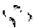

## NULIDAD DE DECRETO

Ver: Decreto de necesidad y urgencia, 2, 4.

## NULIDAD DE LOS ACTOS JURIDICOS

Ver: Daños y peIjuicios, 37.

## NULIDAD DE SENTENCIA

Ver: Recurso extraordinario, 234; Sentencia, 3.

## NULIDAD PROCESAL (1)

- 1. En materia de nulidades procesales prima un criterio de interpretación restrictiva y sólo cabe anular las actuaciones cuando el vicio afecte un derecho o interés legítimo y cause un perjuicio irreparable, sin admitirlas cuando no existe una finalidad práctica, que es razón ineludible de su procedencia: p. 1404.
- 2. La nulidad por vicios formales carece de existencia autónoma dado el carácter accesorio e instrumental del derecho procesal; exige, como presupuesto esencial, que el acto impugnado tenga trascendencia sobre la garantía de la defensa en juicio o se traduzca en la restricción de algún otro derecho. De otro modo, la sanción de nulidad aparecería respondiendo a un formalismo vacío, en desmedro de la idea de justicia y de la pronta solución de las causas, en lo que también está interesado el orden público: p.1404.

O

## OBLIGACIONES CONCURRENTES

Ver: Daños y peIjuicios, 9.

## OBRAS PUBLICAS (2)

- 1. Cuando el Estado, sobre el terreno de un particular y con consentimiento de éste, realiza una obra pública y la entrega al uso de la colectividad, ya no puede mantenerse la distinción entre el terreno -que seguiría siendo del dominio particular y regido por el
- (1) Ver también: Constitución Nacional, 12, 14 a 16, 26; Recurso extraordinario, 19, 45, 103, 135, 144, 258.
- (2) Ver también: Reivindicación, 1, 2.

Código Civil- y la obra -perteneciente al público y ajena al régimen de dicho código-. Se trata en adelante de un bien material yjuridicamente indivisible, sujeto a un mismo régimen legal, como bien del dominio público, está fuera del comercio del derecho privado y no cabe a su respecto el ejercicio de acciones reales: p. 2223.

- 2. Cuando el Estado, sobre el terreno de un particular y con consentimiento de éste, realiza una obra pública y la entrega al uso de la colectividad, no cabe el ejercicio de acciones reales, sino una acción personal por parte del particular a fin de obtener la indemnización correspondiente a la privación de su propiedad: p. 2223.
- 3. Corresponde rechazar la acción de reivindicación deducida contra la Administración de Parques Nacionales, si el propio actor admitió que el camino construido quedaba fuera de los límites contemplados en el art.2. de la ley 23.251: p. 2223.

## OBRAS SOCIALES

Ver: Jurisdicción y competencia, 32.

## OFICIO

Ver: Remisión de al,ltos, 1.

## ORDEN PUBLICO

Ver: Delitos contra el orden público, 1; Jurisdicción y competencia, 33; Nulidad procesal, 2; Prescripción, 1, 5; Recurso extraordinario, 205.

P

## PAGO

- 1. Si el depósito fue efectuado fuera del plazo fijado para su cumplimiento porel'art. 14 de la ley 22.804, de conformidad con lo dispuesto por los arts. 776 y 777 del Código Civil, constituye un pago a cuenta de lo adeudado en ese periodo que debe ser imputado primero a los intereses devengados hasta la fecha del pago parcial y el remanente al capital: p. 1598.

## PAGO PARCIAL

Ver: Pago,!.

## PARO NACIONAL

Ver: Jurisdicción y competencia, 49.

## PARQUES NACIONALES

Ver: Jurisdicción y competencia, 78; Obras públicas, 3.

## PARTES

Ver: Recurso de queja, 10, 11.

## PARTIDOS POLITICOS

Ver: Jurisdicción y competencia, 36; Recurso extraordinario, 41.

## PATENTES DE INVENCION

- 1. El arto 4, inc. G, punto 2, del Convenio de París no puede ser aplicado aisladamente, sino en el espíritu del tratado ADPIC, y con la debida ponderación de la circunstancia fáctica relevante, esto es, considerando que la solicitud compleja era una reválida de patente extranjera: p. 2047.
- 2. La revalidación de patentes extranjeras es una institución extraña al funcionamiento global del sistema de prioridades del Acuerdo ADPIC, incompatible con los principios que los Estados miembros aceptaron al aprobar tal acuerdo, cuyos efectos sobre el orden jurídico argentino se produjeron inmediatamente, es decir, a partir del 10 de enero de 1995: p. 2047.
- 3. La revalidación de patentes es una institución extraña al funcionamiento del régimen internacional de protección de invenciones que adhiere al sistema de independencia de patentes, según el cual, no se hace depender de la primera todas las demás, sino que cada patente tiene su propia vida jurídica con arreglo a la legislación de cada país (Votodel Dr. AdolfoRoberto Vázquez): p. 2047.
- 4. La revalidación de patentes es una modalidad incompatible no sólo con el funcionamiento del sistema de prioridades del acuerdo ADPIC, sino también con el del Convenio de París, que se encuentra en contradicción con el régimen otrora autorizado por la ley 111 (Voto del Dr. Adolfo Roberto Vázquez): p. 2047.
- 5. Si la actora presentó su pedido de patente divisional bajo la vigencia de un nuevo régimen legal, sólo podría accederse a su pretensión en tanto se demostrara que en dicho régimen -al igual que en el de la ley 111se admiten los pedidos de reválida de patentes extranjeras (Disidencia parcial del Dr. Enrique Santiago Petracchi): p. 2047.
- 6. Siendo la fecha de entrada en vigor de la ley 24.481 ellO de enero de 1996, si la actora presentó su pedido de patente divisional con posterioridad a la misma, lo hizo bajo la

vigencia del nuevo régimen legal que no admitía esa posibilidad (Disidencia parcial del Dr. Gustavo A. Bossert): p. 2047.

## PATRIA POTESTAD

Ver: Jurisdicción y competencia, 19, 20, 39.

## PATROCINIO LETRADO

Ver: Constitución Nacional, 22; Recurso extraordinario, 39.

## PENA

Ver: Juicio criminal, 14 a 17; Recurso extraordinario, 57, 128; Verificación de pena, 1,2.

## PENSIONES MILITARES

Ver: Daños y peIjuicios, 30.

## PERICIA

Ver: Daños y perjuicios, 32, 33; Recurso extraordinario, 118.

## PERITOS

Ver: Recurso extraordinario, 147, 155, 159.

## PERSONAS JURIDICAS

- 1. Los actos de los representantes legales de las personas jurídicas son reputados ac,tosde éstas (art. 36 del CódigoCivil),por ende, la sola circunstancia de que se haya modificado la persona fisica que desempeñaba el cargo de Fiscal de Estado no lleva a concluir en lafalta de vigencia de los actos válidos obrados por quien lo ejerció con anterioridad: p. 2363.

## PERSONERIA

Ver: Jurisdicción y competencia, 72; Personas jurídicas, 1.

## PETROLEO

Ver: Defensa de la competencia, 2, 3; Recurso extraordinario, 62.

## PLAZO

Ver: Recurso de queja, 17.

(96)

## PRENDA

## PODER DE POLICIA

Ver: Facultad reglamentaria, 1, 3; Profesiones liberales, 1 a 3, 6.

## PODER EJECUTIVO

Ver: Decreto de necesidad y urgencia, 15; Emergencia económica, 3, 5, 9, 12, 13; Empleados públicos, 2, 3; Presupuesto, 3; Remuneraciones, 3.

## PODER EJECUTIVO NACIONAL

Ver: Decreto de necesidad y urgencia, 6, 7, 11; Facultad reglamentaria, 2; PresupuestO,2.

## PODER JUDICIAL (1)

- 1. No es posible equiparar la situación de los vocales del Tribunal Fiscal de la Nación con la de los jueces de los tribunales inferiores de la Nación y exceptuarlos, por ende, de la reducción salarial prevista en el decreto 290/95 ya que tal excepción sólo alcanzó a quienes se hallan amparados por la intangibilidad prevista en los arts. 110 y 120 de la Constitución Nacional, mas no a los vocales de Un órgano ajeno tanto del Poder Judicial de la Nación cuanto del Ministerio Público: p. 1418.

## PODERES JMPLJCJTOS

Ver: Corte Suprema, 1; Recurso ordinario de apelación, 16.

## POLlCJA FEDERAL

Ver: .Recurso extraordinario, 48; Retiro policial, 2, 3.

## PRECLUSJON

Ver: Jurisdicción y competencia, 4.

## PRENDA

Ver: Recurso extraordinario, 106, 203.

(1) Ver también: Constitución Nacional, 5; Remuneraciones, 3, 4.

## PRESCRIPCION (1)

## Principios generales

- 1. La prescripción de la acción penal se produce por el mero transcurso del tiempo pertinente y debe ser declarada aún de oficio en cualquier instancia del proceso, atento su carácter de orden público: p. 2129.

## Comienzo

- 2. Si se condenó a la empresa por abuso de posición dominante por haber cometido la infracción en una única ocasión y no en forma reiterada, tantas veces comoactos abusivos individuales integraron la conducta investigada (art. 55 del Código Penal), al tratarse de una única acción, el plazo de prescripción comenzó a correr con respecto a toda la actividad a partir de su finalización: p. 1702.

## Interrupción

- 3. La presentación administrativa ante el Ministerio de Obras y Servicios Públicos de la Provincia de Buenos Aires no tiene alcances interruptivos del plazo anual aplicable al contrato de transporte según el arto 855 del Código de Comercio, sin que medie tampoco una causal de suspensión ya que no se configura el supuesto contemplado en el arto 3986 del Código Civil pues sus términos no importan constitución en mora ni interpelación al presunto deudor: p. 1600.
- 4. La mera presentación del formulario de iniciación previsto en el arto 4° de la ley 24.573 no presupone por sí solo el cumplimiento del trámite de la mediación obligatoria por lo que carece de los efectos suspensivos que ese texto legal le acuerda y que se extiende hasta 20 días después de su finalización (arts. 29 de dicho texto y 28 del decreto 91/98): p.1600.

## Tiempo de la prescripción

## Materia penal

- 5. La prescripción en materia penal es de orden público, se produce de pleno derecho por el solo transcurso del plazo pertinente y debe ser declarada de oficio, incluso en.la instancia extraordinaria: p. 1702.
- 6. Las expresiones contenidas en el arto 35 de la ley 22.262 aluden a la prescripción de la acción respecto de los delitos y no de las infracciones administrativas, no sólo por la ubicación sistemática de la norma y por su literalidad, sino también por la lógica del mecanismo incluido en ella por el legislador: p. 1702.

(1) Ver también: Abogado, 2; Aduana, 2, 3; Caducidad de la instancia, 6; Constitución Nacional, 45; Defensa de la competencia, 4; Recurso extraordinario, 63,68,150,175,199,217,221,228,253.

- 7. A falta de un dispositivo expreso para la prescripción de la acción en lo referido a las infracciones en la ley 22.262, adquiere vigencia la aplicabilidad supletoria de las reglas del Libro I del Código Penal, al que remite el arto 43, publicado en el capítulo IV, dedicado precisamente a las disposiciones complementarias, por lo que el plazo para la prescripción en el caso de las infracciones se rige por los arts. 62, inc. 5°y concordantes del código de fondo: p. 1702.
- 8. En atención a la calificación -encubrimiento de contrabando:...adoptada tanto por el juez de primera instancia como por el a qua, se habría operado la prescripción de la acción penal respecto de tbdos los procesados desde que, entre la presentación de la última expresión de agravios y la sentencia dictada por él, transcurrió un'plazo superior al máximo de la pena señalada para ese delito (art. 62, inc. 2°del CódigoPenal): p. 2129.

## PRESIDENTE DE LA NACION

Ver: Reforma constitucional,!.

## PRESUNCION DE INOCENCIA

Ver: Juicio criminal, 16, 18.

## PRESUNCIONES (1)

- 1. La decisión apoyada en una serie encadenada de inferencias, 'prespncionés de presunciones, que traslucen sólo una apariencia de fundamentación probatoria, y en rigor carecen de una relación de causalidad suficiente, en virtud de que ninguna se apoya en la invocación de la existencia de algún hecho cierto y acreditado, se encuentra ausente un aspecto esencial para que las presunciones sirvan como prueba, cual es que sean graves, precisas y concordantes (art. 163, inc. 5° del Código Procesal Civil y Comercial de la Nación) (Disidencias de los Dres. Augusto César Belluscio y Enrique Santiago Petracchi y del Dr. Gustavo A. Bossert): p. 2095.

## PRESUPUESTO (2)

- 1. A pesar de que a veces contiene disposiciones que no son sólo de naturaleza financiero-administrativa, sino también de derecho penal e, incluso, de derecho privado, la ley de presupuesto es una ley en el sentido institucional de vocablo, con plenos efectos jurídicos: p. 2394. .
- 2. En nuestro sistema constitucional, nada permite inferir que la función legislativa en materia presupuestaria se limita a aprobar o a autorizar lo que propone el Poder Ejecutivo, sino que el Congreso recibe un proyecto de presupuesto y lo acepta, lo modifica

(1) Ver también: Recurso extraordinario, 119, 157, 163.

(2)Ver también: Decreto de necesidad y urgencia, 2; Recurso de queja, 14, 15, 19.

- o lo rechaza, en todo o en parte, sin restricción alguna; no es un acto aprobatorio que pasa a integrar un acto administrativo: es acción legislativa normal y primordial aun cuando la iniciativa corresponda al Poder Ejecutivo, que es el responsable de la administración general del país (art. 99, inc. 10,Constitución Nacional): p. 2394.
- 3. No hay obstáculo constitucional para que el Poder Legislativo establezca, suprima o modifique tributos (u otro tipo de ingresos) en la ley de presupuesto. Las autolimitaciones que el Congreso ha emitido pueden ser modificadas o dejadas sin efecto, incluso en forma implícita; la ley de presupuesto es un acto de gran trascendencia política y la voluntad del Poder Legislativo no está limitada por actos preexistentes de igual jerarquía normativa: p. 2394. .
- 4. Pese al loable propósito que persigue el arto 20 de la ley 24.156, esa norma no prevalece por su jerarquía normativa frente a otras leyes que dicta el Congreso de la Nación y, por tanto, cuanto allí se dispone puede ser derogado por otra ley posterior, en forma expresa o tácita; ya que el Poder Legislativo no se halla vinculado indefectiblemente hacia el futuro por sus propias autorrestricciones: p. 2394.

## PREVISION SOCIAL

- 1. En materia de previsión social o seguridad social es esencial cubrir riesgos de subsistencia y ancianidad, por lo que no debe llegarse al desconocimiento de derechos sino con suma cautela: p. 1616.

## PRINCIPIO DE CONGRUENCIA

Ver: Daños y perjuicios, 36.

## PRINCIPIO DE LEGALIDAD

Ver: Constitución Nacional, 62.

## PRINCIPIO DE PRECLUSION

Ver: Constitución Nacional, 17.

## PRINCIPIO DE PROGRESIVIDAD

Ver: Constitución Nacional, 17.

## PRISION PREVENTIVA

Ver: Daños y perjuicios, 18 a 27; Juicio criminal, 14 a 16, 18; Recurso extraordinario, 128, 250, 251.

## PRIVACION DE JUSTICIA

- 1. Si se hizo lugar al recurso extraordinario -por mediar denegatoria del fuero federaly no corresponde la competencia originaria de la Corte Suprema, ésta debe determinar qué juez debe intervenir en las actuaciones a fin de evitar la profusión de trámites, situación que va en desmedro del principio de economía procesal y del buen servicio de justicia, y de impedir la perduración de situaciones que -de mantenerse en el tiempopodrían llegar a configurar un caso de privación jurisdiccional para las partes: p. 2284.

## PRIVATIZACION

Ver: Energía eléctrica, 4.

## PROCEDIMIENTO ADMINISTRATIVO

Ver: Jubilación y pensión, 14, 15.

## PROCESADO

Ver: Recurso de queja, 4.

## PROFESIONES LIBERALES (1)

- 1. Resulta razonable la reglamentación del ejercicio de la abogacía por parte del legislador a través de la ley 23.187 en nombre del constitucional poder de policía del Estado: p.1663.
- 2. La facultad atribuida al Congreso Nacional para dictar normas generales relativas a las profesiones cuyo ejercicio es consecuencia de los títulos habilitantes otorgados por las universidades nacionales, por el arto 67, inc. 16, de la Constitución Nacional, no es exclusiva ni excluyente de las potestades de reglamentación y policía locales, en tanto no enerven el valor del título: p. 1663.
- 3. Es atribución de las provincias reglamentar la práctica de las profesiones liberales en sus respectivas jurisdicciones, en la medida en que con dicha reglamentación no se alteren sustancialmente los requisitos que al efecto exige la norma nacional, pues dentro de lo razonable, las provincias pueden establecer los requisitos complementarios que, en el ejercicio del poder de policía, les corresponde: p. 1663.
- 4. El decreto 2293/92 no puede ser invocado como sustento de la acción tendiente a que se determine el derecho a ejercer la profesión de abogado con una única inscrip-

ción en la matrícula correspondiente al domicilio real ya que el arto 2° del decreto 240/99 sujeta la aplicación de aquel decreto a un doble orden de condiciones: la aprobación del "Pacto Federal para el Empleo, la Producción y el Crecimiento" por las legislaturas locales y la derogación expresa de las disposiciones que exigen la inscripción 'en la matricula profesional y, si bien la ratificación del pacto tuvo lugar mediante el decreto nacional 14/94 y la ley provincial 11.463, la derogación legal exigida no se llevó a cabo ya que se encuentra vigente el arto 18 de la ley 23.187: p.1663.

- 5. No existe ninguna incompatibilidad entre el decreto 2293/92 y el arto 42 de la ley 24.521 en cuanto ratifica la competencia local para fijar las condiciones del ejercicio profesional de los títulos habilitantes (Disidencia del Dr. Adolfo Roberto Vázquez): p.1663.
- 6. Si bien por imperio del decreto 2284/91 quienes se encuentran inscriptos en una jurisdicción pueden ejercer su actividad en cualquier otra sin tener que pagar suma alguna en concepto de matriculación o de aporte periódico, lo que se traduce en la merma en la recaudación de las cuotas que por estos conceptos perciben las entidades provinciales o nacionales que tienen a su cargo el control del ejercicio profesional, dicha circunstancia no importa menoscabo irrazonable para la autoridad que representan las entidades mencionadas (Disidencia del Dr. Adolfo Roberto Vázquez): p.1663.

## PROFESOR UNIVERSITARIO

Ver: Jurisdicción y competencia, 18; Recurso extraordinario, 188; Universidad, 1 a 4.

## PRONUNCIAMIENTO INOFICIOSO (1)

- 1. Si, en anterior resolución, el infrascripto dispuso que las costas del juicio fueran impuestas por su orden, resulta inoficioso la consideración de los agravios del Fisco Nacional respecto de los honorarios correspondientes a los profesionales de la parte actora y de los peritos contadores (Disidencia del Dr. Antonio Boggiano): p. 2250.

## PROVINCIAS

Ver: Accióndeclarativa de inconstitucionalidad, 1; Daños y peIjuicios, 1; Energía eléctrica, 1 a 4; Facultad reglamentaria, 4; Impuesto, 2, 3; Jurisdicción y competencia, 26, 27, 61, 71, 72, 79, 80; Legitimación, 1; Medida de no innovar, 1; Medidas cautelares, 3; Personas jurídicas, 1; Profesiones liberales, 2 a 4, 6; Recurso extraordinario, 83, 198; Zonas francas, 1.

(1) Ver también: Recurso extraordinario, 42.

## PRUEBA (1)

## Ofrecimiento y producción

- 1. La teoría de las cargas procesales sólo hace recaer en quien se halla en mejor situación la carga de aportar los elementos tendientes a obtener la verdad objetiva, pero no altera el sistema general de responsabilidad que, en este ámbito, se sustenta sobre lo~ fundamentos de la responsabilidad subjetiva (arts. 512 y 902 del Código Civil) que requerían, en el caso en que se sancionó a un sanatorio por no cumplir adecuadamente el deber de custodia de la historia clínica, la demostración del nexo causal entre la actividad del sanatorio y los padecimientos sufridos por una menor (Disidencia del Dr. Gustavo A. Bossert): p. 2356.

## Testigos

- 2. La prueba testifical no puede aceptarse para recibir opiniones o apreciaciones, pues ésta es función de los peritos y no de los testigos, que deben referirse siempre a hechos: p. 1761.

## PUBLlCACION DE LA LEY

Ver: Constitución Nacional, 42; Ley, 1,2.

## QUERELLANTE

Ver: Recurso extraordinario, 254.

## QUIEBRA

Ver: Constitución Nacional, 23. Entidades financieras, 1. Recurso extraordinario, 156, 238.

R

## RADIODIFUSION

Ver: Ley, 1, 2; Recurso extraordinario, 53.

- (1) Ver también: Acción de amparo, 3; Acumulación de autos, 2; Constitución Nacional, 18, 39; Daños y perjuicios, 3; Jubilación y pensión, 4, 7, 13; Presunciones, 1; Recurso extraordinario, 60, 69, 90,96, 115, 143, 157, 160, 161, 163, 179, 184, 213; Recurso ordinario de apelación, 3, 4, 12.

Q

## RAZONABILIDAD

Ver: Honorarios de peritos, 3; Leyes de emergencia, 3; Recurso extraordinario, 219, 224.

## RAZONABILIDAD DE LA LEY

Ver: Emergencia económica, 8; Leyes de emergencia, 1.

## REBELDIA

Ver: Recurso extraordinario, 150.

## RECURSO DE APELACION (1)

- 1. Las sentencias de la Corte no son pasibles del recurso de apelación, habida cuenta de su condición de Tribunal Supremo de la Nación y la recurrente deberá ocurrir por la vía y forma correspondientes si pretende acceder a la Corte Interamericana de Derechos Humanos: p. 1603.

## RECURSO DE CASACiÓN (2)

- 1. Si bien la naturaleza restrictiva del recurso de casación impide modificar las conclusiones de hecho efectuadas por el tribunal de juicio al valorar las pruebas, ello no impide determinar si la motivación de la decisión en el plano fáctico y en la interpretación de las normas legales, ha rebasado los límites impuestos por la sana crítica racional: p. 1845.

## RECURSO DE QUEJA (3)

## INDICE SUMARIO

Abogado: 18.

Bancos: 13.

Beneficio de litigar sin gastos:

17, 20, 21.

Constitución Nacional: 9.

Defensa de juicio: 5, 8.

Defensor: 4, 5.

Derecho al acceso a la justicia: 8, 9.

Derechos operativos: 9.

Filiación: 7.

- (1) Ver también: Jubilación y pensión, 14; Recurso extraordinario, 169, 173, 174.
- (2) Ver también: Recurso extraordinario, 84, 185, 212, 218, 250.
- (3) Ver también: Recurso extraordinario, 8, 253, 260.

Honorarios de abogados y procuradores: 12.

Indemnización: 7.

Juicio criminal: 4.

Notificación: 4.

Partes: 10, 11.

Plazo: 17, 19.

Presupuesto: 14, 15, 19. Procesado: 4.

Recurso de reposición, 2.

Recurso extraordinario: 1, 22.

Recurso in forma pauperis: 5

Recurso ordinario de apelación: 1.

Sanciones disciplinarias: 18.

Tasa de justicia: 7, 10, 11, 18.

## Principios Generales

- 1. La queja contemplada en el arto 285 del Código Procesal Civil y Comercial de la Nación constituye un medio de impugnación sólo de decisiones que deniegan recursos deducidos ante la Corte Suprema, para lo cual es preciso que se haya interpuesto y denegado una apelación -ordinaria o extraordinaria-; no es idóneo para cuestionar otras decisiones aun cuando se relacionen con el trámite de aquellos recursos: p. 1556.

## Plazo

- 2. Corresponde rechazar el recurso de reposición interpuesto contra la providencia que desestimó el de hecho por haber sido deducido extemporáneamente pues las razones alegadas con respecto al régimen de comparecencia obligatoria no excluyen que el apoderado que dedujo la presentación directa haya tomado conocimiento efectivo del referido auto denegatorio en la fecha que denunció ante la Corte y no se ha alegado la existencia de error excusable de la parte en la aludida manifestación: p.1727.
- 3. La cuestión referente al cómputo de los plazos para la interposición del recurso de hecho ante la Corte Suprema debe regirse por las normas nacionales, y toda alusión a temas vinculados al punto en el orden local resulta inoperante para justificar un apartamiento de las reglas que rigen el remedio federal (Disidencia de los Dres. Eduardo Moliné O'Connor y Guillermo A. F. López):p. 1727.
- 4. Notificada la defensa del rechazo del recurso extraordinario es irrelevante, a los efectos del comienzo del cómputo del plazo para la interposición de la queja, la posterior notificación del procesado: p. 2322.
- 5. Al no existir constancia alguna de que el rechazo del recurso extraordinario interpuesto in forma pauperis haya sido notificado en forma personal al afectado, y frente a su manifestación de voluntad de recurrir, debe considerarse que la queja interpuesta ante la Corte, también in forma pauperis, y fundada por el defensor oficial, lo fue dentro del plazo correspondiente (Disidencia de los Dres. Enrique Santiago Petracchi y Gustavo A. Bossert): p. 2322.

## Depósito previo

- 6. La obligación que impone el arto 286 del Código Procesal Civil y Comercial de la Nación sólo cede respecto de quienes están exentos de pagar sellado o tasa judicial, conforme a las disposiciones de las leyes nacionales respectivas, ésto es, de aquellos que se encuentren comprendidos en el arto 13 de la ley 23.898 y en las normas especiales que contemplan excepciones a tales tributos, inclusión que debe ser expresa e interpretada con criterios restrictivos por tratarse de excepción a reglas generales: p. 1484.
- 7. La apelación del monto de la indemnización en concepto de daño moral por falta de reconocimiento espontáneo de paternidad no se encuentra comprendida en el inc. i, del arto 13 de la ley 23.898, que se refiere a las cuestiones de familia que no tengan carácter patrimonial, más allá de que el interesado no ha invocado la existencia de una ley especial que lo exima del pago del sellado o tasa judicial: p. 1484.
- 8. Corresponde desestimar el planteo formulado en términos genéricos referente al acceso a la justicia cuando ni siquiera se ha impugnado la validez constitucional del arto 286 del Código Procesal Civil y Comercial de la Nación, pues la exigencia de depósitos previos como requisito para la viabilidad de recursos no es contraria a la garantía constítucional de la defensa en juicio: p. 1484.
- 9. Si el derecho al acceso a la justicia es uno de aquellos que resultan operatívos con su sola invocación e irrestricto en su ejercicio, necesaríamente cabe concluir que cualquier condicionamiento del trámite judicial, tal como el que se deriva de la falta de abono del depósito del arto 286 del Código Procesal Civil y Comercial de la Nación, resulta violatorio de esa garantía constitucional (Disidencia del Dr. Adolfo Roberto Vázquez): ps. 1484, 1568, 1576, 1747, 1751,2093,2434.
- 10. Si la queja fue interpuesta por una persona ajena a la relación Iltboralque originara la lítis, dado que jamás fue parte de la misma, se encuentra eximida del pago de la tasa judicial -y por ende del depósito previsto en el arto 286 del CódigoProcesal Civily Comercial de la Naciónen virtud de lo dispuesto en el arto 13, inc. h, de la ley 23.898:p. 1495.
- 11. La recurrente que señala que nunca fue demandada por el actor y que fue condenada por error deberá efectuar el depósito previsto por el arto 286 del Código Procesal Civil y Comercial de la Nación sólo en el supuesto de que se desestime la queja ya que en esa hipótesis quedaría definitivamente rechazado el argumento aducido para descalificar la sentencia del tribunal de grado: p. 1495.
- 12. La ley 23.898 no dispensa a los profesionales del pago del depósito previo previsto por el arto 286 del Código Procesal Civil y Comercial de la Nación cuando se trata de honorarios que les pertenecen, a pesar de las connotaciones atribuibles a su trabajo: pS. 1497, 1743.
- 13. Es improcedente la solicitud de que se libre oficioa un banco con el fin de ordenar la emisión de un cheque a la orden de la Corte Suprema para cubrir el pago del depósito previsto en el arto 286 del Código Procesal Civil y Comercial de la Nación con fondos que se encuentran bajo la titularidad del recurrente, ya que no corresponde delegar en el Tribunal la realización de trámites que el ordenamiento legal pone en cabeza de éste: p. 1497.

- 14. Los aspectos relacionados con el diferimiento del pago del depósito previsto en el arto 286 del Código Procesal Civil y Comercial de la Nación, reglamentados en la acordada 47/91 de la Corte Suprema, no pueden alterarse por disposiciones de derecho local. Máxime cuando para acreditar el "requerimiento de previsión presupuestaria" sólo es menester demostrar, con constancias documentales suficientes, que se han tomado los recaudos necesarios para incluir el pago en la oportunidad en' que deba ser requerido según el régimen local aplicable: p. 1568.
- 15. Corresponde decretar la caducidad del derecho del recurrente de acogerse al diferimiento del pago del depósito previsto en el arto 286 del Código Procesal Civil y Comercial de la Nación, si no ha presentado en término la constancia documental referente a la previsión presupuestaria contemplada en el arto 2° de la acordada n° 47/51 de la Corte Suprema: p. 1568.
- 16. Corresponde rechazar la reposición contra la providencia que intimó a la recurrente a efectuar el depósito previsto en el arto 286 del Código Procesal Civil y Comercial de la Nación pues la ley 23.898 dispensa de dicho depósito a los trabajadores en relación de dependencia y sus causahabientes en los juicios originados en la relación laboral, pero no a quienes han sido demandados como empleadores: p. 1576.
- 17. Dada la perentoriedad de los plazos procesales, corresponde denegar el pedido de pago en cuotas del importe exigido por el arto 286 del Código Procesal Civil y Comercial de la Nación, fundado en la invocación de que la parte se encuentra por debajo de la línea de pobreza pues tenía a su alcance la posibilidad de iniciar el correspondiente beneficio de litigar sin gastos: p. 1751.
- 18. La existencia de pretensiones autónomas en defensa de intereses propios justifica la exigencia a su respecto del depósito del arto 286 del Código Procesal Civil y Comercial de la Nación, con independencia de la carga que por el mismo concepto incumbe al Fisco Nacional pues las pretensiones -pese a tener una raíz comúnremiten al examen de cuestiones de distinta naturaleza, por una parte lo atinente a la tasa de justicia y por la otra si la conducta de una profesional era susceptible de una sanción disciplinaria: p. 1841.
- 19. Es manifiestamente inadecuado conceder el plazo -requerido por una profesional que impugna una sanción de apercibimientoa efectos de solicitar la previsión presupuestaria por el importe del depósito, pues la posibilidad de optar por el diferimiento de esa carga ha sido otorgada al Estado Nacional y a los demás entes mencionados en el arto 1°de la ley 23.696, de manera que la recurrente no puede hacer uso de tal beneficio respecto de un requisito que le corresponde cumplir a título personal: p. 1841.
- 20. El beneficio de litigar sin gastos no es apto para obtener la exención del deber de integrar el depósito previsto en el arto 286 del Código Procesal Civil y Comercial de la Nación si no fue promovido y obtenido en la misma causa en que se pretende hacerlo valer (art. 86, a contrario sensu, del código mencionado): p. 1844.
- 21. La exigencia que impone el arto 286 del Código Procesal Civil y Comercial de la Nación sólo cede respecto de quienes se encuentran exen'tos de pagar el señalado o tasa de justicia, por lo que para posibilitar el estudio de la queja resulta indispensable que la parte demuestre que le ha sido concedido el beneficio de litigar sin gastos: ps, 2093, 2434.

## Trámite

- 22. La queja contemplada en el arto 285 del Código Procesal Civil y Comercial de la Nación no es la vía procesalmente apta para obtener la revisión del pronunciamiento que había ordenado desglosar el escrito del recurso extraordinario por no acreditarse los presupuestos que impone a la gestión procesal el arto 48 del Código Procesal Civil y Comercial de la Nación: p. 1556.
- 23. La resolución que ordenó desglosar el escrito mediante el cual interpuso el recurso extraordinario configura una denegación implícita del remedio federal deducido (Voto del Dr. Antonio Boggiano): p. 1556. .
- 24. Corresponde declarar formalmente admisible la queja y el recurso extraordinario y decretar la suspensión de la ejecución de la sentencia apelada si los argumentos aducidos pueden, prima facie, involucrar cuestiones de naturaleza federal susceptibles de examen en la instancia del arto 14 de la ley 48, sin que ello implique pronunciamiento alguno sobre el fondo del recurso (art. 285 del Código Procesal Civil y Comercial de la Nación): p. 2191.

## RECURSO DE REPOSICION (1)

- 1. Las sentencias definitivas e interlocutorias de la Corte Suprema no son susceptibles de ser modificadas por vía del recurso de reposición (arts. 238 y 160 del Código Procesal Civil y Comercial de la Nación): p. 1603.
- 2. Las decisiones por las que la Corte rechaza los recursos de queja por apelación denegada no son, como principio, susceptibles de reposición: p. 2431.

## RECURSO EXTRAORDINARIO (2)

## INDICE SUMARIO

Abogado: 142. Absolución del acusado: 19, 45, 135, 144, 193,234. Abuso deshonesto: 214. Accidentes de tránsito: 24, 26, 59, 69, 115, 137, 162,179, 180. Acción de amparo: 31, 37, 39, 176, 177.

Acción penal: 63, 150, 228, 253.

Acción redhibitoria: ~75.

Actos administrativos: 176.

Actos de servicio: 48.

Actos propios: 165, 186.

Acuerdo ADPIC: 52.

Acusación:

193.

Administración pública: 104.

Aduana: 63, 114, 158.

- (1) Ver también: Caducidad de la instancia, 1, 2; Recurso de queja, 2; Recurso extraordinario, 238.
- (2) Ver también: Constitución Nacional, 9, 59; Jurisdicción y competencia, 20; Notificación, 2; Prescripción, 5; Recurso de queja, 1, 22; Recurso ordinario de apelación, 14, 15; Recusación, 1.

Aportes previsionales: Arancel: 55, 109.

151, 225",237.

Asociación

ilícita:

29, 74, 126, 127:

Automotores:

131.

Banco Central: 168, 191.

Bosques:

176.

Caducidad de la instancia: 152.

Cámara Nacional de Casación Penal: 214, 218.

Ciudad Autónoma de Buenos Aires: 206. Colegios profesionales: 225, 237.

Comisión Interamericana de Derechos Humanos: 250, 251.

Concurso preventivo: 139, 156.

Concursos: 139, 154, 156, 238.

Condena: 57,65, 128, 246,247, 250, 251.

Consolidación: 79, 133, 136, 215.

Constitución Nacional: 57, 60.

Cónsules:

48, 242, 243.

Contrabando: 158.

Contratos: 116, 117, 170.

Control de cambios: 23, 168, 191, 222, 227, 244,245.

Controlador fiscal: 48.

Convención Americana sobre Derechos Humanos: 57, 128.

Convención sobre los Derechos del Niño: 51, 214.

Convenio de París: 52.

Convertibilidad: 17, 134, 189.

Copias: 152.

Corte Suprema:

54, 55, 107, 108, 193.

Cosa juzgada: 141, 149, 182,250.

Costas: 124, 138, 141, 173, 174.

Costumbre:

152.

Cuestión abstracta: 33, 42.

Cuestión federal: 262, 264 a 267.

Cuestión insustancial: 40.

Culpa: 137, 179, 180.

Daño material: 104, 105.

Daños y perjuicios: 6, 24, 26, 27, 48, 59, 69 a 72, 113, 115, 118 a 121, 137, 142, 153, 160, 162, 179, 180, 194, 249.

Debido proceso:

74, 84.

Declaración informativa: 45, 103.

Defensa de la competencia: 62.

Defensa enjuicio: 45, 74, 85, 91, 105, 129, 148,174,223,238,244,256,260,264.

Defensor oficial: 39.

Delito complejo: 114.

Delito continuado: 158.

Depreciación monetaria: 32, 129, 182.

Derecho de propiedad: 32, 124, 140.

Derecho de los consumidores: 175.

Derecho público local: 79, 136.

Derechos humanos: 57, 65, 128.

Desindexación:

49, 75, 129, 130, 133,231, 38.

Desistimiento:

Despido: 75, 167.

Domicilio: 65, 246, 247.

Dos por uno: 57, 128, 250, 251.

Ejecución de sentencia: 138, 215, 216.

Ejecución fiscal: 139, 156, 199, 217, 221.

Ejecución hipotecaria: 171, 200.

Ejecución prendaria: 201.

Elecciones:

41.

Empleados públicos:

78, 165.

Entidades financieras: 48, 238.

Escrito: 152.

Estupefacientes:

233, 235.

Excarcelación: 128.

Excepción de incompetencia: 48.

Excepción de inhabilidad de título: 138.

Excepciones:

139, 156, 170.

Exceso ritual manifiesto: 187.

Exportación: 62.

Fiscal: 193.

Fuero de atracción: 139, 156.

Fuerzas Armadas: 113.

Garantía contra la autoincriminación: 45, 103.

Gestor: 142.

Homicidio: 181.

Honorarios: 211.

Honorarios de abogados y procuradores:

12,17,86,109,112,134,138,189.

Honorarios de peritos: 55.

Igualdad: 57, 140.

Importación: 114, 158.

Impuesto:

48.

Incapacidad: 48.

Indemnización: 69, 105, 162.

Inhabilidad de título: 22I.

Injurias:

5, 185.

Inmunidades: 33.

Inmunidades parlamentarias: 33.

Intereses:

17, 134, 182, 189.

Interpretación de los contratos:

116, 117.

## Jubilación de magistrados y diplomáticos: 15I.

Jubilación por invalidez: 11, 60, llI. Jubilación y pensión: 11, 60, 151, 178. Jueces: 97, 166, 178.

Juicio criminal: 19, 47, 57, 63, 128, 135,

144, 150, 193, 234, 250, 251, 254.

Juicio ejecutivo: 106, 139, 154, 156, 205, 210.

Juicio ordinario: 204.

Jurisdicción y competencia: 141, 149, 198,

207,243.

Jurisprudencia: 107, 108, 193, 220. Justicia Municipal de Faltas:

78, 165.

Legitimación: 3I.

Lesiones culposas: I.

Ley penal tributaria: 183.

Leyes federales: 267.

Leyes secretas: 48.

Libertad de prensa: 5, 185.

Mala praxis:

27, 30, 70, 76, 118, 153, 159,

163,194.

Médicos: 30, 159, 160, 18I.

Medio ambiente: 176.

Menor de edad: 42.

Menores: 214.

Militares:

48.

Ministerio Público: 234.

Mora: 134, 182, 189.

Multas:

168, 244, 245.

Negligencia: 70, 118.

Non bis in idem: 46.

Notificación: 9I.

Nulidad de actos administrativos: 176.

Nulidad de actos procesales: 21I.

Nulidad de sentencia: 234.

Nulidad procesal: 19,45,103, 135, 144,258.

Orden público: 205.

Partidos políticos: 4I.

Patrocinio letrado: 39.

Pena: 57, 128, 250, 251.

Pericia:

118.

Peritos: 147, 155, 159.

Petróleo: 62.

Policía Federal: 48.

Prenda: 106, 203.

Prescripción: 63, 68, 150, 175,199,217, 221, 228, 253.

Presunciones:

119, 157, 163.

Prisión preventiva: 128, 250, 251.

Profesor universitario: 188.

Pronunciamiento inoficioso: 42.

Provincias: 83, 198.

Prueba: 60,69,90, 96, 115, 143, 157, 160, 161, 163, 179, 184,213.

Querellante: 254.

Quiebra: 156, 238.

Radiodifusión: 53.

Razonabilidad: 219, 224.

Rebeldía: 150.

Recurso de apelación: 169, 173, 174.

Recurso de casación: 84, 185, 212, 218, 250.

Recurso de queja: 8, 253, 260.

Recurso de reposición: 238.

Reformatio in pejus: 173, 174.

Registrode la Propiedad delAutomotor: 13I.

Reincorporación: 113.

Remuneraciones: 48, 80, 165.

Resolución administrativa: 53.

Responsabilidad:

153, 155, 159, 160.

Responsabilidad contractual: 70.

Responsabilidad médica: 27, 70 a 72, 118 a 121, 181, 194, 249.

Responsabilidad objetiva: 137.

Retiro militar: 48.

Riesgo de la cosa: 137.

Sana crítica: 157, 162.

Sanciones disciplinarias: 104, 184.

Secretaría de Inteligencia del Estado: 48.

Secuela del juicio:

68, 150.

Secuestro:

20I.

Segunda instancia: 169, 173, 174.

Seguridad social: 110.

Seguro: 93, 94, 145 a 148, 190, 241, 252, 265,266.

Senador: 33. Sentencia: 85, 120, 123. Sentencia arbitraria: 60, 66, 68, 69, 74, 90, 116,136,143,157,219,220,223,224, 229,257, 258, 260, 262, 264 a 267. Sentencia de la Corte Suprema: 42, 54, 55, 108,193. Servicio Penitenciario Federal: 48. Síndico: 156. Solidaridad: 121. Superintendencia de Seguros de la Nación: 190, 241, 252. Telecomunicaciones: 36, 37. Tenencia de estupefacientes: 233, 235.

Testigos: 179.

Traslado: 254.

Tratados internacionales: 51, 57, 65, 196, 251.

Tribunales colegiados: 85, 123. Tutela sindical: 206.

Universidad: 188.

Verdad jurídica objetiva: 140. Verificación de créditos: 154, 156. Vicios redhibitorios: 175.

Zonas francas:

31.

## Principios generales

- 1. Es inadmisible (art. 280 del Código Procesal Civil y Comercial de la Nación) el recurso extraordinario deducido contra el pronunciamiento que condenó a un médico por el delito de lesiones culposas: p. 1358.
- 2. Es inadmisible (art. 280 del Código Procesal Civil y Comercial de la Nación) el recurso extraordinario deducido contra el pronunciamiento que desestimó los recursos extraordinarios locales (Disidencia del Dr. Antonio Boggiano): p. 1465.
- 3. Es inadmisible el recurso extraordinario (art. 280 del Código Procesal Civil y Comercial de la Nación) contra la sentencia que declaró la nulidad del acto por el cual se dispuso exonerar al recurrente: p. 1469.
- 4. Es inadmisible (art. 280 del Código Procesal Civil y Comercial de la Nación) el recurso extraordinario deducido contra el pronunciamiento que -al desestimar el recurso de inconstitucionalidad localdejó firme el fallo que había aprobado la liquidación presentada y la imputación de los fondos depositados: p. 1472.
- 5. Es inadmisible (art. 280 del Código Procesal Civil y Comercial de la Nación) el recurso extraordinario dequcido contra el pronunciamiento que -al hacer lugar al recurso de casaciónabsolvió al imputado por el delito de injurias (Voto del Dr. Antonio Boggiano): p.1486.
- 6. El recurso extraordinario contra la sentencia que rechazó la demanda por responsabilidad profesional es inadmisible (art. 280 del Código Procesal Civil y Comercial de la Nación) (Disidencia del Dr. Julio S. Nazareno): p. 1498.
- 7. Es inadmisible el recurso extraordinario (art. 280 Código Procesal Civil y Comercial de la Nación) contra la sentencia que rechazó la demanda de daños y perjuicios derivados de un accidente de tránsito (Disidencia de los Dres. Julio S. Nazareno, Enrique Santiago Petracchi y Gustavo A. Bossert): p. 1511.

- 8. Es inadmisible (art. 280 del Código Procesal Civil y Comercial de la Nación) la queja deducida contra la resolución que ordenó desglosar el escrito mediante el cual se interpuso el recurso extraordinario, en virtud de que la presentación comogestor no había dado cumplimiento con los recaudos del art.48 de dicho ordenamiento (Votos de los Dres. Enrique Santiago Petracchi y Gustavo A. Bossert y del Dr. Antonio Boggiano): p. 1556.
- 9. El recurso extraordinario contra la sentencia que rechazó el planteo desindexatorio introducido por la demandada es inadmisible (art. 280 del Código Procesal Civil y Comercial de la Nación) (Disidencia de los Dres. Julio S. Nazareno, Augusto César Bellusció y Enrique Santiago Petracchi): p. 1571.
- 10. El recurso extraordinario contra la sentencia que confirmó el rechazo de la acción por falta de patrocinio letrado es inadmisible (art. 280 del Código Procesal Civil y Comercial de la Nación) (Disidencia del Dr. Julio S. Nazareno): p. 1578.
- 11. Es inadmisible el recurso extraordinario deducido contra la sentencia que denegó el beneficio de jubilación por invalidez (art. 280 del Código Procesal, Civil y Comercial de la Nación) (Disidencia del Dr. Antonio Boggiano): p. 1644.
- 12. Es inadmisible (art. 280 del CódigoProcesal Civil y Comercial de la Nación) el recurso extraordinario deducido contra el pronunciamiento que reguló honorarios (Disidencia de los Dres. Julio S. Nazareno, Enrique Santiago Petracchi y Antonio Boggiano):p. 1691.
- 13. El recurso extraordinario contra la sentencia que intimó al apoderado del partido interesado a que adecuara la lista de diputados a lo establecido en el decreto reglamentario de la ley 24.012 es inadmisible (art. 280 del Código Procesal Civil y Comercial de la Nación): p. 1757.
- 14. El recurso extraordinario contra la sentencia que declaró la nulidad del acto emitido por la Junta de Calificación de la Gendarmeria Nacional es inadmisible (art. 280 del Código Procesal Civil y Comercial de la Nación): p. 1804.
- 15. El recurso extraordinario contra el pronunciamiento de la Cámara que, en atención a lo dispuesto por la Corte, dictó un nuevo pronunciamiento y reguló los honorarios del recurrente por su actuación como perito contador es inadmisible (art. 280 del Código Procesal Civil y Comercial de la Nación): p. 1818.
- 16. El recurso extraordinario contra el pronunciamiento que revocó'la sentencia de grado e hizo lugar a la demanda por diversos rubros salariales emergentes del despido incausado es inadmisible (art. 280 del Código Procesal Civil y Comercial de la Nación): p.1828.
- 17. Es inadmisible (art. 280 del Código Procesal Civil y Comercial de la Nación) el recurso extraordinario deducido contra la sentencia que, al fijar honorarios, dispuso que los importes devengarian intereses a los fines de mantener, su contenido económico, de conformidad con lo establecido por el decreto 941/91 (Disidencia del Dr. Antonio Boggiano): p. 1833.
- 18. La desestimación de un recurso extraordinario mediante la aplicación del arto 280 del Código Procesal Civil y Comercial de la Nación no importa confirmar ni afirmar la

(112)

justicia o el acierto de la decisión recurrida. En rigor, la conclusión que cabe extraer de un pronunciamiento fundado en dicha norma, es que el recurso deducido no ha superado el examen de la Corte Suprema encaminado a seleccionar los casos en los que entenderá, según las pautas establecidas en ese precepto (bisidencia del Dr. Antonio Boggiano): p. 1833.

- 19. Es inadmisible (art. 280 del Código Procesal Civil y Comercial de la Nación) el recurso extraordinario deducido contra la sentencia que -al declarar la nulidad de la intervención de una línea telefónica en base a la ausencia de las fojas del expedienteabsolvió a los imputados (Disidencia del Dr. Gustavo A. Bossert): p. 1845.
- 20. Es inadmisible (art. 280 del Código Procesal Civil y Comercial de la Nación) el recurso extraordinario deducido contra el pronunciamiento que rechazó el recurso contencioso contra la resolución que había determinado la obligación de la actora frente al impuesto sobre los ingresos brutos (Votó de los Dres. Carlos S. Fayt, Augusto César Belluscio, Antonio Boggiano y Gustavo A. Bossert): p. 1920.
- 21. El recurso extraordinario contra la sentencia que revocó el fallo que había rechazado el planteo de cosa juzgada y sobreseyó a los encausados es inadmisible (art. 280 del Código Procesal Civil y Comercial de la Nación): p. 1932.
- 22. Si bien el recurso extraordinario no cumple con el requisito de fundamentación autónoma, las particularidades del caso autorizan a prescindir de dicho recaudo pues la selección introducida por el arto 280 del Código Procesal Civil y Comercial de' la Nación no debe ser entendida como un medio para desestimar recursos que no superen sus "standars", también habilita a la Corte -según su sana discrecióna considerar admisibles apelaciones que involucren claramente cuestiones de trascendencia, a pesar de la inobservancia de determinados recaudos formales (Disidencia de los Dres. Enrique Santiago Petracchi y Antonio Boggiano): p. 1970.
- 23. Es inadmisible (art. 280 del Código Procesal Civil y Comercial de la Nación) el planteo de arbitrariedad efectuado contra el pronunciamiento que sancionó a los imputados por infracciones a la ley 19.359 (Disidencia del Dr. Antonio Boggiano); p. 1981.
- 24. Es inadmisible (art. 280 del Código Procesal Civil y Comercial de la Nación) el recurso extraordinario deducido contra el pronunciamiento que modificó el que había hecho lugar a la demanda de daños y perjuicios derivados de un accidente de tránsito; p.1996.
- 25. Es inadmisible el recurso extraordinario (art. 280 del Código Procesal Civil y Comercial de la Nación) contra la sentencia que hizo lugar a la demanda por indemnización de daños y peIjuicios: p. 2095.
- 26. Es inadmisible el recurso extraordinario deducido contra la sentencia que rechazó la demanda de daños y peIjuicios derivados de un accidente de tránsito (art. 280 del Código Procesal Civil y Comercial de la Nación): p. 2135.
- 27. Es inadmisible (art. 280 del Código Procesal Civil y Comercial de la Nación) el recurso extraordinario deducido contra el pronunciamiento que hizo lugar al reclamo por mala praxis médica (Disidencia del Dr. Antonio Boggiano): p. 2183.

- 28. Es inadmisible (art. 280 del Código Procesal Civil y Comercial de la Nación) el recurso extraordinario deducido contra el pronunciamiento que estableció la responsabilidad de un sanatorio (Disidencia del Dr. Antonio Boggiano): p. 2202.
- 29. Es inadmisible (art. 280 del Código Procesal Civil y Comercial de la Nación) el recurso extraordinario deducido contra la sentencia que condenó al imputado por el delito de asociación ilícita agravada por la calidad de organizador: p. 2291.
- 30/31. Es inadmisible el recurso extraordinario (art. 280 del Código Procesal Civil y Comercial de la Nación) deducido contra la sentencia que -si bien rechazó la demanda por mala praxiscondenó al sanatorio por no cumplir adecuadamente con el deber de custodia de la historia clínica: p. 2356.

## Requisitos comunes

## Gravamen

- 32. Si la recurrente no ha acreditado que el sistema de actualización utilizado por la Cámara implicara una condena de mayor cuantía que si se utilizara otra manera de actualización, no está acreditado el menoscabo al derecho de propiedad invocado y el recurso extraordinario carece de uno de los requisitos esenciales que condicionan su procedencia (Disidencia del Dr. Enrique Santiago Petracchi): p. 1833.
- 33. Corresponde declarar abstracta la cuestión planteada si el imputado ha cesado en el ejercicio de su mandato como senador de la Nación, con lo cual, el agravio invocado conbase-en la afectación de la inmunidad parlamentaria, ha perdido virtualidad: p. 2177.

## Subsistencia de los requisitos

- 34. Las sentencias de la Corte Suprema deben atender a las circunstancias existentes al momento de su decisión, aunque ellas sean sobrevinientes al recurso extraordinario: ps. 1345, 1440, 1563, 1578, 1757,2177,2275.
- 35. Aunque la actitud del Estado Nacional manifestando que resoluciones posteriores habían derogado la cuestionada resolución del 414/99 de la Secretaría de Energía de la Nación no significa un reconocimiento de los derechos aducidos por el actor, la pretensión de éste quedó materialmente satisfecha y resulta inoficioso un pronunciamiento de la Corte: p. 1415.
- 36. Las sucesivas modificaciones normativas hicieron perder virtualidad a las cuestiones litigiosas en los términos en que fueron inicialmente planteadas, si se produjo la liberalización a que aspiraba la actora y, con ella, se superaron las limitaciones en las que fundaba su iriterés a fin de obtener la declaración de ilegalidad de la resolución 100/95 del Ministerio de Economía y Obras y Servicios Públicos: p. 1440.
- 37. Si.-desaparecieron los efectos que sobre la actora tenía la resolución impugnada y que supuestamente le ocasionaban una restricción a los que consideraba sus derechos, dicha lesión dejó de ser actual y, en ausencia de esa nota, es inoficiosa una decisión de la Corte por la vía de un amparo, ya que no tendría la virtualidad de reparar la situa-

ción supuestamente desventajosa en que se habría encontrado aquélla al demandar: p.1440.

- 38. Importa un desistimiento tácito del recurso extraordinario la liquidación presentada por la recurrente después de deducida la queja, en la cual determina el crédito según los importes de la sentencia recurrida, y el posterior cobro de la suma depositada, sin reserva ni aclaración de naturaleza alguna (Disidencia del Dr. Augusto César Belluscio): p. 1563.
- 39. Resulta inoficiosocualquier pronunciamiento de la Corte si la cuestión devino abstracta ya que el Defensor Público Oficial de la Defensoría General de la Nación, al asumir la representación procesal del recurrente, desistió del planteo original de litigar sin gastos y, en su lugar, solicitó la nulidad de la resolución que desestimó la acción de amparo por falta de patrocinio letrado y de todas las demás actuaciones posteriores (Disidencia de los Dres. Carlos S. Fayt, Augusto César Belluscio y Gustavo A. Bossert): p.1578.
- 40. Ante la innegable aplicación al caso de un precedente de la Corte Suprema, que no sólo resuelve las cuestiones controvertidas, sino que, incluso, desestima agravios de similar tenor a los planteados, corresponde rechazar el recurso extraordinario pues el examen de la cuestión federal es insustancial, en tanto el recurrente mantiene una posición co~traria a la del Tribunal, sin aportar elementos de juicio novedosos que justifiquen un nuevo examen del tema en discusión, ni demostrar cuáles serían las diferencias del sub lite que permitirían apartarse de aquella solución: p.1747.
- 41. Resulta inoficioso que la Corte se pronuncie si ya se realizaron los comicios en relación con los cuales el partido presentante solicitó la oficialización de la lista (Disidencia del Dr. AdolfoRoberto Vázquez): p. 1757.
- 42. No cabe pronunciamiento de la Corte Suprema si el agravio sustentado por la recurrente en el cambio de guarda de su hija menor de edad al abuelo paterno de ésta se ha tornado -en la actualidadabstracto e inexistente debido a que la madre de la niña ha reasumido su tenencia, según resolución del a quo: p. 2275.

## Requisitos propios

## Cuestión federal

Generalidades

- 43. En la tarea de esclarecer la inteligencia de las normas federales, la Corte no está limitada por las posiciones de la cámara ni la de los apelantes, sino que le incumbe realizar una declaración sobre el punto disputado (art. 16 de la ley 48) según la interpretación que rectamente le otorga (Disidencia parcial del Dr. Gustavo A. Bossert): ps. 1663,2059,2284.
- 44. Si bien el recurso extraordinario deducido contra la sentencia que denegó el fuero federal reclamado por un cónsul honorario residente en el país, no satisface el requisito

de fundamentación autónoma y suficiente, lo cual constituye un vicio formal determinante para su imidniisibilidad y el litigio se origina en un asunto particular de un ciudadano argentino que se desempeña en representación de un Estado extranjero, no será desestimado con la sola invocación del arto 280 del Código Procesal Civil y Comercial de la Nación sino que el supuesto derecho invocado por el recurrente será desvirtuado fundadamente: p. 1970.

## Cuestiones federales simples

## Interpretación de la Constitución Nacional

- 45. Procede el recurso extraordinario deducido contra el pronunciamiento que -al disponer la nulidad de la declaración informativa (art. 236, 2da. parte, del Código de Procedimientos en Materia Penal)absolvió al imputado, en la medida en que los agravios formulados suscitan cuestión federal bastante para la apertura de la instancia federal, pues la sustancia del planteo conduce en definitiva a determinar el alcance de la garantía constitucional que veda la posibilidad de obligar al imputado a declarar contra sí mismo: p. 1404.
- 46. Resulta formalmente admisible el recurso extraordinario en lo que respecta ai alcance e inteligencia que debe otorgarse a la garantía federal del non bis in idem receptada expresamente en el Pacto de San José de Costa Rica (aIt. 8.4) y el Pacto Internacional de Derechos Civiles y Políticos (art. 14.7), si lo resuelto por el a quo fue adverso al derecho que el recurrente sustenta en ella (art. 14, inc. 3°, de la ley 48) (Disidencias del Dr. Carlos S. Fayt y del Dr. Augusto César Belluscio): p. 1932.
- 47. Las objeciones relátivas al cumplimiento de las formas sustanciales del juicio, configuran una cuestión federal típica (Voto del Dr. Carlos S. Fayt): p. 2005.

## Interpretación de las leyes federales

## Leyes federales en general

- 48. Es procedente el recurso extraordinario si se ha cuestionado la inteligencia de normas federales y la decisión apelada es contraria al derecho que en ellas funda el recurrente.

## LEYES

- -48 (Jurisdicción y competencia de los tribunales nacionales): p. 1970.
- -48, arto 14, inc. 3°: pS. 1525, 1702.
- -4055, arto 6° (Organización del Poder Judicial): p. 1207.
- -11.683, arts. 77 y 78 (Impuesto a los créditos y a las transacciones: régimen de percepción y fiscalización): p. 1965.
- -13.998 (Organización de la Justicia Nacional): p. 1970.

(116)

- \_ 16.443 (Reconocimiento del grado inmediato superior al personal de la fuerza de seguridad incapacitado o muerto en acto de servicio): p. 2386.
- -19.101 (modificada por ley 22.511): p. 1957.
- -19.373, arto 13, inc. 6° (modificada por ley 21.705): p. 1922.
- \_ 20.598 (Fuerza de seguridad - promoción a dos grados jerárquicos más en situación de retiro al personal incapacitado en acto de servicio en el caso de que deba acogerse o se haya acogido a los beneficios de la ley 16.443): p. 2386.
- -20.774 (Fuerzas de seguridad - Promoción del personal en situación de retiro incapacitado en y por acto de servicio): p. 2386.
- -21.526, arts. 45 y 50 (Ley de entidades financieras): p. 1649.
- -22.262, arts. 1°, 2°, 26, 35, 43 (Ley de defensa de la competencia - Derogación de la ley 12.906): p.1207.
- -23.068 (Universidades nacionales - Régimen provisorio de normalización - Restablecimiento de la vigencia de los estatutos que regían al 29-7-66 - Derogación de la ley de facto 22.207): p. 1676.
- -24.463 (Sistema integrado de jubilaciones y pensiones -Legislación previsional -Procedimiento judicial de la seguridad social - Créditos fiscales - Modificación de las leyes 24.241, 23.473, 24.073 del decAey 1285/58 y del dec. 879/92 - Derogación del dec. 2302194): p. 1525.
- \_ 24.624 (Presupuesto general de la administración nacional para el ejercicio 1996 Modificación de diversas normas): p. 1418.

## DECRETOS

- -2260/91 (Servicio Penitenciario Federal - Personal en actividad - Compensación por inestabilidad de residencia - Establecimiento en forma transitoria): p. 2171.
- -2284/91 (Desregulación económica): p. 1663.
- -2505/91 (Servicio PenitenciarioFederalProrrogan beneficios): 2171.
- \_ 756/92 (Servicio Penitenciario Federal - Remuneraciones para su personal a partir del 1/4/92 - Determinaciqn - Sustitución del arto 2 del dec. 2260/91): p. 2171.
- -2293/92 (Profesionales Universitarios y no universitarios qúe posean títulos con validez nacional -Habilitación para el ejercicio de la profesión -Inscripción): p.1663.

- -2807/93 (Servicio Penitenciario Federal -Suplementos particulares -Creación): p.2171.
- -290/95 (Administración pública nacional - Reducción del gasto público - Modificaciones a la carta orgánica del Banco Central): p. 1418.
- -93/00 (Régimen de consolidación de tributos y de recursos de la seguridad social por obligaciones vencidas al 31/10/99 - Exención de intereses, multas y sanciones - Facilidades de pago - Derogación del dec. 935/97): p. 1965.

## DECRETO LEY

- -333/58 (Ley orgánica de la Policía Federal): p. 2386.
- 49. La ley 24.283 no reviste naturaleza de carácter federal: p. 1753.

## Leyes federales de carácter procesal

- 50. Es improcedente el recurso extraordinario si los agravios remiten a una cuestión procesal que en principio es ajena a la vía intentada, aunque las normas respectivas estén incluidas en una ley federal: ps. 1731, 1981.

Interpretación de los tratados

- 51. El agravio relativo a la afectación de la Convención sobre los Derechos del Niño (arts. 3, 19, 34 Y 39) suscita cuestión federal suficiente, ya que se ha cuestionado la inteligencia de normas contenidas en un tratado internacional, que además posee jerarquía constitucional (art. 75, mc. 22, de la Carta Fundamental), y la decisión fue contraria al derecho fundado en ellas: p. 1549.
- 52. Suscitan cuestión federal los agravios que entrañan la interpretación y aplicación de normas de naturaleza federal -Convenio de París, tratado ADPIC y leyes 24.481 y 24.572si la decisión del tribunal ha sido contraria al derecho que la recurrente fundó en ellas (art. 14, inc. 3°, ley 48): p. 2047.

Interpretación de otras normas y actos federales

- 53. Es formalmente admisible el recurso extraordinario si se encuentra en discusión la vigencia de una resolución de naturaleza federal -dictada por el COMFER- y la decisión defmitiva del superior tribunal de la causa es contraria al derecho que la apelante funda en ella (art. 14, inc. 3", de la ley 48): p. 1808.
- 54. Se configura una hipótesis que hace formalmente viable el recurso extraordinario siempre que esté en tela de juicio la inteligencia de pronunciamientos de la Corte en los que el recurrente funda el derecho que estima asistirle y la resolución impugnada consagre un inequívoco apartamiento de lo dispuesto por el Tribunal (Disidencia de los Dres. Eduardo .Moliné O'Connor, Augusto César Belluscio y Guillermo A F. López): p.1818.

- 55. Corresponde dejar sin efecto el pronunciamiento que desatendió lo resuelto por la Corte sin fundamento válido y sustituyó las pautas legales del arancel vigente en el momento en que se efectuaron los trabajos a remunerar por pautas carentes de apoyo legal, como supone medir la calidad del desempeño profesional por el número de hojas del dictamen (Disidencia de los Dres. Eduardo Moliné O'Cormor, Augusto César Belluscio y Guillermo A. F. López): p. 1818.

## Cuestiones federales complejas

## Inconslltuclonalldad de normas yacios nacionales

- 56. Es formalmente procedente el recurso extraordinario si se ha cuestionado la constitucionalidad e interpretación de normas federales -arts. 1°del decreto 896/01 y 10 de la ley 25.453y la decisión del a qua fue contraria a su validez: p. 2059.
- 57. Existe cuestión federal suficiente si se ha cuestionado la validez de una ley nacional (art. 10, ley 24.390) por ser contraria a las normas d!lla Constitución Nacional (art. 16) y de un tratado intemacional al que ella hace referencia (art. 7", inc. 5°, de la Convención Americana sobre Derechos Humanos, y arto 75, inc. 22, de la Constitución Nacional), y la decisión ha sido adversa al derecho fundado en estas últimas (art. 14, inc. 3°, de la ley 48) (Disidencia de los Dres. Enrique Santiago Petracchi y Gustavo A. Bossert): p.2322.

## Cuestiones no federales

Interpretación de normas y actos comunes

- 58. La circunstancia de que se trate de cuestiones de hecho, prueba y derecho común, ajenas -como reglaal recurso extraordinario, no configura óbice para invalidar lo resuelto cuando la alzada no valoró adecuadamente las pruebas a la luz de las reglas de la sana crítica y la sentencia no constituye una derivación razonada del derecho vigente, lo cual redunda en menoscabo del debido proceso y del derecho de defensa enjuicio: p. 1498.
- 59. Si bien los agravios deducidos contra la sentencia que rechazó los daños y perjuicios reclamados como consecuencia de un accidente de tránsito remiten al !lxamen de cuestiones de hecho, prueba y derecho común, materia ajena -como regla y por su naturalezaa la instancia del arto 14 de la ley 48, cabe hacer excepción a tal principio cuando el a qua ha omitido tratar aspectos conducentes, lo que se traduce en una inadecuada ponderación de la prueba producida en autos y en un evidente menoscabo de.la garantía de la defensa en juicio: p. 1511.
- 60. Aun cuando los agravios deducidos contra la sentencia que denegó el beneficio de jubilación por invalidez se vinculan con cuestiones de hecho, prueba y derecho común ajenas, como regla y por su naturaleza, a la vía de excepción, ello no resulta óbice para habilitar la instancia federal cuando lo decidido prescinde de prueba conducente y desatiende los fmes tuitivos de la legislación previsional, con grave menoscabo de las garantías constitucionaies: p. 1644.
- 61. Los agravios vinculados a la condena al pago de intereses sobre las astreintes y la tasa de interés fijada por la cámara, se r!lducen a meras discrepancias con la interpre-

tación de derecho común y la valoración de circunstancias de hecho practicada por los jueces de la causa, ajenas a la instancia extraordinaria: p. 1658.

- 62. La determinación del "mercado relevante" en su dimensión material (de producto) y espacial (ámbito geográfico) comporta un problema que ha de ser definido en cada caso y constituye, en consecuencia, una cuestión de hecho y prueba que, salvo casos de arbitrariedad, no corresponde a la Corte evaluar: p. 1702.
- 63. Si bien en principio lo referente a la prescripción de la acción penal o de la pena es materia ajena a la jurisdicción extraordinaria, por versar esencialmente sobre temas de hecho y derecho procesal y común, cabe hacer excepción a ese principio cuando los agravios ponen de m.anifiesto que el a quo ha resuelto el caso con prescindencia de lo establecido por la norma --de carácter federalaplicable: p. 1731.
- 64. Si bien el recurso extraordinario no tiene por objeto revisar en una tercera instancia cuestiones propias de los jueces de la causa, tales como el análisis de los hechos y pruebas, o la interpretación asignada a las normas de derecho común aplicables en el caso, ello no es óbice, para la admisión del remedio federal, cuando la sentencia recurrida carece de los requisitos necesarios que la sustenten como acto jurisdiccional en los términos y alcances de la doctrina de la arbitrariedad (Disidencia del Dr. Guillermo A. F. López): p. 1996.
- 65. El pronunciamiento que no hizo lugar al cambio de domicilio solicitado por un condenado -más allá de la invocación de tratados internacionales de derechos humanosse vincula con el análisis de temas de hecho, prueba y derecho común -carácter que ostenta la ley 24.660y cuya apreciación, constituye, en principio, facultad propia de los jueces de la causa y ajena a la instancia extraordinaria: p. 2031.
- 66. Si bien no resulta procedente el recurso extraordinario cuando se halla en discusión la interpretación de normas de derecho común, la apreciación de los hechos, o de las pruebas producidas durante el proceso, por ser materia propia de los jueces de la causa y ajena por principio al remedio excepcional, dicho criterio cede, cuando la sentencia apelada carece de los requisitos mÚ1imosque permitan calificarla como acto jurisdiccional válido, en los términos y alcances de la arbitrariedad (Disidencias de los Dres. Augusto César Belluscio y Enrique Santiago Petracchi y del Dr. Gustavo A. Bossert): p. 2095.
- 67. Si bien los agravios relativos al rechazo de la acción judicia1 con base en que fue presentada vencido el plazo remiten a cuestiones de hecho, prueba y derecho común ajenos, en principio y por su naturaleza, a la instancia del arto 14 de la ley 48, ello no es óbice para la procedencia de la vía intentada cuando la alzada ha procedido con excesivo rigor formal y prescindido de considerar planteos y constancias de la causa que podrían incidir en la solución del caso: p. 2114.
- 68. Si bien la interpretación de las reglas que rigen la prescripción y, en particular, la del concepto de "secuela de juicio" como causal interruptiva, remiten al análisis de cuestiones de derecho común y procesal aj'enas, en principio, a la jurisdicción de la Corte cuando conocepor la vía extraordinaria, cabe hacer excepción a dicha regla cuando la sentencia contiene afirmaciones dogmáticas o carece de fundamentos mÚ1imos: p.2129.

- 69. Si bien los agravios referentes al rechazo de la demanda de daños y perjuicios derivados de un accidente de tránsito, remiten al examen de cuestiones de hecho, prueba y derecho común, materia ajena -como regla y por su naturalezaa la instancia del arto 14 de la ley 48, ello no resulta óbice para abrir el recurso, cuando se ha omitido dar un tratamiento adecuado a la controversia de acuerdo a los términos en que fue planteado el derecho aplicable y la prueba rendida (Disidencia de los Dres. Eduardo Moliné O'Connor, Augusto César Belluscio, Guillermo A. F. López y Adolfo Roberto Vázquez): p.2135.
- 70. Si bien los agravios deducidos contra la sentencia que -por entender que hubo incumplimiento contractual y negligencia e impericia por parte de los demandadoshizo lugar al reclamo por mala praxis médica, se refieren a cuestiones de hecho, prueba y derecho común, ajenas al remedio del arto 14 de la ley 48, ello no configura óbice decisivo cuando la sentencia impugnada no cumple con el requisito de debida fundamentación exigible a las decisiones judiciales, y sólo satisface en forma aparente la exigencia de constituir una derivación razonada de las normas vigentes con particular aplicación a las circunstancias del proceso: p. 2183.
- 71. Si bien los agravios deducidos contra el pronunciamiento que estableció la responsabilidad de un sanatorio por haber atendido a un enfermo de características graves careciendo de infraestructura adecuada, remiten al examen de cuestiones ajenas al recurso extraordinario, ello no resulta óbice para su apertura, cuando se ha omitido dar un tratamiento adecuado a la controversia de acuerdo a los términos en que fue planteada, el derecho aplicable, y la prueba rendida: p. 2202.
- 72. Los agravios deducidos contra la sentencia que estableció la responsabilidad de un sanatorio por haber atendido a un enfermo de características graves careciendo de infraestructura adecuada, remiten al examen de cuestiones ajenas al recurso del arto 14 de la ley 48, respecto de las cuales el recurso exhibe una mera discrepancia de criterio, sin que existan elementos suficientes para considerar que el a quo ha incurrido en arbitrariedad (Disidencia del Dr. Carlos S. Fayt): p. 2202.
- 73. Si bien el recurso extraordinario no resulta procedente en aquellos supuestos donde se discute la interpretación que hacen los jueces de los hechos y pruebas de la causa, o la aplicación de normas de naturaleza común y procesal, cabe admitir tal remedio cuando media arbitrariedad en la decisión por traducir la solución dada al caso sólo la voluntad de los jueces apartada de las constancias comprobadas de la causa: p. 2262.
- 74. Si bien la calificación legal de los hechos por los que el imputado fue condenado por el delito de asociación ilícita no suscita cuestión que quepa decidir en la instancia del arto 14 de la ley 48, cabe apartarse de dicha regla cuando se ha ocasionado un agravio a la garantía de la defensa enjuicio y del debido proceso que, con sustento en la doctrina de la arbitrariedad, se tiende a resguardar, exigiendo que las sentencias sean fundadas y constituyan una derivación razonada del derecho vigente con aplicación de las circunstancias comprobadas de la causa (Disidencia del Dr. Adolfo Roberto Vázquez): p.2291.
- 75. Los agravios contra la sentencia que hizo lugar al reclamo de indemnizaciones por despido y de diferencias salariales y, rechazó el pedido de aplicación de la ley 24.283 suscitan cuestión federal bastante para su consideración por la vía intentada pues

aunque se refieren a circunstancias de hecho, prueba y derecho común que, como regla, son ajenas al remedio del arto 14 de la ley 48, ello no constituye óbice decisivo para la apertura del recurso cuando la sentencia impugnada sólo satisface de manera aparente la exigencia constitucional de adecuada fundamentación: p. 2340.

- 76. Los agravios atinentes al resarcimiento por responsabilidad refleja a un sanatorio suscitan cuestión federal pues no obstante referirse a cuestiones de hecho, prueba y derecho común, ajenas -como regla y por su naturalezaal remedio del arto 14 de la ley 48, tal circunstancia no configura óbice cuando la sentencia recurrida no cuenta con la fundamentación exigible a las decisiones judiciales, y sólo satisface en forma aparente el requisito de constituir una derivación razonada del derecho vigente con particular aplicación a las circunstancias de la causa (Disidencias de los Dres. Augusto César Belluscio, Enrique Santiago Petracchi, Guillermo A. F. López y del Dr. Gustavo A. Bossert): p. 2356.

## Interpretación de normas y actos locales en general

- 77. Las objeciones relativas a la incorrecta integración de la litis, al apartamiento de criterios que se habrían seguido en otra causa y a la supuesta falta de fundamentación de la decisión apelada, no justifican la apertura del recurso extraordinario pues se trata de materias de derecho procesal que fueron resueltas por los magistrados de la causa tras un examen razonado de los elementos conducentes, lo cual descarta, más allá de su acierto o error, la descalificación del fallo: p. 1440.
- 78. Si bien lo atinente a la relación de empleo público de los agentes de la Justicia Municipal de Faltas, así como la aplicación e interpretación de la ley 19.987 y del decreto 3544/91 -que instituyó un nuevo régimen escalafonario y salarial para el personal de la entonces Municipalidad de la Ciudad de Buenos Airesconstituyen cuestiones de derecho público local, en principio insusceptibles de revisión por la vía del recurso extraordinario, es posible apartarse de esa regla ante la necesidad de asegurar que la función jurisdiccional se ejerza de conformidad con el derecho vigente: p. 1696.
- 79. La ley 23.982, en cuanto sea de aplicación en el ámbito de la Capital Federal, ha sido dictada en ejercicio de facultades legislativas que corresponden al Congreso en los términos del arto 75, inc. 30 de la Constitución Nacional y, en consecuencia, reviste el carácter de derecho público local: p. 1961.
- 80. Si bien los conflictos que se suscitan en tomo a temas de hecho, prueba y derecho no federal -como el reclamo del pago con retroactividad de los suplementos cuyo carácter remunerativo fue reconocidoson ajenos, como regla, a la vía del arto 14 de la ley 48, ello no obsta para que la Corte pueda conocer en supuestos excepcionales, cuando el a quo ha prescindido, sin dar fundamentos suficientes, de la consideración de cuestiones o argumentos oportunamente propuestos y que, eventualmente, resultarían conducentes para la adecuada solución del litigio: p. 2244.

Interpretación de normas locales de procedimientos

## Doble Instancia y recursos

- 81. Si bien las decisiones que declaran la improcedencia de los recursos planteados por ante los tribunales locales no justifican el otorgamiento de la apelación extraordinaria

-en virtud del carácter fáctico y procesal de las cuestiones que suscitan-, cabe hacer excepción a ese principio cuando la decisión frustra la vía utilizada por el justiciable sin fundamentación idónea suficiente, lo que se traduce en la violación de la garantía del debido proceso (art. 18 de la Constitución Nacional): ps. 1465, 1578.

- 82. Los agravio¡; deducidos contra el pronunciamiento que -al desestimar el recurso de inconstitucionalidad localdejó firme el fallo que había aprobado la liquidación presentada y la imputación de los fondos depositados, suscitan cuestión federal que habilita su consideración por la vía extraordinaria pues, aunque remiten al examen de cuestiones fácticas y de índole procesal, ello no resulta óbice para abrir el recurso cuan, do, con menoscabo de garantías constitucionales, lo decidido no constituye derivación razonada del derecho vigente con aplicación a las circunstancias comprobadas de la causa (Disidencia de los Dres. Eduardo Moliné O'Connor y Adolfo" Roberto Vázquez): p.1472.
- 83. Lo concerniente a los alcances de la competencia de los órganos judiciales cuando conocen y deciden los recursos concedidos ante ellos constituye -por su carácter fáctico y procesaluna atribución exclusiva de los jueces de la causa y ajena a la vía del arto 14 de la ley 48, máxime cuando se trata de la aplicación de normas locales, en orden a la atribución que tienen las provincias de darse sus propias instituciones y regirse por ellas, aunque admite excepción cuando los tribunales exceden los límites que fijan esos recursos decidiendo cuestiones distintas de las propuestas por las partes: p. 1486.
- 84. Si bien la revisión de pronunciamientos que resuelven la procedencia del recurso de casación resulta, por regla, ajena a la instancia extraordinaria, corresponde hacer excepción a dicho principio si el a quo denegó el recurso sobre la base de fórmulas dogmáticas y genéricas, lo que importa una violación a las reglas del debido proceso: p. 1549.
- 85. Si bien lo referente a la constitución e integración de los tribunales de alzada así como las cuestiones vinculadas con las formalidades de la decisión y el modo de emitir el voto cuando son colegiados, en materia ajena a la apelación federal, ello no es óbice para que el Tribunal examine el caso cuando los defeétos observados en el procedimiento en el que se dictó el acto importan un grave quebrantamiento de las normas que rigen el modo en que deben emitirse las sentencias definitivas de las cámaras nacionales de apelaciones y causan, por consiguiente, agravio a la defensa en juicio: p. 2219."

## Costas y honorarios

- 86. Si bien lo concerniente a los honorarios profesionales y a las pautas para regularlos constituye materia ajena a la instancia del arto 14 de la ley 48, tal regla debe dejarse de lado cuando la solución respectiva utiliza pautas de excesiva latitud que no le otorgan fundamento adecuado: p. 1563.
- 87. Si bien las cuestiones atinentes a la regulación de honorarios son por su naturaleza ajenas --comoreglasa la apelación extraordinarias, y la doctrina de la arbitrariedad es de aplicación especialmente restringida en la materia, se justifica su excepción si se ha omitido la indispensable fundamentación conforme a las circunstancias de la causa, o cuando la"solución acordada no permite referir concretamente la regulación al respectivo arancel: p. 1691.

88. El agravio referido a la imposición de costas de segunda instancia, remite al examen de cuestiones de índole fáctica y procesal, materia ajena -como regla y por su naturalezaa la instancia del arto 14 de la ley 48; máxime cuando el tribunal expuso razones acJ.ecuadasy suficientes en apoyo de su decisión: p. 2276.

- 89. Si bien, como regla, lo atinente a la imposición de costas, constituye, por su carácter fáctico y procesal, materia propia de los jueces de la causa y, por tanto, ajena a la vía del arto 14 de la ley 48, este principio debe ceder excepcionalmente, cuando el fallo no satisface las exigencias de validez de las sentencias, de ser derivación razonada del derecho vigente con adecuada referencia a las constancias de la causa (Disidencia parcial del Dr. Antonio Boggiano): p. 2276.

## Casos varios

90. Si bien las cuestiones vinculadas sustancialmente con la forma en que fue apreciada la prueba, constituyen materia propia de los jueces de la causa y ajenas, por principio, a lli instancia extraordinaria; ello no impide que, ante las particularidades que presentan determinados casos, su análisis permita la excepción posible a dicha regla ~on base en la doctrina de la arbitrariedad: ps. 1530, 1845.

- 91. Si bien las cuestiones relativas a la interpretación de normas procesales locales referentes a la forma en que se deben llevar a cabo las notificaciones de las decisiones judiciales, resultan ajenas, comoregla, a la instancia extraordinaria, cabe hacer excepción a este principio cuando la aplicación de tales preceptos excede de una manera irrazonable los límites que impone el respeto de la garantía de la defensa en juicio: p. 1541. .

## Exclusión de las cuestiones de hecho

## Reglas generales

92. Aun cuando el fallo contemple aspectos de orden federal que son concurrentes para la decisión del caso, la solución asignada a la controversia no es revisable en la instancia del arto 14 de la ley 48 si conduce a la discusión de aspectos fácticos y probatorios, los que, por su naturaleza, están reservados a los jueces de la causa: p. 1905.

## Varias

93. Los agravios vinculados al cumplimiento de requisitos para hacer efectiva la integración de aportes efectuado por la aseguradora con el objeto de cubrir el déficit de c"apital mínimo, suscitan el análisis de cuestiones de hecho y de derecho común cuyo examen es ajeno a la instancia extraordinaria, máxime cuando el tribunal expuso motivaciones suficientes de igual carácter, lo que impide su descalificación como acto judicial: p. 1905.

- 94. Si bien los agravios deducidos contra la sentencia que mantuvo la revocación de la autorización para funcionar de una compañía de seguros, remiten al examen de cuestiones de hecho, prueba y derecho común, ajenas al remedio del arto 14 de la ley 48, ello no obsta a la procedencia del recurso cuando el pronunciamiento no constituye derivación razonada del derecho vigente con aplicación a las circunstancias comprobadas en

la causa y, con menoscabo de la garantía del debido proceso, sólo satisface en apariencia la exigencia constitucional de adecuada fundamentación (Disidencia de los Dres. Eduardo Moliné O'Connor y Guillermo A. F. López): p. 1905.

## Sentencias arbitrarias

## Principios generales

- 95. La doctrina de la arbitrariedad procura asegurar las garantías constitucionales de la defensa en juicio y el debido proceso, exigiendo que las sentencias sean fundadas y constituyan derivación razonada del derecho vigente con aplicación a las circunstancias efectivamente comprobadas en la causa: ps. 1530, 1696.
- 96. Las discrepancias del apelante con el criterio de seleccióny apreciación de las pruebas no autoriza a la Corte a sustituir a los jueces de la causa en la decisión de cuestiones que por su naturaleza le son privativas, ello es así en razón del carácter excepcional de la doctrina de la arbitrariedad: p. 1922.
- 97. Los magistrados no están obligados a seguir a las partes en todas las argumentaciones ni a ponderar una por una y exhaustivamente todas las pruebas incorporadas a la causa, sino sólo aquéllas estimadas conducentes para fundar sus conclusiones: p.1922.
- 98. Si bien los magistrados no están obligados a analizar todos y cada uno de los elementos que se arriban al pleito, ello es así cuando la elocuencia de los estudiados torna inoficiosoprofundizar sobre los restantes, pero en cambio no es un principio válido en el extremo en que el o los elegidos están distantes de convencer sobre la racionalidad de la valoración efectuada (Disidencia de los Sres. Eduardo Moliné O'Connor, Augusto César Belluscio, Guillermo A. F. López y AdolfoRoberto Vázquez): p. 2135.
- 99. La doctrina de las sentencias arbitrarias exige, para el andamiento de la tacha, la existencia de graves falencias e irregularidades en los fallos atacados, siendo necesario que produzcan una ruptura en la necesaria conexión lógico-jurídica de los temas que deciden o deben decidir, implicando por ello -y al no contar con respaldo fáctico o jurídicola lesión de derechos y garantías constitucionales, tales comola propiedad y el debido proceso: p. 2183.
- 100. El recurso extraordinario no procede en aquellos supuestos donde se discuta el alcance e interpretación que losjueces de la causa hicieron de las cuestiones de hecho, prueba y de las normas de derecho común y procesal atinentes a la solución de la causa, admitiéndose la vía excepcional sólo en aquellos supuestos donde la sentencia configure un manifiesto apartamiento de las normas conducentes a la solución del caso, de prueba relevante o de hechos acreditados en la causa: p. 2192.
- 101. La doctrina de la arbitrariedad no tiene por fin corregir sentencias que se presuman equivocadas, ni resulta procedente, en aquellos supuestos en donde las partes sostienen una mera discrepancia con la interpretación que hizo el tribunal apelado de normas de derecho común aplicables al caso, o respecto de la consideración de hechos y pruebas que es materia propia de su competencia (Disidencia del Dr. Carlos S. Fayt): p.2202.

102. La doctrina de la arbitrariedad no es invocable si la sentencia contiene fundamentos jurídicos mínimos que impiden su descalificación como acto judicial (Disidencia del Dr. Adolfo Roberto Vázquez): p. 2276.

## Procedencia del recurso

Falta de fundamentación suficiente

- 103. Carece de fundamento suficiente el pronunciamiento que -al disponer la nulidad de la declaración informativa (art. 236, 2da. parte, del Código de Procedimientos en Materia Penal)absolvió al imputado, si no precisó en manera alguna cuál sería el agravio que la supuesta irregularidad habría ocasionado al imputado ni cuál habría sido el derecho o garantía que se habría visto impedido de ejercer: p. 1404.
- 104. Es descalificable el pronunciamiento que rechazó 'el resarcimiento por el daño material derivado del cese declarado ilegítimo, si el recurrente no se limitó a reclamar el pago de las remuneraciones dejadas de percibir desde su baja, sino que hizo alusión a ellas como pauta de referencia para que se pondere el daño que resulta consecuencia directa y evidente del obrar ilícito de la administración, constituido por el exceso en que ésta ha incurrido al sancionar al recurrente (Disidencia parcial de los Dres. Julio S. Nazareno y Eduardo Moliné O'Connor): p. 1469.
- 105. Es descalificable el pronunciamiento que desestimó el resarcimiento por el daño material derivado del cese declarado ilegítimo sobre la base de la doctrina que considera que no procede el pago de salarios por funciones no desempeñadas, al constituir un fundamento aparente, que afecta el derecho constitucional de la defensa enjuicio (art. 18 de la Constitución Naciona1)(Disidencia parcial de los Dres. Julio S. Nazareno y Eduardo Moliné O'Connor): p. 1469.
- 106. Es descalificable el pronunciamiento si el único argumento que exhibe -referente a que el procedimiento judicial previsto en el arto 39 de la ley 12.962 no admite la actuación del deudor-, no pudo ser invocado por la alzada para negarse a aplicar normas que debía aplicar de oficio, máxime cuando, de tal modo, adoptó una decisión que importó desvirtuar la esencia de un sistema que, concebido para afianzar la seguridad jurídica y la promoción del crédito, trasciende el interés particular involucrado en la causa (Disidencia de los Dres. Eduardo Moliné O'Connor y Guillermo A. F. López): p.1478.
- 107. La ausencia de argumentos que permitan determinar el criterio seguido para prescindir de la doctrina jurisprudencial de la Corte aplicable al caso, importa una decisiva carencia de fundamentación que vicia a la sentencia como acto jurisdiccional: p. 1515.
- 108. Corresponde dejar sin efecto la sentencia si, al insistir en la aplicación de un precedente propio y sin aportar nuevos fundamentos, adoptó una inteligencia de las normas en juego opuesta a la que surge de un fallo de la Corte, apartándose palmariamente de su doctina, que fue expresamente invocada por él apelante: p. 1515.

109. Es arbitraria la regulación de honorarios que se limitó a efectuar una mera cita de las disposiciones arancelarias sin una relación concreta con las circunstancias de la

causa, lo que no permite referir concretamente la regulación al arancel correspondiente ni establecer la relación existente con los valores económicos en juego: p. 1563.

- 110. La impugnación de la resolución 31/99 de la Secretaría de Seguridad Sociallimitándose a expresar que era análoga a la anterior 9/99, que había sido derogada, importa una muy ligera actividad analítica que dista de constituir la que, por el contrario, exige el deber jurisdiccional para convalidar un decisorio: p. 1633.
- 111. Corresponde dejar sin efecto la sentencia que denegó el beneficio de jubilación por invalidez, si no atendió, con el rigor que es menester, los agravios que lucían en el escrito de apelación toda vez que el juzgador se limitó a citar y confirmar los porcentajes de incapacidad por edad, tareas, y nivel educacional que había fijado el Cuerpo Médico Forense sin dar fundamento para arribar a esa conclusión: p. 1644.
- 112. Corresponde dejar sin efecto la regulación que se apartó de las escalas arancelarias, sin fundarlo explícita y circunstanciadamente, tal comolo exigen los arts. 38 de la ley 18.345 y 13 de la ley 24.432, ya que omitió proporcionar detalle alguno sobre el modo en que arribó a los importes regulatorios: p. 1691.
- 113. Asiste razón al recurrente al calificar de infundado el rechazo del resarcimiento por el daño material derivado de la baja de la fuerza, declarado ilegítimo por la sentencia, ya que el demandante no se limitó a reclamar el pago de las remuneraciones dejadas de percibir desde su baja, sino que hizo alusión a ellas como pauta de referencia para que se pondere el daño que resulta consecuencia directa y evidente del obrar ilícito de la administración que impuso una sanción que no guarda relación normativa con la conducta reprochada (Disidencia de los Dres. Eduardo Moliné O'Connor y Guillermo A. F. López): p. 1804.
- 114. Corresponde revocar la sentencia que al considerar que se había configurado un delito complejo, se limitó a realizar una mera apreciación subjetiva, ya que no precisó el alcance y contenido de esa figura penal, apreciación que resultaba fundamental para fundar la existencia de una unidad esencial entre los hechos investigados en las diversas causas y la exclusión de algunas de las formas concursales previstas en la legislaciónpenal (Disidencias del Dr. Carlos S. Fayt y del Dr. Augusto César Belluscio):p. 1932.
- 115. Son dogmáticas las expresiones referidas al estado de embriaguez de la víctima basadas sólo en un informe limitado y abstracto del procesamiento de alcohol en un cuerpo humano, sin haber solicitado mayores precisiones en torno a la situación particular, no obstante que en dicho informe se analizaron las cuestiones puntuales referidas a la determinación de la supuesta ebriedad que le endilga el fallo al embestido (Disidencia del Dr. Guillermo A. F. López): p. 1996.
- 116. El pronunciamiento que restó todo valor a la cláusula de un contrato, que es ley para las partes (art. 1197 del Código Civil), con apoyo en principios generales, sin atender en forma concreta y precisa a las particulares circunstancias del caso, satisface sólo de manera aparente la exigencia de constituir una derivación razonada del derecho vigente con aplicación a los hechos comprobados de la causa: p. 2044.
- 117. Si bien lo atinente a la exégesis de la voluntad contractual es materia de derecho común, ajena al recurso extraordinario, ello reconoce excepción cuando los jueces asig-

nan a las cláusulas de un contrato un alcance reñido con la literalidad de sus términos y la clara intención de las paltes, y lo decidido no se basa en explícitas razones suficientes de derecho: p. 2044.

118. Es arbitraria la sentencia que -apartándose de los dictámenes de los peritoshizo lugar al reclamo por mala praxis médica si ambos informes -el del perito de oficioy el del Cuerpo Médico Forenseson coincidentes en que no hubo imprudencia, negligencia ni impericia profesional en el tratamiento dispensado, que existió información suficiente y contó con el respectivo consentimiento, por lo que no existió mala praxis sino el fracaso posible de la terapeútica propuesta: p. 2183.

119. Es arbitrario el pronunciamiento que -al atribuir responsabilidad a un sanatorio por haber atendido a un enfermo de características graves careciendo de infraestructura adecuadaponderó la pericial médica de modo parcializado e insuficiente, fallando sobre la base de presunciones que traslucen sólo una apariencia probatoria, ya que carecen de tina relación de causalidad suficiente, pues ninguna se apoya en la demostración de que las consecuencias postoperatorias, pudieran ser el resultado cierto de hechos atribuidos a los demandados: p. 2202.

120. Si el actor reclamó indemnización por diversos daños, habiendo estinÍado los iniportes correspondientes a cada uno de los rubros requeridos, es descalificable la sentencia que -al revocar la de primera instancia y hacer lugar a la demanda contra el sanatorioomitió precisar fundadamente -según disponen los arts. 163, inc. 6° y 165 del Código Procesal Civil y Comercial de la Naciónsi extendía la responsabilidad a todos los rubros reclamados, o solamente a algunos, y tampoco proporcionó las pautas a seguir para determinar los montos, delegando estas tareas en el inferior que había propuesto la solución contraria (Voto de los Dres. Augusto César Belluscio y Gustavo A. Bossert): p. 2202.

- 121. Es arbitraria la sentencia que -al condenar solidariamente a la obra'social a abonar los montos indemniza torios que debían ser pagados a la actoraafirnió que dichá condena era "obvia", pues carece de una mínima fundamentación de hecho o de derecho y sólo se sustenta en una afirmación dogmática o consideración abstracta, insuficiente para sostener el decisorio: p. 2202.

122. Corresponde dejar sin efecto la sentencia que carece de motivación y prescinde de las pruebas de peritos y las condiciones personales de la víctima (Voto de los Dres. Guillermo A. F. López y Adolfo Roberto Vázquez): p. 2202.

123. Es arbitraria la sentencia que -al declarar operada la prescripción de la acción de responsabilidad civilcarece de una mayoría de opiniones sustancialmente coincidentes, pues la minoría de la Sala descartó la aptitud de la presentación penal y del beneficio de litigar sin gastos para evitar la prescripción; el magistrado de segundo voto entendió, en cambio, que la presentación penal sí poseía esa eficacia y la tercer vocal, tras censurar el criterio expuesto por el magistrado que la antecedió, sostuvo que la citada virtualidad correspondía, en rigor, al beneficio de litigar sin gastos: p.2219.

124. En tanto el carácter de vencedor.a de la apelante resulta de modo inequívoco de la sentencia defmitiva que confirmó la de anterior grado, la decisión de la cámara de

(128)

imponer las costas en el orden causado en ambas instancias, con sustento en la complejidad del tema y las circunstancias del caso, constituye un apartamiento infundado del principio que consagra el arto 68 del Código Procesal Civil y Comercial de la Nación, que lesiona las garantías constitucionales de propiedad y defensa en juicio invocadas por la recurrente (Disidencia parcial del Dr. Antonio Boggiano): p. 2276.

- 125. La tesis con arreglo a la cual son revisables en la instancia extraordinaria ias sentencias sin otro fundamento que la voluntad de los jueces, autoriza el conocimiento del Tribunal en los supuestos en que las razones aducidas por el fallo en recurso se impugnan, con visos de verdad, por carentes de fundamentos serios (Disidencia del Dr. Adolfo Roberto Vázquez): p. 2291.
- 126. Corresponde dejar sin efecto la sentencia que condenó al actor por el delito de asociación ilícita agravada por la calidad de organizador si se ha limitado a formular consideraciones genéricas que no dan respuesta a los concretos agravios de la recurrente tendientes a demostrar la improcedencia del tipo calificado para la conducta enrostrada al imputado (Disidencia del Dr. Adolfo Roberto Vázquez): p. 2291.
- 127. Es descalificable la sentencia que condenó al actor por el delito de asociación ilícita agravada por la calidad de organizador si se sustenta en argumentos aparentes, ineficaces para sostener la solución adoptada y media relación directa e inmediata entre lo debatido y resuelto y las garantías constitucionales que se dicen vulneradas (art. 15 de la ley 48); sin que ello implique emitir juicio sobre la solución que en defmitiva corresponda adoptar sobre el fondo del asunto (Disidencia del Dr. Adolfo Roberto Vázquez): p. 2291.

128. Si en las decisiones de la Corte, que la Cámara de Casación consideró como impedimentos para examinar el planteo del recurrente, nada se expresa con relación al abo~o del tiempo de prisión preventiva, sino que en ellas el Tribunal se limitó a examinar la legitimidad de la exclusión prevista en el arto 10 de la ley 24.390 desde el punto de vista de la duración del encarcelamiento preventivo, es descalificable el pronunciamiento que omitió tratar el fondo de la cuestión planteada con respecto al abono del tiempo de prisión preventiva (Disidencia de los Dres. Enrique Santiago Petracchi y Gustavo A. Bossert): p. 2322.

- 129. Corresponde dejar sin efecto la sentencia que hizo llIgar al reclamo de indemnización por despido y de diferencias salariales y rechazó el pedido de aplicación de la ley 24.283 pues revela una falta de fundamentos suficientes para tener por satisfechas las exigencias constitucionales relativas a la defensa en juicio, alude dogmáticamente a la ausencia de instrucciones escritas y utiliza pautas de excesiva latitud que no condujeron a un tratamiento serio de los agravios que cuestionaban el resultado de la actualización monetaria ordenada, el cual debió partir de una ponderación concreta de la realidad económica del caso llevado a su conocimiento: p. 2340.

Defectos en la fundamentación normativa

130. Corresponde dejar sin efecto la sentencia que, pese a que los precedentes de la Corte descartan que la ley 24.283 formule distingo alguno con referencia al tipo de obligaciones que. comprende, la excluyó de su aplicación sin expresar razón valedera para ello: p. 1454.

- 131. Corresponde dejar sin efecto la sentencia que dispuso la entrega definitiva de un automotor que carecía de la documentación que avalara la regularización de su inscripción registral si el a quo prescindió de las normas legales relativas al régimen de automotores: p. 1536.
- 132. Corresponde la intervención de la Corte con arreglo a la doctrina de la arbitrariedad de sentencia, si el fallo impugnado propone una exégesis irrazonable de la norma aplicada que la desvirtúa y torna inoperante: p. 1571.
- 133. Corresponde dejar sin efecto la sentencia que denegó la aplicación de la ley 24.283 y del decreto 794/94, si prescindió de lo previsto por el arto 3 0 del citado decreto, que establece para las deudas comprendidas en la ley 23.982 que ello de abril es el momento del pago a que alude la ley 24.283: p. 1753.
- 134. Es descalificable el pronunciamiento que dispuso que los importes correspondientes a los honorarios devengarían intereses -a los fines de mantener su contenido económico de conformidad con lo establecido por el arto 10 del decreto 941/91-' con prescindencia de la eventual mora en que incurriese el deudor: p. 1833.
- 135. Corresponde dejar sin efecto la sentencia que declaró la nulidad de la intervención de una línea telefónica y de los demás actos que fueran su inmediata consecuencia, disponiendo la absolución de los imputados, si el a quo extendió el alcance del arto 236 del Código Procesal Penal de la Nación a un supuesto no expresamente contemplado y, luego de destacar las especiales características que rodeaban al hecho, resolvió, sin más, en base a un criterio que había reconocido previamente como aplicable a circunstancias en principio diferentes: p. 1845.
- 136. Si bien lo atinente a la inteligencia de leyes de carácter de derecho público local, es materia ajena, por principio, a la vía del arto 14 de la ley 48 cabe hacer excepción a tal principio, en los términos de la doctrina de la arbitrariedad cuando lo resuelto por la Cámara -en cuanto dispuso que la ejecución de la sentencia debía efectuarse de acuerdo al arto 22 de la ley 23.982se apartó de las disposiciones aplicables y omitió la consideración de las constancias obrantes en la causa sin dar razones que justifiquen tal apartamiento: p. 1961.
- 137. Es de~calificable el fallo que se apartó irrazonablemente de los presupuestos del arto 1113 del Código Civil pues, por un lado, debió acreditar que no hubo culpa de parte del conductor -y el fallo estableció su responsabilidad al no haber tomado medidas de precaución-y, por el otro, para eximir de la responsabilidad objetiva derivada del riesgo de la cosa, debió probar la culpa de la víctima -y tampoco se acreditó que al conductor se le hubiera aparecido súbitamente el embestido(Disidencia del Dr. Guillermo A. F. López): p. 1996.
- 138. Corresponde dejar sin efecto la sentencia que -al mandar llevar adelante la ejecuciónrechazó la excepción de inhabilidad de título opuesta, pues la invocación del arto 48, segundo apartado, de la ley 21.839, no guarda relación con las circunstancias fácticas de la causa toda vez que el recurrente no negó haber sido asistido por el profesional ejecutante y sólo invocó que no le correspondía abonar la porción de los emolumentos correspondientes a la representación asumida respecto de otros codemandados vencidos: p. 2167.

139. Corresponde dejar sin efecto el pronunciamiento que mandó llevar adelante la ejecución de una multa fiscal-liquidada con anterioridad a la presentación del concurso preventivopues ignora lo dispuesto por el arto 32 de la ley 24.522, o su equivalente del arto 33 de la ley 19.551, que señala que "todos los acreedores por causa o título anterior" deben concurrir al juicio universal a verificar, y la que surge de los incs. 10y 3 0 del arto 21, que ordenan la remisión de las causas de contenido patrimonial en trámite (fuero de atracción) y la prohibición de deducir nuevas acciones contra el concursado: p. 2269.

t Defectos en la consideración de extremos conducentes

140.Corresponde dejar sin efecto la sentencia si la liquidación aprobada, por su exorbitancia, traduce un resultado'irrazonable, contrario a las más elementales reglas de la lógica y de la experiencia e importa un notorio apartamiento de la realidad económica, con grave menoscabo de la verdad jurídica objetiva y de los derechos de propiedad y de igualdad: p. 1454.

- 141. Es descalificable el pronunciamiento que -al desestimar los recursos locales contra la imposición de costas tras una decisión sobre competenciano se hizo cargo de los argumentos referidos a que el apelante había ganado con costas la cuestión de competencia, y que la posterior remisión de los autos en virtud de la contienda negativa promovida de oficio,no autorizaba a modificar -como se hizo-la imposición originaria, que habia pasado en autoridad de cosajuzgada: p. 1465.
- 142. Corresponde dejar sin efecto la sentencia que excluyó de responsabilidad al letrado si no aparece debidamente justificada su conducta en cuanto dejó de utilizar un medio legal para sortear el obstáculo que se habría presentado, ya que frente a la urgencia del caso podría haber invocado la aplicación del arto 48 del Código Procesal Civil y Comercial de la Nación, máxime cuando en el expediente había tenido intervención una sala que tenía doctrina favorable al gestor en tales hipótesis: p. 1498.
- 143. Es descalificable la sentencia que no efectuó ningún examen de la prueba pericial de ingeniería ni la confrontó con los demás elementos de juicio pues la ponderación de los antecedentes que hacen a la cuestión fáctica sustancial de la causa, sin el paralelo y proporcionado estudio de otros elementos conducentes obran tes en la misma, al ser examinado por el juez de grado lo condujo a una solución opuesta, conclusiones que el a quo tampoco se ocupó de desmerecer, lo que importa una ligera actividad analítica que dista de constituir la que, por el contrario, exige el deber jurisdiccional para convalidar el decisorio: p. 1511.
- 144. Es descalificable el pronunciamiento que -al declarar la nulidad de la intervención de una línea telefónica en base a la ausencia de las fojas del expedienteabsolvió a los imputados, si de las circunstancias particulares de la investigación se deriva necesariamente la utilidad manifiesta de la intervención telefónica y, cualquiera haya sido el contenido material del proveído ausente, la medida sería plenamente válida: p.1845.
- 145. Es arbitrario el pronunciamiento que mantuvo la revocación de la autorización para funcionar de una compañía de seguros si los elementos aportados por ella ante la Cámara después del dictamen del fiscal, no fueron adecuadamente considerados en la

sentencia (Disidencia de los Dres. Eduardo Moliné O'Connor y Guillermo A. F. López): p.1905.

- 146. Es descalificable el pronunciamiento que mantuvo la revocación de la autorización para funcionar de una compañía de seguros, si ignoró los diversos elementos aportados por la aseguradora, tendientes a demostrar el cumplimiento del plan propuesto para regularizar y sanear su capital, y no tuvo en cuenta la eventual incidencia del aporte adicional de capital ofrecido, pese a la probable aptitud de tales elementos para llegar a una opinión opuesta a la exhibida en la sentencia (Disidencia de los Dres. Eduardo Moliné O'Connor y Guillermo A. F. López): p. 1905.
- 147. Es descalificable el pronunciamiento que al desestimar el aporte de un inmueble -a los fines de sanear al capital de la aseguradora cuya autorización para funcionar se revocó-, hizo mérito de "manifestaciones" del perito sin indagar la eficacia de la documentación e informes invocados por él para justificar sus conclusiones contrarias a las del tribunal (Disidencia de los Dres. Eduardo Moliné O'Connor y Guillermo A. F. López): p.1905.
- 148. Corresponde dejar sin efecto el pronunciamiento que -al mantener la revocación de la autorización para funcionar de una compañía de segurosomitió analizar el planteo referido a que la empresa había sido juzgada por la insuficiencia de su capital mínimo y no irregularidades en el modo de llevar sus libros, extremo relevante pues, de lo contrario, el procedimiento hubiera debido enmarcarse en el arto 58 de la ley 20.091 y sustanciarse la causa en los términos del arto 82 de la misma, a efectos de posibilitar la defensa (Disidencia de los Dres. Eduardo Moliné O'Connor y Guillermo A. F. López): p. 1905.
- 149. Es descalificable la sentencia que omitió el tratamiento de aspectos argumentales básicos relativos tanto al alcance de la cosa juzgada como de las relaciones de competencia entre magistrados, sin cuya resolución previa la decisión no puede sostenerse comoactojurisdiccional válido (Disidencia del Dr. Enrique Santiago Petracchi): p. 1932.
- 150. Corresponde dejar sin efecto la sentencia que revocó la absolución por prescripción de la acción penal y condenó al recurrente por el delito de encubrimiento de contrabando -con fundamento en que la declaración de rebeldía constituía secuela de juiciosin advertir que el lapso que a esos fines consideró el juez de primera instancia, fue el que transcurrió sólo después de que aquella se decretó hasta su cese: p. 2129.
- 151. Corresponde dejar sin efecto la sentencia que -al reconocer el carácter remunerativo del suplemento estipulado por acuerdo del superior tribunal de provinciarechazó la demanda en cuanto al cobro retroactivo de las diferencias pertinentes, pues la carencia de fondos se produjo por un acto del Poder Ejecutivo local en desconocimiento de una sentencia judicial, que lo torna carente de legalidad e inoponible al interesado: p.2244.
- 152. Corresponde dejar sin efecto el pronunciamiento que -al rechazar el recurso local contra la decisión que declaró la caducidad de la instanciano atendió como era menester a la invocada existencia de una práctica judicial reiterada y notoria, acerca de que la constancia de recepción de los escritos que se asienta en la copia, no es firmada por los funcionarios judiciales conforme a las reglamentaciones vigentes, pues debió

prevalecer un criterio amplio respecto de la presentación en tiempo propio de los escritos, que se correspondían exactamente con la copia acompañada por el recurrente a los fines de probar que había activado el procedimiento: p. 2262.

- 153. Corresponde dejar sin efecto la sentencia que condenó a un sanatorio por no cumplir adecuadamente con el deber de custodia de la historia clínica, pues -amén de pasar por alto la circunstancia de que dicha información no había sido ofrecida como prueba por los actoresimplica la consagración de una especie de daño punitivo global por el incumplimiento de una falta administrativa sin atender al sistema de responsabilidad profesional vigente en nuestro ordenamiento jurídico (Disidencia del Dr. Gustavo

A. Bossert): p. 2356.

Apartamiento de constancias de la causa

- . 154. Es descalificable lo resuelto por el juez de la ejecución, si se apartó de las pautas fijadas por eljuez del concurso respecto de la verificaciónde los créditos correspondientes al banco actor y a su abogado,y alteró -por la vía de una indebida imputación de los fondos depositados en el expedientela graduación otorgada a tales acreencias al verificarlas (Disidencia de los Dres. Eduardo MolinéO'Connory AdolfoRoberto Vázquez): p. 1472.
- 155. Corresponde dejar sin efecto la sentencia que no tomó en cuenta las opiniones periciales que relativizan seriamente la conclusión a la que arriba, dirigida a sostener que la falta del hematocrito tiene una importancia de peso para determinar la responsabilidad de la demanda (Disidencias de los Dres. Augusto Céasr Belluscio y Enrique Santiago Petracchi y del Dr. Gustavo A. Bossert): p. 2095.
- 156. Es descalificable el pronunciamiento que mandó llevar adelante la ejecución si, con anterioridad a la resolución que desestimó la incompetencia, la sindicatura del juicio universal había denunciado el estado de falencia que, es notorio, deviene con posterioridad a la emisión del título por el cual se inicia la ejecución y que posee la misma virtualidad de atraer las causas singulares, impedir su promoción y obligar a la verificación de los acreedores según surge de.lo dispuesto en los arts. 125, 126Y132de la ley 24.522: p. 2269.

Valoración de circunstancias de hecho y prueba

- 157. No constituye un pronunciamiento judicial válido la sentencia que al interpretar la prueba se limitó a un análisis parcial de los elementos dejuicio, omitiendo la ponderación de otros que, intregrados y armonizados con aquéllos, podrían .resultar conducentes para la solución del pleito, defecto que lleva a desvirtuar la eficacia que, según las reglas de la sana crítica corresponde a los medios probatorios: p. 1511.
- 158. El pronunciamiento que soslayó diversas pruebas producidas en la causa, de las que surge que para realizar cada importación se requería que un particular solicitara un vehículo importado y que el ingreso de cada uno de ellos fue documentado por instrumentos aduaneros diversos, omitió ponderar si los imputados habían actuado con una pluralidad de designios criminosos que se habían repetido cada vez que las circunstancias lo hacían posible, aspecto éste que resultaba conducente para resolver acerca de la existencia de un delito continuado (Disidencias del Dr. Carlos S. Fayt y del Dr. Augusto César Belluscio): p. 1932.

- 159. Corresponde dejar sin efecto la sentencia que hizo lugar a la demanda por indemnización de daños y peIjuicios al no realizar ninguna consideración de los motivos que llevarían a la descalificación de las conclusiones de los peritos de oficio para hacer pasible de responsabilidad a la demandada, cual es, si existió mala praxis derivada de la impericia, negligencia, inapropiada conducta o incumplimiento en el arte de curar, cuando tales peritajes concluyeron que no existía en realidad violación a esas reglas (Disidencias de los Dres. Augusto César Belluscio y Enrique Santiago Petracchi y del Dr. Gustavo A. Bossert): p. 2095.
- 160. Incurre en una omisión relevante la sentencia que no estableció la relación causal necesaria entre la supuesta y no probada omisión en realizar la prueba de hematocrito y la consecuencia que impidió adoptar los resguardos necesarios por los profesionales intervinientes para evitar el incidente hemorrágico, que hubiera podido provocar el accidente cardiológico, y finalmente el daño cerebral, en particular si se atiende a que el fallo no alude a constancias probatorias en donde pueda apoyar tales conclusiones (Disidencias de los Dres. Augusto César Belluscio y Enrique Santiago Petracchi y del Dr. Gustavo A. Bossert): p. 2095.
- 161. Corresponde dejar sin efecto la sentencia que obvió considerar prueba conducente para la precisa dilucidación de la cuestión debatida si, citando un caso anterior, realizó una presunción en contra de la demandada por entender incompleto el parte anestésico, remarcando que tal falta no puede jugar en contra de la recurrente (Disidencias de los Dres. Augusto César Belluscio y Enrique Santiago Petracchi y del Dr. Gustavo A. Bossert): p. 2095.
- 162. Es arbitraria la sentencia que para rechazar la demanda de daños y peIjuicios derivada de un accidente de tránsito prescindió de dar un tratamiento adecuado a la controversia, efectuando un análisis parcial y aislado de los elementos dejuicio obrantes en las actuaciones, sin integrarlos ni armonizarlos debidamente en su conjunto, defecto que lleva a desvirtuar la eficacia que, según las reglas de la sana crítica corresponde a los distintos medios probatorios (Disidencia de los Dres. Eduardo Moliné O'Connor, Augusto César Belluscio, Guillermo A. F. López y Adolfo Roberto Vázquez): p. 2135.
- 163. Corresponde dejar sin efecto la sentencia que condenó a un sanatorio por no cumplir adecuadamente con el deber de custodia de la historia clínica, si ésta nunca fue ofrecida como prueba de la demanda por mala praxis y la falta de ese documento puede operar como una presunción en contra de los demandados, pero debe estar respaldada por otros elementos de prueba que resulten corroborantes y confirmatorios de aquélla hipótesis (Disidencia de los Dres. Augusto César Belluscio, Enrique Santiago Petracchi y Guillermo A. F. López): p. 2356.

Excesos u omisiones en el pronunciamiento

- 164. Corresponde dejar sin efecto la sentencia que omitió el examen de cuestiones oportunamente propuestas y que, eventualmente, podrían resultar conducentes para la resolución de la causa: p. 1571.
- 165. Corresponde revocar la sentencia que -con fundamento en la teoría de los actos propiosadmitió la demanda de aiferencias salariales deducida por funcionarios de la ex Justicia Municipal de Faltas, si omitió tratar las defensas referidas a que dicha

doctrina no puede ser aplicada de la misma forma para resolver conflictos entre particulares y entre éstos y la Administración, que el órgano competente para fijar las retribuciones era el Intendente Municipal y que la equiparación salarial dispuesta por el arto 56 de la ley 19.987 no podía ser extendida a otros funcionarios: p. 1696.

- 166. Si bien los magistrados no están obligados a analizar todos los elementos arrimados al litigio, no pueden dejar de proveer de un análisis razonado a los introducidos en tiempo y conducentes para su correcta solución, so consecuencia de privar de debido sustento a lo sentenciado (Disidencia de los Dres. Eduardo Moliné O'Connor, Augusto César Belluscio y Guillermo A. F. López): p. 1828.
- 167. Corresponde dejar sin efecto la sentencia que al revocar la sentencia de grado y hacer lugar a la demanda por diversos rubros salariales y otros emergentes del despido incausado, omitió en modo indubitable considerar algunos agravios planteados por las demandadas (Disidencia de losDres. Eduardo MolinéO'Connor, Augusto César Belluscio y Guillermo A. F. López): p. 1828.
- 168. Corresponde descalificar la multa impuesta en los términos de la ley 19.359 si el juez de primera instancia, al delimitar la controversia, puso de manifiesto que declaraba la nulidad del informe efectuado por el Banco Central y la fiscal de Cámara se limitó a cuestionar esa determinación sin hacer mención al problema de fondo (Disidencia de los Dres. Eduardo Moliné O'Connor y Enrique Santiago Petracchi): p. 1981.
- 169. Es arbitraria la sentencia que condenó a los inculpados con prescindencia de los límites de la jurisdicción del tribunal recurrido si lo resuelto no fue objeto de recurso y no se hallaba dentro de la competencia apelada de la alzada, lo que pone de relieve una lesión constitucional (Disidencia de los Dres. Eduardo Moliné O'Connor y Enrique Santiago Petracchi): p. 1981.
- 170. Es descalificable el pronunciamiento que ha omitido expedirse sobre la cuestión oportunamente planteada y conducente para la correcta decisión del caso, cual era lo atinente a que las partes convinieron, en virtud del arto 1197 del Código Civil, que en caso de concurso o quiebra de la deudora, la parte acreedora queda facultada para dar por extinguido el plazo de pago del capital e intereses adeudados, encontrándose habilitada a dirigir su acción ejecutiva contra la demandada con el bien hipotecado: p. 2044.
- 171. Corresponde dejar sin efecto la sentencia que rechazó una ejecución hipotecaria pues introdujo cuestiones que van más allá de las planteadas por las partes, ya que la demandada no peticionó el rechazo de la ejecución, sino que sólo se agravió por la desestimación de la excepción de espera: p. 2044.
- 172. Corresponde dejar sin efecto la sentencia que no realizó ninguna apreciación acerca de lo alegado por la demandada respecto a que se han ignorado los registros de la historia clínica, del servicio de hemoterapia, del banco de sangre y de cada uno de los registros transfusionales para que se pueda reconstruir lo ocurrido (Disi,dencias de los Dres. Augusto César BellusCio y Enrique Santiago Petracchi y del Dr. Gustavo A. Bossert): p. 2095. '
- 173. Corresponde dejar sin efecto el pronunciamiento que -al confirmar in totum la sentencia de gradomodificóla distribución de las costas de primera instancia, pues la

única apelante no formuló crítica alguna sobre el particular con independencia de la suerte del principal debatido en la causa, al haber quedado circunscripto su recurso a requerir que se "...revoque, con costas, la sentencia dictada en primera instancia": p.2276.

- 174. Es descalificable el pronunciamiento si la variación del resultado de las costas de primera instancia, importa adoptar un criterio que no sólo se aparta del texto legal que autoriza su adecuación oficiosa exclusivamente en la hipótesis de revocación o modificación del fallo de grado (art. 279 del Código Procesal Civil y Comercial de la Nación), sino que por vía de una extensión indebida de los límites jmpuestos por el ámbito de su competencia devuelta (arts. 271 in fine y 277 del código citado), el tribunal a quo culmina en una grave frustración del derecho de defensa enjuicio del vencedor en la segunda instancia al imponerle una solución más gravosa, sin debate previo ni recurso de su contraria: p. 2276. .
- 175. Corresponde dejar sin efecto la sentencia que admitió parcialmente la acción' estimatoria de vicios redhibitorios si el a quo sólo trató el aspecto de la apelación referido a la procedencia de la excepción de prescripción de dicha acción omitiendo considerar argumentos conducentes y centrales, oportunamente vertidos por la demandada, respecto al encuadre en la relación jurídica dentro de las previsiones de la ley 22.240 y la aplicabilidad al caso del término de la prescripción previsto por el arto 50 de la ley de Protección al Consumidor: p. 2353.

## Exceso ritual manifiesto

- 176. Corresponde dejar sin efecto la sentencia que no hizo lugar al amparo tendiente a declarar la nulidad de los actos administrativos por las que se autorizó la deforestación indiscriminada de bosques, si la Corte local no dio suficiente respuesta a planteos conducentes qe la actora tendientes a demostrar que la tutela de sus derechos no encontraría adecuado cauce por las vías ordinarias sin advertir que la elección del amparo, comoremedio judicial expeditivo, se sustentó en la existencia y eventual agravamiento de los daños al medio ambiente provocados por la actividad autorizada por la administración: p. 1744.
- 177. Constituye un exceso de rigor formal sostener que el planteo tendiente a declarar la nulidad de los actos administrativos por los que se autorizó la deforestación indiscriminada de bosques requería mayor debate y prueba, pues, a fin de determinar la existencia de arbitrariedad o ilegalidad manifiesta, bastaba con examinar si, de conformidad con las normas invocadas, la autorización y prórroga de la actividad en cuestión requería una evaluación previa de impacto ambiental y social, y si se había respetado lo dispuesto por el arto 75, inc. 17 de la Constitución Nacional: p.1744.

178. Corresponde dejar sin efecto la sentencia que dio prioridad a la regla procesal con una actitud extrema que la desnaturaliza en desmedro del derecho previsional reclamado, actitud que no condice con el criterio amplio con que deben apreciar los jueces las peticiones atinentes a la materia previsional, máxime si la solución opuesta a la adoptada no significa menoscabar el derecho de la otra parte y si por el contrario permite el adecuado tratamiento que merece una solicitud de esta naturaleza que a la postre se evidencia como nunca abandonada: p. 2114.

## Contradicción

179. Es contradictorio el pronunciamiento que -al establecer el porcentaje de responsabilidad en un accidente de tránsitoafirmó, por un lado, que no se podía endilgar culpabilidad al conductor derivada de la velocidad con que circulaba -en base a la declaración de un solo testigo e ignorando elementos de la prueba pericialy, por otro, le adjudicó responsabilidad por haber divisado al transeúnte y no haber tomado ninguna precaución para evitar el percance (Disidencia del Dr. Guillermo A. F. López): p.1996.

180. Es contradictorio el pronunciamiento que -al establecer el porcentaje de responsabilidad en un accidente de tránsitoseñaló que no existían elementos que permitieran tener por acreditado que el transeúnte se hubiera arrojado sobre el vehículo de manera súbita, de tal modo que el conductor se viera impedido de frenar y que se hallaba probado que quiso esquivarlo, lo que demuestra que pudo ver con antelación el inicio del accionar de cruce de la víctima (Disidencia del Dr. Guillermo A. F. López): p.1996.

Varias

181. Corresponde dejar sin efecto la sentencia que condenó a un médico por homicidio culposo si omitió establecer en qué consistían las obligaciones jurídicas respecto del paciente, sea que las hubiera asumido voluntariamente, o bien que le fueran impuestas reglamentariamente pues, sólo una vez conocidoel alcance exacto de aquéllas, es posible formular un juicio penal de reproche basado en su incumplimiento culposo: p.1350.

182. Si basta la mera observación de la cuantía de la liquidación aprobada para verificar que los mecanismos destinados a preservar la intangibilidad del crédito y el pago de los intereses moratorios no fueron apropiados para satisfacer los daños y perjuicios debidos, ya que su monto excedió notablemente la razonable expectativa de proporcionalidad entre aquéllos y el daño resarcible, la solución impugnada no puede ser mantenida so color de un supuesto respeto al principio de la cosa juzgada: p. 1454.

183. Es formalmente admisible el recurso extraordinario que sostuvo la arbitrariedad de la relación concursal que como fundamento de su decisión, estableció el a quo entre los delitos de contrabando y de evasión fiscal atribuidos a los imputados, y el alcance otorgado, como consecuencia de esa errónea interpretación, al sobreseimiento dictado por extinción de la pretensión fiscal (art. 14 de la ley 23.771), que se extiende no sólo a la evasión impositiva, sino también al delito de contrabando (Disidencia del Dr. Enrique Santiago Petracchi): p. 1932.

## Improcedencia del recurso

184. Los agravios dirigidos a cuestionar la sentencia en cuanto no hizo lugar al planteo de nulidad del procedimiento sumarial, comoasí también los vinculados con la valoración de ciertas pruebas, los que objetan el rechazo de la indemnización por daño moral y los que impugnan la regulación de honorarios, remiten al examen de temas de hecho y derecho local resueltos sin arbitrariedad (Disidencia parcial de los Dres. Julio S. Nazareno y Eduardo Moliné ü'Connor): p. 1469.

185. Es improcedente el recurso extraordinario si el pronunciamiento -al eximir de responsabilidad a los querellados por entender que las expresiones calificadas como injuriosas no tenían su origen en la información suministrada por el medio de prensa sino que derivaban de los testimonios prestados en la causa penal, citados en la noticiano resulta ajeno al sustento fáctico invocado por la defensa al interponer el recurso de casación fundándolo en la errónea aplicación de las normas de fondo por la sentencia condenatoria de primera instancia: p. 1486.

186.Es improcedente el recurso extraordinario deducido contra la sentencia que dispuso la entrega de un automotor que carecía de la documentación que avalaba su inscripción registral si cuando el juez de primera instancia dio intervención al Ministerio Público fue el propio fiscal quien se pronunció a favor del criterio en que se basó la decisión que el fiscal general pretende ahora hacer caer por entender que ante la ausencia de comprobación de un delito, no existe ningún obstáculo para proceder a la entrega del vehículo, por lo que el agravio invocado no puede ser admitido, en tanto traduce una contradicción con los propios actos del recurrente (Disidencia del Dr. Enrique Santiago Petracchi): p. 1536.

187. La decisión que ordenó desglosar el escrito mediante el cual se interpuso el recurso extraordinario no importó frustrar por un exceso ritual una vía apta para obtener el reconocimiento de un derecho, por cuanto quien invocaba la calidad de gestor (art. 48, Código Procesal Civil y Comercial de la Nación) no explicó los motivos que le habrían impedido acompañar el poder que dijo habérsele otorgado (Voto del Dr. Antonio Boggiano); p. 1556.

188. Es inadmisible el recurso si los recurrentes sólo expresan su discrepancia con la valoración del a quo respecto del criterio seguido en la apreciación de las actuaciones llevadas a cabo por los miembros del jurado, las autoridades de la facultad y el Consejo Superior de la Universidad, sin demostrar apartamiento de las reglas aplicables, la falta de fundamentación en los hechos que se consideran al efecto, o la irrazonabilidad en las conclusiones; p. 1676.

189. No es arbitrario el pronunciamiento que, al determinar una tasa de interés para actualizar los honorarios regulados, estaba autorizado para ello por el arto 10 del decreto 941/91, máxime si aclaró que dicho interés tendía a mantener incólume el contenido económicode la deuda; por lo que cabe concluir que el interés y su tasa no tuvieron como fundamento la mora del deudor, sino que fueron uno de los tantos métodos utilizables para la actualización de un capital (Disidencia del Dr. Enrique Santiago Petracchi): p. 1833.

190. Es improcedente el recurso extraordinario deducido contra el pronunciamiento que mantuvo la revocación de la autorización para funcionar dispuesta por la Superintendencia de Seguros respecto de una compañía de seguros, si los argumentos tendientes a demostrar que finalmente cumplió los requerimientos para superar el déficit, conforme lo dispuesto por el arto 31 de la ley 20.091, sólo demuestran una discrepancia con la valoración de los hechos y documentación efectuada, que no autorizan el remedio intentado, ya que no traducen que medie un apartamiento inequívoco de las normas que rigen el caso,ni evidencian que se haya desvirtuado la facultad sancionatoria de la autoridad de control: p. 1905.

(138)

191. Corresponde rechazar los agravios vinculados con la validez del informe del Banco Central, en la que se sustentó la instrucción del sumario y la consecuente condena si, en relación con la verificación de los hechos denunciados y la responsabilidad de los imputados, la decisión impugnada contiene fundamentos suficientes con base en las constancias de la investigación practicada por la autoridad administrativa y en las normas que el tribunal de alzada consideró aplicables al caso, que no autorizan a su descalificación como acto jurisdiccional: p. 1981.

- 192. Corresponde rechazar el recurso extraordinario si los apelantes no demostraron que el procedimiento seguido en el trámite de apelación previsto en el arto 9, párrafos segundo y tercero, de la ley 19.359, les haya vulnerado efectivamente interés jurídico alguno: p. 1981.
- 193. Si al acto instructorio del requerimiento de elevación a juicio le sucedió la ampliación de la acusación en el marco propio del debate oral y tras ello sobrevino una solicitud absolutoria considerada infundada, ello permitió válidamente al a quo descartar el criterio establecido en precedentes de la' Corte Suprema, preservando a su decisión de la tacha de arbitrariedad invocada sobre el punto (Voto del Dr. Carlos S. Fayt): p. 2005.
- 194. Es improcedente el recurso extraordinario deducido contra la sentencia que admitió la demanda de daños y perjuicios derivados de mala praxis, si el recurrente no ha logrado demostrar la arbitrariedad de la sentencia ya que sólo se desprende del recurso una exposición reiterada de meras discrepancias con los argumentos y fundamentos dados en el decisorio, todos ellos relativos a cuestiones de hecho, prueba y a la interpretación asignada a normas de derecho común y procesal: p. 2192.
- 195. Es improcedente el recurso extraordinario deducido contra el pronunciamiento que modificó la distribución de costas, si el tribunal de alzada consideró en forma pormenorizada los argumentos expuestos por el actor -que pudo contradecir la demandaday si bien juzgó que aquéllos no tenían entidad para revertir la decisión final, sí les atribuyó virtualidad para modificar el criterio de imposición de las costas, según votó la mayoría (Disidencia del Dr. Adolfo Roberto Vázquez): p. 2276.

## Relación directa

Concepto

196. La mera invocación de tratados o compromisos internacionales que han sido asumidos por la República Argentina, no provoca cuestión federal bastante, en tanto no se demuestre que tales actos o normas federales guardan relación directa con la materia del litigio: p. 1440.

Sentencias con fundamentos no federales o federales consentidos

- 197. Los fallos que tienen fundamentos no federales suficientes para sustentarse son irrevisables en la instancia extraordinaria pues la presencia de aquéllos torna abstracto considerar otros de índole federal que pudiera contener la sentencia: p.1905.

## Resolución contraria

198. Se configura el supuesto previsto por el arto 14, inc. 3° de la ley 48 si se encuentra debatido el reparto de competencias federal y local previsto en la Ley Fundamental y el pronunciamiento atacado resulta contrario al principio de autonomía provincial invocado por la apelante con fundamento en las disposiciones de los arts. 1°,5°y 121 de la Constitución Nacional: p. 2284.

## Sentencia definitiva

Concepto y generalidades

198 bis. Corresponde desestimar el recurso extraordinario que no se dirige contra una sentencia definitiva (Votodel Dr. Carlos S. Fayt): p. 2258.

## Resoluciones anteriores a la sentencia definitiva

## ,Juicios de apremio y ejecutivo

199. Si bien las decisiones recaídas en juicios ejecutivos y de apremio no constituyen como regla la sentencia definitiva a la que alude el arto 14 de la ley 48, cabe hacer excepción a ello cuando el fallo apelado desestimó la defensa de prescripción, lo que supone dar curso a la ejecución, sin que el agravio que resulte pueda ser revisado en trámite ulterior donde no sería ya admisible (Disidencia del Dr. Antonio Boggiano): p.1435.

200. Si bien las decisiones adoptadas en el trámite de una ejecución no configuran la sentencia definitiva requerida por el arto 14 de la ley 48, ello reconoce excepción cuando lo decidido pone fin a una cuestión que no podrá ser debatida en ninguna instancia ulterior, lo que ocurre si por vía de una indebida imputación de los fondos depositados se alteró la graduación otorgada por sentencia firme a los créditos involucrados (Disidencia de los Dres. Eduardo Moliné O'Connor y AdolfoRoberto Vázquez): p. 1472.

201. Si el arto 39 de la ley 12.962 establece el mediojudicial idóneo para que el apelante ejercite sus derechos -el proceso ordinario-, el pronunciamiento que dejó sin efecto la suspensión de la medida de secuestro prendario oportunamente ordenada no constituye la decisión definitiva a los fines del recurso extraordinario (Votode los Dres. Antonio Boggiano y Adolfo Roberto Vázquez): p. 1478.

202. Si bien en principio las decisiones adoptadas en el trámite de una ejecución no configuran la sentencia definitiva requerida por el arto 14 de la ley 48, tal principio reconoce excepción cuando lo decidido pone fin a una cuestiÓn que no podrá ser debatida en ninguna instancia ulterior (Disidencia de los Dres. Eduardo Moliné O'Connor y Guillermo A. F. López): p. 1478.

203. El planteo vinculado con la caducidad de la inscripción de la prenda involucra la subsistencia de la misma garantía real y sus beneficios, y dado que el secuestro previsto en el arto 39 de la ley 12.962 no es sino el presupuesto de la prerrogativa reconocida al acreedor prendario de vender extrajudicialmente el bien afectado, resulta claro que esta cuestión no es susceptible de ser revisada en eljuicio ordinario posterior que prevé

la misma norma (Disidencia de los Dres. Eduardo Moliné O'Connor y Guillermo A. F. López): p. 1478.

204. Las resoluciones recaídas en juicio ejecutivo revisten la condición de sentencia definitiva cuando causan agravio irreparable, por decidir cuestiones cuya revisión la ley no autoriza en trámite ulterior; lo que así sucede a tenor de lo dispuesto por el arto 553 del Código Procesal Civil y Comercial de la Nación: p. 2044.

205. Si bien el recurso extraordinario no procede cuando se halla en juego la interpretación y aplicación de normas de derecho común y procesal, o en procedimientos de ejecución, por carecer éstos de una decisión que tenga el carácter de sentencia que ponga fin a la discusión, o en aspectos referidos a la determinación de la competencia d"elos tribunales, cabe admitir el remedio excepcional en aquellos supuestos en los que la decisión objetada pueda provocar agravios de insusceptible reparación ulterior, como la pérdida de un procedimiento especial de orden público que tiende a garantizar diversos derechos constitucionales: p. 2269.

## Cuestiones de competencia

206. Atento el carácter nacional de los jueces del trabajo de la Capital Federal, es equiparable a definitiva la sentencia que estableció que la demanda de exclusión de tutela sindical tramitara ante los jueces locales de la Ciudad de Buenos Aires, pues importa la denegación del fuero nacional oportunamente invocado por el apelante, extremo al que se añade que se encuentra enjuego el principio del juez natural regido por disposiciones constitucionales: p. 1520.

207. Las resoluciones referidas a la competencia de los tribunales no autorizan, en principio, la apertura de la instancia extraordinaria a los fines del recurso previsto en el arto 14 de la ley 48, salvo que medie denegatoria del fuero federal u otras circunstancias excepcionales que permitan equiparar esos interiocutorios a pronunciamientos definitivos, entre ellas, cuando la decisión atacada desconoce un específico privilegio federal: p. 2284.

## Medidas precautorias

208. Si bien las decisiones vinculadas con medidas cautelares, sea que las ordenen, modifiquen o levanten, resultan en principio ajenas a la vía del recurso extraordinario por no ser definitivas, cabe hacer excepción a ese principio cuando lo decidido ocasiona un perjuicio que, por las circunstancias de hecho, pueda ser de tardía, insuficiente o imposible reparación ulterior: p. 1784.

209. Es improcedente el recurso extraordinario deducido contra la sentencia que revocó el pronunciamiento que había ordenado la suspensión de los efectos de las resoluciones conjuntas de los ministerios de Economía y de Infraestructura y Vivienda, mediante las cuales fueron aprobados nuevos cuadros tarifarios del transporte público si, con relación a los agravios concernientes a la procedencia de la medida cautelar solicitada, el recurso extraordinario no se dirige contra una sentencia definitiva o equiparable a tal (art. i4 de la ley 48): p. 2258.

210. Si bien las resoluciones que se refieren a medidas precautorias, ya sea que las ordenen, modifiquen o extingan, no autorizan el otorgamiento del recurso extraordina-

rio, cabe hacer excepción a dicha regla en los casos en que lo resuelto cause un agravio que, por su magnitud o circunstancias de hecho, pueda ser de tardía, insuficiente o imposible reparación ulterior, o bien cuando excede el interés individual de las partes y atañe también a la comunidad toda, en razón de su aptitud para perturbar la oportuna y tempestiva percepción de las rentas públicas: p. 2347.

## Varias

- 211. La jurisprudencia según la cual las resoluciones que rechazan o admiten nulidades procesales no revisten el carácter de definitivas y son, por tanto, inobservables por recurso extraordinario, supone que el trámite de la causa permita una posterior decisión sobre el derecho federal cuyo desconocimiento se invocó: p. 1541.
- 212. La sentencia que denegó el recurso de casación afirmó dogmáticamente que el' auto impugnado no era uno de los previstos taxativamente en el arto 457 del Código Procesal Penal, omitiendo considerar que la decisión impugnada pone fin a la cuestión federal articulada y causa un gravamen de insusceptible reparación posterior, por lo que reviste entidad suficiente para ser equiparada a definitiva: p. 1549.
- 213. Las resoluciones que disponen la producción de una prueba revisten entidad suficiente para ser equiparadas a sentenCia definitiva, a los fines del arto 14 de la ley 48, cuando por su naturaleza y características ponen fin a la cuestión federal articulada sobre el punto y causan un gravamen de insusceptible reparación ulterior: p. 1549.
- 214. La Cámara de Casación debía considerar equiparable a definitiva la decisión de citar al niño que habría sido víctima de abuso deshonesto para recibirle una nueva declaración testimonial y someterlo a un examen psicológico, ya que resulta irreparable el daño psicológico que podría sufrir como consecuencia de las reiteradas convocatorias a testimoniar y la consiguiente lesión de los derechos que le asisten en virtud de la Convención sobre los Derechos del Niño: p. 1549.

## Resoluciones posteriores a la sentencia

- 215.Aun cuando el pronunciamiento que modificóel plazo establecido para la ejecucióndel monto de la condena, al ordenar que se ajustara a lo establecido por el arto 22 de la ley 23.982, decide cuestiones suscitadas en el marco del trámite de ejecuciónde sentencia, es equiparable a sentencia definitiva, pues la apelante se encuentra impedida en el futuro de replantear sus quejas, loque le ocasionaun agraviode imposiblereparación ulterior: p. 1961.

216. Si bien en principio las decisiones adoptadas en la etapa de ejecución de sentencia no configuran la sentencia definitiva requerida por el arto 14 de la ley 48, ello reconoce excepción cuando el pronunciamiento se expidió sobre el derecho del letrado de ejecutar sus honorarios contra el apelante con argumentos que irrogan a éste un agravio de imposible reparación ulterior, toda vez que no podrá volver eficazmente sobre lo resuelto en un juicio ordinario posterior: p. 2167.

## Tribunal superior

217. Procede el recurso extraordinario contra la sentencia del juzgado de primera instancia que rechazó las excepciones de inhabilidad de título y prescripción al ser dictada

por el superior tribunal de la causa, por no ser apelable según la reforma introducida en el arto 92 de la ley 11.683, por la ley 23.658 (Disidencia del Dr. Antonio Boggiano): p.1435.

218. En el ordenamiento procesal actual la Cámara Nacional de Casación Penal constituye un órgano intermedio ante el cual las partes pueden encontrar la reparación de los perjuicios irrogados en instancias anteriores, máxime si los agravios invocados involucran una cuestión federal: p. 1549.

## Requisitos formales

## Introducción de la cuestión federal

## Forma

219. Si mediante las expresiones emitidas por el recurrente al impugnar la decisión de primera instancia quedaba cuestionada la razonabilidad del fallo y, por lo tanto, planteado el tema de su arbitrariedad, resulta irrelevante que no se hubieran utilizado términos sacramentales para postular aquélla: p. 2262.

220. Si bien el recurrente al impugnar la decisión de primera instancia, confirmada por el tribunal de alzada, no utilizó el término literal "arbitrariedad", dicha imputación surge implícita cuando señaló, como lo hizo de modo claro, los errores en que incurrió el fallo, y remitió un precedente de la Corte Suprema en una causa donde se trató una situación sustancialmente análoga (Voto de los Dres. Augusto César Belluscio y Guillermo A. F. López): p. 2262.

## Oportunidad

## Generalidades

- 221. No procede el recurso extraordinario contra la sentencia que al rechazar las excepciones de inhabilidad de título y prescripción mandó llevar adelante la ejecución toda vez que la cuestión federal no fue introducida oportunamente en el proceso: p. 1435.
- 222. Aun cuando el planteo de inconstitucionalidad del arto 20, inc. a), de la ley 19.359, no fue oportunamente introducido resulta indispensable su tratamiento, en virtud del deber que tienen los jueces de aplicar el derecho vigente, el cual no puede estar supeditado al requerimiento de las partes (Disidencia del Dr. Antonio Boggiano): p. 1981.
- 223. El requisito de introducción oportuna sólo rige respecto de las cuestiones federales previstas en el arto 14 de la ley 48, y la arbitrariedad no es una de éstas sino en rigor una causal de nulidad del fallo, por no constituir a raíz de sus defectos de fundamentación o de formas esenciales "la sentencia fundada en ley" a que se refiere el arto 18 de la Constitución Nacional (Voto de los Dres. Augusto César Belluscio y Guillermo A. F. López): p. 2262.
- 224. No cabe exigir el requisito del planteo oportuno a la cuestión constitucional que surge con motivo de una sentencia que se tacha de arbitraria (Voto de los Dres. Augusto César Belluscio y Guillermo A. F. López): p. 2262.

## Planteamiento en el escrito de interposición del recurso extraordinario

225. Es tardía la impugnación constitucional del decreto 2284/91 y la ley 8622 de Entre Ríos efectuada recién en la interposición del recurso extraordinario, sin que supla tal omisión la genérica .reserva del caso federal: p. 1638.

- 226. Es tardío el agravio introducido por primera vez en el escrito de apelación federal (Disidencia del Dr. Enrique Santiago Petracchi): p. 1833.
- 227. Es extemporáneo el planteo de inconstitucionalidad del arto 20, inc. a), de la ley 19.359-a partir de la desregulación dispuesta por el decreto 530/91-, efectuado en el escríto de interposición del recurso extraordinario, si no sólo era previsible con anterioridad a la nulidad resuelta en primera instancia, sino que por esa razón resultaba exígible su articulación al mejorar fundamentos ante la alzada: p. 1981. .

228. Resulta atendible el agravio dirigido a obtener la declaración de la prescripción penal omitida en el pronunciamiento recurrido, aunque recién se haya introducido en el remedio federal: p. 2129.

## Mantenimiento

229. Si ante la sentencia de cámara que confirmó la de primera instancia, la demandante interpuso un recurso extraordinario local, en el que insistió con el agravio planteado anteriormente, ello implicó mantener el planteo de arbitrariedad: p. 2262.

## Interposición del recurso

## Fundamento

230. No obsta a la invalidación de lo resuelto la circunstancia de que el recurso extraordinario no contenga una crítica pormenorizada de todos los argumentos desarrollados por la Cámara, ya que los agravios son suficientes, ya que plantean de modo claro el problema y la ofensa constitucional que la decisión le causa al recurrente: p. 1454.

- 231. Carece de la debida fundamentación el recurso que omitió demostrar que la no aplicación de la ley 24.283 le ocasione agravio alguno (Disidencia del Dr. Carlos S. Faytl: p. 1454.
- 232. Es improcedente el recurso extraordinario que no cumple con el requisito de fundamentación autónoma: p. 1478.
- 233. Es improcedente el recurso extraordinario deducido contra la sentencia que declaró mal concedido el recurso de casación y condenó al imputado por el delito de tenencia de estupefacientes con fines de comercialización, pues carece del requisito de adecuada fundamentación que exige el arto 15 de la ley 48, toda vez que en su crítica sólo se limita a sostener un determinado criterio sobre aspectos no federales, sin rebatir los argumentos de esa misma naturaleza que sustentan la decisión: p. 1530.
- 234. Es improcedente el recurso extraordinario fundado en la pretendida nulidad de sentencia condenatoria por entender que no se había formulado imputación por uno de

(144)

los hechos investigados, si la Cámara señaló que la ausencia de pedido absolutorio por el fiscal al momento de alegar y la acusación que éste mantuvo en su réplica contra todos los imputados respecto de los hechos reprochados, difería del supúesto en el que se sustentó la doctrina cuya aplicación al caso se reclama y el recurrente no se hizo cargo de este argumento, ni demostró que el defecto invocado haya tornado ilusorio o menoscabado los derechos del condenado de contestar los hechos que se le enrostran: p.1530.

235. Es improcedente el recurso extraordinario deducido contra la sentencia que declaró mal concedido el recurso de casación y condenó al imputado por el delito de tenencia de estupefacientes con fines de comercialización, pues dicho pronunciamiento contiene fundamentos suficientes con base en las normas rituales y de fondo que rigen el caso, sin que los argumentos expuestos en el recurso alcancen a demostrar que el criterio de losjueces al valorar el aspecto subjetivo del accionar del actor y atribuirle la modalidad de tráfico de estupefacientes por la que fue condenado, carezca manifiestamente tanto de objetividad como de razonabilidad: p. 1530.

236. Si bien el recurso resulta de dudosa fundamentación, dicha circunstancia no puede ser entendida como un defecto formal que constituya obstáculo para la procedencia de la apelación federal, si el escrito plantea de modo suficiente el problema y el agravio constitucional que la decisión le causa: p. 1549.

- 237. Carece de fundamento el recurso extraordinario que se limita a sostener un criterio distinto al de la sentencia -referida a la interpretación y aplicación de normas de derecho local (decisión asamblearia, doctrina jurisprudencial y ley 8622 de Entre Ríos)-, variando su marco de análisis y de debate y sin evidenciar la invocada afectación de garantías constitucionales: p. 1638.
- 238. Corresponde rechazar los agravios que fueron deducidos al interponer el incidente de reposición y recibieron adecuado tratamiento por los tribunales de la causa en todas las instancias, si en el remedio federal no se expone razonadamente por qué habrían podido tener eficacia en la oportunidad del traslado omitido y no en el curso del procedimiento legalmente apto para desvirtuar la existencia de los presupuestos de la declaración de falencia (Voto del Dr. Eduardo Moliné O'Connor): p.1649:
- 239. Es improcedente el recurso extraordinario que no refuta todos y cada uno de los fundamentos de la sentencia apelada (Disidencia del Dr. Eduardo Moliné O'Connor): p.1833.
- 240. La reiteración de argumentos sin desvirtuar los fundamentos del fallo evidencia que los agravios reflejan una mera expresión de disconformidad con lo decidido que no es idónea para sustentar el recurso: p. 1905.
- 241. Es improcedente el recurso extraordinario deducido contra el pronunciamiento que mantuvo la revocación de la autorización para funcionar dispuesta por la Superintendencia de Seguros respecto de una compañía de seguros si la apelante no logró desvirtuar la imputación referida a que los sucesivos requerimientos de la Superintendencia de Seguros con relación a los aportes se debieron a la insuficiencia, formal y sustancial, de los elementos ofrecidos: p. 1905.

- 242. Corresponde rechazar el recurso extraordinario deducido contra la sentencia que denegó el fuero federal reclamado, si el recurrente no rebatió el argumento principal de losjueces de la causa, consistente en el diferente tratamiento que la Convención de Viena sobre Relaciones Consulares otorga a los funcionarios consulares de carrera -capítulo II de la Convencióncon relación a los funcionarios consulares honorarios, distinguiendo en esta categoría, entre los extranjeros y los funcionarios consulares honorarios que sean nacionales oresidentes permanentes del'Estado receptor -arts. 64 y 71, párrafo 1°de la citada Convención-: p. 1970.
- 243. No constituye fundamentación idónea para revertir la competencia resuelta por el a qua la mera cita de normas federales -ley 13.998, arts. 55, inc. c; 2°, inc. 3, de la ley 48que no contemplan ninguna regulación específica atinente a los funcionarios consulares honorarios y nacionales del país de recepción: p. 1970.
- 244. Carece de la debida fundamentación el recurso extraordinario deducido contra la multa impuesta en los términos de la ley 19.359, si el agravio con base en la presunta violación al derecho de defensa de los imputados que habría aparejado el no haber sido juzgados en juicio público, no se encuentra razonado con referencia a las circunstancias de la causa y a las normas aplicables al caso, pues el procedimiento conforme a las disposiciones del Código Procesal Penal de la Nación sólo está contemplado para aquellos supuestos en que pudiese corresponder la aplicación de la pena privativa de libertad prevista en el arto 2, incs. b) y c) de la citada ley: p. 1981.
- 245. Corresponde rechazar el recurso extraordinario deducido contra la sentencia que impuso una multa por infracción a la ley 19.359 si no se demostró de qué manera la cuestión planteada acerca de la ausencia de requerimiento punitivo concreto haya podido variar la decisión final a la que se arribó, toda vez que no ponderaron -ni menos aún refutaron por excesiva-la pena de multa individualizada por el a qua sobre la base del monto de las operaciones cuestionadas y de lo dispuesto en el arto 2 del citado cuerpo legal: p. 1981.
- 246. Corresponde rechazar el recurso extraordinario -deducido contra la denegatoria de la petición de cambio de domicilioen cuanto sostuvo que lo decidido se basó en un supuesto -enfermedad terminalque difería de aquel por el que efectivamente fue solicitada la aplicación del instituto, si la asistencia técnica del propio condenado -como único y excepcional argumento de la peticióninvocó la necesidad de realizar actividades al aire libre para prevenir el mal que padece: p. 2031.
- 247. Carece de fundamentación el recurso extraordinario si los argumentos expuestos no alcanzan a demostrar que el criterio de los jueces acerca del grado de restricción de la libertad ambulatoria que debe asegurarse en la prisión domiciliaria y las posibilidades de control que condicionan su otorgamiento, resulte manifiestamente irrazonable: p. 2031.
- 248. Es inadmisible el recurso extraordinario deducido contra la sentencia que no atribuyó carácter remunerativo y bonificable a los suplementos otorgados por el decreto 2807/93, si los argumentos del fallo no fueron controvertidos ni siquiera de modo mínimo por el recurrente: p. 2171.
- 249. Corresponde rechazar el recurso extraordinario que no logra desvirtuar las afirmaciones del a quo en el sentido de que la demora existente en la atención quirúrgica

y la carencia de una sala de terapia intensiva y de móviles.propios son antecedentes que permiten considerar que aparece una responsabilidad que concurre con el cuadro agudo del paciente, circunstancia que habría exigido una atención con cuidados extremos para limitar las secuelas posteriores (Disidencia'del Dr. Carlos S. Fayt): p. 2202.

250. El recurso extraordinario deducido contra el pronunciamiento que rechazó el de casación contra la resolución que había denegado la solicitud de aplicación de las previsiones de la ley 24.390 con base en las recomendaciones realizadas por la Comisión Interamericana de Deréchos Humanos, no cumple con el requisito del arto 15 de la ley 48, pues no refutó todos y cada uno de los fundamentos del fallo apelado, especialmente en lo atinente a los extensos argumentos que desarrolla y jurisprudencia que cita respecto a que la cuestión debatida revestía el carácter de cosa juzgada: p.2322.

251. Sin perjuicio de los alcances que tienen las recomendaciones de la Comisión Interamericana de Derechos Humanos en nuestro derecho interno, debe rechazarse la solicitud de aplicación de la ley 24.390, si de la simple lectura de la recomendación se desprende que ella versa sobre temas ajenos a los planteados, es decir, ai tiempo de prisión preventiva que sufrió el imputado y su relación con el principio de inocencia, que en modo alguno se vincula con la aplicación de la pena al condenado y la forma de efectuar su cómputo, que fue la cuestión discutida en la especie: p. 2322.

## Gravedad institucional

252. No se advierte la existencia de un supuesto de gravedad institucional que se configuraría en virtud del cierre de la aseguradora cuya autorización para. funcionar se revocó,si tal objeción sólo se ha hecho en términos genéricos y en forma que no satisface el requisito de fundamentación del recurso extraordinario exigible de acuerdo con el art. 15 de la ley 48 y la reiterada doctrina de la Corte: p. 1905.

## Trámite

253. En atencion al carácter de orden público que revisten las cuestiones de prescripción de la acción penal, corresponde suspender el pronunciamiento respecto de las quejas deducidas ante la Corte Suprema hasta tanto se resuelvan los 'incidentes de prescripción que corren por cuerda pues de admitirse estos planteos, los agravios introducidos en los recursos de hecho se tornarían abstractos: p. 1569.

254. Corresponde dejar sin efecto el auto de concesión del recurso extraordinario si el a quo no dio expresa intervención a las partes querellantes: p. 1729.

255. Si bien correspondería declarar la nulidad de la concesión del remedio federal por no aparecer debidamente fundada, el cumplimiento de un adecuado servicio de justicia impone a la Corte atender a razones de economía procesal para evitar el inútil dispendiojurisdiccional que importaría el dictado de un nuevo pronunciamiento, habida cuenta de que el expediente fue elevado por tercera vez al Tribunal para conocer en la regulaciónde los honorarios del recurrente (Disidencia de los Dres. Eduardo Moliné O'Connor, Augusto César Belluscio y Guillermo A. F. López): p. 1818.

256. Si bien los defectos de fundamentación podrían determinar la nulidad del auto de concesión del recurso extraordinario, corresponde pronunciarse sobre su procedencia a fin de evitar un mayor dispendio jurisdiccional en actuaciones que llevan diecisiete años de trámite: p. 2129.

- 257. Si bien la Corte Suprema es la que exclusivamente debe decidir si existe o no arbitrariedad, esto no releva a los órganos judiciales de resolver circunstanciadamente si la apelación federal prima faeie valorada, cuenta con fundamentos suficientes para dar sustento a la invocación del referido caso excepcional pues, de ser seguida la orientación opuesta, el Tribunal debería admitir que su jurisdicción extraordinaria se viese, en principio, habilitada o denegada sin razones que avalen uno u otro resultado, lo cual irroga un claro peIjuicio al derecho de defensa de los litigantes y al adecuado servicio de justicia de la Corte: p. 2319.
- 258. Corresponde declarar la nulidad de la concesión del remedio federal, si los términos sumamente genéricos del auto de concesión evidencian que la cámara no analizó circunstanciadamente ("con toda menudencia, sin omitir ninguna circunstancia o particularidad", según la definición de la Real Academia) la apelación federal para poder valorar si cuenta con fundamentos suficientes para dar sustento a la invocación de un caso excepcional, como lo es el de la arbitrariedad: p. 2319.

## Resolución

## Límites del pronunciamiento

259. Si el recurso extráordinario fue concedido en cuanto se halla en tela de juicio la validez constitucional del arto 10 de la ley 24.587 y denegado respectó de la tacha de arbitrariedad y la alegada gravedad institucional, al no deducirse la queja pertinente, la jurisdicción de la Corte Suprema queda limitada en la medida en que se concedió el recurso (Disidencia del Dr. Antonio Boggiano): p. 1435.

- 260. Dada la ambigüedad del auto de concesión del recurso extraordinario, la amplitud que exige la garantía de la defensa en juicio justifica que la Corte considere -aunque no se haya interpuesto recurso de quejatambién los agravios referentes a la arbitrariedad del fallo, ya que no fueron objeto de desestimación expresa y las deficiencias de la resolución no pueden tener por efecto restringir el derecho de la parte recurrente: p. 1454.
- 261. Si existe íntima conexión entre la inteligencia del derecho federal debatido -esencialmente, los arts. 18 y. 129 de la Constitución Nacional y 8 de la ley 24.588y las causales de arbitrariedad, resulta adecuado tratar ambos aspectos sin disociarlos, máximecuando revisten particular relevancia las hipótesis en que pueden aparecer colisionando normas emanadas de un poder local y otras dictadas en la órbita nacional: p. 1520.

262. En caso de basarse el recurso extraordinario en dos fundamentos, de los cuales uno es la arbitrariedad, corresponde considerar éste en primer término, pues de existir, no habría sentencia propiamente dicha: ps. 1633, 1981.

263. La competencia de la Corte Suprema queda limitada al conocimiento de la cuestión federal introducida por los recurrentes -único aspecto por el cual el a quo concedió

la apelaciónsi con relación al restante agravio vinculado con la arbitrariedad del pronunciamiento, el interesado no dedujo recurso de hecho (Disidencia parcial del Dr. Gustavo A. Bossert): p. 1663.

- 264. Dada la ambigüedad del auto de concesión del recurso extraordinario y la amplitud que exige la garantía de la defensa en juicio, corresponde que la Corte considere también los agravios referentes a la arbitrariedad del fallo, que no fueron objeto de tratamiento odesestimación expresa por parte del a quo, máxime cuando tales cuestiones se encuentran estrechamente ligadas a las que remiten al alcance e interpretación de las normas federales en juego (Disidencia de los Dres. Eduardo Moliné O'Connor y Guillermo A. F. López): p. 1804.

265. Si el tribunal concedióel recurso extraordinario únicamente en cuanto se encuentra en tela de juicio la interpretación y aplicación de normas federales -arts. 31, 48 Y 86 de la ley 20.091y no por arbitrariedad de sentencia, y la recurrente interpuso recurso de queja por la denegatoria parcial, corresponde tratar ambas cuestiones por ser similares e inescindibles: p. 1905.

- 266. Corresponde tratar conjuntamente el recurso extraordinario concedido en cuanto se encontraba en discusión la inteligencia de normas federales -ley 20.091- y la queja por denegatoria de la alegación de arbitrariedad, lo cual impone avocarse primero a los agravios vinculados con la arbitrariedad pues, de haberse configurado ésta, no existiría sentencia propiamente dicha (Disidencia de los Dres. Eduardo Moliné O'Connor y Guillermo A. F. López): p. 1905.
- 267. Corresponde examinar en forma conjunta las impugnaciones referidas a la alegada arbitrariedad en que habría incurrido el a quo y las atinentes a la interpretación de las normas federales involucradas, si son dos aspectos que guardan entre si estrecha conexidad: p. 1965.

## RECURSO IN FORMA PAUPERIS

Ver: Recurso de queja, 5

## RECURSO ORDINARIO DE APELACION (1)

INDICE SUMARIO

Aduana: 24.

Analogía: 16.

Aportes previsionales:

5.

Contratos administrativos: 22. Corte Suprema: 16. Costas: 21.

Daños y perjuicios: 22.

Defensa en juicio: 1.

Deserción del recurso:

13, 18, 19.

Ejecución de sentencia: 20.

Exenciones: 24.

(1) Ver también: Corte Suprema, 1; Recurso de queja,!.

Honorarios: 26. Honorarios de peritos: 25.

Honorarios de abogados y procuradores: 19,23.

Igualdad: 1, 2.

Jubilación de trabajadores autónomos: 17.

8,

Jubilación y pensión: 1 a 3, 5 a

13, 17.

Memorial: 19.

Nulidad de actos administrativos: 22.

Poderes

implícitos: 16.

Prueba:

3, 4, 12.

Recurso extraordinario: 14, 15.

. Rescisión de contrato: 22.

Seguridad social: 17.

Sentencia de la Corte Suprema: 16.

Vigencia de la ley: 5.

## Seguridad social

- 1. El recurso ordinario de apelación en tercera instancia implica una posibilidad de revisión plena a fin de otorgar debida tutela a los derechos de defensa en juicio, de igualdad ante la ley, como también al que garantiza los beneficios de la seguridad social con características de integridad e irrenunciabilidad: p. 1387.
- 2. Corresponde revocar la sentencia que restringió los derechos acordados por la ley 18.037 a los regímenes vigentes al tiempo del hecho generador del beneficio, efectuando una discriminación que no contempla el sentido de las normas y vuelve inoperante, en numerosas hipótesis, la posibilidad de hacer valer servicios privilegiados comprendidos en otros sistemas jubilatorios para los cuales se efectuaron aportes superiores, creando desigualdades en la práctica que no tienen justificación normativa, a la vez que prescindió de lo dispuesto por el arto 43 de la aludida ley de fondo sin proporcionar fundamento alguno que lojustifique: p. 1387.
- 3. Procede el recurso ordinario contra la sentencia que rechazó la demanda destinada a obtener el beneficio de jubilación ordinaria pues ha omitido ponderar pruebas conducentes para la resolución del caso -incluso las aceptadas por la ANSeSy ha considerado cumplidos los requisitos establecidos en el arto 12 de la ley 24.013, a pesar de que no obraba en el expediente constancia alguna que demostrara que el blanqueo previsto por esa norma se encontraba debidamente perfeccionado: p. 1391.
- 4. Corresponde confirmar la sentencia que no reconoció los servicios prestados por la recurrente como empleada doméstica, pues aunque ésta objeta que se dio relevancia a los dichos del empleador en desmedro de la certificación de servicios y de las declaraciones testificales, no logra refutar las razones dadas por la alzada para restar eficacia probatoria a tales constancias ya la ausencia de otros elementos de juicio que pudiesen haber corroborado la prestación laboral, sin peIjuicio del derecho que le asista según lo establecido en la ley 20.606: p. 1395.
- 5. Corresponde rechazar los agravios referentes a la supuesta contradicción del acreditamiento de servicios con lo dispuesto por el arto 12 de la ley 24.013 y con la ley 18.037, en tanto no se hacen cargo de los fundamentos dados en el fallo para resolver el debate según las modificaciones introducidas por la ley 24.241 a partir de su entrada en vigencia (arts. 191, inc. d, y 193): p. 1399.

- 6. Corresponde revocar la sentencia que denegó el reajuste del haber jubilatorio en los términos de la ley 22.955 -aplicable al cese de serviciossi ni la resolución administrativa ni la sentencia hicieron hincapié en las constancias cuya verificación habia sido ordenada por el organismo previsional con el propósito de obtener información idónea para resolver el pedido, teniendo en cuenta la privatización de la actividad y la correlación de cargos, según el convenio colectivo anterior y el vigente al tiempo del reclamo: p.1619.
- 7. Procede el recurso ordinario de apelación deducido contra el pronunciamiento por el cual se denegó el beneficio de jubilación ordinaria basado en la inexistencia de una relación laboral dependiente (art. 19 de la ley 24.463) si la cámara ha fundado su decisión en afirmaciones dogmáticas y no ha considerado cuestiones oportunamente planteadas y conducentes para la solución del caso: p. 1622.
- 8. Corresponde dejar sin efecto el pronunciamiento que denegó el beneficio de jubilación ordinaria si se limitó a negar la existencia de relación de dependencia sin valorar el informe sobre activos expedidos por la unidad de datos del organismo previsional del que surge que la relación laboral de la peticionaria fue denunciada por la empleadora, omisión que ha colocado a la titular en un estado de indefensión que no condice con la extrema cautela que se impone cuando se trata del rechazo de derechos alimentarios que cuentan con amparo constitucional (arts. 14 bis, .17 y 18 de la Carta Magna): p. 1622.
- 9. El recurso contra el fallo que señaló que la defensa de limitación de recursos no ataca ningún requisito de admisibilidad o fundabilidad de la pretensión del actor ni cuestiona la regularidad del procedimiento, no refuta los fundamentos del fallo sino que señala en forma genérica que tal instituto es una base para el cumplimiento de las sentencias a que se refiere el arto 22 de la ley 24.463, sin invocar tampoco un perjuicio concreto derivado de la decisión: p. 2118.
- 10. Corresponde dejar sin efecto la sentencia que valoró la prueba con excesivo rigor formal sin considerar la ausencia de responsabilidad del afiliado en el incumplimiento del empleador, lo que da cuenta que el a quo no actuó con la cautela debida cuando están en juego derechos de naturaleza alimentaria, lo cual cobra relevancia pues el reconocimiento de servicios pretendido, en razón del lapso que comprende, e"tá fuera del alcance de la sanción del arto 25 de la ley 18.037: p. 2158.
- 11. Corresponde dejar sin efecto la sentencia que no reconoció los servicios de antigua data necesarios para la obtención del beneficio previsional, colocando al recurrente en un estado de indefensión al haberse descartado -sin una adecuada fundamentación-la única constancia documental que robustecía los dichos de los testigos que fueron concordes respecto de las modalidades de la relación laboral, fechas y lugar de trabajo: p.2158.
- 12. Corresponde confirmar la sentencia que no reconoció los servicios prestados por el recurrente SIlos agravios que sólo cuestionan la valoración de los elementos agregados al expediente nojustifican la modificación del fallo, ya que el criterio adoptado por el tribunal no se apartó de lo prescripto por las normas legales aplicables ni prescindió -en las consideraciones expresadas para fallarde las pruebas de la causa (Disidencia de los Dres. Augusto César Belluscio y Enrique Santiago Petracchi): p. 2158.

- 13. Corresponde declarar desierto el recurso ordinario de apelación deducido contra la sentencia que otorgó una jubilación si los planteos de la recurrente -&lt;iue se limitan a aducir un supuesto incumplimiento de los recaudos legales para acceder al beneficio y una falta de aportes en tiempo oportuno, al par que invocan el carácter contributivo del sistemaimportan una critica parcial e insuficiente del fallo impugnado, pues no se hacen cargo de los elementos de juicio valorados por la cámara para sustentar su decisión: p. 2438.

## Tercera instancia

## Generalidades

- 14. Si el legislador reconoció a la Corte en el arto 280 del Código Procesal Civil y Comercial de la Nación la posibilidad de desestimar sin fundamentación las apelaciones extraordinarias, instituidas como instrumento genérico de la función jurisdiccional más alta, resulta razonable extender la aplicación del criterio selectivo al ámbito de los recursos ordinarios de apelación ante la Corte (Disidencia del Dr. Antonio Boggiano): pS. 1395, 1399, 1622.
- 15. Para reconocer la posibilidad de desestimar sin fundamentación los recursos ordinarios de apelación ante la Corte median las mismas razones que condujeron allegislador a sancionar la reforma introducida por la ley 23.774 a los arts. 280 y 285 del Código Procesal Civil y Comercial de la Nación, en particular, el elevado número de causas que llegan al Tribunal, así como la posibilidad de facilitar el estúdio apropiado de aquéllas en las que se ventilan cuestiones de trascendencia, a fin de que la Corte pueda centrar su tarea y atención en los asuntos que pongan en juego su relevante función institucional (Voto del Dr. Antonio Boggiano): pS. 1399, 1622.
- 16. Si median las mismas razones que condujeron al legislador a sancionar la reforma introducida por la ley 23.774 a los arts. 280 y 285 del Código Procesal Civil y Comercial de la Nación, la Corte se ve en el ineludible deber deponer en ejercicio los poderes implícitos que hacen a la salvaguarda de la eficacia de la función judicial y que, como órgano supremo y cabeza de uno de los poderes del Estado, le son inherentes para cumplir con lo dispuesto por los arts. 75, inc. 12 y 116 de la Constitución Nacional, aplicando por analogía la facultad discrecional de rechazar el recurso ordinario de apelación previsto por el arto 24, inc. 6° del dec.-Iey 1285/58 (Disidencia del Dr. Antonio Boggiano): p. 1622.
- 17. Es inadmisible el recurso ordinario de apelación deducido contra el pronunciamiento que denegó a la recurrente el beneficio de jubilación ordinaria basado en la inexistencia de una relación laboral (art. 280 del Código Procesal Civil y Comercial de la Nación) (Disidencia del Dr. Antonio Boggiano): p. 1622.
- 18. Corresponde declarar desierto el recurso ordinario (art. 280 del Código Procesal Civil y Comercial de la Nación) respecto de los agravios referidos al cierre de cuentas, costos para cerrar el contrato, daños derivados de la rescisión y costas, si no se expresan en el memorial argumentos suficientemente fundados que sustenten esa pretensión: p. 1787.
- 19. Corresponde declarar desierto el recurso ordinario interpuesto contra la sentencia que declaró que el patrocinante letrado tenía derecho a percibir de la demandada la totalidad de los honorarios regulados por su actuación profesional si el escrito en que

(152)

se lo pretende fundar no contiene -como es imprescindibleuna crítica concreta y razonada de los argumentos desarrollados por el a quo, desde que las razones expuestas en el memorial respectivo deben ser suficientes para refutar los argumentos de hecho y de derecho dados para arribar a la decisión impugnada: p. 1895.

## Sentencia definitiva

## Resoluciones posteriores

- 20. Las resoluciones que han sido dictadas en el proceso de ejecución de sentencia y tienden a hacerla efectiva, no son el fallo final requerido para la admisión de la vía ordinaria, máxime cuando no se plantea ninguno de los supuestos que constituyen excepciones a la regla aludida: p. 2392.
- 21. Lo atinente a la carga de las costas devengadas en el proceso de ejecución, resulta equiparable a la sentencia definitiva exigida para la apertura de la tercera instancia de apelación ordinaria: p. 2392.

## Juicios en que la Nación es parte

- 22. Es formalmente admisible el recurso ordinario interpuesto contra la sentencia que rechazó el planteo de nulidad del acto que dispuso la rescisión de un contrato y la pretensión de diversos daños, pues se trata de la decisión definitiva pronunciada en una causa en la que la Nación es parte indirectamente y el valor cuestionado en último término supera el mínimo previsto en el arto 24, inc. 6°, ap. a, del decreto-ley 1285/58, modificado por la ley 21.708, y la resolución 1360/91 de la Corte: p. 1787.
- 23. Es formalmente procedente el recurso ordinario de apelación deducido contra la sentencia que resolvió sobre una ejecución de honorarios si se trata de una sentencia definitiva, recaída en una causa enla que es parte una empresa del Estado (en liquidación), y el valor cuestionado supera el mínimo que prevé el arto 24, inc. 6°, ap. a) del decreto-ley 1285/58 y la res. 1360/91 de la Corte Suprema: p. 1895.
- 24. Es formalmente admisible el recurso ordinario de apelación deducido contra la sentencia que declaró la ilegitimidad del acto por'el cual se requirió a la actora la devolución del certificado que habilitaba a la empresa a efectuar importaciones al área aduanera especial de Tierra del Fuego exentas de derechos (arts. 1°, inc. a, y 2° del decreto 1057/83), pues la Nación es parte y el monto disputado, sin sus accesorios, supera el mínimo establecido por el arto 24, inc. 6°, ap. a, del decreto-ley 1285/58 y la resolución 1360/91 de la Corte Suprema: p. 1897.
- 25. Es formalmente admisible el recurso ordinario de apelación deducido contra la sentencia que aprobó la suma sobre la cual deberían regularse los honorarios del perito contador, toda vez que se trata de una resolución equiparable a sentencia definitiva recaída en una causa en que la Nación es parte y el valor en que se pretende la modificación de los honorarios supera el mínimo que prevé el arto 24, inc. 6°, ap. a, del decreto-ley 1285/58 y la resolución 1360/91 de la Corte Suprema: p. 2119.
- 26. Es formalmente admisible el recurso ordinario de apelación si se trata de una sentencia definitiva en un pleito en que el Estado Nacional es parte y el valor disputado en

último término -consistente en la diferencia entre el monto de los honorarios regulados y los que a juicio del recurrente correspondensupera el mínimo establecido por el arto 24, inc. 6°, ap. a, del decreto-ley 1285/58, modificado por la ley 21.708 y reajustado por la resolución 1360/91: p. 2250.

## RECURSOS

Ver: Abogado, 2; Constitución Nacional, 41.

## RECUSACION

- 1. En los términos de los arts. 14 y 18 del Código Procesal Civil y Comercial de la Nación, la oportunidad para introducir la recusación respecto de losjueces de la Corte Suprema de Justicia de la Nación, que deben intervenir en los recursos del arto 14 de la ley 48, es el momento de la interposición de la apelación extraordinaria y no del recurso de hecho por su denegación: p. 1922.
- 2. Corresponde rechazar la recusación en los términos del arto 17 inc. 1°, del Código Procesal Civil y Comercial de la Nación, si el firmante de la resolución que dispuso la cesantía del actor actuó en cumplimiento de sus deberes (art. 30 de dicho ordenamiento): p. 1922.

## REFORMA CONSTITUCIONAL

- 1. La reforma constitucional de 1994 fue fruto de una voluntad tendiente a lograr, entre otros objetivos, la atenuación del sistema presidencialista y el fortalecimiento del rol del Congreso: p. 2394.

## REFORMATIO IN PEJUS

Ver: Recurso extraordinario, 173, 174.

## REGISTRO DE LA PROPIEDAD DEL AUTOMOTOR (1)

- 1. El régimen legal vigente para la inscripción de los vehículos en el Registro de la Propiedad del Automotor no otorga facultad alguna a losjueces para entregar los rodados a quienes carezcan de un derecho real sobre ellos, cualesquiera que sean los derechos personales que pudieran hacer valer: p. 1536.
- 2. La adquisición se materializa con la inscripción registral, por ser ésta constitutiva de derechos (art. 1°del decreto-ley 6582/58), y no antes pues se carece de un derecho real sobre la cosa: p. 1536.

(1) Ver también: Recurso extraordinario, 131.

(154)

- 3. La inscripción registral debe corresponderse con los números originales del motor y chásis del vehículo, de modo tal que exista un verdadero nexo entre el vendedor, el comprador, y el consecuente traspaso de sus derechos: p. 1536.

## REINCORPORACION

Ver: Daños y perjuicios, 37, 38; Recurso extraordinario, 113.

## REIVINDICACION (1)

- 1. Si la ocupación del bien y la posterior incorporación del camino al dominio público fue consentida tácitamente por el actor -quien no se opuso a la realización de la obra y, asimismo, aceptó la posibilidad de que se lo indemnicecorresponde desestimar la acción real deducida y ordenar el pago del valor del terreno ocupado por dicho camino, que se fijará sin tener en cuenta el incremento que pudiera resultar de la obra pública, con más sus intereses según la legislación aplicable desde la fecha del desapoderamiento: p. 2223.
- 2. Si la ocupación del bien y la posterior incorporación del camino al dominio público fue consentida tácitamente por el actor -quien no se opuso a la realización de la obra y, asimismo, aceptó la posibilidad de que se lo indemnicecorresponde desestimar la acción real deducida y ordenar el pago del valor del terreno ocupado por dicho camino, que se fijará a la fecha del desapoderamiento y se actualizará de acuerdo al índice de precios al consumidor nivel general elaborado por el INDEC hasta ello de abril de 1991, con más sus intereses desde esa fecha según la legislación aplicable (Diside"ncia parcial de los Dres. Augusto César Belluscio, Enrique Santiago Petracchi, Guillermo A. F. López y Adolfo Roberto Vázquez): p. 2223.

## REMISION DE AUTOS (2)

- 1. Si ante el requerimiento por parte de la Corte de diversos expedientes que habían sido pedidos por el Procurador General de la Nación a efectos de mejor dictaminar, un oficio fue devuelto por una magistrada por falta de "estilo", corresponde solicitar que por "intermedio del superior tribunal provincial, se le ordene la inmediata remisión de las actuaciones: p. 1604.

## REMUNERACIONES (3)

- 1. Aun cuando pueda sostenerse que los descuentos cuestionados se hallan en franca contradicción con el propósito de emplazar, en el ámbito del Poder Ejecutivo Nacional,
- (1) Ver también: Jurisdicción y competencia, 78; Obras públicas, 3.
- (2) Ver también: Llamado de atención, l.
- (3) Ver también: Constitución Nacional, 44, 47; Decreto de necesidad y urgencia, 1, 4; Emergencia económica, 12; Leyes de emergencia, 3; Poder Judicial, 1; Recurso extraordinario, 48, 80, 165; Servicio Penitenciario Federal, 1 a 5.

un órgano con funciones jurisdiccionales, dotado de la independencia necesaria para el adecuado ejercicio de su cometido como el Tribunal Fiscal de la Nación, tal valoración pertenece al ámbito excluyente de decisión del legislador en su labor de ponderar la mayor o menor conveniencia de modificar transitoriamente las remuneraciones de sus vocales: p. 1418.

- 2. Resulta evidente que el arto 149de la ley 11.683-texto ordenado por el decreto 821/98en cuanto equipara la remuneración de los vocales del Tribunal Fiscal de la Nación a la de los magistrados de la Cámara Nacional de Apelaciones en lo Contencioso Administrativo Federal, es ajeno por completo a la materia tributaria que el arto 99, iÍlc. 30de la Constitución Nacional refiere comouno de los supuestos en los que prohíbe el dictado de los denomin'ados decretos "de necesidad y urgencia": p. 1418.
- 3. La garantía de la intangibilidad de las remuneraciones (arts. 92, 107, 110y 120 de la Constitución Nacional) está dada con el fin de asegurar la:independencia de los poderes, de forma tal que no pueda verse afectada esa independencia mediante reducciones o actos individuales ni sectoriales que atenten contra ella. Tales privilegios no son dados a las personas sino a la función que invisten o al órgano que integran (Votodel Dr. Adolfo Roberto Vázquez): p. 1418.
- 4. Una discreta interpretación del decreto N° 290/95 determina que la situación de los vocales del Tribunal Fiscal de la Nación pueda ser aprehendida por la excepción que contempla el último párrafo de su arto 1", cuando se refiere a jueces de tribunales inferiores, ya que aunque es indudable que dicho órgano no integra el Poder .Tudicial, la equiparación legal de las remuneraciones de sus integrantes a las de los magistrados de la Nación, constituye una garantía para asegurar su independencia de la Administración activa, que los pone a resguardo de la disminución ordenada por el decreto mencionado (Disidencia parcial del Dr. Eduardo Moliné O'Connor): p.1418.

## RESCISION DE CONTRATO (1)

- 1. Si las firmas consultoras accedieron a una exigencia -ilegalde pago formulada por un funcionario del organismo demandado, la conducta del consorcio resultó impropia de un contratista del Estado, al apartarse palmariamente del postulado de la buena fe, por lo que constituyó un motivo suficiente para provocar la desconfianza y pérdida de credibilidad del consorcio, y justificar la rescisión del contrato: p. 1787.
- 2. La circunstancia de que las adjudicatarias no hubieran puesto el hecho en conocimiento de las autoridades, y hubieran consentido que el contrato se prosiguiera ejecutando en las condiciones impuestas por el funcionario en exclusivo provecho propio y personal, no basta para eximirlas de responsabilidad en el orden contractual, ni para tornar ilegítima la rescisión del contrato, pues dicho proceder no formaba parte de lo pactado ni había sido materia del acuerdo de voluntades (Voto de los Dres. Augusto César Belluscio, Enrique Santiago Petracchi y Gustavo A. Bossert): p.1787.

(1) Ver también: Daños y perjuicios, 2; Recurso ordinario de apelación, 22.

## RESOLUCION ADMINISTRATIVA

Ver: Ley, 2; Recurso extraordinario, 53.

## RESPONSABILIDAD

Ver: Recurso extraordinario, 153, 155, 159, 160.

## RESPONSABILIDAD CONTRACTUAL

Ver: Recurso extraordinario, 70.

## RESPONSABILIDAD DEL ESTADO POR SUS ACTOS L1CITOS

Ver: Daños y peIjuicios, 5, 15.

## RESPONSABILIDAD MEDICA

Ver: Daños y perjuicios, 31 a 34; Recurso extraordinario, 27, 70 a 72, 118 a 121, 181, 194,249.

## RESPONSABILIDAD OBJETIVA

Ver: Recurso extraordinário, 137.

## RETIRO MILITAR

Ver: Daños y perjuicios, 28 a 30; Recurso extraordinario, 48.

## RETIRO POLICIAL

- 1. Corresponde revocar la sentencia en cuanto ordenó computar los adicionales creados por el decreto 2744/93 -"suplemento por mayor dedicación"como remunerativos y bonificables, pues el reconocimiento de la naturaleza general de las asignaciones creadas por dicha norma al personal retirado, se encuentra restringido por la manera en que se liquidan tales asignaciones al personal en actividad, y una decisión que excediera tal límite traería aparejada la ruptura de la regla de proporcionalidad establecida por la ley de fondo -21.965-: p. 2161.
- 2. De los antecedentes parlamentarios de la ley 20.598 se sigue que el legislador consideró que la concesión de un grado no cumplía adecuadamente con la finalidad de proteger al personal de las fuerzas de seguridad, pues de todos modos lo hubieran obtenido, por lo que el propósito tuitivo únicamente se concretaba mediante el

reconocimiento de dos jerarquías, por lo que se añadió una a la prevista por la ley 16.443: p. 2386.

- 3. En tanto los antecedentes parlamentarios de la ley 20.598 conservan su virtualidad para interpretar el arto l° de la ley 20.774 -pues las observaciones presidenciales que fundaron el veto de la primera no contienen referencia alguna al alcance de los ascensoscabe concluir que los dos grados que reconoce dicho artículo no se acumulan al que concede el arto l° de la ley 16.443, ya que una inteligencia en contrario importaría la inconsecuencia o imprevisión del legislador, que, como principio, no cabe suponer: p.2386.

## RETROACTIVIDAD

Ver: Jubilación y pensión, 6; Ley penal más benigna, 1.

## RETROACTIVIDAD DE LA LEY

Ver: Decreto de necesidad y urgencia, 4.

## RIESGO DE LA COSA

Ver: Recurso extraordinario, 137.

S

## SALARIO

Ver: Constitución Nacional, 57; Emergencia económica, 3 a 9,12,13; Empleados públicos, 2, 3.

## SANA CRITICA

Ver: Constitución Nacional, 26; Recurso de casación, 1; Recurso extraordinario, 157, 162.

## SANCIONES ADMINISTRATIVAS (1)

- 1. Corresponde aplicar el arto l° del decreto 1384/01, si la infracción imputada -por hechos anteriores al dictado de la normaconsiste en el incumplimiento de un deber formal -falta de emiSIón de facturas en las formas y condiciones establecidas por la AFIP (art. 40, inc. a, de la ley 11.683, t.O. 1998 y sus modificaciones)- cuya inobservan-

cia no podría ser subsanada con posterioridad dada la evidente imposibilidad de retrotraer la operatoria comercial, sin que obste a ello que el acto que dispuso la clausura se encuentre firme: p. 1345.

## SANCIONES DISCIPLINARIAS

Ver: Recurso de queja, 18; Recurso extraordinario, 104, 184.

## SECRETARIA DE INTELIGENCIA DEL ESTADO

Ver: Empleados públicos, 1; Recurso extraordinario, 48.

## SECRETARIA DE LA CORTE SUPREMA

Ver: Llamado de atención, 2.

## SECUELA DEL JUICIO

Ver: Recurso extraordinario, 68, 150.

## SECUESTRO

Ver: Recurso extraordinario, 201.

## SEGUNDA INSTANCIA (1)

- 1. La jurisdicción de los tribunales de segunda instancia está limitada por el alcance de los recursos concedidos que determinan el ámbito de su competencia decisoria, y la prescindencia de tal limitación causa agravio a las garantías constitucionales de la propiedad y de la defensa en juicio (Disidencia de los Dres. Eduardo Moliné O'Connor y'Enrique Santiago Petracchi): p. 1981.

## SEGURIDAD JURIDICA

Ver: 'Jurisprudencia, 2.

## SEGURIDAD SOCIAL

Ver: Decreto de necesidad y urgencia, 14; Intereses, 1; Jubilación y pensión, 7; Previsión social, 1; Recurso extraordinario: 110; Recurso ordinario de apelación, 17.

(1) Ver también: Recurso extraordinario, 169, 173, 174.

## SEGURO

Ver: Recurso extraordinario, 93, 94, 145 a 148, 190, 241, 252, 265, 266.

## SENADOR

Ver: Recurso extraordinario, 33.

## SENTENCIA (1)

## Principios generales

- 1.La sentencia configura un todo indivisible demostrativo'de una unidad lógico'jurídíca y no es sólo el imperio del tribunal ejercido puntualmente en la parte dispositiva lo que da validez y fija sus alcances; ya que estos dos aspectos dependen también de las motivaciones que sirven de base al pronunciamiento: p. 2219.
- 2. El derecho no se adquiere con su declaración sino que, por medio de ella, el juzgador se limita a verificar una sítuación que viene regida por el ordenamiento anterior: p. 2244.
- 3. Corresponde desestimar in limine el planteo de nulidad de sentencia, en tanto la ausencia de uno de los camaristas en el acuerdo en que fue firmada está claramente justificada con la mención del uso de licencia en los términos del arto 109 del Reglamento para la Justicia Nacional, cuya "constancia formal" obra claramente en la causa, y en cuanto aquélla ha sido dictada por "el voto de los restantes" magistrados que conformaron la mayoría absoluta y que ha concordado"en la solucíón deljuicío": p. 2258.
- 4. La exigencia de que los fallos judiciales tengan fundamentos serios, señalada por la jurisprudencia y la doctrina unánimes sobre la materia, reconoce raíz constitucional y tiene, como contenido concreto, el imperativo de que la decisión se conforme a la ley y a los principios propios de la doctrina y de la jurisprudencia vinculados a la especie a decidir (Disidencia del Dr. AdolfoRoberto Vázquez): p. 2291.
- 5. A la condición de órganos de aplícacíón del derecho vígente va entrañablemente unida la obligación que incumbe a los jueces de fundar sus decisiones, exigencia prescripta por la ley no solamente para que las partes puedan sentirse mejorjuzgadas, ni porque se contribuya así al mantenimiento del prestigio de la magistratura; persigue también la exclusión de decisiones irregulares, es decir, tiende a documentar que el fallo es derivación razonada del derecho vigente y no producto de la individual voluntad del juez: p. 2340.
- 6. La exigencia de que los fallos judiciales tengan fundamentos serios reconoce raíz constitucional, pues están en juego las formas sustanciales de la garantía constitucio-. nal de la defensa, que deben ser observadas en toda clase de juicios: p. 2340.
- (1) Ver también: Acumulación de autos, 2; Daños y perjuicios, 11;Jurisprudencia, 3; Recurso extraordinario, 85, 120, 123. .

## SENTENCIA ARBITRARIA

Ver: Constitución Nacional, 59; Jubilación y pensión, 7; Recurso extraordinario, 60, 66, 68,69,74,90, 116, 136, 143, 157,219,220,223,224,229,257,258,260,262,264 a 267.

## SENTENCIA DE LA CORTE SUPREMA

Ver: Corte Suprema, 2, 3; Jurisprudencia, 3; Recurso de apelación, 1; Recurso de reposición, 1, 2; Recurso extraordinario, 42, 54, 55, 108, 193; Recurso ordinario de apelación, 16.

## SENTENCIA DE TRANCE Y REMATE

Ver: Jurisprudencia y competencia, 4.

## SERVICIO PENITENCIARIO FEDERAL (1)

- 1. No es dudoso el carácter remuneratorio de la "compensación por inestabilidad de residencia" creada por el arto 1°del decreto 2260/91, cuya vigencia prorrogó el decreto 2505/91 (art. 1°), y cuyo texto fue reemplazado por el decreto 756/92 (art. 2°), ya que ello ha sido reconocido por el Estado mediante el dictado de los decretos 678/94 y 679/ 94, por el cual se dispuso que el personal retirado o pensionado del Servicio Penitenciario Federal tenía derecho a percibirla de manera proporcional al monto de sus respectivos haberes de retiro o pensión: p. 2171.
- 2. No obstante la calificación de "no remunerativo" que el decreto 756/92 asignó al adicional-y pese a la ratificación que de ella efectuó el arto 44 de la ley 24.624-, no hay dudas acerca de su esencia remuneratoria -dado el carácter general con que fue otorgado, su permanencia y proporcionalidad calculada en función de las distintas jerarquías-, pues se trata de normas poco afortunadas, carentes de contenido, y que evidencian un contrasentido en cuanto pretenden negar lo que la realidad de las cosas marca, o sea, que frente al carácter general del adicional su condición remuneratoria no puede ser negada: p. 2171.
- 3. No cabe admitir el carácter "bonificable" de la compensación creada por el arto 1°del decreto 2260/91, ni del adicional instituido por el arto 3°del decreto 756/92, porque una cosa es considerar que tales conceptos forman parte de la percepción normal, habitual y permanente, y que por su contenido es -pese a la terminología con que fue caracterizadade esencia remunerativa, y otra, muy distinta, que por tal circunstancia deban automáticamente ser tenidas en cuenta para el cálculo de otras bonificaciones: p. 2171.
- 4. El carácter "bonificable" del adicional no es susceptible de surgir, a diferencia del "remunerativo", de una simple constatación de hecho que atienda a la circunstancia de .

(1) Ver también: Recurso extraordinario, 48.

que el importe pertinente hubiera sido otorgado a la generalidad del personal, sino que es menester indagar cuál es la voluntad del legislador sobre el punto. Y, en tal sentido, la clara voluntad legislativa ha sido que la compensación creada por el arto 10 del decreto 2260/91 y el adicional instituido por el arto 30del decreto 756/92 se perciban por la generalidad del personal como "no bonificables": p. 2171.

- 5. El reconocimiento de la naturaleza general de las asignaciones creadas por el decreto 2807/93 no debe ser entendido como la admisión de que los suplementos poseen carácter "remunerativo", sino que se encüentra restringido por la manera en que se liquidan tales asignaciones al personal en actividad: p. 2171.

## SERVICIOS PUBLICaS

Ver: Constitución Nacional, 60; Jurisdicción y competencia, 49; Medidas cautelares, 7.

## SINDICO

Ver: Recurso extraordinario, 156.

## SISTEMA REPUBLICANO

Ver: Actos administrativos, 1; Juicio criminal, 5; Ministerio Público, 2.

## SOBERANIA

Ver: Juicio criminal, 18.

## SOBRESEIMIENTO

Ver: Constitución Nacional, 53, 54.

## SOCIEDAD CONYUGAL

Ver: Jubilación y pensión, 9.

## SOCIEDAD DE HECHO

Ver: Contrato de trabajo, 1.

## SOCIEDADES COMERCIALES

Ver: Daños y peIjuicios, 39.

## SOLIDARIDAD

Ver: Recurso extraordinario, 121.

## SUELDO

Ver: Constitución Nacional, 44, 47, 57; Decreto de necesidad y urgencia, 1, 2,4; Emergencia económica, 3 a 9, 12, 13; Empleados públicos, 2,3; Leyes de emergencia, 3; Remuneraciones, 3.

## SUPERINTENDENCIA

- 1. La avocación de la Corte no procede en UQ. caso de cesantía decidida por una cámara nacional de apelaciones pues sólo corresponde en casos excepcionales, cuando se evidencia arbitrariedad en el ejercicio de las facultades disciplinarias, o razones de superintendencia general la hacen pertinente: p. 1890.
- 2. Si bien es inherente a las cámaras de apelaciones -en ejercicio de la superintendencia directa-la adopción de las medidas que se estimen adecuadas para examinarla actuación de los funcionarios y empleados de los juzgados dependientes, procede la intervención de la Corte en casos en que media manifiesta extralimitación (Disidencia de los Dres. Julio S. Nazareno y Eduardo Moliné O'Connor): p. 1890.
- 3. Corresponde dejar sin efecto la sanción de cesantía e imponer una suspensión al no surgir con claridad suficiente que la pérdida de un expediente y del escrito de búsqueda pueda ser atribuida al recurrente, ya que la custodia de los expedientes y documentos es responsabilidad del jefe de la oficina donde estuvieren (art. 68 R.J.N.), y -para dictar la sanciónsólo se tuvo en cuenta el informe del secretario, prosecretario y del agente sancionado y no se adoptaron otros recaudos que demostraran que había sido el único responsable de lo sucedido (Disidencia de los Dres. Julio S. Nazareno y Eduardo Moliné O'Connor): p. 1890.

## SUPERINTENDENCIA DE SEGUROS DE LA NACION

Ver: Recurso extraordinario, 190, 241, 252.

## SUPREMACIA DE LA CONSTITUCION NACIONAL y LEYES NACIONALES

Ver: Constitución Nacional, 4.

## SUSPENSION

Ver: Superintendencia, 3.

## TARIFAS

Ver: Impuesto, 3.

## TASA DE JUSTICIA

Ver: Constitución Nacional, 43; Recurso de queja, 7, 10, 11, 18.

## TASAS

Ver: Impuesto, 2; Jurisdicción y competencia, 59.

## TELECOMUNICACIONES

Ver: Acciónde amparo, 2; Recurso extraordinario, 36, 37.

## TENE~CIA DE ESTUPEFACIENTES

Ver: Recurso extraordinario, 233, 235.

## TENENCIA DE HIJOS

Ver: Jurisdicción y competencia, 19, 20, 39.

## TESTIGOS

Ver: Pr~eba; 2; Recurso extraordinario, 179.

## TIPICIDAD

Ver: Juicio criminal, 1.

## TRANSPORTE DE PASAJEROS

Ver: Jurisdicción y competencia, 49.

## TRASLADO

Ver: Notificación, 2; Recurso extraordinario, 254.

T

## TRATADOS INTERNACIONALES (1)

- 1. Las disposiciones del Convenio de París deben ser integradas con los principios y normas del acuerdo ADPIC, y deben ser aplicadas en el contexto global, evitando un criterio hermenéutico que enfrente ambos cuerpos y soslaye la necesaria complementación entre normas y principios: p. 2047.
- 2. Como fuente de derecho interno, los informes y las opiniones de la Comisión Interamericana de Derechos Humanos constituyen criterios jurídicos de ordenación valorativa para los estados miembros que deben tomar en cuenta razonadamente para adoptar decisiones en el derecho interno. Y esa racional indagación conlleva la posibilidad de apartarse del contenido de los informes y recomendaciones cuando resulten incompatibles con los derechos reconocidos por la convención (Disidencia del Dr. Antonio Boggiano): p. 2322.
- 3. Los compromisos que impone la Convención Interamericana sobre Derechos Humanos deben armonizarse con los que asumió el país al aprobar otros tratados internacionales, entre ellos la Convención de las Naciones Unidas contra el tráfico ilícito de estupefacientes y sustancias sicotrópicas, suscripta en Viena el 19 de diciembre de 1988 y aprobada por la ley 24.072 (Disidencia del Dr. Antonio Boggiano): p. 2322.

## TRIBUNAL FISCAL DE LA NACION

Ver: Poder Judicial, 1; Remuneraciones, 1, 2, 4.

## TRIBUNALES COLEGIADOS

Ver: Recurso extraordinario, 85, 123; Sentencia, 3.

## TUTELA

Ver: Curatela, 1; Jurisdicción y competencia, 10, 11.

## TUTELA SINDICAL

Ver: Jurisdicción y competencia, 25, 81; Recurso extraordinario, 206.

(1) Ver también: Juicio crimimil, 14, 18, 19; Jurisdicción y competencia, 20; Ley penal más benigna, 1; Medida de no innovar, 1; Medidas cautelares, 3; Patentes de invención, 2, 3; Recurso extraordinario, 51, 57, 65, 196, 251.

u

## UNIFICACION DE PENAS

- 1. C.uando se debe juzgar a una persona que está cumpliendo pena impuesta por sentencia firme en razón de un delito distinto, corresponde al juez que dicte la última sentencia proceder de acuerdo a lo establecido en el art, 58 del Código Penal: p. 2380.
- 2. Ante la omisión del tribunal federal, que no aplicó -{;omodebió hacerlolo dispuesto en el arto 58,primerá parte, 'del Código Penal, en conocimiento de la sentencia anterior, debe ser ahora la justicia provincial,' por haber sido la que impuso la pena mayor -segunda parte de la norma citada~, la que deba unificar ambas condenas: p. 2380.

## UNIVERSIDAD (1)

- 1. La designación de profesores universitarios, así como los procedimientos arbitrados para la selección del cuerpo docente no admiten, en principio, revisión judicial por tratarse de cuestiones propias de las autoridades que tienen a su cargo el gobierno de la universidad, sin embargo ello no es obstáculo para que se ejerza judicialmente el control de legalidad de los actos administrativos dictados en el curso de los procedimientos de selección de los docentes universitarios: p. 1676.
- 2. Del arto 98 del Estatuto de la Universidad de Buenos Aires y del Reglamento para la Provisión de Cátedras surge, de modo indudable, que el Consejo Superior cuenta con facultades para reglamentar el procedimiento para la designación de profesores regulares, competencia que incluye la posibilidad de introducir las modificaciones que estime pertinentes, por el principio del paralelismo de las competencias, sin alterar el Estatuto Universitario,' cuya aprobación es una facultad exclusiva de la Asamblea Universitaria (art. 89, inc. e del mismo): p. 1676.
- 3. Las modificaciones introducidas al arto 39 del Reglamento para la Provisión de Cátedras por la Resolución N° 2662/95 del Consejo Superior de la Universidad de Buenos Aires no parecen ser irrazonables, ni contrarias a la norma que dispone que el Consejo Superior está facultado a designar -a propuesta de las facultades-los profesores de las distintas categorías (art. 98, inc. 1 del Estatuto Universitario): p. 1676.
- 4. La designación y separación de profesores universitarios, así como los procedimientos arbitrados para la selección del cuerpo docente, no admiten, en principio, revisión judicial por tratarse de cuestiones propias de las autoridades que tienen a su cargo el gobierno de la Universidad, salvo en aquellos casos en que los actos administrativos impugnados en el ámbito judicial estén afectados por arbitrariedad manifiesta; afirmación que se sustentaba en las cláusulas constitucionales que encomiendan a los poderes políticos del Estado proveer lo conducente al progreso de la educación y que actualmente encuentra también fundamento en la autonomía y autarquía de las universidades nacionales (art. 75, inc. 19): p. 1676.

(1) Ver también: Jurisdicción y competencia, 18, 44; Profesiones liberales, 2; Recurso extraordinario, 188.

(166)

## VERDAD JURIDICA OBJETIVA

Ver: Recurso extraordinario, 140.

## VERIFICACION DE CREDITOS

Ver: Recurso extraordinario, 154, 156.

## VICIOS REDHIBITORIOS

Ver: Recurso extraordinario, 175.

## VIGENCIA DE LA LEY

Ver: Decreto de necesidad y urgencia, 4; Jubilación y pensión, 6; Recurso ordinario de apelación, 5.

Y

## YACIMIENTOS PETROLlFEROS FISCALES

Ver: Defensa de la competencia, 3.

Z

## ZONAS FRANCAS (1)

- 1. Es indudable que la ley 24.331 pretendió instaurar un régimen legal general respecto del establecimiento de zonas francas en los territorios de las provincias, con el propósito -que constituye un principio fundamental del federalismode poner a todas las provincias en la misma condición, premisa que no conduce necesariamente a una idéntica regulación para todas las zonas: p. 2394.

(1) Ver también: Acción, 1; Acción de amparo, 3; Constitución Nacional, 62; Decreto de necesidad y urgencia, 7, 14, 15.

v

## INDICE DE LEGISLACION (*)

## LEGISLACION NACIONAL CONSTITUCION NACIONAL

| Art.           |                                                                                           |
|----------------|-------------------------------------------------------------------------------------------|
| 10:            | 1638 (-), 2284 (-).                                                                       |
| 4 0 :          | 2394 (a).                                                                                 |
| 50:            | 2284 (-).                                                                                 |
| 14:            | 2291 (-).                                                                                 |
| 14 bis:        | 1387 (-).                                                                                 |
| 16:            | 2322 (-).                                                                                 |
| 17:            | 1622 (-), 1638 (-), 2047 (-), 2059 (-),2394 (a).                                          |
| 18:            | 1350 (-), 1465 (-), 1478 (-), 1486 (-), 1520 (-), 1578 (-), 1622 (-), 1729 (-), 1744 (-), |
| 19:            | 2291 (-).                                                                                 |
| 28:            | 2059 (-).                                                                                 |
| 31:            | 1370 (-), 1418 (-),2177 (-).                                                              |
| 42: 43:        | 2143 (-). 2143                                                                            |
| 67, ¡nc. 16:   | 1663 (-).                                                                                 |
| 70:            | 2177 (-).                                                                                 |
|                | 2394 (a).                                                                                 |
| 75, ¡nc. 10:   | 2394 (a).                                                                                 |
| 75, ¡nc. 2 0 : |                                                                                           |
| 75, ¡nc. 12:   | 1395 (-), 1399 (-), 1622 (-l.                                                             |
| 75, ¡nc. 17:   | 1744 (-).                                                                                 |
| 75, ¡nc. 18:   | 1370 (-).                                                                                 |
| 75, ¡nc. 19:   | 1370 (-), 1676 (-),2394 (a).                                                              |
| 75, ¡nc. 22:   | 1358(-),1549 (-), 1932 (-),                                                               |
|                | 2031 (-), 2322 (-).                                                                       |

| 75, ¡nc. 30:   | 1961 (-).                     |
|----------------|-------------------------------|
| 99, ¡nc. 10:   | 2059 (-).                     |
| 99, ¡nc. 30:   | i418 (-),2059 (-),2394 (a).   |
| 110:           | 1418 (-).                     |
| 116:           | 1364 (-), 1370 (-), 1395 (-)  |
|                | 1399 (-) 1585 (-) 1600 (-)    |
|                | 1622 (-) 1761 (-) 1855 (-),   |
|                | 1873 (-), 1883 (-) 1970 (a),  |
|                | 2143 (-),2223 (-),2284 (-),   |
|                | 2367 (-),2394(-).             |
| 117:           | 1364 (-),1370 (-), 1520 (-),  |
|                | 1585 (-), 1595 (-), 1600 (-), |
|                | 1761 (-), 1855 (-), 1873 (-), |
|                | 1970 (-),2141 (a), 2143 (-),  |
|                | 2223 (-),2236 (-),2284 (-),   |
|                | 2363 (-) 2367 (-) 2394 (-).   |
| 120:           | 1418 (-), 2005 (-) 2269 (-).  |
| 121:           | 1638 (-), 2284 (-).           |
| 125:           | 1638 (-).                     |
| 129:           | 1520 (a).                     |

TRATADOS INTERNACIONALES CON JERARQUIA CONSTITUCIONAL (art. 75, ¡ne. 22)

CONVENCION AMERICANA SOBRE DERECHOS HUMANOS

Art.

-:

1358 (-), 1932 (e).

10:

2322 (-).

2 0 :

2322 (-).

(") NOTA:

Se deja constancia que ellndice de Legislación, que lleva las citas legales efectuadas por la Corte Suprema y la Procuración General-excluyendo las invocadas por las partes y no tratadas por el Tribunal-, contiene una triple clasificación, según el tratamiento dado a la norma ciiada:

- (e): Si se impugnó su constitucionalidad, sea declarada válida o inconstitucional;
- (a): Si se efectuó una interpretación, sin tratar la constitucionalidad;
- (-): Cuando es una rT]era cita.

(168l

Art.

5°, inco 2°:

7°, inco 5°:

8°:

9:

2031 (-l.

2322 (-l.

2322 (-l.

2322 (-l.

| CONVENCION SOBRE LOS DERECHOS DEL NIÑO                     | CONVENCION SOBRE LOS DERECHOS DEL NIÑO                     |
|------------------------------------------------------------|------------------------------------------------------------|
| Arto                                                       |                                                            |
| 3°:                                                        | 1549 (-l.                                                  |
| 19:                                                        | 154~ (-l.                                                  |
| 34:                                                        | 1549 (-).                                                  |
| 39:                                                        | 1549 (-).                                                  |
| DECLARACION AMERICANA DE LOS DERECHOS V DEBERES DEL HOMBRE | DECLARACION AMERICANA DE LOS DERECHOS V DEBERES DEL HOMBRE |
| Arto                                                       | Arto                                                       |
| 25: 2031 (-l.                                              | 25: 2031 (-l.                                              |
| 1932 (-) Arto -:                                           | 1932 (-) Arto -:                                           |
| TRATADOS V CONVENCIONES                                    | TRATADOS V CONVENCIONES                                    |
| INTERNACIONALES                                            | INTERNACIONALES                                            |
| Arto -: . 2047 (a).                                        | Arto -: . 2047 (a).                                        |
| ACUERDO SOBRE EL ESPACIO ECONOMICO EUROPEO -1992-          | ACUERDO SOBRE EL ESPACIO ECONOMICO EUROPEO -1992-          |
| Art.                                                       | Art.                                                       |
| 53: 1702 (-j.                                              | 53: 1702 (-j.                                              |
| 54: 1702 (-j.                                              | 54: 1702 (-j.                                              |

| CONVENCION DE LAS NACIONES UNIDAS CONTRA EL TRAFICO ILlCITO DE ESTUPEFACIENTES V SUSTANCIAS PSICOTROPICAS   | CONVENCION DE LAS NACIONES UNIDAS CONTRA EL TRAFICO ILlCITO DE ESTUPEFACIENTES V SUSTANCIAS PSICOTROPICAS   | CONVENCION DE LAS NACIONES UNIDAS CONTRA EL TRAFICO ILlCITO DE ESTUPEFACIENTES V SUSTANCIAS PSICOTROPICAS   |
|-------------------------------------------------------------------------------------------------------------|-------------------------------------------------------------------------------------------------------------|-------------------------------------------------------------------------------------------------------------|
| Arto -: 2322 (-).                                                                                           | Arto -: 2322 (-).                                                                                           |                                                                                                             |
| CONVENCION DE VIENA SOBRE                                                                                   | CONVENCION DE VIENA SOBRE                                                                                   | CONVENCION DE VIENA SOBRE                                                                                   |
| RELACIONES CONSULARES Art.                                                                                  | RELACIONES CONSULARES Art.                                                                                  | RELACIONES CONSULARES Art.                                                                                  |
| 64:                                                                                                         | 1970 (-).                                                                                                   | 1970 (-).                                                                                                   |
| 71: 1970 (-).                                                                                               | 71: 1970 (-).                                                                                               | 71: 1970 (-).                                                                                               |
| CONVENIO DE PARIS                                                                                           | CONVENIO DE PARIS                                                                                           | CONVENIO DE PARIS                                                                                           |
| Arto                                                                                                        | 2047 (a).                                                                                                   | 2047 (a).                                                                                                   |
| -:                                                                                                          | -:                                                                                                          | -:                                                                                                          |
| TRATADO CONSTITUTIVO DE LA COMUNIDAD EUROPEA                                                                | TRATADO CONSTITUTIVO DE LA COMUNIDAD EUROPEA                                                                | TRATADO CONSTITUTIVO DE LA COMUNIDAD EUROPEA                                                                |
| -1957- (modificado en 1999)                                                                                 | -1957- (modificado en 1999)                                                                                 | -1957- (modificado en 1999)                                                                                 |
| 81: 82: 1702 (-l. 1702 (-). TRATADO DE ASUNCION                                                             | 81: 82: 1702 (-l. 1702 (-). TRATADO DE ASUNCION                                                             | 81: 82: 1702 (-l. 1702 (-). TRATADO DE ASUNCION                                                             |
| Arto                                                                                                        |                                                                                                             |                                                                                                             |
| -: 1702 (-).                                                                                                | -: 1702 (-).                                                                                                | -: 1702 (-).                                                                                                |
| CODIGOS                                                                                                     | CODIGOS                                                                                                     | CODIGOS                                                                                                     |
| CODIGO ADUANERO                                                                                             | CODIGO ADUANERO                                                                                             | CODIGO ADUANERO                                                                                             |
| Arto                                                                                                        |                                                                                                             |                                                                                                             |
| 765: 2394 (-l.                                                                                              | 765: 2394 (-l.                                                                                              | 765: 2394 (-l.                                                                                              |
| 861:                                                                                                        | 1731 (a).                                                                                                   |                                                                                                             |

## INDICE DE LEGISLACION

1731 (-l.

1731 (al.

1731 (-l.

1731 (-l.

1731 (-l.

1731 (-l.

1731 (al.

876:

890:

934:

935:

936:

937:

1121:

(169l

845:

|              | CODIGO CIVIL                  | CODIGO CIVIL   |
|--------------|-------------------------------|----------------|
| Art.         |                               |                |
| 2°:          | 1808 (-l.                     |                |
| 9°, ine. g): | 23li (-l.                     |                |
| 35:          | 1761 (-l.                     |                |
| 36:          | 2363 (-l.                     |                |
| 59:          | 1347 (al.                     |                |
| 405:         | 2241 (a).                     |                |
| 475:         | 2241 (-l.                     |                |
| 499:         | 1585 (-l.                     |                |
| 512:         | 2356 (-l.                     |                |
| 776:         | 1598 (al.                     |                |
| 777:         | 1598 (a).                     |                |
| 902:         | 2356 (-).                     |                |
| 1056:        | 1804 (-l.                     |                |
| 1069:        | 1761 (-l, 1804 (-l.           |                |
| 1103:        | 1787 (al.                     |                |
| 1113:        | 1600 (-l, 1996 (al, 2135 (-l. |                |
| 1197:        | 2044 (-l.                     |                |
| 1198:        | 1787 (al.                     |                |
| 2340, ine.   | 3°: 1370 (-l.                 |                |
| 2342, ine.   | 3°: 1536 (-l.                 |                |
| 2758:        | 2223 (-l.                     |                |
| 2779:        | 2223 (-l.                     |                |
| 3284:        | 1385 (al.                     |                |
| 3986:        | 1600 (-l.                     |                |
| 4037:        | 1600 (-l, 1855 (-l.           |                |

2311 (-l.

(Texto según ley 23.264)

Art.

264:

| CODIGO DE COMERCIO   | CODIGO DE COMERCIO   |
|----------------------|----------------------|
| Art.                 |                      |
| 184:                 | 1600 (-l.            |
| 844:                 | 1515 (-l.            |

1515 (-l.

| 855:                      | 1600 (-).                                         |
|---------------------------|---------------------------------------------------|
|                           | CODIGO PENAL                                      |
| Art. 8°: 24:              | 2322 (-l. 2322 (al. 2005 (-l.                     |
|                           | CIVIL Y DE LA NACION                              |
| 67: 94:                   | 1932 (-). 2380 (al. 2129 (-l. 2129 (-l. 1731 (al. |
| 40: 41: 54:               | 2005 (-l. 2005 (-l.                               |
| 58:                       |                                                   |
| 62:                       |                                                   |
| 62, ine. 2°:              |                                                   |
|                           | 1358 (-l.                                         |
| 110:                      | 1486 (-l.                                         |
| 112:                      | 1486 (-l.                                         |
| 149 bis:                  | 2152 (-l.                                         |
| 210:                      | 2291 (al.                                         |
| 292:                      | 2152 (-l.                                         |
| 293:                      | 2152 (-l, 2436 (-l.                               |
| CODIGO PROCESAL COMERCIAL | CODIGO PROCESAL COMERCIAL                         |
| Art.                      | 1595 (-l, 1606 (-l, 1873 (-l, 1883 (-l.           |
|                           | 1883 (-).                                         |
| 10:                       | 1606 (-).                                         |
| 14:                       | 1922 (-l.                                         |
| 17, ine.1°:               | 1922 (-l.                                         |
| 18:                       | 1922 (-l.                                         |
| 30:                       | 1922 (-l.                                         |
| 36, ine. 2°:              | 1415 (-l.                                         |
| 37:                       | 1658 (al.                                         |
| 48:                       | 1498 (-l, 1556 (-l.                               |
| 68:                       | 1691 (-l, 1787 (-l, 1996 (-l,                     |
|                           | 2119 (-l, 2183 (-l, 2202 (-l                      |

Art.

| 71:           | 1761 (-).                     |
|---------------|-------------------------------|
| 73:           | 1415 (-).                     |
| 83:           | 2434 (-).                     |
| 86:           | 1844 (-).                     |
| 94:           | 2284 (-).                     |
| 134:          | 1759 (a).                     |
| 160:          | 1603 (-).                     |
| 163, ine. 6°: | 2202 (a).                     |
| 165:          | 1804 (-), 2202.               |
| 165, ine. 5°: | 2095 (-).                     |
| 166:          | 1833 (-).                     |
| 170:          | 1759 (a).                     |
| 188:          | 1954 (-).                     |
| 188, ine. 4°: | 1954 (-).                     |
| 190:          | 1954 (-).                     |
| 193:          | 1954 (-).                     |
| 195 bis:      | 1951 (-), 2037 (a).           |
| 230:          | 2347 (-).                     |
| 230, ine. 1°: | 1873 (-), 2367 (a).           |
| 230, ine. 2°: | 1873 (-), 2367 (a).           |
| 232:          | 1873 (-), 2367 (a).           |
| 238:          | 1603 (-).                     |
| 257:          | 1729 (-).                     |
| 271:          | 2276 (-).                     |
| 277.          | 2276 (-).                     |
| 279:          | 2276 (a).                     |
| 280:          | 1358 (-), 1395 (-), 1399(a),  |
|               | 1465 (-), 1469 (-), 1472 (-), |
|               | 1556 (-), 1571 (-), 1578 (-), |
|               | 1622 (a), 1644 (-), 1691 (-), |
|               | 1757 (-), 1787 (-), 1804 (-), |
|               | 1818 (-),1823 (-), 1828 (-),  |
|               | 1833(a), 1845 (-), 1895 (-),  |
|               | 1996 (-),2095 (-),2135 (-),   |
|               | 2183 (.),2202 (-),2291 (-),   |
|               | 2356 (-),2392 (-),2431 (e).   |
| 285:          | 1399 (-), 1556 (-),2191 (-).  |
| 286:          | 1484 (-); 1495 (-), 1497 (-), |
|               | 1530 (-), 1568 (-), 1576 (-), |
|               | 1696 (-),1743 (-), 1751 (-),  |
|               | 1833 (-J, 1841 (-J, 1844 (-J, |
|               | 2291 (-), 2322 (-),2434 (-).  |
| 310, ine. 2°: | 1561 (-J, 1759 (a).           |
| 315:          | 1759 (a).                     |

| 322:                                                 |                                                      | 2143 (-), 2367 (-).                                  |
|------------------------------------------------------|------------------------------------------------------|------------------------------------------------------|
| 352:                                                 |                                                      | 1606 (a).                                            |
| 354, ine.                                            | 1°:                                                  | 1385 (-J, 1723 (-),2311 (-).                         |
| 403:                                                 |                                                      | 1761(-).                                             |
| 498:                                                 |                                                      | 2143 (-).                                            |
| 501:                                                 |                                                      | 1385 (-J.                                            |
| 502:                                                 |                                                      | 1385 (-).                                            |
| 505:                                                 |                                                      | 1385 (-J.                                            |
| 553:                                                 |                                                      | 2044 (-).                                            |
| (Modificado en 1990)                                 | (Modificado en 1990)                                 | (Modificado en 1990)                                 |
| Art.                                                 | Art.                                                 | Art.                                                 |
| 280:                                                 |                                                      | 1622 (-J.                                            |
| 285:                                                 |                                                      | 1622 (-J.                                            |
| CODIGO PROCESAL PENAL (Ley 23.984)                   | CODIGO PROCESAL PENAL (Ley 23.984)                   | CODIGO PROCESAL PENAL (Ley 23.984)                   |
| Art. 5°:                                             |                                                      | 2005 (-J.                                            |
| 29:                                                  |                                                      | 1610 (-).                                            |
| 177:                                                 |                                                      | 1603 (-).                                            |
| 236:                                                 |                                                      | 1845 (a).                                            |
| 347: 379:                                            |                                                      | 2005 (-J.                                            |
| 380:                                                 |                                                      | 2322 (-). 2322 (-J.                                  |
| 386: 457:                                            |                                                      | 2005 (-). 1549 (a).                                  |
| CODIGO DE PROCEDIMIENTOS EN MATERIA PENAL (Ley 2372) | CODIGO DE PROCEDIMIENTOS EN MATERIA PENAL (Ley 2372) | CODIGO DE PROCEDIMIENTOS EN MATERIA PENAL (Ley 2372) |
| 236:                                                 |                                                      | 1404 (-).                                            |
| LEYES                                                |                                                      |                                                      |
| 48                                                   |                                                      |                                                      |
| Art.                                                 |                                                      |                                                      |
| -: 1°:                                               |                                                      | 1622 (-J, 1970 (a). 2319 (-J.                        |

| Art. 2°:     | 1970 (-), 2319 (-).           |
|--------------|-------------------------------|
| 2°, ine. e): | 1970 (-).                     |
| 2°, ine. 6°: | 1883 (-).                     |
| 3°:          | 2319 (-).                     |
| 12:          | 1883 (-), 1970 (-).           |
| 14:          | 1358 (-), 1404 (-),1435 (-),  |
|              | 1472 (-), 1478 (-), 1511 (-), |
|              | 1563 (-), 1731 (-), 1833 (-), |
|              | 1905 (-), 1922 (-),2059 (-),  |
|              | 2135 (-), 2141 (-), 2167 (-), |
|              | 2171 (-),2177 (-), 2183 (-),  |
|              | 2191 (-),2202 (-),2244 (-),   |
|              | 2258(-),2276(-),2284 (-),     |
|              | 2291,2340 (-), 2347 (-),      |
|              | 2356 (-), 2386 (-).           |
| 14, ine. 1°: | 1418 (-), 1440 (-).           |
| 14, ineo 3°: | 1418 (-), 1440 (-), 1525 (-), |
|              | 1658 (-), 1702 (-), 1808 (-), |
|              | . 2047 (-), 2284 (-).         |
| 15:          | 1454 (-),1498 (-), 1530 (-),  |
|              | 1541 (-), 1905 (-), 1981 (-), |
|              | 2291 (-), 2322 (-).           |
| 16:          | 1350 (-),1563 (-), 1663 (-),  |
|              | 1965 (-).                     |
|              | 111                           |
| Art. -:      | 2047 (a).                     |
|              | 4055                          |
| Art. 6°:     | 1702 (-).                     |
|              | 10.903                        |
| Arto 16:     | 1610 (-).                     |

|                      | 11.683               |
|----------------------|----------------------|
| Art.                 |                      |
| 4°:                  | 1965 (-).            |
| 37:                  | 1598 (a).            |
| 52:                  | 1598 (a).            |
| 77:                  | 1965 (-).            |
| 78:                  | 1965 (-).            |
| 135:                 | 1418 (-).            |
| 144:                 | 1418 (-).            |
| 147:                 | 1418 (-).            |
| 148:                 | 1418 (-).            |
| 149:                 | 1418 (a).            |
| (Modificada en 1989) | (Modificada en 1989) |
| Art. 92:             | 1435 (-).            |
|                      | (t.o. en 1998)       |
| Arto                 |                      |
| 40, ineo a):         | . 1345 (-).          |
|                      | 12.951               |
| Arto                 |                      |
| 2°:                  | 1970 (-).            |
| 82:                  | 1970 (-).            |
|                      | 12.961               |
| Art.                 |                      |
| 20:                  | 2394 (-).            |
|                      | 12.962               |
| Arto                 |                      |
| 5°, ine. a):         | 1478 (-).            |
| 39:                  | 1478 (a).            |

| 13.998       | 13.998    |
|--------------|-----------|
| Art.         |           |
| -:           | 1970 (a)o |
| 55, ine. e): | 1970 (-). |
| 14.467       | 14.467    |
| Art. -:      | 1536 (-)0 |
|              | 15.265    |
| Art.         | Art.      |
| -:           | 1418 (-)0 |
| 15.336       | 15.336    |
| 50:          | 1370 (-)0 |
| 12:          | 1370 (a)o |
| 15:          | 1370 (-)0 |
| 43:          | 1370 (a)o |
| 15.431       | 15.431    |
| Art. -:      | 2386 (-)0 |
| Art. 10:     | 2386 (a)o |
| 16.638       | 16.638    |
| Art. 30:     | 1818 (-)0 |

| 16.656         | 16.656                       |
|----------------|------------------------------|
| Art.           |                              |
| -:             | 1418 (-)0                    |
| 16.986         | 16.986                       |
| Art.           |                              |
| -:             | 2143 (-).                    |
| 4 0 :          | 1883 (-).                    |
| 16:            | 1883 (-)0                    |
| 17.604         | 17.604                       |
| 50:            | 2152 (-)0                    |
| 17.801         | 17.801                       |
| 19:            | 1585 (-)0                    |
| 18.037         | 18.037                       |
| -:             | 1387 (-),1399 (-), 1619 (-), |
| 25:            | 1391 (-), 2158               |
| 27:            | 1387 (-)0                    |
| 32:            | 1387(-).                     |
| 43:            | 1387 (-)0                    |
| 48:            | 2317 (-)0                    |
| 49:            | 1395(-)0                     |
| 72:            | 1395 (-).                    |
| 18.038         |                              |
| 2 0 , ine. a): | 1628 (-)0                    |
| 46:            | 1630 (-).                    |
| 51:            | 1630 (-)0                    |

|              | 18.345               |
|--------------|----------------------|
| Art.         |                      |
| 20:          | 1520 (-).            |
| 21:          | 1520 (~).            |
| 38:          | 1691 (a).            |
|              | 19.101               |
| Art.         |                      |
| 76, ine. 2°: | 1957 (-).            |
| 90:          | 1957 (-).            |
| 92:          | 1957 (-).            |
| (Modificada  | en 1981)             |
| Art. -:      |                      |
| 19.303       |                      |
| Art. -:      | 2119 (-).            |
| Art.         |                      |
| 2°, ine. b): | 1981 (-).            |
| 2°, ine. e): | 1981 (-).            |
| 8°: 9°:      | 1981 (-). 1981 (-).  |
| 20, ine. a): | 1981 (e).            |
|              | 19.373               |
|              | (Modificada en 1978) |

13, ine. 6°: 1922 (a).

(173)

|          | 19.549      |
|----------|-------------|
| Art.     |             |
| 11:      | 1808 (-).   |
| 1.2:     | 2347(-).    |
|          | 19.550      |
| Art.     |             |
| 1°:      | 1761 (-).   |
| 2°:      | 17(>'1 (-). |
|          | 19.551      |
| Art. 33: | 2269 (a).   |
|          | 19.987      |
|          | 20.091      |
| Art. 30: | 1905 (-).   |
| 31:      | 1905 (-),   |
| 34:      | 1905 (-).   |
| 58: 82:  | 1905 (-).   |
| 86:      | 1905 (-).   |
| 95:      | 2171 (-).   |
| Art.     | 20.598      |
| 1°:      | 2386 (-).   |

|               | 20.606               |
|---------------|----------------------|
| Art.          |                      |
| -:            | 1395(-), 2317 (-).   |
| Art. 212:     | 1380 (-).            |
| 245:          | 1828 (-).            |
| 20.771        | 20.771               |
| Art. -:       | 2322 (-).            |
| 20.774        | 20.774               |
| Art.          |                      |
| 1°: 2386 (a). | 1°: 2386 (a).        |
|               | (Modificada en 1980) |
| 1536 (-).     |                      |
| Art. -:       |                      |
| -:            | 2317 (-).            |
|               | 2317 (-).            |
| (Modificada   |                      |
| en 1986)      | en 1986)             |
| Art.          |                      |
| 22:           |                      |
| Art. -:       | 2317 (-).            |

| 21.526                                                                        |
|-------------------------------------------------------------------------------|
| Art. -:                                                                       |
| 21.690                                                                        |
| Art. 1°: 2317                                                                 |
| (a).                                                                          |
| 21.705                                                                        |
| Art. -: 1922 (-).                                                             |
| 21.708                                                                        |
| Art. -: 1787 (-), 2250 (-).                                                   |
| 21.839                                                                        |
| Art. 6°: iS70 (-), 1761 (-).                                                  |
| 7°: 1370 (-), mil (-),2250 (-). 9°: 1370 (-),1761 (-),2250 (-). 33: 1598 (-). |
| 37: 1370 (-), 1761 (-). 38: 1370 (-), 1761 (-).                               |
| 39: 1598 (-).                                                                 |
| 49:                                                                           |
| 2167 (-)~                                                                     |
| 21.965                                                                        |
| 76: 2161 (a).                                                                 |
| 22.129                                                                        |
| 1536 (-).                                                                     |
| -:                                                                            |
| Art.                                                                          |

| 22.240    |                                         |
|-----------|-----------------------------------------|
| Art. . -: | 2353 (-). 2353 (-).                     |
| Art.      |                                         |
|           | 22.262                                  |
| 1°: 2°:   | 1702 (-). 1702 (-). 1702 (-). 1702 (-). |
| 26:       | 1702 (-).                               |
| 35:       |                                         |
| 43:       |                                         |
|           | 22.285                                  |
| 71:       | 1808 (-). 22.415                        |
| -:        | 1731 (-).                               |
| Art. -:   | 1957 (-).                               |
|           | 22.804                                  |
| Art. 14:  | 1598 (-).                               |
|           | 22.955                                  |
|           | 1619 (-).                               |
| Art. 4°:  |                                         |

| 23.054   |           |
|----------|-----------|
| Art. -:  | 1358 (-). |
| 23.187   | 23.187    |
| Art. 18: | 1663 (a). |
| 23.251   | 23.251    |
| Art. 2°: | 2223 (-). |
|          | 23.264    |
| Art. 3°: | 2311 (-). |
| 23.298   | 23.298    |
| Art. -:  | 2306 (-). |
| 23.378   | 23.378    |
| Art. -:  | 2317 (-). |
| Art. 57: | 1418 (-). |
| 23.429   | 23.429    |
| Art. -:  | 1387 (-). |

| 23.551   | 23.551         |
|----------|----------------|
| Art.     |                |
| 52:      | 1520 (-).      |
| 63:      | 1520 (-).      |
|          | 23.658         |
| Art. -:  | 1435 (-).      |
|          | 23.660         |
| Art. -:  | 1723 (-).      |
|          | 23.661         |
| Art. -:  | 1723 (-J.      |
| 15: 38:  | 1723 (-J.      |
|          | 1723 (-J.      |
| Art. -:  | 1370 (-J.      |
|          | 23.737         |
| Art. 7°: | 2322 (-J. 1855 |
| 14:      | 1530 (-J.      |
| 23.771   |                |
| Art.     | 1932 (-J.      |
| 14:      |                |

| 23.774                | 23.774                        |
|-----------------------|-------------------------------|
| Art. -:               | 1399 (a).                     |
|                       | 23.853                        |
| Art. -:               | 1536 (-).                     |
|                       | 23.898                        |
|                       | 1495 (-), 1576                |
| Art. -: 13,           | 1743 (-). (a).                |
| ine. h): 13, ine. i): | 1484 (-).                     |
|                       | 23.928                        |
| Art. -:               | 1418 (-),1823 (-J, 1833 (-J.  |
| Art.                  | 23.982                        |
| -:                    | 1658 (-).                     |
| 1°: 2°:               | 1753 (-J. 1658 (aJ, 1961 (-). |
| 22:                   | 1961 (-).                     |
|                       | 24.012                        |
| Art. -:               | 1757 (-J.                     |
|                       | 24;013                        |
| Art.                  | 1828 (-J.                     |
| -:                    | 1391 (- J,                    |
| 12:                   |                               |
|                       | 1399                          |

|          | 24.028    |
|----------|-----------|
| Art. -:  | 1380 (-). |
| 24.037   |           |
| Art. 29: | 1663 (-). |
|          | 24.049    |
| Art.     | 2367 (-). |
| 14: 15:  | 2367 (-). |
| Art.     | 24.050    |
| 24:      | 1610 (-). |
| Art. -:  | 1370 (a). |
| Art.     | 2322 (-). |
| -:       |           |
|          | 24.099    |
| Art.     | 1873 (-). |
| -:       |           |

(177)

| 24.118        | 24.118              | 24.118        |
|---------------|---------------------|---------------|
| Art.          |                     |               |
| -: 1873 (-).  | -: 1873 (-).        | -: 1873 (-).  |
| 24.121        | 24.121              | 24.121        |
| Art.          | Art.                | Art.          |
| 48: 1610 (-). | 48: 1610 (-).       | 48: 1610 (-). |
| 24.144        | 24.144              | 24.144        |
| Art.          | Art.                | Art.          |
| 24.156        | 24.156              | 24.156        |
| Art.          | Art.                | Art.          |
| -: 1418 (-).  | -: 1418 (-).        | -: 1418 (-).  |
| 2394 (-).     | 2394 (-).           | 2394 (-).     |
| 2059 (-).     | 2059 (-).           | 2059 (-).     |
| Art.          | Art.                | Art.          |
| 24.240        | 24.240              | 24.240        |
| 2037 (-).     | 2037 (-).           | 2037 (-).     |
| 24.241        | 24.241              | 24.241        |
| Art.          | Art.                | Art.          |
| 15:           | 1784 (-), 2317 (-). |               |
| 53: 191,      | 1784 (-). 1399 (a). |               |
| 193:          | 1399 (a).           |               |

| 24.283                            | 24.283                                            |
|-----------------------------------|---------------------------------------------------|
| Art.                              |                                                   |
| -:                                | 1454 (a), 1571 (a), 1753 (-).                     |
| 24.307                            | 24.307                                            |
| Art. 29:                          | 1638 (-).                                         |
| 24.331                            | 24.331                                            |
| Art. -:                           | 2394 (-).                                         |
|                                   | 24.390                                            |
| Art.                              | Art.                                              |
| 10:                               | 2322 (e).                                         |
| 24.432                            | 24.432                                            |
| Art.                              | 1370 (-),1598 (-), 1761                           |
| 13: 1691 (a), 2119 (a), 2250 (a). | 13: 1691 (a), 2119 (a), 2250 (a).                 |
| -:                                | (.),                                              |
|                                   | 1818 (-).                                         |
| 19:                               | 1616 (.), 1619 (-), 1622                          |
|                                   | (-), 2118 (-),2317 (-), 2438                      |
|                                   | (-). 1525 (a),                                    |
| 21:                               | 1616 (-), 1619 (-),                               |
|                                   | 1622 (-), 1630 (-), 2317 (-), 2438 (-), 2439 (-). |
| 22: 23:                           | 2118 (-).                                         |
|                                   | 1525 (a).                                         |
| 26,                               | 1606(-).                                          |
| ine.                              |                                                   |

| 24.481          | 24.481              |
|-----------------|---------------------|
| Art.            |                     |
| -:              | 2047 (-).           |
| 24.521          | 24.521              |
| Art. -:         | 2152 (-).           |
| 32:             | 1676 (-).           |
| 62:             | 2152 (-).           |
| 24.522          |                     |
| Art.            |                     |
| 21, ine.lo:     | 2269 (a).           |
| 21, ine. 3°:    | 2269 (a).           |
| 21, ine. 5°:    | 1380 (a).           |
| 32:             | 2269 (a).           |
| 56:             | 1382 (a), 1472 (-). |
| 59:             | 1382 (a)            |
| 84:             | 1649 (-).           |
| 125:            | 2269 (-).           |
| 126:            | 2269 (-).           |
| 132:            | 2269 (-).           |
|                 | 24.572              |
| Art. -:         | 2047 (-).           |
| 24.573          |                     |
| -:              | 1600 (-).           |
| 4°:             | 1600 (.).           |
| 24.587 Art. 10: | 1435 (e).           |

| 24.588           | 24.588              | 24.588           |
|------------------|---------------------|------------------|
| Art.             |                     |                  |
| 8°:              | 1520. (a).          |                  |
| 24.624           | 24.624              | 24.624           |
| Art.             |                     |                  |
| -:               | 1418 (-), 1649 (-). |                  |
| 44:              | 2171 (-).           |                  |
| 24.627           | 24.627              | 24.627           |
| Art.             |                     |                  |
| 45:              | 1649 (-).           |                  |
| 50:              | 1649 (-).           |                  |
| 24.660           | 24.660              | 24.660           |
| Art. -:          | 2031 (-).           |                  |
| 24.946           | 24.946              | 24.946           |
| Art. -:          | 2005 (-).           |                  |
| Art.             | 1702 (-).           |                  |
| -:               |                     |                  |
| 25.237 2394 (-). | 25.237 2394 (-).    | 25.237 2394 (-). |
| 86:              |                     |                  |
| Art.             |                     |                  |

| 25.344         | 25.344                        |
|----------------|-------------------------------|
| Art.           |                               |
| 6°:            | 1619 (-), 1644 (-), 1823 (-), |
|                | 1833 (-).                     |
| 13:            | 1658 (-).                     |
|                | 25.453                        |
| Art.           |                               |
| 10:            | 2059 (e).                     |
| 18:            | 2059 (-).                     |
|                | 25.561                        |
| Art.           |                               |
| -:             | 1951 (-), 2143 (-).           |
| 18:            | 2037 (-).                     |
| 25.587         | 25.587                        |
| Art.           |                               |
| 1°:            | 1951 (-), 2143 (-).           |
| 2°:            | 1951 (-).                     |
| 4°:            | 1951 (-), 2143 (-).           |
| 5°:            | 1951 (-).                     |
| 6°:            | 1883 (-), 1951 (-), 2143 (-). |
| 7°:            | 1951 (-), 2037 (-).           |
| 8°:            | 1951 (a), 2037 (-).           |
| 9°:            | 1883 (-).                     |
| DECRETOS-LEYES |                               |
| 23.354/56      | 23.354/56                     |
| Art.           |                               |
| 18:            | 2394 (-).                     |
| 15.456/57      | 15.456/57                     |
| Art. -:        | 1747 (-).                     |

|                                | 333/58                                                                                                                                             | 14.631/60                     |
|--------------------------------|----------------------------------------------------------------------------------------------------------------------------------------------------|-------------------------------|
| Art. -:                        | Art. 2386 (-). -:                                                                                                                                  | 1418 (-).                     |
| 1285/58                        |                                                                                                                                                    | 1579n2 (t.o. en 1991)         |
| Art. 24, ine. 1°: 24, ine. 6°: | 1595 (-),2236 (-), 2284 (-). Art. 1399 (-), 1622 (-),1895 (-), 103: 1897 (-), 2119 (-). 1606 (-), 1610 (-), 2152 (-), 2309 (-), 2322 (-),2373 (-). | 1808 (-). 778n3               |
| (Modificado en 1978) Art.      | Art. -: 1787 (-),2250 (-),                                                                                                                         | 2386 (-).                     |
| 24, ine. 6°: (Modificado       | en 1991) Art. 2250 (-).                                                                                                                            | 1428n3 1619 (-).              |
| Art. 24, ine. 6°:              | -: 6582/58                                                                                                                                         | 4639n3                        |
| Art. -: 1°:                    | Art. 12: 1536 (-). 1536(-).                                                                                                                        | 1922 (-).                     |
|                                | .                                                                                                                                                  |                               |
|                                | Art. 1, ine. a): 2°: 8°:                                                                                                                           | 1897 (a). 1897 (a). 1897 (-). |
| Art. -:                        | 1418 (-). DECRETOS                                                                                                                                 |                               |
|                                |                                                                                                                                                    | 1866/83                       |
|                                | Art.                                                                                                                                               |                               |
| Art. -:                        |                                                                                                                                                    | 2161 (a).                     |
|                                | 1970 (-).                                                                                                                                          |                               |
|                                | 385:                                                                                                                                               |                               |
|                                | 12.354/47                                                                                                                                          | 12.354/47                     |

|                             | 1357/89                          | 2677/91   |
|-----------------------------|----------------------------------|-----------|
| Art. -:                     | Art. 1808 (-). 15:               | 1932 (-). |
| Art. -: 1922 (-).           | Art. -:                          | 1696 (-). |
| 529/91 Art. 8°:             |                                  | 756/92    |
|                             | Art. 2°: 2171 (-). 3°: 2171 (-). |           |
| Art. -:                     | 2293/92 Art.                     |           |
| Art. 10:                    |                                  |           |
| 1823 (-), 1833              | (a). 1925/93                     |           |
| Art. 1°:                    | -:                               | 1387 (-). |
| 2284/91                     | 2744/93 Art.                     |           |
| Art. -: 1638 (-), 1663 (a). | -: 2161 (a). 2807/93             |           |
| 2505/91                     |                                  |           |
| Art. 1°: 2171 (-).          | -:                               | 2171 (-). |
|                             | Art.                             |           |

| Art.                    | 2171 (-)                |
|-------------------------|-------------------------|
| 679/94                  | 679/94                  |
| Art. 2171 (-)           | Art. 2171 (-)           |
| 794/94                  | 794/94                  |
| Art.                    | Art.                    |
| 1753 (-). 290/95        | 1753 (-). 290/95        |
| Art. 1418 (-), 2059 ( ) | Art. 1418 (-), 2059 ( ) |
| 1965 (-)                | 1965 (-)                |
| Art.                    |                         |
| 260/97                  | 260/97                  |
|                         | 1454 (c)                |
| 264/98                  | 264/98                  |
| Art.                    | 1440 (-)                |
| 266/98                  | 266/98                  |
| Art.                    | 1440 (-)                |

Art.

Art.

Art.

Art.

5"

Art.

Art.

Art.

821/98

1418 (-)

285/99

2394 (c)

666/99

1702 (-)

93/00

1965 (-)

1965 (a)

430/00

2059 (-)

1246/00

1757 (-)

896/01

2059 (a)

| 934/01                        |                            |
|-------------------------------|----------------------------|
| Art. -:                       | 2059 (-).                  |
|                               | 1384/01                    |
| Art.                          | 1570/01                    |
| -:                            | 1883 (-), 2037 (-).        |
|                               | 1606/01                    |
| Art. -:                       |                            |
|                               | 2037 (-).                  |
| Art.                          | 1316/02                    |
| -:                            | 2143 (-).                  |
|                               | Y RESOLUCIONES DE JUSTICIA |
|                               | 8/91                       |
|                               | ACORDADAS                  |
| CORTE                         | 1536 (-).                  |
| ACORDADAS SUPREMA DE LANACION |                            |
| Art. -:                       |                            |

| 37/91               | 37/91                       |
|---------------------|-----------------------------|
| Art.                |                             |
| -:                  | 1536 (-).                   |
|                     | 47/91                       |
| Art. -:             | 1568 (-), 1833 (-).         |
|                     | 56/91                       |
| Art. -:             | 1418(-), 2244 (-).          |
|                     | 52/92                       |
| Art. -:             | 1536 (-).                   |
| RESOLUCIONES        | RESOLUCIONES                |
|                     | 1215/89                     |
| Art.                |                             |
|                     | 1360/91                     |
| Art. -:             | 1895 (-), 1897 (-),2119(-), |
|                     | 2250 (-).                   |
| REGLAMENTO          |                             |
|                     | PARA LA JUSTICIA            |
| REGLAMENTO NACIONAL |                             |
| Art.                |                             |
| 4°:                 | 2143 (-).                   |
| 68:                 | 1890 (-).                   |
| 109:                | 2258 (a).                   |

| RESOLUCIONES COMITE FEDERAL DE RADIODIFUSION       | RESOLUCIONES COMITE FEDERAL DE RADIODIFUSION       | SECRETARIA DE ENERGIA DE LA NACION 414/99   |
|----------------------------------------------------|----------------------------------------------------|---------------------------------------------|
|                                                    |                                                    | Art.                                        |
| Art.                                               | 1808 (-)                                           | 1415 (-)                                    |
|                                                    |                                                    | 49/01                                       |
| CONSEJO SUPERIOR DE LA UNIVERSIDAD DE BUENOS AIRES | CONSEJO SUPERIOR DE LA UNIVERSIDAD DE BUENOS AIRES | Art.                                        |
|                                                    | 2662/95                                            | 1415 (-)                                    |
|                                                    |                                                    | 52/01                                       |
| Art.                                               | 1676 (-).                                          | Art. 1415 (-)                               |
|                                                    | 3397/96                                            | 123/01                                      |
| Art.                                               | 1676 (-)                                           | Art. 1415 (-)                               |
|                                                    | 3398/96                                            |                                             |
| Art.                                               | 1676 (-)                                           | 124/01 Art.                                 |
| MINISTERIO DE ECONOMIA Y OBRAS                     | MINISTERIO DE ECONOMIA Y OBRAS                     | 1415 (-)                                    |
| Y SERVICIOS PUBLICOS 100/95                        | Y SERVICIOS PUBLICOS 100/95                        | 148/01                                      |
| Art.                                               |                                                    | 1415 (-)                                    |
|                                                    |                                                    | SECRETARIA DE INTELIGENCIA                  |
|                                                    |                                                    | DEL ESTADO                                  |
| 850/01                                             | 850/01                                             | 157/80                                      |
|                                                    | 1883 (-)                                           | 1922 (-).                                   |

|                                | 440/90                         | LEGISLACION PROVINCIAL PROVINCIA DE CORRIENTES   |
|--------------------------------|--------------------------------|--------------------------------------------------|
| Art. -:                        | 1922 (-).                      | DECRETO 1311/02                                  |
| SECRETARIA DE SEGURIDAD SOCIAL | SECRETARIA DE SEGURIDAD SOCIAL | Art.                                             |
|                                | 9/99                           | -: 2363 (-).                                     |
| -:                             | .1633 (-).                     | PROVINCIA DE ENTRE RIOS                          |
|                                |                                | LEY                                              |
|                                | 31/99                          | 8622                                             |
| Art.                           | Art.                           | Art. -: 1638 (-).                                |
| -:                             | 1633 (-).                      |                                                  |
| CIUDAD DE BUENOS AIRES         | CIUDAD DE BUENOS AIRES         | PROVINCIA DE SALTA                               |
|                                | CONSTITUCION                   | 362/02                                           |
| Art. 106: 1520 (-).            | Art. 106: 1520 (-).            | Art. -: 1873 (-).                                |
|                                | LEYES                          | PROVINCIA DE SAN JUAN                            |
| Art. 41:                       | 1520 (-).                      | Art. 263: 2236 (-).                              |
|                                | 189                            | LEY 5558                                         |
| Art. -: 1520 (-).              | Art. -: 1520 (-).              | Art. 4°, ¡ne. a): 2236 (-).                      |

| PROVINCIA DE TUCUMAN   |           | 28:                           | 1370 (-).   |
|------------------------|-----------|-------------------------------|-------------|
| Art.                   |           | 7140                          |             |
| 9°:                    | 1370 (-). | 1370 (-).                     | Art.        |
| 11:                    | 1370 (~). | -:                            |             |
|                        | 2199      |                               |             |
|                        |           | PROVINCIA                     |             |
| Art. 4°:               | 1727 (-). | DEL NEUQUEN SUPERIOR TRIBUNAL |             |
| 7139                   |           | ACUERDO 2675/91               |             |
| Art.                   |           |                               |             |
| 5°:                    | 1370 (-). | 2244 (-).                     |             |
|                        |           | -:                            |             |
|                        |           |                               | Art.        |

## INDICE GENERAL

## Tomo 325

## Volumen 11

|                                                                                                | Pág.   |
|------------------------------------------------------------------------------------------------|--------|
| Fallos de la Corte Suprema ~..............................                                     | 1345   |
| Junio........................................                                                  | 1345   |
| J lilio                                                                                        | 1649   |
| Agosto..........................                                                               | 1895   |
| Septiembre :......                                                                             | 2167   |
| Acuerdos de la Corte Suprema :..........                                                       | 2445   |
| Resoluciones de la Corte Suprema                                                               | 2467   |
| Indice por los nombres de las partes ......................................................(1) |        |
| Indice alfabético por materias                                                                 | (7)    |
| Indiee de legislación                                                                          | (167)  |

## HOJA COMPLEMENTARIA

Hoja incorporada a los efectos de permitir la búsqueda por página dentro del Volumen.

SE TERMINO DE IMPRIMIR EN LA la QUINCENA DE MAYO DE 2003 EN LOS TALLERES GRAFICOS DE "LA LEY" S. A. E. e I. BERNARDINO RIVADAVlA 130 - AVELLANEDA -Prov. DE BUENOS AIRES -REPUBLICA ARGENTiNA

.,

## .1 9 AGU. 2003

f

;,

I

.:r