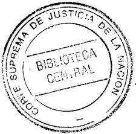
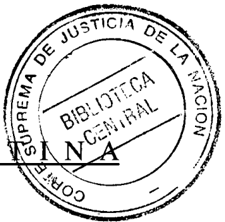
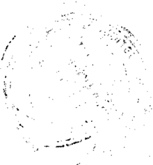
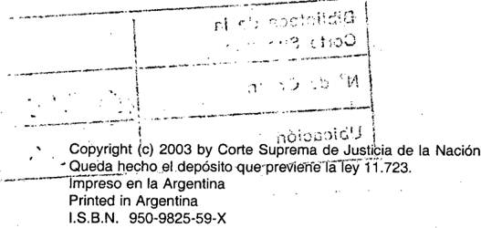
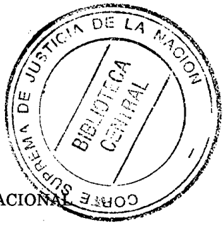
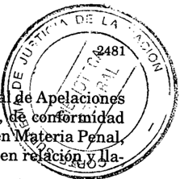
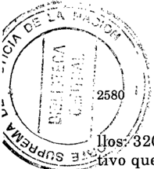
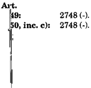

TOMO 325

Volumen 3

2002

## FALLOS DE LA CORTE SUPREMA DE JUSTICIA DE LA NACION

## REPUBLICA A

FALLOS

DE LA

## CORTE SUPREMA

DE

## JUSTICIA DE LA NACION

PUBLICACION A CARGO DE LA SECRETARIA DE JURISPRUDENCIA DEL TRIBUNAL

TOMO 325 - VOLUMEN 3

E OCTUBR

BlmeM8REde la

I

Corte Suprema -

W de Orden

(06t-45

Ubicación

rA406

;).n..J.:. .•.. &gt;. LA LE

Tucumán 1471 (1050) Buenos Aires

2002

--~--"'-~\_.\_"j'

## OCTUBRE

## RECURSO EXTRAORDINARIO: Trámite.

En tanto el dictado del decreto 1836/02 podría incidir de modo sustancial en la resolución de la controversia, corresponde poner el expediente en la Mesa de Entradas de la Corte Suprema a fm de que, dentro del plazo de cinco días, las partes manifiesten lo que consideren pertinente con relación a dicha norma.

## RECURSO EXTRAORDINARIO: Trámite.

No corresponde hacer lugar al traslado a las partes a fin de que manifiesten lo que consideren pertinente con relación al decreto 1836/02, pues ello implicaría un retardo incompatible con el carácter de acción "expedita y rápida" que, de acuerdo con el arto 43 de la Constitución Nacional, tiene el amparo, así como contrario al espíritu de los arts. 8, 11 Y 16 de la ley 16.986, máxime frente al constante e ininterrumpido dictado de normas de distinta jerarquía vinculadas al tema (Disidencia del Dr. Adolfo Roberto Vázquez).

## RECURSO EXTRAORDINARIO: Trámite.

Lo dispuesto por el decreto 1836/02 reconduce a la consideración de la cuestión vinculada al canje de los depósitos reprogramados del sistema fmanciero, directamente vinculada a una opción que podría o no ejercer el interesado, pero que en ningún caso puede ser provocada por los actos del Tribunal, quien debe decidir su derecho conforme a la pretensión estrictamente deducida en autos (Disidencia del Dr. Adolfo Roberto Vázquez).

DICTAMEN DEL PROCURADOR GENERAL

## Suprema Corte:

'l

,',1

Toda vez que con posterioridad a la concesión el recurso ext:faór: dinario interpuesto, e incluso de la providencia de fs. 168, se han dictado nuevas normas que podrían incidir de modo sustancial en la

'"

-2478

resolución de la controversia planteada en el sub lite (decreto 1836/ 02, B.O. 17.09.02), solicito al Tribunal que, manteniendo el criterio adoptado en fs. 168 y en ejercicio de las facultades que le confiere el arto 36, inc. 2º del Código Procesal Civil y Comercial de la Nación, disponga, de estimarlo procedente, un traslado a las partes a fin de que manifiesten lo que consideren pertinente sobre esta nueva situación.

Con este proceder, entiendo que se conciliarán, por un lado, el debido proceso legal -principio cardinal por el cual debo velar (art. 25, inc. h), de la ley 24.946)y, por el otro, la jurisprudencia de la Corte en cuanto a que sus sentencias deben ceñirse a las circunstancias existentes al momento en que se dicten, con el fin de evitar pronunciamientos inoficiosos. Buenos Aires, 18 de septiembre de 2002. Nicolás Eduardo Becerra.

## FALLO DE LA CORTE SUPREMA

Buenos Aires, 3 de octubre de 2002

## Autos y Vistos:

En atención a lo solicitado por el señor Procurador General, póngase el expediente en la Mesa de entradas a fin de que, dentro del plazo de cinco días, las partes manifiesten lo que consideren pertinente con relación al decreto 1836/02.

Notifiquese. Respecto de la parte actora será aplicable lo prescripto por el arto 133 del Código Procesal Civil y Comercial de la Nación, en razón de que no constituyó domicilio en la Capital Federal (art. 257, párrafo tercero, del mismo código). Vencido el plazo, vuelvan las actuaciones a la Procuración General de la Nación a los fines de la vista que se ha conferido a fs. 216.

JULIO S. NAZARENO -EDUARDO MOLINÉ O'CONNOR -CARLOS S. FAYTAUGUSTO CÉSAR BELLUSCIO -GUILLERMO A. F. LÓPEZ -ADOLFO ROBERTO VÁZQUEZ (en disidencia).

## DE JUSTICIA DE LA NACION 325

## DISIDENCIA DEL SEÑOR MINISTRO DOCTOR DON ADOLFO ROBERTO V ÁZQUEZ

## Considerando:

1 º) Que la solicitud del señor Procurador General es improcedente.

Ello es así, ante todo, porque el cumplimiento del traslado requerido implicaría un retardo incompatible con el carácter de acción "expedita y rápida" que, de acuerdo con el arto 43 de la Constitución Nacio- . nal, tiene el amparo, así como contrario al espíritu de los arts. 8, 11 Y 16 de la ley 16.986.

2º) Que, por lo demás, el constante e ininterrumpido dictado de normas y disposiciones de distinta jerarquía que en los últimos meses, se ha verificado con relación al tema de que tratan las presentes actuaciones, dando cuenta ello de una actitud legisferante que bien podría seguir reiterándose en el futuro, lo que en su caso obligaría, de ser ahora aceptada la petición del señor Procurador General, a eventualmente conceder nuevos traslados frente a la sanción de nuevas normas, postergándose entonces indefinidamente la resolución del amparo, obligan a cumplir sin más con el dictado de la sentencia de mérito.

3º) Que, sin perjuicio de lo anterior, destácase que lo dispuesto por el decreto 1836/02 reconduce a la consideración de una cuestión, comoes la vinculada al canje de los depósitos reprogramados del sistema financiero, directamente vinculada a una opción que podría o no ejercer el interesado, pero que en ningún caso puede ser provocada por los actos del Tribunal, quien debe decidir su derecho conforme a la pretensión estrictamente deducida en autos.

En tales condiciones, no ha lugar a lo solicitado y devuélvanse los autos a la Procuración General a los efectos indicados a fs. 216, con especial pedido de pronto despacho. .') ¡.'

ADOLFO ROBERTO V ÁZQUEZ.

..

## FALLOS DE LA CORTE SUPREMA 325

## LUIS CARLOS SCHOLZ y OTROS

RECURSO EXTRAORDINARIO: Requisitos propios. Cuestiones no federales. Interpretación de normas locales de procedimientos. Costas y honorarios.

Corresponde hacer excepción al principio según el cual lo atinente a los honorarios regulados en las instancias ordinarias constituye materia ajena al recurso del arto 14 de la ley 48 cuando la regulación ha sido practicada con notorio apartamiento de las normas arancelarias aplicables, lo que redunda en evidente menoscabo de la garantía de la propiedad.

RECURSO EXTRAORDINARIO: Requisitos propios. Cuestiones no federales. Sentencias arbitrarias. Procedencia del recurso. Defectos en la fundamentación normativa.

Corresponde dejar sin efecto la sentencia que para regular los honorarios profesionales se apartó injustificadamente de las disposiciones aplicables al caso al sustentar su decisión en el arto 4º de la ley 935 -sólo referida a la suplencia de jueces federales y de fiscales "ad hoc", de conformidad con sus arts. 1º y 3ºsin ponderar que la actuación del profesional en cuyo favor se efectuó la regulación había tenido lugar en el marco de una defensa particular lo que evidencia la inexistencia de los presupuestos de aplicación de la aludida disposición.

## DICTAMEN DEL PROCURADOR GENERAL

Suprema Corte:

-1-

El titular del Juzgado Federal de la ciudad de Río Gallegos, Provincia de Santa Cruz, resolvió regular en la suma de mil quinientos pesos los honorarios profesionales del doctor Norberto Manuel Leserovich, por su actuación comodefensor particular de Daniel José Caballero, Luis Carlos y Domingo Alberto Scholz, que puso a cargo del Tesoro Nacional con base en 10 dispuesto por el arto 4º de la ley 935 (fs',399).

, 'Contra esa decisión el representante del Ministerio Público Fiscal interpuso recurso de apelación, que fue concedido libremente a fS.402.

Radicadas las actuaciones ante la Cámara Federl, 9.~ AP~!~i~ri~ .. , g de Comodoro Rivadavia, su presidente resolvió que~, C0nf.&amp;r~lí9ad I t con los arts. 501 Y504 del Código de Procedimientos en\¥~t~P1~ correspondía establecer que el recurso procedía sólo en ~.~ amó a autos al acuerdo (fs. 410). ~.-..~

Finalmente, a fs. 411 ese tribunal resolvió confirmar el pronunciamiento impugnado.

Contra esa decisión, el fiscal de cámara interpuso este recurso extraordinario (fs. 414/417) que fue concedido a fs. 421/422.

-II-

En su presentación de fs. 414/417, el recurrente tacha de arbitraria la sentencia en tanto sostiene que no resulta ser una derivación razonada del derecho vigente ya que, a partir de un inusual rigorismo formal, se apartó de la legislación que correspondía aplicar en el caso.

En este sentido afirma que, de ningún modo, los honorarios por la actuación de un letrado particular pueden ser solventados por el Tesoro Nacional en virtud de la ley 935, por cuanto ésta rige únicamente aquellos emolumentos que le correspondan a las personas que se hayan desempeñado como jueces o fiscales federales ad hoc, por algún impedimento que hubieran sufrido sus titulares.

,

Agrega que, de esa forma, se produce una violación del derecho de propiedad del Estado (art. 17 de la C.N.).

Asimismo, expresa que la solución adecuada a la cuestión hubiera sido la aplicación de la ley de aranceles profesionales (ley 24.432, modificatoria de la ley 21.839).

- III-

Si bien no desconozco que, conforme ha resuelto V.E. en reiteradas oportunidades, la imposición de las costas es un problema de c~ácfer accesorio y procesal que no da lugar al recurso extraordinario (Fallos: 298:538; 300:295; 301:404 y 302:646) y que la rigidez de la aplicación de la doctrina de la arbitrariedad es particularmente más intensa en supuestos de esta índole (Fallos: 311:1950), no lo es menos que tam-

bién ha señalado que por vía de aquélla se tiende a resguardar las garantías de defensa enjuicio y debido proceso, exigiendo que las sentencias sean fundadas y constituyan derivación razonada del derecho vigente con aplicación a las circunstancias de la causa (Fallos: 311:621; 312:1075; 319:103; 320:2319 y 322:702, entre muchos otros).

Tan es así, que el Tribunal ha resuelto que procede el remedio federal respecto de la imposición de las costas, cuando las resoluciones no satisfagan esas exigencias (Fallos: 300:927; 311:2745 y 321:2745).

A mi modo de ver, el pronunciamiento del a quo -que confirmó el del juez de instanciaadolece de tales requisitos por lo que corresponde descalificarlo con base en aquella doctrina (Fallos: 311:1516; 312:1311 y sus citas) en tanto se apartó injustificadamente de las disposiciones legales aplicables al caso al someter a un régimen jurídico específico, como lo es la ley 935 -sólo referida a la suplencia de jueces federales y de fiscales ad hoc, de conformidad con sus arts. 1 Q Y3 Q -a un letrado particular, cuya única función había sido ejercer la defensa de quienes estuvieron sometidos a proceso.

Semejante situación provoca, a mi entender, en grave desmedro de los intereses patrimoniales del Estado y de los objetivos perseguidos por el legislador al regular, en nuestro ordenamiento jurídico, tanto el régimen de subrogancias, comoel de honorarios profesionales enjuicio (conf. doctrina de Fallos: 320:2379, especialmente considerando 15).

Por otro lado, si bien es cierto que, como pretende aclarar tardíamente el a quo en el auto de concesión de este recurso (fs. 421/422), no se expresaron agravios respecto al sujeto obligado al pago, no lo es menos, que fue ese tribunal el que, con su proceder, le impidió a este Ministerio Público concretar los fundamentos de su apelación, en tantoomitió realizar las notificaciones a que se refiere el arto 538 del Código de Procedimientos en Materia Penal (vid. fs. 410).

Asimismo, cabe poner de resalto, que la cámara en su resolución de fs. 411, presumió incluso -como sus propios integrantes afirmanque uno delos agravios del fiscal podría consistir en su discrepancia respecto de la obligación del Tesoro Nacional de abonar los honorarios profesionales del defensor particular.

Pero, no obstante ello, se limitó a considerar únicamente la estimación del monto regulado, sin siquiera realizar el adecuado control

de legalidad propio de su función y, de ese modo, acordó -contrariamente a la doctrina establecida por el Tribunal en numerosos precedentespreferencia a las formas, en lugar de sopesarlas en relación con el fin último que persiguen los procesos y que consiste en la más efectiva realización del derecho (Fallos: 238:550; 304:1265; 305:944; 311:103 y 312:623, entre otros).

En definitiva, creo necesario resaltar que, en el caso, la confirmación del decisorio de la anterior instancia, conduciría a obligar al Estado Nacional, con sustento en una ley cuya errónea aplicación se impidió arbitrariamente discutir, con menoscabo de su derecho de propiedad, al obligarlo a soportar el pago de los honorarios de un profesional, cuya intervención, además, fue resultado de la decisión exclusiva de los entonces imputados quienes, no obstante conocer el derecho de ser asistidos por un defensor oficial (vid. fs. 14/18), optaron por la elección de un abogado de la matrícula.

Este extremo, sumado a lo expuesto precedentemente, impide admitir que pueda ser el Tesoro Nacional el que deba cumplir con la obligación que nació de aquella voluntad.

-IV-

En esta inteligencia, opino que V.E. debe revocar el pronunciamiento de fs. 411 para que, por intermedio de quien corresponda, se dicte uno nuevo conforme a derecho. Buenos Aires, 26 de febrero de 2002. Nicolás Eduardo Becerra.

## FALLO DE LA CORTE SUPREMA

Buenos Aires, 3 de octubre de 2002.

Vistos los autos: "Scholz, Luis Carlos; Scholz, Domingo Alberto y Caballero, Daniel José sI contrabando".

## Considerando:

1 º) Que la Cámara Nacional de Apelaciones en lo Federal de Comodoro Rivadavia confirmó loresuelto en la instancia anterior en cuan-

to había regulado en la suma de mil quinientos pesos los honorarios profesionales del doctor Norberto Manuel Leserovich por su actuación comodefensor particular de Daniel José Caballero, Luis Carlos Scholz y Domingo Alberto Scholz, monto que puso a cargo del Tesoro Nacional conforme a lo previsto en el arto 4º de la ley 935. Contra este pronunciamiento el señor fiscal de cámara interpuso recurso extraordinario que fue concedido por el a quo a fs. 421/422.

- 2º) Que el recurrente solicitó la descalificación del fallo por aplicación de la conocida doctrina de esta Corte sobre arbitrariedad de sentencias. Adujo que la decisión apelada no resulta ser una derivación razonada del derecho vigente, pues a partir de un inusual rigorismo formal, se apartó de la legislación que correspondía aplicar en el caso y no revisó la sentencia de grado para examinar si el monto era adecuado o si los honorarios por la actuación de un letrado particular podían ser solventados por el Tesoro Nacional.

Se agravió también al considerar que el trabajo del profesional quedaba sujeto a las disposiciones de la ley 24.432 de honorarios y aranceles profesionales, que modificó en lo sustancial la ley 21.839, entre otras normas, y no por la ley 935, que se aplicó en el sub lite.

- 3º) Que si bien lo atinente a los honorarios regulados en las instancias ordinarias constituye materia ajena al recurso del arto 14 de la ley 48, toda vez que la determinación del monto del litigio, la apreciación de los trabajos profesionales cumplidos y la interpretación y aplicación de las normas arancelarias son, como principio, en razón del carácter fáctico y procesal de tales cuestiones, insusceptibles de tratamiento en la instancia extraordinaria (Fallos: 243:223; 270:388, 444; 274:182; 279:319; 310:414, entre otros), corresponde hacer excepción a dicha regla cuando, como sucede en el sub examine, la regulación de los honorarios profesionales ha sido practicada connotorio apartamiento de las normas arancelarias aplicables, lo que redunda en evidente menoscabo de la garantía de la propiedad (Fallos: 307:1157; 316:74, entre otros).
- 4º) Que, en efecto, para establecer los honorarios del profesional letrado particular, cuya única función había sido ejercer la defensa de quienes estuvieron sometidos a proceso, se ha obviado la norma legal aplicable. Ello es así a poco que se advierta que la ley 935 creó el sistema de suplencias de los jueces federales impedidos orecusados y en su arto 1º expresa que esta función será ejercida por los abogados de la

matrícula. Dispone además en su arto 4º, en lo que aquí interesa, que los honorarios de jueces y fiscales ad hoc serán costeados por el Tesoro Nacional, siendo éstos los únicos funcionarios suplentes cuya designación y pago prevé.

- 5º) Que, en consecuencia, el pronunciamiento ha dejado de ponderar que la actuación del profesional en cuyo favor se efectuó la regulación ha tenido lugar en el marco de una defensa particular.
- 6º) Que, en tales condiciones, el a qua se apartó injustificadamente de las disposiciones legales expresas (Fallos: 312:1311) al sustentar su decisión con cita del arto 4º de la ley 935 sin que las constancias de la causa evidencien su pertinencia en el sub lite, ante la inexistencia de los presupuestos de aplicación de la aludida disposición y cuya mención aparece así como el fruto de una afirmación dogmática de quien suscribe el fallo, descalificable en los términos de la doctrina invocada.

Por ello, y lo concordemente dictaminado por el señor Procurador General, se declara la procedencia del recurso extraordinario concedido y se deja sin efecto la sentencia. Vuelvan los autos al tribunal de origen para que, por quien corresponda, se dicte un nuevo pronunciamiento con arreglo a lo aquí resuelto. Notifiquese y, oportunamente, remítase.

JULIO S. NAZARENO -EDUARDO MOLINÉ O'CONNOR -AUGUSTO CÉSAR BELLUSCIO -GUILLERMO A. F. LÓPEZ -GUSTAVO A. BOSSERT -ADOLFO ROBERTO V ÁZQUEZ.

## CARLOS ALEJANDRO TUMBEIRO

RECURSO EXTRAORDINARIO: Requisitos propios. Cuestión federal. Cuestiones federales simples. Interpretación de la Constitución Nacional.

Existe cuestión federal suficiente si la naturaleza del planteo conduce a determinar el alcance de la garantía del debido proceso y la que establece que nadie puede ser arrestado sino en virtud de orden escrita emanada de autoridad competente.

2486

## FALLOS DE LA CORTE SUPREMA 325

## CONSTITUCION NACIONAL: Derechos y garantías. Libertad corporal.

El arto 18 de la Constitución Nacional, al establecer que la orden de arresto debe provenir de autoridad competente, presupone una norma previa que establezca en qué casos y en qué condiciones procede una privación de libertad.

## CONSTITUCION NACIONAL: Derechos y garantías. Libertad corporal.

El arto 284 del Código Procesal Penal de la Nación reglamenta el arto 18 de la Constitución Nacional, al establecer el deber de los funcionarios y auxiliares de la policía de detener, aun sin orden judicial, a las personas que se encuentren en los diversos presupuestos que dicha norma establece, y también debe considerarse reglamentario de la garantía señalada, al inc. 1º del arto 5 del decreto-ley 333/58, ratificado por la ley 14.467 y modificado por la ley 23.950, en cuanto faculta a los funcionarios policiales para proceder a la demora de las personas por el tiempo mínimo necesario para establecer su identidad cuando existan circunstancias debidamente fundadas que hagan presumir que alguien hubiese cometido o pudiere cometer algún hecho delictivo o contravencional y no acredite fehacientemente su identidad.

## CONSTITUCION NACIONAL: Derechos y garantías. Libertad corporal.

Corresponde considerar legítimo el trámite de identificación llevado a cabo por los funcionarios policiales si éstos fueron comisionados para recorrer el radio de la jurisdicción en la específica función de prevenir el delito y, en ese contexto, interceptaron al encartado en actitud sospechosa, que fue ulteriormente corroborada con el hallazgo de estupefacientes, y comunicaron de inmediato la detención al juez.

## CONSTITUCION NACIONAL: Derechos y garantías. Libertad corporal.

El pronunciamiento que absolvió al imputado por el delito de tenencia de estupefacientes no sólo ignora la legitimidad de lo actuado en prevención del delito y dentro del marco de una actuación prudente y razonable del personal policial en el ejercicio de sus funciones específicas, sino que, además, omite valorar juntamente con el nerviosismo que mostraba el imputado, las demás circunstancias por las cuales el personal policial decidió identificarlo.

## RECURSO EXTRAORDINARIO: Principios generales.

El recurso extraordinario contra la sentencia que absolvió al imputado por el delito de tenencia de estupefacientes es inadmisible (art. 280 del Código Procesal Civil y Comercial de la Nación) (Disidencia de los Dres. Carlos S. Fayt, Enrique Santiago Petracchi y Gustavo A. Bossert).

## DE JUSTICIA DE LA NACION 325

## DICTAMEN DEL PROCURADOR FISCAL

## Suprema Corte:

La Sala 1de la Cámara Nacional de Casación Penal, resolvió -por mayoríadejar sin efecto la condena impuesta a Carlos Alejandro Tumbeiro y absolverlo del delito de tenencia de estupefacientes por el que había sido condenado. Ello, como consecuencia de haber declarado la nulidad de la diligencia de secuestro practicada por el personal policial al inicio de las actuaciones (fs. 187/193).

Contra ese pronunciamiento, la Fiscalía General nº 1 ante ese tribunal interpuso recurso extraordinario (fs. 204/214) por considerar, con sustento en el precedente que se registra en Fallos: 321:2947, que en la sentencia impugnada se ha efectuado una interpretación arbitraria de los artículos 284 y 285 del Código Procesal Penal de la Nación a la luz de los hechos comprobados de la causa, los cuales habilitaban la actuación del personal policial en virtud de la facultad que reconoce el artículo 1º de la ley 23.950. Por resolución de fojas 222/224, el a qua declaró admisible la apelación ante la posible afectación de la garantía del debido proceso como consecuencia de la inteligencia de esas normas.

Sin perjuicio de los fundamentos expuestos por el magistrado recurrente, habré de introducir otros en cuya virtud también considero que la impugnación debe declararse procedente.

-1-

Afin de tratar adecuadamente la cuestión aquí planteada, estimo conveniente realizar, en primer término, una breve reseña del hecho que se ha tenido por probado durante el juicio. Tal como surge de las actuaciones, el 15 de enero de 1998 a las 13.45 horas, en las inmediaciones de la calle Corea al 1700 de esta ciudad, el personal policial identificó a Carlos Alejandro Tumbeiro al considerar que su actitud en la vía pública resultaba sospechosa, porque su vestimenta era inusual para la zona y por mostrarse evasivo ante la presencia del patrullero. No obstante acreditar su identidad con el documento que llevaba en su poder, ante el nerviosismo que exhibía se lo condujo al interior del vehículo policial a fin de establecer, a través del sistema dígito radial,

si registraba pedido de captura, lo que arrojó resultado negativo. Mientras se obtenía ese informe, se detectó que dentro del diario perteneciente al nombrado, que estaba a su lado en el asiento, había una bolsita con una sustancia que resultó ser cocaína. Ante este hallazgo, se convocóa testigos, se labró acta de estilo y se procedió a la detención.

A partir de esos hechos, el tribunal a qua consideró que la interceptación de una persona en la vía pública con fines identificatorios y su posterior alojamiento en un vehículo policial a la espera de la recepción de los antecedentes que pudiera registrar, constituye una verdadera detención que no encuadra en ninguno de los supuestos del artículo 284, inciso 3Q,del Código Procesal Penal, sin que pueda invocarse una hipótesis de flagrancia porque la verificación del presunto delito fue posterior a esa detención. Asimismo, juzgó que el estado de nerviosismo de Tumbeiro era una circunstancia equívoca y, como tal, insusceptible para habilitar esa medida. Por último, descartó la aplicación del artículo 1Qde la ley 23.950, pues no mediaron las condiciones que fija esa norma para la detención por averiguación de antecedentes (ver fs. 188).

Esta breve reseña, permite afirmar que la cuestión federal planteada por el Ministerio Público no se refiere a la discusión sobre los hechos probados de la causa, sino al alcance de las garantías constitucionales que el a qua juzgó afectadas a partir de la inteligencia que asignó. a normas procesales que guardan estrecha relación y dependencia con aquéllas (conf. Fallos: 311:836; 317:956).

-I1-

Comose advierte, la controversia suscitada en el sub lite se vincula, una vez más, con "el conflicto entre dos intereses fundamentales de la sociedad; su interés en una rápida y eficiente ejecución de la ley y su interés en prevenir que los derechos de sus miembros individuales resulten menoscabados por métodos inconstitucionales de ejecución de la ley", según lo definió la Corte Suprema de Justicia de Estados Unidos en el caso "Spano vs. New York", 360 U.S. 315, año 1958 (citado en Fallos: 303:1938, considerando 3Q;yen Fallos: 306:1752, considerando 9 Q del voto del doctor Petracchi).

Concretamente aquí la cuestión consiste, en primer lugar, en determinar si la mera actitud sospechosa o el nerviosismo que exteriori-

za una persona en la vía pública ante la presencia de funcionarios de esa fuerza de seguridad, autoriza a averiguar, en el lugar, si registra pedido de captura aun cuando pueda acreditar su identidad con la exhibición del documento respectivo; o si esa diligencia afecta la garantía que consagra el artículo 18 de la Constitución Nacional frente al arresto arbitrario.

En segundo término, el planteo conduce a establecer la validez del secuestro del material incriminante que llevaba esa persona, el cual fue encontrado entre sus pertenencias mientras se establecía si registraba antecedentes.

Asimismo, ambos aspectos se encuentran íntimamente ligados con las facultades que los artículos 183, 184,284 Y285 del CódigoProcesal Penal de la Nación confieren a las autoridades de prevención y comprenden, en el caso, la garantía del debido proceso dado que en su consecuencia se ha frustrado arbitrariamente el requerimiento del Ministerio Público para obtener la sentencia judicial de condena de una conducta tipificada por la ley de estupefacientes nº 23.737.

- In-

En cuanto a la primera cuestión, el artículo 1º de la ley 23.950 modificó el artículo 5º, inciso 1º, de la ley orgánica de la Policía Federal, aprobada por decreto-ley 333/58, y determinó que "fuera de los casos establecidos en el Código de Procedimientos en Materia Penal, no podrá detener a las personas sin orden del juez competente. Sin embargo, si existiesen circunstancias debidamente fundadas que hagan presumir que alguien hubiese cometido o pudiere cometer algún hecho delictivo o contravencional y no acreditase fehacientemente su identidad, podrá ser conducido a la dependencia policial que correspondiese, con noticia al juez con competencia en lo correccional en turno y demorada por el tiempo mínimo necesario para establecer su identidad, el que en ningún caso podrá exceder de diez horas ...".

Al margen de esa facultad, cuya finalidad es la identificación de personas, también constituye función de esos agentes públicos realizar tareas de prevención para evitar la comisión de delitos. Eso es lo que surge del artículo 183 del actual CódigoProcesal Penal de la Nación (ordenamiento al que hoy debe vincularse la mención que aquella norma contiene) cuando reza "deberán investigar por iniciativa pro-

pia ... los delitos de acción pública ...", y del artículo 3º, inciso 1º, de la citada ley orgánica que entre sus funciones y atribuciones, señala la de "prevenir los delitos de la competencia de los jueces de la Nación".

Es con relación a ese doble contexto normativo que, a mi modo de ver, debe analizarse la diligencia de identificación y averiguación de antecedentes de Tumbeiro, pues no puede desatenderse que las circunstancias fácticas que rodearon la diligencia, tales como la actitud evasiva, el nerviosismo exhibido ante la autoridad policial y la imprecisa explicación sobre su presencia en el lugar, constituían datos objetivos que, aun cuando no permitieran fundar el estado de sospecha del que habla el artículo 1º de la ley 23.950, imponían determinar in situ y merced a los medios técnicos hoy disponibles, la posible existencia de un pedido de captura u otro impedimento legal. Tampoco puede dejar de valorarse que el hecho ocurrió en una zona donde son frecuentes los procedimientos relacionados con droga, aspecto que -al margen de la sustancia hallada luegoexplica el celo puesto por el personal de esa jurisdicción en su tarea de prevención.

Así se debió proceder tanto en ejercicio de aquella amplia función 'prevencional, cuanto en la legítima facultad de requerir a los ciudadanos su identificación pues, cabe reconocer, se trata de dos actividades que presentan una zona común al darse entre ellas una relación de género a especie, tal como surge del propio texto de la ley 23.950 cuando indica "fuera de los casos establecidos en el Código de Procedimientos en Materia Penal ..." y de la primera parte del artículo 5º del decreto-ley 333/58, cuyo inciso 1º, sustituido por el aquí examinado, señala que las detalladas en sus apartados "son facultades de la Policía Federal para el cumplimiento de sus funciones". Entre estas últimas se encuentran las genéricas que surgen de la ley procesal penal (artículo 183).

El artículo 1º de la ley 23.950 describe una determinada situación de sospecha que, sumada a la carencia de documentación que acredite de modo fehaciente la identidad, habilita el traslado a la dependencia policial hasta un plazo de diez horas. Como se ha visto, se trata de un supuesto distinto al del sub lite, pues de no haberse procedido a la incautación del estupefaciente, una vez completada su identificación, Tumbeiro -tras esa breve interrupciónhabría continuado su andar sin ser conducido a ninguna dependencia policial.

Es que, más allá de las suspicacias percibidas por los oficiales públicos, al haberse acreditado en debida forma la identidad ante la legí-

tima solicitud de la autoridad, no se verificó uno de los dos recaudos que habilitan ese traslado a la comisaría y la consiguiente limitación de la libertad. Ello guarda plena coherencia con esa previsión legal, pues la restricción de ese derecho fundamental resulta razonable sólo en cuanto se persiga, precisamente, establecer la identidad de las personas cuando la sospecha no alcanza los estándares que regula el código procesal en su artículo 284, situación bajo la cual esa medida ya resulta imperativa.

-IV-

Desechada entonces la posibilidad de encuadrar el quehacer inicial del personal policial estrictamente en la "demora para establecer la identidad" que permite la ley 23.950, considero procedente apuntar que del propio texto de esa norma surge de modo indiscutible la facultad policial de requerir la identificación de las personas, sin que para ello deba acreditarse ninguna de las circunstancias sospechosas allí contempladas.

En consecuencia, aun cuando no se hubiera dado la situación fáctica que llevó a actuar a la fuerza de seguridad, no puede desconocerse su potestad para proceder respecto de Tumbeiro. Cabe analizar, entonces, el alcance que debe asignarse a las atribuciones que las disposiciones legales mencionadas en el apartado anterior confieren a la autoridad de prevención.

Antes de ingresar a ese análisis, creo conveniente consignar que la experiencia diaria enseña que los funcionarios policiales sólo identifican a un número reducido de personas que transitan por la vía pública. Si bien es verdad que existe una limitación objetiva, pues pretender hacerlo en mayor escala requeriría contar con suficientes recursos humanos, debe reconocerse que esa facultad discrecional es ejercida en forma razonable no sobre cualquier individuo al azar, sino respecto de quienes, por motivos cuya exclusiva evaluación compete a la fuerza de seguridad, incitan a esa verificación en aras de sus funciones generales de prevención.

Ahora bien, enla sentencia impugnada se han considerado ausentes los requisitos que exige el artículo 1º de la ley 23.950 y se ha calificado de "verdadera detención" al fugaz trámite de averiguación de antecedentes que transcurrió en el interior del patrullero, a plena luz

del día y en la vía pública. Además, al juzgarse que tampoco se trató de alguno de los supuestos del artículo 284 del código adjetivo, se declaró la nulidad de las actuaciones y se absolvió al imputado (ver fs. 188). Sobre este último aspecto, habré de volver brevemente en el apartado siguiente.

Según mi parecer, la interpretaciónque se ha efectuado de las funciones del personal policial resulta arbitraria frente a los hechos probados en el sub júdice y las normas aplicables. En efecto, ante la inexistencia de flagrancia, el a qua ha fundado esa conclusión exclusivamente en el artículo 1º de la ley 23.950 y ha omitido la consideración de otras disposiciones atinentes al caso, tales como el artículo 183 del Código Procesal Penal y las demás prescripciones del decreto-ley 333/58 que aquella ley no modificó, los cuales permiten concluir en la legitimidad del cuestionado trámite de identificación.

Es oportuno recordar que una adecuada hermenéutica de la ley debe atender a la totalidad de sus preceptos de manera que armonicen con todas las normas del ordenamiento vigente y del modo que mejor se adecuen al espíritu y a las garantías de la Constitución Nacional (Fallos: 314:1445; 321:73, entre otros).

Asimismo, se ha resuelto que es propio de la interpretación indagar lo que las leyes dicen jurídicamente, pues son numerosos y cotidianos los supuestos en que ello se hace necesario para aplicar la norma con auténtico sentido de justicia y recto juicio prudencial en los casos concretos, toda vez que éstos son particulares y contingentes y por su indeterminación y multiplicidad, no son siempre susceptibles de ser abarcados en su totalidad cuantitativa ni en su tipicidad cualitativa por la previsión del legislador (Fallos: 322:1699, considerando 6º).

Bajo esas prudentes pautas, considero que debe descalificarse la inteligencia efectuada en la sentencia. Repárese en que, si bien no consta el tiempo que demoró la respuesta del Comando Radioeléctrico (ver fs. 1vta.), la experiencia y la actual tecnología, como así también el testimonio del personal interviniente y los dichos propio imputado (fs. 98), indican que se trató de algo rápido que debe ser considerado dentro del mismo trámite de identificación, el cual también abarca el examen exhaustivo del documento.

Es que reconocida por la ley esa facultad policial, existen los poderes inherentes para cumplirla. En este sentido, ha afirmado Benjamín

Villegas Basavilbaso con referencia a los efectos jurídicos y coerción de la orden de policía, que tratándose de "una declaración de voluntad de la administración pública, salvo casos notoriamente ilegítimos en los cuales es evidente su ilicitud, la orden es jurídicamente obligatoria (...). No obstante el carácter imperativo de la orden de policía, él no es suficiente para garantizar la obediencia y es necesario el empleo de la fuerza, el cual 'se explica por el principio de que la policía debe tener en sí misma el poder suficiente para hacer cumplir sus decisiones ante la conducta recalcitrante o desobediente de los individuos'" ("Derecho Administrativo", Editorial Tea, Buenos Aires 1954, tomo V, págs. 207 y 222, con cita -en la última frasede Rafael Bielsa).

A su vez, ha reconocido V.E. que si bien el Congreso de la Nación es la autoridad competente para reglamentar las libertades garantizadas, no puede desconocerse que las leyes dietadas en su virtud, pueden facultar a las distintas reparticiones de la Nación para emitir reglamentos a fin de facilitar y hacer efectivas aquellas garantías dentro de la convivencia social (Fallos: 155:185).

Estos principios generales del derecho administrativo, son los que respaldan el accionar de las fuerzas de seguridad cuando en cumplimiento de su rol de autoridad de prevención (art. 183 del Código Procesal Penal), proceden a identificar a quienes transitan por la vía pública, pues entonces se pueden presentar una infinidad de situaciones de imposible enunciación por el legislador, las cuales, aun cuando no afecten la inmunidad de arresto que consagra el artículo 18 de la Constitución Nacional, son capaces de limitar momentáneamente la libertad. Esa razonable restricción, encuentra su justificación en la protección que corresponde dispensar a la sociedad en función del bien común y en lo que considero que constituye el más elemental y legítimo ejercicio del poder de policía que debe reconocerse a esa autoridad estatal, en resguardo de la tranquilidad y el orden públicos por los que también debe velar en cumplimiento del artículo 4º, inciso 1º, de su ley orgánica.

En tal sentido se ha afirmado que es función esencial dela policía de seguridad estar constantemente prevenida para impedir cualquier perturbación del orden; su fin primordial es prevenir, más que reprimir, función de ultima ratio (Rafael Bielsa, "Derecho Administrativo", tomo IV, pág. 102, Ed. La Ley, 'Buenos Aires, 1965). En el ejercicio de ese diario quehacer, esos funcionarios públicos se enfrentan con aquellas innumerables situaciones y en tanto no se cometan excesos, su

accionar debe presumirse legítimo del mismo modo que lo son los demás actos de gobierno (conf. Fallos: 310:234; 319:1476).

Loanterior se vincula también con el principio reconocido por V.E., según el cual la Constitución Nacional no consagra derechos absolutos, insusceptibles de razonable reglamentación, dependiendo esa racionalidad de su adecuación al fin perseguido, no siendo pasible de tacha constitucional en tanto no tenga base en una iniquidad manifiesta (Fallos: 297:201; 300:67 y 381; 305:831).

En mi opinión, eso es lo que ha ocurrido en el sub júdice, desde que las facultades asignadas a la fuerza de seguridad, cuya constitucionalidad no ha sido puesta en duda, fueron ejercidas con respeto a las garantías e integridad de la persona identificada. Cabe aquí recordar que durante la audiencia de debate, Tumbeiro expresamente reconoció que "en todo momento lo trataron correctamente" (ver fs. 98). Si a ello se suman las circunstancias fácticas en cuya virtud el personal policial consideró, con base en su experiencia, que correspondía su inmediata actuación y las características de modo, tiempo y lugar que revistió la averiguación de antecedentes, no es posible sostener que se haya obrado de manera irrazonable, ni que ese trámite haya constituido una "verdadera detención".

De casos de similar naturaleza al aquí examinado resultan, a diario, breves limitaciones a la libertad comoconsecuencia de la actividad llevada a cabo por las fuerzas de seguridad en el ejercicio de su función de prevención, que no pueden ser consideradas "detenciones" en tanto se observen los recaudos legales que las autorizan y exhiban la razonabilidad propia de todo acto de la administración. Así también ocurre, por ejemplo, en los controles que se efectúan a quienes se disponen a salir del país, o en los que habitualmente se practican respecto del tránsito, donde se requiere la documentación del conductor, del rodado y, en su caso, de la carga transportada, e incluso se verifica el estado mecánico de la unidad, la correspondencia y autenticidad de su numeración individualizadora y si registra pedido de secuestro. Todo ello insume un tiempo durante el cual, aun cuando el requerido vea demorada su circulación, no es posible afirmar que se encuentre privado de su libertad.

Se trata, en definitiva, de situaciones que constituyen las "realidades prácticas" a las que ha aludido recientemente la Corte Suprema de los Estados Unidos al fallar el 5 de abril de 1999 en la causa "Esta-

do de Wyoming c. Houghton, Sandra", acerca de la validez del secuestro de droga hallada entre las pertenencias de la pasajera de un automóvil requisado por la policía. Sostuvo allí que "al sopesar los intereses en juego, nuestras determinaciones de 'razonabilidad' conforme a la Cuarta Enmienda deben tener en cuenta estas realidades prácticas. Pensamos que ellas militan a favor de la necesidad del cumplimiento de la ley, y en contra del interés de privacidad personal que es comúnmente débil" (sentencia publicada en La Ley, Suplemento de Derecho Constitucional, del 29 de noviembre de 1999).

Por último, y comoreflejo de esas "realidades" en el campo de nuestra jurisprudencia, es ilustrativo señalar que en materia de hábeas corpus es donde se registran los escasos precedentes que existen sobre el punto. De los que reseña el publicista Néstor P. Sagüés en su "Derecho Procesal Constitucional - Hábeas Corpus" (Editorial Astrea, Buenos Aires, 1988, volumen 4, pág. 157), considero oportuno consignar aquí, por guardar alguna similitud con el sub exámine, el resuelto por la Suprema Corte de Mendoza el 2 de junio de 1944, in re "Larraya, Bernardino". Se afirmó allí, que "la restricción momentánea de la libertad del morador en los casos de allanamiento, es una providencia secundaria, incidental a su desarrollo normal, en cuyo caso tal restricción no es ilegítima por cuanto no importa una detención, comohecho sustancial sino circunstancial, extraña al recurso de hábeas corpus" (La Ley, Repertorio VI, año 1944, voz "Hábeas Corpus", sumario nº 2).

Como conclusión de lo hasta aquí desarrollado, considero que el procedimiento de averiguación de antecedentes practicado respecto de Carlos Alejandro Tumbeiro resultó legítimo y no afectó la inmunidad de arresto que garantiza el artículo 18 de la Constitución Nacional.

-V-

En cuanto a la segunda cuestión, al no merecer reparos la momentánea presencia del nombrado en el patrullero policial, tampoco 'se advierten objeciones acerca del secuestro del estupefaciente que conservaba en su poder, cuya tenencia recién entonces fue detectada por la autoridad de prevención.

Tal como se admite en la propia sentencia apelada (fs. 188), ello sí constituyó un caso de flagrancia de los artículos 284, inciso 4º, Y285

del Código Procesal Penal. En esas condiciones, los funcionarios policiales actuaron en cumplimiento del deber de detención -aún sin ordenjudicial-'que esas normas les imponen; y procedieron a la incautación de la sustancia en virtud de la atribución que les fija el artículo 184, incisos 2º y 8º, de ese mismo ordenamiento.

Por lo tanto, al tratarse de prueba incorporada con observancia de las formas que resguardan la garantía del debido proceso, debe ser admitida, so pena de malograr la búsqueda de la verdad que resulta esencial para un adecuado servicio de justicia (conf. Fallos: 313:1305; 321:2947, considerando 19). Lo contrario importaría causal de arbitrariedad al prescindirse de la valoración de un elemento de juicio relevante para la solución del litigio.

Por ello y los demás argumentos expuestos a fojas 204/214 por el Fiscal General recurrente, opino que V.E. debe revocar la sentencia de fojas 187/193. Buenos Aires, 9 de junio de 2000. Eduardo Ezequiel Casal.

## FALLO DE LACORTE SUPREMA

Buenos Aires, 3 de octubre de 2002.

Vistos los autos: "Tumbeiro, Carlos Alejandro sI recurso extraordinario".

## Considerando:

- 1º) Que contra la sentencia de la Sala 1de la Cámara Nacional de Casación Penal que absolvió de culpa y cargo a Carlos Alejandro Tumbe~ropor el delito de tenencia de estupefacientes, dedujo el señor fiscal general ante esa cámara recurso extraordinario que fue concedido a fs. 222/224. '
- 2º) Que las presentes actuaciones se iniciaron con motivo de la interceptación del prevenido por parte de personal policial con fines de identificación, seguida, mientras se encontraba en el interior del móvil policial para comprobar su identidad, del secuestro del interior

de un periódico de una bolsa de nylon trasparente que contenía clorhidrato de cocaína.

- 3º) Que para dejar sin efecto la condena impuesta y absolver de culpa y cargo al imputado, el a quo consideró que la interceptación en la vía pública de una persona con fines de identificación y su ulterior alojamiento en un vehículo policial a la espera de la recepción de los antecedentes que pudiera registrar, constituía una verdadera detención que sólo con el recurso de eufemismos habría de considerarse bajo el título de mera "demora" o bajo cualquier otro que fuera distinto a lo que regulaba el arto 284, inc. 3º del Código Procesal Penal de la Nación. Además, sostuvo que el estado de nerviosismo del sujeto pasivo de la medida de coerción era una circunstancia equívoca y, como tal, insusceptible por sí para habilitar la aludida interceptación.

Por último, estableció que la detención por averiguación de antecedentes prevista en el decreto-ley 333/58 -texto del arto 1º de la ley 23.950no se justificaba en la especie, en la medida en que no mediaron circunstancias debidamente fundadas que hicieran presumir que alguien hubiese cometido algún hecho delictivo o contravencional y no acreditase su identidad.

- 4º) Que en la apelación federal deducida el señor fiscal general adujo que la valoración realizada por el a quo relativa a los requisitos necesarios para que los funcionarios policiales pudieran efectuar una demora en la identificación de las personas, comportaba un exceso ritual en la interpretación de las normas aplicables, además de una omisión en las circunstancias comprobadas de la causa.

En tal sentido, manifestó que la decisión anuló una actuación de prevención legalmente avalada, utilizando fundamentos sólo aparentes para descartar prueba válidamente ingresada en el proceso.

- 5º) Que los agravios del apelante suscitan cuestión federal suficiente para la apertura de la instancia extraordinaria puesto que la naturaleza del planteo conduce a determinar el alcance de la garantía del debido proceso y la que establece que nadie puede ser arrestado sino en virtud de orden escrita emanada de autoridad competente.
- 6º) Que resulta conveniente precisar que el arto 18 de la Constitución Nacional, al establecer que la orden de arresto debe provenir de autoridad competente, presupone una norma previa que establezca en

qué casos y en qué condiciones procede una privación de libertad. El arto284del CódigoProcesal Penal de la Naciónreglamenta el citado arto 18 de la Carta Magna, al establecer el deber de los funcionarios y auxiliares de la policía de detener, aun sin orden judicial, a las personas que se encuentren en los diversos presupuestos que dicha norma establece.

Asimismo, también debe considerarse reglamentario de la garantía señalada, al inc. 1º del arto 5 del decreto-ley 333/58, ratificado por la ley 14.467 y modificado por la ley 23.950, en cuanto faculta a los funcionarios policiales para proceder a la demora de las personas por el tiempo mínimo necesario para establecer su identidad cuando existan circunstancias debidamente fundadas que hagan presumir que alguien hubiese cometido o pudiere cometer algún hecho delictivo o contravencional y no acredite fehacientemente su identidad.

7º) Que a los efectos de determinar si resulta legítima la medida cautelar de prevención que tuvo por sustento la existencia de un estado de sospecha sobre la verdadera conducta del imputado, ha de examinarse aquel concepto a la luz de las circunstancias en que tuvo lugar su interceptación.

En efecto, en este aspecto es relevante indicar que el tribunal de juicio señaló que esa interceptación del acusado a los fines de su identificaciónfue llevada a cabo"por un conjunto de actitudes tales comoel nerviosismo puesto de manifiesto por Tumbeiro ante la presencia del móvil policial y el hecho de que se trataba de una persona que por su comportamiento y vestimenta no parecía de la zona, el cual al ser consultado por la razón de su presencia en el lugar, hizo referencia a la búsqueda de un material electrónico de repuesto, totalmente extraño a lo que podía obtenerse en los comercios aledaños pues se trataba de una zona de gente humilde, en su mayoría habitantes de una villa en el bajo Flores".

Sobre el punto esta Corte, en Fallos: 321:2947, considerandos 8º y 9º, recordó la opinión de la Suprema Corte de los Estados Unidos de Norteamérica, en cuanto ha fijado pautas tendientes a precisar los conceptos de "causa probable", "sospecha razonable", "situaciones de urgencia" y la "totalidad de las circunstancias del caso". "La doctrina de la 'causa probable' ha sido desarrollada en el precedente 'Terry v. Ohio', 392, U.S., 1 (1968), en el cual la Suprema Corte de los Estados Unidos de Norteamérica convalidó la requisa y detención sin orden judicial efectuada por un policía al advertir que extraños actuaban de 'manera sospechosa', ocasión en que se les aproximó y luego de identi-

ficarse y girar alrededor, palpó sus ropas y encontró una pistola en el bolsillodel accionante, habiendo sido condenado y admitiéndose el arma comoprueba, pese a las objeciones de la defensa. El tribunal sostuvo que 'cuando un oficial de policía advierte una conducta extraña que razonablemente lo lleva a concluir, a la luz de su experiencia, que se está preparando alguna actividad delictuosa y que las personas que tiene enfrente pueden estar armadas y ser peligrosas, y en el curso de su investigación se identifica como policía y formula preguntas razonables, sin que nada en las etapas iniciales del procedimiento contribuya a disipar el temor razonable por su seguridad o la de los demás, tiene derecho para su propia protección y la de los demás en la zona, a efectuar una revisación limitada de las ropas externas de tales personas tratando de descubrir armas que podrían usarse para asaltarlo. Conforme con la Cuarta Enmienda, tal es una revisación razonable y las armas que se incauten pueden ser presentadas como prueba en contra de esas personas'''.

8º) Que las pautas señaladas precedentemente, resultan decisivas para considerar legítimo el trámite de identificación llevado a cabo por los funcionarios policiales a la luz de las normas que regulan su accionar. Ello es así, toda vez que éstos han sido comisionados para recorrer el radio de la jurisdicción en la específica función de prevenir el delito y, en ese contexto, interceptaron al encartado en actitud sospechosa, que fue ulteriormente corroborada con el hallazgo de estupefacientes, y comunicaron de inmediato la detención al juez.

9º) Que en estas condiciones resultan inadmisibles las conclusiones a que arriba el a quo, puesto que no se advierte ninguna irregularidad en el procedimiento del que pueda inferirse violación alguna al debido proceso legal. Es más, el pronunciamiento impugnado no sólo ignora la legitimidad de lo actuado en prevención del delito y dentro del marco de una actuación prudente y razonable del personal policial en el ejercicio de sus funciones específicas, sino que, además, omite valorar juntamente con el nerviosismo que mostraba el imputado, las demás circunstancias por las cuales el personal policial decidió identificarlo y a las cuales se alude en el considerando 7º.

10) Que por lo expuesto, no se advierte en el caso una violación a la doctrina del Tribunal según la cual no es posible aprovechar las pruebas obtenidas con desconocimiento de garantías constitucionales (Fallos: 303:1938; 306:1752; 311:2045; 321:2947, considerando 18, entre otros).

Por ello, y lo concordantemente dictaminado por el señor Procurador Fiscal, se declara procedente el recurso extraordinario y se revoca la sentencia apelada. Vuelvan los autos al tribunal de origen a fin de que, por quien corresponda, se dicte un nuevo pronunciamiento con arreglo a lo aquí dispuesto. Notifíquese y, oportunamente, remítase.

JULIO S. NAZARENO -EDUARDO MOLINÉ O'CONNOR -CARLOS S. FAYT (en disidencia) -AUGUSTO CÉSAR BELLUSCIO -ENRIQUE SANTIAGO PETRACCHI (en disidencia) -GUILLERMO A. F. LÓPEZ -GUSTAVO A. BOSSERT (en disidencia) -ADOLFO RoBERTO V ÁZQUEZ.

DISIDENCIA DE LOS SEÑORES MINISTROS DOCTORES DON CARLOS S. FAYT, DON ENRIQUE SANTIAGO PETRACCHI y DON GUSTAVO A. BOSSERT

Considerando:

Que el recurso extraordinario concedido a fs. 222/ 224, es inadmisible (art. 280 del Código Procesal Civil y Comercial de la Nación).

Por ello, se lo rechaza. Hágase saber y devuélvase.

CARLOS S. FAYT -ENRIQUE SANTIAGO PETRACCHI -GUSTAVO A. BOSSERT.

## GABRIEL ARMANDO TOSO

RECURSO EXTRAORDINARIO: Requisitos propios. Cuestión federal. Cuestiones federales simples. Interpretación de las leyes federales. Leyes federales en general.

Es formalmente admisible el recurso extraordinario deducido contra la sentencia que dejó sin efecto la resolución de la AFIP que había aplicado a la actora la sanción de clausura por infracción a lo dispuesto en el arto 22, inc. b), punto n, de la ley 24.977, pues se encuentra en discusión la inteligencia y validez de normas de carácter federal, como lo son la norma citada y el arto 26 del decreto 885/98, y la sentencia definitiva d~l superior tribunal de la causa es contraria al derecho que la apelante fundó en ellas (art. 14, inc. 3º, de la ley 48).

## DE JUSTICIA DE LA NACION 325

## LEY: Interpretación y aplicación.

Es adecuado, en principio, dar a las palabras de la ley el significado que tienen en el lenguaje común, o bien el sentido más obvio al entendimiento común.

## IMPUESTO: Interpretación de normas impositivas.

El empleo de la conjunción disyuntiva "o"-utilizado por el arto 22, inc. b), de la ley 24.977 cuando sanciona por la no exhibición, en lugar visible, de la placa indicativa de su condición de pequeño contribuyente o de la constancia de pago del Régimen Simplificado correspondiente al último mesdebe interpretarse en el sentido que la exhibición de cualquiera de tales documentos excluye a la conducta de la figura descripta por la norma.

## IMPUESTO: Interpretación de normas impositivas.

Si bien el arto 21 de la ley 24.977 pone en cabeza del pequeño contribuyente incluido en el régimen simplificado la obligación de exhibir en lugar visible al público la placa indicativa de su condición de tal y el comprobante de pago de dicho régimen correspondiente al último mes, el legislador, al establecer las normas represivas en el arto 22, no estableció la aplicación de sanciones por el mero incumplimiento de la obligación establecida en aquél, sino que describió una figura infraccional que prevé que la exhibición de cualquiera de tales documentos excluye la infracción.

IMPUESTO: Interpretación de normas impositivas.

Si se pondera la fmalidad primordial de los arts. 21 y 22, inc. b), de la ley 24.977 -consistente en facilitar el conocimiento por parte de los inspectores del organismo recaudador y del público en general del carácter de pequeño contribuyente incluido en el régimen simplificado del titular del establecimiento-, el legislador pudo considerar que aquélla se encuentra razonablemente satisfecha en lo esencial con la exhibición de cualquiera de los documentos que menciona la norma, con la consiguiente limitación de la tutela de las normas represivas.

## IMPUESTO: Interpretación de normas impositivas.

El arto 26 del decreto 885/98, al disponer que la falta de exhibición de cualquiera de los comprobantes mencionados por el arto 21 de la ley 24.977 traerá aparejada la consumación de la infracción contemplada en el arto 40 de la ley 11.683 (t.o. 1998), ha extendido indebidamente el hecho punible en transgresión al principio del arto 18 de la Constitución Nacional.

## FALLOS DE LA CORTE SUPREMA 325

## DICTAMEN DEL PROCURADOR GENERAL

Suprema Corte:

-1-

Afs. 74/75, la Cámara Federal de Apelaciones de Paraná confirmó la sentencia de la anterior instancia (fs. 35/38) que había revocado la resolución de la Región Paraná de la Administración Federal de Ingresos Públicos (en adelante, AFIP) del 29 de mayo de 2000, en cuanto había dispuesto aplicar a Gabriel Armando Toso una multa de $ 300 y la clausura por tres días de su local comercial, sito en las calles Perú e Italia de esa ciudad, por infracción al precepto del arto 22, inc. b, ap. n, de la ley 24.977.

Para así decidir, sostuvo que, según surge de dicho precepto, sólo existirá infracción cuando el contribuyente omita exhibir tanto la placa indicativa de su condición de pequeño contribuyente como la constancia de pago del Régimen Simplificado (RS, de ahora en más) correspondiente al último mes, situación que no se verifica en autos puesto que el Fisco constató que el encartado tenía a la vista la placa mencionada.

Agregó que la inseparabilidad de la exhibición conjunta de ambas constancias, exigida por el arto 26 del decreto 885/98, cuyo incumplimiento aparejaría la sanción prevista en el arto 40 de la ley 11.683 (t.o. en 1998), importa el ejercicio de una facultad vedada al Poder Ejecutivo, toda vez que implica legislar sobre materia penal (art. 18 de la Constitución Nacional).

-n-

Disconforme, el Fisco Nacional interpuso el remedio federal que luce a fs. 78/81, al entender que la sentencia es arbitraria, en tanto constituye un apartamiento de la solución normativa aplicable al caso y que, además, reviste gravedad institucional, puesto que excede el mero interés de las partes.

Arguye que la norma del arto 22, inc. b, ap. n, de la ley del RS, involucra dos infracciones distintas e independientes, por lo que el

incumplimiento de una sola de las dos condiciones allí establecidas conlleva, indefectiblemente, la sanción prevista en el arto 40 de la ley 11.683.

En este sentido, dice que la interpretación realizada por la cámara es errónea, toda vez que sólo se podría arribar a esa posición si el legislador hubiera optado por la conjunción copulativa "y", en lugar de la conjunción disyuntiva "o",en el ap. II antedicho.

Expresa, por último, que lo dispuesto por el arto 26 del decreto 885/ 98 en manera alguna modifica o amplía las disposiciones del arto 22 del RS sino que, por el contrario, reitera lo dicho en él.

- III-

Ami modo de ver, el recurso intentado resulta formalmente admisible, toda vez que se halla en juego la interpretación de normas federales y la decisión definitiva del superior tribunal de la causa es contraria al derecho que el apelante fundó en ella (conf. arto 14, inc. 3º de la ley 48).

Por otra parte, si se encuentra en discusión el contenido y alcance de una norma de derecho federal, la Corte no se encuentra limitada por los argumentos de las partes o del tribunal a quo. sino que le incumbe realizar una declaratoria sobre el punto disputado (conf. Fallos: 323:1406, 1460, 1566, entre otros).

-IV -

En cuanto al fondo de la cuestión, estimo dable recordar que la ley 24.977 instituyó, en el orden tributario nacional, el denominado "Régimen Simplificado para Pequeños Contribuyentes" o "monotributo", consistente en un mecanismo fiscal integrado, en relación a los impuestos a las ganancias y al valor agregado y, también, al sistema nacional de seguridad social, para los pequeños contribuyentes allí definidos (conf. arto 1º del anexo de la ley). Su finalidad, destacada por el legislador, fue insertar en el sistema tributario a estos contribuyentes, quienes, de lo contrario, debían tributar cada uno de los gravámenes indicados, en forma separada, soportando una presión impositiva mayor.

Dentro de la mecánica establecida, dicha ley prevé un conjunto de obligaciones -tanto sustanciales como formalespara aquellos que se encuadren en sus preceptos y de sanciones particulares para quienes los infrinjan.

En lo que interesa al sub examine, cabe poner de relieve que, entre los deberes formales específicos para los monotributistas, el arto 21, ubicado en el Título II, Capítulo X-denominado "Exhibición de la identificación y del comprobante de pago-", preceptúa que los contribuyentes del RS "deberán exhibir eri sus establecimientos, en lugar visible al público, los siguientes elementos: a) Placa indicativa de su condición de pequeño contribuyente y de la categoría en la cual se encuentra inscripto; b) Comprobante de pago perteneciente al último mes del Régimen Simplificado (RS)".

Estas cargas, como ocurre en general con el resto de los deberes formales establecidos en las leyes impositivas, tienden a resguardar las facultades de inspección y verificación que posee el Fisco. V.E. ha destacado, con énfasis, que el cumplimiento de los deberes formales fijados por las normas tributarias constituye el instrumento que ha considerado el legislador para aproximarse al marco adecuado en el que deben desenvolverse las relaciones económicas y de mercado, erradicar circuitos marginales de circulación de bienes y permitir el ejercicio de una adecuada actividad fiscalizadora (conf. Fallos: 314:1376, entre otros).

En este orden de ideas, me parece claro que los deberes impuestos por el arto 21 del RS tienen por finalidad facilitar el control del cumplimiento de las obligaciones tributarias de los responsables por parte de la administración y que sus agentes, al inspeccionar a un contribuyente, puedan tener un conocimiento expedito y rápido de su situación impositiva, es decir, tanto de su inscripción y categorización en el monotributo como, asimismo, constatar si se hallan al día con el pago del gravamen o no.

Con dicho fin, el arto 22 del RS, en su primer párrafo, sujeta a los contribuyentes a las disposiciones de la ley 11.683 -con las particularidades que en él se detallanen cuanto a las normas de procedimiento aplicables como también en relación a las medidas precautorias y a las sanciones.

Interesa puntualizar aquí, sobre el aspecto represivo tendiente a resguardar el bien jurídico constituido por las ya mentadas facultades de fiscalización y verificación, que el inc. b, ap. II, del citado arto 22 del

RS, dispone que las sanciones establecidas en el arto 40 de la ley de rito fiscal serán aplicables a los pequeños contribuyentes cuando incurran en alguno de los hechos u omisiones previstos en éste obien cuando -y señala entre otros supuestos"...11.No exhibiere en el lugar visible que determine la reglamentación, la placa indicativa de su condición de pequeño contribuyente en la que conste la categoría en la cual se encuentra inscripto o la constancia de pago del Régimen Simplificado (RS) correspondiente al último mes".

Desde mi punto de vista, y contrariamente a lo postulado por el a quo, el sentido de la conjunción disyuntiva "o" en este párrafo II transcripto es claro y bastará con que se omita mostrar en lugar visible una de las dos constancias requeridas, para que la infracción formal se configure, al menos desde un punto de vista objetivo. En otros términos, que corresponde la sanción de clausura y multa del arto 40 de la ley 11.683, tanto para la falta de exhibición de la constancia acreditativa de la condición de monotributista, como para la del comprobante de pago del último mes.

No puede argüirse, comolo pretende la cámara, que es suficiente exponer a la vista de la fiscalización uno de los dos instrumentos mencionados para cumplir con el deber formal ya que, como quedó dicho, el arto 21 del RS pone en cabeza de los pequeños contribuyentes la obligación de exhibir ambos elementos, en forma conjunta. Por lo tanto, si sólo se enseñara uno de estos, no se estaría cumpliendo íntegramente con dicha encomienda.

Hay que recordar que la primera regla de interpretación de las leyes es dar pleno efecto a la intención del legislador (Fallos: 302:973), y la primera fuente para determinar esa voluntad es la letra de la ley (Fallos: 299:167), así comoque los jueces no deben sustituir al legislador sino aplicar la norma tal como éste la concibió (Fallos: 300:700), para todo lo cual se deben computar la totalidad de sus preceptos de manera que armonicen con el ordenamiento jurídico restante y evitando darles un sentido que ponga en pugna sus disposiciones, destruyendo las unas por las otras y adoptando, comoverdadero, el que las concilie y deje a todas con valor y efecto (Fallos: 1:297).

Por último, estimo prudente dejar en claro que, dado el sentido de la norma estudiada, el arto 26 del decreto 885/98, contrariamente a lo afirmado en el decisorio recurrido, es, simplemente, la reiteración de una obligación establecida en la ley.

Sin perjuicio de lo expresado hasta ahora, es preciso tomar en cuenta que, en el acta de inspección de fs. 2/3, labrada por la AFIP, se constató que el contribuyente no exhibía el comprobante de pago del RS "correspondiente al último mes vencido, al día de la fecha 04/2000", pero también que sí tenía a la vista, junto conla constancia de inscripción, "el comprobante de pago del Régimen Simplificado Monotributo correspondiente al período 03/2000", es decir, el recibo de pago del último mes que había cancelado.

Por ello, dentro de las facultades que competen al Tribunal en uso de su jurisdicción apelada extraordinaria, estimo que resulta indispensable realizar una exégesis constitucionalmente admisible de la norma del arto 22, inc. b, ap. II, en lo atinente al deber de exhibir el comprobante de pago del último mes, con el objeto de determinar a qué se alude con el concepto jurídico "último mes".

Adelanto que no puede caber duda, en mi opinión, que la exigencia de dicho comprobante ha de referirse al del último pago que el contribuyente haya realizado, sin que pueda entenderse, bajo ningún punto de vista, que está haciendo mención al del último mes vencido del RS, con independencia de si ha sido abonado o no por el particular.

Considero que, como quedó expresado, la infracción bajo análisis, en su faz objetiva, consiste exclusivamente en la falta de exhibición de un documento. Su razón de ser radica y se agota en punir esa falta de colaboración con la AFIP al no brindar la información solicitada de la manera que lo requiere la norma legaL

Esa reticencia en colaborar se configurará, únicamente, si el contribuyente está en posición del instrumento y omite exponerlo. Correlativamente, es claro que si no tiene ese comprobante de pago, no puede exigírsele su muestra. Ello es coherente con el fin de estos deberes fiscales formales, dado que la exhibición del recibo de mentas permite verificar rápidamente su situación tributaria y posibilita al agente del Fisco determinar si está o no al día con sus obligaciones sustantivas, extremo éste que, en su caso, dará lugar a que el Fisco intente el cobro por la vía de apremio, con más los intereses resarcitorios que correspondan, aspecto que no está discutido en el sub lite.

Destaco, por otra parte, que para el caso de falta de pago de las cuotas del impuesto integrado, el arto 22 bis -agregado por la ley 25.239prevé una sanción especial, lo cual-más allá del juicio que pueda merecer esta norma, cuestión que no se debate ahorasirve para demostrar que tuvo interés el legislador en castigar, de manera directa, la mora en el pago, mediante una norma especial, distinta de la del arto 22, inc. b, ap. II ahora bajo análisis.

Así las cosas, pienso que la tesitura contraria, propuesta por la AFIP en su recurso extraordinario -tal vez con base en el arto 19 de la resolución general 619 de la AFIP, que reglamenta el lugar de exhibición del "comprobante de pago correspondiente al último mes vencido"-, implica sostener una inadmisible desviación en la finalidad de la norma sancionatoria, puesto que castigar al contribuyente por no tener a la vista el recibo del último período vencido, si éste no lo ha pagado, equivale a castigarlo directamente por este incumplimiento sustantivo mientras que, como expuse supra acápite IV, la sanción aquí tratada tiene por mira, en forma exclusiva, tutelar el bien jurídico constituido por las facultades de fiscalización e inspección que posee el Fisco.

Dicho de otro modo, la inteligencia que realiza el Fisco Nacional equivale a pretender sustituir el bien jurídico tutelado por la norma, buscando ahora proteger directamente, de manera espúrea, la recaudación de las rentas públicas. Tesitura que, por otra parte, obligaría al intérprete a concluir en su inconstitucionalidad pues, además de esa solapada tergiversación del bien jurídico que se custodia, lleva a aplicar una pena que es irrazonable, desmedida, cruel o desusada (conf. argo Fallos: 300:642; 312:826) para un contribuyente moroso que ha puesto de manifiesto en todo momento esta situación, sin ocultamiento o ardid reprochable de ningún tipo, vedada por el arto 75, inc. 22 de la Carta Magna, en tanto ha receptado conjerarquía constitucional la Declaración Universal de Derechos Humanos (art. 5º) y el Pacto Internacional de Derechos Civiles y Políticos (art. 7º). Por otra parte, debo decir que, aunque la sanción de clausura y multa no consiste estrictamente en una privación de la libertad fisica, implicaría una suerte de recreación de la prisión por deudas, abolida tempranamente en nuestro ordenamiento jurídico por la ley 514, del 22 de junio de 1872, y prohibida también por el arto 7º, inc. 7 de la ConvenciónAmericana sobre Derechos Humanos, ya que por los días en que tenga clausurado su local se habrá privado al contribuyente de su libertad de trabajo e industria, comoasimismo del ejercicio libre de su derecho de propiedad.

Hay que tener presente, sin embargo, que ha dicho reiteradamente el Tribunal que la declaración de inconstitucionalidad de una leyes la ultima ratio, y que la función de los jueces es interpretar las leyes con fecundo y auténtico sentido constitucional, en tanto la letra o el espíritu de ellas lo permita (conf.argoFallos: 308:647, considerando 8º y sus citas; 319:1331), circunstancia que se verifica en el supuesto de autos, atento la inteligencia de la norma que propicio, que evitaría tal declaración.

En mérito a las razones indicadas, y atento las constancias del acta de fs. 2/3 supra indicadas, entiendo que no se ha configurado el tipo objetivo de la infracción formal aquí imputada.

-VI-

Por lo expuesto, considero que corresponde admitir el recurso extraordinario y confirmar la sentencia de fs. 74/75, por los fundamentos aquí vertidos. Buenos Aires, 12 de julio de 2001. Nicolás Eduardo Becerra.

## FALLO DE LACORTE SUPREMA

Buenos Aires, 3 de octubre de 2002.

Vistos los autos: "Toso, Gabriel Armando sI apelación clausura y multa".

## Considerando:

1 º) Que la Cámara Federal de Apelaciones de la ciudad de Paraná confirmó la sentencia de la anterior instancia y, en consecuencia, dejó sin efecto la resolución de la Administración Federal de Ingresos PÚblicos -Dirección General Impositivaque había aplicado a la actora la sanción de clausura de tres días de su local comercial y una multa de $ 300 -previstas en el arto 40 de la ley 11.683 (t.o. 1998)- por infracción a lo dispuesto en el arto 22, inc. b, punto II, de la ley 24.977, en razón de haber constatado que aquélla no exhibía en su establecimien-

to, en lugar visible al público, el comprobante de pago del régimen simplificado para pequeños contribuyentes ("monotributo") correspondiente al último mes vencido. Contra tal sentencia, el organismo fiscal interpuso el recurso extraordinario que fue concedido parcialmente mediante el auto de fs. 88/88 vta.

2º) Que el tribunal a qua sustentó su pronunciamiento en la consideración de que la conducta atribuida a la actora -en tanto ella exhibía en su establecimiento comercial la constancia de su inscripción en el aludido régimen simplificado- no se ajusta a lo establecido del arto 22, inc. b, punto n, de la ley 24.977, que crea nuevos supuestos de infracción sancionables conlas penas establecidas en el arto 40 de la ley 11.683 (t.o. 1998). Juzgó que "para que exista infracción típica" (fs. 74 vta.) debe omitirse la exhibición de los dos comprobantes a los que se refiere aquella norma, es decir, tanto la placa correspondiente a la condición de pequeño contribuyente inscripto en el régimen simplificado, comola constancia de pago del último mes.

En atención a la inteligencia que atribuyó a la mencionada norma legal, entendió que el arto 26 del decreto 885/98 -que considera inseparables a la exhibición de la placa y al comprobante de pago, y dispone que "la falta de exhibición de cualquiera de ellos, traerá aparejada la consumación de la infracción contemplada en el arto 40 de la ley 11.683, t.O. en 1998"- importa el ejercicio de una facultad vedada al Poder Ejecutivo, toda vez que implica legislar sobre materia penal en contra del principio de legalidad consagrado en el arto 18 de la Constitución Naciona!.

- 3º) Que el recurso extraordinario planteado por el organismo recaudador resulta formalmente admisible pues se encuentra en discusión la inteligencia y validez de normas de carácter federal, como lo son el arto 22 de la ley 24.977 y el 26 del decreto 885/98, y la sentencia definitiva del superior tribunal de la causa es contraria al derecho que la apelante fundó en ellas (art. 14, inc. 3º, de la ley 48).

4º) Que el citado arto 22, inc. b, de la ley 24.977 establece, en cuanto al caso interesa, que las sanciones establecidas en el arto 44, de la ley 11.683 (t.o. 1978 y sus modificaciones) serán aplicables a los pequeños contribuyentes inscriptos en el régimen simplificado, "cuando incurran en los hechos u omisiones previstos en el mismo, o en algunos de los indicados a continuación: ... n. No exhibiere en el lugar visible que determine la reglamentación, la placa indicativa de su condi-

ción de pequeño contribuyente en la que conste la categoría en la cual se encuentra inscripto ola constancia de pago del Régimen Simplificado (RS) correspondiente al último mes".

- 5º) Que en lo que respecta al modo como debe interpretarse la mencionada norma resultan aplicables las pautas de hermenéutica que establecen que es adecuado, en principio, dar a las palabras de la ley el significado que tienen en el lenguaje común (Fallos: 302:429, considerando 4º y sus citas), o bien el sentido más obvio al entendimiento común (Fallos: 320:2649, considerando 6º y su cita).
- 6º) Que, sentado ello, cabe concluir que el punto I1, del inc. b, del arto 22, de la ley 24.977 requiere para que exista infracción que se omita exhibir tanto la placa indicativa de la condición de pequeño contribuyente -a la que se hizo referenciacomola constancia de pago del régimen simplificado correspondiente al último mes. En efecto, el empleo de la conjunción disyuntiva "o"entre ambos términos determina que la exhibición de cualquiera de tales documentos excluye a la conducta de la figura descripta por la norma.
- 7º) Que con relación a lo expuesto, debe ponerse de relieve que si bien el arto 21 de la mencionada ley pone en cabeza del pequeño contribuyente incluido en el régimen simplificado la obligación de exhibir en lugar visible al público que concurra a su establecimiento la placa indicativa de su condición de tal y el comprobante de pago de dicho régimen correspondiente al último mes, lo cierto es que el legislador, al establecer las normas represivas en el arto 22, no estableció la aplicación de sanciones por el mero incumplimiento de la obligación establecida en aquél, sino que describió una figura infraccional acotada a los límites indicados en el considerando que antecede. Para corroborar los distintos alcances de una y otra norma basta con detenerse en la notoria diferencia del texto de ambas, que sería inexplicable si el sentido de la segunda fuese distinto del enunciado precedentemente.
- 8º) Que la interpretación expuesta no supone la existencia de contradicción alguna en el sistema de la ley, pues el legislador puede válidamente establecer la obligación de exhibir dos comprobantes -uno que acredite la inscripción en el régimen simplificado para pequeños contribuyentes y la categoría en la que reviste el titular del establecimiento y otro relativo al cumplimiento de la obligación de pago del tributopero reservar la aplicación de las sanciones de clausura y multa

a los supuestos en los cuales no se exhiba ninguno de ellos. En este orden de ideas, si se pondera la finalidad primordial de tales normas -consistente en facilitar el conocimiento por parte de los inspectores del organismo recaudador y del público en general del carácter de pequeño contribuyente incluido en el régimen simplificado del titular del establecimiento-, el legislador pudo considerar que aquélla se encuentra razonablemente satisfecha en lo esencial con la exhibición de cualquiera de tales documentos, con la consiguiente limitación de la tutela de las normas represivas. En concordancia con ello, debe señalarse que el arto 40 de la ley 11.683 (t.o. en 1998) no sanciona con multa y clausura el incumplimiento de cualquier deber formal, sino sólo a los supuestos contemplados en él.

9 Q ) Que, por otra parte, sostener que la infracción podría configurase con la omisión de exhibir uno solo de los comprobantes mencionados, llevaría a conclusiones inadmisibles. En efecto, en tal hipótesis debería reconocerse, o bien que la falta de exhibición de la constancia de pago correspondiente al último mes vencido del régimen simplificado determina por sí sola la aplicación de una sanción de naturaleza represiva como la clausura (en lo relativo al carácter de dicha sanción corresponde remitir a la causa "Lapiduz", Fallos: 321:1043) por la simple mora en el pago del tributo -lo cual resultaría desmedido e inadecuado al bien jurídico que mediante dicha sanción se pretende tutelar (Fallos: 314:1376, voto de la mayoría y disidencia parcial de los jueces Belluscio y Petracchi)o bien, para evitar tal clase de reproches, debería afirmarse que la exigencia legal se cumple si se exhibe el comprobante correspondiente al último mes que hubiese sido efectivamente abonado -aunque haya otros posteriores vencidos e impagoso que ella no alcanza a quien nada pagó, lo cual implicaría interpretar la norma en el sentido de que ella impone condiciones más rigurosas para quien ha cumplido oportunamente con sus obligaciones fiscales sustanciales que respecto de quien no lo ha hecho.

10) Que, sobre la base de las consideraciones expresadas, corresponde coincidir con el a quo en cuanto a que el arto 26 del decreto 885/98, al disponer que la falta de exhibición de cualquiera de los comprobantes mencionados por el arto 21 de la ley 24.977 traerá aparejada la consumación de la infracción contemplada en el arto 40 de la ley 11.683 (t.o. 1998), ha extendido indebidamente el hecho punible en transgresión al principio del arto 18 de la Constitución Nacional.

- 11) Que en atención a la conclusión a la que se llega resultaría inoficioso detenerse a dilucidar si en el caso se reúnen las condiciones requeridas para la aplicación de lo prescripto por el arto 1 º, inc. d, del decreto 1384/01.

Por ello, habiendo dictaminado el señor Procurador General, se declara procedente el recurso extraordinario y se confirma la sentencia apelada. Con costas. Notifíquese y devuélvase.

JULIO S. NAZARENO EDUARDO MOLINÉ O'CONNOR -CARLOS S. FAYTENRIQUE SANTIAGO PETRACCHI -GUILLERMO A. F. LÓPEZ -GUSTAVO A. BOSSERT -ADOLFO ROBERTO V ÁZQUEZ.

## GUILLERMO BOHOSLAVSKY v. NELMA RAMONA OGRIZEK

RECURSO EXTRAORDINARIO: Requisitos propios. Cuestiones no federales. Sentencias arbitrarias. Procedencia del recurso. Excesos u omisiones en el pronunciamiento.

Si bien la determinación de las cuestiones comprendidas en la litis y el alcance de las peticiones de las partes no constituye, comoregla, materia del recurso extraordinario, cabe hacer excepción a dicho principio cuando el tribunal modifica el monto de la condena sin hacerse cargo de que procedía de un error numérico y excediendo lo peticionado oportunamente por el apelante en sus agravios.

RECURSO EXTRAORDINARIO: Requisitos propios. Cuestiones no federales. Sentencias arbitrarias. Procedencia del recurso. Excesos u omisiones en el pronunciamiento .

. Corresponde dejar sin efecto la sentencia que rectificó el monto de la condena con relación al saldo del precio adeudado si lo resuelto constituye la expresión de un error en la conversión -lo que no estaba controvertidobajo pretexto de que el resultado parece adecuado al valor del bien, pues ello importaría una apartamiento del principio de congruencia, lesivo del derecho de defensa, en tanto el juicio no versó acerca de la revisión del valor del precio acordado por las contratantes.

.

## DE JUSTICIA DE LA NACION 325

## DICTAMEN DEL PROCURADOR GENERAL

Suprema Corte:

-1-

El Tribunal Superior de la provincia de Santa Cruz hizo lugar al recurso de casación interpuesto por la demandada y revocó las resoluciones deljuez, quien había rectificado el monto de la condena con relación al saldo de precio adeudado y mandó llevar adelante la ejecución.

Contra ese pronunciamiento, interpuso recurso extraordinario la actora, cuya denegatoria motiva la presente queja.

-II-

El juez dictó sentencia haciendo lugar a la demanda (fs. 10/3) y condenó a la accionada a escriturar un inmueble previo pago del saldo de precio pactado en un acuerdo modificatorio otorgado el 25 de abril de 1983, a cuyo tenor el comprador debía abonar la suma de $ 2.820.000.000 (según la moneda vigente en esa fecha) con más los intereses que se aplicaran a las operaciones comunes de descuento (ver fs. 16 de los autos principales).

La demandada objetó el cómputo de intereses admitido en la sentencia sobre la base de que no resarcían los efectos de la desvalorización monetaria devengada desde entonces y solicitó la indexación del capital adeudado hasta el 31 de marzo de 1991 según los índices de costo de vida, con más un interés del 8% anual y a partir de la fecha mencionada, intereses según la tasa pasiva del Banco de la Nación Argentina hasta su efectivo pago (ver fs. 21).

La Cámara hizo lugar al agravio y sustituyó los intereses pactados por el ajuste según índices de actualización -como era usual en aquella épocay dijo tener en cuenta que el cálculo arrojaba la suma de U$S 51.575,40, que consideró un precio adecuado a la realidad económica imperante a la fecha del fallo (ver fs. 31 vta).

Luego, la actora advirtió que había mediado un error en la conversión de la cifra estimada por el tribunal de Alzada, en virtud de los

sucesivos cambios de moneda, de modo que el monto correctamente actualizado ascendía a $ 5.157,53. El Superior Tribunal de la provincia juzgó extemporánea la aclaratoria deducida por tal motivo y la Corte Federal estimó inadmisible el recurso extraordinario, aunque señaló que la parte podría deducir en la etapa de ejecución de sentencia su planteo sobre el error aritmético (fs. 37).

Finalmente, el juez hizo lugar a la corrección sobre la base de un peritaje que corroboró el error denunciado (fs. 43/44) y la Cámara confirmó el fallo (fs. 62/6). Sin embargo, el Superior Tribunal de la provincia revocó el pronunciamiento y juzgó que, de todos modos, el valor total del precio estimado antes por la Cámara -en U$S 81.917,89era el apropiado de acuerdo al conocimiento general que proporciona la experiencia común y las características del inmueble. Luego también desestimó el recurso federal interpuesto contra ese fallo (fs. 93/8).

- III-

El recurrente sostiene que la sentencia del Superior Tribunal es arbitraria porque se ha apartado de las constancias de la causa al omitir el análisis del error numérico invocado, afirmando que el saldo establecido no era un mero producto aritmético sino la mezcla de cálculos y otros componentes comoel valor paisajístico y la potencialidad turística del inmueble. Destaca que tales hechos habían sido computados por la Cámara para sustituir los intereses por la indexación y que sólo se trataba de mantener el valor adquisitivo de lo pactadó en el contrato y no realizar una nueva estimación de su valor. Destaca que el error numérico es manifiesto y comprobado y que fue admitido por el mismo tribunal que incurrió en éL

-IV-

En mi opinión asiste razón al apelante en cuanto señala que no puede convalidarse el monto de una condena que constituye la expresión de un error en la conversión de la moneda -lo que no está controvertidobajo pretexto de que el resultado parece adecuado al valor del bien. Pues ello importaría un apartamiento del principio de congruencia, lesivo del derecho de defensa, ya que el juicio no

versó acerca de la revisión del valor del precio acordado por las contratantes.

La Corte tiene dicho que si bien las cuestiones comprendidas en la litis y el alcance de las peticiones de las partes no constituye, como regla, materia del recurso extraordinario, cabe hacer excepción a dicho principio cuando, como ocurre en el caso, el tribunal modifica el monto de la condena sin hacerse cargo de que procedía de un error numérico y excediendo lo peticionado oportunamente por el apelante en sus agravios (conf. doctrina de Fallos: 307:1173, 1834; 306:1271, 2054 entre otros).

En efecto, si bien es cierto que, observando reiteradajurisprudencia sobre la materia, losjueces de la causa admitieron la sustitución de los intereses pactados por un sistema de indexación monetaria, advierto también, que el error en el cálculo pudo condicionar la decisión que entonces adoptó la Cámara, de aceptar solamente la actualización del saldo mediante índice de costo de vida (fs. 22/33), mientras que la demandada -al expresar los agravios que le causó la sentencia del juezhabía solicitado también la inclusión de intereses al 8% anual desde el vencimiento de las cuotas hasta el 31 de marzo de 1991 y, desde entonces, la aplicación de la tasa pasiva que paga el Banco de la Nación Argentina.

A mi modo de ver, el tribunal a quo debe volver a examinar ese reclamo, a la vista del cálculo correcto, pues sólo en esa medida podría elevarse la liquidación de la condena sin exceder los términos de la litis. Es que en cierto modo, es atinado lo que señaló la Corte local cuando dijo que la fijación de la condena no se fundó solamente en un cálculo aritmético, sino en la evaluación de que ese resultado -erradoera adecuado para preservar el equilibrio contractual. Pues bien, ello implica que esta última consideración -basada en un errorautoriza a revisar si el ajuste por índice de precios ordenado en la sentencia es adecuado comopauta de ajuste para mantener inalterado el valor de la prestación comprometida, o si cabe adicionar intereses comose había solicitado en los agravios.

En consecuencia, opino que V.E. debe declarar procedente el recurso extraordinario y ordenar que se dicte un nuevo fallo con los alcances expuestos. Buenos Aires, 30 de agosto de 2001. Nicolás Eduardo Becerra.

## FALLOS DE LA CORTE SUPREMA 325

## FALLO DE LA CORTE SUPREMA

Buenos Aires, 3 de octubre de 2002.

Vistos los autos: "Recurso de hecho deducido por la actora en la causa Bohoslavsky, Guillermo d Ogrizek, Nelma Ramona", para decidir sobre su procedencia.

Considerando:

Que los agravios del apelante han sido objeto de adecuada apreciación en el dictamen del Procurador General de la Nación, a cuyos fundamentos y conclusiones esta Corte se remite por razones de brevedad.

Por ello, y de conformidad con lo dictaminado por el señor Procurador General, se hace lugar a la queja, se declara procedente el recurso extraordinario y se deja sin efecto la sentencia con los alcances indicados en el mencionado dictamen. Con costas. Vuelvan los autos al tribunal de origen a fin de que por quien corresponda se dicte nuevo pronunciamiento. Notifiquese, agréguese al principal, devuélvase el depósito y remítase.

EDUARDO MOLINÉ O'CONNOR -CARLOS S. FAYT -AUGUSTO CÉSAR BELLUSCIO -GUILLERMO A. F. LÓPEZ -GUSTAVO A. BOSSERT -ADOLFO ROBERTO V ÁZQUEZ.

## EDUARDO GIMENEZ ALFARO

RECURSO EXTRAORDINARIO: Requisitos propios. Cuestiones no federales. Sentencias arbitrarias. Procedencia del recurso. Falta de fundamentación suficiente.

Corresponde dejar sin efecto la sentencia que modificó la calificación legal de robo calificado por el empleo de armas por la de robo simple toda vez que, en cuanto a la inteligencia asignada por el a qua a la agravante prevista en el inc. 2 Q del arto 166 del Código Penal, una detenida lectura de las actuaciones permite advertir que el fallo adolece de un defecto de fundamentación que

## DE JUSTICIA DE LA NACION 325

autoriza a descalificarlo como acto jurisdiccional válido con base en la doctrina de la arbitrariedad.

RECURSO EXTRAORDINARIO: Requisitos propios. Cuestiones no federales. Sentencias arbitrarias. Procedencia del recurso. Apartamiento de constancias de la causa.

Corresponde dejar sin efecto la sentencia que modificó la calificación legal de robo calificado por el empleo de armas por la de robo simple, pues independientemente de lo opinable que pueda resultar la cuestión tendiente a determinar las condiciones de operatividad del arma incautada, no existió una adecuada ponderación de ciertas constancias de la causa que permitirían tener por acreditado tal extremo, a pesar de no haberse secuestrado el arma ni efectuado disparos en los hechos objeto de tratamiento.

RECURSO EXTRAORDINARIO: Requisitos propios. Cuestiones no federales. Sentencias arbitrarias. Procedencia del recurso. Falta de fundamentación suficiente.

Descartar la aplicación de la agravante establecida en el arto 166, inc. 2º del Código Penal, exclusivamente por la ausencia de secuestro que impidió acreditar la operatividad del arma empleada y al no surgir de las declaraciones de los perjudicados referencia acerca de su aptitud funcional y de su utilización comoarma impropia implicó no sólo contrariar la doctrina de la Corte sino que permite sostener que la calificación otorgada no se muestra comouna derivación razonada del derecho vigente con aplicación a las circunstancias efectivamente comprobadas en la causa.

DICTAMEN DEL PROCURADOR GENERAL

Suprema Corte:

-1-

Por iguales argumentos a los expuestos en las causas P.117.XXXVII. "Pilleri, Ricardo J. O. Garcetti, Miguel A. si estafa" y T.26.XXXVIl. "Tejada, Víctor G. si robo", en las que dictaminé en la fecha, el Tribunal Superior de Justicia de la Provincia de Córdoba hizo lugar al recurso de casación deducido por la defensa de Eduardo Giménez Alfaro y, en consecuencia, en relación con cuatro de los hechos por los que fue condenado por la Cámara en lo Criminal de 3ra. Nominación, modificó

la calificación legal de robo calificado por el empleo de armas por la de robo simple, imponiéndole la pena de ocho años de prisión (fs. 29/39).

Contra esa decisión y por análogos fundamentos a los señalados en dichos antecedentes, el señor Fiscal General de la provincia interpuso recurso extraordinario (fs. 40/63), cuya denegatoria a fs. 64/69, dio lugar a la articulación de la presente queja.

-II-

Si bien en esta ocasión el recurrente también se agravia, en sustancia, de la inteligencia asignada por el a qua a la agravante prevista en el inc. 2 Q del arto 166 del Código Penal, una detenida lectura de las actuaciones permite advertir que en el sub lite, el fallo adolece de un defecto de fundamentación que autoriza a descalificarlo como acto jurisdiccional válido con base en la invocada doctrina de la arbitrariedad.

En efecto, independientemente de lo opinable que pueda resultar la cuestión tendiente a determinar las condiciones de operatividad del arma incautada en autos, lo cierto es que no existió una adecuada ponderación de ciertas constancias de la causa que permitirían tener por acreditado tal extremo, a pesar de no haberse secuestrado el arma ni efectuado disparos en los hechos objeto de tratamiento (doctrina de Fallos: 319:209).

Ello es así pues, a los testimonios de los damnificados que refieren que el encausado los amenazó con un arma de fuego, cabe agregar el similar modus operandi que refleja la conducta asumida por éste en cada uno de los sucesos reprochados, así comotambién lo manifestado por el vocal preopinante en la sentencia condenatoria de fs. 338/348 del principal y sobre la base de los informes de fs. 320/1 y 330, acerca de la condena que aquél registra por el mismo delito. Asimismo, cabe poner de resalto que en este mismo proceso Giménez Alfara fue condenado por el robo cometido en el "Instituto Connexions", el 29 de julio de 1997, con el arma incautada en autos (quinto hecho, según la requisitoria de fs. 302/312), lugar donde el 11 del mismo mes y año perpetró uno de los hechos -segundocuya calificación se discute .

. Todas estas circunstancias, junto con la confesión realizada por el encausado en el debate respecto de todos los hechos que se le enros-

tran, sin que haya cuestionado la capacidad ofensiva del arma utilizada en cada uno de los eventos en cuestión (ver acta de fs. 332/337), fueron soslayadas en el pronunciamiento impugnado.

En consecuencia, descartar en el caso la aplicación de la agravante establecida en el arto 166, inc. 2º, del código sustantivo, exclusivamente por los argumentos vertidos en el fallo -la ausencia de secuestro que impidió acreditar la operatividad del arma empleada y al no surgir de las declaraciones de los perjudicados referencia acerca de su aptitud funcional y de su utilización como arma impropiaimplicó no sólo contrariar la citada doctrina sentada por V.E. en Fallos: 319:209, sino que permite sostener que la calificación otorgada no se muestra comouna derivación razonada del derecho vigente con aplicación a las circunstancias efectivamente comprobadas en la causa (Fallos: 308:1162; 312:1150; 318:1103, entre otros).

- III-

Por lo expuesto, soy de la opinión que corresponde hacer lugar a la presente queja y dejar sin efecto el pronunciamiento apelado para que, por intermedio de quien corresponda, se dicte uno nuevo con arreglo a derecho. Buenos Aires, 28 de febreró de 2002. Nicolás Eduardo Becerra.

## FALLO DE LA CORTE SUPREMA

Buenos Aires, 3 de octubre de 2002.

Vistos los autos: "Recurso de hecho deducido por el fiscal general de la Provincia de Córdoba en la causa Giménez Alfaro, Eduardo si p.s.a. robo calificado -causa nº 4/2000-", para decidir sobre su procedencia.

## Considerando:

Que esta Corte comparte y hace suyos los fundamentos y conclusiones del dictamen del señor Procurador General, a cuyos términos se remite en razón de brevedad.

Por ello, se hace lugar a la queja y se deja sin efecto el pronunciamiento apelado. Vuelvan los autos al tribunal de origen para que, por intermedio de quien corresponda, se dicte uno nuevo con arreglo a derecho. Acumúlese la queja al principal. Reintégrese el depósito. Notifiquese y remítase.

JULIO S. NAZARENO -EDUARDO MOLINÉ O'CONNOR -CARLOS S. FAYT -AUGUSTO CÉSAR BELLUSCIO -GUILLERMO A. F. LÓPEZ -GUSTAVO A. BOSSERT -ADOLFO ROBERTO V ÁZQUEZ.

## DIEGO ARMANDO MARADONA

RECURSO EXTRAORDINARIO: Principios generales.

El recurso extraordinario contra la sentencia que confirmó el rechazo de la excepción de litispendencia y condenó al recurrente como autor penalmente responsable de los delitos de agresiones reiteradas, daños y lesiones leves reiteradas es inadmisible (art. 280 del Código Procesal Civil y Comercial de la Nación).

RECURSO EXTRAORDINARIO: Requisitos propios. Cuestiones no federales. Interpretación de normas y actos comunes.

Si bien en lo atinente a la individualización de la pena, es facultad de los jueces de la causa graduar las sanciones dentro de los límites ofrecidos para ello por las leyes respectivas, no suscitando ello cuestión que quepa decidir en la instancia del arto 14 de la ley 48, cabe apartarse de dicha regla cuando se ha ocasionado un agravio a la garantía de la defensa enjuicio y del debido proceso que, con sustento en la doctrina de la arbitrariedad, se tiende a resguardar, exigiendo que las sentencias sean fundadas y constituyan una derivación razonada del derecho vigente con aplicación de las circunstancias comprobadas de la causa (Disidencia del Dr. Adolfo Roberto Vázquez).

## SENTENCIA: Principios generales.

La exigencia de que los fallos judiciales tengan fundamentos serios reconoce raíz constitucional y tiene, como contenido concreto, el imperativo de que la decisión se conforme a la ley y a los principios propios de la doctrina y de la jurisprudencia vinculados a la especie a decidir (Disidencia del Dr. Adolfo Roberto Vázquez).

## CONSTITUCION NACIONAL: Derechos y garantías. Derecho a la intimidad.

La intimidad no es simplemente el derecho a la soledad sino un conjunto de aspectos de la vida individual y familiar de las personas que no deben ser conocidos por los demás, pertenecen por entero a cada cual y a partir de ese segmento de vida liberada de la mirada y opinión de los demás todo ser humano tiene el dominio de su imagen, su identidad y personalidad (Disidencia del Dr. Adolfo Roberto Vázquez).

## CONSTITUCION NACIONAL: Derechos y garantías. Derecho a la intimidad.

Corresponde considerar comprendido en el ámbito de intimidad tanto a la autonomía psicológica y moral cuanto a la relación de pareja, al trato con los hijos, al descanso, al respeto a sí mismos, como seres humanos. El sistema de creencias y valores sobre los cuales se estructura la conciencia humana se intersecciona con sentimientos de discreción y de pudor amurallados como zona de reserva de la vida personal y familiar (Disidencia del Dr. Adolfo Roberto Vázquez).

## CONSTITUCION NACIONAL: Derechos y garantías. Derecho a la intimidad.

El carácter de personas en tanto humanas no se puede perder ni resignar por el hecho de ser, a partir de esa necesaria naturaleza humana, funcionario o autoridad pública, persona pública y persona privada. El hombre público, por el hecho de serlo, no ha perdido ni su privaéidad ni su intimidad (Disidencia del Dr. Adolfo Roberto Vázquez).

## CONSTITUCION NACIONAL: Derechos y garantías. Derecho a la intimidad.

El derecho de protección de una esfera de intimidad se encuentra genéricamente consagrado en el arto 19 de la Constitución Nacional, y aparece tutelado según diversas fórmulas en los tratados de derechos humanos incorporados en el arto 75, inc. 22, de la Constitución Nacional (Disidencia del Dr. Adolfo Roberto Vázquez).

RECURSO EXTRAORDINARIO: Requisitos propios. Cuestiones no federales. Sentencias arbitrarias. Procedencia del recurso. Contradicción.

Si se vio afectada la intimidad del inculpado y dicha circunstancia operó como atenuante al condenarlo por agresiones, mal puede calificarse como agravante la duración de su reacción, en la medida que los aspectos objetivos de los hechos analizados, que sirvieran de plataforma para mitigar la sanción a imponer, no sólo se mantenían sino que se habían prolongado en el tiempo e intensificado (Disidencia del Dr. Adolfo Roberto Vázquez).

2522

## FALLOS DE LA CORTE SUPREMA 325

## DICTAMEN DEL PROCURADOR FISCAL

Suprema Corte:

-1-

La Sala Primera de la Cámara de Apelación y Garantías en lo Penal del departamento judicial de Mercedes, provincia de Buenos Aires, confirmó el rechazo de la excepción de litispendencia planteada por la defensa de Diego Armando Maradona y Franco, reformó parcialmente la sentencia de primera instancia y lo condenó como autor responsable de los delitos de agresiones reiteradas (dos hechos), daño y lesiones leves (cinco hechos), a la pena de dos años de prisión de cumplimiento condicional y costas. Asimismo, revocó parcialmente el fallo apelado y lo absolvió de los delitos de amenazas agravadas por el uso de armas y coacción simple (fs. 60/89).

Ante el rechazo del recurso extraordinario local de nulidad e inaplicabilidad de ley (fs. 118/120), los defensores de Maradona interpusieron la apelación extraordinaria que, denegada por la Suprema Corte de Justicia de la provincia de Buenos Aires (fs. 146), originó la presente queja.

-II-

En su presentación de fojas 122/145, cuestionan el alcance otorgado por el a qua al artículo 350 del Código de Procedimientos Penal de la provincia de Buenos Aires, en tanto sostienen que se aparta de los precedentes del Tribunal publicados en Fallos: 308:490; 310:324 y 311:2478.

En este sentido afirman que, según esa jurisprudencia, la Suprema Corte provincial debió dejar de lado la limitación impuesta por esa norma y entender en la cuestión federal que se intentaba someter a su conocimiento.

Fundan su agravio en la doctrina de la arbitrariedad y alegan, en ese orden de ideas, que losjueces de la Sala Primera de la Cámara de Apelación y Garantías en lo Penal prescindieron de la totalidad de la prueba producida en el plenario que era conducente a la solución del caso.

Así, en primer lugar, realizan un extenso desarrollo doctrinario y jurisprudencial de los requisitos que resultan necesarios para que se configure el delito de coacción. Similar análisis efectúan a continuación respecto de los derechos a la libertad de prensa, a la legítima defensa y a la intimidad, para finalmente concluir, luego de enunciar los testimonios cuya valoración habría omitido el a qua, que las víctimas habrían excedido el límite de sus facultades y avasallado la intimidad del condenado por lo que, en definitiva, su conducta no fue antijurídica.

También alegan que no se encuentran probados los delitos de lesión, daño y amenazas, ya que no se secuestró el arma utilizada, lo que impidió determinar si funcionaba con aire comprimido o gas. Agregaron, además, que no fue resuelta la nulidad que se había planteado a fojas 561/562 de los autos principales, respecto de la indebida incorporación al sumario del único proyectil secuestrado, y que se omitió valorar en su integridad la pericia balística, ya que existían diferencias entre los informes de los distintos peritos intervinientes.

Sostienen también, con base en el precedente de Fallos: 320:1272, que la determinación de los límites constitucionales entre el derecho a la intimidad y a la libertad de prensa, constituye una cuestión de índole federal.

Por otra parte, se agravian del rechazo de la excepción de litispendencia al sostener que, al no haberse considerado la conexidad objetiva, se impidió que la investigación concluyese con un mismo acto jurisdiccional abarcador de toda la pesquisa, que habría permitido determinar el rol-partícipe, instigador, coautorde cada uno de los que resultaron oportunamente imputados. Aclaran que su crítica no se dirige al sobreseimiento que fue dictado respecto de estos últimos sino que, por el contrario, a la injusticia que se habría cometido respecto de Maradona.

Tachan, asimismo, de arbitrario al fallo por cuanto sostienen que en él se aprecia contradicción entre las circunstancias fácticas valoradas para mensurar la pena. Así expresan que si la intimidad del condenado operó como atenuante, no pudo considerarse la duración de su reacción como agravante. Cuestionan también, a la luz del artículo 41 del Código Penal, el criterio utilizado por losjueces para individualizar la sanción, ya que afirmaron que habían existido ocho hechos independientes cuando, según los recurrentes, debió considerar-

se que todos los sucesos respondieron a una única motivación del procesado.

La Corte estableció a partir del precedente "Di Mascio" (Fallos: 311:2478) que en los casos aptos para ser conocidos por V.E. según el artículo 14 de la ley 48, la intervención del superior tribunal de provincia es necesaria en virtud de la regulación que el legislador hizo del artículo 31 de la Constitución Nacional, de modo que, en tales supuestos, la legislatura local y la jurisprudencia de sus tribunales no pueden impedir el acceso al máximo órgano de la justicia provincial.

Sostuvo también que las provincias son libres para crear las instancias judiciales que estimen apropiadas, pero sin vedar a ninguna de ellas y menos a las más altas, la aplicación preferente de la Constitución Nacional y, finalmente, que la validez constitucional del artículo 350 del Código de Procedimientos Penal de la provincia de Buenos Aires, que limita la admisibilidad del recurso de inaplicabilidad de ley por ante la Suprema Corte de la provincia a los casos que la pena impuesta sea superior a tres años de prisión, se halla circunscripta a que tal restricción sea obviada cuando estén involucradas cuestiones que comprenden puntos regidos por nuestra Norma Fundamental, las leyes federales y los tratados internacionales.

- Sentado ello, entiendo que deviene imprescindible analizar los agravios que traen los recurrentes, a fin de dilucidar si concurren enel sub judice los extremos que son requeridos por esa doctrina para su procedencia y, así evitar, en definitiva, que comoconsecuencia de su aplicación inadecuada, resulte un menoscabo de la autonomía provincial prevista en los artículos 121, 122 y 125 de la Constitución Nacional.

En este sentido, no advierto que las críticas que realizan los apelantes lleguen a demostrar la existencia de una cuestión federal, ni de un supuesto de arbitrariedad de sentencia, a la cual V.E. le ha reconocido el carácter de medio idóneo para asegurar el reconocimiento de alguna de las garantías consagradas en la Ley Suprema (Fallos: 323:2510, considerando 10º, con cita de Fallos: 310:324, considerando 5º).

Por el contrario, estimo que los reparos propuestos por los recurrentes sólo trasuntan meras discrepancias en relación con el alcance

de normas de derecho común y procesal, y con la valoración de circunstancias de hecho y prueba (Fallos: 302:246; 308:1118; 313:840 y 323:3229).

Creo oportuno recordar que la doctrina de la arbitrariedad, sobre la que encausa su queja la defensa, es de carácter excepcional y no tiene por objeto convertir a la Corte en un tribunal de tercera instancia ordinaria, más aún en cuestiones comolas debatidas cuya decisión, por vía de principio, constituye una facultad propia de los jueces de la causa (Fallos: 313:209; 314:458 y 321:2637).

Nopaso por alto que V.E. tiene resuelto en numerosos precedentes que, ante las particularidades que presentan determinados casos, el análisis de aspectos como los señalados permite la excepción posible a dicha regla con base en aquella doctrina, toda vez que con ésta se procura asegurar las garantías constitucionales de la defensa en juicio y el debido proceso, exigiendo que las sentencias sean fundadas y constituyan una derivación razonada del derecho vigente con aplicación a las constancias efectivamente comprobadas en la causa (Fallos: 301:978; 311:948 y 2547; 313:559; 315:29 y 321:1909), pero no advierto, a partir del desarrollo argumental del mismo recurso, que aquí se verifiquen circunstancias de esa naturaleza.

En tal sentido, debo señalar que la apelación federal no satisface el requisito de debida fundamentación (artículo 15 de la ley 48) en tanto en ella sólo se reiteran los agravios planteados en las instancias anteriores, sin hacerse cargo de las razones que informaron el pronunciamiento en lo vinculado a esas cuestiones (Fallos: 310:2012; 312:389; 314:481 y 315:2896, entre otros). A tal punto es así que se mantiene la impugnación respecto de las coacciones y las amenazas por las cuales Maradona había sido condenado en primera instancia, no obstante haber sido absuelto de esos delitos en la sentencia de cámara.

Tal circunstancia, además, torna insustancial a este último agravio (conf. Fallos: 306:1698 y 1724 y 310:1835).

Respecto de la supuesta omisión en que, según los recurrentes, habrían incurrido los jueces en la apreciación de la prueba y los hechos -arma utilizada, pericia balística, testimonios brindados en la etapa plenaria y existencia de legítima defensano advierto una crítica concreta y razonada de los argumentos expuestos por ese tribunal.

En lo relativo a este aspecto, creo conveniente destacar que los apelantes no rebaten los fundamentos en que se apoya el fallo, con cita de precedentes tanto de la Corte como del superior tribunal provincial, en cuanto a que las lesiones y los daños ocasionados se hallaban constatados por las declaraciones testimoniales y el material filmico y fotográfico, que eran compatibles con la utilización de un arma larga de tipo neumática, y que esa conclusión también fue avalada por los peritos de ambas partes (vid. fs. 71/76).

Igual defecto se aprecia respecto del agravio referido al razonamiento sobre el cual losjueces sostuvieron que los testimonios recabados en la etapa plenaria poseían menor valor convictivo por ser de personas vinculadas al imputado, y que en nada conmovieron a aquellos otros que dieron sustento al plexo probatorio de cargo.A ello, cabe agregar el silencio que guardan en relación con la facultad -no utilizadaque tuvo la defensa de reexaminar a los testigos del sumario (ver fs. 77 vta. y 78).

Por otra parte, la circunstancia de que se haya acordado preferencia a determinados elementos probatorios no configura arbitrariedad (Fallos: 298:218; 300:982; 308:2475; 310:1835 y 315:2607, entre muchos otros).

Cabe además poner de resalto que, tampoco indica la defensa de qué manera tanto la determinación del sistema de funcionamiento del arma, comola consideración de esos testimonios, pudieron incidir para variar la solución del caso, lo cual impide la procedenéia del recurso (Fallos: 302:179 y sus citas; 310:2085; 311:2461 y 320:1485).

Similar falencia advierto en torno de la crítica dirigida contra la decisión de la excepción de litispendencia, pues además de tratarse de una cuestión de índole procesal que, como quedó dicho, es ajena a esta instancia federal, no se expone concretamente la incidencia que ella hubiera tenido para variar el resultado de la causa respecto de Maradona, sobre todo, cuando es justamente la propia defensa la que no cuestiona los sobreseimientos de los coimputados e, incluso, coincide en la justicia de esa solución (confr. fojas 137 vta.).

Tal circunstancia impide apreciar cuál sería el agravio concreto que, según los recurrentes, le habría ocasionado la tramitación por separado de las causas seguidas a los diferentes imputados, ni qué

•

defensas se habrían visto privados de ejercer (Fallos: 302:179 y sus citas; 310:727) por lo cual respecto de este extremo, también, considero que el recurso extraordinario no satisface el requisito de fundamentación autónoma y suficiente (Fallos: 315:361; 320: 1703 y 2501; 322:1369 y 1776; 323:125 y 1261).

Tampoco se hacen cargo del análisis que se realiza a fojas 79 y vta. para descartar tanto la legítima defensa o su exceso, como la aplicación del marco teórico a partir del cual los apelantes sustentan esas excusas.

En definitiva, considero que también en relación con el agravio enunciado precedentemente, la crítica se limita a proponer una determinada solución jurídica en una materia cuya revisión, insisto, resulta por regla ajena a esta instancia de excepción, y que sus agravios sólo traducen una discrepancia sobre la forma en que fueron apreciados y fijados los hechos y las pruebas de la causa, aspectos que en la medida que fueron resueltos con argumentos suficientes de igual naturaleza, independientemente de su acierto o error, descartan la tacha de arbitrariedad (Fallos: 303:717; 308:986; 317:2037; 319:97 y 321:2904).

Por otra parte, en cuanto a la falta de resolución de la nulidad de la incorporación del balín aportado por uno de los damnificados, cabe señalar que, a diferencia de lo que se sostiene en el recurso, ella no fue oportunamente planteada por la defensa sino que, por el contrario, ésta sólo formuló reserva de hacerlo "en caso de estimar útil y conveniente ... dentro de la presente etapa sumarial", cuando previamente había propuesto puntos de pericia respecto de ese mismo elemento (vid. fs. 561/2). Más aún, dicha cuestión fue recién introducida formalmente en el recurso de apelación contra la sentencia de primera instancia.

En este orden de ideas, creo necesario recordar que no son susceptibles de ser tutelados por la vía del artículo 14 de la ley 48 los agravios, aún de carácter constitucional -que tampoco advierto en el presenteque derivan de la propia conducta discrecional de la parte (Fallos: 307:599 y sus citas; 307:635 y 315:369). Tal es la situación que, a mi modo de ver se presenta en el caso, pues la defensa consintió e, incluso, impulsó la realización de la pericia respecto del proyectil (vid. fs. citadas), en lugar de reclamar concretamente la nulidad que ahora pretende.

Pienso, por otro lado, que la doctrina establecida en el precedente de Fallos: 320:1272 (Pandolfi, Oscar Raúl clRajneri, Julio Raúl s/recurso de hecho) a partir de la cual los apelantes intentan justificar la existencia de una cuestión de naturaleza federal, no está enunciada con referencia a las circunstancias concretas de la causa ni a los términos de la sentencia en que se resolvió la cuestión (Fallos: 311:2619; 312:727; 314:481 y 315:325) ya que aquí no se encuentra en discusión el límite entre la intimidad y la libertad de prensa en razón de la información -falsa overdaderaque se da a conocimiento público, sino que el objeto de este proceso consistió en determinar si la conducta imputada a Maradona configuraba o no un delito.

Sólo resta agregar que tampoco adquieren naturaleza federal las críticas que se dirigen contra la mensuración de la pena, en tanto los recurrentes no llegan a demostrar que exista una real contradicción en la sentencia, ni que aquélla sea ilegal o irrazonable (Fallos: 310:495 y 2844). En este sentido resultan dogmáticos los argumentos sobre los que intentan sustentar su protesta, a tal punto que no advierten que los jueces consideraron dos circunstancias fácticas diferentes y no una, como pretenden sostener. Tanto es así, que la atenuante enfoca a la actividad desplegada por los periodistas en cuanto consideraron que afectaba la intimidad de Maradona, mientras que la agravante se encuentra referida a la permanencia en el tiempo de la reacción indebida que se atribuyó a este último.

-IV -

Con base en lo hasta aquí expuesto, estimo que no concurren en el sub júdice aquellos requisitos a los que hice referencia al comienzo del acápite anterior y que permitirían la aplicación de la doctrina del Tribunal sentada a partir del precedente "Di Mascio" y reiterada en Fallos: 315:761; 317:938; 319:88 y 323:2510, entre otros, habida cuenta que los agravios que intentaron someter los recurrentes a conocimiento de la Suprema Corte de la provincia de Buenos Aires no resultan aptos para ser conocidos por el Tribunal por la vía prevista en el artículo 14 de la ley 48, lo que impide, en consecuencia, la procedencia de esta presentación directa (Fallos: 315:361; 320:1703 y 2501; 322:1369 y 1776; 323:125 y 1261).

En definitiva, soy de la opinión que V.E. debe desestimar la presente queja. Buenos Aires, 17 de diciembre de 2001. Eduardo Ezequiel Casal.

## DE JUSTICIA DE LA NACION 325

## FALLO DE LA CORTE SUPREMA

Buenos Aires, 3 de octubre de 2002.

Vistos los autos: "Recurso de hecho deducido por la defensa de Diego Armando Maradona en la causa Maradona, Diego Armando sI lesiones leves, agresión, daño y amenazas reiteradas -causa Nº 77.285-", para decidir sobre su procedencia.

## Considerando:

Que el recurso extraordinario, cuya denegación origina esta queja, es inadmisible (art. 280 del Código Procesal Civil y Comercial de la Nación).

Por ello, y oído el señor Procurador Fiscal, se desestima la queja. Declárase perdido el depósito de fs. 1. Hágase saber y archívese, previa devolución de los autos principales. .

JULIO S. NAZARENO -EDUARDO MOLINÉ O'CONNOR -AUGUSTO CÉSAR BELLUSCIO -GUILLERMO A. F. LÓPEZ -GUSTAVO A. BOSSERT -ADOLFO ROBERTO VÁZQUEZ (en disidencia).

DISIDENCIA DEL SEÑOR MINISTRO DOCTOR DON ADOLFO ROBERTO V ÁZQUEZ

## Considerando:

1 º) Que la Sala 1 de la Cámara de Apelación y Garantías en lo Penal del Departamento Judicial de Mercedes, Provincia de Buenos Aires, confirmó el rechazo de la excepción de litispendencia planteada por la defensa de Diego Armando Maradona y Franco, reformó parcialmente la sentencia de primera instancia y lo condenó como autor penalmente responsable de los delitos de agresiones reiteradas (dos hechos), daño y lesiones leves reiteradas (cinco hechos), a la pena de dos años de prisión de cumplimiento condicional y costas. Asimismo, revocó parcialmente el fallo apelado y lo absolvió de los delitos de amenazas agravadas por el uso de armas y coacción simple.

Ante el rechazo del recurso extraordinario local de nulidad e inaplicabilidad de ley, los defensores de Maradona interpusieron la apelación extraordinaria que, denegada por la Suprema Corte de Justicia de la Provincia de Buenos Aires, originó la presente queja.

- 2º) Que para decidir del modo indicado, el tribunal a quo sostuvo, comofundamento, que los planteas del recurrente estaban dirigidos a cuestionar la interpretación que se hiciera de la ley procesal local relativos al cumplimiento de los requisitos de admisibilidad de los recursos extraordinarios locales, lo que no era argumento idóneo para la vía extraordinaria federal.

3º) Que, en lo esencial, el apelante sostiene que el pronunciamiento impugnado debe ser descalificado por arbitrario pues tendría una motivación tan sólo aparente. Afirma que, además, habría sido dictado prescindiendo de las constancias de autos. Tales juicios justificarían, a juicio del recurrente, adoptar un criterio amplio para la revisión de lo resuelto.

Que así, en la apelación federal, la defensa cuestiona en primer lugar el alcance otorgado por el a qua al arto 350 del Código de Procedimientos Penal de la Provincia de Buenos Aires, en tanto sostienen que se aparta de los precedentes del Tribunal publicados en Fallos: 308:490; 310:324 y 311:2478, y por lo cual la Suprema Corte provincial debió entender en la cuestión federal que se intentaba someter a estudio. Se alega que no se encuentran probados los delitos de lesión, daño y amenazas, ya que no se secuestró el arma utilizada, lo que impidió determinar si funcionaba con aire comprimido o gas, agregando que se omitió valorar en su integridad la pericia balística, no obstante existir diferencias entre los informes de los distintos peritos intervinientes.

Sostienen también, con base en el precedente del Tribunal (Fallos: 320:1272), que la determinación de los límites constitucionales entre el derecho a la intimidad y a la libertad de prensa, constituye una cuestión de índole federal. Por último, tachan de arbitraria la sentencia por cuanto refieren que en ella se aprecian contradicciones entre las circunstancias fácticas valoradas para mensurar la pena. Así expresan que si la intimidad del condenado operó como atenuante, no pudo considerarse la duración de su reacción como agravante y que, a la luz del arto 41 del Código Penal, resulta cuestionable el criterio utilizado por los jueces para individualizar la sanción, en la medida que

afirmaron que habían existido ochohechos independientes cuando debió considerarse que todos los sucesos respondieron a una única motivación del imputado.

4º) Que a excepción del agravio dirigido a cuestionar las circunstancias tenidas en cuenta al momento de mensurar la pena, el remedio federal es inadmisible (art. 280 del CódigoProcesal Civil y Comercial de la Nación).

5º) Que si bien por vía de principio, es doctrina del Tribunal que en lo atinente a la individualización de la pena, es facultad de los jueces de la causa graduar las sanciones dentro de los límites ofrecidos para ello por las leyes respectivas, no suscitando ello cuestión que quepa decidir en la instancia del arto 14 de la ley 48 (Fallos: 306:1669 entre otros), cabe apartarse de dicha regla cuando se ha ocasionado un agravio a la garantía de la defensa en juicio y del debido proceso que, con sustento en la doctrina de la arbitrariedad, se tiende a resguardar, exigiendo que las sentencias sean fundadas y constituyan una derivación razonada del derecho vigente con aplicación de las circunstancias comprobadas de la causa (Fallos: 311:948,2314,2402; 320:1463 entre otros).

6º) Que, en esa directriz la exigencia de que los fallos judiciales tengan fundamentos serios, señalada por la jurisprudencia y la doctrina unánimes sobre la materia, reconoce raíz constitucional y tiene, comocontenido concreto, el imperativo de que la decisión se conforme a la ley ya los principios propios de la doctrina y de la jurisprudencia vinculados a la especie a decidir (Fallos: 318:652; 321:2375).

7º) Que en consecuencia, la tesis con arreglo a la cual son revisables en la instancia extraordinaria las sentencias sin otro fundamento que la voluntad de losjueces, autoriza el conocimiento del Tribunal en los supuestos en que las razones aducidas por el fallo en recurso se impugnan, con visos de verdad, por carentes de los atributos mencionados más arriba, todo lo cual pone de manifiesto la relación directa e inmediata entre lo resuelto y la garantía constitucional que se dice vulnerada (Fallos: 319:1577; 321:2375).

Que con dicho alcance, la cuestión federal sometida a estudio es apta por la vía intentada, cuando el tribunal a quo no trató las circunstancias atenuantes, en detrimento de la defensa en juicio (Fallos: 315:1658 y sus citas, entre otros).

8º) Que por otra parte, el agravio analizado adquiere particular relevancia en virtud de la estrecha relación con la garantía constitucional del derecho a la intimidad.

9º) Que esta Corte ha resaltado que la Convención Americana sobre Derechos Humanos es categórica cuando proscribe toda forma de censura previa (Fallos: 316:2845), de lo que puede afirmarse entonces que la jurisprudencia del Tribunal ha sido consecuente con el principio rector según el cual el derecho de prensa goza en nuestro ordenamiento de una posición privilegiada. Yesto no podría ser de otro modo, puesto que la sociedad contemporánea respira a través de la información y de la comunicación, de modo tal que en un país donde rige ostensiblemente el dogma de la soberanía del pueblo, la censura no es solamente un peligro, sino un absurdo inmenso (Alexis de Tocqueville, "La democracia en América", traducción de Luis R. Cuéllar, F.C.E., México, 1957, págs. 202 y sgtes.), (Fallos: 324:2895, voto del juez Vázquez).

10) Que paralelamente, debe señalarse que el señorío sobre sí que presupone la libertad individual tiene en el derecho al honor y a la intimidad el núcleo que, como zona de reserva, excluye cualquier intromisión ilegítima -como es obvio, también la de la prensaimpidiéndole perturbar su goce pacífico y traspasar la esfera de inclusión que le es propia dentro de la privacidad.

En este sentido, corresponde reconocer la existencia de tres esferas dentro de las cuales las personas realizan su existencia: pública la primera, privada la segunda, íntima la tercera. La primera y la segunda se interseccionan con un espacio común que puede ser mínimo o máximo, según las circunstancias. En cambio la tercera respecto de la segunda tiene una relación de inclusión. Se encuentra dentro de lo privado y no admite la intromisión ilegítima de la prensa. La intimidad no es simplemente el derecho a la soledad sino un conjunto de aspectos de la vida individual y familiar de las personas que no deben ser conocidos por los demás, pertenecen por entero a cada cual y a partir de ese segmento de vida liberada de la mirada y opinión de los demás todo ser humano tiene el dominio de su imagen, su identidad y. personalidad. Corresponde considerar comprendido en ese ámbito de intimidad tanto a la autonomía psicológica y moral cuanto a la relación de pareja, al trato con los hijos, al descanso, al respeto a sí mismos, como seres humanos. El sistema de creencias y valores sobre los cuales se estructura la conciencia humana se intersecciona con senti-

mientos de discreción y de pudor amurallados como zona de reserva de la vida personal y familiar (Fallos: 324:2895, voto del juez Vázquez).

11) Que ello es una característica y necesidad de las personas en tanto humanas, carácter que -huelga decirlono se puede perder ni resignar por el hecho de ser, a partir de esa necesaria naturaleza humana, funcionario o autoridad pública, persona pública y persona privada. El hombre público, por el hecho de serlo, no ha perdido ni su privacidad ni su intimidad (Fallos: 324:2895, voto del juez Vázquez).

12) Que el derecho de protección de una esfera de intimidad se encuentra genéricamente consagrado en el arto 19 de la Ley Fundamental, y aparece tutelado según diversas fórmulas en los tratados de derechos humanos incorporados en el arto 75, inc.22, de la Constitución Nacional (art. V de la Declaración Americana de los Derechos y Deberes del Hombre, Bogotá 1948; arto 12 de la Declaración Universal de Derechos Humanos, aprobada por la Asamblea General de la ONU ellO de diciembre de 1948; arto 11 párrafos 2 y 3, de la Convención Americana sobre Derechos Humanos, Pacto de San José de Costa Rica, aprobada por ley 23.054 yart. 17, párrafos 1y 2 del Pacto Internacional de Derechos Civiles y Políticos de las Naciones Unidas, aprobado por ley 23.313).

13) Que si bien el tribunal a quo mencionó que hizo aplicación de los arts. 40 y 41 del Código Penal, ello es sólo aparente; pues no se trata de un mero cálculo matemático o una estimación dogmática, sino de la apreciación de los aspectos objetivos del hecho mismo y de las calidades del autor, que permitirá arribar a un resultado probable sobre la factibilidad de que el sujeto vuelva o no a cometer un injusto penal. No es una limitación a la facultad del juez para analizar y decidir sobre aquellos aspectos que les han sido sometidos a su conocimiento, sino de ajustar la elaboración judicial a pautas ordenadoras a tener en cuenta al momento de fallar (Fallos: 320:1463).

14) Que en efecto, el pronunciamiento apelado luego de ponderar como atenuantes genéricos el buen concepto personal del inculpado, la carencia de antecedentes condenatorios computables, a los que agregó la afectación de la intimidad del acusado, consideró como agravante la pertinacia con la que aquel llevó a cabo las conductas ilícitas endilgadas durante las dos jornadas en que tuvieron lugar.

Dicha afirmación -conforme sostiene la parte recurrente-, pone de relieve una evidente contradicción del fallo, toda vez que si se vio

afectada la intimidad de Maradona -circunstancia no controvertida en la sentencia-, y que operó como atenuante, mal puede calificarse como agravante la duración de su reacción, en la medida que los aspectos objetivos de los hechos analizados, que sirvieran de plataforma para mitigar la sanción a imponer, no sólo se mantenían sino que se habían prolongado en el tiempo e intensificado.

15) Que, en fin, el equívoco interpretativo en que incurrió el tribunal a quo, le ha impedido valorar debidamente la afectación a la intimidad sufrida por el encausado. En función de ello, puede afirmarse que ha sido soslayado el derecho que tiene todo procesado para que en la fijación del monto de la pena, sean evaluados debidamente aquellos aspectos que hacen a su atenuación, máxime si han sido expresamente advertidos por el a quo. Lo dicho, alcanza para descalificar la sentencia impugnada con sustento en la doctrina de la arbitrariedad, pues el pronunciamiento contiene defectos en la consideración de extremos conducentes, y carece de fundamentación eficaz.

Por ello, oído el señor Procurador Fiscal, se hace lugar a la queja, se declara procedente el recurso extraordinario y se revoca la sentencia en lo atinente al agravio que se refiere a la pena impuesta al condenado. Reintégrese el depósito de fs. 1 y agréguese la queja al principal. Hágase saber y devuélvase al tribunal de origen para que se dicte un nuevo fallo con arreglo al presente. Notifiquese.

ADOLFO ROBERTO V ÁZQUEZ.

## CARLOS RISSO

RECURSO EXTRAORDINARIO: Requisitos comunes. Cuestión justiciable.

Las decisiones en materia de los llamados juicios políticos o enjuiciamientos de magistrados en la esfera provincial, dictadas por órganos ajenos a los poderes judiciales locales, configuran una cuestión justiciable cuando se invoca por la parte interesada la violación del debido proceso. Tales resoluciones no escapan a la revisión del poder judicial por dichos poderes, ni a la posterior intervención de la Corte por vía del recurso extraordinario.

## DE JUSTICIA DE LA NACION 325

## RECURSO EXTRAORDINARIO: Requisitos comunes. Cuestión justiciable.

Es improcedente el recurso extraordinario deducido contra el de inconstitucionalidad interpuesto contra la destitución de un juez provincial si no se acreditó violación del arto 18 de la Constitución Nacional, pues los agravios referentes a la constitución e integración del órgano que llevó a cabo el enjuiciamiento no plantean cuestión federal que dé lugar al recurso extraordinario, por remitir al examen de normas de derecho público local, interpretadas por el a quo con fundamentos que bastan para sostener constitucionalmente lo resuelto, sin que se advierta la presencia de un supuesto de arbitrariedad.

RECURSO EXTRAORDINARIO: Requisitos propios. Cuestión federal. Cuestiones federales complejas. Inconstitucionalidad de normas y actos provinciales.

Lo atinente a la incompatibilidad de la ley local 10.160 con la Constitución de Santa Fe no suscita cuestión federal susceptible de ser considerada por la Corte, ya que no media en el caso el supuesto del inc. 2 9 del arto 14 de la ley 48, desde que para ello se requiere que la decisión haya sido en favor de la ley provincial cuando se la cuestiona bajo la pretensión de ser repugnante a la Constitución Nacional y máxime cuando las cuestiones han sido resueltas con fundamentos suficientes, al margen de su acierto o error.

## RECURSO EXTRAORDINARIO: Gravedad institucional.

Debe rechazarse la invocada gravedad institucional basada en la repercusión periodística del asunto, si no se advierte que se encuentren afectados principios de orden social y lo decidido vaya más allá del interés personal del apelante.

## RECURSO EXTRAORDINARIO: Gravedad institucional.

La gravedad institucional, en el caso de concurrir, sólo faculta al tribunal a prescindir de ciertos extremos formales, pero no a suplir la inexistencia de cuestión federal.

## RECURSO EXTRAORDINARIO: Requisitos comunes. Cuestión justiciable.

La pretensión de obtener un pronunciamiento de la Corte Suprema que deje sin efecto la decisión adoptada por el órgano de juzgamiento contemplado en la constitución provincial, mediante la cual se destituyó a un magistrado, configura una aspiración que no puede ser atendida por vía del recurso extraordinario en tanto las disposiciones locales aplicables no prevean la justiciabilidad de las decisiones adoptadas en este tipo de situaciones, condición en la cual la cuestión debe necesariamente darse por concluida con el pronunciamiento del órgano competente -no judicialde ese mismo ámbito (Voto del Dr. Eduardo Moliné O'Connor).

2536

## PROVINCIAS.

A las autoridades locales les cabe -dentro de las potestades que la Constitución Nacional asegura a las provinciasla posibilidad de organizar procedimientos destinados a hacer efectiva la responsabilidad política de sus funcionarios, sin establecer -€n cuanto lo contrario no esté expresamente admitido por el ordenamiento localrecurso alguno ante el Poder Judicial (Voto del Dr. Eduardo Moliné O'Cormor).

RECURSO EXTRAORDINARIO: Requisitos comunes. Cuestión justiciable.

Al no estar expresamente previsto un recurso judicial, no cabe a la Corte Suprema la revisión de las decisiones adoptadas en los procedimientos destinados a hacer efectiva la responsabilidad de los funcionarios de las provincias por los órganos de juzgamiento establecidos en las constituciones provinciales, salvo que el mecanismo instituido por la constitución provincial -o de la interpretación que a éste se le confieraresulte un apartamiento inaceptable de las restricciones impuestas a los poderes constituyentes locales por el arto 5 de la Constitución Nacional (Voto del Dr. Eduardo Moliné O'Cormor).

RECURSO EXTRAORDINARIO: Requisitos propios. Cuestiones no federales. Interpretación de normas y actos locales en general.

Corresponde rechazar el recurso extraordinario si las críticas del apelante vinculadas tanto a los presuntos defectos formales de la sentencia del tribunal de enjuiciamiento como al invocado apartamiento de los términos de la ley local, son ineficaces para habilitar la vía intentada pues no hacen sino discrepar con los argumentos de derecho público local sostenidos -sin arbitrariedadpor el citado tribunal (Voto del Dr. Eduardo Moliné O'Cormor).

## FALLODE LACORTESUPREMA

Buenos Aires, 3 de octubre de 2002.

Vistos los autos: "Recurso de hecho deducido por la defensa de Carlos Andrés Fraticelli en la causa Risso, Carlos -juez de primera instancia en lo penal de instrucción de MelincuésI solicita se arbitren los medios para proceder al desafuero del doctor Carlos Andrés Fraticelli -causa NQ 645/2000-", para decidir sobre su procedencia.

## Considerando:

1 º) Que el doctor Carlos A. Fraticelli fue destituido de su cargo de juez de primera instancia de distrito en lo penal de instrucción y correccional del Distrito Judicial Nº 9 (Rufino), Provincia de Santa Fe, mediante sentencia del 24 de noviembre de 2000 dictada por el Tribunal de Enjuiciamiento de la Provincia de Santa Fe. Esta decisión se fundó en la carencia de aptitudes esenciales para el ejercicio de la función judicial, reiteradamente demostrada; y en el incumplimiento reiterado de las obligaciones del cargo impuestas por la Constitución, las leyes o reglamentos, acordadas o resoluciones judiciales, o infracción de sus normas prohibitivas, supuestos ambos encuadrados en la causal de mal desempeño (ley 7050, arto 7º, incs. 1º, ~º parte, y 2º).

Que el afectado dedujo recurso de inconstitucionalidad que fue rechazado por la Corte Suprema de la Provincia de Santa Fe; en tales condiciones la defensa del doctor Fraticelli planteó recurso extraordinario federal que al ser desestimado dio lugar a la interposición de la presente queja.

- 2º) Que esta Corte, a partir del precedente "Graffigna Latino" (Fallos: 308:961), ha sostenido la doctrina según la cual las decisiones en materia de los llamados juicios políticos o enjuiciamientos de magistrados en la esfera provincial, dictadas por órganos ajenos a los poderes judiciales locales, configuran una cuestión justiciable cuando se invoca por la parte interesada la violación del debido proceso. En consecuencia se afirmó que tales resoluciones no escapan a la revisión del poder judicial por dichos poderes, ni a la posterior intervención de la Corte por vía del recurso extraordinario (Fallos: 308:2609; 310:2845; 311:881, 2320; 312:253; 313:114; 315:761, 781 y 319:705 y sus citas entre otros).
- 3º) Que la jurisprudencia señalada en el considerando anterior, conforme lo ha resuelto esta Corte (Fallos: 323:3922; 324:1932), no puede ser aplicada a este pleito, pues el recurrente no ha cumplido con uno de los requisitos para que resulte pertinente: el acreditar que se ha violado en autos el arto 18 de la Constitución Nacional.
- 4º) Que ello es así, en efecto, porque, tal comopuede advertirse, los agravios referentes a la constitución e integración del órgano que llevó a cabo el enjuiciamiento no plantean cuestión federal que dé lugar al recurso extraordinario, por remitir al examen de normas de derecho público local que han sido interpretadas por el tribunal a quo con fundamentos que bastan para sostener constitucionalmente lo resuelto,

sin que se advierta la presencia de una equivocación "...tan grosera que aparezca como algo inconcebible dentro de una racional administración de justicia", como para dar lugar a un supuesto de arbitrariedad (Fallos: 247:713).

- 59) Que, por otro lado, lo atinente a la incompatibilidad de la ley local 10.160 con la Constitución de la provincia no suscita cuestión federal alguna susceptible de ser considerada por esta Corte, ya que no media en el caso el supuesto del inc. 2 9 del arto 14 de la ley 48, desde que para ello se requiere que la decisión haya sido en favor de la ley provincial cuando se la cuestiona bajo la pretensión de ser repugnante a la Constitución Nacional (Fallos: 287:73; 295: 69; 298:321). Máxime cuando las cuestiones han sido resueltas con fundamentos suficientes, al margen de su acierto o error (Fallos: 308:1347; 324:1884).
- 69 ) Que en cuanto a la invocada gravedad institucional basada en la repercusión periodística del asunto, no se advierte que se encuentren afectados principios de orden social y lo decidido vaya más allá del interés personal del apelante. Alo que debe sumarse, por otra parte, que la gravedad institucional, en el caso de concurrir, sólo faculta al tribunal a prescindir de ciertos extremos formales, pero no a suplir la inexistencia de cuestión federal (Fallos: 311:120; entre muchos otros), requisito insoslayable que -como ha quedado expresadono concurre en el caso.

Por ello, se desestima la queja. Notifiquese y, oportunamente, archívese.

JULIO S. NAZARENO -EDUARDO MOLINÉ O'CONNOR (según su voto) CARLOS S. FAYT -AUGUSTO CÉSAR BELLUSCIO -GUILLERMO A. F. LÓPEZGUSTAVO A. BOSSERT -ADOLFO ROBERTO VÁZQUEZ.

VOTO DEL SEÑOR VICEPRESIDENTE DOCTOR DON EDUARDO MOLINÉ O'CONNOR

## Considerando:

Que las presentes cuestiones guardan sustancial analogía con las tratadas en Fallos: 315:761, voto del juez Moliné O'Connor, y causa

P.252.XXIII "Procuración General de la Suprema Corte de la Provincia de Buenos Aires, San Martín, juez criminal Dr. Sorondo sI eleva actuaciones relativas a la conducta del doctor Fernando Héctor Bulcourf' disidencia del juez Moliné O'Connor, sentencia del 21 de abril de 1992 (*).

Por ello, se desestima la queja. Notifíquese yarchívese.

EDUARDO MOLINÉ O'CONNOR.

(*) Dicha sentencia dice así:

FERNANDO HECTOR BULCOURF

FALLO DE LA CORTE SUPREMA

Buenos Aires, 21 de abril de 1992.

Vistos los autos: "Recurso de hecho deducido por el Dr. Fernando Héctor Bulcouf en la causa Procuración General de la Suprema Corte de Justicia de la Provincia de Buenos Aires. San Martín Juez Criminal Dr. Sorondo sI eleva actuaciones relativas a la conducta del Dr. Fernando Héctor Bulcourf', para decidir sobre su procedencia.

Considerando:

1º) Que la Suprema Corte de la Provincia de Buenos Aires declaró mal concedido el recurso de inconstitucionalidad interpuesto contra la sentencia del Jurado de Enjuiciamiento de Magistrados y Funcionarios de esa provincia que éste había admitido. Contra esa resolución el recurrente dedujo recurso extraordinario, cuya denegación motiva la presente queja.

- 2º) Que para así concluir, el tribunal consideró que el jurado creado por el arto 172 de la constitución provincial no constituía un tribunal de justicia, lo que impedía la revisión de sus decisiones a tenor de lo dispuesto por el arto 149, incs. 1 y 4 de la citada constitución, sin que fuera obstáculo para tal conclusión el hecho de que todos los jueces deban aplicar la Constitución Nacional pues ello sólo ocurriría en el ámbito de su competencia.

3º) Que esta Corte ha sostenido que los enjuiciamientos de magistrados no constituyen, en principio, ámbitos vedados a su conocimiento en la medida en que se acredite lesión a la garantía del debido proceso, hipótesis en la cual el agravio encontrará su reparación en el ejercicio de la jurisdicción apelada de esta Corte (art. 14 de la ley 48; Fallos: 310:2031 y su cita; causa: R,437.XXl. "Retondo, María D. de Spaini si denuncia

## FALLOS DE LA CORTE SUPREMA 325

## LUIS EDUARDO FIORESE v. ANSES

## LEY: Interpretación y aplicación.

Es propio de la interpretación indagar lo que las leyes dicen jurídicamente, sin que esto signifique apartarse del texto legal, pero tampoco sujetarse rigurosamente a él cuando la interpretación razonable y sistemática así lo requiere, por lo que ella debe practicarse teniendo en cuenta el contexto general y los fmes que informan a aquéllas.

## LEY: Interpretación y aplicación.

La primera regla de interpretación consiste en dar pleno efecto a la intención del legislador y además de ello la exégesis de la ley requiere la máxima prudencia, cuidando que la inteligencia que se le asigne no lleve a la pérdida de un derecho, o el apego a la letra no desnaturalice la finalidad que ha inspirado su sanción.

d Juez del Crimen de la IV Nominación Dr. Remigio José Carol y acumulados", de fecha 26 de mayo de 1988).

4º) Que, no obstante, debe observarse la doctrina sentada a partir del caso publicado en Fallos: 308:490, según la cual el superior tribunal de provincia del que ha de provenir la sentencia definitiva susceptible de recurso extraordinario es, en principio, el "órgano judicial erigido como supremo por la constitución de la provincia" (considerando 10). Ello en debida consonancia con el principio de conformidad al cual "las provincias son libres para crear las instancias judiciales que estimen apropiadas, pero no pueden vedar a ninguna de ellas y menos a las más altas, la aplicación preferente de la Constitución Nacional" (Fallos: 310:2031; considerando 3º y su cita).

Por ello, y de conformidad con lo dictaminado por el señor Procurador General, se hace lugar a la queja, se declara procedente el recurso extraordinario interpuesto y se deja sin efecto la sentencia recurrida, con el alcance que resulta de la presente. Agréguese a los autos principales, notifiquese y devuélvase a la Suprema Corte de Justicia de la Provincia de Buenos Aires para que por quien corresponda dicte nuevo pronunciamiento.

CARLOS S. FATI -ENRIQUE SANTIAGO PETRACCHI -RODOLFO C. BARRA EDUARDO MOLINÉ O'CONNOR (en disidencia) -AUGUSTO CÉSAR BELLUSCIO -ANToNIO BOGGIANO.

DISIDENCIA DEL SEÑOR MINISTRO DOCTOR DON EDUARDO MOLINÉ O'CONNOR

## Considerando:

1º) Que la Suprema Corte de Justicia de Buenos Aires declaró mal concedido el recurso de inconstitucionalidad interpuesto contra la sentencia del Jurado de Enjui-

## JUBILACION y PENSION.

Si la ley 18.038 desde su modificación por la ley 22.193, tuvo la clara intención de ampliar sólo el número de beneficiarios con vocación pensionaria, mal puede sostenerse que, como consecuencia de la reforma plasmada con evidente espíritu de solidaridad hacia quienes carecían anteriormente de ella, se cercenó el derecho de los otros grupos mediante un condicionamiento de opción que hasta la ampliación en cuestión ninguna norma les exigía, y debe descalificarse la decisión que estableció que el hijo soltero debía: ejercer igual opción que la impuesta a las hijas viudas.

## JUBlLACION y PENSION.

- Teniendo en cuenta que entre la inteligencia de una norma que conduzca a la denegación de un derecho y otra que, sin violentar su texto, permita su reconocimiento, debe preferirse a la segunda, cabe concluir que la ley 18.038 no prescribe la exigencia de la opción entre el beneficio que se gestiona y la prestación de la cual es titular el hijo soltero.

ciamiento de Magistrados y Funcionarios de esa provincia que éste había admitido. Contra esa resolución el recurrente dedujo recurso extraordinario, cuya denegación motiva la presente queja.

- 2 Q ) Que para así concluir, el a qua consideró que el jurado creado por el arto 172 de la constitución provincial no constituía un tribunal de justicia, lo que impedía la revisión de sus decisiones a tenor de lo dispuesto por el arto 149, incs. 1 y 4, de la citada constitución, sin que fuera obstáculo para tal conclusión el hecho de que todos los jueces deban aplicar la Constitución Nacional pues ello sólo ocurriría en el ámbito de su competencia.
- 3 Q )Que esta Corte ha sostenido recientemente que la pretensión de obtener un pronunciamiento del Tribunal que deje sin efecto la decisión adoptada por el órgano de juzgamiento contemplado en la constitución provincial, mediante la cual se destituyó a un magistrado, configura una aspiración que no puede ser atendida por vía del recurso extraordinario en tanto las disposiciones locales aplicables -no tachadas de inconstitucionalidad-, no prevean la "justiciabilidad" de las decisiones adoptadas en este tipo de situaciones, condición en la cual la cuestión debe necesariamente darse por concluida con el pronunciamiento del órgano competente -no judicialde ese mismo ámbito (J.74.XXII. "Juzgado de Instrucción de Goya sI eleva solicitud de juicio político a la Sra. Juez de Paz Letrado NQ2, Dra. María Elisa Maydana", sentencia de la fecha, voto en disidencia del doctor Moliné O'Connor.
- 4 Q )Que en esa oportunidad se recordó que el tema propuesto a consideración de esta Corte se vinculaba con el ejercicio de poderes cuidadosamente reservados por la Constitución Nacional a las autoridades locales, a quienes, en ese marco, se dijo, les cabe -dentro de las potestades que aquel texto asegura a los estados provincialesla posibilidad de organizar procedimientos destinados a hacer efectiva la responsabilidad

## FALLOS DE LA CORTE SUPREMA 325

## FALLO DE LACORTE SUPREMA

Buenos Aires, 3 de octubre de 2002.

Vistos los autos: "Fiorese, Luis Eduardo el ANSeS si pensiones".

Considerando:

1 º) Que contra. el pronunciamiento de la Sala 1 de la Cámara Federal de la Seguridad Social que confirmó la resolución de la ANSeS que había rechazado la solicitud de pensión derivada del fallecimiento de su madre, el interesado dedujo el recurso ordinario de apelación, que fue concedido y es formalmente admisible (art. 19 de la ley 24.463).

política de sus funcionarios, sin establecer -en cuanto lo contrario no esté expresamente admitido por el ordenamiento localrecurso alguno ante el Poder Judicial, lo cual es una consecuencia implícita de tales atribuciones exclusivas.

- 5 Q )Que, en esas condiciones, se señaló en dicho precedente, el remedio jurisdiccional planteado quedaba excluido, como principio, porque si bien la Corte Suprema tiene facultades implícitas para la preservación de la autonomía de los tribunales que integran el Poder Judicial frente a los avances de otros poderes, tal doctrina no justifica la extensión de esas facultades en este ámbito, pues carece de atribuciones para rever cuestiones que se refieren a la organización y funcionamiento de los poderes públicos provinciales, desde que se trata de situaciones que no exceden el ámbito local, en los términos del artículo 104 y siguientes de la Constitución Nacional.

6 Q ) Que de conformidad con las razones reseñadas, entre otras, se concluyó que, al no estar expresamente previsto un recurso judicial, no cabe a esta Corte la revisión de las decisiones adoptadas en esos procedimientos por los órganos de juzgamiento establecidos por las constituciones provinciales salvo que del mecanismo instituido por la Constitución Provincial -o de la interpretación que a éste se le confieraresulte un apartamiento inaceptable de las restricciones impuestas a los poderes constituyentes locales por el artículo 5 de la Constitución Nacional.

7 Q ) Que este principio resulta de entera aplicación en el sub examine toda vez que, según lo establecido en el artículo 45, último párrafo, de la ley provincial NQ 8085 (texto según ley 10.186) -ordenamiento que regula el funcionamiento del jurado de enjuiciamiento de magistrados y funcionarios previsto en el artículo 172 de la Constitución de la Provincia de Buenos Aires-, "...Las resoluciones del presidente o del jurado son irrecurribles, salvo el recurso de aclaratoria, cuando el veredicto disponga la remoción del enjuiciado ..."; sin que el recurrente haya invocado, siquiera, agravio alguno direc-

2º) Que al respecto, el a qua hizo mérito de que la decisión administrativa se ajusta a lo prescripto por las normas vigentes, toda vez que la denegación se fundó en la circunstancia de no haberse ejercido la opción prevista por el arto 26, inc. 1º, ap. a de la ley 18.038 (t.o. 1980) entre el beneficio que pretende y la pensión que percibe, derivada de su otro progenitor.

3º) Que la cuestión sometida a consideración requiere la exégesis de la norma precedentemente citada, a fin de determinar si la exigencia de la opción abarca a todos los sujetos comprendidos en el precepto.

En esa tarea, el Tribunal ha sostenido que es propio de la interpretación indagar lo que las leyes dicen jurídicamente, sin que esto

tamente vinculado a la única circunstancia que, de acuerdo a lo expuesto precedentemente, autorizaría la excepcional revisión de este Tribunal.

8º) Que, en efecto, las críticas del apelante vinculadas tanto a los presuntos defectos formales de la sentencia del tribunal de enjuiciamiento como al invocado apartamiento de los términos del artículo 10 de la ley 8085, lejos de apuntar a la configuración del supuesto de excepción aludido, ~esultan ineficaces para habilitar la vía intentada pues no hacen sino discrepar con los argumentos posibles que el citado tribunal sostuvo oportunamente sobre la base de la inteligencia de disposiciones de derecho público local, irrevisables, como ya se ha recordado, por medio del recurso extraordinario.

9º) Que, de igual modo, el nuevo examen pretendido con fundamento en el desacuerdo del recurrente respecto a la valoración de la prueba efectuada por el tribunal de enjuiciamiento, como también en relación a otros fundamentos expuestos para sustentar la culpabilidad de aquél en la sentencia, pronunciamiento que, sobre esas bases, se tilda de "arbitrario", no es procedente pues importaría la sustitución del criterio del órgano local por la opinión de esta Corte, intromisión inadmisible en una cuestión sobre la cual no se ha atribuido competencia a los tribunales judiciales; sin que la queja brinde aquí tampoco elementos suficientes para apartarse de los principios reseñados (fallo citado, considerando 8º).

10) Que, por las razones expuestas, el remedio federal intentado es manifiestamente improcedente, lo que así se declara.

Por ello, oído el señor Procurador General, se desestima el recurso de queja. Notifíquese y archívese.

EDUARDO MOLINÉ O'CONNOR.

signifique apartarse del texto legal, pero tampoco sujetarse rigurosamente a él cuando la interpretación razonable y sistemática así lo requiere (Fallos: 283:239; 303:612, entre otros), por lo que ella debe practicarse teniendo en cuenta el contexto general y los fines que informan a aquéllas (Fallos: 265:256; 301:1149). Esto es así ya que, en definitiva, la primera regla en la materia consiste en dar pleno efecto a la intención del legislador. Yha dicho también que, además de ello, la exégesis de la ley requiere la máxima prudencia, cuidando que la inteligencia que se le asigne no lleve a la pérdida de un derecho, o el apego a la letra no desnaturalice la finalidad que ha inspirado su sanción (Fallos: 310:464 y 500; 312:2075).

- 4º) Que, en ese contexto, es dable acudir a los antecedentes legislativos que muestran que desde la vigencia de la ley 14.370 -precedente indudable de las leyes 18.037 y 18.038- se otorgó derecho pensionario a los hijos solteros hasta los 18 años de edad y a las hijas solteras hasta los 22 años. Los límites de edad no regían si los hijos se encontraban incapacitados para el trabajo a la fecha en que cumplían esas edades.

Con la sanción de ambas leyes (textos originarios de 1968) se mantuvo aquel derecho con similares características; y al ser ordenados, en el año 1974, los textos de esos dos regímenes, no se introdujo modificación alguna, es decir, no se requirió para los dos grupos de hijos beneficiarios una opción, por lo que podían acumular la pensión que acordaban las leyes respectivas con un eventual ingreso previsional.

5º) Que es con el dictado de la ley 21.451, primero, y varios años después, también con el de la ley 22.193, ambas modificatorias respectivamente de las leyes 18.037 y 18.038, que se incorpora a las "hijas viudas, estas últimas siempre que no gozaren de jubilación, pensión, retiro o prestación no contributiva, salvo que optaren por la pensión que acuerda la presente ...".

Nosurge de los debates parlamentarios ni de los respectivos mensajes de elevación de los proyectos de ley, intención de imponer a los hijos e hijas solteras condición extraña a la que estaba dispuesta para ambos grupos en las leyes anteriores. En el mensaje de elevación del proyecto de modificación de la ley 18.038 -aplicable al casose lee:

- "... el proyecto incorpora normas similares a las sancionadas por la ley 21.451, en todos los aspectos en que resulta posible uniformar ambos regímenes". Así, el proyecto adopta "... una enumeración taxativa pero más amplia de causahabientes con derecho a pensión ...".
- 6º) Que no parece, pues, que las modificaciones en cuestión hayan limitado los derechos otorgados por las normas posteriores, sino más bien incorporado un nuevo grupo de causahabientes. Si la ley 18.038, desde su modificación por la ley 22.193, tuvo la clara intención de ampliar sólo el número de beneficiarios con vocación pensionaria, mal puede sostenerse que, como consecuencia de la reforma plasmada con evidente espíritu de solidaridad hacia quienes carecían anteriormente de ella, se cercenó el derecho de los otros grupos mediante un condicionamiento de opción que hasta la ampliación en cuestión ninguna norma les exigía.

Por ello, la interpretación que asigna la administración previsional, en criterio confirmado por el a quo, en el sentido de que el hijo soltero debe ejercer igual opción que la impuesta a las hijas viudas, resulta una contradicción con la intención legislativa.

- 7º) Que, por otra parte, es dable interpretar que, si la voluntad del legislador era la de imponer la opción para los tres grupos, le habría bastado con utilizar la expresión "todos ellos", y no como en definitiva quedó redactada la norma en cuanto incorpora a las hijas viudas como nuevo grupo beneficiario, y al expresar "estas últimas" remite a ellas, a quienes les exige la condición de optar entre dos prestaciones.

En consecuencia, y habida cuenta de las directrices de interpretación antes señaladas, y partiendo del criterio de que entre una inteligencia de la norma en debate que conduzca a la denegación de un derecho y otra que, sin violentar su texto, permita su reconocimiento, debe preferirse a la segunda, resulta adecuado concluir que el precepto en examen no prescribe la exigencia de la opción entre el beneficio que se gestiona y la prestación de la cual es titular el recurrente.

Por ello, se resuelve: Hacer lugar al recurso ordinario de apelación deducido por la actora, dejar sin efecto la sentencia de fs. 1121 113 y admitir la demanda con el alcance y en los términos expuestos

2546

en los considerandos precedentes. Costas por su orden (art. 21, ley 24.463). Notifíquese y devuélvase.

JULIO S. NAZARENO -EDUARDO MOLINÉ O'CONNOR -CARLOS S. FAYTAUGUSTO CÉSAR BELLUSCIO -ENRIQUE SANTIAGO PETRACCHI -GUILLERMO A. F. LÓPEZ -GUSTAVO A. BOSSERT -ADOLFO ROBERTO VÁZQUEZ.

## NELIDA ORFELIA OVIEDO V. ANSES

## RECURSO ORDINARIO DE APELACION: Seguridad social.

Corresponde confirmar la sentencia que revocó el fallo que había hecho lugar a la acción autónoma de nulidad y declarado la invalidez de la resolución que admitió la caducidad de la instancia en un proceso anterior toda vez que los planteos de la recurrente sólo traducen su discrepancia con el razonamiento del a quo, pero no logran desvirtuar los fundamentos que hicieron prevalecer el principio de seguridad que emana de la cosa juzgada, al concluir que no se encontraban acreditados los requisitos para la viabilidad de la acción autónoma de nulidad.

## RECURSO ORDINARIO DE APELACION: Seguridad social.

La alegación genérica de la supuesta incompatibilidad de la caducidad de instancia con la naturaleza alimentaria de los derechos, no basta para dejar de lado la resolución judicial que se atuvo a lo establecido en esa materia por las normas del ordenamiento procesal a que remite directamente el arto 15 de la ley 24.463, máxime cuando la aplicación de dichas disposiciones en la sentencia que se pretende anular no fue objeto de concreta y oportuna impugnación constitucional por parte de la interesada.

## ACTOS PROPIOS.

Si la recurrente no se hizo cargo de las consecuencias que produjo su inactividad procesal durante el juicio contra la ANSeS, dejó transcurrir en exceso el plazo sin haber impulsado el procedimiento, omitió contestar el traslado de la caducidad y consintió el pronunciamiento que hizo lugar a ese pedido por intermedio del profesional que la representaba, no cabe la invocación de agravios derivados de su conducta discrecional.

## RECURSO ORDINARIO DE APELACION: Seguridad social.

Si la resolución de caducidad de instancia fue precedida de un proceso contradictorio en que la vencida tuvo adecuada y sustancial oportunidad de audiencia y defensa, lo que excluye la procedencia de la acción de nulidad intentada, corresponde confirmar la decisión recurrida, sin perjuicio de dejar a salvo el derecho que asiste a la actora de solicitar la reapertura del procedimiento administrativo en los términos de la ley 20.606.

## FALLO DE LA CORTE SUPREMA

Buenos Aires, 3 de octubre de 2002.

Vistos los autos: "Oviedo, Nélida Orfelia d ANSeS si nulidad de sentencia".

## Considerando:

- 1 º) Que contra el pronunciamiento de la Sala II de la Cámara Federal de la Seguridad Social que revocó el fallo del juzgado interviniente que había hecho lugar a la acción autónoma de nulidad y declarado la invalidez de la resolución que admitió la caducidad de la instancia en un proceso anterior, la actora dedujo recurso ordinario de apelación que fue concedido y resulta formalmente admisible (art. 19 de la ley 24.463).

2º) Que la cámara aceptó la objeción del organismo previsional referente a la imposibilidad de anular la sentencia firme y ejecutoriada sin que mediara intimidación, violencia o dolo que hubiese viciado la voluntad del juez, o fuerza mayor que hubiese impedido recurrir en término la resolución o plantear el incidente de nulidad. Atal efecto, señaló que la declaración de caducidad de la instancia judicial había quedado consentida al haber desistido la demandante de la apelación interpuesta respecto de dicha decisión (conf.fs. 89 del expediente agregado por cuerda).

3º) Que el a quo consideró también que era aplicable el arto 166 del Código Procesal Civil y Comercial de la Nación, pues una vez pronun-

ciada la sentencia concluía la competencia del magistrado para expedirse respecto al objeto del juicio y no podía dejarla sin efecto con un acto posterior basado en un cambio de criterio judicial. Asimismo, hizo mérito de la importancia de la seguridad jurídica una vez consentido el fallo y pasado en autoridad de cosa juzgada.

- 4º) Que la actora se agravia de que la decisión de la cámara haya ignorado la doctrina y jurisprudencia acerca de la acción autónoma de nulidad y confundido esta última con el incidente de nulidad. Aduce que dicha acción es procedente cuando -entre otros requisitosno se ha tenido en cuenta la verdadera voluntad del ordenamiento aplicado, supuesto que considera acreditado en el caso por haberse declarado la caducidad de la instancia en un proceso previsional.
- 5º) Que la recurrente sostiene asimismo que el desistimiento del recurso (fs. 89 del expediente agregado) no podía ocasionarle la pérdida de su derecho al beneficio reclamado, que desconoCÍala presentación de ese escrito por el apoderado y que no hubo consentimiento de su parte a lo resuelto, por lo que no cabía presumir el abandono de la instancia dado el carácter irrenunciable e imprescriptible de la pensión en juego.
- 6º) Que los planteas de la actora no justifican la modificación del fallo pues sólo traducen su discrepancia con el razonamiento empleado por la cámara, pero no logran desvirtuar sus fundamentos que hicieron prevalecer el principio de seguridad que emana de la cosa juzgada, al concluir que no se encontraban acreditados los requisitos para la viabilidad de la acción autónoma de nulidad.
- 7º) Que la alegación genérica de la supuesta incompatibilidad de la caducidad de instancia con la naturaleza alimentaria de los derechos en juego, no basta para dejar de lado la resolución judicial que se atuvo a lo establecido en esa materia por las normas del ordenamiento procesal a que remite directamente el arto 15 de la ley 24.463, máxime cuando la aplicación de dichas disposiciones en la sentencia que ahora se pretende anular no fue objeto de concreta y oportuna impugnación constitucional por parte de la interesada.
- 8º) Que por lo demás, la apelante tampoco se hace cargo de las consecuencias que produjo su inactividad procesal durante el juicio

iniciado oportunamente contra la ANSeS. Aparte de que dejó transcurrir en exceso el plazo de tres meses sin haber impulsado el curso del procedimiento, omitió contestar el traslado -debidamente notificadode la caducidad planteada por la demandada y consintió el pronunciamiento que hizo lugar a ese pedido por intermedio del profesional que la representaba en ese momento, por lo que no cabe invocar agravios derivados de la propia conducta discrecional de la recurrente (Fallos: 323:574 y sus citas).

9º) Que por lo tanto y dado que la resolución de caducidad de instancia fue precedida de un proceso contradictorio en que la vencida tuvo adecuada y sustancial oportunidad de audiencia y defensa, lo que excluye la procedencia de la acción de nulidad intentada de acuerdo con la doctrina de Fallos: 279:54 (ver asimismo, Fallos: 323:1222, con sus citas), corresponde confirmar la decisión recurrida, sin perjuicio de dejar a salvo el derecho que asiste a la actora de solicitar la re apertura del procedimiento administrativo en los términos de la ley 20.606.

Por ello, se declara admisible el recurso ordinario y se confirma la sentencia de acuerdo a los fundamentos que anteceden. Costas por su orden. Notifiquese y remítase.

JULIO S. NAZARENO -EDUARDO MOLINÉ O'CONNOR -CARLOS S. FAYTAUGUSTO CÉSAR BELLUSCIO -ENRIQUE SANTIAGO PETRACCHI -GUILLERMO A. F. LÓPEZ -GUSTAVO A. BOSSERT -ADOLFO ROBERTO VÁZQUEZ.

ALICIA MARIA TEICHMANN V. ANSES

JUBlLACION y PENSION.

Corresponde dejar sin efecto la sentencia que denegó el pedido de pensión si -de acuerdo con lo establecido por el arto 53 de la ley 24.241 y por el arto 1 Q del decreto 1290/94de la documentación aportada, sumada a las numerosas de-

2550

claraciones testificales que concordemente y de manera convincente detallaron el tiempo y las circunstancias que rodearon la unión de hecho invocada, cabe tener por acreditado la convivencia pública en aparente matrimonio entre la recurrente y el causante.

## FALLO DE LACORTE SUPREMA

Buenos Aires, 3 de octubre de 2002.

Vistos los autos: "Teichmann, Alicia María d ANSeS sI pensiones",

Considerando:

- 1 º) Que contra la sentencia de la Sala II de la Cámara Federal de la Seguridad Social que confirmó el fallo de la instancia anterior que había denegado el beneficio de pensión, la actora dedujo recurso ordinario que fue concedido y resulta formalmente admisible (art. 19 de la ley 24.463).
- 2º) Que a tal efecto, la alzada ponderó que las pruebas producidas en la información sumaria tramitada ante el Juzgado de Paz Letrado de Rivadavia -Provincia de San Juanno resultaban suficientes para considerar acreditada la unión de hecho invocada y que los documentos acompañados sólo daban cuenta del presunto concubinato a partir del año 1995, cuando por la fecha de la muerte del causante tal relación debió haberse acreditado en relación al año 1991.
- 3º) Que la recurrente sostiene que la cámara omitió examinar diversas constancias documentales y que no tuvo en cuenta las declaraciones de los testigos pues se limitó a formular consideraciones dogmáticas respecto de ciertas pruebas sin valorarlas en conjunto. A su vez, solicita distintas medidas para mejor proveer desestimadas por ese tribunal.
- 4º) Que atento a la fecha del deceso del causante -junio de 1996-, el derecho de pensión debe regirse en el caso por el arto 53 de la ley 24.241 y por el arto 1º, in fine, del decreto 1290/94, reglamentario de dicha norma, que requiere que la convivencia pública en aparente matrimonio se haya prolongado por lo menos durante los cinco años

inmediatamente anteriores a la fecha del fallecimiento del de cujus, extremos que podrán probarse ante la ANSeS omediante información sumaria judicial.

- 5º) Que la interesada siguió ambos procedimientos y obtuvo sentencia favorable en las actuaciones iniciadas en el Juzgado de Paz letrado local (fs. 70), fallo que no fue tenido en cuenta por la alzada, que sólo examinó parte de las constancias producidas en dicha causa sin advertir que se encontraba limitada por aquella decisión, en la medida en que se había resuelto con audiencia del organismo previsional, que no había opuesto objeción alguna.
- 6º) Que por otra parte, en el expediente administrativo 024-27106371089-0062 la interesada acompañó unas fotografias de la pareja que datan del año 1990 en adelante; un contrato de locación de un inmueble de su propiedad suscripto en febrero de 1992, en el que denunció como su domicilio real el del causante; una declaración jurada presentada ante la ANSeS el mismo año y una fotocopia del C.U.I.L. que data de 1994, en las que figura idéntico domicilio, y una carta de la empresa Lufthansa dirigida al "Sr. y Sra. Zimmermann" con la que se adjuntaron dos pasajes con destino a Frankfurt (entre muchas otras constancias reservadas en un sobre obrante a fs. 10, letras b. a m.).
- 7º) Que además, cabe asignar una particular relevancia a los resúmenes de cuenta de las taIjetas de crédito Mastercard yDiners Club, de las cuales surge que la peticionaria usaba extensiones de las tarjetas del causante para gastos propios del hogar común, y al certificado de depósito de un plazo fijo en dólares a la orden del señor Zimmermann y la señora Teichmann -en forma indistinta-, ya que revelan una comunidad de intereses que excede la mera cohabitación (fs. 14/20y 32/34 del expediente de reapertura, fs. 11 de las actuaciones administrativas y fs. 1 de la causa tramitada ante el Juzgado de Paz local).
- 8º) Que tal documentación, sumada a las numerosas declaraciones testificales que concordemente y de manera convincente detallaron el tiempo y las circunstancias que rodearon la unión de hecho invocada, justifican tener por acreditada la convivencia pública en aparente matrimonio entre la actora y el causante y reconocer el derecho de la titular al beneficio de pensión solicitado.

Por ello, el Tribunal resuelve: Declarar procedente el recurso ordinario, revocar la sentencia apelada y hacer lugar a la demanda desti-

2552

nada a obtener el beneficio de pensión. Costas por su orden (art. 21 de la ley 24.463). Notifiquese y devuélvase.

JULIO S. NAZARENO -EDUARDO MOLINÉ O'CONNOR -CARLOS S. FAYTAUGUSTO CÉSAR BELLUSCIO -ENRIQUE SANTIAGO PETRACCHI -GUILLERMO A. F. LÓPEZ -GUSTAVO A. BOSSERT -ADOLFO ROBERTO VÁZQUEZ.

## RUBEN CASAS V. ANSES

## JUBILACION y PENSION.

No corresponde hacer lugar al agravio fundado en la improcedencia de reconocer el derecho al beneficio con un porcentaje de incapacidad menor al 66% requerido por la ley, pues los planteos, efectuados en forma genérica, no se adecuan a las circunstancias de la causa ya que no se hacen cargo de que la alzada fundó su decisión en los dictámenes del perito oficial y del Cuerpo Médico Forense que adjudicaron al titular Un 70% de minusvalía con sustento en la prueba médica incorporada al expediente.

## ASTREINTES.

Corresponde revocar la sentencia que fijó astreintes para el caso de incumplimiento de la demandada, pues resultan procedentes los agravios relativos al carácter conjetural y dogmático de las consideraciones efectuadas por el a qua para apartarse del arto 23 de la ley 24.463, ya que no se basan en la existencia de un peIjuicio concreto y actual sino que presuponen una actitud renuente en acatar el fallo y la imposibilidad de hacerlo efectivo, sin ponderar debidamente la existencia de otros medios procesales tendientes al cumplimiento de la obligación debida.

## SEGURIDAD SOCIAL.

El reconocimiento de las jubilaciones y pensiones se halla supeditado al cumplimiento de los requisitos sustanciales previstos por el legislador al definir las prestaciones que conforman el sistema previsional, lo que supone un cálculo previo de los gastos y recursos necesarios para atenderlas.

## SEGURIDAD SOCIAL.

No es admisible conjeturar la insuficiencia o limitación de los fondos de reparto, cuando lo que se halla en juego es la resolución de otorgamiento del beneficio alimentario al que se tiene derecho por expresa disposición legal, pues el dictado de ese acto -en el plazo fijado en el fallono compromete las previsiones presupuestarias a que pueda estar sujeta eventualmente la deuda por retroactividad, que aún no ha sido determinada.

## DICTAMEN DEL PROCURADOR FISCAL

## Suprema Corte

"'-1-

Contra la sentencia de los integrantes de la Sala II de la Cámara Federal de la Seguridad Social, que confirmó la de primera instancia otorgando al actor la jubilación por invalidez solicitada y, además, declaró la inconstitucionalidad de los artículos 23 y 24 de la ley 24.463, la demandada -ANSeSinterpuso recurso ordinario de apelación, que fue concedido a fojas 118.

Sostiene la recurrente que el a qua se apartó de la norma que regla el derecho a la jubilación por invalidez, la que presume que la incapacidad es total cuando la afección produzca en la capacidad laborativa del afiliado una disminución del 66% o más, excluyéndose -prosiguela invalidez basada en cuestiones sociales o de ganancia, o en dictámenes médicos referidos a simples sumatorias de porcentuales.

Por otro lado, dice que tanto el Juez de Grado como la Alzada se han pronunciado declarando de oficio la inconstitucionalidad de los citados artículos, motivo por el cual, afirma que se ha incurrido en un exceso de jurisdicción. Aclara que se ha violado el llamado principio dispositivo por cuanto la declaración deinconstitucionalidad ha sido efectuada en forma abstracta.

Agrega, que el decisorio de la Cámara carece de todo sustento jurídico para cumplir con los recaudos que permitan declarar inconstitucional una norma, por lo que configura -prosigue-, una mera afirmación dogmática. Sostiene que por tal razón vulnera el principio de congruencia y que por adolecer de vicio en su fundamentación reviste el carácter de sentencia arbitraria.

Arguye, en tal sentido, que para la declaración de inconstitucionalidad de una norma es menester demostrar en forma fehaciente que contraría la Constitución Nacional causando, de ese modo, un gravamen actual y concreto. Por ello, es indispensable, que se acredite en debida forma el perjuicio que origina la aplicación del precepto atacado resultando insuficiente la existencia de gravámenes meramente conjeturales o hipotéticos, aspecto éste que no se consideró en el sub lite pues, del pronunciamiento recurrido, sólosurge una suerte de pre-

sunción "iuris et de iure" de que el organismo previsional no ha de cumplir el mandato judicial, es decir un gravamen meramente conjetural, por lo que se están vulnerando los derechos de propiedad y el de defensa en juicio contemplados en la carta fundamental.

Asimismo y para finalizar, desarrolla las causales que han llevado al Congreso de la Nación a sancionar la normativa en cuestión, y cita doctrina yjurisprudencia que cree aplicable al caso.

-II-

Considero admisible el presente recurso, en cuanto se dirige contra una sentencia definitiva de una de las Salas de la Cámara Federal de la Seguridad Social y la vía ordinaria está expresamente prevista para este tipo de casos (v. arto 19, de la ley 24.463).

En primer lugar, no creo razonable el argumento del ANSeS tendiente a desvirtuar la conclusión a la que arribó el a quo respecto a la capacidad laboral del actor. Así lo pienso, toda vez que las dos peritaciones realizadas en la causa: la primera, por un profesional designado de oficio (v. fs. 51/56) y la segunda por el Cuerpo Médico Forense~v. fs. 100/101), demuestran en forma clara y contundente que padece de una incapacidad muy superior a la determinada por la legislación como requisito para acceder al beneficio solicitado.

En cambio estimo aceptable lo peticionado acerca de la no aplicación de los artículos 22 y 23 de la ley de solidaridad previsional, en atención a lo dictaminado por esta Procuración General en la causa "S.C. F. 487; L.XXXVFernández, Vicente d ANSeS s/ dependientes" fallada por V.E., de conformidad, en fecha 18 de diciembre de 2001, a la que cabe remitirse, en lo pertinente.

Asimismo, pienso que, en atención al tiempo transcurrido desde la presentación de la solicitud del beneficio, a la particular naturaleza del mismo, como así también a la delicada situación del actor, no se justificaría una innecesaria prolongación del trámite en resguardo de los derechos previsionales en juego.

Por tanto, opino que si V.E. compartiera mi punto de vista, correspondería hacer lugar a la queja y al recurso extraordinario, y ordenar el otorgamiento del beneficio impetrado (Ley 48, arto 16, segunda parte). Buenos Aires, 7 de marzo de 2002. Felipe Daniel Obarrio.

## DE JUSTICIA DE LA NACION 325

## FALLO DE LA CORTE SUPREMA

Buenos Aires, 3 de octubre de 2002.

Vistos los autos: "Casas, Rubén d ANSeS si restitución de beneficio".

Considerando:

- 1 º) Que la sala II de la Cámara Federal de la Seguridad Social confirmó el fallo de primera instancia que había ordenado restituir la jubilación por invalidez que había sido dada de baja por la administración, fijado astreintes para el caso de incumplimiento de la demandada y considerado inaplicable la defensa de limitación de recursos articulada por ésta. Contra dicho pronunciamiento, el organismo previsional interpuso el recurso ordinario que fue concedido a fs. 118.
- 2º) Que en relación a la cuestión de fondo, la recurrente argumenta acerca de la improcedencia de reconocer el derecho al beneficio con un porcentaje de incapacidad menor al 66% requerido por la ley, planteos que además de haber sido efectuados en forma genérica, no se adecuan a las circunstancias de la causa ya que no se hacen cargo de que la alzada fundó su decisión en los dictámenes del perito oficial y del Cuerpo Médico Forense que adjudicaron al titular un 70% de minusvalía con sustento en la prueba médica incorporada al expediente, lo cual conduce a declarar la deserción del recurso en este punto.
- 3º) Que con respecto a la imposición de astreintes, resultan procedentes los agravios de la apelante relativos al carácter conjetural y dogmático de las consideraciones efectuadas por el a quo para apartarse del arto 23 de la ley 24.463, ya que no se basan en la existencia de un perjuicio concreto y actual sino que presuponen una actitud renuente de la demandada en acatar el fallo y la imposibilidad de hacerlo efectivo, sin ponderar debidamente la existencia de otros medios procesales tendientes al cumplimiento de la obligación debida. En tales condiciones, corresponde atenerse a la reiterada doctrina de este Tribunal que, al examinar los alcances de la norma citada, la consideró aplicable en la diversidad de procesos en que debía actuar la de-

2556

mandada (Fallos: 320:61; 322:290 y causa C.362.XXXIII "Carvajal, Osear Alberto el Estado Nacional -Ministerio de Justicia-" del 4 de noviembre de 1997, entre otros).

- 4º) Que los planteos referentes a la limitación de recursos del sistema de reparto, deben ser desestimados por aplicación de la doctrina sentada por el Tribunal en la causa C.1183.XXXV "Coter, Yolanda Rosa el ANSeS sI pensiones" (*), fallada con fecha 13 de febrero de 2001, a cuyas consideraciones corresponde remitir -en lo pertinentepor razón de brevedad.

(*) Dicha sentencia dice así:

YOLANDA ROSA COTER V. ANSES

## FALLO DE LA CORTE SUPREMA

Buenos Aires, 13 de febrero de 2001.

Vistos los autos: "Coter, Yolanda Rosa el ANSeS si pensiones".

Considerando:

- 1 º) Que contra el pronunciamiento de la Sala 1de la Cámara Federal de la Seguridad Social que confirmó el fallo de la instancia anterior que había admitido la demanda deducida respecto de la resolución de la ANSeS denegatoria del pedido de pensión, y revocó la declaración de inconstitucionalidad de los arts. 16, 17, 22 Y 23 de la ley 24.463, la demandada interpuso el recurso ordinario de apelación que fue concedido por la alzada (fs. 47/51, 68/69 y 75176).
- 2º) Que, en lo relativo al tema de fondo, el a quo fundó su decisión en que la mera separación de hecho de los cónyuges no bastaba para provocar la exclusión del derecho de pensión, pues el art 1º, inc. a, de la ley 17.562 exigía la culpabilidad propia o concurrente de la interesada, circunstancia que no había quedado demostrada en las actuaciones y no podía ser presumida por la administración sin menoscabo de la garantía de defensa en juicio (art. 18, de la Constitución Nacional).
- 3º) Que lo expresado al respecto en el memorial no constituye una crítica precisa y razonada de los fundamentos del fallo, toda vez que la apelante se agravia de que el beneficio haya sido otorgado sin respaldo de prueba documental que acreditara la inocencia de la titular en la separación matrimonial, pero no se hace cargo de las razones

Por ello, de acuerdo con lo dictaminado por el señor Procurador Fiscal, se declara parcialmente procedente el recurso ordinario yse revoca la sentencia apelada en la medida del agravio que prosperó, según los considerando s precedentes. Costas por su orden. Practíquese la comunicación a la Procuración del Tesoro a los fines del arto 6º de la ley 25.344. Notifíquese y devuélvase.

JULIO S. NAZARENO -EDUARDO MOLINÉ O'CONNOR -CARLOS S. FAYTAUGUSTO CÉSAR BELLUSCIO -ENRIQUE SANTIAGO PETRACCHI -GUILLERMO A. F. LÓPEZ -GUSTAVO A. BOSSERT -ADOLFO ROBERTO VÁZQUEZ.

de hecho y de derecho valoradas por el a qua en su resolución, ni del deber de demostrar la culpabilidad alegada como causa impeditiva del derecho a pensión con arreglo a lo establecido en el arto lº, inc. a, de la referida ley 17.562 y la jurisprudencia de este Tribunal citada por la alzada, que ha sido reafirmada con posterioridad (Fallos: 318:1464 y sus citas; fs. 81/86).

4º) Que en cuanto a las objeciones restantes, el organismo administrativo efectúa referencias genéricas a disposiciones de la ley 24.463 vinculadas con el régimen de cumplimiento de las sentencias de la cámara y sostiene que no corresponde declarar de oficio su inconstitucionalidad. Tales objeciones desatienden el criterio del Tribunal que consideró que los arts. 16, 17,22 y 23 de la ley de solidaridad no resultaban aplicables para resolver un pedido de pensión, y configuran una reiteración de argumentos dados con anterioridad -fs. 60/65que no aportan ningún elemento de convicción para justificar una solución distinta a la adoptada (Fallos: 310:2475; 313:1242, entre otros).

5º) Que sin perjuicio de ello, corresponde señalar que el reconocimiento de las jubilaciones y pensiones se halla supeditado al cumplimiento de los requisitos sustanciales previstos por el legislador al definir las prestaciones que conforman el sistema previsional, lo que supone un cálculo previo de los gastos y recursos necesarios para atenderlas. No es admisible conjeturar la insuficiencia o limitación de los fondos de reparto, cuando lo que se halla en juego en este caso es la resolución de otorgamiento del beneficio alimentario al que se tiene derecho por expresa disposición legal, pues el dictado de ese acto -en el plazo fijado en el fallono compromete las previsiones presupuestarias a que pueda estar sujeta eventualmente la deuda por retroactividad, que aún no ha sido determinada.

Por ello, se declara formalmente admisible el recurso ordinario y se confirma la sentencia apelada. Costas por su orden (art. 21, ley 24.463). Practíquese la comunicación a la Procuración del Tesoro a los fmes del arto 6º de la ley '25.344. Notifíquese y devuélvase.

JULIO S. NA2ARENO -EDUARDO MOLINÉ O'CONNOR -CARLOS S. FAYT AUGUSTO CÉSAR BELLUSCIO -ENRIQUE SANTIAGO PETRACCHI -ANTONIO BOGGIANO -GUILLERMO A. F. LÓPEZ -GUSTAVO A. BOSSERT -ADOLFO ROBERTO VÁZQUEZ.

2558

## FALLOSDE LACORTESUPREMA 325

## CARLOS ADRIAN MARTINEZ v. JOSE FERNANDEZ MARTINEZ y OTROS

RECURSO EXTRAORDINARIO: Requisitos formales. Interposición del recurso. Término.

El recurso extraordinario intentado respecto del pronunciamiento que desestimó el recurso de"reconsideración y el planteo de inconstitucionalidad resulta extemporáneo respecto de la anterior sentencia que redujo los honorarios, que es la que provocó los agravios de los profesionales y reviste el carácter de defmitiva a los fines del arto 14 de la ley 48.

RECURSO EXTRAORDINARIO: Requisitos formales. Interposición del recurso. Término.

El recurso de reconsideración no tiene virtualidad suspensiva del término para articular el recurso extraordinario.

## FALLO DE LA CORTE SUPREMA

Buenos Aires, 3 de octubre de 2002.

Vistos los autos: "Martínez, Carlos Adrián el Fernández Martínez, José y otros sI daños y perjuicios (acc. trán. el les. o muerte) - sumario".

## Considerando:

- 1º) Que el recurso extraordinario interpuesto a fs. 602/614 no se dedujo directamente contra la resolución del 19 de junio de 2001 que -al modificar la de primera instanciareguló los honorarios de los letrados, sino contra el pronunciamiento del 29 de octubre siguiente que desestimó el recurso de reconsideración y el planteo de inconstitucionalidad articulados por aquéllos.
- 2º) Que, ello aclarado, el remedio extraordinario intentado resultó extemporáneo respecto de la sentencia del tribunal a qua de fs. 580 que redujo los honorarios de los apelaI.1tes, única decisión que cabe considerar en la especie, pues es la que provocó los agravios de los profesionales y que reviste el carácter de definitiva a los fines del recurso previsto por el arto 14 de la ley 48.

3º) Que, a todo evento, cabe observar que el recurso de reconsideracióninterpuesto no tuvo virtualidad suspensiva del término para articular el recurso extraordinario federal (Fallos: 262:428; 266:10; 311:1242).

Por ello, se desestima el recurso extraordinario de fs. 602/614 por extemporáneo (art. 257 del Código Procesal Civil y Comercial de la Nación). Notifiquese y remítase.

EDUARDO MOLINÉ O'CONNOR -AUGUSTO CÉSAR BELLUSCIO -ENRIQUE SANTIAGO PETRACCHI -GUSTAVO A. BOSSERT -ADOLFO ROBERTO V ÁZQUEZ.

## ALFREDO MANUEL RODRIGUEZ

## JUECES.

Corresponde liquidar el beneficio establecido por el decreto 5046/51, a favor del magistrado que reemplazó a un juez desde que éste fue suspendido -con percepción de haberesy hasta la fecha de su destitución, pues aun cuando no se hallaba configurado el recaudo de "sueldo vacante" exigido por el inc. a), del decreto citado, razones de equidad justifican acceder al pago del suplemento pues el magistrado solicitante desempeñó efectivamente las tareas que incumbían al suspendido y tuvo, en virtud de ello, un recaudo funcional que debe ser remunerado por aplicación del principio de retribución justa que consagra la Constitución Nacional.

## RESOLUCION DE LA CORTE SUPREMA

Buenos Aires, 3 de octubre de 2002.

Visto el expediente caratulado "Juzgado Federal de Mendoza Nº 3 -haberessubrogancia - Rodríguez Alfredo Manuel -adj. doc.-", y

Considerando:

Que el titular del Juzgado Federal Nº 3 de Mendoza, Dr. Alfredo Manuel Rodríguez, solicitó que se le abone el adicional establecido por

el decreto Nº 5046/51 por haber reemplazado al titular del Juzgado Federal Nº 1 de Mendoza, Dr. Luis Alberto Leiva desde el 21/11/01 hasta el 31/12/01 y desde el 1/2/02 hasta el 9/5/02 -ver fs. 2/4 y 19, 2/3 del expte. Nº 13-8123/02 agregado comofolio único 15 y 21/22-.

Que la subrogancia se originó en la suspensión -con percepción de haberesimpuesta al Dr. Luis Alberto Leiva por el Consejo de la Magistratura mediante resolución Nº 359/01 en el expte. Nº 91/99 Yde conformidad con lo dispuesto en la acordada Nº 4307 de la Cámara Federal de Apelaciones de Mendoza -ver fs. 3 y certificados obrantes a fs. 4 y 3 del expte. Nº 13-8123/02 agregado como folio único 15 y 22-. Finalmente, el magistrado suspendido fue removido de su cargo porel Jurado de Enjuiciamiento de Magistrados de la Nación, mediante resolución del 9/5/02.

Que aun cuando no se hallaba configurado el recaudo de "sueldo vacante" exigido por el inc. a del decreto citado, razones de equidad justifican acceder al pago del suplemento pues el magistrado solicitante desempeñó efectivamente las tareas que incumbían al Dr. Leiva y tuvo, en virtud de ello, un recargo funcional que debe ser remunerado por aplicación del principio de retribución justa que consagra nuestra Constitución Nacional. Ello, conforme numerosos precedente del Tribunal (conf. res. N°s1555/92, 1633/94, 211/95 Y902/98, entre otras).

Por ello,

Se Resuelve

Hacer saber a la Administración General del Consejo de la Magistratura que corresponde liquidar el beneficio establecido por el decreto Nº 5046/51, a favor del Dr. Alfredo Manuel Rodríguez, desde el 21/11/01 hasta el 31/12/01 y desde el 1/02/02 hasta la fecha de la destitución del Dr. Luis A. Leiva.

Regístrese, hágase saber y oportunamente, archívese.

JULIO S. NAZARENO -EDUARDO MOLINÉ O'CONNOR -AUGUSTO CÉSAR BELLUSCIO -GUILLERMO A. F. LÓPEZ -ADOLFO ROBERTO V ÁZQUEZ.

## DE JUSTICIA DE LA NACION 325

## CIADEA S.A. (TF 14.782-1y 14.853-1ACUMULADO) v. DIRECCION GENERAL IMPOSITIVA '

RECURSO ORDINARIO DE APELACION: Tercera instancia. Juicios en que la Nación es parte.

Procede el recurso ordinario de apelación contra la sentencia que confirmó la regulación de honorarios del letrado patrocinante y modificó la de su apoderado toda vez que se trata de una sentencia definitiva en un pleito en que el Estado Nacional es parte y el valor disputado en último término -consistente en la diferencia entre el monto de los honorarios regulados y los que a juicio de los recurrentes corresponden-o supera el mínimo establecido por el arto 24, inc. 6º, ap. a, del decreto-ley 1285/58, modificado por la ley 21.70By reajustado por resolución 1360/91.

## HONORARIOS: Regulación.

En tanto el cálculo de sus honorarios no puede sino practicarse sobre el monto que el letrado ha indicado a ese fin, en la instancia de grado e incluso al justificar el monto del agravio para interponer el recurso ordinario, corresponde confirmar la regulación que no sólo no es inferior al mínimo previsto en la ley 21.839 sino que lo supera y que se juzga adecuada para remunerar las tareas del recurrente en atención a su complejidad, mérito y extensión temporal.

## HONORARIOS: Regulación.'

Si la ley 24.434 --en cuanto permite al juez el apartamiento de las escalasno ha sido aplicada en la regulación de los honorarios del recurrente, no corresponde el estudio de los agravios relativos a su aplicación.

## HONORARIOS: Regulación.

Corresponde confirmar la sentencia que elevó los honorarios del apoderado que desempeñó tareas procuratorias ya que no carece de vicio alguno pues el Tribunal Fiscal de la Nación sólo había regulado sus honorarios como apoderado, mientras la cámara -haciendo mérito de las tareas posterioresfijó también sus honorarios en el doble carácter de letrado y procurador.

RECURSO ORDINARIO DE APELACION: Tercera instancia. Generalidades.

No corresponde considerar, en la instancia ordinaria de apelación, cuestiones no sometidas a la decisión de los tribunales inferiores.

2562

## FALLOS DE LA CORTE SUPREMA 325

HONORARIOS: Regulación.

El apartamiento de las escalas legales a que autorizan tanto la aplicación de la doctrina de la Corte como las previsiones legales de la ley 24.432 tiende a dar respuesta adecuada a supuestos en los que la desproporción surge justamente de la estricta aplicación del arancel (Votos de los Dres. Antonio Boggiano y Adolfo Roberto Vázquez y del Dr. Carlos S. Fayt).

## HONORARIOS: Regulación.

Si el agravio referido a que el resultado económico, respecto de la regulación de honorarios, al que llega el a quo se basa en haber incluido en el cálculo de la base regulatoria los intereses reclamados, única forma en que puede arribarse al resultado que se califica de injusto, irrazonable y desproporcionado, no fue introducido por el recurrente ni siquiera en la instancia ordinaria, ello veda su conocimiento por la Corte y lleva a desestimar sus agravios (Voto de los Dres. Antonio Boggiano y Adolfo Roberto Vázquez).

## FALLO DE LA CORTE SUPREMA

Buenos Aires, 10 de octubre de 2002.

Vistos los autos: "Ciadea S.A. (TF 14.782-1Y14.853-1 acumulado) el D.G.!.". ...

Considerando:

1 º) Que contra la decisión de la Sala II de la Cámara Nacional en lo Contencioso Administrativo Federal que confirmó la regulación de los honorarios del letrado patrocinante del contribuyente y modificó la de su apoderado, oportunamente practicados por el Tribunal Fiscal de la Nación, el Fisco Nacional y el citado letrado interpusieron recursos ordinarios de apelación ante este Tribunal (fs. 529 y 534/ 535) que concedidos (fs. 537), fueron fundados (fs. 547/556 y 602/608).

2º) Que los citados recursos resultan formalmente procedentes toda vez que se trata de una sentencia definitiva en un pleito en que el Estado Nacional es parte y el valor disputado en último término -consistente en la diferencia entre el monto de los honorarios regulados y los que a juicio de los recurrentes correspondensupera el míni-

mo establecido por el arto 24, inc. 6º, ap. a, del decreto-ley 1285/58, modificado por la ley 21.708 y reajustado por la resolución 1360/91.

3º) Que el Tribunal Fiscal de la Nación, tras la posición asumida por el Fisco en esta causa, dictó sentencia admitiendo el reclamo del contribuyente, con costas (fs. 296). Al regular honorarios (confr. fs. 355), fijó los del doctor Ricardo Miguel Sanclemente en la suma de $ 1.675.470 por sus tareas como letrado patrocinante y en la de $ 670.188 la del doctor Mario Rafael Biscardi por su actuación como apoderado.

Esta última decisión fue apelada por el Estado Nacional obligado al pago (confr. fs. 361), el que no obstante, no fundó el recurso, limitándose a afirmar que lo hacía porque los honorarios eran altos. El letrado patrocinante cuestionó sus honorarios por bajos (fs. 360), yfundó su recurso en esa misma presentación, temperamento que igualmente observó el otro beneficiario de la regulación.

4º) Que la sentencia recurrida, tras reseñar las actuaciones de las que resulta el monto cuestionado en autos, la etapa cumplida, las actuaciones posteriores relacionadas con el allanamiento del Fisco Nacional, y enumerar las tareas de cada profesional, confirmó los hono,rarios regulados al letrado patrocinante y, en cambio, elevó los correspondientes al otro profesional-doctor Biscardi-, fijándolos en la suma de $ 717.100 por sus tareas de procuración durante la primera etapa del proceso, a las que sumó su carácter de letrado en las actuaciones posteriores hasta el dictado de la sentencia.

5º) Que el letrado patrocinante doctor Sanclemente se agravia de esa decisión con sustento en que se fijó su remuneración con un criterio arbitrario y discriminatorio. Sostiene que si se toma comobase para el cálculo el monto oportunamente denunciado -$ 40.582.494esa regulación importa el 4,12% y si, en cambio, se toma el monto que el Fisco sostiene, de $ 55.694.624, la regulación es un 0,66% inferior al mínimo legal, pauta esta última a la que considera injusta en atención a la importancia y trascendencia de su trabajo. Del mismo modo, alega que en el caso la tarea debió remunerarse sin atender a las disposiciones de la ley 24.434 pues los trabajos generadores del crédito comenzaron antes de su entrada en vigencia. Finalmente, afirma que la decisión de cámara es arbitraria pues pese a haber confirmado su regulación, ha elevado los honorarios del apoderado.

6º) Que estos agravios deben desestimarse. En efecto, y más allá de que la indicación de fs. 548 no tiene el alcance que el recurrente pretende, el cálculo de sus honorarios no puede sino practicarse -tal como lo ha hecho el a quosobre el monto que el mismo ha indicado a ese fin en la instancia de grado e incluso al justificar el monto del agravio para interponer el recurso ordinario (confr. fs. 500, 532, 534 vta.). En esas condiciones, la regulación practicada de $ 1.675.470, no sólo no es inferior al mínimo previsto en la ley 21.839 sino que lo supera en más de $ 180.000 y que se juzga adecuada para remunerar las tareas que el apelante cumplió en estas actuaciones -únicas que a este fin pueden ponderarse-, en atención a su complejidad, mérito y extensión temporal:

La conclusión recién indicada releva al Tribunal del estudio de los agravios relativos a la aplicación de la ley 24.434, pues, como se advierte, dicha ley, en cuanto permite al juez el apartamiento de las escalas, no se ha aplicado.

La decisión de la cámara -por lo demásno adolece de vicio alguno por haber elevado los honorarios del otro profesional, que desempeñó tareas procuratorias. Ello obedeció -tal comolo demuestra la lectura atenta de ambos pronunciamientosa que el Tribunal Fiscal de la Nación sólo había regulado sus honorarios como apoderado, mientras la cámara -haciendo mérito de las tareas posterioresfijó también sus honorarios en el doble carácter de letrado y procurador (confr. fs. 355 y 513 vta., considerando sexto).

7º) Que en sus agravios el Fisco Nacional persigue la reducción de los honorarios fijados con sustento en dos argumentos que llevarían a idéntico resultado, esto es, el apartamiento de los importes que resultan de la aplicación de las escalas arancelarias. A ese fin, reclama la aplicación de la doctrina de Fallos: 320:495 e invoca lo dispuesto por el arto 13 de la ley 24.432.

El esfuerzo recursivo que esta presentación revela (fs. 547/556) contrasta con la actitud asumida en las instancias inferiores por la representación del Estado Nacional, que se limitó a apelar idénticos honorarios por altos, sin fundar su recurso (confr. fs. 361), y omitió contestar el traslado del memorial del beneficiario (confr. fs. 420 vta.).

En consecuencia, los argumentos invocados -cuya fundamentación, por lo demás, luce insuficiente-, versan sobre cuestiones que no han sido planteadas en las instancias anteriores. Tal circunstancia hace

aplicable la doctrina reiterada por este Tribunal, en virtud de la cual resulta improcedente considerar, en la instancia ordinaria de apelación, cuestiones no sometidas a la decisión de los tribunales inferiores (Fallos: 310:2475; 312:1819; 319:3208, entre muchos otros). Máxime, cuando no se advierten razones suficientes para justificar un apartamiento de las regulaciones cuestionadas.

Por ello, se confirma la sentencia apelada, con costas en el orden causado, en atención a la forma en que se deciden ambos remedios (arts. 68,69 Y71 del Código Procesal Civil y Com~rcial de la Nación). Notifiquese y devuélvase.

JULIO S. NAZARENOEDUARDO MOLINÉ O'CONNORCARLOS S. FAYT (según su voto) AUGUSTO CÉSAR BELLUSCIO -ANTONIO BOGGIANO (según su voto) -GUILLERMO A. F. LÓPEZ -ADOLFO ROBERTO VÁZQUEZ (según su voto).

VOTO DE LOS SEÑORES MINISTROS DOCTORES DON ANTONIO BOGGIANO y DON ADOLFO ROBERTO V ÁZQUEZ

## Considerando:

Que los infrascriptos coinciden con los considerandos 1Q a 6 Q del voto de la mayoría.

7 Q ) Que en sus agravios el Fisco Nacional persigue la reducción de los honorarios fijados con sustento en dos argumentos que llevarían a idéntico resultado, esto es, el apartamiento del importe a que se arriba de conformidad con las escalas arancelarias. Aese fin, reclama la aplicación de la doctrina de Fallos: 320:495 e invoca lo dispuesto por el arto 13 de la ley 24.432. .

El esfuerzo recursivo que esta presentación revela (fs. 547/556) contrasta con la actitud asumida en las instancias inferiores por la representación del Estado Nacional, que se limitó a apelar idénticos honorarios por altos, sin fundar su recurso (confr. fs. 361), y omitió contestar el traslado del memorial del beneficiario (confr. fs. 420 vta.).

De todos modos, el remedio ahora intentado no puede prosperar. En efecto, el apartamiento de las escalas legales a que autorizan tanto la aplicación de la doctrina del Tribunal comolas previsiones legales de la ley 24.432 tiende a dar respuesta adecuada a supuestos en los que la desproporción surge justamente de la estricta aplicación del arancel, extremo que no se configura en el caso. Adviértase que el resultado económicoal que llega el a quo se basa en haber incluido en el cálculo de la base regulatoria los intereses reclamados, única forma en que puede arribarse al resultado que ahora se califica de injusto, irrazonable y desproporcionado. Este extremo no fue introducido por el recurrente ni siquiera en esta instancia, lo que veda su conocimiento por el Tribunal (Fallos: 310:2441; 314:477; 317:263, entre otros) y lleva, en consecuencia, a desestimar sus agravios.

Por ello, se confirma la sentencia apelada, con costas en el orden causado en atención a la forma en que se deciden ambos remedios (arts. 68, 69 Y71 del Código Procesal Civil y Comercial de la Nación). Notifiquese y devuélvase.

ANTONIO BOGGIANO -ADOLFO ROBERTO V ÁZQUEZ.

VOTO DEL SEÑOR MINISTRO DOCTOR DON CARLOS S. FAYT

Considerando:

Que el infrascripto coincide con los considerandos 1º a 6º del voto de la mayoría. .

7º) Que en sus agravios el Fisco Nacional persigue la reducción de los honorarios fijados con sustento en dos argumentos que llevarían a idéntico resultado, esto es, el apartamiento del importe a que se arriba de conformidad con las escalas arancelarias. Aese fin, reclama la aplicación de la doctrina de Fallos: 320:495 e invoca lo dispuesto por el arto 13 de la ley 24.432.

El esfuerzo recursivo que esta presentación revela (fs. 547/556) contrasta con la actitud asumida en las instancias inferiores por la representación del Estado Nacional, que se limitó a apelar idénticos

honorarios por altos, sin fundar su recurso (confr. fs. 361), y omitió contestar el traslado del memorial del beneficiario (confr. fs. 420 vta.).

De todos modos, el remedio ahora intentado no puede prosperar. En efecto, el apartamiento de las escalas legales a que autorizan tanto la aplicación de la doctrina del Tribunal comolas previsiones legales de la ley 24.432 tiende a dar respuesta adecuada a supuestos en los que la desproporción surge justamente de la estricta aplicación del arancel, extremo que no se configura en el caso. Adviértase que el resultado económico al que llega el a quo se basa en haber incluido en el cálculo de la base regulatoria los intereses reclamados, única forma en que puede arribarse al resultado que ahora se califica de injusto, irrazonable y desproporcionado. Este extremo -que hubiera justificado la procedencia de una sensible reducción del monto de los honorarios de acuerdo a la doctrina de esta Corte (Fallos: 314:1305; 316:475, entre muchos otros) si se tiene en cuenta que es éste el rubro más abultado del monto del juiciono fue introducido por el recurrente ni siquiera en esta instancia, lo que veda su conocimiento por el Tribunal (Fallos: 310:2441; 314:477; 317:263, entre otros) y lleva, en consecuencia, a desestimar sus agravios.

Por ello, se confirma la sentencia apelada, con costas en el orden causado' en atención a la forma en que se deciden ambos remedios (arts. 68, 69 y 71 del Código Procesal Civil y Comercial de la Nación). Notifíquese y devuélvase.

CARLOS S. FAYT.

## HILDA NOEMI ALVAREZ v. BRITISH AIRWAYS

RECURSO EXTRAORDINARIO: Requisitos propios. Cuestión federal. Cuestiones federales simples. Interpretación de los tratados.

Es formalmente admisible el recurso extraordinario si se encuentra en tela de juicio la exégesis y aplicación de una norma contenida en un tratado internacional y el fallo recurrido ha sido contrario a las pretensiones del recurrente (art; 14, inc. 3, ley 48).

2568

## FALLOS DE LA CORTE SUPREMA 325

## TRANSPORTE AEREo.

Tratándose de un reclamo por daños derivados del "retardo" en la entrega de equipaje, rige el límite del arto 22, inc. 2, a, del Convenio de Varsovia de 1929, texto según la redacción del Protocolo Adicional Nº 2 de Montreal, aprobado por la ley 23.556, sin que dicha norma discrimine por razón de la naturaleza del daño, por lo que tanto las sumas correspondientes al resarcimiento del daño patrimonial, como del extra patrimonial, están alcanzadas por el tope indicado.

## TRANSPORTE AEREO.

El límite del arto 22 de la Convención de Varsovia constituye un tope máximo en la extensión pecuniaria del resarcimiento, más allá del cual no corresponde abonar suma alguna en concepto de capitaL

## TRANSPORTE AEREO.

El arto 22 de la Convención de Varsovia establece una limitación cuantitativa, lo cual no implica que deba ser abonada en todos los casos, sino que no puede ser excedida, pero en cada ocasión, los jueces pueden, a partir de las pruebas obrantes en los juicios, graduar razonablemente en menos la indemnización, si juzgan que los perjuicios no alcanzan a las cantidades máximas fijadas por la ley.

RECURSO EXTRAORDINARIO: Requisitos formales. Interposición del recurso. Fundamento.

Corresponde declarar inadmisible el recurso extraordinario que no cumple con el requisito de fundamentación autónoma (Disidencia de los Dres. Julio S. Nazareno y Carlos S. Fayt).

DICTAMEN DEL PROCURADOR FISCAL

## Suprema Corte:

-1-

Contra la sentencia del Juzgado Nacional de Primera Instancia en lo Civil y Comercial Federal Nº 5 de esta ciudad, que a fs. 184/187 vta.,

hizo lugar a la demanda promovida por la actora contra "British Airways" por los daños y perjuicios que dijo haber sufrido a raíz del retraso en la entrega de su equipaje, la demandada interpuso el recurso extraordinario de fs. 192/194, que fue concedido por el Juzgado referido, a fs. 200.

Se agravia, en sustancia, porque entiende que eljuzgador, se apartó del límite que establece el artículo 22, inciso 2º, apartado "a", de la Convención de Varsovia, (ratificada por la ley 14.111), modificada por el Protocolo de la Haya (ratificado por la ley 17.386) y por los Protocolos de Montreal números 1, 2 Y4 (ratificados por la ley 23.556), al excluir de dicha limitación, la suma acordada a la actora por daño moral. Alega que este tope, conforme al artículo 25, sólo puede ser sobrepasado cuando el daño provenga del dolo del transportista o de sus dependientes, supuesto que no se da en el presente caso.

-II-

El recurso extraordinario interpuesto, resulta formalmente procedente toda vez que en autos se discute el alcance de normas contenidas en tratados internacionales amparados por el artículo 31 de la Constitución Nacional, de los cuales el Estado Argentino es parte en mérito a las leyes federales que los han aprobado, y el fallo recurrido ha sido contrario al derecho que invoca el apelante (Fallos: 306:1805, 1861; 315:2706, entre muchos otros). Cabe señalar, asimismo, que, en el caso, el Juzgado Federal de Primera Instancia es el superior tribunal de la causa porque el valor cuestionado no alcanza al mínimo establecido por el artículo 242 del CódigoProcesal Civil y Comercial de la Nación.

En cuanto al alcance de la responsabilidad del transportista, estimo que el daño moral se encuentra incluido dentro del límite establecido por el artículo 22 de la Convención de Varsovia. Ello surge, a mi entender, de la propia finalidad de la norma, cual es, la protección de las empresas aeronáuticas frente a los riesgos concernientes a su actividad, ya que su potencialidad dañosa y sus consecuencias cuantitativas y cualitativas resultan más graves en comparación con otros tipos de transporte. Por otra parte, esta interpretación es la que mejor se ajusta al juego armonioso del citado artículo 22, con el artículo 24, en virtud de que este último dispone que la acción por daños solamente podrá ejercitarse dentro de los límites señalados en el convenio, "...cualquiera sea su título ...".

Cabe recordar, al respecto, que el Tribunal, remitiendo a los fundamentos y conclusiones de esta Procuración General de la Nación, ha dicho en su doctrina de Fallos: 322:3163, que la comprensión de las normas de la Convención de Varsovia, deben efectuarse conforme al sentido corriente que ha de atribuirse a los términos del tratado en su contexto; dejando establecido, asimismo, que el artículo 22 de la citada Convención, importa un tope máximo en la extensión pecuniaria del resarcimiento, más allá del cual no corresponde abonar suma alguna en concepto de capital (el subrayado me pertenece).

No está demás señalar, a todo evento, que las únicas excepciones a estos límites se encuentran en el artículo 25, en cuanto dispone que no se aplicarán si se prueba que el daño es el resultado de una acción u omisión del transportista o de sus dependientes, con intención de causar el daño, o con temeridad y sabiendo que probablemente causaría daño, extremos que no se han acreditado en autos.

Por todo lo expuesto, opino que corresponde conceder el recurso extraordinario interpuesto, y en orden a la interpretación de los artículos 22, 24 y concordantes de la Convención de Varsovia, revocar la sentencia apelada en cuanto excluye al daño moral de la limitación de responsabilidad del transportista. Buenos Aires, 23 de noviembre de 2001. Felipe Daniel Obarrio.

## FALLO DE LACORTE SUPREMA

Buenos Aires, 10 de octubre de 2002.

Vistos los autos: "Alvarez, Hilda Noemí d British Airways si daños y perjuicios".

## Considerando:

1 º) Que contra la sentencia dictada por el señor juez federal que excluyó del límite de responsabilidad previsto por el arto 22 del Convenio de Varsovia de 1929 (aprobado por la ley 14.111, con las modificaciones de La Haya de 1955 -ley 17.386y de Montreal Ws 1, 2 y 4 -ley 23.556-) la suma correspondiente a la indemnización del daño

moral sufrido por la actor a en razón de la demora en la devolución de cierto equipaje entregado para su transporte a la empresa British Airways, esta última interpuso el recurso previsto por el arto 14 de la ley 48.

Según la apelante, el a qua ha efectuado una interpretación errada del mencionado ordenamiento internacional, pues -afirmael tope de responsabilidad establecido por su arto 22 se aplica a todo tipo de daño, inclusive el moral, entendiendo que aceptar "... el criterio de aumentar una indemnización más allá del límite expresamente establecido en el Tratado es burlar la clara intención de la norma y permitir indemnizaciones sin límite pretextando que el daño moral, por su índole extrapatrimonial, puede quedar excluido de la limitación ...".

- 2 2 ) Que el recurso extraordinario es formalmente admisible, pues se encuentra en tela de juicio la exégesis y aplicación de una norma contenida en un tratado internacional y el fallo recurrido ha sido contrario a las pretensiones del apelante (art. 14, inc. 3, ley 48; Fallos: 311:2646; 315: 2706; 323:3798; entre otros).

Asimismo, el fallo ha sido dictado por el superior tribunal de la causa, dado que se trata de un juicio que por su monto resulta inapelable.

- 3º) Que tratándose de un reclamo por daños derivados del "retardo" en la entrega de equipaje, rige el límite del arto 22, inc. 2, a, de la citada convención, texto según la redacción del ProtocoloAdicional Nº 2 de Montreal, aprobado por la ley 23.556, cuya aplicación al caso solicitó la demandada a fs. 97, y fue admitido por la sentencia a fs. 187 vta. sin crítica de la contraria.

De acuerdo con el texto internacional: ".. .En el transporte de equipaje facturado y de mercancías la responsabilidad del transportista se limitará a la suma de 17 derechos especiales de giro por kilogramo ...".

- 4º) Que el límite de responsabilidad aludido en el considerando anterior marca la suma máxima que el transportador aéreo está obligado a pagar en un supuesto comoel del sub examine, y, ciertamente, el arto 22 de la convención, no discrimina por razón de la naturaleza del daño. Es decir, tanto las sumas correspondientes al resarcimiento del daño patrimonial, comodel extrapatrimonial, están alcanzadas por el tope indicado.

Tal es, asimismo, la conclusión que se desprende del texto del arto 24 de la Convención de Varsovia (cuya consideración fue omitida por el juez, pero puesta de relieve por el recurso extraordinario a fs. 193), e igualmente la específicamente sostenida por la jurisprudencia y doctrina extranjeras.

En efecto, dicho arto 24 establece que: "... En el transporte de pasajeros y equipaje, cualquier acción por daños, cualquiera sea su título, solamente podrá ejercitarse dentro de las condiciones y límites señalados en el presente convenio ...".

y en cuanto a la jurisprudencia y doctrina extranjeras, cabe recordar el fallo de la casación francesa, de 30 de enero de 1950, causa "Queen's Bench Division", por el que se rechazó la posibilidad de sumar el daño moral a la limitación del arto 22 de la Convención de Varsovia, es decir, 125.000 francos poincaré (límite por entonces vigente) más el perjuicio extrapatrimonial, señalándose en la oportunidad que "... la suma de 125.000 francos tiene por objeto cubrir el conjunto del daño causado, cualesquiera sean sus diferentes elementos ... ". En comentario a tal fallo, Me. Giorgiades afirmó que "... aunque la indemnización sea reclamada por razón de perjuicio moral o material, o los dos a la vez, queda siempre confinada dentro de los límites de la Convención, cuya cifra, por lo demás, no constituye un 'forfait' ..." (conf. citas y opinión concordante de Henry Zoghbi, La responsabilité aggravée du transporteur Aérien, Beyrouth, 1960, pág. 45, Nº 99).

5º) Que, en fin, lo decidido por el señor juez federal no se compadece con la jurisprudencia de esta Corte en cuanto tiene señalado que el límite del arto 22 de la Convención de Varsovia constituye un tope máximo en la extensión pecuniaria del resarcimiento, más allá del cual no corresponde abonar suma alguna en concepto de capital. Es decir, que se trata simplemente de una limitación cuantitativa, lo cual no implica que deba ser abonada en todos los casos, sino que no puede ser excedida; pero en cada ocasión, los jueces pueden, a partir de las pruebas obrantes en los juicios, graduar razonablemente en menos la indemnización, si juzgan que los perjuicios no alcanzan a las cantidades máximas fijadas por la ley (Fallos: 322:3163).

Por ello, y lo concordantemente dictaminado por el señor Procurador Fiscal, se hace lugar al recurso extraordinario y se deja sin efecto la sentencia apelada en cuanto excluyó la indemnización acordada por

daño moral del límite de responsabilidad de la transportista aérea. Con costas. Notifíquese y remítase.

JULIO S. NAZARENO (en disidencia) -EDUARDO MOLINÉ O'CONNOR -CARLOS S. FAYT (en disidencia) -AUGUSTO CÉSAR BELLUSCIO -ENRIQUE SANTIAGO PETRACCHI -ANTONIO BOGGIANO -GUILLERMO A. F. LÓPEZ -GUSTAVO A. BOSSERT -ADOLFO ROBERTO V ÁZQUEZ.

DISIDENCIA DEL SEÑOR PRESIDENTE DOCTOR DON JULIO S. NAZARENO y DEL SEÑOR MINISTRO DOCTOR DON CARLOS S. FAYT

## Considerando:

Que el recurso extraordinario interpuesto no cumple con el requisito de fundamentación autónoma.

Por ello, se declara inadmisible el recurso extraordinario. Con costas (art. 68, Código Procesal Civil y Comercial de la Nación). Notifí. quese y remítase.

JULIO S. NAZARENO -CARLOS S. FAYT.

FEDERACION EMPRESARIOS TRANSPORTE AUTOMOTOR DE PASAJEROS DE CORDOBA v. NACION ARGENTINA y OTRO

RECURSO EXTRAORDINARIO.: Requisitos propios. Cuestiones no federales. Sentencias arbitrarias. Procedencia del recurso. Falta de fundamentación suficiente.

Es arbitrario el pronunciamiento que -al declarar la nulidad de las resoluciones ministeriales que ampliaron el ámbito personal de validez de una negociación colectiva-, no se hizo cargo, siquiera mínimamente, de las motivaciones expuestas por los interesados, limitándose a referir, de modo dogmático, que atañe a los jueces respectivos examinar la relación existente entre el aumento tarifario y el porcentual de incremento salarial dispuesto en la provincia, con prescindencia de las resoluciones en crisis.

## FALLOS DE LA CORTE SUPREMA 325

## DICTAMEN DEL PROCURADOR FISCAL

Suprema Corte:

-1-

La Cámara Nacional de Apelaciones del Trabajo, Sala 1, confirmó la decisión del inferior que declaró la nulidad de las resoluciones S.S.R.L. Nº 160/93 YM.T. YS.S. Nº 692/94 Ydesestimó la excepción de falta de legitimación para obrar deducida por la demandada (cfse. fs. 618/631). Para así decidir, la mayoría del tribunal consideró, en síntesis, que las decisiones atacadas, en tanto extendieron el ámbito personal de validez del acuerdo celebrado en el marco de la negociación para reajuste de los salarios básicos del Convenio Colectivo de Trabajo Nº 241/75, de los signatarios originales -Asociación de Autotransportadores de Pasajeros Interurbanos de Córdoba (AAPIC)y Asociación Obrera de la Industria del Transporte Automotor (AOITA)- a la Federación de Empresarios del Transporte Automotor de Pasajeros de Córdoba (FETAP) -entidad patronal no signataria del mencionado acuerdoincurrieron en un proceder vedado a la autoridad ministerial por la normativa de fondo (fs. 703/707).

Contra dicha resolución, dedujeron apelación federal AOITA (fs. 719/749) y el Ministerio de Trabajo, Empleo y Formación de Recursos Humanos de la Nación (v. fs. 765/79), impugnaciones que fueron contestadas (v. fs. 805/813) y concedidas a fs. 817.

-Il-

Expuesto en breve síntesis, aduce AOITA, tercero interesado en las actuaciones, que el fallo decide implícitamente en contra del derecho federal invocado -arts. 14 bis y 17, C. N.comportando un caso federal en los términos del artículo 14, inciso 3º, de la ley Nº 48; e incurre asimismo en arbitrariedad -al omitir prueba dirimente, fundarse en apreciaciones dogmáticas y excederse en el rigor formal (art. 18, C. N.)comoasí también en gravedad instituCional.

Refiere que el negocio jurídico sobre el que se debate, se consumó con la tácita aceptación del incremento tarifario por la FETAP y sus asociadas, viniendo la posterior resolución ministerial meramente a perfecCionarlo,ya que la asociación patronal condicionósu asentimiento

a la nueva escala salarial a que se aprobase aquél, extremo que aconteció con el dictado de la correspondiente resolución por la Dirección General de Transporte provincial.

En ese mismo orden, trae a colación respecto a FETAP la teoría de los actos propios y del enriquecimiento sin causa, al tiempo que rechaza como una causa razonable de discriminación salarial, la entidad patronal a la que se encuentre adherida la empleadora.

Resalta, además, que el fallo deja de lado la verdad jurídica objetiva implicada en el tácito -yen ciertos casos, expresoasentimiento al convenio salarial por la FETAP, optando por conferir predominio a lo formal y al temor de sentar un antecedente negativo en materia de potestades administrativas. Ello particularmente es así cuando: a) parte del supuesto de que FETAP detenta la mayoría representativa del sector y la juzga ajena al acuerdo homologado; b) estima que las resoluciones impugnadas han dispuesto una extensión personal del convenio colectivo, contraria al artículo 10 de la ley 14.250; y, c) admite -a priorila procedencia de la teoría de los actos propios y del enriquecimiento sin causa y se inclina, más tarde, por la invalidez de las resoluciones. Invoca por analogía los artículos 1191 y 1146 del Código Civil y la preceptiva del arto 1 º, inc. f, de la ley 19.549.

Dice, por último, que el fallo desestima dogmáticamente la tesis del Fiscal General de que no se trata éste de un caso de extensión personal de un convenio colectivo y que prescinde -para concluir que FETAP detenta la mayoría representativade las constancias obrantes a fs. 651/654 y 129/145 del expediente administrativo adjuntado comoprueba (fs. 719/749).

- III-

Por su parte, el Ministerio de Trabajo arguye que el decisorio afecta el principio de división de poderes y la defensa enjuicio al contradecir las potestades del Poder Administrador (arts. 1,5,6 y 18, C. N.), incurriendo, además, en un caso de interés institucional.

Hace hincapié en que la actora, puesto que el Tribunal Superior de Justicia de la Provincia de Córdoba rechazó la demanda iniciada en sede administrativa local y, en consecuencia, adquirió firmeza el aumento tarifario (v. fs. 392/403), no probó perjuicio alguno que permi-

tierajustificar la nulidad de las resoluciones ministeriales; y en que el organismo no ha sido parte en las actuaciones que se recurre y carece, por ende, de legitimación pasiva, desde que obró en ejercicio de una potestad de orden administrativo.

Dice, además, que la Sala incurre en dogmatismo al considerar que se ha extendido el ámbito de validez personal del acuerdo y que no ha mediado por parte de la FETAP asentimiento tácito; y que se contradice cuando pese a admitir la aplicación de la teoría de los actos propios y del enriquecimiento sin causa, concluye que no puede convalidarse una extensión del acuerdo vedada por ley, soslayando así la verdad jurídica objetiva.

Expresa también que se omitió considerar prueba decisiva, a saber: el pronunciamiento de la Justicia local por el que adquirió firmeza el incremento en la tarifa del transporte y que, en un exceso formal, la Sala declaró la nulidad de las resoluciones en examen basada en una lectura literal de la ley y del segmento dispositivo de aquéllas, sin evidencia manifiesta de invalidez y perjuicio y en desmedro de las particularidades del caso.

Finalmente, defiende la regularidad de sus resoluciones amparada en el arto 1º, inc. f,de la ley 19.549 (fs. 765/779).

-IV-

De la lectura de las actuaciones, aprecio, emerge total coincidencia, tanto de las partes como de los funcionarios y magistrados, en orden a que no resultan admisibles las ampliaciones de los sujetos comprendidos en los convenios colectivos de trabajo.

Noobstante, a propósito de la validez de las resoluciones objetadas en los obrados, coincidocon el Fiscal General en punto a que hay enfrentadas dos tesituras, según se examine la regularidad de aquéllas en el contexto y comouna secuela de lo acaecido en el ámbito provincial; ocomoun intento de extensión personal de un negociocolectivo(fs. 696 vta.).

Al respecto, los apelantes acusan diversos defectos en el decisorio de la Sala que engloban, entre otras causales, bajo una tacha general de arbitrariedad, a la que, en principio, corresponde atender en primer término, según jurisprudencia de V.E., expresada, entre otros, en Fallos: 323:35.

Cuadra decir en relación al asunto que los argumentos de la Sala 1 no van más allá de exteriorizar obvias razones emparentadas con la segunda tesis, sin hacerse cargo, empero, siquiera mínimamente, de las motivaciones expuestas por la parte accionada y el tercero interesado -desarrolladas, incluso, buena parte de ellas, de modo diáfano por el Señor Fiscal General a fs. 696/97-; limitándose a referir de modo dogmático -previo admitir a priori su relevanciaque atañe a los jueces respectivos examinar la relación eventualmente existente entre el aumento tarifario y el porcentual de incremento salarial dispuesto en la provincia, con prescindencia de las resoluciones en crisis (fs. 706). Adviértase que tanto en el voto del primero como en el del segundo de los vocales que integran la mayoría se desestima de manera expresa, sin proveer razones, la relevancia de los motivos desarrollados por el Fiscal, limitándose los magistrados a dejar sentada su discrepancia al respecto (fs. 705 y 707). Afirmó el representante del Ministerio Público que: "...constituye un enfoque lineal, y en alguna medida superficial, el partir de la existencia de un mero acto de abuso de poder en la ampliación de los alcances de una negociación colectiva ..,", en tanto que constituye éste "oo. un supuesto muy distinto, que debe ser analizado en relación a lo acaecido en la Provincia de Córdoba y respetando, muy especialmente, lo decidido por su administración y por su Poder judiciaL." (v. fs. 697). Dicho parecer -amén de coincidir substancialmente en sus fundamentos con el de los apelantesmerecía, en todo caso, ser desechado por el Juzgador con sustento en un orden de razones que, como dije, no advierto debidamente explicitadas en el fallo.

y es que, en mi criterio, extremos tales comolas resoluciones Nº 147/92 y 744/92; la sentencia del Tribunal Superior de Justicia de Córdoba del 09.06.98, los sucesivos y numerosos pronunciamientos de la justicia provincial cuyas copias corren agregadas, constancias como las de fs. 129/145 y 651/54 del expediente administrativo -entre otras-, las resoluciones ministeriales sobre el tema; y, en definitiva, señalamientos comolos amparados en la teoría de los actos propios y el enriquecimiento sin causa y en el pas nullité sans grief (v. fs. 696/697), imponían, insisto, un concreto y explícito abordaje que excediera de la mera referencia a las potestades de otros tribunales o de la propia alzada en otro contexto y cuya ausencia aquí me persuade de propiciar la invalidación del fallo.

La índole de la solución a que se arriba -que, por cierto, no importa anticipar opinión sobre el fondo del temaestimo que me exime de examinar los restantes agravios.

-VI-

Por lo expuesto, considero que corresponde declarar procedente el recurso extraordinario, dejar sin efecto la sentencia apelada y restituir la causa al tribunal de origen para que, por quien corresponda, dicte un nuevo pronunciamiento con arreglo a lo indicado. Buenos Aires, 14 de marzo de 2002. Felipe Daniel Obarrio.

## FALLO DE LA CORTE SUPREMA

Buenos Aires, 10 de octubre de 2002.

Vistos los autos: "Federación Empresarios de Transporte Automotor de Pasajeros de Córdoba d Estado Nacional y otro sI nulidad res. del Ministerio de Trabajo".

## Considerando:

Que esta Corte comparte y hace suyos los fundamentos del dictamen del señor Procurador Fiscal que antecede, a los que cabe remitir por razones de brevedad.

Por ello, de conformidad con el mencionado dictamen, se hace lugar al recurso extraordinario y se deja sin efecto la sentencia apelada, con costas. Vuelvan los autos al tribunal de origen para que, por quien corresponda, se dicte un nuevo fallo con arreglo al presente. Notifiquese y, oportunamente, remítase.

JULIO S. NAZARENO EDUARDO MOLINÉ O'CONNOR -CARLOS S. FAYTAUGUSTO CÉSAR BELLUSCIO -ANTONIO BOGGIANO -ADOLFO ROBERTO VÁZQUEZ.

## DE JUSTICIA DE LA NACION 325

## EDGARDO OMAR MONIN V. SHELL CAPSA

RECURSO EXTRAORDINARIO: Requisitos propios. Cuestiones no federales. Sentencias arbitrarias. Procedencia del recurso. Defectos en la consideración de extremos conducentes.

Corresponde dejar sin efecto la sentencia que modificó el monto de la condena, la tasa de interés y la distribución de costas de un despido incausado pues omitió considerar prueba informativa donde obra asentado que la inscripción del barco en el régimen del decreto 1772/91 fue posterior a la fecha del despido.

RECURSO EXTRAORDINARIO: Requisitos formales. Introducción de la cuestión federal. Oportunidad. Planteamiento en el escrito de interposición del recurso extraordinario.

Corresponde desestimar el agravio respecto a la tasa de interés aplicada por la cámara toda vez que tal cuestión fue resuelta por una resolución aclaratoria y contra lo allí resuelto el actor no dedujo un nuevo recurso extraordinario, por lo que la decisión quedó firme.

## DICTAMEN DEL PROCURADOR GENERAL

Suprema Corte:

-1-

El juez de primera instancia hizo lugar a los rubros emergentes del despido incausado y a los salarios adeudados al actor (v.fs. 590/610). La alzada laboral, a su turno, revocó el pronunciamiento del inferior, modificando el monto de la condena, la tasa de interés y la distribución de costas (fs. 675/82). Dicho fallo, motivó la presentación extraordinaria de fs. 7041738que, contestada a fs. 7481759,fue concedida con amparo en que se omitió considerar la documental de fs. 258 (fs. 761).

En su decisión, la Sala 1de la Cámara del Trabajo, hizo hincapié en que: a) la demandada -con arreglo a lo expresado en Fa-

~~.

¥t.i!l:tCi~-:~~.Y:?~}'320:2647podía ampararse .en el decreto Nº 1772/91, disposi-~~~" :~;;:tIVOque, en el marco de la doctnna de Fallos: 319:2267, debe reputarse constitucional; b) no cabe estimar acreditada la existencia de un despido encubierto, contrario al espíritu del decreto citado, dada la comunidad de intereses de los testigos y la ausencia de apoyo en otro elemento idóneo, sin que la adhesión al régimen del precepto pueda juzgarse por sí injuria grave; c) no se probó que el cese del trabajador haya sido anterior al de bandera provisoria otorgado por el Registro Nacional de Buques de la Prefectura Naval Argentina; d) no procede, en consecuencia, asentir a los rubros del artículo 245 de la Ley de Contrato de Trabajo ni a los restantes reclamos indemnizatorios del actor -adicional por rescisión del contrato de ajuste-; y, e) corresponde corregir la tasa de interés establecida en la primera instancia y modificar la imposición de costas (fs. 675/682).

El fallo fue objeto de un planteo de aclaratoria, nulidad y revocatoria por el demandante (v. fs. 685/691), desestimado, a su turno, por la Cámara (v. fs. 692, 741 y 745), quien -lo digo una vez másconcedió, en cambio, la apelación federal (v. fs. 761).

- III-

La presentación extraordinaria del actor se centra en que el fallo: 1)incurre en un error de hecho evidente, ya que a la fecha del despido (7.11.91), el decreto 1772/91 no regía entre las partes, pues el buque fue inscripto bajo ese régimen el 19.11.91 -según emerge de fs. 258extremo que la contraria consintió; 2) omite reconocer el adicional por rescisión del contrato de ajuste previsto por el artículo 12 del C.C.T. Nº 4/72, que en el ámbito marítimo reemplaza al preaviso y no fue suprimido por el decreto 1772 /91; 3) se aparta de la jurisprudencia pacífica del fuero en materia de interés; y, 4) revoca arbitrariamente la distribución de costas. Invoca los artículos 14, 14bis y 16 a 19 de la Ley Suprema.

En lo que interesa, la Sala I de la Cámara del Trabajo -como ya se reseñó en el ítem IIen ocasión de resolver la apelación, dijo

que "... tampoco se acreditó que el cese del trabajador (7 de noviembre de 1991 -recibo de fs. 92-) fuese anterior al cese de bandera provisorio otorgado por el Registro Nacional de Buques de la Prefectura Naval Argentina (art. 2 del dec.). No hay en autos ningún informe al respecto de dicho registro ..."; puntualizando que: "Es sólo el Registro Nacional de Buques de la Prefectura Naval Argentina el que otorga el cese de bandera provisorio por disponerlo claramente así los arts. 2 y 4 del decreto de marras. Lo propio surge de la disposición Nº 7 de la Dirección Nacional de Transporte Fluvial y Marítimo del 18.11.91 (art. 2) obrante a fs. 199/ 205..." (fs. 679).

Empero, y como la propia alzada lo admite luego a fs. 761, asiste razón a la quejosa cuando señala que se omitió considerar la prueba informativa obrante a fs. 241/268, originada en la Prefectura Naval Argentina. Particularmente, la constancia de fs. 258, donde obra asentado el barco "Estrella Austral", cuya inscripción en el régimen del decreto Nº 1772/91 se debate, en cuyofoliose lee, comofecha de "eliminación", el 19.11.91 (v. fs. 258).

En tales condiciones, y no obstante involucrar en estricto el planteo un asunto esencialmente de hecho, prueba y derecho procesal (v. Fallos: 308:1078, entre muchos), considero que cabe encuadrarlo en la jurisprudencia -entre otrosde Fallos: 303:364; 304:690, 1001, 1048, 1880, etc.), debiendo, por ende, asentirse a su procedencia, puesto que se muestra -prima facieconducente y con aptitud para gravitar en la decisión del caso.

La índole de la solución propuesta, estimo me exime del tratamiento de los restantes agravios, sin que lo dicho implique abrir juicio sobre la que, en definitiva, proceda adoptar sobre el fondo del asunto.

-v-

Por lo expuesto, considero que corresponde declarar procedente el recurso, dejar sin efecto la sentencia apelada y disponer que vuelvan los autos al tribunal de origen para que, por quien corresponda, se dicte un nuevo decisorio con arreglo a lo indicado. Buenos Aires, 18 de octubre de 2001. Nicolás Eduardo Becerra.

## FALLOS DE LA CORTE SUPREMA 325

## FALLO DE LA CORTE SUPREMA

Buenos Aires, 10 de octubre de 2002.

Vistos los autos: "Monin, Edgardo Ornar d Shell Capsa sI despido".

Considerando:

- 1º) Que contra la sentencia de la Sala 1 dela Cámara Nacional de Apelaciones del Trabajo que, al revocar parcialmente el fallo de la instancia anterior, redujo el monto de la condena por considerar aplicable al caso el decreto 1772/91,fijólos intereses y distribuyó las costas del juicio, el actor interpuso el recurso extraordinario que fue concedido a fs. 761.
- 2º) Que los agraviOs del apelante han sido objeto de adecuada apreciación en el dictamen del señor Procurador General de la Nación, a cuyos fundamentos corresponde remitir por razones de brevedad, por lo que el recurso extraordinario resulta procedente con respecto a la cuestión de fondo.
- 3º) Que en cambio, el agravio referente a la tasa de interés aplicada por la cámara debe ser desestimado toda vez que tal cuestión fue resuelta por la resolución aclaratoria de fs. 692 y contra lo allí resuelto el actor no dedujo un nuevo recurso extraordinario. De ahí que el interés fijado por la cámara ha quedado firme.
- 4º) Que en razón de que el tribunal deberá dictar un nuevo fallo de conformidad a lo expuesto en los cqnsiderandos precedentes se ha vuelto abstracto el tratamiento de las restantes impugnaciones.

Por ello, y de conformidad con lo dictaminado por el señor Procurador General, se declara parcialmente procedente el recurso extraordinario y se deja sin efecto la sentencia con el alcance indicado en el considerando 2º, con costas en el orden causado. Vuelvan los autos al tribunal de origen para que, por quien corresponda, se dicte un nuevo pronunciamiento. Notifiquese y remítase.

EDUARDO MOLINÉ O'CONNOR -AUGUSTO CÉSAR BELLUSCIO -ENRIQUE SANTIAGO PETRACCHI -ANTONIO BOGGIANO GUILLERMO A. F. LÓPEZADOLFO ROBERTO V ÁZQUEZ.

## DEJUSTICIAELANACION D 325

## OBRA SOCIAL DEEMPLEADOS DEL TABACO DELAREPUBLICA ARGENTINA y OTRO v. MINISTERIO DEECONOMIA, OBRAS y SERVICIOS PUBLICOS -SECRETARIA DEAGRICULTURA

RECURSO EXTRAORDINARIO: Requisitos propios. Cuestión federal. Cuestiones federales simples. Interpretación de la Constitución Nacional.

Son formalmente admisibles los recursos extraordinarios si se discute la inteligencia de normas federales (art. 43 de la Constitución Nacional y 1º de la ley 16.986) y la sentencia del superior tribunal de la causa fue adversa al derecho que los recurrentes fundaron en ellas (art. 14, inc. 3º, de la ley 48).

ACCION DE AMPARO: Actos u omisiones de autoridades públicas. Requisitos. IlegC'. lidad o arbitrariedad manifiesta.

No se encuentran cumplidos los requisitos para la procedencia del amparo si las obras sociales que se dicen afectadas no lograron demostrar su pretendido derecho a percibir determinado porcentaje más conveniente para ellas del fondo creado por la ley 19.800 si de las dos resoluciones de la Secretaría de Agricultura, Ganadería, Pesca y Alimentación, aquella en la que intentan fundar la pretensión también sería susceptible de ser tachada de ilegítima, por adolecer de idéntico vicio que su sucesora.

ACCION DE AMPARO: Actos u omisiones de autoridades públicas. Requisitos. llega. lidad o arbitrariedad manifiesta.

La acción de amparo constituye un remedio de excepción y es inadmisible cuando no media arbitrariedad o ilegalidad manifiesta, así como cuando la determinación de la eventual invalidez del acto requiere una mayor amplitud de debate y prueba.

ACCION DE AMPARO: Actos u omisiones de autoridades públicas. Requisitos. llega. lidad o arbitrariedad manifiesta.

Corresponde rechazar el agravio referido a que correspondería a la Superintendencia de Servicios de Salud resolver el conflicto suscitado entre obras sociales, si el examen que se realiza en los procesos de amparo no permite asegurar que las normas involucradas -ley 19.800, decreto 2676/90impidan a la Secretaría de Agricultura, Ganadería, Pesca y Alimentación distribuir los recursos del Fondo Especial del Tabaco sino que, por el contrario, tal facultad aparece comprendida entre las atribuciones que le asigna la ley, en su carácter de autoridad de aplicación.

2584

ACCJON DE AMPARO: Actos u omisiones de autoridades públicas. Requisitos. Ilegalidad o arbitrariedad manifiesta.

La arbitrariedad oilegalidad manifiesta requiere que la lesión de los derechos o garantías reconocidos resulte del acto u omisión de la autoridad pública en forma clara e inequívoca, sin necesidad de un largo y profundo estudio de los hechos, ni de un amplio debate y prueba.

DICTAMEN DEL PROCURADOR GENERAL

Suprema Corte:

-1-

La Obra Social de Empleados del Tabaco de la República Argentina y la Obra Social del Personal de la Industria del Tabaco (OSETRA y OSPIT, de aquí en más) promovieron acción de amparo contra el Estado Nacional (ex Ministerio de Economía y Obras y Servicios Públicos - Secretaría de Agricultura, Ganadería, Pesca y Alimentación), con el objeto de obtener que se declare la invalidez y nulidad de la resolución 200/99 de la citada Secretaría de Estado (SAGPyA, en adelante) y se le ordene seguir depositando, a su favor, las sumas correspondientes a la distribución del Fondo Especial del Tabaco (en adelante FET), de conformidad con lo establecido en los acuerdos del 25 y 28 de junio de 1996, que fueron homologados por la resolución 390/96 de la SAGPyA (fs. 12/36).

Explicaron que entre los beneficiarios de la primera se encuentran los trabajadores de la industria, de la manufacturación y de la comercialización del tabaco, mientras que, entre los de la segunda se incluye al personal que cumple actividades en la industria y pre-industrialización del tabaco, es decir, que ambas son representativas de toda la actividad tabacalera que existe en el país y, en tal carácter, desde 1972 hasta 1996, percibieron en forma exclusiva las sumas del FET, creado por la ley 19.800, en el porcentaje fijado por su arto 25 (conforme a la modificación de la ley 23.684). Sin embargo, a fines de 1995, la Obra Social del Personal Rural y Estibadores de la República Argentina (OSPRERA, en adelante) solicitó participar de la distribución de aquél y, después de varios hechos que tenían por objeto presionarlas, se lle-

gó al acuerdo indicado anteriormente entre las tres obras sociales, en el que las actoras sacrificaron un porcentaje de su participación para que la última recibiera un 20%del fondo. Ese acuerdo fue homologado por la resolución 390/96 de la SAGPyA, la que, a su vez, fue derogada por la resolución 200/99 de la SAGPyA que redistribuyó los recursos del FET entre las obras sociales involucradas, elevando la participación de la OSPRERA al 50%.

Sostuvieron, en síntesis, que dicho acto administrativo adolece de varios vicios que determinan su nulidad. En primer término, cuestionaron que el arto 25 de la ley 19.800 otorgue competencia a la SAGPyA para dictarlo, pues en su carácter de autoridad de aplicación de la ley tiene atribuciones para distribuir los fondos entre las provincias productoras deltabaco -de acuerdo a loestablecido en el arto28-, pero no para invadir competencias de otras reparticiones, ni para resolver conflictosentre obras sociales.En su concepto,ni la ley ni el decreto 2676/90-invocado comosustento de la resolución impugnadafacultan a la SAGPyA, a la Subsecretaría de Finanzas Públicas o al Departamento del Tabaco, dependientes del Ministerio de Economía, Obras y Servicios Públicos, a evaluar los grados de representatividad de las obras sociales o a dirimir cuál es la más representativa, en los términos de aquella ley.

Así, en opinión de las actoras, el órgano competente para resolver el conflicto planteado entre las obras sociales involucradas es la Superintendencia de Servicios de Salud, creada por decreto 1615/96 -que dispuso la fusión en el nuevo organismo de la Administración Nacional del Seguro de Salud (ANSSAL),el Instituto Nacional de Obras Sociales (lNOS) y la Dirección Nacional de Obras Sociales (DINOS)-, con el fin de supervisar, fiscalizar y controlar a los agentes que integran el Sistema Nacional del Seguro de Salud. En efecto, el arto 25 de la ley 19.800 se limita a establecer un adicional del FET con destino a "la Obra Social de la Asociación Profesional de Trabajadores de la Actividad Tabacalera de mayor representatividad en el orden nacional" y la SAGPyA, en su carácter de autoridad de aplicación de la ley, se limita a la recepción y pago de los fondos correspondientes, sin que pueda ejercer jurisdicción sobre las obras sociales, que se encuentran bajo la órbita de otro organismo, dependiente de otro ministerio.

También afirmaron que los antecedentes acerca de la aplicación de la ley 19.800 ilustran sobre su verdadero sentido: cuando se creó el aporte, las actoras se distribuyeron los fondos mediante un acuerdo que celebraron ante el Ministerio de Trabajo y Seguridad Social -que

intervino por el carácter de obras sociales de asociaciones profesionales de trabajadores que aquéllas revisten-, y cada vez que se modificaron los porcentajes de participación en el Fondo, se hizo por acuerdo de partes, en donde la SAGPyA se limitaba a convalidarlo. Nunca -dijeronla autoridad de aplicación debió resolver o laudar frente a posiciones antagónicas de las entidades involucradas, ya que los "criterios de distribución" fueron acordados por las interesadas. Ello no significa que el Estado carezca de facultades para determinar el destino de los fondos, sino que la decisión en caso de conflicto, debe ser adoptada por el organismo encargado de coordinar la actividad de las .obras sociales y no por la SAGPyA.

En segundo término, alegaron que los antecedentes de hecho y de derecho que sustentan el acto también estaban viciados. Ello es así, toda vez que -contrariamente a lo que afirma el actono tenían la obligación de aportar pruebas para demostrar el número y la composición de sus propios beneficiarios si consideraban que el órgano carecía de competencia para determinar los porcentajes de participación en el Fondo. Por otra parte -dijeronnunca en la historia de aquél se realizóuna evaluación sobre la cantidad de beneficiarios de las obras sociales, ni existe una norma que disponga que el único criterio para atribuir representatividad sea el número de beneficiarios. Por ello, a fin de ser coherentes con su posición de no reconocerle competencia a la SAGPyA para dirimir el conflicto y teniendo en cuenta que la representatividad no se resume en el recuento de fichas de afiliación, consideraron que no estaban obligadas a aportar pruebas y documentos que respalden una postura que no sustentaban.

No obstante ello, asumiendo a título de hipótesis que aquel órgano fuera competente, cuestionaron los documentos que acompañó la OSPRERA al expediente administrativo, porque contienen diversas fallas, tales comola falta de eUIT o eUIL, ola debida individualización de la actividad desarrollada por el supuesto empleador.

En cuanto al procedimiento que dio origen al acto, sostuvieron que estuvo afectado, porque, entre otros vicios, el órgano emisor omitió darles vista en varias oportunidades, decidió la producción de medios probatorios antes de plantearse la controversia, ni decretó la apertura a prueba de las actuaciones.

Por último, alegaron que el acto es irrazonable, toda vez que la SAGPyA se basó en un criterio erróneo para determinar la mayor re-

presentatividad de las obras sociales en conflicto. En efecto, la mayor omenor población beneficiaria de cada una de aquéllas es un elemento contingente, que puede variar según la magnitud de la cosecha, la situación del mercado internacional o las circunstancias de la economía regional o nacional, mientras que, en cambio, si se puede constatar la existencia dé una actividad tabacalera propiamente dicha y de otras en que la relación es más tangencial. En tal sentido, afirmaron que se dedican a prestar servicios médicos a los trabajadores del tabaco, en forma exclusiva -con la limitación que surge de las normas que permiten a los beneficiarios optar por otra obra social-, y no puede sostenerse lo mismo respecto de la OSPRERA, que es una obra social de múltiples actividades. Por otra parte, la resolución no ponderó la duración de los ciclos dentro de la actividad tabacalera, en la que existen dos sectores: por un lado, el acopio y preindustrialización del tabaco-que emplea a trabajadores permanentes y no permanentes, denominados "de temporada" o "cíclicos"- y, por el otro, la manufacturación de cigarrillos, cigarros, toscanos, etc., que requiere de empleados permanentes. De ahí que, a efectos de dilucidar la representatividad de las distintas obras sociales, resulte insuficiente el número de beneficiarios, máxime cuando la finalidad de la leyes que los recursos que dispone se utilicen exclusivamente en beneficio de los trabajadores del sector, que han contribuido a generar la riqueza, situación que no se da en el caso de la OSPRERA, debido a que cuenta con afiliados de múltiples actividades y que participan de otros cultivos.

-II-

Afs. 377/384, la Cámara Federal de la Seguridad Social (Sala II) confirmó la sentencia de primera instancia-aunque con distintos fundamentos-y declaró la nulidad de la resolución 200/99 de la SAGPyA.

Para así resolver, en lo esencial, consideró que el acto era inválido, porque fue dictado por autoridad incompetente. En tal sentido, sostuvo que la SAGPyA resolvió el conflicto suscitado entre obras sociales sindicales comprendidas en el régimen de las leyes 23.660 y 23.661, sobre sus recursos y formas de financiamiento, controversia que, según las normas indicadas, debía ser resuelta por la Superintendencia de Servicios de Salud, organismo que asumió las competencias de las disueltas Dirección Nacional de Obras Sociales Sindicales, Administración Nacional del Seguro de Salud e Instituto Nacional de Obras Sociales (conf.surge del decreto 1615/96) y que, por resolución 9/99,

estableció el procedimiento para resolver los conflictos entre obras sociales, en cuanto a la encargada de brindar las prestaciones médicas y recibir los aportes y contribuciones previstos en el arto 6º de la ley 23.660.

- In-

Contra dicho pronunciamiento, tanto la OSPRERA (admitida su intervención comoparte coadyuvante de la demandada a fs. 148) como el Estado Nacional dedujeron los recursos extraordinarios de fs. 391/ 398 y 402/408, respectivamente.

La primera, después de explicar que la ley 19.800 (y sus modificatorias) comprende a todas las actividades tabacaleras del país -y que, en definitiva, los sectores industrial y comercial recaudan un impuesto específico que abonan los consumidores finales de tabaco con destino al sector más pobre de la actividad: la producción primaria-, critica a la sentencia con los siguientes argumentos:

- a) Es contradictoria, toda vez que, anular la resolución 200/99 por considerar que la SAGPyA fue incompetente para dictarla, provocaría la nulidad de todo lo actuado en igual sentido desde 1994, fecha en que aquel órgano distribuyó los recursos del FET entre las obras sociales actoras, e inclusive la distribución previa dispuesta por resolución 390/96.
- b) No tuvo en cuenta que el arto 8º del decreto 3478/75, que facultaba al Ministerio de Trabajo para determinar la obra social de la asociación profesional más representativa de la actividad tabacalera, fue sustituido por el decreto 2676/90, que no atribuyó esa competencia a otro órgano. Por ello -diceel silencio no es casual, ya que debe entenderse que la decisión sobre la identidad y el porcentaje de participación de las obras sociales ha quedado en cabeza de la autoridad de aplicación de la ley nacional del tabaco, la que debe decidir teniendo en cuenta la finalidad de la ley cuya aplicación debe atender.
- c) Interpreta erróneamente que se trata de un conflicto entre obras sociales, que debe ser resuelto por la Superintendencia de Seguros de Salud, mediante la resolución 9/99, que se refiere a las controversias que normalmente pueden suscitarse entre aquellos entes, pero no se aplica al sub lite, en donde se trata de determinar la distribución del

FET que establece la ley 19.800, aspecto sobre el que debe resolver la SAGPyA, en su carácter de autoridad de aplicación de la ley.

- d) Desconoce que tanto las actoras como ella han aceptado pacíficamente que la SAGPyA es el órgano competente para distribuir y adjudicar los recursos del FET entre las obras sociales, tal comosucede desde 1994, en que homologó un convenio entre OSETRA y OSPIT y, posteriormente, cuando hizo lo propio con el acuerdo que involucra a las otras obras sociales y dio origen a la resolución 390/96. Evidentemente -afirma-, si las partes sometieron sus convenciones a decisión de aquel órgano es porque entendieron que era competente para decidirlo, pues de lo contrario no lo hubieran hecho, porque esa homologación no sería válida. Es que, en su concepto, la SAGPyA se expidió no sólo respecto de qué obras sociales percibirían el Fondo, sino también sobre la proporción que le correspondía a cada una y, para ello, tuvo en cuenta la representatividad que ostentaban en el orden nacional y la finalidad de la ley. Todo ello da fundamento para aplicar la teoría de los actos propios respecto de la conducta desplegada por las actoras, ya que es doblemente contradictoria: por un lado, al desconocer la competencia del órgano cuando antes la reconocía y, por el otro, porque si se declara la nulidad de la resolución 200/99 por la falta de competencia del órgano que la dictó, entonces, readquiriría vigencia la anterior resolución, que también adolecería del mismo vicio, más aún, si ésta también se declarara nula, la distribución se haría a tenor de la resolución 877/94, que también estaría viciada, porque todas fueron dictadas por el mismo órgano.

El Estado Nacional, por su parte, desarrolla sus agravios, esencialmente, en dos sentidos:

- 1) La sentencia no tuvo en cuenta que el amparo no es una vía idónea para discutir la distribución de competencia entre órganos dependientes del Poder Ejecutivo, máxime cuando excluye el agotamiento de la vía administrativa y la necesaria intervención del presidente de la Nación. En tal sentido, señala que la Constitución Nacional no ha alterado la regla básica de la existencia del régimen procesal del amparo, cual es que procede para la defensa de "derechos y garantías reconocidos por esta Constitución, un tratado o una ley" (art. 43), circunstancia que no se verifica en el sub examine.
- 2) El a quo prescindió de la norma aplicable al caso (el arto 1º del decreto 3478/75, texto según el decreto 2676/90) y, en consecuencia,

implícitamente la declaró inconstitucional. Por otra parte, efectuó una errónea interpretación de las normas federales aplicables (leyes de ministerios, de obras sociales y del tabaco). En cuanto a la primera afirmación, señala que ello surge de la mera confrontación entre la sentencia y el texto normativo -reglamentario de las distintas leyes involucradas en esta controversiavigente al momento de dictarse la resolución 200/99. De él surge inequívocamente la competencia de la actual SAGPyApara resolver del modo en que lo hizo. Respecto de la segunda proposición, sostiene que las normas invocadas por la cámara se refieren a la competencia de la Superintendencia de Servicio de Salud para decidir conflictos en encuadramiento de beneficiarios de obras sociales, determinando el destino de los aportes y contribuciones, o para resolver, en caso de conflicto, la obra social encargada de brindar las prestaciones médicas y recibir los recursos previstos en la ley 23.660 (arts. 27 y 16, respectivamente), situaciones que difieren sustancialmente de la planteada en el sub lite. En efecto, los recursos del FET provienen de los consumidores, están afectados a la promoción de la actividad tabacalera y no tienen relación con el régimen de aportes de los trabajadores y contribuciones de los empleadores a las obras sociales. Por ello, la administración de aquel Fondo, así como la de cualquier otra actividad agropecuaria, corresponde al Ministerio de Economía y, en particular a la SAGPyA, de acuerdo con todas las leyes de ministerios que se han sucedido en los últimos diecisiete años.

-IV -

Los recursos extraordinarios son formalmente admisibles, toda vez que, en el sub lite, en cuanto es relevante para pronunciarse acerca de ellos, según se verá, se discute la inteligencia de normas federales (arts. 43 de la Constitución Nacional y 1º de la ley 16.986) y la sentencia del superior tribunal de la causa fue adversa al derecho que los apelantes fundaron en ellas (art. 14, inc. 3º, de la ley 48).

-V-

En efecto, a mi modo de ver, de los agravios que esgrimen los recurrentes, debe examinarse, en primer término, el que formula el Estado Nacional para cuestionar la admisión de la vía del amparo para discutir la validez de la resolución impugnada, dado que su admisión tornaría innecesario el análisis de los restantes.

Sobre el punto, creo necesario poner de resalto que, en el supuesto de hacerse lugar a la pretensión de las amparistas, recobraría inmediata vigencia la resolución 390/96 de la SAGPyA;es decir, de la misma autoridad administrativa que emitió la 200/99, impugnada en el sub discussio sobre la base de aducir que dicho órgano carecía de competencia para dictarla.

Dicha circunstancia, desde mi perspectiva, es decisiva para concluir que las actor as no han demostrado que se encuentren cumplidos, en el caso, los requisitos para la procedencia del amparo, extremo que V.E. ha calificado de imprescindible (conf.doctrina de Fallos: 319:2956 -con sus citas-; 321:1252 y 323:1825, entre otros).

Ello es así, en primer lugar, porque dicha acción sólo es procedente si se interpone con el objeto de restablecer "derechos y garantías reconocidos por esta Constitución, un tratado o una ley" (conf. arto 43, primer párrafo, in fine, de la Constitución Nacional) y sólo cabe concluir que, en las condiciones supra expuestas, quienes se dicen afectadas no han logrado demostrar, como hubiere sido menester, su pretendido derecho a percibir determinado porcentaje más conveniente para ellas del Fondo creado por la ley 19.800, a poco que se repare en que, de las dos resoluciones aludidas, aquella en la que intentan fundar tal pretensión también sería susceptible prima facie de ser tachada de ilegítima, por adolecer de idéntico vicio que su sucesora -incompetencia de la SAGPyA para dictarla-, de tal forma que no advierto motivo para hacer prevalecer una sobre la otra a través de esta excepcional vía.

Por lo demás, estimo asimismo aplicable en la especie lo declarado reiteradamente por la Corte en torno a que la acción de amparo constituye un remedio de excepción y es inadmisible cuando no media arbitrariedad oilegalidad manifiesta, así comocuando la determinación de la eventual invalidez del acto requiere una mayor amplitud de debate y prueba (conf. fallos citados).

Sobre tales bases, pienso que las accionantes tampoco lograron acreditar la configuración de estos requisitos, toda vez que, como se vio, alegaron la incompetencia del órgano administrativo para adoptar la decisión cuestionada, pues -en su conceptocorrespondería a la Superintendencia de Servicios de Salud resolver el conflicto suscitado entre obras sociales, en su carácter de autoridad de aplicación de la ley de obras sociales. Sin embargo, el examen que se realiza en este tipo de procesos no permite asegurar que las normas involucradas (ley

19.800, decreto 2676/90) impidan a la SAGPyA distribuir los recursos del FET a la "obra social de la asociación profesional de trabajadores de la actividad tabacalera de mayor representatividad en el orden nacional" (art. 25 de la ley), sino que, por el contrario, tal facultad aparece comprendida entre las atribuciones que le asigna la ley, en su carácter de autoridad de aplicación, aunque para ello se requiera de un procedimiento especial, con la intervención necesaria de uno o más órganos de la administración que se expidan sobre temas de su competencia.

Mas la existencia de vicio en el acto distintos a la competencia, en el caso, exige efectuar una investigación de los antecedentes de hecho y de derecho que le dieron origen, constatar que haya sido correcto el procedimiento utilizado para su emisión y realizar un examen atento de las normas que atribuyen competencia a los distintos órganos administrativos involucrados, así como la incidencia que tales defectos producen en la legitimidad del acto, entre muchos otros aspectos que no surgen en forma evidente ni manifiesta y que, por lo tanto, escapan al limitado marco cognoscitivo que supone un proceso de amparo. Máxime cuando, tal comoloha declarado el Tribunal, la arbitrariedad o ilegalidad manifiesta requiere que la lesión de los derechos o garantías reconocidos reslllte del acto u omisión de la autoridad pública en forma clara e inequívoca, sin necesidad de un largo y profundo estudio de los hechos, ni de un amplio debate y prueba (conf. doctrina de Fallos: 306:1253; 307:747).

En tales condiciones, considero que debe revocarse la sentencia apelada y deviene innecesario examinar los restantes agravios de los impugnan tes, sin que ello signifique, como es obvio, emitir opinión sobre la legitimidad de la posición de una u otra parte, ni abrir juicio sobre la procedencia de la pretensión sustancial de ambas en orden a la defensa de los derechos que entienden asistirle y que, si lo estiman necesario, podrán hacerlos valer en la forma y por las vías pertinentes.

-VI-

Opino, por tanto, que corresponde declarar formalmente admisibles los recursos extraordinarios interpuestos y revocar la sentencia apelada en cuanto fue materia de aquéllos. Buenos Aires, 5 de diciembre de 2001. Nicolás Eduardo Becerra.

## DE JUSTICIA DE LA NACION 325

## FALLO DE LA CORTE SUPREMA

Buenos Aires, 10 de octubre de 2002.

Vistos los autos: "Obra Social de Empleados del Tabaco de la República Argentina y otro d Estado Nacional-Ministerio de Economía, Obras y Servicios PúblicosSecretaría de Agricultura sI amparos y sumarísimos".

## Considerando:

Que esta Corte comparte y hace suyos los fundamentos y las conclusiones del dictamen del señor Procurador General de la Nación a fs. 443/447 a los que cabe remitir, en razón de brevedad.

Por ello, se declaran formalmente admisibles los recursos extraordinarios deducidos y se deja sin efecto la sentencia apelada. Con costas. Vuelvan los autos al tribunal de origen para que, por quien corresponda, dicte nuevo fallo con arreglo al presente. Notifíquese y devuélvase.

EDUARDO MOLINÉ O'CONNOR -CARLOS S. FAYT -AUGUSTO CÉSAR BELLUSCIO -ANTONIO BOGGIANO -GUILLERMO A. F. LÓPEZ -ADOLFO ROBERTO V ÁZQUEZ.

## EDUARDO F. SIPIS v. OSVALDO S. ANGILLETTA

RECURSO EXTRAORDINARIO: Requisitos propios. Cuestiones no federales. Interpretación de normas y actos comunes.

Procede el recurso extraordinario contra la sentencia que hizo lugar parcialmente a la demanda de daños y perjuicios al suscitar los agravios cuestión federal para su consideración, aunque remiten al examen de cuestiones de hecho, derecho procesal y común que, como regla y por su naturaleza, son extrañas a la instancia del arto 14 de la ley 48, pues ello no es óbice para descalificar lo resuelto cuando, con menoscabo de garantías que cuentan con amparo constitucional, ha prescindido de dar un tratamiento adecuado a las

## 2594

## FALLOS DE LA CORTE SUPREMA 325

constancias probatorias producidas en la causa, que resultaban relevantes para su correcta decisión.

RECURSO EXTRAORDINARIO: Requisitos propios. Cuestiones no federales. Sentencias arbitrarias. Procedencia del recurso. Valoración de circunstancias de hecho y prueba.

La sentencia que omitió una adecuada compulsa de las actuaciones y desconoció la existencia del dictamen pericial médico para la adecuada ponderación de los daños, respecto al rubro incapacidad sobreviniente y daño psicológico, cuya reparación se reclamaba no constituye derivación razonada del derecho vigente con aplicación a las circunstancias comprobadas de la causa.

DAÑOS Y PERJUICIOS: Determinación de la indemnización. Daño moral.

Corresponde dejar sin efecto la sentencia en cuanto a la cuantificación del daño moral pues el importe no cubre mínimamente los requerimientos de la prudencia en la determinación del daño en punto a lo que dispone el art:-165 del Código Procesal Civil y Comercial de la Nación, ya que -de ese modose ha desatendido la intensidad de la lesión a las afecciones legítimas y se convierte, virtualmente en inoperante la indemnización prevista en el arto 1078 del Código Civil.

RECURSO EXTRAORDINARIO: Requisitos propios. Cuestiones no federales. Sentencias arbitrarias. Procedencia del recurso. Falta de fundamentación suficiente.

Corresponde dejar sin efecto la sentencia que prescindió de ponderar los concretos padecimientos sufridos por el recurrente pues sólo satisface en apariencia la exigencia de adecuada fundamentación y el monto establecido importa desvirtuar el principio de reparación integral propio de la materia.

RECURSO EXTRAORDINARIO: Principios generales.

Es inadmisible el recurso extraordinario (art. 280 del Código Procesal Civil y Comercial de la Nación) respecto a lo resuelto sobre gastos médicos y farmacéuticos.

RECURSO EXTRAORDINARIO: Requisitos propios. Cuestiones no federales. Sentencias arbitrarias. Procedencia del recurso. Valoración de circunstancias de hecho y prueba.

Corresponde dejar sin efecto la sentencia que omitió considerar íntegramente el informe pericial y las respuestas a las observaciones efectuadas al mismo en el cual se enumeraban las lesiones y secuelas que le provocaron al recurrente una incapacidad parcial y permanente y que no se había producido prueba que

permitiera orientar la decisión sobre la procedencia del daño psicológico, sin advertir que dicho informe revelaba una incapacidad parcial y permanente (Voto del Dr. Antonio Boggiano).

PRUEBA: Apreciación.

Si bien la historia clínica, a partir de la cual prosperó el reclamo, constituye un elemento más para evaluar el daño, es descalificable lo resuelto si aquélla no corresponde a la remitida por el hospital en el que se le realizaron los principales tratamientos, intervenciones quirúrgicas y seguimientos, y ni siquiera fue mencionada en la sentencia (Voto del Dr. Antonio Boggiano).

## DICTAMEN DEL PROCURADOR FISCAL

Suprema Corte:

-1-

La Sala "L", de la Cámara Nacional de Apelaciones en lo Civil, revocó la sentencia del juez de grado, y, en lo que aquí interesa, hizo lugar parcialmente a la demanda, otorgándose las sumas que allí establece, en concepto de incapacidad sobreviniente, daño moral, y gastos de farmacia y asistencia (v. fs. 412/414 vta.)

Contra este pronunciamiento, el actor interpuso el recurso extraordinario de fs. 429/444, que fue concedido por la Cámara a fs. 459.

-II-

Se agravia por la arbitrariedad de la sentencia, pues sostiene, en lo sustancial, que no se han considerado ni ponderado pruebas regularmente incorporadas a la causa, conducentes para la solución del litigio, cuales son el informe pericial médico obrante a fs. 250/253, los estudios complementarios contenidos en un sobre agregado a dicho informe, y la historia clínica del Hospital Argerich, obrante a fs. 86/109.

Alega que la omisión en que incurrió el juzgador, provocó que los montos diferidos a condena, resulten ínfimos, claramente insuficientes como resarcitorios, y meramente nominales. Destaca la importan-

cia de estos defectos con relación a los diversos rubros resarcibles, y funda sus críticas en que se han vulnerado los derechos y garantías reconocidos por los artículos 17,18, y 19 de la Constitución Nacional.

## - III-

No obstante que los agravios precedentemente reseñados, remiten al examen de cuestiones de hecho, prueba, y derecho común, materia ajena -como regla y por su naturalezaa la instancia del artículo 14 de la ley 48, V.E. tiene dicho que ello no impide la apertura de la vía intentada cuando lo decidido prescinde de considerar pruebas conducentes y conlleva a la frustración de derechos que cuentan con amparo constitucional (v. doctrina de Fallos: 315:379,2466; 317:167; 318:2400; 319:722, entre muchos otros) situación que, a mi modo de ver, se configura en el sub lite.

En efecto, el sentenciador expresó a fs. 413, quinto párrafo, que "En autos no se ha practicado un peritaje que permita describir las lesiones y cuanto han incidido en la vida del actor, con la certeza de la ciencia ..."; lo cual demuestra que omitió considerar íntegramente el informe pericial agregado a fs. 250/253 y las respuestas a las observaciones efectuadas al mismo, obrantes a fs. 268 y vta. En dicho informe, bajo el título de "Consideraciones médico legales", el perito enumeró las lesiones y secuelas que sufrió el actor, y que, a su criterio, le habían provocado una incapacidad parcial y permanente que estimó en e130 % de la total obrera, conforme a los baremos del Dr. Defilippis Novoa y las tablas del Dr. E.F.P. Bonnet (v. fs. 252).

Otro tanto ocurre con lo expuesto por el a qua a fs. 413 vta., último párrafo, en orden a que entendió que no se había producido prueba que permitiera orientar la decisión sobre la procedencia del daño psicológico,y propuso sin más el rechazo, sin advertir que en el ítem 5, apartado "c", del peritaje referido, al ocuparse de los estudios complementarios (contenidos en el sobre agregado), el experto médico se refirió expresamente al psicodiagnóstico, que reveló una incapacidad parcial y permanente por depresión neurótica que podía ser cuantificable en el orden del 10 % según baremo de S. Rubinstein (v. fs. 251 vta./252).

Lo expuesto revela que la Cámara prescindió de una prueba cuyo examen, aun cuando hubiese sido para desechar sus conclusiones, resultaba conducente para la solución del litigio.

Estimo, asimismo, que es acertada la crítica referida a que el juzgador consideró probado el daño sufrido en la persona, con la historia clínica de fs. 151/154, a partir de la cual hizo prosperar parcialmente su reclamo (v. fs. 413, tercer párrafo). Si bien esta historia constituye un elemento más para evaluar el daño, se advierte que la misma corresponde al Hospital de Rehabilitación José M. Jorge; en tanto que la agregada a fs. 86/109, remitida por el Hospital General de Agudos "Dr. Cosme Argerich", en el que se le realizaron al actor los principales tratamientos, intervenciones quirúrgicas y seguimientos, no fue siquiera mencionada en la sentencia.

Es con arreglo a estas razones que considero que el fallo en recurso debe ser dejado sin efecto, a fin de que otros jueces se dediquen a analizar en plenitud las circunstancias de hecho y prueba del presente proceso para que puedan ofrecer el debido basamento sobre lo que en definitiva estimen sobre el particular, sin que, obviamente, el señalamiento de estos defectos, importe abrir juicio alguno sobre cómo deberá dirimirse el conflicto en su aspecto sustancial, desde que ello implicaría inmiscuirme en una potestad exclusiva de las instancias competentes en tales materias, ajenas a la jurisdicción federal del arto 14 de la ley 48.

Por todo lo expuesto, opino que debe hacerse lugar a la queja, declarar procedente el recurso extraordinario, y disponer vuelvan los actuados al tribunal de origen para que, por quien corresponda, se dicte nuevo pronunciamiento con arreglo a lo indicado. Buenos Aires, 23 de octubre de 2001. Felipe Daniel Obarrio.

## FALLO DE LA CORTE SUPREMA

Buenos Aires, 10 de octubre de 2002.

Vistos los autos: "Sipis, Eduardo F. el Angilletta, Osvaldo S. si daños y perjuicios".

## Considerando:

1 º) Que contra la sentencia de la Sala L de la Cámara Nacional de Apelaciones en lo Civil que, -al revocar la de anterior instanciahizo

lugar parcialmente a la demanda de daños y perjuicios, expidiéndose acerca de los rubros indemnizatorios, la actora interpuso el recurso extraordinario de fs. 429/444, que fue concedido a fs. 459.

- 2º) Que los agravios del apelante suscitan cuestión federal para su consideración en la vía intentada, pues aunque remiten al examen de cuestiones de hecho, derecho procesal y común que, como regla y por su naturaleza, son extrañas a la instancia del arto 14 de la ley 48, ello no es óbice para descalificar lo resuelto cuando, con menoscabo de garantías que cuentan con amparo constitucional, la alzada ha prescindido de dar un tratamiento adecuado a las constancias probatorias producidas en la causa, que resultaban relevantes para su correcta decisión. .
- ·· 3º) Que en efecto, con respecto al rubro "incapacidad sobreviniente", el a qua consideró que no se había practicado "un peritaje que permita describir las lesiones y cuánto han incidido en la vida del actor, con la certeza de la ciencia" mas, no obstante esa "orfandad probatoria", en uso de las facultades del arto 165 del Código Procesal Civil y Comercial de la Nación estimó "justo y equitativo" conceder por este concepto la suma de $ 1.500, "teniendo en cuenta las características del caso y de la víctima".
- 4º)Que al resolver de este modo, la alzada omitió considerar íntegramente el peritaje médico de fs. 242/245 y la respuesta a la impugnación que lo complementa (fs. 260/260vta.), informe técnico donde -tras describirse las lesiones y secuelas sufridas por la víctimase estimó la incapacidad parcial y permanente en un 20% de la total obrera.
- 5º) Que, asimismo, la cámara resolvió desestimar el rubo "daño psicológico" por no haberse producido prueba que permitiera orientar la decisión sobre su procedencia, sin advertir que en el dictamen pericial antes citado el experto aludió expresamente las conclusiones de un informe psicodiagnóstico (adjuntado al peritaje en sobre separado), del que se desprendía que, comoconsecuencia del accidente, el demandante era portador de una depresión neurótica de grado leve, que le provoca una incapacidad parcial y permanente cuantificable en el orden del 10%(fs. 243 vta./244), aspecto que fue expresamente ponderado en las consideraciones médico legales.

6º) Que, en tales condiciones, al omitir una adecuada compulsa de las actuaciones y desconocer la existencia de un dictamen pericial ne-

cesario para la adecuada ponderación de los daños cuya reparación se reclamaba, lo resuelto por la alzada no constituye derivación razonada del derecho vigente con aplicación a las circunstancias comprobadas de la causa.

- 7 Q ) Que, en otro aspecto, también corresponde dejar sin efecto lo resuelto por la alzada al cuantificar el resarcimiento del daño moral en la suma de $ 1.000, importe que no cubre mínimamente los requerimientos de la prudencia en la determinación del daño en punto a lo que dispone el arto 165 del Código Procesal Civil y Comercial de la Nación, ya que -de ese modose ha desatendido la intensidad de la lesión a las afecciones legítimas y se convierte, virtualmente, en inoperante la indemnización prevista en el arto 1078 del Código Civil (Fallos: 315:119 y 2135; 319:681).
- 8 Q ) Que ello es así pues, p()resa vía el tribunal prescindió de ponderar los concretos padecimientos sufridos por el actor, que a raíz de la fractura severa sufrida en el accidente se vio sometido a tres internaciones y dos intervenciones quirúrgicas, y sólo recibió el alta clínica tras quince meses de inmovilización y tratamientos. En función de tales antecedentes, lo resuelto por el tribunal sólo satisface en apariencia la exigencia de adecuada fundamentación, y el monto establecido importa desvirtuar el principio de reparación integral propio de la materia en examen (Fallos: 313:944; 316:2598; 318:2600; 319:1085).
- 9 Q ) Que, por consiguiente, corresponde admitir el recurso extraordinario e invalidar el fallo, pues media relación directa e inmediata entre lo resuelto y las garantías constitucionales que se dicen vulneradas, lo que conduce a privarlo de su condición de acto jurisdiccional válido.
- 10) Que, en cambio, con respecto al agravio concerniente a lo resuelto sobre los gastos médicos y farmacéuticos, el recurso extraordinario es inadmisible (art. 280 del CódigoProcesal Civ~ly Comercial de la Nación).

Por ello, de conformidad con lo dictaminado -en lo pertinentepor el señor Procurador Fiscal, se declara procedente el recurso extraordinario con el alcance indicado y se deja sin efecto el fallo apelado. Con costas (art. 68 del Código Procesal Civil y Comercial de la Nación). Vuelvan los autos al tribunal de origen a fin de que, por medio de

2600

quien corresponda, proceda a dictar nueva sentencia con arreglo a lo expresado. Notifiquese y, oportunamente, remítase.

JULIO S. NAZARENO -EDUARDO MOLINÉ O'CONNOR -CARLOS S. FAYTAUGUSTO CÉSAR BELLUSCIO -ANTONIO BOGGIANO (según su voto) -GUILLERMO A. F. LÓPEZ -GUSTAVO A. BOSSERT -ADOLFO ROBERTO VÁZQUEZ.

VOTO DEL SEÑOR MINISTRO DOCTOR DON ANTONIO BOGGIANO

Considerando:

Que el infrascripto comparte los argumentos y conclusiones del precedente dictamen del señor Procurador Fiscal, a los que se remite por razones de brevedad.

Por ello, de conformidad con lo dictaminado -en lo pertinentepor el señor Procurador Fiscal, se declara procedente el recurso extraordinario con el alcance indicado y se deja sin efecto el fallo apelado. Con costas (art. 68 del Código Procesal Civil y Comercial de la Nación). Vuelvan los autos al tribunal de origen a fin de que, por medio de quien corresponda, proceda a dictar nueva sentencia con arreglo a lo expresado. Notifiquese y, oportunamente, remítase.

ANTONIO BOGGIANO.

MABEL ANGELA TACHELLA v. DIRECCION GENERAL IMPOSITIVAADMINISTRACION FEDERAL DE INGRESOS PUBLICOS

RECURSO EXTRAORDINARIO: Requisitos propios. Cuestión federal. Cuestiones federales simples. Interpretación de las leyes federales. Leyes federales en general.

Es formalmente admisible el recurso extraordinario si se halla en tela de juicio la inteligencia que corresponde atribuir a normas de naturaleza federal -arto 2º de la ley 24.977 y decreto 885/98- y la sentencia defmitiva del superior tribunal de la causa es contraria al derecho que la recurrente fundó en ella (art. 14, inc. 3º, de la ley 48).

## RECURSO EXTRAORDINARIO: Requisitos propios. Cuestión federal. Generalidades.

En la tarea de establecer la correcta interpretación de normas de carácter federal, la Corte no se encuentra limitada por las posiciones del tribunal apelado y del recurrente, sino que le incumbe realizar una declaratoria sobre el punto disputado (art. 16 de la ley 48), según la inteligencia que ella rectamente les otorgue.

## CONSTITUCION NACIONAL: Derechos y garantías. Igualdad.

El principio de igualdad no se propone erigir una regla férrea en materia impositiva, sino impedir que se establezcan distinciones, con el fin de hostilizar o favorecer arbitrariamente a determinadas personas o clases, como sería si se hicieran depender de consideraciones que no tengan relación con los deberes de los ciudadanos como contribuyentes.

## IMPUESTO: Principios generales.

Cuando un impuesto es establecido sobre ciertas clases de bienes o de personas, debe existir alguna base razonable para las clasificaciones adoptadas, lo que significa que debe haber alguna razón sustancial para que las propiedades o las personas sean catalogadas en grupos distintos.

## CONSTITUCION NACIONAL: Derechos y garantías. Igualdad.

La garantía de la igualdad no exige la uniformidad de la legislación, sÍno que las distinciones que puedan establecerse no sean arbitrarias ni impliquen un propósito de hostilidad o indebido privilegio.

## IMPUESTO: Principios generales.

En tanto el poder de crear impuestos está sujeto a ciertos principios que se encuentran en su base misma, dicha atribución debe ejercerse de buena fe, para objetos públicos y no privados, y establecidos con arreglo a un sistema de imparcialidad y uniformidad a fin de distribuir conjusticia la carga, pues toda imposición que se apoye en otras razones o responda a otros propósitos, no sería impuesto sino despojo.

## CONSTITUCION NACIONAL: Control de constitucionalidad. Facultades del Poder Judicial.

En tanto el acierto o el error, el mérito o la conveniencia de las soluciones legislativas no son puntos sobre los que el Poder Judicial deba pronunciarse, la declaración de inconstitucionalidad de una ley -acto de suma gravedad ins-

2602

titucionalrequiere que la repugnancia de la norma con la cláusula constitucional sea manifiesta, clara e indudable.

CONSTITUCION NACIONAL: Control de constitucionalidad. Principios generales.

Quien tacha de inconstitucional una norma tributaria aduciendo que viola sus derechos de propiedad e igualdad debe probar de modo concluyente la forma cómo tal afectación ha tenido lugar.

IMPUESTO: InterjJretación de normas impositivas.

Para evaluar el planteo de inconstitucionalidad del arto 2 Q de la ley 24.977, resulta preciso adentrarse en el estudio de las normas del IVA vigentes y en la situación anterior a la reforma que incorporó el régimen simplificado, en punto al distingo que ya allí se efectuaba entre responsables inscriptos y no inscriptos y las consecuencias jurídico-tributarias de tal categorización, sin que la reforma, por sí sola y en términos absolutos, pueda traducirse en un concreto agravio, ya que la modificación de leyes por otras posteriores no da lugar a cuestión constitucional alguna, pues nadie tiene un derecho adquirido al mantenimiento de leyes o reglamentos ni a la inalterabilidad de los mismos.

IMPUESTO: Interpretación de normas impositivas.

La conveniencia de revestir en una u otra categoría de contribuyentes deberá apreciarse en cada caso concreto, dependiendo de las particulares circunstancias que rodeen a cada uno, sin que puedan elaborarse conclusiones de validez general. Así, la conveniencia de optar entre estar comoresponsable inscripto o responsable no inscripto vendrá dada, entre otros factores, por el hecho de que vendan o realicen prestaciones gravadas a responsables inscriptos o a consumidores finales, circunstancias que son cambiantes y aleatorias.

CONSTITUCION NACIONAL: Control de constitucionalidad. Facultades del Poder Judicial.

El examen de razonabilidad de las leyes en punto a su constitucionalidad no puede llevarse a cabo sino en el ámbito de las previsiones en ellas contenidas y de modo alguno sobre la base de los posibles o eventuales resultados obtenidos en su aplicación, pues ello importaría valorarlas en mérito a factores extraños.

CONSTITUCION NACIONAL: Control de constitucionalidad. Facultades del Poder Judicial.

La ausencia de una demostración, en el sentido de que en el caso concreto las normas impugnadas ocasionan el gravamen invocado, convierte en abstracto cualquier pronunciamiento acerca de su constitucionalidad.

## DE JUSTICIA DE LA NACION 325

CONSTITUCION NACIONAL: Constitucionalidad e inconstitucionalidad. Leyes nacionales.

Corresponde confirmar la sentencia que rechazó el planteo de inconstitucionalidad del arto 2º de la ley 24.977, si la actora no aportó a la causa prueba concreta alguna, siquiera mediante indicios, que permita tener por cierta la palmaria inconveniencia que adujo de revestir como responsable inscripta en el IVA, en el caso en que permanezca en el régimen general, al resultarle perjudicial optar por el régimen simplificado.

## DICTAMEN DE LA PROCURADcJRA FISCAL

Suprema Corte:

-1-

A fs. 21/23, Mabel Angela Tachella interpuso acción de amparo contra la Administración Federal de Ingresos Públicos (en adelante AFIP), con el objeto de que se declare la inconstitucionalidad del arto 2º de la ley 24.977 y sus normas reglamentarias (decreto del Poder Ejecutivo Nacional 885/98 y las resoluciones generales concordantes de la AFIP) y, en consecuencia, que se le permita permanecer comoresponsable no inscripta en el impuesto al valor agregado (lVA, de aquí en más).

Tras indicar que se matriculó en 1990 como abogada, dijo que obtuvo $ 16.119,71 de ingresos anuales durante el período fiscal anterior a la vigencia de la ley 24.977, razón por la cual, al no superar el límite de $ 36.000 del arto 2º, in fine, de su anexo, debe optar entre inscribirse como responsable (RI) en el IVA -dentro del sistema tributario generalobien en el Régimen Simplificado (RS) o "monotributo" e ingresar, en este caso, una cuota mensual de $ 39 por pertenecer a la categoría 1, en virtud de su antigüedad en la matrícula.

Expresó que los profesionales que obtienen ingresos brutos por encima de $ 36.000, mantienen la posibilidad -mientras no superen el tope general de $ 144.000de permanecer como responsables no inscriptos (RNI), al no tener acceso al RS. Aclaró que existen diferencias insalvables entre ambas situaciones, ya que el RI ha de encarecer sus

2604

servicios en la medida del impuesto que obligatoriamente debe facturar a sus clientes (21%, según la tasa general del gravamen en vigencia), amén de las múltiples cargas formales que asume y de las posibles sanciones a las que queda expuesto por incumplimientos, tanto formales como sustanciales.

Por otra parte, a su entender, el monotributo resulta reñido con los principios de igualdad y de capacidad contributiva pues, de incorporarse a él, deberá ingresar una cuota fija mensual, con independencia del ejercicio efectivo de su actividad y, lo que es más grave, de que haya tenido o no ingresos, dado que la ley presume su obtención, a diferencia de lo que ocurre en el régimen general, donde se tributa con base en las ganancias reales. Agregó que la ley estipula, para el caso de los profesionales, que según su antigüedad en la matrícula, deberán necesariamente revestir en ciertas categorías, aun cuando su ingreso real sea menor. También acusó la doble tributación que se produce con el impuesto provincial sobre los ingresos brutos.

Adujo, además, que las normas impugnadas resultan violatorias -entre otrosde sus derechos de trabajar y ejercer industria lícita, de igualdad ante la ley y de propiedad (arts. 14, 14 bis, 16 y 17 de la Constitución Nacional).

-Il-

A fs. 74/78, el juez federal de Lomas de Zamora hizo lugar a la acción. Para así resolver, consideró que la amparista procura la posibilidad de continuar como RNI en el IVA, mediante la declaración de inconstitucionalidad de las normas que lo impiden.

Describió el funcionamiento del RS e indicó que, a su entender, los profesionales cuyos ingresos fluctúan entre $ 36.000 y los $ 144.000 se encuentran beneficiados con relación a la actora, ya que pueden permanecer en el régimen general, tributando sobre una renta real, como RNI frente al IVA, circunstancia que hace patente la violación alegada de los principios de igualdad y de capacidad contributiva.

Por otro lado, tomó en cuenta que, en el RS, el contribuyente tiene que pagar la cuota fija aun cuando no obtenga un ingreso, hecho que también configura una colisión con el principio de capacidad económica.

A fs. 104/110, la Sala n de la Cámara Federal de Apelaciones de La Plata revocó lo decidido en la instancia anterior y, en consecuencia, rechazó el amparo.

Si bien consideró, de manera preliminar, que la presente vía es adecuada para el tratamiento de la cuestión traída y que la demanda fue interpuesta dentro del plazo previsto por el arto 2º, inc. e, de la ley 16.986, sin embargo entendió que, mediante la ley 24.977, no se ha creado un nuevo tributo, sino que ella involucra una modalidad de pago de los ya existentes (en especial IVAy Ganancias) y que, en particular, no se afecta la homogeneidad del gravamen frente a la totalidad de la población ni se origina un distinto tratamiento entre sujetos pasivos.

Coligió que no existe violación del principio de igualdad, ya que las personas con similar aptitud para contribuir son tratadas en igual forma, sin que exista un mejor trato fiscal para quienes obtienen ingresos más elevados. En tales circunstancias, el cambio de emplazamiento frente al IVA, con relación a las posibilidades existentes antes de la reforma de esa ley, no implica un agravio constitucional.

De igual modo, desestimó que se hubiera demostrado que el nuevo mecanismo de emplazamiento tributario generase una restricción a su derecho de trabajar y ejercer industria lícita, o que fuera violatorio del derecho de propiedad.

-IV-

Disconforme,la actora interpuso el recurso extraordinario que obra a fs. 142/152 -concedido por la alzada a fs. 167-, aduciendo que existe en autos una cuestión federal y que lo resuelto le causa un agravio de insusceptible reparación ulterior.

Tras reseñar las principales críticas que formula al sistema tributario en cuestión, arguye -en sÍntesisque las normas cuya validez impugna son violatorias de su derecho de trabajar y ejercer industria lícita, comotambién del principio de capacidad económica y de la garantía de la igualdad ante el impuesto.

En mi opinión, el recurso impetrado es formalmente admisible, puesto que se halla en tela de juicio la inteligencia que corresponde atribuir a normas de naturaleza federal y la sentencia definitiva del superior tribunal de la causa es contraria al derecho que la recurrente fundó en ella (art. 14, inc. 3º, de la ley 48). Por otra parte, debe tenerse presente que, en la tarea de establecer la correcta interpretación de normas de dicho carácter, la Corte no se encuentra limitada por las posiciones del tribunal apelado y del recurrente, sino que le incumbe realizar una declaratoria sobre el punto disputado (art. 16 de la ley 48), según la inteligencia que ella rectamente les otorgue (arg. Fallos: 307:1457; 320:1915, entre otros).

- VI-

De forma previa al tratamiento del tema en debate, estimo insoslayable reseñar algunos aspectos del régimen fiscal resultantes de la modificación introducida por la ley 24.977.

La citada ley instituyó, en el sistema tributario nacional, el denominado "Régimen Simplificado para Pequeños Contribuyentes" o"monotributo", consistente en un mecanismo fiscal integrado, en relación a los impuestos a las ganancias y al valor agregado y al sistema nacional de seguridad social, para los contribuyentes de menor relevancia económica (conf. arto 1º del anexo de la ley).

Pueden ser sujetos pasivos de este nuevo gravamen las personas fisicas que ejercen actividad profesional -incluidas las que requieren título ohabilitación-, oficioo que son titulares de empresas o explotaciones unipersonales -aun cuando sean integrantes de sociedades civiles, sociedades de hecho y comerciales irregulares, o de las denominadas sociedades comerciales de personasy las sucesiones indivisas -en su carácter de continuadoras de aquéllosque, habiendo obtenido ingresos brutos inferiores o iguales a $ 144.000 en el año calendario inmediato anterior al período fiscal de que se trate, no superen los parámetros máximos referidos a ciertas magnitudes físicas del local que ocupan, de la energía eléctrica que consumen o del precio unitario de sus operaciones, establecidos para su ubicación en alguna de las ocho categorías que contempla el gravamen (conf. arto 2º del anexo). Para quienes "ejerzan profesiones, incluidas aquellas para las que se

requiere título universitario y/o habilitación profesional", el límite de ingresos brutos anuales es de sólo $ 36.000 (conf. arto 2º del anexo de la ley).

Para todas estas personas, su inclusión en el RS resulta de carácter voluntario (conf. arto 3º del anexo) e implica el reemplazo de la carga tributaria que soportan -por la sujeción al sistema general en el IVAy al impuesto a las ganancias, como así también al Régimen Nacional de la Seguridad Socialmediante el pago de otro tributo, denominado por la propia ley como "impuesto integrado".

Se trata, a mi modo de ver, de un gravamen distinto, diferenciación que, respecto de los sustituidos, se desprende de lo normado en los arts. 5º y 6º del anexo. Este último establece que "Las operaciones derivadas del oficio, empresa o explotación unipersonal de los pequeños contribuyentes inscriptos en el Régimen Simplificado (RS), se encuentran exentas del impuesto a las ganancias y del impuesto al valor agregado" (énfasis añadido).

-VII-

En cuanto al fondo del asunto, el agravio de la actora, planteado ya desde el inicio de esta causa, consiste en alegar -en síntesisque los dos extremos de la alternativa dada por la ley 24.977 resultan peores, para su situación, al compararla conla posibilidad que tienen otros profesionales con mayores ingresos de permanecer como RNI en el IVA.

Así, respecto a su concreta situación, arguye que si no opta por el monotributo, necesariamente debe permanecer como RI en el IVA, lo cual implica que ha de aumentar el costo de sus servicios profesionales en la medida del gravamen (21%), amén del recargo de tareas formales que el IVA conlleva. Paralelamente, indica que si escoge encolumnarse dentro del RS, tendrá que tributar de acuerdo con una renta presunta, con independencia de sus ingresos reales y más allá de que no obtenga ganancia alguna.

Estimo que esta manera de plantear las cosas resulta lógicamente correcta, ya que, para conseguir el objetivo que persigue con su demanda -que se le permita continuar como RNI en el IVA-, debe demostrar- de manera acabada que las dos opciones ante las cuales la

coloca el ordenamiento jurídico tributario -tras la modificación de la ley 24.977 y sus normas reglamentariasson siempre más gravosas que la de ser RNI en el IVA, sobre todo en términos comparativos frente a quienes, a pesar de tener ingresos superiores -siempre que no sobrepasen los $ 144.000 anualessí pueden permanecer como RNI. Por ende, ambas alternativas resultarían lesivas de sus derechos constitucionales, en términos de igualdad y de capacidad económica.

He de recordar que, respecto del principio de igualdad, ha dicho V.E. "no se propone erigir una regla férrea en materia impositiva, sino impedir que se establezcan distinciones, con el fin de hostilizar o favorecer arbitrariamente a determinadas personas o clases, como sería si se hicieran depender de diferencias de color, raza, nacionalidad, religión, opinión política u otras consideraciones que no tengan relación posible con los deberes de los ciudadanos comocontribuyentes l.. .! en consecuencia, cuando un impuesto es establecido sobre ciertas clases de bienes o de personas, debe existir alguna base razonable para las clasificaciones adoptadas, lo que significa que debe haber alguna razón substancial para que las propiedades o las personas sean catalogadas en grupos distintos" (Fallos: 138:313), agregando que "la garantía consagrada por el arto 16 de la Constitución en lo que a impuestos se refiere, no importa otra cosa que impedir distinciones arbitrarias, inspiradas en el propósito manifiesto de hostilidad contra determinadas personas oclases" (Fallos: 150:419).La garantía de la igualdad no exige la uniformidad de la legislación, sino que las distinciones que puedan establecerse no sean arbitrarias ni impliquen un propósito de hostilidad o indebido privilegio.

También ha señalado el Tribunal, desde antiguo, que el poder de crear impuestos está sujeto a ciertos principios que se encuentran en su base misma; que dicha atribución debe ejercerse de buena fe, para objetos públicos y no privados, y establecidos con arreglo a un sistema de imparcialidad y uniformidad a fin de distribuir conjusticia la carga, que toda imposición que se apoye en otras razones o responda a otros propósitos, no sería impuesto sino despojo (Fallos: 115:111; 150:419, entre otros). El principio de igualdad -es preciso recordarlo aquíimporta el derecho de todos a que no se establezcan privilegios o excepciones que excluyan a unos de lo que se le concede a otros en iguales circunstancias (Fallos: 101:401; 157:28; 312:826, 851, 1082; 313:1333, entre otros), regla republicana básica y elemental bajo cuya luz han de ser examinadas las normas en crisis.

Por otra parte, también es menester señalar que el acierto o el error, el mérito o la conveniencia de las soluciones legislativas no son puntos sobre los que el Poder Judicial deba pronunciarse' (Fallos: 313:410), por lo que la declaración de inconstitucionalidad de una ley -acto de suma gravedad institucionalrequiere que la repugnancia de la norma con la cláusula constitucional sea manifiesta, clara e indudable (Fallos: 314:424; 320:1166). Y que quien tacha de inconstituciollé~l una norma tributaria aduciendo que viola sus derechos de propiedad e igualdad debe probar de modo concluyente la forma cómo tal afectación ha tenido lugar (arg. Fallos: 314:1293 y 320:1166).

## -VIII-

Cabe destacar que el arto 2º de la ley 24.977 sustituyó el texto del arto 29 de la ley del IVA y puso un nuevo requisito para que los contribuyentes que sean profesionales puedan ser responsables no inscriptos en él, al establecer que sólo tienen esta opción quienes facturen más de $ 36.000 al año, siempre que no sobrepasen los $ 144.000. Quienes se hallen por debajo del primer tope, sólo pueden permanecer ante el IVA como responsables inscriptos, otorgándoles la posibilidad de ingresar en el RS.

En mi parecer y, tal como dije, a fin de evaluar correctamente el agravio de la recurrente, resulta preciso adentrarse en el estudio de las normas del IVAvigentes y en la situación anterior a la reforma que incorporó el RS, en punto al distingo que ya allí se efectuaba entre responsables inscriptos y no inscriptos y las consecuencias jurídicotributarias de tal categorización, sin que la reforma, por sí sola y en términos absolutos, pueda traducirse en un concreto agravio para alguien, ya que, como lo ha dicho el Tribunal, "La modificación de leyes por otras posteriores no da lugar a cuestión constitucional alguna, ya que nadie tiene un derecho adquirido al mantenimiento de leyes o reglamentos ni a la inalterabilidad de los mismos" (Fallos: 268:228; 272:229; 291:359; 300:61; 308:199; 310:2845; 311:1213, entre otros).

Acorde con dicha idea, señalo que, con anterioridad a la sanción de la ley 24.977, conforme al arto 29, inc. b, de la ley del IVA (texto según ley 23.871), todos los profesionales, sin distinción, tenían la facultad de inscribirse en el gravamen, mientras obtuvieran ingresos brutos anuales que no superaran los $ 96.000.

Pienso que la diferencia en cuanto a la inscripción no importa crear un gravamen diferente para cada uno de los casos referidos, sino una diversa modalidad que asume el impuesto a los fines del control sobre su pago y cumplimiento de las regulaciones que realiza el Fisco. Además, aquélla no puede atribuirse exclusivamente a cuestiones vinculadas conla capacidad económica,ya que todo contribuyente tenía -y conserva hoyla posibilidad de inscribirse comoresponsable del gravamen.

La distinción entre ambas categorías está dada, comolo destacó la actora, por una parte, en que los RI han de incorporar el tributo obligatoriamente en sus operaciones (coní. argoarts. 10,11,12,37 y concs. de la ley del IVA), discriminándolo -si operan con otros responsableso no -si lo hacen con consumidores finales(arts. 37, 38 y concs.), y que deben ingresar mensualmente el gravamen resultante a la DGI (conf. argoarto 27 de la ley citada), por los mecanismos que correspondan (ingreso directo, compensación con saldos de libre disponibilidad o con cesiones de créditos fiscales, etc.), previa deducción de las retenciones, pagos a cuenta y/o percepciones que haya debido soportar en su operatoria. Y, por otro lado, para materializar estos ingresos y volcar la información necesaria que el Fisco requiera, ha de llevar a cabo determinados deberes formales consistentes, en general, en tener al día los registros que las normas exijan (arg. arto 42 de la ley) y presentar las declaraciones juradas pertinentes.

Fue muy claro el Tribunal, en el pronunciamiento de Fallos: 323:523, cuando destacó que la ley del IVA,ha distinguido la situación entre ambos tipos de responsables, en mérito a la distinta envergadura económica de su actividad y que a los no inscriptos "no es aplicable el método de liquidación del impuesto mediante la confrontación entre el crédito y el débito fiscal c. .. ), sino que su carga tributaria resulta del incremento de la alícuota del impuesto que recae sobre sus insumos (art. 30 de la ley en el texto ordenado en 1997)". Expresó también allí que "En este sistema previsto para los no inscriptos, la ley considera que ese acrecentamiento del impuesto es representativo del gravamen que pudiese corresponder al valor añadido por aquéllos, de manera que se desentiende, en principio, del importe que pudieren obtener por los servicios que preste -así como por sus ventas o locaciones-, excepto en supuestos especiales que no guardan relación con el tema examinado, o cuando de tales importes pudiese resultar la obligación de inscribirse en el tributo".

En tales condiciones, resulta claro que el sujeto responsable del gravamen, al poder compensar su crédito fiscal abonado al comprar sus insumos y pagar los servicios que requiera para sus operaciones, con el débito fiscal que su desenvolvimiento en el mercado genera, no aporta dinero de su economía al circuito, sino que queda indemne dentro de la mecánica propia del gravamen, en una situación neutra, ya que, en definitiva y en general, el tributo va a repercutir económicamente sobre el consumidor final o quien sea el último eslabón de la cadena de comercialización.

Para aquellos a quienes las normas les permitan permanecer como responsables no inscriptos en el gravamen, si bien es verdad, comolo dice la actora, que aquéllas no los obligan a incrementar el costo de sus servicios en la medida del gravamen, también es cierto -y ésta omite toda consideración a su respectoque cuando ellos adquieran mercaderías o contraten servicios vinculados con su actividad, es su deber denunciar tal carácter frente a sus proveedores (si éstos son RO, para que éstos, junto con el precio de la mercancía o servicio, más el impuesto discriminado en la factura, además, le añadan y perciban una sobrealícuota del 50%de aquélla (conf. arts. 30 y 38 de la ley del IVA).

Resulta claro que si un responsable no denunciara su condición de RNI al realizar sus adquisiciones -aparentando ser un consumidor finalno sólo estaría omitiendo el ingreso del IVA correspondiente a su etapa de la cadena económica, sino que, paralelamente, estaría imposibilitado para realizar las deducciones pertinentes de los gastos al momento de calcular su impuesto a las ganancias, de conformidad conlo establecido en los arts. 80 y concs. de la ley de este último gravamen, ya que serían consideradas deducciones no admisibles, de acuerdo con el inc. a del arto 88 de dicha ley.

A mérito de lo recién expuesto, se puede afirmar que si bien un RNI no está obligado a incorporar el gravamen al precio sus servicios o productos, en los hechos, el peso económico de éste ha de estar necesariamente reflejado en ellos -salvo que opere a pérdidaya que forma parte inescindible de su costo de producción u operativo, el cual se ve incrementado aún más por la sobrealícuota que debe pagar.

En este caso, el sujeto pasivo que no está inscripto no queda indemne frente a la mecánica del impuesto, sino que el peso económico que el gravamen significa lo ha de trasladar, para poder obtener beneficios, vía precio, en sus operaciones con los consumidores finales o

demás sujetos, tal como, por otro lado, lo destacó V.E. en el citado pronunciamiento de Fallos: 323:523.

Entiendo, entonces, que la conveniencia de revestir en una u otra categoría deberá apreciarse en cada caso concreto, dependiendo de las particulares circunstancias que rodeen a cada contribuyente, sin que puedan elaborarse al respecto conclusiones de validez general, como las que ha pretendido desprender infructuosamente la actora del mero texto de las normas del gravamen. Así, la conveniencia de optar entre estar como RI o RNI vendrá dada, entre otros muchos factores, por el hecho de que vendan o realicen prestaciones gravadas a responsables inscriptos o a consumidores finales, circunstancias que son cambiantes, aleatorias, o que merecen una demostración bastante más contundente que su mera alegación.

Debo recordar que tiene dicho la Corte que el examen de razonabilidad de las leyes en punto a su constitucionalidad no puede llevarse a cabo sino en el ámbito de las previsiones en ellas contenidas y de modo alguno sobre la base de los posibles o eventuales resultados obtenidos en su aplicación,pues elloimportaría valorarlas en mérito a factores extraños (arg. Fallos: 311:1565, entre otros) y que, asimismo, la ausencia de una demostración, en el sentido de que en el caso concreto las normas impugnadas ocasionan el gravamen invocado, convierte en abstracto cualquier pronunciamiento acerca de su constitucionalidad (arg. Fallos: 312:2530).

Y, en tales circunstancias, comoanticipé, observo que la actora no aportó a la causa prueba concreta alguna, siquiera mediante indicios, que permita tener por cierta la palmaria inconveniencia que adujo de revestir como responsable inscripta en el IVA, en el caso en que permanezca en el régimen general, al resultarle perjudicial optar por el RS, dadas las apreciaciones críticas que formula a su respecto.

En este orden de ideas, pese a afirmar que se ve lesionado su derecho a trabajar y ejercer industria lícita, tampoco demuestra de qué forma ha visto cercenadas sus posibilidades laborales, orestringido su acceso al mercado, o perdido demanda de potenciales clientes, etc.

Lo dicho es aplicable, asimismo, al argumento de la actora fincado en la necesidad de cumplir con un cúmulo de deberes formales en caso de ser RI en el IVA. Sin desconocer la importancia de este tipo de obligaciones, debo señalar dos cosas. En primer lugar, como dije recién, al ser estos deberes accesorios a la condición de RI, su intensidad

dependerá también de las circunstancias que rodeen el desenvolvimiento de la actividad económica del contribuyente, las que los tornarán más o menos extensos (vgr. por sufrir retenciones, percepciones, o tener que realizar pagos a cuenta, etc.). Y, en segundo lugar, si bien su cumplimiento implica un costo fiscal indirecto, entiendo que su sola mención, huérfana de toda prueba dirigida a acreditar su real peso económico, es también insuficiente para demostrar el agravio a ella anudado.

Igual suerte ha de correr, desde mi punto de vista, la queja sustentada en decir que está en peor posición, al ser responsable inscripta, pues queda expuesta a situaciones cuyo incumplimiento le puede acarrear una sanción. En primer término, pues involucra un agravio puramente hipotético y conjetural, ya que si ajusta su conducta a las normas, es de esperar que no reciba sanción alguna. Yluego, porque igualmente, comoresponsable no inscripta, está frente a la eventualidad de ser castigada por incumplimientos, sea formales (arts. 39, 40 y concs. de la ley de rito fiscal) o bien sustanciales (art. 34, ley del IVA; arts. 46 y concs. de la ley 11.683, en caso de que debiendo inscribirse no lo hiciera, por el impuesto emitido o defraudado).

-IX-

En conclusión, estimo que la amparista no ha logrado acreditar, de la manera fehaciente que era menester, los pmjuicios que alega sufrir en virtud de su inclusión en el régimen general como responsable inscripta en el IVA.

Así las cosas, lo dicho es suficiente para tener por no demostrado el agravio que le atribuye al arto 29 de la ley del IVA y demás normas reglamentarias y, en consecuencia, que se ha tornado inoficioso todo análisis acerca de la otra posibilidad que tiene la actora para optar, es decir, del régimen del monotributo y de las quejas que contra él ha vertido, razón por la cual me eximo de emitir opinión a su respecto ya que, cualquiera sea el resultado al que se arribe, éste sería ineficaz para torcer la suerte que ha de correr su pretensión.

-X-

Por lo expuesto, opino que cabe admitir formalmente el remedio federal incoado por la actora y confirmar la sentencia de fs. 104/110 en

cuanto fue materia de apelación. Buenos Aires, 18 de diciembre de 2001. María Graciela Reiriz.

## FALLO DE LA CORTE SUPREMA

Buenos Aires, 10 de octubre de 2002.

Vistos los autos: "Tachella, Mabel Angela d D.G.!. - Administración Federal de Ingresos Públicos sI amparo".

Considerando:

Que la cuestión debatida en el sub lite ha sido adecuadamente examinada en el dictamen de la señora Procuradora Fiscal, cuyos fundamentos y conclusiones el Tribunal comparte y a los que se remite a fin de evitar repeticiones innecesarias.

Sin perjuicio de ello, corresponde puntualizar que en la cita de un precedente de esta Corte -en el que se examinó la situación de los responsables inscriptos y de los no inscriptos en el impuesto al valor agregadoefectuada en el mencionado dictamen haciendo referencia a "Fallos: 323:532", se incurrió en un error material al transcribirse el tomo correspondiente, ya que la sentencia a la que se alude -y que es pertinente para la comprensión del régimen jurídico al que se encuentran sometidos unos y otroses, sin duda, la dictada en el caso "Dell'Oglio, Juan Carlos y otros", publicada en Fallos: 322:523.

Por ello, se declara formalmente procedente el recurso extqlOrdinario y se confirma la sentencia. Con costas. Cúmplase con la comunicación prescripta por el arto 6º de la ley 25.344. Notifiquese y devuélvase.

JULIO S. NAZARENO ~ EDUARDO MOLINÉ O'CONNOR -AUGUSTO CÉSAR BELLUSCIO ~ ENRIQUE SANTIAGO PETRACCHI -ANTONIO BOGGIANO -GUILLERMO A. F. LÓPEZ -GUSTAVO A. BOSSERT -ADOLFO ROBERTO VÁZQUEZ.

## APODERADOS DEL PARTIDO POLITICA ABIERTA PARA LA INTEGRIDAD SOCIAL - ORDEN NACIONAL v. RESTANTES INTEGRANTES DE LA ALIANZA TRANSITORIA FRENTE DEL PAIS SOLIDARIO

## RECURSO EXTRAORDINARIO: Principios generales.

El recurso extraordinario contra la sentencia que rechazó la demanda contra uno de los partidos políticos demandados y determinó la forma de distribuir los aportes abonados por el Ministerio del Interior, es inadmisible (art. 280 del Código Procesal Civil y Comercial de la Nación).

## DICTAMEN DEL PROCURADOR GENERAL

Suprema Corte:

-1-

Política Abierta para la Integración Social (PAIS, en adelante), promovió demanda contra otros partidos políticos que conformaron la "Alianza Nacional Frente del País Solidario (FREPASO)", tanto en el orden nacional comoen el de la Ciudad de Buenos Aires, con el objeto de percibir la totalidad de las sumas adeudadas en concepto de aportes abonados por el Ministerio del Interior desde 1995, así como de aquellas que correspondan a las elecciones nacionales de 1997 (fs. 181 24 de los autos principales, a cuya foliatura corresponderán las siguientes citas).

Relató que en 1995 conformó dos alianzas electorales transitorias para los comicios que se realizaron ese año, ambas con la misma denominación. La primera correspondió a la elección nacional del 14 de mayo -en la que se incluyeron varios de los demandadosy la segun~ da, de la que se retiraron algunas agrupaciones y se incorporaron otras, para elegir senador nacional por la Capital Federal, el 8 de octubre de aquel año.

Pese a que el órgano de conducción de la alianza adoptó un sistema de distribución de los fondos, ello no se plasmó por escrito, debido a las urgencias que imponían las múltiples actividades de la campaña

electoral, aunque tiempo después se formalizó un convenio de distribución con vistas a la segunda de las elecciones indicadas.

En enero de 1996 la alianza se disolvió por desavenencias entre sus integrantes, circunstancia que impidió formalizar y cumplir lo convenido en relación con la distribución de fondos y, pese a sus esfuerzos, no pudo alcanzar un acuerdo con sus anteriores aliados, para regularizar la situación.

Señaló que le corresponde el 40% de la totalidad de los fondos percibidos por los partidos demandados desde 1995, a los que se refieren los arts. 5º, incs. b y c del decreto 2089/92 y 46, cuarto párrafo, de la ley 23.298, así comoel 40%de todos los fondos que reciban los partidos de la alianza durante 1997, Ylas que se paguen con motivo de las elecciones del 26 de octubre de 1997, a los que se refiere el arto 37 de la ley 24.764.

La Cámara Nacional Electoral, al resolver los recursos de apelación que dedujeron el actor y varios de los partidos demandados contra la sentencia de primera instancia, rechazó la demanda contrá uno de aquéllos, determinó la forma de distribuir los fondos y, en lo demás, confirmó el fallo recurrido (fs. 462/473).

En lo que ahora interesa, desestimó el planteo del actor sobre la procedencia de la prueba testimonial para acreditar el convenio verbal entre las parles, con sustento en la nota al arto 1662 del Código Civil, porque, además de señalar que las alianzas electorales poseen un régimen jurídico específico que impide asimilarlas al previsto en el arto 1448 de aquel cuerpo legal, entendió que aquella aclaración se refiere a la prueba de los hechos (beneficios o pérdidas) y no a la existencia del contrato, que es lo que se discute en autos. Asimismo, descartó que el convenio de fs. 7/8 pueda considerarse como principio de prueba por escrito (conf. arto 1192 C.C.), porque fue suscripto por personas jurídicas distintas a los partidos nacionales a los que el actor pretende obligar. Por otra parte -dijo-, siguiendo el mismo razonamiento de aquél -esto es, que la existencia de un convenio entre los partidos del distrito genera una fuerte presunción de haberse hecho lo mismo en el ámbito nacional-, cabría presumir -en sentido inverso-, que si el primero se formalizó por escrito, entonces, el segundo, de haber existido, también debió instrumentarse del mismo modo.

Con relación al monto de la condena, sostuvo, que más allá de la imprecisa redacción del acuerdo de fs. 7/8, los fondos a distribuir están conformados por los aportes que efectuó el Ministerio del Interior para la elección del 8 de octubre de 1995, mediante la resolución 758/95, pues ello surge de la conducta del actor, que reconoció -sin reservasla cancelación definitiva del compromiso asumido por uno de los partidos políticos demandados (el Socialista Popular) cuando éste le abonó una suma percibida con motivo de la mencionada resolución; del examen del convenio de constitución de la alianza para participar en las indicadas elecciones -de acuerdo a la interpretación que le asignó a una manifestación de la Junta Promotora del partido PAIS- y de que el convenio fuesuscripto por las agrupaciones que participaron de la elección de octubre de 1995 y no por los que integraron la alianza para los comicios de mayo de ese año, de donde concluyó que lo pactado interesaba a los partidos respecto de los aportes para esa elección (08.10.95), en virtud de los votos obtenidos en la anterior, y, por ello, el partido Demócrata Cristiano formó parte de la primera pero no de la segunda alianza.

- III-

Contra dicho pronunciamiento, PAIS dedujo el recurso extraordinario de fs. 491/510, cuya denegación por el a qua a fs. 553/555 dio origen a esta presentación directa que trae el asunto a conocimiento deV.E.

## Sus agravios pueden resumirse de la siguiente manera:

a) El fallo es arbitrario porque rechazó la demanda, respecto de los partidos nacionales, sin admitir la prueba testimonial que propuso y que estima conducente para resolver el conflicto, toda vez que aquélla fue mal denegada en primera instancia y la cámara debió recibirla, a fin de no afectar su derecho de defensa. También es arbitrario sostener que un convenio escrito es el único modo de probar el acuerdo partidario de distribución de fondos, con fundamento en el arto 1193 C.C. porque las normas electorales no requieren expresamente la forma escrita y porque probada la existencia de una sociedad, los beneficios pueden acreditarse por testigos y otros medios. Así, en el caso, considera que la sociedad "Alianza Frente del País Solidario", en sentido lato y en cuanto comunidad de fines, medios y resultados, está suficientemente acreditada y es por eso que, de acuerdo con el arto 1662

C.C. y SU nota, uno de los socios de la sociedad (PAIS) puede probar incluso por testigos los beneficios o resultados en los que tiene derecho a participar. Por último, insiste en que el acuerdo de fs. 7/8 constituye principio de prueba por escrito, porque es público y notorio que en aquel año el partido Frente Grande y varias de las restantes fuerzas que conformaron la alianza, tenían su más sólida presencia electoral en la Capital Federal y, si pese a tal circunstancia, en ese distrito se suscribió un convenio en el que se asignó el 38% de los fondos al partido PAIS, ello genera una fuerte presunción de verosimilitud en cuanto a reconocerle el 40% de los fondos en el ámbito nacional, ya que así lo indica el simple sentido común; máxime cuando los partidos demandados nacionales percibieron el 80% y PAIS sólo el 15%.

b) El a quo cercenó el alcance de la condena respecto de los partidos demandados de la Capital Federal, limitándola a los fondos distribuidos por la resolución 758/95 del Ministerio del Interior. Ello es arbitrario, por un lado, porque interpreta el convenio de fs. 7/8 prescindiendo de su texto íntegro y completo, ya que cuando aquél se refiere al decreto 94/95 indica el carácter amplio de la obligación asumida por los demandados y, por el otro, porque el monto de condena debe incluir, comobase de cálculo, a todas las sumas informadas por el Ministerio del Interior a fs. 239/240, dado que ellas se refieren a los montos percibidos "con motivo de las elecciones convocadas para el 14 de mayo de 1995" y dicha información se encuentra consentida por los demandados, que no la objetaron (conf. surge de la constancia de fs. 250). Por otra parte, el convenio suscripta comprende a todas las consecuencias derivadas del resultado obtenido por esfuerzo y en beneficio común, de donde concluye que no pueden existir aportes -cualquiera sea su rubro o conceptoque tengan origen en aquella elección y que luego se distribuyan rompiendo la equidad acordada.

c) La sentencia hace lugar arbitrariamente a la defensa de pago total opuesta por un codemandado y extiende sus efectos a los restantes. Ello es así, porque el pago que le efectuó el partido Socialista Popular fue parcial, en la medida que comprende sólo a los fondos de la resolución 758/95, según se desprende de los cálculos que realizó para demostrar que aquella agrupación devolviólas sumas que había percibido en exceso,pero no significó desobligarla de las sumas remanentes no liquidadas de la elección del 14 de mayo de 1995, porque el pago para ser liberatorio debe ser completo y, en caso de no serlo, debe im-

putarse a la cancelación de las obligaciones de plazo vencido y, porque desde otra perspectiva, la renuncia de derechos no se presume (conf. arts. 725,778 y 874 C.C.).

En mi concepto, el recurso interpuesto es formalmente inadmisible, toda vez que en autos no se discute la inteligencia asignada a normas federales, sino la existencia o no de un contrato de distribución de fondos entre distintos partidos componentes de una alianza electoral, en un caso y la interpretación de sus cláusulas, en el otro, así como qué montos deben incluirse en el cálculo de distribución y el valor otorgado a la conducta de las partes respecto de uno de los pagos efectuados, todas materias que, en principio, no admiten su revisión por la vía extraordinaria del arto 14 de la ley 48, en la medida que su apreciación es propia de los jueces de la causa, sobre la base de la aplicación de normas de derecho común y de carácter procesal.

Así lo estimo, porque la primera de las quejas se presenta como una mera discrepancia con lo resuelto por la cámara sobre la base de la aplicación de normas procesales y de derecho común, sin que se advierta -en tal decisiónla presencia de un supuesto de arbitrariedad. En efecto, la apreciación de los hechos discutidos y de las pruebas rendidas en la causa, así como la aplicación de las normas que regulan el tema controvertido (en el caso, las previstas en los códigos civil y procesal) y las decisiones de considerar no acreditado el "acuerdo verbal" distributivo de fondos, con sustento en lo dispuesto en el arto 1193 del C.C., descartar la aplicación del arto 2662 y su nota aclaratoria y desestimar la prueba testimonial ofrecida por el actor, fueron adoptadas por la cámara con suficientes razones que le sirvieron de apoyo, de acuerdo con la inteligencia que los magistrados le asignaron a dichas normas, en las que, cabe recordarlo, el propio recurrente sustentó su posición y, desde esta perspectiva, la sentencia apelada se encuentra a resguardo de la crítica que se le endilga.

Lomismo sucede conlos agravios dirigidos contra lo resuelto sobre el convenio celebrado por los participantes de la alianza electoral en la Capital Federal, para distribuir los fondos correspondientes a los comicios para senador por dicho distrito, porque la interpretación que efectuó el a quo de las cláusulas del contrato, de las intenciones de las

partes y de la conducta que desplegaron con relación a su cumplimiento, no desborda los límites impuestos a la actuación de un tribunal de justicia. En este sentido, es posible interpretar -como lo hizo la cámaraque el convenio tenía por objeto distribuir los fondos correspondientes a las elecciones del 10 de octubre de 1995 (para la cual se había constituido la alianza electoral), de acuerdo al desempeño de cada fuerza política en los comicios del 14 de mayo de 1995, y no liquidar las sumas provenientes del resultado que obtuvieron en la última de las elecciones indicadas. Máxime, cuando el enfoque contrario que postula el actor -sobre el que funda su crítica a la sentenciasupone la ejecución de convenios inexistentes, tanto entre los partidos del distrito Capital Federal comoentre las agrupaciones nacionales (circunstancia que ya había sido desestimada por la cámara).

A partir de tal premisa -no desvirtuada por el recurrentetambién puede entenderse la decisión del a quo -a efectos de determinar el monto de la condenade incluir únicamente los fondos informados por el Ministerio del Interior como pertenecientes a la elección del 10 de octubre de 1995 y descartar los que correspondían a la anterior -aunque se hubieran abonado posteriormentey los que se relacionaban con los comicios de 1997, pues respecto de éstos ya no existía alianza entre las partes.

Al respecto, debe tenerse presente que los agravios vinculados a la interpretación de las cláusulas contractuales, suscitan el análisis de cuestiones de hecho y de derecho común, cuyo esclarecimiento compete a los jueces de la causa y resultan extraños a la vía del recurso extraordinario, máxime cuando aquéllos han expuesto motivaciones suficientes de igual carácter, que impiden descalificar a su decisión comoacto judicial (conf. doctrina de Fallos: 306:456 y dictamen de esta Procuración General in re I.53.XXXVI"Inspección General de Justicia el Sevel-Fiat", del 27 de abril de 2001, a cuyas conclusiones y fundamentos se remitió el Tribunal en su sentencia del 11 de septiembre de 2001).

En cuanto a la última crítica que expone el recurrente, entiendo que tampoco puede habilitar la instancia extraordinaria, pues la evaluación de la conducta de las partes también es propia de los jueces de la causa.

Amayor abundamiento, resulta oportuno destacar que la doctrina de la arbitrariedad no se propone convertir a la Corte en un tercer

tribunal de las instancias ordinarias, ni tiene por objeto corregir fallos equivocados o que se reputen tales, sino que tiende a cubrir casos de carácter excepcional en los que las deficiencias lógicas del razonamiento o una total ausencia de fundamento normativo, impiden considerar al decisorio comola "sentencia fundada en ley..." a que aluden los arts. 17y 18de la Constitución Nacional (conf.doctrina de Fallos: 324:1378 y sus citas).

-VI-

Por lo expuesto, considero que el remedio extraordinario es formalmente inadmisible y, por ende, que corresponde desestimar la queja. Buenos Aires, 22 de abril de 2002. Nicolás Eduardo Becerra.

## FALLO DE LA CORTE SUPREMA

Buenos Aires, 10 de octubre de 2002.

Vistos los autos: "Recurso de hecho deducido por el Partido Política Abierta para la Integridad Social en la causa Apoderados del Partido Política Abierta para la Integridad Social - Orden Nacional d Restantes Integrantes de la Alianza Transitoria Frente del País Solidario", para decidir sobre su procedimiento.

## Considerando:

Que el recurso extraordinario, cuya denegación origina esta queja, es inadmisible (art. 280 del Código Procesal Civil y Comercial de la Nación).

Por ello, y de conformidad con lo dictaminado por el señor Procurador General de la Nación se desestima la queja. Hágase saber y archívese.

JULIO S. NAZARENO -CARLOS S. FAYT -AUGUSTO CÉSAR BELLUSCIOANTONIO BOGGIANO -GUILLERMO A. F. LÓPEZ.

2622

## FALLOS DE LA CORTE SUPREMA 325

## SILVANA CRISTINA BUJAN v. CELPA FUERZA AEREA ARGENTINA

## EXCUSACION.

La circunstancia de que quien interviene en calidad de letrado patrocinante de la parte recurrente sea abogado del juez de la Corte Suprema en el procedimiento de juicio político ante el Congreso de la Nación no encuadra en ninguno de los supuestos previstos en el arto 17 del Código Procesal Civil y Comercial de la Nación, ni justifica admitir la excusación que el mismo formula en los términos del arto 30 del mismo código.

## FALLO DE LA CORTE SUPREMA

Buenos Aires, 10 de octubre de 2002.

Autos y Vistos; Considerando:

Que el motivo aducido por el señor juez doctor don Gustavo A. Bossert no encuadra en ninguno de los supuestos previstos en el arto 17 del Código Procesal Civil y Comercial de la Nación, ni justifica, ajuicio del Tribunal, admitir la excusación que formula en los términos del arto 30 del mismo código (*).

Por ello, se rechaza la excusación del señor juez doctor don Gustavo A. Bossert. Notifiquese.

JULIO S. NAZARENO -EDUARDO MOLINÉ O'CONNOR -CARLOS S. FAYT -AUGUSTO CÉSAR BELLUSCIO -ENRIQUE SANTIAGO PETRACCHI -ANTONIO BOGGIANO -GUILLERMO A. F. LÓPEZ -ADOLFO ROBERTO V ÁZQUEZ.

(*) Dicha excusación dice así:

Señores Ministros:

Me excuso de entender en la presente causa B.816.XXXVII.,pues el doctor Daniel A. Sabsay es mi abogado en el procedimiento de juicio político ante el Congreso de la Nación e interviene en estos autos en calidad de letrado patrocinante de la parte recurrente.

Buenos Aires, 4 de junio de 2002.

GUSTAVO A. BOSSERT.

## CARLOS ALBERTO CARNAv. TELEVISION FEDERAL S.A. y OTRO

RECURSO EXTRAORDINARIO: Requisitos propios. Sentencia definitiva. Concepto y generalidades.

Uno de los requisitos que hacen a la admisibilidad formal del recurso extraordinario, conforme lo normado por el arto 14 de la ley 48, es que éste haya sido interpuesto contra una sentencia definitiva, esto es, respecto de aquellas decisiones que dirimen la controversia poniendo fin al pleito o haciendo imposible su continuación.

RECURSO EXTRAORDINARIO: Requisitos propios. Sentencia definitiva. Concepto y generalidades.

Cabe dar por cumplido el recaudo de sentencia definitiva cuando se trate de una resolución que, sin ser de esa naturaleza, origine un agravio de imposible o insuficiente reparación ulterior. La invocación de arbitrariedad o de agravios constitucionales, no puede suplir la ausencia de tal carácter en el pronunciamiento que se impugna.

RECURSO EXTRAORDINARIO: Requisitos propios. Sentencia definitiva. Resoluciones anteriores a la sentencia definitiva. Varias.

La resolución que concede o deniega el beneficio de litigar sin gastos, tiene carácter provisional y no causa estado, por lo que debe desestimarse el remedio extraordinario, con apoyo en la falta de defmitividad de lo resuelto, requisito que no se suple con la alegación de una supuesta arbitrariedad.

RECURSO EXTRAORDINARIO: Requisitos propios. Cuestiones no federales. Sentencias arbitrarias. Improcedencia del recurso.

Es improcedente el recurso extraordinario deducido contra el pronunciamiento que hizo lugar al beneficio de litigar sin gastos, si no surge de lo resuelto que el a quo se haya excedido o apartado de los hechos y pruebas producidas, comoasí tampoco que aquél sea infundado, sino que por el contrario, ha valorado en forma pormenorizada la prueba ofrecida, asegurando el acceso del actor a la jurisdicción, conun criterio que se adecua a la situación patrimonial de los contendientes.

## COSTAS: Resultado del litigio.

Si bien el beneficio de litigar sin gastos constituye un incidente autónomo, no por ello escapa a las previsiones que imponen los arts. 68 y 69 del Código Procesal Civil y Comercial de la Nación, en cuanto disponen que las costas deben imponerse al vencido, ante la oposición opuesta por el recurrente al pedido de declaración de pobreza, respecto del cual salió perdidoso.

2624

RECURSO EXTRAORDINARIO: Requisitos propios. Cuestiones no federales. Interpretación de normas locales de procedimientos. Casos varios.

Si bien las cuestiones relativas a la concesión del beneficio de litigar sin gastos remiten al examen de cuestiones de hecho, prueba y derecho procesal, ello admite excepción cuando, con menoscabo del derecho de defensa en juicio, se omite tratar cuestiones oportunamente propuestas y conducentes para resolver la litis y la decisión impugnada produce un agravio de insuficiente reparación ulterior (Disidencia de los Dres. Augusto César Belluscio y Antonio Boggiano).

## BENEFICIO DE LITIGAR SIN GASTOS.

Si bien el derecho de acceder a la justicia en igualdad de condiciones constituye una garantía constitucional (arts. 16 y 18 de la Constitución Nacional) de suma trascendencia, ello no puede llevar a que los jueces, so pretexto de tal derecho, concedan el beneficio de litigar sin gastos indiscriminadamente, sin apreciar en cada caso, si se cumplen los extremos de la norma aplicable y si de la demanda surge la verosimilitud del crédito (Disidencia de los Dres. Augusto César Belluscio y Antonio Boggiano).

## BENEFICIO DE LITIGAR SIN GASTOS.

Tanto el pago de la tasa de justicia comoel de la condena en costas a la vencida constituyen pautas de contención o equilibrio que sirven de diques al arbitrio de los demandantes, cuya operatividad queda neutralizada en los casos en que se concede el beneficio de litigar sin gastos (Disidencia de los Dres. Augusto César Belluscio y Antonio Boggiano).

## BENEFICIO DE LITIGAR SIN GASTOS.

- Frente a casos que presentan perceptibles vicios de pluspetición, los jueces tienen el deber, eh la primera oportunidad que les permita el procedimiento, de evitar tales desequilibrios poniendo coto a esos reclamos desmesurados. A tales fines, las normas que regulan el beneficio de litigar sin gastos autorizan a los tribunales una amplia pero prudente apreciación judicial de las diversas circunstancias fácticas de la causa (Disidencia de los Dres. Augusto César Belluscio y Antonio Boggiano).

RECURSO EXTRAORDINARIO: Requisitos propios. Cuestiones no federales. Sentencias arbitrarias. Procedencia del recurso.

Defectos en la consideración de extremos conducentes. Corresponde dejar sin efecto el pronunciamiento que hizo lugar al beneficio de litigar sin gastos si, al no examinar las particularidades de la demanda deducida en la causa principal ni la exorbitancia del monto reclamado, la cámara valoró las pruebas producidas en el incidente con un alcance demasiado amplio y aplicó mecánicamente

las normas pertinentes, lo que importó que prescindiera de elementos objetivos cuya valoración, en conjunto, hubiese revelado la realidad económica de los actores y la posibilidad de obtener medios suficientes para afrontar los gastos del juicio (Disidencia de los Dres. Augusto César Belluscio y Antonio Boggiano).

## DICTAMEN DEL PROCURADOR GENERAL

## Suprema Corte:

-1-

Contra la sentencia de la Sala K de la Cámara Nacional de Apelaciones en lo Civil, de Capital Federal, que revocó el decisorio del Inferior y concedió al accionante, por su propio derecho, y por la representación de su hijo menor, en un cien por ciento (100%) el beneficio de litigar sin gastos, de conformidad con lo normado por el artículo 84 del Código Procesal Civil y Comercüil de la Nación, con costas en ambas instancias a la vencida, interpuso la codemandada Televisión Federal S.A.-TELEFE interpuso recurso extraordinario federal, el que rechazado dio lugar ala presente queja (v.fs. 240/241,182,258/273,284,43/58).

-II-

En lo que aquí interesa, corresponde señalar que el accionante, inició demanda contra Televisión Federal Sociedad Anónima (TELEFE), Marcelo Hugo Tinelli y/o quien resultare responsable de los programas televisivos denominados "VIDEOMACH" y "EL SHOW DE VIDEOMACH", a quienes les reclamó el pago en concepto indemnizatorio de setecientos cincuenta mil dólares (u$s 750.000), por los daños y perjuicios (moral, psicofisico y sus respectivos tratamientos) que le ocasionaron los demandados, tanto a su persona, como a la de su hijo menor de edad, al utilizar a su entender en forma maliciosa y agresiva, su apellido CARNA,a través de un personaje grotesco, cuya finalidad era la de provocar mediante la burla y la befa, la risa de los televidentes. Refiere, que a pesar de las intimaciones que les cursó, con el objeto de que se abstuvieran del uso de su apellido, ello, no sólo no sucedió, sino que por el contrario fue utilizado con mayor frecuencia, incorporando también a CARNITA, comonuevo personaje en alusión,

estimó, a su hijo, en cuyo nombre también reclamó. Fundó su derecho en lo normado por los artículos 24, concordante s y subsiguientes de la ley 18.248; 19, concordantes y subsiguientes de la Constitución Nacional; 666 bis, 1066, 1071 bis, 1109, concordantes y subsiguientes del Código Civil; jurisprudencia y doctrina aplicables (v. fs. 2/18 del expediente principal).

En forma conjunta, pero por incidente separado, y ante el mismo juzgado, el actor interpuso un beneficio de litigar sin gastos, por resultarle imposible el pago de la tasa de justicia, que ascendía, como consecuencia del importe reclamado, a la suma de pesos veintidós mil quinientos ($ 22.500) -v. fs. 2/5-.

El Magistrado interviniente resolvió suspender el trámite del principal, conforme lo normado por el artículo 83 del Código Procesal Civil y Comercial de la Nación, hasta tanto recayera sentencia en el mencionado beneficio de litigar sin gastos, seguido entre las mismas partes -v. fs. 19/20 del principal-o

Afojas 34/36, 45/46 y 170/171 contestaron los demandados, el traslado normado por el artículo 81 del Código Procesal, oponiéndose a las probanzas producidas, y solicitando en consecuencia, se le denegara al accionante el beneficio peticionado, por falta de elementos probatorios que ameriten su concesión; y a fojas 167 vuelta, y 179 vuelta, lo hicieron los señores Agente Fiscal, y Asesor de Menores, quienes prestaron su expresa conformidad para la concesión del beneficio.

El Juez de Primera Instancia, resolvió conceder el beneficio de litigar sin gastos, en un cincuenta por ciento (50%), en los términos del artículo 84 del Código ritual (v. fs. 182).

Apelado el decisorio por ambas partes, la Alzada resolvió, reitero, conforme lo señalé ab initio, revocar la sentencia del Inferior y otorgarle al actor, por sí y en representación de su hijo el cien por ciento (100%) del beneficio de litigar peticionado, conforme lo normado por el artículo 84 del Código Procesal, con costas a la vencida (v. fs. 240/41).

Con relación a los agravios vertidos por la codemandada, ellos, en rigor, se circunscribieron al examen de netas cuestiones de hecho, prue-

ba e interpretación de normas de derecho procesal y de derecho común, ajenas todas ellas al recurso extraordinario federal.

La presentante reprocha arbitrariedad en la sentencia. En concreto aduce que el pronunciamiento impugnado omitió todo análisis y consideración de los hechos del caso y de las pruebas producidas, incurriendo en afirmaciones dogmáticas, sin sustento, vulnerando en forma directa las garantías constitucionales de defensa enjuicio y legalidad de los procedimientos judiciales -arts. 16, 18 Y 19 de la C.N.-, desconociendo el principio de igualdad ante la ley y afectando el derecho de propiedad, al imponerle las costas de ambas instancias, respecto de lo que también se agravia.

-IV-

Creo conveniente recordar, ante todo, que uno de los requisitos que hacen a la admisibilidad formal del recurso extraordinario, conforme lo normado por el artículo 14 de la ley 48, es que éste haya sido interpuesto contra una sentencia definitiva, esto es, respecto de aquellas decisiones que dirimen la controversia poniendo fin al pleito o haciendo imposible su continuación. Complementariamente, V.E. ha establecido que cabe dar por cumplido el recaudo cuando se trate de una resolución que, sin ser de esa naturaleza, origine un agravio de imposible o insuficiente reparación ulterior (conf. doctrina de Fallos: 298:312; 312:2348 entre muchos).

Asu vez, la Corte ha decidido de modo uniforme que la invocación de arbitrariedad o de agravios constitucionales, no puede suplir la ausencia de tal carácter en el pronunciamiento que se impugna (Fallos: 298:47 y 85; 302:417; 312:2348; etc.).

Cabe señalar, en tal sentido, que la resolución que concede o deniega el beneficio de litigar sin gastos, tiene carácter provisional y no causa estado, debiendo ser desestimado el remedio extraordinario interpuesto, con apoyo en su falta de definitividad, requisito que, conforme estimó V.E. en forma reiterada, no se suple con la alegación de una supuesta arbitrariedad (v. arts. 82 y 84 C.C.P.P.).

Si bien lo expuesto resultaría suficiente para desestimar el recurso extraordinario deducido, considero pertinente realizar algunas pre-

cisiones respecto de la supuesta arbitrariedad atribuida al decisorio apelado en ese punto, toda vez que la apelante también se agravia de la imposición de las costas.

Ami entender, no surge de la sentencia recurrida que el a quo se haya excedido o apartado de los hechos y pruebas producidas en autos, conforme se agravia la recurrente, comoasí tampoco que aquella sea infundada. Estimo que por el contrario, ha valorado en forma pormenorizada la prueba ofrecida, asegurando el acceso del actor a la jurisdicción, con un criterio que se adecua, en mi opinión, a la situación patrimonial de los contendientes; ponderando especialmente la importancia económica del proceso y las erogaciones que de él emergen. Cabe recordar, que el instituto del beneficio de litigar sin gastos, encuentra su sustento en dos preceptos de raigambre constitucional, comoson la garantía de la defensa enjuicio y la de la igualdad ante la ley -arts. 18 y 16 de la Constitución Nacional-, extremos éstos que considero fueron evaluados criteriosamente por la Alzada, a los efectos de conceder el beneficio (v. doctrina de Fallos: 311:1372; 313:1015; 319:2805, entre otros).

Respecto de la imposición en las costas, soy de opinión que si bien el beneficio constituye un incidente autónomo, no por ello escapa a las previsiones que imponen los artículos 68 y 69 del Código Procesal Civil y Comercial de la Nación, en cuanto disponen que las costas deben imponerse al vencido, ante la oposición opuesta por el recurrente al pedido de declaración de pobreza, respecto del cual salió perdidoso.

En tales condiciones, entiendo, debe desestimarse el recurso extraordinario fundado en la arbitrariedad del pronunciamiento, toda vez, que sin perjuicio de que no se acreditó con el rigor necesario el carácter definitivo del fallo, sólo trasunta la discrepancia del impugnante con el criterio del a quo en un punto de naturaleza no federal, cual es, la determinación de las cuestiones sobre las cuales los tribunales de alzada deben pronunciarse cuando conocen por vía de recursos concedidos ante ellos, extremo que, por cierto, resulta a todas luces insuficiente para invalidarlo (Fallos: 308:1372, 1708; 311:1669, 1950; 313:840, entre otros).

Por lo expuesto, soy de opinión, que V.E. debe rechazar la presente queja. Buenos Aires, 30 de abril de 2002. Nicolás Eduardo Becerra.

## DE JUSTICIA DE LA NACION 325

## FALLO DE LA CORTE SUPREMA

Buenos Aires, 10 de octubre de 2002.

Vistos los autos: "Recurso de hecho deducido por Televisión Federal S.A. en la causa Cama, Carlos Alberto d Televisión Federal S.A. y otro", para decidir sobre su procedencia.

## Considerando:

Que los agravios del apelante han sido objeto de examen adecuado en los fundamentos del dictamen del señor Procurador General, que el Tribunal comparte y hace suyos brevitatis causa.

Por ello, se desestima la queja y se da por perdido el depósito de fs. 75. Notifíquese. Devuélvanse los autos principales yarchívese.

EDUARDO MOLINÉ O'CONNOR -CARLOS S. FAYT -AUGUSTO CÉSAR BELLUSCIO (en disidencia) -ENRIQUE SANTIAGO PETRACCHI -ANTONIO BOGGIANO (en disidencia) -GUILLERMO A. F. LÓPEZ -ADOLFO ROBERTO VAzQUEZ.

DISIDENCIA DE LOS SEÑORES MINISTROS DOCTORES DON AUGUSTO CÉSAR BELLUSCIO y DON ANTONIO BOGGIANO

## Considerando:

1 º) Que la Sala K de la Cámara Nacional de Apelaciones en lo Civil, al modificar parcialmente el fallo de la instancia anterior, concedió a los actores el beneficio de litigar sin gastos en un ciento por ciento, de conformidad con el arto 84 del Código Procesal Civil y Comercial de la Nación, e impuso las costas de ambas instancias a la parte vencida. Contra ese pronunciamiento la codemandada -Televisión Federal S.A.interpuso el recurso extraordinario federal que al ser denegado motivó la presente queja.

2º) Que en el sub lite el actor, por su propio derecho y en representación de su hijo menor, promovió demanda contra Telefé y Marcelo

- H. Tinelli por cobro de la suma de 750,000 dólares en razón de los daños sufridos por la utilización de su apellido "Carna" en un programa humorístico, lo que les habría afectado su buen nombre y honor. En forma simultánea inició incidente de beneficio de litigar sin gastos y solicitó la suspensión del proceso principal.
- 3º) Que los agravios del apelante suscitan cuestión federal para su consideración en la vía intentada, pues si bien es cierto que las cuestiones relativas a la concesión del beneficio de litigar sin gastos remiten al examen de cuestiones de hecho, prueba y derecho procesal, tal doctrina admite excepción cuando, con menoscabo del dE;lrecho de defensa en juicio, se omite tratar cuestiones oportunamente propuestas y conducentes para resolver en definitiva la litis, y la decisión impugnada, por las particularidades de la causa, produce un agravio de insuficiente reparación ulterior (Fallos: 321:968),
- 4º) Que desde su primera intervención en el incidente el recurrente planteó que debía examinarse con prudencia el caso pues al amparo de tal instituto se permite promover demandas con montos extremadamente elevados, que traslucen una suerte de extorsión contra aquellos que tienen solvencia económica. Tal cuestión no fue tratada ni siquiera mínimamente por el tribunal no obstante su importancia frente a las particulares circunstancias del caso,
- 5º) Que, en efecto, si bien el derecho de acceder a la justicia en igualdad de condiciones constituye una garantía constitucional (arts. 16 y 18 de la Constitución Naciona1) de suma trascendencia, ello no puede llevar a que los jueces, so pretexto de tal derecho, concedan el beneficio de actuar sin gastos indiscriminadamente, sin apreciar, en cada caso, si se cumplen los extremos de la norma aplicable y si de la demanda surge la verosimilitud del crédito, pues la apreciación de la razonabilidad de la pretensión tiende a evitar el uso de ese instituto como medio de promover pretensiones temerarias sin asumir riesgos y consecuencias patrimoniales.
- 6º) Que tanto el pago de la tasa dejusticia comoel de la condena en costas a la vencida constituyen pautas de contención o equilibrio que sirven de diques al arbitrio de los demandantes, cuya operatividad queda neutralizada en los casos en que se concede tal franquicia. De ahí que si aquélla se otorga sin examinarse debidamente las circunstancias expuestas en el considerando precedente se corre el riesgo de quebrar el cuadro armónico cuya existencia posibilita retribuciones

acordes con los valores en juego y se consiente que un litigante que pretende en su demanda un monto desorbitado en relación con los daños que dice haber sufrido no se haga cargo de sus gastos en caso de resultar vencido en eljuicio, mientras que la parte contraria -que fue constreñida a litigar-, aun de resultar vencedora, debe hacerse cargo de los gastos devengados en su defensa.

7º) Que frente a casos que presentan perceptibles vicios de pluspetición los jueces tienen el deber, en la primera oportunidad que les permita el procedimiento, de evitar tales desequilibrios poniendo coto a esos reclamos desmesurados, pues constituyen -por lo generalinstrumentos para forzar transacciones sobre la base de los costos del juicio y de los peritajes, lo que linda con lo opresivo cuando el beneficiario logra que se dispongan gravosas medidas cautelares sin contracautela o se produzcan peritajes que devenguen honorarios en proporción al importe de lo demandado. Atales fines, las normas que regulan el beneficio de litigar sin gastos autorizan a los tribunales una amplia pero prudente apreciación judicial de las diversas circunstancias fácticas de la causa.

8º) Que, finalmente, al no examinar las particularidades de la demanda deducida en la causa principal ni la exorbitancia del monto reclamado, la cámara valoró las pruebas producidas en el incidente con un alcance demasiado amplio y aplicó mecánicamente las normas referentes al beneficio de litigar sin gastos. Tal proceder importó, en definitiva, que prescindiera de elementos objetivos -el actor es abogado que trabaja en un conocidoe importante estudio jurídico de Mar del Plata y vive en una casa de grandes dimensiones en el barrio residencial de Los Troncos-, cuya valoración en conjunto, hubiese revelado la realidad económica de los actores y la posibilidad de obtener medios suficientes para afrontar los gastos del juicio.

9º) Que en tales condiciones, y sin que sea necesario el tratamiento del agravio respecto de las costas por el modo como se decide, las garantías constitucionales invocadas guardan nexo directo e inmediato con lo resuelto, por lo que corresponde admitir el recurso interpuesto e invalidar la decisión apelada.

Por ello, y oído el señor Procurador General, se declara procedente el recurso extraordinario y se deja sin efecto la resolución recurrida. Con costas. Vuelvan los autos al tribunal de origen a fin de que, por medio de quien corresponda, proceda a dictar nuevo fallo con arreglo a

2632

## FALLOS DE LA CORTE SUPREMA 325

lo expresado. Agréguese la queja al principal. Reintégrese el depósito. Notifíquese y remítase.

AUGUSTO CÉSAR BELLUSCIO -ANTONIO BOGGIANO.

## PEDRO JESUS DECIMA v. FATE S.A.

RECURSO EXTRAORDINARIO: Principios generales.

El recurso extraordinario contra la sentencia que dispuso eximir a la demandada en virtud de la ley de accidentes de trabajo del pago del monto de la condena fijada en primera instancia es inadmisible (art. 280 del Código Procesal Civil y Comercial de la Nación).

## ACCIDENTES DEL TRABAJO.

El art.5º de la ley 24.028 habilitaba al trabajador y sus causahabientes para reclamar, sin perjuicio de los derechos conferidos por la ley especial, la reparación a los terceros responsables del daño causado, de acuerdo con las normas de derecho común.

RECURSO EXTRAORDINARIO: Requisitos propios. Cuestiones no federales. Sentencias arbitrarias. Procedencia del recurso. Defectos en la fundamentación normativa.

La sentencia que dispuso eximir a la demandada del pago del monto de condena teniendo en cuenta que el actor había obtenido en sede civil una sentencia que le reconocía el derecho a percibir -por los mismos dañosuna suma mayor, se apartó del régimen establecido por el arto 5 de la ley 24.028, en tanto condiciona las relaciones entre el empleador y el tercero responsable a la existencia de un pago previo al damnificado, que habilita tanto la reducción de la obligación del empleador como la subrogación legal hasta concurrencia de su desembolso (Disidencia de los Dres. Eduardo Moliné O'Connor y Guillermo A. F. López).

RECURSO EXTRAORDINARIO: Requisitos propios. Cuestiones no federales. Sentencias arbitrarias. Procedencia del recurso. Varias.

La resolución que declara admisible la compensación invocada por la demandada con fundamento en el arto 5º, 2º párrafo, de la ley 24.028 y la exime del

pago del monto de condena importa un pronunciamiento prematuro -en tanto sería propio de la etapa de ejecución de sentencia la invocación y prueba de un eventual pago a la víctima en otra sede judicialque frustró el derecho de la parte a obtener una sentencia útil relativa al derecho que le confiere la ley especial, de cuya tutela se vería privada frente a la eventual insolvencia del tercero civilmente responsable (Disidencia de los Dres. Eduardo Moliné O'Connor y Guillermo A. F. López).

## DICTAMEN DEL PROCURADOR FISCAL

## Suprema Corte:

-1-

La Cámara Nacional de Apelaciones del Trabajo (Sala VIII), denegó el recurso extraordinario de la actora fundada en la índole no federal de las cuestiones propuestas -aspectos de hecho y de derecho común y procesaly en que la doctrina de la arbitrariedad no tiene por objeto sustituir a los jueces de la causa ni abrir una tercera vía a los asuntos no federales (fs. 499).

Contra dicho fallo se alza en queja la actora, por razones que, en lo sustantivo, reproducen las expuestas en el recurso principal (cfse.fs. 50/ 56del cuaderno respectivo).

-11-

La alzada revocó la sentencia de grado y eximió a la accionada del pago de la suma de condena, apoyada en que la actora obtuvo en sede civil un fallo que le reconoce el derecho a percibir, por los mismos daños objeto de la presente demanda, un monto superior al reconocido en sede laboral, extremo que torna el caso subsumible en la disposición del artículo 5º, párrafo 2º, de la ley Nº 24.028 (fs. 443/445 y 473/ 474 del principal, a cuya foliatura aludiré en adelante).

Contra dicha decisión, dedujo recurso extraordinario la actor a (v. fs. 480/484), que fue contestado (fs. 492/496) y denegado -lo reiteroa fs. 499, dando origen a esta queja.

Expresado en síntesis, la recurrente aduce que el fallo es arbitrario basada en que: a) la demandada solicitó la compensación de los pagos que se hubieren realizado en sedl:!civil, no la eximición de la condena, por lo que la a qua se aparta de los términos de la litis; b) el artículo 5Q , párrafo 2Q , de la ley 24.028 prevé la reducción de las indemnizaciones en la parte abonada por terceros y en el caso no consta verificado pago alguno; c) existe una obvia diferencia lingüística y conceptual entre "abonado" y "derecho a percibir"; y d) la eventual falencia del tercero autor material del daño y/o su aseguradora tornarían irreparable el perjuicio. Concluye afirmando que el fallo prescinde del texto legal y vulnera el orden público laboral y las garantías de los artículos 14 bis, 17 y 18 de la Ley Suprema (fs. 480/484).

Según surge de fs. 365/373, el actor obtuvo el 26.11.96, por ante la alzada civil provincial, una sentencia que le reconoce el derecho a percibir, de los autores materiales del daño y la citada en garantía, la suma de pesos ciento cuarenta y cinco mil cuatrocientos por los mismos perjuicios que constituyen el objeto del presente pleito (v., además, fs. 374/389),monto que constituye cerca del doble del monto de la condena que emerge de fs. 443/445.

Aese respecto, y tras alegar que tal reparación no fue efectivizada, la recurrente advierte que, si el autor material del daño y/o su aseguradora "... cayeran en quiebra: el daño causado a Pedro Jesús Decima -por la decisión del 27.12.99 que se trae en recursose habrá tornado en absolutamente irreparable ..." (fs. 483 vta.) (el texto entre guiones no obra en el original).

No obstante, no alega ni evidencia una circunstancia como la antes descripta u otra que, actualmente, imposibilite o dificulte en gran medida la efectivización de la condena recaída en sede civil, de donde sólo puede concluirse que los agravios invocados por la quejosa en el presente recurso -como, por otro lado y según se vio, lo admite implícitamente a fs. 483 vta.son prematuros o meramente conjeturales, lo que obsta a la admisión del remedio (Fallos; 314:853, etc.).

Por lo expuesto, considero que corresponde desestimar la presente queja. Buenos Aires, 23 de octubre de 2001. Felipe Daniel Obarrio.

## FALLO DE LA CORTE SUPREMA

Buenos Aires, 10 de octubre de 2002.

Vistos los autos: "Recurso de hecho deducido por la actora en la causa Decima, Pedro Jesús d Fate S.A.",para decidir sobre su procedencia.

## Considerando:

Que el recurso extraordinario, cuya denegación dio origen a esta queja, es inadmisible (art. 280 del Código Procesal Civil y Comercial de la Nación).

Por ello, y oído el señor Procurador Fiscal, se desestima la queja. Hágase saber y, oportunamente, archívese.

JULIO S. NAZARENO -EDUARDO MOLINÉ O'CONNOR (en disidencia) -CARLOS S. FAYT -AUGUSTO CÉSAR BELLUSCIO -ENRIQUE SANTIAGO PETRACCHI -ANTONIO BOGGIANO -GUILLERMO A. F. LÓPEZ (en disidencia) -GUSTAVO A. BOSSERTADOLFO ROBERTO VÁZQUEZ.

DISIDENCIA DEL SEÑOR VICEPRESIDENTE DOCTOR DON EDUARDO MOLINÉ O'CONNOR y DEL SEÑOR MINISTRO DOCTOR DON GUILLERMO A. F.LóPEZ

## Considerando:

1 º) Que contra el pronunciamiento de la Sala VIII de la Cámara Nacional de Apelaciones del Trabajo que, al revocar la de anterior instancia, dispuso eximir a la demandada en virtud de la ley de accidentes de trabajo del pago del monto de la condena fijada en primera in s-

2636

tancia, la actora interpuso el recurso extraordinario cuya denegación motiva la presente queja.

2Q ) Que aun cuando los agravios de la recurrente remiten al examen de cuestiones de hecho, prueba y derecho común, ajenas por su naturaleza a la instancia extraordinaria, ello no impide la apertura de la vía intentada cuando el a quo prescinde de dar un tratamiento adecuado a la controversia de acuerdo con las constancias de la causa y la normativa aplicable, y se funda en afirmaciones meramente dogmáticas que no dan respuesta a los planteos del afectado (Fallos: 319:722).

3Q ) Que ello es así pues la alzada, en su lacónico pronunciamiento, se limitó a declarar admisible la compensación invocada por la demandada con fundamento en el arto 5 Q , 2Q párrafo, de la ley 24.028 y, soslayando el tratamiento de los restantes agravios que le fueron planteados, dispuso "eximir a la parte demandada del pago del monto de condena fijado en grado". Para así decidir, el tribunal sólo tuvo en cuenta que el actor había obtenido en sede civil una sentencia que le reconocía el derecho a percibir -por los mismos daños que habían constituido el objeto de la demanda-la suma de $ 145.000; mientras que en las presentes actuaciones -en primera instanciase había dictado en beneficio del actor una condena por la suma de $ 74.666,63. De ahí se concluyó que, siendo esta última inferior al monto de la condena obtenida en sede civil, correspondía -por aplicación de la norma citadaeximir de su pago a la parte demandada.

- 4Q ) Que resulta conveniente recordar que el referido arto 5 Q de la ley 24.028 habilitaba al trabajador y sus causahabientes para reclamar, sin perjuicio de los derechos conferidos por la ley especial, la reparación a los terceros responsables del daño causado, de acuerdo con las normas de derecho común. En este caso, las indemnizaciones y prestaciones previstas en la ley "se reducirán en la parte que sea abonada por terceros", a la vez que se preveía que los empleadores que hubieran cumplido con las obligaciones impuestas por la ley, podrán repetir de los terceros responsables del daño las sumas abonadas".
- 5Q ) Que, al resolver del modo indicado, la alzada se apartó del régimen establecido en la norma enunciada, en tanto condiciona las relaciones entre el empleador y el tercero responsable a la existencia de un pago previo al damnificado, que habilita tanto la reducción de la obligación del empleador como la subrogación legal hasta concurrencia de su desembolso. Por el contrario, el mero reconocimiento judicial

de un crédito en favor de la víctima no puede asimilarse a su efectiva percepción, ya que constituye sólo una expectativa patrimonial pendiente de satisfacción y subordinada a las contingencias de todo proceso de ejecución.

- 6Q ) Que, por lo demás, la decisión cuestionada no sólo traduce un tratamiento inadecuado de la cuestión a la luz de la norma que rige el caso, sino que también importa un pronunciamiento prematuro -en tanto sería propio de la etapa de ejecución de sentencia la invocación y prueba de un eventual pago a la víctima en otra sede judicial-, que frustró el derecho de la parte a obtener una sentencia útil relativa al derecho que le confiere la ley especial, de cuya tutela se vería privada frente a la eventual insolvencia del tercero civilmente responsable.
- 7Q ) Que, en tales condiciones, la sentencia apelada no se muestra comouna derivación razonada del derecho vigente y afecta en forma directa e inmediata las garantías constitucionales invocadas por el recurrente (art. 15 de la ley 48), por lo que corresponde hacer lugar al recurso extraordinario con el alcance indicado.
- Por ello, habiendo dictaminado el señor Procurador Fiscal, se hace lugar a la queja, se declara procedente el recurso extraordinario y se deja sin efecto la sentencia apelada. Vuelvan los autos al tribunal de origen a fin de que, por quien corresponda, se dicte un nuevo pronunciamiento con arreglo al presente. Con costas (art. 68 del Código Procesal Civil y Comercial de la Nación). Agréguese al principal, hágase saber, y oportunamente, remítase.

EDUARDO MOLINÉ O'CONNOR -GUILLERMO A. F. LÓPEZ.

## JUAN MANUEL EMPEDOCLE

RECURSO EXTRAORDINARIO: Requisitos comunes. Subsistencia de los requisitos.

Las sentencias de la Corte Suprema deben atender a las circunstancias existentes al momento de la decisión, aunque ellas sean sobrevinientes al recurso extraordinario.

2638

## FALLOS DE LA CORTE SUPREMA 325

RECURSO EXTRAORDINARIO: Requisitos comunes. Subsistencia de los requisitos.

La consideración de la queja devino abstracta si el caso tiene cabida en la norma contenida en el arto 2, inc. e, último párrafo del decreto 1384/01 ya que la infracción imputada -por hechos ocurridos con mucha anterioridadconsiste en el incumplimiento de un deber formal, como lo es la falta de emisión de facturas en las formas y condiciones establecidas por la Administración Federal de Ingresos Públicos (art. 40, inc. a, de la ley 11.683, t.O. 1998 y sus modif.) cuya inobservancia, por su naturaleza, no podría ser subsanada con posterioridad dada la evidente imposibilidad de retrotraer la operatoria comercial.

DICTAMEN DEL PROCURADOR GENERAL

Suprema Corte:

-1-

Es doctrina reiterada del Tribunal que sus sentencias deben atender a las circunstancias existentes al momento de la decisión, aunque sean sobrevinientes al recurso extraordinario (Fallos: 298:33; 304:1649; 312:555; 323:3083 y 3158, entre muchos otros).

El decreto 1384/01, publicado en el Boletín Oficial e12 de noviembre pasado, dispuso en su arto 1º, "con alcance general y sujeto a las exclusiones del párrafo siguiente, la exención de los siguientes conceptos (...)"-entre otros"d) multas y demás sanciones", siempre que no hayan sido pagadas o cumplidas con anterioridad a la fecha de vigencia de esa norma y se originen en las obligaciones o infracciones impositivas vencidas o cometidas al 30 de septiembre de 2001, inclusive. Asimismo, excluyó de tal beneficio las sanciones que estuviesen firmes a la fecha de su entrada en vigencia.

Por otra parte, el mismo decreto prescribe -en lo que ahora interesarespecto de las sanciones originadas en incumplimientos a un deber de carácter formal, que si éste, por su naturaleza, "es insusceptible de ser cumplido con posterioridad a la comisión de la infracción, la sanción quedará eximida de oficio" siempre que la falta haya sido cometida con anterioridad a la fecha de publicación del decreto.

Resulta, de las constancias del sub lite, que la cuestión aquí debatida tiene cabida en las normas del reglamento citado, pues la infrac-

ción imputada -por hechos ocurridos el 20 de mayo de 1999, según constancias de fs. 1- consiste en la falta de emisión de facturas en las formas y condiciones establecidas por la Administración Federal de Ingresos Públicos (art. 40, inc. a, de la ley 11.683), cuya inobservancia, por su naturaleza, no podría ser subsanada con posterioridad dada la evidente imposibilidad de retrotraer la operatoria comercial (Fallos: 322:2360; B.505.L.XXXV."Barletta, Franco J. C. sI apelación clausura y multa", sentencia del 14 de septiembre de 2000).

-11-

En virtud de lo expuesto, opino que ha devenido abstracta la consideración de la presente queja. Buenos Aires, 30 de noviembre de 200l. Nicolás Eduardo Becerra.

## FALLO DE LA CORTE SUPREMA

,

Buenos Aires, 10 de octubre de 2002.

Vistos los autos: "Recurso de hecho deducido por la Administración Federal de Ingresos Públicos - Dirección General Impositiva en la causa Empedocle, Juan Manuel si apelación arto 78 ley 11.683", para decidir sobre su procedencia.

## Considerando:

1º) Que según reiterada doctrina de esta Corte sus sentencias deben atender a las circunstancias existentes al momento de la decisión, aunque ellas sean sobrevinientes al recurso extraordinario (confr. Fallos: 298:33; 304:1649; 312:555; entre muchos otros).

2º) Que el decreto 1384/01-en su arto 1º, primera partedispuso "con alcance general" la exención de "multas y demás sanciones" Cinc. d), en la medida en que no hayan sido pagadas o cumplidas con anterioridad a la fecha de vigencia de esa norma y que se trate de obligaciones o infracciones impositivas, y de los recursos de la seguridad social, vencidas o cometidas al 30 de septiembre de 2001, inclusive.

2640

3º) Que, por otra parte, ese decreto prescribe -en lo que al caso interesarespecto de las sanciones originadas en la transgresión de un deber formal, que si éste es, "por su naturaleza, insusceptible de ser cumplido con posterioridad a la comisión de la infracción, la sanción quedará eximida de oficiosiempre que la falta haya sido cometida con anterioridad a la fecha de publicación en el Boletín Oficial del presente decreto, inclusive" (art. 2, inc. e, último párrafo). El caso sub examine tiene cabida en esta norma pues la infracción imputada -por hechos ocurridos con mucha anterioridad (conf. fs. 1 de los autos principales)consiste en el incumplimiento de un deber formal, como lo es la falta de emisión de facturas en las formas y condiciones establecidas por la Administración Federal de Ingresos Públicos (art. 40, inc. a, de la ley 11.683, t.O. 1998 y sus modif.) cuya inobservancia, por su naturaleza, no podría ser subsanada con posterioridad "dada la evidente imposibilidad de retrotraer la operatoria comercial" (conf. Fallos: 322:2360, considerando 10).

- 4º) Que, en tales condiciones, ha devenido abstracta la consideración de la queja.

Por ello, de conformidad con lo dictaminado por el señor Procurador General, se declara que resulta inoficioso el pronunciamiento del Tribunal sobre los agravios expresados por el recurrente. Notifíquese, devuélvanse los autos principales y, oportunamente, archívese.

JULIO S. NAZARENO -EDUARDO MOLINÉ O'CONNOR -AUGUSTO CÉSAR BELLUSCIO -ENRIQUE SANTIAGO PETRACCHI -ANTONIO BOGGIANO -GUILLERMO A. F. LÓPEZ -GUSTAVO A. BOSSERT -ADOLFO ROBERTO VAZQUEZ.

## DIRECCION GENERAL IMPOSITIVA v. TURIMAR S.A.

RECURSO EXTRAORDINARIO: Requisitos propios. Sentencia definitiva. Resoluciones anteriores a la sentencia definitiva. Juicios de apremio y ejecutivo.

- Es equiparable a sentencia definitiva a los fines del recurso extraordinario la resolución que mandó llevar adelante la ejecución, si se ha controvertido lo relativo a la procedencia de la excepción de pago total documentado (art. 92,

inc. a, de la ley 11.683 -t.O. en 1998 y sus modificaciones-) y lo resuelto, en cuanto a la efectividad de los pagos que la recurrente adujo haber realizado, no podrá ser replanteado posteriormente (art. 553, cuarto párrafo del Código Procesal Civil y Comercial de la Nación).

## RECURSO EXTRAORDINARIO: Requisitos propios. Tribunal superior.

El pronunciamiento que mandó llevar adelante la ejecución constituye una sentencia inapelable en virtud de la reforma introducida por la ley 23.658 al arto 92 de la Ley de Procedimientos Tributarios y, por ende, emanada del superior tribunal de la causa.

## PAGO.

Si al contestar excepciones, el Fisco no negó -en forma categórica e indubitablela autenticidad de los recibos exhibidos por la. ejecutada -sino que se limitó a señalar que era imposible individualizar los pagos pues no podía imputarlos debidamente al no constar su CUIT en los formularios-, corresponde dejar sin efecto el pronunciamiento que mandó llevar adelante la ejecución sin tener en cuenta lo establecido por el arto 356, inc. 1Q, del Código Procesal Civil y Comercial de la Nación, aplicable según lo dispuesto por el arto 116 de la ley de rito fiscal.

## RECURSO EXTRAORDINARIO: Principios generales.

Es inadmisible (art. 280 del Código Procesal Civil y Comercial de la Nación) el recurso extraordinario deducido contra el pronunciamiento que mandó llevar adelante la ejecución (Disidencia del Dr. Gustavo A. Bossert).

## DICTAMEN DEL PROCURADOR GENERAL

## Suprema Corte:

-1-

La Administración Federal de Ingresos Públicos inició ejecución fiscal contra Turimar S.A., por $ 190.702,82, al entender que se produjo la caducidad del plan de facilidades de pago al que ésta se había

acogido, como surge del certificado de deuda obrante a fs. 3 de los autos principales (a los que me referiré en adelante).

Afs. 36/40, la ejecutada se presentó y opuso la excepción de pago total documentado.

Explicó que no incurrió en ninguna de las causales de decaimiento de dicho plan de pagos, sino que, por el contrario, obló toda su deuda tempestivamente y de acuerdo con las normas vigentes. Así, indicó que se acogió a los beneficios del decreto 2413/91, al optar por un plan de 33 cuotas, e ingresó el importe equivalente a 9 de ellas con el primer pago y, con posterioridad, abonó las 6 cuotas subsiguientes (de la lOa a la 15a, ambas inclusive). Por la suma aun adeudada (equivalente a 18 cuotas), el decreto 631/92 le permitió gozar de otras facilidades y así escogió abonarlo en 36 pagos mensuales, iguales y consecutivos, sin que haya mediado interrupción entre un régimen y el otro. Aclaró que canceló 34 cuotas pues, posteriormente, en virtud del decreto 316/95, pudo liquidar el saldo (equivalente a las dos mensualidades faltantes) al abonar el 58% en Bonos de Consolidación y el resto en efectivo.

En respaldo de su postura, acompañó copia de todos los comprobantes y ofreció prueba informativa, en subsidio, para el caso de que aquéllos fueran desconocidos, como asimismo otras medidas tendientes a demostrar sus asertos.

Al contestar el traslado de la excepción (fs. 44/47), el Fisco indicó que, de sus registros, no surgen los pagos correspondientes a las primeras quince cuotas del plan del decreto 2413/91, realizados entre el 23 de diciembre de 1991 y el 15 dejunio de 1992. Adujo que esos ingresos no se pueden individualizar por la negligencia de la ejecutada, ya que no consignó el número de CUIT en el casillero correspondiente de sus formularios, pues adujo que lo tenía "en trámite", y que tampoco contestó las intimaciones administrativas cursadas al respecto. Con relación a las demás cuotas, no ofreció reparos.

Sin perjuicio de ello, estimó que la ejecución debería ser suspendida si, al producirse la prueba solicitada, los bancos oficiados respondieran asegurando la autenticidad de los pagos que la demandada dijo haber realizado.

-IV-

Afs. 141/143, la señora jueza de primera instancia rechazó la defensa interpuesta y mandó llevar adelante la ejecución, sin perjuicio de indicar que, al momento de efectuar la liquidación, deben ser tenidos en cuenta los pagos reconocidos en la causa.

Para así decidir, consideró que los pagos discutidos en autos son los correspondientes a las cuotas la a 15 a del decreto 2413/91. Indicó que, con respecto a los primeros nueve pagos, como así los correspondientes a las cuotas Nº 14 a y 15 a , fueron avalados por el Banque Nationale de París -sucursal Plaza San Martín-. Por el contrario, agregó, los relativos a las cuotas loa a 13 a inclusive, realizadas ante el Banco de la Provincia de Tucumán, no pueden ser tenidos por acreditados, atento a que éste informó que no ha podido localizar la documentación que respalda los comprobantes ofrecidos por la actora, ya que no existe en el organismo oficiado la documentación correspondiente a la sucursal Buenos Aires, sitio donde los pagos fueron efectuados. Dijo que la ejecutada no hizo presentación alguna posterior tendiente a demostrar la validez de los comprobantes en crisis.

En taJes condiciones, sostuvo, no puede ser acogida la excepción de pago total documentado.

-V-

Disconforme, la ejecutada interpuso el recurso extraordinario de fs. 147/155, cuya denegatoria a fs. 166, dio origen a la presente queja.

Aduce que el decisorio es arbitrario, ya que se aparta de las constancias de la causa y del derecho vigente de aplicación a ella, con perjuicio de su derecho de defensa. En particular, sostiene que el Fisco Nacional no desconoció, como debía, los pagos efectuados cuya exis-

tencia no estaba en discusión, puesto que la actora se limitó a expresar que no pudo tomar noticia de su ingreso.

Tengo para mí que el remedio federal intentado por la ejecutada fue mal denegado, ya que resultaba formalmente admisible. Comoha expresado la Corte, si bien en principio las sentencias en los juicios ejecutivos no reúnen el carácter de definitivas a los fines del recurso previsto en el arto 14 de la ley 48, debido a la posibilidad que asiste a las partes de plantear nuevamente el tema, ya sea por parte del Fisco liberando una nueva boleta de deuda o, por el ejecutado, mediante la vía de repetición (Fallos: 308:1230; 311:1724, entre otros), en la presente causa se ha controvertido lo relativo a la procedencia de la excepción de pago total documentado (art. 92, inc. a, de la ley 11.683 -t.O. en 1998 y sus modificaciones-) y lo que aquí se ha resuelto, en cuanto a la efectividad de los pagos que la recurrente adujo haber realizado, no podrá ser replanteado posteriormente (art. 553, cuarto párrafo del Código Procesal Civil y Comercial de la Nación yarg. de Fallos: 294:363; 315:2954 y sentencia del 17 de abril de 2001, in re F.649.L.XXXV."Fisco NacionalAdministración Federal de Ingresos Públicos d Plavinil Argentina S.ALC. si ejecución fiscal").

Por otra parte, en el sub lite se tratade una sentencia que resulta inapelable en virtud de la reforma introducida por la ley 23.658 al arto 92 de la Ley de Procedimientos Tributarios y, por ende, emanada del superior tribunal de la causa, cuyo decisorio, según lo explico infra, resulta descalificable de acuerdo con la doctrina elaborada por el Tribunal sobre las sentencias arbitrarias.

-VII-

Con relación al fondo del asunto, estimo que el Fisco Nacional, en su escrito de contestación de excepciones (fs. 44/47), no negó la autenticidad de los recibos exhibidos por la ejecutada, sino que, por el contrario, se limitó a señalar que le resultaba imposible individualizar los pagos que ésta realizó pues, conforme con sus registros, no podía imputarlos debidamente al no constar su CUIT en los formularios relativos a las cuotas abonadas entre el 23 de diciembre de 1991 y el 15 de junio de 1992 (las primeras 15 mensualidades del decreto 2413/91), conducta a la que tildó de negligente. '

Si, por el contrario, la actora pretendía el rechazo de los pagos que la ejecutada alegó haber hecho en diversas instituciones bancarias, debió haber negado, en forma categórica e indubitable, la autenticidad de los recibos exhibidos por aquélla. Tal proceder era menester para conseguir este resultado, en virtud del arto 356, inc. 1 2 , del Código Procesal Civil y Comercial de la Nación, aplicable en autos según lodispuesto por el arto 116 de la ley de rito fiscal-t.o. en 1998 y sus modificaciones-.

Por ende, entiendo que lo decidido por el a quo resulta descalificable, en atención a que se ha apartado de lo dispuesto por dicha norma procesal, en función de las constancias de la causa y de las posiciones asumidas por las partes, más allá de las medidas probatorias que haya podido ordenar que, desde esta óptica, no resultaban necesarias para resolver la cuestión.

Si bien con lo dicho sería suficiente, en mi concepto, para revocar la sentencia, me parece oportuno agregar que, aun cuando se interpretara el mencionado escrito de la actora como negación de la validez o autenticidad de los recibos aportados por la contraria y, por ende, que la causa debía abrirse a prueba, observo, en primer término, que la jueza de grado afirmó que la ejecutada debió haber propuesto otras medidas de prueba cuando fracasó la informativa del ex Banco de la Provincia de Tucumán, mas ello resulta contradictorio con su anterior decisión de fs. 48, cuando denegó la producción de las pruebas pericial y documental en poder de la actora, al considerarlas innecesarias, cercenando así el plexo probatorio propuesto por la parte a su debido tiempo.

Y, en segundo lugar, puesto que, del hecho de que el ex Banco de la Provincia de Tucumán, a fs. 89, informara que le resulta imposible manifestar si los sellos en los recibos de la ejecutada son auténticos o no, como asimismo establecer si las sumas allí consignadas fueron ingresadas o no, debido a que no existe documentación de la sucursal Buenos Aires, no puede desprenderse, sin más, una posición desfavorable para dicha parte, pues no debe olvidarse que la entidad financiera mentada actuó, en su momento, como mandataria del Fisco Nacional.

Por último y, en este orden de ideas, entiendo que el a qua no ha apreciado, en conjunto, el resultado de las pruebas producidas en autos, tendientes a demostrar la efectividad del resto de los pagos realizados -inclusive los hechos ante otras entidades financieras en el período mencionadoy, con referencia a los efectuados ante el Banco de

la Provincia de Tucumán, éste ha informado otros datos relevantes, aptos para aventar la posibilidad de que se tratara de sellos apócrifos, en cuanto a que los cajeros cuyos nombres figuran en los documentos trabajaron efectivamente en la entidad los días que allí se consignan.

## -VIII-

En virtud de lo hasta aquí expuesto, opino que corresponde hacer lugar a la presente queja, revocar la sentencia de fs. 141/143 de los autos principales y ordenar que, por quien corresponda, se dicte una nueva conforme a derecho. Buenos Aires, 21 de noviembre de 2001. Nicolás Eduardo Becerra.

## FALLO DE LACORTE SUPREMA

Buenos Aires, 10 de octubre de 2002.

Vistos los autos: "Recurso de hecho deducido por la demandada en la causa FiscoNacional (DirecciónGeneral Impositiva) c:/ Turimar S.A.", para decidir sobre su procedencia.

## Considerando:

Que esta Corte comparte los fundamentos y conclusiones del dictamen del señor Procurador General de la Nación, a los que corresponde remitir en razón de brevedad.

Por ello y de conformidad con el dictamen que antecede, se hace lugar a la queja, se declara procedente el recurso extraordinario interpuesto y se deja sin efecto la sentencia apelada. Con costas. Vuelvan los autos al tribunal de origen a fin de que, por quien corresponda, se dicte un nuevo pronunciamiento con arreglo al presente. Reintéirese el depósito de fs. 1. Notifiquese, agréguese la queja al principal y, oportunamente, remítase.

JULIO S. NAZARENO -EDUARDO MOLINÉ O'CONNOR -AUGUSTO CÉSAR BELLUSCIO -ANTONIO BOGGIANO -GUILLERMO A. F. LÓPEZ -GUSTAVO A. BOSSERT (en disidencia) -ADOLFO ROBERTO V ÁZQUEZ.

## DE JUSTICIA DE LA NACION 325

DISIDENCIA DEL SEÑOR MINISTRO DOCTOR DON GUSTAVO A. BOSSERT

Considerando:

Que el recurso extraordinario, cuya denegación origina esta queja, es inadmisible (art. 280 del CódigoProcesal Civil y Comercial de la Nación).

Por ello, habiendo dictaminado el señor Procurador General, se desestima el recurso planteado. Reintégrese el depósito de fs. 1 por no corresponder (art. 13, inc. j, de la ley 23.898, modif. por la ley 24.073). Notifíquese y, oportunamente, archívese.

GUSTAVO A. BOSSERT.

ENRIQUE GARCIA v. RED CELESTE y BLANCA S.A.

## SANCIONES DISCIPLINARIAS.

El órgano con facultades para sancionar debe demostrar la imputación que sustenta la medida que decrete, pues lo contrario importaría admitir, como único fundamento de la sanción, la absoluta discrecionalidad de aquél.

RECURSO EXTRAORDINARIO: Requisitos propios. Cuestiones no federales. Sentencias arbitrarias. Procedencia del recurso. Falta de fundamentación su{u:iente.

Corresponde dejar sin efecto la sentencia que impuso una sanción a la demandada si de ella resultan reproches tan genéricos que,.tal como están formulados, le cabrían a todo empleador que no hubiera justificado fehacientemente su decisión de despedir invocando la "falta o disminución de trabajo no imputable" (art. 247 de la Ley de Contrato de Trabajo) y dichos reproches no aparecen respaldados por elementos probatorios concretos de la causa que demuestren el ánimo subjetivo que tipifica la conducta maliciosa.

RECURSO EXTRAORDINARIO: Requisitos propios. Cuestiones no federales. Sentencias arbitrarias. Procedencia del recurso. Falta de fundamentación suficiente.

Descartada la malicia comomotivo de la sanción impuesta, la decisión impugnada carece de fundamentación suficiente y constituye una seria ofensa a la

2648

## FALLOS DE LA CORTE SUPREMA 325

garantía de defensa en juicio, pues la medida queda prácticamente reducida al reproche por haber apelado la sentencia de primera instancia sobre la base -en lo esencialde la postura que se había adoptado al tiempo de contestar la demanda.

DICTAMEN DEL PROCURADOR GENERAL

Suprema Corte:

-1-

Contra la decisión de la Cámara Nacional de Apelaciones del Trabajo, Sala VI, que declaró maliciosa su conducta y la condenó a pagar un interés de 150%sobre el capital de sentencia con fundamento en la Ley de Contrato de Trabajo (fs. 322/328 de los principales, a los que me referiré en adelante), la demandada interpuso el recurso extraordinario (fs. 332/338) que, al ser denegado, motiva la presente queja.

El actor inició demanda laboral reclamando el pago de preaviso, indemnización por despido, diferencias salariales y otros conceptos provenientes de la relación de trabajo que lo vinculó a la radioemisora Red Celeste y Blanca S.A. (fs. 7/11).

Afs. 290/296 el Juez de Primera Instancia hizo lugar parcialmente a la pretensión, siendo su resolución recurrida por ambos litigantes (fs. 297/301 y 304/306). La Cámara Laboral receptó en parte la apelación del actor, expresando que la empleadora había obrado con malicia y condenándola -conforme al régimen de la Ley de Contrato de Trabajoa satisfacer al actor, por sobre el capital de sentencia, una multa equivalente al 150%de la tasa que percibe el Banco de la Nación Argentina en sus operaciones comunes de crédito, que debía adicionarse a aquella cantidad.

En su recurso extraordinario la apoderada de la empresa Red Celeste y Blanca S.A., arguye la existencia en el sub lite de la cuestión federal contemplada por el arto 14 de la ley 48, e invoca asimismo la doctrina de la arbitrariedad. Sostiene que se ha puesto en tela de jui-

cio la inteligencia de una norma que -a su entenderposee carácter federal (el arto 275 de la ley 20.744), y que la sentencia de la Cámara del Trabajo incluye afirmaciones dogmáticas, y omite elementos esenciales de prueba agregados a la causa. Concluye invocando la gravedad institucional del caso ya que -según su ópticaexiste la utilización del poder de policía por parte de un Juez en forma infundada e indiscriminada.

En primer lugar, cabe referirse al argumento de la demandada en relación a la existencia en autos de una "cuestión federal". Tiene reiteradamente dicho esa Corte que el recurso extraordinario es ajeno a la interpretación de las denominadas leyes comunes de la Nación, esto es las sancionadas por el Congreso con arreglo a las previsiones del arto 67 inciso 11º de la Constitución Nacional (actual arto 75, inc. 12º), entre las que cabe considerar comprendidas las que legislan de manera general y estable, en todo el territorio de la República, sobre el régimen de Contrato de Trabajo (ley 20.744 y sus modificatorias).

Así, ha expresado V.E. que las cuestiones entre empleados yempleadores que atañen a derechos que emanan de la relación laboral y debatidos ante los tribunales del fuero respectivo, remiten al estudio de temas de naturaleza no federal, propios de los jueces de la causa y ajenos, como regla, a la vía establecida en el arto 14 de la ley 48 (Fallos: 311:2187; 310:2277; 308:540,1478,1745, entre otros). En el sub lite la interpretación que la Cámara hace de la facultad que a la Justicia del Trabajo le otorga el arto 275 del R.C.T. -con la consiguiente aplicación de la multa por sobre el capital de condena-, no excede del ámbito propio del derecho común, no siendo relevante desde el punto de vista jurídico que el fallo aluda equivocadamente al arto 247 de aquel cuerpo legal, en lugar de citar la disposición apropiada (el citado art.275).

Excluida de esa forma la instancia extraordinaria por no existir, a mi entender, cuestión federal, cabe considerar el argumento de la arbitrariedad alegada. Desde mi punto de vista la aplicación de dicha doctrina al caso traído a dictamen debe ser descartada, pues la resolución del a qua que niega la existencia de fuerza mayor o falta o disminución de trabajo no imputable al empleador (art. 247 L.C.T.), -por no haber sido objetiva y fehacientemente justificada-, pondera los ante-

cedentes obrantes y omitidos, y cuenta, por ende, con fundamentos -que sólo dogmáticamente intenta rebatir la quejosaa los que, más allá de su acierto o error, cabe conferirles valor como acto judicial (Cf. Fallos: 308:1278).

En orden a la "gravedad institucional" que comportaría la sentencia impugnada -conforme argumenta en su recurso extraordinario la empleadoraen autos no existe demostración que las cuestiones debatidas trasciendan allende el interés patrimonial de las partes involucradas o incidan de modo directo en la comunidad, por lo que la aplicación de dicha doctrina en el sub examine también debe descartarse (Fallos: 312:1686,2150; 311:2319;310:167;308:2060;306:2456;entre otros).

Por ello, en opinión del suscrito, debe desestimarse la queja. Buenos Aires, 12 de julio de 2001. Nicolás Eduardo Becerra.

## FALLO DE LA CORTE SUPREMA

Buenos Aires, 10 de octubre de 2002.

Vistos los autos: "Recurso de hecho deducido por la demandada en la causa García, Enrique d Red Celeste y Blanca S.A.", para decidir sobre su procedencia.

## Considerando:

- 1º) Que la Sala VI de la Cámara Nacional de Apelaciones del Trabajo (fs. 322/328 de los autos principales, cuya foliatura se citará en adelante) modificó la sentencia de primera instancia y, al declarar que la conducta del demandado fue maliciosa en los términos del arto 275 de la Ley de Contrato de Trabajo, lo condenó a pagar "sobre el capital de condena una suma equivalente al 150% de la tasa que percibe el Banco de la Nación Argentina en sus operaciones comunes de crédito". Contra esta última decisión, el vencido interpuso el recuso extraordinario (fs. 332/338vta.) cuya denegación motivó la presente queja.
- ,2º) Que, para así resolver, el juez de cámara cuyo voto fundó la decisión sostuvo, entre otras consideraciones ajenas al marco específi-

co de esta litis, que el arto 275 antes mencionado "es una norma sancionadora de la culpa o del dolo del empleador que perdiere total o parcialmente el proceso cuando ..., utilizando desaprensivamente su poder económico, social, cultural o político, ha perjudicado al trabajador, dificultándole o impidiéndole ejercer en plenitud sus derechos". Agregó que esa conducta "debe ser sancionada por el Poder Judicial, último guardián de los derechos laborales ya que 'los juéces del trabajo, más que herramientas del derecho, son una muralla contra la injusticia ..."'. Concluyó calificando como maliciosa la conducta del empleador en este caso, pues "no sólo ha dispuesto despidos masivos sino además ha intentado aligerar sus costos y ha demorado injustificadamente la satisfacción de su deuda", y "al menos desde la excelente sentencia, estuvo en condiciones de advertir la realidad, y no lo hizo".

3º) Que los agravios expresados en el recurso extraordinario suscitan cuestión federal para su consideración en la vía intentada, pues si bien lo relativo a la aplicación de medidas comola dispuesta y lo atinente a la valoración de la conducta de las partes constituyen materias reservadas a losjueces de la causa, en el caso median particulares circunstancias que llevan a apartarse de dicha regla de acuerdo con la doctrina expresada en numerosos precedentes (Fallos: 311:756 y sus citas; 315:882, entre otros).

4º) Que, en efecto, esta Corte ha señalado que el órgano con facultades para sancionar debe demostrar la imputación que sustenta la medida que decrete, pues lo contrario importaría admitir, comoúnico fundamento de la sanción, la absoluta discrecionalidad de aquél (Fallos: 315:882, 1668). Sin embargo, de la sentencia apelada resultan, por un lado, reproches a la demandada tan genéricos que, tal como están formulados, le cabrían a todo empleador que no hubierajustificado fehacientemente su decisión de despedir invocando la "falta o disminución de trabajo no imputable" (art. 247, Ley de Contrato de Trabajo).

Por otro lado, según se advierte con claridad en el considerando 2º de la presente, aquellos reproches no aparecen respaldados por elementos probatorios concretos de la causa que demuestren el ánimo subjetivo que tipifica la conducta maliciosa.

5º) Que, descartada la malicia comomotivo de la sanción impuesta, la decisión impugnada carece de fundamentación suficiente y constituye una seria ofensa a la garantía de defensa enjuicio, pues la medida

2652

queda prácticamente reducida al reproche por haber apelado la sentencia de primera instancia sobre la base -en lo esencialde la postura que se había adoptado al tiempo de contestar la demanda. Dicho reproche se reduce aún más al advertir que la actividad procesal de la demandada no fue la única que motivó la instancia revisora, ya que la apelación respectiva fue tratada por la cámara conjuntamente con otros recursos, interpuestos por la contraparte y su letrada (confr. fs. 56/58, 297/302, 304/306 y doctrina de Fallos: 304:1172; 311:756).

- 6º) Que, en tales condiciones, la sentencia recurrida debe ser descalificada con apoyo en la doctrina de la arbitrariedad, pues afecta de manera directa e inmediata las garantías constitucionales invocadas (art. 15 de la ley 48).

Por ello y habiendo dictaminado el Procurador General, se hace lugar a la queja y al recurso extraordinario interpuestos y se deja sin efecto la sentencia con el alcance indicado. Con costas (art. 68 del Código Procesal Civil y Comercial de la Nación). Vuelvan los autos al tribunal anterior para que, según corresponda, se dicte un nuevo fallo con arreglo a derecho. Agréguese la queja al principal. Reintégrese el depósito de fs. 1 del recurso de hecho. Notifiquese y, oportunamente, remítase.

EDUARDO MOLINÉ O'CONNOR -AUGUSTO CÉSAR BELLUSCIO -ANTONIO BOGGIANO -GUILLERMO A. F. LÓPEZ -GUSTAVO A. BOSSERT -ADOLFO ROBERTO V ÁZQUEZ.

NANCY YOLANDA HEMMERLING BASURCO DE ARROYO v. HOTEL PANAMERICANO S.A. y OTRO

RECURSO EXTRAORDINARIO: Requisitos formales. Interposición del recurso. Fundamento.

Es improcedente el recurso extraordinario deducido contra la sentencia que -al condenar por los daños y perjuicios derivados del fallecimiento de una persona al caer por el hueco de un ascensoratribuyó responsabilidad a la empresa prestataria del servicio de mantenimiento, a la que también imputó vicio en el funcionamiento y las fallas en el diseño comprobadas, por su calidad de fabricante del producto, si por parte de la apelante no se aportó una explicación satisfactoria, que permita modificar lo resuelto.

RECURSO EXTRAORDINARIO: Requisitos propios. Cuestiones no federales. Sen. tencias arbitrarias. Improcedencia del recurso.

Debe rechazarse el agravio referido a la aplicación retroactiva de la ley 24.240, si la responsabilidad atribuida al fabricante y prestatario del mantenimiento del ascensor cuyo mal funcionamiento produjo los daños reclamados, no se fundó exclusivamente en esa disposición, sino en principios generales del derecho común -arto 1081 del Código Civilrelacionados con el deber de seguridad del fabricante ante el usuario, así como la culpa en que incurrió la empresa al no informar al dueño de los defectos comprobados que presentaba el aparato.

RECURSO EXTRAORDINARIO: Requisitos propios. Cuestiones no federales. Interpretación de normas y actos comunes.

En tanto lo atinente a la determinación del monto de la condena remite al análisis de cuestiones de hecho, prueba y derecho común y procesal, materia propia de los jueces de la causa y ajena, por naturaleza, a la instancia del arto 14 de la ley 48, corresponde rechazar el agravio deducido contra el pronunciamiento que reconoció la indemnización por lucro cesante, si la actora no había limitado su reclamo al importe de los sueldos correspondientes, sino que planteó el reconocimiento de los futuros ascensos.

RECURSO EXTRAORDINARIO: Requisitos formales. Interposición del recurso. Fundamento.

Para la procedencia del remedio federal no basta sostener un criterio interpretativo distinto del seguido en la sentencia, sino que es preciso, además, formular una crítica concreta y razonada de todos y cada uno de los argumentos expuestos en la misma, en orden a demostrar que lo allí decidido no es válido para resolver el caso.

DICTAMEN DEL PROCURADOR GENERAL

Suprema Corte:

-1-

Vienen estos autos en queja por la denegatoria del recurso extraordinario interpuesto por Servas S.RL. contra la sentencia de la Sala B de la Cámara Nacional de Apelaciones en lo Comercial, que la condenó

al pago de los daños y perjuicios derivados del fallecimiento de una persona.

Mario Bravo Arroyo, de nacionalidad peruano, quien se hallaba hospedado en el Hotel Panamericano, de propiedad de la actora, en la madrugada del día 9 de junio de 1984 intentó acceder a un ascensor del piso 14 y cayó por el hueco, lo que produjo su posterior deceso. La sentencia apelada hizo lugar al pago de un resarcimiento en concepto de lucro cesante por la suma de $ 300.000.y de daño moral por $ 140.000.con más los intereses al 6% anual desde la fecha del siniestro (9-6-84) hasta el 31-3-91 y, a partir de entonces, conforme la tasa activa que cobra el Banco de la Nación Argentina, capitalizable mensualmente (fs. 72/100). Ante la denuncia de que la liquidación de esa cifra superaría la suma de $ 3.400.000.y la inminencia de su ejecución, la Corte declaró procedente la queja y decretó la suspensión del proceso (fs. 217). En esas condiciones, cabe examinar los agravios para resolver sobre la procedencia del remedio federal habilitado.

Sostiene la recurrente que la sentencia es arbitraria porque violó el principio de la cosa juzgada, en razón de que en sede penal se dictó sentencia absolutoria que excluyó la responsabilidad por culpa o negligencia, al entender que la deficiencia del ascensor que originó el accidente pudo deberse a un uso anormal. Alega, que habiéndose descartado la culpa de los empleados de Servas S.R.L. -imputados en esa causaello resulta extensivo a la empresa.

Asimismo, dice que la Cámara se expidió sobre cuestiones no propuestas, porque fundó la responsabilidad atribuida a la apelante en la ley 24.240 de Defensa del Consumidor que no estaba vigente a la fecha del siniestro y en disposiciones del Código de Edificación, que no fueron invocados por la actora. Afirma que la sentencia no tuvo en cuenta que está probado que la empresa de ascensores no era el guardián de la cosa, al punto que el fallo asigna esa calidad al Hotel Panamericano. Destaca que el contrato de service simple suscripto con el Hotel no es idóneo para atribuirle ese rol e invoca los términos de una cláusula que exime a la empresa de responsabilidad por accidentes que no le sean imputables por culpa onegligencia. Argumenta que no tenía personal fijo en el hotel, de modo que no estaba en condiciones de conocer lo que ocurría con el equipo de ascensores.

La apelante sostiene que los jueces incurrieron en arbitrariedad en la valoración de la prueba porque no examinaron las declaraciones

testimoniales y los peritajes producidos en sede penal y civil, limitándose a considerar el informe de la División de Bomberos. Cita los dichos de testigos que declararon que la puerta tenía signos de violencia y sostiene que cuando se realizó el último service, dos días antes del accidente, el gancho de cierre tenía las dos crestas y la puerta cerraba bien. Sobre dicha base, alega que el ascensor no falló hasta que se violentó la puerta.

Por último, se agravia del monto fijado en concepto de lucro cesante y daño moral, que considera exorbitantes. Señala que al momento del accidente el occiso percibía un salario bruto de U$S 883.y que debió tenerse en cuenta el salario neto multiplicado por dieciséis, ya que en Perú podía jubilarse con treinta años de aportes, y ya había cumplido catorce. Además, objeta que se haya tenido en cuenta el informe sobre salarios de la Compañía Gillette de Argentina S.A. Por último, cuestiona la aplicación de intereses capitalizables mensualmente y el importe de los honorarios, que excederían el tope del 25% establecido por la ley 24.432.

-II-

Ami modo de ver, el tribunal a quo no se apartó del derecho aplicable ni incurrió en arbitrariedad en la valoración de las pruebas, sobre cuya base fundó la responsabilidad de Ascensores Servas S.R.L.

La Cámara tuvo por acreditado que el mecanismo de cierre del aparato no funcionaba adecuadamente, ya que el peritaje de la División Bomberos determinó que la puerta de rellano del piso 14 se abría con una leve presión, sin hallarse detenida la cabina de transporte y que el gancho o traba mecánica tenía una sola cresta y no cerraba correctamente. Precisó el experto que de existir la primera cresta o uña de gancho, hubiera sido imposible que ingresara en la cavidad, por ser sumamente estrecha y que ello obedecía a fallas de diseño; que aquélla había sido seccionada mediante el empleo de una sierra cortametales o similar y que el mismo vicio se comprobó en todos los niveles, salvo en los pisos 4º, 5º, 13 y 17 Yque en el segundo y el tercero la puerta del elevador se abría sin dificultad cuando la cabina no se hallaba detenida.

Destacó el tribunal que los empleados de Servas S.R.L. -que realizaron un service del elevador dos días antes del accidentedeclararon

en la causa penal que no habían verificado si las trabas tenían los ganchos reglamentarios, aunque luego en sede civilcambiaron el sentido de sus dichos. Estimaron los jueces que el primer testimonio debía prevalecer por haber sido inmediato y espontáneo. Además, no hallaron demostrada la culpa de la víctima en la producción del accidente, juzgando inverosímil la versión de la defensa sobre que aquélla habría ejercido violencia sobre la puerta del ascensor, toda vez que era de contextura pequeña y se retiró en estado normal de la reunión que asistió en el piso catorce del hotel. En cambio, el funcionario policial que arribó inmediatamente después del hecho observó que no había signos de violencia en la puerta y que podía abrirse con facilidad.

Concluyó, entonces, que la codemandada Servas S.R.L. instaló el ascensor, prestó el servicio de mantenimiento que implicaba que debía comunicar al dueño las reparaciones necesarias y que, por ende, incurrió én negligencia al no informar al hotel sobre los defectos de las puertas de acceso de los ascensores -del piso 14 y otras~ y que también le es imputable el vicio en el funcionamiento y las fallas de diseño comprobadas, por su calidad de fabricante del producto.

- IlI-

Es mi parecer que el pronunciamiento reseñado cuenta con suficiente sustento en las consideraciones de hecho y de derecho en él contenidas, que no han sido adecuadamente controvertidas por la quejosa. En efecto, la sentencia penal absolutoria que invoca la recurrente determinó que no estaba probada la autoría del homicidio culposo imputado a los empleados de Servas S.R.L. -Albornoz y Fernándezquienes realizaron tareas de service dos días antes del accidente, porque no se había acreditado una relación de causalidad plena debido a que el defecto de funcionamiento del ascensor se produjo por una falla de diseño que motivó que se recortara una de las crestas de la traba de cierre y no estaba acreditado que ello fuera imputable a los encausados (ver fs. 298 de la causa penal).

Demodoque las constancias que invoca la apelante para atacar el fallo recurrido, le son en realidad desfavorables, por cuanto la sentencia penal que absolvió a sus dependientes determinó que las fallas del

ascensor derivaron de un defecto del diseño. También tuvo en cuenta el juez penal, para excluir la autoría de los imputados, que el mismo seccionamiento de la cresta se repetía en otros pisos, lo que corrobora que se trató de un defecto mecánico original que se intentó salvar recortando los ganchos. Esta última evidencia, en particular, no ha sido desvirtuada por otras pruebas y la apelante no ha aportado tampoco una explicación satisfactoria, que permita modificar la conclusión de los jueces sobre que el accidente se produjo porque el seccionamiento de una de las crestas del gancho de cierre del ascensor -realizada para adecuar un mecanismo originalmente defectuosoafectó la seguridad del dispositivo. Igualmente, este aspecto torna inconsistente la versión, ya inverosímil, de que la víctima empleó violencia para abrir la puerta y se arrojó por el hueco.

Los dichos de los testigos que invoca el apelante -al igual que la opinión del consultor técnico de partetampoco son idóneos para desvirtuar las conclusiones de la sentencia a falta de otros elementos que produzcan convicción, porque provienen de los dos imputados en sede penal (Albornoz y Fernández), de un dependiente de Servas SRL que también se desempeñó como encargado del service (Aparicio) y del gerente de Hotel Panamericano (Marchisio) de los cuales no cabe esperar que declararan en sentido que comprometiera su suerte o responsabilidad dada su estrecha vinculación con el evento dañoso.

En cuanto a la aplicación retroactiva de la ley 24.240, entiendo que el error invocado no puede ser remediado por esta vía excepcional, porque no variará el resultado del juicio, toda vez que la responsabilidad atribuida a Servas S.R.L. no se fundó exclusivamente en esa disposición, sino en principios generales del derecho común -arto 1081 C.Civil, ver fs. 77relacionados con el deber de seguridad del fabricante ante el usuario, así como por la culpa en que incurrió la empresa encargada del mantenimiento al no informar al dueño de los defectos comprobados que presentaba el cierre de varias puertas del ascensor.

Por las consideraciones expuestas, concluyo que el recurso que se intenta no debe prosperar, pues para la procedencia del remedio federal no basta sostener un criterio interpretativo distinto del seguido en la sentencia, sino que es preciso, además, formular una crítica concreta y razonada de todos y cada uno de los argumentos expuestos en la

misma, en orden a demostrar, que lo allí decidido no es válido para resolver el caso (ver doctrina de Fallos: 303:109, 113). Máxime que, la doctrina de la arbitrariedad no autoriza al Tribunal a substituir el criterio de los magistrados de las instancias ordinarias por el suyo propio en la decisión de cuestiones no federales. Posee un carácter estrictamente excepcional y exige, por tanto, que medie un apartamiento inequívoco de las normas que rigen el caso o una absoluta carencia de fundamentación (Fallos: 295:140, 278, 538, entre otros), lo que no ocurre en la especie.

-IV-

En cuanto a los agravios relativos a la indemnización por lucro cesante y daño moral, hallo que el planteo del recurrente es sustancialmente análogo al examinado al tratar el recurso de Panatel S.A., por lo que me remito a los fundamentos expuestos en el punto In del dictamen respectivo (H. 86, L. XXXVI).Con respecto a la condena por daño moral, cabe agregar que la argumentación del apelante no logra demostrar la irrazonabilidad del fallo, teniendo en cuenta las particulares circunstancias de la víctima y de su familia -ponderadas en la sentenciarelativas a que el fallecido era un joven padre de familia, casado, que dejó huérfanos a dos hijos adolescentes, quienes luego de diecisiete años aún no han percibido un resarcimiento de los responsables del hecho.

En cambio, opiné en el citado dictamen -al que me remitoque corresponde hacer lugar a los agravios con relación a los intereses fijados en la sentencia, por cuanto a su aplicación conduce a un resultado que menoscaba el derecho de propiedad en tanto se aparta de la realidad económica del caso. Como corolario, deben dejarse sin efecto las regulaciones practicadas -que son materia de recursopues habrán de adecuarse a la nueva condena que se dicte, tornándose abstracto el examen de la argumentación desarrollada por el apelante vinculada a la extralimitación de topes legales.

Por los fundamentos expuestos, opino que V.E. debe hacer lugar parcialmente al recurso y dejar sin efecto la sentencia con respecto. al rubro intereses y honorarios, para que se dicte una nueva con arreglo a derecho. Buenos Aires, 30 de agosto de 2001. Nicolás Eduardo Becerra.

## DE JUSTICIA DE LA NACION 325

## FALLO DE LA CORTE SUPREMA

Buenos Aires, 10 de octubre de 2002.

Vistos los autos: "Recurso de hecho deducido por Ascensores Servas S.A. en la causa Hemmerling Basurco de Arroyo, Nancy Yolanda el Hotel Panamericano S.A. y otro", para decidir sobre su procedencia.

## Considerando:

- 1 Q) Que los agravios de la apelante Ascensores Servas S.A. que se relacionan con lo decidido acerca de su responsabilidad y con la cuantía del resarcimiento fIjado a favor de la viuda e hijos del causante, han recibido adecuado tratamiento en el dictamen del señor Procurador General, a cuyos fundamentos esta Corte remite brevitatis causa.
- 2 Q ) Que con relación al agravio relativo al importe de los honorarios regulados, el recurso interpuesto debe desestimarse por carecer de la debida fundamentación.
- 3 Q ) Que las objeciones atinentes a la tasa de interés y a su capitalización, han sido examinadas en la queja H.87.XXXVI,de igual carátula, resuelta en la fecha.

Por ello, se declara procedente el recurso extraordinario y se revoca parcialmente la sentencia apelada con el alcance indicado. Las costas se distribuyen en proporción a los vencimientos parciales (art. 71 del Código Procesal Civil y Comercial de la Nación). Vuelvan los autos al tribunal de origen a fIn de que, por medio de quien corresponda, proceda a dictar nuevo fallo con arreglo a lo expresado. Reintégrese el depósito de fs. 1. Agréguese la queja al principal. Notifiquese y remítase.

JULIO S. NAZARENO -EDUARDO MOLINÉ O'CONNOR -AUGUSTO CÉSAR BELLUSCIO -GUILLERMO A. F. LÓPEZ -GUSTAVO A. BOSSERT.

RECURSO EXTRAORDINARIO: Requisitos propios. Cuestiones no federales. Interpretación de normas y actos comunes.

La determinación de los accesorios en los términos del arto 622 del Código Civil, como consecuencia del régimen establecido en la ley 23.928, queda com-

2660

## FALLOS DE LA CORTE SUPREMA 325

prendida en el espacio de la razonable discreción de los jueces de la causa que interpretan dichos ordenamientos en tanto sus normas no imponen una versión reglamentaria única del ámbito en cuestión.

RECURSO EXTRAORDINARIO: Requisitos propios. Cuestiones no federales. Interpretación de normas y actos comunes.

El planteo fundado en la capitalización de los créditos cada treinta días suscita cuestión federal que justifica la apertura de la instancia del arto 14 de la ley 48, pues no obstante que remite al examen de una cuestión de hecho y de derecho común, corresponde invalidar la sentencia cuando lo resuelto se encuentra privado de apoyo legal y lesiona las garantías contempladas en los arts. 17 y 18 de la Constitución Nacional. .

RECURSO EXTRAORDINARIO: Requisitos propios. Cuestiones no federales. Sentencias arbitrarias. Procedencia del recurso. Defectos en la fundamentación normativa.

Es descalificable, en tanto lesiona las garantías contempladas en los arts. 17 y 18 de la Constitución Nacional, el pronunciamiento que autorizó la violación de una norma expresa de orden público que veda la capitalización de intereses (art. 623 del Código Civil), sin que concurran los supuestos legales de excepción.

DICTAMEN DEL PROCURADOR GENERAL

Suprema Corte:

-1-

Vienen estos autos en queja por la denegatoria del recurso extraordinario interpuesto por Panatel S.A., contra la sentencia de la Sala B de la Cámara Naciona! de Apelaciones en lo Comercial, que la condenó al pago de los.daños y perjuicios derivados del fallecimiento de una persona.

Mario Bravo Arroyo, de nacionalidad peruano, quien se hallaba hospedado en el Hotel Panamericano, de propiedad de la actora, en la

madrugada del día 9 de junio de 1984 intentó acceder a un ascensor del piso catorce y cayó por el hueco, lo que produjo su posterior deceso. La sentencia apelada hizo lugar al pago de un resarcimiento en concepto de lucro cesante por la suma de $ 300.000.y de daño moral por $ 140.000.con más los intereses al 6% anual desde la fecha del siniestro (9-6-84) hasta el 31-3-91 y, a partir de entonces, conforme la tasa activa que cobra el Banco de la Nación Argentina, capitalizable mensualmente (fs. 72/100). Ante la denuncia de que la liquidación de esa cifra superaría la suma de $ 3.400.000.Yla inminencia de su ejecución, la Corte declaró procedente la queja y decretó la suspensión del proceso (fs. 210). En esas condiciones, cabe examinar los agravios para resolver sobre la procedencia del remedio federal habilitado.

Las objeciones de la recurrente versan acerca de: a) la desestimación de la defensa fundada en la culpa de la víctima; b) la cuantía de la indemnización y de los intereses y c) la condena en costas.

Conrelación al primer aspecto, dice la apelante que losjueces han incurrido en arbitrariedad porque la sentencia señaló que carece de significación para el resultado del pleito que el ascensor estuviera destinado al traslado de mozos e indicó -con errorque había un croquis que demostraba que el ascensor no integraba la zona de circulación restringida. La recurrente sostiene que en el croquis de fs. 955 se advierte que para acceder al ascensor -que identifica comomontacargas (ver fotos a fs. 156 de los autos principales)el occisotuvo que atravesar una puerta con un cartel que decía "Exit" y luego otra con una indicación que decía "Area Restringida". Sobre dicha base, alega que .el Hotel Panamericano debe ser liberado de responsabilidad porque medió culpa de la víctima que no hizo un uso normal y adecuado del elevador. .

En cuánto a la cuantía de la indemnización, la apelante dice que la actor a determinó el monto reclamado en:una cifra inferior a la otorgada por la sentencia (U$S 288.000.-), resultantes de ponderar un salario anual de U$S 12.000.-, multiplicado por los veinticuatro años que le restaban a la víctima para obtener el beneficio jubilatorio. También destaca que aquélla desis~ió de su reclamo por el "valor vida" al considerarlo incluido en el 1u'cro cesante. Sostiene que la sentencia no se hizo cargo de sus arg~mentos relativos a que estaba probado que la remuneración de Arroyo al tiempo del

accidente era de U$S 883.(fs. 666) y que de ellos sólo U$S 697 correspondían al sueldo básico. En cambio, alega, se tuvo en cuenta un informe de la Compañía Gillette de Argentina que se refería al salario correspondiente a un cargo gerencial en este país y no en el Perú, donde trabajaba la víctima. Asimismo, dice que los jueces omitieron considerar que la actora ya cobróseguros por valor de U$S 100.000.- y casi 56.000.000.soles peruanos, con lo cual el lucro cesante se convertiría en una fuente de enriquecimiento indebido. Se agravia también de que se haya concedido una indemnización por daño moral exorbitante. En cuanto a los intereses, objeta que se aplicaran pautas propias de las deudas mercantiles cuando la de autos no lo es, en tanto ello condujo a una condena aproximada a los $ 3.000.000.Por último, sostiene que la imposición de costas ha sido arbitraria porque no se adecua a las circunstancias de la causa.

-Il-

Es mi parecer, que el invocado error en que habría incurrido la sentencia al interpretar un croquis que señala el trayecto que siguió la víctima para acceder al elevador, no puede ser reparado por la vía del arto 14 de la ley 48, pues para descalificar el fallo por haber omitido la consideración de prueba es necesario que se acredite la eficacia de ésta para hacer variar el resultado del juicio (Fallos: 303:267).

En el caso, las razones que se esgrimen para alegar que medió culpa de la víctima -porque traspasó un cartel que decía "área restringida"no inciden en la desestimación de esa defensa, toda vez que los jueces tuvieron en cuenta que no existía indicación del hotel que advirtiera a los usuarios que el ascensor nº 5 podía accionarse desde el interior y que no respondía a llamadas externas, sumado a los desperfectos técnicos en el mecanismo de apertura que constataron los informes periciales y en los que se fundó la responsabilidad atribuida al dueño. En esas condiciones, advierto que no logra demostrar la recurrente que la circunstancia de que el pasajero haya extraviado o equivocado el camino hacia los ascensores principales, pueda relevarla de responder por los daños causados por el vicio que padecía una cosa, que se hallaba expuesta al uso del público.

- nI-

Con respecto a la cuantía de la indemnización por lucro cesante, hallo que no se configura el vicio de incongruen~ia que señala la apelante porque la actora no limitó su reclamo al importe del último sueldo multiplicado por veinticuatro años, ya que también dijo en su demanda que debían tenerse en consideracion los futuros ascensos (fs. 39).

I

I

I

Losjueces señalaron que el occisohabía trabajado doce años para la empresa, ocupando en ese lapso un cargo gerencial, en el cual resultó distinguido por su idoneidad. Ponderaron que la viuda cobró los seguros contratados, que el último salario percibido fue de U$S 883.y que en marzo de 1991 un empleado con categoría y:antigüedad similar cobraba U$S 3.523.- según informó Gillette de Argentina S.A. Consideraron bajo el importe fijado por eljuez en $ 288.000.(quien había tomado en cuenta una entrada anual equivalente a $1.000 mensuales y la multiplicó por 24 años) y lo elevaron a $ 300.009.-

En mi opinión, la objeciónde la apelante sobre qu~ se tuvo en cuenta erróneamente un salario estimado a valores de la Argentina para calcular el resarcimiento, no es idónea para fundar el recurso, porque la cifra estimada por los jueces no resulta de haber considerado esa entrada mensual, como sugiere la demandada, ya que hubiera arrojado un total de $ 1.014.624 (= 3.523 x 12 x 24). Tampocó hallo fundado el agravio relativo al monto valuado por concepto de daño moral en $ 140.000.-, porque la recurrente se limita a sostener dogmáticamente que es exorbitante. '

A mi modo de ver, con relación a los aspectos :precedentemente examinados, el pronunciamiento cuenta con suficiente sustento en las consideraciones de hecho y de derecho en él conteriidas, que no han sido adecuadamente controvertidas por la quejosa, por lo que no resulta descalificable en los términos de la excepcional dóctrina de la arbitrariedad sustentada por la Corte. Tiene dicho V.E. que lo atinente a la determinación del monto de la condena remite al análisis de cuestiones de hecho, prueba y derecho común y procesJl, materia propia de los jueces de la causa y ajena, por naturaleza, a la instancia del arto 14 de la ley 48; en particular cuando, como ocUrre en el caso, la decisión cuenta con fundamentos suficientes de igual carácter que, más allá de su acierto o error, le confieren base jurídica y descartan la tacha de arbitrariedad (Fallos: 303:509). '

En cambio, entiendo que es procedente el planteo de arbitrariedad con relación a los intereses fijados en la sentencia, ya que su aplicación eleva la condena por $ 440.000.a un importe casi ocho veces superior de $ 3.403.045,1. Ello conduce a un resultado irrazonable que altera la ecuación económica original sobre cuya base se hizo lugar a la demanda. Resulta de aplicación al caso la doctrina de V.E. en autos ''Yacimientos Petrolíferos Fiscales d Corrientes, Provincia de y Banco de Corrientes s/cobro de australes" (sentencia del 3 de marzo de 1992; Fallos: 315:158) en cuanto señaló que resulta inaceptable que quien viene percibiendo un "lucro cesante" pretenda por parte del mismo lapso ser recompensado por sumas que representan un "daño emergente" como son los intereses que cobra el Banco de la Nación por sus operaciones de descuento. Máxime, considerando el carácter civil de la obligación resarcitoria impuesta en este caso, por lo que no cabe asignarle a la privación del capital una proyección económica más propia de la hacienda mercantil, cuando ello se traduce en una cifra desproporcionada.

Ha resuelto V.E. en casos análogos, que se suscita una cuestión federal que habilita la vía intentada aunque los agravios remitan al examen de cuestiones fácticas y de índole procesal ajenas -como regla y por su naturalezaa la instancia del arto 14 de la ley 48, cuando con menoscabo de los derechos de propiedad y de defensa enjuicio, la alzada se ha apartado de la realidad económica del caso y se ha desentendido de las consecuencias patrimoniales de su fallo (Fallos: 318:1346).

-IV-

Finalmente, tiene dicho la Corte que es improcedente el recurso extraordinario interpuesto respecto de pronunciamientos que deciden acerca de la imposición de costas. Esta doctrina se funda en que tales decisiones versan sobre materia de índole procesal y en tanto deben también sustentarse aquéllos en circunstancias de hecho y prueba (Fallos: 297:204, 536; 298:538; 300:295, entre otros).

Por los fundamentos expuestos, opino que V.E. debe hacer lugar parcialmente al recurso y dejar sin efecto la sentencia apelada con relación al rubro intereses. Buenos Aires, 30 de agosto de 2001. Nicolás Eduardo Becerra.

## DE JUSTICIA DE LA NACION 325

## FALLO DE LA CORTE SUPREMA

,

i

.

I

Buenos Aires, 10 de octubre de 2002. ,

Vistos los autos: "Recurso de hecho deducido por P~natel S.A. en la causa Hemmerling Basurco de Arroyo, Nancy Yoland~ y otros el Hotel Panamericano S.A. y otro", para decidir sobre su procedencia.

I

## Considerando:

I

1º) Que los agravios de la apelante Panatel S.A., 4ue se refieren a la desestimación de la defensa de culpa de la víctima, a la cuantía del resarcimiento fijado a favor de la viuda e hijos del qausante y a las costas del juicio, han sido objeto de adecuada consideración en el dictamen del señor Procurador General, a cuyos fundam~ntos esta Corte remite brevitatis causa. !

2º) Que las críticas referentes a la tasa de inter.és fijada deben ser desestimadas, ya que la determinación de los akcesorios en los términos del arto 622 del Código Civil como consecuencia del régimen establecido en la ley 23.928, queda comprendidaien el espacio de la razonable discreción de los jueces de la causa qu~ interpretan dichos ordenamientos en tanto sus normas no imponen' una versión reglamentaria única del ámbito en cuestión (Fallos: 317:507,585,1090, 1271; 318:213, 904,1214; 323:2122 y 324:2471 y causa O.350.XXXII, "Okretich, Raúl Albino el Editorial Atlántida S.A." d~l 15 de julio de 1997) (*).

(*) Dicha sentencia dice así:

RAUL ALBINO OKRETICH v. EDITORIAL ATLANTIDA S.A.

i

FALLO DE LA CORTE SUPREMA

I

Buenos Aires, :15 de julio de 1997.

i

Vistos los autos: "Recurso de hecho deducido por la demandaqa en la causa Okretich, Raúl Albino el Editorial Atlántida S.A.", para decidir sobre sú procedencia.

I

I

- 3º) Que, en cambio, el planteo fundado en la capitalización de los réditos cada treinta días suscita cuestión federal que justifica la apertura de la instancia del arto 14 de la ley 48, pues no obstante que remite al examen de una cuestión de hecho y de derecho común, corresponde invalidar la sentencia cuando lo resuelto se encuentra privado de apoyo legal y lesiona las garantías contempladas en los arts. 17 y 18 de la Constitución Nacional (Fallos: 323:1128).
- 4º) Que ello es así pues la cámara ha autorizado la violación de una norma expresa de orden público que veda la capitalización de los intereses (art. 623 del CódigoCivil), sin que concurran los supuestos legales de excepción, de modo que la resolución adoptada por el a qua apa-

## Considerando:

- 1º) Que contra el pronunciamiento de la Sala D de la Cámara Nacional de Apelaciones en lo Comercial que -al confirmar el de primera instanciaestableció que a partir del 1º de abril de 1991 el importe de condena devengaría -en reemplazo de la actualización e intereses moratorios fijados en la sentencia definitiva para el período anteriorréditos a la tasa que cobra el Banco de la Nación Argentina para operaciones ordinarias de descuento a treinta días, capitalizables mensualmente, la demandada dedujo el recurso extraordinario cuya denegación origina esta queja.
- 2Q ) Que la alzada sustentó su decisión en los fallos plenarios del fuero "Sociedad Anónima La Razón" y "Uzal S.A. cl Moreno sI ejecutivo", del 27 de octubre de 1994 y 2 de octubre de 1991, respectivamente.
- 3Q ) Que los agravios de la apelante referentes a la tasa de interés fijada como consecuencia del régimen de la ley de convertibilidad 23.928, resultan ineficaces para habilitar la vía intentada (confr. Fallos: 317:507), máxime cuando el remedio federal carece de la debida fundamentación sobre el punto.
- 4º) Que, en cambio, el agravio que cuestionó la capitalización de los réditos cada treinta días justifica la apertura del recurso extraordinario, toda vez que la solución adoptada se encuentra privada de apoyo legal suficiente y justifica su descalificación como acto jurisdiccional, pues implica un menoscabo de las garantías contemplad~s en los arts. 17 y 18 de la Constitución Nacional.
- 5Q ) Que ello es así, pues la cámara, al admitir la capitalización de intereses, autoriza la violación de una norma expresa de orden público (art. 623 del Código Civil) sin que concurran los supuestos legales de excepción, de modo que la resolución adoptada por el a quo aparece desprovista de fundamento (confr. Fallos: 316:3131).

## DE JUSTICIA DE LA NACION 325

I

rece desprovista de fundamento (Fallos: 316:3131 y 324:2471 y causa "Okretich", citada). i

i

,

Por ello, se declara procedente el recurso extraordinario y se revoca parcialmente la sentencia apelada con el alcance indicado. Las costas se atribuyen en proporción al resultado del rechrso (art. 71 del Código Procesal Civil y Comercial de la Nación). Vu~lvan los autos al tribunal de origen a fin de que, por medio de quien cotresponda, proceda a dictar nuevo fallo con arreglo a lo expresado. Reintégrese el depósito de fs. 1. Agréguese la queja al principal. Notifiqdese y remítase.

JULIO S. NAZARENO -EDUARDO MOLINÉ O'CONNOR -+ AUGUSTO CÉSAR BELLUSCIO -GUILLERMO A. F. LÓPEZ -GUSTAVO A. B(j)SSERT.

6º) Que, en tales condiciones, corresponde admitir el retnedio federal, pues media relación directa e inmediata entre lo decidido y las garantías constitucionales que se expresan vulneradas (art. 15 de la ley 48). I

Por ello, se hace lugar a la queja, se declara procedente el recurso extraordinario y se deja sin efecto la sentencia de fs. 227/230 con el al~ance indicado. Con costas. Vuelvan los autos al tribunal de origen a fin de que, po~quien corresponda, se dicte nuevo fallo con arreglo a lo expresado. Reintégrese lel depósito de fs. 1. Agréguese la queja al principal. Notifíquese y remítase. 1

JULIO S. NAZARENO (en disidencia) -EDUARDO MOLINÉ O'CONNOR -CARLOS S. FAYT (en disidencia) -AUGUSTO CÉSAR BELLUSCIO -ENRIQUE SANTIAGb PETRACCHI -ANTONIO BOGGIANO (en disidencia) -GUILLERMO A. F. LÓPEZ -GUSTAVO A. BOSSERT -ADOLFO ROBERTO V ÁZQUEZ. '

DISIDENCIA DEL SEÑOR PRESIDENTE DOCTOR DON JULIO S. NAZARENO y DE LOS SEÑORES I MINISTROS DOCTORES DON CARLOS S. FAYT y DON ANTONI~ BOGGIANO

Considerando:

I

;

Que el recurso extraordinario, cuya denegación origina esta queja, no cumple con el requisito de fundamentación autónoma.

Por ello, se la desestima. Declárase perdido el depósito dJ fs. 1. Notifíquese y, oportunamente, archívese, previa devolución de los autos prirlcipales.

JULIO S. NAZARENO CARLOS S. FAYT ANTONIO BOGGIANO.

2668

## FALLOSDELACORTESUPREMA 325

## ANACLETO RAMON RODRIGUEZ CARRILLO v. ARZOBISPADO DE BUENOS AIRES y OTRO

RECURSO EXTRAORDINARIO: Requisitos propios. Cuestiones no federales. Sentencias arbitrarias. Procedencia del recurso. Valoración de circunstancias de hecho y prueba.

La sentencia que revocó la decisión que rechazó la demanda por diversos rubros laborales finca su conclusión en una lectura fragmentaria y parcial de los testimonios del sacerdote ex titular de la parroquia y de otros dos testigos de la demandada y no justifica del modo que es menester las razones por las que, ante los numerosos testimonios recabados, se inclina por dar prevalencia a aquéllos, máxime si se atiende a la índole de la persona jurídica demandada, al contexto indiciario puesto de resalto por el juez de grado y a que de lo que se trata es de apreciar si debe juzgarse acreditada la calidad de encargado de mantenimiento invocada por el pretensor.

## DICTAMEN DEL PROCURADOR GENERAL

## Suprema Corte:

-1-

La Cámara Nacional de Apelaciones del Trabajo (Sala X),denegó la apelación federal de las demandadas con fundamento en que no se trata de ninguno de los supuestos del artículo 14 de la ley 48, no se advierte arbitrariedad y las recurrentes se limitan a disentir con la interpretación de la Sala en materia de hecho, prueba, derecho común y procesal (fs. 253).

Contra dicha decisión vienen en queja las accionadas, por razones que, en lo sustantivo, reproducen las expuestas en el principal (v. fs. 48/50 del cuaderno respectivo).

-11-

En lo que interesa, la Sala revocó la decisión de grado que rechazó la demanda por diversos rubros laborales (fs. 167/181), basada esencialmente en que: a) la parte actora acreditó la prestación de servicios; b) las demandadas no evidenciaron un vínculo distinto al laboral;

c) nada obsta a ello el silencio o la falta de reclamos previos del actor; y, d) las "donaciones" que aquél aceptaba deben entenderse como remuneración en especie (fs. 208/211).

Contra dicho fallo dedujeron recurso extraordinario las demandadas (v. fs. 215/231), que fue contestado (fs. 234/240) y denegado -lo reiteroa fs. 253, dando origen a esta queja.

## - IlI-

En síntesis, las quejosas aseveran que la sentencia es arbitraria por cuanto: a) soslaya que la Iglesia no constituye una empresa, sino una institución dirigida -entre otros finesa auxiliar a los más necesitados; b) el reclamante sólo realizaba tareas circunstanciales de muy diversa índole -ajenas al objeto de la accionadaproveyéndosele ayuda -medicamentos, alimentos, ropa, etc.para asistir a su numerosa familia, dada su condición de desocupado; c) tales changas -esporádicas, autónomas y sin subordinaciónconstituían pequeñas locaciones de obra; d) reprochan la valoración que la Sala efectúa de los dichos de los testigos -que, dicen, no prueban la supuesta relación continua, sujeta a horario y retribución mensual fija denunciaday de la tolerancia del actor sin reclamar ni intimar, más tarde, la provisión de trabajo por cerca de un año; e) alegan que ninguna prueba se proveyó en orden a la antigüedad del actor -que se retrotraería a 1975- siendo que la propia parroquia se terminó de construir en 1984/85; f) señalan que nadie declaró que aquél recibía un salario mensual y sí asistencia periódica; g) dicen que la Iglesia siempre se rodeó de colaboradores ad honórem; que la tesis de la Sala llevaría a destruir el objeto pastoral de la propia institución; y que las accionadas no están obligadas a llevar libros de comercio y sueldos y jornales, ni a registrar a sus colaboradores; y, h) resaltan que, dado que las tareas habrían finalizado en marzo de 1996 y el actor cursó su primer intimación en junio de 1997, debe apreciarse la situación en el marco del artículo 241 de la Ley de Contrato de Trabajo. Alegan, por último, dogmatismo en las aseveraciones de la alzada, apartamiento de las constancias de la causa y del derecho vigente y excesivo rigor formal (fs. 215/231).

Si bien advierto que nos hallamos ante un asunto de hecho, prueba, derecho procesal y común, por regla, ajeno a la instancia (v. Fa-

llos: 307:633, entre otros), cabe recordar que V.E. ha dicho, que es condición de validez de las decisiones judiciales que sean fundadas (v. Fallos: 318:189; 319:2264, etc.), exigencia que no se satisface en circunstancias en que, comoen el caso, la sentencia cumplimenta sólo de modo aparente el recaudo de constituir una derivación razonada del derecho vigente con aplicación a los hechos comprobados de la causa (Fallos: 311:621, etc.).

En efecto, la a qua finca su conclusión en una lectura fragmentaria y parcial de los testimonios del sacerdote ex titular de la parroquia y de otros dos testigos de la demandada, sobre cuya base estimó probada la prestación de servicios del actor; al tiempo que los dichos de tres de los testigos del demandante -apreciados de igual modo-la persuadieron -según señalade la habitualidad de las tareas desplegadas por aquél en la parroquia. Empero, no justifica del modo que es menester las razones por las que, ante los numerosos testimonios recabados a fs. 93/96; 125/128; 131/133 y 141/43, en muchos casos discordantes con los transcriptos por la Sala, y frente a los prolijos señalamientos efectuados sobre los mismos por el inferior (fs. 172/179), se inclina por dar prevalencia a aquéllos; máxime, si se atiende a la índole de la persona jurídica demandada, al contexto indiciario puesto de resalto por el juez de grado a fs. 170/171 y 179; y a que, de lo que se trata, finalmente, es de apreciar si ha de juzgarse acreditada la calidad de encargado de mantenimiento invocada por el pretensor, quien alegó, en tal sentido, un vínculo laboral continuo y estable con la demandada de más de veintidós años, con un horario de trabajo de lunes a viernes de 7:30 a 17:00 hs. y los sábados de 8:00 a 12:30 hs. (v. demanda a fs. 5 vta.).

Es de hacer notar, además, que V.E. tuvo oportunidad de apreciar situaciones similares a la descripta -entre otrosen el precedente citado de Fallos: 311:621, ocasión en que descalificó el fallo con base en que se ponderaron los testimonios en forma fragmentaria y aisladamente, incurriéndose en omisiones y falencias respecto de la prueba de hechos conducentes para la solución del pleito y prescindiéndose, en especial, de una visión de conjunto y de la necesaria correlación de las declaraciones entre sí, y de ellas con otros elementos indiciarios (En el mismo sentido, S.C. B. 470, L. XXXIV, "Baña, Baldomero Luis el Asociación Mutual del Personal de Yacimientos Petrolíferos Fiscales.", sentencia del 02 de diciembre de 1999).

.

Finalmente, la índole de la solución propuesta -que, por cierto, no anticipa opinión sobre el fondo del asuntoconsidero me exime de examinar los restantes agravios.

-V-

En razón de lo expuesto, estimo que corresponde hacer lugar a la queja, declarar procedente la apelación federal, dejar sin efecto la sentencia y restituir el caso al tribunal de origen para que, por quien proceda, se dicte un nuevo fallo con arreglo a lo indicado. Buenos Aires, 31 de octubre de 2001. Nicolás Eduardo Becerra.

## FALLO DE LA CORTE SUPREMA

Buenos Aires, 10 de octubre de 2002.

Vistos los autos: "Recurso de hecho deducido por la demandada en la causa Rodríguez Carrillo, Anacleto Ramón d Arzobispado de Buenos Aires y otro", para decidir sobre su procedencia.

## Considerando:

Que esta Corte comparte los fundamentos y conclusiones del dictamen del señor Procurador General, a los que corresponde remitir en razón de brevedad.

Por ello, se hace lugar a la queja, se declara procedente el recurso extraordinario y se deja sin efecto la sentencia apelada. Agréguese la queja al principal. Reintégrese el depósito de fs. 1. Vuelvan los autos al tribunal anterior a efectos de que, por medio de quien corresponda, dicte un nuevo pronunciamiento con arreglo al presente. Notifiquese y, oportunamente, remítase.

EDUARDO MOLINÉ O'CONNOR -AUGUSTO CÉSAR BELLUSCIO -ANTONIO BOGGIANO -GUILLERMO A. F. LÓPEZ -GUSTAVO A. BOSSERT -ADOLFO ROBERTO V ÁZQUEZ.

2672

## FALLOS DE LA CORTE SUPREMA 325

## COTO CENTRO INTEGRAL DE COMERCIALIZACION S.A. v. PROVINCIA DE ENTRE RIOS

JURISDICCION y COMPETENCIA: Competencia federal. Competencia originaria de la Corte Suprema. Causas en que es parte una provincia. Causas que versan sobre cuestiones federales.

Corresponde a la competencia originaria de la Corte prevista en el arto 117 de la Constitución Nacionalla causa en la que se pone en tela de juicio la ley 9382 de la Provincia de Entre Ríos por ser contraria a lo dispuesto en varias disposiciones de la Constitución Nacional.

## MEDIDAS CAUTELARES.

Corresponde descalificar comomedida cautelar la que produce los mismos efectos que si se hubiese hecho lugar a la demanda, ya que la fmalidad de dichas decisiones es asegurar el cumplimiento de una eventual sentencia favorable mas no lograr el fm perseguido anticipadamente (art. 232, Código Procesal Civil y Comercial de la Nación).

## MEDIDAS CAUTELARES.

Los recaudos de viabilidad de las medidas cautelares deben ser ponderados con especial prudencia cuando la cautela altera el estado de hecho existente al momento de su dictado, habida cuenta de que configura un anticipo de jurisdicción favorable respecto del fallo final de la causa.

## MEDIDAS CAUTELARES.

Si bien es de la esencia de las medidas precautorias de orden excepcional enfocar sus proyecciones -en tanto dure el litigiosobre el fondo mismo de la controversia, ya sea para impedir un acto o para llevarlo a cabo, para que sean receptadas deben estar enderezadas a evitar la producción de situaciones que podrían tomarse de muy dificultosa o imposible reparación.

## MEDIDAS CAUTELARES.

Corresponde rechazar la medida cautelar tendiente a que se ordene la suspensión de los efectos de la ley 9382 de la Provincia de Entre Ríos por medio de la cual se impone la aceptación como medio de pago y cancelación de obligaciones de "bonos" o "federales", en un porcentaje no inferior al 50 % facturado y en la paridad uno a uno con el peso.

## MEDIDAS CAUTELARES.

Si bien por vía de principio, las medidas cautelares no proceden respecto de actos administrativos o legislativos habida cuenta de la presunción de validez que ostentan, tal doctrina debe ceder cuando se los impugna sobre bases prima faeie verosímiles (Disidencia parcial de los Ores. Eduardo Moliné O'Connor y Antonio Boggiano).

## MEDIDAS CAUTELARES.

La finalidad del proceso cautelar consiste en asegurar la eficacia práctica de la sentencia que debe recaer en un proceso y la fundabilidad de la pretensión que constituye su objeto no depende de un conocimiento exhaustivo y profundo de la materia controvertida en el proceso principal, sino de un análisis de mera probabilidad acerca de la existencia del derecho discutido (Disidencia parcial de los Ores. Eduardo Moliné O'Connor y Antonio Boggiano).

## MEDIDAS CAUTELARES.

Si el juzgador estuviese obligado a extenderse en consideraciones respecto de las distintas 'circunstancias que rodean toda relación jurídica durante el proceso cautelar, peligraría la carga que pesa sobre él de no prejuzgar, es decir, de no emitir una opinión o decisión anticipada -a favor de cualquiera de las partes~ sobre la cuestión sometida a su jurisdicción (Disidencia parcial de los Dres Eduardo Moliné O'Connor y Antonio Boggiano).

## MEDIDAS CAUTELARES.

Corresponde hacer lugar a la medida cautelar y ordenar a la Provincia de Entre Ríos que se abstenga de aplicar la ley 9382, que impone la aceptación como medio de pago y cancelación de obligaciones de los "bonos" o "federales", en un porcentaje no inferior al 50%facturado y en la paridad de uno a uno con el peso, si se encuentran suficientemente acreditados los requisitos exigidos por los arts. 230 incs. 12 y 2 2 Y232 del Código Procesal Civil y Comercial de la Nación (Disidencia parcial de los Dres. Eduardo Moliné O'Cormor y Antonio Boggiano).

## MEDIDAS CAUTELARES.

En el caso de que la aetora opte por recibir los bonos emitidos en el marco de la ley 9382 de la Provincia de Entre Ríos en cualquier tipo de transacción que realice, deberá hacerlo en las condiciones previstas en la legislación que impugna y no por un valor menor, ya que de 10 contrario el Estado emisor estará en condiciones de aplicar las sanciones que la normativa prevé, porque el reconocimiento de la verosimilitud del derecho invo.cadono puede traer aparejado un aprovechamiento determinado por las conveniencias de la aetora (Disidencia parcial de los Dres. Eduardo Moliné O'Connor y Antonio Boggiano).

## FALLOS DE LA CORTE SUPREMA 325

## DICTAMEN DE LA PROCURADORA FISCAL

Suprema Corte:

-1-

COTO C.LC.S.A. con domicilio en la Capital Federal, deduce la presente acción declarativa, en los términos del arto 322 del Código Procesal Civil y Comercial de la Nación, contra la Provincia de Entre Ríos, a fin de obtener la declaración de inconstitucionalidad del arto 2 de la ley local 9382.

Cuestiona dicha norma, en tanto le impone la aceptación como medio de pago y/o cancelación de obligaciones devengadas o a devengarse de las Letras de Tesorería (llamadas "Bonos"o"Federales") emitidas por la demandada en el marco de la ley provincial 9359, en un porcentaje no inferior al 50% del importe facturado y en la paridad uno a uno con el peso, con lo cual el Estado local se ha arrogado la facultad de emitir y acuñar moneda de curso legal y forzoso que compete en forma exclusiva al Estado Nacional, violándose con ello los arts. 75 (incs. 6, 11 y 12) y 126 de la Constitución Nacional.

Asimismo, a efectos de evitar los graves perjuicios económicos que dicha ley le acarrea, solicita a V.E. el dictado de una medida cautelar por la cual se disponga la inmediata suspensión, a su respecto, del arto 2 de la referida ley.

En ese contexto, V.E. corre vista a este Ministerio Público, por la competencia, a fs. 159.

-11-

Una de las hipótesis en que procede la competencia originaria de la Corte, según los arts. 116 y 117 de la Constitución Nacional y 24 inc. 1 del decreto-ley 1285/58, se presenta Q cuando resulta demandada una provincia en una causa de manifiesto contenido federal, es decir, cuando la pretensión se funda directa y exclusivamente en prescripciones de la Constitución Naeional, en tratados con naciones extranjeras y en leyes nacionales, de tal suerte que la cuestión federal sea la predominante en el pleito (Fallos: 115:167; 122:244; 292:265 y sus citas; 311:810, 1588, 1812, 2154 y 2725; 313:98, 127 y 548, 314:508 y 311:2272, entre otros).

A mi modo de ver, ello ocurre en el sub lite. En efecto, según se desprende de los términos de la demanda, a cuya exposición de los hechos se debe atender de modo principal para determinar la competencia, según el arto 4 del Código Procesal Civil y Comercial de la Nación y doctrina de Fallos: 306:1056; 308:229, 1239 y 2230; 312:808; 314:417, la sociedad actora pone en tela de juicio la ley 9382 de la Provincia de Entre Ríos por ser contraria a lo dispuesto en varias disposiciones de la Constitución Nacional que cita, por lo que cabe asignar naturaleza federal a la materia del pleito.

Asimismo, es doctrina reiterada del Tribunal que la inconstitucionalidad de las leyes y decretos provinciales constituye una típica cuestión de esa especie (Fallos: 211:1162; 303:1418 y sentencia in re "Francisco E. Cugliani V. Provincia de Salta" y "Ramón Andrés Castro V. Provincia de Salta", pronunciamientos del 19 de mayo y25 de octubre de 1988, publicados en Fallos: 311:810 y 2154).

En tales condiciones opino que, cualquiera que sea la vecindad o nacionalidad de la actora (Fallos: 310:697; 311:810, 1812, 2154 Y 313:127, entre otros), el caso se revela como de aquellos reservados a la competencia originaria del Tribunal. Buenos Aires, 19 de febrero de 2002. Maria Graciela Reiriz.

## FALLO DE LA CORTE SUPREMA

Buenos Aires, 10 de octubre de 2002.

Autos y Vistos; Considerando:

1 º) Que a fs. 136/157 se presenta Coto C.LC.S.A. e inicia la presente acción declarativa, en los términos previstos en el arto 322 del Código Procesal Civil y Comercial de la Nación, contra la Provincia de Entre Ríos a fin de que se declare la inconstitucionalidad del arto 2 de la ley local 9382, por medio de la cual el Estado provincial impone la aceptación como medio de pago y cancelación de obligaciones de las Letras de Tesorería, llamadas "bonos"o "federales", en un porcentaje no inferior al 50% facturado y en la paridad uno a uno con el peso. Sostiene que con dicha disposición la demandada se ha arrogado la

facultad de emitir y acuñar moneda de curso legal y forzoso, invadiendo así facultades exclusivas del Estado Nacional y violando las previsiones contenidas en los arts. 75, incs. 6, 11 Y12 Y126 de la Constitución Naciona!.

Al efecto arguye que, al otorgarle a los bonos curso legal y forzoso en el ámbito de la Provincia de Entre Ríos para la cancelación de cualquier tipo de obligación, le ha conferido a esos títulos las características propias del dinero en flagrante violación a la norma fundamenta!' La arbitraria pretensión provincial de crear dinero, afirma, apareja el desconocimiento del monopolio que al respecto le corresponde al Estado federal como única y exclusíva autoridad de emisión de la moneda en la República.

Tal estado de cosas, que le impone la obligación de aceptar con carácter de cancelatorios los instrumentos referidos, y su restringida circulación, limitada obviamente al territorio de la provincia demandada, le impide utilizarlos para la adquisición de los productos con la mayoría de sus proveedores que se encuentran radicados fuera de ese ámbito. Asimismo se le causa un grave e irreparable peIjuicio económico, que consiste en una acumulación continua de los bonos derivada de la imposibilidad de pagar con ellos, la ausencia de relación entre la cantidad de bonos que recibirá y las obligaciones que debe afrontar en el territorio provincial, y las consecuencias económicas y financieras que le traerá aparejada la inexistente paridad 1 a 1 con el peso que se le pretende atribuir por ley al título emitido.

La situación se ve agravada, según afirma, porque la provincia ha establecido irrazonables y gravosas sanciones a quienes no reciban los títulos en las condiciones en que han sido emitidos.

- 2º) Que de conformidad con lo dictaminado a fs. 186/187 por la señora Procuradora Fiscal, a cuyos fundamentos y conclusiones corresponde remitirse en razón de brevedad, este juicio corresponde a la competencia originaria de esta Corte prevista en el arto 117 de la Constitución Naciona!.
- 3º) Que la sociedad actora solicita que se dicte una medida cautelar por medio de la cual, sobre la base de las previsiones contenidas en los arts. 195, 230 Y232 del Código Procesal Civil y Comercial de la Nación, se ordene la suspensión de los efectos de la ley 9382. Atales fines sostiene que la verosimilitud en el derecho es manifiesta, ya que las provin-

cias no pueden arrogarse la facultad de emitir moneda, ni pueden modificar los códigos de fondo mediante el dictado de leyes locales, estableciendo la aceptación obligatoria de los bonos en cuestión y reconociéndole características de medios de pago idóneos con el consiguiente poder cancelatorio de las obligaciones. Al hacerlo han violado los arts. 14, 17, 75, incs. 6, 11 y 12 y 126 de la Constitución Nacional.

El peligro en la demora lojustifica en que con el dictado de la disposición que impugna la actora debe aceptar moneda "espuria"como forma de cancelación de sus operaciones comerciales, y en el caso "de que se decidiera cumplir con la Constitución Nacional" se verá sujeta a las "exorbitantes e irrazonables" sanciones que establece el arto 4 de la ley citada (ver fs. 151). A fin de poner de relieve la urgencia del caso señala a título ilustrativo, sobre la base de las certificaciones contables que al efecto acompaña, que los porcentajes de ventas en la provincia son manifiestamente superiores a las obligaciones concertadas con los proveedores radicados en esa jurisdicción y a los impuestos locales que debe afrontar y que puede cancelar conesos instrumentos. Tal situación trae aparejada una acumulación de bonos que alcanza al 8% de los importes facturados por las ventas que realiza en la Provincia de Entre Ríos, extremo que importa, según sostiene, una grave alteración de su situación financiera y la violación de su derecho de propiedad.

4º) Que el objeto de la medida cautelar requerida coincide exactamente con el de la demanda. En efecto, aceptarla generaría, tanto en la órbita de los intereses que pretende proteger la actora como en los de la Provincia de Entre Ríos, las mismas consecuencias que en su caso traería aparejado que se hiciese lugar a la demanda. Tal situación determina que el pedido deba ser rechazado, ya que de conformidad con lo resuelto por este Tribunal en otras oportunidades corresponde descalificar como medida cautelar la que produce los mismos efectos que si se hubiese hecho lugar a la demanda, pues la finalidad de dichas decisiones es asegurar el cumplimiento de una eventual sentencia favorable mas no lograr el fin perseguido anticipadamente (art. 232, Código Procesal Civil y Comercial de la Nación). En efecto, los recaudos de viabilidad de las medidas cautelares deben ser ponderados con especial prudencia cuando la cautela altera el estado de hecho existente al momento de su dictado, habida cuenta de que configura un anticipo dejurisdicción favorable respecto del fallo final de la causa (Fallos: 316:1833; causa S,497.XXXII. "Sociedad Electro Comercial S.R.L. c:J Corrientes, Provincia de y otro si medida cautelar", sentencia del 27 de diciembre de 1996; 320:1633; B.1141.XXXVII. "Banco de la

Ciudad de Buenos Aires si solicita se declare estado de emergencia económica", pronunciamiento del 28 de diciembre de 2001).

Si bien es preciso reconocer que es de la esencia de las medidas precautorias de orden excepcional enfocar sus proyecciones -en tanto dure el litigiosobre el fondo mismo de la controversia, ya sea para impedir un acto o para llevarlo a cabo, este Tribunal ha tenido oportunidad de indicar que para que sean receptadas deben estar enderezadas a evitar la producción de situaciones que podrían tornarse de muy dificultosa o imposible reparación (Fallos: 320:1633) y ese extremo no se advierte que se configure en la especie.

Por ello, y de conformidad con lo dictaminado por la señora Procuradora Fiscal se resuelve: 1.Declarar que la presente causa corresponde a la competencia originaria de esta Corte; II.Rechazar la medida cautelar pedida; III.De conformidad con lo dispuesto por el arto 322 del Código Procesal Civil y Comercial de la Nación, y en mérito a la naturaleza de la cuestión y a la prueba ofrecida, imprimir a la presente causa el trámite del proceso sumarísimo regulado en el arto 498 del código citado. En su mérito correr traslado de la demanda a la Provincia de Entre Ríos por el término de cinco días más otros tres que se fijan en razón de la distancia. Afin de practicar la notificación correspondiente al señor gobernador de la provincia y al señor fiscal de Estado líbrese oficio al señor juez federal. Notifíquese por cédula a la actora que se confeccionará por secretaría.

JULIO S. NAZARENO -EDUARDO MOLINÉ O'CONNOR (en disidencia parcial) -CARLOS S. FAYT -AUGUSTO CÉSAR BELLUSCIO -ENRIQUE SANTIAGO PETRACCHI -ANTONIO BOGGIANO (en disidencia parcial) -GUILLERMO A. F. LÓPEZ -GUSTAVO A. BOSSERT -ADOLFO ROBERTO VÁZQUEZ.

DISIDENCIA PARCIAL DEL SEÑOR VICEPRESIDENTE DOCTOR DON EDUARDO MOLINÉ O'CONNOR y DEL SEÑOR MINISTRO DOCTOR DON ANTONIO BOGGlANO

Considerando:

1º) Que a fs. 136/157 se presenta Coto C.LC.S.A. e inicia la presente acción declarativa, en los términos previstos en el arto 322 del Códi-

goProcesal Civil y Comercial de la Nación, contra la Provincia de Entre Ríos a fin de que se declare la inconstitucionalidad del arto 2 de la ley local 9382, por medio de la cual el Estado provincial impone la aceptación comomedio de pago y cancelación de obligaciones de las Letras de Tesorería, llamadas "bonos"o "federales", en un porcentaje no inferior al 50%facturado y en la paridad uno a uno con el peso. Sostiene que con dicha disposición la demandada se ha arrogado la facultad de emitir y acuñar moneda de curso legal y forzoso, invadiendo así facultades exclusivas del Estado Nacional y violando las previsiones contenidas en los arts. 75, incs. 6, 11 Y12 Y126 de la Constitución Nacional.

Al efecto arguye que, al otorgarle a los bonos curso legal y forzoso en el ámbito de la Provincia de Entre Ríos para la cancelación de cualquier tipo de obligación, le ha conferido a esos títulos las caracterist,cas propias del dinero en flagrante violación a la norma fundamental. La arbitraria pretensión provincial de crear dinero, afirma, apareja el desconocimiento del monopolio que al respecto le corresponde al Estado federal como única y exclusiva autoridad de emisión de la moneda en la República.

Tal estado de cosas, que le impone la obligación de aceptar con carácter de cancelatorios los instrumentos referidos, y su restringida circulación, limitada obviamente al territorio de la provincia demandada, le impide utilizarlos para la adquisición de los productos con la mayoría de sus proveedores que se encuentran radicados fuera de ese ámbito. Asimismo se le causa un grave e irreparable perjuicio económico, que consiste en una acumulación continua de los bonos derivada de la imposibilidad de pagar con ellos, la ausencia de relación entre la cantidad de bonos que recibirá y las obligaciones que debe afrontar en el territorio provincial, y las consecuencias económicas y financieras que le traerá aparejada la inexistente paridad 1 a 1 con el peso que se le pretende atribuir por ley al título emitido.

La situación se ve agravada, según afirma, porque la Provincia ha establecido irrazonables y gravosas sanciones a quienes no reciban los títulos en las condiciones en que han sido emitidos.

2") Que de conformidad con lo dictaminado a fs. 186/187 por la señora Procuradora Fiscal, a cuyos fundamentos y conclusiones corresponde remitirse en razón de brevedad, este juicio corresponde a la competencia originaria de esta Corte prevista en el arto 117 de la Constitución Nacional.

3º) Que la sociedad actora solicita que se dicte una medida cautelar por medio de la cual, sobre la base de las previsiones contenidas en los arts. 195, 230 Y232 del Código Procesal Civil y Comercial de la Nación, se ordene la suspensión de los efectos de la ley 9382. A tales fines sostiene que la verosimilitud en el derecho es manifiesta, ya que las provincias no pueden arrogarse la facultad de emitir moneda, ni pueden modificar los códigos de fondo mediante el dictado de leyes locales, estableciendo la aceptación obligatoria de los bonos en cuestión y reconociéndole características de medios de pago idóneos con el consiguiente poder cancelatorio de las obligaciones. Al hacerlo han violado los arts. 14; 17, 75, incs. 6, 11 y 12 y 126 de la Constitución Nacional.

El peligro en la demora lo justifica en que con el dictado de la disposición que impugna la actora debe aceptar moneda "espuria" como forma de cancelación de sus operaciones comerciales, y en el caso "de que se decidiera cumplir con la Constitución Nacional" se verá sujeta a las "exorbitantes e irrazonables" sanciones que establece el arto 4 de la ley citada (ver fs. 151). A fin de poner de relieve la urgencia del caso señala a titulo ilustrativo, sobre la base de las certificaciones contables que al efecto acompaña, que los porcentajes de ventas en la Provincia son manifiestamente superiores a las obligaciones concertadas con los proveedores radicados en esa jurisdicción y a los impuestos locales que debe afrontar y que puede cancelar con esos instrumentos. Tal situación trae aparejada una acumulación de bonos que alcanza al 8%de los importes facturados por las ventas que realiza en la Provincia de Entre Ríos, extremo que importa, según sostiene, una grave alteración de su situación financiera y la violación de su derecho de propiedad.

4º) Que esta Corte Suprema ha establecido que si bien por vía de principio, medidas como la requerida no proceden respecto de actos administrativos o legislativos habida cuenta de la presunción de validez que ostentan, tal doctrina debe ceder cuando se los impugna sobre bases prima facie verosímiles (Fallos: 250: 154; 251:336; 307: 1702 y sus citas; 314:695).

50) Que en el presente caso, de los antecedentes agregados a la causa surgen, a juicío del Tríbunal, suficientemente acreditados los requisitos exigidos por los arts. 230 incs. 10 y 2º y 232 del Código Procesal Civil y Comercial de la Nación, por lo que se hará lugar a la medida pedida.

62 ) Que cabe recordar que la finalidad del proceso cautelar consiste en asegurar la eficacia práctica de la sentencia que debe recaer en un proceso y la fundabilidad de la pretensión que constituye su objeto no depende de un conocimiento exhaustivo y profundo de la materia controvertida en el proceso principal, sino de un análisis de mera probabilidad acerca de la existencia del derecho discutido. Ello es lo que permite que eljuzgador se expida sin necesidad de efectuar un estudio acabado de las distintas circunstancias que rodean toda relación jurídica. De lo contrario si estuviese obligado a extenderse en consideraciones al respecto, peligraría la carga que pesa sobre él de no prejuzgar, es decir de no emitir una opinión o decisión anticipada -a favor de cualquiera de las partessobre la cuestión sometida a su jurisdicción. En ese marco es preciso señalar que se presenta el furnus boni iuris -comprobación de apariencia o verosimilitud del derecho invocado por la actoraexigible a una decisión precautoria (Fallos: 314:711).

- 7")Que de igual forma debe concluirse con relación al peligro en la demora que se considera configurado. El requisito en estudio debe juzgarse de acuerdo con un juicio objetivo, o derivar de hechos que puedan ser apreciados incluso por terceros y es innecesario señalar que la situación existente de público y notorio conocimiento requiere el dictado de medidas que resguarden los derechos esgrimidos hasta tanto exista la posibilidad de dirimir las cuestiones debatidas y esclarecer los derechos que cada una de las partes contendientes invoque.
- 8º) Que, por lo demás, cabe considerar los diversos efectos que podría provocar la aplicación de las disposiciones impugnadas, entre ellos su gravitación económica, aspecto que esta Corte ha considerado al admitir medidas de naturaleza semejante (Fallos: 314:1312; 320:1093).
- 9º) Que en ese marco el requerimiento formulado por la actora tendiente a que se suspendan los efectos de la aplicación de la ley local 9382 constituye un arbitrio adecuado, ya que se deben evitar las graves consecuencias que generaría su aplicación en el caso de que finalmente se haga lugar a la demanda.

Ahora bien, es preciso aclarar que en el caso de que la actora opte por recibir los bonos en cuestión en cualquier tipo de transacción que realice deberá hacerlo en las condiciones previstas en la legislación

que impugna y no por un valor menor. Ello quiere decir que si la requirente recibiese un título asignándole un valor de cotización distinto al previsto en la legislación provincial, el Estado emisor estará en condiciones de aplicar las sanciones que la normativa dictada prevé. El reconocimiento de la verosimilitud del derecho invocado no puede traer aparejado un aprovechamiento por parte de la actora determinado por sus conveniencias.

Por ello, y de conformidad con lo dictaminado por la señora Procuradora Fiscal se resuelve: 1.-Declarar que la presente causa corresponde a la competencia originaria de esta Corte; Il.Hacer lugar a la medida cautelar pedida y en consecuencia ordenar a la Provincia de Entre Ríos que se abstenga de aplicar la ley 9382 en lo que a la actora se refiere; Il1.De conformidad con lo dispuesto por el arto 322 del Código Procesal Civil y Comercial de la Nación, y en mérito a la naturaleza de la cuestión y a la prueba ofrecida imprimir a la presente causa el trámite del proceso sumarísimo regulado en el arto 498 del códigocitado. En su mérito correr traslado de la demanda a la Provincia de Entre Ríos por el término de cinco días más otros tres que se fijan en razón de la distancia. Afin de practicar la notificación correspondiente al señor gobernador de la provincia y al señor fiscal de Estado líbrese oficioal señor juez federaL Notifíquese por cédula a la actora que se confeccionará por secretaria.

EDUARDO MOLINÉ O'CONNOR -ANTONIO BOGGIANO.

FIRST TRUST OF NEW YORK NAT. AS. V. ALBERTO OSCAR MORICHETTI y OTRA

JURISDICCION y COMPETENCIA: Cuestiones de competencia. Intervención de la Corte Suprema.

La Corte Suprema carece de atrihucione"s para dirimir conflictos entre tribunales correspondientes a una misma provincia, en tanto se vincula con la organización y funcionamiento de los poderes públicos provinciales, es decir, con situaciones que no exceden el ámbito normativo local, en los términos del arto 121 y siguientes de la Constitución Nacional.

## DE JUSTICIA DE LA NACION 325

## DICTAMEN DEL PROCURADOR GENERAL

## Suprema Corte:

El titular del Juzgado en lo Civil y Comercial Nº 7 del Departamento Judicial de La Plata, provincia de Buenos Aires, y el señor Juez a cargo del Juzgado de Primera Instancia en lo Civil y Comercial Nº 10 del Departamento Judicial de Mercedes, provincia de Buenos Aires discrepan en torno a la radicación del presente juicio (v. fs. 128 y 130 respectivamente).

No se advierte en el sub lite la configuración de una controversia jurisdiccional en la que deba intervenir V.E., por aplicación de lo previsto por el artículo 24, inc. 7º del decreto-ley 1285/58.

Procede señalar que en los conflictos suscitados entre tribunales de la jurisdicción provincial, no corresponde a la Corte resolver, motivo por el cual, el juicio debe ser remitido a la Suprema Corte Provincial a fin de que, de acuerdo con la legislación local, determine expresamente quién se encuentra habilitado a dirimir la cuestión o bien establezca el tribunal que deba seguir conociendo en la causa (v. Fallos: 315:881).

Por lo expuesto, considero que corresponde devolver el juicio a la Suprema Corte de Justicia de la Provincia de Buenos Aires a fin de que dirima la cuestión planteada obien determine el tribunal facultado a ese fin. Buenos Aires, 14 de agosto de 2002. Nicolás Eduardo Becerra.

## FALLO DE LA CORTE SUPREMA

Buenos Aires, 10.de octubre de 2002.

Autos y Vistos; Considerando:

Que en la causa sub examine no corresponde la intervención de esta Corte Suprema, toda vez que el Tribunal carece de atribuciones

para dirimir el conflicto suscitado, entre juzgados de primera instancia ubicados en el ámbito de la Provincia de Buenos Aires, en tanto se refiere a la organización y funcionamiento de los poderes públicos provinciales, es decir, a situaciones que no exceden el ámbito normativo local, en los términos de los arts. 121 y sgtes. de la Constitución Nacional (conf. doctrina de Fallos: 249:430; 280:240; 301:574, entre otros).

Por ello y de conformidad con lo dictaminado por el señor Procurador General, se resuelve remitir las actuaciones a la Suprema Corte de Justicia de la Provincia de Buenos Aires, a sus efectos. Hágase saber al Juzgado de Primera Instancia en lo Civil y Comercial Nº 5 del Departamento Judicial de La Plata y al Juzgado de Primera Instancia en lo Civil y Comercial Nº 10 del Departamento Judicial de Mercedes, ambos de la Provincia de Buenos Aires.

EDUARDO MOLINÉ O'CONNOR -AUGUSTO CÉSAR BELLUSCJO -ENRIQUE SANTIAGO PETRACCHI -GUSTAVO A. BOSSERT -ADOLFO ROBERTO VÁZQUEZ.

## VICTOR HUGO PEÑA BAREIRO

JURISDICCION y COMPETENCIA: Competencia federal. Causas penales. Delitos que obstruyen el normal funcionamiento de las instituciones nacionales.

Corresponde a la justicia federal conocer en la causa donde se investiga la existencia de una organización dirigida a obtener, por medios aparentemente delictuosos, la radicación irregular de extranjeros en el país, vioIándose las disposiciones reglamentarias dictadas por el Gobierno Nacional.

JURISDICCION y COMPETENCIA: Cuestiones de competencia. Intervención de la Corte Suprema.

Corresponde declarar la competencia de la justicia federal para investigar la comercialización de certificados de residencia falsos, aunque no haya sido parte en la contienda, pues resulta privativo de ese fuero el juzgamiento de los delitos que representen la falsificación de documentos nacionales -arto 33, inc. 1 2 c), del Código Procesal Penal de la Nación-.

## DE JUSTICIA DE LA NACION 32.';

JURISDICCION y COMPETENCIA: Competencia ordinaria. Por la materia. Cuestiones penales. Pluralidad de delitos.

Corresponde separar el juzgamiento de los delitos de naturaleza federal de los de índole común, aunque mediare entre ellos una relación de conexidad.

## DICTAMEN DEL PROCURADOR FISCAL

## Suprema Corte:

La presente contienda negativa de competencia suscitada entre los titulares del Juzgado Nacional en lo Criminal de Instrucción Nº 15 Ydel Juzgado de Garantías N° 2 del Departamento Judicial de La Matanza, Provincia de Buenos Aires, se refiere a la causa donde se investiga la denuncia formulada por el cónsul general de la República de Paraguay.

En ella refiere haber tomado conocimiento, a través de las denuncias que le formularan dos ciudadanas de esa nacionalidad, de la existencia de una organización dedicada a la tramitación de radicaciones de paraguayos residentes en el pais. Así, previo pago de una suma de dinero, entregarian certificados de residencia precaria apócrifos, que podrían ser utilizados luego para la obtención de documentos nacionales de identidad.

Lajusticia nacional se inhibió para conocer en la causa con base en que la sede de la "Asociación Civil Paraguayo Argentina - Luchemos Por Lo Nuestro" estaria situada en el "Barrio Los Ceibos" de la localidad de González Catán (fs. 9).

Por su parte, la justicia provincial rechazó el planteo por prematuro al considerar que no se habría realizado diligencia alguna tendiente a determinar los hechos a investigar, sus autores, ni la calificación que pudiera corresponderles (fs. 19).

Devueltas las actuaciones al juzgado de origen, su titular sostuvo, en esta oportunidad, que la conducta denunciada configuraria el delito de estafa cometido mediante la falsificación de documentos, cuya

materialidad habría quedado acreditada con los testimonios brindados por dos de las damnificadas en la sede consular.

Por ello, insistió en su incompetencia y remitió el sumario, una vez más, al tribunal provincial (fs. 34/35), que nuevamente rechazó la competencia atribuida en el entendimiento de que no habrían variado las circunstancias expuestas en su anterior resolución (fs. 36/37).

Con la formación del incidente y su elevación a la Corte, quedó formalmente trabada la contienda (fs. 40/41).

V.E. tiene resuelto, en un caso que guarda analogía con el presente, que corresponde a la justicia federal conocer en la causa donde se investiga la existencia de una organización dirigída a obtener, por medios aparentemente delictuosos, la radicación irregular de extranjeros en el país, violándose las disposiciones reglamentarias dictadas por el Gobierno Nacional (Fallos: 254:100).

Ahora bien, toda vez que de los dichos del denunciante -que resultan verosímiles y no se encuentran desvirtuados por otros elementos de la causa (Fallos: 303:1606; 306:1387;307:1145; 308:213; 317:223 y 323:785, entre otros)surge que en la asociación, situada en González Catán, se estarían comercializando certificados de residencia falsos, considero que corresponde declarar la competencia de la justicia federal con jurisdicción sobre esa localidad para investigar este hecho, aunque no haya sido parte en esta contienda (Fallos: 303:1763; 308:1720; 310:1555; 311:102; 312: 1623; 313:505; 318:182, entre muchos otros), pues resulta privativo de ese fuero eljuzgamiento de los delitos que representen la falsificación de documentos nacionales -arto 33, inc. 1º c,del CódigoProcesal Penal de la Nación(Fallos: 286:48; 307:533 y 311:1329).

Por lo demás, toda vez que también es doctrina del Tribunal, que en los supuestos en los que se investiga una pluralidad de delitos corresponde separar, en principio, eljuzgamiento de aquéllos de naturaleza federal de los de índole común, aunque mediare entre ellos una relación de conexidad (Fallos: 302:1220; 308:2522; 319:1669 y 323:2996), estimo que es el Juzgado de Garantías Nº 2 de La Matanza, el que debe entender en las presuntas estafas cometidas en perjuicio de los ciudadanos paraguayos.

Opino, pues, que en este sentido cabe resolver el presente conflicto. Buenos Aires, 9 de mayo de 2002. Luis Santiago González Warcalde.

## FALLO DE LACORTE SUPREMA

Buenos Aires, 10 de octubre de 2002.

## Autos y Vistos:

Por los fundamentos y conclusiones del dictamen del señor Procurador Fiscal, a los que cabe remitirse en razón de brevedad, se declara que deberá entender en la causa en la que se originó el presente incidente, en relación a las presuntas estafas, el Juzgado de Garantías Nº 2 del Departamento Judicial de La Matanza, Provincia de Buenos Aires, al que se le remitirá. Asimismo, el mencionado tribunal deberá remitir copia de las actuaciones pertinentes a la Cámara Federal con jurisdicción en González Catán, con el fin de que mediante sorteo de práctica desinsacule el juzgado que deberá entender respecto de la falsificación de certificados de residencia falsos. Hágase saber al Juzgado Nacional en lo Criminal de Instrucción Nº 15.

JULIO S. NAZARENO -EDUARDO MOLINÉ O'CONNOR -AUGUSTO CÉSAR BELLUSCIO -ENRIQUE SANTIAGO PETRACCHI -GUSTAVO A. BOSSERT -ADOLFO ROBERTO VÁZQUEZ.

HECTOR JORGE GARCIA v. PODER JUDICIAL OE LA NACION -CAMARA NACIONAL DE APELACIONES EN LO COMERCIAL-

JURISDICCION y COMPETENCIA: Principios Generales.

Para determinar la compet~ncia corresponde atender de modo principal a la exposición de los hechos que el actor hace en la demanda y después, sólo en la medida que se adecue a ello, al derecho que invoca como fundamento de la pretensión.

JURISDICCION y COMPETENCIA: Competencia federal. Por la materia. Causas regidas por normas federales.

La petición de que se deje sin efecto una acordada de la Cámara Nacional de Apelaciones en 10 Comercial pone en tela de juicio la validez de una norma de

2688

naturaleza administrativa emanada de un órgano que integra el Poder Judicial de la Nación, contra quien se deduce la demanda, en virtud de la facultad otorgada al citado tribunal por el legislador al sancionar la ley 24.522, pues resulta clara la prioritaria relevancia que el Derecho Administrativo tiene en la solución del pleito.

JURISDICCION y COMPETENCIA: Competencia federal. Por la materia. Causas regidas por normas federales.

Es de la competencia de la justicia contencioso administrativo federal el conocimiento de la presentación de una acción de amparo a fin de que se deje sin efecto una acordada de la Cámara Nacianal de Apelaciones en 10 Comercial, sin perjuicio de que, además de la legislación especial, puedan resultar subsidiariamente aplicables al caso normas de Derecho Comercial, toda vez que el Derecho Administrativo no se desnaturaliza por la aplicación de distintos institutos del derecho común.

DICTAMEN DEL PROCURADOR GENERAL

Suprema Corte:

-1-

La presente contienda negativa de competencia se suscita entre la Cámara Nacional de Apelaciones en lo Contencioso Administrativo Federal-Sala IV- (v. fs. 102/103) y el titular del Juzgado Nacional en lo Comercial Nº 26 (v. fs. 112/115), ambos de la Capital Federal.

En consecuencia, corresponde a V.E. dirimirla, en uso de las facultades que le acuerda el arto 24, inc. 7, del decreto-ley 1285/58, al no tener ambos tribunales un superior jerárquico común que pueda resolverla (Fallos: 294:25; 301:631; 316:795; 322:2247, entre muchos otros).

-II-

Afs. 1/5, Héctor Jorge García, en su condición de contador inscripto en el Colegio Público de Ciencias Económicas de la Capital Federal, promovió la presente acción de amparo, ante el Juzgado Nacional en

lo Contencioso Administrativo Federal N° 7 de la Capital, con fundamento en el arto 43 de la Constitución Nacional y en la ley 16.986, contra el Estado Nacional -Poder Judicial-, a fin de obtener que se deje sin efecto la acordada de la Cámara Nacional de Apelaciones en lo Comercial dictada el 24 de octubre de 2001.

Cuestionó dicho acto reglamentario en cuanto, al modificar el criterio de selección para actuar como síndico en los procesos concursales, -de conformidad con lo que establece el arto 253 inc. L de la ley nacional 24.522, de Concursos y Quiebrasresultó excluido de integrar la lista que el Consejo de Profesionales de Ciencias Económicas de la Capital eleva a dicho efecto a la justicia comercial, función en la que se venía desempeñando, lo cual lesiona -a su entenderen forma arbitraria e ilegítima, sus derechos reconocidos en los arts. 14, 17y 18 de la Constitución Naciona!.

En virtud de lo expuesto y ante el grave peIjuicio que le ocasiona dicha modificación, solicitó que se le conceda una medida cautelar de no innovar, por la cual se ordene a la cámara que se abstenga de aplicar la acordada que impugna, hasta tanto se resuelva el presente proceso.

Afs. 91, lajueza interviniente declaró su competencia, con fundamento en el arto 4, segundo párrafo de la ley 16.986.

Dicho fallo fue apelado por el fiscal y, a su turno, la Cámara Nacional de Apelaciones en lo Contencioso Administrativo Federal -Sala IVdecidió revocarlo y declarar la incompetencia del fuero para conocer en el presente amparo, de conformidad con el dictamen del fiscal de cámara (v. fs. 96). Para así decidir, sostuvo que el pleito versa sobre la interpretación de la ley 24.522, en especial de su arto 253, incs. 1 y 2, por lo que -a su entendercorresponde a la justicia nacional en lo comercial entender en este proceso.

Enviados los autos, la titular del Juzgado Nacional en lo Comercial N° 26 de la Capital también se declaró incompetente, en contra de la opinión de la fiscal (v. fs. 111). Sostuvo que la pretensión del actor se dirige contra la validez de un acto administrativo emanado del Poder Judicial (Cámara Nacional de Apelaciones en lo Comercial) que -según dicevulnera un derecho adquirido por una reglamentación anterior, por lo cual la causa corresponde a la justicia nacional en lo contencioso administrativo federa!.

## -III-

Creo oportuno recordar, ante todo, que, para determinar la competencia corresponde atender de modo principal a la exposición de los hechos que el actor hace en la demanda y después, sólo en la medida que se adecue a ello, al derecho que invoca como fundamento de la pretensión (doctrina de Fallos: 315:2300; 318:30; 323:470 y 2342, entre muchos otros).

Ami modo de ver, de tal exposición se desprende que lo pretendido por el actor pone en tela de juicio la validez de una norma de naturaleza administrativa emanada de un órgano que integra el Poder Judicial de la Nación, contra quien se deduce la demanda, en virtud de la facultad otorgada al citado Tribunal por el legislador al sancionar la ley 24.522. En consecuencia, entiendo que resulta clara la prioritaria relevancia que el derecho administrativo tiene en la solución del pleito (Fallos: 306:1591; 308:393; 310:1555; 311:2659, entre otros).

En su mérito, es mi parecer que la materia del pleito resulta propia del fuero en lo contencioso administrativo, sin peIjuicio de que, además de la legislación especial, puedan resultar subsidiariamente aplicables al caso normas de derecho comercial, toda vez que el derecho administrativo no se desnaturaliza por la aplicación de distintos institutos del derecho común.

Por todo lo expuesto, opino que la presente acción de amparo corresponde a la competencia de la justicia nacional en lo contencioso administrativo federal de la Capital, por intermedio del Juzgado Nº 7 que previno en la contienda. Buenos Aires, 30 de agosto de 2002. Nicolás Eduardo Becerra.

## FALLO DE LA CORTE SUPREMA

Buenos Aires, 10 de octubre de 2002.

## Autos y Vistos:

De conformidad con lo dictaminado por el señor Procurador General, se declara que resulta competente para seguir conociendo en

las actuaciones el Juzgado Nacional de Primera Instancia en lo Contencioso Administrativo Federal Nº 7, al que se le remitirán. Hágase saber a la Sala IV de la Cámara Nacional de Apelaciones de dicho fuero y al Juzgado Nacional de Primera Instancia en lo Comercial Nº 26.

EDUARDO MOLINÉ O'CONNOR -AUGUSTO CÉSAR BELLUSCIO -ENRIQUE SANTIAGO PETRACCHI -ANTONIO BOGGIANO -ADOLFO ROBERTO VÁZQUEZ.

## EDUARDO PAREDES

JURISDICCION y COMPETENCIA: Cuestiones de competenda. Intervención de la Corte Suprema.

Para la correcta traba de una contienda de competencia resulta necesario que el magistrado que la promovió haya tenido oportunidad de insistir o desistir de la cuestión, formalidad que tampoco se habría atendido con anterioridad en el caso al ser elevado el incidente a la Corte sin las constancias del rechazo o aceptación del planteo, reparo del que puede prescindirse por razones de economía procesal para evitar dilaciones que puedan traducirse en una privación de justicia.

JURISDICCION y COMPETENCIA: Competencia federal. Causas penales. Delitos que obstruyen el normal funcionamiento de las instituciones nacionales.

En los casos en que se involucra a un funcionario federal -habilitada del Ministerio Público-la competencia del fuero de excepción sólo se halla justificada cuando los hechos aparecen vinculados al desempeño de sus funciones como tal.

JURISDICCION y COMPETENCIA: Competencia federal. Causas penales. Delitos que obstruyen el normal funcionamiento de las instituciones nacionales.

Corresponde conocer a la justicia federal en las actuaciones en las que una funcionaria del Ministerio Público Fiscal omitió el pago de las primas del se~ guro de vida colectivo e incurrió en irregularidades en el manejo de fondos pues la póliza de seguro fue extendida en favor de funcionarios y empleados nacionales y a nombre del Ministerio Público.

## DICTAMEN DEL PROCURADOR FISCAL

## Suprema Corte:

Vuelven estas actuaciones a consideración de la Procuración General con motivo de la contienda positiva de competencia suscitada entre los titulares del Juzgado de Instrucción N° 2 de la Primera Circunscripción Judicial de Posadas, Provincia de Misiones, y del Juzgado Federal en lo Criminal y Correccional de esa misma ciudad, referida a la causa instruida con motivo de la denuncia formulada por el fiscal general ante la Cámara Federal de Apelaciones de la jurisdicción, doctor Guillermo Mario Negro, contra María Cristina Alarcón, por presunta infracción a los arts. 173, incs. 2º, 7° Y 260 del Código Penal.

De las constancias agregadas al legajo surge que la nombrada, quien cumplía funciones de habilitada ante este Ministerio Público Fiscal en Posadas, habría omitido el pago de las primas del seguro de vida colectivo contratado para el personal, e incurrido en irregularidades en el manejo de los fondos entregados por la Procuración General de la Nación para el pago de comisiones, obligaciones y servicios.

Con motivo del planteo de inhibitoria formulado por los abogados defensores de la imputada, quienes cuestionaron la competencia del fuero de excepción en relación a la presunta retención de las cuotas del seguro, por cuanto la contratación de ese servicio no se encuentra dentro de las obligaciones legalmente impuestas a los habilitados y sólo se trataría de un convenio celebrado entre un grupo de particulares, el magistrado provincial reclamó su jurisdicción, en relación a este hecho y solicitó al tribunal federal, que conocía originariamente de la denuncia, la remisión de fotocopias certificadas de las actuaciones (fs. 23).

Este último, por su parte, rechazó tal solicitud, por cuanto estimó que la conducta presuntamente desplegada por Alarcón no habría podido desarrollarse si no hubiera investido la condición de habilitada del Ministerio Público, ya que en función de su cargo le fueron confiados los fondos correspondientes a las primas del seguro, circunstancia que, según el críterio de V.E., habilita la intervención del fuero de excepción (fs. 30/31).

Por ello, comunicó al magistrado peticionante, mediante oficio y adjuntando copias del resolutorio, su postura (fs. 33), quien no habría tomado noticia de esa decisión, en la medida que por el mismo medio este último le requirió, un año después, que manifieste expresamente si aceptaba o no la inhibición, y que en caso de no aceptarla debería elevar las actuaciones a la Corte. Finalmente, y en el entendimiento de que ello implicaría una insistencia en el pedido de inhibitoria, remitió el incidente al Tribunal (fs. 36).

## Así quedó trabada la contienda.

En primer término, advierto que desde el punto de vista formal, no se ha observado la regla que establece que, para la correcta traba de una contienda de competencia, resulta necesario que el magistrado que la promovió haya tenido oportunidad de insistir o desistir de la cuestión (Fallos: 236:126; 306:728 y 2000, entre otros). En efecto, a tenor del oficiode fs. 35, y sin perjuicio de la insistencia tácita que allí plantea en caso de rechazo, el magistrado local no habría tomado conocimiento de los motivos por los cuales el juez federal no aceptó el pedido de inhibitoria.

Por lo demás, debo destacar a este respecto, que al emitir opinión con anterioridad en estas actuaciones, tampoco se habría atendido la cuestión formal para la debida traba del conflicto, en la medida que el incidente fue elevado a V.E. sin las constancias del rechazo o aceptación del planteo, solicitando, en esa oportunidad, el cumplimiento de las diligencias necesarias a fin de subsanar este óbice.

Noobstante ello, para el supuesto de que V.E. decidiera prescindir de ese reparo por razones de economía procesal y para evitar dilaciones que puedan traducirse en una privación de justicia (Fallos: 307:1313, 1842; 321:602; y 323:2035, entre otros), me pronunciaré sobre el fondo de la cuestión.

Como bien lo sostienen el juez federal y el representante de este Ministerio Público, V.E. tiene decidido, que en los casos que involucran a un funcionario federal la competencia del fuero de excepción sólo se halla justificada cuando los hechos aparecen vinculados al desempeño de sus funciones comotal (Fallos: 297:139;308:2467;316:76 y 323:4095).

Sentado ello y sin perjuicio de que el manejo de los fondos para el pago del seguro colectivo no es una de las funciones estrictamente de-

legadas a los habilitados, estimo que Alarcón, en su condición de funcionaria nacional (ver apartado IV de la resolución pero512/96 de esta Procuración obrante a fs. 11112), y en el cumplimiento de las funciones inherentes al cargo que desempeñaba, habria recibido las cuotas de las primas del seguro de vida, hecho que motiva esta contienda.

Aeste respecto, resulta sumamente ilustrativa la nota dirigida por la señora habilitada de la Cámara Federal de Apelaciones de Posadas a la empresa aseguradora en cuanto le comunica que las fiscalias federales han pasado a depender de la gestión y supervisión administrativa de la agente María Cristina Alarcón, quien tendrá bajo su exclusivo cargo y responsabilidad el regular mantenimiento de los seguros (ver fs. 45).

Por último, y ami juicio, debe ponderarse que la póliza de seguro fue extendida en favor de funcionarios y empleados nacionales y a nombre del Ministerio Público (ver fs. 39/42 y 43).

En base a lo expuesto, opino que corresponde a la justicia federal continuar con el trámite de estas actuaciones. Buenos Aires, 11 de junio de 2002. Luis Santiago González Warcalde.

## FALLO DE LA CORTE SUPREMA

Buenos Aires, 10 de octubre de 2002.

## Autos y Vistos:

Por los fundamentos y conclusiones del dictamen del señor Procurador Fiscal, a los que cabe remitirse en razón de brevedad, se declara que deberá entender en la causa en la que se originó el presente incidente el Juzgado Federal en lo Criminal y Correccional de Posadas, Provincia de Misiones, al que se le remitirá. Hágase saber al Juzgado de Instrucción Nº 2 de la Primera Circunscripción Judicial de la misma ciudad.

JULIO S. NAZARENO -EDUARDO MOLINÉ O'CONNOR -AUGUSTO CÉSAR BELLUSCIO -ENRIQUE SANTIAGO PETRACCHI -GUSTAVO A. BOSSERT -ADOLFO ROBERTO V ÁZQUEZ.

## DE JUSTICIA DE LA NACION 325

## ILDA ELSA MEISSNER v. GOBIERNO DE LA CIUDAD DE BUENOS AIRES \.~

## JURISDICCION y COMPETENCIA: Principios generales.

No existiendo disposición expresa en contrario, ha de estarse a la radicaci6n definitiva de los procesos en los casos en que la ley modifica las reglas de la competencia, toda vez que ese criterio es el que mejor concuerda con la conveniencia de obviar el planteamiento de conflictos jurisdiccionales con miras a lograr la pronta terminaci6n de los procesos requerida por la buena administración de justicia.

## JURISDICCION y COMPETENCIA: Principios generales.

Las modificaciones que la ley establece para la competencia no son obstáculo a que el juicio continúe ante el tribunal donde se hallaba radicado lo que ocurre con las apelaciones válidamente concedidas antes de la modificación legal.

## JURISDICCION y COMPETENCIA: Principios generales.

El límite para la transferencia de expedientes está dado por el principio de radicaci6n, el cual se configura con el dictado de lo que se denominó "actos típicamente jurisdiccionales", que. son aquellos que importan la decisión de un conflicto mediante la adecuación de las normas aplicables, como resulta característico de la funci6n jurisdiccional encomendada a los jueces.

## JURISDICCION y COMPETENCIA: Principios generales.

Las causas en las que ha recaído un acto jurisdiccional ya sea que se encuentre firme o no, o que dé por terminado el proceso por alguna de las formas de extinción previstas en la ley deben continuar su trámite hasta finiquitar el pleito ante el fuero que lo dictó.

## JURISDICCION y COMPETENCIA: Ciudad Autónoma de Buenos Aires.

Corresponde a la competencia de la Justicia Nacional en lo Civil seguir entendiendo en la demanda interpuesta por una jubilada municipal, contra el Gobierno de la Municipalidad de la Ciudad de Buenos Aires, a fin de obtener una suma de dinero en concepto de reajustes previsionales.

## DICTAMEN DEL PROCURADOR GENERAL

Suprema Corte:

-1-

La presente cuestión negativa de competencia se suscita entre la Cámara Nacional de Apelaciones en lo Civilde la Capital-Sala A- (v.fs. 146/ 148)Yla Cámara de Apelaciones en lo Contencioso Administrativo y Tributario de la Ciudad Autónoma de Buenos Aires -Sala II(v. fs. 159).

En consecuencia, corresponde a V.E. dirimirla, en uso de las facultades que le acuerda el arto 24, inc. 7', del decreto-ley 1285/58, al no tener ambos tribunales un superior jerárquico común que pueda resolverla (doctrina de Fallos: 294:25; 301:631; 316:795; 322:2247, entre otros).

-II-

Las actuaciones tuvieron origen en la demanda interpuesta por Ilda EIsa Meissner, el 7 de mayo de 1997, ante el Juzgado Nacional en lo Civil Nº 64, en su condición de jubilada municipal, contra el Gobierno de la Ciudad de Buenos Aires, a fin de obtener una suma de dinero en concepto de reajustes previsionales asumidos, en su momento, por el demandado.

El 14 de julio de 2000 (fs. 125/127), el juez interviniente dictó sentencia haciendo lugar a la demanda y condenó al G.C.B.A. a pagar a la actora las sumas reclamadas.

Dicho fallo fue apelado por el Gobierno de la Ciudad de Buenos Aires y, a su turno, la Cámara Nacional de Apelaciones en lo Civil-Sala A-, el 3 de julio de 2001 (v. fs. 146/148), declinó su competencia, con fundamento en el arto 2 del Código Contencioso Administrativo y Tributario de la Ciudad de Buenos Aires, atento a que ya se encontraban en funcionamiento los tribunales de ambas instancias de dicho fuero y, en consecuencia, le remitió los autos.

Por su parte, la Cámara de Apelaciones en lo Contencioso Administrativo y Tributario de la Ciudad -Sala IItambién se declaró in-

competente para entender en la causa. Para así decidir, sostuvo que ésta quedó radicada definitivamente en el fuero civil y allí debe fenecer, hecho que se concreta con el dictado de la sentencia de primera instancia obrante a fs. 125/127.

En ese contexto, V.E. corre vista a este Ministerio Público, a fin de que se expida sobre la cuestión de competencia trabada entre los magistrados de ambas jurisdicciones.

## -III-

Para resolver el conflicto que se suscita cabe recordar que desde antiguo tiene dicho el Tribunal que no existiendo disposiciones expresas en contrario, ha de estarse a la radicación definitiva de los procesos en los casos en que la ley modifica las reglas de la competencia, toda vez que ese criterio es el que mejor concuerda con la conveniencia de obviar el planteamiento de conflictos jurisdiccionales con miras a lograr la pronta terminación de los procesos requerida por la buena administración de justicia (Fallos: 303:688,883 y 1764; 306:2101). Asimismo, es doctrina reiterada que las modificaciones que la ley establece para la competencia no son obstáculo a que eljuicio continúe ante el tribunal donde se hallaba radicado, lo que ocurre con las apelaciones válidamente concedidas antes de la modificación legal (Fallos: 321:1419).

En mérito a lo expuesto, es mi parecer que resulta de aplicación al sub examine lo dispuesto en el precedente de la Corte in re Competencia Nº 197, XXXVII"G.C.B.A. c:J Buzzano, Norberto y otros sI ejecución fiscal", sentencia del 9 de agosto de 2001, donde se señaló que el límite para la transferencia de expedientes entre ambas jurisdicciones está dado por el principio de radicación, el cual se configura con el dictado de lo que se ha denominado "actos típicamente jurisdiccionales, que son aquellos que importan la decisión de un conflicto mediante la adecuación de las normas aplicables, comoresulta característico de la funciónjurisdiccional encomendada a los jueces".

En su mérito, las causas en las que ha recaído un actojurisdiccional de ese tipo -ya sea que se encuentre firme ono-, o que dé por terminado el proceso por alguna de las formas de extinción previstas en la ley, deben continuar su trámite hasta finiquitar el pleito ante el fuero que lo dictó, como ocurre en autos, en que el acto procesal que dio origen a la

intervención de la cámara -sentencia de fs. 125/127- reúne los caracteres definitorios de la radicación definitiva del expediente.

Por lo expuesto, opino que el presente proceso corresponde continuar su trámite ante la justicia nacional en lo civil de la capital. Buenos Aires, 18 de septiembre de 2002. Nicolás Eduardo Becerra.

## FALLO DE LA CORTE SUPREMA

Buenos Aires, 10 de octubre de 2002.

Autos y Vistos:

De conformidad con lo dictaminado por el señor Procurador General, se declara que la causa sub examine debe continuar tramitando ante la justicia nacional en lo civil, a la que se le remitirán. Hágase saber a la Sala II de la Cámara de Apelaciones en lo Contencioso Administrativo y Tributario de la Ciudad Autónoma de Buenos Aires y al Juzgado Federal de Primera Instancia de la Seguridad Social Nº 10.

EDUARDO MOLINÉ O'CONNOR -AUGUSTO CÉSAR BELLUSCIO -ENRIQUE SANTIAGO PETRACCHI -ANTONIO BOGGIANO -GUSTAVO A. BOSSERT -ADOLFO ROBERTO VÁZQUEZ.

## MARIA ESTHER BICH v. ANSES

RECURSO ORDINARIO DE APELACION Seguridad Social.

Corresponde confirmar la sentencia que revocó lo resuelto respecto del cálculo de reajuste del primer haber, pues los agravios del apelante resultan infundados en cuanto estima que el a qua había hecho una modificación de los alcances del precedente en el que sustentó su decisión, ya que la cámara aplicó lisa y llanamente dicho precedente sin efectuar una interpretación que 10contradiga.

## DE JUSTICIA DE LA NACION

## 325

## FALLO DE LA CORTE SUPREMA

Buenos Aires, 10 de octubre de 2002.

Vistos los autos:

"Bich, María Esther el ANSeS si reajustes varios".

Considerando:

Que contra el pronunciamiento de la Sala I de la Cámara Federal de la Seguridad Social que revocó lo resuelto en la instancia anterior respecto del cálculo del primer haber solución que sustentó en la doctrina del precedente de este Tribunal "Baudou, Osvaldo Jorge el INPS - Caja Nacional de Previsión de la Industria, Comercio y Actividades Civiles si reajustes por movilidad", del 31 de agosto de 1999 ('), la actora dedujo recurso ordinario de apelación que fue concedido (art. 19 de la ley 24.463).

(*) Dicha sentencia dice así:

OSVALDO JORGE BAUDOU v. INPS -CAJA NACIONAL DE PREVISION DE LA INDUSTRIA, COMERCIO y ACTIVIDADES CIVILES

## FALLO DE LA CORTE SUPREMA

Buenos Aires, 31 de agosto de 1999.

Visto las causa" "B.688.XXVIlI 'BAUDOU, OSVALDO JORGE CI INPS-CAJA NAC. DE PREVo DE LA INDUSTRIA, COMERCIO y ACTIVIDADES CIVILES y otros",

## Considerando:

1 º) Que corresponde hacer lugar al pedido de aclaratoria deducido por el actor, toda vez que el precedente al que remite el pronunciamiento del Tribunal, causa C.278. XXVIII "Chocobar, 8ixto Celestino", votos concurrentes de los jueces Nazareno, Moliné O'Connor, Boggiano, López y Vázquez, sentencia del 27 de diciembre de 1996, no resol. vió de modo explícito sobre la detenrunación del haber inicial de la prestaci6njubilato~ ria por hallarse el tema, en esa causa, fuera del alcance temporal de los agravios del organismo previsional.

- 2º) Que la cuestión adquiere relevancia en el presente caso, ya que el derecho al beneficio previsional fue adquirido por el titular después del 31 de marzo de 1991 y antes de la entrada en vigor de la ley 24.241 por lo cual, para fijar su nivel inicial, debe calcularse el valor de los salarios percibidos hasta la fecha de cese de servicios y también computarse remuneraciones correspondientes a períodos posteriores a la vigencia de la ley 23.928.

Que los agravios del actor resultan infundados en cuanto estima que el a quo habría hecho una modificación de los alcances del precedente aludido, ya que la cámara aplicó lisa y llanamente el fallo citado, sin efectuar interpretaciones que lo contradigan, por lo que el reajuste deberá efectuarse según las pautas dadas por esta Corte en Fallos: 319:3241 y en la causa citada, sin que tampoco resulte fundada la objeción relacionada con el porcentaje de confiscación que habría admitido el a quo, ya que el pronunciamiento apelado no prevé quita alguna en la movilidad reconocida por el juez de primera instancia.

Por ello, se confirma la apelación ordinaria. Costas por su orden. Notifíquese y devuélvase.

JULIO S. NAZARENO -EDUARDO MOLINÉ O'CONNOR -AmONIO BOGGIANOGUILLERMO A. F. LÓPEZ -ADOLFO ROBERTO V ÁZQUEZ.

3"')Que análogas consideraciones a aquellas que condujeron a la mayoría del Tri. bunal a señalar -en el precedente citado y en la causa A.51.XXX "Aguiar López, Eduardo", fallada con fecha 10 de diciembre de 1997que el arto 53 de la ley 18.037 había sido derogado por la ley de convertibilidad, llevan a idéntica conclusión sobre el mecanismo de actualización monetaria de los salarios utilizado por el arto 49 de aquel cuerpo normativo.

- 4º) Que por lo expuesto debe revocarse el pronunciamiento de la alzada en cuanto ordenó que en el nuevo cálculo del haber inicial los salarios deberán actualizarse, según el método que indicó, hasta la fecha de cese de servicios, ya que por aplicación de la ley 23.928 corresponde la actualización sólo hasta el1&gt;!de abril de 1991.
- 512 ) Que a los efectos de preservar la integridad del haber jubilatorio, de la que es parte esencial la fijación de su monto inicial, y de tal modo resguardar satisfactoriamente la garantía constitucional en juego, resulta razonable ordenar que en el cómpu~ to de los promedios de remuneraciones deberá aplicarse, a partir del 1 g de abril de 1991, un incremento del 3,28% por cada año transcurrido hasta la fecha de adquisición del derecho al beneficio, con la limitación que surge de la aplicación, en lo pertinente, del criterio fijado por la Corte en las causas V.30.XXII "Villanustre, Raul Félix; M.3?3.XXVI "Melo, Damián Nicolás" y L.3 YL.85.XXI "Llanos, Carmen", falladas el1? de diciembre de 1991, 25 de febrero de 1992 y 3 de marzo de 1992, respectivamente.

Por ello, el Tribunal por mayoría resuelve: aclarar los pronunciamientos con el alcance que surge de las consideraciones que anteceden. Notifíquese y devuélvanse.

JULIO S. NAZARENO -EDUARDO MOLINÉ O'CONNOR -ANToNIO BOGGlANO -GUILLERMO A. F. LóPEZ -ADoLFO ROBERTO VÁZQUF..z.

## DE JUSTICIA DE LA NACION 325

## NELlDA ANGELlCA CELA YES ROMERO v. ANSES

RECURSO ORDINARIO DE APELACION: Tercera instancia. Sentencia definitiva. Concepto.

No se dirige contra una sentencia defmitiva el recurso ordinario interpuesto contra la decisión que ordenó al organismo previsional el dictado de una resolución respecto del pedido de beneficio previsional en determinado plazo, bajo apercibimiento de aplicar astreintes.

RECURSO ORDINARIO DE APELACION: Tercera instancia. Sentencia definitiva. Concepto.

Corresponde declarar mal concedido el recurso ordinario si en la causa sólo se ha ordenado al ente administrativo que dicte resolución dentro de un plazo determinado por lo que no ha recaído decisión sobre el fondo del asunto y el fallo impugnado no pone fin a la controversia ni impide su continuación, recaudos que configuran el carácter defmitivo que exige el arto 19 de la ley 24.463 (Voto del Dr. Adolfo Roberto Vázquez).

RECURSO ORDINARIO DE APELACION: Tercera instancia. Sentencia definitiva. Concepto.

Corresponde declarar mal concedido el recurso ordinario pues el agravio refe. rido a la aplicación de astreintes no configura el perjuicio necesario para la procedencia de la vía intentada, pues se trata de la ejecución de una sanción que no hace cosa juzgada y que puede eventualmente ser dejada sin efecto en todo o en parte si la interesada justifica total o parcialmente su proceder (art. 666 bis del Código Civil) (Voto del Dr. Adolfo Roberto Vázquez).

## FALLO DE LA CORTE SUPREMA

Buenos Aires, 10 de octubre de 2002.

Vistos los autos: "Celayes Romero, Nélida Angélica d ANSeS si amparo por mora de la administración".

Considerando:

Que el recurso ordinario no se dirige contra una sentencia definitiva o equiparable a tal (art. 19 de la ley 24.463).

Por ello, se declara mal concedido el remedio interpuesto por el organismo previsional. Costas por su orden (art. 21 de la ley 24.463). Notifiquese y devuélvase.

JULIO S. NAZARENO -EDUARDO MOLINÉ O'CONNOR -CARLOS S. FAYTAUGUSTO CÉSAR BELLUSCIO -ENRIQUE SANTIAGO PETRACCHI -ANTONIO BOGGIANO -GUILLERMO A. F. LÓPEZ -GUSTAVO A. BOSSERT -ADOLFO ROBERTO V ÁZQUEZ (según su voto).

VOTO DEL SEÑOR MINISTRO DOCTOR DON ADOLFO ROBERTO V ÁZQUEZ

## Considerando:

1 º) Que contra el pronunciamiento de la Sala III de la Cámara Federal de la Seguridad Social que confirmó el fallo de la instancia anterior que había ordenado al organismo previsional el dictado de una resol ución respecto del pedido de un beneficio previsional formulado por la actora en un plazo de diez días, bajo apercibimiento de aplicarle astreintes, la ANSeS dedujo recurso ordinario de apelación, que fue concedido según lo establecido en el arto 19 de la ley 24.463.

2º) Que la demandada se agravia de que el a quo no haya justificado su demora en resolver el pedido de la interesada, pues alega que el retraso no puede serie imputado en razón de que la cuestión se hallaba supeditada a un informe que debía expedir la oficina de convenios y reciprocidad sita en Capital Federal, aparte de que también objeta la imposición de astreintes efectuada por el magistrado de primera instancia y confirmada por la alzada.

3º) Que el recurso planteado ha sido mal concedido por la cámara pues en la causa sólo se ha ordenado al ente administrativo que dicte resolución dentro de un plazo determinado, por lo que no ha recaído decisión sobre el fondo del asunto y el fallo impugnado no pone fin a la controversia ni impide su continuación, recaudos que configuran el carácter definitivo que exige el arto 19 de la ley 24.463 y la jurisprudenciade esta Corte para admitir la tercera instancia (Fallos: 311:2063; 312:745 y 1017, entre otros).

- 4') Que en lo que concierne al agravio referente a la aplicación de astreintes, tampoco se configura el perjuicio necesario para la procedencia de la vía intentada, pues se trata de la ejecución de una sanción que no hace cosa juzgada y que puede eventualmente ser dejada sin efecto en todo o en parte si la interesada justifica total o parcialmente su proceder (art. 666 bis del Código Civil).

Por ello, se declara mal concedido el recurso ordinario deducido por el organismo. Costas por su orden (art. 21 de la ley 24.463). Notifiquese y devuélvase.

ADOLFO ROBERTO V ÁZQUEZ.

## GRACE JANE E. NASTASI v. AEROLINEAS ARGENTINAS S.A.

RECURSO EXTRAORDINARIO: Requisitos propios. Cuestión federal. Cuestiones federales simples. Interpretación de los tratados.

El recurso extraordinario es formalmente admisible si se encuentra en tela de juicio la exégesis y aplicación de una norma contenida en un tratado internacional y el fallo recurrido ha sido contrario a las pretensiones del apelante.

## TRANSPORTE AEREO.

El plazo del arto 29.1 de la Convención de Varsovia de 1929, modificada por el Protocolo Adicional de La Haya de 1955, no es de prescripción sino de caducidad y, por lo tanto, no es susceptible ni de interrupción ni de suspensión y el único modo de evitar la caducidad que sobreviene cuando se agota tal plazo, consiste en cumplir el acto impeditivo expresamente previsto por el acuerdo internacional, es decir, la promoción de la acción de responsabilidad.

## TRANSPORTE AEREo.

El formulario referente a la iniciación de la mediación obligatoria previsto por el arto 4 de la ley 24.573, presentado ante el tribunal competente, y en el que claramente se distingue un reclamo de la actora por resarcimiento de daños y perjuicios dirigido contra la transportista aérea por un monto indeterminado, evidencia el ejercicio de la acción de responsabilidad prevista por la Conven-

2704

ción de Varsovia de 1929, modificada por el Protocolo Adicional de La Haya de 1955, pudiendo ser tenido latu sensu como la demanda judicial

## TRANSPORTE AEREO.

Si por hipótesis se entendiera que la iniciación de la mediación obligatoria no pone en juego la "acción de responsabilidad" mencionada por el arto 29.1. de la Convención de Varsovia-La Haya, habría de concluirse que el acreedor no goza de todo el plazo de dos años establecido por tal precepto, pues una porción de él se vería consumido por el cumplimiento de los pasos propios del procedimiento regulado por la ley 24.573, llegándose, entonces, a un resultado insostenible, como es que por imperio de una norma interna se restrinja el plazo para el ejercicio de un derecho consagrado por un tratado internacional (art. 31 de la Constitución Nacional).

## DICTAMEN DEL PROCURADOR GENERAL

Suprema Corte:

-1-

La Sala 3, de la Cámara Nacional de Apelaciones en lo Civil y Comercial Federal, confirmó la decisión del Juez de grado que hizo lugar a la excepciónde falta de legitimación activa por haberse operado -según el magistrado interviniente--la caducidad de la acción de responsabilidad intentada (v. fs. 281/282).

Para así decidir, desechó los argumentos del apelante relativos a que el inicio de la mediación -como mecanismo previo obligatorio a la demanda judicialhabría producido efectos suspensivos. Sostuvo, en cambio, que, si bien ello es así respecto de la prescripción (conforme al artículo 29 de la ley 24.573), no lo es en el caso de autos pues el plazo previsto en el artículo 29.1., de la Convención de Varsovia, es de caducidad y no de prescripción. Manifestó, además, que el trámite de mediación no puede asimilarse a la acción de responsabilidad prevista en los artículos 28 y 29 del Convenio mencionado, toda vez que esta última requiere un reclamo concreto ante el órgano jurisdiccional para que resuelva el conflicto suscitado, mientras que aquélla sólo constituye una etapa previa a todo juicio.

Añadió que resultaba aplicable al caso, el plenario de esa Cámara dictado en la causa "Ganadera Argentina S. A. d Aerolíneas Argentinas", y lo expresado por la misma Sala en un fallo posterior que refiere.

Contra este pronunciamiento, la actora interpuso el recurso extraordinario de fs; 285/294 vta., que fue concedido a fs. 307 por la Sala aludida.

Alega que la mediación constituye un reclamo concreto ante el órgano jurisdiccional, desde el momento que la misma se inicia ante la Excma. Cámara, sorteándose el Juzgado que debe intervenir, lo que permite afirmar que implica la promoción de la acción, habida cuenta -ademásla amplitud de criterio con que se ha entendido el término demanda.

Por otra parte -prosigue-, conforme lo establece el artículo 29.2, de la Convención de Varsovia, el modo de calcular el plazo de caducidad se determina de acuerdo con la ley del tribunal competente, lo que significa que dicho modo de cálculo, debe ser compatible con esa ley, y, en consecuencia, no puede ignorarse que la norma local (ley 24.573) ha instaurado la mediación como trámite previo obligatorio. Por lo tanto -afirma-, considerarla como el ejercicio de la acción de responsabilidad a que alude la Convención, importa armonizar el modo de computar el plazo, con nuestra legislación.

Aduce que el juzgador invocó precedentes jurisprudenciales que tratan supuestos distintos al de autos, pues no pueden asimilarse los efectos de un reconocimiento de responsabilidad, ni de un peritaje previo a la iniciación de la demanda -especie de prueba anticipada-, al trámite obligatorio de la mediación.

Expresa que la afirmación de la Cámara acerca de que no se aplican al plazo de caducidad las causales de suspensión O interrupción, se trata de un principio doctrinario sin sustento legal; e, invocando doctrina nacional, asevera que la obligación de recurrir a la mediación, configura un impedimento jurídico para iniciar la demanda, de donde se desprende el efecto suspensivo de la misma.

## -III-

El recurso extraordinario interpuesto, resulta procedente toda vez que en autos se discute el alcance de normas contenidas en un tratado internacional amparado por el articulo 31 de la Constitución Nacional, del cual el Estado argentino es parte en mérito a la ley federal que lo ha aprobado, y el fallo recurrido ha sido contrario al derecho que invoca el apelante (Fallos: 306:1805, 1861; 315:2706, entre muchos otros).

Como se ha visto en la reseña que antecede, la cuestión a dilucidar es, si el término de caducidad para intentar la acción de responsabilidad, establecido por el artículo 29 de la Convención de Varsovia, se ha suspendido con motivo del trámite de mediación promovido por la actora.

Ami modo de ver, como bien lo señaló la apelante, cabe tener presente que el apartado 2. de la norma internacional citada, establece que el modo de calcular ese plazo se determinará de acuerdo con la ley del tribunal competente, y, atento a ello, a los fines de la dilucidación de la controversia, corresponde aplicar el artículo 29 de la ley local 24.573, de mediación y conciliación, que, no obstante referirse a la mediación como suspensiva del plazo de la prescripción (el subrayado me corresponde), considero razonable extender, en estos casos, sus efectos.al término de caducidad. .

En efecto, V.E. tiene dicho que la caducidad "...es un modo de extinción de ciertos derechos en razón de la omisión de su ejercicio durante el plazo fijado por la ley o la voluntad de los particulares" (doctrina de Fallos: 311:2646). Trasladando esta definición al sub lite, resulta lógíco y justo interpretar que, si para el ejercicio de esos derechos, la ley del tribunal competente impone la mediación como paso prevío obligatorio e ineludible, este trámite constituye una causal de suspensión de hecho y de derecho del plazo, ya que impide, mientras no haya sido concluido, la interposición de la demanda. Ello importa, en otras palabras, que suspende el plazo establecido por la Convención para que opere la caducidad, pues no se trata de una omisión, sino de una prohibición de accionar durante ese lapso. Esta exégesis, es consonante con el pensamiento de autores nacionales que han manifestado que, frente a la sanción de la ley 24.573, el criterio doctrinario que sostiene la inaplicabilidad de la suspensión a los plazos de caducidad debe necesariamente ser revisarlo. Armoniza, además, con las

razones que prestan sustento a precedentesjurisprudenciales del Tribunal que han establecido que debe entenderse por demanda toda presentaciónjudicial que traduzca la intención de mantener vivo el derecho de que se trate (v. doctrina de Fallos: 312:2134, entre otros), y que han determinado, asimismo, que, en caso de duda, debe preferirse la solución que mantenga vivo el derecho (v. doctrina de Fallos: 312:2352; 318:879; 323;192).

En el caso de autos, el vuelo en el que se produjo el hecho que dio origen a las actuaciones, arribó al punto de destino el día 29 de marzo de 1997 (v. fs. 10 y 31 vta.), iniciándose el trámite de la mediación el día 26 de marzo de 1999 (v. fs. 1 y 4), es decir, tres días antes de que venciera el término de dos años establecido por el artículo 29 de la Convención de Varsovia para intentar la acción, bajo pena de caducidad. El acta de finalización de la mediación es de fecha 30 de noviembre de 1999 (v. fs. 4 y 39 "in fine"), por lo que, conforme lo establecido por el artículo 28 del decreto 91/98, reglamentario de la ley 24.573, el cómputo del término se reanudó después de veinte días corridos desde aquella fecha, es decir, el día 21 de diciembre de 1999, fecha en que fue interpuesta la demanda a las 9,16 hs. (v. fs. 34 vta.), de todo lo cual, resulta que fue deducida en término.

Por todo lo expuesto, opino que corresponde declarar procedente el recurso extraordinario, revocar la sentencia apelada y disponer vuelvan los actuados al tribunal de origen para que prosigan las actuaciones según su estado. Buenos Aires, 22 de febrero de 2002. Nicolás Eduardo Becerra.

## FALLO DE LA CORTE SUPREMA

Buenos Aires, 16 de octubre de 2002.

Vistos los autos: "Nastasi, Grace Jane E. d Aerolíneas Argentinas S.A. si daños y perjuicios".

1 º) Que la Sala III de la Cámara Nacional de Apelaciones en lo Civil y Comercial Federal confirmó la sentencia de la instancia ante-

rior por la cual se decidió que la acción promovida por la actora estaba alcanzada por la caducidad prevista en el arto 29.1. de la Convención de Varsovia de 1929, modificada por el Protocolo de La Haya de 1955. Para así resolver, ponderó el tribunal a quo que la actora había presentado la "demanda" vencido el plazo de dos años establecido por dicho acuerdo internacional para promover "la acción de responsabilidad" contra el transportador aéreo, y que ese plazo no se había visto interrumpido por la presentación de la mediación obligatoria regulada por la ley 24.573.

- 2º) Que contra esa decisión la actora interpuso recurso extraordinario que fue concedido (fs. 285/294 y 307). Entre otros argumentos, el remedio federal se refiere a la interpretación que corresponde asignar a la expresión "acción de responsabilidad" contenida en el arto 29.1. citado. Sostiene que la Convención de Varsovía - La Haya no utiliza la palabra "demanda" sino que emplea la expresión "acción de responsabilidad", concepto mucho más amplio que el de demanda, pudiendo ser previa al acto de iniciación del proceso, o sea, a la demanda. A partir de ello, concluye que la iniciación del trámite de mediación, comomecanismo obligatorio previo a la demanda judicial, implicó la promoción de la acción, la cual, entonces, no se encuentra alcanzada por caducidad alguna.
- 3º) Que el recurso extraordinario es formalmente admisible, pues se encuentra en tela de juicio la exégesis y aplicación de una norma contenida en un tratado internacional y el fallo recurrido ha sido contrario a las pretensiones del apelante (art. 14, inc. 3, ley 48; Fallos: 311:2646; 315:2706; 323:3798; entre otros).
- 4º) Que esta Corte ha decidido en Fallos: 311:2646 ("Sud América T. y M. Cía. de Seguros S.A. d S.A.S. ScandinavianA.S. si cobro)", que el plazo del arto 29.1 de la Convención de Varsovia de 1929, modificada por el Protocolo Adicional de La Haya de 1955, no es de prescripción sino de caducidad y que, por tanto, no es susceptible ni de interrupción ni de suspensión. Por ello, el único modo de evitar la caducidad que sobreviene cuando se agota tal plazo, consiste en cumplir el acto impeditivo expresamente previsto por el acuerdo internacional, es decir, la promoción de la acción de responsabilidad. Y, en este último sentído, señaló el Tribunal en el precedente citado que el hecho impeditivo de la caducidad está "... constituido únicamente por la demanda ... " (considerando 3º in fine) y que "... no puede sostenerse que el ejercicio de la acción de responsabilidad no equivalga a la promoción

de la demanda judicial, o que quepa una acción no ejercida judicialmente J pues semejante aserto choca con el concepto mismo de acción y con el propio texto de la convención, cuyo arto 28 establece ante qué tribunales debe ser ejercida, eliminando toda hipotética duda acerca de qué se entiende por acción en los términos del acuerdo internacional..." (considerando 4º).

5º) Que si bien en la interpretación efectuada por este Tribunal -cuando todavía no estaba vigente la ley de mediación obligatoria 24.573sólo la promoción de la demanda impide la caducidad, cabe observar que la locución "demanda" admite una interpretación amplia, comprensiva de toda actuación judicial que implique el ejercicio de la acción de responsabilidad a la que alude el arto 29.1. de la Convención de Varsovia - La Haya.

Que, desde esa perspectiva, el formulario que obra a fs. 1 referente a la iniciación de la mediación obligatoria previsto por el arto 4 de la ley 24.573, presentado ante el tribunal competente, y en el que claramente se distingue un reclamo de la actora por resarcimiento de daños y perjuicios dirigido contra la transportista aérea por un monto indeterminado, evidencia el ejerciciode la acciónde responsabilidad prevista por el citado texto internacional, pudiendo ser tenido lato sensu comola demanda judicial a la que se aludió en Fallos: 311:2646.

A lo que cabe añadir que el propio arto 4 de la ley de mediación obligatoria califica a dicho formulario comola actuación a través de la cual el reclamante formaliza su "pretensión ante la mesa general de recepción", expresión que inequívocamente pone de manifiesto lo expuesto en el sentido de que en él está presente el ejercicio de la acción de responsabilidad que obra comohecho impeditivo de la caducidad de que se trata.

6º) Que, por lo demás, si por hipótesis se entendiera que la iniciación de la mediación obligatoria no pone en juego la "acción de responsabilidad" mencionada por el arto 29.1. de la Convención de VarsoviaLa Haya, habría de concluirse que el acreedor no goza de todo el plazo de dos años establecido por tal precepto, pues una porción de él se vería consumido por el cumplimiento de los pasos propios del procedimiento regulado por la ley 24.573, llegándose, entonces, a un resultado insostenible, como es que por imperio de una norma interna se restrinja el plazo para el ejercicio de un derecho consagrado por un tratado internacional (art. 31 de la Constitución Nacional).

7.) Que, en las condiciones que anteceden, toda vez que el formulario de fs. 1 se presentó tres días antes de vencer el plazo de dos años establecido por el arto 29.1. de la Convención de Varsovia - La Haya, corresponde concluir que la acción promovida en autos no ha caducado.

Por ello, y oído el señor Procurador General de la Nación, se declara procedente el recurso extraordinario, se revoca la sentencia y, en los términos del arto 16 de la ley 48, se ordena que las actuaciones prosigan según su estado. Notifiquese y remítase.

JULIO S. NAZARENO -EDUARDO MOLINÉ O'CONNOR -CARLOS S. FAYTAUGUSTO CÉSAR BELLUSCIO -ENRIQUE SANTIAGO PETRACCHI (según su voto) -ANTONIO BOGGIANO -GUILLERMO A. F. LÓPEZ -GUSTAVO A. BOSSERTADOLFO ROBERTO V ÁZQUEZ.

VOTO DEL SEÑOR MINISTRO DOCTOR DON ENRIQUE SANTIAGO PETRACCHI

## Considerando:

Que la disidencia que formulé en Fallos: 311:2646, por remisión al dictamen de la señora Procuradora Fiscal, estaba relacionada con los alcances del reconocimiento de la transportista de su responsabilidad, como hecho impeditivo de cualquier caducidad, criterio que no fue el aceptado por la mayoria del Tribunal. En efecto,ésta sostuvo que el aludido ''hecho impeditivo" estaba únicamente constituido por la demanda.

Que en autos lo que está en juego es el alcance de la locución "demanda" a que aludió esta Corte en Fallos: 311:2646, por lo que mi citada disidencia no influye en la solución del caso. Hecha esta salvedad, adhiero al voto de la mayoría.

Por ello, y oído el señor Procurador General de la Nación, se declara procedente el recurso extraordinario, se revoca la sentencia y, en los términos del arto 16 de la ley 48, se ordena que las actuaciones prosigan según su estado. Notifiquese y remítase.

ENRIQUE SANTIAGO PETRACCHI.

## BUTYL S.A.

RECURSO EXTRAORDINARIO: Requisitos formales. Introducción de la cuestión federal. Oportunidad. Planteamiento en el escrito de interposición del recurso extraordinario.

Si a juicio del recurrente la ley 16.463 es inconstitucional por no prever la posibilidad de apelar ante un tribunal superior, debió haber sometido la cuestión a conocimiento del juez en ocasión de recurrir el pronunciamiento que confirmó la sanción impuesta por el Director Nacional de la Administración Nacional de Medicamentos, Alimentos y Teconología Médica (ANMAT) y no en la instancia extraordinara.

## DOBLE INSTANCIA

- El derecho de recurrir del fallo ante un juez o tribunal superior, previsto en el arto 8, inc. 22, ap. h, de la Convención Americana sobre Derechos Humanos y arto 14, inc. 5º, del Pacto Internacional de Derechos Civiles.y Políticos, se halla supeditado a la existencia de un fallo final dictado contra per~ona "inculpada de delito" o "declarada culpable de un delito", por lo que resultan ajenas a su ámbito los pronunciamientos judiciales que condenen o absuelvan con motivo de la imputación de faltas, contravenciones o infracciones administrativas.

## RECURSO DE QUEJA: Fundamentación.

Corresponde desestimar la queja que no refuta los fundamentos de la resolución denegatoria del recurso extraordinaril? (Voto de los Dres. Enrique Santiago Petracchi, Antonio Boggiano y Adolfo Roberto Vázquez).

## FALLO DE LA CORTE SUPREMA

Buenos Aires, 16 de octubre de 2002.

Vistos los autos: "Recurso de hecho deducido por Jorge Carlos Acuña en la causa Butyl S.A. si infracción ley 16.463 -causa Nº 4525-", para decidir sobre su procedencia.

## Considerando:

- 10) Que el juez a cargo del Juzgado Nacional de Primera Instancia en lo Penal Económico Nº 7 denegó el recurso de apelación deducido por el director técnico de la empresa Laboratorios Butyl S.A. contra el

pronunciamiento por el cual se confirmó la sanción de mu1ta -aunque reduciéndose su importe-- impuesta a dicho profesional por el Director Nacional de la Administración Nacional de Medicamentos, Alimentos y Tecnología Médica (ANMAT).Para así decidir, el juez sostuvo que la apelación era improcedente porque había intervenido comoalzada de la autoridad administrativa que sancionó a la empresa y a su director técnico, y porque en la ley 16.463no se encuentra prevista la posibilidad de . interponer recurso de apelación. Tal decisión fue impugnada mediante el recurso extraordinario, cuya denegación motiva la presente queja.

2º) Que el recurso de queja no rebate el auto denegatorio de la apelación federal, que se sustentó en la deducción intempestiva de este remedio. Sin perjuicio de lo expuesto, cabe destacar que el agravio por el cual el recurrente promovió la apertura de esta instancia extraordinaria no fue planteado en tiempo oportuno. En efecto, si a juicio del recurrente la ley 16.463 es inconstitucional por no prever la posibilidad de apelar ante un tribunal superior --que en el caso, sería la cámara del fuero en lo penal económico-, debió haber sometido la cuestión a conocimiento del juez en ocasión de recurrir del pronunciamiento que confirmó la sanción (conf. Fallos: 298:55 y 354; 302:583; 307:958,959,973 y 1018; 308:51; 311:59; 312:1470, 1872 y 2340).

3º) Que a lo expresado corresponde agregar que, en el precedente de Fallos: 323:1787, el Tribunal ha dicho que el derecho de recurrir del fallo ante un juez o tribunal superior, previsto en el arto 8, inc. 2º, ap. h, de la Convención Americana sobre Derechos Humanos y arto 14, inc. 5º, del Pacto Internacional de Derechos Civiles y Políticos (que tienen jerarquía constitucional según el arto 75, inc. 22 de la Constitución Naciana!), se halla supeditado a la existencia de un fallo final dictado contra persona "inculpada de delito" o "declarada culpable de un delito", por lo que resu1tan ajenas a su ámbito los pronunciamientos judiciales que condenen o absuelvan con motivo de la imputación de faltas, contravenciones o infracciones administrativas, como ocurre en el caso.

Por ello, se desestima la queja. Declárase perdido el depósito de fs. 17. Notifíquese y, oportunamente, archívese.

JULIO S. NAZARENO -EDUARDO MOLINÉ O'CONNOR -AUGUSTO CÉSAR BELLUSCIO -ENRIQUE SANTIAGO PETRACCHI (según su voto) ANTONIO BOGGIANO (según su voto) GUILLERMO A. F. L6PEZ -ADOLFO ROBERTO V ÁZQUEZ (según su voto).

VOTO DE LOS SEÑORES MINISTROS DOCTORES DON ENRIQUE SANTIAGO PETRACCHI, DON ANTONIO BOGGIANO y DON ADOLFO RoBERTO V ÁZQUEZ

## Considerando;

Que esta presentación directa no refuta los fundamentos de la resolución denegatoria del recurso extraordinario.

Por ello, se la desestima. Declárase perdido el depósito de fs. 17. Notifíquese y, oportunamente, archivese.

ENRIQUE SANTIAGO PETRACCHI -ANTONIO BOGGIANO -ADOLFO ROBERTO VÁZQUEZ.

## ELVIRA BASTARRECHEA v. MAURICIO ARAVENA y OTRO

RECURSO .EXTRAORDINARIO: Requisitos propios. Cuestiones no federales. Sentencias arbitrarias. Procedencia del recurso. Valoración de circunstancias de hecho y prueba.

Corresponde dejar sin efecto la sentencia que rechazó la demanda por daños y perjuicios afirmando que la aetora no había cumplido con la carga de acreditar el contrato de transporte y su condición de pasajera, si al proponer que ésta descendió del transporte por sus propios medios y luego preguntar dónde ascendió y dónde iba a descender, habría admitido dicha condición en la absolvente.

RECURSO EXTRAORDINARIO: Requisitos propios. Cuestiones no federales. Sentencias arbitrarias. Procedencia del recurso. Valoración de circunstancias de hecho y prueba.

Corresponde dejar sin efecto la sentencia que no se ocupó de considerar que la demandada, para eximirse de su responsabilidad en el marco del arto 184 in fine, del Código de Comercio, se abstuvo de acreditar no sólo la forma en que la aetora pudo tener el boleto en su poder, sino que, pese a los indicios que la sindicaban como potencial responsable del accidente, no aportó versión alguna acerca del origen de las lesiones que invocó la accionante, y tampoco negó de manera categórica, detallada y precisa, cada uno de los hechos que le atribuyó esta última.

RECURSO EXTRAORDINARIO: Requisitos propios. Cuestiones no federales. Sentencias arbitrarias. Procedencia del recurso. Valoración de circunstancias de hecho y prueba.

Si bien la apreciación de la prueba confesional es materia ajena, en principio, a la vía extraordinaria, no puede soslayarse el efecto que el arto 417 de la ley ritual otorga a la confesión fieta cuando su debida integración y armonización con los diversos elementos de convicción obrantes en la causa, podría llevar a conferirle la eficacia que, según las reglas de la sana crítica, corresponde a los medios probatorios.

RECURSO EXTRAORDINARIO: Requisitos propios. Cuestiones no federales. Sentencias arbitrarias. Procedencia del recurso. Valoración de circunstancias de hecho y prueba.

Las reglas atinentes a la carga de la prueba deben ser apreciadas en función de la índole y características del asunto sometido a la decisión del órgano jurisdiccional, a los efectos de dar primacía -por sobre la interpretación de las normas procesales~ a la verdad jurídica objetiva, de modo que el esclarecimiento no se vea perturbado por un excesivo rigor formal.

RECURSO EXTRAORDINARIO: Principios generales.

El recurso extraordinario contra la sentencia que rechazó la demanda por daños y perjuicios es inadmisible (art. 280 del Código Procesal Civil y Comercial de la Nación) (Disidencia del Dr. Antonio Boggiano).

DICTAMEN DEL PROCURADOR GENERAL

Suprema Corte:

-1-

La Sala "K", de la Cámara Nacional de Apelaciones en lo Civil, confirmó la sentencia del Juez de Primera Instancia, que rechazó la demanda por los daños y peJjuicios que dijo haber sufrido la actora, a raíz del accidente protagonizado por el colectivo en el que habría sido transportada (v. fs. 330/332).

Para así decidir, estudió el caso de conformidad con lo dispuesto por el artículo 184 del Código de Comercio, y centró la cuestión en dilucidar si, en la ocasión, existió contrato de transporte.

Dijo que, contrariamente a lo sostenido por la actora, consideraba que el párrafo de fs. 17 vta. de la contestación de la demanda, que expresa que "...se niega específicamente que el pasajero víctima del accidente haya sufrido daños físicos que no hayan resultado absolutamente superados con los tratamientos referidos ...", no podía tenerse comoun reconocimiento del hecho, pese a la forma híbrida de su redacción.

Agregó que, habiendo ambas partes afirmado la existencia de hechos positivos distintos, de conformidad con lo dispuesto por el artículo 377 del Código Procesal Civil y Comercial de la Nación, se encontraban ante la obligación legal de asumir por igual la carga de la prueba tendiente a acreditar los presupuestos de hecho que invocaron comofundamento de sus respectivas pretensiones o defensas. No obstante -prosiguió-, competía principalmente a la accionante demostrar la verdad de sus dichos, pues ella había promovido la demanda.

Concluyó que la actora no había logrado demostrar de modo fehaciente su calidad de pasajera en la emergencia, por lo que confirmó la sentencia del inferior.

-II-

Contra este pronunciamiento, la actora interpuso el recurso extraordinario de fs. 337/348, cuya denegatoria de fs. 358/vta., motiva la presente queja.

Alega arbitrariedad de la sentencia, manifestando, en primer lugar, que se extralimitó en lo que fue materia de recurso, al poner en crisis la existencia misma del contrato de transporte y la calidad de pasajera de la actora, cuando ello no venía cuestionado en Primera Instancia. Añade, al respecto, que la Cámara tuvo por litigiosa una cuestión que no lo es, y que se deriva de una interpretación irrazonable de la norma y del proceso, prescindiendo de que la demandada no negó categóricamente la calidad de pasajera de la apelante, lo que implicó un reconocimiento tácito o implícito por imperio del artículo 356 del Código Procesal, y que, además, tal calidad fue expresamente reconocida en el párrafo de la contestación de la demanda que se refirió a ella como "pasajero víctima".

Amayor abundamiento, señala que a fs. 243, en la quinta posición, la demandada y citada en garantía, afirmaron que la actora "...descendíó del transporte por sus propios medios", a lo cual se suma -prosiguela absolución de posiciones en rebeldía del representante lega! de la empresa transportista.

Aduce que ni la demandada, ni la citada en garantía, articularon hecho positivo alguno que contradijera lo afirmado en el escrito inicial, y que tampoco afirmaron que ningún pasajero hubiera sufrido lesiones a resultas del suceso, sino que, por el contrario, ofrecieron comoprueba la causa penal labrada a expensas de la denuncia realizada por la accionante, sin observar ni impugnar constancia alguna, por lo que, razones de lealtad y buena fe, la transformaron en prueba común. Expresa que no se brindó una mecánica o versión diferente del accidente, y que a fs. 59 de ¡,i causa penal, el dependiente de la demandada se negó a prestar declaración.

Se queja de que el juzgador haya concluido que el Cuerpo Médico Forense no dio certeza acerca de si las secuelas que padece la actora tienen relación causal con el hecho de que se trata porque en el dictamen dice "es posible", cuando, en rigor -sostiene-, el informe no pudo expresarse de otra manera, ya que no es viable exigir del Cuerpo Colegiado ode cualquier perito, una afirmación categórica de que talo cual lesión sólo pudo producirse con una mecánica lesiva causal como la narrada por el actor.

Afirma que el pronunciamiento así dictado es arbitrario por no constituir una derivación del derecho vigente con aplicación a circunstancias probadas de la causa.

-III-

Noobstante que los agravios precedentemente reseñados, remiten a! examen de cuestiones de hecho, prueba y derecho procesa!, materia ajena -como regla y por su naturalezaa la instancia del artículo 14 de la ley 48, ello no resulta óbice para abrir el recurso, cuando se ha omitido la consideración de elementos conducentes para decidir la controversia relativa a la responsabilidad, que, en el caso, la aetora atribuyó -entre otros-, a la empresa de transportes. En este orden el Tribunal tiene dicho que existe cuestión federa!, si el juzgador ha pres-

cindido de efectuar un tratamiento adecuado del asunto de acuerdo a las pruebas producidas; y ha establecido, además, que, si los argumentos expuestos por la Cámara han franqueado el límite de razonabilidad al que está subordinada la valoración de la prueba, el pronunciamiento no constituye un acto judicial válido (doctrina de Fallos: 311: 1656,2547, entre otros), situación que, a mi modo de ver, se configura en el sub lite.

En efecto, para concluir que la actora no cumplió con la carga de acreditar el contrato de transporte y su condición de pasajera, la Cámara, comohemos visto, dijo que el párrafo de la contestación de la demanda en el que se alude al "pasajero víctima" no podía tenerse como un reconocimiento del hecho, "...pese a la forma híbrida de su redacción...". Esta afirmación -a mi veraparece comodogmática, toda vez que omite conciliar, de modo adecuado, este antecedente con los demás elementos allegados a la causa, en particular, con la posición quinta y las preguntas formuladas conforme al artículo 415 del Código Procesal en la confesional de la actora (v. fs. 243), prueba que, valorada conforme a la significación que el artículo 411 del Código Procesalle otorga a las posiciones, importa para el ponente el reconocimiento del hecho a que se refieren. Es decir que al proponer que la actora descendió del transporte por sus propios medios, y luego preguntar dónde ascendió y dónde iba a descender, habría admitido la condición de pasajera de la absolvente.

Tampoco se ocupó la sentencia -como lo señala la apelante-, de la absolución de posiciones en rebeldía del representante legal de la empresa transportista, ni de los indicios que podrían significar la tenencia del boleto de transporte y las constancias de la causa penal (v. fs.219).

Tal proceder del juzgador, comporta un exceso de rigor formal, toda vez que conduce a desconocerles a estos elementos, al menos -como lo acabo de expresarel valor de pruebas indiciarias, que, integradas con las demás, pueden ser decisivas para el resultado del pleito.

En relación con lo expuesto, vale señalar que el a quo tampoco se ocupó de considerar que la demandada, para eximirse de su responsabilidad en el marco del artículo 184, in fine, del Código de Comercio, se abstuvo de acreditar no sólo la forma en que la actora

pudo tener el boleto en su poder, sino que, pese a los referidos indicios que la sindicaban comopotencial responsable del accidente, no aportó versión alguna acerca del origen de las lesiones que invocó la accionante, y tampoco negó de manera categórica, detallada y precisa, cada uno de los hechosAue le atribuyó la actora. Es decir que la Cámara también omitió valorar la conducta asumida por las partes en el proceso, circunstancia que -en marco de otros presupuestos fácticosha sido considerada por V.E. como coadyuvante para dejar sin efecto el pronunciamiento (v. doctrina de Fallos: 311:73).

No está demás advertir que, en cuanto a la inasistencia del representante de la empresa de transportes a la audiencia de absolución de posiciones, si bien V.E. ha establecido que la apreciación de la prueba confesional es materia ájena, en principio, a la vía extraordinaria, no puede soslayarse el efecto que el articulo 417 de la ley ritual otorga a la confesión ficta, cuando, como en el sub lite, su debida integración y armonización con los diversos elementos de convicción obrantes en la causa, podría llevar a conferirle la eficacia que, según las reglas de la sana crítica, corresponde a los medios probatorios.

En virtud de lo expuesto, estimo que un adecuado enlace de las diversas pruebas e indicios que concurren en la especie, debe conducir a una conclusión menos estricta acerca del cumplimiento por la actora de la carga que le impone el artículo 377 del Código Procesal Civil y Comercial de la Nación, toda vez que V.E. tiene dicho que las reglas atinentes a la carga de la prueba, deben ser apreciadas en función de la índole y características del asunto sometido a la decisión del órgano jurisdiccional, a los efectos de dar primacía -por sobre la interpretación de las normas procesalesa la verdad jurídica objetiva, de modo que el esclarecimiento no se vea perturbado por un excesivo rígor formal (v. doctrina de Fallos: 308:1881;319:1577;y 324:115, que compartió los fundamentos del dictamen de esta Procuración General, entre otros).

Por todo lo expuesto, opino que corresponde hacer lugar a la queja, declarar procedente el recurso extraordinario, y disponer vuelvan los actuados al tribunal de origen para que, por quien corresponda, se dicte un nuevo pronunciamiento con arreglo a lo expuesto. Buenos Aires, 26 de marzo de 2002. Nicolás Eduardo Becerra.

## DE JUSTICIA DE LA NACION

325

## FALLO DE LA CORTE SUPREMA

Buenos Aires, 16 de octubre de 2002.

Vistos los autos: "Recurso de hecho deducido por la actora en la causa Bastarrechea, Elvira d Aravena, Mauricio y otro", para decidir sobre su procedencia.

## Considerando:

Que los agravios del apelante encuentran adecuada respuesta en los fundamentos del dictamen del señor Procurador General, que el Tribunal comparte y hace suyos brevitatis causa.

Por ello, se declara procedente el recurso extraordinario y se deja sin efecto la sentencia apelada. Con costas. Vuelvan los autos al Tribunal de origen a fin de que, por medio de quien corresponda, proceda a dictar nuevo fallo con arreglo a lo expresado. Agréguese la queja al principal. Notifíquese y remítase.

EDUARDO MOLINÉ O'CONNOR -CARLOS S. FAYT -AUGUSTO CÉSAR BELLUSCIO -ANTONIO BOGGIANO (en disidencia) -GUILLERMO A. F. LÓPEZ -GUSTAVO A. BOSSERT -ADOLFO ROBERTO VÁZQUEZ.

DISIDENCIA DEL SEROR MINISTRO DOCTOR DON AmONIO BOGGIANO

## Considerando:

Que el recurso extraordinario, cuya denegación origina la presente queja, es inadmisible (art. 280 del Código Procesal Civil y Comercial de la Nación).

Por ello, y habiendo dictaminado el señor Procurador General, se desestima la queja. Notifíquese y, oportunamente, archívese, previa devolución de los autos principales.

ANTONIO BOGGIANO.

## JORGE EDUARDO CHACON v. CLAUDIA RODRIGUEZ y oTRO

## DAÑOS Y PERJUICIOS: Casos varios.

Para que proceda el resarcimiento de los perjuicios sufridos en los supuestos de responsabilidad civil por hechos de mala praxis, debe acreditarse la relación de causalidad entre el obrar negligente de aquel a quien se imputa su producción y tales perjuicios.

RECURSO EXTRAORDINARIO: Requisitos propios. Cuestiones no federales. Sentencias arbitrarias. Procedencia del recurso. Falta de fundamentación suficiente.

Si la pretensión fue dirigida contra la partera con fundamento en el daño que ella causó, y el fallo confirmó su absoluta desvinculación con las circunstancias que provocaron el daño incapacitante, aparece como irrazonable, contradictoria y carente de fundamento la atribución de responsabilidad al principal-Gobier. no de la Ciudadpor una hipotética mala praxis de terceros ajenos a la litis.

## DICTAMEN DEL PROCURADOR FISCAL

## Suprema Corte:

-1-

Contra la sentencia de la Cámara Nacional de Apelaciones en lo Civil, Sala G, que revocó el decisorio del inferior e hizo lugar a la demanda por daños y perjuicios interpuesta por los actores (fs. 543/545 de los principales, a los que me referiré en adelante), el Gobierno de la Ciudad de Buenos Aires interpuso el recurso extraordinario de fs. 5501 570 que, al ser denegado, motiva la presente queja.

En autos, Jorge E. Cbacón y Ana María Aguilar, como padres del menor Matías E. Chacón, promovieron acción por mala praxis profesional en contra de la obstetra Claudia Rodríguez y la Municipalidad de la Ciudad de Buenos Aires (Hospital Rivadavia), arguyendo que en el parto del niño hubo negligencia o impericia médica al no haberse ordenado una operación cesárea, lo que le originó una parálisis del brazo izquierdo, determinante de una incapacidad definitiva del orden del 35-40% (fs. 7/10).

El Juez de primera instancia desestimó la pretensión (fs. 501/505), confundamento en que la obstetra no realizó maniobras de parto para la extracción del feto, sino que sólo controló y contuvo a la madre, y que los actores no probaron que existiera de su parte negligencia o impericia, desobligando también -yen consecuenciaal Gobierno de la Ciudad de Buenos Aires.

La Cámara Civil, invocando que la exención de responsabilidad que refiere la sentencia del a quo respecto de la partera Rodríguez no mereció ningún cuestionamiento (ver fs. 543, in fine), confirmó ese aspecto del pronunciamiento. Sin embargo, argumentando que existe una responsabilidad contractual directa del establecimiento asistencial del gobierno de la Ciudad, fundada en un deber tácito de seguridad -obligación de resultado-, y que la actuación dejos médicos intervinientes en el nacimiento del menor Chacón tuvo características culposas, por no haber cumplido las diligencias y previsiones que requerían los antecedentes del caso, condenó al Fisco local a indemnizar a los pretensores.

En su recurso extraordinario, la Procuración General de la Ciudad de Buenos Aires invoca la doctrina de la arbitrariedad, arguyendo que la inexistencia de conductas reprochables por parte de los profesionales intervinientes y del nexo causal, torna equivocado el razonamiento motivador del fallo en crisis, con consecuencias manifiestamente inequitativas que violan los derechos y garantías contemplados por los arts. 16,17, 18 y 31 de la Constitución Nacional.

-II-

En relación a la responsabilidad civil por hechos de mala praxis, V.E. ha establecido que para que proceda el resarcimiento de los perjuicios sufridos debe acreditarse la relación de causalidad entre el obrar negligente de aquel a quien se imputa su producción y tales perjuicios (Fallos: 315:2397).

En el caso traído a dictamen, los actores imputaron mala praxis a la obstetra Claudia Rodríguez, a quien mencionaron comomédica siendo que en realidad era partera, y -en virtud de aquella supuesta actividad ilícita de un dependienteal Gobierno de la Municipalidad de Buenos Aires (Hospital Rivadavia), en los términos del arto 1113 del CódigoCivil.

El decisorio de la Cámara apelada confirmó la inexistencia de culpa por parte de la demandada Rodriguez, quien de acuerdo a las constancias de autos se limitó a cumplir con su función específica, sin intervenir en la extracción del recién nacido del útero materno. Tal exención de responsabilidad ha quedado firme, y como tal es cosa juzgada.

Como la pretensión fue dirigida contra la obstetra Rodríguez con fundamento en el daño que ella causó, y el fallo en crisis confirmó su absoluta desvinculación con las circunstancias que provocaron el daño incapacitante, aparece como irrazonable, contradictoria y carente de fundamento la atribución de responsabilidad al principal (el Gobierno de la Ciudad), por una hipotética mala praxis de terceros ajenos a la litis.

En ese contexto, -y a mi criterio-Ios agravios del apelante suscitan cuestión federal para su examen en la vía elegida, pues no obstante referirse a cuestiones de hecho, prueba y derecho común, ajenas --&lt;:omo regla y por su naturalezaal remedio del arto 14 de la ley 48, tal circunstancia no configura óbice decisivo cuando, como en el caso, la sentencia apelada no cumple con el requisito de debida fundamentación exigible a las decisiones judiciales, y sólo satisface en forma aparente la exigencia de constituir una derivación razonada del derecho vigente con particular aplicación a las circunstancias de la causa (cf. Fallos: 319:722; 316:653; 310:927, entre muchos otros).

Es por lo expresado que en opinión del suscripto V.E. deberá declarar procedente la vía extraordinaria, mandar se deje sin efecto la sentencia apelada en lo que ha sido objeto del recurso, y se proceda a dictar, por quien corresponda, nuevo pronunciamiento. Buenos Aires, 30 de abril de 2002. Felipe Daniel Obarrio.

## FALLO DE LACORTE SUPREMA

Buenos Aires, 16 de octubre de 2002.

Vistos los autos: "Recurso de hecho deducido por la demandada en la causa Chacón, Jorge Eduardo d Rodriguez, Claudia y otro", para decidir sobre su procedencia.

## Considerando:

Que los agravios del apelante encuentran adecuada respuesta en los fundamentos del dictamen del señor Procurador Fiscal, que el Tribunal comparte y hace suyos por razón de brevedad.

Por ello, se declara procedente el recurso extraordinario y se deja sin efecto la sentencia apelada. Vuelvan los autos a la sala de origen a fin de que, por medio de quien corresponda, proceda a dictar un nuevo fallo con arreglo a lo expresado. Eximese al recurrente de efectuar el depósito previsto por el arto 286 del Código Procesal Civil y Comercial de la Nación, cuyo pago se encuentra diferido de conformidad con la acordada 47/91. Agréguese la queja al principal. Notifiquese y remitase.

JULIO S. NAZARENO -EDUARDO MOLINÉ O'CONNOR -AUGUSTO CÉSAR BELLUSCIO -GUILLERMO A. F. LÓPEZ -GUSTAVO A. BOSSERT -ADOLFO ROBERTO V ÁZQUEZ.

## EDUARDO EMILIO SOSA

## CORTE SUPREMA.

Las sentencias de la Corte Suprema deben ser lealmente acatadas tanto por las partes como por los organismos jurisdiccionales que intervienen en las causas, principio que se basa primeramente en la estabilidad propia de toda resolución firme pero, además, en la supremacía del Tribunal que ha sido reconocida por la ley, desde los albores de la organización nacional, garantizando la intangibilidad de sus decisiones por medio de la facultad de imponer directamente su cumplimiento a los jueces locales -arto 16, apartado. final, ley 48-.

## CORTE SUPREMA.

Las graves responsabilidades que derivan de la naturaleza misma de las funciones que ejerce la Corte le impone la firme defensa de sus atribuciones, cuya cuidadosa preservación es necesaria para la ordenada subsistencia del régimen federal.

2724

## CORTE SUPREMA.

El carácter obligatorio de las decisiones adoptadas por la Corte Suprema en ejercicio de su jurisdicción, comporta indiscutiblemente lo conducente a ha~ cerlas cumplir.

## CORTE SUPREMA.

El quebrantamiento, en nuevos trámites, de 10decidido por la Corte, mantiene íntegra su jurisdicción y atribuciones y la habilita para intervenir si en otro juicio o por procedimientos colaterales se pudiera llegar a la consecuencia de desplazar su pronunciamiento.

## CORTE SUPREMA.

La Corte Suprema es el tribunal en último resorte para todos los asuntos contenciosos en que se le ha dado jurisdicción, como pertenecientes al Poder Judicial de la Nación. Sus decisiones son finales, ningún tribunal las puede revocar, representa, en la esfera de sus atribuciones, la soberanía nacional, y es tan independiente en su ejercicio, como el Congreso en su potestad de legislar, y como el Poder Ejecutivo en el desempeño de sus funciones.

## CORTE SUPREMA.

Las autoridades provinciales no pueden trabar o turbar en forma alguna la acción de los jueces que forman parte del Poder Judicial de la Nación, y la Corte tiene facultades para disponer las medidas pertinentes, incluso conmi~ natorias, a los [mes del adecuado ejercicio de su competencia legal.

## CORTE SUPREMA.

Corresponde descartar cualquier conclusión que importe atribuir a la Corte competencia originaria en un supuesto que -como la ejecución de una sentencia dictada en un pleito cuyo conocimiento corresponde a la justicia provincialresulta ajeno a los casos contemplados por los arts. 116 y 117 de la Constitución Nacional.

## PRIVACION DE JUSTICIA.

El arto 24, inc. 7º, última parte del decreto-ley 1285/58 no permite obviar instancias fijadas por la ley,'ya que de lo contrario su competencia quedaría desorbitada y excluido el conocimiento de la causa de sus jueces naturales, por lo que el supuesto excepcional de privación de justicia supone el agotamiento por parte del interesado de las vías que razonablemente ofrece el ordenamiento procesal.

## CORTE SUPREMA.

Corresponde desestimar el pedido del ex Procurador General ante el Superior Tribunal de Justicia de la Provincia de Santa Cruz para que la Corte Suprema adopte las medidas conducentes para imponer a la provincia su reintegro en el cargo si el peticionario sólo requirió al Tribunal providencias para obtener la ejecución de su anterior pronunciamiento pero, en cambio, ninguna medida concreta de ejecución de sentencia -ni siquiera las sanciones conminatorias previstas por el arto 666 bis del Código Civilsolicitó al tribunal de la causa en sus escuetas presentaciones.

## RECURSO EXTRAORDINARIO: Principios generales.

El recurso del ex Procurador General de la Provincia de Santa Cruz denunciando el incumplimiento de la provincia de ejecutar la obligación a que fue condenada es inadmisible (art. 280 del Código Procesal Civil y Comercial de la Nación) (Disidencia del Dr. Enrique Santiago Petracchi).

## FALLODE LACORTESUPREMA

Buenos Aires, 16 de octubre de 2002.

Autos y Vistos; Considerando:

12 ) Que el Superior Tribunal de Justicia de la Provincia de Santa Cruz hizo lugar parcialmente a la demanda promovida por el ex Procurador General ante dicho cuerpo y, en consecuencia, declaró la inconstitucionalidad del arto 9 2 de la ley 2404. Para fundar esta conclusión, sostuvo que el texto legal impugnado desconocía el arto 129 de la Constitución provincial, pues al imponer al superior tribunal la obligación de declarar que no subsistía el cargo que ocupaba el demandante con anterioridad a la ley, se estaba separando al Procurador General de sus funciones en apartamiento del procedimiento reglado por la ley superior local, desconociendo la estabilidad que ésta le garantiza (sentencia del 29 de abril de 1997; fs. 229/243).

- 2º) Que contra dicho pronunciamiento el actor dedujo un recurso extraordinario que esta Corte declaró parcialmente procedente, pues consideró que el tribunal a quo había incurrido en una apreciación

arbitraria de las cuestiones comprendidas en la litis, deficiencia que llevó a prescindir del examen de su petición de que se ordenara su reposición en el cargo, máxime cuando ese pedido era una consecuencia lógica de la inconstitucionalidad decretada; todo lo cual justificaba la necesidad de que el tribunal de origen completase la decisión sobre el punto (sentencia del 30 de junio de 1998; fs. 343/344) (*).

- 32 ) Que frente al tiempo transcurrido sin que se hubiera cumplido con lo ordenado, el demandante se presentó directamente ante esta

(*) Dicha sentencia dice así:

## EDUARDO EMILIO SOSA

## FALLO DE LA CORTE SUPREMA

Buenos Aires, 30 de jnnio de 1998.

Vistos los autos: "Sosa, Eduardo Emilio si acción de inconstitucionalidad".

Considerando:

- 1º) Que el recurso extraordinario de fs. 294/300 vta. es inadmisible (art. 280 del Código Procesal Civil y Comercial de la Nación).
- 2º} Que, con idéntico fundamento, en cuanto está dirigido a cuestionar la admisión de la defensa de falta de legitimación del demandante "comoProcurador General", corresponde desestimar el remedio federal de fs. 2781292.
- 3º) Que, por el contrario, el restante planteo introducido en esa pieza relativo a la omisión en que habría incurrido el a quo en su pronunciamiento, suscita cuestión federal suficiente para su tratamiento por la vía intentada pues si bien la determinación de las cuestiones comprendidas en la litis y el alcance de las peticiones de las partes constituyen extremos ajenos, en principio, al recurso extraordinario -por ser de índole fáctica y procesal-, corresponde hacer excepción a dicha regla cuando, como ocurre en el caso, la sentencia traduce una comprensión del objeto litigioso que se aparta de las constancias de la causa y de los principios que gobiernan el debido proceso adjetivo consagrado en el arto 18 de la Constitución Nacional (Fallos: 311:2416 y sus citas; 316:1850, entre otros).
- 4º) Que ello es así pues, tal como se desprende de lo resuelto por esta Corte en una previa intetvención en el caso, la reposición del actor en el cargo que ocupaba con anterioridad a la aplicación del arto 9 de la ley 2404, dejándose sin efecto las designaciones posteriores que fueran consecuencia de dicha previsión legal, constituyen -en

Corte invocando la existencia de un supuesto de denegación de justicia, petición que el Tribunal, tras considerar que la demora en que se estaba incurriendo afectaba las garantías constitucionales del peticionario, declaró procedente y dispuso que debía dictarse pronunciamiento en la causa sin dilación alguna (resolución del 11 de abril de 2000; conf. copia que obra a fs. 523/524).

El superior tribunal provincial resolvió limitar su decisión a la declaración de inconstitucionalidad de la norma impugnada y, por ende,

virtud del expreso reconocimiento formulado por la parte demandada-, no sólo cuestiones que necesariamente deben considerarse incorporadas al marco de la presente litis, sino consecuencias de natural admisión a raíz de la declaración de inconstitucionalidad de la norma indicada (confr. sentencia del 17 de diciembre de 1996 S.181.XXXII "Sosa, Eduardo Emilio si acción de inconstitucionalidad").

52) Que, de acuerdo a lo expuesto, al omitir una decisión en los términos referidos no obstante declarar la inconstitucionalidad del arto 9º, segundo párrafo, de la ley 2404 Cconfr.fs. 242), la sentencia recurrida resulta descalificable por arbitraria en tanto exhibe una comprensión parcial y formalista de las' cuestiones sometidas a decisión y equivale a resolver prescindiendo de las posiciones adoptadas por las partes.

Por ello, 1.Se desestima el recurso extraordinario de fs. 294/300 vta. con costas. 11. Se declara parcialmente procedente el remedio federal de fs. 278/292, con costas. Vuelvan los autos al tribunal de origen para que, por medio de quien corresponda, se complete el pronunciamiento con arreglo a 10 expuesto. Notifíquese y, oportunamente, re. mítase.

JULIO S. NAZARENO -EDUARDO MOLlNÉ O'CONNOR -CARLOS S. FAYT AUGUSTO CÉSAR BELLUSClO -ENRIQUE SANTIAGO PIITRACCHI (en disidencia) -ANTONIO BOGGIANO -GUILLERMO A. F. LÓPEZ -GUSl'AVO A. BOSSERT -ADoLFO ROBERTO VÁZQUEZ.

DISIDENCIA PARCIAL DEL SEÑOR MINISTRO DOCTOR DON ENRIQUE SANTIAGO PETRACCHI

## Considerando:

Que los recursos extraordinarios de fs. 278/292 y 294/300 vta. son inadmisibles (art. 280 del Código Procesal Civil y Comercial de la Nación).

Por ello, se desestiman los recursos extraordinarios. Costas de esta instancia por su orden. Notifíquese y, oportunamente, devuélvase.

ENRIQUE SANTIAGO PETRACCHI

no hizo lugar a la reincorporación peticionada (sentencia del 26 de julio de 2000; fs. 537/559).

- 4º) Que este Tribunal declaró procedente el recurso extraordinario deducido por el actor con respecto a la decisión mencionada, pues consideró que el tribunal a quo había incurrido en un palmario apartamiento de lo dispuesto por la Corte en su anterior decisión, cuyo acatamiento era obligatorio ya que se trataba de aplicar lo resuelto en y para estos autos. Además, en uso de las facultades previstas en el arto 16, segunda parte, de la ley 48, dispuso la reposición del demandante en el cargo de Procurador General, con las funciones que ejercía antes de la sanción de la ley 2404, fijando el plazo de treinta días para cumplir con la condena impuesta. Por último, se ordenó al tribunal a quo que se pronunciara sobre la situación de las personas designadas en los cargos de agente fiscal y defensor (sentencia del 2 de octubre de 2001; fs. 722/724).

La Provincia de Santa Cruz interpuso un recurso de reposición contra dicho pronunciamiento, que esta Corte desestimó (resolución del 14 de mayo de 2002; fs. 743). El expediente fue devuelto al tribunal de origen el 5 de junio de 2002 y recibido en él ellO del mes y año citados (fs. 748).

- 5º) Que, pendiente aún de decisión el mencionado recurso de reposición, el 20 de diciembre de 2001 el actor solicitó a esta Corte que intimara a! Tribuna! Superior de Justicia loca! para que en el plazo de cinco días se dispusiera su reposición en el cargo, bajo apercibimiento de las acciones penales y medidas de coerción correspondientes, a la par que solicitó la imposición al Estado provincia! de una sanción conminatoria en los términos del arto 37 del Código Procesal Civil y Comercia! de la Nación. El pedido fue desestimado pues -tal comolo decidió esta Corte a fs. 746, con fecha 23 de mayo de 2002- el plazo de cumplimiento de la condena fijado por el Tribunal aún no había vencido.
- 6º) Que el ex Procurador General ante el Superior Tribunal de Justicia, doctor Eduardo Emilio Sosa, se presenta ante este Tribunal para denunciar el incumplimiento en que está incurriendo la provincia demandada de ejecutar la obligación a que fue condenada, pues no procede a reintegrarlo en el cargo del cual fue inconstitucionalmente privado. Solicita a la Corte que adopte las medidas conducentes para imponer el acatamiento de la sentencia dictada en estas actuaciones el dos de octubre del año 2001.

7º) Que está fuera de discusión que las sentencias de esta Corte deben ser lealmente acatadas tanto por las partes comopor los organismos jurisdiccionales que intervienen en las causas (Fallos: 312:2187 y sus citas), principio que se basa primeramente en la estabilidad propia de toda resolución firme pero, además, en la supremacia de la Corte que ha sido reconocida por la ley, desde los albores de la organización nacional, garantizando la intangibilidad de sus decisiones por medio de la facultad acordada al Tribunal de imponer directamente su cumplimiento a los jueces locales -arto 16, apartado final, ley 48-. Las graves responsabilidades que derivan de la naturaleza misma de las funciones que ejerce esta Corte, le impone la firme defensa de sus atribuciones, cuya cuidadosa preservación es necesaria para la ordenada subsistencia del régimen federal. "Pues, como lo recuerda Pusey, citando a Madison -The Supreme Court Crisis, página 59- la existencia de un tribunal semejante es evidentemente esencial para evitar el recurso a la violencia y a la disolución del pacto" (Fallos: 205:614).

- 8º) Que el carácter obligatorio de las decisiones adoptadas por la Corte Suprema en ejercicio de su jurisdicción, comporta indiscutiblemente lo conducente a hacerlas cumplir (Fallos: 147:149; 180:297; 264:443).

Con relación a ello, surge del fallo citado en último término que el quebrantamiento, en nuevos trámites, de lo decidido por el Tribunal, mantiene íntegra su jurisdicción y atribuciones y lo habilita para intervenir si en otrojuicio o por procedimientos colaterales se pudiera llegar a la consecuencia de desplazar el pronunciamiento de la Corte (considerandos 5º y 6º; considerando 5º del voto del juez Boffi Boggero).

Tal principio no es, pues, sino la concreta aplicación para estos supuestos de la doctrina sentada en el fallo dictado el 8 de agosto de 1872 (Fallos: 12:134), con arreglo a la cual "...la Corte Suprema es el tribunal en último resorte para todos los asuntos contenciosos en que se le ha dado jurisdicción, comopertenecientes al Poder Judicial de la Nación. Sus decisiones son finales. Ningún Tribunal las puede revocar. Representa, en la esfera de sus atribuciones, la soberanía nacional, y es tan independiente en su ejercicio, como el Congreso en su potestad de legislar, y comoel Poder Ejecutivo en el desempeño de sus funciones...".

De ahí, pues, que las autoridades provínciales no pueden trabar o turbar en forma alguna la accíón de los jueces que forman parte del Poder Judicial de la Nación (Fallos: 235:703; 240:89; 242:480; 244:472; 245:28 y61; 301:1042y306:1537) yeste Tribunal tíenefacultades para dísponer las medidas pertinentes, incluso conminatorias, a los fines del adecuado ejercicio de su competencia legal (Fallos: 308:589; 310:348).

9º) Que sin embargo, las medidas conducentes a ese fin deben adoptarse de un modo compatible con el normal desarrollo de los procesos, y sin violación de las normas de competencia tanto de origen constitucional como lega!. En este aspecto, debe descartarse cualquier conclusión que importe atribuir a esta Corte competencia originaria en un supuesto que -como la ejecución de una sentencia dictada en un pleito cuyo conocimiento corresponde a la justicia provincialresulta ajeno a los casos contemplados por los arts. 116 y 117 de la Constitución Naciana!. Ello mucho más frente a la consolidada doctrina del Tribunal que autoriza su intervención por vía de recurso extraordinario contra las decisiones de los jueces inferiores que importen apartamiento de lo dispuesto en la sentencia final pronunciada por la Corte (Fallos: 312:205; 316:1188, entre muchos otros).

- 10) Que comose dijo en Fallos: 314:697 y 321:3322 -con cita de los precedentes de Fallos: 247:715; 304:342 y 307:966-, en supuestos normales es el mismo ordenamiento procesal el que proporciona las vías para encauzar el proceso y, en esos casos, el arto 24 inc. 7º última parte del decreto ley 1285/58 no permite obviar instancias fijadas por la ley. De lo contario su competencia quedaría desorbitada y excluido el conocimiento de la causa de sus jueces naturales, por lo que el supuesto excepcional de privación de justicia supone el agotamiento por parte del interesado de las vías que razonablemente ofreceel ordenamiento procesaL

11) Que tal especial situación no se configura en el caso de autos, por lo cual la petición en estudio debe desestimarse.

En efecto, el peticionario requirió sólo a esta Corte providencias para obtener la ejecución del pronunciamiento (confr. pedido de sanciones conminatorias de fs. 739/742, petitorio, punto 4, rechazado por esta Corte a fs. 746 por extemporánea). En cambio, ninguna medida

concreta de ejecución de sentencia -ni siquiera las sanciones conminatorias previstas por el arto 666 bis del Código Civilsolicitó al tribunal de la causa en sus escuetas presentaciones de fs. 754 y 756, en orden a ejecución de la sentencia.

Además, las peticiones efectuadas por el demandante ante la instancia de superintendencia del superior tribunal local carecen de aptitud para tener por configurado el incumplimiento que se invoca, pues dicha vía no es eficaz para obtener la ejecución de una sentenciajudicial que ha condenado a la provincia demandada.

Por ello, y sin perjuicio de lo que en su caso corresponda decidir una vez que se pronuncie el tribunal de la causa sobre los pedidos que en orden al cumplimiento de la sentencia pudiera formular el peticionario, se resuelve: Desestimar el pedido en estudio. Agréguese copia de la presente a las actuaciones principales, las que se devolverán mediante oficio de estilo. Notifíquese.

JULIO S. NAZARENO -CARLOS S. FAYT -AUGUSTO CÉSAR BELLUSCIOENRIQUE SANTIAGO PETRACCHI (en disidencia) -AmONIO BOGGIANO -GUILLERMO A. F. LÓPEZ -ADOLFO ROBERTO VÁZQUEZ.

DISIDENCIA DE SEÑOR MINISTRO DOCTOR DON ENRIQUE SANTIAGO PETRACCHI

## Considerando:

Que el infrascripto remite a su voto en disidencia con respecto a lo resuelto por la mayoría del Tribunal en los autos principales (sentencia del 30 de junio de 1998; fs. 343/344).

Por ello, se resuelve que no corresponde la intervención solicitada. Notifíquese y archívese, previa devolución de los autos principales.

ENRIQUE SANTIAGO PETRACCHI.

## FALLOS DE LA CORTE SUPREMA 325

## JOSE LUIS LA ROCA y OTRO

JURISDICCION y COMPETENCIA: Competencia ordinaria. Por el territorio. Lugar del delito.

Si el hecho a investigar ha tenido desarrollo en distintas jurisdicciones territoriales, la elección del juez competente debe hacerse de acuerdo a lo que resulte más conveniente desde el punto de vista de una más eficaz investigación y mayor economía procesal.

JURISDICCION y COMPETENCIA: Competencia ordinaria. Por el territorio. Lugar del delito.

Corresponde a la justicia local continuar con el trámite de la causa instruida por infracción al arto 172 del Código Penal, si de la escasa investigación prac. tieada surge que tanto las negociaciones para la adquisición del departamento como la firma del boleto de compraventa por medio del cual se otorgó el in. mueble del denunciante en parte de pago por aquél, habrían tenido lugar en dicha jurisdicción, donde además se hallan situados ambos bienes y donde se domicilia la víctima.

DICTAMEN DEL PROCURADOR FISCAL

## Suprema Corte:

Entre el Juzgado de Garantías Nº 2 del Departamento Judicial de Mar del Plata, Provincia de Buenos Aires, y el Juzgado Nacional en lo Criminal de Instrucción Nº 10, se suscitó la presente contienda negativa de competencia en la causa instruida por infracción al arto 172 del Código Penal.

El magistrado local se declaró incompetente con base en que ese delito se habría perpetrado en esta ciudad, donde se perfeccionaron tanto el ardid comoel desplazamiento patrimonial (fs. 68/69).

Eljuez nacional, por su parte, rechazó tal atribución al considerar que las maniobras fraudulentas habían tenido lugar en territorio provincial. Invocó, además, razones de economía procesal en tanto que los bienes sobre los que recaen los hechos se encuentran situados en la ciudad bonaerense de Mar del Plata (fs. 82/83). '

Devueltas las actuaciones al juzgado de origen, su titular insistió en su postura y elevó las actuaciones al Tribunal (fs. 86/87).

En mi opinión, resulta de aplicación al caso la doctrina de V.E. según la cual, si el hecho a investigar ha tenido desarrollo en distintas jurisdicciones territoriales, la elección del juez competente debe hacerse de acuerdo a lo que resulte más conveniente desde el punto de vista de una más eficaz investigación y mayor economía procesal (Fallos: 316:820; 321:1010 y Competencia NQ897, L.XXXV. in re "Madanes, Mónica sI denuncia", resuelta el 28 de marzo de 2000).

En este sentido, de la escasa investigación practicada, surge que tanto las negociaciones para la adquisición del departamento, comola firma del boleto de compraventa por medio del cual se otorgó el inmueble del denunciante en parte de pago por aquél, habrían tenido lugar en Mar del Plata, donde además se hallan situados ambos bienes (fs. 17,24/25,62/63 Y67).

En tales condiciones y, en atención a que en esa ciudad también se domicilia la víctima (fs. 62/63 y 67), opino que corresponde a la justicia local, que previno y a la que acudió aquélla a hacer valer sus derechos (Fallos: 291: 272; 293:405; 306:1272; 311:528; 317:486 y 311:487; 315:2864; Competencia NQ1818,L.XXXVII. in re "Gómez,Lucrecia Ileana si denuncia", resuelta el 13 de noviembre de 2001, respectivamente), continuar con el trámite de las presentes actuaciones. Buenos Aires, 12 de agosto de 2002. Eduardo Ezequiel Casal.

## FALLO DE LA CORTE SUPREMA

Buenos Aires, 16 de octubre de 2002.

## Autos y Vistos:

Por los fundamentos y conclusiones del dictamen del señor Procurador Fiscal, a los que cabe remitirse en razón de brevedad, se declara que deberá entender en la causa en la que se origínó el presente incidente el Juzgado de Garantías NQ2del Departamento Judicial de Mar

del Plata, Provincia de Buenos Aires, al que se le remitirá. Hágase saber al Juzgado Nacional en lo Criminal de Instrucción Nº 10.

JULIO S. NAZARENO EDUARDOMOLINÉ O'CONNORAUGUSTOCÉSAR BELLUSCIOENRIQUESANTIAGO PETRACCHIGUSTAVOA. BOSSERTADOLFOROBERTO VÁZQUEZ.

## ALFREDO LA PENNA v. ANSES

RECURSO ORDINARIO DE APELACION Seguridad social.

Corresponde declarar la deserción del recurso e inoficioso un pronunciamien. tú acerca de los alcances de la cosa juzgada si el recurrente se limita a requerir de modo genérico la redeterminaci6n de su haber originario mediante una ley que ya fue aplicada y sin expresar reparos concretos acerca de la determinación efectuada al momento de reconocer el derecho a la prestación.

## FALLO DE LA CORTE SUPREMA

Buenos Aires, 16 de octubre de 2002.

Vistos los autos: "La Penna, Alfredo d ANSeS si interrupción de prescripción" .

## Considerando:

- 1º) Que contra el pronunciamiento de la Sala III de la Cámara Federal de la Seguridad Social que confirmó el fallo de primera instancia que había rechazado la demanda interpuesta en razón de que las cuestiones planteadas se hallaban alcanzadas por los efectos de la cosa juzgada resultante de la sentencia de reajuste dictada en el año 1990, el actor dedujo el recurso ordinario que fue concedido a fs. 87.
- 2º) Que el recurrente impugna el fallo por considerar que la cosa juzgada sólo se extiende a los temas que fueron propuestos por las partes a la consideración del juez y expresamente decididos por éste.

Afirma que en la anterior sentencia de la alzada se declaró la invalidez de los arts. 53 y 55 de la ley 18.037 al resolver sobre la movilidad requerida, pero nada se dijo acerca del recálculo del haber original en los términos de la ley 14.499 que ahora pretende y que no había sído pedido en aquella oportunidad.

- 3º) Que en el escrito de demanda el actor planteó la determinación del haber originario por aplicación de la ley del cese y su respectiva movilidad, además de que sostuvo la inconstitucionalidad de la escala de reducción prevista en el arto 4º de la ley 14.499; empero, esos agravios no fueron mantenidos en su totalidad ante la cámara ni en esta instancia en que el peticionario se limita únicamente a impugnar lo resuelto a los efectos de obtener un nuevo cálculo del haber inicial en los términos de la legislación referida.
- 4º) Que en relación a dicho planteo, se aprecia que de las constancias de la causa surge que la norma aludida había sido la aplicada para otorgar el beneficio al actor y determinar el haber de la prestación (fs. 11/11 vta. expte. adm.), comotambién que elinteresado no aclara el pmjuicioque derivaría de aquel cálculo,a cuyoefectono resulta hábil la mera referencia a la certificaciónde sueldos de actividad acompañada en autos, no relacionadas con aquel momento sino con la actualidad.
- 5º) Que lo expresado da cuenta de que los planteas propuestos resultan ineficaces para sustentar la apelación presentada en esta instancia, en la cual el recurrente se limita a requerir de modo genérico la redeterminación de su haber originario mediante una ley que ya fue aplicada y sin expresar reparos concretos acerca de la determinación efectuada al momento de reconocer el derecho a la prestación, lo cual conduce a declarar la deserción del recurso interpuesto e inoficioso un pronunciamiento acerca de los alcances de la cosa juzgada de la primera sentencia de la alzada.

Por ello, se declara desierta la apelación. Costas por su orden. Notifiquese y devuélvase.

JULIO S. NAZARENO -EDUARDO MOLINÉ O'CONNOR -CARLOS S. FAYTAUGUSTO CÉSAR BELLUSCIO -ENRIQUE SANTIAGO PETRACCHI -ANTONIO BOGGIANO -GUILLERMO A. F. LÓPEZ -GUSTAVO A. BOSSERT -ADOLFO ROBERTO VÁZQUEZ.

## FALLOS DE LA CORTE SUPREMA 325

## AMERICA TOMASA MERELES DE LAURIA v. PROVINCIA DE SAN JUAN

RECURSO EXTRAORDINARIO: Requisitos propios. Cuestiones no federales. Sentencias arbitrarias. Procedencia del recurso. Defectos en la fundamentación normativa.

Corresponde dejar sin efecto la sentencia que no hizo lugar a la solicitud de pensión si aplicó el arto 27 ine. a) de la ley 5444 de la Provincia de San Juan antes de ser reformado por la 5714 -también local-, cuando en rigor era este último texto el aplicable a la situación debido a que su entrada en vigencia fue anterior a la fecha del fallecimiento del esposo de la recurrente.

DICTAMEN DEL PROCURADOR FISCAL

Suprema Corte:

-1-

Contra la sentencia de la Corte de Justicia de la provincia de San Juan que confirmó la de la.anterior instancia y no hizo lugar a la solicitud de pensión, la actora interpuso recurso extraordinario que fue concedido a fojas 73.

Expresa la reclamante que inició acciónjudicial tendiente a que se deje sin efecto el decreto del Poder Ejecutivo provincial por el cual se le denegó el beneficiode pensión al haber fallecidosu cónyuge que -aclaraera ex agente de la policía local.

Dice que atacó dicho acto sosteniendo que erróneamente se había incluido su situación en la estipulada en el artículo 27 inciso a) de la ley 5444. Argumenta que dicha normativa, que incluía a la fecha del fallecimiento de su esposo la modificación de la ley 5714, excluye al cónyuge que estuviere divorciado o separado de hecho por su culpa o por culpa de ambos al momento de la muerte del causante. Sostiene que es cierto que estaba separada de hecho, pero que de ninguna manera estaba probado el requisito exigido en orden a la culpabilidad.

Arguye que el Juez de Primera instancia desestimó la demanda con el fundamento de que la culpa de los dos se presumía al estar

acreditado la separación de hecho, no habiendo, la aetora, destruido tal presunción.

Apelado dicho fallo, la Cámara correspondiente lo confirmó argumentando que la sola separación de hecho peIjudica el derecho a pensión, citando para apoyo normativo de su conclusión al artículo referido más arriba.

Ante tal circunstancia, interpuso recurso de casación e inconstitucionalidad ante el Superior local, argumentando que la Cámara había aplicado la norma en su redacción origínal que avalaba esa postura, y no la vigente al momento del fallecimiento del causante.

A su turno -continúala Corte provincial confirmó la sentencia recurrida, tachando de errónea la posición sustentada por su parte, en cuanto requirió que se indague sobre la existencia de culpa en su separación, con base en que tal extremo no es exigído por la ley.

-II-

Se agravia la presentante por entender que el fallo recurrido resulta ser una sentencia manifiestamente arbitraria por no estar fundada en una ley vigente, dado que el a quo aplicó la ley anterior a su reforma, que requiere para la denegatoria del beneficio la culpabilidad del peticionante o de ambos en el divorcio o en la separación de hecho. Aclara que la reforma aludida estaba en vigencia antes de la fecha del fallecimiento del cónyuge.

Asevera que con tal arbitrariedad se fulmina su derecho de propiedad, así comolas garantías del debido proceso, de defensa y de debida fundamentación de la sentencia en ley anterior al hecho. Por último cita doetrina yjurisprudencia que entiende aplicable.

V.E. tiene reiteradamente dicho que, aun cuando los agravios del recurrente se vinculan con cuestiones de hecho, prueba y derecho común, ajenas -como regla y por su naturaleza a la vía de excepción intentadaello no resulta óbicepara habilitar la instancia federal cuando lo decidido prescinde de prueba conducente y desatiende los fines

tuitivos de la legislación previsional, con grave menoscabo de las garantías constitucionales (v. Fallos: 317:70, 946).

Ello es precisamente lo que ocurre en el sub lite por cuanto se aprecia con claridad que el a quo aplicó el artículo 27 inciso a) de la ley local 5444, antes de ser reformado por la 5714 (v. fojas 59 transcripción del artículo citado), cuando en rigor era este último texto el aplicable a la situación de la actora debido a que su entrada en vigencia (julio de 1988) fue anterior a la fecha del fallecimiento de su esposo (20 de julio de 1989).

Por tal circunstancia le asiste razón a la actora, cuando sostiene que le ha sido aplicada una normativa derogada dejándose de lado la ley vigente, que impone como requisito para que se deniegue el beneficio solicitado la existencia de culpa en el divorcio o separación de hecho por parte del cónyuge supérstite.

Por tanto, opino que se debe declarar procedente el recurso extraordinario y dejar sin efecto la sentencia. Buenos Aires, 4 de julio de 2002. Felipe Daniel Obarrio.

## FALLO DE LACORTE SUPREMA

Buenos Aires, 16 de octubre de 2002.

Vistos los autos: "Mereles de Lauría, América Tomasa el Pcia. de San Juan -OrdinarioInconstitucionalidad y Casación".

## Considerando:

Que los agravios de la apelante encuentran adecuada respuesta en los fundamentos del dictamen del señor Procurador Fiscal, que el Tribunal comparte y hace suyos brevitatis causa.

Por ello, se declara procedente el recurso extraordinario y se deja sin efecto la sentencia apelada. Con costas (art. 68 del Código Procesal Civil y Comercial de la Nación). Vuelvan los autos al tribunal de ori-

gen a fin de que, por medio de quien corresponda, proceda a dictar nuevo fallo con arreglo a lo expresado. Notifiquese y remítase.

JULIO S. NAZARENO -EDUARDO MOLINÉ O'CONNOR -AUGUSTO CÉSAR BELLUSCIO -ENRIQUE SANTIAGO PETRACCHI -ANTONIO BOGGIANO -GUILLERMO A. F. LÓPEZ -GUSTAVO A. BOSSERT -ADOLFO ROBERTO VÁZQUEZ.

## OMAR ALBERTO CARRANZA

## MEDIDAS CAUTELARES

Si la sentencia proviene del superior tribunal provincial, no se presentan los presupuestos de la ley 25.587 -derogatoria del arto 195 bis del Código Procesal Civil y Comercial de la Nación~ para la adecuación del recurso en segunda instancia, lo que hace también inaplicable la acordada de la Corte Suprema 20/2002 del 30 de abril de 2002.

## MEDIDAS CAUTELARES.

El derecho a interponer el recurso previsto en el arto 195 bis del Código Procesal Civil y Comercial de la Nación (texto introducido por la ley 25.561), por su índole procesal, puede ejercerse en las causas en trámite a partir de la vigencia de dicha norma, pero para su deducción válida debe respetarse el plazo de cinco días -y su ampliación en los supuestos del arto 158 del mismo código- contados desde la notificación del pronunciamiento que se impugna (art. 244 del códigocitado).

## MEDIDAS CAUTELARES.

Si la demandada consintió la decisión que había decretado la medida precautoria al no haber deducido en tiempo y forma los recursos a su alcance, la presentación resulta extemporánea pues la vía del arto 195 bis del Código Procesal Civil y Comercial de la Nación no es apta para discutir resoluciones que se encontraban firmes a la fecha de entrada en vigor de la ley que la instituyó.

## MEDIDAS CAUTELARES.

El recurso establecido en el arto 195 bis del Código Procesal Civil y Comercial de la Nación fue previsto sólo ante el dictado de la medida cautelar, condición a la que no cabe equiparar el pronunciamiento posterior a la decisión firme que. la decretó.

## FALLO DE LA CORTE SUPREMA

Buenos Aires, 16 de octubre de 2002.

Autos y Vistos; Considerando:

- 1 º) Que el Instituto Provincial Autárquico Unificado de la Seguridad Social interpuso recurso de apelación directa invocando el arto 195 bis del Código Procesal Civil y Comercial de la Nación contra las resoluciones del Superior Tribunal de Justicia de la Provincia de Tierra del Fuego, Antártida e Islas del Atlántico Sur dictadas con fechas 8 de noviembre de 2001 y 18 de marzo de 2002, notificadas con fechas 12 de noviembre de 2001 y 19 de marzo de 2002, respectivamente (fs. 36,62, 63/73).
- 2º) Que mediante dichas decisiones se hizo lugar a la medida cautelar innovativa deducida por el actor respecto del acto administrativo que había dispuesto la reducción de su haber jubilatorio en aproximadamente un 50% y se desestimó la solicitud de levantamiento de la tutela concedida en razón de no haberse demostrado el perjuicio ocasionado a las arcas públicas por la suspensión del acto, ni la urgencia en su cumplimiento en los términos exigidos en el arto 22 del Código Contencioso Administrativo local (fs. 12/26,27/35,37/39 Y54/61).
- 3º) Que después de haberse deducido la mencionada apelación fue sancionada la ley 25.587 (B.O. del 26 de abril de 2002) que derogó el citado arto 195 bis y dispuso que las actuaciones vinculadas con dicha norma que se hallaran pendientes de decisión por esta Corte, debían ser remitidas para su tratamiento por las cámaras federales de apelaciones correspondí entes (arts. 7º y 8º). Tales prescripciones no obstan a la resolución de la presente causa, toda vez que por provenir las sentencias del superior tribunal 'provincial no se presentan los presupuestos de la ley 25.587 para la adecuación del recurso en segunda instancia, lo que hace también inaplicable la acordada del Tribunal 20/2002 del 30 de abril próximo pasado.
- 4º) Que, sentado ello, debe señalarse que la apelación que preveía el referido arto 195 bis (texto según la ley 25.561) podía ejercerse en las causas que se encontraran en trámite durante su vi-

gencia, siempre que se respetara el plazo de cinco días para deducirla -y su ampliación en los supuestos del arto 158 del mismo código- contados desde la notificación del pronunciamiento impugnado (causas T.15. XXXVIII. "Terminales Río de la Plata S.A. si su recurso de apelación (art. 195 bis) en autos: Terminal Zárate S.A. -incidente mediday otros el Estado Nacional - Mº de Infraestructura y Vivienda"; M.1061.XXXVII. "Martorell, Lidia Ester y otros el Estado Nacional y otros", falladas el 5 de marzo y el 4 de abril de 2002, respectivamente).

5º) Que de las constancias acompañadas surge que la demandada consintió la decisión que había decretado la medida precautoria al no haber deducido en tiempo y forma los recursos a su alcance, por lo que la presentación de fs. 63/73 resulta extemporánea pues la vía aquí planteada no es apta para discutir resoluciones que se encontraban firmes a la fecha de la entrada en vigor de la ley que la instituyó (conf. doctrina de las causas citadas en el considerando precedente).

6º) Que no es admisible interpretar que el plazo para interponer la apelación directa deba ser calculado a partir del momento en que la parte quedó notificada del auto que rechazó el levantamiento de la tutela preventiva. El recurso aludido fue previsto sólo ante el dictado de la medida cautelar, condición a la que no cabe equiparar el pronunciamiento posterior a la decisión firme que la decretó (doctrina de las causas B.18.XXXVIII."Banco de la Ciudad de Buenos Aires si solicita intervención urgente" en autos "Takko, AdolfoIsmael el Freddo S.A.si despido" y T.2.XXXVIII."Transportes Metropolitanos Gral. San Martín, Gral. Belgrano Sur y Gral. Roca si solicita intervención urgente en autos: 'Povolo, Racedo de la Fare y Asoc. el Transportes Metropolitanos Gral. Roca y otro si ejecución"', falladas el1º y el 12 de febrero de 2002, respectivamente).

Por ello, se desestima el recurso interpuesto. Notifiquese y, oportunamente, archívese, previa devolución de los autos principales.

JULIO S. NAZARENO EDUARDO MOLlNÉ O'CONNOR -CARLOS S. FAYTAUGUSTO CÉSAR BELLUSCIO -ANTONIO BOGGIANO -ADOLFO ROBERTO VÁZQUEZ.

## MIGUEL RODRIGUEZ VALLEJO y OrROS

## FUNCIONARIOS JUDICIALES.

Corresponde revocar la designación de una prosecretaria administrativa en el cargo de secretaria de cámara, si se postergó a seis abogados que se desempeñan como secretarios de juzgado sin que la resolución evidencie razones contundentes que tornen viable la decisión.

## FUNCIONARIOS JUDICIALES.

El rechazo de propuestas es procedente cuando resultan insuficientemente fundadas en cuanto a referencias, antecedentes o títulos que objetivamente destaquen al aspirante respecto de otros candidatos.

## FUNCIONARIOS JUDICIALES.

El hecho de la colaboración inmediata que la agente propuesta tiene con los que suscriben su nombramiento no puede soslayar normas reglamentarias vigentes -arto 2, inc. a), último párrafo, de la acordada publicada en Fa~ 11os: 240:107que establece que en los asientos judiciales en el interior se considerará conjuntamente la situación del personal de los tribunales que tengan un mismo asiento.

## FUNCIONARIOS JUDICIALES.

Para que la preterición de candidatos no resulte arbitraria deben existir motivos graves o excepcionales debidamente valorados.

## AVOCACION.

La avocación de la Corte Suprema s610procede en casos excepcionales, cuando se evidencia arbitrariedad en el ejercicio de las facultades disciplinarias, o razones de superintendencia general la tornan pertinente (Disidencia del Dr. Carlos S. Fayt).

## RESOLUCION DE LA CORTE SUPREMA

Buenos Aires, 16de octubre de 2002.

Visto el expediente caratulado "Cámara Federal de Apelaciones de Rosario -AvocaciónRodríguez Vallejo, Miguel y otros -seco de Ira. inst.-".

Considerando:

I) Que a fs. 19/24 obra la presentación efectuada por los abogados Miguel Rodríguez Vallejo, Patricia Calvi, Nora Montesinos, Luis Alejandro Chede, Pedro Etchevers y José Guillermo Toledo, quienes se desempeñan como secretarios de los juzgados federales de Rosario, mediante la cual solicitan del Tribunal que deje sin efecto la designación de la prosecretaria administrativa del cuerpo de prosecretario adscriptos, abogada Andrea de los Angeles Gimeno, como secretaria de la cámara de la jurisdicción.

II) Que los peticionarios se agravian de ese nombramiento -dispuesto por acordadas 110/01, 112/01 Yratificado por la 114/01 de la referida cámara (fs. 1,2 Y 5/6)pues consideran que vulnera sus legítimas expectativas de ascenso e implica la absoluta inobservancia de disposiciones reglamentarias.

Manifiestan que el arto 15 del Reglamento para la Justicia Nacional establece que "para el ascenso de funcionarios ... serán preferidos los de categoría inmediata inferior ..." y que esa norma sólo autoriza la elección del candidato en categorías inferiores en el caso de que aquéllos carezcan de título habilitante o de aptitud para desempeñar el cargo a proveer. Agregan que el arto 2. inc. b de la acordada del 3 de marzo de 1958 (Fallos: 240:107) dispone que "las promociones ... que importen postergación de personal con... superior jerarquía, deberán ser fundadas".

nI) Que los presentantes entienden que la cámara rechazó el pedido de reconsideración interpuesto sin fundamentación, toda vez que no invocónorma alguna que tornara inaplicable loprevisto por el arto 15 del R.J.N. Sostienen que la selección debió efectuarse entre los funcionarios de categoría inmediata inferior al cargo vacante, esto es, secretarios de primera instancia, condición que la persona nombrada no tiene, y añaden que la cámara no descalificó su aptitud para desempeñarse en la categoría en cuestión, lo cual -a su juiciodetermina la arbitrariedad de la decisión.

IV) Que, en efecto, al denegar el pedido de reconsideración, el superior jerárquico hizo hincapié en los antecedentes académicos y funcionales de la abogada Gimeno, quien se desempeñó comocolaboradora inmediata de los proponentes, y fundamentalmente en el arto 2., inc. c de la acordada del 3 de marzo de 1958 (Fallos: 240:107) que esta-

blece que "se dará preferencia en los ascensos a quienes se desempeñen en el tribunal en que exista la vacante" (acordada Nº 114101, obrante a fs. 5/6).

V) Que los solicitantes consideran inadmisibles los argumentos esgrimidos por la cámara dado que, en primer lugar, entienden que debe aplicarse el inciso b de la acordada mencionada y, sólo en el caso de que los títulos y condiciones fueran semejantes -circunstancia que, tal como sostienen, no se da-, cabe recurrir a la disposición contenida en el inciso c. Además, citan la doctrina de Fallos: 261:241, en el cual el Tribunal expresó que esa última norma no concede a los agentes del tribunal en que existe la vacante una prerrogativa que prescinda de la mayor antigüedad o de los derechos de otras personas.

VI) Que segün surge de las actuaciones, los antecedentes de los peticionarios y de la nombrada son semejantes, pero los primeros manifiestan que tienen más experiencia para la funeión ya que la abogada Gimeno prestó servicios como relatora de los camaristas (fs. 5/6 y 16/18).

VII) Que la acordada 120/95 de la Cámara Federal de Apelaciones de Rosario (fs. 9/14), mediante la cual se establece el régimen para la designaeión de funeionarios en los cargos que requieren título habilitante por disposición legal o reglamentaria, determina que esas designaciones podrán efectuarse por propuesta directa o por concurso de antecedentes y oposición, y que aun en caso de optar por el primer sistema igualmente deberá respetarse lo prescripto por el arto 15 del Reglamento para la Justicia Nacional, en el sentido de que "serán preferidos los funcionarios y empleados de la categoría inmediata inferior, teniéndose en cuenta la aptitud y título de los interesados para el cargo a proveerse, la idoneidad y conducta demostradas en el desempeño de los cargos que hayan ocupado, debidamente registradas y calificadas y la antigüedad en la categoria"; y que "la falta de título habilitante o de aptitud para desempeñar el cargo a proveer autorizará la elección del candidato en categorías inferiores o aun la de extraños al personal" -conf. punto A.b. de la citada acordada-o

VIII) Que el mencionado arto 15 del R.J.N. se halla complementado por el arto 2 inc. b de la acordada del 3 de marzo de 1958 (Fallos: 240:107) que dispone "que las promociones o propuestas que importen postergación de personal con notable mayor antigüedad o superior jerarquía deberán ser fundadas ...".

IX) Que, en definitiva, la fundamentación de la acordada 114/01 de la cámara (fs. 5/6) es insuficiente, ya que sólo destaca los méritos de la funcionaria propuesta, sin consignar el motivo por el cual son preteridos los secretarios de los juzgados (candidatos de categoria inmediata inferior) quienes, según surge de fs. 16/18, tienen, además, antecedentes similares (conf. res. 1674/94, expte. 8-1609/93).

X) Que, posteriormente, mediante acordada Nº 141/01 la cámara amplió sus argumentos al expresar que la abogada Gimeno "... se encuentra consustanciada con el trámite que corresponde a cada una de las causas que ingresan a la segunda instancia, incluso aquellas que provienen de autoridades administrativas ..."; que los impugnantes hace mucho tiempo que no cumplen tareas en la cámara y detalló que la abogada Montesinos lo hizo hasta 1987, la abogada Calvi hasta 1983, el abogado Toledo hasta 1985, el abogado Chede se desempeñó interinamente durante dos meses del año 1994, el abogado Rodriguez Vallejo nunca trabajó en la segunda instancia y con relación al abogado Etchevers agregó que carece de aptitud para el cumplimiento de la función. Además, añadió que el hecho de la colaboración directa e inmediata por parte de Gimeno fue la motivación principal que derivó en su designación. Finalmente, manifestó que tal nombramiento se ha efectuado de acuerdo con las disposiciones vigentes (acordada Nº 120 de la cámara) y "con el principio de que son los jueces de quienes depende directamente el cargo a cubrir. quienes se encuentran en mejores condiciones para evaluar esos recaudos, refiriendo, estos últimos, a la idoneidad del propuesto (acordada C.8.J.N. Nº 3/95 en exp. 8.217/95)" -fs. 33/34-.

XI) Que la argumentación vertida en la acordada Nº 141/01 tampoco evidencia razones contundentes que tornen viable la postergación efectuada, a excepción del caso del abogado Etchevers.

XII) Que el Tribunal ha sostenido que el rechazo de propuestas es procedente "cuandoresultan insuficientemente fundadas en cuanto a referencias, antecedentes o titulos que objetivamente destaquen al aspirante respecto de otros candidatos ... (conf. Fallos: 301:768; 305:368).

XIII) Que, por último, el hecho de la colaboración inmediata que la agente propuesta tiene con los que suscriben su nombramiento, no puede soslayar normas reglamentarias vigentes (vgr. arto 2º, inc. a, último párrafo, de la acordada del 3 de marzo de 1958 -Fallos: 240:107-

que determina que "en los asientos judiciales en el interior se considerará conjuntamente la situación del personal de los tribunales ... que tengan un mismo asiento"),

XIV) Que en el entendimiento de que para que la preterición de estos candidatos no resulte arbitraria, deben existir motivos graves o excepcionales debidamente valorados (conf. res. 1011/90, 1119/94 Y 781/96, entre otras) circunstancias que no se dan en el presente caso, corresponde hacer lugar a la avocación solicitada.

Por ello, se resuelve:

Hacer lugar a la avocación pedida y, consecuentemente, revocar la designación de la abogada Andrea de los Angeles Gimeno efectuada por la Cámara Federal de Apelaciones de Rosario.

Regístrese, hágase saber y oportunamente archívese.

JULIO S. NAZARENO -EDUARDO MOLINÉ O'CONNOR -CARLOS S. FAYT (en disidencia) -AUGUSTO CÉSAR BELLUSCIO -ENRIQUE SANTIAGO PETRACCHI -ANTONIO BOGGIANO.

DISIDENCIA DEL DOCTOR CARLOS SANTIAGO FA YT

## Considerando:

l) Que a fs. 19/24 obra la presentación efectuada por los abogados Miguel Rodríguez Vallejo, Patricia Calvi, Nora Montesinos, Luis Alejandro Chede, Pedro Etchevers y José Guillermo Toledo, quienes se desempeñan como secretarios de los juzgados federales de Rosario, mediante la cual solicitan del Tribunal que deje sin efecto la designación de la prosecretaria administrativa del cuerpo de prosecretario adscriptos, abogada Andrea de los Angeles Gimeno, como secretaria de la cámara de la jurisdicción.

Il) Que los peticionarios se agravian de ese nombramiento -dispuesto por acordadas 110/01, 112/01 Yratificado por la 114/01 de la

referida cámara (fs. 1, 2 Y5/6)- pues consideran que vulnera sus legítimas expectativas de ascenso e implica la absoluta inobservancia de disposiciones reglamentarias.

Manifiestan que el arto 15 del Reglamento para la Justicia Nacional establece que "para el ascenso de funcionarios ... serán preferidos los de categoría inmediata inferior ... " y que esa norma sólo autoriza la eleccióndel candidato en categorías inferiores en el caso de que aquéllos carezcan de título habilitante o de aptitud para desempeñar el cargo a proveer. Agregan que el arto 2º inc. b de la acordada del 3 de marzo de 1958 (Fallos: 240:107) dispone que "las promociones ... que importen postergación de personal con... superior jerarquía, deberán ser fundadas".

III) Que al denegar el pedido de reconsideración (acordada Nº 114/01), el superior jerárquico hizo hincapié en los antecedentes académicos y funcionales de la abogada Gimeno, quien se desempeñó como colaboradora inmediata de los proponentes, y fundamen-. talmente en el art. 2º, inc. c de la acordada del 3 de marzo de 1958 (Fallos: 240:107) que establece que "se dará preferencia en los ascensos a quienes se desempeñen en el tribunal en que exista la vacante".

IV) Que, posteriormente, mediante acordada Nº 141/01 la cámara amplió sus argumentos al expresar que la abogada Gimeno "...se encuentra consustanciada con el trámite que corresponde a cada una de las causas que ingresan a la segunda instancia, incluso aquellas que provienen de autoridades administrativas ...";que los impugnantes hace mucho tiempo que no cumplen tareas en la cámara y detalló que la abogada Montesinos lo hizo hasta 1987, la abogada Calvi hasta 1983, el abogado Toledo hasta 1985, el abogado Chede se desempeñó interinamente durante dos meses del año 1994, el abogado Rodriguez Vallejo nunca trabajó en la segunda instancia y con relación al abogado Etchevers agregó que carece de aptitud para el cumplimiento de la función. Además, añadió que el hecho de la colaboración directa e inmediata por parte de Gimeno fue la motivación principal que derivó en su designación. Finalmente, manifestó que tal nombramiento se ha efectuado de acuerdo con las disposiciones vigentes (acordada Nº 120 de la cámara) y "con el principio de que son los jueces de quienes depende directamente el cargo a cubrir, quienes se encuentran en mejores condiciones para evaluar e~os recaudos, refiriendo, estos úl-

timos, a la idoneidad del propuesto (acordada C.S.J.N. Nº 3/95 en exp. S.217/95)" -fs. 33/34-.

V) Que la evocación del Tribunal sólo procede en casos excepcionales, cuando se evidencia arbitrariedad en el ejercicio de las facultades disciplinarias, o razones de superintendencia general la tornan pertinente (Fallos: 290:168; 300:387 y 679; 303:413; 313:149; 315:2515, entre muchos otros).

VI) Que ninguna de esas situaciones se advierte en el presente caso, ya que los fundamentos expresados por la cámara son suficientes y no corresponde la intervención de esta Corte por la vía requerida.

Por ello,

Se resuelve:

No hacer lugar a la evocación solicitada.

Registrese, hágase saber y oportunamente archivese.

CARLOS S. FAYT.

## PARTIDO DEMOCRATA CRISTIANO

RECURSO EXTRAORDINARIO: Requisitos comunes. Subsistencia de los requisitos.

Las sentencias de la Corte Suprema deben atender a la situación de hecho y de derecho existente en el momento de la decisión.

RECURSO EXTRAORDINARIO: Requisitos comunes. Subsistencia de los requisitos.

Corresponde dejar sin efecto la sentencia que decretó la caducidad de la personalidad política del Partido Demócrata Cristiano -Distrito Córdoba- de con. formidad con lo dispuesto por los arts. 49 y 50, ine. e de la ley 23.298 si la ley 25.611 -promulgada después de ser interpuesto el recurso extraordinarioderogó la previsión legal en que se fundó dicha caducidad.

## FALLODE LACORTE SUPREMA

Buenos Aires, 24 de octubre de 2002.

Vistos lós autos: "Partido Demócrata Cristiano si incidente de caducidad arto 50 ley 23.298".

## Considerando:

- 1 º) Que contra la sentencia de la Cámara Nacional Electoral que confirmó la decisión del juez federal electoral de la Provincia de Córdoba en cuanto había decretado la caducidad de la personalidad política del Partido Demócrata Cristiano -Distrito Córdobade conformidad con lo dispuesto por los arts. 49 y 50, inc. c de la ley 23.298, el apoderado de dicha agrupación dedujo recurso extraordinario que le fue concedido.
- 2º) Que de acuerdo a conocida doctrina de este Tribunal, sus sentencias deben atender a la situación de hecho y de derecho existente en el momento de la decisión (Fallos: 306:1160; 316:1175 y sus citas).
- 3º) Que tal como lo sostiene el recurrente en sus presentaciones de fs. 81 y 85/87, la ley 25.611 -promulgada después de ser interpuesto el remedio federalderogó la previsión legal en que se fundó la declaración de caducidad de su personalidad política (art. 5º).

Por ello, se declara procedente el recurso extraordinario, se .deja sin efecto la sentencia recurrida y de conformidad con lo dispuesto por el arto 16, segunda parte de la ley 48, se rechaza la pretensión de fs. 3. Notifíquese y devuélvase.

JULIO S. NAZARENO -CARLOS S. FAYT AUGUSTO CÉSAR BELLUSCIOENRIQUE SANTIAGO PETRACCHI -ANTONIO BOGGIANO -GUILLERMO A. F. LÓPEZ -ADOLFO ROBERTO V ÁZQUEZ.

2750

## FALLOS DE LA CORTE SUPREMA 325

## VICTOR ERNESTO DAMIANO

RECURSO DE QUEJA: Depósito previo.

Las actuaciones en materia disciplinaria no se hallan incluidas en el diferimiento que la ley 23.898 confiere en actuaciones de naturaleza penal para la integración de la tasa de justicia.

RECURSO DE QUEJA: Depósito previo.

El interés propio perseguido en defensa del derecho personal del letrado resulta una pretensión autónoma que no se halla exenta d.el pago del depósito pre~ vio.

## RECURSO DE QUEJA: Depósito previo.

En tanto el derecho al acceso a la justicia es uno de aquellos que resultan operativos con su sola invocación, e irrestricto en su ejercicio, cualquier condicionamiento del trámite judicial tal como el que se deriva de la falta de abono del depósito del arto 286 del Código Procesal Civil y Comercial de la Nación resulta violatorio de esa garantía constitucional (Disidencia del Dr. Adolfo Roberto Vázquez).

## FALLO DE LACORTE SUPREMA

Buenos Aires, 24 de octubre de 2002.

## Autos y Vistos; Considerando:

- 1 º) Que a fs. 10 el recurrente pretende la reposición del proveído de secretaría de fs. 8. Tal petición resulta improcedente en razón de que el apelante fue intimado a cumplir con la integración del depósito previsto por el arto 286 del Código Procesal Civil y Comercial de la Nación, en razón de que las actuaciones en materia disciplinaria no se hallan incluidas en el diferimiento que la ley 23.898 confiere en actuaciones de naturaleza penal para la integración de la tasa de justicia.

2º) Que, por lo demás, de la doctrina de Fallos: 276:241, invocada por el recurrente, surge que el interés propio perseguido en defensa

del derecho personal del letrado resulta una pretensión autónoma que no se halla exenta del pago del depósito (con£' causas L.16.XXXVIII. "Leguizamón, Ramón Miguel Angel d ANSeS" y D.677.XXXVI. "Danza, María Haydée d ANSeS", falladas con fecha 5 de marzo de 2002 y 30 de mayo de 2001, respectivamente).

3º) Que el juez Vázquez se remite a sus votos en las causas "Urdiales" y "Marono"; entre otros (Fallos: 319:1389 y 2805, respectivamente).

Por ello, por mayoría, se rechaza la reposición intentada y se intima al apelante a que, dentro del plazo de cinco días, haga efectivo el depósito del arto 286 del Código Procesal Civil y Comercial de la Nación, bajo apercibimiento de desestimar el recurso sin más trámite. Notifiquese.

JULIO S. NAZARENO -CARLOS S. FAYT -AUGUSTO CÉSAR BELLUSCIOENRIQUE SANTIAGO PETRACCHI -ANTONIO BOGGIANO -GUILLERMO A. F. LÓPEZ -ADOLFO ROBERTO VÁZQUEZ.

## MARTIN GERARDO LEIVA V. COOPERATIVA MEDICA DE TRABAJO DE GUALEGUAYCHU

RECURSO EXTRAORDINARIO: Requisitos propios. Cuestión federal. Cuestiones federales simples. Interpretación de las leyes federales. Leyes federales en general.

Existe cuestión federal si la acción de nulidad fue fundada en las disposiciones de la ley 22.990 y la decisión definitiva resultó contraria al derecho federal invocado.

RECURSO EXTRAORDINARIO: Requisitos propios. Cuestiones no federales. Sentencias arbitrarias. Procedencia del recurso. Exceso ritual manifiesto.

Sostener que no correspondía expedirse sobre la inconstitucionalidad de la ley 8144 de la Provincia de Entre Ríos por no mediar petición expresa, traduce una manifestación de naturaleza arbitraria, que ignora las constancias de la causa e incurre en un exceso ritual manifiesto, si el actor no sólo invocó la norma fede. ral, sino que hizo reserva del caso federal y alegó la existencia del fallo de la Corte Suprema que había declarado la inconstitucionalidad de la norma local.

## FALLOS DE LA CORTE SUPREMA

## DICTAMEN DEL PROCURADOR GENERAL

Suprema Corte:

-1-

El Superior Tribunal de la Provincia de Entre Ríos desestimó el recurso de inaplicabilidad de ley interpuesto por la actora y confirmó, de esa manera, la decisión de la Cámara de Apelaciones de Concepción del Uruguay, que rechazó la demanda interpuesta por el actor, contra la Cooperativa Médica de Trabajo de Gualeguaychú y varios profesionales bioquímicos, reclamando la nulidad del contrato que le otorga a estos últimos la explotación del banco de sangre de esa entidad (ver fs. 50/56)..

Para así decidir, sostuvo que el recurso interpuesto no contuvo una crítica concreta y razonada de los argumentos esgrimidos por el inferior para alcanzar su decisión. A raíz de ello, precisó que el remedio procesal intentado tiene por fin verificar la recta aplicación del derecho a los hechos de la causa, y no puede constituir a esa Corte Provincial en una tercera instancia para atender disconformidades genéricas o reproducir pretensiones ya examinadas en etapas anteriores. Agregó,también, que igual solución cabe al no advertirse absurdidad en la sentencia en materia de apreciación de la prueba, ni arbitrariedad que la descalifique.

Además, señaló la improcedencia del remedio intentado respecto al planteo de inconstitucionalidad de la ley provincial 8144, basándose en que, en ese tema. la sentencia en crisis no podría ser considerada definitiva al no haber tratado ni decididoese punto y, por lo tanto, -dijosu discusión podía ser objeto de un proceso posterior.

Por otro lado y respecto del planteo del recurrente tendiente a que se determine si la cuestión constitucional fue planteada en la demanda, indicó que ese punto era materia de hecho propia de los jueces de la causa, ya que induce al análisis de la traba de la litis, y por lo tanto resulta ajeno al.remedio intentado.

Por último, adujo que la declaración de inconstitucionalidad de la ley local referida, efectuada por V.E. en un proceso anterior y alegada por el recurrente en el presente, no tenía efectos genéricos y sólo los

producía en la causa donde se la declaró, por lo cual la petición implícita invocada por el actor en la demanda, al no ser clara y expresa, devenia en la pretensión inadmisible de que se declarara de oficio la invalidez de la norma.

Contra dicha decisión se interpuso recurso extraordinario por la actora, el que desestimado dio lugar a esta presentación directa (ver fS.2/7, 8/9 Y 11/19).

Afirma el recurrente, que el recurso resulta procedente, porque la sentencia apelada genera un supuesto de gravedad institucional al desconocer y no aplicar una ley de naturaleza federal cual es la ley Nacional de Sangre 22.990. Ello -continúadesde que se les otorgaron, a los co-demandados bioquímicos, ciertos derechos a través de un contrato regido por una ley local (8144 regulatoria de las actividades referentes a la sangre humana), que contradice abiertamente a la de rango prevalente.

Ataca, también, el fundamento dado por el Superior Local referido a que la declaración de inconstitucionalidad realizada por V.E. yalegada por su parte no es aplicable al caso. Señala, para ello, párrafos de la aludida sentencia y expresa que de su lectura se desprende que el tema debatido implica gravedad institucional por lo que se deben dejar de lado las ausencias de requisitos formales y desechar los excesos rituales comolos propuestos por el sentenciador.

Alega que la sentencia en recurso, ha incurrido en un exceso ritual manifiesto al determinar que no obraba en autos un pedido expreso de inconstitucionalidad de la ley local citada. Indica que toda la demanda giró en torno a la crítica de aquel ordenamiento agregando, además, que se adjuntó a la presentación inicial el fallo de esa Suprema Corte Nacional, donde por pedido del actor y respecto de la provincia de Entre Ríos, V.E. señaló que dicha normativa provincial vulnera principios de prelación legislativa constitucional. También pone de manifiesto que, en virtud de sentencia aludida, se precisó de manera expresa que el actor es el único médico al que, no pueden serIe aplicables las previsiones de esa ley local. Sostiene que lo dicho en este punto pone de manifiesto la arbitrariedad de la sentencia recurrida.

Respecto al fundamento del juzgador referido a que la declaración de inconstitucionalidad de una norma no puede ser declarada de oficio, indica que el control de constitucionalidad hace parte de la función de aplicación del derecho y que, por tal razón, debe ser efectuada por eljuez aunque la parte no se lo solicite ya que configura un aspecto del ((iura novit curia". Pone de relieve que el sentenciador debe seleccionar la norma que tenga prioridad constitucional, de lo que se deduce que fundar la sentencia en la ley provincial declarada contraria a la Carta Magna, es aplicar mal el derecho, lo que no queda purgado porque supuestamente alguien no ha cuestionado su inconstitucionalidad.

Expresa que de la lectura del fallo de V.E. aludido se desprende que la incapacidad de derecho que tienen los bioquímicos para estar a cargo de un banco de sangre es manifiesta y palmaria por lo que afirmar, como lo hizo el a qua, que no se advierte una manifiesta incapacidad de derecho ni una violación del derecho positivo en el caso, porque la ley 22.990 no excluye de las prácticas médicas comprendidas a tales profesionales, es erróneo y contrario a la jurisprudencia sentada por la Corte Suprema.

Por ello --mntinúaexiste una nulidad absoluta del acto atacado, que no es factible de confirmación y que viene a sostener la pretensión resarcitoria. Por tal razón -diceno se le puede negar la posibilidad de revisión de la resolución, impugnada, ya que su carácter final vulnera los derechos constitucionales de propiedad, defensa enjuicio, petición e igualdad alegados oportunamente.

-III-

En mi opinión corresponde admitir el presente recurso extraordinario, por cuanto la materia discutida en el proceso suscita cuestión federal suficiente para habilitar su procedencia en los términos de los incisos 1"y 3" del artículo 14 de la ley 48.

En efecto, cabe poner de resalto que el apelante inició la presente acción de nulidad con fundamento en las disposiciones de la ley de naturaleza federal 22.990 y la decisión definitiva recaída en el proceso rechazó la demanda, resultando, por ende, contraria al derecho federal invocado.

Estimo, asimismo, que en el caso se ha omitido el necesario tratamiento de la cuestión constitucional, por cuanto los distintos tribunales no han enfocado como era de rigor la validez de la norma provincial a la luz de la legislación federal que el recurrente invocara como fundamento de sus pretensiones, máxime cuando lo hizo con apoyo en el fallo de V.E. que se expidiera sobre el punto. Al rechazarse la pretensión sustentada en dichas normas, y sostener la aplicabilidad al caso de la ley 8144, la decisión importó sostener su validez, no obstante la aludida colisión con el fallo de V.E. que declaró la inconstitucionalidad de la norma local y el alcance de la norma federal prevalente.

En ese sentido, no creo que sea óbice para tal conclusión, la apuntada circunstancia de que el accionante no haya manifestado de modo formal y expreso que debia declararse la inconstitucionalidad de la ley local, en virtud de que YE. tiene dicho que no cabe exigir fórmulas especiales o términos sacramentales para el planteamiento del caso federal (conf.Fallos: 303:1262,304:1636), máxime, cuando comosucede en el sub lite, al iniciar la demanda, el actor, no sóloinvocóla norma federal, sino que hizo reserva del caso federal y alegó la existencia del fallo de V.E. declarando la inconstitucionalidad de la ley que finalmente se aplicara, y además destacó que habia sido por petición en causa donde era parte el recurrente, "quienpor ello era el único al que no se le podía aplicar dicha normativa".

En tales condiciones, sostener que no correspondía expedirse sobre la inconstitucionalidad de la ley local, al no mediar petición expresa, traduce una manifestación de naturaleza arbitraria, que ignora las constancias de la causa e incurre en un exceso ritual manifiesto, que descalifica el decisorio como acto jurisdiccional válido.

Cabe agregar, a todo evento, que el fallo resulta a su vez arbitrario porque los argumentos de los vocales para desestimar el recurso de inaplicabilidad de ley en orden al planteo de inconstitucionalidad resultan contradictorios, al sostener por un lado que no medió planteo idóneo por la actora para habilitar su tratamiento y por otro que se declaró la validez constitucional de la ley local (ver párrafo final de fS.50 vta~ -primer votoy último párrafo de fs. 54 -tercer voto-) y porque manifestar que la decisión de V.E. recaída en la acción declarativa de certeza no era aplicable en el sub lite, ignora que dicha acción,

cuya sentencia en copia se adjuntó a la demanda, tenía por fin obtener tal declaración en virtud de las mismas circunstancias de hecho que son el objeto de discusión en la presente acción (ver fs. 12/19 del citado proceso adjunto al presente).

Por tanto, opino que se debe admitir la queja, declarar procedente el recurso extraordinario y revocar la sentencia de acuerdo a lo expuesto. Buenos Aires, 22 de febrero de 2002. Nicolás Eduardo Becerra.

## FALLO DE LA CORTE SUPREMA

Buenos Aires, 24 de octubre de 2002.

Vistos los autos: "Recurso de hecho deducido por la actora en la causa Leiva, Martín Gerardo el Cooperativa Médica de Trabajo de Gualeguaychú", para decidir sobre su procedencia.

## Considerando:

Que los agravios del apelante han sido objeto de examen adecuado en los fundamentos del dictamen del señor Procurador General, que el Tribunal comparte y hace suyos por razón de brevedad.

Por ello, se deja sin efecto el pronunciamiento apelado. Con costas. Vuelvan los autos al tribunal de origen a fin de que, por quien. corresponda, se dicte un nuevo fallo. Reintégrese el depósito. Devuélvase a la Secretaría de Juicios Originarios el expediente agregado sin acumular. Agréguese la queja al principal, notifíquese y, oportunamente, remítase.

JULIO S. NAZARENO -CARLOS S. FAYT AUGUSTO CÉSAR BELLUSCIOENRIQUE SANTIAGO PETRACCHI -ANTONIO BOGGIANO -GUILLERMO A. F. LÓPEZ -ADOLFO ROBERTO VÁZQUEZ.

## DE JUSTICIA DE LA NACION 325

## MIRIAM MARIELA VILLAREAL

RECURSO EXTRAORDINARIO: Requisitos propios. Cuestiones no federales. Interpretación de normas locales de procedimientos. Casos varios.

Corresponde hacer lugar al recurso extraordinario deducido contra la denegatoria del recurso de casación, si los reclamos del apelante, relativos a aspectos procesales de estrecha relación con el derecho de defensa en juicio, suscitan cuestión federal suficiente para la apertura de la instancia extraordinaria puesto que lo decidido por la cámara en cuanto declaró la nulidad del allanamiento del domicilio de la imputada no constituye una derivación razonada del derecho vigente con aplicación a las particulares circunstancias de la causa.

## RECURSO. DE CASACION.

Si bien la naturaleza restrictiva del recurso de casación no permite modificar las conclusiones de hecho, ello no impide determinar si la motivación de la decisión en el plano fáctico y en la interpretación de las normas legales, ha rebasado los límites impuestos por la sana crítica racional, o sea si tenía fundamentación suficiente para ser considerada acto jurisdiccional válido.

## ALLANAMIENTO..

El fundamento y naturaleza de la medida coactiva de la libertad ambulatoria que sufría la encartada durante el procedimiento policial que allanó su domi. cilio es la atribución que tiene la policía de disponer -según el arto 184, me. 3Q del Código Procesal Penal de la Naciónque ninguna de las personas que se hallan en el lugar del hecho o en sus adyacencias, se aparten de aquél mientras se lleven a cabo las diligencias que correspondan.

## ALLANAMIENTO.

Corresponde dejar sin efecto la sentencia que declaró la nulidad del procedi. miento policial en el domicilio de la encartada pues quien pretendió asistir al allanamiento de dicha morada invocando el carácter de defensor en manera alguna revestía dicha calidad por entonces, habida cuenta de que su pretendida asistida no era todavía alguna de las partes esenciales del proceso.

RECURSO EXTRAORDINARIO: Requisitos propios. Cuestiones no federales. Sentencias arbitrarias. Procedencia del recurso. Falta de fundamentación suficiente.

Es arbitraria la sentencia que rechazó el recurso de casación deducido contra el pronunciamiento que declaró la nulidad del procedimiento policial en el domicilio de la encartada si no consideró los argumentos por los cuales el fiscal no estimaba conculcado en modo alguno el derecho de defensa en el acto en

que se impidió el ingreso del letrado al domicilio que se estaba allanando, tal como surge de los arts. 123,404, ine. 2 9 y 456 ine. 22 del Código Procesal Penal de la Nación.

## DICTAMEN DEL PROCURADOR GENERAL SUSTITUTO

## Suprema Corte:

El Tribunal Oral en lo Criminal Federal NQ1de Córdoba resolvió declarar la nulidad del procedimiento policial cumplido en el domicilio de Miriam Mariela Villareal, y de todos los actos que de él dependen, y, en consecuencia absolverla en orden a los delitos de comercio de estupefacientes en concurso real con tenencia de estupefacientes con fines de comercialización (fs. 4/8). Contra esa sentencia el fiscal genera! dedujo recurso de casación ante ese tribuna!, que no lo admitió por resultar formalmente improcedente (fs. 14/15).

El fiscal ocurrió entonces en queja ante la Cámara Nacional de Casación Penal, que resolvió por mayoría no abrir el recurso (fs. 23/25 vta.). Contra ese fallo, el representante del Ministerio Público interpuso recurso extraordinario, cuya denegatoria (fs. 31/32) dio origen a la presente queja.

-1-

1. El a quo, al denegar el recurso extraordinario, sostuvo que la invocación de la excepcional doctrina de la arbitrariedad de sentencia no basta para sortear el requisito de materia federal que, resuelta la causa en contra de los intereses de quien recurre, habilite el acceso al máximo Tribunal. Se cita a continuación jurisprudencia de V.E. (Fallos: 311:1695 y 1950), en donde se postula que tal doctrina es de aplicación restringida, no apta para revisar presuntos desaciertos, o dirimir las meras discrepancias de las partes respecto a los fundamentos de hecho, prueba y derecho común y procesal. Su finalidad es cubrir las graves falencias de argumentación o razonamiento que impidan considerar la resolución en crisis como un acto jurisdiccional válido.

- 2. El fiscal general ante la Cámara Nacional de Casación sostuvo, por su parte, que de adverso a lo sostenido en autos, se ha suscitado una cuestión federal suficiente al encontrarse menoscabados los derechos constitucionales de acceso a la jurisdicción y debido proceso adjetivo, lo que implica frustrar una vía apta para el reconocimiento de estas garantías.

Así -prosígue el fiscaldebe ínsistirse en que el inusitado apego a las formas puesto de manifiesto por la cámara, conlleva la imposibilidad del Estado de proseguir la acción a través del Ministerio Público, en un tema que afecta en mucho a la sociedad, como es el del tráfico de estupefacientes.

-II-

- 1. En mi opinión, y tal comolo han venido sosteniendo los fiscales actuantes, concurre en este caso un agravio federal manifiesto, por lo que deben quedar expeditos los carriles recursivos del caso.
- y ello es así porque el tribunal de juicio efectúa en este caso una interpretación arbitraria, a mi entender, del arto 72 del Código Procesal Penal de la Nación -en cuanto reconoce prematuramente la calidad de imputada de Miriam Mariela Villareal desde el inicio mismo de un procedimiento policial previo a la formación de la causa penal-; y del arto 200 de ese código, puesto que omite analizar si el letrado que pretendía participar en el procedimiento tenía en ese momento el rol procesal de defensor de la nombrada y si la privación de tal pretendida actuación, afectó derechos inherentes al proceso legal de raígambre constitucional, impidiendo, de tal forma, eljuzgamiento, a la luz de las pruebas adquiridas, de la conducta penal de la nombrada (art. 18 de la Constitución Nacional).
- 2. Desdeño lógico que se columbra a poco que se analicen las normas aplicables según los hechos aceptados en el juicio:
- a) El arto 72 del Código Procesal Penal, otorga la calidad de imputada a cualquier persona que sea detenida o que de cualquier forma fuere indicada comopartícipe de un hecho delictuoso. Se admiten, por lo tanto, dos supuestos objetivos que pueden funcionar en forma conjunta o alternativa, que en esta causa, y de acuerdo con las constancias del legajo, no concurren pues contra Miriam Villareal no pesaba

orden de detención ni existía ninguna sindicación directa. Sólo había una noticia telefónica anónima y la vigilancia policial pertinente para corroborarla, tratando de detectar si en el domicilio de Aristóbulo del Valle 440 de Río Cuarto, había indicios de que se vendiera droga. Tan es así que comobien puede leerse en la orden de allanamiento (fs. 1), se autoriza a constatar la existencia de elementos relacionados con infracciones a la ley 23.737, y, de ser el caso, al secuestro de los mismos, así como la requisa de las personas y vehículos que se encontraren o arribaren al lugar en el momento del procedimiento. Comopuede apreciarse, en este oficio judicial no se menciona para nada a la después procesada en autos, ni se ordena su detención ni medida alguna en su contra. Circunstancias que distan de ser curiosas puesto que se trataba eminentemente de una actividad de naturaleza policial-con control judicialdestinada a descubrir y comprobar si en verdad se estaba cometiendo el delito del que sólo se tenían meras sospechas y versiones anónimas. Y tan es así, que la ley menciona expresamente esta actividad entre las que debe cumplir, y son la razón de ser de la Policía Federal (ver decreto-ley 333/58, arts. 3º y, fundamentalmente, 5º, inc. 5º). Eso si, y tal comocorresponde en un Estado de derecho y no justamente en uno autoritario, se actuaba bajo la autorización y control del juez.

Entonces, y descartado el hecho de que la base procesal de la imputación de Villareal fue la denuncia, en los términos estrictos de los arts. 175 y 176 del Código Procesal, tenemos por ende que ella adquirió la calidad de parte desde el momento mismo de su detención. Ahora bien, ¿cuál fue ese momento esencial para su situación procesal?, pregunta para la que el órgano judicial y el fiscal de grado parecerían tener respuestas distintas: para el primero, en construcción arbitraria a mi modo de ver, a partir de que se inicia el procedimiento policial; para el segundo, cuando una vez finalizado éste y ante su resultado positivo, el funcionario actuante la constituye en detención, haciéndole conocer sus derechos y labrando el acta pertinente.

Yes arbitraria la primera, porque si el objeto del procedimiento policial era descubrir el delito y no preexistía una orden de captura en su contra (a tenor de la orden de allanamiento), la posible detención que practicara tal autoridad estaba absolutamente sujeta a la conducción única (salvo, quizá, algún caso excepcionalísimo como los que prevé la doctrina de la plain view) de que se encontraran y secuestraran los elementos buscados. De manera que, ante la evidencia de la detentación de la droga, es decir de un delito de carácter permanente que se

estaba cometiendo en ese momento mismo y que era necesario hacer cesar, la policía la detiene de acuerdo a sus facultades en caso de flagrancia (arts. 184, inc. 8 Q , 284, inc. 4 Q y 285 del código citado).

Por eso cae en ilogicidad el razonamiento del tribunal de juicio, en cuanto deduce que Villareal estaba detenida porque, una vez iniciado el procedimiento policial, no se le habría permitido ausentarse dellugar. Sí, es cierto que en ese momento esta persona sufría una restricción de su libertad ambulatoria, pero el fundamento y naturaleza de esta medida coactiva era -hasta que se la constituyera formalmente en detención-la atribución que tiene la policía de disponer que ninguna de las personas que se hallaren en el lugar del hecho, o sus adyacencias, se aparten de aquél mientras se lleven a cabo las diligencias que correspondan (art. 184, inc. 3 Q del Código Procesal Penal).

Surge, en consecuencia, de lo analizado en el punto anterior que Villareal no era estrictamente parte imputada durante el procedimiento policial que allanó su domicilio, sino, al promediar el mismo con la incautación de la droga; y si ello era así, resulta obvio que el letrado que pretendía asistir al registro domiciliario no podía ser defensor de la nombrada, puesto que todavía ésta no era una &lt;lelas partes esenciales del proceso.

b) Sin perjuicio de ello, y si dejamos de lado por vía de hipótesis este argumento principal, veremos que hay otros por los cuales podemos concluir que el letrado tampoco podía actuar en el procedimiento como defensor en sentido técnico-procesal.

En primer lugar, diremos que la ley manda que el tribunal le ordenará al imputado que elija defensor concediéndole un término perentorio de tres días (art. 104 del Código Procesal Penal). Y el imputado debe elegir defensor, es decir proponerlo, para lo cual se le otorgan las suficientes garantías de hacerlo libremente y de contar conel tiempo necesario.

Una vez efectuada la propuesta por el imputado, el cargo de defensor debe ser conferido por el juez y aceptado formalmente por el letrado, previa constitución del domicilio procesal (art. 106 del código citado).

y si bien la ley procesal prescribe que el juez tiene la obligación de invitar al imputado a designar defensor en la primera oportunidad,

inclusive durante la prevención policial pero, en todo caso, antes de la indagatoria (arts. 107 y 197), lo cierto es que en este caso, como ya se dijo, no existía una imputación dirigida contra Villareal en el marco de una denuncia formal y un sumario policial con los requisitos exigidos por los arts. 176 y 186 respectivamente, situación que recién ocurrió al dar resultado positivo la requisa domiciliaria e individualizársela comomoradora de la finca.

Por otro lado, puede advertirse lo absurdo que hubiera sido, ante la presentación del abogado y su manifestación de que quería presenciar la requisa, suspender el procedimiento a la espera de que se haga presente eljuez federal para designarlo defensor con las formalidades legales, cuando ni siquiera se había descubierto la droga.

No debe olvidarse tampoco, la razón práctica que nos dicta que un procedimiento de este tipo debe efectuarse de acuerdo a la técnica policial y según lo aconseja la experiencia; es decir debe reunir características de sorpresa, urgencia, rapidez y continuidad, sin estar sujeto a interrupciones que mengüen su eficacia. Y si durante la instrucción judicial se deben evitar los actos que "pongan en peligro la consecución de los fines del proceso o impidan una pronta y regular actuación" (art. 202 del C.P.P., mutatis mutandi), con mayor razón se debe cuidar ese éxito en los procedimientos policiales preliminares.

- ¿O acaso no bastaba para asegurar las garantías constitucionales del caso la existencia de una orden de registro suscripta por el juez federal y la presencia de los testigos que la ley exige?
- y tan es así que la defensa en ningún momento demostró, tal como lo sostuvo el fiscal de grado, en qué perjudicó concretamente a la después imputada la ausencia de su abogado durante el allanamiento.
- e) En síntesis, tenemos entonces que el registro domiciliario efectuado por la policía y dispuesto por el juez en el marco de una investigación anterior a la formación de una causa contra Villareal, no la convi"erte a ésta en imputada ni le permitiría a un tercero, aun siendo abogado, interrumpir la continuidad del procedimiento, pretendiendo tomar injerencia en él.

En otras palabras, no concurrían en este caso los requisitos exigidos por el arto 200 del Código Procesal -que haya una parte y un defensor legalmente constituidospara ampararse en las facultades que

.

esta misma norma otorga: en este caso, el derecho del defensor a asistir a los registros domiciliarios.

Desde otro punto de vista, puede advertirse que esta norma está ubicada en la sección primera (Libro JI, Título II): "Disposíciones generales para la instrucción", de lo que se deduce que esta facultad se otorga en el marco de la instrucción judicial iniciada formalmente, y no antes, en el curso de una investigación policial previa (arts. 183 y sgtes., ubicados en el Título 1, Capítulo JI).

Por otro lado, estos registros domiciliarios mencionados en el arto 200, están encaminados a la inspección del juez de instrucción, prevista en el arto 216, de personas, lugares y cosas, a fin de comprobar los rastros y otros efectos materiales que el hecho hubiere dejado. Es decir, se trata de un medio de prueba, un método de reconstrucción histórica del delito ya cometido. De adverso a ello, en el caso en estudio se trataba de una forma de descubrir si en ese momento se estaba perpetrando el delito del que se tenían meros indicios y, llegado el caso, constatar quiénes estarían involucrados en él, qué medidas urgentes se debían practicar, como por ejemplo: hacer cesar los efectos, resguardar los rastros, prevenir a los sospechosos; asimismo, dar cuenta al juez y labrar las actas de prevención correspondientes.

-III-

En consecuencia, y puesto que Villareal no tenía la calidad de imputada, ni su abogado la de defensor, en el momento de practicarse el allanamíento originario, considero que la interpretación del tribunal de juicio que tacha de nulo el procedimiento en cuanto no fue acogida la participación del abogado, resulta arbitraria. Comotambién adolece de igual defecto, el incorporar comoun requisito no previsto por la ley, la presencia de un abogado defensor en los allanamientos cumplidos por la prevención. En definitíva, ti,1 actuación no menoscabó los derechos constitucionales de quien luego resultó parte.

De tal forma, entiendo que V.E. puede hacer lugar a la queja y al recurso extraordinario planteados por el Ministerio Público Fiscal, y devolver las actuaciones a la Cámara Nacional de Casación Penal a fin de que se dicte un fallo con arreglo a estos principios. Buenos Aires, 18 de julio de 2001. Luis Santiago González Warcalde.

## FALLOS DE LA CORTE SUPREMA 325

## FALLO DE LA CORTE SUPREMA

Buenos Aires, 24 de octubre de 2002.

Vistos los autos: "Recurso de hecho deducido por el fiscal ante la Cámara Nacional de Casación Penal en la causa Villareal, Miriam Mariela sI p.s.a. infr.ley 23.737 -causa Nº 213/99-", para decidir sobre su procedencia.

## Considerando:

- 1 º) Que el recurso extraordinario, cuya denegación motiva esta queja, se interpuso contra la sentencia de la Sala IV de la Cámara Nacional de Casación Penal, que no hizo lugar -por mayoriaa la queja promovida por el rechazo del recurso de casación deducido contra el fallo del Tribunal Oral en lo Criminal Federal Nº 1de la ciudad de Córdoba, que declaró la nulidad del allanamiento de domicilio efectuado por la autoridad policial y absolvió a Miriam Mariela Villareal por los delitos de comercio de estupefacientes con fines de comercialización.
- 2º) Que el tribunal oral declaró la nulidad del procedimiento policial en el domicilio de la imputada conforme a una petición en tal sentido efectuada en la audiencia de debate, por no haberse permitido a la defensa asistir al allanamiento de dicha morada, decisión que fue dictada -previa consultapor el tribunal actuante.
- 3º) Que el recurrente, en el remedio federal deducido, expresó que la sentencia del a qua debía ser descalificada con fundamento en la doctrina de la arbitrariedad porque contenía un exceso ritual manifiesto. Sobre el punto, señaló que contrariamente a lo sostenido en el fallo, el recurso de casación no sólo había explicitado los vicios de razonamiento, sino que había expuesto los argumentos por los cuales no estimaba conculcado de modo alguno el derecho a la defensa en el acto en que se impidió el ingreso del letrado en el domicilio que se estaba allanando.

Además, manifestó que la nulidad dispuesta por el tribunal oral se basaba en la cita a normas del código de forma que no resultaban aplicables al caso, sin que se las hubiera examinado e interpretado conforme a derecho, lo que motivaba la arbitrariedad de dicho acto por sustentarse en meras afirmaciones dogmáticas.

- 4") Que los reclamos del apelante, relativos a aspectos procesales de estrecha relación con el derecho de la defensa en juicio, suscitan cuestión federal suficiente para la apertura de la instancia extraordinaria, puesto que lo decidido por la cámara no constituye derivación razonada del derecho vigente con aplicación a las particulares circunstancias de la causa.
- 5") Que en efecto, si bien la naturaleza restrictiva del recurso de casación no permite modificar las conclusiones de hecho, ello no impide determinar si la motivación de la decisión en el plano fáctico y en la interpretación de las normas legales, ha rebasado los límites impuestos por la sana crítica racional, o sea si tenía fundamentación suficien. te para ser considerada acto jurisdiccional válido (Fallos: 321:3695).
- 6") Que los principios mencionados en el considerando anterior resultan aplicables al caso de autos, puesto que le asiste razón al recurrente en cuanto afirma que los agravios recibidos en la instancia de casación cuestionaban la sentencia por vicios in procedendo, basados en la irrazonable interpretación de normas procesales y en la absurda descalificación de prueba legalmente obtenida.

En tal sentido, debe destacarse que el objeto del procedimiento policial realizado en el sub lite, era descubrir el delito y no preexistia una orden de captura contra la imputada. La posible detención que practicara tal autoridad estaba absolutamente sujeta a la condición de que se encontraran y secuestraran los elementos en relación a la ley 23.737.

Por ello, resulta arbitrario el razonamiento del tribunal de juicio en cuanto considera que la imputada se encontraba detenida. Si bien es cierto que durante el procedimiento policial sufría una restricción a su libertad ambulatoria, no lo es menos que el fundamento y naturaleza de esa medida coactiva es la atribución que tiene la policía de disponer -según el arto 184 inc. 3" del código de ritoque ninguna de las personas que se hallaren en el lugar del hecho, o en sus adyacencias, se aparten de aquél mientras se lleven a cabo las diligencias que correspondan.

Conforme a lo analizado precedentemente, resulta indudable que la encartada no aparecía comoparte imputada en la causa, en sentido estricto, al momento de iniciarse el procedimiento policial que allanó su domicilio, sino que recién pasó a asumir tal carácter durante el

transcurso de la diligencia, a partir de la incautación de la sustancia estupefaciente. Al ser ello asi, quien pretendió asistir al registro domiciliario invocando el carácter de defensor en manera alguna revestía dicha calidad por entonces, habida cuenta de que su pretendida asistida no era todavía alguna de las partes esenciales del proceso.

7º) Que cabe concluir que los planteos a los que se ha hecho referencia en los considerandos anteriores debieron haber sido considerados por el tribunal a qua, tal comosurge de los arts. 123,404 inc. 2º y 456, inc. 2º del Código Procesal Penal de la Nación, por lo que procede descalificar la sentencia recurrida con base en la doctrina de la arbitrariedad.

Por ello, y de conformidad con lo dictaminado por el señor Procurador General sustituto, se hace lugar a la queja, se declara procedente el recurso extraordinario y se revoca la sentencia apelada. Agréguese al principal y vuelvan los autos al tribunal de origen para que, por quien corresponda se dicte nuevo pronunciamiento conforme a lo aquí resuelto. Hágase saber y remítanse.

JULIO S. NAZARENO AUGUSTO CÉSAR BELLUSCIO -ANTONIO BOGGIANOGUILLERMO A. F. LÓPEZ -ADOLFO ROBERTO VÁZQUEZ.

ANDREA RAMONA PEREZ V. ANSES

RECURSO ORDINARIO DE APELACION: Tercera instancia. Sentencia definitiva. Resoluciones posteriores.

Es inadmisible el recurso ordinario de apelación deducido contra la sentencia que no hizo lugar a la solicitud de la aetora para que se transfirieran los aportes del causante que habían sido ingresados por error a la cuenta de otra persona, pues el pronunciamiento no reviste el carácter de sentencia definitiva.

RECUR~O EXTRAORDINARIO: Requisitos propios. Sentencia definitiva. Resoluciones posteriores a la sentencia.

Es sentencia definitiva a los fines del arto 14 de la ley 48 la que no hizo lugar a la pretensión de la actora para que se transfirieran los aportes del causante

## DE JUSTICIA DE LA NACION 325

que habían sido ingresados por error a la cuenta de otra persona en razón de que, por la naturaleza de la pretensión, la demora en decidirla podría ocasio. nar perjuicios de insuficiente reparación ulterior.

RECURSO EXTRAORDINARIO: Requisitos propios. Cuestiones no federales. Sentencias arbitrarias. Procedencia del recurso. Defectos en la fundamentación normativa.

Corresponde dejar sin efecto la sentencia que -con fundamento en los arts. 13 y 36 de la ley 24.241no hizo lugar a la solicitud de la actora para que se transfirieran los aportes del causante que habían sido ingresados por error a la cuenta de otra persona si incurrió en incongruencia y apartamiento de los hechos y del régimen aplicable con vulneración de los derechos de igualdad, propiedad y defensa en juicio pues además de que lo decidido no solucionó el tema de fondo no resulta razonable sustentar la solución en normas ajenas al caso.

CONSTITUCION NACIONAL: Derechos y garantías. Seguridad social.

Corresponde dejar sin efecto la sentencia que no hizo lugar a la solicitud de la actora para que se transfirieran los aportes del causante que habían sido ingresados por error a la cuenta de otra persona, desde que a raíz de la actuación administrativa negligente se privó al interesado durante muchos años de una prestación alimentaria, con evidente desconocimiento del derecho reconocido por el arto 14 bis de la Carta Magna que asegura el otorgamiento por el Estado de los beneficios de la seguridad social con carácter integral e irrenunciable.

DICTAMEN DEL PROCURADOR FISCAL

## Suprema Corte:

-1-

Contra la sentencia de los integrantes de la Sala III de la Cámara Federal de Apelaciones de la Seguridad Social que confirmó, en parte, la de la anterior instancia e hizo lugar parcialmente al recurso de amparo presentado, la actora interpuso recurso ordinario y extraordinario de apelación, que al ser ambos rechazados motivaron la presente queja.

Explica el recurrente que inició la acción de amparo contra el A.N.Se.S. y la A.F.I.P. con el objeto de que se cargaran correctamente los datos de aportes del causante en el sistema informático y donde más correspondiera y se le diera trámite a su solicitud de beneficio de pensión. Expresa que tuvo que recurrir a la viajudicial dadas la constantes y reiteradas negativas por parte de los organismos citados para atender sus reclamos.

Aduce que en el transcurso del proceso se advirtió que los aportes reclamados se habían ingresado por error a la cuenta de otra persona. Así, el magistrado de Primera Instancia hizo lugar a la acción interpuesta mandando a que se transfieran los montos de la cuenta a la que se le habían depositado erróneamente hacia la cuenta del causante y que, además, se recepcione el pedido de pensión.

Pone de manifiesto que el A.N.Se.S. apeló dicha sentencia sólo en lo que hace a las costas, aunque la A.F.I.P. lo hizo respecto al fondo.

Agrega que el sentenciador, de acuerdo con lo dictaminado por la representante del Ministerio Público, confirmó la decisión anterior en cuanto a que se le debía dar trámite al pedido de pensión, pero la revocó en cuanto ordenó el traspaso de aportes de una cuenta a otra.

En lo que aquí interesa, se agravia por esta última circunstancia alegando que si bien nunca había pedido el traspaso referido, sí lo hizo en el sentido de que se le acrediten los correspondientes a la cuenta del causante, punto que -diceomitió ordenar el a quo. Tal circunstancia -continúaes violatoria de sus derechos constitucionales.

Por otro lado arguye que las costas deben ser impuestas a los organismos estatales de acuerdo al principio objetivo de la derrota y por haber dado causa aljuicio. También sostiene que la ley 24.463 se refiere a supuestos en que se impugna un acto administrativo de la A.N .Se.S. y que nada dice sobre la A.F.I.P.

Creo que el recurso interpuesto no debe prosperar. Así lo pienso toda vez que el apelante no se ve afectado de un gravamen de imposible reparación ulterior.

En efecto, surge del dictamen de la Fiscal General (v. fs. 137/139) en el cual el a qua fundó su decisorio, que si bien deja sin efecto el traspaso de aportes de una cuenta a la del causante, ordena al A.N.Se.S. dar curso a la denuncia de los errores de imputación de los mismos en un plazo perentorio de 45 días, de acuerdo a las normas pertinentes. Tal decisión no parece arbitraria, toda vez que lejos de desatender los reclamos del peticionante, manda a que se le dé el trámite que por ley corresponde.

Si a tal situación le sumamos que la propia A.N.Se.S. no ha presentado agravios ante la Cámara y que la A.F.I.P. anexó documentación acreditando que los pagos del empleador han sido imputados en forma errónea (ver informe de fojas 90/93), no cabe lugar a dudas respecto a que la resolución de dicha denuncia será a favor del actor, en el plazo estipulado por el sentenciador. Empero, si así no ocurriese, el demandante tendría habilitada la instancia judicial para exigir el cumplimiento de las obligaciones inherentes a sus derechos.

Por tanto, opino que se debe desestimar la queja interpuesta. Buenos Aires, 3 de abril de 2002. Felipe Daniel Obarrio.

## FALLO DE LACORTE SUPREMA

Buenos Aires, 24 de octubre de 2002.

Vistos los autos: "Recurso de hecho deducido por la actora en la causa Pérez, Andrea Ramona elANSeS - Dirección General Impositiva", para decidir sobre su procedencia.

## Considerando:

1 º) Que la Administración Nacional de la Seguridad Social se negó a recibir la solicitud de pensión presentada por la actora en razón de que no contaba con la constancia de la opción del causante por el régimen de reparto y porque la consulta al sistema informático revelaba defectos en la imputación de los aportes y contribuciones a nombre de aquél. La Dirección General Impositiva -organismo del cual dependía

la corrección de los datosse opuso a solucionar el problema a pesar de las conclusiones del informe de la Dirección Legal y Técnica de los Recursos de la Seguridad Social producido por nota 149/98, según el cual el origen del conflicto estaba en el error de la ANSeS en la asignación del CDIL del difunto causante (confr. fs. 26/27).

- 2º) Que la sentencia de primera instancia declaró procedente el amparo iniciado por la interesada, con costas a las demandadas. En efecto, la magistrada ordenó a ambos organismos que efectuaran la transferencia de los fondos imputados ---enforma incorrectaa nombre de Trinidad Bustos (CUIL 23-0808333-4) a la cuenta de Mario Dolores Pérez (CDIL 20-08083333-5) en el plazo de diez días, y a la ANSeS a que diera curso a la petición del beneficio prevísional de la actora en el marco de las normas del sistema público de reparto, pero dejó a su cargo el examen de su procedencia.
- 3º) Que dicha decisión fue apelada por ambas codemandadas; la DGI fundó sus agravios en la improcedencia de la orden de transferir fondos de una cuenta a otra, en tanto que la ANSeS impugnó el criterio utilizado para la imposición de las costas. Los recursos prosperaron pues los jueces de la Sala In -por remisión a los fundamentos del dictamen de la Fiscalía Nº 1 de la alzadarevocaron el fallo apelado en cuanto había decidido el traspaso de aportes, también desestimaron el pedido de caducidad de la instancia que había sido planteada y fijaron las costas por su orden.

4º) Que para resolver la cuestión litigiosa el tribunal ponderó que el retiro de las sumas habidas en la cuenta de Trinidad Bustos para depositarlas en la de Mario Dolores Pérez, que había mandado efectuar la sentencia de primera instancia, excedía el marco de la contienda pues los efectos de esa medida alcanzaban a la primera de las nombradas, que no había sido parte en la causa, por lo que se afectaba su derecho de defensa. Por otro lado, la interpretación armónica de las disposiciones de la ley 24.241 (arts. 12, 13 Y36) Y 18.820, permitía afirmar que el ingreso erróneo de los aportes del afiliado en virtud de la asignación a un número de CDIL distinto al que habría correspondido, se apartaba de una de las obligaciones asignadas a los empleadores, que no podía petjudicar a los dependientes, ajenos a los hechos comprometidos.

5º) Que el a quo destacó también que aun cuando el control específico de los ingresos y contribuciones se encontraba dentro del marco de

competencia de la AFIP, no podía prescindírse de las facultades de fiscalízación -en el sentido amplio de supervisióndel funcionamiento del régimen de reparto atribuidas a la ANSeS por el arto 36 de la ley 24.241, por lo que ante la presentación de la cónyuge del causante dicho organismo "debió"dar curso a la solicitud de la prestación y, a su vez, tramitar comodenuncia de la peticionaria el tema del ingreso de las cotizaciones, según lo establecido por el arto 13, inc. a), apartado 3º, y el arto 36, inc. j), de la ley 24.241.

6º) Que contra ese pronunciamiento la actora dedujo sendos recursos ordinario y extraordinario federal que denegados, motivaron la presente queja. El primero es inadmisible ya que al ordenar a la administración dar curso al pedido de la actora, el pronunciamiento no reviste el carácter de sentencia definitiva, evaluada esta cuestión con el criterio severo adoptado por la doctrina de esta Corte cuando conoce en tercera instancia ordinaria (Fallos: 292:331); empero, el fallo resulta equiparable a aquélla a los fines del arto 14 de la ley 48 en razón de que, por la naturaleza de la pretensión, la demora en decidirla podría ocasionar perjuicios de insuficiente reparación ulterior (Fallos: 310:683).

7º) Que el conflicto tiene origen en el error de la ANSeS en suministrar la clave de identificación laboral, por 10 que las cotizaciones previsionales del causante abonadas por el empleador ingresaron en el sistema a nombre de otra persona. Esta circunstancia está reconocida en el informe confeccionado por la DGI-AFIP, citado precedentemente, como también que: a) el empleador "Storani y Asociados S.A." había cumplido con todas las obligaciones de la seguridad social a su cargo en los términos de las disposiciones legales aplicables y según los códigos de identificación proporcionados por la ANSeS; b) dicho organismo había recibido la opción del causante por el régimen de reparto; c) estaba acreditada la vinculación laboral entre la empleadora y el Sr. Pérez hasta la fecha del fallecimiento; d) era improcedente trasladar los efectos del error institucional aludido al trámite de otorgamiento de pensión de la viuda; e) la solución informática de los errores institucionales se encontraba a estudio; Dla falta de vinculación laboral entre la firma empleadora y la titular de la cuenta a la que se derivaron los referidos aportes podría obtenerse directamente de la presunta interesada y, en caso de duda, correspondía requerirle las pruebas necesarias a fin de aclarar la situación señalada.

8º) Que ninguna de dichas. sugerencias fue adoptada por la DGI-AFIP, sino que por estimar este organismo que cuando se incurrió en un error al declarar el número de CUIL-CUIT, los empleadores tenían que presentar una declaración jurada rectificatoria incluyendo el número correcto, depositar nuevamente los importes que correspondieran en concepto de aportes y contribuciones, y después solicitar la devolución de los mal ingresados, según lo establecido por la resolución 3834, anexo VI, arto 14 (fs. 17). La ANSeS se negó a recibir los antecedentes y a iniciar el trámite porque el cónyuge de la solicitante no figuraba como afiliado, ni como indeciso en el sistema de reparto con posterioridad a la creación del SIJP.

9º) Que la norma invocada por el ente recaudador regula la situación creada como fruto de los errores en que habrian incurrido los empleadores al presentar sus declaraciones juradas, mas no parece razonable extender su aplicación al supuesto en que el error se haya producido por la actuación del ente previsional, y menos aún hacer depender el otorgamiento de un beneficio de pensión del pago de un tercero a la contienda, que nada debe ya que cumplió con todas las obligaciones a su cargo en tiempo oportuno, aspecto que a pesar de haber sido aceptado por la administración, no fue examinado en forma adecuada por la alzada pues la decisión también hizo mérito del "ingreso erróneo de los aportes" como"incumplimiento de las obligaciones patronales" (fs. 138).

- 10) Que en efecto, partiendo de esa base los jueces examinaron las normas de la ley 24.241, que asignaban a la ANSeS facultades de fiscalización del funcionamiento del régimen de reparto, más allá de que el control específico del ingreso de las cotizaciones lo tuviera la AFIP, de modo que consideraron que el ente debió aceptar y dar curso a la presentación de la actora frente a los términos del arto 36, inc. h), de la ley 24.241, según el cual el organismo tendrá a su cargo "el requerimiento de toda información periódica ti ocasional a los responsables de la declaración e ingreso de los aportes y contribuciones, necesaria para un adecuado cumplimiento de sus funciones de controL.".
- 11) Que la cámara también afirmó que en sede administrativa se debió activar la denuncia efectuada por la interesada con motivo del inconveniente surgido,.en los términos del arto 13, inc. a), ap. 3, de la ley 24.241. Este artículo fija las obligaciones de los

afiliados del siguiente modo: "...denunciar ante la autoridad de aplicación todo hecho o circunstancia que configure incumplimiento por parte del empleador a las obligaciones establecidas por las leyes nacionales de jubilaciones y pensiones. La autoridad de aplicación, en un plazo no mayor de 45 días, deberá investigar los hechos denunciados, dictar resolución desestimando la denuncia o imponiendo las sanciones pertinentes y efectuar la denuncia penal, según corresponda, y notificar fehacientemente al denunciante todo lo actuado y resuelto. El funcionario público que no diera cumplimiento a las obligaciones establecidas en este inciso incurrirá en falta grave ...".

12) Que sobre el particular, le asiste razón a la apelante cuanto alega que la sentencia incurrió en incongruencias y apartamiento de los hechos y del régimen aplicable convulneración de los derechos de igualdad, propiedad y defensa en juicio, pues además de que lo decidido no solucionó el tema de fondo, que consistía en asignar correctamente los aportes y contribuciones del de cujus a fin de posibilitar la evaluación de los requisitos de pensión peticionada en el año 1995, no resulta razonable sustentar la solución en normas ajenas al caso. El error en la imputación de las cotizaciones genera responsabilidad de la administración, pero las consecuencias no deben ser soportadas por la actora ni por la firma empleadora, que -por los términos del informe elaborado con apoyo en la prueba documental que obra en el organismo y que no fue acompañada a la causa por las razones expresadas a fs. 98- cumplió en tiempo y forma con las obligaciones a su cargo.

13) Que en tales condiciones, los agravios demuestran el nexo directo e inmediato entre lo resuelto y las garantías constitucionales que se invocan como vulneradas, desde que a raíz de la actuación administrativa negligente se privó a la interesada durante muchos años de una prestación alimentaria, con evidente desconocimiento del derecho reconocido por el arto 14 bis de la Carta Magna, que asegura el otorgamiento por el Estado de los beneficios de la seguridad social con carácter integral e irrenunciable (art. 15, de la ley 48).

Por ello, y oído el Señor Procurador General se declara procedente el recurso extraordinario y se deja sin efecto la sentencia apelada. Con costas. Vuelvan los autos al tribunal de origen para que, por quien corresponda, se dicte un nuevo fallo de acuerdo con lo expresa-

## do. Agréguese la queja al principal. Notifíquese y, oportunamente, remítase.

CARLOS S. FAYT -AUGUSTO CÉSAR BELLUSCIO -ENRIQUE SANTIAGO PETRACCHI -ANTONIO BOGGIANO -GUILLERMO A. F. LÓPEZ -ADOLFO ROBERTO VÁZQUEZ.

## CONSTANTE PABLO ALBERINI v. ANSES

## RECURSO ORDINARIO DE APELACION, Segu,idad soda/.

No subsiste agravio que la Corte Suprema deba resolver si el alegado congelamiento de haberes que habría provocado la sentencia de primera instancia fue adecuadamente subsanado con la decisión de la cámara que reconoció una movilidad equivalente al índice del nivel general de las remuneraciones para el período anterior al 1" de abril de 1991 y al porcentaje establecido por esta Corte para los años posteriores hasta la entrada en vigencia de la ley 24.463, y tales pautas coinciden con las pretendidas por el actor.

## RECURSO ORDINARIO DE APELACION, Seguridad soda/.

Corresponde revocar el pronunciamiento que dispuso la supresión del reajus. te de las mensualidades si la alzada incurrió en exceso de jurisdicción al modi. ficar en perjuicio del jubilado el fallo de grado que había concedido dicho re. ajuste, no impugnado por la ANSeS.

## RECURSO ORDINARIO DE APELACION, Seguridad social.

Son fruto de una reflexión tardía las críticas del organismo previsional refe. rentes al plazo de cumplimiento de la condena y al supuesto desconocimiento de la defensa de limitación de recursos para afrontar el reajuste, si lo resuelto sobre esas cuestiones quedó firme al omitir la demandada el recurso corres. pondiente en la oportunidad debida, situación que motivó la resolución de la cámara que tuvo por consentida para la parte aquella decisión, de modo que resulta improcedente volver sobre un debate clausurado en las instancias an. tenores.

## JUECES.

Si el juez de cámara -en su votoatribuyó al actor un agravio que no había formulado, se expidió por la procedencia de una excepción procesal abandona.

da por la propia demandada y declinó su deber de examinar los planteos del único recurso concedido, corresponde hacerle saber que en lo sucesivo debe observar coherencia en sus decisiones y evitar actos que perjudiquen el adecuado servicio de justicia.

## FALLO DE LA CORTE SUPREMA

Buenos Aires, 24 de octubre de 2002.

Vistos los autos: "Alberini, Constante Pablo el ANSeS sI reajustes por movilidad".

## Considerando:

- 1') Que la Sala nI de la Cámara Federal de la Seguridad Social, después de delimitar los diferentes periodos comprendidos en el reclamo de reajuste previsional, confirmó el fallo de primera instancia que habia hecho lugar a la demanda respecto de los haberes anteriores al 31 de marzo de 1995, pero lo revocó en lo atinente al lapso posterior a esa fecha en razón de considerar aplicable la doctrina de Fallos: 322:2226. Contra ese pronunciamiento el actor y la ANSeS dedujeron sendos recursos ordinarios que fueron concedidos y son formalmente admisibles (art. 19, ley 24.463).
- 2') Que el alegado congelamiento de haberes que habria provocado la sentencia de primera instancia desde el otorgamiento del beneficio hasta la fecha inicia! de pago del reajuste -octubre de 1992-, ha quedado adecuadamente subsanado con la decisión de la cámara que reconocióuna movilidad equivalente al indice del nivel genera! de las remuneraciones para el periodo anterior al l' de abril de 1991 y a! porcentaje establecido por esta Corte en Fallos: 319:3241 para los años posteriores hasta la entrada en vigencia de la ley 24.463, pautas que coinciden con las pretendidas por el actor en su memorial, por lo que no subsiste agravio que justifique un pronunciamiento del Tribunal en este tema.

3') Que en cambio, debe ser admitido el planteo del interesado que objeta la supresión del reajuste de las mensualidades comprendidas entre el 30 de marzo de 1995 y el 30 de setiembre de 1997, pues la alzada incurrió en exceso de jurisdicción al modificar en perjuicio del

jubilado el fallo de grado que habia concedido dicho reajuste, no impugnado por la ANSeS (fs. 83). En consecuencia, dado que las circunstancias procesales de este caso obstaban a la aplicación del precedente de Fallos: 322:2226 en que se fundó el a qua, corresponde revocar lo resuelto en este aspecto.

- 4º) Que las criticas del organismo previsional referentes al plazo de cumplimiento de la condena y al supuesto desconocimiento de la defensa de limitación de recursos para afrontar el reajuste, resultan fruto de una reflexión tardia. Lo resuelto a fs. 61/62 sobre esas cuestiones quedó firme al omitir la demandada el recurso correspondiente en la oportunidad debida, situación que motivó la resolución de la cámara que tuvo por consentida para la parte aquella decisión (fs. 83), de modo que resulta improcedente volver sobre un debate clausurado en las instancias anteriores (Fallos: 289:329; 298:492; 312:696; 313:1242; 314:1501; 316:1979; 318:1026; causa B.23.XXXIV."Bramajo, Alfredo Angel cf ANSeS si reajustes por movilidad" del 8 de septiembre de 1998, entre otras).

5º) Que por las razones expresadas en los considerandos que anteceden, llama la atención de este Tribunal el voto del juez Laclau -en minoriaque atribuyó al actor un agravio que no habia formulado contra la sentencia de grado, se expidió por la procedencia de una excepción procesal -la mencionada defensa de limitación de recursosque habia sido abandonada por la propia demandada y declinó su deber de examinar los planteas del único recurso concedido ante la cámara, situación que importó un evidente desconocimiento de los temas sometidos a su consideración por eljubilado y en nada contribuyó al desarrollo del proceso.

Por ello, el Tribunal resuelve: 1º) Declarar procedente el recurso del actor con los alcances indicados precedentemente. 2º) Desestimar los agravios de la demandada. 3º) Hacer saber al magistrado citado que en lo sucesivo debe observar coherencia en sus decisiones y evitar actos como los indicados en el considerando 5º de esta sentencia que perjudiquen el adecuado servicio de justicia. 4º) Distribuir las costas por su orden (art. 21, ley 24.463). Notifiquese y devuélvase.

JULIO S. NAZARENO -CARLOS S. FAYT AUGUSTO CÉSAR BELLUSCIOENRIQUE SANTIAGO PETRACCHI -ANTONIO BOGGIANO -GUILLERMO A. F. LÓPEZ.

## DE JUSTICIA DE LA NACION 325

## TAMARA ARLA PITA y (frRos

EXTRADICION: Extradición con países extranjeros. Doble incriminación.

No es posible afirmar que se haya iniciado un proceso en jurisdicción argentina, po~el delito por el cual son requeridos los acusados, si no inedia identidad entre el objeto procesal argentino -transporte de estupefacientes agravadoy el de la causa por la que se solicitó la extradición -asociación ilícita-; cuestión que los tribunales del país requerido no pueden modificar porque ese extremo resulta ajeno al trámite de la extradición y cualquier discrepancia sobre el punto debe ser resuelta en el proceso penal pertinente.

EXTRADICION: Extradición con países extranjeros. Doble incriminación.

A los fines del juicio de doble punibilidad mientras por lo general el país re. querido no tiene impedimento alguno para confrontar los hechos imputados con su propia ley penal, la dificultad aparece cuando se trata de calificar un aspecto del hecho con arreglo a un elemento normativo del tipo. El elemento normativo del tipo introduce una valoración o calificación jurídica respecto de elementos descriptivos que no la tenían, y se vincula íntimamente con el resto del ordenamiento jurídico al cual pertenece.

EXTRADICION: Extradición con países extranjeros. Doble incriminación.

Aun cuando pudiera sostenerse que en nuestro ordenamiento jurídico la figura de la asociación ilícita -por la que se solicitó la extradiciónestá subsumida en el agravante que contempla el art. 11, inc. c), de la ley 23.737, no le es dable al juez argentino indagar los términos en los cuales está penada la confabulación según la ley del Estado requirente, porque los elementos normativos sólo adquieren una valoración adecuada en el orden jurídico al cual pertenecen.

EXTRADICION: Extradición con países extranjeros. Doble incriminación.

El principio de doble incriminación, que supone la punibilidad en el país requerido, no exige identidad normativa entre los tipos penales. Lo relevante es que las normas del país requirente y el país requerido prevean y castiguen en sustancia la misma infracción penal.

EXTRADICION: Extradición con países extranjeros. Doble incriminación.

Corresponde hacer lugar a la extradición formulada por los Estados Unidos de Norteamérica para el juzgamiento de los requeridos por su presunta partici. pación en una organización dedicada al tráfico de estupefacientes, pues la llar. ma extranjera presuntamente violada halla simetría suficiente con la que pre. vé el art. 210 del Código Penal argentino y 29 bis de la ley 23.737, al tratarse

de una figura autónoma que ambas legislaciones han previsto de manera expresa en su derecho interno y en el tratado que las vincula -Convención de Naciones Unidas contra el tráfico de estupefacientes y sustancias psicotrópieas aprobada en Viena en 1988- como un delito extraditahle.

## TRAFICO DE ESTUPEFACIENTES.

La dualidad típica que el delito de tráfico podría encerrar queda desvirtuada ante la regla de interpretación que establece el art. 36, párrafo segundo, ap. a, inc. i de la Convención Uoica de Estupefacientes hecha en Nueva York en 1961, enmendada por el Protocolo de Modificación suscripto en Ginebra el 25 de marzo de 1972 y complementada por la Convención de Naciones Unidas contra el tráfico de estupefacientes y sustancias psicotrópicas aprobada en Viena en 1988 -incorporados a nuestra legislación por el decreto-ley 7672/63, por la ley 20.449 y por la ley 24.072, respectivamente-, de donde surge que los delitos allí enumerados deben considerarse como infracciones distintas si son . cometidos en diferentes países toda vez que las dos acciones -exportar e introducir-lesionan ambos ordenamientos y poseen distintos momentos consumativos, aun cuando puedan resultar de un único designio (Voto del Dr. Eduardo Moliné O'Connor).

## EXTRADICION: Extradición con países extranjeros. Doble incriminación.

Corresponde hacer lugar al pedido de extradición formulado en orden a la presunta participación del imputado -procesado ante tribunales argentinosen una organización destinada al tráfico de estupefacientes, ya que no se trata de la producción de un único hecho cuyos juzgamientos menoscaben el princi. pio "non bis in idem" (Voto del Dr. Eduardo Moliné O'Connor).

EXTRADICION: Extradición con países extranjeros. Doble incriminación.

Si se trata de infracciones distintas, no son aplicables las disposiciones del arto 52 del Tratado de Extradición suscripto entre nuestro país y los Estados Unidos -ley 25.126-- en tanto las hipótesis que allí se contemplan suponen la existencia de un mismo hecho (Voto del Dr. Eduardo Moliné O'Connor).

## CONCURSO DE DELITOS.

En tanto un mismo y único acontecimiento delictivo puede ser subsumible según su contexto objetivo y subjetivo de aparición en más de una disposición penal, sólo la inteligencia del contenido objetivo del injusto de cada una de estas disposiciones, y de la subjetividad requerida por el tipo, permite decidir si se trata de un concurso ideal de delitos en el cual el contenido delictivo de una acción sólo es comprendido en todos sus aspectos mediante varios tipos penales, de modo que la aplicación de sólo una de las disposiciones penales no agotaría en sí todo el injusto del hecho (Disidencia del Dr. Enrique Santiago Petracchi).

## CONCURSO DE DELITOS.

El concurso ideal consiste en una unidad de hecho que infringe más de una disposición penaL Pero si el contenido del injusto y de culpabilidad de una acción puede satisfacerse exhaustivamente con la ley que en definitiva es aplicable, sin que quede remanente una necesidad de pena, en este último caso la ley aplicable desplaza por incompatibilidad a la que concurre, en apariencia, con ella (Disidencia del Dr. Enrique Santiago Petracchi).

## CONCURSO DE DELITOS.

Una correcta interpretación de las reglas concursales tiende a preservar la vigencia del non bis in idem, en tanto ellas se dirigen a evitar que un mismo hecho, o ciertos aspectos de él, sean valorados acumulativamente (Disidencia del Dr. Enrique Santiago Petracchi).

EXTRADICION: Extradición con países extranjeros. Doble incriminación.

Si la totalidad del reproche contenido en la conducta por la que se reclama a los requeridos ya está comprendida por la imputación más amplia que se les formula en jurisdicción nacional, conceder la extradición para que se los juzgue por "confabulación" representaría una clara violación al principio non bis in idem (Disidencia del Dr. Enrique Santiago Petracchi).

EXTRADICION: F;xtradición con países extranjeros. Doble incriminación.

En la Convención de las Naciones Unidas contra el tráfico ilícito de estupefacientes y sustancias psicotrópicas, aprobada en Viena en 1988 (ley 24.072), ha sido suprimida, y ha quedado por lo tanto, tácitamente derogada, la regla interpretativa que establecía que si las infracciones son cometidas en diferentes países, son consideradas "comoun delito distinto" -arto 36, inc. 2, ap. a de la Convención Unica sobre Estupefaciente's, Nueva York, 1961, aprobada por decreto-ley 7672/63 y su Protocolo de Modificación- (Disidencia del Dr. Enrique Santiago Petracchi).

EXTRADICION: Extradición con países extranjeros. Doble incriminación.

El arto 5 del Tratado de Extradición suscripto entre nuestro país y los Estados Unidos de Norteamérica, revela la evidente intención de las partes de impedir la persecución penal múltiple tanto en su aspecto procesal como materiaL Dicha norma establece a la cosa juzgada comocausal que obsta a la extradición, y consecuentemente, los pedidos que' no podrían prosperar después de una sentencia por imperio de dicho instituto, tampoco pueden hacerlo antes, por aplicación de la litispendencia (Disidencia del Dr. Enrique Santiago Petracchi).

## DICTAMEN DEL PROCURADOR FISCAL

Suprema Corte:

-1-

Contra la sentencia del Juzgado Federal en lo Criminal y Correccional Nº 3 de la localidad de Morón, Provincia de Buenos Aires que denegó las extradiciones de Tamara Sabrina ArIa Pita, Enrique J avier Moscoloni, Carla Lorena Zurrian y Betiana Eva Zurrian solicitada por los Estados Unidos de América para sujuzgamiento en orden al delito de confabulación para importar una sustancia fiscalizada (fs. 489/ 502), el representante del Ministerio Público Fiscal interpuso recurso ordinario de apelación (fs. 507), que fue concedido a fs. 508.

-II-

Amodo de breve reseña, cabe destacar que los nombrados son requeridos en virtud de las órdenes de detención libradas por el juez Steven M. Gold, titular del juzgado de Distrito, del distrito este de Nueva York, en el expediente nº 2000-M-0851, donde se los acusa de ingresar heroína por intermedio de "correos"que arribaban a ese país ya sea por el aeropuerto de la ciudad de Nueva York o,en algunos casos, por el de Atlanta, desde donde se dirigían a la primera ciudad para finalmente entregar el estupefaciente a otra persona que los esperaba.

Aparentemente, el estupefaciente en cuestión provenía de Colombia y era enviado, en algunos casos previo paso por Ecuador, para que desde nuestro país se lo exportara a Norteamérica, su destino final.

-III-

En la sentencia en crisis, el magístrado federal sustentó su postura en que la concesión de la extradición implicaría una violación al principio non bis in idem ya que ante su propio tribunal tramita la causa Nº 1265 en donde se le imputa a los nombrados la exportación de estupefacientes a Norteamérica.

Según alega el a qua, el objeto procesal de este expediente es idéntico al de las actuaciones donde se solicitara la extradición y, en conse-

cuencia, otorgar el extrañamiento resultaría lesivo de los derechos de los acusados.

En torno a este tópico, considera que los términos de la Convención Unica sobre Estupefacientes (1961/72) sólo trasuntan la intención de los Estados firmantes de que los delitos de tráfico de estupefacientes no queden impunes por discordancias en torno a quien corresponda castigarlos, pero de ninguna manera impone una jurisdicción concurrente entre varios países.

En mi opinión no resulta este caso asimilable a los supuestos contemplados en el artículo 5º del instrumento internacional habida cuenta que los hechos por los que se requirió la extradición son distintos de los investigados ante los tribunales argentinos, por lo que no existe afectación alguna del principio constitucional invocado por el a qua para denegar el extrañamiento.

En efecto, contrariamente a lo sostenido por el magistrado federal y tal comoV.E. tiene dicho, la dualidad tipica que el delito de tráfico podría encerrar queda desvirtuada ante la regla de interpretación que establece el artículo 36, párrafo segundo, apartado "a",inciso "j" de la Convención Unica de Estupefacientes, celebrada en Ginebra en 1961 y enmendada por el Protocolode Modificación suscripto en la mÍsma ciudad el 25de marzo de 1972 -incorporados a nuestra legislación por el decreto-ley 7672/63 y por la ley 20.449, respectivamentede donde surge que los delitos allí enumerados deben considerarse como infracciones distintas si son cometidos en diferentes países ya que estas acciones, exportar e introducir, lesionan ambos ordenamientos y tienen distintos momentos de consumación, aun cuando puedan resultar de un único designio (C 216.XXXVI in re "Curuchaga, Roberto s/solicita arresto preventivo" resuelta ellO de abril del corriente año y su cita de Fallos: 311:2518).

En virtud de ello, en mi opinión, corresponde hacer lugar a la extradición, debiendo tener en cuenta, al momento de resolver lo solicitado por el estado requirente (fs. 396/405), las solicitudes en relación a la remisión de los elementos de cargo que podrían haberse secuestrado y a una eventual entrega provisoria de los detenidos, atendiendo a que se encuentran sometidos a proceso ante los tribunales argentinos (artículos 15 y 13 del Tratado, respectivamente).

Por todo lo expuesto, mantengo el recurso interpuesto y solicito se revoque la sentencia impugnada. Buenos Aires, 9 de mayo de 2001. Luis Santiago González Warcalde.

## FALLODE LACORTE SUPREMA

Buenos Aires, 31 de octubre de 2002.

Vistos los autos: "ArIa Pita, Tamara y otros sI extradición".

Considerando:

1º) Que la sentencia deljuez en lo Criminal y Correccional Federal Nº 3 de Morón denegó la extradición de Tamara Sabrina Aria Pita, Enrique Javier Moscoloni, Carla Lorena Zurrián y Betiana Eva Zurrián solicitada por los Estados Unidos de América para sujuzgamiento en orden a la presunta participación de los nombrados en una asociación ilícita destinada al tráfico de sustancias estupefacientes; contra aquel pronunciamiento, el representante del Ministerio Público Fiscal interpuso el recurso ordinario de apelación que fue concedido.

2º) Que, en la solicitud de extradición, se les atribuye a los requeridos y a otros tres ciudadanos argentinos ya arrestados en Estados Unidos, ser miembros de una organización dedicada al contrabando de grandes cantidades de heroína desde Colombia, mediante la utilización de "correos de drogas" reclutados en Argentina, hacia Estados Unidos en donde sería recibida por otro miembro de la organización, directamente en Nueva York o en Atlanta, Georgía. Se ponen de manifiesto los roles que cumplirían los imputados en la organización, los contactos que mantendrían con los proveedores en Colombia. Se imputa a algunos de sus miembros, que habrían recibido transferencias electrónicas de dinero obtenidas de las ganancias dejadas por el tráfico de estupefacientes, que habrían tramitado y pagado por obtener los pasaportes para realizar los viajes y hacer contrabando interno de drogas en el país requirente. Sobre la base de los hechos aludidos, Estados Unidos solicita la entrega temporaria de los requeridos,

en conexión con el pedido formal de extradición y el envío de los bienes, documentos y pruebas relacionadas con el delito por el cual se requiere la extradición con el objeto de coordinar el procesamiento en ambos países.

- 3') Que el magistrado basó su resolución denegatoria en la circunstancia de que los hechos que motivaron la requisitoria de extradi. ción eran los mismos por los cuales los nombrados se encontraban sometidos a proceso por ante su propio tribunal, en la causa n º 1265 en la que habían sido procesados por transporte de estupefacientes agravado por la intervención de más de tres personas organizadas para cometerlo (arts. 5, inc. c y 11, inc. c de la ley 23. 737). Por ende, y sobre la base de lo dispuesto en el art. 5' del Tratado de Extradición vigente entre nuestro país y los Estados Unidos, aprobado por la ley 25.126, denegó la solicitud de extradición.
- 4') Que resulta de aplicación la Convención de Naciones Unidas contra el tráfico de estupefacientes y sustancias psicotrópicas aprobada en Viena en 1988, según el principio de especificidad de la Convención (art. 6), ratificada y vigente para ambos estados y a que la conducta en la que se fundó el pedido de extradición -asociación ilícita destinada a la importación de heroínaencuadra en los delitos tipificados por el párrafo 1 del arto 3 (conf. Fallos: 323:3055).
- 5') Que el arto 3.l.c.IV contempla, en sustancial coincidencia con la Convención Unica de Estupefacientes celebrada en Ginebra (art. 36.2.aji), como un delito autónomo, a "la asociación y la confabulación" para cometer alguno de los delitos tipificados en ese mismo artículo, entre los que se enumera, "...la entrega, la venta en cualesquiera condiciones, el corretaje, el envío, el envío en tránsito, el transporte, la importación o la exportación de cualquier estupefaciente o sustancia psicotrópica ..." (art. 3.l.a.I).
- 6') Que el arto 6.2 de la Convención de Viena de 1988 establece que "cada uno de los delitos a los que se aplica el presente artículo se considerará incluido entre los delitos que den lugar a extradición en todo tratado de extradición vigente entre las Partes". En este sentido, además, el tratado de extradición vigente entre los Estados Unidos y la República Argentina, aprobado por la ley 25.126, es suficientemente explícito en cuanto admite a la asociación ilícita como una figura autónoma que puede dar lugar a la de entrega (art.2.2.b).

7º) Que esta inteligencia se ve corroborada por el arto 4.1.aJII de la citada Convención de 1988, que establece comouna pauta atributiva de competencia de un Estado, la comisión del delito de confabulación o asociación ilícita fuera de su territorio con miras a perpetrar en él uno de los delitos tipificados de conformidad con el párrafo 1 del arto 3. Por ello, el Estado requirente tiene jurisdicción para solicitar a los requeridos, en orden a la "confabulación para importar", aun cuando pueda interpretarse este delito como aspecto preparatorio del tráfico.

8º) Que, en consecuencia, tanto la Convención de Naciones Unidas contra el tráfico de estupefacientes y sustancias psicotrópicas aprobada en Viena en 1988, como el tratado de extradición aplicable, permiten tener por incluida en la entrega a hipótesis que, como la de autos, constituiría una asociación ilícita para la importación de estupefacientes al país requirente.

9º) Que, por otra parte, el arto 6.5 de la citada Convención de Viena, remite al tratado de extradición aplicable a fin de establecer las condiciones a las cuales debe sujetarse ese proceso. En este sentido, el arto 5.2 del tratado de extradición dispone: "Si ambas Partes tienen jurisdicción por los hechos sobre los cuales se solicita la extradición, ésta no será denegada por el motívo de que las autoridades del Estado Requerido no hayan iníciado un proceso penal contra la persona reclamada por tales hechos".

10) Que según los antecedentes enviados por el Estado requirente, los hechos sobre los que se fundó el pedido de extradición se vinculan con la participación de los requeridos en una asociación ilícita destinada a la importación en los Estados Unidos de heroína, y en la que sus miembros habrían realizado transferencias electrónicas de dinero, contrabando interno en el país requirente, actividades que habrían comenzado en agosto de 1999 mediante el uso de "correos de drogas" elegidos en este país (fs. 35,36 y 37). En tanto que el delito que se les imputó en jurisdicción argentina habría consistido en el transporte de dicho estupefaciente mediante el reclutamíento de los sujetos a los que se les entregaba esa sustancia debidamente acondicionada para su traslado vía aérea a la ciudad de Nueva York, accionar que fue calificado por el a qua como constitutivo del delito de transporte de estupefacientes, agravado por el número de personas intervinientes. Por ello, el tipo penal aplicado por eljuez argentino no subsume totalmente los hechos valorados por el juez de los Estados Unidos. No es posible afirmar que se haya iniciado un proceso en jurisdicción argen-

tina, por el delito por el cual son requeridos los acusados, no media identidad entre el objeto procesal argentino -transporte de estupefacientes agravadoy el de la causa por la que se solicitó la extradición -asociación ilícita-; cuestión que los tribunales del país requerido no pueden modificar porque ese extremo resulta ajeno al trámite de la extradición y cualquier discrepancia sobre el punto debe ser resuelta en el proceso penal pertinente (Fallos: 284:459; 305:725).

11)Que, en efecto, esta Corte ha sostenido que a los fines del juicio de doble punibilidad "mientras por lo general el país requerido no tiene impedimento alguno para confrontar los hechos ímputados con su propia ley penal, la dificultad aparece cuando se trata de calificar un aspecto del hecho con arreglo a un elemento normativo del tipo. El elemento normativo del tipo introduce una valoración o calificación jurídica respecto de elementos descriptivos que no la tenían, y se vincula íntimamente con el resto del ordenamíento jurídico al cual pertenece" (Fallos: 315:575). A la luz de estos principios, aun cuando pudiera sostenerse que en nuestro ordenamiento jurídico esta figura está subsumida en el agravante que contempla el arto 11, inc. c de la ley 23.737, no le es dable aljuez argentino indagar los términos en los cuales está penada la confabulación según la ley del Estado requirente, porque los elementos normativos sólo adquieren una valoración adecuada en el orden jurídico al cual pertenecen.

12) Que, en este contexto, cabe destacar que del tratado aplicable surge la punibilidad, por un lado, de la organización de alguno de los "delitos enumerados en los apartados I, Il, IIl, IV" (art. 3.1.a.v) y por otro, de la asociación y la confabulación (art. 3.1.c.IV).

13) Que el principio de doble incriminación, que supone la punibilidad en el país requerido, no exige identidad normativa entre los tipos penales. Lo relevante es que las normas del país requirente y el país requerido prevean y castiguen en sustancia la misma infracción penal (Fallos: 315:575; 317:1725; 319:277). En este sentido la norma extranjera presuntamente violada halla simetría suficiente con la que prevé el arto 210 del Código Penal argentino y 29 bis de la ley 23.737, al tratarse de una figura autónoma que ambas legislaciones han previsto de manera expresa en su derecho interno y en el tratado que las vincula comoun delito extraditable.

14) Que, en consecuencia, la procedencia de la extradición de los requeridos para ser juzgados por los hechos calificados por el país re-

quirente como asociación ilícita se ajusta a los principios que rigen la entrega según los tratados y las leyes vigentes.

15) Que, considerando particularmente valioso favorecer la cooperación judicial internacional en la materia, corresponde hacer lugar a la entrega temporaria de los requeridos y de los bienes y pruebas solicitadas (arts. 13 y 15 del Tratado de Extradición con los Estados Unidos de América) con el objeto de coordinar el procesamiento en ambos países en virtud de las normas convencionales y consuetudinarias aplicables a fin de alcanzar un juicio íntegro, sin duplicaciones ni menoscabos, para lo cual están habilitados los jueces argentinos por su propia jurisdicción internacional, sin perjuicio, en su caso, de las autorizaciones pertinentes que pudieran requerir a esta Corte.

Por ello, habiendo dictaminado el señor Procurador Fiscal, se revoca la sentencia apelada y se hace lugar a la extradición formulada por los Estados Unidos de América respecto de Tamara Sabrina ArIa Pita, Enrique Javier Moscoloni, Carla Lorena Zurrián y Betiana Eva Zurrián para sujuzgamiento en orden a su presunta participación en una organización destinada al tráfico de sustancias estupefacientes, en los términos y con el alcance señalados en el precedente considerando 15. Notifiquese y devuélvase.

JULIO S. NAZARENO -EDUARDO MOLINÉ O'CONNOR (según su voto) AUGUSTO CÉSAR BELLUSCIO -ENRIQUE SANTIAGO PETRACCHI (en disidencia) ANTONIO BOGGIANO -GUILLERMO A. F. LÓPEZ -ADOLFO ROBERTO VÁZQUEZ.

VOTO DEL SEÑOR VICEPRESIDENTE DOCTOR DON EDUARDO MOLINÉ O'CONNOR

## Considerando:

1Q) Que contra la sentencia del titular del Juzgado en lo Criminal y Correccional Federal NQ3 de Morón que denegó la extradición de Tamara Sabrina ArIa Pita, Enrique Javier Moscoloni, Carla Lorena Zurrián y Betiana Eva Zurrián solicitada por los Estados Unidos de América para su juzgamiento en orden a la presunta participación de los

nombrados en una asociación ilícita destinada al tráfico de sustancias estupefacientes (fs. 387/405) el representante del Ministerio Público Fiscal interpuso recurso de apelación ordinario (fs. 507) que fue concedido a fs. 508.

- 2º) Que el magistrado a quo basó su resolución denegatoria en la circunstancia de que los hechos que motivaron la requisitoria de extradición eran los mismos por los cuales los nombrados se encontraban sometidos a proceso por ante su propio tribunal. Por ende, y sobre la base de lo dispuesto en el arto 5º del Tratado de Extradición suscripto entre nuestro país y los Estados Unidos -ley 25.126- denegó la solicitud de extradición interpuesta.
- 3º) Que en su memorial de fs. 5141515 el señor Procurador Fiscal solicitó la revocatoria del fallo con apoyo en que no resulta aplicable al caso el arto 5º del citado instrumento convencional toda vez que los hechos referidos en la requisitoria de extradición constituían acciones distintas a las investigadas por ante los tribunales argentinos. Además y con fundamento en la doctrina de Fallos: 311:2518 sostuvo que no existía afectación del principio non bis in idem.
- 4º) Que como surge de los antecedentes enviados por el Estado requirente (fs. 9/17), los hechos sobre los que se fundamentó el pedido de extradición se vinculan con la participación de los requeridos en una asociación ilícita destinada a la importación -a los Estados Unidosde heroína, actividad que habría comenzado en agosto de 1999 mediante el uso de "correos de drogas" elegidos en este país. Por su parte, el delito que se les imputó en jurisdicción argentína habría consistido en el transporte de dicho estupefaciente mediante el reclutamiento de los sujetos a los que se les entregaba dicha sustancia debidamente acondicionada para su traslado vía aérea a la ciudad de Nueva York, accionar que fue calificado por el a quo comoconstitutivo del delito de transporte de estupefacientes, agravado por el número de personas intervinientes para su comisión conforme las disposiciones de los arts. 5º, inc. c y 11 inc. c de la ley 23.737 (conf. fs. 441 y 449).
- 5º) Que más allá de las calificaciones jurídicas asigoadas a tales conductas, no puede deducirse que constituyan la produccíón de un único hecho cuyos juzgamientos menoscaben el principio non bis in idem, pues tal comolo ha señalado el señor Procurador Fiscal, la dualidad típica que el delito de tráfico podría encerrar queda desvirtuada ante la regla de interpretación que establece el arto 36, párrafo segun-

do, ap. a, inc. i de la Convención Unica de Estupefacientes hecha en Nueva York en 1961, enmendada por el Protocolo de Modificación suscripto en Ginebra el 25 de marzo de 1972 y complementada por la Convención de Naciones Unidas contra el tráfico de estupefacientes y sustancias psicotrópicas aprobada en Viena en 1988 -incorporados a nuestra legislación por el decreto-ley 7672/63, por la ley 20.449 y por la ley 24.072, respectivamente-, de donde surge que los delitos allí enumerados deben considerarse como infracciones distintas si son cometidos en diferentes países toda vez que las dos acciones -exportar e introducir-lesionan ambos ordenamientos y poseen distintos momentos consumativos, aun cuando puedan resultar de un único designio (Fallos: 324:1146 y sus citas).

6º) Que, en consecuencia, al tratarse de hechos diferentes, no resultan aplicables al sub judice las disposiciones del arto 5º del Tratado de Extradición suscripto entre nuestro país y los Estados Unidos -ley 25.126en tanto las hipótesis que allí se contemplan suponen la existencia de un mismo hecho.

Por todo lo expuesto, de conformidad con lo dictaminado por el señor Procurador Fiscal, el Tribunal resuelve: Revocar la sentencia de fs. 489/502 y hacer lugar al pedido de extradición formulado por los Estados Unidos de América respecto de Tamara Sabrina Aria Pita, Enrique Javier Moscoloni, Carla Lorena Zurrián y Betiana Eva Zurrián para su juzgamiento en orden a su presunta participación en una organización destinada al tráfico de sustancias estupefacientes. Notifiquese y devuélvase.

EDUARDO MOLlNÉ O'CONNOR.

DISIDENCIA DEL SEÑOR MINIS'rRO DOCTOR DON ENRIQUE SANTIAGO PETRACCHI

## Considerando:

1 º) Que el fiscal interpuso el recurso ordinario de apelación (fs. 507) concedido a fs. 508 y mantenido en esta instancia a fs. 514/515 contra la decisión del titular del Juzgado Federal en lo Criminal y Correccio-

nal Nº 3 de Morón que declaró improcedentes los pedidos de extradición formulados por el gobierno de Estados Unidos de América respecto de Tamara Sabrina ArIa Pita, Enrique Javier Moscoloni, Carla Lorena Zurrián y Betiana Eva Zurrián.

2º) Que según se desprende de dicha solicitud, los nombrados son requeridos para su juzgamiento, a raíz de haber sido acusados de confabulación para importar una sustancia fiscalizada (heroína) a los Estados Unidos de América. Se les atribuye ser miembros de una organización dedicada al contrabando de grandes cantidades de heroína desde Colombia, a través de Ecuador, hacia la República Argentina y, por último, hacia Nueva York, en Estados Unidos, mediante la utilización de "correos de drogas" reclutados en Argentina (conf. fs. 25 trad. a fs. 34). Sobre la base de los hechos aludidos, el Estado requirente solicita la entrega temporaria, en conexión con el pedido formal de extradición, y con el objeto de coordinar el procesamiento en ambos países (conf. fs. 31 y trad. de fs. 41).

3º) Que el a quo consideró que los hechos por los cuales se formuló el pedido de extradición coincidían plenamente con los que él ya estaba investigando en la causa Nº 1265 del juzgado a su cargo, en la que los mismos imputados habían sido procesados por tráfico de estupefacientes (modalidad transporte) agravado por la intervención de más de tres personas organizadas para cometerlo (arts. 5, inc. e, y 11, inc. e, de la ley 23.737; conf. descripción de los hechos obrante a fs. 490/490 vta.). De acuerdo con esto, y ante la perspectiva de que la concesión de la extradición tuviera como consecuencia el doble juzgamiento de los requeridos en violación al principio non bis in idem, decidió no hacer lugar al pedido de extrañamiento, sobre la base de lo dispuesto en el arto 5 del Tratado de Extradición entre la República Argentina y los Estados Unidos de América (conf. ley 25.126).

4º) Que el recurrente entendió que la situación era análoga a la planteada en Fallos: 324:1146 y su cita de Fallos: 311:2518 y, sobre esa base, sostuvo que "la dualidad típica que el delito de tráfico podría encerrar queda desvirtuada por la regla de interpretación que establece el artículo 36, párrafo segundo, apartado 'a', inciso 'i', de la Convención Unica de Estupefacientes de 1961", enmendada por el Protocolo de Modificación suscripto en Ginebra el 25 de marzo de 1972, e incorporados a nuestra legislación por el decreto-ley 7672/63 y por laley 20.449, respectivamente. Según surge de dicha norma, los delitos en ella enumerados deben considerarse como infracciones distintas si son cometidos en dife-

rentes países, ya que estas acciones, exportar e introducir, lesionan ambos ordenamientos y tienen distintos momentos de consumación, aun cuando puedan ser el resultado de un único designio.

5º) Que la sola invocación del precedente citado no basta para rebatir los argumentos del a qua relativos a la identidad de los hechos y a la posible afectación del mencionado principio, que proscribe la múltiple persecución por un mismo hecho, pues es sabido que la posibilidad de subsunción múltiple no legitima la duplicación del juzgamientoo Por ello, la cuestión planteada en el sub lite difiere en aspectos decisivos de la resuelta en aquella oportunidad. En efecto, por razones que no corresponde a esta Corte analizar, el reclamo extranjero no fue formulado por haber introducido el estupefaciente a los Estados Unidos de América, sino únicamente por haber confabulado para hacerlo. En esta jurisdicción, en cambio, la pretensión punitiva es más amplia. pues comprende, además de la etapa de preparación (confabulación, arto 29 bis, de la ley 23.737), al delito -consumadode tráfico de estupefacientes, cometido con pluralidad de intervinientes en forma organizada (arts. 5, inc. c, y 11, inc. c, ley 23.737).

6º) Que, por lo tanto, no está enjuego aquí la posibilidad de valorar una misma conducta de tráfico de estupefacientes desde la perspectiva dual de la importación y la exportación, sino la de sancionar separadamente la confabulación para importar estupefacientes en unajurisdicción y, en la otra, el traficar tales sustancias en forma organizada, calificación ésta que supone una valoración más completa del hecho y en la que el elemento "confabulación" ya estaria formando parte del juicio de reproche de la agravante "organizadamente".

7º) Que, ciertamente, un mismo y único acontecimiento delictivo puede ser subsumible según su contexto objetivo y subjetivo de aparición en más de una disposición penal. Sólola inteligencia del contenido objetivo del injusto de cada una de estas disposiciones, y de la subjetividad requerida por el tipo, permite decidir si se trata de un concurso ideal de delitos en el cual el contenido delictivo de una acción sólo es comprendido en todos sus aspectos mediante varios tipos penales, de modo que la aplicación de sólo una de las disposiciones penales no agotaría en sí todo el injusto del hecho. Por tal razón se dice que el concurso ideal consiste en una unidad de hecho que infringe más de una disposición penal. Pero puede suceder, por el contrario, que el contenido del injusto y de culpabilidad de una acción puede satisfacerse!exhaustivamente con la ley que en definitiva es aplicable, sin que

quede remanente una necesidad de pena. En este último caso la ley aplicable desplaza por incompatibilidad a la que concurre, en apariencia, con ella (con£.considerando 10 de la disidencia del juez Petracchi en Fallos: 313:1565, y doctrina allí citada).

8º) Que esto es lo que sucede en el caso de autos, pues el tipo penal de transporte de estupefacientes cometido por varios intervinientes en forma organizada, al resultar agravado por representar un mayor avance del iter criminis, consume el injusto de la confabulación, en razón de tratarse de las que se denomina "infracciones progresivas" en las que el proceder del agente va recorriendo diferentes infracciones jurídicas de creciente gravedad, y respecto de las cuales la punición del grado más avanzado comprende el contenido del injusto de los pasos previos (con£.Carlos Nino, "El concurso en el derecho penal", Astrea, Buenos Aires, 1972, pág. 57).

9º) Que una correcta interpretación de las reglas concursales tiende a preservar la vigencia del non bis in idem (con£'disidencia del juez Petracchi en Fallos: 310: 2755, considerando 13, y su cita), en tanto ellas se dirigen a evitar que un mismo hecho, o ciertos aspectos de él, sean valorados acumulativamente.

- 10) Que, en este sentido, el texto legal del tipo de "conspiracy" reprime a "cualquier persona que intente cometer o confabule para cometer cualquier delito definido en este subcapítulo estará sujeto a las mismas penalidades que la ley establece para el delito cuya comisión fue el objeto del intento o confabulación" (ley 21, Código Federal, sección 963, conf. fs. 116, trad. a fs. 149 y sgtes.).
- 11) Que según aclara el propio Estado requirente, la confabulación es entendida simplemente corno un "acuerdo para violar otras leyes penales", y se la considera una sociedad con fines delictivos en la que cada miembro o participante se convierte en agente o socio de sus miembros. "Para condenar a un acusado del delito mayor del que se le acusa en la denuncia, los Estados Unidos tiene[n] que probar enjuicio que el acusado llegó a un acuerdo con una o más personas para lograr un plan común e ilícito, tal y como se acusa en la denuncia, y que el acusado a sabiendas y voluntariamente se hizo miembro de dicha confabulación" (con£.fs. 119, trad. a fs. 152/153).
- 12) Que sin perjuicio de que se considere que la confabulación constituye, de por sí, un delito (con£' loc. cit.), se trata, en cualquier

,

'

caso, de un delito de preparación, cuyo objetivo es intervenir preventivamente contra quienes han manifestado una disposición criminal y combatir el especial peligro derivado de la actividad grupal ("anticipatory offense", conf. Wayne La Fave/Austin W. Scott, Jr., "Criminal Law", second edition, West Publishing Ca., StoPaul, Minn., 19813,págs. 525 y sgtes., esp. 530 y sgtes.; George P. Fletcher, "Rethinking Criminal Law", Oxford University Press, 2000, págs. 218 y sgtes.).

13)Que en el marco de la legislación penal nacional en materia de estupefacientes, la conspiracy tiene su correlato en el arto 29 bis de la ley 23.737, que reprime al que tomare parte en una confabulación de dos o más personas para cometer, entre otros, el delito de tráfico de estupefacientes en ,sus diversas modalidades comisivas (art. 5, inc. c, ley cit.), y la imputación formulada y por el juez nacional se refiere a una conducta más próxima a la afectación del bien jurídico que la mera prepa~ación, como es el efectivo transporte de estupefacientes, y en la que el elemento de pluralidad de intervinientes que se organizan para cometer esta clase de delitos ha quedado alcanzado por la agravante del arto 11, inc. c, de la ley mencionada.

14) Que, por lo tanto, en la medida en que la totalidad del reproche contenido en la conducta por la que se reclama a los requeridos ya está comprendida por la imputación más amplia que se les formula en esta jurisdicción, concederla extradición para que se los juzgue por "confabulación" representaría una clara violación al principio non bis in idem.

15) Que no impone una conclusión contraria el argumento de que la "confabulación para importar" es un aspecto que ha quedado fuera de la imputación formulada por eljuez argentino y que, en consecuencia,.sujuzgamiento correspondería aljuez requirente, por tratarse, en realidad, de un caso de concurso ideal en el que una de las facetas del hecho único no puede ser juzgada por el juez competente. En efecto, para desentrañar de ese modo el hecho atribuido a los requeridos sería necesario recurrir a la regla según la cual tales infracciones, si son conletidas en diferentes países, son consideradas "comoun delito distinto", la cual ya no se encuentra vigente (art. 36, inc. 2, ap. a de la Convención Unica sobre Estupefacientes, Nueva York, 1961, aprobada por decreto-ley 7672/63 y su Protocolo de Modificación, Ginebra, 1972, aprobado por ley 20.449), y que era la que sustentaba los prece-

dentes "Rojas Morales" (Fallos: 311:2518) y "Curuchaga" (Fallos: 324:1146) mencionados por el apelante.

16) Que, en efecto, en la Convención de las Naciones Unidas contra el tráfico ilícito de estupefacientes y sustancias psicotrópicas, aprobada en Viena en 1988 (conf.ley 24.072), -cuya aplicabilidad ya fuera reclamada por el Ministerio Público y reconocida por esta Corte en los casos de Fallos: 317:1725 y 323:3055-la regla interpretativa mencionada ha sido suprimida, y ha quedado por lo tanto, tácitamente derogada.

- 17) Que la trascendencia de tal supresión y su relevancia para el presente caso no puede ser ignorada, pues el punto fue materia de reflexión particular durante las labores preparatorias de la Convención. Según se desprende de los Documentos Oficiales de la Conferencia de las Naciones Unidas para la Aprobación de una Convención contra el Tráfico Ilícito de Estupefacientes y Sustancias Psicotrópicas (Viena, 25/11 a 20/12/88, vol. 1, pág. 4, Documentos Oficiales O.N.U., E/Conf. 82/16), el Anteproyecto de la Convención incluía el arto 2.4. en los términos en que ya regía bajo la Convención única de 1961. Al respecto, cabe poner de relieve que el texto fue examinado por parte de un Grupo de Expertos y, a propuesta de varios representantes, hubo acuerdo en suprimir el párrafo pues "su finalidad no estaba clara y equivalía, en opinión de algunos de ellos, a una violación del principio non bis in idem" (loc. cit., pág. 17).

18) Que, por lo demás, esta es la solución que deriva de la aplicación del arto 5, en sus dos incisos, del Tratado de Extradición que nos vincula con la nación requirente, que revela la evidente intención de las partes de impedir la persecución penal múltiple tanto en su aspecto procesal como material. En efecto, la norma citada establece a la cosa juzgada como causal que obsta a la extradición, y consecuentemente, los pedidos que no podrían prosperar después de una sentencia por imperio de dicho instituto, tampoco pueden hacerlo antes, por aplicación de la litispendencia.

- Por ello, oído el señor Procurador Fiscal, se confirma la sentencia ¡¡pelada. Notifiquese, y oportunamente, devuélvase.

ENRIQUE SANTIAGO PETRACCHI.

I

!

!

## NICOLAS FERNANDEZ v. FERROCARRILES ARGENTINOS

RECURSO EXTRAORDINARIO: Requisitos propios. Cuestiones no federales. Interpretación de normas y actos comunes.

Los pronunciamientos judiciales no son factibles de ser revisados por la vía excepcional del arto 14 de la ley 48, cuando las objeciones del recurrente susci. tan el examen de cuestiones de hecho y derecho común y procesal, las que . constituyen materia propia de los jueces de la causa; máxime cuando la sentencia se funda en argumentos no federales que, más allá de su acierto o su error, resultan suficientes para sustentarla e impiden su descalificación como acto judicial.

RECURSO EXTRAORDINARIO: Requisitos propios. Cuestiones no federales. Interpretación de normas y actos comunes.

I

,

- i Las cuestiones entre empleados y empleadores que at!lñen a los derechos que emanan de la relación laboral, debatidos ante los tribunales del fuero respectivo, no dan lugar, por tratarse de problemas de hecho, prueba y derecho común y procesal, a la vía establecida en el arto 14 de la ley 48.

SENTENCIA: Principios generales.

Es condición de validez de los pronunciamientos judiciales que éstos sean fundados, exigencia que antes de orientarse a mantener el prestigio de la magistratura, procura esencialmente la exclusión de decisiones irregulares.

RECÜRSO EXTRAORDINARIO: Requisitos propios. Cuestiones no federales. Sentencias arbitrarias. Principios generales.

- La doctrina pretoriana de la arbitrariedad no se propone convertir a la Corte en un tercer tribunal de las instancias ordinarias, ni corregir fallos , equivocados o que se reputen tales, sino que tiende a cubrir casos de carác-! ter excepcional en los que las deficiencias lógicas del razonamiento o una , total ausencia de fundamento normativo, impiden considerar al decisorio como la "sentencia fundada en ley" a que aluden los arts. 17 y 18 de la Ley Suprema.

RECURSO EXTRAORDINARIO: Requisitos propios. Cuestiones no federales. Interpretación de normas y actos comunes.

- Si bien las cuestiones de hecho, prueba e interpretación de normas de derecho común, constituyen temas propios de los jueces de la causa, y ajenos por prin-

## FALLOS DE LA CORTE SUPREMA 325

cipio a la instancia del arto 14 de la ley 48, cabe hacer excepción a tal principio, cuando el fallo no se encuentra suficientemente fundado en las constancias de litigio o carece de la fundamentación necesaria para la validez del acto jurisdiccional.

## CONTRATO DE TRABAJO.

Los principios rectores en materia laboral, tales como el in dubio pro operario de la norma y de la condición más beneficiosa, exigen para su aplicación que se esté en presencia de una colisión normativa que cree dudas fundadas acerca de la ley aplicable.

CONSTITUCION NACIONAL: Derechos y garantías. Defensa enjuicio. Procedimiento y sentencia.

Ni aún en el supuesto de la aplicación al procedimiento laboral del principio in dubio pro operario corresponde al juzgador suplir la falta de acreditación de ciertos hechos o la negligencia de la representación letrada, sino, en todo caso, hacer uso adecuado de las facultades instructorias que la ley le confiere a fm de descubrir la verdad real sobre la formal.

RECURSO EXTRAORDINARIO: Requisitos propios. Cuestiones no federales. Sentencias arbitrarias. Procedencia del recurso. Valoración de circunstancias de hecho y prueba.

Corresponde dejar sin efecto la sentencia que condenó a la demandada a abonar una indemnización en concepto de enfermedad accidente pues la escueta inclinación a favor de una ampliación de una prueba, que además resulta dudosa, como único elemento de ponderación de la cuestión fáctica sustancial de la causa, sin el paralelo estudio del resto de las periciales médicas obran tes en las constancias, importan de por sí, una muy ligera actividad analítica que dista de constituir la que, por el contrario, exige el deber jurisdiccional para convalidar un decisiorio.

RECURSO EXTRAORDINARIO: Requisitos propios. Cuestiones no federales. Sentencias arbitrarias. Procede!",-ciadel recurso. Excesos u omisiones en el pronunciamiento.

Si bien los magistrados no están obligados a analizar todos y cada uno de los elementos que se arriban al pleito, ello es así cuando la elocuencia de los estudiados toma inoficioso continuar haciéndolo con los restantes, pero en cambio no es un principio válido en el extremo en que el o los elegidos están distantes de convencer sobre la racionalidad de la valoración efectuada, no configurando el cumplimiento de la debida fundamentación que debe contener una sentencia judicial.

## DICTAMEN DEL PROCURADOR GENERAL

Suprema Corte:

-1-

Contra la decisión de la Cámara Federal de Apelaciones de Resistencia, Provincia de Chaco (v. fs. 219/223), que revocó la sentencia del Inferior (v. fs. 190/194), la demandada interpuso recurso extraordinario federal a fojas 232/236, el que contestado por la actora a fojas 238/ 239, le fue concedido a fojas 249/25l.

I

-II-

En cuanto a los antecedentes del caso creo conducente poner de resalto que el actor demandó a la empresa Ferrocarriles Argentinos Línea General Belgrano, y le reclamó el pago de una suma de dinero en concepto de indemnización por incapacidad total, adquirida según sus dichos, como consecuencia de una enfermedad accidente, respecto de la cual el trabajo que realizaba obró como elemento desencadenante, propiciatorio y acelerador del proceso patológico que hoy padece.

Refiere, que durante el lapso de siete años que duró la relación laboral, se desempeñó primero en tareas comunes y luego como cambista, función ésta que le demandaba un considerable esfuerzo físico y movimientos riesgosos. Manifiesta que durante ese período padeció dos accidentes de trabajo, uno al dar vuelta el cambio entre dos vías, pisó una piedrita, lo que ocasionó que cayera al suelo y se torciera el tobillo del pie derecho y la segunda efectuando maniobras en la playa de d.escarga, al descender del último vagón sintió un fuerte dolor en la rodiUa derecha. Apartir de ese momento su dolencia se fue acentuando, lo que lo obligó a tomar licencias prolongadas por razones de salud, rescindiéndose el vínculo laboral por incapacidad total, determinada por IlaJunta Médica de la demandada, siendo el diagnóstico necrosis aséptica bilateral de cabezas femorales. Funda su derecho en lo normado por la ley 9688, modificada por ley 23.643, ley 18.345, doctrina y juri,:prudencia aplicable al caso (v. fs. 10/12).

Afojas 20/21contesta demanda la accionada, negando los hechos y el derecho invocados por el actor, solicitando el rechazo de la acción incoada.

Producida la prueba ofrecida, a fojas 140 obra el informe pericial médico, efectuado por tres profesionales designados de oficio, quienes en forma coincidente con el informe de las Juntas Médicas de Ferrocarriles, arribaron al mismo diagnóstico médico, determinando una incapacidad laboral total y permanente del 70% de la total obrera, no relacionada con su actividad laboral, ni con los traumatismos mencionados.

Impugnada la pericia por la parte actora, el referido informe es ampliado a fojas 162, por los Doctores Zorzón y García Guerrero quienes textualmente manifestaron "...volvemos a sostener que no creemos que no haya relación directa con algunos traumatismos que referia el paciente, haciendo saber que las causas más importantes de necrosis aséptica de cabeza de fémur pueden ser por: lesiones traumáticas graves, como por ejemplo luxo fractura de cadera, el uso de altas dosis y prolongado de corticosteroides y la ingestión de alcohol. Además no hay suficientes elementos dejuicio para atribuir a la afección a alguna causa laboral traumática ...". Cabe señalar que el segundo no se encuentra testado, salvado abajo como no vale y luego sobre lo testado, en forma manuscrita inserto nuevamente, pero sin ser salvado comoun entrelineado.

A continuación (v. fs. 162 bis) amplía el informe el Doctor González King, ratificando lo ya informado con sus colegas, y ampliando agregó que: "...Los traumatismos menores que refiere el Sr. Nicolás Fernández no pueden ser sostenidos con fundamento como causal de NECROSIS VASCULAR de CADERAS..."

La demanda fue rechazada por el señor Juez de Primera Instancia, en lo que fue objeto de reclamo, con fundamento en las probanzas de autos, que reiteraban, a criterio del Inferior, la falta de concausalidad entre la enfermedad padecida y las tareas laborales realizadas, siendo condenada la accionada a abonar exclusivamente la indemnización por incapacidad total y permanente proveniente de enfermedad inculpable, conforme lo normado por el artículo 212, inciso 4º de la Ley de Contrato de Trabajo, que según criterio del Inferior no constaba abonada en autos, aunque sí reconocida su procedencia por parte de la demandada (v. fs. 190/194).

Apelada la sentencia del Inferior por ambas partes y contestados los respectivos traslados, la Alzada resolvió a fojas 219/223 revocar el fallo del Inferior, condenando a la demandada a abonar una indemni-

zación en concepto de enfermedad accidente, fundando su decisorio en la fraBe de la ampliación del informe pericial de fojas 162, en especial en el no interlineado, que conforme refiriera precedentemente resulta poco claro y hasta incongruente si analizamos la totalidad del texto, aplicándole el principio in dubio pro operario, y dejando sin efecto la condüna a abonar la indemnización prevista en el artículo 212, inciso 4 de la Ley de Contrato de Trabajo, que conforme refirió no fue objeto de reelamo, y surgiría abonado conforme informe de la accionada obrante a fojas 80, no impugnado por el actor.

Contra dicho decisorio interpuso recurso extraordinario la demandada, conforme señaláramos ab initio, el que contestado por la accionante, fue concedido por el voto de la mayoría de la Alzada. En tal sentido ésta sostuvo: " ...sin que implique incursionar en el tema de fondo, y siendo que: El absurdo es el error grave, ostensible, en la conceptuación, juicio o raciocinio al analizar, interpretar o valorar las pruebas, con tergiversación de las reglas de la sana crítica en violación de las normas procesales aplicables, de todo lo cual resulta una conclusión contradictoria o incoherente en el orden lógico...", por lo que consideran que si bien en principio las cuestiones de prueba son ajenas al recurso, en el caso se dan los supuestos que autorizan excepcionar, sin que implique incursionar en el tema de fondo (ver voto Dres. Rudaz y Dosso, fs. 250 vta. y 251).

-III-

En primer lugar, cabe advertír que la Corte tiene dicho, en forma reiterada, que los pronunciamientos judiciales no son factibles de ser revisados por la vía excepcional del artículo 14 de la ley 48, cuando las objeci.onesdel recurrente suscitan el examen de cuestiones de hecho y derecho común y procesal, las que constituyen materia propia de los jueces de la causa (Fallos: 308:1078, 2630; 311:341; 312:184; entre muchos); máxime, cuando la sentencia se funda en argumentos no federal,as que, más allá de su acierto o su error, resultan suficientes para sustentarla e impiden su descalificación como acto judicial (v. Fallos: 802:175; 308:986, etc.).

En particular, ha manifestado, que las cuestiones entre empleados y empleadores que atañen a los derechos que emanan de la relación laboral, debatidos ante los tribunales del fuero respectivo, no dan lugar, por tratarse de problemas de hecho, prueba, derecho común y

procesal, a la via establecida en el articulo 14 de la ley 48 (v. Fallos: 294:324; 307:1502; 308:540,1478,1745; 310:2277; 311:2187, etc.).-

No obstante, también ha reiterado, que es condición de validez de los pronunciamientos judiciales que éstos sean fundados (v. Fallos: 318:189; 319:2264, entre otros); exigencia que, al decir del Alto Cuerpo, antes de orientarse a mantener el prestigio de la magistratura, procura esencialmente la exclusión de decisiones irregulares (Fallos: 236:27; 319:2264).

También ha encarecido, en este marco, la índole particular que atañe a la doctrina pretoriana de la arbitrariedad, la que al decir del Alto Tribunal, no se propone convertir a la Corte en un tercer tribunal de las instancias ordinarias, ni corregir fallos equivocados o que se reputen tales, sino que tiende a cubrir casos de carácter excepcional en los que las deficiencias lógicas del razonamiento o una total ausencia de fundamento normativo, impiden considerar al decisorio comola "sentencia fundada en ley..." a que aluden los artículos 17 y 18 de la Ley Suprema (v.Fallos: 308:2351,2456; 311:786,2293; 312:246;313:62, 1296, entre varios más).

-IV-

La presentante reprocha arbitrariedad en la sentencia. En especial se agravia de que el a quo se apartó de las constancias de la causa, que aplicó el principio in dubio pro operario, improcedente en materia probatoria, violentando los derechos y garantías constitucionales de igualdad, debido proceso y defensa en juicio, consagrados en los artículos 16 y 18 de nuestra Constitución Nacional.

Reprocha liminarmente que la sentencia recurrida incurrió en el absurdo, al basar su fallo en un gravísimo error de interpretación respecto de las probanzas producidas, distorsionando las reglas de la sana critica, en violación de las normas procesales aplicables.

-v-

No obstante que el Alto Tribunaltiene reiteradamente dicho que las cuestiones de hecho, prueba e interpretación de normas de derecho común, constituyen temas propios de los jueces de la causa, y ajenos

por principio a la instancia del artículo 14 de la ley 48, ha hecho excepción a tal principio, cuando el fallo no se encuentra suficientemente fundado en las constancias del litigio o carece de la fundamentación nece"aria para la validez del acto jurisdiccional.

En tal sentido, estimo le asiste razón al quejoso, en cuanto sostiene, que el fallo incurre en un grave error de interpretación respecto de las probanzas de autos, fundamento que también consideró la propia Alzada al conceder el recurso extraordinario incoado (v. fs. 250 vta. y 251).

Surge de las únicas probanzas producidas -pericias médicas-, que las dolencias padecidas por el actor, no tienen relación con el trabajo. A dicha conclusión arriban tanto las tres Juntas Médicas efectuadas por la accionada, de fechas 21 de mayo, 3 de junio y 3 de agosto todas de 1£188 (obrantes en su legajo personal), comolos tres peritos médicos que actuaron de oficio(v. fs. 140 Ysus ampliaciones 162 y 162 bis).

Todos los profesionales intervinientes no sólo coincidieron en el diagnóstico, sino que además son contestes en señalar que los traumatismos menores que refiere el paciente -ocurridos en el año 1983 y 1984no pueden ser causal de la NECROSIS ASEPTICA BILATERAL DE CABEZASFEMORALES que padece el actor.

E:stimo, conforme señaló el Inferior, que la actividad probatoria del actor debió estar enderazada a demostrar la incidencia que el trabajo de cambista tuvo en la dolencia productora de la incapacidad, extremo éste que no acreditó. Más aún, no surge del legajo personal del accionante, ni de su historia clínica, que el dicente hubiere impugnado las conclusiones a que arribaran las juntas médicas realizarlas por la demandada, las que son contestes en señalar que la incapacidad sobreviniente no tenía relación con el trabajo (v. fs. 3, 19 y 25 del legajo del accionante).

También cabe señalar que resulta, a mi criterio, insuficiente la valoJraciónefectuada por el a qua, respecto de la ampliación de la pericial médica obrante a fojas 162, al adjudicarle valor probatorio decisivo al no manuscrito y no salvarlo que se encuentra sobre el no testado, frase que si es tomada dentro de contexto carecería de sentido o al menos no resultaría la forma más feliz de expresiÓn. No resultaría congruente señalar "En el punto d) de la Pericia obrante a fojas 87 -actual fs. 140donde volvemos a sostener que no creemos que no

haya relación directa con algunos traumatismos que refería el paciente ...", para agregar, luego de señalar las causales que pueden originar la dolencia, "Además no hay suficientes elementos de juicio para atribuir a la afección a alguna causa laboral traumática".

Estimo que ese no, intercalado, no puede tomarse como prueba indubitable de causalidad entre la enfermedad incapacitante y el trabajo, y menos aplicarle a una probanza dudosa, el principio de in dubio pro operario, cuando su aplicación no procede en materia probatoria. Conforme ha señalado V.E. los principios rectores en materia laboral, tales comoel in dubio pro operario de la norma y de la condición más beneficiosa, exigen para su aplicación que se esté en presencia de una colisión normativa que cree dudas fundadas acerca de la ley aplicable (v. Fallos: 314:481), lo que no surge en sub lite. También ha señalado, que ni aun en el supuesto de la aplicación al procedimiento laboral del citado principio, corresponde al juzgador suplir la falta de acreditación de ciertos hechos o la negligencia de la representación letrada, sino, en todo caso, hacer uso adecuado de las facultades instructorias que la ley le confiere a fin de descubrir la verdad real sobre la formal (v. doctrina de Fallos: 313:577).

No se nos escapa, por cierto, que no es potestad de V.E. terciar como un juzgador de una tercera instancia en la valoración de las cuestiones de hecho y prueba que rodean al sub lite, más no es ello lo que en verdad propicio, sino tan solo advertir que la escueta inclinación a favor de una ampliación de una prueba, que además resulta dudosa, como único elemento de ponderación de la cuestión fáctica sustancial de la causa, sin el paralelo estudio del resto de las periciales médicas obrantes en las constancias sub examine, importa de por sÍ, una muy ligera actividad analítica que dista de constituir la que, por el contrario, exige el deber jurisdiccional para convalidar un decisorio. Porque si bien es muy cierto que los magistrados no están obligados a analizar todos y cada uno de los elementos que se arriban al pleito, ello es así cuando la elocuencia de los estudiados torna inoficioso continuar haciéndolo con los restantes, pero en cambio no es un principio válido en el extremo en que el o los elegidos están distantes de convencer sobre la racionalidad de la valoración efectuada, no configurando el cumplimiento de la debida fundamentación que debe contener una sentencia judicial.

Es con arreglo a esta razón que considero que el fallo en recurso debe ser dejado sin efecto, en lo que fue materia de agravios, a fin de

que otros jueces se dediquen a analizar en plenitud las circunstancias de hecho y prueba de esta causa, para que puedan ofrecer el debido basamento sobre lo que en definitiva estimen a este respecto, sin que, obviamente, el señalamiento de dichos defectos de fundamentación importe abrir juicio alguno sobre cómo deberá dirimirse, en este aspech, substancial, el conflicto, desde que ello implicaría inmiscuirse en una potestad exclusiva de las instancias competentes en tales materias, ajenas a la jurisdicción federal del artículo 14 de la ley 48.

E:ntales condiciones, entiendo que corresponde declarar procedente el reeurso extraordinario fundado en la arbitrariedad del pronunciamiento, dejar sin efecto la sentencia con el alcance señalado y disponer que vuelvan los autos al tribunal de origen, a sus efectos. Buenos Aire", 31 de octubre de 2001. Nicolás Eduardo Becerra.

## FALLO DE LACORTE SUPREMA

Buenos Aires, 31 de octubre de 2002.

Vistos los autos: "Fernández, Nicolás d Ferrocarriles Argentinos s! indemnización por enfermedad".

Considerando:

Que este Tribunal comparte los fundamentos expuestos por el señor Procurador General en el dictamen de fs. 259/262, a los que cabe remitirse para evitar repeticiones innecesarias.

Por ello, se declara procedente el recurso extraordinario deducido y se deja sin efecto el fallo, con costas. Vuelvan los autos al tribunal de origen a fin de que, por quien corresponda, se dicte nuevo fallo con arreglo a lo resuelto. Notifiquese.

I

JULIO S. NAZARENO -EDUARDO MOLINÉ O'CONNOR -AUGUSTO CÉSAR BELLUSCIO -ANTONIO BOGGIANO -GUILLERMO A. F. L6PEZ -ADOLFO ROBERTO V ÁZQUEZ.

## DE JUSTICIA DE LA NACION 325

## GREGORIO JOSE HUTT y OTROS V. SEIN y CIA.SALC.

## RECURSO DE REPOSICION.

Si bien las sentencias de la Corte Suprema no son susceptibles de reposición, tal principio reconoce excepciones en supuestos en los que se ha cometido un error de carácter extraordinario que justifica dejar sin efecto lo resuelto.

RECURSO EXTRAORDINARIO: Requisitos propios. Sentencia definitiva. Resoluciones posteriores a la sentencia.

Noobstante tratarse de una sentencia dictada conposterioridad a la que contem. pla el arto 14 de la ley 48, ello no impide el acogimiento del recurso extraordinario cuando la solución se traduce en un agravio irreparable y vulnera las garantías constitucionales a que aluden los arts. 17 y 18 de la Constitución Nacional.

CONSTITUCION NACIONAL: Derechos y garantías. Defensa enjuicio. Procedimiento y sentencia.

Corresponde revocar la sentencia que, al desestimar el recurso de inaplicabili. dad de ley, dejó firme el rechazo de nulidad articulado por los actores contra la resolución que a raíz de un pedido de corrección, efectuado por la demandada redujo el quantum que ésta debía pagar sin dar traslado a la contraria (bene. ficiaria de la resolución) pues al así decidir afectó el derecho de defensa en juicio de los recurrentes.

CONSTITUCION NACIONAL: Derechos y garantías. Defensa enjuicio. Procedimiento y sentencia.

Si se afectó el derecho de defensa en juicio de los recurrentes en la medida en que se alteró la sustancia de lo resuelto con anterioridad sin siquiera haberles dado oportunidad de debate no puede considerarse que, al momento de propo. ner la nulidad fundada en esas circunstancias, también pesaba sobre los ape. lantes la carga de expedirse sobre las defensas que ~nían con relación a la cuestión resuelta, pues ello constituiría un rigorismo inaceptable ya que es evidente que el marco adecuado para tal pormenorizado tratamiento es aquel del que se vieron privados en el proceso principal los afectados por la indefensión.

RECURSO EXTRAORDINARIO: Requisitos propios. Cuestiones no federales. Sentencias arbitrarias. PrQ(~edenciadel recurso. Excesos u omisiones en el pronunciamiento.

Los jueces no pueden exceder su jurisdicción expidiéndose sobre cuestiones que no fueron propuestas en debida forma y afectando, de ese modo, las garantías constitucionales de la defensa en juicio y de la propiedad y tampoco pue. den condenar sin previamente haber oído a los afectados en rela'ción con el planteo que deben resolver.

## DICTAMEN DEL PROCURADOR FISCAL

Suprema Corte;

-1-

V.E., amparada en el artículo 280 del Código Procesal en lo Civil y Comercial de la Nación, desestimó el recurso extraordinario concedido, a su turno, por la Suprema Corte de la Provincia de Buenos Aires, contra la decisión de dicho tribunal quejuzgó mal concedido el recurso extraordinario local de inaplicabilidad de ley (fs. 637,669 y 677).

Contra ese proveído, la actora dedujo recurso de reposición (fs. 682/693), dando origen a la vista de fs. 694.

-II-

Expresado en breve síntesis, el presentante promovió demanda por diferencias salariales ante el Tribunal del Trabajo nº 2 de la Ciudad de Quilmes, Provincia de Buenos Aires, el que acogió el reclamo y practicó liquidación de sentencia, consentida, a su turno, por las partes.

Pese a ello, advertido por la demandada de que se habría deslizado un error en la misma -vinculado, en esencia, con el empleo de la pauta establecida por el artículo 276 de la Ley de Contrato de Trabajo-, el tribunal ordenó practicar una nueva, la que, concretada, motivó las actuaciones que culminaron con el recurso de inaplicabilidad de ley considerado mal concedido por la Corte local, en un pronunciamiento contra el que se alzaron los actores por la vía federal (fs. 647/655) y sobre el cual vuelven, en definitiva, por este medio.

-III-

En autos se persigue la revocatoria de la decisión por la cual el Alto Cuerpo, según su sana discreción, juzgó el recurso de los actores falto de agravio federal suficiente, olos asuntos planteados, insustanciales o carentes de trascendencia (art. 280, Código Procesal Civil y Comercial de la Nación). Si bien al respecto cabe señalar que V.E. ha

dicho que, por principio, los fallos de la Corte no son susceptibles de revocatoria (v. Fallos: 311:2422, entre otros), no puedo omitir señalar que, en tanto la pretensión actora pone en tela de juicio una decisión de V.E., estimo que son los miembros de ese Cuerpo, en su carácter de intérprete máximo y final de sus propios dichos, a quienes compete el expedirse en el problema, dado que esta Procuración General no tuvo participación ni, por ende, opinión consonante, en el anterior pronunciamiento del Alto Tribunal en la presente causa, en virtud del mecanismo legal que pone en la exclusiva discrecionalidad de esa Corte decidir los recursos federales sin previa vista a esta Procuración General; sin perjuicio de advertir que, en la medida en que se encontrarían en cuestión en el sub exánrine principios basales como el de la cosa juzgada y el resguardo de la verdad jurídica objetiva, parecería que el planteo excedería el marco de la aplicación del citado artículo 280.

Por todo lo expuesto, solicito a V.E., tenga por evacuada la vista en los términos indicados. Buenos Aires, 27 de febrero de 2002. Felipe Daniel Obarrio.

## FALLO DE LA CORTE SUPREMA

Buenos Aires, 31 de octubre de 2002.

## Autos y Vistos; Considerando:

1 2 ) Que a fs. 677 esta Corte desestimó el recurso extraordinario de la parte actora invocando lo dispuesto por el arto 280 del Código Procesal Civil y Comercial de la Nación. Contra ese pronunciamiento, la apelante interpuso el recurso de revocatoria a fs. 682/693.

2°) Que, de acuerdo con una jurisprudencia tradicional, las sentencias del Tribunal no son susceptibles de reposición (Fallos: 302:1319); pero tal principio reconoce excepciones en supuestos en los que se ha cometido un error de carácter extraordinario que justifica dejar sin efecto lo resuelto (Fallos: 136:244; 212:324; 216:55; 217:544; 296:241; 303:1072 y 1348; 313:1461, entre muchos otros). Y ésa es, precisamente, la situación que se presenta en autos.

3º) Que, en el sub lite, la Suprema Corte de Justicia de la Provincia de Buenos Aires (fs. 637), al desestimar el recurso local de inaplicabilidad de ley, dejó firme el rechazo de un incidente de nulidad articulado por los actores durante la etapa de ejecución. Por tal motivo, los recurrentes interpusieron la apelación federal extraordinaria (fs. 647/ 655) que fue concedida a fs. 669.

Cabe señalar que, al conceder el recurso extraordinario, el a quo sostuvo que los "agravios traídos suscitan cuestión federal bastante y han sido vinculados con el desconocimiento de garantías constitucionales que guardan relación directa e inmediata con la cuestión objeto del pleito". De ese modo, el superior tribunal de la provincia advirtió la razón que tienen los actores en el planteo formulado sobre la base de que se violó su derecho de defensa cuando el tribunal del trabajo, sin oírlos previamente, accedió a lo solicitado por la contraria reduciendo de manera sustancial el importe de la liquidación del capital de condena anteriormente aprobada.

4º) Que, por otra parte, debe tenerse en cuenta el criterio de esta Corte según el cual, no obstante tratarse de una sentencia dictada con posterioridad a la que contempla el arto 14 de la ley 48, es posible acoger el recurso extraordinario cuando la solución de los planteos articulados se traduce en un agravio irreparable y vulnera las garantías consagradas en los arts. 17 y 18 de la Constitución Nacional (Fallos: 310:967). Yen atención a que eso es lo que ha sucedido en esta causa -pues la resolución que se había impugnado mediante el planteo de nulidad redujo sustancialmente el quantum que la demandada debe pagar sin haber oído previamente a la actoracorresponde dejar sin efecto lo resuelto a fs. 677 y habilitar la vía extraordinaria intentada.

5º) Que el examen de la cuestión adquiere mayor claridad si se explican las principales circunstancias que se han suscitado. Al respecto, cabe señalar que, a pesar de haberse aprobado a fs. 513 la liquidación practicada por la secretaría del tribunal colegiado (fs. 494/496), a fs. 533/535 se la modificó, importando dicha modificación, en desmedro del derecho reconocido a los actores y sus abogados, una diferencia de aproximadamente cuatrocientos mil pesos. Esa decisión, tomada sobre la base del conocidoargumento de que las liquidaciones se aprueban en cuanto ha lugar por derecho y que, en consecuencia, pueden ser modificadas si se presentan errores, ha sido dictada accediendo a un pedido de corrección efectuado por la demandada a fs. 531 del cual

no se corrió traslado a la contraria (beneficiaria de la resolución recaída a fs. 513).

En otros términos, surge de autos que el tribunal del trabajo desconociósus decisiones previas -como la ya aludida providencia firme de fs. 513 que había desestimado las objeciones planteadas por la patronal a fs. 502/503-; y, sin lugar a dudas, afectó el derecho de defensa en juicio de los recurrentes en la medida en que alteró la sustancia de lo resuelto con anterioridad sin siquiera haberles dado oportunidad de debate.

Por lo demás, no podría considerarse que, al momento de proponer la nulidad fundada en esas circunstancias, también pesaba sobre los apelantes la carga de expedirse sobre las defensas que tenían con relación a la cuestión resuelta. En efecto, constituiría un rigorismo inaceptable el obligarlos al desarrollo de argumentos defensivos concretos dentro del breve plazo en que procede solicitar una nulidad cuando es evídente que el marco adecuado para tal pormenorizado tratamiento es aquel del que se vieron privados en el proceso principal los afectados por la indefensión (Fallos: 310:870). No empece a lo expuesto su presencia en la audiencia de la que da cuenta el acta de fs. 520, pues de su simple lectura surge que no se indicaron en esa oportunidad las objeciones que la demandada hacía a la liquidación ya aprobada a fs. 513 (con claro rechazo del planteo de prescripción tardiamente introducido a fs. 502/503), ni tampoco los argumentos en base a los cuales los recurrentes consideraban que debía ser mantenida.

6º) Que, en tales condiciones, la desestimación del recurso local de inaplicabilidad de ley que cuestionaba el rechazo de la nulidad articulada implicó un injustificado desconocimiento de la doctrina de este Tribunal según la cual los jueces no pueden exceder su jurisdicción expidiéndose sobre cuestiones que no fueron propuestas en debida forma y afectando, de ese modo, las garantías constitucionales de la defensa enjuicio y de la propiedad (argumento de Fallos: 310:999, 1371); y tampoco pueden condenar sin previamente haber oído a los afectados en relación con el planteo que deben resolver (Fallos: 323:3245).

Por ello y oído el señor Procurador General, se hace lugar a la revocatoria, se deja sin efecto el pronunciamiento de fs. 677, se declara procedente el recurso extraordinario interpuesto y se revoca la sentencia con el alcance indicado. Con costas (art. 68 del Código Procesal Civil y Comercial de la Nación). Vuelvan los autos al tribunal de ori-

2808

gen para que, por quien corresponda, se dicte un nuevo fallo con arreglo a lo expuesto. Notifíquese y, oportunamente, remítase.

JULIO S. NAZARENO -EDUARDO MOLINÉ O'CONNOR -AUGUSTO CÉSAR BELLUSCIO -ENRIQUE SANTIAGO PETRACCHI -ANTONIO BOGGIANO.

ASOCIACION ARGENTINA DE ACTORES v. MINISTERIO DE TRABAJO

## ASOCIACIONES PROFESIONALES.

Corresponde dejar sin efecto la sentencia que confirmó la resolución del Mi. nisterio de Trabajo y Seguridad Social que encuadró a ciertos trabajadores en el marco representativo del Sindicato Argentino de Música (SADEM) pues al no haber citado la autoridad de aplicación a la apelante omitió cumplir con lo dispuesto en la ley 23.551 en cuanto pone singular énfasis en la bilateralidad que debe regir en toda contienda intersindical de representación, ya se trate, en rigor, de una disputa de personería o bien de encuadramiento típico (arts. 25, 28, 59, 62 Y eones. de dicha norma).

DICTAMEN DEL PROCURADOR FISCAL

Suprema Corte:

-1-

La Cámara Nacional de Apelaciones del Trabajo (Sala VIII), denegó el recurso extraordinario de la actora sustentada en la índole no federal de las objeciones planteadas, relativas a aspectos de hecho y de derecho común y procesal, ajenos a la vía intentada, sin que obste a tal temperamento -dijo-Ia alegación de arbitrariedad expuesta en el recurso (fs. 904).

Contra dicha resolución se alza en queja la actora, por razones que, en lo sustantivo, reproducen las vertidas en el recurso principal (v. fs. 27/43 del cuaderno respectivo).

La a qua desestimó el recurso del artículo 62, inciso b), de la ley Nº 23.551 deducido por la Asociación Argentina de Actores, contra la Resolución M.T. y S.S. 672/99 que denegó la presentación de la impugnante dirigida contra la Resolución M.T. y S.S. 492/92, que encuadró a ciertos trabajadores en el marco representativo del Sindicato Argentino de Músicos (SADEM).

Para así decidir, dijo que: a) se trata de un acto administrativo firme, ejecutado pacíficamente durante casi siete años, que no podía ser ignorado por la actora, aun cuando no se le haya conferido la intervención que, en su criterio, le correspondía; b) se basa en una distinción que no aparece, en principio, manifiestamente irrazonable, ya que, entre el subconjunto de bailarines, encuadró en el ámbito del Sindicato Argentino de Músicos a aquellos cuya actuación puede ser considerada accesoria de las funciones de orden estrictamente musical; y, c) la vía intentada no es apta para obtener la revisión de un acto firme, consentido con el silencio durante varios años, y no sustituye la promoción, en la sede correspondiente, de una nueva cuestión de encuadramiento (v. fs. 872/ 873 del principal, a cuya foliatura aludiré en adelante).

Contra dicho fallo, la actora dedujo recurso extraordinario (v. fs. 877 /892), que fue contestado por el Sindicato Argentino de Músicos (fs. 900/901) y denegado -reiteroa fs. 904, dando origen a esta queja.

-III-

La recurrente, en síntesis, aduce que el fallo es arbitrario, en razón de que: i) omite conferir vista de las actuaciones al Ministerio Público del Trabajo, pese a que se adujo la violación de garantías constitucionales; ii) omite considerar que se alegó, en sede administrativa yjudicial, la ausencia de causa de la resolución M.T.S.S. 472/92 -arto 1, inc. f), 7, incs. b) y d), y 14, inc. b), ley 19.549desde que no se examinó el alcance de la personeria de la entidad actora, confiriéndose al SADEM un marcorepresentativo del que carecía; iiD soslaya que la personería del SADEM -que es un sindicato de oficioagrupa a músicos, no a bailarines, y que la de la actora comprende a "coristas y cuerpos de baile ...";pretendiendo el primero atribuirse -en un proceso de encuadramiento, no de personería, en el que no se citó a la pretensora-la representación de un oficio ajeno a su ámbito; iv) se sirve de pautas vagas -al referir que la

distinción no es irrazonable y que la categoria accesoria sigue a la principaly dogmáticas -al aludir al acto firme ejecutado, pacificamente, siete años y no ignorado por la actora-; v) prescinde de lo dispuesto por el artículo 39, inc. a), del decreto nº 1759172,que manda notificar a la parte interesada todo acto administrativo de alcance individual; vi) convalida, a partir de la deliberada confusión entre proceso de otorgamiento de personería y de encuadramiento sindical, una vía de hecho que afecta al actor y que encubre una "extensión subrepticia" de la representación; vii) ignora que el SADEM no incluye en sus estatutos a los bailarines y que no pudo, por ende, suscitar una contienda de encuadramiento; y, viii) incurre en gravedad institucional, en tanto confiere validez a vías de hecho, y viola la normativa de los artículos 14, 14 bis, 17, 18Y75, inciso 22, de la Norma Fundamental; 8.3 del Pacto Internacional de Derechos Económicos, Sociales y Culturales; 22.3 del Pacto Internacional de Derechos Civíles y Políticos; y el Convenio nO87 de la Organización Internacional del Trabajo -Ley 14.932- (fs. 877/892).

Surge de fs. 810 y siguientes, que la actora acusó la ilegitimidad de la Resolución M.T. y S.S. nO472/92, alegando, centralmente, la afectación del debido proceso y de su derecho a ser oída. La citada resolución decidió a favor del Sindicato Argentino de Músicos, la contienda suscitada entre éste y la Unión Argentina de Artistas de Variedades relativa al encuadramiento sindical de numerosas categorías de personal -entre ellos, los bailarinesdando lugar, inclusive, a un fallo confirmatorio de la Cámara del Trabajo (fs. 816/819).

La autoridad de aplicación, a su turno, estimó, en sustancia, que: 1) no existiendo constancia de notificación a la recurrente del decisorio atacado, procedía examinar su planteo; 2) no se alteró el ámbito de representación del SADEM, desde que sólo se encuadró en su favor a los bailarines de actuación permanente en la orquesta, en razón de que lo accesorio sigue a lo principal; 3) no se menoscabó el ámbito personal reconocido a la recurrente en orden a la representación de "coristas y cuerpos de baile"; 4) tratándose de una decisión meramente declarativa, dejuzgar que le asiste derecho para representar a la franja en disputa, la actora puede en cualquier momento peticionar un nuevo encuadramiento basada en el artículo 59 de la ley nO23.551; y, 5) no existe derecho subjetivo o interés legitimo afectado, ni daño actual y directo derivado del acto recurrido (fs. 827/830).

Contra dicha decisión, la recurrente dedujo el recurso previsto en el artículo 62, inciso b), de la ley Nº 23.551 (fs. 834/838), que fue contestado (fs. 869/870), dando lugar al dictado del fallo en crisis.

Previo a todo, es menester señalar que, involucrando las sucesivas presentaciones de la actora planteos por los que, en sustancia, se denuncia la afectación de garantías constitucionales -centralmente, las consagradas por el artículo 18 de la Ley Fundamental-, arribada la causa a sede judicial, se imponía la intervención del Sr. Fiscal General del Trabajo, en razón de lo previsto, entre otros dispositivos, por los artículos 120 de la Constitución Nacional, 1, 25, inciso a), g) y h), 37, inciso b), y 41, inciso a), de la ley Nº 24.946.

Por otra parte, no puedo sino señalar que, como lo ha sostenido en forma reiterada el Ministerio Público del Trabajo, la ley 23.551 pone singular énfasis en la bilateralidad que debe regir en toda contienda intersindical de representación, ya se trate, en rigor, de una disputa de personería obien, de encuadramiento típico (v. arts. 25,28,59,62 y concs., ley 23.551), extremo que conduce a concluir la invalidez de los actos que, como el referido en esta causa, pueden implicar la afectación de una personería sindical preexistente sin proveer a los correspondientes traslados (S.C. F. 135, L. XXXIV, "Federación Obreros y Empleados de Correos y Telecomunicaciones si queja expediente administrativo", del 21 de noviembre de 2000, registrado en la publicación de Fallos: 323:3831).

No obsta a lo anterior, lo expresado por la Sala V1II en orden a la supuesta firmeza de la Resolución 492/92, desde que -&lt;:omo puso de resalto la autoridad administrativa (fs. 827/830)-la recurrente no consta notificada y tal déficit no se suple con el conocimiento del acto que, eventualmente, pueda llegar a poseer el representante legal de la actora (v.fs. 869/ 870), ni con una presunción apoyada, finahnente, en la ejecución pacífica del mismo durante un cierto tiempo, desde que, en su caso, la duda que esos extremos pudieron instalar -&lt;:omobien señala el órgano administrativo citando la opinión de la Procuración del Tesoro (fs. 827)debe resolverse a favor del derecho de defensa de la impugnante.

Por otra parte, y como lo ha reiterado el Ministerio Público Fiscal del Trabajo, las controversias intersindicales de derecho entre asocia-

ciones profesionales en torno a la capacidad de representación emanada de las respectivas personerías. remite a cotejar las normas que puntualmente las acuerdan. en pos de la adecuada integración de cada segmento representativo en el correspondiente "mapa de personerías", al decir de un autor.

En la causa. no consta que el citado cotejo haya sido verificado en ocasión del dictado de la resolución M.T. y S.S. nº 472/92 -oportunidad en la que se compararon los universos de representación del Sindicato Argentino de Músicos y de la Unión Argentina de Artistas de Variedades-o Dicho defecto recién vino a pretender ser subsanado. parcial y extemporáneamente. en ocasión del dictado de la resolución nº 672/99 -la que. vale decirlo. se advierte apoyada en una aseveración dogmática relativa a la supuesta ausencia de perjuicio del apelantepese a que la representación por la actora de "coristas y cuerpos de baile ...··· tornaba -a priorien extremo verosímil su interés en la disputa.

Lo manifestado. no implica adelantar opinión acerca de la eventual contienda de representatividad. sino. simplemente sostener que las resoluciones en esta materia deben dictarse con la participación cabal de la entidad que puede ver afectado su universo representativo.

-Vl-

Por lo expuesto. considero que corresponde hacer lugar a la queja. declarar procedente la apelación federal. dejar sin efecto la sentencia. y restituir los autos al tribunal de origen para que. por quien corresponda. se dicte un nuevo fallo con arreglo a lo expresado. Buenos Aires. 23 de noviembre de 2001. Felipe Daniel Obarrio.

## FALLO DE LACORTE SUPREMA

Buenos Aires. 31 de octubre de 2002.

Vistos los autos: "Recurso de hecho deducido por la actora en la causa Asociación Argentina de Actores d Ministerio de Trabajo". para decidir sobre su procedencia.

## Considerando:

Que esta Corte comparte y hace suyos los fundamentos y las conclusiones del dictamen del señor Procurador Fiscal, a fs. 57/59, a los que cabe remitir, en razón de brevedad.

Por ello, se hace lugar a la queja, se declara procedente el recurso extraordinario y se deja sin efecto la sentencia apelada, con el alcance indicado. Con costas. Vuelvan los autos al tribunal de origen para que, por quien corresponda, dicte nuevo fallo con arreglo al presente. Agréguese la queja al principal. Notifíquese y devuélvase.

JULIO S. NAZARENO -EDUARDO MOLINÉ O'CONNOR -AUGUSTO CÉSAR BELLUSCIO -ANTONIO BOGGIANO -GUILLERMO A. F. LÓPEZ -ADOLFO ROBERTO VÁZQUEZ.

## CARLOS ARTURO CASTELLANO

RECURSO EXTRAORDINARIO: Requisitos propios. Cuestiones no federales. Sentencias arbitrarias. Procedencia del recurso. Exceso ritual manifiesto.

Incurre en excesivo rigor formal la decisión que para negarse a conocer acerca de los agravios vinculados con la errónea forma en que se computó el término establecido en el J2 párrafo del arto 451 del Código Procesal Penal de la Provincia de Buenos Aires, se limitó a declarar mal concedido el recurso de inaplicabilidad de la ley al considerar que exclusivamente se pretendía cuestionar la interpretación de normas procesales, pues satisface sólo de modo aparente la exigencia de constituir una derivación razonada del derecho vigente con arre. glo a las constancias efectivamente obrantes en la causa.

DICTAMEN DEL PROCURADOR GENERAL

## Suprema Corte:

-1-

Ante el rechazo por extemporáneo del recurso de casación interpuesto contra la sentencia del Tribunal en lo Criminal N° 2 del depar-

tamento judicial de Mar del Plata, provincia de Buenos Aires, que condenó a Carlos Arturo Castellano a la pena de diez años de prisión como autor de los delitos de robo doblemente calificado por el empleo de armas y por haber sido cometido en poblado y en banda, en concurso real con privación ilegal de la libertad (fs. 9/27), la defensa oficial dedujo recurso de inaplicabilidad de ley (fs. 52/56).

Para arribar a ese temperamento, la Sala Segunda del Tribunal de Casación Penal sostuvo que al no haberse acompañado la constancia de la notificación al recurrente a partir de la cual se le otorgó efectiva intervención ante la renuncia del defensor particular, cabía computar el plazo establecido en el articulo 451, párrafo primero, del Código Procesal Penal de la provincia de Buenos Aires, a partir de la comunicación de la condena al encausado y a su letrado particular, por tratarse de la única obrante en el legajo. Por tal motivo, concluyó, que desde esa fecha -17 de septiembre de 1999- hasta la presentación del recurso de casación -18 octubre del mismo añohabía transcurrido con exceso el término previsto en dicha norma (fs. 46/48).

Por su parte, el superior tribunal provincial desestimó aquel recurso, al considerar que los agravios se dirigían a cuestionar la interpretación de normas procesales, razón por la cual no se encontraban reunidos los requisitos exigidos en el artículo 494 del código adjetivo. Aclaró, incluso, que resultaba insuficiente para habilitar la competencia restrictiva del tribunal sobre el punto, la mera alegación de carácter constitucional invocada por la defensa (fs. 57/58).

Contra esta decisión se interpuso recurso extraordinario, cuya denegatoria a fojas 73, motivó la articulación de la presente queja.

En su presentación de fojas 59/68, el recurrente atribuye arbitrariedad al fallo impugnado en la medida que se limitó a sostener la naturaleza procesal que involucra la cuestión planteada, sin atender los argumentos invocados ni las constancias obrantes en autos que permitirían la revisión de la sentencia condenatoria, todo ello en detrimento del derecho de defensa del procesado (arts. 18 y 75, inciso 22' de la Constitución Nacianal; arto 8, inciso 2º, letra h, de la Convención Americana sobre Derechos Humanos y arto 14, inciso 5', del Pacto Internacional de Derechos Civiles y Políticos).

Refiere que en igual tacha incurre el a qua en la interpretación y alcance otorgado al artículo 494 del Código Procesal Penal, cuya inconstitucionalidad también plantea en forma subsidiaria el apelante.

-III-

Advierto que resultan aplicables al caso los fundamentos expuestos al dictaminar, el31 de agosto último, en los autos "Galván, Guillermo Pedro y otros s/homicidio en ocasión de robo",sin perjuicio de ciertas diferencias fácticas que aquí se presentan según expondré a continuación. Por tal motivo y a fin de evitar repeticiones innecesarias doy por reproducidas, en lo pertinente, las razones allí expuestas, en beneficio de la brevedad.

En efecto, en el antecedente señalado, el argumento para impedir la revisión en la instancia casatoria de la condena consistió en no haber acompañado la constancia que acreditaba el cumplimiento del recaudo exigido en el artículo 451, segundo párrafo, del Código Procesal Penal provincial, mientras que en el sub judice el obstáculo reposa, comoya quedó expuesto, en la extemporaneidad del recurso de casación interpuesto atento el tiempo transcurrido desde la fecha en que fue notificada la sentencia al encausado y a su defensor particular, sin considerar, por no haberse adjuntado la constancia respectiva, aquélla a partir de la cual tomó intervención la asistencia técnica oficial.

Más allá de la diferencia apuntada, entiendo que en el caso también corresponde descalificar como acto judicial válido la decisión del superior tribunal bonaerense, toda vez que la ausencia de tratamiento de los agravios, especialmente de aquellos vinculados con la errónea forma en que se computó el término establecido en el primer párrafo del artículo 451 del códigoritual, podria acarrear una seria restricción a los derechos constitucionales invocados en el remedio federal.

Ello adquiere relevancia si se repara en que la pieza exigida por el tribunal de casación donde conste la notificación a la defensa oficial otorgándole intervención en el proceso, no se compadece con lo actuado, toda vez que esa circunstancia se materializó con la oportuna elevación de los autos a su conocimiento, conforme surge de fojas 70170 vta. del expte. nQ 1917/99 "Castellano, Carlos Arturo sI recurso de casación", que corre por cuerda. Tampoco advierto, en relación con esta última constancia citada por el propio tribunal, que se haya considera-

do la suspensión del plazo allí dispuesta y que permitiría, aun computando el plazo desde la notificación de la sentencia condenatoria -17 de septiembre de 1999- tener por presentado en término el recurso de casación oportunamente articulado.

Estas circunstancias fueron soslayadas por el a quo que, como ya adelanté, para negarse a conocer acerca del tema planteado se limitó a declarar mal concedido el recurso de inaplicabilidad de ley al considerar que exclusivamente se pretendía cuestionar la interpretación de normas procesales, lo que importa un exceso de rigor formal en tanto satisface sólo en modo aparente la exigencia de constituir una derivación razonada del derecho vigente con arreglo a las constancias efectivamente obrantes en la causa, y que autoriza así su descalificación con base en la alegada doctrina de la arbitrariedad.

Esa defectuosa fundamentación conduce, insisto, a una restricción sustancial de la vía utilizada por el apelante -no obstante haber transitado todas las instancias localescon menoscabo de la garantía consagrada en el artículo 18 de la Constitución Nacional (conf. Fallos: 295:834; 297:68; 301:1149; 311:1446;312:426; 317:126y320:1504).

-IV-

En consecuencia, sin perjuicio de lo que se resuelva en definitiva sobre el fondo del asunto, soy de la opinión que V.E. debe hacer lugar a la queja, declarar procedente el recurso extraordinario interpuesto y dejar sin efecto la sentencia apelada para que, por intermedio de quien corresponda, se dicte una nueva conforme a derecho. Buenos Aires, 14 de febrero de 2002. Nicolás Eduardo Becerra.

## FALLO DE LACORTE SUPREMA

Buenos Aires, 31 de octubre de 2002.

Vistos los autos: "Recurso de hecho deducido por el defensor oficial de Castellano, Carlos Arturo en la causa Castellano, Carlos Arturo si robo doblemente agravado por el empleo de armas - causa nO1917", para decidir sobre su procedencia.

## Considerando:

Que esta Corte comparte y hace suyos los fundamentos y conclusiones del dictamen del señor Procurador General, a cuyos términos se remite en razón de brevedad.

Por ello, se hace lugar a la queja, se declara procedente el recurso extraordinario interpuesto y se deja sin efecto la sentencia apelada. Vuelvan los autos al tribunal de origen a fin de que, por quien corresponda, se dicte nuevo pronunciamiento con arreglo al presente. Acumúlese la queja al principal. Notifiquese y, oportunamente, remítase la causa.

JULIO S. NAZARENO -EDUARDO MOLINÉ O'CONNOR -AUGU8TO CÉSAR BELLUSCIO -ENRIQUE SANTIAGO PETRACCHI -ANTONIO BOGGIANO ADOLFO ROBERTO VÁZQUEZ.

ATILANO CARBALLO v. KANMAR S.A. (EN LIQUIDACIÓN) Y OTROS

RECURSO EXTRAORDINARIO: Requisitos propios. Cuestiones no federales. Interpretación de normas y actos comunes.

Si bien lo atinente a la interpretación y aplicación de normas de derecho común es, en principio, ajeno a la vía excepcional del arto 14 de la ley 48, reiterada jurisprudencia de la Corte ha establecido que es condición de validez de los pronunciamientos judiciales que ellos sean fundados y constituyan derivación razonada del derecho vigente con aplicación a las circunstancias comprobadas de la causa, así comoque ellos tomen debidamente en cuenta las alegaciones decisivas formuladas por las partes.

RECURSO EXTRAORDINARIO: Requisitos propios. Cuestiones no federales. Sentencias arbitrarias. Procedencia del recurso. Defectos en la consideración de extremos conducentes.

Corresponde dejar sin efecto la sentencia que condenó a los demandados al pago de una indemnización laboral, en forma solidaria, toda vez que ha vulnerado las garantías constitucionales invocadas por el recurrente, relativas al derecho de propiedad y de defensa en juicio, en cuanto se ha extendido al director de una sociedad anónima la condena dictada contra la empresa, subvirtiendo las reglas sobre carga probatoria aplicables a la materia.

RECURSO EXTRAORDINARIO: Requisitos propios. Cuestiones no federales. Sentencias arbitrarias. Procedencia del recurso. Defectos en la fundamentación normativa.

Corresponde dejar sin efecto la sentencia que condenó a los demandados al pago de una indemnización laboral, en forma solidaria pues al extender al director de una sociedad anónima la condena dictada contra la empresa se ha hecho aplicación de una disposición de la ley de sociedades que no constituye una derivación razonada del derecho vigente, pues se contrapone con principios esenciales del régimen societario.

RECURSO EXTRAORDINARIO: Requisitos propios. Cuestiones no federales. Sentencias arbitrarias. Procedencia del recurso. Excesos u omisiones en el pronunciamiento.

- Corresponde dejar sin efecto la sentencia que condenó a los demandados al pago de una indemnización laboral, en forma solidaria si omitió el tratamiento de cuestiones conducentes para la adecuada solución de la causa, toda vez que aquella no se hizo cargo de las objeciones del apelante relativas a la falta de acreditación de los extremos que tornan aplicable el arto 59 de la ley de sociedades.

DICTAMEN DEL PROCURADOR GENERAL

Suprema Corte:

-1-

La Sala IX de la Cámara Nacional de Apelaciones del Trabajo confirmó la sentencia de primera instancia en cuanto condenó a los demandados al pago de una indemnización laboral, en forma solidaria.

Contra dicho pronunciamiento interpq.so recurso extraordinario el codemandado Julio Kancepolski, cuya denegatoria motiva la presente queja.

-II-

El juez de primera instancia tuvo por acreditado que el actor trabajó en relación de dependencia para la demandada Kanmar S.A. e

hizo extensivas las obligaciones resultantes del contrato de trabajo a un grupo de empresas, con base en que habrían existido maniobras fraudulentas y conducción temeraria que hacían aplicable la responsabilidad solidaria prevista por el arto 31 de la Ley de Contrato de Trabajo. Encuadró en la misma situación al codemandado Kancepolski, con fundamento en lo dispuesto por el arto 59 de la ley 19.550.

Tuvo en cuenta para decidir de ese modo, que la demandada Kanmar S.A. no produjo el peritaje contable ofrecido, a partir de lo cual juzgó que esa omisión indicaba que existió la conducta irregular señalada en la demanda, con aptitud para generar la solidaridad de los terceros vinculados. .

-III-

Julio Kancepolski apeló el fallo, agraviándose de la falta de prueba sobre los hechos en que se fundó la condena. Destacó que no fue empleador del accionante y sostuvo que no podía calificarse su conducta como director de la empresa en la caracterización del arto 59 de la ley 19.550, con base en imputaciones genéricas contenidas en la demanda que no fueron acreditadas. Cuestionó también la aplicación del arto 31 de la Ley de Contrato de Trabajo, alegando que sólo procedería ante la comprobación de maniobras defraudatorias que no resultan de las constancias de autos.

El Tribunal de Alzada dijo que el apelante Kancepolski había centrado sus agravios en el examen de la presunción del arto 55 L.C.T., pero que había consentido la aplicación del arto 59 de la ley 19.550 en que se había apoyado el pronunciamiento en su contra. Concluyó sobre esa base, que el recurso no contenía una crítica razonada y concreta del fallo apelado.

-IV-

Si bien lo atinente a la interpretación y aplicación de normas de derecho común es, en principio, ajeno a la vía excepcional del arto 14 de la ley 48, reiterada jurisprudencia de la Corte ha establecido que es condición de validez de los pronunciamientos judiciales que ellos sean fundados y constituyan derivación razonada del derecho vigente con

aplicación a las circunstancias comprobadas de la causa, así como que ellos tomen debidamente en cuenta las alegaciones decisivas formuladas por las partes (Fallos: 303:1148).

Estimo que la sentencia de autos no cumple dichos recaudos toda vez que ha vulnerado las garantías constitucionales invocadas por el recurrente, relativas al derecho de propiedad y de defensa en juicio, en tanto se ha extendido al director de una sociedad anónima la condena dictada contra la empresa, subvirtiendo las reglas sobre carga probatoria aplicables en la materia.

Es que los jueces laborales han hecho aplicación de una disposición de la Ley de Sociedades que no constituye una derivación razonada del derecho vigente, pues se contrapone con principios esenciales del régimen societario. Han prescindido de considerar que la personalidad diferenciada de la sociedad y sus administradores constituye el eje sobre el que se asienta la normativa sobre sociedades anónimas y que ésta conforma un régimen especial que se explica porque aquéllas constituyen una herramienta que el orden jurídico provee al comercio como uno de los principales motores de la economía. Desde esa perspectiva, resulta irrazonable que el simple relato del actor sin mencionar el respaldo de otras pruebas producidas en la causa, tenga la virtualidad de generar la aplicación de una causal de responsabilidad en materia societaria que tiene carácter excepcional, sin la debidajustificación.

A mi modo de ver, cabe en consecuencia hacer lugar a los agravios vinculados a que la sentencia ha omitido el tratamiento de cuestiones conducentes para la adecuada solución de la causa (B.213.XXV, autos "Behrensen G.F. el Ferrocarriles Argentinos sI daños y perjuicios" del 30-11-93 (v. Fallos: 316:2602); S.418.XXI, autos "Samuel, Santiago Ponciano y Tiburci el Gobierno Nacional" del 8-9-87 (v. Fallos: 310:1764», toda vez que aquélla no se hizo cargo de las objeciones del apelante relativas a la falta de acreditación de los extremos que tornen aplicable el arto 59 de la Ley de Sociedades.

Por los fundamentos expuestos, opino que V.E. debe dejar sin efecto el pronunciamiento recurrido y remitir los autos al tribunal de origen, para que se dicte uno nuevo con arreglo a derecho. Buenos Aires, 12 de septiembre de 2001. Felipe Daniel Obarrio.

## FALLO DE LA CORTE SUPREMA

Buenos Aires, 31 de octubre de 2002.

Vistos los autos: "Recurso de hecho deducido por Julio Jewel Kancepolski en la causa Carballo, Atilano d Kanmar S.A. (en liquidación) y otros", para decidir sobre su procedencia.

## Considerando:

Que esta Corte comparte los fundamentos y conclusiones del dictamen del señor Procurador Fiscal, a los que corresponde remitir en razón de brevedad.

Por ello, se hace lugar a la queja, se declara procedente el recurso extraordinario y se deja sin efecto la sentencia apelada. Con costas (art. 68 del Código Procesa! Civil y Comercial de la Nación). Agréguese la queja a! principal. Reintégrese el depósito de fs. 1. Vuelvan los autos a! tribunal anterior a efectos de que, por medio de quien corresponda, dicte un nuevo pronunciamiento con arreglo a! presente. Notifiquese y, oportunamente, remítase.

EDUARDO MOLINÉ O'CONNOR -AUGUSTO CÉSAR BELLUSCIO -ANTONIO BOGGIANO -GUILLERMO A. F. LÓPEZ -ADOLFO ROBERTO VÁZQUEZ.

ANA MARIA LEGUIZAMON v. TADEO CELCER

RECURSO EXTRAORDINARIO: Requisitos propios. Cuestiones no federales. Sentencias arbitrarias. Procedencia del recurso. Excesos u omisiones en el pronunciamiento.

Corresponde dejar sin efecto la sentencia que hizo lugar a la demanda por diversos rubros emergentes del despido incausado si la mayoría de la sala omitió tratar el planteo de la accionada, oportunamente introducido y condu. cente para la correcta dilucidación del pleito, referente a la aplicación del arto106 de la ley 24.013 en cuanto autoriza a los jueces a reducir los montos de la indemnización cuando se hubiere generado en el empleador una razonable duda acerca de la aplicación de la ley de Contrato de Trabajo.

## DICTAMEN DEL PROCURADOR GENERAL

Suprema Corte:

-1-

La Cámara Nacional de Apelaciones del Trabajo, Sala VI, denegó el recurso extraordinario de la demandada con apoyo en que atañe a cuestiones de hecho y derecho procesal y común, propias de los jueces de la causa y ajenas a la instancia de excepción (fs. 161).

Contra dicha resolución, se alza en queja la accionada, por razones que, en lo sustantivo, reproducen las expuestas en el principal (v. fs. 29/ 35 del cuaderno respectivo).

-II-

En lo que interesa, la alzada laboral revocó el decisorio de mérito e hizo lugar a la demanda por diversos rubros emergentes, en su mayor parte, del despido incausado (fs. 104/108). Para asi decidir, estimó que: a) de varios testimonios surge que la actora asistió en su domicilio particular y como enfermera profesional a la esposa del demandado, por más de cinco años, durante tres días hábiles y domingos por medio, de 8:00 a 20:00 hs., a cambio del pago de una remuneración semanal y recibiendo órdenes de aquél; b) no puede considerarse la locación de servicios como una relación contractual típica distinta de la de trabajo; extremo que impide descartar a priori que la prestación de una enfermera dedicada a cuidar de un enfermo en su domicilio privado, encuadre en un contrato de trabajo, si cumple horario, está a las órdenes de aquél o sus familiares y, en el plano técnico, del médico tratante, perfilando, de ese modo, un vínculo dependiente; c) en tanto no procede el encuadre del vínculo de la actora en las categorías del decreto nº 7956, aparece configurada la existencia de prestaciones reiteradas a favor del accionado con carácter subordinado que hacen presumir un contrato de trabajo (art. 23, L.C.T.), sin que se hayan evidenciado circunstancias que conformen la excepción prevista en dicha norma; y, d) en ese marco, la negativa de la relación laboral justificó la medida rescisoria de la actora, por lo que procede el reclamo de los rubros salariales e indemnizatorios del despido incausado y los de los artículos 8 y 15 la Ley Nacional de Empleo nº 24.013 (fs. 129/136).

Contra dicho resolutorio dedujo apelación federal la demandada (fs. 142/147), que fue contestada por la contraria (fs. 153/154) y denegada -reiteroa fs. 161, dando origen a esta queja.

-III-

En síntesis, la recurrente aduce arbitrariedad en razón de que: a) la mayoría de la Sala omitió tratar una cuestión introducida oportunamente por la accionada y conducente a la solución del juicio, a saber: la relativa a la aplicación del articulo 16 de la Ley Nacional de Empleo; y, b) el voto del segundo vocal opinante yerra: i) al sostener que la accionada no introdujo el asunto al contestar la demanda; ii) al defender, frente al articulo 16 de la ley 24.013, que el error de derecho no puede tener efectos; y, iii) al aducir que no se probó la duda, omitiendo la cita de precedentes de tenor opuesto al defendido por la Sala. Alega la violación de las garantías de los artículos 17 y 18 de la Ley Suprema (fs. 142/147).

-IV-

Previo a todo, procede se señale que, tanto en ocasión de contestar la demanda (fs. 35 vta.), comode alegar (fs. 55/1-vta.) y contestar agravios (fs. 120 vta.), la accionada invocó -en subsidio-la norma del artículo 16 de la ley nº 24.013, que autoriza a los jueces, "... cuando las características de la relación existente entre las partes pudieran haber generado en el empleador una razonable duda acerca de la aplicación de la Ley de Contrato de Trabajo ...", a reducir los montos de las indemnizaciones establecidas en los artículos 8 y 15 del mismo precepto; trayendo a colación, en ese sentido, precedentes en donde, si bien con matices, se acoge una tesis similar a la adoptada en primera instancia (fs.104/108), tesis en la que sitúa, finalmente, el apelante la duda razonable a que alude la norma. Vale recordar que la a quo, entre otros rubros, condena a la accionada al pago de las indemnÍzaciones previstas en los artículos 8 y 15 de la Ley Nacional de Empleo (v. fs. 129/136).

En mérito a ello, advierto que asiste razón al quejoso en su planteo extraordinario, pues la sentencia atacada no provee un análisis razonado de una cuestión introducida oportunamente y conducente para la correcta dilucidación del pleito (v. Fallos: 310:1707; 317:39, etc.).

y es que, en efecto, el voto del primer juez opinante, integrado con el del tercero convocado a dirimir un punto de desacuerdo entre sus colegas, ignora lisa y llanamente el planteo de la accionada -como bien anota el juez de segundo voto a fs. 134/135-; mientras que este último magistrado, amén de soslayar que el asunto se introdujo al contestar la demanda (fs. 35vta.) y que cierta duda sobre el tema parece reflejarse -a priorino sólo en la jurisprudencia colectada por la recurrente, sino, inclusive, en la propia causa (fs. 1041108),incluida la sentencia de Sala (v. fs. 136), virtualmente desconoce el tenor mismo del precepto, por cierto, sin que haya mediado controversia sobre su validez. privando con ello, en el punto, de sustento a su voto. En las condiciones descriptas, estimo que no cabe asentir a la regularidad jurisdiccional, en este tema, del pronunciamiento de la alzada laboral.

Lo anterior no importa abrir juicio sobre la solución que corresponda adoptar sobre el fondo del asunto.

-V-

Por lo expuesto, considero que corresponde hacer lugar a la queja, declarar procedente el recurso, dejar -en el puntosin efecto la sentencia y disponer que vuelvan los actuados al tribunal de origen para que, por quien proceda, se dicte un nuevo fallo con arreglo a lo indicado. Buenos Aires, 31 de octubre de 2001. Nicolás Eduardo Becerra.

## FALLO DE LA CORTE SUPREMA

Buenos Aires, 31 de octubre de 2002.

Vistos los autos: "Recurso de hecho deducido por la demandada en la causa Leguizamón, Ana María d Celcer, Tadeo", para decidir sobre su procedencia.

## Considerando:

Que esta Corte comparte los fundamentos y conclusiones del dictamen del señor Procurador General, a los que corresponde remitirse en razón de brevedad.

Por ello, se hace lugar a la queja, se declara procedente el recurso extraordinario y se deja sin efecto la sentencia apelada. Agréguese la queja al principal. Reintégrese el depósito de fs. 1. Vuelvan los autos al tribunal anterior a efectos de que, por medio de quien corresponda, dicte un nuevo pronunciamiento con arreglo al presente. Notifiquese y, oportunamente, devuélvase.

EDUARDO MOLINÉ O'CONNOR -AUGUSTO CÉSAR BELLUS.CIO -ANTONIO BOGGlANO -GUILLERMO A. F. LÓPEZ -ADOLFO ROBERTO V ÁZQUEZ.

EDUARDO MONTIGLIA y OTRAv. EMILIO CAÑETE E INTEMEC S.A. y OTROS

ACCIDENTES DE TRANSITO.

La prioridad de paso no tiene carácter absoluto y sólo juega cuando ambos vehículos se presentan en forma simultánea o casi simultánea; no se puede invocar si el conductor que no gozaba de ella estaba más adelante porque ya había entrado en la bocacalle y no excluye la observancia de la prudencia compatible con la seguridad de la circulación.

RECURSO EXTRAORDINARIO: Requisitos propios. Cuestiones no federales. Sentencias arbitrarias. Procedencia del recurso. Yaloración de circunstancias de hecho y prueba.

Corresponde dejar sin efecto la sentencia que no otorgó incidencia en la distribución de culpas a diversos elementos acreditados, comoque el auto se desplazaba a velocidad excesiva, que su conductor divisó al camión con bastante anticipación, que el impacto se produjo contra la parte media del camión y en la banda contraria por la que debía circular el primer vehículo, que tenía suficiente espacio para pasar por la derecha evitando la colisión y que el choque sacó de línea al camión acoplado, entre otros.

RECURSO EXTRAORDINARIO: Requisitos propios. Cuestiones no federales. Sentencias arbitrarias. Procedencia del recurso. Yaloración de circunstancias de hecho y prueba.

La valoración irrazonable de la prioridad de paso, y la inclinación a favor de un punto del dictamen de dos de los peritos, como elementos preponderantes para la atribución y distribución de la responsabilidad, sin la proporcionada

ponderación de otros elementos obran tes en las constancias del caso, importa de por sí una ligera actividad analítica que dista de constituir la que exige el deber jurisdiccional para convalidar un decisorio.

RECURSO EXTRAORDINARIO: Requisitos propios. Cuestiones no federales. Sentencias arbitrarias. Procedencia del recurso. Excesos u omisiones en el pronunciamiento.

Si bien los magistrados no están obligados a analizar todos y cada uno de los elementos que se arriban al pleito, ello es así cuando la elocuencia de los estudiados torna inoficioso continuar haciéndolo con los restantes, pero en cambio no es un principio válido en el extremo en que el o los elegidos están distantes de convencer sobre la racionalidad de la valoración efectuada.

## RECURSO EXTRAORDINARIO: Principios generales.

El recurso extraordinario contra la sentencia que modificó la atribución y distribución de responsabilidad derivada de un accidente de tránsito es inadmisible (art. 280 del Código Procesal Civil y Comercial de la Nación) (Disidencia del Dr. Antonio Boggiano).

DICTAMEN DEL PROCURADOR FISCAL

## Suprema Corte:

-1-

En autos, los esposos Eduardo Montiglia y Romilda T. Fabrizio de Montiglia, promovieron demanda contra Emilio A. Cañete, e Intemec S.A., reclamando los daños y peIjuicios derivados de un accidente de tránsito a consecuencia del cual, perdió la vida el hijo del matrimonio citado. El menor fallecido, acompañaba a Alejandro J. Cañete, también menor de edad, quien conducía el automóvil Ford Falcon, propiedad de la firma Intemec S.A., que colisionó contra el camión de propiedad del señor Tomás Ramón Sosa, conducido por el señor Rito Sosa.

Por su parte, el señor Emilio A. Cañete, por sí y por su hijo menor de edad antes mencionado, demandó a los señores Sosa reclamando la reparación de los daños y perjuicios sufridos en el accidente, así como el pago del monto que eventualmente fueran condenados a abonar a

raíz del reclamo del matrimonio Montiglia. La Buenos Aires, Compañía Argentina de Seguros S.A.,fue citada en garantía, en su calidad de aseguradora del camión colisionado.

Arribados los autos al Superior Tribunal de Justicia de la Provincia de Corrientes, a raíz del recurso de revisión interpuesto por las partes, el Máximo Tribunal Provincial invalidó la sentencia de Cámara en lo relativo a la atribución y distribución de responsabilidad, e, invirtiendo el grado de culpas qjle aquélla había asignado, resolvió fijar en un 80 % la participación culposa del conductor del camión, en 18 %la del conductor del automóvil, y atribuyó un 2%a la propia víctima (v. fs. 2632/2645 vta.). Modificó, asimismo, la cuantificación del daño material y moral sufrido por los esposos Montiglia, la tasa de los intereses, y estableció las costas. Determinó, además, que el monto total de la indemnización acordada al referido matrimonio, podría ser perseguido por ellos contra todos o cualquiera de los responsables.

Para así decidir, consideró que el automóvil tenía prioridad de paso, dada la existencia de un cartel con la indicación "Pare" sobre el lado derecho de la calle por la que circulaba el camión, y estudió la prueba pericial, que juzgó decisiva a los fines de la justa graduación de los porcentajes de responsabilidad. Criticó en este punto a la sentencia del inferior, expresando que "...De haberse sopesado la totalidad de las circunstancias del caso, valorando la transgresión del camionero al deber de ceder el paso preferente, de principal gravitación para la producción del choque, y los dictámenes periciales para una apreciación básica a los fines del resultado justo -cuál de los dos conductores tuvo mayor incidencia causal para que Montiglia sufriese los daños motivantes de su deceso--y requerida precisamente del conocimiento especial de la ciencia de los expertos, no podía desembocarse sino en el resultado inverso ..." (al propuesto por la Cámara).

-II-

Contra este pronunciamiento, la citada en garantía "La Buenos Aires Compañía de Seguros S.A.",interpuso el recurso extraordinario de fs. 2667/2689, cuya denegatoria de fs. 2774/2776, motiva la presente queja.

Alega arbitrariedad de la sentencia y le reprocha la omisión de examinar y evaluar a través del estudio de las pruebas colectadas, las

infracciones que allí enumera, cometidas por el menor Emilio J. Cañete, quien -afirma-, fue el agente activo de la colisión.

Critica que se haya hecho mención de la distancia a la que se encontraba el menor cuando avistó al camión transponiendo la encrucijada, y que, sin embargo, se haya sostenido que el automóvil tenía prioridad de paso por el solo hecho de existir en el lugar un cartel con la inscripción "Pare". Expresa que, sin un razonamiento coherente, se llegó a la conclusión de que el camionero debía ceder el paso, aún cuando el automóvil se encontraba a una distancia por demás considerable. Sostiene, por el contrario, invocando diversos antecedentes de autos, que el conductor del automóvil no tenía prioridad, derecho éste, que le asistía exclusivamente al chofer del camión, no sólo por circular por la derecha y llegar primero a la bocacalle, sino también por trasponerla íntegramente cuando se produjo el siniestro.

Aduce, asimismo, que el examen y valoración de los dictámenes periciales fue erróneo. Manifiesta, al respecto, que no es verdad, y se halla fuera del contexto de los informes, la conclusión del a quo en orden a que todos los peritos estarían de acuerdo en que el deceso de Montiglia fue ocasionado por el desplazamiento o arrastre del camión al automóvil. Desaprueba que el a quo haya examinado los informes asumiendo un rol pericial y un conocimiento en la materia que no le reconoce. Se agravia de que hayan rechazado los dictámenes de los peritos Camacho y García, por el hecho de que fueron propuestos por las partes interesadas, inclinándose, sin embargo, por .el de Espriú, que fue designado por el demandado Cañete, y por el de Bochet, que no asistió al lugar del hecho y realizó el peritaje en base a instrumentos y pautas de un país extranjero.

Se queja de que, para el juzgador, las consecuencias del accidente fueron atribuibles al arrastre, asignando, por ello,el mayor grado de responsabilidad al conductor del camión, sin tomar en cuenta para la distribución de culpas, diversos elementos acreditados en autos -que allí enumera-, conducentes para determinar la manera en que se produjo el accidente, y que comprobarían la culpa del menor conductor del automóvil.

Por otra parte, afirma que resultan impropias las causas que mencionó el juzgador para la cuantificación del daño moral, ya que no fueron argumentadas por los actores en su escrito de demanda. Censura la determinación del monto, alegando que sobrepasa lo razonable, tornándose confiscatorio.

\_

Se agravia también por la decisión que permite a los esposos Montiglia perseguir el importe total de la condena contra todos o cualquiera de los responsables. Señala que aquéllos, al demandar, dirigieron su acción únicamente contra Cañete y la firma Intemec, no siendo partes en la causa, ni los señores Sosa, ni la compañía aseguradora. Expresa que tal resolución recae sobre un punto no controvertido, ni puesto a consideración del juzgador, por lo que éste, no solamente ha fallado extra petita, sino que ha violado el derecho de defensa enjuicio, del debido proceso y de propiedad, toda vez que dispone que personas y entidades que no integraron la litis y que no resultaron condenadas, abonen los montos fijados a favor del matrimonio Montiglia.

En base a lo expuesto, desaprueba, finalmente, la imposición de costas.

-III-

Noobstante que los agravios precedentemente reseñados, remiten al examen de cuestiones de hecho, prueba y derecho común, materia ajena -como regla y por su naturalezaa la instancia del artículo 14 de la ley 48, ello no resulta óbice para abrir el recurso, cuando se ha omitido la consideración de elementos apropiados para decidir el grado de responsabilidad que cupo a las partes, o cuando la valoración de los elegidos carece de la racionalidad que exige una debida fundamentación. En este orden, el Tribunal tiene dicho que existe cuestión federal, si el juzgador ha prescindido de efectuar un tratamiento adecuado del asunto de acuerdo a las pruebas producidas; y ha establecido, además, que, si los argumentos expuestos por la Cámara han franqueado el límite de razonabilidad al que está subordinada la valoración de la prueba, el pronunciamiento no constituye un acto judicial válido (doctrina de Fallos: 311:1656,2547, entre otros), situación que, a mi modo de ver, se configura en el sub lite.

En efecto, para invertir el porcentaje de participación culposa que había determinado la Cámara, el Superior Tribunal Provincial dijo que debió valorarse la transgresión del camionero al deber de ceder el paso, de principal gravitación para la producción del choque (v.fs. 2640). Sin embargo, el pronunciamiento aparece autocontradictorio en este aspecto, toda vez que en el punto "IV",al destacar la calidad de colisionante del Ford Falcon, señaló que su conductor había afirmado ante el Juez de Instrucción, que a unos 100 metros más o menos, vio asomar

f

,

la trompa del camión por la calle Chacabuco, que decidió seguir porque a su modo de calcular podía pasar por detrás del camión, y que a unos 50 metros divisó el acoplado (v. fs. 2632 vta./2633). A ello cabe agregar que, en el punto siguiente, el juzgador reconoció que cualquiera podía advertir -conforme a los elementos de autos que allí menciona-, que quedó expedita una fracción de 2,67 mts., por la que el Ford Falcon pudo haber evitado la embestida (v. fs. 2633 vta.), y, más adelante, en el punto "X",expresó que el conductor Cañete, aún habiendo visto con anticipación el avance sobre la avenida del camión con acoplado, no atinó a realizar la posible maniobra que evitara la colisión, siendo ello demostrativo de la falta de dominio del vehículo (v. fs. 2635 vta.).

En atención a los referidos antecedentes, no parece razonable, entonces, que la existencia del cartel "Pare" antes de la intersección, determinara la prioridad de paso absoluta del automóvil, ni que esta regla debiera aplicarse invariablemente, aún habiendo intentado primero el cruce o estar algo adelantado, so pretexto -según el juzgadorde que dicha ventaja nojustificaría el apartamiento del mandato legal (v. fs. 2634 vta.). Si se aceptara este razonamiento del a qua, el conductor del camión debería haber esperado indefinidamente para iníciar el cruce, porque, aunque el automóvil se encontrara muy lejos, cualquiera hubiere sido la distancia que lo separaba de la encrucijada, el conductor del camión siempre debía aguardar a que pasara antes de trasponer la bocacalle.

Corresponde recordar que, sobre lo expuesto, V.E. tiene dicho que la prioridad de paso no tiene carácter absoluto y sólo juega cuando ambos vehículos se presentan en forma simultánea o casi simultánea (v. doctrina de Fallos: 310:2804; 320:2971, entre otros); que no se puede invocar si el conductor que no gozaba de ella estaba más adelante porque ya había entrado en la bocacalle (v.doctrina de Fallos: 306:1988); Yque tal prioridad no excluye la observancia de la prudencia compatible con la seguridad de la circulación (v. doctrina de Fallos: 297:210).

Se advierte, por otra parte, que, a los fines de la distribución de los porcentajes de responsabilidad, el juzgador otorgó principal gravitación, y mayor incidencia causal, al desplazamiento o arrastre acaecido con posterioridad a la embestida (v. fs. 2637 vta.), lo cual significó, a mi ver, otorgarle relevancia casi excluyente, a elementos que no fue-

ron la causa adecuada para producir el daño cuya reparación se pretende. Entendemos por causa adecuada, conforme a doctrina, aquella que según el curso natural y ordinario de las cosas es idónea para producir el resultado (Jorge Bustamante Alsina: "Teoría General de la Responsabilidad Civil",4ta. Edición, 1983,pág. 219, citando a von Kries, Marty, y Demogue), o, dicho en otras palabras, lo que para la mentalidad del hombre medio tiene aptitud o idoneidad para producir una cierta consecuencia (autor y obra citados, pág. 221). Al menos, no parece aceptable que el desplazamiento o arrastre fuera virtualmente la única causa, ni que lo haya sido en la proporción que le asignó el a qua, en especial cuando se encuentra admitido que el camión circulaba a una velocidad mínima.

Como lo señala la recurrente, el juzgador prácticamente no otorgó incidencia en la distribución de culpas a diversos elementos acreditados en autos, entre los que merecen mencionarse, que el automóvil se desplazaba a velocidad excesiva, que su conductor divisó al camión con bastante anticipación, que el impacto se produjo contra la parte media del camión y en la banda contraria por la que debía circular el primer vehículo, que tenía suficiente espacio para pasar por la derecha evitando la colisión, que el choque sacó de línea al camión acopIado, entre otros.

No se nos escapa, por cierto, que no es potestad de V.E. terciar como un juzgador de una tercera instancia en la valoración de las cuestiones de hecho y prueba que rodean al sub lite, mas no es ello lo que en verdad propicio, sino tan sólo advertir que la valoración irrazonable de la prioridad de paso, y la inclinación a favor de un punto del dictamen de dos de los peritos, comoelementos preponderantes para la atribución y distribución de la responsabilidad, sin la proporcionada ponderación de otros elementos obrantes en las constancias del sub examine, importa de por sí, una ligera actividad analítica que dista de constituir la que, por el contrario, exige el deber jurisdiccional para convalidar un decisorio. Porque si bien es muy cierto que los magistrados no están obligados a analizar todos y cada uno de los elementos que se arriban al pleito, ello es así cuando la elocuencia de los estudiados torna inoficioso continuar haciéndolo con los restantes, pero en cambio no es un principio válido en el extremo en que el o los elegidos están distantes de convencer sobre la racionalidad- de la valoración efectuada.

Es con arreglo a esta razón que considero que el fallo en recurso debe ser dejado sin efecto, a fin de que otros jueces se dediquen a ana-

lizar en plenitud las circunstancias de hecho y prueba de esta causa para que puedan ofrecer el debido basamento sobre lo que en definitiva estimen a este respecto, sin que, obviamente, el señalamiento de dichos defectos de fundamentación importe abrir juicio alguno sobre cómodeberá dirimirse el conflicto en su aspecto sustancial, desde que ello implicaría inmiscuirme en una potestad exclusiva de las instancias competentes en tales materias, ajenas a lajurisdicción federal del arto 14 de la ley 48.

La solución que propicio, torna inoficioso el tratamiento de los demás agravios.

Por todo lo expuesto, opino que corresponde hacer lugar a la queja, declarar procedente el recurso extraordínario, y disponer vuelvan los actuados al tribunal de origen para que, por quien corresponda, se dicte un nuevo pronunciamiento con arreglo a lo expresado. Buenos Aires, 27 de mayo de 2002. Felipe Daniel Obarrio.

## FALLODE LACORTE SUPREMA

Buenos Aires, 31 de octubre de 2002.

Vistos los autos: "Recurso de hecho deducido por La Buenos Aires Compañía Argentina de Seguros S.A. en la causa Montiglia, Eduardo y otra d Emilio Cañete e Intemec S.A. y otros", para decidir sobre su procedencia.

## Considerando:

Que los agravios de la apelante han sido objeto de adecuado tratamiento en el dictamen del señor Procurador Fiscal, cuyos fundamentos esta Corte comparte y a los cuales se remite brevitatis causa.

Por ello, se declara formalmente admisible el recurso extraordinario y se deja sin efecto la decisión apelada. Con costas (art. 68 del

Código Procesal Civil y Comercial de la Nación). Vuelvan los autos al tribunal de origen a fin de que, por medio de quien corresponda, proceda a dictar un nuevo fallo con arreglo a lo expresado. Agréguese la queja al principal. Reintégrese el depósito. Notifíquese y remítase.

EDUARDO MOLINÉ O'CONNOR -AUGUSTO CÉSAR BELLUSCIO -ENRIQUE SANTIAGO PETRACCHI -ANTONIO BOGGIANO (en disidencia) -GUILLERMO A. F. LÓPEZ -ADOLFO ROBERTO V ÁZQUEZ.

DISIDENCIA DEL SEÑOR MINISTRO DOCTOR DON ANTONIO BOGGIANO

## Considerando:

Que el recurso extraordinario, cuya denegación origina la presente queja, es inadmisible (art. 280 del CódigoProcesal Civil y Comercial de la Nación).

Por ello y oído el señor Procurador Fiscal, se desestima la queja. Declárase perdido el depósito. Notifíquese y, oportunamente, archívese, previa devolución de los autos principales.

ANTONIO BOGGIANO.

IGNACIO JOSE PREVIGLIANO v. ASISTENCIA MEDICA PRIVADA S.A.

RECURSO DE QUEJA.' Trámite.

El pedido de concesión del beneficio de litigar sin gastos, a raíz de la interposición de un recurso de queja por apelación extraordinaria denegada, no puede ser radicado ni sustanciado ante la Corte Suprema, pues importa un procedi. miento de Índole ajena a su competencia y propia de los jueces de la causa, que, por ende, debe someterse al juez del proceso principal, 10que supone que tal solicitud se tramite ante el primer tribunal judicial que intervino en las actuaciones.

2834

RECURSO DE QUEJA: Depósito previo.

Al no haberse demostrado la oportuna promoción del trámite del beneficio de litigar sin gastos, corresponde desestimar el recurso directo en el que se omitió cumplir en término con el depósito.

## FALLO DE LA CORTE SUPREMA

Buenos Aires, 31 de octubre de 2002.

Autos y Vistos; Considerando:

Que el recurrente, con el propósito de que el Tribunal deje sin efecto el auto de fs. 56/56 vta. por el cual reiteró la intimación de fs. 52 para que fuese abonado el depósito establecido por el arto 286 del Código Procesal Civil y Comercial de la Nación, solicita que esta Corte le otorgue el beneficio de litigar sin gastos.

Que, según conocida jurisprudencia del Tribunal, el pedido de concesión del beneficio de litigar sin gastos, a raíz de la interposición de un recurso de queja por apelación extraordinaria denegada no puede ser radicado ni sustanciado ante esta Corte, pues importa un procedimiento de indole ajena a su competencia y propia de los jueces de la causa, que, por ende, debe someterse al juez del proceso principal, lo que supone que tal solicitud se tramite ante el primer tribunal judicial que intervino en las actuaciones (Fallos: 314: 1896 y su cita, entre otros). En consecuencia, al no haberse demostrado la oportuna promoción del trámite respectivo, corresponde desestimar el presente recurso directo en el que se omitió cumplir en término con el depósito (Fallos: 313: 105 y sus citas, entre otros).

Por ello, tiénese por desistida la queja. Notifíquese y, oportunamente, archívese.

EDUARDO MOLINÉ O'CONNOR -AUGUSTO CÉSAR BELLUSCIO -ENRIQUE SANTIAGO PETRACCHI -ANTONIO BOGGIANO GUILLERMO A. F. LÓPEZ.

## DE JUSTICIA DE LA NACION 325

## GUILLERMO MIGUEL RUBERTO v. JUAN CARLOS LEVAME y OTROS

RECURSO EXTRAORDINARIO: Requisito.e; propios. Cuestión federal. Cuestiones federales simples. Interpretación de otras normas y actos federales.

Los agravios deducidos contra la sentencia que -por entender que el convenio no había establecido la caducidad de los plazos si se concretaba la venta sin haberse acreditado la condición de solvencia de los adquirentesvolvió a rechazar la ejecución hipotecaria, suscitan cuestión federal que justifica la apertura de la instancia excepcional, pues se ha controvertido la inteligencia de un pronunciamiento de la Corte Suprema dictado con anterioridad en la misma causa y la solución se aparta de 10resuelto y desconoce lo esencial de aquella decisión.

RECURSO EXTRAORDINARIO: Requisitos propios. Cuestiones no federales. Sentencias arbitrarias. Procedencia del recurso. Defectos en la consideración de extremos conducentes.

Es arbitraria la sentencia que -al rechazar la ejecución hipotecariaentendió que no se había estipulado la caducidad de los plazos en el caso de que se concretara la venta sin haberse acreditado previamente la condición de solvencia del adquirente, pues la alzada no realizó un examen apropiado de las cartas documento intercambiadas entre las partes, de las cuales surgía que el titular del crédito no había prestado su conformidad para la venta del inmueble y tampoco había aceptado la sustitución del deudor pues estimaba insuficiente la información que se le había suministrado sobre la referida solvencia económica.

D1CTAMEN DEL PROCURADOR GENERAL

## Suprema Corte:

Contra la sentencia de la Sala "K",de la Cámara Nacional de Apelaciones en lo Civil, que a fs. 572/575 vta. confirmó el decisorio del juez de grado, la parte demandada interpuso el recurso extraordinario de fs. 579/600 vta., cuya denegatoria de fs. 630, motiva la presente queja.

En el sub lite, se encuentra en tela de juicio la inteligencia de un pronunciamiento del Tribunal recaído en la propia causa (v. fs. 557/ 559), circunstancia que hace formalmente viable el recurso extraordinario (v. doctrina de Fallos: 308:617; 310:1129; 313:1333, entre otros).

Dicho esto, y atento a que la Sala "K" elaboró su decisorio sometiéndose a directivas de V.E. (v. fs. 574 vta.l575 vta.), considero que

son los miembros de esa Excma. Corte Suprema, en su carácter de intérprete máximo y final de sus propios dichos, a quienes compete expedirse en el problema, dado que esta Procuración General de la Nación no tuvo opinión consonante en el anterior pronunciamiento del Alto Tribunal en la presente causa.

Por todo ello, solicito a V.E., tenga por evacuada la vista en los términos indicados. Buenos Aires, 10dejunio de 2002. Nicolás Eduardo Becerra.

## FALLODE LACORTE SUPREMA

Buenos Aires, 31 de octubre de 2002.

Vistos los autos: "Recurso de hecho deducido por la actora en la causa Ruberto, Guillermo Miguel cJ Levame, Juan Carlos y otros", para decidir sobre su procedencia.

## Considerando:

10) Que esta Corte, por mayoría de votos, dejó sin efecto la decisión de la Sala B de la Cámara Nacional de Apelaciones en lo Civil que había rechazado la ejecución al admitir la excepción de inhabilidad de título deducida por los ejecutados con sustento en que la alzada había asignado un alcance inadecuado a las estipulaciones contractuales que estable~ían la caducidad de los plazos de la hipoteca en el supuesto de que el deudor enajenara el bien sin acreditar previamente la solvencia de los terceros adquirentes (conf. fs. 557/559).

- 20) Que la Sala K de la referida cámara dictó un nuevo fallo en el que volvió a rechazar la ejecución sobre la base de que no era exacto que el convenio del 2 de julio de 1996 hubiese establecido comopenalidad la caducidad de los plazos en el caso de que se concretara una venta sin haberse acreditado previamente la condición de solvencia de los adquirentes, como también porque no había mediado desconocimiento de las estipulaciones contractuales en razón de que no se había fijado plazo para hacer efectiva esa condición y la conducta de las partes revelaba que el deudor había vendido con anuencia del acreedor y éste no había dado por decaído el convenio por dicho incumplimiento, sino por el pago parcial de una de las cuotas del préstamo.

3º) Que el a quo expresó que en la cláusula novena del contrato hipotecario se había previsto que ante cualquier acto de disposición onerosa del bien se produciría el decaimiento de todos los plazos y que el deudor quedaba obligado a cancelar la obligación como si fuera de plazo vencido, pero esa estipulación había sido modificada por el acuerdo del 2 de julio de 1996 que autorizaba al deudor a vender la propiedad, siempre y cuando los adquirentes acreditaran tener bienes a su nombre que ascendieran a U$S 500.000 y se hicieran solidariamente responsables del pago de la deuda.

4º) Que por último, sostuvo que la firma del contrato de compraventa no constituyó una transgresión del convenio celebrado entre las partes que autorizara a dar por decaídos los plazos, habida cuenta de que para la adquisición o constitución de derechos reales sobre inmuebles resultaba indispensable el otorgamiento de la correspondiente escritura pública y el contrato de compraventa era un título que permitia al comprador exigir la transmisión dominial, pero no transmitía ese derecho directamente. Contra ese pronunciamiento el demandante dedujo un nuevo recurso extraordinario que, denegado, dio motivo a la presente queja.

5º) Que los agravios planteados suscitan cuestión federal que justifican la apertura de esta instancia excepcional, pues se ha controvertido la inteligencia de un pronunciamiento de esta Corte dictado con anterioridad en la misma causa y la solución adoptada por el tribunal se aparta de lo resuelto y desconoce lo esencial de aquella decisión (Fallos: 304:494; 307:483; 308:215 y 312:2187, entre otros).

6º) Que en efecto, el argumento desarrollado por el a qua referente a que el convenio del 2 de julio de 1996 había modificado la cláusula novena del mutuo hipotecario, importa una interpretación que desatiende los términos de la convención pues en la cláusula segunda del citado convenio se dieron por reproducidas las condiciones establecidas en la hipoteca y en la cláusula quinta sólo se precisaron los requisitos que debían cumplirse para acreditar la condición de solvencia económica exigida por el acreedor.

7º) Que desde esa perspectiva, la alzada no realizó un examen apropiado de las cartas documento intercambiadas entre las partes, de las cuales surgia que el titular del crédito no había prestado su conformidad para la venta del inmueble y tampoco había aceptado la sustitución del deudor pues estimaba insuficiente la información que se le había suministrado sobre la solvencia económica de los adquirentes.

2838

- 8º) Que no obsta a lo expresado el hecho de que en el intercambio de cartas documento, el acreedor no haya requerido que se dieran por decaídos los plazos con motivo de la venta del inmueble sin su conformidad, pues esa circunstancia no impedía que se la hiciera valer en sede judicial habida cuenta de que no había existido ninguna renuncia a la prerrogativa contractual que le correspondía a dicha parte.
- 9º) Que por lo demás, el argumento de la alzada referente a que era necesaria la autorización de la pertinente escritura pública para tener por acreditada la transgresión a la prohibición de venta es objetable, a pocoque se advierta que la firma del boleto -en tanto facultaba al comprador a exigir la escritura de dominio correspondienteconstituye un acto de disposición onerosa del bien hipotecado que torna aplicable la sanción prevista por la cláusula novena del mutuo hipotecario.
- 10) Que por último, tampoco son adecuados los fundamentos empleados por el a quo para rechazar la ejecución atinentes a que no se había fijado un plazo para acreditar la solvencia de los adquirentes porque la conformidad del acreedor debía ser prestada en forma previa a la venta del inmueble.
- ll) Que en tales condiciones, la decisión de la alzada no constituye una derivación razonada del derecho vigente con arreglo a las circunstancias del caso, por lo que al afectar en forma directa e inmediata las garantías constitucionales invocadas, corresponde admitir el recurso y descalificar el fallo (art. 15 de la ley 48).

Por ello, y oído el señor Procurador General, con el alcance indicado, se declara procedente el recurso extraordinario y se deja sin efecto la sentencia apelada. Con costas (art. 68 del Código Procesal Civil y Comercial de la Nación). Vuelvan los autos al tribunal de origen a fin de que, por medio de quien corresponda, proceda a dictar un nuevo fallo con arreglo a lo expresado. Agréguese la queja al principal. Reintégrese el depósito. Notifíquese y remítase.

EDUARDO MOLINÉ O'CONNOR -AUGUSTO CÉSAR BELLUSClO -ENRIQUE SANTIAGO PETRACCHI -GUILLERMO A. F. LÓPEZ -ADOLFO ROBERTO VÁZQUEZ.

## DE JUSTICIA DE LA NACION 325

## ZENECA S.A.LC. v. AGROIMPULSO CEREALES S.A. y OTRO

RECURSO EXTRAORDINARIO: Requisitos propios. Sentencia definitiva. Resoluciones anteriores a la sentencia definitiva. Juicios de apremio y ejecutivo.

Si bien las decisiones recaídas en juicios ejecutivos no constituyen, en principio, la sentencia definitiva que exige el arto 14 de la ley 48, cabe asignar tal carácter a la resolución apelada en cuanto declaró que los demandados no revestían la calidad de deudores cambiarios, en tanto dicha cuestión no podría ser planteada en una instancia ulterior.

RECURSO EXTRAORDINARIO: Requisitos propios. Cuestiones no federales. Sentencias arbitrarias. Procedencia del recurso. Defectos en la consideración de extremos conducentes.

Corresponde dejar sin efecto la sentencia que revocó la resolución que había ordenado llevar adelante la ejecución contra el avalista y la sociedad libradora de un pagaré si se apartó de las reglas de la sana crítica cuando al valorar la documentación glosada dio por acreditado que el acreedor sabía que el firmante no era apoderado de la sociedad ejecutada y omitió considerar que, tratándose de títulos valores, esa evidencia no era decisiva a la luz de las reglas excepcionales sobre legitimación que rigen tal clase de documentos de acuerdo al arto 58 de la ley 19.550 y a las disposiciones sobre obligaciones contraídas por los factores de comercio de los arts. 132 y siguientes del Código de Comercio.

DICTAMEN DEL PROCURADOR GENERAL

Suprema Corte:

-1-

La Sala A de la Cámara Nacional de Apelaciones en lo Comercial revocó la sentencia del juez comercial que había ordenado llevar adelante la ejecución contra el avalista y la sociedad libradora de un pagaré. Contra esa decisión interpuso recurso extraordinario el ejecutante, cuya desestimación motiva la presente queja.

Sostiene el recurrente que el fallo apelado es arbitrario porque se sustenta en afirmaciones dogmáticas que constituyen un fundamento

solo aparente y porque ha omitido el tratamiento de cuestiones planteadas, comola relativa a la obligación cambiaria del avalista. Señala que el tribunal de Alzada dejó sin efecto la condena al avalista del pagaré sin justificación y omitió tratar la aclaratoria deducida sobre el particular.

Asimismo, alega que se ha prescindido de prueba decisiva, mediante la cual acreditó que quien suscribió el aval del librador era el presidente de la sociedad y que, desde esa perspectiva, no se tuvo en cuenta la teoría de la apariencia creada, a cuyotenor el apoderado que libró el título obligaría a la sociedad ejecutada.

-II-

Si bien las decisiones recaídas enjuicias ejecutivos no constituyen, en principío, la sentencia definitiva que exige el arto 14 de la ley 48, cabe asignar tal carácter a la resolución apelada en cuanto declaró que los demandados no revestían la calidad de deudores cambiarios, en tanto dicha cuestión queda comprendida en las previsiones del arto 553, párrafo cuarto, del Código Procesal, pues no podrían ser planteadas en una instancia ulterior.

A mi modo de ver, si bien el tema en discusión reviste carácter fáctico y probatorio que, comoprincipio, es ajeno a la vía del arto 14 de la ley 48, ello no obsta a que la Corte pueda conocer en un planteo de esa índole cuando, como ocurre en el caso, la decisión no se encuentra debidamente fundada (Fallos: 307:228, 436, 2027; 303:678). En primer lugar, advierto que losjueces se apartaron de las reglas de la sana crítica cuando al valorar la documentación glosada a fs. 145/54 dieron por acreditado que el acreedor sabía que el firmante del pagaré no era apoderado de la sociedad ejecutada. Pues esa escritura de poder amplio a favor de un tercer sujeto que no es el firmante del título nada predíca sobre el hecho negativo indícado por el tribunal. Además, el tribunal ha omitido considerar la alegación de que, tratándose de títulos valores, esa evidencia no era decisiva a la luz de las reglas excepcionales sobre legitimación que rigen tal clase de documentos de acuerdo al articulo 58 de la ley 19.550 y a las disposiciones sobre obligaciones contraídas por los factores de comercio de los artículos 132 y siguientes del Código de Comercio, de cuyo análisis se ha prescindido. Reiterada jurisprudencia de la Corte ha establecido que es condición de validez de los pronunciamientos judiciales que ellos sean fundados

y constituyan derivación razonada del derecho vigente con aplicación a las circunstancias comprobadas de la causa, asi como que tomen debidamente en cuenta las alegaciones decisivas formuladas por las partes (Fallos: 303:1148).

Por otro lado, también asiste razón al recurrente cuando se agravia de que la sentencia apelada revocó la ejecución ordenada contra el avalista, sin expresar cuál ha sido el vicio o la causal que lo relevaría de responsabilidad por la obligación contraída, lo que adquiere especial importancia en virtud de la autonomía que rige las obligaciones cambiarias (art. 18 dec.-ley 5965/63).

Concluyo, pues, que la sentencia no dio respuesta coherente a los concretos planteas del ejecutante y que satisface ,sólo en forma aparente la exigencia de constituir una derivación razonada del derecho vigente, en consideración a los hechos concretos del caso, particulari. dad que impone su descalificación como acto jurisdiccional (Fallos: 301:472; 307:228, entre otros).

- Por los fundamentos expuestos, opino que V.E. debe dejar sin efecto el pronunciamiento recurrido y remitir los autos al tribunal de origen, para que se dicte uno nuevo con arreglo a derecho. Buenos Aires, 30 de noviembre de 2001. Nicolás Eduardo Becerra.

## FALLO DE LA CORTE SUPREMA

Buenos Aires, 31 de octubre de 2002.

Vistos los autos: "Recurso de hecho deducido por la actora en la causa Zeneca S.A.LC. d Agroimpulso Cereales S.A. y otro", para decidir sobre su procedencia.

## Considerando:

- Que esta Corte comparte los argumentos y conclusiones del dictamen del señor Procurador General, a los que se remite por razones de brevedad.

Por ello, se hace lugar al recurso extraordinario y se deja sin efecto la sentencia recurrida, con costas. Agréguese la queja al principal y reintégrese el depósito. Notifiquese y vuelvan los autos al tribunal de origen para que, por quien corresponda, se dicte nueva sentencia con arreglo a lo decidido.

EDUARDO MOLINÉ O'CONNOR -AUGU8TO CÉSAR BELLUSCIO -ANTONIO BOGGIANO -GUILLERMO A. F. LÓPEZ -ADOLFO ROBERTO VÁZQUEZ.

## AGUAS ARGENTINAS S.A. v. PROVINCIA DE BUENOS AIRES

## MEDIDAS CAUTELARES.

Si bien por vía de principio, las medidas cautelares no proceden respecto de actos administrativos o legislativos habida cuenta de la presunción de validez que ostentan, tal doctrina debe ceder cuando se los impugna sobre bases prima faeie verosúniles.

## MEDIDAS CAUTELARES.

Corresponde hacer lugar a la medida cautelar y ordenar a la provincia que se abstenga de ejecutar el cobro del impuesto de sellos, si de los antecedentes agregados a la causa surgen suficientemente acreditados los requisitos exigidos por los arts. 230 incs. 1º Y2º y 232 del Código Procesal Civil y Comercial de la Nación, pues se presenta el fumus boni iuris -{';omprobaciónde apariencia o verosimilitud del derecho invocado por la actoraexigible a una decisión precautoria.

## MEDIDAS CAUTELARES.

El requisito del peligro en la demora debe juzgarse de acuerdo con un juicio objetivo, o derivar de hechos que puedan ser apreciados incluso por terceros.

## MEDIDAS CAUTELARES.

Corresponde hacer lugar a la medida cautelar y ordenar a la provincia que se abstenga de ejecutar el cobro del impuesto de sellos, si -atento los graves efectos patrimoniales que podría traer aparejada su ejecuci6nla suma pre.

tendida adquiere entidad más que suficiente para .considerar, en el limitado marco de una medida cautelar, que su ejecución puede generar consecuencias que, hasta tanto se dicte sentencia o se modifiquen las circunstancias tenidas en cuenta para prove~r favorablemente el pedido, deben ser evitadas.

## CONTRACAUTELA.

No corresponde fijar caución alguna si, a juicio de la Corte Suprema, con la documentación acompañada junto con el escrito de demanda del proceso principal, la aetora ha justificado ser reconocidamente abonada en los términos previstos en el arto 200, inc lº, del Código Procesal Civil y Comercial de la Nación.

## TASA DE JUSTICIA.

En mérito de las razones que justifican el dictado de la prohibición de innovar y teniendo en cuenta el alcance de la pretensi6n que persigue que se neutralice y quite legitimidad a la ejecución fiscal del impuesto de sellos reclamada por la provincia, deberá integrarse la tasa de justicia, toda vez que la sentencia precisa el explícito valor comprometido en el proceso.

## FALLO DE LACORTE SUPREMA

Buenos Aires, 31 de octubre de 2002.

Autos y Vistos; Considerando:

1 º) Que Aguas Argentinas S.A. solicita que se dicte como medida cautelar una prohibición de innovar por medio de la cual se ordene a la Provincia de Buenos Aires que se abstenga de intimar, ejecutar, caucionar o exigir por cualquier medio el pago del impuesto de sellos, multas y accesorios, liquidados o a liquidarse por la Dirección Provincial de Rentas de ese Estado provincial, con relación al contrato de concesión celebrado entre la requirente y el Estado Nacional el 28 de abril de 1993.

A ese efecto relata que el Tribunal Fiscal de la Provincia de Buenos Aires dictó sentencia el29 de agosto de 2002 y desestimó los recursos interpuestos a fin de lograr la reposición de la resolución adoptada por dicha Dirección sobre la base de la que se le exigió el pago de 10.280.924 pesos.

Indica que el total de la pretensión fiscal, considerando la multa que correspondería por omisión de pago y los intereses que deben liquidarse de conformidad con la previsión contenida en el arto 75 del CódigoFiscal de la provincia, ascendería a 104.248.569 pesos.

Denuncia que el quantum del reclamo determina que deba solicitar la medida precautoria en examen en virtud de las irreversibles consecuencias patrimoniales que le generaría que se persiguiese su ejecución. Al efecto señala que, según la documentación acompañada con el escrito de demanda, la suma pretendida es superior a la ganancia neta de los años 1999 y 2000, la que ascendió a 62.119.000 pesos y a 85.061.000 pesos, respectivamente. Asimismo pone de resalto que aquélla representa aproximadamente el 21,35% del patrimonio neto de Aguas Argentinas y absorbería el 41,69% de su activo corriente.

Por todo ello requiere que se acceda a la medida pedida hasta tanto se dicte sentencia en el proceso principal, en el que demanda a la provincia para que se declare que no tiene fundamento legal su pretensión de cobro, en virtud de la inexistencia del hecho imponible -según la interpretación que realiza de la legislación aplicable-; la imposibilidad de que la Provincia de Buenos Aires grave un contrato suscripto por la Nación sobre la base de facultades excluyentes y en el marco de las normas dictadas por el Poder Legislativo al disponer la privatización de diversas empresas estatales; la obligación asumida por el Estado Nacional al firmar el contrato de concesión referido, por la cual se hizo cargo de todo impuesto, tasa o contribución que eventualmente se pudiese reclamar; el principio de no injerencia con los fines de un servicio público federal; el principio de no afectación del comercio interjurisdiccional.

2º) Que es preciso recordar que esta Corte Suprema ha establecido que si bien por vía de principio, medidas comola requerida no proceden respecto de actos administrativos o legislativos habida cuenta de la presunción de validez que ostentan, tal doctrina debe ceder cuando se los impugna sobre bases prima facie verosímiles (Fallos: 250:154; 251:336; 307:1702 y sus citas; 314:696).

3º) Que en el presente caso, de los antecedentes agregados a la causa surgen, a juicio del Tribunal, suficientemente acreditados los requisitos exigidos por los arts. 230 incs. 1º Y2º Y232 del Código Procesal Civil y Comercial de la Nación. En efecto, en el sub lite se presenta elfumus boni iuris -comprobación de apariencia overosimilitud del

derecho invocado por la actoraexigible a una decisión precautoria (Fallos: 314:711).

4') Que lo mismo debe concluirse con relación al peligro en la demora que se considera configurado. El requisito en estudio debe juzgarse de acuerdo con un juicio objetivo, o derivar de hechos que puedan ser apreciados incluso por terceros, y es preciso señalar que ese extremo se presenta en el caso si se tienen en cuenta las diversas consecuencias que podría generar la ejecución de la pretensión fiscal cuestionada. Se debe poner de resalto que este Tribunal no puede soslayar la particular situación descripta a fs. 29 vta. de este incidente referente al quantum e incidencia del impuesto reclamado y los graves efectos patrimoniales que podría traer aparejada su ejecución, circunstancias contempladas expresamente por el Tribunal frente a situaciones similares (Fallos: 247:181; 288:287 y 314:1312, y más recientemente en Fallos: 324:871 en T.352 XXXV"Transportadora de Gas del Sur Sociedad Anónima - TGSd Santa Cruz, Provincia de si acción declarativa de certeza", del 27 de marzo de 2001 y sentencia del 25 de septiembre de 2001; T.71 XXXVII"Transportadora de Gas del Norte S.A. d Neuquén, Provincia del sI acción declarativa de certeza", del 25 de septiembre de 2001; entre otros). La suma pretendida adquiere entidad más que suficiente para considerar, en el limitado marco de conocimiento que ofrece una medida cautelar, que su ejecución puede generar consecuencias que, hasta tanto se dicte sentencia o se modifiquen las circunstancias tenidas en cuenta para proveer favorablemente el pedido, deben ser evitadas (Fallos: 324:3045).

- 5') Que no corresponde fijar caución alguna a Aguas Argentinas S.A. dado que, a juicio del Tribunal, con la documentación acompañadajunto con el escrito de demanda del proceso principal ha justificado ser reconocidamente abonada en los términos previstos en el arto 200 inc. 1', del Código Procesal Civil y Comercial de la Nación (arg. causa T.48 XXXVII"Transportadora de Gas del Sur S.A. d Río Negro, Provincia de si acción declarativa -incidente de medida cautelar", pronunciamiento del 12 de marzo de 2002; T.352 XXXV,ya citado, sentencia de la misma fecha).

6') Que en mérito de las razones que justifican la decisión que aquí se adopta y teniendo en cuenta el alcance de la pretensión por medio de la cual se persigue que se neutralice y quite legitimidad a la intención fiscal de la demandada, deberá integrarse la tasa de justicia sobre la base de la suma indicada en el párrafo segundo de esta sentencia

2846

toda vez que ella precisa el explicito valor comprometido en el proceso (art. 2º, ley 23.898; Fallos: 323:439).

Por ello se resuelve: 1.- Ordenar la prohibición de innovar pedida; en consecuencia el Estado provincial deberá abstenerse de ejecutar el cobro del impuesto de sellos cuestionado en el proceso principal hasta tanto se dicte una sentencia definitiva; Il.Hacer saber a la actora que deberá integrar la tasa de justicia faltante en el plazo de veinte días según lo indicado en el considerando 6º precedente. Notifiquese.

EDUARDO MOLINÉ O'CONNOR -AUGUSTO CÉSAR BELLUSCIO -ANTONIO BOGGIANO -GUILLERMO A. F. LÓPEZ -ADOLFO ROBERTO VÁZQUEZ.

BANCO DEL SOL S.A. v. PROVINCIA DE MISIONES

EXCEPCIONES: Clases. Arraigo.

No corresponde imponer a quien tiene su domicilio en la República Oriental del Uruguay la obligación de garantizar los gastos causídicos que ocasione a la otra parte la tramitación del juicio, pues de lo contrario se le conferiría un trato procesal distinto al que se le otorga a un connacional ,con domicilio en el país, con total prescindencia del ~Convenio sobre igualdad de trato procesal y exhortos", aprobado por la ley 22.410.

## FALLO DE LA CORTE SUPREMA

Buenos Aires, 31 de octubre de 2002.

Autos y Vistos; Considerando:

1º) Que a fs. 102la Provincia de Misiones opone las excepciones de arraigo y falta de legitimación activa. La primera la funda en la circunstancia de que el Banco del Sol S.A. invoca un mandato otorgado por Farmfield S.A., persona jurídica cuyo domicilio está ubicado en la

ciudad de Montevideo sita en la República Oriental del Uruguay, de modo tal que se encontrarían cumplidos los presupuestos de falta de domicilio y de bienes en este país, establecidos por el art. 348 del Código Procesal Civil y Comercial de la Nación.

La segunda excepción es desistida por el Estado provincial a fs. 140.

- 2º) Que, corrido el correspondiente traslado, el Banco del Sol S.A solicita su rechazo por considerar que al habérsele otorgado un mandato de gestión de cobro es él el legitimado para actuaren este juicio y, en consecuencia, por ser una entidad financiera que posee bienes y domicilio en el país, la excepción planteada resulta improcedente. Sin perjuicio de ello, manifiesta que respecto de su mandante Farmfield S.A tampoco corresponde hacer lugar a la defensa opuesta en virtud de lo dispuesto por las leyes 22.410 y 23.502.
- 3º) Que de conformidad con lo que se desprende de la escritura 115, que se encuentra reservada, Farmfield S.A. otorgó mandato para que en su nombre y representación, el Banco del Sol S.A. realice todas las gestiones necesarias tendientes a perseguir el cobro de los créditos que le fueron cedidos por los señores Bonet y Scalerandi, por lo que la titular de la relación jurídica en que se sustenta la pretensión es la sociedad uruguaya y no la entidad bancaria. .
- 4º) Que corresponde establecer, entonces, la procedencia de la excepción de arraigo opuesta contra Farmfield S.A.
- 5º) Que desde el 12 de mayo de 1981 y como consecuencia del canje de instrumentos de ratificación entre Argentina y Uruguay, está en vigor entre estos dos países el "Convenio sobre igualdad de trato procesal y exhortos", aprobado por la ley 22.410, sancionada el 27 de febrero de 1981 y publicada en el Boletín Oficial el6 de marzo del mismo año. En su mérito, los domiciliados en un Estado parte gozan, ante los tribunales del otro, del mismo trato a que tienen derecho quienes en él se domicilian (art. 1º del convenio).
- 6º) Que, en consecuencia, no corresponde imponer a quien tiene su domicilio en la República Oriental del Uruguay la obligación de garantizar los gastos causídicos que ocasione a la otra parte la tramitación del juicio, pues de lo contrario se le conferiría un trato procesal distinto al que se le otorga a un connacional con domicilio en el país, con total prescindencia de la legislación citada. En efecto, una solu-

ción distinta no aseguraria al contendiente uruguayo la situación de igualdad perseguida por la ley (Fallos: 315:837).

Por ello, se resuelve: Rechazar la excepción de arraigo planteada a fs. 102. Con costas (arts. 68 y 69 Código Procesal Civil y Comercial de la Nación). Notifíquese.

EDUARDO MOLINÉ O'CONNOR -AUGUSTO CÉSAR BELLUSCIO -ENRIQUE SANTIAGO PETRACCHI -AmONIO BOGGIANO -ADOLFO ROBERTO VÁZQUEZ.

## PROVINCIA DE MENDOZA v. CADIPSA S.A. y OTRO

EXCEPCIONES: Clases. Defecto legal.

Para que sea admitida la excepción de defecto legal, es menester que la omisión u oscuridad en que se incurre coloquen al contrario en verdadero estado de indefensión, al no permitirle oponer las defensas adecuadas ti ofrecer las pruebas conducentes.

EXCEPCIONES: Clases. Litispendencia.

Corresponde rechazar la excepción de litispendencia si no se trata de dos reclamos judiciales que autoricen la acumulación consecuente.

EXCEPCIONES: Clases. Litispendencia.

La excepción de litispendencia procede cuando se configura la triple identidad de sujeto, objeto y causa, o bien cuando se evidencia la posibilidad de fallos contradictorios, caso en el cual la solución se logra, habida cuenta de razones de conexidad, por medio de la acumulación de procesos (arts. 188 y sgtes. Código Procesal Civil y Comercial de la Nación).

## TERCEROS.

Corresponde admitir la citación de terceros cuando la controversia puede serIes común o el citado podría encontrarse sometido a una eventual acción regresiva, supuestos típicos que habilitan el pedido.

## FALLO DE LA CORTE SUPREMA

Buenos Aires, 31 de octubre de 2002.

Autos y Vistos; Considerando:

- 1º) Que a fs. 1/29 se presenta la Provincia de Mendoza e inicia demanda contra Cadipsa S.A.-Roch por reliquidación de regalías hidrocarburíferas, liquidación de sus diferencias y mora en el pago por la explotación de yacimientos sitos en el territorio provincial, otorgados en concesión por el Estado Nacional conforme a los decretos 1770/90 y 1900/90. Solicita, asimismo, que se cite en calidad de tercero al Estado Nacional (Ministerio de Economía, Obras y Servicios Públicos) en su condición de concedente de la explotación, de conformidad con lo dispuesto por el arto 94 del Código Procesal Civil y Comercial de la Nación.
- 2º) Que a fs. 112/117 se presenta Cadipsa S.A. y opone las excepciones previas de falta de legitimación activa, falta de legitimación pasiva, prescripción, defecto legal y litispendencia. En subsidio, contesta la demanda a fs. 276/288.
- 3º) Que a fs. 91/95 comparece Roch S.A. y opone la excepción de falta de legitimación pasiva, y en subsidio plantea las excepciones de falta de legitimación activa y de prescripción en los mismos términos que Cadipsa S.A. contesta la demanda a fs. 268/275.
- 4º) Que corridos los pertinentes traslados de las excepciones, la actora los contesta a fs. 378/389 y 353/356 solicitando su rechazo.
- 5º) Que respecto a la falta de legitimación activa opuesta por Cadipsa S.A. a fs. 112/113, y por Roch S.A. -en subsidioa fs. 95, toda vez que no aparece configurado el supuesto contemplado en el arto 347, inc. 3º del Código Procesal Civil y Comercial de la Nación, corresponde diferir su tratamiento para la oportunidad de dictarse el pronunciamiento definitivo. Igual criterio debe aplicarse respecto a la excepción de falta de legitimación pasiva opuesta a fs. 113 vta.l114 y 91/94.
- 6º) Que en relación a la prescripción opuesta por Campsa S.A. a fs. 114 vta.l115, y por Roch S.A. -en subsidioa fs. 95, corresponde

diferir su tratamiento para el momento de dictar sentencia toda vez que no se da el caso contemplado en el arto 346 del Código Procesal Civil y Comercial de la Nación.

7º) Que la excepción de defecto lega! (cfr. arto 347, inc. 5º del Código Procesa! Civil y Comercial de la Nación), opuesta a fs. 115vta./116 por Cadipsa S.A., se sustenta en que en el escrito inicial se dirige la demanda contra "Cadipsa S.A.-Roch"a pesar de no existir dicha entidad comotitular de la concesión de regalías petroleras. La actora, por su parte, se opone a! planteo por las razones que aduce a fs. 379 vta./ 381 vta.

Que para que la excepción en estudio sea admitida, es menester que la omisión u oscuridad en que se incurre coloquen al contrario en verdadero estado de indefensión, al no permitirle oponer las defensas adecuadas u ofrecer las pruebas conducentes (Fallos: 311:1995).

En el sub lite, se configura ese extremo ya que la forma en que la actora ha planteado su reclamo (ver fs. 21, punto II primer párrafo) impide conocer qué sumas pretende cobrar a Cadipsa S.A. y qué sumas a Roch S.A. En consecuencia, corresponde ordenar que se subsane el defecto legal y fijar a esos fines el plazo de cinco días, bajo apercibimiento de lo dispuesto por el arto 354 inc. 4º del Código Procesal Civil y Comercial de la Nación.

82 ) Que la excepción de litispendencia "administrativa" opuesta a fs. 115 por Cadipsa S.A. se funda en que la sociedad interpuso un recurso de revocatoria contra el reclamo por cobros de regalías efectuado por la Provincia de Mendoza (fs. 102/108) y que aún no se han agotado los trámites administrativos correspondientes. Al respecto, cabe señalar que esta Corte tiene dicho que la litispendencia procede cuando se configura la triple identidad de sujeto, objeto y causa, o bien cuando se evidencia la posibilidad de fallos contradictorios, caso en el cual la solución se logra, habida cuenta de razones de conexidad, por medio de la acumulación de procesos (arts. 188 y sgtes. Código Procesal Civil y Comercial de la Nación; doctrina de Fallos: 319:1397). Tales circunstancias no se configuran en el caso si se tiene en cuenta que no se trata de dos reclamos judiciales que autoricen la acumulación consecuente, razón por la cual corresponde su rechazo.

9º) Que en relación al pedido de citación de tercero del Estado Nacional, solicitado por la actora a fs. 27 y por Cadipsa S.A. a fs. 116vta., debe estarse a lo ya ordenado a fs. 35 y a la falta de contestación por parte del citado en esa calidad.

lOO)Que en lo que respecta al pedido de fs. 116 vta.l117 efectuado por Cadipsa S.A. a fin de que se cite comoterceros a San Enrique Petrolera S.A., y Desarrollos Petroleros y Ganaderos S.A., cabe recordar que el Tribunal ha decidido en reiteradas oportunidades que corresponde admitir la citación en esos térnünos cuando la controversia puede serle común o el citado podria encontrarse sometido a una eventual acción regresiva, supuestos típicos que habilitan el pedido (conf. V. 233. XXI. "Vilauquen S.A. d Buenos Aires, Provincia de si daños y pmjuicios" y A.102.XXV."Antonini Modet, Martiniano E. d Buenos Aires, Provincia de -Dirección Provincial del Registro de la Propiedad Ministerio de Economía de la ProvinciasI acción declarativa", pronunciamientos del 2 de febrero de 1988 y 29 de noviembre de 1994, respectivamente).

Tal extremo se presenta en el caso, por lo que corresponde admitir la citación de San Enrique Petrolera S.A., y de Desarrollos Petroleros y Ganaderos S.A.

Por ello, se resuelve: I) Diferir las excepciones de falta de legitimación activa, de falta de legitimación pasiva y de prescripción opuestas por Cadipsa S.A. y Roch S.A. para el momento de dictar sentencia; II) Hacer lugar a la excepción de defecto legal deducida por Cadipsa S.A. fijando el plazo de cinco días para que la actora determine el monto por el cual demanda a Cadipsa S.A. y a Roch S.A. respectivamente, bajo apercibimiento de lo dispuesto en el arto 354, inc. 4º del Código Procesal Civil y Comercial de la Nación, con costas; III) Rechazar la excepción de litispendencia opuesta a fs. 115, con costas (arts. 68 y 69 del Código Procesal Civil y Comercial de la Nación); IV) En cuanto al pedido formulado por Cadipsa S.A. a fs. 116 vta. debe estarse a lo dispuesto a fs. 35; V) Hacer lugar al pedido de citación como terceros de San Enrique Petrolera S.A., y de Desarrollos Petroleros y Ganaderos S.A. en los términos del arto 94 del Código Procesal Civil y Comercial de la Nación. Atal fin fijase el plazo de quince días. Notifiquese.

EDUARDO MOLINÉ O'CONNOR -AUGUSTO CÉSAR BELLUSCIO -ENRIQUE SANTIAGO PETRACCHI -ANTONIO BOGGIANO -ADOLFO ROBERTO VÁZQUEZ.

## FALLOS DE LA CORTE SUPREMA 325

## HERNAN DOMINGO GOMEZ y OTROS

JURISDICCION y COMPETENCIA: Competencia ordinaria. Por el territorio. Lugar del delito.

Si puede sospecharse seriamente que el domicilio social es ficticio o ha sido elegido para eludir la competencia de determinados tribunales, debe conocer en los delitos previstos en los arts. 176, 177 Y 178 del Código Penal el juez del lugar donde se encuentra tanto el asiento de los negocios, como la sede de la administración fallida.

JURISDICCION y COMPETENCIA: Competencia ordinaria. P.or el territorio. Lugar del delito.

Corresponde atribuir al juez provincial competencia para entender en la causa instruida por presunta quiebra fraudulenta si tanto la administración como la explotación de la fallida tenían lugar en territorio de la provincia, aspecto que no es discutido por el magistrado local.

## DICTAMEN DEL PROCURADOR FISCAL

## Suprema Corte:

La presente contienda negativa de competencia suscitada entre los titulares del Juzgado Nacional en lo Criminal de Instrucción Nº 22, Ydel Juzgado de Instrucción Nº 4 de Concordia, provincia de Entre Ríos, se refiere a la causa instruida por la presunta quiebra fraudulenta de la empresa denominada "Maderas Ecológicas del Litorial S.A." (M.E.L.S.A).

Eljuez nacional declinó su competencia al considerar que el asiento de los negocios y la sede de la administración de la fallida se encontraban en aquella ciudad. Asimismo, agregó que los imputados, los damnificados y los hechos resultaban idénticos a los que habían sido materia de investigación ante el Juzgado Nacional en lo Criminal de Instrucción Nº 15y, respecto de los cuales su titular, también se había declarado incompetente (fs. 125/130).

El magistrado local, a su turno, rechazó esa atribución al entender que el decreto de quiebra, necesario para la configuración típica del

delito previsto en el artículo 176 del Código Penal, había sido dictado por un juzgado comercial de esta Capital (fs. 190/193).

Finalmente, el tribunal de origen insistió en su postura y elevó el incidente a la Corte (fs. 197/202).

Si bien no dejo de advertir que el juez de instrucción no dio acabado cumplimiento a lo ordenado por V.E. a fojas 203, a fin de evitar mayores dilaciones en torno a la competencia que sólo actúan en desmedro del principio de economía procesal y de la buena administración de justicia, me pronunciaré sobre el fondo del asunto.

Al respecto, considero que debe tenerse en cuenta que ambos magistrados coinciden en que los hechos configurarían prima facie el delito de quiebra fraudulenta.

Sentado ello, es oportuno recordar que es doctrina del Tribunal que si puede sospecharse seriamente que el domicilio social es ficticio o ha sido elegido para eludir la competencia de determinados tribunales, debe conocer en los delitos previstos en los artículos 176, 177 Y178 del Código Penal el juez del lugar donde se encuentra tanto el asiento de los negocios, como la sede de la administración fallida (Fallos: 310:2124 y Competencia Nº 970, L.xXXVII, in re "Iceland S.A. si quiebra", resuelta el 13 de noviembre de 2001).

En este sentido considero relevantes los dichos del denunciante de fojas 1/23, 26/27 en cuanto sostiene que aquéllos se encontrarían en la localidad de Concordia, provincia de Entre Ríos. Esa versión, que no se halla desvirtuada por otros elementos se ve, por el contrario, corroborada por las restantes constancias del incidente (Fallos: 308:213; 317:223 y 323:867, entre otros).

Así a fojas 29 luce una carta documento suscripta por quien fuera apoderado de M.E.L.S.A. y a fojas 114/115 una nota con membrete de esta última, de las cuales se desprende que el domicilio de su administración se encontraba en aquella ciudad.

Asimismo, a ello se suma el resultado negativo tanto de la totalidad de los mandamientos de clausura ordenados por el fuero comercial (confr. fs. 56/65), comode las restantes diligencias de constatación practicadas en esta Capital (ver al respecto la solicitud de inhibitoria

formulada por el fiscal nacional de instrucción de fs. 55/67, del expediente que corre por cuerda).

En definitiva, cabe concluir, con base en lo expuesto precedentemente que, tanto la administración como la explotación de la fallida tenían lugar en territorio de aquella provincia, aspecto que, por otra parte, no es discutido por el magistrado local,.a quien entonces, a mi modo de ver, corresponde atribuirle competencia para continuar conociendo de estos hechos.

Finalmente, sólo resta mencionar que esa solución es también la que debe aplicarse al expediente acollarado que parece haber sido tratado, en lo que a esta cuestión se refiere, en forma independiente por los jueces actuantes.

Al respecto debo aclarar que si bien en él no se me ha corrido vista, frente a la circunstancia antes apuntada y a la estrecha relación fáctica y subjetiva que aquéllos le atribuyen en sus declinatorias, estimo conveniente, salvo mejor criterio de V.E., emitir esa opinión a fin de evitar confusiones y mayores dispendios procesales. Buenos Aires, 5 de agosto de 2002. Eduardo Ezequiel Casal. .

## FALLO DE LA CORTE SUPREMA

Buenos Aires, 31 de octubre de 2002.

## Autos y Vistos:

Por los fundamentos y conclusiones del dictamen del señor Procurador Fiscal, a los que cabe remitirse en razón de brevedad, se declara que deberá entender en la causa en la que se originó el presente incidente el Juzgado de Instrucción Nº 4 de Concordia, Provincia de Entre Ríos, al que se le remitirá. Hágase saber al Juzgado Nacional en lo Criminal de Instrucción Nº 22.

JULIO S. NAZARENO -EDUARDO MOLINÉ O'CONNOR -AUGUSTO CÉSAR BELLUSCIO -ENRIQUE SANTIAGO PETRACCHI -ADOLFO ROBERTO VÁZQUEZ.

## DE JUSTICIA DE LA NACION 325

## DANIEL PACIFICO

JURISDICCION y COMPETENCIA: Competencia ordinaria. Por la materia. Cuestiones penales. Prevención en la causa.

Corresponde seguir entendiendo en la causa al tribunal que previno si la contienda no se encuentra precedida por una investigación suficiente como para ejercer las facultades del arto 24, mc. 7 Q , del decreto-ley 1285/58 ya que sólo se cuenta con una denuncia anónima que refiere genéricamente a una actividad ilícita en distintos lugares de la ciudad y una conversación telefónica en torno a un hecho futuro del cual se ignora si tuvo, en definitiva, al menos comienzo de ejecución.

## DICTAMEN DEL PROCURADOR FISCAL

## Suprema Corte:

La presente contienda negativa de competencia suscitada entre los titulares del Juzgado en lo Criminal de Instrucción N° 28 de esta ciudad, y el Juzgado de Garantias Nº 2 del Departamento Judicial de Lomas de Zamora, Provincia de Buenos Aires, se refiere a la causa instruida con motivo de una denuncia anónima, recibida vía fax en la División de Actuaciones del Departamento Seguridad Pública de la Policía Federal, en la que se imputaba a una persona, que se hacía llamar "Dr. Daniel", la venta de pastillas abortivas a mujeres, presuntamente prostitutas, en las zonas de Once, Recoleta y Flores. De acuerdo con esa denuncia, dichas pastillas, además de la interrupción del embarazo, producirían esterilidad y otras enfermedades (fs. 1/2).

Dado que la denuncia fue recibida junto con una copia de una tarjeta del imputado, en la que constaba el teléfono (15) 4142-4222, se encomendó la realización de tareas de investigación que permitieron establecer que el abonado a ese número era Daniel Alberto Pacífico (fs. 8). Una vez ordenada la intervención de esa línea telefónica, de las escuchas realizadas surgió una conversación, entablada el 19 de diciembre de 2001, en la que el imputado, luego de explicar a una potencial paciente el modo en que funcionaban las pastillas abortivas, las

que además debían ser acompañadas de una inyección, le manifestó que debía dirigirse a una farmacia de la localidad de Lomas de Zamora, Provincia de Buenos Aires, donde un farmacéutico le proporcionaría esos medicamentos (fs. 41/42).

Llegada a ese punto la investigación, el magistrado nacional declinó su competencia para seguir entendiendo en la causa con base en que las maniobras abortivas tendrían lugar en territorio provincial (fs. 60).

El juez local, por su parte, rechazó tal atribución con fundamento en que el magistrado que previno en la causa debía continuar en su conocimiento hasta tanto una adecuada investigación permitiera individualizar claramente los hechos y las calificaciones legales atribuibIes, ya que sólo respecto de un delito concreto cabe discernir la competencia (fs. 64).

Devueltas las actuaciones al juzgado de origen, su titular insistió en su criterio y elevó el incidente a la Corte (fs. 65).

No advierto a partir de las constancias de la causa que la contienda se encuentre precedida por una investigación suficiente como para que V.E. pueda ejercer las facultades que le confiere el arto 24, inc. 7", del decreto-ley 1285/58. Pienso que ello es así, pues con los elementos acumulados en el legajo no ha podido establecerse todavía ningún hecho concreto con relación al cual pronunciarse acerca de su calificación legal, el lugar de su comisión y, consiguientemente, respecto del juez a quien compete investigarlo. En este sentido, sólo se cuenta con una denuncia anónima que refiere genéricamente a una actividad ilícita en distintos lugares de esta ciudad, y una conversación telefónica en torno a un hecho futuro, del cual se ignora si tuvo, en definitiva, al menos comienzo de ejecución, dónde y cuándo habría sido llevado a cabo, y hasta incluso si las sustancias presuntamente abortivas tendrían efectivamente ese efecto.

En tales condiciones, y de acuerdo al criterio establecido en Fallos: 306:1272 y 1997; 308:275; 311:528, entre muchos otros, opino que corresponde al tribunal nacional, que previno, seguir entendiendo en la causa, sin perjuicio de lo que resulte de una posterior investigación. Buenos Aires, 17 de septiembre de 2002. Eduardo Ezequiel Casal.

-

## DE JUSTICIA DE LA NACION 325

## FALLODE LACORTE SUPREMA

Buenos Aires, 31 de octubre de 2002.

## Autos y Vistos:

Por los fundamentos y conclusiones del dictamen del señor Procurador Fiscal, a los que cabe remitirse en razón de brevedad, se declara que deberá entender en la causa en laque se originó el presente incidente el Juzgado Nacional en lo Criminal de Instrucción Nº 28, al que se le remitirá. Hágase saber al Juzgado de Garantías Nº 2 del Departamento Judicial de Lomas de Zamora, Provincia de Buenos Aires.

JULIO S. NAZARENO -EDUARDO MOLINÉ O'CONNOR -AUGUSTO CÉSAR BELLUSCIO -ENRIQUE SANTIAGO PETRACCHI -ADGLFO ROBERTO VÁZQUEZ.

## JUAN MARCELO MOLINA

JURISDICCION y COMPETENCIA: Competencia federal. Almirantazgo y jurisdicción marítima\_

Corresponde declarar la competencia de la justicia federal para continuar con la sustanciación de la causa donde se investigan las lesiones graves producidas en una pelea protagonizada por dos tripulantes de un buque pesquero de bandera argentina si al momento de producirse el hecho el buque se hallaba navegando en la zona donde el Estado Nacional ejerce jurisdicción exclusiva sobre el mar territorial argentino Carts. 1 2 de la ley 17.094 y 22 de la ley 18.502).

## DICTAMEN DEL PROCURADOR FISCAL

## Suprema Corte:

La presente contienda negativa de competencia suscitada entre los titulares del Juzgado Federal Nº 1 con asiento en Río Gallegos y

del Juzgado de Instrucción Nº 2 de la misma ciudad, ambos de la Provincia de Santa Cruz, se refiere a la causa donde se investigan las lesiones graves producidas en una pelea protagonizada por dos tripulantes del buque pesquero de bandera argentina "Angelus", que se encontraba navegando.

El magistrado federal se inhibió para conocer en la causa en el entendimiento de que sólose suscita la competencia federal cuando el hecho afecta intereses tales como la libre navegación y el comercio (fs. 77).

Por su parte, la justicia local rechazó la competencia por considerar que la conducta descripta se habria desarrollado en alta mar, de allí que, en función de lo estipulado en el arto 33, inc. 1º, ap. a, del CódigoProcesal Penal de la Nación, correspondería intervenir al fuero de excepción (fs. 81).

Devueltas las actuaciones aljuzgado de origen, el titular mantuvo su postura y tuvo por trabada la contienda (fs. 83).

Ahora bien, de las constancias del sumario instruido por la Subprefectura de Santa Cruz, surge que al momento de producirse el hecho el buque se hallaba navegando en las coordenadas dadas por la latitud 50" 31' sur y la longitud 65" 6' oeste (ver fs. 18/74 y la carátula del sumario).

Tal posición corresponde a una distancia de ciento veintitrés millas náuticas de Punta Quilla (según la Carta Náutica Argentina Nº 50 del Servicio de Hidrografía Naval y ley 23.968), es decir, en la zona donde el Estado Nacional ejerce jurisdicción exclusiva sobre el mar territorial argentino -entre las tres y las doscientas millas "marinasdesde la línea de las más bajas mareassegún ]0 prescriben los arts. 1º de la ley 17.094 Y2º de la ley 18.502 (Fallos: 323:462).

En tal inteligencia, opino que cabe declarar la competencia de la justicia federal para continuar con la sustanciación de la causa. Buenos Aires, 11 de septiembre de 2002. Luis Santiago González Warcalde.

## DE JUSTICIA DE LA NACION 325

## FALLO DE LA CORTE SUPREMA

Buenos Aires, 31 de octubre de 2002.

## Autos y Vistos:

Por los fundamentos y conclusiones del dictamen del señor Procurador Fiscal, a los que cabe remitirse en razón de brevedad, se declara que deberá entender en la causa en la que se originó el presente incidente el Juzgado Federal Nº 1 de Rio Gallegos, Provincia de Santa Cruz, al que se le remitirá. Hágase saber al Juzgado de Instrucción N° 2 de la misma ciudad.

JULIO S. NAZARENO -EDUARDO MOLINÉ O'CONNOR -AUGUSTO CÉSAR BELLUSCIO -ENRIQUE SANTIAGO PETRACCHI -ADOLFO ROBERTO VÁZQUEZ.

## ARNALDO AVENAMAR AVENDAÑO V. ANSES

RECURSO ORDINARIO DE APELACION: Seguridad social.

Corresponde revocar la sentencia que reconoció los servicios prestados por la actora si no se presentaron pruebas suficientes para avalar la pretensión, quedando como única prueba subsistente el reconocimiento de la relación laboral efectuado por el presunto empleador, que carece de eficacia a los fmes previsionales.

## FALLO DE LA CORTE SUPREMA

Buenos Aires, 31 de octubre de 2002.

Vistos los autos: "Avendaño, Arnaldo Avenamar d ANSeS si prestaciones varias".

## Considerando:

1°)Que contra la sentencia de la Sala 1de la Cámara Federal de la Seguridad Social que confirmó el fallo de la instancia anterior que habia reconocido los servicios prestados por la actora a las órdenes de

Francisco Fran durante el período comprendído entre los años 1962 y 1972 Yrechazado la excepción de falta de legitimación activa, la demandada dedujo recurso ordinario de apelación que fue concedido y resulta formalmente admisible (art. 19 de la ley 24.463).

- 2º) Que a tal efecto, la alzada señaló que dicha legitimación supone la aptitud para estar en juicio como parte actora a fin de lograr un pronunciamiento sobre el fondo o mérito del asunto sometido a la consideración del juez, y que el apelante pretendía la revocación de la resolución administrativa que había denegado su solicitud de jubilación, por lo que estaba legitimado para deducir la acción.
- 3º) Que además, ponderó las declaraciones testificales de los compañeros de trabajo -a las que tuvo por concordes y convincentesy consideró que la omisión del empleador de declarar la relación laboral invocada no debía ser un obstáculo para el reconocimiento pretendido, máxime cuando en el lapso cuestionado no se encontraba vigente la sanción prevista por el arto 25 de la ley 18.037.
- 4º) Que la demandada se agravia de que se haya rechazado la excepción aludida y aduce que las declaraciones de los testigos no concuerdan con lo manifestado por el actor en sede administrativa, por lo que la decisión que reconoció los servicios sobre la base de dichos testimonios adolece de arbitrariedad.
- 5º) Que según las constancias de autos, el interesado no ha presentado pruebas suficientes para avalar su pretensión. La certificación de tareas (fs. 6 del expediente administrativo) no acredita que los servicios prestados para la respectiva empresa hubieran sido con aportes, aparte de que se encuentra desvirtuada por los dichos del empleador, quien manifestó haberla confeccionado sobre la base de recuerdos por carecer de documentación (fs. 33 de las actuaciones citadas).
- 6º) Que tampoco ha sido satisfecho ese requisito por las declaraciones .de fs. 27/28, ya que los testigos hicieron referencia al período de trabajo comprendido entre los años 1954 y 1963, que no coincide con el denunciado por el peticionario -entre los años 1962 y 1972-, y no pudieron detallar las modalidades de pago de los salarios ni que hubiese mediado deducción de aportes previsionales.
- 7º) Que sentado lo anterior, queda comoúnica prueba subsistente el reconocimiento de la relación laboral efectuado por el presunto em-

pleador, que carece de eficacia a los fines previsionales, toda vez que las consecuencias patrimoniales de la decisión definitiva no recaerán sobre los particulares sino que serán soportadas por el sistema previsional, que tendrá que asumir la obligación de liquidar un beneficio cuando no se han cumplido en tiempo oportuno los presupuestos condicionantes de su adquisición.

8º) Que tales conclusiones tornan inoficiosoel tratamiento del planteo vinculado con la imposibilidad de producir pruebas en sede judicial que no fueron ofrecidas en sede administrativa, toda vez que dichos argumentos se encuentran en contradicción con la apreciación de las constancias que efectúa la demandada en su memorial.

9°) Que en las condiciones señaladas, se advierte que el fallo apelado no ha efectuado una correcta valoración de la prueba, la que carece de entidad para lograr la revocación de la resolución administrativa, lo que lleva a declarar procedente el recurso ordinario de la demandada.

Por ello, se declara procedente el recurso ordinario de la demandada, se revoca la sentencia apelada en cuanto al fondo de la cuestión planteada y se desestima la demanda. Costas por su orden (art. 21 de la ley 24.463). Notifiquese y devuélvase.

JULIO S. NAZARENO -EDUARDO MOLINÉ O'CONNOR -AUGUSTO CÉSAR BELLUSCIO -ENRIQUE SANTIAGO PETRACCHI -ANTONIO BOGGIANO -GUILLERMO A. F. LÓPEZ -ADOLFO ROBERTO V ÁZQUEZ.

## HOJA COMPLEMENTARIA

Hoja incorporada a los efectos de permitir la búsqueda por página dentro del Volumen.

## NOVIEMBRE

## LA NAVIERA LINEA ARGENTINA DE NAVEGACION MARITIMA y FLlNIAL S.C.A.

RECURSO ORDINARIO DE APELACION: Tercera instancia. Juicios en que la Nación es parte.

Es formalmente procedente el recurso ordinario de apelación deducido contra el pronunciamiento que rechazó la revisión intentada por la diferencia entre el monto reconocido y el pretendido por el Estado Nacional al solicitar la veri~ ficación de su crédito, pues se trata de una sentencia definitiva dictada en una causa en la que la Nación es parte, y el valor debatido supera el mínimo previsto en el arto 6º, ap. a, del decreto-ley 1285/58, y sus modificaciones, y la resolución 1360/91 de la Corte Suprema.

INTERESES: Relación jurídica entre las partes. Casos varios.

El cálculo de los intereses de financiación --correspondientes a la amortización del préstamo y posteriores a la entrega del buque al annadordebe efectuarse sobre valores actualizados.

## DEPRECIACION MONETARIA: Intereses.

Si las partes consintieron la procedencia de la cláusula de ajuste dólar promedio, la coherencia del sistema exige que se aplique el desagio previsto en el decreto 1096/95, pues de los dictámenes de la Contaduría General de la Nación -solicitados con motivo de los planes de amortización de préstamos otorgados con el Fondo Nacional de la Marina Mercanteresulta que en contratos con cláusula de ajuste dólar promedio correspondía aplicar el desagio y cuando se usaba el ajuste por dólar final las obligaciones no debían desagiarse por no existir rezago o asincronismo en los índices utilizados.

## RECURSO ORDINARIO DE APELACION: Tercera instancia. Generalidades.

Corresponde declarar desierto el recurso respecto del agravio referido a la exclusión del importe que debió abonar el Estado Nacional con motivo de un juicio, si se limita a calificar de erróneo el razonamiento seguido por el a qua y a afirmar que de la interpretación de las nonnas del contrato --que no citóresulta que los importes pagados por la administración al astillero integraban la operación, pues tal manifestación, por su abstracción y latitud, no constituye una crítica concreta y razonada en los ténninos del arto 265 del Código Procesal Civil y Comercial de la Nación.

## FALLO DE LA CORTE SUPREMA

Buenos Aires, 5 de noviembre de 2002.

Vistos los autos: "La Naviera Línea Argentina de Navegación Marítima y Fluvial S.C.A. s/ incidente de revisión por Estado Nacional".

## Considerando:

- 1 º) Que la Cámara Nacional de Apelaciones en lo Comercial, por su Sala C, confirmó lo decidido en la primera instancia (fs. 633/641) en cuanto al rechazo de la revisión intentada por la diferencia entre el monto reconocido en la resolución de fs. 545/554 y el pretendido por el Estado Nacional al solicitar la verificación de su crédito, y distribuyó las costas en el orden causado por entender que las circunstancias del caso justificaban dejar de lado el principio objetivo de derrota. Contra ese pronunciamiento, el Estado Nacional interpuso el recurso ordinario de apelación, que fue concedido a fs. 732, ap. 1. El memorial del recurrente consta a fs. 739/744 vta. y fue contestado por la sindicatura a fs. 768/774 vta.
- 2º) Que el recurso ordinario de apelación es formalmente procedente toda vez que se ha interpuesto contra una sentencia definitiva dictada en una causa en la que la Nación es parte, y el valor debatido supera el mínimo previsto en el arto 6º, ap. a, del decreto-ley 1285/58, y sus modificaciones, y la resolución 1360191de esta Corte.
- 3º) Que el crédito del Estado Nacional se originó en un contrato de préstamo y subsidio mediante el cual, con financiación del Fondo Nacional de la Marina Mercante, se encomendó la construcción del buque "Mar Tirreno" a Astilleros Alianza de Construcciones Navales S.A. El contrato fue suscripto el31 de diciembre de 1980 y la obra fue entregada por el astillero y recibida por el armador en marzo de 1983. Por resolución 186/86 del secretario de la Marina Mercante, fue aprobado el plan de amortización del capital e intereses financieros del préstamo otorgado a La Naviera SACo (fs. 58/60 y 362/367). Posteriormente, los criterios de liquidación de la deuda fueron modificados por nota 655/91 y su anexo y, finalmente, la administración interpretó las bases de la liquidación y reformuló la deuda en expediente 040-008668/ 94 del Ministerio de Economía y Obras y Servicios Públicos, que culminó con el dictado de la resolución 1164/94 (fs. 47/57).

Los criterios administrativos para la determinación de la deuda fueron afectados por la sentencia dictada el 26 de diciembre de 1986 por la Sala II de la Cámara Nacional de Apelaciones en lo Civil y Comercial Federal, en los autos "La Naviera Línea Argentina de Navegación Marítima y Fluvial S.A.C. c:J Estado Nacional si cobro de pesos", que estableció que los intereses llamados de "construcción" -cláusula 6, ap. 2, del contratodebían calcularse sobre los importes abonados por la administración, es decir, a valores históricos. Cabe destacar que en la determinación administrativa de la deuda efectuada en el anexo de la resolución 1164/94 ME YOSP, se incorporó en concepto de préstamo el pago realizado por el Estado Nacional al astillero en los autos "Astilleros Alianza S.A. de Construcciones Navales c:J Estado Nacional (MOSP) si contrato administrativo", en la proporción del 69,40% correspondiente al préstamo y aporte del armador (fs. 278 vta.). En la resolución de fs. 545/554, eljuez de primera instancia admitió parcialmente la revisión y declaró verificado a favor del Estado Nacional un crédito por la suma de U$S 1.044.815,15 con privilegio especial hipotecario, decisión que ha quedado firme. En la sentencia de fs. 633/641 se rechazó la revisión por la diferencia entre el citado monto, registrado en los libros de la fallida, y la suma insinuada por la administración, que ascendía a U$S 22.378.328,82.

4º) Que la cámara a quo confirmó el rechazo de la pretensión del incidentista. Para ello respondió a las tres cuestiones sobre las cuales versó la diferencia de las partes en la liquidación de la deuda del armador, a saber: a) que era correcto el criterio de calcular los intereses de financiación sobre valores históricos por cuanto careCÍade justificación apartarse del criterio fijado judicialmente respecto de los intereses de construcción; b) que procedía efectuar el desagio previsto en el decreto 1096/95 en atención a que la Contaduría General de la Nación había dado instrucciones en el sentido de que se aplicara ese mecanismo en caso de contratos con cláusula de ajuste basada en el "dólar promedio"; y c) que los conceptos abonados por el Estado Nacional como conclusión del juicio "Astilleros Alianza S.A. de Construcciones Navales c:J Estado Nacional (MOSP) si contrato administrativo" (expediente 16.861/93), del fuero contencioso administrativo federal, fueron generados por contingencias en el pago de los certificados de obra, ajenas al armador, que dieron lugar a la responsabilidad de la administración. En cuanto a la imposición de las costas, la cámara hizo lugar a la queja y estimó que la complejidad de las operaciones de financiamiento de la actividad naviera en una época de fuerte inestabilidad monetaria, justificaban apartarse del principio de imposición al vencido. Consecuen-

2866

temente, el a qua confirmó lo resuelto en la primera instancia y distribuyó las costas del litigio en el orden causado (fs. 7071711).

52) Que los agravios por los cuales el Estado Nacional, representado por la Procuración del Tesoro de la Nación, pretende la apertura del recurso ordinario de apelación, reiteran la posición plasmada en la resolución 1164/94 del Ministerio de Economia y Obras y Servicios Públicos, que fijó un crédito por U$S 22.378.328,82 (fs. 50).

6º) Que el primer reproche versa sobre el cálculo de los intereses de financiación, esto es, de los intereses correspondientes a la amortización del préstamo, posteriores a la entrega del buque "Mar Tirreno" al armador. El recurrente sostiene que lo resuelto en la sentencia dictada por la Cámara Nacional de Apelaciones en lo Civil y Comercial Federal el 26 de diciembre de 1986 se refirió exclusivamente a los intereses de construcción (cláusula 6.2.2. del contrato), y no impide dar un diferente tratamiento a los intereses de financiación.

En efecto, la distinción surge del contrato y de la diferente finalidad que satisfacían ambos conceptos. Los intereses llamados "de construcción" fueron previstos sobre los importes abonados por la administración hasta la fecha de confección del plan de amortización provisorio e incluso se dispuso una opción a favor del armador, a fin de que pudiese elegir entre abonarlos a medida que se devengaban -durante la construcción del buque-, o solicitar su incorporación al préstamo como un valor adeudado a la administración. La sentencia del fuero civil y comercial federal a que se ha hecho referencia, afirma: "...no parece un despropósito concebir un préstamo que no produzca renta durante el período en el cual la nave está en construcción, vale decir, durante el cual no genera renta alguna al armador".

Por el contrario, los intereses de financiación debían permitir una cierta renta -puesto que el armador estaba en condiciones de explotar el buque-y por ello se aplicaban sobre saldos de capital impagos a los vencimientos de las distintas cuotas de amortización, a una tasa del 3% anual (fs. 271), en un sistema en que el capital del préstamo se mantenía siempre actualizado.

7°) Que el Estado Nacional adoptó a lo largo del tiempo tres posturas diferentes en cuanto a los criterios para definir la deuda del armador (conf. dictamen pericial de fs. 278 vta.), los que' se plasmaron en la resolución de la Secretaría de la Marina Mercante 186/86 -alterada

por la sentencia del 26 de diciembre de 1986, citada en el considerando precedente-, en la nota 655/91 del 18 de marzo de 1991 y, finalmente, en la resolución 1164/94 del Ministerio de Economía y Obras y Servicios Públicos. Solamente en la resolución 186/86, los intereses de financiación aparecen calculados sobre el saldo del capital a valores históricos (fs. 272 y 278).

8º) Que en los años que interesan en esta causa no existía uniformidad en los criterios de la administración para formular la deuda en caso de los préstamos otorgados bajo el régimen del Fondo Nacional de la Marina Mercante. Tanto es así, que la resolución 73/92 del secretario de Transporte (fs. 213/216 y anexo), relativa al préstamo para la construcción del buque "Río Luján", da cuenta de que el Tribunal de Cuentas de la Nación, por expediente 105.312/90, instó a la autoridad de aplicación a aprobar los planes de amortización definitivos de los préstamos otorgados que obedecieran a criterios que permitiesen un marco de equidad. En esa resolución, y para la formulación del plan de amortización correspondiente a la operación de la empresa Río Luján Navegación S.A.T.F. y R., se aplicaron intereses de construcción sobre valores nominales e intereses de financiación sobre valores ajustados.

En suma, tanto por la finalidad del concepto como por la práctica seguida en casos análogos, corresponde hacer lugar al agravio del apelante y establecer que el importe del crédito a ser verificado debe contemplar el cálculo de los intereses de financiación sobre valores actualizados.

9º) Que el segundo agravio se refiere a la aplicación del desagio previsto en el decreto 1096/95 a la liquidación del crédito que el apelante intenta verificar. Cabe recordar que el plan de amortización formulado en la resolución 186/86 incluye cláusula de ajuste con base dólar (o dólar final) y no aplica desagio alguno (fs. 278). Por su parte, el plan elaborado por nota 655/91 utiliza la cláusula de reajuste sobre la base dólar promedio -coeficiente entre la cotización del dólar de referencia de la cuota base y la cotización del dólar promedio del semestrey aplica el desagio previsto en el decreto 1096/95 (fs. 272/273).

Ambos criterios surgen de los dictámenes de la Contaduría General de la Nación, que fueron solicitados con motivo de los planes de amortización de los préstamos otorgados con el Fondo Nacionalde la Marina Mercante y constan en esta causa (informe del 31 de octubre de 1985 emitido en el expediente 120.054-85, fs. 419 y sgtes., e informe

del 15 de julio de 1986, que corre a fs. 485/486). En ellos se da cuenta de la diferencia: en contratos con cláusula de ajuste dÓlar promedio correspondía aplicar el desagio y, en cambio, cuando se usaba el ajuste por dólar final "las obligaciones no deben desagiarse por no existir rezago o asincronismo en los índices utilizados" (fs. 486, párrafo segundo). Sobre esta base, la administración reformuló la deuda originada en la construcción del buque "Río Luján" (fs. 213/228 e informe de fs. 530) y también la nota 655/91 correspondiente al plan de amortización por la construcción del buque "Mar Tirreno", que se debate en el sub lite (fs. 278 vta. y 272/273).

10) Que las partes en este litigio han consentido la procedencia de la cláusula de ajuste dólar promedio, tal comoha resuelto la cámara a fs. 708/709, ap. 2.2. de la sentencia apelada. La coherencia del sistema exige, pues, que se aplique el desagio previsto en el decreto 1096/95, lo cual conduce a la confirmación de lo resuelto sobre el punto en la instancia anterior. De las consideraciones precedentes se desprende que este Tribunal comparte las pautas seguidas en la nota 655/91, las cuales determinan un crédito del Estado Nacional por U$S 1.967.617, a marzo de 1990 (conf. dictamen de la consultora técnica de fs. 273, que coincide con la cifra correspondiente dada por el experto designado de oficio, a fs. 278 vta.); el cual excede el importe que se ha declarado verificado en la sentencia de fs. 545/554.

11) Que, finalmente, en el ap. 3 del memorial de agravios, el Estado Nacional se queja por la exclusión del importe que debió abonar con motivo del juicio "Astilleros Alianza S.A. de Construcciones Navales d Estado Nacional (MOSP) si contrato administrativo". El apelante se limita a calificar de erróneo el razonamiento seguido por el tribunal a qua y a afirmar que de la interpretación de las normas del contrato -que no citaresulta que los importes pagados por la administración al astillero integraban la operación. Tal manifestación, por su abstracción y latitud, no es idónea para rebatir los argumentos dados por la cámara, que son, a su vez, confirmatorios de lo resuelto en la primera instancia. Resultaba imprescindible rebatir la conclusión de que el Estado respondió, en aquel litigio, por la errónea liquidación de los certificados de obra. Ante tales defectos de fundamentación, las manifestaciones de fs. 744 no constituyen una crítica concreta y razonada en los términos del arto 265 del Código Procesal Civil y Comercial de la Nación, circunstancia que conduce a declarar la deserción del recurso en lo atinente a la cuestión examinada (Fallos: 312:1819 y 2519; 313:1455 considerando 9'; 320:2365 considerando 19, entre otros).

12) Que por las consideraciones expuestas, el recurso del Estado Nacional prospera parcialmente en cuanto se admite la revisión por el importe de U$S 922.801,85, que es la diferencia entre la suma de U$S 1.967.617 (en la que coinciden los dictámenes de la contadora Lamanna y de la consultora técnica Loscalzo, correspondientes al plan de amortización plasmado en la nota 655/91, que responde a los criterios que se han admitido en esta sentencia), y la suma de U$S 1.044.815,15, que es el monto del crédito que se declaró verificado a fs. 553, ap. l, de la sentencia de primera instancia, firme en este aspecto.

Por ello, se hace lugar parcialmente al recurso ordinario de apelación del Estado Nacional y se incrementa el monto del crédito que se declara verificado con privilegio especial hipotecario en los términos expresados en el considerando precedente. Las costas de esta instancia se distribuyen en el orden causado, en razón de los vencimientos recíprocos (art. 71 Código Procesal Civil y Comercial de la Nación). Notifiquese y devuélvanse los autos.

JULIO S. NAZARENOEDUARDOMOLINÉ O'CONNOR AUGUSTOCÉSAR BELLUSCIOENRIQUE SANTIAGOPETRACCHIANTONIOBOGGIANOGUILLERMO A. F. LÓPEZADOLFOROBERTO VÁZQUEZ.

## AMERICAN CYNAMID COMPANY v. INSTITUTO NACIONAL DE LA PROPIEDAD INDUSTRIAL

RECURSO EXTRAORDINARIO: Requisitos comunes. Subsistencia de los requisitos.

Las sentencias de la Corte Suprema deben atender a las circunstancias exis. tentes al momento de la decisión, aunque ellas sean posteriores a la interposi. ci6n del recurso extraordinario.

RECURSO EXTRAORDINARIO: Requisitos propios. Sentencia definitiva. Resoluciones anteriores a la sentencia definitiva. Varias.

Si al tiempo del pronunciamiento de la Corte Suprema concluyó el período de transición para la aplicación del Acuerdo ADPIC en la República Argentina, la

sentencia -que rechazó el planteo de nulidad de las resoluciones denegatorias de solicitudes de patentes y señaló que resultaba prematuro pronunciarse sobre la inconstitucionalidad del arto 100 del reglamento de la ley de patentes pues la aetora s610tenía derecho a que las peticiones permanecieran en "mail box" o "black box"reviste carácter definitivo pues, en la contestación de la apelación federal, el INP! adelantó el sentido de la futura decisión. al manifestar que la aetora carecía de derecho a la protección solicitada.

## PATENTES DE INVENCION.

En el supuesto de materia no protegida anteriormente, y que debe recibir protección conforme a los criterios del Acuerdo ADPIC, deben respetarse tanto las exigencias propias de las solicitudes divisionales (Convenio de París, arto 4, párrafos G y H), como los límites temporales adoptados por el país miembro, por ello: ni la materia debe haber pasado al dominio público, ni el solicitante puede agregar un objeto que no esté comprendido o que no sea accesorio del objeto principal definido en la solicitud inicial y, además, la solicitud debe hallarse pendiente, en el caso de la República Argentina, al 1º de enero de 2000.

## PATENTES DE INVENCION.

La interpretación que se atribuya al arto 70.7 del Acuerdo ADPIC, que es una norma general que juega respecto de todos los ámbitos de la tecnología, no puede llegar a anular lo dispuesto en el arto 70, párrafo 8, que es una norma esencial para la protección mediante patente de los productos farmacéuticos y productos químicos, y que refleja un punto crítico en la negociación de los intereses en pugna.

CONSTITUCION NACIONAL: Constitucionalidad e inconstitucionalidad. Decretos nacionales.

El arto 100 del reglamento de la ley de patentes -decreto 260/96guarda coherencia con los arts. 100, 101 Y 102 de la ley y con lo dispuesto por el marco general dado por los arts. 70.7 y 70.8, apartados a), y b), del Acuerdo ADPIC.

## PATENTES DE INVENCION.

El principio contenido en el arto 65, párrafo 5, del Acuerdo ADPIC -eláusula de no degradaciónsupone un derecho nacional apto para generar derechos subjetivos y no puede ser utilizado para obstaculizar los efectos propios de la nulidad absoluta.

## Suprema Corte:

-1-

La Cámara Nacional de Apelaciones en lo Civil y Comercial Federal (Sala 1), confirmó la decisión de mérito y, con ello, las resoluciones del Instituto Nacional de la Propiedad Industrial (INP!) denegatorias de catorce solicitudes de patentes relativas a composiciones farmacéuticas, divisionales de otras, basadas, a su turno, en la prioridad de peticiones formalizadas, entre el 12 de septiembre de 1986 y el 29 de julio de 1993, en EE.UU. (fs. 125/128).

Para así decidir se basó, en suma, citando precedentes de la propia Cámara, en que la actora concretó su presentación con anterioridad al plazo previsto en el artículo 100de la ley Nº 24.481, por lo que corresponde que permanezca en el "buzón" o "maíl box" hasta el cumplimíento de aquél, sin que sea menester, en el citado contexto, pronunciarse sobre la constitucionalidad del artículo 100 del decreto 260/96 (fs. 199/204 y 212).

Contra dicha decisión, la parte actora dedujo recurso extraordinario (fs. 214/244), que fue contestado (fs. 306/329) y concedido a fs. 330, con sustento en el artículo 14, inciso 3º, de la ley Nº 48.

-II-

Con prescindencia de si la presentación o la denegatoria resultaron prematuras e, inclusive, de lo argüido en orden a la unidad de fundamentos del fallo o a la eventual afectación del principio de congruencia, lo cierto es que la alzada decidió que la solicitud de la actora permanezca en el "buzón"o "mail box" hasta que transcurra el plazo legal. de manera tal que su procedencia pueda ser apreciada admínístrativamente en el futuro. En ese contexto entendió, asimismo, que la declaración de inconstitucionalidad del artículo 100 del decreto Nº 260/96 devendría prematura y abstracta por carecer de interés práctico para la solución del litigio (cfse. fs. 199/204 y, especialmente, aclaratoria de fs. 212).

En esas condiciones, cabría considerar que el resolutorio no reviste la calidad de definitivo o equiparable que, como requisito o exigencia, V.E. ha derivado de los artículos 14 de la ley Nº 48 y 6 de la ley

## DICTAMEN DEL PROCURADOR FISCAL

Nº 4055, por cuanto, finalmente, sólo vendría a confirmar una denegatoria o rechazo meramente provisorio o temporal del planteo de la pretensora. Se impondría, entonces, desestimar la presentación recursiva esgrimida por dicha parte.

No obstante, entre varios argumentos que, eventualmente, podrían conducir a sostener un temperamento diverso, cabe anotar que: a) transcurrió en excesoel plazo legal de "transición" en la materia; b) en éste y en muchos casos que transitaron por ante la instancia, el accionado acudió siempre al precepto del artículo 100 del decreto N° 260/96 comosustento final de la denegación, extremo que, es de prever, se habrá de repetir; c)la propia actora invoca razones de economía procesal (fs. 217 y 234vta.); d) las sentencias de V.E. deben atender a las circunstancias existentes al momento del fallo, aunque sobrevengan al recurso (Fallos: 306:1161); y, e) V.E. ha venido a pronunciarse sobre el fondo del asunto debatido, avalando finalmente el proceder denegatorio del INPI en casos en que, como el de autos, se reivindicó la prioridad de solicitudes complejas y del Convenio de Paris anteriores al1º de enero de 1994 (cfse. S.C. P. Nº 282, L. XXXVI,"Pfizer Inc. d Instituto Nacional de la Propiedad Industrial si denegatoria de patente, sentencia del 21 de mayo del corriente, a cuyos términos cabe remitir, en lo pertinente, en razón de brevedad).

En ese marco, considero entonces que atañe a V.E. desestimar la presentación o, por lo expresado y las razones del precedente citado, admitirla y resolver el asunto con arreglo a sus términos. Buenos Aires, 13 de agosto de 2002. Felipe Daniel Obarrio.

## FALLO DE LA CORTE SUPREMA

Buenos Aires, 5 de noviembre de 2002.

Vistos los autos: "American Cynamid Company d Instituto Nacional de la Propiedad Industrial si denegatoria de patente".

Considerando:

1º) Que la Sala 1 de la Cámara Nacional de Apelaciones en lo Civil y Comercial Federal confirmó -por otros fundamentosel re-

chazo de la demanda que había sido dispuesto en la primera instancia, en cuanto a la pretensión de la actora de que se declare la nulidad de las resoluciones del INPI denegatorias de catorce solicitudes de patentes de productos farmacéuticos, divisionales de otras tantas solicitudes complejas, que invocaban prioridades anteriores al 1º de enero de 1994. Asimismo, la cámara consideró que resultaba prematuro pronunciarse sobre la inconstitucionalidad del arto 100 del reglamento de la ley de patentes que había sustentado aquellas resoluciones, y que la actora sólo tenía derecho a que las peticiones permanecieran en "mail box" o "black box" hasta que, finalizado el período de transición, es decir, con posterioridad al 23 de octubre de 2000, el ente debía resolver al respecto (conf. aclaratoria de fs. 212/212 vta.).

Contra el pronunciamiento, la firma actora dedujo el recurso extraordinario federal, que fue concedido mediante el auto de fs. 330/ 330 vta.

- 2º) Que es doctrina de esta Corte que sus sentencias deben atender a las circunstancias existentes al momento de la decisión, aunque ellas sean posteriores a la interposición del recurso extraordinario (Fallos: 307:2483, entre otros).

En el sub judice es relevante el hecho de que al tiempo de este pronunciamiento ha concluido el período de transición para la aplicación del Acuerdo ADPIC en la República Argentina (art. 65, apartados 1y 2 del acuerdo; arto 100 de la ley 24.481, t.O.dto. 260/96). En consecuencia, la sentencia apelada reviste carácter definitivo, pues en la contestación de la apelación federal el instituto demandado ha adelantado el sentido de una futura decisión, al manifestar que la actora no tiene derecho a la protección solicitada ni al tiempo de la denegación ni nunca (conf. fs. 314). Esta circunstancia, y la petición de la recurrente de que este Tribunal se expida sobre las cuestiones federales comprometidas en ellitigío haciendo mérito de los hechos sucedidos durante la tramitación del proceso, conducen a dar por satisfechos los requisitos formales de admisibilidad y a tratar la materia del recurso.

- 3º) Que, en cuanto al fondo del asunto, las cuestiones planteadas presentan sustancial analogía con las debatidas y resueltas por esta Corte en Fallos: 325:1056 -"Pfizer-", a cuyos fundamentos y conclusiones corresponde remitir por razón de brevedad.

4º) Que la aplicación de tal doctrina al presente litigio determina el rechazo de la pretensión de la parte actora, puesto que la correcta inteligencia de las normas federales en juego vuelve inoficioso el tratamiento de la contradicción lógica en que habria incurrido el tribunal a quo, habida cuenta de que el Instituto de la Propiedad Industrial tenía derecho a denegar las solicitudes divisionales que no satisfacían las condiciones del arto 70.8 del Acuerdo ADPIC ni las del arto 100 del reglamento de la ley nacional de patentes (dto. 260/96).

5º) Que resulta insustancial pronunciarse sobre el agravio relativo a la supuesta transgresión al principio contenido en el arto 65, párrafo 5, del Acuerdo ADPIC. En efecto, en ocasión de fallar la causa "Dr. Karl Thomae Gesellschaft mit beschriinkter Haftung", Fallos: 324:204, esta Corte ha dicho: "...ningún derecho puede sustentar la actora en disposiciones del decreto 590/95 (cuya inconstitucionalidad fue planteada en autos), derogado poco tiempo después de su dictado, pues es un reglamento que excede las atribuciones contempladas en el arto 99, inc. 2 de la Constitución Nacional-que es citado en los considerandos comosustento normativo-, contraría el espíritu -e incluso el textode la ley 24.481 e incurre en conducta expresamente prohibida por el arto 99 inc. 3, segundo párrafo, de la Ley Fundamental, razón que basta para su invalidez. En ese contexto, no es razonable la invocación de la 'cláusula de no degradación' -arto 65.5 del Acuerdo TRIP'spues esa obligacíón internacional supone un derecho nacional apto para generar derechos subjetivos, y no puede ser utilizada para obstaculizar los efectos propios de la nulidad absoluta" (Fallos: 324:204, considerando 15, párrafo segundo).

Por ello, oído el señor Procurador Fiscal, se declara formalmente admisible el recurso extraordinario, y se confirma el rechazo de la demanda. Las costas de esta instancia se distribuyen en el orden causado en atención a la dificultad y complejidad de la materia del recurso (art. 68, segundo párrafo del Código Procesal Civil y Comercial de la Nación).

Notifiquese con copia de los precedentes citados y, oportunamente, devuélvanse los autos.

EDUARDO MOLINÉ O'CONNOR -CARLOS S. FAYT -AUGUSTO CÉSAR BELLUSCIO -GUILLERMO A. F. LÓPEZ ADOLFO ROBERTO VÁZQUEZ.

## DE JUSTICIA DE LA NACION 325

## RADIODIFUSORA MEDITERRANEA S.R.L. v. NACION ARGENTINA

RECURSO EXTRAORDINARIO: Requisitos propios. Cuestión federal. Cuestiones federales simples. Interpretación de las leyes federales. Leyes federales en general.

Es formalmente admisible el recurso extraordinario deducido contra la sentencia que -al declarar la invalidez del decreto 138/99- reconoció el derecho de la actora a acordar con la AFIP la cancelación de sus deudas tributarias mediante compensación con servicios publicitarios que aquélla ~titular de la licencia de estaciones de radiodifusiónpudiese prestarle en los términos del decreto 1520/99, pues se halla en tela de juicio la inteligencia de normas federales y la decisión defmitiva del superior tribunal de la causa ha sido adversa a la pretensión que la recurrente sustentó en ellas.

## RECURSO EXTRAORDINARIO: Resolución. Límites del pronunciamiento.

Corresponde examinar en forma conjunta las impugnaciones referidas a la alegada arbitrariedad en que habría incurrido el a quo -a pesar de no haberse interpuesto recurso de hecho contra su denegatoriay las atinentes a la interpretación de las normas federales involucradas, pues son dos aspectos que guardan entre sí estrecha conexidad.

RECURSO EXTRAORDINARIO: Requisitos formales. Introducción de la cuestión federal. Forma.

Cuando la sentencia recurrida trata una cuestión federal, resulta indiferente la forma y oportunidad de su planteamiento a los efectos de habilitar la instancia extraordinaria.

## ACTOS ADMINISTRATIVOS.

El decreto 1520/99 es un acto interorgánico, pues el presidente de la Nación da una orden a un ente bajo su dependencia -la AFIP-, que cumple con un cometido específico puesto por la Constitución Nacional en cabeza del Poder Ejecutivo Nacional y, a la vez, también es un acto susceptible de generar derechos hacia terceros, en especial, los contribuyentes afectados por la norma.

## LEY: Interpretación y aplicación.

Cuando se dicta una norma jurídica, nace la obligación de los órganos correspondientes de aplicarla a los supuestos de hecho por ella abarcados, siempre que las descripciones de tales supuestos sean lo suficientemente concretas que posibiliten su aplicación inmediata, sin necesidad imprescindible del dictado de otras normas de igualo inferior jerarquía.

## LEY: Derogación.

En cuanto a su derogación o reemplazo, los decretos y normas reglamentarias participan del mismo régimen que las leyes, en cuanto a que ningún derecho adquirido puede impedir su remoción del ordenamiento jurídico pues, de lo contrario, importaría admitir el postulado de la inamovilidad del derecho objetivo en materia reglamentaria.

## LEY: Derogación.

La modificación de leyes por otras posteriores no da lugar a cuestión constitucional alguna, ya que nadie tiene un derecho adquirido al mantenimiento de leyes o reglamentos ni a la inalterabilidad de los mismos.

## LEY, Derogación.

La continuidad de un reglamento no constituye, en sí misma, una situación jurídicamente tutelada.

## CONSTITUCION NACIONAL: Derechos y garantías. Derecho de propiedad.

Si, a la fecha de la derogación del decreto" 1520/99 por virtud del decreto 138/ 99, la actora solicitó que se apliéara el sistema de cancelación de deudas allí establecido, cabe reconocerle el derecho adquirido a solventar sus obligaciones tributarias mediante la dación en pago de espacios publicitarios en la progra. mación de la emisora a su cargo, propuesta por el primer decreto.

## CONSTITUCION NACIONAL: Derechos y garantías. Derecho de propiedad.

El desconocimiento de derechos adquiridos con anterioridad, y la profusión de disposiciones y el vertiginoso cambio normativo en materia de reglamentacio. nes tributarias -que impide establecer con la certeza que es exigible las normas a las cuales los contribuyentes pueden ajustar su comportamientoconspira contra el principio de seguridad jurídica, que posee raigambre constitucional.

## LEY: Derogación.

No configura cuestión constitucional alguna el uso por parte del Poder Ejecu. tivo de su facultad de' derogar una norma anterior por otra posterior de igual jerarquía (Disidencia de los Ores. Carlos S. Fayt, Augusto César Belluscio y Enrique Santiago Petracchi).

## LEY: Vigencia.

La Constitución Nacional no impone una versión reglamentaria en materia de validez intertemporal de leyes, por lo que el legislador o el juez, en sus respec. tivas esferas, podrán establecer o resolver que la ley nueva destruya o modifi.

que un mero interés, una simple facultad o un derecho en expectativa ya existente (Disidencia de los Dres. Carlos S. Fayt, Augusto César Belluscio y Enrique Santiago Petracchi).

## CONSTITUCION NACIONAL: Derechos y garantías. Derecho de propiedad.

Si bajo la vigencia de una ley el particular ha cumplido todos los actos y condiciones sustanciales y los requisitos for:malesprevistos en esa ley para ser titular de un determinado derecho, debe considerarse que hay derecho adquirido, porque la situación jurídica general creada por esa ley se transforma en una situaci6njuridica concreta e individual en cabeza del sujeto, que no puede ser suprimida sin agravio del derecho de propiedad consagrado por la Constitución Nacional aunque falte la declaración formal de nna sentencia o de nn acto administrativo, pues éstos sólo agregan el reconocimiento de ese derecho o el apoyo de la fuerza coactiva necesaria para que se haga efectivo (Disidencia de los Dres. Carlos S. Fayt, Augusto César Belluscio y Enrique Santiago Petracchi).

CONSTITUCION NACIONAL: Derechos y garantías. Derecho de propiedad.

Si la actora no cumplió con los actos y condiciones necesarios para poder cancelar sus obligaciones tributarias del modo previsto por el decreto 1520/99 antes de que éste fuera derogado por el decreto 138/99, tal derogación no le ocasiona ningún agravio constitucional (Disidencia de los Dres. Carlos S. Fayt, Augusto César Belluscio y Enrique Santiago Petracchi).

CONSTITUCION NACIONAL: Derechos y garantías. Derecho de propiedad.

La nota cursada a la AFIP haciéndole saber la intención de la actora de cancelar sus obligaciones tributarias mediante el sistema establecido por el decreto 1520/99 es manifiestamente insuficiente para dar sustento a la pretensión, pues ello sólo revela la existencia de una mera expectativa a obtener el derecho de cancelar las deudas fiscales mediante la dación en pago de espacios publicitarios, y tal expectativa pudo ser válidamente frustrada por el nuevo decreto (Disidencia de los Dres. Carlos S. Fayt, Augusto César Belluscio y Enrique Santiago Petracchi).

DICTAMEN DEL PROCURADOR GENERAL

Suprema Corte:

-1-

Afs. 183/186, la Sala B de la Cámara Federal de Apelaciones de la Provincia de Córdoba, al confirmar la sentencia de la anterior instan-

cia (V. fs. 144/158vta.), hizo lugar a la acción de amparo articulada por Radiodifusora Mediterránea S.R.L. contra el Estado Nacional y declaró la invalidez del decreto 138/99 del Poder Ejecutivo Nacional (B.O. 30 de diciembre de 1999), en tanto dispuso la derogación de su similar 1520/99 (B.O. 10 de diciembre de 1999), cuya plena vigencia y aplicación al caso ordenó. Por este último, se había instruido a la Administración Federal de Ingresos Públicos (en adelante, AFIP) para convenir la cancelación de las obligaciones tributarias adeudadas a dicho organismo por los titulares de ciertos medios de comunicación gráficos y audiovisuales, mediante la dación en pago de espacios publicitarios.

Para así decidir, sostuvo que el decreto 1520 es por sí operativo y, por ende, la actora consolidó el derecho a cancelar dichas deudas al haber solicitado su aplicación, con anterioridad a que fuese derogado.

En consecuencia -dijose alteró la anterior situación y se violó el derecho de propiedad de la amparista, con detrimento de los principios de seguridad jurídica y de razonabilidad de los actos administrativos.

Disconforme, la AFIP interpuso el recurso extraordinario que luce a fs. 194/200, el cual fue concedido a fs. 217 en lo referente a la interpretación de normas federales y denegado en cuanto a la alegación de arbitrariedad.

-III-

Estimo que el remedio interpuesto es formalmente admisible, toda vez que se halla en tela de juicio la inteligencia de normas federales y la decisión definitiva del superior tribunal de la causa ha sido adversa a la pretensión que la recurrente fundó en ellas. Además, pienso que corresponde examinar en forma conjunta las impugnaciones traídas a conocimiento del Tribunal, ya que las referidas a la alegada arbitrariedad en que habría incurrido el a quo -a pesar de no haberse interpuesto recurso de hecho contra su denegatoriay las atinentes a la interpretación de las normas federales involucradas son dos aspectos que guardan entre sí estrecha conexidad (conf. doctrina de Fallos: 321:2764; 323:1625).

Asimismo, cabe recordar que la Corte reiteradamente ha expresado que cuando la sentencia recurrida trata una cuestión federal, resulta indiferente la forma y oportunidad de su planteamiento a los efectos de habilitar la instancia extraordinaria (confr. Fallos: 248:647; 298:175; 311:1176, entre otros).

-IV-

El thema decidendum del presente litigio estriba en determinar si, a la fecha de la derogación del decreto 1520/99 por virtud del decreto 138/99, la actora tenía o no un derecho adquirido a solventar sus obligaciones tributarias mediante la dación en pago propuesta por el primero de ellos.

-V-

Es preciso señalar, en primer término, que el decreto 1520/99 instruyó, en su arto 1 Q, que la AFIP acuerde con los titulares de los servicios de radiodifusión y medios de comunicación gráficos, conforme a la normativa complementaria que dicte al efecto, la cancelación total de sus deudas fiscales pendientes mediante la dación en pago de espacios publicitarios en la programación de las emisoras o en sus publicaciones.

Tal comodestacó ese decreto en sus considerandos, el Poder Ejecutivo Nacional está autorizado, a través del arto 113 de la ley 11.683 (T.O. en 1998 y sus modificaciones), para "hacer arreglos con el fin de asegurar la cancelación de sus deudas fiséales pendientes" facultad que, conforme al arto 61 del reglamento de esa ley (decreto 1397179), "comprende los actos jurídicos que consolidan, actualizan o perfeccionan el crédito fiscal sin afectar su integridad e indisponibilídad".

Es de toda evidencia que la dación en pago, tal como la define el arto 779 del Código Civil, tiene fuerza cancelatoria cuando el acreedor recibe voluntariamente por pago de la deuda, alguna cosa que no sea dinero en sustitución de lo que se le debía entregar, o del hecho que se le debía prestar.

Respecto del sistema establecido por el citado decreto 1520/99, me parece oportuno poner de resalto dos aspectos indispensables para la adecuada solución del entuerto planteado.

En primer término, que si bien este decreto es un acto interorgánico, ya que es el presidente de la Nación quien da una orden a un ente bajo su dependencia (la AFIP) y que cumple con un cometido específico puesto por la Constitución Nacional en cabeza del Poder Ejecutivo Nacional-recaudar las rentas de la Nación, conf. arts. 99, inc. 10 y 100, inc. 7ºresulta indudable, a la vez, que también es un acto susceptible de generar derechos hacia terceros -en especial, para los contribuyentes afectados por la normaen la medida en que lo que allí se dispone pudiera influir en la esfera jurídica particular de éstos.

Y, en segundo lugar, que el carácter de las normas que debía dictar la AFIP, por su propia naturaleza complementaria, no podrían haber desnaturalizado el mecanismo previsto por el Poder Ejecutivo en una norma jerárquicamente superior, ni tampoco frustrar o menoscabar el derecho que el decreto pudiera haber hecho nacer hacia el particular, en la medida en que éste lo estuviese gozando.

Es de destacar que, cuando una norma jurídica se dicta, nace la obligación de los órganos correspondientes de aplicarla a los supuestos de hecho por ella abarcados, siempre que las descripciones de tales supuestos sean lo suficientemente concretas que posibiliten su aplicación inmediata, sin necesidad imprescindible del dictado de otras normas de igualo inferior jerarquía (arg. Fallos: 315:1492, considerando 20).

Así, la AFIP no podría haber dictado una reglamentación que alterara el derecho de los contribuyentes a obtener la cancelación íntegra de sus deudas mediante la dación en pago, si éstos reunían los requisitos previstos por el decreto 1520/99, a saber, tener deudas fiscales pendientes con el Estado Nacional y ser titular de un servicio de radiodifusión o medio de comunicación gráfico. '

Por ello, considero que no le asiste razón a la recurrente cuando afirma que recién podrian haberse determinado los derechos de la actora, una vez que la AFIP hubiera dictado, mediante una resolución general, las normas complementarias que establecieran las condiciones que iban a regir en esos acuerdos. Sostener dicha tesitura, equivaldría tanto como a decir que es la AFIP -y no el Poder Ejecutivo Nacionalquien ponía efectivamente en cumplimiento las facultades otorgadas por el arto 113 de la ley de rito fiscal; o bien que el cumplimiento de la orden dada por el superior y el correlativo goce de los

derechos por ella otorgados a terceros estaba supeditada a la voluntad de un órgano inferior de la administración pública.

Es claro que, en cuanto a su derogación o reemplazo, los decretos y normas reglamentarias participan del mismo régimen que las leyes, en cuanto a que ningún derecho adquirido puede impedir su remoción del ordenamiento jurídico pues, de lo contrario, importaría admitir el postulado de la inamovilidad del derecho objetivo en materia reglamentaria. Al respecto, es doctrina pacífica del Tribunal que "La modificación de leyes por otras posteriores no da lugar a cuestión constitucional alguna, ya que nadie tiene un derecho adquirido al mantenimiento de leyes o reglamentos ni a la inalterabilidad de los mismos" (Fallos: 268:228; 272:229; 291:359; 300:61; 308:199; 310:2845; 311:1213, entre otros). También es doctrina de V.E. que la continuidad de un reglamento no constituye, en sí misma, una situación jurídicamente tutelada (Fallos: 319:2658, considerando 7º).

Se desprende de ello, entonces, que la aquí actora -así como los demás afectadosno tiene derecho adquirido al mantenimiento del sistema de cancelación de deudas tributarias instaurado por el decreto 1520/99, en forma iniIiterrumpida.

Pero, por otra parte y en el orden de ideas propuesto, me parece evidente que el decreto 138/99, en tanto establece que se dejan sin efecto las disposiciones del decreto 1520/99 "a partir de la fecha de su publicación", no podría violar los derechos obtenidos por los contribuyentes durante el lapso en que éste estuvo en vigencia.

En lo que al sub examine atañe, la actora presentó una nota ante la región Córdoba de la AFIP, el 21 de diciembre de ese año (ver fs. 2/ 3) -cuando estaba vigente el régimen de marras-, en la cual solicitó que se aplicara el sistema de cancelación de deudas allí establecido y puso de relieve su voluntad de pactar con el Fisco la manera de cancelar sus deudas. Resulta claro, entonces, que adquirió el derecho a negociar la forma de extinguir las obligaciones.

Por ello, opino que, dada esta solicitud, le corresponde a la amparista que la AFIP acuerde, a su respecto, la cancelación total de sus

deudas fiscales pendientes vencidas hasta la fecha de entrada en vigor del decreto 1520/99, mediante la dación en pago de espacios publicitarios en la programación de la emisora a su cargo.

- VII-

Estimo que la solución propuesta es además, la que más se adecua con elementales consideraciones de seguridad juridica, principio que posee raigambre constitucional (confr. argoFallos: 254:62; 264:18; 271:388; 321:2933) y contra el cual conspira no sólo el desconocimiento de derechos adquiridos con anterioridad, sino también la profusión de disposiciones y el vertiginoso cambio normativo que suele acontecer en materia de reglamentaciones tributarias, que impide establecer conla certeza que es exigible las reglas claras de juego (arg. Fallos: 311:2082; 321:1248), que no son otra cosa que las normas a las cuales los contribuyentes pueden ajustar su comportamiento con el fin de desarrollar su actividad y su trabajo y así ejercer, en plenitud, su derecho de propiedad -garantizados, por otra parte, por los arts. 14 y 17 de la Carta Magua-.

- VIII-

Por lo expuesto, opino que cabe confirmar la sentencia de fs. 183/ 186 en cuanto ha sido materia de recurso extraordinario. Buenos Aires, 14 de junio de 2001. Nicolás Eduardo Becerra.

## FALLO DE LA CORTE SUPREMA

Buenos Aires, 5 de noviembre de 2002.

Vistos los autos: "Radiodifusora Mediterránea S.R.L. el Estado Nacional-amparo-".

Considerando:

Que esta Corte comparte los fundamentos y conclusiones del dictamen del señor Procurador General que antecede, cuyos términos se dan por reproducidos en razón de brevedad.

Por ello, de conformidad con lo dictaminado a fs. 223/225 se declara procedente el recurso extraordinario y se confirma la sentencia apelada. Con costas. Notifiquese y remítase.

JULIO S. NAZARENO -EDUARDO MOLINÉ O'CONNOR -CARLOS S. FAYT (en . disidencia) -AUGUSTO CÉSAR BELLUSCIO (en disidencia) -ENRIQUE SANTIAGO PETRACCHI (en disidencia) -ANTONIO BOGGIANO -GUILLERMO A. F. LÓPEZ -ADOLFO ROBERTO VAZQUEZ.

DISIDENCIA DE LOS SEÑORES MINISTROS DOCTORES DON CARLOS S. FAYT, DON AUGUSTO CÉSAR BELLUSCIO y DON ENRIQUE SANTIAGO PETRACCHI

## Considerando:

1 Q) Que la Sala B de la Cámara Federal de Apelaciones de la ciudad de Córdoba confirmó la sentencia de la instancia anterior que, al hacer lugar a la acción de amparo, declaró la invalidez del decreto 138/99, y, en consecuencia, reconoció el derecho de la actora a acordar con la Administración Federal de Ingresos Públicos (AFIP) la cancelación de sus deudas tributarias mediante su compensación con servicios publicitarios que aquélla -titular de la licencia de dos estaciones de radiodifusiónpudiese prestarle en los términos del decreto 1520/99.

2Q ) Que para así decidir consideró, en lo esencial, que como la actora había solicitado la aplicación a su respecto del decreto mencionado en último término, antes de que éste hubiese sido derogado por el decreto 138/99, se consolidó una situación que no pudo ser válidamente alterada por la norma posterior. Afirmó que, de lo contrario, se vulneraría la seguridad jurídica.

3 Q ) Que contra tal sentencia el Fisco Nacional interpuso el recurso extraordinario que fue concedido parcialmente mediante el auto de fs. 217/217 vta., y que resulta formalmente admisible -con los alcances de tal concesiónpues se encuentran en discusión la inteligencia y validez de normas de carácter federal, y la sentencia definitiva del superior tribunal de la causa ha sido adversa a las pretensiones que el

recurrente fundó en ellas (art. 14, inc. 3º, de la ley 48). Por lo demás, en atención a las objeciones formuladas por la actora, cabe recordar que cuando la sentencia apelada trata una cuestión federal, resulta indiferente la forma y oportunidad de su planteamiento a los efectos de habilitar la instancia extraordinaria (conf.Fallos: 248:647; 298:175; 311:1176, entre muchos otros).

- 4º) Que mediante el decreto 1520/99 -publicado en el Boletín Oficial del 10 de diciembre de 1999- el Poder Ejecutivo Nacional, en lo que interesa, instruyó a la Administración Federal de Ingresos PÚblicos "para que acuerde con los titulares de los servicios de radiodifusión y medios de comunicación gráficos, conforme a la normativa complementaria que dicte al efecto, la cancelación total de sus deudas fiscales pendientes mediante la dación en pago de espacios publicitarios en la programación de las emisoras o en sus publicaciones" (art. 1º).

Veinte días después fue publicado el decreto 138/99 que dejó sin efecto las disposiciones del anterior "a partir de la fecha de su publicación".

En el ínterin, el21 de diciembre de 1999,la actora había presentado una nota al organismo recaudador en la que puso de manifiesto la intención de cancelar sus obligaciones tributarias del modo previsto por el decreto 1520/99 (fs. 2). En ella se fundó el a qua para sostener la existencia de una "situación consolidada".

5°) Que resulta indiscutible la facultad del Poder Ejecutivo de derogar una norma anterior por otra posterior de igualjerarquía, sin que el uso de tal facultad configure, en principio, ninguna cuestión constitucional (Fallos: 259:377; 283:360, entre otros). En tal sentido, esta Corte ha decidido en forma reiterada -en doctrina que resulta aplicable también a los reglamentosque la Constitución Nacional no impone una versión reglamentaria en materia de validez intertemporal de leyes, por lo que el legislador o el juez, en sus respectivas esferas, podrán establecer oresolver que la ley nueva destruya o modifique un mero interés, una simple facultad o un derecho en expectativa ya existente. Pero también ha señalado el Tribunal con particular énfasis, en cada oportunidad en que se ha sentado dicho principio, que si bajo la vigencia de una ley el particular ha cumplido todos los actos y condiciones sustanciales y los requisitos formales

previstos en esa ley para ser titular de un determinado derecho, debe considerarse que hay derecho adquirido, porque la situación jurídica general creada por esa ley se transforma en una situación jurídica concreta e individual en cabeza del sujeto, que no puede ser suprimida sin agravio del derecho de propiedad consagrado por la Constitución Nacional aunque falte la declaración formal de una sentencia o de un acto administrativo, pues éstos sólo agregan el reconocimiento de ese derecho o el apoyo de la fuerza coactiva necesaria para que se haga efectivo (con£. doctrina de Fallos: 178:431; 238:496; 298:472; 307:305; 317:1462, entre otros).

6º) Que de acuerdo con el criterio precedentemente enunciado corresponde concluir que en el caso de autos la actora no había cumplido con los actos y condiciones necesarios para poder cancelar sus obligaciones tributarias del modo previsto por el decreto 1520/99 antes de que éste fuera derogado por el decreto 138/99, de manera que tal derogación no le ocasiona ningún agravio constitucional. En efecto, para que operase el sistema de cancelación de deudas impositivas establecido por aquél era necesario -según el texto de la misma norma cuya aplicación procura obtener la actorael dictado de disposiciones complementarias y la realización de acuerdos entre el organismo recaudador y los interesados. Sin embargo, no fueron dictadas tales disposiciones ni se suscribió acuerdo alguno con la empresa actora, lo cual es perfectamente explicable en atención a la efímera vigencia que tuvo ese decreto. En tales condiciones, la nota que aquélla cursó a la AFIP haciéndole saber su intención de cancelar sus obligaciones tributarias mediante el sistema establecido por el decreto 1520/99 es manifiestamente insuficiente para dar sustento a la pretensión, pues tal circunstancia sólo revela la existencia de una mera expectativa a obtener el derecho de cancelar las deudas fiscales mediante la dación en pago de espacios publicitarios, expectativa que pudo ser válidamente frustrada por el nuevo decreto según la doctrina a la que se ha hecho referencia precedentemente.

Por ello, habiendo dictaminado el señor Procurador General, se declara procedente el recurso extraordinario y se revoca la sentencia apelada. Con costas. Notifíquese y devuélvase.

CARLOS S. FAYT -AUGUSTO CÉSAR BELLUSCIO -ENRIQUE SANTIAGO PETRACCHI.

## TO TALKS.A.

RECURSO EXTRAORDINARIO: Requisitos propios. Sentencia definitiva. Resoluciones anteriores a la sentencia definitiva. Varias.

No hay sentencia definitiva o equiparable a tal si la resolución impugnada no pone fin al pleito y sólo decide acerca de la aplicación del instituto de caducidad admitiendo su rechazo y decidiendo mantener vivo el proceso, cuestión de indudable naturaleza procesal y de derecho común, de la cual no se deriva agravio irreparable para el recurrente, ya que de sus propios dichos se desprende que pretende seguir discutiendo en la acción cuya acumulación oportunamente solicitara cuestiones íntimamente ligadas a las que se tratan en el incidente y que de resolverse de uno u otro caso producirían efecto de cosa juzgada en cualquiera de ellas.

DICTAMEN DEL PROCURADOR GENERAL

## Suprema Corte:

La Cámara Nacional de Apelaciones en lo Comercial, revocó a fs. 163/165, la decisión del tribunal de primera instancia del fuero que hizo lugar a la caducidad de instancia del proceso.

Para así decidir el a qua destacó que la resolución apelada nada había dicho acerca de la petición de la concursada de que se suspendieran los términos hasta que se resuelva la acumulación de actuaciones que había solicitado al contestar la incidencia, lo cual se contradecía con el pedido de caducidad que efectuó.

Puso de relieve que más allá de la contradicción entre las citadas pretensiones, lo cierto es que presentada la solicitud de acumulación, el curso del incidente quedó suspendido por imperio legal y no habiendo caducado dicho pedido continuó operativo y plenamente vigente su efecto suspensivo respecto de las actuaciones principales.

Contra dicha decisión interpuso recurso extraordinario la concursada a fs. 1711178, el que fue concedido a fs. 201/202.

Señala el recurrente que la sentencia apelada es arbitraria por cuanto no constituye derivación razonada del derecho vigente con arre-

glo a los hechos de la causa, al no distinguir entre los dos supuestos que la norma regula y resolver ubicándose en el supuesto fáctico que no se verifica en el caso.

Pone de relieve que la causa cuya acumulación se solicita, no se encuentra radicada ante el tribunal donde tramita el incidente y por tanto la suspensión de los procedimientos se verificará recién cuando se notifique a dicho tribunal el pedido de acumulación, notificación que no se ha cumplido y, por tanto, la suspensión automática que sostiene el fallo apelado no se ha producido por lo que deviene arbitrario.

Corresponde señalar, en primer término, que V. E. tiene reiteradamente dicho que el recurso extraordinario no procede en aquellos casos en que no medie sentencia definitiva o sentencia equiparable a tal.

Pienso que tal requisito no se verifica en el caso y más allá de la consideración efectuada por el a quo al conceder el recurso extraordinario, reconociendo el error al decidir, el recurso extraordinario no debe ser admitido, por cuanto la resolución impugnada no pone fin al pleito, y sólo decide acerca de la aplicación del instituto de caducidad admitiendo su rechazo y decidiendo mantener vivo el proceso, cuestión de indudable naturaleza procesal y de derecho común, de la cual no se deriva agravio irreparable para el recurrente, ya que de sus propios dichos se desprende que pretende seguir discutiendo en la acción cuya acumulación oportunamente solicitara cuestiones íntimamente ligadas a las que se tratan en el presente incidente y que de resolverse en uno u otro caso producirían efecto de cosa juzgada en cualquiera de ellas.

Por lo expuesto, opino que V. E. debe desestimar el presente recurso extraordinario. Buenos Aires, 29 de agosto de 2002. Nicolás Eduardo Becerra.

## FALLO DE LA CORTE SUPREMA

Buenos Aires, 5 de noviembre de 2002.

Vistos los autos: "To Talk S.A. sI conc. prevo sI inc. de revisión por Miniphone S.A.".

2888

## FALLOS DE LA CORTE SUPREMA 325

## Considerando:

Que esta Corte comparte los fundamentos del dictamen del señor Procurador General, al que corresponde remitir en razón de brevedad.

Por ello, se desestima el recurso planteado. Con costas. Notifiquese y devuélvase.

EDUARDO MOLINÉ O'CONNOR -CARLOS S. FAYT -AUGUSTO CÉSAR BELLUSCIO -ENRIQUE SANTIAGO PETRACCHI -ADOLFO ROBERTO VÁZQUEZ.

?)

## INSTITUTO MUNICIPAL DE OBRA SOCIAL v. MUNICIPALIDAD DE LA CIUDAD DE BUENOS AIRES

## CORTE SUPREMA.

Sin competencia actual no puede haber ejercicio válido de la función jurisdiccional, principio que ha de aplicarse estrictamente respecto de la actividad de la Corte Suprema, por cuanto su competencia, hallándose circunscripta a los supuestos que determinan la Constitución y la ley, se extingue cuando median razones jurídicas que, con antelación a la sentencia, han colocado al caso litigioso fuera de aquellos supuestos

## PODER JUDICIAL.

Existe un conflicto interadministrativo ajeno a la instancia judicial si tanto la aetora (Instituto Municipal de Obra Social -IMOS-, creado por la ley 20.382 como entidad autárquica) como la demandada (ex Municipalidad de la Ciudad de Buenos Aires), constituyen órganos sujetos a una autoridad superior común.

## PODER JUDICIAL.

Si bien la doctrina que establece que los diferendos entre entidades dependientes de un superior jerárquico único están excluidos, por principio, de decisión judicial, es de especial pertinencia para las distintas reparticiones de un mismo departamento gubernamental, en razón de la común gestión de los asuntos propios de su competencia institucional, es también factible en caso de una jefatura única de las entidades afectadas.

## PODER JUDICIAL.

La existencia de conflicto interadministrativo entre el ex Instituto Municipal de Obra Social O.M.D.S.) y la ex Municipalidad de Buenos Aires se ve corroborada por las previsiones contenidas en la ley 472 de la Ciudad de Buenos Aires, en cuanto contempla, expresamente, que los diferendos entre ambos deberán someterse a un procedimiento de arbitraje obligatorio en el ámbito de la Procuración General de la Ciudad (arts. 27 y 30 Yarto 5 del decreto 1658/97).

## PODER JUDICIAL.

La acción sustanciada en la causa en la que el ex Instituto Municipal de Obra Social-LM.O.S.demanda a la ex Municipalidad de Buenos Aires por el cobro de aportes no es de las que corresponde decidir a los tribunales de justicia de la Nación, por lo que corresponde dejar sin efecto todo lo actuado en la causa.

## DICTAMEN DEL PROCURADOR GENERAL

Suprema Corte:

-1-

El Instituto Municipal de Obra Social promovió demanda de apremio contra la ex Municipalidad de la Ciudad de Buenos Aires por el cobro de aportes.

En lo que aquí interesa, la ex Municipalidad planteó excepción de incompetencia de la justicia del trabajo, donde se había entablado la demanda, sobre la base de señalar que se trataba de un conflicto interadministrativo, ajeno a la instancia judicial, que debía ser dirimido por el jefe de Gobierno de la Ciudad de Buenos Aires.

-II-

La Cámara Nacional de Apelaciones del Trabajo (Sala V), con fundamento en el dictamen del Ministerio Público, revocó la resolución del magistrado de la instancia anterior y declaró la competencia de la justicia laboral por aplicación del arto 24 de la ley 23.660, en cuanto establece que, a los efectos del cobrojudicial de los aportes adeudados a las obras sociales, las causas deben tramitar ante ese fuero.

2890

## -III-

Contra esta última decisión, el Gobierno de la Ciudad de Buenos Aires interpuso recurso extraordinario y, ante su denegatoria por el a qua, la queja que trae el asunto a conocimiento de V.E.

Manifiesta que, si bien puede considerarse que la sentencia recurrida no es definitiva, extremo que, sumando a la calidad de apremio de la materia en litigio, en principio, no habilitaría el recurso federal, no es menos cierto que ello constituye un principio general pasible de excepciones cuando existe, como en el caso, arbitrariedad y gravedad institucional.

Aduce en lo sustancial, que se trata en el caso de una cuestión interadministrativa y, por ende, ajena a la instancia judicial, toda vez que comprende a dos órganos pertenecientes a un mismo sujeto de derecho y que por elloresulta inaplicable la ley 23.660 en cuanto prevé la competencia de la justicia nacional del trabajo a los efectos del cobrojudicial de los aportes adeudados a las obras sociales (art. 24) y que si ésta continuara entendiendo en él se configuraría una seria transgresión a la autonomía de la ciudad dispuesta en el arto 129 de la Constitución Nacional.

-IV-

Como quedó expuesto a través del relato antes efectuado, el a qua, al declarar la competencia de la justicia laboral, implícitamente desestimó el planteo principal opuesto por la demandada, atinente, a la existencia de un conflicto interadministrativo ajeno a la instancia judicial.

En tales condiciones, a mi modo de ver, no se trata aquí de resolver cuál es el competente entre dos jueces. Antes bien, el punto debatido consiste en determinar si se trata de una causa judicial que debe tramitar ante la justicia, o de un conflicto interadministrativo que deberá resolverse en el ámbito del Gobierno de la Ciudad de Buenos Aires.

Es criterio desde antiguo consagrado por V.E. que "sin competencia actual no puede haber ejercicio válido de la función jurisdiccional (Fallos: 197:126), principio que ha de aplicarse estrictamente respecto de la actividad de la Corte Suprema, por cuanto su competencia, hallándose circunscripta a los supuestos que determinan la Constitución y la ley, se extingue cuando median razones jurídicas que, con antela-

## DE JUSTICIA DE LA NACION 325

ción a la sentencia, han colocado al caso litigioso fuera de aquellos supuestos" -énfasis del original(Fallos: 242:503). En consecuencia ha de asegurarse el respeto cuidadoso de los límites impuestos a sus atribuciones jurisdiccionales, desde que las sentencias para ser válídas, como primera condición, requieren ser dictadas porjuez con jurisdicción (Fallos: 197:126 y 269:439).

En mi concepto, por aplicación de dicha doctrina, correspondería declarar procedente el recurso extraordinario deducido por el Gobierno de la Ciudad de Buenos Aires en cuanto plantea la inexistencia de causa por tratarse el sub lite de un conflicto interadministrativo ajeno a la instancia judicial, toda vez que, tanto la actora (el ex Instituto Municipal de Obra Social -LM.O.S.creado por la ley 20.382, como entidad autárquica) y la demandada (la ex Municipalidad de la Ciudad de Buenos Aires), constituyen órganos sujetos a una autoridad superior común.

V.E., en un proceso análogo en el punto bajo examen, declaró que los diferendos entre entidades de un superior jerárquico único están excluidos, por principio, de decisión judicial y que, si bien tal doctrina es de especial pertinencia para las distintas reparticiones de un mismo departamento gubernamental, en razón de la común gestión de los asuntos propios de su competencia institucional, es también factible en caso de una jefatura única de las entidades afectadas (v. doctrina de Fallos: 259:.432y sus citas; 269:439, considerando 4º y 301:1177).

Así pues, la existencia de conflicto interadministrativo se ve corroborado por las previsiones contenidas en la ley local 472, en cuanto contempla, expresamente, que los diferendos de tal especie entre el ex Instituto Nacional de Obra Social (LM.O.S.) y la ex Municipalidad de la Ciudad de Buenos Aires o el Gobierno de la Ciudad de Buenos Aires, deberán someterse a un procedimiento de arbitraje obligatorio en ámbito de la Procuración General de la Ciudad (confr. arts. 27 y 30 ib. y 5º del decreto 1658/97).

Resulta ilustrativo, además, recordar que el arto 28 de la mencionada ley local, prevé que la obra social estará sometida a la jurisdicción de los Tribunales Ordinarios de la Ciudad de Buenos Aires.

En ese orden de ideas, el conflicto suscitado entre aquellas entidades constituye un supuesto ajeno a la competencia de esta instancia judicial y debe ser dirimido en sede administrativa (Fallos: 301:1177).

Opino, por tanto, que corresponde declarar que no compete al Poder Judicial resolver el conflicto planteado, debiéndose revocar, en consecuencia, la sentencia apelada en cuanto ha sido materia de recurso extraordinario. Buenos Aires, 23 de mayo de 2002. Nicolás Eduardo Becerra.

## FALLO DE LA CORTE SUPREMA

Buenos Aires, 5 de noviembre de 2002.

Vistos los autos: "Recurso de hecho deducido por el Gobierno de la Ciudad de Buenos Aires en la causa Instituto Municipal de Obra Social d Municipalidad de la Ciudad de Buenos Aires", para decidir sobre su procedencia.

## Considerando:

Que esta Corte comparte el dictamen del señor Procurador General y se remite a sus fundamentos y conclusiones por razones de brevedad.

Por ello, de conformidad con lo dictaminado por el señor Procurador General, se hace lugar a la queja y se declara procedente el recurso extraordinario interpuesto, declarándose que la acción sustanciada en esta causa no es de las que corresponde decidir a los tribunales de justicia de la Nación. En consecuencia, con ese alcance, se revoca la sentencia de fs. 179, y, ejercitando la facultad que acuerda a este Tribunal el arto 16 de la ley 48, se deja sin efecto todo lo actuado en el sub judice. Sin costas. Agréguese la queja al principal. Notifiquese y devuélvanse.

JULIO S. NAZARENO -EDUARDO MOLINÉ O'CONNOR -CARLOS S. FAYTAUGUSTO CÉSAR BELLUSCIO -ENRIQUE SANTIAGO PETRACCHI -ANTONIO BOGGIANO -GUILLERMO A. F. LÓPEZ -ADOLFO ROBERTO VÁZQUEZ.

## MELLER COMUNICACIONES S.A. U.T.E. v. EMPRESA NACIONAL DE TELECOMUNICACIONES

RECURSO EXTRAORDINARIO ..Requisitos comunes. Tribunal de justicia.

De acuerdo a lo prescripto en el arto 7º de la ley 12.910, en los arts. 6º, 7º y 8º del decreto 11511/47, en su aclaratorIo 4517/66 y en el decreto 1098/56, no cabe recurso alguno respecto de las decisiones del Tribunal Arbitral de Obras Públicas.

CONSTITUCION NACIONAL: Control de constitucionalidad. Interés para impugnar la constitucionalidad.

El Estado Nacional no está legitimado para plantear la invalidez constitucional de las normas que él mismo dicta.

RECURSO EXTRAORDINARIO: Requisitos propios. Cuestiones no federales. Sentencias arbitrarias. Improcedencia del recurso.

Corresponde rechazar el recurso extraordinario deducido contra las resoluciones del Tribunal Arbitral de Obras Públicas que reconocieron un reclamo de rendición de cuentas y cobro de pesos formulado contra Entel--en liquidaciónsi no se advierte arbitrariedad que justifique la intervención de la Corte Suprema.

## CONTRATO DE OBRAS PUBLICAS.

Corresponde rechazar los agravios dirigidos a sostener que la renuncia formulada por la demandante en el trámite seguido en el expediente administrativo, constituiría decisivo obstáculo a la pretensión de cobro, si del contenido de la resolución de Entel-en liquidaciónse desprende la improcedencia del planteo.

## ARBITRAJE.

El control judicial de los laudos arbitrales obedece a una exigencia que surge de objetivos constitucionalmente asumidos, comoel de "promover la justicia" y también de las garantías de la defensa en juicio y de la propiedad y de la ejecutoriedad equivalente a la de una sentencia judicial que el Estado dispensa -cumplidos ciertos recaudosa los laudos arbitrales (Voto de los Dres. Julio S. Nazareno y Antonio Boggiano).

## ARBITRAJE.

En tanto el juez debe respetar las renuncias -a la jurisdicción natural, en general, y a la posterior revisión por los jueces del Estado, en particularsin

## 2894

atender a las posteriores retractaciones que solapadamente puedan intentar las partes como consecuencia de una resolución adversa, so pena de desnaturalizar el instituto del arbitraje, el laudo es revisable cuando las objeciones propuestas ponen de manifiesto una seria lesión a los derechos de defensa y propiedad (Voto de los Dres. Julio S. Nazareno y Antonio Boggiano).

## ARBITRAJE.

El1audo arbitral no es revisable directamente por la vía del recurso extraordinario, sin que medie previa declaración judicial de nulidad, pues no es posible negar la revisibilidad de los laudos arbitrales y, a la vez, afirmar que puede revisarse su arbitrariedad sin caer en flagrante contradicción (Voto de los Dres. Julio S. Nazareno y Antonio Boggiano).

## ARBITRAJE.

Si la ley excluye la revisión judicial ~como ocurre respecto del arto 1º del decreto 4517/66- no es posible prescindir de esta norma sin declararla inconsti. tucional (Voto de los Dres. Julio S. Nazareno y Antonio Boggiano).

## ARBITRAJE.

Las partes pueden pactar la exclusión de la jurisdicción judicial de revisión si les conviene. Ello es propio del arbitraje mismo, al que pueden quedar sujetas materias susceptibles de transacción en la que hay concesiones recíprocas guiadas por la equidad de los árbitros, pues las partes pueden siempre, en asuntos disponibles para ellas, llegar hasta la renuncia de un derecho si esta alterna. tiva conviene a sus intereses (Voto de los Dres. Julio S. Nazareno y Antonio Boggiano).

## ARBITRAJE.

Si las partes quisieron excluir apelaciones judiciales (art. 1º del decreto 4517/ 66) y tal exclusión' es válida, no han de llamar a las puertas de los tribunales estatales, pues no ha de permitírseles venir contra sus propios actos (Voto de los Dres. Julio S. Nazareno y Antonio Boggiano).

RECURSO EXTRAORDINARIO: Requisitos propios. Cuestión federal. Generalidades.

La Corte Suprema es libre de efectuar, con absoluta independencia de las alegaciones y argumentos de las partes, la exégesis del régimen legal que institu. ye la jurisdicción administrativa arbitral en materia de contratos de obra pública celebrados por el Gobierno Federal, a fin de asignarle a los preceptos federales involucrados su correcto alcance y sentido (Disidencia de los Dres. Carlos S. Fayt y Enrique Santiago Petracchi).

## TRIBUNAL ARBITRAL DE OBRAS PUBLICAS.

La "renuncia" prevista en el régimen del Tribunal Arbitral de Obras Públicas no puede tener un alcance mayor que la renuncia a interponer recursos judiciales, establecida en el arto 760 del Código Procesal Civil y Comercial de la Nación para los supuestos de arbitraje propiamente dicho, voluntariamente estipulada por las partes al celebrar el respectivo compromiso arbitral Tal renuncia nunca implica la imposibilidad absoluta de impugnar judicialmente la sentencia arbitral, especialmente cuando los árbitros fallan sobre puntos no sometidos a su jurisdicción, u omitan hacerlo sobre los puntos sobre los que constituía su deber expedirse (Disidencia de los Dres. Carlos S. Fayt y Enrique Santiago Petracchi).

## TRIBUNAL ARBITRAL DE OBRAS PUBLICAS.

El Tribunal Arbitral de Obras Públicas no constituye un verdadero tribunal arbitral pues no se cumplen a su respecto con las dos premisas que hacen a la esencia del arbitraje -libre elección de los árbitros e imparcialidad(Disidencia de los Dres. Carlos S. Fayt y Enrique Santiago Petracchi).

## TRIBUNAL ARBITRAL DE OBRAS PUBLICAS.

Si bien el sometimiento al régimen establecido por la ley 12.910 y sus decretos reglamentarios es voluntario para el contratista (art. 72 de la ley), no lo es en cambio para el Estado Nacional, quien se ve compelido al arbitraje por su contraparte. En tales condiciones, se trataría de un verdadero arbitraje obligatorio o forzoso, toda vez que una de las partes no puede eludirlo (Disidencia de los Dres. Carlos S. Fayt y Enrique Santiago Petracchi).

## TRIBUNAL ARBITRAL DE OBRAS PUBLICAS.

El Tribunal Arbitral de Obras Públicas creado por el arto 8º del decreto 11.511 de 1947 no es otra cosa que un tribunal administrativo dotado de funciones jurisdiccionales, condición no menguada por la circunstancia de que está inte. grado por dos representantes del Estado Nacional y uno de las empresas constructoras (según lo dispone el arto 1º del decreto 1978 de 1964) (Disidencia de los Dres. Carlos S. Fayt y Enrique Santiago Petracchi).

## TRIBUNAL ARBITRAL DE OBRAS PUBLICAS.

El Tribunal Arbitral de Obras Públicas constituye una verdadera jurisdicción administrativa predispuesta, a la cual optativamente pueden recurrir solamente los contratistas con el propósito de resolver las controversias suscitadas por la liquidación de los mayores costos derivados de los riesgos imprevisibles experimentados durante la ejecución de las obras públicas (Disidencia de los Dres. Carlos S. Fayt y Enrique Santiago Petracchi).

## TRIBUNAL ARBITRAL DE OBRAS PUBLICAS.

Las decisiones del Tribunal Arbitral de Obras Públicas son judicialmente revi. sables en las mismas condiciones que lo son las emanadas de cualquier otro tribunal administrativo -cuyo carácter revisable está al margen de toda discusión~, con la única restricción de que ejerza atribuciones judiciales otorgadas por ley e irrevisables por vía de acción o de recurso, circunstancias que se dan en el caso en tratamiento (Disidencia de los Dres. Carlos S. Fayt y Enrique Santiago Petracchi).

## ARBITRAJE.

El sometimiento voluntario o forzoso a la instancia administrativa arbitral no importa la sujeción absoluta e indiscriminada a cualquier cosa que en dicha instancia se decida, ni la renuncia tácita a cuestionar la autoridad de lo re. suelto por los jueces administrativos, cuando tal resolución violente las más elementales reglas de justicia (Disidencia de los Dres. Carlos S. Fayt y Enrique Santiago Petracchi).

## JURISDICCION ADMINISTRATIVA.

El derecho a la revisión judicial constituye un imperativo de orden constitucio. nal del que en definitiva depende la supervivencia misma del estado de derecho (Disidencia de los Dres. Carlos S. Fayt y Enrique Santiago Petracchi).

RECURSO EXTRAORDINARIO: Requisitos propios. Cuestión federal. Cuestiones federales simples. Interpretación de otras normas y actos federales.

Es formalmente admisible el recurso extraordinario que se dirige contra una sentencia defmitiva -como lo es la decisión del Tribunal Arbitral de Obras Públicas que manda "cumplir" una anterior resolución y ocasiona directamente el gravamen contra el cual se alza el recurrentesi en el caso se ha puesto en tela de juicio el alcance de actos de la autoridad nacional (las resoluciones de la Liquidadora de la Empresa Nacional de Telecomunicaciones), así como la inteligencia de los preceptos de derecho federal invocados para dictarlas y la decisión final del conflicto ha sido adversa a los derechos que el apelante funda en tales preceptos (Disidencia de los Dres. Carlos S. Fayt y Enrique Santiago Petracchi).

## TRIBUNAL ARBITRAL DE OBRAS PUBLICAS.

Corresponde dejar sin efecto las resoluciones del Tribunal Arbitral de Obras Públicas que lisa y llanamente omitieron pronunciarse sobre el punto central sometido a su jurisdicción: la procedencia del reclamo de la contratista y la consecuente regularidad o irregularidad de la resolución que reconoció el reclamo (Disidencia de los Dres. Carlos S. Fayt y Enrique Santiago Petracchi).

## TRIBUNAL ARBITRAL DE OBRAS PUBLICAS.

Conforme a lo establecido por el arto 17 de la ley 19.549 corresponde dejar sin efecto las resoluciones del Tribunal Arbitral de Obras,Públicas que -sin atender a las numerosas irregularidades verificadas en el procedimiento administrativo ni lo expresado por el Procurador del Tesororeconociéron el reclamo de la contratista y la consecuente regularidad de la resolución que lo dispuso (Disidencia de los Dres. Carlos S. Fayt y Enrique Santiago Petracchi).

## ARBITRAJE.

La supresión de todo recurso judicial -por voluntad de las partes o por sujeción a un régimen especial no impugnado por inconstitucional por quien tiene legitimación para hacerlono tiene consecuencias en la competencia de la Corte por vía extraordinaria federal cuando se configura una lesión constitucional fundada. Ello es así pues en modo alguno el sometimiento voluntario o forzoso a la instancia administrativa arbitral puede comportar una sujeción absoluta a toda decisión de jueces administrativos, cualquiera que sea el acto emitido, incluso cuando comprometa gravemente la defensa en juicio (Disidencia del Dr, Augusto César Belluscio).

## TRIBUNAL ARBITRAL DE OBRAS PUBLICAS.

Corresponde dejar sin efecto las resoluciones del Tribunal Arbitral de Obras Públicas que -frente a las sólidas objeciones de la Procuración del Tesoroomitieron pronunciarse sobre el punto central sometido a su jurisdicción: la procedencia sustancial del reclamo de la contratista y la regularidad o irregularidad de la resolución que se ordenó cumplir sobre la base de afirmaciones dogmáticas y formales, que dan por satisfechos aquellos extremos que debieron ser, precisamente, objeto de investigación y pronunciamiento, en un litigio en el que están gravemente comprometidos los intereses públicos (Disidencia del Dr. Augusto César Belluscio),

DICTAMEN DEL PROCURADOR GENERAL

## Suprema Corte:

Contra el fallo 2814 del Tribunal Arbitral de Obras Públicas de la Nación (aclaratorio del 2813 por el que se declaró extinguida la resolu-

ción ENTel (e.1.)18/98), que dispuso precisar que la resolución ENTel (e.l.) 146/96 recobró su fuerza ejecutoria (v. fs. 76/80 y 81/82 del cuaderno de queja), la reclamada interpuso el recurso extraordinario de fs. 83/113, cuya denegación -por extemporáneo(fs. 114/ 115) motiva la presente queja (fs. 116/150).

-II-

V.E., desde el precedente publicado en la colección de Fallos: 252:109 -reiterado en las ocasiones de Fallos: 261:27; 308:116 y 322:298estimó, con arreglo a lo prescripto por los arts. 7º de la ley 12.910; 6º, 7º y 8º del decreto 11.511/47; su aclaratorio 4517/66 y en el decreto 1098/56, que no cabe recurso judicial alguno respecto de las decisiones del Tribunal Arbitral de Obras Públicas.

Se fundamentó, para ello, en la naturaleza optativa del régimen en cuestión, en cuyo ámbito -puntualizó-la elección del proceso administrativo importa la renuncia del judicial, incluso del recurso extraordinario (cfse. Fallos: 252:109 y 308:116); y en la falta de legitimación del Estado Nacional para plantear la invalidez constitucional de las previsiones por él mismo dictadas -planteo que V.E. juzgó implícito en la pretensión estatal de acceder a esta instancia extraordinaria pese a lo previsto en las normas citadas (v. Fallos: 322:298)-.

En un sentido similar -merece resaltarsese encuentra dirigida la norma del arto 6 del Anexo C del decreto 1496/91 que, al precisar la responsabilidad primaria del Tribunal Arbitral de Obras Públicas -a saber: Ejercer la función jurisdiccional que le encomiendan las leyes de Obras Públicas 13.064, decretos 11.511/47, 1978/64 y 772/ 64; de Consultoría 22.460 y de Concesión de Obra Pública 17.520enumera entre las acciones del órgano la de "...Resolver con fuerza de verdad legal las cuestiones que los particulares le sometan a su jurisdicción, sobre los temas de su competencia ..," (cfse. ap. 4 del arto 6º), transcripción del precepto legal en donde la cursiva me pertenece.

En tales condiciones, al resultar insustanciales los agravios respecto de la declaración de extemporaneidad del recurso, opino, sin más, que la queja deducida por ENTel debe desestimarse. Buenos Aires, 12 de junio de 2000. Nicolás Eduardo Becerra.

325

## FALLO DE LACORTE SUPREMA

Buenos Aires, 5 de noviembre de 2002.

Vistos los autos: "Recurso de hecho deducido por la demandada en la causa Meller Comunicaciones S.A. Unión Transitoria de Empresas el Empresa Nacional de Telecomunicaciones", para decidir sobre su procedencia.

## Considerando:

- 1 º) Que el recurso extraordinario, cuya denegación origina la presente queja es inadmisible, puesto que el recurrente no ha desarrollado argumentos que permitan apartarse del criterio expuesto en Fallos: 322:298, a cuyos fundamentos corresponde remitirse en razón de brevedad, ni se advierte arbitrariedad en la decisión atacada que justifique la intervención de esta Corte (conf. causa A.269.XXXV"Aion SALC. yA. y NateJco S.A.LC. e/Empresa Nacional de Telecomunicaciones", pronunciamiento del 29 de agosto de 2000) (').
- 2º) Que, sin perjuicio de ello, en cuanto a los agravios dirigidos a sostener que la "renuncia" formulada por la demandante en el trámite

(*) Dicha sentencia dice así:

AION SALC. y A. y NATELCO SALC. v. EMPRESA NACIONAL DE TELECOMUNICACIONES

## FALLO DE LA CORTE SUPREMA

Buenos Aires, 29 de agosto de 2000.

Vistos los autos: "Recurso de hecho deducido por la demandada en la causa Aion S.ALC. y A. y Natelco S.A.I.C. el Empresa Nacional de Telecomunicaciones", para decidir sobre su procedencia.

## Considerando:

Que las cuestiones debatidas en el sub examine son sustancialmente análogas a las resueltas en Fallos: 322:298, a cuyos fundamentos corresponde remitirse en razón

seguido en el expediente "ExpenteI8946/94", constituiría decisivo obstáculo a la pretensión de cobro, corresponde detenerse en la "resolución Nº 60/95 ENTEL (e.!.)",pues de su contenido directamente vinculado a la cuestión -que a continuación se transcribe-, se desprende la improcedencia de la queja vertida ante el Tribunal; "...Artículo 3º: Instrúyese al Sr. Coordinador de la EMPRESA NACIONAL DE TELECOMUNICACIONES (en liquidación) a requerir de los peticionantes la renuncia a reclamar los créditos que pudieran corresponderles por las Ediciones 1988 y 1989, en atención a las reservas de derechos formuladas por las reclamantes" (conf. copia obrante a fs. 398/405 del expediente "Expentel10.711/96").

3º) Que, en efecto, más allá de la dudosa virtualidad de toda "renuncia" derivada de un "requerimiento" como el allí formulado, es de advertir que frente a lo inexplicable que resulta la adopción de la conducta "solicitada", se levantan las constancias del Acta de requerimiento labrada el 5 de marzo de 1996, a pedido de los señores Gustavo Mario Meller, Víctor Alberto Berenztein y Alberto Ariel Cejas, por la escribana Verónica Calello, adscripta al registro notarial 393, cuya copia certificada por el escribano Carlos Oliva, titular del Registro 446 está agregada a fs. 423/426 del citado expediente "Expentel 10.711/96", donde -en lo pertinente-, puede leerse: "...que con dictado de la Resolución 60/95 de la EMPRESA NACIONAL DE TELECOMUNICACIONES (en liquidación), se ha hecho lugar al reclamo del expediente 8946/94 para que la misma proceda a reintegrar a la U.T.E. los importes percibidos por aquélla en concepto de publicidad vendida por la U.T.E. y no abonados oportunamente, correspondientes a la edición de la Guía de la Ciudad de Buenos Aires y sus alrededores del año 1990 (Guía 330); que por el artículo tercero de la

de brevedad, toda vez que no se advierte arbitrariedad en la resolución apelada que justifique la intervención de esta Corte.

Por ello, se desestima la queja. Se intima a la Empresa Nacional de Telecomunicaciones (ej.) para que, en el ejercicio [mane¡era correspondiente, haga efectivo el depósito previsto en el arto 286 del Código Procesal Civil y Comercial de la Nación, de conformidad con lo prescripto en la acordada 47/91. Notifíquese, tómese nota por Mesa de Entradas y, oportunamente, archívese.

JULIO S. NAZARENO -EDUARDO MOLINE O'CONNOR -CARLOS S. FAYT -AUGUSTO CÉSAR BELLUSCIO -ENRIQUE SANTI,\GO PETRACCHI -ANTONIO BOGGIANO -GUILLERMO A. F. LÓPEZ -GUsrAVO A. BOSSERT -ADOLFO ROBERTO VAZQUEZ.

citada resolución 60/95 se exige a la U.T.E. a renunciar (sic) a su derecho de reclamar igual concepto por las ediCiones de los años 1988 y 1989, en atención a la reserva efectuada mediante la carta del 14 de marzo de 1994; que mediante carta presentada ante la EMPRESA NACIONALDE TELECOMUNICACIONES (en liquidación) el18 de julio de 1995, el apoderado de la U.T.E. procedió a formalizar la renuncia requerida; que a todo evento resulta necesario ratificar la renuncia de derechos así formalizada a efectos de hacer efectivo el cobro del crédito reconocido por la aludida resolución ..." (ambos subrayados pertenecen al Tribunal).

Por ello, de conformidad con lo dictaminado por el señor Procurador General, se desestima la queja. Declárase perdido el depósito de fs. 156. Notifíquese y, previa devolución de los autos principales, archívese.

JULIO S. NAZARENO (según su voto) EDUARDO MOLINE O'CONNOR -CARLOS S. FAYT (en disidencia) -AUGUSTO CESAR BELLUSCIO (en disi. dencia) -ENRIQUE SANTIAGO PETRACCHI (en disidencia) -ANTONIO BOGGIANO (según su voto) GUILLERMO A. F. LÓPEZ -ADOLFO ROBERTO V ÁZQUEZ (según su voto).

VOTO DEL SEÑOR MINISTRO DOCTOR DON ADOLFO ROBERTO V ÁZQUEZ

## Considerando:

Que el recurso extraordinario, cuya denegación origina la presente queja es inadmisible, puesto que el recurrente no ha desarrollado argumentos que permitan apartarse del criterio expuesto por el Tribunal en Fallos: 322:298, al que corresponde remitir por razones de brevedad.

Por ello, de conformidad con lo dictaminado por el señor Procurador General, se desestima la queja. Declárase perdido el depósito de fs. 156. Notifíquese y, previa devolución de los autos principales, archívese.

ADOLFO ROBERTO V ÁZQUEZ.

## VOTO DEL SEÑOR PRESIDENTE DOCTOR DON JULIO S. NAZARENO y DEL SEÑOR MINISTRO DOCTOR DON ANTONIO BOGGIANO

## Considerando:

1') Que contra el laudo 2814 del 6 de agosto de 1999 -supuestamente aclaratorio del anterior 2813emanado del Tribunal Arbitral de Obras Públicas de la Nación, que declaró que la resolución 146 dictada en 1996por la liquidadora de la Empresa Nacional de Telecomunicaciones (ej.), debía ser cumplida en razón de su carácter de acto administrativo regular que recobraba plenamente sus efectos, ENTel -en liquidacióninterpuso el recurso extraordinario federal cuya denegación dio motivo a la presente queja.

- 2') Que por la resolución 146 del 8 de noviembre de 1996, la entonces representante del Estado Nacional y liquidadora de la Empresa Nacional de Telecomunicaciones, señora María Julia Alsogaray, dispuso reconocer la procedencia del reclamo de rendición de cuentas y cobro de pesos formulado por Meller S.A. -Unión Transitoria de Empresasy poner a disposición de la reclamante la liquidación final de las cuentas del contrato, que ascendía a 28.942.839,81 pesos, suma que debía pagarse de inmediato en bonos de consolidación de la deuda pública. Tras la intervención de la Sindicatura General de la Nación, dictaminó la Dirección General de Asuntos Jurídicos del Ministerio de Economía, Obras y Servicios Públicos de la Nación y las actuaciones fueron remitidas a la Procuración del Tesoro de la Nación, organismo que se expidió el 13 de febrero de 1998 (dictamen 14/98, a fs. 450/465 vta. del expediente TAOP Nº 2346/98).

3') Que este dictamen consideró que la resolución 146/96 era nula de nulidad absoluta e insanable y que debía ser inmediatamente revocada en sede administrativa de acuerdo a las facultades que establecía el arto 17 de la ley 19.549, por tratarse de un acto irregular. El fundamento esencial de tal conclusión se centró en que las únicas '''liquidaciones" que ENTel tenía a su cargo según la relación contractual se referían a sumas percibidas por esa empresa, que había cumplido con sus obligaciones respecto del año 1990-expediente Expentel 8946/94-, en tanto la UTE había renunciado a sus reclamos por los años 1988 y 1989. Ello determinaba que la resolución controvertida estuvíese viciada en su causa y en su motivación.

4º) Que la seria objeción de la Procuración del Tesoro de la Nación determinó que la señora liquidadora de la Empresa Nacional de Telecomunicaciones recabase la opinión del Dr. Rodolfo Carlos Barra (fs. 466) y dictase la resolución 18/98 del 20 de marzo de 1998, por la cual suspendió los efectos de la resolución 146/96 en atención a que "resulta conveniente agotar el análisis de la decisión adoptada". El Dr. Barra emitió su dictamen el 26 de marzo de 1998, en sentido contrario a las conclusiones de la Procuración del Tesoro (con£.fs. 473/ 492). En estas circunstancias, Meller S.A. interpuso recurso de apelación contra la resolución 18/98 por ante el Tribunal Arbitral de Obras Públicas, organismo al que le compete ejercer la "función jurisdiccional" que le encomiendan diversas leyes y decretos de obras públicas, oportunidad en la que acompañó el dictamen del Dr. Juan Carlos Cassague, quien se opuso a las objeciones del Procurador del Tesoro de la Nación (fs. 536/553).

5º) Que el 7 de julio de 1999, el Tribunal Arbitral hizo lugar a la apelación y estimó que la suspensión ordenada por la resolución ENTel (e.l.) 18/98 se hallaba extinguida por haberse satisfecho la condición a la que se había subordinado su cumplimiento, esto es, a la opinión favorable de destacados juristas (laudo 2813). Las empresas recurrentes presentaron aclaratoria pues entendieron que el Tribunal había resuelto lo sometido a su consideración de forma solo implícita. Ello motivó el laudo 2814 dictado el 4 de agosto de 1999, en el cual el Tribunal Arbitral de Obras Públicas afirmó que "...resulta obvíoque la resolución 146/96 ha recobrado su fuerza ejecutoria (...) por lo que en las actuales circunstancias, (...) debe ser cumplida" (fs. 81/82 de la queja).

6º) Que contra el laudo citado, la Empresa Nacional de Telecomunicaciones (ej.) interpuso recurso extraordinario federal por vicio de sentencia arbitraria, cuya denegación motivó el presente recurso de hecho.

La apelante solicitó la apertura del remedio federal sobre la base de argumentos que pueden resumirse así: a) que se halla abierta la vía recursiva del arto 14 de la ley 48 para ENTel (e.l.) parte que se vio forzada a la vía jurisdiccional administrativa puesta en marcha por el contratista; el laudo emanado de la instancia administrativa debe tener control judicial suficiente, máxime en el supuesto de grosera arbitrariedad; b) que el fallo carece de fundamento pues resuelve -por vía de una llamada "aclaratoria"que la resolución Nº 146/96 debe ser

cumplida, con total omisión de los motivos determinantes de la nulidad que fueron destacados en el dictamen 14/98 de la Procuración del Tesoro de la Nación; c)que el laudo incurre en el absurdo de ordenar el cumplimiento de un acto administrativo nulo sin expedirse sobre el fondo de la discusión, esto es, sobre las razones fácticas yjurídicas que justifican semejante sanción.

7º) Que a partir del precedente de Fallos: 252:109 esta Corte ha establecido que con arreglo a lo prescripto en el arto 7 de la ley 12.910, en los arts. 6º, 7º y 8º del decreto 11.511/47, en su aclaratorio 4517/66 yen el decreto 1098/56, no cabe recurso judicial alguno respecto de las decisiones del Tribunal Arbitral de Obras Públicas. y tratándose de un régimen optativo, la elección del procedimiento administrativo importa la renuncia del judicial, incluso del recurso extraordinario. Esta jurisprudencia fue reiterada en Fallos: 261:27; 308:116 y sus citas; 322:298).

8º) Que un rápido repaso de la jurisprudencia de la Corte, pone de manifiesto que el Tribunal ha procedido a la revisión de laudos arbitrales. Empero lo hizo por la vía del recurso extraordinario deducido contra pronunciamientos de las instancias ordinarias que decidieron las apelaciones que contra aquéllos autoriza el ordenamiento procesal. La jurisdicción arbitral consentida excluye la que normalmente corresponde a los jueces sin que resulten admisibles en aquella hipótesis, otros recursos que los que consagran las leyes procesales, por cuyo medio ha de buscarse reparar los agravios ocasionados por el laudo respectivo (Fallos: 118:247; 237:392; 250:408; 274:323; 296:230). Claro está, con la salvedad de aquellos casos en que el tribunal arbitral se constituyó en instancia originaria de la Corte y ésta efectuó la revisión por vía de acción de nulidad (Fallos: 110:185; 137:33).

9°) Que así, por ejemplo, en Fallos: 1:, segunda serie, pág. 180 este Tribunal declaró nulo un fallo del Juez Seccional. Sostuvo que los peritos arbitradores designados por el arto 1496 del Código de Comercio para reconocer y liquidar las averías son verdaderos jueces facultados para decidir tales cuestiones. La liquidación que ellos practiquen es un verdadero laudo, sujeto a las condiciones requeridas por la ley, para su validez. Debe por consiguiente contener la mención expresa de las disposiciones del Código que se aplican, y ser signada por escribano público. En el caso, la falta de estos dos requisitos determinó la nulidad del laudo, disponiendo la devolución del expediente a fin de que se procediese al nombramiento de nuevos peritos arbitradores. En Fa-

llos: 290:458 revocó la sentencia de la cámara y, en uso del arto 16, segunda parte de la ley 48, dejó sin efecto el laudo. Hizo hincapié en que en el compromiso arbitral las partes acordaron expresamente la posibilidad de impugnar el laudo por nulidad "con arreglo al arto 787 del Código Procesal de la Nación", lo cual tornaba "inoficiosa toda consideración respecto de la factibilidad de excluir la jurisdicción apelada" del Tribunal, "pues resulta indudable la eventual admisión del recurso extraordinario contra la sentencia del a qua que rechaza el recurso de nulidad interpuesto, obviamente cumpliendo aquel recurso excepcional sus recaudos formales y sustanciales propios". En otras ocasiones no hizo lugar al remedio federal deducido contra sentencias que denegaron o declararon admisible el recurso de nulidad contra el laudo, porque las cuestiones traídas a su conocimiento, remitían a un punto de derecho común y procesal y no había arbitrariedad en lo resuelto (Fallos: 214:202; 244:203; 255:13; 262:398; 301:198; 305:1365). También dejó sin efecto, sentencias que se apartaron de su anterior pronunciamiento que había dejado sin efecto un laudo de amigables componedores (Fallos: 295:597) y, además, se expidió sobre el alcance de las facultades de los árbitros (Fallos: 196:562) y sobre la constitución del tribunal arbitral (Fallos: 298:123).

Asimismo, en Fallos: 16:60 (con cita de Fallos: 3:322. Primera serie; 7:36, contra el fallo del juez de sección; 8:240 segunda serie; 9:91, segunda serie; 13:376, segunda serie) admitió una revisión restringida contra el fallo del juez de sección, por vicios en la forma o errores de procedimiento y no de la injusticia que se atribuya al laudo respecto del fondo. En el mismo sentido lo hizo por vía de recurso extraordinario en Fallos: 237:392; 250:408 y 301:198. También revisó por la via de excepción decisiones de jueces ordinarios que habían desestimado la impugnación de laudos a fin de impedir el desconocimiento de las garantías constitucionales que le incumbe preservar (Fallos: 277:442; 306: 2172).

En lo que hace a litigios sustanciados en su instancia originaria, la Corte, en Fallos: 110:185, al entender en una acción de nulidad contra el laudo constituido a fin de fijar el valor de una escribanía, decidió que el árbitro tercero para el caso de discordia debe dirimirla dentro de los límites máximo y mínimo del desacuerdo y, en consecuencia, declaró nulo el laudo que fijó una cantidad al término menor de la discordia. En Fallos: 137:33, en una acción incoada por la Provincia de Buenos Aires, se declaró nulo el laudo sobre la base de que se había laudado con violación de las condiciones o formas impuestas por las

partes, lo cual importa no sólo fallar fuera del compromiso y ejecutar un acto viciado de nulidad, sino también pronunciar una sentencia sin jurisdicción, es decir, realizar un acto jurídicamente inexistente.

10) Que, en Fallos: 317:1527 (disidencia del juez Boggiano) se sentaron principios sobre el control judicial de los laudos arbitrales. Ello obedece a una exigencia que surge de objetivos constitucionalmente asumidos, como el de "promover la justicia" y también de las garantías de la defensa en juicio y de la propiedad y de la ejecutoriedad equivalente a la de una sentencia judicial que el Estado dispensa -cumplidos ciertos recaudosa los laudos arbitrales. La mayor o menor amplitud de aquel control depende de la misma voluntad que dio origen al arbi. traje: de máxima extensión, si las partes cuentan con el recurso de apelación por no haber renunciado a él en oportunidad de pactar el arbitraje, en cuyo caso el tribunal interviniente tendrá jurisdicción para volver sobre el fondo de la cuestión; o limitado a ciertos ámbitos eminentemente formales, en el supuesto de que, con el objeto de optimizar la rapidez y eficacia en la solución de sus conflictos, los contratantes hayan renunciado aquella apelación y sólo dispongan del recurso de nulidad del laudo arbitral, el cual suele circunscribirse a errores de procedimiento. En ese marco, al juez le corresponde respetar esas renuncias -a la jurisdicción natural, en general, y a la posterior revisión por los jueces del Estado, en particularsin atender a las posteriores retractaciones que solapadamente puedan intentar las partes como consecuencia de una resolución adversa, so pena de desnaturalizar el instituto del arbitraje privándolo de sus más preciosos beneficios. En consecuencia, el laudo es revisable cuando las objeciones propuestas ponen de manifiesto una seria lesión a los derechos de defensa y propiedad (Fallos: 306:2172).

11) Que el Tribunal, en la causa A-269-XXXV"Aion, S.A.LC.y A. y Natelco S.A.LC. d Empresa Nacional de Telecomunicaciones", sen. tencia del 29 de agosto de 2000, precisó los alcances de la doctrina de los precedentes citados en el considerando 7º, pues si bien remitió a lo resuelto en Fallos: 322:298, lo hizo en la inteligencia de que "no se advierte arbitrariedad en la resolución apelada quejustifique la intervención de esta Corte".

12) Que, empero, no es posible negar la revisibilidad de los laudos arbitrales y, a la vez, afirmar que puede revisarse su arbitrariedad sin caer en flagrante contradicción. La salvedad establecida en "Aión" es

un resto indeliberado que no puede considerarse congruente con todos los precedentes anteriores.

Por consiguiente, cabe concluir que si el laudo arbitral no es revisable directamente por la vía del recurso extraordinario, sín que medie previa declaración judicial de nulidad, el laudo apelado es insusceptible de revisión por la vía intentada.

y todavía es dable agregar que si la ley excluye la revisión judicial como ocurre en este caso (art. l' del decreto 4517/66), no es posible prescindir de esta norma sin declararla inconstitucional. Sin embargo, nada obsta a que tratándose de asuntos disponibles para las partes, éstas puedan excluir la revisión judicial. Tanto más cuanto que en esos asuntos las partes son dueñas de someter la suerte de sus derechos al juego, la apuesta o la suerte o, incluso, renunciar a ellos. Es claro pues, que, a fortiori las partes puedan pactar la exclusión de la jurisdicción judicial de revisión si les conviene. Tales alternativas son propias al arbitraje mismo, al que pueden quedar sujetas materias susceptibles de transacción en la que hay concesiones recíprocas guiadas por la equidad de los árbitros.

Las partes pueden siempre, en asuntos disponibles para ellas, llegar hasta la renuncia de un derecho si esta alternativa conviene a sus intereses. Y si pueden abdicar de un derecho de modo directo, nada impide que lo sometan al azar acudiendo al vestido arbitral, que puede ser de un juego, apuesta o un echar suertes de modo que las partes disponen también renunciar a los recursos judiciales aun pactando duras penas de multa para quien quisiera abandonar aquel camino. Y no es dable afirmar con arrogancia que un proceso judicial pueda hacer más equidad que aquellos métodos, pues la crisis actual de la seguridadjurídica conduce a las partes a elegir alternativas de solución de controversias prescindentes de la jurisdicción estatal cuando el ordenamiento les permite hacer tal elección. Si el laudo al fin afectase el orden público estatal sus jueces no podrían reconocerlo pero en este caso nadie ha invocado la gravedad del orden público ni aparece manifiesta a los ojos de esta Corte. Si las partes quisieron excluir apelaciones judiciales (art. l' del decreto 4517/66) y tal exclusión es válida no han de llamar a las puertas de los tribunales estatales. Noha de permitírseles venir contra sus propios actos de ayer "tú lo quisiste tú te lo ten." Esta vieja regla hispana es esencial para la vida del arbitraje como método alternativo de solución de controversias allende los estrados judiciales.

Por ello, y lo concordemente dictaminado por el señor Procurador General, se desestima la queja. Declárase perdido el depósito de fs. 156. Notifíquese a la recurrente y a la Procuración del Tesoro de la Nación, a efectos de que se tome conocimiento de la actuación profesional del representante de ENTel (ej.) (Art. 31 del decreto 2140/91). Notifíquese y, previa devolución de los autos principales, archívese.

JULIO S. NAZARENO -ANTONIO BOGGIANO.

DISIDENCIA DE LOS SEÑORES MINISTROS DOCTORES DON CARLOS S. FAYT y DON ENRIQUE SANTIAGO PETRACCHI

## 1. Antecedentes del caso:

1 º) Que en 1986, la empresa Meller S.A. (en Unión Transitoria de Empresas con GTE Directories Corporation) y la Empresa Nacional de Telecomunicaciones celebraron un contrato para la confección y distribución de seis ediciones de las guías telefónicas. De acuerdo con dicho contrato (agregado en copia a fs. 43/73 del primer cuerpo del expediente administrativo ExpenteI10.711-96) Entel concedió a Meller S.A. el derecho exclusivo de publicación de las guías telefónicas de la Ciudad de Buenos Aires y sus alrededores, a cambio de un precio fijo y un porcentaje variable (entre el 8% y el 25%, según la edíción) de las ganancias que Meller S.A. obtuviera de la publicidad vendída a interesados en publicar avisos en las guías telefónicas.

La trama del negocio era la siguiente: Meller S.A. contrataba directamente con los avisadores los precios, cuotas, y demás condiciones de la publicidad. Comunicaba a Entellos importes convenidos con los avisadores, entregándole a tal efecto una cinta magnética que la empresa estatal incorporaba a su sistema informático. Entel incluía los importes así comunicados por Meller S.A. a las facturas emitidas periódicamente a sus abonados, a fin de percibirlos conjuntamente con el abono telefónico, "en nombre y representación de Meller S.A.".

Cumplidos esos pasos, Entel devolvía a Meller S.A. dos cintas magnéticas: una, conteniendo los importes facturados a los clientes, y otra con los registros sobrantes, es decir, no facturados. Entel no tenía la

obligación de mantener en sus archivos la información relativa a estos registros sobrantes. Por su parte Meller S.A., en base a la información suministrada por Entel sobre los importes facturados a sus abonados, emitía un estado o resumen de cuenta, que la empresa estatal debía pagar dentro de los diez días de revisada y aprobada la liquidación respectiva. De acuerdo con lo dispuesto en la cláusula 37. b del contrato respectivo, las facturas "registradas" que hubieran permanecido impagas por los abonados durante dos ciclos de facturación eran devueltas a la contratista, para que ésta se hiciera cargo de la cobranza directamente.

En caso de mora en el pago (de los estados o resúmenes) de cuentas (en consonancia con lo dispuesto en el arto 48 de la ley 13.064, aplicable por analogia según lo establecido en el Pliego de Bases y Condiciones), Entel debía abonar a Meller S.A. un interés equivalente al aplicado por el Banco de la Nación Argentina en las operaciones de descuento de documentos. Publicada la guía telefónica, Entel podía descontar de los pagos al contratista los montos correspondientes a su porcentaje sobre las facturas incobrables.

Dentro de los 120 días de finalizada la facturación correspondiente a cada edición, las partes debían formular la rendición final de cuentas respectiva, para lo cual disponían de 30 días adicionales a fin de hacer las aclaraciones necesarias y concluir la liquidación final de las cuentas de la edición de que se tratase. De acuerdo con la cláusula 40 del contrato, Meller tenía derecho a percibir de Entella totalidad del porcentual correspondiente a su parte, sobre el importe de las facturas en mora que resultaran incobrables o impagas por razones imputables a la empresa estatal.

2º) Que el 28 de junio de 1995 (es decir, cinco años después de privatizada la Empresa Nacional de Telecomunicaciones y transferida a manos privadas) Meller S.A. solicitó a Entel-en liquidaciónque le entregara toda la información relativa a los deudores por avisos publicados en las guías editadas en 1988, 1989 Y1990; Yle solicitó la rendición final de cuentas del contrato.

A fs. 9 del expediente administrativo Expentel 10.711-96, Entel, por vía deljefe del Departamento de Consolidación de Deuda y el Coordinador General, informó que en sus archivos no tenía la "documentación respaldatoria" relativa a quienes adeudaban a Meller S.A. la publicidad incluida en las guías editadas en 1988, 1989 y 1990.

Sobre la base de su propia contabilidad, Meller S.A. fonnuló entonces su propia liquidación final de cuentas, por 43.664.235,01 pesos, a valores del 31 de agosto de 1994 (fs. 12/42 del expediente administrativo indicado). Además, solicitó que las actuaciones administrativas se abrieran a prueba y se designara comoperito al contador públicoDante Fiorini, para corroborar el contenido y resultado de esa liquidación.

3º) Que, previo dictado del dictamen legal de rigor, la funcionaria liquidadora de la Empresa Nacional de Telecomunicaciones ordenó la apertura a prueba de las actuaciones por el término de 40 días.

En primer término, se agregó la copia certificada del dictamen elaborado, a pedido de Meller S.A. por Miguel Marienhoff, quien señaló que Entel percibía los importes de la publicidad vendida por Meller S.A en "nombre y representación" de la contratista. En consecuencia, sostuvo que el saldo de la liquidación final debía considerarse excluido del régimen de consolidación de la deuda pública establecido por la ley 23.982 (conclusión que llevaba a considerar al saldo reclamado como excluido del régimen del decreto 211 de 1992, cuyo arto 6º establece las condiciones de ajuste de las obligaciones consolidadas por la ley 23.982 mencionadas en el arto 35 del decreto 2140, y del método de corrección de cálculo establecido por las resoluciones del Ministerio de Obras y Servicios Públicos 600 de 1992, y 1404 de 1992).

En segundo ténnino, se agregó el informe pericial elaborado por el contador público Dante Fiorini. El perito infonnó que, durante la ejecución del contrato, Entel había deducido ciertos importes de los estados de cuenta remitidos por Meller S.A. (en concepto de deudores morosos, incobrables, o dados de baja). Señaló que dichos importes, a valores históricos, representaban 1.621.312,47 pesos; pero ajustados por la tasa de descuento prevista en el contrato para el caso de mora en el pago hasta el 30 de setiembre de 1996, equivalían a 57.650.463,07 pesos (sic, cfr. fs. 111 y 157, del expediente administrativo indicado).

En tercer lugar, se agregó el informe solicitado por Meller S.A. a la finna de auditores contables Thornton, Riadigós, Trossero, y Asociados. Estos especialistas infonnaron que la liquidación final de las cuentas del contrato favorecía a Meller S.A. por un saldo de 1.290.749,39 pesos, que ajustado por la tasa activa para operaciones de descuento de documentos prevista en el contrato, hasta el 31 de julio de 1996, representaba 40.051.188,17 pesos. Ese informe de auditoría fue elabo-

rado en base a "muestreos" y a la "visualización" de muestras de las copias de las liquidaciones formuladas por Entel, sin haber revisado los recibos emitidos por Meller S.A. contra los pagos recibidos de Entel, según lo aclaran los propios auditores en el informe complementario relativo a la edición 1988, agregado a fs. 255/262 del mismo expediente, esp. fs. 259).

Finalmente Entel -en liquidación-, por medio del Jefe del Departamento de Consolidación de Deuda y del Coordinador General formuló su propia liquidación final de las cuentas del contrato; que resultó favorable a Meller S.A. por 28.942.839 pesos (fs. 209/245, del expediente administrativo indicado).

4º) Que, después de emitido el dictamen del Gerente de Asuntos Legales, el8 de noviembre de 19961a representante del Estado Nacional y Liquidadora de la Empresa Nacional de Telecomunicaciones, señora María Julia Alsogaray, dictó la resolución 146 de 1996, (agregada en copia a fs. 299/301). Mediante esa resolución dispuso reconocer la procedencia del reclamo formulado por Meller S.A. en el expediente Expentel 10.711-96, poner a disposición de la reclamante la liquidación final de las cuentas del contrato y, previa conformidad de la ínteresada, ordenar el pago inmediato de 28.942.839 pesos, con 81 centésimos, en Bonos de Consolidación de la Deuda Pública. Inmediatamente después de obtenida esa conformidad, el señor Gerardo San Pedro, en representación de Meller S.A., y la señora María Julia Alsogaray, en representación del Estado Nacional, en presencia del Jefe del Departamento de Consolidación de Deuda, suscribieron de inmediato los respectivos formularios de requerimiento de pago de deuda consolidada (agregados sin foliar a continuación de la foja 301, bajo la orden de liquidación Nº 30.100).

5º) Que, al íntervenir en las actuaciones, la Sindicatura General de la Nación puso en duda la razonabilidad del mecanismo de ajuste aplicado para calcular el importe de la liquidación final. En consecuencia, el expediente administrativo fue remitido nuevamente al ente en liquidación, cuyo Gerente de Asuntos Legales, entonces, estimó prudente remitirlas al Ministerio de Economía de la Nación a fin de que éste, en su carácter de autoridad de aplicación de las leyes 23.982 y 24.928, verificara la corrección de los "topes de actualización" (v. fs. 312, 346 y 358, ídem). Las actuaciones ingresaron en el Minísterio de Economía de la Nación bajo el número Expeyrnosp E. 080-007073.

6º) Que, en ocasión de dictaminar en el expediente indicado, la Directora de Asuntos Jurídicos del Ministerio de Economía de la Nación, Yolanda Eggink, advirtió que Meller S.A. ya había percibido el saldo de liquidación final del contrato y renunciado a todo reclamo relacionado con la publicidad de las guías telefónicas editadas en 1988, 1989, y 1990, en ocasión de ser notificada de la resolución Entel 60/95 (agregada en copia a fs. 488/494), dictada por la Liquídadora en el expediente Expentel 8946/94, no acompañado a las presentes actuaciones. De la copia de fs. 488/494 surge que la resolución Entel 60/95 había reconocido la procedencia del reclamo por la liquidación final por la publicidad correspondiente a la edición de la guía telefónica del año 1990, y ordenado el pago de 2.962.275,95, a cambio de que la contratista renunciara a los reclamos "quepudieren corresponder por las ediciones 1988 y 1989". En consecuencia, Meller S.A. renunció a reclamar las diferencias de liquidación correspondientes a la edición de las guías telefónicas de los años 1988,1989 y 1990, aunque "sin desistir de otros requerimientos ...en tanto los mismos no tengan vinculación con el concepto reclamado por el expediente 8946/94".Ello surge del Acta de requerimiento labrada el 5 de marzo de 1996, a pedido de los señores Gustavo Mario Meller, Víctor Alberto Berenztein, yAlberto Ariel Cejas, por la escribana Verónica Calello, adscripta al registro notarial 393; cuya copia certificada por el escribano Carlos Oliva, titular del Registro 446 está agregada a fs. 423/426 (la foliatura no es correlativa).

7º) Que, por su parte, Meller S.A. manifestó su "absoluta discrepancia" con el alcance asignado por la Dirección de Asuntos Jurídicos del Ministerio de Economía a la renuncia de derechos formulada por su parte en el expediente ExpenteI8946/94. Expresó que había renunciado a reclamar las diferencias de liquidación relacionadas con los avisos publicados en las guías telefónicas de los años 1988, 1989, Y 1990, pero no al derecho de formular la liquidación final del contrato y reclamar todas las diferencias dejadas de percibir por razones imputables a Entel conforme a lo dispuesto en la Cláusula 40 del Contrato (v. fs. 413/422 del tercer cuerpo del expediente Expentel10.711/96).

8º) Que, remitidas las actuaciones a la Procuración del Tesoro de la Nación, su titular se expidió el 13 de febrero de 1998. En su dictamen (agregado a fs. 450/465) sostuvo terminantemente que la resolución 146 de 1996 (mediante la cual la señora Liquidadora de la Empresa Nacional de Telecomunicaciones había declarado procedente el reclamo de Meller S.A, y ordenado el pago de 28.942.839 de pesos en Bonos de Consolidación de la Deuda Pública) era nula de nulidad absoluta e

insanable y que. por tratarse de un acto irregular. debía ser inmediatamente revocada en sede administrativa conforme a lo prescripto en el arto 17 de la ley 19.549. En tal sentido, agregó que si bien la resolución 146/96 había sido notificada a la contratista, aún no había "generado ningún derecho subjetivo que se estuviera cumpliendo".

Destacó que la irregularidad de esa resolución resultaba de dos circunstancias independientes: a) en primer lugar, del hecho de que Meller S.A. disponía o debía disponer de toda la información necesaria para saber quienes eran sus deudores por la publicidad vendida e incluida en las guías telefónicas de 1988, 1989 Y1990, Yel importe de los créditos respectivos. Destacó que toda esa información surgía del simple cotejo del contenido de las cintas magnéticas suministradas reCÍprocamente por las partes, y de su comparación con los estados de cuenta periódicamente emitidos por Meller S.A. y cancelados por Ente!. b) en segundo lugar, porque Meller S.A. ya había percibido y renunciado a todos los reclamos relacionados con los importes adeudados por sus avisadores, correspondientes a las ediciones 1988, 1989, Y 1990, en el expediente Expentel 8946/94, en ocasión de percibir el saldo de la liquidación final cuyo pago había sido ordenado por la resolución Entel 60/95.

En síntesis, puso de manifiesto que lo reclamado por Meller S.A. en el expediente Expentel10. 711-96 (en concepto de importes dejados de percibir por razones imputables a Entel conforme a la cláusula 40 del contrato) coincidía exactamente con lo ya reclamado, percibido, y renunciado por Meller S.A. en concepto de publicidad dejada de percibir por razones imputables a Entel, correspondiente a las ediciones 1988, 1989 Y1990, en el expediente administrativo Expentel 8946/94 (no agregado a estos actuados).

9º) Que, ante semejante objeción, la señora Liquidadora de la Empresa Nacional de Telecomunicaciones dictó la resolución 18/98 Ente!. Por medio de ella, en lugar de declarar a la resolución 146/96 lesiva del interés público y revocarla en sede administrativa, u ordenar que se promoviera la respectiva acción judicial de lesividad, decidió "suspender" los efectos de la resolución 146/96 a resultas de lo que en definitiva opinaran "reconocidos juristas" sobre la "regularidad" (legitimidad) de la resolución "suspendida".

Recabó, entonces, la opinión del exjuez de esta Corte Suprema de Justicia de la Nación Rodolfo Carlos Barra. En su dictamen, agregado

a fs. 473/492 el 26 de marzo de 1998, este último sostuvo que las renuncias formuladas por Meller S.A. en el expediente Expentel 8946/ 94 no incluian los derechos resultantes de la cláusula 40 del Contrato, que habían sido reclamados separadamente en el expediente Expentel 10.711-96. Afirmó que la cláusula 40 del contrato permitía a la contratista reclamar cualquier importe no percibido de los avisadores por razones imputables a Entel y, habida cuenta de que la propia empresa estatal había reconocido a fs. 9 no contar en sus archivos con la documentación respaldatoria de lo percibido de sus abonados y lo pagado a Meller S.A., a ésta le asistía el derecho de solicitar la liquidación final de las cuentas del contrato; de modo que no era cierto lo afirmado por el Procurador del Tesoro, en el sentido de que Entel nada le debía a Meller S.A. Además, destacó que la resolución 146/96 no podía ser revocada en sede administrativa, pues el crédito reconocido en ella ya había sido cedido en garantía por Meller S.A. al Banco de Galicia y Buenos Aires (así surge de la escritura pública suscripta por don Jorge David Colla en representación de Meller S.A. pasada por ante el escribano Carlos Alberto Coto, el 6 de diciembre de 1999, cuya copia está agregada a fs. 920/925).

## n. Decisión del Tribunal Arbitral (Apelada en la Causa):

10) Que, en tales condiciones, Meller S.A. interpuso ante el Tribunal Arbitral de Obras Públicas el recurso de apelación previsto en el art. 9º del decreto 1978 de 1964, y en el arto 1º del decreto 7759 de 1967, cuyo trámite reglamenta la resolución sin número del Tribunal Arbitral, publicada en el Boletín Oficial del 4 de septiembre de 1998. A su escrito de apelación, acompañó el dictamen del profesor Juan Carlos Cassagne. Este adujo, a su turno, que era falso lo afirmado por el Procurador del Tesoro, en el sentido de que la contratista contaba o debía haber contado con la información necesaria para perseguir directamente a sus deudores por el cobro de la publicidad. En tal sentido, afirmó que las cintas o soportes magnéticos no constituían un medio fehaciente para acreditar la existencia de las deudas impagas por los avisadores. Y, de manera más general, aseveró que la empresa estatal era responsable frente a la contratista pues, como surgía de lo manifestado por la propia Entel -en liquidacióna fs. 9, la empresa estatal no había entregado a Meller S.A. las facturas impagas, a fin de que la contratista pudiera reclamar directamente el pago a los avisadores. A mayor abundamiento, cabe decir que no hizo referencia alguna al hecho de que, a esa altura de las circunstancias, las presuntas acreencias de Meller S.A. por la publicidad adeudada por avisadores,

posiblemente pudieran considerarse prescriptas; conforme. arto 847 del Código de Comercio.

Sin perjuicio de tales aseveraciones, también destacó que la determinación del importe de la liquidación final de las cuentas del contrato debía ser objeto de una auditoría contable, en la que se examinaran exhaustivamente las cuentas del contrato y se determinase la cuantía del saldo de la liquidación final.

11) Que el 7 de julio de 1998 el Tribunal Arbitral de Obras Públicas, a la sazón integrado por los doctores Ernesto R. Schorr y Yolanda Eggink (en representación del Estado Nacional), y por el doctor Guillermo Fanelli Evans (en representación de las empresas constructoras) emitió el fallo Nº 2813, transcripto en el Acta 1583. En ese fallo, declararon que la suspensión de los efectos de la resolución 146/96 dispuesta por la resolución 18/98 Entel ya se había extinguido por haberse cumplido la ((condición resolutoria" a que esta última resolución había subordinado la vigencia de la suspensión de los efectos de la primera. Al margen de ligeros matices argumentales, los tres jueces arbitrales coincidieron en que la resolución Ente118/98 había ordenado "suspender" los efectos de la resolución 146/96 hasta tanto losjuristas, cuyas opiniones la señora Liquidadora había mandado recabar, se hubieran expedido acerca de la "regularidad" de ésta. Sostuvieron que, cumplida esa condición (es decir, agregadas las opiniones de esos juristas) la resolución 146/96 Entel debía recobrar plenamente sus efectos (cfr. copia del laudo a fs. 76/81 del Recurso de Hecho M.681.XXXV). A raíz del pedido de aclaratoria presentado por Meller S.A., el Tribunal Arbitral de Obras Públicas emitió el fallo 2814, del 6 de agosto de 1999, complementario del 2813, mediante el que dispuso: "Aclárase que la resolución Ente1146/96 ha recobrado su fuerza ejecutoria, por lo que en las actuales circunstancias, consecuencia del Fallo 2813, ella debe ser cumplida". Afs. 673, en nombre de Meller S.A., se presentó el doctor Agustín Gordillo, solicitando el cumplimiento inmediato dellaudo arbitral, bajo apercibimiento de promover acciones judiciales. Afirmó que lo resuelto por el Tribunal Arbitral tenía autoridad de cosa juzgada y, según el precedente de Fallos: 322:298, no era susceptible de revisión judicial.

JII. El recurso extraordinario y la queja por denegación de éste:

- 12) Que contra el fallo 2814, Entel -en liquidacióninterpuso el recurso extraordinario cuya denegación, fundada en que la impugna-

ción había sido extemporáneamente deducida contra el fallo 2814, aclaratorio del fallo 2813, dio lugar a la presente queja. Afs. 164/164 vta. del recurso de hecho el Procurador General de la Nación dictaminó que, en virtud de lo expresado en los precedentes de Fallos: 252:109, 308:116 y 322:298, la "elección del proceso administrativo importa la renuncia del judicial, incluso del recurso extraordinario"; por lo que la queja debía ser desestimada sin más trámite. Añadió que, conforme a dichos precedentes, el Estado carecía de legitimación para cuestionar la validez constitucional del régimen legal dictado por él mismo, en términos tales que le impedían cuestionar las decisiones del Tribunal Arbitral de Obras Públicas por la vía judicial.

- 13) Que, en consecuencia, cabe indagar si verdaderamente, conforme a la doctrina de esta Corte y los precedentes de Fallos: 252:109; 308:116 y 322:298, la decisión del Tribunal Arbitral de Obras Públicas cuestionada en el caso medíante el recurso extraordinario de fs. 675/ 705 es inmune a o está exenta de la revisión judicial. Atal efecto, es necesario examinar previamente los preceptos federales que reglamentan la competencia y el funcionamiento de ese tribunal administrativo, a la luz de los cuales cobran su real sentido los precedentes citados; sobre la base de cuya doctrina y errónea interpretación se pretende cerrar, definitivamente y para siempre, toda instancia de revisiónjudicíal contra las decisiones de ese organismo administrativo.
- 14) Que en tal orden de ideas cabe señalar que, a diferencia del supuesto de Fallos: 322:298 y los demás citados en él,la apelante no plantea ni pretende que se declare en el presente la inconstitucionalidad de las normas reglamentarias, dictadas por el mismo Estado Nacional, en virtud de las cuales la "opción"por la jurisdicción arbitral conlleva la "renuncia" a interponer recursos judiciales. Vale decir, la interesada no pone en tela dejuicio la constitucionalidad de ese régimen legal; sólo cuestiona la manera en la que ese régimen fue interpretado en el caso pues. a su entender, la "opción"por la jurisdicción arbitral sólo puede ser ejercida por la contratista; de manera que la consiguiente "renuncia" a interponer recursos judiciales (derivada del ejercicio de esa "opción") sólo debiera valer para ella, pero en ningún caso para la administración que, al haber quedado sometida a lajurisdicción arbitral forzosa por la exclusiva voluntad de la parte contraria, de ninguna manera ha renunciado a su derecho de impugnar judicialmente el laudo.

15) Que los agravios así expuestos remiten a la exégesis del régimen legal que instituye la jurisdicción administrativa arbitral en ma-

teria de contratos de obra pública celebrados por el Gobierno Federal; tarea que la Corte es libre de efectuar con absoluta independencia de las alegaciones y argumentos de las partes, a fin de asignarle a los preceptos federales involucrados su correcto alcance y sentido (Fallos: 312:417; 529 y 2254; 313:132; 316:1283; 318:554; 320:1915, etc.).

16) Que el Tribunal Arbitral de Obras Públicas fue creado por el decreto 11.511 de 1947, reglamentario del arto 7' de la ley 12.910, y su funcionamiento regulado por los decretos 1978 de 1964, 3772 de 1964, 4517 de 1966, 7759 de 1967, y 2875 de 1975. Actualmente, su competencia y funciones fueron nuevamente reglamentadas por los decretos 1496 de 1991 y por la resolución sin número aprobada por el propio Tribunal Arbitral, publicada en el Boletín Oficial del 4 de setiembre de 1998. En cuanto interesa, el decreto 1496 de 1991 atribuye como responsabilidad primaria a ese organismo ejercer la "función jurisdiccional" que le encomiendan las leyes 13.064 y el decreto 11.511 de 1947 y "resolver con fuerza de verdad legal las cuestiones que los particulares le sometan a su jurisdicción ...". Por su parte, el artículo 19 de la mencionada resolución sín número añade que "el fallo o laudo arbitral sólo será pasible de recurso en los términos del artículo 241 y concordantes de la ley N' 50".

17)Que el arto 6' del decreto 11.511 de 1947 (derogado por el arto 29 del decreto 3772 de 1964, que también derogó el decreto 1098 de 1956) disponía que el sometimiento del contratista a la jurisdicción arbitral implicaba la total exclusión de la vía judicial. A su vez, el arto l' del decreto 4517 de 1966 aclaró el régimen en cuestión, señalando que el contratista podía optar por una "doble vía" ("...una, ante la Comisión Arbitradora creada por el artículo citado -el arto 8' del decreto 11.511 de 1947- con carácter definitivo en sede administrativa y otra ante el Poder Ejecutivo ...declarándose asimísmo que la elección de una en cada caso excluye la utilización de la otra"). Finalmente, el arto 5' del decreto 3772 de 1964 dispuso que las resoluciones dictadas por la Comisión Arbitral sólo serían pasibles del recurso de revisión en casos análogos a los previstos en el arto 241 de la ley 50.

18) Que tales previsiones reglamentarias -en tanto expresan que el carácter optativo de la vía arbitral conlleva la renuncia a todo recursojudicial posteriorno autorizan una interpretación puramente literal, es decir, que una vez elegida la jurisdicción administrativa arbitral, ya no cabe ninguna posibilidad de obtener la revisión judicial del fallo administrativo atacado. Ello es necesariamente de este modo

puesto que, en primer lugar, la "renuncia" establecida por el régimen examinado no puede tener un alcance mayor que la renuncia a interponer recursos judiciales, prevista en el arto 760 del Código Procesal Civil y Comercial de la Nación, para los supuestos de arbitraje propiamente dicho, voluntariamente estipulada por las partes al celebrar el respectivo compromiso arbitral. Tal renuncia nunca implica la imposibilidad absoluta de impugnar judicialmente la sentencia arbitral, especialmente cuando los árbitros fallan sobre puntos no sometidos a su jurisdicción, u omitan hacerlo sobre los puntos sobre los que constituía su deber expedirse.

19) Que si bien es cierto que, como regla, quien ha optado por la jurisdicción arbitral, al haber elegido a sus propios jueces, debe estar a lo que ellos decidan sobre la materia en disputa, ésta es simplemente una regla general. No obstante, los árbitros, sean privados o integren un tribunal administrativo, deben resolver la controversia según lo alegado y probado y conforme a la ley, declarando el derecho de los litigantes y condenándolos o absolviéndolos porque -según decía Colmo"El árbitro no representa a quien lo nombra, sino a la justicia del derecho de éste; no es un representante, sino un funcionario y un juez" (J.A. 19-200). En el mismo sentido, Roccoafirmaba que "la función de los árbitros es pública o de Estado, y la institución de los árbitros mismos es uno de los casos en que a un particular se le reconoce la facultad de ejercitar funciones públicas, o en general, servicios públicos" (Ugo Rocco."Derecho Procesal Civil" [trad. de Felipe Tiena]. Editorial Porrúa Hnos. &amp; Cía. México, 1944, pág. 89). Por tal razón consideraba que las sentencias dictadas por los tribunales arbitrales en grado de apelación eran susceptibles del recurso extraordinario de casación. Así, desde Fallos: 137:33 en adelante y sin excepciones, esta Corte admitió la invalidación de los laudos dictados por losjueces arbitrales en exceso o defecto de su jurisdicción.

20) Que para decidir esta causa es necesario establecer si elllamado"Tribunal Arbitral de Obras Públicas", creado por la legislación antes mencionada, es realmente un tribunal arbitral desde un punto de vista estrictamente técnico.

Para ello, deberá tenerse en cuenta que "arbitraje es la institución por la cual un tercero, resuelve las diferencias que enfrentan a dos o más partes, en ejercicio de la función jurisdiccional que le ha sido confiada por ellos mismos" (conforme Charles Jarrosson, "La Notion D'Arbitrage", Librarie Generale de Droit et de Jurisprudence, París,

1987). De tal manera, es inherente al arbitraje la libre elección de los árbitros y su imparcialidad, para que no exista un privilegio a favor de alguna de las partes.

En tal sentido se ha dicho que "la contrapartida a la admisión de la renuncia de las partes al derecho constitucional a obtener la tutela jurisdiccional pública (art. 24.1 Constitución Española) es la más amplia garantía de que aquéllas se encuentran en una situación de absoluta igualdad respecto de la designación de los árbitros" (L. Fernando Reglero Campos, "El Arbitraje (El convenio arbitral y las causas de nulidad del laudo en la ley de 5 de diciembre de 1988)", Ed. Montecorvo S.A., Madrid, 1991) y en cuanto a la importancia de la imparcialidad, basta con señalar que el arto 24 ap. a de la Arbitration Act de 1996 de Inglaterra, autoriza al juez a remover a un árbitro cuando "existan circunstancias que den lugar a justificables dudas acerca de su imparcialidad" (Margareth Rutherford - J ohn Sims, "Arbitration Act 1996: a practicarguide", FT Law and Tax, London) y que el arto 9.3 de la ley 36/1988 de arbitraje de España sanciona con la nulidad al "convenio arbitral que coloque a una de las partes en cual. quier situación de privilegio con respecto a la designación de los árbi. tras",

Tomando en cuenta estas características esenciales, habrá de determinarse si el órgano creado por el decreto 11.511/47, reglamentario de la ley 12.910 y sus normas complementarias, es verdaderamente un tribunal arbitral. Al respecto, es digno de resaltar que la Comisión Arbitral -creada por ese decreto en su arto 8ºes designada por el Poder Ejecutivo de la Nación y que de sus tres miembros dos, necesariamente, son funcionarios del Estado.

Esta última circunstancia -que dos de sus miembros sean necesariamente funcionarios del Estadohace que puedan ser recusados en el concepto técnico del arbitraje, por tener interés en el pleito, tal como expresamente lo establecen los arts. 17 inc. 2º y 746 del Código Procesal, como así también las regulaciones de los distintos países (conforme arto 12.3 de la ley 36/1988 de España; arto 24 ap. a) de la Arbitration Act 1996 de Inglaterra; arto 10.1 del Reglamento de Arbitraje de la Comisión de las Naciones Unidas para el Derecho Mercantil Internacional, entre otros). Es que, como dijeran José M. Chillón Medina y José F. Merino Merchán ("Tratado de Arbitraje Privado Interno e Internacional", Ed. Cívitas, Madrid, 1978 pág. 176), "la manifestación autónoma de las partes para darse el Juez de sus contiendas nos mar-

ca la pauta definitiva para diferenciar el arbitraje privado puro de los seudo arbitrajes y para arbitrajes, en los que la existencia de un Tribunal arbitral institucionalizado desdibuja por completo la auténtica institución arbitral, de donde los dos factores determinantes de su existencia, presupuesto de voluntariedad para el sometimiento a la jurisdicción arbitral con renuncia a la ordinarias libre designación de los árbitros, serian los incuestionables pilares donde se asiente el arbitraje" y agregaran más adelante que ((convieneinsistir en que la ausencia del principio de la inmediación arbitral, esto es, nombramiento del árbitro director, libre y voluntariamente por las partes en litigio, descompone el esquema y la natural idiosincrasia del arbitraje en sentido técnico en nuestro derecho interno".

De tal manera, no se cumplen a su respecto con las dos premisas antes referidas que hacen a la esencia del arbitraje -libre elección de los árbitros e imparcialidady, por lo tanto, no puede considerarse a la Comisión aludida comoun verdadero tribunal arbitral.

21) Que llegado a la conclusión precedente, queda por determinar qué organismo resulta ser esa Comisión y para ello es necesario tener en cuenta que, si bien el sometimiento al régimen establecido por la ley 12.910 y sus decretos reglamentarios es voluntario para el contratista (art. 7º de la ley), no lo es en cambio para el Estado Nacional, quien se ve compelido al arbitraje por su contraparte.

En tales condiciones, se trataría de un verdadero arbitraje obligatorio o forzoso, toda vez que una de las partes -en este caso el Estado Nacionalno puede eludirlo (conforme María Amparo Ballester Pastor, "El arbitraje laboral", ed. Centro de Publicaciones, Ministerio de Trabajo y Seguridad Social, Madrid 1993, pág. 22 ap. c, punto 8) y quedaría excluido de la intervención de la justicia ordinaria o pública.

Como afirma esa autora, "doctrinal mente resulta unánime la atribución de naturaleza administrativa al arbitraje obligatorio" con cita, entre otros, de Alonso García ("La solución de los conflictos colectivos del trabajo"), Montoya Melgar ("El arbitraje en los conflictos colectivos de trabajo") y Matía y otros ("Huelga, cierre patronal y conflicto colectivo"), según obra ya citada, página 23, ap. 11 y nota (25). Por último, para Ph. Fouchard, "aquello que llaman arbitraje obligatorio, o arbitraje {orzoso ...no es un verdadero arbitraje, porque no descansa sobre una base convencional" ("La nature juridique de l'arbitrage du Tribu-

na! des differends iranoaméricains", Cahiers du CEDIN, 1er. Journé d'actualité internationale, 19/4/84).

Pero, cabe preguntarse, qué organismo administrativo resultaría aquel que tiene la facultad de decidir en un arbitraje llamado obligatorio o forzoso? Para F.E. Klein, "el llamado arbitraje forzoso no es en realidad más que un procedimiento judicial de excepción" (conforme "Considerations sur l'arbitrage en droit international privé", Bale 1955 pág. 35) N' 17) Ypara F. Rigaux "cualesquiera que sean las formas, el arbitraje se define por el origen del poder de juzgar: la jurisdicción de los árbitros tiene por fuente la voluntad de las partes, es por lo que el arbitraje se distingue del poder jurisdiccional del Estado" (conforme "Souveraineté des Etats et arbitrase trasnational" in "Ledroit des relations économiques internationale. Etudes offertes á B. Goldman" Litec. 1983, pág. 262, Nº 5) cita que llevó a decir a Charles J arrosson que "se encuentra aquí la idea que el arbitraje forzoso no es un arbitraje sino que se lo analiza como una jurisdicción de excepción" (op. cit. pág. 15 párrafo primero).

22) Que, por otra parte, en el caso particular la "renuncia" a interponer recursos judiciales nunca podría entenderse tan absoluta y definitiva como se la pretende, en razón de la naturaleza misma del órgano del cual emana la sentencia arbitral. Es que si, como decía Alsina "el árbitro es un juez cuya decisión se impone a las partes con la misma autoridad que la sentencia puesto que, como ésta, lleva fuerza ejecutiva y tiene autoridad de cosa juzgada" (Alsina. "Tratado Teórico Práctico de Derecho Procesal Civil. Segunda Edición. Editorial Ediar. Buenos Aires, 1965, T' VII, pág. 53), cuando ese árbitro es un tribunal constituido por la propia Administración, no es otra cosa que un verdadero juez administrativo cuyas decisiones, si pretenden tener efecto de cosajuzgada (cfr. Fallos: 181:450), no pueden ser inmunes a la revisiónjudicial.

23) Que, efectivamente, el Tribuna! Arbitra! de Obras Públicas crea. do por el arto 8' del decreto 11.511 de 1947 no es otra cosa que un tribuna! administrativo dotado de funciones jurisdiccionales, condición no menguada por la circunstancia de que está integrado por dos representantes del Estado Naciona! y uno de las empresas constructoras (según lo dispone el arto l' del decreto 1978 de 1964). Como se dice con particular claridad en la motivación del decreto 4517 de 1966, se trata de un "organismo en quien (sic) el Poder Ejecutivo ha delegado facultades para resolver las discrepancias producidas respecto del ré-

gimen de variaciones de costos en los contratos de obras públicas". Resulta, así, una verdaderajurisdicción administrativa predispuesta, a la cual optativamente pueden recurrir solamente los contratistas con el propósito de resolver las controversias suscitadas por la liquidación de los mayores costos derivados de los riesgos imprevisibles experimentados durante la ejecución de las obras públicas.

24) Que, de tal manera, sus decisiones son judicialmente revisables en las mismas condiciones que lo son las emanadas de cualquier otro tribunal administrativo, con la única restricción de que ejerza atribuciones judiciales otorgadas por ley e irrevisables por vía de acción o de recurso (Fallos: 238:283 y 380, entre otros), circunstancias que se dan en el caso en tratamiento. Por otra parte, el carácter revisable de las decisiones de los tribunales administrativos está al margen de toda discusión, según se desprende de Fallos: 230:261 y 232:663 entre otros.

25) Que, a los fines que en el caso interesan, no cabe distinguir entre los tribunales admínistrativos ante los cuales las partes tienen la obligación de comparecer por un imperativo legal, de aquellos otros tribunales, de esa misma índole, ante los que las partes pueden ser obligadas a acudir compulsivamente, por la sola voluntad de una de ellas, comoel de que se trata en autos. Se ha admitido que, como regla yen principio, el sometimiento a la jurisdicción de estos últimos, implica aceptar la autoridad de cosa juzgada de sus decisiones (Fallos: 322:298 considerando 2º y precedentes allí citados). Pero esto es así sólohasta cierto punto y dentro de ciertos límites (Fallos: 305:1365) pues, cuando las partes se subordinan a la instancia administrativa arbitral, presuponen que los procedímientos habrán de ser cumplidos regularmente y que losjueces arbitrales ejercerán su jurisdicción con arreglo a los principios del debido proceso. En otras palabras, el sometimiento voluntario o forzoso a la instancia administrativa arbítral no importa la sujeción absoluta e indiscriminada a cualquier cosa que en dicha instancia se decida, ni la renuncia tácita a cuestionar la autoridad de lo resuelto por los jueces administrativos, cuando tal resolución violente las más elementales reglas de justicia.

26) Que las conclusiones precedentes son, todas ellas, inexcusables porque el derecho a la revisión judicial constituye un imperativo de orden constítucional del que en definitiva depende la supervivencia misma del Estado de Derecho. Es por eso que se ha interpretado que el silencio legislativo es insuficiente para concluir que el Congreso ha

querido excluir el caso de la revisión judicial (Stark v. Wickard, 321 US. 288; Bowen v. Michigan Academy ofFamily Physicians, 387 U.S. 136,140); que la declaración legal conforme a la cual una decisión administrativa es "final" sólo puede ser entendida como "final en sede administrativa" (Shaughnessyv. Pedreiro, 349 U S. 48); y que si la ley misma dijera que la decisión administrativa es final, conclusiva y no está sujeta a revisión, el control judicial estaría igualmente disponible para establecer si ha mediado un apartamiento sustancial de derechos fundamentales, una desnaturalización del derecho que rige el caso, o cualquier error esencial que afecte el corazón de la decisión administrativa (Lindhal v. Office ofPersonnel Management, 470 US.768). Es que, cuando las decisiones de las agencias afectan desfavorablemente los derechos de propiedad u otros derechos constitucionales, siempre existe un derecho constitucional a la revisión judicial (cfr. Webster v. Doe486 U.S. 592, con disidencia de Scalia, cuya opinión contraria a la revisión es calificada por Schwartz como una "herejía constitucional", cfr. Schwartz, Administrative Law. Third Edition. Little, Brown, &amp; Company. 8.7., pág. 483), porque la supremacia de la ley exige que siempre exista una oportunidad de que una Corte decida si una regla de derecho fue aplicada erróneamente, y si el procedimiento mediante el cual fueron determinados los hechos fue conducido regularmente (St. Joseph Stockyards Co. v. United States, 298 US. 38,84).

27) Que, por los motivos hasta aquí expresados, las decisiones de Fallos: 252:109, 308:116 y 322:298 sólo pueden ser ceñidamente entendidas con el alcance de que las sentencias del Tribunal Arbitral de Obras Públicas cuestionadas en tales casos nojustificaban la apertura de la instancia extraordinaria en razón de que, en los recursos extraordinarios respectivamente considerados, se proponían cuestiones propias de las acciones "renunciadas" al ejercer la opción por lajurisdicción arbitral. En otras palabras, se referían cuestiones ajenas a las hipótesis que justifican la revisión de la sentencia arbitral ante la Corte Suprema en la medida en que, en definitiva, configuran supuestos de irrazonabilidad de ese pronunciamiento (conf.fallo del 29 de agosto de 2000, en la causa A.269.xXXV"AionSALC. y A. y Natelco S. A.LC. d Empresa Nacional de Telecomunicaciones").

28) Que, en consecuencia, el recurso extraordinario es formalmente admisible toda vez que se dirige contra una sentencia definitiva -como lo es la decisión 2184 del Tribunal Arbitral de Obras Públicas porque ella manda "cumplir"la resolución 146/96 y, en consecuencia, ocasiona directamente el gravamen contra el cual se alza el recurren-

tey en el caso se ha puesto en tela dejuicio el alcance de sendos actos de la autoridad nacional (las resoluciones 146 de 1996 y 18 de 1998 de la Liquidadora de la Empresa Nacional de Telecomunicaciones), así comola inteligencia de los preceptos de derecho federal invocados para dictarlas y la decisión final del conflicto ha sido adversa a los derechos que el apelante funda en tales preceptos (doctrina de Fallos: 320:1003, 321:174 y sus citas).

29) Que es de toda evidencia que, al dictar las decisiones 2813 y 2814, los integrantes del Tribunal Arbitral de Obras Públicas faltaron palmariamente a los deberes que les incumbía cumplir en su carácter dejueces de la controversia, pues lisa y llanamente omitieron pronunciarse sobre el punto central sometido a su jurisdicción: la procedencia del reclamo de Meller S.A. y la consecuente regularidad o irregularidad de la resolución 146 de 1996.

En efecto, cabe advertir que lo expresado en la sentencia arbitral en el sentido de que "la condición resolutoria a la cual la resolución 18 de 1998 había subordinado la suspensión de los efectos de la resolución 146 de 1996 ya se había cumplido", constituye un claro abuso del sentido del lenguaje jurídico. Porque la resolución 146 de 1996 debía ser cumplida si y sólo si constituía un acto regular y legítimo. De lo contrario, debía ser declarada lesiva del interés público y dejada sin efecto en la sede correspondiente (doctrina de Fallos: 302:545; cfr., además Guaita, Aurelio: "El Proceso Administrativo de Lesividad". Bosch Casa Editorial. Barcelona, 1953, esp. págs. 67 y 112).

30) Que, además, el Tribunal Arbitral omitió examinar en particular las cláusulas del contrato que unía a las partes; los recibos y estados de cuenta en poder de Meller S.A., que demostrasen cuánto había percibido en virtud del contrato; el método de actualización del saldo de la liquidación final: lo dispuesto en el arto 73 del Código de Comercio con respecto a qué parte del negocio le corresponde probar la inexactitud de los estados de cuenta y en qué término; lo expuesto en el dictamen del Procurador del Tesoro de la Nación con respecto a que Meller S.A. ya había percibido y renunciado a percibir los conceptos reclamados al percibir el importe que la Liquidadora había ordenado pagarle mediante la resolución 60/95 (dictada en el expediente Expentel 8946/94); la circunstancia de que -por tratarse de una empresa privatizada varios años atrásdudosamente cabía aplicarle lo dispuesto en el tercer párrafo del arto 63 del Código de Comercio, con respecto al valor que cabe asignar a la ausencia de asientos contables; así como el

sinnúmero de irregularidades con que tramitaron las actuaciones administrativas. En otras palabras, los fallos 2813 y 2814 constituyen la antítesis de lo que debieron ser verdaderas decisiones jurisdiccionales, que examinaran el fondo el asunto materia de la controversia y se expidieran, con los mínimos fundamentos exigibles a cualquier sentencia, sobre la procedencia del reclamo de Meller S.A. y la legitimidad de la resolución 146/96, que lo había declarado procedente.

31) Que, conforme alo dispuesto por el arto 17 de la ley 19.549 y las fundadas razones expresadas en el dictamen del Procurador del Tesoro de la Nación (cfr. considerando 8º, supra), la Administración tenía sobrados motivos para declarar lesiva la resolución 146/96, máxime dadas las numerosas irregularidades verificadas en el procedimiento administrativo que precedió al dictado de ella, al que no fueron acompañados los estados de cuenta y recibos emitidos por Meller S.A.; ni fueron calculados los pagos parciales percibidos por la contratista; ni explicada la razón por la cual el saldo de 1.621.312,47 pesos, a valores de 1989y 1990, pudo transformarse en 57.650.463,07, a septiembre de 1996, según lo informado por el perito contador Dante Florini; ni las similares desproporciones resultantes de los restantes informes de los auditores contables y de la liquidación formulada por los funcionarios de la propia empresa estatal en liquidación.

32) Que, por todo ello, corresponde dejar sin efecto las decisiones 2813 y 2814 y devolver las actuaciones al Tribunal Arbitral de Obras Públicas, a fin de que dicho organismo, debidamente integrado y teniendo a la vista todas las actuaciones administrativas y elementos relacionados con el asunto (incluso el expediente Expentel 8946/94), se pronuncie nuevamente sobre la procedencia o no del reclamo planteado por Meller S.A. en el expediente ExpentellO. 711-96.

Por ello y oído el señor Procurador General, resuelve: Hacer lugar a la queja, declarar procedente el recurso extraordinario y dejar sin efecto las decisiones 2813 y 2814. Con costas. Reintégrese el depósito de fs. 156. Vuelvan los autos al tribunal de origen a fin de que, por medio de quien corresponda, se dicte un nuevo pronunciamiento con arreglo a lo dispuesto en este fallo. Notifíquese, agréguese la queja al principal y remítase previa extracción de copia íntegra de las actuaciones que certificará el secretario.

CARLOS S. FAYT -ENRIQUE SANTIAGO PETRACCHI.

## FALLOS DE LA CORTE SUPREMA 325

## DISIDENCIA DEL SEÑOR MINISTRO DOCTOR DON AUGUSTO CÉSAR BELLUSCIO

## Considerando:

1º) Que contra el laudo 2814 del 6 de agosto de 1999 -supuestamente aclaratorio del anterior 2813emanado del Tribunal Arbitral de Obras Públicas de la Nación, que declaró que la resolución 146 dictada en 1996 por la liquidadora de la Empresa Nacional de Telecomunicaciones (e.l.), debía ser cumplida en razón de su carácter de acto administrativo regular que recobraba plenamente sus efectos, ENTel -en liquidacióninterpuso el recurso extraordinario federal cuya denegación dio motivo a la presente queja.

2º) Que por la resolución 146 del 8 de noviembre de 1996, la entonces representarite del Estado Nacional y liquidadora de la Empresa Nacional de Telecomunicaciones, señora Maria Julia Alsogaray, dispuso reconocer la procedencia del reclamo de rendición de cuentas y cobro de pesos formulado por Meller S.A. -Unión Transitoria de Empresasy poner a disposición de la reclamante la liquidación final de las cuentas del contrato, que ascendía a 28.942.839,81 pesos, suma que debía pagarse de inmediato en bonos de consolidación de la deuda pública. Tras la intervención de la Sindicatura General de la Nación, dictaminó la Dirección General de Asuntos Jurídicos del Ministerio de Economía, Obras y Servicios Públicos de la Nación y las actuaciones fueron remitidas a la Procuración del Tesoro de la Nación, organismo que se expidió el 13 de febrero de 1998 (dictamen 14/98, a fs. 450/465 vta. del expediente TAOP Nº 2346/98).

3º) Que este dictamen consideró que la resolución 146/96 era nula de nulidad absoluta e insanable y que debía ser inmediatamente revocada en sede administrativa de acuerdo a las facultades que establecía el arto 17 de la ley 19.549, por tratarse de un acto irregular. El fundamento esencial de tal conclusión se centró en que las únicas "liquidaciones" que ENTel tenía a su cargo según la relación contractual se referían a sumas percibidas por esa empresa, que había cumplido con sus obligaciones respecto del año 1990 -expediente ExpenteI8946/94-, en tanto la UTE había renunciado a sus reclamos por los años 1988 Y 1989. Ello determinaba que la resolución controvertida estuviese viciada en su causa y en su motivación.

4º) Que la seria objeción de la Procuración del Tesoro de la Nación determinó que la señora liquidadora de la Empresa Nacional de Telecomunicaciones recabase la opinión del Dr. Rodolfo Carlos Barra (fs. 466) y dictase la resolución Nº 18/98 del 20 de marzo de 1998, por la cual suspendió los efectos de la resolución Nº 146/96 en atención a que "resulta conveniente agotar el análisis de la decisión adoptada". El Dr. Barra emitió su dictamen el 26 de marzo de 1998, en sentido contrario a las conclusiones de la Procuración del Tesoro (conf. fs. 473/ 492). En estas circunstancias, Meller S.A. interpuso recurso de apelación contra la resolución Nº 18/98por ante el Tribunal Arbitral de Obras Públicas, organismo al que le compete ejercer la "función jurisdiccional" que le encomiendan diversas leyes y decretos de obras públicas, oportunidad en la que acompañó el dictamen del Dr. Juan Carlos Cassague, quien se opuso a las objeciones del Procurador del Tesoro de la Nación (fs. 536/553).

5º) Que el 7 de julio de 1999, el Tribunal Arbitral hizo lugar a la apelación y estimó que la suspensión ordenada por la resolución ENTel (ej.) Nº 18/98 se hallaba extinguida por haberse satisfecho la condición a la que se había subordinado su cumplimiento, esto es, a la opinión favorable de destacados juristas (laudo 2813). Las empresas recurrentes presentaron aclaratoria pues entendieron que el Tribunal había resuelto lo sometido a su consideración de forma sólo implícita. Ello motivó el laudo 2814 dictado el4 de agosto de 1999, en el cual el Tribunal Arbitral de Obras Públicas afirmó que "...resulta obvio que la resolución Nº 146/96 ha recobrado su fuerza ejecutoria (...) por lo que en las actuales circunstancias, (...) debe ser cumplida" (fs. 81/82 de la queja).

6º) Que contra el laudo citado, la Empresa Nacional de Telecomunicaciones (e.l.) interpuso recurso extraordinario federal por vicio de sentencia arbitraria, cuya denegación motivó el presente recurso de hecho.

La apelante solicitó la apertura del remedio federal sobre la base de argumentos que pueden resumirse así: a) que se halla abierta la vía recursiva del arto 14 de la ley 48 para ENTel (ej.) parte que se vio forzada a la vía jurisdiccional administrativa puesta en marcha por el contratista; el laudo emanado de la instancia administrativa debe tener control judicial suficiente, máxime en el supuesto de grosera arbitrariedad; b) que el fallo carece de fundamento pues resuelve -por vía de una llamada "aclaratoria"que la resolución Nº 146/96 debe ser

cumplida, con total omisión de los motivos determinantes de la nulidad que fueron destacados en el dictamen 14/98 de la Procuración del Tesoro de la Nación; c)que el laudo incurre en el absurdo de ordenar el cumplimiento de un acto administrativo nulo sin expedirse sobre el fondo de la discusión, esto es, sobre las razones fácticas yjuridicas que justifican semejante sanción.

7°) Que corresponde precisar la doctrina del Tribunal, interpretada por el señor Procurador General de la Nación en el dictamen que antecede en el sentido de cerrar todo acceso a la revisión judicial, incluso a la vía extraordinaria del control de constitucionalidad. Ello se desprenderia del régimen especial que rige las funciones del Tribunal Arbitral de Obras Públicas de la Nación, que es, sin duda, un organismo administrativo dotado por la ley de facultades jurisdiccionales.

8º) Que la supresión de todo recurso judicial -por voluntad de las partes o por sujeción a un régimen especial no impugnado por inconstitucional por quien tiene legitimación para hacerlono tiene consecuencias en la competencia de esta Corte por vía extraordinaria federal cuando se configura una lesión constitucional fundada. Tal situación no se presentó en Fallos: 322: 298 ni tampoco in re: A.269 XXXV "Aion S.A.LC. y A. y Natelco S.A.LC. dEmpresa Nacional de Telecomunicaciones", fallada el 29 de agosto de 2000, causa en la que se dejó explícitamente a salvo la posible intervención de este Tribunal en el supuesto -no configurado en esos autosde que se advirtiese el vicio de arbitrariedad. Ello es así pues en modo alguno el sometimiento voluntario oforzoso a la instancia administrativa arbitral puede comportar una sujeción absoluta a toda decisión de jueces administrativos, cualquiera que sea el acto emitido, incluso cuando comprometa gravemente la defensa en juició.

9º) Que al dictar los laudos 2813 y 2814, los integrantes del Tribunal Arbitral de Obras Públicas de la Nación omitieron pronunciarse sobre el punto central sometido a su jurisdicción: la procedencia sustancial del reclamo de Meller S.A. y la regularidad o irregularidad de la resolución Nº 146/96, que se ordenó cumplir sobre la base de afirmaciones dogmáticas y formales, que dan por satisfechos aquellos extremos que debieron ser, precisamente, objeto de investigación y pronunciamiento. Este examen resultaba imprescindible ante las sólidas objeciones expuestas en el dictamen del señor Procurador del Tesoro de la Nación, las que debían ser desvirtuadas fundadamente con el

propósito de poner fin a un litigio en el que están gravemente comprometidos los intereses públicos.

En tales condiciones, la decisión recurrida no constituye una derivación razonada del derecho vigente con arreglo a las constancias comprobadas de la causa, por lo que se impone su descalificación como acto jurisdiccional.

Por lo expuesto, y oído el señor Procurador General de la Nación, se hace lugar a la queja, se declara procedente el recurso extraordinario y se dejan sin efecto las decisiones 2813 y 2814. Con costas. Vuelvan los autos al tribunal de origen a fin de que, por quien corresponda, se dicte un nuevo pronunciamiento con arreglo a lo dispuesto en este fallo. Notifíquese, restitúyase el depósito de fs. 156, agréguese la queja al principal, y remítanse.

AUGUSTO CÉSAR BELLUSCIO.

## ELENA PORTILLA v. RUGO NICOLAS CUEVAS

RECURSO EXTRAORDINARIO: Requisitos propios. Cuestiones no federales. Sentencias arbitrarias. Procedencia del recurso. Exceso ritual manifiesto.

Corresponde dejar sin efecto la sentencia que rechazó la demanda por división de cosas comunes con fundamento en la falta de requerimiento explícito o adecuado en la demanda, si ésta no sólo menciona como su objeto tal división, sino que de su contexto surge que se ha perseguido el reconocimiento del carácter común de aquello que se pretende dividir, posición que cabe deducir tanto de la referencia a simulación de actos jurídicos que contiene, como a un mandato tácito entre aetora y demandado, con cita de disposiciones legales al respecto, y la acción se fundó también, en derecho, sobre los arts. 1185 y concordantes del Código Civil, que regulan la obligación de hacer escritura pública.

RECURSO EXTRAORDINARIO: Requisitos propios. Cuestiones no federales. Sentencias arbitrarias. Procedencia del recurso. Exceso ritual manifiesto.

Corresponde dejar sin efecto la sentencia que rechazó la demanda por división de cosas comunes con fundamento en la falta de precisión al planteo inicial, si

2930

de las constancias de autos se desprende que se han controvertido con amplitud de debate y prueba, las cuestiones relativas a la legitimación de la aetora, a la relación concubinaria, a los hechos y documentos en que la accionante fundamenta su pretensión, a los aportes que dice haber efectuado, al porcentaje que reclama, y a los actos posesorios.

RECURSO EXTRAORDINARIO: Requisitos propios. Cuestiones no federales. Sentencias arbitrarias. Procedencia del recurso. Exceso ritual manifiesto.

- El esclarecimiento de una verdad jurídica objetiva no puede resultar turbado por un excesivo rigor formal en la interpretación de las normas procesales, pues ello resulta lesivo del adecuado servicio de justicia garantizado por el arto 18 de la Constitución Nacional.

RECURSO EXTRAORDINARIO: Principios generales.

Es inadmisible (art. 280 del Código Procesal Civil y Comercial de la Nación) el recurso extraordinario deducido contra la sentencia que rechazó la demanda por división de cosas comunes con fundamento en la falta de requerimiento explícito o adecuado en la demanda (Disidencia del Dr. Antonio Boggiano).

## DICTAMEN DEL PROCURADOR FISCAL

Suprema Corte:

-1-

La Sala "G" de la Cámara Nacional de Apelaciones en lo Civil revocó la sentencia de la jueza de grado que, a fs. 362/370 vta., hizo lugar a la pretensión de la actora declarando la existencia del condominio sobre el inmueble individualizado en autos, y disponiendo la división del mismo. En consecuencia, la Alzada resolvió rechazar la demanda por división de cosas comunes (v. fs. 422/424 vta.).

El vocal del primer voto fundamentó su decisorio -sustancialmenteen el hecho de que la actora no formuló en el proceso, ninguna manifestación que pudiera considerarse comoreclamo al demandado de la obligación de hacer que significaba formalizar el condominio, el cual -dijo-, no podía ser aprehendido por la vía indirecta de un reco-

nocimiento que no fue expresado comotal en la etapa de postulación. Añadió que la escrituración y la consiguiente inscripción registral, constituian un paso previo ineludible para la división de la cosa considerada común. De tal modo -prosiguió-, al no invocarse ningún tipo de "reconocimiento", esta expresión -o cualquier otra equivalente-, aparecia extraña a los términos en que quedó trabada la litis, y, por lo tanto, debia dejarse de lado la declaración judicial de existencia del citado derecho real.

Dijo,más adelante, que el incumplimiento de las formalidades constituia un obstáculo insalvable, pues se ponía en movimiento un derecho de carácter real, y, por lo tanto, la división 'de condominio presuponía el dominio de la cosa común, por lo que no podía exigirla por falta de legitimación, quien no tenía escriturado el bien a su nombre. Agregó que la división no podía ser considerada una consecuencia lógica y natural de un requerimiento defectuoso, y que, la invocación de un crédito personal por aportes, no podía configurar el derecho real sobre un bien ajeno, ni generar, por sí, el derecho a obtener el reconocimiento de una prerrogativa real con relación a la cosa.

El vocal del segundo voto expuso argumentos similares, manifestando que, si la actora se creía facultada -por los antecedentes que mencionópara convertirse en condómina. debió comenzar por requerir la escrituración de la porción que se autoadjudicó, sin que nada hubiera impedido acumular a esa pretensión, la de división de condominio; pero lo que no se podía admitir -dijo-, era este último reclamo liso y llano, pues el condominio no existía. y, respetando el principio de congruencia, no podía constituirse como efecto de la sentencia.

Contra este pronunciamiento, la parte actora dedujo el recurso extraordinario de fs. 428/439, cuya denegatoria de fs. 444/vta., motiva la presente queja.

Alega arbitrariedad de la sentencia, afirmando, en primer lugar, que lo expresado acerca de la inexistencia de una pretensión de reconocimiento de condominio por parte de la actora, contradice las constancias de la causa, pues -dice-, el reclamo de división de cosas comunes, implica la pretensión de que ese carácter -el de "cosas comunes"sea reconocido. Puso de resalto la amplitud de su pretensión referida a

una simulación lícita y parcial, una relación de representación, y el propio concubinato.

Manifiesta, en segundo lugar, que la sentencia incurrió en exceso de jurisdicción al declarar no articulada la referida pretensión de reconocimiento, pues la demandada, cuyo recurso estableció los límites de la jurisdicción apelada, no puso reparos a la declaración contenida en la sentencia de primera instancia en orden a que en autos se había demandado el "reconocimiento" de la calidad de condómino. La accionada -prosigue-cuestionó los derechos que reclama la actora, pero no negó la existencia del reclamo.

Aduce, además, que la sentencia es autocontradictoria, porque la decisión de tener por no articulada una pretensión de reconocimiento de la calidad de condómino,es inconciliable conel análisis y elrechazo de dicha pretensión, efectuados por el a quo cuando se pronunció sobre el intento de fundar la acción en la relación concubinaria (v. fs. 423 "in fine").

Finalmente critica al pronunciamiento de ritualista, afirmando que el exceso formal en la interpretación de las pretensiones de las partes, atenta contra el servicio de justicia y se aparta de la verdad jurídica objetiva.

-III-

"A mi modo de ver, para la solución del caso, resulta conveniente recordar las razones que prestan sustento a diversos precedentes jurisprudenciales del Tribunal, que han dejado sin efecto aquellas sentencias que incurren en exceso ritual manifiesto, al desestimar reclamos sobre la base de la falta de requerimiento explícito o adecuado en la demanda, en tanto las peticiones surgen del contexto del escrito inicial (v. doctrina de Fallos: 313:247); o cuando la interpretación tiene en cuenta más el título bajo el cual se formuló el reclamo que la pretensión deducida, que, examinada adecuadamente, demuestra su sentido comprensivo (v. doctrina de Fallos: 308:1214). En este marco, V.E. también consideró arbitrarias las sentencias en las que la interpretación aparecía como la aplicación mecánica de un principio procesal fuera del ámbito que le es propio, cuando el material fáctico aportado tanto en la demanda como en la contestación, exteriorizaba una diversa extensión del "thema decidendum" (el subrayado me pertenece) y, por aquella via, culminaba en la frustración ritual del derecho de

la actora a obtener la tutela jurisdiccional de su pretensión (v. doctrinade Fallos: 310:171; 314:1683, entre otros).

Estimo que las razones precedentemente expuestas, resultan de aplicación en el sub lite, pues, la demanda no sólo menciona como su objeto la división de cosas comunes, y en particular el inmueble de la calle Rincón 910, sino también, de su contexto -relato de los hechos, prueba ofrecida, ete.-, surge que se ha perseguido el reconocimiento del carácter común de aquello que se pretende dividir, posición que cabe deducir tanto de la referencia a simulación de actos jurídicos que contiene, como a un mandato tácito entre actora y demandado, con cita de disposiciones legales al respecto. Cabe destacar que la acción se fundó también, en derecho, sobre los artículos 1185y concordantes del Código Civil, que regulan la obligación de hacer escritura pública (v.fs. 37/38).

En ese contexto, corresponde atribuir carácter definitivo al pronunciamiento cuestionado. De un lado, pues, demorar, luego de varios años de proceso, el tratamiento de las cuestiones traídas por la actora hasta la eventual tramitación de un nuevo juició, en el que debería iniciar una acción (que el primer voto no individualiza con precisión y que corre el riesgo, así, de encontrarse prescripta dado el tiempo transcurrido), para recién después intentar la división del bien, resulta contrario a los principios de economía procesal y celeridad de la justicia, y provoca a la recurrente un gravamen de insuficiente reparación ulterior. De otro, cabe tener presente que, por una parte, se encuentran incorporados en autos todos los elementos de hecho y de prueba necesarios para dilucidar la controversia, Y.por otra. pese a que el a qua atribuyó falta de precisión al planteo inicial (v. fs. 444 vta.), no se advierte que el demandado haya encontrado impedimento alguno para ejercer plenamente su defensa. En efecto, del examen de las constancias de autos, se desprende que se han controvertido con amplitud de debate y prueba, las cuestiones relativas a la legitimación de la actora, a la relación concubinaria, a los hechos y documentos en que la accionante fundamenta su pretensión, a los aportes que dice haber efectuado, al porcentaje que reclama, a los actos posesorios, etc. (v. sentencia de Primera Instancia, fs. 362/370 vta.). Conviene recordar que, en el marco de otros presupuestos fácticos, el Tribunal ha dicho que corresponde dejar sin efecto la sentencia que rechazó la demandajustificándose en la necesidad de cumplir con los recaudos del artículo 330, incisos 3º, 4º Y6º del Código Procesal Civil y Comercial de la Nación, para preservar el derecho de defensa de la contraparte, si el demandado, pese a haber aludido sobre la falta de precisión en los términos de la

demanda, no encontró obstáculo para ejercer plenamente su defensa (v. doctrina de Fallos: 323:2855).

No resulta ocioso destacar, a todo evento, que V.E. ha establecido, además, que el esclarecimiento de una verdad jurídica objetiva no puede resultar turbado por un excesivo rigor formal en la interpretación de las normas procesales, pues ello resulta lesivo del adecuado servicio de justicia garantizado por el artículo 18 de la Constitución Nacional (v. doctrina de Fallos: 314:493; 317:1759; 321:1817; 322:1596, entre otros).

Es con arreglo a las consideraciones que anteceden, que considero que el fallo en recurso debe ser dejado sin efecto, a fin de que otros jueces se dediquen a analizar en plenitud las circunstancias de hecho y prueba de esta causa para que puedan ofrecer el debido basamento sobre lo que en definitiva estimen a este respecto, sin que, obviamente, el señalamiento de los excesos formales importe abrir juicio alguno sobre cómo deberá dirimirse, en su aspecto sustancial, el conflicto, desde que ello implicaría inmiscuirme en una potestad exclusiva de las instancias competentes en tales materias, ajenas a la jurisdicción federal del arto 14 de la ley 48.

Por todo lo expuesto, opino que corresponde hacer lugar a la queja, declarar procedente el recurso extraordinario, y disponer vuelvan los actuados al tribunal de origen para que, por quien corresponda, se dicte un nuevo pronunciamiento con arreglo a lo expresado. Buenos Aires, 23 de noviembre de 2001. Felipe Daniel Obarria.

## FALLO DE LA CORTE SUPREMA

Buenos Aires, 5 de noviembre de 2002.

Vistos los autos: "Recurso de hecho deducido por Elena Portilla en la causa Portilla, Elena d Cuevas, Rugo Nicolás", para decidir sobre su procedencia.

## Considerando:

Que los agravios de la apelante encuentran adecuada respuesta en los fundamentos del dictamen del señor Procurador Fiscal, que el Tribunal comparte y hace suyos por razón de brevedad.

Por ello, se declara procedente el recurso extraordinario y se deja sin efecto la sentencia apelada. Vuelvan los autos al tribunal de origen a fin de que, por medio de quien corresponda, proceda a dictar un nuevo fallo con arreglo a lo expresado. Agréguese la queja al principal. Notifiquese y devuélvase.

JULIO S. NAZARENO -EDUARDO MOLINÉ O'CONNOR -CARLOS S. FAYTAUGUSTO CÉSAR BELLUSCIO -ANTONIO BOGGIANO (en disidencia) GUILLERMO A. F. LÓPEZ.

DISIDENCIA DEL SEÑOR MINISTRO DOCTOR DON ANTONIO BOGGIANO

## Considerando:

Que el recurso extraordinario, cuya denegación origina la presente queja, es inadmisible (art. 280 del Código Procesal Civil y Comercial de la Nación).

Por ello y habiendo dictaminado el señor Procurador Fiscal, se desestima la queja. Notifiquese y archívese, previa devolución de los autos principales.

ANTONIO BOGGIANO.

ESTADO MAYOR GENERAL DEL EJERCITO v. PROVINCIA DE TUCUMAN

## CONTRATOS ADMINISTRATIVOS.

Cuando el Estado en ejercicio de funciones públicas que le competen y con el propósito de satisfacer necesidades del mismo carácter, suscribe un acuerdo de voluntades, sus consecuencias serán regidas por el derecho público.

## DONACION.

Si el objeto del convenio fue la entrega gratuita de una fracción de terreno por parte de la Provincia de Tucumán al Estado Nacional a fin de que ésta cons-

2936

## FALLOS DE LA CORTE SUPREMA

truyera en dicho predio cuarteles militares, el fm público perseguido, unido al carácter de las personas intervinientes, permite concluir que el convenio es regido por el régimen público y, ante la laguna normativa para reglamentar dicho supuesto, son aplicables por vía analógica los preceptos del Código Civil en materia de donaciones (arts. 1849, 1850 Ycones.) que constituyen un régimen jurídico adecuado al caso.

## DONACION.

Los cargos provienen de la voluntad del donante y deben cumplirse de la manera en que el disponente ha querido y entendido que debían cumplirse, por su naturaleza, constituyen reservas hechas por el donante sobre la cosa donada, que deben ser interpretadas restrictivamente pues no pueden llegar a convertirse en un derecho real, máxime cuando establecen obligaciones permanentes, sin otro plazo para la liberación del deudor que el que se desprende de la prescripción extintiva de la acción del donante o de sus herederos.

## DONACION.

El juzgador cuenta con poderes de apreciación suficientes para decidir no s610 si un cargo ha sido ejecutado sino también para determinar en qué casos su no ejecución puede traer consigo la revocación.

## DONAClON.

La imposición de una condición resolutoria para el caso de incumplimiento de cargos de la donación no importa convertirlos en condición; ambas cláusulas coexisten: el cargo, imponiendo la obligación de realizar o de omitir un hecho Cart. 1838 Código Civil) -como construir los cuarteles o mantener el destino expresado-, y la condición, previendo la resolución del contrato para el caso en que el obligado procede de modo inverso.

## DONACION.

Sólo procede la revocación de la donación si se justifican los extremos legales que la permiten.

## DONACION.

El primer criterio para desentrañar la voluntad del disponente es estar a sus palabras cuando son suficientemente claras, siendo principio de buena doctrina y jurisprudencia que la conducta ulterior de las partes constituye base cierta de interpretación de los términos del acto jurídico bilateral.

## DONACION.

Nocorresponde hacer lugar a la revocación de la donación por incumplimiento del cargo si el mismo se cumplió desde el momento en que fue impuesto -1907hasta 1993, es decir, por el tiempo que las partes verosímilmente quisieron y entendieron que debía cumplirse, y a partir de la firma del convenio en esa fecha el donante dispensa al donatario de su cumplimiento.

## DONACION.

La revocación de una donación con cargo no procede cuando la inejecución de los cargos impuestos al donatario es resultado de los actos propios del donante que dispensa de su cumplimiento al donatario.

## ACTOS PROPIOS.

No es lícito hacer valer un derecho en contradicción con la anterior conducta interpretada objetivamente según la ley, las buenas costumbres o la buena fe.

## BUENA FE.

La buena fe implica un deber de coherencia del comportamiento que consiste en la necesidad de observar en el futuro la conducta que los actos anteriores hacían prever y gobierna tanto el ejercicio de los derechos comola ejecución de los contratos, según lo disponen, respectivamente, los arts. 1071 y 1198 del Código Civil, y es aplicable por igual en el campo del derecho privado y del derecho administrativo.

## CONTRATOS.

Es dable exigir a los contratantes un comportamiento coherente ajeno a los cambios perjudiciales, debiendo desestimarse toda actuación que implique un obrar incompatible con la confianza que merced a sus actos anteriores se ha suscitado en la otra parte.

## DAÑOS Y PERJUICIOS: Casos varios:

Corresponde admitir los daños y perjuicios solicitados por el Estado Nacional -Estado Mayor General del Ejércitosi derivan de la ocupación ilegítima por parte de la Provincia de Tucumán del inmueble cuyo desalojo fue ordenado por la Corte mediante sentencia firme dictada en una causa sustanciada entre las mismas partes.

## FALLOS DE LA CORTE SUPREMA

## FALLODE LACORTE SUPREMA

Buenos Aires, 5 de noviembre de 2002.

Vistos los autos: "Estado Nacional- Estado Mayor General del Ejército d Tucumán, Provincia de sI daños y perjuicios", de los que

Resulta:

I) A fs. 23/25 se presenta el Estado Nacional e inicia demanda contra la Provincia de Tucumán por los daños y perjuicios derivados del incumplimiento del convenio suscripto entre el Estado Mayor General del Ejército y el gobierno provincial el 6 de diciembre de 1993 en relación con un predio de su propiedad ubicado en la capital provincial.

Dice que ese inmueble le había sido donado por la demandada en virtud de lo dispuesto por la ley provincial del 12 de enero de 1907 y que allí tuvo su asiento el Regimiento de Infantería Nº 19.

Puntualiza que mediante el convenio referido el Ejército se comprometió a desafectar el inmueble, mientras que el gobierno provincial se obligó a construir un conjunto de viviendas. En el acto de suscripción del convenio entregó las instalaciones militares, bajo la condición resolutoria de que la demandada edificara la mitad de las casas en el año 1994 y la otra mitad durante 1995.

Afirma que la provincia no cumplió lo pactado y que por tal razón el Ejército la intimó (mediante carta documento del 14 de marzo de 1995) a restituir el inmueble. Señala que la demandada tampoco satisfizo este requerimiento, lo que motivó la promoción de un juicio de desalojo que tramitó ante esta Corte. Agrega que el 27 de mayo de 1999 el Tribunal hizo lugar a la demanda y ordenó el desalojo del inmueble, pues consideró que -frente al incumplimiento de la provinciaaquel convenio había quedado sin efecto. Añade que la demandada no acató esa decisión, de manera que el proceso se encuentra actualmente en la etapa de ejecución.

Reclama la suma de $ 2.067.390 que estima en función del valor locativo del inmueble.

Il) Afs. 91/103 se presenta la Provincia de Tucumán y contesta la demanda. Niega los hechos allí expuestos y solicita su rechazo.

Explica que en el año 1907 la legislatura local sancionó la ley 911 mediante la cual autorizó al Poder Ejecutivo provincial a donar al gobierno de la Nación 24 hectáreas de terreno que debían destinarse a la construcción de cuarteles de carácter permanente del Ejército. Allí se dispuso también que la Nación debía conservar el inmueble con el destino expresado y comenzar antes de un año la ejecución de las obras necesarias; en caso contrario debía quedar sin efecto la concesión. Pos~ teriormente se inscribió en el registro inmobiliario la escritura de donación, en la que se especificó que la liberalidad se hacía con la condición de otorgar al inmueble el destino indicado.

Afirma que en febrero de 1993 -antes de la suscripción del convenio mencionado en la demandael Ejército ya había "levantado el regimiento" y abandonado las instalaciones, en virtud de una reestructuración interna.

Aduce que en el referido convenio de diciembre de 1993 el Ejército efectuó un reconocimiento efectivo de su obligación de restituir el inmueble a la provincia, ya que al haber dispuesto el traslado del Regimiento Nº 19 no podría dar cumplimiento en el futuro al cargo impuesto en la donación.

Díce que la obvia desproporción existente entre las prestaciones pactadas impíde interpretar que hubiera mediado una suerte de permuta. Puntualiza que el sentido del convenio era solucionar el problema que se presentaba a los pocos oficiales que, a causa de la devolución del predio, perdían sus viviendas ubicadas precisamente en dicho inmueble. Asevera que esa finalidad de ningún modo se vio alterada por el incumplimiento de la provincia de su obligación de construir las casas, ni tampoco por la sentencia dictada por esta Corte en el juicio de desalojo, donde sólo se examinaron las consecuencias provisionales de aquella omisión. Considera que no ha perdido su derecho a recuperar el inmueble en virtud del incumplimiento en que incurrió el Estado Nacional respecto del cargo impuesto a la donación.

Señala que al cumplirse la condíción resolutoria, quedó sín efecto el convenio de diciembre de 1993, de manera que cada una de las partes debió actuar como sí aquél no hubiera existido. Estima que, en consecuencia, el Ejército se vio obligado a cumplir el cargo, pero no lo

hizo porque sabía de antemano que jamás volvería a destinar el predio al funcionamiento de cuarteles.

Afirma que el incumplimiento del cargo debe computarse a partir del 14 de febrero de 1993, por lo que deduce que el predio volvió al patrimonio de la provincia en esa fecha. Concluye entonces en que el Estado Nacional no tiene derecho a reclamar resarcimiento alguno.

Asimismo reconviene al Estado Nacional planteando la revocación de la donación por incumplimiento del cargo y pide que se le restituya la titularidad del dominio del inmueble donado, con retroactivídad a febrero de 1993.

Sostiene que se encuentran reunidas las condiciones para la procedencia de la revocación, pues en febrero de 1993 el predio ya no era utilizado como cuartel y, después de reclamar por el incumplimiento del convenio de diciembre de ese año, la demandada no expresó su voluntad de volver a darle ese destino. Considera que no lo hizo porque su principal objetivo era obtener un resarcimiento económico en lugar de cumplir el fin para el que se había efectuado la donación. Cita jurisprudencia en el sentido de que resulta innecesaria la interpelación para constituir en mora al deudor cuando éste manifiesta que no cumplirá con su obligación.

III) A fs. 109/111 el Estado Nacional contesta la reconvención y pide su rechazo.

Aduce que nunca abandonó el inmueble ni lo desafectó de su destino militar. Puntualiza que mediante el convenio de diciembre de 1993 sólo se comprometió a desafectarlo -con el expreso consentimiento del donante-, pero bajo la condición suspensiva de que la provincia construyera las vivíendas,lo que no sucedió (comoquedó demostrado en el juicio de desalojo).

Afirma que, por el hecho del traslado del Regímiento Nº 19, no puede inferirse que las instalaciones hayan sido abandonadas. Añade que al producirse ese evento quedó en su lugar un destacamento permanente de vígílancia.

Arguye que de la sentencia de desalojo surge claramente la ilegítimidad de la tenencia del inmueble por parte de la Provincia de Tucu-

mán. Considera que de ello se deriva la obligación de indemnizar los daños y perjuicios que esa privación ilegitima le ha causado.

## Considerando:

- 1Q) Que esta causa es de la competencia originaria de la Corte Suprema (arts. 116 y 117 de la Constitución Nacional).
- 2 Q ) Que por la ley 911 del 12 de enero de 1907 (que se reproduce a fs. 78/78 vta.) la Legislatura de la Provincia de Tucumán autorizó al Poder Ejecutivo para que cediera a la Nación veinticuatro hectáreas de terreno, "las que deberán destinarse para la construcción de cuarteles, de carácter permanente, con destino al Ejército Nacional" (art. 1 Q ). Por otra parte, el arto 2 Q dispuso que estaría a cargo del Estado Nacional, además de conservar el inmueble con el destino indicado, "comenzar antes de un año la ejecución de las obras necesarias para ello, debiendo en caso contrario, quedar sin efecto esta concesión".
- 3 Q ) Que en consecuencia el Poder Ejecutivo Nacional dictó el decreto del 5 de marzo de 1907 (ver fs. 79) por el cual aceptó la donación hecha por el gobierno de la provincia de Tucumán al gobierno de la Nación de las veinticuatro hectáreas de terreno.ubicadas en la ciudad de Tucumán "condestino a la construcción de cuarteles de carácter permanente para los cuerpos del Ejército", en las condiciones determinadas por ley 911 dictada por la Legislatura de dicha provincia (art. 1 Q ).
- 4 Q )Que el 3 de julio de 1907 las autoridades locales otorgaron la escritura de donación, que fue inscripta en el Registro Inmobiliario el 27 del mismo mes y año (ver fs. 222), ajustándose sus términos en lo sustancial al contenido de los citados arts. 1QY2 Q de la ley 911, expresando: "Esta donación la hace con la condición de que deberán destinarse para la construcción de cuarteles de carácter permanente con destino al Ejército Nacional, siendo a cargo del Gobierno de la Nación además de conservar el inmueble con el destino expresado comenzar antes de un año la ejecución de las obras necesarias para ello, debiendo en caso contrario quedar sin efecto esta concesión".
- 5 Q ) Que en la causa E. 114.XXXI.suscitada entre las mismas partes, esta Corte hizo lugar el 27 de mayo de 1999 a la demanda de desalojo deducida por el Estado Nacional -Estado Mayor General del Ejércitocontra la Provincia de Tucumán respecto del inmueble en el que tuvo su asiento el Regimiento NQ19 de Infantería, limitándose a

resolver las cuestiones alli propuestas, que versaban sobre los alcances y subsistencia del convenio celebrado en diciembre de 1993. Respecto de los temas vinculados con la donación del predio no medió pronunciamiento alguno, pues dichos aspectos no habían sido objeto de debate en aquella causa y sólo fueron introducidos por la Provincia de Tucumán al deducir la reconvención en este pleito el 19 de mayo del 2000 (fs. 91/104).

6º) Que antes de proseguir con el examen de las cuestiones propuestas, es necesario formular una aclaración respecto del inmueble objeto del pleito.

De acuerdo a lo que surge del "plano de mensura, unificación y división", copiado a fs. 5 y 149 de la causa E. 114.XXXI.(ofrecida como prueba por ambas partes), las 24 hectáreas que conforman el predio donado están compuestas por dos fracciones de terreno: la "D" (con una superficie de 9 ha. 9903,2093 m') y la "E" (conuna superficie de 14 ha. 3608,5187 m 2 ). El Regimiento de Infantería Nº 19 sólo ocupaba la primera fracción, ya que en la segunda (ubicada al este de aquélla) se encuentra el Liceo Militar General Gregorio Aráoz de Lamadrid (confr. fs 1/3,71 y 266/267 del expte. E.114. XXXI.).

Es preciso señalar que si bien la Provincia de Tucumán reconviene por "revocación de donación por incumplimiento del cargo sobre un inmueble con una superficie de 24 hectáreas" (fs. 98), lo cierto es que en el escrito respectivo sólo hace referencia al Regimiento de Infantería Nº 19, sin cuestionar la instalación (en la fracción lindera) del Liceo Militar Gregorio Aráoz de Lamadrid, al que ni siquiera menciona, razón por la cual cabe interpretar que la reconvención -pese a la latitud con la que se ha formulado su objetose circunscribe a la fracción 'ID",

7º) Que a fin de determinar el derecho aplicable al contrato de donación cabe seguir la jurisprudencia del Tribunal, según la cual, cuando el Estado en ejercicio de funciones públicas que le competen y con el propósito de satisfacer necesidades del mismo carácter, suscribe un acuerdo de voluntades, sus consecuencias serán regidas por el derecho público (Fallos: 321:714 y sus citas). El objeto del convenio fue la entrega gratuita de una fracción de terreno por parte de la Provincia de Tucumán al Estado Nacional a fin de que ésta construyera en dicho predio "los cuarteles necesarios para la 5ta. Región Militar", lo que a su vez reportaria "importantes beneficios" al Estado provincial

(ver el mensaje de elevación del proyecto que dio lugar a la ley 911 y su discusión parlamentaria, fs. 78/80 vta., 209/209 vta. y 213). El fin públicoperseguido, unido al carácter de las personas intervinientes, permite concluir que el convenio es regido por el régimen público y, ante la laguna normativa para reglamentar dicho supuesto, son aplicables por vía analógica los preceptos del Código Civil en materia de donaciones (arts. 1849, 1850 y eones.) que constituyen un régimen juridico adecuado al caso (Fallos: 321:714).

8º) Que el Tribunal no puede soslayar -pues hace a la obtención de la verdad jurídica objetivaque en otro litigio seguido entre las mismas partes con un predio lindero, el Ejército Argentino ínformó "que el Regimiento de Infantería Nº 19 se trasladó de la Provincia de Tucumán a la de La Rioja en el período del 15 de febrero al 24 de marzo de 1993" (conf.fs. 191 de la causa E.187.XXXV."Estado Nacional-Estado Mayor General del Ejércitod Tucumán, Provincia de si acción declarativa de inconstitucionalidad").

9º) Que, no obstante ello, es con la firma del convenio del 6 de diciembre de 1993 (fs. 113)que las partes declararon expresamente en la cláusula primera: "el Estado Mayor General del Ejército (Comando de la Va. Brigada Motorizada) por el presente instrumento se compromete a desafectar como cuartel al servicio de las Fuerzas Ar. madas, el Regimiento 19 de Infantería, sito en la calle 19 de Infantería Nº 2605, cuyos linderos son: al Norte del inmueble identificado como Campo Norte; al Sur, calle 19 de Infantería; al Este, con el Liceo Militar General Gregario Aráoz de Lamadrid; y al Oeste, con el Hospital Militar Tucumán; cuya nomenclatura catastral se identifica como C.f., Padrón Ng 312.328-22.852-S.5A, Matrícula 6.692 M.23. Orden 10-545-1...".

Asu vez, la cláusula séptima establece: "Las instalaciones militares objeto del presente Convenio (según inventario adjunto y que constituye el Anexo 111),descriptas en Cláusula Primera, se hacen entrega en este acto bajo la condición resolutoria de la construcción y entrega de las viviendas -en Cláusula Segunda, que se ejecutarán en un 50% en el transcurso del año 1994 y el restante 50% en el año 1995. Se establece como plazo máximo para la ejecución y finalización del proyecto, el 31 de diciembre de 1995".

10) Que en esta tarea interpretativa resulta relevante el análisis de la voluntad del donante en relación al cargo de "conservar el in-

mueble con el destino expresado" impuesto por él en el arto 2° de la ley 911 del año 1907 -reproducida en la escritura de donacióny si con la firma del convenio el 6 de diciembre de 1993 dispensa al donatario del cumplimiento del cargo o, por el contrario, reconoce expresamente su incumplimiento y da lugar al donante para que pueda ejercitar la acción de revocación que le acuerda el arto 1850, Código Civil.

- 11) Que los cargos provienen de la voluntad del donante y deben cumplirse de la manera en que el disponente ha querido y entendido que debían cumplirse. Por su naturaleza, constituyen reservas hechas por el donante sobre la cosa donada (Salvat, Tratado de Derecho Civil Argentino, Fuentes de las obligaciones, t. IlI, ed. 1957, pág. 91, N° 1706) que deben ser interpretadas restrictivamente pues no pueden llegar a convertirse en un derecho real, máxime cuando establecen obligaciones permanentes, sin otro plazo para la liberación del deudor que el que se desprende de la prescripción extintiva de la acción del donante o de sus herederos (Fallos: 319:378).
- 12) Que el juzgador cuenta con poderes de apreciación suficientes para decidir no sólo si un cargo ha sido ejecutado sino también para determinar en qué casos su no ejecución puede traer consigo la revocación: "ésta -la revocaciónno se decretará sino cuando los jueces reconozcan que realmente el donante ha entendido subordinar el mantenimiento de la liberalidad a la ejecución de las cargas que él mismo ha impuesto" (Machado, José O., Exposición y Comentario del Código Civil, ed. 1899, tomo V, pág. 129).
- 13) Que, tal como se señala en los considerandos precedentes, la donación efectuada en 1907 por la Provincia de Tucumán al Estado Nacional (Estado Mayor General del Ejército) era con el cargo de constrUÍr "cuarteles de carácter permanente con destino al Ejército Nacional" y de "conservar el inmueble con el destino expresarlo".

La imposición de una condición resolutoria para el caso de incumplimiento de cargos -tal comoaparece en el arto 2º de la ley 911 y en la escritura de donaciónno importa convertirlos en condición. Ambas cláusulas coexisten: el cargo, imponiendo la obligación de realizar ode omitir un hecho (art. 1838 Código Civil) -como construir los cuarteles o mantener el destino expresado-, y la condición, previendo la resolución del contrato para el caso en que el obligado proceda de modo inverso (Fallos: 319:378).

Por lo demás, sólo procede la revocación de la donación si se justifican los extremos legales que la permiten (Machado, José O., Exposición y Comentario del Código Civil, ed. 1899, tomo III, pág. 257).

14) Que a fin de dilucidar el tema, el primer criterio para desentrañar la voluntad del disponente es estar a sus palabras cuando son suficientemente claras (Fallos: 319:378). Por otra parte, es principio de buena doctrina yjurisprudencia que la conducta ulterior de las partes constituye base cierta de interpretación de los térnrinos del acto juridico bilateral y así lo ha sostenido el Tribunal en Fallos: 262:87; 302:242.

Con la firma del convenio el 6 de diciembre de 1993, la Provincia de Tucumán (el donante) da su consentimiento por "el presente instrumento" al Estado Mayor General del Ejército (el donatario) para desafectar como cuartel al servicio de las Fuerzas Armadas el Regimiento Nº 19 de Infantería (cláusula primera, fs. 2) y con este acto dispensa al donatario del cumplimiento del cargo originariamente impuesto.

En orden a ello, el cargo impuesto en 1907 sine die (sin tiempo de finalización) se cumplió hasta 1993, es decir, por el tiempo que las partes verosímilmente quisieron y entendieron que debía cumplirse, y a partir de la firma del convenio de diciembre de 1993 el donante dispensa al donatario de su cumplimiento, tal comolo sostiene el Estado Nacional en su alegato (fs. 231) cuando afirma que "dejó de cumplir con el cargo en razón de lo convenido con la misma provincia, contrato celebrado con anterioridad a la revocación intentada".

y es que la revocación de una donación con cargo, no procede cuando la inejecución de los cargos impuestos al donatario es resultado de los actos propios del donante que dispensa de su cumplimiento al donatario.

15) Que, por otra parte, si el fin del convenio de 1993 hubiera sido la restitución definitiva del inmueble a la demandada por el abandono del Estado Nacional, no condeciría con la condición resolutoria a la que se sujeta el donante en la cláusula séptima del mismo que dispone que las instalaciones militares se hacen entrega en ese mismo acto a la Provincia de Tucumán bajo la condición resolutoria de la construcción y entrega de 40 viviendas a construir en terrenos de propiedad del Estado Nacional, entre 1994y 1995, con un plazo máximo de ejecución al 31 de diciembre de 1995.

Los términos de la cláusula séptima del convenio son claros: demostrado el incumplimiento resulta exigible la obligación de restituir el predio, siendo innecesario formular intimación alguna para dejar sin efecto la entrega del inmueble en caso de incumplimiento por parte de la provincia (conf. fs. 230 vta./231 causa E.114.XXXI "Estado Nacional-Estado Mayor General del Ejércitod Tucumán, Provincia de y otro sI desalojo").

16) Que es doctrina de esta Corte que "no es lícito hacer valer un derecho en contradicción con la anterior conducta interpretada objetivamente según la ley, las buenas costumbres o la buena fe" (Fallos: 321:2530). La buena fe implica un deber de coherencia del comportamiento que consiste en la necesidad de observar en el futuro la conducta que los actos anteriores hacian prever. Dicha regla gobiema tanto el ejercicio de los derechos como la ejecución de los contratos, según lo disponen, respectivamente, los arts. 1071 y 1198 del Código Civil, y es aplicable por igual en el campo del derecho privado y del derecho administrativo (Fallos: 321:2530).

La demandada afirma en la reconvención que al quedar sin efecto el convenio de 1993 "'renace' la obligación del Estado Provincial de restituir la cosa, como también 'renace' la obligación del Ejército Argentino de cumplir con el cargo impuesto por la donación" (fs. 96).

Por el contrario, mal puede pretender la Provincia de Tucumán que el Ejército Nacional cumpla conel cargo originariamente impuesto si con la firma del convenio en 1993 dispensó de su cumplimiento al donatario, y aun siguiendo sus argumentos, no es serio sostener que el 14 de marzo de 1995el Estado Nacional la constituyó en mora por el incumplimiento del convenio, quedando por su parte este último también en mora en devolver al destino para el cual fue donado el inmueble "los cuarteles de carácter permanente" (fs. 66), cuando es la propia demandada la que no ha restituido el inmueble al Estado Nacional hasta el presente.

En efecto, es dable exigir a los contratantes un comportamiento coherente ajeno a los cambios perjudiciales, debiendo desestimarse toda actuación que implique un obrar incompatible con la confianza que merced a sus actos anteriores se ha suscitado en la otra parte (Fallos: 315:890).

17) Que por otro lado corresponde destacar las expresiones vertidas por la Provincia de Tucumán en el "acuerdo transaccional" firma-

do por las mismas partes el 13 de noviembre de 1996, con el propósito -tal comoellas lo indicande "dejar sentada su voluntad" en el marco del convenio suscripto en el mes de diciembre de 1993 y del juicio de desalojo que a raíz del incumplimiento del mismo había promovido el Ejército Argentino (acompañado a fs. 69/70 de la causa E.1l4.XXXI. "Estado Nacional -Estado Mayor General del Ejércitod Tucumán, Provincia de y otro sI desalojo"), que prueba una vez más el accionar contradictorio de la demandada en su reclamo.

En efecto, en la cláusula primera la Provincia de Tucumán, después de aclarar que "subsisten los inconvenientes que impidieron cum. plir oportunamente con el convenio", ofreció sustituir la obligación originaria de entregar 40 viviendas por el pago de la suma de pesos dos millones cuatrocientos dieciocho mil ($ 2.418.000), dejando constancia de que "se considera el justo equivalente de la prestación a su cargo y que se corresponde con el valor del inmueble entregado por el Ejército Argentino", y en la cuarta reconoció que inconvenientes de orden administrativo le han impedido cumplir con la totalidad de las obligaciones a su cargo emergentes del convenio oportunamente suscripto en 1993.

En ese sentido debe tenerse presente que si bien la transacción no llegó a perfeccionarse por no haber obtenido las aprobaciones previstas en la cláusula quinta del convenio, este Tribunal interpretó que "las manifestaciones [de la demandada] ...configuran un cabal y categórico reconocimiento por parte de la demandada del incumplimiento de las obligaciones contraídas en el convenio" (conf. fs. 230 vta.l231 causa E.1l4.XXXI "Estado Nacional-Estado Mayor General del Ejércitod Tucumán, Provincia de y otro si desalojo").

18) Que, habida cuenta que de las constancias de la causa, parece evidente que con la firma del convenio de 1993 la Provincia de Tucumán comprendía el alcance y las consecuencias de su accionar al dar su expreso consentimiento para que el Estado Nacional desafectase como cuartel las instalaciones militares, pues este Tribunal ha interpretado que tal acto conlleva la dispensa al donatario de cumplir el cargo originariamente impuesto, que la condición resolutoria a la que se sujeta el donante en la cláusula séptima del convenio prueba su real voluntad y que el incumplimiento del convenio no hace renacer la obligación de cumplir el cargo, en virtud de que dicho cargo se cumplió por el tiempo que las partes quisieron y entendieron verosímilmente que debía cumplirse. Asimismo, son relevantes la errátil conducta se-

guida por la demandada ante la intimación a restituir el inmueble cursada por el Estado Nacional mediante carta documento del 14 de marzo de 1995, y el posterior juicio de desalojo y la propuesta de la demandada en 1996 de comprar el inmueble objeto del pleito, que prueba la contradicción en sus propios actos. Por todo ello y dado que el donatario no contrarió los propósitos del donante ni faltó a la obligación que le fue oportunamente impuesta, corresponde desestimar la reconvención planteada por la demandada solicitando la revocación de la donación por incumplimiento del cargo.

19) Que corresponde abara expedirse en relación a los daños y perjuicios solicitados por el Estado Nacional (Estado Mayor General del Ejército), los que deben ser admitidos en la medida en que derivan de la ocupación ilegítima -por parte de la provinciadel inmueble mencionado en el considerando 6 Q , cuyo desalojo fue ordenado por esta Corte mediante sentencia firme dictada el 27 de mayo de 1999 en la causa E.114.XXXI"Estado Nacional-Estado Mayor General del Ejércitod Tucumán, Provincia de y otro si desalojo" (Fallos: 322:1043) (fs. 228/234), sustanciada entre las mismas partes.

Que no es óbice a lo expuesto el planteo de la Provincia de Tucumán sobre la base del cual considera que el donatario no tiene derecho de exigírle al donante un canon locativo cuando éste se benefició con esa liberalidad durante -casi cien añosfundado en que la donación impone al donatario un deber de gratitud con el donante (fs. 96), toda vez que el resarcimiento de los daños y perjuicios que reclama el Estado Nacional-Estado Mayor General del Ejércitoes por el incumplimiento del convenio firmado por las partes el 6 de diciembre de 1993 y encuentra su causa en el pronunciamiento del Tribunal ya referido.

20) Que el monto del presente proceso está constituido sólo por los daños expresamente determinados por el Estado Nacional en el punto 5 de la demanda, de $ 2.067.390 (fs. 24), que fueron estimados en función del valor locativo del inmueble según el dictamen del Tribunal de Tasaciones de la Nación del 21 de julio de 1995 que fija el valor del inmueble en $ 2.418.000 (fs. 21), el que coincide con el que las partes le asignaron en el acuerdo conciliatorio -finalmente frustradode 1996 (fs. 69/70 de la causa E.114.XXXI "Estado Nacional -Estado Mayor General del Ejércitod Tucumán, Provincia de y otro sI desalojo").

Aquéllos son consecuencia del cómputo del 1,5% mensual sobre el valor antedicho por los cincuenta y siete meses objeto del reclamo (1995

-fecha de intimación a restituir el inmueblehasta 1999 -fecha de interposición de la demandaver fs. 20 y 23/24); mas el Tribunal en uso de las facultades conferidas por el arto 165 del Código Procesal Civil y Comercial de la Nación considera que, en atención a la distorsión de los valores ocasionada por la grave situación económica por la que atraviesa el país, el daño debe ser fijado asignándole un 0,5% mensual de valor locativo al inmueble. Sobre dichas bases la indemnización se establece en $ 689.130. No corresponde incluir en el monto del juicio las sumas adeudadas con posterioridad a la interposición de la demanda por la ocupación ilegítima, pues si bien en esa oportunidad el actor al practicar liquidación se reservó el derecho de ampliar, lo cierto es que dicha ampliación no se concretó con posterioridad (art. 331 del citado código), y tal proceder impide su consideración.

Por ello, se resuelve: 1. Hacer lugar a la demanda seguida por el Estado Nacional contra la Provinéia de Tucumán por incumplimiento del convenio firmado el 6 de diciembre de 1993, condenándola a pagar dentro del plazo de treinta días la suma de seiscientos ochenta y nueve mil ciento treinta pesos ($ 689.130). JI. Rechazar la reconvención planteada por el Estado provincial, no haciendo lugar a la revocación de la donación por incumplimiento del cargo efectuada el3 de julio de 1907 respecto de la fracción identificada con la letra "O" en el plano copiado a fs. 149 del expediente E.1l4.XXX1. Notifíquese y, oportunamente, archívese.

JULIO S. NAZARENO EDUARDO MOLINÉ O'CONNOR -CARLOS S. FAYTAUGUSTO CÉSAR BELLUSCIO -ENRIQUE SANTIAGO PETRACCHI -ANTONIO BOGGIANO -GUILLERMO A. F. LÓPEZ -ADOLFO ROBERTO VÁZQUEZ.

SANTA MARIA ESTANCIAS SALTALAMACCHIA y COMPAÑIA S.C.A. v. PROVINCIA DE BUENOS AIRES

PRESCRIPCION: Comienzo.

El punto de partida de la prescripción debe ubicarse en el momento a partir del cual la responsabilidad existe y ha nacido la consiguiente acción para ha. ceda valer o, en otros términos, desde que la acción quedó expedita.

2950

## DAÑOS Y PERJUICIOS: Responsabilidad del Estado. Registro de la propiedad.

Quien contrae la obligación de prestar un servicio público lo debe realizar en condiciones adecuadas para llenar el fin para el que ha sido establecido y debe afrontar las consecuencias de su incumplimiento o ejecución irregular.

DAÑOS Y PERJUICIOS: Responsabilidad del Estado. Registro de la propiedad.

La omisión de consignar en las certificaciones registrales expedidas la existencia de derechos reales de hipoteca, en tanto haya pennitido la enajenación de un bien como libre de gravámenes es causa generadora de daños y perjuicios que el Estado provincial debe re"parar.

DAÑOS Y PERJUICIOS: Responsabilidad del Estado. Registro de la propiedad.

Cuando se reclaman los daños y perjuicios derivados del incumplimiento de su obligación por parte del Registro de la Propiedad no es necesario agotar otras vías para reclamar el crédito ni demostrar previamente la condición de insolvente del deudor, por cuanto la responsabilidad extracontractual del Estado, comprometida por la actividad de sus órganos, genera un daño independiente de la antecedente relación entre la parte aetora y su respectivo deudor.

DAÑOS Y PERJUICIOS: Responsabilidad del Estado. Registro de la propiedad.

La eventual responsabilidad de los notarios no excusa total ni parcialmente la de la provincia, sin perjuicio de las acciones que ulteriormente pudiere ejercer ésta contra aquéllos para obtener -si procedieresu contribución en la deuda solventada.

## FALLO DE LA CORTE SUPREMA

Buenos Aires, 5 de noviembre de 2002.

Vistos los autos: "Santa María Estancias Saltalamacchia y Compañía S.C.A. d Buenos Aires, Provincia de si resarciíniento de daños y lucro cesante", de los que

Resulta:

I) A fs. 164/168 se presenta por medio de apoderado Santa María Estancias Saltalamacchia y Compañía Sociedad en Comandita por

Acciones e inicia demanda contra la Provincia de Buenos Aires a fin de que se la condene a resarcir el importe de todos los daños, presentes y futuros, derivados de una consecuencia inmediata o mediata, incluidos el daño emergente y lucro cesante que el funcionamiento irregular del servicio público registralle haya ocasionado al expedir certificados que acreditaban cancelaciones de hipotecas y levantamientos de embargo que continuarian subsistentes. Afirma que no se precisa el monto de lo reclamado porque su estimación depende de elementos aún no definitivamente fijados y porque la iniciación de la demanda es imprescindible para evitar la prescripción.

Expresa que es una empresa familiar dedicada desde hace más de 35 años a la explotación agropecuaria en campos de su propiedad ubicados en el partido de Nueve de Julio y que en el año 1982, a fin de derivar algunos lotes de hacienda que la capacidad receptiva del campo no admitía, decidió comprar una fracción apropiada para ello. Con tal motivo uno de sus directivos se puso en contacto con la firma inmobiliaria "Aznar Propiedades" de la localidad de Bragado, adquiriendo finalmente un inmueble de alrededor de 300 ha en el partido de Veinticinco de Mayo, propiedad de Juan Carlos Marino.

Para formalizar la operación se suscribió primeramente un boleto de compraventa redactado por aquella firma con el asesoramiento del escribano Aníbal René Riano, en el que se dejó constancia de que, según un certificado emitido por el registro inmobiliario, la propiedad no reconocia gravámenes ni embargos por haber sido cancelados los preexistentes. La escritura traslativa de dominio se suscribió varios días después con intervención del escribano Jorge Mario Blanco, de la localidad de Bragado, quien tramitó un nuevo certificado que reprodujo la información anterior en el sentido de que el bien estaba libre de gravámenes y embargos. Destaca el hecho de que en dos oportunidades distintas y con intervención de notarios diferentes el informe registral resultó coincidente.

Dice que tomó posesión del bien y que lo explotó sin perturbación alguna hasta que el 18 de junio de 1983 sus directivos tomaron conocimiento de que se iba a realizar el remate de la propiedad por . disposición judicial dictada en el juicio "Bloch de Alperovich, Eugenia d Witemburg, Matilde Cristina si ejecución hipotecaria", que tramitaba ante el Juzgado en lo Civil y Comercial Nº 6 de San Martín. La ejecución era consecuencia del incumplimiento de un presunto mutuo con garantía real que habría contraído una anterior propietaria.

Ante ello, se recurrió al escribano Andrés Martín Larrañaga, quíen hízo saber a los asistentes a la subasta, al martillero y al juez de la causa que se encontraba presente, que el bien a rematarse estaba ocupado por la actora la que tenía su posesión como consecuencia de la compraventa de la que daba cuenta la escritura notarial respectiva y que dicho contrato se había formalizado con relación al inmueble libre de gravámenes e hipotecas y había sido inscripto sin inconvenientes el 13 de agosto de 1982.

Agrega que también se efectuó una presentación en el juicio hipotecario pidiendo la nulidad de esas actuaciones y, por consiguiente, del remate ordenado; que el juicio respectivo se encuentra todavía en primera instancia; y que simultáneamente se realizaron averiguaciones oficiosas en el Registro de la Propiedad donde se les informó que los certificados expedidos eran genuinos y que la firma del funcionario que los suscribía era auténtica, sin perjuicio de lo cual se había promovido una causa penal.

Sostiene que si el incidente de nulidad planteado en el juicio hipotecario fuera desestimado se le produciría un daño -además del genérico que surge de la sola omisión de las verdaderas condiciones del dominioderivado de la falta de servicio, pues no cabe duda que cuando una provincia impone el deber de obtener un certificado registral comorequisito para la escrituración de inmuebles ello presupone la prestación de un servicio regular. En el caso, de haberse observado tal conducta y si los certificados hubieran hecho constar los embargos e hipotecas que aparecieron cancelados, otra habría sido su conducta.

En otro orden de ideas expresa que el18 de junio de 1985 se cumplirían los dos años de haber tomado conocimiento de los hechos por los que reclama; y que ello justifica la iniciación de la demanda para evitar que una interpretación restrictiva del arto 4037 del Código Civil que hace iniciar el cómputo de la prescripción desde la toma de conocimiento de los hechos, repela la acción. Destaca, no obstante, que la jurisprudencia de la Corte Suprema sostiene un criterio amplio sobre el punto, expuesto en los fallos que cita.

Aclara que la iniciación del presente juicio "no implica el desestimiento del incidente de nulidad deducido en el juicio hipotecario sino que, por el contrario, esas actuaciones revisten capital importancia para esta acción pues la existencia y determinación de parte de los

daños depende de la resolución que allí recaiga". Cita jurisprudencia del Tribunal en apoyo de su reclamo.

II) A fs. 191/197 contesta la Provincia de Buenos Aires. Plantea la falta de legitimación activa fundada en que la actora reclama eventuales daños ante un supuesto error registral que habría posibilitado la adquisición de un inmueble comolibre de gravámenes. Dice que ese daño no se encuentra configurado porque para ello es necesario que exista una sentencia definitiva en su contra, que el deudor subrogante no pague y que el inmueble en cuestión sea ejecutado en forma definitiva.

Cuestiona el criterio deh actora acerca de la prescripción por cuanto el daño aún no se ha producido. Por ello "mal puede pues creer el actor, que la acción prescribiría antes de que se produzca el daño, porque esto implicaría que una acción puede prescribir antes del nacimiento de la acción que la justifica". Considera asimismo que no se han agotado las vías ordinarias para conseguir la satisfacción de su crédito y que la actora debió ejercer los derechos que la evicción acuerda contra el vendedor. Cita doctrina y jurisprudencia.

Atribuye negligencia al escribano Riano y afirma que eso repercutió sobre los supuestos perjuicios a cuya producción contribuyó la propia aetora por su culpa in eligendo. Sostiene que no ha existido responsabilidad del registro pues no omitió publicitar medidas cautelares sino que expidió certificados acordes con la matrícula falsificada. Agrega, por último, que la acción está prescripta por cuanto a partir del momento en que el escribano Riano tomó conocimiento de los hechos, lo que aconteció el 22 ó 27 de julio de 1982, debe computarse el plazo del arto 4037 del Código Civil. Pide la citación como terceros de los escribanos Riano y Blanco.

IID Afs. 209/213 vta. se presenta el escribano Jorge Mario Blanco. Realiza una negativa de carácter general y expone que a los fines de formalizar la escritura de compraventa solicitó los respectivos certificados al registro inmobiliario, de los que no surgía la existencia de gravámenes. Dice que no advierte responsabilidad de su parte toda vez que aquel organismo reconoce haber publicitado asientos falsos. Por otro lado, ante tal publicidad no pudo dudar de que los datos consignados eran los correctos. En apoyo de su postura cita la resolución registral del 4 de octubre de 1982 dictada con motivo de su presentación, en la que se reconoce que la protección de la buena fe registral no

puede resultar desvirtuada por una deficiencia funcional atribuible al registro porque conspiraria contra la seguridad jurídica y la circulación de bienes. Opone la prescripción respecto de la citación de la provincia.

## Considerando:

- 1 º) Que este juicio es de la competencia originaria de la Corte Suprema (arts. 116 y 117 de la Constitución Nacional).
- 2º) Que a los fines de la solución del litigio resulta significativo señalar que la parte actora consideró necesaria la interposición de la demanda para evitar la prescripción de la acción, que a su juicio podria entenderse operada hacia el 18 de junio de 1985, día en el que se cumplirían dos años de la toma de conocimiento de los hechos dañosos que fijó en la oportunidad en que conoció la subasta ordenada en una ejecución hipotecaria de su propiedad (ver fs. 165/166 vta., 159/162).

Ante tal circunstancia se presentó en ese juicio pidiendo la nulidad de las actuaciones fundado en su condición de titular de un dominio adquirido sobre la base de información del registro inmobiliario que afirmaba que el bien no reconocía embargos u otros gravámenes. Ese juicio no tenía al momento de la demanda sustanciación definitiva. Agregó que si su presentación no fuera atendida se producirían los daños por los que reclama. Su presentación -aclarano implica el desistimiento del incidente de nulidad mencionado "sino que, por el contrario, esas actuaciones revisten capital importancia para esta acción pues la existencia y determinación de parte de los daños depende de la resolución que recaiga en ese incidente" (fs. 166 vta.).

- 3º) Que según el arto 163, inc. 6º, 2º párrafo, del Código Procesal Civil y Comercial de la Nación "la sentencia podrá hacer mérito de los hechos constitutivos, modificativos o extintivos, producidos durante la sustanciación del juicio y debidamente probados, aunque no hubiesen sido invocados oportunamente como hechos nuevos". Concordemente el Tribunal ha señalado en numerosos precedentes que sus pronunciamientos deben atender a las circunstancias existentes al momento de la decisión (Fallos: 304:1716; 316:723 y 1713). Es en este contexto procesal que deben estudiarse los antecedentes del caso, en particular la actividad desarrollada por la actora en defensa de sus derechos en el juicio hipotecario mencionado. Ello es así por cuanto el crédito pretendido en esta causa "dependía de lo que se resolviera en el incidente de

nulidad, pues con anterioridad no se lo podia considerar cierto y susceptible de apreciación, sino sólo conjetural" (Fallos: 321:2144).

4º) Que por ante el Juzgado en lo Civil y Comercial Nº 6 de la ciudad de San Martin, Provincia de Buenos Aires, tramitó la causa "Bloch de Alperovich Eugenia y otros d Witemburg y Lozzi o Witemburg de Castro Caballero o Witemburg Matilde si cobro hipotecario", en la que se reclamó el pago de un mutuo cuya garantia real la constituía una hipoteca sobre el campo adquirido por la actora. En ese expediente, reconstruido por pérdida (ver fs. 47/50) y en el cual se había dispuesto la subasta del inmueble (ver fs. 20), la que se llevó a cabo el 18 de junio de 1983, se presentó la actora solicitando la nulidad de las actuaciones y consiguientemente la del remate. Asimismo, interpuso una tercería de dominio. Tanto una pretensión como la otra resultaron desestimadas tal comosurge de fs. 518/521 de la ejecución y 83/85 de la tercería que obran agregadas por cuerda, por lo que, finalmente, el 6 de agosto de 1998 se puso en posesión del bien al acreedor hipotecario. Así se convirtió en cierto un daño hasta entonces conjetural.

- 5º) Que según la jurisprudencia de este Tribunal, el punto de partida de la prescripción debe ubicarse en el momento a partir del cual la responsabilidad existe y ha nacido la consiguiente acción para hacerla valer o, en otros términos, desde que la acción quedó expedita (Fallos: 312:2352; 320:1352, 2551; 321:2144); y es evidente que, en la especie, ello ocurrió cuando la actora tomó conocimiento de las resoluciones judiciales, lo que aconteció el 7 de diciembre de 1994 y el 24 de septiembre de 1996 respectivamente. Por tanto, corresponde rechazar la defensa opuesta por la Provincia de Buenos Aires.

6º) Que, según expresa la actora, el 5 de agosto de 1982 suscribió por ante el escribano Jorge Mario Blanco, titular del registro N° 2 de la ciudad de Bragado, la escritura de compraventa de un campo ubicado en la localidad de 25 de Mayo, Provincia de Buenos Aires, propiedad de Juan Carlos Marino. A fin de realizar la operación, el mencionado notario solicitó el certificado de dominio correspondiente, en el que constaba la inexistencia de gravámenes y embargos. Con igual constancia se había expedido otro pocos días antes, solicitado por el escribano Aníbal R. Riano en oportunidad de firmarse el boleto de compraventa. Esa información -sostieneno era correcta porque tiempo después la propiedad fue subastada por un acreedor hipotecario cuyo crédito era objeto de un juicio ejecutivo donde se dispuso el remate.

7º) Que según las constancias de la ejecución antes mencionadas, el 12 de febrero de 1981 se dictó sentencia y ellO de abril de ese año se dispuso la subasta del inmueble (fs. 20), la que se llevó a cabo en el Nuevo Hotel Galileo en la ciudad de 25 de Mayo el 18 de junio de 1983 (fs. 123 y 127). En esa oportunidad "una persona que dijo ser escribano" hizo reservas de acciones y derechos contra posibles adquirentes dado que Santa María Estancias Saltalamacchia y Cía. S.C.A. era la titular dominial del bien (fs. 130,131 Yacta notarial de fs. 146/148). Pocos días más tarde la actora pidió la nulidad de las actuaciones y consiguientemente de la subasta arguyendo que al tiempo de la adquisición del inmueble no pesaba sobre éste hipoteca alguna (ver fs. 164/170). Como se señaló antes (considerando 4º), la petición fue desestimada e igual suerte corrió la tercería de dominio deducida.

Entre tanto, el Registro de la Propiedad Inmueble abrió el expediente administrativo 2307.14448/83 como consecuencia de la denuncia presentada el 27 de julio de 1983 por el abogado Alberto F. Ruiz de Erenchún, quien ante el conocimiento de que terceros invocaban haber adquirido el inmueble libre de restricciones, reiteró la vigencia de los gravámenes y pidió que se dispusiera la instrucción de un sumario y la denuncia penal pertinente respecto del titular del bien que efectuó la venta como libre y a quienes pudieron haber efectuado asientos falsos o "extravíos culposos" de documentación registra\. Pidió en consecuencia la reconstrucción de la matrícula (fs. 533/534 y 574 de estos autos), lo que así se dispuso (fs. 581/582). Ante tales circunstancias, eljuez de la ejecución decretó una medida de no innovar con relación al inmueble hipotecado (fs. 193 de la causa a su cargo), que se comunicó mediante oficioal registro (fs. 586 de estos autos).

Afs. 590 obra una presentación del doctor Ruiz de Erenchún en la que denuncia lo que denomina "incompatibilidad de asientos" y reitera la necesidad de instruir un sumario administrativo para determinar las causas de la desaparición de la matricula 12.721, por lo menos hasta entonces, sin justificación lega\. A fs. 608/610 obra copia de la matrícula una vez reconstruida con la constancia de los gravámenes y de la medida de no innovar a que se ha hecho referencia.

Sobre la base de esos y otros antecedentes (entre ellos el oficiodel juez de la ejecución citada, que ratificó la subsistencia de los embargos y la copia del certificado obtenido por el escribano Blanco donde obran

las supuestas cancelaciones) el registro efectuó una denuncia penal ante los tribunales de La Plata, que culminó con la condena de Juan Carlos Marino, quien había vendido el bien a la actora como libre de gravámenes, a un año y seis meses de prisión.

Del texto de esa denuncia (ver fs. 634) surge explícita la irregularidad producida en los asientos registrales, toda vez que se reconoce la sustitución de la matrícula Nº 12.721 correspondiente al inmueble designado como parcela 1474, colocando en el rubro cancelaciones y levantamiento de embargos los gravámenes que pesaban sobre el bien. Sobre la base del nuevo asiento de dominio prima faeie fraudulento -continúa el informese despacharon certificados que sirvieron de base para la instrumentación de la escritura de compraventa a la sociedad actora. Destaca, asimismo, que la denuncia se efectuó por uno de los acreedores hipotecarios y que el juzgado en el cual estaba radicada la ejecución iniciada por Eugenia Bloch de Alperovich informó que no existía constancia del levantamiento del embargo respectivo. A fs. 639/642 obra copia fiel del original reconstruido, en la cual constan los gravámenes que, según los certificados expedidos a solicitud de los escribanos intervinientes en la confección del boleto y la ulterior transmisión de dominio, habían sido levantados.

Debe puntualizarse que los notarios Riano y Blanco acompañaron originales de los certificados de dominio a fs. 382/385 y 403/406 de estos autos en respuesta a los oficios librados. El último de esos profesionales ya se había expedido acerca del contenido del certificado respectivo al contestar la citación de tercero (fs. 205/214). Cabe agregar que las constancias del juicio ejecutivo indican que a fs. 302 el registro reconoció que "omitió mencionar la existencia de gravámenes vigentes", circunstancia que ha sido considerada en los fallos de primera y segunda instancia (fs. 490/494 y 518/521, respectivamente) y en la sentencia dictada en sede penal contra Marino, que en fotocopia obra a fs. 480/487 de ese mismo expediente.

8º) Que es del caso señalar que la provincia ha admitido la existencia de la inexactitud registral consignada en los respectivos certificados al expresar en los puntos 34 y 35 de su escrito de contestación que "el asiento dominial es falso", y que el registro "publicitó situaciones jurídicas registradas (asiento falso) que no corresponden a la realidad extrarregistral", aunque pretende excusar su responsabilidad basada en que "expidió certificados acordes con la matrícula dolosamente falsificada". Esta curiosa línea de defensa resulta improcedente, según el

criterio reiteradamente expuesto por esta Corte en el sentido de que quien contrae la obligación de prestar un servicio público lo debe realizar en condiciones adecuadas para llenar el fin para el que ha sido establecido y debe afrontar las consecuencias de su incumplimiento o ejecución irregular (Fallos: 321:2144 y sus citas). También ha señalado que la omisión de consignar en las certificaciones registrales expedidas la existencia de derechos reales de hipoteca, en tanto haya permitido la enajenación de un bien comolibre de gravámenes -tal como ha acontecido en la especiees causa generadora de daños y perjuicios que el Estado provincial debe reparar (Fallos: 324:492).

9º) Que la provincia ha utilizado comodefensas principales en su escrito de contestación que al tiempo de iniciar el juicio no había sentencia definitiva en contra de la actora, que no habia citado de evicción al vendedor y que no se había ejecutado judicialmente el bien. Por ello le negaba legitimidad para demandar. Entre otros argumentos, invocaba su culpa in eligendo porque los notarios intervinientes en la operación habían sido negligentes en el cumplimiento de su función al no advertir singularidades en la certificación (ver fs. 195 vta.).

En lo que respecta al primer aspecto, que ya ha sido analizado, cabe señalar que las decisiones recaídas en contra de sus derechos han definido la cuestión conduciendo a la entrega del bien a quien lo adquirió en la subasta realizada el 18 de junio de 1983, operación aprobada; y respecto de los restantes los precedentes del Tribunal sobre la materia determinan su rechazo.

Así, se ha dicho que es doctrina consolidada de esta Corte que en situaciones semejantes no es necesario agotar otras vías para reclamar el crédito ni demostrar previamente la condición de insolvente del deudor por cuanto la responsabilidad extracontractual del Estado, comprometida por la actividad de sus órganos, genera un daño independiente de la antecedente relación entre la parte actora y su respectivo deudor (Fallos: 307:1668; 310:1535; 313:907 y 318:470).

Tampoco conduce a una solución diversa el comportamiento negligente que se atribuye a los escribanos intervinientes pues, conforme a una consolidada doctrina de este Tribunal, la eventual responsabilidad de los notarios no excusa total ni parcialmente la de la provincia, sin perjuicio de las acciones que ulteriormente pudiere ejercer ésta contra aquéllos para obtener -si procediere- su contribución en la deuda

solventada (Fallos: 307:1507; 308:966; 310:2027; 318:470, 1800 y 321:2144).

10) Que en atención a lo expuesto corresponde fijar la indemnización, la que en el caso está constituida por el precio pagado por la actora para la adquisición del campo que consta en la escritura del 5 de agosto de 1982. Esa suma, actualizada al 31 de marzo de 1991 según el indice de precios mayoristas nivel general, equivale a $ 105.318. A ello deben agregarse los importes abonados en concepto de gastos y honorarios en el incidente de nulidad y en la tercería de dominio planteados en la ejecución hipotecaria. Según las constancias agregadas a esta causa, cuya incorporación fue admitida por el Tribunal a fs. 809, ese ítem asciende a $ 65.227, importe en el que se contempla, tal como se peticiona a fs. 849 vta., el 10% que prescribe el arto 12 inc. a, de la ley 6716 de la Provincia de Buenos Aires, modificada por la ley 10.268.

En cuanto al lucro cesante que se reclama a partir del momento en que la actora soportó la desposesión del inmueble, es dable señalar que esa circunstancia no acuerda por sí sola certidumbre al daño toda vez que no existen constancias que acrediten que estuviera afectado a una explotación económica. Por lo tanto, el monto total del resarcimiento se establece en la suma de $ 170.545. Los intereses se deberán calcular con relación a la suma de $ 105.318 desde el 5 de agosto de 1982 -fecha en que la actora suscribió la escritura de compraventa del inmueble objeto de autoshasta el 31 de marzo de 1991 a la tasa del 6% anual. Desde entonces, hasta el efectivo pago y con respecto al total adeudado los accesorios se devengarán como corresponda según la legislación que resulte aplicable (Fallos: 316:165).

Por ello, se decide: Hacer lugar parcialmente a la demanda seguida por Santa María Estancias Saltalamacchia Cía. S.C.A. contra la Provincia de Buenos Aires, condenándola a pagar, dentro del plazo de treinta días, la suma de $ 170.545, con más los intereses que se liquidarán de conformidad con las pautas indicadas en el considerando precedente. Con costas (art. 68 del Código Procesal Civil y Comercial de la Nación). Notifiquese.

JULIO S. NAZARENO -EDUARDO MOLINÉ O'CONNOR -AUGUSTO CÉSAR BELLUSCIO -ENRIQUE SANTIAGO PETRACCHI -ANTONIO BOGGIANO -GUILLERMO A. F. LÓPEZ -ADOLFO ROBERTO V ÁZQUEZ.

2960

## FALLOS DE LA CORTE SUPREMA 325

## ALEJANDRO ORONA v. TRANSPORTES METROPOLITANOS GENERAL ROCA S.A. y OTROS

RECURSO EXTRAORDINARIO: Requisitos propios. Sentencia definitiva. Resoluciones anteriores a la sentencia definitiva. Cuestiones de competencia.

Los pronunciamientos que resuelven cuestiones de competencia no autorizan en principio la apertura del recurso extraordinario, toda vez que no constituyen sentencia definitiva, salvo que medie denegatoria del fuero federal o determinadas circunstancias excepcionales que permitan equiparar esos ínter. locutorios a pronunciamientos definitivos.

RECURSO EXTRAORDINARIO: Requisitos propios. Sentencia definitiva. Resoluciones anteriores a la sentencia definitiva. Cuestiones de competencia.

Es sentencia defmitiva la decisión que rechazó la excepción de incompetencia opuesta por la Provincia de Buenos Aires si la decisión atacada afecta de ma. nera no susceptible de reparación ulterior un específico privilegio federal puesto que se encuentra en juego el principio de autonomía provincial y la resolución que se impugna resulta contraria al derecho invocado por la recurrente con fundamento en los arts. 1º, 4º, 5 Y121 de la Ley Fundamental.

RECURSO EXTRAORDINARIO: Requisitos propios. Cuestión federal. Generalidades.

Si el planteo conduce a determinar el alcance de normas federales (arts. 116 y 117 de la Constitución Nacional) el tribunal no se encuentra constreñido por los argumentos de las partes o del a qua, y debe realizar una declaratoria sobre la cuestión controvertida. ·

JURISDICCION y COMPETENCIA: Competencia federal. Competencia originaria de la Corte Suprema. Causas en que es parte una provincia. Causas civiles. Distinta vecindad.

Para que proceda la competencia originaria de la Corte, conferida por el arto 117 de la Constitución Nacional y reglamentada por el arto 24, inc. 1º, del decretoley 1285/58, en las causas civiles en que una provincia es parte, resulta necesario que la contraria tenga distinta vecindad respecto del Estado local.

JURISDICCION y COMPETENCIA: Competencia federal. Competencia originaria de la Corte Suprema. Causas en que es parte una provincia. Causas civiles. Distinta vecindad.

Si la provincia es demandada por quien declara domiciliarse en su territorio, la causa no puede tramitar en la instancia originaria de la Corte Suprema

pues no se cumple con el recaudo de la distinta vecindad ya que se hallan enfrentados una provincia con su propio vecino.

JURISDICCION y COMPETENCIA: Competencia federal. Competencia originaria de la Corte Suprema. Generalidades.

El arto 117 de la Constitución Nacional establece de modo taxativo los casos en que la Corte ejercerá su competencia originaria y exclusiva, la cual por su raigambre, es insusceptible de extenderse a otros no previstos.

DICTAMEN DEL PROCURADOR GENERAL

Suprema Corte:

-1-

Alejandro Orona, quien denuncia domicilio en la Provincia de Buenos Aires, promovió la presente demanda con fundamento en los arts. 512 y 1113 del Código Civil, ante el Juzgado Nacional en lo Civil Nº 42, contra Transportes Metropolitanos General Roca S.A. y contra la Provincia de Buenos Aires (Policia local), a fin de obtener una indemnización por los daños y peIjuicios derivados de las graves lesiones sufridas mientras viajaba en un tren de la demandada -en el ramal Berazategui-Constitución-, a raíz del enfrentamiento producido entre los hinchas del Club Berazategui, que iban en ese convoy, y la policía bonaerense, al detenerse aquél en la estación Sarandí.

Manifestó que dirige su pretensión contra la empresa concesionaria, por la omisión de su deber legal de seguridad y cuidado, que implica transportar sano y salvo al pasajero hasta su lugar de destino.

Asimismo, responsabilizó al Estado local, por el actuar negligente del personal policial en ejercicio de su función, dado que los disparos producidos con sus armas de fuego fueron -según dice-los que causaron sus heridas.

Afs. 64, el juez interviniente, de conformidad con el dictamen de la fiscal (v. fs. 63), rechazó la excepción de incompetencia opuesta por la Provincia de Buenos Aires (v. fs. 50/55) por considerar que el pleito

no corresponde a la competencia originaria de la Corte Suprema de Justicia de la Nación, toda vez que el actor no cumple con el requisito de distinta vecindad respecto al Estado local demandado, para que ésta proceda.

Dicho fallo fue apelado por la provincia (v. fs. 69) y, a su turno, la Cámara Nacional de Apelaciones en lo Civil-Sala F-, con sustento en el dictamen del Fiscal (v. fs. 104/105 y 108), confirmó la sentencia del a qua y ordenó que la causa continúe su trámite ante ese fuero en tanto la sociedad demandada tiene su domicilio en la Capital Federal, por lo que resulta aplicable el arto 5 del Código Procesal Civil y Comercial de la Nación.

-II-

Disconforme con tal pronunciamiento, la Provincia de Buenos Aires interpuso recurso extraordinario, en los términos del arto 14 de la ley 48 (v. fs. 118/124), apelación que fue concedida por la alzada (v. fs. 133).

Adujo que la sentencia recurrida -que resolvió sobre la competencia-le causa un gravamen irreparable en cuanto afecta su autonomía provincial, garantizada por los arts. 1, 4, 5 y 121 de la Constitución Nacional, al pretender someterla a un tribunal ajeno a su jurisdicción local o a la competencia originaria de la Corte Suprema de Justicia de la Nación (arts. 116 y 117 de la Ley Fundamental).

A su vez, consideró que dicha decisión es arbitraria y violatoria de su derecho de defensa (art. 18 de la Constitución Nacional).

-III-

A efectos de evacuar la vista que se concede a este Ministerio PÚblico a fs. 139, corresponde examinar si en el sub lite se encuentran reunidos los requisitos de admisibilidad del recurso extraordinario, en los términos del arto 14 de la ley 48.

Sobre el punto, cabe recordar que los pronunciamientos de V.E. que resuelven cuestiones de competencia -como sucede en autosno autorizan en.principio la apertura del recurso extraordinario, toda vez

que no constituyen sentencia definitiva, salvo que medie denegatoria del fuero federal o determinadas circunstancias excepcionales que permitan equiparar esos interlocutorios a pronunciamientos definitivos (Fallos: 315:66; 320:2193),entre ellas, cuando la decisión atacada afecta, de manera no susceptible de reparación ulterior, un específico privilegio federal (Fallos: 299:199; 302:914; 314:1368).

A mi modo de ver, este último supuesto es el que se presenta en autos, puesto que se encuentra enjuego el principio de autonomía provincial y la resolución que se impugna resulta contraria al derecho invocado por la recurrente, con fundamento en los arts. 1,4,5 y 121 de la Ley Fundamental.

Por ello, estimo que se configura el supuesto previsto por el arto 14, inc. 3º de la ley 48, circunstancia que permite la habilitación del recurso extraordinario deducido (Fallos: 310:295).

En tales condiciones, dado que el planteamiento que efectúa el apelante conduce a determinar el alcance de normas federales -los arts. 116y 117 de la Constitución Nacional-, el Tribunal no se encuentra constreñido por los argumentos de las partes o del a qua, y debe realizar una declaratoria sobre la cuestión controvertida (Fallos: 312:417; 313:132; 316:2845; 319:2936 y 321:2288).

-IV-

Ala luz de dicho principio, es dable advertir que, para que proceda la competencia originaria de la Corte, conferida por el arto 117 de la Constitución Nacional y reglamentada por el arto 24, inc. 1 º, del decreto-ley 1285/58, en las causas civiles en que una provincia es parte, resulta necesario que la contraria tenga distinta vecindad respecto a ese Estado local (Fallos: 269:270; 272:17; 294:217; 310:1074; 313:548; 323:1202, 843 y 690, entre muchos otros). En estos supuestos, dicho requisito es esencial (doctrina de Fallos: 208:343; 270:404; 285:240; 302:238; 303:1228; 304:636; 311:1812; 312:1875; 313:1221; 322:1514; 323:3991, entre otros).

Sentado lo expuesto, advierto que, en el sub lite, no se cumple con el recaudo señalado, en tanto el actor declara domiciliarse en el territorio de la provincia que demanda, 10 cual impide que la causa tramite en la instancia originaria del Tribunal, debido a que se hallan enfren-

tados en autos una provincia con su propio vecino (Fallos: 310:1899; 319:241).

En consecuencia, considero que la presente causa debe ser atribuida a los jueces locales, toda vez que las provincias sólo pueden ser demandadas ante la Corte Suprema de Justicia de la Nación, de con"formidad con el arto 117 de la Constitución Nacional (Fallos: 311:1812; 313:144) o,"en su defecto, ante sus propios jueces, según lo establecen los arts. 121, 122, 124 Y concs. de la Ley Fundamental (Fallos: 314:94; 320:217, entre otros y dictamen de este Ministerio PÚblico in re: P.125.XXXVI. "Petrolera del Comahue S.A. d Río Negro, Provincia de sI medida de no innovar", con sentencia del 21 de noviembre de 2000).

En tales condiciones y, dado que el arto 117 de la Constitución Nacional establece de modo taxativo los casos en que la Corte ejercerá su competencia originaria y exclusiva, la cual, por su raigambre, es insusceptible de extenderse a otros casos no previstos (Fallos: 302:63 y sus citas; 308:2356; 310:1074;311:872 y 1200;312:640y 1875;313:575 y 936; 314:94 y 240; 316:965; 322:813), entiendo que, el presente proceso, resulta ajeno a esta instancia.

-V-

Opino, en virtud de lo expuesto, que se debe declarar formalmente admisible el recurso extraordinario, revocar la sentencia de fs. 108 en cuanto fue materia de aquél y disponer que vuelvan los autos a la Cámara Nacional de Apelaciones en lo Civil-Sala F-, a los efectos que correspondan. Buenos Aires, 31 de julio de 2002. Nicolás Eduardo Becerra.

## FALLO DE LACORTE SUPREMA

Buenos Aires, 12 de noviembre de 2002.

Vistos los autos: "arana, Alejandro d Transportes Metropolitanos Gral. Roca S.A. y otros sI daños y perjuicios".

## Considerando:

Que esta Corte comparte el dictamen del señor Procurador General, y se remite a sus fundamentos y conclusiones por razones debrevedad.

Por ello, de conformidad con lo dictaminado por el señor Procurador General, se declara procedente el recurso extraordinario y se revoca la sentencia de fs. 108, debiendo volver los autos a la Sala F de la Cámara Nacional de Apelaciones en lo Civil, a los fines que correspondan. Con costas (art. 68 del Código Procesal Civil y Comercial de la Nación). Notifiquese y devuélvanse.

JULIO S. NAZARENO -EDUARDO MOLINÉ O'CONNOR -CARLOS S. FAYTAUGUSTO CÉSAR BELLUSCIO -ENRIQUE SANTIAGO PETRACCHI -ANTONIO BOGGIANO -ADOLFO ROBERTO VÁZQUEZ.

CARMEN CAMPANA DE GOMEZ y OTROS v. RUBEN DARlO OZON

RECURSO EXTRAORDINARIO: Requisitos propios. Cuestiones no federales. Interpretación de normas y actos comunes.

Si bien los agravios deducidos contra la sentencia que desestimó el pedido de desafectación de un inmueble de su condición de bien de familia remiten al examen de cuestiones de hecho y de derecho común ajenas -como regla y por su naturalezaal remedio del arto 14 de la ley 48, ello no resulta óbice para su consideración por la vía intentada cuando la decisión se ha basado en afirmaciones dogmáticas que le otorgan fundamento aparente.

RECURSO EXTRAORDINARIO: Requisitos propios. Cuestiones no federales. Sentencias arbitrarias. Procedencia del recurso. Defectos en la consideración de extremos conducentes.

Corresponde dejar sin efecto la sentencia que no hizo lugar a los recursos interpuestos contra la sentencia que desestimó el pedido de desafectación de un inmueble de su condición de bien de familia pues impidió al a quo pronunciarse sobre cuestiones oportunamente propuestas y conducentes para la solución del pleito, como la referida a que la fecha de afectación del inmueble había sido posterior a la obligación incumplida, por lo que la decisión impugnada produce un serio menoscabo a los derechos de defensa en juicio y propiedad.

Suprema Corte:

-1-

Contra la decisión de la Corte Suprema de la provincia de Buenos Aires que declaró mal concedidos sus recursos extraordinarios locales de nulidad e inaplicabilidad de la ley (fs. 301 de los principales, a los que me referiré en adelante), la actora interpuso el recurso extraordinario de fs. 304/312 que, al ser denegado, motiva la presente queja.

-II-

El arto 257 del Código Procesal Civil y Comercial de la Nación dispone -receptando la reiterada doctrina de V.E.que el recurso extraordinario federal debe fundarse con arreglo a lo establecido en la ley 48, y de tal modo su fundamento aparezca de los autos y tenga una relación directa e inmediata con la cuestión federal.

Desde tal perspectiva pesa sobre el quejoso la carga de mencionar concretamente los hechos involucrados en el proceso, y de demostrar la relación que ellos guardan con las cuestiones que intenta someter a la instancia extraordinaria (Fallos: 315:325; 314:1626; 311:169; 308:51; 307:73,669; 306:206; 305:706, entre tantos otros).

En ese sentido tiene dicho V.E. que es requisito para la admisibilidad del recurso extraordinario que el escrito de interposición se baste a sí mismo dado su carácter autónomo, y su sola lectura sea suficiente para la comprensión del caso, haciendo innecesaria la del expediente, para lo cual es preciso que contenga un relato claro y concreto de los hechos relevantes de la causa, a fin de posibilitar se advierta el vínculo que guardan con las cuestiones que se quieren someter a la Corte comode índole federal (Fallos: 314:1626; 307:1655; 306:885 entre otros).

En el caso traído a dictamen, el recurso extraordinario intentado a fs. 304/312 carece de dichos requisitos, por lo que, en opinión del suscrito, debe desestimarse la queja. Buenos Aires, 4 de julio de 2002. Felipe Daniel Obarrio.

## DICTAMEN DEL PROCURADOR FISCAL

## FALLO DE LA CORTE SUPREMA

Buenos Aires, 12 de noviembre de 2002.

Vistos los autos: "Recurso de hecho deducido por la actora en la causa Campana de Gómez, Carmen y otros d Ozon, Rubén Daría", para decidir sobre su procedencia.

## Considerando:

1 º) Que contra el pronunciamiento de la Suprema Corte de Justicia de la Provincia de Buenos Aires que declaró mal concedidos los recursos extraordinarios de nulidad e inaplicabilidad de ley en razón de considerar que no tenía carácter definitivo el fallo de cámara que había desestimado el pedido de desafectación de un inmueble de su condición de bien de familia, los actores interpusieron el remedio federal cuyo rechazo dio origen a la presente queja.

- 2º) Que aun cuando los agravios planteados remiten al examen de cuestiones de hecho y de derecho común y procesal, materia ajena -&lt;:omo regla y por su naturalezaal remedio del arto 14 de la ley 48, ello no resulta óbice para su consideración por la vía intentada cuando, con menoscabo de los derechos de defensa enjuicio y de propiedad, la decisión se ha basado en afirmaciones dogmáticas que le otorgan fundamento aparente y ha omitido expedirse respecto de cuestiones oportunamente propuestas y conducentes para la solución dellitigío (conf. Fallos: 312:1150; 314:1849; 316:2602; 317:1773;318:77; 320:2198, 2748, y 324:1078, entre otros).
- 3º) Que en efecto, la corte local consideró que a los actores les quedaban otras vías aptas para procurar la satisfacción de su crédito, aseveración que fundó en dos precedentes del mismo tribunal que sólo expresan idéntica aserción, pero no dan pauta a los recurrentes respecto de cuáles serían los medios a su alcance (Ac. 44.720 del 9 de octubre de 1990 yAc. 49.559 del 10 de diciembre de 1991).
- 4º) Que dicho argumento impide al a quo pronunciarse respecto de cuestiones oportunamente propuestas y conducentes para la solución del pleito, tales comola planteada acerca de que la fecha de afectación del inmueble había sido posterior a la de la obligación incumplida por el demandado, por lo que la decisión impugnada produce un serio me-

noscabo a los derechos constitucionales invocados, pues trae aparejada la frustración del derecho al cobro del crédito en virtud de carecer el deudor de otros bienes para hacer efectiva su responsabilidad.

- 5') Que en consecuencia, y sin peIjuicio de señalar que el escrito de interposición del recurso extraordinario cuenta confundamentos suficientes para justificar la apertura de la vía intentada, cabe declarar procedente el remedio federal pues las garantías que se dicen vulneradas guardan nexo directo e inmediato con lo resuelto (art. 15 de la ley 48).

Por ello, con el alcance indicado, y oído el señor Procurador Fiscal, se declara formalmente admisible el recurso extraordinario y se deja sin efecto la resolución apelada. Con costas (art. 68 del Código Procesal Civil y Comercial de la Nación). Vuelvan los autos al tribunal de origen a fin de que, por medio de quien corresponda, proceda a dictar un nuevo fallo con arreglo a lo expresado. Agréguese la queja al principal. Notifíquese y remítase.

JULIO S. NAZARENO -EDUARDO MOLINÉ O'CONNOR -CARLOS S. FAYTAUGU8TO CÉSAR BELLUSCIO -ENRIQUE SANTIAGO PETRACCHI -ANTONIO BOGGIANO -ADOLFO ROBERTO VÁZQUEZ.

BLANCA TEODORA FRANCO v. PROVINCIA DE BUENOS AIRES . MINISTERIO DE GOBIERNO

RECURSO EXTRAORDINARIO: Requisitos propios. Cuestión federal. Cuestiones federales complejas. Inconstitucionalidad de normas y actos locales.

Existe cuestión federal suficiente si se ha argüido la existencia de colisión entre preceptos constitucionales y normas locales que integran el ordenamiento legal del notariado.

## ESCRIBANO.

La reglamentación del ejercicio profesional notarial se justifica por su especial naturaleza, pues la facultad que se atribuye a los escribanos de registro de dar fe a los actos y contratos constituye una concesión del Estado.

## ESCRIBANO.

La atribución o concesión de delicadas facultades a los escribanos tiene su necesario correlato en las exigencias y sanciones que la reglamentación de la profesión contiene, en el sentido de que debe revocarse aquel atributo cuando su conducta se aparte de los parámetros que la ley establece para tutelar el interés público comprometido; no es, entonces, el Estado quien a su capricho puede retirar la facultad asignada, sino el sujeto quien voluntariamente se margina al dejar de cumplir los deberes a su cargo.

CONSTITUCION NACIONAL: Constitucionalidad e inconstitucionalidad. Decretos provinciales.

El art. 32 inc. 1º del decreto-ley 9020/78 de la Provincia de Buenos Aires, que dispone una suerte de presunciónjuris et de jure de que quienes alcanzan la edad allí prevista se encuentran incapacitados para ejercer la función notarial, resulta arbitrario debido a su generalidad y su falta de sustento racional, además de vulnerar el derecho de trabajar y la garantía de igualdad ante la ley, consagrados en la Constitución Nacional y en tratados internacionales de jerarquía constitucional.

## CONSTITUCION NACIONAL: Constitucionalidad e inconstitucionalidad. Decretos provinciales.

La arbitrariedad del art. 32, inc. 1º, del decreto-ley 9020/78 de la Provincia de Buenos Aires surge de que la limitación temporal del ejercicio de la pro. fesión de escribano no guarda adecuada proporción con la necesidad de tutelar el interés público comprometido, pues el solo hecho de alcanzar la edad de 75 años no revela la ausencia de condiciones para cumplir la función encomendada y porque', si lo que se pretende es impedir el ejercicio de la actividad por quienes carezcan de condiciones para ello, esa finalidad está suficientemente resguardada en otras normas del decreto, conforme a las cuales son inhábiles para el ejercicio de funciones notariales los incapaces y los que padezcan defectos físicos o mentales debidamente comproba. dos que a juicio del juez notarial importen un impedimento de hecho (art. 32, incs. 2º y 3 9 ).

CONSTITUCION NACIONAL: Derechos y garantías. Derecho de trabajar.

La norma contenida en el arto 32, inc. 1º del decreto-ley 9020/78 afecta el derecho de trabajar consagrado en el art. 14 de la Constitución Nacional y en las convenciones internacionales incorporadas a ella por su arto 75, inc. 22, en particular los arts. XIVde la Declaración Americana de los Derechos y Deberes del Hombre, 23 de la Declaración Universal de Derechos Humanos y 6º del Pacto Internacional de Derechos Económicos, Sociales y Culturales.

2970

## FALLOS DE LA CORTE SUPREMA 325

## CONSTITUCION NACIONAL: Derechos y garantías. Igualdad.

La igualdad se ve alterada con el arto 32, me. 1º, del decreto-ley 9020/78 de la Provincia de Buenos Aires, pues el legislador ha establecido, sin razón atendible, una discriminación en perjuicio de los escribanos que lleguen a la edad de 75 años y no lo ha hecho respecto de otros profesionales con titulo universitario que ejercen funciones de relevancia social similar a la de aquéllos.

## CONSTITUCION NACIONAL: Derechos y garantías. Igualdad.

Mientras no existen trabas para el ejercicio de las demás profesiones, la limitación impuesta a los escribanos por el solo hecho de llegar a los 75 años les impondría en la práctica una incapacidad de trabajar, ya que no es concebible que después de haber dedicado su vida a la actividad notarial tengan entonces que iniciar otra nueva y diferente para la cual obviamente no estarían preparados.

## ESCRIBANO.

La situación de los escribanos públicos es diferente de quienes desempeñan un empleo público, pues si bien son asimilados a los funcionarios o agentes públicos en cuanto el Estado les ha delegado el ejercicio de relevantes funciones, no se encuentran sujetos a las potestades de organización de la administració'n estatal a que se hallan sometidos aquéllos.

## ESCRIBANO.

Si bien no caben dudas de que los escribanos cumplen como fedatarios una función pública, es evidente que no se presentan las notas características de la relación de empleo público, pues no existe dependencia orgánica respecto de los poderes estatales cuyas plantas funcionales no integran, no están sometidos al régimen de subordinación jerárquica que les es propio ni se dan a su respecto otras características de un vínculo permanente con la administración.

DICTAMEN DEL PROCURADOR GENERAL

## Suprema Corte:

Blanca Teodora Franco (fs. 30/35) promovió demanda originaria de inconstitucionalidad ante la Suprema Corte de la Provincia de Buenos Aires contra la resol. 51/94 del Ministerio de Gobierno y Justicia

de esa provincia y contra el arto 32, inc. 1º del decreto-ley 9020/78 (t.o. por decreto 8527/86) -que le sirvió de sustento, en tanto establece como causal de inhabilidad para ejercer funciones notariales la edad de 75 años-o

La citada resolución dispuso el cese de los notarios que, en el transcurso de 1994, alcanzaran el límite de edad máxima para el desempeño de la función, de acuerdo a una comunicación que le realizara el Juzgado Notarial en expediente 2200-14.649/93.

Sostuvo que la norma legal que presupone que inexorablemente quien alcanza esa edad ya no cuenta con la capacidad necesaria para el ejercicio de la función notarial, es irrazonable y viola los arts. 9, 10, 24,27 Y44 de la Constitución de la Provincia de Buenos Aires y 14, 16, 17 Y28 de la Constitución Naciona!.

Adujo que el principio de igualdad se ve seriamente afectado si se compara su situación como profesional en la Provincia de Buenos Aires con la de otro notario que ejerza su profesión en cualquier otra parte del país -a excepción de la Provincia del Chaco-, pues las demás provincias no han consagrado una disposición similar.

Afirmó que -sin peljuicio de que los registros de escrituras públicas pertenezcan al Estadoel privarla de la titularidad de uno de ellos sin compensación económica alguna, comporta una violación al derecho de propiedad.

Refirió también que la derogación del precepto cuestionado es un antiguo anhelo del notariado bonaerense.

La Suprema Corte de la Provincia de Buenos Aires, a fs. 126/140, rechazó la demanda.

Para así resolver, señaló que la condición de funcionarios públicos que se les reconoce a los escribanos hace que la norma cuestionada sea razonable.

En efecto -dijoel carácter público de las tareas del escribano, derivado de la facultad de otorgar autenticidad, fe pública, a los actos

juridicos pasados ante él,. no proviene de alguna particularidad que podria considerarse inherente a su profesión, sino por la atribución que, para ciertos y determinados actos especificados por la ley, le es delegada por el Estado.

Destaca que los límites y estrictas exigencias que impone el decreto-ley 9020, se justifican por la especial naturaleza de las funciones del notario y que, lejos de ser arbitrarias o desnaturalizar el derecho constitucional de trabajar, guardan adecuada proporción con la necesidad de tutelar el interés público comprometido.

Sostiene que la norma cuestionada en este caso, que pone fin a las funciones notariales de aquellos que hayan alcanzado la edad de setenta y cinco años, marca una limitación razonable que se aplica por igual a todos los notarios de la provincia cuando lleguen a esa edad, con lo que no aparece vulnerado el principio de igualdad ante la ley, aun si se coteja la situación de éstos con relación a aquella en la que se encuentran otros profesionales liberales.

El linde determinado por el arto 32, inc. 1º del decreto-Iey 9020 -refiere-, no resulta irrazonable si se atiende, además, al denominado principio del numerus clausus y a la necesidad de renovación de los titulares de los registros. Afirma que, ciertamente se vería violada la igualdad ante la ley si se permitiera que el retiro de la función notarial quedase librada enteramente al arbitrio de los que por el Estado la tienen asignada, si se llega a ejercer más allá de un plazo normal, a edad muy avanzada y se traba el ingreso de aquellos que, por reunir las condiciones necesarias, tienen derecho a ejercerla, también con el mismo límite.

Puntualiza finalmente que, desde antiguo, nuestra Corte Federal ha señalado que la declaración de inconstitucionalidad de normas legales o reglamentarias constituye una de las más delicadas funciones susceptibles de encomendar a un tribunal dejusticia ydebe ser considerada como la última ratio del orden jurídico y sólo debe ejercerse cuando la repugnancia con la cláusula constitucional es manifiesta y la incompatibilidad inconciliable, lo cual no considera acontecido en el sub examen.

Disconfonne con este pronunciamiento, la actora, basada en la doctrina de la arbitrariedad de sentencias y en la violación de garantías

constitucionales, interpuso el recurso extraordinario obrante a fs. 143/ 147, que fue rechazado a fs. 162 de esas actuaciones y dio origen a esta presentación directa, que trae el asunto a conocimiento de V.E.

Mediante la transcripción de buena parte del voto disidente, sostiene que el arto 32, inc. 1º del decreto-ley 9020/78 impuso una limitación irrazonable a los derechos de trabajar y de igualdad, desde que aparece como sobreabundante y carente de sustento ante la existencia de los incs. 2º y 3º que, respectivamente, prevén la inhabilidad para el ejercicio de las funciones notariales por parte de los incapaces y de aquellos que padezcan un defecto físico o mental debidamente comprobado que importe un impedimento de hecho. En efecto, dice, estos incisos constituyen un medio adecuado y razonable que permitiría alejar del ejercicio de la función a cualquier titular de un registro, que no goce de la necesaria aptitud física o psíquica.

En segundo lugar, con apoyo siempre en el voto minoritario, asevera que el hecho de que la limitación se aplique a todos los escribanos que lleguen a los 75 años no implica necesariamente que no se viole el principio de igualdad, habida cuenta que todos ellos son inválidamente discriminados frente a otros profesionales que no se ven afectados en el normal ejercicio de su trabajo, sin importar la edad que hubiesen alcanzado.

Puntualiza, en tercer término, que -a pesar de haber sido peticionadola sentencia omitió considerar el daño que sufrió y fijar la consecuente suma reparatoria. Aclara en este sentido que, si bien el escribano no es propietario del registro de escrituras, ha incorporado a su patrimonio un derecho a explotarlo que indudablemente debe ser incluido en el concepto constitucional de "propiedad", comprensivo de todo interés patrimonial que el hombre pueda poseer, fuera de sí mismo, de su vida y de su libertad.

Se agravia finalmente de que, en el fallo, no haya una sola referencia a que asumió la titularidad de un registro bajo normas diferentes a las que hoy reglan la función y que le privan de seguirdesempeñándose profesionalmente.

Estimo que el recurso es formalmente admisible pues los agravios de la apelante atinentes a la presunta colisión entre preceptos consti-

tucionales y una norma local que integra el ordenamiento legal del notariado, constituye cuestión federal bastante en los términos del arto 14 de la ley 48 (Fallos: 316:855; 321:2086).

-v-

Pienso que no resulta sostenible el agravio de la demandante en cuanto señala que no le eran aplicables los cambios introducidos en las normas que regulaban la función notarial al momento en que ella fue designada titular de un registro.

La Corte ha dicho, reiteradamente, que la fijación de los límites temporales para el nacimiento o la extinción de los derechos, cuando se produce un cambio en el régimen jurídico, es un recurso legítimo, con el que no se vulnera la igualdad constitucional (doctrina de Fallos: 278:108 y 300:893, entre otros) y que la modificación de las normas por otras posteriores no da lugar a cuestión constitucional alguna, pues nadie tiene derecho adquirido al mantenimiento de leyes o reglamentos, ni a la inalterabilidad de los mismos (doctrina de Fallos: 283:360; 315:839 y muchos más).

Se trata, además, de una regulación caracterizada por la existencia de una potestad jerárquica en la autoridad concedente. En este sentido, ha dicho también la Corte que la reglamentación a que puede someterse el ejercicio de las profesiones liberales, ofrece aspecto esencial tratándose de los escribanos, porque la facultad que se les atribuye de dar fe a los actos que celebren conforme a las leyes, constituye una concesión del Estado acordada por la calidad de funcionario o de oficial público que corresponde a los notarios con registro (Fallos: 235:445; 311:506 y 315:1370).

Por otro lado, no luce comoirrazonable una restricción de esta naturaleza, tal comoesta Procuración tuvo oportunidad de sostener respecto de la norma que impuso el cese a los profesores u:p.iversitarios que cum~ pliesen 65 años de edad, al dictaminar in re "Domínguez, Alberto Roberto d UN.R. si recurso de amparo". Allí se expuso que no cabe asignarle a tal medida el carácter discriminatorio y proscriptivo que el actor le atribuye, dado que se trata de una limitación que se impone sobre la generalidad unánime del claustro, sin atender a diferencias personales de especie alguna y no obedece a ánimo persecutorio de ninguna índole, sino que está concedida al margen de su eventual grado de acierto, que

no cabe aquí analizar, únicamente como una pauta en principio no irrazonable de organización de la carrera docente universitaria. (A estos fundamentos el Tribunal se remitió "porrazones de brevedad" en sentencia del 15 de octubre de 1985, conf. Fallos: 307:1964.)

Finalmente, cabe agregar, que el precedente citado por la quejosa -"Fayt, Carlos d Estado Nacional"-, es inaplicable al sub examen. Ello es así, porque -contrariamente a lo sostenido .por la actorael Tribunal señaló que esa sentencia no comportaba un pronunciamiento sobre aspectos de naturaleza substancial concernientes a la conveniencia o inconveniencia de la norma impugnada -juicio que no está en las atribuciones propias del Poder Judicial-, sino en la comprobación de que aquélla era fruto de un ejercicio indebido de la limitada competencia otorgada a la convención reformadora, lo cual conllevaba la existencia de un vicio de nulidad absoluta, en virtud de haberse configurado un manifiesto exceso en las facultades de que disponía la convención (Fallos: 322:1616).

En cuanto a los restantes agravios que plantea la apelante, tengo para mí que sólo traducen meras discrepancias con el criterio interpretativo adoptado por el máximo tribunal local, en el ejercicio de sus atribuciones, sobre materias regidas por el derecho público provincial y con fundamentos de igual carácter que, más allá de su acierto o error, lo ponen a resguardo de la tacha de arbitrariedad invocada.

-VI-

En tales condiciones, opino que corresponde confirmar la sentencia de fs. 126/140 en cuanto fue materia de recurso extraordinario. Buenos Aires, 27 de junio de 2002. Nicolás Eduardo Becerra.

## FALLO DE LACORTE SUPREMA

Buenos Aires, 12 de noviembre de 2002.

Vistos los autos: "Recurso de hecho deducido por Blanca Teodora Franco en la causa Franco, Blanca Teodora d Provincia de Buenos Aires - Ministerio de Gobierno", para decidir sobre su procedencia.

## Considerando:

- 1 º) Que la Suprema Corte de la Provincia de Buenos Aires, por mayana, rechazó la demanda interpuesta por la escribana Blanca Teodora Franco a fin de que se declarara la inconstitucionalidad del arto 32, inc. 1 º, del decreto-ley provincial 9020/78, que establece comocausal de inhabilidad para ejercer funciones notariales la edad de 75 años, así como de la resolución del Ministro de Gobierno de la provincia 51/94, dictada con sustento en esa norma, mediante la cual se dispuso su cesación como titular de su registro notarial a partir del 8 de noviembre de 1994.

Contra ese pronunciamiento, la vencida dedujo el recurso extraordinario federal, cuya denegación motivó la presentación de la queja en examen.

- 2º) Que los agravios de la apelante resultan eficaces para habilitar la instancia extraordinaria en cuanto se ha argüido la existencia de colisión entre preceptos constitucionales y normas locales que integran el ordenamiento legal del notariado, lo que constituye cuestión federal bastante en los términos del arto 14 de la ley 48 (Fallos: 311:506; 315:1370; 316:855; 321:2086).
- 3º) Que esta Corte ha afirmado que la reglamentación del ejercicio profesional notarial se justifica por su especial naturaleza, pues la facultad que se atribuye a los escribanos de registro de dar fe a los actos y contratos constituye una concesión del Estado (Fallos: 235:445; 311: 506; 315:1370; 316:855; 321:2086).
- 4º) Que, como se señaló en Fallos: 315:1370, la atribución o concesión de delicadas facultades a los escribanos tiene su necesario correlato en las exigencias y sanciones que la reglamentación de la profesión contiene, en el sentido de que debe revocarse aquel atributo cuando su conducta se aparte de los parámetros que la ley establece para tutelar el interés público comprometido; no es, entonces, el Estado quien a su capricho puede retirar la facultad asignada, sino el sujeto quien voluntariamente se margina al dejar de cumplir los deberes a su cargo (el subrayado no figura en el original; conf. también Fallos: 321:2086).
- 5º) Que, por los principios expuestos, esta Corte consideró válida la reglamentación legal de la aludida profesión -por ejemplo, en cuanto a las sanciones aplicables a los escribanos públicosen tanto fuera razonable, es decir, guardara adecuada proporción con la necesidad de

tutelar el interés público comprometido, y no desnaturalizara el derecho constitucional de trabajar (Fallos: 311:506; 315:1370).

6º) Que esas circunstancias no se presentan en este caso. En efecto, el arto 32 inc. 1º del decreto-ley 9020/78, que dispone una suerte de presunciónjuris et dejure de que quienes alcanzan la edad allí prevista se encuentran incapacitados para ejercer la función notarial, resulta arbitrario debido a su generalidad y su falta de sustento racional, además de vulnerar el derecho de trabajar y la garantía de igualdad ante la ley, consagrados en la Constitución Nacional y en tratados internacionales de jerarquía constitucional.

7º) Que la arbitrariedad de la norma en cuestión surge, en primer lugar, de que la limitación temporal del ejercicio de la profesión aludida no guarda adecuada proporción con la necesidad de tutelar el interés público comprometido, pues el solo hecho de alcanzar la edad de 75 años no revela la ausencia de condiciones para cumplir la fUnción encomendada; y, por otra parte, porque si lo que se pretende es impedir el ejercicio de la actividad por quienes carezcan de condiciones para ello, esa finalidad está suficientemente resguardada en otras normas del decreto-ley 9020/78, conforme a las cuales son inhábiles para el ejercicio de funciones notariales los incapaces y los que padezcan defectos físicos o mentales debidamente comprobados que ajuicio del juez notarial importen un impedimento de hecho (art. 32, incs. 2º y 3º).

Esas disposiciones posibilitan separar a los escribanos del ejercicio de las delicadas funciones que les han sido delegadas, por lo que se encuentran asegurados los medios para proceder así en los casos en que se genere una real inhabilidad de cumplir aquéllas en condiciones adecuadas.

8º) Que la disposición impugnada afecta el derecho de trabajar consagrado en el arto 14 de la Constitución Nacional y en las convenciones internacionales incorporadas a ella por su arto 75, inc. 22, en particular los arts. XIV de la Declaración Americana de los Derechos y Deberes del Hombre, según el cual toda persona tiene derecho al trabajo en condiciones dignas y a seguir libremente su vocación, en cuanto lo permitan las oportunidades existentes de empleo; 23 de la Declaración Universal de Derechos Humanos, que determina que toda persona tiene derecho al trabajo, a la libre elección de su trabajo y a la protección contra el desempleo; y 6° del Pacto Internacional de Derechos Económicos, Sociales y Culturales, por el que se reconoce el derecho a traba-

jar, que comprende el derecho de toda persona de tener la oportunidad de ganarse la vida mediante un trabajo libremente escogido.

9') Que asimismo la igualdad se ve alterada pues el legislador ha establecido, sin razón atendible, una discriminación en perjuicio de los escribanos que lleguen a la edad aludida, y no lo ha hecho respecto de otros profesionales con título universitario que ejercen funciones de relevancia social similar a la de aquéllos (por ejemplo, los abogados, los médicos, los ingenieros, etc.). Es que mientras no existen trabas para el ejercicio de las demás profesiones cualquiera que sea la edad que hayan alcanzado los profesionales, la limitación impuesta a los escribanos por el solo hecho de llegar a los 75 años les impondría en la práctica una incapacidad de trabajar, ya que no es concebible que después de haber dedicado su vida a la actividad notarial tengan entonces que iniciar otra nueva y diferente para la cual obviamente no estarían preparados.

10) Que, por último, es menester distinguir el problema planteado en autos del que motivó la causa de Fallos: 307:1964, en la que se consideró válida la disposición de la ley 22.207 que establece el cese de los profesores de universidades nacionales a los 65 años de edad, pues -al margen de su acierto o errOfregula una situación diversa: por una parte se refiere a un aspecto especial de la relación de empleo público y no al desempeño de una profesión, y, por otra, no establece una incapacidad absoluta sino que se refiere sólo a los profesores ordinarios y permite acceder a las de profesor emérito y profesor consulto a que se refieren los arts. 14 Y15 de la misma ley.

11) Que la situación de los escribanos públicos es diferente de quienes desempeñan un empleo público, pues si bien son asimilados a los funcionarios o agentes públicos en cuanto el Estado les ha delegado el ejercicio de relevantes funciones, no se encuentran sujetos a las potestades de organización de la administración estatal a que se hallan sometidos aquéllos. En efecto, si bien los escribanos ejercen una actividad privada regulada por razones de interés público, no por ello pertenecen a la estructura administrativa del Estado, de modo que su profesión está sujeta a reglamentación con el solo objeto de que la ejerzan dentro de límites de probidad, aptitud y rectitud.

12) Que, en este sentido, esta Corte ha sostenido, a partir de una exégesis sistemática del estatuto jurídico del notariado, que si bien no caben dudas de que los escribanos cumplen como fedatarios una función pública, es evidente que no se presentan las notas características

de la relación de empleo público, pues no existe dependencia orgánica respecto de los poderes estatales cuyas plantas funcionales no integran, no están sometidos al régimen de subordinación jerárquica que les es propio ni se dan a su respecto otras características de un vínculo permanente con la administración. En tales condiciones, caracterizó a los escribanos como profesionales del derecho afectados a una actividad privada, pues la concesión que les otorga el Estado no importa adjudicarles el rango de funcionarios públicos (Fallos: 306:2030) y, en consecuencia, no están sujetos al discrecional poder con que cuenta el Estado para la organización administrativa.

Por ello, oído el señor Procurador General de la Nación, se declara admisible la queja, procedente el recurso extraordinario, se revoca la sentencia y se hace lugar a la demanda, declarando la inconstitucionalidad del arto 32, inc. 1º, del decreto-ley 9020/78 de la Provincia de Buenos Aires, y la consecuente nulidad de la resolución del Ministro de Gobierno de esa provincia 51/94 (art. 16, segundo párrafo, de la ley 48), con costas de todas las instancias a cargo de la demandada. Acumúlese la queja al principal, devuélvase el depósito de fs. 1, notifíquese y, oportunamente, remítase.

JULlO S. NAZARENO -EDUARDO MOLINÉ O'CONNOR -AUGUSTO CÉSAR BELLUSClO -ENRIQUE SANTIAGO PETRACCHI -ANTONlO BOGGIANO -ADOLFO ROBERTO VÁZQUEZ.

PARTIDO JUSTICIALISTA y OTROSv. GOBIERNO DE LA CIUDAD DE BUENOS AIRES

RECURSO EXTRAORDINARIO: Requisitos comunes. Subsistencia de los requisitos.

Las sentencias de la Corte Suprema deben ceñirse a las circunstancias existentes al momento de ser dictadas aunque sean sobrevinientes al recurso extraordinario.

RECURSO EXTRAORDINARIO: Requisitos comunes. Subsistencia de los requisitos.

La subsistencia de los requisitos jurisdiccionales es comprobable de oficio y su desaparición importa la de poder juzgar.

2980

## FALLOS DE LA CORTE SUPREMA 325

## RECURSO EXTRAORDINARIO: Requisitos comunes. Gravamen.

La falta de interés económico o jurídico determina la inexistencia de gravamen, circunstancia que cancela la competencia extraordinaria de la Corte.

RECURSO EXTRAORDINARIO: Requisitos comunes. Subsistencia de los requisitos.

Es inoficioso que la Corte Suprema se pronuncie respecto del recurso extraordinario interpuesto contra la sentencia que declaró la nulidad de una resolución de la Legislatura de la Ciudad de Buenos Aires en virtud de la cual se designaron los auditores generales de la Ciudad de Buenos Aires pues, en razón de haber renunciado el recurrente a dicho cargo se hace aplicable la doctrina con arreglo a la cual la ausencia de interés exteriorizada por el recurrente convierte en abstracto el pronunciamiento requerido.

## DICTAMEN DEL PROCURADOR GENERAL

## Suprema Corte:

-1-

Afs. 183/210 de los autos principales (a cuya foliatura corresponderán las siguientes citas), el Tribunal Superior de Justicia de la Ciudad de Buenos Aires hizo lugar parcialmente a la demanda articulada por el Partido Justicialista y por diputados de dicho bloque político de la legislatura local para que se declare la nulidad del arto 2" de la resolución 52/99, emitida por ese cuerpo legislativo, en virtud del cual se designaron los seis auditores generales de la Ciudad de Buenos Aires.

-II-

Contra dicho pronunciamiento, Miguel Angel Espiño -auditor general de la Auditoria General de la Ciudad de Buenos Airesdedujo el recurso extraordinario de fs. 242/285 que, denegado a fs. 346/348, dio origen a la presente queja.

Afirma, en lo sustancial, que la sentencia atenta contra las garantías previstas en el Preámbulo de la Carta Magna, el principio de división de poderes, de igualdad ante la ley, el derecho de propiedad y el debido proceso (arts. 1",5",16,17 y 18 de la Constitución Nacional) y que, además, prescinde de tratar cuestiones oportunamente propuestas y conducentes para la adecuada solución del caso.

## -III-

Afs. 403, el apelante manifiesta que ha devenido abstracto el pronunciamiento del Tribunal Superior de Justicia, toda vez que presentó su renuncia indeclinable al Colegio de Auditores Generales de la Ciudad de Buenos Aires.

Afs. 404, la presidenta del aludido tribunal considera que la sentencia se encuentra ejecutoriada "Ante la toma de posesión del auditor propuesto por el Partido Justicialista, situación de público conocimiento ocurrida el día 20/12/99..." y en consecuencia, ordena el archivo de las actuaciones.

-IV-

Ante todo, cabe precisar que el Tribunal, reiteradamente, ha señalado que sus sentencias deben ceñirse a las circunstancias existentes al momento de ser dictadas, aunque sean sobrevinientes al recurso extraordinario (Fallos: 301:947; 306:1160;318:342, entre muchos otros), a la vez que ha subrayado que la subsistencia de los requisitos jurisdiccionales es comprobable de oficio y su desaparición importa la de poder juzgar (Fallos: 315:466) y que, entre tales extremos, se halla el de inexistencia de gravamen cuando de hecho ha desaparecido por falta de interés económico ojurídico, circunstancia que cancela la competencia extraordinaria de la Corte (Fallos: 316:310).

Desde esa perspectiva, opino que la manifestación del apelante para que se declare abstracta la cuestión, en razón de haber renunciado al cargo de auditor general de la Ciudad de Buenos Aires, hace aplicable la doctrina de Fallos: 319:1141, con arreglo a la cual la ausencia de interés exteriorizada por el recurrente convierte en abstracto el pronunciamiento requerido al Tribunal (conf. doctrina de Fallos: 303:476,658; 302:1264; 317:1154; 318:2309; 323:3159, entre otros).

-V-

Por ello, opino, que se ha tornado inoficioso actualmente cualquier pronunciamiento de V.E. al no subsistir los presupuestos que le dieron origen, motivo por el cual correspondería declararlo abstracto. Buenos Aíres, 27 de junio de 2002. Nicolás Eduardo Becerra.

## FALLOS DE L.ACORTE SUPREMA 325

## FALLO DE LA CORTE SUPREMA

Buenos Aires, 12 de noviembre de 2002.

Vistos los autos: "Recurso de hecho deducido por Miguel Angel Espiño en la causa Partido Justicialista y otros d Gobierno de la Ciudad de Buenos Aires", para decidir sobre su procedencia.

Considerando:

Que el Tribunal comparte los fundamentos y conclusiones expuestos por el señor Procurador General en el dictamen de fs. 265/265 vta., a cuyos términos corresponde remitirse por razones de brevedad.

Por ello, se declara inoficioso el tratamiento de esta presentación directa. Notifiquese, reintégrese el depósito por no corresponder y archívese.

JULIO S. NAZARENO -EDUARDO MOLINÉ O'CONNOR -CARLOS S. FAYTAUGUSTO CÉSAR BELLUSCIO -ENRIQUE SANTIAGO PETRACCHI -ANTONIO BOGGIANO -ADOLFO ROBERTO VÁZQUEZ.

RODOLFO R. SPISSO v. GOBIERNO DE LA CIUDAD DE BUENOS AIRES

RECURSO EXTRAORDINARIO: Requisitos comunes. Subsistencia de los requisitos.

Las sentencias de la Corte Suprema han de ceñirse a las circunstancias dadas cuando se dictan, aunque sean sobrevinientes al recurso extraordinario.

RECURSO EXTRAORDINARIO: Requisitos comunes. Subsistencia de los requisitos.

La subsistencia de los requisitos jurisdiccionales es comprobable de oficio.

RECURSO EXTRAORDINARIO: Requisitos comunes. Subsistencia de los requisitos.

La desaparición de los requisitos jurisdiccionales importa la del poder juzgar.

## RECURSO EXTRAORDINARIO: Requisitos comunes. Gravamen.

Importa un desistimiento tácito del recurso extraordinario el nuevo trámite llevado a cabo por el Gobierno de la Ciudad de Buenos Aires, para considerar el pliego de designación como magistrado del demandante, en la medida que demuestra el íntegro cumplimiento sin reserva ni aclaración de ninguna natu. raleza de la obligación impuesta en la sentencia que declaró la nulidad de la resolución por la cual la legislatura había rechazado el pliego.

## FALLO DE LA CORTE SUPREMA

Buenos Aires, 12 de noviembre de 2002.

Vistos los autos: "Recurso de hecho deducido por la demandada en la causa Spisso, RodolfoR. d Gobierno de la Ciudad de Buenos Aires", para decidir sobre su procedencia.

## Considerando:

- 1 º) Que el Tribunal Superior de Justicia de la Ciudad de Buenos Aires, al desestimar el recurso de inconstitucionalidad deducido por la demandada, dejó firme la sentencia de la cámara local que -por un ladohabía declarado la nulidad de la resolución por la cual la legislatura rechazó el pliego del doctor Spisso para su designación comomagistrado y -ademáscondenó a dicho órgano para que inicie un nuevo trámite con el fin de considerar la propuesta de nombramiento mencionada.

Contra dicho pronunciamiento, el Gobierno de la Ciudad de Buenos Aires dedujo el recurso extraordinario cuya denegación origina la presente queja.

- 2º) Que según surge de las constancias que obran en el sub lite la Legislatura de la Ciudad de Buenos Aires promovió con posterioridad a la sentencia cuya descalificación persigue un nuevo trámite para considerar el pliego de designación del demandante (resolución Nº 42 del 11 de abril de 2002; fs. 282), que concluyó con la decisión de dicho órgano de rechazar la propuesta de nombramiento como magistrado del doctor Spisso (resolución Nº 132 del 13 de junio 2002; fs. 288).

3º) Que las sentencias de la Corte Suprema han de ceñirse a las circunstancias dadas cuando se dictan, aunque sean sobrevinientes al recurso extraordinario (Fallos: 311:787), toda vez que la doctrina del Tribunal sobre los requisitos jurisdiccionales ha subrayado que la subsistencia de éstos es comprobable de oficio y que su desaparición importa la del poder de juzgar (Fallos: 315:466). Entre tales extremos se halla el de inexistencia de gravamen cuando de hecho ha desaparecido por falta de interés económico ojurídico, circunstancia que cancela la competencia extraordinaria de esa Corte (Fallos: 316:310).

4º) Que, con tal comprensión, es aplicable en el caso la doctrina del Tribunal conarreglo a la cual determinadas conductas posteriores a la deducción del recurso extraordinario son incompatibles con éste e importan su desistimiento tácito (Fallos: 297:40; 298:84; 303:658 y 995), pues no cabe asignar otra interpretación al trámite llevado a cabo por la demandada en los términos señalados en el considerando 2º, en la medida en que demuestra el íntegro cumplimiento, sin reserva ni aclaración de ninguna naturaleza, de la obligación impuesta en la sentencia impugnada en la instancia del arto 14 de la ley 48 (Fallos: 315:466 y sus citas).

Por ello, se declara abstracta la cuestión planteada en el recurso extraordinario cuya denegación origina la presente queja. Notifíquese y archívese.

JULIO S. NAZARENO -EDUARDO MOLINÉ O'CONNOR -AUGUSTO CÉSAR BELLUSCIO -AmONIO BOGGIANO -ADOLFO ROBERTO VÁZQUEZ.

## TERESA DEL CARMEN QUINTERO

JURISDICCION y COMPETENCIA: Cuestiones de competencia. Generalidades.

Las cuestiones de competencia en materia penal deben decidirse de acuerdo con la real naturaleza del delito y las circunstancias especiales en que se ha perpetrado, según pueda apreciarse prima {acie y con prescindencia de la calificación que, en iguales condiciones, le atribuyen los jueces.

## DE JUSTICIA DE LA NACION 325

JURISDICCION y COMPETENCIA: Competencia ordinaria. Por la materia. Cuestio~es penales. Pluralidad de delitos.

En los supuestos en los que se investiga una pluralidad de delitos corresponde separar, en principio, el juzgamiento de aquéllos de naturaleza federal de los de índole común, aunque mediara entre ellos una relación de conexidad.

## JUSTICIA ELECTORAL.

Corresponde al Juzgado Electoral Provincial (art. 111 de la Ley Electoral de la Provincia de Córdoba -ley 8.767-) investigar la infracción al arto 139, inc. d) del Código Electoral Nacional, en la medida en que se había cometido en ocasión de una elección de candidatos a cargos públicos provinciales.

JURISDICCION y COMPETENCIA: Competencia federal. Causas penales. Casos varios.

Corresponde a la justicia federal conocer lo atinente a la presunta falsificación del documento nacional destinado a acreditar la indentidad de las personas.

## DICTAMEN DEL PROCURADOR FISCAL

## Suprema Corte:

La presente contienda negativa de competencia suscitada entre los titulares del Juzgado Federal de Río Cuarto y del Juzgado Electoral Provincial con asiento en.Ja ciudad de Córdoba, provincia homónima, se refiere a la causa donde se investiga la denuncia formulada por Teresa del Carmen Quintero.

En ella refiere que al concurrir a votar en las elecciones celebradas para elegir constituyentes provinciales, fue anoticiada por el presidente de mesa, que otra persona se había presentado con el mismo número de documento nacional de identidad y había sufragado en su lugar, circunstancia que le habría impedido emitir su voto.

El magistrado federal se ínhibió para conocer en la causa con base en que el hecho denunciado se habría desarrollado durante un acto eleccionario provincial (fs. 16).

Por su parte, la titular del Juzgado Electoral Provincial, tras comprobar en el padrón la emisión del voto atribuido a la denunciante, devolvióel sumario al fuero federal para investigar la presunta falsificación del documento nacional de identidad (fs. 18 vta.).

En esta oportunidad, el juez federal mantuvo el criterio expuesto en su declinatorio anterior al considerar que no existiría en el expediente ningún elemento que haga presumir la adulteración del documento nacional de identidad de Quintero. Asu modo de ver, se trataría tan sólo de una conjetura que debería ser dilucidada por la justicia electoral provincial (fs. 31).

Recibidas las actuaciones en esta última sede, su titular, una vez más, afirmó la naturaleza federal del hecho a investigar. En apoyo de su tesitura sostuvo que se habría configurado una irregularidad cometida con un documento nacional de identidad, asentada en un padrón nacional y con entidad suficiente para afectar el servicio o patrimonio de los organismos vinculados a elecciones nacionales.

En consecuencia, tuvo por trabada la contienda y elevó el incidente a la Corte (fs. 33/34).

- V. E. tiene establecido que las cuestiones de competencia en materia penal deben decidirse de acuerdo con la real naturaleza del delito y las circunstancias especiales en que se ha perpetrado, según pueda apreciarse prima facie y con prescindencia de la calificación que, en iguales condiciones, le atribuyen los jueces (Fallos: 316:2374).

Asimismo, es doctrina del Tribunal que en los supuestos en los que se investiga una pluralidad de delitos corresponde separar, en principio, el juzgamiento de aquellos de naturaleza federal de los de índole común, aunque mediare entre ellos una relación de conexidad (Fallos: 302:1220; 308: 2522; 319:1669 y 323:2996).

En consonancia con estos principios, entiendo que existen en el caso dos hipótesis delictivas a considerar.

La primera de ellas se vincula con la infracción al artículo 139, inciso d), del Código Electoral Nacional, que, en la medida en que se

habría cometido en ocasión de una elección de candidatos a cargos públicos provinciales, debe ser investigada por el Juzgado Electoral Provincial (artículo 111 de la Ley Electoral de la Provincia de Córdoba -ley 8767-) (Fallos:305:926 y 312:693).

Por último, en lo atinente a la presunta falsificación del documento nacional destinado a acreditar la identidad de las personas, estimo que, en virtud de la doctrina establecida en Fallos: 293:549; 305:707; 308:1721 y 311:444, entre otros, y Competencia Nº 481, XXXVII in re "Recabarren, Ramón Luis s/denuncia" resuelta el14 de agosto del 2001, su juzgamiento compete al magistrado federal.

Opino, pues, que en este sentido corresponde dirimir el presente conflicto. Buenos Aires, 11 de junio del año 2002. Luis Santiago González Warcalde.

## FALLO DE LA CORTE SUPREMA

Buenos Aires, 12 de noviembre de 2002.

Autos y Vistos:

Por los fundamentos y conclusiones del dictamen del señor Procurador Fiscal, a los que cabe remitirse en razón de brevedad, se declara que deberá entender en la causa en la que se originó el presente incidente, en relación a la presunta falsificación de documento nacional de identidad, el Juzgado Federal de Río Cuarto, Provincia de Córdoba, al que se le remitirá. Asimismo, el mencionado tribunal deberá enviar copia de las actuaciones pertinentes al juzgado electoral provincial con asiento en la ciudad de Córdoba, que deberá entender en la infracción al Código Electoral. Hágase saber a este último.

JULIO S. NAZARENO -EDUARDO MOLINÉ O'CONNOR -AUGUSTO CÉSAR BELLUSCIO -ENRIQUE SANTIAGO PETRACCHI -ADOLFO ROBERTO VÁZQUEZ.

2988

## FALLOS DE LA CORTE SUPREMA 325

## ROSA MABEL ADROVER v. MINISTERIO DE TRABAJO y SEGURIDAD SOCIAL

JURISDICCION y COMPETENCIA: Cuestiones de competencia. Generalidades.

A fro de resolver las cuestiones de competencia ha de estarse a la exposición de los hechos fonnados en la demanda y, en la medida que se adecue a ellos, al derecho que se invoca como fundamento en la misma.

JURISDICCION y COMPETENCIA: Competencia ordinaria. Por la materia. Cuestiones preuisionales.

Corresponde a la justicia federal de primera instancia de la Seguridad Social entender respecto de la restitución de los aportes efectuados con destino al Régimen Nacional de Jubilaciones y Pensiones durante la vigencia de la ley 22.955, hoy derogada por el arto 11 de la ley 23.966, pues dicho rubro se encuentra enraizado en cuestiones directamente vinculadas con aspectos que hacen a la interpretación y aplicación de dispositivos legales y reglamentarios del derecho de la Seguridad Social.

## DICTAMEN DEL PROCURADOR GENERAL

Suprema Corte:

-1-

Los actores -empleados del Consejo del Menor y la Familiapromovieron demanda reclamando el reintegro de las sumas de dinero que les fueron descontadas con destino al Régimen de Jubilaciones y Pensiones durante la vigencia de la ley 22.955 y decreto reglamentario Nº 3319/83 contra el Estado Nacional-Ministerio de Trabajo y Seguridad Socialy A.N.SE.S., ante el Juzgado Nacional de Primera Instancia del Trabajo Nº 69, fundaron su derecho en lo previsto por el arto 20 de la ley 18.345 (fs. 13/20).

Respecto de la competencia para conocer en el asunto, discrepan la justicia nacional de trabajo y federal de la seguridad social (cfse. constancias de fs. 40 y 6617).

La Sala III de la Cámara Nacional de Apelaciones del Trabajo, dispuso la remisión de la causa, al confirmar el decisorio del inferior sobre la base de que la pretensión de los actores se encuentra fincada en el marco de la ley 22.955, materia que en razón de la especialidad --destacóconcierne entender a la Justicia Federal de la Seguridad Social, quien a su vez resistió a la radicación de la causa -centralmenteseñalando, por un lado, que no se cumplen los requisitos que habiliten su jurisdicción para entender en la misma exigidos por el arto 2 de la ley 24.655, y por el otro, en la configuración de un conflicto suscitado en el ámbito de una relación laboral entre empleado y empleador, circunstancia ésta, por la que sostuvo debe dilucidarse en el marco del derecho del trabajo.

En tales condiciones, quedó planteado un conflicto de competencia de los que corresponde dirimir a V.E., en los términos del articulo 24, inciso 7º, del decreto-ley 1285/58.

-II-

Toda vez que V. E. tiene reiteradamente dicho que a fin de resolver las cuestiones de competencia ha de estarse a la exposición de los hechos formados en la demanda y, en la medida que se adecue a ellos, al derecho que se invoca como fundamento en la misma (Fallos: 318:298, entre muchos otros), advierto que el rubro reclamado por los actores en cuanto -reiterosolicitan que se les restituya los aportes efectuados con destino al régimen nacional de jubilaciones y pensiones durante la vigencia de la ley 22.955, hoy derogada por el arto 11 de la ley 23.966; se encuentra enraizada en cuestiones directamente vinculadas con aspectos que hacen a la interpretación y aplicación de dispositivos legales y reglamentarios del derecho de la seguridad social, materia que, a mi entender, compromete su análisis con influencia decisiva, más allá de la calidad de empleado público que revisten los pretensores, quienes no demandaron a su empleador -Consejo del Menor y la Familia-, sino a la A.N.SE.S y al Estado Nacional.

Por lo expuesto y conforme el marco de los precedentes de V. E. recaidos en autos: Comp. 122, L, XXXII,"Pereyra, Emma Ester d Administración Nacional de la Seguridad Social si ejecución previsional" del 10 de diciembre de 1996, y reiteró, entre otras oportunidades, en Comp. 485, L,XXXIV,"Caubet, J. d Caja Nacional de Ahorro y Seguro

sI diferencia de pago complementario, del4 de febrero de 1999 (Fallos: 322:93); opino que los actuados deberán proseguir su trámite por ante el Juzgado Federal de Primera Instancia de la Seguridad Social Nº 10, adonde deberán remitirse, a sus efectos. Buenos Aires, 18 de septiembre de 2002. Nicolás Eduardo Becerra.

## FALLO DE LA CORTE SUPREMA

Buenos Aires, 12 de noviembre de 2002.

Autos y Vistos:

De conformidad con lo dictaminado por el señor Procurador General, se declara que resulta competente para conocer en las actuaciones el Juzgado Federal de Primera Instancia de la Seguridad Social Nº 10, al que se le remitirán. Hágase saber a la Sala II de la Cámara Nacional de Apelaciones del Trabajo y al Juzgado Nacional de Primera Instancia Nº 69 de dicho fuero.

EDUARDO MOLINÉ O'CONNOR -AUGUSTO CÉSAR BELLUSCIO -ENRIQUE SANTIAGO PETRACCHI -ANTONIO BOGGIANO -ADOLFO ROBERTO V ÁZQUEZ.

## EMILIO ETALA V. ANSES

## JUBlLACION y PENSION.

Corresponde revocar la sentencia que ordenó a la ANSeS que mantuviera a la recurrente en el goce de las pensiones municipal y nacional al desconocer que la duplicidad de beneficios fue obtenida como consecuencia de haber omitido en sus declaraciones juradas los datos requeridos acerca de la totalidad de los servicios desarrollados en el sistema de reciprocidad previsional y, en especial, la jubilación que ya tenía reconocida en el régimen de autónomos, situación que derivó en un apartamiento de la legislación aplicable al caso (art. 23 de la ley 14.370).

JUBlLACION y PENSION.

Corresponde revocar la sentencia que ordenó a la ANSeS que mantuviera a la recurrente en el goce de las pensiones municipal y nacional ya que a la fecha del cese en la actividad del afiliado regía el arto 42, inc. 3º del decreto 1645/78, que contemplaba el derecho a percibir la jubilación ordinaria mediante el cómputo de trabajos en relación de dependencia y autónomos con un monto equivalente a la suma de haberes correspondientes a cada clase de servicios, circunstancia que lo excluye de la excepción prevista en las leyes 21.153 y 23.604 al principio de la prestación única.

## FALLO DE LACORTE SUPREMA

Buenos Aires, 12 de noviembre de 2002.

Vistos los autos: "Etala, Emilio d ANSeS si restitución de beneficio".

## Considerando:

- 1') Que el actor obtuvo una jubilación por el régimen del ex Instituto Municipal de Previsión Social cuando ya tenía otorgado un beneficio de similar naturaleza en el ámbito nacional en razón de los servicios prestados por cuenta propia desde 1939 hasta 1979 (conf.fs. 20/22 vta. del expediente municipal 37.149/79 y 63/64 del expediente de la ex Caja de Autónomos 998-46969809-01, agregados sin acumular).
- 2') Que al advertirse posteriormente las irregularidades que condujeron a la concesión de ambas prestaciones sin causa legal, la ANSeS revocó la jubilación nacional, mantuvo la municipal -por resultar más favorable para el beneficiarioy formuló cargo por las sumas indebidamente percibidas, además de disponer que se examinara el derecho a reajuste que podía asistirle teniendo en cuenta la totalidad de las tareas acreditadas y la compensación de créditos correspondientes (conf. arts. 23, ley 14.370; 14, inc. d, y 15, ley 24.241; 818, Código Civil; fs. 65/68, expte. 998-46969809-01).
- 3') Que la Sala I de la Cámara Federal de la Seguridad Social, al revocar el fallo de primera instancia, ordenó restituir la jubilación nacional sobre la base de que el afiliado reunía los requisitos de fondo

para acceder a las dos prestaciones según lo dispuesto en la ley 23.604, que consagraba una excepción al principio de jubilación única, sin que obstara a ello la derogación posterior por el arto 165 de la ley 24.241. Contra dicho pronunciamiento, la ANSeS dedujo recurso ordinario de apelación, que fue concedidoy resulta procedente (art. 19de la ley 24.463).

4º) Que los agravios de la demandada encuentran adecuada respuesta en lo decidido por este Tribunal en la causa "Scordomaglia" (Fallos: 324:3709) a cuyos fundamentos y conclusiones corresponde remitir por razón de brevedad. Ello es asi pues el a quo desconoció que la duplicidad de beneficios fue obtenida por el actor como consecuencia de haber omitido en sus declaraciones juradas los datos requeridos acerca de la totalidad de los servicios desarrollados en el sistema de reciprocidad previsional y, en especial, la jubilación que ya tenia reconocida en el régimen de autónomos (fs. 1 y 24 del expediente municipal y 1/2 y 63 del expediente nacional), situación que derivó en un apartamiento de la legislación aplicable al caso (art. 23, ley 14.370).

5º) Que a la fecha del cese en la actividad del afiliado (28 de febrero de 1979) regia el arto 42, inc. 3º, del decreto 1645/78, que contemplaba el derecho a percibir la jubilación ordinaria mediante el cómputo de trabajos en relación de dependencia y autónomos con un monto equivalente a la suma de los haberes correspondientes a cada clase de servicios según el tiempo acreditado en sus propios regimenes legales. Dicha circunstancia excluía este caso de la excepción prevista en las leyes 21.153 y 23.604 al principio de prestación única, cuya procedencia se encontraba condicionada a la falta de reconocimiento de las tareas y los aportes probados para el otorgamiento del beneficio primario y el cálculo de su monto.

6º) Que por lo tanto y dado que el haber municipal debe ser reajustado con la consideración de la actividad autónoma ejercida por el interesado, resulta ajustado a derecho el acto administrativo que canceló el beneficio nacional y ordenó el reintegro de los pagos por duplicación de las asignaciones familiares. Sin perjuicio de ello, en tanto que la formulación de cargos por las sumas indebidamente percibidas se halla supeditada al resultado del aludido reajuste aún pendiente de realización, según lo admitió la misma recurrente en su memorial (fs. 164 vta.), corresponde ordenar al organismo previsional que dentro del plazo de treinta días efectúe los cálculos referidos, para lo cual deberá observar el procedimiento fijado en el arto 42, inc. 3º, del decreto 1645/78, ya citado.

7º) Que en lo que concierne a los restantes agravios de la apelante relacionados con una supuesta infracción al arto 51, inc. a, del decreto 1645/78 y con la falta de limitación de los temas en debate, no pueden ser atendidos en virtud de resultar ajenos a las circunstancias del caso.

Por ello, el Tribunal resuelve: Revocar el pronunciamiento recurrido y ordenar el dictado de una nueva resolución administrativa con los alcances fijados precedentemente. Costas por su orden (art. 21 de la ley 24.463). Practíquese la comunicación a la Procuración del Tesoro a los fines del arto 6º de la ley 25.344. Notifiquese y devuélvase.

JULIOS. NAZARENO EDUARDOOLINÉ O'CONNOR --M CARLOS S. FAYTAUGUSTO CÉSAR BELLUSCIO -ENRIQUE SANTIAGO ETRACCHI P -ANTONIO BOGGIANO ADOLFO ROBERTOÁ2QUEZ. -V

## AMALIA SUSANA GIACAMOTTI DE CARIGNANO v. ANSES

## JUBlLACION y PENSION.

Corresponde confirmar la sentencia que reconoció el derecho de pensión y ordenó el pago de los haberes no percibidos de conformidad con lo dispuesto por el arto 97 de la ley 24.241, pues la denuncia de trabajos en relación de dependencia y el pago de aportes autónomos por un período de quince años permiten concluir que no se ha pretendido captar indebidamente un beneficio, ya que de otra manera se frustraría un derecho de naturaleza alimentaria cuyo objetivo es, precisamente, cubrir contingencias sociales.

## FALLO DE LA CORTE SUPREMA

Buenos Aires, 12 de noviembre de 2002.

Vistos los autos: "Giacamotti de Carignano, Amalia Susana d ANSeS si autónomos: otras prestaciones",

## Considerando:

- 1°)Que contra el pronunciamiento de la Sala 1de la Cámara Federal de la Seguridad Social que confirmó el fallo de la instancia anterior que habia reconocido el derecho a pensión de la titular y ordenado el pago de los haberes no percibidos de conformidad con lo dispuesto por el arto 97 de la ley 24.241, las representantes de la ANSeS dedujeron recurso ordinario, que fue concedido y es admisible (art. 19 de la ley 24.463).
- 2°) Que a tal efecto, el a qua hizo mérito de las pruebas acompañadas y concluyó que el causante, pese a las dificultades físicas que padecía, trabajó comomecánico por cuenta propia desde 1979 -fecha de afiliaciónhasta el 18 de febrero de 1983, en que solicitó un beneficio de jubilación por invalidez. Señaló también que ante la resolución denegatoria administrativa -por encontrarse incapacitado a la afiliacióncontinuó trabajando hasta su deceso ocurrido el 22 de marzo de 1995.
- 3°)Que la ANSeS se agravia de esa decisión por entender que constituía un requisito ineludible en el régimen autónomo la circunstancia de hallarse capacitado al momento de la afiliación formal al sistema, hecho que no fue comprobado por el causante ni por la peticionaria del beneficio derivado.
- 4°) Que no es atendible dicho agravio pues si bien los dictámenes médicos obran tes en la causa son convincentes cuando señalan que las afecciones comprobadas eran de carácter crónico, progresivo y totalmente incapacitantes al momento de los exámenes, queda un margen de duda respecto del porcentaje que asignaron al momento de la afiliación, pues no suministraron los fundamentos científicos tomados en cuenta para retrotraer sus conclusiones y admitieron además la posibilidad de nuevas pruebas en contrario, por lo que, en lugar de aportar elementos de convicción suficientes, han incorporado una incertidumbre que no puede ser resuelta poniendo la carga de la prueba sobre la peticionaria (fs. 56/57 y 61/62 del expediente administrativo N° 73400386592-25 que corre por cuerda).
- 5º) Que, por otra parte, el organismo previsional no ha controvertido la circunstancia -destacada por el a quade la continuidad laboral del titular hasta su deceso, ni ha rebatido adecuadamente la con-

clusión que extrajo en el sentido de que la efectiva prestación de servicios demostraba que el conjunto de incapacidades que pueden valorarse se encontraba por debajo del límite previsto por el arto 20 de la ley 18.038.

- 6º) Que finalmente, la denuncia de trabajos en relación de dependencia y el pago de aportes autónomos por un periodo de quince años (fs. 8 y 79/138 del citado expediente administrativo), permiten concluir que no se ha pretendido captar indebidamente un beneficio, por lo que debe confirmarse el fallo apelado pues de otra manera se frustraria un derecho de naturaleza alimentaria cuyo objetivo es, precisamente, cubrir contingencias sociales (Fallos: 303:857 y 306:1312, entre otros).

Por ello, el Tribunal resuelve: Confirmar la sentencia apelada. Costas por su orden (art. 21 de la ley 24.463). Notifiquese y devuélvase.

JULIO S. NAZARENO -EDUARDO MOLINÉ O'CONNOR -CARLOS S. FAYTAUGUSTO CÉSAR BELLUSCIO -ENRIQUE SANTlAGO PETRACCHI -ANTONIO BOGGIANO -ADOLFO ROBERTO VÁZQUEZ.

## ROBERTO REGINO SENA v, PREFECTURA NAVAL ARGENTINA

RECURSO EXTRAORDINARIO: Requisitos propios. Cuestión federal. Cuestiones federales simples. Interpretación de las leyes federales. Leyes federales en general.

Es admisible el recurso extraordinario si se ha puesto en tela de juicio la inter. pretación de normas de carácter federal-arts. 37, inc. b) y 40, inc. a) de la ley 18.398y la sentencia del superior tribunal de la causa es contraria al derecho que el apelante funda en ellas.

RECURSO EXTRAORDINARIO: Resolución. Límites del pronunciamiento.

Si bien el remedio federal fue concedido parcialmente corresponde que la Corte atienda los agravios con la amplitud que exige la garantía de la defensa en juicio, en tanto ambos aspectos de la impugnación (exégesis de normas federales y arbitrariedad) aparecen inescindiblemente unidos entre sÍ.

2996

## PREFECTURA NAVAL ARGENTINA.

Si bien el sistema de licencias establecido en los arts. 37 y 40 de la ley 18.398 se debe utilizar con la prudencia adecuada a los fines para la que fue concebida, dado que si la afección que padece el agente es irreversiblemente incapacitante para la prestación del servicio ningún sentido tendría aplicarlo, es razonable su sustentación en los casos donde la recuperación pueda depender del transcurso del tiempo.

## PREFECTURA NA VAL ARGENTINA.

Corresponde confirmar la sentencia que declaró la nulidad de la resolución de la Prefectura Naval Argentina que pasó al actor a situación de retiro obligatorio por razones de enfermedad si el órgano en cuestión ha actuado en forma que aparece comoarbitraria al no concederle un plazo más de licencia -autorizado por los arts. 37 y 40 de la ley 18.398situación que hubiere significado una proyección diferente en su carrera dado que se ha demostrado con las peritaciones practicadas que el actor se encontraba a la fecha en condiciones normales de trabajo.

DICTAMEN DEL PROCURADOR FISCAL

Suprema Corte:

-1-

Contra la sentencia de los integrantes de la Sala 1de la Cámara Nacional de Apelaciones en lo Contencioso Administrativo Federal, que revocó la de la anterior instancia e hizo lugar a la acción, la demandada -Estado Nacional, Ministerio del Interior, Prefectura Naval Argentinainterpuso recurso extraordinario que fue concedido, sólo en lo que hace a las cuestiones federales debatidas, a fs. 769.

Explica el recurrente que el actor lo demandó solicitando que se declare nula la Disposición Pers-BB9 347-K-995 de la fuerza de seguridad referida, dictada en fecha 24 de julio de 1995, a través de la cual fue pasado a situación de retiro obligatorio por razones de enfermedad, como así también que se lo reincorpore a la situación de revista que correspondía, el pago de los salarios no percibidos y la imposición de costas a esa parte.

Sostiene que la posición del juzgador en cuanto entendió que se le debió otorgar al actor la totalidad de licencia que prescriben los arts. 37, inc. b y 40, inc. a de la ley 18.398 es arbitraria, desde que no se tuvo en cuenta que al calificar la afección del agente y su encuadre en el reglamento de Aptitud Física de la Fuerza, se determinó su exclusión del servicio activo por una incapacidad física corroborada por profesionales médicos de dicha institución.

Arguye que tal dictamen profesional sobre la afección fue determinante para modificar su cambio de situación, atento -aclarala incapacidad sobreviniente, en cuya consecuencia se resolvió su pase a retiro.

Asimismo, dice que la sentencia atacada fuerza la interpretación de la normativa aplicable y también la parcializa, toda vez que no tomó en cuenta la segunda parte del primer párrafo del inc. b, del arto 37 citado, haciendo hincapié en que dicha norma estipula que una vez vencido el período de un año revistando en pasividad, se debe determinar su aptitud tisica para establecer la situación de revista que corresponda. Expresa que ello es lo que se hizo y la Junta Médica del organismo aconsejó su pase a retiro.

Manifiesta que no obstante el inc. a del arto 40 de la norruativa aludida estipula que revistará en pasiva el personal con licencia por enferruedad no motivada por actos de servicio por un tiempo mayor a un año y hasta completar los dos años como máximo, también condiciona dicha circunstancia a la previa deterruinación de su aptitud para el servicio y ello, como se aclaró más arriba, es lo que precisamente se hizo. Puntualiza que debido a tal circunstancia, no puede entenderse que se debió obligatoriamente mantener la situación del actor como pasiva. Hace extensiva la interpretación propuesta al arto 60.110, inc. a, ap. 1 º, acápite b del decreto 6242/71 reglamentario de la ley 18.398.

Arguye que la reglamentación del personal es una norrua vigente para la institución, dictada en pleno ejercicio de las facultades de la Administración y en ningún momento su aplicabilidad al caso estuvo en tela de juicio ni atacada de inconstitucionalidad, por lo que no se explica -continúacómo el a qua no la haya tenido en cuenta para elaborar su sentencia.

Por último, pone de manifiesto que, a su entender, también es arbitraria la sentencia en recurso debido a que vuelve a la actividad al

actor, sin contemplar el mandato contenido en el arto 77 de la ley 18.398 en cuanto determina que el retiro es definitivo. Cita doctrina y jurisprudencia que entiende aplicable al caso.

-II-

En primer término, cabe precisar que los agravios, traídos por la apelante, configuran cuestión federal suficiente pa.ra declarar admisible el recurso deducido, toda vez que se ha puesto en tela de juicio la interpretación de normas de carácter federa! y la sentencia del superior tribuna! de la causa es contraria a! derecho que el recurrente funda en ellas (v. Fallos: 310:1873; 320:735; entre otros). Por otra parte, debo decir que si bien el remedio federal fue concedido parcialmente corresponde que esa Corte atienda a los agravios con la amplitud que exige la garantía de la defensa enjuicio, en tanto ambos aspectos de la impugnación (exégesis de normas federales y arbitrariedad) aparecen inescindiblemente unidos entre sí (v. Fallos: 323:1048, 1061, entre otros).

Respecto al fondo de la cuestión pienso que no le asiste razÓn al recurrente, desde que del Título III Capítulo IV, que se refiere a la situación de revista, se desprende que los únicos que pueden encontrarse en ésta son los agentes en actividad (v. arto 35 de la ley 18.398).

Sentado lo anterior, debo decir que en el mismo título se especifican las tres diferentes situaciones de revista que existen: servicio activo, disponibilidad y pasiva. Así, se puede apreciar que las distintas normas referidas a la situación del actor (enfermedad por causas ajenas al servicio), disponen los plazos de licencia correspondientes y, previa determinación de la actitud física del agente, se deberá determinar en cuál situación de revista se encuadra, es decir. si la de servicio activo, la de disponibilidad (art. 37) o la pasiva (art. 40), y a esta conclusión, precisamente, es a la.que arribó el a qua, sin que el reclamante logre desvirtuar sus argumentos.

Es cierto que el referido sistema de licencias se debe utilizar conla prudencia adecuada a los fines para la que fue concebida, dado que si la afección que padece el agente es irreversiblemente incapacitante para la prestación del servicio, ningún sentido tendría aplicarlo, pero, en cambio, es razonable su sustentación en los casos en donde la recuperación pueda depender del transcurso del tiempo, como en el que

nos ocupa, donde se ha demostrado conlas peritaciones practicadas que el actor se encontraría a la fecha en condiciones normales de trabajo.

Lo dicho hasta aquí no tiene por objeto cuestionar las facultades administrativas del organismo de seguridad, sino que apunta a demostrar que el órgano en cuestión ha actuado en una forma que ahora aparece como arbitraria, al pasar, en forma prematura, a situación de retiro al actor, sin concederle un plazo más de licencia -autorizado por las nonnas antes referidassituación que, sin lugar a dudas, hubiera significado una proyección distinta en su carrera, dado su antes apuntada recuperación total. Tal circunstancia, en mi parecer, deja al acto administrativo carente de fundamento, razón por la que debe invalidarse.

También, debo decir que no conmueve la posición aquí propiciada los agravios del apelante sustentados por el arto 77 de la ley citada, dado que no puede convalidarse un retiro que ha sido otorgado con las irregularidades descriptas.

Por tanto, opino que se debe declarar procedente el recurso extraordinario y confirmar la sentencia. Buenos Aires, 26 de junio de 2002. Felipe Daniel Obarrio.

## FALLO DE LA CORTE SUPREMA

Buenos Aires, 12 de noviembre de 2002.

Vistos los autos: "Sena, Roberto Regino d Prefectura Naval Argentina sI personal militar y civil de las FF.AA.Yde seg.".

## Considerando:

Que esta Corte comparte los fundamentos y conclusiones del dictamen del señor Procurador Fiscal, a los que cabe remitirse en razón de brevedad.

Por ello, de conformidad con lo dictaminado por el señor Procurador General, se declara formalmente admisible el recurso extraordi-

nario y se confirma la sentencia apelada. Con costas. Notifiquese y, oportunamente, devuélvase.

EDUARDO MOLINÉ O'CONNOR -CARLOS S. FAYT -AUGUSTO CÉSAR BELLUSCIO -ENRIQUE SANTIAGO PETRACCHI -ANTONIO BOGGIANO ADOLFO ROBERTO VÁZQUEZ.

## ARON GERMAN V. ANSES

RECURSO EXTRAORDINARIO: Requisitos propios. Sentencia definitiva. Resoluciones posteriores a la sentencia.

Corresponde hacer excepción al principio según el cual las resoluciones dictadas en el procedimiento de ejecución de sentencia dirigidas a hacerla efectiva, así como las que interpretan o determinan el alcance de lo decidido con posterioridad a su dictado, no son eficaces para habilitar la vía del arto 14 de la ley 48 si se han planteado cuestiones que exceden el marco propio del procedimiento correspondiente a esta etapa del juicio.

## ADMINISTRACION NACIONAL DE LA SEGURIDAD SOCIAL.

Los entes previsionales no son llamados a juicio sólo para defender intereses propios, sino que su tarea se proyecta hacia la protección del fondo común de todos los agentes pasivos.

RECURSO EXTRAORDINARIO: Requisitos propios. Cuestión federal. Cuestiones federales simples. Interpretación de las leyes federales. Leyes federales en general.

Los agravios vinculados con las leyes 23.982 y 24.130 Ycon su reglamentación, suscitan cuestión federal que habilita su tratamiento por la vía del recurso extraordinario, toda vez que se discuten la aplicación y el alcance de normas de naturaleza federal y la decisión ha sido contraria al derecho que en ellas fundó el recurrente.

RECURSO EXTRAORDINARIO: Requisitos propios. Cuestión federal. Generalidades.

En la inteligencia de normas federales la Corte no se encuentra constreñida por los argumentos de la parte o del a quo y le incumbe realizar una declara-

## DE JUSTICIA DE LA NACION 325

ción sobre los puntos controvertidos según la interpretación que rectamente les otorgue.

## JUBlLACION y PENSION.

Si la liquidación determina diferencias relativas al crédito que había quedado satisfecho por la administración con efectos de cancelación del reajuste ordenado en la sentencia de fondo, resulta incomprensible la decisión del a qua que, sin justificar razonablemente la revisión de sus propias conclusiones, terminó convalidando anomalías de procedimiento que habían sido denunciadas aun por el jubilado, con el argumento inapropiado de que las cantidades obte. nidas resultaban similares a las calculadas por la ANSeS.

RECURSO EXTRAORDINARIO: Requisitos propios. Cuestiones no federales. Sentencias arbitrarias. Procedencia del recurso. Defectos en la consideración de extremos conducentes.

La decisión de la cámara agregó un elemento de confusión que pone en duda el alcance de la condena, si la única mención concreta que efectuó a los cálculos realizados para determinar sus montos, remite a los contenidos de la planilla confeccionada por la perito, que no fue la aprobada en el pronunciamiento del juez de grado, situación que condujo al actor a requerir en sucesivas presentaciones el pago de sumas que superaban holgadamente las resueltas en la decisión que se había mandado a ejecutar.

RECURSO EXTRAORDINARIO: Requisitos propios. Cuestiones no federales. Sentencias arbitrarias. Procedencia del recurso. Defectos en la consideración de extremos conducente .,.

La superficialidad con que fueron examinadas las actuaciones en ambas instancias judiciales impidió que se apreciara la magnitud del error en que había incurrido la profesional que elaboró los peritajes sin tener en cuenta los índices ordenados en la sentencia de fondo y las prevenciones efectuadas para evitar que el reajuste excediera los porcentajes legales (art. 49 de la ley 18.037).

RECURSO EXTRAORDINARIO: Requisitos propios. Cuestiones no federales. Sentencias arbitrarias. Procedencia del recurso. Apartamiento de constancias de la causa.

Si la mayor parte de los haberes determinados en el último peritaje excede ampliamente los salarios con que se retribuía durante ese período el cargo de suhgerente general adscripto en la entidad bancaria, con la misma antigüedad acreditada por el actor, y el monto de jubilación fijado para el mes de mayo de 1993 duplica la remuneración certificada por el empleador a esa fecha, ello evidencia el despropósito de la resolución adoptada y las lesiones a los derechos superiores invocados por la recurrente (arts. 17 y 18 de la Constitución Nacional).

3002

## FALLOS DE LA CORTE SUPREMA 325

## RECURSO EXTRAORDINARIO: Resolución. Revocación de la sentencia apelada.

Habida cuenta del tiempo inusitado que ha llevado el procedimiento seguido en la causa sin que se diera acabada solución a los temas que planteaba, dadas las razones de urgencia que el actor hizo conocer reiteradamente a la Corte y con el fm de evitar mayor perjuicio en un trámite de naturaleza alimentaria, corresponde hacer uso de la facultad otorgada por el arto 16 de la ley 48 y ordenar que en el plazo perentorio de veinte días se practique una nueva liquidación que, a partir de la correcta determinación del haber previsional, aplique la movilidad correspondiente según los índices oficiales establecidos en el fallo en ejecución y las pautas establecidas en la sentencia del Tribunal.

## INTERESES: Liquidación. Tipo de intereses.

La decisión que convalidó el cálculo de intereses posteriores al31 de marzo de 1991 a la tasa activa que cobra el Banco Nación, prescindió de que el régimen legal de consolidación del pasivo previsional disponía que para los cálculos correspondientes a obligaciones vencidas o de causa o título anterior a aquella fecha -prorrogada hasta el 31 de agosto de 1992 para las comprendidas en la ley 24.130operaría dicha consolidación con efecto nova torio, esto es, dando origen a una nueva relación crediticia en favor del titular respecto del capital como de sus accesorios (arts. 1º, 2º, 702 , inc. a, y 17, ley 23.982; arto 4º, ley 24.130; arto 2 2 , inc. d, decreto 2140/91).

## CONSOLIDAClON.

Si lo atinente a la aplicación de la ley 23.982 no fue objeto de debate y decisión al resolverse el reclamo de reajuste la alzada asignó al fallo un alcance irrazo~ nable, que es incompatible con el específico y excepcional sistema dispuesto para la cancelación de las deudas previsionales y desvirtúa los efectos del medio de pago aceptado por el actor, que incluía los intereses posteriores al1º de abril de 1991 y al 31 de agosto de 1992 --conf. ley 24.130con arreglo a las opciones establecidas en dicha legislación.

## CONSOLIDAClON.

Las disposiciones de la ley 23.982 revisten el carácter de orden público y son aplicables aun a los efectos no cumplidos de las sentencias (arts. 16, ley 23.982 y 6 02 , inc. a, del decreto 2140/91).

## RECURSO EXTRAORDINARIO: Requisitos comunes. Subsistencia de los requisitos.

Teniendo en cuenta que la Corte Suprema debe dictar sentencia de acuerdo con las circunstancias existentes al momento de pronunciarse y que por las leyes 25.344 y 25.565 -arts. 13 y 46, respectivamentefueron consolidadas las obligaciones previsionales originadas en el régimen general vencidas o de cau-

sa o título posterior a131 de agosto de 1992 y anterior allº de enero de 2000, fecha prorrogada hasta el 31 de diciembre de 2001, en los términos y con los alcances fijados por la ley 23.982, corresponde atenerse a dicha normativa respecto de los créditos alcanzados por sus disposiciones.

## COSA JUZGADA.

Si lo decidido por la alzada en su oportunidad goza de los efectos de la cosa juzgada y configura un derecho adquirido para el jubilado, ello debe ser respetado aun cuando el criterio sostenido se oponga a la jurisprudencia posterior sentada por la Corte Suprema.

## DICTAMEN DEL PROCURADOR FISCAL

## Suprema Corte:

-.1-

Contra la sentencia de la Sala 1 de la Cámara Federal de la Seguridad Social, que hizo lugar al reclamo del actor, el ANSeS interpuso recurso extraordinario, que al ser denegado motivó la presente queja.

Explica la quejosa que el actor formuló un reclamo tendiente al reajuste de su prestación jubilatoria, obteniendo una sentencia de la Sala referida que declaró la inconstitucionalidad de los artículos 49, 53 Y 55 de la ley 18.037, ordenando determinar el haber inicial así comola posterior movilidad de la prestación, según la variación experimentada por los índices del peón industrial de la Capital Federal mientras rija el sistema normativo implementado por la ley señalada. Asimismo, determinó el pago de las diferencias entre el haber actualizado y el calculado de acuerdo al procedimiento legal cada vez que sea superior al 10 %, con la salvedad de que las diferencias individualmente consideradas debían mantenerse dentro de los porcentajes dispuestos por el artículo 49 primera parte y los puntos a), b) c), y d) de su inciso 2º, con más la actualización e intereses a la tasa del 8%anual hasta el31 de marzo de 1991,y a partir del 1de abril de.ese año la tasa activa aplicada por el Banco de la Nación Argentina. Aclara que también se hizo lugar a la excepción de prescripción en los términos del artículo 82 de la citada norma.

Continúa diciendo, que no obstante haberse practicado la liquidación ordenada y efectivizado el pago del crédito resultante de la obligación impuesta, el actor inició la presente ejecución de sentencia ante el Juzgado Federal Nº 1 de Rosario. Asi las cosas, durante el proceso de Primera Instancia, el magistrado a cargo del referido estrado designó a un perito contador para que practicase la liquidación de acuerdo a las pautas que habia dado la Cámara anteriormente, y respecto a sus conclusiones, sin intervención de su parte, dictó sentencia que fue recurrida oportunamente.

A su turno, el a qua resolvió confirmar parcialmente la decisión anterior y ordenó que, dentro de los noventa días de quedar firme su fallo, se coloque al cobro el haber resultante, como así también que dentro de igual plazo se emitan y se pongan a disposición del actor los certificados de tenencia de Bocones Series 1 y II correspondientes a la deuda consolidada, disponiendo que el ANSeS informe en el plazo de diez días si cuenta con crédito presupuestario para afrontar la obligación por el período no consolidado y, por último, determinó que las costas se~n soportadas por la vencida en ambas instancias.

Se agravia la presentante, por entender que la Cámara confirmó la sentencia que aprobó la liquidación final sin dar a su parte la oportunidad de ejercer el contralor de la misma, lo que configuró un grave menoscabo a su derecho de defensa. Manifiesta que con auxilio de consideraciones puramente dogmáticas y con evidente apartamiento de los extremos jurídicos y fácticos de la causa, concluyó, para desestimar uno de los agravios propuestos, que los resultados de la peritación practicada resultó similar a la liquidación realizada por el organismo previsional, lo cual -continúacarece de sentido, desde que si ello fuese así no tendría el ejecutante más que reclamar al ANSeS.

Aduce que el perito de autos no precisó los índices utilizados para realizar sus cálculos y afirma que no son los estipulados por la primera sentencia. Tal circunstancia -dicedescalifica la labor del experto toda vez que las explicaciones dadas por éste no condicen con los cálculos efectuados. También critica los cómputos para la determinación del haber inicial, así como para establecer los montos de diferentes

períodos. Sostiene que se han utilizado índices correctivos hasta el cierre de la liquidación en el mes de julio de 1998, lo cual no se corresponde con la sentencia dictada, argumentando, además, que lo mismo ocurre en relación a las disparidades que se consideran no confiscatorias y, también, con relación al tratamiento de las deducciones correspondientes al concepto de obra social.

Por otro lado, impugna el tratamiento que se le dio al crédito comprendido en el período consolidado por la ley 23.982, expresando que se actualizaron los montos hasta el mes de junio de 1998 por aplicación de la tasa activa, en franca violación a los términos de esa norma, su decreto reglamentario 2140/91 y la ley 24.130. Agrega que en este punto no sé trata de violar la cosa juzgada comolo sostuvo el sentenciador, sino de respetar el medio de pago estipulado para los créditos consolidados cuyo fin es -continúapermitir una administración racional de los recursos destinados a satisfacer la deuda pública.

En cuanto al limite temporal de los efectos de la sentencia de ejecución, sostiene que el sistema de movilidad de la ley 18.037, previsto en su artículo 53, ha sido derogado por la ley 23.928, extremo -diceque ha sido confirmado por la ley 24.463, por lo que solicita se revoque la sentencia en tal aspecto.

Asevera que la resolución recurrida configura un supuesto de gravedad institucional, desde que si se confirmara se pondría en peligro todo el sistema previsional que el legislador ha instituido en los artículos 14, 15,21 Yconcordantes de la ley 24.463.

También expresa que se debe revocar el decisorio en cuanto ordena que dentro de los noventa días se coloque al cobro el haber de sentencia y en igual plazo emitir y poner a disposición del actor los certificados de tenencia de los Bocon series 1 y II correspondientes a la deuda consolidada, debido a que se ha llevado a cabo el cumplimiento del fallo y, en el hipotético caso que surja un saldo a favor del actor, el mismo está condicionado a las disposiciones de los artículos 22 y 25 de la ley 24.463 y del artículo 67 de la ley 11.672.

Asimismo, se agravia de que el juzgador impuso las costas de ambas instancias a su parte, contrariando abiertamente lo determinado por el artículo 21 de la ley 24.463.

Cabe considerar, antes que nada, que la materia traída a esta instancia de excepción no es, por naturaleza, de las que pueden ser revisadas por V.E. salvo que mediare un supuesto de arbitrariedad manifiesta que invalide el acto jurisdiccional, el cual, sin embargo, lo adelanto, contiene fundamentación suficiente comopara quedar al abrigo de esa tacha.

Puntualmente, pienso que el agravio referido a que no se le dio intervención a la recurrente de la liquidación practicada por el perito no puede prosperar, debido a que su derecho de defensa se vio protegido al tener éste la chance de impugnarlo ante la alzada.

Igual suerte deberán correr los reclamos referidos a los índices utilizados por el experto para realizar la tarea encomendada, a las diferencias consideradas como no confiscatorias y al tratamiento de las deducciones de obra social, dado que dichos planteos fueron introducidos en el recurso extraordinario, con apoyo en aspectos que no fueron anteriormente alegados, configurando una reflexión tardía, insuficiente para habilitar la instancia federal, desde que la jurisdicción de la Corte Suprema como es sabido se encuentra limitada a la revisión de aspectos oportunamente introducidos, antes de la sentencia apelada.

También creo que deben ser rechazados los agravios planteados sobre la determinación del haber inicial y los montos que se impugnan de los varios períodos que se indican, debido a que, si bien han sido expuestos en la apelación ante el sentenciador, se trae a esta instancia diferentes y nuevos argumentos que, además, no contrarrestan los expresados por la Cámara al desestimarlos.

Por otro lado, la objeción que realiza del tratamiento que dio el sentenciador respecto al crédito consolidado, donde indicó que se actualizaron los montos hasta el mes de junio de 1998 por aplicación de la tasa activa, en violación a lo prescripto por las leyes 23.982, su decreto reglamentario (2140/91) y la ley 24.130, deben denegarse por cuanto tampoco fueron planteados en su oportunidad, es decir, luego de pronunciarse el a qua en su fallo del 26 de marzo de 1992, debido a que las normas que el quejoso cita comovulneradas ya se encontraban vigentes en aquel momento.

En cuanto al límite temporal de los efectos de la sentencia que propicia, estimo que le cabe la misma solución de acuerdo a los argumentos expresados en el párrafo que antecede.

Tampoco puede tener favorable acogida la alegada gravedad institucional, desde que la trascendencia económica y jurídica del litigio para configurar tal supuesto no aparece fehacientemente demostrada, así como,tampoco, que lo decidido en la causa pueda afectar principios del orden social vinculados con instituciones básicas del derecho ola efectiva actividad del ANSeS.

Asimismo, pienso que debe ser desestimado el planteo relativo al plazo en que debe cumplirse con el mandato judicial, debido a que eljuzgador tomó en cuenta las pautas estipuladas en la normativa vigente y si bien ordenó pagar los créditos y emitir los bonos en un plazo de noventa días, también intimó al organismo previsional a informar sobre la posibilidad de tal decisión y, en caso negativo, ordenó se tomen las medidas necesarias para que se cumpla con la obligación en el período posterior, debido a que la sentencia que se pretendió ejecutar es del año 1992; tal posición de la Cámara surge tanto de los considerandos comode la parte resolutiva de la sentencia.

Por último, creo que en cambio sí le asiste razón al reclamante en cuanto al agravio referido a las costas, por cuanto V.E. tiene dicho que cuando el legislador ha querido establecer una excepción a las disposiciones contenidas en la ley de solidaridad previsional lo ha hecho de modo expreso, por lo que el artículo 21 de la ley 24.463 debe ser interpretado en el sentido amplio que resulta de sus términos y comprensivo -en principiode la diversidad de procesos y jurisdicciones en que debe actuar la ANSeS (cfme. S.C. A. 189; L. XXXV, "Arisa Angel Umberto d ANSeS sI haberes jubilatorios y nulidad de acto administrativo v. Fallos: 324:1139). Debo poner de resalto que en el presente caso no se configura la excepción a esta regla dada en el caso de Fallos: 324:171, V. 23. XXXV''Vinciguerra, Ana Antonia d INPS - Caja Nacional de Previsión para el Personal del Estado y Servicios Públicos".

Por tanto, opino que se debe dejar sin efecto la sentencia sólo en lo que hace a este último punto y rechazar en todo lo demás el recurso extraordinario interpuesto. Buenos Aires, 17 de julio de 2002. Felipe DanielObarrio.

3008

## FALLOS DE LA CORTE SUPREMA 325

## FALLO DE LA CORTE SUPREMA

Buenos Aires, 12 de noviembre de 2002.

Vistos los autos: "Recurso de hecho deducido por la demandada en la causa Germán, Arón d ANSeS", para decidir sobre su procedencia.

## Considerando:

1') Que en autos se discute el cumplimiento de una sentencia dictada en el mes de marzo de 1992, por la cual la Sala 1 de la Cámara Nacional de Apelaciones de la Seguridad Social-sobre la base de considerar inconstitucionales los arts. 49, 53 Y55 de la ley 18.037ordenó que se practicara una nueva determinación del haber inicial del beneficio y que se calculara la movilidad según las variaciones de los índices de salarios del peón industrial de la Capital Federal elaborados por el INDEC.

- 2º) Que el organismo previsional debía pagar al jubilado las diferencias superiores al 10%que resultasen de aplicar el método de ajuste establecido en el fallo con respecto a los haberes calculados de acuerdo con el procedimiento legal, con la salvedad de que dichas diferencias debían ser mantenidas dentro de los porcentajes dispuestos en el arto 49, primera parte, e inc 2', puntos a, b, c y d, de la ley 18.037 (t.o. 1976), pautas a las que también correspondía atenerse en lo referente a las mensualidades posteriores mientras continuara vigente el sistema descalificado por la cámara.
- 3') Que el crédito debía ser integrado con actualización monetaria hasta la entrada en vigor de la ley 23.928 y con intereses calculados a la tasa del 8% anual desde que cada suma fuese debida hasta el31 de marzo de 1991. A partir del 1'de abril de ese año, la sentencia consideró de aplicación la tasa de interés activa utilizada por el Banco de la Nación Argentina para sus operaciones corrientes de descuento de documentos comerciales (conf. arto 6', resolución CNAT 6/91; fs. 44, del expediente administrativo).
- 4') Que dicha resolución quedó firme y el organismo previsional practicó liquidación teniendo en cuenta las certificaciones de salarios de actividad acompañadas por el jubilado y las pautas para el cumplimiento del fallo judicial detalladas en las actuaciones administrati-

vas, de las cuales tuvo conocimiento del actor, según surge de fs. 53/ 54,59/71 Y78/82. De ellas resulta que la ANSeS determinó diferencias por haberes adeudados, con actualización e intereses, desde el 3 de marzo de 1986 -fecha inicial de pago del reajustehasta el 31 de marzo de 1991 y desde ellº de abril de ese año hasta el 31 de agosto de 1992,que quedaron sujetas a lo establecido en las leyes 23.982 y 24.130.

5º) Que las sumas reconocidas durante esos períodos fueron canceladas con arreglo a la opción ejercida por el interesado enjulio de 1993, mediante la entrega en el mes de septiembre de 1993 de certificados de tenencia de Bonos de Consolidación de Deuda Previsional, series primera y segunda, por valor de U$S 66.213 y de U$S 30.239, respectivamente. Además, la administración pagó en efectivo $ 8.813,82, correspondiente a capital e intereses, por diferencias de haberes comprendidos entre septiembre de 1992 yjulio de 1993, fecha de cierre de la liquidación y a partir de la cual el actor comenzó a cobrar el nuevo monto del beneficio, que fue fijado en $ 1.887,74 (conf. fs. 65, 70/71 y 87/88 del expediente administrativo; fs. 16/21y 56 del expediente principal).

6º) Que ratificados en la instancia administrativa los criterios seguidos para determinar la deuda (fs. 107/112,121/122 y 124/126 vta.), el jubilado promovió demanda de ejecución por considerar que se había dado cumplimiento parcial al reajuste y a ese efecto acompañó su propia liquidación, lo que dio lugar a que el juez de primera instancia dispusiera, como medida para mejor proveer, en razón de la complejidad de las operaciones involucradas, la realización de un peritaje contable (fs. 118, del expediente principal), de cuyos resultados se omitió dar traslado a la ejecutada.

7º) Que el magistrado determinó el haber inicial y la deuda de la ANSeS sobre la base del referido peritaje. El crédito en favor deljubilado, descontados los importes pagados, alcanzaba la suma de $ 718.579,91 a la fecha del pronunciamiento (28 de julio de 1998), según el síguiente detalle: por los períodos comprendidos entre marzo de 1986 e igual mes de 1991 era de $ 329.041, y entre abril de 1991 hasta agosto de 1992 de $ 87.916. Se calcularon capital e intereses hasta el momento de la entrega de los certificados por "Bocones 1y II" -septiembre de 1993- y sobre el saldo resultante de descontar los montos cancelados con los títulos mencionados, se aplicaron nuevos intereses hasta junio de 1998; el importe restante de $ 301.622, corresponde a diferencias abarcadas desde septiembre de 1992 hasta julio de 1994,

fecha desde la cual -según se resolviócesaba la aplicación del régimen previsto en la ley 18.037 y el mecanismo de reajuste ordenado en la sentencia en ejecución (conf.planillas de fs. 233/259 y fallo de fs. 260/ 263 vta.).

8") Que esa resolución fue inicialmente anulada por la alzada en virtud de que la omisión de dar traslado del informe de la experta que daba sustento al fallo, había privado a la parte de las posibilidades de impugnarlo y de solicitar las explicaciones a que hubiese dado lugar, situación que configuraba una restricción a las garantías del debido proceso y al derecho de defensa enjuicio de la demandada; empero, los jueces dejaron sin efecto su propia decisión y con posterioridad volvieron a juzgar sobre el planteo de nulidad rechazándolo y confirmaron, en lo sustancial, la sentencia apelada (fs. 370,392 Y422/423 vta.).

9º) Que en definitiva, el a qua entendió que el incumplimiento de lo dispuesto en el arto 473 del Código Procesal Civil y Comercial de la Nación, que exigía poner en conocimiento de las partes el dictamen de la perito mediante cédula de notificación, no justificaba descalificar lo decidido por no haber precisado la recurrente las defensas que se había privado de oponer y porque los resultados de dicho dictamen eran similares a los obtenidos en la liquidación administrativa, lo que excluía la existencia de un perjuício cierto e irreparable para la ejecutada.

- 10) Que la cámara también desestimó las objeciones del organismo previsional relativas al cálculo del haber inicial y a la falta de consideración por la experta del tope máximo que se debía aplicar según lo dispuesto en el fallo ejecutado y el arto 49 de la ley 18.037; mantuvo el monto de la deuda que había sido determinado en primera instancia y resolvió que el método de movilidad establecido en el año 1992 debía continuar hasta la entrada en vigencia de la ley 24.241, pues la interpretación efectuada por esta Corte en el caso "Choco bar" -Fallos: 319:3241no podía afectar derechos adquiridos mediante la sentencia de reajuste pasada en autoridad de cosa juzgada.
- 11) Que en consecuencia, losjueces ordenaron que la ANSeS pagara el nuevo haber mensual-superior a $ 7.000dentro de los 90 días de quedar firme el pronunciamiento y que pusiera a disposición los certificados por tenencia de "Bocones",series 1 y n, correspondientes a las retroactividades comprendidas en las leyes 23.982 y 24.130, e informara sobre la existencia de crédito presupuestario para afrontar la obligación restante; además, impuso costas a la vencida en ambas ins-

tancias. Dicha decisión fue completada con el fallo aclaratorio que confirmó la aplicación de intereses a partir del1º de abril de 1991 sobre la deuda consolidada, por estimar que aun acerca de ese tema habían recaído los efectos de la cosa juzgada (fs. 513/514).

12) Que contra ambas resoluciones la demandada dedujo sendos recursos extraordinarios que, denegados, dieron lugar a la presente queja, declarada formalmente procedente por el Tribunal con los alcances fijados a fs. 149 de estas actuaciones. La apelante sostiene que el a qua se apartó arbitrariamente de la situación jurídica "perfeccionada" en la causa y convalidó una liquidación que, además de no haber podido controvertir en la etapa procesal oportuna con grave lesión a los derechos de defensa y de propiedad, contiene defectos de cálculo, altera los alcances de la sentencia de fondo y contradice lo establecido en las leyes 23.928, 23.982, 24.130 y 24.463, todas ellas de orden públicoy naturaleza federal al igual que sus respectivas reglamentaciones.

13) Que la parte se agravia de que el tribunal haya negado el perjuicio ocasionado a raíz de la falta de participación y control que debían serie asegurados durante la labor de la perito, y de que haya soslayado las razones dadas para impugnar los resultados que llevaron a una determinación de haberes que superaba en muchos casos la remuneración de actividad correspondiente al cargo que había ejercido el actor al tiempo del cese, como también de que haya duplicado intereses que ya estaban comprendidos en el régimen de pago aplicable a la deuda consolidada, todo lo cual condujo a la aprobación de una condena exorbitante y desproporcionada con relación al crédito reconocido en el año 1992.

14) Que la recurrente también cuestiona el alcance temporal dado por los magistrados a la sentencia de reajuste, toda vez que sus efectos no podían ir más allá de la vigencia del arto 53 de la ley 18.037, límite que surgia del mismo pronunciamiento ejecutado, por lo que las diferencias pagadas por el organismo se ajustaron a lo dispuesto en su oportunidad y a la derogación por la ley 23.928 de todas las cláusulas de ajuste basadas en índices a partir del 1º de abril de 1991, ratificada por el arto 7º, inc. 1º, ap. b, de la ley de solidaridad previsional; asimismo, rechaza la imposición de costas en contra de lo establecido en el arto 21 de la última ley mencionada.

15) Que el caso configura un supuesto de excepción a la conocida jurisprudencia de la Corte, según la cual las resoluciones dictadas en

el procedimiento de ejecución de sentencia dirigidas a hacerla efectiva, así comolas que interpretan o determinan el alcance de lo decidido con posterioridad a su dictado, no son eficaces para habilitar la vía del arto 14 de la ley 48 (Fallos: 299:32 y sus citas; 306:1728; 310:428; 319:2349; 322:3030).

16) Que tal aseveración resulta de que en el caso se han planteado cuestiones que exceden el marco propio del procedimiento correspondiente a esta etapa del juicio y las críticas del recurrente, examinadas a la luz de las circunstancias que surgen de la reseña precedente, ponen de manifiesto las irregularidades del trámite que le han vedado la participación debida en el cálculo de una deuda que dista de tener similitud con la reconocida por la ANSeS, lo cual aparece especialmente reprochable pues no se ha tenido en cuenta que los entes previsionales no son llamados ajuicio sólo para defender intereses propios, sino que su tarea se proyecta hacia la protección del fondo común de todos los agentes pasivos (causa R.803JCXXI. "Rodríguez, Galileo Eduardo cJ ANSeS", fallada el 22 de junio de 1999 y sus citas).

17)Que, por otra parte, los agravios VÍnculadosconlas leyes 23.982 y 24.130 y con su reglamentación, suscitan cuestión federal que habilita su tratamiento por la vía elegida, toda vez que se discuten la aplicación y el alcance de normas de naturaleza federal y la decisión ha sido contraria al derecho que en ellas fundó el apelante (conf. arto 14, inc. 3º, de la ley 48; Fallos: 316:2134; 319:2867; 324:782 y sus citas). En tales condiciones, este Tribunal no se encuentra constreñido por los argumentos de la parte o del a quo y le incumbe realizar una declaración sobre los puntos controvertidos según la interpretación que rectamente les otorgue.

18) Que la liquidación de que se trata determina diferencias relativas al crédito que había quedado satisfecho por la administración con efectos de cancelación del reajuste ordenado en la sentencia de fondo, por lo que resulta incomprensible la decisión del a quo que, sinjustificar razonablemente la revisión de sus propias conclusiones (fs. 370), terminó convalidando anomalías de procedimiento que habían sido denunciadas aun por el jubilado (fs. 270/278 y 340/342), con el argumento inapropiado de que las cantidades obtenidas resultaban similares a las calculadas por la ANSeS.

19) Que la ejecutada expresó ante la cámara las defensas que no había podido oponer y el gravamen patrimonial que le causaba la con-

dena basada en un peritaje de compleja realización, varias veces rectificado sin que se le hubiese dado oportunidad de audiencia, que carecía de explicaciones imprescindibles para corroborar sus resultados y contrarrestar los criterios en que se había fundado la liquidación administrativa; además, cuestionó concretamente los guarismos obtenidos respecto del capital y de sus accesorios, por lo que resulta manifiestamente arbitraria la afirmación de los jueces acerca de que no se precisó el perjuicio que daba sustento a sus impugnaciones.

20) Que las deficiencias admitidas respecto de un procedimiento que había desconocido el principio de contradicción, no fueron salvadas en oportunidad de tratarse el recurso de la ANSeS; antes bien, la decisión de la cámara agregó otro elemento de confusión que pone en duda el alcance de la condena, pues la única mención concreta que efectuó a los cálculos realizados para determinar sus montos, remite a los contenidos de la planilla confeccionada por la perito a fs. 200/218, que no fue la aprobada en el pronunciamiento del juez de grado; situación que -cabe agregarcondujo al actor a requerir en sucesivas presentaciones el pago de sumas que superaban holgadamente las resueltas en la decisión que se había mandado a ejecutar (conf. fs. 425/427; 537/538).

21) Que en los términos equívocos a que se ha hecho referencia en el considerando que antecede, el a quo confirmó los haberes determinados por la experta y no se detuvo a cotejar las diferencias notorias que mostraban las diversas liquidaciones con respecto a los valores obtenidos por la demandada. La superficialidad con que fueron examinadas las actuaciones en ambas instancias judiciales impidió que se apreciara la magnitud del error en que había incurrido la profesional que elaboró los peritajes sin tener en cuenta los índices ordenados en la sentencia de fondo y las prevenciones efectuadas para evitar que el reajuste excediera los porcentajes legales (art. 49 de la ley 18.037 y considerando 2º, de este fallo).

22) Que sobre ese tema la alzada se limitó a sostener que la decisión del juez de grado había respetado los criterios fijados en la sentencia ejecutada y a señalar que la ANSeS podía ajustar eventualmente los haberes que superasen los márgenes admitidos; esa solución importó eludir la definición de un problema que debía ser resuelto antes de la aprobación de las cuentas, porque la deuda practicada sin los condicionamientos a que debía sujetarse su cálculo, importaba un apartamiento palmario de los términos del fallo que se debía cum-

plir y causaba un gravamen de imposible o difícil reparación ulterior para la integridad de los fondos previsionales que conforman el patrimonio del sistema de seguridad social.

23) Que, al respecto, basta señalar que la mayor parte de los haberes determinados en el último peritaje para el lapso comprendido desde marzo de 1986 hasta enero de 1991, excede ampliamente los salarios con que se retribuía durante ese período el cargo de subgerente general adscripto en la entidad "AcisoBanco Cooperativo Ltdo." con la misma antigüedad acreditada por el actor, y que el monto de jubilación fijado para el mes de mayo de 1993 (según fs. 255) duplica la remuneración certificada por el empleador a esa fecha (fs. 53/54 del expediente administrativo), lo que evidencia el despropósito de la resolución adoptada y las lesiones a los derechos superiores invocados por la recurrente (arts. 17 y 18 de la Constitución Nacional).

24) Que es desacertada también la conclusión de la sentencia en el sentido de que la ANSeS sólo ponderó las remuneraciones percibidas por el actor en la entidad bancaria citada y que no valoró las de "Inmobiliaria Central S.A."; surge de las actuaciones administrativas que fueron computadas ambas líneas de servicios para determinar el haber inicial (fs. 3, 5, 18/25, 48, 57 Y60/61), lo que no empece a advertir un error en la suma de algunos lapsos involucrados, que disminuyó en un 0,84% el haber inicial que le correspondía cobrar al jubilado al mes de diciembre de 1985.

25) Que la perito sumó correctamente las remuneraciones de ambos cargos, pero determinó el haber al mes de marzo de 1986 prescindiendo de los límites establecidos en el arto 49 de la ley 18.037 (t.o. 1976), defecto que aparece reiterado a lo largo de todas sus liquidaciones, arrojando resultados que contradicen las previsiones formuladas en la sentencia de fondo; además, la movilidad aplicada no se corresponde con la evolución del índice de salarios básicos de convenio de la industria y de la construcción (IPI) y los intereses calculados sobre las mensualidades debidas desde septiembre de 1992 hastajulio de 1994 -correspondiente a la deuda no consolidada por las leyes 23.982 y 24.130-, conducen a sumas cuantiosas que nada tienen que ver con los indicadores que rigieron para ese período, de modo que el monto total del crédito desnaturaliza el derecho reconocido en su oportunidad.

26) Que las falencias observadas en la determinación del haber inicial y en las mensualidades sucesivas se proyectan sobre los restan-

tes renglones que compusieron el peritaje y modifican todas sus operaciones, lo que descalifica la condena. Sin embargo, ello no implica -como pretende la demandada-que el reajuste deba considerarse cumplido; la liquidación efectuada en la instancia administrativa tampoco se adecuó en su totalidad a las pautas de la sentencia que se debía ejecutar, en la medida en que a la quita injustificada que se realizó al tiempo de sumarse las remuneraciones percibidas en actividad, debe agregarse la que se derivó de haberlas tomado en cuenta sólo parcialmente para practicar la movilidad dentro de los márgenes admitidos, circunstancias que deben ser salvadas.

27) Que en consecuencia, habida cuenta del tiempo inusitado que ha llevado el procedimiento seguido en esta causa sin que se diera acabada solución a los temas que planteaba, dadas las razones de urgencia que el actor ha hecho conocer reiteradamente a este Tribunal y con el fin de evitar mayor perjuicio en un trámite de naturaleza alimentaria (Fallos: 311:1644), corresponde hacer uso de la facultad otorgada por el arto 16 de la ley 48 y ordenar que en el plazo perentorio de veinte días se practique una nueva liquidación que, a partir de la correcta determinación del haber previsional al mes de diciembre de 1985 (fs. 26 del expediente administrativo), aplique la movilidad correspondiente según los índices oficiales establecidos en el fallo en ejecución y las pautas establecidas en esta sentencia.

28) Que a tal efecto, los haberes reajustados deberán ser mantenidos dentro de los porcentajes establecidos en la ley de fondo, lo que equivale a decir que la aplicación de los índices del peón industrial no puede generar mensualidades superiores al 78% del promedio de las remuneraciones actualizadas correspondientes a los diferentes servicios computados al momento de obtenerse el beneficio (conf. arto 49, ley 18.037 y sentencia de fs. 44 del expediente administrativo, puntos IV y V), para lo cual deberá considerarse la evolución real que tuvieron dichas retribuciones en funciones similares y mantenerse la proporción inicial con que fueron reflejadas para determinar el haber.

29) Que, por lo demás, la decisión de la cámara que convalidó el cálculo de intereses posteriores al31 de marzo de 1991 a la tasa activa que cobra el Banco Nación, ha prescindido de que el régimen legal de consolidación del pasivo previsional disponía que para los cálculos correspondientes a obligaciones vencidas o de causa o título anterior a aquella fecha -prorrogada hasta el31 de agosto de 1992 para las comprendidas en la ley 24.130operaría dicha consolidación con efecto

novatorio, esto es, dando origen a una nueva relación crediticia en favor del titular respecto del capital como de sus accesorios (arts. 1º, 2º, 70 , inc. a, y 17, ley 23.982; arto 4º, ley 24.130; arto 2º, inc. d, decreto 2140/91; doctrina de Fallos: 322:1421 y sus citas).

30) Que ello significó la extinción de todos los efectos inmediatos, mediatos o remotos que pudiesen haberse originado por la imposibilidad de cumplimiento de las obligaciones a cargo del organismo previsional; además, la suscripción de los bonos creados por la ley 23.982, en cualquiera de las opciones previstas, canceló definitivamente dichas obligaciones, razones por las cuales quedaron subsistentes sólo los derechos derivados de la consolidación que la misma ley establecía (conf. arts. 10, 11 y, en especial, arto 17 -ya citadode la ley 23.982).

31) Que lo atinente a la aplicación de la referida ley 23.982 no fue objeto de debate y decisión al resolverse el reclamo de reajuste. En consecuencia, la alzada asignó a dicho fallo un alcance irrazonable, que es incompatible con el específico y excepcional sistema dispuesto para la cancelación de las deudas previsionales y desvirtúa los efectos del medio de pago aceptado por el actor en julio de 1993, que incluía los intereses posteriores al1 ode abril de 1991 y al31 de agosto de 1992 -conf. ley 24.130con arreglo a las opciones establecidas en dicha legislación (arg. Fallos: 320:1670 y causa E. 145.XIX."Etcheverry, Luisa Mabel y otros d Buenos Aires, Provincia de; Estado Nacional y otros sI daños y perjuicios - incidente de ejecución de honorarios del doctor Luis María Claus" del 12 de diciembre de 1995).

32) Que en efecto, está fuera de discusión que el jubilado optó por calcular sus acreencias para expresarlas en dólares estadounidenses y suscribir bonos emitidos en dicha moneda, por lo que a partir de la consolidación operada de pleno derecho de conformidad con el régimen legal aplicable al caso, las obligaciones correspondientes devengaron solamente un interés equivalente a la tasa Libar a treinta días de plazo, en las condiciones de los arts. 12y 14, de la ley 23.982 y de los arts. 3º, 13, 14, inc. b, 16, inc. d, y 22, inc. a, del decreto reglamentario 2140/91.

33) Que no existe razón para excluir el presente de la particular situación regulada en la ley mencionada, ya que sus disposiciones revisten el carácter de orden público y son aplicables aun a los efectos no cumplidos de las sentencias (conf. arts. 16, ley 23.982 y 6º, inc. a, del

decreto 2140/91; doctrina de la causa U.77.XX. "Urruti de González Cané, Eisa Margarita y otros el Buenos Aires, Provincia de si daños y perjuicios", fallada el 5 de julio de 1994. y sus citas). Por lo tanto. corresponde hacer lugar a los agravios de la ANSeS y revocar también en este punto la decisión apelada, pues no le es exigible el pago de obligaciones accesorias en condiciones distintas de las establecidas expresamente en el régimen de consolidación.

34) Que en atención a que este Tribunal debe dictar sentencia de acuerdo con las circunstancias existentes al momento de pronunciarse y que por las leyes 25.344 y 25.565 -arts. 13 y 46, respectivamentefueron consolidadas las obligaciones previsionales originadas en el régimen general vencidas o de causa o título posterior al 31 de agosto de 1992 y anterior al l' de enero de 2000, fecha prorrogada hasta el31 de diciembre de 2001, en los términos y con los alcances fijados por la ley 23.982, corresponde atenerse a dicha normativa respecto de los créditos alcanzados por sus disposiciones. Sin perjuicio de ello, debe señalarse que en razón de la avanzada edad del jubilado, resultan de aplicación las previsiones legales formuladas especialmente para ese supuesto (arts. 18, ley 25.344; 8', capítulo lI, anexo IV, del decreto reglamentario 1116/2000; 39 y 40, ley 25.565), lo que deberá ser tenido en cuenta al practicarse la liquidación definitiva.

35) Que por último, debe desestimarse la objeción de la demandada dirigida a que se limite el reajuste previsional hasta el31 de marzo de 1991. La sentencia dictada en el año 1992 -que quedó firme y consentidaaplicó la ley 23.928 para circunscribir hasta aquella fecha los períodos sujetos a actualización monetaria, mas no para restringir la movilidad reconocida en el fallo, que debía continuar practicándose inclusive después de su dictado para calcular los haberes futuros de jubilación, por lo que aparece manifiestamente extemporánea la pretensión de hacer valer ahora los alcances derogatorios del régimen de convertibilidad respecto del sistema establecido en la ley 18.037 (conf. puntos lII, IV y V, del fallo ejecutado).

36) Que además, el agravio de la demandada traduce un criterio incompatible con los propios actos llevados a cabo por la administración que tuvieron plena eficaciajurídica, en la medida en que los haberes posteriores al 31 de marzo de 1991 fueron reajustados y pagados por el organismo previsional según el índice de movilidad fijado por la cámara hasta el mes de enero de 1992, lo que corrobora la improcedencia de su reclamo actual, fruto de una reflexión tardía e inhábil

para modificar efectos regularmente cumplidos en el ámbito de su competencia (doctrina de Fallos: 323:574; fs. 62/65 y 1211122del expediente administrativo).

37) Que, por las razones expresadas, no resulta de aplicación al caso lo resuelto por esta Corte en Fallos: 319:3241 yen numerosas causas análogas, cuya doctrina se mantiene, pues lo decidido por la alzada en su oportunidad goza de los efectos de la cosa juzgada y configura un derecho adquirido para el jubilado que debe ser respetado aun cuando el criterio sostenido se oponga a la jurisprudencia posterior sentada por el Tribunal (Fallos: 293:531). Por razones similares, debe rechazarse el planteo basado en lo dispuesto en el arto 7º, inc. 1º, ap. b, de la ley 24.463, más allá de señalar que dicha norma fue declarada inconstitucional en el precedente mencionado.

Los jueces Fayt, Belluscio y Petracchi comparten la solución precedente, sin perjuicio de mantener sus respectivas disidencias en la causa citada (Fallos: 319:3241) respecto a que el arto 53 de la ley 18.037 no ha sido derogado por la ley 23.928.

- 38) Que atento a la solución a que se llega, deviene innecesario tratar las restantes cuestiones vinculadas con los efectos de la sentencia que se descalifica.

Por ello, y oido el señor Procurador Fiscal, el Tribunal resuelve: Declarar procedentes los recursos extraordinarios y, con los alcances fijados en los considerandos precedentes, revocar las sentencias apeladas. Vuelvan los autos al tribunal de origen para que se disponga una nueva liquidación con descuento de todos los pagos realizados por la ANSeS y del que corresponda por ley en concepto de aportes con destino al Instituto Nacional de Servicios Sociales para Jubilados y Pensionados, la que deberá ser practicada dentro del plazo de veinte días de acuerdo a las pautas fijadas en este pronunciamiento. Previo traslado a las partes de sus resultados, deberá dictarse un nuevo fallo con la urgencia que el caso exige. Sin costas. Agréguese la queja a las actuaciones principales. Notifíquese y remítase.

JULIO S. NAZARENO EDUARDO MOLINÉ O'CONNOR -CARLOS S. FAYTAUGUSTO CÉSAR BELLUSCIO -ENRIQUE SANTIAGO PETRACCHI -ANTONIO BOGGIANO ADOLFO ROBERTO VÁZQUEZ.

## DE JUSTICIA DE LA NACION 321&gt;

## EMILIO BLANQUE

RECURSO EXTRAORDINARIO: Requisitos propios. Cuestiones no federales. Sentencias arbitrarias. Procedencia del recurso. Apartamiento de constancias de la causa.

Corresponde dejar sin efecto la sentencia que declaró la nulidad de la diligencia de intimación de pago y embargo, pues al declarar el derecho que rige el caso, con sustento en constancias fácticas ajenas a la causa -ya que se hizo erróneamente alusión al incidente de nulidad interpuesto en otros autosel a quo violentó la garantía de la defensa en juicio y provocó un agravio de insusceptible reparación ulterior.

RECURSO EXTRAORDINARIO: Requisitos propios. Sentencia definitiva. Resoluciones anteriores a la sentencia de{i-nitiva. Juicios de apremio y ejecutivo.

Cabe hacer excepción al principio según el cual las decisiones recaídas en juicías ejecutivos y de apremio no son susceptibles de recurso extraordinario por no revestir el carácter de sentencias definitivas a los fmes del arto 14 de la ley 48 si el reconocimiento de los derechos y privilegios federales que le asisten al recurrente se vieran postergados sin base suficiente y por razones de mero orden formal o cuando el otorgamiento de la apelación constituye el único medio eficaz para la tutela del derecho federal invocado.

DICTAMEN DEL PROCURADOR FISCAL

## Suprema Corte:

-1-

Contra la resolución del Superior Tribunal de Justicia del Chaco que rechazó su recurso local de queja (fs. 110/112 de los autos Nº 47.989, originarios de ese Tribunal, que en adelante citaré, salvo expresión en contrario), la aetora interpuso el recurso extraordinario de fs. 118/138, que fue concedido a fs. 151/152.

En lo que aquí interesa relacionar, en el transcurso de un proceso ejecutivo con sentencia de remate (autos Nº 2.651/94, que corren adjuntos), la accionada promovió incidente de nulidad de la intimación de pago, por inexistencia de notificación en forma de la demanda ejecutiva (fs. 7/14 del expte. Nº 2854/97, también acumulado).

En primera instancia, el Juzgador desestimó la nulidad impetrada. Apelado el decisorio, la Cámara de Apelaciones en lo Civil y Comercial acogió la pretensión, y declaró la nulidad de la diligencia de intimación de pago y embargo y sus actos consecuentes, incluida la sentencia (fs. 107/110 y 139/143 de los autos 2.854/97).

Contra el fallo de Cámara, el ejecutante interpuso los recursos de in constitucionalidad e in aplicabilidad de la ley, que fueron denegados por el mencionado Tribunal, con fundamento en que la resolución atacada no constituía sentencia definitiva (fs. 196, expte. 2.854/97).

El accionante ocurrió entonces ante la Corte local mediante queja por denegación de los recursos mencionados (fs. 87/102).

El Superior Tribunal de Justicia, comoya anticipé supra, desestimó el planteo.

En su recurso extraordinario el actor expresa que la vía del arto 14 de la ley 48 es la única a su disposición para que se declare la nulidad del resolutivo atacado, ya que el Tribunal Superior de Justicia del Chaco, al efectuar la relación de los considerandos de la causa, ha referido actuaciones completamente ajenas al proceso, incurriendo en confusión y consecuente error, con afectación de sus derechos y garantías del debido proceso, propiedad y defensa en juicio.

-II-

Si bien el propio Tribunal apelado reconoció el error del fallo recurrido atribuyéndolo a un defecto en la construcción informática del texto (ver fs. 151 vta. in fine), no existe en el sub lite sentencia definitiva conforme a la doctrina de V.E., o sea decisión que ponga fin al pleito, impida su continuación o cause un daño de imposible o insuficiente reparación ulterior (312:2348;308:1271;304:429y sus citas, entre muchos otros).

En efecto, en el expediente traido a dictamen el ejecutante se agravia por lo resuelto en relación a un incidente de nulidad en el marco de un proceso ejecutivo, lo que no constituye sentencia definitiva o equiparable a tal en los términos del arto 14 de la ley 48 (Fallos: 315:2352; 313:1492; 311:252; 306:1123, entre otros).

Por último, el recurrente no ha probado cuál es el gravamen actual que le causa el fallo en crisis, limitándose a expresar una breve e insuficiente referencia (ver fs. 134), que sólo constituye una agravio conjetural y -por lo tantoincapaz de sustentar la apelación federal (Fallos; 312;290; 311;2518).

En razón de lo expresado, soy de opinión que debe considerarse mal concedido el recurso extraordinario. Buenos Aires, 27 de mayo de 2002. Felipe Daniel Obarrio.

## FALLO DE LA CORTE SUPREMA

Buenos Aires, 19 de noviembre de 2002.

Vistos los autos; "B1anque, Emilio si recurso de queja por recursos denegados en autos; Penayo Alicia Rut e/a: 'B1anque, Emilio d Alicia Rut Penayo si juicio ejecutivo' si incidente de nulidad", expte. Nº 55271 2000 -Sala Tercera Cámara Apelaciones Civil y Comercial"-.

Considerando;

- 1 º) Que contra la sentencia de la Sala Primera Civil, Comercial y Laboral del Superior Tribunal de Justicia de la Provincia del Chaco (fs. 110/112), la apelante interpuso un recurso extraordinario con sustento en la doctrina de arbitrariedad de sentencias (fs. 118/138), que fue concedido por el a quo mediante el auto de fs. 151/152.
- 2º) Que en esta última resolución el tribunal provincial admitió expresamente lo sostenido por la recurrente en el sentido de que el fallo dictado no tuvo en cuenta los ántecedentes fácticos de la causa en examen, sino los de otra. En consecuencia, expresó que había incurrido en un "...error, atribuible a un defecto en la construcción informática del texto de la resolución ...", y " a los únicos fines de salvaguardar el derecho de defensa del afectado ", decidió conceder el recurso deducido (ver fs. 151 vta.).
- 3º) Que lo referido precedentemente no sólo resulta de aquella admisión sino de la simple lectura de la síntesis de antecedentes de la causa que se efectuó en el cuarto párrafo de la sentencia, en la que,

erróneamente, se hizo alusión al incidente de nulidad interpuesto en otra causa y no en la presente, esto es, al incidente planteado en el expediente Nº 4837/98, "Lencina, Estanislao el Coene, León Francisco y/o Coene, Francisco José y/o quien resulte responsable si indemnización de daños y peljuicios" (ver fs. 110 vta.).

- 4º) Que, en consecuencia, corresponde invalidar la sentencia de fs. 110/112 comoactojurisdiccional, con arreglo a la doctrina de arbitrariedad de sentencias (conf.doctrina de Fallos: 311:308 y 1969; 314:1250; 317:997 y 322:702), pues al declarar el derecho que rige el caso con sustento en constancias fácticas ajenas a la causa, el a qua violentó la garantía de defensa en juicio y provocó con su decisión un agravio de insusceptible reparación ulterior (Fallos: 313:899; ver también Fallos: 255:237). No obsta a lo expuesto, la consideración de que -por vía de principil&gt;--las decisiones recaídas en juicios ejecutivos y de apremio no sean susceptibles de recurso extraordinario por no revestir el carácter de sentencias definitivas a los fines del arto 14 de la ley 48 (Fallos: 236:169 y 263; 240:171; 248:507; 255:41 y 266; 259:215; 268:126; 292:573; 311:1724; 314:1024, entre muchos otros), pues en esa clase de juicios cabe hacer excepción a la regla enunciada si el reconocimiento de los derechos y privilegios federales que le asisten al recurrente se vieran postergados sin base suficiente y por razones de mero orden formal (Fallos: 311:1397, considerando 6º, y Fallos: 318:838, considerando 7º) o cuando el otorgamiento de la apelación constituye el único medio eficaz para la tutela del derecho federal invocado (Fallos: 210:396). El mismo principio ha sido establecido por el Tribunal, más genéricamente para otra clase de juicios, al permitir obviar la falta de sentencia definitiva cuando el recurso extraordinario es la única oportunidad en que puede examinarse el presunto desconocimiento del derecho federal que invoca la parte recurrente en apoyo de su postura (ver Fallos: 300:1273).

Por ello, oído el señor Procurador Fiscal, se declara procedente el recurso extraordinario interpuesto y se deja sin efecto el pronunciamiento de fs. 110/112. Con costas. Vuelvan los autos al tribunal de origen a fin de que, por quien corresponda, dicte un nuevo pronunciamiento con arreglo al presente fallo. Notifiquese y, oportunamente, remítanse los autos.

EDUARDO MOLINÉ O'CONNOR -CARLOS S. FAYT -AUGUSTO CÉSAR BELLUSCIO -ENRIQUE SANTIAGO PETRACCHI -ANTONIO BOGGIANO -GUILLERMO A. F. LÓPEZ ADOLFO ROBERTO VÁZQUEZ.

## DE JUSTICIA DE LA NACION 325

## RAMON EUSTAQUIO CAYETANO SANTILLAN v. FERROVIAS S.A.C.

RECURSO EXTRAORDINARIO: Requisitos propios. Sentencia definitiva. Resoluciones anteriores a la sentencia definitiva. Cue:;;tionesde competencia.

Los pronunciamientos que resuelven cuestiones de competencia no autorizan en principio la apertura del recurso extraordinario previsto en el arto 14 de la ley 48, toda vez que no constituyen sentencia definitiva, salvo que medie denegatoria del fuero federal o determinadas circunstancias excepcionales que permitan equiparar esos interlocutorios a pronunciamientos definitivos.

RECURSO EXTRAORDINARIO: Requisitos propios. Sentencia definitiva. Resoluciones anteriores a la sentencia definitiva. Cuestiones de competencia.

Es sentencia definitiva la decisión que rechazó la excepción de incompetencia opuesta por la provincia de Buenos Aires, quien había sido citada como tercero en un juicio de daños y perjuicios, toda vez que se encuentra en juego la competencia originaria de la Corte Suprema que ha sido invocada por la recurrente, la cual constituye una prerrogativa jurisdiccional y de orden público asignada exclusivamente a las provincias y sólo prorrogable por ellas a favor de los tribunales inferiores de la Nación.

RECURSO EXTRAORDINARIO: Requisitos propios. Cuestión federal. Generalidades.

Si el planteo de la apelante conduce a determinar el alcance de n.ormas federa. les -arts. 116 y 117 de la Constitución Nacionalla Corte no se encuentra constreñida por los argumentos de las partes o del a quo sino que le incumbe realizar una declaratoria sobre la cuestión controvertida.

JURISDICCION y COMPETENCIA: Competencia federal. Competencia originaria de la Corte Suprema. Causas en que es parte una provincia. Generalidades.

Para que una provincia pueda ser tenida como parte y proceda, en consecuen~ cia, la competencia originaria prevista en el arto 117 de la Constitución Nacional, es necesario que ella participe nominalmente en el pleito -ya sea como actora, demandada o terceroy sustancialmente, o sea que, tenga en el litigio un interés directo, de tal manera que la sentencia que se dicte le resulte obligatoria.

JURISDICCION y COMPETENCIA: Competencia federal. Competencia originaria de la Corte Suprema. Causas en que es parte una provincia. Generalidades.

La calidad de parte de la provincia debe surgir, en forma manifiesta, de la realidad jurídica, más allá de la voluntad de los litigantes en sus expresiones formales, pues lo contrario importaría dejar librado al resorte de éstos la determinación de la competencia originaria de la Corte.

3024

## TERCEROS.

El instituto de la intervención obligada de terceros a que se refiere el arto 94 del Código Procesal Civil y Comercial de la Nación, es de carácter excepcional y su admisión debe ser interpretada con carácter restrictivo,

## TERCERO.

Quien solicita la intervención de terceros a que se refiere el arto 94 del Código Procesal Civil y Comercial de la Nación tiene la carga de probar que se trata de alguno de los supuestos que autorizan a disponerla, esto es, que exista una comunidad de controversias entre éste y las partes o la posibilidad de una futura acción regresiva contra él.

## DAÑOS Y PERJUICIOS: Responsabilidad del Estado. Policía de seguridad.

El ejercicio del poder de policía de seguridad que corresponde al Estado (o, en su caso, a las provincias) no resulta suficiente para atribuirle responsabilidad en un evento en el cual ninguno de sus órganos o dependencias tuvo participación -la lesión de quien recibió el impacto de un proyectil arrojado contra el tren en el que viajabatoda vez que no parece razonable pretender que su responsabilidad general en orden a la prevención de los delitos pueda llegar a involucrarla a tal extremo en las consecuencias dañosas que ellos produzcan con motivos de hechos extraños a su intervención directa.

JURISDICCION y COMPETENCIA: Competencia federal. Competencia originaria de la Corte Suprema. Generalidades.

El arto 117 de la Constitución Nacional establece de modo taxativo los casos en que la Corte ejercerá su competencia originaria y. exclusiva, la cual, por su raigambre, es insusceptible de extenderse a otros casos no previstos.

## DICTAMEN DEL PROCURADOR GENERAL

## Suprema Corte:

-1-

Ramón Eustaquio Cayetano Santillán, quien denuncia tener su domicilio en la Provincia de Buenos Aires, promovió demanda ante el Juzgado Nacional en lo Civil Nº 6, contra la empresa Ferrovías S.A.C.,

a fin de obtener el pago de una indemnización por los daños y perjuicios derivados de la lesión que sufrió en su ojo izquierdo, mientras viajaba en un tren de la Línea Belgrano Norte, de concesión de la demandada, debido al impacto de un proyectil que fue arrojado contra el convoy, durante el trayecto que va desde la estación Padilla a la estación Florida (Provincia de Buenos Aires).

Ferrovías S.A.C., en su escrito de contestación de demanda, solicitó la citación como tercero de la Provincia de Buenos Aires, en los términos del arto 94 del Código Procesal Civil y Comercial de la Nación, con fundamento en la responsabilidad que le compete en cuanto al control de seguridad pública dentro de su jurisdicción, lo que incluye la zona de la concesión donde ocurrió el hecho (v. fs. 27/32).

La Provincia de Buenos Aires opuso las excepciones de incompetencia y de falta de legitimación pasiva. Respecto a la primera adujo que, en virtud de lo dispuesto por los arts. 116y 117 de la Constitución Nacional, las provincias sólo pueden ser demandadas ante sus tribunales locales y, fuera de su jurisdicción, ante la Corte Suprema de Justicia de la Nación en instancia originaria (v. fs. 74/80).

Eljuez interviniente, de conformidad con el dictamen del fiscal del fuero, no hizo lugar a la excepción articulada por el Estado local, por considerar que el tercero no es parte plena en el proceso y que su intervención queda sólo circunscripta a la función de control de aquellos aspectos que puedan alcanzarlo en una eventual acción regresiva (v. fs. 101/102).

Dicho fallo, fue apelado por la provincia (v. fs. 104) y, a su turno, la Cámara Nacional de Apelaciones en lo Civil-Sala I-, con sustento en el dictamen del fiscal, confirmó la sentencia del a quo y declaró que el tercero no reviste el carácter de sujeto pasivo de la pretensión, ya que no se puede forzar a la parte actora a dirigir su demanda contra éste, pues su fundamento sólo reside en evitar que en un futuro proceso el demandado pueda argüir la excepción de negligente defensa.

Disconforme con tal pronunciamiento, la Provincia de Buenos Aires interpuso recurso extraordinario, en los términos del arto 14 de la ley 48 (v. fs. 134/138), el que fue concedido por la alzada (v. fs. 150).

Fundó la procedencia de dicho remedio de excepción en la existencia de cuestión federal y en la doctrina de la arbitrariedad.

Adujo que la sentencia interlocutoria recurrida -que resolvió sobre la competencia-le causa un gravamen irreparable en cuanto afecta su autonomía provincial, garantizada por los arts. 1, 4, 5, 121 Y eones. de la Constitución Nacional, al pretender someterla a un tribunal ajeno a ella, en tanto no se trata de su jurisdicción local ni de la competencia originaria de la Corte Suprema de Justicia de la Nación (arts. 116 y 117 de la Ley Fundamental).

Asimismo, sostuvo que dicho pronunciamiento se aparta de una doctrina reiterada del Tribunal que acepta su competencia originaria cuando una provincia es citada como tercero ajuicio.

Por último, consideró que dicha decisión resulta violatoria de su derecho de defensa y del principio de supremacía constitucional (arts. 18 y 31 de la Constitución Nacional).

-III-

A efectos de evacuar la vista que se concede a este Ministerio Público a fs. 157, corresponde examinar si en el sub lite se encuentran reunidos los requisitos de admisibilidad del remedio federal deducido.

Sobre el punto, cabe recordar que los pronunciamientos de V.E. que resuelven cuestiones de competencia -como sucede en autosno autorizan en principio]a apertura del recurso extraordinario previsto en el arto 14 de la ley 48, toda vez que no constituyen sentencia definitiva, salvo que medie denegatoria del fuero federal o determinadas circunstancias excepcionales que permitan equiparar esos interlocutorios a pronunciamientos definitivos (Fallos: 315:66; 320:2193), entre ellas, cuando la decisión atacada afecta, de manera no susceptible de reparación ulterior, un específico privilegio federal (Fallos: 299:199; 302:914 y 314:1368).

A mi modo de ver, este último supuesto es el que se presenta en autos, toda vez que se encuentra en juego la competencia originaria de la Corte Suprema, que ha sido invocada por la Provincia de Buenos

Aires, la cual constituye una prerrogativa constitucional (Fallos: 315:2157; 324:833) y de orden público (Fallos: 315:1902; 316:1462 y 324:533), asignada exclusivamente a las provincias y sólo prorrogable por ellas a favor de los tribunales inferiores de la Nación en los casos previstos in re "Flores" 315:2157.

Por ello, considero que se configura el supuesto previsto por el arto 14, inc. 3" de la ley 48, circunstancia que permite la habilitación del recurso extraordinario deducido (Fallos: 310:295).

En consecuencia, en tanto el planteo del apelante conduce a determinar el alcance de normas federales -los arts. 116 y 117 de la Constitución Nacional-, el Tribunal no se encuentra constreñido por los argumentos de las partes o del a qua, sino que le incumbe realizar una declaratoria sobre la cuestión controvertida (Fallos: 312:417; 313:132; 316: 2845; 319:2936 y 321:2288).

-IV -

En lo que hace a la cuestión de competencia en examen, cabe señalar que, a efectos de que una provincia pueda ser tenida comoparte y proceda, en consecuencia, la conlpetencia originaria prevista en el arto 117 de la Constitución Nacional, es necesario que ella participe nominalmente en el pleito -ya sea como actora, demandada o terceroy sustancialmente, o sea, que tenga en el litigio un interés directo, de tal manera que la sentencia que se dicte le resulta obligatoria (Fallos: 311:879 y 1822; 312:1227 y 1457; 313:144; 314:508; 322:1511 y 2105, entre muchos otros).

Asimismo, esa calidad de parte debe surgir, en forma manifiesta, de la realidad jurídica, más allá de la voluntad de los litigantes en sus expresiones formales (Fallos: 307:2249; 308:2621; 314:405; 321:2751; 322:2370), pues lo contrario importaría dejar librado al resorte de éstos la determinación de la competencia originaría de la Corte.

En el sub lite, comoantes quedó expuesto, Ferrovías S.A.C., quien fue demandada por el actor a fin de obtener un resarcimiento por los daños y perjuicios sufridos mientras viajaba en un tren de dicha empresa, solicitó la citación comotercero de la Provincia de Buenos Aires, con fundamento en la responsabilidad que ésta tiene en cuanto a

la seguridad pública dentro de su jurisdicción, lugar donde ocurrió el accidente.

Alrespecto, cabe indicar que el instituto de la intervención obligada de terceros a que se refiere el arto 94 del Código Procesal Civil y Comercial de la Nación, es de carácter excepcional y su admisión debe ser interpretada con carácter restrictivo (Fallos: 311:2725; 318:539; 322:2370 y 3122, entre otros).

Asimismo, debe advertirse que, quien solicita esa citación tiene la carga de probar que se trata de alguno de los supuestos que autorizan a disponerla (Fallos: 313:1053; 322:1470), esto es, que exista una comunidad de controversia entre éste y las partes (Fallos: 310:937; 313:1052; 320:3004; 322:1470) o la posibilidad de una futura acción regresiva contra él (Fallos: 303:461 y 313:1053).

En mi criterio, el peticionario no logró acreditar ninguno de los recaudos ut supra señalados, toda vez que fundó la pretensión de citar al Estado local invocando sólo el poder de policía de seguridad que a éste le compete y, al respecto, es dable recordar que en reiteradas oportunidades el Tribunal ha dicho que el ejercicio del poder de policía de seguridad que corresponde al Estado (o, en su caso, a las provincias), no resulta suficiente para atribuirle responsabilidad en un evento en el cual ninguno de sus órganos o dependencias tuvo participación, toda vez que no parece razonable pretender que su responsabilidad general en orden a la prevención de los delitos pueda llegar a involucrarlo a tal extremo en las consecuencias dañosas que ellos produzcan con motivo de hechos extraños a su intervención directa (confr. doctrina de Fallos: 312:2138 y su cita; 313:1636; 323:305,318 y 2982, entre otros).

En mérito a lo expuesto y, dado que en el sub judice, según los términos de la demanda, no se advierte que haya participado en el accidente en cuestión personal dependiente de la Provincia de Buenos Aires, nada autoriza a citar por ese evento a dicho Estado local.

En consecuencia, la provincia no tiene un interés directo en el pleito y, por lo tanto no reviste el carácter de parte sustancial en la litis (Fallos: 317:980 y 318:1361).

En tales condiciones y, dado que el arto 117 de la Constitución Nacional establece de modo taxativo los casos en que la Corte ejercerá

su competencia originaria y exclusiva, la cual, por su raigambre, es insusceptible de extenderse a otros casos no previstos (Fallos: 302:63 y sus citas; 308:2356; 310:1074; 311:872 y 1200;312:640 y 1875;313:575 y936; 314:94 y 240; 316:965; 322:813), entiendo que el presente proceso resulta ajeno a la instancia originaria del Tribunal.

-V-

Opino, por tanto, que cabe declarar admisible el recurso extraordinario deducido, confirmar la sentencia apelada y disponer que vuelvan los autos al tribunal de origen, a los efectos que correspondan. Buenos Aires, 27 de junio de 2002. Nicolás Eduardo Becerra.

## FALLO DE LACORTE SUPREMA

Buenos Aires, 19 de noviembre de 2002.

Vistos los autos: "Santillán, Ramón Eustaquio Cayetano d Ferrovías S.A.C. sI daños y perjuicios (acc. trán. d les. o muerte)".

## Considerando:

Que esta Corte comparte el dictamen del señor Procurador General y se remite a sus fundamentos y conclusiones por razones de brevedad.

Por ello, de conformidad con lo dictaminado por el señor Procurador General, se declara admisible el recurso extraordinario interpuesto y se confirma la sentencia apelada. Con costas (art. 68 del Código Procesal Civil y Comercial de la Nación). Vuelvan los autos al tribunal de origen a los fines que correspondan. Notifiquese y devuélvanse.

EDUARDO MOLINÉ O'CONNOR -CARLOS S. FAYT -AUGUSTO CÉSAR BELLUSClO -ENRIQUE SANTIAGO PETRACCHI -ANTONIO BOGGIANO -GUILLERMO A. F. LÓPEZ ADOLFO ROBERTO VÁZQUEZ.

## FALLOS DE LA CORTE SUPREMA

## BANKBOSTON NATIONAL ASSOCIATION v. NORBERTO EDGARD RUFINO y OTRO

RECURSO EXTRAORDINARIO: Requisitos propios. Sentencia definitiva. Resoluciones anteriores a la sentencia definitiva. Juicios de apremio y ejecutivo.

Si bien las decisiones recaídas en trámites ejecutivos no resultan, en princi. pio, susceptibles del recurso extraordinario federal, al no revestir el carácter de sentencias definitivas en los términos del arto 14 de la ley 48, ello no resulta óbice decisivo al progreso de ese remedio excepcional, cuando lo resuelto trasunta un injustificado rigor formal en el tratamiento de las defensas opuestas, con agravios de imposible o muy difícil reparación ulterior, lo que redunda en menoscabo de la garantía del debido proceso.

RECURSO EXTRAORDINARIO: Requisitos propios. Cuestiones no federales. Sentencias arbitrarias. Procedencia del recurso. Exceso ritual manifiesto.

Evidencia un excesivo rigor formal que se aparta de las cuestiones debatidas en la causa el pronunciamiento que -con fundamento en la falta de acreditación de la incapacidad absoluta del deudor aseguradorechazó las excepciones de inhabilidad de título y pago opuestas ante la ejecución hipotecaria, pues los deudores no dijeron haber pagado, sino que exclusivamente pretendieron encontrarse liberados, sobre la base de la configuración de una situación -que intentaron probarprevista en el contrato de mutuo.

RECURSO EXTRAORDINARIO: Requisitos propios. Cuestiones no federales. Sentencias arbitrarias. Procedencia del recurso. Contradicción.

Incurre en autocontradicción el pronunciamiento que rechazó las excepciones opuestas ante la ejecución hipotecaria por entender que no había sido demostrada la incapacidad absoluta del deudor, si esta condición y su pago del seguro, así como su contratación por el banco acreedor, fue ofrecida por los recurrentes pero denegada por el a qua, por entender que su producción desnaturalizaba la esencia del juicio ejecutivo.

RECURSO EXTRAORDINARIO: Requisitos propios. Sentencia definitiva. Resoluciones anteriores a la sentencia definitiva. Juicios de apremio y ejecutivo.

Si no se supeditó la ejecución hipotecaria a las resultas del debate y demostraciones que emanen de la causa seguida -ante el mismo juzgadopor cumplimiento de contrato y quedó expedita la continuación del trámite de ejecución, ello genera a los apelantes un gravamen de imposible y tardía reparación ulterior, que no podría ya ser revisado con ulterioridad.

RECURSO EXTRAORDINARIO: Requisitos propios. Sentencia definitiva. Resoluciones anteriores a la sentencia definitiva. Juicios de apremio y ejecutivo.

El pronunciamiento que rechazó las excepciones de inhabilidad de título y de pago interpuestas por los demandados como obstáculo al progreso de la ejecución hipotecaria intentada por la entidad acreedora, no constituye una sentencia definitiva o equiparable a tal (art. 14 de la ley 48) (Disidencia de los Dres. Augusto César Belluscio y Antonio Boggiano).

## DICTAMEN DEL PROCURADOR GENERAL

Suprema Corte:

-1-

Contra la decisión de la Sala B de la Cámara Nacional de Apelaciones en lo Civil confirmatoria del pronunciamiento de la anterior instancia que había rechazado las excepciones de inhabilidad de título y de pago interpuestas por los demandados comoobstáculo al progreso de la ejecución hipotecaría intentada por la entidad acreedora, éstos interpusíeron el recurso extraordinarío de fojas 170/191,cuya denegatoria de fojas 203 dio lugar a la presente queja.

Para así resolver el a qua sostuvo, primero, la incompatibilidad entre ambas defensas, desde que el argumento relativo a la extinción por pago total de la obligación principal, importa de por sí, un reconocimiento de la validez de la relación jurídica que dio lugar a la ejecución, antecedente que torna improcedente la falta de título pretendida. En segundo lugar, destacó que los recurrentes no incorporaron a las actuaciones ningún documento demostrativo del pago a la ejecutante del saldo reclamado. Observó sobre el particular, que si bien invocaron en sustento de su pretensión un contrato de seguro de vida o incapacidad permanente, que habría celebrado el Banco acreedor por orden y cuenta del deudor Rufino, -convenio al que el obligado consideró operativo y extintivo de las obligaciones asumidas en orden a la minusvalía sobreviniente que sufrió a resultas de un accidente cerebro vascularno acreditaron la configuración del extremo al cual se condicionó la extinción de la deuda reclamada.

Finalmente destacaron que exorbita el limitado ámbito de conocimiento de las presentes actuaciones determinar si la situación personal del mencionado demandado encuadra en el supuesto de invalidez que lo relevaría frente a la acreedora de la obligación asumida, por lo que considera inadmisible la producción de la prueba ofrecida a fojas 107/113.

Debo indicar en prímer lugar que si bien ha sostenido reiteradamente que las decisiones recaídas en trámites ejecutivos no resultan, en príncipio, susceptibles del recurso extraordinario federal, al no revestir el carácter de sentencias definitivas en los términos del artículo 14 de la ley 48 (v. Fallos: 276:169; 278:220; 295:227; 322:437), ello no resulta óbice decisivo al progreso de ese remedio excepcional, cuando lo resuelto trasunta un injustificado rigor formal en el tratamiento de las defensas opuestas, con agravios de imposible o muy dificil reparación ulterior, lo que redunda en menoscabo de la garantía del debido proceso (Fallos: 301:55; 317:1759; 318:1151 y sus citas entre otros).

En el caso, la excepción de pago interpuesta por los demandados fue decidida por el a quo de tal forma que puede frustrar, restando efectividad a sus planteos y a la decisión que en definitiva se adopte en la causa ordinaria posterior que por cumplimiento de contrato -cancelación del crédito hipotecario y/o daños y perjuiciostramita en la misma jurisdicción (v. sobre el particular Fallos: 310:2131). En efecto: el argumento central en que se sustenta el rechazo de la excepción de pago deducida por los demandados fue la falta de acreditación por los deudores del "extremo" al cual se encontraba condicionada la extinción de la deuda, esto es, al decir de la propia Cámara, la configuración de una incapacidad absoluta del deudor asegurado, que tornara operativa la cláusula del contrato de seguro que obligaba a la aseguradora hacerse cargo de los pagos pendientes en ese caso.

Las mencionadas apreciaciones junto con las consideraciones relativas a la falta de agregación por los demandados de instrumento alguno que demuestre el pago del saldo objeto de ejecución, evidencia un excesivo rigor formal que, de un lado, se aparta de las cuestiones debatidas en la causa, en la que los deudores no dijeron haber pagado, sino que exclusivamente pretenden encontrarse liberados, sobre la base de configuración de la situación -que intentan probar-, prevista en la cláusula vigésimo segunda, in fine, del contrato de mutuo.

De otro, llega aun a incurrir en una autocontradicción, desde que, primero, omitiendo la consideración de la instrumental de fs. 76/77 dice que el mencionado extremo no fue demostrado, cuando la prueba correspondiente destinada a acreditar la incapacidad del deudor y su pago del seguro, asi como su contratación por el banco acreedor, fue ofrecida por los recurrentes (v. fs. 112 y vta.) pero luego, resultó en segundo lugar, denegada por el a quo, pues entendió que su producción desnaturalizaba la esencia del juicio ejecutivo.

Yen este contexto -al no supeditar eljuicio ejecutivo a las resultas del debate y demostraciones que emanen de los autos "Rufino Norberto d Bank Boston National si cumplimiento de contrato", en sustanciación ante el mismo Juzgado, deja expedita la continuación del trámite de ejecución, el que se viene desarrollando a partir de las diligencias de fojas 212, situación que genera a los apelantes un gravamen de imposible y tardía reparación ulterior, que no podría ya ser revisado conulterioridad (v. sobre el particular Fallos: 319:1492; 320:2446, 2451; 324:1114, entre otros).

Por ello, soy de opinión que corresponde hacer lugar a la queja y al recurso extraordinario, debiendo, con el alcance indicado, dejarse sin efecto la sentencia objeto de apelación y ordenar se dicte nuevo pronunciamiento por quien corresponda. Buenos Aires, 22 de abril de 2002. Nicolás Eduardo Becerra.

## FALLO DE LACORTE SUPREMA

Buenos Aires, 19 de noviembre de 2002.

Vistos los autos: "Recurso de hecho deducido por la demandada en la causa BankBoston National Association d Rufino, Norberto Edgard y otro", para decidir sobre su procedencia.

## Considerando:

Que los agravios de los apelantes han sido objeto de adecuado tratamiento en el dictamen del señor Procurador General, cuyos fundamentos esta Corte comparte y a los cuales se remite brevitatis causa.

Por ello, con el alcance indicado, se declara formalmente admisible el recurso extraordinario y se deja sin efecto la resolución apelada. Con costas (art. 68 del Código Procesal Civil y Comercial de la Nación). Vuelvan los autos al tribunal de origen a fin de que, por medio de quien corresponda, proceda a dictar un nuevo fallo con arreglo a lo expresado. Agréguese la queja al principal. Reintégrese el depósito. Notifíquese y remítase.

EDUARDO MOLINÉ O'CONNOR -CARLOS S. FAYT -AUGUSTO CÉSAR BELLUSCIO (en disidencia) -ENRIQUE SANTIAGO PETRACCHI ~ ANTONIO BOGGIANO (en disidencia) -GUILLERMO A. F. LÓPEZ -ADOLFO ROBERTO VÁZQUEZ.

DISIDENCIA DE LOS SEÑORES MINISTROS DOCTORES DON AUGUSTO CÉSAR BELLUSCIO y DON ANTONIO BOGGIANO

## Considerando:

Que el recurso extraordinario, cuya denegación origína la presente queja, no se dirige contra una sentencia definitiva o equiparable a tal (art. 14 de la ley 48).

Por ello, y oído el señor Procurador General, se desestima esta presentación directa y se da por perdido el depósito. Notifíquese y, previa devolución de los autos principales, archívese.

AUGUSTO CÉSAR BELLUSCIO -ANTONIO BOGGIANO.

FERNANDO ANTONIO COPIA TIMONER v. MINISTERIO DE ECONOMIA y OBRAS y SERVICIOS PUBLICOS

RECURSO DE QUEJA: Depósito previo.

Corresponde desestimar la queja si de las constancias de la causa surge que el depósito fue acompañado extemporáneamente, pues, para la presentación de

## DE JUSTICIA DE LA NACION 325

la boleta bancaria no corresponde atribuir un plazo propio e independiente del establecido para la realización del depósito.

## JURISPRUDENCIA.

La autoridad de los precedentes debe ceder ante la comprobación del error o de la inconveniencia de las decisiones anteriormente recaídas (Disidencia del Dr. Antonio Boggiano).

## RECURSO DE QUEJA: Depósito previo.

Si bien a la presentación de la boleta de depósito no corresponde atribuirle un plazo propio e independiente del establecido para la realización del depósito, negar eficacia a la presentación tardía de la boleta cuando el depósito en el banco se hizo en término, importaría frustrar por un exceso ritual una vía eventualmente apta para obtener el reconocimiento del derecho invocado (Disidencia del Dr. Antonio Boggiano).

CONSTITUCION NACIONAL: Derechos y garantías. Derecho al acceso a la justicia.

Teniendo en cuenta que la garantía constitucional de acceso a la justicia es una de aquellas que resulta operativa con su sola invocación y es, en consecuencia, de ejercicio irrestricto, cualquier condicionamiento previo a la incitación de la jurisdicción -tal el caso del depósito del arto 286 del Código Procesal Civil y Comercial de la Naciónresulta violatorio de dicha garantía (Disidencia del Dr. Adolfo Roberto Vázquez).

## RECURSO DE QUEJA: Depósito previo.

El recurrente, en caso de resultar vencido, está obligado a oblar el depósito previsto en el arto 286 del Código Procesal Civil y Comercial de la Nación, ya que el hecho de prevalerse de una garantía constitucional incondicionada, no puede ser óbicepara burlar la ley que loha establecido (Disidencia del Dr. Adolfo Roberto Vázquez).

## RECURSO DE QUEJA: Depósito previo.

El depósito previo tiende más que a desalentar la utilización indebida del recurso de queja por denegatoria del extraordinario, a penalizar pecuniariamente a quien peticionó sin derecho poniendo en marcha una nueva instanciajudicial--&lt;:onsu consiguiente costo para la comunidady dilatando en el tiempo, si ese fuera el caso, el cumplimiento de su obligación (Disidencia del Dr. Adolfo Roberto Vázquez).

## FALWS DE LA CORTE SUPREMA 325

## FALLO DE LA CORTE SUPREMA

Buenos Aires, 19 de noviembre de 2002.

Autos y Vistos; Considerando:

Que de las constancias de autos surge que el depósito cuya boleta obra a fs. 16 fue acompañado extemporáneamente. Ello es así, pues el Tribunal ha señalado reiteradamente que para la presentación de la boleta bancaria no corresponde atribuir un plazo propio e independiente del establecido para la realización del depósito (Fallos: 313:1225 y 320:833, entre otros).

Que los jueces Boggiano y Vázquez se remiten a sus respectivas disidencias de Fallos: 322:303.

Por ello, por mayoría, se desestima la queja. Reintégrese el depósito tardíamente efectuado. Notifiquese y. oportunamente, archívese.

EDUARDO MOLINÉ O'CONNOR -CARLOS S. FAYT -AUGUSTO CÉSAR BELLUSCIO -ENRIQUE SANTIAGO PETRACCHI -ANTONIO BOGGIANO -GUILLERMO A. F. LÓPEZ -ADOLFO ROBERTO V ÁZQUEZ.

LillS FELIPE FARIAS y OTRO v. NACION ARGENTINA v OTRO

RECURSO ORDINARIO DE APELACION: Tercera instancia. Juicios en que la Nación es parte.

No procede el recurso ordinario de apelación por no haberse demostrado que el valor disputado en último término, o sea aquel por el que se pretende la modificación de la condena o monto del agravio, sin sus accesorios, exceda el mínimo legal a la fecha de su interposición de acuerdo con lo dispuesto por el arto 24 inc. 6 2 ap. a del decreto-ley 1285/58 y resolución 1360/91 de la Corte, pues el cálculo de la condena en dólares estadounidenses debe efectuarse a la fecha de la interposición del recurso y en aquel

momento el monto a cualquiera de los tipos de cambio existentes no excedía el mínimo legaL

## FALLODE LACORTE SUPREMA

Buenos Aires, 19 de noviembre de 2002.

Vistos los autos: "Recurso de hecho deducido por el Estado Nacional -Presidencia de la NaciónSecretaría de Programación para la Prevención de la Drogadicción y la Lucha contra el Narcotráfico en la causa Farías, Luis Felipe y otro d Estado Nacional y otro", para decidir sobre su procedencia.

## Considerando:

- 1º) Que contra la resolución mediante la cual la Sala III de la Cámara Nacional de Apelaciones del Trabajo aclaró la sentencia definitiva, confirmatoria de la primera instancia que había hecho lugar a la demanda de indemnizaciones por despido, el Estado Nacional interpuso el recurso ordinario de apelación previsto en el arto 254 del Código Procesal Civil y Comercial de la Nación, cuya denegación dio motivo a la presente queja.
- 2º) Que para la procedencia del recurso ordinario de apelación en tercera instancia, en causa en que la Nación directa o indirectamente revista la calidad de parte, resulta necesario demostrar que el valor disputado en último término, o sea aquel por el que se pretende la modificación de la condena o monto del agravio, sin sus accesorios, excede el mínimo legal a la fecha de su interposición de acuerdo con lo dispuesto por el arto 24, inc. 6º, ap. a, del decreto-ley 1285/58 y resolución 1360/91 de esta Corte.
- 3º) Que la demandada no ha demostrado el cumplimiento del citado requisito. Ello es así pues, a tal fin, la apelante afirma que, al haber sido fijada la condena en dólares estadounidenses "fácilmente podría superar con creces, en poco tiempo, el tope mínimo

3038

establecido para las condenas en pesos". Sin embargo, el cálculo debe efectuarse a la fecha de la interposición del recurso (Fallos: 312:635, entre otros) y, en aquel momento -febrero de 2002-, el monto en pesos de la condena por dólares estadounidenses U$S 75.613, a cualquiera de los tipos de cambio existentes, no excedía el mínimo legal.

Por ello, se desestima la queja. Hágase saber y, oportunamente, archívese.

EDUARDO MOLINÉ O'CONNOR -AUGUSTO CÉSAR BELLUSCIO -ENRIQUE SANTIAGO PETRACCHI -ANTONIO BOGGIANO -GUILLERMO A. F. LÓPEZADOLFO ROBERTO V ÁZQUEZ.

JUAN RAMON FERNANDEZ v. BUENOS AIRES MAGIe S.R.L. y OTROS

## CONTRATO DE TRABAJO.

La asignación de responsabilidad solidaria no ha sido establecida por la ley sin más requisito que la noción de que algunas actividades resulten coadyuvantes o necesarias para el desenvolvimiento de la empresa, puesto que, si tamaña amplitud fuera admitida mediante la interpretación judicial, caería en letra muerta no sólo el texto de la ley, sino la posibilidad cierta de que más empre. sas asuman los riesgos propios del desarrollo económico.

## CONTRATO DE TRABAJO.

Para que nazca la asignación de responsabilidad solidaria es menester que una empresa contrate o subcontrate servicios que complementen o completen su actividad normal y específica, de modo tal que exista una unidad técnica de ejecución entre la empresa y su contratista en los términos del arto fjQ de la Ley de Contrato de Trabajo.

RECURSO EXTRAORDINARIO: Requisitos propios. Cuestiones no federales. Sentencias arbitrarias. Procedencia del recurso. Defectos en la fundamentación normativa.

Corresponde dejar sin efecto la sentencia que hizo lugar a la demanda por despido y extendió la condena en forma solidaria pues la amplitud de las pautas suministradas por el a quo s.oslaya la apreciación rigurosa de los presu-

## DE JUSTICIA DE LA NACION 325

puestos del arto 30 de la Ley de Contrato de Trabajo y el escrutinio de los recaudos legales que condicionan la obligación de garantía de un tercero.

## DICTAMEN DEL PROCURADOR GENERAL

Suprema Corte:

-1-

La Cámara Nacional de Apelaciones del Trabajo, SaIa X, denegó el recurso extraordinario deducido por la ca-demandada Asociación Civil Club Atlético Boca Juniors, fundada en que no se trata de ninguno de los supuestos del artículo 14 de la ley 48 y en que se limita a disentir con la apreciación efectuada a propósito de cuestiones de hecho, prueba, derecho común y procesal (fs. 437).

Contra dicho pronunciamiento viene en queja la ca-demandada, por razones que, en lo sustantivo, reproducen las del principal. Añade que la denegatoria es infundada (fs. 33/37 del cuaderno respectivo).

-1I-

En lo que interesa, la alzada modificó parcialmente el fallo que hizo lugar a la demanda por despido (fs. 350/358), extendiendo la condena en forma solidaria a las ca-demandadas Coca Cola Femsa de Buenos Aires y Asociación Civil Club Atlético Boca Juniors. Para así decidir se fundó, esencialmente, en que medíó entre ambas firmas un contrato de concesión de venta de bebidas durante la reaIización de los espectáculos y cotejos deportivos en el Club; actividad que, en una institución como la referida, resulta de vital importancia y corresponde enmarcar en los térmínos del artículo 30 de la Ley de Contrato de Trabajo. Ello es así, dado que se trata de una prestación integrada en forma normal y permanente aI establecimiento y si bien, de naturaleza secundaria, coadyuvante y necesaria o imprescindible respecto de la actividad principal de la asociación civil. Cita jurisprudencia (v. fs. 394/396 del expediente principal, a cuya foliatura aludiré de aquí en adelante). .

Contra dicha decisión, la co-demandada Club Atlético Boca J uniors dedujo recurso extraordinario (fs. 416/421), que fue contestado (fs. 425/ 426) Ydenegado -reiteroa fs. 437, dando origen a esta queja.

-IlI-

La recurrente aduce que la sentencia es arbitraria y que vulnera las garantías establecidas en los artículos 16 a 19 y 31 de la Ley Fundamental por cuanto: a) se trata de una asociación civil que desarrolla una actividad eminentemente deportiva y los trabajos en examen no complementan ni coadyuvan al cumplimiento de su fin u objeto normal; b) no se ha probado que exista una unidad técnica de ejecución entre la apelante y su contratista de acuerdo al artículo 6º de la ley 20.744, máxime frente a la doctrina de Fallos: 316:713; c) la concesión fue pactada por la apelante sin contraer riesgo crediticio respecto de la actividad de la concesionaria, que actúa por su cuenta y propio riesgo; sin que medie posibilidad de injerencia en el manejo de su personal por la concedente; y, d) carece de sustento el juicio por el que se deriva de la concesión, la condena solidaria de la co-demandada (fs. 416/421).

-IV-

Interesa decir que, en su oportunidad, el juez de grado desestimó el reclamo dirigido contra el Club Atlético Boca Juniors, con amparo en que no se invocaron ni desarrollaron fundamentos fácticos y jurídicos que permitan concluir la responsabilidad solidaria de la entidad; señalando que ni siquiera se trajo a colación la normativa precisa que avala tal pretensión (fs. 350/358). A su turno, conforme se vio, la alzada dejó de lado tal parecer y admitió el reclamo contra la institución deportiva; en mi criterio, empero, sin el debido sustento.

y es que en el sub lite, el actor se hallaba vinculado laboralmente a Buenos Aires Magic S.R.L., empresa -según emerge de los obradossubconcesionaria de Coca Cola Femsa de Buenos Aires S.A., titular, a su turno, de la concesión del expendio de bebidas sin alcohol en el interior del estadio del Club Atlético Boca Juniors (cfse. fs. 57/67).

Esta última institución -al decir de la a qua, por naturaleza un centro social, cultural y deportivo (fs. 395)desarrolla una actividad

eminentemente deportiva en el predio que posee a tal fin, habiendo conferido a Coca Cola la concesión de un servicio para el público que concurre a presenciar los encuentros futbolísticos y de otra índole que allí se realizan.

En esas condiciones y especialmente a la luz de la doctrina de V.E. sentada -entre otros precedentesen Fallos: 316:713 y 323:2552, advierto que el fallo no provee un tratamiento adecuado aJa causa y al derecho aplicable (cfse.Fallos: 308:2077, entre otros), desde que omite una correcta exégesis de las normas invocadas y se apoya en pautas de excesiva latitud, extremos que, por cierto, hacen a la procedencia de la vía federal (Fallos: 324:1595).

Yes que, según ha reiterado V.E., la asignación de responsabilidad solidaria no ha sido establecida por la ley sin más requisito que la noción de que algunas actividades resulten coadyuvantes onecesarias para el desenvolvimiento de la empresa -argumento éste, en definitiva, sobre el que descansa centralmente el fallo (v. fs. 394 vta.)puesto que, si tamaña amplitud fuera admitida mediante la interpretación judicial, caería en letra muerta no sólo el texto de la ley, sino la posibilidad cierta de que más empresas asuman los riesgos propios del desarrollo económico (cfse. Fallos: 316:1610, entre varios otros).

Para que nazca esa solidaridad, ha puntualizado V.E., es menester, por el contrario, que una empresa contrate o subcontrate servicios que complementen o completen su actividad normal y específica, de modotal que exista una unidad técnica de ejecución entre la empresa y su contratista en los términos del artículo 6º de la Ley de Contrato de Trabajo (Fallos: 316:713, entre otros); aspectos éstos sobre los que la Sala, en rigor, no ha abundado.

Aello se añade que la amplitud de las pautas suministradas por la a qua a fs. 394 vta. -como se resaltó en Fallos: 323:2552, donde la alzada igualmente hacía hincapié en la integración habitual y permanente de actividades accesorias o secundarias con la principal del establecimientososlaya la apreciación rigurosa de los presupuestos del artículo 30 de la Ley de Contrato de Trabajo y el escrutinio estricto de los recaudos legales que condicionan la obligación de garantía de un tercero que V.E. encareció en el precedente de Fallos: 316:713.

La índole de la solución a que se arriba -que, por cierto, no importa anticipar opinión sobre el fondo del temaestimo que me exime de examinar los restantes agravios.

-V-

Por lo expuesto, considero que corresponde hacer lugar a la queja, declarar procedente el recurso extraordinario, revocar la sentencia apelada y restituir las actuaciones al tribunal de origen para que, por quien corresponda, se dicte un nuevo fallo con arreglo a lo indicado. Buenos Aires, 17 de abril de 2002. Nicolás Eduardo Becerra.

## FALLO DE LACORTE SUPREMA

Buenos Aires, 19 de noviembre de 2002.

Vistos los autos: "Recurso de hecho deducido por la Asociación Civil Club Atlético Boca Juniors en la causa Fernández, Juan Ramón d Buenos Aires Magic S.R.L. y otros", para decidir sobre su procedencia.

## Considerando:

Que esta Corte comparte y hace suyos los fundamentos del dictamen del señor Procurador General de la Nación que antecede, a los que corresponde remitir en razón de brevedad.

Por ello, se hace lugar a la queja, se declara procedente el recurso extraordinario y se deja sin efecto la sentencia apelada con el alcance indicado. Con costas (art. 68 del Código Procesal Civil y Comercial de la Nación). Vuelvan los autos al tribunal de origen a fin de que, por quien corresponda, se dicte un nuevo fallo con arreglo a lo expresado. Reintégrese el depósito de fs. 1. Notifiquese, agréguese la queja al principal y, oportunamente, devuélvase.

EDUARDO MOLINÉ O'CONNOR -CARLOS S. FAYT -AUGUSTO CÉSAR BELLUSCIO -ANTONIO BOGGIANO -GUILLERMO A. F. LÓPEZ -ADOLFO ROBERTO VÁZQUEZ.

## DE JUSTICIA DE LA NACION 325

## HORACIO ALBERTO GIUSTI y OTROS V. AGUAS ARGENTINAS S.A. y OTROS

## RECURSO DE QUEJA: Depósito previo.

No corresponde hacer lugar a la solicitud del Gobierno de la Ciudad de Buenos Aires para que se suspenda el pago del depósito previsto en el arto 286 del Código Procesal Civil y Comercial de la Nación pues la pérdida de la posibilidad de obtener el diferimiento del pago, es una consecuencia de su propia conducta discrecional, ya que la intimación fue dictada a raíz de que el apelante omitió acompañar la constancia documental prevista en el arto 2º de la acor~ dada 47/91.

## RECURSO DE QUEJA: Depósito previo.

Sólo quedan relevados de cumplir con el depósito previo aquellos que se encuentran exentos de pagar sellado o tasa judicial, según las disposiciones de las leyes nacionales respectivas (art. 286 del Código Procesal Civil y Comercial de la Nación) sin que el precepto comprenda a quienes pudiesen estarlo en virtud de normas locales.

## RECURSO DE QUEJA: Depósito previo.

En tanto el derecho al acceso a la justicia es uno de aquellos que resultan operativos con su sola invocación, e irrestricto en su ejercicio, cualquier condicionamiento del trámite judicial tal como el que se deriva de la falta de abono del depósito del arto 286 del Código Procesal Civil y Comercial de la Nación resulta violatorio de esa garantía c.onstitucional (Disidencia del Dr. Adolfo Roberto Vázquez).

## FALLO DE LA CORTE SUPREMA

Buenos Aires, 19 de noviembre de 2002.

Autos y Vistos; Considerando:

1 º) Que mediante el escrito de fs. 90/90 vta. el Gobierno de la Ciudad de Buenos Aires solicita que se suspenda el pago del depósito previsto en el arto 286 del Código Procesal Civil y Comercial de la Nación, al que fue intimado mediante la providencia de fs. 80. En respaldo de su pedido, afirma que resulta aplicable la ley 744 de la mencionada,

ciudad, que declaró la emergencia económica y financiera de la comuna por el término de seis meses -vencido el cual fue dictado el decreto de necesidad y urgencia 3/02 del jefe de gobierno de la Ciudad de Buenos Aires con similar objetoy facultó al poder ejecutivo municipal a utilizar medios alternativos de pago para hacer frente a sus obligaciones.

- 2º) Que, en primer lugar, cabe señalar que esta Corte contempló el supuesto de emergencia económica al dictar la acordada 66/90. Mediante dicha acordada se permitió, entre otros sujetos, a las municipalidades, obtener el diferimiento del pago de la tasa de justicia, basado en la traslación del pago para el año correspondiente al siguiente ejercicio financiero, opción que posteriormente, mediante acordada 47/91, se hizo extensiva al depósito establecido por el arto 286 del Código Procesal Civil y Comercial de la Nación..
- 3º) Que, por lo tanto, el pedido formulado por el recurrente no puede ser admitido, pues la pérdida de la posibilidad de obtener el aludido diferimiento es una consecuencia de su propia conducta discrecional, ya que la providencia de fs. 80 fue dictada a raíz de que el apelante omitió acompañar la constancia documental prevista en el arto 2º de la acordada 47/91.
- 4º) Que, por lo demás, esta Corte ha expresado en reiteradas oportunidades que sólo quedan relevados de cumplir con el depósito previo aquellos que se encuentren exentos de pagar sellado o tasa judicial, según las disposiciones de las leyes nacionales respectivas -arto 286 citadosin que el precepto comprenda a quienes pudiesen estarlo en virtud de normas locales (doctrina de Fallos: 301:871; 308:726; 315: 572; 320:174y 323:840, entre otros), doctrina que es aplicable al sub lite, y conduce a rechazar lo solicitado, en cuanto la recurrente formula su pedido de que se suspenda la aplicación de lo dispuesto por el mencionado artículo del Código Procesal Civil y Comercial de la Nación con el único sustento de lo prescripto en normas dictadas por el Gobierno de la Ciudad de Buenos Aires.
- 5º) Que el juez Vázquez se remite a sus votos en las causa "Urdiales" (Fallos: 319:1389) y "Marono" (Fallos: 319:2805), entre otros.
- Por ello, por mayoría, se rechaza lo solicitado a fs. 90/90 vta. y se , reitera la intimación dispuesta en la providencia de fs. 80, la que debe-

rá cumplirse en el término de cinco días, bajo apercibimiento de tener por desistida la queja. Notifíquese.

EDUARDO MOLINÉ O'CONNOR -CARLOS S. FAYT -AUGUSTO CÉSAR BELLUSCIO -ENRIQUE SANTIAGO PETRACCHI -ANTONIO BOGGIANO GUILLERMO A. F. LÓPEZ -ADOLFO ROBERTO VÁZQUEZ.

## IRMA MARCELINA GIMENEZ v. TERESA ROCHA y OTRO

RECURSO EXTRAORDINARIO: Requisitos propios. Cuestiones no federales. Sentencias arbitrarias. Procedencia del recurso. Excesos u omisiones en el pronunciamiento.

Corresponde dejar sin efecto la sentencia que condenó a las accionadas, de manera solidaria, a abonar diversos rubros emergentes del despido incausado, si la actora introdujo el tema del arto 30 de la Ley de Contrato de Trabajo recién en oportunidad de la audiencia del arto 94 de la ley 18.345, por lo que lo resuelto se revela falto de congruencia con los términos de la demanda, al exceder el mero suplir una omisión del litigante, mediante la variación de la acción originariamente deducida.

RECURSO EXTRAORDINARIO: Requisitos propios. Cuestiones no federales. Sentencias arbitrarias. Procedencia del recurso. Excesos u omlsiones en el pronunciamiento.

Si bien es cierto que los jueces no se encuentran vinculados por la calificación jurídica que las partes dan a sus pretensiones y pueden enmendar o reemplazar el derecho mal invocado por aquéllas, ello es así en la medida que no alteren las bases fácticas del litigio y la causa petendi, lo que acontece cuando la pretensión originariamente deducida reprochando responsabilidad a un presunto empleador directo, se convierte en otra en virtud de la cual se lo termina condenando como garante solidario del verdadero empleador.

RECURSO EXTRAORDINARIO: Requisitos propios. Cuestiones no federales. Sentencias arbitrarias. Procedencia del recurso. Excesos u omisiones en el pronunciamiento.

Corresponde dejar sin efecto la sentencia que condenó a las accionadas, de manera solidaria, a abonar diversos rubros emergentes del despido incausado, si el asunto se introdujo en una oportunidad impropia para posibilitar la dis-

elisión de su procedencia y se termina reconociendo a una parte derechos no debatidos, lo que resulta incompatible con la garantía consagrada por el arto 18 de la Constitución Nacional.

## DICTAMEN DEL PROCURADOR FISCAL

## Suprema Corte:

-1-

V.E., con base en que los argumentos expuestos en la presentación extraordinaria y mantenidos en la queja pueden, prima {acie, involucrar cuestiones de orden federal susceptibles de examen en la instancia del artículo 14de la ley 48, declaró formalmente admisible el recurso de hecho del Club el Progreso y decretó la suspensión del proceso (fs. 501).

-Il-

En lo que interesa, la Cámara Nacional de Apelaciones del Trabajo, Sala VI, confirmó, por mayoría, el pronunciamiento de primera instancia que hizo lugar a la demanda y condenó a las accionadas, de manera solidaria, a abonar diversos rubros emergentes del despido incausado (fs. 267/276). Para así decidir, se sustentó en que: a) la ausencia de fin de lucro no obsta a contraer vínculos regidos por la Ley de Contrato de Trabajo; b) el buffet, si no comofin, sirve de medio para realizar los objetivos del Club; c) el servicio, aunque explotado por un concesionario, era utilizado para la actividad normal y específica propia del establecimiento, es decir, para coadyuvar a su fin; d) del informe de fs. 110 surge que el local se hallaba habilitado exclusivamente a nombre del Club y no del concesionario, cediéndose, luego, a éste, parte de la explotación; e) el Club ejercía la supervisión del comedor; Dno obra apartamiento de la litis en tanto se calificó la realidad autónomamente con base en el principio iura novit curia y, entre otros argumentos, dado que se supeditó la determinación del verdadero empleador a las pruebas de la causa; y, g) la limitación de la condena al tiempo de la concesión, omite que los rubros acogidos son una consecuencia exclusiva del distracto operado en el mes de julio de 1996 (fs. 341/346).

Contra dicha resolución, la ca-demandada Club el Progreso dedujo recurso extraordinario (v. fs. 350/370), que fue contestado (fs. 378/399) y denegado a fs. 401, dando origen a la presentación directa admitida, reitero, formalmente por V.E., a fs. 501.

## -III-

La presentante aduce que la sentencia es arbitraria, toda vez que: i) altera los hechos de la causa; ii) prescinde de prueba y argumentaciones conducentes; iii) se asienta sobre premisas dogmáticas; y, iv) yerra al hacer aplicación de la normativa del articulo 30 de la Ley de Contrato de Trabajo y al extender la condena a su respecto. Dice, asimismo, que transgrede las garantias consagradas en los articulas 17y 18 de la Norma Fundamental.

Señala que la actora invocó una relación laboral directa con el Club del Progreso, sin alegar como hecho ni fundar en derecho un caso de responsabilidad solidaria indirecta por el obrar del concesionario, extremo que obsta a que se transforme la pretensión o subsanen omisiones en modo de dar cabida a un evento no incorporado a la litis. Destaca, tras hacer hincapié en la nitidez de los términos de la demanda, que la pretensora ya venía trabajando para los concesionarios en una entidad anterior y que la dependencia alegada fue desconocida, inclusive, en oportunidad del intercambio epistolar previo a la demanda.

Puntualiza que el fallo soslaya que, según jurisprudencia pacífica, la extensión de la solidaridad es excepcional y de interpretación restrictiva; supone fraude a la ley; requiere que se contrate o subcontrate una actividad normal y específica propia, no resultando condición suficiente la realización por un tercero de una actividad coadyuvante o necesaria a la de la firma que encomienda la tarea. En ese marco, anota qué empresa oestablecimiento debe entenderse comounidad de explotación con fines de lucro; y que, la concesión de servicios vinculados a la actividad gastronómica es, en múltiples casos, contratación o subcontratación no comprendida en el articulo 30 de la Ley de Contrato de Trabajo. Resalta que el Club del Progreso es una institución civil, no comercial, orientada al bien común y no al lucro empresario, en donde el servicio de buffet podrá ser normal y habitual pero no su actividad específica estatutaria; a lo que añade que es inexacto que el uso del comedor fuera exclusivo para socios e invitados y que el concesionario estuviera "obligado"a atender fiestas y reuniones sociales.

En el mismo orden, pone de resalto que la habilitación del local es genérica, como sede de club, y que en el contrato de fs. 43 no figura ninguna cesión de la sede ni de las actividades propias del ente social. También, que resulta de la informativa de fs. 122, testimoniales y de la propia demanda, que los encargados del buffet gozaron de similares concesiones en otras entidades. Niega que la co-demandada haya ejercido la supervisión del comedor, haciendo hincapié en la existencia de una concesión efectiva, a propósito de una actividad autónoma, sin vínculo de dependencia laboral de los titulares del servicio con el ente co-demandado.

Por último, se agravia de la extensión de la condena, desde que, en el mejor de los casos para la actora, la concesión se extendió entre el 03.4.95 al 15.5.96, debiendo reajustarse los rubros de modo de atenerse a esos períodos, y de la imposición a su parte de la obligación del artículo 80 de la Ley de Contrato de Trabajo -inherente, en todo caso, al empleador directocuyo cuestionamiento por la quejosa no fue ni siquíera considerado por la Sala a quo (v. fs. 350/370).

-IV-

Entiendo que asiste razón a la recurrente. Ello es así, toda vez que, comodestaca el voto de la mínoría (fs. 345/346), de la lectura de la demanda (fs. 12116),sus contestaciones (fs. 21/24 y 47/49) y el alegato de la recurrente (fs. 257/258), emerge que en punto alguno el Club del Progreso, ni siquiera subsidiariamente, fue demandado en razón del artículo 30 de la Ley de Contrato de Trabajo, introduciendo la actora el tema recién en oportunidad de la audiencia prevista por el artículo 94 de la ley 18.345 (fs. 259/264). En esas condiciones, el decisorio del ínferíor (v. fs. 274, ítem IV), confirmado, en el punto, por la mayoría de la Sala por invocación, en esencia, del principio iura novit curia, se revela falto de congruencia con los términos de la demanda (Fallos: 308:1087), con lo que viene a exceder el mero suplir una omisión del litigante, comportando una variación de la acción originariamente deducida (v. Fallos: 312:2004). Yes que si bien es cierto que los jueces no se encuentran vinculados por la calificación jurídica que las partes dan a sus pretensiones y pueden enmendar o reemplazar el derecho mal invocado por aquéllas, ello es así en la medida que no alteren las bases fácticas del litigio y la causa petendi, lo que, a mi juicio, acontece cuando la pretensión originariamente deducida reprochando responsabilidad a un presunto empleador directo, se convierte en otra en

virtud de la cual se 10tennina condenando como garante solidario del verdadero empleador (art. 30, L.C.T.) (Fallos: 313:915, y sus citas).

Entiendo que ello es particularmente así, atendiendo a que, si bien la actora remite a "... dilucidar quien era el verdadero empleador ..." (fs. 15), hace hincapié en las condiciones que eximirían al Club de la sanción prevista en el artículo 275 de la ley Nº 20.744 y de la calidad de empleador; aseverando que, de no cumplimentarse aquéllas, habrá que concluir que los supuestos titulares de la concesión no serían sino "... meros hombres de paja interpuestos en una relación laboral entre el actor y el Club ..." (v. fs. 15). Empero, en un marco en el que -como se admite en la demandael Club remite en el intercambio epistolar previo a su interposición a los concesionarios como "empleadores", y la propia actora reconoce haber trabajado junto a ellos en el buffet anterior de otro club (v. fs. 12, 23, 49, 126, 129 y 133), se omite toda referencia a una eventual solidaridad del co-demandado, ya por cesión total o parcial del establecimiento o explotación habilitado a su nombre, o por contratación o subcontratación de trabajos o servicios correspondientes a la actividad normal y específica propia del establecimiento, dentro o fuera de su ámbito (cfse. arto 30, L.C.T.); circunstancia que -a mi entenderobsta al posterior acogimiento dí; esos extremos.

Por 10precedentemente expuesto, considero que el fallo debe ser invalidado, desde que, habiéndose introducido efectiva y ciertamente el asunto en una oportunidad impropia para posibilitar la discusión de su procedencia (v. Fallos: 310:1735), se termina reconociendo a una parte derechos no debatidos, 10que resulta incompatible con la garantía consagrada por el artículo 18 de la Ley Fundamental (Fallos: 310:2305; 308:1087; 301:104, 213, etc.).

La índole de la solución propuesta, estimo que me exime de tratar los restantes agravios.

-v-

En razón de 10dicho, opino que corresponde declarar procedente la apelación federal, dejar sin efecto la sentencia y restitutir [os autos al tribunal de origen para que, por quien proceda, se dicte un nuevo fallo con arreglo a lo precedentemente expuesto. Buenos Aires, 25 de marzo de 2002. Felipe Daniel Obarrio.

## FALLO DE LA CORTE SUPREMA

Buenos Aires, 19 de noviembre de 2002.

Vistos los autos: "Recurso de hecho deducido por el Club del Progreso en la causa Giménez, Irma Marcelina d Rocha, Teresa y otro", para decidir sobre su procedencia.

Considerando:

Que esta Corte comparte y hace suyos los fundamentos y conclusiones del dictamen del señor Procurador Fiscal que antecede, a los que cabe remitir en razón de brevedad.

Por ello, de conformidad con el referido dictamen, se hace lugar a la queja, se declara procedente el recurso extraordinario y se deja sin efecto la sentencia apelada con el alcance indicado, con costas (art. 68 del Código Procesal Civil y Comercial de la Nación). Vuelvan los autos al tribunal de origen para que, por quien corresponda, se dicte un nuevo fallo con arreglo al presente. Cúmplase con lo ordenado en el último párrafo de fs. 501. Notifíquese y remitase.

EDUARDO MOLINÉ O'CONNOR -AUGUSTO CÉSAR BELLUSCIO -ANTONIO BOGGIANO -GUILLERMO A. F. LÓPEZ -ADOLFO ROBERTO V ÁZQUEZ.

JOSEFA GOMEZ DE BAÑA v. RICARDO C. MORAL y OTROS

RECURSO DE QUEJA: Depósito previo.

Corresponde considerar que el depósito establecido por el arto 286 del Código Procesal Civil y Comercial de la Nación ha sido acreditado en tiempo oportuno pues la razón invocada por el apelante -feriado bancario y cambiarioconstituye una causa grave que justifica dicha decisión.

## FALLO DE LA CORTE SUPREMA

Buenos Aires, 19 de noviembre de 2002.

Autos y Vistos; Considerando:

Que la razón invocada por el apelante a fs. 115/115 vta. constituye, ajuicio de esta Corte, una causa grave que justifica considerar que el depósito establecido por el arto 286 del Código Procesal Civil y Comercial de la Nación ha sido acreditado en tiempo oportuno con la boleta agregada a fs. 116.

Así se resuelve. Notifíquese y sigan los autos según su estado.

EDUARDO MOLINÉ O'CONNOR -CARLOS S. FAYT -AUGUSTO CÉSAR BELLUSCIO -ENRIQUE SANTIAGO PETRACCHI -ANTONIO BOGGIANO -GUILLERMO A. F. LÓPEZ -ADOLFO ROBERTO V ÁZQUEZ.

MUNICIPALIDAD DE MAGDALENA v. SHELL COMPAÑIA DE PETROLEO SOCIEDAD ANONIMA, SHIFFARTS -GESSELL -SCHAFT M.S. PRIMUS ANO Ca.

RECURSO EXTRAORDINARIO: Requisitos propios. Cuestión federal. Cuestiones federales simples. Interpretación de las leyes federales. Leyes federales en general.

Es formalmente procedente el recurso extraordinario deducido contra la sentencia que rechazó la pretensión de la citada en garantía de que -en virtud del fuero de atracciónse remitan las actuaciones al juzgado donde está radicado el juicio de abordaje, en tanto se encuentra cuestionada la inteligencia otorgada a una norma de naturaleza federal, el arto552 de la ley 20.094, oportunamente invocada por el apelante y en la solicitud efectuada por el juez requirente, y la decisión recaída en el caso ha sido contraria a tal pretensión.

RECURSO EXTRAORDINARIO: Requisitos propios. Sentencia definitiva. Resoluciones anteriores a la sentencia definitiva. Cuestiones de competencia.

Más allá de que se esté cuestionando la competencia, corresponde equiparar a sentencia definitiva la decisión que dispuso no aplicar la previsión legal del

arto 552 de la ley 20.094, que consagra el fuero de atracción del juicio de abar. daje sobre las causas que se inicien por todos los interesados en el hecho, pues avanza en la consideración y tratamiento de las normas supuestamente apli. cables para la procedencia de la acción y la determinación de qué tipo de responsabilidad se halla en juego, aspecto que es materia de la decisión fmal del proceso y, de no admitirse la vía recursiva extraordinaria, no podrá ser motivo de modificación ulterior ni de objeción en las impugnaciones que oportunamente se puedan interponer contra la sentencia final.

RECURSO EXTRAORDINARIO: Requisitos propios. Cuestiones no federales. Sentencias arbitrarias. Procedencia del recurso. Falta de fundamentación suficiente.

Es arbitrario el pronunciamiento que -al decidir la no operatividad del fuero de atracción establecido en el arto 552 de la ley de navegaciónsustentó lo resuelto en afirmaciones dogmáticas, que no encuentran más apoyo que la propia voluntad de los jueces y por ello carecen de justificación suficiente.

## FUERO DE ATRACCION.

El instituto del fuero de atracción de los llamados juicios universales encuentra sustento esencial en el primario y sustancial principio de la seguridadjurídica, pues su objetivo es someter al conocimiento de un solo juez todas las causas donde se reclaman derechos generados a partir de una misma situación de hecho, común a todos los pretensores y, por tanto, el tratamiento y consideración conjunta y concentrada de ello y de las pruebas tendientes a acreditar su modo de producción o las normas aplicables en cada caso, propenden a evitar una interpretación y decisiones contradictorias y el consecuente escándalo jurídico que de ello devendría.

RECURSO EXTRAORDINARIO: Requisitos propios. Cuestiones no federales. Sentencias arbitrarias. Procedencia del recurso. Contradicción.

Es contradictorio el pronunciamiento que -al rechazar la pretensión de que la causa tramite ante el tribunal del abordaje en virtud del fuero de atracciónsostuvo que lo atinente a la posibilidad del dictado de sentencias contradictorias habría de ser resuelto al tratar la solicitud de acumulación de acciones, sin atender a que dicha acumulación procede en esos casos y que tal aspecto había sido el fundamento principal del requerimiento denegado y uno de los principios que también habilitan el fuero de atracción.

## FUERO DE ATRACCION.

Corresponde revocar la sentencia que no hizo lugar al fuero de atracción si -salvo la inmediación del tribunal al lugar del hecho y de las posibles medidas de pruebaningún agravio sustantivo se le produce al accionante por la remi-

sión de la causa por recomposición del medio ambiente al juzgado donde tramita el abordaje.

## FUERO DE ATRACCION

- Corresponde revocar la sentencia que no hizo lugar al fuero de atracción si el a qua no se hizo cargo de que la acción no se sustentó sólo en la invocada responsabilidad objetiva derivada de la propiedad de los residuos de hidrocarburos abandonados en el medio ambiente, sino también del alcance de la responsabilidad que se pudiera derivar por la participación en el hecho de los buques intervinientes en la colisión.

JURISDICCION y COMPETENCIA: Competencia federal. Por el lugar.

Los tribunales federales de la Ciudad de Buenos Aires, donde se radicó el juicio de abordaje, atendiendo a que ambos participantes de la colisión tenían allí su domicilio, encuentran en principio habilitada su intervención y consecuentemente, de todas las causas que se promovieran contra los buques y sus armadores con motivo del siniestro, en virtud de que se trata de una acción civil promovida por uno de los afectados y por razón del choque de buques (conforme al inc. 4º del arto 52del Código Procesal Civil y Comercial de la Nación y las previsiones del arto 111, inc. 7º de la ley 1893).

## FUERO DE ATRACCION

El texto literal del arto 552 de la ley 20.094 -alcance de la cosa juzgada en cuanto a las culpabilidades que en ella se establezcan, contra todos los interesados en el hecho-, aconseja una interpretación literal.extensiva y no restric. tiva de la disposición, pues ella encuentra sustento en razones de orden público, como es atender a la seguridad jurídica derivada de la determinación de una competencia obligada, y del alcance de la cosa juzgada, con incidencia directa en la defensa en juicio de los derechos.

DICTAMEN DEL PROCURADOR GENERAL

## Suprema Corte:

-1-

La Cámara Nacional de Apelaciones en lo Civil y Comercial Federal de la Ciudad de La Plata, resolvió confirmar la resolución del tribunal de primera instancia de dicho fuero y jurisdicción, que rechazó

la pretensión de la citada en garantía "Boston Compañía Argentina de Seguros S.A." de que se remitan las actuaciones al Juzgado Nacional en lo Civil y Comercial Federal N° 3 de la Ciudad Autónoma de Buenos Aires, en virtud del fuero de atracción de un juicio de abordaje allí radicado.

Para así resolver el tribunal a quo luego de hacer un relato de las actuaciones producidas en el proceso y de los argumentos invocados por las partes, destacó en orden a lo que aquí interesa, que la cuestión a dilucidar consistía en establecer si el juicio de abordaje ejercía en el caso de autos el fuero de atracción conforme a los términos de la ley de navegación.

En primer lugar puso de relieve que la cuestión referida al derrame de petróleo generó la preocupación de diversos sectores y llevó a la adopción de convenios internacionales para prevenir la contaminación y entre otras motivaciones para detenninar responsabilidades y establecer resarcimientos equitativos, a los que adhirió el Estado Nacional con leyes como la 21.353.

Señaló asimismo que se dictó la ley 22.190, la que determina que el que contamina debe pagar los costos de la reparacíón ambiental, donde el fundamento no reside en la culpa, implementando un sistema de responsabilidad objetiva derivado del carácter de sustancia contaminante que tiene el petróleo, principio que fue reiterado en el Convenio de Londres del 30 de noviembre de 1990, ratificado por ley 24.292, yen la declaración de Río de J aneiro de 1992.

Agregó que además de ello la Constitución Nacional en su artículo 41, ha incorporado el derecho al goce de un medio ambiente sano y la obligación de recomponer el daño ambiental, disposición que asociada a los Tratados Internacionales citados que tienenjerarquía superior a las leyes son determinantes para el examen y solución de la cuestión planteada en el sub lite.

Por lo expuesto, afirmó que constituye una simplificación reduccionista sólo la aplicación al caso del artículo 552 de la ley de navegación, para determinar qué órgano judicial debe intervenir, examinar y decidir acerca del daño al ambiente su recomposición y el eventual resarcimiento, subordinando tal cuestión a la suerte de un incidente del juicio de abordaje, cuyo impulso depende de las partes principales que en el disputan y que no es la afectada por el daño ambiental.

Puso de resalto que el dispositivo combinado de los artículos 31 y 75 inciso 22 de la Constitución Nacional, que consagran la preeminencia de los Tratados, más la disposición del artículo 41 de La ley Suprema, todas normas posteriores y especiales en relación a la materia de autos, hacen desaparecer en el caso la aplicación de la teoría de la culpa como fundamento de una responsabilidad subjetiva por el daño ambiental y sus consecuencias, suplantándola por la teoría del riesgo comobase de una responsabilidad objetiva, de lo que deviene que quede desplazada por falta de sustento conceptual (ya que no se trata de determinar culpabilidad oculpabilidades en relación al hecho del abordaje) la aplicación del artículo 552 de la ley de navegación para establecer el órgano judicial que debe conocer en la causa.

Agregó que además del carácter posterior y especial de la norma constitucional y los tratados y leyes mencionadas directamente aplicables, las mismas guardan relación con el artículo 5º del Código procesal Civil y Comercial de la Nación que establece que la competencia se determinara por la naturaleza de las pretensiones contenidas en la demanda y no por las defensas opuestas por el demandado y en particular por el inciso 4º que dispone la competencia del lugar del hecho o del domicilio del demandado a elección del actor en las acciones derivadas de delitos o cuasidelitos.

Manifestó asimismo que el Art. 1º de la Convención Internacional para la Unificación de Ciertas Reglas Relativas a Competencia Civil en Materia de Abordaje, firmada en Bruselas el 10 de mayo de 1952, vigente en la República por ley 15.787, también establece la competencia del juez del lugar del abordaje cuando éste ocurra en puertos, radas o aguas interiores y en el caso eljuez del lugar que ha prevenido en estas actuaciones derivadas de la contaminación que ha provocado el abordaje y no resulta razonable apartarlo del conocimiento de la causa para transformarla en un juicio incidental.

Siguió diciendo que si bien el mencionado artículo 552 de la ley de navegación establece que la sentencia que recaiga en eljuicio de abordaje hace cosa juzgada en cuanto a la culpabilidad de todos los interesados en el hecho, tales interesados son los allí enumerados yextender tal enumeración a los legitimados activos en virtud de los daños causados al medio ambiente resulta excesivo, porque ello va más allá de la letra y del espíritu de la ley que se ciñe al particularismo del derecho marítimo y de ninguna manera se menciona ni de modo somero al derecho ambiental.

Por último destacó que el artículo 552 de la ley de navegación se basa en motivos de economía procesal, vinculados al hecho de la navegación y que tiene en el caso decisiva importancia para la tutela efectiva del derecho que se reclama la observancia del principio territorial de competencia, porque la producción de prueba tiene su sede natural en el lugar de los hechos, y la proximidad del asiento del órgano judicial constituye una razón objetiva para un mejor ejercicio de la funciónjurisdiccional.

-II-

Contra dicha decisión se interpuso recurso extraordinario federal (ver fs. 44/67) el que desestimado a fs. 78/79, da lugar a esta presentación directa.

Señala el recurrente que la sentencia del tribunal de alzada, es sorpresivamente arbitraria, vulnera el derecho de defensa enjuicio, el derecho de propiedad y la garantía del debido proceso legal, como así también efectúa una interpretación de normas de la ley de navegación 20.094 de naturaleza federal, contraria a la Constitución Nacional en vírtud de lo dispuesto por el artículo 35 de la misma.

Agrega que la resolución le causa un agravio de imposible o insuficiente reparación posterior que la equipara a sentencia definitiva, porque al disponer que no corresponde la remisión al tribunal donde tramita el abordaje conforme fuera requerido y rechazar la pretensión declinatoria deducida por la citada en garantía, no existe contra ello recurso ordinario y los agravios que se exponen no puede ser reparados ulteriormente.

Manifiesta que el juez de primera instancia comoel a quo han interpretado la petición del magístrado requirente como una inhibitoria, cuando lo solicitado apunta al cumplimiento de lo dispuesto en materia de fuero de atracción por la ley de navegación, decidiendo definitivamente la cuestión del conflicto entre jueces y el recurso contra la sentencia final del pleito, posterior al auto aquí apelado resultaría tardío.

Sigue diciendo que la resolución además es definitiva en sentido sustancial, porque la sentencia que ponga fin a este proceso, implicara decidir sobre los siguientes aspectos, determinar si Shell C.A.P.S.A.

está obligada a realizar tareas de recomposición del ambiente que la actora reclama como necesarias, qué tareas deben realizarse y en qué lugares se debe proceder a ello.

Expresa que la resolución estableció con una contundencia absoluta que Shell ha incurrido en responsabilidad objetiva no susceptible de exoneración sino por participación causal de la víctima y tal decisión tiene el efecto de sentencia definitiva y obliga a la interposición del recurso extraordinario, porque el primero de los aspectos básicos ha sido resuelto y no podrá haber otra resolución sobre el punto.

Sostiene que tal criterio del sentenciador es reiterado en la causa "Municipalidad de Magdalena d Shell C.A.P.SA si obligación de hacer correcta disposición de residuos Exp. Nº 1547, al admitir la intervención del tercero Capitán, Propietario, y/o Armador del Buque "Sea Paraná o Primus" y referirse a la acción de recupero por las sumas abonadas que, Shell o su aseguradora puedan tener respecto de otras personas conforme a los principios de derecho común, porque al afirmar la existencia de responsabilidad objetiva de la demandada, queda descarta toda posibilidad que el buque embistente y causante del derrame sea condenado.

Por lo expuesto afirma que el a qua ya ha decidido sobre un punto básico sobre los que tenia que haberse expedido al resolver el proceso y por eso la sentencia tiene carácter de definitiva.

Agrega que existe cuestión federal suficiente pues la resuelta involucra la interpretación del artículo 552 de la ley de navegación y la inteligencia asignada guarda inmediata y directa vinculación con la materia de la litis, que se ha dejado de lado su aplicación, basada en una interpretación literal y restrictiva y se sostiene una supuesta contradicción entre Tratados Internacionales y la citada disposición. A su criterio, se realiza una interpretación del artículo 41 de la Constitución Nacional que contraviene la inteligencia otorgada por la doctrina y su propia letra, todo lo cual, también habilita la intervención del Alto Tribunal por la vía intentada.

Pone de resalto, además, que deviene materia federal de la arbitrariedad de la sentencia, pues se prescinde de la norma legal aplicable, sin dar razones valederas, no apoyarse en razones suficientes de derecho, no analizar acabad amente la legislación esgrimida comoaplicable a la litis, no ser derivación razonada del derecho vigente con

aplicación a las constancias comprobadas de la causa y sustentar el fallo en afirmaciones dogmáticas carentes de apoyo legal y fundadas sólo en la voluntad de los jueces.

Destaca que la resolución ha cuestionado la inteligencia del articulo 552 de la ley de navegación y la decisión ha sido contra su validez y aplicabilidad al caso. Esta norma fue invocada para sostener la remisión de la causa al juicio sobre el abordaje, donde no se está discutiendo una cuestión adjetiva, sino lo referido a la cosa juzgada, ya que la teleología del artículo es evitar el escándalo jurídico que implicaría la existencia de sentencias contradictorias sobre la responsabilidad en la producción del abordaje y su impacto sobre las cuestiones dañosas que de él deriven, y el derrame comolo señala el propio accionante es consecuencia de la colisión entre los buques y por ello la pretensión resarcitoria de la Municipalidad de Magdalena, comode cualquier otro damnificado deberá tramitar por vía incidental ante el juez del abordaje conforme lo sostiene la doctrina en forma unánime.

Señala que a la luz de la citada doctrina, la inteligencia que se le debe otorgar a la norma es que el fuero de atracción es procedente, en tanto ante un mismo hecho generador de los daños entre los buques y de los daños invocados por la actora, constituiría un verdadero escándalo jurídico que el declarado inocente en un caso fuera declarado culpable en otro caso, en punto a la responsabilidad civil por el abordaje y porque la solución legislativa al referirse a pasajeros, cargadores y tripulantes (todos terceros frente al abordaje en sí mismo) es aplicable a cualquier otro tercero que invoque daños como su consecuencia. A lo que agrega que, al hacer cosajuzgada la sentencia que se dicte en cuanto a la culpabilidad que se establezca en aquel proceso principal contra todos los interesados en el hecho, tal cosa juzgada no se le podrá oponer a quien no ha sido parte en dicho juicio, razón por la que se deben atraer todos los juicios que se promuevan, con motivo del hecho y al haberse resuelto lo contrario se verifica la relación directa entre el alcance que se otorgue a dicha cosa juzgada, con el respectivo derecho de propiedad implicado y la garantía de la defensa en juicio.

Agrega luego que si bien no hay antecedentesjurisprudenciales en lo que hace a un abordaje con subsecuente contaminación, sí lo hay en el derecho comparado, donde tanto en los Estados Unidos de Norteamérica y en Inglaterra, se ha entendido que los perjuicios por contami-

nación son liquidados dentro del juicio de abordaje y comointegrando los daños subsecuentes de éste. Destaca por otra parte que calificada doctrina nacional ha señalado que la obligación de recomponer el daño opera como sanción a cargo del infractor que resulte responsable y en cuanto al artículo 41 de la Constitución Nacional, se ha destacado por los propios legisladores constituyentes, que solamente cuando se hubiera incumplido con motivo de la actividad industrial se está obligado a la recomposición o la indemnización.

Pone de relieve que la propia actora hace mención a la aplicación del artículo 1113 del Código Civil y del mismo se desprende que se admite la exoneración de responsabilidad cuando se acredite la culpa de un tercero por quien no se debe responder y de determinarse que tal norma es aplicable o la de residuos peligrosos, resulta imperativo adentrarse en la responsabilidad en la producción del abordaje y el hecho de que el tribunal a qua se haya expedido sobre el aspecto de fondo sin que las partes lo pidieran, constituye una violación grave al derecho de defensa.

Agrega que ninguno de los Convenios internacionales citados son aplicables al caso de autos, en virtud de que los mismos se refieren a las obligaciones asumidas por los Estados y no de los particulares, ni se refieren a la responsabilidad civil, o se refieren a actos deliberados, lo que implica alejar el principio de la responsabilidad objetiva y cuando se remiten a ésta lo hacen estableciendo una responsabilidad limitada.

Señala por otro lado que las Convenciones Internacionales aplicables a la contaminación por hidrocarburos desde buques, no citadas por el a qua, tampoco son de aplicación por haber sido ratificadas con posterioridad al hecho y establecen también responsabilidad limitada y se centran en el propietario y en la armadora de los buques y no en el propietario del petróleo.

Por último y en lo que aquí interesa pone de resalto que el sentenciador se ha pronunciado sobre cuestiones no planteadas en el recurso y por tanto generan la arbitrariedad del decisorio, porque ha sostenido el principio del que contamina paga mediante la cita de Tratados, Convenciones, leyes inaplicables para terminar legislando una responsabilidad objetiva, ilimitada y exonerable sólo por la participación causal de la víctima, que ninguna ley o tratado aplicable determinan.

Cabe destacar en primer lugar que el recurso extraordinario federal interpuesto resulta en lo formal procedente, en tanto se encuentra cuestionada la inteligencia otorgada a una norma de naturaleza federal, el artículo 552 de la ley 20.094, oportunamente invocada como aplicable en el caso por el apelante y en la solicitud efectuada por el juez requirente, y la decisión recaída en el caso ha sido contraria a tal pretensión.

Por otro lado media en el caso sentencia equiparable a definitiva, más allá de que finalmente se esté cuestionando la competencia del tribunal requerido para seguir entendiendo en la causa, en tanto la decisión del a qua con el objeto de justificar la no aplicación al caso de la previsión legal establecida en el artículo 552 de la ley 20.094, que consagra el fuero de atracción del juicio de abordaje sobre las causas que se inicien por todos los interesados en el hecho, avanza en la consideración y tratamiento de las normas supuestamente aplicables en el sub lite para la procedencia de la acción y la determinación de qué tipo de responsabilidad se halla en juego, aspecto éste que, sin duda, era materia de la decisión final del proceso y, de no admitirse la vía recursiva extraordinaria que se intenta, no podrá ser motivo de modificación ulterior ni de objeción en las impugnaciones que oportunamente se puedan interponer contra la sentencia final del proceso, por cuanto habría pasado en autoridad de cosa juzgada.

Por otra parte, se desprende de los propios dichos del juzgador, que la cuestión sometida a resolución, era si resultaba aplicable al caso el fuero de atracción previsto en el artículo 552 de la ley de navegación y los fundamentos dados en la resolución para decidir su no operatividad en el sub lite, constituyen en mi criterio afirmaciones dogmáticas, que no encuentran más apoyo que la propia voluntad de los jueces y por ello carecen de justificación suficiente, lo que la torna arbitraria en los términos de la doctrina elaborada por V. E. y descalificable como acto jurisdiccional válido.

Así lo pienso, por cuanto el instituto del fuero de atracción de los llamados juicios universales (más allá de contribuir a la economía procesal que menciona el tribunal a qua, como único argumento que admite tornaría viable la pretensión del apelante) resultaba por sí mismo suficientemente hábil y fundamento válido para el desplazamiento del juicio, ya que no sólo apunta finalmente a lograr una eficaz ad-

ministración de justicia, sino que encuentra sustento esencial en el primario y sustancial principio de la seguridad jurídica, pues su objetivo es someter al conocimiento de un solojuez todas las causas donde, -como sucede en el caso-, se reclaman derechos generados a partir de una misma situación de hecho, común a todos los pretensores y por tanto el tratamiento y consideración conjunta y concentrada de ello y de las pruebas tendientes a acreditar su modo de producción o las normas aplicables en cada caso, propenden a evitar una interpretación y decisiones contradictorias y el consecuente escándalo jurídico que de ello devendría.

Cabe agregar a lo expuesto, que el decisorio cuestionado incurre asimismo en contradicción por cuanto al propio tiempo que rechaza la pretensión de que la causa tramite ante el mismo tribunal del abordaje, señala que la posibilidad del dictado de sentencias contradictorias constituye una afirmación prematura y que ello habrá de ser resuelto en la oportunidad en que se trate la solicitud de la propia actora de acumulación de las acciones, lo que destaca es el remedio adecuado para evitar dicha circunstancia; y de esta forma no atiende a que, conforme se desprende de la normativa aplicable en tal supuesto (arts. 188 y siguientes del Código Procesal Civil y Comercial de la Nación) tal acumulación es posible cuando mediaren circunstancias que hicieren admisible la acumulación subjetiva de acciones y siempre que la sentencia que habría de dictarse en algunas de las causas pudiere producir efectos de cosa juzgada en las otras, aspecto éste que ha sido el fundamento principal del requerimiento del apelante y uno de los principios que también habilitan el instituto del fuero de atracción.

Cabe sostener asimismo, que salvo la inmediación del tribunal de la causa al lugar del hecho y de las posibles medidas de prueba a producirse a los fines de acreditar los extremos invocados en la causa por recomposición del medio ambiente, ningún agravio sustantivo se le produce al accionante por la remisión de la causa al juzgado donde tramita el abordaje, por cuanto dicho tribunal es competente por razón de la materia y el trámite de la acción atraída no necesariamente debe tramitar por vía incidental en orden a la expresa disposición del inciso 3º del segundo párrafo del artículo 188 mencionado.

Por último cabe poner de resalto que el a quo no se ha hecho debido cargo de que la accionante promueve la demanda contra Shell C.A.P.S.A., no sólo en su carácter de dueño y guardián de los residuos de hidrocarburos abandonados en el medio ambiente de la localidad

de Magdalena, sino de armador y propietario del Buque BIT Estrella Pampeana ytambién contra las empresas "Schiffahrts -Gesellschft M.S. "Primus" mbH y Co".y Projex Schiffahrts-gessellshaft mbH y Co.",propietarios y armadores respectivamente del Buque "Primus" de bandera Alemana, ex Buque "Sea Paraná", lo cual predica que la acción no se sustenta sólo en la invocada responsabilidad objetiva derivada de la propiedad de la "denominada" sustancia contaminante, sino también del alcance de la responsabilidad que se pudiera derivar por la participación en el hecho de los intervinientes en la colisión, que no se ha afirmado coincidir con los propietarios del petróleo derramado.

Cabe agregar por otra parte, que si bien en la resolución apelada se alude a la po~ible competencia de los tribunales de la Ciudad de La Plata en eljuicio de abordaje, en rigor la cuestión litigiosa conforme se desprende de los propios dichos del a quo (ver fs. 75 vta. párrafo final del punto 4.1) no giró en torno a dicho posible conflicto, ni fue decisión del tribunal afirmar la radicación de dicho proceso ante su jurisdicción, sino objetar si operaba el fuero de atracción de aquél.

En orden a ello no es ociososeñalar que los tribunales federales de esta Ciudad de Buenos Aires, donde se radicó el juicio de abordaje, atendiendo a que ambos participantes de la colisión tenían aquí su domicilio, encuentran en principio habilitada su intervención y consecuentemente, de todas las causas que se promovieran contra los buques y sus armadores con motivo del siniestro, en virtud de que se trata de una acción civil promovida por uno de los afectados y por razón del choque de buques (conforme al inciso 4º del artículo 5º del Código Procesal Civil y Comercial de la Nación y las previsiones del artículo 111 inciso 7º de la ley 1893.

Asimismo, atendiendo al texto literal del artículo 552 (el alcance de la cosa juzgada en cuanto a las culpabilidades que en ella se establezcan, contra todos los interesados en el hecho), aconsejaban una interpretación literal extensiva y no restrictiva de la disposición como efectuara el a quo, en orden a que ella encuentra sustento en razones de orden público, como es atender a la seguridad juridica derivada de la determinación de una competencia obligada, y del alcance de la cosa juzgada, con incidencia directa en la defensa en juicio de los derechos.

Por todo ello, opino que V. E. debe hacer lugar a la presente queja, conceder el recurso extraordinario federal interpuesto y revocar el decisorio apelado, declarando que corresponde remitir la presente causa

al Juzgado Federal en lo Civil y Comercial Nº 3 de esta Ciudad de Buenos Aires, donde tramita el juicio de abordaje, en virtud del fuero de atracción previsto por el artículo 552 de la ley 20.094. Buenos Aires, 16 de julio de 2002. Nicolás Eduardo Becerra.

## FALLO DE LA CORTE SUPREMA

Buenos Aires, 19 de noviembre de 2002.

Vistos los autos: "Recursos de hecho deducidos por Shell Compáñía Argentina de Petróleo Sociedad Anónima en la causa 'Municipalidad de Magdalena d Shell Compañía de Petróleo Sociedad Anónima y Schiffarts -GessellSchaft M.S. Primus and Co.'; por Boston Compañía Argentina de Seguros S.A. en las causas M.915.XXXVII. 'Municipalidad de Magdalena d Shell Compañía Argentina de Petróleo Sociedad Anónima, Schiffarts y Boston Compañía Argentina de Seguros S.A.'yM.870.xXXVII.'Municipalidad de Magdalena d Shell CAP.S.A.' y por la demandada en la causa M.880.XXXVII. 'Municipalidad de Magdalena d Shell C.A.P.S.A."', para decidir sobre su procedencia.

Considerando:

Que esta Corte comparte el dictamen del señor Procurador General y se remite a sus fundamentos y conclusiones por razones de brevedad.

Por ello, de conformidad con lo dictaminado por el señor Procurador General, se hace lugar a las quejas, se declaran procedentes los recursos extraordinarios interpuestos y se revocan las sentencias apeladas declarando que corresponde conocer en dichas actuaciones el Juzgado Nacional de Primera Instancia en lo Civil y Comercial Federal Nº 3, al que se le remitirán. Con costas (art. 68 del Código Procesal Civil y Comercial de la Nación). Reintégrense los depósitos. Agréguense las quejas a los principales. Notifíquese y devuélvanse.

EDUARDO MOLINÉ O'CONNOR -AUGUSTO CÉSAR BELLUSCIO -ENRIQUE SANTIAGO PETRACCHI -ANTONIO BOGGlANO -GUILLERMO A. F. LÓPEZ.

## FALLOS DE LA CORTE SUPREMA 325

## ASOCIACION DE BANCOS PUBLICaS y PRIVADOS DE LA REPUBLICA ARGENTINA

## CORTE SUPREMA.

La presentación de asociaciones de bancos -mediante la cual apelan la sentencia de un juez federal de primera instancia que dispuso, como medida cautelar innovativa, que las instituciones bancarias hagan entrega inmediata y efectiva de los fondos a todas las personas que iniciaron acciones de amparono configura una acción o recurso que, con arreglo a 10dispuesto en los arts. 116 y 117 de la Constitución Nacional y en sus leyes reglamentarias, habilite la competencia ordinaria o extraordinaria del Tribunal.

ACCJON DE AMPARO: Actos u omisiones de autoridades públicas, Trámite.

Corresponde suspender los efectos de la senténcia ..-.dictadapor un juez federal de primera instanciaque dispuso, como medida cautelar innovativa, que las instituciones bancarias hagan entrega inmediata y efectiva de los fondos a todas las personas que iniciaron acciones de amparo, pues surge de modo claro y manifiesto que las consecuencias de la resolución apelada pueden traducir agravios de imposible o tardía reparación ulterior, a lo que se suma que el objeto del proceso es de inequívoca sustancia federal y, por su trascendencia, exhibe gravedad institucional (Disidencia del Dr. Antonio Boggiano).

## FALLO DE LA CORTE SUPREMA

Buenos Aires, 19 de noviembre de 2002.

Autos y Vistos; Considerando:

Que la presentación efectuada no configura una acción o recurso que, con arreglo a lo dispuesto en los arts. 116 y 117 de la Constitución Nacional y en sus leyes reglamentarias, habilite la competencia ordinaria o extraordinaria de este Tribunal.

Por ello, se desestima la presentación interpuesta. Notifíquese y archívese.

EDUARDO MOLINÉ O'CONNOR -CARLOS S. FAYT -AUGUSTO CÉSAR BELLUSCIO -ANTONIO BOGGIANO (en disidencia) -GUILLERMO A. F. LÓPEZ -ADOLFO ROBERTO V ÁZQUEZ.

DISIDENCIAELSENOR MINISTROOCTORON ANTONIO BOGGIANO D D D

## Considerando:

- 1º) Que la Asociación de Bancos Públicos y Privados de la República Argentina (ABAPPRA) y la Asociación de Bancos de la Argentina (ABA), con la adhesión del BBVA Banco Francés S.A., se presentan ante esta Corte apelando la sentencia dictada por el juez a cargo del Juzgado Federal Nº 4 de la Ciudad de Mar del Plata. En ese pronunciamiento dicho magistrado dispuso, como medida cautelar innovativa que las instituciones bancarias hagan entrega inmediata y efectiva de los fondos a todas las personas que iniciaron acciones de amparo.
- 2º) Que, sin perjuicio de diversos aspectos que oportunamente serán objeto de consideración por el Tribunal, surge de un modo claro y manifiesto que las consecuencias de la resolución apelada pueden traducir agravios de imposible o tardía reparación ulterior. Súmase a esto que, en definitiva, el objeto del proceso es de inequívoca sustancia federal, y por su trascendencia exhibe gravedad institucional.
- 3º) Que, en tales condiciones, corresponde que esta Corte declare la suspensión de los efectos de la sentencia apelada (Fallos: 313:630 y sus citas).

Por ello, se suspenden los efectos de la sentencia apelada. Solicítense los autos principales y, oportunamente, córrase el traslado previsto en el arto 257 del Código Procesal Civil y Comercial de la Nación y dése vista al señor Procurador General. Notifíquese.

ANTONIO BOGGIANO.

## MINISTERIO DE ECONOMIA

## CORTE SUPREMA.

La presentación del Estado Nacional (Ministerio de Economía) -mediante la cual apela la sentencia 'de un juez federal de primera instancia que dispuso, como medida cautelar innovativa, que las instituciones bancarias hagan en-

trega inmediata y efectiva de los fondos a todas las personas que iniciaron acciones de amparono configura una acción o recurso que, con arreglo a 10dispuesto en los arts. 116 y 117 de la Constitución Nacional y en sus leyes reglamentarias, habilite la competencia ordinaria o extraordinaria del Tribunal.

ACCJON DE AMPARO: Actos u omisiones de autoridades públicas. Trámite.

Corresponde suspender los efectos de la sentencia -dictada por un juez federal de primera instanciaque dispuso, como medida cautelar innovativa, que las instituciones bancarias hagan entrega inmediata y efectiva de los fondos a todas las personas que iniciaron acciones de amparo, pues surge de modo claro y manifiesto que las consecuencias de la resolución apelada pueden traducir agravios de imposible o tardía reparación ulterior, a lo que se suma que el objeto del proceso es de inequívoca sustancia federal y, por su trascendencia, exhibe gravedad institucional (Disidencia del Dr. Antonio Boggiano).

## FALLO DE LACORTE SUPREMA

Buenos Aires, 19 de noviembre de 2002.

Autos y Vistos; Considerando:

Que la presentación efectuada no configura una acción o recurso que, con arreglo a lo dispuesto en los arts. 116 y 117 de la Constitución Nacional y en sus leyes reglamentarias, habilite la competencia ordinaria o extraordinaria de este Tribunal.

Por ello, se desestima la presentación interpuesta. Notifiquese y archívese.

EDUARDO MOLINÉ O'CONNOR -CARLOS S. FAYT -AUGUSTO CÉSAR BELLUSCIO -ANTONIO BOGGIANO (en disidencia] -GUILLERMO A. F. LÓPEZ -ADOLFO ROBERTO VÁZQUEZ.

DISIDENCIA DEL SEÑOR MINISTRO DOCTOR DON ANTONIO BOGGIANO

## Considerando:

1 º) Que el Estado Nacional (Ministerio de Economía) se presenta ante esta Corte apelando la sentencia dictada por el juez a cargo del

Juzgado Federal Nº 4 de la Ciudad de Mar del Plata. En ese pronunciamiento dicho magistrado dispuso, como medida cautelar innovativa que las instituciones bancarias hagan entrega inmediata y efectiva de los fondos a todas las personas que iniciaron acciones de amparo.

- 2º) Que, sin perjuicio de diversos aspectos que oportunamente serán objeto de consideración por el Tribunal, surge de un modo claro y manifiesto que las consecuencias de la resolución apelada pueden traducir agravios de imposible otardía reparación ulterior. Súmase a esto que, en definitiva, el objeto del proceso es de inequívoca sustancia federal, y por su trascendencia exhibe gravedad institucional.
- 3º) Que, en tales condiciones, corresponde que esta Corte declare la suspensión de los efectos de la sentencia apelada (Fallos: 313:630 y sus citas).

Por ello, se suspenden los efectos de la sentencia apelada. Solicítense los autos principales y, oportunamente, córrase el traslado previsto en el arto 257 del Código Procesal Civil y Comercial de la Nación y dése vista al señor Procurador General. Notifíquese.

ANTONIO BOGGIANO.

CAMPOS y COLONIAS S.A. v. PROVINCIA DE BUENOS AIRES

## BENEFICIO DE LITIGAR SIN GASTOS.

La concesión del beneficio de litigar sin gastos queda librada a la prudente apreciación judiciaL

## BENEFICIO DE LITIGAR SIN GASTOS.

Si bien cuando el que demanda es una persona de existencia ideal el instituto del beneficio de litigar sin gastos debe ser apreciado con suma prudencia, no existen restricciones legales para concederlo en tanto los medios probatorios incorporados al incidente reúnan los requisitos suficientes para llevar al ánimo del juzgador la verosimilitud de las condiciones de insolvencia alegadas.

3068

## FALLOS DE LA CORTE SUPREMA 325

## BENEFICIO DE LITIGAR SIN GASTOS

El beneficio de litigar sin gastos encuentra sustento en dos preceptos de raigambre constitucional: la garantía de la defensa en juicio y la de la igualdad ante la ley (arts. 18 y 16 de la Constitución Nacional). Ello es así, habida cuenta de que por su intermedio se asegura la prestación de los servicios de justicia no ya en términos formales, sino con un criterio que se adecua a la situación económica de los contendientes.

## BENEFICIO DE LITIGAR SIN GASTOS.

Corresponde conceder el beneficio de litigar sin gastos si de las conclusiones del perito contador resulta que "la situación fmanciera y económica de la firma es extremadamente grave, al no poseer actividad económica desde hace más de 10 años" y tener "deudas fiscales", máxime si de los estados contables surge que la sociedad actora no se encuentra en condiciones de afrontar los gastos que surjan de la tramitación del juicio y se ha acreditado que su única actividad era la explotación del establecimiento agropecuario objeto de la litis.

## FALLODE LACORTE SUPREMA

Buenos Aires, 19 de noviembre de 2002.

Autos y Vistos; Considerando:

- 1 º) Que el apoderado de la sociedad actora -Campos y Colonias S.A.promueve este incidente a fin de que se le conceda el beneficio de litigar sin gastos previsto por los arts. 78 y sgtes. del Código Procesal Civil y Comercial de la Nación. A tal fin sostiene que el único bien que posee el ente societario está totalmente inundado desde hace diez años y dicho estado impide su explotación, razón por la cual no se encuentra en condiciones de afrontar los gastos que demande el proceso que -por daños y perjuiciosinició contra la Provincia de Buenos Aires.
- 2º) Que, comolo ha decidido este Tribunal en reiteradas oportunidades, la concesión del beneficio de litigar sin gastos queda librada a la prudente apreciación judicial.

Si bien cuando el que demanda es una persona de existencia ideal el instituto en examen debe ser apreciado con suma prudencia, no existen restricciones legales para concederlo en tanto los medios probatorios incorporados al incidente reúnan los requisitos suficientes para llevar al ánimo del juzgador la verosimilitud de las condiciones de insolvencia alegadas.

- 3') Que tal beneficio encuentra sustento en dos preceptos de raigambre constitucional: la garantía de la defensa en juicio y la de la igualdad ante la ley (arts. 18y 16 de la Constitución Naciona!). Ello es así, habida cuenta de que por su intermedio se asegura la prestación de los servicios de justicia no ya en términos formales, sino con un criterio que se adecua a la situación económica de los contendientes (Fallos: 311:1372, considerando 2').
- 4') Que las pruebas producidas en este incidente con el propósito de acreditar la carencia de recursos constituyen elementos de convicción suficientes para conceder el beneficio previsto en los arts. 78 y concs. del Código Procesal Civil y Comercial de la Nación.

En efecto, de las conclusiones del perito contador a fs. 30/31 vta. resulta que "la situación financiera y económica de la firma es extremadamente grave. al no poseer actividad económica desde hace más de 10 años" y tener "deudas fiscales", Agrega además que "de lo que surge d.elos estados contables ...la sociedad actora de mantenerse díchas condiciones no se encuentra en condiciones de afrontar los gastos que surjan de la tramitación de presente juicio", Asimismo se ha acreditado que su única actividad era la explotación del establecimiento agropecuario objeto de la litis.

Por otro lado, a fs. 37 el apoderado del actor manifiesta que no ha celebrado pacto de cuota litis.

Por ello y dada la conformidad del representante del Fisco, se resuelve: Conceder a Campos y Colonias S.A. el beneficio de litigar sin gastos. Con costas. Notifíquese.

EDUARDO MOLINÉ O'CONNOR -CARLOS S. FAYT -AUGUSTO CÉSAR BELLUSCIO -ENRIQUE SANTIAGO PETRACCHI -ADOLFO ROBERTO V ÁZQUEZ.

## FALLOS DE LA CORTE SUPREMA 325

## S.A. IMPORTADORA y EXPORTADORA DE LA PATAGONIA v. PROVINCIA DE RIO NEGRO

JURISDICCION y COMPETENCIA: Competencia federal. Competencia originaria de la Corte Suprema. Causas en que es parte una provincia. Generalidades.

No basta que una provincia sea parte, para que proceda la competencia originaria de la Corte asignada por los arts. 117 de la Constitución Nacional y 24, ine. 1Q .del decreto-ley 1285/58, pues para ello resulta necesario, además, que la materia sobre la que versa el pleito sea de manifiesto carácter federal, o de naturaleza civil, en cuyo caso es esencial la distinta vecindad de la contraria, de tal forma que están excluidas aquellas causas que se vinculan con el Derecho Público local.

JURISDICCION y COMPETENCIA: Competencia federal. Competencia originaria de la Corte Suprema. Causas en que es parte una provincia. Causas civiles. Causas que versan sobre normas locales y actos de las autoridades provinciales regidas por aquéllas.

No es de la competencia originaria de la Corte Suprema la acción declarativa de certeza promovida contra una resolución de la Dirección General de Rentas provincial tanto por ser contraria a disposiciones de la Constitución Nacional como por resultar violatoria de la Constitución de la provincia y de su Código Fiscal, toda vez que la materia del pleito no es exclusivamente federal.

JURISDICCION y COMPETENCIA: Competencia federal. Competencia originaria de la Corte Suprema. Causas en que es parte una provincia. Causas civiles. Causas que versan sobre normas locales y actos de las autoridades provinciales regidas por aquéllas.

El respeto del sistema federal y de las autonomías provinciales exige que se reserve a los jueces locales, el conocimiento y decisión de las causas que ver. san, en lo sustancial, sobre aspectos propios del derecho provincial, es decir, que se trate previamente en jurisdicción local la contradicción existente entre esas conductas de autoridades provinciales y sus propias normas, sin perjuicio de que las cuestiones federales que también puedan comprender esos pleitos sean susceptibles de adecuada tutela por la vía del recurso extraordinario previsto en el arto 14 de la ley 48.

JURISDICCION y COMPETENCIA: Competencia federal. Competencia originaria de la Cf!rte Suprema. Generalidades.

La competencia originaria de la Corte, por ser de raigambre constitucional, es de naturaleza restrictiva y no es susceptible de ser ampliada ni restringida por normas legales.

## DICTAMEN DEL PROCURADOR GENERAL

Suprema Corte:

-1-

S.A. Importadora y Exportadora de la'Patagonia, con domicilio en la Capital Federal, cuya actividad principal es la venta al público de productos a través de supermercados que tiene en varias provincias del país y en la Capital Federal (llamados "BEST"), promueve la presente acción declarativa de certeza, en los términos del arto 322 del CódigoProcesal Civil y Comercial de la Nación, contra la Provincia de Río Negro, a fin de obtener la declaración de inconstitucionalidad de la resolución 7/02 de la Dirección General de Rentas de ese Estado local, que reglamentó el decreto-ley 181/01, dictado por el Poder Ejecutivo, en uso de las facultades establecidas por el arto 181, inc. 6 de la Constitución provincial.

Cuestiona dicha resolución en cuanto, al interpretar que la bonificación (20%)otorgada comoincentivo por cumplimiento del impuesto sobre los ingresos brutos (art. 1 del decreto-ley 18/01), será aplicable a los sujetos que desarrollen actividades comerciales y/o de servicios que estén inscriptos comocontribuyentes directos del impuesto radicados en la provincia y sólo a aquellos contribuyentes de Convenio Multilateral que tengan la jurisdicción sede (inscriptos bajo el prefijo Nº 916) -entre los que no se encuentra la actorarestringe ilegalmente la norma que reglamenta, la cual se refiere a todos los contribuyentes de Convenio Multilateral radicados en la Provincia de Río Negro.

En consecuencia, sostiene que tal resolución viola los arts. 4,9, 10, 11,14,16,17,31,33,52 y 75, inc. 2 de la Constitución Nacional, los arts. 1, 15, 139, ap. 15 y 94 de la Constitución de la provincia y el arto 2 del Código Fiscal local, que establece que en materia de exenciones la interpretación debe ser estricta.

Manifiesta que el acto impugnado le causa un pmjuicio cierto y grave, en tanto la interpretación dada por la norma que aquí se impugna al decreto-ley 18/01 la excluye de la posibilidad de acceder al incentivo

fiscal concedidoy ya ha sido intimada por la provincia a ingresar una suma importante en concepto de anticipos del referido impuesto, correspondiente a los períodos fiscales de enero, febrero, marzo y abril de 2002.

Por lo expuesto, solicita al Tribunal que le concede una medida cautelar de no innovar, por la que se ordene a la demandada que se abstenga de intimar, ejecutar, determinar, exigir, caucionar o cobrar, ya sea en sede administrativa ojudicial, el pago del impuesto sin la bonificación, hasta que se resuelva este proceso.

En ese contexto, V.E. corre vista a este Ministerio Público, por la competencia a fs. 70 vta.

-II-

Resulta preciso recordar que no basta que una provincia sea parte en un pleito, para que proceda la competencia originaria de la Corte asignada por los arts. 117 de la Constitución Nacional y 24, inc. 1º del decreto-ley 1285/58, pues para ello resulta necesario, además, que la materia sobre la que versa el pleito sea de manifiesto carácter federal (Fallos: 97:177; 115:167; 311:1588; 315:448), o de naturaleza civil, en cuyo caso es esencial la distinta vecindad de la contraria (v. Fallos: 1:485; 310:1074; 313:1217 y 314:240), de tal forma que están excluidas aquellas causas que se vinculan con el Derecho Público local.

Ami modo de ver, esta última circunstancia es la que se presenta en el sub lite, toda vez que la materia del pleito no es exclusivamente federal, tal como lo requiere una antigua jurisprudencia del Tribunal para que proceda la competencia originaria de la Corte (doctrina de Fallos: 176:315 y 311:1588), dado que, según se desprende de los términos de la demanda, a cuya exposición de los hechos se debe atender de modo principal para determinar la competencia (Fallos: 306:1056; 308:1239 y 2230, entre otros), la actora cuestiona una resolución de la Dirección General de Rentas provincial tanto por ser contraria a disposiciones de la Constitución Nacianal como por resultar violatoria de la Constitución de la provincia y de su Código Fiscal.

En consecuencia, el respeto del sistema federal y de las autonomías provinciales exige que se reserve a los jueces locales, el conocimiento y decisión de las causas que versan, en lo sustancial, sobre aspectos propios del derecho provincial, es decir, que se trate previamente en jurisdicción local la contradicción existente entre esas conductas de autoridades provinciales y sus propias normas, sin perjuicio de que las cuestiones federales que también puedan comprender esos pleitos sean susceptibles de adecuada tutela por la vía del recurso extraordinario previsto en el arto 14 de la ley 48 (Fallos: 310:295 y 2841; 311:1470; 314:94, 620 y 810; 315:1892 y sentencia in re S.1265.XXXVI. Originario "Sindicato Argentino de Docentes Particulares d Santa Fe, Provincia de sI acción declarativa", del 17 de julio de 2001) Fallos: 324:2069.

Por todo lo expuesto y, toda vez que la competencia originaria de la Corte, por ser de raigambre constitucional, es de naturaleza restrictiva y no es susceptible de ser ampliada ni restringida por normas legales (Fallos: 314:94; 318:1837; 322:1514; 323;1854, entre otros), opino que la presente demanda resulta ajena a esta instancia. Buenos Aires, 29 de octubre de 2002. Nicolás Eduardo Becerra.

## FALLO DE LACORTE SUPREMA

Buenos Aires, 19 de noviembre de 2002.

Autos y Vistos; Considerando;

Que el Tribunal comparte los argumentos y conclusiones del dictamen del señor Procurador General, a los que corresponde remitir a fin de evitar repeticiones innecesarias.

Por ello, se resuelve: Declarar la incompetencia de esta Corte para entender en forma originaria en este juicio. Notifíquese.

EDUARDO MOLINÉ O'CONNOR -CARLOS S. FAYT -AUGUSTO CÉSAR BELLUSCIO -ENRIQUE SANTIAGO PETRACCHI -ANTONIO BOGGIANO -ADOLFO ROBERTO VÁZQUEZ.

## FALLOS DE LA CORTE SUPRE~1A 325

## O.S.E.C.A.C. v. JUAN ENRIQUE JIMENEZ

JURISDICCION y COMPETENCIA: Cuestiones de competencia. Generalidades.

A los fines de resolver cuestiones de competencia, se ha de tener en cuenta en primer término la exposición de los hechos que el actor hace en su demanda, y después, sólo en la medida en que se adecue a ellos el derecho que invoca como fundamento de su pretensión.

JURISDICCION y COMPETENCIA: Competencia federal. Por la materia. Varias.

Es competencia de la justicia federal local la ejecución fiscal por cobro de aportes y contribuciones de obra social -regida por el arto 24 de la ley 23.660-, pues no resulta de aplicación lo prescripto por la ley 24.655, ni en razón de la materia, ni por el grado, toda vez que esta última, que creó la Justicia Federal de Primera Instancia de la Seguridad Social, rige exclusivamente para los juicios iniciados en Capital Federal.

JURISDICCION y COMPETENCIA: Competencia federal. Por la materia. Varias.

La Cámara Federal de la Seguridad Social sólo actúa como tribunal de grado, en los recursos de apelación contra sentencias dictadas por los Juzgados Federales de Primera Instancia con asiento en provincia, en los supuestos en que la acción se haya iniciado conforme lo previsto en el arto 15 de la ley 24.463, modificado por el arto 3" de la ley 24.655.

## DICTAMEN DEL PROCURADOR GENERAL

## Suprema Corte:

-1-

Los integrantes de la Cámara Federal de Apelaciones de Tucumán, se declararon de oficioincompetentes para entender en las actuaciones, y dispusieron remitir la causa a la Cámara Federal de la Seguridad Social de Capital Federal, quien también rechazó su competencia para entender en eljuicio (v. fs. 57/58 y 70 respectivamente).

En tales condiciones, quedó trabado un conflicto negativo de los que corresponde dirimir a V.E. en los términos del artículo 24, inciso 7º del decreto ley 1285/58, texto según ley 21.708.

Cabe señalar que, a los fines de resolver cuestiones de competencia, se ha de tener en cuenta en primer ténnino la exposición de los hechos que el actor hace en su demanda, y después, sólo en la medida en que se adecue a ellos el derecho que invoca como fundamento de su pretensión (v. Fallos: 303:1453, 1465;306:229, 2230; 311:157, 557, 2198; 313:971,1467; entre otros).

Surge de las actuaciones que la actora -Obra Social de Empleados de Comerciopromovió, ante el Juzgado Federal de Primera Instancia de Tucumán, demanda de ejecución contra Jiménez Juan Enrique, con el objeto de ejecutarle el certificado de deuda que en concepto de aportes y contribuciones de obra social el accionado le adeudara. Fundó su derecho esencialmente en lo normado por el articulo 24 de la ley 23.660, disposiciones y resoluciones complementarias.

Afojas 31la demandada interpuso recurso de apelación contra la sentencia de fs. 14/5, las actuaciones fueron elevadas a la Cámara Federal de Apelaciones de Tucumán, quien en forma oficiosa, se declaró incompetente en razón de la materia y del grado. Fundamentó su decisorio en lo normado por las leyes 24.463 y 24.655, por lo que estimó competente, por el principio de especialidad, a la Cámara Federal de la Seguridad Social, quien a su vez y haciendo suyo el dictamen fiscal, se inhibió de entender, porque interpretó que se trataba de una ejecución fiscal por cobro de aportes y contribuciones de obra social, al amparo de lo normado por el articulo 24 de la ley 23.660 y concordantes del Código Procesal Civil y Comercial de la Nación, conforme lo previsto por la citada norma, y no una acción contra una resolución administrativa de la ANSeS, de acuerdo a lo previsto por el articulo 15 de la ley 24.463, conforme lo entendió la alzada provincial.

Soy de opinión, que en el sub lite, le asiste razón a los señores Magistrados de la Cámara de la Seguridad Social.

En primer término, y teniendo en consideración el objeto y la normativa en que se fundó la ejecución, resultan competentes los tribunales federales provinciales, para entender en las actuaciones. En tal sentido. estimo que en la causa sub examine, no resulta de aplicación lo prescripto por la ley 24.655, ni en razón de la materia, ni por el grado, conforme lo entendió la Cámara Federal de Tucumán, toda vez que la citada legislación que creó la Justicia Federal de Primera Ins-

tancia de la Seguridad Social, y les atribuyó a éstos la competencia de las causas derivadas del artículo 24 de la ley 23.660, que anteriormente tramitaban ante la Justicia Nacional del Trabajo, rige exclusivamente para los juicios iniciados en Capital Federal, manteniéndose para las provincias la competencia de los juzgados federales provinciales. En lo relativo a la intervención de la Cámara Federal de la Seguridad Social, ésta sólo actúa como tribunal de grado, en los recursos de apelación contra sentencias dictadas por los Juzgados Federales de Primera Instancia con asiento en provincia, en los supuestos en que la acción se haya iniciado conforme lo previsto en el artículo 15 de la ley 24.463, modificado por el artículo 3º de la ley 24.655, presupuesto que no se encuentra configurado en las actuaciones.

Por lo expuesto, y atento que la presente causa guarda substancial analogía con lo resuelto recientemente por V.E. en los autos O.S.P.R.E.R.A. el Weyembergh, Carlos si ejecución fiscal Comp. 1826. XXXVII de fecha 11 de junio de 2002, opino, que debe seguir entendiendo en la apelación la Cámara Federal de Tucumán, a donde deberán remitirse las actuaciones, a sus efectos. Buenos Aires, 29 de agosto de 2002. Nicolás Eduardo Becerra.

## FALLO DE LA CORTE SUPREMA

Buenos Aires, 19 de noviembre de 2002.

## Autos y Vistos:

De conformidad con lo dictaminado por el señor Procurador General, se declara que resulta competente para seguir conociendo en las actuaciones la Cámara Federal de Apelaciones de Tucumán, a la que se le remitirán. Hágase saber a la Sala III de la Cámara Federal de la Seguridad Social y al Juzgado Federal de Primera Instancia de Tucumán.

EDUARDO MOLlNÉ O'CONNOR -AUGUSTO CÉSAR BELLUSCIO -ENRIQUE SANTIAGO PETRACCHI -ANTONIO BOGGIANO ADOLFO ROBERTO VÁZQUEZ.

## DE JUSTICIA DE LA NACION 325

## APARICIO LORENZO RIVERO v. MINISTERIO DE ECONOMIA

JURISDICCION y COMPETENCIA: Cuestiones de competencia. Generalidades.

A los fines de resolver cuestiones de competencia, se ha de tener en cuenta en primer ténnino la exposición de los hechos que el actor hace en su demanda, y después, sólo en la medida que se adecue a ello el derecho que invoca como fundamento de su pretensión.

JURISDICCION y COMPETENCIA: Cuestiones de competencia. Generalidades.

En tanto el actor solicitó el resarcimiento de los daños causados por la aplicación impuesta en el juicio laboral de los decretos 2110/91, 2140/91 y 483/95 -cuya tacha de inconstitucionalidad propicia-, es competente la Justicia Nacional en lo Contencioso Administrativo Federal dado que no existe conexidad con las actuaciones laborales, que tramitaron ante la justicia del trabajo, las cuales se encuentran con sentencia firme y ejecutoriada, desde que no existe identidad de sujeto, objeto ni causa.

DICTAMEN DEL PROCURADOR GENERAL

Suprema Corte:

-1-

La Sala n, de la Cámara Nacional de Apelaciones en lo Contencioso Administrativo Federal, de Capital Federal, confirmó el fallo del Juez de Grado, se declaró incompetente para entender en las actuaciones, y dispuso su remisión al Juzgado Nacional de Primera Instancia del Trabajo Nº 31, donde tramitó eljuicio caratulado: "Guerci Marcelo y otros el Entel si cobro de pesos", en estado de ejecución, porque entendió que ambas causas eran conexas -v. fs. 62/63 y 37 respectivamente-.

Recepcionadas las actuaciones por el Magistrado a cargo del J uzgado del Trabajo Nº 31, éste se declaró incompetente. Sostuvo, para así decidir, que la controversia que tramitó por ante su Juzgado y la acción que ahora interpuso el actor contra un tercero, ajeno a las actuaciones citadas en primer término, excede ampliamente la competencia material de su parte, por cuanto no se verifica ninguno de los supuestos previstos por el artículo 20 de la Ley 18.345, por lo que con-

cluyó que no corresponde forzar una conexidad y, mucho menos, en el marco de lo normado por el artículo 501, incisco a) del Código Procesal Civil y Comercial de la Nación -v. fs. 73/74-.

En tales condiciones, se suscitó una contienda negativa de competencia que habrá de resolver V.E. de conformidad con lo dispuesto por el artículo 24, inciso 7º, del decreto-ley 1285/58, texto según ley 21.708.

-Il-

Cabe señalar que, a los fines de resolver cuestiones de competencia, se ha de tener en cuenta en primer término la exposición de los hechos que .elactor hace en su demanda, y después, sólo en la medida en que se adecue a ellos el derecho que invoca como fundamento de su pretensión (v. Fallos: 303:1453,1465; 306:229, 2230; 311:157, 557, 2198; 313:971,1467; entre otros) ..

Estimo, que en la presente contienda de competencia, le asiste razón al Magistrado del Trabajo, toda vez que del contexto del reclamo efectuado por el actor, no se advierte que exista conexidad con las actuaciones laborales que tramitaron por ante dicho fuero, las cuales se encuentran con sentencia firme y ejecutoriada.

Al respecto, cabe señalar que el accionante reclama en el sub lite la reparación, por parte del Estado Nacional-Ministerio de Economía Obras y Servicios Públicos-, de los daños y perjuicios ocasionados por la aplicación de los decretos 2110/91, 2140/91 Y483/95, cuya tacha de inconstitucionalidad formula a fojas 8 vuelta.

Refiere que en su oportunidad, inició demanda laboral contra Entel residual, por el cobro de un crédito laboral adeudado, que tramitó ante el Juzgado del Trabajo Nº 31, en la cual recayó sentencia reconociéndole sus derechos, ascendiendo lo adeudado a la suma de pesos veinticinco mil ochocientos setenta y ochocon treinta y tres centavos ($ 25.878,33), la que fuera consentida por la accionada. Sostuvo, que una vez iniciado el procedimiento de ejecución de sentencia, y bajo las previsiones de la ley 23.982, se le suministró un formulario de opción de pago, a fin de abonársele lo debido, escogiendo el actor por el cobro en bonos de consolidación en dólares estadounidenses. Aposteriori la accionada le comunicó por carta documento, que por la elección efectuada debía practicarse una nueva liquidación, descendiendo el monto de condena a la suma

de pesos seis mil quinientos sesenta y cuatro con doce centavos ($ 6.564,12), por aplicación de la normativa hoy cuestionada, cuya aplicación le fuera impuesta a su criterio maliciosa y engañosamente, importe que quedara firme pese a su disconformidad, por no resultar a su entender recurrible en los térnllnos del artículo 109 del códigoritua!.

Como consecuencia de lo señalado, es que el actor inició las presentes actuaciones, con el objeto de obtener por parte del Estado Naciona!, el resarcimiento de los daños causados, por la aplicación impuesta en el juicio laboral seguido contra Entel residua!, de la normativa cuya tacha de inconstitucionalidad propicia. Fundó su derecho en lo normado por los artículos 16, 17 y 18 de la Constitución Nacional, 2506, 2508, 2520 del Código Civil, y en la ley 23.928. ,

Por lo expuesto, soy de opinión que no existiendo identidad de sujetos, objeto, ni causa, que ameriten la acumulación por conexidad de ambas actuaciones, corresponde a mi entender dirimir esta contienda disponiendo que compete a! señor Juez a cargo del Juzgado Nacional de Primera Instancia en lo Contencioso Administrativo Federal Nº 1, seguir entendiendo en este juicio. Buenos Aires, 17 de septiembre de 2002. Nicolás Eduardo Becerra.

## FALLO DE LACORTE SUPREMA

Buenos Aires, 19 de noviembre de 2002.

## Autos y Vistos:

De conformidad con lo dictaminado por el señor Procurador General, se declara que resulta competente para seguir conociendo en las actuaciones el Juzgado Nacional de Primera Instancia en lo Contencioso Administrativo Federal Nº 1, a! que se le remitirán. Hágase saber a la Sala II de la Cámara Nacional de Apelaciones de dicho fuero y al Juzgado Nacional"de Primera Instancia del Trabajo Nº 31.

EDUARDO MOLINÉ O'CONNOR -AUGUSTO CÉSAR BELLUSCIO -ENRIQUE SANTIAGO PETRACCHI -ANTONIO BOGGIANO -ADOLFO RoBERTO VÁZQUEZ.

3080

## FALLOS DE LA CORTE SUPREMA 325

## oseAR EMILIO REVOREDO V. ANSES

CONSTITUCION NACIONAL: Derechos y garantías. Defensa enjuicio. Procedimiento y sentencia.

El pronunciamiento judicial que desconoce o acuerda derechos no debatidos es incompatible con las garantías de los arts. 17 y 18 de l~ Constitución Nacional pues el juzgador no puede convertirse en un intérprete de la voluntad implícita de una de las partes sin alterar, de tal modo el equilibrio procesal de los litigantes en desmedro de la parte contraria.

CONSTITUCION NACIONAL: Derechos y garantías. Defensa enjuicio. Procedimiento y sentencia. ,

Corresponde revocar la sentencia que no hizo lugar al beneficio de la jubilación ordinaria pues al desconocer los servicios sin hacer mérito de la sentencia anterior de la propia cámara y de los elementos de juicio en que se sustentó el fallo de primera instancia, se apartó injustificadamente de las circunstancias comprobadas de la causa que bastaban para suplir la omisión de la ANSeS de considerar, al momento de denegar el beneficio, que el actor se había reservado el derecho de probar las tareas denunciadas con los recibos de sueldo que se encontraban en su poder y resolver el beneficio solicitado.

## FALLO DE LACORTE SUPREMA

Buenos Aires, 19 de noviembre de 2002.

Vistos los autos: "Revoredo, Osear Emilio d ANSeS si dependientes: otras prestaciones".

Considerando:

- 1 º) Que contra la sentencia de la Sala nI de la Cámara Federal de la Seguridad Social que revocó el fallo de la instancia anterior que había reconocido el derecho al beneficio de jubilación ordinaria, el titular dedujo recurso ordinario de apelación que fue concedido y resulta procedente (art. 19 de la ley 24.463).
- 2º) Que a tal efecto, la alzada consideró que el juez de primera instancia había excedido la competencia que la ley le atribuía al haber ponderado elementos de juicio vinculados con tareas no invocadas en

sede administrativa. De ahi que estimó que no correspondía admitir una pretensión que había variado los términos del planteo efectuado ante el organismo, pero dejó a salvo el derecho del interesado a solicitareventualmente la reapertura del procedimiento.

3º) Que el recurrente aduce que la cámara prescindió de la verdad jurídica objetiva y dio prevalencia a las normas procesales con un excesivo rigor formal; que la demandada no se había opuesto a la introducción de pruebas relacionadas con servicios oportunamente denunciados, y que su parte había acudido a la justicia en un proceso anterior con idéntico objeto y obtenido un pronunciamiento favorable que ordenaba al organismo que valorara adecuadamente las pruebas aportadas, de modo que la decisión del a qua que las rechazó traduce una denegación de justicia.

- 4º) Que asiste razón al apelante ya que las tareas que se hicieron valer en la demanda habían sido invocadas en sede administrativa y el actor se había reservado el derecho de probarlas con los recibos de sueldo que tenía en su poder, sin que la ANSeS haya hecho mérito de esas circunstancias al momento de denegar la jubilación. A ello debe sumarse que al tiempo de trabarse la litis, la demandada sólo desconociógenéricamente las constancias presentadas y no planteó la defensa inherente a la inhabilidad de la instancia por falta de agotamiento de la vía administrativa.

5º) Que el representante del ente previsional tampoco introdujo dicha defensa al expresar agravios ante la cámara, lo que lleva a aplicar la doctrina de esta Corte según la cual el pronunciamiento judicial que desconoce o acuerda derechos no debatidos es incompatible con las garantías de los arts. 17Y18de la Constitución Nacional, pues eljuzgador no puede convertirse en intérprete de la voluntad implícita de una de las partes sin alterar, de tal modo, el equilibrio procesal de los litigantes en desmedro de la parte contraria (Fallos: 283:213; 313:228 y 315:2217).

6º) Que además, la misma cámara había revocado una resolución administrativa anterior que denegaba el beneficio por no haberse evaluado en debida forma los servicios declarados. Frente a esa sentencia, el ente previsional no debió volver a rechazar la solicitud de jubilación sin antes requerir al interesado la demostración de todas las tareas en que se había fundado su derecho, por lo que resultabajustificada la decisión de ponderar las labores invocadas que había adoptado el juez de grado.

- 7º) Que en dicho fallo, el magistrado consideró que los recibos de sueldo aludidos eran suficientes para acreditar la prestación de los servicios denunciada, frente a la exigüidad del plazo por reconocer -únicamente se encontraban discutidos 1 año y 10 meses de labor-, la antigüedad de las tareas y el tiempo de permanencia del actor en el sistema previsional, que sumaba, en total, 27 años, 4 meses y 25 días de trabajo. Tales argumentos fueron impugnados por la ANSeS sobre la base de que no se había verificado la autenticidad de aquellos documentos y de que habían sido negativos los resultados de la constatación administrativa de las cotizaciones durante ese período.
- 8º) Que del expediente administrativo surge que, por un lado, no fueron compulsados los registros previsionales para comprobar la efectiva prestación de las tareas correspondientes a las firmas "Sanidad S.R.L."y "Fundiciones Sergio S.A."; y, por otro, obran constancias provenientes del propio organismo que corroboran las labores denunciadas y los aportes correspondientes desde el 1º de mayo de 1984 hasta el 31 de octubre de ese año para "Agacet S.R.L."(fs. 51 y 70 de las actuaciones citadas).
- 9º) Que por lodemás, en losrecibos de sueldo acompañados a fs. 16/19 y 22/33 del expediente principal, figuran las retenciones efectuadas durante los años 1973 y 1974, el membrete de las empresas empleadoras y la firma de los representantes de aquéllas, elementos que otorgan eficacia probatoria a los documentos, cuya falsedad no fue alegada por la demandada.
- 10) Que en tales condiciones, el pronunciamiento que desconoció los servicios sin hacer mérito de la sentencia anterior de la propia cámara y de los elementos de juicio en que se sustentó el fallo de primera instancia, se ha apartado injustificadamente de las circunstancias comprobadas de la causa que bastaban para suplir la omisión de la ANSeS y resolver el beneficio solicitado, lo cual lleva a revocar el pronunciamiento apelado y confirmar la decisión que admitió la demanda.
- Por ello, se hace lugar al recurso ordinario interpuesto, se revoca la sentencia apelada y se confirma la decisión de fs. 89/90. Costas por su orden (art. 21 de la ley 24.463). Notifíquese y devuélvase.

EDUARDO MOLINÉ O'CONNOR - CARLOS S. FAYT - AUGUSTO CÉSAR BELLUSCIO - ENRIQUE SANTIAGO PETRACCHI - ANTONIO BOGGIANO - GUILLERMO A. F. LÓPEZ - ADOLFO ROBERTO VÁZQUEZ.

## DE JUSTICIA DE LA NACION 325

## JORGE DOMINGO BENTOS y OTROV.LA CABAÑA S.A y OTRO

SENTENCIA: Principios generales.

Es condición de validez de los pronunciamientos judiciales que éstos sean fundados; circunstancia que no se evidencia cuando la decisión padece de un excesivo rigor formal y no confiere un tratamiento adecuado al asunto, acar. de a las constancias del caso y a la normativa sobre la que se sustentó la pretensión.

RECURSO EXTRAORDINARIO: Requisitos propios. Cuestiones no federales. Sentencias arbitrarias. Principios generales.

La doctrina de la arbitrariedad no se propone convertir a la Corte en un tercer tribunal de las instancias ordinarias, ni corregir fallos que se reputen equivocados, sino que tiende a cubrir casos de carácter excepcional en los que las deficiencias lógicas del razonamiento o una total ausencia de fundamento normativo, impiden considerar al decisorio como la "sentencia fundada en ley..." a que aluden los arts. 17 y 18 de la Ley Suprema.

RECURSO EXTRAORDINARIO: Requisitos propios. Cuestiones no federales. Sentencias arbitrarias. Procedencia del recurso. Falta de fundamentación suficiente.

Procede el recurso extraordinario contra la sentencia que revocó la del inferior con fundamento en la falta de causalidad entre el accidente y la disminución física y psíquica sufridos por un menor, si el fallo no se encuentra suficiente. mente fundado en las constancias del litigio o carece de la fundamentación necesaria para la validez del acto jurisdiccional.

RECURSO EXTRAORDINARIO: Requisitos propios. Cuestiones no federales. Sentencias arbitrarias. Procedencia del recurso. Valoración de circunstancias de hecho y prueba.

Corresponde dejar sin efecto la sentencia que revocó la anterior por falta de causalidad entre el accidente y los daños sufridos por un menor, toda vez que incurre en un error grave de interpretación y valoración de las probanzas de autos, efectuando un razonamiento fuera de contexto y sin sustento al omitir evaluar pruebas conducentes para la solución del litigio.

RECURSO EXTRAORDINARIO: Requisitos propios. Cuestiones no federales. Sentencias arbitrarias. Procedencia del recurso. Apartamiento de constancias de la causa.

Corresponde dejar sin efecto la sentencia que fundó su decisorio en la falta de nexo causal entre el accidente y los trastornos ocasionados por un golpe ocu-

rrido un mes después del accidente pero que bien pudieron ser consecuencia del traumatismo de cráneo sufrido anteriormente, circunstancia que no sólo no fue evaluada sino que expresamente se señaló en forma dogmática y sin sustento que carecía de relación causal con el accidente objeto de la litis.

RECURSO EXTRAORDINARIO: Requisitos propios. Cuestiones no federales. Sentencias arbitrarias. Procedencia del recurso. Falta de fundamentación suficiente.

Corresponde dejar sin efecto la sentencia en lo relativo al daño moral pues se apartó del objeto del reclamo, del fallo de primera instancia, y de los agravios respectivos, y lo fundó en forma dogmática y arbitraria en lo que estimó razonable, es decir, en los padecimientos propios del sometimiento a los estudios médicos realizados durante el proceso.

RECURSO EXTRAORDINARIO: Requisitos propios. Cuestiones no federales. Sentencias arbitrarias. Procedencia del recurso. Valoración de circunstancias de hecho y prueba.

Corresponde dejar sin efecto la sentencia que efectuó una insuficiente valoración de los peritajes médicos de oficio efectuados, cuyas conclusiones resultan en un todo coincidentes, concordantes y fundadas, al atribuirle al accidente, que provocó un traumatismo de cráneo, relación causal con el síndrome posconmocional grave que llevó al experto en psiquiatría a aconsejar un .tratamiento psicológico, y que fueron ignorados arbitrariamente por el sentencia~ doro

RECURSO EXTRAORDINARIO: Requisitos propios. Cuestiones no federales. Sentencias arbitrarias. Procedencia del recurso. Falta de fundamentación suficiente.

Si bien no es potestad de la Corte terciar comojuzgador de una tercera instancia en la valoración de las cuestiones de hecho y prueba, la carencia de fundamento de la sentencia recurrida -apartamiento de pruebas relevantes restándoles valor-, arribando a conclusiones que no se compadecen con las proban~ zas producidas obrantes en la causa, importa una muy ligera actividad analítica que, por el contrario, exige el deber jurisdiccional para convalidar un decisorio.

## SENTENCIA: Principios generales.

Los magistrados no están obligados a analizar todos y cada uno de los elementos que se arriban al pleito, cuando la elocuencia de los estudiados torna inoficioso continuar haciéndolo con los restantes, pero en cambio no es un principio válido en el extremo en que el o los elegidos están distantes de convencer sobre la racionalidad de la valoración efectuada, no configurando el cumplimiento de la debida fundamentación que debe contener una sentencia judicial.

## RECURSO EXTRAORDINARIO: Principios generales.

Es inadmisible el recurso extraordinario contra la sentencia que revocó la de primera instancia con fundamento en la falta de causalidad entre el accidente y la disminución física y psíquica sufridas por un menor (art. 280 del Código Procesal Civil y Comercial de la Nación) (Disidencia de los Dres. Enrique Santiago Petracchi y Antonio Boggiano).

## DICTAMEN DEL PROCURADOR GENERAL

Suprema Corte:

-1-

Contra la sentencia de la Sala F de la Cámara Nacional de Apelaciones en lo Civil, de Capital Federal, que revocó parcialmente la sentencia del inferior, la actora interpuso recurso extraordinario federal, al cual adhirió el señor defensor de menores, el que rechazado dio lugar a la presente queja. El citado recurso fue contestado por el señor defensor oficial ante la Corte Suprema de Justicia de la Nación, quien solicitó a V.E. declare procedente el recurso extraordinario deducido, contra la sentencia de la alzada (v. fs. 407/409,307/310,417/424,434, 436,35/48 Y53/57 del cuaderno respectivo).

-II-

En lo que aquí interesa, corresponde señalar que los actores Jorge Domingo Bentos y Claudia Inés Leguizamón, en nombre y representación de su hijo menor de edad G. A. B., iniciaron demanda contra La Cabaña S.A. -línea 624-, Miguel Angel Gareis -chofer del colectivoy/o quien resultare propietario o usufructuario del vehículo a la fecha del siniestro (27 de abril de 1995), citó en garantía a Belgrano Sociedad Cooperativa Limitada de Seguros, y les reclamó por los daños y perjuicios sufridos por su hijo -lesiones corporales, daño moral o psíquico y tratamiento médico-, al caer del interno 203, e impactar su cabeza contra el pavimento, como consecuencia de una maniobra intempestiva efectuada por el conductor del colectivo. Fundó su reclamo en lo normado por los arts. 184 del Código de Comercio; 522, 1066, 1067, 1069, 1078 Yeones. del Código Civil, jurisprudencia y doctrina citada (v. fs. 11/25).

Afs. 46/49, 56 Y91/98 contestaron demanda La Cabaña Sociedad Anónima, Belgrano Sociedad Cooperativa Limitada de Seguros y Miguel Angel Gareis respectivamente cada uno de ellos, quienes en forma coincidente negaron los hechos y el derecho invocados por los actores, y adujeron como principal defensa que el accidente objeto del reclamo,jamás ocurrió, impugnando asimismo por improcedentes y abultados los montos reclamados.

La demanda fue acogida favorablemente por el inferior, con fundamento en las pruebas producidas -informativas, testimoniales, periciales: contable, médica y psiquiátrica -que se le efectuaron al menor, y en lo normado por los arts. 184 del Código de Comercio y 1113 del Código Civil (v. fs. 307/310).

Apelada la sentencia por los actores, en lo relativo al monto de condena; por los demandados, en lo referente al fondo del pronunciamiento, y por el asesor de menores, quien solicitó una reparación integral para su representado; la alzada resolvió a fs. 407/409, revocar en lo substancial el decisorio de primera instancia. Sostuvo, a tal fin, que le asistía razón a la demandada, con fundamento en la falta de causalidad, entre el accidente ocurrido el 27 de abril de 1995 y la. supuesta disminución física y psíquica objeto del reclamo; manteniendo el importe indemnizatorio por daño moral asignado por el juez de grado, por el menoscabo sufrido en las legitimas afecciones por angustias, inquietudes, miedos, dolor físico y padecimientos propios del sometimiento a los estudios realizados. Asimismo revocó parcialmente la imposición en costas, condenando a la actora a abonarlas en un ochenta por ciento (80%), y el saldo restante a cargo de los demandados, conforme el resultado del litigio.

En primer lugar, cabe advertir que la Corte tiene dicho, en forma reiterada, que los pronunciamientos judiciales no son factibles de ser revisados por la vía excepcional del arto 14 de la ley 48, cuando las objeciones del recurrente suscitan el examen de cuestiones de hecho, derecho con1ún y procesal, las que constituyen materia propia de los jueces de la causa (Fallos: 308:1078, 2630; 311:341; 312:184; entre otros); máxime, cuando la sentencia se funda en argumentos no federales que, más allá de su acierto o su error, resultan suficientes para sustentarla e impiden su descalificación como acto judicial (Fa-

1I0s:302:175; 308:986, etc.), conclusión que, por cierto, cabe extender a aquellas en que se debate el alcance de la competencia de los tribunales de alzada cuando conocen por via de recursos deducidos ante ellos (Fallos: 308:1041, 1711; 311:926; 312:1141; 313:922, entre muchos más).

Noobstante, también ha reiterado, que es condición de validez de los pronunciamientos judiciales que éstos sean fundados (v. Fallos: 318: 189; 319:2264, entre otros); circunstancia que, a mi juicio, no se evidencia cuando la decisión padece de un excesivo rigor formal y no confiere un tratamiento adecuado al asunto, acorde a las constancias del caso y a la normativa sobre la que se sustentó la pretensión (Fallos: 310:927; 311:1171; 321:324, entre otros).

Resulta oportuno señalar, en este marco, la índole particular que atañe a la doctrina pretoriana de la arbitrariedad, la que, al decir del Alto Tribunal, no se propone convertir a la Corte en un tercer tribunal de las instancias ordinarias, ni corregir fallos que se reputen equivocados, sino que tiende a cubrir casos de carácter excepcional en los que las deficiencias lógicas del razonamiento o una total ausencia de fundamento normativo, impiden considerar al decisorio como la "sentencia fundada en ley..." a que aluden los arts. 17 y 18 de la Ley Suprema (Fallos: 308:2351, 2456; 311:786; 312:246; 313:62, 1296; entre varios más).

La quejosa reprocha arbitrariedad en la sentencia. En tal sentido, se agravió de que el a qua prescindió de probanzas que a su criterio resultaban definitivas y concluyentes para la dilucidación del pleito, apartándose total e injustificadamente de las peritaciones médicas efectuadas, realizando afirmaciones dogmáticas carentes de sustento jurídico, con lo cual, consideró, vulneró los derechos de propiedad, defensa en juicio y debido proceso de raigambre constitucional.

En igual sentido, se agravió el señor defensor oficial ante la Corte, quien sostuvo, además de lo ya manifestado por los actores, que el fallo de la alzada debía ser invalidado, al no indicar las constancias en que se fundó el pronunciamiento y omitir la consideración de pruebas incorporadas al proceso que resultaban potencialmente relevantes, como ser, las conclusiones y aclaratorias, a que arribaron los peritos médicos de oficio-legista y psiquiatradesignados en autos, que a su

entender eran de carácter trascendente y determinante, para precisar el daño fisico y psíquico padecido por el menor, comoconsecuencia del traumatismo de cráneo sufrido el 27 de abril de 1995, y el correspondiente tratamiento psicológico aconsejado por el especialista psiquiatra, cuyos informes, a su criterio, fueron ignorados en foma arbitraria e incomprensible por el a qua en un fallo carente de fundamento, con lo cual lesionó el derecho de defensa y debido proceso, consagrados en los arts. 17 y 18 de nuestra Constitución Nacional.

-v-

No obstante que el Tribunal tiene reiteradamente dicho que las cuestiones de hecho, prueba e interpretación de normas de derecho común, constituyen temas propios de los jueces de la causa, y ajenos por principio a la instancia del arto 14 de la ley 48, ha hecho excepción a tal principio, cuando el fallo no se encuentra suficientemente fundado en las constancias del litigio o carece de la fundamentación necesaria para la validez del acto jurisdiccional.

En tal sentido, estimo, les asiste razón a los quejosos cuando sostienen, que el fallo incurre en un grave error de interpretación y valoración de las probanzas de autos, efectuando un razonamiento fuera de contexto y sin sustento, al omitir evaluar pruebas conducentes para la solución del litigio.

En primer término, surge a mi criterio de la prueba informativa (v. fs. 135/136), testimonial (v. fs. 158), instrumental (v. fs. 194/196), y pericial contable (v. fs. 262/264), la responsabilidad que les cupo a los demandados en el accidente acaecido el27 de abril de 1995, como consecuencia del cual resultó con traumatismo de cráneo el hijo de los demandantes, circunstancia ésta que a la fecha del pronunciamiento del a qua se encontraba firme (v. fs. 407 vta.).

Sin perjuicio de lo referido precedentemente, y a los efectos de revocar el fallo del inferior, el cual en mi opinión, valoró pormenorizadamente las pruebas producidas; la alzada fundó su decisorio en la falta de nexo causal entre el infortunio sufrido el 27 de abril de 1995, y los trastornos que según los peritos médicos de oficioseñalaron que padecía G. A. B. a la fecha del respectivo informe. A tal fin, valoró el golpe ocurrido un mes después, el cual señaló no tenía relación de causalidad con el que se juzga, por el cual fue internado en observación, pre-

sentando un cuadro convómitos, realizándose interconsultas, y labrán' dose la respectiva historia clínica.

En tal sentido, cabe señalar, que los trastornos que se manifestaron en la segunda internación -vómitos, etc.-, bien pudieron ser consecuencia del traumatismo de .cráneo sufrido un mes antes, circunstancia que no sólo no fue evaluada por la alzada, sino que expresamente señaló en forma dogmática y sin sustento, que carecía derelación causal con el accidente objeto de la litis.

También consideró el a quo, a fin de rechazar los rubros daño físicoy tratamiento psicológico, el tiempo transcurrido entre el accidente, acaecido cuando el menor tenía cuatro años de edad, y la fecha de los respectivos informes médicos, efectuados casi tres años después, con lo cual descalificó ambos informes médicos y sus respectivas conclusiones; idéntico razonamiento efectuó para invalidar el informe de los maestros; agregando por último con especial énfasis para convalidar su decisorio, la carencia de historia clínica que contuviera los datos precisos de las lesiones recibidas y su envergadura, restándole importancia, en tal sentido, al informe del director médico del nosocomio donde se atendió al menor (v. fs. 135/136), y resaltando que aquélla fue labrada en ocasión de su segunda internación, ocurrida un mes después.

Asimismo, es dable señalar, en lo relativo al daño moral, que fue acogido favorablemente por la alzada, que ella se apartó del objeto del reclamo, del fallo de primera instancia, y de los agravios respectivos, y lo fundó en forma dogmática y arbitraria en lo que estimó razonable, es decir, en los padecimientos propios del sometimiento a los estudios médicos realizados durante el proceso (v. fs. 408).

Por todo lo expuesto, resulta a mi criterio insuficiente la valoración efectuada ya que la cámara, quien prescindió de los peritajes médicos de oficio efectuados, cuyas conclusiones resultan en un todo coincidentes, concordantes y fundadas, al atribuirles al accidente sufrido por el menor el27 de abril de 1995, que le provocó un traumatismo de cráneo, relación causal, con el síndrome posconmocional grave que padece en la actualidad, el que se manifestó a través de un déficit intelectual, que a su vez le provocó un estado de minusvalidez con relación a otros niños de su edad; amnesia total respecto del accidente; fobia a viajar en colectivo, síntomas éstos que llevaron al experto en psiquiatría a aconsejar un tratamiento psicológico-v. informes fs. 1861

190, 236/241, Ysus aclaratorias de fs. 245 bis y 279-, Yque fueron ignorados arbitrariamente por el sentenciador.

En tal sentido, es preciso poner de manifiesto, que los respectivos informes fueron consentidos por los accionados, por lo que considero, debe otorgárseles pleno valor convictivo. No empece lo manifestado, a mi criterio, el hecho de haber sido cuestionados por la codemandada La Cabaña, quien si bien solicitó explicaciones a los expertos respecto de sus conclusiones -v. fs. 214/215, 272/273nunca se las notificó, a fin de que se expidieran sobre las mismas, conforme lo ordenado por el inferior a fs. 216,274, respectivamente.

No se nos escapa, por cierto, que no es potestad de V.E. terciar como juzgador de una tercera instancia en la valoración de las cuestiones de hecho y prueba que rodean al sub lite, mas no es ello lo que en verdad propicio, sino tan solo advertir sobre la carencia de fundamento del fallo recurrido, que se apartó de pruebas relevantes, haciendo hincapié en otras, como ser la falta de historia clínica, desvirtuando al respecto el informe del nosocomio que atendió al menor -v. fs. 135/136-, como así también la incidencia que le atribuyó al tiempo transcurrido entre el accidente y los peritajes realizados, restándoles por ello valor, circunstancia ésta sin embargo que no influyó, para que los expertos le atribuyeran al accidente sufrido por el menor relación directa conlas secuelas que hoy padece y cuya responsabilidad recae sobre los demandados; arribando a conclusíones que no se compadecen con las probanzas producidas obrantes en la causa, lo que importa de por sí, una muy ligera actividad analítica que dista de constituir la que, por el contrario, exige el deber jurisdiccional para convalidar un decisorio.

Porque si bíen, es muy cierto que los magistrados no están obligados a analizar todos y cada uno de los elementos que se arriban al pleito, ello es así cuando la elocuencia de los estudiados torna inoficioso continuar haciéndolo con los restantes, pero en cambio no es un principio válido en el extremo en que el o los elegidos están distantes de convencer sobre la racionalidad de la valoración efectuada, no configurando el cumplimiento de la debida fundamentación que debe contener una sentencia judicial.

Es con arreglo a esta razón que considero que el fallo en recurso debe ser dejado sin efecto, en lo que fue materia de agravios, a fin de que otros jueces se dediquen a analizar en plenitud las circunstancias de hecho y prueba de esta causa, para que puedan ofrecer el debido

bas~mento sobre lo que en definitiva estimen a este respecto, sin que, obviamente, el señalamiento de dichos defectos de fundamentación importe abrir juicio alguno sobre cómo deberá dirimirse, en este aspecto substancial, el conflicto, desde que ello implicaría inmiscuirse en una potestad exclusiva de las instancias competentes en tales materias, ajenas a la jurisdicción federal del arto 14 de la ley 48.

En tales condiciones, entiendo que corresponde declarar procedente la queja, hacer lugar al recurso extraordinario fundado en la arbitrariedad del pronunciamiento, dejar sin efecto la sentencia con el alcance señalado y disponer que vuelvan los autos al tribunal de origen a fin de que, por quien corresponda, se dicte un nuevo pronunciamiento. Buenos Aires, 27 de junio de 2002. Nicolás Eduardo Becerra.

## FALLO DE LA CORTE SUPREMA

Buenos Aires, 26 de noviembre de 2002.

Vistos los autos: "Recurso de hecho deducido por la actora en la causa Bentos, Jorge Domingo y otro cl La Cabaña S.A. y otro", para decidir sobre su procedencia.

Considerando:

Que los agravios del apelante han sido objeto de examen adecuado en los fundamentos del dictamen del señor Procurador General, que el Tribunal comparte y hace suyos por razón de brevedad.

Por ello, se declara procedente el recurso extraordinario y se deja sin efecto la sentencia apelada. Con costas. Vuelvan los autos al tribunal de origen a fin de que, por medio de quien corresponda, proceda a dictar nuevo fallo con arreglo a lo expresado. Agréguese la queja al principal. Notifíquese y remítase.

EDUARDO MOLINÉ O'CONNOR -CARLOS S. FAYT -AUGUSTO CÉSAR BELLUSCIO -ENRIQUE SANTIAGO PETRACCHI (en disidencia) -ANTONIO BOGGIANO (en disidencia) -GUILLERMO A. F. LÓPEZ -ADOLFO ROBERTO VÁZQUEZ.

## FALLOS DE LA CORTE SUPREMA 325

DISIDENCIA DE LOS SEÑORES MINISTROS DOCTORES DON ENRIQUE SANTIAGO PETRACCHI y DON ANTONlO BOGGIANO

## Considerando:

Que el recurso extraordinario, cuya denegación origina la presente queja, es inadmisible (art. 280 del Código Procesal Civil y Comercial de la Nación).

Por ello, oido el señor Procurador General, se desestima la presentación directa. Notifíquese y archívese, previa devolución de los autos principales.

ENRIQUE SANTIAGO PETRACCHI -ANTONIO BOGGIANO.

## CAMARA DE PROPIETARIOS DE ALOJAMIENTOS v. DIRECCION GENERAL IMPOSITIVA

RECURSO EXTRAORDINARIO: Requisitos propios. Cuestión federal. Cuestiones federales simples. Interpretación de las leyes federales. Leyes federales en general.

Es formahnente admisible el recurso extraordinario si se cuestiona la inteligencia que el a qua asignó al arto 20, inc. r, de la Ley del Impuesto a las Ganancias, norma que reviste carácter federal.

## EXENCION IMPOSITIVA.

El acto que declara el carácter de exento de una entidad no impide que respecto de ella el organismo recaudador ejerza las facultades que le otorga la ley 11.683.

## EXENCION IMPOSITIVA.

Si una entidad se ajusta inequívocamente a alguno de los supuestos en los que la Ley del Impuesto a las Ganancias prevé la exención, y no se demuestran circunstancias que lo desvirtúen o el incumplimiento de otras condiciones exigibles, esa exención debe ser reconocida, al margen de la valoración

## DE JUSTICIA DE LA NACION 325

que pueda efectuarse con respecto a si su finalidad es socialmente útil o si no lo es.

## EXENCION IMPOSITIVA.

La indagación sobre si los entes persiguen efectivamente un "beneficio públi~ co" conserva actualmente utilidad para los casos en los cuales el objeto o las características de ellos no responden estrictamente a los supuestos expresa. mente contemplados en la Ley del Impuesto a las Ganancias para el otorga. miento de la exención.

## RECURSO EXTRAORDINARIO: Resolución. Límites del pronunciamiento.

Si los aspectos referentes a la arbitrariedad y a la inteligencia de normas fede. rales se hallan inescindiblemente ligados entre sí, corresponde que la Corte examine los agravios con la amplitud que exige la garantía de defensa en jui. cio (Disidencia del Dr. Antonio Boggiano).

## EXENCION IMPOSITIVA.

Las exenciones impositivas deben resultar de la letra de la ley, de la indudable intención del legislador, o de la necesaria implicancia de las normas que las establezcan, y fuera de esos supuestos corresponde la interpretación estricta de las cláusulas repectivas, la que ha de efectuarse teniendo en cuenta el contexto general de las leyes y los fines que las informan, ya que la primera regla de interpretación es dar pleno efecto a la intención del legislador (Disidencia del Dr. Antonio Boggiano).

## EXENCION IMPOSITIVA.

La sentencia que no examinó la norma estatutaria que establece comouno de los objetivos "organizar la prestación de servicios de orientación y asesora. miento jurídico -administrativoimpositivo a los asociados de la entidad, para una correcta solución de sus problemas atinentes a la actividad específica que desarrollan", ni la acción que llevó a cabo la entidad en consonancia con ella, omitió considerar extremos conducentes para dilucidar el tema en debate, en abierta contradicción con el criterio que reputó esencial para decidir sobre la procedencia de la exención (Disidencia del Dr. Antonio Boggiano).

## EXENCION IMPOSITIVA.

El arto 4 del estatuto de la entidad aetora, que al regular la composición del patrimonio contempla "El producto de beneficios, rifas, festivales y de cual. quier otra entrada que pueda tener por cualquier otro concepto", se halla reñi. da con el arto 20, inc. f, de la ley 20.628 (Disidencia del Dr. Antonio Boggiano).

## DICTAMEN DEL PROCURADOR GENERAL

Suprema Corte:

-1-

Afs. 327/329 de los autos principales (a los que me referiré en adelante), el titular del Juzgado Nacional en lo Contencioso Administrativo Federal Nº 12 rechazó la demanda promovida por la Cámara de Propietarios de Alojamientos (en adelante, CAPRAL)contra la Dirección General Impositiva (DGI, de ahora en más), enderezada a lograr que se revoque la resolución del 26 de diciembre de 1995, mediante la cual el Fisco le denegó la concesión del certificado de exención del Impuesto a las Ganancias, oportunamente solicitado en los términos del arto 20, inc. f, de la ley del gravamen (Lo. en 1997 y sus modificaciones).

Sostuvo el juzgador que, aplicando el principio de la realidad económica (arts. 2º de la resolución 1432 y 12 de la ley 11.683) y atento que la actividad principal de la entidad está referida a servicios directos a sus asociados, que son comerciantes (conf. arto 7º del estatuto), no puede encuadrarse en las entidades civiles que cumplen una finalidad de bien público.

-Ir-

Afs. 356/358, la Sala Ir de la Cámara Nacional de Apelaciones en lo Contencioso Administrativo Federal revocó la sentencia de la anterior instancia.

Para así resolver, señaló que la discusión consiste en determinar. finalmente, si la actora constituye o no una asociación gremial, dado que dichas entidades, en la literalidad del arto 20, inc. f, de la Ley del Impuesto a las Ganancias, están exentas del pago de ese tributo, siempre y cuando cumplan con las demás condiciones allí establecidas, extremo este último que no es objeto de controversia en autos. Atal efecto -señalóresulta innecesario dilucidar el tema en torno al fin público que persigue la actora, toda vez que dicho objetivo, por sí, se encuentra implícito en la propia ley al prever la exención.

En este sentido, concluyóque la actora demostró satisfactoriamente que es un gremio, que posee personería gremial reconocida (v. fs. 291/ 294) y que, en tales condiciones, no cabe oponerse al pedido de otorgamiento del certificado.

Expresó que, contrariamente a lo aducido, no se ha demostrado que la actora haya obtenido recursos que impidan el reconocimiento del beneficio. Agregó que lo atinente a la reducida significación de los montos aportados a entidades comunitarias y de bien público, no puede discutirse, puesto que, por un lado, realizar tales liberalidades no es requisito para gozar la exención y, por otro, considerar que tales aportes fueron de escaso significado, sólo es producto del parecer personal del sentenciante.

-III-

Disconforme, la DGI interpuso el remedio federal que luce a fs. 374/ 384, el que, denegado a fs. 391, dio lugar a la presente queja.

-IV-

Ante todo, cabe advertir que la Corte tiene dicho, en forma reiterada, que los pronunciamientos judiciales no son factibles de ser revisados por la vía excepcional del arto 14 de la ley 48 cuando las objeciones del recurrente suscitan el examen de cuestiones de hecho y de derecho común y procesal, propias de los jueces de la causa (Fallos: 323:2468, y sus citas).

Tal es el caso, a mi modo de ver, del agravio expresado por la recurrente mediante argumentos que tienden a controvertir el carácter de asociación gremial que posee la actora y su actividad en punto a la firma de convenios colectivos atinentes al sector, puesto que ello ha sido materia de debate y prueba en las "instancias pertinentes y resuelto sin arbitrariedad por el a qua (ver informes de fs. 291 y 294).

Del mismo modo, estimo que tampoco resulta atendible el otro agravio de la DGI, según el cual obstaría, al otorgamiento del certificado pretendido, la posibilidad que tiene CAPRAL de obtener réditos en el futuro a través de rifas y festivales -aunque tal recurso esté previsto en sus estatutospues, según los términos en que se lo ha planteado,

el gravamen posee un inequívoco carácter hipotético y conjetural (conf. Fallos: 303:447; 311:2518, entre otros). Máxime, cuando se ha demostrado que, hasta el momento, la actora no ha conseguido ingresos por tales vías.

-V-

El restante agravio de la recurrente se dirige a cuestionar la inteligencia otorgada por la sentencia en recurso al arto 20, inc. f, de la ley del impuesto, al sostener que debe requerirse -de las personas beneficiadas por la exenciónque persigan una finalidad de bien público.

Al respecto, considero que resulta aplicable en autos aquella jurisprudencia de V.E. que establece que el recurso extraordinario es formalmente improcedente si no se han expuesto fundamentos que sustenten una diversa inteligencia de la norma federal aplicada (conf. Fallos: 302:1519; 304:1109; 310:2277, 2376).

En efecto, tengo para mi que la recurrente no ha propuesto una interpretación distinta a la del a qua, sino que, por el contrario, ambas resultan sustancialmente análogas. Tanto éste como aquélla exigen que las personas de cuya exención se trata persigan, en forma más o menos directa, una finalidad de bien público, requisito que, a criterio del juzgador, está implícito en la norma exentiva y que cumplen, por definición, los entes allí contemplados, sin perjuicio, claro está, de demostrar desviaciones a tales finalidades, extremo que no ha sido alegado ni mucho menos demostrado en autos.

No es ocioso recordar -por otra parteque la interpretación del a qua es plenamente acorde con la expresada por el Tribunal en el pronunciamiento de Fallos: 322:2173, considerando 5".

-VI-

Si bien lo hasta aquí expuesto resulta suficiente para desestimar formalmente el recurso impetrado, observo que, además, el Fisco Nacional carece de un agravio concreto, suficiente y actual para el sostenimiento del remedio federal, a pesar de que expresa que lo decidido le causa un gravamen irreparable porque exceptúa a la actora del pago del impuesto por los períodos solicitados (ver fs. 376 vta.).

Pienso que no le asiste razón, toda vez que en autos se ha discutido la pertinencia de extender un certificado que acredite el carácter de sujeto exento en el impuesto a las ganancias. Este certificado constituye un mero acto de reconocimiento, por parte de la Administración, de las situaciones en que, prima {acie, se encuentran determinadas personas, a los fines de adecuar su actuación respecto de los demás sujetos gravados y terceros, como asimismo del propio Fisco.

La única virtualidad que poseen los actos administrativos emanados de la DGI que reconocen la existencia de una situación de exención acerca de un sujeto, está referida a obligaciones de tipo formal, y a ciertas obligaciones conexas con la obligación tributaria principal, en especial la sujeción a regímenes de retención o percepción. Así, los terceros que operen con un sujeto que posee este certificado acreditativo del beneficio, ante su exhibición, están relevados del deber de efectuarle retenciones o percepciones (confr. arto 33, del decreto 2353/86, reglamentario de la ley del gravamen).

Estimo oportuno poner de resalto que, frente a los supuestos de exención, y aun cuando el particular tenga expedido a su favor este certificado, ello no implica un status de indemnidad respecto de las potestades de fiscalización y verificación del organismo recaudador, sino que, por el contrario, éste las conserva de igual forma que respecto a los casos gravados y puede llegar, en ejercicio de su potestad de imposición, a liquidar el tributo, aplicando la exención. En forma correlativa, el particular debe soportar la actuación de aquél y llevar a cabo el cumplimiento de determinados deberes formales, en igual posición jurídica que si existiera la obligación sustantiva de pago.

De tal manera, el Fisco puede verificar la situación de la actora, por los períodos no prescriptos y, con total independencia del otorgamiento del certificado en crisis, analizar si, efectivamente, ha cumplido con el resto de las condiciones que prevé la clara norma del arto 20, inc. f, de la ley del impuesto para el gocepleno del beneficio fiscal ...·· concreto, que n destinen sus ingresos a los fines de su creación y que, en ningún caso, los distribuyan directa oindirectamente, entre los socios-o En caso contrario, puede realizar una determinación de oficio del gravamen que estime le corresponda, pues, como ha sostenido el Tribunal: "el carácter de sujeto exento estará dado por el encuadramiento de la entidad actora en las previsiones de dichas normas y no por la circunstancia de que cuente o deje de contar con una resolución del ente recaudador que declare explícitamente que reviste esa calidad" (Fallos: 322:2173).

En tales condiciones, considero que el remedio intentarlo es formalmente inadmisible y que corresponde rechazar la presente queja. Buenos Aires, 12 de julio de 2001. Nicolás Eduardo Becerra.

## FALLODE LACORTE SUPREMA

Buenos Aires, 26 de noviembre de 2002.

Vistos los autos: "Recurso de hecho deducido por el Fisco Nacional (Administración Federal de Ingresos Públicos -Dirección General Impositiva) en la causa Cámara de Propietarios de Alojamientos el Dirección General Impositiva", para decidir sobre su procedencia.

Considerando:

- lO) Que la Sala Il de la Cámara Nacional de Apelaciones en lo Contencioso Administrativo Federal revocó la sentencia de la anterior instancia y, en consecuencia, hizo lugar a la demanda mediante la cual fue impugnada la resolución de la Dirección General Impositiva que denegó el reconocimiento a la entidad actora de la exención pretendida por ésta en los términos del arto 20, inc. f, de la Ley del Impuesto a las Ganancias.
- 2º) Que el tribunal a quo afirmó que lo esencial para resolver la causa es determinar si, como lo afirma la actora, ella es una asociación gremial, toda vez que el referido inc. f incluye a éstas entre las entidades exentas. Sentado lo que antecede, concluyó que al encontrarse la Cámara de Propietarios de Alojamientos inscripta con el Nº 502 del Registro Gremial de Empleadores -tal comose demostró en estos autosella goza de personería gremial, por lo que no corresponde negar el reconocimiento de la exención impositiva máxime al no haberse aducido que la actividad de aquélla se hubiese desviado de su finalidad como ente gremial.

3º) Que desde tal perspectiva, juzgó que no era relevante para reconocer la exención deternlinar si la asociación civil demandante per-

sigue fines de beneficio público o si no los persigue "porque en realidad, esa finalidad está implícita en el arto 20, inc. f, de la ley" (fs. 356 vta.). Por último, negó que otras circunstancias invocadas por el Fisco Nacional pudiesen dar sustento al rechazo del reconocimiento solicitado por la actora.

- 4º) Que contra tal sentencia la demandada interpuso el recurso extraordinario cuya denegación dio origen a esta queja, y que resulta formalmente admisible en cuanto se cuestiona la inteligencia que el a quo asignó al arto 20, inc. f, de la Ley del Impuesto a las Ganancias, norma que reviste carácter federal. Por otra parte, al no concurrir en el sub examine las circunstancias tenidas en cuenta en el precedente de Fallos: 322:2173 cabe concluir que lo decidido por el a quo ocasiona al apelante un gravamen suficiente comopara dar sustento al recurso extraordinario, sin perjuicio de que, como se señaló en ese precedente -y lo puntualiza el señor Procurador General en su dictamen-, el acto que declara el carácter de exento de una entidad no impide que respecto de ella el organismo recaudador ejerza las facultades que le otorga la ley 11.683.

5º) Que el Fisco Nacional sostiene en su recurso que para la procedencia de la exención tributaria solicitada por la actora, el mencionado inc. f requiere que la asociación realice actividades destinadas al bien público, lo cual no puede ser identificado con el beneficio de quienes resultan unidos por una actividad común, extremo que no fue considerado por el a quo. Afirma que la principal actividad de la actora consiste en proteger o fl)mentar los intereses económicos de sus asociados, lo cual importa una finalidad lucrativa, al menos indirecta, lo que basta para excluirla de la exención, según el criterio del precedente "Cámara de la Industria del Calzado".

6º) Que en primer lugar cabe poner de relieve que la causa "Cámara de la Industria del Calzado" -sentencia del 4 de octubre de 1943, cuyo sumario se encuentra en Fallos: 197:39- versó sobre la procedencia de la exención al impuesto a los réditos prevista por el arto 5º, inc. f, de la ley 11.682. Dicha norma, en lo que interesa, eximia de ese tributo a las "entidades de beneficio público o de culto religioso que no persiguiesen fines lucrativos", y sobre la base de ella el Tribunal juzgó que bastaba una finalidad lucrativa, aunque fuese indirecta -como la protección o el fomento de los intereses económicos de los asociadospara excluir al peticionario "de la calificación de entidad de beneficio público que persigue".

7º) Que si bien esa norma constituye el antecedente remoto del arto 20, inc. f, de la Ley del Impuesto a las Ganancias, su texto ha tenido importantes modificaciones. En tal sentido debe advertirse -al margen de que la exención de las instituciones religiosas pasó a estar contemplada en un inciso propioque a partir del año 1946 (decreto 14.338) fue abandonada esa genérica referencia a entidades de "beneficio público" -que había suscitado múltiples controversiaspor una enunciación detallada de las asociaciones y entidades civiles beneficiadas con la dispensa del tributo según el objeto que persigan, siempre que cumplan determinadas condiciones. De tal manera. si una entidad se ajusta inequívocamente a alguno de los supuestos en los que la ley prevé la exención, y no se demuestran circunstancias que lo desvirtúen o el incumplimiento de otras condiciones exigibles, esa exención debe ser reconocida, al margen de la valoración que pueda efectuarse con respecto a si su finalidad es socialmente útil o si no lo es.

8º) Que, en tales condiciones, la indagación sobre si los entes persiguen efectivamente un "beneficio público" conserva actualmente utilidad para los casos en los cuales el objeto o las características de ellos no responden estrictamente a los supuestos expresamente contemplados en la norma para el otorgamiento de la exención, tal como lo consideró el Tribunal en Fallos: 321:1660.

9º) Que, con tal comprensión, aunque asistiese razón al Fisco Nacional en cuanto niega a la entidad actora el carácter de entidad de bien público, la exención resulta procedente porque la ley federal que rige el caso comprende expresamente en la dispensa del tributo a las asociaciones gremiales, y aquélla reviste ese carácter, sin que resulten revisables ante esta instancia las conclusiones del a qua respecto del cumplimiento de los restantes recaudos exigidos a tal efecto, en tanto se fundan en la apreciación de las circunstancias fácticas de la causa -en principio ajenas a la vía del arto 14 de la ley 48y no media un supuesto de arbitraríedad.

Por ello, y habiendo dictaminado el señor Procurador General, se hace lugar a la queja, se declara formalmente procedente el recurso extraordinario con el alcance indicado en el considerando 4º -e improcedente en lo demásy se confirma la sentencia apelada en cuanto pudo ser materia de dicho recurso. Con costas. Agréguese la presentación directa a los autos principales. Practique la actora, o su letrado, la comunicación prescripta por el arto 6º de la

ley 25.344 y, oportunamente devuélvase al tribunal de origen. Notifíquese.

EDUARDO MOLINÉ O'CONNOR -CARLOS S. FAYT -AUGUSTO CÉSAR BELLUSCIO -ENRIQUE SANTIAGO PETRACCHI -ANTONIO BOGGIANO (en disidencia) GUILLERMO A. F. LÓPEZ -ADOLFO ROBERTO VÁZQUEZ.

DISIDENCIA DEL SEÑOR MINISTRO DOCTOR DON ANTONIO BOGGIANO

## Considerando:

- 1 º) Que la Sala II de la Cámara Nacional de Apelaciones en lo Contencioso Administrativo Federal, al revocar la sentencia de primera instancia, hizo lugar a la demanda mediante la cual fue impugnada la resolución de la Dirección General Impositiva que denegó el reconocimiento a la entidad actora de la exención pretendida por ésta en los términos del arto 20, inc. f. de la Ley del Impuesto a las Ganancias. Contra dicho pronunciamiento la vencida interpuso el recurso extraordinario cuya denegación dio origen a la presente queja.
- 2º) Que para así decidir, el a qua afirmó que en razón de lo dispuesto por la norma en juego, lo esencial para resolver la causa no era determinar si la actora persigue un fin de beneficio público sino si reviste la condición de entidad gremial y que al estar acreditado este último extremo correspondía la exención. Asimismo, negó que otras ci-;-cunstancias invocadas por el Fisco Nacional pudiesen dar sustento al rechazo del reconocimiento solicitado.

3º) Que el recurso extraordinario es formalmente procedente, pues en el caso los aspectos referentes a la arbitrariedad y a la inteligencia de normas federales se hallan inescindiblemente ligados entre sí; por lo tanto, corresponde que este Tribunal examine los agravios con la amplitud que exige la garantía de defensa enjuicio (Fallos: 301:1194; 307:493; 314:529, entre muchos otros). A ello no obsta lo resuelto en Fallos: 322:2173 porque -a diferencia de dicho precedente-lo que aquí se discute es la concesión del certificado de exención. Por lo tanto, el fallo impugnado irroga al apelante un gravamen actual, sin que resulte decisivo el derecho que asiste al organismo recaudador de verificar la situación de la actora por los períodos no prescriptos y de adoptar, en consecuencia, las decisiones que estime correspondan.

- 4') Que el citado art. 20, inc. f, de la ley 20.628, en lo que al caso concierne, declara exentas del impuesto a "las ganancias que obtengan ... las ... entidades ... gremiales ... siempre que tales ganancias oel patrimonio social se destinen a los fines de su creación y en ningún caso se distribuyan, directa oindirectamente entre los socios".La parte final del precepto excluye de exención a las entidades que obtengan "sus recursos en todo o en parte de la explotación de espectáculos públicos, juegos de azar ...y actividades similares".

5') Que la resolución general de la Dirección General Impositiva 1432/71-reglamentaria de una norma similar a la citada contenida en el arto 19, inc. f, de la ley de impuesto a los réditos invocada por la actora en la demanda (conf.fs. 4 vta.)si bien expresa que la enunciación del objeto societario de las asociaciones y entidades efectuados en la disposición legal no es taxativa, puesto que su sentido es explicitar el concepto de "beneficio público", deja claramente establecido en sus considerandos -3 los que remite su art. 1, ¡nc. bque un elemento distintivo de dicho concepto, o de la finalidad "socialmente útil" de la entidad, "consiste en la total exclusión de fines lucrativos para los asociados", A su vez, el arto 2º de dicha resolución general establece que el reconocimiento de la exención -dentro de las condiciones mencionadas en el artículo anteriorse hará sin perjuicio de las disposiciones del arto 12 de la ley 11.683, las que serán aplicables "cuando se compruebe que los interesados han adoptado la figura juridica de una entidad o asociación civil exenta, para la realización de actividades que, conforme con la realidad económica, exigirían otras estructuras asociativas más adecuadas".

6') Que cabe recordar que, de acuerdo con una constante jurisprudencia de este Tribunal, las exenciones impositivas deben resultar de la letra de la ley, de la indudable intención del legislador, o de la necesaria implicancia de las normas que las establezcan, y que fuera de esos supuestos corresponde la interpretación estricta de las cláusulas respectivas, la que ha de efectuarse teniendo en cuenta el contexto general de las leyes y los fines que las informan, ya que la primera regla de interpretación es dar pleno efecto a la intención del legislador (Fallos: 312:529).

7') Que, indicadas las normas aplicables al sub lite y la hermenéutica rectora en la materia, corresponde decidir si ha sido correcto el criterio de la cámara al considerar que la entidad actora se encontraba alcanzada por la exención tributaria a la que se hizo referencia.

8º) Que la alzada afirmó que la prestación de servicios que puedan constituir un ahorro en los costos de la actividad de los asociados importaría el ejercicio directo de una actividad económica o comercial, complementaria o integradora, que resulta incompatible con el fin de una entidad gremial y, en consecuencia, puede suscitar el rechazo del pedido de exención.

9º) Que del examen de los estatutos de la actora (fs. 17/22) surge que uno de sus objetivos -además de asumir la representación de sus miembros a los que califica como comerciantes (arg. arto 7)es "Organizar la prestación de servicios de orientación y asesoramiento jurídico-administrativo-impositivo, a los asociados de la entidad, para una correcta solución de sus problemas atinentes a la actividad específica que desarrollan" (art. 2, inc. c).

10) Que las memorias y balances presentados a partir de 1990 ponen de manifiesto que el ente desplegó una actuación concorde con la finalidad señalada en el considerando precedente. En aquéllas, a título de ejemplo, se hace referencia a la disminución de los montos del Impuesto a los Ingresos Brutos lograda "como corolario de oportunas gestiones", obteniéndose la sanción de una ordenanza municipal que "dio respuesta y aclaró situaciones preocupantes para los empresarios que desde la 5º y 6º posición no pagaran la totalidad del tributo ni la actualización financiera " (fs. 132/133). También se destaca en otro período que los valores por aquel impuesto "se mantuvieron constantes, con lo cual se ratifica la eficacia de los esfuerzos realizados para mantener el tributo en lógicos carriles" (fs. 197).

Además, consta allí que "las elevadas facturaciones producidas por Obras Sanitarias de la Nación, determinaron la activa participación de CAPRALen procura de rebajas. Los resultados fueron positivos y se concretaron en acuerdos con el organismo estatal. .."que obtuvieron el propósito perseguido (fs. 133).

11) Que el a quo no examinó la citada norma estatutaria ni la acción que llevó a cabo la entidad en consonancia con ella, lo que resultaba imprescindible para dilucidar si una de las metas del ente tiene carácter lucrativo para sus asociados. De ese modo omitió considerar extremos conducentes para dilucidar el tema en debate, en abierta contradicción con el criterio que reputó esencial para decidir sobre la procedencia de la exención.

12) Que el arto 4 del estatuto al regular la composición del patrimonio contempla "El producto de beneficios, rifas, festivales y de cualquier otra entrada que pueda tener por cualquier otro concepto" (inc. d). Tal disposición se halla reñida con el arto 20, inc. f, de la ley 20.628.

La alzada, concita de uno de sus precedentes, admitió la posibilidad de obtener recursos por aquellas vías siempre que no se desnaturalicen los fines de carácter público que justifican la exención. El argumento resulta ineficaz para sustentar lo resuelto, habida cuenta del defecto de fundamentación en que incurrió el fallo -señalado en el considerando anterioral juzgar sobre la ausencia de fines lucrativos, extremo éste que importaría desvirtuar los supuestos en los que la ley prevé la exención y el incumplimiento de una condición para concederla.

Asimismo, la circunstancia de que hasta el presente no se haya recurrido a las fuentes de financiamiento en examen no subsana de suyo la colisión entre el estatuto y la ley, porque queda abierta la posibilidad de que la entidad lo haga. En consecuencia, la línea de razonamiento seguida por el a quo importó prescindir del propósito con el que la exención fue establecida, con claro apartamiento del criterio hermenéutico al que se aludió en el considerando 6º.

Por ello, habiendo dictaminado el señor Procurador General se declara procedente la queja y el recurso extraordinario interpuestos y se revoca la sentencia apelada. Con costas. Vuelvan los autos al tribunal de origen a fin de que, por quien corresponda, se dicte un nuevo fallo con arreglo al presente. Agréguese la queja al principal. Practique la actora, o su letrado, la comunicación prescripta por el arto 6º de la ley 25.344. Notifíquese y remítase.

ANTONIO BOGGIANO.

## GAGA S.R.L. v. YACIMIENTOS PETROLIFEROS FISCALES ylo PETROMEN

RECURSO EXTRAORDINARIO: Principios generales.

Es inadmisible el recurso extraordinario contra la sentencia que desestimó la acción de cobro de honorarios (art. 280 del Código Procesal Civil y Comercial de la Nación). .

RECURSO EXTRAORDINARIO; Requisito.e;propios. Cuestiones no federales. Interpretación de normas y actos comunes.

Procede el recurso extraordinario contra la sentencia que desestimó la acción de cobro de honorarios pues si bien los agravios remiten al examen de cuestiones de hecho, prueba y derecho procesal que -en principioresultan ajenas a la vía del arto 14 de la ley 48, tal circunstancia no constituye óbice para invalidar lo resuelto cuando, con menoscabo de las garantías constitucionales, el tribunal ha prescindido, sin fundamento, de la consideración de argumentos conducentes para la solución del caso (Disidencia del Dr. Eduardo Moliné ü'Connor).

RECURSO EXTRAORDINARIO: Requisitos propios. Cuestiones no federales. Sen. tencias arbitrarias. Procedencia del recurso. Excesos u omisiones en el pronunciamiento.

Corresponde dejar sin efecto la sentencia que consideró que no le asistía derecho al experto para reclamar sus honorarios de la parte que no había ofrecido prueba pericial, pues omitió dar respuesta a los agravios invocados por el re. currente según el cual el pedido de explicaciones formulado en la etapa proba. toria había importado una participación en la producción del peritaje, conducta que -a su entenderexcluiría la aplicación del arto 478, 2º párrafo, inc. 2º del CódigoProcesal Civil y Comercial de la Nación (Disidencia del Dr. Eduardo Moliné O'Connor).

RECURSO EXTRAORDINARIO: Requisitos propios. Cuestiones no federales. Sen. tenCÍas arbitrarias. Procedencia del recurso. Falta de fundamentación suficiente.

La sentencia que al haberse limitado a enunciar los principios generales que rigen la obligación de pago de los honorarios periciales -soslayando el único planteo concreto y conducente para dirimir la controversia-, carece de adecuado sustento y corresponde su descalificación sobre la base de la doctrina de arbitrariedad de sentencias (Disidencia del Dr. Eduardo Moliné O'Connor).

DICTAMEN DEL PROCURADOR GENERAL

Suprema Corte:

Contra la sentencia de la Sala "A",de la Cámara Federal de Apelaciones de Mendoza que, a fs. 166/169, confirmó el decisorio del inferior

en cuanto desestimó la acción de cobro de honorarios en contra de la demandada, el perito actor interpuso el recurso extraordinario de fs. 176/183, cuya denegatoria de fs. 201/202 vta., motiva la presente queja.

Tacha a la sentencia de arbitraria, alegando que se ha omitido la consideración de cuestiones fundamentales debidamente acreditadas en autos y que tienen relación directa e inmediata con el objeto de la causa.

Reprocha que el juzgador haya considerado que no puede cobrar sus honorarios a la parte demandada porque ésta manifestó no tener interés en la pericia (art. 478, inc. 2º, del Código Procesal Civil y Comercial de la Nación), cuando -dice-, ello no fue así porque, no obstante tal manifestación, luego pidió explicaciones al perito tasador, con lo cual la prueba pasó a ser común, y, en consecuencia, la accionada está obligada al pago de sus gastos y honorarios. Manifiesta que, conforme a la norma citada, para no ser responsable por el pago de los honorarios del perito, no basta que la parte que no ofreció esta prueba manifieste que no tiene interés en la misma, sino que además, debe abstenerse, por tal razón, de participar en ella.

-II-

Examinados los términos de la sentencia, y los agravios que, a título de arbitrariedad, se invocan en el escrito de impugnación, me anticipo a opinar que las conclusiones del a qua, no son refutadas mediante argumentos conducentes para poner en evidencia una decisiva falta de fundamentación en el decisorio. En este orden, se advierte que las críticas del quejoso, sólo traducen diferencias de criterio con el juzgador, y no resultan suficientes para rechazar las consideraciones en que se apoya el pronunciamiento recurrido, máxime frente a la excepcionalidad del remedio que se intenta. Se observa, asimismo, que reiteran asertos vertidos en instancias anteriores desechados sobre la base de fundamentos que no compete a la Corte revisar, ya que se encuentran vinculadas a cuestiones de hecho, prueba y derecho procesal (v. doctrina de Fallos: 312:1859; 313: 473 y sus citas, entre otros).

En efecto, conforme surge de la copia glosada a fs. 71, la demandada manifestó su desinterés en la prueba pericial de tasación propuesta

por la contraria, y su voluntad de abstenerse de participar en ella. Ahora bien, la cuestión de si el pedido de explicaciones al perito una vez presentado su informe, constituye o no una actitud que signifique intervenir en la producción de la prueba, es un tema de hecho y de interpretación de derecho procesal, que puede admitir diferentes opiniones, pero que, en el caso, la tesis del apelante no resulta suficiente para desestimar los argumentos en que se apoya el decisorio recurrido.

Por otra parte, corresponde señalar que el citado artículo 478 del Código Procesal Civil y Comercial de la Nación, en su inciso 1º, también pone los honorarios del perito a cargo de la parte que lo propuso, cuando de la sentencia resultare que esta prueba no ha constituido uno de los elementos de convicción coadyuvante para la decisión. Se advierte que el a quo juzgó que éste es el supuesto de autos, o que, en todo caso, el tribunal no hizo mérito del informe pericial para resolver a favor de quien lo solicitó, concluyendo que, en consecuencia, la única obligada al pago, sería la parte que ofreció la prueba aun cuando no hubiere sido condenada en costas, porque en tales circunstancias sería una prueba superflua en los términos del artículo 77, párrafo 3º del Código Procesal, y con mayor razón -dijosi ha sido condenada en costas (v. fs. 118). Estos argumentos, fundamentales para la solución que propició el juzgador, no fueron rebatidos, ni siquiera mencionados por el recurrente.

Comopuede comprobarse, los agravios traídos a esta elevada instancia no sólo remiten a cuestiones de hecho y prueba o argumentos de derecho procesal-materia propia de losjueces de la causa y ajena, en principio, al remedio extraordinario-, sino que, asimismo, pretenden meramente oponerse a conclusiones de la alzada que exteriorizaron fundamentos que, más allá del grado de su acierto o error, resultan suficientes comopara excluir la tacha de arbitrariedad que se les endilga, lo que, como es obvio, obsta a su admisión (v. doctrina de Fallos: 308:2405; 310:1395; 311:904, 1950). Sobre el particular, la Corte tiene dicho, además, que no promueve cuestión apta para ser tratada en la instancia excepcional, la tacha de arbitrariedad que sólo trasunta una opinión diversa a la sostenida por el juzgador, insuficiente por ende para demostrar que ésta conduzca a un apartamiento palmario de la solución jurídica prevista para el caso, o adolezca de una decisiva carencia de fundamentación (Fallos: 302:1491). Por todo lo expuesto, estimo que debe rechazarse la presente queja. Buenos Aires, 23 de mayo de 2002. Nicolás Eduardo Becerra.

325

## FALLO DE LA CORTE SUPREMA

Buenos Aires, 26 de noviembre de 2002.

Vistos los autos: "Recurso de hecho deducido por Sergio 1. Sosa D'Agata en la causa Gaga S.R.L. d Yacimientos Petrolíferos Fiscales y/o Petromen", para decidir sobre su procedencia.

## Considerando:

Que el recurso extraordinario, cuya denegación origina esta queja, es inadmisible (art. 280 del Código Procesal Civil y Comercial de la Nación).

Por ello, y oídoel señor Procurador General, se desestima la queja. Dec1árase perdido el depósito de fs. 1. Notifíquese y, oportunamente, archívese, previa devolución de los autos principales.

EDUARDO MOLINÉ O'CONNOR (en disidencia) -CARLOS S. FAYT AUGUSTO CÉSAR BELLUSCIO -ENRIQUE SANTIAGO PETRACCHI -ANTONIO BOGGIANO -ADOLFO ROBERTO VÁZQUEZ.

DISIDENCIA DEL SEÑOR VICEPRESIDENTE DOCTOR DON EDUARDO MOLINÉ O'CONNOR

## Considerando:

1°) Que contra el pronunciamiento de la Sala A de la Cámara Federal de Apelaciones de Mendoza que, al confirmar lo decidido en la anterior instancia, desestimó la acción de cobro de honorarios deducida contra la demandada, el perito demandante interpuso el recurso extraordinario cuya denegatoria motiva la presente queja.

2°)Que si bien los agravios articulados remiten al examen de cuestiones de hecho, prueba y derecho procesal que -en principioresul-

tan ajenas a la vía del arto 14 de la ley 48, tal circunstancia no constituye óbice para invalidar lo resuelto cuando, con menoscabo de las garantías constitucionales, el tribunal a prescindido, sin fundamento, de la consideración de argumentos conducentes para la solución del caso (Fallos: 314:1358).

3º) Que, en efecto, la alzada consideró que no le asistía derecho al experto para reclamar sus honorarios de la parte que no había ofrecido la prueba pericial, en tanto se configuraban las circunstancias previstas en los incisos del arto 478 del CódigoProcesal Civil y Comercial de la Nación, toda vez que -oportunamentehabía manifestado desinterés en ese medio probatorio, cuyo resultado no había constituido un elemento de convicción tenido en cuenta para fundar la sentencia definitiva.

- 4º) Que al resolver de ese modo, la alzada omitió dar respuesta a los agravios invocados por el recurrente, según el cual el pedido de explicaciones formulado en la etapa probatoria había importado una participación en la producción del peritaje, conducta que -a su entenderexcluiría la aplicación del arto 478, 2º párrafo, inc. 2º, del Código Procesal Civil y Comercial de la Nación.

5º) Que, en las condiciones señaladas, al haberse limitado a enunciar los principios generales que rigen la obligación de pago de los honorarios periciales -soslayando el único planteo concreto y conducente para dirimir la controversialo resuelto por el tribunal carece de adecuado sustento y corresponde su descalificación sobre la base de la doctrina de arbitrariedad de sentencias.

Por ello, y habiendo dictaminado el señor Procurador General, se hace lugar a la queja, se declara procedente el recurso extraordinario y se deja sin efecto la sentencia apelada. Con costas (art. 68 del Código Procesal Civil y Comercial de la Nación). Vuelvan los autos al tribunal de origen a fin de que, por quien corresponda, dicte un nuevo pronunciamiento con arreglo a lo expresado. Agréguese la queja al principal y reintégrese el depósito de fs. 1. Notifiquese y remítase.

EDUARDO MOLINÉ O'CONNOR.

## FALLOS DE LA CORTE SUPREMA

## 325

## INTERCARGO S.A.C. v. ORGAMER S.A.

RECURSO EXTRAORDINARIO: Requisitos propios. Cuestiones /lO federales. Interpretación de normas y actos comunes.

Si bien por principio el recurso extraordinario no tiene por fin revisar en tercera instancia la interpretación de los hechos invocados y pruebas incor. poradas al proceso, por ser ello materia propia de los jueces de la causa, se admite excepción a tal principio en aquellos supuestos en que la sentencia carece de los requisitos mínimos que la sustenten como un acto jurisdiccional válido.

RECURSO EXTRAORDINARIO: Requisitos propios. Cuestiones no federales. Sentencias arbitrarias. Procedencia del recurso. Falta de fundamentación suficiente.

Corresponde dejar sin efecto la sentencia que no analiza constancias de la causa, ignora numerosas pruebas producidas conducentes a la solución del litigio y sólo con el apoyo de una elaboración teórica conceptual y dogmática referenciada parcialmente en conclusiones que otorga al peritaje aeronáutico ya la declaración de un solo testigo, en torno a lo que debe considerarse servicio de rampa, vuelo y el alcance que en el caso debe otorgarse a la calificación de "terminal" o en "tránsito", concluye en la revocación de la sentencia y la admisión de la demanda.

RECURSO EXTRAORDINARIO: Requisitos propios. Cuestiones no federales. Sentencias arbitrarias. Procedencia del recurso. Excesos u omisiones en el pronunciamiento.

Es arbitraria la sentencia que revoca in totum la sentencia de primera instancia, sin hacer alusión alguna a cuestiones independientes de la discusión sustancial -definición de vuelo y calificación de terminal o en tránsitolas que fueron motivo de tratamiento y rechazo de la pretensión de la aetora, con la consiguiente admisión de la reconvención.

RECURSO EXTRAORDINARIO: Requisitos propios. Cuestiones no federales. Sentencias arbitrarias. Procedencia del recurso. Valoración de circunstancias de hecho y prueba.

Si bien los jueces no están obligados a sostener sus fallos en la totalidad de las pruebas producidas, sino en aquellas que resulten conducentes a la solución del litigio, el fallo alude a la declaración de un sólo testigo empleado de la aetora, cuando se prestaron numerosos testimonios relativos a las cuestidhes motivo de las diferencias que sostienen las partes en torno a la interpretación que cabía otorgar a la consideración de "terminal" o "en tránsito" de la situación de las aeronaves, lo cual hubiera permitido calificar con suficiente y necesario fundamento la entidad del servicio prestado.

## RECURSO EXTRAORDINARIO: Principios generales.

El recurso extraordinario contra la sentencia que revocó la sentencia de primera instancia e hizo lugar a la demanda es inadmisible (art. 280 del Código Procesal Civil y Comercial de la Nación) (Disidencia del Dr. Carlos S. Fayt).

## DICTAMEN DEL PROCURADOR GENERAL

## Suprema Corte:

-1-

La Cámara Nacional de Apelaciones en lo Comercial, resolvió a fs. 3973/3997, revocar la sentencia de primera instancia, hacer lugar a la demanda promovida por la actora, rechazar la reconvención deducida por la demandada e imponerle las costas en ambas instancias.

Señaló en primer lugar el a qua que era prioritario analizar cual era la vinculación societaria y grupal anterior a la adquisición del 100% de las acciones de la actora por el Estado.

A esos fines destacó que la actora señaló el entrecruzamiento accionario susceptible de engendrar un control torpe entre las contratantes, que permitiera derivar utilidades de "1ntercargo" al grupo y con ello se perjudicó al socio minoritario que era el Estado Nacional, titular del 20% del capital, pero concluyó que el esfuerzo probatorio no fue suficiente a los fines de contar con certeza necesaria para tener por configurada una situación que pueda juzgarse reprochable y de aplicación el artículo 54 de la ley 19.550.

Sin embargo, agregó que existia prueba suficiente para admitir el derecho de la actora a percibir sustancial parte del crédito que reclamó en la demanda.

Consideró, que lo reclamado por la actora era la reliquidación de los servicios de rampa contratados con "Orgamer S. A"., y que se revise la relación anterior a la fecha de adquisición del paquete accionario por el Estado Nacional, y se disponga el reajuste de los servicios facturados después de esa fecha, para 10 cual la empresa accionante emitió

diversas facturas de débito que apuntaban a adecuar las cuentas, y que el tiempo de duración de dichos contratos era un elemento esencial, porque en ello radicaba la utilidad que se obtenia por los contratantes, por lo cual concluye que lo discutido no es que la actora haya pagado los servicios prestados, sino la facturación correcta o no que hizo "Orgamer S.A." y las consecuencias que de ello se derivaban.

Sostuvo que el efecto jurídico del pago, es el del reconocimiento de la obligación cancelada, lo que resulta en principio irrevocable e irrepetible, conforme a lo que dispone el Código Civil y que si bien la actora no desconoce su obligación de pagar los servicios recibidos anteriores o posteriores a la compra de las acciones por el Estado Nacional, lo que reclama es la reliquidación de lo abonado en cierto periodo y lo facturado después de la asunción por el Estado de la dirección y administración de la sociedad.

Puso de relieve, en lo que aquí interesa y conforme a las conclusiones del fallo, que la hipótesis en análisis es la de repetición de lo sobrefacturado y la negativa de atender por la demandada lo excesivamente incluido en algunas facturas, y el supuesto que el actor alega de que lo que reclama con sus cuentas, corresponde al saldo real de lo que debe conforme a los contratos, donde la demandada pretende y ha cobrado en base a un hecho que no es generador de obligación o a una parcial falta de causa del titulo. Agregó que para determinar si encuadra la hipótesis de la reliquidación en los términos del articulo 792 del Código Civil, correspondia analizar el modo en que la demandada facturó y cobró diversos servicios a la actora.

Expresó que, a esos efectos había que considerar en lo que hace al servicio de limpieza, si los vuelos que llegaban al aeroparque debían considerarse "terminales", por ser ese el destino del vuelo, ya que la actora sostuvo que los llegados entre las 8 y las 22, eran en "tránsito" teniendo en cuenta que los trabajos en uno y otro caso eran distintos y más onerosos en el primer supuesto, donde se requería mayor tiempo y dedicación.

Siguió diciendo que de esa interpretación se derivaban importantes diferencias, ya que cabía atender a que se facturaron la mayoría de los vuelos como "'terminales", habiéndose alegado que debieron ser considerados "en tránsito",

Señaló que de las conclusiones del peritaje aeronáutico, confirmadas por el testigo común "Tucciarelli" y por los informes que proporcio-

naron líneas aéreas que operaban en Ezeiza, se desprendía que las limpiezas nocturnas y diurnas tenían distinta intensidad, porque incluían distintos servicios de higiene y las pruebas dieron cuenta de que la demandada facturó por los servicios sin diferenciar entre "terminal y de tránsito", sino un monto global variando su costo según la aeronave,lo cual lo lleva a concluir que los servicios de limpieza que practicó "Orgamer S.A."fueron sobrefacturados, de lo que deviene un pago sin causa de la actora y su derecho a repetir y a que se adecue la facturación no pagada.

Destacó, respecto al servicio de vigilancia y seguridad, que las divergencias giran en torno a lo que se entiende por "vuelo", donde según la actora si se facturaba un servicio por el arribo y otro por la partida se producía la duplicación del costo, concluyendo el a qua que de las pruebas producidas, especialmente el peritaje aeronáutico y los informes de las líneas aéreas surgía sustento suficiente a la interpretación que sostiene la actora, porque según los reglamentos de la Dirección Nacional de Aeronavegabilidad y la interpretación conforme a la reglamentación de lATA, vuelo, es un solo servicio de asistencia consistente en la llegada y correspondiente salida del mismo avión en el horario acordado, así como que el aterrizaje y despegue del avión deben considerarse como un único vuelo.

-Il-

Contra dicha resolución la demandada interpuso recurso extraordinario a fs. 4007/4031, el que desestimado a fs. 4072, dio lugar a esta presentación directa.

Señala la recurrente que la sentencia incurre en falsedades, porque afirma que la actora y la demandada celebraron contratos mediante los cuales la primera, concesionaria del Estado Nacional, requería de la segunda la prestación de los servicios de rampa -atención en tierra a las aeronavesen los aeropuertos de Aeroparque y Ezeiza, que comprendían seguridad e higiene, cuando basta leer los encabezamientos de los contratos para advertir que los servicios de rampa fueron celebrados entre el Estado Nacional e lntercargo.

Agrega que al definir lo que es considerado "vuelo" y afirmar conforme a los reglamentos que es un solo servicio de asistencia consistente en la llegada y correspondiente salida del mismo avión, también

incurre en parcial falsedad, porque de la lectura del peritaje surge que lo que se califica como "vuelo es el interregno entre el despegue y el posterior aterrizaje del avión y no al revés.

Destaca que sin perjuicio de ello, la sentencia es arbitraria porque fundamenta de modo aparente, apoyada en las observaciones del peritaje y en los informes de las aerolíneas, y olvida que a fs. 2187, la demandada dirigió nota a la actora haciéndole saber que facturaría los servicios de limpieza de acuerdo a la clasificación dada a cada vuelo por las Compañias transportadoras y que a fs. 3844 obra copia de nota de "lntercargo S. A. C." dirigida a "Orgamer S.A."contestando la primera que presta conformidad a la facturación de los servicios de limpieza en Aeroparque conforme a dicha calificación, notas que fueron reconocidas como auténticas.

Agrega que asimismo ignora la sentencia, que las copias de las planillas de certificación de servicios prestados en aeroparque por la actora a Aerolíneas Argentinas, según constancias de fs. 3191/3221, referidas a vuelos diurnos, la propia parte los califica de "terminales".

Sigue diciendo que el fallo omite considerar que a fs. 3324/3399, obran copias (tenidas por auténticas) de las certificaciones quincenales de la totalidad de la limpieza de aviones de Aerolíneas Argentinas que es la línea aérea que acumula la mayor cantidad de vuelos asistidos desde el inicio hasta la finalización del contrato, de donde surge que la propia actora las califica de limpiezas terminales, y que el informe de la actual empresa de limpieza "Puliser S.A."califica de terminal la limpieza cuando Buenos Aires es punto de llegada.

Manifiesta que el fallo ignora los testimonios de los testigos Lucio Tucciarelli, Claudia Romano, Dario larlori y RodolfoEiras que declaran que todos los vuelos en aeroparque son terminales.

Respecto de la prestación de los servicios de seguridad expresa que las manifestaciones del fallo son falsas, ya que las normas de lATA no son aplicables al caso, por cuanto la demandada no fue contratada para prestar servicios de rampa, sino servicios de vigilancia y conexos y la definición de vuelo está dada en función del servicio de rampa, olvidaodo que la Dirección Nacional de Aeronavegabilidad define vuelo como el espacio que media entre el despegue y aterrizaje de una aeronave.

Agrega que a fs. 3844, obra copia de nota de la actora, que presta conformidad con la forma de aplicar la tarifa convenida para el servicio de vigilancia, y la declaración testimonial de RodolfoEiras, funcionario de la demandante que reconoce que el servicio era para proteger al personal de "Intercargo S.A.C., por lo que nada tiene que ver el servicio de rampa, el que además conforme al testigo Romano no incluye servicio de seguridad.

Por lo expuesto, afirma que el fallo ignora pruebas directas, pre. cisas, concordantes y decisivas para la dilucidación del pleito, además de omitir pronunciarse sobre reclamos de la reconvención admitidos en primera instancia, que revoca sin consideración alguna, al igual que pretensiones de la actora referidos a personal de la demandada que transportó y que fueran rechazados en primera instancia y los incluye en la admisión de la demanda sin ninguna argumentación.

Por último pone de relieve que el fallo es contradictorio, puesto que no obstante que rechazó las argumentaciones de la actora referidas al control torpe por su relación con la demandada, permite que la accionante vuelva contra sus propios actos revisando facturas aceptadas, conformadas y pagadas sin observación y por periodos de tiempo que excluyen la existencia de error excusable.

## -III-

Cabe señalar de inicio que si bien V. E. tiene resuelto que por principio el recurso extraordinario no tiene por fin revisar en tercera instancia la interpretación de los hechos invocados y pruebas incorporadas al proceso, por ser ello materia propia de los jueces de la causa y ajena al remedio excepcional, ha admitido excepción a tal principio, en aquellos supuestos en que la sentencia carece de los requisitos mínimos que la sustenten comoun acto jurisdiccional válido.

Considero que en el caso se configura la circunstancia alegada, ya que el sentenciador no analiza constancias de la causa, ignora numerosas pruebas producidas en autos conducentes a la solución del litigio y sólo con el apoyo de una elaboración teórica conceptual y dogmática referenciada parcialmente en conclusiones que otorga al peritaje aeronáutico y a la declaración de un solo testigo, en torno a lo que debe considerarse servicio de rampa, vuelo, y el alcance que en el caso debe

otorgarse a la calificación de "terminal" o en "tránsito", concluye en la revocación de la sentencia y la admisión de la demanda.

De igual manera la sentencia resulta arbitraria porque revoca in totum la sentencia de primera instancia, sin hacer alusión alguna a cuestiones independientes de la discusión sustancial, (definición de vuelo y calificación de terminal oen tránsito) las que fueran motivo de tratamiento y rechazo de la pretensión de la actora, con la consiguiente admisión de la reconvención.

Así lo pienso, en atención a que como lo señala el apelante, el fallo ni siquiera menciona las constancias documentales de autos (contratos, y certificaciones de servicio por vuelos que hacen referencia a la facturación de los servicios de rampa prestados por la actora a Aerolíneas Argentinas (ver fs. 3191/3221) las que incluían los servicios prestados por la demandada y sus características, de los cuales se podría desprender la intención contractual de las partes y la naturaleza y calificación que le dieran al servicio de limpieza a prestarse y que se prestó efectivamente. De igual manera nada dice, ni argumenta en torno a las notas cruzadas entre los contratantes que hubieran servido para tener ono por reconocidas la conformidad acerca del modo de prestación de los servicios de vigilancia, así como a qué cabía considerar vuelo y cómo se liquidaría su costo (ver fs. 2186/ 2189 Y3844/45).

Cabe tener en cuenta, que si bien los jueces no están obligados a sostener sus fallos en la totalidad de las pruebas producidas, sino en aquellas que resulten conducentes a la solución del litigio, el fallo alude a la declaración de un solo testigo empleado de la actora, cuando surge de autos que se prestaron numerosos testimonios relativos a las cuestiones motivo de las diferencias que sostienen las partes en torno a la interpretación que cabía otorgar a la consideración de "terminal" o "en tránsito" de la situación de las aeronaves, lo cual hubiera permitido calificar con suficiente y necesario fundamento la entidad del servicio prestado.

Por otra parte al tratar el tema referido a los servicios de seguridad, el tribunal se detiene nuevamente en una calificación teórica acerca de lo que se entiende por vuelo, sin atender a las comunicaciones que se dirigieron las partes en torno a la citada interpretación (fojas citadas 2186/2189 y 3844) Yque se ha alegado por la demandada de que el servicio de vigilancia o seguridad contratado también estaba

referido al control y seguridad de la empresa y sus dependencias, así como del personal de Intercargo que alegó era la concesionaria del servicio de rampa.

Finalmente la sentencia más allá de una cita genérica de los principios generales referidos a los efectos del pago y un carácter destacado de que en principio son irrevocables e irrepetibles, adolece de una notoria ausencia de análisis y consideración de los elementos de juicio (que a ese fin fueron incorporados a la causa) así como de argumentación y fundamento normativo en torno al invocado alcance que cabía otorgar a los mencionados actos y el consentimiento o no que pudieran implicar respecto de las obligaciones contractuales y de la rendición de cuentas que alega el sentenciador se pretende.

En consecuencia, cabe concluir que la sentencia resulta arbitraria por una notoria e insuficiente fundamentación fáctica y normativa, omisión de tratamiento de cuestiones traídas a su conocimiento, por ignorar la consideración de cuestiones a resolver y el análisis de constancias y pruebas conducentes para resolver el proceso.

Por todo ello opino que V. E. debe hacer lugar a la presente queja, conceder el recurso extraordinario y mandar se dicte por quien corresponda nueva sentencia ajustada a derecho. Buenos Aires, 30 de abril de 2002. Nicolás Eduardo Becerra.

## FALLO DE LA CORTE SUPREMA

Buenos Aires, 26 de noviembre de 2002.

Vistos los autos: "Recurso de hecho deducido por la demandada en la causa Intercargo S.A.C. d Orgamer S.A.", para decidir sobre su procedencia.

## Considerando:

Que esta Corte comparte los fundamentos y conclusiones del dictamen del señor Procurador General de la Nación, al que corresponde remitir en razón de brevedad.

Por ello, se declara admisible la queja, procedente el recurso extraordinario y se deja sin efecto la sentencia apelada. Con costas. Vuelvan los autos al tribunal de origen a fin de que, por quien corresponda, se dicte un nuevo fallo con arreglo al presente. Notifiquese, agréguese la queja al principal y devuélvase, previo reintegro del depósito de fs. 1.

EDUARDO MOLINÉ O'CONNORCARLOS S. FAYT (en disidencia) -AUGUSTO CÉSAR BELLUSCIO -ENRIQUE SANTIAGO PETRACCHI -GUILLERMO A. F. LÓPEZ -ADOLFO ROBERTO VÁZQUEZ.

DISIDENCIA DEL SEÑOR MINISTRO DOCTOR DON CARLOS S. FAYT

Considerando:

Que el recurso extraordinario, cuya denegación origina esta queja, es inadmisible (art. 280 del Código Procesal Civil y Comercial de la Nación).

Por ello, y habiendo dictaminado el señor Procurador General se desestima la queja. Declárase perdido el depósito de fs. 1. Notifiquese y, oportunamente, archivese, previa devolución de los autos principales.

CARLOS S. FAYT.

GUILLERMO DANIEL LUQUE y LUIS RAUL TULA

CONSTITUCION NACIONAL: Derechos y garantía,c;. Defensa enjuicio. Procedimiento y sentencia.

El fundamento de la institución de la acusación alternativa o subsidiaria, basada en el hecho diverso, debe buscarse en la razón práctica consistente en evitar que el proceso vuelva a una etapa anterior' para que se reformule la requisitoria fiscal y, tal vez, el auto de elevación a juicio, en violación, justa~ mente, de los principios de preclusión y progresividad y de la garantía dellwn bis in idem.

CONSTITUCION NACIONAL: Derechos y garantías. Defensa enjuicio. Procedimiento y sentencia.

No se advierte que se haya violado el principio de la defensa en juicio, si no hubo una condena sorpresiva sobre hechos y circunstancias de las que el procesado no pudo defenderse debidamente, ni una variación brusca del objeto del proceso. Tampoco se violó la garantía del non bis in idem, pues, justamente no hubo una persecución penal múltiple por un mismo hecho, en el sentido del doble riesgo o "double jeopardy", sino que se trató de un hecho diverso, alternativo y debidamente intimado e imputado.

CONSTITUCION NACIONAL: Derechos y garantías. Defensa enjuicio. Procedimiento y sentencia.

Debe rechazarse el agravio fundado en la garantía de la defensa en juicio si la parte no demuestra concretamente en qué se afectó dicha garantía, o la posibilidad de defenderse, probar y alegar sobre la acusación cuestionada, máxime si la voluntad requisitoria del fiscal de cámara claramente expuesta -y mantenida en el decurso del juicio-- en cuanto al hecho diverso, fue suficiente para asegurarla.

CONSTITUCION NACIONAL: Derechos y garantías. Defensa enjuicio. Procedimiento y sentencia.

Debe rechazarse el agravio fundado en la introducción en el debate de los testimonios de los integrantes del Cuerpo Médico Forense -cuyo dictamen pericial había sido declarado nulosi los mismos recurrentes participaron ac-

- tivamente del interrogatorio efectuado a dichos testigos, haciéndolos propios y sin realizar ningún tipo de objeción.

CONSTITUCION NACIONAL: Derechos y garantías. Defensa enjuicio. Procedimiento y sentencia.

Debe rechazarse el agravio fundado en la introducción en el debate de los testimonios de los integrantes del Cuerpo Médico Forense -&lt;:uyodictamen pericial había sido declarado nulosi la decisión de recibir esta prueba no significó un retroceso procesal a momentos ya agotados, ya que no concurrió el presupuesto básico de identidad de objeto procesal, sino que se trató de actos probatorios distintos, sin peIjuicio de que con ambas medidas se buscara la misma finalidad causídica, esto es, conocer las causas de la muerte de la víctima.

CONSTITUCION NACIONAL: Derechos y garantías. Defensa enjuicio. Procedimiento y sentencia.

El proceso penal tiene por fin inmediato el descubrimiento de la verdad objetiva o histórica, para lo cual rige en forma amplia el conocido principio de liber-

3120

## FALLOS DE LA CORTE SUPREMA 325

tad probatoria: todo se puede probar y por cualquier medio, excepto las limita. ciones del sistema jurídico general. Cualquiera puede ser el medio para demostrar el objeto de prueba, ajustándose al procedimiento probatorio que más se adecue a su naturaleza y extensión.

## JUICIO CRIMINAL.'

En el procedimiento penal tiene excepcional relevancia y debe ser siempre tutelado el interés público que reclama la determinación de la verdad en el juicio, ya que aquél no es sino el medio para alcanzar los valores más altos: la verdad y la justicia. En otras palabras, existe la necesidad de acordar prima. cía a la verdad jurídica objetiva impidiendo su ocultamiento ritual.

CONSTITUCION NACIONAL: Derechos y garantías. Defensa enjuiáo. Procedimiento y sentencia.

Corresponde dar primacía -por sobre la interpretación de las normas procesalesa la verdad jurídica objetiva, de modo que su esclarecimiento no se vea perturbado por un excesivo rigor formal, porque la idea de justicia impone que el derecho de la sociedad a defenderse contra el delito sea conjugado con el del individuo sometido a proceso, en forma que ninguno de ellos sea sacrificado en aras del otro, y tan delicado equilibrio se malogra cuando se abusa de la facultad de anular actos procesales en casos en que resulta innecesaria tal anulación para preservar la garantía de defensa en juicio o debido proceso, lo que puede tornar, en la práctica, estéril la persecución penal del delito.

## JUECES.

Losjueces no pueden prescindir del uso de los medios a su alcance para determinar la verdad jurídica objetiva y evitar que el proceso se convierta en una sucesión de ritos caprichosos; pues de ser ello así, la sentencia sería la conclusión arbitraria de un rito errátil y confuso, con la consiguiente frustración ritual de la aplicación del derecho y el dispendio de actividad jurisdiccional que ello provoca.

## JUECES.

Los magistrados judiciales deben custodiar las reglas a que han de ajustarse los litigios atendiendo en todo momento al fin último a que aquéllos se enderezan: contribuir a la más efectiva realización del derecho.

## JUICIO CRIMINAL.

Una razón de justicia exige que el delito comprobado no rinda beneficios.

CONSTITUCION NACIONAL: Derechos y garantías. Defensa enjuicio. Procedimiento y sentencia.

Desconocer la eficacia de una constancia probatoria indubitable, haciendo mérito de una deficiente introducción de la cuestión, equivale tanto como a una renuncia de la verdad, lo que resulta incompatible con la debida administración de justicia.

CONSTITUCION NACIONAL: Derechos y garantías. Defensa enjuicio. Procedimiento y sentencia.

Si bien no es posible aprovechar las pruebas obtenidas con desconocimiento de garantías constitucionales, así como las que se hubieran originado a partir de aquéllas, debe tenerse en cuenta la posibilidad de adquisición de las evidencias por otras fuentes distintas de las que se tengan por ilegítimas. Ello es así, porque una aplicación errónea de la regla de la exclusión puede desviar al proceso de la búsqueda de la ve:r:dad y torcer injustificadamente el principio de justicia que debe primar en todo pronunciamiento judicial.

CONSTITUCION NACIONAL. Derechos y garantías. Defensa enjuicio. Procedimiento y sentencia.

Debe rechazarse el agravio fundado en la introducción en el debate de los testimonios de los integrantes del Cuerpo MédicoForense, si nada puede objetarse al tribunal, por haber recibido esta prueba -anulada por un defecto formal que, en principio, no perjudicaba a la defensade la manera en que lo hizo, pues trató, por un medio legítimo, de retomar un cauce investigativo esencial, evitando un aprovechamiento arbitrario de una nulidad procesal.

## PRUEBA DE TESTIGOS.

Son válidos -no obstante la nulidad del estudio primigenio que practicaronlos testimonios de los médicos forenses que depusieron sobre lo que lícitamente tuvieron a la vista, sobre lo que percibieron y experimentaron, aunque se tratara de sensaciones teñidas de saber técnico.

RECURSO EXTRAORDINARIO: Requisitos propios. Cuestiones no federales. Interpretación de normas locales de procedimientos. Casos varios.

Corresponde rechazar el agravio fundado en que la sentencia dictada en la causa es nula por haber excedido su lectura el tiempo señalado para ello, pues la interpretación del arto 393 del Código Procesal Penal de Catamarca y la discusión en torno a si se cumplió con dicho dispositivo legal, puesto que la lectura de la sentencia comenzó dentro del plazo legal y, sin solución de continuidad, habría continuado y concluido una vez vencido, constituye un tema procesal, ajeno al recurso extraordinario.

3122

## FALLOS DE LA CORTE SUPREMA

## RECURSO DE QUEJA: Fundamentación.

Corresponde rechazar la queja que se limita a reproducir argumentos ya expresados en la interposición del recurso de casación.

## ACLARATORIA

Al no resultar imprescindible la aclaratoria para la validez de la sentencia o para algún aspecto esencial del proceso o de los derechos y garantías judiciales, el agravio fundado en que la sentencia es nula porque la aclaratoria fue dictada fuera de término, se basa en consideraciones rituales insuficientes para demostrar un supuesto de gravedad extrema que justifique la sanción de nulidad, careciendo de relevancia a la luz de la doctrina de las sentencias arbitrarias.

CONSTITUCION NACIONAL: Derechos y garantías. Defensa enjuicio. Procedimiento y sentencia.

Corresponde rechazar el agravio fundado en la nulidad de la sentencia por carecer de la detenninación circunstanciada del hecho, pues si bien no pudo establecerse el lugar exacto, lo cierto es que de la coordenada temporal y de la espacial puede deducirse dónde ocurrió, y la defensa no demostró de qué manera la descripción espacial aproximativa efectuada por el tribunal afectó en concreto su derecho de defensa en juicio.

CONSTITUCION NACIONAL: Derechos y garantías. Defensa enjuicio. Procedimiento y sentencia.

Debe rechazarse la tacha de invalidez de las declaraciones testimoniales efectuadas -sin prestar juramentopor quienes habían sido condenados por falsedad en sus testimonios en la misma causa, pues la recomendación de veracidad realizada por el presidente del tribunal, no implica un desconocimiento o acción contraria a este mandato legal.

CONSTITUCION NACIONAL: Derechos y garantías. Defensa en juicio. Ley anterior y jueces naturales.

Debe rechazarse el agravio fundado en que la sentencia es nula por haber sido dictada por un tribunal incompetente pues -frente a la alegación referida a que los delitos previstos y penados por la ley 23.737 son de competencia federalresulta claro que el delito de violación es de competencia local, aun cuando en la violencia típica se hayan utilizado estupefacientes, sin perjuicio de la competencia federal para investigar las conductas previstas en dicha ley.

CONSTITUCION NACIONAL: Derechos y garantías. Defensa enjuicio. Procedimiento y sentencia.

Corresponde rechazar el agravio fundado en la nulidad del acta de debate por la omisión de su lectura y la falta de firma de las partes, pues de acuerdo con lo dispuesto por el CódigoProcesal Penal de eatamarca, la falta o insuficiencia de los requisitos del arto 387 no causa, en principio, la invalidez del acta de debate y la falta de firma de las partes en ella, encuentra acogida en esta regla general, pues no está expresamente sancionada con nulidad, máxime si la parte no demostró que ello haya afectado concretamente sus garantías constitucionales.

RECURSO EXTRAORDINARIO: Requisitos propios. Cuestiones no federales. Interpretación de normas locales de procedimientos. Doble instancia y recursos.

Corresponde rechazar los agravios contra la valoración efectuada respecto de las declaraciones de los médicos, de los comprobantes de las tarjetas de crédito y de la documentación de Movicom, pues la tacha de la parte consiste en una mera disconformidad con el criterio de evaluación de la prueba efectuado por la cámara, cuestión ajena al recurso de casación.

RECURSO EXTRAORDINARIO: Requisitos propios. Cuestiones no federales. Sentencias arbitrarias. Principios generales.

La doctrina de la arbitrariedad tiende a resguardar la garantía de la defensa en juicio y del debido proceso, y exige que las sentencias de los jueces sean fundadas y constituyan una derivación razonada del derecho vigente, con aplicación a las circunstancias comprobadas en la causa, y no un examen meramente ritual, defectuoso, parcial o contradictorio de la prueba producida.

## RECURSO EXTRAORDINARIO: Gravedad institucional.

Debe rechazarse la existencia de un supuesto de gravedad institucional, si no se demuestra que la intervención de la Corte tuviera otro alcance que el de remediar -eventualmentelos intereses de la parte.

## RECURSO DE QUEJA: Fundamentación.

Corresponde rechazar el agravio referido a la aplicación del arto 13 de la ley 23.737, si no fue expresamente invocado en el recurso extraordinario.

RECURSO EXTRAORDINARIO: Requisito,~ propios. Cuestiones no federales. Interpretación de normas locales de procedimientos. Doble instancia y recursos.

Son ajenas al recurso extraordinario las cuestiones que se refieren a la constitución e integración de los tribWlales, las vinculadas con las formalidades de

la sentencia, y el modo de emitir el voto de los jueces cuando integran tribuna. les colegiados, máxime si no se advierte que el hecho de que la sentencia sea el producto de una redacción colectiva, afecte concreta y directamente las garantías judiciales del imputado (Voto del Dr. Carlos S. Fayt y disidencia parcial del Dr. Adolfo Roberto Vázquez).

RECURSO EXTRAORDINARIO: Requisitos formales. Introducción de la cuestión federal. Oportunidad. Planteamiento en el escrito de interposición del recurso extraordinario.

Corresponde rechazar el agravio fundado en la nulidad de la sentencia por inobservancia de la acordada del superior tribunal provincial que establece que el camarista que intervino comojuez de apelación en la etapa de instrucción, no puede actuar comojuez de sentencia, para no incurrir en la figura de prejuzgamiento, pues la cuestión no fue introducida en el momento oportuno -al ocurrir en casacióninstando el procedimiento legal para demostrar las supuestas causales (Votodel Dr. Carlos S. Fayt y disidencia parcial del Dr. AdolfoRoberto Vázquez).

## AGRAVANTES.

Corresponde rechazar el agravio referido a la aplicación de la agravante genérica prevista en el arto 13 de la ley 23.737 si la sentencia se sostiene en este aspecto con motivaciones suficientes que no autorizan su revocación, pues el a qua adoptó comopremisa básica la pacífica postura jurisprudencial y doctrinaria que asume que si bien el ténnino utilizado en el tipo objetivo previsto en el arto 119, mc. 3º, del Código Penal es el de "fuerza", la nota característica de la violación es la "violencia", entendida ésta como cualquier forma utilizada para "vencer la resistencia" de la víctima, colocándola en estado de indefensión (Voto del Dr. Carlos S. Fayt).

## AGRAVANTES.

En base a la interpretación que supone que el tipo básico contenido en el arto 119, mc. 3º del Código Penal requería que el hecho se hubiera cometido con "violencia", el a qua pudo válidamente aplicar al caso el arto 78 de dicho código sin violentar el principio de legalidad, ya que al comprobarse que fueron utilizados estupefacientes para vencer la resistencia de la víctima, este elemento se dio por configurado y a su vez, se aplicó la agravante genérica contenida en el arto 13 de la ley 23.737 (Voto del Dr. Carlos S. Fayt).

## AGRAVANTES.

En tanto -en la comprensión del a quoel art. 78 del Código Penal no convierte al uso de narcóticos en un elemento de medio de aquellos tipos legales que requieran la violencia para su configuración, la pena pudo ser válidamente

agravada por el tribunal al haberse ejercido esa violencia por-medio del "uso de estupefacientes", circunstancia que el legislador ~en el ámbito propio de sus atribucionesponderó comomás gravosa que otras (Voto del Dr. Carlos S. Fayt).

## AGRAVANTES.

Corresponde hacer lugar al agravio referido a la aplicación del art. 13 de la ley 23.737 en el caso en que hubo violación -droga más acceso carnalagravada por el concurso de dos o más personas y por el resultado -muerte de la vícti~ may a esta figura compleja se le suma la agravante genérica del uso de estupefacientes, por lo que un mismo elemento forma parte del tipo básico y del calificado, con la consecuencia de un mayor contenido de injusto formal sin una mayor actividad delictiva material (Disidencia parcial del Dr. Adolfo Roberto Vázquez).

## CONSTITUCION NACIONAL: Derechos y garantías. Igualdad.

Es violatoria de la igualdad la aplicación de la agravante del arto 13 de la ley 23.737 en perjuicio de sólo uno de los condenados, pues ello constituye una incoherente e indebida persecución, así comoun trato legal no igualitario (Disidencia parcial del Dr. Adolfo Roberto Vázquez).

CONSTITUCION NACIONAL: Derechos y garantías. Defensa enjuicio. Procedimiento y sentencia.

Corresponde subsanar la situación de manifiesta inequidad producida al aplicarse la agravante del arto 13 de la ley 23.737 en perjuicio de sólo uno de los condenados, teniendo en cuenta el principio de la interpretación más benigna y ante la imposibilidad, por falta de recurso acusatorio, de reformar la califica~ ción en perjuicio del coprocesado a quien no se aplicó dicho precepto (Disidencia parcial del Dr. Adolfo Roberto Vázquez).

DICTAMEN DEL PROCURADOR FISCAL

## Suprema Corte:

La Corte de Justicia de la provincia de Catamarca resolvió no hacer lugar a los recursos de casación e inconstitucionalidad interpuestos por los doctores Víctor Manuel Pinto y José Ornar Vega Aciar, defensores de Guillermo Daníel Luque, en contra de la sentencia dictada

por la Cámara en lo Criminal de Segunda Nominación de la ciudad de San Fernando, que lo declaró culpable como coautor penalmente responsable del delito de violación seguida de muerte agravado por el uso de estupefacientes y por el concurso de dos o más personas, condenándolo a 21 años de prisión e inhabilitación absoluta por el mismo tiempo de la condena.

Contra ese pronunciamiento, la defensa interpuso recurso extraordinario cuya denegatoria dio origen a la presente queja.

En la consideración de los agravios de la recurrente, se sigue a continuación el orden propuesto por el tribunal de casación, esto es la Corte de Justicia de Catamarca.

-1-

## El hecho diverso y la acusación alternativa:

- 1. La defensa sostiene que la sentencia es nula pues no se observó el procedimiento prescripto en la segunda parte del artículo 395 del Código Procesal Penal de Catamarca. Así, el fiscal postuló la existencia de un hecho diverso, el tribunal discrepó con su postura y, no obstante ello, aquél no formuló la acusación alternativa que prescribe la ley. Finalmente la Cámara tuvo por probado este hecho diverso, con lo cual se violó el principio de congruencia entre acusación, defensa y condena, quedando afectada la garantía constitucional del debido proceso.
- 2. La Corte de Justicia provincial contestó este planteo, aduciendo que el artículo 395, en su actual redacción y a diferencia del código anterior que resolvía la cuestión disponiendo la remisión del proceso al agente fiscal, le atribuye al fiscal de cámara, comoórgano requirente en esa instancia, la facultad de adecuar la acusación a las nuevas circunstancias que surjan en el transcurso del debate y que provocan que el hecho constatado sea diverso del enunciado en el requerimiento o auto de elevación ajuicio. En tales casos, debe procederse en la forma prevista para la ampliación de la acusación, resolviéndose la cuestión en el mismo debate, sin afectar la jurisdicción, ni el derecho de defensa, ni la potestad acusatoria, evitando así que la causa retroceda a la etapa preparatoria con el evidente perjuicio que ello ocasiona a los interesados.

Ahora bien, prosigue la corte provincial, para que este hecho pueda ser considerado íntegramente en la sentencia sin que ello provoque menoscabo al derecho de defensa del imputado, la ley prescribe el mismo trámite previsto para la ampliación de la acusación. Es decir que, cuando nuevos accidentes de modo comprometan aspectos que hacen al delito, circunstancias éstas que no le fueron intimadas al acusado, deben ser incluidas en la acusación por parte del fiscal de cámara en una adecuación de su requerimiento, con conocimiento del imputado.

Esta exigencia legal se funda en la tutela de la defensa enjuicio, la cual, para su satisfacción plena, requiere que el imputado tenga en el curso del proceso el conocimiento y la posibilidad igualmente plena de defenderse del cargo que se le formula.

El a quo, tras citar doctrina al respecto, sostiene que no corresponde una oposición al instituto de la acusación alternativa, bajo pretexto de una eventual vulneración del debido proceso y la garantía constitucional de la defensa en juicio, pues ello importaba utilizar dos conceptos que hacen a la libertad y que, según lo expuesto, se encuentran suficientemente reconocidos y protegidos, para justificar o cohonestar maniobras cuanto menos dilatorias, sin que ello otorgue mayor vigencia o amplitud a tales conceptos y sí, en cambio, se provoque un desgaste inútil.

Luego de otras consideraciones generales, el tribunal arguye que en el sub judice, el procedimiento seguido por el tribunal de juicio fue ajustado a derecho. En efecto, una vez planteado por el fiscal de cámara el hecho diverso que él entendía que debía ser la base del juicio a partir de ese momento, el presidente del tribunal, de conformidad a lo que establecen las normas que regulan el procedimiento para el caso, intimó a los imputados Luque y Tula en forma detallada acerca del nuevo hecho que se les atribuía y les hizo conocer las pruebas que sirvieron de base para reformular la acusación, informando también a los defensores y al fiscal de su derecho a pedir la suspensión del debate para ofrecer nuevas pruebas o para preparar la acusación o la defensa.

Ante las objeciones efectuadas por las defensas al planteo del fiscal, como así también al procedimiento seguido por el presidente, el tribunal resolvió no hacer lugar por ahora (el subrayado pertenece al a quo) a la calificación de hecho diverso formulada por el ministerio público, pero dejando subsistente la intimación del hecho nuevo que el

presidente efectuara a los imputados. También el tribunal dispuso mantener la invitación efectuada a los defensores y al fiscal, para ejercer su derecho de pedir la suspensión del debate.

Así las cosas, concluye el máximo tribunal provincial, se puede afirmar que las garantías constitucionales del debido proceso legal y del derecho de defensa en juicio han sido rigurosamente preservadas por el tribunal de mérito, ya que el imputado y sus defensores tuvieron cabal conocimiento del hecho nuevo atribuido y, por ende, de la posibilidad de defenderse, tal comolorequieren las garantías judiciales establecidas en los incisos b y e del artículo 8 del Pacto de San José de Costa Rica. Y a tal punto esto es cierto, que el doctor Pinto, codefensor de Luque, aceptando sin objeciones el trámite, solicitaba, "oída la subsistencia de la intimación efectuada a su defendido" y en ejercicio de la facultad que la ley confiere, la suspensión del debate con la finalidad de ofrecer nuevas pruebas relacionadas conel hecho nuevo. Frente a ello, su actual oposición aparece manifiestamente contradictoria.

- 3. En su recurso de queja, la defensa insiste en que hubo una discrepancia entre el tribunal de juicio y el fiscal respecto del hecho diverso, en cuyo caso éste debió formular una acusación alternativa, cosa que omitió; sin embargo, se dijo erróneamente en la sentencia que "existe en esta causa una acusación alternativa o subsidiaria".

Dice la parte que, ante las oposiciones de ambas defensas, el tribunal decide no aceptar el hecho diverso y, excediendo sus facultades, decide mantener las intimaciones efectuadas a los imputados por el presidente, sin que el fiscal formulara la acusación alternativa. Quien tenía que deducirla era el fiscal y no el mismo tribunal que, de manera encubierta, suple su actividad al dejar subsistentes las intimaciones efectuadas a los imputados, en un actuar contrario a las leyes de la lógica, pues habiéndose negado a aceptar el hecho diverso termina aceptándolo.

Esta situación, en su opinión, configuró una doble imputación, careciendo de sustento la segunda debido a la ausencia de acusación por parte del fiscal, pues éste, ante la discrepancia, no formuló la acusación alternativa. Sin embargo, el tribunal recepta esta acusación, violentando todos los principios que fundamentan la defensa en juicio, a saber:

- a) No se planteó el contradictorio (audiatur et altera pars) toda vez que el fiscal expresamente desistió en sus alegatos de acusar por la

primigenia calificación de homicidio preterintencional y se desplazó hacia otra hipótesis, sin haber formulado previamente la acusación alternativa del artículo 395, segunda parte, del código citado.

- b) El proceso no tuvo por base una imputación concreta y definida, que en eljuicio plenario debe estar contenida en una acusación formal (ne procedat iudex ex officio), sino que fluctuó entre ambas imputaciones.
- c) La necesidad de que la acusación sea intimada correctamente, incluso en el caso de que ésta sea ampliada, fue objeto de un subterfugio inconstitucional, al rechazar el tribunal el hecho diverso pero dejando subsistente la intimación por el mismo sin que el fiscal formulara la acusación alternativa.
- d) Por ello no existe correlación entre la acusación intimada y la sentencia, entendiéndose comotalla intimación original de homicidio preterintencional, que no guarda correlación con la violación seguida de muerte agravada por el uso de drogas.

Por estos motivos, concluye el apelante, la sentencia es nula por haberse violado dispositivos legales expresamente conminados con sanción de nulidad y otros que afectan garantías constitucionales, como la del debido proceso legal o el derecho de defensa en juicio. Nulidad que se califica de absoluta y que puede ser declarada en cualquier estado del proceso, de oficioo a petición de parte. Yhabida cuenta que este remedio dejaría subsistente la acusación originaria por homicidio preterintencional, toda vez que el fiscal desistió expresamente de acusar por este delito, lo que ha privado a esa defensa de contrarrestar eficientemente dicha imputación al privársela del contradictorio, corresponde que se declare la absolución de su defendido.

Por último, la defensa argumenta que la doble imputación, que dio como resultado el particular análisis de los artículos 395 y 375 del Código Procesal Penal de Catamarca que efectúa el tribunal de juicio, constituye un acto inconstitucional ya que vulnera el principio del non bis in idem.

- 4. Más allá del acierto o no de la interpretación efectuada por la Corte de Justicia catamarqueña del artículo 395 del Código Procesal Penal de esa provincia, cuestión ajena al recurso federal, lo cierto es que, en mi opinión, no existió una violación sustancial del principio constitucional de la defensa en juicio.

a) Según consta en el acta de debate (ver fojas 174 a 210), en la audiencia del día 3 de septiembre de 1997, el fiscal de cámara, doctor Taranto, expresó que de acuerdo a lo dispuesto por el artículo 395 del Código Procesal, iba a reformular la acusación, puesto que aparecieron elementos incompatibles con la original. Luego, relató los hechos en los que basaba su requerimiento, la calificación legal y los medios de prueba pertinentes.

El presidente, siempre según el acta, explicó a los imputados que el "fiscal de cámara ha ampliado el plexo fáctico de la acusación, por lo que se ha ampliado el espectro por el que están siendo juzgados, conforme los artículos 395 y 375 del Código Procesal Penal". Seguidamente, "procede a intimar a Guillermo Daniel Luque del hecho diverso en el que se va a basar la acusación, cuyo contenido obra precedentemente, haciéndole conocer, asimismo, la prueba que obra en su contra".

La defensa de Luque planteó la nulidad de la intimación y el tribunal en pleno resolvió rechazar la articulación defensiva y, por otro lado, no hizo lugar, por el momento, a la calificación de hecho diverso formulada por el ministerio público. Asimismo decidió dejar subsistente la intimación a los imputados y la información a los defensores y al fiscal de su derecho a pedir la suspensión del debate. El doctor Pinto, defensor de Luque, ante esta decisión, pidió una suspensión de la audiencia por noventa y seis horas a fin de ejercer el derecho de ofrecer y producir la prueba. Luego, ante una aclaratoria formulada, por la defensa de Tula, "expresa la Presidencia que el doctor Pinto acaba de ratificar una acusación alternativa". En la audiencia del día 10 de septiembre de 1997, se hace constar que "la defensa del imputado Luque ofreció prueba a fojas 7257/8". En la audiencia del día siguiente esa parte dedujo los recursos de nulidad y de reposición contra la resolución del tribunal, que fueron rechazados.

b) Al convalidar el tribunal tanto la intimación a los imputados como la información a la defensa y al fiscal del derecho a pedir la suspensión del debate -actos cumplidos por el presidente-, aun cuando no comparta la existencia del hecho diverso, está posibilitando que el proceso transite por el camino de la acusación alternativa, según la voluntad requirente del fiscal y sin que se advierta que, de algún modo, la sustituya o extralimite sus facultades de órgano juzgador.

Esta voluntad del acusador vuelve a ponerse de manifiesto cuando, al contestar la nulidad interpuesta por la defensa de Luque, se dice

que "el fiscal de cámara no va a acusar más por homicidio preterintencÍona}" y que "es obligación de la Fiscalía pedir la nueva acusación" (ver fojas 9194). Vocación requirente que es expresamente aceptada por el actor civil (fojas 9206 v.).

En mi opinión, cuando la cámara decide "nohacer lugar, por ahora, a la calificación de... hecho diverso", a pesar de mantener los actos procesales que tornan operativa la nueva acusación, lo hace inspirada en su afán irreprochable de mantener la libertad caucionada de los procesados (fojas 9196), por considerar prematuro su encarcelamiento.

- c) Si se analiza esta intensa actividad jurisdiccional y recursiva desplegada por los sujetos del proceso a partir del hecho diverso denunciado por el fiscal de cámara, no en relación con el derecho local, cuestión ajena a la materia federal, comoya se dijo, sino a la luz de la garantia constitucional de la defensa en juicio, obtenemos que en el caso se ha respetado, de manera aceptable, los presupuestos esenciales de esa etapa, esto es, el principio de contradicción y el derecho a ser oido.

El hecho diverso, postulado por el fiscal de cámara en el debate mediante una nueva acusación relatada de manera clara, precisa, específica y con todas las circunstancias que hasta ese momento podían conocerse, fue expresamente intimado porla presidencia a Luque, quien tomó noticia de la imputación, optando por no declarar, hasta que sus defensores lo consideraran oportuno, no obstante lo cual alegó ser ajeno a éste o a otro hecho que se le atribuyera (fojas 9192).

Incluso en el momento en que la presidencia expresa que "el doctor Pinto acaba de ratificar una acusación alternativa", la parte, con su silencio, consiente tal aseveración.

Posteriormente la defensa solicitó una medida de prueba -la reconstrucción del hecho-teniendo en cuenta "la acusación alternativa efectuada por el fiscal de cámara" (fojas 7257 y 7258), con lo que reconoce expresamente su existencia, admitiéndola formalmente, por lo que la ulterior tacha resulta tardia. Ello es asi, aun cuando criticó en aquella oportunidad la carencia de base fáctica de esa imputación, situación que causaba, a su criterio, un estado de indefensión (fojas 9579 y vuelta). Como puede advertirse, se anotició puntualmente al procesado y a sus defensores de la nueva imputación y se le otorgó a estos

últimos suficientes posibilidades de preparar su defensa en tal sentido, de acuerdo a lo previsto por la ley procesal local.

En los alegatos, la defensa refutó el hecho diverso (fojas 9645) y, tras un análisis pormenorizado de sus circunstancias y accidentes a la luz de la prueba rendida, pidió la absolución de su defendido por ambas acusaciones (fojas 9648).

Luego, la condena versó sobre este hecho, por lo que el principio de correlación entre la acusación, la defensa y la sentencia, quedó finalmente salvaguardado, mediante una actividad requirente y jurisdiccional con los caracteres mencionados de claridad, precisión y de relación circunstanciada y específica, conocida por el acusado quien en todo momento pudo ejercitar su derecho a ser oido y a ofrecer prueba. En tal sentido se ha cumplido en el sub judice con el respeto a la garantía de la defensa en juicio conforme lo entiende V. E., es decir, observando las formas sustanciales relativas a la acusación, defensa, prueba y sentencia (Fallos: 116:23; 119:284; 125:268; 127:36 y 352; 189:34; 272:188, considerando 8º, 302:328, 482 y 791, entre otros).

- d) Por otro lado, discrepo con la alegación de que la figura de la acusación alternativa o subsidiaria resulta contraria a la constitución, de la manera comofue aplicada, pues atacaría el principio del non bis in idem. Cuestión que analizaré no obstante dejar sentado que su introducción (fojas 9205 vuelta) resulta a todas luces tardía.

De adverso a lo sostenido por esa parte, y tal comolo postula Julio B. J. Maier, antecedente doctrinario del artículo 395 del Código Procesal Penal de Catamarca -a tenor de lo que expresa el autor del proyecto, Víctor Vélezaquella institución es el mejor remedio para evitar la doble acusación penal susceptible de provocar la indefensión del imputado. "Ella supone -sostiene el autor citadoque el acusador pondrá en juego las hipótesis posibles, cuidando de describir todas las circunstancias necesarias para que puedan ser verificadas en la sentencia, sin perjuicio de ordenar el escrito de manera que permita entender cuál es la tesis principal y cuál o cuáles las subsidiarias oalternativas. Una acusación construida de esa forma permite la contestación defensiva, la prueba y la decisión; se observa claramente como ella es el pilar fundamental que permite el ejercicio idóneo del derecho de defensa ...Forma recomendable en estos casos conflictivos e, incluso, en aquellos en los cuales el acusador no puede asegurar el éxito de su tesis principal y su fracaso no determina, necesariamente, la impo-

sibilidad de una condena por el mismo acontecimiento histórico ... Es recomendable siempre para el acusador cuidar de describir circunstanciadamente el hecho y, cuando duda, acudir al remedio de la acusación subsidiaria o alternativa ...La razón por la cual deben preverse acusaciones alternativas, es que aceptan, de antemano, la posibilidad de que fracase alguna de las imputaciones ola imputación principal...La imputación alternativa eS...la solución para respetar la defensa del imputado sin someterlo a más de una persecución penal", Maier pone como ejemplos, en estos casos, a las hipótesis de concurso aparente, infracciones progresivas, tipos alternativos, como el hurto y el encubrimiento, la imputación dolosa y culposa o el delito de acción u omisión-en estos últimos dos casos, cuando el resultado fue el mismo, por ejemplo, la muerte de una personao de la relación típica de especialidad (agravado-básico) ("Derecho Procesal Penal Argentino", tomo 1,vol. b, Julio B. J. Maíer, págs. 343, 383, Editorial Hammurabi S.R.L., 1989).

Otras fuentes codificadas que inspiraron a los autores del dispositivo normativo en estudio, son:

- 1. El artículo 309 del llamado "Códígo Procesal Penal Modelo para Iberoamérica" (según las propuestas elaboradas en las Quintas J ornadas de Derecho Procesal (Bogotá - Cartagena, del 20 al 27/6/70) Yque tomó como antecedente el código de Córdoba y las "Bases para orientar en Latinoamérica la unificación legislativa en materia procesal penal" redactados por Clariá Olmedo, que prescribe la posibilidad de que el ministerio público amplíe la acusación durante el debate, entre otras causales, por "inclusión de un nuevo hecho", En tal caso, el presidente procederá a recibir nueva declaración al imputado e informará a todos los intervinientes que tienen derecho a pedir la suspensión del debate para ofrecer nuevas pruebas o preparar su defensa. Los nuevos hechos o circunstancias sobre los cuales verse la ampliación, quedarán comprendidos en la imputación, y fijarán el marco de la eventual sentencia de condena, con la advertencia de oficiosobre la posible modificación de la calificación jurídica (artículos 310 y 322 del proyecto citado).
- 2. El artículo 309 del Proyecto de Código Procesal Penal de la Nación, llamado Proyecto Maier, elevado por el Poder Ejecutivo en 1987, el que no dio lugar a debate parlamentario, aunque sí a un dictamen de Comisión (Ver "Trámite Parlamentario" Nº 13 del 20/5/87 y la "Orden del día" Nº 766/88), Yque fue redactado en idénticos términos al código modelo indicado en el punto anterior.

Conviene decir que cuando este último proyecto fue sometido a la consideración de los especialistas en la materia, el diputado Horacio S. Maldonado opinó que "habría que establecer, que previamente el tribunal debe resolver si es procedente la ampliación pedida por el ministerio público", crítica que fue receptada por los autores del código catamarqueño al redactar la norma correspondiente, esto es el citado artículo 395, donde se contempla la posibilidad de que el tribunal resuelva sobre la aceptación o rechazo del hecho diverso (ver la publicación de la imprenta del Congreso de la Nación del trabajo titulado "Síntesis de las observaciones y modificaciones propuestas al proyecto de ley del Poder Ejecutivo de reformas al Código Procesal Penal de la Nación", año 1987).

En ambos casos, se trata de proyectos de procedimientos penales inspirados en las principales declaraciones y pactos internacionales, precursores de las garantías de seguridad individual en el marco doctrinario del estado de derecho. Resulta ilustrativo en este aspecto, consultar la exposición de motivos de ambos proyectos y su texto normativo que prohíbe la persecución múltiple (articulo 4 en ambos cuerpos).

Por otro lado, debe considerarse que el fundamento de esta institución de la acusación alternativa o subsidiaria, basada en el hecho diverso, debe buscarse en la razón práctica consistente en evitar que el proceso vuelva a una etapa anterior para que se reformule la requisitoria fiscal y, tal vez, el auto de elevación ajuicio, en violación, justamente, de los principios de preclusión y progresividad y de la garantia del non bis in idem, tal como los ha sabido interpretar el Tribunal (Fallos: 272:188, considerandos 14, 15 y 16; 298:50; 300:112).

En resumen, en este caso no se advierte que se haya violado el principio de la defensa en juicio, pues no hubo una condena sorpresiva sobre hechos y circunstancias de las que el procesado no pudo defenderse debidamente (Fallos: 284:54; 298:104 y 304), ni una variación brusca del objeto del proceso. Tampoco se violó la garantía del non bis in idem, pues, justamente no hubo una persecución penal múltiple por un mismo hecho, en el sentido del doble riesgo o "double jeopardy" (posibilidad vedada en la Enmienda V de la Constitución de los Estados Unidos), tal como lo considera la Corte Suprema de ese Estado (ex parte Quirin, 317 USD 1, 43, 44 - 1942) Y lo ha propiciado este ministerio por medio de los procuradores generales, doctores Ramón Lascano y Elías P. Guastavino (ver dictámenes respectivos en Fallos: 248:232,250:724 y 298:736). Por el contrario, se trató de un hecho

diverso (del latín alternus, y éste de divertere, llevar por vanos lados), alternativo (del latín alternus, y éste de alter, otro), debidamente intimado e imputado. Esta posibilidad de distinguir entre ambas hipótesis, priva al caso de "la unidad esencial necesaria para la aplicación de la regla del non bis in idem" (Fallos: 250:724, considerando 30). El tribunal de juicio incluyó legítimamente ambas imputaciones, posibilitando que el objeto material del proceso fuera examinado desde todos los ángulos legales posibles (ver dictamen fiscal en Fallos: 248:232 y la monografía de Ricardo C. Núñez, "La garantía del non bis in idem en el CPP de Córdoba", publicada en Revista de Derecho Procesal, Editorial Ediar, Buenos Aires, 1946, año IV, pte. la, ps. 311 y ss).

En definitiva, la parte no demuestra concretamente en qué se afectó la garantía invocada, o la posibilidad de defenderse, probar y alegar sobre la acusación cuestionada. Por consiguiente, según lo expuesto y porque opino que la voluntad requisitoria del fiscal de cámara claramente expuesta -y mantenida en el decurso del juicio-- en cuanto al hecho diverso, fue suficiente para asegurar, en este aspecto, las garantías constitucionales invocadas, estimo que debe desecharse esta tacha.

-II-

## Declaraciones testimoniales de los médicos forenses:

- 1. Se queja la parte por la introducción en el debate de los testimonios de Osvaldo Rugo Raffo,Osvaldo Réctor Curci, Daniel Adrián Crescenti y José Angel Patitó, integrantes del Cuerpo Médico Forense de la Corte Suprema de Justicia de la Nación, puesto que dichos profesionales habían producido un dictamen pericial el que fue declarado nulo en la etapa instructoria. A su juicio, se trata de una práctica procesal defectuosa, puesto que existe una incompatibilidad entre ser testigo y ser perito y, por otro lado, se trata de actos que no tuvieron el debido control de los peritos de parte. En consecuencia, se han violado las garantías de la cosa juzgada y el debido proceso, así como el principio de preclusión procesal.
- 2. La Corte local, como tribunal de casación, rechazó esos agravios (fojas 255 a 257 del legajo correspondiente). En primer lugar, sostuvo que no consta en el acta de debate que se hubiera formulado la reserva oportuna que establece el inciso b del artículo 456 del Código Procesal

Penal catamarqueño, como condición para recurrir en casación por inobservancia de las formas procesales, tal como lo reconoce expresamente la defensa de Luque a fojas 9156 vuelta. Por lo tanto el recurso se basó en una reflexión de manifiesta extemporaneidad impedimento insalvable para que la alegación resultara fundamento hábil del agravio.

En cuanto a la admisión como testigos de dichos profesionales, y teniendo en cuenta que la ley adjetiva establece una suerte de habilidad general para serlo (artículo 239 del códigocitado), en principio, no hay exclusión de ninguna persona física como testigo en el proceso penal, dependiendo su credibilidad de la oportuna valoración por el magistrado, conforme a los principios de la sana crítica, esto es, de acuerdo a la experiencia, la lógica, la psicologia y el común acontecer.

En ese sentido, la doctrina en general es proclive a aceptar este tipo de declaraciones de aquellos a quienes denomina "testigo-perito" o "perito técnico". En consecuencia -dice el alto tribunal provincialel hecho de haber actuado con anterioridad como peritos, no impide ni invalida que tales profesionales puedan rendir testimonio, incluso sobre hechos o circunstancias relacionados con esa actuación anterior y en la medida en que el magistrado, en su búsqueda de la verdad real, lo requiera y valore. Amén de ello, en este caso no se advierte violación alguna a las reglas del debido proceso, menos aún si se tiene en cuenta que los ahora recurrentes participaron activamente del interrogatorio efectuado a dichos testigos, haciéndolos propios y sin realizar ningún tipo de objeción.

- 3. En la queja, la defensa insiste en su planteo aduciendo, en primer lugar, que no le asiste razón a la Corte cuando afirma que no hubo oposición y que no se hizo reserva de casación. La admisión de la casación -dicereconoce dos variantes: que se haya reclamado oportunamente la subsanación del defecto; o bien, que se haya hecho protesta de recurrir en casación. Y que esa defensa, al oponerse a la inclusión de los peritos comotestigos, al comienzo del debate (fojas 9107 vuelta), cumplió con la primera.

Agrega la parte que, según la advertencia efectuada por el presidente del tribunal, estos testigos no podían hacer consideraciones de carácter científico, sino una mera referencia histórica. Asimismo considera que la ley procesal (cita los artículos 238 y 253 del código procesal de la provincia) diferencia enfáticamente cuándo corresponde la

categoría de testigo y cuándo la de perito, por lo que no puede aceptarse que se haga comparecer a éste como si fuera aquél. Esta incorporación implica un quebrantamiento sustancial a las reglas del debido proceso legal, porque, por más que se haya pretendido justificar sus declaraciones, no cabe ninguna duda que desarrollaron una labor estrictamente científica, fruto de sus conocimientos especiales.

Por ello, se prosigue, la invocación de que en la apreciación de la prueba rige el sistema de la libre convicción y de la sana crítica racional como argumento para volver sobre un acto nulo, resulta arbitrario pues se está actuando en forma contraria a lo que las reglas de la sana crítica imponen. Este sistema no puede ser un pasaporte al libertinaje probatorio de los jueces.

En otras palabras, el acto pericial declarado nulo por una sentencia inter1ocutoria emanada del juez de la causa y que se encontraba firme y consentida por las partes, es revivido, resucitado por obra y gracia de la declaración "testimonial" de quienes practicaron ese acto inválido. Y pocoimporta si fue anulado por cuestiones meramente formales o materiales. Lo que importa es que respecto a él habían operado los efectos de la cosa juzgada, por lo que la conducta del tribunal es francamente violatoria de las normas del debido proceso legal.

Estos testimonios cobraron real importancia, por lo que a partir de esta irregular -por no decir ilegalincorporación de la prueba testimonial, es que el tribunal determina la causa del deceso, pues esos médicos de la Capital Federal hablan de muerte por cocaína y violación. Los peritos-testigos carecen de toda eficacia probatoria, pues en realidad intervinieron en el juicio como peritos sin que se cumplieran los recaudos procesales del caso: la designación de expertos tiene que ser notificada a las partes antes de que se inicien las operaciones técnicas, para posibilitar su asistencia a dichas operaciones, poder formular observaciones y, en su caso, proponer peritos de parte para que la presencien.

La transformación ontológica de la prueba testimonial en pericial, amén de ,un retroceso a etapas anteriores superadas, traduce un desenvolvimiento anormal del proceso que ha afectado la defensa en juicio; y la misma fue de tal entidad que el tribunal falló en base a las conclusiones de esos expertos. Debe, en consecuencia, revocarse la sentencia con invocación de la nulidad absoluta ante el anormal desenvolvimiento del proceso.

- 4. a) En primer lugar, debo anticipar que comparto la tesis de la Corte de Justicia de Catamarca, en cuanto sostiene que no consta en el acta de debate que la parte hubiera formulado oportunamente la reserva exigida por la ley local, como condición para recurrir en casación por inobservancia de las formas procesales. Pero veamos el desarrollo de la controversia:

La defensa de Luque planteó su oposición, el primer día de audiencia, a la recepción de declaraciones testimoniales a los médicos forenses autores de la pericia que fue declarada nula (fojas 9107 vuelta).

El tribunal de juicio rechazó esta oposición de incorporar los testimonios de los doctores Raffo, Patitó, Cursi y Crescenti, en la resolución leída en la audiencia del 8 de agosto de 1997 (fojas 9114).

Posteriormente se recibieron las declaraciones indicadas y, con fecha 26 de agosto, la defensa pidió la nulidad de esas deposiciones pues el acto se habia transformado en un informe pericial (fojas 9155). Es importante destacar, que en esa oportunidad la parte aclara que no objeta la introducción de los testigos, sino la violación de lo que la Presidencia le habia advertido al doctor Raffo, esto es, que "iban a ser interrogados por una experiencia de vida, una experiencia histórica que han tenido en ese examen, evitando hacer consideraciones de aquel acto que fuera declarado nulo" (ver fojas 9141 vuelta).

El tribunal resolvió rechazar la nulidad interpuesta por la defensa (fojas 9157 vuelta).

Como puede apreciarse de esta breve reseña de la actividad impugnativa respecto de este tema, resulta claro, a mi juicio, que cuando el tribunal resolvió rechazar la oposición a incorporar los testimonios, la parte consintió esa resolución, pues, como bien lo reconoció después, "noobjeta la introducción de los testigos". y tan es así, que surge del acta de debate que la defensa de Luque participó activamente de los interrogatorios.

Solamente intenta, una vez consumada la intervención de los profesionales, que se declare la nulidad de sus declaraciones, conbase en que sus dichos se habrían apartado del cauce dispuesto por el Presidente. Es decir que ya no se opone a la recepción de la prueba, lo que a esa altura no admitía discusión, sino que se agravia por un defecto de procedimiento que ocasionó la desnaturalización de los testimonios.

Ahora bien, las declaraciones se receptaron en la audiencia del 22 de agosto de 1997 y la defensa no formuló su queja ese día sino en la del siguiente, el 26 de agosto. Es decir, aun cuando se tomara este agravio como independiente de la oposición inicial, se trata de un acto recursivo tardío teniendo en cuenta que la nulidad se debió oponer "inmediatamente después de cumplirse el acto" (artículo 169, inciso c del Código Procesal Penal local).

En consecuencia, considero que la defensa no tuvo, en lo relativo a este supuesto agravio, un planteo recursivo claro y fluctuó entre la queja inicial, la posterior aceptación de los testimonios y, finalmente, un pedido de nulidad. Así, se partió de la absoluta imposibilidad de rendir estos testimonios, a una ulterior crítica sobre los carriles técnicos y profesionales, propios de una pericia, en que transitaron. A lo que debe agregarse una falta de oposición cuando el tribunal decide rechazar el último pedido de nulidad. En vista de esta actuación puede concluirse que los reclamos fueron tardíos y que hubo un consentimiento básico a que se receptara esta prueba, más allá del mérito de la misma.

Por último, he de mencionar que en el presente escrito de queja, y en lo que respecta a este enfoque de la cuestión (ver fojas 139 vuelta a 141 del presente incidente), la parte intenta rebatir el argumento del tribunal de casación, en cuanto al planteo tardío de los agravios, diciendo que en este caso no corresponde tal alegación, pues se está ante una nulidad absoluta. Ello es asi, según su criterio, puesto que "los actos son nulos cuando engendran vicios que conmocionan la identidad procesal, y en este caso la transformación de peritos en testigos, trae como consecuencia la inobservancia de las garantías integrado. ras del debido proceso, promoviendo en consecuencia una nulidad de orden general, aunque éstas no estén taxativamente enumeradas en la ley". Desde ya que no estoy de acuerdo con este planteo dogmático, pues considero que la recepción de estas declaraciones testimoniales en el debate no afecta las garantías judiciales del procesado -idea que desarrollaré más adelante para no caer en igual defecto de fundamentaciónpor lo que descarto de plano la posibilidad de nulidad absoluta.

b) Otro aspecto de la cuestión que creo necesario destacar, obviando por método los defectos de la actividad recursiva, es que la defensa formula su agravio de manera genérica. Sostiene que las declaraciones testimoniales de los peritos que en su oportunidad produjeron un informe anulado, y en las que efectúan apreciaciones de carácter téc-

nico-científico, afectan sustancialmente el derecho de defensa o el debido proceso. Pero mantienen silencio sobre lo fundamental: en qué consistieron concretamente las lesiones a las garantías judiciales mencionadas; de qué manera fueron afectadas y por qué causa. Esto más allá de la obviedad de que las conclusiones de los médicos forenses pudieran resultar adversas a su estrategia defensiva, y teniendo en cuenta que la pericia, consentida por esa parte, fue anulada porque no se había notificado a su contraparte civil.Esta falencia implica, a mijuicio,un defectode fundamentación que, al decir de V.E., "nose suple con la mera alegaciónde las garantías constitucionales que los apelantes entendieron conculcadas"(Fallos: 303:1852;306:149;307:965;308:923;311:904 y 2461; 312:1998;314:85 y 1723;316:1127y 2548; 317:874).

La defensa también se refiere a los principios de la cosa juzgada y de la preclusión de las etapas procesales, puesto que existe una resolución firme que declara la nulidad de la pericia y, no obstante ello, se introduce esa prueba en el juicio bajo la forma de las declaraciones testimoniales de los peritos que en ella intervinieron.

Tampoco encuentro elementos suficientes para que prospere esta tacha, más allá de la inoportunidad de su planteo. En primer lugar, conviene aclarar que (según la caracterización de Chiovenda, ampliamente aceptada) cuando la defensa alude a la cosa juzgada, se refiere a la llamada formal, pues la material, trata de la eficacia de la sentencia en los juicios futuros, presuponiendo un proceso terminado. Con lo cual, la cosa juzgada formal y la preclusión vienen a ser institutos semejantes y que funcionan durante la dinámica del proceso, por lo que corresponde su tratamiento conjunto.

De acuerdo a la plural definición dada por Eduardo Couture en su 'Vocabulario Jurídico", y tomando la primera acepción jurídica, es decir, la preclusión en cuanto acción y efecto de extinguir el derecho a realizar un acto procesal, ya sea por prohibición de la ley, por haberse dejado pasar la oportunidad de verificarlo, o por haberse realizado otro incompatible con aquél, no se verifica en este caso.

Ello así porque la declaración de nulidad de la pericia médica, solamente impedía la adquisición probatoria de ese estudio concreto, teniendo en cuenta la forma incorrecta en que se produjo, es decir, sin la notificación previa de una de las partes. Y esta resolución, obviamente, devino firme en tales condiciones. Pero de ninguna manera quedaba extinguida la facultad de renovar O reconstruir el acto, lo que

lamentablemente no ocurrió en la etapa instructora, por lo que cabría sustituirlo por otro medio probatorio que cumpliera la misma finalidad procesal.

Lo contrario significaría convalidar esta postura: puesto que una medida de prueba me perjudica, aprovecho que su producción fue anulada por defectos formales, para suprimir la posibilidad de un determinado cauce investigativo. Estrategia que, como es evidente, choca con la búsqueda de la verdad en el proceso penal.

Tampoco se trató de actividades contrarias a las ya cumplidas -por el contrario, más bien resulta ser sustitutivo, he ahí la queja de la parteni se cuestiona en autos la oportunidad procesal en que se recibieron los testimonios.

En cuanto al orden preclusivo del procedimiento (segunda acepción, según la distinción de Couture), la decisión del tribunal de recibir esta prueba, no significó un retroceso procesal a momentos ya agotados, pues los testimonios versaron sobre puntos que no fueron objeto con anterioridad de un dictamen válido (ver Derecho Procesal Penal de Jorge Clariá Olmedo, tomo 2, página 231, Marcos Lerner Editora, 1984).En otras palabras, no concurrió el presupuesto básico de identidad de objeto procesal, sino que se trató de actos probatorios distintos, sin perjuicio de que con ambas medidas se buscara la misma finalidad causídica, esto es, conocer las causas de la muerte de la víctima.

En cuanto a la imposibilidad de un control técnico adecuado por parte de la defensa sobre declaraciones que equivalían a informes periciales, considero que se trata de una mera alegación hipotética, abstracta, pues nada impidió a la parte que ofreciera esta clase de testigos de conocimientos especiales o los peritos admitidos por el artículo 352, tercer párrafo, del Código Procesal local. Aunque, dicho sea de paso, cuando se realizó la pericia, luego anulada, en el Cuerpo Médico Forense de la Justicia Nacional, no consta que ofreciera peritos de parte (ver el informe de fojas 2274 a 2347, cuerpo 12). Pero si a lo que se refiere la defensa es a su propia capacidad técnica de valorar esa prueba, esto ya es una cuestión de hecho y prueba ajena a la cuestión federal, yen la que no se advierte una lesión a sus garantías judiciales, pues bien pudo haberse servido para ello del consejo médico legista que estimare menester. Tampoco se indica con precisión en el recurso en qué hubiera variado su apreciación del hecho técnico de haber contado con la ayuda de expertos.

.

- c) Así las cosas, y aun cuando no corresponde, por lo ya expuesto, que en este agravio se habilite la vía extraordinaria, considero oportuno dar acabada respuesta a otras cuestiones que hacen al punto en discusión.

El proceso penal tiene por fin inmediato el descubrimiento de la verdad objetiva o histórica, para lo cual rige en forma amplia el conocido principio de libertad probatoria: todo se puede probar y por cualquier medio, excepto las limitaciones del sistema jurídico general. Cualquiera puede ser el medio para demostrar el objeto de prueba, ajustándose al procedimiento probatorio que más se adecue a su naturaleza y extensión.

En este sentido, dice Clariá Olmedo que ''hay casos en que estos medios se combinan, a veces de manera inseparable, por la unidad del elemento que introducen ...Así, un testigo puede expresarse como perito ...No obstante, es conveniente analizarlos en función del elemento predominante que se tiende a introducir". YJulio Maier postula que "un hecho es determinable por muchos medios u órganos de prueba. Excluir ciertos órganos de prueba que pueden proporcionar información en el procedimiento, es prescindir de una de las posibilidades de averiguar la verdad" (Confr. "Derecho Procesal Penal argentino", Julio B. J. Maier, tomo 1, volumen b, páginas 433 a 462 y 562 a 603, Editorial Hammurabi, año 1989; y "Derecho Procesal Penal", Jorge A. Clariá Olmedo, tomo primero, páginas 234 a 237 y 244 a 247, Y tomo segundo, página 394, Marcos Lerner Editora Córdoba, 1984).

En el caso en estudio, puesto que fracasó por motivos formales la pericia efectuada por los médicos forenses, no significa que no se busque el objeto de prueba -esto es, las causas de la muerte de la víctimaintentando reconstruir, a falta de otros medios, el experimento o, al menos, la vivencia de tal examen, con base en el principio procesal de la investigación plena. Y en mi opinión, una de esas posibilidades era que los expertos declararan en el juicio.

Según Maier -a quien cito a menudo por su carácter de fuente del CódigoProcesal Penal catamarqueñoórgano de prueba es la persona de existencia visible que proporciona un elemento de prueba: el testigo, el perito. En otras palabras, la testimonial y la pericial son medios surgidos del mismo órgano de prueba, lo que demuestra su semejanza en este sentido.

y recuerda Levene (h.), que "según Camelutti, tradicionalmente la pericia fue considerada junto con el testimonio en el estudio de las pruebas; era una especie de testimonio técnico". Luego, dice (cita a Heusler, Ellero y Manzini) que no debe olvidarse que el perito no es sólo un medio de prueba, sino de conocimiento, una ayuda valorativa que se procura el mismojuez (Enciclopedia Jurídica ameba, tomo XXII, página 82, artículo: Peritos en el proceso penal).

Como puede apreciarse, cuando se trae a los médicos forenses como testigos, no se busca revivir el medio probatorio anulado, sino, simplemente, conocer las causas de la muerte de la víctima.

Por ello, se maltrata este medio de conocimiento, cuando se intenta dividir los dichos de los testigos, separando lo que percibieron, de la valoración técnica de lo percibido. Tarea imposible, pues ellos efectuaron la autopsia, es decir, una operación técnica sobre las vísceras del cadáver, para determinar las causas inmediatas del deceso. De ahí que lo que pasó por sus sentidos -el cuerpo a estudiar y los experimentos que practicarones inseparable de la interpretación científica de esa experiencia. En este caso, forman una unidad indisoluble, la percepción, propia de un testigo, de la crítica, propia del perito.

Tanto para el testigo como para el perito, el acto de conocimiento es distinto de la cosa conocida (tesis de 1.Kant), y la experiencia particular sólo pudo llegar al espíritu a través de las sensaciones (antigua tesis de Aristóteles). Sólovaría el grado de saber entre Uno y Otro, en cuanto a que éste tiene sobre el objeto percibido un conocimiento técnico.

En este proceso, se llamó a los cuatro forenses de la justicia nacional, no para que renovaran el experimento, o para que lo explicaran o aclararan, sino para que relataran lo que tuvieron legítimamente ante la vista. Y en esto, ellos no se apartaron, como ya se dijo, de lo que recomendara el Presidente con la anuencia de todas las partes.

Luego, y puesto que esas declaraciones no significaron un dictamen técnico verbal -ése no fue el sentido de su llamado a testificar-, no son susceptibles de constituir un juicio pericial, sino que deben ser tomados como una evidencia más para construir el juicio definitivo.

Pero es necesario retomar este punto c) desde el inicio para considerar lo que V.E. tiene dicho sobre todos estos aspectos.

En este sentido se ha sostenido que "la renuncia conciente a la verdad es incompatible con el servicio de la Justicia" (Fallos: 238:550; 284:115; 295:495; 305:700; 307:622; 308:1790; 319:1577) y que "no se debe olvidar que el procedimiento penal tiene excepcional relevancia y debe ser siempre tutelado 'el interés público que reclama la determinación de la verdad en el juicio', ya que aquél no es sino el medio para alcanzar los valores más altos: la verdad y lajusticia" (Fallos: 313: 1305; 321:2947; y la citada doctrina del caso "Stone v. Powell", de la Corte Suprema de los Estados Unidos, 428 U.S., 465; 1976, m página 488 y la cita de D.R. Oakes en nota 30. página 491).

En otras palabras, existe la "necesidad de acordar primacía a la verdad jurídica objetiva impidiendo su ocultamiento ritual" (Fallos: 247:156; 303:1535 y 1646; 304:1265; 307:1736 y 1984; 308:722 y 2685; 311:2193).

y ha postulado el Tribunal que "corresponde dar primacía -por sobre la interpretación de las normas procesalesa la verdad jurídica objetiva, de modo que su esclarecimiento no se vea perturbado por un excesivo rigor formal" (Fallos: 319:1577; 321:510). Ello es así porque "la idea de justicia impone que el derecho de la sociedad a defenderse contra el delito sea conjugado con el del individuo sometido a proceso, en forma que ninguno de ellos sea sacrificado en aras del otro" (Fallos: 305:1753); y que "tan delicado equilibrio se malogra cuando se abusa de la facultad de anular actos procesales en casos en que resulta innecesaria tal anulación para preservar la garantía de defensa en juicio o debido proceso, lo que puede tornar, en la práctica, estéril la persecución penal del delito" (Causa T. 165, L. XXIII, in re "Tripodoro, Fabián Antonio Jesús y otros si robo con armas -Causa 6741-", sentencia del 7 de abril de 1992) (Fallos: 315:677). Alo que puede agregarse que de esa manera "se transforma la actividad jurisdiccional en un conjunto de solemnidades desprovistas de su sentido rector que es la realización de lajusticia" (Fallos: 318:665).

También es cierto que "losjueces no pueden prescindir del uso de los medios a su alcance para determinar la verdad jurídica objetiva y evitar que el proceso se convierta en una sucesión de ritos caprichosos (Fallos: 320:2343, considerando 8vo., in fine, y sus citas); pues de ser ello así, ]a sentencia sería la conclusión arbitraria de un rito errátil y confuso, con la consiguiente frustración ritual de la aplicación del derecho y el dispendio de actividad jurisdiccional que ello provoca" (Fallos: 238:550; 304:1265; 311:104; 312:1656).

De modo que "los magistrados judiciales deben custodiar las reglas a que han de ajustarse los litigios atendiendo en todo momento al fin último a que aquéllos se 'enderezan: contribuir a la más efectiva realización del derecho" (Fallos: 305:944; 306:1609 y 1846;308:722; 311:104).

Estos principios, que pueden considerarse comoel desarrollo de la doctrina: "una razón dejusticia exige que el delito comprobado no rinda beneficios" (caso "José Tibold", Fallos: 254:320, considerando 13), nos llevan a la conclusión de que se deben disponer las medidas necesarias tendientes al real esclarecimiento de los hechos debatidos, pues, como V.E. lo ha señalado: "desconocer la eficacia de una constancia probatoria indubitable, haciendo mérito de una deficiente introducción de la cuestión, equivale tanto como a una renuncia de la verdad, lo que, por cierto, resulta incompatible con la debida administración dejusticia" (Fallos: 304:1698 y 1915; 305:944).

y esta necesidad de una actividad probatoria integral yeficiente fue dejada a salvo por el Tribunal, cuando en ocasión de receptar la doctrina de que no es posible aprovechar las pruebas obtenidas con desconocimiento de garantías constitucionales, así como las que se hubieran originado a partir de aquéllas (Fallos: 46:36; 303:1938; 306:1752; 308:733; 310:1847 y 2384; 311:2045; 317:241 y 1985), dijo que debía tenerse en cuenta la posibilidad de adquisición de las evidencias por otras fuentes distintas de las que se tengan por ilegitimas.

Ello es así, porque "una aplicación errónea de la regla de la exclusión puede desviar al proceso de la búsqueda de la verdad y torcer injustificadamente el principio de justicia que debe primar en todo pron unciamiento judicial" (opinión del juez Powell, en nombre de la Corte Suprema de los Estados Unidos, en "Stone v. Powell", 428 U.S., 465, 492; 1976; citada en el caso "Gordon", Fallos: 311:2045).

"Si existen otras pruebas que logren igualmente aquel objetivo, ya no habrá lesión a la garantía del debido proceso. En tal hipótesis sería inaceptable renunciar a todas las pruebas oevidencias recogidas, puesto que se estaría renunciando a la búsqueda de la verdad, esencial para un adecuado servicio de justicia" (Fallos: 317:1985, voto en disidencia de los jueces Belluscio y Bossert, considerando séptimo, y los precedentes que allí se citan).

y si se agotan las posibilidades de lograr el objetivo probatorio en causas en las que la prueba fue obtenida ilegalmente, con cuanta mayor razón se debe extremar la precaución en casos como el que aquí nos ocupa, en que la pericia médica fue anulada por un defecto formal que, en principio, no perjudicaba a la defensa.

Entonces nada puede objetarse al tribunal, por haber recibido esta prueba, de la manera en que lo hizo, pues trató, por un medio que estimo legítimo, de retomar un cauce investigativo esencial, evitando un aprovechamiento arbitrario de una nulidad procesal.

Esas testimoniales de los forenses, resultan inobjetables, pues ellos depusieron sobre lo que lícitamente tuvieron a la vista, sobre lo que percibieron y experimentaron (aunque se tratara de sensaciones teñidas de un saber técnico). De alguna manera puede aplicarse, mutatis mutandi, ciertos aspectos teleológicos de la doctrina judicial de la "plain view" ("Coolidge v. Hampshire", 403 U.S. 443; 1971, Ysus innumerables citas), en cuanto se tiende a otorgar valor autónomo a la percepción de quienes intervinieron en un acto procesal distinto y en ocasión de esa actuación. Dicho esto sin desconocer que en este caso dicho acto principal, aunque originalmente legitimo, fue luego anulado.

y si luego esa experiencia concreta se plasmó en un relato oral ante los jueces y no en un informe científico, es una cuestión de expresión, de género si se quiere (tanto narra el escritor como el chamán), pero que no mella lo esencial.

Otro aspecto de la cuestión que merece ser considerado, es que los médicos testigos "depusieron en ciencia propia y acerca de hechos en cuya realización han intervenido personalmente" (Fallos: 220:821, cuarto párrafo del considerando), y teniendo en cuenta la "autonomía de la voluntad de los testigos" (Fallos: 317:1985, voto en disidencia de los jueces Belluscio y Bossert, considerando 13, y la cita del caso "United States v. Ralph Ceccolini", 435 U.S., 268), debemos concluir que sus testimonios son perfectamente válidos no obstante la nulidad del estudio primigenio que practicaron.

Por todos estos argumentos, me pronuncio. en consecuencia, por la validez formal de las testimoniales cuestionadas, sin perjuicio de su mérito probatorio para los jueces de la causa.

## -I1I-

Nulidad de la sentencia por no haberse leído sus fundamentos dentro del plazo legal:

- 1. La defensa alegó, en su oportunidad, que la sentencia no se leyó completa dentro de los siete días hábiles de cerrado el debate, como lo prevé el artículo 393, tercer párrafo del Código Procesal Penal de Catamarca. Los hechos sucedieron así: el 27 de febrero de 1998 se leyó el veredicto en audiencia pública y con la asistencia de las partes y del tribunal, quedando aquéllas notificadas que debían asistir a la lectura de los fundamentos el 10 de marzo siguiente a las doce horas (ver acta de veredicto). Este último día comenzó tal acto a la hora indicada, pero se extendió más allá de la medianoche concluyendo la lectura en la primera hora del día siguiente, esto es del 11 de marzo.
- 2. La Corte de Justicia de Catamarca, en ocasión de contestar el recurso de casación, sostuvo que surge del acta respectiva que el debate se cerró el 27 de febrero de 1998; y de acuerdo a lo prescripto porlos artículos 161 y 163 del Código de Procedimientos Penales, el plazo máximo fijado por el artículo 393 -siete días hábilesfenecía al concluir la segunda hora del octavo día hábil: el 11 de marzo de ese año. Y según las constancias causídicas (fojas 9901/9902 vuelta), la lectura de sentencia se cumplió el 10 de marzo, dando comienzo a las doce horas, para finalizar -previa habilitación por parte del presidente y después de haber sido interrumpido el acto por los recurrentesdentro de las dos primeras horas del 11 de marzo, es decir, dentro del término legal establecido. Por lo tanto, de ninguna manera se han violado los principios de concentración y de continuidad ideológica entre el debate y la redacción de los fundamentos.

Agrega la corte provincial, siguiendo un trabajo de Fernando J. López de Zavalía, que debe distinguirse el tiempo material, concepciónestrictamente fisica, del tiempo espiritual, concepciónintelectualizada. Este último admite que algunos actos -aunque tengan cierta prolongación -fisica en el tiempo materialsean considerados idealmente comoefectuados en un solo momento intelectual (el de su concepción),como por ejemplo un discurso, que materialmente tienen un antes y un después, pero integran conceptualmente un todo, con un tiempo único de concepción.

Además de tan clara distinción -prosigue el tribunalcabe considerar que las formas en el proceso no tienen finalidad en sí mismas,

sino en cuanto constituyen el andamiaje previsto para la realización del derecho a través del proceso. No corresponde dar audiencia y cabida a supuestas nulidades con fundamento en alegaciones amañadas sin ningún sustento lógicojurídico. Afirmar como lo hacen los recurrentes, que la sentencia dictada en la causa es nula por haber excedido su lectura el tiempo señalado para ello, es pretender prevalecerse de un acontecimiento meramente circunstancial y, en definitiva, intrascendente en intento de obtener la descalificación de un fallo que resultara adverso a sus pretensiones. La perentoriedad del plazo otorgado por el artículo 393 para la lectura de los fundamentos encuentra su razón de exigencia en la preservación de los principios propios del juicio oral de inmediatez, continuidad y concentración, o, dicho de otro modo, lo que la ley pretende es que entre veredicto y fundamento transcurra un lapso que va desde la inmediatez hasta los siete días.

Así es entonces que, si por razones de complejidad, comola propia ley lo prevé, se dio inicio de lectura a los fundamentos del fallo de la causa dentro del día y hora habilitado por la propia ley, no se advierte violación alguna de los principios enunciados cuando el acto, efectuado sin solución de continuidad, haya terminado dentro del llamado plazo de gracia. De esa manera, el veredicto y los fundamentos mantuvíeron la continuidad temporal exigida, ya que estos últimos fueron conocidos dentro del plazo legal señalado. Por lo tanto, no se advierte que esa extensión de la lectura haya significado un perjuicio actual, inmediato o potencial para su defendido ola YÍolacióndel principio de defensa en juicio o del debido proceso.

3. Por su parte, la defensa de Luque explica en el escrito de queja, que el día de la lectura, siendo las veinticuatro horas, su parte interrumpió el acto y preguntó al presidente si habilitaría nuevo día y horas inhábiles, puesto que ya se entraba al día 11 de marzo de 1999. Esto produjo un malestar evidente en el magistrado que, sin que mediara todavía un planteo concreto de nulidad, corrió vista al fiscal y al actor civil para que se pronunciaran, quienes lo hicieron respecto al plazo vencido. Así las cosas, solicitaron al tribunal que se permitiera fundar el pedido, que no era otro que un planteo de nulidad, a lo que el presidente corrió vista a la defensa de Tula y acto seguido, sin consultar ni deliberar con los otros jueces, rechazó el planteo aduciendo que no era ése el momento para plantearlo, lo que debía hacerse ante el tribunal superior. Esta resolución motivó que su parte efectuara reserva de casación.

La norma aplicable, ajuicio del recurrente, no permite dudas cuando expresa que la sentencia se leerá dentro de los siete días, tratándose de un plazo perentorio y que no admite plazos de gracia. Al tratarse de una nulidad relativa, la situación pudo y debió ser resuelta en el momento del planteo, pero al negarse el tribunal a resolverla ha violentado el derecho de defensa de los imputados.

- 4. Este agravio trata un tema de naturaleza procesal, cual es la interpretación del artículo 393 del Código Procesal local y la discusión en torno a si se cumplió en este caso con dicho dispositivo legal, puesto que la lectura de la sentencia comenzó dentro del plazo legal y, sin solución de continuidad, habría continuado y concluido una vez vencido, circunstancia que aparejaría la nulidad de la sentencia. Comopuede apreciarse, es una cuestión de hecho y de derecho procesal ajena -como regla y según su naturalezaa la cuestión federal (Fallos: 301:1188; 303:135; 305:1104; 308:986, 1564 y 2607; 312:1332; 322:1690 y 2914, entre muchos otros).

Por otro lado, no se aportan argumentos que demuestren con seriedad que en este caso se encuentren involucradas directamente las garantías de la defensa enjuicio y del debido proceso (Fallos: 319:183), existiendo la posibilidad de un agravio de cierta entidad.

y tan es así, que en el escrito de queja (ver fojas 141 del presente incidente) no se han rebatido los fundamentos del tribunal de casación, a saber: que la lectura concluyó antes de la finalización de las dos horas del llamado plazo de gracia (cita los artículos 161 y 163 del códigocitado); que no hubo una violación de los principios propios del juicio oral: inmediatez, continuidad y concentración, pues se trató de un acto que se desarrolló sin interrupción alguna y dentro de la unidad e indivisibilidad característica del llamado tiempo espiritual; y que se trata de un pedido de nulidad inadmisible pues se basa en formalidades insustanciales. Solamente agrega la recurrente que la Corte de Catamarca "da a la lectura de la sentencia y al plazo fijado en el artículo 393 el mismo tratamiento que para cualquier acto procesal que tenga un plazo de cumplimiento, lo cual es un yerro notorio", pero esto es una afirmación dogmática, pues es un argumento que no tiene base legal o fáctica alguna. Más bien pareceria contrariar el principio de interpretación que enseña que no se debe distinguir donde la ley no distingue.

En consecuencia, entiendo que la contestación dada por el máximo tribunal provincial constituye una exégesis adecuada de la norma apli-

cable (Fallos: 322:696), persuadiendo de que no aparece tan siquiera esbozada una tacha de arbitrariedad (Fallos: 302:836; 308:1624,1758 y 1790; 322:122 y 702).

-IV -

Nulidad de la aclaratoria dictada por el tribunal de sentencia el12 de marzo de 1988.

- 1. La Cámara Criminal de Segunda Nominación dictó en la fecha indicada una resolución en la que aclara "que la parte resolutiva de la sentencia, en los puntos I y n, dispone también la inmediata detención de ambos imputados conforme surge de los considerandos de la sentencia" (ver fojas 9906).

La defensa de Luque interpone reposición contra esta resolución, haciendo expresa reserva de los recursos de casación y extraordinario por afectación del debido proceso legal (fojas 1 a 3 del incidente respectivo que corre por cuerda), por considerar que la aclaratoria fue dictada fuera de los términos expresamente establecidos por el artículo 125 del Código Procesal Penal de Catamarca, puesto que se tomó como dies a qua la fecha de la lectura de los fundamentos de la sentencia, y no la del veredicto. Este recurso es rechazado por la cámara de juicio (fojas 7 a 8 vuelta de dicho legajo).

- 2. La Corte de Justicia de Catamarca, al responder al planteo de casación de los recurrentes, sostiene que la tacha carece de todo sustento ya que dicha resolución aclaratoria ha sido consentida por éstos, quienes valiéndose de la suspensión del término para interponer recursos que la misma dispusiera, procedieron a ampliar los motivos de casación. Resulta así manifiestamente inadmisible que la defensa pudiera tan siquiera insinuar la nulidad de tal resolución procesal, cuando se prevalieron de ésta para ampliar sus motivaciones recursivas siendo que el término para presentarlas se encontraría vencido.
- 3. La defensa de Luque, en la presente queja, insiste en que la aclaratoria ha sido dictada fuera de los términos establecidos expresamente en el artículo 125 del Código Procesal Penal, produciéndose la caducidad de la instancia aclaratoria, por lo que devino extemporáneo, y en consecuencia nula. tal resolución. Citajurisprudencia de V.E. donde se dice que este término tiene efecto preclusivo, pues una vez

vencido ya no es posible la instancia de aclaración, quedando firme la resolución con sus errores, omisiones o puntos oscuros.

Agrega la parte que en el caso concreto el plazo para efectuar la aclaratoria corria a partir del 27 de febrero de 1998, fecha de la sentencia, y no desde ellO de marzo, en la que se leyeron los fundamentos de la misma. En este sentido, sostiene que la lectura de la sentencia equivale a su notificación y, como tal, es el punto a partir del cual corren los términos procesales para solicitar la rectificación de un punto oscuro o alguna omisión en dicho fallo. Lo único que la ley permite es que se difiera la redacción de los fundamentos en un plazo no mayor de siete días. Ytan es así, que en la transcripción de la sentencia se lee comofecha de su dictado la consignada más arriba.

Finalmente, se expresa que como no existe la nulidad por la nulidad misma, es menester encasillar, el planteo en el artículo 398, inciso e del códigocitado, que sanciona con nulidad a la sentencia a la que le faltare ofuese incompleta en sus elementos esenciales la parte resolutiva. El solo hecho de que el tribunal haya efectuado una aclaratoria sobre la ausencia de la orden de detención de los imputados, habla a las claras que la parte resolutiva carece de un elemento esencial y no meramente material.

- 4. El tribunal de casación contesta el agravio diciendo que no corresponde que articule esta tacha la parte que se aprovechó de tal resolución -y la suspensión de los términos para interponer recursos que implicaba su dictadopara ampliar los motivos de casación. De no haber existido la aclaratoria, ese plazo se encontraría vencido, y la utilización de dicho beneficio significó una aceptación de su validez.

Ahora bien, en el escrito de queja (ver fojas 141 a 142 de este legajo) la defensa reafirma su actitud, ante la tesis de la Corte de Justicia catamarqueña, en el sentido de que no obstante utilizar la prórroga del plazo que implicaba la aclaratoria, nunca se convalidó esta resolución; así vuelve a incurrir en la contradicción que le señalara dicho tribunal, de otorgar efectos procesales al acto nulo. Seguidamente, sólo se limita a reproducir argumentos ya expresados en la interposición del recurso de casación. Esta falencia, unida a las circunstancias de que la respuesta de ese tribunal se adecua a la doctrina de los actos propios (Fallos: 311:971; 314:1459; 315:1738), y de que la discusión sobre el término a qua de la aclaratoria no es materia federal, son

motivos suficientes para rechazar el agravio, no obstante lo cual, estimo conveniente agregar lo siguiente.

De adverso a lo sostenido por la defensa, considero que la hipotética nulidad de la resolución de aclaratoria no causaría la invalidez de la sentencia, puesto que el punto aclarado no implica la corrección de un error o de una omisión esencial de ésta. En otras palabras. si se suprime mentalmente la aclaratoria, la parte resolutiva de la sentencia luce completa -en los términos del artículo 398, inciso e citado por la partepues no parece que haya sido indispensable para su validez la mención expresa ulterior agregando que "se dispone también la inmediata detención de ambos imputados" (ver fojas 9906).

En prímer lugar, el fallo condenatorio trae aparejado por sí mismo el título ejecutivo, sin perjuicio de las actividades jurisdiccionales y administrativas posteriores.

Por otro lado, la aclaratoria era abstracta, pues en el punto XI de la resolución transcripta en el acta de veredicto (ver fojas 9657), ya se había dispuesto que se oficiara, entre otros, al Servicio Penitenciario Provincial. Ya fojas 9659, obra copia del oficiopertinente, firmado por el presidente del tribunal, donde se ordena al jefe de dicho organismo que "arbitre los medios necesarios para que sean alojados en la institución los condenados Luque y Tula". A fojas 9661 se informa el cumplimiento de la medida.

En síntesis, al no resultar imprescindible la aclaratoria para la validez de la sentencia o para algún aspecto esencial del proceso o de los derechos y garantías judiciales, el agravio se basa en consideraciones rituales insuficientes para demostrar un supuesto de gravedad extrema que justifique la sanción de nulidad (Fallos: 322:3241), careciendo de relevancia a la luz de la doctrina de las sentencias arbitrarias.

-v-

Nulidad de la sentencia por carecer de la determinación circunstanciada del hecho:

1. La defensa, citando el artículo 398 inciso b del Código Procesal Penal de Catamarca, que exige que la sentencia contenga la determi-

nación circunstanciada del hecho, pide la nulidad de la dictada en autos, puesto que se omitió determinar el lugar donde ocurrieron aquellos que se estimaron acreditados.

Cabe recordar que tanto en el requerimiento de elevación ajuicio (fojas 5204 a 5212) comoen la acusación alternativa -suficientemente tratada en el capítulo 1de este dictamense especificó que el hecho ocurrió en un lapso que podría establecerse entre las tres horas cuarenta minutos del 8 de setiembre de mil novecientos noventa, y las tres horas y cuarenta minutos del día 10 de ese mismo mes y año, en la ciudad capital o en alguno de sus departamentos vecinos. La Cámara en lo Criminal de Segunda Nominación de Catamarca acogió finalmente la acusación alternativa, aceptando esa determinación del tiempo y lugar de los hechos (ver fojas 392).

- 2. La Corte de Justicia provincial, en su contestación a este agravio, sostuvo que la supuesta omisión de la sentencia de establecer el lugar de comisión del delito, no es tal, puesto que el tribunal de mérito al determinar el hecho objeto de la acusación, fue lo suficientemente explícito al establecer que tuvo lugar "en esta Capital o en alguno de sus departamentos vecinos". Así, la afirmación de los recurrentes de que a escasos treinta minutos de la capital se puede estar en territorio de La Rioja, Tucumán o Santiago del Estero y que el desenlace fatal pudo haberse producido en territorio de cualquiera de estas tres provincias, es sólo una argumentación gratuita que carece de todo susten. to y seriedad, por lo que el reproche en este aspecto no puede prosperar.
- 3. La defensa, en su recurso de queja, recuerda que según lo preceptuado por el artículo 398, inciso b del código citado, es obligación que la sentencia contenga, bajo pena de nulidad, la determinación circunstanciada del hecho que el tribunal estima acreditado. Reitera que en este caso el tribunal omitió determinar el lugar donde se produjeron los hechos que estima acreditados, y que ello no es una cuestión baladí o que pueda soslayarse, y que a escasos treinta minutos de la Capital se puede estar en territorio de otras provincias.

Agrega que esto no es un dato menor, pues la famosa "fiestita" a que hace referencia el fiscal pudo haber seguido -luego del paso por Clivusen un lugar perteneciente a cualquiera de esas provincias y ocurrir allí el desenlace fatal. De haber sido así, jamás

pudo el tribunal tener jurisdicción sobre el hecho criminal que se investigó. Existe en este aspecto una indeterminación que lleva indefectiblemente a la nulidad de la sentencia por violación del artículo citado.

- 4. El tribunal de juicio tuvo por probado que Guillermo Luque, junto a otras dos personas, retiró a la víctima del local bailable Clivus, aparentemente ebria o drogada, aproximadamente a las seis de la mañana del sábado 8 de setiembre de 1990, y ésta apareció muerta, violada y desfigurada cuarenta y ocho horas después (en la zona de Villa Chacabuco, casi a la entrada del Parque Daza, en los alrededores del departamento Capital), circunstancia que coincide con los informes médicos que ubican el horario de la muerte entre treinta y cinco y cuarenta y ochohoras antes de la autopsia. Aesto se le agrega, siempre según la sentencia, que Luque llegó a su casa a las diecisiete horas del día ochode setiembre de 1990, con la ropa ensangrentada -camisa, slip-, dejó la bañadera manchada con sangre, provocóel alarmado reproche de su padre y partió con éste, aparentemente para deshacerse del cuerpo, regresando ambos en el automóvil Ford Falcon que lavó el jardinero Moreno, y del que chorreaba agua consangre (ver fojas 9864 y vuelta).

Como puede apreciarse, y sin que ello signifique profundizar en cuestiones de hecho o de derecho procesal ajenas a este recurso, se ha fijado, con los elementos probatorios con que se pudo contar, el tiempo en el que habría ocurrido el delito: entre las seis de la mañana y las cinco de la tarde del día indicado, y el último lugar en donde es vista la víctima con sus victimarios, y el sitio donde apareció muerta. Ysi bien no pudo establecerse el lugar exacto donde se concretaron los accesos carnales y el resultado fatal (aunque sí donde se la intentó reanimar), lo cierto es que de la coordenada temporal (ellapso de seis horas) y de la espacial (de Clivus hasta Parque Daza) puede deducirse, a falta de más datos y teniendo en cuenta elementos objetivos como el tipo de delito, la personalidad de la víctima y las demás circunstancias de modo y fin, que no habría sido muy lejos de esa zona. De todas maneras, tales datos son suficiente determinación del objeto procesal y garantizan la correcta aplicación del derecho penal sustancial y formal. Exigir mayor precisión es facilitar la impunidad, máxime en casos como éste donde hubo un enorme esfuerzo por eliminar,justamente, las huellas yvestigios, con el objetivo claro de frustrar la investigación, siempre a tenor de las conclusiones inmodificables de la sentencia. .

Estos elementos son más que suficientes para concluir en que se cumplió con la obligación legal de que la sentencia se base en la determinación circunstanciada del objeto procesal. En definitiva, no se advierte, ni la defensa lo ha demostrado -a fojas 143 vuelta y 144 se limita a reiterar los argumentos del recurso de casaciónde qué manera la descripción espacial aproximativa efectuada por el tribunal, afectó en concreto su derecho de defensa en juicio.

-VI-

## Nulidad de los testimonios de Medina, Moreno y Botcher.

- 1. En el debate se recibieron declaraciones a Eugenio Carlos Ricardo Botcher (fojas 9212), Ramón Gabriel Medina (fojas 9342) y Manuel Ricardo Moreno (fojas 9344), a quienes no se les tomó juramento por haber sido condenados por falsedad en sus testimonios prestados en esta misma causa, no obstante lo cual el presidente les hizo saber que estaban obligados a decir la verdad.
- 2. Ante la alegación de la defensa de que estas declaraciones no son válidas, la Corte de Justicia provincial, en oportunidad de intervenir como instancia casatoria, sostuvo que el criterio sustentado por los recurrentes no encuentra apoyo en norma legal alguna, no existiendo previsión legal vigente que impida que un condenado por un delito conexo sea citado como testigo, con la única salvedad de que éstos sean relevados deljuramento de ley (artículo 250 del CódigoProcesal Penal de Catamarca). Se cita jurisprudencia y doctrina que avala esta postura.
- 3. La defensa de Luque plantea en la presente queja que los mencionados fueron condenados por testimonios falsos derivados de esta causa. Se trata, a su juicio, de delitos conexos a la misma y por ende no pudieron receptarse sus declaraciones bajo la fe del juramento, y de nada vale la advertencia del presidente del tribunal en cuanto les hacía saber que pese a nojurar ello no los autorizaba a faltar a la verdad. Agrega que la doctrina en general comoasí también la jurisprudencia es proclive a rechazar a testigos de esta clase, siendo múltiples los motivos para no admitirlos y ni siquiera valorar sus dichos.

La parte, luego de efectuar las citas del caso, concluyó en que la sentencia deviene nula al haberse fundamentado en testimonios que

no podían ser valorados por las razones ya expuestas, máxime para motivar una sentencia condenatoria.

- 4. En mi opinión, la respuesta del máximo tribunal provincial -la defensa carece de base legal para efectuar esta tacharesulta acertada, amén de que esta postura no ha sido objetada en lo esencial en el recurso (fojas 144 de este legajo), donde se confunde la cuestión de si está prohibido ono recibir esta clase de testimonios con el mérito de la prueba. Aello se suma la circunstancia de que no consta en el acta de debate que se hubiera planteado el agravio en dicha oportunidad, por lo que no puedo dejar de señalar su incorporación tardía en el recurso de casación. Ahora bien, sin perjuicio de estos elementos, haré una breve consideración al respecto.

No existió en este punto una violación a la garantía del debido proceso, por cuanto el artículo 250, primer párrafo in fine, del código províncial citado dice que los testigos prestarán juramento con excepción de los menores de dieciséis años y de los condenados como partícipes del delito que se investiga o de otro conexo.

En este caso, los nombrados fueron condenados, según surge del acta de debate, por el testimonio falso prestado en la misma causa. Y entre la investigación del delito principal y el falso testimonio prestado en esa investigación, existe la conexidad objetiva prevista en el artículo 30, inciso b) del Código Procesal Penal catamarqueño, es decir, el supuesto en que una infracción ha sido ejecutada para procurar al autor la impunidad.

En consecuencia, fue legítima la postura del presidente de no recibir juramento a estas personas. Y en cuanto a la recomendación de veracidad, esto no implica un desconocimiento o una acción contraria a este mandato legal. En efecto, el hecho de que no se jure, es decir, de que no se prometa solemnemente decir la verdad poniendo como testigo las propias creencias o convicciones, no significa que no se le recuerde a quien declara que existe un compromiso ético que merece ser protegído por el derecho.

Nose advíerte, por lo tanto, que la recepción de estos testimonios afecte por sí misma y en forma directa el principio de la defensa en juicio, sin perjuicio del mérito que se haga de ellos en la sentencia, cuestión ajena a esta instancia, por lo que me pronuncio por su validez formal.

## -VII-

Nulidad de la sentencia por haber sido dictada por un tribunal incompetente.

- 1. La sentencia de la Cámara en lo Criminal de Segunda Nominación de Catamarca condenó a Guillermo Daniel Luque como coautor de violación seguida de muerte agravado por el uso de estupefacientes y por el concurso de dos o más personas. Y puesto que se aplicó la agravante prevista en el artículo 13 de la ley 23.737, la parte se agravió de que ésta había sido dictada por un tribunal incompetente, según lo preceptuado por el artículo 34 de dicha ley.
- 2. El tribunal de casación contesta este agravio argumentando que el artículo 34 de la ley 23.737 prescribe que los delitos previstos y penados por ella serán de competencia de la justicia federal en todo el país. De ello surge que sólo las conductas regladas por la mencionada ley, deberán necesariamente ser juzgadas en el ámbito de la justicia federal. Por otra parte, cabedetenerse en el artículo 13 que expresa que si se usaren estupefacientes para facilitar oejecutar otro delito, la pena prevista en el mismo se incrementará.

De la propia lectura de esta norma -prosiguese advierte que ésta no ha previsto conducta alguna, sino que funciona comoagravante por el medio empleado, de toda la normativa que integra el código de fondo. Es decir que actúa como calificante de todos los delitos previstos por el ordenamiento penal sustantivo.

- A ello se suma, que para que el hecho imputado sea juzgado en el fuero federal, es indispensable que la conducta se dirija hacia un interés eminentemente nacional (ley 48, artículo 3, inciso 3º). En este caso, si el designio del autor fue violar y el medio empleado fue el uso de estupefacientes. la acción básica consistió en la violación y la circunstancia agravante, que no afecta el interés de la Nación y su seguridad, de ningún modo puede determinar la competencia federal.
- 3. Al acudir a esta instancia, la defensa de Luque sostiene que el tribunal de juicio, acogiendo una supuesta acusación alternativa, ha condenado por violación seguida de muerte agravada por el uso de estupefacientes. Ante este nuevo hecho -competencia de un tribunal especial, comoes la justicia federal, conforme lo establecido por el artículo 34 de la ley 23.737debió abstenerse de dictar sentencia y remi-

tir las actuaciones a aquél, por aplicación del artículo 394 del código citado, a fin de no inmiscuirse en asuntos de jurisdicción ajena. Esto produjo un fallo viciado de nulidad por su incompetencia, y la ostensible violación del derecho de defensa en juicio del imputado, a quien se le mantuvieron dos intimaciones por sendos hechos totalmente distintos, en violación del principio procesal por el cual no puede perseguirse al imputado dos veces por el mismo hecho (non bis in idem).

- 4. La tesitura adoptada por la Corte de Justicia de Catamarca -que, por otro lado, la parte no refuta en lo sustancial (fojas 145 de este legajo)sigue en este aspecto la doctrina de V.E., por lo que este agravio no debe prosperar.

En efecto, ya en la competencia "Filippus de Lancioni" (Fallos: 315:1872), en que sejuzgaba la sustracción del sello de una médica y la posterior falsificación de cuatro recetas, que fueron utilizadas para prescribir el medicamento conocidocomo Rohypnol se dijo que el delito previsto específicamente en el artículo 29 de la ley 23.737, según la regla del artículo 34, era de competencia federal. En cambio, y he aquí lo importante para esta cuestión, se dijo que la sustracción del sello, que constituía un hecho independiente, debía ser juzgado por los tribunales ordinarios.

En la contienda "Borgiani" (Fallos: 316:196), que se trataba de un robo para cuya ejecución se había usado el medicamento Trapax, se avanzó sobre la discusión y el Tribunal postuló que "la regla contenida en el artículo 34 de la ley 23.737 es clara, a los fines de dirimir esta controversia, en tanto establece que sólo los delitos previstos y penados por ella serán de competencia de la justicia federal en todo el país, extremo que no se da en este caso, ya que el artículo 13 de la citada ley no crea una figura especial, sino que contempla una circunstancia de agravación de la pena en aquellos supuestos en los que se usaren estupefacientes para facilitar u ocultar otro delito, concepto este último empleado en un sentido general y no circunscrito a una clase determinada".

Yen el caso"Julio Herr Luque" (Fallos: 321:2548), en que una mujer denunciaba haber sido violada por dos hombres después de que uno de ellos le suministró estupefacientes, mantuvo su postura en los mismos términos que el precedente anterior, agregando que "la actividad desarrollada por los encartados, sin perjuicio de la calificación legal en la cual los magistrados contendientes coinciden, guarda relación directa

con lo estatuido por el legislador en el artículo 13 de la ley 23.737, por lo que es la justicia provincial la que debe continuar entendiendo".

Como puede apreciarse, resulta claro que el delito de violación es de competencia local, aun cuando en la violencia típica se hayan utilizado estupefacientes, sin perjuicio de la competencia federal para investigar las conductas previstas específicamente en la ley citada.

## - VIII-

Nulidad del acta de debate por la omisión de su lectura y la falta de firma de las partes.

- 1. A fojas 9653 y vuelta, puede apreciarse que el acta de debate fue firmada por el presidente y los vocales del tribunal y por los secretarios subrogan tes, al finalizar la audiencia del veintisiete de febrero de mil novecientos noventa y ocho,pasadas las dieciocho horas. La defensa de Luque solicita la nulidad de tal pieza, pues no fue leída a las partes ni firmada por éstas, según lo prescribe el inciso h del artículo 387 del Código Procesal Penal de Catamarca.
- 2. La Corte de Justicia de esa provincia, rechaza la nulidad al entender que el artículo citado impone al secretario del tribunal, bajo pena de nulidad, la obligación de labrar un acta de debate, indicando en sus siete incisos las materias, circunstancias y demás constancias que deberán conformar su contenido, dejando en claro en su último apartado, que la falta o insuficiencia de algunos de los requisitos previstos, no causa su nulidad, salvo que ello esté expresamente establecido por la ley. A su vez, el artículo 134, in fine, determina que la nulidad como sanción de omisión solamente podría disponerse por la falta de "la firma del funcionario que cumple el acto y la del secretario o testigos de actuación", en su caso.

Del acta de debate -continúa el tribunalse advierte que se encuentra firmada por el tribunal en pleno, conforme su integración, y por los secretarios de actuación, obrando además constancia inequívoca de su lectura sin que, según ya se dijera, la falta de firma de las partes implique la nulidad del acta, porque no ha sido prevista expresamente por la ley, y porque deben aplicarse los principios rectores en la materia, cuales son la relatividad, la restricción y el de favorecer la validez del acto. Y ello es así, sin que se confunda, asimile oidentifique

las formalidades que deben respetarse en la audiencia de debate con las constancias que el acta debe contener.

- 3. La defensa transcribe el comienzo del citado artículo 387 que expresa: "El secretario levantará un acta del debate, bajo pena de nulidad", agregando que tal acta debe contener las enunciaciones que en esa norma se hacen. Luego, recuerda que el acta de debate constituye el soporte técnico de la sentencia, y que alli radica la necesidad de labrarla por parte del secretario con las enunciaciones que la ley prevé, comoúnica garantia de poder controlar si se han cumplido las pautas intrinsecas y extrinsecas del fallo para posibilitar su control casatorio.

La falta o insuficiencia de esa enunciación -prosigueno causa la nulidad "salvo que ésta sea establecida en la ley". Y el articulo 134, in fine, del códigocitado, prescribe, bajo sanción de nulidad, la exigencia de las firmas.

Sigue alegando la parte que en este caso ha habido una negativa a dar a conocer las actas del debate, habiéndoselas entregado tardíamente -días después de la lectura de la sentencia, corriendo los términos del recurso de casación y previo recurso de reposiciónlo que implica una seria anomalía que hace dudar que hayan existido antes. Se dio, entonces, la situación de que faltaba el acta antes de la deliberación que prevé el artículo 389 del Código Procesal Penal, que es el momento en que se debió leerla para que las partes pudieran controlar las menciones que solicitaron durante el transcurso del debate, y luego, firmarla. Es decir que, a juicio de la parte, ésta no existía al finalizar el debate y pasar el tribunal a deliberar, ni antes del veredicto, ni cuando pidió copias la defensa, el 2 de marzo. Recién aparecen con las firmas de los jueces del tribunal, y sin las correspondientes a las partes, cuando se resuelve la reposición planteada. Todo lo cual ocasiona la nulidad de tal pieza y, por ende, la de la sentencia.

- 4. También en este punto considero inobjetable la respuesta dada a la recurrente por parte del tribunal de casación -que no ha sido refutada por esa parte en la queja (ver fojas 147 vuelta del presente}en el sentido de que el artículo 387 del código catamarqueño, luego de enumerar los requisitos del acta de debate, dice expresamente que "la falta o insuficiencia de esta enunciación no causa nulidad, salvo que ésta sea expresamente establecida por la ley". El inciso h exige la firma de los miembros del tribunal, del fiscal, de los defensores y del

secretario, el cual previamente la leerá a los interesados. Por otro lado, el artículo 134, luego de indicar los contenidos de las actas, dice, en el último párrafo, que "la firma del funcionario que cumple el acto y la del secretario o testigos de actuación, se prescriben bajo pena de nulidad".

De la lectura de estos dispositivos legales, surge que la falta o insuficiencia de los requisitos del artículo 387 no causan, en principio, la invalidez del acta de debate, y que la falta de firma de las partes en ella, encuentra acogida en esta regla general, pues no está expresamente sancionada con la nulidad.

Por otro lado, la parte no ha demostrado que esta falta de firmas haya afectado concretamente sus garantías constitucionales impidiendo el ejercicio de su derecho de defensa, lesión que es la base de cualquier declaración de nulidad.

En cuanto a su lectura en voz alta, cabe decir que al final del acta se transcribió lo siguiente: "el señor presidente declara cerrado el debate y dispone que el tribunal pase a deliberar a efectos de dictar veredicto. Con lo que concluye el acto, previa lectura y ratificación de la presente, firman los señores miembros del tribunal. .. todo por ante los señores secretarios subrogantes ... que dan fe".Es decir que, sin que se haya argüido el documento de falsedad (artículo 993 del Código Civil), consta expresamente su lectura. De todas maneras, si ello no fue así, lo cierto es que al entregarse a las partes fotocopias del acta en cuestión (ver fojas 6 del incidente de reposición pertinente), habría quedado subsanada su falta de conocimiento cierto de tal documento.

En lo atinente a la supuesta inexistencia del acta hasta una fecha posterior a la lectura de la sentencia, tal cosa es una mera conjetura de la parte sin apoyo en las constancias de la causa. Y en cuanto a la demora del tribunal en entregarle las fotocopias del acta, no se advierte con ello un perjuicio grave al derecho de defensa en juicio, teniendo en cuenta que la defensa bien pudo consultarla en secretaría, segün lo autorizaba el proveido del doce de marzo de 1988, obrante a fojas 9905. Incluso, si es que era cierto que hasta ese día no se había terminado de labrar el acta, bien pudo la parte concurrir a la secretaría, solicitar la causa y ante la omisión, dejar la nota correspondiente para la debida constancia. De todos modos el diez de marzo -fecha a partir de la cual corren los términos para recurrir en casación (artículos 393, segundo párrafo, y 461 del Código Procesal citado)se hizo la lectura de los

fundamentos de la sentencia, se entregaron las copias el veinte de marzo (fojas 6 del incidente de reposición) y se presentó el recurso de casación el veinticinco de marzo siguiente (fojas 100 vuelta del legajo pertinente), por lo que se tuvo el tiempo de consulta necesario (de forma indubitable desde el día doce, comoya se díjo); máxime que se trataba de la ínstrumentación de un debate al que se había asistido y partícípado de manera principal y necesaria.

En consecuencia, tampoco encuentro en este punto un agravio esencial para las garantías judíciales de Guillermo Luque.

-IX-

## Cuestíones probatorias.

- 1. La defensa cuestiona el análísis y valoración efectuado por el tribunal de juicio de las declaraciones de los profesionales del Cuerpo Médico Forense de la Justicia Nacional y de los testigos de Buenos Aires, de los comprobantes de la tarjeta de crédito, y de la documentación aportada por Movicom. Así también se queja de la omisión de considerar favorablemente las pericias efectuadas por la Gendarmería Nacional en el automóvil Ford Falcon de la familia de Luque.
- 2. La Corte de Justicia catamarqueña responde que la propia materia objeto de esta tacha impone su rechazo pues se trata de cuestiones de hecho y prueba, ajenas a la casación, como reiteradamente lo ha sostenido. Los recurrentes -prosiguensólo pretenden que se efectúe una nueva valoración de la prueba que fundamentó la decisión del a quo, no obstante que por medio de ese recurso ello no es posible. La casación no es una segunda instancia, no es un recurso ordinario y, como remedio extraordinario y excepcional, no integra su ámbito de discusión y eventual decisión volver sobre la prueba de que se hizo mérito en la instancia condenatoria. En consecuencia, y puesto que no se deben juzgar los motivos que conformaron la convicción del juzgador, no procede este recurso cuando se discuten las conclusiones de hecho del tribunal dejuicio y se formula una distinta valoración de las pruebas que sirven de base a la sentencia.

Ello es así -prosiguenporque en el sistema procesal penal vigente, en consonancia con el sistema oral, se ha impuesto el de la sana critica para la valoración de la prueba, las que encuentran valor, no en

predeterminaciones, fijaciones o tabulaciones, sino en el marco que, por presunción legal, eljuzgador les asigna. Pretender violar esta premisa significa desvirtuar la naturaleza misma del recurso de casación, en intento de una nueva valoración jurídica del material fáctico establecido en la sentencia, provocando una extralimitación en la competencia funcional que la ley atribuye al tribunal de casación, que no es otro que el contralor de la aplicación de la ley sustantiva por los tribunales de mérito.

Pueden los recurrentes -afirmandisentir con la selección y fuerza de convicción asignada a los distintos medios probatorios, pero yerran al criticar al tribunal porque éste habría dado preeminencia a las testimoniales frente a pruebas de mayor relevancia, y se equivocan porque tal análisis está reservado a los jueces de grado y no es revisable en esta instancia extraordinaria, cuya finalidad esencial no es otra que la de controlar la juridicidad de los pronunciamientos definitivos dictados por los jueces de sentencia, limitándose a verificar si el pronunciamiento ha seguido el camino lógicoy las reglas de la sana crítica racional. Así resulta oportuno destacar la dificultad propia de este recurso en el procedimiento penal, dada la característica de oralidad del juicio de mérito, donde la producción de la prueba importa una vivencia difícil de reproducir ante el tribunal de casación. La tarea valorativa de quienes sentencian se desarrolla en un marco de inmediación y concentración, con la percepción directa y personal de los jueces, y su control se ve restringido a lo que se registre en las actas incorporadas al expediente.

Alegan los recurrentes la existencia del vicio de arbitrariedad, sin que las críticas referidas a la valoración -expresa la corte provincialque el tribunal efectuó de las declaraciones de los médicos así lo indiquen, mostrando tan sólouna discrepancia con el valor probatorio asignado a dichas declaraciones. Esto no alcanza para descalificar el pronunciamiento comoactojurisdiccional válido, puesto que no se ha demostrado arbitrariedad en la estimación de tales medios de prueba. Por el contrario, los jueces de un modo razonable, prudente y lógico, analizaron cuidadosamente dichas declaraciones y luego de una prolija critica, determinaron la causa eficiente de la muerte de la víctima.

Ante una prueba testimonial contradictoria, el tribunal de sentencia ha puesto de manifiesto su criterio con base en las percepciones recogidas gracias a la inmediatez de la audiencia. Así, ha fundado con largueza las distintas causas y diversas razones que tuvo para sospe-

char, desechar o dar credibilidad suficiente a unos o a otros. Y no puede exigirse que las distintas razones o consideraciones tengan la misma fuerza de convicción o que los razonamientos sean en todos los casos impecables, o que algún defecto no haya podido deslizarse en algún giro verbal; ello en la medida que se hayan observado las reglas del "correcto entendimiento humano", Para el juzgamiento de delitos de esta naturaleza, el juzgador debe casi inevitablemente recurrir a los indicios -autorizados comoprueba legal válidapara la búsqueda y determinación de la verdad real de los hechos sometidos a su juzgamiento, sin que se encuentre constreñido en su valoración por la vieja máxima de apreciación que exigía que éstos fueran vanos, graves, directos, inequívocos y concordantes, bastando solamente que éstos, en función de las demás probanzas de autos, formen en el magistrado un criterio de convicción.

Estas consideraciones -a juicio del tribunalse aplican de igual modo a las objeciones formuladas por los recurrentes respecto a los comprobantes de tarjetas de crédito y a la documentación de Movicom,comoasí también a la supuesta omisión de valorar la pericia efectuada sobre el Ford Falcon de la familia Luque por Gendarmeria Naciana!. Yluego de citar jurisprudencia de V.E. en el sentido de que ''los jueces no están obligados a ponderar una por una todas las probanzas agregadas, sino sólo aquellas que estimen conducentes para fundar sus conclusiones", se afirma que la casación no es una segunda instancia ordinaria que deba atender las denuncias de injusticia traídas por los litigantes, movidos tan solopor un criterio distinto al de los sentenciantes. Máxime cuando se han expresado razones suficientes de hecho y de derecho que bastan para fundar la sentencia recurrida como acto judicial válido.

La ley no exige un molde o patrón determinado al que debe ajustarse la formulación de los fundamentos de la sentencia. Simplemente determina que éstos deben existir en la medida necesaria para que pueda controlarse la elaboración lógica de las conclusiones, y dentro de ese marco cada juez o tribunal desarrolla sus propias modalidades, con mayor o menor enjundia siendo siempre válidas en cuanto permitan aquella verificación.

Entonces -concluye la cortemal puede descalificarse el decisorio impugnado ya que, si bien los recurrentes pudieran creer que les asiste razón en alguno de los reparos que formulan, ello no es suficiente para tener cabida relevante dentro de las cuestiones de hecho y prue-

ba, cuestiones que, en principio, resultan ajenas al recurso de casación y que con mayor razón deben ser excluidas enjuicios de esta naturaleza, cuya solución depende de la valoración de complejas situaciones que es prudente dejar a los jueces de grado.

- 3. La defensa de Luque vuelve a reiterar en el presente recurso todas sus tachas relativas al mérito de la prueba que efectuó en el recurso de casación, y como respuesta a la sentencia de la Corte de Justicia de Catamarca, efectúa las consideraciones que se transcriben a continuación (fojas 147 y vuelta del presente).

Alega que dicho tribunal efectúa una afirmación sumamente grave, que no puede dejarse de señalar pues ataca el debido proceso legal, base ocimiento de un sistema procesal penal de garantías y que afecta la administración de justicia. Ello es así por cuanto la corte local sostiene que para el juzgamiento de delitos de esta naturaleza, "el juzgador debe casi inevitablemente recurrir a los indicios -autorizados como prueba legal válidapara la búsqueda y determinación de la verdad de los hechos sometidos a sujuzgamiento, sin que se encuentre constreñido en su valoración por la vieja máxima de apreciación que exigía que éstos fueran varios, graves, directos, inequívocos y concordantes, bastando solamente que él o los mismos en función de las demás probanzas de autos informen al magistrado un criterio de convicción". Esta afirmación, a su entender, implica en la práctica la institucionalización de la arbitrariedad en el juzgamiento de los hechos traídos a debate.

En efecto -prosigue la parteel indicio como tal es una prueba más; acredita un hecho. Y es a partir de ese hecho al que podemos llamar indicio base o, comobien lo denominaba Salvador Messina, "de la certeza de la circunstancia indiciaria", que podremos extraer conclusiones, en tanto y en cuanto lo que pruebe ese indicio tenga o alcance el grado de certeza. Que el juzgador no se sienta constreñido por la vieja máxima acerca de la variedad, gravedad, etcétera, de los indicios no debe conducir a dejar de lado estos requisitos, por lo que se debe comparar un indicio de determinada naturaleza con otras pruebas de naturaleza distinta y que acreditan otras cosas. Y qué decir cuando un indicio se opone a otro, o sea cuando existen indicios contradictorios. El primero ya no puede servir.

yes lo que pasa -prosiguecon el testimonio de Medina, ode Muro, que podrán tener el valor de indicios, pero en la confrontación con el resto de la prueba quedan destruidos comotales.

Pero, volviendo al tema central, la misma corte -a juicio de la parteha dejado de lado fallos en que ella, con su actual integración, decidió en otro sentido. Es decir, ese propio tribunal efectuó en esta misma causa (cuando revocó el sobreseimiento definitivo de Luque) una revisión de los hechos y de las pruebas, por lo tanto ahora no puede afirmar con tanta vehemencia que la vía casatoria no resulta idónea oadecuada para efectuarla. Sílo son, sostiene la defensa, cuando existe una grosera y manifiesta arbitrariedad y absurdidad en la valoración de la prueba.

- 4. Considero que este agravio, fundado en la arbitrariedad de la valoración de la prueba, no puede prosperar, en base a las consideraciones generales efectuadas por la Corte de Justicia de Catamarca que, en mi opinión, no han sido refutadas por la defensa, y a los siguientes argumentos.
- a) La sentencia de la cámara de juicio efectúa un meduloso estudio, tanto de las explicaciones brindadas por los expertos médicos, como de la prueba de descargo, a saber: las declaraciones de los testigos de Buenos Aires, a su juicio inexactos, la documental y los testimonios relativos a las compras efectuadas en esta ciudad por el imputado y a los llamados efectuados desde un teléfono celular, y las constancias falaces de la Universidad Kennedy. Efectúa el análisis interno de todos estos medios, y luego, externo, pues los compara con las otras pruebas rendidas y las demás circunstancias que surgen de la causa. Luego son sometidos a una intensa crítica, y se sacan las conclusiones que, a mi parecer, resultan razonables. No se observan ninguno de los vicios de mérito en base a los cuales V.E. aplica la doctrina excepcional de la arbitrariedad.

b) Así, la sentencia condenatoria se abrió camino en la enmarañada prueba y con rigor analítico fue determinando las circunstancias del hecho: la hora aproximada en que falleció la víctima, la violación reiterada que padeció, la muerte por sobredosis de cocaína y las maniobras de reanimación, la fiesta en un local bailable donde estuvo con Luque y Tula, su andar tambaleante, la salida de dicho lugar en compañía de aquél y con la aquiescencia proditoria de éste, las escenas ocurridas en la casa paterna de Luque, la aparición del cadáver desfigurado, el encubrimiento policial.

Y, según surge de la lectura de dicha resolución, el tribunal de juício no omitió considerar ninguna de las pruebas producidas a ins-

tancias de la defensa, dando la explicación de por qué las desechaba. En consecuencia, resulta inobjetable la posición de la Corte de Justicia catamarqueña, en el sentido de que la tacha de la parte consiste, en este punto, en una mera disconformidad con el criterio de evaluación de la prueba efectuado por la cámara, cuestión ajena al recurso de casación.

- c) En cuanto a la doctrina de la arbitrariedad, V.E. ha postulado que tiende a resguardar la garantia de la defensa enjuicio y del debido proceso, y exige que las sentencias de los jueces sean fundadas y constituyan una derivación razonada del derecho vigente, con aplicación a las circunstancias comprobadas en la causa, y no un examen meramente ritual, defectuoso, parcial o contradictorio de la prueba producida (Fallos: 297:100; 304:1510, considerando 4' y sus citas; 308:1075; 312:184; 314:199; 316:3155; 317:579; 319:1867; 322:2755, entre otros). En el presente recurso, la parte no ha demostrado que la sentencia adolezca de estos defectos, sino que su postura consiste en un desacuerdo con el análisis efectuado por el tribunal de juicio, por lo que esta tacha no debe prosperar.
- d) Por último, debo decir que tampoco resulta procedente la queja de la defensa en cuanto a que el tribunal de casación omitió tratar el tema de que existe una falta de motivación de la sentencia y de que no se observaron las reglas de la sana critica con respecto a elementos probatorios de valor decisivo, en el caso, las declaraciones de los testigos de Buenos Aires. La lectura del acápite 2 de este capitulo IX, nos persuade de que esta cuestión está suficientemente respondida por la corte provincial, a lo cual pueden agregarse los argumentos expuestos en los párrafos precedentes.

-X-

Nulidad de la sentencia de la Corte de Justicia de Catamarca por su redacción colectiva.

- 1. La defensa de Luque argumenta que tal pronunciamiento del a quo, que no hace lugar al recurso de casación interpuesto por su parte, ha violado las prescripciones del artículo 210 de la Constitución de Catamarca que dispone que "todas las sentencias que dictare la Corte de Justicia y los tribunales de apelación de la provincia se acordarán públicamente, fundando cada uno de sus miembros sus votos

por escrito según el orden determinado por la suerte en la misma sentencia. Se establecerán primero las cuestiones de hecho y luego, las de derecho, sometidas a la decisión del tribunal, y cada uno de sus miembros votará separadamente en el orden sorteado".

- 2. La Corte de Justicia de Catamarca, en el auto interlocutorio en que deniega la concesión del recurso extraordinario (fojas 62 a 66 del presente), resolución que motivara esta queja, responde a este agravio recordando la antigua jurisprudencia de V.E. que sostiene, que todo lo referente a la constitución y composición de los tribunales de la causa, al igual que las cuestiones vinculadas con las formalidades de la sentencia y el modo de emitir el voto en los tribunales colegiados, constituyen materia ajena al recurso extraordinario. Ysolamente se aparta de esta doctrina ante supuestos de gravedad excepcional en los que la sentencia no es el resultado del conocimiento y la decisión de la causa por la totalidad de los jueces que integran el tribunal llamado a resolver el pleito. Esta situación no se observa en el sub lite, puesto que la Corte provincial reunida en acuerdo, y mediando unanimidad de criterio entre los jueces, decidió dictar una sentencia de redacción colectiva y única, tal como lo autoriza el artículo 391 del Código Procesal local, norma que no ha sido tachada de inconstitucional por los impugnantes.

Por últímo, el a quo transcribe el voto del juez Petracchi en los autos "Iglesias, Herminio y otro" (Fallos: 308:2188), donde díce que "en las causas previstas por la ley 23.298, las sentencias, de conformidad con la disposición expresa del artículo 68, deben dictarse en acuerdo, aun cuando pudiera admitirse la redacción impersonal; esta solución no sería contradictoria, y tal es la forma que revisten las decisiones de la Corte Suprema, según surge del artículo 70 del Reglamento para la Justicia Nacional y del artículo 281 del Código Procesal Civil de la Nación".

- 3. La parte comienza su desarrollo de la cuestión transcribiendo el acta de audiencia de fojas 221 a 240 del legajo correspondiente al recurso de casación, en la parte que dice: "...del sorteo para determinar el orden en que los miembros del tribunal emitirán sus votos, resulta desinsaculado ..,".Es decir que se establece un orden en la emisión de los votos.

No obstante ello -arguyela sentencia que resuelve los recursos de casación interpuestos, reza: ",..reunida en acuerdo la Corte de Justicia de Catamarca ... El tribunal, conforme lo autoriza el artículo 391

y concordantes del Código Procesal Penal decide dictar sentencia única y de redacción colectiva ...",

Ajuicio de la parte, la mera invocación del artículo 391 no basta, pues a lo que se refiere la norma es a la forma de deliberar y de emitir sus votos el tribunal dejuicio, esto es, la cámara del crimen, y no la Corte de Justicia y los demás tribunales de apelación. Y si bien es cierto que el artículo 466 del códigoprovincial citado, autoriza al máximo tribunal a deliberar conforme al artículo 389, la remisión al artículo 391 lo es en "cuanto sea aplicable". Ello quiere decir que tal dispositivo legal, posterior a la reforma de la Constitución catamarqueña, que data de 1988, en ningún momento viola la cláusula del artículo 210 de la constitución local.

Vale decir, continúa la defensa, que ni siquiera por vía analógica podían los jueces apartarse del precepto constitucional y votar de la forma en que lo hicieron, ya que éste se constituye en una garantía de acierto que permite, además, fiscalizar la actividad de los jueces a los efectos de poder comprobar que han estudiado los hechos y que su voto no es el resultado de una actividad arbítraria o complaciente.

Por otra parte, qué sentido tiene entonces -se pregunta la defensael sorteo efectuado en la audiencia de expresióJ;lde agravios, si después votarían colectivamente.

Por último, se cita opinión doctrinaria y como precedentes los casos "Herminio Iglesias y Osvaldo Corti" (Fallos: 308:2188) y "Movimientos de Suelos S. A. v. Momentos S.A.A.G. y otro" (Fallos: 315:1260), resueltos por V.E. el 18 de noviembre de 1986 y ellO de junio de 1992, respectivamente.

- 4. En mi opinión este agravio no debe prosperar en base a las síguientes consideraciones.
- a) Existe una base legal para que la sentencia haya sido redactada en forma impersonal. En efecto, el artículo 466 del Código Procesal Penal de Catamarca, dispone que la Corte deberá observar las prescripciones del artículo 391, en cuanto sea aplicable. Este último dispositivo legal se refiere a las formalidades de la sentencia del tribunal de juicio: la deliberación, el orden de las cuestiones, los votos. el sistema valoratívo, el beneficio de la duda y, esto es lo que importa en esta cuestión, se refiere a que "si media unanimidad. la redacción de la sentencia podrá ser colectiva y única".

Ahora bien, este procedimiento, resulta aplicable a las sentencias del tribunal de casación, puesto que las únicas prescripciones que no incumben al recurso de casación son aquéllas ajenas a su naturaleza, por ejemplo, las concernientes a las circunstancias de hecho y valoración de la prueba. Por lo tanto, la remisión del artículo 466 incluye expresamente este tipo de regulaciones de procedimiento.

b) Por otro lado, la resolución cuestionada fue dictada el 29 de mayo de 1998 por la Corte de Justicia de Catamarca "reunida en acuerdo", tal como se hizo constar en el encabezamiento del documento pertinente que fue suscripto por los tres jueces y también por el Secretario que da plena fe de esta circunstancia y del modo en que se llevó a cabo este procedimiento, toda vez que sus atestaciones no fueron redargüidas de falsedad (fojas 241 del legajo pertinente). Se obtiene entonces que la sentencia reúne las características de haber sido acordada públicamente -como lo exige el artículo 210 de la Constitución de Catamarcay de lucir una redacción impersonal, colectiva y unánime -según lo prescribe la ley procesal local, como se explicó en el punto al-o c) Resta, entonces, salvar la discordancia aparente entre la Constitución provincial que preceptúa que cada uno de los miembros del tribunal debe fundar su voto escrito y por separado, según el orden del sorteo, y la ley procesal que permite la redacción en conjunto si media unanimidad.

Ahora bien de acuerdo a las pautas exegéticas de V.E., en cuanto a que se debe aplicar un método favorable a la interpretación armónica de las leyes en salvaguarda de su validez, puede considerarse que el precepto de la constitución provincial prescribe la obligatoriedad del voto individual en caso de opiniones distintas o divergentes. En cambio, esta cláusula resulta de mero orden para el supuesto de que los jueces mantengan una postura unánime de coincidencia en los fundamentos y en la resolución del caso.

Así, en este último supuesto se adecua mejor a la realidad, y al principio de veracidad, la redacción de una pieza única sus cripta por todos los jueces, que un proceder que consista en que el texto aparezca como redactado por uno solo de los jueces y, a continuación, se inserte comovoto de cada uno de los restantes magistrados, una fórmula de adhesión. Esta práctica, propiciada de algún modo por la defensa, se erigiría, en este caso, en un mero formalismo ritual apto para ocultar

la realidad del acto, pero no para asegurar con mayor amplitud el debido proceso y la defensa en juicio.

d) En cuanto a los precedentes citados, en relación con el caso "Herminio Iglesias", el supuesto era sustancialmente diferente al presente. Se trataba de una sentencia de la Cámara Nacional Electoral, sobre la cual V.E. ejerce la superintendencia directa; no existía una ley que autorizara a proceder de tal manera (más bien se incumplieron las vigentes); no hubo unanimidad sino la decisión mayoritaria de dosjueces con la agregación tardía de la disidencia del presidente; no hubo una deliberación en la que intervinieron los tres integrantes del tribunal; y recién cuatro días después de dictada se le entregó el fallo al secretario (ver sentencia publicada en Fallos: 308:2188).

En lo referente al precedente "Movimientos de Suelos S.A." es un caso diferente al que nos ocupa, pues la cuestión versó sobre una sentencia firmada sólo por dos jueces de la Sala 1de la Cámara Nacional de Apelaciones en lo Civil de la Capital Federal, y en la que se hizo constar la ausencia circunstancial del tercer miembro del tribunal. V.E. consideró que el funcionamiento ordinario de los tribunales colegíados supone la actuación de todos sus miembros, por lo que tal proceder fue suficiente para invalidar aquel acto por omisión de las formalidades sustanciales (ver Fallos: 315:1260). En este fallo, al igual que en el pronunciado en un asunto similar (C.850JCXI. Recurso de Hecho in re "Cademartori S.A. si quiebra d Viviendas Suffern Maine y Cademartori S.A.y otro" (Fallos: 312:139), resuelta el 9/2/89) no citado por la defensa, se tuvo especialmente en cuenta la obligación que le cabe al Tribunal de corregír la actuación de las cámaras nacionales de apelaciones cuando aparezca realizada en violación a los principios fundamentales inherentes a la mejor, y más correcta administración dejusticia, máxíme que dichos tribunales se hallan bajo la superintendencia de la Corte Suprema. Comopuede apreciarse, en esos antecedentes se tuvo especialmente en cuenta para resolver la cuestión, una circunstancia ajena al presente, esto es las facultades directas de superintendencia judicial de V.E. comocabeza del Poder Judicial de la Nación.

En conclusión, la Corte Suprema sóloha anulado las sentencias en las cuales se había omitido deliberadamente de dar intervención a algún integrante del tribunal (Fallos: 223: 486; 233:17); o no se asentaban de manera fehaciente los motivos de su ausencia en el acuerdo (los dos fallos citados en el párrafo anterior); o no se habían respetado las reglas que rigen la deliberación de losjueces en acuerdo (fallo cita-

do en el anteúltimo párrafo). Todas éstas, situaciones de incumplimientos formales graves que exceden el presente caso.

En los últimos precedentes citados, se fue imponiendo la doctrina (tomada del voto deljuez Petracchi en la citada causa "Iglesias", considerando 11) de que "la deliberación en acuerdo ante el secretario con expresión personal del voto no constituye una mera forma, ya que las sentencias de los tribunales colegiados no pueden concebirse comouna colección de opiniones individuales y aisladas de sus integrantes, sino como un producto de un intercambio racional de ideas entre ellos". Yendo al caso concreto, tenemos que la sentencia del a qua fue dictada en un acuerdo -es decir, hubo discusión y debateante el actuario del tribunal y que si bien hubo una redacción impersonal, ello se debió a que los tres miembros del tribunal coincidían, por unanimidad, en sus opiniones.

Por consiguiente, y toda vez que no resulta aplicable esta doctrina, para el supuesto de que no se estuviera de acuerdo con el argumento expuesto en el punto e de este capítulo, corresponde decir que sería aplicable al sub judiee el principio general del Tribunal que postula como cuestión ajena al recurso extraordinario, las que se refieren a la constitución e integración de los tribunales, las vinculadas con las formalidades de la sentencia, y el modo de emitir el voto de los jueces cuando integran tribunales colegiados (Fallos: 265:300; 273:289; 274:227; 281:306; 304:154 y 1639).

Por todo lo expuesto y puesto que no se advierte en la especie que el hecho de que la sentencia sea el producto de una redacción colectiva, afecte concreta y directamente las garantías judiciales del imputado (la Corte Suprema misma redacta sus fallos de manera impersonal, como lo recuerda la Corte catamarqueña citando al juez Petracchi), debe desecharse esta tacha.

Nulidad de la sentencia por inobservancia de una acordada.

1. La defensa señala que la Corte de Justicia de Catamarca dictó la acordada 3559 en el mes de setiembre de 1996, en la que dispuso que todos aquellos jueces que hayan integrado un tribunal de apelación y hayan resuelto sobre el fondo de la cuestión, no podían integrar en el

futuro un tribunal de juicio, para no incurrir en la figura de prejuzgamiento del artículo 44 del códigoprocesal penal local. Sin embargo, tal tribunal desobedeció su propio mandato al entender en el recurso de casación, puesto que ya había actuado al resolver otro anterior en esta misma causa; en tal ocasión revocó el sobreseimiento de Luque y calificó su conducta como homicidio preterintenciona1.

- 2. La corte provincial, al denegar el recurso extraordinario, responde este agravio sosteniendo que, amén de ser una materia extraña a este recurso, de su propia lectura se advierte, sin hesitación, que lo dispuesto por la acordada 3559, no es de aplicación a este caso. En efecto, el punto 2 dice que "no podrá entender en el juicio común el juez que comomiembro de la Cámara en lo Criminal haya intervenido en los recursos de apelación en el proceso instructorio". Por lo tanto, el criterio de la defensa de Luque es sólo una argumentación gratuita que carece de todo sustento y seriedad (fojas 65 del presente).
- 3. La defensa arguye que cuando la corte de justicia provincial resolvió el recurso de casación primigenio, es decir, el deducido por el fiscal contra el sobreseimiento de Luque, tuvo oportunidad de analizar los hechos y el derecho y de resolver sobre el fondo de la cuestión; por ende, jamás podría haber integrado después el tribunal llamado a resolver el recurso de casación interpuesto por la defensa.

Aclara esa parte que hasta después de que la corte de justicia dictara la sentencia, no había tenido acceso a tal acordada, pues al no ser una ley o un decreto mal podría conocerla debido a que no se publica en el Boletín Oficial, puesto que sólo rige en el ámbito de la justicia local. De haberla conocido, ninguna duda cabe de que habrian hecho uso del derecho de recusar a los integrantes de la corte incursos en la causal de prejuzgamiento que tan claramente se describe en la acordada citada.

Ello configura otra violación a las normas del debido proceso legal y a la defensa en juicio del imputado, quien se ha visto privado de utilizar en su defensa las facultades que la ley le otorga.

- 4. En mi opinión esta tacha debe rechazarse en base a que la acordada 3559 de la Corte de Justicia de Catamarca contempla un supuesto distinto al de este caso, tal comoese mismo tribunal lo sostuvo (ver acápite 2º de este capítulo) sin que fuera refutado por la defensa en el presente recurso de queja. La prohibición se refiere concretamente a

que no podrán entender en eljuicio común quienes, comomiembros de la Cámara en lo Criminal, hayan intervenido en los recursos de apelación en el proceso de instrucción, emitiendo opinión sobre el fondo de la cuestión resuelta. De una simple lectura de este artículo 2' de la acordada dictada el17 de setiembre de 1996, surge que se trata de la prohibición de que el camarista que intervino comojuez de apelación en la etapa de instrucción, actúe comojuez de sentencia. Nada se dice de los magistrados de la corte de justicia, a la sazón, tribunal de casación, que bien pueden intervenir en este tipo de recursos a lo largo de un mismo proceso como todo tribunal de alzada.

Como puede apreciarse, no ocurrió en este caso una violación al debido proceso por incumplimiento de una acordada de la corte provincial, tal comolo alega la defensa. En cuanto a la posibilidad de un prejuzgamiento por parte de dicho tribunal, teniendo en cuenta que intervino en dos oportunidades: para revocar un sobreseimiento y para denegar un recurso de casación, corresponde decir que esta cuestión, susceptible de violar la defensa en juicio, no fue introducida en el momento oportuno -al ocurrir en casacióninstando el procedimiento legal para demostrar las supuestas causales. Tampoco se ha cumplido con el requisito de fundamentación autónoma (artículo 15 de la ley 48) pues en sus intervenciones el recurrente no efectuó una relación concreta y ordenada de los hechos de prejuzgamiento que permita relacionarlos con la cuestión federal. De esto se deduce que en este aspecto tampoco existe un verdadero agravio a las garantías judiciales de Luque, por lo que la cuestión se torna intrascendente a la luz del recurso extraordinario.

Finalmente, he de admitir que en la calificación legal de los hechos por los que Luque fue condenado, existe una errónea aplicación de la ley sustantiva. Ilogicidad advertida por la defensa, cuando se refiere a la inexistencia de las circunstancias que llevan a condenar según la acusación alternativa; esto es: la de los hechos en que se funda la calificación jurídica que en definitiva aplicó el tribunal: violación por el uso de estupefacientes, seguida de muerte, con los agravantes del número de participantes y del uso de estupefacientes. Rechazo del encuadramiento legal que, de tal forma, demuestra su sostenida disconformidad con la solución jurídica del caso, .toda vez que a partir de la introducción del hecho alternativo por parte del fiscal -y su conse-

cuencia: la calificación jurídica más gravosamanifestó su oposición en las distintas y propicias oportunidades procesales.

y sin peIjuicio de esta alegación extraída tácitamente de los argumentos de la defensa, estimo, de todas maneras, que V.E. se encuentra facultada para revisar lo atinente a la selección que, comofruto de un razonamiento excesivo y contradictorio, nevó al tribunal de juicio a propugnar el tipo penal complejo. Fundo mi postura en base a lo siguiente:

a) El principio de informalidad que V.E. suele aplicar en casos como éste y que lo enuncia expresando que "no es óbice para la procedencia formal del recurso, el modo en que se introducen y mantienen las cuestiones federales desde que el conocimiento de las mismas por este Tribunal no requiere de fórmulas sacramentales, bien se advierta que el adecuado servicio de la justicia, exigido por el artículo 18 de la Constitución Nacional, sólo se privilegia con el primado de la verdad jurídica objetiva tanto sobre el tradicionalismo jurídico comopor encima de los pruritos y ritualismos formales que encubren la sustancia que define a la justicia en el estado social contemporáneo" (Fallos: 292:296, considerando 6°;y 294:9, voto de los jueces Masnatta y Levene (h), considerando 4°).

b) La doctrina que establece que "en la tarea de esclarecer la inteligencia de las normas federales, la Corte no está limitada por las posiciones de la cámara ni la de los apelantes, sino que le incumbe realizar una declaratoria sobre el punto disputado (artículo 16 de la ley 48) según la interpretación que rectamente le otorga (Fallos: 307:1457; 319:1716; 322:2750, considerando 4°, entre muchos otros). Y si bien es cierto que la cuestión que analizo versa sobre un precepto de derecho penal general (la agravante genérica por el uso de drogas), lo cierto es que tal norma se encuentra ubicada en una ley que trata una materia de índole federal, como es la de los estupefacientes, por lo que el derecho federal y el común se encuentran estrechamente imbricados. Esta solución de alguna manera ha sido aplicada por el Tribunal en el caso "Morcillo de Hermelo", puesto que allí abrió el recurso extraordinario en una cuestión eminentemente de derecho común, como es el instituto de la ley penal más benigna (artículo 899 del Código Aduanero) por el fundamento de que se encontraba incluido en una ley de naturaleza federal y se trataba de una sentencia definitiva del superior tribunal de la causa, contraria a las pretensiones de la recurrente (Fallos: 310:267). Pueden consultarse también en este punto los prece-

dentes de Fallos: 189:170;193:135;229:705,715y 729;256:169;262:477 y 273:363.

Estos principios, en el presente caso, deben ser advertidos desde un punto de vista especial, toda vez que concurren otras peculiares circunstancias que llevan a considerarlo comoincluido en las causales de gravedad institucional. Ello asi, no tan sólo por la extraordinaria resonancia social que tiene en la Provincia de Catamarca y en todo nuestro país, sino también por las consecuencias institucionales y politicas del crimen.

Asi lo entiendo a partir del presupuesto básico de que una condena sofistica por la interpretación excesiva del tipo legal complejoque aplica "conmueve a la comunidad entera, en sus valores más sustanciales y profundos" (Fallos: 257:132), por lo que resulta imprescindible -por el carácter definitivo de la cuestiónque V.E. tome intervención para evitar una efectiva privación de justicia, prescindiendo para ello de todo reparo formal (Fallos: 244:34; 306:2101; 308:694; 311:700; 312:1839; 315:1940; 321:3322, 3611 y, recientemente, Competencia Nº 737.XXXV.del 7 de diciembre de 1999).

En este sentido, el Tribunal consideró que concurrían los supuestos excepcionales de gravedad e interés institucional, en los siguientes casos:

Para declarar la procedencia del recurso extraordinario deducido por el querellante con miras a la obtención de una condena criminal, apartándose de la jurisprudencia contraria a dicha admisión. Allí se dijo que la absolución técnica de los partícipes declarados de hechos notorios y graves, en los supuestos en que la solución alcanzada pueda adolecer de deficiencias susceptibles de afectar una irreprochable administración de justicia, es un supuesto de gravedad institucional. Y se agregó que "tal circunstancia compromete principios institucionales básicos, porque el consenso colectivo en la vigencia y eficacia de la ley penal es recaudo de la paz y el orden público, que en definitiva reposan en el imperio de la justicia" (Fallos: 260:119).

En la sentencia publicada en Fallos: 280:297, invocando estos principios, dejó sin efecto la resolución de la Cámara Nacional de Apelaciones en lo Criminal y Correccional de la Capital que, sin fundamento válido, había hecho lugar a la excarcelación del procesado.

En Fallos: 300:1102, dispuso que, aunque no surja claramente del escrito de apelación la cuestión traída a conocimiento de la Corte, es necesario que, teniendo en cuenta que el proceso penal ha alcanzado una duración excesiva, se declare la insubsistencia de todo lo actuado con posterioridad al auto de prisión preventiva y se decrete la prescripción de la acción penal.

En Fallos: 300:1148, se dijo que "el hábeas corpus es la forma particular que asume la garantía de la defensa en juicio cuando se trata del resguardo de la libertad ambulatoria, también constitucionalmente asegurada, lo que torna necesario verificar el acierto de consideraciones rituales que obstaculizan su protecciónjudicial".

También se ha dicho que la gravedad institucional existe cuando lo resuelto excede el interés individual de las partes y atañe también a la colectividad (Fallos: 247:601 y 268:126); O vulnera un principio institucional básico y la conciencia de la comunidad (Fallos: 300:1102); o puede resultar frustráneo de derechos de naturaleza federal con perturbación de la prestación de servicios públicos (Fallos: 259:43); O en el caso de excepcional difusión y notoriedad alcanzada por el proceso (Fallos: 257:132); o cuando se compromete el interés público o los de la comunidad entera en sus valores más sustanciales y profundos (Fallos: 257:132).

Por consiguiente, y si V.E. comparte la tesis de que en este caso resulta de estrictajusticia despejar los óbices procesales, en aras de la seguridad jurídica y del debido proceso sustantivo, paso a desarrollar la cuestión.

- 2. La Cámara en lo Criminal de 2da. Nominación de Catamarca, declaró culpable a Guillermo Daniel Luque como coautor penalmente responsable del delito de violación seguida de muerte agravado por el uso de estupefacientes y por el concurso de dos o más personas, con cita de los artículos 124 en función del 119 inciso 3º, 78, 122, 45,40,41 Y12 del Código Penal y 13 de la ley 23.737 (fojas 9899 del principal).

El análisis ha de versar en cómo incide el uso de estupefacientes en la calificación jurídica efectuada por el tribunal de juicio. Y en este sentido, me permito efectuar una observación preliminar, que si bien puede parecer obvia, resulta adecuada para ir aclarando la solución dada al caso: de la sentencia condenatoria surge que

se tuvo por probado que la droga operó tan solo en la víctima. En consecuencia, corresponde descartar que los victimarios hubieran aplicado la droga sobre ellos mismos para facilitar o cometer la violación, que es una de las posibilidades incluidas en el artículo 13 de la ley 23.737.

De una lectura de la segunda cuestión que se plantea el tribunal de juicio en la sentencia, con el objeto de analizar los elementos objetivos del tipo, obtenemos que se le suministró cocaína a la víctima merced a lo cual fue accedida carnalmente por dos o más personas, tras lo cual murió por sobredosis. En otras palabras, hubo droga, acceso carnal grupal y muerte de la joven. Esto nos conduce a la siguiente calificación legal: violación (droga más acceso carnal) agravada.por el concurso de dos o más personas y por el resultado muerte de la víctima. Si a esta figura compleja -que llamaré básica a los fines de este estudiose le suma la agravante genérica del uso de estupefacientes, tenemos que un mismo elemento forma parte del tipo básico y del calificado.

Desde otro ángulo de la cuestión, y aun a riesgo de ser reiterativo, resulta que si comparamos el tipo penal violación -por el uso de estupefacientes en la víctimacalificada por el concurso de dos omás personas y por el resultado muerte, con el tipo penal violación -por el uso de estupefacientes en la víctimacalificada por el concurso de dos o más personas y por el resultado muerte, agravado por el uso de estupefacientes, tenemos que ambas figuras están compuestas exactamente de los mismos elementos objetivos. Esto nos lleva a concluir que, en este caso, esta última agravante carece de una base fáctica independiente de la que llamamos figura básica. Es decir, hay un mayor contenido de injusto formal sin una mayor actividad delictiva materia!.

Esto se pone también en evidencia si comparamos esta situación con otros dos ejemplos, cuya solución nadie discute, para que de este método surjan las diferencias del caso. Si consideramos el delito de robo con armas, tenemos que el empleo del arma constituye tanto la violencia típica, comola agravante (artículo 166, inciso 2º del Código Penal). Asimismo, en el homicidio por envenenamiento (artículo SO, inciso 2º del Código Penal), sucede que el uso del veneno es el medio para matar y, al mismo tiempo, la circunstancia agravante. Pero en estas hipótesis, no existe en la ley penal una equiparación del uso de arma o del veneno al concepto genérico de violencia o muerte, como sí

ocurre con el artículo 78 del código citado en relación con los medios hipnóticos o narcóticos, por lo que se admite que se erija legalmente a aquéllos en medios agravados. Por el contrario, la situación cambia con respecto a la prescripción del artículo 78: si la ley efectúa esta equiparación: hipnotismo o narcosis, igual: violencia, resulta incongruente agravar luego ese mismo medio. Y ello es así porque no se puede utilizar en la conformación de un tipo penal, so pena de caer en arbitrariedad, una norma que equipara (violencia = estupefaciente), y otra, de igual contenido, que agrava. Por otro lado, no podemos olvidar un elemento comparativo esencial: el empleo de armas o de veneno, constituyen agravantes específicos de determinadas figuras simples; en cambio, el uso de estupefacientes es una calificante genérica, carácter que cuando se pretenda su aplicación a cada una de las distintas figuras penales, exige un análisis individual de compatibilidad con el tipo básico.

Esta premisa fue recogida ahora por la ley 25.297, que incorpora al Código Penal el artículo 41 bis, enunciando expresamente el principio lógico de no contradicción que se encuentra, conforme se ha demostrado en el desarrollo anterior, tácitamente contenido en el artículo 13 de la ley de estupefacientes. En efecto, al erigir como agravante genérica el uso de armas de fuego, la norma dispone que "no será aplicable cuando la circunstancia mencionarla en ella ya se encuentre contemplada como elemento constitutivo o calificante del delito de que se trate".

Pero retrocedamos un paso en esta línea argumental, recordando los ejemplos expuestos más arriba. El apoderamiento de una cosa mueble ajena con violencia en las personas, es una figura que se califica si ésta se ejerce mediante el uso de armas. En el caso del que matare a otro, es una conducta que se agrava si se emplea veneno. Pero, en el supuesto del acceso carnal a una persona, no puede agravarse el hecho por el suministro de drogas, porque, como ya decimos, ya existe una equiparación legal previa: estupefacientes: igual a violencia. Si a esta situación, para una mayor claridad expositiva, le aplicamos la categoría teórica, postulada, entre otros, por Ricardo C. Núñez, de circunstancias del delito y circunstancias agravantes o atenuantes de la pena, obtenemos lo siguiente: dicha equiparación legal, convierte al uso de estupefacientes en una circunstancia del delito, o sea en un elemento objetivo esencial del tipo básico o fundamental. Luego, la misma circunstancia no puede ser constitutiva de un elemento del tipo calificado o secundario, porque, como ya se dijo, no habría accesorie-

dad sino superposición, lo que es una solución irrazonable ("Tratado de Derecho Penal", tomo 1, página 223 y siguiente, Marcos Lerner, Editora Córdoba, 1987).

3. Ahora bien, sin dejar de lado el análisis de la calificación legal, he de decir que también se advierte en la sentencia una lesión a la garantía dela igualdad ante la ley (artículo 16de la Constitución Nacional). En efecto, el coprocesado Luis Raúl Tula fue condenado como partícipe secundario del delito de violación de María Soledad Morales, por el cual se declaró como coautor responsable a Guillermo Daniel Luque. Es decir que se tuvo por probado que hubo de parte de Tula una convergencia intencional -al menos en cuanto consintió el resultado esperadoy una cooperación no necesaria en el acceso carnal violento. Pero este acceso lo tuvo por violento el tribunal, precisamente, por el empleo de droga, merced a la equiparación del artículo 78. Medio que, a juicio del Tribunal, conlleva necesariamente la aplicación de la agravante contenida en el artículo 13 de la ley 23.737; porlo tanto, si Tilla participó del hecho principal, resultaba imprescindible también, para mantener la congruencia en la tipificación legal, aplicar este precepto.

Al margen de que en mi opiníón, la calificación de Tula es la correcta, ocurre que se viola el principio constitucional de la igualdad ante la ley, al aplicarse respecto al mismo hecho distinta normativa -el mentado artículo 13- en perjuicio de sólo uno de los condenados, lo que constituye una incoherente e indebida persecución, así como un trato legal no igualitario (Fallos: 270:374; 286:97; 300:1084; 315:839; 322:2701, considerando 13, entre otros). Sítuación manifiesta de inequidad que debe ser subsanada por V.E., teniendo en cuenta el principio de la interpretación más benigna y ante la imposibilidad, por falta de recurso acusatorio, de reformar la calificación legal en perjuicio de Tula (Fallos: 306:435; 308:521; 312:1156; 314:787; 318:1072, considerando 3º y sus citas; 320:2690, entre muchos otros).

En base a estos argumentos, considero que V.E. debe rechazar en todos sus aspectos este recurso, salvo en lo que se refiere a que no resulta aplicable al caso el artículo 13 de la ley 23.737, devolviendo, en consecuencia, las actuaciones a la Corte de Justicia de Catamarca para que revise en este único aspecto la calificación legal y, por consiguiente la pena impuesta a Guillermo Daniel Luque, según las pautas fijadas por el tríbunal de juicio en la "tercera cuestión" de su

sentencia. Buenos Aires, 8 de mayo de 2001. Luis Santiago González Warcalde.

## FALLO DE LACORTE SUPREMA

Buenos Aires, 26 de noviembre de 2002.

Vistos los autos: "Recurso de hecho deducido por la defensa de Guillermo Daniel Luque en la causa Luque, Guillermo Daniel y Tula, Luis Raúl si homicidio preterintencional-causa Nº 117/94-", para decidir sobre su procedencia.

Considerando:

- 1 º) Que el recurso extraordinario, cuya denegación motiva la presente queja, se interpuso contra la sentencia de la Corte de Justicia de Catamarca que no hizo lugar a los recursos de casación e inconstitucionalidad deducidos contra el fallo de la Cámara Criminal de Segunda Nominación, que condenó a Guillermo Daniel Luque como coautor responsable del delito de violación seguida de muerte agravado por el uso de estupefacientes y por el concurso de dos o más personas, a la pena de veintiún años de prisión e inhabilitación absoluta por el tiempo de la condena.
- 2º) Que los agravios de los apelantes han sido objeto de adecuada apreciación en los puntos I a IX del dictamen del señor Procurador Fiscal de fs. 379/410, a cuyos fundamentos y conclusiones esta Corte se remite por razones de brevedad.
- 3º) Que la cuestión sobre la aplicación del arto 13 de la ley 23.737, desarrollada en el punto X de dictamen del representante del Ministerio Público, no fue expresamente invocada en el remedio federal deducido, por lo que también en este aspecto la apelación resulta infundada. Aello no obsta la señalada existencia de un supuesto de gravedad institucional, puesto que no se demuestra que la intervención de la Corte tuviera otro alcance que el de remediar -eventualmentelos intereses de la parte (Fallos: 302:221; 310:167 y 312:575).

Por ello, y lo concordemente dictaminado por el señor Procurador Fiscal, se desestima la queja. Intimese a la parte recurrente a que dentro del quinto dia, efectúe el depósito que dispone el arto 286 del Código Procesal Civil y Comercial de la Nación, a la orden de esta Corte y bajo apercibimiento de ejecución. Hágase saber y archivese.

EDUARDO MOLINÉ O'CONNOR -CARLOS S. FAYT (según su voto) AUGUSTO CÉSAR BELLUSCIO -ENRIQUE SANTIAGO PETRACCHI -ANTONIO BOGGIANOGUILLERMO A. F. LÓPEZ -ADOLFO ROBERTO VÁZQUEZ (en disidencia parcial).

VOTO DEL SENOR MINISTRO DOCTOR DON CARLOS S. FAYT

## Considerando:

- 1º) Que la Corte de Justicia de Catamarca desestimó los recursos de casación e inconstitucionalidad deducidos por Guillermo Daniel Luque contra el fallo que lo habia condenado como coautor del delito de violación seguida de muerte agravada por el uso de estupefacientes y por el concurso de dos o más personas a la pena de 21 años de prisión e inhabilitación absoluta por el tiempo de 1", condena (arts. 124 en función del 119, inc. 3º, 78, 122, 45, 40, 41 Y 12 del Código Penal y 13 de la ley 23.737). Contra aquella decisión el nombrado dedujo el recurso extraordinario cuya denegación origina la presente queja.
- 2º) Que los agravios tratados a fs. 379/406 vta., primer párrafo inclusive, del dictamen del señór Procurador Fiscal han sido objeto de una adecuada apreciación, razón por la cual corresponde que esta Corte se remita a sus fundamentos y conclusiones, en razón de brevedad.
- 3º) Que la cuestión relativa a la aplicación de la agravante genérica prevista en el arto 13 de la ley 23.737 desarrollada en el punto que se refiere a la calificación legal -fs. 406 vta. segundo párrafo/41O del dictamen del representante del Ministerio Públicono fue especificamente alegada en el remedio federal deducido. Sin embargo, aun cuando se la considerase incluida en la fundamentación del recurso de acuerdo con los términos del dictamen que antecede, la sentencia se sostie-

ne en ese aspecto con motivaciones suficientes que de modo alguno autorizan su revocación.

- 4') Que ello es así porque en primer término, a fin de calificar la conducta imputada el a qua adoptó como premisa básica la pacífica posturajurisprudencial y doctrinaria que asume que si bien el término utilizado en el tipo objetivo previsto en el arto 119, inc. 3', del Código Penal es el de "fuerza" -conf. la redacción vigente al momento de la comisión del hecho-, la nota característica de la violacíón es la "violencia", entendida ésta como cualquier forma utilizada para "vencer la resistencia" de la víctima, colocándola en estado de indefensión.

En este sentido, se ha sostenido que la fuerza física constituye sólo una de las formas que puede adoptar el elemento del tipo en cuestión, toda vez que esa fuerza ointimidación debe tener una aptitud tal como para quebrar la oposición de la víctima, circunstancia a la que el tribunal aludió expresamente en tanto señaló "que conforme ha quedado demostrado, la víctima fue accedida carnalmente por vía anal y vaginal con el concurso de dos o más personas YJpor antecedentes que reflejaron los informes de los médicos, para vencer su resistencia usaron dosis elevada(s) de cocaína que le introdujeron en contra de su voluntad por vía vaginal, anal y / o parenteral" (fs. 9909 vta./991Ode los autos principales).

- 5') Que en base a esta interpretación que supone que el tipo básico contenido en el arto 119, inc. 3', requería que el hecho se hubiera cometido con "violencia", el tribunal pudo válidamente aplicar al caso el arto 78 del Código Penal sin violentar el principio de legalidad. Al comprobarse que fueron utilizados estupefacientes para vencer la resistencia de la víctima, este elemento se dio por configurado y a su vez, se aplicó la agravante genérica contenida en el arto 13 de la ley 23.737 (uso de estupefacientes para facilitar o ejecutar otro delito).
- 6') Que la aplicación del arto 78 del Código Penal por parte del a qua, no importó, empero, asumir que el elemento del tipo penal previsto en el arto 119, inc. 3º, fuese el "uso de narcóticos", en tanto aquella norma no es más que una pauta que se confiere al intérprete para dar por configurada la fuerza oviolencia expresa en algunos tipos penales. De ello no resulta una equiparación entre "violencia"y "uso de narcóticos"que transforme a esta última circunstancia en un elemento del

tipo penal; inteligencia que importó asumir que no existiera óbice alguno para aplicar la agravante prevista en el arto 13 de mención.

En efecto, el a quo pudo válidamente colegir -tal como lo hizo en su sentencia a fs. 9910que el arto 78 sólo contiene una regla de uso legalmente impuesta, pues entre otras cuestiones que hacen al significado de esta norma, debe recordarse que el arto 78 del código de fondo se origina en el proyecto de 1906 en el que se disponía que "el hecho de narcotizar una persona ú ocasionarle un síncope, se asimilará á violencia ó fuerza" (art. 82, párrafo 8º). Asimismo que conforme lo expresado por la Comisión encargada de su redacción "(s)u utilidad" era "evidente, porque servirá para evitar dudas y controversias en la aplicación de la Ley" (Proyecto de Código Penal de 1906, pág. XXLVIlI). A su vez que en el Proyecto de 1917 se señaló que el titulo en donde se ubicaban los arts. 77 y 78 estaba "destinado a explicar la significación de algunos términos" considerando "más preciso, hablar de conceptos y no de palabras"; es por ello que los legisladores subrayaron que "en ese sentido se ha redactado el epigrafe" en tanto aceptaban "ideas y no definiciones" suprimiendo por ello "todo lo que tiene este último carácter, conservando lo demás" (Proyecto de Código Penal de 1917, significación de conceptos, pág. 100).

El legislador, pues, consideró imprescindible esa regla, toda vez que el uso común del término "violencia" -asociado convencionalmente a la fuerza físicano permitia interpretar sin más que la utilización de narcóticos pudiera ser un medio susceptible de configurarla, previsión expresa que en otros casos, tales como el uso de armas u otras formas intimidantes, podría haber resultado, a todas luces, innecesaria. Loque evidentemente valoró el legislador es que tanto la hipnosis como el uso de narcóticos no debían diferenciarse de otros modos de doblegar la voluntad.

7º) Que a mayor abundamiento resulta elocuente lo expresado por el propio informante del código, el doctor Rodolfo Moreno (h), que ratifica lo indicado por el tribunal respecto al carácter de "regla" de interpretación del arto 78, si bíen considerándola superflua. En este sentido sostuvo "que el artículo si bien no es perjudicial, no es tampoco necesario, desde que, sin duda alguna, el empleo de medios que suprimen la voluntad del sujeto sobre el cual se ejercita el delito equivale a la violencia. Esta se caracteriza por una acción sobre la víctima que la obliga a determinadas acciones forzando su voluntad, ya sea con amenazas o con vías de hechos. El uso de los medios que indica el artículo

tiende al objeto expresado y suprime la libertad del individuo (...) Si fuera preciso indicar todos los medios por los cuales se puede llegar al propósito, sería necesario extenderse en largas enumeraciones" (Moreno Rodolfo, El Código Penal y sus antecedentes, R.A. Tommasi editor, 1923, t. III, pág. 257).

Demodoque en la sentencia no se aplicó dogmáticamente el arto 78; antes bien el tribunal entendió que, como cualquier otro modo de violencia, el efecto hipnótico o narcótico debe "asumir la entidad requerida por el respectivo tipo" (fs. 9910), lo que en el caso significa "elimina(r) la voluntad" (fs. 9910), señalando por último que sólo cuando mediante los medios hipnóticos onarcóticos se pretende lograr los efectos propios de la violencia, entonces y sólo entonces tales medios constituyen "violencia" (fs. 9910 vta.). Es claro, por tanto, que se trata de una mera guía o, en palabras del a quo -con citas doctrinariasde una simple "indicación enunciativa" acerca de "dos de los medios que suprimen la voluntad". La violencia resultó ser el elemento típico para el criterio del sentenciante; y si bien para tener por configurado este último no hubiese sido imprescindible recurrir al arto 78 citado, su utilidad resulta indiscutible a fin de evitar objeciones basadas en la prohibición de analogia, razón por la cual el celo con el que actuó el tribunal -acaso para conjurar esos posibles cuestionanlientosno podría ser, paradójicamente, el motivo de descalificación del fallo.

8º) Que, expresado de otro modo, según la comprensión del tribunalla violación no es "droga sumada al acceso carnal" sino "violencia sumada al acceso carnal"; así como "robo no es armas sumada a desapoderamiento" sino "fuerza en las cosas o violencia fisica en las personas sumada a desapoderamiento". Es por ello que no habría diferencias entre la interpretación que el tribunal hace en este caso y la que podria realizar en el caso de un robo con armas. En efecto, el tipo penal de robo previsto en el arto 164 del Código Penal también requiere -en uno de sus supuestosque el hecho se cometa con "violencia" fisica en las personas y, desde luego, de comprobarse que en la perpetración del apoderamiento se utilizaron armas, sería incuestionable que se subsumiera la conducta en la figura de robo (y no de hurto), y a su vez se considerara que el robo fue agravado por el uso de armas. Del mismo modo pudo sostener el tribunal a quo que el empleo de estupefacientes permitió tanto la configuración del elemento "violencia" requerido por el tipo objetivo de violación del arto 119, inc. 3º, comola aplicación de la agravante prevista en el arto 13 de la ley 23.737, sin que esto implique que hubiese incurrido en arbitrariedad alguna.

9º) Que a ello debe agregarse que, específicamente respecto de esta última norma que prevé una circunstancia de agravación de la pena para cualquiera de las figuras previstas en el ordenamiento penal (Fallos: 316:196 y 321:2548), los motivos que inspiraron al legislador reflejan, seguramente, un plus de disvalor que se deriva tanto de la llamada "lucha contra el narcotráfico", (con£.surge del debate parlamentario y, consiguientemente, del texto de la ley) como de diversas cuestiones de política criminal, entre las cuales podría enumerarse el propósito de desalentar el uso de sustancias prohibidas.

Se observa, asimismo, que en el caso el aumento del contenido del injusto pudo guardar relación con la mayor intensidad respecto de la violencia ínsita en el tipo de violacíón. En efecto, tanto mediante el uso de estupefacientes cuanto por una sustancia adormecedora no estupefaciente, podría doblegarse la voluntad de la víctima; sin embargo la utilización de uno u otro medio puede no valorarse del mismo modo, pues el uso de estupefacientes -al margen de su mayor grado de efectividadpodría generar por su presencia en el organismo -entre otras cosasdependencia, un peligro para la salud O producir hasta la propia muerte por íntoxicación según las cantidades utilizadas.

10) Que, en suma, el arto 78 del Código Penal-en la comprensión del a quono convierte al uso de narcóticos en un elemento de medio de aquellos típos legales que requieran la violencia para su configuración. Consecuentemente, lo decidido descarta toda equiparación; sostener que se ha incurrido en ella implicaría confundir el sustrato fáctico con el supuesto de hecho típico. Por todo lo expuesto, la pena pudo ser válidamente agravada por el tribunal al haberse ejercido esa violencia por medio del "uso de estupefacientes", circunstancia que el legislador -en el ámbíto propio de sus atribucionesponderó como más gravosa que otras.

Por ello, y lo concordantemente dictaminado por el señor Procurador Fiscal, se desestima la queja. Intímese a la parte recurrente a que dentro del quinto día, efectúe el depósito que dispone el arto 286 del Código Procesal Civil y Comercial de la Nación, a la orden de esta Corte y bajo apercibimiento de ejecución. Hágase saber, devuélvanse los autos principales y, oportunamente, archívese.

## DE JUSTICIA DE LA NACION 325

## DISIDENCIA PARCIAL DEL SEI'l"OR MINISTRO DOCTOR DON ADOLFO ROBERTO VÁZQUEZ

## Considerando:

Que este Tribunal comparte y hace suyos los fundamentos y conclusiones del dictamen del señor Procurador Fiscal, a cuyos términos se remite por razones de brevedad.

Por ello, y con el alcance indicado en el dictamen mencionado, se hace lugar a la queja, se declara procedente el recurso extraordinario y se deja sin efecto parcialmente la sentencia. Agréguese la queja a los autos principales que corren por cuerda en la causa L.224 XXXIV. Notifíquese y remítase.

## ADOLFO ROBERTO VÁZQUEZ.

RECURSO EXTRAORDINARIO: Requisitos formales. Interposición del recurso. Fundamento.

Corresponde desestimar la queja si el recurso extraordinario -deducido contra el rechazo del recurso de casación interpuesto contra la condena impuesta al recurrente como partícipe secundario del delito de violaciónno cumple con el requisito de fundamentación autónoma que exige el arto 15 de la ley 48. .'

CONSTITUCION NACIONAL: Derechos y garantías. Defensa enjuicio. Procedimiento y sentencia.

Corresponde rechazar el agravio fundado en la regresión de la causa a una etapa precluida si este retroceso en el trámite no deparó a la parte un perjuicio esencial para sus derechos y garantías judiciales, pues no se retrogradó el proceso a la etapa de instrucción, sino que tan sólo se otorgó a las partes la posibilidad de ofrecer pruebas para el nuevo debate que se iba a desarrollar por haberse anulado el anterior, sin que ello implicara un atraso sustancial en el trámite (Voto del Dr. Adolfo Roberto Vázquez).

RECURSO EXTRAORDINARIO: Requisitos propios. Cuestiones no federales. Interpretación de normas locales de procedimientos. Casos varios.

Lo atinente a la aceptación de prueba ofrecida por el Ministerio Público fuera del término legal es una cuestión procesal sin relación directa con la defensa en juicio y el debido proceso, pues la alegación de que este temperamento erróneo motivó que se aceptara prueba ofrecida por el fiscal cuan. do su plazo individual se encontraba vencido, y que esta prueba fue esencial para resolver el caso en perjuicio de su parte, es un mero argumento de disconformidad con el resultado, pero no el desarrollo de por qué se causó con ello un agravio constitucional directo (Voto del Dr. Adolfo Roberto Vázquez).

CONSTITUCION NACIONAL: Dereclwsy garantías. Defensa enjuicio. Procedimiento y sentencia.

No se advierte que se haya violado el principio de la defensa en juicio, si no hubo una condena sorpresiva sobre hechos y circunstancias de las que el procesado no pudo defenderse debidamente, ni una variación brusca del objeto del proceso. Tampoco se violó la garantía del non bis in idem, pues, justamente no hubo una persecución penal múltiple por un mismo hecho, en el sentido del doble riesgo o "double jeopardy", sino que se trató de un hecho diverso, alternativo y debidamente intimado e imputado (Voto del Dr. Adolfo Roberto Vázquez).

RECURSO EXTRAORDINARIO: Requisitos propios. Cuestiones no federales. Interpretación de normas locales de procedimientos. Casos varios.

Corresponde rechazar el agravio fundado en que la sentencia dictada en la causa es nula por haber excedido su lectura el tiempo señalado para ello, pues la interpretación del arto 393 del Código Procesal Penal de Catamarca y la discusión en torno a si se cumplió con dicho dispositivo legal, puesto que la lectura de la sentencia comenzódentro del plazo legal y, sin solución de continuidad, habría continuado y concluido una vez vencido, constituye un tema procesal, ajeno al recurso extraordinario (Voto del Dr. Adolfo Roberto Vázquez).

CONSTITUCION NACIONAL: Derechos y garantías. Defensa enjuicio. Procedimiento y sentencia. .

Corresponde rechazar el agntvio fundado en la nulidad del acta de debate por la omisión de su lectura y la falta de firma de las partes, pues de acuerdo con lo dispuesto por el Código Procesal Penal de eatamarca, la falta o insuficiencia de los requisitos del arto 387 no causa, en principio, la invalidez del acta de debate y la falta de firma de las partes en ella, encuentra acogida en esta regla general, pues no está expresamente sancionada con nulidad, máxime si la

parte no demostró que ello haya afectado concretamente sus garantías constitucionales (Voto del Dr. Adolfo Roberto Vázquez).

RECURSO EXTRAORDINARIO: Requisitos propios. Cuestiones no federales. Interpretación de normas locales de procedimientos. Casos varios.

Corresponde rechazar los agravios contra la valoración efectuada respecto de las declaraciones de los médicos y de la declaración indagatoria del recurrente, pues la tacha de la parte consiste en una mera disconformidad con el criterio de evaluación de la prueba efectuado por la cámara, cuestión ajena al recurso de casación (Voto del Dr. Adolfo Roberto Vázquez).

RECURSO EXTRAORDINARIO: Requisitos propios. Cuestiones no federales. Inter~ pretación de normas y actos comunes.

En tanto la participación del recurrente en el hecho que, en grado de coautor, se le atribuye a otro coprocesado, ha sido analizada por la cámara de juicio sin que se advierta alguna causal de arbitrariedad, y al no existir una omisión sustancial susceptible de conculcar las garantías judiciales del procesado, el agravio referido a la errónea aplicación de la ley sustantiva, tal como la propuso la parte, queda limitado a una cuestión de derecho común, ajena, en principio, al recurso federal (Voto del Dr. Adolfo Roberto Vázquez).

DICTAMEN DEL PROCURADOR FISCAL

## Suprema Corte:

La Corte de Justicia de la provincia de Catamarca resolvió no hacer lugar al recurso de casación deducido por el doctor Carlos Fidel Avellaneda, defensor de Luis Raúl Tula, en contra de la sentencia dictada por la Cámara en lo Criminal de Segunda Nominación de la ciudad de San Fernando del Valle de Catamarca, que lo declaró culpable como partícipe secundario, con el límite del artículo 133 del Códígo Penal, del delito de violación, condenándolo a 9 años de prisión e inhabilitación absoluta por el mismo tiempo de la condena.

Contra ese pronunciamiento, la defensa interpuso recurso extraordinario cuya denegatoria dio origen a la presente queja. Por lo tanto, hemos de considerar los agravios de la recurrente, según el orden seguido por la Corte de Justicia de Catamarca.

## Regresión de la causa a una etapa precluida.

- 1. El presidente de la cámara de juicio, con fecha 15 de mayo de 1997, dictó un decreto en el que se citaba a las partes para que, en el término de diez días, comparecieran a juicio y ofrecieran nueva prueba. Con ello, a juicio de la defensa, se retrotraia el trámite de la causa a una etapa precluida.
- 2. La Corte de Justicia catamarqueña rechazó el agravio al considerar que no cualquier violación o desconocimiento de una norma procesal puede motivar la procedencia del recurso de casación, sino que debe tratarse de la vulneración de una forma ritual expresamente prescripta bajo pena de nulidad, caducidad o inadmisibilidad.

No existe en nuestro ordenamiento jurídico -prosigueninguna norma que impida el dictado de una providencia comola que ahora se ataca, más aún si se tiene en cuenta que su finalidad no fue otra que "facilitar un mejor ordenamiento y producción de la prueba dada la complejidad del caso". Esto se compadece con el criterio de amplitud probatoria que gobierna el proceso penal, el cual tiende a la averiguación de la verdad real e histórica (se cita jurisprudencia del Tribunal al respecto). En definitiva, no se advierte, ni el recurrente lo demuestra, lesión alguna a derechos de raigambre constitucional comola defensa en juicio o el debido proceso legal.

Agrega que no pueden aceptarse nulidades con excesivo acento formalista, siendo parámetro de examen la trascendencia que el pretenso vicio presenta respecto a la garantía del debido proceso, no pudiendo admitirse la declaración de nulidad por la nulidad misma o para satisfacer -como dice Couturepruritos formales.

El tribunal concluye postulando que la nulidad de los actos procesales -en atención al principio de ínstrumentación de las formasrequiere un perjuicio concreto para alguna de las partes, porque cuando se adoptan en el solo interés del formal cumplimiento de la ley, según el argumento del recurrente, ello importa un manifiesto exceso ritual no compatible con el buen servicio de justicia.

- 3. En el presente recurso de queja, la parte sostiene que si bien la situación planteada podría considerarse no comprendida en las causa-

les de nulidad previstas en el artículo 166 del Código Procesal Penal de Catamarca, no podrían soslayarse las. previsiones contenidas en la Constitución Nacional y en la provincial respecto de nulidades por inobservancia de normas procesales contenidas en ellas, así como las previstas en el Pacto de San José de Costa Rica fundamentalmente en el artículo 7, que consagra el derecho a ser juzgado dentro de un plazo razonable, derecho que el Tribunal entendió comprendido en la garantía de la defensa en juicio, que garantiza el artículo 18 de la Constitución Nacional (cita los casos "Mattei" y "Mozzatti", publicados en Fallos: 272:188 y 300:1102, respectivamente).

- 4. Así las cosas, y puesto que no se discute la falta de una sanción procesal expresa para este caso, la cuestión ha quedado circunscrita a lo siguiente: el tribunal de casación alega que el vicio señalado por la defensa no es de aquéllos sancionados con nulidad, caducidad o in admisibilidad y que, por otro lado, no se advierte una lesión esencial a las garantías judiciales del imputado. De adverso a ello, el recurrente sostiene en esta queja, abandonando su argumento sobre la preclusión, que se ha violado el derecho a ser juzgado en un plazo razonable, receptado por los pactos internacionales y reconocido por lajurisprudencia de V. E.

En mi opinión, la circunstancia de que se retrotrajera el procedimiento a la etapa de citación ajuicio (artículo 351 del Código Procesal Penal local), luego de haberse declarado la nulidad del debate desarrollado entre los días 26 de febrero de 1996 y 1º de abril de 1996 (ver fojas 6847 Yvuelta), no es una medida que implique extender en demasía la duración del proceso, más allá de otras circunstancias que sí conspiraron en contra de su celeridad: la frustración del juicio anterior debido a la desintegración del tribunal que provocó su interrupción por un término mayor de diez días (artículo 361 del Código Procesal Penal de Catamarca), las características de la causa y los entreteIones de la investigación.

En este sentido, y para recordar estas dificultades, basta con transcribir el decreto de la presidencia del tribunal de juicio, dictado el 15 de mayo de 1997 (ver fojas 6748 vuelta), en el que se lee en su segundo párrafo: "Asimismo, con el objeto de facilitar un mejor ordenamiento y producción de la prueba, dada la complejidad de la causa, el tiempo transcurrido de inactividad procesal, y la renovación completa de los miembros del tribunal, cítese a las partes para que en el término de diez días, comparezcan ajuicio, ratifiquen o rectifiquen la prueba ofre-

cida oportunamente, precisen o actualicen datos de identidad de testigos o peritos y ofrezcan nueva prueba que estimen conducente para sus respectivas pretensiones". Este auto se dictó inmediatamente después de que el tribunal quedara definitivamente constituido y luego de la dramática acefalía del anterior, ocurrida en pleno debate, el que debió ser suspendido por esta causa (ver fojas 6687, 6697 Y6698), la renuncia de quien hasta ese entonces venía ejerciendo la defensa del procesado Luque (fojas 6704 a 6718 vuelta), y la recusación, que fue denegada, de uno de los miembros de la segunda integración del tribunal (ver incidente respectivo que corre por cuerda al cuerpo 34 del principal).

En mi opinión, con este temperamento se garantizó adecuadamente a las partes la posibilidad de efectuar un nuevo ofrecimiento de prueba (tanto el fiscal y el actor civil como la defensa del procesado Luque la aceptaron, ver fojas 6792 a 6795, 6800 a 6801 vuelta, 6842 y 6850 a 6853) y preparar así un debate más amplio. Por otro lado, la circunstancia de que se debía celebrar un nuevo juicio conllevaba necesariamente la renovación de la etapa previa e inseparable de la citación a juicio. Máxime que esos días concedidos a las partes para ofrecer prueba, no significaba una demora excesiva o irrazonable en comparación con el largo trámite del proceso. Y quienes resultaron condenados en autos, para ese entonces se encontraban en libertad, lo que excluye el caso de la previsión del artículo 7, inciso 5º del Pacto de San José de Costa Rica, citado por la defensa, así comode la doctrina elaborada por V. E. respecto al "plazo razonable de detención" (Fallos: 320:2105). Ello sin desconocer que pesaba sobre ambos la amenaza de una persecución penal y que resultaba imperioso resolver definitivamente su situación legal.

De todas maneras, y aceptando por vía de hipótesis la aplicación de esta norma en el sub judice aun cuando se refiera, como ya se dijo, al supuesto de los encarcelamientos preventivos, resulta útil recordar lo que dijo el Tribunal, respecto a que este "plazo razonable", debe estar relacionado con las circunstancias concretas del caso, debido a la imposibilidad de traducir este concepto en un número fijo de días, semanas, meses o años, o en variar la duración según la gravedad de la infracción (Fallos: 310:1476 y sus citas de la jurisprudencia del Tribunal Europeo de Derechos Humanos y de los casos "Neumeister" y "Ringeisen", del 27 de junio de 1968 y 16 de julio de 1971, respectivamente).

En cuanto a la tradicional doctrina de V. E., traida a colación por la defensa al mencionar los casos "Mattei" y "Mozzatti" (Fallos: 272:188 y 300:1102), que sostiene que "la garantía constitucional de la defensa

enjuicio incluye el derecho de todo imputado a obtener un pronunciamiento que, definiendo su posición frente a la ley ya la sociedad, ponga término del modo más breve, a la situación de incertidumbre y de restricción de la libertad que comporta el enjuiciamiento penal", considero que resulta aplicable para casos graves de demora o retardo del proceso, o de violaciones a los principios de progresividad o de preclusión. Así, en el precedente "Mattei", cuando ya existía una sentencia absolutoria de primera instancia, la Cámara anuló de oficio todas las actuaciones a partir del cierre del sumario, sobre la base de que el instructor no había agotado la investigación. Es decir que, en vez de dictar sentencia definitiva, retrogradó el proceso a la etapa sumarial. En el caso "Mozatti", se trataba de un proceso que llevaba más de un cuarto de siglo de trámite, lapso en el que se había condenado a los imputados y se los había absuelto en segunda instancia, tras lo cual siguió un trámite asaz barroco de recursos y nulidades, así comola muerte del querellante, el comparendo de sus herederos expresando que no se consideraban peJjudicados y la presentación de una nueva querella.

Por consiguiente, considero -al igual que el tribunal de casaciónque este retroceso en el trámite no deparó a la parte un peJjuicio esencial para sus derechos y garantías judiciales. En efecto, no se retrogradó el proceso a la etapa de instrucción, sino que tan solo se otorgó a las partes la posibilidad de ofrecer pruebas para el nuevo debate que se iba a desarrollar por haberse anulado el anterior, sin que ello implicara un atraso sustancial en el trámite.

-II-

Aceptación de prueba ofrecida por el Ministerio Público fuera del término legal.

1. Una vez dictado el proveído transcripto en el capítulo anterior y por el cual se concedía a las partes la facultad de ratificar la prueba ofrecída o de ofrecer una nueva, el fiscal presentó el escrito pertinente el 30 de mayo de 1997, día en que venCÍa-en las dos primeras horas hábilesel plazo de su parte. Pero hete aquí que el tribunal, ese mismo día, advierte que no se notificó a las partes tal proveído, por lo que dispone que se libren las cédulas pertinentes (ver fojas 6767). El fiscal con fecha 5 dejunio de 1997 (ver fojas 6808 y vuelta), y aprovechando, de manera ilegítima según la defensa, esta extensión del plazo válido para las otras partes, presentó un escrito de ampliación de prueba, en

donde ofrecía nuevos testimonios que, en definitiva, fueron admitidos por el tribunal el 27 de junio de 1997 (fojas 6850 y siguientes).

- 2. La Corte de Justicia provincial considera que este agravio -que consiste en establecer si el plazo de citación ajuicio es común o individualse refiere a la interpretación otorgada por el tribunal de mérito a una disposición de neto corte procesal, materia ésta, en principio, ajena al recurso de casación, tal como lo viene sosteniendo desde antiguo y en forma uniforme y pacífica la doctrina y la jurisprudencia.

Luego cita una jurisprudencia de la Cámara Nacional de Casación Penal, que sostiene que "noson materia de casación las discrepancias del impugoante con la inteligencia asigoada por el órgano jurisdiccional a una norma de carácter netamente procesal, porque ese remedio sólo está previsto para aquellos supuestos en que la inobservancia de la ley formal se encuentre sancionada con alguna de las consecuencias allí mencionadas" (C.N.C.P., Sala III, causa 11, "González, Nemesio sI recurso de queja", del 03-06-93). Y por tales razones, el tribunal de casación concluye que este agravio no puede ser considerado como sustento válido del recurso.

- 3. La defensa alega que lo resuelto por la corte local aparece revestido de manifiesta arbitrariedad, pues rechaza el planteo con argumentos inconsistentes y carentes de todo sustento legal. Agrega que ante situaciones de parecida sigoificación a las apuntadas, V.E. ha invalidado pronunciamientos, poniendo de manifiesto la falta de fundamentos normativos suficientes. En otros casos, señaló el Tribunal que quienes suscriben decisiones tales, aparecen arrogándose el papel de legislador o no se sienten limitados por el orden jurídico. O fincan la decisión en consideraciones dogmáticas que, en relación con lo concreto y sustancial del planteo, resultan ser sólo fundamento aparente de los pronunciamientos (cita Fallos: 237:349; 244:527 y 248:291).

Por ello -dice la partemal podría el tribunal de casación soslayar un pronunciamiento concreto sobre el particular, pretendiendo enervar la impugnación mediante una invocación general que, en sí misma, contiene una nueva causal de arbitrariedad: omitir considerar y resolver cuestiones oportunamente puestas a su consideración, lo que torna procedente su anulación como acto jurisdiccional válido.

- 4. El punto central de la discusión -y a ello me circunscribiré en el análisises si la interpretación que hizo el tribunal de sentencia del

plazo de citación a juicio (previsto en el artículo 351 del Código Procesal Penal de Catamarca), en el sentido de que es común para las partes, contiene una tacha de arbitrariedad susceptible de afectar las garantías judiciales del imputado.

En mi opinión, acierta el tribunal de casación cuando postula que cualquiera sea la inteligencia que se dé a esta norma, ello es una cuestión netamente procesal sin relación directa con la defensa en juicio y el debido proceso.

La alegación del recurrente de que este temperamento erróneo motivó que se aceptara prueba ofrecida por el fiscal cuando su plazo individual se encontraba vencido, y que esta prueba fue esencial para resolver el caso de la manera en que se lo hizo y en perjuicio de su parte, es un mero argunlento de disconformidad conel resultado, pero no el desarrollo de por qué se causó con ello un agravio constitucional directo.

y sin perjuicio de que no resulta pertinente que V.E. efectúe una aclaratoria sobre este punto, he de decir, para recordar el carácter opinable de la cuestión, que el artículo 351 habla sólo de un término de diez días sin especificar si es individual o común y el artículo 160 no da una pauta segura para concluir que la regla es que los plazos son individuales, salvo que se prescriba lo contrario. Por ello, no puede afirmarse que la interpretación del tribunal de sentencia resultó sorpresiva, sin base legal alguna o producto de una concepción minoritaria. Tan es así que hay todo un sector de la doctrina que postula igual solución (por ejemplo, Levene (h) y otros, Código Procesal Penal de la Nación, Depalma, Buenos Aires, 1992, página 313; Donna, Edgardo y Maiza, María Cecilia, Código Procesal Penal y disposiciones complementarias, Astrea, Buenos Aires, 1994,página 406; Francisco D'Albora, Código Procesal Penal de la Nación, Abeledo Perrot, Buenos Aires, 1996, página 460).

Por todo lo expuesto, considero que esta tacha resulta inadmisible.

-III-

El hecho diverso y la acusación alternativa:

Este agravio es idéntico al expresado por la defensa de Guillermo Luque en su recurso de queja, y al que he dado suficiente res-

puesta en el punto 1 del dictamen emitido en el día de la fecha, por lo que, en razón de brevedad, me remito a las consideraciones allí vertidas.

En cuanto a la alegación de que el fiscal planteó extemporáneamente la acusación alternativa basada en el hecho diverso, puesto que este procedimiento está previsto al finalizar el debate, ésta es una cuestión de interpretación de la ley procesal penal local-el articulo 395 en concordancia con los artículos 375, 367, 371, 376 Y386sin que estén en juego directamente las garantias judiciales del imputado, y ajena, por ende, a la materia federal.

-IV-

Nulidad de la sentencia condenatoria por no haberse leído íntegramente en el plazo legal y nulidad del acta de debate por omitirse su lectura y por falta de la firma de las partes.

También he respondido a estas tachas, resumidas por el recurrente a fojas 426 vuelta a 427 vuelta y fojas 432 del presente, en los capítulos In y VnI de mi dictamen del dia de la fecha, en el recurso de queja presentado por Guillermo Luque, y a cuyos términos me remito brevitatis causae.

-V-

## Cuestiones probatorias:

Se queja el recurrente de la valoración efectuada por el tribunal de juicio de los testimonios de los doctores Raffo, Crescenti, Patitó y Cursi, de Jesús Armando Muro y de la declaración indagatoria de Luis Raúl Tula (ver fojas 431 a 432 de este legajo).

Como se explicó en el punto IX del dictamen efectuado en el recurso de hecho de Luque, a cuyos términos y conclusiones me remito, éstas son cuestiones de hecho y prueba, ajenas a la materia federal, y en las que no se advierte un análisis arbitrario o carente de fundamentos de la compleja prueba adquirida en el proceso.

-VI-

## Errónea aplicación de la ley sustantiva.

- 1. La cuestión es introducida por la defensa en el presente recurso de queja (fojas 432 vuelta a 433 y fojas 439 vuelta a 441 vuelta) de la siguiente manera: corresponde o no asignarle connotación delictiva al hecho establecido en la sentencia, según el mérito de lo actuado en el debate, y, en su caso, cuál sería la calificación legal.
- 2. La Corte de Justicia de Catamarca sostiene que bajo la aparente alegación de una errónea aplicación de la ley sustantiva, la defensa de Tula pretende que el tribunal de casación efectúe una nueva valoración de la prueba, inadmisible en esa instancia, pues no de otro modo podría, hipotéticamente, llegarse a determinar que quien fuera condenado por el tribunal de sentencia, tuvo la participación que éste le atribuye. Precisamente de dicha sentencia resulta que, y dadas las circunstancias como se presentó el hecho, la versión del imputado no fue acreditada, y que ese hecho no podía serIe ajeno, no advirtiéndose de qué otro modo que no fuera una renovación del análisis de mérito, pudiera llegarse en la instancia extraordinaria de casación a una conclusión distinta.
- 3. La defensa de Tula alega que la respuesta dada por el tribunal de casación, soslaya el tratamiento del planteo concreto y que consiste en lo siguiente: aun admitiendo que los hechos se produjeron como se describe en la sentencia (Tula presente en "Clivus" con su esposa Ruth Salazar, en donde participó de una "fiesta privada" junto a la víctima, Luque, Rugo Alberto Ibáñez, Luis Eduardo Méndez y otras personas. Ocasión en la que nada hizo por impedir que Luque llevara a la menor a un lugar donde supuestamente iría él después, y en donde fue violada), esa conducta en modo alguno configura el delito por el que se lo condena. Así, aun cuando se tuviera por probada la convergencia intencional que la participación supone (no obstante lo cual, ninguna evidencia permite tenerla por cierta), resulta imprescindible probar la exteriorización de ese supuesto acuerdo, traducido en actos positivos de apoyo moral o material en el momento de ejecución, que no sólo no está acreditado, sino tampoco caracterizado o descrito en la sentencia de mérito.

Esta tacha, de adverso a lo postulado por la Corte de Justicia provincial, constituye ajuicio de la recurrente -una cuestión de derecho y

no de hecho-, por lo que el tribunal ha incurrido en una causal de arbitrariedad.

- 4. De una lectura de las distintas piezas donde la parte introduce este agravio (fojas 161 a 165 del legajo correspondiente al recurso de casación, fojas 383 y vuelta y 387 vuelta a 392 vuelta del presente legajo, asi comolas citadas al comienzo del punto 1 de este capítulo), surge que su fundamento consiste en la falta de una descripción sobre la forma en que se exteriorizó el acuerdo delictivo, mediante la realización de actos positivos de apoyo moral o material en el momento de la ejecución.

Sin embargo, la sentencia condenatoria da fundamentos detallados sobre esta participación (ver fojas 9868 a 9875 vuelta), que el recurrente no refuta puntualmente, y a la luz de la prueba adquirida, extrae las conclusiones del caso, a saber: a) La relación y el conocimiento mutuo entre Tula y Luque. b) La circunstancia de que Luque necesitaba una suerte de "asistencia" de otra ti otras personas para mantener relaciones sexuales, situación que Tula no desconocía. c) La firme decisión de Maria Soledad Morales de ir sola, esa madrugada, a la parada de colectivos, sabiendo que Tula volvería y la "levantaría" solamente si la veía sola. d) La versión unánime de quienes la frecuentaban de que jamás hubiera subido al auto de un desconocido. e) Esa noche no contaba con dinero suficiente para moverse por su cuenta. D Nadie la vio en el colectivo que debía tomar para ir a Las Chacras. g) Hay testigos de que estuvo en Clivus después de las tres de la madrugada. h) La deducción de que Tula, o quien invocó su representación, la llevó a ese local, donde estuvieron juntos de a ratos, pues también estaba allí su mujer Ruth Salazar. i) La víctima salió de Clivus con Guillermo Luque, que se despidió de Tula diciéndole: "yo la llevo a la Flaca, vos andá después". j) La evidencia de que María Soledad salió de Clivus con Luque y sus amigos por indicación de Tula;. pues éste convino antes con alguno de los integrantes de ese grUPO,o con el mismo Luque, que la joven sería parte de la "fiesta Íntima" que tenían preparada para esa noche, en algún lugar más privado de la ciudad.

Según deduce el tribunal de juicio, Luis Tula sabía perfectamente a dónde, con quiénes y para qué entregaba a María Soledad Morales, puesto que conocía el carácter de esos encuentros: sexo grupal, alcohol, drogas. Entonces se pregunta: ¿qué sentido tenía que Tula convocara a ese lugar a la víctima si iba a estar con Ruth

Salazar? La respuesta, para la cámara, es que a él no le interesaba tener un encuentro íntimo con ella, sino hacerla participar de la "fiesta" de ese grupo. En síntesis -se postulaTula, en acción aparentemente alejada del delito, se vinculó con éste objetiva y subjetivamente, con lo cual se obtiene la certeza de que cooperó en la acción principal, engañando a la víctima con su invitación a Clivus y, luego, haciéndole creer, explícita o implícitamente, que estaría en el sitio a donde la llevaba Luque. Todo este despliegue de falacias refleja claramente su connivencia con el grupo ejecutor del hecho principal.

y resulta obvio -a juicio del juzgadorque conocía perfectamente el modus operandi de Luque, porque desde ocho meses antes del crimen participaba en las "fiestas" donde se cambiaban parejas y se practicaban relaciones sexuales promiscuas en forma casi pública, según el testimonio del barman Muro.

Así las cosas, la cámara de sentencia sostiene que Tula facilitó el encuentro de Luque conMaría Soledad Morales, y el diálogo descripto en el punto j), revela el conocimiento por parte de aquél del lugar y de las circunstancias para las que se lo estaba convocando. Su asentimiento pone en evidencia las conversaciones fragmentarias que tuvo esa madrugada conla víctima, en las que con seguridad le dijo a dónde y con quién debía ir. La prueba de ello es la partida aparentemente voluntaria de la joven con las personas desconocidas. Si Tula sabía que en el grupo había gente violenta, que se drogaba, resulta lógico suponer que a la joven, a la que llevaban "algo mareada", le podían hacer cualquier cosa. Por ello la participación de Tula consistió, concluye el tribunal, en conocer la situación en que se produciría su violación y prestar su asentimiento, vulnerando la confianza de la víctima, sobre la que tenía una gran influencia.

Entonces, y toda vez que no se discute en este agravio las cuestiones de hecho, debemos preguntarnos, tras estas conclusiones del tribunal de sentencia, ¿existe realmente una cuestión de derecho que se hubiera omitido considerar?; y la respuesta es, luego de 10 visto, sin duda negativa. Quizá por ello la defensa en el presente recurso de queja no explica claramente cuál fue, en la instancia de casación, la cuestión jurídica que no se trató.

Por consiguiente, la participación de Tula en el hecho que, en grado de coautor, se le atribuye a Luque, ha sido analizada por la cámara

de juicio sin que se advierta alguna causal de arbitrariedad. Por ello y a! no existir una omisión sustancia! susceptible de conculcar las garantías judiciales del procesado, el agravio, tal comola propuso la parte, queda limitado a una cuestión de derecho común, ajena, en principio, al recurso federal.

Por todo lo expuesto, considero que debe desestimarse la queja interpuesta por la defensa de Luis Raúl Tula. Buenos Aires, 8 de mayo de 2001. Luis Santiago González Warcalde.

## FALLO DE LACORTE SUPREMA

Buenos Aires, 26 de noviembre de 2002.

Vistos los autos: "Recurso de hecho deducido por la defensa de Luis Raúl Tula en la causa Luque, Guillermo Daniel y Tula, Luis Raúl si homicidio preterintencional-causa Nº 117/94-", para decidir sobre su procedencia.

## Considerando:

Que el recurso extraordinario, cuya denegación motiva la presente queja, no cumple con el requisito de fundamentación autónoma que exige el arto 15 de la ley 48 y jurisprudencia del Tribunal.

Por ello, oído el señor Procurador Fiscal, se desestima la queja. Intímese a la parte recurrente a que dentro del quinto día, efectúe el depósito que dispone el arto 286 del Código Procesal Civil y Comercial de la Nación, a la orden de esta Corte y bajo apercibimiento de ejecución. Hágase saber y archívese, previa devolución de los autos principales.

EDUARDO MOLlNÉ O'CONNOR -CARLOS S. FAYT -AUGUSTO CÉSAR BELLUSCIO -ENRIQUE SANTIAGO PETRACCHI -ANTONIO BOGGIANO -GUILLERMO A. F. LÓPEZ -ADOLFO ROBERTO V ÁZQUEZ (según su voto).

## DE JUSTICJA DE LA NACION 325

VOTO DEL SEÑOR MINISTRO DOCTOR DON ADOLFO ROBERTO V ÁZQUE2

## Considerando:

Que este Tribunal comparte y hace suyos los fundamentos y conclusiones del dictamen del señor Procurador Fiscal, a cuyos términos se remite por razones de brevedad.

Por ello, oído el señor Procurador Fiscal, se desestima la queja. Intímese a la parte recurrente a que dentro del quinto día, efectúe el depósito que dispone el arto 286 del Código Procesal Civil y Comercial de la Nación, a la orden de esta Corte y bajo apercibimiento de ejecución. Hágase saber y archívese, previa devolución de los autos principales.

ADOLFO ROBERTO V ÁZQUEZ.

TECNOLOGIA INTEGRAL MEDICA S.A. v. MINISTERIO DE ECONOMIA \_ BANCO CENTRAL m: LA REPUBLICA ARGENTINA

RECURSO EXTRAORDINARIO: Principios generales.

Es inadmisible (art. 280 del Código Procesal Civil y Comercial de la Nación) el recurso extraordinario interpuesto contra la sentencia que confirmó las regulaciones de honorarios de los profesionales de la causa.

RECURSO EXTRAORDINARIO: Requisitos propios. Cuestiones no federales. Interpretación de normas locales de procedimientos. Casos varios.

Las cuestiones atinentes a la determinación de la base regulatoria y la fijación de retribuciones profesionales resultan ajenas al recurso extraordinario si no se advierte elemento alguno que pennita hacer excepción a aquella regla (Di~ sidencia del Dr. Carlos S. Fayt).

RECURSO EXTRAORDINARIO: Requisitos propios. Cuestiones no federales. Sentencias arbitrarias. Procedencia del recurso. Excesos u omisiones en el pronunciamiento.

Resulta admisible el recurso extraordinario en cuanto se refiere al cómputo de los intereses posteriores a la iniciación de la demanda dentro del monto del

proceso a los fines regula torios, si pese a haber sido consentido este aspecto de la decisión adversa del juez de primera instancia por los beneficiarios de las retribuciones, el a qua sostuvo que ellos integraban el monto del proceso, violentando así el principio de congruencia que se sustenta en los arts. 17 y 18 de la Constitución Nacional (Voto del Dr. Carlos S. Fayt).

RECURSO EXTRAORDINARIO: Requisitos propios. Cuestiones no federales. Sentencias arbitrarias. Procedencia del recurso. Contradicción.

Es arbitraria la sentencia que -pese haber ampliado significativamente la base regulatoriaconfirmó los honorarios fijados en la instancia de grado sobre un monto bien distinto, lo que traduce una autocontradicción (Voto del Dr. Carlos S. Faytl.

RECURSO EXTRAORDINARIO: Requisitos propios. Cuestiones no federales. Sentencias arbitrarias. Procedencia del recurso. Defectos en la fundamentación normativa.

Resulta admisible el recurso extraordinario respecto a la aplicación al caso de la ley 24.432 pues sus disposiciones son de neto carácter procesal y por lo tanto de aplicación inmediata (Disidencia del Dr. Antonio Boggiano).

DICTAMEN DEL PROCURADOR GENERAL

Suprema Corte:

-1-

A fs. 2122/2125 de los autos principales (a los que me referiré en adelante), la Sala 1de la Cámara Nacional de Apelaciones en lo Contencioso Administrativo Federal confirmó las regulaciones de honorarios de los profesionales de la causa, si bien modificó la base económica tenida en cuenta para practicarlas.

Para así decidir, negó que se hubiere violado el derecho de defensa de la actora, vencida en costas, por no habérsele corrido traslado de las estimaciones del monto del juicio a los fines regulatorios, toda vez que dicha parte desarrolló extensos agravios sobre el punto al apelar la medida.

Entendió que tampoco se podía afirmar que el a qua no hubiera fijado parámetros para determinar el monto del juicio y aún así, por aplicación de los arts. 253, 277 Y278 del Código Procesal Civil y Comercial de la Nación, decidió pronunciarse al respecto. Infirió que el sentenciante, al tomar comobase el perjuicio cuantificado en el punto 35 del peritaje contable, debidamente actualizado al1 º de abril de 1991, se ajustó a la doctrina mantenida en casos similares. Sin embargo, decidió apartarse de los que señaló como precedentes adecuados y del fallo de primera instancia en lo referido al cómputo de los intereses, que fijó a una tasa del 6%desde la promoción de la demanda y hasta el 1º de abril de 1991 y, a partir de entonces, conforme la tasa pasiva promedio que publica el Banco Central de la República Argentina.

Desestimó los planteas del apelante tendientes a la aplicación de las leyes 24.283 y 24.432 por entender, respecto de la primera, que teniendo en cuenta la naturaleza de las obligaciones dinerarias emergentes, el dispositivo legal citado no reflejaba un mecanismo jurídico idóneo para enervar los efectos de la distorsión invocada y, en relación con la segunda, que la totalidad de las tareas susceptibles de valoración se habían desarrollado antes de su vigencia.

Por último, confirmó los montos de los emolumentos establecidos en el fallo recurrido, en la medida que advirtió que se adecuaban al arto 11de la ley 21.839, aun cuando la base regulatoria ahora discernida variaba respecto de la fijada por el a qua.

-II-

Disconforme, la actora dedujo, a fs. 2142/2173, el recurso extraordinario cuya denegatoria (fs. 2244) motiva la presente queja.

Alegó -en la primera de estas presentacionesque, desde un inicio, planteó la falta de determinación de la base económica sobre la cual se fijaron los honorarios de los profesionales de la causa. En este sentido, manifestó que la sentencia recurrida evitó arbitrariamente el tratamiento de sus agravios referidos a la lesión del derecho de defensa.

En este mismo orden, condenó el procedimiento de la estimación y aparente determinación del monto del proceso, al omitirse el pertinente traslado a su parte para su conocimiento y eventual impugnación.

Recordó que la demanda se inició por un monto indeterminado y que sólo se fijó uno estimado a los fines de habilitar la apelación ordinaria ante la Corte Suprema, en punto a la resolución del fondo de la litis y entendió que no correspondía tener en cuenta el peritaje como base para el cálculo de los honorarios, desde el momento en que aquélla no fue el motivo desencadenante del rechazo de la demanda, por lo cual, a su criterio y con apoyo en precedentes jurisprudenciales, los emolumentos debían fijarse conforme a las tareas profesionales efectivamente desarrolladas.

Asu vez, afirmó que fueron los ahora beneficiados por los honorarios quienes cuestionaron enérgicamente el monto de dicho peritaje, al que consideraron carente de virtualidad. De acuerdo con ello, entendió que mal podria estimarse válido dicho monto y calificó de falaz lo afirmado en torno a que la pericial no había sido objeto de discrepancia alguna.

Explicó que, a su entender, el veredicto manifiesta una importante distorsión, que resulta de regular honorarios por un monto próximo al total del supuesto perjuicio de la litis. Esta comparación, expresó, lleva, a su tiempo, a la existencia de una notoria desproporción e implica un enriquecimiento sin causa para los profesionales y un desconocimiento de la garantía del derecho de propiedad de quien está obligado a pagarlos.

Consideró comoindebida la aplicación de intereses en la base regulatoria, en tanto su cálculo duplica el monto y se aparta, además, de los precedentes de la Corte Suprema que citó al efecto. Asimismo, indicó que, tanto los letrados como el perito y los consultores sostuvIeron, en sendas presentaciones, la improcedencia de la determinación de intereses durante el proceso. Igualmente, dijo que la Sala actuante se apartó de su propia posición, lo cual generaba una gravísima desígualdad en el tratamiento de casos similares al sub examine.

Controvirtió la improcedencia de la aplicación de la ley 24.283, pues la alzada sólo rechazó su aplicación a través de afirmaciones meramente dogmáticas, en lugar de revisar el valor real actual de la prestación.

Dijo que existe una desproporción entre el fin perseguido por la ley 21.839 -una justa y adecuada remuneracióny el resultado obtenido en el sub lite. Invocó también, la necesidad de haber discriminado lo

actuado antes y después de su vigencia -circunstancia que, adujo, los mismos letrados reconocieron-, a la vez que sostuvo que, dado que el arto 13 de la ley 24.432 tiene carácter interpretativo de la ley 21.839, su aplicación es inmediata. Por otro lado, pero en igual sentido, entendió que las sumas reguladas son confiscatorias en razón de que sobrepasan el 30% del monto del juicio.

Finalmente, expresó que, al ser la base económica tomada por el a quo errónea e incorrecta, se distorsiona también el monto de la tasa de justicia.

-III-

Es doctrina del Tribunal que los agravios referentes a la determinación de la base económica computable para la regulación de los honorarios, a sus intereses y a la fijación de los emolumentos en las instancias ordinarias, así como la interpretación y aplicación de normas arancelarias, en razón de su carácter fáctico. procesal y de derecho común, constituyen, como principio, materia ajena a la instancia del recurso extraordinario (Fallos: 249:459; 252:300; 254:333; 308:881, entre muchos otros). Empero, no cabe aplicar esa regla cuando,.como en el caso, se advierte algún supuesto de arbitrariedad quejustifique hacer excepción a tal principio (args. Fallos: 321:958), según se verá infra.

En efecto, pienso que asiste razón al apelante cuando sostiene que no se ha establecido, en ninguna de las instancias de la causa y en detrimento de su derecho de propiedad y de defensa, el monto definitivo de la base regulatoria, de manera tal que la solución del a quo sólo se sostiene en un fundamento aparente, a la vez que determina la invalidez de su sentencia de acuerdo a la doctrina de la arbitrariedad.

Lo alegado por la actora se adecua a las constancias de autos, toda vez que, tanto el perito de oficio -al apelar sus honorarios por bajoscomoel consultor técnico del entonces Ministerio de Economía y Obras y Servicios Públicos -al contestar agraviosafirman que el juzgador omitió fijar el monto del juicio a los fines regulatorios (ver fs. 2008/ 2012 Y2021, respectivamente), sin que la alzada, a su vez, lo definiera de forma expresa ni brindara una adecuada respuesta a los argumentos que, en ejercicio de su defensa, formulara el recurrente. La sentencia, antes bien, refleja parámetros e inferencias respecto de lo resuelto

en primera instancia sin fundamentos apropiados. Por otro lado, aun al haber considerado la sustitución de una base económica por otra, confirmó las sumas de los emolumentos ya fijados.

Sin que implique abrir juicio acerca de la base regulatoria que corresponda adoptar en definitiva, ni de la norma arancelaria aplicable y la razonabilidad de los emolumentos finales, pienso que lo expuesto autoriza a descalificar el pronunciamiento del a quo en los términos de la doctrina de la arbitrariedad, en tanto no determina claramente la base en que sustenta la regulación ni la correspondencia que ésta guarda con las normas arancelarias, además de apartarse injustificadamente de la doctrina de la Corte Suprema respecto de la no integración -a los fines regulatoriosde intereses al monto del juicio, dada su naturaleza accesoria respecto del capital, así como el carácter esencialmente indemnizatorio de la privación temporaria de éste (Fallos: 308:2257; 322:2961; entre otros).

En virtud de lo anterior, estimo que resulta inoficioso, a esta altura, pronunciarme sobre los restantes agravios esgrimidos.

-IV-

Opino, por tanto, que lo expresado es suficiente para admitir la queja, dejar sin efecto la sentencia de fs. 2122/2125 en cuanto fue materia de recurso extraordinario y devolver las actuaciones al tribunal de procedencia para que, por la sala que corresponda dicte un nuevo pronunciamiento ajustado a derecho. Buenos Aires, 17 de diciembre de 2001. Nicolás Eduardo Becerra

## FALLODE LACORTE SUPREMA

Buenos Aires, 26 de noviembre de 2002.

Vistos los autos: "Recurso de hecho deducido por Sistema de Protección Médica S.A. en la causa Tecnología Integral Médica S.A. d Estado Nacional-Ministerio de EconomíaBanco Central de la República Argentina", para decidir sobre su procedencia.

## Considerando:

Que el recurso extraordinario, cuya denegación origina esta queja, es inadmisible (art. 280 del Código Procesal Civil y Comercial de la Nación).

Por ello, oído el señor Procurador General de la Nación, se desestima la queja. Declárase perdido el depósito de fs. 1. Notifíquese y, previa devolución de los autos principales, archívese.

EDUARDO MOLINÉ O'CONNOR -CARLOS S. FAYT (en disidencia) -AUGUSTO CÉSAR BELLUSCIO -ENRIQUE SANTIAGO PETRAcCHI -ANTONIO BOGGIANO (en disidencia) -GUILLERMO A. F. LÓPEZ -ADOLFO ROBERTO VÁZQUEZ.

DISIDENCIA DEL SEÑOR MINISTRO DOCTOR DON CARLOS S. FAYT

## Considerando:

- 1 º) Que contra la sentencia de la Sala 1de la Cámara Nacional de Apelaciones en lo Contencioso Administrativo Federal que confirmó los honorarios regulados en primera instancia y fijó los correspondientes a los trabajos de alzada, la parte actora -vencida en el juicio y obligada al pago de las costasdedujo recurso extraordinario cuya denegación origina la presente queja.
- 2º) Que debe recordarse comoprincipio que las cuestiones atinentes a la determinación de la base regulatoria y la fijación de las retribuciones profesionales resultan ajenas al remedio federal intentado, sin que en el caso se advierta -más allá de la cuestión relativa a los intereseselemento alguno que permita hacer excepción a aquella regIa.
- 3º) Que, en cambio, el recurso extraordinario resulta admisible en .cuanto se refiere al cómputo de los intereses posteriores a la iniciación de la demanda dentro del monto del proceso a los fines regulatorios, toda vez que pese a haber sido consentido este aspecto la decisión adversa del juez de primera instancia por los beneficiarios de las retribuciones, el a quo sostuvo que ellos integraban el monto del proceso. De

este modo, al haber prescindido de la limitación que para las cámaras importa el alcance de los recursos concedidos, ha violentado el principio de congruencia que se sustenta en los arts. 17 y 18 de la Constitución Nacional (Fallos: 315:106, entre otros). Por lo demás, el a qua -pese a haber ampliado significativamente la base regulatoriaconfirmó los honorarios fijados en la instancia de grado sobre un monto bien distinto, lo que traduce una autocontradicción que, sumada al anterior reparo, autoriza a dejar sin efecto la decisión recurrida con arreglo a la conocida doctrina de esta Corte en materia de arbitrariedad.

Por ello, y de conformidad con lo dictaminado por el señor Procurador General, se declaran parcialmente procedentes los recursos de queja y extraordinario y -con el alcance que resulta de la presentese deja sin efecto la sentencia apelada. Con costas de esta instancia en el orden causado en atención al resultado al que se arriba (art. 70 del Código Procesal Civil y Comercial de la Nación). Agréguese la queja al principal, notifiquese y devuélvase para que -por quien correspondase dicte nuevo pronunciamiento con arreglo al presente.

CARLOS S. FAYT.

DISIDENCIA DEL SEflOR MINISTRO DOCTOR DON AmONIO BOGGIANO

## Considerando:

1 º) Que contra la sentencia de la Sala 1 de la Cámara Nacional de Apelaciones en lo Contencioso Administrativo Federal que confirmó los honorarios regulados en primera instancia y fijó los correspondientes a los trabajos de la alzada, la parte actora -vencida en el juicio y obligada al pago de las costasdedujo recurso extraordinario, cuya denegación motiva la presente queja.

2º) Que el recurso extraordinario resulta admisible respecto a la aplicación al caso de la ley 24.432. Ello es así pues sus disposiciones son de neto carácter procesal y, por tanto, de aplicación 'inmediata conforme a la doctrina de esta Corte (Fallos: 319:1915; 322:1537; 323:1128, voto del juez Boggiano).

3º) Que con relación a los restantes agravios el recurso extraordinario, cuya denegación origina la presente queja, es inadmisible (art. 280 del Código Procesal Civil y Comercial de la Nación).

Por ello, y oído el señor Procurador General, se declaran parcialmente procedentes los recursos de queja y extraordinario y -con el alcance que resulta de la presentese deja sin efecto la sentencia apelada. Con costas de esta instancia en el orden causado en atención al resultado al que se arriba (art. 70 del Código Procesal Civil y Comercial de la Nación). Agréguese la queja al principal, notifíquese y devuélvase para que -por quien correspondase dicte nuevo pronunciamiento con arreglo al presente.

ANTONIO BOGGIANO.

## PESQUERA OLIVOS S.A. y OTRAv. PROVINCIA DEL CHUBUT

JURISDICCION y COMPETENCIA: Competencia federal. Competencia originaria de la Corte Suprema. Causas en que es parte una provincia. Causas que versan sobre cuestiones federales.

Corresponde a la competencia originaria de la Corte la pretensión que se dirige contra la Provincia del Chubut si la materia sobre la que versa el pleito tiene manifiesto contenido federal, en la medida que, al dictar las normas cuestionadas dicho Estado local, con fundamento en el ejercicio del poder de policía, se habría arrogado funciones que no le competen, con exceso de sus facultades y lesión de derechos y garantías reconocidos por la Constitución Nacional.

## MEDIDAS CAUTELARES.

Si bien, por vía de principio, las medidas cautelares no proceden respecto de actos administrativos o legislativos habida cuenta de la presunción de validez que ostentan, tal doctrina debe ceder cuando se los impugna sobre bases prima facie verosímiles.

## MEDIDAS CAUTELARES.

Como resulta de la naturaleza de las medidas cautelares, ellas no exigen de los magistrados el examen de la certeza sobre la existencia del derecho preten-

dido, sino sólo de su verosimilitud; es más, el juicio de verdad en esta materia se encuentra en oposición a la finalidad del instituto cautelar, que no es otra que atender a aquello que no excede del marco de lo hipotético, dentro del cual, asimismo, agota su virtualidad.

## MEDIDAS CAUTELARES.

Si resultan suficientemente acreditados los presupuestos establecidos en los iues. 1º y 22 del arto 230 del Código Procesal Civil y Comercial de la Nación, corresponde decretar la prohibición de innovar solicitada, y hacer saber a la Provincia del Chubut que deberá abstenerse de exigir el cumplimiento de los arts. 3, 7 Y 13 de la ley 4738 Yde las leyes 4883 y 4884 Ydel decreto 601/02, que modificó los anteriores 1264/01 y 157/02 -todos localesque establecen requisitos para mantener, renovar y otorgar los permisos de pesca e incrementan el canon a pagar por los productos y por los permisos.

## DICTAMEN DEL PROCURADOR GENERAL

## Suprema Corte:

~I-

Pesquera Olivos S.A. y Pesquera San Isidro S.A., ambas con domicilio en la Capital Federal, que actúan en conjunto y cuentan con permisos de pesca otorgados por la Subsecretaría de Pesca de la Provincia del Chubut y vigentes hasta febrero de 2003, promueven la presente acción declarativa de certeza, en los términos del arto 322 del Código Procesal Civil y Comercial de la Nación, contra ese Estado local, a fin de obtener la declaración de inconstitucionalidad de las leyes 4738,4883 Y4884 Ydel decreto 601/02, que modificó los anteriores decretos 1264/01 y 157/02.

Cuestiona dichas leyes en cuanto establecen requisitos -a su juicio irrazonablespara mantener, renovar y otorgar los permisos de pesca (arts. 3, 7 Y 13) e incrementan el canon a pagar por los productos y por los permisos, lo cual-a su entenderresulta violatorio de los arts. 8, 9 y 29 de la ley federal de pesca 24.922 e implica una intromisión de la provincia demandada en una materia de naturaleza federal, como es el comercio interprovincial y, en consecuencia, lesiona sus derechos y garantías consagrados 'en los arts. 4, 12, 14, 17, 28, 31 y 75 (incs. 1,2 Y 13) de la Constitución Nacional.

Manifiestan que las nuevas disposiciones instalan un servicio monopólico a favor de los astilleros ubicados en la Provincia del Chubut en detrimento de otros establecimientos que tienen su domicilio en extraña jurisdicción -como en su casoexigencia que le trae aparejado un grave perjuicio económico, ya que se ven privadas de la posibilidad de competir en la captación de nuevos clientes, como así también de conservar los que tenían.

Por último, solicitan a V.E. la concesión de una medida cautelar de no innovar, por la cual se ordene la in aplicabilidad, a su respecto, de las leyes impugnadas, hasta tanto se resuelva sobre el planteamiento efectuado en autos.

En ese contexto, V.E. corre vista a este Ministerio Público, por la competencia, a fs. 89 vta.

-1I-

La cuestión sometida a conocimiento del Tribunal en el sub lite resulta sustancialmente análoga a la que fuera objeto de tratamÍento por el suscripto en oportunidad de expedirse, el 21 de marzo de 2002, in re: S.841.XXXVIII "Servicios Portuarios Integrados S.A. cJ Chubut, Provincia del s/ amparo", que fue compartido por el Tribunal en su sentencia del 18 de julio del corriente.

En virtud de lo expuesto en dicho dictamen, que doy aquÍ por reproducido breuitatis causae, opino que esta acción declarativa corresponde a la competencia origínaria del Tribunal. Buenos Aires, 26 de septiembre de 2002. Nicolás Eduardo Becerra.

## FALLO DE LA CORTE SUPREMA

Buenos Aires, 26 de noviembre de 2002.

Autos y Vistos; Considerando:

1º) Que a fs. 78/89 Pesquera Olivos S.A. y Pesquera San Isidro S.A. promueven la presente acción declarativa de certeza, en los ténninos del arto 322 del Código Procesal Civil y Comercial de la Nación, contra

la Provincia del Chubut, a fin de obtener la declaración de inconstitucionalidad de las leyes 4738, 4883 y 4884 y del decreto 601/02, que modificó los anteriores 1264/01 y 157/02.

Cuestiona dichas normas en cuanto establecen requisitos -a su juicio irrazonablespara mantener, renovar y otorgar los permisos de pesca (arts. 3, 7 Y13) e incrementan el canon a pagar por los productos y por los permisos, lo cual resultaría violatorio de los arts. 8, 9 y 29 de la ley federal de pesca 24.922 e implicaría una intromisión de la provincia demandada en una materia de naturaleza federal, como es el comercio interprovincial, lesionando sus derechos y garantías consagrados en los arts. 4, 12, 14, 17, 28, 31 Y 75 (incs. 1, 2 y 13) de la Constitución Naciona!.

Manifiestan que las nuevas disposiciones instalan un servicio monopólico a favor de los astilleros ubicados en la Provincia del Chubut en detrimento de otros establecimientos que tienen su domicilio en extraña jurisdicción como en su caso, exigencia que le trae aparejado un grave perjuicio económico,ya que se ven privadas de la posibilidad de competir en la captación de nuevos clientes, como así también de conservar los que tenían.

- 2º) Que la presente demanda es de la competencia originaria de esta Corte, de acuerdo a los fundamentos y conclusiones dados en el dictamen del señor Procurador General que antecede, a los que cabe remitirse brevitatis causa.
- 3º) Que las aetoras solicitan una medida de no innovar consistente en que se ordene la suspensión de la aplicación de las normas impugnadas hasta tanto se dicte sentencia definitiva en los autos.
- 4º) Que este Tribunal ha establecido que si bien, por vía de principio, medidas comolas requeridas no proceden respecto de actos administrativos o legislativos habida cuenta de la presunción de validez que ostentan, tal doctrina debe ceder cuando se los impugna sobre bases prima faeie verosímiles (Fallos: 250:154; 251:336; 307:1702; 314:695).
- 5º) Que asimismo, ha dicho en Fallos: 306:2060 "que comoresulta de la naturaleza de las medidas cautelares, ellas no exigen de los magistrados el examen de la certeza sobre la existencia del derecho pretendido, sino sólo de su verosimilitud. Es más. el juicio de verdad en

esta materia se encuentra en oposición a la finalidad del instituto cautelar, que no es otra que atender a aquello que no excede del marco de lo hipotético, dentro del cual, asimismo, agota su virtualidad".

En el presente caso resultan suficientemente acreditados los presupuestos establecidos en los incs. 1º Y2º del arto 230 del Código Procesal Civil y Comercial de la Nación para acceder a la medida pedida.

Por ello, se resuelve: 1. Declarar que la presente causa corresponde a la competencia originaria de la Corte. II. Correr traslado a la Provincia del Chubut de la demanda interpuesta, la que se sustanciará por la via del proceso ordinario, por el plazo de sesenta dias (arts. 338 y eones., Código Procesal Civil y Comercial de la Nación). Para su comunicación al señor gobernador y al señor fiscal de Estado líbrese oficio al señor juez federal de Rawson. III. Decretar la prohibición de innovar solicitada, a cuyo efecto corresponde hacer saber a la Provincia del Chubut que deberá abstenerse de exigir el cumplimiento de los arts. 3, 7 Y13 de la ley 4738, y de las leyes 4883 y4884 ydel decreto 60lJ02, que modificó los anteriores 1264/01 y 157/02. Notifíquese en la persona del gobernador de la Provincia del Chubut. Notifíquese a la actora.

EDUARDO MOLINÉ O'CONNOR -CARLOS S. FAYT -AUGUSTO CÉSAR BELLUSCIO -ENRIQUE SANTIAGO PETRACCHI -ANTONIO BOGGIANO -GUILLERMO A. F. LÓPEZ -ADOLFO ROBERTO VÁZQUEZ.

## VICTOR RUGO ALTAMIRANO v. COMPAÑIA ARGENTINA DE SERVICIOS CARDAL y OTRO

JURISDICCION y COMPETENCIA: Competencia ordinaria. Por la materia. Cuestiones civiles y comerciales. Quiebra. Fuero de atracción.

Corresponde a la justicia en 10comercial continuar entendiendo en la causa en virtud del fuero de atracción que ejerce el concurso de los codemandados, más allá del carácter de acreedor privilegiado del actor y la circunstancia de no mediar en el caso la existencia de un acuerdo a su respecto al no hallarse concluido el trámite concursa!.

## DICTAMEN DEL PROCURADOR GENERAL

Suprema Corte:

-1-

Los integrantes de la Sala VI de la Cámara Nacional de Apelaciones del Trabajo y el titular del Juzgado Nacional de Primera Instancia en lo Comercial Nº 14 discrepan en torno a la radicación del presente juicio (v. fs. 294,339/340).

El mencionado tribunal de alzada confirmó la decisión del juzgado de primera instancia que dispuso remitir los autos, en virtud del fuero de atracción que ejerce el concurso de los codemandados y por no haber desistido la actora de la acción contra aquellos, en los términos del artículo 133 de la ley 24.522 (v. fs. 294).

Afs. 323, -luego de haber la actora desistido de la acción contra los fallidos-, la citada Sala desestimó el recurso de apelación interpuesto y sostuvo el carácter necesario dellitisconsorcio.

Remitidas las actuaciones, al Juez Nacional en lo Comercial, éste no admitió la radicación con fundamento en que con fecha 13/09/2001 se homologó el acuerdo preventivo de las codemandadas dando por concluido el proceso concursa] y por no mediar en el caso, propuesta para acreedores privilegiados, motivo por el que consideró aplicable el artículo 56 de la ley 24.522 (v. fs. 339/340).

En tales condiciones se suscita una contienda de competencia que debe resolver V.E., de conformidad con lo dispuesto por el artículo 24, inciso 7º, del decreto-ley 1285/58, texto según ley 21.708 al no existir un tribunal superior a ambos órganos judiciales en conflicto.

-II-

En primer término, cabe poner de resalto que de las constancias de la causa surge que se halla firme la resolución que estableció el carácter de litisconsortes necesarios que revisten los fallidos en autos (v. resolución de fs. 294); razón por la cual no correspondía admitir el desistimiento contra el codemandado en concurso.

Con relación al proceso universal, procede señalar que según surge de autos, lo que se ha declarado es la finalización del trámite para llegar al acuerdo preventivo y no del procedimiento concursal y atento a la fecha de homologación de tal acuerdo y el silencio del tribunal al respecto, cabe presumir que se halla en etapa de cumplimiento.

Ahora bien, en orden al planteo efectuado por el magistrado nacional, en relación con lo dispuesto en el artículo 57 de la ley 24.522 corresponde destacar que en dicha norma se establece que los acreedores privilegiados que no estuviesen comprendidos en el acuerdo preventivo podrán ejecutar la sentencia de verificación ante el juez que corresponda de acuerdo con la naturaleza de su crédito, debiéndose entender que ello dependerá del estado del juicio universal. Consecuentemente, más allá del carácter de acreedor privilegiado del actor y la circunstancia de no mediar en el caso la existencia de un acuerdo a su respecto al no hallarse concluido el trámite concursal, corresponde mantener el fuero de atracción del juicio universal sobre este proceso.

Por lo expuesto, opino que la presente causa deberá en su estado, continuar el trámite ante el Juzgado Nacional de Primera Instancia en lo Comercial Nº 14. Buenos Aires, 11 de octubre de 2002. Nicolás Eduardo Becerra.

## FALLO DE LA CORTE SUPREMA

Buenos Aires, 26 de noviembre de 2002.

## Autos y Vistos:

De conformidad con lo dictaminado por el señor Procurador General, se declara que resulta competente para conocer en las actuaciones el Juzgado Nacional de Primera Instancia en lo Comercial Nº 14, al que se le remitirán. Hágase saber a la Sala VI de la Cámara Nacional de Apelaciones del Trabajo y al Juzgado Nacional de Primera Instancia Nº 22 de dicho fuero.

EDUARDO MOLINÉ O'CONNOR -AUGUSTO CÉSAR BELLUSCIO -ENRIQUE SANTIAGO PETRACCHI -ANTONIO BOGGIANO -ADOLFO ROBERTO VÁZQUEZ.

## FALLOS DE LA CORTE SUPREMA 325

## SALVADOR SPINNATO

JURISDICCION y COMPETENCIA: Cuestiones de competencia. Intervención de la Corte Suprema.

Pese al defectuoso modo en que se trabó la cuestión de competencia, razones de economía procesal autorizan a dejar de lado recursos procedimentales y a dirimirla sin más trámite para evitar con ello un dispendio jurisdiccional innecesario.

## CORTE SUPREMA.

Las sentencias de la Corte deben ceñirse a las circunstancias existentes al momento de ser dictadas.

## MEDIDAS CAUTELARES.

Al haber derogado la ley 25.585 (conr. arto 7º) el arto 195 del Código Procesal Civil y Comercial de la Nación y de acuerdo a lo previsto en su arto 8º -en cuanto a que la Corte Suprema de Justicia de la Nación deberá remitir a las cámaras de apelaciones las causas que se encontraran pendientes de decisióncorresponde a la Cámara Federal de Apelaciones de la Provincia de Misiones, seguir entendiendo en el recurso interpuesto por un banco contra la resolución que le ordenó reintegrar los fondos depositados por el actor.

DICTAMEN DEL PROCURADOR GENERAL

## Suprema Corte:

A fs. 10/14, la Banca Nazionale del Laboro S.A., con fundamento en el arto 195 bis del Código Procesal Civil y Comercial de la Nación, interpuso recurso de apelación, ante la Corte Suprema de Justicia de la Nación, contra la sentencia dietada por la titular del Juzgado en lo Civil y Comercial Nº 5 de la Provincia de Misiones en los autos "Spinnato, Salvador si acción de amparo", en cuanto le ordenó reintegrar los fondos depositados por el actor.

Afs. 15, V.E. remitió el expediente a la Cámara Federal de Apelaciones de la Ciudad de Posadas (v. acordada de la Corte 20/2000).

Asu turno, dicha cámara se declaró competente para conocer en el juicio (v. fs. 17), en virtud del arto 6 y concordantes de la ley 25.587 y, en consecuencia, solicitó a la titular del Juzgado Civil y Comercial Nº 5 de Posadas, Provincia de Misiones la remisión de la causa (v. oficioa fs. 29).

Sin embargo, ante la no contestación del oficiopor parte de la referida jueza local, dicho tribunal de alzada resolvió enviar los autos a la Corte Suprema de Justicia de la Nación, a fin de que dirima el conflicto.

En ese contexto, V.E. corre vista a este Ministerio Público, a fs. 63.

-II-

Ante todo, es mi parecer que, pese al defectuoso modo en que se ha suscitado la cuestión de competencia en examen, razones de economía procesal autorizan a dejar de lado reparos procedimentales y a dirimirla sin más trámite, dado el tipo de proceso del que se trata y para evitar con ello un dispendio jurisdiccional innecesario (Fallos: 317:308).

Cabe recordar que el Tribunal ha señalado reiteradamente que sus sentencias deben ceñirse a las circunstancias existentes al momento de ser dictadas (Fallos: 301:947; 306:1160; 318:342, entre otros).

En su mérito, es mi parecer que la sanción de la ley 25.587, publicada en el Boletin Oficial el 26 de abril de 2002, derogó a partir de su promulgación -efectuada por decreto 676/02 publicado en tal fechael arto 195 bis del Código Procesal Civil y Comercial de la Nación (coní. arto 7) y dispuso en su arto 8 que "En los supuestos en que se hubiera interpuesto recurso de apelación directamente ante la Corte Suprema de Justicia de la Nación en virtud de lo establecido en el arto 195 bis del Código Procesal Civil y Comercial de la Nación, que por el artículo anterior se deroga, la Corte Suprema de Justicia de la Nación remitirá a las respectivas cámaras de apelaciones las actuaciones que se encontraran pendientes de decisión a la fecha de entrada en vigencia de la presente ley. Las cámaras de apelaciones deberán resolver los recursos adecuando su trámite a lo establecido en los artículos precedentes" (v. dictamen de este Ministerio Público, del 3 de mayo de 2002, in re: F.8.XXXVIII, "Fiscal de Estado de la Provincia del Chaco si solicita intervención en autos: Odstock Group S.A. d Provincia del Chaco y otros si medida cautelar").

En virtud de lo expuesto, opino que resulta competente para seguir entendiendo en este amparo la Cámara Federal de Apelaciones de Posadas, Provincia de Misiones. Buenos Aires, 11 de octubre de 2002. Nicolás Eduardo Becerra.

## FALLODE LACORTE SUPREMA

Buenos Aires, 26 de noviembre de 2002.

## Autos y Vistos:

De conformidad con lo dictaminado por el señor Procurador General, se declara que resulta competente para conocer en las actuaciones la Cámara Federal de Apelaciones de Posadas, a la que se le remitirán. Hágase saber al Juzgado de Primera Instancia en lo Civil y Comercial N° 5 de la Primera Circunscripción Judicial de la Provincia de Misiones.

EDUARDO MOLINÉ O'CONNOR -AUGUSTO CÉSAR BELLUSCIO -ENRIQUE SANTIAGO PETRACCHI -ANTONIO BOGGIANO -ADOLFO ROBERTO VÁZQUEZ.

## YACO AGUSTIN MOTTURA

JURISDICCION y COMPETENCIA: Competencia ordinaria. Por el territorio. Lugar del domicilio de las partes.

Carece de toda razonabilidad la declaración de incompetencia cuyo único fundamento es el eventual domicilio del niño en otra jurisdicción pues razones de economía y celeridad procesal como así también la necesaria actividad de control sobre el niño -con paradero y domicilioinciertoaconsejan que sea el tribunal de origen -que coincide con el domicilio de la abuela denunciante-, quien siga entendiendo y decida respecto a las medidas a adoptar de ser necesarias, para su más efectiva protección.

## DE JUSTICIA DE LA NACTON

325

## DrCTAMEN DEL PROCURADOR GENERAL

Suprema Corte:

-1-

El juez a cargo del Juzgado Nacional de Primera Instancia en lo Civil Nº 85, se declaró incompetente para entender en las presentes actuaciones, con fundamento en que -según el domicilio denunciado en el escrito de demanda (fojas 3,4 de la foliatura real)el último lugar de residencia del menor se encontraría fuera de su jurisdicción, remitiendo la misma al Tribunal de Familia Nº 1, de San Isidro, de la Provincia de Buenos Aires (fs. 8).

Por su parte, los titulares de dicho Tribunal Provincial resistieron a la radicación de la causa, sobre la base de que más allá de las imprecisiones relativas al domicilio actual del menor, juzgaron, que éste sería en los Estados Unidos de América en donde fijó como última residencia su progenitora, como así también, podría ubicarse en España (fs.17/8).

En tales condiciones, quedó trabado un conflicto que corresponde dirimir a V. E. en los términos del artículo 24, inciso 7º del decreto ley 1285/58.

-II-

Creo oportuno en primer lugar señalar, que conforme surge de los términos de la demanda, su objeto central es determinar fehacientemente el domicilio o lugar de"residencia efectivo del nieto -menor de edadde la actora cuya búsqueda se pretende.

En tal contexto, atendiendo especialmente a la naturaleza y carácter urgente del presente proceso, carece de toda razonabilidad la declaración de incompetencia del Juez Nacional, cuyo único fundamento es el eventual domicilio del niño en otra jurisdicción. Razones de economía y celeridad procesal comoasí también la necesaria actividad de control sobre el niño -reitero con paradero y domicilio incierto por parte del juez que se persigue en este tipo dejuicioaconsejan que sea

el tribunal de origen, el que vale destacar coincide con el domicilio de la aquí denunciante -abuela paterna del menor-, quien siga entendiendo y decida -reiterorespecto a las medidas a adoptar de ser necesarias, para su más efectiva protección.

Por ello, opino que corresponde dirimir la contienda planteada disponiendo que compete al Juzgado Nacional de Primera Instancia en lo Civil Nº 85, seguir conociendo en eljuicio. Buenos Aires, 11 de octubre de 2002. Nicolás Eduardo Becerra.

## FALLO DE LA CORTE SUPREMA

Buenos Aires, 26 de noviembre de 2002.

## Autos y Vistos:

De conformidad con lo dictaminado por el señor Procurador General, se declara que resulta competente para seguir conociendo en las actuaciones el Juzgado Nacional de Primera Instancia en lo Civil Nº 85, al que se le remitirán. Hágase saber al Tribunal de Familia Nº 1 del Departamento Judicial de San Isidro, Provincia de Buenos Aires.

EDUARDO MOLINÉ O'CONNOR -AUGUSTO CÉSAR BELLUSCIO -ENRIQUE SANTIAGO PETRACCHI -ANTONIO BOGGIANO -ADOLFO ROBERTO VÁZQUEZ.

## LUCIANA SEGUROTTI V. ANSES

## CONTRATO DE TRABAJO.

En la legislación vigente no existe prohibición genérica de contratar entre cónyuges, ni específica de celebrar contrato de trabajo, y la independencia de los patrimonios -aun ganancialesde los cónyuges que estableció en primer término la ley 11.357 y perfeccionó la ley 17.711 (arts. 1276 y 1277 del Código Civil) permite perfectamente conciliar sus derechos y deberes en la órbita matrimonial con la relación de dependencia propia del mencionado contrato, que se limita a las actividades de la empresa.

## JUBlLACION y PENSION.

Nohay motivos para negar el beneficio de la jubilación ordinaria a quien prestó servicios en relación de dependencia de su cónyuge si se acredita la efectiva realización de las tareas y los correspondientes aportes impuestos por la legislación previsionaL Ello es válido igualmente para el supuesto de vigencia de la sociedad conyugal como para el de separación judicial de bienes en razón de que aquélla no es obstáculo a la independencia patrimonial establecida en las leyes 11.357 y 17.711 (arts. 1276 y 1277 del Código Civil).

## RECURSO ORDINARIO DE APELACION.. Seguridad social.

Corresponde declarar desierto el recurso ordinario de apelación si el memorial de la ANSeS contiene planteos genéricos que no rebaten en debida forma los fundamentos del pronunciamiento apelado, toda vez que señala la insuficiencia de la prueba testifical para considerar acreditado el período laboral cuestionado, pero no se hace cargo de las circunstancias documentales examinadas por la cámara.

## JUBILACION y PENSION.

Dado que la obligación impuesta a la ANSeS consiste en dictar en un plazo de treinta días una nueva resolución sobre el derecho de la aetora a obtener la jubilación ordinaria (ley 18.037) por el período cuestionado, no son aplicables las disposiciones de los arts. 22 y 23 de la ley 24.463, pues la fijación del plazo para el cumplimiento de las sentencias por esa norma no excluye la facultad de los jueces de establecer tiempos diferentes cuando la condena no comprometa recursos presupuestarios en forma directa e inmediata.

## FALLO DE LA CORTE SUPREMA

Buenos Aires, 26 de noviembre de 2002.

Vistos los autos: "Segurotti, Luciana rJ ANSeS sI prestaciones varias".

## Considerando:

1 º) Que la Sala 1de la Cámara Federal de la Seguridad Social revocó el fallo de la instancia anterior que habia reconocido el derecho de la actora a obtener la jubilación ordinaria bajo el régimen de la ley

18.037 Yseñaló que los servicios que aquéllahabia prestado entre el l' de marzo de 1986 y el 20 de agosto de 1991 en la metalúrgica "Franco Rizzato" no podian considerarse como trabajados en relación de dependencia por haber sido cónyuge del dueño.

Sin perjuicio de ello, el tribuna! ordenó al organismo previsional que en un plazo de treinta días dictara una nueva resolución sobre la prestación solicitada, a cuyos efectos debía computar el período cuestionado comotrabajado por cuenta propia. Contra este pronunciamiento, la parte actora y la ANSeS dedujeron sendos recursos ordinarios, que fueron concedidosy son, en principio, admisibles (art. 19de la ley 24.463).

2') Que los agravios de la demandante que se refieren a! carácter de los servicios cumplidos en relación de dependencia de su cónyuge resultan justificados, pues, con las pruebas aportadas al juicio, aquélla ha demostrado el vínculo laboral invocado y los aportes al ente previsiona! correspondiente (conf.fs. 126del expediente administrativo 024-27187007289-001).

3') Que esta Corte, en su actual composición, no comparte la doctrina sentada en los precedentes de Fallos: 266:202; 276:383; 278:207; 288:375,292:400, entre otros, según la cual no existiría posibilidad de relación laboral entre cónyuges.

En efecto, por una parte en la legislación vigente no existe prohibición genérica de contratar entre cónyuges, ni específica de celebrar contrato de trabajo; por la otra, la independencia de los patrimonios -aun ganancialesde los cónyuges que estableció en primer término la ley 11.357 y perfeccionó la ley 17.711 (arts. 1276 y 1277 del Código Civil) permite perfectamente conciliar sus derechos y deberes en la órbita matrimonia! conla relación de dependencia propia del mencionado contrato, que se limita a las actividades de la empresa. Por tanto, si -como en el casose acredita la efectiva realización de las tareas y la realización de los correspondientes aportes impuestos por la legislación previsional, no existen motivos para negar la prestación solicitada. Conclusión que es válida igualmente para el supuesto de vigencia de la sociedad conyugal comopara el de separación judicia! de bienes, en razón de que aquélla no es obstáculo a la referida independencia patrimonial.

4') Que el memorial de la ANSeS contiene planteos genéricos que no rebaten en debida forma los fundamentos del pronunciamiento apelado, toda vez que señalan la insuficiencia de la prueba testifical para

considerar acreditado el período laboral cuestionado, pero no se hacen cargo de las constancias documentales examinadas por la cámara, 10que lleva a declarar, en este aspecto, la deserción del remedio intentado.

5º) Que los restantes agravios esgrimidos por la administración respecto al arto 22 de la ley 24.463, han sido examinados y resueltos por este Tribunal en el precedente publicado en Fallos: 323:2632, por 10que deben ser rechazados.

Por las razones expresadas, con el alcance indicado, se modifica la sentencia. Costas por su orden (art. 21 de la ley 24.463). Notifíquese y devuélvase.

EDUARDO MOLINÉ O'CONNOR -AUGUSTO CÉSAR BELLUSCIO -ENRIQliE SANTIAGO PETRACCHI -ANTONIO BOGGIANO -GUILLERMO A. F. LÓPEZ -ADOLFO ROBERTO VÁZQUEZ.

## GREGORIO MAGNO QUINTERO V.ANSES

## RECURSO ORDINARIO DE APELACION Seguridad social.

Si se cuestiona la aplicación, en el ámbito previsional, de la limitación -en razón del monto de la condena- a que se refiere el arto242 del Código Procesal Civil y Comercial de la Nación frente a lo dispuesto por el arto19 de la ley 24.463, el recurso ordinario planteado por la ANSeS resulta formalmente admisible y corresponde admitir la queja.

## FALLO DE LA CORTE SUPREMA

Buenos Aires, 26 de noviembre de 2002.

Vistos los autos: "Recurso de hecho deducido por la demandada en la causa Quintero, Gregorio Magno el ANSeS", para decidir sobre su procedencia.

## Considerando:

Que contra el pronunciamiento de la Sala 1de la Cámara Federal de la Seguridad Social que declaró mal concedida la apelación planteada por la demandada con fundamento en que el valor discutido en la causa era inferior al monto previsto en el arto 242 del Código Procesal Civil y Comercial de la Nación, el organismo previsional interpuso el recurso ordinario que, denegado, motivó esta presentación directa.

Que atento a que en estas actuaciones se cuestiona la aplicación en el ámbito previsional de la limitación --en razón del monto de la condenaa que se refiere el arto 242 del Código Procesal Civil y Comercial de la Nación frente a lo dispuesto por el arto 19 de la ley 24.463, el recurso ordinario planteado por la demandada resulta formalmente admisible, por lo que corresponde admitir la queja.

- Por ello, se hace lugar al recurso directo y se declara mal denegada la apelación ordinaria. Agréguese la queja al principal y pónganse los autos en secretaría a los fines previstos en el arto 280 del Código Procesal Civil y Comercial de la Nación. Notifíquese.

EDUARDO MOLINÉ O'CONNOR -CARLOS S. FAYT -AUGUSTO CÉSAR BELLUSCIO -ENRIQUE SANTIAGO PETRACCHI -ANTONIO BOGGIANO -GUILLERMO A. F. LÓPEZ -ADOLFO RoBERTO VÁZQUEZ.

•

## DICIEMBRE

## EXPORT-IMPORT BANK OF THE UNITED STATES (EXIMBANK) v. BANCO DE LA NACION ARGENTINA

RECURSO ORDINARIO DE APELACION: Tercera instancia. Juicios en que la Nación es parte.

Es formalmente admisible el recurso ordinario contra la sentencia que rechazó la demanda contra el Banco de la Nación Argentina si se dirige contra una sentencia definitiva dictada en una causa en que la Nación es parte y el valor disputado en último término supera el mínimo previsto por el arto 24, me. 69, ap. a, del decreto-ley 1285/58, modificado por la ley 21.708 y la resolución 1360/91 de la Corte.

RECURSO ORDINARIO DE APELACION: Tercera instancia. Juicios en que la Nación es parte.

Si bien se ha exigido que el valor disputado en último término se acredite al interponer el recurso ordinario de apelación, no cabe extremar la exigencia en su demostración cuando la suma en cuestión emana con claridad de los elementos objetivos que obran en el proceso.

RECURSO ORDINARIO DE APELACION: Tercera instancia. Generalidades.

Corresponde declarar la deserción del recurso ordinario de apelación cuando el apelante se limita en su presentación a reeditar objeciones hechas ante las instancias anteriores y no efectúa una crítica concreta y razonada de los fundamentos desarrollados por el a qua para llegar a la decisión impugnada (art. 280, tercer párrafo, del Código Procesal Civil y Comercial de la Nación).

RECURSO ORDINARIO DE APELACION: Tercera instancia. Generalidades.

Corresponde declarar desierto el recurso ordinario de apelación si el recurrente se limitó a relatar los antecedentes de la causa y a reproducir los argumentos expuestos ante la cámara acerca de lo que, en su concepto, constituyó una incorrecta evaluación de las pruebas rendidas en la causa, pero ignoró por completo los argumentos expuestos en la sentencia, en especial, los desarrollados por el juez de cámara que votó en segundo término.

## FALLODE LACORTESUPREMA

Buenos Aires, 3 de diciembre de 2002.

Vistos los autos: "Export-lmport Bank ofthe United States (Eximbank) d Banco de la Nación Argentina si proceso de conocimiento".

## Considerando:

1 º) Que el Export-lmport Bank of The United States (de aquí en más Eximbank) inició una demanda contra el Banco de la Nación Argentina con el objeto de obtener de este último: a) la entrega de la documentación y la garantía prendaria -instrumentada en el contrato de prenda con registro Nº 906.102correspondientes a la deuda que contrajo la sociedad "Conindar San Luis S.A."(de aquí en más Conindar) originariamente ante el Banco Feigin S.A. por la financiación que se le había otorgado a dicha sociedad para importar seis máquinas lavadoras industriales que fueron vendidas por la firma Pellerin Milnor Corporation; b) el reintegro de las cuotas que el demandado recibió de acuerdo a las estipulaciones de aquel contrato prendario -importe que en la demanda es estimado en la suma de dólares estadounidenses U$S 290.209,24 en concepto de amortización de capital y dólares estadounidenses U$S 20.901,73 en concepto de intereses pactadosy las que reciba durante la sustanciación del presente juicio.

Según la exposición de los hechos que efectuó el actor, el crédito para las importaciones efectuadas por Conindar, en verdad, no era de propiedad del Banco Feigin S.A. sino del banco estadounidense que lo otorgó (el lnternational Bank ofMiami N.A.), actuando en la Argentina, como agente local, el Banco Feigin S.A. Esta operación, a su vez, contaba con el aval del Eximbank frente al banco estadounidense antes nombrado, de manera tal que si, por cualquier motivo, comoocurrió en autos, el crédito no era pagado por el comprador de las mercaderías a través del Banco Feigin S.A., el Eximbank pagaba al banco estadounidense antes nombrado el crédito garantizado, convirtiéndose en acreedor directo por haber efectivizado al lnternational Bank of Miami N.A. la garantía que tenía a su respecto. La demanda ha sido dirigida contra el Banco de la Nación Argentina, pues a niíz de la delicada situación financiera que atravesó el Banco Feigin S.A., esta entidad solicitó una asistencia financiera

que se otorgó con intervención del Banco de la Nación Argentina, oportunidad en la que el Banco Feigin S.A. cedió al Banco de la Nación Argentina en garantía de dicha asistencia, entre otros activos, la deuda de Conindar aquí en discusión, con la respectiva prenda que la respaldaba. Sin embargo, conforme a la interpretación que realiza el actor, el Banco Central de la República Argentina, al dictar la resolución 420 del 18 de julio de 1995, habría dispuesto que la prenda antes aludida no formaba parte de la garantía dada para respaldar el crédito que el Banco de la Nación Argentina otorgó al Banco Feigin S.A. y habría ordenado que el demandado transfiera dicha prenda al Eximbank.

2º) Que lajueza de primera instancia rechazó la demanda instaurada (fs. 644/647), su decisión que, al ser confirmada por la Sala 1de la Cámara Nacional de Apelaciones en lo Contencioso Administrativo Federal (fs. 713/722), motivó la interposición de un recurso ordinario de apelación por parte del actor (fs. 724) que fue concedido por el a qua a fs. 728 y fundado ante este Tribunal a fs. 742/755.

3º) Que el recurso es formalmente admisible pues se dirige contra una sentencia definitiva dictada en una causa en la que la Nación es parte y el valor disputado en último término, supera el mínimo previsto por el arto 24, inc. 6º, ap. a, del decreto-ley 1285/58, modificado por la ley 21.708 Yla resolución 1360/91 de esta Corte. Debe señalarse con relación al último de los recaudos mencionados que, si bien este Tribunal ha exigido que se acredite al interponer el recurso ordinario de apelación (Fallos: 320:349, considerando 2º y los allí citados), también ha mantenido que no cabe extremar la exigencia en su demostración cuando la suma en cuestión emana con claridad de los elementos objetivos que obran en el proceso (Fallos: 320:349 y 323:435, entre otros), como ocurre en el sub lite, si se atiende al contenido económico de la pretensión impulsada por el actor (ver en el escrito de demanda, en especial, fs. 3 vta.).

4º) Que, por otra parte, una constante jurisprudencia del Tribunal ha establecido, por aplicación de lo dispuesto en el arto 280, tercer párrafo, del Código Procesal Civil y Comercial de la Nación, que corresponde declarar la deserción del recurso ordinario de apelación cuando el apelante se limita en su presentación a reeditar objeciones hechas ante las instancias anteriores y no efectúa una crítica concreta y razonada de los fundamentos desarrollados por el a qua para llegar a la decisión impugnada (cf. Fallos: 311:692, 1962, 1989; 312:1026, 1819;

313:1242; 315:689; 316:157, 2568; 317:87, 1365; 320:2365; 322:3139; 323:591,881; 324:2745, entre otros).

5º) Que esta situación se configura en autos pues el recurrente se limitó a relatar los antecedentes de la causa (fs. 742/746 del memorial ante esta Corte) y a reproducir los argumentos expuestos ante la cámara acerca de lo que, en su concepto, constituyó una incorrecta evaluación de las pruebas rendidas en la causa (circunstancia que se advierte del simple cotejo de las piezas de fs. 679/688 del escrito de expresión de agravios y de fs. 746/752 vta. del memorial ante esta Corte), pero ignoró por completo los argumentos expuestos en la sentencia, en especial, los desarrollados por el juez de cámara que votó en segundo término.

En efecto, nada ha dicho el apelante acerca de las razones dadas para considerar consolidado el derecho del Banco de la Nación Argentina a raíz de la cesión efectuada en su favor por el Banco Feigin S.A. y para declarar inoponibles al Banco de la Nación Argentina, por aplicación del arto 1929 del Código Civil, todas aquellas circunstancias-en las que el Eximbank basaría su derechoque permanecieron ocultas en el contrato de prenda al momento en que dícha prenda fue cedida al demandado (ver lo expuesto en el considerando lII, del voto del juez Buján, a fs. 719/719 vta.). Menos aún ha controvertido el minucioso desarrollo efectuado en el voto citado en relación a qué interpretación y qué incidencia en la solución del caso corresponde otorgar a lo previsto en la comunicación "A"2298 del Banco Central de la República Argentina; en las resoluciones del Banco de la Nación Argentina por las que se dispuso otorgar la asistencia financiera al Banco Feigin S.A. y en la resolución 420 dictada por el Banco Central de la República Argentina el 18 de julio de 1995 (ver considerando IV, del voto del juez Buján, a fs. 720/722).

Por ello, se declara desierto el recurso ordinario de apelación interpuesto a fs. 724 (art. 280 del Código Procesal Civil y Comercial de la Nación). Con costas. Registrese, notifíquese y, oportunamente, devuélvase.

EDUARDO MOLINÉ O'CONNOR -AUGUSTO CÉSAR BELLUSCIO -ENRIQUE SANTIAGO PETRACCHI -ANTONIO BOGGIANO -ADOLFO ROBERTO V ÁZQUEZ.

## DE JUSTICIA DE LA NACION 325

## RICARDO GREGORCHUK

## LEY: Interpretación y aplicación.

La primera regla de interpretación de las leyes es dar pleno efecto a la inten. ción del legislador y la primera fuente para determinar esa voluntad es la letra de la ley.

## LEY: Interpretación y aplicación.

Losjueces no deben sustituir al legislador sino aplicar la norma tal como éste la concibió.

## SUSPENSION DEL JUICIO A PRUEBA.

No procede la suspensión del juicio a prueba cuando el delito tiene prevista pena de inhabilitación como principal, conjunta o alternativa.

## SUSPENSION DEL JUICIO A PRUEBA.

La pena sobre la que debe examinarse la procedencia del instituto previsto en el arto 76 bis y siguientes del Código Penal es la de reclusión o prisión cuyo máximo en abstracto no exceda de tres años.

## SUSPENSION DEL JUICIO A PRUEBA.

La imposibilidad de acceder al beneficio de la suspensión del proceso a prueba para aquellos delitos cuya pena prevea la de inhabilitación -arto 76 bis in fine del Código Penalsurge de manera inequívoca de la intención del legislador.

## RECURSO EXTRAORDINARIO: Principios generales.

El recurso extraordinario contra la resolución que no hizo lugar a la solicitud de suspensión del proceso a prueba es inadmisible (art. 280 del Código Procesal Civil y Comercial de la Nación) (Votode los Dres. Carlos S. Fayt, Enrique Santiago Petracchi y Antonio Boggiano).

RECURSO EXTRAORDINARIO: Requisitos propios. Sentencia definitiva. Concepto y generalidades.

Corresponde rechazar el recurso extraordinario que no se dirige contra una sentencia definitiva o equiparable a tal (art. 14 de la ley 48) (Voto del Dr. Augusto César Belluscio).

RECURSO EXTRAORDINARIO: Requisitos propios. Sentencia definitiva. Resoluciones anteriores a la sentencia definitiva. Varias.

Si bien la resolución que rechazó el recurso de casación contra la decisión que no había hecho lugar a la solicitud de suspensión del proceso a prueba no constituye, en principio, sentencia definitiva, corresponde equipararla a aquélla en la medida que origina agravios cuya enmienda en la oportunidad procesal que se lo invoca, exhiben prima faeie entidad bastante para conducir a un resultado diverso del juicio, por lo que de ser mantenidos generarían se conse. cuencias de insuficiente o imposible reparación ulterior (Disidencia del Dr. Adolfo Roberto Vázquez).

RECURSO EXTRAORDINARIO: Requisitos propios. Cuestiones no federales. Interpretación de normas y actos comunes.

- Si bien los agravios remiten al examen de normas de derecho común, materia ajena -como regla y por su naturalezaal recurso extraordinario, tal circunstancia no constituye óbice para invalidar lo resuelto cuando la decisión sólo satisface en apariencia la exigencia constitucional de adecuada fundamentación, con perjuicio de imposible reparación ulterior y con evidente menoscabo de las garantías de igualdad ante la ley, defensa en juicio y debido proceso (arts. 16 y 18 de la Constitución Nacional) (Disidencia del Dr. Adolfo Roberto Vázquez).

RECURSO EXTRAORDINARIO: Requisitos propios. Cuestiones no federales. Sentencias arbitrarias. Procedencia del recurso. Falta de fundamentación suficiente.

- A pesar de su aparente fundamentación y de las afirmaciones genéricas que vierte en remisión a la doctrina plenaria que cita, la resolución recurrida omite examinar el ofrecimiento efectuado por el imputado de auto-inhabilitarse para conducir automotores, cerrando toda posibilidad de acceder al instituto de suspensión del juicio a prueba, lo cual adquiere especial gravitación por cuanto tal ofrecimiento podría resultar de singular trascendencia para el resultado del juicio (Disidencia del Dr. Adolfo Roberto Vázquez).

CONSTITUCION NACIONAL: Derechos y garantías. Igualdad.

La garantía de la igualdad consagrada en la Constitución Nacional consiste en aplicar la ley a todos los casos ocurrentes según sus diferencias constitu. tivas, de tal suerte que no se trata de la igualdad absoluta o rígida sino de la igualdad para todos los casos idénticos, lo que importa la prohibición de establecer excepciones o privilegios que excluyan a unos de lo que se concede a otros en las mismas circunstancias (Disidencia del Dr. Adolfo Roberto Vázquez).

## DE JUSTICIA DE LA NACION 325

## CONSTITUCION NACIONAL: Derechos y garantías. Igualda,!.

La garantía de la igualdad no impide que el legislador establezca distinciones valederas entre supuestos que estime diferentes, en tanto aquéllas no sean arbitrarias, es decir, que no obedezcan a propósitos de injusta persecución o indebido privilegio, sino a una objetiva razón de discriminación (Disidencia del Dr. Adolfo Roberto Vázquez).

## SUSPENSION DEL JUICIO A PRUEBA.

La interpretación efectuada por el a qua resulta irrazonable en cuanto a la inaplicabilidad del.instituto de la suspensión de juicio a prueba respecto de los delitos amenazados con pena conjunta de inhabilitación, en tanto permitiría su aplicación para los delitos de mayor gravedad cometidos en forma dolosa quedando excluidos aquellos sancionados con una pena menor y cometidos en forma negligente, es decir, violando sólo un deber objetivo de cuidado (Disi. dencia del Dr. Adolfo Roberto Vázquez).

## FALLO DE LA CORTE SUPREMA

Buenos Aires, 3 de diciembre de 2002.

Vistos los autos: "Gregorchuk, Ricardo sI recurso de casación".

Considerando:

1º) Que contra la resolución de la Sala III de la Cámara Nacional de Casación Penal, que al rechazar el recurso de casación interpuesto por la defensa de Ricardo Gregorchuk confirmó la resolución por la cual el titular del Juzgado Nacional en lo Correccional N° 3 no habia hecho lugar a la solicitud de suspensión del proceso a prueba, se interpuso el recurso extraordinario que fue concedido a fs. 412.

Se le imputó a Gregorchuk el delito de lesiones culposas (art. 94 del Código Penal) que habría cometido al embestir con un camión con acoplado -que conducíaa un vehículo de transporte colectivo, provocando lesiones a varias personas.

2º) Que en el agravio alegado el recurrente consideró que la resolución cuestionada era arbitraria, porque había omitido tratar el

ofrecimiento del imputado de obligarse a una "auto-inhabilitación" para la conducción de vehículos automotores -en el marco de las regIas a imponerconforme lo previsto en los arts. 76 ter y 27 bis del Código Penal y, en cambio, remitirse a la doctrina fijada en el plenario Nº 5 de ese tribunal: "Kosuta, Teresa Ramona sI recurso de Casación", del 17 de agosto de 1999, que no contenía un supuesto como el de autos.

- 3º) Que de acuerdo con la cuestión planteada corresponde determinar el alcance que cabe otorgar al arto 76 bis del Código Penal que prevé el instituto de la suspensión del juicio a prueba. A esos efectos, es pertinente recordar que "la primera regla de interpretación de las leyes es dar pleno efecto a la intención del legislador" (Fallos: 302:973), y la primera fuente para determinar esa voluntad es la letra de la ley (Fallos: 299:167), así como que los jueces no deben sustituir al legislador sino aplicar la norma tal como éste la concibió (Fallos 300:700).
- 4º) Que a la luz de estos principios, el Tribunal comparte y hace suyos los argumentos expuestos por la Cámara Nacional de Casación Penal en el fallo plenario "Kosuta, Teresa Ramona si recurso de casación"de fecha 17de agosto de 1999, en lo que atañe a cuál es el criterio interpretativo para establecer el límite de la escala penal que habilitaría la viabilidad del instituto, así comotambién en lo que respecta a su improcedencia en aquellos supuestos en que respecto del delito imputado esté prevista pena de inhabilitación como principal, conjunta o alternativa.
- 5º) Que en el caso de que se trata, la denegación aparece sustentada en la última de las circunstancias mencionadas en el considerando precedente.

La imposibilidad de acceder al beneficio de la suspensión del pro-' ceso a prueba para aquellos delitos cuya pena prevea la de inhabilitación -arto 76bis in fine del CódigoPenalsurge de manera inequívoca de la intención del legislador.

En efecto, el miembro informante del dictamen de la Comisión de Legislación Penal de la Cámara de Diputados de la Nación, diputado Antonio M. Hernández, señaló que "en este caso existe un especial interés del Estado en esclarecer la responsabilidad del imputado, para adoptar prevenciones al respecto" lo que importa con-

tinuar el juicio hasta una sentencia definitiva que pruebe adecuadamente la conducta del imputado y que permita adoptar las sanciones que correspondan según el caso (ver Antecedentes Parlamentarios, La Ley, 1995).

- 6°)Que en este orden de ideas, la propuesta del recurrente de ofrecer una "auto-inhabilitación" no puede prosperar toda vez que acceder a lo solicitado importaría suspender el ejercicio de la acción pública en un caso no previsto por la ley afectando de ese modo el principio de legalidad y desconocer la intención del legislador en cuanto previó la posibilidad de adoptar las prevenciones que los delitos -como el imputado a Ricardo Gregorchukexigen.
- 7º) Que en consecuencia, no aparece como arbitraria la decisión del tribunal a qua que rechazó el planteo de la defensa del nombrado Gregorchuck con remisión al plenario antes mencionado y negó la posibilidad de suspender eljuicio a prueba por vincularse el hecho investigado con un delito que prevé la sanción de inhabilitación.

Por ello, se rechaza el recurso extraordinario. Hágase saber y devuélvase.

JULIO S. NAZARENO EDUARDO MOLINÉ O'CONNOR -CARLOS S. FAYT (según su voto) AUGUSTO CÉSAR BELLUSCIO (según su voto) ENRIQUE SANTIAGO PETRACCHI (según su voto) ANTONIO BOGGIANO (según su voto) GUILLERMO A. F. LóPEZ -ADOLFO RoBERTO VÁZQUEZ (en disidencia).

VOTO DE LOS SENORES MINISTROS DOCTORES DON CARLOS S. FAYT, DON ENRIQUE SANTIAGO PETRACCHI y DON AmONIO BOGGIANO

## Considerando:

Que el recurso extraordinario es inadmisible (art. 280 del Código Procesal Civil y Comercial de la Nación).

Por ello, se lo rechaza. Hágase saber y devuélvase.

CARLOS S. FAYT ENRIQUE SANTIAGO PETRACCHI -ANTONIO BOGGIANO.

## FALl.OS DE LA CORTE SUPRE:MA 325

VOTO DEL SEl'lOR MINISTRO DOCTOR DON AUGUSTO CÉSAR BELLUSCIO

## Considerando:

Que el recurso extraordinario no se dirige contra una sentencia definitiva o equiparable a tal (art. 14 de la ley 48).

Por ello, se lo rechaza. Hágase saber y devuélvase.

AUGUSTO CÉSAR BELLUSCIO.

DISIDENCIA DEL SEl'lOR MINISTRO DOCTOR DON ADOLFO ROBERTO V ÁZQUEZ

## Considerando:

- 1 º) Que contra la resolución de la Sala nI de la Cámara Nacional de Casación Penal, que al rechazar el recurso de casación interpuesto por la defensa de Ricardo Gregorchuk confirmó la resolución por la cual el titular del Juzgado Nacional en lo Correccional Nº 3 no había hecho lugar a la solicitud de suspensión del proceso a prueba, se interpuso el recurso extraordinario que fue concedido a fs.412.

Se le imputó a Gregorchuk el delito de lesiones culposas (art. 94 del CódigoPenal) que habría cometido al embestir con un camión con acoplado -que conducía- a un vehículo de transporte colectivo,provocando lesiones a varias personas.

2°) Que en el agravio alegado el recurrente consideró que la resolución cuestionada era arbitraria, porque había omitido tratar el ofrecimiento del imputado de obligarse a una "auto-inhabilitación" para la conducción de vehículos automotores -en el marco de las reglas a imponerconforme lo previsto en los arts. 76 ter y 27 bis del Código Penal y, en cambio, remitirse a la doctrina fijada en el plenario Nº 5 de ese tribunal: "Kosuta, Teresa Ramona si recurso de Casación", del 17 de agosto de 1999, que no contenía un supuesto como el de autos.

3') Que si bien por principio, las resoluciones comola impugnada no constituyen sentencia definitiva en los términos del arto 14 de la ley 48, corresponde, de acuerdo a las circunstancias propias del presente caso, equipararla a aquélla en la medida que origina agravios cuya enmienda en la oportunidad procesal que se lo invoca, exhiben prima facie entidad bastante para conducir a un resultado diverso del juicio, por lo que de ser mantenidos generaríanse consecuencias de insuficiente o imposible reparación ulterior (Fallos: 310:276, entre muchos otros). Así ocurre con el pronunciamiento que omitió tratar el ofrecimiento del ímputado de obligarse a una "auto-inhabilitación", en el marco enunciado en la consideración precedente.

4') Que los agravios de la parte recurrente suscitan cuestión federal para su consideración por la vía intentada, pues aunque remitan al examen de normas de derecho común, materia ajena -como regla y por su naturalezaal remedio previsto en el arto 14 de la ley 48, tal circunstancia no constituye óbice para invalidar lo resuelto cuando la decisión sólo satisface en apariencia la exigencia constitucional de adecuada fundamentación, con perjuicio de imposible reparación ulterior y con evidente menoscabo de las garantías de igualdad ante la ley, defensa en juicio y debido proceso (arts. 16 y 18 de la Constitución Nacional).

5') Que en efecto, a pesar de su aparente fundamentación y de las afirmaciones genéricas que vierte en remisión a la doctrina plenaria que cita, la resolución recurrida omite examinar el ofrecimiento efec. tuado por el imputado de auto-inhabilitarse para conducir automotores, cerrando toda posibilidad de acceder al instituto de suspensión del juicio a prueba. Dicha negativa por parte del tribunal a quo adquiere especial gravitación por cuanto aquel ofrecimiento podría resultar de singular trascendencia para el resultado deljuicio, implicando, en consecuencia, una arbitraria lesión a las garantías constitucio. nales invocadas.

De esta forma, no ha reparado en aspectos conducentes para la decisión del caso, limitándose a expresar argumentos que sólo en apariencia satisfacen los requisitos a cuyo cumplimiento esta Corte ha supeditado, con base en la Constitución, la validez de los actosjudiciales (Fallos: 306:178, entre muchos otros).

6') Que, el Tribunal comparte y hace suyos los argumentos expuestos por la Cámara Nacional de Casación Penal en el fallo plenario

"Kosuta, Teresa Ramona si recurso de casación" de fecha 17 de agosto de 1999, en lo que atañe a cuál es el criterio interpretativo para establecer el límite de la escala penal que habilitaría la viabilidad del instituto.

- 7º) Que no obstante, distinta resulta la opinión de esta Corte en lo que respecta a la procedencia o no del instituto de la suspensión del juicio a prueba cuando el delito -&lt;:omoel analizado en elsub litetiene prevista pena de inhabilitación especial en forma conjunta.
- 8º) Que desde sus primeras decisiones (Fallos: 16:118) este Tribunal ha interpretado que la garantía de la igualdad consagrada en la Constitución Nacional consíste en aplicar la ley a todos los casos ocurrentes según sus diferencias constitutivas, de tal suerte que no se trata de la igualdad absoluta o rígída sino de la igualdad para todos los casos idénticos, lo que ímporta la prohibición de establecer excepciones o privilegíos que excluyan a unos de lo que se concede a otros en las mismas circunstancias (Fallos: 123:106; 180:149); pero no impide que ellegíslador establezca distinciones valederas entre supuestos que estime diferentes, en tanto aquéllas no sean arbitrarias, es decir, que no obedezcan a propósitos de injusta persecución oindebido privilegío, sino a una objetiva razón de discriminación (Fallos: 301:381 y 1094; 304:390).
- 9º) Que en tal sentido, debe señalarse que en cuanto a la inaplicabilidad del instituto de la suspensión dejuicio a prueba respecto de los delitos amenazados con pena conjunta de inhabílitación, la interpretación de la ley efectuada por el a quo resulta irrazonable en tanto permitiría su aplicación para los delitos de mayor gravedad cometidos en forma dolosa quedando excluidos aquellos sancionados conuna pena menor y cometidos en forma negligente, es decir, violando sólo un deber objetivo de cuidado -máxime cuando pueden diferenciarse las penas y su aplicación entre sí: en autos la privativa de la libertad de la inhabilitación-.
- 10) Que, más allá de estas consideraciones, el a quo ha dado respuestas meramente formales, vacías de todo contenido, a reclamos de la parte recurrente que resultaban idóneos para modificar la solución del pleito, por lo cual corresponde la descalificación de la decisión como acto jurisdiccional válido.

Por ello, se declara procedente el recurso extraordinario y se deja sin efecto el pronunciamiento apelado. Notifiquese y devuélvase, a fin

de que, por quien corresponda, se dicte nuevo fallo con arreglo a lo aquí decidido.

ADOLFO ROBERTO VÁZQUEZ.

## ESTHER MARIA AMBROSIO v. PROVINCIA DE BUENOS AIRES (PODER JUDICIAL)

RECURSO EXTRAORDINARIO: Principios generales.

El recurso extraordinario contra la sentencia que hizo lugar a la demanda y dejó sin efecto los actos impugnados es inadmisible (art. 280 del Código Procesal Civil y Comercial de la Nación).

RECURSO EXTRAORDINARIO: Requisitos propios. Cuestiones no federales. Interpretación de normas y actos locales en general.

Si bien los planteos atinentes a la carga de soportar los aportes previsionales y el monto de la indemnización remiten al examen de cuestiones de hecho y derecho público local, ello no constituye óbice para la apertura del recurso extraordinario si se prescindió de efectuar un tratamiento adecuado del tema e incurrió en autocontradicción (Disidencia de los Dres. Eduardo Moliné O'Connor, Carlos S. Fayt y Guillenno A. F. López).

RECURSO EXTRAORDINARIO: Requisitos propios. Cuest(on.es no federales. Sentencias arbitrarias. Procedencia del recurso. Contradicción.

Incurre en una contradicción la resolución que fija la condena indemnizatoria comoreparación del daño por todo concepto y dispone que la actora soporte los aportes previsionales que -en principiosuperarían aquel monto, ya que se ve frustrado el fin perseguido por la reparación anterionnente dispuesta, máxime cuando el tribunal local utilizó pautas genéricas que no permiten verificar cuál ha sido el método seguido para determinar dicho importe (Disidencia de los Dres. Eduardo Moliné O'Connor, Carlos S. Fayt y Guillenno A. F. López).

RECURSO EXTRAORDINARIO: Requisitos propios. Cuestiones no federales. Senten+ das arbitrarias. Procedencia del recurso. Excesos u omisiones en el pronunciamiento.

Si la recurrente solicitó expresamente, como consecuencia de la pretendida anulación del acto de cesantía, que se le abonaran las retribuciones dejadas de

3238

## FALLOS DE LA CORTE SUPREMA 325

percibir durante el lapso en que permaneció suspendida por la sustanciación del sumario administrativo o que se le compensara con una indemnización equivalente a dichas retribuciones, corresponde dejar sin efecto la sentencia que, si bien hizo lugar a la demanda y dejó sin efecto el acto impugnado, pres~ cindió de pronunciarse sobre tales planteas (Disidencia de los Dres. Eduardo Moliné O'Connor, Carlos S. Fayt y Guillermo A. F. López).

RECURSO EXTRAORDINARIO: Requisitos formales. Introducción de la cuestión federal. Oportunidad. Planteamiento en el escrito de interposición del recurso extraordinario.

Si las argumentaciones que desarrolla el recurrente no fueron oportuna y suficientemente propuestas a los jueces de grado, ello impide su consideración en la instancia extraordinaria (Disidencia de los Dres. Eduardo Moliné O'Connor, Carlos S. Fayt y Guillermo A. F. López).

DICTAMEN DEL PROCURADOR GENERAL

Suprema Corte:

-1-

Afs. 2/9 de los autos principales (a los que corresponderán las siguientes citas), Esther María Ambrosio promovió demanda contra la Provincia de Buenos Aires (Poder Judicial) a fin de obtener la nulidad de la resolución 0027 del 14 de febrero de 1984 que mantuvo su cesantía en el cargo que desempeñaba en el Juzgado en lo Civil y Comercial Nº 5 de Mercedes, dispuesta por resolución 0983 del 18 de octubre de 1983 y, en lo que aquí interesa, solicitó su reincorporación; el pago de los salarios caídos desde el momento en que fue suspendida a raíz de la sustanciación de los sumarios instruidos o una indemnización sustitutiva equivalente a las retribuciones no percibidas; más actualización monetaria, intereses y costas.

La Suprema Corte de Justicia de la Provincia de Buenos Aires, por mayoría, hizo lugar a la demanda y dejó sin efecto los actos impugnados; ordenó la reincorporación de la actora al cargo que desempeñaba

a la fecha del cese; reconoció su antigüedad en la carrera judicial y a los fines jubilatorios, y condenó a la demandada al pago de pesos treinta mil ($ 30.000) en concepto de indemnización, con intereses al 6% anual desde la cesantía hasta el efectivo pago (fs. 183/220).

Para determinar la reparación patrimonial, el voto del doctor Hitters -al que adhirió la mayoriahizo mérito de la ilicitud del acto que provocó la privación de la percepción de los haberes(art. 1056 del CÓdigo Civil).

Además, sostuvo que la indemnización sustitutiva es una consecuencia lógica de la reincorporación y de la lesión a un derecho subjetivo administrativo, toda vez que debe reponerse el derecho garantizado constitucionalmente a la estabilidad.

Agregó que el quantum debeatur debe estar supeditado a la demostración que de él efectúe la actora y, en tal caso, a la prueba en contrario de la demandada, en virtud del juego interactivo y dinámico de las cargas en materia probatoria, propio del proceso contencioso administrativo.

Concluyó que debía abonarse una reparación por todo concepto -a la que estimó justa y razonable fijar en el importe de $ 30.000, con más intereses a la tasa de 6% anual desde la fecha de la cesantía hasta el efectivo pagoy que debía reconocerse la antigüedad en la carrera judicial y a los finesjubilatorios, sin perjuicio de que los aportes previsionales correspondientes estuvieran a cargo de la interesada.

-III-

Contra tal pronunciamiento, la actora dedujo el recurso extraordinario que, denegado, origina la presente queja (fs. 233/241).

Afirma que el fallo apelado es manifiestamente arbitrario por cuanto: a) es autocontradictorio y se aparta del derecho aplicable al imponerle la obligación de soportar el pago de los aportes previsionales necesarios para el cómputo de los años de servicio, sobre los salarios caídos que le fueron denegados. Alega que la carga que le impone la sentencia absorbe con creces el monto que compensa con otro rubro del daño (la privación de retribuciones), lo que en la práctica implica denegar la reparación monetaria ordenada. Agrega que si el a qua le

reconoció el derecho a una indemnización sustitutiva por la existencia de un acto ilícito, ello conduce necesariamente al resarcimiento integral en los términos del arto 1069 del Código Civil, que incluye la ganancia de la que fue privada.

b) Omite tratar puntos propuestos en la demanda, al prescindir de analizar el reclamo de pago de los salarios y el cómputo de los intereses devengados durante la suspensión precautoria impuesta en el sumario administrativo. Expresa que, si la Corte Suprema local consideró aplicable la prescripción prevista en el acuerdo 2300/88, por el principio de congruencia debió restituirle la totalidad de los haberes no percibidos durante la suspensión, que contempla el arto 80, inc. b del mismo acuerdo.

- c) Omite incluir el lapso de suspensión preventiva para el reconocimiento de la antigüedad en la carrera y a los fines jubilatorios. Entiende que las mismas razones por las cuales el a qua dispuso que la situación fuera restituida en lo posible a! momento de producirse la violación al derecho a la estabilidad, son también aplicables al período de suspensión, tanto por la naturaleza accesoria de esta medida como por la integridad del derecho reconocido.

-IV-

Ami modo de ver, si bien los planteas de la apelante atinentes a la carga de soportar los aportes previsionales y el monto de la indemnización remiten a! examen de cuestiones de hecho y derecho público local, ajenas a la instancia del arto 14 de la ley 48 (Fallos: 303:694 y 1005), ello no constituye óbice para la apertura del recurso extraordinario cuando, comoen el sub lite, existe cuestión federa! bastante para habilitar la vía deducida, al haberse prescindido de efectuar un tratamiento adecuado del tema e incurrido en autocontradicción (confr. sentencia de V.E. del 7 de agosto de 1986 in re S.609.XX. "Solari de Fresco, Isabel d Lemsa Construcciones S.A.C.I.I.F. Recurso de Hecho").

En efecto, el a qua, a! fijar la condena indemnizatoria sustitutiva en $ 30.000 como reparación del daño por todo concepto y disponer que la actora soporte los aportes previsionales que -en principiosuperarían aquel monto, ha incurrido en una contradicción que autoriza a descalificar su pronunciamiento como acto jurisdiccional válido, toda vez que se ve frustrado el fin perseguido por la reparación anteriormente dispuesta. Máxime, cuando el tribunal local ha utilizado pau-

tas genéricas que no permiten verificar cuál ha sido el método seguido para determinar aquel importe.

Sobre la base de tales consideraciones, opino que el monto establecido para ese rubro no constituye una ponderación prudencial del daño reconocido y prescinde de criterios de equidad que resultan apropiados cuando se trata de establecer el menoscabo patrimonial que representa la separación de la gente de la función pública. Es así que, de acuerdo a lo sostenido por V.E. en Fallos: 323:1779 para compensar el daño moral-criterio que puede emplearse comopauta general de aplicación análoga a otros supuestos en los que no es posible fijar el resarcimiento sobre parámetros predeterminados-, deberia buscarse una relativa satisfacción de la agraviada, proporcionándole una suma de dinero que sea suficiente para no ser absorbida por otro rubro y que no deje indemne el agravio, sin que ello represente un lucro que pueda desvirtuar la finalidad de la reparación pretendida.

En mi opinión, también suscita cuestión federal bastante para su examen a través de la vía intentada, el planteo referido a la omisión del a qua de tratar el reclamo de pago de los salarios y el cómputo de los intereses devengados durante la suspensión preventiva.

Ello es así, por cuanto la actora solicitó, expresamente al entablar la demanda, comoconsecuencia de la pretendida anulación del acto de cesantía, que se le abonaran las retribuciones dejadas de percibir durante el lapso en que permaneció suspendida por la sustanciación del sumario administrativo o que se le compensara con una indemnización equivalente a dichas retribuciones, con intereses.

El a qua, al resolver la cuestión, si bien hizo lugar a la demanda y dejó sin efecto el acto impugnado, prescindió de pronunciarse sobre tales planteas (fs. 183/220).

En tales condiciones, opino que el superior tribunal local no ha efectuado una adecuada exégesis de los agravios sometidos a su consideración, lo cual lo ha conducido al dictado de un pronunciamiento que lesiona el derecho de defensa en juicio de la actora (art. 18 de la Constitución Nacional). Ello justifica descalificarlo en lo que atañe a los agravios descriptos, ya que media relación directa e inmediata entre lo decidido y las garantías constitucionales que se invocan como vulneradas (art. 15 de la ley 48) (Fallos: 270:149; 274:346; 278:168; 279:275; 295:120; 301:174, entre otros).

Diferente es, a mi modo de ver, la solución que debe darse al agravio referido a la omisión del tribunal local de expedirse sobre el reconocimiento de la antigüedad a los fines jubilatorios y de la carrera durante el lapso de suspensión, pues el hecho de haberse realizado el planteo, por primera vez en ocasión de interponer el recurso extraordinario y no haberlo sometido a consideración del a quo, lo torna extemporáneo y configura un óbice para su tratamiento en esta instancia de excepción. En tales condiciones, es aplicable la doctrina de V.E. según la cual "Si las argumentaciones que desarrolla el recurrente no fueron oportuna y suficientemente propuestas a los jueces de grado, ello impide su consideración en la instancia extraordinaria" Fallos: 313:253 y 313:342, entre muchos otros).

-VI-

Opino, por tanto, que corresponde dejar sin efecto el pronunciamiento impugnado, con los alcances señalados en el acápite IV, y devolver las actuaciones al tribunal de origen para que dicte uno nuevo con arreglo a derecho. Buenos Aires, 18 de octubre de 2001. Nicolás Eduardo Becerra.

## FALLO DE LACORTE SUPREMA

Buenos Aires, 3 de diciembre de 2002.

Vistos los autos: "Recurso de hecho deducido por Esther María Ambrosio en la causa Ambrosio, Esther María d Provincia de Buenos Aires (Poder Judicial)", para decidir sobre su procedencia.

## Considerando:

Que el recurso extraordinario, cuya denegación originó la presente queja, es inadmisible (art. 280 del Código Procesal Civil y Comercial de la Nación).

Por ello, y oído el señor Procurador General se lo desestima. Notifíquese, y oportunamente, archívese.

JULIO S. NAZARENO -EDUARDO MOLINÉ O'CONNOR (en disidencia) -CARLOS S. FAYT (en disidencia) -AUGUSTO CÉSAR BELLUSCIO -ENRIQUE SANTIAGO PETRACCHI -ANTONIO BOGGIANO -GUILLERMO A. F. LóPEZ (en disidencia) -ADOLFO ROBERTO VÁZQUEZ.

DISIDENCIA DEL SEÑOR VICEPRESIDENTE DOCTOR DON EDUARDO MOLINÉ O'CONNOR y DE LOS SEÑORES MINISTROS DOCTORES DON CARLOS S. FAYT y DON GUILLERMO A. F. LÓPEZ

## Considerando:

Que esta Corte comparte los fundamentos y conclusiones del dictamen del señor Procurador General de la Nación, al que se remite en razón de brevedad.

Por ello, se hace lugar a la queja y al recurso extraordinario deducido, y se deja sin efecto el pronunciamiento en cuanto fue motivo de agravios. Vuelvan los autos al tribunal de origen a fin de que, por quien corresponda, se dicte un nuevo pronunciamiento con arreglo al presente. Notifiquese, agréguese la queja al principal y oportunamente remítase.

EDUARDO MOLINÉ O'CONNOR -CARLOS S. FAYT -GUILLERMO A. F. LÓPEZ.

LILIANA NOEMI AVIGO v. MUNICIPALIDAD OE LA CIUDAD DE BUENOS AIRES

RECURSO EXTRAORDINARIO: Requisitos comunes. Subsistencia de los requisitos.

El dictado del decreto 67/96 del Gobierno de la Ciudad Autónoma de Buenos Aires -que declaró inaplicable el decreto 290/95 del Poder Ejecutivo Nacional en el ámbito de gobierno de esa jurisdicci6nno ha tornado abstracto el examen del recurso, ya que aquél surte efectos s610 a partir del 16 de agosto de

1996, manteniéndose el interés de los recurrentes en lo que respecta al período anterior a su vigencia.

## LEYES DE EMERGENCIA.

La decisión de reducir las remuneraciones en forma generalizada no resulta un ejercicio irrazonable de las facultades del Estado frente a una situación de grave crisis económica. La reiteración de esas situaciones de emergencia no enerva la necesidad de conjurarlas adoptando las medidas más aptas para evitar un mal mayor.

## CONSTITUCION NACIONAL: Derechos y garantías. Derecho de propiedad.

La modificación de los márgenes de remuneración, en forma temporaria, motivada por los efectos de una grave crisis internacional de orden fmanciero, no implicaper se una violación del arto 17 de la Constitución Nacional.

## EMPLEADOS PUBLICOS: Remuneración.

En tanto la intangibilidad del sueldo del empleado público no está asegurada por ninguna disposición constitucional, no existe un derecho adquirido a mantener el nivel de remuneración futura sin variantes y en todas las circunstancias, ya que la Ley Fundamental sólo la contempla respecto del presidente y vicepresidente de la Nación, los ministros del Poder Ejecutivo, los jueces de la Nación y los miembros del Ministerio Público (arts. 92, 107, 110 Y 120 de la Constitución Nacional).

## EMPLEADOS PUBLICOS: Remuneración.

El derecho de los agentes a una remuneración justa no significa el derecho a un escalafón pétreo, pues la autoridad administrativa puede dictar normas en la materia en ejercicio de facultades enmarcadas en el arto 99, inc. 1, de la Constitución Nacional (Voto del Dr. Augusto César Belluscio).

## CONSTITUCION NACIONAL: Derechos y garantías. Igualdad.

La circunstancia de que ciertos agentes que perciban más que otros puedan sufrir, por efecto del límite impuesto en el arto 39 del decreto 290/95, una disminución menor en sus remuneraciones, no constituye una discriminación arbitraria o importa ilegítima persecución o indebido privilegio de personas o grupos de personas, sino que, por evidentes razones de mejor servicio, dicho límite evita que los salarios comprendidos en una de las escalas previstas pasen -en ciertos casosa ser menores que los de la escala inferior, como ocurriría por efecto del mayor porcentaje de disminución aplicable a los primeros (Votos del Dr. Augusto César Belluscio y del Dr. Antonio Boggiano).

CONSTITUCION NACIONAL: Derechos y garantías. Derecho de propiedad.

Las medidas adoptadas en virtud del decreto 290/95 no vulneran el derecho de propiedad y la igualdad, en tanto la disminución general de los sueldos reposa en una escala porcentual no confiscatoria, que deja intactos los emolumentos de quienes perciben hasta dos mil pesos y exceptúa de la reducción sólo a aquellas que la Constitución garantiza con la intangibilidad (Voto del Dr. Antonio Boggiano).

## FALLO DE LACORTE SUPREMA

Buenos Aires, 3 de diciembre de 2002.

Vistos los autos: "Recursos de hecho deducidos por el Gobierno de la Ciudad de Buenos Aires en las causas 'Avigo, Liliana Noemí d Municipalidad de la Ciudad de Buenos Aires'; B.202.XXXVI 'Barrionuevo, María Teresa d Poder Ejecutivo Nacional -Ministerio de Economía y Obras y Servicios Públicos -Dto. 290/95y otro'; D.234.XXXVI 'Donatelli, Rugo José d Poder Ejecutivo Nacional (Ministerio de Economía y Obras y Servicios Públicos) -Dto. 290/95- y otro'; F.721.XXXV 'Forciniti, Orlando Rubén d Poder Ejecutivo NacionalMinisterio de Economía y Obras y Servicios Públicos -Dto. 290/95 y otro'; G.1l54.XXXVI 'Gavegno, Ricardo d Gobierno de la Ciudad de Buenos Aires'; P.851.XXXV 'Papadópulos, María Valeria d Poder Ejecutivo Nacional - Ministerio de Economía y Obras y Servicios Públicos y otros'; S.57.XXXVI 'Sosa, Celia d Poder Ejecutivo Nacional -Ministerio de Economía y Obras y Servicios Públicos -Dto. 290/95 y otro'; S.206.XXXVI 'Salcedo, Roberto Osear d Poder Ejecutivo Nacional y otro"'; para decidir sobre su procedencia.

## Considerando:

Que los recursos extraordinarios cuya denegación dio origen a las presentes quejas, son admisibles pues lo debatido excede el mero interés de los litigantes y afecta de manera directa al de la comunidad, sin que obste a ello la sanción del decreto 67/96 del Gobierno de la Ciudad Autónoma de Buenos Aires que declaró inaplicable el decreto 290/95 del Poder Ejecutivo Nacional en el ámbito de gobierno de esa jurisdicción. Ello es así toda vez que el dictado de dicha norma no ha tornado abstracto el examen del recurso deducido ante el Tribunal, habida cuen-

ta de que surte efectos sólo a partir del 16 de agosto de 1996, manteniéndose por ende el interés de los recurrentes en lo que respecta al período anterior a su vig~ncia.

Que resultan aplicables al sub lite, en lo pertinente, las consideraciones vertidas en el precedente de Fallos: 323:1566 -voto de los jueces Nazareno, Moliné O'Connor y López y voto del juez Vázquez-, a cuyos términos cabe remitirse por razones de brevedad.

Por ello, se hace lugar a las quejas y a los recursos extraordinarios interpuestos y se dejan sin efecto las sentencias apeladas. Vuelvan los autos al tribunal de origen a fin de que, por quien corresponda, se dicte un nuevo pronunciamiento con arreglo a lo resuelto. Las costas se imponen por su orden en atención a las particularidades de la cuestión. Exímese a los recurrentes de integrar los depósitos cuyos pagos se encuentran deferidos a fs. 89 (A.1l79), fs. 47 vta. (B.202), fs. 75 vta. (D.234), fs. 79 vta. (F.72l), fs. 74 vta. (G.1l54), fs. 59 (P.851), fs. 68 (8.57) Yfs. 78 vta. (8.206). Agréguense las quejas a los principales, notifíquese y, oportunamente, remítanse.

JULIO 8. NAZARENO -EDUARDO MOLINE O'CONNOR -AUGUSTO CESAR BELLUSCIO (según su voto) -ANTONIO BOGGIANO (según su voto) -GUILLERMO A. F. LÓPEZ -ADOLFO ROBERTO V ÁZQUEZ.

VOTO DEL SEÑOR MINISTRO DOCTOR DON AUGUSTO CESAR BELLUSCIO

## Considerando

1º) Que en atención a que los pronunciamientos del Tribunal deben atender a las circunstancias existentes al momento en que se los dicta, y que el Gobierno de la Ciudad Autónoma de Buenos Aires, por decreto 67/96 del 16 de agosto de 1996, declaró inaplicable el decreto 290/95 del Poder Ejecutivo Nacional en el ámbito de gobierno de esa jurisdicción, debe señalarse que el tratamiento de los recursos interpuestos ante el Tribunal no han devenido abstractos, puesto que la citada norma local sólo surte efectos a partir de su dictado y que, por lo tanto, persiste el interés en lo que hace al período anterior a su vigencia.

2º) Que los agravíos planteados remiten al examen de cuestiones sustancialmente análogas a las examinadas y resueltas por esta Corte

en el precedente de Fallos: 323:1566 -voto del juez Belluscioa cuyos fundamentos corresponde remitirse por razones de brevedad.

3º) Que, por lo demás, no se advierte que la circunstancia de que ciertos agentes que perciban más que otros puedan sufrir, por efecto del límite impuesto en el arto 3º del decreto 290/95, una disminución menor en sus remuneraciones, constituya una discri:rÍlinaciónarbitraria o importe ilegítima persecución oindebido privilegío de personas o grupos de personas (conf. Fallos: 322:1349 y sus citas). Antes bien, por evidentes razones de mejor servicio, dicho límite evita que los salarios comprendidos en una de las escalas previstas pasen -en ciertos casosa ser menores que los de la escala inferior, como ocurriría por efecto del mayor porcentaje de disminución aplicable a los primeros.

Por ello, se hace lugar a las quejas y a los recursos extraordinarios interpuestos y se dejan sin efecto las sentencias apeladas. Las costas se imponen por su orden en atención a las particularidades de la cuestión. Exímese a los recurrentes de integrar los depósitos cuyos pagos se encuentran deferidos a fs. 89 (A.1l79), fs. 47 vta. (B.202), fs. 75 vta. (D.234), fs. 79 vta. (F.721), fs. 74 vta. (G.1l54), fs. 59 (P.851), fs. 68 (8.57) y fs. 78 vta. (8.206). Agréguense las quejas a los principales, notifiquese y, oportunamente, devuélvanse.

AUGUSTO CÉSAR BELLUSCIO.

VOTO DEL SEÑOR MINISTRO DOCTOR DON ANTONIO BOGGIANO

## Considerando:

1º) Que los recursos extraordinarios, cuya denegación dio origen a las presentes quejas, son admisibles pues lo debatido excede el mero interés de los litigantes y afecta de manera directa al de la comunidad, sin que obste a ello la sanción del decreto 67/96 del Gobierno de la Ciudad Autónoma de Buenos Aires que declaró inaplicable el decreto 290/95 del Poder Ejecutivo Nacional en el ámbito de gobierno de esa jurisdicción. Ello es así toda vez que el dictado de dicha norma no ha tornado abstracto el examen del recurso deducido ante el Tribunal, habida cuenta de que surte efectos sólo a partir del 16 de agosto de 1996, manteniéndose por ende el interés de los recurrentes en lo que respecta al período anterior a su vigencia.

- 2') Que resultan aplicables al sub lite, en lo pertinente, las consideraciones vertidas en el precedente de Fallos: 323:1566 -voto deljuez Boggiano-, a cuyos términos cabe remitirse por razones de brevedad.
- 3') Que, por lo demás, no se advierte que la circunstancia de que ciertos agentes que perciban más que otros puedan sufrir, por efecto del límite impuesto en el arto 3' del decreto 290/95, una disminución menor en sus remuneraciones, constituya una discriminación arbitraria oimporte ilegitima persecución o indebido privilegio de personas o grupos de personas (conf. Fallos: 322:1349 y sus citas). Antes bien, por evidentes razones de mejor servicio, dicho límite evita que los salarios comprendidos en una de las escalas previstas pasen -en ciertos casosa ser menores que los de la escala inferior, como ocurriría por efecto del mayor porcentaje de disminución aplicable a los primeros.

Por ello, se hace lugar a las quejas y a los recursos extraordinarios interpuestos y se dejan sin efecto las sentencias apeladas. Vuelvan los autos al tribunal de origen a fin de que, por quien corresponda, se dicte un nuevo pronunciamiento con arreglo a lo resuelto. Las costas se imponen por su orden en atención a las particularidades de la cuestión. Exímese a los recurrentes de integrar los depósitos cuyos pagos se encuentran diferidos a fs. 89 (A.1179), fs. 47 vta. (B.202), fs. 75 vta. (D.234), fs. 79 vta. (F.721), fs. 74 vta. (G.1154), fs. 59 (P.851); fs. 68 (8.57) Yfs. 78 vta. (8.206). Agréguense las quejas a los principales, notifiquese y, oportunamente, remítanse.

ANTONIO BOGGIANO.

## COLLON CURA S.A.

RECURSO EXTRAORDINARIO: Requisitos propios. Cuestiones rw federales. Sentencias arbitrarias. Procedencia del recurso. Falta de fundamentación sufl-Ciente.

Es descalificable el pronunciamiento que estableció que la sentencia ejecutiva constituía título válido para la verificaci6n, pues no atiende a la naturaleza del proceso concursal y del procedimiento establecido en la ley 24.522 a los fmes de la verificación de los créditos, que se entiende como una acción causal

## DE JUSTICIA DE LA NACION 325

y de conocimiento pleno tendiente a demostrar la legitimidad de la acreencia pretendida.

## CONCURSOS.

El objeto de la verificación de créditos no es un mero trámite de verificación formal sino de determinación de la real existencia del crédito.

## CONCURSOS.

El procedimiento ejecutivo donde puede haberse dictado sentencia no tiene efectos respecto de los restantes acreedores del concurso, quienes pueden in. vocar todo aquello que haga a la validez del título y de la causa origen del mismo.

RECURSO EXTRAORDINARIO: Requisitos propios. Cuestiones no federales. Sentencias arbitrarias. Procedencia del recurso. Falta de fundamentación sufiáente.

El pronunciamiento que estableció que resultaba suficiente el título -sentencia del ejecutivo-, con fundamento en la intervención que le cupo en el mismo al fallido, se aparta sin razón alguna de los principios generales que sostienen el procedimiento concursal que son de orden público y tienden a asegurar el derecho de propiedad, la igualdad de tratamiento, el debido proceso y la defensa ,en juicio de los derechos de todos los acreedores.

RECURSO EXTRAORDINARIO: Principios generales.

Es inadmisible (art. 280 del Código Procesal Civil y Comercial de la Nación) el recurso extraordinario deducido contra el pronunciamiento que declaró como título válido a la sentencia ejecutiva para la verificación (Disidencia del Dr. Julio S. Nazareno).

DICTAMEN DEL PROCURADOR GENERAL

Suprema Corte:

La Cámara Nacional de Apelaciones en lo Comercial, resolvió a fs. 1380/1382 (folios de los autos principales a los que me referiré de

ahora en más) revocar la decisión de primera instancia que había rechazado el recurso de revisión promovido por el "Banco de Hurlingham S.A. en liquidación" y declaró verificado el crédito con privilegio especial insinuado oportunamente ante la quiebra de Callón Curá S.A.

Para así decidir, el tribunal destacó que los jueces no están obligados a seguir todas las argumentaciones de las partes, sino aquellas que se estimen conducentes para fundar sus conclusiones y resulten decisivas para la solución de la controversia.

Agregó luego que conforme doctrina reiterada del a quo, para verificar un crédito, basta con la comprobación de que existe un título que autorice a admitir esa insinuación en el pasivo.

Señaló que la demandada en el proceso ejecutivo reconoció la existencia de la deuda, impugnó las liquidaciones, planteó nulidad de la sentencia, apeló la desestimación de sus planteas, no promoviendo posteriormente el proceso causal de conocimiento que prevé el artículo 553 del Código Procesal, lo cual permite descartar cualquier maniobra tendiente a incrementar el pasivo de la quiebra, y constituye corno titulo válido a la sentencia ejecutiva para la verificación.

Finalmente puso de resalto que no obsta a la conclusión a la que arriba, la circunstancia de que no se haya probado la causa de la obligación, la entrega del dinero, y lo referido a la especialidad de la hipoteca, porque ello tendría entidad en el supuesto de obviar la existencia de la sentencia recaída en el proceso ejecutivo.

-II-

Contra dicha resolución la fallida "Callan Curá" por intermedio de la sindicatura. opuso recurso extraordinario por arbitrariedad de sen. tencia a fS.1387/1396, el que desestimado a fs. 1411, dio lugar a esta presentación directa.

Señala el recurrente que la sentencia es manifiestamente arbitraria y resulta contraria a principios y derechos constitucionales, corno el de razonabilidad, propiedad y defensa en juicio.

Considera que ello es así por cuanto la sentencia omite considerar argumentos invocados y relevantes para la decisión del litigio y se

apoya en fundamentos improcedentes a la luz de la normativa concursal, afectando el derecho de igualdad ante la ley y el de propiedad.

Estima que los argumentos esenciales expuestos por la fallida demandada en su defensa, respecto a que el otorgamiento de la escritura hipotecaria tuvo por finalidad garantizar una deuda quirografaria generada pocos días antes, que nunca se acompañó la solicitud del crédito al que remite la escritura hipotecaria que permitieran determinar las condiciones pactadas, ni se acreditó la entrega de los fondos supuestamente prestados, no fueron tratados por el fallo.

Sigue diciendo que la sentencia no trató tampoco la cuestión referida a la legitimación del señor "Chezzi" para obligar a la sociedad por deudas de terceros, excediendo sus facultades conforme a las disposiciones de la ley de sociedades y las cláusulas estatutarias.

Manifiesta que el fallo tampoco analiza la objeción efectuada en torno a la violación de los principios de especialidad y accesoriedad que rigen el sistema de garantía hipotecaria, pese a que ello fue el argumento desarrollado por todos los funcionarios intervinientes y en las resoluciones recaídas en el proceso, temas que de haber sido tratados no hubieran permitido declarar procedente el crédito hipotecario, porque conforme a las disposiciones del artículo 3109, 3131, 3139 y 3148 para validar el acto se requieren la determinación de la causa fuente y el monto cierto de la obligación.

Por último expresa que el único argumento del fallo, consiste en sostener la existencia de una sentencia ejecutiva firme, como demostración de la ausencia de fraude y que ello habilita a descartar la necesidad de acreditar la real existencia del crédito, que por su entidad consume los fondos de la quiebra y desplaza al resto de los acreedores, con el agravante de que la razón exclusiva de la decisión es que ello es reiterada doctrina del tribunal, lo cual sin embargo contradice la doctrina que fuera sustentada en el plenario "Translinea d Electrodinie S.A.", por lo que aun en el supuesto de que hipotéticamente se descarte el acuerdo fraudulento, los pasivos a incluir en la quiebra deben ser genuinos y debidamente acreditados por quien los invoca.

Si bien V. E. tiene reiteradamente dicho que el recurso extraordinario no tiene por fin revisar en una tercera instancia las decisiones

que son propias de los jueces de la causa en cuanto al alcance dado a las normas de derecho común aplicables en el caso, o al análisis de las cuestiones de hecho y prueba motivo de discusión en el proceso, no es menos cierto que V. E. también ha admitido la procedencia del remedio excepcional, cuando el fallo emanado del tribunal recurrido no reúne los requisitos mínimos que lo sustenten como actojurisdiccional válido en los términos de la doctrina de la arbitrariedad de sentencia.

Pienso que en el sub lite se verifica la mencionada circunstancia, ya que el fallo cuestionado carece de una debida fundamentación, incurre en afirmaciones dogmáticas al sustentar su decisión sólo en un criterio particular de losjueces, ignorando absolutamente el tratamiento de los agravios traidos por la sindicatura para oponerse a la verificación y que resultaban conducentes para resolver el litigio, temas éstos que, además, fueron motivo y fundamento de la opinión del Ministerio Público y de las decisiones judiciales que precedieron al fallo.

Asimismo, cabe poner de relieve que la sentencia deja de lado sin sustento jurídico alguno, principios y normas de la ley concursal aplicables en la especie y a su vez conducentes a una solución ajustada a derecho.

Creo que ello es así por cuanto el sentenciador, ante la sola existencia de una sentencia recaída en el proceso ejecutivo, considera a la misma como elemento suficiente para la verificación del crédito, estimo que no atiende a la naturaleza del proceso concursal y del procedimiento establecido en la ley 24.522 a los fines de la verificación de los créditos, que según pacífica doctrina se entiende como una acción causal y de conocimiento pleno tendiente a demostrar la legitimidad de la acreencia pretendida, circunstancia, que como el nítido no cubre la decisión recaída en el proceso ejecutivo, de limitado margen cognoscitivo y que sólo involucra a las partes de dicho procedimiento y no a los terceros, como son los restantes acreedores que en la demanda de verificación tienen participación decisiva, ya sea de modo individual o con la representación promiscua de la sindicatura.

Cabe destacar que el destino de la citada verificación, que conforme reza textualmente la norma, produce los efectos de la demanda judicial, es acreditar la existencia del crédito, y para ello, por la naturaleza de dicho procedimiento, se admite todo tipo de prueba y se requiere del pretensor la justificación del contenido de su petición, no sólo a través, si lo hubiera, de un título hábil que reúna los requisitos formales, sino

de la acreditación de la causa que dio origen al título que justifica el crédito, es decir que su objeto no es un mero trámite de verificación formal sino de determinación de la real existencia del crédito.

Es del caso señalar que tanto el concurso preventivo comola quiebra son procesos universales, que afectan la generalidad del patrimonio del deudor, y de sus acreedores, a los que estos últimos deberán asistir para el reconocimiento de sus pretensiones en orden a su entidad y privilegio, y la decisión que recaiga en cada caso particular incidirá respecto de todos los acreedores, en cuanto a la oportunidad y garantía de su percepción mediante el patrimonio del concursado, razón ésta que justifica la intervención de los restantes acreedores (por sí o por intermedio de la sindicatura) en la tramitación del procedimiento de verificación en sus diversas fases (impugnación o revisión), lo cual además predica que el procedimiento ejecutivo donde puede haberse dictado sentencia, no tiene efectos respecto de los restantes acreedores del concurso, quienes pueden invocar todo aquello que haga a la validez del título y de la causa origen del mismo (temas éstos que se resiste a tratar el a quo J.

En el sub líte eljuzgador, al sostener que resulta suficiente el título -sentencia del ejecutivo-, confundamento en la intervención que le cupo en el mismo al fallido cuando éste se hallaba in bonis, se aparta de tal manera y sin razón alguna de los principios generales que sostienen el procedimiento concursal que son de orden público y tienden a asegurar el derecho de propiedad, la igualdad de tratamiento, el debido proceso y la defensa en juicio de los derechos de todos los acreedores.

Por todo ello, opino que V. E. debe hacer lugar a la presente queja, conceder el recurso extraordinario, dejar sin efecto el fallo apelado y mandar se dicte por quien corresponda una nueva sentencia ajustada a derecho. Buenos Aires, 22 de abril de 2002. Nicolás Eduardo Becerra.

## FALLO DE LA CORTE SUPREMA

Buenos Aires, 3 de diciembre de 2002.

Vistos los autos: "Recurso de hecho deducido por el síndico de la quiebra de Collón Curá S.A. en la causa Collón Curá S.A. sI quiebra si

incidente de revisión por el Banco de Hurlingham S.A.", para decidir sobre su procedencia.

## Considerando:

Que esta Corte comparte y hace suyos los fundamentos expuestos por el señor Procurador General de la Nación en el dictamen que antecede, a cuyas consideraciones corresponde remitir en razón de brevedad.

Por el1o,se hace lugar a la queja, se declara procedente el recurso extraordinario y se deja sin efecto la sentencia apelada, con costas. Vuelvan los autos al tribunal de origen a fin de que, por medio de quien corresponda, proceda a dictar nuevo fal10con arreglo a lo expresado. Notifiquese.

JULIO S. NAZARENO (en disidencia) -EDUARDO MOLINÉ O'CONNOR -CARLOS S. FAYT -AUGUSTO CÉSAR BELLUSCIO -ANTONIO BOGmANoGUILLERMO A. F. LÓPEZ -ADOLFO ROBERTO VÁZQUEZ.

DISIDENCIA DEL SEÑOR PRESIDENTE DOCTOR DON JULIO S. NAZARENO

## Considerando:

Que el recurso extraordinario, cuya denegación origina esta queja, es inadmisible (art. 280 del Código Procesal Civil y Comercial de la Nación).

Por el1o, se desestima la queja. Hágase saber al señor juez de la quiebra que el concurso adeuda el depósito previsto en el arto 286 del Código Procesal Civil y Comercial de la Nación, el que deberá hacerse efectivo en la oportunidad adecuada de conformidad con lo dispuesto en el arto 182 de la ley 24.522. Notifiquese y, oportunamente, archívese, previa devolución de los autos principales.

JULIO S. NAZARENO.

## DE JUSTICIA DE LA NACION 325

## JAIME POMPAS y OTROS

RECURSO EXTRAORDINARIO: Requisitos formales. Introducción de la cuestión federal. Oportunidad. Generalidades.

El caso federal, base del recurso extraodinario, debe introducirse en la primera ocasión posible en el curso del proceso, pues tanto el acogimiento como el rechazo de las pretensiones de las partes son eventos previsibles que obligan a su oportuna articulación.

RECURSO EXTRAORDINARIO: Requisitos formales. Introducción de la cuestión federal. Oportunidad. Generalidades.

Corresponde subsanar la posible extemporaneidad del planteo si la sentencia defmitiva, emanada del superior tribunal de la causa, ha examinado y resuelto la cuestión federal articulada.

- · RECURSO EXTRAORDINARIO: Requisitos propios. Cuestión federal. Cuestiones federales simples. Interpretación de la Constitución Nacional.

Existe cuestión federal simple si, considerando atendible la solución que propone la parte, la segunda condena que se le impone al imputado podría llegar a lesionar inmediata y directamente la garantía constitucional del ne bis in idem Cart.8, inc. h) 4, de la Convención Americana sobre Derechos Humanos, yart. 75, inc. 22, de la Constitución Naciona}),pues se lo estaría juzgando dos veces por el mismo delito.

## ADMINISTRACION FRAUDULENTA.

La administración, como sujeto del delito de administración fraudulenta, es un concepto normativo expresado en un nombre colectivo, es decir, en singular, si bien admite un conjunto de hechos y actos jurídicos, y si una es la administración, una es también, la conducta fraudulenta -independientemente de la repetición de actos ilegítimos cumplidos bajo el mandato, los que no logran multiplicar la "delictuosidad" del agentey hay un único designio, y una sola rendición de cuentas final, sin perjuicio de las parciales que se pacten.

## ADMINISTRACION FRAUDULENTA.

Si sostenemos la tesis de que las distintas acciones de infidelidad o abuso son constitutivas de un hecho único y global de administración fraudulenta, logramos la coherencia del sistema, pues cada uno de esos actos espurios podrá constituir un delito particular: una estafa, una falsedad documental, una insolvencia fraudulenta, una quiebra punible, una omisión de restituir, una

3256

## FALLOS DE LA CORTE SUPREMA 325

maniobra con cheques, o las distintas infracciones contra el comercio y la industria, el régimen impositivo o aduanero, la libre competencia.

## ADMINISTRACION FRAUDULENTA.

A la luz de la tesis de que la infracción al arto 173, me. 7º, del Código Penal tiene en mira la totalidad de la gestión de los mandatarios en el manejo del patrimonio ajeno, por lo que los distintos episodios infieles no implican reiteración, no multiplican el delito que sigue siendo único e "inescindible", el tribunal a qua debe analizar las maniobras probadas en consonancia con la posibilida:d de que la sentencia condenatoria en crisis haya desconocido la garantía del "ne bis in idem".

## RECURSO EXTRAORDINARIO: Principios generales.

El recurso extraordinario contra la sentencia que condenó al imputado como autor de los delitos de defraudación calificada por administración fraudulenta cometida en forma reiterada es inadmisible (art. 280 del Código Procesal Civil y Comercial de la Nación) (Disidencia de los Dres. Augusto César Belluscio y Enrique Santiago Petracchi).

## DICTAMEN DEL PROCURADOR GENERAL

## Suprema Corte:

-1-

La Cámara en lo Criminal de Novena Nominación de la ciudad de Córdoba, condenó a Jaime Pompas a la pena de tres años de prisión al considerarlo coautor de los delitos de defraudación calificada por administración fraudulenta cometida en forma reiterada -dos hechosen relación con la denominada línea IV, sublínea B "Sandrín" y la línea IV, sublínea C "Colombrero" (fs. 1/398). En lo que aquí interesa, su defensa interpuso recurso de casación con fundamento en una errónea aplicación de la ley sustantiva, al sostener que el hecho reprochado era único -continuidad delictivay que, por ende, no cabía la aplicación de las reglas del concurso (fs. 401/421). Dicha apelación fue rechazada por el Tribunal Superior de Justicia provincial, por las razones que surgen del auto a fs. 535/542.

Contra esa decisión se interpuso recurso extraordinario, cuya denegatoria a fs. 465/475 dio lugar a la articulación de la presente queja.

-II-

En el escrito, que en fotocopia obra a fs. 437/463, surge que el recurrente ataca el pronunciamiento invocando el supuesto previsto en el inc. 3º, del arto 14 de la ley 48, aduciendo que si bien su agravio se basa en la inteligencia asignada a una norma de derecho común -arto 55 del Código Penaly su adecuación al caso, aspectos que constituyen facultades propias de losjueces de la causa, su revisión en esta instancia excepcional encuentra cauce y amparo en la doctrina de la arbitrariedad.

Agrega el apelante que la discrepancia doctrinaria en torno a considerar el delito reprochado como una reiteración de hechos o, por el contrario, como una única actividad delictiva, así como también la consecuencia favorable que para el encausado traeria aparejada la adopción de este último criterio -al encontrarse cumplida la primera condena en la que correspondería subsumir los posteriores hechos, lo que le permitiría recuperar su libertadautoriza a sostener, en su opinión, no sólo que se encuentra configurada en la especie una situación de gravedad institucional, sino también la aplicación del principio in dubio pro reo en cuanto a la interpretación del derecho aplicable al caso.

-III-

La Corte ha sostenido reiteradamente que el caso federal, base del recurso extraordinario, debe introducirse en la primera ocasión posible en el curso del proceso, pues tanto el acogimiento como el rechazo de las pretensiones de las partes son eventos previsibles que obligan a su oportuna articulación (Fallos: 297:285; 302:194; 303:2091; 308:733; 312:2340).

En el caso, el planteo de los argumentos esgrimidos por la defensa para sustentar su tesis resultaba exigible contra la primer condena impuesta al encausado en este proceso en relación con las otras maniobras fraudulentas que, conforme su criterio, configurarían un único delito continuado, o bien al ser posteriormente encausado por el mismo delito por el que ya fuera condenado.

y aunque el apelante guarde silencio acerca de esa circunstancia, tanto en el recurso de casación (fs. 419 vta.) como en el remedio federal (fs. 444 vta.) alude a la existencia de una condena anterior por otros hechos de la denominada "megacausa". Ese antecedente, de acuerdo con el informe que adjunto al presente, se identifica con la sentencia mencionada en primer término en la certificación que luce a fs. 429, respecto de la cual tanto el Tribunal Superior de Córdoba -por medio de la sentencia 25, del 29 de marzo de 1999, que alude al apartado IV del fallo impugnadocomola Corte -en la causa P,420.XXXV, el 1º de junio de 2000desestimaron la pretensión del recurrente basada en argumentos semejantes a los invocados en el sub judiee.

Ahora bien, no resulta insustancial la insistencia del quejoso para sostener su criterio acerca de un tema que, en substancia, ya fue debatido y resuelto con anterioridad por V.E. en esta misma causa, toda vez que ahora se hace hincapié en la libertad del imputado y la aplicación de la garantia del in dubio pro reo, lo que hace aconsejable que el Tribunal no aplique esta vez el principio del certiorari. Este temperamento se ve reforzado porque, en mi opinión, concurren en autos serios motivos -los que se enunciarán en detalle más adelanteque nos persuaden que estamos ante un caso federal evidente.

Por lo tanto, también debería subsanarse la posible extemporaneidad del planteo, toda vez que la sentencia definitiva, emanada del superior tribunal de la causa, ha examinado y resuelto la cuestión federal articulada, por lo que ha quedado habilitada la instancia del arto 14 de la ley 48 (doctrina de Fallos: 255:76; 258:322; 265:30; 298:175; 312: 896 y 1484). Así, el tribunal a quo al no hacer lugar al recurso de casación, se pronunció en sentido contrario a las pretensiones del recurrente ingresando al fondo del asunto.

Esta conclusión se robustece cuando se descubre que más allá del interés del recurrente en hacer efectiva en tiempo propio la garantía constitucional invocada, converge en esta causa un interés institucional de orden superior que radica en evitar hacer incurrir en responsabilidad internacional a la República, a la luz de las previsiones de la Convención Americana sobre Derechos Humanos, que no sólo ha sido ratificada por nuestro país (ley 23.054), sino que fue incorporada a la Constitución Nacional, en los términos expuestos por el arto 75, inc. 22, a partir de la reforma de 1994, pues aquí está enjuego -como se intentará demostrar-los principios de legalidad y del ne bis in idem.

Salvados, en mi opinión, estos óbices procesales, corresponde ahora analizar si el agravio que articula la defensa (la aplicación arbitraria de las reglas del concurso real al delito de administración fraudulenta) trata de una discusión sobre la interpretación del derecho común (arts. 55 y 173, inc. 7. del Código Penal) directamente relacionada con las garantías constitucionales del caso.

y si consíderamos hípotéticamente que la solución que propone la parte es atendíble, debemos afirmar entonces que esta segunda condena que se le impone al imputado podría llegar a lesionar ínmediata y directamente la garantía constitucional del ne bis in idem (art. S, inc. h) 4, de la Convención Americana sobre Derechos Humanos, y arto 75, inc. 22, de la Constitución Nacional), pues se lo estaría juzgando dos veces por el mismo delito.

En consecuencia, estamos ante una cuestión federal simple (art. 14, inc. 3º, de la ley 4S) que torna procedente la queja y, por ende, admisi. ble el recurso extraordinario.

-v-

Corresponde ahora dilucidar la cuestión principal introducida por la parte -y resuelta negativamente por el máximo tribunal cordobésque consiste en saber si el imputado cometió varios delitos de administración fraudulenta, o uno sólo comprensivo de varias acciones de infidelidad o abuso societario. Ensayaré a continuación mi respuesta.

1. En la exposición de motivos de la ley 17.567 -que incorpora, comoes sabido, este delitose dicen dos cosas que estimo interesantes para nuestro estudio. En primer lugar, el mensaje expresa un deseo: que esta norma sirva para evitar la incoherencia sistemática de la anterior redacción del inc. 7º del arto 173 del Código Penal, "que siempre resulta propensa a crear problemas de aplicación, a plantear difíciles cuestiones de concurso de leyes y hasta a disimular verdaderas y propias defraudaciones bajo la forma de meras transgresiones de naturaleza comercial". Se trataba, entonces, en lo que nos interesa, de instituir un tipo penal amplio de defraudación societaria, que evitara la dispersión normativa en diversas figuras asaz casuísticas y los problemas de relación entre ellas que tan caótico método provocaba.

Por otro lado, se invocó como antecedentes legislativos, junto con el código alemán reformado, los códigos suizo y griego.

El arto 159 del código suizo denomina al delito "gestión desleal" y lo describe en estos términos: "el que por disposición de la ley o contractualmente tenga la obligación de velar intereses patrimoniales ajenos y los haya perjudicado", aumentándose la sanción en caso de que se hubiera obrado con propósito de lucro.

El arto 390 del código griego, lo llama "abuso de confianza" y lo define así: "el que intencionalmente causa perjuicio a los bienes de otro del cual tenga (en todo, en parte o por un solo acto concreto) la administración o la gerencia en virtud de la ley o de un acto jurídico".

En ambas citas extranjeras puede observarse la tendencia de los codificadores a partir de un presupuesto normativo singular pero que comprende múltiples actos; así, se habla indistintamente de una administración o de una gestión, y se asimila típicamente, y esto es sumamente relevante, toda una administración, o parte de ella, a un solo acto concreto.

En resumen, contamos ya con dos elementos: la voluntad legisladora de eliminar los arduos problemas de concursos de tipos, y la adopción para el tipo objetivo de un elemento normativo que contiene tanto la posibilidad de múltiples actos antijurídicos comode uno solo.

- 2. En dicha exposición de motivos, con el objeto de explicar la inclusión de la administración fraudulenta comodelito autónomo, se hace una mención a la baratería marítima, figura que antecede históricamente al antiguo inc. 7º, del arto 173 y que no debería constituir un delito básico sino una figura calificada dependiente de un tipo general, según la tesis de Francesco Carrara.

La mención de este tratadista comofuente de esta clase de infracciones, nos impide olvidar sus postulados respecto a la administración fraudulenta, sumamente relevantes para este caso y que, dada su importancia, resulta necesario transcribir.

Señala, en primer lugar, que "la acción que tiende a un solo fin criminoso jamás produce multiplicación de delitos, aun cuando para lograr ese fin se hayan efectuado otros actos que separadamente sean delictuosos". Luego recuerda que "es regla tan racional como univer-

sal y constante que contra la administración fraudulenta no puede entablarse querella a mitad de camino ... mientras no se termirie de rendir cuentas, pues el administrador es deudor de cantidades, no de especies ... El sustrato de la acusación es siempre la presentación de cuentas, pues sin ellas nunca podrá afirmarse que el gestor ...se ha enriquecido indebida y maliciosamente". Alo que me permito agregar que, una es la rendición de cuentas previa a la imputación, comosurge de dicho texto, porque una es la gestión.

y de manera muy categórica, concluye Carrara diciendo que "es regla conocidísima que la administración fraudulenta no se consuma mediante cada una de las sustracciones, sino mediante el saldo final que resulta al revisar las cuentas ('Annali Toscani', XIII, 1, 586)" (ver "Programa de Derecho Criminal", tomo 6, parágrafo 2304 y sgtes., editorial "Temis", Santa Fe de Bogotá, 1996).

- 3. En nuestro país, a partir de la vigencia de este delito, diversos autores contemporáneos han dado su opinión al respecto, por lo que me permito citarlas textualmente teniendo en cuenta que no existe doctrina anterior sobre estos temas.
- a) "El perjuicio puede derivarse tanto del examen y resultado conjunto de la gestión comode una sola operación, porque lo que caracteriza este delito no es tanto la realización de una serie de maniobras como que la administración comprende un conjunto de bienes" (Alberto S. Millán, "Los delitos de administración fraudulenta y desbaratamiento de derechos acordados", página 39, "Cooperadora de Derecho y Ciencias Sociales", Buenos Aires, 1976).
- b) "La fragmentación del ilícito no reitera el delito, porque siempre es expresión del manejo de ese conjunto de bienes que el agente tiene a cargo, considerando la relación administrativa y global... Generalmente, el administrador es tal, desde el nombramiento hasta su cese y el espacio de tiempo que dura dicha relación, comprende toda la administración. Alhacer referencia a toda la administración, queremos decir que es una la administración. De ese modo, cada operación que realiza forma parte de la gestión global. No se es más admínistrador por realizar más operaciones o tomar más decisiones, sino que es parte de la gestión, donde deben realizarse innumerables actos jurídicos, que, a su vez, pueden enriquecer, comprometer, beneficiar y dañar el patrimonío confiado. Todos estos actos, en bloque, configuran la administración, al igual que en la quiebra, donde queda claro que no se quie-

bra dos veces si se sustraen dos bienes del patrimonio fallido. La administración será calificada según lo que ocurra con el conjunto de los bienes administrados, por lo tanto, lo que interesa es el resultado de la gestión en términos globales, no de cada operación" (Cristina Caamaño Iglesias Paiz, "El delito de administración fraudulenta", páginas 148 y 149, "Fabián J. Di Plácido Editor", 1999).

- c)"En este delito se tiene en miras la total gestión del mandatario en el manejo de un patrimonio, por lo que el perjuicio surge de la liquidación de dicha gestión, cuyos exactos términos son alterados, sin que dicha conducta pueda ser confundida conlos concretos y determinados fraudes que hubiera cometido el mandatario, aunque ellos se dirijan contra el patrimonio administrativo, pues de lo contrario se llegaria al absurdo de considerar que todas y cada una de las maniobras que puedan peIjudicar al mandante, a pesar de su individualidad, importan siempre el delito mencionado" (Laura Damianovich de Cerredo, "Delitos contra la propiedad", página 329, Editorial Universidad, Buenos Aires, 1988).
- 4. Luego de esta exposición, considero que podemos ir sacando las conclusiones pertinentes, veamos:

Si partimos del dato de que la administración fraudulenta es una figura básica y autónoma y no una mera circunstancia agravante (como, por ejemplo, lo sostenido por Carrara para la baratería marítima, antecesora, como ya vimos, de este inciso 7º) a lo que aplicamos la premisa de este autor de que todo delito principal funciona comoun sujeto, y la "calificante" como un predicado, podemos ejercitar la siguiente caracterización:

La Administración, como sujeto de este delito en términos carrarianos, es un concepto normativo expresado en un nombre colectivo, es decir, en singular, si bien admite un conjunto de hechos y actos jurídicos. Pero cada uno de estos elementos que integran la estructura están inseparablemente unidos por voluntad de la previsión tipica ("La función genérica de administrar se traduce en una pluralidad de actos de administración", dicen Baigún-Bergel en "El fraude en la administración societaria", página 4, Ediciones "Depalma", 1988). Y resulta obvio que el atributo, o sea el fraude, califica a toda la gestión en su compleja unidad conceptual y multiplicidad fáctica.

Obtenemos, entonces, que si una es la administración, una es, también, la conducta fraudulenta -independientemente de la repetición

de actos ilegitimos cumplidos bajo el mandato, los que no logran multiplicar la "delictuosidad" del agentey hay un único designio, y una sola rendición de cuentas final, sin perjuicio de las parciales que se pacten. Así, la gestión es un concepto jurídico indivisible sin peIjuicio de su divisibilidad material, espacial o temporal.

y si sostenemos la tesis de que las distintas acciones de infidelidad o abuso son constitutivas de un hecho único y global de administración fraudulenta, logramos, tal comolo propiciaran los autores de este inciso, la coherencia del sistema, pues cada uno de esos actos. espurios podrá constituir un delito particular, verbigracia: una estafa, una falsedad documental, una insolvencia fraudulenta, una quiebra punible, una omisión de restituir, una maniobra con cheques, o las distintas infracciones contra el comercio y la industria, el régimen impositivo o aduanero, la libre competencia.

- 5. Yendo ahora al caso concreto, debemos decir que, a la luz de la tesis de que la infracción al arto 173, inc. 7º, del Código Penal, tiene en mira la totalidad de la gestión de los mandatarios en el manejo del patrimonio ajeno, por lo que los distintos episodios infieles no implican reiteración, no multiplican el delito que sigue siendo único e "inescindible", debe el tribunal a quo analizar las maniobras probadas en consonancia con la posibilidad de que la sentencia condenatoria en crisis haya desconocido la garantía del ne bis in idem .

•

Ello, toda vez que Jaime Pompas habría incurrido en los distintos actos que configuraron la administración fraudulenta por la que fuera condenado, durante una única y continuada gestión en la presidencia del Banco Social de Córdoba, en la cual los intervalos delictivos dentro de la sucesión de una actuación aparentemente correcta, no pueden considerarse comouna solución de continuidad en la gestión global.

No se desconoce que el volumen y complejidad de la investigación (tanto que en Córdoba se la ha denominado "megacausa") pueda haber hecho necesaria su división, sobre el criterio de las distintas maniobras emprendidas con distintos consortes, para de tal forma posibilitar su juzgamiento. Pero si bien tal praxis resulta aceptable comoúnico método procesal posible, no valida el múltiplejuzgamiento del partícipe necesario de todas esas acciones, quien fuera ya condenado por sentencia de la justicia local, sin peIjuicio de que fuese perseguido por otros delitos concursales, tal como se vio en el precedente punto 4.

- 6. Por último, he de decir que no modifica la solución que se propicia, el hecho de que se le haya aplicado al imputado la hipótesfs del fraude a la administración pública (art. 174, inc. 5º, del Código Penal), pues se trata de un tipo agravado (aumenta la pena minima en atención a la persona del ofendido y no a la modalidad del fraude) cuya suerte depende del delito principal, esto es de la administración fraudulenta (Ricardo C. Núñez, "Tratado de Derecho Penal", tomo IV, páginas 405 y 406, "Marcos Lerner Editora", 1989).

-V!-

Por todo lo expuesto, opino que V.E. puede hacer lugar a la queja declarando procedente el recurso extraordinario planteado, y en consecuencia, efectuar una declaración sobre la cuestión debatida y reenviar las actuaciones al Superior Tribunal de la Provincia de Córdoba para que dicte una nueva sentencia teniendo en cuenta lo aquí propiciado. Buenos Aries, 26 de diciembre de 2001. Nicolás Eduardo Becerra.

## FALLO DE LA CORTE SUPREMA

Buenos Aires, 3 de diciembre de 2002.

Vistos los autos: "Recurso de hecho deducido por la defensa de J aime Pompas en la causa Pompas, Jaime y otros s1p.ss.aa. de defraudación calificada --causa Nº 17/2000-", para decidir sobre su procedencia.

## Considerando:

Que esta Corte comparte y hace suyos los fundamentos y conclusiones del dictamen del señor Procurador General, a cuyos términos se remite en razón de brevedad.

Por ello, se hace lugar a la queja, se declara procedente el recurso extraordinario y se deja sin efecto la sentencia apelada. Acumúlese la queja al principal. Devuélvase el depósito de fs. 400. Vuelvan los autos

al tribunal de origen a fin de que, por quien corresponda, se dicte nuevo pronunciamiento con arreglo al presente. Hágase saber y remítase.

JULIO S. NAZARENO -EDUARDO MOLINÉ O'CONNOR -AUGUSTO CÉSAR BELLUSCIO (en disidencia) -ENRIQUE SANTIAGO PETRACCHI (en disidencia) ANTONIO BOGGIANO -GUILLERMO A. F. LÓPEZ -ADOLFO ROBERTO VAzQUEZ.

DISIDENCIA DE LOS SEÑORES MINISTROS DOCTORES DON AUGUSTO CÉSAR BELLUSCIO y DON ENRIQUE SANTIAGO PETRACCHI

## Considerando:

Que el recurso extraordinario, cuya denegación motiva la presente queja, es inadmisible (art. 280 del Código Procesal Civil y Comercial de la Nación).

Por ello, y habiendo dictaminado el señor Procurador General, se desestima la queja. Declárase perdido el depósito de fs. 400. Hágase saber y archívese, prevía devolución de los autos principales.

AUGUSTO CÉSAR BELLUSCIO -ENRIQUE SANTIAGO PETRACCHI.

## MONICA ELVIRA RIVERO y OTROS v. TECHO TECNICA S.R.L.

RECURSO EXTRAORDINARIO: Requisitos propios. Cuestiones no federales. Sentencias arbitrarias. Improcedencia del recurso.

Es improcedente el recurso extraordinario deducido contra la sentencia que eximió de responsabilidad civil a la ART si, al examinar los términos de la pretensión, los deberes que la ley 24.557 impone a las aseguradoras, su ausencia de facultades para dar instrucciones para realizar las tareas, impedir su ejecución o clausurar establecimientos por razones de seguridad y ponderar la forma en que se produjo el accidente, concluyó que la omisión de la asegurado-

3266

ra en recordar al empleador el deber de utilizar el cinturón de seguridad, no constituyó una de las causas o condiciones del siniestro.

RECURSO EXTRAORDINARIO: Requisitos propios. Cuestiones no federales. Sentencias arbitrarias. Principios generales.

La doctrina de la arbitrariedad no tiene por objeto convertir a la Corte en un tribunal de tercera instancia ordinaria, ni corregir fallos equivocados o que se reputen tales, sino que atiende a cubrir casos de carácter excepcional, en que deficiencias lógicas del razonamiento o una total ausencia de fundamento normativo, impida considerar el pronunciamiento de los jueces del proceso como la "sentencia fundada en ley" a que hacen referencia los arts. 17 y 18 de la Constitución Nacional.

## ASEGURADORA DE RIESGOS DEL TRABAJO.

El deficiente ejercicio del deber de control en materia de higiene y seguridad, más allá de su naturaleza jurídica -cuya determinación es ajena a la competencia extraordinaria de la Corteno puede generar responsabilidad con independencia del nexo causal adecuado, ya que éste es requisito indispensable para la procedencia de la acción resarcitoria.

RECURSO EXTRAORDINARIO: Requisitos propios. Cuestiones no federales. Sentencias arbitrarias. Procedencia del recurso. Valoración de circunstancias de hecho y prueba.

Es improcedente el recurso extraordinario deducido contra la sentencia que eximió de responsabilidad civil a la Aseguradora de Riesgos del Trabajo, pues la omisión de denunciar a la Superintendencia de Riesgos del Trabajo que la empleadora no entregaba cinturones de seguridad, carece del carácter de condición eficaz o más activa en la producción del siniestro.

## RECURSO EXTRAORDINARIO: Principios generales.

Es inadmisible (art. 2~Odel Código Procesal Civil y Comercial de la Nación) el recurso extraordinario deducido contra la sentencia que eximió de responsabilidad civil a una ART (Voto del Dr. Julio S. Nazareno).

## ASEGURADORA DE RIESGOS DEL TRABAJO.

La preceptiva sobre riesgos laborales, introduce una suerte de delegación del control del acatamiento a las disposiciones sobre higiene y seguridad en cabeza de las aseguradoras, generando así una ampliación de los sujetos responsables, en modo tal que deja de ser el empleador el único sujeto de imputación, aunque, es claro, con alcances e intensidades diferenciadas, siendo aquella

función "cuasi-estatal" la que, en caso de omitirse o de cumplirse deficientemente, puede generar responsabilidad, más allá de cuál sea, en concreto, el vínculo o nexo de causalidad adecuada ne~esario para efectivizarla (Disidencia de los Dres. Eduardo Moliné O'Connor y Carlos S. Fayt).

RECURSO EXTRAORDINARIO: Requisitos propios. Cuestiones no federales. Sentencias arbitrarias. Procedencia del recurso. Valoración de circunstancias de hecho y prueba.

Corresponde dejar sin efecto la sentencia que -por entender que la omisión de la aseguradora en recordar al empleador su deber legal de utilizar el cinturón de seguridad no constituyó una de las causas o condiciones del siniestroeximió de responsabilidad civil a la ART, pues de lo que se trata es de la recomendación de dicho uso, el seguimiento de su empleo y, en su caso, la denuncia correspondiente al ente supen'isor, lo que nunca se concretó (Disidencia de los Dres. Eduardo Moliné O'Connor y Carlos S. Fayt).

RECURSO EXTRAORDINARIO: Requisitos propios. Cuestiones no federales. Sentencias arbitrarias. Procedencia del recurso. Valoración de circunstancias de hecho y prueba.

Corresponde dejar sin efecto la sentencia que -al eximir de responsabilidad civil a la ART- se fundó en la falta de legitimación actora para vehiculizar el reclamo, si la codemandada fue condenada en primera instancia no como citada en garantía y en el marco estricto del contrato de seguro -que sólo cubría las prestaciones emergentes de la ley 24.557sino con sustento en la preceptiva del derecho común y como responsable en virtud de un reclamo autónomo y absolutamente independiente (Disidencia de los Dres. Eduardo Moliné O'Connor y Carlos S. Fayt).

DICTÁMENES DEL PROCURADOR FISCAL

Suprema Corte:

-1-

La Cámara Nacional de Apelaciones del Trabajo (Sala VIII) denegó los recursos extraordinarios deducidos por la parte actora demandada y por el defensor público de menores e incapaces de cámara, con fundamento en la índole no federal de las alegaciones planteadas, las que remiten -aseveróal examen de cuestiones de hecho y de derecho

3268

procesal y común, ajenas a la vía prevista en el artículo 14 de la ley 48 (fs. 739).

Contra dicha decisión viene en queja la actora, por razones que, en lo sustantivo, reproducen las expuestas en el recurso principal (v.fs. 881 141 del cuaderno respectivo).

-II-

En lo que interesa, la Sala revocó parcialmente el fallo de primera instancia (v. fs. 471/481 del principal, a cuya foliatura aludiré en adelante), reajustando el capital nominal de condena y rechazando la demanda dirigida contra "Mapfre Aconcagua ART S.A.". Para así decidir, la mayoría del tribunal-en lo que atañe al último aspecto, que es el aquí debatidose apoyó en que: a) no se imputaron a "Mapfre" omisiones eficaces para incidir en el íter del siniestro; b) las obligaciones y cargas de las aseguradoras en materia de prevención y vigilancia se ejercen en relación con los empleadores asegurados, quienes no pueden ser compelidos por aquellas entidades a adoptar las medidas que se les indiquen ni impedidos de cumplimentar sus prestaciones en condiciones deficientes de seguridad; c) la omisión de las aseguradoras de formular recomendaciones no obvias legalmente las responsabilizan ante los empleadores afiliados y no ante los trabajadores, con quienes aquéllas no guardan ningún vínculo jurídico ni material; d) el siniestro ocurrió por causas estrictamente físicas que no se hubieran evitado con el despliegue de la actividad cuya falta se reprocha a Mapfre (recomendar el uso de cinturón de seguridad en tareas de altura); e) no es carga de las aseguradoras vigilar lo que se hace diariamente, toda la jornada, en cada obra, ni instruir sobre el modo de realizar las tareas o impedirlas en hipótesis de riesgo, por lo que no se advierte -en este casoconfigurada la omisión del deber de vigilancia; y, Dlo anterior, sin perjuicio de la subsistencia de los derechos de los pretensores respecto de la aseguradora fundados en los artículos 15, apartado 2., 18 Y39, incisos 3. y 5., de la ley 24.557, que, en tanto no constan espontáneamente cumplidos por aquélla, procede informarlo a la Superintendencia de Riesgos del Trabajo (v. fs. 614/635).

Contra dicha resolución la actora dedujo recurso extraordinario (fs. 655/698), que fue contestado (fs. 712 y 713/725) y denegado -lo reiteroa fs. 739, dando origen a esta presentación directa.

## -III-

La recurrente aduce arbitrariedad y un asunto federal estricto; y sus reproches pueden sintetizarse en que el pronunciamiento: i) prescinde de lo dispuesto por los artículos 4 y 31 de la ley Nº 24.557 y 18 a 20 del decreto Nº 170/96, que imponen a las aseguradoras una conducta de participación activa en la prevención de riesgos laborales; ii) restringe injustificadamente el deber general de prevención -limitándolo al especifico de vigílanciay con ello, la legítímación pasiva de la ART; iii) desconoce la legítimación activa del trabajador en la materia, emergente del artículo 75 de la Ley de Contrato de Trabajo y de la LRT; iv) ignora la peculiar naturaleza tuitiva de la solidaridad laboral, que alcanza en el caso a la aseguradora y emerge tanto de la normativa especial como del artículo 1109 del Código Civil; v) omite evaluar la responsabilidad por omisión de la aseguradora y el hecho nuevo denunciado afs. 585/93 y reconocido a fs. 597/607 y 609/610; desvirtuando el informe pericial técnico de fs. 363/366, no observado por las partes; vi) soslaya que de los artículos 901 a 904 del Código Civil y 20 del decreto 170/96 -dada la previsibilidad de los riesgos derivados de las tareas prestadas por su afiliadaemerge que la aseguradora debe responder por el daño del dependiente; vii) no se hace cargo de lo informado por la Superintendencia de Riesgos de trabajo a fs. 314/317 y fs. 376, ni de lo dispuesto por los artículos 1074 del Código Civil y 19 de la Constitución Nacional; y, viii) viola las garantías de los artículos 1º del Pacto de San José de Costa Rica y 14 bis, 16 a 19 y 75, incisos 19 y 22, de la Ley Fundamental (fs. 655/698).

-IV~

Precisado lo anterior, creo menester señalar, con particular énfasis, que no se debate en la causa la declaración de invalidez constitucional del artículo 39, apartado 1, de la ley 24.557, decidida por la Sra. Juez de grado a fs. 471/481, desde que, como bien lo apuntan el Sr. Fiscal General del Trabajo y los Sres. Jueces, los apelantes no cuestionaron la sentencia de primera instancia en ese aspecto (fs. 571 vta., 619 y 626). Se controvierte esencialmente aquí si la aseguradora introdujo una condición relevante del resultado dañoso y, en su caso, si ellegítimado para hacer valer el reclamo es el asegurado o los damnificados indirectos. Ello es así, en el plano del peculiar diseño normativo en el que se sitúa el pleito, como consecuencia de la declaración de invalidez constitucional aludida anteriormente, la que, al decir de la

juez de primera instancia, no es incompatible con la condena de la aseguradora, dado que se trata de aspectos diferentes del cuerpo normativo citado (LRT), "...que no forma para nada un conjunto relacionado..." (v. fs. 481). Y es que, según esta tesitura, por un lado se encuentra el deber de previsión y seguridad que deben brindar las aseguradoras y la Superintendencia de Riesgos; por otro, las prestaciones que el sistema prevé para quienes sufran algunos de los infortunios específicamente tipificados por el ordenamiento; y por último, la veda de responsabilidad civil por parte de los empleadores, cuya declaración de invalidez no hace caer el poder de policía delegado en esta materia a las aseguradoras de riesgos del trabajo (sentencia de fs. 471/ 481, cons. 15).A lo expuesto se añade que, la citación en garantía efectuada por la empleadora, fue desestimada por la juez de grado con sustento en que el contrato de seguro que la vinculara con Mapfre Aconcagua sólocubría las prestaciones de la Ley de Riesgos del Trabajo y, en la causa, la pretensión sólo estaba referida al resarcimiento del derecho común (v. cons. 16), aserto, vale decirlo, que no fue discutido por la empleadora (v. fs. 538/539), y que viene a acoger el planteo respectivo de la aseguradora vertido a fs. 256/258.

-v-

Entrando en estricto al estudio del planteo, estimo que le asiste razón al quejoso cuando sostiene que el voto mayoritario de la Sala laboral no provee a la cuestión de un adecuado tratamiento, ya que, a mi parecer, resulta notorio que el diseño de la ley y su reglamentación impone a las aseguradoras de riesgos del trabajo, un compromiso mucho más activo en las tareas de prevención de los riesgos específicos que aquel que se les atribuye o reconoce en el pronunciamiento bajo examen.

En efecto, según declara el artículo 1, ítem 2., apartado a), de la ley Nº 24.557, constituye un objetivo expreso de la norma: "Reducir la siniestralidad laboral a través de la prevención de los riesgos derivados del trabajo ...". Por su parte, el artículo 4, ítem 1., párrafo 1º, obliga a las aseguradoras a adoptar las medidas legalmente previstas para prevenir eficazmente los riesgos del trabajo; mientras el párrafo 2º, habilita a que se incluya en el contrato respectivo los compromisos de cumplimiento de la normativa sobre higiene y seguridad pactados entre la aseguradora y el empleador; y el apartado 2. -en la redacción anterior al decreto 1278/00- prevé la incorporación de planes de mejo-

ramiento en los contratos, el control de cuya ejecución descansa en las aseguradoras de riesgos del trabajo, obligadas a denunciar ante el ente de superintendencia, los incumplimientos de los empleadores.

Asu turno, el artículo 31 establece que las aseguradoras de riesgos del trabajo, denunciarán ante la SRT los incumplimientos de sus afiliados de las normas de higiene y seguridad, incluido el Plan de Mejoramiento (ítem 1. ap. a); y promoverán la prevención, informando al ente de Superintendencia acerca de los planes y programas exigidos a las empresas (ítem 1. ap. c); resultando del ítem 2., apartado a) del precepto en examen, su obligación de proveer a los empleadores de asesoramiento en prevención de riesgos.

Por su lado, el decreto 170/96 prevé que las aseguradoras deberán brindar asesoramiento y ofrecer asistencia técnica a los empleadores en materias tales como: determinación de la existencia de riesgos y sus potenciales efectos sobre la salud de los trabajadores (art. 18,inc. a); normativa vigente en materia de higiene y seguridad (inc. b); y, selección de elementos de protección personal (inc. c); y cumplimentar tareas permanentes de prevención de riesgos y control de las condiciones y medio ambiente de trabajo (art. 19), a cuyo fin -&lt;mtre otras obligacionesdeberán: vigilar la marcha del plan de mejoramiento y verificar el mantenimiento de sus niveles de cumplimiento (incs. a y b); y, brindar capacitación a los trabajadores en técnicas de prevención de riesgos (inc. c). A su turno, corresponde a los empleadores: Permitir el ingreso al establecimiento, dentro de los horarios de trabajo y sin necesidad de notificación previa, del personal destacado por las aseguradoras, cuando concurra en cumplimiento de las funciones previstas en la ley 24.557 (art. 28, inc. a); cumplir el programa de capacitación acordado con la aseguradora (inc. c) y, los planes y actividades programadas para prevenir los riesgos del trabajo (inc. f); etc.

En este orden, resulta por demás ilustrativo el informe obrante a fs. 314/317, emanado de la Superintendencia respectiva, donde se puntualiza que la co-demandada Mapfre Aconcagua, como las restantes aseguradoras, tiene la obligación legal de supervisar el cumplimiento de las condiciones mínimas y básicas en materia de higiene y seguridad en el trabajo (art. 19,decreto Nº 170/96Y1,resolución SRT Nº 38/96), precisando más tarde que las obligaciones de las ART en materia de prevención, emergen de los artículos 4 y 31 de la ley 24.557; 18, del dec. 170/96; y resoluciones SRT Nº 38/96 Y231/96, disposiciones anteriores todas al inicio de la obra de que se trata (v. fs. 376).

yes que la preceptiva sobre riesgos laborales -como bien lo resalta el Señor Fiscal General del Trabajo en su dictamen (v. fs. 572)-, introduce una suerte de delegación del control del acatamiento a las disposiciones sobre higiene y seguridad en cabeza de las aseguradoras, generando así una ampliación de los sujetos responsables, en modo tal que deja de ser el empleador el único sujeto de imputación, aunque, es claro, con alcances e intensidades diferenciadas, siendo aquella función "cuasi-estatal" la que, en caso de omitirse o de cumplirse deficientemente, puede generar responsabilidad, más allá de cuál sea, en concreto, el vínculo o nexo de causalidad adecuada necesario para efectivizarla.

De lo anteriormente descripto y sin perjuicio de las particularidades que en la materia atañen a actividades comolas desplegadas por la empresa demandada (v. arto 8', inc. c, dec. 170/96; dec. 911/96 y resol. SRT N' 32/97), resulta que de lo que se trata aquí no es, en esencia, de la falta de recomendación por la aseguradora del uso del cinturón de seguridad correspondiente a las tareas en altura (fs. 314/17), como simplifica el voto mayoritario, sino de la recomendación, el seguimiento de su empleo y, en su caso, la denuncia correspondiente al ente supervisor -máxime, frente a episodios como el aludido a fs. 585/ 89 y dada la índole generalmente "igual a sí misma" de la actividad de la empleadora y particularmente básica y elemental del comportamiento omitido (v. fs. 572)denuncia que, en la hipótesis -según se informa a fs. 317nunca formalizó Mapfre contra su afiliada y que, de haberse concretado, habría contribuido a salvar la vida del operario siniestrado (Sobre las características de la "prevención" desplegada por Mapfre abunda el Sr. Fiscal General a fs. 571/574).

En el marco que se ha reseñado y en las circunstancias descriptas, procede, en definitiva, coincidir con la postura defendida por lajuez de grado, el Fiscal General y la minoría de la Sala, centralmente, en el marco de los artículos 512, 901 a 906,1074 Yconcordantes del Código Civil, sin que se perciba ajustado a los términos del litigio el argumento fincado en la falta de legitimación actora para vehiculizar el reclamo, desde que, en rigor, la co-demandada fue condenada en primera instancia no como citada en garantía y en el marco estricto del contrato de seguro -que sólo cubría las prestaciones emergentes de la ley 24.557sino con sustento, como se ha resaltado, en la preceptiva del derecho común (v. fs. 471/481, cons. 16 e ítem IV del dictamen) y en tanto que responsable en virtud de un reclamo "...autónomo y absolutamente independiente ..." del cursado contra Techo Técnica S.A.

(fs. 499/500), fincado -reiteroen esencia, en los artículos 512, 902 Y 1074 del Código Civil.

-VI-

En razón de lo expuesto, considero que corresponde hacer lugar a la queja, declarar procedente la apelación federal, dejar sin efecto la sentencia, y restituir la causa al tribunal de origen para que, por quien corresponda, se dicte un nuevo fallo con arreglo a lo indicado. Buenos Aires, 5 de octubre de 2001. Felipe Daniel Obarrio.

Suprema Corte:

-1-

La Cámara Nacional de Apelaciones del Trabajo (Sala VIII) denegó los recursos extraordinarios de la actora demandada y defensor público de menores e incapaces de cámara, con apoyo en la Índole no federal de las cuestiones planteadas, que remiten -afirmóal examen de asuntos de hecho y derecho procesal y común ajenos a la vía del arto 14 de la ley 48 (fs. 739).

Contra dicha resolución vienen en queja el señor defensor público, por razones que, en esencia, reproducen las expuestas en el recurso principal. Aduce que la denegatoria carece de sustento y hace hincapié en la gravedad institucional del asunto (v. fs. 49/58 del cuaderno respectivo).

-II-

En lo que interesa, la sala revocó parcialmente el fallo de primera instancia (v. fs. 471/481 del principal, a cuya foliatura aludiré en adelante) reajustando el capital nominal de condena y rechazando la demanda dirigida contra "Mapfre Aconcagua ART S.A.". Para así decidir,la mayoría del tribunal--€n lo que atañe al último aspecto, que es el aquí debatidose apoyó en que: a) no se imputaron a "Mapfre" omisiones eficaces para incidir en el íter del siniestro; b) las obligaciones y

cargas de las aseguradoras en materia de prevención y vigilancia se ejercen en relación con los empleadores asegurados, quienes no pueden ser compelidos por aquellas entidades a adoptar las medidas que se les indiquen ni impedidos de cumplimentar sus prestaciones en condiciones deficientes de seguridad; c) la omisión de las aseguradoras de fórmular recomendaciones no obvias legalmente las responsabilizan ante los empleadores afiliados y no ante los trabajadores, con quienes aquéllas no guardan ningún vínculo jurídico ni material; d) el siniestro ocurrió por causas estrictamente físicas que no se hubieran evitado con el despliegue de la actividad cuya falta se reprocha a Mapfre (recomendar el uso de cinturón de seguridad en tareas de altura); e) no es carga de las aseguradoras vigilar lo que se hace diariamente, toda la jornada, en cada obra, ni instruir sobre el modo de realizar las tareas o impedirlas en hipótesis de riesgo, por lo que no se advierte -en este casoconfigurada la omisión del deber de vigilancia; y, D lo anterior, sin perjuicio de la subsistencia de los derechos de los pretensores respecto de la aseguradora fundados en los arts. 15, apartado 2º, 18 y 39, incs. 3º y 5º, de la ley 24.557, que, en tanto no constan espontáneamente cumplidos por aquélla, procede informarlo a la Superintendencia de Riesgo del Trabajo (v. fs. 614/635).

Contra dicha decisión, el defensor público de menores e incapaces de cámara dedujo recurso extraordinario (fs. 646/653), que fue contestado (fs. 726/730)y denegado -reiteroa fs. 739, dando origen a esta queja.

-III-

La quejosa aduce arbitrariedad y que se vulneran las garantías de los arts. 14 bis, 17 y 18 de la Ley Suprema. Reprocha, en concreto que el tribunal se apartó de la normativa de los arts. 512,902,1074 Y1113 del Código Civil, 4 y 31 de la ley 24.557; 75 de la Ley de Contrato de Trabajo, 18 a 20 del decreto 170/96 y 1 incs. e y h del anexo I de la resolución S.R.T. 231/96, e ignoró las evidencias emergentes de la pericia técnica de fs. 363/366 y del hecho nuevo denunciado a fs. 585/593 (conf. fs. 646/653).

En mi opinión, las cuestiones materia de recurso en estos actuados guardan substancial analogia con las examinadas en R.8.XXXVI."Rive-

ro, M. por sí y en representación de sus hijos menores E., S. y E.N.P. d TechoTécnica S.RL." dictaminado en la fecha, a cuyos términos y consideraciones corresponde remitir, en lo pertinente, en razón de brevedad.

Sin perjuicio de ello, y en virtud de lo establecido por el arto 51, ap. a, de la ley 24.946, considero que se debería dar intervención al señor Defensor General de la Nación (v. O.28.XXXII. "Oks, Sebastián Andrés d Oks, Carlos Rugo", dictamen del 24 de noviembre de 1997 y sentencia dellº de noviembre de 1999). Buenos Aires, 5 de octubre de 2001. Felipe Daniel Obarrio.

## FALLO DE LACORTE SUPREMA

Buenos Aires, 3 de diciembre de 2002.

Vistos los autos: "Recursos de hecho deducidos por la actora en la causa R8.XXXVI 'Rivera, Mónica Elvira por sí y en representación de sus hijos menores E., S. y N. P. E. d Techo Técnica S.RL.' y por la defensora oficial de Jonathan Sebastián, Elisa y Noelia Pamela Elisa en la causa RlO.XXXVI"', para decidir sobre su procedencia.

## Considerando:

- 1 º) Que la Sala VIII de la Cámara Nacional de Apelaciones del Trabajo, en cuanto al caso concierne, revocó parcialmente la sentencia de primera instancia y eximió de responsabilidad civil a Mapfre Aconcagua ART S.A. Contra dicho pronunciamiento la actora y el señor Defensor Público interpusieron los recursos extraordinarios cuya denegación dio origen a las quejas en examen.
- 2º) Que ajuicio de esta Corte no se advierte un caso de arbitrariedad que justifique su intervención en materias ajenas a su competencia extraordinaria, pues el fallo cuenta con fundamentos suficientes que impiden su descalificación como acto jurisdiccional válido.
- 3º) Que, en efecto, la cámara examinó los términos en que se dedujo la pretensión, los deberes que la ley 24.557 y sus normas reglamentarias imponen a las aseguradoras de riesgos del trabajo -especialmente en el ámbito de la industria de la construcción-, su ausencia de

facultades de dar instrucciones para realizar las tareas, impedir su ejecución o clausurar establecimientos por razones de seguridad. Ponderó asimismo la forma en que se produjo el accidente. Sobre esas bases concluyó que la omisión de la aseguradora en recordar al empleador su deber legal de utilizar el cinturón de seguridad no constituyó una de las causas o condiciones del siniestro, por lo que no existía causalidad adecuada entre éste y la referida conducta omisiva.

- 4º) Que de lo anteriormente expuesto se sigue que el a quo efectuó una valoración concreta de todos los presupuestos a los que se subordina el deber de reparar, ya que atendió a las circunstancias peculiares del caso para determinar si la omisión del presunto agente era jurídicamente relevante, es decir, si de suyo tenía aptitud para producir el resultado.
- 5º) Que, por lo tanto, el pronunciamiento impugnado sólo podría descalificarse si este Tribunal supliera a los jueces ordinarios en las atribuciones que les son propias y efectuara un juicio de probabilidad para determinar si la omisión que se atribuye a la codemandada constituyó una causa idónea para producir el resultado dañoso, desnaturalizando los alcances de la doctrina de la arbitrariedad. Esta no tiene por objeto convertir a la Corte en un tribunal de tercera instancia ordinaria, ni corregir fallos equivocados o que se reputen tales, sino que atiende a cubrir casos de carácter excepcional, en que deficiencias lógicas del razonamiento o una total ausencia de fundamento normativo, impida considerar el pronunciamiento de los jueces del proceso comola "sentencia fundada en ley" a que hacen referencia los arts. 17 y 18 de la Constitución Nacional (conf. doctrina de Fallos: 311:786; 312:696; 314:458; 324:1378, entre muchos otros).
- 6º) Que, ello no obstante, atento a las consideraciones que se vierten en el dictamen del señor Procurador Fiscal que sustenta una posición contraria, cabe destacar que el deficiente ejercicio del deber de control en materia de higiene y seguridad -más allá de su naturaleza jurídica. cuya determinación es ajena a la competencia extraordinaria de esta Corteno puede generar responsabilidad con independencia del nexo causal adecuado, ya que éste es requisito indispensable para la procedencia de la acción resarcitoria (doctrina de Fallos: 321:2144 y sus citas; 323:3765, entre otros).
- 7º) Que aun cuando la aseguradora no haya denunciado a la Superintendencia de Riegos del Trabajo que la empleadora no entregaba

cinturones de seguridad, ello resulta insuficiente para concluir que el fallo impugnado es arbitrario en los términos de la doctrina de esta Corte. Es asaz opinable que la referida omisión adquiera el carácter de condición eficaz o más activa en la producción del evento dañoso. Ello es asi, pues es al órgano supervisor, que asumió las atribuciones de la Dirección Nacional de Salud y Seguridad en el Trabajo, a quien en definitiva compete controlar el cumplimiento de las normas de higiene y seguridad en el trabajo (arts. 35, 36, inc. a, de la ley 24.557). En consecuencia, no puede afirmarse categóricamente que la actitud remisa de Mapfre Aconcagua ART S.A. haya sido materialmente productora del resultado. En rigor, el dictamen precedente se limita a señalar una posibilidad en tal sentido cuando expresa que la denuncia oportuna "habría contribuido a salvar la vida del operario siniestrado" (conf. fs. 154 de la causa R.S.XXXVI).

Está fuera de discusión que el accidente se produjo por el incumplimiento de la empleadora, en el que bien pudo haber persistido a pesar de la advertencia de la ART -que carece de facultades para impedir la realización de las tareaso de la denuncia de ésta a la Superintendencia de Riesgos del Trabajo. Tampoco cabe soslayar que, según el curso natural y ordinario de las cosas (arts. 902 y concs. del Código Civil), el siniestro era susceptible de producirse antes de la intervención del ente supervisor aun cuando haya tenido tempestiva noticia de la falta de provisión del cinturón de seguridad. O bien pudo ocurrir que la autoridad no hubiera cumplido las funciones que le son propias o lo hiciera deficientemente. En ese contexto, es palmario que la prognosis retrospectiva sobre el nexo causal enfrenta una amplia gama de hipótesis que torna discutible la conclusión a que arribe el juicio de probabilidad que al respecto se haga. Ello sitúa a la sentencia apelada fuera del estrecho ámbito de la doctrina de la arbitrariedad.

En tales condiciones, resulta irrelevante el carácter en el que fue condenada en primera instancia la codemandada.

Por ello, habiendo dictaminado el señor Procurador Fiscal, se desestiman las quejas. Notifíquese y, previa devolución de los autos principales con copia de este pronunciamiento, archívense.

JULIO S. NAZARENO (según su voto) EDUARDO MOLINÉ O'CONNOR (en disidencia) -CARLOS S. FAYT (en disidencia) -AUGUSTO CÉSAR BELLUSCIO -ANTONIO BOGGIANO -GWLLERMO A. F. L6PEZ -ADOLFO ROBERTO V ÁZQUEZ.

3278

## FALWS DE LA CORTE SUPREMA 325

VOTO DEL SEÑOR PRESIDENTE DOCTOR DON JULlO S. NAZARENO

## Considerando:

Que los recursos extraordinarios, cuya denegación origina las presentes quejas, son inadmisibles (art. 280 del Código Procesal Civil y Comercial de la Nación).

Por ello,habiendo dictaminado el señor Procurador Fiscal, se desestiman las quejas. Notifíquese y, previa devolución de los autos principales, archívense.

JULIO S. NAZARENO.

DISIDENCIA DEL SEÑOR VICEPRESIDENTE DOCTOR DON EDUARDO MOLINÉ O'CONNOR y DEL SEÑOR MINISTRO DOCTOR DON CARLOS S. FAYT

## Considerando:

Que los agravios del apelante encuentran adecuada respuesta en los fundamentos del dictamen del señor Procurador Fiscal, que el Tribunal comparte y hace suyos breuitatis causae.

Por ello, se hace lugar a las quejas, se declaran procedentes los recursos extraordinarios y se deja sin efecto la sentencia apelada. Vuelvan los autos al tribunal de origen a fin de que, por quien corresponda, dicte un nuevo fallo con arreglo a lo indicado. Agréguense las quejas al principal. Notifíquese y remítanse.

EDUARDO MOLINÉ O'CONNOR -CARLOS S. FAYT.

## DE JUSTICIA DE LA NACJON

325

## RECTOR WOOLANDS v. INSTITUTO DE SERVICIOS SOCIALES PARA EL PERSONAL DE SEGUROS, REASEGUROS, CAPITALIZACION y AHORRO y PRESTAMO PARA LA VIVIENDA

RECURSO EXTRAORDINARIO: Requisitos propios .. Cuestiones no federales. Inter+ pretación de normas locales de procedimientos. Casos varios.

Procede el recurso extraordinario contra la resolución que dispuso la intimación a un letrado para que acreditara su inscripción en la matrícula al suscitar los agravios cuestión constitucional para su consideración, pues al margen de vincularse con temas de carácter procesal, corresponde a la Corte preservar la observancia de sus disposiciones reglamentarias, lo cual hace procedente su intervención cuando media apartamiento de ellas con afectación de los derechos de defensa en juicio y debido proceso.

RECURSO EXTRAORDINARIO: Requisitos propios. Cuestiones no federales. Sentencias arbitrarias. Procedencia del recurso. Exceso ritual manifiesto.

Corresponde dejar sin efecto la resolución que dispuso se acreditara la inscripción de un letrado pues la acordada 37/87 de la Corte dispone la exigencia de hallarse matriculado ante alguna de las cámaras de la justicia federal del interior del país para actuar ante dicha jurisdicción; previendo también la posibilidad de subsanar el defecto que pudiera verificarse, por lo que constituye un exceso ritual la solución adoptada que, sin audiencia de la contraparte, revocó una providencia que había tenido por cumplida la intimación efectuada (art. 240 del Código Procesal Civil y Comercial de la Nación).

RECURSO EXTRAORDINARIO: Requisitos propios. Cuestiones no federales. Sentencias arbitrarias. Procedencia del recurso. Exceso ritual manifiesto.

Corresponde dejar sin efecto la resolución respecto al recaudo vinculado con la inscripción reglada en la acordada 37/87 de la Corte, que hace al ejercicio de la abogacía y no a la representación judicial (contemplada en la ley 10.996), de modo que la firma del profesional inscripto en la matrícula federal sería suficiente para cumplir con el citado requerimiento, sin perjuicio de que al momento de la expresión de agravios otro letrado era también apoderado judicial de la parte demandada.

## MATRICULA PROFESIONAL.

La falta de matriculación del letrado firmante debe tenerse por saneada con la ratificación llevada a cabo por otro profesional que cumplía con tal requisito por guardar dicha situación analogía con el arto 57 del Código Procesal Civil y Comercial de la Nación.

RECURSO EXTRAORDINARIO: Requisitos propios. Cuestiones no federales. Interpretación de normas locales de procedimientos. Casos varios.

Es ajena a la instancia extraordinaria la resolución que declaró mal concedido el recurso de apelación por no haber estado el letrado apoderado inscripto en la matrícula, pues la discrepancia del recurrente está originada en la interpretación de normas procesales y la sentencia tiene fundamentos en preceptos de naturaleza común y local y en cuestiones de hecho y prueba que resultan suficientes para la solución integral del caso y no se halla en presencia de desaciertos ti omisiones que sean suceptibles de descalificarla como acto judicial (Disidencia de los Dres. Carlos S. Fayt, Augusto César Belluscio y Enrique Santiago Petracchi).

## DICTAMEN DEL PROCURADOR GENERAL

Suprema Corte:

-1-

Contra la sentencia de la Cámara Federal de Apelaciones de Mar del Plata que declaró mal concedido su recurso de apelación y confirmólo resuelto en primera instancia (fs. 296/298 de los autos principales, a los que me referiré en adelante), la accionada interpuso el recurso extraordinario de fs. 303/326 que, al ser denegado motiva la presente queja.

Héctor Woolands promovió demanda contra la obra social Instituto de Servicios Sociales para el Personal de Seguros, Reaseguros, Capitalización y Ahorro y Préstamo para la Vivienda, con el objeto que le fuera reintegrado el importe que pagó por una intervención quirúrgica (fs. 71188).

El Juzgado Federal Nº 2 de Mar del Plata hizo lugar a la pretensión (fs. 202/209), confirmando el decisorio la Cámara Federal de Apelaciones de la jurisdicción.

En su recurso extraordinario la demandada invoca la doctrina de la arbitrariedad, argumentando que se han violado -en su perjuicio-

los derechos y garantías de los arts. 16, 17, 18,28 Y31 de la Constitución Nacional. Expresa también que el resolutorio atacado ha prescindido de prueba decisiva, es contradictorio con las constancias de la causa, e incurre en afirmaciones dogmáticas.

-II-

Adelanto que -en mi opiniónel recurso no puede prosperar.

En efecto, en el caso remitido a dictamen no concurren -ni siquiera constituyen motivo de argumentación por parte de la quejosaalguna de las cuestiones federales estrictas previstas por el arto 14 de la ley 48.

En relación con la arbitrariedad denunciada, la recurrente sólo arguye generalizaciones, tales como que la sentencia objetada es injusta, ha prescindido de pruebas decisivas y contradicho las constancias de la causa (sin especificar de qué modo ni cuáles), o que se ha contravenido un adecuado servicio de justicia y vulnerado el Preámbulo de la Constitución Nacional.

Respecto a lo resuelto por la cámara al declarar mal concedido el recurso de apelación por no haber estado el letrado apoderado inscripto en la matrícula (ver fs. 297 vta.), la discrepancia del recurrente está originada en la interpretación de normas procesales, ajena, por lo tanto, a la instancia extraordinaria (Fallos: 313:101; 311:985; 300:586; 276:128, entre otros).

Por último, considero que la sentencia controvertida tiene fundamentos en preceptos de naturaleza común y local, y en cuestiones de hecho y prueba, que resultan suficientes para la solución integral del caso (Fallos: 311:2753; 308:1478; 305:783; 300:711) y que no estamos en presencia de desaciertos u omisiones que sean susceptibles de descalificar a la resolución impugnada comoactojudicial (Fallos: 303:774, 1083; 306:458; 305:1104; 304:1699, entre otros).

Es por ello que, desde mi punto de vista, debe desestimarse la queja. Buenos Aires, 27 de junio de 2002. Nicolás Eduardo Becerra.

## FALLOSDELACORTESUPRE~~ 325

## FALLO DE LA CORTE SUPREMA

Buenos Aires, 3 de diciembre de 2002.

Vistos los autos: "Recurso de hecho deducido por la demandada en la causa Woolands, Héctor d Instituto de Servicios Sociales para el Personal de Seguros, Reaseguros, Capitalización y Ahorro y Préstamo para la Vivienda", para decidir sobre su procedencia.

## Considerando:

- 1 º) Que por providencia de fs. 260 el presidente de la Cámara Federal de Apelaciones de Mar del Plata dispuso intimar al doctor Carlos A. Miodownik Vera para que en el plazo de cinco días acreditara su inscripción en la matrícula para actuar ante la justicia federal del interior del país, según lo dispuesto por acordada 37/87 de esta Corte, bajo apercibimiento de ley.
- 2º) Que a pesar de que el referido profesional no cumplió literalmente con lo allí ordenado, hizo ratificar su presentación por el doctor Alejandro Enrique Videla, quien sí se encontraba habilitado para actuar en la justicia federal, por lo que se tuvo por cumplida la intimación y se dispuso correr traslado de la expresión de agravios a la contraparte, proveído que fue notificado ellO de junio de 1999 (fs. 280).
- 3º) Que con fecha 15 de junio la actora, alegando que el letrado Miodownik Vera no se hallaba matriculado en debida forma, solicitó que se declarara desierto el recurso de apelación de la demandada, escrito del cual no se dio vista pero el tribunal hizo mérito de él y tuvo por no presentada la actuación de aquélla.
- 4º) Que a tal efecto, el a qua sostuvo que no se había acreditado la matriculación ante la justicia federal y que tal insuficiencia no podía tenerse por subsanada con la suscripción de otro profesional matriculado, lo que ocasionaba que la apelación hubiese sido mal concedida.
- 5°) Que los agravios del recurrente suscitan cuestión constitucional para su consideración por esta Corte pues, al margen de vincularse con temas de carácter procesal, corresponde al Tribunal preservar la observancia de sus disposiciones reglamentarias, lo cual hace procedente su intervención cuando media apartamiento de ellas con afec-

tación de los derechos de defensa en juicio y debido proceso (Fallos: 313:856).

6º) Que ello es así pues la acordada aludida dispone la exigencia de hallarse matriculado ante alguna de las cámaras de la justicia federal del interior del país para actuar ante dicha jurisdicción; empero, prevé también la posibilidad de subsanar el defecto que en tal sentido pudiera verificarse, de lo que se sigue en autos la convalidación posterior de lo actuado y el exceso ritual de que adolece la solución adoptada que, sin audiencia de la contraparte, revocó una providencia que había tenido por cumplida la intimación efectuada (fs. 280; arto 240 del Código Procesal Civil y Comercial de la Nación).

- 7º) Que, por otra parte, el recaudo exigido por el a quo (fs. 260), vinculado con la inscripción reglada en la acordada 37/87, hace al ejerciciode la abogacía y no a la representación judicial (contemplada en la ley 10.996), de modo que la firma del profesional inscripto en la matrícula federal sería suficiente para cumplir con el citado requerimiento. Sin perjuicio de ello, de las constancias de fs. 263/266 se desprende que, al momento de la expresión de agravios, el doctor Alejandro Enrique Videla era también apoderado judicial de la parte demandada.

8º) Que por lo demás, la situación generada guarda analogía con la prevista por el arto 57 del citado código, por lo que debe tenerse por saneada la falta de matriculación del letrado firmante con la ratificación llevada a cabo por otro profesional que cumplía con tal requisito, al margen de las consecuencias que pudiera ocasionar la irregularidad que ha tenido lugar respecto del doctor Carlos A. Miodownik Vera.

Por ello y oído el señor Procurador General, se declara procedente el recurso extraordinario y se deja sin efecto la sentencia. Con costas. Vuelvan los autos al tribunal de origen a fin de que, por medio de quien corresponda, proceda a dictar un nuevo fallo con arreglo a lo expresado. Agréguese la queja al principal. Reintégrese el depósito. Notifiquese y remítase.

JULIO S. NAZARENO -EDUARDO MOLINÉ O'CONNOR -CARLOS S. FAYT (en disidencia) -AUGUSTO CÉSAR BELLUSCIO (en disidencia) -ENRIQUE SANTIAGO PETRACCHI (en disidencia) -ANTONIO BOGGIANO -GUILLERMO A. F. LÓPEZ -ADOLFO ROBERTO VÁZQUEZ.

DISIDENCIA DE LOS SEllORES MINISTROS DOCTORES DON CARLOS S. FAYT, DON AUGUSTO CÉSAR BELLUSCIO y DON ENRIQUE SANTIAGO PETRACCHI

## Considerando:

Que los agravios del apelante han sido objeto de examen adecuado en los fundamentos del dictamen del señor Procurador General, que el Tribunal comparte y hace suyos breviiatis causa.

Por ello, de acuerdo con lo dictaminado por el señor Procurador General de la Nación, se desestima la presentación directa y se da por perdido el depósito. Notifiquese, devuélvanse los autos principales y archívese.

CARLOS S. FAYT -AUGUSTO CÉSAR BELLUSCIO -ENRIQUE SANTIAGO PETRACCHI.

CRISORIO HNOS.SOCIEDAD DE HECHO y OTROY. PROVINCIA DEL NEUQUEN

JURISDICCION y COMPETENCIA: Competencia federal. Competencia originaria de la Corte Suprema. Causas en que es parte una provincia. Generalidades.

Es competencia de la Corte Suprema la demanda contra una provincia, si se solicita la citación, como tercero, en los términos del arto 94 del Código Procesal Civil y Comercial de la Nación, del Estado Nacional, pues la única forma de conciliar lo preceptuado por el arto 117 de la Constitución Nacional respecto de la provincia demandada, con la prerrogativa jurisdiccional que le asiste al Estado Nacional al fuero federal, sobre la base de lo dispuesto por el arto 116 de la Ley Fundamental, es sustanciando la acción en dicha instancia.

## MEDIDA DE NO INNOVAR.

En tanto el régimen de medidas cautelares en materia de reclamos y cobros fiscales debe ser examinado con particular estrictez, corresponde denegar el pedido de una prohibición de innovar con el fin de ordenar que la provincia se abstenga de promover ejecución fiscal, si no se advierte en el caso el peligro en la demora.

## MEDIDA DE NO INNOVAR.

Corresponde hacer lugar a la prohibición de innovar con el fin de que la Pro~ vincia del Neuquén se abstenga de realizar actos tendientes al cobro del iro. puesto de sellos por el contrato señalado en la demanda, en virtud de la situación descripta por la actora, referente al quantum de la deuda por aplicación del impuesto en cuestión, y las graves consecuencias que podría traer apareja~ da su ejecución (Disidencia parcial del Dr. Antonio Boggiano).

## DICTAMEN DEL PROCURADOR GENERAL

## Suprema Corte:

La cuestión sometida a conocimiento del Tribunal en el sub lite guarda sustancia! analogía con la que fuera objeto de tratamiento por este Ministerio Público en oportunidad de expedirse el 18 de junio de 1999, in re S.368.XXXIV"Shell Compañía Argentina de Petróleo S.A. d Neuquén, Provincia del si acción declarativa" y P.135.XXXV "Pan American Energy (Sucursal Argentina) d Neuquén, Provincia del si acción declarativa".

Por ello, en virtud de lo expuesto en dichos dictámenes, que doy aquí por reproducido brevitatis causae y, atento a que se solicita la citación del Estado Naciana! como tercero, en los términos del arto 94 del Código Procesal Civil y Comercia! de la Nación, opino que la presente acción declarativa de certeza corresponde a la competencia origínaria del Tribunal ratione personae. Buenos Aires, 21 de marzo de 2002. Nicolás Eduardo Becerra.

## FALLO DE LA CORTE SUPREMA

Buenos Aires, 3 de diciembre de 2002.

## Autos y Vistos; Considerando:

1 º) Que Crisorio Hnos. Sociedad de Hecho y ESSO Petrolera Argentina S.R.L. (ESSO) inician la presente acción declarativa en los

términos del arto 322 del Código Procesal Civil y Comercial de la Nación contra la Provincia del Neuquén, con el objeto de que el Tribunal declare que el documento agregado a fs. 40/44 no se encuentra alcanzado por el impuesto de sellos de esa provincia en razón de no haberse formalizado a su respecto la pertinente aceptación instrumentada por parte de la coactora ESSO.

Manifiestan que se encuentran en estado de absoluta incertidumbre toda vez que por un lado el Estado Nacional "postula la ilegitimidad de la pretensión fiscal y la resiste judicialmente", mientras que por otro la provincia demandada, mediante el dictado de la resolución DPR 552/01, intenta precisamente el cobro de dicho impuesto.

Piden la citación como tercero del Estado Nacional, entre otras razones, por la eventual acción de regreso que podria existir como consecuencia del rechazo de su pretensión.

- 2º) Que la presente demanda corresponde a la competencia originaria de esta Corte, por lo que en razón de brevedad cabe remitirse a los fundamentos expuestos por el señor Procurador General de la Nación en el dictamen que antecede.
- 3º) Que por los diversos motivos que se esgrimen en el escrito inicial Crisorio Hnos. Sociedad de Hecho solicita que el Tribunal decrete una prohibición de innovar con el fin de que ordene a la Dirección Provincial de Rentas que "suspenda el trámite de las actuaciones administrativas que corren bajo el Nº 2753-05336/98, Yespecificamente, se abstenga de promover ejecución fiscal y/o trabar medidas cautelares a raíz de dicho expediente".
- 4º) Que la medida no puede ser dictada si se tiene en cuenta el criterio de particular estrictez establecido en cuestiones vinculadas con excepciones tributarias (G.515 XXXV"Gas Natural Ban S.A. y otro d N euquén, Provincia del si acción declarativa", pronunciamiento del 2 de diciembre de 1999), sin que se adviertan en el caso el peligro en la demora ni las particularidades ocurridas en Fallos: 288:287 y 314:1312.

Por ello, y de conformidad con lo dictaminado por el señor Procurador General, se resuelve: 1. Correr traslado de la demanda por el término de sesenta días a la Provincia del Neuquén. Para su notificación al gobernador y al fiscal de Estado líbrese oficio al juez federal en

turno de la ciudad del Neuquén. n. Citar al Estado Nacional-Ministerio de Economíapara que dentro de sesenta días tome la intervención que le pudiere corresponder en defensa de sus derechos (art. 94, códigocitado). nI. No hacer lugar a la medida pedida.

Notifíquese a la actora la presente decisión.

EDUARDO MOLINÉ O'CONNOR -AUGUSTO CÉSAR BELLUSCIO -ENRIQUE SANTIAGO PETRACCHI -ANTONIO BOGGIANO (en disidencia parcial) -GUILLERMO A. F. LÓPEz -ADOLFO RoBERTO V ÁZQUEZ.

DISIDENCIA PARCIAL DEL SENOR MINISTRO DOCTOR DON ANTONIO BOGGIANO

## Considerando:

- 1 Q) Que Crisorío Hnos. Sociedad de Hecho y ESSO Petrolera Argentina S.R.L. (ESSO) inician la presente acción declarativa en los términos del arto 322 del Código Procesal Civil y Comercial de la Nación contra la Provincia del Neuquén, con el objeto de que el Tribunal declare que el documento agregado a fs. 40/44 no se encuentra alcanzado por el impuesto de sellos de esa provincia en razón de no haberse formalizado a su respecto la pertinente aceptación instrumentada por parte de la coactora ESSO.

Manifiestan que se encuentran en estado de absoluta incertidumbre toda vez que por un lado el Estado Nacional "postula la ilegitimidad de la pretensión fiscal y la resiste judicialmente", mientras que por otro la provincia demandada, mediante el dictado de la resolución DPR 552/01, intenta precisamente el cobro de dicho impuesto.

Piden la citación como tercero del Estado Nacional, entre otras .razones. por la eventual acción de regreso que podría existir como consecuencia del rechazo de su pretensión.

- 2 Q ) Que la presente demanda corresponde a la competencia originaria de esta Corte, por lo que en razón de brevedad cabe remitirse a los fundamentos expuestos por el señor Procurador General de la Nación en el dictamen que antecede.

3 2 ) Que por los diversos motivos que se esgrimen en el escrito inicial Crisorio Hnos. Sociedad de Hecho solicita que el Tribunal decrete una prohibición de innovar con el fin de que ordene a la Dirección Provincial de Rentas que "suspenda el trámite de las actuaciones administrativas que corren bajo el Nº 2753-05336/98, Yespecíficamente, se abstenga de promover ejecución fiscal y/o trabar medidas cautelares a raíz de dicho expediente".

4º) Que en el caso la particular situación descripta por la actora a fs. 114/119 referente al quantum de la deuda por aplicación del impuesto en cuestión, y las graves consecuencias que podría traer aparejada su ejecución -circunstancias contempladas por el Tribunal en los casos de Fallos: 288:287 y 314:1312tornan aconsejable acceder a la medida pedida.

5º) Que finalmente cabe recordar que solicitudes idénticas a las del sub examine han sido proveídas favorablemente en las causas "Transportadora de Gas del Sur Sociedad Anónima (TGS)" (Fallos: 324:871); T.48.XXXVII "Transportadora de Gas del Sur S.A. el RíoNegro, Provincia de si acción declarativa -incidente sobre medida cautelar-", del 10 de abril de 2001 y T.71.XXXVlI"Transportadora de Gas del Norte S.A. (TGN) el Neuquén, Provincia del si acción declarativa de certeza", del 30 de mayo de 2001, sin que se presente el supuesto particular sentado en "Transportadora de Gas del Norte S.A." (Fallos: 324:2730).

Por ello, y de conformidad con lo dictaminado por el señor Procurador General, se resuelve: 1. Correr traslado de la demanda por el término de sesenta días a la Provincia del Neuquén. Para su notificación al gobernador y al fiscal de Estado líbrese oficio al juez federal en turno de la ciudad del Neuquén. Il. Citar al Estado Nacional -Ministerio de Economíapara que dentro de sesenta días tome la intervención que le pudiere corresponder en defensa de sus derechos (art. 94, código citado). IIl. Hacer lugar a la medida pedida y ordenar a la Provincia del Neuquén que se abstenga de realizar actos tendientes al cobro del impuesto de sellos por el contrato señalado en la demanda.

ANTONIO BOGGIANO.

## DE JUSTICIA DE LA NACION 325

## CAJA COMPLEMENTARIA DE PREVISION PARA LA ACTIVIDAD DOCENTE v. PROVINCIA DE TUCUMAN (PODER EJECUTIVO)

## CONSOLIDACION.

No existe razón legal que justifique deducción alguna de la suma comprometi~ da en el acuerdo, si la provincia demandada depositó un monto inferior al establecido, ya que los intereses y amortizaciones deben ser pagados desde la fecha de emisión de los títulos públicos que se pretenden entregar para satisfacer la obligación pendiente, a riesgo en caso contrario de afectarse el derecho reconocido en el acuerdo y el particular régimen de pago previsto en la legislación aplicable.

## INTERESES: Liquidación. Tipo de intereses.

Procede el reclamo respecto a los intereses devengados y amortizaciones de capital producidas desde la fecha de la mora, que deberán ser computados desde la oportunidad en que debieron efectuarse los pagos hasta la efectiva cancelación de lo adeudado a la tasa que percibe el Banco de la Nación Argen M tina en sus operaciones ordinarias de descuento.

## INTERESES: Liquidación. Tipo de intereses.

Procede el reclamo respecto a los intereses devengados y amortizaciones de capital producidas desde la fecha de la mora, que deberán ser computados desde la oportunidad en que debieron efectuarse los pagos hasta la efectiva cancelación de lo adeudado a la tasa pasiva promedio que publica el Banco Central de la República Argentina (Disidencia parcial del Dr. Julio S. Nazare M no).

## FALLO DE LA CORTE SUPREMA

Buenos Aires, 3 de diciembre de 2002.

Autos y Vistos; Considerando:

1 º) Que a fs. 352/355 las partes acompañaron un convenio de reconocimiento de deuda y de pago que fue homologado a fs. 356 y en virtud del cual se estableció que la Provincia de Tucumán adeuda a la Caja Complementaria de Previsión para la Actividad Docente la suma

de $ 17.707.527 (cláusula quinta), deuda que sería abonada en Bonos del Tesoro de la Provincia de Tucumán "Independencia Argentina", Primera Serie, tercera emisión (cláusula sexta) y se fijó como plazo máximo de la entrega de los títulos el de sesenta días a contar desde la firma del convenio-6 de febrero de 1998- pactándose la mora automática (cláusula séptima).

2º) Que a fs. 383/384 la actora manifiesta que la provincia no cumplió en tiempo y forma con lo acordado, dado que solamente el 17 de noviembre de 1998, siete meses después de vencido el plazo, entregó Bonos Independencia Argentina, Serie JI, por un valor de $ 16.822.362,83. Sostiene que esos títulos son diferentes de los pactados y por un monto inferior al debido y solicita que se la intime a abonar: a) los intereses devengados y amortizaciones de capital producidas desde la fecha de la mora, b) la diferencia del valor de cotización entre el bono prometido y el entregado, y c) la diferencia de montos de intereses y amortización entre ambos bonos, por todo el período correspondiente a la emisión.

3º) Que a fs. 396/400 el Estado provincial se opone al planteo y niega la existencia de la deuda que se le reclama. Afirma que oportunamente cumplió con la entrega de los Bonos Independencia Argentina, que la acreedora prestó tácita conformidad a la espera requerida para la entrega de tales títulos, y que la diferencia de valor que se invoca obedece a la comisión percibida por la Caja de Valores S.A. Asimismo, arguye que la interesada no formuló reserva alguna al respecto en forma oportuna, y, con sustento en lo dispuesto por el arto 724 del Código Civil, concluye que la obligación se extinguió.

Corrido el traslado pertinente, la Caja Complementaria de Previsión para la Actividad Docente solicita su rechazo por los argumentos que expone a fs. 403/407.

4º) Que en primer término corresponde señalar que en virtud de la presentación efectuada por la acreedora a fs. 442 punto 2.2., la contestación de fs. 445 quinto párrafo, y la afirmación de fs. 446 vta. tercer párrafo, nada cabe resolver con relación a los títulos que le fueron entregados a aquélla -Bonos Independencia Argentina Serie 11- en lugar de los comprometidos, que eran los de la primera serie tercera emisión de la misma denominación.

5º) Que le asiste razón a la ejecutante en lo que se refiere a los intereses y amortizaciones devengadas por cupones vencidos a la fecha de transferencia de los títulos a la Caja de Valores, toda vez que la demandada depositó un monto inferior al establecido en la cláusula quinta del convenio. En efecto, no existe en el caso razón legal que justifique deducción alguna de la suma comprometida en el acuerdo, ya que los conceptos antedichos deben ser pagados desde la fecha de emisión de los títulos públicos que se pretende entregar para satisfacer la obligación pendiente, a riesgo en caso contrario de afectarse el derecho reconocido en el acuerdo y el particular régimen de pago previsto en la legislación aplicable (conf. Fallos: 321:3513 y causa P.140.XXII. "Polerio, Norberto d Buenos Aires, Provincia de s/ daños y perjuicios", sentencia del 5 de septiembre de 2000). Ello es así, pues de las constancias obrantes a fs. 421 y 445 se desprende que en el mes de diciembre de 1998 la provincia transfirió a la cuenta comitente N° 235/ 3 de la Caja de Valores S.A.para ser acreditada en la sub cuenta Nº 3738 Bonos Independencia Argentina, Serie II, bonos por la suma residual de U$S 16.822.125. Dichos bonos representaban a esa fecha el 95% del valor nominal de U$S 17.707.500 por haberse devengado y no pagado con anterioridad dos cupones de amortización de capital e intereses que habían vencido el 15 dejunio de 1998 y el 15 de septiembre de ese año. De tal manera, al no haberse depositado los importes correspondientes a esos cupones, el Estado provincial debe entregar las sumas en cuestión a fin de satisfacer íntegramente el crédito reconocido en el convenio.

6º) Que también resulta procedente el reclamo de los accesorios en relación con esos conceptos en mérito a la mora en que incurrió la deudora, los que deberán ser computados desde la oportunidad en que debieron efectuarse los pagos hasta la efectiva cancelación de lo adeudado a la tasa que percibe el Banco de la Nación Argentina en sus operaciones ordinarias de descuento (Fallos: 317:1921 y causa H.9.xlX. "Hidronor S.A. d Neuquén, Provincia del si expropiación", sentencia del 2 de noviembre de 1995, entre otros).

Por ello, se resuelve: Desestimar el planteo de fs. 397/399. Con costas (arts. 68 y 69 del Código Procesal Civil y Comercial de la Nación). Notifíquese.

JULIO S. NAZARENO (en disidencia parcial) -EDUARDO MOLINÉ O'CONNORAUGUSTO CÉSAR BELLUSCIO -ENRIQUE SANTIAGO PETRACCHI -ANTONIO BOGGIANO -GUILLERMO A. F. LÓPEZ -ADOLFO RoBERTO V ÁZQUEZ.

## FALLOS DE LA CORTE SUPREMA 325

## DISIDENCIA PARCIAL DEL SEÑOR PRESIDENTE DOCTOR DON JULIO S. NAZARENO

## Considerando:

Que el infrascripto coincide con los considerandos 10al 50del voto de la mayoría.

- 6º) Que también resulta procedente el reclamo de los accesorios con relación a esos conceptos en mérito a la mora en que incurrió la deudora, los que deberán ser computados desde la oportunidad en que debieron efectuarse los pagos hasta la efectiva cancelación de lo adeudado a la tasa pasiva promedio que publica el Banco Central de la República Argentina (Fallos: 317:1921, disidencias parciales de los jueces Nazareno, Fayt y Levene (h) y causa H.9'xrX. "Hidronor S.A. el Neuquén, Provincia del sI expropiación", disidencia de los jueces Nazareno, Levene (h) y Boggiano, sentencia del 2 de noviembre de 1995, entre otros).

Por ello, se resuelve: Desestimar el planteo de fs. 397/399. Con costas (arts. 68 y 69 del Código Procesal Civil y Comercial de la Nación). Notifiquese.

JULIO S. NAZARENO.

ENTIDAD BINACIONAL YACYRETA v. PROVINCIA DE MISIONES

EXPROPIACION: Indemnización. Determinación del valor real. Generalidades.

Para la determinación del monto de la indemnización expropiatoria debe estarse a las conclusiones del Tribunal de Tasaciones salvo que se evidencien hechos reveladores de error ti omisión manifiesta en la detenninación de los valores en razón de la fuerza probatoria que supone la idoneidad técnica de sus integrantes, los elementos de convicción en que se fundan y el grado de uniformidad con el que se expiden.

INTERESES: Liquidación. Tipo de intereses.

A partir del 1 2 de abril de 1991 y hasta el momento del efectivo pago, los intereses deben ser calculados según la tasa que perciba el Banco de la Nación Argentina en sus operaciones ordinarias de descuento.

INTERESES: Liquidación. Tipo de intereses.

- A partir del 1º de abril de 1991 y hasta el momento del efectivo pago, los intereses deben ser calculados según la tasa de interés pasiva promedio que publica mensualmente el Banco Central de la República Argentina (Disidencia parcial de los Ores. Julio S. Nazareno y Carlos S. Fayt).

## FALLO DE LA CORTE SUPREMA

Buenos Aires, 3 de diciembre de 2002.

Vistos los autos: "Entidad Binacional Yacyretá d Misiones, Provincia de si expropiación", de los que

Resulta:

- l) Afs. 19/20 se presenta la Entidad Binacional Yacyretá e inicia demanda de expropiación contra la Provincia de Misiones "y/o"contra quien resulte propietario de los inmuebles que individualiza, declarados de utilidad pública por encontrarse comprendidos dentro de las áreas delimitadas de acuerdo a lo dispuesto por los arts. 1 de la ley 22.313, XVII del Tratado de Yacyretá ratificado por ley 20.646 y a la resolución del Consejo de Administración 134/82, aprobada por el gobierno nacional por decreto 1585/82.

Asimismo, consigna la cantidad de $ 8.806,84, como consecuencia de la valuación efectuada por la Comisión de Tasaciones del organismo actor.

- II) A fs. 41/43 la Provincia de Misiones se allana a la demanda pero cuestiona la indemnización ofrecida. Sostiene que la indemnización deberá comprender el valor de los predios, debiéndose tener en cuenta su ubicación, esencialmente sus dimensiones y su aptitud para toda clase de destino, su valor de mercado haciendo abstracción de las

restricciones de dominio. Asimismo, continúa, deberán incluir los gastos necesarios para la compra de uno de iguales o similares características y ubicación, tales como los derivados de impuestos, aranceles y honorarios de su escrituración y la comisión de compra.

## Considerando:

1")Que este juicio es de la competencia originaria de la Corte Suprema de Justicia de la Nación (arts. 116 y 117 de la Constitución Nacional).

- 2") Que la cuestión por resolver se limita a la determinación del monto de la indemnización expropiatoria, a cuyo fin resulta de primordial importancia el dictamen del Tribunal de Tasaciones que obra en el expediente J. 19.511 agregado a fs. 132/176.
- 3°) Que constante jurisprudencia de esta Corte ha establecido que debe estarse a las conclusiones de aquel organismo salvo que se evidencien hechos reveladores de error u omisión manifiesta en la determinación de los valores en razón de la fuerza probatoria que supone la ídoneidad técnica de sus integrantes, los elementos de convicción en que se fundan y el grado de uniformidad con que se expiden (Fallos: 312:2444 y sus citas). En el presente caso, la valuación efectuada mereció la disconformidad de uno solo de sus miembros, sin que se evidencien en la decisión de la mayoría aquellos vicios que, como se señaló, permitirían prescindir del dictamen. En consecuencia, debe aceptarse comovalor de la tasación la suma de $ 10.710, que se fija a la época de la desposesión del bien (5 de marzo de 1999).
- 4°) Que de dicho importe deberá descontarse la suma correspondiente al depósito efectuado a fs. 4, invertido posteriormente en una cuenta a plazo fijo renovable automáticamente, comose desprende del informe expedido por el Banco de la Ciudad de Buenos Aires a fs. 35/ 36 Y92 del cual tomó conocimiento la Provincia de Misiones con fecha 30 de diciembre de 1998. La diferencia resultante constituirá el monto de la indemnización que deberá abonar la actora.
- 5")Que si bien de la contestación del oficiode fs. 118 surge que por una operación de compraventa el adquirente deberá abonar aproximadamente el 7% del mayor valor en concepto de gastos, impuestos y honorarios, del obrante a fs. 121 se desprende que en las escrituras de transferencia de dominio de inmuebles ubicados en la Provincia de

Misiones y en las que la Entidad Binacional Yacyretá resulta ser la adquirente, "se deben abonar exclusivamente los gastos que aproximadamente ascienden a $ 180 por cada inmueble y los honorarios del profesional interviniente que ascienden al uno por ciento, a ser tomado del mayor valor, precio o valuación fiscal". En consecuencia dichos montos deben incluir la indemnización, no así los restantes ítems solicitados toda vez que por ley provincial la actora se encuentra exenta del pago de tasas, servicios e impuesto de sellos (ver fs. 121).

6º) Que los intereses deberán ser calculados desde el 5 de marzo de 1999 hasta el momento del efectivo pago a la tasa que perciba el Banco de la Nación Argentina en sus operaciones ordinarias de descuento (Fallos: 317:1921; 321:3701 y causa H.9.XIX. "Hidronor S.A. el Neuquén, Gobierno de la Provincia del y/o quien resulte propietario si expropiación", pronunciamiento del 2 de noviembre de 1995).

Por ello y lo dispuesto por los arts. 17 de la Constitución Nacional, 2511 y eones. del Código Civil, declárase transferido a la Entidad Binacional Yacyretá el inmueble cuyos datos registrales figuran a fs. 17/ 18, previo pago dentro del plazo de treinta días de la suma que resulte de la liquidación a practicarse de conformidad con lo expuesto en los considerandos 3º, 4º, 5º Y 6º. Costas por su orden (art. 68, segundo párrafo del Código Procesal Civil y Comercial de la Nación, confr. E.198.XXII. "Entidad BinacionaI Yacyretá el Misiones, Provincia de si expropiación", pronunciamiento del 5 de marzo de 1991). Notifiquese.

JULIO S. NAZARENO (en disidencia parcial) -EDUARDO MOLINÉ O'CONNOR -CARLOS S. FAYT (en disidencia parcial) -AUGUSTO CÉSAR BELLUSCIO -ENRIQUE SANTIAGO PETRACCHI -ANTONIO BOGGIANO -GUILLERMO A. F. LÓPEZ -ADOLFO ROBERTO VAZQUEZ.

DISIDENCIA PARCIAL DEL SENOR PRESIDENTE DOCTOR DON JULIO S. NAZARENO y DEL SENOR MINISTRO DOCTOR DON CARLOS S. FAYT

## Considerando:

Que los infrascriptos coinciden con el voto de la mayoría con excepción del considerando 6º, el que se redacta en los siguientes términos:

6") Que los intereses deberán ser calculados desde el5 de marzo de 1999 hasta el momento del efectivo pago a la tasa de interés pasiva promedio que publica mensualmente el Banco Central de la República Argentina (disidencias de los jueces Nazareno, Fayt y Boggiano en Fallos: 317:1921; 321:3701 y disidencia de los jueces Nazareno, Levene (h) y Boggiano en la causa H.9.XIX. "Hidronor S.A. c:J Neuquén, Gobierno de la Provincia del y/o quien resulte propietario si expropiación", pronunciamiento del 2 de noviembre de 1995).

Por ello y lo dispuesto por los arts. 17 de la Constitución Nacional, 2511 y eones. de Código Civil, declárase transferido a la Entidad Binacional Yacyretá el inmueble cuyos datos registrales figuran a fs. 17/18, previo pago dentro del plazo de treinta días de la suma que resulte de la liquidación a practicarse de conformidad con lo expuesto en los considerando s 3", 4", 5" Y 6". Costas por su orden (art. 68, segundo párrafo del Código Procesal Civil y Comercial de la Nación, confr. E.198.XXIl. "Entidad Binacional Yacyretá c:J Misiones, Provincia de s/ exportación", pronunciamiento del 5 de marzo de 1991). Notifíquese.

JULIO S. NAZARENO -CARLOS S. FAYT.

INSTITUTO ARGENTINO DE RIÑON y TRANSPLANTE S.A. v. PROVINCIA DE SANTA CRUZ y OTROS

## RECURSO DE REPOSICION.

Si bien las sentencias definitivas e interlocutorias no son susceptibles de ser modificadas por la vía del recurso de revocatoria (arta. 238 y 160 del Código Procesal Civil y Comercial de la Nación), ello no obsta a que tal criterio ceda ante circunstancias estrictamente excepcionales.

## RECURSO DE REPOSICION.

Corresponde hacer lugar al recurso de reposición, toda vez que los fundamentos dados en el precedente aplicado no pueden ser atribuidos a la causa.

TERCEROS.

Corresponde admitir la citación de terceros cuando la controversia puede serIe común o el citado podría encontrarse sometido a una eventual acción regresiva.

## FALLO DE LA CORTE SUPREMA

Buenos Aires, 3 de diciembre de 2002.

Autos y Vistos; Considerando:

- 1º) Que a fs. 438 la Caja de Servicios Sociales de la Provincia de Santa Cruz interpone recurso de revocatoria contra la resolución de fs. 435 por los fundamentos que allí expone.
- 2º) Que si bien este Tribunal ha considerado que peticiones semejantes a la presente resultan en principio improcedentes ya que las sentencias definitivas e interlocutorias no son susceptibles de ser modificadas por la vía intentada (arts. 238 y 160 del Código Procesal Civil y Comercial de la Nación), ello no obsta a que tal criterio ceda ante circunstancias estrictamente excepcionales (B.92.XXXII. "Buenos Aires, Provincia de el Estado Nacional (Ministerio de Defensa) y/o Francisco José Guzmán y/o titular del camión Mercedes Benz Dominio C.577.007 si daños y petjuicios", pronunciamiento del 1º de noviembre de 1999).
- 3º) Que por ello y en virtud de lo que se desprende de las constancias de autos, corresponde hacer lugar al recurso interpuesto toda vez que los fundamentos dados en la resolución dictada el 21 de mayo de 2002 en los autos C.477. :XXXVII. "Cáceres, Francisco y otro el Pataro, Luis Mariano y otros si daños y perjuicios" no pueden ser aplicados en la presente causa. En efecto, en aquella causa el objeto del juicio es la indemnización de los daños y perjuicios sufridos por la mala praxis que el actor les atribuye a los profesionales médicos e institutos correspondientes como consecuencia del tratamiento seguido a su hija, que culminó con una operación quirúrgica que considera que no resultaba conveniente para su recuperación. Por lo que la intervención de Nephrology S.A. en ese expediente resulta irrelevante.

En estas actuaciones, en cambio, lo que se persigue es la indemnización por los daños y perjuicios que el Instituto Argentino del Riñón y Transplante dice haber sufrido como consecuencia de la acusación de falso transplante de la que fue objeto. De la lectura de la presentación de la actora, como así también de la de los codemandados Provincia de Santa Cruz y Caja de Servicios Sociales de la Provincia de Santa Cruz, se desprende que uno de los hechos generadores de tal acusación radica, especialmente, en el informe efectuado por Nephrology S.A. a raíz de la intervención exploratoria practicada a la paciente Cáceres.

4") Que por lo tanto y toda vez que, como lo ha decidido esta Corte en reiteradas oportunidades, corresponde admitir la citación de un tercero cuando la controversia pueda serIe común o el citado podría encontrase sometido a una eventual acción regresiva (A.I02.XXV. "Antonini Modet, Martiniano E. d Buenos Aires, Provincia de (Dirección Provincial del Regístro de la Propiedad -Ministerio de Economía de la Provincia) sI acción declarativa" y N.112.XXXV. "Neuquén, Provincia del d Hidroeléctrica Piedra del Aguila S.A. si cobro de regalías", pronunciamientos del 29 de noviembre de 1994 y 27 de febrero de 2001), el pedido de citación efectuado por la Caja de Servicios Sociales de la Provincia de Santa Cruz a fs. 4041405resulta procedente.

Por ello, se resuelve: Hacer lugar al recurso de reposición interpuesto a fs. 438 y, en su consecuencia, citar como tercero interesado a Nephrology S.A. Notifíquese.

EDUARDO MOLINÉ O'CONNOR -CARLOS S. FAYT -AUGUSTO CÉSAR BELLUSCIO -ENRIQUE SANTIAGO PETRACCHI -ANTONIO BOGGIANO -ADOLFO RoBERTO V ÁZQUEZ.

JULIO C. DIZ y CIA. S.R.L. v. PROVINCIA DE BUENOS AIRES y OTRA

BENEFICIO DE LITIGAR SIN GASTOS.

Si bien el beneficio de litigar sin gastos tiene un trámite personal independiente del principal, y en consecuencia, las distintas alternativas de éste no gravitan en su consecución, ello no importa que no deba considerárselo un incidente.

## CADUCIDAD DE LA INSTANCIA

Corresponde hacer lugar al pedido de caducidad de la instancia si desde la fecha en que quedó determinada la competencia del Tribunal hasta la contestación del traslado se cumplieron más de tres meses (art. 310, inc. 2º del Código Procesal Civil y Comercial de la Nación).

## FALLO DE LA CORTE SUPREMA

Buenos Aires, 3 de diciembre de 2002.

Autos y Vistos; Considerando:

- 1º) Que a fs. 191a Provincia de Buenos Aires acusa la caducidad de la instancia por haber transcurrido el plazo previsto por el arto 310, inc. 2º, del Código Procesal Civil y Comercial de la Nación sin que se haya dado impulso al procedimiento desde la fecha que indica. Corrido el traslado pertinente, la actora pide su rechazo por las razones expresadas a fs. 22/24.
- 2º) Que, en primer término, corresponde tener presente que si bien el beneficio de litigar sin gastos tiene un trámite procesal independiente del principal, y en consecuencia, las distintas alternativas de éste no gravitan en su consecución (conf. PA17 XXIII "Pérez, María Elisa y otro d San Luis, Provincia de sI daños y peIjuicios", pronunciamiento del 10 de diciembre de 1992), ello no importa que no deba considerárselo un incidente.
- 3º) Que sentado ello, la acusación debe prosperar. Si se considera el plazo de inactividad señalado por la incidentista, desde el 29 de abril del corriente año, fecha en que quedó determinada la competencia del Tribunal (conf. auto de fs. 149 vta. de los autos principales que en este acto se tienen a la vista), hasta la contestación del traslado de fs. 22/24, producida el 16 de septiembre, se cumplieron más de tres meses.

Noes un óbice a lo expuesto la pieza procesal acompañada a fs. 21, pues el interesado debió haber solicitado en legal término que se diera curso al beneficio.

Por ello, se resuelve: Hacer lugar al pedido de caducidad de instancia. Con costas (arts. 68 y 69 del Código Procesal Civil y Comercial de la Nación). Notifíquese.

EDUARDO MOLINÉ O'CONNOR -CARLOS S. FAYT -AUGUSTO CÉSAR BELLUSCIO -ENRIQUE SANTIAGO PETRACCHI -ANTONIO BOGGIANO -ADOLFO ROBERTO VÁZQUEZ.

## AMERICO JOSE RODRIGUEZ SAMPAIO y OTRA v. PROVINCIA DE BUENOS AIRES

DAÑOS Y PERJUICIOS: Culpa. Extracontractual.

La situación generada a raíz de la colisión entre dos helicópteros de propiedad de la Provincia de Buenos Aires en la que perdieron la vida dependientes de la policía provincial constituye un caso de responsabilidad no legislada por el Código Aeronáutico por lo que resultan aplicables las disposiciones del dere. cho común -arto 1113, segundo párrafo, del Código Civilque atribuye el ca. rácter de cosa riesgosa a la aeronave.

DAÑOS Y PERJUICIOS: Responsabilidad del Estado. Casos varios.

Corresponde rechazar la demanda contra la Provincia de Buenos Aires por los daños y perjuicos sufridos como consecuencia de la muerte derivada de la colisión entre dos helicópteros de propiedad de dicha provincia si el accidente se produjo por la imprudente conducta observada por los pilotos de la aeronave que exime la responsabilidad de la demandada (arts. 1111, 1113 segundo párrafo del Código Civil).

## FALLO DE LA CORTE SUPREMA

Buenos Aires, 3 de diciembre de 2002.

Vistos los autos: "Rodríguez Sampaio, Américo José y otra d Buenos Aires, Provincia de si sumario", de lo~ que

## Resulta:

1)A fs. 83/99 se presentan ante la justicia federal de San Martín, Américo José Rodríguez Sampaio y Ester Luisa Fernández de Rodríguez Sampaio, por apoderado e inician demanda contra la Provincia de Buenos Aires (Policía de la Provincia de Buenos Aires) por los daños y peIjuicios sufridos como consecuencia de la muerte de su hijo José Antonio Rodríguez Sampaio, producida el 22 de agosto de 1995 mientras cumplía funciones ordenadas por su superioridad a bordo del helicóptero Robinson R-22 matrícula LQ BJU propiedad de aquel Estado y afectado al servicio policial.

Dicen que su hijo egresó de la escuela Juan Vucetich en diciembre de 1993 con el grado de oficial ayudante, y que se le asignó destino en el aeródromo de la localidad de Don Torcuato para realizar el curso teórico práctico de piloto de helicóptero que se cumplía en las instalaciones de la escuela Hangar Uno. A la fecha del accidente su experiencia como alumno piloto privado de helicópteros constaba de 80,1 hs de vuelo y estaba habilitado para volar solo.

En la fecha indicada, el instructor Sergio Romeo, de la firma Hangar Uno y encargado de los cursos de instrucción de los alumnos pilotos de la policía provincial, autorizó a Rodríguez Sampaio a efectuar un vuelo, maniobras de despegue y aproximaciones normales, despegues de máxima performance y aproximaciones altas en el sector de trabajo norte en el área de Escobar.

Cuando faltaban 10 minutos para el regreso a Don Totcuato -continúaun helicóptero de la misma repartición a cargo del oficial ayudante Marcelo AIvarez embistió al conducido por Rodríguez Sampaio, precipitándose los dos a tierra con el saldo de la muerte de sus tripulantes. El piloto AIvarez cumplía otro vuelo de aprendizaje que debía unir Don Torcuato-Zárate-Don Torcuato, como surge del expediente instruido por la Junta de Investigaciones de Accidentes de Aviación. Ello no explica por qué se acercó en vuelo de formación a la aeronave de Rodríguez Sampaio, que operaba en Escobar.

Expresa que la Provincia de Buenos Aires es la explotadora de las aeronaves y que la conducida por el hijo de los actores era una aeronave pública que a los efectos de la responsabilidad está incluida en el régimen del Código Aeronáutico. Esa calidad de explotador genera la responsabilidad provincial en el hecho, que entiende que

debe ser integral porque no se encuentra prevista en ese marco legal.

Invoca el arto 1113, párrafo segundo, del Código Civil para atribuir a la demandada la responsabilidad objetiva basada en la teoría del riesgo y en la condición de cosa riesgosa que asumen los helicópteros.

Define a los hechos como un abordaje aéreo y afirma que la ley argentina establece para tal caso un régimen de responsabilidad limitada respecto a los daños sufridos por los pasajeros, por las cosas transportadas y por los terceros, mientras que guarda silencio en cuanto a las indemnizaciones debidas por los explotadores de las aeronaves culpables respecto a los de otras máquinas dañadas.

Pasa luego a reseñar los perjuicios sufridos por los padres del extinto, que divide en materiales, morales y psicológicos, para lo cual detalla cada uno de los rubros integrantes del reclamo. Solicita la citación en garantía de la entidad aseguradora de las aeronaves.

II) A fs. 102 el Juzgado Federal Nº 2 de San Martín se declara incompetente, decisión que la cámara respectiva confirma a fs. 111. Interpuesto por los actores el recurso extraordinario ante esta Corte, fue admitido a fs. 140 declarando su competencia originaria.

III) A fs. 161/165 se presenta la Provincia de Buenos Aires. En primer lugar, realiza una negativa general de los hechos invocados y pasa luego a contestar la demanda. Señala en primer lugar que los actores reclaman indemnización por la muerte de su hijo mayor. de edad y dice que el caso debe juzgarse a la luz de las normas del Código Civil. En ese sentido, sostiene que los helicópteros son una cosa riesgasa, por lo que sería aplicable el arto 1113 de ese cuerpo legal. Siendo así, deben recordarse los presupuestos ineludibles para que sea viable el reclamo: la antijuricidad, el daño y el dolo o culpa en los supuestos en que el factor de imputación prescinda del elemento subjetivo.

Expone que la actora no invoca ni acredita acción u omisión antijurídica por parte de la provincia, y que al momento del accidente sus protagonistas no actuaban como dependientes policiales ni cumplian servicio policial alguno. Agrega que su conducta imprudente hizo que la resolución 95.716 del jefe de policía provincial, confirmada por su similar 99.211, declarara que el fallecimiento era ajeno al servicio.

Sostiene que el accidente se produjo por exclusiva responsabilidad de la víctima o de un tercero por el cual la provincia no debe responder, y que ello surge de la causa penal respectiva. Lo allí expresado por el juez interviniente tiene fuerza de cosa juzgada en sede civíl en los términos del arto 1103 del Código Civil, y recuerda que en esa sentencia se atribuyó el accidente exclusivamente a la falla humana de los pilotos. En efecto, se hizo mérito de aspectos operativos como la indisciplina de vuelo.

Alude también al informe de la Junta de Investigación de Accidentes de Aviación Civil, que afirma que los pilotos estaban en etapa de instrucción y que se apartaron de las directivas recibidas para cumplir las lecciones encomendadas. Es decir, premeditadamente estaban efectuando un tipo de vuelo muy riesgoso para su experiencia y no autorizado. Se señala, asimismo, que no hubo fallas técnicas previas al impacto.

Demanera tal, concluye, el accidente debe atribuirse a la culpa de la víctima o un tercero por quien no debe responder y más aún a una conducta consciente e intencional de .asumir el riesgo, al margen del deber de prudencia.

Cuestiona la procedencia de los reclamos indemnizatorios como sus montos.

IV) A fs. 253/260 Província Seguros S.A. contesta la citación como tercero.

En primer lugar, manifiesta que no es aseguradora de los riesgos por los que se reclama ni lo era al tiempo del hecho. Aclara que sí existía una póliza a favor de la Policía de la Provincia de Buenos Aires, pero que no tenía por objeto ni alcance cubrir la responsabilidad que se invoca pues se trata de una cobertura de accidentes personales para el caso de muerte o invalidez permanente de los pilotos causadas por accidente aéreo ocurrido durante un vuelo de las características indicadas en las condiciones particulares, con primas a cargo del contratante cuyo capital es de U$S 55.000, el que fue pagado. Toda vez que no existía ningún seguro de responsabilidad, plantea la falta de legitimación pasiva. Subsidiariamente, opone la falta de legitimación activa, excepción de pago y prescripción.

Pasa a contestar el fondo de la cuestión. Realiza una negativa de carácter general y reconoce la producción del accidente, que atribuye

a fallas humanas. En ese sentido invoca el sumario administrativo levantado por el organismo policial provincial, que concluyó con la resolución 95.716, confirmada por la 99.211, y las constancias del expediente tramitado por la Junta de Investigaciones de Accidentes.

Cuestiona la indemnización reclamada y en un otrosí hace mención de la existencia de dos pólizas contratadas con la policía provincial cuyas características destaca y que no resultan aplicables a la situación de autos.

V) A fs. 277 la actora plantea un hecho nuevo, consistente en la denuncia de un accidente aéreo ocurrido a otro helicóptero de la policía, a consecuencia del cual falleció su piloto, el que es admitido a fs. 284.

VI) A fs. 290 se hace lugar a la falta de legitimación opuesta por la citada en garantía.

Considerando:

- 1º) Que este juicio se origina como consecuencia de la colisión entre dos helicópteros de propiedad de la Provincia de Buenos Aires, producida el22 de agosto de 1995 en la localidad de Escobar, en la que perdieron la vida el oficial ayudante de la policía provincial José Antonio Rodríguez Sampaio, quien efectuaba un curso de piloto privado de helicópteros, y Marcelo Alvarez, también dependiente policial y piloto. La demanda se endereza contra el Estado provincial, explotador de las aeronaves que protagonizaron el abordaje, las que constituyen unidades destinadas al servicío del poder público, tal como las define el arto 37 del Código Aeronáutico.

La situación generada constituye un caso de responsabilidad no legislada por ese texto legal, por lo que resultan aplicables las disposíciones del derecho común, en el caso, el arto 1113, segundo párrafo del Código Civil al que acude la demandante, que atribuye el carácter de cosa riesgosa a la aeronave. La contraparte -como se viocoincide en la aplicación de ese texto legal.

- 2º) Que para dilucidar la responsabilidad que se atribuye a la demandada resultan fundamentales las decisiones administrativas vertidas en el ámbito de la incumbencia acordada por el Código Aeronáutico a la Junta de Investigación de Accidentes de Aviación (art. 185 de ese texto legal, arto 1 del decreto 934170), sustentadas en conclusiones

de orden técnico que no han sido desvirtuadas con la suficiente eficacia por las restantes pruebas aportadas y que fueron dictadas según la competencia acordada al organismo por el arto 14, inc. 1º, del decreto 934170 (expediente Nº 5.374.790 de la Fuerza Aérea Argentina).

Ese informe describe las circunstancias en que se produjo el accidente efectuando una reseña de vuelo que indica que "el día 22 AGO 95 a las 14:00 hs despegan de Don Torcuato, dos helicópteros Robinson R-22, el LQ-BJU a cargo de un alumno piloto privado de helicóptero para efectuar maniobras de vuelo en la zona de trabajo 'Norte' para escuelas y el LQ-BLI a cargo del Piloto Privado de Helicóptero Nº 5.56.525 para realizar una navegación visual con itinerario Don Torcuato-Zárate-Don Torcuato. Las dos aeronaves realizan el vuelo juntas desde Don Torcuato para el sector de trabajo Norte en la zona de Escobar. Después de volar sobre el sector se dirigen a Zárate, posteriormente regresan al sector Norte volando en formación cerrada en las cercanías de la Estación Escobar. La aJn LQ-BLI que volaba muy cerca detrás del LQ-BJU impacta con su rotor principal el estabilizador vertical de cola del BJU y rompe la caja de 90' junto con su rotor. Además ambas aeronaves sufren daños causados por sus propios rotores principales por flexión de sus palas. Los dos helicópteros se precipitan a tierra distanciadas por unos 70 metros destruyéndose totalmente y pereciendo sus pilotos en el acto". Las condiciones meteorológícas eran buenas (fs. 120/ 120 vta.) y ambas aeronaves contaban con certificados de aeronavegabilidad (fs. 34 y 63 del expediente). Según los testigos presenciales -continúa el informe"ambos helicópteros volaban bajo y en formación muy cerca uno de otro"produciéndose así la colisión que les hizo perder control y caer a tierra (fs. 121 vta./122 vta.). El informe del asesor de tránsito aéreo recuerda los párrafos atinentes del reglamento de vuelo, entre ellos, los referentes a la separación de las aeronaves que no deben volar una tan cerca de otra que pueda ocasionar peligro de colisión (punto 29) y a la distancia que deben observar, no inferior a 150 mts. (puntos 29.1, fs. 122 vta.).

El estudio de los antecedentes reunidos -sigue la Junta"permiten deducir que el choque de las [aeronaves] fue la consecuencia de maniobras imprudentes de los pilotos" que "...no estaban cumpliendo con las instrucciones recibidas y se estaban desplazando muy cerca uno del otro en formación de columna. El LQ-BJU iba adelante y el LQ-BLI lo seguía muy cerca detrás hasta que se produce el impacto del rotor ppal. del BLI contra la caja de 90' del rotor de cola del BJU". De esto se deduce -sostiene el informe"que los pilotos no cumplian

con las instrucciones recibidas sino que estaban premeditadamente efectuando maniobras peligrosas no permitidas (Reglamento de Vuelo Capítulos III y IV)". Y agrega que "no se evidenciaron fallas técnicas en el funcionamiento de las a1nprevias a la colisión". Por todo ello las conclusiones consideran corno"hechos definidos" que "los pilotos estaban en etapa de instrucción y se apartaron de las directivas recibidas para cumplimentar las lecciones que se les habían fijado. Es decir, premeditamente estaban efectuando un tipo de vuelo muy riesgoso para su experiencia y no autorizado" (fs. 123). Finalmente atribuye a esos factores la causa del accidente (fs. 123 vta., 3.2). Tal criterio presidió la resolución del Consejo Asesor adoptada por unanimidad (fs. 119), que fue confirmada por el presidente de la Junta (disposición Nº 17/96, fs. 124). Cabe señalar que los representantes de Rodríguez apelaron las conclusiones de la Junta y que tal solicitud fue rechazada por el comandante de Regiones Aéreas en ejercicio de la facultad que le confiere el arto 18 del decreto 934170.

3º) Que otros elementos probatorios, entre ellos las declaraciones de algunos de los testigos presenciales, confirman las conclusiones acerca de las condiciones en que se desarrollaba la navegación. En ese sentido, debe destacarse que Luis Roberto Gaibisso declaró a fs. 29 de la causa penal que encontrándose en el patio de un aserradero observó a una "distancia de 500 metros aproximadamente de altura corno dos helicópteros volaban en forma paralela y luego se rozan, y se enganchan, escuchando muy claro los golpes de las palas". Por su parte OIga Angela Muller dice que se encontraba en su casa tendiendo ropa cuando observó dos helicópteros que "tenían dirección desde el norte, hacia el sentido contrario" y que le "llamó la atención por cuanto los mismos venían demasiado juntos, uno casi encima del otro" (fs. 65 de esa causa) y a su vez Diego Hernán Medina informa que se encontraba pintando una reja cuando "miró en dirección al cielo y pudo ver dos helicópteros que venían casi juntos desde la zona norte" (fs. 67). Tales declaraciones están incorporadas al expediente tramitado por la Junta. Cabe señalar que las restantes correspondieron a personas que no habían presenciado las condiciones en que se desarrollaba la navegación (ver fs. 18, 22, 23, 24, 25, 26/27 Y 28 de la causa penal y 394/395, 397/398,476/477 de estos autos). Por su parte, el testimonio del instructor de vuelo, Romeo Sergio Volpi destaca que en tal carácter hacía "hincapié en guardar la distancia mínima entre las naves" que estima apropiada en "alrededor de 150mts" (fs. 31/32 de la causa penal). Agrega este testigo que los helicópteros tenían un "buen estado de vuelo con un adecuado mantenimiento controlado por Fuerza Aérea", agre-

gando que para cumplir su viaje a Zárate el piloto Alvarez debía pasar necesariamente por el lugar del accidente lo que torna justificada su presencia (ver fs. 436/439 de esta causa).

- 4 2 ) Que el informe del perito aeronáutico designado en autos no alcanza a refutar estos antecedentes. En efecto, contiene mayoritariamente meras citas y reproducciones del material probatorio incorporado a la causa penal y al expediente de la Junta de Aviación que, a veces, selecciona arbitrariamente. Así acontece con la transcripción de las declaraciones de los testigos que, curiosamente, efectúa con relación a aquellos que, como se dijo antes, no habian presenciado las características que asumía el desplazamiento de las aeronaves (testigos Pellegrini, a fs. 476/478 de estos autos, Granger, Colacillo y Pavan a fs. 18, 22 Y28 de la causa penal). Ignora, en cambio, los dichos de los testigos presenciales OIga Angela Muller y Diego Hernán Medina que se han citado precedentemente. En cuanto a la declaración del testigo Gaibisso, la parcializa de la manera que se indica a fs. 544, sin mencionar aspectos relevantes como aquellos relacionados con la modalidad del vuelo. Por lo demás sus conclusiones, en las que descarta el error humano en la producción del hecho, que atribuye a "una falla mecánica resultado ... 'posiblemente por fatiga del material" (fs. 564 énfasis agregado), resultan dogmáticas y conjeturales sin sustento técnico suficiente para desvirtuar la calificación efectuada por la Junta (en ese sentido, recordar su opinión sobre la investigación que, según expone, "estaría seriamente comprometida" (fs. 552, énfasis agregado). Finalmente, resta decir que su "reconstrucción de un posible escenario" (fs. 565) omite toda referencia a la forma en que se desarrollaba la navegación y a la que se acordó en el informe de la Junta un rol decisivo. Las explicaciones que le fueron solicitadas no modifican la inconsistencia de su informe (fs. 700/726).

Es de señalar que la opinión de la Junta fue evaluada por el juez a cargo de la causa penal para disponer su archivo ante su convicción de que el accidente se debió exclusivamente a la falla humana de los pilotos consistente en la realización de maniobras riesgosas (fs. 114/116 de la causa NQ 13.937/95 agregada por cuerda).

52) Que ante todo ello debe concluirse que, tal como lo sostiene el informe técnico de la Junta cuyos fundamentos se han transcripto precedentemente, el accidente se produjo por la imprudente conducta observada por los pilotos de las aeronaves, que excusa la responsabilidad de la demandada (arts. 1111,1113, segundo párrafo del Código Civil).

Por ello, se decide: Rechazar la demanda. Costas en el orden causado en virtud de que la parte actora pudo creerse con derecho a litigar como lo hizo (art. 68, segunda parte, Código Procesal Civil y Comercial de la Nación). Notifíquese, devuélvanse los expedientes acompañados y, oportunamente, archívese.

JULIO S. NAZARENO -EDUARDO MOLINÉ O'CONNOR -CARLOS S. FAYTAUGUSTO CÉSAR BELLUSCIO (en disidencia parcial) -ENRIQUE SANTIAGO PETRACCHI (en disidencia parcial) -ANTONIO BOGGIANO (en disidencia parcial) -GUILLERMO A. F. LÓPEZ -ADOLFO ROBERTO VÁZQUEZ.

DISIDENCIA PARCIAL DE LOS SEÑORES MINISTROS DOCTORES DON AUGUSTO CÉSAR BELLUSCIO, DON ENRIQUE SANTIAGO PETRACCHI y DON ANTONIO BOGGIANO

## Considerando:

Que los que suscriben comparten los resultandos y los considerandos de la mayoría y sólo disienten en lo que respecta a la imposición de las costas del proceso.

Por ello deciden: Rechazar la demanda. Con costas (art. 68, del Código Procesal Civil y Comercial de la Nación). Notifíquese, devuélvanse los expedientes acompañados y, oportunamente, archívese.

AUGUSTO CÉSAR BELLUSCIO -ENRIQUE SANTIAGO PETRACCHI -ANTONIO BOGGIANO.

## FRANCISCO EDUARDO CHAVES

JURISDICCION y COMPETENCIA: Cuestiones de competencia. Generalidades.

Corresponde prescindir de los reparos formales que se observan en la correcta traba del conflicto de competencia si la demora que se advierte en el trámite que le imprimió la justicia provincial -más de tres años desde su comienzohan provocado un perjuicio a la buena administración de justicia.

## DE JUSTICIA DE LA NACION 325

JURISDICCION y COMPETENCIA: Competencia ordinaria. Por el territorio. Lugar del delito.

Resulta competente la justicia provincial si la contienda ha quedado circunscripta al delito de estafa, y el documento apócrifo fue presentado ante un juzgado del Departamento Judicial de La Plata.

JURISDICCION y COMPETENCIA: Competencia ordinaria. Por la materia. Cuestiones penales. Pluralidad de delitos.

La falsificación de un instrumento público resulta escindible de la causa que se instruya por la defraudación o su tentativa, por el uso de aquéL

## LLAMADO DE ATENCION.

Corresponde llamar la atención a los magistrados que demoraron más de tres años en el tratamiento de una cuestión de competencia.

## DICTAMEN DEL PROCURADOR FISCAL

## Suprema Corte:

Entre el Juzgado de Transición Nº 2 del Departamento Judicial de La Plata, Provincia de Buenos Aires y del Juzgado Nacional en lo Criminal de Instrucción Nº 7, se suscitó la presente contienda negativa de competencia en la causa instruida con motivo de la denuncia formulada por Francisco Eduardo Chaves.

En ella refiere que, junto con sus dos hijas, le confirieron poder general a los doctores Carlos Abel y Yuen y Arturo Ramón Domínguez a fin de que iniciaran las acciones legales correspondientes en razón del accidente de tránsito por el cual resultó la muerte de su esposa María Antonia Pérez.

Agrega que, luego de un tiempo prolongado, esos letrados le informaron que eljuicio se estaba por perder y que la única forma de cobrar algún dinero era mediante la firma de una cesión de derechos litigiosos la que, finalmente tuvo lugar en una escribanía de esta ciudad y a la cual no concurrió el cesionario.

Manifiesta que, en virtud de dicho acto, debía percibir la suma de treinta y cinco mil pesos que serían abonados en siete cuotas iguales. Sin embargo, aclara que sólo le fueron abonadas dos de ellas aunque no íntegramente, ya que de la primera Yuen le retuvo tres mil pesos en concepto de honorarios.

Relata que luego de consultar conotra abogada, pudo saber que con anterioridad a la cesión de derechos se había condenado a los demandados a pagar la suma de ochenta y cincomil pesos y que ese instrumento fue presentado por el cesionario -Horacio Alberto Castmpara ser tenido como parte en el proceso de referencia. Agrega que mediante esa misma actuación y, en conjunto con el apoderado de la compañía de seguros, ambas partes desistieron de los recursos de apelación que habían sido interpuestos invocando la existencia de un acuerdo conciliatorio por el monto de la sentencia de primera instancia.

Destaca, asimismo, la vinculación existente entre la compañía de seguros y quienes lo habían patrocinado, en tanto que éstos también cedieron a favor de Castro, mediante una actuación notarial realizada en la misma fecha y por el mismo escribano, sus derechos y acciones respecto de los honorarios.

Finalmente, da cuenta de la existencia de una suma de aproximadamente ciento veinticinco mil pesos depositada en una cuenta habilitada con motivo de aquel juicio y, respecto de la cual, el apoderado de la citada en garantía solicitó la devolución del saldo pertinente.

La magistrado provincial entonces a cargo del Juzgado en lo Criminal y Correccional Nº 4 de La Plata, Provincia de Buenos Aires, extrajo testimonios de las actuaciones referidas a la posible falsificación de la actuación notarial y los remitió a la Fiscalía General departamental de conformidad con el arto 80 del Código Procesal Penal provincial (fs. 98 y 101 del agregado). Por otra parte, respecto de la estafa, declinó su competencia a favor de la justicia nacional, al entender que ese delito se habría consumado en esta ciudad, donde se firmó la cesión de derechos (fs. 172 del agregado).

Recibidas las actuaciones, el juez de instrucción ordenó certificar el objeto procesal de la causa que se había originado con motivo de la denuncia formulada por su par provincial. Luego de ello, y al tomar conocimiento que ante la Unidad Funcional de Instrucción Nº 6 del Departamento Judicial de La Plata, se investigaba tanto la falsifica-

ción como la defraudación de la que habría sido victima Chaves, rechazó aquella atribución al considerar que sólo el titular de esa dependencia podía asignarle el conocimiento de la causa, pues de lo contrario, existirían dos magistrados entendiendo de los mismos sucesos (fs. 173/175 del agregado l.

Radicado nuevamente el expediente en el juzgado provincial, su titular ordenó librar oficio para conocer el estado y trámite de aquella causa a la que había hecho referencia el magistrado nacional. Dicha medida fue reiterada en tres oportunidades (vid fs. 176/184 del agregado). Finalmente al ser informada por el fiscal adjunto a cargo de la mencionada unidad funcional de instrucción que allí únicamente se investigaba el delito previsto y reprimido en el arto 293 del Código Penal, remitió nuevamente los actuados a la jurisdicción nacional la que, a su vez, se los devolvió con base en que era el fuero local el que debía ocurrir al superior a fin de que resolviera la cuestión suscitada (confr. fs. 185; 186 Y189 del agregado, respectivamente).

Luego de asignarse el expediente al Juzgado de Garantías Nº 2 de La Plata, de conformidad con lo dispuesto por el arto 11 de la ley 12.060, y transcurridos dos años aproximadamente tanto desde la última remisión mencionada en el párrafo que antecede, como desde que V.E. ordenó conformar debidamente el incidente, se elevó la causa original (fs. 195,201 y 205, del agregado y fs. 15 del incidente).

No puedo dejar de advertir que la demora que se advierte en el trámite que le imprimió la justicia provincial a la presente cuestión -más de tres años desde su comienzohan provocado, a mi modo de ver, un peIjuicio a la buena administración de justicia (Fallos: 310:2755; 311:1473; 318:2590; 319:913 y 322:589, entre otros) a lo que cabe sumar que, incluso luego de ello, la remisión de los autos principales ha imposibilitado, según mi parecer, la prosecución del proceso iniciado ya que, de la lectura de las actuaciones, no surge que se hayan adoptado aquellas medidas que resultaban necesarias para el descubrimiento de la verdad objetiva.

Las circunstancias apuntadas, permiten a mi modo de ver, prescindir de los reparos formales que se observan en la correcta traba del conflicto, de acuerdo a lo resuelto por la Corte en Fallos: 323:1802; 324:891 y en la Competencia Nº 447.XXXVII. in re "Fernández, Alberto Victorio sI infr. arto 289, inc. 3º, del C.P.", resuelta el4 de septiembre de 2001.

Respecto del fondo de la cuestión y habida cuenta que según surge de fs. 185/186, la presente contienda ha quedado circunscripta a! delito de estafa, considero que corresponde atribuir su conocimiento a la justicia local, en tanto que el documento apócrifo fue presentado ante un juzgado del Departamento Judicial de La Plata (Competencia Nº 526.XXXIV. in re "Rossi, Susana si estafa" y Nº 385.XXXV. in re "Rosita, Roberto Osear si denuncia de falsificación de documento", resueltas el 12 de noviembre de 1998 y el2 de diciembre de 1999, respectivamente).

Esa solución se compadece, además, con la doctrina del Tribunal, según la cual, la falsificación de un instrumento público resulta escindible de la causa que se instruya por la defraudación, o su tentativa, por el uso de aquél (Fallos: 314:374; 319:54 y 324:394, entre otros).

Finalmente, estimo que resultaria adecuado, en virtud de las consideraciones expuestas y salvo mejor criterio de V.E., llamar la atención a los magistrados provinciales intervinientes para que eviten en el futuro procedimientos similares a los que adoptaron en el presente conflicto (conf. Fallos: 308:558; 310:1110 y 324:885). Buenos Aires, 27 de septiembre de 2002. Eduardo Ezequiel Casal.

## FALLO DE LA CORTE SUPREMA

Buenos Aires, 3 de diciembre de 2002.

## Autos y Vistos:

Por los fundamentos y conclusiones del dictamen del señor Procurador Fiscal, a los que cabe remitirse en razón de brevedad, se declara que deberá entender en la causa en la que se originó el presente incidente el Juzgado de Transición Nº 2 del Departamento Judicial de La Plata, Provincia de Buenos Aires, a! que se le remitirá. Hágase saber al Juzgado Naciana! en lo Criminal de Instrucción N° 7.

JULIO S. NAZARENO -EDUARDO MOLINÉ O'CONNOR -AUGUSTO CÉSAR BELLUSCIO -ENRIQUE SANTIAGO PETRACCHI -ADOLFO ROBERTO VÁZQUEZ.

## DE JUSTICIA DE LA NACION 325

## MIRTA ESTER BERATZ v. PODER EJECUTIVO NACIONAL

## CONJUEZ.

A los fines de decidir sobre las excusaciones formuladas por dos Ministros de la Corte Suprema de Justicia de la Nación y teniendo en cuenta, además, que se encuentra vacante un cargo por la renuncia de otro miembro del Tribunal, corresponde integrar el mismo según lo establecido en el arto 22, primer párrafo, del decreto-ley 1285/58, modificado por la ley 23.498.

## FALLO DE LACORTE SUPREMA

Buenos Aires, 6 de diciembre de 2002.

## Autos y Vistos:

A los fines de decidir sobre las excusaciones formuladas por los señores ministros doctores Carlos S. Fayt y Enrique Santiago Petracchi corresponde integrar el Tribunal según lo establecido en el arto 22 -primer párrafodel decreto-ley 1285/58,modificado por la ley 23.498. En consecuencia -teniendo en cuenta, además, que se encuentra vacante un cargo por la renuncia del doctor Gustavo Bossertse procederá a sortear a tres presidentes de las cámaras a las que alude la mencionada norma que deberán intervenir en la presente causa a los fines indicados. El primero que resulte desinsaculado lo hará en el lugar del doctor Bossert, el segundo en el del juez Fayt y el tercero en el del juez Petracchi.

Serán sorteados también, en orden sucesivo, otros tres presidente de cámara en carácter de reemplazantes, para la eventualidad de que alguno de los primeros tuviese impedimentos legales para integrar el Tribunal. A tales efectos, fijase audiencia el dia 12 del corriente mes, a las 10.00 horas. Notifiquese con habilitación de días y horas.

JULIO S. NAZARENO -EDUARDO MOLINÉ O'CONNOR -AUGUSTO CÉSAR BELLUSCIO -GUILLERMO A. F. LÓPEZ -ADOLFO ROBERTO V ÁZQUEZ.

## FALLOS DE LA CORTE SUPREMA 325

## ADMINISTRACION FEDERAL DE INGRESOS PUBLIcas v. NATIONAL caSMETICS S.A.

RECURSO EXTRAORDINARIO: Requisitos comunes. Subsistencia de los requisitos.

Corresponde dejar sin efecto la sentencia que mandó llevar adelante la ejecución fiscal para obtener el cobro de una suma adeudada en concepto de impues. tos internos al haber quedado sin efecto por sentencia firme, la resolución admi. nistrativa que determinó el impuesto pues de quedar firme la sentencia apelada, podría continuarse la ejecución de la deuda reclamada por el Fisco, cuando dicha deuda resulta inexistente, lo cual importaría una afectación directa e inmediata del derecho de propiedad consagrado en la Constitución Nacional.

RECURSO EXTRAORDINARIO: Requisitos comunes. Subsistencia de los requisitos.

Las sentencias de la Corte Suprema deben atender a las circunstancias existentes al momento de la decisión aunque ellas sean sobrevinientes.

COSTAS: Resultado del litigio.

Corresponde distribuir por su orden las costas irrogadas en la anterior instancia pues 10resuelto por el Tribunal Fiscal obligó al ente recaudador a iniciar la ejecución habida cuenta del efecto meramente devolutivo que el arto 194 de la ley 11.683 (t.o. 1998) asigna a las apelaciones deducidas contra la sentencia de aquél que condenan al pago de sumas por tales conceptos.

## RECURSO EXTRAORDINARIO: Resolución. Costas.

No concurren razones para eximir de costas en la instancia extraordinaria a la parte vencida en razón de la postura aswnida por el representante del Fisco Nacional al contestar el recurso en tanto en esa oportunidad mantuvo su pretensión inicial de cobro, pese a que entonces ya estaba acreditado que el fallo del mencionado tribunal administrativo había sido revocado mediante sentencia judicial.

## FALLO DE LA CORTE SUPREMA

Buenos Aires, 10 de diciembre de 2002.

Vistos los autos: "Recurso de hecho deducido por la demandada en la causa Administración Federal de Ingresos Públicos d National Cosmetics S.A.", para decidir sobre su procedencia.

## Considerando:

- 1º) Que contra la sentencia del Juzgado Federal de Primera Instancia de San Luis que mandó llevar adelante la ejecución fiscal promovida para obtener el cobro de la suma de $ 210.812,89, supuestamente adeudada en concepto de impuestos internos -rubro artículos de tocadorcon sus intereses y multa, la parte demandada interpuso el recurso extraordinario cuya denegación dio origen a la queja en examen.
- 2º) Que la recurrente aduce que la sentencia del Tribunal Fiscal que había confirmado -en lo sustancial-la resolución del ente recaudador que se pretende ejecutar fue revocada por la Sala V de la Cámara Nacional de Apelaciones en lo Contencioso Administrativo Federal.
- 3º) Que la circunstancia invocada por el apelante se encuentra acreditada con la copia de la sentencia obrante a fs. 115/118 de los autos principales. Asimismo, a raíz de la medida para mejor proveer dispuesta a fs. 24 de las presentes actuaciones, el Tribunal Fiscal de la Nación informó que la aludida sentencia ha quedado firme (fs. 27).
- 4º) Que, por lo tanto, al haber quedado sin efecto, por sentencia firme, la resolución administrativa que el Fisco pretende ejecutar en la presente causa, los agravios planteados por la demandada resultan atendibles, tal comolo decidió el Tribunal, entre otros precedentes, en la causa F.145.XXXIl. "Fisco NacionalDirección General Impositiva d Cannon S.A.LC." (*), fallada ellO de octubre de 1996, a la que corresponde remitirse por motivos de brevedad.

(*) Dicha sentencia dice así:

DIRECCION GENERAL IMPOSITIVA v. CANNON S.A.LC.

## FALLO DE LA CORTE SUPREMA

Buenos Aires, 10 de octubre de 1996.

Vistos los autos: "Recursode hecho deducido por la demandada en la causa Fisco Nacional (Dirección General Impositiva) el Cannon S.ALC.", para decidir sobre su procedencia.

- 5º) Que, en cuanto a las costas, no obstante lo dispuesto por el arto 558 del CódigoProcesal Civil y Comercial de la Nación, corresponde distribuir por su orden las irrogadas en la anterior instancia en lo referente al tributo y sus intereses pues lo resuelto por el Tribunal Fiscal obligó al ente recaudador a iniciar la presente ejecución para obtener su cobro habida cuenta del efecto meramente devolutivo que el arto 194 de la ley 11.683 (t.o. 1998) asigna a las apelaciones deducidas contra la sentencia de aquel que condenan al pago de sumas por tales conceptos. Lo expuesto no comprende lo relativo a la multa, en razón de que a su respecto el mencionado recurso procede en ambos efectos -por lo cual en lo atinente a ella la ejecución fue indebidamente promovida-, ni a las costas de la presente instancia -en su totalidad-, esto último de acuerdo con la doctrina expuesta en Fa-

## Considerando:

- 1º) Que según resulta de los autos principales la Dirección General Impositiva promovió juicio de ejecución fiscal a fin de hacer efectivo el cobro de la determinación de oficio de impuestos internos -rubro artículos de tocadorque el Tribunal Fiscal había confirmado en el expediente 13.176-1, del registro de dicho organismo jurisdiccionaL
- 2 2 ) Que el Juzgado Nacional de Primera Instancia en lo Contencioso Administrativo Federal Nº 10 rechazó las excepciones de litispendencia e inconstitucionalidad formuladas por la demandada y mandó llevar adelante la ejecución.
- 3º) Que contra 10 así resuelto la mencionada parte dedujo el recurso extraordinario cuya denegación dio origen a la queja en examen.
- 4 2 ) Que en el remedio federal la demandada puso de relieve que la Sala III de la Cámara Nacional de Apelaciones en lo Contencioso Administrativo Federal había revocado -mediante un pronunciamiento posterior al apelado en esta causala sentencia del Tribunal Fiscal que, en su momento, había confirmado la determinación de tributos que se ejecuta en estos autos. En virtud de ello, la recurrente sostuvo que la deuda que pretendía cobrar el fisco resultaba manifiestamente inexistente, y que, por lo tanto, lo decidido por el a qua provocaba una lesión irreparable de garantías tuteladas por la Constitución Nacional.
- 5º) Que mediante sentencia emitida en la fecha en la causa C.1620.XXXI. "Cannon S.A.I.C. (T.F. 13.176-1) el n.G.L", esta Corte declaró mal concedido el recurso ordinario de apelación que la Dirección General Impositiva dedujo contra el pronunciamiento de la cámara que revocó la decisión del Tribunal Fiscal a la que se ha hecho referencia. Como consecuencia de ello, ha quedado firme y pasado en autoridad de cosa juzgada el pronunciamiento judicial que dejó sin efecto la resolución

1I0s:324:3510 en la que se planteó una situación sustancialmente análoga a la del sub examine.

Por ello, se hace lugar a la queja, se declara procedente el recurso extraordinario, se deja sin efecto la sentencia apelada y se rechaza la ejecución promovida (art. 16, segunda parte, de la ley 48). Las costas se imponen segón lo expuesto en el considerando 5º. Notifiquese, agréguese la queja al principal y, oportunamente, archívese.

JULIO S. NAZARENO -EDUARDO MOLINÉ O'CONNOR -AUGUSTO CÉSAR BELLUSCIO -ENRIQUE SANTIAGO PETRACCHI -ANTONIO BOGGIANO GUILLERMO A. F. LÓPEZ.

administrativa que determinó el impuesto que el fisco pretende ejecutar en los presentes autos.

- 6º) Que, según conocida jurisprudencia, las sentencias de la Corte deben atender a las circunstancias existentes al momento de la decisión aunque ellas sean sobrevinientes al recurso extraordinario (confr. causa F.l.XXX. "Fisco Nacional-Dirección General Impositivael De Bonis, Cayetano si ejecución fiscal", sentencia del 13 de febrero de 1996, Fallos: 319:79 y sus citas, entre muchas otras).
- 7º) Que en tales condiciones existe en el caso cuestión federal suficiente que justi. fica la intervención del Tribunal por la vía elegida pues, de quedar firme la sentencia apelada, podría continuarse la ejecución de la deuda reclamada por el fisco, cuando dicha deuda resulta inexistente en virtud de lo resuelto en el juicio de conocimiento mencionado precedentemente, 10cual importaría una afectación directa e inmediata del derecho de propiedad consagrado en la Constitución Naciona!.
- 82 ) Que, no obstante lo establecido por el arto 558 del Código Procesal Civil y Comercial de la Nación, las costas deben distribuirse por su orden en ambas instancias en razón de las particularidades del caso que resultan de lo expresado en los considerandos que anteceden, en especial habida cuenta del momento en que quedó firme la revocación del fallo del Tribunal Fiscal.

Por ello, se hace lugar a la queja, se declara procedente el recurso extraordinario, se deja sin efecto la sentencia apelada y se rechaza la ejecución promovida (art. 16, segunda parte, de la ley 48). Costas por su orden en ambas instancias. Agréguese la queja al principal, notifíquese y remítase.

JULIO S. NAZARENO -EDUARDO MOLlNÉ O'CONNOR -CARLOS S. FAYT -AUGUSTO CÉSAR BELLUSCIO -ANTONIO BOGGIANO -GUILLERMO A. F. LÓPEZ -GUSTAVO A. BOSSERT -ADOLFO RoBERTO V ÁZQUEZ.

## BANCA NAZlONALE DEL LAVORO S.A. v. OSVALDO ZARATE

RECURSO EXTRAORDINARIO: Requisitos propios. Cuestiones no federales. Sentencias arbitrarias. Procedencia del recurso. Excesos u omisiones en el pronunciamiento.

Incurre en reformatio in pejus el pronunciamiento que coloca a los únicos apelantes en peor situación que la resultante de la sentencia recurrida, lo que constituye una violación directa e inmediata a las garantías de defensa en juicio y de propiedad.

RECURSO EXTRAORDINARIO: Requisitos propios. Cuestiones no federales. Sentencias arbitrarias. Procedencia del recurso. Excesos u omisiones en el pronunciamiento.

Es arbitraria la sentencia que, apartándose de los límites de su competencia, establece un mecanismo para el cálculo del crédito, del que resulta un importe sensiblemente irúerior al que correspondía según 10resuelto en la instancia precedente.

RECURSO EXTRAORDINARIO: Requisitos propios. Cuestiones no federales. Sen~ tencias arbitrarias. Procedencia del recurso. Excesos u omisiones en el pronunciamiento.

Es arbitraria la sentencia del superior tribunal local que -al resolver el agravio deducido contra la tasa de interés aplicada comoconsecuencia del régimen de la ley de convertibilidad 23.928remitió a un anterior pronunciamiento de dicho tribunal, al que atribuyó fuerza vinculante, y en el cual se refería a precedentes en los que la Corte Suprema había establecido la tasa pasiva, entendiendo que el Tribunal no había modificado su posición al respecto en el plano sustancial y que era la doctrina aplicable, 10que se tradujo en un empeoramiento de la posición del recurrente reconocida en la instancia anterior.

DICTAMEN DEL PROCURADOR GENERAL

Suprema Corte:

-1-

La Sala Primera Civil, Comercial y Laboral del Superior Tribunal de Justicia de la Provincia del Chaco, declaró la nulidad de la senten-

cia dictada por la Sala Segunda de la Cámara de Apelaciones en lo Civil y Comercial de la ciudad de Resistencia, cuya decisión modificaba el fallo de Primera Instancia en cuanto a los intereses condenados, estableciendo que los mismos se liquidarían conforme a la tasa acordada contractualmente por las partes en la solicitud de cuenta corriente, debiéndose respetar el tope del 24 % anual por todo concepto (v. fs. 106/ 110; 135/142 vta.).

Para así decidir, sostuvo que el decisorio de Cámara se había apartado del criterio. sentado por ese Tribunal Superior en su sentencia N° 301/94, señalando la fuerza vinculante de la misma consagrada en el artículo 22 de la Ley Orgánica del Poder Judicial de esa Provincia. En aquel pronunciamiento, se expuso sustancialmente que, en un primer momento, la Corte Suprema de Justicia de la Nación se expidió en la disyuntiva sobre la tasa de interés judicial aplicable luego de la sanción de la ley 23.928 y los Decretos Nacionales 526/91 y 941191, por la tasa pasiva, dando argumentos que priorizaron el interés social sobre el individual. Con posterioridad -prosiguió-, resolvió abandonar el criterio económico para retomar su antiguo criterio jurídico de que la cuestión relativa a intereses no era materia de recurso extraordinario. Sin embargo, el máximo organismo judicial local, entendió que la Corte no había variado aquella posición, y que los fallos dictados en 1992 "Y.P.F. d Provincia de Corrientes" (Fallos: 315:158), y "López d Explotación Pesquera La Patagonia" (Fallos 315:1209), eran los que ponían la cuestión en su justo lugar al valorar los motivos superiores que determinaron la sanción de la Ley de Convertibilidad.

Por lo expuesto, declaró que, a los fines dispuestos en el artículo 10 del Decreto Ley 941191, en el caso concreto de deudas con entidades financieras, correspondía aplicar, a partir del 1/4/91, el interés tasa pasiva promedio que suministra para la Administración de Justicia, el Banco Central de la República Argentina.

-II-

Contra este pronunciamiento, la parte actora interpuso el recurso extraordinario de fs. 146/156, que fue concedido a fs. 161/162.

Reprocha que el juzgador ha incurrido en reformatio in pejus al fallar oficiosamente más allá de lo que fuera objeto del recurso, vulnerando el derecho de defensa en juicio.

Reitera, además, los agravios vertidos en instancias anteriores en orden al desconocimiento de la autonomía de voluntad contractual de las partes para la libre concertación de tasas en el mercado financiero, sin que hubiere mediado al respecto cuestionamiento alguno del deudor y sin que las tasas pactadas se apartaran de los promedios que percibían los bancos del país.

Critica que los jueces hayan desbordado el ámbito propio de sus facultades, al pretender la fijación oficiosa de topes de tasas del mercado financiero, invadiendo la esfera legislativa en detrimento del sistema republicano de gobierno.

-III-

Estimo que el recurso debe ser admitido, por cuanto, en el caso, el a qua, ha excedido el límite de su competencia apelada, con menoscabo de las garantías consagradas por los artículos 17 y 18 de la Constitución Nacional (v. doctrina de Fallos: 319:1135 y sus citas).

En efecto, el banco actor interpuso el recurso provincial de inconstitucionalidad, quejándose de que la sentencia de Cámara, no obstante que había reconocido la libertad de concertación contractual y libre mercado financiero, a renglón seguido, invocando facultades judiciales de moderación, había reiterado la limitación de la tasa de interés en el 24 % anual, como lo había hecho en su sentencia anterior ya anulada, y sin análisis técnico económico alguno de la situación. El apelante adujo, además, la falta de oposición del deudor, y la demostración de que la tasa de aplicación (intereses compensatorios más punitorios), no era exagerada ni abusiva, sino que era igual a la que de común aplicaba todo el sistema bancario del país en la situación de que se trata, esto es, para los sobregiros en descubierto de cuenta corriente.

El Superior Tribunal de la Provincia reseñó los mencionados agravios, pero no les otorgó tratamiento adecuado, toda vez que -como se ha visto-, remitió a un anterior pronunciamiento del propio organismo, al que le atribuyó fuerza vinculante, y en el cual se refería a precedentes en los que la Corte Suprema de Justicia de la Nación había establecido la aplicación de la tasa pasiva, entendiendo que V.E. no había modificado su posición al respecto en el plano sustancial y que era la doctrina que se ajustaba al caso. Ello se tradujo en un pronun-

ciamiento que empeoró la posición del recurrente reconocida en la sentencia anterior, excediendo, de ese modo, los limites de la competencia apelada con agravio de las garantias de los artículos 17 y 18 de la Constitución Nacional.

El Tribunal tiene reiteradamente dicho que incurre en reformatio in pejus el pronunciamiento que coloca a los únicos apelantes en peor situación que la resultante de la sentencia recurrida, lo que constituye una violación directa e inmediata a las garantías de defensa en juicio y de propiedad (v.doctrina de Fallos: 315:127; 318:2047; 319:1135, 2933, entre otros). Ha establecido, asimismo, que es arbitraria la sentencia que, apartándose de los límites de su competencia, establece un mecanismo para el cálculo del crédito, del que resulta un importe sensiblemente inferior al que correspondía según lo resuelto en la instancia precedente (v. doctrina de Fallos: 319:1135, considerando 6º).

Por todo lo expuesto, opino que debe hacerse lugar al recurso extraordinario interpuesto, dejando sin efecto la sentencia impugnada y disponer vuelvan los actuados al tribunal de origen para que, por quien corresponda, se dicte nuevo pronunciamiento con arreglo a lo expresado. Buenos Aires, 18 de abril de 2002. Nicolás Eduardo Becerra.

## FALLO DE LA CORTE SUPREMA

Buenos Aíres, 12 de diciembre de 2002.

Vistos los autos: "Banca Nazionale del Lavoro S.A. d Zárate, Osvaldo si juicio ejecutivo".

## Considerando:

Que los agravios de la apelante han sido objeto de adecuado tratamiento en el dictamen del señor Procurador General de la Nación, cuyos fundamentos esta Corte comparte y a los cuales se remite brevitatis causae.

Por ello, se declara procedente el recurso extraordinario y se deja sin efecto la sentencia apelada. Con costas (art. 68 del Código Procesal

3322

Civil y Comercial de la Nación). Vuelvan los autos al tribunal de origen a fin de que, por medio de quien corresponda, proceda a dictar un nuevo fallo con arreglo a lo expresado. Notifíquese y remítase.

JULIO S. NAZARENO -EDUARDO MOLINÉ O'CONNOR -AUGUSTO CÉSAR BELLUSCIO -ENRIQUE SANTIAGO PETRACCHI -ANTONIO BOGGIANO GUILLERMO A. F. LÓPEZ -ADOLFO ROBERTO V ÁZQUEZ.

## RUBEN MANUEL MONZON

RECURSO EXTRAORDINARIO: Requisitos propios. Cuestión federal. Cuestiones federales simples. Interpretación de la Constitución Nacional.

Es inadmisible el recurso extraordinario deducido contra el pronunciamiento que rechazó el recurso de casación deducido contra la decisión que -al anular la requisa personal origen de las actuacionesdictó el sobreseimiento del imputado, pues lo resuelto conduce a determinar el alcance de la garantía del debido proceso y la que establece que nadie puede ser arrestado ni requisado sino en virtud de orden escrita emanada de autoridad competente, además de existir relación entre la actuación del procesado y la validez de constancias probatorias obtenidas a partir de actuaciones supuestamente nulas.

CONSTITUCION NACIONAL: Derechos y garantías. Libertad corporal.

Alos efectos de determinar si resulta legítima la medida cautelar que tuvo por sustento la existencia de un estado de sospecha de la presunta comisión de un delito, ha de examinarse aquel concepto a la luz de las circunstancias en que tuvo lugar la identificación y requisa personal del encartado.

## DETENClON DE PERSONAS.

Es legítimo el trámite de identificación y requisa personal llevado a cabo por los funcionarios policiales a la luz de las normas que regulan su accionar (arts. 183, 184 inc. 5º, 230 Y284 del Código Procesal Penal de la Nación) puesto que han sido comisionados para recorrer el radio de la jurisdicción en la específica función de prevención del delito y en ese contexto interceptaron al encartado para su identificación, y su actitud sospechosa fue ulteriormente corroborada con el hallazgo de efectos vinculados a la tenencia de estupefacientes, comunicando de inmediato la detención al juez.

## DETENCION DE PERSONAS.

Corresponde revocar la sentencia que rechazó el recurso de casación deducido contra la decisión que -al anular la requisa personal origen de las actuacionesdictó sobreseimiento del imputado, si no se advierte ninguna irregularidad en el procedimiento de requisa del que pueda inferirse violación al debido proceso legal, sino que el pronunciamiento impugnado ignora la legitimidad de lo actuado en prevención del delito, en circunstancias de urgencia y dentro del marco de una actuación prudente y razonable del personal policial en el ejercicio de sus funciones específicas.

## JUICIO CRIMINAL.

En el procedimiento penal tiene excepcional relevancia y debe ser siempre tutelado "el interés público que reclama la determinación de la verdad en el juicio" ya que aquél no es sino el medio para alcanzar los valores más altos: la verdad y la justicia.

## DETENCION DE PERSONAS.

Corresponde revocar la sentencia que rechazó el recurso de casación deducido contra la decisión que -al anular la requisa personal origen de las actuacionesdictó el sobreseimiento del imputado, pues la falta de urgencia que se había invocado para anular el procedimiento policial, cuya relevancia para la solución del planteo es indiscutible, no sólo no mereció ninguna consideración en el auto impugnado sino que al juzgarla ausente declaró inadmisible el recurso por defectuosa fundamentación (Voto del Dr. Antonio Boggiano).

## DETENCION DE PERSONAS.

Corresponde revocar la sentencia que anuló una requisa personal toda vez que pretende analizar por separado dos aspectos que presentan una comunidad probatoria tan estrecha que impide que ambas conclusiones resulten opuestas pues si se consideró que no había aún elementos de prueba para emitir juicio cierto acerca de la motivación para requisar, a idéntica solución debió arribarse en cuanto a la urgencia (Voto del Dr. Antonio Boggiano).

RECURSO EXTRAORDINARIO: Requisitos propios. Cuestiones no federales. Sentencias arbitrarias. Principios generales.

La doctrina de la arbitrariedad tiene carácter excepcional, y su finalidad no es sustituir a los jueces de la causa en cuestiones que le son privativas ni corregir en tercera instancia sentencias equivocadas, o que el apelante repute tales a raíz de su discrepancia con el alcance atribuido por el juzgador a principios y normas de derecho común o con la valoración de la prueba (Disidencia de los Ores. Carlos S. Fayt y Enrique Santiago Petracchi).

3324

## ¡"ALLOS DE'LA CORTE SUPREMA 325

## RECURSO EXTRAORDINARIO: Principios generales.

Es inadmisible el recurso extraordinario contra la sentencia que rechazó el recurso de casación interpuesto con motivo de una identificación y requisa personal (art. 280 del Código Procesal Civil y Comercial de la Nación) (Disidencia del Dr. Augusto César Belluscio).

## DICTAMEN DEL PROCURADOR FISCAL

## Suprema Corte:

-1-

La Sala 1 de la Cámara Nacional de Casación Penal declaró, por mayoría, mal concedido el recurso de casación interpuesto por el Ministerio Público contra la resolución de la Cámara Criminal y Correccional Federal, que anuló la requisa personal que dio origen a estas actuaciones y, en consecuencia, dispuso el sobreseimiento de Rubén Manuel Monzón. Contra aquel pronunciamiento, el Fiscal General dedujo recurso extraordinario, que fue concedido por hallarse en juego el alcance que cabe atribuir a la garantía constitucional del debido proceso (ver fs. 190).

La impugnación se fundó en la doctrina de la arbitrariedad, al considerarse que se ha efectuado una interpretación de las reglas del Código Procesal Penal de la Nación que desconoce las circunstancias probadas de la causa y, a la vez, las facultades que ese instrumento legal atribuye a las fuerzas de seguridad en su tarea de prevención de los delitos. Ello es así en virtud de que, a criterio del magistrado apelante, la diligencia dejada sin efecto se encontraba justificada al haberse acreditado la situación de urgencia que la ley procesal requiere para su realización sin orden judicial (arts. 230 y 184, inc. 5º).

Sin perjuicio de los agravios vertidos en el escrito de fojas 176/183, a los qué me remito en beneficio de la brevedad, advierto que la sentencia recurrida también debe descalificarse por arbitraria al haber

afirmado que no se rebatió el argumento central en virtud del cual había sido declarada la nulidad de la requisa inicial.

En efecto, el a quo sostuvo -sin ingresar al fondo de la cuestiónque la impugnación del representante del Ministerio Público ante la Cámara Criminal y Correccional Federal, "... no contradice el ú:~lico fundamento del fallo, esto es, la falta de razones de urgencia que hubieranjustificado, parcialmente, la diligencia ...··.

Sin embargo, en el escrito de fojas 132/140, no sólo se cuestionó el decisorio de fojas 124/125 por considerárselo con fundamentos dogmáticos y desconocer aquellas potestades que la ley procesal atribuye a las fuerzas de seguridad, sino que, a la vez y con sustento en el artículo 404, inciso 2º, del Código Procesal Penal, se señaló su contradicción precisamente conrelación a aquel argumento (ver fs. 136). Este aspecto del recurso de casación, que -como enseguida se verátambién afecta la validez de aquel pronunciamiento, tampoco fue considerado por el a quo al declarar su inadmisibilidad.

Esa objeción en cuanto a la fundamentación de la resolución dictada por la Cámara Federal, se había basado en que allí se interpretó, en primer término, que resultaba prematuro declarar la nulidad con sustento en la ausencia de "motivos suficientes" para proceder a requisar al imputado, pues no se habían practicado diligencias probatorias que, más allá de lo que consta en las actas labradas por el personal preventor, acreditaran ese extremo. A continuación, ese tribunal afirmó que no se trató de un caso de urgencia pues, una vez apartados los dos sospechosos en presencia de los testigos, dificilmente se hubiera podido esgrimir peligro alguno de que se desprendí eran de la sustancia que portaban, por lo que correspondía aguardar la orden del juez de turno para efectuar la requisa personal, de conformidad con el artículo 230 del Código Procesal Penal.

Tal como se señala a fojas 137 de aquella presentación del Ministerio Público, una vez restringida la libertad personal de los sospechosos y en plena tarea de identificación, los preventores debieron proceder "en aras de la seguridad de los presentes". He allí, en mi opinión, el agravio esencial a través del cual se comenzó a rebatir lo afirmado acerca de la falta de urgencia que se había invocado para anular el procedimiento policial. Esa objeción, cuya relevancia para la solución del planteo es indiscutible, no sólo no mereció ninguna consideración en el auto impugnado sino que, al juzgarla

ausente, el a qua declaró inadmisible el recurso por defectuosa fundamentación.

Estimo pertinente destacar que el vicio en la lógica del fallo de fojas 124/125 resulta ostensible si se advierte que, por un lado, se afirma que el "nerviosismo" no puede justificar por sí sólo la requisa y, ante la falta de pruebas para establecer si ella se fundó en motivos suficientes, se rechaza el planteo de nulidad basado en esa causal y, por el otro, se concluye que no se trató de un supuesto de urgencia, pues no existía peligro en aguardar la orden judicial de requisa. No obstante ello, no se han vertido los fundamentos por los cuales se consideró, sin ningún elemento de juicio adicional, que aquello que podían detentar los sospechados no aparejaba riesgo alguno mientras se obtenía la autorización del juez, excepto por el resultado de la diligencia anulada, dato éste que se consigna expresamente al arribarse a esa conclusión en el considerando II de la sentencia (ver fs. 124 vta.).

En mi opinión, esa valoración no pudo sustentarse en el resultado de una diligencia realizada con base en una motivación que no se consideró acreditada y, en consecuencia, la conclusión a que se ha arribado deviene huérfana de fundamento, pues sólo se apoya en la voluntad de los jueces que la suscriben, lo que constituye causal para descalificarla comoactojurisdiccional válido.

Así lo considero pues, si para evaluar la existencia de motivos suficientes para requisar deben examinarse las circunstancias vigentes ex ante, no es posible afirmar que no se trató de uno de los supuestos del artículo 184,inciso 5",del CódigoProcesal Penal con exclusivo respaldo en el resultado de la diligencia declarada nula. Más aún, si se juzgó ausente la prueba para acreditar aquellos motivos suficientes, no se advierte -ni tampoco han sido explicitadascuáles son las razones por las que la Cámara Federal supuso que eljuez en turno hubiera autorizado la requisa, pues ese magistrado debía evaluar esa misma situación previa y no conocía qué clase de elementos podían llevar los prevenidos.

Ello ha sido así, al pretenderse analizar por separado dos aspectos que presentan una comunidad probatoria tan estrecha que impide que ambas conclusiones resulten opuestas, tal comoha sido decidido en el sub júdice, pues si se consideró que no había aún suficientes elementos de prueba para emitir juicio cierto acerca de la motivación para

requisar, a idéntica solución debió arribarse en cuanto a la urgencia. Esta directa vinculación, también fluye a través de la contradicción que se observa en el razonamiento del a quo a fojas 167 vta., cuando luego de concluir que la urgencia sólo hubiera justificado parcialmente el procedimiento, a fortiori destacó que tampoco se apreciaba si el "estado de nerviosismo" era, precisamente, previo a que se decidiera proceder a la interceptación de los jóvenes.

-III-

Ha quedado claro entonces, que el a quo ha omitido el tratamiento de lo referido a la contradicción y hajuzgado erróneamente ausente la refutación del argumento central de la resolución de fojas 124/125, pese a los concretos agravios a partir de los cuales el Ministerio Públicohabia demostrado la arbitrariedad de esa decisión y, en consecuencia, la procedencia de la vía de impugnación que prevé el artículo 456, inciso 2º, del Código Procesal Penal ante la inobservancia de los artículos 123 y 404, inciso 2º, de ese cuerpo legal.

Por ello, al no haberse considerado extremos conducentes para la solución del pleito, de conformidad con el criterio fijado en Fallos: 321:494, 1385 y 3695, opino que V.E. debe dejar sin efecto la resolución de fojas 166/171, para que se dicte otra con arreglo a derecho. Buenos Aires, 23 de junio de 2000. Eduardo Ezequiel Casal.

## FALLO DE LA CORTE SUPREMA

Buenos Aires, 12 de diciembre de 2002.

Vistos los autos: "Monzón, Rubén Manuel sI recurso de casación",

## Considerando:

1º) Que contra la sentencia de la Sala 1de la Cámara Nacional de Casación Penal que declaró inadmisible y mal concedido el recurso de casación, dedujo el señor Fiscal General ante esa cámara recurso extraordinario que fue concedido a fs. 190.

- 2º) Que las presentes actuaciones se iniciaron con motivo de la identificación y requisa personal del encartado realizada por parte de funcionarios policiales frente a la estación del Ferrocarril Mitre, oportunidad en la que le habrían sido secuestrados tres cigarrillos de armado casero que contenían cannabis sativa-marihuana.
- 3º) Que para desechar el recurso de casación, el a qua consideró que la impugnación efectuada por el representante del ministerio público no contradecía el único fundamento del fallo de cámara, consistente en la falta de razones de urgencia para realizar la requisa que hubieran justificado, parcialmente, la diligencia sin orden judicial.

Además, sostuvo que era menester enfatizar en la parcialidad de dicha justificación, puesto que era sabido que también cabía exigir motivación suficiente -tanto para la identificación como, con mayor razón, para la requisa-, recaudo que no se satisfacía con una escueta referencia a la percepción de un "cierto estado de nerviosismo", máxime si del relato de la prevención no se lograba entender acabadamente si aquel estado era previo a la interceptación de los jóvenes o si se originó a partir de este acto.

- 4º) Que en la apelación federal deducida, el señor Fiscal General adujo que ese ministerio discutió en el caso la errónea aplicación de los arts. 168, 172, 184, inc. 5º y 230 del Código Procesal Penal de la Nación. De acuerdo a la interpretación de estas normas efectuada por el a qua, la resolución impugnada resultaba atentatoria contra reglas superiores a las de la sana crítica como eran las atinentes al debido proceso. Por ello, esa decisión era arbitraria en tanto contenía fundamentos sólo aparentes en violación del arto 18 de la Constitución Nacional y su norma operativa en la faz procesal -el arto 123 del Código Procesal Penal de la Naciónque exigia que las decisiones judiciales fuesen fundadas conbase en las circunstancias comprobadas de la causa.

En lo atinente a la declaración de nulidad del acta policial de fs. 1, el recurrente consideró que el personal interviniente había actuado fundado en la experiencia práctica y profesional en la prevención de delitos, que le permitió realizar un juicio de alta probabilidad sobre conductas relacionadas con un accionar delictivo. En tal sentido, agregó que resultaba incuestionable que ante el nerviosismo que demostró el imputado en su identificación, los policías tuvieran una sospecha razonable de que éste se encontraba en posesión de elementos que

demostraban la comisión de un delito. Esta sospecha razonable, nacida en pleno procedimiento de identificación, constituyó en sí misma una situación de urgencia que justificaba la requisa que se practicó, lo que fue invocado en el recurso de casación e ignorado en el pronunciamiento del a quo.

5º) Que los agravios del apelante suscitan cuestión federal suficiente para la apertura de la instancia extraordinaria puesto que, por una parte, en contra de lo sostenido por el a quo, en el escrito del recurso de casación se invocan las razones de urgencia para realizar el procedimiento en "aras de la seguridad de los presentes". Por otro lado, lo expuesto en el fallo sobre la insuficiencia de "cierto estado de nerviosismo" para justificar el procedimiento impugnado, conduce a determinar el alcance de la garantía del debido proceso y la que establece que nadie puede ser arrestado ni requisado sino en virtud de orden escrita emanada de autoridad competente. Además, existe relación entre la actuación del procesado y la validez de constancias probatorias obtenidas a partir de actuaciones supuestamente nulas.

6º) Que a los efectos de determinar si resulta legítima la medida cautelar que tuvo por sustento la existencia de un estado de sospecha de la presunta comisión de un delito, ha de examinarse aquel concepto a la luz de las circunstancias en que tuvo lugar la identificación y requisa personal del encartado.

En efecto, en este aspecto es relevante destacar que la autoridad policial, en momentos en que se hallaba recorriendo el radio jurisdiccional de la División Mitre de la Superintendencia de Seguridad Ferroviaria, procedió a identificar al imputado frente a la entrada del estacionamiento del Ferrocarril Mitre, oportunidad en la que notó además que actuaba con cierto nerviosismo, por lo cual, convocando a dos testigos solicitó que exhibiera sus efectos personales constatándose entre sus pertenencias la tenencia de una sustancia similar a la marihuana.

Sobre el punto resulta ilustrativo recordar lo expuesto por esta Corte en Fallos: 321:2947 en torno a la opinión de la Suprema Corte de los Estados Unidos de Norteamérica, en cuanto a que como regla general en lo referente a las excepciones que legítiman detenciones y requisas sin orden judicial, ha dado especial relevancia al momento y lugar en que se realizó el procedimiento y a la existencia de razones urgentes para corroborarlo, habiendo convalidado arrestos sin man-

damiento judicial practicados a la luz del día y en lugares públicos ("United States v. Watson" 423, US., 411, -1976-).

El mismo tribunal al desarrollar la doctrina de "causa probable" en el precedente "Terryv. Ohio",392, US.1, (1968),sostuvo que "cuando un oficial de policía advierte una conducta extraña que razonablemente lo lleva a concluir, a la luz de su experiencia, que se está preparando alguna actividad delictuosa y que las personas que tiene enfrente pueden estar armadas y ser peligrosas, y en el curso de su investigación se identifica como policía y formula preguntas razonables, sin que nada en las etapas iniciales del procedimiento contribuya a disipar el temor razonable por su seguridad o la de los demás, tiene derecho para su propia protección y la de los demás en la zona, a efectuar una revisación limitada de las ropas externas de tales personas tratando de descubrir armas que podrían usarse para asaltarlo. Conformeconla Cuarta Enmienda, tal es una revisación razonable y las armas que se incauten pueden ser presentadas como prueba en contra de esas personas".

- 7º) Que las pautas señaladas precedentemente, resultan decisivas para considerar legitimo el trámite de identificación y requisa personalllevado a cabo por los funcionarios policiales a la luz de las normas que regulan su accionar (arts. 183, 184 inc. 5º, 230 Y284 del Código Procesal Penal de la Nación). Ello es así, puesto que éstos han sido comisionados para recorrer el radio de la jurisdicción en la específica función de prevención del delito y en ese contexto interceptaron al encartado para su identificación, y su actitud sospechosa fue ulteriormente corroborada con el hallazgo de efectos vinculados a la tenencia de estupefacientes, comunicando de inmediato la detención al juez.
- 8º) Que en estas condiciones resultan inadmisibles las conclusiones a que arriba el a quo, toda vez que no sólo no se advierte ninguna irregularidad en el procedimiento del que pueda inferirse violación alguna al debido proceso legal, sino que el pronunciamiento impugnado ignora la legitimidad de lo actuado en prevención del delito, en circunstancias de urgencia y dentro del marco de una actuación prudente y razonable del personal policial en el ejercicio de sus funciones específicas.
- 9º) Que por lo expuesto, no se advierte en el caso una violación a la doctrina del Tribunal según la cual no es posible aprovechar las pruebas obtenidas con desconocimiento de garantías constitucionales (Fallos: 303:1938; 306:1752; 311:2045, entre otros).

Por otra parte, resulta conveniente recordar que en el procedimiento penal tiene excepcional relevancia y debe ser siempre tutelado "el interés público que reclama la determinación de la verdad en el juicio", ya que aquél no es sino el medio para alcanzar los valores más altos: la verdad y la justicia (doctrina citada en Fallos: 313:1305). Es por ello que una solución diferente no implicaría un aseguramiento de la defensa en juicio, sino desconocer la verdad material revelada en el proceso, toda vez que se trata de medios probatorios que no exhiben tacha original alguna, más aún si se tiene en cuenta que el procesado al prestar declaración indagatoria reconoció que en ocasión de ser detenido transportaba estupefacientes (Fallos: 321:2947).

Por ello, oído el señor Procurador Fiscal, se declara procedente el recurso extraordinario y se revoca la sentencia apelada. Vuelvan los autos al tribunal de origen a fin de que, por quien corresponda, se dicte nuevo pronunciamiento con arreglo a lo aquí dispuesto. Notifiquese y oportunamente remítase.

JULIO S. NAZARENO -EDUARDO MOLINÉ O'CONNOR -CARLOS S. FAYT (en disidencia) -AUGUSTO CÉSAR BELLUSCIO (en disidencia) -ENRIQUE SANTIAGO PETRACCHI (en disidencia) -ANTONIO BOGGIANO (según su voto) GUILLERMO A. F. LÓPEZ -ADOLFO ROBERTO V ÁZQUEZ.

VOTO DEL SEÑOR MINISTRO DOCTOR DON ANTONIO BOGGIANO

## Considerando:

Que esta Corte comparte los argumentos del dictamen del señor Procurador Fiscal a cuyas conclusiones cabe remitir por razón de brevedad.

Por ello, de conformidad con lo dictaminado por el señor Procurador Fiscal, se declara procedente el recurso extraordinario y se revoca la sentencia apelada. Vuelvan los autos al tribunal de origen para que por quien corresponda se dicte un nuevo fallo. Notifiquese y, oportunamente, remítase.

AmONIO BOGGIANo.

DISIDENCIA DE LOS SEl'10RES MINISTROS DOCTORES DON CARLOS S. FAYT y DON ENRIQUE SANTIAGO PETRACCHI

## Considerando:

- 1") Que la Sala 1 de la Cámara Nacional de Casación Penal, por mayoría, declaró inadmisible el recurso de casación interpuesto por el Ministerio Público contra la resolución de la Cámara Nacional de Apelaciones en lo Criminal y Correccional Federal de esta ciudad, que anuló la requisa personal que dio origen a esta causa y, en consecuencia, dispuso el sobreseimiento de Rubén Manuel Monzón. Contra aquel pronunciamiento el Fiscal General dedujo el recurso extraordinario concedido a fs. 190.
- 2") Que para rechazar el recurso de casación el a quo sostuvo que el impugnante no habia contradicho el único fundamento del fallo apelado, relativo a que no existieron razones de urgencia que justificaran la requisa policial. A ello agregó que la ausencia de motivos suficientes para la realización de la medida, no es un recaudo que se cumpla con una escueta remisión a un "cierto estado de nerviosismo", máxime si del relato que surge de la prevención no se logra inferir acabadamente si dicho estado de nerviosismo era previo a la detención o si se originó a partir de esta última.
- 3") Que, en contra de tales argumentos, el recurrente se limita a alegar la arbitrariedad de la decisión de la cámara con apoyo en una interpretación más amplia de las razones de urgencia que autorizan una requisa policial (con£.arts. 230 y 184 inc. 5º, Código Procesal Penal de la Nación), y sobre la base de su desacuerdo con el criterio según el cual los invocados en el acta de fs. 1 no habrían constituido motivos suficientes para la requisa.
- 4") Que la doctrina de la arbitrariedad tiene carácter excepcional, y su finalidad no es sustituir a los jueces de la causa en cuestiones que le son privativas ni corregir en tercera instancia sentencias equivocadas, o que el apelante repute tales a raíz de su discrepancia con el alcance atribuido por el juzgador a principios y normas de derecho común o con la valoración de la prueba (Fallos: 297:173 y sus citas; 310:676,2277,2376; 311:786, 904; 320:1546, entre otros). Dicha doctrina no autoriza la apertura de la jurisdicción extraordinaria en un caso como el presente, en que la decisión apelada cuenta con argu-

mentos normativos suficientes y se encuentra sustentada en una razonable valoración de las constancias de la causa.

Por ello, habiendo dictaminado el señor Procurador Fiscal, se declara mal concedido el recurso extraordinario interpuesto. Hágase saber y devuélvase.

CARLOS S. FAYT -ENRIQUE SANTIAGO PETRACCHI.

DISIDENCIA DEL SEl'lOR MINISTRO DOCTOR DON AUGUSTO CÉSAR BELLUSCIO

Considerando:

Que el recurso extraordinario es inadmisible (art. 280 del Código Procesal Civil y Comercial de la Nación).

Por ello, habiendo dictaminado el señor Procurador Fiscal, se declara improcedente el recurso extraordinario. Notifíquese y remítase.

AUGUSTO CÉSAR BELLUSCIO.

## SAMUEL MIARA y OTRA

RECURSO EXTRAORDINARIO: Principios generales.

El recurso extraordinario contra la sentencia que confirmó la condena impuesta en primera instancia modificando el monto de la pena es inadmisible (art. 280 del Código Procesal Civil y Comercial de la Nación).

RECURSO EXTRAORDINARIO: Requisitos propios. Cuestiones no federales. Interpretación de normas y actos comunes.

El ejercicio por parte de los magistrados de sus facultades para graduar las sanciones dentro de los límites ofrecidos para ello por las leyes respectivas se vincula con cuestiones de hecho, prueba y derecho común propias de los jueces de la causa y ajenas, en principio, al ámbito de la apelación federal, si bien se

admite excepción a esta regla si lo resuelto fue posible sólo merced a una consideración fragmentada y aislada de las pautas relevantes a tal efecto (Voto del Dr. Enrique Santiago. Petracchi).

RECURSO EXTRAOR,DINARIO: Requisitos propios. Cuestiones no federales. Sentencias arbitrarias. Improcedencia del recurso.

Es improcedente el recurso extraordinario si no aparece como una conclusión ilógica el monto de la pena en relación con las pautas de valoración expresadas y la significación jurídica asignada a los hechos que quedaron establecidos en la sentencia (Voto del Dr. Enrique Santiago Petracchi).

RECURSO EXTRAORDINARIO: Requisitos propios. Cuestiones no federales. Sentencias arbitrarias. Improcedencia del recurso.

Corresponde rechazar el agravio referido a que el a qua omitió valorar la calidad de primario del condenado, su carencia de antecedentes judiciales y su falta de peligrosidad si tales aspectos fueron objeto de expresa consideración por parte del juez, que se ocupó de fundamentar prolija y exhaustivamente por qué la incidencia de esas atenuantes quedaba relativizada ante la extrema gravedad de los hechos del caso (Voto del Dr. Enrique Santiago Petracchi).

RECURSO EXTRAORDINARIO: Requisitos formales. Interposición del recurso. Fun. damento. .

Para la apelación extraordinaria no basta sostener un criterio interpretativo distinto del seguido en la sentencia, sino que es preciso contestar mediante una crítica concreta y razonada todos y cada uno de los argumentos expuestos en ella (Voto del Dr. Enrique Santiago Petracchi).

RECURSO EXTRAORDINARIO: Requisitos formales. Interposición del recurso. Fundamento.

Corresponde rechazar el agravio referido a que el a qua no habría valorado el hecho de que el imputado trató con toda consideración y respeto a los dos menores si esa circunstancia fue ponderada exhaustivamente en la sentencia y con argumentos que tampoco fueron refutados por los impugnantes en su escrito, que sólo se limitaron a exponer un criterio interpretativo distinto del adoptado en el fallo (Voto del Dr. Enrique Santiago Petracchi).

RECURSO EXTRAORDINARIO: Requisitos formales. Interposición del recurso. Fundamento.

No está debidamente fundamentado el recurso en tanto cuestiona que la pena impuesta al imputado es desproporcionada respecto de la impuesta a su espo-

sa si los recurrentes :no se hicieron cargo de los argumentos y razonamientos vinculados no sólo c'on su condiCiónde miembro de las fuerzas de seguridad sino también con el rol decididamente más activo que asumió en comparación con ésta (Voto del Dr. Enrique Santiago Petracchi).

RECURSO EXTRAORDINARIO: Requisitos propios. Cuestiones no federales. Sentencias arbitrarias. Principios generales.

La doctrina de la arbitrariedad no tiene por objeto corregir fallos equivocados o que se consideren tales, sino que atiende solamente a-supuestos de excepción en los que fallas del razonamiento lógicoque sustenta la sentencia o una manifiesta carencia de fundamentación normativa impiden considerar el pronunciamiento comoun acto jurisdiccional válido (Votodel Dr. Enrique Santiago Petracchi).

RECURSO EXTRAORDINARIO: Requisitos propios. Cuestiones no federales. Interpretación de normas y actos comunes.

Si bien lo atinente a la individualización de la pena es facultad de los jueces de la causa para graduar las sanciones dentro de los límites ofrecidos para ello por las leyes respectivas, no suscitando cuestión que quepa deci. dir en la instancia del arto 14 de la ley 48, cabe apartarse de dicha regla cuando se ha ocasionado un agravio a la garantía de la defensa en juicio y del debido proceso que, con sustento en la doctrina de la arbitrariedad, se tiende a resguardar, exigiendo que las sentencias sean fundadas y consti. tuyan una derivación razonada del derecho vigente con aplicación de las circunstancias comprobadas de la causa (Disidencia del Dr. Adolfo Roberto Vázquez).

## SENTENCIA: Principios generales.

La exigencia de que los fallos judiciales tengan fundamentos serios reconoce raíz constitucional y tiene, como contenido concreto, el imperativo de que la decisión se conforme a la ley y a los principios de la doctrina y de la jurispru~ dencia vinculados a la especie a decidir (Disidencia del Dr. Adolfo Roberto Vázquez).

RECURSO EXTRAORDINARIO: Requisitos propios. Cuestión federal. Cuestiones federales simples. Interpretación de otras normas y actos federales.

Es procedente el recurso extraordinario si se encuentra en juego la interpreta. ción de lo resuelto por la Corte en la causa y su obligatoriedad, lo que constituye cuestión federal en los términos del arto 14 de la ley 48 (Disidencia del Dr. Adolfo Roberto Vázquez).

3336

## FALLOS DE LA CORTE SUPREMA 325

RECURSO EXTRAORDINARIO: Requisitos propios. Cuestión federal. Cuestiones federales simples. Interpretación de otr~s normas y actos federales.

Corresponde dejar sin efecto la sentencia que vuelve a enfatizar sobre pautas objetivas el incremento de la sanción que respecto del procesado modificara la dictada en primera instancia mientras que, en relación con las subjetivas, incurre en contradicciones que la descalifican como acto jurisdiccional válido con arreglo a la doctrina sobre arbitrariedad de sentencias (Disidencia del Dr. Adolfo Roberto Vázquez).

RECURSO EXTRAORDINARIO: Requisitos propios. Cuestiones no federales. Sentencias arbitrarias. Procedencia del recurso. Di!feetos en la fundamentación normativa.

La interpretación de la ley 24.410 como sustento de la sentencia impugnada tiene fundamento sólo aparente, en tanto el tribunal a qua no ha efectuado un razonado examen de las circunstancias de la causa en función de la regla legal que rige el caso (Disidencia del Dr. Adolfo Roberto Vázquez).

DICTAMEN DEL PROCURADOR GENERAL

Suprema Corte:

-1-

La Sala 1de la Cámara Naciana! de Apelaciones en lo Crimina! y Correccional Federal, en su sentencia de fecha 28 de agosto de 1998, confirmó el fallo de primera instancia por el que se condenó a Samuel Miara comocoautor del delito de ocultamiento y retención de menores de diez años, reiterado en dos ocasiones que concurren realmente entre si, en concurso real con el de falsedad ideológica, cometidos en dos oportunidades en grado de partícipe necesario, que concurren realmente con la falsedad ideológica de documento público cometida en dos oportunidades en calidad de autor (arts. 45, 55, 146 Y293 del Código Penal), modificando el monto de la pena que elevó a doce años de prisión, accesorias legales y costas.

Contra ese pronunciamiento sus letrados defensores interpusieron recurso extraordinario, que fue concedido a fs. 4024.

## -II-

"\\

Se agravian los recurrentes con fundamento en que el pronunciamiento impugnado reitera los mismos vicios en la individualización de la pena, que llevaron a la Corte, en su fallo del 15 de julio de 1997, a anular en cuanto al monto de la pena la anterior sentencia dictada por la Sala II (fs. 3946/3949 vta.). En concreto, sostienen que al graduar la pena dentro del marco legalmente aplicable la Sala 1 omitió nuevamente considerar las circunstancias subjetivas atenuantes del caso. Alegan, entonces, que la actitud adoptada por el a quo importa un apartamiento y desconocimiento de lo resuelto anteriormente por la Corte en el expediente (fs. 3946/3949 vta.), lo cual torna procedente el recurso extraordinario.

,--

Por último, solicitan que la Corte dicte por sí misma el fallo final de la causa, confirmando la pena impuesta a Miara por el magistrado de primera instancia.

## -III-

En mi opinión, el recurso intentado debe ser declarado improcedente por las siguientes razones:

En principio, cabe recordar que el ejercicio por parte de los magistrados de sus facultades para graduar las sanciones dentro de los límites ofrecidos para ello por las leyes respectivas se vincula con cuestiones de hecho prueba y derecho común propias de losjueces de la causa y ajenas, por ende, al ámbito de la apelación federal extraordinaria (Fallos: 237:423; 304:1626; 305:293 y 494; 306:1669; 308:2547; 315:807 y 1699, entre otros).

No obstante, como excepción a esa regla, la Corte ha reconocido que si lo resuelto fue posible sólo merced a una consideración fragmentada y aislada de las pautas relevantes a tal efecto, puede habilitarse el recurso extraordinario con sustento en la doctrina de la arbitrariedad de sentencias (Fallos: 315:1658 y 320:1463 -dictado en esta causa-l.

La solución consiste, entonces, en establecer si la decisión recurrida cuenta con fundamentos suficientes o se trata, simplemente, de un puro acto de arbitrariedad judicial.

Ahora bien, con apoyo doctrinario y argumentos derivados de la sistemática legal, el magistrado que votó en primer término, doctor Vigliani, sentó la premisa según la cual el criterio decisivo para la individualización de la pena lo proporciona la gravedad del ilícito culpable, al que luego ha de sumarse la valoración de la personalidad del autor, el peligro de reincidencia y los demás fines preventivos de la pena.

Del mismo modo también fundamentó que las atenuantes sustentadas en la valoración de la personalidad del autor y en la ausencia de peligro de reincidencia veían relativizada su incidencia frente a hechos particularmente graves, donde prevalece la necesidad de reafirmar la vigencia de la norma violada ante la comunidad mediante la sanción efectiva.

En este sentido, señaló que la estructuración del código a partir de marcos penales por debajo de los cuales no podría fijarse una sanción, aunque ésta fuera adecuada desde puntos de vista preventivo-especiales, se relacionaba con la pretensión de que la pena, incluso luego de haber tomado en cuenta esos aspectos, continuara reflejando la gravedad del hecho concreto.

Asimismo, destacó que estos limites a la consideración de los fines preventivo-especiales de la pena también se ponen de manifiesto en la subsistencia de la reclusión perpetua como pena máxima de nuestro ordenamiento legal, en la valoración de los efectos perniciosos del encierro efectivo sólo para hechos particularmente leves, pasibles de una pena que no supere los tres años de prisión y siempre en caso 'de primera condena (art. 26 del Código Penal), y hasta incluso en la propia Constitución, que frente a hechos altamente perjudiciales y trascendentes, comolos previstos en el arto 36 de su texto, excluye a los responsables del beneficio del indulto.

Pues bien, ésta precisamente es la situación que juzgó acreditada el doctor Vigliani en el caso concreto. Expresó así que ciertamente cabía presumir que los hechos del caso fueron cometidos en circunstancias tales que no habrían de reiterarse, pero la extrema gravedad de los hechos por los que Miara fue condenado -reflejada en una escala penal que en su límite superior alcanza el máximo legal de la pena de prisiónimpedía que la falta de peligrosidad pudiera transformarse en el criterio determinante.

Para fundamentar esta afirmación el vocal destacó, en primer lugar, la condición de miembro de la Policía Federal del imputado, "quien con su accionar no sólo defraudó la expectativa social en él depositada para la preservación de la ley, sino que utilizó su posición dentro de la aludida institución como medio para la comisión de delitos, para lograr su impunidad, y para asegurar luego sus efectos, a través de falsedades documentales, eliminando prácticamente todo riesgo de ser descubierto".

Asimismo, consideró como otra circunstancia agravante el hecho de que la sustracción de los menores a su familia hubiese sido llevada a cabo "aprovechando la indefensión en que ésta se encontraba ..., todo lo cual, según se ha establecido, era conocido por los imputados",

En cuanto a la extensión del daño, ponderó "la magnitud del daño psicológico causado a los menores, que se vieron privados de su familia de sangre y de su identidad, tanto desde el punto de vista jurídico como psicosocial", a lo que "se suma la confusión y el trauma provocado por la violencia implicada en la revelación del destino corrido por sus padres desaparecidos".

También consideró que "al daño sufrido por los menores debe adicionarse el padecido por sus familiares biológicos, aumentado por el tiempo que perduró la comisión del delito y, que, respecto de sus padres en particular, resulta irreparable".

Por su parte. valoró como una circunstancia atenuante "laparticular situación psicológica en que pudo haberse encontrado el matrimonio luego de la pérdida de un hijo, y que pudo haber motivado a ambos al delito". En este sentido, sostuvo que "la falta de antecedentes previos, sumado a las particulares circunstancias del caso, permiten verlo como un error aislado",

No obstante, tales circunstancias las consideró parcialmente neutralizadas "por el tiempo que duró la retención de los menores, cuya impunidad se intentó asegurar no sólo mediante la simulación previa de un embarazo ante los demás, sino mediante otros delitos posteriores". También con el mismo alcance ponderó "el extrañamiento fuera de las fronteras de la República de los entonces menores ..., lo cual importó separarlos en forma abrupta del hasta entonces ámbito natural del desarrollo de sus vidas".

En cuanto al hecho de que los niños hubieran sido bien atendidos por Miara, expresó que si bien la existencia de malos tratos hubiera agravado aun más la pena, "la ausencia de una circunstancia agravante no necesariamente implica una atenuación". Como fundamento de esta~afirmación, expresó que "no es posible valorar a favor de los imputados el hecho de que hayan sido criados en el marco de una familia, cuando ésta es, justamente, una de las cuestiones que se en. cuentran en el disvalor de la figura prevista por el arto 146 del código de fondo, en tanto ello implica que los padres biológicos...se ven privados de ser ellos quienes decidan la forma de crianza y educación".

Por lo demás, como circunstancia atenuante valoró la prolongada duración del proceso en el tiempo, aunque aclaró que en el caso de Miara "tal valoración ya ha quedado satisfecha, al menos parcialmente, con el cómputo privilegiado llevado a cabo conforme la ley 24.390, que tiende justamente a compensar el efecto de pena anticipada que puede tener un proceso prolongado en el tiempo por un plazo que vaya más allá de lo razonable".

Finalmente, tomó comootra circunstancia agravante la existencia de un concurso real, aunque consideró que en este caso su efecto agravatorio podía ser relativizado, "en tanto la retención de uno solo de los menores hubiera implicado la separación de los hermanos, quienes al menos conservaron el vínculo de sangre entre sí". En este sentido, aclaró que si bien ello "no alcanza para cancelar totalmente la circunstancia de que nos encontramos, de todos modos, frente a una pluralidad de hechos, sí tiene entidad para aminorar el efecto cuantificador del segundo hecho, menos grave que si se tratara, por ejemplo, de dos menores pertenecientes a familias diferentes".

Así, sobre la base de todas estas razones, consideró adecuada una pena de doce años de prisión, "en tanto se trata de una pena ubicada por debajo de la mitad aritmética de la escala, pero [que] continúa reflejando la extrema gravedad del hecho por el que [Miara] fuera condenado".

Por su parte, al recibir dicho voto la adhesión del doctor Navarro, vocal que se pronunció en tercer término, se conformó el criterio mayoritario que autorizó el fallo.

Sin perjuicio de ello, eljuez Navarro, en abono de lo anterior, mencionó el incremento de la escala penal del arto 146 del Código Penal,

dispuesto por la ley 24.410, como otra "pauta interpretativa del criterio del legislador acerca de la extrema gravedad que posee para la sociedad esta clase de delitos".

Asimismo, y en ese mismo orden de ideas, expresó que Miara había privado a los menores "del derecho a conocer su propio origen, los socializó conforme a sus propias pautas violando el derecho de ellos mismos y de su familia, a su 'mismidad', a ser quienes debieron ser".

También destacó, una vez más, que "Miara debió ser un servidor de la ley y aprovechó el conocimiento de sus mecanismos para fraguar una falsa paternidad", y que "novaciló en utilizar su cargo, sus conocimientos legales y su influjo personal para consumar los delitos por los que se lo condenó".

Por último, discrepó con su colega preopinante en lo atinente al peligro de reincidencia, que estimó existente a partir de la valoración de la actitud revelada por Miara para lograr la ejecución y la consumación de los delitos por los que fue condenado.

Ahora bien, a la luz de estos antecedentes debo señalar, en primer lugar, que no aparece comouna conclusión ilógica el monto de la pena en relación con las pautas de valoración expresadas y la significación juridica asignada a los hechos que quedaron establecidos en la sentencia de mérito de fs. 3774/3819. En este último aspecto creo oportuno recordar que Miara fue condenado por un concurso material entre seis hechos -dos ocultamientos de menores de diez años, en calidad de coautor, y cuatro falsificaciones ideológicas de documentos públicos, dos en carácter de autor y dos como partícipe necesario (arts. 45, 55, 146 Y 293 del Código Pena1)-, y que la sanción impuesta por el a qua ni siquiera supera la mitad de la escala penal resultante de aplicar la regla del arto 55 de la ley de fondo.

Por lo demás, tampoco veo que pueda prosperar ninguno de los agravios con que los apelantes han pretendido sustentar su tacha de arbitrariedad contra el fallo.

Así, sostienen que el a quo omitió valorar la calidad de primario de Miara, su carencia de antecedentes judiciales y su falta de peligrosidad. Pero de la reseña efectuada en los párrafos precedentes se desprende que tales aspectos fueron objeto de expresa consideración por parte del juez Vigliani, quien incluso concedió que no existía tal peli-

gro de reincidencia, aunque también se ocupó de fundamentar prolija y exhaustivamente en su voto por qué la incidencia de esas atenuantes quedaba relativizada ante la extrema gravedad de los hechos del caso.

Más aún, fueron esas consideraciones las que sellaron definitivamente el valor que le fue otorgado a las mentadas atenuantes en la determinación de la pena, en tanto el juez Navarro también las hizo suyas al adherirse al voto de su colega preopinante. Sin embargo, y pese a la decisiva trascendencia que revestían para la solución del caso, ninguno de esos argumentos fue mínimamente rebatido por los impugnantes, quienes sólo se limitaron a manifestar dogmáticamente que dichas atenuantes no fueron consideradas en el fallo. Por ello, también desde este punto de vista el agravio es improcedente pues, tal como tiene establecido la Corte, para la apelación extraordinaria no basta sostener un criterio interpretativo distinto del seguido en la sentencia, sino que es preciso contestar mediante una crítica concreta y razonada todos y cada uno de los argumentos expuestos en ella (Fallos: 303:109; 304:1048; 305:301; 307:1735; 311:1133; 312:1716; 313:1077; 319:123).

Igual defecto presenta el agravio en virtud del cual se objeta que el a quo no habría valorado el hecho de que Miara trató contoda consideración y respeto a los dos menores. En efecto, una vez más surge de la reseña precedente que también esa circunstancia fue ponderada exhaustivamente en la sentencia y, ciertamente, con argumentos que tampoco fueron refutados por los impugnantes en su escrito, que sólo se limitaron a exponer un criterio interpretativo distinto del adoptado en el fallo. Por lo tanto, tampoco en este punto cumple la apelación con el requisito de adecuada fundamentación que exige el arto 15 de la ley 48, de conformidad con la doctrina de la Corte ya citada.

Del mismo modo, establecido que los aspectos personales por los que se agravian los impugnantes, contrariamente a lo que ellos sostienen, fueron objeto de consideración en la sentencia y ponderados conforme a criterios no rebatidos en la apelación extraordinaria, deviene entonces una afirmación carente de fundamento la queja relativa a que "no basta la sola mención de que se ha tomado en cuenta las circunstancias atenuantes que operan en el caso, las condiciones personales de los imputados y demás pautas de los arts. 40 y 41 del Código Penal" para fundar lo decidido en cuanto a la pena. Pues es evidente que la sentencia se sustenta en las consideraciones reseña-

das que, debo insistir, no fueron refutadas por los impugnantes, y no en esa fórmula de uso habitual a modo de sintesis por parte de los tribunales.

Por idénticos motivos tampoco considero que esté debidamente fundamentado el recurso en tanto allí se cuestiona que "la pena de doce años impuesta a Samuel Miara es desproporcionada respecto de la de tres años en suspenso impuesta a su esposa, siendo que, ...al primero [sólo] se le atribuye dos falsedades ideológicas más". Ello así, pues una vez más los apelantes omitieron hacerse cargo de los argumentos y razonamientos sobre los cuales los magistrados sustentaron el mayor merecimiento de pena de Miara respecto de su esposa, vinculados fundamentalmente no sólo con su condición de miembro de las fuerzas de seguridad, sino también con el rol decididamente más activo que asumió en comparación con aquélla.

En cuanto a la objeción de que no se habría tomado en cuenta "que no fue Miara quien se apropió de los menores sino que los recibió de su superior en su casa cuando ya habían sido separados de su madre biológica", considero que tampoco puede prosperar este agravio. En este sentido, cabe señalar, en primer lugar, que dicha circunstancia fue tomada en cuenta ya en la sentencia de mérito (fs. 3774/3819), lo que diolugar a que no se responsabilizara a Miara por la sustracción de los menores, sino tan solopor su retención y ocultamiento (fs. 3790 y 3814 vta.). Por lo demás, a lo largo de la lectura de la sentencia ahora impugnada se colige que los magistrados, tal comolo anunciara el doctor Vigliani al comienzo de su voto (fs. 3987), se atuvieron a la plataforma fáctica establecida en aquel primer fallo y, aunque no lo mencionaran expresamente, al valorar los hechos y las demás circunstancias para determinar la pena partieron en todo momento de que Miara no se apropió personalmente de los menores, sino que los recibió cuando ya habían sido separados de su madre biológica.

Ello sentado, no queda sino concluir que el agravio sólo traduce la discrepancia de los recurrentes con la gravitación que los jueces han adjudicado a esta circunstancia en la graduación de la pena. Pero tampoco en este caso advierto, ni los apelantes han demostrado, que la postura adoptada por los magistrados adolezca de un error de gravedad tal que la convierta en arbitraria, de modo que también en este aspecto carece el recurso de la fundamentación necesaria que, de acuerdo a la ya citada jurisprudencia de la Corte, exige para su procedencia el arto 15 de la ley 48.

Finalmente, los apelantes objetan que el juez Navarro haya tomado como pauta interpretativa de la gravedad de la retención y el ocultamiento la sanción de la ley 24.410, posterior al hecho y que elevó la pena de ese delito, en lugar de guiarse "por la pauta interpretativa que le proporciona el legislador de 1921". Asimismo, se agravian del pronóstico de recaída efectuado por el magistrado sobre el final de su voto, e insisten que "los 21 años transcurridos desde que Miara ...[recibiera] a los menores, sin que ...incurriera en conductas disvaliosas, debieron ser tenidos en cuenta" por el vocal Navarro.

Respecto de estos agravios, sin embargo, debo decir que resultan inoficiososy, conello,igualmente improcedentes, puesto que, aun cuando se prescindiera de los argumentos cuestionados, el fallo seguiría contando con el sustento suficiente que le proporcionan aquellos otros vertidos en el voto de primer término, a los que remitiera con su adhesión el juez Navarro, y que no fueron rebatidos por los impugnantes según ya fue expresado (Fallos: 306:1669; 308:2262, entre otros).

Así, en cuanto a la mención de la ley 24.410, resulta claro que se trata de un argumento coadyuvante que en nada altera el juicio de grave disvalor social que el juez Vigliani formulara ya en su voto con sustento no sólo en la escala penal aplicable temporalmente a los hechos, la máxima prevista para la especie de pena, sino también en las demás y abundantes consideraciones reseñadas en los párrafos anteriores de este dictamen.

Del mismo modo, cabe recordar que en el voto de primer término el doctor Vigliani expresó fundadamente las razones por las cuales entendió que frente a la extrema gravedad de los hechos, aun asumiendo que no existe peligro de reincidencia, podía considerarse adecuada la pena de doce años finalmente impuesta. Es por ello que el hecho de que el juez Navarro se haya apartado del voto al que remite en cuanto a la peligrosidad que predicó de Miara, no quita a este argumento su carácter coadyuvante respecto de aquellos otros relacionados con la interacción entre gravedad del hecho y fines preventivoespeciales de la pena que, ya por sí solos, estaban en condiciones de dar sustento a la medida de la sanción aplicada. Tal es así que el magistrado expresó esta opinión al momento de tratar la situación de Castillo de Miara, es decir, cuando ya había concluido su ponderación respecto de Miara, y por contraposición con la falta de peligrosidad que predicó respecto de su esposa.

Por lo demás, y sin peIjuicio de lo expresado anteriormente, nuevamente debo señalar la falta de fundamentación del recurso también sobre este punto. Ello es así, pues el escrito no contiene ningún desarrollo que explique por qué sería arbitrario invocar comootro dato demostrativo de la extrema gravedad que reviste para la sociedad la retención y el ocultamiento de un menor de diez años, el incremento de pena dispuesto por la ley 24.410 para ese delito. Y así también sólose limita a expresar dogmáticamente su discrepancia con el pronóstico de reincidencia formulado por el juez Navarro, afirmando que Miara no había incurrido en conductas disvaliosas en los veintiún años transcurridos desde que recibiera a los menores, sin siquiera hacerse cargo de que según la sentencia de fs. 3774/3819, firme en este aspecto, Miara prosiguió cometiendo el delito previsto en el arto 146 del Código Penal durante todo el tiempo -más de diez añosque duró la retención y el ocultamiento.

Por último, debo señalar que en modo alguno resulta procedente el agravio según el cual el a qua se habría apartado de lo establecido por la Corte Suprema en el fallo de fs. 3946/3949 vta. (publicada en Fallos: 320:1463).

Cabe recordar que en aquella oportunidad la Corte abrió excepcionalmente la vía extraordinaria con sustento en la doctrina de la arbitrariedad, por entender que en su pronunciamiento la Sala 11"...sólo explicó el incremento de la sanción sobre la base de las pautas objetivas, sin fundar cuáles serían las subjetivas que, en conjunta valoración con las anteriores, justificasen el aumento en lo que se refiere a la individualización de la pena" (considerando 5º), y que de tal forma había sido "...soslayado el derecho que tiene el procesado para que en la fijación del monto de la pena, sean incluidos aquellos aspectos que hacen a su atenuación ..."(considerando 7º).

En consonancia con estas premisas, expresó entonces que la valoración hecha por el magistrado de primera instancia había sido conforme a derecho en tanto ponderó también los aspectos subjetivos del caso, y que el desmesurado aumento de la pena que importaba disponer el encierro de los enjuiciados aparecía como un caso de suma gravedad, teniendo en cuenta la falta de fundamentación de tan gravosa medida (considerando s 8º y 9º).

Ahora bien, y como fuera expuesto en este dictamen, tanto la falta de antecedentes condenatorios o procesos en trámite, cuanto la pérdida de un hijo meses antes del hecho, el tiempo de detención en prisión

preventiva, la personalidad del autor, y en general la incidencia en el caso de los fines preventivo-especiales de la pena -aspectos todos estos cuya no consideración motivó la anulación de la pena impuesta en la sentencia anterior dictada en la causa (considerandos 7º y 8°)fueron valorados, si bien con un alcance diferente al que pretendían los apelantes, prolijamente y con fundamentos suficientes en esta ocasión por el voto concurrente de los jueces que conformaron la mayoría.

No veo entonces cómo podría afirmarse que la sentencia supone un apartamiento de lo resuelto por la Corte Suprema en el fallo anterior dictado en la causa -lo cual sí haria procedente el recurso intentado (Fallos: 310:1129; 311:1217; 320:650)-, máxime cuando los argumentos que sustentaron la valoración de esos aspectos que efectuaron los jueces ni siquiera fueron rebatidos en el escrito que contiene el recurso extraordinario, tal comoevidencié en distintos pasajes de este dictamen. Considero, antes bien, que los agravios de los apelantes sólo traducen su discrepancia con el alcance que otorgaron los jueces a las circunstancias atenuantes del caso, lo cual no justifica la tacha de arbitrariedad invocada.

En este sentido, estimo oportuno recordar que, tal comotiene establecido esa Corte, la doctrina de la arbitrariedad no tiene por objeto corregir fallos equivocados o que se considere tales, sino que atiende solamente a supuestos de excepción en los que fallas del razonamiento lógico que sustenta la sentencia o una manifiesta carencia de fundamentación normativa impiden considerar el pronunciamiento como un acto jurisdiccional válido (Fallos: 304:375, 1074; 306:94; 307:2420; 308:1041; 310:234; 313:473, entre otros).

En conclusión, más allá de las discrepancias con la valoración efectuada en el fallo que exhiben los agravios, no advierto, ni los apelantes han demostrado, que concurran en el caso las circunstancias excepcionales que en los precedentes de Fallos: 315:1658 y 320:1463 llevaron a la Corte a apartarse de aquella doctrina, ya enunciada al comienzo de este dictamen, según la cual lo relativo al monto de la pena, en la medida en que se haya impuesto dentro de los topes mínimo y máximo establecidos por la ley, constituye materia ajena al recurso extraordinario.

Por lo expuesto, opino que la Corte debe declarar improcedente el presente recurso extraordinario. Buenos Aires, 24 de abril de 200l. Nicolás Eduardo Becerra.

## FALLO DE LA CORTE SUPREMA

Buenos Aires, 12 de diciembre de 2002.

Vistos los autos: "Miara, Samuel -Castillo de Miara, Beatriz si suposición de estado civil".

Considerando:

Que el recurso extraordinario es inadmisible (art. 280 del Código Procesal Civil y Comercial de la Nación).

Por ello, se declara improcedente el recurso extraordinario, con costas. Notifiquese y devuélvase.

JULIO S. NAZARENO -EDUARDO MOLINÉ O'CONNOR -ENRIQUE SANTIAGO PETRACCHI (según su voto) -ANTONIO BOGGIANO -GUILLERMO A. F. LÓPEZ -ADOLFO ROBERTO V ÁZQUEZ (en disidencia).

VOTO DEL SEÑOR MINISTRO DOCTOR DON ENRIQUE SANTIAGO PETRACCHI

Considerando:

Que esta Corte comparte y hace suyos los fundamentos del dictamen del señor Procurador General, a cuyos términos y conclusiones corresponde remitirse en razón de brevedad.

Por ello, se declara improcedente el recurso extraordinario. Con costas. Notifiquese y devuélvase.

ENRIQUE SANTIAGO PETRACCHI.

DISIDENCIA DEL SEÑOR MINISTRO DOCTOR DON ADOLFO ROBERTO VÁZQUEZ

## Considerando:

1 º) Que esta Corte ya se pronunció en la misma causa (sentencia del 15 de julio de 1997 -Fallos: 320:1463-), haciendo lugar al recurso

extraordinario en lo atinente al agravio relativo a la pena impuesta a los condenados, ordenando el dictado de un nuevo fallo conforme a derecho y con arreglo a la circunstancias alli apuntadas.

- 2º) Que nuevamente, la Cámara Nacional de Apelaciones en lo Criminal y Correccional Federal por mayoria al volver a confirmar parcialmente el fallo de primera instancia, condenó a Samuel Miara, reiteró el monto de la pena fijado a doce años de prisión, accesorias legales y costas; lo que había sido descalificado por esta Corte como pone en evidencia el voto que conforma la minoria. Contra dicho pronunciamiento la defensa dedujo recurso extraordinario, que fue concedido.
- 3º) Que consecuentemente, la parte recurrente se agravia de que el pronunciamiento impugnado reitera los vicios en la individualización de la pena, que llevaron a este Tribunal, en su anterior fallo, a anular en cuanto al monto de la pena la sentencia dictada por la Sala lI. Al respecto sostienen que, al graduar la pena dentro del marco legalmente aplicable, la Sala 1 omitió nuevamente considerar las circunstancias subjetivas atenuantes del caso,importando un apartamiento y desconocimiento de lo resuelto anteriormente por la Corte en este expediente.
- 4º) Que si bien, por vía de principio, es la doctrina del Tribunal, que lo atinente a la individualización de la pena es facultad de los jueces de la causa para graduar las sanciones dentro de los límites ofrecidos para ello por las leyes respectivas, no suscitando cuestión que quepa decidir en la instancia del arto 14 de la ley 48 (Fallos: 306:1669, entre otros), cabe apartarse de dicha regla cuando se ha ocasionado un agravio a la garantía de la defensa en juicio y del debido proceso que, con sustento en la doctrina de la arbitrariedad, se tiende a resguardar, exigiendo que las sentencias sean fundadas y constituyan una derivación razonada del derecho vigente con aplicación de las circunstancias comprobadas de la causa (Fallos: 311:948,2314,2402; 320:1463, entre otros).

5º) Que la exigencia de que los fallos judiciales tengan fundamentos serios, señalada por la jurisprudencia y la doctrina unánimes sobre la materia, reconoce raíz constitucional y tiene, como contenido concreto, el imperativo de que la decisión se conforme a la ley y a los principios propios de la doctrina y de la jurisprudencia vinculados a la especie a decidir (Fallos: 318:652; 321:2375).

- 6') Que en consecuencia, la tesis con arreglo a la cual son revisables en la instancia extraordinaria las sentencias sin otro fundamento que la voluntad de los jueces, autoriza el conocimiento del Tribunal en los supuestos en que las razones aducidas por el fallo en recurso se impugnan, con visos de verdad, por carentes de los atributos mencionados más arriba, todo lo cual pone de manifiesto la relación directa e inmediata entre lo resuelto y la garantía constitucional que se dice vulnerada (Fallos: 319:1577; 321:2375).

Que con dicho alcance, la cuestión federal sometida a estudio es apta por la vía íntentada, cuando el tribunal a qua no trató las circunstancias atenuantes, en detrimento de la defensa enjuicio.

- 7') Que por otra parte, el recurso extraordínario es procedente toda vez que se encuentra en juego la interpretación de lo resuelto por la Corte en la causa y su obligatoriedad, lo que constituye cuestión federal, en los términos del arto 14 de la ley 48 (Fallos: 310:1129; 320:650, entre otros); aspecto que fuera correctamente advertido por la opinión minoritaria, en la sentencia en crisis.
- 8º) Que, en efecto, en su anterior intervención en la causa (Res. fs. 3946/3949), esta Corte dejó sin efecto la sentencia de la Sala II del tribunal a qua, sobre la base de que al momento de dictarla sólo explicó el incremento de la sanción en pautas objetivas, sin fundar cuáles serían las subjetivas que, en conjunta valoración con las anteriores, justificasen el aumento de la pena (considerando 5').
- Que así, hizo aplicación de los arts. 40 y 41 del Código Penal, sólo de manera aparente, y contrariamente a la ponderación hecha por el tribunal de primera instancia, que en forma correcta atendió aspectos esenciales tales como la naturaleza de la acción y de los medios empleados, la extensión del daño y el peligro causado, la personalidad del inculpado, entre otros (considerandos 6' y 8'). Circunstancia que trajo aparejado el desmesurado aumento de la pena y permitió arribar a un resultado arbitrario (considerando 9').
- 9') Que el pronunciamiento impugnado -primer voto de la mayoría-, so pretexto de afirmaciones dogmáticas, incurre nuevamente en las falencias que ya fueran señaladas por este Tribunal en oportunidad de la mencionada anterior intervención. En efecto, el fallo en crisis vuelve a enfatizar sobre pautas objetivas, el incremento de la sanción que respecto del procesado Miara modificara la dictada en prime-

ra instancia. Mientras que, en relación con las subjetivas, incurre en contradicciones que la descalifican como acto jurisdiccional válido con arreglo a la doctrina sobre arbitrariedad de sentencias. Asi, desde inicio, se sostuvo que la base de la cual partiría la sentencia apelada, sería la doctrina casi unánime por la que "el ilícito culpablemente cometido configura el criterio decisivo para la individualización de la pena, al que debe sumarse la valoración de la personalidad del autor y su peligrosidad, entendiendo por talla posibilidad de que cometa otros delitos': para afirmar en párrafos siguientes que ((enel caso que nos ocupa se plantea una cuestión casi paradigmática en que la peligrosidad no puede servir de criterio ...es posible presumir que el hecho fue cometido en circunstancias tales que no habrá de reiterarse .... 'J.

Por otra parte, agregó que "... la extrema gravedad objetiva de los delitos, ...deja fuera de toda consideración la aplicación de una pena en suspenso ...". No obstante, nada dijo sobre la considerable diferencia que se verifica entre aquella pena que en abstracto permitiría la condenación condicional-que no exceda de tres añosy la que en definitiva se impusiera -doce años de prisión-; máxime si se tiene en cuenta que la sentencia del tribunal de primera instancia dispuso una condena que importaría su cumplimiento efectivo -siete años y seis meses de prisión-o

10) Que, sin perjuicio de lo hasta aquí expuesto, corresponde además hacer alusión al voto concurrente de la mayoría, en particular a la referencia que se hizo del criterio plasmado por el legislador al sancionar la ley 24.410. En tal sentido, destacó el tribunal a quo que si bien el dictado de esa norma era posterior a los hechos analizados en el sub lite, proporcionaba una pauta interpretativa acerca de la extrema gravedad de esta clase de delitos.

11) Que, así, resulta evidente que la interpretación de la ley 24.410 como sustento de la sentencia impugnada -voto del nuevo integrante ante la disparidad de criterio-, tiene fundamento sólo aparente, en tanto el tribunal a qua no ha efectuado un razonado examen de las circunstancias de la causa en función de la regla legal que rige el caso, lo cual impone su descalificación como acto jurisdiccional, por aplicación de la conocida doctrina de esta Corte en materia de arbitrariedad de sentencia.

Por ello, oído el señor Procurador General, se declara procedente el recurso extraordinario y se deja sin efecto la sentencia apelada en lo

atinente al agravio que se refiere a la pena impuesta al condenado. Hágase saber y devUélvase al tribunal de origen para que se dicte nuevo fallo con arreglo al presente.

ADOLFO ROBERTO VÁZQUEZ.

## R. E. QUINTANILLA y OTROSV. NACION ARGENTINA y OTROS

RECURSO EXTRAORDINARIO: Requisitos propios. Cuestión federal. Cuestiones federales simples. Interpretación de las leyes federales. Leyes federales en general.

Es formalmente admisible el recurso extraordinario toda vez que se ha puesto en tela de juicio la interpretación de normas emanadas de autoridades nacionales -arto 3º decreto 682/95 y Resolución Conjunta de los Ministerios de Economía y Obras y Servicios Públicos y de Trabajo y Seguridad Social Nº 689/95Yla decisión ha sido contraria al derecho que los recurrentes fundan en ellas.

RECURSO EXTRAORDINARIO: Requisitos formales. Interposición del recurso. Fundamento.

Corresponde rechazar el agravio basado en la supuesta omisión de tratamien. to de la improcedencia de la acción de amparo, si el a quo afirmó de modo expreso que el procedimiento a seguir para la adquisición de las acciones de quienes quedaron desvinculados de la empresa telefónica privatizada, puede resolverse sin mayor sustanciación ni más pruebas que las producidas a los efectos de no dilatar la decisión de los temas traídos a conocimiento de la Corte so color de inexistentes restricciones procesales, sin que el recurrente haya demostrado arbitrariedad.

ACCION DE AMPARO: Actos u omisiones de autoridades públicas. Principios generales.

La intervención judicial no produce interferencia alguna en el campo de las potestades propias del Poder Ejecutivo, puesto que la razón de ser de la institución del amparo no es la de someter, a la supervisión judicial, el desempeño de los funcionarios y organismos administrativos, ni el contralor del acierto o error con que ellos cumplen las funciones que la ley'les encomienda, sino la de proveer un remedio contra la arbitrariedad de sus actos que puedan lesionar los derechos y garantías reconocidos por la Constitución Nacional.

## PROGRAMA DE PROPIEDAD PARTICIPADA.

Através de la ley 23.696 se implementó el Programa de Propiedad Participada que coloca al trabajador en calidad de accionista, propietario de una cuota del capital social de la empresa en que trabaja con limitaciones a su transferencia, mientras no se encuentren totalmente pagas, fijadas en el arto 37 de la ley y el dec. 584/93, arto 16, que además dispone la creación de un Fondo de Garantía y Recompra que permita adquirir las acciones de aquellos que dejen de pertenecer al Programa, para luego venderlas a los originarios sujetos-adquirentes o a aquellos que ingresen con posterioridad.

CONSTITUCION NACIONAL: Constitucionalidad e inconstitucionalidad. Decretos nacionales.

Corresponde confirmar la sentencia que declaró la inconstitucionalidad del dec. 682/95 y de la Resolución Conjunta 689/95 de los Ministerios de Economía y Trabajo pues ninguna de estas normas respeta el mecanismo originariamente establecido en el Acuerdo General de Transferencia, según el cual cabe proceder si se dan las hipótesis fácticas específicamente previstas, sin que obste a ello la circunstancia de ser un contrato de adhesión.

DICTAMEN DEL PROCURADOR GENERAL

Suprema Corte:

-1-

A fs. 42/56, los actores promovieron acción de amparo contra el Estado Nacional (Ministerio de Economía y Obras y Servicios Públicos y Ministerio de Trabajo y Seguridad Social) y contra el Banco de la Ciudad de Buenos Aires, a fin de que se abstengan de ejecutar lo dispuesto por el arto 3º del decreto 682/95 y el arto 1º de la Resolución Conjunta Nº 689/95 de los citados ministerios y la cláusula de su Formulario Anexo II, que imponen como condición -para el cobro de los dividendos como accionistas Clase "C" de las empresas Telecom Argentina Stet France Telecom S.A. y Telefónica de Argentina S.A.- la exigencia de venta de sus acciones. Subsidiariamente, plantearon la inconstitucionalidad de las normas citadas.

Relataron que, en el marco del proceso privatizador iniciado por la ley 23.696, dentro del cual se procedió a la venta de E.N.Tel., se suscri-

bieron diversos instrumentos para regular el funcionamiento de transferencia, control y manejo de las acciones Clase "C" que, en virtud del Programa de Propiedad Participada (PPP), fueron transferidas al personal que, al momento de la venta, prestaba servicios en la empresa estatal.

Luego de explicar el modo en que se adquirieron las acciones, la forma en que se efectuaría el pago de los dividendos y el procedimiento a seguir en caso de producirse la desvinculación laboral de los accionistas, adujeron que el arto 3º del decreto 682/95 instruye al Banco de la Ciudad de Buenos Aires -en su carácter de fideicomisariopara que realice el pago de los dividendos acumulados correspondientes a los ejercicios 1993 y 1994 -depositados en esa entidady, en forma conjunta, ordena la recompra de las acciones en poder de aquellas personas que han dejado de ser empleadas de las instituciones comprendidas en los respectivos programas, imponiéndoles, además, una forma de pago que estimaron arbitraria.

Atacaron esta decisión por considerar que el Poder Ejecutivo Nacional carece de facultades para efectuar tales operaciones, las cuales serían propias del Comité Ejecutivo del Sindicato de Acciones, sin que la falta de constitución de este órgano -a su criteriolo autorice a intervenir en la vida interna de un sujeto de Derecho Privado, sustituyendo la voluntad de los órganos que deben materializar tales actos.

Asimismo, se agraviaron de la venta forzosa de estas acciones, ya que resultaría manifiestamente violatoria de expresas normas de Derecho en general y del Programa de Propiedad Participada de las empresas telefónicas, puesto que consideraron que la regulación de la transferencia de las acciones Clase "C",de quienes han dejado de pertenecer a las sociedades mencionadas, fue dejada de lado. En este sentido, añadieron que la exigencia de vender las acciones al Fondo de Garantía y Recompra, cuando los actores tienen legítimo derecho a disponer su venta a favor de otros adquirentes, "constituye un verdadero atentado al principio de la autonomía de la voluntad y a la libertad de contratación" y, por ende, afecta los arts. 17y 19 de la Constitución Nacional. Aludieron que ese proceder constituye un exceso en las facultades reglamentarias y de ejecución de las resoluciones ministeriales, que vulnera el principio de supremacía de las leyes y la prohibición de desnaturalizar, por vía reglamentaria, derechos reconocidos en normas de jerarquía superior (arts. 28 y 31 de la Constitución Nacional).

El Banco de la Ciudad de Buenos Aires, al contestar el informe requerido, en los términos del arto 8 de la ley 16.986, solicitó el rechazo de la acción de amparo a su respecto, por falta de legitimación pasiva, al entender que los actores confundieron las disposiciones que se atacan con el rol de mero ejecutor de las mismas que le corresponde y debatirse, en el caso, la eficacia de normas jurídicas, que le resultan ajenas (v. fs. 81/82).

Por su parte, al comparecer el representante del Estado Nacional -Ministerio de Trabajo y Segurídad Social-, expresó que en el marco del proceso de privatizaciones, el Poder Ejecutivo Nacional se reservó la facultad de vender la totalidad o parte del paquete accionario a través del Programa de Propiedad Participada (arts. 21 y 22 de la ley 23.696), de donde surge que, en su calidad de vendedor, puede fijar las condiciones de venta, precio, forma de pago y requisitos que deben reunir los adquirentes. Destacó que la adquisición de acciones reservadas para la instrumentación del PPP no resulta una imposición, sino un acto voluntario de libre decisión, por el cual los interesados se adhirieron a dicho régimen, el que cuenta, entre otras, con la característica de que el paquete accionario transferido siempre debe encontrarse en manos de empleados en relación de dependencia con el ente privatizado.

Por último, sostuvo que la acción de amparo resulta inadmisible, por excluir la posibilidad de considerar las alegaciones de inconstitucionalidad y por carecer los actores de legitimación al no ser propietarios de las acciones (v. fs. 84/94).

-IV-

A fs. 148/158, la Jueza Federal de Primera Instancia de Rosario hizo lugar al amparo y declaró la inconstitucionalidad del arto 3º in fine del decreto 682/95, de la Resolución Conjunta Nº 689/95 de los Ministerios de Economía y Obras y Servicios Públicos y de Trabajo y Seguridad Social, y de su Formulario Anexo II. Consecuentemente, dispuso la inejecución de estas normas respecto de los amparistas.

En lo sustancial, sostuvo que, del examen de las normas que configuran el régimen del Programa de Propiedad Participada, surge que el Acuerdo General de Transferencia y sus Anexos constituyen un contrato de Derecho Privado de la Administración, el cual se caracteriza comocontrato de adhesión y, de acuerdo a lo establecido por el arto 1197 del Código Civil, es ley para las partes contratantes. En este orden de ideas, añadió que los empleados desvinculados tienen un derecho adquirido, a partir del acto de adhesión, a transferir directamente sus acciones a otros empleados que continúen en actividad, y que este derecho no puede legitimamente ser cercenado por norma alguna posterior a dicho Acuerdo.

Además, puso de resalto que las acciones que los actores compraron les pertenecen en propiedad, por lo que tienen derechos patrimoniales al cobro de sus dividendos y derechos políticos a emitir su voto. En cuanto a la capacidad para enajenar las acciones, consideró que los actores sólopueden ser condicionados por los límites que aceptaron al suscribir el contrato de adhesión y que, cualquier limitación mayor o condición posterior que se les trate de imponer, deviene inconstitucional.

-v-

Apelado el pronunciamiento por las codemandadas, la Cámara Federal de Rosario lo confirmó a fs. 198/201.

En relación con la admisibilidad del excepcional proceso de amparo, lo consideró apto para el resguardo de los derechos invocados, al compartir el criterio de la jueza de grado, y advirtió que este aspecto no fue motivo de queja por parte de los apelantes.

Luego de señalar que la accionada no logró rebatir los fundamentos del decisorio de primera instancia, sostuvo que resulta inaplicable el decreto 682/95, toda vez que se aparta de los términos de la ley 23.696 y del Acuerdo General de Transferencia, en cuanto al procedimiento de recompra de las acciones de aquellos que dejaron de pertenecer a la empresa telefónica concesionaria, y perjudica los derechos de los trabajadores.

Añadió que no se niega la posibilidad de "recompra" de las acciones Clase "C",pero ello debe formalizarse según las formas originariamente establecidas en el Acuerdo General de Transferencia.

Afs. 224/235, el Estado Nacional interpuso recurso extraordinario.

Entre los agravios de orden fonnal, esgrime que la sentencia en recurso omitió el tratamiento de la cuestión relativa a la improcedencia de la vía del amparo, afectando así el derecho de defensa en juicio garantizado por la Constitución Nacional. Señala, asimismo, que los actores no han demostrado la inexistencia o inoperancia de los remediosjudiciales ordinarios comovías alternativas realmente aptas. Esta falencia -dicese ve reforzada por la necesidad de una mayor amplitud de debate y prueba para la decisión de la cuestión planteada y por la falta de acreditación, por parte de los actores, de la arbitrariedad e ilegalidad manifiestas de las nonnas que impugnan, tal como lo exigen los arts. l' de la ley 16.986 y 43 de la Constitución Nacional.

Expresa que los reclamantes adquirieron acciones instrumentadas a través del Programa de Propiedad Participada comofruto de un acto voluntario y, en consecuencia, aceptaron las limitaciones a su libre transmisibilidad establecidas en el Acuerdo General de Transferencia.

Luego de explicar el modo en que se llevó a cabo la operatoria en la que participaron los actores, destaca que los instrumentos fueron redactados sin apartamiento de la ley 23.696 -norma que facultó al Poder Ejecutivo a utilizar este sistema-, de los decretos que en su consecuencia se dictaron, de la ley 19.550 y del Código de Comercio en determinados aspectos.

Por otro lado, aduce que debe rechazarse la presente acción de amparo en resguardo del principio de división de poderes y, como fundamento de esta afirmación, cita jurisprudencia referida a las facultades del Poder Ejecutivo en circunstancias excepcionales y a que el principio mencionado permite asegurar una relación de equilibrio entre los poderes, fijando órbitas de actividad y límites de autonomía, que al margen de su separación externa, no dejan de estar vinculadas por su natural interrelación funcional.

En tal orden de ideas, afinna que el avance del Poder Judicial en menoscabo de las facultades de los restantes poderes, reviste gravedad para la armonía constitucional y el orden público, interfiriendo en el ejercício de tales atribuciones.

Finalmente, sostiene que los decretos impugnados no conculcan las garantías consagradas por los arts. 14 y 16 de la Constitución Nacional.

- VII-

En primer término, entiendo que el recurso extraordinario es formalmente admisible, toda vez que, por su intermedio, se ha puesto en tela de juicio la interpretación de normas emanadas de autoridades nacionales y la decisión definitiva del a quo ha sido contraria al derecho que los apelantes fundan en ellas.

## - VIII-

En cuanto al agravio del recurrente, basado en la supuesta omisión de tratamiento de la improcedencia de la vía utilizada por los actores en el caso de autos, cabe señalar que, contrariamente a lo sostenido, el tribunal a quo afirmó de modo expreso que el procedimiento a seguir para la adquisición de las acciones de aquellas personas que quedaron desvinculadas de la empresa telefónica privatizada -cuestión a dilucidar en autos-, puede resolverse sin mayor sustanciación ni más pruebas que las producidas en esta causa, a los efectos de no dilatar la decisión de los temas traídos a conocimiento de V.E. so color de inexistentes restricciones procesales (v. punto 2, segundo a quinto párrafos de su pronunciamiento, fs. 199 vta.l200), sin que el apelante haya demostrado arbitrariedad en ello, de forma tal que su queja se reduce a una mera discrepancia sobre lo resuelto.

Asimismo, entiendo que la intervención judicial no produce interferencia alguna en el campo de las potestades propias del Poder Ejecutivo, puesto que -mmo ha dicho la Corte reiteradamente-la razón de ser de la institución del amparo no es la de someter, a la supervisión judicial, el desempeño de los funcionarios y organismos administrativos, ni el contralor del acierto o error con que ellos cumplen las funciones que la ley les encomienda, sino la de proveer un remedio contra la arbitrariedad de sus actos que puedan lesionar los derechos y garantías reconocidos por la Constitución Nacional (Fallos: 295:636, considerando 7.; 307:1932; 321:1352, entre otros).

En lo que respecta a la cuestión de fondo, considero que las afirmaciones del recurrente no alcanzan a rebatir los argumentos del a quo pues, en lo substancial, funda su planteo sólo en el hecho de que los reclamantes manifestaron expresamente su voluntad de adherirse al Programa de Propiedad Participada y en que la adquisición de acciones Clase "C", asignadas a ese régimen con la firma del Acuerdo General de Transferencia y el Convenio de Sindicación de Acciones, es suficiente para convalidar la decisión del Poder Ejecutivo de pagar los dividendos condicionado a la recompra de las acciones por parte del Fondo de Garantía y Recompra.

Así lo pienso porque, si bien es cierto que las normas que fueron tacHadas de inconstitucionales no se apartan de lo dispuesto por la ley 23.696 y por los decretos que reglamentan la participación accionaria de los actores en las empresas privatizadas, también lo es que las cláusulas contenidas en el Acuerdo General de Transferencia y en el Convenio de Sindicación de Acciones -contratos de adhesión suscriptos entre el Estado Nacional y los particulares (v. arto 12 del decreto 584/ 93)no son susceptibles de modificaciones sin una nueva manifestación de voluntad de ambas partes, máxime si las alteraciones que se introdujeron, por medio de las normas cuestionadas, imponen condiciones más gravosas para los interesados.

Cabe señalar que, a través de la citada Ley de Reforma del Estado Nº 23.696, se implementó el Programa de Propiedad Participada, que implica para los trabajadores la posibilidad de participar en los beneficios empresarios en un doble interés y asumiendo a la vez los roles de trabajadores-propietarios. Este sistema, al colocar al trabajador en calidad de accionista, propietario de una cuota del capital social de la empresa en que trabaja, obviamente contiene limitaciones a la transferencia de las tenencias accionarias mientras ellas no se encuentren totalmente pagas. Las bases de tales restricciones fueron fijadas por el arto 37 de la ley 23.696 y por el decreto 584/93, cuyo arto 16 dispone que "... sólo podrán ser transferidas dentro de cada clase de adquirentes". A continuación, esta última norma establece que deberá crearse un Fondo de Garantía y Recompra que permita adquirir las acciones de aquellos que dejen de pertenecer al Programa por muerte, renuncia, despido, retiro o por cualquier otra causa legal o estatutariamente prevista, para luego venderlas a los originarios sujetos-adquirentes o a aquellos que ingresen con posterioridad.

Por su parte, el Acuerdo General de Transferencia suscripto entre el Estado Nacional-representado en ese acto por el Secretario de Obras Públicas y Comunicaciones-, el representante del Banco Ciudad de Buenos Aires -en calidad de fideicomisarioy los particulares i,nteresados en participar del Programa, contiene cláusulas que regulan detalladamente el modo de ejecutar el procedimiento descripto por el decreto 584/93. En este sentido y, en lo que aquí importa, el Punto 9.2. del Capítulo IX "Limitaciones a la Transmisibilidad", comienza por señalar quiénes están habilitados a adquirir acciones y cuál es ellímite en caso de venta por las causales descriptas en el párrafo anterior y, especificamente en el Punto 9.2.2., establece que, si no existieren compradores en esos términos, las acciones serán adquiridas por el Fondo de Garantía y Recompra. Esta cláusula, a su vez, guarda concordancia con el Punto 8.3.1. del Capítulo VIII "Fondo de Garantía y Recompra. Constitución y Administración", puesto que allí se repite la circunstancia condicionante, al disponer que el dinero depositado en el Fondo citado será empleado, entre otros fines, para el caso de que por despido,renuncia, jubilación, retiro omuerte de algún empleado-adquirente, se recompren las acciones por aquél poseída, "en los supuestos que no hubieren existido adquirentes conformelas pautas establecidas en 9.2".

De este complejo normativo se desprende -tal como se adelantóque, ni el decreto 682/95, ni la Resolución Ministerial Conjunta 689/ 95, respetan el mecanismo originariamente establecido en el Acuerdo General de Transferencia, según el cual cabe proceder si se dan las hipótesis fácticas específicamente previstas, sin que obste a ello la circunstancia de ser un contrato de adhesión.

Finalmente, en cuanto al agravio referido a la defensa del principio de división de poderes, "pilar de nuestra Constitución Nacional", cabe señalar que, más allá de las largas enunciaciones y transcripciones de citas doctrinarias y de jurisprudencia acerca del modo en que debe interpretarse el mentado principio y su funcionamiento en relación con los decretos de necesidad y urgencia, el apelante no logra demostrar la incidencia de tales antecedentes en la solución del presente caso.

En virtud de lo expuesto, entiendo que debe admitirse formalmente el remedio federal interpuesto y confirmarse la sentencia recurrida

en cuanto fue materia de recurso extraordinario. Buenos Aires, 27 de abril de 2000. Nicolás Eduardo Becerra.

## FALLO DE LA CORTE SUPREMA

Buenos Aires, 12 de diciembre de 2002.

Vistos los autos: "Quintanilla, R. E. Yotros rJ Estado Nacional y otros si amparo -ley 16.986".

Considerando:

Que el Tribunal comparte y hace suyos los fundamentos del señor Procurador General de la Nación en su dictamen, al que cabe remitir en razón de brevedad.

Por ello, se declara formalmente procedente el recurso extraordinario deducido y se confirma la sentencia. Con costas (art. 68 del Código Procesal Civil y Comercial de la Nación). Notifíquese, regístrese y devuélvase.

EDUARDO MOLINÉ O'CONNOR -AUGUSTO CÉSAR BELLUSCIO -ANTONIO BOGGIANO -GUILLERMO A. F. LÓPEZ -ADOLFO ROBERTO V ÁZQUEZ.

## BANCO CREDITO PROVINCIAL

RECURSO EXTRAORDINARIO: Requisitos propios. Cuestiones no federales. Interpretación de normas locales de procedimientos. Doble instancia y recursos.

Si bien las decisiones que declaran la -improcedencia de los recursos plantea. dos por ante los tribunales locales no justifican el otorgamiento de la apelación extraordinaria -en virtud del carácter fáctico y procesal de las cuestiones que suscitan-, cabe hacer excepción a ese principio cuando la decisión frustra

la vía utilizada por el justiciable sin fundamentación idónea suficiente, lo que se traduce en una violación de la garantía del debido proceso consagrada en el arto 18 de la Constitución Nacional.

RECURSO EXTRAORDINARIO: Requisitos propios. Cuestiones no federales. Sentencias arbitrarias. Procedencia del recurso. Valoración de circunstancias de hecho y prueba.

Corresponde dejar sin efecto la sentencia que -al rechazar un recurso de nulidad por entender que lo resuelto no configuraba sentencia definitivadesesti~ mó un pedido de restitución de bienes formulado en los términos del arto 138 de la ley 24.522, toda vez que según la recurrente, el dinero provenía del cobro de facturas por servicios telefónicos y, al declararse la quiebra de la entidad financiera, quedó confundido dentro de su patrimonio, por lo que pudo generar un agravio de dudosa reparación ulterior.

## QUIEBRA.

Corresponde dejar sin efecto la sentencia que desestimó un pedido de restitución de bienes formulado en los términos del arto 138 de la ley 24.522, pues si la recurrente hubiese acudido al proceso verificatorio, lo que hizo sólo en subsidio, hubiera resultado altamente improbable que hubiese podido, con su invocado carácter de acreedora quirografaria, recuperar la totalidad de los fondos reclamados, lo que no implica abrir juicio acerca de si corresponde encauzar el reclamo sustancial por la vía prevista en dicha norma.

## RECURSO EXTRAORDINARIO: Principios generales.

Es inadmisible el recurso extraordinario (art. 280 del Código Procesal Civil y Comercial de la Nación) contra la sentencia que desestimó un pedido de restitución de bienes formulado en los términos del arto 138 de la ley 24.522 (Disiden~ cia de los Dres. Julio S. Nazareno, Eduardo Moliné O'Connor y Carlos S. Fayt).

DICTAMEN DEL PROCURADOR FISCAL

## Suprema Corte:

Vienen estos autos en queja en virtud de la denegatoria del recurso extraordinario federal interpuesto por el incidentista, contra la de-

cisión de la Suprema Corte de la provincia de Buenos Aires, que declaró bien denegado un recurso extraordinario de nulidad, sobre la base de que la decisión recurrida no revestía carácter de definitiva.

Sostiene el quejoso que la resolución de la Cámara que rechazó su pretensión de restitución de sumas de dinero, promovida en los términos del artículo 138 de la ley 24.522, le causa un gravamen que no es susceptible de reparación ulterior. Asimismo, señala que se presenta una cuestión federal relativa al desconocimiento de su derecho de propiedad y que la sentencia es arbitraria porque no se examinó el objeto del reclamo.

-II-

Si bien V.E. tíene dicho, de modo reiterado, que las cuestiones de derecho común y procesal, no son aptas para abrir el recurso extraordinario, al igual que las que atañen al ejercicio de facultades y atribuciones propias de los Estados Provinciales, por tratarse de aspectos regidos por el derecho público local, así como las referidas a la admisión de los recursos previstos en dicha órbita, en el sub lite, en mi parecer, cabe apartarse de tal criterio y admitir el remedio excepcional.

Así lo pienso, desde que no se discute en el caso el ejercicio de dichas facultades o atribuciones, sino la decisíón que impide el acceso a la vía procesal, con fundamentos que se han tachado de arbitrarios y que, en rigor, resultan ser carentes de sustento legal, al señalar que la sentencia recurrida, no constituye la definitiva exigible para acceder a la vía recursiva intentada.

En efecto,la Corte provincial apreció, a la luz de la normativa procesal y concursal, que el carácter no definitivo de la sentencia impedía habilitar el recurso interpuesto. Esta Procuración General ha señalado -ante una situación análoga, en la que se discrepaba acerca de la calidad de definitiva de la sentencia recaída en un incidente de la quiebraque no cabe asimilar ese proceso colectivo a un juicio individual de conocimiento, en el cual sólo tiene carácter definitivo. en principio, la resolución que pone fin al pleito (v. dictamen en causa C, Nº 677, L. XXXIVdel 16 de septiembre de 1999). Dije entonces, que el proceso concursal es un juicio universal, que se estructura sobre la base de principios jurídicos y económicos relacionados con la tutela del crédi-

tooAnte la crisis producida por la insolvencia, proporciona a los sujetos involucrados -deudor, acreedores y terceros que resulten afectadospor la repercusión de la falenciaun instrumento juridico que atem-. pere la frustración de sus intereses con base en criterios de justicia distributiva.

Con ese fin, parte de la base de considerar el patrimonio del deudor como una universalidad, de modo que todos los elementos que lo componen, derechos y bienes, créditos y deudas, acciones y relaciones jurídicas -con las específicas excepciones legales (art. 108 de la ley 24.522)- queden sometidos a un tratamiento integral, haciendo efectivo el axioma del derecho común que señala que el patrimonio es la prenda común de los acreedores, asignándole a ese término una significación genérica referida a la potestad de aquéllos de ejecutar los bienes para procurarse el cobro de sus créditos. Este derecho persecutorio asume su máxima expresión en la quiebra, por cuanto no se limita a los bienes existentes en el momento de iniciación del proceso, sino que se extiende a los que se incorporen por las vías de recomposición del activo que el procedimiento falencial facilita a través de: a) la inoponibilidad de los actos perjudiciales realizados en el periodo de sospecha (v. arts. 118 y 119 de la ley 24.522); b) la extensión de la quiebra a los sociosilimitadamente responsables (v. arto 160 de la ley 24.522) y a los sujetos que incurran en las conductas a las que la ley atribuye esa máxima responsabilidad, trasvasando la quiebra a sus patrimonios (v. arto 161 de la ley 24.522) y c) las acciones de responsabilidad dirigidas a representantes o terceros cuyo accionar haya contribuido a producir o agravar la insolvencia (v. arto 173 de la citada ley).

Es claro que este abanico de conflictos y partes interesadas que involucra la quiebra no es susceptible de ser reducido a la secuencia procesal de un juicio de conocimiento, eminentemente bilateral y ordenado hacia un desenlace único: la declaración de certeza que aportará la sentencia.

Pero, sobre las implicancias expuestas, cabe poner de relieve, que V.E. tiene dicho que sentencia definitiva no es solamente aquella que decide el fondo de la cuestión, sino también la que impide todo debate sobre algún punto que devenga en la irreparabilidad de un agravio, así como la que no permite ejercer útilmente un derecho en la oportunidad procesal habilitada por la ley (Fallos: 303:1040; 306:1312,1670 307:152,282 y muchos otros), situación que es, precisamente, laque se configura con toda nitidez en el supuesto de autos, no sólo por las ca-

racteristicas de la resolución que se impugna, ya que decide acerca del derecho que le cabe al acreedor de obtener la restitución de su crédito por una via de cobro directo, sustrayéndose a la ley del dividendo en la quiebra -en detrimento de su interés, puesto que la diferencia entre uno u otro procedimiento puede significar que recupere o no su créditosino porque éste carece de otra oportunidad para discutir la materia más adelante, obviamente sin que esta afirmación implique abrir juicio alguno sobre el eventual derecho crediticio de aquél.

Ami modo de ver, el fundamento del fallo recurrido carece entonces, de razonabilidad y ello acarrea su descalificación, y por ende, la apertura del recurso extraordinario federal por violación a las previsiones del articulo 18 de la Constitución Nacional.

Por ello, opino que YE. debe hacer lugar al recurso extraordinario, revocar el decisorio apelado y mandar se dicte nueva sentencia conforme a derecho. Buenos Aires, 13 de abril de 2000. Felipe Daniel Obarrio.

## FALLO DE LA CORTE SUPREMA

Buenos Aires, 12 de diciembre de 2002.

Vistos los autos: "Recurso de hecho deducido por Telefónica de Argentina S.A. en la causa Banco Crédito Provincial si quiebra si incidente de restitución de bienes promovido por Telefónica de Argentina S.A.",para decidir sobre su procedencia.

## Considerando:

1 º) Que contra el pronunciamiento de la Suprema Corte de Justicia de la Provincia de Buenos Aires que, al declarar bien denegado un recurso local de nulidad, dejó firme lo resuelto en la instancia anterior en cuanto se desestimó un pedido de restitución de bienes que habia sido formulado en los términos del arto 138 de la ley 24.522, la actora interpuso el recurso extraordinario cuyo rechazo origina la presente queja.

- 2º) Que para así decidir el a qua consideró que lo resuelto no configuraba la sentencia definitiva en los términos del art. 296 del Código Procesal Civil y Comercial local que habilitara el recurso.
- 3º) Que si bien, comoregla, las decisiones que declaran la improcedencia de los recursos planteados por ante los tribunales locales no justifican el otorgamiento de la apelación extraordinaria -en virtud del carácter fáctico y procesal de las cuestiones que suscitan-, cabe hacer excepción a ese principio cuando la decisión frustra la vía utilizada por eljusticiable sin fundamentación idónea suficiente, lo que se traduce en una violación de la garantía del debido proceso consagrada en el art. 18 de la Constitución Nacional.
- 4º) Que tal circunstancia se ha configurado en elsub lite toda vez que la cámara, al desestimar el pedido de restitución del dinero que, según la recurrente, provenía del cobro de facturas por servicios telefónicos que le había sido encomendado al banco fallido y que, al declararse la quiebra de la entidad financiera, quedó confundido dentro de su patrimonio, pudo generar un agravio de dudosa reparación ultenor.
- 5º) Que no empece a lo dicho que la actora hubiese acudido al pmceso verificatorio. Ello es así porque, como lo destacó en el planteo en examen, sólo lo hizo en subsidio y en tanto resulta altamente improbable que la apelante pudiese, con su invocado carácter de acreedora quirografaria, recuperar la totalidad de los fondos que reclama.
- 6") Que no resulta ocioso agregar, asimismo, que lo resuelto no implica abrir juicio acerca de si corresponde encauzar el reclamo sustancial por la vía prevista en el arto 138 de la ley de concursos.
- 7º) Que, en tales condiciones, corresponde declarar procedente el recurso extraordinario e invalidar lo decidido, pues media relación directa e inmediata entre lo resuelto y las garantías constitucionales que se dicen vulneradas (art. 15, ley 48).

Por ello, y lo dictaminado concordemente por el señor Procurador Fiscal, se hace lugar a la queja, se declara procedente el recurso extraordinario y se deja sin efecto la sentencia con el alcance indicado. Con costas. Vuelvan los autos al tribunal de origen a fin de que, por medio de quien corresponda, proceda a dictar un nuevo fallo con arre-

glo a lo expresado. Agréguese la queja al principal. Reintégrese el depósito. Notifíquese y remítase.

JULIO S. NAZARENO (en disidencia) -EDUARDO MOLINÉ O'CONNOR (en disidencia) -CARLOS S. FAYT (en disidencia) -AUGUSTO CÉSAR BELLUSCIO -ANTONIO BOGGIANO -GillLLERMO A. F. LÓPEZ -ADOLFO ROBERTO V ÁZQUEZ -EDUARDO JAVIER VOCOS CONESSA.

DISIDENCIA DEL SENOR PRESIDENTE DOCTOR DON JULIO S. NAZARENO, DEL SENOR VICEPRESIDENTE DOCTOR DON EDUARDO MOLINÉ O'CONNOR y DEL SENOR MINISTRO DOCTOR DON CARLOS S. FAYT

## Considerando:

Que el recurso extraordinario, cuya denegación origina la presente queja, es inadmisible (art. 280 del Código Procesal Civil y Comercial de la Nación).

Por ello y habiendo dictaminado el señor Procurador Fiscal, se desestima la queja. Declárase perdido el depósito. Notifíquese y, oportunamente, archívese, previa devolución de los autos principales.

JULIO S. NAZARENO -EDUARDO MOLINÉ O'CONNOR -CARLOS S. FAYT.

ELISEO CUTRI y OTROS v. BANCO DE LA CIUDAD DE BUENOS AIRES

## PROGRAMA DE PROPIEDAD PARTICIPADA.

Si bien, con arreglo a la normativa del art. 23 del decreto 584/93, el banco fideicomisario actuará como custodia en interés del Estado acreedor, en el caso del fideicomiso de garantía constituido por el depósito de las acciones dadas en prenda a favor del Estado vendedor (arts. 34,35 Y36 de la ley 23.696),

a quien atañe, en estricto, su designación (art. 22, dec. 584/93), ello no importa que la entidad financiera se encuentre totalmente desobligada respecto de los adquirentes de las acciones clase e o sea una mera mandataria del Estado, en el marco de un negocio jurídico complejo.

## PROGRAMA DE PROPIEDAD PARTICIPADA.

El fideicomiso suscripto en el marco del programa de propiedad participada es de "garantía y administración", e incluye no sólo obligaciones del banco fideicomisario a favor del Estado sino, también, otras en beneficio de los accionistas clase e, según la previsión del arto 24 del decreto 584/93 que establece que el contrato deberá contemplar el modo en que se implementarán los mecanismos de cobro, pago, liberación de acciones y distribución de ellas, establecidos en la ley 23.696 y toda otra cláusula destinada a la instrumentación del programa.

## PROGRAMA DE PROPIEDAD PARTICIPADA.

Corresponde confinnar la sentencia que -fundada en que el banco no había agotado los medios para obtener la provisión oportuna de los listados respectivos y que obraban en su poder los fondos depositados por las licenciatariasmandó pagar los dividendos correspondientes a los años 1993/1994, con intereses, pues -sin perjuicio de la obligación primaria que puede corresponder al Estado-la obtención del padrón de accionistas clase C, no constituye un dato menor de la tarea de la entidad fideicomisaria, sino que condiciona gravemente su actuación en la fiducia, y su obtención es esencial al negocio.

DICTÁMENES DEL PROCURADOR FISCAL

## Suprema Corte:

-1-

La Cámara Nacional de Apelaciones en lo Civil y Comercial Federal (Sala nI) denegó el recurso extraordinario deducido por el Ministerio de Trabajo y Seguridad Social de la Nación contra la sentencia que revocó la de grado y mandó pagar los dividendos de los años 1993/ 1994, con los intereses fijados. Para asi decidir se basó, esencialmente, en que no cumplimenta el requisito de fundamentación autónoma (fs. 710/711).

Contra dicho fallo viene en queja el citado Ministerio, quien, a tal efecto, reproduce las razones del recurso principal, cuya copia. asimismo, acompaña (fs. 87/88 del cuaderno respectivo).

-Il-

En lo que interesa, la cámara consideró que, aun cuando la mOfa en el pago de los dividendos obedezca a la negligencia de la Secretaría de Obras Públicas y Comunicaciones del Ministerio de Economía de la Nación, no puede omitirse la responsabilidad de la entidad bancaria, máxime si se tiene en cuenta que incumplió su obligación informativa anual (cláusula 2da. y 9na. del contrato de fideicomiso). Ello es así, en tanto que: a) se desconoce el momento en que el Banco recibió los listados definitivos de adquirentes de las acciones; y, b) si bien, en estricto, concernía a la Secretaria de Obras Públicas y Comunicaciones proveer esos listados, lo cierto es que el Banco poseía unos ejemplares provisorios que le posibilitaron liquidar los dividendos correspondientes a los años 1991/1992. Agregó a ello que no se advierte el motivo por el cual, habiendo recibido fondos de las concesionarias, el Banco pagó al Estado y cobró su comisión, mas no saldó la deuda de los accionistas. Situó, en consecuencia, el inicio del curso de los intereses en oportunidad de la percepción de aquellos fondos.

En otro orden, y previo señalar que la propiedad participada conlleva una serie de límites y restricciones que la distinguen de la propiedad común, dijo que no acreditó que el precio de recompra fuese "vil" y, además, que el establecido, no lo fue por el Banco sino por el Ministerio. Resaltó, no obstante, que de la obligación de los tenedores de acciones clase C de venderlas tras perder su condición de empleados, no se sigue que el Banco fideicomisario estuviera autorizado a condicionar el pago de los dividendos al cumplimiento de esa obligación, ya que concernía, en su caso, al propio Ministerio intimar la venta de los títulos o gestionar su embargo, sin que pudiera transferir esa tarea a la entidad bancaria. Infirió, en consecuencia, que el Banco debe abonar los dividendos sin condicionamientos, sin perjuicio de la eventual repetición a intentar contra el Ministerio de Economía, Secretaría de Obras Públicas y Comunicaciones (confr. fs. 652/656 y 663).

Contra dicho pronunciamiento dedujo recurso extraordinario el Ministerio de Trabajo (fs. 693/697), el que fue contestado (fs. 704/705) y denegado -lo reiteroa fs. 710/711, dando origen a esta queja.

Sostiene que el fallo contraviene los dispositivos normativos que configuran el Programa de Propiedad Participada de la ex Entel (ley 23.696, decretos 1105/89, 2423/91, 2816/91, 584/93 y 682/95, etc.), afectando de ese modo el principio de división de poderes y la garantía de defensa enjuicio (arts. 18 y 31 de la Constitución Nacional). Dice que, en rigor, el Banco fideicomiso no se negó a pagar los dividendos de los ejercicios 1993/1994, sino que los actores se negaron a percibir su cobro y, que, como consecuencia del fallo, virtualmente se privó de efectos a la propiedad participada, a posibilitar que continúen reteniendo acciones clase C ex empleados de las telefónicas. Alega que el sistema habilitado por la sala no es práctico ni compatible con el régimen de propiedad participada de la ex Entel y que vulnera el Acuerdo General de Transferencia. Concluye que la alzada, si bien reconoce las particularidades de esta forma de propiedad, falla en desmedro de las mismas, incurriendo así en una clara arbitrariedad (confr. fs. 693/697).

-lV-

Sin perjuicio de advertir que, de estar a las constancias de fs. 716 del principal y 88/89 del cuaderno de queja, esta presentación directa devendría extemporánea (v. arto 285 del Código Procesal Civil y Comercial de la Nación), señalo que, en mi opinión, las cuestiones materia de recurso en esta causa guardan sustancial analogía con las examinadas en C.787.XXXV"Cutri, Eliseo y otros d Banco de la Ciudad de Buenos Aires", dictaminada por este Ministerio Público Fiscal en la fecha, a cuyos términos y consideraciones corresponde remitir, en lo pertinente, por razones de brevedad. Buenos Aires, 27 de marzo de 2001. Felipe Daniel Obarrio.

Suprema Corte:

La Sala III de la Cámara Nacional de Apelaciones en lo Civil y Comercial Federal denegó la apelación federal deducida por el Minis-

tena de Economía contra la sentencia que revocó la de primera instancia y mandó pagar los dividendos de los años 1993/1994, con los intereses fijados. Para así decidir se basó, esencialmente, en que carece de la debida fundamentación y en que las cuestiones resueltas se encuentran desprovistas de substancia federal en relación directa e inmediata con lo decidido (v. fs. 710/711).

Contra dicho fallo viene en queja el Ministerio de Economía, por razones que, en lo substantivo, reproducen las expuestas en el principal (fs. 49/60 del cuaderno respectivo).

-II-

En lo que interesa, la Cámara consideró que, aun cuando la mora en el pago de los dividendos obedezca a la negligencia de la Secretaría de Obras Públicas y Comunicaciones del Ministerio de Economía de la Nación, no puede omitirse la responsabilidad de la entidad bancaria, máxime si se tiene en cuenta que incumplió su obligación informativa anual (cláusulas 2º y 9º del contrato de fideicomiso). Ello es así, en tanto que: a) se desconoce el momento en que el Banco recibió los listados definitivos de adquirentes de las acciones; y, b) si bien, en estricto, concernía a la Secretaría de Obras Públicas y Comunicaciones proveer esos listados, lo cierto es que el Banco poseía unos ejemplares provisorios que le posibilitaron liquidar los dividendos correspondientes a los años 199111992. Agregó a ello que no se advierte el motivo por el cual, habiendo recibido fondos de las concesionarias, el Banco pagó al Estado y cobró su comisión, mas no saldó la deuda de los accionistas. Situó, en consecuencia, el inicio del curso de los intereses en oportunidad de la percepción de aquellos fondos.

En otro orden, y previo señalar que la propiedad participada conlleva una serie de límites y restricciones que la distinguen de la propiedad común, dijo que no se acreditó que el precio de recompra fuese "vil"y. además, que el establecido, no lo fue por el Banco sino por el Ministerio. Resaltó, no obstante, que de la obligación de los tenedores de acciones clase C de venderlas tras perder su condición de empleados, no se sigue que el Banco fideicomisario estuviera autorizado a condicionar el pago de los dividendos al cumplimiento de esa obligación, ya que concernía, en su caso, al propio Ministerio intimar la venta de los títulos o gestionar su embargo, sin que pudiera transferir esa tarea a la entidad bancaria. Infirió, en consecuencia, que el Banco debe

abonar los dividendos sin condicionamientos, sin perjuicio de la eventual repetición a intentar contra el Ministerio de Economía, Secretaría de Obras Públicas y Comunicaciones (cfse. fs. 652/656 y fs. 663).

Contra dicho pronunciamiento dedujo recurso extraordinario el Ministerio de Economía (fs. 6701681), el que fue contestado (v. fs. 706) y denegado -lo reiteroa fs. 7101711, dando origen a esta queja.

-I1I-

La quejosa alega arbitrariedad, la configuración de un asunto federal estricto y una hipótesis de gravedad institucional. Afirma que el fallo contradice la ley 23.696 y los decretos 584/93 y 682/95 y que vulnera las garantías de los artículos 16, 17 y 18 de la Constitución Nacional.

Destaca que por imperio de la normativa del decreto 584/93, el Banco fideicomisario actúa en función de las instrucciones del Estado Nacional, por lo que no cabe considerar el decreto 682/95 -que condiciona el pago de los dividendos a la aprobación de los listados definitivoscomo superfluo. Añade que el retraso acaecido en su confección obedeció al elevado número de adherentes (aproximadamente 40.000); su dispersión geográfica en el territorio nacional y a la escasa o parcial informatización de su registro en las provincias.

Refiere más tarde que, en virtud de la delegación legislativa implementada mediante la ley 23.696, el Ejecutivo reglamentó válidamente el Programa de Propiedad Participada de la ex Entel, estableciendo -con arreglo al decreto 682/95 y la resolución 689/95-la obligación de venta o recompra de las acciones al tiempo del pago de los dividendos de los años 1993/1994. Resalta la naturaleza peculiar de la propiedad participada y defiende la razonabilidad de la reglamentación dictada a su respecto por el Poder Administrador.

Concluye afirmando que el decisorio desconoce el carácter programático de la ley 23.696 (artículos 6, 7, 11 Y23) -que guía la actuación del Ejecutivo en materia de reforma y privatizaciones y a quien se encomienda aplicarla según criterios de valor y oportunidady la preceptiva de los decretos 584/93 y 682/95 y de la resolución 689/95, de la que se apartó sin previa declaración de inconstitucionalidad yafectando los intereses de la comunidad toda (fs. 6701681).

En mi opinión, las cuestiones materia de recurso en la causa guardan substancial analogía con las examinadas en S.C. C. 787, L. XXXV, "Cutri, Eliseo y otros el Banco de la Ciudad de Buenos Aires", dictaminada por este Ministerio Público Fiscal en la fecha, a cuyos términos y consideraciones cabe remitir, en lo pertinente, por razones de brevedad. Buenos Aires, 27 de marzo de 2001. Felipe Daniel Obarrio.

## Suprema Corte:

-1-

La Cámara Nacional de Apelaciones en lo Civil y Comercial Federal (Sala III) denegó el recurso extraordinario deducido por el Banco de la Ciudad de Buenos Aires contra la sentencia del tribunal que revocó la de primera instancia y mandó pagar los dividendos correspondientes a los años 1993/1994, con los intereses fijados. Para así decidir, se apoyó, en lo esencial, en que el pronunciamiento cuestionado expuso fundamentos que, más allá de su acierto o error, alcanzan para sustentar lo decidido (fs. 710/711).

Contra esa resolución se alza en queja la demandada por razones que, en lo substantivo, reproducen las expuestas en el principal (v. fs. 35/49 del cuaderno respectivo).

-II-

En lo que interesa, la Cámara consideró que, aun cuando la mora en el pago de los dividendos obedezca a la negligencia de la Secretaría de Obras Públicas y Comunicaciones del Ministerio de Economía de la Nación, no puede omitirse la responsabilidad de la entidad bancariá, máxime si se tiene en cuenta que incumplió su obligación informativa anual (cláusulas 2a y 9a del contrato de fideicomiso). Ello es así, en tanto que: a) se desconoce el momento en que el Banco recibió los listados definitivos de adquirentes de las acciones; y, b) si bien, en estricto, concernía a la Secretaría de Obras Públicas y Comunicaciones proveer esos listados, lo cierto es que el Banco poseía unos ejemplares proviso-

rios que le posibilitaron liquidar los dividendos correspondientes a los años 1991/1992. Agregó a ello que no se advierte el motivo por el cual, habiendo recibido fondos de las concesionarias, el Banco pagó al Estado y cobró su comisión, mas no saldó la deuda de los accionistas. Situó, en consecuencia, el inicio del curso de los intereses en oportunidad de la percepción de aquellos fondos.

En otro orden, y previo señalar que la propiedad participada conlleva una serie de límites y restricciones que la distinguen de la propiedad común, dijo que no se acreditó que el precio de recompra fuese "vil" y, además, que el establecido, no lo fue por el Banco sino por el Ministerio. Resaltó, no obstante, que de la obligación de los tenedores de acciones clase C de venderlas tras perder su condición de empleados, no se sigue que el Banco fideicomisario estuviera autorizado a condicionar el pago de los dividendos al cumplimiento de esa obligación, ya que concernía, en su caso, al propio Ministerio intimar la venta de los títulos o gestionar su embargo, sin que pudiera transferir esa tarea a la entidad bancaria. Infirió, en consecuencia, que el Banco debe abonar los dividendos sin condicionamientos, sin perjuicio de la eventual repetición a intentar contra el Ministerio de Economía, Secretaria de Obras Públicas y Comunicaciones (cfse. fs. 652/656 y fs. 663).

Contra dicho pronunciamiento dedujo recurso extraordinario el Banco de la Ciudad de Buenos Aires (fs. 682/691), el que fue contestado (fs. 707/708), y denegado -reiteroa fs. 710/711, dando origen a esta queja.

-III-

La quejosa alega arbitrariedad y la vulneración de garantías consagradas en los artículos 16, 17 y 18 de la Constitución Nacional. Dice que: a) el fallo se contradice cuando asevera que el Banco no probó la demora habida en la recepción de los listados yjuzga, luego, inadmisible la justificación por el Ministerio de ese demora; b) soslaya las probanzas de las que surge que el Estado demoraba y que el Banco hacia lo posible para instar la conclusión de los listados; c) omite que en ocasión del abono de los dividendos de 1991/1992 se sirvió de listados provisorios porque así fue dispuesto por el Ministerio y que el decreto 682/95 ordena que se paguen los dividendos de 1993/1994 una vez aprobados los listados; d) señala que desconocía a quién debía pagar, a quién recomprar, ante quién respondía por pagos mal hechos, quién

aprobaba reservas para esa eventualidad y cuál debía ser su porcentaje; e) recbaza que del incumplimiento de la obligación de rendir cuentas se siga que la entidad debe responder por mora en el pago de dividendos, amén de resaltar que, sin listados actualizados, ignoraba a quién se debía la rendición; Ddice que para pagar al Estado o cobrar su propia comisión no necesitaba listados, los que, en cambio, eran imprescindibles para abonar a los accionistas; g) alega que el precio de recompra de las acciones resulta del Acuerdo General de Transferencia y no de una decisión del Ministerio de Economía y que, siendo obligatoria la venta por los ex empleados de sus acciones, no era irrazonable exigír el cumplimiento de obligaciones propias a quien reclamaba el cumplimiento de las que le eran debidas (art. 1201, C.C.);h) soslaya lo dispuesto por el decreto 682/95 -en que se amparó eljuez de primera instancia para rechazar la demandano argüido de inconstitucional, que ordenó el pago y aprobó el listado definitivo de accionistas; e, i) ignora que el Banco fideicomisario no está obligado a desacatar las instrucciones del Estado, asumiendo los riesgos de un mal pago (cfse. fs. 682/691).

Al revocar la decisión de fs. 586/590, la a qua comenzó por señalar que es indudable el retraso en el pago de los dividendos correspondientes a los ejercicios 1993 y 1994, cuyo abono recién se ofreció el 29.08.95, transcurrido, inclusive, el plazo de quince días establecido por el artículo 30 del decreto Nº 682/95 (del 12.05.95). No obstante -resaltó tambiénmenos claro es a quién incumbe la responsabilidad por esa demora. Para la Cámara -sin perjuicio de identificar a la Secretaría de Obras Públicas y Comunicaciones comola responsable primaria de la confección de los listadosel retraso es imputable al Banco en razón de contar éste con listados provisorios sobre cuya base liquidó los dividendos de los años 1992/1993, y por hallarse obligado, además, a efectuar una rendición de cuentas anual respecto de cada accionista, extremo que, a su entender, imponía instar la entrega de los padrones o, en palabras de la Sentenciadora, agotar los medios para lograr esa información (fs. 654).

En ese plano, aun dejando de lado la supuesta contradicción en que pudo haber incurrido la a qua en sus afirmaciones relativas a la acreditación de la demora en la entrega de los listados, advierto que formalmente asiste razón a la quejosa cuando se agravia de la

insuficiente fundamentación, en el punto, del pronunciamiento de la Cámara.

y es que, en ausencia de una preceptiva reglamentaria que así lo autorice (la Juzgadora omite todo detalle en orden a la base normativa sobre la cual asienta su inferencia) o bien, de instrucciones específicas orientadas en tal sentido, no se evidencia razonable su conclusión a favor de la efectivización de los dividendos utilizando como registro listados correspondientes a ejercicios anteriores -incluyendo la constitución discrecional de reservas para afrontar posibles errores-, dada la previsible movilidad de una planta de personal sumamente numerosa respecto de períodos superiores a uno y dos años, máxime, tratándose de empresas privatizadas recientemente y, es de preverse, involucradas, hacia la época, en complejas operaciones de transformación administrativa, tecnológica y comercia!'

A lo anterior se añade que, como emerge de la normativa de los artículos 8º de los contratos de fideicomiso correspondientes a Telefónica y Telecom -v. anexos F de los acuerdos generales de transferencia de los programas de propiedad participada de esas firmasa los fines de dar cumplimiento al fideicomiso encomendado, "laSecretaría de Obras Públicas y Comunicaciones entregará al Banco Fideicomisario un medía magnético y el respectivo listado respaldatorio, con la información necesaria para la correcta individualización de los empleados-adquirentes que posibilite el cumplimiento de las tareas encomendadas en los artículos 3º, 4º Y9º del presente acuerdo ..." (fs. 721/ 722 y 726/727); de donde se desprende que el cumplimiento de la obligación del artículo 9º -informe anualse encontraba, a priori, supeditada a la entrega por el órgano ejecutivo de los medios correspondientes; a lo que se agrega, en el contexto anterior, que la sola presencia de la última carga no parece bastar, por sí, para sustentar una condena por mora en contra de la demandada.

No obstante, en lo sustancial, estimo que asiste razón a la Juzgadora, ya que no es correcto el alcance asignado por la demandada y los ministerios en cita al fideicomiso concertado en el ámbito del programa de propiedad participada de las empresas telefónicas. En efecto, si bien, con arreglo a la normativa del artículo 23 del decreto Nº 584/93, el banco fidelcomisado actuará" ... comocustodia en interés del Estado acreedor..." en el caso del fideicomiso de garantía constituido por el depósito de las acciones dadas en prenda a favor del Estado vendedor

(arts. 34, 35 Y36 de la ley Nº 23.696), a quien atañe, en estricto, su designación (art. 22, dec. 584/93), ello no importa que la citada entidad financiera se encuentre totalmente desobligada respecto de los adquirentes de las acciones clase C o sea una mera mandataria del Estado, en el marco de un negocio jurídico cuya complejidad y amplitud supera los extremos descriptos anteriormente. -A este respecto, es ilustrativo el contenido de la nota SOPyC Nº 78 del 20.02.95, varias veces aludida en la causa, cuya copia obra a fs. 159 y 443-. (Sobre el fideicomisode garantía, v., además, arts. 5.1, 10.1.y 10.2.1de los Acuerdos Generales de Transferencia; y arts. 1º, 2º, 3º, pár. 1º, 9º, pár.lº, 10º y 11º de los contratos de fideicomiso incorporados como anexos a los anteriores, v. fs. 717/727.)

Lo dicho es así, por cuanto, en rigor, el fideicomiso suscripto en el aludido marco del programa en examen es uno de "garantía y administración", que incluye no sólo obligaciones del banco fideicomisario a favor del Estado sino, también, otras en beneficio de los accionistas clase C -el propio contrato menciona entre los constituyentes a estos últimos: v. fs. 721 y 726-. Todo lo anterior conteste conla previsión del artículo 24 del decreto Nº 584/93 que establece que el contrato deberá contemplar el modo en que se implementarán los mecanismos de cobro, pago, liberación de acciones y distribución de ellas, establecidos en la ley 23.696 y toda otra cláusula destinada a la instrumentación del programa.

Concretamente, atañe al fideicomisario en este último plano: 1) recepcionar las acciones y pagar las anualidades correspondientes al Estado vendedor por cuenta de cada empleado (arts. 34 y 35 de la ley 23.696); 2) percibir dividendos como apoderado de los constituyentes -pudiendo, inclusive, formalizar acciones en ejercicio de esa prerrogativa-(v. arts. 35, Ley 23.696; 10.2.2 de los A.G.T.; y, 2º de los contratos de fideicomiso); 3) distribuir los dividendos remanentes (arts. 10.2.2.3 y 13.1.2 de los A.G.T. y 3º, parte 2 a , contratos de fideicomiso); 4) informar anualmente a los accionistas sobre el estado de sus cuentas (art. 9 2 , par. 2º, contratos de fideicomiso); 5) llevar un registro del movimiento de titularidad de acciones, detallándose: a) cantidad correspondiente a cada empleado; b) su valor; c) monto adeudado; d) pagos parciales y total; y, e) todo dato que se estime menester -recuérdese que se trata de acciones escriturales(v. arts. 4º, última parte, del dec. 584/93; 2.1, 3.3.2 y 10.2.6. de los A.G.T.; y 4º, contratos de fideicomiso); y, 6) realizar las gestiones necesarias para obtener la inscripción de las tenencias ante la Caja de Valores y la emisión de los certificados de titulari-

dad (v. arts. 208, últ. pár., y 213, ley 19.550, 28 y 29, del dec. 584/93, y 4', par. 2', de los contratos de fideicomiso). Todo lo anterior, sin perjuiciodel conjunto de obligaciones relativas a la sindicación de acciones y al Fondo de garantía y recompra que conciernen al banco fideicomisario en vinculación, finalmente, conlos accionistas clase C -efse. arts. 38, ley 23.696; 16, 17, 25 y 27, del dec. 584/93; 8.2 y 10.2.3. de 10sA.G.T.; 6' bis b), 7' a), 10', 13, b) y c), de los convenios de sindicación de acciones; y 5', 6' y 7' de los contratos de fideicomiso-, y que, por cierto, justifican la comisión a cargo de éstos a que aluden, entre otros, los artículos 11' de los contratos de fideicomiso.

De la reseña normativa efectuada en último término resulta -sin perjuicio de la obligación primaria que puede corresponder al Ejecutivo (arts. 8' de los contratos de fideicomiso)que la obtención de un listado o padrón de accionistas clase C no constituye un dato menor de la tarea de la entidad fideicomisaria, sino que condiciona gravemente su actuación en la fiducia, de allí que su obtención aparezca como esencial al negocio. Es en razón de ello que entiendo que el Banco debió instar enérgícamente la provisión oportuna de los listados respectivos y agotar los medios para obtenerlos, la que, como quedó dicho, condiciona buena parte de su actuación y, en concreto aquí, el pago de los dividendos devengados por los actores en los períodos 1993/1994, en poder de la accionada desde su depósito por las licenciatarias. -En ese contexto es en el que, aprecio, deben inscribirse los dichos de la a qua en orden a que el decreto N' 682/95 se reveló "superfluo" (cfse. fs. 654), dado que las obligaciones de las partes -especialmente, en lo que nos ocupa, las del fideicomisarioemergían nítidamente de la preceptiva reglamentaria y contractual anterior al dictado del último decreto-.

Pese a sus manifestaciones en tal sentido, empero, advierto que la prueba de los reclamos se limita a la nota 78 del 20.2.95, antes aludida, cursada por la Secretaría de Obras Públicas y Comunicaciones en respuesta a una anterior de la entidad bancaria del 06.2.95, remitida -vale decirlocuando se encontraba ya largamente demorado el pago de los dividendos correspondientes al ejercicio 1993 (cfse. fs. 159 y fS.443).

En tales condiciones, y no encontrándose debatido que, al menos desde el 20.1.94 y el 30.1.95, obraban en poder del banco demandado los fondos depositados por las licenciatarias, estimo que corresponde, en este punto, se confirme la sentencia.

Se agravia igualmente la entidad accionada de la conclusión del tribunal a qua en orden a que corresponde que abone los dividendos reclamados sin condicionamiento alguno. En este aspecto, tampoco coincido con las razones de la aquí recurrente. Y es que la Juzgadora no desconoce que los actores que perdieron la calidad de empleados de las telefónicas privatizadas no pueden continuar siendo tenedores de acciones clase e y deben necesariamente desprenderse de ellas, por el contrario, admite expresamente esa circunstancia. Se limita a manifestar que carece del debido sustento la iniciativa del Ejecutivo, implementada por el banco fiduciario, de supeditar el pago de los dividendos correspondientes a los ejercicios 1993/1994 a la venta de sus acciones por los empleados que en ese ínterin dejaron de pertenecer a la planta de personal de las firmas telefónicas (cfse. doc. 682/95 y res. 689/95, cuyas copias obran a fs. 164/179 y 421/428, respectivamente).

Aese respecto debe señalarse que la argumentación de la quejosa se limita mayormente a reiterar motivos meramente contrapuestos a los del fallo, sin aptitud convictiva, por ende, para desvirtuarlo y prescindiendo del hecho de que se hallaba largamente en mora respecto del pago de los dividendos devengados cuando se dictó el decreto 682/ 95 (12.5.95) y la resolución 689/95 (15.5.95) -obligación ésta anterior e independiente a todo eventual débito de reventa-, y de la circunstancia de que se trata también en este caso de un procedimiento -el de recompra de accionesque, lejos de constituir una operatoria de índole discrecional, se encuentra reglado tanto reglamentaria como contractualmente, con un alcance diverso respecto del establecido unilateralmente por el Poder Administrador, y de cuyo contenido, comobien lo apunta la a quo (v. fs. 655 vta.) no se sigue habilitación alguna para condicionar el pago de dividendos a la venta de las acciones.

En efecto, conforme se desprende de los artículos 16 y 25 del decreto 584/93; y 8.3.1.,8.3.5.,8.4.,9.2.,9.2.2. Y 10.2.3. de los Acuerdos Generales de Transferencia, la adquisición de las tenencias accionarias por el Fondo de Garantía y Recompra, en los casos de despido, renuncia,jubilación, retiro o muerte de un empleado-adquirente, sólo procede en los casos en que no hubieren existido interesados entre los propios empleados de las empresas licenciatarias (cfse. arts. 9.2. y 9.2.2. de los A.G.T.), hipótesis en que -dejando a salvo el supuesto del ítem 8.4. de los A.G.T., que no ha sido invocado aquíel administrador del Fondo "... podrá negociar la cancelación del precio de las acciones clase

"C" adquiridas por el Fondo, en cuotas ..." (v. arts. 8.3.5. de los A.G.T. en examen).

Como puede comprobarse, la operatoria antes descripta no coincide ni en su forma ni en su fondo con la dispuesta mediante el decreto Nº 682/95 Yla resolución Nº 689/95 (v., especialmente, su anexo Ir), la que, en esas condiciones, carece de debido sustento y razonabilidad.

- VI-

A mérito de lo expuesto, y si bien, en rigor, no cabe asentir a la alegación de arbitrariedad de la quejosa, se puso en juego, no obstante, la inteligencia de normas federales, por lo que corresponde hacer lugar a la queja, admitir el recurso y confirmar la sentencia. Buenos Aires, 27 de marzo de 2001. Felipe Daniel Obarrio.

## FALLO DE LACORTE SUPREMA

Buenos Aires, 12 de diciembre de 2002.

Vistos los autos: "Recursos de hecho deducidos por el Ministerio de Trabajo y Seguridad Social en la causa C.810 XXXV'Cutri, Eliseo y otros d Banco de la Ciudad de Buenos Aires', por el Estado NacionalMinisterio de Economía y Obras y Servicios Públicos en la causa C.788 XXXV'Cutri, Eliseo y otros d Banco de la Ciudad de Buenos Aires' y.por la demandada en la causa C.787 XXXV'Cutri, Eliseo y otros d Banco de la Ciudad de Buenos Aires"', para decidir sobre su procedencia.

## Considerando:

Que en atención a lo dispuesto por este Tribunal en las acordadas 18 y 20 de año 1999, los recursos de hecho han sido interpuestos en término.

Que, en lo demás, esta Corte comparte los fundamentos y conclusiones de los dictámenes del señor Procurador Fiscal, a cuyos términos corresponde remitir en razón de brevedad.

Por ello, se hace lugar a las quejas, se declaran admisibles los recursos extraordinarios deducidos y se confirma la sentencia apelada. Con costas (art. 68 del Código Procesal Civil y Comercial de la Nación). Reintégrense los depósitos de fs. 1 de la causa C.810 XXXV;de fs. 68 de la causa C.788 XXXVy de fs. 51 de la causa C.787 XXXV. Hágase saber, agréguense las quejas a los autos principales y, oportunamente, remítanse al tribunal de origen.

EDUARDO MOLINÉ O'CONNOR -AUGUSTO CÉSAR BELLUSCIO -ANTONIO BOGGIANO -GUILLERMO A. F. LÓPEZ -ADOLFO ROBERTO V ÁZQUEZ.

ANA MARIA LOURDES ECHAV ARRIA v. INSTITUTO DE OBRA SOCIAL

## RECURSO DE REVOCATORIA.

Las sentencias de la Corte no son susceptibles de los recursos de reconsideración, revocatoria o de nulidad, pero ese principio reconoce excepciones cuando se trata de situaciones serias e inequívocas que demuestren con nitidez manifiesta el error que se pretende subsanar.

## RECURSO DE REVOCATORIA.

Corresponde revocar la sentencia de la Corte que desestimó la queja con fundamento en que el recurso extraordinario no se dirigía contra una sentencia defmitiva o equiparable a tal, toda vez que se omitió valorar que la decisión apelada generaba consecuencias de insuficiente o imposible reparación ulterior que la convertían en definitiva a los fines del arto 14 de la ley 48.

RECURSO EXTRAORDINARIO: Requisitos propios. Cuestiones no federales. Sentencias arbitrarias. Procedencia del recurso. Exceso ritual manifiesto.

No se puede alegar el vencimiento del plazo previsto en el arto 2 9 de la ley 16.986 para desestimar la acción de amparo si se sostiene la existencia de una circunstancia que a juicio del tribunal surgiría de las constancias de autos en punto a la fecha en que el amparista habría conocido el acto que cuestiona pero dicha afirmación no tiene respaldo en las circunstancias comprobadas de la causa.

JUECES.

Si se halla en juego la subsistencia de un derecho social, de principal rango y reconocimiento, tanto en el texto constitucional, comoen los tratados internacionales incorporados con esa jerarquía, en el art. 75, inc. 22, y ante la interposición del mecanismo también consagrado constitucionalmente en el arto 43 con el objeto de garantizar de un modo expedito y eficaz su plena vigencia y protección, procede exigir de los órganos judiciales una interpretación extensiva y no restrictiva sobre su procedencia a fin de no tomar utópica su aplicación.

## FALLO DE LA CORTE SUPREMA

Buenos Aires, 12 de diciembre de 2002.

Vistos los autos: "Recurso de hecho deducido por Ana María Lourdes Echavarría en la causa Echavarria, Ana María Lourdes d Instituto de Obra Social", para decidir sobre su procedencia.

## Considerando:

- 1 º) Que a fs. 111 la parte actora interpuso recurso de revocatoria contra el fallo de este Tribunal de fecha 19 de marzo de 2002, en el cual se desestimó la queja con fundamento en que el recurso extraordinario no se dirigía contra una sentencia definitiva o equiparable a tal.
- 2º) Que este Tribunal ha resuelto en reiteradas oportunidades que sus sentencias no son susceptibles de los recursos de reconsideración, revocatoria o nulidad, pero ese principio reconoce excepciones cuando se trata de situaciones serias e inequívocas que demuestren con nitidez manifiesta el error que se pretende subsanar (Fallos: 315:1431 y 318:2329).
- 3º) Que en autos se encuentra configurada esta última hipótesis, toda vez que el fallo del 19 de marzo de 2002 se omitió valorar que, en función de las particulares circunstancias del sub lite, la decisión apelada generaba consecuencias de insuficiente o imposible reparación ulterior que la convertían en definitiva a los fines del arto 14 de la ley

- 48. Así lo entendió implícitamente este Tribunal al fallar una causa que guarda sustancial analogía con la presente (Fallos: 324:3074).
- 4º) Que, en cuanto al fondo del asunto, los agravios de la recurrente remiten al examen de cuestiones similares en su contenido a las resueltas por esta Corte en Fallos: 324:3074, citado precedentemente, a cuyas conclusiones cabe remitirse por razones de brevedad.

Por ello, se revoca la sentencia de fs. 109, se hace lugar a la queja, se declara procedente el recurso extraordinario y se deja sin efecto la sentencia recurrida, con costas. Agréguese la queja a los autos principales y vuelvan al tribunal de origen para que, por quien corresponda, se dicte un nuevo pronunciamiento de conformidad con lo aquí decidido. Notifiquese y, oportunamente, remítase.

EDUARDO MOLINÉ O'CONNOR -CARLOS S. FAYT -AUGUSTO CÉSAR BELLUSCIO -ENRIQUE SANTIAGO PETRACCHI -ANTONIO BOGGIANO -GUILLERMO A. F. LÓPEZ -ADOLFO ROBERTO VAzQUEZ.

## ADMINISTRACION FEDERAL DE INGRESOS PUBLICOS -RNSS v. SANTIAGO ARMANDO NICOLINI

RECURSO EXTRAORDINARIO: Requisitos propios. Tribunal superior.

Si bien el pronunciamiento que rechazó la excepción de incompetencia e impuso las costas al demandado en la ejecución fiscal, proviene de un juzgado de primera instancia, éste reviste el carácter de superior tribunal de la causa a los fines del arto 14 de la ley 48, pues 10resuelto es inapelable en las instancias ordinarias -arto 92 de la ley 11.683 (Lo 1998 y sus modif.) a partir de la reforma de la ley 23.658y por otra parte lo decidido sobre las costas del pleito ocasiona al apelante un gravamen que no podría repararse en otra oportunidad.

RECURSO EXTRAORDINARIO: Requisitos propios. Cuestiones no federales. Sentencias arbitrarias. Procedencia del recurso. Defectos en la fundamentación normativa.

Si bien el recurso extraordinario no es procedente para revisar lo atinente a la distribución de las costas del litigio corresponde hacer excepción a ese princi-

pio cuando la sentencia se aparta, sin motivos válidos, de lo dispuesto por el arto 558 del Código Procesal Civil y Comercial de la Nación, que establece que las costas, en juicios ejecutivos, deben ser impuestos a la parte vencida y también del art, 68, 2º párrafo, en cuanto norma que para eximir de las costas al litigante vencido deberá el juez fundamentarlo adecuadamente bajo la pena de nulidad.

## COSTAS: Resultado del litigio.

Corresponde revocar la sentencia que -tras rechazar la excepción de incompetencia y ordenar el archivo de las actuacionesimpuso las costas al demandado en la ejecución fiscal pues, sin perjuicio del aparente rechazo de la defensa esgrimida, la demandada obtuvo el resultado querido -que no siguiera adelante la ejecución fiscal debido al fallecimiento del contribuyente, originariamente ejecutado, y a la apertura del juicio sucesorio (por el fuero de atracción)-. y lo resuelto se opone al arto 605, primer párrafo, del Código Procesal Civil y Comercial de la Nación y a la interpretación efectuada por la Corte Suprema respecto del arto 92 de la ley de rito fiscal.

## EJECUCION FISCAL.

El arto 92 de la ley 1l.683 legisla únicamente sobre excepciones sustanciales y no incluye las puramente procesales sin que obste a su introducción en las ejecuciones fiscales ya que, por vincularse a la regular constitución inicial del proceso, deben tenerse por admisibles,

## DICTAMEN DEL PROCURADOR GENERAL

Suprema Corte:

-1-

Afs. 58170,los sucesores universales de Santiago Armando Nicolini -demandado en el expediente principalinterpusieron la presente queja contra la sentencia del Juzgado Federal de Primera Instancia Nº 2 de Santa Fe, en cuanto no hizo lugar al recurso extraordinario deducido contra su anterior decisorio en el cual, tras rechazar la excepción de incompetencia deducida y ordenar el archivo de las actuaciones, impuso las costas al demandado en la ejecución fiscal.

Sostienen que, si bien abrieron el sucesorio del difunto enjurisdicción provincial, la Administración Federal de Ingresos Públicos (AFIP, en adelante) inició el juicio ejecutivo ante los tribunales federales. Tempestivamente, opusieron la excepción de incompetencia al invocar el fuero de atracción y la AFIP, cuando contestó el traslado, solicitó que el expediente se archivara sin costas. A pesar de ello, el a qua rechazó la defensa esgrimida por entender que no está prevista en el arto 92 de la ley de rito fiscal y, sin embargo, mandó archivar las actuaciones.

Destacan que el juez entendió que los herederos no habían comunicado oportunamente a la D.G.l. el fallecimiento del contribuyente, tal como-a sujuicioera su deber y, por tal motivo, pese a no resultar perdidosos en la contienda -en virtud del resultado obtenido-, tienen que soportar arbitrariamente las costas, con agravio a su derecho de propiedad.

-II-

Considero que, aun cuando el pronunciamiento apelado províene de un juzgado de primera instancia, éste reviste el carácter de superior tribunal de la causa a los fines del arto 14 de la ley 48 -contrariamente a lo afirmado por el a qua a fs. 57-, pues lo resuelto es inapelable en las instancias ordinarias de acuerdo con lo establecido por el arto 92 de la ley 11.683 (t.o. en 1998 y sus modificaciones), a partir de la reforma de la ley 23.658. Por otra parte, lo decidido sobre las costas del pleito, aspecto que, en lo sustancial, agravia a la quejosa, le ocasiona un gravamen que no podría ser reparado en otra oportunidad procesal.

Además, si bien, como regla, la vía del recurso extraordinario no es procedente para revisar lo decidido por los jueces de la causa en lo atinente a la distribución de las costas del litigío (Fallos: 307:888; 311:97, entre muchos otros), corresponde hacer excepción a ese principio cuando, como ocurre en el caso, la sentencia se aparta, sin motivos válidos, de lo dispuesto por el arto 558 del Código Procesal Civil y Comercial de la Nación, que establece que las costas, en los juicios ejecutivos, deben ser impuestas a la parte vencida (Fallos: 288:48; 305:760 y 319:842) y también del arto 68, 2º párrafo, en cuanto norma que, para eximir de las costas al litigante vencido, deberá el juez fundamentarlo adecuadamente, bajo pena de nulidad.

En efecto, en autos, sin perjuicio del aparente rechazo de la defensa esgrimida por la demandada, lo cierto es que ésta obtuvo el resultado querido, es decir, que no siguiera adelante la ejecución fiscal debido al fallecimiento del contribuyente, originariamente ejecutado, y a la apertura de sujuicio sucesorio (por el fuero de atracción, argoarto 3284, inc. 4º, del Código Civil). Ello es así, más allá de que el fundamento dado por el juez de primera instancia para rechazar la excepción de incompetencia sea sólo aparente, por resultar huérfano de todo sustento, al estar opuesto a lo normado tanto en el primer párrafo del arto 605 de código de forma -que autoriza, entre otros, la defensa del inc. 1º, del arto 544 de dicho cuerpo-- como a la jurisprudencia del Tribunal de conformidad con la cual el arto 92 de la ley de rito fiscal legisla únicamente sobre excepciones sustanciales y no incluye las puramente procesales, sin que obste a su introducción en las ejecuciones fiscales ya que, por vincularse a la regular constitución inicial del proceso, deben tenerse por admisibles (arg. Fallos: 288:416).

-III-

Por lo expuesto, considero que cabe hacer lugar a la queja, reVOCar la sentencia apelada en cuanto fue materia de recurso extraordinario y devolver las actuaciones para que, por quien corresponda, se dicte un nuevo pronunciamiento. Buenos Aires, 18 de abril de 2002. Nicolás Eduardo Becerra.

## FALLO DE LA CORTE SUPREMA

Buenos Aires, 12 de diciembre de 2002.

Vistos los autos: "Recurso de hecho deducido por OIga Lucía Gozzarelli por sí y por su hija Liliana Noemí Nicolini y por Héctor Armando Nicolini en la causa Fisco Nacional (Administración Federal de Ingresos Públicos RNSS) d Nicolini, Santiago Armando", para decidir sobre su procedencia.

## Considerando:

Que esta Corte comparte el dictamen del señor Procurador General y se remite a sus fundamentos y conclusiones por razones de brevedad.

Por ello, de conformidad con lo dictaminado por el señor Procurador General, se hace lugar a la queja, se declara procedente el recurso extraordinario interpuesto y se revoca la sentencia apelada en lo que ha sido materia de recurso. Vuelvan los autos al tribunal de origen a fin de que, por intermedio de quien corresponda, se dicte nuevo fallo con arreglo a lo expuesto. Agréguese la queja al principal. Notifíquese y devuélvanse.

EDUARDO MOLINÉ O'CONNOR -CARLOS S. FAYT -AUGUSTO CÉSAR BELLUSCIO -ENRIQUE SANTIAGO PETRACCHI -ANTONIO BOGGIANO GUILLERMO A. F. LÓPEZ -ADOLFO ROBERTO VÁZQUEZ.

NACION ARGENTINA v. SEBASTIAN MARONESE E HIJOS S.A.

RECURSO EXTRAORDINARIO: Requisitos propios. Sentencia definitiva. Resoluciones anteriores a la sentencia definitiva. Juicios de apremio y ejecutivo.

Procede el recurso extraordinario contra la sentencia que ordenó llevar adelante la ejecución hasta hacer íntegro el pago del crédito reclamado pues si bien las resoluciones recaídas en juicios ejecutivos y de apremio no constitu. yen, la sentencia definitiva a la que alude el arto 14 de la ley 48, cabe hacer excepción a dicho principio cuando la decisión es equiparable a tal por causar un agravio de imposible reparación ulterior.

RECURSO EXTRAORDINARIO: Requisitos 'propios. Sentencia definitiva. Resoluciones anteriores a la sentencia definitiva. Juicios de apremio y ejecutivo.

Al ser inapelable la resolución que ordenó llevar adelante la ejecución hasta hacer íntegro el pago del crédito reclamado, se priva al concursado y a los restantes acreedores de la intenrención que les cabe (arts. 36, 37 de la ley 24.522); así como del juez del proceso concursal -que es el órgano judicial habilitado por la ley~ para determinar en última instancia, si se trata de una deuda pre o post concursal, y en su caso para hacer lugar a la prosecución de la causa por la vía obligatoria de verificación para el reconocimiento del crédito y su posterior percepción.

RECURSO EXTRAORDINARIO: Requisitos propios. Cuestiones no federales. Sentencias arbitrarias. Procedencia del recurso. Defectos en la fundamentación normativa.

La sentencia que ordenó llevar adelante la ejecución hasta hacer íntegro el pago del crédito, omite la normativa legal aplicable, pues produce un agravio

de irreparable reparación ulterior al impedir el debido control de la sindicatu. ra y los acreedores en el reconocimiento del crédito en los términos y alcances de la ley 24.522.

## DICTAMEN DEL PROCURADOR GENERAL

Suprema Corte:

-1-

Vienen estos autos en queja en virtud de la denegatoria del recurso extraordinario interpuesto por la concursada -Sebastían Maronese e Hijos S.A.-, contra la decisión del Juzgado Federa! de Primera Instancia de la Seguridad Socia! Nº 2, que ordenó llevar adelante la ejecución hasta hacer íntegro el pago del crédito reclamado por la accionante (v. fs. 4 y 11 respectivamente).

-II-

Sostiene la recurrente que la sentencia recurrida vulnera la garantía de igualdad, en virtud de que la causa de la obligación que se le reclama (multas referentes a aportes de la seguridad social por el período abril de 1995 a marzo de 1996) es anterior a la presentación de su concurso; invocando que resulta aplicable al caso el instituto del fuero de atracción previsto en el artículo 21 inc. 1º de la ley 24.522. Expresa que dicha sentencia adolece de error jurídico grave, a! considerar como causa fuente de la obligación pretendida por la actora, el acta de infracción que impuso la multa. También reprocha de arbitraria la decisión del a qua al fundarse en afirmaciones dogmáticas y rigorismo forma!. Afirma, por último, que se le ha vulnerado el derecho de propiedad y debido proceso garantizados en los artículos 17 y 18 de la Constitución Naciona!.

-III-

A mi modo de ver, el recurso interpuesto resulta procedente por cuanto, si bien se ha sostenido que las resoluciones recaídas en juicios

ejecutivos y de apremio no constituyen, la sentencia definitiva a la que alude el arto 14 de la ley 48, cabe hacer excepción a dicho principio cuando la decisión es equiparable a tal por causar un agravio de imposible reparación ulterior.

En efecto, mediante la resolución inapelable recaída en el proceso, se priva al concursado y a los restantes acreedores de la intervención que les cabe en el presente proceso (arts. 36, 37 de la ley 24.522); así como del juez del proceso concursal-que es el órgano judicial habilitado por la leypara determinar en última instancia, si se trata de una deuda pre opost concursal, y en su caso para hacer lugar a la prosecución de la causa por la vía obligatoria de verificación para el reconocimiento del crédito y su posterior percepción (v. doctrina que por sentido contrario emana del dictamen F. 633, L. XXXVI"Fisco Nacional d Maronese Sebastián" en los que V.E. dictó sentencia el 6 de marzo de 2001, que en lo pertinente concuerda). Por otro lado, la decisión recurrida produce un agravío de irreparable reparación ulterior al impedir el debido control de la sindicatura y los acreedores en el reconocimiento del crédito en los términos y alcances de la ley de concursos citada, conforme lo sostenido por esta Procuración General al emitir adhiriendo a los fundamentos allí dados.

Por ello, entiendo que la decisión apelada incurre en arbitrariedad por omisión de la normativa legal aplicable al caso y debe ser descalificado como acto jurisdiccional válido.

En tales condiciones, opino que corresponde hacer lugar a la presente queja, conceder el recurso extraordinario y revocar el decisorio apelado, mandando se dicte uno nuevo ajustado a derecho. Buenos Aíres, 26 de diciembre de 2001. Nicolás Eduardo Becerra.

## FALLO DE LA CORTE SUPREMA

Buenos Aíres, 12 de diciembre de 2002.

Vistos los autos: "Recurso de hecho deducido por la demandada en la causa Fisco Nacional d Sebastián Maronese e Hijos S.A.", para decidir sobre su procedencia.

## Considerando:

Que esta Corte comparte el dictamen del señor Procurador General y se remite a sus fundamentos y conclusiones por razones de brevedad.

Por ello, de conformidad con lo dictaminado por el señor Procurador General, se hace lugar a la queja y se declara procedente el recurso extraordinario interpuesto. Vuelvan los autos al tribunal de origen a fin de que, por medio de quien corresponda, se dicte nuevo fallo con arreglo a lo expuesto. Con costas (art. 68 del Código Procesal Civil y Comercial de la Nación). Agréguese la queja al principal. Notifíquese y devuélvanse.

EDUARDO MOLINÉ O'CONNOR -AUGUSTO CÉSAR BELLUSCIO -ANTONIO BOGGIANO -GUILLERMO A. F. L6PEZ -ADOLFO ROBERTO VÁZQUEZ.

NORBERTO OSCAR RIZZI v. CAMARA INDUSTRIAL GRAFICA ARGENTINA

RECURSO EXTRAORDINARIO: Requisitos propios. Cuestión federal. Cuestiones federales simples. Interpretación de otras normas y actos federales.

La interpretación de las sentencias de la Corte Suprema en las mismas causas en que ellas han sido dictadas constituye cuestión federal suficiente para ser examinada en la instancia extraordinaria cuando el fallo impugnado consagra un inequívoco apartamiento de lo dispuesto por el Tribunal y desconoce, en lo esencial, aquella decisión.

RECURSO EXTRAORDINARIO: Requisitos propios. Cuestión federal. Cuestiones federales simples. Interpretación de otras normas y actos federales.

La sentencia que aprobó una liquidación en concepto de multa del arto275 de la Ley de Contrato de Trabajo contiene una fundamentación sólo aparente pues omite el adecuado tratamiento de los extremos conducentes para la solución del litigio que fueron puntualizados por la Corte en una anterior intervención en el caso implicando un inequívoco apartamiento de dichas pautas.

## FALLOS DE LA CORTE SUPREMA 325

## FALLO DE LACORTE SUPREMA

Buenos Aires, 12 de diciembre de 2002.

Vistos los autos: "Recurso de hecho deducido por la demandada en la causa Rizzi, Norberto Osear d Cámara Industrial Gráfica Argentina", para decidir sobre su procedencia.

## Considerando:

- 1 º) Que esta Corte, en la sentencia del 14 de septiembre de 2000 (fs. 1377 de los autos principales, a cuya foliatura se aludirá), dejó sin efecto la decisión de la Sala III de la Cámara Nacional de Apelaciones del Trabajo que habia aprobado una liquidación de $ 627.878 en concepto de multa del arto 275 de la Ley de Contrato de Trabajo calculada hasta el mes de agosto de 1996.
- 2º) Que en virtud del reenvío dispuesto, la Sala VIII de la Cámara Nacional de Apelaciones del Trabajo fue llamada a intervenir y aprobó otra liquidación del rubro mencionado por un total de $ 218.998 para la misma fecha (fs. 1394/1395), importe que en la actualidad se elevaría a más de ochocientos mil pesos según la estimación efectuada por la parte actora (confr. fs. 1451/1453). Contra esa resolución, la condenada dedujo un nuevo recurso extraordinario (fs. 1399/1420) cuya denegación dio origen a esta presentación directa.
- 3º) Que el recurso es procedente pues la interpretación de las sentencias de la Corte Suprema en las mismas causas en que ellas han sido dictadas constituye cuestión federal suficiente para ser examinada en la instancia extraordinaria cuando, comosucede en el sub lite, el fallo impugnado consagra un inequívoco apartamiento de lo dispuesto por el Tribunal y desconoce, en lo esencial, aquella decisión (Fallos: 306:1698; 307:468, 483, 1948 y 2124; 308:215 y 1104; 321:2114, entre muchos otros).
- 4º) Que, al anular el anterior pronunciamiento de la cámara, esta Corte se remitió a los fundamentos y conclusiones del dictamen del señor Procurador Fiscal. En dicho dictamen se señaló que el hecho de que la sanción impuesta estuviera dirigida a reprimir la malicia

procesal carecía de aptitud para justificar una evidente desproporción, y que no cabía tolerar que un originario propósito represivo se tradujera en una fuente injustificada de enriquecimiento (Fallos: 316:1972) desnaturalizando su finalidad so color de un supuesto respeto al principio de la cosa juzgada (Fallos: 317:53). Sobre la base de esas premisas, se concluyó que para la correcta solución del pleito era ineludible la consideración de los serios planteas introducidos por la demandada durante la etapa de ejecución (confr. fs. 1093/1095 y 1105/1110) con sustento en que las tasas bancarias oficiales utilizadas para el cálculo de la multa contenían, en el período anterior a la vigencia de la ley 23.928, un porcentaje destinado a compensar los efectos de la inflación, de modo que su aplicación sobre créditos ya actualizados al1 º de abril de 1991 se traducía en una duplicación del reajuste por desvalorización monetaria que conducía a resultados carentes de toda proporción con el capital de condena indexado (de $ 27.760).

5º) Que, al dictar el nuevo fallo, la Sala VIII se apartó de tales lineamientos pues aprobó la liquidación alternativa que había practicado el perito contador en agosto de 1996 (fs. 816/1076) sin tener en cuenta lo oportunamente expresado por la demandada acerca de que esos cálculos -amén de no descontar los pagos ya percibidos por el actoreran incorrectos ya que sólo efectuaban una depuración parcial del componente inflacionario de las tasas de interés computadas para el período anterior al mes de abril de 1991, arribando a un resultado -de más de doscientos mil pesosque tampoco se correspondía, en forma objetiva y razonable, con los valores económicos enjuego (confr. fs. 1093/1095 y 1108/1109 vta.).

En las condiciones descriptas, la sentencia recurrida contiene una fundamentación sólo aparente pues omite el adecuado tratamiento de los extremos conducentes para la solución del litigio que fueron puntualizados por este Tribunal en su anterior intervención en la causa. Ello implica un inequívoco apartamiento de dichas pautas e impone la descalificación del pronunciamiento impugnado con arreglo a la doctrina citada en el considerando tercero.

Por lo expuesto, se hace lugar a la queja y al recurso extraordinario y se deja sin efecto la sentencia apelada. Con costas (art. 68 del CódigoProcesal Civil y Comercial de la Nación). Vuelvan los autos al tribunal de origen para que, por quien corresponda, se dicte un nuevo

pronunciamiento con arreglo a derecho. Reintégrese el depósito de fs. 1. Agréguese la queja a los autos principales, notifiquese y, oportunamente, remítase.

JULIO S. NAZARENO -EDUARDO MOLINÉ O'CONNOR -AUGUSTO CÉSAR BELLUSCIO -ANTONIO BOGGIANO -GUILLERMO A. F. LÓPEZ -ADOLFO RoBERTO VÁZQUEZ.

## FRANCISCO ABSALON MONTENEGRO y OTRA v. MARIA CRISTINA ABAD DE CARFI

RECURSO EXTRAORDINARIO: Requisitos propios. Cuestiones no federales. Interpretación de normas y actos comunes.

Si bien los agravios deducidos contra la sentencia que hizo lugar a la perención de instancia remiten al examen de cuestiones de hecho y de derecho procesal, ajenas -como regla y por su naturalezaal recurso del arto 14 de la ley 48, ello no resulta óbice para habilitar dicha vía cuando, con menoscabo del derecho de defensa en juicio, el a qua ha desatendido los planteas del recurrente que tendían a demostrar la improcedencia del planteo de la demandada y omitido ponderar elementos de la causa y disposiciones legales conducentes para la correcta solución del caso.

RECURSO EXTRAORDINARIO: Requisitos propios. Cuestiones no federales. Sentencias arbitrarias. Procedencia del recurso. Defectos en la fundamentación normativa.

Es arbitraria la sentencia que hizo lugar a la perención de instancia, al fundarse exclusivamente en lo nomado por el arto 310, inc. 2º del Código Procesal Civil y Comercial de la Nación y omitir, en el contexto de las actuaciones, las prescripciones de los arts. 311, 313, inc. 3º y 485 del citado código.

## CADUCIDAD DE LA INSTANCIA

Por ser la caducidad de instancia un modo anomal de terminación del proceso y de interpretación restrictiva, la aplicación que de ella se haga, debe adecuarse a ese carácter sin llevar ritualistamente el criterio que la preside más allá del ámbito que le es propio.

## CADUCIDAD DE LA INSTANCIA.

No cabe extender al justiciable actividades que no le son exigibles en tanto la ley adjetiva no se las atribuya, sin riesgo de incurrir en una delegación no prevista legalmente. Cuando la parte queda exenta de su carga procesal de impulso, su inactividad no puede ser presumida como abandono de la instancia, pues ello importaría imputarle las consecuencias del incumplimiento de las obligaciones legales por parte de los funcionarios judiciales responsables.

## NOTIFICACION.

El arto 135, inc. 7º del Código Procesal Civil y Comercial de la Nación dispone la notificación por cédula de la providencia que hace saber la devolución del expediente, cuando tenga por objeto la reanudación de la relación suspendida, incluso la de los plazos o términos, circunstancia que no sólo no surge cumplida por el inferior, sino que por contrario éste consideró, que la notificación lo era por ministerio de ley, toda vez que la notificación por cédula a que éste se refiere, era la única forma de que las partes tomaran conocimiento del estado de las actuaciones.

RECURSO EXTRAORDINARIO: Requisitos propios. Cuestiones no federales. Sentencias arbitrarias. Procedencia del recurso. Apartamiento de constancias de la causa.

Es arbitraria la sentencia que hizo lugar a la perención de instancia al considerar que el recurrente había dejado de instar el procedimiento en las etapas procesales oportunas, conforme lo dispone el arto 135, inc. 7º del Código Procesal Civil y Comercial de la Nación, si no puede presumirse que la quejosa dejó transcurrir los plazos de inactividad previstos por la ley.

## DICTAMEN DEL PROCURADOR FISCAL

## Suprema Corte:

-1-

En lo que aquí interesa, corresponde señalar que el Inferior dictó sentencia sobre el fondo objeto de la litis, hizo lugar a la demanda, y ordenó la notificación del decisorio, a través de la Secretaría del Juzgado a su cargo -v. fs. 309 vta.-.

A fojas 339, obra acta de elevación a Cámara, de la cual se desprendería, el cumplimiento de lo dispuesto por el Juez de Grado, en lo relativo a las notificaciones, con constancia de las apelaciones deducidas contra la resolución oportunamente dictada.

Recepcionadas las actuaciones por la Sala K, de la Cámara del fuero -v. fs. 339 vuelta-, su Secretario -v. fs. 340- advirtió, que a fojas 301la demandada Abad de Carfi quedó notificada de la renuncia al mandato efectuada a fojas 280 por su letrado apoderado -Dr. Ferrari-, por lo que dispuso, vuelvan los autos al Juzgado de origen a sus efectos.

El9 de octubre de 1998, el Inferior tuvo por devueltos los autos, y de conformidad con lo señalado precedentemente, ordenó notificar al domicilio real de la accionada, sito en la Provincia de Buenos Aires, el apercibimiento normado por el artículo 53 del Código Procesal, ')unto con la sentencia de fojas 304/309" -v. fs. 341-. .

A fojas 342 el doctor Ferrari -ex representante letrado de las accionadas-, quien había apelado oportunamente el fallo por su propio derecho, solicitó la remisión de las actuaciones a la Alzada,ordenando el Inferior, el 23 de diciembre, dar cumplimiento con la notificación dispuesta a fojas 341-v. fs. 343-.

Afojas 344 obra cédula de notificación ley 22.172, a la demandada, tramitada por el letrado de los actores.

Notificada la demandada -Abad de Carfi-, apeló la sentencia y sin consentir lo actuado por la contraparte, peticionó al Inferior declare la caducidad de la primera instancia, con fundamento en el tiempo transcurrido sin que los actores instaran el procedimiento -desde el 9/10/98, en que el expediente volvióde Cámara (fs. 341), hasta el 24/3/99 en que se le notificó la sentencia (fs. 351/352)-. Asimismo sostuvo, que el escrito de fojas 342, cuya autoría le atribuyó a los accionantes, no instaba el procedimiento -v. fs. 345,346/347,355/356-.

El Magistrado resolvió a fojas 366/368, hacer lugar a la perención de instancia peticionada por la accionada. Apelado el decisorio por los actores, la Sala K de la Cámara Civil, resolvió confirmar el faBa del Juez de Grado -v. fs. 381/385,393/395-.

Contra dicho pronunciamiento, dedujo el accionante recurso extraordinario federal, el que contestado por la demandada, fue recha-

zado, dando lugar a la interposición de la presente queja -v. fs. 276/ 282,398/414,440,35/44.

## -III-

El quejoso reprocha arbitrariedad en la sentencia. Sostuvo que la resolución del a quo encuadra dentro del concepto de sentencia definitiva, ocasionándole un gravamen irreparable al dejar sin efecto, como consecuencia de la caducidad decretada, una sentencia favorable que acogia la demanda, con lo cual afectó derechos adquiridos, que por la prescripción emergente del tiempo transcurrido desde el hecho dañoso, queda sin posible reparación ulterior, con lo cual afectó el derecho de propiedad de su parte -arto 17 de la C.N.-.

Refiere que la caducidad decretada tuvo su fundamento en la omisión en que incurrió el Juzgado, al no dar cumplimiento con su propia obligación de notificar la sentencia de fondo, conforme lo normado por el artículo 485 del Códígo Procesal Civil y Comercial de la Nación. Ello, sin perjuicio de la expresa decisión adoptada por el sentenciante a fojas 309 vuelta, poníendo bajo responsabilidad del Secretario del Juzgado, efectivizar las notificaciones respectivas, con lo cual estimó se violentaron: el preámbulo y los artículos 15, 17, 18, 19,28,31, 75 inciso 22, 108, 116, 117 Y123 de la Constitución Nacional; 1,2,8,9,10, 21, 25 Y29 del Pacto de San José de Costa Ríca; 14 y 15 de la ley 48; 2 inciso 1y 2, 3 inciso a, b y c, 14, inciso 1 y el 26 del Pacto Internacional de Derechos Civiles y Políticos, todos ellos de raigambre constitucional.

Concluyó sosteniendo que el a quo se apartó de las constancias de la causa y del derecho aplicable, efectuando una interpretación errónea de lo normado por la ley 22.172, imponiendo cargas que no surgen de la letra de la misma.

-III-

En tal sentido, cabe señalar, que aun cuando los agravios del quejoso remiten al examen de cuestiones de hecho y de derecho procesal, ajenas --&lt;oomo egla r y por su naturalezaal recurso del artículo 14 de la ley 48, ello no resulta óbice para habilitar la vía intentada cuando, conmenoscabo del derecho de defensa enjuicio, artículo 18 de la Cons-

titución Nacional, la Alzada ha desatendido los planteos de aquélla que tendían a demostrar la improcedencia del planteo formulado por la demandada, y omitido ponderar elementos de la causa y disposiciones legales conducentes para la correcta solución del caso.

Estimo, que le asiste razón al recurrente, en cuanto sostiene que la sentencia del a qua resulta arbitraria, al fundar su decisorio exclusivamente en lo normado por el artículo 310, inciso 2º del Código Procesa! Civil y Comercial de la Nación, y omitir las prescripciones de los artículos 311, 313, inciso 3º y 485 del citado código, de expresa aplicación en el sub lite, en el contexto de las actuaciones.

En tal sentido, ha sostenido reiteradamente V.E., que por ser la caducidad de instancia un modo anormal de terminación del proceso y de interpretación restrictiva, la aplicación que de ella se haga, debe adecuarse a ese carácter sin llevar ritualistamente el criterio que la preside más allá del ámbito que le es propio (v. Fallos: 323:2067, entre otros). Por ello, refiere que no cabe extender a! justiciable actividades que no le son exigibles en tanto la ley adjetiva no se las atribuya, sin riesgo de incurrir en una delegación no prevista legalmente, razón por la cual ha entendido V.E., que cuando la parte queda exenta de su carga procesal de impulso, su inactividad no puede ser presumida como abandono de la instancia, pues ello importaría imputarle las consecuencias del incumplimiento de las obligaciones legales por parte de los funcionarios judicia!es responsables (v. Fallos: 323:1839 y 2498; 322:2283).

Por lo expuesto y conforme se desprende del contexto de las actuaciones, la carga procesal de notificar la sentencia le fue impuesta por el a qua al Secretario del Juzgado, considerándose cumplida conforme constancia del acta de elevación a Cámara -v. fs. 339-, de donde se desprende que a la demandada Abad de Carfi se le notificó la sentencia en el domicilio constituido de su letrado apoderado, doctor Ferrari -conf. fs. 310-, sin advertir que el citado profesional había renunciado al mandato a fojas 291, lo que sí, fue observado por la Sala, disponiendo su devolución.

Cabe observar al respecto, que el artículo 135, inciso 7) del Código Procesal dispone la notificación por cédula de la providencia que hace saber la devolución del expediente, cuando tenga por objeto la reanudación de la relación suspendida, incluso la de los plazos o términos, circunstancia que no sólo no surge cumplida por el Inferior, sino que

por el contrario consideró éste, que la notificación lo era por Ministerio de Ley, conforme se desprende de sus dichos -v. fs. 367 in fine-, y respecto de lo cual también se agravia el recurrente -v. fs. 26/27 de la quejaestimo con razón, toda vez que la notificación por cédula a que éste se refiere, era la única forma de que las partes tomaran conocimiento del estado de las actuaciones.

Por lo expuesto, cabe concluir, que resultan arbitrarias las consideraciones del a qua relativas a que el quejoso ha dejado de instar el procedimiento en las etapas procesales oportunas, desde que una vez desprendido el Inferior de su competencia, con el auto de elevación a Cámara, habría cesado su obligación procesal de impulsarlo; y devueltas las actuaciones por el Superior, al no obrar constancia de que las partes tomaron debido conocimiento de tal circunstancia y de lo ordenado por la Alzada, conforme lo dispone el artículo 135, inciso 7 del Código Procesal Civil y Comercial de la Nación, no puede razonablemente presumirse que la quejosa dejó transcurrir los plazos de inactividad previstos por la ley, conforme lo dispusieron los sentenciantes al decretar la caducidad de la instancia, ni incurrir en el error de que los actores pretendieron instar el procedimiento con el escrito de fojas 342 -cuya autoría corresponde al ex apoderado de la demandaday con la nota del Juzgado de fojas 343, que ordenaba notificar lo dispuesto a fojas 341.

En tales condiciones, entiendo que corresponde declarar procedente la queja y el recurso extraordinario fundado en la arbitrariedad del pronunciamiento, dejar sin efecto la sentencia y disponer que vuelvan los autos al tribunal de origen, a sus efectos. Buenos Aires, 16 de agosto de 2002. Felipe Daniel Obarrio.

## FALLO DE LA CORTE SUPREMA

Buenos Aires, 12 de diciembre de 2002.

Vistos los autos: "Recurso de hecho deducido por Romelia Rosa Juárez de Montenegro, Francisco Absalón Montenegro y Crístian Romeo Montenegro en la causa Montenegro, Francisco Absalón y otra d Abad de Carfi, María Cristina", para decidir sobre su procedencia.

## Considerando:

Que los agravios de los apelantes han sido objeto de adecuado tratamiento en el dictamen del señor Procurador Fiscal, a cuyos fundamentos esta Corte se remite brevitatis causa.

Por ello, con el alcance indicado, se declara formalmente admisible el recurso extraordinario y se deja sin efecto la resolución apelada. Con costas. Vuelvan los autos al tribunal de origen a fin de que, por medio de quien corresponda, proceda a dictar un nuevo fallo con arreglo a lo expresado. Agréguese la queja al principal. Notifiquese y devuélvase.

EDUARDO MOLINÉ O'CONNOR -AUGUSTO CÉSAR BELLUSCIO -ANTONIO BOGGIANO -GUILLERMO A. F. LÓPEZ -ADOLFO ROBERTO V ÁZQUEZ.

## ELPIDIO ABlLIO GONZALEZ v. UNIVERSIDAD DE BUENOS AIRES

JURISDICCION y COMPETENCIA: Cuestiones de competencia. Intervención de la Corte Suprema.

Corresponde que la Corte Suprema, en uso de las facultades que le acuerda el arto 24, ine. 7º, del decreto-ley 1285/58 resuelva la contienda negativa de com~ petencia al no tener ambos tribunales un superior jerárquico común.

JURISDICCION y COMPETENCIA: Cuestiones de competencia. Generalidades.

Para determinar la competencia se debe atender de modo principal a la exposición de los hechos que el actor hace en la demanda y después. sólo en la medida que se adecue a ello, al derecho que se invoca como fundamento de la pretensión.

EMPLEADOS PUBLICaS: Principios generales.

Frente a la existencia de un régimen jurídico específico que reglamenta los derechos dependientes de un organismo estatal y a la disposición del arto 2º, inc. a), de la ley de contrato de trabajo, según la cual dicho régimen no es aplicable a los dependientes de la Administración Pública, salvo que el acto expreso se lo incluya en éste o en el de las convenciones colectivas de trabajo, no es admisible sost~ner que la relación de empleo se halla comprendida por la ley lahoral.

JURISDICCION y COMPETENCIA: Competencia federal. Por la materia. Causas regidas por normas federales.

Si de la exposición de los hechos que el actor hace en la demanda se desprende que su pretensión consiste en obtener por parte de una universidad el pago de una suma de dinero correspondiente al reintegro por servicios de refrigerio y en consecuencia, resalta la naturaleza de su relación jurídica como de "empleo público", corresponde a la Justicia Nacional en 10Contencioso Administrativo Federal seguir entendiendo en la causa toda vez que 10 sustancial del pleito remite directa e inmediatamente a la consideración de temas reglados por el derecho administrativo.

## DICTAMEN DEL PROCURADOR GENERAL

## Suprema Corte:

-1-

La presente contienda negativa de competencia se suscita entre la Cámara Nacional de Apelaciones en lo Contencioso Administrativo Federal-Sala III(v. fs. 52), y el titular del Juzgado Nacional del Trabajo Nº 52 (v. fs. 58/59).

En consecuencia, corresponde a V.E. dirimirla, en uso de las facultades que le acuerda el arto 24, inc. 7, de decreto-ley 1285/58, al no tener ambos tribunales un superior jerárquico común (Fallos: 294:25; 301:631; 316:795; 322:2247, entre muchos otros).

-II-

Afs. 2/7, Elpidio Abilio González, en su condición de jubilado como personal no docente de la Universidad de Buenos Aires -Facultad de Arquitectura y Urbanismo-, promovió la presente demanda, ante el Juzgado Nacional en lo Contencioso Administrativo Federal Nº 12, contra la citada Universidad, fundada en el decreto-ley 2528/85, en la ley 19.549 y en el arto 4027, inc. 3, del Código Civil, a fin de obtener el pago de diferencias salariales, -reintegro adicional denominado "servicio de refrigerio"-, con la actualización monetaria e intereses correspondientes desde febrero de 1987 hasta abril de 1997, fecha en la que se jubiló.

Señaló, que el decreto 2528/85, aún se encuentra en vigencia, pero que dejó de aplicarse so pretexto de un acuerdo celebrado en paritarias. Asimismo, manifestó que el desconocimiento del pago adicional que reclama implica una modificación unilateral en los sueldos que le produce un perjuicio económico.

A fs. 42, el juez interviniente declaró su incompetencia para entender en la causa, de conformidad con el dictamen de la fiscal (v. fs. 39/41). En tal sentido, sostuvo que la competencia contencioso administrativa aparece definida, no porque intervenga el Estado lato sensu, sino por la subsunción del caso en el derecho administrativo, como así también que las normas de procedimiento invocadas no son las que deben decidir la cuestión, sino las normas de fondo que la rigen. En mérito a ello, señaló que debería tramitar ante la justicia nacional del trabajo, en virtud de los principios especificos de improrrogabilidad y especialidad que prescriben los arts. 19y 20 de la ley 18.345.

Dicho pronunciamiento fue apelado por el actor y, a su turno, la Cámara Nacional de Apelaciones en lo Contencioso Administrativo Federal-Sala lII-, confirmó la decisión del a quo (v. fs. 52) en consonancia con la opinión del fiscal (v. fs. 50). Para así decidir, sostuvo que la presente demanda se sustenta en normas del derecho laboral, cuyo examen resulta propio de la competencia la justicia nacional del trabajo.

Por su parte, el titular del Juzgado Nacional del Trabajo Nº 52, también se declaró incompetente, de acuerdo con el criterio de la fiscal (v. fs. 56/57), al afirmar que, según de los términos de la demanda el actor aduce que la relación laboral se desarrolló en el ámbito comprendido por la ley nacional de empleo público, el estatuto de los no docentes y, en consecuencia, no resulta aplicable la Ley de Contrato de Trabajo 20.744 y sus modificatorias, por lo cual la causa corresponde al fuero en lo contencioso administrativo federal.

En ese contexto, V.E. corre vista a este Ministerio Público, a fs. 63, sobre la contienda trabada entre ambos tribunales.

Cabe recordar, ante todo, que, para determinar la competencia se debe atender de modo principal a la exposición de los hechos que el

actor hace en la demanda, y después, sólo en la medida que se adecue a ello, al derecho que se invoca como fundamento de la pretensión (doctrina de Fallos: 315:2300;318:30;322:1865;323:470y 2342;324:165, 272,647 Y1477, entre otros).

Ami modo de ver, de tal exposición se desprende que la pretensión del actor consiste en obtener por parte de la Universidad Nacional de Buenos Aires el pago de una suma de dinero correspondiente al reintegro por servicio de refrigerio y, en consecuencia, resalta la naturaleza de su relación juridica como de "empleado público", por lo que corresponderia prima facie a la competencia del fuero en lo contencioso administrativo (Fallos: 308:2230).

Asimismo, no es admisible sostener que la relación de empleo se hallaba regida por la ley laboral común, frente a la existencia de un régimen jurídico específico que reglamenta los derechos dependientes de un organismo estatal y a la disposición del arto 2, inc. a, de la Ley de Contrato de Trabajo según la cual dicho régimen no es aplicable a los dependientes de la Administración Pública, salvo que el acto expreso se lo incluya en éste o en el de las convenciones colectivas de trabajo. En su mérito, no es admisible sostener que la relación de empleo se halla comprendida por la ley laboral (Fallos: 314:376).

En tales condiciones, toda vez que lo sustancial del pleito remite directa e inmediatamente a la consideración de temas reglados por el derecho administrativo, entiendo que el proceso debe continuar su trámite ante lajusticia nacional en lo contencioso administrativo federal, por intermedio del juzgado que previno. Buenos Aires, 29 de octubre de 2002. Nicolás Eduardo Becerra.

## FALLO DE LA CORTE SUPREMA

Buenos Aires, 12 de diciembre de 2002.

## Autos y Vistos:

De conformidad con lo dictaminado por el señor Procurador General, se declara que resulta competente para seguir conociendo en las

actuaciones el Juzgado Nacional de Primera Instancia en lo Contencioso Administrativo Federal Nº 12, al que se le remitirán. Hágase saber a la Sala III de la Cámara Nacional de Apelaciones de dicho fuero y al Juzgado Nacional de Primera Instancia del Trabajo N° 52.

EDUARDO MOLINÉ O'CONNOR -AUGUSTO CÉSAR BELLUSCIO -ENRIQUE SANTIAGO PETRACCHI -ANTONIO BOGGIANO -ADOLFO ROBERTO VÁZQUEZ.

CLAUDIA LUJAN ROJA v. LINEA 213 S.A. DE TRANSPORTE y OTRO

JURISDICCION y COMPETENCIA: Competencia ordinaria. Por la materia, Cuestiones civiles y comerciales. Quiebra. Fuero de atracción.

La regla instituyente del fuero de atracción que ejerce el concurso (art. 21, ine. 1º y 132 de la ley 24.522) importa una excepción a las reglas de la compe. tencia y, como tal, sólo puede hacerse efectiva sobre los juicios que se hallen en trámite y no sobre los que a la fecha de la apertura del concurso preventivo o declaración de quiebra ya hubieren concluido por sentencia firme.

JURISDICCION y COMPETENCIA: Competencia ordinaria. Por la materia. Cuestiones civiles y comerciales. Quiebra. Fuero de atracción.

De acuerdo a lo establecido en el Código Civil (arts. 29 y 3 9 ) corresponde la aplicación de las disposiciones referidas al fuero de atracción de la nueva ley de concursos 24.522 si la situación jurídica era existente al tiempo del dictado de la misma, máxime tratándose de una norma de procedimiento (Disidencias de los Dres. Enrique Santiago Petracchi y Guillermo A. F. López y del Dr. Antonio Boggiano).

JURISDICCION y COMPETENCIA: Competencia ordinaria. Por la materia. Cuestiones civiles y comerciales. Quiebra. Fuero de atracción.

No obsta a la radicación de la causa en el juzgado que tramita el concurso de la demandada la circunstancia de haber recaído sentencia definitiva en autos, ya que conforme a lo dispuesto en el arto 21 de la ley 24.522 todos los juicios de contenido patrimonial deben quedar radicados ante el juez que entiende en el juicio universal, lo cual deviene procedente aun en el supuesto indicado, en orden a que el proceso atraído será la razón y fundamento de la pretensión de verificación que pueda llegar a ejercer el acreedor (Disidencias de los Dres. Enrique San. tiago Petracchi y Guillermo A. F. López y del Dr. Antonio Boggiano).

JURISDICCION y COMPETENCIA: Competencia ordinaria. Por la materia. Cuestiones civiles y comerciales. Quiebra. Fuero de atracción.

El instituto del fuero de atracción rige como un modo de concentrar las causas ante el juez del proceso universal, donde se convoca a todos los acreedores, ya sea para un concurso preventivo o liquidatorio (Disidencia del Dr. Antonio Boggiano).

JURISDICCION y COMPETENCIA: Competencia ordinaria. Por la materia. Cuestiones civiles y comerciale.&lt;;. Quiebra. Fuero de atracción.

La norma del arto 21, ine. 1 2 de la ley 24.522 en cuanto dispone que todos los juicios de contenido patrimonial contra el concursado deben radicarse ante el juez del concurso, salvo las excepciones que expresamente contempla, tiene comopropósito salvaguardar los derechos de los distintos acreedores evitando que algunos se coloquen en situación más ventajosa o graven innecesariamente el pasivo; por ello se desplazan las acciones individuales y se encauzan las pretensiones contra el patrimonio en cesación de pagos (Disidencia del Dr. Antonio Boggiano).

,]URISDICCION y COMPETENCIA: Competencia ordinaria. Por la materia. Cuestiones civiles y comerciales. Quiebra. Fuero de atracción.

No obsta a la radicación de la causa en el juzgado en que tramita el concurso de la demandada, en virtud del instituto del fuero de atracción, la circunstancia de que haya recaído sentencia firme, pues ésta no es susceptible de ser ejecutada porque el crédito debe verificarse con arreglo al contenido del pronunciamiento que declaró su existencia (Disidencia del Dr. Antonio Boggiano).

JURISDICCION y COMPETENCIA: Competencia ordinaria. Por la materia. Cuestiones civiles y comerciales. Quiebra. Fuero de atracción.

No cabe una interpretación restrictiva de los arts. 21, inc. 1 2 Y132 de la ley 24.522 que ciña el fuero de atracción a los juicios .en trámite (Disidencia del Dr. Antonio Boggiano).

DICTAMEN DEL PROCURADOR FISCAL

Suprema Corte:

La señora jueza a cargo del Juzgado en lo Civil y Comercial Nº 2 del Departamento Judicial de San Martín, Provincia de Buenos Aires

y la titular del Juzgado Nacional de Primera Instancia en lo Comercial N° 24 de esta Capital, discrepan en torno a la radicación del presente juicio (v. fs. 649, 651 Y654).

La causa iniciada ante el tribunal provincial -€n la que vale aclararlo se ha dictado sentencia-, fue remitida al nacional en lo comercial, en virtud de la apertura del concurso preventivo de la demandada Línea 213 SAT,por aplicación del fuero de atracción establecido en el arto 21, inc. 1º de la ley 24.522.

El titular de este último puso de resalto que, en el caso, al haberse dictado sentencia, al acreedor le corresponde presentarse en el juicio universal y solicitar allí la verificación de su crédito, motivo por el cual consideró inoficiosa la radicación de la causa.

En tales condiciones, se suscita una contienda jurisdiccional que corresponde resolver a V.E. de conformidad con lo dispuesto por el arto 24, inc. 7' del decreto-ley 1285/58, texto según ley 21.708.

-Il-

Corresponde poner de relieve, en primer término, que V.E. tiene reiteradamente dicho que procede aplicar las disposiciones referidas al fuero de atracción de la nueva ley de concursos 24.522 si la situación jurídica era existente al tiempo del dictado de la misma, de acuerdo a lo establecido en el CódígoCivil (arts. 2º y 3º), máxime cuando se trata de una norma de procedimiento (Fallos: 319:2844; 321:3150; 323:2019).

En segundo lugar, cabe señalar que el arto 21 inc. 1º de la ley 24.522. establece que, todos los juicios de contenido patrimonial, deben radicarse ante el juez del concurso, salvo las excepciones previstas específicamente por el propio texto legal.

Sin perjuicio de lo expuesto, en orden a la oposición planteada por la titular del juzgado nacional, es dable advertir que si bien se desprende de las constancias de la causa que en ella se ha dictado sentencia (v. fs. 584/590), resulta inevitable el pronunciamiento verificatorio en el trámite concursal (art. 32), razón por la que deviene necesario la remisión de los presentes obrados al tribunal donde tramita el juicio universal, a los efectos de permitir dicho proceso de verificación del crédito con los elementos base del reclamo que sur-

gen de la causa, conforme a lo dispuesto por el art, 32 y concordantes de la ley 24.522.

Opino, por ende, que el presente juicio deberá remitirse al Juzgado Nacional de Primera Instancia en lo Comercial Nº 24. Buenos Aires, 20 de septiembre de 2001. Felipe Daniel Obarrio.

## FALLO DE LA CORTE SUPREMA

Buenos Aires, 12 de diciembre de 2002.

Autos y Vistos; Considerando:

- 1º) Que el Juzgado de Primera Instancia en lo Civil y Comercial Nº 2 de San Martín, Provincia de Buenos Aires, se inhibió de seguir entendiendo en la presente causa con invocación de lo dispuesto en el arto 21, inc. 1º, de la ley 24.522, y la remitió al Juzgado Nacional de Primera Instancia en lo Comercial Nº 24, en el que tramita el concurso de la demandada.
- 2º) Que, por su parte, y tras considerar la circunstancia de que en autos había sido ya dictada la sentencia que puso fin a la causa, la juez a cargo del referido juzgado no aceptó la radicación de ésta y la devolvió al juzgado provincial de origen.
- 3º) Que, en tales condiciones, se ha suscitado un conflicto negativo de competencia que debe dirimir esta Corte en razÓn de lo dispuesto en el arto 24, inc. 7º, del decreto-ley 1285/58, texto según la ley 21.708.
- 4º) Que la regla instituyente del fuero de atracción que ejerce el concurso (arts. 21, inc. 1º Y132 de la ley 24.522) importa una excepción a las reglas de la competencia. Comotal, sólo puede hacerse efectiva sobre los juicios que se hallen en trámite, y no sobre los que a la fecha de la apertura del concurso preventivo o declaración de quiebra ya hubieran concluido por sentencia firme.
- 5º) Que esto último es lo que ha ocurrido en la especie, lo que demuestra la improcedencia de fundar en aquellas normas la aludida

remisión. Noobsta a ello la posibilidad de que la actora solicite la verificación de su crédito en el concurso de la demandada, habida cuenta de que, sin perjuicio de la facultad del juez concursal de solicitar a esos fines la remisión del expediente ad effectum videndi -medida que no importaría asumir la discutida competencia-, lo cierto es que ni siquiera hay constancias de que en el caso el interesado haya requerido la verificación en cuestión.

Por lo expuesto y habiendo dictaminado el señor Procurador Fiscal, se declara que corresponde remitir las actuaciones al Juzgado de Primera Instancia en lo Civil y Comercial Nº 2 de San Martín, Provincia de Buenos Aires. Hágase saber al Juzgado Nacional de Primera Instancia en lo Comercial Nº 24.

JULIO S. NAZARENO -EDUARDO MOLINÉ O'CONNOR -CARLOS S. FAYTAUGUSTO CÉSAR BELLUSCIO -ENRIQUE SANTIAGO PETRACCHI (en disidencia) -AmONIO BOGGIANO (en disidencia) -GUILLERMO A. F. LÓPEZ (en disidencia) -ADOLFO ROBERTO VÁZQUEZ.

DISIDENCIA DE LOS SEÑORES MINISTROS DOCTORES DON ENRIQUE SANTIAGO PETRACCHI y DON GUILLERMO A. F. LÓPEZ

## Considerando:

Que la cuestión planteada es sustancialmente análoga a la debatida en la Competencia Nº 502.XXXVII."Miranda, Aurora y otro d Pérez, Luis Alberto y otro si daños y peIjuicios", disidencia de los jueces Petracchi, Boggiano, López y Bossert, del 12 de febrero de 2002, Fallos: 325:154, a la que cabe remitirse en razón de brevedad.

Por ello y lo concordemente dictaminado por el señor Procurador Fiscal, se declara que resulta competente para conocer en las actuaciones el Juzgado Nacianal de Primera Instancia en lo Comercial Nº 24, al que se le remitirán. Hágase saber al Juzgado de Primera Instancia en lo Civil y Comercial Nº 2 del Departamento Judicial de San Martín, Provincia de Buenos Aires.

ENRIQUE SANTIAGO PETRACCHI -GUILLERMO A. F. LÓPEZ.

## DE JUSTICIA DE LA NACION 325

## DISIDENCIA DEL SEÑOR MINISTRO DOCTOR DON ANTONIO BOGGIANO

## Considerando:

- 1 º) Que las titulares del Juzgado de Primera Instancia en lo Civil y Comercial Nº 2 del Departamento Judicial de San Martín, Provincia de Buenos Aires y del Juzgado Nacional de Primera Instancia en lo Comercial Nº 24 discrepan en torno a la competencia para entender en la presente causa, en los términos que da cuenta el dictamen precedente, al que cabe remitir en razón de brevedad.
- 2º) Que, en tales condiciones, se suscita una contienda negativa de competencia que corresponde dirimir a esta Corte en razón de lo dispuesto por el arto 24, inc. 7º del decreto-ley 1285/58, texto según ley 21.708, al no existir un tribunal superior común a ambos órganos jurisdiccionales en conflicto.
- 3º) Que las circunstancias del caso son sustancialmente análogas a las consideradas en la Competencia Nº 502. XXXVII"Miranda, Aurora y otro d Pérez, Luis Alberto y otro si daños y perjuicios" -disidencia de los jueces Petracchi, Boggiano, López y Bossertresuelta el 12 de febrero de 2002, Fallos: 325:154, a cuyos fundamentos y conclusiones, en lo pertinente, corresponde remitir en razón de brevedad.
- 4º) Que a ello cabe añadir que el instituto del fuero de atracción rige como un modo de concentrar las causas ante el juez del proceso universal, donde se convoca a todos los acreedores. ya sea para un concurso preventivo o liquidatorio (doctrina de Fallos: 319:110 y su cita).
- 5º) Que el arto 21, inc. 1 º, de la ley 24.522 dispone la radicación ante el juez del concurso de todos los juicios de contenido patrimonial contra el concursado, con excepción de los supuestos que dicho precepto contempla expresamente.
- 6º) Que la norma tiene como propósito salvaguardar los derechos de los distintos acreedores evitando que algunos se coloquen en situación más ventajosa o graven innecesariamente el pasivo. Por ello se desplazan las acciones individuales y se encauzan las pretensiones contra el patrimonio en cesación de pagos.

- 7 Q ) Que por ello no obsta a la radicación de la causa la circunstancia de que haya recaido sentencia firme. En efecto, ésta no es susceptible de ser ejecutada porque el crédito debe verificarse con arreglo al contenido del pronunciamiento que declaró su existencia.
- 8 Q )Que la ley regla un proceso de verificación en el que tienen oportunidad de intervenir todos los interesados con posibilidad de efectuar observaciones, que concluye con la decisión del juez acerca de la admisibilidad oinadmisibilidad del crédito y su graduación (arts. 32 a 38 de la ley 24.522).
- 9 Q ) Que, en consecuencia, tal decisión está precedida de una etapa de conocimiento que torna imprescindible la radicación de los procesos de contenido patrimonial concluidos, a fin de que el acreedor obtenga mediante un pronunciamiento fundado la ejecución de la sentencia que constituye el titulo constitutivo de su crédito. Por lo tanto, no cabe una interpretación restrictiva de los arts. 21, inc. 1QY132 de la ley 24.522 que ciña el fuero de atracción a los juicios en trámite.

Por ello, y lo concordemente dictaminado por el señor Procurador Fiscal, se declara que resulta competente para conocer en las actuaciones el Juzgado Nacional de Primera Instancia en lo Comercial NQ24, al que se le remitirán. Hágase saber al Juzgado de Primera Instancia en lo Civil y Comercial Nº 2 del Departamento Judicial de San Martin, Provincia de Buenos Aires.

ANTONIO BOGGIANo.

RAUL OMAR RODRIGUEZ y OTROY. PODER EJECUTIVO NACIONAL

JURISDICCION y COMPETENCIA: Cuestiones de competencia. Intervención de la Corte Suprema.

Si bien la facultad de dirimir las contiendas de competencia -que corresponde a la cámara del juez que previno, según lo establecido por el arto 24, me. 7º del decreto-ley 1285/58-, no incluye la excepcional atribución de que goza la Corte de declarar la competencia de un tercer magistrado que no intervino en el

conflicto, al no aceptar éste tal decisión, se ha suscitado una contienda que toca al Tribunal resolver a los fines de evitar una profusión de decisiones ju~ risdiccionales en torno al tema de la competencia y del buen servicio de justicia, y que de perdurar, podría llegar a configurar un caso de privación jurisdiccionaL

## DICTAMEN DEL PROCURADOR GENERAL

## Suprema Corte:

Cabe recordar, ante todo, que cuando se plantean cuestiones de competencia entre jueces nacionales de primera instancia, las facultades conferidas para dirimirlas por el arto 24, inc. 7º, del decreto-ley 1285/58 a la cámara de la cual dependa el juez que primero hubiese conocido, no incluyen la excepcional atribución de que goza la Corte, comoórgano supremo de la magistratura, para resolver dichos conflictos declarando la de un tercer magistrado que no intervino en él (Fallos: 289:56; 310:1555; sentencias in re CompetenciaNº 551.L.XXXVI, "Peragallo, Martín d Ministerio de Justicia (dto. 2284/91) sI medidas precautorias" del 24 de agosto de 2000y Competencia Nº 405.L.XXXVIII, "Fleita, Evelina Florentina d Poder Ejecutivo Nacional si amparo", del 5 de septiembre de 2002 y dictamen de este Ministerio Público en la Competencia Nº 523.L.XXXVIII,"Cabrera Castilla de Olazábal, Patricia d Poder Ejecutivo Nacional sI amparo", del 8 de agosto de este año).

Ami modo de ver, tal situación se configura en el sub lite, toda vez que la presente contienda se ha suscitado entre la titular del Juzgado Nacional en lo Contencioso Administrativo Federal Nº 12 (v. fs. 87/88) y el juez a cargo del Juzgado Nacional en lo Civil Nº 68 (ver fs. 93), ambos de la Capital, quienes se atribuyeron recíprocamente la competencia -requisito indispensable para que exista un correcto planteamiento de la cuestión (Fallos: 304:342 y 1572;305:2204; 306:591 y 1643; 307:95 y 2139; 317:916; 318:1834)- y la alzada se pronunció a favor de la intervención de un magistrado ajeno a ella (v. fs. 98/99), el titular del Juzgado Nacional en lo Civil y Comercial Federal Nº 9 de la Capital quien, con apoyo en el dictamen de la fiscal subrogante (v. fs. 104), también se declaró incompetente (v. fs. 105).

En virtud de lo expuesto, opino que no compete a V.E. intervenir para resolver la contienda trabada, debiendo volver los autos a la Cámara Nacional de Apelaciones en lo Contencioso Administrativo Federal, a fin de resolver el conflicto entre los fueros involucrados. Buenos Aires, 25 de septiembre de 2002. Nicolás Eduardo Becerra.

## FALLO DE LA CORTE SUPREMA

Buenos Aires, 12 de diciembre de 2002.

Autos y Vistos; Considerando:

Que si bien se ha dicho que la facultad de dirimir las contiendas de competencia que corresponde a la cámara del juez que previno, según lo establecido por el arto 24, inc. 7°, del decreto-ley 1285/58, no incluye la excepcional atribución de que goza esta Corte -como órgano supremo de la magistratura-, de declarar la competencia de un tercer magistrado que no intervino en el conflicto, lo cierto es que, al no aceptar éste tal decisión, se ha suscitado una contienda que toca a la Corte resolver a los fines de evitar una profusión de decisionesjurisdiccionales en torno al tema de la competencia, situación que va en desmedro del principio de economía procesal y del buen servicio de justicia, y que de perdurar, podría llegar a configurar un caso de privaciónjurisdiccional (conf. Fallos: 310:1555 y 2842).

Que esta conclusión resulta particularmente válida en circunstancias como la presente, donde la proliferación de demandas de índole similar a la sub examine requiere una definición en la determinación del fuero competente, a fin de dar certeza y seguridad a los justiciables.

Por ello, se resuelve: Correr nueva vista al señor Procurador General para que se expida sobre la cuestión.

EDUARDO MOLINÉ O'CONNOR -AUGUSTO CÉSAR BELLUSCIO -ENRIQUE SANTIAGO PETRACCHI -ANTONIO BOGGIANO -ADOLFO ROBERTO VÁZQUEZ.

.

## RAUL GALLEGOS y OTROS v. PODER EJECUTIVO NACIONAL

JURISDICCION y COMPETENCIA: Cuestiones de competencia. Intervención de la Corte Suprema.

Si bien la facultad de dirimir las contiendas de competencia que corresponde a la cámara del juez que previno (art. 24, inc. 7ºj del decreto-ley 1285/58) no incluye la excepcional atribución de que goza la Corte -como órgano supremo de la magistratura-, de declarar la competencia de un tercer magistrado que no intervino en el conflicto, cuando éste no acepta tal decisión, se suscita una contienda que toca al Tribunal resolver a los fines de evitar una profusión de decisiones jurisdiccionales en torno al tema de la competencia, situación que, de perdurar, podría llegar a configurar un caso de privación jurisdiccional, máxime en circunstancias donde la proliferación de demandas de índole similar requiere una definición en la determinación del fuero competente, a fm de dar certeza y seguridad a los justiciables.

## DICTAMEN DEL PROCURADOR GENERAL

## Suprema Corte:

Cabe recordar, ante todo, que cuando se plantean cuestiones de competencia entre jueces nacionales de primera instancia, las facultades conferidas para dirimidas por el arto 24, inc. 7º, del decreto-ley 1285/58 a la Cámara de la cual dependa el juez que primero hubiese conocido, no incluyen la excepcional atribución de que goza la Corte, como órgano supremo de la magistratura, para resolver dichos conflictos declarando la de un tercer magistrado que no intervino en él (Fallos: 289:56; 310:1555; sentencias in re Comp. 551.L.XXXVI,"Peragallo, Martín d Ministerio de Justicia (Dto. 2284/91) si medidas precautorias" del 24 de agosto de 2000 y Comp. 405, L.XXXVIII,"Fleita, Evelina Florentina d Poder Ejecutivo Nacional si amparo", del 5 de septiembre de 2002 y dictamen de este Ministerio Público en la Comp. 523, L.XXXVIII,"Cabrera Castilla de Olazábal, Patricia d Poder Ejecutivo Nacional si amparo", del 8 de agosto de este año).

Ami modo de ver, tal situación se configura en el sub lite, toda vez que la presente contienda se ha suscitado entre el titular del Juzgado Nacional en lo Civil Nº 50 (v. Fs. 28 y 34) y el juez a cargo del Juzgado Nacional en lo Civil y Comercial Federal Nº 8 (v. Fs. 32), ambos de la

Capital, quienes se atribuyeron recíprocamente la competencia -requisito indispensable para que exista un correcto planteamiento de la cuestión (Fallos: 304:342 y 1572; 305:2204; 306:591 y 1643; 307:95 y 2139; 317:916; 318:1834)-y la Alzada se pronunció a favor de la intervención de un magistrado ajeno a ella (v. Fs. 37/38), el titular del Juzgado Nacional en lo Contencioso Administrativo Federal Nº 11 de la Capital quien también se declaró incompetente (v. fs. 40).

En virtud de lo expuesto, opino que no compete a V.E. intervenir para resolver la contienda trabada, debiendo volver los autos a la Cámara Nacional de Apelaciones en lo Civil de la Capital, a fin de resolver el conflicto entre los fueros involucrados. Buenos Aires, 25 de setiembre de 2002. Nicolás Eduardo Becerra.

## FALLO DE LACORTE SUPREMA

Buenos Aires, 12 de diciembre de 2002.

Autos y Vistos; Considerando:

Que si bien se ha dicho que la facultad de dirimir las contiendas de competencia que corresponde a la cámara del juez que previno, según lo establecido por el arto 24, inc. 7º, del decreto-ley 1285/58, no incluye la excepcional atribución de que goza esta Corte -como órgano supremo de la magistratura-, de declarar la competencia de un tercer magistrado que no intervino en el conflicto, lo cierto es que, al no aceptar éste tal decisión, se ha suscitado una contienda que toca a la Corte resolver a los fines de evitar una profusión de decisiones jurisdiccionales en torno al tema de la competencia, situación que va en desmedro del principio de economía procesal y del buen servicio de justicia, y que de perdurar, podría llegar a configurar un caso de privación jurisdiccional (conf. Fallos: 310:1555 y 2842).

Que esta conclusión resulta particularmente válida en circunstancias como la presente, donde la proliferación de demandas de índole similar a la sub examine requiere una definición en la determinación del fuero competente, a fin de dar certeza y seguridad a los justiciables.

Por ello, se resuelve: Correr nueva vista al señor Procurador General para que se expida sobre la cuestión.

EDUARDO MOLlNÉ O'CONNOR -AUGUSTO CÉSAR BELLUSCIO -ENRIQUE SANTIAGO PETRACCHI -ANTONIO BOGGIANO -ADOLFO ROBERTO VÁZQUEZ.

## AUDITORIA EDUCATIVA DIALOGOS S.R.L. v. INSTITUTO MUNICIPAL DE OBRA SOCIAL

JURISDICCION y COMPETENCIA: Ciudad Autónoma de Buenos Aires.

Dado que la materia del pleito -incumplimiento de un contrato de locación de servicios celebrado con el ex Instituto Municipal de Obra Socialatañe al. derecho civil y no al derecho público de la ciudad de Buenos Aires, no corresponde que sea resuelto por los jueces locales en lo contencioso administrativo y tributario, sino por la Justicia Nacional en lo Civil de la Capital, teniendo en cuenta que la puesta en marcha de la justicia civil de la ciudad se encuentra suspendida y sujeta al acuerdo entre los gobiernos federal y local.

DICTAMEN DEL PROCURADOR GENERAL

Suprema Corte:

-1-

La presente contienda negativa de competencia se suscita entre el titular del Juzgado Nacional en lo Civil Nº 33 de la Capital (v. fs. 120/ 121) Yel magistrado a cargo del Juzgado en lo Contencioso Administrativo y Tributario Nº 9 de la Ciudad de Buenos Aires (v. fs. 131).

En consecuencia, corresponde a V.E. dirimirla, en uso de las facultades que le acuerda el arto 24, inc. 7º del decreto-ley 1285/58, al no tener ambos tribunales un superior jerárquico común que pueda resolverla (Fallos: 294:25; 301:631; 316:795, entre otros).

AUDITORIA EDUCATIVA DIALOGOS S.R.L. promovió esta demanda, el 25 de noviembre de 1998, contra el ex INSTITUTO MUNICIPAL DE OBRA SOCIAL (IMOS) -actualmente OBRASOCIAL DE LA CIUDAD DE BUENOS AIRES, según la ley local 472-, ante el Juzgado Nacional en lo Civil y Comercial Federal Nº 9, con fundamento en los arts. 1623 y concordantes del Código Civil, a fin de obtener el cumplimiento de un contrato celebrado con el demandado para la prestación de servicios recreativos organizados en forma de colonia infantil y destinados a los hijos de sus afiliados, en San Clemente del Tuyú (temporada veraniega de 1998), a cambio de una suma de dinero (v. fS.35/39).

Afs. 75 -9 de junio de 1999-, el juez interviniente hizo lugar a la excepción de incompetencia deducida por el IMOS, de conformidad con el dictamen de la fiscal (v. fs. 74), con fundamento en que dicho instituto es una entidad autárquica municipal creada por la ley 20.382, cuyo arto 26 establece que "...estará sometido exclusivamente a lajurisdicción de los tribunales ordinarios de la Capital Federal ...". Asimismo sostuvo que, comono figura inscripto ante la Superintendencia de Servicios de Salud -arto 2 de la ley 23.661 (v. fs. 72)-, no resulta aplicable el arto 38 de dicha ley que dispone que "...los agentes del seguro de salud estarán sometidos exclusivamente a lajusticia federal ...". Por lo expuesto, atribuyó competencia a la justicia nacional en lo civil y le envió los autos.

Afs. 120/121, antes del llamado de autos para dictar sentencia, el titular del Juzgado Nacional en lo Civil Nº 33 que intervino -el 5 de abril de 2001se declaró incompetente para seguir entendiendo en el proceso, por hallarse en funcionamiento, desde el2 de octubre de 2000, el fuero en lo contencioso administrativo y tributario de la Ciudad Autónoma de Buenos Aires y resultar de aplicación -a su entenderel arto 2 del Código C. A. y T. de la Ciudad, en razón de la persona demandada.

Por su parte, a fs. 131, el magistrado a cargo del Juzgado Contencioso Administrativo y Tributario Nº 9 de la Ciudad de Buenos Aires, también declaró su incompetencia. Para así decidir sostuvo, de conformidad con la opinión de la fiscal de fs. 127/130, que dado que la actual demandada en autos, la Obra Social de la Ciudad de Buenos Aires -OSBAsegún el arto 1 de la ley 472 de la Ciudad que la crea, es un

ente público no estatal, la presente causa no está comprendida dentro de las que el arto 2 del C. C. A. y T. atribuye a la competencia del fuero, ya que OSBA, en la oportunidad, no ha ejercido funciones administrativas puesto que el pleito no versa sobre un asunto de esa naturaleza sino sobre el incumplimiento de un contrato de locación de servicios regido por el derecho civil.

Afs. 138, el juez nacional en lo civil insistió en su postura y elevó los autos al Tribunal para que resuelva el conflicto trabado entre los magistrados de ambas jurisdicciones.

-IIl-

Afin de evacuar la vista que se concede a este Ministerio Público a fs. 141, cabe resaltar que el arto 2 del Código Contencioso Administrativo y Tributario de la Ciudad de Buenos Aires (ley 189) dispone que "son causas contencioso administrativas a los efectos de este Código, todas aquellas en que una autoridad administrativa, legitimada para estar en juicio, sea parte, cualquiera que sea su fundamento u origen, tanto en el ámbito del derecho público como del derecho privado".

En el sub lite, el juez nacional en lo civil declaró su incompetencia con fundamento en el citado precepto, aplicando el criterio subjetivo, es decir en atención a que la persona demandada -el ex IMOSera una entidad autárquica de la ciudad.

Sin embargo, la demandada -hoy OSBA-, en virtud de lo dispuesto en el arto 1º de la nueva ley 472 de la ciudad, es una entidad pública no estatal, la cua!, si bien puede ser considerada como una autoridad administrativa cuando ejerce potestades públicas, debe quedar excluida de aquella definición en los supuestos en que no lo hace, circunstancia que, a mi modo de ver, se presenta en la especie, toda vez que la materia del pleito versa sobre el cumplimiento de un contrato de locación de servicios regido por las normas del Código Civil en las que el actor, según los términos de la demanda, fundó su pretensión.

No obsta a lo expuesto el hecho de que el arto 28 de la ley 472 establezca que "...la Obra Social estará sometida a la jurisdicción de los Tribunales Ordinarios de la Ciudad de Buenos Aires ...", ya que la propia Constitución de la Ciudad Autónoma faculta a! gobierno loca! a convenir con el federal la transferencia de los jueces nacionales de los

fueros ordinarios al Poder Judicial local (v. Cláusula Transitoria Decimotercera), extremo que no ha acontecido hasta aquí, pues, si bien la Ley Orgánica del Poder Judicial de la Ciudad de Buenos Aires N° 7 prevé la creación de una justicia civil (v. arto 39), no menos cierto es que su puesta en marcha se encuentra suspendida y sujeta al acuerdo entre los gobiernos federal y local a que se aludiera con anterioridad (confr. dictamen de este Ministerio Público in re G.371. XXXVIIRecurso de Hecho "Gobierno de la Ciudad de Buenos Aires d Soto, Alberto Sabino si exclusión de la tutela sindical", del 30 de octubre de 2001, que fue compartido por el Tribunal en su sentencia del 27 de junio de 2002).

En consecuencia, dado que la materia del pleito atañe al derecho civil y no al derecho público de la Ciudad Autónoma, no corresponde que éste sea resuelto por los jueces locales de la ciudad sino por la justicia nacional en lo civil de la Capital, en tanto, como ya se señaló ut supra, la OSBA tampoco es un agente del seguro de salud -por el momentoal que corresponda la competencia de la justicia nacional en lo civil y comercial federal (v. fs. 72). Buenos Aires, 24 de octubre de 2002. Nicolás Eduardo Becerra.

## FALLO DE LA CORTE SUPREMA

Buenos Aires, 12 de diciembre de 2002.

## Autos y Vistos:

De conformidad con lo dictaminado por el señor Procurador General, se declara que resulta competente para conocer en las actuaciones el Juzgado Nacional de Primera Instancia en lo Civil N° 33, al que se le remitirán. Hágase saber al Juzgado Nacional de Primera Instancia en lo Civil y Comercial Federal Nº 9 y al Juzgado de Primera Instancia en lo Contencioso Administrativo y Tributario N° 9 de la Ciudad Autónoma de Buenos Aires.

EDUARDO MOLINÉ O'CONNOR -AUGUSTO CÉSAR BELLUSCIO -ENRIQUE SANTIAGO PETRACCHI -ANTONIO BOGGIANO -ADOLFO RoBERTO V ÁZQUEZ.

## DE JUST[CIA DE LA NACION 325

## ANA MARIA BALONI v. C.A.S.F.E.C.

RECURSO EXTRAORDINARIO: Resolución. Límites del pronunciamiento.

Si el recurso extraordinario se basa en dos fundamentos, de los cuales uno es la arbitrariedad, corresponde considerar éste en primer término, pues de existir dicha tacha, no habría sentencia propiamente dicha.

RECURSO EXTRAORDINARIO: Requisitos propios. Sentencia definitiva. Resoluciones anteriores a la sentencia definitiva. Juú~iD.'; de apremio y I~jecutiuo.

Corresponde dejar sin efecto el pronunciamiento que denegó el recurso de inaplicabilidad de la ley local pues la sentencia de la cámara debe ser tomada como defmitiva a los efectos procesales, toda vez que de quedar firmes las aseveraciones realizadas por el Superior Tribunal local, con el consiguiente compromiso que ello podría suponer para la renta pública, obstaría a la posibilidad de plantear nuevamente la cuestión federal que constituye el sustento de los agravios de la recurrente.

## ADMINISTRACION NACIONAL DE LA SEGURIDAD SOCIAL.

La ley 24.463 -al reformar el procedimiento judicial de la seguridad socialdispuso la inembargabilidad de los bienes y cuentas de la ANSeS y que las autoridades administrativas competentes debían tramitar de inmediato el levantamiento de las medidas ejecutorias dispuestas con anterioridad a la entrada en vigencia de la citada ley, incluyendo las trabadas respecto de los bienes afectados a su servicio Cart.23).

## DICTAMEN DEL PROCURADOR GENERAL

## Suprema Corte:

-1-

Contra la sentencia de los integrantes del Superior Tribunal de Justicia de la provincia de Entre Ríos, que denegó el recurso de inaplicabilidad de la ley local, la demandada, Caja de Subsidios Familiares para Empleados de Comercio, ahora ANSeS, interpuso recurso extraordinario que al ser denegado motivó la presente queja.

Explica la recurrente que fue trabado un embargo sobre una de sus cuentas bancarias en una ejecución de honorarios de un juicio laboral. Al tomar conocimiento de este hecho solicitó -diceellevantamiento del mismo, dejando sentado en su escrito que la ANSeS era continuadora de C.A.S.F.E.C. conforme el decreto 2741/91, ratificado por el artículo 24 de la ley 24.241 y el decreto 1353/93, como así también fundó su petición en el artículo 23 de la ley 24.463, artículo 24 de la ley 24.624 y artículo 66 de la ley 11.672, destacando que lo estípulado por las normas cítadas es de aplicación para todas las dependencias de la Administración Pública Nacional centralizada y descentralizada.

También aduce que puso de resalto, en aquella oportunidad, que atento la naturaleza de la cuestión planteada y el carácter yjerarquía de las normas invocadas, su desconocimiento importaría vulnerar, en perjuicio de su parte, principios y garantías de índole constitucional, por lo que dejaba planteado el caso federal para el supuesto que la decisión del magistrado fuese adversa.

Expresa que la Sra. Jueza de Primera Instancia aplicó a su solicitud el trámite de incidente, luego corrió traslado a la otra parte y al ser contestado, dictó sentencia haciendo lugar al levantamiento solicitado, con fundamento en que la titular de la cuenta embargada resultaba ser una persona distinta a la obligada al pago y, contra quien se dirigió la ejecución; además aun siendo continuadora jurídica de C.A.S.F.E.C., no surgía que los montos embargados proviniesen especialmente de los pertenecientes a la ejecutada.

Apelado dicho decisiorio por la contraria, la Cámara de Concepción del Uruguay -Sala del Trabajo---dictó sentencia revocando la anterior, dejando sin efecto el levantamiento del embargo, con base en que, al haber reconocido la ejecutada que era la continuadorajurídica de C.A.S.F.E.C., el fundamento del inferior devino improcedente.

Aduce que contra este último decisorio interpuso recurso de inaplicabilidad de la ley donde mantuvo los argumentos expresados más arriba.

Asu turno -continúael Superior Local desestimó el remedio procesal interpuesto, con el fundamento que la resolución de la Cámara fue dictada en un proceso de ejecución de sentencia, por lo que no representa una sentencia definitiva, además de que el apelante no dedujo excepción alguna en su oportunidad, limitándose a intentar el

levantamiento del embargo. También rechazó el recurso extraordinario federal planteado oportunamente, expresando que no fundamentó debidamente la cuestión federal que la parte invocó.

-Il-

Se agravia la quejosa por entender que la denegación de sus recursos por parte del a quo, implicó resolver que no se han violado las disposiciones de las normas federales citadas ni cercenado los derechos y garantías que le son reconocidas por los artículos 17, 18 Y31 de la Carta Fundamental.

Dice que no opuso ninguna excepción porque no fue citada por el juzgado ~onese fin, por lo que tuvo que proceder de la manera que lo hizo al tomar conocimiento por medio del banco donde posee su cuenta, por la única vía judicial válida, es decir -agregala de incidente. Tal circunstancia -dicedesvirtúa la posición de juzgador en cuanto sostuvo que no impugnó el embargo adecuadamente, no pudiendo, entonces constituirse tal fundamento como argumento válido de una sentencia.

Aduce que al resolver de esa forma, la Corte provincial arbitrariamente ha prescindido de las constancias de la causa y se ha apartado manifiesta e inequívocamente de las normas que rigen el caso, convalidando el desenfoque en que incurrió el inferior, lo que afecta gravemente su derecho de defensa.

Sostiene que según reconocida jurisprudencia los fallos judiciales deben ser una conclusión razonada del derecho vigente, con particular referencia a los hechos de la causa, virtudes de las que carece la sentencia recurrida.

Debo destacar, en principio, que V.E. tiene reiteradamente dicho que en caso de basarse el recurso extraordinario en dos fundamentos, de los cuales uno es la arbitrariedad, corresponde considerar éste en primer término, pues de existir, dicha tacha no habría sentencia propiamente dicha (v.Fallos: 312:1034; 317:1155, 1454;318:189; 321:1173; 322:904).

Ello es precisamente lo que acontece en el sub lite por cuanto el sentenciador (a fojas 212115) no ha dado una base sólida a su decisión. lo que permite descalificarla como acto jurisdiccional.

Creo que el recurso interpuesto deberá tener favorable acogida. debido a que la sentencia dictada por la Cámara local debe ser tomada como definitiva a los efectos procesales pertinentes. Así lo pienso toda vez que de quedar firmes las aseveraciones realizadas por el Superior Tribunal local. con el consiguiente compromiso que ello podria suponer para la renta pública. Ello. asimismo. obstaría a la posibilidad de plantear nuevamente la cuestión federal que constituye el sustento de los agravios de la recurrente (cfine. Fallos: 311:1397).

Por tanto. opino que se debe admitir la queja. deClarar procedente el recurso extraordinario. dejar sin efecto la sentencia y restituir las actuaciones al Tribunal de origen para que. por quien corresponda. dicte un nuevo pronunciamiento con arreglo a lo indicado. Buenos Aires. 29 de agosto de 2002. Nicolás Eduardo Becerra.

## FALLO DE LA CORTE SUPREMA

Buenos Aires. 12 de diciembre de 2002.

Vistos los autos: "Recurso de hecho deducido por la demandada en la causa Baloni. Ana María d C.A.S.F.E.C .··· para decidir sobre su procedencia.

## Considerando:

1 º) Que la representante de la Administración Nacional de la Seguridad Social solicitó el levantamiento del embargo trabado sobre la cuenta NQ 11.30217 del Banco de la Nación Argentina -sucursal Gualeguaychú-. en su condición de sucesora de C.A.S.F.E.C. (decreto 2471/ 91. ratificado por el decreto 167 de la ley 24.241) después de la creación del Sistema Unico de la Seguridad Social (decreto 2284/91). que le otorgó la "administración de los regímenes nacionales de jubilaciones y pensiones. en relación de dependencia y autónomos; de subsidios y asignaciones familiares y del fondo nacional de empleo".

2°) Que el pedido sustentado en lo establecido por los arts. 23 de la ley 24.463 y 19 de la ley 24.624, incorporado éste por el arto 66 de la ley 11.672 -complementaria permanente de presupuesto-, tuvo favorable acogimiento en primera instancia, pero fue revocado por la cámara. El Superior Tribunal de Justicia de Entre Ríos también desestimó por mayoria de votos de sus integrantes el recurso de inaplicabilidad de ley deducido contra la última decisión, en razón de que la resolución de la alzada habia sido dictada en un procedimiento de ejecución de sentencia -honorarios de los abogados de la actoray ANSeS no había deducido excepción alguna, sino que sus planteas se habían limitado a intentar el levantamiento de la medida, por lo que la sentencia no revestía el carácter de definitiva.

3°) Que los agravios de la apelante, dirigidos a sostener la arbitrariedad de la sentencia en cuanto-a su criteriose apartó de las constancias de la causa y prescindió de lo dispuesto por las normas de naturaleza federal invocadas cercenando derechos y garantías que cuentan con la protección de la Constitución Nacional, han sido objeto de adecuado tratamiento en el dictamen del Señor Procurador General, cuyosfundamentos y conclusiones esta Corte comparte y a los cuales se remite por razón de brevedad.

4°)Que al respecto, cabe agregar que la ley 24.463 -en el capítulo de reforma al procedimiento judicial de la seguridad social- dispuso la inembargabilidad de los bienes y cuentas de la Administración Nacional de la Seguridad Social y que las autoridades administrativas competentes debian tramitar de inmediato el levantamiento de las medidas ejecutorias dispuestas con anterioridad a la entrada en vigencia de la citada ley, incluyendo las trabadas respecto de los bienes afectados al servicio de la Administración Nacional de la Seguridad Social (art. 23).

Por ello, y lo dictaminado por el señor Procurador General, se declara procedente el recurso extraordinario y se deja sin efecto la sentencia apelada. Costas por su orden. Vuelvan los autos al tribunal de origen para que dicte un nuevo pronunciamiento de acuerdo con lo expresado. Agréguese la queja al principal. Notifiquese y, oportunamente, remítase.

JULIO S. NAZARENO -EDUARDO MOLINÉ O'CONNOR -CARLOS S. FAYTAUGUSTO CÉSAR BELLUSCIO -ENRIQUE SANTIAGO PETRACCHI -ANTONIO BOGGIANO -GUILLERMO A. F. L6PEZ -ADOLFO RoBERTO VÁZQUEZ.

## FALLOS DE LA CORTE SUPREMA 325

## JUANA ISABEL BORDON v. LOTERIA NACIONAL S.E. v OTRO

## RECURSO ORDINARIO DE APELACION: Tercera instancia. Generalidades.

Si el memorial de agravios no formula una crítica concreta y razonada de los fundamentos desarrollados por el a qua dicha circunstancia conduce a declarar la deserción del recurso (art. 280 del Código Procesal Civil y Comercial de la Nación).

## RECURSO ORDINARIO DE APELACION: Tercera instancia. Generalidades.

Corresponde declarar desierto el recurso si las razones expresadas en el memorial no son suficientes para refutar los argumentos de hecho y de derecho dados para llegar a la decisión impugnada, máxime cuando la carencia apuntada se traduce en ausencia de tratamiento de algunos de aquellos argumentos, en tanto la mera reedición de objeciones formuladas en instancias anteriores no suple las omisiones aludidas.

## RECURSO ORDINARIO DE APELACION: Tercera instancia. Generalidades.

Las alegaciones vinculadas con las características del contrato aleatorio de adhesión celebrado entre las partes y el procedimiento relativo al perfecciona. miento de la apuesta en el juego del LOTO constituyen una crítica genérica de la sentencia, al no hacerse cargo del examen concreto efectuado por el a quo respecto de las cláusulas del reglamento del juego y su relación con las normas del Código Civil, de modo que su cuestionamiento queda limitado a una mera discrepancia con las decisiones adoptadas en las sentencias de ambas instancias que no cumple con los recaudos del ordenamiento ritual.

## JUEGOS DE AZAR.

La reglamentación de los juegos de azar monopolizados por el Estado, impuesta por lo general mediante contratos de adhesión, no resulta, pese a su severi~ dad, irrazonable o inicua, y encuentra fundamento en las peculiares condiciones de la actividad.

## JUEGOS DE AZAR.

En el marco del derecho administrativo en que se desenvuelven los juegos de azar resultan admisibles cláusulas que exorbitan el ámbito del derecho privado.

RECURSO ORDINARIO DE APELACION: Tercera instancia. Generalidades.

Corresponde declarar desierto el recurso que no rebatió lo resuelto en el sentido de que la jugada de los apostadores en el LOTO es condicional hasta que

se verifique su participación en el concurso respectivo (art. 10 del reglamento de ese juego), omisión decisiva si se tiene en cuenta que la participación en ese tipo de concursos queda subordinada a la condición (art. 528 del Código Civil) de que en el proceso ulterior de registro y control y consiguiente computación las tarjetas no resulten como faltantes o impugnadas.

## JUEGOS DE AZAR.

La simple cita de lo dispuesto por las leyes 22.802 y 24.420 resulta insuficiente para desvirtuar lo resuelto respecto a que la eventual falta de cumplimiento por las demandadas de las pautas publicitarias exigidas por esa normativa no conduce a condenar a las organizadoras del juego al pago del premio respecto de una apuesta que no puede tenerse como efectivamente jugada, de acuerdo con la reglamentación del juego del LOTO, al no haberse demostrado el ingre. so de la tarjeta matriz en el centro de cómputos respectivo.

## FALLO DE LA CORTE SUPREMA

Buenos Aires, 18 de diciembre de 2002.

Vistos los autos: "Bordón, Juana Isabel d Lotería Nacional S.E. y otro si ordinario".

## Considerando:

- 1 º) Que contra la sentencia de la Cámara Federal de Comodoro Rivadavia que -al confirmar la de la instancia anteriorrechazó la demanda deducida, la parte actora interpuso a fs. 704 el recurso ordinario de apelación que fue concedido a fs. 706. Dicho recurso dio origen al memorial de fs. 711/719 cuyo traslado fue contestado por una de las demandadas a fs. 743/752.
- 2º) Que el remedio intentado es formalmente admisible, toda vez que se trata de una sentencia definitiva recaída en una causa en que la Nación es parte y el valor cuestionado a la fecha de la interposición del recurso supera el mínimo establecido por el arto 24, inc. 6º, ap. a, del decreto-ley 1285/58, modificado por la ley 21.708.

3º) Que la actora Juana Isabel Bordón promovió demanda contra Lotería Nacional Sociedad del Estado y contra Lotería para Obras de

Asistencia Social de la Provincia de Santa Cruz por cobro de la suma de $ 10.772.826, más los intereses y costas del proceso. Señaló que el 14 de diciembre de 1995 había confeccionado una tarjeta para participar en el concurso Nº 279 de la jugada del LOTO de Lotería Nacional Sociedad del Estado y que los números elegidos fueron los que resultaron finalmente sorteados el 17 de ese mes y año. Afirmó que el procesamiento de datos no arrojó ningún ganador, razón por la cual reclamó ante la Lotería para Obras de Acción Social de la Provincia de Santa Cruz, donde se le informó que su taIjeta no había ingresado en el concurso, que no figuraba entre las listas de tarjetas impugnadas y que por ese motivo no podía recibir el premio respectivo.

La demandante solicitó el pago del premio con sustento en que la entidad provincial no había controlado la cantidad de tarjetas recibidas ni publicado la lista de jugadas no participantes con anterioridad al sorteo y porque la Lotería Nacional había omitido arbitrar los medios correspondientes para el control y registro de las tarjetas que habían sido jugadas por los apostadores.

4º) Que el juez de primera instancia dictó sentencia a fs. 654/661 por la que rechazó íntegramente la demanda, y la cámara de apelaciones la confirmó e impuso las costas a la actora vencida (fs. 696/700).

5º) Que la alzada señaló que la tarjeta del juego del LOTO constaba de una parte en la que se efectuaba la apuesta por el jugador y que era retenida por éste y de otra porción -la tarjeta matrizque era retenida por la agencia y que era enviada -con todas las jugadasen sobre lacrado a la Lotería para Obras de AcciónSocial. Desde esa entidad se remitían a la empresa OCApara que fueran entregadas el día siguiente a la empresa Ciccone Calcográfica S.A., que era la firma encargada de realizar el procesamiento por mandato de Loteria Nacional. La cámara consideró que la normativa del juego del LOTO organiza el sorteo sobre la base de disposiciones que importan un contrato de adhesión que contiene cláusulas de irresponsabilidad que deben ser interpretadas dentro de su propio contexto y que de ser dejadas sin efecto harían pocomenos que imposible la realización de ese juego por el eventual fraude entre agencieros, apostadores o terceras personas que intermedian en la cadena que conduce la matriz al centro de cómputos para el sorteo.

En tal sentido, el a quo señaló que el ingreso de la matriz en el proceso electrónico de registro y control era una condición sine qua

non para la participación en el concurso, de modo que aquelJa normativa no se encontraba dirigida a procurar la impunidad de los organizadores sino a promover la seguridad del juego dentro de límites razonables. Agregó que la actora había aceptado todas las normas que reglamentaban el juego, entre las que estaba incluído el arto 10 del Reglamento del LOTO, que dispone que la jugada es condicional hasta que se verifique su participación en el concurso respectivo.

El tribunal concluyó que la lista de tarjetas no participantes se había confeccionado antes del sorteo (conf.peritaje de fs. 518/524); que el requisito de la publicidad previa al sorteo de las impugnaciones, ausencias y anulación de matrices no pudo cumplirse en razón del tiempo que transcurre entre la constatación y el acto del sorteo; y que la actora, dado que cada parte debe probar los presupuestos de hecho de las normas jurídicas que invoca en resguardo de su derecho, no había logrado demostrar que la jugada en cuestión no figuraba entre las faltantes o impugnadas no obstante estar incluida en la numeración de las entregadas por el agenciero, condición, ésta necesaria para considerarla habilitada para participar.

6º) Que los agravios de la actora pueden resumirse de la siguiente manera: a) el juego se perfecciona con la adquisición por el apostador de la tarjeta pertinente en la agencia oficial habilitada; b) el contrato de adhesión y aleatorio no puede servir en este caso para configurar un marco específico ajeno al orden público; c) la cámara ha omitido la consideración de la modalidad de la publicidad adoptada por la Lotería Nacional, que no insinúa en momento alguno que pueda existir algún error informático o humano que desvíe el camino lógico de la taIjeta; d) la falta de consideración de lo dispuesto por los arts. 9º de la ley 22.802 y 37 Y40 de la ley 24.240; e) la alzada ha impuesto a su parte la carga de la prueba a pesar de que no tiene acceso al proceso del centro de cómputos y que resulta inadmisible que se tenga por válida -para demostrar la entrega de la tarjetauna planilla de computadora elaborada por la demandada.

7°) Que, sin embargo, el memorial de agravios de la apelante no formula -como es imprescindibleuna crítica concreta y razonada de los fundamentos desarrolJados por el a qua, circunstancia que conduce a declarar la deserción del recurso (art. 280 del Código Procesal Civil y Comercial de la Nación; Fallos: 304:556; 308:693). En efecto, las razones expresadas en dicho memorial no son suficientes para refutar los argumentos de hecho y de derecho dados para lJegar a la

decisión impugnada (Fallos: 304:1444; 308:818 y 317:1365), máxime cuando la carencia' apuntada se traduce en ausencia de tratamiento de algnnos de aquellos argumentos, en tanto la mera reedición de objeciones formuladas en instancias anteriores no suple las omisiones aludidas (Fallos: 289:329 y 307:2216),

- 8º) Que, en este sentido, las alegaciones de la demandante vinculadas con las caracteristicas del contrato aleatorio de adhesión celebrado entre las partes y el procedimiento relativo al perfeccionamiento de la apuesta en el juego del LOTO consisten en una critica genérica de la decisión apelada, ya que el escrito de expresión de agravios no se hace cargo del examen concreto que había efectuado el a quo respecto de las cláusulas del reglamento del juego y su relación con las normas del Código Civil, de modo que su cuestionamiento queda limitado a una mera discrepancia con las decisiones adoptadas en las sentencias de ambas instancias que no cumple con los citados recaudos del ordenamiento ritual,
- 9º) Que, por otra parte, dicha carga procesal era particularmente relevante en el caso porque esta Corte ha declarado que la reglamentación de los juegos de azar monopolizados por el Estado, impuesta por lo general mediante contratos de adhesión, no resulta, pese a su severidad, irrazonable o inicua, y encuentra fundamento en las peculiares condiciones de la actividad (Fallos: 292:190; 296:300; 301:130); como,asimismo, que en el marco del derecho administrativo en que se desenvuelve resultan admisibles cláusulas que exorbitan el ámbito del derecho privado,
- 10) Que también se ha controvertido el examen realizado en el pronunciamiento apelado porque no habría considerado las dificultades probatorias de la causa, a pesar de lo cual la expresión de agravios no se detiene en la crítica detallada de los fundamentos dados por el a quo para tener por válidas las consideraciones que habían sido formuladas en el peritaje de fs, 518/524 -corroboradas por la prueba testifical indicada a fs, 699 vta,en cuanto a la falta de ingreso en el centro de cómputos de la matriz número 510900104397191 correspondiente a la tarjeta de la actora,
- 11) Que, en particular, el recurrente no ha rebatido las afirmaciones del juez de primera instancia (ver fs, 659 vta.) y de la cámara (ver fs, 699 vta,) en el sentido de que la jugada de los apostadores en el LOTO es condicional hasta que se verifique su participación en el con-

curso respectivo (conf. arto 10 del reglamento de ese juego), omisión decisiva en el caso si se tiene en cuenta, además, que el Tribunal ha sostenido en situaciones análogas que la participación en ese tipo de concursos queda subordinada a la condición (art. 528 del Código Civil) de que en el proceso ulterior de registro y control y consiguiente computación las tarjetas no resulten como faltantes o impugnadas (Fallos: 301:130; 322:736, considerando 52).

12) Que, finalmente, la simple cita de lo dispuesto por las leyes 22.802 y 24.240 resulta insuficiente para desvirtuar los fundamentos de la sentencia recurrida, toda vez que esa mención no ha cuestionado en debida forma la consideración del magistrado de primera instancia respecto a que la eventual falta de cumplimiento por las demandadas de las pautas publicitarias exigidas por esa normativa no conduce a condenar a las organizadoras del juego al pago del premio del sorteo Nº 279 respecto de una apuesta que no puede tenerse como efectivamente jugada de acuerdo con la reglamentación del juego del LOTO al no haberse demostrado el ingreso de la tarjeta matriz en el centro de cómputos respectivo.

Por ello, se declara desierto el recurso ordinario concedido, con costas a la recurrente (art. 68 del Código Procesal Civil y Comercial de la Nación). Notifíquese y devuélvase.

JULIOS. NAZARENO EDUARDOOLINÉ O'CONNOR --M CARLOS. FAYT (según su voto) -AUGUSTOCÉSARBELLUSCIO ENRIQUESANTIAGO PETRACCHI ANTONIO BOGGIANO GUILLERMO. F. LÓPEZ --A ADOLFO ROBERTOÁZQUEZ. V

VOTODELSEROR MINISTROOCTORON CARLOS S. FAYT D D

## Considerando:

Que el infrascripto coincide con el voto de la mayoría, con exclusión de los considerandos 5º y 11, que expresa en los siguientes términos:

5º) Que la alzada señaló que la tarjeta del juego del LOTO constaba de una parte en la que se efectuaba la apuesta por el jugador y que

era retenida por éste y de otra porción -la taIjeta matrizque era retenida por la agencia y que era enviada -con todas las jugadasen sobre lacrado a la Lotería para Obras de AcciónSocia!' Desde esa entidad se remitían a la empresa OCApara que fueran entregadas el día siguiente a la empresa Ciccone Calcográfica S.A., que era la firma encargada de realizar el procesamiento por mandato de Lotería Naciona!. La cámara consideró que la normativa deljuego del LOTOorganiza el sorteo sobre la base de disposiciones que importan un contrato de adhesión que contiene cláusulas de irresponsabilidad que deben ser interpretadas dentro de su propio contexto y que de ser dejadas sin efecto harían pocomenos que imposible la realización de ese juego por el eventual fraude entre agencieros, apostadores o terceras personas que intermedian en la cadena que conduce la matríz al centro de cómputos para el sorteo.

En tal sentido, el a quo señaló que el ingreso de la matriz en el proceso electrónico de registro y control era una condición sine qua non para la participación en el concurso, de modo que aquella normativa no se encontraba dirigida a procurar la impunidad de los organizadores sino a promover la seguridad del juego dentro de límites razonables. Agregó que la actora habia aceptado todas las normas que reglamentaban el juego, entre las que estaba incluido el arto 10 del Reglamento del LOTO, que dispone que la jugada es condicional hasta que se verifique su participación en el concurso respectivo.

El tribunal concluyó que la actora no había probado el ingreso de la tarjeta matriz en el centro de cómputos, que el listado de tarjetas no participantes se había confeccionadoantes del sorteo (conf.peritaje de fs. 518/524) y que el requisito de la publicidad previa al sorteo de las impugnaciones, ausencias y anulación de matrices no pudo cumplirse en razón del tiempo que transcurre entre la constatación y el acto del sorteo.

11) Que, en particular, el recurrente no ha rebatido las afirmaciones del juez de primera instancia (ver fs. 659 vta.) y de la cámara (ver fs. 699 vta.) en el sentido de que la jugada de los apostadores en el LOTOes condicional hasta que se verifique su participación en el concurso respectivo (conf. arto 10 del reglamento de ese juego), omisión decisiva en el caso si se tiene en cuenta, además, que el Tribunal ha sostenido en situaciones análogas que la participación en este tipo de concursos queda subordinada a la condición (art. 528 del Código Civil)

de que en el proceso ulterior de registro y control y consiguiente computación las tarjetas no resulten impugnadas (Fallos: 322:736, considerando 5°).

Por ello, se declara desierto el recurso ordinario concedido, con costas a la recurrente (art. 68 del Código Procesal Civil y Comercial de la Nación). Notifíquese y devuélvase.

CARLOS S. FAYT.

## PARQUES INTERAMA S.A. v. MUNICIPALIDAD DE LA CHJDAD DE BUENOS AIRES

RECURSO ORDINARIO DE APELACION: Tercera instancia. Juicios en que la Nación es parte.

El beneficio de la tercera instancia tiene por objeto proteger los intereses del Estado Nacional y conceder una mayor seguridad de acierto a las resoluciones que deciden cuestiones de determinada cuantía, que comprometan el patrimonio de la Nación.

RECURSO ORDINARIO DE APELACION: Tercera instancia. Juicios en que la Nación es parte.

Puede existir un "'valor disputado" para el particular pero puede no haber un interés de la Nación en juego, lo que excluye su calidad de parte a los fines del recurso ordinario de apelación previsto por el arto 24, inc. 6 2 , ap. a del decretoley 1285/58.

RECURSO ORDINARIO DE APELACION: Tercera instancia. Juicios en que la Nación es parte.

Corresponde declarar mal concedido el recurso ordinario de apelación toda vez que la presente contienda ha sido promovida por la masa de acreedores de la recurrente -representada por el síndicoa raíz de la declaración de quiebra de una sociedad anónima y el Estado Nacional no se encuentra obligado, directa o indirectamente, a abonar suma alguna derivada de la sentencia, sino, por el contrario, reviste la condición de acreedor respecto de la demandante.

## FALLO DE LACORTE SUPREMA

## (

Buenos Aires, 18 de diciembre de 2002.

Vistos los autos: "Parques Interama S.A. si quiebra d M.C.B.A. si ordinario" .

## Considerando:

1 º) Que la Sala B de la Cámara Nacional de Apelaciones en lo Comercial confirmó la decisión dictada en origen que había condenado a la Ciudad de Buenos Aires a abonar a la actora el valor de las inversiones realizadas en el predio que había ocupado y que fue fijado en una cifra superior a los 800 millones de pesos. Todo ello en el marco del juicio promovido por el síndico de la quiebra de Parques Interama S.A. -en representación de los acreedores de la fallidacontra la ex Municipalidad de la Ciudad de Buenos Aires a fin de que se abonara el precio de los bienes adquiridos por accesión por parte de la comuna.

Contra ese pronunciamiento el Gobierno de la Ciudad Autónoma de Buenos Aires interpuso el recurso ordinario de apelación que fue concedido mediante el auto de fs. 2356/2357, cuyo memorial de agravios y contestación obra a fs. 2380/2451 y 2455/2563, respectivamente.

2º) Que reiteradas veces esta Corte ha señalado que el beneficio de la tercera instancia tiene por objeto proteger los intereses del Estado Nacional y conceder una mayor seguridad de acierto a las resoluciones que deciden cuestiones de determinada cuantía, que comprometan el patrimonio de la Nación (Fallos: 308:778, considerando 3º y sus citas; 323:2785). En este sentido, el Tribunal señaló que puede existir un "valor disputado" para el particular pero puede no haber un interés de la Nación en juego, lo que excluye su calidad de parte a los fines del recurso ordinario de apelación previsto por el arto 24, inc. 6º, ap. a del decreto-ley 1285/58 (Fallos: 247:63; 253:101; 315:1416; 316: 2158, entre muchos otros).

3º) Que esta situación se configura en la especie, toda vez que la presente contienda ha sido promovida por la masa de acreedores de la actora -representada por el síndicoa raíz de la declaración de quiebra de Parques Interama S.A. y el Estado Nacional no se encuentra

obligado, directa o indirectamente, a abonar suma alguna derivada de la sentencia, sino, por el contrario, reviste la condición de acreedor respecto de la demandante.

Por ello, se declara mal concedido el recurso ordinario de apelación. Con costas. Notifiquese y devuélvase.

JULIO S. NAZARENO -EDUARDO MOLINÉ O'CONNOR -AUGusro CÉSAR BELLUSCIO -ANTONIO BOGGIANO -GUILLERMO A. F. LÓPEZ.

## MIRTA ESTER BERATZ v. PODER EJECUTNO NAClONAL

## EXCUSACION.

No se configura ninguna causal de recusación para intervenir en causas donde se encuentre en juego la validez constitucional de las medidas limitativas del goce de los depósitos bancarios previstas por el decreto 1570/01 y sus modificaciones y/o reglamentaciones al exceptuar expresamente el arto 17, inc. 4º del Código Procesal Civil y Comercial de la Nación la circunstancia de ser el juez acreedor de un banco oficial, por otro lado tampoco concurre la causal prevista en el inc. 2º de la norma al no tener el magistrado pleito pendiente con un objeto semejante al deducido.

## EXCUSACION.

El haber ejercido una de las opciones previstas en el sistema legal, mediante la cual obtuvo la entrega de bonos del Estado Nacional, representativos de depósito, descarta todo eventual interés en el resultado de la cuestión debatida por lo que no se halla el juez en la obligación de excusarse que establece la primera parte del arto 30 del Código Procesal Civil y Comercial de la Nación.

## EXCUSACION.

La excusación por razones de decoro o delicadeza exige especial cuidado en su ponderación, pues es verdad que.sólo quienes alegan hallarse en situación de violencia moral se encuentran en condiciones de calibrar hasta qué punto ello afecta su espíritu y su poder de decisión libre e independiente, pero también 10 es que debe evitarse que el instituto se transforme en un medio espurio para apartar a los jueces naturales de las causas sometidas a su conocimiento.

3432

## FALLOS DE LA CORTE SUPREMA 325

## EXCUSACION.

Exige especial cuidado en su ponderación la excusación cuando el malestar alegado por el magistrado proviene de manifestaciones de terceros que ponen en duda su imparcialidad, pues bastaría entonces con acudir a tal recurso para desplazar una causa del conocimiento del juez competente.

## EXCUSACION.

Si bien resulta ponderable la actitud del juez de la Corte, que intenta demostrar lo infundado de las sospechas sobre su imparcialidad apartándose del juzgamiento que le compete, quien desempeña tan elevada magistratura podrá colocarse por encima de tales insinuaciones, para cumplir con su misión con toda la libertad de espíritu que traduce su propia presentación en la que no obstante expresar su inequívoca ausencia de prevención, interés o compromiso personal, renuncia a continuar interviniendo como un signo de la transparencia de su actuación.

## EXCUSAClON.

Corresponde aceptar la excusación del juez de la Corte que invoca graves razones de delicadeza, bajo el amparo de lo previsto en el arto 30 del Código Procesal Civil y Comercial de la Nación, para entender en las causas en que se encuentre en juego la validez constitucional de las medidas limitativas del goce de los depósitos bancarios previstas por el decreto 1570/01 y sus modificaciones y/o reglamentaciones (Disidencia del Dr. Augusto César Belluscio).

## FALLO DE LA CORTE SUPREMA

Buenos Aires, 18 de diciembre de 2002.

## Autos y Vistos; Considerando:

- 1 º) Que el señor juez de este Tribunal doctor Carlos S. Fayt, se excusa de intervenir en esta causa y en todas aquellas en las que se encuentre en juego la validez constitucional de las medidas limitativas del goce de los depósitos bancarios previstas por el decreto 1570/01 y sus modificaciones y/o reglamentaciones. Invoca para ello graves

(

.razones de delicadeza, bajo el amparo de lo previsto en el arto 30 del CódigoProcesal Civil y Comercial de la Nación.

2') Que el magistrado expresa que, con motivo de la inexplicable difusión pública del borrador de su voto en la presente causa, versiones periodisticas pretenden atribuirle la intención de obtener beneficios personales, en razón de que es titular de un depósito a plazo fijo en el Banco de la Nación Argentina. Señala que ser acreedor de un banco oficial no configura una causal de excusación en los términos del arto 17, inc. 4', del código de rito. Añade que la decisión a que arribe la Corte en todos y cada uno de los pleitos sometidos a su conocimiento en el tema de referencia, y la doctrina que de ella resulte, será de imposible concreción a su respecto, ya que no ha promovido -y declara que no lo harápleito alguno tendiente a recuperar su depósito o a preservar su integridad. Finalmente, expresa que, no obstante "lameridiana inexistencia de causales que afecten mi imparcialidad y por tanto me obliguen a excusarme, el malestar que me genera esa sospecha que hoy he conocido, me mueve a hacerlo de manera indeclinable, con el objeto de dejar despejadas todas las dudas y susceptibilidades de aquí a futuro respecto de la recordada y fundamental cualidad que debe acompañar el desempeño de un juez".

3') Que objetivamente no se configura en el caso ninguna causal de recusación, ya que el arto 17, inc. 4', del Código Procesal Civil y Comercial de la Nación exceptúa expresamente la circunstancia de ser el juez acreedor de un banco oficial. Por otra parte, al no tener el magistrado pleito pendiente con un objetosemejante al aquí deducido, tampoco concurre la causal prevista en el inc. 2' de la norma citada. Se añade a ello que el magistrado expresó haber ejercido una de las opciones previstas en el sistema legal, mediante la cual obtuvo la entrega de bonos del Estado Nacional, representativos del depósito en cuestión, lo que descarta todo eventual interés en el resultado de la cuestión debatida en el sub lite. En esas condiciones, el señor juez no se hallaba incurso en la obligación de excusarse, establecida en la primera parte del arto 30 citado.

4') Que la excusación por razones de decoro o delicadeza exige especial cuidado en su ponderación. Es verdad que sólo quienes alegan hallarse en situación de violencia moral se encuentran en condiciones de calibrar hasta qué punto ello afecta su espíritu y su poder de decisión libre e independiente, pero también lo es que debe

evitarse que el instituto se transforme en un medio espurio para apartar a los jueces naturales de las causas sometidas a su conocimiento. Ello debe ser particularmente atendido cuando el malestar alegado por el magistrado proviene de manifestaciones de terceros que ponen en duda su imparcialidad, pues bastaría entonces con acudir a tal recurso para desplazar una causa del conocimiento del juez competente (Fallos: 319:758, dictamen de la Procuradora General sustituta).

5º) Que, si bien resulta ponderable la actitud del señor juez de este Tribunal, que intenta demostrar lo infundado de las sospechas sobre su imparcialidad apartándose del juzgamiento que le compete, quien desempeña tan elevada magistratura podrá colocarse por encima de tales insinuaciones, para cumplir con su misión contoda la libertad de espíritu que traduce su propia presentación, en la que no obstante expresar su inequívoca ausencia de prevención, interés o compromiso personal, renuncia a continuar interviniendo como un signo de la transparencia de su actuación.

Por ello, se desestima la excusación formulada.

JULIO S. NAZARENO -EDUARDO MOLINÉ O'CONNOR -AUGUSTO CÉSAR BELLUSCIO (en disidencia) -ANTONIO BOGGIANO -GUILLERMO A. F. LÓPEZ -ADOLFO ROBERTO VÁZQUEZ.

DISIDENCIA DEL SEÑOR MINISTRO DOCTOR DON AUGUSTO CÉSAR BELLUSCIO

Autos y Vistos:

En atención a las razones expresadas por el señor juez doctor Carlos S. Fayt, acéptase su excusación para entender en los presentes autos y en todas las causas que versen sobre la misma materia.

AUGUSTO CÉSAR BELLUSCIO.

## DE JUSTICIA DE LA NACION 325

## ALEJANDRO DANIEL GONZALEZ y OrROS v. MINISTERIO DE CULTURA y EDUCACION

RECURSO EXTRAORDINARIO: Requisitos propios. Cuestión federal. Cuestiones federales simples. Interpretación de las leyes federales ..Leyes federales en general.

Es formalmente admisible el recurso extraordinario si se encuentra en juego la aplicación e interpretación de normas de carácter federal -ley 24.049, decreto 606/95 y convenio de transferenciay la decisión del superior tribunal de la causa ha resultado adversa a las pretensiones de los recurrentes.

## LEY: Interpretación y aplicación.

La inteligencia de las leyes debe tener en cuenta el contexto general y los fines que las informan y, a ese objeto, la labor del intérprete debe ajustarse a un examen atento y profundo de sus términos, que consulte la racionalidad del precepto y la voluntad del legislador, extremos que no deben ser obviados por las posibles imperfecciones técnicas de la instrumentación legal, precisamente, para evitar la frustración de los objetivos de la norma.

## DELEGACION DE ATRIBUCIONES LEGISLATIVAS.

Mientras en algunos supuestos el ordenamiento jurídico regula la actividad administrativa en todos sus aspectos -reemplazando así el criterio del órgano es~ tatal al predeterminar qué es lo más conveniente para el interés público y reducir su actividad a la constatación del presupuesto fáctico definido por la norma en forma completa y la aplicación de la solución que la ley agotadoramente ha establecido (poderes reglados o de aplicación legal automática)....,en otras ocasiones el legislador autoriza a quien debe aplicar la norma en el caso concreto para que realice una estimación subjetiva que completará el cuadro legal y condicionará el ejercicio para ese supuesto de la potestad atribuida previamente o de su contenido particular al no imponerle, por anticipado, la conducta que debe necesariamente seguir (facultades o potestades de ejercicio discrecional).

## ACTOS ADMINISTRATIVOS.

La tradicional distinción entre potestades regladas y discrecionales ha perdido en importante medida su interés original ante el reconocimiento de la existencia de elementos reglados aun en aquellos supuestos considerados tradicionalmente como actos no vinculados y, al no poder hablarse hoy en día de dos categorías contradictorias y absolutas como si se tratara de dos sectores autónomos y opuestos sino más bien de una cuestión de grados, no cabe duda de que el control judicial de los actos denominados tradicionalmente discrecionales o de pura administración encuentra su ámbito de actuación en los elementos reglados de la decisión, entre los que cabe encuadrar, esencialmente, a la competencia, la forma, la causa y la finalidad del acto.

## ACTOS ADMINISTRATIVOS.

El Poder Ejecutivo -8 través del ministerio correspondienteejerció, dentro de los límites fijados por la ley 24.049, la facultad que se le atribuyó de optar por una de las alternativas válidas posibles y mantuvo a la Telescuela Técnica en la órbita nacional-Universidad Nacional de General San Martíndecisión que, por estar fundada en razones de política educativa y responder a apreciaciones singulares de conveniencia, no puede ser examinada por los tribunales de justicia, pues aun cuando se invoque con énfasis la voluntad de transferir a través de convenios interjurisdiccionales, es evidente que el legislador consideró que ciertas instituciones podían participar en el proceso de descentralización educativa a través de otros mecanismos.

## ACTOS ADMINISTRATNOS.

Lo actuado por el Poder Ejecutivo al mantener a la Telescuela Técnica en la órbita nacional no resulta contrario a lo dispuesto por el arto 5º del decreto 606/95, ya que, sin perjuicio de que no se cumplió la pauta temporal establecida, dicha norma se limita a ordenar aspectos que hacen a la organización administrativa, sin obligar a que la transferencia se realice a favor de alguna provincia o del Gobierno de la Ciudad de Buenos Aires.

## DICTAMEN DEL PROCURADOR GENERAL

## Suprema Corte:

-1-

Los actores, docentes que se desempeñan en la Telescuela Técnica, promovieron demanda contra el Estado Nacional -Ministerio de Cultura y Educación de la Nacióna fin de obtener que se declare la nulidad del convenio de transferencia de dicha Telescuela a la Universidad Nacional de General San Martín, que se ordene el cumplimiento de la ley 24.049 y el decreto 606/95 y la transferencia de la entidad mencionada al Gobierno de la Ciudad de Buenos Aires.

Señalaron que la ley citada facultó al Poder Ejecutivo Nacional a transferir a las provincias y a la entonces Municipalidad de la Ciudad de Buenos Aires, a partir del1º de enero de 1992, los servicios educativos administrados en forma directa por el ministerio mencionado y

por el Consejo Nacional de Educación Técnica. Asimismo, se exceptuó de la transferencia a la Telescuela Técnica, entre otros servicios, y se dejó a criterio del Poder Ejecutivo la oportunidad de hacerlo, en forma total o parcia!, previa garantía de financiamiento.

Por su parte, por decreto 606/95 se creó el Instituto Nacional de Educación Tecnológica, se disolvió el Consejo Nacional de Educación Técnica, se dispuso que la Telescuela quedara a cargo de la Unidad de Gestión y Administración de Servicios no Transferidos, dependientes de la Secretaria Técnica y de Coordinación Operativa y que la transferencia debía realizarse antes del 31 de diciembre de 1995. El 20 de diciembre de 1996, la ministra de Cultura y Educación y el rector de la Universidad Nacional de San Martín suscribieron el convenio respectivo.

Sostuvieron que las cláusulas de dicho convenio resultan violatorias de la estabilidad que garantiza el arto 14 bis de la Constitución Nacional y de lo dispuesto por la ley 24.049 y el decreto 606/95, en tanto prevén que las jurisdicciones destinatarias de la transferencia son las provincias y la Municipalidad de la Ciudad de Buenos Aires, lo que excluye a las universidades nacionales comoreceptoras de los servicios a transferir.

-II-

El titular del Juzgado Nacional de Primera Instancia en lo Contencioso Administrativo Federal Nº 2 rechazó la demanda a fs. 349/ 360, sentencia que dictó para el caso de autos y, asimismo, para la causa 10.375/97, caratulada "Parapar, Carmen Ramona y otros el Ministerio de Cultura y Educación -Estado Nacionalsi proceso de conocimiento", en la cual docentes de Telescuela Técnica, a través de una acción declarativa de certeza, solicitaron que se mantenga, al ser trans~ ferido, la situación de revista que tenían con anterioridad comotitulares, interinos y/o suplentes, con el alcance que corresponde a esta categorización en la ley 14.473.

En relación al sub lite, consideró que, según surge de lo dispuesto por la ley 24.049, la Telescuela Técnica quedaba a! margen de los servicios educativos que debían transferirse (art. 1 º, primer párrafo).y el Poder Ejecutivo, en uso de las facultades discrecionales conferidas, seleccionó las alternativas en cuanto a la oportunidad para realizar la

transferencia y a la determinación de las situaciones de hecho que podía tomar en cuenta, decisión que no pueden impugnar los actores en tanto y en cuanto se respetaron sus derechos a la estabilidad y a la remuneración.

Agregó que la acción interpuesta se sustenta en agravios futuros o meramente conjeturales, puesto que ni los términos del convenio de transferencia ni las restantes constancias de la causa permiten presumir que los derechos esenciales que invocan los actores -estabilidad y remuneración"vayan a ser conculcados, limitados 0, en definitiva, vulnerados, en virtud del reordenamiento y encuadre estatutario que lleva a. cabo la Universidad receptora" del servicio de la Telescuela Técnica. Garantizados los derechos de rango constitucional -añadiólos criterios de oportunidad y conveniencia que dieron lugar a la celebración del convenio pertenecen a un ámbito en el cual, salvo arbitrariedad o irrazonabilidad manifiesta, que no se configuran en el caso, se deben respetar las opciones valorativas y el margen de discrecionalidad indispensable de las autoridades administrativas cuando actúan válidamente en la esfera de sus potestades constitucionales.

-III-

Apelada esta decisión, la Sala IV de la cámara del fuero hizo lugar parcialmente al recurso interpuesto por la Universidad Nacional de San Martín, dispuso revocar la sentencia en cuanto ordena reelaborar el estatuto universitario y rechazó el recurso incoado por los aquí actores.

Para así decidir, consideró -en lo que interesaque el arto 1º de la ley 24.049 habilitó al Poder Ejecutivo a resolver la oportunidad de transferir total o parcialmente las escuelas e in~titutos enunciados en el 2º párrafo. Agregó que esta facultad discrecional se refiere tanto a la oportunidad para determinar la transferencia, comoasí también al modo de efectuar el traslado -sobre el total o no de los serviciosy que, según surge de los términos de la norma citada, sólo en el supuesto de que se decidiera llevar a cabo la transferencia fuera de la órbita del Poder Ejecutivo Nacional, debía ser a favor de una provincia o del Gobierno de la Ciudad de Buenos Aires. Advirtió que, en la especie, el Poder Ejecutivo no se apartó del ejercicio regular de funciones propias y de las conferidas por las normas habilitantes, puesto que decidió no transferir la Telescuela Técnica, sino mantenerla dentro de su propia esfera, puesto que la Universidad Nacional de San Martín tiene carác-

ter de ente descentralizado perteneciente a la organización administrativa nacional.

Disconformes, los actores interpusieron recurso extraordinario a fs. 395/399.

Aducen que el ejercicio de la facultad de transferir no puede ser considerada discrecional, puesto que los preceptos de la ley 24.049 disponen los requisitos específicos para que pueda efectuarse la transferencia, a cuyo cumplimiento se condicionan.

Ponen de resalto que la sentencia recurrida prescinde de los términos de la ley citada, ya que su auténtica interpretación -que resulta de su propio texto, de los fundamentos expuestos por los autores del proyectoy de la discución parlamentariaes inequívoca en cuanto a que los destinatarios de los servicios educativos cuya transferencia se autoriza a convenir al Poder Ejecutivo son las provincias y el Gobierno de la Ciudad de Buenos Aires y no los órganos pertenecientes a ese poder.

El convenio de transferencia suscripto con la Universidad Nacional de San Martín -continúanviola lo dispuesto por el arto 5º del decreto 606/95, que imponía la obligación de transferir la Telescuela Técnica en el marco de la ley 24.049 antes del31 de diciembre de 1995. Reiteran que la norma habilitante no previó que dicho servicio educativo fuera transferido a otra jurisdicción que no fuera la provincial o el Gobierno de la Ciudad de Buenos Aires. Añaden que en su nuevo destino perciben menores remuneraciones que las que habrían recibido de ser transferidos a la ciudad citada y que ya no podrán ejercer el derecho a la carrera docente que les reconocía el Estatuto del Docente mientras eran agentes del Ministerio de Cultura y Educación, ni el Estatuto aprobado por la Ordenanza N° 40.593, que rige a los docentes de la Ciudad de Buenos Aires, lo que demostraría el perjuicio que se les ocasionó al suscribir el convenio que impugnan.

Ami modo de ver, el recurso extraordinario interpuesto es formalmente admisible, toda vez que se encuentra en juego la aplicación e

interpretación de normas de carácter federal-ley 24.049,decreto 606/95 y convenio de transferenciay la decisión del superior tribunal de la causa ha resultado adversa a las pretensiones de los apelantes.

En cuanto al fondo del asunto, considero que los agravios de los apelantes deben ser desestimados, toda vez que, a mi modo de ver, la cámara ha examinado correctamente las cuestiones planteadas en el sub lite.

En primer término, creo oportuno recordar que la inteligencia de las leyes debe tener en cuenta el contexto general y los fines que las informan y, a ese objeto, la labor del intérprete debe ajustarse a un examen atento y profundo de sus términos, que consulte la racionalidad del precepto y la voluntad del legislador, extremos que no deben ser obviados por las posibles imperfecciones técnicas de la instrumentación legal, precisamente, para evitar la frustración de los objetivos de la norma (Fallos: 308:2246).

Por otra parte, V.E. ha establecido en el precedente de Fallos: 315:1361 que, mientras en algunos supuestos el ordenamiento jurídico regula la actividad administrativa en todos sus aspectos -reemplazando así el criterio del órgano estatal al predeterminar qué es lo más conveniente para el interés público y reducir su actividad a la constatación del presupuesto fáctico definido por la norma en forma completa y la aplicación de la solución que la ley agotadoramente ha establecido (poderes reglados o de aplicación legal automática)-, en otras ocasiones el legislador autoriza a quien debe aplicar la norma en el caso concreto para que realice una estimación subjetiva que completará el cuadro legal y condicionará el ejercicio para ese supuesto de la potestad atribuida previamente o de su contenido particular al no imponerle, por anticipado, la conducta que debe necesariamente seguir (facultades o potestades de ejercicio discrecional). Asimismo, agregó que la tradicional distinción entre potestades regladas y discrecionales ha perdido en importante medida su interés original ante el reconocimiento de la existencia de elementos reglados aun en aquellos supuestos considerados tradicionalmente como actos no vinculados y que, al no poder hablarse hoy en día de dos categorías contradíctorias y absolutas como si se tratara de dos sectores autónomos y opuestos sino más bien de una cuestión de grados, no cabe duda de que el con-

trol judicial de los actos denominados tradicionalmente discrecionales o de pura administración encuentran su ámbito de actuación en los elementos reglados de la decisión, entre los que cabe encuadrar, esencialmente, a la competencia, la forma, la causa y la finalidad del acto.

Ala luz de tales conceptos, procede advertir que, según los fundamentos expuestos por los legisladores que presentaron el proyecto, el objetivo de la ley que autorizó la transferencia de los servicios educativos fue diseñar un sistema federal de educación en el que se preserve la unidad cultural y se respete la diversidad regional, que logre homogeneizar los logros educativos, diseñar modelos pedagógicos de validez social, adecuar las orientaciones con las necesidades y requerimientos comunitarios y generar alta eficiencia en los niveles de gestión y supervisión (v. Diario de Sesiones de la Cámara de Senadores de la Nación del 13 de noviembre de 1991, pág. 4040). Si bien allí se sostuvo que una de las estrategias fundamentales para el logro de estos fines es la transferencia de los servicios educativos nacionales a las provincias y a la entonces Municipalidad de la Ciudad de Buenos Aires, dicha circunstancia no resultó ser un obstáculo para que, por el arto lO, segundo párrafo, de la ley 24.049, se exceptuara expresamente a determinadas escuelas e institutos superiores y se facultara al Poder Ejecutivo a decidir la oportunidad de transferir estos servicios en forma total o parcial, aspectos que se dejaron librados a su discrecionalidad y que, al disponer así, implicaban la posibilidad de mantenerlos en el ámbito nacional al que ya pertenecían.

En tales condiciones, al no haberse puesto en tela de juicio la constitucionalidad de la norma que incluye a la Telescuela Técnica entre las entidades exceptuadas de la transferencia, considero que el Poder Ejecutivo -a través del ministerio correspondiente-ejerció, dentro de los límites fijados por la norma, la facultad que se le atribuyó de optar por una de las alternativas válidas posibles y, de este modo, mantuvo a la institución de que se trata en la órbita nacional -Universidad Nacional de General San Martindecisión que, por estar fundada en razones de política educativa y responder a apreciaciones singulares de conveniencia, obviamente no puede ser examinada por los tribunales de justicia, pues aun cuando se invoque con énfasis la voluntad de transferir a través de convenios interjurisdiccionales, es evidente que el legislador consideró que ciertas instituciones podían participar en el proceso de descentralización educativa a través de otros mecanismos, tal como ocurrió en la especie.

Finalmente, no resulta ocioso señalar que lo actuado por el Poder Ejecutivo en relación a la Telescuela Técnica tampoco resulta contrario a lo dispuesto por el arto 5' del decreto 606/95, puesto que, sin perjuicio de que no se cumplió la pauta temporal establecida, dicha norma se limita a ordenar aspectos que hacen a la organización administrativa, sin obligar a que la transferencia se realice a favor de alguna provincia o del Gobierno de la Ciudad de Buenos Aires.

- VII-

Por todo lo expuesto, opino que corresponde rechazar el recurso extraordinario interpuesto y confirmar la sentencia apelada. Buenos Aires, 17 de abril de 2002. Nicolás Eduardo Becerra.

## FALLODE LACORTE SUPREMA

Buenos Aires, 18 de diciembre de 2002.

Vistos los autos: "González, Alejandro Daniel y otros el Estado NacionalM' de Cultura y Educación s/ proceso de conocimiento".

## Considerando:

Que esta Corte comparte y hace suyos los fundamentos y conclusiones del dictamen del señor Procurador General de la Nación que antecede, a los que cabe remitir por razones de brevedad.

Por ello, se declara procedente el recurso extraordinario y se confirma la sentencia. Notifiquese y remítase.

JULIO S. NAZARENO - EDUARDO MOLINÉ O'CONNOR - CARLOS S. FAYT- AUGUSTO CÉSAR BELLUSCIO - ENRIQUE SANTIAGO PETRACCHI - ANTONIO BOGGIANO - GUILLERMO A. F. LÓPEZ - ADOLFO ROBERTO VÁZQUEZ.

## DE JUSTICIA DE LA NACION 325

## FRANCISCO JAVIER TRUSSO

RECURSO EXTRAORDINARIO: Requisitos propios. Sentencia definitiva. Resoluciones anteriores a la sentencia definitiva. Medidas precautorias.

La decisión que restringe la libertad del imputado con anterioridad al fallo final de la causa puede equipararse a una sentencia definitiva en los términos del arto 14 de la ley 48, ya que podría ocasionar un perjuicio de imposible repa~ ración ulterior, por afectar un derecho que exige tutela inmediata.

RECURSO EXTRAORDINARIO: Requisitos propios. Cuestión federal. Cuestiones federales simples. Interpretación de las leyes federales. Leyes federales en general.

Existe cuestión federal simple en la medida en que está en juego la aplicación del arto 1 de la ley 24.390, reglamentaria de la garantía reconocida en el arto 7, inc. 59, de la Convención Americana sobre Derechos Humanos, que posee je~ rarquía constitucional (art. 75, inc. 22, de la Constitución Nacional), y la reso~ lución es contraria al derecho invocado.

## EXCARCELACION.

Resulta errónea la conclusión referida a que el imputado, de ser excarcelado, intentaría eludir la acción de la justicia, basada en que no estuvo inicialmente a derecho y que, una vez capturado y próximo a ser extraditado logró fugarse, ya que de las circunstancias causídicas y fácticas del caso se puede inferir que, a esta altura, le favorece menos la rebeldía que la sujeción.

## EXCARCELACION.

No resulta razonable prolongar el encarcelamiento del imputado más allá del plazo ordinario que prevé el primer supuesto del arto 1º de la ley 24.390 si se tiene en cuenta que en caso de ser condenado, le correspondería una pena de la cual ya cumplió los dos tercios, que es de prever que quien ya lleva tanto tiempo de encierro por un delito en principio excarcelable y que hasta podría m~recer los beneficios de la suspensión de la pena, dificilmente se sustraiga a un proceso cuyo pronóstico es el de una pena no demasiado elevada y se consi~ deran sus características personales y familiares.

## EXCARCELACION.

Corresponde dejar sin efecto la decisión que confirmó la denegación de excar~ celación si omitió valorar la situación concreta del imputado, y la relación existente entre la escala penal del delito que se le imputa, frente al prolongado tiempo de detención que ya ha sufrido efectivamente, resultando evidente que aun cuando se admita que "plazo razonable" (art. 169, inc. 10 del Código Pro~

cesal Penal de la Provincia de Buenos Aires aludiendo a la Convención Americana de Derechos Humanos) es una fórmula flexible, no es posible invocar esa flexibilidad para eludir el examen del caso concreto (Voto del Dr. Enrique Santiago Petracchi).

## RECURSO EXTRAORDINARIO: Principios generales.

El recurso extraordinario contra la decisión que rechazó la posibilidad de bbtener la libertad durante el proceso es inadmisible (art. 280 del Código Procesal Civil y Comercial de la Nación) (Disidencia del Dr. Augusto César Belluscio).

## DICTAMEN DEL PROCURADOR GENERAL

## Suprema Corte:

De una lectura del presente incidente de excarcelación promovido por la defensa de Francisco Javier Trusso en la causa Nº 15-21.836-2 en trámite ante el Juzgado de Transición Nº 2 del Departamento Judicial de La Plata, provincia de Buenos Aires, surge que dos son las cuestiones centrales sobre las que se propusiera la discusión ante los distintos tribunales provinciales y sobre las que versan los recursos extraordinarios planteados por los recurrentes: 1) Si el nombrado, al obtener su libertad provisoria, procurará eludir u obstaculizar la investigación, oburlar la acción de la justicia; 2) Si la prisión preventiva ha excedido el plazo razonable aludido en el arto 7, inc. 5º, de la Convención Americana sobre Derechos Humanos.

Comparto la opinión de que cada uno de estos puntos es fundamental para resolver el caso, pues ambo~ están íntimamente relacionados con la posibilidad de obtener la excarcelación extraordinaria, prevista en el arto 170 del Código Procesal Penal de la provincia de Buenos Aires (en consonancia con los arts. 2º y 141), o la posibilidad de soltura contemplada en el arto 169, inc. 10 del código citado.

Ahora bien, estas situaciones de hecho y valorativas: plazo razonable, potencial contumacia, son exactamente las mismas sobre las que

emití opinión en mi dictamen producido en los autos "Recurso de hecho deducido por la defensa de Francisco Javier Trusso en "Trusso, Francisco Javier si estafa si incidente de excarcelación, causas N° 18.249 Y17.745", Letra T Nº 493, L. XXXVIII", del 8 de noviembre pasado, por lo que me remito en un todo a lo allí expuesto (incluso para los requisitos de tribunal superior, sentencia definitiva y materia federal) en razón de la brevedad que exige resolver sobre la libertad provisoria del causante.

Por todo lo expuesto, considero que V.E. puede, abriendo la queja, hacer lugar al recurso extraordinario y, en consecuencia, dejar sin efecto la resolución apelada para que se dicte una nueva según las pautas establecidas en el dictamen de referencia. Buenos Aires, 10 de diciembre de 2002. Nicolás Eduardo Becerra.

## FALLO DE LA CORTE SUPREMA

Buenos Aires, 18 de diciembre de 2002.

Vistos los autos: "Trusso, Francisco Javier si incidente de excarcelación".

## Considerando:

Que esta Corte comparte y hace suyos los fundamentos y conclusiones del dictamen del señor Procurador General, a cuyos términos se remite en razón de brevedad.

Por ello, se declara procedente el recurso extraordinario y se deja sin efecto la sentencia apelada. Vuelvan los autos al tribunal de origen a fin de que, por quien corresponda, se dicte nuevo pronunciamiento con arreglo al presente. Hágase saber y remítase.

JULIO S. NAZARENO -EDUARDO MOLINÉ O'CONNOR -AUGUSTO CÉSAR BELLUSCIO (en disidencia) -ENRIQUE SANTIAGO PETRACCHI (según su voto) ANTONIO BOGGIANO -GUILLERMO A. F. L6PEZ -ADOLFO ROBERTO VAZQUEZ.

VOTO DEL SEÑOR MINISTRO DOCTOR DON ENRIQUE SANTIAGO PETRACCHI

## Considerando:

- 1 º) Que la defensa de Francisco Javier Trusso interpuso recurso extraordinario -concedido a fs. 131contra la sentencia de la Suprema Corte de la Provincia de Buenos Aires que rechazó los recursos provinciales extraordinarios de inconstitucionalidad, nulidad e inaplicabilidad de ley.
- 2") Que el recurrente se agravia por el rechazo reiterado de la posibilidad de obtener la libertad durante el proceso tramitado en su contra a pesar de la ausencia de fundamentos que permitan presumir que intentará eludir la acción de la justicia y de que el tiempo de prisión preventiva ha excedido el plazo razonable aludido en el arto 7 2 , ine. 5º, de la Convención Americana sobre Derechos Humanos.
- 3º) Que la naturaleza del planteo federal efectuado satisface las exigencias del arto 14 de la ley 4B, en tanto el perjuicio invocado no es susceptible de reparación ulterior, la decisión proviene del superior tribunal de la causa y la cuestión de la compatibilidad del rechazo de la excarcelación con el arto lB de la Constitución Nacional y con el arto B.2 de la Convención Americana sobre Derechos Humanos, fue oportunamente introducida (fs. 7/1B).
- 4º) Que el a qua sostuvo que no existe norma constitucional alguna que establezca, concretamente, cuál es el plazo razonable de prisión preventiva, y sobre tal base, omitió tratar el argumento central de la defensa, de conformidad con el cual, ante el tiempo de detención ya sufrido por el imputado, la presunción de fuga formulada en instancias anteriores resultaba arbitraria e insuficiente para sostener el encarcelamiento preventivo. Asimismo, desechó toda posible incompatibilidad de tal interpretación del arto 169 del Código Procesal Penal de la Provincia de Buenos Aires con el Pacto de San José de Costa Rica.
- 5º) Que el inc. 10 del arto 169 del Código Procesal Penal de la Provincia de Buenos Aires dispone expresamente que será posible la excarcelación cuando "La prisión preventiva excediera el plazo razona-

ble aludido en el arto 7º, inc. 5°, de la Convención Americana de [textual} Derechos Humanos, debiendo tenerse en cuenta a esos efectos la gravedad del delito imputado, la pena amenazada, la circunstancia de que se trate de un delito único o un concurso de delitos y la complejidad del proceso".

6º) Que, en tales condiciones, resulta arbitraria la omisión del a qua de valorar la situación concreta del imputado, y la relación existente entre la escala penal del delito que se le imputa, frente al prolongado tiempo de detención que ya ha sufrido efectivamente, y priva a la decisión apelada de todo sustento jurídico. En este sentido, es evidente que 1 aun cuando se admita -como lo hace la decisión en recursoque "plazo razonable" es una fórmula flexible, no es posible invocar esa flexibilidad para eludir el examen del caso concreto.

Por ello, y oído el señor Procurador General, se declara procedente el recurso extraordinario y se deja sin efecto la sentencia apelada. Vuelvan los autos al tribunal de origen a fin de que, por quien corresponda, se dicte nuevo pronunciamiento con arreglo al presente. Hágase saber y remítase.

ENRIQUE SANTIAGO PETRACCHI.

DISIDENCIA DEL SEflOR MINISTRO DOCTOR DON AUGUSTO CÉSAR BELLUSCIO

## Considerando:

Que el recurso extraordinario es inadmisible (art. 280 del Código Procesal Civil y Comercial de la Nación).

Por ello, oído el señor Procurador General de la Nación -cuyo dictamen alude a una queja inexistente-, se declara mal concedido el recurso extraordinario. Notifíquese y devuélvase.

AUGUSTO CÉSAR BELLUSCIO.

RECURSO EXTRAORDINARIO: Requisitos propios. Sentencia definitiva. Resoluciones anteriores a la sentencia definitiva. Medidas precautorias.

La decisión que restringe la libertad del imputado con anterioridad al fallo final de la causa puede equipararse a una sentencia definitiva en los términos del arto 14 de la ley 48, ya que podría ocasionar un perjuicio de imposible reparación ulterior, por afectar un derecho que exige tutela in. mediata.

RECURSO EXTRAORDINARIO: Requisitos propios. Cuestión federal. Cuestiones federales simples. Interpretación de las leyes federales. Leyes federales en general.

Existe cuestión federal simple en la medida en que está en juego la aplicación del arto 1 de la ley 24.390, reglamentaria de la garantía reconocida en el arto 7, inc. 59, de la Convención Americana sobre Derechos Humanos, que posee je. rarquía constitucional (art. 75, inc. 22, de la Constitución Nacional), y la resolución es contraria al derecho invocado.

## EXCARCELACION.

Resulta errónea la conclusión referida a que el imputado de ser excarcelado intentaría eludir la acción de la justicia, basada en que no estuvo inicialmente a derecho y que, una vez capturado y próximo a ser extraditado logró fugarse, ya que de las circunstancias causídicas y fácticas del caso se puede inferir que, a esta altura, le favorece menos la rebeldía que la sujeción.

## EXCARCELACION.

No resulta razonable prolongar el encarcelamiento del imputado más allá del plazo ordinario que prevé el primer supuesto del arto 1 9 de la ley 24.390 si se tiene en cuenta que en caso de ser condenado, le correspondería una pena de la cual ya cumplió los dos tercios, que es de prever que quien ya lleva tanto tiempo de encierro por un delito en principio excarcelable y que hasta podría merecer los beneficios de la suspensión de la pena, difícilmente se sustraiga a un proceso cuyo pronóstico es el de una pena no demasiado elevada y se consideran sus características personales y familiares.

RECURSO EXTRAORDINARIO: Requisitos formales. Introducción de la cuestión federal. Oportunidad. Planteamiento en el escrito de interposición del recurso extraordinario.

Corresponde rechazar el recurso extraordinario si la cuestión federal que se intenta plantear no fue introducida en la primera oportunidad que a tal efecto se presentó en la causa, en tanto no fue concretamente planteada en el memorial (Disidencia del Dr. Augusto César Belluscio).

## RECURSO EXTRAORDINARIO: Requisitos propios. Tribunal superior.

El recurso extraordinario contra la decisión de la Cámara Nacional de Apelaciones en lo Criminal y Correccional de la Capital Federal que confinnó la denegación de excarcelación no se dirige contra una sentencia dictada por el tribunal superior, según el arto 14 de la ley 48 (Disidencia del Dr. Enrique Santiago Petracchi).

## DICTAMEN DEL PROCURADOR GENERAL

## Suprema Corte:

Toda vez que el presente trata la misma cuestión que la correspondiente a los autos "Recurso de Hecho deducido por la defensa de Francisco Javier Trusso en 'Trusso, Francisco Javier si estafa si incidente de excarcelación,causas Nº 18.249Y17.745',Letra T. Nº 493 L.XXXVIII", en los que emití dictamen el pasado 8 de noviembre, me remito en un todo a lo allí expuesto en razón de brevedad.

Por lo tanto, considero que V.E. puede, abriendo la queja, hacer lugar al recurso extraordinario y, en consecuencia, dejar sin efecto la resolución apelada para que la Cámara Nacional de Apelaciones en lo Criminal y Correccional de la Capital Federal dicte una nueva según las pautas expuestas en ese dictamen. Buenos Aires, 10 de diciembre de 2002. Nicolás Eduardo Becerra.

## FALLO DE LA CORTE SUPREMA

Buenos Aires, 18 de diciembre de 2002.

Vistos los autos: "Recurso de hecho deducido por la defensa de Francisco Javier Trusso en la causa Trusso, Francisco Javier si estafa -causa Nº 35.881/98-", para decidir sobre su procedencia.

## Considerando:

Que esta Corte comparte y hace suyos los fundamentos y conclusiones del dictamen del señor Procurador General, a cuyos términos se remite en razón de brevedad.

Por ello, se hace lugar a la queja, se declara procedente el recurso extraordinario y se deja sin efecto la sentencia apelada. Vuelvan los autos al tribunal de origen a fin de que, por quien corresponda, se dicte nuevo pronunciamiento con arreglo al presente. Acumúlese la queja al principal. Hágase saber y remítase.

JULIO S. NAZARENO -EDUARDO MOLINÉ O'CONNOR -AUGUSTO CÉSAR BELLUSCIO (en disidencia) -ENRIQUE SANTIAGO PETRACCHI (en disidencia) ANTONIO BOGGIANO -GmLLERMO A. F. LÓPEZ -ADOLFO RoBERTO VÁZQUEZ.

DISIDENCIA DEL SEÑOR MINISTRO DOCTOR DON AUGUSTO CÉSAR BELLUSCIO

## Considerando:

Que la cuestión federal que se intenta plantear en el recurso extraordinario, cuya denegación motiva la presente queja, no fue introducida en la primera oportunidad que a tal efecto se presentó en la causa, en tanto no fue concretamente planteada en el memorial de fs. 102/104 de los autos principales.

Por ello, oído el señor Procurador General de la Nación, se rechaza la queja. Intimese a la parte recurrente a que, dentro del quinto día, efectúe el depósito que dispone el arto 286 del Código Procesal Civil y Comercial de la Nación, en el Banco de la Ciudad de Buenos Aires, ala orden de esta Corte y bajo apercibimiento de ejecución. Notifiquese y, previa devolución de los autos principales, archívese.

AUGUSTO CÉSAR BELLUSCIO.

DISIDENCIA DEL SEÑOR MINISTRO DOCTOR DON ENRIQUE SANTIAGO PETRACCHI

## Considerando:

Que el recurso extraordinario, cuya denegación motiva la presente queja, no se dirige contra una sentencia dietada por el tribunal superior, según el arto 14 de la ley 48.

Por ello, oído el señor Procurador General de la Nación, se rechaza la queja. Intímese a la parte recurrente a que, dentro del quinto día, efectúe el depósíto que dispone el arto 286 del Código Procesal Civil y Comercial de la Nación, en el Banco de la Ciudad de Buenos Aires, ala orden de esta Corte y bajo apercibimiento de ejecución. Notifíquese y, prevía devolución de los autos principales, archívese.

ENRIQUE SANTIAGO PETRACCHI.

## DICTAMEN DEL PROCURADOR GENERAL

## Suprema Corte:

La Sala Sexta de la Cámara Nacional de Apelaciones en lo Criminal y Correccional de la Capital Federal resolvíó confirmar la resolución de primera instancia que denegaba la excarcelación de Francisco Javier Trusso, bajo cualquier tipo de caución (fojas 22 y vuelta de este incidente).

Contra dicho pronunciamiento, la defensa del imputado interpuso recurso extraordinario federal (fojas 34 a 35), el que fue rechazado (fojas 36 a 37) dando origen a la presente queja.

-1-

El tribunal de alzada denegó la excarcelación con base en que Trusso, teniendo en cuenta la causa paralela que se le sigue ante la justicia de la provincia de Buenos Aires, y que se fugara de un establecimíento carcelario brasileño cuando se estaba por efectivizar la entrega a las autoridades de nuestro país, de ser puesto en libertad, intentará eludir la acción de la justicia.

En cuanto al recurso extraordinario planteado por la defensa, no lo concedió puesto que -a su juiciofaltaba en la especie el requisito de tribunal superior.

El defensor, en su recurso de queja, alega que la cámara sostiene que Trusso intentará eludir la acción de la justicia, pero sin dar fundamento alguno de tal presunción. Agrega que resulta elemental, para pronosticar conductas futuras, considerar que el nombrado lleva (a mediados de mayo del 2002) dos años y dos meses detenido por delitos excarcelables, y que no hay argumentos serios para posponer la libertad de quien, si bien está procesado, no está condenado por sentencia firme. Por otro lado, arguye que los delitos imputados, de recaer condena, no serían merecedores de pena efectiva. Además debería considerarse que es un padre de familia con dos hijos menores. Mantener el encarcelamiento de Trusso, a esta altura, comporta grave situación de peligro físico para él y para su familia.

En otro orden de cosas, el defensor argumenta que al haber transcurrido dos años de detención, de conformidad con lo previsto por la ley 24.390 (arts. 1 y 2) debió prorrogarse por resolución fundada la prisión preventiva, lo cual no se hizo.

Por último, y toda vez que deben ser oídos en la causa los demás querellados, todo ello demandará un tiempo excesivo durante el cual el procesado debería estar en libertad, según la norma constitucional general.

- 1. En primer lugar, considero que estamos ante un remedio federal que resulta formalmente procedente con sustento en la doctrina de V.E. que establece que la decisión que restringe la libertad del imputado con anterioridad al fallo final de la causa, puede equipararse a una sentencia definitiva en los términos del artículo 14 de la ley 48, ya que podría ocasionar un perjuicio de imposible reparación ulterior, por afectar un derecho que exige tutela inmediata (Fallos: 280:297; 290:393;307:359; 308:1631; 310:1835; 311: 358; 314:791, entre otros).

y si bien ello no basta para habilitar la instancia extraordinaria en tanto no se involucre la inconstitucionalidad de las normas impeditivas de la excarcelación o concurran graves defectos en el pronunciamiento denegatorio (Fallos: 314:791 y la jurisprudencia allí citada) lo cierto es que en el sub lite se ha configurado una cuestión federal sim-

pIe, en la medida en que está en juego la aplicación del artículo 1 de la ley 24.390, reglamentaria de la garantía reconocida en el articulo 7, inc. 5º, de la Convención Americana sobre Derechos Humanos, que posee jerarquía constitucional (art. 75, inc. 22 de la Constitución Nacional), y la resolución es contraria al derecho invocado.

Por otra parte, comosurge de la doctrina sentada por V.E. en los casos "Rizzo"(Fallos: 320:2118,considerando 5")y "Bramajo" (Fallos: 319:1840), y más recientemente en ~(Panceira, Gonzalo y otros", expediente P.1042.XXXVII,Fallos: 324:1632, y "Stancanelli, Néstor Edgardo y otro", expediente S.471. XXXVII,Fallos: 324:3952, la via federal elegida resulta admisible -en casos comoéste, referidos al encarcelamiento preventivo- por emanar la resolución atacada del superior tribunal de la causa.

- 2. En cuanto al fondo de la cuestión, adelanto que he de seguir la opinión vertida por el fiscal de instrucción, en cuanto a que ((puesto que la situación procesal de Francisco Javier Trusso encuadraría dentro de lo previsto en el artículo 317, inciso 1", del Código Procesal Penal de la Nación", no corresponde formular oposición a que se '(haga lugar al beneficio solicitado, bajo la caución que estime corresponder".

En efecto, resulta arbitraria, a mi.entender,la aseveración del a quo en el sentido de que el imputado, de ser excarcelado, "intentará eludir la acción de la justicia", conclusión que se basa en que Trusso no estuvo inicialmente a derecho en la causa que se le sigue en la justicia bonaerense y, una vez capturado por las autoridades brasileñas, y próXÍmo a ser extraditado a este país, logró fugarse para ser detenido nuevamente casi ocho meses después.

Esta conclusión de la cámara resulta errónea, puesto que de las circunstancias causídicas y fácticas del caso, podemos inferir que Trusso, de ser excarcelado, no eludirá la actuación de la justicia, pues, a esta altura, le favorece menos la rebeldía que la sujeción.

Para ello hay que tener en cuenta lo siguiente:

- a) En los dos procesos paralelos que se le siguen al imputado, la calificación legal definitiva sería la de defraudación, por lo que debemos suponer que, en caso de ser condenado, le correspondería una pena de la cual Trusso ya cumplió, en prisión preventiva, los dos tercios de ella, por lo que estaría en condiciones de acceder al beneficio de la libertad condicional (artículo 13 del Código Penal).

b) Teniendo en cuenta el sistema de la pena única (artículo 58 del Código Penal) corresponde computar todo el tiempo de prisión que cumplió el imputado a partir de que fue detenido para el primer proceso. De acuerdo a las constancias del incidente de excarcelación, fue aprehendido en el Brasil el 13 de agosto de 1999, fugándose el 15 de diciembre de 2000, y siendo recapturado el 9 de agosto de 2001. Es decir que al día 7 de noviembre de este año -para fijar una fecha límitelleva cumplido un encarcelamiento de dos años y siete meses.

Es de prever que quien ya lleva tanto tiempo de encierro por un delito en principio excarcelable y que hasta podría merecer los beneficios de la suspensión de la pena (art. 26 del C. Penal) o deljuicio (art. 76 bis del código citado) dificilmente se sustraiga a un proceso cuyo pronóstico es el de una pena no demasiado elevada.

- c) Las características personales y familiares del imputado conforman un elemento más para inferir que difícilmente, y luego de las penurias del encarcelamiento en un país extranjero, esté dispuesto a reiterar la experiencia traumática de la contumacia.

En definitiva, todas estas circunstancias nos persuaden de que no resulta razonable prolongar el encarcelamiento de Trusso más allá del plazo ordinario que prevé el primer supuesto del arto 1º de la ley 24.390.

-IV-

Por todo lo expuesto, considero que V.E. puede, abriendo la queja, hacer lugar al recurso extraordinario y, en consecuencia, dejar sin efecto la resolución apelada para que se dicte una nueva según estas pautas. Buenos Aires, 8 de noviembre de 2002. Nicolás Eduardo Becerra.

## FALLO DE LA CORTE SUPREMA

Buenos Aires, 18 de diciembre de 2002.

Autos y Vistos; Considerando:

Que en atención a loresuelto en la fecha en la causa T.ll07.xXXVIII "Trusso, Francisco Javier si estafa -causa Nº 35.881/98-", la cuestión

planteada en la presente causa se ha tornado abstracta. Lo que así se declara. Hágase saber y, oportunamente, archívese.

JULIO S. NAZARENO -EDUARDO MOLINÉ O'CONNOR -AUGUSTO CÉSAR BELLUSCIO (en disidencia) -ENRIQUE SANTIAGO PETRACCHI (en disidencia) -ANTONIO BOGGIANO -GUILLERMO A. F. LÓPEZ -ADOLFO ROBERTO VÁZQUEZ.

DISIDENCIA DEL SEÑOR MINISTRO DOCTOR DON AUGUSTO CÉSAR BELLUSCIO

Considerando:

Que la cuestión federal que se intenta plantear en el recurso extraordinario, cuya denegación motiva la presente queja, no fue introducida en la primera oportunidad que a tal efecto se presentó en la causa, en tanto no fue concretamente planteada en el escrito de apelación de fs. 12/15 ni debidamente fundada en el memorial de fs. 26/33 de los autos principales.

Por ello, oido el señor Procurador General de la Nación, se rechaza la queja y se da por perdido el depósito de fs. 1. Notifiquese y, previa devolución de los autos principales, archívese.

AUGUSTO CÉSAR BELLUSCIO.

DISIDENCIA DEL SEÑOR MINISTRO DOCTOR DON ENRIQUE SANTIAGO PETRACCHI

## Considerando:

Que el recurso extraordinario, cuya denegación motiva la presente queja, no se dirige contra una sentencia dictada por el tribunal superior, según el arto 14 de la ley 48.

Por ello, oído el señor Procurador General de la Nación, se rechaza la queja y se da por perdido el depósito de fs. 1. Notifíquese y, previa devolución de los autos principales, archívese.

ENRIQUE SANTIAGO PETRACCHI.

## JOCKEY CLUB DE LA PROVINCIA DE BUENOS AIRES

RECURSO EXTRAORDINARIO: Requisitos propios. Cuestiones no federales. Sentencias arbitrarias. Improcedencia del recurso.

No es arbitraria la resolución que impuso la costas en todas las instancias a la fallida vencida en el incidente de verificación si destacó que la jurisprudencia relativa a la imposición de costas al acreedor de verificación tardía no resultaba aplicable por cuanto la imposibilidad de instar la verificación en los términos del arto 33 de la ley 19.551 no era imputable al acreedor, quien debía de modo previo concluir con la tramitación de los procesos laborales para ejercer el reclamo por vía de verificación.

## VERIFICACION DE CREDITOS.

El legislador previó el trámite de verificación tardía, tanto en la actual legislación como en la derogada ley 19.551, para aquellos extremos en que median impedimentos para someterse al procedimiento regular, tales como los previs~ tos en el arto 202 de la ley 24.522, donde inclusive se admite la eximición de costas, por 10 que cabe considerar dicho criterio extensivo a otras situaciones.

## QUIEBRA.

Si la normativa concursal vigente al tiempo de presentarse la verificación tardía era la de la ley 19.551, que establecía en su arto 136 que la declaración de quiebra no atraía los procesos laborales en etapa de conocimiento, los cuales no se suspendían y continuaban su trámite ante el juzgado de origen, la denuncia y reserva hecha acerca de la existencia del crédito en el concurso preventivo resultaba suficiente y por lo tanto inoficioso exigir al acreedor una nueva presentación de denuncia y reserva en el estado de falencia en que devino el original concurso preventivo, máxime cuando el síndico intervino y fue parte en dicha causa desde su origen.

RECURSO EXTRAORDINARIO: Requisitos propios. Sentencia definitiva. Resoluciones anteriores a la sentencia definitiva. Varias.

Corresponde atribuir el carácter de sentencias definitivas a las decisiones recaídas en incidentes de revisión y de verificación de créditos en los procesos concursales, cuando lo decidido causa un agravio de imposible o difícil reparación (Disidencia de los Dres. Eduardo Moliné O'Connor, Guillermo A. F. López y Adolfo Roberto Vázquez).

## VERIFICACION DE CREDITOS.

Si bien al acreedor que se presenta en un concurso preventivo o en una quiebra a verificar tardíamente su crédito le corresponde cargar con las costas del incidente respectivo, porque es su actitud la que genera una actividad jurisdiccional adicional, y porque no existe justificativo alguno para que el concur. so cargue con las costas de una omisión de la que no es responsable, debe excepcionarse este principio en el caso de que el acreedor ha sido remiso en su verificación por razones que no le son imputables, correspondiendo en dicha hipótesis que las expensas del incidente corran por su orden (Disidencia de los Dres. Eduardo MoUné O'Connor, Guillermo A. F. López y Adolfo Roberto Vázquez).

RECURSO EXTRAORDINARIO: Requisitos propios. Cuestiones no federales. Sentencias arbitrarias. Procedencia del recurso. Falta de fundamentación sufu:iente.

Corresponde descalificar la resolución que al ponderar que la verificante se había visto efectivamente imposibilitada de promover una tempestiva insinuación de su crédito en razón de tener que esperar que previamente se resolvieran diversas causas laborales, resolvió imponer a la fallida las costas en las tres instancias, ya que aquella circunstancia debió conducir a una imposición de las expensas por su orden en el incidente de verificación tardía promovido (Disidencia de los Dres. Eduardo Moliné O'eonnor, Guillermo A. F. López y Adolfo Roberto Vázquez).

DICTAMEN DEL PROCURADOR FISCAL

Suprema Corte:

-1-

El Superior Tribunal de Justicia de la Provincia de Buenos Aires, resolvió a fs. 425/432 de los autos principales y en lo que aquí interesa,

hacer lugar al recurso extraordinario de inaplicabilidad de sentencia interpuesto por el Fisco de la referida Provincia, e imponer las costas en todas las instancias a la fallida vencida en el incidente de verificación.

Consideró el tribunal que en el sub lite no mediaron cuestiones dudosas de derecho que justificaran la imposición de costas adoptada en la anterior instancia, atendiendo a que el Fisco resultó vencedor en el incidente y que no era aplicable la doctrina respecto a la condena en costas derivada del trámite de verificación tardía.

Señaló el a quo que la normativa de la ley de concursos referida a las costas, no es relevante para resolver el problema, a partir de la doctrina que establece que la quiebra indirecta -como es el casoes el resultado de la conversión del proceso preventivo concursal, es decir, su continuación y, por tanto, conserva eficacia el proceso de verificación cumplido en dicha etapa.

Expresó que de las constancias de autos surge que el incidentista llevó una conducta diligente en el proceso y el solo hecho de tener que esperar que se resuelvan los respectivos expedientes laborales, para proceder a la verificación, demuestra la imposibilidad de su articulación oportuna y la inaplicabilidad del principio contenido en la ley concursal, de que el acreedor que presenta la verificación tardía debe cargar con las costas, razón por la cual concluyó que la discusión sobre los honorarios de la sindicatura deviene abstracta e impide su tratamiento.

-II-

Contra dicha decisión se interpuso a fs. 437/445, recurso extraordinario en los términos del artículo 14 de la ley 48, el que desestimado a fs. 456, dio lugar a esta presentación directa.

Señala el recurrente que la sentencia impugnada le causa agravio por resultar arbitraria, al apartarse de la verdad objetiva que surge de la causa y omitir expresar las razones quejustificaban la no presentación en término, no obstante que el Fisco de la Provincia de Buenos Aires, ni insinuó, ni produjo manifestación alguna en el proceso concursal sobre la existencia de los créditos y nada le impedía ejercer ese derecho.

Agrega que el fallo impugnado prescinde del texto legal aplicable que establece que "todos los acreedores por causa o título anterior a la presentación y sus garantes deben formular al síndico el pedido de verificación de sus créditos" y que, conforme lo sostienen la doctrina y la jurisprudencia, no se debe establecer distinción alguna si la ley, que al respecto es clara, no la establece.

Pone de relieve que no existía para el acreedor ninguna imposibilidad de denunciar el crédito, para lo cual no era necesario precisar su monto, sino la sola existencia del mismo en el proceso laboral, actuación que no fue cumplida, con lo cual la alegada conducta diligente referida en el fallo para no imponer las costas, resulta una manifestación arbitraria porque n.o se c.ondice c.on las c.onstancias de aut.os, ya que no existe presentación temporaria alguna del Fisco, ni ante el síndic.o, ni f.ormulación de pedid.o de verificación, .oinsinuación de su existencia en el juicio laboral.

Destaca, por último, que la decisión del tribunal desconoce su propia, reiterada y pacífica jurisprudencia que sostiene que las costas del incidente de verificación tardía deben ser impuestas al acreedor, aun cuando la resolución sea favorable a éste.

-III-

Cabe señalar que V. E. tiene reiteradamente dicho que el curso previsto en el artículo 14 de la ley 48, no procede en aquellos casos en los que el recurrente discute la valoración que han otorgado los jueces a los hechos y pruebas de la causa o discrepa con la interpretación dada a las normas de derecho común o procesal aplicables en el caso, salvo que medie una notoria carenciade fundamentación en el decisori.o,.o un apartamient.o manifiest.o de la s.olución prevista para el cas.o, que descalifiquen al fallo en los términos de la doctrina de la arbitrariedad.

Considero que dicho supuesto excepcional de arbitrariedad alegado por el recurrente, no se verifica en el caso, ya que el fallo impugnado contiene suficientes fundamentos de hecho y prueba que lo ponen al amparo de la tacha articulada.

Así lo pienso, en tanto el a qua destacó, para resolver comolohizo, que la jurisprudencia del tribunal sobre el punto en cuestión (imposi-

ción de costas al acreedor de verificación tardía) no resultaba aplicable en autos, por cuanto la imposibilidad de instar la verificación en los términos del artículo 33, no era imputable al acreedor, quien debía de modo previo concluir con la tramitación de los procesos laborales para ejercer el reclamo por vía de verificación.

Además, el sentenciador señaló que el acreedor había efectuado la denuncia de la existencia del crédito en el concurso preventivo previo a la situación de quiebra, lo que demostraba una conducta diligente. No correspondía, entonces", -entendióreiterar tal actuación en oportunidad del nueyo período informativo de la quiebra, porque aquellos actos tenían plena eficacia en el nuevo trámite.

Alo expuesto, cabe agregar que la interpretación literal otorgada por el apelante al artículo 32 de la ley 24.522 (33 de la 19.551), relativa a la obligatoriedad de presentación ante el síndico o en el proceso, durante el término pautado en la etapa informatíva, bajo pena de imposición de las costas si lo efectúa fuera de dicho plazo en una verificación tardía, no se condice con una adecuada y armónica inteligencia de las normas que resultan aplicables en el caso.

Cabe poner de relieve, que en ese sentido la ley concursa! no establece pautas para la imposición de costas, motivo por el que se aplican subsidiariamente las normas del Código de Procedimientos, conforme lo prevé el artículo 278 de la ley 24.522, que conserva la redacción del artículo 301 de la ley 19.551. En el sub lite, al haber resultado vencedor el incidentista, (v. constancias de fs. 69/72), por aplicación del principio general que emana del artículo 68 del Código Procesal Civil y Comercial de la Nación, no correspondía imponerle las costas. La jurisprudencia general de los Tribunales Inferiores en cuanto a los supuestos de presentación tardía, no es de aplicación mecánica, sino que está sujeta a las circunstancias de hecho que pueden configurarse en cada caso, tales como, que el acreedor fuera tardío por su propia negligencia y por ello no se sometió al procedimíento general de verificación ante el síndico, obligando a una actuación jurisdiccional accesoria.

Corresponde resaltar, a su vez, que ellegíslador previó el trámite de verificación tardía, tanto en la actuallegíslación comoen la derogada ley 19.551, para aquellos extremos en que median impedimentos para someterse al procedimiento regular, tales como los previstos en

el artículo 202 de la ley 24.522, donde inclusive se admite la eximición de costas. Cabe entonces considerar dicho criterio extensivo a otras situaciones comola que se produjo en el sub lite, donde la ley admitía la continuación del proceso contradictorio en su sede de origen y los interesados anoticiaron debidamente en el marco expuesto la existencia de esos juicios.

Al respecto es del caso destacar, que la normativa concursal vigente al tiempo de presentarse la verificación tardía de que se trata, era la de la ley 19.551, que establecía en su artículo 136, que la declaración de quiebra no atraía los procesos laborales en etapa de conocimiento, los cuales no se suspendían y continuaban su trámite ante el juzgado de origen, con lo cual la denuncia y reserva hecha acerca de la existencia del crédito en el concurso preventivo (alegada y no negana) resultaba suficiente y por tanto inoficioso exigir al acreedor una nueva presentación de denuncia y reserva en el estado de falencia en que devino el original concurso preventivo, máxime cuando el síndico intervino y fue parte en dicha causa desde su origen (ver fs. 25/ 33 en adelante).

Por todo lo expuesto, opino que V. E. debe desestimar el presente recurso de hecho. Buenos Aires, 5 de abril de 2002. Felipe Daniel Obarrio.

## FALLO DE LA CORTE SUPREMA

Buenos Aires, 18 de diciembre de 2002.

Vistos los autos: "Recurso de hecho deducido por Epifanio J. L. Condorelli (síndico) en la causa Jockey Club de la Provincia de Buenos Aires s / quiebra si incidente de verificación de crédito por la Provincia de Buenos Aires", para decidir sobre su procedencia.

## Considerando:

Que esta Corte comparte los argumentos y conclusiones del dictamen del señor Procurador Fiscal, a los que se remite por razones de brevedad.

Por ello, se desestima la queja. Declárase perdido el depósito de fs. 1. Notifiquese y, oportunamente, archívese, previa devolución de los autos principales.

JULIO S. NAZARENO -EDUARDO MOLINÉ O'CONNOR (en disidencia) -CARLOS S. FAYT -AUGUSTO CÉSAR BELLUSCIO -ENRIQUE SANTIAGO PETRACCHI -AmONIO BOGGIANO -GUILLERMO A. F. LóPEZ (en disidencia) -ADOLFO ROBERTO V AzQUEZ (en disidencia).

DISIDENCIA DEL SENOR VICEPRESIDENTE DOCTOR DON EDUARDO MOLINÉ O'CONNOR y DE LOS SENORES MINISTROS DOCTORES DON GUILLERMO A. F. LÓPEZ y DON ADOLFO ROBERTO VAzQUEZ

## Considerando:

1 º) Que el Superior Tribunal de Justicia de la Provincia de Buenos Aíres, en el marco de un recurso local de inaplicabilidad de ley interpuesto por el fiscal de Estado provincial, casó la sentencia de la instancia anterior acogiendo en su totalidad la verificación tardía de crédito intentada por la Provincia de Buenos Aíres en el concurso (hoy quiebra) del Jockey Club de La Plata. En cuanto a las costas devengadas por tal insinuación al pasivo, las impuso en todas las instancias a la fallida, por entender que cabía en el caso hacer excepción al principio según el cual en los incidentes concursales de verificación tardía las expensas deben quedar a cargo del acreedor, ya que la demora en presentarse a verificar en que incurrió la interesada obedeció a causas que no le eran imputables, dado que debió esperar que se resolvieran ciertos expedientes laborales para, más tarde, intentar la verificación del crédito pertinente (fs. 425/432).

- 2º) Que contra esta última decisión (imposición de las costas), el síndico de la concursada interpuso recurso extraordinario por arbitrariedad (fs. 437/445), cuya denegación (fs. 456) originó la presente queja.
- 3º) Que si bien, como regla, lo relativo a la imposición de costas constituye, por su carácter fáctico y procesal, materia propia de los jueces de la causa y, por tanto, ajena a la vía del arto 14 de la ley 48,

este principio general debe ceder, excepcionalmente, cuando la resolución que se trae por dicha vía de conocimiento a esta Corte prescinde de efectuar un tratamiento adecuado de la cuestión (Fallos: 316: 1808). Cabe observar, por otra parte, que este Tribunal ha atribuido el carácter de sentencias definitivas a las decisiones recaídas en incidentes de revisión y de verificación de créditos en los procesos concursales, cuando lo decidido causa un agravio de imposible o difícil reparación (T.90. XXVIII "Tecnokrat S.R.L. si quiebra si incidente de revisión", sentencia del 13 de junio de 1995, y sus citas).

4º) Que constituye un principio recibido el de que al acreedor que se presenta en un concurso preventivo o en una quiebra a verificar tardíamente su crédito le corresponde cargar con las costas del incidente respectivo, porque es su actitud la que genera una actividad jurisdiccional adicional, y porque no existe justificativo alguno para que el concurso cargue con las costas de una omisión de la que no es responsable.

Que, empero, también constituye una regla aceptada, la que indica que debe excepcionarse lo anterior en el caso en que el acreedor ha sido remiso en su verificación por razones- que no le son imputables, correspondiendo en dicha hipótesis que las expensas del incidente corran por su orden.

5º) Que el tribunal a qua ponderó que la Provincia de Buenos Aires se había visto efectivamente imposibilitada de promover una tempestiva insinuación de su crédito en razón de tener que esperar que previamente se resolvieran diversas causas laborales. Conforme al criterio precedentemente expuesto, tal circunstancia debió conducir a una imposición de las expensas por su orden en el incidente de verificación tardía que aquélla promoviera. Sin embargo, con omisión de toda precisión que justificara la solución, el superior tribunal provincial resolvió imponer a la fallida las costas en las tres instancias.

Dicho con otras palabras, de la excepción a la regla de aplicar las costas al verificante tardío (explicada genéricamente en el fallo recurrido con abundantes citas), derivó el tribunal apelado una consecuencia que no es la que normalmente le resulta propia, pues la excepción conduce, como principio, a eximir al acreedor, pero no lleva a imponer las expensas al deudor concursado. En su caso, ta1p.poco'se expresaron motivos que justificaran la imposición de las costas a la concursada.

6º) Que, en las condiciones expuestas, la sentencia ha prescindido de brindar un tratamiento correcto a la cuestión, lo que autoriza su descalificación comoacto jurisdiccional, pues media en el caso relación directa e inmediata entre las garantias superiores que se dicen vulneradas y lo debatido y resuelto.

Por ello, oído el dictamen del señor Procurador Fiscal, se admite la queja, se declara procedente el recurso extraordinario y se deja sin efecto la sentencia, con costas. Vuelvan los autos al tribunal de origen a fin de que, por quien corresponda, se dicte nuevo pronunciamiento con arreglo a lo expresado. Agréguese la queja al principal y devuélvase el depósito de fs. 1. Notifíquese y, oportunamente, remítase.

EDUARDO MOLINÉ O'CONNOR -GUILLERMO A. F. LÓPEZ -ADOLFO ROBERTO VÁZQUEZ.

## GERMAN LUIS KAMMERATH -CORDOBA DEPARTAMENTO CAPITAL

RECURSO DE QUEJATrámite.

Corresponde declarar procedente la queja y suspender los efectos de la sentencia si los argumentos aducidos pueden, prima {acie, involucrar cuestiones de orden federal susceptibles de examen en la instancia del arto 14 de la ley 48, sin que esto implique pronunciamiento sobre el fondo del asunto (art. 285 del Código Procesal Civil y Comercial de la Nación).

## RECURSO DE QUEJATrámite.

Corresponde declarar la suspensión de los efectos de la sentencia recurrida si las circunstancias puestas en conocimiento de la Corte durante el trámite de la presentación directa pueden traducir agravios de imposible reparación ulterior, que exigen la necesidad de preservar la jurisdicción de la Corte mediante el dictado de una sentencia útiL

RECURSO EXTRAORDINARIO: Principios generales.

Corresponde desestimar la queja si el recurso extraordinario es inadmisible (art. 280 del Código Procesal Civil y Comercial de la Nación) (Disidencia de los Ores. Carlos S. Fayt y Enrique Santiago Petracchi).

RECURSO EXTRAORDINARIO: Requisitos propios. Sentencia definitiva. Concepto y generalidades.

Corresponde desestimar la queja si el recurso extraordinario no se dirige contra una sentencia definitiva o equiparable a tal (art. 14 de la ley 48) (Disiden M cia del Dr. Augusto César Belluscio).

## FALLO DE LA CORTE SUPREMA

## Buenos Aires, 18 de diciembre de 2002.

Vistos los autos: "Recurso de hecho deducido por Germán Luis Kammerath en la causa Kammerath, Germán Luis - Córdoba Departamento Capital sI interpone recurso directo expte. C2/02", para decidir sobre su procedencia.

## Considerando:

Que los argumentos aducidos en el recurso extraordinario y mantenidos en la presentación directa pueden, prima facie, involucrar cuestiones de orden federal susceptibles de examen en la instancia del arto 14 de la ley 48, por lo que -sin que esto implique pronunciamiento sobre el fondo del asuntocorresponde declarar procedente la queja (art. 285 del Código Procesal Civil y Comercial de la Nación; Fallos: 308:249).

Que, a ello se añade que, las circunstancias puestas en conocimiento de esta Corte durante el trámite de la presentación directa -con sustento en elementos verosímilespueden traducir agravios de imposible reparación ulterior, que exigen la necesidad de preservar la jurisdicción del Tribunal mediante el dictado de una sentencia útil (Fallos: 322:2424, considerando 1º y sus citas), por lo que corresponde, asimismo, declarar la suspensión de los efectos de la sentencia recurrida (Fallos: 313:630).

Por ello, se declara procedente la queja y se suspenden los efectos de la sentencia apelada. Notifiquese con habilitación de días y horas a la presentante. Hágase saber lo resuelto, con carácter urgente, al Tribunal Superior de Justicia de la Provincia de Córdoba, al juzgado elec-

toral de dicha provincia y, por su intermedio, a la Junta Electoral Municipal de la Ciudad de Córdoba. Requiérase la remisión de los autos principales y reintégrese el depósito.

JULIO S. NAZARENO -EDUARDO MOLINÉ O'CONNOR -CARLOS S. FAYT (en disidencia) -AUGUSTO CÉSAR BELLUSCIO (en disidencia) -ENRIQUE SANTIAGO PETRACCHI (en disidencia) -AmONIO BOGGIANO -GUILLERMO A. F. LÓPEZ -ADOLFO ROBERTO VÁZQUEZ.

DISIDENCIA DE LOS SEl'10RES MINISTROS DOCTORES DON CARLOS S. FAYT y DON ENRIQUE SANTIAGO PETRACCHI

## Considerando:

Que el recurso extraordinario, cuya denegación origina la presente queja, es inadmisible (art. 280 del Código Procesal Civil y Comercial de la Nación).

Por ello, se desestima la queja. Declárase perdido el depósito efectuado. Notifíquese y, oportunamente, archivese.

CARLOS S. FAYT -ENRIQUE SANTIAGO PETRACCHI.

DISIDENCIA DEL SEl'10R MINISTRO DOCTOR DON AUGUSTO CÉSAR BELLUSCIO

Considerando:

Que el recurso extraordinario, cuya denegación origina esta queja, no se dirige contra una sentencia definitiva oequiparable a tal (art. 14 de la ley 48).

Por ello, se desestima la queja. Declárase perdido el depósito efectuado. Notifíquese y, oportunamente, archívese.

AUGUSTO CÉSAR BELLUSCIO.

## ANA MARIA LUCERO y OTRA V. MIGUEL MODESTO FLORES

RECURSO EXTRAORDINARIO: Requisitos propios. Cuestión federal. Cuestiones federales simples. Interpretación de los tratados.

Debe rechazarse la alegación de cuestión federal con fundamento en la inter~ pretación de tratados internacionales, si la sentencia que resolvió imponer las costas en el orden causado no contradijo tales convenios, desde que no se alcanza a advertir, ni éste se ocupó de demostrar, que se hayan vulnerado algu~ no de los derechos que amparan dichas convenciones, o que la parte se haya visto privada de ejercerlos.

RECURSO EXTRAORDINARIO: Requisitos propios. Cuestiones no federales. Interpretación de normas locales de procedimientos. Costas y honorarios.

Si bien el régimen de imposición de las costas en las instancias ordinarias es una cuestión procesal ajena a la vía del arto 14 de la ley 48, este principio debe ceder cuando el pronunciamiento en recurso no satisface la exigencia de ser derivación razonada del derecho vigente con adecuada referencia a los hechos comprobados de la causa.

COSTAS: Resultado del litigio.

El arto 68 del Código Procesal Civil y Comercial de la Nación consagra el prin~ cipio rector en materia de costas, que encuentra su razón de ser en el hecho objetivo de la derrota: quien resulta vencido debe cargar con los gastos que debió realizar la contraria para obtener el reconocimiento de su derecho.

RECURSO EXTRAORDINARIO: Requisitos propios. Cuestiones no federales. Sentencias arbitrarias. Procedencia del recurso. Defectos en la fundamentación IWrmativa.

Corresponde dejar sin efecto la sentencia que resolvió imponer las costas en el orden causado ya que omite ponderar aspectos y normas conducentes para dilucidar la controversia, tal comola condición de vencido del demandado, y su imposibilidad de alegar el allanamiento del arto 70 del Código Procesal Civil y Comercial de la Nación para eximirse de las costas, toda vez que, para que proceda tal exención, la norma exige que el allanamiento sea real, incondicio~ nado, oportuno, total y efectivo, requisitos que prima facie no han sido cumplidos por el accionado.

COSTAS: Principios generales.

Las excepciones a la norma del arto 68 del Código Procesal Civil y Comercial de la Nación deben admitirse restrictivamente.

RECURSO EXTRAORDINARIO: Requisitos propios. Cuestiones fU) federales. Sentencias arbitrarias. Procedencia del recurso. Excesos u omisiones en el pronunciamiento.

Corresponde dejar sin efecto la sentencia que impuso las costas en el orden causado pues omite considerar los argumentos que, desde antes del dictado de la sentencia de primera instancia, opuso la parte aetora a la exención de costas y prescindió de examinar -aunque fuera para rechazarlas-, las pruebas que ésta ofreció, tendientes a demostrar que el demandado tenía conocimiento de la existencia de la menor que luego reconoció como su hija, extremo que en la instancia anterior, fue implícitamente admitido por el juzgador al hablar de la conducta reticente del demandado.

## RECURSO EXTRAORDINARIO: Principios generales.

Es inadmisible el recurso extraordinario contra la sentencia que resolvió imponer las costas en el orden causado (art. 280 del Código Procesal Civil y Comercial de la Nación) (Disidencia de los Dres. Julio S. Nazareno y Antonio Boggiano).

DICTAMEN DEL PROCURADOR FISCAL

## Suprema Corte:

La Sala "K", de la Cámara Nacional de Apelaciones en lo Civil, revocó la sentencia del juez de grado en cuanto cargaba las costas del proceso al demandado, y resolvió imponerlas en el orden causado (v. fs. 212/213),

Para así decidir, señaló que el accionado en este juício de filiación, al contestar la demanda, manifestó que con la producción de la prueba biológica que ofreció, decidiría, ante un resultado positivo, su reconocimiento inmediato, y solicitó se impusieran las costas por su orden. Conocido dicho resultado, procedió de conformidad al compromiso asumido, reconociendo a su hija en forma expresa.

El juzgador tuvo en cuenta que el demandado no se opuso a la demanda, sino que difirió el reconocimiento hasta conocer la conclusión de la prueba pericial, y ponderó, además, la circunstancia de que no hubo requerimiento previo alguno a la iniciación de la acción. Como apoyo a su decisión, citó un fallo de la Sala "C", en el que se dijo que si

el demandado tomó conocimiento de la existencia del hijo con la promoción de la demanda y no se rehusó a las pruebas genéticas para tener certeza de su paternidad, parecía lógíco que su allanamiento se supeditara al resultado de éstas, y que, en este contexto, no podía considerarse tal allanamiento como condicionado en los términos del artículo 70 del Código Procesal Civil y Comercial de la Nación, por lo que correspondía imponer las costas por el orden causado.

-Il-

Contra este pronunciamiento, la parte actora interpuso el recurso extraordinario de fs. 220/226, cuya denegatoria de fs. 232 y vta., motiva la presente queja.

Sostiene que existe cuestión federal porque la sentencia contradice la Declaración Universal de Derechos Humanos y la Convención Americana sobre Derechos Humanos (Pacto de San José de Costa Rica), convenios internacionales con jerarquía constitucional, conforme al artículo 75, inciso 22, de la Constitución Nacional.

Al expresar los agravios concretos que le causa el decisorio, y los fundamentos del recurso que intenta, afirma que la sentencia es arbitraria por realizar una errónea analogía, que nada tiene que ver con estos autos desde el punto de vista fáctico y jurídico. Expresa que el presente caso es muy diferente al citado por el juzgador, desde que aquí, el demandado interpuso cuestiones procesales previas al progreso de la acción de filiación, y, además, ofreció y produjo la prueba confesional de la madre de la menor. Por otra parte -prosigueen la promoción de la demanda, no solamente se afirmaron los hechos, como ocurrió en el caso citado, sino que se produjeron las pruebas que allí detalla, y, además, se adujo que existieron actos de comunicación previos a la demanda de filiación, cosa que no se hizo en aquél.

-III-

Cabe señalar, en primer término, que la sentencia no contradijo los convenios internacionales que invoca el recurrente, desde que no se alcanza a advertir, ni éste se ocupó de demostrar, que se hayan vulnerado alguno de los derechos que amparan tales convenciones, .o que la parte se haya visto privada de ejercerlos.

Ahora bien, en orden a la arbitrariedad alegada, V.E. tiene dicho que, no obstante que el régimen de imposición de las costas en las instancias ordinarias, es una cuestión procesal ajena a la vía del artículo 14 de la ley 48, este principio debe ceder cuando el pronunciamiento en recurso no satisface la exigencia de ser derivación razonada del derecho vigente con adecuada referencia a los hechos comprobados de la causa (v. doctrina de Fallos: 311:121; 317:735; 324:841, entre otros). El Tribunal tiene establecido, asimismo, que el artículo 68 del Código Procesal Civil y Comercial de la Nación consagra el principio rector en materia de costas, que encuentra su razón de ser en el hecho objetivo de la derrota: quien resulta vencido debe cargar conlos gastos que debió realizar la contraria para obtener el reconocimiento de su derecho (confr. Fallos: 312:889, 314:1634; 317:80,1638; 323:3115, entre otros).

Teniendo presente lo expuesto, estimo que en el sub lite, la Alzada omite ponderar aspectos y normas conducentes para dilucidar la controversia, tal como la condición de vencido del demandado, y su imposibilidad de alegar el allanamiento del artículo 70 del Código Procesal para eximirse de las costas, toda vez que, para que proceda tal exención, la norma exige que el allanamiento sea real, incondicionado, oportuno, total y efectivo, requisitos que, prima facie, no han sido cumplidos por el accionado. En efecto, como bien lo señaló la apelante, aquél interpuso una cuestión previa de caducidad al progreso de la acción (v. fs. 18), que al ser rechazada intentó apelar, siéndole denegado el recurso (v. fs. 34/35). Por otra parte, condicionó su allanamiento al resultado de una prueba que difícilmente podría rebatir, circunstancia que fue debidamente advertida por el Juez de Primera Instancia (v. fs. 185 y vta.), cuyos argumentos -vale decirlono merecieron observación alguna por parte del a quo. Tampoco propuso someterse sin más al oportuno resultado de la prueba biológica, sino que negó hechos afirmados en la demanda, y ofreció y produjo la prueba confesional de la actora (v. fs. 51/53). Cabe recordar además que, conforme ajurisprudencia de V.E., las excepciones a la norma del referido artículo 68 deben admitirse restrictivamente (v. Fallos: 311:809; 317:1638).

No resulta ocioso señalar, a todo evento, que el pronunciamiento impugnado omitió considerar los argumentos que, desde antes del dictado de la sentencia de Primera Instancia, opuso la parte actora a la exención de costas (v. fs. 160/162), y prescindió de examinar, asimismo -aunque fuera para rechazarlas-, las pruebas que ésta ofreció,

tendientes a demostrar que el demandado tenía conocimiento de la existencia de la menor que luego reconoció como su hija, extremo que, en la instancia inferior, fue implícitamente admitido por el juzgador al hablar de la conducta reticente del demandado (v. fs. 185 vta., segundo párrafo).

Por todo lo expuesto, opino que corresponde hacer lugar a la queja, declarar procedente el recurso extraordinario, y disponer vuelvan los actuados al tribunal de origen para que, por quien corresponda, se dicte un nuevo pronunciamiento con arreglo a lo expresado. Buenos Aires, 4 de julio de 2002. Felipe Daniel Obarrio.

## FALLO DE LA CORTE SUPREMA

Buenos Aires, 18 de diciembre de 2002.

Vistos los autos: "Recurso de hecho deducido por Ana María Lucero y Verónica Yanina Lucero en la causa Lucero, Ana María y Lucero, Verónica Yanina el Flores, Miguel Modesto", para decidir sobre su procedencia.

## Considerando:

Que las cuestiones planteadas en la presente causa encuentran adecuada respuesta en los fundamentos del dictamen del señor Procurador Fiscal, a los que corresponde remitir en razón de brevedad.

Por ello, se hace lugar a la queja, se declara procedente el recurso extraordinario y se deja sin efecto la sentencia. Con costas. Vuelvan los autos al tribunal de origen a fin de que, por medio de quien corresponda, proceda a dictar un nuevo fallo con arreglo a lo expresado. Agréguese la queja al principal. Notifíquese y devuélvase.

JULIO S. NAZARENO (en disidencia) -EDUARDO MOLINÉ O'CONNOR -CARLOS S. FAYT -AUGUSTO CÉSAR BELLUSCIO -ANTONIO BOGGIANO (en disidencia) -GUILLERMO A. F. L6PEZ -ADOLFO ROBERTO V ÁZQUEZ.

DISIDENCIA DEL SEIlOR PRESIDENTE DOCTOR DON JULIO S. NAZARENO y DEL SEIlOR MINISTRO DOCTOR DON ANTONIO BOGGIANO

## Considerando:

Que el recurso extraordinario, cuya denegación origina la presente queja, es inadmisible (art. 280 del Código Procesal Civil y Comercial de la Nación).

Por ello, se desestima la queja. Notifíquese y, oportunamente, archívese, previa devolución de los autos principales.

JULIO S. NAZARENO -ANTONIO BOGGIANO.

JOSE MANUEL MOUTA v. BANCO HIPOTECARIO NACIONAL

## CADUCIDAD DE LA INSTANCIA.

Corresponde desestimar el pedido para que se declare la caducidad de la instancia extraordinaria en atenci6n a la vista al Procurador General dispuesta por la Corte y a la circunstancia de que no se ha impuesto a la recurrente carga procesal alguna.

RECURSO EXTRAORDINARIO: Requisitos propios. Cuestiones no federales. Sentencias arbitrarias. Procedencia del recurso. Falta de fundamentación suficiente.

Corresponde dejar sin efecto el pronunciamiento si, en orden a la índole del crédito reclamado, no provee de un sustento valedero a la aseveración relati. va a la existencia de un derecho adquirido a la indemnización prevista por el arto Nº 11 del "Estatuto para el Personal del Banco Hipotecario Nacional", en el texto anterior al dictado de la resolución Nº 1334/89, circular Nº 44/91 Ydecreto Nº 1917/91, dispositivos que no fueron objeto de rechazo o impugnación oportuna por el dependiente ni dieron lugar a la conducta prevista en el párrafo final del arto 66 de la ley 20.744 invocada por el a quo.

## DE JUSTICIA DE LA NACION 325

## DICTAMEN DEL PROCURADOR GENERAL

## Suprema Corte:

-1-

La Cámara Nacional de Apelaciones del Trabajo, Sala VI, denegó el recurso extraordinario de la accionada con base en la índole no federal de las cuestiones planteadas -relativas a hechos y derecho comúnyen que sólo trasunta discrepancia con lo resuelto (fs. 286).

Contra dicha decisión, se alza en queja la demandada, por razones que, en lo sustantivo, reproducen las del principal. Añade que la denegatoria es arbitraria por carecer de fundamento, incurrir en exceso ritual y soslayar la existencia de un asunto federal simple, vulnerando, de ese modo, las garantías de los artículos 17 y 18 de la Ley Suprema (fs. 71/76 del cuaderno respectivo).

-II-

Laa qua revocó la sentencia de grado (fs. 171/179) e hizo lugar a la diferencia indemnizatoria reclamada. Para así decidir, entendió que: a) no se discute que la relación laboral se rigió por el derecho privado y que es aplicable a los dependientes de la demandada el convenio colectivo de los bancarios y la Ley de Contrato de Trabajo; b) el incremento indemnizatorio acordado a través del artículo 11 del estatuto de la entidad, constituyó una modificación unilateral válida que, como beneficio superior al previsto en la norma general (L.C.T.), se integró como una condición esencial del contrato; e) conforme a los principios generales en la materia, el empleador no podía, unilateralmente, dejar sin efecto ese beneficio -que constituía un derecho adquirido para el dependientey que sólo era modificable por ley o convenio colectivo; y, d) la decisión unilateral del empleador, al vulnerar el artículo 66 de la Ley de Contrato de Trabajo, resultó nula de nulidad absoluta y no pudo ser convalidada por el consentimiento tácito posterior del dependiente (fs. 245/247).

Contra dicha decisión, la demandada dedujo recurso extraordinario (fs. 258/265), que fue contestado (fs. 275/281) y denegado -lo reitero-- a fs. 286, dando origen a esta queja.

La recurrente aduce la existencia de una cuestión federal simple y la arbitrariedad de la sentencia, por cuanto: 1) la relación del personal del Banco se regia por el derecho administrativo; 2) el fallo se contradice al considerar la relación sometida al derecho privado y pautar, empero, para la modificación de su marco, el cumplimiento de requisitos de orden público; 3) la indemnización por despido incausado no constituye una condición esencial del contrato -que se celebra para concluir típicamente con el retiro y la jubilación del agentesino, en todo caso, una expectativa; 4) el trabajador fue despedido mucho después del dictado de la resolución 1334/89 y del decreto 1917/91, textos que no objetó; 5) el derecho se adquiere cuando se verifica la situación de hecho que origina el amparo legal, por lo que el actor, hasta su despido, sólo tenía una expectativa respecto de una eventual indemnización especial; y, 6) de estar a la tesis de la actora, se rompería la unidad del colectivo laboral, cuyo marco dependería de la época de cada contrato. Cita jurisprudencia (fs. 258/265).

-IV-

En mi opinión, el pronunciamiento es descalificable en razón de que, en orden a la índole del crédito reclamado, no provee de un sustento valedero a la aseveración relativa a la existencia de un derecho adquirido a la indemnización prevista por el artículo Nº 11 del "Estatuto para el Personal del Banco Hipotecario Nacional", en el texto anterior al dictado de la resolución Nº 1334/89, circular Nº 44/91 Y decreto Nº 1917/91 (v. fs. 57/105); dispositivos que, según quedó dicho, no fueron objeto de rechazo o impugnación oportuna por el dependiente (v. fs. 151/152 y 177), ni dieron lugar a la conducta prevista en el párrafo final del artículo 66 de la ley 20.744 invocado por la Sala.

Loanterior es así, desde que, verificada la baja del actor el 15.5.96 (fs. 59), no se advierte evidenciado, en el marco antes expuesto, que bajo la vigencia de la preceptiva cuya aplicación se pretende (v. documental "B", actora, pág. 4), se hayan cumplimentado todas las condiciones substanciales y los requisitos formales previstos en la disposición para ser titular del derecho de que se trata (Fallos: 306:1799; 307:723, voto del juez Fayt y sus citas; 319:1915, etc.).

En tales condiciones, considero que el resolutorio carece del debido sustento.

Por lo expuesto, corresponde, en mi opinión, hacer lugar a la queja, declarar procedente la apelación federal, dejar sin efecto la sentencia y restituir el caso al tribunal de origen para que, por quien corresponda, se dicte un nuevo fallo con arreglo a lo expresado. Buenos Aires, 16 noviembre de 2001. Felipe Daniel Obarrio.

## FALLO DE LA CORTE SUPREMA

Buenos Aires, 18 de diciembre de 2002.

Vistos los autos: "Recurso de hecho deducido por la demandada en la causa Mouta, José Manuel d Banco Hipotecario Nacional", para decidir sobre su procedencia.

## Considerando:

Que en atención a la vista al señor Procurador General dispuesta por esta Corte según constancia de fs. 84 y a la circunstancia de que no se ha impuesto a la recurrente carga procesal alguna, corresponde desestimar el pedido formulado por la parte contraria para que se declare la caducidad de la instancia extraordinaria (art. 313, inc. 4º, del Código Procesal Civil y Comercial de la Nación y Fallos: 322:2283).

Que esta Corte comparte los fundamentos y conclusiones del dictamen del señor Procurador Fiscal, a los que corresponde remitirse en razón de brevedad.

Por ello, se desestima lo solicitado a fs. 85/87, se hace lugar a la queja, se declara procedente el recurso extraordinario y se deja sin efecto la sentencia apelada. Agréguese la queja al principal. Reintégrese el depósito de fs. 91. Vuelvan los autos al tribunal anterior a efectos de que, por medio de quien corresponda, dicte un nuevo pro-

nunciamiento con arreglo al presente. Notifiquese y, oportunamente, remítase.

EDUARDO MOLINÉ O'CONNOR -CARLOS S. FAYT -AUGUSTO CÉSAR BELLUSCIO -ANTONIO BOGGIANO -GUILLERMO A. F. LÓPEZ -ADOLFO ROBERTO VAzQUEZ.

## PARQUES INTERAMA S.A. v. MUNICIPALIDAD DE LA CIUDAD DE BUENOS AIRES

RECURSO EXTRAORDINARIO: Requisitos propios. Sentencia definitiva. Resolu. ciones anteriores a la sentencia definitiva. Cuestiones de competencia.

Las resoluciones referidas a la competencia de los tribunales no autorizan, en principio, la apertura de la instancia extraordinaria a los fines del recurso previsto en el arto 14 de la ley 48, salvo que medie denegatoria del fuero federal ti otras circunstancias excepcionales que permitan equiparar esos interlocutarías a pronunciamientos definitivos.

RECURSO EXTRAORDINARIO: Requisitos propios. Sentencia definitiva. Concepto y generalidades.

Revisten carácter de definitivas, no sólo las sentencias que ponen fin al pleito e impiden su continuación, sino también las que acarrean un gravamen de imposible o insuficiente reparación ulterior, precisamente porque no habría oportunidad en adelante de volver sobre lo resuelto, vedando así, en forma definitiva el acceso a la jurisdicción.

RECURSO EXTRAORDINARIO: Requisitos propios. Sentencia definitiva. Resoluciones anteriores a la sentencia definitiva. Cuestiones de competencia.

Al no presentarse ninguna de las excepciones a la regla de definitividad de la sentencia, la que desestimó el planteo de incompetencia no es una sentencia definitiva, ni puede ser equiparada a tal, si se tiene en cuenta que no deniega el fuero federal, al sostener su propia competencia, ya que, todos los magistrados que integran la judicatura de la Capital de la República revisten el mismo carácter nacional, ni coloca al recurrente en una situa. ción de privación de justicia que afecte la defensa en juicio pues no clausuró la vía procesal intentada, quedando sometido a la jurisdicción de un tribunal determinado.

RECURSO EXTRAORDINARIO: Requisitos propios. Sentencia definitiva. Concepto y generalidades.

La ausencia de sentencia definitiva no puede suplirse con la invocación de que han sido vulneradas garantías constitucionales, ni por la arbitrariedad del pronunciamiento.

## DICTAMEN DE LA PROCURADORA FISCAL

Suprema Corte:

-1-

La sindicatura de la quiebra de Parques Interama S.A. promovió demanda contra la ex Municipalidad de la Ciudad Buenos Aires con el objeto de que se le reembolsen los costos de lo invertido en los bienes muebles introducidos en el parque de diversiones durante la concesión que oportunamente vinculara a ambas partes.

Fundó su pretensión en los argumentos de la sentencia de la Cámara Nacional de Apelaciones en lo Comercial de la Capital Federal (Sala D), dictada en los autos ''MCBA d Mid American y Parques Interama S.A.",en cuanto reconoció que los bienes introducidos en el predio por el parque de diversiones pertenecen, por accesión, a la ex Municipalidad.

El juez nacional de primera instancia en lo comercial Nº 24, al dictar sentencia ellO de septiembre de 1999, hizo lugar a la demanda y condenó a la ex Municipalidad. Contra ese pronunciamiento, la accionada apeló y planteó la incompetencia del Poder Judicial de la Nación para continuar interviniendo en estos autos y solicitó su remisión a los tribunales locales, con apoyo en la autonomía que le confiere el nuevo ordenamiento jurídico a la Ciudad de Buenos Aires.

La Cámara Nacional de Apelaciones en lo ComerciaUSala B) desestimó, por extemporáneo dicho planteo de incompetencia, al entender que las anteriores intervenciones de la ex Municipalidad en el trámite, importaron su consentimiento al respecto.

## -III-

Contra esta última decisión, el Gobierno de la Ciudad de Buenos Aires interpuso recurso extraordinario y, ante su denegatoria por el a quo, la queja que trae el asunto a conocimiento de V.E.

Manifiesta que, a los efectos de la admisión formal de la vía del arto 14 de la ley 48, la sentencia recurrida es definitiva.

Alega que también es arbitraria y atenta contra la validez del plexo normativo establecido por los arts. 44,45, 54, 99, 124, 125 y 129 de la Constitución Nacianal, en cuanto reconocen a la Ciudad de Buenos Aires el carácter de persona autónoma federada, con facultades para organizarse por voluntad de sus habitantes y con derecho a ser juzgada por sus propios órganos.

En tales condiciones, sostiene que la justicia nacional en lo comercial es incompetente para continuar el conocimiento de la causa, toda vez que los tribunales locales son los únicos habilitados para entender en las acciones dirigidas contra el Gobierno Autónomo de la Ciudad.

-IV-

Ami modo de ver, el recurso deducido es inadmisible, toda vez que las resoluciones referidas a la competencia de los tribunales no autorizan, en principio, la apertura de la instancia extraordinaria a los fines del recurso previsto en el arto 14 de la ley 48, salvo que medie denegatoria del fuero federal u otras circunstancias excepcionales que permitan equiparar esos inter1ocutorios a pronunciamientos definitivos (conf. doctrina de Fallos: 310:169, 1425 y 2214; 311:1232 y 2701; 314:848; 316:2410; 320:2193, entre otros).

Es asimismo un concepto jurisprudencial desde antiguo consagrado por V.E., que revisten carácter de definitivas, no sólo las sentencias que ponen fin al pleito e impiden su continuación, sino también las que acarrean un gravamen de imposible o insuficiente reparación ulterior, precisamente porque no habría oportunidad en adelante de volver sobre lo resuelto, vedando así, en forma definitiva, el acceso a la jurisdicción (confí-.Fallos: 298:50; 306:172; 308:1832; 310:1045 y 1623; 312:262,357,542,2150 y 2348; 319:2215; 320:2999, entre otros).

En mi concepto, ninguna de las excepciones a la regla de definitividad de la sentencia se presenta en el sub lite, toda vez que el pronunciamiento de la Cámara Nacional de Apelaciones en lo Comercial, que desestimó el planteo de incompetencia formulado por la demandada, no es una .sentencia definitiva, ni puede ser equiparada a tal, si se tiene en cuenta que no deniega el fuero federal pues, por el contrario, sostiene su propia competencia, ya que, según lo tiene decidido la Corte, todos los magistrados que integran la judicatura de la Capital de la República revisten el mismo carácter nacional (Fallos: 233:30; 236:8; 321:2659) y, por otro lado, tampoco coloca al quejoso en una situación de privación de justicia que afecte -en forma directa e inmediatala defensa en juicio, ya que dicha decisión no clausuró la vía procesal intentada y el recurrente quedó sometido a la jurisdicción de un tribunal determinado (Fallos: 311:2701).

Asimismo, corresponde hacer notar que la ausencia de sentencia definitiva no puede suplirse con la invocación de que han sido vulneradas garantías constitucionales, ni por la arbitrariedad del pronunciamiento, tal comolo intenta la recurrente al pretender conculcado el plexo normativo que surge del arto 129 de la Carta Magna (Fallos: 308:1202, 1230 y 2068; 311:652, 2136 y 2701; 312:311,1891,2150 y 2348; 313:227; 317:1814, entre otros).

-V-

\ En virtud de lo hasta aquí expuesto, opino que corresponde declarar formalmente inadmisible el presente remedio federal. Buenos Aires, 22 de noviembre de 2001. María Graciela Reiriz.

## FALLO DE LA CORTE SUPREMA

Buenos Aires, 18 de diciembre de 2002.

Vistos los autos: "Recurso de hecho deducido por la demandada en la causa Parques Interama S.A. sI quiebra d Municipalidad de la Ciudad de Buenos Aires", para decidir sobre su procedencia.

## Considerando:

Que esta Corte comparte los fundamentos y conclusiones del dictamen de la señora Procuradora Fiscal de la Nación, al que se remite en razón de brevedad.

Por ello, se desestima la queja. Intímese a la recurrente para que, en el ejercicio financiero correspondiente, haga efectivo el depósito previsto en el arto 286 del Código Procesal Civil y Comercial de la Nación, de conformidad con lo prescripto en la acordada 47/91. Notifiquese, tómese nota por Mesa de Entradas y, oportunamente, archívese.

JULIO S. NAZARENO -EDUARDO MOLINÉ O'CONNOR -AUGUSTO CÉSAR BELLUSCIO -ANTONIO BOGGIANO -GUILLERMO A. F. LÓPEZ.

LUIS EUSTAQUIO AGUSTIN SARLENGA y OTROS

RECURSO EXTRAORDINARIO: Requisitos propios. Sentencia definitiva. Resoluciones anteriores a la sentencia definitiva. Medidas precautorias.

Cuando la prisión preventiva ha sido dictada sobre la base de una interpretación de normas federales que se reputa errada, y la calificación jurídica de los hechos impide la excarcelación del imputado, no existe otro modo de resgu.ardar inmediatamente la libertad durante el proceso si no es admitiendo la procedencia formal del recurso extraordinario.

RECURSO EXTRAORDINARIO: Requisitos propios. Cuestiones no federales. Sentencias arbitrarias. Procedencia del recurso. Falta de fundamentación suficiente.

Corresponde dejar sin efecto la resolución que confirmó el procesamiento del recurrente imputándole el delito de contrabando agravado si aparece sólo fundada en la voluntad de los jueces y no en constancias del expediente en cuanto al conocimiento de la maniobra.

RECURSO EXTRAORDINARIO: Requisitos propios. Cuestiones no federales. Sentencias arbitrarias. Procedencia del recurso. Falta de fundamentación suficiente.

El desconocimiento o falta de cumplimiento de las normas que regían el cargo del recurrente -si bien demostrativos de una severa falta de responsabilidad

".

en el ejercicio de la función pública que podría encontrar adecuación en el Código Penalresulta insuficiente para tener por demostrada la existencia del dolo exigido por el delito de contrabando agravado o la necesaria participación en los hechos investigados.

## SENTENCIA: Principios generales.

Para resguardar las garantías de defensa enjuicio y debido proceso es exigible que las sentencias estén debidamente fundadas, tanto fáctica como jurídicamente y de tal modo constituyan una derivación razonada del derecho vigente con aplicación a las concretas circunstancias de la causa, sin que basten a tal fm las meras apreciaciones subjetivas del juzgador ni los argumentos carentes de contenido.

RECURSO EXTRAORDINARIO: Requisitos propios. Tribunal superior.

El recurso extraordinario contra la resolución de la Cámara Nacional de Apelaciones en lo Penal Económico que confirmó el procesamiento del imputado no se dirige contra la sentencia dictada por el superior tribunal de la causa (Disidencia del Dr. Enrique Santiago Petracchi).

## DICTAMEN DEL PROCURADOR GENERAL

## Suprema Corte:

La Sala B de la Cámara Nacional de Apelaciones en lo Penal Económico resolvió confirmar el procesamiento de Carlos Alberto Carba110, dictado por el juez de primera instancia, como partícipe secundario del delito de contrabando agravado de armas, y modificar el grado de su participación por la de coautor decretando, en consecuencia, la prisión preventiva (ver fs. 60 a 73).

Contra ese pronunciamiento, los defensores del imputado interpusieron recurso extraordinario, el que fue denegado a fs. 95 a 97 del incidente, dando lugar a la presente queja.

En autos se investiga el delito de contrabando agravado consistente en haber exportado un armamento diferente y haber desviado su

destino original en relación con lo descrito en los decretos nacionales 1697/91 y 2283/91 Y a lo declarado en el trámite aduanero espurio.

y la parte tacha de arbitraria la sentencia del a qua con base en que se habria deducido irrazonablemente de las constancias del legajo el dolo del imputado -ninguna evidencia hay de que intervino funcionalmente en el dictado del decreto 1697/91 previendo su utilización delictivay, también, reputa como errónea la presunción de que habría compartido el dominio del hecho, esto es, de que habría participado en calidad de coautor, ya que ninguna prueba así lo indica.

-II-

- 1. En primer lugar, corresponde decir que no obstante la calidad de "órgano judícial intermedio" de la Cámara Nacional de Casación Penal (Fallos: 318:514 y 319:585), puede tenerse por cumplido el requisito del tribunal superior con base en los precedentes "Rizzo"(publicado en Fallos: 320:2118), "Panceira, Gonzalo y otros si asociación ilícita si incidente de apelación de Alderete, VíctorAdrián" -€xpediente P.1042. XXXV!.-, Fallos: 324:1632 y "Stancanelli, Néstor Edgardo y otro si abuso de autoridad y violación de los deberes de funcionario público si incidente de apelación de Yoma, Emir Fuad-causa Nº 798/85" -expediente S.471.XXXVII-, Fallos: 324:3952, supuestos en donde, como en el sub judice, estuvo directamente involucrada la libertad del imputado.
- 2. Esta última circunstancia nos permite sostener que también podría tratarse de un caso equiparado a sentencia definitiva, en los términos del arto 14 de la ley 48, para lo cual me permitiré un breve desarrollo de la cuestión:
- a) Si bien la doctrina general del Tribunal postula que las resoluciones cuya consecuencia es la obligación del imputado de seguir sometido a proceso criminal no satisfacen, por regla, el requisito enunciado, tesis que se ha aplicado expresamente a los autos de procesamiento (Fallos: 249:530; 268:153; 274:440; 276:130; 277:361; 288:159; 295:405; 298:408; 307:1030; 308:1667; 310:195; 313:1491, entre otros), se han admitido las siguientes excepciones:

b) Cuando están relacionados con otras situaciones claramente discemibles; por ejemplo, cuando está en juego el non bis in idem (Fallos: 300:1273 y 314:377), o la prescripción (Fallos: 301:197), o cuestio-

nes de nulidad que retrotraen el proceso a etapas iniciales (Fallos: 300:226), o de prueba (Fallos: 304:1817),omedidas de cautela real (Fallos: 308:1107) que irrogan un perjuicio patrimonial importante.

- c) Cuando se trata de impugnaciones a medidas cautelares que restringen de manera efectiva la libertad del causante, tales como la prisión preventiva decretada con arreglo al arto 212 del Código Procesal Penal de la Nación o la denegatoria de la excarcelación. Situaciones que concurren en las sentencias de V.E. publicadas en Fallos: 310:2246; 312:1351; 314:451 y, más recientemente, en las recaídas en los precedentes ya citados de "Panceira, Gonzalo y otros si asociacíón ilícita si incidente de apelación de Alderete, Víctor Adrián", Fallos: 324:1632, y de "Stancanelli, Néstor Edgardo y otro si abuso de autoridad y violación de los deberes de funcionario público si incidente de apelación de Yoma, Emir Fuad -causa N° 798/95-", Fallos: 324:3952.

-I1I-

Por todo lo expuesto y teniendo en cuenta que los recurrentes invocan cuestiones susceptibles de menoscabar las garantías de la defensa en juicio y del debido proceso, opino que V.E. puede declarar procedente la queja. Buenos Aires, 7 de diciembre de 2001. Nicolás Eduardo Becerra.

## FALLO DE LA CORTE SUPREMA

Buenos Aires, 18 de diciembre de 2002.

Vistos los autos: "Recurso de hecho deducido por la defensa de Carlos Carballo en la causa Sarlenga, Luis Eustaquio Agustín y otros si contrabando de armas y de material bélico -causa N° 8830-", para decidir sobre su procedencia.

## Considerando:

1°)Que contra la resolución de la Sala B de la Cámara Nacional de Apelaciones en lo Penal Económico que confirmó el procesamiento en

orden al delito de contrabando agravado de Carlos Alberto Carballo y le atribuyó la calidad de coautor -por lo que decretó su prisión preventivala defensa del nombrado dedujo recurso extraordinario, cuya denegación originó la presente queja.

- 2") Que la sentencia apelada tiene carácter de definitiva de acuerdo con la doctrina de Fallos: 324:1632 "Panceira" y 324:3952 "Stancanelli", a cuyos términos corresponde remitirse en razón de la brevedad.
- 3") Que el recurrente tachó de arbitrario al fallo sobre la base de que el a quo había tenido por acreditado el accionar doloso de Carballo con fundamento en afirmaciones dogmáticas, toda vez que ninguno de los elementos de prueba invocados permitían sostener que el procesadose hubiese representado que el destino final del material bélico exportado al amparo del decreto del Poder Ejecutivo Nacional 1697/91-en cuyos antecedentes intervino en calidad de representante del Ministerio de Defensano era la República de Panamá, y que su participación pudiera verse afectada por una alegada negligencia del procesado en el cumplimiento de sus funciones.
- 4") Que los agravios del apelante suscitan cuestión federal bastante para habilitar la vía intentada, pues aunque remiten al examen de cuestiones de hecho y derecho común, materia ajena -como regla y por su naturalezaal recurso del arto 14 de la ley 48, ello no constituye óbice para invalidar lo resuelto cuando la sentencia impugnada satisface sólo en apariencia la exígencia constitucional de adecuada fundamentación.
- 5º) Que el tribunal anterior en grado consideró la existencia del dolo del delito de contrabando agravado imputado a Carballo sobre la base de que la intervención de la Comisión de Coordinación de Políticas de Exportación de Material Bélico resultaba indispensable al momento de conferir la autorización anterior al decreto 1697, Yque Carballo -como miembro de la mencionada comisión"tenía conocimiento de cuál sería la utilización que en el futuro se haría de aquella autorización, no cabrían dudas en cuanto a su participación punible en los presuntos hechos ilícitos que se atribuyeron a aquél".

Se advierte que tal afirmación se fundamenta en la sola voluntad de los jueces toda vez que no se invoca ninguna prueba que de manera

directa o indirecta demuestre el conocimiento que se le endilga al procesado Carballo en este punto.

En igual sentido, en el considerando 7º, el tribunal a qua afirmó que "mediante el examen de los elementos de convicción que se encuentran incorporados al legajo (o que se encuentran reservados) y que fueron merituados por la resolución apelada, corresponde estimar que no hubo alguna negociación real con Panamá para la venta ...del material que fue descripto en el decreto 1697 del Poder Ejecutivo sino que desde un inicio la intención fue la de exportar un material distinto a un destino también distinto de los cuales se hacía referencia en los antecedentes de aquel decreto ...En consecuencia, lo relevante ...(es) que el entonces subsecretario de Producción para la Defensa (Carballo) conocía en cuanto a los fines que se perseguían mediante el dictado del decreto y la autorización de la comisión, y lo que aquél se encontraba en condiciones de verificar con respecto a lo que ya estaba ocurriendo en aquella época". Esta aseveración de la Cámara Penal Económico resulta en sí misma también infundada para probar el dolo del contrabando que exige la calificación adoptada.

En efecto, en primer lugar, vuelve a afirmar sin fundamentación en prueba alguna, que Carballo conocía la maniobra que se iba a realizar con la exportación de armas; en segundo lugar, omite especificar cuáles son los "elementos de convicción" incorporados al expediente y reservados cuyo examen indicaría que desde un inicio se conocía el objeto que perseguía el dictado del decreto del Poder Ejecutivo, y, por último, remite al análisis que de esos elementos de prueba realizó el juez de primera instancia. Esa valoración tampoco demuestra el dolo del delito de contrabando agravado, toda vez que el magistrado analizó -en esa oportunidadel desconocimiento por parte del procesado del acta Nº 7 -de donde surgen las obligaciones de su cargo-, las decenas de autorizaciones en las que habría participado durante su gestión y la falta de conocimiento -por parte de Carballode la resolución 897/90 del Ministerio de Defensa que imponía los requisitos a cumplir frente a las políticas de exportación de material bélico.

6º) Que igual carencia de fundamentación -en lo que a la prueba del dolo respectapresenta la imputación efectuada sobre la base de la existencia del memorándum 10.181/91 del Ministerio de Relaciones Exteriores y Culto de la Nación, en tanto no se encuentra acreditado en el expediente que su contenido haya sido puesto en conocimiento del procesado Carballo.

7º) Que la misma situación se presenta respecto de las otras afirmaciones tales comoque debió saber que Panamá no contaba con fuerzas armadas -sin que se haya analizado la presencia de un documento, no controvertido en la causa, del gobierno de ese país que aclaraba que las armas tenían como destinatario la policía y las fuerzas de seguridad-; la existencia del memorándum 10.387/91 del Ministerio de Relaciones Exteriores y Culto de la Nación -elaborado con posterioridad a su alejamiento del cargoy las declaraciones de Martín Antonio Balza y de Luis Eustaquio Agustín Sarlenga, cuya situación de procesados por hechos similares, imponía al tribunal un estudio más profundo de sus dichos conforme la doctrina de esta Corte expuesta en Fallos: 215:324.

En ese mismo orden de ideas, corresponde afirmar también la ausencia de sustento en las probanzas de la causa de lo expuesto por el tribunal a quo en el sentido de que la falta de diligencia en la aplicación de controles en estas negociaciones -sobre la base de considerar que el comercio de armas, por su naturaleza, presenta mayores posibilidades de desvíos, engaños y ocultaciones y la presencia de terceros inescrupulososes demostrativo del accionar doloso del procesado Carballo.

8º) Que a la luz de lo expuesto en los párrafos anteriores, se puede considerar que Carballo fue imputado de contrabando agravado en razón del supuesto conocimiento que de él tenía y del incumplimiento de las normas que regían su función. Tal como se afirmó en su oportunidad, la resolución en el primer aspecto -&lt;:onocimientode la maniobraaparece sólo fundada en la voluntad de los jueces y no en constancias del expediente. Lomismo ocurre en relación al desconocimiento o falta de cumplimiento de las normas que regían su cargo, porque tal circunstancia -si bien demostrativa de una severa falta de responsabilidad en el ejercicio de la función pública que podria encontrar adecuación en el Código Penalresulta insuficiente para tener por demostrada la existencia del dolo exigído por el delito de contrabando agravado o la necesaria participación del procesado en los hechos investigados.

9º) Que esta Corte ha resuelto en reiteradas oportunidades, que para resguardar las garantías de defensa enjuicio y debido proceso es exigíble que las sentencias estén debidamente fundadas, tanto fáctica comojurídicamente y de tal modo constituyan una derivación razonada del derecho vigente con aplicación a las concretas circunstancias de la causa, sin que basten a tal fin las meras apreciaciones subjetivas

del juzgador ni los argumentos carentes de contenido (conf. Fallos: 250:152; 314:649 y sus citas).

- 10) Que en tales condiciones resulta admisible la tacha de arbitrariedad que se apoya en las circunstancias señaladas pues de este modo se verifica que la sentencia carece de argumentos serios y que los derechos constitucionales invocados guardan nexo directo e inmediato con lo resuelto, según lo exige el arto 15 de la ley 48, lo que además torna innecesario el tratamiento del resto de los agravios.

Por ello, y de conformidad con lo dictaminado por el señor Procurador General, se hace lugar a la queja, se declara procedente el recurso extraordinario interpuesto y se deja sin efecto la sentencia. Vuelvan los autos al tribunal de origen para que por medio de quien corresponda se dicte un nuevo pronunciamiento con arreglo a lo expuesto. Hágase saber y, oportunamente, remitase.

JULIO S. NAZARENO -EDUARDO MOLINÉ O'CONNOR -ENRIQUE SANTIAGO PETRACCHI (en disidencia) -ANTONIO BOGGIANO -GUILLERMO A. F. LÓPEZ -ADOLFO ROBERTO V ÁZQUEZ.

DISIDENCIA DEL SEÑOR MINISTRO DOCTOR DON ENRIQUE SANTIAGO PETRACCHI

## Considerando:

Que el recurso extraordinario, cuya denegación origina esta queja, no se dirige contra la sentencia dictada por el superior tribunal de la causa.

Por ello, se desestima la queja. Intimese a la parte recurrente a que, dentro del quinto día, efectúe el depósito que dispone el arto 286 del Código Procesal Civil y Comercial de la Nación, en el Banco de la Ciudad de Buenos Aires, a la orden de esta Corte y bajo apercibimiento de ejecución. Hágase saber y archívese.

ENRIQUE SANTIAGO PETRACCHI.

## FALLOS DE LA CORTE SUPREMA 325

## SISEG S.R.L. v. CONSORCIO DE PROPIETARIOS DE ARENALES 3768

RECURSO EXTRAORDINARIO: Principios generales.

Es inadmisible el recurso extraordinario en lo atinente a los incumplimientos de la empresa aetora, a la consecuente legitimidad de la rescisión contractual y a la omisión de dar el mes de preaviso (art. 280 del Código Procesal Civil y Comercial de la Nación).

RECURSO EXTRAORDINARIO: Requisitos propios. Cuestiones no federales. Sentencias arbitrarias. Pro~edencia del recurso. Falta de fundamentación suficiente.

Corresponde dejar sin efecto la sentencia que, para detenninar la indemnización, se limitó a multiplicar la facturación mínima mensual percibida por la aetora por la cantidad de meses que restaban para que finalizara el contrato, sin considerar los gastos o inversiones que aquélla tendría que haber realiza. do si hubiera prestado el servicio durante todo el período pactado.

RECURSO EXTRAORDINARIO: Requisitos propios. Cuestiones no federales. Sentencias arbitrarias. Procedencia del recurso. Falta de fundamentación suficiente.

No aparece suficientemente fundada la sentencia que determina el monto de condena mediante una simple operación matemática que importó prescindir de la ponderación razonada de elementos y circunstancias relevantes para alcanzar el resultado deseado.

RECURSO EXTRAORDINARIO .. Principios generales.

El recurso extraordinario contra la sentencia que confirmó la condena por daños y perjuicios resultantes de la ruptura de una relación negocial es inad. misible (art. 280 del Código Procesal Civil y Comercial de la Nación) (Disidencia del Dr. Antonio Boggiano).

DICTAMEN DEL PROCURADOR GENERAL

Suprema Corte:

-1-

Contra la sentencia de la Sala B de la Cámara Nacional de Apelaciones en lo Comercial se interpuso recurso extraordinario, cuya denegatoria motivó la presente queja (fs. 27/40),

El tribunal de Alzada dictó resolución confirmatoria de la condena impuesta contra la demandada, por los daños y peIjuicios resultantes de la ruptura de una relación negocial en forma arbitraria e intempestiva (fs. 9/12).

Sostiene la recurrente que la sentencia incurre en arbitrariedad y se aparta de las constancias de la causa, porque dijo que la expresión de agravios no constituye una crítica concreta y razonada del fallo, cuando en realidad examinó y controvirtió en forma pormenorizada cada uno de los fundamentos del a quo. Alega que los jueces no advirtieron que en el fallo apelado se confundió a los testigos de la parte actora con los de la demandada. Manifiesta que no se ha considerado su planteo de que era innecesario registrar las quejas por el servicio de seguridad en un Cuaderno de Novedades, porque ello no integraba las obligaciones contractualmente asumidas y en cambio no se advirtió que las objeciones respectivas fueron vertidas en actas de asamblea acompañadas al contestar la demanda. Asimismo, sostiene que no se trataron sus agravios relativos a la falta de fundamentación jurídica de la condena impuesta, en tanto no se hajustificado la existencia de daño ni del lucro cesante.

-I1-

En mi opinión, si bien el tema en discusión reviste carácter factica y probatorio que, como principio, es ajeno a la vía del arto 14 de la ley 48, ello no obsta a que la Corte pueda conocer en un planteo de esa Índole cuando, como ocurre en el caso, la decisión no se encuentra debidamente fundada (Fallos: 307:228, 436, 2027; 303:678). Es que más allá del mérito que corresponda asignar a las defensas planteadas por la recurrente, lo cierto es que no fueron debidamente examinadas en la sentencia que viene apelada, la cual carece de los requisitos mínimos para que pueda considerarse un acto jurisdiccional válido.

En rigor, el fallo se aparta de las constancias de la causa cuando sostiene que el apelante no fundó su recurso. En su expresión de agravios la actora señaló que los testigos cuyas declaraciones valoró eljuez para concluir que no se había probado el incumplimiento contractual fueron ofrecidos por la demandada, en tanto que omitió considerar los dichos de los suyos, que sí se manifestaron al respecto. Discutió la relevancia atribuida por el a quo a la falta de anotación de quejas so-

bre el servicio de seguridad prestado en un Cuaderno de Novedades; señaló que el preaviso fue otorgado aunque por un plazo más reducido en razón de la conducta de la actora y el tenor de las prestaciones contractuales, por cuanto estaba en juego la seguridad de las familias del edificio; invocó la ausencia de daño a la empresa de seguridad por haberse ajustado la resolución del contrato a los términos pactados y destacó que no hay cláusula penal que le imponga el deber de indemnizar a la actora pagando la totalidad de los cánones aunque el servicio no se haya cumplido. Cuestionó específicamente la aplicación del arto 1638 del Código Civil y la cuantificación del daño,

Esos extremos relevantes para la solución de la causa, oportunamente invocados por la demandada, no fueron examinados por el tribunal que nada dijo acerca de ellos. A tal fin, no son idóneas las consideraciones que vierte la sentencia sobre los dichos de dos testigos -omitiendo el examen de otros que se manifestaron en el mismo sentidoasí como la referencia al Cuaderno de Novedades, sin examinar los agravios del apelante sobre la virtualidad probatoria que le atribuyó el juez. Ello evidencia un apartamiento de las reglas de la sana crítica que hacen procedente el recurso extraordinario (Fallos: 304:788),

Ha sido arbitraria, pues, la decisión que hizo lugar al reclamo por daños y perjuicios, omitiendo el tratamiento adecuado de aspectos conducentes para establecer si medió una correcta ejecución de las obligaciones del locador -en vista a la peculiar naturaleza de las prestaciones-, y aprecíó la viabilidad del resarcimiento sobre bases teóricas, arribando a una solución carente de fundamentación normativa.

Concluyo, entonces, que la sentencia no dio respuesta coherente a los concretos agravios de la apelante y que satisface sólo en forma aparente la exigencia de constituir una derivación razonada del derecho vigente, con aplicación a los hechos concretos de la causa, particularidad que impone su descalificación comoactojurisdiccional (Fallos: 301:472: 307:228 entre otros),

Por los fundamentos expuestos, opino que V,E. debe dejar sin efecto el pronunciamiento recurrido y remitir los autos al tribunal de origen, para que se dicte uno nuevo con arreglo a derecho. Buenos Aires, 12 de julio de 2000, Nicolás Eduardo Becerra,

## FALLO DE LA CORTE SUPREMA

Buenos Aires, 18 de diciembre de 2002.

Vistos los autos: "Recurso de hecho deducido por el Consorcio de Propietarios de la calle Arenales 3862/72 en la causa Siseg S.R.L. d Consorcio de Propietarios de Arenales 3768", para decidir sobre su procedencia.

Considerando:

1') Que la Sala B de la Cámara Nacional de Apelaciones en lo Comer. cial, al confirmar lo resuelto en la instancia anterior, hizo lugar a la demanda promovida por Siseg S.R.L. tendiente a obtener el resarcimiento de los daños y peIjuicios ocasionados por la ruptura unilateral e injustificada -por parte del Consorcio de Propietarios de Arenales 3768-- de un contrato de servicio de seguridad y vigilancia (fs. 3061309). Contra este pronunciamiento, la demandada interpuso el recurso extraordinario federal (fs. 314J323) cuya denegación (fs. 331) motiva la presente queja.

- 2') Que, para así decidir, el a qua coincidió con el juez de grado en cuanto a que el consorcio demandado no había comprobado incumplimiento contractual alguno por parte de la actora y en que, por ende, cabía atribuir responsabilidad a aquél por interrumpir el contrato unilateralmente y sin causa. En cuanto al daño, sostuvo que "...tratándose, -como se vio-, de una relación de ejecución continuada, la sola privación resulta configurativa de lucro cesante, entendiéndose por tallas ganancias que fueron dejadas de percibir comoconsecuencia del incumplimiento ...".

En ese sentido, fijó el resarcimiento en la suma de $ 39.866,75, más intereses, monto que surgió de multiplicar lo mínimo que, por mes, había facturado la actora mientras prestó el servicio ($ 2.098,25) por 19 (el mes de preaviso omitido por la demandada más los 18 meses que faltaban para que finalizara el contrato).

3') Que en lo atinente a los incumplimientos de la empresa actora, a la consecuente legitimidad de la rescisión contractual y a la omisión de dar el mes de preaviso, el recurso extraordinario es inadmisible (art. 280 del Código Procesal Civil y Comercial de la Nación).

- 4') Que, en cambio, los agravios concernientes al monto de condena suscitan cuestión federal bastante para su consideración por la vía

intentada, sin que obste a ello que conduzcan al examen de cuestiones de hecho, prueba y derecho común y, comoregla, ajenas al recurso del arto 14 de la ley 48, toda vez que lo resuelto sobre temas de esa índole admite revisión en supuestos excepcionales en los que -como en el sub examinela decisión no se encuentra debidamente fundada (Fallos: 312:287 y 317:1144).

5') Que ello es así, habida cuenta de que el a qua, tras afirmar que la indemnización a la que tenía derecho la actora debía consistir en las ganancias dejadas de percibir como consecuencia de la rescisión contractual injustificada, fijó una cantidad que no concreta en la práctica las pautas enunciadas. En efecto, de las constancias de la causa surge que el tribunal se limitó a multiplicar la facturación mínima mensual percibida por la actora por la cantidad de meses que restaban para que finalizara el contrato, sin considerar los gastos o inversiones que aquélla tendría que haber realizado si hubiera prestado el servicio durante todo el periodo pactado. De tal modo, se advierte que la sentencia impugnada no aparece suficientemente fundada en cuanto determina el monto de condena mediante una simple operación matemática que importó prescindir de la ponderación razonada de elementos y circunstancias relevantes para alcanzar el resultado deseado.

6') Que, en tales condiciones, el pronunciamiento impugnado satisface sólo de manera aparente la exigencia de constituir una derivación razonada del derecho vigente con aplicación a los hechos de la causa, por lo que corresponde su descalificación como acto jurisdiccional con arreglo a la doctrina de la arbitrariedad, pues media en el caso relación directa e inmediata entre lo debatido y resuelto y las garantías constitucionales que se dicen vulneradas (art. 15 de la ley 48).

Por ello, y habiendo dictaminado el señor Procurador General de la Nación, se hace lugar a la queja, se declara procedente el recurso extraordinario y se deja sin efecto la sentencia con el alcance indicado. Costas por su orden. Vuelvan los autos al tribunal de origen a fin de que, por quien corresponda, se dicte una nueva con arreglo a lo expresado. Reintégrese el depósito de fs. 1. Agréguese la queja al principal, hágase saber y oportunamente, remítanse.

EDUARDO MOLINÉ O'CONNOR -CARLOS S. FAYT (según su voto)AUGUSTO CÉSAR BELLUSCIO -ENRIQUE SANTIAGO PETRACCHI -ANTONIO BOGGIANO (en disidencia) -GUILLERMO A. F. LÓPEZ (según su voto) ADOLFO ROBERTO VÁZQUEZ.

## VOTO DE LOS SEÑORES MINISTROS DOCTORES DON CARLOS S. FATI . y DON GUILLERMO A. F. LÓPEZ

## Considerando:

Que los infrascriptos coinciden con los considerandos 1º al 6º del voto de la mayoría.

Por ello, de conformidad con lo dictaminado por el señor Procurador General de la Nación, se hace lugar a la queja, se declara procedente el recurso extraordinario y se deja sin efecto la sentencia con el alcance indicado. Costas por su orden. Vuelvan los autos al tribunal de origen a fin de que, por quien corresponda, se dicte una nueva con arreglo a lo expresado. Reintégrese el depósito de fs. 1. Agréguese la queja al principal, hágase saber yoportunamente, remítanse.

CARLOS S. FATI -GUILLERMO A. F. LóPEZ.

DISIDENCIA DEL SEÑOR MINISTRO DOCTOR DON ANTONIO BOGGIANO

## Considerando:

Que el recurso extraordinario, cuya denegación origina la presente queja, es inadmisible (art. 280 del Código Procesal Civil y Comercial de la Nación).

Por ello, y habiendo dictaminado el señor Procurador General se desestima la queja. Declárase perdido el depósito. Notifíquese y, oportunamente, archívese, previa devolución de los autos principales.

ANTONIO BOGGIANO.

## FALLOS DE LA CORTE SUPREMA

## 325

## JORGE LUIS SALOMON! y OrROS

RECURSO EXTRAORDINARIO: Requisitos propios. Sente"ncia definitiva. Resoluciones anteriores a la sentencia definitiva. Medidas precautorias.

Si bien el auto de prisión preventiva no constituye sentencia definitiva a los fines del arto 14 de la ley 48 en los casos en que no se encuentra comprometida la libertad ambulatoria del procesado, se ha admitido por vía de excepción que son equiparables a sentencia dermitiva los pronunciamientos anteriores a ella que por su índole y consecuencia pueden llegar a frustrar el derecho federal invocado, acarreando perjuicios de imposible o tardía reparación ulterior.

## ASOCIACION ILICITA.

Corresponde distinguir cuidadosamente la figura de la asociación ilícita de la del acuerdo criminal, ya que aquélla requiere un elemento de permanencia ausente en este último, que puede tener por finalidad la comisión de varios delitos pero es esencialmente transitorio y la asociación ilícita requiere pluralidad de planes delictivos y no meramente pluralidad de delitos.

## ASOCIAClON ILICITA.

La expresión "asociación", por más que su sentido no pueda ser equiparado al que tiene en derecho civil, requiere un acuerdo de voluntades, no necesaria~ mente expreso pero al menos tácito, resultando obvio que la [malidad de dicho acuerdo tiene que ser la de ejecutar actos calificados por la ley como delitos del derecho penal pues si éstos no se tipificaran comotales no habría ilicitud de la asociación.

## DELITOS CONTRA EL ORDEN PUBLICO

Si bien la comisión de cualquier delito perturba la tranquilidad, la seguridad y la paz pública de manera mediata, los incluidos en el título de los "delitos contra el orden público" la afectan de manera inmediata, ya que el orden público al que se alude es sinónimo de tranquilidad pública o paz social, es decir, de la sensación de sosiego de las personas integrantes de una sociedad nacida de la confianza de que pueden vivir en una atmósfera de paz social, por lo que los delitos que la afectan producen alarma colectiva al enfrentarlos con hechos marginados de la regular conveniencia que los pueden afectar indiscriminadamente.

RECURSO EXTRAORDINARIO: Requisitos propios. Cuestiones no federales. Sentencias arbitrarias. Procedencia del recurso. Falta de fundamentación suficiente.

Corresponde dejar sin efecto la sentencia si -más allá de la ausencia de un pormenorizado estudio que permita determinar la "despatrimonialización" y

sin perjuicio de que los peritajes que se incorporaron a la causa no merecieron ningún comentario por parte del a quo-, las afirmaciones referidas a un cúmulo de presunciones graves, precisas y concordantes no aparecen sustentadas en la valoración de los elementos de prueba reunidos en los autos principales.

RECURSO EXTRAORDINARIO: Requisitos propio,,,;. Cuestiones no federales. Sentencias arbitrarias. Procedencia del recurso. Falta de fundamentación suficiente.

La existencia de otras dos causas penales en las que se investigan hechos similares no constituye de por sí presunción de la existencia del delito de asociación ilícita, sobre todo si se tiene en cuenta lo expresado por el juez instructor en el sentido de que en los diferentes expedientes se menciona en comúD sólo'a alguno de sus agentes, mientras que los restantes acriminados son completamente distintos.

RECURSO EXTRAORDINARIO: Requisitos propios. Cuestiones no federales. Sentencias arbitrarias. Procedencia del recurso. Falta de fundamentación suficiente.

No resulta claro cuáles habrían sido los delitos que la organización habríB: encarado, si el a qua se limitó a realizar enumeraciones de acciones pero sin suficiente fundamento, en una instrucción que ya lleva más de diez años, como el caso del abuso de autoridad o de la falsificación de documentos, entre otros.

RECURSO EXTRAORDINARIO: Requisitos propios. Cuestiones no federales. Sentencias arbitrarias. Procedencia del recurso. Falta de fundamentación suficiente.

La falta de fundamentación de la sentencia no se ve superada con la cita de doctrina o de artículos de revistas jurídicas -más cuando se extraen su. puestos principios de una sentencia de la Corte Suprema que en modo alguno surgen de ella-, motivo por el cual la decisión aparece sustentada en la exclusiva voluntad de los magistrados intervinientes, con un claro y manifiesto agravio a la garantía establecida en el arto 18 de la Constitución NacionaL

RECURSO EXTRAORDINARIO: Requisitos propios. Sentencia definitiva. Resoluciones anteriores a la sentencia definitiva. Medidas precautorias.

Corresponde, por vía de excepción, admitir comoequiparable a sentencia defi. nitiva el pronunciamiento anterior a ella si, de comprobarse la falta de funda. mentación mínima de la medida dispuesta, tras la desmesurada prolongación del proceso, se verificaría una flagrante violación de la garantía constitucional de la defensa en juicio, con independencia de las ulterioridades del proceso (Voto del Dr. Julio S. Nazareno).

CONSTITUCION NACIONAL: Derechosy garantías. Defensa enjuicio. Procedimiento y sentencia.

La garantía de la defensa en juicio incluye el derecho de todo imputarlo a obtener un pronunciamiento que, definiendo su posición frente a la ley y a la sociedad, ponga término del modo más breve, a la situación de incertidumbre y de restricción de libertad que comporta el enjuiciamiento penal (Voto del Dr. Julio S. Nazareno).

CONSTITUCION NACIONAL: Derechos y garantías. Defensa enjuicio. Procedimiento y sentencia.

El sometimiento a proceso por más de diez años -con privaciones o restricciones de libertad-, es equiparable a una verdadera pena que no dimana de una sentencia condenatoria firme, y constituye una afrenta a la garantía de la defensa en juicio (Voto del Dr. Julio S. Nazareno).

## RECURSO EXTRAORDINARIO: Gravedad institucional.

La situación que lesiona el derecho público subjetivo debido al sometimiento a proceso por más de diez años vulnera de manera simultánea, manifiesta y grave, un principio institucional básico en la medida en que excede el interés personal y afecta, además de la garantía de la defensa en juicio, a la conciencia de la comunidad, por lo que cabe admitir que se presenta una cuestión institucional de suficiente importancia que autoriza la apertura del recurso extraordinario (Voto del Dr. Julio S. Nazareno).

RECURSO EXTRAORDINARIO: Requisitos propios. Sentencia definitiva. Resoluciones anteriores a la sentencia definitiva. Medidas precautorias.

El recurso extraordinario contra la sentencia que dispuso la prisión preventiva al encontrar al imputado coautor penahnente responsable del delito de asociación ilícita, no se dirige contra una sentencia definitiva ni se estima que se haya configurado un caso de gravedad institucional que permita hacer excepción a ese requisito (Disidencia del Dr. Carlos S. Fayt).

RECURSO EXTRAORDINARIO: Requisitos propios. Sentencia definitiva. Resoluciones anteriores a la sentencia definitiva. Medidas precautorias.

Corresponde rechazar la queja que no refuta un argumento fundamental del auto denegatorio del recurso extraordinario, en tanto éste afirma que la sentencia recurrida no implica una restricción actual de la libertad del recurrente pues le ha sido concedida la eximición de prisión bajo caución, lo que determina que aquélla no sea definitiva ni equiparable a tal (art. 14 de la ley 48) (Disidencia del Dr. Augusto César Belluscio).

## DE JUSTICIA DE LA NACION 325

## DICTAMEN DEL PROCURADOR GENERAL

Suprema Corte:

La Sala VII de la Cámara Nacional de Apelaciones en lo Criminal y Correccional de la Capital Federa1 revocó parcialmente el auto de primera instancia que decretaba el sobreseimiento definitivo de Carlos Alfredo Grosso, y dispuso su prisión preventiva por encontrarlo prima faeie coautor penalmente responsable del delito de asociación ilícita, trabando embargo sobre sus bienes por diez millones de pesos (fojas 26 a 34 vuelta de este incidente).

Contra esa resolución la defensa interpuso recurso extraordinario (fojas 36 a 44) que, al ser denegado, dio origen a la presente queja (fojas 45 a 46 y 48 a 60 vuelta).

-1-

1. La cámara en lo criminal decretó la prisión preventiva de Carlos Grosso al considerar que existen presunciones graves, precisas y concordantes que indican que durante su gestión al frente de la Municipalidad de la Ciudad de Buenos Aires (anterior al cambio de status político) habría conformado, junto a otros ex funcionarios, una asociación ilícita destinada a ejecutar "maniobras de menoscabo patrimonial" para el municipio, con la "intervención de particulares que también habrían resultado favorecidos". En ese marco, "se ideaban cursos de conducta tendientes a despatrimonializar el erario público, violando las normas que regían los procesos administrativos para la concesión de bienes y su explotación, sin trepidar en cometer otros ilícitos penales, como el abuso de autoridad e incumplimiento de los deberes funcionales impuestos para lograr dicho fin y la supresión y creación de instrumentos públicos falsos".

Para considerar a Grosso comopartícipe de este delito, se tiene en cuenta "la ilícita concesión del Conjunto Deportivo Golf de Palermo y Velódromo Municipal, así como su intervención en una maniobra semejante, por la cual se encuentra procesado por el Juzgado Federal Nº 3... referida al proyecto de remodelación del Centro de Abastecimiento Municipal Nº 74 (Once) con el reciclaje y modernización de la Escuela Presidente Mitre ... También le alcanza la imputa-

ción efectuada en una causa del Juzgado de Instrucción N° 17, cuyo objeto delictivo es la licitación del Campo Hipico Municipal, donde bajo una modalidad operativa de igual naturaleza se dispuso también su irregular concesión".

"Es así como -arguye la cámarasin mayor esfuerzo intelectual puede percibirse que sólo mediante el acuerdo previo de los nombrados (se refiere a Grosso y a otros funcionarios de su gabinete) sellado por la confianza que inspiraba el dominio confabulado de las distintas áreas del poder institucional que compartían, era posible llevar adelante los diferentes actos de menoscabo patrimonial del fisco, por el que se viene clamando en los respectivos procesos criminales que aquéllos hoy afrontan".

"En cuanto a las exigencias de estabilidad y permanencia de la asociación ... resultan de la cohesión celular de sus integrantes y de su actuación bajo un período gubernamental determinado que los diferencia de otras gestíones, de cuyo avance dan cuenta las distintas acciones de naturaleza delictuosa consumadas en la progresiva conducta despatrimonializadora que aquí se juzga, sin dejar de contemplar aquellas otras que regidas por otros sumarios en trámíte, resultan cuanto menos presuntamente delictivas también, pues el paso del tiempo de los respectivos procesos penales sin definiciones concretas sobre ellas y de la responsabilidad penal de los imputados, permiten entender que no han sido desechadas de la franja de ilicitud con que hoy se evalúan".

En cuanto al hecho concreto que se investiga en esta causa: la concesión fraudulenta, y en perjuicio del patrimonio estatal, a la firma. Asesores Empresarios Sociedad Anónima (AESA)de la explotación del Conjunto Deportivo Golfde Palermo y Velódromo Municipal, la cámara tiene por probadas las siguientes circunstancias:

a) La sociedad anónima adjudicataria (AESA)resultó ganadora de la "iniciativa privada" convocada por la municipalidad -paso previo para la posterior licitación y que otorgaba mayor puntaje para esta última etapasin haber acompañado proyecto alguno. Sólo se había presentado a ese concurso previo uno de sus socios, Osvaldo Diéguez, bajo la razón "Osvaldo Diéguez y Asociados".

- b) La empresa nombrada, que en un principio prácticamente no tenía giro comercial, luego de ser vendida a otros accionistas se fue

modificando, tanto en su objeto social como en su capital, para adaptarse a los requerimientos de la licitación, aunque en forma contemporánea al trámite de ésta. ASÍ,"el análisis de las sucesivas transformaciones en el contemporáneo trámite de la licitación, permite vislumbrar el claro interés societario de reunir las condiciones necesarias para resultar adjudicataria en dicho proceso".

- c) El trámite de la licitación fue suspendido el 14 de septiembre de 1990, mediante un decreto que fue publicado el 24 de octubre de ese año, un día antes de que venciera el plazo 'para la presentación de todos los potenciales interesados. Sin embargo, y a pesar de esa suspensión, al día siguiente se procedió a labrar el acta de constatación de la apertura de los sobres correspondientes a la licitación pública del golf y del velódromo municipales. Es decir -interpreta la cámaraque se cumplió un acto administrativo de alcance general (apertura de ofertas) hallándose suspendido el plazo para su realización y omitiéndose la publicación exigida por el arto 11 de la ley 20.261.
- d) Si bien el pliego de licitación, originariamente, no requería de los postulantes la constitución de una entidad para la práctica del golf, esta exigencia fue incluida con posterioridad y a los pocos días de que los directivos de AESA firmaron una carta de intención con la Cooperadora del Campo de Golf "Juan B. Segura", la cual resulta llamativamente similar en sus términos a la circular municipal que previó esta exigencia.
- e) El 27 de mayo de 1991 se dispuso la preadjudicación de la licitación a la firma AESA; sin embargo, de los "considerandos" de la resolución surge que "dichas obras -las ofertadas por aquéllano coinciden con el fin buscado por la presente licitación, por lo que debe la "cotizan te" ratificar su voluntad de ejecutar exclusivamente las obras que requiere el pliego". Sin embargo, en los primeros días del mes de julio de 1991, la municipalidad adjudicó el predio a esta empresa.
- f) Según el contrato firmado entre la municipalidad y AESA y la posterior Acta de Tenencia, el acto administrativo por el que se dispuso la adjudicación sería el decreto 2479/91. Empero, del simple cotejo de las copias autenticadas de los decretos 2438/91 y del nombrado 2479/91 remitidos por el municipio, se advierte que es el primero por el cual se adjudica el golf y el velódromo, en tanto que el segundo se refiere a una licitación privada del Hospital Juan A. Fernández.

Cabe agregar que el decreto 2438/91 no fue publicado y que la empresa nombrada en los autos "Cooperativa de Trabajo Manuel Belgrano el AESA", en trámite ante un juzgado nacional en lo civil, presentó una copia del decreto de adjudicación cuyo texto se corresponde con el decreto 2438/91, pero, en cambio, su número es el 2479/91.

- g) Luego de la entrega del predio desapareció el expediente administrativo correspondiente a la licitación, por lo que bajo la hipótesis de su extravío, la municipalidad dispuso la reconstrucción. Diceel a qua que es materia de investigación en autos si la supuesta desaparición ha sido fortuita o no, pero que, frente a las ya puntualizadas anormalidades que empañan el referido proceso, parecería ingenuo aceptar llanamente que así fuera.
- h) Estos aspectos relevantes resultan semejantes a los que proporciona la causa que tramita ante el Juzgado de Instrucción N° 17, cuyo objeto es, entre otros, la licitación del Campo Hípico Municipal y la desaparición del expediente administrativo correspondiente. En ese legajo obran grabaciones -dice la cámarade conversaciones mantenidas entre un funcionario municipal y particulares, donde se negociaba la entrega de bienes comunales, entre ellos, la licitación del golf. Estas son coincidentes conlos testimonios de Díaz Rivera, Rodriguez y Galera, y con la informativa de Juan Carracedo, en cuanto si bien éste niega haber recibido dinero, reconoce que estuvo en reuniones con Pandolfi -funcionario estrechamente vinculado a la comisión creada para "estudiar los parámetros económicos, técnicos y jurídicos para ejecutar las privatizaciones proyectadas"para fusionar a los dos oferentes y, de esta manera, zanjar el conflicto de intereses generados.
- i) Por último, también se valora la causa que tramita ante el Juzgado en lo Criminal y Correccional Federal NQ3, donde se investiga una supuesta maniobra en torno a la anormal tramitación de la cesión de la explotación de locales en el Centro de Abastecimiento Municipal NQ74 (públicamente conocido como "Escuela Shopping") en perjuicio del Estado Naciana!.
- 2. La defensa plantea el recurso extraordinario con fundamento en que se trata de una resolución que le causa al imputado un agravio irreparable, pues consiste en el dictado de una prisión preventiva de cumplimiento efectivo, estando en juego, además, una interpretación arbitraria del delito de asociación ilícita y contraria al criterio deV.E.

Según esa parte, el fallo trae a colación diversos hechos que en conjunto solamente conformarían un concurso l pero no pruebanper se la finalidad indiscriminada a la que se refiere el arto 210 del Código Penal.

y al tener en cuenta para la asociación ilícita delitos que se investigan en otras causas, no respeta las reglas procesales que hacen a la jurisdicción y a la competencia, al principio de juez natural y al fuero federal.

Por otro lado, alega la recurrente que "no se comprende cuáles son las personas que integraron la asociación ilícita que supuestamente fue creada con el único fin de cometer delitos indeterminados", pues en la causa donde se investiga la concesión del campo hípico municipal, resultó ganadora de la licitación una empresa diversa, y en la que se investiga la concesión de locales en la llamada "Escuela Shopping", los imputados, excepto el ex intendente Carlos Grosso, son personas distintas.

De todas maneras, en estas causas -advierte la defensano recayó sentencia definitiva l por lo que podría ocurrir la situación absurda de que los allí imputados sean absueltos por hechos en los que se basó el a qua para deducir la existencia de una sociedad ilícita.

Critica también la recurrente la resolución en cuanto a la existencia de la asociación ilícita. pues no se mencionan las pruebes que hacen a la constatación de los distintos elementos de la figura, omitiendo toda referencia a cuál sería el plan delictivo que tuvo en miras la supuesta "banda",así como la mención concreta de cuáles serían los indicios y presunciones en los que dicen basarse.

En otro orden de cosas, la parte tacha de arbitrario el cuestionamiento -que hace la cámaraa la idoneidad de la firma que obtuvo la concesión del predio, y niega que haya existido perjuicio alguno contra las arcas del Estado comunal, o, al menos, que éste haya venido de parte de la firma adjudicataria.

Por último, la defensa alega que el dictado de la prisión preventiva por parte de la cámara (art. 366 del Código de Procedimientos en Materia Penal) resulta frustratorio de la garantía constitucional de la doble instancia.

- 3. El a qua rechazó el recurso extraordinario interpuesto por la defensa de Grosso, con el fundamento de que la resolución recurrida no reúne el requisito de sentencia definitiva y que la calificación legal por la cual se dictó la prisión preventiva no importa de por sí la efectiva restricción, cuanto menos actual, de su libertad, más allá de que el nombrado voluntariamente retiró la fianza por lo que fue constituido en detención.

-II-

De adverso a lo postulado por la cámara, considero que estamos ante un remedio federal que resulta formalmente procedente con sustento en la doctrina de V.E. que establece que la decisión que restringe la libertad del imputado con anterioridad al fallo final de la causa, se equipararía a una sentencia definitiva en los términos del arto 14 de la ley 48, ya que podría ocasionar un perjuicio de imposible reparación ulterior, al afectar un derecho que exige tutela inmediata (Fallos: 280:297; 290:393; 307:359; 308:1631; 310:1835; 311:358; 314:791, entre otros), pues la circunstancia de que Carlos Grosso haya decidido retirar (quizá comouna opción extrema ante la indefinición del proceso o por una efectiva imposibilidad patrimonial de mantenerla) la caución real oportunamente otorgada, con la consiguiente revocatoria de su libertad provisoria, lejos de apartar el caso de la regla general-conclusión que aparece comoinnecesariamente lesiva de los derechos del individuo--Io incluye en ella, pues al frustrarse la contracautela, renace la situación jurídica básica: el auto apelado implica efectivo encarcelamiento del imputado.

y si bien ello no basta para habilitar la instancia extraordinaria en tanto no concurran graves defectos en el pronunciamiento (Fallos: 314:791 y la jurisprudencia allí citada), lo cierto es que en elsub lite se ha configurado una cuestión federal simple, en la medida en que el recurrente invoca lesiones a las garantías de la defensa en juicio y del debido proceso (art. 18 de la Constitución Nacional) ocasionadas por una interpretación arbitraria del a qua del tipo penal de la asociación ilícita (art. 210 del códigopertinente); a lo que se suma lajurisprudencia de V.E., en cuanto establece que "en el procedimiento penal, debe asegurarse el derecho reconocido en el artículo 7º, inciso 3º, de la Convención Americana sobre Derechos Humanos, en cuanto impide que persona alguna pueda ser sometida a detención o encarcelamiento arbitrarios".

Por otra parte, comosurge de la doctrina sentada por el Tribunal en los casos "Rizzo" (Fallos: 320:2118, considerando 5º), "Bramajo" (Fallos: 319:1840)Ymás recientemente en "Panceira, Gonzaloy otros"-expediente P.1042.XXXVII.-,Fallos: 324:1632,y"Stancanelli, Néstor Edgardo y Otro" -expediente S. 471. XXXVII-, Fallos: 324:3952, la vía federal elegida resulta admisible por emanar la resolución atacada del superior tribunal de la causa, lo que se cumple acabadamente en supuestos comoéste en que el proceso tramita según el códigoprocesal penal anterior.

-III-

1. Como se dijo precedentemente, la cámara sostiene que durante la gestión comunal de Carlos Grosso se conformó una unidad corporativa donde, con la concurrencia de otros funcionarios del más alto nivel, se pergeñaban cursos de acción para favorecer a potenciales adjudicatarios de licitaciones públicas, en desmedro del patrimonio municipal, violando las normas que rigen los procesos administrativos para la concesión de bienes y su explotación, y cometiéndose los delitos de abuso de autoridad, incumplimiento de los deberes funcionales, y supresión y creación de instrumentos públicos falsos.

Ahora bien, el tribunal no basa su imputación en razones probatorias directas que demuestren la existencia de esa supuesta asociación delictiva, es decir, que acrediten -con el grado de verosimilitud requerido en esta etapa del procesoel concierto expreso o implícito para cometer delitos, una estructura societaria, su permanencia, las personas que la integraban y los roles que cumplían.

Muy por el contrario, la fundamenta en un razonamiento indirecto que consiste en aseverar que puesto que existe prueba indiciaria -extraída de esta causa y de las otras dos paralelasrespecto de la comisión de supuestos hechos delictivos concretos, puede deducirse de éstos la conformación de una asociación ilícita con la finalidad de perpetrarlos. Es decir, la mera ejecución de los delitos determinados probaría la existencia de la sociedad destinada a planificarlos, conclusión excesiva, pues, si no se acude a otros elementos concomitantes, como en este caso, tal postulado sólo permitiría sostener -favor rei-Ia existencia de una participación criminal en tales hechos concretos.

Esta postura de la cámara, amén de no resistir el análisis lógico, tampoco se adecua a las reglas psicológicas y de la experiencia, puesto

que en el orden de las suposiciones, también cabe postular que si un equipo de gobierno y administración de un ente estatal decide delinquir a través de procesos de privatizaciones adjudicados a distintas empresas o personas, lo razonable y natural sería un acuerdo criminal singular, para el delito determinado, momentáneo, sin el menor ánimo societario, es decir, lo contrario a una sociedad criminal y lo más parecido a una participación delictiva en cada uno de los delitos concretos.

En este sentido, Francesco Carrara sostiene que no se debe "deducir de la complicidad en el hecho la complicidad en el pacto", ni se puede "confundir acuerdo o concierto criminal con sociedad criminosa". y ampliando estos conceptos, postula que "no debe confundirse la complicidad en los hechos, y aun la complicidad en el pacto, con la complicidad en la sociedad criminosa". Y agrega, "una sociedad por más criminal y antijurídica que sea, no deja de ser un ente, una persona colectiva cuya existencia debe probarse para ser penada como delito autónomo o suigeneris" (Programa de Derecho Criminal, T. IV, 383; VI, 115/6; Ed. Temis).

Desde otro punto de vista, si partimos de la hipótesis propuesta por la Cámara, que presume que el factor subjetivo vinculante entre las distintas causas en trámite, fue la persona de Carlos Grosso, nos enfrentaríamos, ante la ausencia de una posterior vinculación entre los distintos partícipes, a dos posibilidades: o éste integró tantas asociaciones ilícitas como delitos se propuso cometer, o se trató de sucesivos actos presuntamente ilícitos sin una vinculación permanente que relacionara afectivamente a sus supuestos socios. Tengo en cuenta para inclinarme por el segundo de los supuestos de esta disyuntiva, la circunstancia de que ninguno de los magistrados actuantes en las otras causas discurrió en el primero de los sentidos, y que la cámara nada agregó para afirmar su suposición originaria.

- 2. Si por vía de hipótesis admitimos -como lo hace la cámaraque la modalidad ejecutiva de determinados delitos demuestra la existencia de una sociedad criminal. para mantener la coherencia argumental debemos postular, entonces, que si hay semiplena prueba respecto de la existencia de la asociación, también la hay de los restantes delitos. Y si ello es así, nos enfrentamos con un interrogante insoslayable: ¿si el grado de probabilidad es el mismo para los delitos particulares y para la asociación ilícita (que concurrirían materialmente entre sÍ, dicho sea de paso), por qué sólo se dictó la prisión preventiva por esta última?

Esto nos demuestra la incongruencia de la decisión adoptada por la cámara y la conjetura de que si se actuó asi, es porque, en realidad, no están probados, con el grado de convicción que requiere la medida cautelar, los demás delitos. Son utilizados para deducir la asociación ilícita, luego diluidos en consideraciones generales, y finalmente descartados a la hora de dictar la prisión preventiva.

- 3. La cámara conforma su cuadro probatorio conuna serie de indicios que básicamente pueden agruparse en tres bloques: defectos estructurales de la empresa adjudicataria, errores en el procedimiento licitatorio, y causas penales paralelas por hechos semejantes. Ahora bien, luego de la enunciación de las sospechas, en vez de emitir un juicio fundado sobre si realmente hubo perjuicio patrimonial y cuál es su monto, de avanzar racionalmente sobre la existencia del dolo en la desaparición del expediente administrativo y de mencionar cuáles fueron las normas dictadas contra la Constitución o las leyes nacionales, o cuáles las incumplidas o desobedecidas, el tribunal, aludiendo a una supuesta comisión de los delitos de administración fraudulenta, falsedad o supresión documental y violación de los deberes de funcionario público, lejos de detenerse en la calificación concreta de estos hechos, pasa sin más a considerar la existencia de una asociación ilícita.

En mi opinión, esta forma de tratar el asunto desnaturaliza el delito previsto en el artículo 210 del Código Penal, pues parecería obvio -teniendo en cuenta sus antecedentes históricos, doctrinarios y legislativosque no fue puesto como un comodín, como una figura alternativa para cuando se atribuyeren hechos complejos a varios autores y no fuere posible encuadrarlos en delitos determinados. Sería irrazonable aplicar este tipo como una fórmula general, una figura abierta, una extensión del ius persequendi para casos de dificil solución o incluso, como un método para dar supuestas respuestas éticas en violación de los derechos y garantías constitucionales. Más bien parecería que el pensamiento penal ha creado esta figura para reprimir, con seriedad, aquellas asociaciones destinadas a cometer delitos debido a la alarma pública que su mera existencia provoca.

- 4. En otro orden de cosas, corresponde decir que, de momento y tal comoel a quo planteó el caso, no se advierten, de acuerdo a los parámetros dados por V.E., elementos objetivos que permitan deducir que hay semiplena prueba de que Grosso y algunos funcionarios de su gestión conformaron una asociación ilícita para beneficiar a ciertas empresas interesadas en las licitaciones.

En efecto, el Tribunal en el precedente "Néstor Edgardo Stancanelli y otro" (Fallos: 324:3952) se detiene en los requisitos de la asociación ilícita. Con respecto al elemento de permanencia, dice que esta figura "requiere pluralidad de planes delictivos y no meramente pluralidad de delitos". También se refiere a la exigencia de un acuerdo voluntario, al menos tácito, y que la finalidad de dicho acuerdo tiene que ser la de ejecutar delitos, pues si éstos no se tipificaran comotales no habría ilicitud en la asociación. En cuanto al dolo específico exigido por esta figura: la intención de asociarse para cometer delitos, dice que no es posible conformarlo con el de cualquier otro delito, pues de lo contrario el tipo penal perdería su autonomía.

De acuerdo a estas exigencias, advertimos que la cámara sólo efec.túa una inferencia endeble al pretender que si para este tipo de hechos se necesitaba la concurrencia de varias personas durante un cierto lapso, ya se puede tener por semiplenamente probada la convergencia voluntaria permanente. Tampoco se nos ilustra sobre cuáles eran los planes delictivos de la asociación, pues más que de objetivos, habla, de una manera falsamente apodíctica, de hechos concretos investigados por la justicia penal.

En otras palabras, no se explica, con la claridad que la situación merece, cuáles eran los delitos que se planeaban cometer, sólo se alude a los presuntamente cometidos, aunque sin ahondar en sus elementos distintivos. Así se menciona un supuesto perjuicio para el patrimonio municipal, mas no se avanza sobre la posible existencia de una administración fraudulenta, y, como ya se dijo, ningún análisis hay de las supuestas infracciones a la fe pública, o del supuesto abuso de autoridad por parte del ex intendente Grosso, o del elemento subjetivo de la figura, pues nada se dice sobre la intención de asociarse.

En conclusión -y siempre según las pautas de V.E.-, debemos decir que si no se nos dice a cuánto ascendió el perjuicio, cuáles fueron los documentos espurios que se confeccionaron y usaron o, en su defecto, qué se sabe sobre la intencionalidad de la desaparición del expediente administrativo, así como qué leyes, a sabiendas, no se ejecutaron, o qué actos funcionales se omitieron o retardaron, cómo se puede efectuar un juicio provisional sobre si se violó el bien jurídico protegido por el delito de asociación ilícita, es decir la tranquilidad o el orden público.

Por último, implica también una construcción arbitraria, el utilizar como premisa mayor el hecho cierto de las sucesivas mutaciones

de la empresa que resultó adjudicataria, concluyendo que tales modificaciones obedecieron al propósito delictivo que se le adjudica, pues esta suposición no descarta otra de carácter lícito, cuál es la de adecuarse a los requerimientos de la licitación que obviamente, comotodo oferente, aspira a lograr le sea adjudicada.

-IV -

Por todo ello, considero que V.E., abriendo la queja, puede hacer lugar al recurso extraordinario, y devolver las actuaciones a la Cámara Nacional de Apelaciones en lo Criminal y Correccional de esta ciudad, para que dicte una nueva resolución teniendo en cuenta las pautas y razones expuestas precedentemente. Buenos Aires, 6 de noviembre de 2002. Nicolás Eduardo Becerra.

## FALLO DE LA CORTE SUPREMA

Buenos Aires, 18 de diciembre de 2002.

Vistos los autos: "Recurso de hecho deducido por la defensa de Carlos Alfredo Grosso en la causa Salomoni, Jorge Luis y otros si defraudación -causa Nº 22.241-".

## Considerando:

- 1º) Que contra la resolución de la Sala VII de la Cámara Nacional de Apelaciones en lo Criminal y Correccional que revocó la decisión de primera instancia en cuanto decretaba el sobreseimiento de Carlos Alfredo Grosso y dispuso su prisión preventiva por encontrarlo prima facie coautor penalmente responsable del delito de asociación ilícita, la defensa del nombrado dedujo recurso extraordinario, cuya denegación originó la presente queja.
- 2º) Que una conocida jurisprudencia del Tribunal ha establecido que el auto de prisión preventiva no constituye sentencia definitiva a los fines del arto 14 de la ley 48 en aquellos casos, como el de autos, en que no se encuentra comprometida la libertad ambulatoria del procesado (Fallos: 312:1351 y sus citas).

- 3º) Que, sin perjuicio de ello, esta Corte ha admitido por vía de excepción que son equiparables a sentencia definitiva los pronunciamientos anteriores a ella, que por su índole y consecuencia pueden llegar a frustrar el derecho federal invocado, acarreando peIjuicios de imposible o tardía reparación ulterior (Fallos: 306:1705; 316:365, entre otros). .

Tal sería el caso de autos, pues de comprobarse la realidad de los agravios alegados, la falta de causa de la medida dispuesta constituiría, en sí misma, una flagrante violación de la garantía constitucional de la defensa en juicio, con independencia de las ulterioridades del proceso (Fallos: 316:365).

En consecuencia, encontrándose alcanzada la garantía del arto 18 de la Constitución Nacional en su aplicación al caso, corresponde declarar la admisibilidad formal del recurso interpuesto y entrar a examinar los agravios del apelante.

- 4º) Que los antecedentes de la causa han sido objeto de una adecuada reseña en el dictamen del señor Procurador General, cuyos términos -a ese solo efecto- se dan por reproducidos en razón de brevedad.
- 5º) Que el recurrente tacha de arbitrario al fallo por la irrazonabilidad con que se interpretó la figura de la asociación ilícita prevista en el arto 210 del Código Penal, por falta de fundamentación, por desconocimiento o interpretación ilógica de la prueba y solicita, por último, la inconstitucionalidad del arto 366 del Código de Procedimientos en Materia Penal.
- 6º) Que con el fin de dejar aclarados los límites y exigencias que presenta la figura de la asociación ilícita, corresponde remitirse al considerando 5º de la sentencia de este Tribunal publicada en Fallos: 324:3952.
- 7º) Que por su parte el tribunal a quo consideró que "El aporte probatorio citarlo arroja un cúmulo de presunciones graves, precisas y concordantes que permiten fundadamente sostener la conformación desde la gestión municipal de Carlos Grosso, de una unidad corporativa donde con la concurrencia de otros funcionarios del más alto nivel del Estado, se ideaban cursos de conducta tendientes a 'despatrimonializar' al erario público, violando nonnas que regían los procesos administrativos para la concesión de bienes y su explotación, sin tre-

pidar en cometer otros delitos penales, como el abuso de autoridad e incumplimiento de los deberes funcionales impuestos para lograr dicho fin y la supresión y creación de instrumentos públicos falsos ...".

Tal aporte probatorio lo constituiría sobre todo -según su criteriolas sucesivas transformaciones de la empresa ganadora del trámite de la licitación; las alternativas de dicho trámite como por ejemplo su suspensión un día antes que venciera el plazo para la presentación de los potenciales interesados y la apertura de los sobres "a pesar de la suspensión decretada"; la falta de identificación del acto administrativo que dispuso la adjudicación en razón de la confusión existente con relación a los números de los decretos correspondientes y la existencia de otros dos sumarios penales donde se investiga la licitación correspondiente al Campo Hípico Municipal y al asunto conocido como "Escuela Shoppping".

8º) Que sin embargo, en el fallo apelado -y más allá de la ausencia de un pormenorizado estudio que permita determinar la "despatrimonialización", y sin perjuicio de que los peritajes que se incorporaron a la causa no merecieron ningún comentario por parte del tribunal a quoaquellas afirmaciones no aparecen sustentadas en la valoración de los elementos de prueba reunidos en los autos principales.

En efecto, no se advierte sobre la base de qué elementos se considera una presunción de la existencia de una asociación ilícita la consideración de las transformaciones que realizó la empresa adjudicataria, sobre todo porque el propio tribunal afirmó que ello -las transformacionesvislumbraban "el claro interés societario de reunir las condiciones necesarias para resultar adjudicataria en dicho proceso" circunstancia que no parece -por lo menos hasta el momentoseñal de alguna actividad dolosa sino, por el contrario, la adecuación a las exigencias de la licitación, tal como pone de manifiesto el señor juez de primera instancia a fs. 3477 vta.l3479 circunstancia que, por otra parte, no mereció comentario alguno de los señores jueces de la Sala VII.

Del mismo modo se presenta lo relativo a la apertura de los sobres "a pesar de la suspensión decretada". Afs. 3479 vta.l3480 en el sobreseimiento revocado se había afirmado con relación a ese tema que "...la reanudación de los términos se hubo de notificar a los interesados ... mediante circulares giradas con suficiente anticipación ...", acotación de la que tampoco se hizo eco el tribunal a qua, sea para confirmarla a para desecharla (confr. también fs. 3475).

En ese mismo orden de ideas se encuentra la conclusión a la que arriba el tribunal de alzada con respecto a la falta de concordancia de la numeración de los decretos. Parece claro que el decreto mediante el cual se adjudicó la licitación es el número 2438 -cuya copia se encuentra agregada a fs. 199/199 vta.mientras que las citas o presentaciones erróneas que se hagan de él no constituyen -por lo menos a la luz de lo incorporado en el expediente hasta ahoradelito alguno.

Resulta importante destacar que dentro del cierto desorden administrativo, no sólo los imputados confundieron los decretos, el propio denunciante cometió un error similar (confr. constancia de fs. 3182/ 3183) del cual no se puede sin más inferir la presencia de algún tipo de dolo.

Tampoco la existencia de otras dos causas penales en las que se investigan hechos similares constituyen de por sí presunción de la existencia del delito de asociación ilícita, sobre todo si se tiene en cuenta lo expresado por el juez instructor en el sentido de que en los diferentes expedientes ",..se menciona en común sólo a alguno de sus agentes, mientras que los restantes acriminados son completamente distintos ..." (fs. 3427 vta./3428). De esta manera se plantea un serio riesgo de soslayar las normas que regulan la participación criminal y el concurso de delitos.

- 9º) Que, por otra parte, no resulta claro cuáles habrían sido los delitos que la organización habría encarado, toda vez que el a quo se limitó a realizar enumeraciones de ese tipo de acciones pero sin suficiente fundamento -aun para este tipo de resolucionesen una instrucción que ya lleva más de diez años, tal el caso del abuso de autoridad o de la falsificación de documentos, entre otros.
- 10) Que, en definitiva, se han perdido de vista tanto las notas exigidas en la figura descripta en el arto 210 del Código Penal como el bien jurídico que se intenta tutelar por su intermedio.
- 11) Que esta falta de fundamentación no se ve superada con la cita de doctrina o de artículos de revistas jurídicas -más cuando en este último caso se extraen supuestos principios de una sentencia del Tribunal que en modo alguno surge de ellamotivo por el cual la decisión en recurso aparece sustentada en la exclusiva voluntad de los magistrados intervinientes, con un claro y manifiesto agravio a la garantía establecida en el arto 18 de la Constitución Nacional, circunstancia

que convierte en oportuna la remisión a lo expresado por esta Corte en el considerando 10 de la sentencia publicada en Fallos: 324:3952.

- 12) Que de este modo, el pronunciamiento recurrido carece de los requisitos mínimos de fundamentación exigibles a este tipo de resoluciones. En consecuencia, y sin qne ello implique abrir juicio sobre el pronunciamiento que corresponda dictar, resulta admisible la tacha de arbitrariedad pues se verifica que los derechos constitucionales invocados guardan nexo directo e inmediato con lo resuelto, tal comolo exige el arto 15 de la ley 48.

Por ello, oído el señor Procurador General, se declara procedente la queja y el recurso extraordinario interpuesto y se deja sin efecto la sentencia. Vuelvan los autos al tribunal de origen para que por medio de quien corresponda, se dicte un nuevo pronunciamiento con arreglo a derecho. Agréguese la queja al principal, hágase saber y, oportunamente, remítase.

- JULIO S. NAZARENO (según su voto) EDUARDO MOLINÉ O'CONNOR -CARLOS S. FAYT (en disidencia) -AUGUSTO CÉSAR BELLUSCIO (en disi. dencia) -ANTONIO BOGGIANO -GUILLERMO A. F. L6PEZ -ADOLFO ROBERTO V ÁZQUEZ.

VOTO DEL SEÑOR PRESIDENTE DOCTOR DON JULIO S. NAZARENO

## Considerando:

- 1º) Que contra la resolución de la Sala VI de la Cámara Nacional de Apelaciones en lo Criminal y Correccional que, al revocar la decisión de primera instancia en cuanto decretaba el sobreseimiento de Carlos Alfredo Grosso, dispuso su prisión preventiva por encontrarlo prima facie coautor penalmente responsable del delito de asociación ilícita, la defensa del nombrado dedujo el recurso extraordinario cuya denegación originó la presente queja.
- 2º) Que, conocida jurisprudencia del Tribunal ha establecido que el auto de prisión preventiva -con la terminologia que utilizaba la ley 2372no constituye -como reglasentencia definitiva a los fines del

- arto 14 de la ley 48 en aquellos casos, como el de autos, en que no se encuentra comprometida la libertad ambulatoria del procesado (Fallos: 312:1351 y sus citas).
- 3º) Que, sin peJjuicio de ello, esta Corte ha admitido por vía de excepción que son equiparables a sentencia definitiva los pronunciamientos anteriores a ella, que por su índole y consecuencia pueden llegar a frustrar el derecho federal invocado, acarreando peJjuicios de imposible o tardía reparación ulterior (Fallos: 306:1705, 316:365, entre otros).

Tal es, precisamente, el caso de autos, pues de comprobarse la falta de una fundamentación mínima de la medida dispuesta, tras la desmesurada prolongación de este proceso, se verificaría una flagrante violación de la garantía constitucional de la defensa en juicio, con independencia de las ulterioridades del proceso.

- 4º) Que, en efecto, este Tribunal ha enunciado que la garantía de la defensa enjuicio incluye el derecho de todo imputado a obtener un pronunciamiento que, definiendo su posición frente a la ley y a la sociedad, ponga término del modo más breve, a la situación de incertidumbre y de restricción de libertad que comporta el enjuiciamiento penal (Fallos: 272:188).

En el caso, el sometimiento a proceso por más de diez años -con privaciones orestricciones de libertad-, es equiparable a una verdadera pena que no dimana de una sentencia condenatoria firme, y constituye una afrenta a la garantía señalada. De tal modo, se da aquí una de las conocidas excepciones señaladas por el Tribunal, en que la situación que lesiona el derecho público subjetivo vulnera de manera simultánea, manifiesta y grave, un principio institucional básico en la medida en que excede el interés personal y afecta, además de la garantía de la defensa en juicio, a la conciencia de la comunidad, por lo que cabe admitir que se presenta una cuestión institucional de suficiente importancia que autoriza la apertura del recurso extraordinario (Fallos: 300:1102).

- 5º) Que en cuanto al fondo de la cuestión comparto las consideraciones efectuadas por la mayoría en los considerandos 4º a 11O), a los que me remito en razón de brevedad.

Por ello y oído el señor Procurador General, se declara procedente la queja y el recurso extraordinario interpuestos, y se deja sin efecto la

sentencia. Vuelvan los autos al tribunal de origen para que por medio de quien corresponda, se dicte un nuevo pronunciamiento con arreglo a derecho. Agréguese la queja al principal, hágase saber y, oportunamente, remítase.

## JULIO S. NAZARENO.

DISIDENCIA DEL SEÑOR MINISTRO DOCTOR DON CARLOS S. FAYT

## Considerando:

Que el recurso extraordinario, cuya denegación dio origen a la presente queja, no se dirige contra una sentencia definitiva ni esta Corte estima que se haya configurado un caso de gravedad institucional que permita hacer excepción a ese requisito (Fallos: 316:365, disidencia de los jueces Levene (h.), Fayt y Nazareno).

Por ello, y habiendo dictaminado el señor Procurador General, se desestima la queja. Intimese a la parte recurrente a que, dentro del quinto día, efectúe el depósito que dispone el arto 286 del Código Procesal Civil y Comercial de la Nación, a la orden de esta Corte y bajo apercibimiento de ejecución. Hágase saber y archívese.

CARLOS S. FAYT.

DISIDENCIA DEL SEÑOR MINISTRO DOCTOR DON AUGUSTO CÉSAR BELLUSCIO

## Considerando:

Que la queja no refuta un argumento fundamental del auto denegatorio del recurso extraordinario, en tanto éste afirma que la sentencia recurrida no implica una restricción actual de la libertad del recurrente pues le ha sido concedida la eximición de prisión bajo caución, lo que determina que aquélla no sea definitiva ni equiparable a tal (art. 14 de la ley 48).

Por ello, y habiendo dictaminado el señor Procurador General, se rechaza la queja. Intimese a la parte recurrente a que, dentro del quinto dia, efectúe el depósito que dispone el arto 286 del Código Procesal Civil y Comercial de la Nación, a la orden de esta Corte y bajo apercibimiento de ejecución. Hágase saber y archivese.

AUGUSTO CÉSAR BELLUSCIO.

ALFREDO RICARDO AMERISSE v. PROVINCIA DE SALTA

SUPREMACIA DE LA CONSTITUCION NACIONAL y LEYES NACIONALES.

Si bien la Constitución Nacional garante a las provincias el establecimiento de sus instituciones y la elección de sus autoridades sin intervención del gobierno federal (arts. 5 y 122), las sujeta a ellas y a la Nación al sistema representativo y republicano de gobierno (arts. 1 y 5) Yencomienda a la Corte el asegurarla (art. 116) con el fin de lograr su funcionamiento y el acatamiento a aquellos principios que todos en conjunto acordaron respetar al concurrir a la sanción de la Constitución Nacional.

JURISDICCION y COMPETENCIA: Competencia federal. Competencia originaria de la Corte Suprema. Causas en que es parte una provincia. Causas que versan sobre cuestiones federales.

Con el propósito de lograr el aseguramiento del sistema representativo y republicano de gobierno, la Constitución Nacional le ha asignado a la Corte Suprema competencia originaria, en razón de la materia, en las causas que versan sobre cuestiones federales en las que sea parte una provincia.

JURISDICCION y COMPETENCIA: Competencia federal. Competencia originaria de la Corte Suprema. Causas en que es parte una provincia. Causas que versan sobre cuestiones federales.

Cuando se denuncia que han sido lesionadas expresas disposiciones constitucionales que hacen a la esencia de la forma republicana de gobierno, en el sentido que da al término la Ley Fundamental, y que constituye uno de los pilares del edificio por ella construido con el fin irrenunciable de afianzar la justicia, no puede verse en la intervención de la Corte Suprema una intromisión ni un avasallamiento de las autonomías provinciales, sino la perfección

de su funcionamiento, asegurando el acatamiento de aquellos principios superiores que las provincias han acordado respetar al concurrir al establecimiento de la Constitución Nacional.

JURISDICCION y COMPETENCIA: Competencia federal. Competencia originaria de la Corte Suprema. Causas en que es parte una provincia. Causas que versan sobre cuestiones federales.

Corresponde asignarle un manifiesto contenido federal a la garantía constitucional de inamovilidad de los jueces prevista en el art, 110 de la Constitución Nacional, ya que el planteo de inconstitucionalidad sobre la base del cual se considera que han sido 'dictadas normas que la violan constituye una típica cuestión de esa especie.

## JUECES.

Todo 10 concerniente a la iriamovilidad de los jueces es inherente a la naturaleza del Poder Judicial y configura uno de los principios estructurales del sistema político establecido por los constituyentes de 1853, al punto que es uno de los dos contenidos sobre los que se asienta la independencia de dicho departamento y que ha sido calificada por la Corte Suprema como una garantía en favor de la totalidad de los habitantes.

JURISDICCION y COMPETENCIA: Competencia federal. Competencia originaria de la Corte Suprema. Causas en que es parte una provincia. Causas que versan sobre cuestiones federales.

La causa en la que un juez de cámara promueve una acción de amparo a fin de obtener la declaración de inconstitucionalidad del arto 156, tercer párrafo de la Constitución de la Provincia de Salta tiene un manifiesto contenido federal, ya que el actor pretende resguardar las garantías previstas en los arts. 5 y 110 de la Constitución Nacional y corresponde a la competencia originaria de la Corte Suprema.

## JUICIO ORDINARIO.

Si bien las acciones de amparo son procedentes -de manera generalen las causas que tramitan por vía originaria, corresponde disponer que la causa en la que se persigue la declaración de inconstitucionalidad del arto 156, tercer párrafo de la Constitución de la Provincia de Salta se sustancie por el trámite previsto para el juicio ordinario en el Código Procesal Civil y Comercial de la Nación, ya que el objeto de la pretensión exige que la tutela de los derechos y facultades constitucionales invocadas se canalice por vías procesales que no se limitan a la específicamente reglada por la ley 16.986.

3516

## MEDIDAS CAUTELARES.

Si bien, por vía de principio, las medidas cautelares no proceden respecto de actos administrativos o legislativos habida cuenta de la presunción de validez que ostentan, tal doctrina debe ceder cuando se los impugna sobre bases prima {acie verosímiles.

## MEDIDA DE NO INNOVAR.

Habiéndose acreditado suficientemente la apariencia o verosimilitud del derecho invocado y el peligro en la demora, corresponde decretar la prohibición de innovar con relación a aquellas medidas que se puedan adoptar en la Provincia de Salta fundadas en el arto 156 de la Constitución provincial, que determina el cese de la inamovilidad en el momento en que el magistrado pueda obtener la jubilación, y que fue atacado como inconstitucional por el actor.

## MEDIDAS CAUTELARES.

Las medidas cautelares no proceden respecto de actos administrativos o legislativos habida cuenta de la presunción de validez que ostentan, sin que se encuentren suficientemente reunidos los requisitos exigidos por el arto 230 del Código Procesal Civil y Comercial de la Nación para apartarse de dicho principio en la causa en la que se impugna la constitucionalidad del arto 156, tercer párrafo, de la Constitución de la Provincia de Salta (Disidencia parcial del Dr. Augusto César Belluscio).

DICTAMEN DEL PROCURADOR GENERAL

## Suprema Corte:

-1-

Alfredo Ricardo Amerisse, en su condición de juez de Cámara de Apelaciones Civil y Comercial de la Provincia de Salta, promueve la presente acción de amparo, con fundamento en el arto 43 de la Constitución Nacional y en la ley 16.986, a fin de obtener la declaración de inconstitucionalidad del arto 156, tercer párrafo, de la Constitución provincial.

Ello, en cuanto dispone que la inamovilidad de losjueces cesa en el momento en que el magistrado pueda obtener la jubilación y que, para

mantener el cargo es necesario un nuevo nombramiento del Poder Ejecutivo, precedido del acuerdo del Senado, lo cual lesiona, con arbitrariedad e ilegalidad manifiesta -a su entendersu derecho adquirido a la estabilidad mientras dure su buena conducta, y viola, además el sistema republicano de gobierno, la independencia del Poder Judicial, la división de poderes y el principio de independencia e inamovilidad de los jueces, establecidos y asegurados en los arts. 1,5,31, 108 Y110 de la Constitución Naciana!.

Manifiesta que ha tomado conocimiento de que se han puesto en marcha los mecanismos para cubrir su cargo de juez de cámara, toda vez que el Consejo de la Magistratura dictó una acordada (v. fs. 4) llamando a concurso público para seleccionar postulantes a tal fin. Dicha resolución y los edictos fueron publicados en un diario loca!.

Por ello, solicita la concesión de una medida cautelar de no innovar por la cual se ordene a! Poder Ejecutivo provincial -quien le ha notificado su situación el 19 de marzo de 2002que lo mantenga en sus funciones y que se abstenga de proponer, convocar o llamar a concurso para cubrir el citado cargo, hasta tanto se dicte sentencia sobre el asunto.

Por otra parte, es dable señalar que peticiona que la presente demanda sea considerada por V.E. como una acción de amparo o como una acción declarativa de certeza, en los términos del arto 322 del Código Procesal Civil y Comercial de la Nación, según lo considere apropiado.

En ese contexto V.E. corre vista a este Ministerio Público, por la competencia, a fs. 25.

-II-

La cuestión sometida a conocimiento del Tribuna! en el sub lite guarda sustancial analogía con la que fuera objeto de tratamiento por este Ministerio Público el 3 de abril de 2002 al expedirse in re T.169.L.XXXVIII, Originario "Tulian, Domingo Carlos Alberto y otros d La Rioja, Provincia de sI acción de amparo".

Por ello, en atención a lo expuesto en dicho dictamen, que doy aquí por reproducido brevitatis causae, opino que la presente acción de

amparo corresponde a la competencia originaria del Tribunal. Buenos Aires, 16 de abril de 2002. Nicolás Eduardo Becerra.

## FALLO DE LA CORTE SUPREMA

Buenos Aires, 18 de diciembre de 2002.

Autos y Vistos; Considerando:

1 º) Que Alfredo Ricardo Amerisse en su condición de juez de la Cámara de Apelaciones Civil y Comercial de la Provincia de Salta promueve la presente acción de amparo a fin de obtener la declaración de inconstitucionalidad del arto 156, tercer párrafo de la Constitución provincial, en tanto dispone que la inamovilidad de los jueces cesa en el momento en que el magistrado pueda obtener la jubilación y establece que para mantener el cargo correspondiente una vez cumplida esa condición es necesario un nuevo nombramiento del Poder Ejecutivo, precedido del acuerdo del Senado.

Según sostiene dicha previsión constitucional lesiona con arbitrariedad e ilegalidad manifiesta, su derecho adquirido a la estabilidad mientras dure su buena conducta, la independencia del Poder Judi. cial, la división de poderes y el principio de inamovilidad de losjueces, y de tal manera afecta derechos garantizados por los arts. 1,5,31,108 Y110 de la Constitución Nacional.

Pone en conocimiento del Tribunal que sobre la base de dicha previsión, y dado que el interesado se encontraria en condiciones legales de obtener la jubilación ordinaria, el Consejo de la Magistratura de la provincia llamó a concurso público para seleccionar postulantes a fin de cubrir el cargo ocupado por él y ha fijado como fecha el 7 de mayo de 2002 para llevar cabo las entrevistas respectivas.

Solicita que se dicte una prohibición de innovar a fin de no ser excluido de la función judicial, de su "despacho, casos y sentencias, que pasarán a ser tratados por otros magistrados impulsados por el Poder Ejecutivo provincial" (ver fs. 22 vta.l23 y 23 vta.).

2°)Que la presente demanda corresponde a la competencia originaria de esta Corte comolo sostiene el señor Procurador General en el dictamen que antecede. En efecto, si bien la Constitución Nacional garante a las provincias el establecimiento de sus instituciones y la elección de sus autoridades sin intervención del gobierno federal (arts. 5 y 122), las sujeta a ellas y a la Nación al sistema representativo y republicano de gobierno (arts. 1y 5) Yencomienda a esta Corte el asegurarla (art. 116) con el fin de lograr su funcionamiento y el acatamiento a aquellos principios que todos en conjunto acordaron respetar al concurrir a la sanción de la Constitución Nacional (Fallos: 310:804). Es por ello, y con el propósito de lograr el aseguramiento de ese sistema, que en el arto 117 le ha asignado a este Tribunal competencia originaria, en razón de la materia, en las causas que versan sobre cuestiones federales en las que sea parte una provincia (Fallos: 97:177; 183:160; 211:1162 y sus citas; 271:244 y sus citas; 286:198; 310:877; 311:810; 314:495 considerando 1º; entre otros). En su mérito, y cuando como en el caso se denuncia que han sido lesionadas expresas disposiciones constitucionales que hacen a la esencia de la forma republicana de gobierno, en el sentido que da al término la Ley Fundamental, y que constituye uno de los pilares del edificio por ella construido con el fin irrenunciable de afianzar lajusticia, no puede verse en la intervención de esta Corte una intromisión ni un avasallamiento de las autonomías provinciales, sino la perfección de su funcionamiento, asegurando el acatamiento -de aquellos principios superiores que las provincias han acordado respetar al concurrir al establecimiento de la Constitución Nacional (Fallos: 310:804).

3º) Que en ese orden de decisiones la Corte, y con particular atinencia a la garantía constitucional de inamovilidad de losjueces prevista en el arto 110 de la Constitución Nacional, ha resuelto que cabe asignarle un manifiesto contenido federal, ya que el planteo de inconstitucionalidad sobre la base del cual se considera que han sido dictadas normas que la violan constituye una típica cuestión de esa especie (Fallos: 315:2956). Ello es así pues todo lo concerniente a la inamovilidad de los jueces -más allá del sustento de la pretensión, extremo que debe ser examinado en el momento de dictar la sentencia definitiva-, es inherente a la naturaleza del Poder Judicial y configura uno de los principíos estructurales del sistema politico establecido por los constituyentes de 1853, al punto que es uno de los dos contenidos sobre los que se asienta la independencia de dicho departamento y que ha sido calificada por el Tribunal como una garantía

en favor de la totalidad de los habitantes (Fallos: 322:1616, considerando 14 y su cita).

- 4º) Que, en consecuencia, al tener la materia del juicio un manifiesto contenido federal, toda vez que el actor, según sostiene, pretende resguardar las garantías previstas en los arts. 5 y 110 de la Consti. tución Nacional, se debe concluir que esta causa corresponde a la competencia originaria prevista en el arto 117 citado, ya que el asunto se presenta comode aquellos reservados a esajurisdicción (Fallos: 97:177; 183:160; 271:244; 311:810 y sus citas; 315:2956, entre otros).
- 5º) Que aceptada la competencia se debe agregar que las acciones de amparo son procedentes -de manera generalen las causas que tramitan por vía originaria (Fallos: 307:1379), por lo que esa circunstancia no resulta obstáculo a la conclusión antes indicada (Fallos: 313:1062).
- 6º) Que, ello no obstante, es necesario destacar que la cuestión planteada requiere una mayor amplitud de debate que la que permite el limitado ámbito cognoscitivo deljuicio de amparo. En efecto, el obje. to de la pretensión exige que la tutela de los derechos y facultades constitucionales invocadas se canalice por vías procesales que no se limitan a la específicamente reglada por la ley 16.986, por lo que cabe disponer que el presente se sustancie por el trámite previsto para el juicio ordinario en el Código Procesal Civil y Comercial de la Nación (arg. Fallos: 310:877y sus citas; 311:810;313:1062; entre muchos otros).
- 7º) Que con relación a la medida cautelar, es preciso recordar que esta Corte Suprema ha establecido que si bien, por vía de principio, medidas comola requerida no proceden respecto de actos administrativos o legislativos habida cuenta de la presunción de validez que ostentan, tal doctrina debe ceder cuando se los impugna sobre bases prima facie verosímiles (Fallos: 250:154; 251:336; 307:1702 y sus citas; 314:696).
- 8º) Que en el presente caso, de los antecedentes agregados a la causa surgen, a juicio del Tribunal, suficientemente acreditados los requisitos exigidos por los arts. 230 incs. 1º y 2º Y232 del Código Procesal Civil y Comercial de la Nación. En efecto, en el sub lite se presenta elfumus boni iuris -comprobación de apariencia overosimilitud del derecho invocado por la actoraexigible a una decisión precautoria (conf. Fallos: 314:711).

9º) Que de igual forma debe concluirse con relación al peligro en la demora que se considera configurado. El requisito en estudio debe juzgarse de acuerdo con un juicio objetivo, o derivar de hechos que puedan ser apreciados incluso por terceros y es preciso señalar que la situación existente sobre la base de la cual se persigue remover del cargo al actor con sustento en la disposición constitucional que se impugna, requiere el dictado de medidas que resguarden los derechos esgrimidos hasta tanto exista la posibilidad de dirimir el punto debatido y esclarecer los derechos que cada una de las partes contendientes invoque.

Así también se logra la finalidad del instituto cautelar cual es la conservación durante el juicio del statu quo erat ante (Fallos: 247:63; 250:154; 265:236, entre otros), y se asegura que cuando recaiga sentencia ésta no será de cumplimiento imposible. Así se preserva adecuadamente la garantía constitucional que se dice vulnerada.

10) Que por lo demás este Tribunal ha señalado en Fallos: 306:2060 "que como resulta de la naturaleza de las medidas cautelares, ellas no exigen de los magistrados el examen de la certeza sobre la existencia del derecho pretendido, sino sólo de su verosimilitud. Es más, eljuicio de verdad en esta materia se encuentra en oposición a la finalidad del instituto cautelar, que no es otra que atender a aquello que no excede del marco de lo hipotético, dentro del cual, asimismo, agota su virtualidad".

Por ello se resuelve: 1.- Declarar que la presente causa corresponde a la jurisdicción originaria de esta Corte; II.Decretar la prohibición de innovar con relación a aquellas medidas que se puedan adoptar en la Provincia de Salta fundadas en el arto 156 de la Constitución provincial, que determina el cese de la inamovilidad en el momento en que el magistrado pueda obtener la jubilación, en lo que respecta al señor juez de cámara doctor Alfredo Ricardo Amerisse; III.En atención a lo dispuesto en el considerando 6º conceder al actor el plazo de diez días para que encauce su demanda por vía del juicio ordinario (Fallos: 310:877). Notifíquese por cédula y líbrese oficio al señor gobernador de la Provincia de Salta para poner en su conocimiento el dictado de la medida cautelar.

JULIO S. NAZARENO -EDUARDO MOLINÉ O'CONNOR -AUGUSTO CÉSAR BELLUSCIO (en disidencia parcial) -ENRIQUE SANTIAGO PETRACCHI (según su voto) ANTONIO BOGGIANO -GUILLERMO A. F. L6PEZ -ADOLFO ROBERTO VÁZQUEZ.

VOTO DEL SEl'rOR MINISTRO DOCTOR DON ENRIQUE SANTIAGO PETRACCHI

## Considerando:

1º) Que Alfredo Ricardo Amerisse en su condición de juez de la Cámara de Apelaciones Civil y Comercial de la Provincia de Salta promueve la presente acción de amparo a fin de obtener la declaración de inconstitucionalidad del arto 156, .tercer párrafo de la Constitución provincial, en tanto dispone que la inamovilidad de los jueces cesa en el momento en que el magistrado pueda obtener la jubilación y establece que para mantener el cargo correspondiente una vez cumplida esa condición es necesario un nuevo nombramiento del Poder Ejecutivo, precedido del acuerdo del Senado.

Según sostiene dicha previsión constitucional lesiona con arbitrariedad e ilegalidad manifiesta, su derecho adquirido a la estabilidad mientras dure su buena conducta, la independencia del Poder Judicial, la división de poderes y el principio de inamovilidad de los jueces, y de tal manera afecta derechos garantizados por los arts. 1,5,31,108 Y110 de la Constitución Nacional.

Pone en conocimiento del Tribunal que sobre la base de dicha previsión, y dado que el interesado se encontraría en condiciones legales de obtener la jubilación ordinaria, el Consejo de la Magistratura de la provincia llamó a concurso público para seleccionar postulantes a fin de cubrir el cargo ocupado por él y ha fijado comofecha el 7 de mayo de 2002 para llevar cabo las entrevistas respectivas.

Solicita que se dicte una prohibición de innovar a fin de no ser excluido de la función judicial, de su "despacho, casos y sentencias, que pasarán a ser tratados por otros magistrados impulsados por el Poder Ejecutivo provincial" (ver fs. 22 vta./23 y 23 vta.).

2º) Que en lo atinente a la competencia del Tribunal para entender en instancia originaria, así como también respecto de la verosimilitud de la medida cautelar solicitada, resulta aplicable lo resuelto en el precedente transcripto en Fallos: 315:2956, que se da por reproducido brevitatis causa.

3º) Que resulta conveniente que las cuestiones propuestas sean discutidas en un marco procesal que exceda el previsto para el juicio

de amparo, por lo que la pretensión deberá encauzarse en la forma prevista para el juicio sumario.

Por ello, se resuelve: a) Declarar que la presente causa corresponde a la jurisdicción originaria de esta Corte; b) Decretar la prohibición de innovar con relación a las medidas que se puedan adoptar en la Provincia de Salta fundadas en el arto 156 de la Constitución provincial, que determina el cese de la inamovilidad en el momento en que el magistrado pueda obtener la jubilación, con relación al señor juez de cámara Alfredo Ricardo Amerisse; c)Conceder al actor el plazo de diez dias para que encauce su demanda por la vía del juicio ordinario (Fallos: 310:877). Notifiquese por cédula y librese oficioal señor gobernador de la Provincia de Salta para poner en su conocimiento el dictado de la medida cautelar.

ENRIQUE SANTIAGO PETRACCHI.

DISIDENCIA PARCIAL DEL SENOR MINISTRO DOCTOR DON AUGUSTO CÉSAR BELLUSCIO

Considerando:

Que el infrascripto coincide con los considerandos 1º a 6º del voto de la mayoría.

- 7º) Que en cuanto a la medida cautelar requerida, esta Corte ha establecido que, en principio, medidas como la requerida no proceden respecto de actos administrativos o legislativos habida cuenta de la presunción de validez que ostentan, sin que se encuentren suficientemente reunidos en el caso los requisitos exigidos por el arto 230 del Código Procesal Civil y Comercial de la Nación para apartarse del referido principio.

Por ello, se resuelve: 1. Declarar que la presente causa corresponde a la jurisdicción originaria de la Corte. Il. No hacer lugar a la medida cautelar pedida. IIl. Conceder al actor el plazo de diez días para que encauce su demanda por vía del juicio ordinario. Notifiquese personalmente o por cédula.

AUGUSTO CÉSAR BELLUSCIO.

## FALLOS DE LA CORTE SUPREMA 325

## NORBERTO JOSE CAFFARO y OTROS v. PROVINCIA DE BUENOS AIRES

## EXCEPCIONES: Clases. Defecto legal.

Para que la excepción de defecto legal sea admitida, es menester que la omisión y oscuridad en que se incurre coloquen al contrario en verdadero estado de indefensión, al no permitirle oponer las defensas adecuadas u ofrecer las pruebas conducentes.

## !£XCEPCIONES: Clases. Defecto legal.

Corresponde hacer lugar a la excepción de defecto legal si la sola lectura del escrito de demanda es suficientemente demostrativa de las deficiencias que tiene, 'en la medida en que al estar incorrectamente compaginado, su lectura no permite seguir un orden lógico en el razonamiento del actor.

## FALLODE LACORTE SUPREMA

Buenos Aires, 18 de diciembre de 2002.

## Autos y Vistos; Considerando:

Que a fs. 58 la Provincia de Buenos Aires opone la excepción de defecto legal en los términos del arto 347 inc. 5° del Código Procesal Civil y Comercial de la Nación por entender que el escrito de demanda contiene omisiones sustanciales que impiden el ejercicio pleno de su derecho de defensa. Corrido el traslado pertinente, la actora lo contesta en los términos de la presentación de fs. 64.

Que para que la excepción en estudio sea admitida, es menester que la omisión y oscuridad en que se incurre coloquen al contrario en verdadero estado de indefensión, al no permitirle oponer las defensas adecuadas u ofrecer las pruebas conducentes (Fallos: 311:1995).

En el sub lite se configura ese extremo ya que, contrariamente a lo sostenido por la actora, la sola lectura del escrito de demanda es suficientemente demostrativa de las deficiencias que tiene, en la medida en que al estar incorrectamente compaginado, su lectura no permite seguir un orden lógico en el razonamiento del actor. En su

mérito corresponde establecer un plazo para que se subsane esa deficiencia.

Por ello, se resuelve: Hacer lugar a la excepción de defecto legal deducida fijando el plazo de cinco dias para que la actora subsane el defecto, bajo apercibimiento de lo dispuesto en el arto 354, inc. 4º del Código Procesal Civil y Comercial de la Nación. Con costas (arts. 68 y 69 del mismo código). Notifiquese.

EDUARDO MOLINÉ O'CONNOR -CARLOS S. FAYT -AUGUSTO CÉSAR BELLUSCIO -ENRIQUE SANTIAGO PETRACCHI -ANTONIO BOGGIANO ADOLFO ROBERTO VÁZQUEZ.

CAJA COMPLEMENTARIA DE PREVISION PARA LA ACTIVIDAD DOCENTE V. PROVINCIA DE TUCUMAN

JURISDICCION y COMPETENCIA: Competencia federal. Competencia originaria de la Corte Suprema. Causas en que es parte una provincia. Causas que "versan sobre cuestiones federales.

Corresponde declarar la competencia originaria de la Corte Suprema si resul. ta demandada la Provincia de Corrientes y se pone en tela de juicio un decreto y una resolución locales por ser contrarios a lo dispuesto en la ley nacional 22.804, modificada por la ley 23.646 y a varias disposiciones de la Constitución Nacional, lo que asigna naturaleza federal a la materia del pleito.

JURISDICCION y COMPETENCIA: Competencia federal. Competencia originaria de la Corte Suprema. Causas en que es parte una provincia. Generalidades.

La acción de amparo, de manera general, es procedente en los litigios que caen dentro de la competencia originaria de la Corte Suprema porque de otro modo en tales controversias quedarían sin protección los derechos de las partes en los supuestos contemplados por el actual arto 43 de la Constitución Nacional y por la ley 16.986.

## ACCION DECLARATIVA.

Si se trata de un problema atinente a la determinación de las órbitas de campe. tencia entre los poderes del gobierno federal y los de un Estado provincial -cuya solución cuenta entre una de las más trascendentes funciones jurisdic M

3526

## FALLOS DE LA CORTE SUPREMA 325

cianales que ejerce la Corte Suprema por vía de su instancia origínaria-, parecen poco compatibles los mecanismos procesales previstos en la ley 16.986, mientras que la acción declarativa -que al igual que el amparo, tiene una finalidad preventivaresulta un medio plenamente eficaz y suficiente para satisfacer el interés de la aetora.

## MEDIDAS CAUTELARES.

Si bien, en principio, las medidas cautelares no proceden respecto de actos administrativos o legislativos habida cuenta de la presunción de validez que ostentan, tal doctrina debe ceder cuando se los impugna sobre bases prima faeie verosímiles.

## MEDIDAS CAUTELARES.

Como resulta de la na.turaleza de las medidas cautelares, ellas no exigen de los magistrados el examen de la certeza sobre la existencia del derecho pretendido, sino sólo de su verosimilitud. Es más, el juicio de verdad en esta materia se encuentra en oposición a la finalidad del instituto cautelar, que no es otra que atender a aquell~ que no excede del marco de 10hipotético, dentro del cual, asimismo, agota su virtualidad.

## MEDIDA DE NO INNOVAR.

Corresponde hacer lugar a la medida de no innovar y ordenar al gobierno de la Provincia de Tucumán que continúe efectuando las retenciones como lo hacía con anterioridad al decreto 482/3 si el peligro en la demora se configura en forma objetiva y la superposición de jurisdicciones y su ejercicio puede traer aparejadas para la aetora consecuencias económicas que aconsejan mantener el statu quo erat ante del dictado de la legislación cuya constitucionalidad se pone en duda.

## DICTAMEN DEL PROCURADOR GENERAL

## Suprema Corte:

-1- la Caja Complementaria de Previsión para la Actividad Docente, creada por el arto 17 de la ley 22.804 como persona jurídica de derecho público con domicilio en la Capital Federal, promueve la presente acción de amparo, con fundamento en el arto 43 de la Constitución Nacio-

nal y en la ley 16.986, contra la Provincia de Tucumán, a fin de obtener la declaración de inconstitucionalidad del decreto provincial 482/3 del 2 de abril de 2002 y de la resolución 332/33 dictada por la Secretaria de Hacienda del Ministerio (le Economía local el 26 de junio de 2002.

Cuestiona tal decreto y resolución en cuanto autorizan la suspensión, a partir de junio del corriente, de los códigos de retenciones que la provincia efectuaba a favor de la actora en las remuneraciones de los docentes transferidos del ámbito nacional al provincial (leyes 21.809, 22.367 y 24.049), que optaron por continuar con su condición de afiliados al régimen complementario de jubilaciones y pensiones, lo cual viola, con arbitrariedad e ileg8.Jidad manifiesta, a su entender, los arts. 3, 11 y 27 de la ley nacional 22.804, modificada por la ley 23.646, y su reglamentación, decretos 54/89 y 163/99 y, en consecuencia, de los arts. 1,14,14 bis, 16, 17, 18,19,31 y 75 (incs. 12 y 22) y 122 de la Constitución Nacional.

Manifiesta que el proceder de la demandada le ocasiona un serio perjuicio económico, en tanto deja de percibir las sumas que legitimamente le corresponde, según lo establecido en la ley 22.804 y su modificatoria ley 23.646, en especial el arto 1 º.

En virtud de lo expuesto, solicita la concesión de una medida cautelar de no innovar, para que 'se suspenda la aplicación de las disposiciones puestas en crisis.

En ese contexto, V.E. corre vista a este Ministerio Público, por la competencia, a fs. 10.

Cabe recordar, en principio, que V.E. ha reconocido la posibilidad de que la acción de amparo, de manera general, tramite en esta instancia, en la medida en que se verifiquen las hipótesis que surtan la competencia originaria, toda vez que, de otro modo, en tales ocasiones quedarían sin protección los derechos de las partes en los supuestos contemplados por el arto 43 de la Constitución Nacional y por la ley 16.986 (Fallos: 307:1379; 311:489, 810 y 2154; 312:640; 313:127 y 1062; 320:1093; 322:190 y 1387; 323:2107 y 3326, entre otros).

Una de esas hipótesis se presenta cuando resulta demandada una provincia y la causa es de manifiesto contenido federal, es decir, cuan-

do la pretensión se funda directa y exclusivamente en prescripciones de la Constitución Nacional, en tratados con naciones extranjeras y en leyes nacionales, de tal suerte que la cuestión federal sea la predominante en la causa (Fallos: 115:167;122:244;292:625y sus citas; 310:877; 311:810,1588,1812,2154 y 2725; 313:98, 127 y 548, 314:495; 318:2534; 323:1716), tal como, a mi modo de ver, ocurre en el sub lite.

En efecto, según se desprende de los términos de la demanda, a cuya exposición de los hechos se debe atender de modo principal para determinar la competencia, según el arto 4 del Código Procesal Civil y Comercial de la Nación, y doctrina de Fallos: 306:1056; 308:229, 1239 y 2230; 312:808; 314:417, la actora pone en tela de juicio un decreto y una resolución de la Provincia de Tucumán por ser contrarios a lo dispuesto en la ley nacional 22.804, modificada por la ley 23.646 y, en consecuencia) a varias disposiciones de la Constitución Nacianal que cita, lo que asigoa naturaleza federal a la materia del pleito.

En este orden de ideas, es dable recordar también que es doctrina reiterada del Tribunal que la inconstitucionalidad de las leyes y decretos provinciales constituye una tipica cuestión de esa especie (Fallos: 211:1162; 303:1418; 311:810 y 2154; 317:473; 318:1077; 319:418; 321:194; 322:1442; 324:723, entre otros).

En tales condiciones opino que, cualquiera que sea la vecindad o nacionalidad de la actora (Fallos: 310:697; 311:810, 1812 y 2154 Y 313:127, entre otros), el caso se revela como de aquellos reservados a la competencia originaria del Tribunal, según los arts. 116 y 117 de la Constitución Nacional y 24, inc. 1º del decreto-ley 1285/58. Buenos Aires, 11 de octubre de 2002. Nicolás Eduardo Becerra.

## FALLO DE LA CORTE SUPREMA

Buenos Aires, 18 de diciembre de 2002.

Autos y Vistos; Considerando:

1 º) Que de conformidad con lo expuesto en el dictamen que antecede -a cuyos fundamentos se remite el Tribunal en razón de brevedad-

corresponde declarar la competencia originaria de esta Corte para entender en estas actuaciones.

2º) Que la Caja Complementaria de Previsión para la Actividad Docente promueve la presente acción de amparo contra la Provincia de Tucumán, a fin de que se declare la inconstitucionalidad del decreto provincial 482/3 y de la resolución 332/3 dictada por la Secretaria de Estado de Hacienda del Ministerio de Economía 'iocal (fs. 3/19).

Sostiene que la ley 22.804, modificada por ley 23.646 y reglamentada por los decretos 54/89 y 163/99, instituyó "con alcance nacional el régimen complementario dejubilaciones y pensiones para la actividad docente". Aclara que en los arts. 14 y 27 se dispuso que "los empleadores son los agentes de retención de los aportes correspondientes al personal docente comprendido en el régimen complementario" y en consecuencia "están obligados a practicar en las remuneraciones de los afiliados los descuentos correspondientes al aporte y depositarlos a la orden de la Caja Complementaria" (fs. 15 vta. y 16).

Aduce que por aplicación de las leyes 21.809, 22.367 Y24.049 "la Provincia de Tucumán resultó ser empleadora de docentes transferidos que continuaron en su condición de afiliados al régimen complementario" y siempre practicó los descuentos previstos en las normas mencionadas, hasta que dictó el decreto 482/3y la resolución 332/3, del 2 de abril y 26 de junio de 2002 respectivamente, impugnados en el sub lite (fs. 16).

Cuestiona la validez de la resolución 332/3 en cuanto dispuso en el arto 2º '1a suspensión de los códigosde retenciones detallados en el Anexo n, a partir delas liquidaciones de haberes correspondientes al mes dejunio (2002)que no tengan vencimientos pendientes", e incluyó a la Caja Complementaria de Previsión para la Actividad Docente (código183)(fs. 13).

De tal manera, según sostiene, el Estado provincial se ha arrogado facultades legislativas que no le pertenecen, e incumple con las obligaciones previstas en la ley 22.804 de alcance nacional. Ello importa una conducta abusiva de su parte al legislar sobre una materia que ha sido delegada a la Nación (fs. 16 vta.).

En consecuencia, solicita que se decrete una prohibición de innovar que suspenda la aplicación de la resolución 332/3 y se practiquen los descuentos correspondientes "hasta tanto se dicte sentencia definitiva en la presente acción de amparo" (fs. 19).

- 3º) Que dado que la pretensión esgrimida no tiene un carácter simplemente consultivo, ni importa una indagación meramente especulativa, sino que responde a un "caso"y busca precaver los efectos de actos a los que se atribuye ilegitimidad y lesión al régimen constitucional federal, corresponde darle curso (Fallos: 307:1379).
- 4º) Que, sin perjuicio de ello, es preciso señalar que el trámite a imprimirle a las presentes actuaciones será el previsto en el arto 322 del Código Procesal Civil y Comercial de la Nación, y no la vía de amparo elegida.

La acción de amparo, de manera general, es procedente en los litigios que caen dentro de la competencia originaria porque de otro modo en tales controversias quedarían sin protección los derechos de las partes en los supuestos contemplados por el actual arto 43 de la Constitución Nacional y por la ley 16.986. Sin embargo, en el sub lite no se encuentran dadas las mencionadas circunstancias toda vez que al tratarse de un problema atinente a la determinación de las órbitas de competencia entre los poderes del gobierno federal y los de un Estado provincial para cuya solución -que cuenta entre una de las más trascendentes funciones jurisdiccionales que ejerce esta Corte por vía de su instancia originariaparece pococompatible el régimen invocado y los mecanismos procesales previstos en la ley 16.986 (Fallos: 307:1379; 316:2855; 319:1968).

En este sentido, la acción declarativa -que al igual que el amparo, tiene una finalidad preventivaes un medio plenamente eficaz y suficiente para satisfacer el interés de la actora.

- 5º) Que la admisión de la radicación de las actuaciones ante esta Corte, por vía de su instancia originaria, exige que el Tribunal se expida sobre el planteo formulado a fs. 19.

Es dable señalar que se ha establecido que si bien en principio medidas como la requerida no proceden respecto de actos administrativos o legislativos habida cuenta de la presunción de validez que ostentan, tal doctrina debe ceder cuando se los impugna sobre bases prima faeie verosímiles (Fallos: 250:154; 251:336; 307:1702; 314:695).

6º) Que, asimismo, este Tribunal ha dicho en Fallos: 306:2060 "que comoresulta de la naturaleza de las medidas cautelares, ellas no exi-

gen de los magistrados el examen de la certeza sobre la existencia del derecho pretendido, sino sólo de su verosimilitud. Es más, el juicio de verdad en esta materia se encuentra en oposición a la finalidad del instituto cautelar, que no es otra que atender a aquello que no excede del marco de lo hipotético, dentro del cual, asimismo, agota su virtualidad".

En el presente caso están, a juicio del Tribunal, suficientemente acreditadas la verosimilitud en el derecho invocado y la configuración de los presupuestos establecidos en los incs. 1º Y2º del arto 230 del CódigoProcesal Civil y Comercial de la Nación para acceder a la medida cautelar pedida.

7º) Que el peligro en la demora se configura en forma objetiva como consecuencia de las situaciones que pueden plantearse por la aplicaciónde las normas provinciales atacadas de inconstitucionales. En efecto, la superposición de jurisdicciones y su ejercicio puede traer aparejadas para la actora consecuencias económicas que aconsejan -hasta tanto se resuelva la situación planteadamantener el statu quo erat ante del dictado de la legislación cuya constitucionalidad se pone en duda (Fallos: 250:154; 314:547).

Por ello se resuelve: 1.Tener por promovida la demanda interpuesta a fs. 15/19, la que tramitará por las normas del juicio ordinario; en consecuencia se corre traslado a la Provincia de Tucumán por el plazo de sesenta días (art. 338, última parte, CódigoProcesal Civil y Comercial de la Nación). Para su comunicación al gobernador y al fiscal de Estado líbrese oficio al juez federal de dicha jurisdicción (art. 341 del mismo ordenamiento lega!); II. Hacer lugar a la medida cautelar solicitada. Por ende, corresponde que el gobierno de la Provincia de Tucumán continúe efectuando las retenciones como lo hacía con anterioridad al decreto 482/3 que aquí se impugna. Notifiquese a la actora y hágase saber por oficioal señor gobernador y al señor fiscal de Estado de la provincia demandada.

EDUARDO MOLINÉ O'CONNOR -CARLOS S. FAYT -AUGUSTO CÉSAR BELLUSCIO -ENRIQUE SANTIAGO PETRACCHI -ANTONIO BOGGIANO -ADOLFO ROBERTO VÁZQUEZ.

3532

## DURRIEU VIDAL y COMPAÑIA SOCIEDAD DE RESPONSABILIDAD LIMITADA y OTROv. PROVINCIA DE BUENOS AIRES

## LEY; Vigencia.

Si bien es cierto que al momento en que se iniciaron las actuaciones se encontraba en vigencia la ley 21.859, no lo es menos que el arto 18 de la 23.898 establece que ella será de aplicación en todos los juicios en que no se hubiera cancelado en su totalidad el pago de la tasa de justicia y que los pagos efectua.dosde acuerdo al anterior régimen serán considerados comopagos a cuenta.

## COSTAS: Principios generales.

Tanto el arto 11 de la ley 21.859 como el arto 10 de la 23.898 establecen que la tasa de justicia integrará las costas del juicio y será soportada por las partes en la misma proporción en que dichas costas deben ser satisfechas.

## TASA DE JUSTICIA.

El hecho imponible que origina la obligación de pagar la tasa de justicia es la prestación de un servicio por parte del órgano jurisdiccional respecto de la pretensión aducida y pesa sobre quien inicia las actuaciones la carga de afrontarla, más allá de que la interesada pueda reclamarle a su contraria el reinte. gro de las sumas pagadas y que sea ella la que las soporte en definitiva en la proporción que corresponda.

## TASA DE JUSTICIA.

La ley 23.898 sólo reconoce la posibilidad de repetir lo que se pague en calidad de tasa de justicia (art. 10), pero no libera de ese pago aun cuando se haya determinado la proporción en la que se debe afrontar las costas del proceso.

## TASA DE JUSTICIA.

El pago de la tasa de justicia en el orden nacional no puede afrontarse con bonos de la deuda pública de los Estados provinciales, pues la ley 23.982 no los reconoce como medios de pago para ese fin.

## TASA DE JUSTICIA.

Corresponde desestimar el intento del Estado provincial demandado de reintegrar a su contraria mediante la entrega de títulos de consolidación la suma que la segunda deba pagar en moneda circulante por tasa de justicia, ya que desconocer el derecho de la actora a obtener el reintegro en la misma especie

en que debe'efectuar el pago generaría una situación discriminatoria y parcialmente arbitraria que molestaría las reglas estructurales del régimen de consolidación de la deuda pública nacional-ley 23.982al cual se ha adherido la provincia.

## TASA DE JUSTICIA.

El adecuado resguardo de la garantía constitucional de acceso a la justicia, impone afirmar que la tasa de justicia no es exigible con anterioridad al dictado de la sentencia, momento en el cual el Estado podrá hacer efectivo el gravamen de quien correspondiere, según la imposición de costas (Disidencia parcial del Dr. Adolfo Roberto Vázquez).

## TASA DE JUSTICIA.

El uso, en el arto 10 de la ley 23.898, del verbo "deber"en su modo subjuntivo, que se distingue del indicativo por oposición entre la realidad y la no realidad, indica que el propósito del legislador ha sido que, configurada esa realidad, determinada por la existencia de una sentencia que haya fijado como se afrontan los gastos del proceso, pague la tasa de justicia quien ha sido condenado en ese sentido, de la misma manera que debe pagar cualquier otro gasto que se haya generado en el trámite del expediente (Disidencia parcial del Dr. Adolfo Roberto Vázquez).

## FALLO DE LA CORTE SUPREMA

Buenos Aires, 18 de diciembre de 2002.

## Autos y Vistos; Considerando:

1 º) Que a fs. 1580 la actora interpone recurso de reposición contra la providencia de fecha 26 de octubre de 1999 por la que se ordena intimar el pago de la tasa dejusticia en la forma dispuesta por el señor representante del Fisco a fs. 1577; es decir, incluyendo el 60% del gravamen que debe ser abonado por la Provincia de Buenos Aires, a la que pide se cite. Manifiesta que en estos autos la sentencia decretada cristalizó con autoridad de cosajuzgada el derecho de propiedad de su parte en lo concerniente a la atribución y el pago de las costas y consecuentemente de la tasa. Agrega que si bien al abonar la totalidad tiene derecho a repetir el porcentaje a cargo de la demandada ello será así,

exclusivamente, en tanto y en cuanto la provincia no se encuentre exenta por alguna razón (art. 2º inc. a de la ley 21.859, vigente en ese momento) porque de estarlo la diferencia en más pagada sería irrepetible y ello vulneraría su derecho de propiedad.

- 2º) Que a fs. 1584 contesta el traslado la Provincia de Buenos Aires. Coincide con la actora en que en el caso de autos resulta aplicable la ley 21.859 en atención a la oportunidad en que se inició el juicio y que, por lo tanto, se encuentra exenta del pago de la tasa dejusticia, si bien la nueva ley 23.898 eliminó tal franquicia. Agrega que si se sostuviese que la actora debe abonar la totalidad de la tasa de justicia y luego repetir contra la provincia, esa deuda resultaría consolidada de acuerdo a los términos de la ley 11.192. Manifiesta que al actor le corresponde hacer frente sólo al 40% de la tasa y que el 60% que le fue impuesto a su cargo se encuentra exento de pago.
- 3º) Que si bien es cierto que al momento en que se iniciaron la presentes actuaciones se encontraba en vigencia la ley 21.859, no lo es menos que el arto 18 de la nueva ley establece que ella será de aplicación en todos los juicios en que no se hubiera cancelado en su totalidad el pago de la tasa de justicia y que los pagos efectuados de acuerdo al anterior régimen serán considerados como pagos a cuenta.

Asimismo, es de destacar que tanto el arto 11 de la anterior ley comoel arto 10 de la nueva establecen que la tasa dejusticia integrará las costas del juicio y será soportada por las partes en la misma proporción en que dichas costas deban ser satisfechas. Por lo que la demandada deberá finalmente hacer frente a su obligación en la forma dispuesta en la sentencia dictada a fs. 1486/1497.

- 4º) Que, sentado lo expuesto, corresponde resolver sobre la petición de la parte actora respecto a que se le reduzca el pago de la tasa en un 40%, la que no puede ser atendida. En efecto, comolo ha decidido ya el Tribunal en reiteradas oportunidades, el hecho imponible que origina la obligación de pagar la tasa de justicia es la prestación de un servicio por parte del órgano jurisdiccional respecto de la pretensión deducida y pesa sobre quien inicia las actuaciones la carga de afrontarla, más allá de que la interesada pueda reclamarle a Sucontraria el reintegro de las sumas pagadas y que sea ella la que las soporte en definitiva en la proporción que corresponda (Fallos: 319:139; 320:2375; 321:1888, entre otros).

5º) Que no empece a lo expuesto la argumentación esgrimida por el recurrente, en el sentido de que importa un dispendio jurisdiccional inútil perseguir el cobro total adeudado contra su parte, aun cuando media en el caso una sentencia que lo ha condenado a pagar sólo el 40% de las costas devengadas en este proceso. Ningún artículo de la ley aplicable permite concluir que esa circunstancia autorice a exigirle sólo un pago que se corresponda con esa imposición. La ley 23.898 no hace distingo y, en consecuencia, el Tribunal está impedido de hacerlo. La relación de los arts. 9 y 10 de ese cuerpo legal sólo autoriza a afirmar que es aquel que promovió la actuación o requirió el servicio de justicia el que debe pagar la tasa, sin perjuicio de que, "en definitiva" -talla expresión utilizada por el arto 10-, sea soportada en la proporción de la condena pertinente.

6º) Que más allá de que se pueda compartir el juicio de valoración efectuado por el actor, la salvedad resaltada en el considerando anterior exige concluir que la ley sólo reconoce la posibilidad de repetir lo que pague, pero no lo libera de ese pago aun cuando se haya determinado la proporción en la que debe afrontar las costas del proceso. Esta Corte considera que ésta es la interpretación adecuada del texto legal, en la medida en que de lo contrario no se entendería la razón de ser de esa salvedad; habría bastado con señalar que "la tasa de justicia integrará las costas del juicio y será soportada por las partes en la misma proporción en que dichas costas debieren ser satisfechas".

7º) Que respecto del planteo de la Provincia de Buenos Aires en el sentido de que el pago de la tasa de justicia estaría alcanzado por el régimen de consolidación de la deuda pública provincial, corresponde recordar que esta Corte ha establecido que el pago de esa tasa en el orden nacional no puede afrontarse con bonos de la deuda pública de los estados provinciales, pues la ley 23.982 no los reconoce como medios de pago para ese fin (causa M.52.XXIII. "Mandataria de Negocios S.A. el Chaco, Provincia del si ejecutivo", del 19 de mayo de 1997), como asi también -por idéntica razónque tampoco cabe aceptar que el obligado al pago, para satisfacer la obligación de que se trata, ceda parcialmente al Fisco el crédito a percibir en títulos de consolidación de la deuda pública provincial.

8º) Que tales criterios resultan idóneos para desestimar en el caso el intento del Estado provincial demandado -condenado en un 60% de las costasde reintegrar a su contraria mediante la entrega de títulos de consolidación la suma que la segunda deba pagar en moneda circu-

lante por tasa de justicia. Ello es así toda vez que desconocer el derecho de la actora a obtener el reintegro en la misma especie en que debe efectuar el pago generaría una situación discriminatoria y parcialmente arbitraria que molestaría las reglas estructurales del régimen de consolidación de la deuda pública nacional -ley 23.982al cual se ha adherido la provincia (Fallos: 323:5).

Por ello, se resuelve: No hacer lugar al recurso de reposición planteado a fs. 1580. Costas por su orden (art. 71, Código Procesal Civil y Comercial de la Nación). Notifíquese.

JULIO S. NAZARENO -CARLOS S. FAYT -AUGUSTO CÉSAR BELLUSCIO -ENRIQUE SANTIAGO PETRACCHI -ANTONIO BOGGIANO -ADOLFO ROBERTO VÁZQUEZ (en disidencia parcial).

## DISIDENCIA PARCIAL DEL SEÑOR MINISTRO DOCTOR DON ADOLFO ROBERTO VÁZQUEZ

## Considerando:

1º) Que a fs. 1580 la actora interpone recurso de reposición contra la providencia de fecha 26 de octubre de 1999 por la que se ordena intimar el pago de la tasa de justicia en la forma dispuesta por el señor representante del Fisco a fs. 1577; es decir, incluyendo el 60% del gravamen que debe ser abonado por la Provincia de Buenos Aires, a la que pide se cite. Manifiesta que en estos autos la sentencia decretada cristalizó con autoridad de cosajuzgada el derecho de propiedad de su parte en lo concerniente a la atribución y el pago de las costas y consecuentemente de la tasa. Agrega que si bien al abonar la totalidad tiene derecho a repetir el porcentaje a cargo de la demandada ello será así, exclusivamente, en tanto y en cuanto la provincia no se encuentre exenta por alguna razón (art. 2º inc. a de la ley 21.859, vigente en ese momento) porque de estarlo la diferencia en más pagada sería irrepetible y ello vulneraría su derecho de propiedad.

2º) Que a fs. 1584 contesta el traslado la Provincia de Buenos Aires. Coincide con la actora en que en el caso de autos resulta aplicable la ley 21.859 en atención a la oportunidad en que se inició el juicio y

que, por lo tanto, se encuentra exenta del pago de la tasa dejusticia, si bien la nueva ley 23.898 eliminó tal franquicia. Agrega que si se sostuviese que la aetora debe abonar la totalidad de la tasa de justicia y luego repetir contra la provincia, esa deuda resultaria consolidada de acuerdo a los términos de la ley 11.192. Manifiesta que al aetor le corresponde hacer frente sólo al 40% de la tasa y que el 60% que le fue impuesto a su cargo se encuentra exento de pago.

- 3º) Que si bien es cierto que al momento en que se iniciaron las presentes actuaciones se encontraba en vigencia la ley 21.859, no lo es menos que el arto 18 de la ley 23.898 establece que ella será de aplicación en todos los juicios en que no se hubiera cancelado en su totalidad el pago de la tasa de justicia y que los pagos efectuados de acuerdo al anterior régimen serán considerados como pagos a cuenta.

Que, por tal motivo, no cabe considerar a la Provincia de Buenos Aires exenta del pago de la tasa judicial.

- 4º) Que de conformidad con el criterio expuesto en Fallos: 319:2805 (voto del juez Vázquez), el adecuado resguardo de la garantia constitucional de acceso a la justicia, impone afirmar que la tasa de justicia no es exigible con anterioridad al dictado de la sentencia, momento en el cual el Estado podrá hacer efectivo el gravamen de quien correspondiere, según la imposición de costas.

Que, por lo demás, dietada la sentencia que resuelve el pleito, tal solución encuentra apoyo en lo previsto por el arto 10 de la ley 23.898 en cuanto establece que "la tasa de justicia integrará las costas del juicio y será soportada, en definitiva, por las partes en la misma proporción en que dichas costas debieren ser satisfechas" (énfasis agregado). En tal sentido, el uso del verbo "deber" en su modo subjuntivo, que se distingue del indicativo por oposición entre la realidad y la no realidad, indica que el propósito del legislador ha sido que, configurada esa realidad, determinada por la existencia de una sentencia que haya fijado como se afrontan los gastos del proceso, pague la tasa de justicia quien ha sido condenado en ese sentido, de la misma manera que debe pagar cualquier otro gasto que se haya generado en el trámite del expediente.

En tales condiciones, teniendo en cuenta la imposicón de costas dispuesta a fs. 1486/1497, corresponde mantener la intimación del 26

de octubre de 1999 respecto de la actora a fin de que liquide y abone el 40% de la tasa de justicia devengada en autos. La demandada deberá hacerse cargo del pago del 60% restante.

- 5º) Que respecto del planteo de la Provincia de Buenos Aires en el sentido de que su obligación por el pago de la tasa de justicia estaría alcanzada por el régimen de consolídación de la deuda pública provincial, corresponde recordar que esta Corte ha establecido que el pago de esa tasa en el orden nacional no puede afrontarse con bonos de la deuda públíca de los estados provinciales, pues la ley 23.982 no los reconoce como medios de pago para ese fin, como así también -por idéntica razónque tampoco cabe aceptar que el obligado al pago, para satisfacer la obligación de que se trata, ceda parcialmente al Fisco el crédito a.percibir en títulos de consolídación de la deuda pública provincial (Fallos: 323:5, voto concurrente del juez Vázquez).

Por ello, se resuelve: Mantener la intimación del 26 de octubre de 1999 respecto de la actora a fin de que líquide y abone el 40% de la tasa de justicia devengada en autos, correspondiendo a la demandada hacerse cargo del pago del 60% restante. Costas por su orden (art. 71 del Código Procesal Civil y Comercial de la Nación). Notifiquese.

ADOLFO ROBERTO VÁZQUEZ.

ROBERTO SEVERIO POSTIGLIONE v. PODER EJECUTIVO NACIONAL

RECURSO EXTRAORDINARIO: Requisitos propios. Cuestión federal. Cuestiones federales complejas. Inconstitucionalidad de normas y actos nacionales.

Es fonnalmente procedente el recurso extraordinario si se ha cuestionado la constitucionalidad e interpretación de normas federales ~art. 10 de la ley 25.453y la decisión del a qua fue contraria a su validez.

## EMERGENCIA ECONOMICA.

El fundamento de las normas de emergencia es la necesidad de poner fIn o remediar situaciones de gravedad que obligan a intervenir en el orden patri-

monial, como una forma de hacer posible el cumplimiento de las obligaciones, a la vez que atenuar su gravitación negativa sobre el orden económico e institucional y la sociedad en su conjunto.

## EMERGENCIA ECONOMICA.

Es contrario a la Constitución Nacional un régimen normativo que difiere a la discrecionalidad del Poder Ejecutivo la determinación de remuneraciones y haberes previsionales, de naturaleza alimentaria, no como una alternativa de excepción susceptible de control jurisdiccional, sino comouna herramienta de política económica, destinada circunstancialmente a la reducción del gasto público y estabilidad de las cuentas fiscales.

CONSTITUCION NACIONAL: Constitucionalidad e inconstitucionalidad. Leyes nacionales.

El efecto producido por el arto 10 de la ley 25.453 excede el ejercicio válido de los poderes de emergencia y justifica su declaración de inconstitucionalidad, debiendo resolverse en la etapa de ejecución lo relativo al modo de cumplimiento de la sentencia, para lo cual los jueces deberán tener en cuenta la situación económica y financiera por la que atraviese la Nación y la legislación que regula el cumplimiento de las condenas de índole dineraria por parte del Estado Nacional (Voto del Dr. Carlos S. Fayt).

CONSTITUCION NACIONAL: Constitucionalidad e inconstitucionalidad. Leyes nacionales.

El arto 10 de la ley 25.453 no cumple con los estándares aceptados para la constitucionalidad de las leyes de emergencia que restringieron derechos patrimoniales, en especial, en 10 atinente a la razonabilidad del medio empleado, ya que al sujetar el haber previsional-de modo absoluto y sin limitación algunaa la existencia de recursos fiscales, crea tal y tan grande estado de incertidumbre que desnaturaliza la sustancia misma del beneficio (Voto del Dr. Enrique Santiago Petracchi).

CONSTITUCION NACIONAL: Constitucionalidad e inconstitucionalidad. Leyes nacionales.

La reducción de haberes dispuesta a partir del arto 34 de la ley 24.156 modificado por la ley 25.453 no fue confiscatoria y, por otra parte, dicha norma puede considerarse como un instrumento necesario para mitigar el déficit fiscal, cumplir lo antes posible con las obligaciones internacionales de la Nación y restablecer con gran urgencia el sistema financiero del país a fm de aventar los graves males presentes y las peores penurias que pueden venir (Disidencia del Dr. Antonio Boggiano).

## FALLOS DE LA CORTE SUPREMA 325

## FALLO DE LACORTE SUPREMA

Buenos Aires, 18 de diciembre de 2002.

Vistos los autos: "Postiglione, Roberto Severio d Poder Ejecutivo Nacional si amparos y sumarisimos".

Considerando:

- 1º) Que contra la sentencia de la Sala 1de la Cámara Federal de Apelaciones de la Seguridad Social (fs. 163/163 vta.) que, al revocar el pronunciamiento de la anterior instancia (fs. 113/114 y 145), rechazó la demanda de amparo dirigida a obtener la declaración de inconstitucionalidad del arto 10 de la ley 25.453, el actor -jubiladointerpuso recurso extraordinario (fs. 188/191, replicado a fs. 197/200) que fue concedido (fs. 201).
- 2º) Que las cuestiones debatidas encuentran adecuada respuesta en lo resuelto por esta Corte en la causa "Tobar, Leónidas d E.N. Mº Defensa -Contaduria General del Ejércitoley 25.453 si amparo ley 16.986", Fallos: 325:2059, sentencia del 22 de agosto de 2002, a cuyos fundamentos y conclusiones cabe remitir en razón de brevedad.
- 3º) Que, en efecto, tal como lo señaló este Tribunal en el fallo citado (considerando 7º), las razones y circunstancias tenidas en cuenta en el precedente "Guida" (Fallos: 323:1566) no sólo no se configuran en el caso, sino que han variado dramáticamente por efecto de la devaluación operada en el corriente año y el acelerado envilecimiento de los sueldos, jubilaciones y pensiones, que justifican -ademásel apartamiento de la doctrina establecida en el mencionado precedente.
- 4º) Que no obsta a tal conclusión lo resuelto por esta Corte en Fallos: 322:2226 y otras causas análogas, ya que la cuestión allí planteada se refería a la constitucionalidad de un régimen de movilidad de haberes previsionales, vigente en épocas de estabilidad económica, dentro de cuyo contexto se perseguía el reajuste de la prestación. El Tribunal allí sostuvo (considerando 5º) que en la causa "Chocobar" y en otras de la misma índole, "ha reafirmado las atribuciones con que cuenta el Congreso de la Nación para reglamentar el

arto 14 bis de la Constitución Nacional, y en particular, para establecer el modo de hacer efectivo ese derecho a partir de la vigencia de la ley 24.463, que remite a las disposiciones de la ley de presupuesto, por lo que ha rechazado los planteos de invalidez del citado arto 7º, inc. 2, basados en agravios conjeturales que no alcanzaban a demostrar el perjuicio concreto ocasionado por dicho sistema a los interesados".

5º) Que, en orden a lo expuesto, no sólo las cuestiones allí consideradas diferían sustancialmente en lojuridico y en lo fáctico de las examinadas en el sub lite, sino que la decisión del Tribunal se fundó en la falta de demostración del perjuicio ocasionado por el sistema legal impugnado.

En el caso, como se señaló en la mencionada causa "Tobar",el perjuicio resulta de la mera concepción del régimen jurídico como destinado a regir en todo tiempo, a la vez que difiere a la discrecionalidad del Poder Ejecutivo la determinación de remuneraciones y haberes previsionales, de naturaleza alimentaria, no como una alternativa de excepción susceptible de control jurisdiccional, sino comouna herramienta de política económica, destinada circunstancialmente a la reducción del gasto público y estabilidad de las cuentas fiscales, con lesión de la garantía constitucional de propiedad y de las que protegen la relación laboral y previsional (considerandos 13 y 16). Todo ello acontece, además, dentro del actual marco de acentuada pérdida de valor adquisitivo de salarios y haberes previsionales.

El juez Petracchi se remite a su voto en la causa "Tobar"citada.

El juez Boggiano se remite a su disidencia en la causa "Tobar" citada.

Por ello, se declara procedente el recurso extraordinario y se revoca la sentencia apelada (art. 16, segunda parte, de la ley 48). Con costas. Notifiquese y, oportunamente, devuelváse.

JULIO S. NAZARENO EDUARDO MOLINÉ O'CONNOR -CARLOS S. FAYT (según su voto) ENRIQUE SANTIAGO PETRACCHI (según su voto) ANTONIO BOGGIANO (en disidencia) -GUILLERMO A. F. LÓPEZ -ADOLFO RoBERTO VÁZQUEZ.

## VOTO DEL SEÑOR MINISTRO DOCTOR DON CARLOS S. FAYT

## Considerando:

Que contra la sentencia de la Sala 1de la Cámara Federal de Apelaciones de la Seguridad Social (fs. 163/163 vta.) que, al revocar el pronunciamiento de la anterior instancia (fs. 113/114 y 145), rechazó la demanda de amparo dirigida a obtener la declaración de inconstitucionalidad del arto 10 de la ley 25.453, el actor -jubiladointerpuso recurso extraordinario (fs. 188/191, replicado a fs. 197/200) que fue concedido (fs. 201).

Que las cuestiones debatidas encuentran adecuada respuesta en lo resuelto por esta Corte en la causa "Tobar, Leónidas d E.N. Mº Defensa -Contaduría General del Ejércitoley 25.453 sI amparo ley 16.986", Fallos: 325:2059, sentencia del 22 de agosto de 2002, a cuyos fundamentos y conclusiones cabe remitir en razón de brevedad.

Por ello, se declara procedente el recurso extraordinario y se revoca la sentencia apelada (art. 16, segunda parte, de la ley 48). Con costas. Notifíquese y, oportunamente, devuélvase.

CARLOS S. FAYT.

VERONICA SANDRA DIEGUEZ y OTROV. PROVINCIA DE BUENOS AIRES

## MEDIDAS CAUTELARES.

Como resulta de la naturaleza de las medidas cautelares, ellas no exigen el examen de la certeza sobre la existencia del derecho pretendido, sino s610de su verosimilitud.

## MEDIDAS CAUTELARES.

El juicio de verdad en materia de medidas cautelares se encuentra en oposición a la finalidad del instituto cautelar, que no es otra que atender a aquello que no excede el marco de lo hipotético, dentro del cual, asimismo, agota su virtualidad.

## MEDIDAS CAUTELARES.

En tanto media verosimilitud en el derecho y se configuran los presupuestos establecidos en el arto 320 del Código Procesal Civil y Comercial de la Nación, corresponde hacer lugar a la medida cautelar y ordenar que la demandada LO.M.A restablezca en su total plenitud la cobertura médica de los amparistas y provea la entrega de medicamentos recetados.

## DICTAMEN DEL PROCURADOR GENERAL

## Suprema Corte:

La cuestión sometida a conocimiento del Tribunal en la presente acción de amparo, resulta sustancialmente análoga a la que fuera objeto de tratamiento por este Ministerio Público, el 12 de marzo de 2002, al expedirse in re "Orlando, Susana Beatriz d Buenos Aires, Provincia de y otros si amparo", 0.59 XXXVIII,Fallos: 325:419, que fue compartida por V.E. en su sentencia del 4 de abril de este año.

Por ello, en atención a lo expuesto en dicho dictamen y sus citas (Fallos: 323:3873; 324:2042) y en las sentencias posteriores de la Corte en las causas Competencia N°418 XXXVIII"Pizzi, Marcelo Daniel d Ministerio de Salud de la Nación y otros si amparo" y Competencia N° 357 XXXVIII"Ortiz, Ana Maria dMinisterio de Salud de la Nación y otros si amparo", ambas del 11 de julio de 2002, que doy aquí por reproducido brevitatis causae, opino que el pleito corresponde a la competencia originaria de la Corte ratione personae, al ser demandados la Provincia de Buenos Aires y el Estado Naciana!. Buenos Aires, 29 de noviembre de 2002. Nicolás Eduardo Becerra.

## FALLO DE LA CORTE SUPREMA

Buenos Aires, 27 de diciembre de 2002.

## Autos y Vistos; Considerando:

l°) Que a fs. 32/37 se presentan Verónica Sandra Diéguez y José Luis López e inician acción de amparo contra el Instituto de Obra

Médico Asistencial de la Provincia de Buenos Aires (LO.M.A.), la Provincia de Buenos Aires y el Estado Nacional por considerar vulnerados sus derechos a la salud. En concreto reclaman que los codemandados les entreguen urgente y solidariamente los medicamentos necesarios para el tratamiento de la enfermedad que padecen y que les han sido negados.

Dicen que tienen 29 y 35 años, respectivamente, y que hace dos años, en oportunidad de concurrir a la Clinica Agüero de Morón -prestataria de LO.M.A.- a fin de realizar los estudios de rutina para el control de un embarazo, se les diagnosticó que padecian del Síndrome de Inmunodeficiencia Adquirida (SIDA).Agregan que a consecuencia de ello se les ordenó una internación al término de la cual alcanzaron un buen estado de salud y que desarrollaron una vida normal hasta el momento en que LO.M.A. se negó a entregarles los remedios.

Puntualizan que a pesar de ello continuaron realizando los trámites burocráticos exigidos por la obra social pero todo fue en vano, por lo que se vieron en la necesidad de concurrir a distintas reparticiones públicas y fundaciones privadas que tampoco les dieron solución alguna. Expresan que ya desesperados enviaron una nota a LO.M.A. intimándole la entrega de la medicación pero tampoco obtuvieron respuesta.

Explican que su situación económica es limite ya que el único ingreso que la familia posee es el sueldo de $245 que percibe José Luis López como empleado municipal.

Acompañan documentación, fundan en derecho su pretensión y finalmente solicitan que con carácter de medida cautelar se ordene al Instituto de Obra MédicoAsistencial de la Provincia de Buenos Aires restablecer en su total amplitud la cobertura médica de los actores, en especial proveer los medicamentos que los facultativos de esa institución prescribieron para el tratamiento de 30 días.

2º) Que esta Corte ha señalado en reiteradas oportunidades que, comoresulta de la naturaleza de las medidas cautelares, ellas no exigen el examen de la certeza sobre la existencia del derecho pretendido, sino sólo de su verosimilitud. Es más, el juicio de verdad en esta materia se encuentra en oposición a la finalidad del instituto cautelar, que no es otra que atender a aquello que no excede el marco de lo hipotético, dentro del cual, asimismo, agota su virtualidad (Fa-

llos: 315:2956; 316:2855 y 2860; 317:243 y 581; 318:30, 532; 323:1877 y 324:2042).

En el presente caso media verosimilitud en el derecho y se configuran los presupuestos establecidos en el arto 320 del Código Procesal Civil y Comercial de la Nación para acceder a la medida propuesta pero no respecto a todos los codemandados.

- 3º) Que, en efecto, cabe destacar que a pesar de los dichos de los actores de que han concurrido a los Ministerios de Salud de la Nación y de la Provincia de Buenos Aires para que les entreguen los remedios que les han sido recetados, en autos sólo se acreditó el reclamo efectuado ante LO.M.A. Por lo que, en el presente caso, no media incumplimiento alguno por parte de los codemandados Estado Nacional y Provincia de Buenos Aires.
- 4º) Que en atención a lo expuesto, que los demandantes tienen su domicilio en la localidad de Ituzaingó, Provincia de Buenos Aires y oído el señor Procurador General, corresponde declarar que el Tribunal no resulta competente para entender en las presentes actuaciones. Sin perjuicio de lo cual y existiendo peligro en la demora de la entrega de la medicación necesaria para el tratamiento de los actores la medida cautelar deberá ser cumplida (art. 196. del citado código procesal).

Por ello se resuelve: 1) Hacer lugar a la medida cautelar y, en consecuencia, ordenar a la codemandada Instituto de Obra Médico Asistencial de la Provincia de Buenos Aires (LO.M.A.) que provea en forma urgente, para el tratamiento correspondiente a los próximos treinta días, los fármacos Staduvina 30 mg. por 60 comprimidos, Efavirenz por 90 cápsulas y Lamivudina 150mg. por 60 comprimidos a Verónica Sandra Diéguez y Lamivudina-Zidovudina por 60 comprimidos y Efavirenz 200 mg. por 90 cápsulas a José Luis López. Notifíquese con habilitación de días y horas inhábiles. 2) Declarar la incompetencia de esta Corte para entender en las presentes actuaciones, debiendo los interesados ocurrir ante quien y por la vía que corresponda. Notifíquese.

CARLOS S. FAYT ENRIQUE SANTIAGO PETRACCHI -ANTONIO BOGGIANOGUILLERMO A. F. LÓPEZ -ADOLFO ROBERTO VAZQUEZ.

## HOJA COMPLEMENTARIA

Hoja incorporada a los efectos de permitir la búsqueda por página dentro del Volumen.

## AÑO 2002

## OCTUBRE- DICIEMBRE

## COMPETENCIA DE APELACION PENAL TRIBUTARIA

-Nº34-

En Buenos a los 3 días del mes de octubre del año dos mil dos, reunidos en la Sala de Acuerdos del Tribunal, los señores Ministros que suscriben la presente,

Consideraron:

- 1 º) Que el señor Procurador General de la Nación solicita al Tribunal que adopte medidas apropiadas con respecto a la confusa situación que según sostiene, se ha creado con el dictado del decreto 688/00, que al observar varios artículos del texto sancionado por el Congreso de la Nación de la ley 25.292 y promulgarla parcialmente, no ha dispuesto de modo directo "cuál habrá de ser el tribunal de alzada de los juzgados de primera instancia en 10penal tributario de la Capital".
- 2º) Que en los considerandos que fundaron el citado decreto, se destacó que si bien el proyecto de ley había sido enviado por el Poder Ejecutivo Nacional con el fin de especializar y agilizar la administración de justicia en los casos de ilícitos tributarios contemplados en la ley 24.769, razones fiscales sobrevinientes obligaban a la drástica reducción del gasto en todo el sector público, por lo cual la creación de toda la estructu~ ra judicial originariamente prevista ~juzgados de primera instancia, tribunal de juicio y cámara de apelaciones, así como las dependencias respectivas del ministerio públicoresultaría contradictoria con la [malidad de la norma, pensada para reducir el déficit del Estado.

Asimismo, subrayó que las observaciones formuladas al texto sancionado por el Congreso sólo obedecían a evitar cargas fiscales que incidían negativamente sobre las cuentas de la Nación, por 10que únicamente se creaba, la infraestructura indispensable para la investigación de los delitos previstos en la ley 24.769, constituida por los juzgados y órganos del ministerio público correspondientes, dejándose de lado el resto de las estructuras que contemplaba la norma sancionada por el Congreso de la Nación.

- 32) Que como consecuencia de las disposiciones de la ley 25.292 que han entrado en vigencia a raíz de la promulgación parcial señalada, la aplicación del régimen penal que prevé la ley 24.769 en la Ciudad de Buenos Aires está atribuida a la justicia Nacio-

naI en 10Penal Tributario, que s610se encuentra integrada por los juzgados a los que corresponden, la investigación de los delitos (arta. 3, 17 y 18), pues no han sido creados el tribunal que, según lo dispuesto en el arto 12 de la ley 24.050, ejercerá la competencia que prescribe el arto 25 del Código Procesal Penal; ni la cámara de apelaciones que deberá tomar intervención en los supuestos previstos, en el arto 24 del ordenamiento citado y ocuparse de las facultades de Superintendencia en los términos del arto 118 del Reglamento para la Justicia NacionaL

- 4 2 ) Que como ha dicho esta Corte, "las normas que rigen las cuestiones, de competencia tienden a tutelar la garantía del juez natural, de modo tal que no pueden considerarse violatorios de la misma a aquellos actos procesales razonables y oportunos, en la medida en que no estén desviados de su objeto propio, sino inspirados en una eficaz administración de justicia" (Fallos: 298:312).

De ahí, pues, que de conformidad con el arto 24, inc. 7º, última parte del decreto~ley 1285/58 este Tribunal tiene competencia para decidir sobre el juez, competente cuando su intervención sea indispensable para evitar una efectiva priva~ ciónde justicia, que puede deberse a situaciones de conflicto que equivalgan en esencia a cuestiones de competencia (Fallos: 246:87;314:697), así como a la impo~ sibilidad de resolver la integración de un tribunal por la insuficiencia de las normas que prevén el reemplazo, lo cual no debe prevalecer sobre la necesidad de superar la situación de privación de justicia que de otro modo se produciría (Fallos: 318:2125).

- 5º) Que el Tribllllal, en su carácter de órgano supremo del Poder Judicial debe adoptar -aún sin petición concreta de partemedidas que impidan el retardo o la privación de justicia (conf. Fallos: 238:403; 246:87), que en el caso se producirán ante la particular situación examinada, por la falta de norma expresa que determine cuáles serán, a partir de las observaciones por parte del Poder Ejecutivo y la promulgación parcial de la ley 25.292 el tribunal oral que intervendrá en los juicios y la cámara de apelaciones que entenderá en los recursos y cuestiones de competencia que se planteen a raíz de la puesta en funcionamiento de los juzgados nacionales en lo penal tributario de la Ciudad de Buenos Aires.

Al respecto, esta Corte ha sostenido que no existiendo disposiciones expresas en contrario ha de estarse a lo que la ley disponga en materia de reglas de competencia, pero también ha de tenerse en cuenta que resulta necesario obviar conflictos jurisdiccionales con miras a lograr la pronta terminación de los procesos, requerida por la buena administración de justicia (Fallos: 303:688).

- 6º) Que la situación examinada no puede derivar en una efectiva privación del adecuado servicio de justicia, por lo que frente a la ausencia de toda disposición que haya transferido a otros órganos la competencia que sobre la materia correspondía -hasta la modificación del arto 22 de la ley 24.769 por parte de la ley 25.292al fuero en lo penal económico, es apropiado mantener, mientras legislativamente no se disponga otra atribución, a los tribunales orales y a la cámara de apelaciones de dicho "fuero o tribunal de juicio y como órgano de alzada, respectivamente, con respecto a los juzgados en lo penal tributario creados por el texto normativo indicado.

Por ello

Acordaron:

- 1.Declarar que corresponden a la Cámara Nacional de Apelaciones en lo Penal Económico las atribuciones de tribunal de apelación en materia penal tributaria.
- 2.- Disponer que ese tribunal ejerza las facultades de superintendencia respecto de los juzgados nacionales en lo penal tributario con el alcance fijado por el arto 118 del Reglamento para la Justicia Nacional.
- 3.- Establecer que los tribunales orales en lo penal económico juzgarán en instancia única los delitos investigados por los jueces nacionales en lo penal tributario.
- 4.~ Disponer la publicación de la presente en el Boletín Oficial de la Nación.

Todo lo cual dispusieron y mandaron, ordenando que se comunicase y registrase en el libro correspondiente, por ante mí, que doy fe. JULIOS. NAZARENO -EDUARDO MOLINÉ O'CONNOR CARLOS S. FAYT AUGUSTO CÉSAR BELLUSCIO -ENRIQUE SANTIAGO PETRACCHl -GUSTAVO BOSSERT A ADOLFO ROBERTOÁZQUEZ. V Cristian S. Abritta (Secretario General de la Corte Suprema de Justicia de la Nación).

## HONRAS DISPUESTAS CON MOTIVO DEL FALLECIMIENTO DEL DR. HUGO MAURO PlACENTINO

-Nº 35 ~

En Buenos Aires, a los 10 días del mes de octubre del año dos mil dos, reunidos en la Sala de Acuerdos del Tribunal, los señores Ministros que suscriben la presente,

Consideraron:

Que el día 3 de octubre, ha ocurrido el sensible fallecimiento del Dr. Hugo Luis Mauro Piacentino, ex Secretario de la Corte Suprema de Justicia de la Nación.

Que este Tribunal adhiere al duelo por la desaparición del distinguido funcionario,

Por ello, Acordaron:

Dirigir nota de condolencia a la familia del extinto.

Todo lo cual dispusieron y mandaron, ordenando que se comunicase y registrase en el libro correspondiente, por ante mí, que doy fe. JULIOS. NAZARENO EDUARDO -Mor.JNÉ O'CONNOR CARLOS. FAYT --AUGusroCÉSAR BELLUSCIO ENRIQUEANTIAGO ErRACCHI -S P -ANToNIO BOGGIANO -GUSTAVO. BOSSERT A ADOLFO ROBERTOÁZQUEZ. V Nicolás Alfredo Reyes (Administrador General de la Corte Suprema de Justicia de la Nación).

## DE JUSTICIA DE LA NACION 325

3550

## ACUERDOS DE LA CORTE SUPREMA 325

## JUZGADO FEDERAL DE PRIMERA INSTANCIA EN LO CIVIL Y COMERCIAL Y CONTENCIOSO ADMINISTRATIVO DE MAR DEL PLATA N' 4

-N' 38-

En Buenos Aires, a los 1 días del mes de noviembre del año dos mil dos, reunidos en la Sala de Acuerdos del Tribunal, los señores Ministros que suscriben la presente,

## Consideraron:

Que la ley 23.735, en su artículo 2 9 , dispuso la creación de un juzgado federal de primera instancia con asiento en la ciudad de Mar del Plata, con competencia en lo civil, comercial y contencioso administrativo, al que se identifica con el número 4.

Que el Poder Ejecutivo Nacianal, mediante el Decreto Nº 150812002 efectuó la designación del magistrado que habrá de hacerse cargo del juzgado creado.

Que corresponde a esta Corte proveer 10necesario para asegurar la correcta prestación del servicio de justicia. por lo que la puesta en funcionamiento de ese tribunal constituye una prioridad insoslayable.

Por ello,

Acordaron:

Disponer la habilitación del Juzgado Federal de Primera Instancia en lo Civil, Comercial y Contencioso Administrativo de Mar del Plata NQ4, en la fecha que la Cámara Federal de Apelaciones de Mar del Plata reciba el jW'amento de ley al doctor Alfredo Eugenio LOPEZ.

Todo 10cual dispusieron y mandaron, ordenando que se comunicase y registrase en el libro correspondiente, por ante mí, que doy fe. JULIOS. NAZARENO -EDUARDO MOLINÉ O'CONNOR AUGUSTO CÉSAR BELLUSCIO ANToNIO BOGGlANO AnOLfo'OOBERTO --R VÁZQUEZ. Nicolás Alfredo Reyes (Administrador General de la Corte Suprema de Justi. cia de la Nación).

## EMPLEADOS JUDICIALES. EXAMEN PSICOFISICO

-N 39Q

En Buenos Aires a los 6 días del mes de diciembre del año dos mil dos, reunidos en la sala de acuerdos del Tribunal, los señores Ministros que suscriben la presente,

## Consideraron:

Que resulta conveniente hacer extensivo el requisito del examen psicofísico a todos los agentes que ingresen en este Poder Judicial con anterioridad a las designaciones que, en cada caso, disponga la respectiva autoridad de superintendencia.

Por ello,

Acordaron:

Sustituir el texto del cuarto párrafo del artículo 11 del Reglamento para la Justicia Nacional (texto según acordada Nº 51/85; Fallos: 307:56), el cual quedará redactado de la siguiente forma:

"Como requisito previo al ingreso de todo funcionario o empleado deberá acreditarse la aptitud psicofísica para la función o cargo, mediante certificado de salud expedido en la Capital Federal, por el Departamento de Medicina Preventiva y Laboral del Poder Judicial de la Nación, y en el interior por la dependencia competente del Ministerio de Salud, o, en su defecto, por el organismo provincial correspondiente",

Todo lo cual dispusieron y mandaron, ordenaron que se comunicase y registrase en el1ibro correspondiente, por ante mí que doy fe. JULIOS. NAZARENO EDUARDO -MOLINÉ O'CONNOR CARLOS. FAYT --S AUGUSTOÉSAR BELLUSCIO ENRIQUEANTIAGO C -S PETRACCHI- ANTONIOOGGIANOADOLFOOBERTO ÁZQUEZ. B -R V Nicolás Alfredo Reyes (Administrador General de la Corte Suprema de Justicia de la Nación).

## FERIA JUDICIAL DE ENERO 2003. AUTORIDADES DE FERIA

## -Nº40-

En Buenos Aires, a los 12 días del mes de diciembre del año dos mil dos, reunidos en la Sala de Acuerdos del Tribunal, los señores Ministros que suscriben la presente,

Acordaron:

Designar como autoridades de feria del mes de enero del año 2003:

- 1º) Al doctor Augusto César Belluscio -del día 1º de enero al día 31 de enero-, al doctor Julio Salvador Nazareno -del día lº de enero al día 15 de enero-, al doctor Antonio Boggiano -del día 1º de enero al día 31 de eneroy al doctor Eduardo Moliné O'Connor -del día 20 de enero al día 30 de enero-, comojueces de feria.
- 2º) Al doctor Jorge Migliore -del día 12 de enero hasta el día 31 de eneroy a la doctora María Cristina Alvarez de Magliano -desde el día 15 de enero hasta el día 31 de enerocomo secretarios de feria.
- 3º) Establecer el horario de atención al público de lunes a viernes, desde las 07.30 hasta las 13.30 horas.
- 4 2 ) El personal que preste funciones durante la feria judicial deberá acreditarlo mediante certificación otorgada por el señor secretario de feria.

Todo 10cual dispusieron y mandaron, ordenando que se comunicase y registrase en el libro correspondiente, por ante mí, que doy fe. JULIO 8. NAZARENO -EDUARDO MOLINÉ O'CONNOR -CARLOS S. F AYTAUGUSTO CÉSAR BELLUSCIO ANTONIO BOGGIANOGUILLERMO. F. A LÓPEZ ADOLFO ROBEH'T'O VÁZQUEZ. Nicolás Alfredo Reyes (Administrador General de la Corte Suprema de Justicia de la Nación).

## FERIADO JUDICIAL DE LOS DIAS 24 y 31 DE DICIEMBRE DE 2002

N' 43 \_

En Buenos Aires, a los veinte días del mes de diciembre del año dos mil dos, reunidos en la Sala de Acuerdos del Tribunal, los señores Ministros que suscriben la presente,

## CONSIDERARON,

Que por Decreto N° 2638 de fecha 19 de diciembre del año en curso, se decretó asueto los días 24 y 31 de diciembre en el ámbito de la Administración Pública Nacianal,

Por ello,

ACORDARON,

Decretar feriado judicial los día 24 y 31 del corriente mes, para los tribunales nacionales y federales con asiento en la Capital e interior del país, en las condiciones establecidas en el artículo 2º del Reglamento de la Justicia Nacional.

Todo lo cual dispusieron y mandaron, ordenando que se comunicase y registrase en el libro correspondiente, por ante mí, que doy fe. JULIOS. NAZARENO -EDUARDO MOLINÉ O'CONNOR AUGUSTO CÉSAH BELLUSCIO ANTONIOOGGIANO ADoLFO ROBERTO -B -VÁZQUEZ. Nicolás Alfredo Reyes (Administrador General de la Corte Suprema de Justicia de la Nación).

## FERIA JUDICIAL DE ENERO 2003. AUTORIDADES DE FERIA

-Nº44-

En Buenos Aires, a los 26 días del mes de diciembre del año dos mil dos, reunidos en la Sala de Acuerdos del Tribunal, los señores Ministros que suscriben la presente,

## Consideraron:

La presentación efectuada por el señor Presidente de la Corte Suprema de Justicia de la Nación,

## Acordaron;

Modificar la Acordada NQ40/02 Y establecer como autoridades de feria del mes de enero del año 2003;

- 1 Q )Al doctor Augusto César Belluscio -del día 1 2 de enero al 31 de enero-, al doctor Antonio Boggiano -del día 1 2 de enero al día 31 de eneroy al doctor Eduardo Moliné O'Connor -del día 20 de enero al día 30 de enero-como jueces de feria.
- 2 2 ) Al doctor Jorge Migliore -del día 1Q de enero hasta el día 31 de enero-y a la doctora María Cristina Alvarez de Magliano -desde el día 15 de enero hasta el día 31 de enerocomo secretarios de feria.
- 3 Q )Establecer el horario de atención al público de lunes a viernes, desde las 07,30 hasta las 13,30 horas.
- 42) El personal que preste funciones durante la feria judicial deberá acreditarlo mediante certificación otorgada por el señor Secretario de feria.

Todo lo cual mandaron, ordenando que se comunicase y registrase en el libro correspondiente, por ante mí que doy fe. CARLOS S. FAYTANTONIO BOGGIANO ENRIQUE -SANTIAGO ETRACCHI GUILLERMO. F. LóPF..z P -A -ADoLFO ROBERTO VÁZQUEZ. Nicolás ALfredo Reyes (Administrador General de la Corte Suprema de Justicia de la Nación).

## HOJA COMPLEMENTARIA

Hoja incorporada a los efectos de permitir la búsqueda por página dentro del Volumen.

## RESOLUCIONES DE LA CORTE SUPREMA

## RESOLUCIONES DEL CUERPO DE AUDITORES DE LA CORTE SUPREMA

JORGE ALEJANDRO URSO ('")

-Nº26-

Buenos Aires, 30 de jnnio de 1999.

VISTO: el expediente Nº 276/99, caratulado: "Ursa, Jorge Alejandro si presentación",

## CONSIDERANDO:

- 12) Que a fs. 3/6 se presentó el doctor Jorge A. Ursa, titular del Juzgado Criminal y Correccional Federal Nº 8 de la Capital Federal, quien solicitó, en lo sustancial, la inmediata intervención del Tribunal para conocer en el expediente administrativo Nº 151/98 instruido por la cámara de dicho fuero, caratulado: "Tribunal Oral en lo Criminal Federal Nº 3 si remite testimonios en causa Nº 154/96 Mercado, Luis y otro si infr. arts. 296, 292, 174 ine. 5º del C,P., originario del Juzgado FederalB, Secretaría 16", de conformidad con el arto 22 y concordantes del Reglamento para la Justicia Nacional y acordada 52/98.
- 211 ) Que para así peticionar consideró que el traslado que la cámara le corrió, por supuestas irregularidades advertidas por el Tribunal Oral en lo Criminal Federal NIl 3 en diversos expedientes que tramitaron en el juzgado a su cargo (ver constancia de fs. 112), fue inadecuado, toda vez que las imputaciones efectuadas fueron por cuestiones netamente jurisdiccionales, circunstancia que a su criterio, no garantizaría el respeto por el debido proceso e imparcialidad, de ese tribunal, hacia su persona.
- 39 ) Que asimismo, a fs. 14 solicitó que se valore la injerencia y relevancia que pudieran caber en las presentes actuaciones, el hecho de haber encontrado en la solapa del incidente de recusación formado en la causa N9 895811998/3, cuya fotocopia certificada obra a fs. 11, la leyenda "Buscar delito", en el momento en que dicha pieza procesal volvió de la cámara -ver actuaciones administrativas que corren por cuerda-, lo que robustecería, según el peticionario, la sospecha de parcialidad antes referida.
- 49 ) Que los hechos señalados por el peticionante se encuentran comprendidos en el supuesto a que hace referencia la acordada 52/98 punto 1, por ser anteriores al 17 de noviembre de 1998, razón por la cual son de competencia de la cámara del fuero.

5º) Que no obstante lo expuesto, resulta de aplicación al caso la doctrina de esta Corte que establece que "...aun cuando el ejercicio de la potestad disciplinaria es, en principio, propio de los tribunales inferiores, cabe hacer excepción a esta regla, dado que el presente constituye un caso que justifique la reasunción -por parte de esta Cortede la superintendencia delegada a la cámara; máxime, cuando se trata de asegurar la vigencia de garantías de orden constitucionaL." (Resolución Nº 71/98 del 24 de noviembre de 1998, recaída en el expediente Nº 20-16.248/98, caratulado: "Juzgado Nac. Criminal y Correccional Federal Nº 3 si información").

Por ello,

## SERESUELVK

Reasumir la superintendencia en el sumario Nº 151/98 instruido por la Cámara Criminal y Correccional Federal, caratulado, "Tribunal Oral en lo Criminal Federal Nº 3 si remite testimonios en causa Nº 154/96 -Mercado, Luis y otro sI infr. arts. 296, 292 Y 174 inc. 5º del C.P., originario del Juzgado Federal 8, Secretaría 16-".

Regístrese, hágase saber y cúmplase. -JULIOS. NAZAREr-oO EDUARDO MOLINÉ :-O' CONNOR -CARLOS S. FAYT -ENRIQUt; SANTIAGO PF.TRACCHI (en disidencia) -GUSTAVO A. BOSSERT (en disidencia) -ADOLI"O ROBERTO V ÁZQUEZ.

DISIDENCIA DEL SEÑOR MINISTRO DOCTOR DON Er-oRlQUE SANT1AGO PETRAccm

## y VISTOS:

La resolución Nº 13/98 del 10 de diciembre de 1998 del Consejo de la Magistratura y la acordada Nº 52/98 de esta Corte;

## CONSIDERANDO:

1º) Que el doctor Jorge Alejandro Ursa, Juez Nacional de Primera Instancia a cargo del Juzgado Criminal y Correccional Federal Nº 8, solicitó, en lo sustancial la inmediata intervención de este tribunal para conocer en el expediente administrativo Nº 151/98 instruido por la cámara de dicho fuero, caratulado: "Tribunal Oral en lo Criminal Federal Nº 3 sI remite testimonios, en causa Nº 154/96 -Mercado, Luis y otro si infr. arts. 296, 292 Y174 inc. 5º del C.P., originario del Juzgado Federal 8, Secretaría 16", de conformidad con el arto 22 y concordantes del Reglamento para la Justicia Na~ donal y acordada Nº 52/98.

2Q ) Que el Tribunal ha establecido que si bien por principio las sentencias que dicta no pueden ser revisadas mediante el recurso de reconsideración, revocatoria o nulidad, dicho principio reconoce excepción cuando se incurre en situaciones que demuestran por sí mismas, con nitidez manifiesta, que se ha incurrido en el error que se pretende subsanar (Fallos: 315:1431 y sus citas).

- 3 2 ) Que tal criterio también resulta aplicable a decisiones no judiciales, como la aludida acordada N252/98 porque, en uno y otro caso, es justo y razonable, cuando se lo advierte, no aceptar del error la porfía y enmendar sus consecuencias sin tardanzas.
- 42 ) Que un nuevo examen de los ténninos de la acordada Nº 52/98 Yde los hechos y las normas que la motivaron, permite concluir que dichos términos lesionan las facultades que la Constitución Nacional y la ley han atribuido al Consejo de la Magistratura de manera indisponible por éste (conf. arts. 114, inc. 4º de la Constitución Nacional y arto 7º, inc. 12, de la ley 24.937). En la norma constitucional se instituye, respecto del Consejo, que: "Serán sus atribuciones: ...4.Ejercer facultades disciplinarias sobre magistrados". Por su parte, en el artículo de la ley citado, al enumerar las atribuciones del Consejo se dispone: "12. Aplicar las sanciones a los magistrados propuesta de la Comisión de Disciplina ...La Corte Suprema y los tribunales inferiores mantienen la potestad disciplinaria sobre los funcionarios y empleados del Poder Judicial de la Nación, de acuerdo a las leyes y reglamentos vigentes".
- 52) Que no sería convincente una hipotética interpretación que pretendiera sustentarse en la ausencia, en el inciso 4º del arto 114 de la Constitución Nacional del artículo determinado 'las'. En efecto, tratándose de una cláusula de creación de un nuevo órgano (Consejo de la Magistratura) al que se le concede una competencia específica ("ejercer facultades disciplinarias sobre magistrados"), resultaría inconcebible que los convencionales hubiesen querido, sin decirlo, que una porción de esa competencia fuera 'compartida' con otro órgano. En este sentido, es menester advertir que la preocupación gramatical que surgiría de esa inteligencia podría ser contestada de modo inverso: si la Constitución Nacional dice "facultades" y no "las facultades" es porque ha querido otorgar al Consejo de la Magistratura todas las facultades disciplinarias relativas a magistrados; de lo contrario hubiera dicho "algunas facultades", "ciertas facultades", o hubiera aclarado "cuáles" y 'en qué medida' serían ejercidas por el Consejo de la Magistratura. Más aún, si se continúa con tal razonamiento, a partir de las pautas que fija, se llega a extremos que me dejan perplejo con sólo imaginarlos. Cabe recordar, sobre el punto, que la misma cláusula constitucional tampoco dice que las facultades disciplinarias se ejercerán "sobre los magistrados" sino "sobre magistrados". Pues bien, no se me ocurre cómo la falta del artículo "los" podría soportar la afirmación (análoga a la que critico) de que el Consejo de la Magistratura ejercería sus facultades solamente sobre "algunos" magistrados sin poder hacerlo sobre "otros".

También sería improcedente traer a colación cláusulas constitucionales como el arto 75, inc. 2º de la Constitución Nacional por cuanto esa norma prueba exactamente lo contrario a lo pretendido por quien eventualmente la invocara. En efecto, cuando los constituyentes de 1994 han querido conceder una facultad 'concurrente' lo han consignado de modo expreso, como lo revela ese precepto.

6º) Que sería -asimismoincorrecto fundar la decisión, que mantiene la acordada 52/98, en la cita de precedentes del Tribunal elaborados a partir de una realidad normativa distinta a la existente después de la reforma de la Constitución Nacional en el año 1994 y del dictado de la leyes 24.937 y 34.939.

Tampoco considero atendibles los argumentos relativos a la subsistencia de un genérico poder de superintendencia en cabeza de esta Corte (conf. arto 30 de la ley 24.937). Dicho poder de superintendencia es ciertamente conservado por el Tribunal;

pero, ahora, por imperio de la Constitución y de la ley reglamentaria, tiene otra extensión: no incluye facultad alguna para sancionar a magistrados.

- 7º) Que, por último, no me parece que la supuesta existencia de facultades disciplinarias "concurrentes" pueda basarse en el hecho de que el legislador -DO el constituyentehaya previsto un recurso de revisión judicial. Sobre el particular, baste con tener en cuenta que si de las resultas del ejercicio de sus facultades disciplinarias sobre magistrados el Consejo decide no aplicar sanción alguna, esta Corte carecería de todo poder para alterar dicha decisión.
- 82) Que, en suma, dado que este Tribunal retiene solamente la potestad disciplinaria sobre los funcionarios y empleados del Poder Judicial de la Nación (art. 7º cit.), corresponde dejar sin efecto la acordada WI52/98. Por lo tanto, deberán remitirse al Consejo de la Magistratura los expedientes disciplinarios iniciados por hechos acaecidos con posterioridad al17 de noviembre de 1998, como así también los relativos a hechos ocurridos con anterioridad a esa fecha. Esto último es así en virtud del principio de la inmediata aplicación a las causas pendientes de las nuevas nonnas sobre competencia, regla que ciertamente no invalida los actos cumplidos de acuerdo con la legislación vigente al momento de su realización (Fallos: 98:311; 200:181; 306:1223, entre muchos otros).

POR ELLO,

- 1º) Déjase sin efecto la acordada Nº 52/98.
- 2º) Remítanse al Consejo de la Magistratura los expedientes disciplinarios relativos a magistrados que se encuentren en trámite ante esta corte, cualesquiera sea su fecha de iniciación.
- 3º) Hágase saber a los tribunales inferiores que deberán proceder de igual manera a la indicada en el punto anterior, respecto de idénticas actuaciones que ante ellos tramiten.
- 4º) Regístrese y comuníquese. -ENRIQUE SANTIAGO ETRACCHL P

DISIDENCIAELSEÑOR MINISTROOCTORONGUSTAVO A. BOSSERT D D D

## Considerando:

- 1º) Que el doctor Jorge Alejandro Ursa, Juez Nacional de Primera Instancia a cargo del Juzgado Criminal y Correccional Federal Nº 8, solicitó, en lo sustancial la inmediata intervención de este Tribunal para conocer en el expediente administrativo Nº 151/98 instruido por la cámara de dicho fuero, caratulado: "Tribunal Oral en lo Criminal Federal Nº 3 sI remite testimonios en causa Nº 154/96 -Mercado, Luis y otro sI inf. arts. 296, 292, 174 inc. 5º del C.P., originario del Juzgado Federal 8, Secretaría 16", de conformidad con el arto 22 y concordantes del Reglamento para la Justicia Nacional y acordada Nº 52/98.

- 2º) Que por los fundamentos expuestos en mi voto en la causa "Cámara Nacional de Casación Penal si acordada Nº 52198" (*) al que me remito, corresponde entender en estas actuaciones al Consejo de la Magistratura.

(*) Dicha resolución dice así:

## CAMARA NACIONAL DE CASACION PENAL

\_N 34\_ 9

Buenos Aires, 30 dejunio de 1999.

Por recibido, agréguese junto con una copia certificada de la acordada N9 52198, y en atención a lo allí dispuesto, vuelvan las presentes actuaciones a la Cámara Nacional de Casación Penal, a efectos de que prosiga con su sustanciación.

JULlO S. NAZARENO -EDUARDO MOLINE O'ComioR -CARLOS S. FA YT AUGUSTO CÉSAR BELLUSCIQEt.'RIQUE SANTIAGO PETRACCHl (en disidencia) -ANTONIO BOOGIANO -GUIU£RMO A. F. LóPEZ -GusTAVO A. BOSSERT (en disidenáa) -ADoLFO RoBERTO VÁZQUEZ.

## DISIDENCIA DEL DOCTOR ENRIQUE SANTIAGO PETRACCIll

## y VISTOS,

Los expedientes 34 y 22 de la Cámara de Casación Penal, el expediente 195 de la Cámara Federal de Salta (corre por cuerda expte. 928 del Jdo. Federal de Salta), la resoluciónNIi 13/98 del 10 de diciembre de 1998 del Consejo de la Magistratura y la acordada N9 52/98 de esta Corte;

## CONSIDERANDO:

- 19)Que el Tribunal ha establecido que si bien por principio las sentencias que dict~ no pueden ser revisadas mediante el recurso de reconsideración, revocatoria o nulidad, dicho principio reconoce excepción cuando se incurre en situaciones que demuestran por sí mismas, con nitidez manifiesta, que se ha incurrido en el error que se pretende subsanar (Fallos: 315:1431 y sus citas).
- 29)Que tal criterio también resulta aplicable a decisiones no judiciales, como la aludida acordada N9 52198 porque, en uno y otro caso, es justo y razonable, cuando se 10advierte, no aceptar del error la porfia y enmendar sus consecuencias sin tardanzas.
- 39) Que un nuevo examen de los términos de la acordada N9 52198 Yde los hechos y las normas que la motivaron, permite concluir que dichos términos lesionan las facultades que la Constitución Nacional y la ley han atribuido al Consejo de la Magistratura de manera indisponible por éste (conf. arts. 114, inc. 49de la C.N. yart. 7, inc. 12, de la ley 24.937). En la norma constitucional se instituye, respecto del Consejo, que: "Serán sus atribuciones: .. .4.Ejercer facultades disciplinarias sobre magistrados". Por su parte, en el artículo de la ley citado, al enumerar las atribuciones del Consejo se dispone: "12. Aplicar las sanciones a los magistrados a propuesta de la Comisión de Disciplina ... La Corte Suprema y los tribunales inferiores mantienen la potestad disciplinaria sobre los funcionarios y empleados del Poder Judicial de la Nación, de acuerdo a las leyes y reglamentos vigentes".
- 49) Que no sería convincente una hipotética interpretación que pretendiera sustentarse en la ausencia, en el inciso 4~del arto 114 de la C.N., del artículo determinado "las". En efecto, tratándose de una cláusula de creación de un nuevo órgano (Consejo de la Magistratura) al que se le concede una competencia específica ("ejercer facultades disciplinarias sobre magistrados"), resultaría inconcebible que los convencionales hubiesen querido, sin c;lccirlo,que una porción de esa competencia fuera

## Por ello, se RESUELVE:

Devolver las actuaciones a la Cámara Nacional de Apelaciones en 10Criminal y Correccional Federal, quien deberá proceder como se indica en el considerando 2º de la presente.

Regístrese y cúmplase. -GUSTAVOA. BOSSERT.

"compartida" con otro órgano. En este sentido, es menester advertir que la preocupación gramatical que surgiría de esa inteligencia podría ser contestada de modo inverso: si la Constitución Nacional dice "facultades" y no "las facultades" es porque ha querido otorgar al Consejo de la Magistratura todas las facultades disciplinarias relativas a magistrados; de lo contrarIO hubiera dicho "algunas facultades", "ciertas facultades", o hubiera aclarado "cuáles" y "en qué medida~ serían ejercidas por el Consejo de la Magistratura. Más aún, si se continúa con tal razonamiento, a partir de las pautas que fija, se llega a extremos que me dejan perplejo con sólo imaginarlos. Cabe recordar, sobre el punto, que la misma cláusula constitucional tampoco dice que las facultades diseiplinarias se ejercerán "sobre los magistrados" sino "sobre magistrados". Pues bien, no se me ocurre cómo la falta del artículo "los" podría soportar la afirmación (análoga a la que critico) de que el Consejo de la Magistratura ejercería sus facultades solamente sobre "algunos" magistrados sin poder hacerlo sobre "otros".

- También sería improcedente traer a colación cláusulas constitucionales como el arto 75, inciso 2 Q de la C. N. por cuanto esa norma prueba exactamente lo contrario a lo pretendido por quien eventualmente la invocara. En efecto, cuando los constituyentes de 1994 han querido conceder una facul. tad "concurrente~ lo han consignado de modo expreso, como lo revela ese precepto.
- 52) Que seria-asimismoincorrecto fundar la decisión, que mantiene la acordada 52198, en la cita de precedentes del Tribunal elaborados a partir de una realidad normativa distinta a la existente después de la reforma de la Constitución Nacional en el año 1994 y del dictado de las leyes 24.937 y 24.939.
- Tampoco considero atendibles los argumentos relativos a la subsistencia de un genérico poder de superintendencia en cabeza de esta Corte (conf. arto 30 de la ley 24.937). Dicho poder de superintendencia es.ciertamente conservado por el Tribunal; pero, ahora, por imperio de la Constitución y de la ley reglamentaria, tiene otra extensión: no incluye facultad alguna para sancionar a magistrados.
- 6º) Que, por último, no me parece que la supuesta existencia de facultades disciplinarias "concurrentes" pueda basarse en el hecho de que el legislador -no el constituyentehaya previsto un recurso de revisión judicial. Sobre el particular, baste con tener en cuenta que si de las resultas del ejercicio de sus facultades disciplinarias sobre magistrados el Consejo decide no aplicar sanción alguna, esta Corte carecería de todo poder para alterar dicha decisión.
- 7 Q )Que, en suma, dado que este Tribunal retiene solamente la potestad disciplinaria sobre los funcionarios y empleados del Poder Judicial de la Nación (art. 7 cit.), corresponde dejar sin efecto la acordada Nll 52/98. Por lo tanto, deberán remitirse al Consejo de la Magistratura los expedientes disciplinarios iniciados por hechos acaecidos con posterioridad al 17 de noviembre de 1998, como así también los relativos a hechos ocurridos con anterioridad a esa fecha. Esto último es así en virtud del principio de la inmediata aplicación a las causas pendientes de las nuevas normas sobre competencia, regla que ciertamente no invalida los actos cumplidos de acuerdo con la legislación vigente al momento de su realización (Fallos: 98:311; 200:181; 306:1223, entre muchos otros).

POR ELLO:

- 1 2 ) Déjase sin efecto la acordada NQ52/98.
- 2 2 ) Remítanse al Consejo de la Magistratura los expedientes disciplinarios relativos a magistrados que se encuentren en trámite ante esta Corte, cualesquiera sea su fecha de iniciación.

- 32 ) Hágase saber a los tribunales inferiores que deberán proceder de igual manera a la indicada en punto anterior, respecto de idénticas actuaciones que ante ellos tramiten.

4º) Regístrese y comuníquese. -ENR1QUE SANT1AGO ETRACClU. P

DISIDENCIAELDOCTOR GUSTAVO. BOSSERT D A

## CONSIDERARON,

- 12 ) Que mediante resoluciones S.J. nros. 30/98,35198 y 36/98 la Cámara Nacional de Casación Penal remitió a este Tribunal los expedientes S.J. Nº 22/98 "Cámara Federal de Apelaciones de San Martín si presentación", S.J. 34/98 "Cámara Federal de Apelaciones de Mendoza si presentación" y S.J. 197/98 "Presentación Cámara Federal de Apelaciones de Salta".
- 22)Que sin perjuicio de las facultades de superintendencia de esta Corte en virtud de las cuales este Tribunal,y por delegación las cámaras de Casación y de apelaciones, deben sustanciar actuaciones administrativas y disponer actos tendientes a constatar el desenvolvimiento de la actividad en los distintos tribunales para adoptar las disposiciones ordenatorias y correetivas que resulten necesarias a la buena marcha de la administración de Justicia, conforme al arto 114, inciso 4 de la Constitución Nacional y arto 7, inc. 12 de la ley 24.937 corresponde enviar al Consejo de la Magistratura las actuaciones de las que surja la posible comisión de faltas por parte de magistrados, ya que dichos textos legales establecen como excepción al conjunto de facultades que implica el ejercicio de la superintendencia por parte del Tribunal, la aplicación de medidas disciplinarias a magistrados.
- 32)Que no cabe hacer distingos entre hechos acaecidos con anterioridad o posterioridad al17 de noviembre de 1998, ya que "es uniforme y reiterada jurisprudencia de este Tribunal que las leyes modificatorias dejurisdicción y competencia por ser de orden público, aun en caso de silencio de ellas, se aplican de inmediato a las causas pendientes" (Fallos 316:2695; 306:1223, 1615 y 2101; 303:688 y 883; entre otros).
- ( 2 ) Que es ésta la solución que se desprende de las normas citadas, no obstante la imprecisión o error que se ha deslizado en la acordada 52198, y que ya fue adoptada por este Tribunal al dictar la acordada N2 23/98 en la que sostuvo que correspondía a la Cámara Nacional de Casación Penal la superintendencia en materia disciplinaria sobre los jueces de los tribunales orales s610hasta tanto se constituyera el Consejo de la Magistratura pues "según lo prescripto por las leyes 24.937 y 24.939 corresponde al Consejo de la Magistratura aplicar las sanciones a los magistrados ~a propuesta de la Comisión de Disciplina-, y a esta Corte la potestad disciplinaria sobre los funcionarios y empleados del Poder Judicial de la Nación (arts. 7 -incs. 12--y 14)".

## Parella SE RESUELVE:

Devolver las presentes actuaciones a la Cámara Nacional de Casación Penal quien deberá proceder conforme a lo señalado en el considerando 2 2 de la presente.

Regístrese y cúmplase. -GUSTAVO. BOSSERT. A

## HOJA COMPLEMENTARIA

Hoja incorporada a los efectos de permitir la búsqueda por página dentro del Volumen.

## INDlCE POR LOS NOMBRES DE LAS PARTES

A

Agencia

Marítima

Río Paraná S.A. (T.F.9495-A)

Dirección

General

Agente

Fiscal

Agroimpulso de Aduanas:

p. 830.

Dr. Guillermo

Cereales

Massimi:

SA

p. 2177.

y otro (Zeneca

SAI.C.

e/): p.

2839.

Agua y Energra Eléctrica Sociedad del Estado (Actuar Agrupación ConsuJtoresTécnicos Universitarios Argentinos S.A. y otros c1):p. 1787. Aguas Argentinas SA rJ Provincia de Buenos Aires: p. 2842.

Aguas Argentinas SA y otros (Giusti, Horacio Alberto y otros c/): p. 3043.

Aguiar,

Angel

Antonio el

Castyco

S.R.L.:

p. 77

Aguilar,

Froilan el

Administración

Nacional de

la

Seguridad

Social: p. 1185.

Aguilera, Daniel o. y otros el Empresa Hípica Argentina: p. 1465.

AION SAI.C.

y A. Y NATELCO

SAI.C.

d

Empre- sa Nacional

de Telecomunicaciones:

Alberini,

Constante

Alchieri,

2899.

Pablo

d

ANSeS: p. 2774.

Virginia

Rosa y otro (González, berto

cI): p. 2340.

Ale, Rubén Omar el

Angel

Carlisi

S.A.: p. 236.

Alí,

Rubén (Saieva, José C. el): p. 828.

Almozni de Cosentíno, Delia Irene y otra el Caja de Jubilaciones, Subsidios y Pensiones del Personal del Banco de la Provincia de Buenos Aires: p. 246.

Alonso, Jorge

Francisco:

p. 2322.

Altamirano, Víctor Hugo Compañia Argentina de Servicios Cardal y otro: p. 3213.

Alvarado

Soto, José

Herminio el

ANSeS: p. 1020.

Alvarez,

Hilda

Noemí e/ British

Alvarez,

Juan Carlos

Aírways: p. 2567.

(Ingrassia,

Rosa Isabel c1):

p.600.

- AlvarezYofre, Felipe Guillermo dl.S.S.N.: p. 2244. Ambrosio, Esther María el Provincia de Buenos Aires (Poder Judicial): p. 3237.
- American Cynamid Company e/Instituto Nacional de la Propiedad Industrial: p. 2869.
- Amerisse, Alfredo Ricardo el Provincia de Salta: p.3514.
- Amezaga, Nilda Eleonora y otro (Banco de Corrientes SAl: p. 46.

Angel Carlisi SA (Ale, Rubén Ornar cI): p. 236. Angilietta, Osvaldo S. (Sipis, Eduardo F c/): p. 2593. ANSeS (Abiega, Julio Mario el): p. 1179. ANSeS (Acuña, Juana Cecilia cI): ps. 342, 1179. ANSeS (Alberini, Constante Pablo c!): p. 2774. ANSeS (Alvarado Soto, José Herminio cI): p.1020.

Carlos Al-

A.1. l. - Ariometal S.A. -U.T.E.- e/Yacimientos Carboníferos Fiscales: p. 1895.

Abad de Garfi, Maria Cristina (Monlenegro, Francisco Absalón y otra c1):p. 3392.

Abiega,

Julio Mario el

ANSeS: p. 1179.

Abramovich, Jacobo (Administración Federal de Ingresos Públicos c1):p. 1435.

Acevedo, Jacinto Manuel d José Minetti y Cía. (Ingenio Bella Vista): p. 1380.

Acevedo, Osear David el Provincia de Buenos Aires: p. 887.

Actuar Agrupación

Consultores

Técnicos

Universi.

tarios

Argentinos

SA

y otros gía Eléctrica

Sociedad

Acuña, Juana Cecilia el

Agua y Ener- del

Estado: p. 1787.

el

ANSeS: p. 342.

Adidas

Argentina y otros

el

Ministerio de Econo-

mía - Resol. 987/97,

512/98

Y1506/98: p. 1038.

Administración Federal de Ingresos Públicos-

D.G.I.

cJ

Sociedad Tamberos de Colonia de Silvestre,

J. y otros:

p. 1606.

Administración Federal de Ingresos Públicos -Dirección General Impositiva (Magnelli, Daniel Héctorc!):p.2347.

Administración Federal de Ingresos Públicos. RNSS) cJ Nicolini, Santiago: p. 3382.

Administración Federal de Ingresos Públicos (Cámara de Comercio e Industria de Santiago del Estero c/): p. 669.

Administración Federal de Ingresos Públicos (Cámara de Comercio, Industria y Producción eI): p.645.

Administración Federal de Ingresos Públicos el Abramovich, Jacobo: p. 1435.

Administración

Federal de

Ingresos

Públicos el

National

Cosmetics

S.A.: p. 3314.

Administración

General: p. 1303.

Administración Nacional de Aduanas -Aduana Rosario (Basabilbaso, Eduardo c!): p. 786.

Administración

Nacional de Aduanas

(Mazal, Car-

Ias Isaac c/): p. 1731.

Administración Nacional de la Seguridad Social (Aguilar, Froilan c/): p. 1185.

Adrover, Rosa Mabel cl Ministerio de Trabajo y Seguridad Social: p. 2988.

- Aerolíneas Argentinas SA (Nastasi, Grace Jane e/): p. 2703.
- AFIP - ANA (Suraltex S.R.L. (en liquidación) y otro e/): p. 491.

el

ANSeS (Arenaz, Alicia Estela cJ):p. 487. ANSeS (Avendaño, Arnaldo Avenamarc/): p. 2859. ANSeS (Baldessari, Osear Mario y otros d): p. 981. ANSeS (Bich, Maria Esther c1); p. 2698. ANSeS (Bomba, Hipólito cI): p. 2392. ANSeS (Casas, Rubén c/): p. 2552. ANSeS (Celayes Romero, Nélida Angélica el): p.2701.

- ANSeS (Cepeda, Carmen c/): p. 1023.

ANSeS (Conde, Elisa del Carmen cf):

p. 826.

ANSeS (Coter, Yolanda Rosa d):

p. 2556.

ANSeS (Cucci, María Esther c/): p. 1616.

- ANSeS (Cura, Julio cI): p. 1619.

ANSeS (Elela,

Emilio cI): p.

2990.

ANSeS (Fernández,

Antonia c!): p. 1644.

ANSeS (Fiorese,

Luis Eduardo cI): p. 2540.

- ANSeS (Galli, Norberto Sanlos c/): p. 1387.

ANSeS (Germán,

Arón cI): p. 3000.

- ANSeS (Giacamotti de Carignano, Amalia Susana ci)' p. 2993.
- ANSeS (Giménez, Valeria Griselda Mariana cJ): p.969.

ANSeS (Gómez, Timolea c1):p. 1784. ANSeS (Hernández, Adelaida Susana cI): p. 1294. ANSeS (Insaurralde, Dolores c1):p. 1181, ANSeS (Lipiello, María Luisa c/): p. 96. ANSeS (Uquitay, Roque José c1): p. 1391. ANSeS (Luchetti de Capua, Amanda c!): p. 1025. ANSeS (Nasif, Eduardo Alfredo cJ):p. 2158. ANSeS (Nussbaum, Elba Esther cI): p. 1628. ANSeS (Orili, Marra Julia c/): p. 1401. ANSeS (Orlovsky, Vladimir cI): p. 2438. ANSeS (Otero, Mario Ernesto cI): p. 2384, ANSeS (Oviedo, Nélida Orfelia c/): p. 2546. ANSeS (Palacios, Blanca Azucena cI): p. 915. ANSeS (Pérez, Andrea Ramona cI): p. 2766. ANSeS (Perletto, Ricardo Alberto c/): p. 98. ANSeS (Pino, Gerardo y olros cJ):p. 2118. ANSeS (Quintero, Gregario Magno c/): p. 3223. ANSeS (Revoredo, Oscar Emilio cJ):p.3080. ANSeS (Rlos, Romelina cJ):p. 1630. ANSeS (Salcerino, Uberata Angela cJ):p. 1395. ANSeS (Segurotli, Luciana cJ):p. 3220. ANSeS (Tarzia, Maria cJ):p. 1399. ANSeS (Teichmann, Alicia María cJ):p. 2549. Apoderados del Partido Política Abierta para la Integridad Social - Orden Nacional el Restantes Integrantes de la Alianza Transitoria Frente del País Solidario: p. 2615.

Arana de Aivarola, María Teresa del Señor de la Buena Esperanza el Viplan S.A. de Ahorro y Préstamo para la Vivienda: p. 2044.

Aravena,

Mauricio y otro (Bastarrechea,

Elvira c/):

p.2713.

Arenaz,

Alicia

Estera el

ANSeS: p. 487.

- Argañaraz, Nicanor Alberto y otros el Loteria Nacional Sociedad del Estado: p. 994.
- Argenbingo SA el Provincia de Buenos Aires: p.893.

Arisnabarreta,

Rubén José

ción el

Ministerio de Educa-

y

Justicia de la Nación:

p. 1096.

Aria

Pita, Tamara y otros: p. 2777.

Arroyo, Nancy Yolanda Hemmerling

Basurco de

el

Hotel Panamericano

S.A. y otro el):

p. 2652.

- Arte Radiotelevisivo S.A. (Feole, Aenata Rosa cJ): p.279.
- Arzobispado de Buenos Aires y otro (Rodríguez Carrillo, Anacleto Ramón c/): p. 2668.
- Asistencia Médica Privada S.A. (Previgliano, Ignacio José cJ):p. 2833.
- Asociación Argentina de Actores el Ministerio de Trabajo: p. 2808.
- Asociación Civil de Abogados Previsionalistas el Ministerio de Trabajo y Seguridad Social -Secretaria de Seguridad Social: p. 1633.
- Asociación Civil Hospital Alemán (Pei'la de Marques Iraola, Jacoba Maria el): p. 677.
- Asociación de Bancos Públicos y Privados de la República Argentina: p. 3064.
- Asociación de Trabajadores del Estado el Provincia de Entre Ríos: p. 472.

Asociación Gremial de Empleados de Administración, Maestranza y Servicios de Casinos Nacionales el Ministerio de Trabajo y Seguridad Social de la Nación: p. 1218.

Asociación Mutual de Protección Recíproca de Bomberos Voluntarios de la República Argentina el Editorial Sarmiento S.A.: p. 1099.

Auditarla Educativa Diálogos S.RL c/lnstiluto Municipal de Obra Social: p. 3413.

- Austral LIneas Aéreas Cielos del Sur S.A. el Provincia de Río Negro -Dirección General de Rentas:p.1920.
- Aulolalina Argentina S.A. (TF 8371-A) el Dirección General de Aduanas: p. 113.

Autolatina

Argentina

S.A.: p. 1833.

Autopisla

Rosario-Buenos

Avendaño, Arnaldo

Aires Km 290: p. 499.

Avenamar el

ANSeS: p. 2859.

Avigo, Liliana

Noem¡

el

Municipalidad de la Ciudad

de Buenos Aires: p. 3243.

Azucarera La Trinidad SA el Secretaria de Energia: p. 1032.

## B

S.C.R.A. (lnlerplat S.A. Compañia Financiera y otros el): p. 985.

- 8áez, Ireneo Osvaldo el Gendarmería Nacional: p.1804.
- 8áez, Juan Carlos y airo (Carie Petrovic, Pedro y otrosc/):p.1227.

Baldessari,

Osear Mario y otros el

ANSeS: p. 981.

Baloni,

Ana Maria el

C.A.S.F.E.C.: p. 3417.

- Baña, Josefa Gómez de el Moral, Ricardo C.y airas: p.3050.
- Banca Nazionale del Lavoro S.A. el Zárate, Osvaldo: p. 3318.

Banco 1784 SA (Dirección Generallmposiliva c/): p.1008.

Banco Caseros SA: p. 860. Banco Central de la República Argentina (Defen. soria del Pueblo de la Ciudad de Buenos Aires el Poder Ejecutivo Nacional): p. 368. Banco Central de la República Argentina: p. 822. Banco Crédito Provincial: p. 3360. Banco de Corrientes SA (Amezaga, Nilda Eleonora y otro): p. 46. Banco de Crédito Uniers S.A. (Instituto de Servicios Sociales Bancarios c!): p. 848. Banco de Galicia y Buenos Aires (Smith, Carlos Antonio el PE.N.): ps. 28, 366. Banco de la Ciudad de Buenos Aires (Guiri, Elíseo y otros): p. 3366. Banco de la Ciudad de Buenos Aires (Takko, Adolfo Ismael el Freddo SAl: p. 26. Banco de la Nación Argentina (Export -Impar! Sank. of the Uníted States (Eximbank) c!): p. 3225. Banco de la Nación Argentina (Figueroa, Roberto Miguel y otro cI): p. 1113. Banco de la Nación Argentina (González de Giadone, Andrea el Poder Ejecutivo Nacional): p.370. Banco del Sol S.A. el Provincia de Misiones: p. 2846. Banco del Suquía S.A. el Tomassini, Juan Carlos: p.428. Banco Hipotecario Nacional (Mouta, José Manuel cI): p. 3472. Banco Integrado Departamental-Quiebra-: p. 1649. Banco Medefín UNB S.A. el El Rápido Argentino Compañía de Microómnibus S.A.: p. 1478. Banco Popular Argentino S.A. el Rodríguez, CarIas Antonio Notario: p. 1227. Banco Regional del Norte Argentino S.A.: p. 854. Banco Río de la Plata el Sancho, Eduardo Alberto: p.1472. Banco Río de la Plata SA Suco Resistencia (Melli, Hugo Ariel c!): p. 1883. Banco Río de la Plata S.A. (UlIoa, Patricia M. el Poder Ejecutivo Nacional): p. 8. Bandic, Alejandro Hernán el I.A.F.: p, 972. Bankboston National Associatíon el Ruffino, Norberto Edgard y otro: p. 3030. Bariain, Narciso Teodoro el Mercedes Senz Argentina S.A.: p. 442. Barreiro, Juan Carlos y otros (Farfan, Marta Elena y otros cI): p. 1996. Basabilbaso, Eduardo el Administración Nacional de Aduanas -Aduana Rosario: p. 786. Sasaldúa, Ricardo Xavier y otros el Ministerio de Economía y Obras y Servicios Públicos: p.1418. Bastarrechea, Elvira el Aravena, Mauricio y otro: p.2713. Batistutti, Ana María: p. 2436. Battista, Guillermo (Suecia, AnaJía Mabel c/): p.1484.

Baudou, Osvaldo Jorge el INPS -Caja Nacional de Previsión de la Industria, Comercio y Actividades Civiles: p. 2699.

Sedne,

Darío

Osear:

p.

1743.

Bentos, Jorge Domingo y airo el La Cabaña S.A. y otro: p. 3083.

Beratz, Mirta Ester el Poder Ejecutivo Nacional: pS. 2477,3313,3431.

Bercomat SA y otros (The First National Bank of Boston c/): p. 2262.

Bergadá Mujica, Héctor el Provincia de Rro Negro: p.2223.

Bernasconi, Hernán Gustavo: p. 1729. Bianchi, Guillermo Oscar: p. 1404. Bich, Marra Esther el ANSeS: p. 2698. Blanque, Emilio: p. 3019.

Blasco, Juan Roberto: p. 1970.

Bohoslavsky, Guillermo el Ogrizek, Nelma Ramona: p. 2512.

Bomba,

Hipólito el

ANSeS:

p.

2392.

Booth, Raúl el Dirección Provincial de Vialidad y Estado de la Provincia de Corrientes: p. 1469. Borda, Guillermo Antonio el Provincia de Buenos Aires: p. 1585.

Bordón. Jonathan Fabián (Schmidt, Edgardo Damián c/): p. 339.

Bordón, Juana Isabel el Loterra Nacional S.E. y otro: p.3422

Bozzolli,

Carlos

Alberto el

Rigamonti,

Angel:

p.

1382.

Bozzone,

Marta

Patricia

Tesone de

y otro el

Kreut- zer, Guillermo y otros: p. 2356. British Airways (Alvarez, Hilda Noemí cI): p. 2567. Buccio, Analía Mabel el Battista, Guillermo: p. 1484. Buenos Aires Magic S.RL y otros (Fernández, Juan Ramón cI): p. 3038.

Buhar, Norma Lidia Haiatde el Buhar, Yako: p. 878. Buhar, Yako (Haiat de Buhar, Norma Lidia c/): p. 878. Buján, Silvana Cristina el Celpa Fuerza Aérea Argentina: p. 2622.

Bulcourf,

Fernando

Héctor:

p.

2539.

Bulgheroni, Carlos A. y otro (Preve, Adelmiro R. y otro c/): p. 290.

Burgos, Abel Enrique el Massalín Particulares S.A. y otro: p. 2094.

Bustelo, Elena (Somoza, Silvia Susana c/): p. 1145. Bustos de Grau, Oiga Lydia el Hospital Francés (Asociación Francesa Filantrópica y de Beneficencia): p. 2183.

Butapropano S.RL el Ministerio de Economía y Obras y Servicios Públicos -Secretaría de Energla -ResoI.414-: p. 1415.

Butyl S.A.: p. 2711.

e

C,A.S.F.E.C. (Baloni, Ana María c/): p. 3417. Cabello, Nancy Mónica y otros el Nación Argentina: p. 1957.

Cabrera, Alberto Arnaldo el Gómez, Raúl Agustín: p.1495.

Cabuli, Yamil y otros (Coordinación Area Metropolitana Sociedad del Estado cI): p. 2191.

Cadipsa S.A. y airo (Provincia de Mendoza cJ): p.2848.

GaNaro, Norberto José y otros el Provincia de Buenos Aires: p. 3524.

Caja Complementaria de Previsión para la Actividad Docente el Provincia de Tucumán (poder Ejecutivo): p. 3289.

Caja Complementaria de Previsión para la Actividad Docente el Provincia de Tucumán: ps. 1598, 3525.

Caja de Jubilaciones, Subsidios y Pensiones del Personal de18anco de la Provincia de Buenos Aires (Almozni de Cosentino, Delia Irene y otra c/): p. 246.

Caja de Retiros, Jubilaciones y Pensiones Policfa Federal (Costa, Emiha Elena c1):p. 2161.

Caja Nacional de Previsión para el Personal del Estado y Servidos Públicos (Feyte, Francisco Anselmo cI): p, 1027.

Caja Notarial Compl. Seg. Soco -Colegio Escribanos Capital(Falchi, Leonor Catalina Sofía c/): p.2317.

Camaly, Alberto Jorge cl Rotativo Venus San Juan S.A.: p. 874.

Cámara de Comercio e Industria de Santiago del Estero e/ Administración Federal de Ingresos Públicos: p. 669.

Cámara de Comercio, Industria y Producción el Administración Federal de Ingresos Públicos: p.645.

Cámara de Propietarios de Alojamientos el Dirección General Impositiva: p. 3092.

Cámara Industrial

Gráfica Argentina

(Rizzi,

Norber- to Osear

c/): p.

3389.

Camargo, Martina y otros el Provincia de San Luis y otra: p. 1156.

Caminos del Valle Concesionaria S.A. el Provincia del Neuquén: p. 4t6.

Campana de Gómez, Carmen y otros el Ozón, Rubén Darro: p. 2965.

Campos y Colonias SA el Provincia de Buenos Aires: p. 3067.

Camuzzi Gas del Sur SA: p. 2037.

Can non SAI.C. (Dirección General Impositiva c/): p, 3315,

Cano, Antonio Francisco: p. 157.

Capua, Amanda Luchetti de el ANSeS: p. 1025.

Carabus de Martínez, OIga Nélida e/ Universidad Nacional de Catamarca: p. 999.

Carballo, Alberto Ricardo y/u otros (Luján, Luis Ramón y otra cJ): p. 1385.

Carballo, Atilano cJ Kanmar S.A. (en liquidación) y otros: p. 2817.

Cardozo, Virgilio e/ Instituto de Previsión y Seguridad Social de Tucumán: p. 1727.

Carezano, Daniel Gustavo y otros: p. 1186.

Carfi, María Cristina Abad de (Monte negro, Francisco Absalón y otra e/): p. 3392.

Caric Petrovic, Pedro y otros el Báez, Juan Carlos yotro:p.1227.

Carignano, Amalia Susana Giacamotti de e/ ANSeS: p.2993.

Carlomagno, Germán Reynaldo Francisco e/ González, Jorge Alberto: p. 2167.

Carna, Carlos Alberto e/Televisión Federal SA y otro: p. 2623.

Carranza Latrubesse, Gustavo el Provincia del Chubut y otro: p. 380.

Carranza,

Ornar Alberto:

p. 2739.

Caruso, Miguel Angel cl Remonda, Luis Eduardo: p,1486.

Casas, Rubén e/ANSeS: p. 2552.

Casi ni, Gustavo Enrique el Saracca, Enrique Omar y otros: p. 1497.

Casino Estrella de La Fortuna: p. 766.

Castellano, Carlos Arturo: p. 2813.

Castyco S.A. (Aguiar, Angel Antonio c/): p. 77.

Ce layes Romero, Nélida Angélica cl ANSeS: p. 2701.

Celcer, Tadeo (Leguizamón, Ana Marra c/): p. 2821. Celpa Fuerza Aérea Argentina (Buján, Silvana Cris. tina cl): p. 2622.

Cencosud S.A.. p. 2155.

Central Neuquén SA y otra el Provincia de Buenos Aires y otra: p. 742.

Centro de Educación Médica e Investigaciones Clf. nicas Norberto Quimo y otro (Gibelli, Gonzalo c/): p. 2192.

Cepeda, Carmen e/ ANSeS: p. 1023.

Chacón, Jorge Eduardo el Rodrrguez, Claudia y otro: p. 2720.

Chaves, Francisco Eduardo: p. 3308.

Ciadea S.A. (TF 14,782-1 Y 14.853.1 acumulado) el Dirección General Impositiva: p. 2561.

Cingiale, Maria Cecilia y otro el Pollado Agropecuaria SA y otros: p. 309.

Cingollani, Antonio Santiago el Dirección General Impositiva: p. 1028.

Cleóníce, Valerío el INPS - Caja Nacional de Previo sión de la Industria, Comercio y Actividades Civiles: p. 1622.

Club Atlético Barracas Central (Peralto, Humberto Daniel y otro c/): p. 1133.

Colegio de Abogados de Mar del Plata y otros: p. 91?

Colegio de Escribanos

da Entre

Rros y otra rJ Fo!- mer, Hilda

Beatriz

Schimpf de: p. 1638.

Collon

Cura S.A.: p. 3248.

Comité Federal de Radiodifusión (Gartner, Angel Eduardo c/): p. 180S.

Compañía Argentina de Seguros Visión S.A, (Gaj. ferS.RLcJ):p.1515.

Compañra de Transporte de Energfa Eléctrica de Alta Tensión Transener S.A. y otro (Mancini, Miguel Angel c/): p. 1052.

Compañía de Transportes de Energía Eléctrica en Alta Tensión Transener S.A. el Provincia del Neuquén: p. 723.

Compañía Papelera Sarandf S.A. y otro el Municipalidad de la Ciudad de Buenos Aires: p. 806. Complejo Agroindustrial San Juan S.A.: p. 1981. Complejo Médico Churruca Visca y otros (Pérez, Telmo Raúl cI): p. 991. Comunidad'lndígena del PuebloWichi HoktekT'Oi el Secretaria de Medio Ambiente y Desarrollo Sustentable: p. 1744. Conde, Elisa del Carmen el ANSeS: p, 826. Consorcio de Propietarios Calle Demaría 4468170 (Papaianni Constructora S.A.C.I.F. e 1. c/): p.2432. Consorcio de Propietarios de Arenales 3768 (Siseg S.R.L. c1):p. 3488. Consorcio de Propietarios de Avenida Santa Fe 2450 el Katz, Zygmundo: p. 471. Consorcio de Propietarios de Avenida Santa Fe 2729 (Jatib de Villa nueva, Blanca Irma y otro rJ): p.456. Consorcio de Propietarios Santa Fe 967/9 el Provincia de Jujuy: p, 1595. Consorcio de Propietarios Sarmiento 3063/65/67 r:J Kelly Heurtley, Alejandro: p. 101. Cooperativa Médica de Trabajo de Gualeguaychú (Leiva, Martfn Gerardo cI): p. 2751, Coordinación Area Metropolitana Sociedad del Estado el Cabuli, Yamil y otros: p. 2191. Copia Timoner, Fernando Antonio r:J Ministerio de Economla y Obras y Servicios Públicos: p.3034. Cordua, Francisco (Di Benedetto, Diego Fernando c/):p.1498. Correa, Raúl Antonio el Wal Mart Argentina S.A.: p.442. Cortez, Irene René Ferreyra de y otro el Peralta, Luis Eduardo y otro: p. 1511. Cosentino, Delia Irene Almozni de y otra el Caja de Jubilaciones, Subsidios y Pensiones del Personal del Banco de la Provincia de Buenos Aires: p. 246. Costa Perktold, Ana María el Fernández, Robustiano y otros: p: 1105. Costa, Emilia Elena el Caja de Retiros, Jubilaciones y Pensiones Policía Federal: p. 2161. Costa, Ricardo J.: p. 269. Cotax Coop. de Prov. Cons. Vivo y Crédito (Moral, Ricardo c/): p. 186. Coter, Yolanda Rosa el ANSeS: p. 2556. Coto Centro Integral de Comercialización S.A. el Provincia de Entre Ríos: p. 2672. CoveUo de Uhalt, Gladys Beatriz e/Instituto Italo Argentino de Seguros Generales S.A.: p. 444. Coviares S.A. (Concesionaria Vial Argentino Española) cJ Provincia de Buenos Aires y otros: p. 747. Crisorio Hnos. Sociedad de Hecho y otro el Provincia del Neuquén: p. 3284.

Cristalerla La Esperanza S.A.: p. 579

CTI PCS S.A. el Municipalidad de Hurlingham:

## p.479.

Cucci,

María

Cuevas,

Esther

Hugo el

Nicolás

ANSeS:

(Portilla, p.

1616.

Elena cI):

p.

2929.

Cura,

Julio el

ANseS:

p,

1619.

- Cutri, Eliseo y otros e/ Banco de la Ciudad de Buenos Aires: p. 3366.

D

Da Conceicao Teixeira, Casimiro: p. 503.

Damiano, Víctor Ernesto: p. 2750. Daspeñas, Damián Edgardo y otros (Najmanovich, Fidel y otra c/): p. 2135. De la Torre, Felipa C. el Municipalidad de la Ciudad de Buenos Aires: p. 1961, De las Carreras, Daniel José el Shaw, Guillermo E. y otros: p. 835. De Paz, Josefa Matilde de la Asunción el Ministerio del Interior: p. 165. De Viana, María Elena: p. 2377. Décima, Pedro Jesús el Fate S.A: p. 2632. Defensor del Pueblo de la Nación: p. 425. Defensoría del Pueblo de la Ciudad el Ministerio de Economía 1.y V. -Resols. 1006 y 1007/00 -STNResols. 17 y 18/00: p. 2258. Defensoría del Pueblo de la Ciudad de Buenos Ai. res el Poder Ejecutivo Nacional (Banco Central de la República Argentina): p. 368. Del Plata Propiedades S.A. (Sanz, Sonia Mónica c/): p. 2353. Del Puerto, Raúl César el Estado Mayor General del Ejército: p. 1192. Dentone, María Josefina cl Seguridad y Custodia S.R.l.:p.1242 Desimane, Juanita Angela el Masello, Alicia Aalaela: p. 316. Detry, Luz María y otros (Aegina, Natalia Lorena cI): p.85. Di Benedetto, Diego Fernando el Cordua, Francisco: p. 1498. Di Giovambattista, Rubén Antonio c1Phynx S.A.L.: p,657. DichiaraSA: p, 2141, Diéguez, Verónica Sandra y otro el Provincia de Buenos Aires: p. 3542. Dimensión Integral de Radiodilusión S.R.L. el Provincia de San Luis: p. 945. Dirección General Impositiva - Administración Federal de Ingresos Públicos (Tachella, Mabel Angela c/): p. 2600. Dirección General de Aduanas (Agencia Marítima Río Paraná S.A. (T.F. 9495-A) c/): p. 830. Dirección General de Aduanas (Autolatina Argentina S.A. (TF 8371-A) c/J: p. 113.

- Dirección General Impositiva el Banco 1784 S.A.: p.1008.

Dirección General Impositiva (Cámara de Propietarios de Alojamientos c/): p. 3092.

- Dirección General Impositiva el Cannon SAI.G.: p.3315.
- Dirección General Impositiva (Ciadea SA (TF 14.782-1 Y 14.853.1 acumulado) el): p. 2561.

Dirección

General

Impositiva

(Cingollani,

Antonio

Santiago cI): p. 1028.

Dirección Generallmposiliva (Ferrarotti S.A.· T.F. 12.442-1cI): p. 2250.

Dirección General Impositiva el Ingeniero César Tascheret S.RL: p. 2269.

- Dirección General Impositiva (Ledesma SAA.1. cI); p.1034.
- Dirección General Impositiva (Mercedes Benz Arg. SA (rF 13259.1) cI): p. 217.
- Dirección General Impositiva (Pacheco, Luis Fidel cI): p. 1965.
- Dirección Generallmposiliva (S.A. Genaro García cI): p. 48.
- Dirección General Impositiva (San Francisco SAC.l.eLcI):p.1823.
- Dirección General Impositiva el Turimar S,A.: p.2640.

Dirección Nacional de Construcciones Portuarias y Vías Navegables (Hoeffner, Jorge Ricardo cI): p.924.

Dirección Nacional de Vialidad (Ferioli de Wasinski, Leonor y otros cI): p. 1691.

Dirección Provincial de Vialidad y Estado de la Provincia de Corrientes (Boolh, Raúl c/): p. 1469. División Judicial: p. 2108.

Domlnguez, Emilia Rita y airo (sucesores de Ceci. lio Senar) el Ferrocarriles Argenlinos: p. 210. Domlnguez, Eva Amalia Gutiérrez Beniles de el

Minislerio de Educación y Justicia: p. 1525. Donaire, Silvia Garrido de el Felici, Jorge R. y otros: p.284.

Dragamar S.A. (Piwnica, Roberto c1):p. 1345. Droguería Aries SA el Provincia de Mendoza: p.145.

- Du Pont Argentina S.A. e/Industrias Atlánlida S.A.: p.581.
- Durrieu Vidal y Compañía S.R.L. y otro e/ Provincia de Buenos Aires: p. 3532.
- Duszkin, Samuel y otra el Sanatorio Colegiales SA y otros: p. 242.

## E

Ebasa Exportadora Buenos Aires SA (Holiday Inns lnc. cI): p. 840.

- Echavarria, Ana María Lourdes e/Instituto de Obra Social: p. 3380.

Edesur S.A. (Municipalidad de Ouilmes

cI): p. 931.

Editorial

Allántida

SA

(Okretich, p.2665.

Raúl Albino cI):

Editorial Sarmiento SA (Asociación Mutual de Protección Recíproca de Bomberos Voluntarios de la República Argentina c/): p. 1099.

- El Ola SAI.C.F. (Spacarstel, Néstor A. c/): p. 50. El libertador SAC.E.!. y otro (Luna, Eduardo Jorge (h) cI): p. 1454.

El Rápido

Argenlino

Compañía de Microómnibus

SA (Banco Medefín UNB S.A. c/): p. 1478. Elma S.A. el Pratli Vázquez Iglesias S.A.: p. 1658. Embajada de Estados Unidos de América: p. 1364. Emilio Cañete e Intemec SA y otros (Montiglia, Eduardo y otra c/): p. 2825.

Empedocle,

Juan Manuel: p. 2637,

Empresa Hípica Argentina (Aguilera, Daniel o. y otros cI}: p. 1465.

- Empresa Nacional de Correos y Telégrafos $A (E.N.Co.Te.S.A.) (Provincia de Santa Fe c1): p.1761.

Empresa

Nacional de Telecomunicaciones

(AION

SAl.C.

y A. Y NATELCO SAI.C.

el)

: 2899.

Empresa Nacional de Telecomunicaciones

(Meller

- Comunicaciones S.A. U.T.E.c/): p. 2893. Ente Provincial Regulador de la Electricidad (Provincia de San Juan) (Secretaría de Energía eI): p.2236.
- Entidad Binacional Yaciretá el Provincia de Misiones: p. 3292.
- Estado Mayor General del Ejército (Del Puerto, Raúl César c/): p. 1192.
- Estado Mayor General del Ejército el Provincia de

Tucumán: p. 2935. Estancia La Josefina S.A. el Plama SA: p. 450. Estero Pucu SA (Moreyra, Guillermo L. cI): p. 1541. Estrada, Ramón HéClor y otros e/ Servicios Eléc. tricos del Gran Buenos Aires: p. 344.

Etala, Emilio e/ ANSeS: p. 2990. Eurosat S.A. (Szmyd, Clara Marcela eI): p. 510. Export -Import Bank 01the United States (Eximbank) e/ Banco de la Nación Argentina: p. 3225. Expreso Hada S.AL el Provincia de San Luis y olros:p.1265.

F

Fábrica Auslral de Productos Eléctricos SA (FA.

PESA) el Ministerio de Economía - Secretaría de Industria: p, 1897.

- Facio, Sara del Carmen el Kirschbaum, Luis G.: p.1663.
- Falchi, Leonor Calalina Sofía d Caja Notarial Compl. Seg. Soco-Colegio Escribanos Capital-: p. 2317. Farfan, Marta Elena y olros el Barreiro, Juan CarIas y otros: p. 1996.
- Farías, Luis Felipe y otro el Nación Argentina y otro: p.3036.

Fate SA (Décima, Pedro Jesús cI): p. 2632. Federación Argentina de Empleados de Comercio y Servicios (Reyna, Enza Ismael c!): p. 795.

Federación Argentina Sindical del Pelróleo y Gas Privados y airo c'Tolal Austral SA y otro: p. 586. Federación Empresarios Transporte Automotor de Pasajeros de Córdoba el Nación Argentina y airo: p. 2573.

FeldmanVert, Uriel Dan: p. 1610. Felici, Jorge R. y otros (Garrido de Donaire, Silvia c!): p. 284. Feole, Renata Rosa el Arte Radiotelevisivo Argentino SA: p. 279. Ferioli de Wasinski, Leonor y otros el Dirección Nacional de Vialidad: p. 1691. Fernández, Antonia c' ANSeS: p. t644. Fernández, Juan Ramón cJ Buenos Aires Magic S.AL y otros: p. 3038. Fernández, Nicolás cJ Ferrocarriles Argentinos: p.2794. Fernández, Ramón y airas (Vera, Florencia Esteban y otros eI): p. 1576. Fernández, Robustiano y otros (Costa Perktold, Ana Maria c/): p. 1105. Fernández Martínez, José (Martínez, Carlos Adrián c!): p. 2558. Fernández Moreno, Antonio y otros (Romagnoli, Higinio Santos y otra eI): p. 192. Ferrarotti SA -T.E 12.442+ el Dirección General Impositiva: p. 2250. Ferreyra de Cortez, Irene René y otro el Peralta, Luis Eduardo y otro: p. 1511. Ferrocarriles Argentinos (Domínguez, Emilia Rita y otro (sucesores de Cecilia Senar) c/): p.210. Ferrocarriles Argentinos (Fernández, Nicolás cI): p.2794. Ferrovías S.A.C. (Santillán, Ramón Eustaquio Cayetano eI): p. 3023. Feyle, Francisco Anselmo el Caja Nacional de Previsión para el Personal del Estado y Servicios Públicos: p. 1027. Figueroa, Roberto Miguel y otro cJ Banco de la Nación Argentina: p. 1113. Fiorese, Luis Eduardo el ANSeS: p. 2540. FirstTrust al NewYork Nat. As. elMorichetti, Alberto Osear y otra: p. 2682. Fiscal el Garcia, Sixto Fernando: p. 1232. Flores, Felisa viuda de Pérez: p. 1174. Flores, Miguel Modesto (Lucero, Ana Maria y otra cI): p. 3467. Folmer, Hilda Beatriz Schimpf de (Colegio de Escribanos de Entre Ríos y otra c1): p. 1638. Franco, Blanca Teodora el Provincia de Buenos Aires - Ministerio de Gobierno: p. 2968. Fratto, Salvador José y otro: p. 2309. Freddo S.A. (Takko, Adolfo Ismael el) (Banco de la Ciudad de Buenos Aires): p. 26. Freschi de Hours, Catalina el Provincia de Buenos Aires (Instituto de Previsión Social): p. 2114. Frigolomas SAG.!. y C.: p. 675. Fuerza Aérea Argentina e/VASP S.A,: p. 483.

G

Gaga S.R.L. cJ Yacimientos Petrolíferos Fiscales y/u airo: p. 3104.

Gaifer S,R.L. el Compañía Argentina de Seguros Visión S.A.: p. 1515. Gallegos, Raúl y otros el Poder Ejecutivo Nacional: p.3411. Galli, Norberto Santos el ANSeS: p. 1387. Gálvez, Bias A. (Planetario S.R.L. cI): p. 468. García Haluzo, Miguel Angel cllruzun, Leda Mabel: p. 2275. García, Enrique el Red Celeste y Blanca S.A.: p. 2647. Garcfa, Héctor Jorge el Poder Judicial de la Nación -Cámara Nacional de Apelaciones en lo Comercial: p. 2687. Garcla, Marta Adela Santillán de y otros el Univer. sidad de Buenos Aires y/u otro: p. 1194. García, Sixto Fernando (Fiscal c1):p. 1232. Garrido de Donaire, Silvia el FeJici, Jorge R. y otros: p.284. Gartner, Angel Eduardo el Comité Federal de Ra. diodifusión: p. 1808. Gauna, Gustavo Adolfo y otra el Provincia de Santiago del Estero y otra: p. 1759. Gendarmería Nacional (Báez, lreneo Osvaldo cI): p. 1804. Gerencial Bariloche Consultores S.A.L. el Obra Social de Docentes Particulares: p. 1723. Germán, Arón el ANSeS: p. 3000. Giacamotti de Carignano, Amalia Susana el ANSeS: p.2993. Giardelli, Martín Alejandro el Secretaria de Inteli. gencia del Estado: p. 1922. Gibelli, Gonzalo el Centro de Educación Médica e Investigaciones Clínicas Norberto Quimo y otro: p.2192. Gieco, Guillermo Jorge y otros: p, 1530. Giménez Alfara, Eduardo: p. 2516. Giménez, Antonio Vicente: p. 1841. Giménez, Irma Marcelina cJ Rocha, Teresa y otro: p.3045. Giménez, Valeria Griselda Mariana el ANSeS: p.969. Giombini, Reynaldo Alberto: p. 336. Girardi, Eduardo (Ríos, Norberto Calixto y otros cI): p.2129. Giusti, Horado Alberto y otros el Aguas Argenti. nas S.A. y otros: p. 3043. Gobierno de la Ciudad de Buenos Aires (Meissner, flda Eisa eI): p. 2695. Gobierno de la Ciudad de Buenos Aires (Partido Justicialista y otros cI): p. 2979. Gobierno de la Ciudad de Buenos Aires (Spisso, Rodolfo R. cI): p. 2982. Gobierno de la Ciudad de Buenos Aires cJ Soto, Alberto Sabino: p. 1520. Goldman, Vfetor: p. 2241.

Gómez de Baña, Josefa el Moral, Ricardo C. y otros:

p.3050.

Gómez, Hernán Domingo y otros: p. 2852. Gómez, LeUda del Carmen Palma de el Ministerio del Interior: p. 173.

Gómez, Raúl Agustín (Cabrera, Alberto Arnaldo c1): p.1495.

Gómez, Timotea el

ANSeS: p. 1784.

González de Giadone,

Nacional

Andrea el

Poder Ejecutivo

(Banco de la Nación

González,

Argentina):

Alejandro

Cultura

González,

González,

Daniel y olros y Educación:

p. 370.

el

Ministerio p. 3435.

Alicia

Beatriz

Carlos

Alberto

Schweizer el

de de: p. 943.

Alchieri,

Virginia

Rosa y otro:

p.

2340.

González, Elpidio Abilia el Universidad de Buenos Aires: p. 3398.

González, Jorge Alberto (Carlomagno, Germán Reynaldo Francisco a): p. 2167.

González,

Néstor Gabriel:

p. 908.

González, Rafael Humberto y otros el Provincia de Mendoza: p. 910.

Gorosito, Juan Ramón el Riva SA y otro: p. 11. Grau, OIga Lydia Bustos de el Hospital Francés (Asociación Francesa Filantrópica y de Beneficencia): p. 2183.

Gregorchuk,

Ricardo: p. 3229.

Grupo Valastro y Moscuzza: p. 1951.

Guanuco, Delia Alcira el Razón Social Nuestra Señora de Río Blanco S.A.: p. 918.

Gutiérrez Benites de Domínguez, Eva AmaJia el Ministerio de Educación y Justicia: p. 1525.

H

Haiat de Buhar, Norma Lídia el Buhar, Yako: p. 878. Hard Communication S.A. y otra (Sánchez Garcra, Miguel c/): p. 2434.

Hard Micro (Terribile, Carla R. y otra c/): p. 1018. Harguindeguy, Patricia Marta Rosa el Provincia de Buenos Aires: p. 751.

Hemmerling Basurco de Arroyo, NancyYolanda el Hotel Panamericano SA y otro: p. 2652.

Herederos de Antonio Misiti y otros (Morales, Dora

Marcelina y otros cl): p. 603. Hernández, Adelaida Susana el ANSeS: p. 1294. Herrera, Elena Josefina (Stadlberger, Francisco Federicocl):p.1751.

Hidroeléctrica Tucumán S.A. el Provincia de Tucumán:p.1370

Hoeffner, Jorge Ricardo el Dirección Nacional de Construcciones Portuarias y Vías Navegables: p.924.

Holiday Inns Inc. el Ebasa Exportadora Buenos Aires S.A.: p. 840.

Hospital Francés (Asociación Francesa Filantrópica y de Beneficencia) (Bustos de Grau, Oiga Lydia c/): p. 2183.

Hotel Panamericano S.A. y otro (Hemmerling Ba.

surco de Arroyo, NancyYolanda el): p. 2652. Hours, Catalina Freschi de cl Provincia de Buenos Aires (Instituto de Previsión Social): p. 2114. Hurtado, Miguel Angel el Metrechen, Mariano:

p.2093.

- Husen, Mirta Silvia y otros el Ministerio de Cultura y Educación de la Nación: p. 662.

Hutt,

Gregario

José

y otro el

Sein y Cía SAI.C.:

## p.2803.

I.A.F. (Bandic, Alejandro Hernán cl): p. 972. I.S.S.N. (AlvarezYofre, Felipe Guillermoc/): p. 2244. Iglesias, Lídia Antonia el Medic Gem's SA y otro: p.595.

Impel Center S.RL el Ministerio del Trabajo -Resois, 143/01 y 414199: p. 2373.

Impsat S,A. el Ministerio de Economía y Obras y Servicios Públicos: p. 1440.

Inca S.A. Cia. de Seguros (Superintendencia de Seguros de la Nación cl): p. 1905.

Industrias Atlántida SA

(Du Pont Argentina SA

c/):

p.581.

Ingeniero César Tascheret S.R.L. (Dirección Generallmpositiva c/): p. 2269.

Ingrassia, Rosa Isabel d Alvarez,Juan Carlos: p. 600. INPS · Caja Nacional de Previsión de la Industria, Comercio y Actividades Civiles (Baudou, Osvaldo Jorge cl): p. 2699.

INPS. Caja Nacional de Previsión de la Industria, Comercio y Actividades Civiles (Cleónice, Valerio c/): p. 1622.

INPS. Caja Nacional de Previsión de la Industria, Comercio y Actividades Civiles (Logiudice, An. gel c/): p. 273.

- INPS - Caja Nacional de Previsión de la Industria, Comercio y Actividades Civiles (Zárate, Jesús Mercedes c1):p. 2439.

Insaurralde,

Dolores el

ANSeS: p. 1181,

Inspección General de Justicia 1611021/232091 23685 (The Nichiren Shoshu cI): p. 717.

Instituto Argentino de Riñón y Transplante SA el Provincia de Santa Cruz y otros: p. 3296.

Instituto de Cooperación Iberoamericana Centro Cultural Buenos Aires y otro {Trilnick, Carlos E. cI):p.1828.

Instituto de Obra Social (Echavarrla, Ana María Lourdes el): p. 3380.

Instituto de Previsión y Seguridad Social de Tucumán (Cardozo, Virgilio c1):p. 1727.

Instituto de Seguridad Social, Seguros y Préstamos de la Provincia del Chaco - INSSSeP y/o Provincia del Chaco {Vázquez, Héctor Ricardo cI):p.207.

Instituto de Servicios Sociales Bancarios el Banco de Crédito Liniers S.A.: p. 848.

Instituto de Servicios Sociales para el Personal de Seguros, Reaseguros, Capitalización y Ahorro y Préstamo para la Vivienda (Woolands, Héctar c!): p. 3279.

Instituto Italo Argentino de Seguros Generales SA (Covello de Uhalt, Gladys Beatriz c!): p. 444. Instituto Municipal de Obra Social (Auditoría Edu- cativa

Diálogos

S.R.L.

c/):

p.

3413.

Instituto Municipal de Obra Social el Municipalidad de la Ciudad de Buenos Aires: p. 2888.

Instituto Nacional de la Propiedad Industriar (Nihon Bayer Agrochem K-K. c1):p. 2047,

Instituto Nacional de la Propiedad Industrial (American Cynamid Company cI): p. 2869.

Instituto Nacional de la Propiedad Industrial (Pfizer

Ine. c/): p. 1056. Intercargo S.A.C. el Orgamer S.A.: p. 3110.

Interplat S.A. Compañía Financiera y otros cl S.C.R.A.: p. 985.

Ippólito, Marcela Claudia y airo (Revainera, Maria Eugenia Margarita -por sly en representación de su hijo menor FabrizioJavier Ricagnoc/): p. 905 Iruzun, Leda Mabel (García Haluzo, Miguel Angel el) p. 2275.

Izaguirre, Roberto (Pschepiurka, Sara Bealriz c/): p.694.

J

Jatib de Villanueva, Blanca Irma y otro el Consor- cio de

Propietarios de Avenida

Santa

Fe 2729:

p.456. Jiménez, Juan Enrique (O.S.E.C.A.C. cI): p. 3074. Jockey Club de la Provincia de Buenos Aires p.3456.

José Minelti y cra (Ingenio Bella Vista) (Acevedo, Jacinto Manuel cI): p. 1380.

Julio C. Diz y Cía. S.RL cJ Provincia de Buenos Aires y otra: p. 3298.

## K

Kalnisky, Roberto el Mitre, María Elena del Rosario: p. 2276.

Kammerath, Germán Luis -Córdoba Departamento Capital-: p. 3464.

Kanmar SA (en liquidación) yotros (CarbalJo, Atilano cI): p. 2817.

Kasimis,

Andrés

Sócrates:

p. 954.

Katz, Zygmundo (Consorcio de Propietarios de Avenida Santa Fe 2450 cI): p. 471.

Kelly Heurtley, Alejandro (Consorcio de Propietarios Sarmiento 3063/65/67 cI): p. 101.

Kirschbaum, Luis G. (Facio, Sara del Carmen cI): p.1663.

Kluber Lubricalfon Argentina (Loupias, Víctor Francisco cI): p. 1243.

Knauss, amar y otros (Verón, Nilda c/): p. 798. Kraft Foods Argentina cl Provincia del Chubu1: p.388.

Kreutzer, Guillermo y otros (Tesone de Bozzone, Marta Patricia y otro cI): p. 2356.

L

La Cabaña S,A. y otro (Bentos, Jorge Domingo c/): p.3083.

La Naviera Linea Argenlfna de Navegación Marítima y Fluvial S.CA: p. 2863.

La Penna, Alfredo el ANSeS: p. 2734.

La Roca, José Luis y otro: p. 2732.

La Rosario Compañía de Seguros e/Yacimientos Petrolíferos Fiscales: p. 1747.

Laboratorios Bagó S.A. (Obra Social de Agentes de Propaganda Médica de la República Argentina cI): p. 350.

Laboratorios Ricar S.A. e/ Ministerio de S.P y M.A. yotro:p.2119.

Lapido, Eduardo Rubén e/ Sanatorio Privado Figueroa Paredes S.A. y otros: p. 2202.

Lauría, América Tomasa Mereles de el Provincia de San Juan: p. 2736.

Leal,

Agustín

Andrés:

p.

2380.

Ledesma

S.A.A.!.

e/

Dirección

General

Impositiva:

p.1034.

Leguizamón, Ana Marra el Celcer, Tadeo: p. 2821. Leiva, Mario Leonardo y otro (Valtuone, Edgar Antonio cI): p. 511.

Leiva, Martín Gerardo el Cooperativa Médica de Trabajo de Gualeguaychú: p. 2751.

Levame, Juan Carlos y olros (Ruberto, Guillermo Miguel cI): p. 2835.

Lezcano,

Hugo y otros:

p.

419.

Linea 213 S.A. de Transporte y otro (Roja, Claudia Luján cI): p. 3402,

Lipiello,

Maria

Luisa el

ANSeS:

p.

96.

Liquitay,

Roque

José

el

ANSeS:

p.

1391.

Locmanidis, Esteban Nicolás cl Suede S.A.: p.1119.

Logiudice, Angel c1INPS - Caja Nacional de Previsión de la Industria, Comercio y Actividades Civiles: p. 273.

Lotería Nacional S.E. y otro (Bordón, Juana Isabel eI): p. 3422.

Lotería Nacional Sociedad del Estado (Argañaraz, Nicanor Alberto y otros cI): p. 994.

- Loupias, Víctor Francisco el Kluber Lubrication Argenlina:p.1243.
- LS 88 T.v. Canal 11 Formosa (TV Resistencia SAI.F.cI):p.1201.
- Lucero, Ana Maria y aira el Flores, Miguel Modesto:p.3467,

Luchelti de Capua, Amanda el ANSeS: p, 1025. Luchín, Na1alia J. y otros (Sosa, Julio Sebastián cI): p.2311.

Luján, Luis Ramón y otra el Carballo, Alberto Ricardo y/u otras: p. 1385.

Luna, Eduardo Jorge (h.) dEl Liberlador$AC.E,I, y otro: p. 1454.

Luque, Guillermo Daniel y Luis Raúl Tula: p. 3118. Luque, Mauricio el Serví Chaco SA: p. 1014.

## M

M., Ayotros: p. 1549.

Machado, Pedro José Manuel el Ministerio de Justicia: p. 2171.

Macri, Francisco y otro: p. 1932. Magnelli, Daniel Héctor el Administración Federal de Ingresos Públicos. Dirección General Impositiva: p. 2347. Maldonado Aguila, Javier: p. 1152. Maleira, Carlos Alberto: p. 823. Mancini, Miguel Angel el Compañfa de Transporte de Energía Eléctrica de Alta Tensión Transener SA y otro: p. 1052.

Maradona,

Diego Armando:

p. 2520.

MarCilese, Pedro Julio y airo:

p. 2005.

Marques lraola, Jacoba Marfa Peña de el Asociación Civil Hospital Alemán: p. 677.

Martínez Ortega, Jesús cl Provincia de Buenos Aires y otros: p. 762.

Martfnez, Argentina Beatriz el Provincia de Misiones y otros: p. 613.

Martínez, Carlos Adrián el Fernández Martinez, José y otros: p. 2558.

Martfnez,

Mabel Oiga y otro: p. 1262.

Martlnez, OIga Nélida Cara bus de el Universidad Nacional de Catamarca: p. 999.

Masello, Alicia Rafaela (Desimane, Juanita Angela cI):p.316.

Massalln Particulares S.A. y otro (Burgos, Abel Enrique c/): p. 2094.

Matar, José Antonio y otro:

p. 1536.

Matte, Domingo Luis y otros: p. 1845.

Maure, Macarena:

p. 346.

Mazal, Carlos Isaac el Administración Nacional de Aduanas: p. 1731.

Medic Gem's S.A. y otro (Iglesias, Lidia Antonia cI): p.595.

Medina, Andrea Alejandra el Túñez, José Maria y otros: p. 2431.

Meissner, IIda EIsa el Gobierno de la Ciudad de Buenos Aires: p. 2695

MeJich, Omar Eduardo: p. 977.

Meller

Comunicaciones

S.A.

Nacional

U.T.E.

de Telecomunicaciones:

Melli,

Hugo Ariel el

Empresa p. 2893.

el

Banco Afo de la Plata S.A. Suco

Resistencia:

p. 1883.

Mera Collazos,

Julio

César y otra: p. 625.

Mercedes Benz Arg. S.A. (TF 13259-1) el Dirección General Impositiva: p. 217.

Mercedes Benz Argentina S.A. (Bariain, Narciso Teodoro cl): p. 442.

Mereles de Laurfa, América Tomasa el Provincia de San Juan: p. 2736.

Metrechen,

Mariano

(Hurtado,

Miguel

Angel cl):

## p.2093.

Miara,

Samuel y otra: p. 3333.

Michelli,

Marco Auretio y olros:

p. 1177.

Mígnone, Emilio Fermín: p. 524.

Ministerio de Acción Social y otro (Onofre,

Francis- co Ricardo y otro c/): p. 2219.

Ministerio de Cultura y Educación (González, Alejandro Daniel y otros c/): p. 3435.

Ministerio de

Cultura

y

Educación de

la

Nación

(Husen,

Mirta Silvia y otros

cl):

p. 662.

Ministerio de Defensa (Nievas, Carlos Eduardo c/):

p,1297.

Ministerio de Defensa -Contadurfa General del EjércitoLey 25.453 (Tobar, Leónidas c/): p. 2059. Ministerio de Economla · Banco Central de la Re. pública Argentina (Tecnologfa Integral Médica SA cI): p. 3201.

Ministerio de Economfa -Resol. 987197, 512198 Y 1506/98 (Adidas Argentina y otros c/): p. 1038. Ministerio de Economía -Secretaría de Industria (Fábrica Austral de Productos Eléctricos S.A. (FAPESA) cI): p. 1897.

Ministerio de Economfa 1.y V. .ResoJs. 1006 Y 1007/00 -STN- Resols. 17 y 18/00 (Defensorfa del Pueblo de la Ciudad c/): p. 2258.

Ministerio de Economía y Obras y Servicios Púbficos - Secretarfa de Energía -Resol. 414- (Bulapropano S,AL c/): p. 1415.

Ministerio de Economfa y Obras y Servicios Públi. cas (Basaldúa, Ricardo Xavier y otros c/): p.1418.

Ministerio de Economfa y Obras y Servicios Públicos (Copia Timoner, Fernando Antonio el): p.3034.

Ministerio de Economia y Obras y Servicios Públicos (lmpsat S.A. c/): p. 1440.

Ministerio de Economfa y Obras y Servicios Públicos (Provincia de Salla c/): p. 948.

Ministerio de Economfa, Obras y Servicios Públicos · Secretaría de Agricultura (Obra Socia! de Empleados del Tabaco de la República Argentina y otro c/): p. 2583 ..

Ministerio de Economía: p. 3065.

Ministerio de Educación

y Justicia tes de Domínguez,

(Gutiérrez

Eva Amalia

Ministerio de

Educación

(Arisnabarreta,

Seni- c/): p.

1525.

y Justicia de

la

Nación

Rubén José c/): p. 1096.

Ministerio de Justicia

(Machado,

Pedro José

Ma.

nuel el):

p. 2171.

Ministerio de S.P y M.A. Yotro (Laboratorios Ricar S.A. c/): p. 2119.

Ministerio de Salud y Acción Social de la Nación (Portal de Belén - Asociación Civil sin Fines de Lucro c/): p. 292.

Ministerio de Trabajo - Resols. 143/01 y414199 (1mpel Center S.R.L c/): p. 2373. Ministerio de Trabajo (Asociación Argentina de Actores c/): p. 280B. Ministerio de Trabajo y Seguridad Social (Adrover, Rosa Mabel cf): p. 2988. Ministerio de Trabajo y Seguridad Social - Secretarfa de Seguridad Social (Asociación Civil de Abogados PrevisionaJistas cf): p. 1633. Ministerio de Trabajo y Seguridad Social de la Nación (Asociación Gremial de Empleados de Administración, Maestranza y Servicios de Casinos Nacionales c/): p. 1218. Ministerio del Interior -Policra Federal (Possenti, Oscar Roberto cf): p. 2386. Ministerio del Interior (De Paz, Josefa Matilde de la Asunción c1): p. 165. Ministerio del Interior (Palma de Gómez, Leticia del Carmen c1): p. 173. Ministerio del Interior (Rodríguez, Inocencia cI): p.17B. Miranda, Aurora y otro e/ Pérez, Luis Alberto y otro: p.154. Mitre, María Elena del Rosario (Kalnisky, Roberto c/): p. 2276. Molina Romero, Julio Roberto Gastón: p. 2111. Molina, Juan Marcelo: p. 2857. Monin, Edgardo Omarel ShelJ Capsa: p. 2579. Monla\lo, Maria: p. 376. Montenegro, Francisco Absalón y otra el Abad de Carfi, María Cristina: p. 3392. Montero, Susana Dolly: p. 1844. Montig(ia, Eduardo y otra e/ Emilio Cañete e Intemec S.A. y otros: p. 2825. Monzón, Rubén Manuel: p. 3322. Moral, Ricardo C. y otros (Gómez de Baña, Josefa cf): p. 3050, Moral, Ricardo e/ Cotax Coop. de Prov. Cons. Vivoy Crédito: p. 186. Morales, Dora Marcelina y otros e/ Herederos de Antonio Misiti y otros: p. 603. Moreyra, Guillermo L. e/ Estero Pucu SA: p. 1541. Morichetti, Alberto Oscar y otra (First Trust 01New York Nat. As. CI): p. 2682. Motlura, Yaco Aguslln: p. 3218. Mouta, José Manuel e/Banco Hipotecario Nacional: p. 3472. MUjica, Nélida Esther: p. 261. Multicanal SA (SurcorTV SA c1): p, 957. Municipalidad de Hurlingham (CTI PCS SA c/): p.479. Municipalidad de la Ciudad de Buenos Aires (Avi. go, Uliana Noemí c/): p. 3243. Municipalidad de la Ciudad de Buenos Aires (Compañía Papelera Sarandí SA y otro cI): p. 806. Municipalidad de la Ciudad de Buenos Aires (De la Torre, Felipa G c!): p. 1961,

Municipalidad de la Ciudad de Buenos Aires (Insti. tuto Municipal de Obra Social cJ): p. 2888.

Municipalidad de la Ciudad de Buenos Aires (Parques Interama SA c!): pS. 3429, 3476.

Municipalidad de la Ciudad

de Buenos

Aires

(San- guinelti, Emma Amelia y otros c/): p. 1696. Municipalidad de La Plata: p. 1249.

Municipalidad de Magdalena el Shell CompañIa de Petróleo Sociedad Anónima: p. 3051.

Municipalidad de Quilmes

el

Edesur

SA:

p. 931.

Municipalidad de San Isidro

p.1563.

Muresco SA: p. 1126.

N

N.N.: p. 777\_ Nación Administradora de Fondos de Jubilaciones y Pensiones S.A. e/ Provincia de Catamarca: p.150. Nación Argentina (Cabello, Nancy Mónica y otros cJ): p. 1957. Nación Argentina (Provincia de Río Negro cl): p.2143. Nación Argentina (Provincia de Salta c!):p. 2367. Nación Argentina (Provincia de San Luis e/): p\_413. Nación Argentina (Radiodilusora Mediterránea S.R.L. cl): p. 2875. Nación Argentina (Rivero, Aparicio Lorenzo c1): p.3077. Nación Argentina e/ Sebastián Maronese e Hijos S.A.: p. 3386. Nación Argentina (Zolracor SA c/): p. 2394. Nación Argentina y otro (Farías, Luis Felipe y otro el): p. 3036\_ Nación ArgentIna y otro (Federación Empresarios Transporte Automotor de Pasajeros de Córdoba cf): p. 2573. Nación Argentina y otros (Quintanilla, R. E. y otros cJ): p. 3351. Najmanovich, Fidel y otra e/ Daspeñas, Damián Edgardo y airas: p. 2135. Nasif, Eduardo Alfredo el ANSeS: p. 215B. Nastasi, Grace Jane E. cl Aerolíneas Argentinas SA:p.2703. National Cosmetics SA (Administración Federal de Ingresos Públicos c/): p. 3314. Newlon, María Soledad: p. 162. NiColini, Santiago (Administración Federal de Ingresos Públícos-RNSS cI): p. 3382. Nievas, Carlos Eduardo e/ Ministerio de Defensa: p.1297.

- Nihon Bayer Agrochem K.K. e/Instituto Nacional de la Propiedad Industrial: p. 2047.
- Nisalco -Tecsel S.A. (Núñez, Manuel Saúl el): p.1556.
- Núñez, Manuel Saúl cl Nisalco -Tecsel S.A.: p.1556.

Nussbaum, Elba Esther el ANSeS: p. 1628\_

(Promenade

S.R.L.

c/):

o

o.S.E.C.A.C. el Jiménez, Juan Enrique: p. 3074. Obra Social de Agentes de Propaganda Médica de la República Argentina el Laboratorios Bagó SA:p.350. Obra Social de Choferes de Camiones y otros (Usuna de Santamaría, Norma Beatriz y otros cI): p. 329. Obra Social de Docentes Particulares (Gerencial Bariloche Consultores S.R.L. el): p. 1723. Obra Social de Empleados del Tabaco de la República Argentina y airo el Ministerio de Economía, Obras y Servicios Públicos. Secretaría de Agricultura: p. 2583. Obra Social de la Actividad del Seguro, Reaseguros, Capitalización y Ahorro (Paz Lozano, José Manuel c/): p. 623. Ogrizek, Nelma Ramona (Bohoslavsky, Guillermo cI):p.2512. Okretich. Raúl Albino el Editorial Atlánlida $A: p.2665. anafre, Francisco Ricardo y otro el Ministerio de Acción Social y otro: p. 2219, Orgamer S.A. (Intercargo S.A.C. c1):p. 3110. Oriti, María Julia el ANSeS: p. 1401. Orlando, Susana Beatriz el Provincia de Buenos Aires y otros: p. 519. Orlovsky, Vladimir el ANSeS: p. 2438. Orona, Alejandro cl Transportes Metropolitanos Gral. Roca S.A. y otros: p. 2960, Orsi, Hernán: p. 1890. Ostrowsky, Sergio Javier: p. 898. Otero, Mario Ernesto cl ANSeS: p. 2384. Oviedo, Nélida Orfelia el ANSeS: p. 2546. Ozón, Rubén Darlo (Campana de Gómez, Carmen y otros c/): p. 2965.

p

Pacheco, Luis Fidel el Dirección Generallmposit¡. va:p.1965. Pacifico, Daniel: p, 2855. Pacini, Marra Joaquina Robledo de el Provincia de Buenos Aires (Ministerio de Obras y Servicios Públicos de la provincia, Unidad Ejecutora del Programa Ferroviario Provincial): p. 1600. Palacios, Blanca Azucena el ANSeS: p. 915. Palma de Gómez, Leticia del Carmen e/ Ministerio del Interior: p, 173. Papaianni Constructora S.A.C.I.F e t. e/ Consorcio de Propietarios Calle Demaría 4468170: p. 2432. Paredes, Eduardo: p. 2691. Parques Interama S.A. el Municipalidad de la Ciudad de Buenos Aires: ps. 3429, 3476. Partido Demócrata Cristiano: p. 2748. Partido Justicialista y otros e/ Gobierno de la Ciu. dad de Buenos Aires: p. 2979.

| Patroni, Jorge y otros el Telefónica de Argentina SA:p.1130. PaUi, Emilio Ruben: p. 950. Paz Lozano, Jase Manuel el Obra Social de la Ac. tividad del Seguro, Reaseguros, Capitalización                                                                                                                                                                                                                                                                                                                                                                                                 |
|------------------------------------------------------------------------------------------------------------------------------------------------------------------------------------------------------------------------------------------------------------------------------------------------------------------------------------------------------------------------------------------------------------------------------------------------------------------------------------------------------------------------------------------------------------------------------------------|
| y Ahorro: p. 623. Peña Bareiro, Víctor Hugo: p. 2684. Peña de Marques lraola, Jacoba Marra el Asocia- ción Civil Hospital Alemán: p. 677. Peralta, Luis Eduardo y otro (Ferreyra de Cortez,                                                                                                                                                                                                                                                                                                                                                                                              |
| Irene René y otro c/): p. 1511. Pérez, Andrea Ramona el ANSeS: p. 2766. Pérez, Felisa Flores viuda de: p. 1174. Pérez, Luis Alberto y otro (Miranda, Aurora y otro cl)p.154 Pérez, Mirta Yolanda: p, 1350.                                                                                                                                                                                                                                                                                                                                                                               |
| Pérez, Telmo Raúl el Complejo Médico Churruca Visca y otros: p. 991 . Pérez Wendt, Máximo Enrique el Rodados La Es. quina S.R.L. y otro: p. 1561. Perletto, Ricardo Alberto el ANSeS: p. 98- Perotto, Humberto Daniel y otro el Club Atlético Barracas Central: p. 1133. Pesquera Costa Brava S,R.L.: p. 128. Pesquera Olivos S.A. y otra el Provincia del Chu. but: p. 3209. pfizer Inc. e/Instituto Nacional de la Propiedad In- dustrial: p. 1056. PhynxS.R.L. (Di Giovambattista, Rubén Antonio d): p.657. Pino, Gerardo y otros el ANSeS: p. 2118. Pisanú, Rolando Amadeo: p. 1358. |
| Piwnica, Roberto el Dragamar S,A.: p. 1345. Plama S.A. (Estancia La Josefina S.A. eI): p. 450. Planetario S.RL el Gálvez, BIas A.: p. 468.                                                                                                                                                                                                                                                                                                                                                                                                                                               |
| Poder Ejecutivo Nacional (Beratz, Mirta Esther c/): ps. 2477,3313,3431. Poder Ejecutivo Nacional (Defensoría del Pueblo de la Ciudad de Buenos Aires el) (Banco Cen. tral de la República Argentina): p. 368. Poder Ejecutivo Nacional (Gallegos, Raúl y otros cI): p. 3411.                                                                                                                                                                                                                                                                                                             |
| Poder Ejecutivo Nacional (González de Giadone,                                                                                                                                                                                                                                                                                                                                                                                                                                                                                                                                           |
| Andrea c/) (Banco de la Nación Argentina):                                                                                                                                                                                                                                                                                                                                                                                                                                                                                                                                               |
| p,370.                                                                                                                                                                                                                                                                                                                                                                                                                                                                                                                                                                                   |
| Poder Ejecutivo Nacional (Postjglione, Aoberto                                                                                                                                                                                                                                                                                                                                                                                                                                                                                                                                           |
| Severio cI): p. 3538-                                                                                                                                                                                                                                                                                                                                                                                                                                                                                                                                                                    |
| Poder Ejecutivo Nacional (Rodríguez, Raúl                                                                                                                                                                                                                                                                                                                                                                                                                                                                                                                                                |
| y 01ro eI): p. 3408.                                                                                                                                                                                                                                                                                                                                                                                                                                                                                                                                                                     |
| Poder Ejecutivo Nacional (Smith, Carlos Antonio el) (Banco de Galicia y Buenos Aires):                                                                                                                                                                                                                                                                                                                                                                                                                                                                                                   |
| 366.                                                                                                                                                                                                                                                                                                                                                                                                                                                                                                                                                                                     |
| Poder Ejecutivo Nacional (Ulloa, Pa1ricia M. el co Río de la Plata): p. 8.                                                                                                                                                                                                                                                                                                                                                                                                                                                                                                               |
| Poder Judicial de la Nación - Cámara Nacional Apelaciones en lo Comercial (García, Héctor                                                                                                                                                                                                                                                                                                                                                                                                                                                                                                |
| Jorge cI): p. 2687.                                                                                                                                                                                                                                                                                                                                                                                                                                                                                                                                                                      |
| de                                                                                                                                                                                                                                                                                                                                                                                                                                                                                                                                                                                       |
| PoHedo Agropecuaria S.A. y 01ros (Cingiale,                                                                                                                                                                                                                                                                                                                                                                                                                                                                                                                                              |
| Maria                                                                                                                                                                                                                                                                                                                                                                                                                                                                                                                                                                                    |
| Cecilia y otro eI): p. 309.                                                                                                                                                                                                                                                                                                                                                                                                                                                                                                                                                              |
| Ornar ps. 28, Ban-                                                                                                                                                                                                                                                                                                                                                                                                                                                                                                                                                                       |

Pompas, Jaime y otros: ps, 2031,3255.

Ponteprino, Carlos Nicolás el Provincia de Buenos Aires y otro: p. 250,

Porta, Pedro Juan r:JProvincia de Buenos Aires: p. 474. Portal de Belén - Asociación Civil sin Fines de Lucro el Mlnisterio de Salud y Acción Social de la Nación: p. 292.

Portilla, Elena el Cuevas, Hugo Nicolás: p. 2929. Possenti, Oscar Roberto el Ministerio del Interior -Policía Federal: p. 2386.

Postiglione, Roberto Severio el Poder Ejecutivo Nacional: p. 3538.

Prada Errecart, Pedro Horacio: p. 5.

Pratli Vázquez Iglesias SA (Elma S.A. d): p. 1658. Prefectura Naval Argentina (Sena, Roberto Regino cI): p. 2995.

Preve, Adelmiro R. y otro el Bulgheroni, Carlos A. y otro: p. 290.

Previgliano, Ignacio José el Asistencia Médica Privada SA: p. 2833.

Proconsumer el Provincia de San Luis: p. 618. Promenade S.R.L. el Municipalidad de San Isidro: p. 1563.

Provincia de Buenos Aires - Ministerio de Gobierno (Franco, Blanca Teodora d): p. 2968.

- Provincia de Buenos Aires (Acevedo, Oscar David c1):p 887.

Provincia de Buenos

Aires

(Aguas

Argentinas

SA

el):

p.

2842.

Provincia de Buenos Aires (Argenbingo S.A. c/): p.893.

Provincia de Buenos Aires (Borda, Guillermo Antonio cI): p. 1585.

Provincia de Buenos Aires (Caffaro, Norberto José y otros cI): p. 3524.

Provincia de Buenos Aires (Campos y Colonias S.A. c/): p. 3067.

Provincia de Buenos Aires (Diéguez, Verónica Sandra y otro d): p. 3542.

Provincia de Buenos Aires (Durrieu Vidal y Compañia S.RL y otro cI): p. 3532.

Provincia de Buenos Aires (Harguindeguy, Patricia Marta Rosa d): p, 751.

Provincia de Buenos Aires (Instituto de Previsión Social) (Freschi de Hours, Catalina cI): p. 2114. Provincia de Buenos Aires (Ministerio de Obras y Servicios Públicos de la provincia, Unidad Ejecutora del Programa Ferroviario Provincial) (Robledo de Pacini, Maria Joaquina c/): p. 1600.

Provincia de Buenos Aires (Poder Judicial) (Ambrosio, Esther Maria cf): p. 3237.

Provincia de Buenos Aires (Porta, Pedro Juan c/): p.474.

Provincia de Buenos Aires (Rodríguez Sampaio, América José c/): p. 3300.

Provincia de Buenos Aires (Santa Maria Estancias Saltalamacchia y Compañia S.C.A. cI): p. 2949. Provincia de Buenos Aires (Terrero, Felipe Eduardo y otros cl): p. 255.

Provincia de Buenos Aires y otra (Central Neuquén SA y otra cI): p. 742.

Provincia de Buenos Aires y otra (Julio C. Djz y Cia. S.R.L. cf): p. 3298.

Provincia de Buenos Aires y otro (Ponteprino, Carlos Nicolás y otro c/): p. 250.

Provincia de Buenos Aires y otro (Vergnano de Rodríguez, Susana Beatriz cI): p. 1277.

Provincia de Buenos Aires y otros (Coviares SA (Concesionaria Vial Argentino Española) cI): p.747.

- Provincia de Buenos Aires y otros (Martínez Ortega, Jesús cI): p. 762.

Provincia de Buenos

Aires y otros

(Orlando,

Susa- na Beatriz

cI):

p.

519.

- Provincia de Buenos Aires y otros (Ramos, Marta Roxana y otros c/): p. 1603,

Provincia de Buenos Aires y otros (Ramos, Marta Roxana y otros cI): p. 396.

Provincia de Buenos Aires y otros (Robles, Ramón Cayetano cI): p. 1855.

Provincia de Catamarca (Nación Administradora de Fondos de Jubilaciones y Pensiones SA cI): p.150.

Provincia de Calamarca y otros (Siper Aviación S.A. el): p. 151.

Provincia de Corrientes: p. 2363.

Provincia de Entre Ríos (Asociación de Trabajadores del Estado c/): p. 472.

Provincia de Entre Rios (Coto Centro Integral de Comercialización SA cl): p. 2672.

Provincia de Jujuy (Consorcio de Propietarios Av. Santa Fe 967/9 cI): p. 1595.

Provincia de Mendoza (Drogueria Aries S.A. c/): p.145.

- Provincia de Mendoza (González, Rafael Humberto y otros cI): p. 910.
- Provincia de Mendoza cl Cadipsa S.A. y otro: p. 2848.
- Provincia de Misiones (Banco del Sol SA el): p.2846.
- Provincia de Misiones (Entidad BinacionalVaciretá c1):p. 3292.

Provincia de Misiones y otros (Martínez, Argentina Beatriz cI): p. 613.

Provincia de Río Negro -Dirección General de Rentas (Austral Líneas Aéreas Cielos del Sur S.A. cI): p. 1920.

Provincia de Río Negro (Bergadá Mujica, Héctor c/): p.2223.

- Provincia de Río Negro (S.A. Importadora y Exportadora de las Patagonía cI): p. 3070.
- Provincia de Río Negro el Nación Argentina: p,2143.
- Provincia de Salta (Amerisse, Alfredo Ricardo cI): p.3514.

Provincia de salla (Teyma Abengoa S.A. c/): p. 1873. Provincia de Salta el Ministerio de Economía y Obras y Servicios Públicos: p. 948.

Provincia de Salta el Nación Argentina: p\_2367. Provincia de San Juan (Mereles de Lauría, América Tomasa cI): p. 2736.

Provincia de San Luis (Dimensión Integral de Radiodifusión S.R.L. c1):p, 945. Provincia de San Luis (Proconsumer cI): p. 618. Provincia de San Luis el Nación Argentina: p. 413. Provincia de San Luis y otra (Camargo, Martina y otros c/): p. 1156. Provincia de San Luis y otros (Expreso Hada S.R.L. cI):p.1265. Provincia de Santa Cruz y otros (Instituto Argentino de Riñón y Transplante SA cI): p. 3296. Provincia de Santa Fe (Sindicato Argentino de Docentes Particulares cI): p. 961. Provincia de Santa Fe el Empresa Nacional de Correos y Telégrafos S.A. (E.N.Co.Te.S.A.): p.1761. Provincia de Santiago del Estero y otra (Gauna, Gustavo Adolfo y otra c/): p. 1759. Provincia de Tucumán (Caja Complementaria de Previsión para la Actividad Docente c/): p. 1598. Provincia de Tucumán (Caja Complementaria de Previsión para la Actividad Docente c/): p. 3525. Provincia de Tucumán (Estado Nacional -Estado Mayor General del Ejército cI): p. 2935. Provincia de Tucumán (Hidroeléctrica Tucumán S.A. cI): p. 1370. Provincia de Tucumán (Poder Ejecutivo) (Caja Complementaria de Previsión para la Actividad Docente c/): p. 3289. Provincia del Chubut (Krafl Foods Argentina cI): p.388. Provincia del Chubut (Pesquera Olivos S.A. y otra cI): p. 3209. Provincia del Chubut y otro (Carranza Latrubesse, Gustavo cI): p. 380. Provincia del Neuquén (Caminos del Valle Concesionaria SA cI): p. 416. Provincia del Neuquén (Compañía de Transportes de Energía Eléctrica en Alta Tensión Transener SA cI): p. 723. Provincia del Neuquén (Crisorio Hnos. Sociedad de Hecho y otro cI): p. 3284. Pschepiurka, Sara Beatriz el lzaguirre, Roberto: p.694.

Q

Quintanilla, R. E. Yotros el Nación Argentina y otros: p.3351. Quintero, Gregario Magno el ANTES: p. 3223. Quintero, Teresa del Carmen: 2984. Quinteros, Alberto Daniel (Vecchio, Francisco c/): p.1571. Quinteros, Alcira Mercedes el Transportes Los Constituyentes: p. 607.

R

Radiodifusora Mediterránea S.RL el Nación Argentina: p. 2875. Ramírez, Ramón Anrbal el Virgen de Itall Concesionario de Obras Viales S.A.: p. 1141. Ramos, Marta Roxana y otros el Provincia de Buenos Aires y otros: ps. 396, 1603. Razón Social Nuestra Señora de Río Blanco S.A. (Guanuco, Delia Alcira cI): p. 918. Red Celeste y Blanca S.A. (García, Enrique c/): p.2647. Reinoso, Dolores César (Seco, Nimia del Valle c/): p.703. Remonda, Luis Eduardo (Caruso, Miguel Angel c/): p.1486. Restantes Integrantes de la Alianza Transitoria Frente del País Solidario (Apoderados del Partido Polftica Abierta para la Integridad Social - Orden Nacional c/): p. 2615. Revainera, Maria Eugenia Margarita -por si y en representación de su hijo menor Fabrizio Javier Ricagnoel Ippólito, Marcela Claudia y otro: p.905. Revoredo, Oscar Emilio el ANSeS: p. 3080. Reyes, RicardoTolgan:p. 1260. Reyna, Enza Ismael cl Federación Argentina de Empleados de Comercio y Servicios: p. 795. Ricoy, Adolfo José y otro el Subterráneos de Buenos Aires Sociedad del Estado: p. 1568. Rigamonti, Angel (Bozzolli, Carlos Alberto cJ): p.1382. Rios, Dante Oscar: p. 423. Ríos, Norberto Calixto y otros el Girardi, Eduardo: p.2129. Ríos, Romelina el ANSeS: p. 1630. Risso, Carlos: p. 2534. Riva SA y otro (Gorosito, Juan Ramón c/): p. 11. Rivarola, María Teresa del Señor de la Buena Esperanza Arana de el Viplan SA de Ahorro y Préstamo para la Vivienda: p. 2044. Rivero, Aparicio Lorenzo cl Nación Argentina: p.3077. Rivera, Mónica Elvira y otros el Techo Tecnica S.R.L.: p. 3265, Rizzi, Norberto Osear el Cámara Industrial Gráfica Argentina: p. 3389. Robledo de Pacini, Maria Joaquina el Provincia de Buenos Aires (Ministerio de Obras y Servicios Públicos de la provincia, Unidad Ejecutora del Programa Ferroviario Provincial): p. 1600. Robles, Edison HéctorelVera, Mario Elbio: p. 107. Robles, Ramón Cayetano el Provincia de Buenos Aires y otros: p. 1855. Rocha, Teresa y otro (Giménez, Irma Marcelina cJ): p.3045. Rodados La Esquina S.R.L. y otro (Pérez Wendt, Máximo Enrique c/): p. 1561. Rodríguez, Alfredo Manuel: p. 2559.

Rodríguez, Alicia Marta '1 otro: p. 722.

Rodrlguez, Carlos Antonio Notario (Banco Popular Argentino S.A. c/):, p. 1227.

Rodríguez, Claudia y otro (Chacón, Jorge Eduardo cI); p. 2720.

Rodríguez, Elda Catalina e/Trado, Luis Antonio y otro: p. 1954.

Rodríguez, Fernando Marcos el Transportes Me. tropolitanos General Roca S.A.: p. 2284.

Rodríguez, Inocencia el Ministerio del Interior: p.178. Rodríguez, Raúl Ornar y airo el Poder Ejecutivo Nacional: p. 3408. Rodríguez, Susana Beatriz Vergnano de el Provincia de Buenos Aires y otro: p. 12n. Rodríguez Carrillo, Anacleto Ramón el Arzobispado de Buenos Aires y otro: p. 2668. Rodríguez Sampaio, América José y otra el Provincia de Buenos Aires: p. 3300. Rodríguez Vallejo, Miguel y otros: p. 2742. Roggia, Osear Enrique: p. 232. Rogina, Natalia Lorena y otra el Detry, Luz María y otros: p. 85. Roja, Claudia Luján el Línea 213 S.A. de Transporte y otro: p. 3402. Romagnoli, Higinio Santos y otra el Fernández Moreno, Antonio y otros: p. 192. Rosmar S.A. el Secretaría de Agricultura, Ganadería, Pesca y Alimentación: p. 461. Rotativo Venus San Juan S.A. (Camaly, Alberto Jorge cJ): p. 874. Ruberto, Guillermo Miguel el Levame, Juan Carlos y otros: p. 2835. Ruffino, Norberto Edgard y otro (Bankboston National Association cJ): p. 3030. Ruidíaz, Gerardo y olros: p. 902.

s

S.A. Azucarera Argentina: p 1818.

S.A. Genaro García el Dirección Generallmpositiva: p. 48.

S.A.

Importadora y Exportadora

de la

Patagonia

Provincia de

Saieva,

José

Saint,

Martín p.1347.

Salcerino,

Salomo ni,

Río

Negro:

p.

C.

cl

AH, Rubén:

Gastón

3070.

p.

(Van

828.

Praet,

Liberala

Angela

Jorge

Luis

Carlos el

ANSeS:

y otros:

Luis p.

p.

3494.

San

Andrés

Fueguina

S.A.:

p.

324.

San Francisco S.A,C.I. e 1. el Dirección General Impositiva: p. 1823.

Sanatorio Colegiales S.A. y otros (Duszkin, Samuel y otra cI): p. 242.

Sanatorio Privado Figueroa Paredes S.A. y otros (Lapido, Eduardo Rubén c1): p. 2202.

Sánchez Cores, Guillermo el Vila, Alfredo Luis: p.134.

1395.

el cI):

Sánchez Garcla, Miguel el Hard Communication S.A. y aira: p. 2434.

Sancho, Eduardo Alberto (Banco Rlo de la Plata d): p.1472.

Sanguinetli, Emma Amelia y otros el Municipalidad de la Ciudad de Buenos Aires: p. 1696.

Santa María Estancias Saltalamacchia y Compañia S.C.A. el Provincia de Buenos Aires: p. 2949. Santa maría, Norma Beatriz Usuna de y otros el Obra Social de Choferes de Camiones y otros: p.329. Santiestevan de la Torre, Rodolfo Nazario (Vargas Salinas de Santiestevan, Luz Adriana c1): p. 90. Santiestevan, Luz Adriana Vargas Salinas de el Santiestevan de la Torre, Rodolfo Nazario: p. 90. Santillán de García, Marta Adela y otros el Universidad de Buenos Aires ylu otro: p. 1194. Santillán, Ramón Eustaquio Cayetano el Ferrovfas S.A.C,:p.3023. Sanz, Sonia Mónica c/ Del Plata Propiedades S.A.: p.2353. Sanzoni, Emilio Oscar: p. 2291. Saracca, Enrique Ornar y otros (Casini, Gustavo Enrique c1): p, 1497. Sarlenga, Luis Eustaquio Agustín y otros: p. 3480. Sauco, Silvia Beatriz: p. 2306. Schimpf de Folmer, Hilda Beatriz (Colegio de Escribanos de Entre Ríos y otra c/): p. 1638. Schmidt, Edgardo Damián el Bordón, Jonathan Fabián: p. 339. Scholz, Luis Carlos y otros: p. 2480. Schweizer de González, Alicia Beatriz: p. 943. Scublinsky, Daría Gerardo y otra: p. 1569, Sebastián Maronese e Hijos S.A. (Nación Argentina c1): p. 3386. Seco, Nimia del Valle el Reinoso, Dolores César: p.703. Secretaría de Agricultura, Ganadería, Pesca y AIi. mentación (Rosmar SA cl): p. 461. Secretaría de Energía (Azucarera La Trinidad S.A. cI);p.1032. Secretaría de Energía el Ente Provincial Aegulador de la Electricidad (Provincia de San Juan): p.2236. Secretaria de Inteligencia del Estado (Giardelli. Martfn Alejandro c1): p. 1922. Secretaría de Medio Ambiente y Desarrollo Sustentable (Comunidad Indígena del Pueblo Wichi HoktekT'oi c1): p. 1744. Seguridad y Custodia S.RL (Dentone, Maria Josefina el): p. 1242. Segurotli, Luciana el ANSeS: p. 3220. Sein y cra S.A.I.C. (Hutt, Gregorio José yotrose/): p,2803, Sena, Roberto Regino el Prefectura Naval Argentina: p, 2995. Servi Chaco S.A. (Luque, Mauricio i::I): p. 1014. Servicíos Eléctricos del Gran Buenos Aires (Estrada, Ramón Héetor y otros e/): p. 344.

(

(16)

Servicios Eléctricos del Gran Buenos Aires S.A. (Storace, Carlos c/): p. 1753.

Shaw, Guillermo E. y otros (De las Carreras, Daniel José cI): p. 835.

Shel1 Capsa (Monin, Edgardo Ornar cI): p\_2579. Shetl Compañía de Petróleo Sociedad Anónima (Municipalidad de Magdalena cI): p. 3051, Sideco Americana y olros: p. 87. Silva, Isabel Inés: p. 1604. Sindicato Argentino de Docentes Particulares el Provincia de Santa Fe: p. 961. Siper Aviación S.A. el Provincia de Catamarea y otros:p.151. Sipis, Eduardo F: el Angilletta, Osvaldo S.: p. 2593. Siseg S.R.L. el Consorcio de Propietarios de Arenales 3768: p. 3488. Smith, Carlos Antonio el PE.N. (Banco de Galicia y Buenos Aires): ps, 28, 366. Sociedad Italiana de Beneficencia en Buenos Ai. res -Hospital Italiano (Turrión, Rubén Darío y otros c!): p. 2095. Sociedad Tamberos de Colonia de Silvestre, J. y otros (Administración Federal de Ingresos PÚblicos - D.G.1. c/): p. 1606. Somoza, Silvia Susana el Bustelo, Elena: p, 1145. Sosa, Eduardo Emilio: ps, 2723,2726. Sosa, Julio Sebastián el Luchín, Natalia J. y otros: p.2311. Soto, Alberto Sabino (Gobierno de la Ciudad de Buenos Aires cf): p. 1520. Soto, Vicente e/Trenes de Buenos Aires - Sarmiento:p.812. SpacarsteJ, Néstor A. el El Día S.A.l.C.F.: p. 50, Spinnato, Salvador: p. 3216, Spisso, Rodolfo R. el Gobierno de la Ciudad de Buenos Aires: p. 2982. Stadlberger, Francisco Federico el Herrera, Elena Josefina: p. 1751. Storace, Carlos el SelVicios Eléctricos del Gran Buenos Aires S.A.: p. 1753. Subterráneos de Buenos Aires Sociedad del Estado (Ricoy, Adolfo José y otro cI): p. 1568. Suede S.A. (Locmanidis, Esteban Nicolás el): p.1119. Superintendencia de Seguros de la Nación el Inca S.A. Cía. de Seguros: p. 1905. Suraltex S.R.L (en liquidaciÓn) y otro el AFIP - ANA: p.491. SurcorTV S.A. el Multicanal S.A.: p. 957. Szmyd, Clara Marcela el Eurosat S.A.: p. 510.

T

T.V. Resistencia S.A.I.F. el LS 88TV. Canal 11 Formasa: p. 1201. Tachella, Mabel Angela el Dirección General Impositiva -Administración Federal de Ingresos Públicos: p. 2600.

Takko, Adolfo Ismael el Freddo SA (Banco de la Ciudad de Buenos Aires): p. 26.

Tandecarz, Juana Sara y otros el Universidad de Buenos Aires (UBA): p. 1676.

Tapia Gómez,

Blanca:

p. 709.

Tarifeño,

Francisco:

p.

2019.

- Tarzia, María el ANSeS: p. 1399.
- Techo Técnica S.R.L (Rivera, Mónica Elvira y otros cI): p. 3265.
- TecnOlogía Integral Médica SA r:J Ministerio de Economía - Banco Central de la República Argentina: p. 3201 .

Teichmann, Alicia María el ANSeS: p. 2549.

- Telefónica de Argentina S.A. {Patroni, Jorge y otros cI):p.1130.
- Televisión Federal SA y otro (Carna, Carlos Alberto c/): p. 2623.
- Telleldin, Carlos Alberto y otros: p. 1613.

Terminales Río de la Plata S.A.: p. 335.

- Terrero, Felipe Eduardo y otros el Provincia de Buenos Aires: p, 255.
- Terribile, Carla R. y otra el Hard Micro: p. 1018.
- Tesone de Bozzone, Marta Patricia y otro el Kreutzer, Guillermo y otros: p. 2356.

Texo, Ernesto

Eduardo:

p.

1367.

- Teyma Abengoa S.A. cl Provincia de Salta: p,1873.
- The First National Bank of Boston el Bercomat S.A. y otros: p, 2262.
- The Nichiren Shoshu cllnspección General de Justicia 1611021/23209/23685: p. 717.

To Talk S,A.:

p.

2886.

Tobar,

Leónidas duría

el

Ministerio

General

Tomassini, del

Ejército-

Juan Carlos p.428-

Toso, Gabriel

Armando:

p, 2500.

- Total Austral SA y otro (Federación Argentina Sindical del Petróleo y Gas Privados y otro c/): p.586.
- Trado, Luis Antonio y otro (Rodríguez, Elda Catalina cI): p. 1954.
- Transportes Los Constituyentes (Quinteros, Alcira Mercedes c/): p. 607.
- Transportes Metropolitanos General Roca SA (Rodríguez, Fernando Marcos el): p. 2284.
- Transportes Metropohtanos Gral. Roca S.A. y otros (Orona, Alejandro cI): p. 2960.
- Transportes Metropolitanos Gral. San Martín: p.143.
- Trenes de Buenos Aires - Sarmiento (Soto, Vicente c!): p. 812.
- Trilnick, Carlos E. el Instituto de Cooperación Iberoamericana Centro Cultural Buenos Aires y otro:p.1828-

Trusso, Francisco Javier: p. 3443.

Tumbeiro,

Carlos

Alejandro:

p.

2485.

- Tuñez, José María y otros (Medina, Andrea Alejandra cI): p. 2431.

de

Defensa

Ley 25.453:

(Banco del

Suqura

-Canta.

p.

2059.

S,A. c/):

Turimar S.A. (Dirección General Impositiva el): p.2640.

Turina, Daniel Antonio: p. 782.

Turrión, Rubén Daría y otros el Sociedad Italiana de Beneficencia en Buenos Aires - Hospital Italiano: p. 2095.

## u

Ulloa, Patricia M. el PE.N. (Banco Río de la Plata): p.8.

Unión del Centro Democrático Distrito Capital Federal:p.1757.

Universidad de Buenos Aires (González, Elpidío Abitio c/): p. 3398.

Universidad de Buenos Aires (UBA) (Tandecarz, Juana Sara y otros cI): p. 1676.

Universidad de Buenos Aires y/u otro (Sanlillán de Garcia, Marta Adela y otros cl): p. 1194. Universidad Nacional de Catamarca (Carabus de MarUnez, Oiga Nélida cI): p. 999. Usuna de Santamarra, Norma Beatriz y otros el Obra Social de Choferes de Camiones y otros: p. 329.

## v

Valolta, Marcelo Ricardo: p. 2152.

Van Praet, Carlos Luis el Saint, Martín Gastón: p. 1347

Vargas Salinas de Santiestevan, Luz Adriana el Santiestevan de la Torre, Rodolfo Nazario: p. 90. VASP SA (Fuerza Aérea Argentina el): p. 483.

Valtuone, Edgar Antonio e/ Leiva, Mario Leonardo yotro:p.511.

Vázquez, Héctor Ricardo e/Instituto de Seguridad Social, Seguros y Préstamos de la Provincia del Chaco - INSSSeP y/o Provincia del Chaco: p. 207. Vecchio, Francisco e/ Quinteros, Alberto Daniel: p.1571.

Vera, Florencio Esteban y otros el Fernández, Ramón y otros: p. 1576.

Vera, Mario Elbio (Robles, Edison Héclorc/): p. 107. Vergnano de Rodrrguez, Susana Beatriz el Provincia de Buenos Aires y otro: p. 1277.

Verón, N¡lda e/ Knauss, Omar y otros: p. 798. Viera, Mario Ricardo: p. 265.

Vila, Alfredo Luis (Sánchez Cores, Guillermo c/): p.l34.

Vila, José Luis y otro (Western Universal Managementlnc. cI): p. 2319.

Villanueva, Blanca Irma Jatib de y otro el Consorcio de Propietarios de Avenida Santa Fe 2729: p.456.

ViJlareal, Miriam Mariela: p.2757.

Viplan SA de Ahorro y Préstamo para la Vivienda (Arana de Rivarola, María Teresa del Señor de la Buena Esperanza cI): p. 2044.

Virgen de ItaU Concesionario de Obras Viales S.A. (Ram frez, Ramón Aníbal cI): p. 1141.

## w

Wal Mart Argentina S.A. (Correa, Raúl Antonio cI):

p.442.

Wasinski, Leonor Ferioli de y otros el Dirección Nacional de Vialidad: p. 1691. Western Universal Management Inc. cJVila, José Luis y otro: p. 2319.

Woolands, Héctor e/Instituto de Servicios Sociales para el Personal de Seguros, Reaseguros, Capitalización y Ahorro y Préstamo para la Vivienda: p. 3279.

## y

Yacimientos Carboníferos Fiscales (A.T.I. -Ariometal S.A. -U.T.E.c/): p. 1895. Yacimientos Petrolíferos Fiscales (La Rosario Compañía de Seguros cI): p. 1747. Yacimientos Petrolíferos Fiscales S.A.: p. 1702. Yacimientos Petrolíferos Fiscales y/u otro (Gaga S.R.L.c/):p.3104. Yamakata Pérez, Estrella Luz: p. 779. Yudi, Abdon: p. 1578.

## z

Zárate, Jesús Mercedes c/lNPS -Caja Nacional de Previsión de la Industria, Comercio y Actividades Civiles: p. 2439.

Zárate, Osvaldo (Banca Nazionaledel Lavoro S.A. c!)'p.3318.

Zeneca S.A.I.C. el AgroimpulsoCereales S.A. y otro: p.2839.

Zofraeor S.A. e/ Nación Argentina: p. 2394.

## HOJA COMPLEMENTARIA

Hoja incorporada a los efectos de permitir la búsqueda por página dentro del Volumen.

## INDICE ALFABETICO POR MATERIAS

A

## ABOGADO

Ver: Excusación, 1; Honorarios, 3; Matrícula profesional, 1; Recurso extraordinario, 95, 96, 191, 192.

## ABORDAJE

Ver: Fuero de atracción, 2, 3; Jurisdicción y competencia, 33; Recurso extraordinario, 53, 109, 196, 225.

## ABORTO

Ver: Jurisdicción y competencia, 21.

## ACCIDENTES AEREOS

Ver: Daños y perjuicios, 1, 7.

## ACCIDENTES DE TRANSITO (1)

- 1. La prioridad de paso no tiene carácter absoluto y sólo juega cuando ambos vehículos se presentan en forma simultánea o casi simultánea; no se puede invocar si el conductor que no gozaba de ella estaba más adelante porque ya había entrado en la bocacalle y no excluye la observancia de la prudencia compatible con la seguridad de la circulación: p. 2825.

## ACCIDENTES DEL TRABAJO (2)

- 1. El arto 5" de la ley 24.028 habilitaba al trabajador y sus causahabientes para reclamar, sin perjuicio de los derechos conferidos por la ley especial, la reparación a los
- (1) Ver también: Recurso extraordinario, 156, 157, 161.
- (2) Ver también: Aseguradora de riesgos del trabajo, 1; Recurso extraordinario, 129, 166, 168, 199, 203.

terceros responsables del daño causado, de acuerdo con las normas de derecho común: p.2632.

## ACCION DE AMPARO (1)

## Actos U omisiones de autoridades públicas

## Principios generales

- 1. La intervención judicial no produce interferencia alguna en el campo de las potestades propias del Poder Ejecutivo, puesto que la razón de ser de la institución del amparo no es la de someter, a la supervisión judicial, el desempeño de los funcionarios y organismos administrativos, ni el contralor del acierto o elTOT con que ellos cumplen las funciones que la ley les encomienda, sino la de proveer un remedio contra la arbitrariedad de sus actos que puedan lesionar los derechos y garantías reconocidos por la Cons~ titución Nacional: p. 3351.

## Requisitos.

## Ilegalidad o arbitrariedad manifiesta

- 2. No se encuentran cumplidos los requisitos para la procedencia del amparo si las obras sociales que se dicen afectadas no lograron demostrar su pretendido derecho a percibir determinado porcentaje más conveniente para ellas del fondo creado por la ley 19.800 si de las dos resoluciones de la Secretaría de Agricultura, Ganadería, Pes~ ca y Alimentación, aquella en la que intentan fundar la pretensión también sería susceptible de ser tachada de ilegítima, por adolecer de idéntico vicio que su suceso~ ra: p. 2583.
- 3. La acción de amparo constituye un remedio de excepción y es inadmisible cuando no media arbitrariedad o ilegalidad manifiesta, así como cuando la determinación de la eventual invalidez del acto requiere una mayor amplitud de debate y prueba: p.2583.
- 4. Corresponde rechazar el agravio referido a que correspondería a la Superintendencia de Servicios de Salud resolver el conflicto suscitado entre obras sociales, si el exa~ men que se realiza en los procesos de amparo no pennite asegurar que las normas involucradas -ley 19.800, decreto 2676190- impidan a la Secretaría de Agricultura, Ganadería, Pesca y Alimentación distribuir los recursos del Fondo Especial del Tabaco sino que, por el contrario, tal facultad aparece comprendida entre las atribuciones que le asigna la ley, en su carácter de autoridad de aplicación: p. 2583.
- 5. La arbitrariedad o ilegalidad manifiesta requiere que la lesión de los derechos o garantías reconocidos resulte del acto u omisión de la autoridad pública en forma clara
- (1) Ver también: Acción declarativa, 1; Corte Suprema, 10, 11; Jueces, 5; Juicio ordinario, 1; Jurisdicción y competencia, 50; Recurso extraordinario, 193, 262,268.

- e inequívoca, sin necesidad de un largo y profundo estudio de los hechos, ni de un amplio debate y prueba: p. 2583.

## Trámite

- 6. Corresponde suspender los efectas de la sentencia -dietada por un juez federal de primera instanciaque dispuso, comomedida cautelar innovativa, que las instituciones bancarias hagan entrega inmediata y efectiva de los fondos a todas las personas que iniciaron' acciones de amparo, pues surge de modo claro y manifiesto que las consecuencias de la resolución apelada pueden traducir agravios de imposible o tardía reparación ulterior, a lo que se suma que el objeto del proceso es de inequívoca sustancia federal y, por su trascendencia, exhibe gravedad institucional (Disidencia del Dr. Antonio Boggiano): ps. 3064, 3065.

## ACCION DE NULIDAD

Ver: Recurso ordinario de apelación, 1,3.

## ACCION DECLARATIVA

1. Si se trata de un problema atinente a la determinación de las órbitas de competencia entre los poderes del gobierno federal y los de un Estado provincial -cuya solución cuenta entre una de las más trascendentes funciones jurisdiccionales que ejerce la Corte Suprema por vía de su instancia originaria-, parecen poco compatibles los meca~ nismos procesales previstos en la ley 16.986, mientras que la acción declarativa -que al igual que el amparo, tiene una finalidad preventivaresulta un medio plenamente eficaz y suficiente para satisfacer el interés de la aetora: p. 3525.

## ACCIONES

Ver: Constitución Nacional, 62; Programa de Propiedad Participada, 1; Recurso extraordinario, 262.

## ACLARATORIA

- 1. Al no resultar imprescindible la aclaratoria para la validez de la sentencia o para algún aspecto esencial del proceso o de los derechos y garantías judiciales, el agravio fundado en que la sentencia es nula porque la aclaratoria fue dietada fuera de término, se basa en consideraciones rituales insuficientes para demostrar un supuesto de gravedad extrema que justifique la sanción de nulidad,.careciendo de relevancia a la luz de la doctrina de las sentencias arbitrarias: p. 3118.

## ACORDADAS

Ver: Recurso extraordinario, 95.

## ACORDADASV RESOLUCIONES

## Acordadas

- 1. Competencia de Apelación Penal Tributaria. \_N° 34-: p. 3547.
- 2. Honras dispuestas con motivo del fallecimiento del Dr. Rugo Mauro Piacentino. -N' 35-, p. 3549.
- 3. Juzgado Federal de Primera Instancia en lo Civil y Comercial y Contencioso Administrativo de Mar del Plata N° 4. \_N° 38-: p. 3550.
- 4. Empleados Judiciales. Examen Psicofísico. \_N° 39--: p. 3550.
- 5. Feria Judicial de enero 2003. Autoridades de feria. \_N° 40-: p. 3551.
- 6. Feriado Judicial de los días 24 y 31 de diciembre de 2002. \_N° 43-: p. 3552.
- 7. Feria Judicial de enero de 2003. Autoridades de feria. \_N° 44-: p. 3552.

## Resoluciones

## Resoluciones del Cuerpo de Auditores de la Corte Suprema

- 1. Dr. Jorge Alejandro Ursa. -N° 26-: p. 3555.
- 2. Cámara Nacional de Casación Penal. \_N° 34-: p. 3559.

## ACTOS ADMINISTRATIVOS (1)

- 1. El decreto 1520/99 es un acto interorgánico, pues el presidente de la Nación da una orden a un ente bajo su dependencia -la AFIP-, que cumple con un cometido específico puesto por la Constitución Nacional en cabeza del Poder Ejecutivo Nacional y, a la vez, también es un acto susceptible de generar derechos hacia terceros, en especial, los contribuyentes afectados por la norma: p. 2875.
- 2. La tradicional distinción entre potestades regladas y discrecionales ha perdido en importante medida su interés original ante el reconocimiento de la existencia de ele M mentos reglados aun en aquellos supuestos considerados tradicionalmente como actos no vinculados y, al no poder hablarse hoy en día de dos categorías contradictorias y absolutas como si se tratara de dos sectores autónomos y opuestos sino más bien de una cuestión de grados, no cabe duda de que el control judicial de los actos denominados tradicionalmente discrecionales o de pura administración encuentra su ámbito de actuación en los elementos reglados de la decisión, entre los que cabe encuadrar, esencialmente, a la competencia, la forma, la causa y la fmalidad del acto: p. 3435.

(1) Ver también: Asociaciones profesionales, 1; Contratos de obras públicas, 1; Delegación de atribuciones legislativas, 1; Jubilación y pensión, 10; Medidas cautelares, 5, 14,21; Prefectura Naval Argentina, 2.

## ACUSACION

- 3. El Poder Ejecutivo -a través del ministerio correspondienteejerció, dentro de los límites fijados por la ley 24.049, la facultad que se le atribuyó de optar por una de las alternativas válidas posibles y mantuvo a la Telescuela Técnica en la órbita nacional -Universidad Nacional de General San Martmdecisión que, por estar fundada en razones de política educativa y responder a apreciaciones singulares de conveniencia; no puede ser examinada por los tribunales de justicia, pues aun cuando se invoque con énfasis la voluntad de transferir a través de convenios interjurisdiccionales, es eviden. te que el legislador consideró que ciertas instituciones podían participar en el proceso de descentralización educativa a través de otros mecanismos: p. 3435.
- 4. Lo actuado por el Poder Ejecutivo al mantener a la Telescuela Técnica en la órbita nacional no resulta contrario a lodispuesto por el arto50 del decreto 606195, ya que, sin perjuicio de que no se cumplió la pauta temporal establecida, dicha norma se limita a ordenar aspectos que hacen a la organización administrativa, sin obligar a que la transferencia se realice a favor de alguna provincia o del Gobierno de la Ciudad de Buenos Aires: p. 3435.

## ACTOS POSESORIOS

Ver: Recurso extraordinario, 188.

## ACTOS PROPIOS (1)

- 1. Si la recurrente no se hizo cargo de las consecuencias que produjo su inactividad procesal durante el juicio contra la ANSeS, dejó transcurrir en exceso el plazo sin haber impulsado el procedimiento, omitió contestar el traslado de la caducidad y consintió el pronunciamiento que hizo lugar a ese pedido por intennedio del profesional que la representaba, no cabe la invocación de agravios derivados de su conducta discrecional: p. 2546.
- 2. No es lícito hacer valer un derecho en contradicción con la anterior conducta interpretada objetivamente según la ley, las buenas costumbres o la buena fe: p. 2935.

## ACUERDO ADPIC

Ver: Constitución Nacional, 61; Patentes de invención, 1 a 3; Recurso extraordinario, 234.

## ACUMULACION DE PROCESOS

Ver: Jurisdicción y competencia, 7; Recurso extraordinario, 196.

## ACUSACION

Ver: Constitución Nacional, 11 a 13, 24, 26.

(1) Ver también: Arbitraje, 6.

## ADMINISTRACION FRAUDULENTA

- 1. La administración, comosujeto del delito de administración fraudulenta, es un concepto normativo expresado en un nombre colectivo,es decir, en singular, si bien admite nn conjunto de hechos y actos jurídicos, y si una es la administración, una es también, la conducta fraudulenta -independientemente de la repetición de actos ilegítimoscumplidos bajo el mandato, los que no logran multiplicar la "delictuosidad"del agente-- y hay un único designio, y una sola rendición de cuentas fInal, sin perjuicio de las parciales que se pacten: p. 3255.
- 2. Si sostenemos la tesis de que las distintas acciones de infidelidad o abuso son constitu. tivas de un hecho único y global de administración fraudulenta, logramos la coherencia del sistema, pues cada uno de esos actos espurios podrá constituir un delito particular: una estafa, una falsedad documental, una insolvencia fraudulenta, una quiebra punible, una omisión de restituir, una maniobra con cheques, o las distintas infracciones contra el comercio y la industria, el régimen impositivo o aduanero, la libre competencia: p. 3255.
- 3. A la luz de la tesis de que la infracción al arto 173, inc. 7 D , del Código Penal tiene en mira la totalidad de la gestión de los mandatarios en el manejo del patrimonio ajeno, por lo que los distintos episodios infieles no implican reiteración, no multiplican el delito que sigue siendo único e "inescindible", el tribunal a qua debe analizar las roa. niobras probadas en consonancia con la posibilidad de que la sentencia condenatoria en crisis haya desconocido la garantía del "ne bis in idem": p. 3255.

## ADMINISTRACION NACIONAL DE LA SEGURIDAD SOCIAL (1)

- 1. Los entes previsionales no son llamados a juicio sólo para defender intereses propios, sino que su tarea se proyecta hacia la protección del fondo común de todos los agentes pasivos: p. 3000.
- 2. La ley 24.463 -al reformar el procedimiento judicial de la seguridad socialdispuso la inembargabilidad de los bienes y cuentas de la ANSeS y que las autoridades administrativas competentes debían tramitar de inmediato el levantamiento de las medidas ejecutorias dispuestas con anterioridad a la entrada en vigencia de la citada ley, incluyendo las trabadas respecto de los bienes afectados a su servicio (art. 23): p. 3417.

## AERONAVES

Ver: Daños y perjuicios, 1.

## AGRAVANTES (2)

- 1. Corresponde rechazar el agravio referido a la aplicación de la agravante genérica prevista en el arto 13 de la ley 23.737 si la sentencia se sostiene en este aspecto con motivaciones suficientes que no autorizan su revocación, pues el a qua adoptó como

(1) Ver también: Embargo, 2; Recurso extraordinario, 221.

(2) Ver también: Constitución Nacional, 24, 47; Recurso de queja, 14.

premisa básica la pacífica postura jurisprudencial y doctrinaria que asume que si bien el término utilizado en el tipo objetivo previsto en el arto 119, inc. 3°, del Código Penal es el de "fuerza", la nota característica de la violación es la "violencia", entendida ésta como cualquier forma utilizada para "vencer la resistencia" de la víctima, colocándola en estado de indefensión (Voto del Dr. Carlos S. Fayt): p. 3118.

- 2. En base a la interpretación que supone que el tipo básico contenido en el arto 119, ine. 3° del Código Penal requería que el hecho se hubiera cometido con "violencia", el a quo pudo válidamente aplicar al caso el arto 78 de dicho código sin violentar el principio de legalidad, ya que al comprobarse que fueron utilizados estupefácientes para vencer la resistencia de la víctima, este elemento se dio por configurado y a su vez, se aplicó la agravante genérica contenida en el arto 13 de la ley 23.737 (Voto del Dr. Carlos S. Fayt): p. 3118.
- 3. En tanto -en la comprensión del a quael arto 78 del Código Penal no convierte al uso de narcóticos en un elemento de medio de aquellos tipos legales que requieran la violencia para su configuración, la pena pudo ser válidamente agravada por el tribunal al haberse ejercido esa violencia por medio del "uso de estupefacientes", circunstancia que el legislador -en el ámbito propio de sus atribucionesponderó como más gravosa que otras (Voto del Dr. Carlos S. Fayt): p. 3118.
- 4. Corresponde hacer lugar al agravio referido a la aplicación del arto 13 de la ley 23.737 en el caso en que hubo violación -droga más acceso camalagravada por el concurso de dos o más personas y por el resultado -muerte de la víctimay a esta figura compleja se le suma la agravante genérica del uso de estupefacientes, por lo que un mismo elemento forma parte del tipo básico y del calificado, con la consecuencia de un mayor contenido de injusto formal sin una mayor actividad delictiva material (Disidencia parcial del Dr. Adolfo Roberto Vázquez): p. 3118.

## ALLANAMIENTO (1)

- 1. El fwulamento y naturaleza de la medida coactiva de la libertad ambulatoria que sufría la encartada durante el procedimiento policial que allanó su domicilio es la atribución que tiene la policía de disponer -según el arto 184, inc. 3" del Código Procesal Penal de la Naciónque ninguna de las personas que se hallan en el lugar del hecho o en sus adyacencias, se aparten de aquél mientras se lleven a cabo las diligencias que correspondan: p. 2757.
- 2. Corresponde dejar sin efecto la sentencia que declaró la nulidad del procedimiento policial en el domicilio de la encartada pues quien pretendió asistir al allanamiento de dicha morada invocando el carácter de defensor en manera alguna revestía dicha cali~ dad por entonces, habida cuenta de que su pretendida asistida no era todavía alguna de las partes esenciales del proceso: p. 2757.

## ANALOGIA

Ver: Matrícula profesional, 1.

(1) Ver también: Recurso extraordinario, 89, lOS, 139.

f!'

•

## ANATOCISMO

Ver: Recurso extraordinario, 69, 130.

## APORTES

Ver: Jurisdicción y competencia, 37; Medida de no innovar, 4.

## APORTES PREVISIONALES

Ver: Jurisdicción y competencia, 32; Recurso extraordinario, 198.

## ARANCEL

Ver: Honorarios, 1,4.

## ARBITRAJE (1)

- 1. El control judicial de los laudos arbitrales obedece a una exigencia que surge de objetivos constitucionalmente asumidos, como el de "promover la justicia" y también de las garantías de la defensa en juicio y de la propiedad y de la ejecutoriedad equivalente a la de una sentericia judicial que el Estado dispensa -cumplidos ciertos recaudosa los laudos arbitrale~.f,yoto de los Dres. Julio S. Nazareno y Antonio Boggiano): p. 2893.
- 2. En tanto eljuez debe respetar las renuncias -8 la jurisdicción natural, en general, y a la posterior revisión por los jueces del Estado, en particularsin atender a las posteriores retractaciones que solapadamente puedan intentar las partes como consecuencia de una resolución adversa, so pena de desnaturalizar el instituto del arbitraje, el laudo es revisa~ ble cuando las objeciones propuestas ponen de manifiesto nna seria lesión a los derechos de defensa y propiedad (Votode los Ores. Julio S. Nazareno y Antonio Boggiano): p. 2893.
- 3. El laudo arbitral no es revisable directamente por la vía del recurso extraordinario, sin que médie previa declaración judicial de nulidad, pues no es posible negar la revisibilidad de los laudos arbitrales y, a la vez, afirmar que puede revisarse su arbitrariedad sin caer en flagrante contradicción (Votode los Ores. Julio S. Nazareno y Antonio Boggiano): p. 2893.
- 4. Si la ley excluye la revisión judicial -como ocurre respecto del arto 1" del decreto 4517/66no es posible prescindir de esta nonna sin declararla inconstitucional (Voto de los Ores. Julio S. Nazareno y Antonio Boggiano): p. 2893.
- 5. Las partes pueden pactar la exclusión de la jurisdicción judicial de revisión si les conviene. Ello es propio del arbitraje mismo, al que pueden quedar sujetas materias

(1) Ver también: Recurso extraordinario, 28, 44, 57, 202; Tribunal arbitral de obras públicas, 1 a 9.

susceptibles de transacción en la que hay concesiones recíprocas guiadas por la equidad de los árbitros, pues las partes pueden siempre, en asuntos disponibles para ellas, llegar hasta la renuncia de un derecho si esta alternativa conviene a sus intereses (Voto de los Dres. Julio S. Nazareno y Antonio Boggiano): p, 2893.

- 6. Si las partes quisieron excluir apelaciones judiciales (art. ¡o del decreto 4517/66) y tal exclusión es válida, no han de llamar a las puertas de los tribunales estatales, pues no ha de permitírseles venir contra sus propios actos (Voto de los Dres. Julio S. Nazareno y Antonio Boggiano): p. 2893.
- 7. El sometimiento voluntario o forzoso a la instancia administrativa arbitral no importa la sujeción absoluta e indiscriminada a cualquier cosa que en dicha instancia se decida, ni la renuncia tácita a cuestionar la autoridad de lo resuelto por los jueces administrativos, cuando tal resolución violente las más elementales reglas de justicia (Disidencia de los Dres. Carlos S. Fayt y Enrique Santiago Petracchi): p. 2893.
- 8. l1a supresión de todo recurso judicial-por voluntad de las partes o por sujeción a un régimen especial no impugnado por inconstitucional por quien tiene legi'timación para hacerlono tiene consecuencias en la competencia de la Corte por vía extraordinaria federal cuando se configura una lesión constitucional fundada. Ello es así pues en modo alguno el sometimiento voluntario o forzoso a la instancia administrativa arbitral pue-. de comportar una sujeción absoluta a toda decisión de jueces administrativos, cualquiera que sea el acto emitido, incluso cuando comprometa gravemente la defensa en juicio (Disidencia del Dr. Augusto César Belluscio): p, 2893.

## ARRESTO

Ver: Constitución Nacional, 51, 52; Recurso extraordinario, 46.

## ASEGURADpRA DE RIESGOS DEL TRABAJO (1)

- 1. El deficiente ejerciciodel deber de control en materia de higiene y seguridad, más'allá de su naturaleza juridica -cuya determinación es ajena a la competencia extraordinaria de la Corteno puede generar responsabilidad conindependencia del nexo causal adecuado, ya que éste es requisito indispensable para la procedencia de la acción resarcitoria: p. 3265,
- 2. La preceptiva sobre riesgos laborales, introduce una suerte de delegación del control del acatamiento a las disposiciones sobre higiene y seguridad en cabeza de las aseguradoras, generando así una ampliación de los sujetos responsables, en modo tal que deja de ser el empleador el único sujeto de imputación, aunque, es claro, con alcances e intensidades diferenciadas, siendo aquella función "cuasi-estatal" la que, en caso de omitirse o de cumplirse deficientemente, puede generar responsabilidad, más allá de cuál sea, en concreto, el vínculo o nexo de causalidad adecuada necesario para efectivizarla (Disidencia de los Dres. Eduardo Moliné O'Connor y Carlos S, Fayt): p. 3265.

(1) Ver también: Recurso extraordinario, 19, 166 a 168, 203.

## ASOCIACION ILlCITA (1)

- 1. Corresponde distinguir cuidadosamente la figura de la asociación ilícita de la del acuerdo criminal, ya que aquélla requiere un elemento de permanencia ausente en este último, que puede tener por finalidad la comisión de varios delitos pero es esen. cialmente transitorio y la asociación ilícita requiere pluralidad de planes delictivos y no meramente pluralidad de delitos: p. 3494.
- 2. La expresión "asociación", por más que su sentido no pueda ser equiparado al que tiene en derecho civil, requiere un acuerdo de voluntades, no necesariamente expreso pero al menos tácito, resultando obvioque la fmalidad de dicho acuerdo tiene que ser la de ejecutar actos calificados por la ley como delitos del derecho penal pues si éstos no se tipificaran como tales no habría ilicitud de la asociación: p. 3494.

## ASOCIACIONES PROFESIONALES

- 1. Corresponde dejar sin efecto la sentencia que confirmó la resolución del Ministerio de Trabajo y Seguridad Social que encuadró a ciertos trabajadores en el marco representativo del Sindicato Argentino de Música (SADEM) pues al no haber citado la autoridad de aplicación a la apelante omitió cumplir con lo dispuesto en la ley 23.551 en cuanto pone singular énfasis en la bilateralidad que debe regir en toda contienda intersindical de representación, ya se trate, en rigor, de una disputa de personería o bien de encuadramiento típico (arts. 25, 28, 59, 62 Y eones. de dicha norma): p. 2808.

## ASTREINTES (2)

- 1. Corresponde revocar la sentencia que fijó astreintes para el caso de incumplimiento de la demandada, pues resultan procedentes los agravios relativos al carácter conjetural y dogmático de las consideraciones efectuadas por el a quo para apartarse del arto 23 de la ley 24.463, ya que no se basan en la existencia de un perjuicio concreto y actual sino que presuponen una actitud renuente en acatar el fallo y la imposibilidad de hacerlo efectivo, sin ponderar debidamente la existencia de otros medios procesales tendientes al cumplimiento de la obligación debida: p. 2552.

## ATENUANTES

Ver: Recurso extraordinario, 59, 135.

## AUTONOMIA PROVINCIAL

Ver: Jurisdicción y competencia, 58; Recurso extraordinario, 223.

- (1) Ver también: Extradición, 1,3,5; Recurso extraordinario, 124 a 127.
- (2) Ver también: Recurso ordinario de apelación, 20, 22.

## AVAL

Ver: Recurso extraordinario, 144.

## AVOCACION (1)

- 1. La avocación de la Corte Suprema sólo procede en casos excepcionales, cuando se evidencia arbitrariedad en el ejercicio de las facultades disciplinarias, o razones de superintendencia general la tornan pertinente (Disidencia del Dr. Carlos S. Fayt): p.2742.

B

## BANCO

Ver: Acción de amparo, 6; Corte Suprema, 10, 11.

## BANCO CENTRAL

Ver: Intereses, 4, 6.

## BANCO DE LA NACION ARGENTINA

Ver: Intereses, 3, 5.

## BANCO HIPOTECARIO NACIONAL

Ver: Recurso extraordinario, 119.

## BANCOS

Ver: Excusación, 2.

## BENEFICIO DE LITIGAR SIN GASTOS (2)

1. Si bien el derecho de acceder a la justicia en igualdad de condiciones constituye una garantía constitucional (arts. 16y 18de la Constitución Nacional) de suma trascenden-

(1) Ver también: Funcionarios judiciales, 1 a 4.

(2)Ver también: Costas, 3; Recurso de queja, 4, 15; Recurso extraordinario, 88, 141, 200, 233.

(30)

cia, ello no puede llevar a que los jueces, so pretexto de tal derecho, concedan el beneficio de litigar sin gastos indiscriminadamente, sin apreciar en cada caso, si se cumplen los extremos de la norma aplicable y si de la demanda surge la verosimilitud del crédito (Disidencia de los Dres. Augusto César Belluscio y Antonio Boggiano): p. 2623.

- 2. Tanto el pago de la tasa de justicia como el de la condena en costas a la vencida constituyen pautas de contención o equilibrio que sirven de diques al arbitrio de los demandantes, cuya operatividad queda neutralizada en los casos en que se concede el beneficio de litigar sin gastos (Disidencia de los Dres. Augusto César Belluscio y Antonio Boggiano): p. 2623.
- 3. Frente a casos que presentan perceptibles vicios de pluspetición, los jueces tienen el deber, en la primera oportunidad que les permita el procedimiento, de evitar tales desequilibrios poniendo coto a esos reclamos desmesurados. A tales flnes, las normas que regulan el beneficio de litigar sin gastos autorizan a los tribunales una amplia pero prudente apreciación judicial de las diversas circunstancias fácticas de la causa (Disidencia de los Dres. Augusto César Belluscio y Antonio Boggiano): p. 2623.
- 4. La concesión del beneficio de litigar sin gastos queda librada a la prudente apreciaciónjudicial: p. 3067.
- 5. Si bien cuando el que demanda es una persona de existencia ideal el instituto del beneflcio de litigar sin gastos debe ser apreciado con suma prudencia, no existen restricciones legales para concederlo en tanto los medios probatorios incorporados al incidente reúnan los requisitos suflcientes para llevar al ánimo del juzgador la verosimilitud de las condiciones de insolvencia alegadas: p. 3067.
- 6. El beneflcio de litigar sin gastos encuentra sustento en dos preceptos de raigambre constitucional: la garantía de la defi;lDsaen juicio y la de la igualdad ante la ley (arts. 18 y 16 de la Constitución Nacional). Ello es así, habida cuenta de que por su intermedio se asegura la prestación de los servicios de justicia no ya en términos formales, sino con un criterio que se adecua a la situación económica de los contendientes: p.3067.
- 7. Corresponde conceder el beneflcio de litigar sin gastos si de las conclusiones del perito contador resulta que "la situación financiera y económica de la firma es extremadamente grave, al no poseer actividad económica desde hace más de 10 años" y tener "deudas fiscales", máxime si de los estados contables surge que la sociedad aetora no se encuentra en condiciones de afrontar los gastos que smjan de la tramitación del juicio y se ha acreditado que su única actividad era la explotación del establecimiento agropecuario objeto de la litis: p. 3067.
- 8. Si bien el beneficio de litigar sin gastos tiene un trámite personal independiente del principal, y en consecuencia, las distintas alternativas de éste no gravitan en su consecución, ello no importa que no deba considerárselo un incidente: p. 3298.

## BIEN DE FAMILIA

Ver: Recurso extraordinario, 74, 145.

## BONOS

Ver: Excusación, 3; Medidas cautelares, 4, 8, 9.

## BUENAFE{l)

- 1. La buena fe implica un deber de coherencia del comportamiento que consiste en la necesidad de observar en el futuro la conducta que los actos anteriores hacían prever y gobierna tanto el ejercicio de los derechos como la ejecución de los contratos, según lo disponen, respectivamente, los arts. 1071 y 1198 del Código Civil, y es aplicable por igual en el campo del derecho privado y del derecho administrativo: p. 2935.

## BUQUE

Ver: Depreciación monetaria, 1; Fuero de atracción, 3; Intereses, 1; Jurisdicción y competencia, 33, 39; Recurso extraordinario, 140.

C

## CADUCIDAD

Ver; Recurso extraordinario, 37; Transporte aéreo, 4, 6.

## CADUCIDAD DE LA INSTANCIA (2)

- 1. Corresponde hacer lugar al pedido de caducidad de la instancia si desde la fecha en que quedó determinada la competencia del Tribunal hasta la contestación del traslado se cumplieron más de tres meses (art. 310, inc. 2°del Código Procesal Civil y Comercial de la Nación): p. 3298.
- 2. Por ser la caducidad de instancia un modo anormal de terminación del proceso y de interpretación restrictiva, la aplicación que de ella se haga, debe adecuarse a ese carác. ter sin llevar ritualistamente el criterio que la preside más allá del ámbito que le es propio: p. 3392.
- 3. No cabe extender al justiciable actividades que no le son exigibles en tanto la ley adjetiva no se las atribuya, sin riesgo de incurrir en lUla delegación no prevista legalmente. Cuando la parte queda exenta de su carga procesal de impulso, su inactividad no puede ser presumida como abandono de la instancia, pues ello importaría imputarle las consecuencias del incumplimiento de las obligaciones legales por parte de los fun. donarlos judiciales responsables: p. 3392.

(1) Ver también: Actos propios, 2.

(2) Ver también: Actos propios, 1; Notificación, 1; ,Recurso extraordinario, 80, 138, 152, 235; Recurso ordinario de apelación, 2, 3.

(32)

- 4. Corresponde desestimar el pedido para que se declare la caducidad de la instan. cia extraordinaria en atención a la vista al Procurador General dispuesta por la Corte y a la circunstancia de que no se ha impuesto a la recurrente carga procesal alguna: p. 3472.

## CAMARA FEDERAL DE APELACIONES DE LA SEGURIDAD SOCIAL

Ver: Jurisdicción y competencia, 38.

## CARGA DE LA PRUEBA

Ver: Recurso extraordinario, 142, 159; Terceros, 3.

## CARGO

Ver:

Donación, 2 a 4, 7, 8.

## CESANTIA

Ver:

Recurso extraordinario, 181.

## CITACION DE TERCEROS

Ver: Terceros, 1,4.

## CIUDAD AUTONOMA DE BUENOS AIRES

Ver:

Jurisdicción y competencia, 62; Recurso extraordinario, 34, 41.

## CODIGO CIVIL

Ver: Buena fe, 1; Donación, 1; Jurisdicción y competencia, 26.

## COMPETENCIA ORIGINARIA DE LA CORTE SUPREMA

Ver: Corte Suprema, 7; Daños y peIjuicios, 2; Juicio ordinario, 1; Recurso extraordinario, 45, 224.

## CONCUBINATO

Ver: Jubilación y pensión, 3; Recurso extraordinario, 188.

## CONCURSO DE DELITOS (1)

- 1. En tanto un mismo y único acontecimiento delictivo puede ser subsumible según su contexto objetivo y subjetivo de aparición en más de una disposición penal, sólo la inteligencia del contenido objetivo del injusto de cada una de estas disposiciones, y de la subjetividad requerida por el tipo, permite decidir si se trata de un concurso ideal de delitos en el cual el contenido delictivo de una ac~ión sólo es comprendido en todos sus aspectos mediante varios tipos penales, de modo que la aplicación de sólo una de las disposiciones penales no agotaría en sí todo el injusto del hecho (Disidencia del Dr. Enrique Santiago Petracchi): p. 2777.
- 2. El concurso ideal consiste en una unidad de hecho que infringe más de una disposi M ción penal. Pero si el contenido del injusto y de culpabilidad de una acción puede satisfacerse exhaustivamente con la ley que en definitiva es aplicable, sin que quede remanente una necesidad de pena, en este último caso la ley aplicable desplaza por incompatibilidad a la que concurre, en apariencia, con ella (Disidencia del Dr. Enrique Santiago Petracchi): p. 2777.
- 3. Una correcta interpretación de las reglas concursales tiende a preservar la vigencia del non bis in idem, en tanto ellas se dirigen a evitar que un mismo hecho, o ciertos aspectos de él, sean valorados acumulativamente (Disidencia del Dr. Enrique Santiago Petracchi): p. 2777.

## CONCURSO PREVENTIVO

Ver: Quiebra, 2; Recurso extraordinario, 118,237; Verificación de créditos, 2.

## CONCURSOS (2)

- 1. El objeto de la verificación de créditos no es un mero trámite de verificación formal sino de determinación de la real existencia del crédito: p. 3248.
- 2. El procedimiento ejecutivo donde puede haberse dictado sentencia no tiene efectos respecto de los restantes acreedores del concurso, quienes pueden invocar todo aquello que haga a la validez del título y de la causa origen del mismo: p. 3248.

## CONDENA

Ver: Constitución Nacional, 22; Recurso extraordinario, 59, 135,204,205,260.

(1) Ver también: Non bis in idero., 1, 3.

(2) Ver también: Jurisdicción y competencia, 24 a 30; Quiebra, 1; Recurso extraordinario, 17,22,116,117,137,206,220.

.

(34)

CONSOLIDACION

## CONDICION

Ver: Donación, 4; Recurso ordinario de apelación, 19.

## CONDOMINIO

Ver: Recurso extraordinario, 10, 188.

## CONEXIDAD

Ver: Jurisdicción y competencia, 7, 22.

## CONFESION

Ver: Recurso extraordinario, 158.

## CONFISCATORIEDAD

Ver: Constitución Nacional, 60.

## CONFLICTOS INTERADMINISTRATIVOS

Ver: Poder Judicial,.1 a 4.

## CONJUEZ

- 1. A los fInes de decidir sobre las excusaciones formuladas por dos Ministros de la Corte Suprema de Justicia de la Nación y teniendo en cuenta, además, que se encuentra vacante un cargo por la renuncia de otro miembro del Tribunal, corresponde integrar el mismo según lo establecido en el arto 22, primer párrafo, del decreto-ley 1285/58, modificado por la ley 23.498: p. 3313.

## CONSOLlDACION (1)

- 1. Si lo atinente a la aplicación de la ley 23.982 no fue objeto de debate y decisión al resolverse el reclamo de reajuste la alzada asignó al fallo un alcance irrazonable, que es incompatible con el específico y excepcional sistema dispuesto para la cancelación de las deudas previsionales y desvirtúa los efectos del medio de pago aceptado por el actor, que incluía los intereses posteriores al r de abril de 1991 y a131 de agosto de 1992 -conf. ley 24.130con arreglo a las opciones establecidas en dicha legislación: p. 3000.

(1) Ver también: Intereses, 2; Recurso extraordinario, 40; Tasa de justicia, 4, 5.

- 2. Las disposiciones de la ley 23.982 revisten el carácter de orden público y son aplicables aun a los efectos no cumplidos de las sentencias (arts. 16, ley 23.982 y 6°, inc. a, del decreto 2140/91), p. 3000.
- 3. No existe razón legal que justifique deducción alguna de la suma comprometida en el acuerdo, si la provincia demandada depositó W1 monto inferior al establecido, ya que los intereses y amortizaciones deben ser pagados desde la fecha de emisión de los títulos públicos que se pretenden entregar para satisfacer la obligación pendiente, a riesgo en caso contrario de afectarse el derecho reconocido en el acuerdo y el particular régimen de pago previsto en la legislación aplicable: p. 3289.

## CONSTITUCION NACIONAL (1)

## INDlCE SUMARIO

Acciones: 62.

Acuerdo ADPIC, 61.

Acusación: 11 a 13, 24, 26.

Agravantes: 24,47.

Arresto:

51, 52.

Condena: 22.

Confiscatoriedad: 60.

Contrato de adhesión: 62.

Contrato de trabajo: 6.

Cuerpo Médico Forense: 14, 15, 20.

Debido proceso:

17.

Decreto de necesidad y urgencia: 59.

Decreto

reglamentario:

35.

Derecho a trabajar: 46, 63.

Derecho de propiedad: 1, 9.

Derechos adquiridos: 35 a 39.

Derogación de la ley: 35, 38, 39.

Detención de personas:

52 a 55.

Ejecución de sentencia: 7.

Emergencia económica: 40, 41, 50, 58 a 60.

Empleados públicos: 50, 59.

Equidad,

24.

Error: 56.

Escribano:

42, 45, 46, 63, 64.

Estupefacientes: 24, 30, 47.

Exceso ritual manifiesto: 8.

Firma: 23, 27.

Igualdad,

1, 24, 63.

Impuesto, 1, 35, 36, 38, 39, 43, 44, 57.

Impuesto al valor agregado: 57.

Indubio pro operario: 6.

Interpretación de la ley: 24.

Interpretación de los tratados: 61.

Jubilación y pensión: 10, 56, 59.

Juicio criminal: 11 a 17, 19 a 23, 25 a 27, 30,47,53 a 55. Jurisdicción y competencia: 30.

Ley penal más benigna: 24.

Leyes de emergencia: 40. Leyes penales: 24.

Monotributo: 57.

Non bis in idem: 11, 12, 26. Nulidad de sentencia: 21, 30. Nulidad procesal: 14, 15, 17,20 a 23, 27, 30.

Pago: 35. Patentes de invención: 61. Pena: 24, 47. Peritos: 14, 20. Preclusión: 15, 25. Principio de preclusión: 11. Principio de progresividad: 11. Privatización: 62.

(1) Ver también: Corte Suprema, 9; Impuesto, 7; Jueces, 6; Ley, 6.

(36)

Programa de propiedad participada: 62.

Propiedad intelectual: 61.

Prueba:

1,6, 16, 18,25,57.

Prueba de testigos: 14, 15,20.

Radiodifusión: 35.

Razonabilidad de la ley: 3, 4. Recurso de nulidad: 7, 8. Reglas de exclusión: 53, 54. Remuneraciones: 40, 41, 50. Requisa personal: 55.

Salario: 50. Seguridad jurídica: 36. Seguridad social: 59. Sueldo: 40.

Testigos:

14, 15,20,22.

Traslado:

7.

Tratados internacionales:

34, 42, 61, 63.

Verdad jurídica objetiva:

17. 30, 47.

Violación:

## Control de constitucionalidad

## Principios generales

- 1. Quien tacha de inconstitucional una norma tributaria aduciendo que viola sus derechos de propiedad e igualdad debe probar de modo concluyente la forma cómo tal afectación ha tenido lugar: p. 2600.

## Facultades del Poder Judicial

- 2. En tanto el acierto o el error, el mérito o la conveniencia de las soluciones legislativas no son puntos sobre los que el Poder Judicial deba pronunciarse, la declaración de inconstitucionalidad de una ley -acto de suma gravedad institucionalrequiere que la repugnancia de la norma con la cláusula constitucional sea manifiesta, clara e indudable: p. 2600.
- 3. El examen de razonabilidad de las leyes en punto a su constitucionalidad no puede llevarse a cabo sino en el ámbito de las previsiones en ellas contenidas y de modo alguno sobre la base de los posibles o eventuales resultados obtenidos en su aplicación, pues ello importaría valorarlas en mérito a factores extraños: p. 2600.
- 4. La ausencia de una demostración, en el sentido de que en el caso concreto las normas impugnadas ocasionan el gravamen invocado, convierte en abstracto cualquier pronunciamiento acerca de su constitucionalidad: p. 2600.

## Interés para impugnar la constitucionalidad

- 5. El Estado Nacional no está legitimado para plantear la invalidez constitucional de las normas que él mismo dicta: p. 2893.

## Derechos y garantías

## Defensa en Juicio

Procedimiento y sentencia

- 6. Ni aún en el supuesto de la aplicación al procedimiento laboral del principio in dubio pro operario corresponde al juzgador suplir la falta de acreditación de ciertos hechos o la negli-

gencia de la representación letrada, sino, en todo caso, hacer uso adecuado de las facultades instructorias que la ley le confiere a [m de descubrir la verdad real sobre la formal p. 2794.

- 7. Corresponde revocar la sentencia que, al desestimar el recurso de inaplicabilidad de ley, dejó firme el rechazo de nulidad articulado por los actores contra la resolución que a raíz de un pedido de corrección, efectuado por la demandada redujo el quantum que ésta debía pagar sin dar traslado a la contraria (beneficiaria de la resolución) pues al así decidir afectó el derecho de defensa en juicio de los recurrentes: p. 2803.
- 8. Si se afectó el derecho de defensa enjuicio de los recurrentes en la medida en que se alteró la sustancia de lo resuelto con anterioridad sin siquiera haberles dado oportunidad de debate no puede considerarse que, al momento de proponer la nulidad fundada en esas circunstancias, también pesaba sobre los apelantes la carga de expedirse sobre las defensas que tenían con relación a la cuestión resuelta, pues ello constituiría un rigorismo inaceptable ya que es evidente que el marco adecuado para tal pormenorizado tratamiento es aquel del que se vieron privados en el proceso principal los afectados por la indefensión: p. 2803.
- 9. El pronnnciamiento judicial que desconoce o acuerda derechos no debatidos es incompatible con las garantías de los arts. 17 y 18 de la Constitución Nacional pues el juzgador no puede convertirse en un intérprete de la volnntad implícita de una de las partes sin alterar, de tal modo el equilibrio procesal de los litigantes en desmedro de la parte contraria: p. 3080.
- 10. Corresponde revocar la sentencia que no hizo lugar al beneficio de lajubilaci6n ordinaria pues al desconocer los servicios sin hacer mérito de la sentencia anterior de la propia cámara y de los elementos de juicio en que se sustentó el fallo de primera instancia, se apartó injustificadamente de las circunstancias comprobadas de la causa que bastaban para suplir la omisión de la ANSeS de considerar, al momento de denegar el beneficio, que el actor se había reservado el derecho de probar las tareas denunciadas con los recibos de sueldo que se encontraban en su poder y resolver el beneficio solicitado: p. 3080.
- 11. El fundamento de la institución de la acusación alternativa o subsidiaria, basada en el hecho diverso, debe buscarse en la razón práctica consistente en evitar que el proceso vuelva a una etapa anterior para que se reformule la requisitoria fiscal y, tal vez, el auto de elevación a juicio, en violación, justamente, de los principios de preclusión y progresividad y de la garantía del non bis in idem: p. 3118.
- 12. No se advierte que se haya violado el principio de la defensa enjuicio, si no hubo una condena sorpresiva sobre hechos y circunstancias de las que el procesado no pudo defenderse debidamente, ni una variación brusca del objeto del proceso. Tampoco se violó la garantía del non bis in idem, pues, justamente no hubo una persecución penal múltiple por un mismo hecho, en el sentido del doble riesgo o "double jeopardy", sino que se trat6 de un hecho diverso, alternativo y debidamente intimado e imputado: p. 3118.
- 13. Debe rechazarse el agravio fundado en la garantía de la defensa enjuicio si la parte no demuestra concretamente en qué se afect6 dicha garantía, o la posibilidad de defenderse, probar y alegar sobre la acusación cuestionada, máxime si la voluntad requisitoria del fiscal de cámara claramente expuesta ~y mantenida en el decurso del juicioen cuanto al hecho diverso, fue suficiente para asegurarla: p. 3118.
- 14. Debe rechazarse el agravio fundado en la introducción en el debate de los testimonios de los integrantes del Cuerpo Médico Forense -cuyo dictamen pericial había sido decla-

rado nulosi los mismos recurrentes participaron activamente del interrogatorio efectuado a dichos testigos, haciéndolos propios y sin realizar ningún tipo de objeción: p. 3118.

- 15. Debe rechazarse el agravio fnndado en la introducción en el debate de los testimonios de los integrantes del Cuerpo Médico Forense -cuyo dictamen pericial había sido declarado nulosi la decisión de recibir esta prueba no significó un retroceso procesal a momentos ya agotados, ya que no concurrió el presupuesto básico de identidad de objeto procesal, sino que se trató de actos probatorios distintos, sin peIjuicio de que con ambas medidas se buscara la misma fInalidad causídica, esto es, conocer las causas de la muerte de la víctima: p. 3118.
- 16. El proceso penal tiene por fIn inmediato el descubrimiento de la verdad objetiva o histórica, para lo cual rige en forma amplia el conocido principio de libertad probatoria: todo se puede probar y por cualquier medio, excepto las limitaciones del sistema jurídico general. Cualquiera puede ser el medio para demostrar el objeto de prueba, ajustándose al procedimiento probatorio que más se adecue a su naturaleza y extensión: p. 3118.
- 17. Corresponde dar primacía -por sobre la interpretación de las normas procesalesa la verdad jurídica objetiva, de modo que su esclarecimiento no se vea perturbado por un excesivo rigor formal, porque la idea de justicia impone que el derecho de la sociedad a defenderse contra el delito sea conjugado con el del individuo sometido a proceso, en forma que ninguno de ellos sea sacrificado en aras del otro, y tan delicado equilibrio se malogra cuando se abusa de la facultad de anular actos procesales en casos en que resulta innecesaria tal anulación para preservar la garantía de defensa en juicio o debido proceso, lo que puede tornar, en la práctica, estéril la persecución penal del delito: p. 3118.
- 18. Desconocer la eficacia de una constancia probatoria indubitable, haciendo mérito de una deficiente introducción de la-cuestión, equivale tanto como a una renuncia de la verdad, lo que resulta incompatible con la debida administración de justicia: p. 3118.
- 19. Si bien no es posible aprovechar las pruebas obtenidas con desconocimiento de garantías constitucionales, así como las que se hubieran originado a partir de aquéllas, debe tenerse en cuenta la posibilidad de adquisición de las evidencias por otras fuentes distintas de las que se tengan por ilegítimas. Ello es así, porque una aplicación errónea de la regla de la exclusión puede desviar al proceso de la búsqueda de la verdad y torcer injustificadamente el principio de justicia que debe primar en todo prommciamiento judicial: p. 3118.
- 20. Debe rechazarse el agravio fundado en la introducción en el debate de los testimonios de los integrantes del Cuerpo Médico Forense, si nada puede objetarse al tribunal, por haber recibido esta prueba -anulada por un defecto formal que, en principio, no perjudicaba a la defensade la manera en que lo hizo, pues trató, por un medio legítimo, de retomar un cauce investigativo esencial, evitando un aprovechamiento arbitrario de una nulidad procesal: p. 3118.
- 21. Corresponde rechazar el agravio fundado en la nulidad de la sentencia por carecer de la determinación circunstanciada del hecho, pues si bien no pudo establecerse el lugar exacto, lo cierto es que de la coordenada temporal y de la espacial puede deducirse dónde ocurrió, y la defensa no demostró de qué manera la descripción espacial aproximativa efectuada por el tribunal afectó en concreto su derecho de defensa en juicio: p. 3118.
- 22. Debe rechazarse la tacha de invalidez de las declaraciones testimoniales efectuadas -sin prestar juramento-por quienes habían sido condenados por falsedad en sus

testimonios en la misma causa, pues la recomendación de veracidad realizada por el presidente del tribunal, no implica un desconocimiento o acción contraria a este mandato legal: p. 3118.

- 23. Corresponde rechazar el agravio fundado en la nulidad del acta de debate por la omisión de su lectura y la falta de firma de las partes, pues de acuerdo con lo dispuesto por el Código Procesal Penal de Catamarea, la falta o insuficiencia de los requisitos del arto 387 no causa, en principio, la invalidez del acta de debate y la falta de firma de las partes en ella, encuentra acogida en esta regla general, pues no está expresamente sancionada con nulidad, máxime si la parte no demostró que ello haya afectado concretamente sus garantías constitucionales: p. 3118.
- 24. Corresponde subsanar la situación de manifiesta inequidad producida al aplicarse la agravante del arto 13 de la ley 23.737 en peIjuicio de sólouno de los condenados, teniendo en cuenta el principio de la interpretación más benigna y ante la imposibilidad, por falta de recurso acusatorio, de reformar la calificación en perjuicio del coprocesado a quien no se aplicó dicho precepto (Disidencia parcial del Dr. AdolfoRoberto Vázquez): p. 3118.
- 25. Corresponde rechazar el agravio fundado en la regresión de la causa a una etapa precluida si este retroceso en el trámite no deparó a la parte un perjuicio esencial para sus derechos y garantías judiciales, pues no se retrogradó el proceso a la etapa de instrucción, sino que tan sólo se otorgó a las partes la posibilidad de ofrecer pruebas para el nuevo debate que se iba a desarrollar por haberse anulado el anterior, sin que ello implicara un atraso sustancial en el trámite (Voto del Dr. Adolfo Roberto Vázquez), p. 3118.
- 26. No se advierte que se haya violado el principio de la defensa en juicio, si no hubo una condena sorpresiva sobre hechos y circunstancias de las que el procesado no pudo defenderse debidamente, ni una variación brusca del objeto del proceso. Tampoco se violó la garantía del non bis in idem, pues, justamente no hubo una persecución penal múltiple por un mismo hecho, en el sentido del doble riesgo o "double jeopardy", sino que se trató de un hecho diverso, alternativo y debidamente intimado e imputado (Voto del Dr. Adolfo Roberto Vázquez): p. 3118.
- 27. Corresponde rechazar el agravio fundado en la nulidad del acta de debate por la omisión de su lectura y la falta de firma de las partes, pues de acuerdo con 10dispuesto por el Código Procesal Penal de Catamarca, la falta o insuficiencia de los requisitos del arto 387 no causa, en principio, la invalidez del acta de debate y la falta de firma de las partes en ella, encuentra acogida en esta regla general, pues no está expresamente sancionada con nulidad, máxime si la parte no demostró que ello haya afectado concretamente sus garantías constitucionales (Voto del Dr. Adolfo Roberto Vázqueú p. 3118.
- 28. La garantía de la defensa en juicio incluye el derecho de todo imputado a obtener un pronunciamiento que, defmiendo su posición frente a la ley y a la sociedad, ponga término del modo más breve, a la situación de incertidumbre y de restricción de libertad que comporta el enjuiciamiento penal (Voto del Dr. Julio S. Nazareno): p. 3494.
- 29. El sometimiento a proceso por más de diez años -con privaciones o restricciones de libertad-, es equiparable a una verdadera pena que no dimana de una sentencia conde-

natoria firme, y constituye una afrenta a la garantía de la defensa enjuicio (Voto del Dr. Julio S. Nazareno): p. 3494.

## Ley anterior y jueces naturales

- 30. Debe rechazarse el agravio fundado en que la sentencia es nula por haber sido dictada por tul tribunal incompetente pues -frente a la alegación referida a que los delitos previstos y penados por la ley 23.737 son de competencia federalresulta claro que el delito de violación es de competencia local, aun cuando en la violencia típica se hayan utilizado estupefacientes, sin perjuicio de la competencia federal para investigar las conductas previstas en dicha ley: p. 3118.

## Derecho a la Intimidad

- 31. La intimidad no es simplemente el derecho a la soledad sino un conjunto de aspectos de la vida individual y familiar de las personas que no deben ser conocidos por los demás, pertenecen por entero a cada cual y a partir de ese segmento de vida liberada de la mirada y opinión de los demás todo ser humano tiene el dominio de su imagen, su identidad y personalidad (Disidencia del Dr. Adolfo Roberto Vázquez): p. 2520.
- 32. Corresponde considerar comprendido en el ámbito de intimidad tanto a la autonomía psicológica y moral cuanto a la relación de pareja, al trato con los hijos, al descanM so, al respeto a sí mismos, como seres humanos. El sistema de creencias y valores sobre los cuales se estructura la conciencia humana se intersecciona con sentimientos de discreción y de pudor amurallados como zona de reserva de la vida personal y familiar (Disidencia del Dr. Adolfo Roberto Vázquez): p. 2520.
- 33. El carácter de personas en tanto humanas no se puede perder ni resignar por el hecho de ser, a partir de esa necesaria naturaleza humana, funcionario o autoridad pública, persona pública y persona privada. El hombre público, por el hecho de serlo, no ha perdido ni su privacidad ni su intimidad (Disidencia del Dr. Adolfo Roberto Vázquez): p. 2520.
- 34. El derecho de protección de una esfera de intimidad se encuentra genéricamente consagrado en el arto 19 de la Constitución Nacional, y aparece tutelado según diversas fórmulas en los tratados de derechos humanos incorporados en el arto 75, inc. 22, de la Constitución Nacional (Disidencia del Dr. Adolfo Roberto, Vázquez): p. 2520.

## Derecho de propiedad

- 35. Si, a la fecha de la derogación del decreto 1520/99 por virtud del decreto 138/99, la actora solicitó que se aplicara el sistema de cancelación de deudas allí establecido, cabe reconocerle el derecho adquirido a solventar sus obligaciones tributarias mediante la dación en pago de espacios publicitarios en la programación de la emisora a su cargo, propuesta por el primer decreto: p. 2875.
- 36. El desconocimiento de derechos adquiridos con anterioridad, y la profusión de disM posiciones y el vertiginoso cambio normativo en materia de reglamentaciones tributarias -que impide establecer con la certeza que es exigible las normas a las cuales los contribuyentes pueden ajustar su comportamientoconspira contra el principio de seguridad jurídica, que posee raigambre constitucional: p. 2875.

- 37. Si bajo la vigencia de una ley el particular ha cumplido todos los actos y condiciones sustanciales y los requisitos formales previstos en esa ley para ser titular de un determinado derecho, debe considerarse que hay derecho adquirido, porque la situación jurídica general creada por esa ley se transforma en una situación jurídica concreta e individual en cabeza del sujeto, que no puede ser suprimida sin agravio del derecho de propiedad consagrado por la Constitución Nacional aunque falte la declaración formal de una sentencia o de un acto administrativo, pues éstos sólo agregan el reconocimiento de ese derecho o el apoyo de la fuerza coactiva necesaria para que se haga efectivo (Disidencia de los Dres. Carlos S. Fayt, Augusto César Belluscioy Enrique Santiago Petracchi): p. 2875.
- 38. Si la actora no cumplió con los actos y condiciones necesarios para poder cancelar sus obligaciones tributarias del modo previsto por el decreto 1520/99 antes de que éste fuera derogado por el decreto 138/99, tal derogación no le ocasiona ningún agravio constitucional (Disidencia de los Dres. Carlos S. Fayt, Augusto César Belluscio y Enrique Santiago Petracchi): p. 2875.
- 39. La nota cursada a la AFIP haciéndole saber la intención de la actora de cancelar sus obligaciones tributarias mediante el sistema establecido por el decreto 1520/99 es manifiestamente insuficiente para dar sustento a la pretensión, pues ello sólo revela la existencia de una mera expectativa a obtener el derecho de cancelar las deudas fiscales mediante la dación en pago de espacios publicitarios, y tal expectativa pudo ser válidamente frustrada por el nuevo decreto (Disidencia de los Dres. Carlos S. Fayt, Augusto César Belluscio y Enrique Santiago Petracchi): p. 2875.
- 40. La modificación de los márgenes de remuneración, en forma temporaria, motivada por los efectos de una grave crisis internacional de orden financiero, no implica per se una violación del arto 17 de la Constitución Nacional: p. 3243.
- 41. Las medidas adoptadas en virtud del decreto 290/95 no vulneran el derecho de propiedad y la igualdad, en tanto la disminución general de los sueldos reposa en una escala porcentual no confiscatoria, que deja intactos los emolumentos de quienes perciben hasta dos mil pesos y exceptúa de la reducción sólo a aquellas que la Constitución garantiza con la intangibilidad (Voto del Dr. Antonio Boggiano): p. 3243.

## Derecho de trabajar

- 42. La norma contenida en el arto 32, inc. 1" del decreto-ley 9020/78 afecta el derecho de trabajar consagrado en el arto 14 de la Constitución Nacional y en las convenciones internacionales incorporadas a ella por su arto 75, inc. 22, en particular los arts. XIV de la Declaración Americana de los Derechos y Deberes del Hombre, 23 de la Declaración Universal de Derechos Humanos y 6"del Pacto Internacional de Derechos Económicos, Sociales y Culturales: p. 2968.

## Igualdad

- 43. El principio de igualdad no se propone erigir una regla férrea en materia impositiva, sino impedir que se establezcan distinciones, con el fin de hostilizar o favorecer arbitrariamente a determinadas personas o clases, como sería si se hicieran depender de consideraciones que no tengan relación con los deberes de los ciudadanos como contribuyentes: p. 2600.

(42)

- 44. La garantía de la igualdad no exige la uniformidad de la legislación, sino que las distinciones que puedan establecerse no sean arbitrarias ni impliquen un propósito de hostilidad o indebido privilegio: p. 2600.
- 45. La igualdad se ve alterada con el arto 32, ine. JO, del decreto-ley 9020nS de la Provincia de Buenos Aires, pues el legislador ha establecido, sin razón atendible, una discriminación en perjuicio de los escribanos que lleguen a la edad de 75 años y no lo ha hecho respecto de otros profesionales con título universitario que ejercen funciones de relevancia social similar a la de aquéllos: p. 2968.
- 46. Mientras no existen trabas para el ejercicio de las demás profesiones, la limitación impuesta a los escribanos por el solo hecho de llegar a los 75 años les impondría en la práctica una incapacidad de trabajar, ya que no es concebible que después de haber dedicado su vida a la actividad notarial tengan entonces que iniciar otra nueva y diferente para la cual obviamente no estarían preparados: p. 2968.
- 47. Es violatoria de la igualdad la aplicación de la agravante del arto 13 de la ley 23.737 en perjuicio de sólo uno de los condenados, pues ello constituye una incoherente e indebida persecución, así como un trato legal no igualitario (Disidencia parcial del Dr. Adolfo Roberto Vázquez): p. 3118.
- 48. La garantía de la igualdad consagrada en la Constitución Nacional consiste en aplicar la ley a todos los casos ocurrentes según sus diferencias constitutivas, de tal suerte que no se trata de la igualdad absoluta o rígida sino de la igualdad para todos los casos idénticos, lo que importa la prohibición de establecer excepciones o privilegios que excluyan a unos de 10que se concede a otros en las mismas circunstancias (Disidencia del Dr. Adolfo Roberto Vázquez): p. 3229.
- 49. La garantía de la igualdad no impide que el legislador establezca distinciones valederas entre supuestos que estime diferentes, en tanto aquéllas no sean arbitrarias, es decir, que no obedezcan a propósitos de injusta persecución o indebido privilegio, sino a una objetiva razón de discriminación (Disidencia del Dr. Adolfo Roberto Vázquez): p. 3229.
- 50. La circunstancia de que ciertos agentes que perciban más que otros puedan sufrir, por efecto del límite impuesto en el arto 3° del decreto 290/95, una disminución menor en sus remrmeraciones, no constituye una discriminación arbitraria o importa ilegítima persecución o indebido privilegio de personas o grupos de personas, sino que, por evidentes razones de mejor servicio, dicho límite evita que los salarios comprendidos en rma de las escalas previstas pasen -en ciertos casosa ser menores que los de la escala inferior, como ocurriría por efecto del mayor porcentaje de disminución aplicable a los primeros (Votos del Dr. Augusto César Belluscio y del Dr. Antonio Boggiano): p. 3243.

## Libertad corporal

- 51. El arto 18 de la Constitución Nacional, al establecer que la orden de arresto debe provenir de autoridad competente, presupone una norma previa que establezca en qué casos y en qué condiciones procede una privación de libertad: p. 2485.
- 52. El arto 284 del Código Procesal Penal de la Nación reglamenta el arto 18 de la Constitución Nacional, al establecer el deber de los funcionarios y auxiliares de la policía de

detener, aun sin orden judicial, a las personas que se encuentren en los diversos presupuestos que dicha norma establece, y también debe considerarse reglamentario de la garantía señalada, al mc. r del art. 5 del decreto-ley 333/58, ratificado por la ley 14.467 y modificado por la ley 23.950, en cuanto faculta a los funcionarios policiales para proceder a la demora de las personas por el tiempo mínimo necesario para establecer su identidad cuando existan circunstancias debidamente fundadas que hagan presumir que alguien hubiese cometido o pudiere cometer algún hecho delictivo o contraven. cional y no acredite fehacientemente su identidad: p. 2485.

- 53. Corresponde considerar legítimo el trámite de identificación llevado a cabo por los funcionarios policiales si éstos fueron comisionados para recorrer el radio de la jurisdicción en la específica función de prevenir el delito y, en ese contexto, interceptaron al encartado en actitud sospechosa, que fue ulteriormente corroborada con el hallazgo de estupefacientes, y comunicaron de inmediato la detención al juez: p. 2485.
- 54. El pronunciamiento que absolvió al imputado por el delito de tenencia de estupefacientes no sólo ignora la legitimidad de lo actuado en prevención del delito y dentro del marco de una actuación prudente y razonable del personal policial en el ejercicio de sus funciones específicas, sino que, además, omite valorar juntamente con el nerviosismo que mostraba el imputado, las demás circunstancias por las cuales el personal policial decidió identificarlo: p. 2485.
- 55. A los efectos de determinar si resulta legítima la medida cautelar que tuvo por sustento la existencia de un estado de sospecha de la' presunta comisión de un delito, ha de examinarse aquel concepto a la luz de las circunstancias en que tuvo lugar la identificación y requisa personal del encartado: p. 3322.

## Seguridad social

- 56. Corresponde dejar sin efecto la sentencia que no hizo lugar a la solicitud de la actora para que se transfirieran los aportes del causante que habían sido ingresados por error a la cuenta de otra persona, desde que a raíz de la actuación administrativa negligente se privó al interesado durante muchos años de una prestación alimentaria, con evidente desconocimiento del derecho reconocidopor el arto 14bis de la Carta Magna que asegura el otorgamiento por el Estado de los beneficios de la seguridad social con carácter integral e irrenunciable: p. 2766.

## Constitucionalidad e inconstitucionalidad

## Leyes nacionales

- 57. Corresponde confirmar la sentencia que rechazó el planteo de inconstitucionalidad del arto 2 0 de la ley 24.977, si la actora no aportó a la causa prueba concreta alguna, siquiera mediante indicios, que permita tener por cierta la palmaria inconveniencia que adujo de revestir como responsable inscripta en el IVA, en el caso en que permanezca en el régimen general, al resultarle perjudicial optar por el régimen simplificado: p.2600.

58. El efecto producido por el arto 10 de la ley 25.453 excede el ejercicio válido de los poderes de emergencia y justifica su declaración de inconstitucionalidad, debiendo re-

solverse en la etapa de ejecución lo relativo al modo de cumplimiento de la sentencia, para lo cual los jueces deberán tener en cuenta la situación económica y fInanciera por la que atraviese la Nación y la legislación que regula el cumplimiento de las condenas de índole dineraria por parte del Estado Nacional (Votodel Dr. Carlos S. Fayt): p. 3538.

59. El arto 10 de la ley 25.453 no cumple con los estándares aceptados para la constitucionalidad de las leyes de emergencia que restringieron derechos patrimoniales, en especial, en 10 atinente a la razonabilidad del medio empleado, ya que al sujetar e~ haber previsional-de modo absoluto y sin limitación algunaa la existencia de recursos fiscales, crea tal y tan grande estado de incertidumbre que desnaturaliza la sustancia misma del beneficio (Voto del Dr. Enrique Santiago Petracchi): p. 3538.

- 60. La reducción de haberes dispuesta a partir del arto 34 de la ley 24.156 modificado por la ley 25.453 no fue confiscatoria y, por otra parte, dicha norma puede considerarse como un instrumento necesario para mitigar el déficit fiscal, cumplir lo antes posible con las obligaciones internacionales de la Nación y restablecer con gran urgencia el sistema financiero del país a fm de aventar los graves males presentes y las peores penurias que pueden venir (Disidencia del Dr. Antonio Boggiano): p. 3538.

## Decretos nacionales

- 61. El arto 100 del reglamento de la ley de patentes -decreto 260/96guarda coherencia con los arts. 100, 101 y 102 de la ley y con 10 dispuesto por el marco general dado por los arts. 70.7 y 70.8, apartados a), y b), del Acuerdo ADPIC: p. 2869.
- 62. Corresponde confirmar la sentencia que declaró la inconstitucionalidad del dec. 682/95 y de la Resolución Conjunta 689/95 de los Ministerios de Economía y Trabajo pues ninguna de estas normas respeta el mecanismo originariamente establecido en el Acuerdo General de Transferencia, según el cual cabe proceder si se dan las hipótesis fácticas específicamente previstas, sin que obste a ello la circunstancia de ser un contrato de adhesión: p. 3351.

## Decretos provinciales

63. El arto 32 mc. 10 del decreto-ley 9020n8 de la Provincia de Buenos Aires, que dispone una suerte de presunción juris et de jure de que quienes alcanzan la edad allí prevista se encuentran incapacitados para ejercer la función notarial, resulta arbitrario debido a su generalidad y su falta de sustento racional, además de vulnerar el derecho de trabajar y la garantía de igualdad ante la ley, consagrados en la Constitución Nacional yen tratados internacionales de jerarquía constitucional: p. 2968.

- 64. La arbitrariedad del arto 32, inc. r, del decreto.ley 9020/78 de la Provincia de Buenos Aires surge de que la limitación temporal del ejercicio de la profesión de escribano no guarda adecuada proporción con la necesidad de tutelar el interés público comprometido, pues el solo hecho de alcanzar la edad de 75 años no revela la ausencia de condiciones para cumplir la función encomendada y porque, si lo que se pretende es impedir el ejercicio de la actividad por quienes carezcan de condiciones para ello, esa finalidad está suficientemente resguardada en otras normas del decreto, conforme a las cuales son inhábiles para el ejercicio de funciones notariales los incapaces y los que padezcan defectos físicos o mentales debidamente comprobados

que a juicio del juez notarial importen un impedimento de hecho (art. 32, incs. 2° y 3"); p. 2968.

## CONTRABANDO

Ver: Recurso extraordinario, 120, 121.

## CONTRACAUTELA

- 1. No corresponde fijar caución alguna si, a juicio de la Corte Suprema, con la documentación acompañada junto con el escrito de demanda del proceso principal, la actora ha justificado ser reconocidamente abonada en los términos previstos en el arto 200, mc r, del Código Procesal Civil y Comercial de la Nación: p. 2842.

## CONTRATO DE ADHESION

Ver: Constitución Nacional, 62; Juegos de azar, 1; Recurso ordinario de apelación, 18.

## CONTRATO DE OBRAS PUBLICAS (1)

- 1. Corresponde rechazar los agravios dirigidos a sostener que la renuncia formulada por la demandante en el trámite seguido en el expediente administrativo, constituiría decisivo obstáculo a la pretensión de cobro, si del contenido de la resolución de Entelen liquidaciónse desprende la improcedencia del planteo: p. 2893.

## CONTRATO DE SEGURO

Ver: Recurso extraordinario, 190, 195,217.

## CONTRATO DE TRABAJO (2)

- 1. Los principios rectores en materia laboral, tales como el in dubio pro operario de la norma y de la condición más beneficiosa, exigen para su aplicación que se esté en presencia de una colisión normativa que cree dudas fundadas acerca de la ley aplicable: p. 2794.
- 2. En la legislación vigente no existe prohibición genérica de contratar entre cónyuges, ni específica de celebrar contrato de trabajo, y la independencia de los patrimonios -
- (1) Ver también: Recurso extraordinario, 44; Tribunal arbitral de obras públicas, 1 a 9.
- (2) Ver también: Aseguradora de riesgos del trabajo, 1; Constitución Nacional, 6; Empleados públicos, 1; Jubilación y pensión, 9; Recurso extraordinario, 61,71,105,133,142,155,160,173 a 177.

(46)

aun ganancialesde los cónyuges que estableció en primer término la ley 11.357 y perfeccionó la ley 17.711 (arts. 1276 y 1277 del Código Civil) permite perfectamente conciliar sus derechos y deberes en la órbita matrimonial con la relación de dependencia propia del mencionado contrato, que se limita a las actividades de la empresa: p.3220.

## CONTRATOS (1)

- 1. Es dable exigir a los contratantes un comportamiento coherente ajeno a los cambios perjudiciales, debiendo desestimarse toda actuación que implique un obrar incompatible con la confianza que merced a sus actos anteriores se ha suscitado en la otra parte: p.2935.

## CONTRATOS ADMINISTRATIVOS

- 1. Cuando el Estado en ejercicio de funciones públicas que le competen y con el propó. sito de satisfacer necesidades del mismo carácter, suscribe un acuerdo de voluntades, sus consecuencias serán regidas por el derecho público: p. 2935.

## CONVENCION AMERICANA SOBRE DERECHOS HUMANOS

Ver: Doble instancia, 1; Excarcelación, 3.

## CONVENCION DE NACIONES UNIDAS CONTRA El TRAFICO DE ESTUPEFACIENTES Y SUSTANCIAS PSICOTROPICAS

Ver: Extradición, 5, 9; Tráfico de estupefacientes, 1.

## CONVENCION DE VARSOVIA

Ver: Transporte aéreo, 1, 2, 4 a 6.

## CONVENCIONES COLECTIVAS DE TRABAJO

Ver:

Recurso extraordinario, 103.

## CONVERTIBiliDAD

Ver:

Recurso extraordinario, 68, 184.

(1) Ver también: Buena fe, 1; Recurso extraordinario, 122.

## CONYUGE

Ver: Contrato de trabajo, 2; Jubilación y pensión, 9.

## CORRALlTO

Ver: Acción de amparo, 6; Corte Suprema, 10, 11; Excusación, 2, 3, 7; Medidas cautelares, 11.

## CORTE SUPREMA (1)

- 1. Las sentencias de la Corte Suprema deben ser lealmente acatadas tanto por las partes como por los organismos jurisdiccionales que intervienen en las causas, principio que se basa primeramente en la estabilidad propia de toda resolución firme pero, además, en la supremacía del Tribunal que ha sido reconocida por la ley, desde los albores de la organización nacional, garantizando la intangibilidad de sus decisiones por medio de la facultad de imponer directamente su cumplimiento a los jueces locales -arto 16, apartado final, ley 48-: p. 2723.
- 2. Las graves responsabilidades que derivan de la naturaleza misma de las funciones que ejerce la Corte le impone la firme defensa de sus atribuciones, cuya cuidadosa preservación es necesaria para la ordenada subsistencia"del régimen federal: p. 2723.
- 3. El carácter obligatorio de las decisiones adoptadas por la Corte Suprema en ejercicio de sujurisdicción, comporta indiscutiblemente lo conducente a hacerlas cumplir: p. 2723.
- 4. El quebrantamiento, en nuevos trámites, de 10 decidido por la Corte, mantiene íntegra su jurisdicción y atribuciones y la habilita para intervenir si en otro juicio o por procedimientos colaterales se pudiera llegar a la consecuencia de desplazar su pronunciamiento: p. 2723. j
- 5. La Corte Suprema es el tribunal en último resorte para todos los asuntos contenciosos en que se le ha dado jurisdicción, como pertenecientes al Poder Judicial de la Nación. Sus decisiones son fmales, ningún tribunal las puede revocar, representa, en la esfera de sus atribuciones, la soberanía nacional, y es tan independiente en su ejercicio, como el Congreso en su potestad de legislar, y comoel Poder Ejecutivo en el desempeño de sus funciones: p. 2723.
- 6. Las autoridades provinciales no pueden trabar o turbar en forma alguna la acción de los jueces que forman parte del Poder Judicial de la Nación, y la Corte tiene facultades para disponer las medidas pertinentes, incluso conminatorias, a los fines del adecuado ejercicio de su competencia legal: p. 2723.

(1) Ver también: Accióndeclarativa, 1; Caducidad de la instancia, 4; Conjuez, 1; Cosa juzgada, 1; Excusación, 1 a 3; Jueces, 6; Juicio ordinario, 1; Jurisdicción y competencia, 58; Privación de justicia, 1; Recurso extraordinario, 43, 61,95, 184; Supremacía de la Constitución Nacional y leyes nacionales, 1.

- 7. Corresponde descartar cualquier conclusión que importe atribuir 'a la Corte campe. tencia originaria en un supuesto que -como la ejecución de una sentencia dictada en un pleito cuyo conocimiento corresponde a la justicia provincialresulta ajeno a los casos contemplados por los arts. 116 y 117 de la Constitución Nacional: p. 2723.
- 8. Corresponde desestimar el pedido del ex Procurador General ante el Superior Tribunal de Justicia de la Provincia de Santa Cruz para que la Corte Suprema adopte las medidas conducentes para imponer a la provincia su reintegro en el cargo si el peticionario s610 requirió al Tribunal providencias para obtener la ejecución de su anterior pronunciamiento pero, en cambio, ninguna medida concreta de ejecución de sentencia -ni siquiera las sanciones conminatorias previstas por el arto 666 bis del Código Civilsolicitó al tribunal de la causa en sus escuetas presentaciones: p. 2723.
- 9. Sin competencia actual no puede haber ejercicio válido de la función jurisdiccional, principio que ha de aplicarse estrictamente respecto de la actividad de la Corte Suprema, por cuanto su competencia, hallándose circunscripta a los supuestos que detenrnnan la Constitución y la ley, se extingue cuando median razones jurídicas que, con antelación a la sentencia, han colocado al caso litigioso fuera de aquellos supuestos: p.2888.
- 10. La presentación de asociaciones de bancos -mediante la cual apelan la sentencia de un juez federal de primera instancia que dispuso, como medida cautelar innovativa, que las instituciones bancarias hagan entrega inmediata y efectiva de los fondos a todas las personas que iniciaron acciones de amparono configura una acción o recurso que, con arreglo a lo dispuesto en los arts. 116y 117 de la Constitución Nacional yen sus leyes reglamentarias, habilite la competencia ordinaria o extraordinaria del Tribunal: p. 3064.
- 11. La presentación del Estado Nacional (Ministerio de Economía) -mediante la cual apela la sentencia de un juez federal de primera instancia que dispuso, como medida cautelar innovativa, que las instituciones bancarias hagan entrega inmediata y efectiva de.los fondos a todas las personas que iniciaron acciones de amparono configura una acción o recurso que, con arreglo a lo dispuesto en los arts. 116 y 117 de la Constitución Nacional y en sus leyes reglamentarias, habilite la competencia ordinaria o extraordinaria del Tribunal: p. 3065.
- 12. Las sentencias de la Corte deben ceñirse a las circunstancias existentes al momento de ser dictadas: p, 3216.

## COSA JUZGADA (1)

- 1, Si lo decidido por la alzada en su oportunidad goza de los efectos de la cosa juzgada y configura un derecho adquirido para el jubilado, ello debe ser respetado aun cuando el criterio sostenido se oponga a la jurisprudencia posterior sentada por la Corte Suprema: p. 3000.

(1) Ver también: Extradición, 10; Fuero de atracción, 4; Recurso extraordinario, 42, 53, 196; Recurso ordinario de apelación, 1.

## COSTAS (1)

## Principios generales

- 1. Las excepciones a la norma del arto 68 del Código Procesal Civil y Comercial de la Nación deben admitirse restrictivamente: p. 3467.
- 2. Tanto el arto 11 de la ley 21.859 como el arto 10 de la 23.898 establecen que la tasa de justicia integrará las costas del juicio y será soportada por las partes en la misma proporción en que dichas costas deben ser satisfechas: p. 3532.

## Resultado del litigio

- 3. Si bien el beneficio de litigar sin gastos constituye un incidente autónomo, no por ello escapa a las previsiones que imponen los arts. 68 y 69 del Código Procesal Civil y Comercial de la Nación, en cuanto disponen que las costas deben imponerse al vencido, ante la oposición opuesta por el recurrente al pedido de declaración de pobreza, respecto del cual salió perdidoso: p. 2623.
- 4. Corresponde distribuir por su orden las costas irrogadas en la anterior instancia pues lo resuelto por el Tribunal Fiscal obligó al ente recaudador a iniciar la ejecución habida cuenta del efecto meramente devolutivo que el arto 194 de la ley 11.683 (t.o. 1998) asigna a las apelaciones deducidas contra la sentencia de aquél que condenan al pago de sumas por tales conceptos: p. 3314.
- 5. Corresponde revocar la sentencia que -tras rechazar la excepción de incompetencia y ordenar el archivo de las actuacionesimpuso las costas al demandado en la ejecución fiscal pues, sin perjuicio del aparente rechazo de la defensa esgrimida, la demandada obtuvo el resultado querido -que no siguiera adelante la ejecución fiscal debido al fallecimiento del contribuyente, originariamente ejecutado, y a la apertura del juicio sucesorio (por el fuero de atracción)-, y lo resuelto se opone al . arto 605, primer párrafo, del Código Procesal Civil y Comercial de la Nación y a la interpretación efectuada por la Corte Suprema respecto del arto 92 de la ley de rito fiscal: p. 3382.
- 6. El arto 68 del Código Procesal Civil y Comercial de la Nación consagra el principio rector en materia de costas, que encuentra su razón de ser en el hecho objetivo de la derrota: quien resulta vencido debe cargar con los gastos que debió realizar la contraria para obtener el reconocimiento de su derecho: p. 3467.

## CUERPO MEDICO FORENSE

Ver: Constitución Nacional, 14, 15, 20; Prueba de testigos, 1.

- (1) Ver también: Beneficio de litigar sin gastos, 2; Recurso extraordinario, 25, 87, 118, 136, 139, 185, 206, 242; Tasa de justicia, 3, 6, 7; Verificación de crédito, 1, 2.

## CUESTION ABSTRACTA

Ver: Recurso extraordinario, 39.

## CUESTION FEDERAL

Ver: Recurso extraordinario, 270, 272.

## DAÑO MORAL

Ver: Recurso extraordinario, 111, 154.

## DAÑO PSICOLOGICO

Ver: Recurso extraordinario, 153, 154.

## DAÑOS Y PERJUICIOS (1)

## Culpa

## Extracontractual

- 1. La situación generada a raíz de la colisión entre dos helicópteros de propiedad de la Provincia de Buenos Aires en la que perdieron la vida dependientes de la policía provincial constituye un caso de responsabilidad no legislada por el Código Aeronáutico por lo que resultan aplicables las disposiciones del derecho común -arto 1113, segundo párrafo, del Código Civilque atribuye el carácter de cosa riesgasa a la aeronave: p.3300.

## Responsabilidad del Estado

## Policía de seguridad

- 2. El ejercicio del poder de policía de seguridad que corresponde al Estado (0, en su caso, a las provincias) no resulta suficiente para atribuirle responsabilidad en un even-

(1) Ver también: Aseguradora de riesgos del trabajo, 1; Jurisdicción y competencia, 7; Prueba, 1; Recurso extraordinario, 67, 104, 110, 151, 154, 156, 163, 164, 198, 201, 224, 256; Transporte aéreo, 5.

D

to en el cual ninguno de sus órganos o dependencias tuvo participación -la lesión de quien recibió el impacto de un proyectil arrojado contra el tren en el que viajabatoda vez que no parece razonable pretender que su responsabilidad general en orden a la prevención de los delitos pueda llegar a involucrarla a tal extremo en las consecuencias dañosas que ellos produzcan con motivos de hechos extraños a su intervención directa: p.3023.

## Registro de la propiedad

- 3. Quien contrae la obligación de prestar un servicio público lo debe realizar en condiciones adecuadas para llenar el fin para el que ha sido establecido y debe afrontar las consecuencias de su incumplimiento o ejecución irregular; p. 2949.
- 4. La omisión de consignar en las certificaciones registrales expedidas la existencia de derechos reales de hipoteca, en tanto haya permitido la enajenación de un bien como libre de gravámenes es causa generadora de daños y perjuicios que el Estado provincial debe reparar: p. 2949.
- 5. Cuando se reclaman los daños y perjuicios derivados del incumplimiento de su obligación por parte del Registro de la Propiedad no es necesario agotar otras vías para reclamar el crédito ni demostrar previamente la condición de insolvente del deudor, por cuanto la responsabilidad extracontractual del Estado, comprometida por la actividad de sus órganos, genera un daño independiente de la antecedente relación entre la parte actora y su respectivo deudor: p. 2949.
- 6. La eventual responsabilidad de los notarios no excusa total ni parcialmente la de la provincia, sin perjuicio de las acciones que ulteriormente pudiere ejercer ésta contra aquéllos para obtener -si procedieresu contribución en la deuda solventada: p.2949.

## Casos varios

- 7. Corresponde rechazar la demanda contra la Provincia de Buenos Aires por los daños y perjuicos sufridos como consecuencia de la muerte derivada de la colisión entre dos helicópteros de propiedad de dicha provincia si el accidente se produjo por la imprudente conducta observada por los pilotos de la aeronave que exime la respon. sabilidadde la demandada (arts. 1111,1113 segundo párrafo del CódigoCivil): p. 3300.

## Determinación de la indemnización

## Daño moral

- 8. Corresponde dejar sin efecto la sentencia en cuanto a la cuantificación del daño moral pues el importe no cubre mínimamente los requerimientos de la prudencia en la determinación del daño en punto a lo que dispone el arto 165 del Código Procesal Civil y Comercial de la Nación, ya que -de ese modose ha desatendido la intensidad de la lesión a las afecciones legítimas y se convierte, virtualmente en inoperante la indenmización prevista en el arto 1078 del Código Civil: p. 2593.

(52)

DEFENSOR

## Casos varios

- 9. Para que proceda el resarcimiento de los perjuicios sufridos en los supuestos de responsabilidad civil por hechos de mala praxis, debe acreditarse la relación de causalidad entre el obrar negligente de aquel a quien se,imputa su producción y tales perjui~ cios: p. 2720.
- 10. Corresponde admitir los daños y perjuicios solicitados por el Estado Nacional-Estado Mayor General del Ejércitosi derivan de la ocupación ilegítima por parte de la Provincia de Tucumán del inmueble cuyo desalojo fue ordenado por la Corte mediante sentencia firme dictada en una causa sustanciada entre las mismas partes: p. 2935.

## DEBIDO PROCESO

Ver: Constitución Nacional, 17; Detención de personas, 2; Recurso extraordinario, 29, 30,46,49,65,89,91,216.

## DECLARACION INDAGATORIA

Ver: Recurso extraordinario, 93.

## DECRETO

Ver: Ley 6

## DECRETO DE NECESIDAD Y URGENCIA

Ver: Constitución Nacional, 59.

## DECRETO REGLAMENTARIO

Ver: Constitución Nacional, 35; Impuesto, 6; Ley, 3, 5.

## DEFENSA EN JUICIO

Ver: Arbitraje, 1,2,8; Asociaciones profesionales, 1; Beneficio de litigar sin gastos, 1, 6; Recurso extraordinario, 65,69, 89,91, 106, 108, 130, 132, 142, 145, 171,172, 177,182, 189,230,239,250,266,271,272.

## DEFENSOR

Ver: Allanamiento, 2; Recurso extraordinario, 108.

## DEFRAUDACION

Ver: Jurisdicción y competencia, 23.

## DELEGACION DE ATRIBUCIONES LEGISLATIVAS

- 1. Mientras en algunos supuestos el ordenamiento jurídico regula la actividad administrativa en todos sus aspectos -reemplazando así el criterio del órgano estatal al predeterminar qué es lo más conveniente para el interés público y reducir su actividad a la cons~ tatación del presupuesto fáctico defInido por la norma en forma completa y la aplicación de la solución que la ley agotadoramente ha establecido (poderes reglados o de aplicación legal automática)-, en otras ocasiones el legislador autoriza a quien debe aplicar la nor~ ma en el caso concreto para que realice una estimación subjetiva que completará el .cuadro legal y condicionará el ejercicio para ese supuesto de la potestad atribuida previamente o de su contenido particular al no imponerle, por anticipado, la conducta que debe necesariamente seguir (facultades o potestades de ejercicio discrecional): p. 3435.

## DELITOS

Ver: Administración fraudulenta, 2; Asociación ilícita, 2; Doble instancia, 1; Juicio criminal, 2; Jurisdicción y competencia, 6.

## DELITOS CONTRA EL ORDEN PUBLICO

- 1. Si bien la comisión de cualquier delito perturba la tranquilidad, la seguridad y la paz pública de manera mediata, los incluidos en el título de los "delitos contra el orden público" la afectan de manera inmediata, ya que el orden público al que se alude es sinónimo de tranquilidad pública o paz social, es decir, de la sensación de sosiego de las personas integrantes de una sociedad nacida de la confianza de que pueden vivir en una atmósfera de paz social, por lo que los delitos que la afectan producen alarma colectiva al enfrentarlos con hechos marginados de la regular conveniencia que los pueden afectar indiscriminadamente: p. 3494.

## DEMANDA

Ver: Excepciones, 3; Transporte aéreo, 5.

## DEPOSITO

Ver: Excusación, 3.

## DEPOSITO BANCARIO

Ver: Recurso extraordinario, 267 a 269.

## DEPRECIACION MONETARIA (1)

## Intereses

- 1. Si las partes consintieron la procedencia de la cláusula de ajuste dólar promedio, la coherencia del sistema exige que se aplique el desagio previsto en el decreto 1096/95, pues de los dictámenes de la Contaduria General de la Nación -solicitados con motivo de los planes de amortización de préstamos otorgados con el Fondo Nacional de la Marina Mercanteresulta que en contratos con cláusula de ajuste dólar promedio correspondía aplicar el desagio y cuando se usaba el ajuste por dólar fmallas obligaciones no debían desagiarse por no existir rezago o asincronismo en los índices utilizados: p. 2863.

## DERECHO A LA INTIMIDAD

Ver: Recurso extraordinario, 194.

## DERECHO A LA JUSTA RETRIBUCION

Ver: Jueces, 1.

## DERECHO A LA SALUD

Ver: Jueces, 5.

## DERECHO ADMINISTRATIVO

Ver: Buena fe, 1; Juegos de azar. 1, 2; Jurisdicción y competencia, 34 a 36.

## DERECHO AL ACCESO A LA JUSTICIA

Ver: Beneficio de litigar sin gastos, 1; Recurso de queja, 3; Tasa de justicia, 6.

## DERECHO CIVIL

Ver: Asociación ilícita, 2;

## DERECHO COMUN

Ver: Accidentes del trabajo, 1; Daños y perjuicios, 1; Jurisdicción y competencia, 35; Recurso extraordinario, 129, 199.

(1) Ver también: Intereses, 1.

## DERECHO DE PROPIEDAD

Ver: Arbitraje, 1, 2; Constitución Nacional, 1, 9; Recurso extraordinario, 42, 69, 86, 130,132,142,145,172,182,239.

## DERECHO DE TRABAJAR

Ver: Constitución Nacional, 46, 63.

## DERECHO PENAL

Ver: Asociación ilícita, 2.

## DERECHO PRIVADO

Ver: Buena fe, 1; Juegos de azar, 1.

## DERECHO PUBLICO

Ver: Donación, 1.

## DERECHOS ADQUIRIDOS

Ver: Constitución Nacional, 35 a 39; Cosa juzgada, 1; Imprenta, 7; Ley, 1, 3, 4.

## DERECHOS DE LOS CONSUMIDORES

Ver: Recurso extraordinario, 201.

## DEROGACION DE LA LEY

Ver: Constitución Nacional, 35, 38, 39; Extradición, 9; Ley: 1,3 a 6; Medidas cautelares, 10,20.

## DESAGIO

Ver: Depreciación monetaria, 1.

## DESALOJO

Ver: Daños y perjuicios, 10.

## DESERCION DEL RECURSO

Ver: Recurso ordinario de apelación, 13.

## DESISTIMIENTO

Ver: Recurso extraordinario, 34.

## DESPIDO

Ver: Recurso extraordinario, 105, 140,174.

## DETENCION DE PERSONAS (1)

- 1. Es legítimo el trámite de identificación y requisa personal llevado a cabo por los funcionarios policiales a la luz de las normas que regulan su accionar (arts. 183, 184 ine. 5°, 230 Y284 del Código Procesal Penal de la Nación) puesto que han sido comisio. nados para recorrer el radio de la jurisdicción en la específica función de prevención del delito y en ese contexto interceptaron al encartado para su identificación, y su actitud sospechosa fue ulteriormente corroborada con el hallazgo de efectos vinculados a la tenencia de estupefacientes, comunicando de inmediato la detención al juez: p. 3322.
- 2. Corresponde revocar la sentencia que rechazó el recurso de casación deducido contra la decisión que -al anular la requisa personal origen de las actuacionesdictó sobreseimiento del imputado, si no se advierte ninguna irregularidad en el procedimiento de requisa del que pueda inferirse violación al debido proceso legal, sino que el pronunciamiento impugnado ignora la legitimidad de 10 actuado en prevención del delito, en circunstancias de urgencia y dentro del marco de una actuación prudente y razonable del personal policial en el ejercicio de sus funciones específicas: p. 3322.
- 3. Corresponde revocar la sentencia que rechazó el recurso de casación deducido contra la decisión que -al anular la requisa personal origen de las actuacionesdictó el sobreseimiento del imputado, pues la falta de urgencia que se había invocado para anular el procedimiento policial, cuya relevancia para la solución del planteo es indiscutible, no sólo no mereció ninguna consideración en el auto impugnado sino que al juzgarla ausente declaró inadmisible el recurso por defectuosa fundamentación (Voto del Dr. Antonio Boggiano): p. 3322.
- 4. Corresponde revocar la sentencia que anuló una requisa personal toda vez que pretende analizar por separado dos aspectos que presentan una comunidad probatoria tan estrecha que impide que ambas conclusiones resulten opuestas pues si se consideró que no había aún elementos de prueba para emitir juicio cierto acerca de la motivación para requisar, a idéntica solución debió arribarse en cuanto a la urgencia (Voto del Dr. Antonio Boggiano): p. 3322.

## DIRECTORES DE SOCIEDADES ANONIMAS

Ver: Recurso extraordinario, 133, 142, 173.

## DOBLE INSTANCIA

1. El derecho de recurrir del fallo ante un juez o tribunal superior, previsto en el arto 8, inc. 2'\ ap. h, de la Convención Americana sobre Derechos Humanos y arto 14, inc. 5°, del Pacto Internacional de Derechos Civiles y Políticos, se halla supeditado a la existencia de un fallo fmal dictado contra persona "inculpada de delito" o "declarada culpable de un delito", por lo que resultan ajenas a su ámbito los pronunciamientos judiciales que condenen o absuelvan con motivo de la imputación de faltas, contravenciones o infracciones administrativas: p. 2711.

## DOCENTES

Ver: Medida de no innovar, 4.

## DOCUMENTO NACIONAL DE IDENTIDAD

Ver: Jurisdicción y competencia, 43.

## DOLARES ESTADOUNIDENSES

Ver: Depreciación monetaria, 1.

## DOLO

Ver: Recurso extraordinario, 121.

## DOMICILIO

Ver: Allanamiento, 2; Jurisdicción y competencia, 33.

## DOMICILIO SOCIAL

Ver; Jurisdicción y competencia, 18, 19.

## DONACION (1)

1. Si el objeto del convenio fue la entrega gratuita de una fracción de terreno por parte de la Provincia de Tucumán al Estado Nacional a fm de que ésta construyera en dicho

(1) Ver también: Daños y perjuicios, 10.

(58)

predio cuarteles militares, el fIn público petseguído, unido al carácter de las personas intervinientes, permite concluir que el convenio es regido por el régimen público y, ante la laguna normativa para reglamentar dicho supuesto, son aplicables por vía analógica los preceptos del Código Civil en materia de donaciones (arts. 1849, 1850 Yeones.) que constituyen un régimen jurídico adecuado al caso: p. 2935.

- 2. Los cargos provienen de la voluntad del donante y deben cumplirse de la manera en que el disponente ha querido y entendido que debían cumplirse, por su naturaleza, constituyen reservas hechas por el donante sobre la cosa donada, que deben ser interpretadas restrictivamente pues no pueden llegar a convertirse en un derecho real, máxime cuando establecen obligaciones permanentes, sin otro plazo para la liberación del deudor que el que se desprende de la prescripción extintiva de la acción del donante o de sus herederos: p. 2935.
- 3. El juzgador cuenta con poderes de apreciación suficientes para decidir no sólo si un cargo ha sido ejecutado sino también para determinar en qué casos su no ejecución puede traer consigo la revocación: p. 2935.
- 4. La imposición de una condición resolutoria para el caso de incumplimiento de cargos de la donación no importa convertirlos en condición; ambas cláusulas coexisten: el cargo, imponiendo la obligación de realizar o de omitir un hecho (art. 1838 Código Civil) -eomo construir los cuarteles o mantener el destino expresado-, y la condición, previendo la resolución del contrato para el caso en que el obligado procede de modo inverso: p. 2935.
- 5. Sólo procede la revocación de la donación si se justifican los extremos legales que la permiten, p. 2935.
- 6. El primer criterio para desentrañar la voluntad del disponente es estar a sus palabras cuando son suficientemente claras, siendo principio de buena doctrina y jurisprudencia que la conducta ulterior de las partes constituye base cierta de interpretación de los términos del acto jurídico bilateral: p. 2935.
- 7. No corresponde hacer lugar a la revocación de la donación por incumplimiento del cargo si el mismo se cumplió desde el momento en que fue impuesto -1907 -hasta 1993, es decir, por el tiempo que las partes verosímilmente quisieron y entendieron que debía cumplirse, y a partir de la firma del convenio en esa fecha el donante dispensa al donatario de su cumplimiento: p. 2935.
- 8. La revocación de una donación con cargo no procede cuando la inejecuci6n de los cargos impuestos al donatario es resultado de los actos propios del donante que dispensa de su cumplimiento al donatario: p. 2935.

## ECONOMIA PROCESAL

## EFECTO SUSPENSIVO DEL RECURSO EXTRAORDINARIO

Ver: Recurso de queja, 17.

## EJECUCION DE SENTENCIA

Ver: Constitución Nacional, 7; Recurso extraordinario, 132, 199, 238 a 240; Recurso ordinario de apelación, 23.

## EJECUCION FISCAL(1)

- 1. El arto 92 de la ley 11.683 legisla únicamente sobre excepciones sustanciales y no incluye las puramente procesales sin que obste a su introducción en las ejecuciones fiscales ya que, por vincularse a la regular constitución inicial del proceso, deben tenerse por admisibles: p. 3382.

## EJECUCION HIPOTECARIA

Ver: Recurso extraordinario, 56,143,190,195,217,218.

## EMBARGO

Ver: Recurso extraordinario, 150, 221.

## EMERGENCIA ECONOMICA (2)

- 1. El fundamento de las normas de emergencia es la necesidad de poner fm o remediar situaciones de gravedad que obligan a intervenir en el orden patrimonial, como una forma de hacer posible el cumplimiento de las obligaciones, a la vez que atenuar su gravitación negativa sobre el orden económico e institucional y la sociedad en su conjunto, p. 3538.
- 2. Es contrario a la Constitución Nacional un régimen normativo que difiere a la dis~ crecionalidad del Poder Ejecutivo la determinación de remuneraciones y haberes previsionales, de naturaleza alimentaria, no como una alternativa de excepción susceptible de control jurisdiccional, sino como una herramienta de política económica, desti-
- (l) Ver también: Costas, 4, 5; Jurisdicción y competencia, 37; Medida de no innovar, 1,2; Pago, 1; Recurso extraordinario, 6, 42, 213, 241, 242; Tasa de justicia, 1.
- (2) Ver también: Constitución Nacional, 40, 41, 50, 58 a 60; Empleados públi~ cos, 2, 3; Leyes de emergencia, 1; Medidas cautelares, 4, 8, 9, 20; Recurso extraordinario, 62, 267 a 269.

nada circunstancialmente a la reducción del gasto público y estabilidad de las cuentas fiscales: p. 3538.

## EMPLEADOS PUBLlCOS (1)

## Principios generales

- 1. Frente a la existencia de un régimen jurídico específico que reglamenta los derechos dependientes de un organismo estatal y a la disposición del arto 2", inc. a), de la ley de contrato de trabajo, según la cual dicho régimen no es aplicable a los dependientes de la Administración Pública, salvo que el acto expreso se lo incluya en éste o en el. d~ las convenciones colectivas de trabajo, no es admisible sostener que la relación de empleo se halla comprendida por la ley laboral: p. 3398.

/

## Remuneración

- 2. En tanto la intangibilidad del sueldo del empleado público no está asegurada por ninguna disposición constituCional, no existe un derecho adquirido a mantener el nivel de remuneración futura sin variantes y en todas las circunstancias, ya que la Ley Fundamental sólo la contempla respecto del presidente y vicepresidente de la Nación, los.ministros del Poder Ejecutivo, los jueces de la Nación y los miembros del Ministerio Público (arts. 92, 107, UO y 120 de la Constitución Nacional): p. 3243.
- 3. El derecho de los agentes a una remuneración justa no significa el derecho a un escalafón pétreo, pues la autoridad administrativa puede dictar normas en la materia en ejercicio de facultades enmarcadas en el arto 99, ine. 1, de la Constitución Nacional (Voto del Dr. Augusto César Belluscio): p. 3243.

## ENFERMEDAD ACCIDENTE

Ver: Recurso extraordinario, 160.

## ENJUICIAMIENTO DE MAGISTRADOS JUDICIALES

Ver: Recurso extraordinario, 30 a 32.

## ENJUICIAMIENTO DE MAGISTRADOS PROVINCIALES

Ver: Provincias, 1; Recurso extraordinario, 29, 63, 81.

## ENTIDADES AUTARQUICAS

Ver: Poder Judicial, 1.

(1) Ver también: Constitución Nacional, 50, 59; Escribano, 3, 4.

## EQUIDAD

Ver: Constitución Nacional, 24; Jueces, 1.

## ERROR

Ver: Constituci6n Nacional, 56; Recurso de revocatoria, 1; Recurso extraordinario, 170, 171.

## ESCRIBANO (')

- 1. La reglamentaci6n del ejercicio profesional notarlal se jústifica por su especial naturaleza, pues la facultad que se atribuye a los escribanos de registro de dar fe a los actos y contratos constituye una concesi6n del Estado: p. 2968.
- 2. La atribución o concesión de delicadas facultades a los escribanos tiene su necesario correlato en las exigencias y sanciones que la reglamentaci6n de la profesi6n contiene, en el sentido de que debe revocarse aquel atributo cuando su conducta se aparte de los parámetros que la ley establece para tutelar el interés público ~omprometido; no es, entonces, el Estado quien a su capricho puede retirar la facultad asignada, sino el sujeto quien voluntariamente se margina al dejar de cumplir los deberes a su cargo: p.2968.
- 3. La situación de los escribanos públicos es diferente de quienes desempeñan un.empleo público, pues si bien son asimilados a los funcionarios o agentes públicos en cuanto el Estado les ha delegado el ejercicio de relevantes funciones, no se encuentran sujetos a las potestades de organizaci6n de la administración estatal a que se hallan sometidos aquéllos: p. 2968.
- 4. Si bien no caben dudas de que los escribanos cumplen como fedatarios una función pública, es evidente que no se presentan las notas características de la relación de empleo público, pues no existe dependencia orgáilica\_.respecto de los poderes estatales cuyas plantas funcionales no integran, no están sometidos al régimen de subordina~ ci6n jerárquica que les es propio ni se dan a su respecto otras características de un vínculo permanente con la administraci6n: p. 2968.

## ESTADO

Ver: Escribano, 2.

## ESTADO NACIONAL

Ver: Acción declarativa, 1; Donación, 1; Juegos de azar, L

## ESTAFA

Ver: Jurisdicción y competencia, 17, 20.

## ESTUPEFACIENTES

Ver: Agravantes, 1 a 4; Constituci6n"Nacional, 24, 30, 47; Extradición, 1, 3, 5, 6, 9; Recurso de queja, 14.

## EXCARCELACION

- 1. Resulta errónea la conclusión referida a que el imputado, de ser excarcelado, intentaría eludir la acción de la justicia, basada en que no estuvo inicialmente a derecho y que, una vez capturado y próximo a ser extraditado logró fugarse, ya que de las circunstancias causídicas y fácticas del caso se puede inferir que, a esta altura, le favorece menos la rebeldía que la sujeción: p. 3443.
- 2. No resulta razonable prolongar el encarcelamiento del imputado más allá del plazo ordinario que prevé el primer supuesto del arto ¡o de la ley 24.390 si se tiene en cuenta que en caso de ser condenado, le correspondería una pena de la cual ya cumplió los dos tercios, que es de prever que quien ya lleva tanto tiempo de encierro por un delito en principio excarcelable y que hasta podría merecer los beneficios de la suspensión de la pena, difícilmente se sustraiga a un proceso cuyo pronóstico es el de una pena no dema~ siado elevada y se consideran sus características personales y familiares: p. 3443.
- 3. Corresponde dejar sin efecto la decisión que confirmó la denegación de excarcelación si omitió valorar la situación concreta del imputado, y la relación existente entre la escala penal del delito que se le imputa, frente al prolongado tiempo de detención que ya ha sufrido efectivamente, resultando evidente que aun cuando se admita que "plazo razonable" (art. 169, inc. 10 del Código Procesal Penal de la Provincia de Buenos Aires aludiendo a la Convención Americana de Derechos Humanos) es una fórmula flexible, no es posible invocar esa flexibilidad para eludir el examen del caso concreto (Voto del Dr. Enrique Santiago Petracchi): p. 3443.

## EXCEPCIONES (1}

## Clases

## Arraigo

- 1. No corresponde imponer a quien tiene su domicilio en la República Oriental del Uroguay la obligación de garantizar los gastos causídicos que ocasione a la otra parte la tramitación del juicio, pues de lo contrario se le conferiría un trato procesal distinto

(1) Ver también: Costas, 5; Ejecución fiscal, 1; Pago, 1; Recurso extraordinario, 190,195,218,224,242.

al que se le otorga a un connacional con domicilio en el país, con total prescindencia del "Convenio sobre igualdad de trato procesal y exhortos", aprobado por la ley 22.410: p.2846.

## Defecto legal

- 2. Para que la excepción de defecto legal sea admitida, es menester que la omisión y oscuridad en que se incurre coloquen al contrario en verdadero estado de indefensión, al no permitirle oponer las defensas adecuadas u ofrecer las pruebas conducentes: ps. 2848, 3524.
- 3. Corresponde hacer lugar a la excepción de defecto legal si la sola lectura del escrito de demanda es suficientemente demostrativa de las deficiencias que tiene, en la medida en que al estar incorrectamente compaginado, su lectura no permite seguir un orden lógico en el razonamiento del actor: p. 3524.

## Litispendencia

- 4. Corresponde rechazar la excepción de litispendencia si no se trata de dos reclamos judiciales que autoricen la acumulación consecuente: p. 2848.
- 5. La excepción de litispendencia procede cuando se configura la triple identidad de sujeto, objeto y causa, o bien cuando se evidencia la posibilidad de fallos contradictorios, caso en el cual la solución se logra, habida cuenta de razones de conexidad, por medio de la acumulación de procesos (arts. 188 y sgtes. Código Procesal Civil y Comercial de la Nación): p. 2848.

## EXCESIVO RIGOR FORMAL

Ver: Recurso extraordinario, 159.

## EXCESO RITUAL MANIFIESTO

Ver: Constitución Nacional, 8.

## EXCUSACION (1)

- 1. La circunstancia de. que quien inteIViene en calidad de letrado patrocinante de la parte recurrente sea abogado del juez de la Corte Suprema en el procedimiento de juicio político ante el Congreso de la Nación no encuadra en ninguno de los supuestos previstos en el arto 17 del Código Procesal Civil y Comercial de la Nación, ni justifica admitir la excusación que el mismo formula en los términos del arto 30 del mismo código: p. 2622.

(1) Ver también: Conjuez, 1.

- 2. No se configura ninguna causal de recusación para intervenir en causas donde se encuentre en juego la validez constitucional de las medidas limitativas del goce de los depósitos bancarios previstas por el decreto 1570/01 y sus modificaciones y/o reglamentaciones al exceptuar expresamente el arto 17, ine. 4" del Código Procesal Civil y Comercial de la Nación la circunstancia de ser el juez acreedor de un banco oficial, por otro lado tampoco concurre la causal prevista en el ine. 2° de la norma al no tener el magistrado pleito pendiente con un objeto semejante al deducido: p. 3431.
- 3. El haber ejercido una de las opciones previstas en el sistema legal, mediante la cual obtuvo la entrega de bonos del Estado Nacional, representativos de depósito, descarta todo eventual interés en el resultado de la cuestión debatida por lo que no se halla el juez en la obligación de excusarse que establece la primera parte del arto 30 del Código Procesal Civil y Comercial de la Nación: p, 3431.
- 4. La excusación por razones de decoro o delicadeza exige especial cuidado en su ponderación, pues es verdad que sólo quienes alegan hallarse en situación de violencia moral se encuentran en condiciones de calibrar hasta qué punto ello afecta su espíritu y su poder de decisión libre e independiente, pero también lo es que debe evitarse que el instituto se transforme en un medio espurio para apartar a los jueces naturales de las causas sometidas a su conocimiento: p. 3431.
- 5. Exige especial cuidado en su ponderación la excusación cuando el malestar alegado por el magistrado proviene de manifestaciones de terceros que ponen en duda su imparcialidad, pues bastaría entonces con acudir a tal recurso para desplazar una causa del conocimiento del juez competente: p, 3431.
- 6. Si bien resulta ponderable la actitud del juez de la Corte, que intenta demostrar lo infundado de las sospechas sobre su imparcialidad apartándose deljuzgamiento que le compete, quien desempeña tan elevada magistratura podrá colocarse por encima de tales insinuaciones, para cumplir con su misión con toda la libertad de espíritu que traduce su propia presentación en la que no obstante expresar su inequívoca ausencia de prevención, interés o compromiso personal, renuncia a continuar interviniendo como un signo de la transparencia de su actuación: p. 3431.
- 7, Corresponde aceptar la excusación del juez de la Corte que invoca graves razones de delicadeza, bajo el amparo de lo previsto en el art, 30 del Código Procesal Civil y Comercial de la Nación, para entender en las causas en que se encuentre en juego la validez constitucional de las medidas limitativas del goce de los depósitos bancarios previstas por el decreto 1570/01 y sus modificaciones y/o reglamentaciones (Disidencia del Dr. Augusto César Belluscio): p. 3431.

## EXENCION IMPOSITIVA

- 1. El acto que declara el carácter de exento de una entidad no impide que respecto de ella el organismo recaudador ejerza las facultades que le otorga la ley 11.683: p. 3092,
- 2', Si una entidad se ajusta inequívocamente a alguno de los supuestos en los que la Ley del Impuesto a las Ganancias prevé la exención, y no se demuestran circunstancias que lo desvirtúen o el incumplimiento de otras condiciones exigibles, esa exención debe

ser reconocida, al margen de la valoración que pueda efectuarse con respecto a si su fmalidad es socialmente útil o si no lo es: p. 3092.

- 3. La indagación sobre si los entes persiguen efectivamente un "beneficio público" conserva actualmente utilidad para los casos en los cuales el objeto o las características de ellos no responden estrictamente a los supuestos expresamente contemplados en la Ley del Impuesto a las Ganancias para el otorgamiento de la exención: p. 3092.
- 4. Las exenciones impositivas deben resultar de la letra de la ley, de la indudable intención del legislador, o de la necesaria implicancia de las normas que las establezcan, y fuera de esos supuestos corresponde la interpretación estricta de las cláusulas repectivas, la que ha de efectuarse teniendo en cuenta el contexto general de las leyes y los fines que las informan, ya que la primera regla de interpretación es dar pleno efecto a la intención del legislador (Disidencia del Dr. Antonio Boggiano): p. 3092.
- 5. La sentencia que no examinó la norma estatutaria que establece como uno de los objetivos "organizar la prestación de servicios de orientación y asesoramiento jurídico -administrativoimpositivo a los asociados de la entidad, para una correcta solución de sus problemas atinentes a la actividad específica que desarrollan", ni la acción que llevó a cabo la entidad en consonancia con ella, omitió considerar extremos conducentes para dilucidar el tema en debate, en abierta contradicción con el criterio que reputó esencial para decidir sobre la procedencia de la exención (Disidencia del Dr. Antonio Boggiano): p. 3092.
- 6. El arto 4 del estatuto de la entidad actora, que al regular la composición del patrimonio contempla "El producto de beneficios, rifas, festivales y de cualquier otra entrada que pueda tener por cualquier otro concepto", se halla reñida con el arto 20, inc. f, de la ley 20.628 (Disidencia del Dr. Antonio Boggiano): p. 3092.

## EXIMICION DE PRISION

Ver: Recurso extraordinario, 231, 232.

## EXPROPIACION

## Indemnización

## Determinación del valor real

## Generalidades

- 1. Para la determinación del monto de la indemnización expropiatoria debe estarse a las conclusiones del Tribunal de Tasaciones salvo que se evidencien hechos reveladores de error u omisión manifiesta en la determinación de los valores en razón de la fuerza probatoria que supone la idoneidad técnica de sus integrantes, los elementos de convicción en que se fundan y el grado de uniformidad con el que se expiden: p. 3292.

## EXTRADICION (1)

## Extradición con países extranjeros

## Doble Incriminación

- 1. No es posible aflrmar que se haya iniciado un proceso en jurisdicción argentina, por el delito por el cual son requeridos los acusados, si no media identidad entre el objeto procesal argentino -transporte de estupefacientes agravadoy el de la causa por la que se solicitó la extradición -asociación ilícita-; cuestión que los tribunales del país requerido no pueden modificar porque ese extremo resulta ajeno al trámite de la extradición y cualquier discrepancia sobre el punto debe ser resuelta en el proceso penal pertinente, p. 2777.
- 2. A los fInes del juicio de doble punibilidad mientras por lo general el país requerido no tiene impedimento alguno para confrontar los hechos imputados con su propia ley pe. nal, la dificultad aparece cuando se trata de calificar un aspecto del hecho con arreglo a un elemento normativo del tipo. El elemento normativo del tipo introduce una valo. ración o calificación jurídica respecto de elementos descriptivos que no la tenían, y se vincula íntimamente con el resto del ordenamiento jurídico al cual pertenece: p. 2777.
- 3. Aun cuando pudiera sostenerse que en nuestro ordenamiento jurídico la figura de la asociación ilícita ~por la que se solicitó la extradiciónestá subsumida en el agravante que contempla el arto 11, inc. c), de la ley 23.737, no le es dable al juez argentino indagar los términos en los cuales está penada la confabulación según la ley del Estado requirente, porque los elementos normativos sólo adquieren una valoración adecuada en el orden jurídico al cual pertenecen: p. 2777.
- 4. El principio de doble incriminación, que supone la punibilidad en el país requerido, no exige identidad normativa entre los tipos penales. Lo relevante es que las normas del país requirente y el país r~querido prevean y castiguen en sustancia la misma infracción penal: p. 2777.
- 5. Corresponde hacer lugar a la extradición formulada por los Estados Unidos de Nortea. mérica para eljuzgamiento de los requeridos por su presunta participación en una orga M nización dedicada al tráfico de estupefacientes, pues la norma extranjera presuntamente violada halla simetría suficiente con la que prevé el arto 210 del Código Penal argentino y 29 bis de la ley 23.737, al tratarse de una figura autónoma que ambas legislaciones han previsto de manera expresa en su derecho interno y en el tratado que las vincula -Convención de Naciones Unidas contra el tráfico de estupefacientes y sustancias psico M trópicas aprobada en Viena en 1988--comoun delito extraditable: p. 2777.
- 6. Corresponde hacer lugar al pedido de extradición formulado en orden a la presunta participación del imputado -procesado ante tribunales argentinosen una organiza. ción destinada al tráfico de estupefacientes, ya que no se trata de la producción de un único hecho cuyos juzgamientos menoscaben el principio "non bis in idem" (Voto del Dr. Eduardo Moliné Q'Connor): p. 2777.

(l) Ver también: Excarcelación, 1; Tráfico de estupefacientes, 1.

- 7. Si se trata de infracciones distintas, no son aplicables las disposiciones del arto 5° del Tratado de Extradición suscripto entre nuestro país y los Estados Unidos -ley 25.126en tanto las hipótesis que allí se contemplan suponen la existencia de un mismo hecho (Voto del Dr. Eduardo Moliné O'Cormor), p. 2777.
- 8. Si la totalidad del reproche contenido en la conducta por la que se reclama a los requeridos ya está comprendida por la imputación más amplia que se les formula en jurisdicción nacional, conceder la extradición para que se los juzgue por "confabulación" representaría una clara violación al principio non bis in idem (Disidencia del Dr. Enrique Santiago Petracchi): p. 2777.
- 9. En la Convención de las Naciones Unidas contra el tráfico ilícito de estupefacientes y sustancias psicotrópicas, aprobada en Viena en 1988 (ley 24.072), ha sido suprimida, y ha quedado por lo tanto, tácitamente derogada, la regla interpretativa que establecía que si las infracciones son cometidas en diferentes países, son consideradas "como un delito distinto" -arto 36, mc. 2, ap. a de la Convención Vnica sobre Estupefacientes, Nueva York, 1961, aprobada por decreto-ley 7672/63 y su Protocolo de Modificación(Disidencia del Dr. Enrique Santiago Petracchi): p. 2777.
- 10. El arto 5 del Tratado de Extradición suscripto entre nuestro país y los Estados Unidos de Norteamérica, revela la evidente intención de las partes de impedir la persecución penal múltiple tanto en su aspecto procesal como material. Dicha norma establece a la cosa juzgada como causal que obsta a la extradición, y consecuentemente, los pedidos que no podrían prosperar después de una sentencia por imperio de dicho instituto, tampoco pueden hacerlo antes, por aplicación de la litispendencia (Disidencia del Dr. Enrique Santiago Petracchi): p. 2777.

F

## FACULTADES DISCRECIONALES

Ver: Actos administrativos, 2, 3; Delegación de atribuciones legislativas, 1.

## FALLO PLENARIO

Ver: Recurso extraordinario, 130.

## FALSIFICACION DE DOCUMENTOS

Ver: Jurisdicción y competencia, 10, 20, 23, 43.

## FALTAS V CONTRAVENCIONES

Ver: Doble Instancia, 1.

## FIDEICOMISO

Ver: Programa de Propiedad Participada, 2 a 4.

## FIRMA

Ver:

Constitución Nacianal, 23, 27.

## FISCO NACIONAL

Ver: Recurso extraordinario, 275.

## FUERO DE ATRACCION (1)

- 1. El instituto del fuero de atracción de 108'llamados juicios universales encuentra sustento esencial en el primario y sustancial principio de la seguridad jurídica, pues su objetivo es someter al conocimiento de un solojuez todas las causas donde se reclaman derechos generados a partir de una misma situación de hecho, común a todos los pretensores y, por tanto, el tratamiento y consideración conjunta y concentrarla de ello y de las pruebas tendientes a acreditar su modo de producción o las normas aplicables en cada caso, propenden a evitar una interpretación y decisiones contradictorias y el con. secuente escándalo jurídico que de ello devendría: p. 3051.
- 2. Corresponde revocar la sentencia que no hizo lugar al fuero de atracción si -salvo la inmediación del tribunal al lugar del hecho y de las posibles medidas de pruebaningún agravio sustantivo se le produce al accionante por la remisión de la causa por recomposición del medio ambiente al juzgado donde tramita el abordaje: p. 3051.
- 3. Corresponde revocar la sentencia que no hizo lugar al fuero de atracción si el a quo no se hizo cargo de que la acción no se sustentó sólo en la invocada responsabilidad objetiva derivada de la propiedad de los residuos de hidrocarburos abandonados en el medio ambiente, sino también del alcance de la responsabilidad que se pudiera derivar por la participación en el hecho de los buques intervinientes en la colisión: p. 3051.
- 4. El texto literal del arto 552 de la ley 20.094 -alcance de la cosa juzgada en cuanto a las culpabilidades que en ella se establezcan, contra todos los interesados en el hecho-, aconseja una interpretación literal extensiva y no restrictiva de la disposición, pues ella encuentra sustento en razones de orden público, como es atender a la seguridad jurídica derivada de la determinación de una competencia obligada, y del alcance de la cosa juzgada, con incidencia directa en la defensa en juicio de los derechos: p. 3051.

(1) Ver también: Costas, 5; Jurisdicción y competencia, 29, 31; Recurso extraordinario, 53, 109, 137, 196,220,225.

## FUNCIONARIOS JUDICIALES

- 1. Corresponde revocar la designación de una prosecretaria administrativa en el cargo de secretaria de cámara, si se postergó a seis abogados que se desempeñan como secretarios de juzgado sin que la resolución evidencie razones contundentes que tornen viable la decisión: p. 2742.
- 2. El rechazo de propuestas es procedente cuando resultan insuficientemente fundadas en cuanto a referencias, antecedentes o títulos que objetivamente destaquen al aspirante respecto de otros candidatos: p. 2742.
- 3. El hecho de la colaboración inmediata que la agente propuesta tiene con los que suscriben su nombramiento no puede soslayar normas reglamentarias vigentes -arto 2, inc. a), último párrafo, de la acordada publicada en Fallos: 240:107que establece que en los asientos judiciales en el interior se considerará conjuntamente la situación del personal de los tribunales que tengan un mismo asiento: p. 2742.
- 4. Para que la preterición de candidatos no resulte arbitraria deben existir motivos graves o excepcionales debidamente valorados: p. 2742.

## FUNCIONARIOS PUBLlCOS

Ver: Jurisdicción y competencia, 41, 42.

G

## GOBIERNO FEDERAL

Ver: Supremacía de la Constitución Nacional y leyes nacionales, 1.

## GRAVEDAD INSTITUCIONAL

Ver: Acción de amparo, 6.

## HIDROCARBUROS

Ver: Fuero de atracción, 3.

## HIPOTECA

Ver: Daños y perjuicios, 4.

H

## HONORARIOS

## Regulación

- LEn tanto el cálculo de sus honorarios no puede sino practicarse sobre el monto que el letrado ha indicado a ese fm, en la instancia de grado e incluso al justificar el monto del agravio para interponer el recurso ordinario, corresponde confIrmar la regulación que no sólo no es inferior al mínimo previsto en la ley 21.839 sino que lo supera y que se juzga adecuada para remunerar las tareas del recurrente en atención a su complejidad, mérito y extensión temporal: p. 2561.
- 2. Si la ley 24.434 -en cuanto pennite al juez el apartamiento de las escalasno ha sido aplicada en la regulación de los honorarios del recurrente, no corresponde el estudio de los agravios relativos a su aplicación: p. 2561.
- 3. Corresponde confIrmar la sentencia que elevó los honorarios del apoderado que desempeñó tareas procuratorias ya que no carece de vicio alguno pues el Tribunal Fiscal de la Nación sólo había regulado sus honorarios como apoderado, mientras la cámara -haciendo mérito de las tareas posterioresfijó también sus honorarios en el doble carácter de letrado y procurador: p. 2561.
- 4. El apartamiento de las escalas legales a que autorizan tanto la aplicación de la doctrina de la Corte como las previsiones legales de la ley 24.432 tiende a dar respuesta adecuada a supuestos en los que la desproporción surge justamente de la estricta aplicación del arancel (Votos de los Dres. Antonio Boggiano y Adolfo Roberto Vázquez y del Dr. Carlos S. Fayt), p. 2561.
- 5. Si el agravio referido a que el resultado económico, respecto de la regulación de honorarios, al que llega el a quo se basa en haber incluido en el cálculo de la base regulatoria los intereses reclamados, única forma en que puede arribarse al resultado que se califica de injusto, irrazonable y desproporcionado, no fue introducido por el recurrente ni siquiera en la instancia ordinaria, ello veda su conocimiento por la Corte y lleva a desestimar sus agravios (Voto de los Dres. Antonio Boggiano y Adolfo Roberto Vázquez): p. 2561.

## HONORARIOS DE ABOGADOS Y PROCURADORES

Ver: Honorarios, 1 a 5; Recurso extraordinario, 14, 86, 94,128,180,197; Recurso ordinario de apelación, 24.

## HONORARIOS DE PERITOS

Ver: Recurso extraordinario, 75, 113, 178.

## IGLESIA CATOLlCA

Ver: Recurso extraordinario, 155.

## IGUALDAD

Ver: Beneficio de litigar sin gastos, 1, 6; Constitución Nacional, 1,24,63; Excepciones, 1; Impuesto, 2; Recurso extraordinario, 132.

## IMPUESTO (1)

## Principios generales

- 1. Cuando un impuesto es establecido sobre ciertas clases de bienes o de personas, debe existir alguna base razonable para las clasificaciones adoptadas, lo que significa que debe haber alguna razón sustancial para que las propiedades o las personas sean catalogadas en grupos distintos: p. 2600.
- 2. En tanto el poder de crear impuestos está sujeto a ciertos principios que se encuentran en su base misma, dicha atribución debe ejercerse de buena fe, para objetos públicos y no privados, y establecidos con arreglo a un sistema de imparcialidad y uniformidad a fin de distribuir con justicia la carga, pues toda imposición que se apoye en otras razones o responda a otros propósitos, no sería impuesto sino despojo: p.2600.

## Interpretación de normas impositivas

- 3. El empleo de la conjunción disyuntiva "o" -utilizado por el arto 22, inc. b), de la ley 24.977 cuando sanciona por la no exhibición, en lugar visible, de la placa indicativa de su condición de pequeño contribuyente o de la constancia de pago del Régimen Simplificado correspondiente al último mesdebe interpretarse en el sentido que la exhibición de cualquiera de tales documentos excluye a la conducta de la figura descripta por la norma: p. 2500.
- 4. Si bien el arto 21 de la ley 24.977 pone en cabeza del pequeño contribuyente incluido en el régimen simplificado la obligación de exhibir en lugar visible al público la placa indicativa de su condición de tal y el comprobante de pago de dicho régimen correspondiente al último mes, el legislador, al establecer las normas represivas en el arto 22, no estableció la aplicación de sanciones por el mero incumplimiento de la obligación establecida en aquél, sino que describió una figura infraccional que prevé que la exhibición de cualquiera de tales documentos excluye la infracción: p. 2500.
- 5. Si se pondera la finalidad primordial de los arts. 21 y 22, inc. b), de la ley 24.977 -consistente en facilitar el conocimiento por parte de los inspectores del organismo recaudador y del público en general del carácter de pequeño contribuyente incluido en el régimen simplificado del titular del establecimiento-, el legislador pudo considerar que aquélla se encuentra razonablemente satisfecha en lo esencial con la exhibición de cualquiera de los documentos que menciona la norma, con la consiguiente limitación de la tutela de las normas represivas: p. 2500.

(1) Ver también: Actos administrativos, 1; Constitución Nacional, 1,35,36,38, 39,43,44,57; Recurso extraordinario, 50, 52.

- 6. El arto 26 del decreto 885/98, al disponer que la falta de exhibición de cualquiera de los comprobantes mencionados por el arto 21 de la ley 24.977 traerá aparejada la consumación de la infracción contemplada en el arto 40 de la ley 11.683 (t.o. 1998), ha extendido indebidamente el hecho punible en transgresión al principio del arto 18 de la Constitución Nacional: p. 2500.
- 7. Para evaluar el planteo de inconstitucionalidad del arto 2° de la ley 24.977, resulta preciso adentrarse en el estudio de las normas del IVA vigentes y en la situación anterior a la reforma que incorporó el régimen simplificado, en punto al distingo que ya allí se efectuaba entre responsables inscriptos y no inscriptos y las consecuencias juridicotributarias de tal categorización, sin que la refonna, por sí sola y en términos absolutos, pueda traducirse en un concreto agravio, ya que la modificación de leyes por otras posteriores no da lugar a cuestión constitucional alguna, pues nadie tiene un derecho adquirido al mantenimiento de leyes o reglamentos ni a la inalterabilidad de los mismos: p. 2600.
- 8. La conveniencia de revestir en una u otra categoria de contribuyentes deberá apreciarse en cada caso concreto, dependiendo de las particulares circunstancias que rodeen a cada uno, sin que puedan elaborarse conclusiones de validez general. Así, la conveniencia de optar entre estar como responsable inscripto o responsable no inscripto vendrá dada, entre otros factores, por el hecho de que vendan o realicen prestaciones gravadas a responsables inscriptos o a consumidores fmales, circunstancias que son cambiantes y aleatorias: p. 2600.

## IMPUESTO A LAS GANANCIAS

Ver: Exención impositiva, 1 a 6.

## IMPUESTO AL VALOR AGREGADO

Ver: Constitución Nacional, 57; Impuesto, 7, 8.

## IMPUESTO DE SELLOS

Ver: Medida de no innovar, 1,2; Medidas cautelares, 15, 17; Tasa de justicia, 1.

## IMPUESTOS INTERNOS

Ver: Costas, 4; Recurso extraordinario, 42.

## IN DUBIO PRO OPERARIO

Ver: Constitución Nacional, 6; Contrato de trabajo, 1.

## INAMOVILIDAD

Ver: Jueces, 6; Jurisdicción y competencia, 59, 60; Medida de no innovar, 3; Medidas cautelares, 21.

## INCAPACIDAD

Ver: Recurso extraordinario, 153, 154.

## INCIDENTES

Ver: Costas, 3.

## INCOMPETENCIA

Ver: Costas, 5.

## INDEMNIZACION

Ver: Recurso extraordinario, 104, 119, 122, 123, 133, 142, 153, 173, 181, 19B.

## INDICIOS

Ver: Recurso extraordinario, 155.

## INHABILIDAD DETITULO

Ver: Recurso extraordinario, 190,218.

## INHABILITACION

Ver: Suspensión del juicio a prueba, 3, 4.

## INSTITUTO MUNICIPAL DE OBRA SOCIAL

Ver: Poder Judicial, 1, 3, 4.

## INTERES PUBLICO

Ver: Juicio criminal, 3.

## INTERESES (1)

## Relación jurídica entre las partes

## Casos varios

- 1. El cálculo de los intereses de fmanciación -correspondientes a la amortización del préstamo y posteriores a la entrega del buque al armadordebe efectuarse sobre va1o~ res actualizados: p. 2863.

## Liquidación

## Tipo de Intereses

- 2. La decisión que convalidó el cálculo de intereses posteriores al 31 de marzo de 1991 a la tasa activa que cobra el Banco Nación, prescindió de que el régimen legal de consolidación del pasivo previsional disponía que para los cálculos correspondientes a obli. gaciones vencidas o de causa o título anterior a aquella fecha -prorrogada hasta el 31 de agosto de 1992 para las comprendidas en la ley 24.130operaría dicha consolidación con efecto novatorio, esto es, dando origen a una nueva relación crediticia en favor del titular respecto del capital como de sus accesorios (arts. 1°,2°,7°, inc. a, y 17, ley 23.982; arto 4", ley 24.130; arto 2", ine. d, deereto 2140/91): p. 3000.
- 3. Procede el reclamo respecto a los intereses devengados y amortizaciones de capital producidas desde la fecha de la mora, que deberán ser computados desde la oportunidad en que debieron efectuarse los pagos hasta la efectiva cancelación de lo adeudado a la tasa que percibe el Banco de la Nación Argentina en sus operaciones ordinarias.de descuento: p. 3289.
- 4. Procede el reclamo respecto a los intereses devengados y amortizaciones de capital producidas desde la fecha de la mora, que deberán ser computados desde la oportuni~ dad en que debieron efectuarse los pagos hasta la efectiva cancelación de lo adeudado a la tasa pasiva promedio que publica el Banco Central de la República Argentina (Disidencia parcial del Dr. Julio 8. Nazareno): p. 3289.
- 5. A partir del ¡o de abril de 1991 y hasta el momento del efectivo pago, los intereses deben ser calculados según la tasa que perciba el Banco de la Nación Argentina en sus operaciones ordinarias de descuento: p. 3292.
- 6. A partir del 1° de abril de 1991 y hasta el momento del efectivo pago, los intereses deben ser calculados según la tasa de interés pasiva promedio que publica mensualmente el Banco Central de la República Argentina (Disidencia parcial de los Ores. Julio S. Nazareno y Carlos S. Fayt): p. 3292.

(1) Ver también: Consolidación, 1, 3; Honorarios, 5; Recurso extraordinario, 68, 69, 130, 180, 184.

## INTERPRETACION DE LA LEY

Ver: Administración fraudulenta, 1; Constitución Nacional, 24; Exención impositiva, 4; Fuero de atracción, 4; Impuesto, 3 a 8; Jubilación y pensión, 2; Jurisdicción y competencia, 31; Ley 7, 8; Medidas cautelares, 20; Prefectura Naval Argentina, 1; Suspensión del juicio a prueba, 3; Tasa de justicia, 3, 7.

## INTERPRETACION DE LOS CONTRATOS

Ver: Contrato de obras públicas, 1; Contratos, 1; Donación, 2, 6, 7; Recurso extraordinario, 56, 143.

## INTERPRETACION DE LOS TRATADOS

Ver: Constitución Nacional, 61; Patentes de invención, 1 a 3.

## IURA NOVIT CURIA

Ver: Recurso extraordinario, 175, 176.

J

## JUBILACION DE MAGISTRADOS Y DIPLOMATICOS

Ver: Medida de no innovar, 3.

## JUBILACION POR INVALIDEZ

Ver: Jubilación y pensión, 4.

## JUBILACIONY PENSION (1)

- 1. Si la ley 18.038 desde su modificación por la ley 22.193, tuvo la clara intención de ampliar sólo el número de beneficiarios con vocación pensionaria, mal puede sostenerse que, como consecuencia de la reforma plasmada con evidente espíritu de solidaridad hacia quienes carecían anteriormente de ella, se cercenó el derecho de los otros grupos

(1) Ver también: Actos propios, 1; Astreintes, 1; Constitución Nacional, 10, 56, 59; Emergencia económica, 2; Intereses, 2; Jurisdicción y competencia, 32, 62; Medida de no innovar, 4; Recurso extraordinario, 40, 62, 131, 132, 238, 274; Recurso ordinario de apelación, 2, 4 a 10, 20 a 22; Seguridad social, 1, 2.

mediante un condicionamiento de opción que hasta la ampliación en cuestión ninguna norma les exigía, y debe descalificarse la decisión que estableció que el hijo soltero debía ejercer igual opción que la impuesta a las hijas viudas: p. 2540.

- 2. Teniendo en cuenta que entre la inteligencia de una norma que conduzca a la denegación de un derecho y otra que, sin violentar su texto, permita su reconocimiento, debe preferirse a la segunda, cabe concluir que la ley 18.038 no prescribe la exigencia de la opción entre el beneficio que se gestiona y la prestación de la cual es titular el hijo soltero: p. 2540.
- 3. Corresponde dejar sin efecto la sentencia que denegó el pedido de pensión si -de acuerdo con lo establecido por el arto 53 de la ley 24.241 y por el arto 1"del decreto 1290/94de la documentación aportada, sumada a las numerosas declaraciones testificales que concordemente y de manera convincente detallaron el tiempo y las circunstancias que rodearon la unión de hecho invocada, cabe tener por acreditado la convivencia pública en aparente matrimonio entre la recurrente y el causante: p. 2549.
- 4. No corresponde hacer lugar al agravio fundado en la improcedencia de reconocer el derecho al beneficio con un porcentaje de incapacidad menor al 66% requerido por la ley, pues los planteos, efectuados en forma genérica, no se adecuan a las circunstancias de la causa ya que no se hacen cargo de que la alzada fundó su decisión en los dictámenes del perito oficial y del Cuerpo Médico Forense que adjudicaron al titular un 70% de minusvalía con sustento en la prueba médica incorporada al expediente: p. 2552.
- 5. Corresponde revocar la sentencia que ordenó a la ANSeS que mantuviera a la recurrente en el goce de las pensiones municipal y nacional al desconocer que la duplicidad de beneficios fue obtenida como consecuencia de haber omitido en sus declaraciones juradas los datos requeridos acerca de la totalidad de los servicios desarrollados en el sistema de reciprocidad previsional y, en especial, la jubilación que ya tenía reconocida en el régimen de autónomos, situación que derivó en un apartamiento de la legislación aplic'able al caso (art. 23 de la ley 14.370): p. 2990.
- 6. Corresponde revocar la sentencia que ordenó a la ANSeS que mantuviera a la recurrente en el goce de las pensiones municipal y nacional ya que a la fecha del cese en la actividad del afiliado regía el arto 42, inc. 3° del decreto 1645nS, que contemplaba el derecho a percibir la jubilación ordinaria mediante el cómputo de trabajos en relación de dependencia y autónomos con un monto equivalente a la suma de haberes correspondientes a cada clase de servicios, circunstancia que lo excluye de la excepción prevista en las leyes 21.153 y 23.604 al principio de la prestación única: p. 2990.
- 7. Corresponde confirmar la sentencia que reconoció el derecho de pensión y ordenó el pago de los haberes no percibidos de conformidad con lo dispuesto por el arto 97 de la ley 24.241, pues la denuncia de trabajos en relación de dependencia y el pago de aportes autónomos por un período de quince años permiten concluir que no se ha pretendido captar indebidamente un beneficio, ya que de otra manera se frustraría un derecho de naturaleza alimentaria cuyo objetivo es, precisamente, cubrir contingencias social." p. 2993.
- S. Si la liquidación determina diferencias relativas al crédito que había quedado satisfecho por la administración con efectos de cancelación del reajuste ordenado en la sen-

tencia de fondo, resulta incomprensible la decisión del a quo que, sin justificar razonablemente la revisión de sus propias conclusiones, tennin6 convalidando anomalías de procedimiento que habían sido denunciadas aun por el jubilado, con el argumento inapropiado de que las cantidades obtenidas resultaban similares a las calculadas por la ANSeS: p. 3000.

- 9. No hay motivos para negar el beneficio de la jubilación ordinaria a quien prestó servicios en relación de dependencia de su cónyuge si se acredita la efectiva realización de las tareas y los correspondientes aportes impuestos por la legislación previsional. Ello es válido igualmente para el supuesto de vigencia de la sociedad conyugal como para el de separación judicial de bienes en razón de que aquélla no es obstáculo a la independencia patrimonial establecida en las leyes 11.357 y 17.711 (arts. 1276 y 1277 del Código Civil): p. 3220.
- 10. Dado que la obligación impuesta a la ANSeS consiste en dictar en un plazo de treinta días una nueva resolución sobre el derecho de la aetora a obtener la jubilación ordinaria (ley 18.037) por el período cuestionado, no son aplicables las disposiciones de los arts. 22 y 23 de la ley 24.463, pues la fijación del plazo para el cumplimiento de las sentencias por esa nonna no excluye la facultad de los jueces de establecer tiempos diferentes cuando la condena no comprometa recursos presupuestarios en [onna directa e inmediata: p. 3220.

## JUECES 1')

- 1. Corresponde liquidar el beneficio establecido por el decreto 5046/51, a favor del magistrado que reemplazó a un juez desde que éste fue suspendido -con percepción de haberesy hasta la fecha de su destitución, pues aun cuando no se hallaba configurado el recaudo de "sueldo vacante" exigido por el inc. a), del decreto citado, razones de equidad justifican acceder al pago del suplemento pues el magistrado solicitante desempeñó efectivamente las tareas que incumbían al suspendido y tuvo, en virtud de ello, un recaudo funcional que debe ser remunerado por aplicación del principio de retribución justa que consagra la Constitución Nacional: p. 2559.
- 2. Si el juez de cámara --en su votoatribuyó al actor un agravio que no había formulado, se expidió por la procedencia de una excepción procesal abandonada por la propia demandada y declinó su deber de examinar los planteas del único recurso concedido, corresponde hacerle saber que en lo sucesivo debe observar coherencia en sus decisiones y evitar actos que perjudiquen el adecuado servicio de justicia: p.2774.
- 3. Los jueces no pueden prescindir del uso de los medios a su alcance para determinar la verdad jurídica objetiva y evitar que el proceso se convierta en una sucesión de ritos caprichosos; pues de ser ello así, la sentencia sería la conclusión arbitraria de un rito

(1) Ver también: Caducidad de la instancia, 3; Donación, 3; Excusación, 2 a 7; Jubilación y pensión, 10; Jurisdicción y competencia, 59, 60; Ley, 12; Llamado de atención, 1; Medida de no innovar, 3; Medidas cautelares, 21; Recurso extraordinario, 34, 99, 172, 176, 226; Sentencia, 2, 4; Transporte aéreo, 3.

errátil y confuso, con la consiguiente frustración ritual de la aplicación del derecho y el dispendio de actividad jurisdiccional que ello provoca: p. 3118.

- 4. Los magistrados judiciales deben custodiar las reglas a que han de ajustarse los litigios atendiendo en todo momento al fm último a que aquéllos se enderezan: contribuir a la más efectiva realización del derecho: p. 3118.
- 5. Si se halla en juego la subsistencia de un derecho social, de principal rango y reconocimiento, tanto en el texto constitucional, como en los tratados internacionales incorporados con esa jerarquía, en el arto 75, me. 22, y ante la interposición del mecanismo también consagrado constitucionalmente en el arto 43 con el objeto de garantizar de un modo expedito y eficaz su plena vigencia y protección, procede exigir de los órganos judiciales una interpretación extensiva y no restrictiva sobre su procedencia a fm de no tornar utópica su aplicación: p. 3380.
- 8. Todo lo concerniente a la inamovilidad de los jueces es inherente a la naturaleza del Poder Judicial y configura uno de los principios estructurales del sistema político establecido por los constituyentes de 1853, al punto que es uno de los dos contenidos sobre los que se asienta la independencia de dicho departamento y que ha sido calificada por la Corte Suprema comouna garantía en favor de la totalidad de los habitantes: p. 3514.

## JUEGOS DE AZAR (1)

- 1. La reglamentación de los juegos de azar monopolizados por el Estado, impuesta por lo general mediante contratos de adhesión, no resulta, pese a su severidad, irrazonable o inicua, y encuentra fundamento en las peculiares condiciones de la actividad: p. 3422.
- 2. En el marco del derecho administrativo en que se desenvuelven los juegos de azar resultan admisibles cláusulas que exorbitan el ámbito del derecho privado: p. 3422.
- 3. La simple cita de lo dispuesto por las leyes 22.802 y 24.420 resulta insuficiente para desvirtuar lo resuelto respecto a que la eventual falta de cumplimiento por las demandadas de las pautas publicitarias exigidas por esa normativa no conduce a condenar a las organizadoras del juego al pago del premio respecto de una apuesta que no puede tenerse como efectivamente jugada, de acuerdo con la reglamentación del juego del LOTO, al no haberse demostrado el ingreso de la tarjeta matriz en el centro de cómputos respectivo: p. 3422.

## JUICIO CRIMINAL (2)

- 1. En el procedimiento penal tiene excepcional relevancia y debe ser siempre tutelado el interés público que reclama la determinación de la verdad en el juicio, ya que aquél
- (1) Ver también: Recurso ordinario de apelación, 18, 19.
- (2) Ver también: Agravantes, 1 a 4; Allanamiento, 1,2; Constitución Nacional, 11 a 17, 19 a 23, 25 a 27, 30, 47, 53, 54; Detención de personas, 1,2,4; Prueba de testigos, 1; Recurso de queja, 1; Recurso extraordinario, 49, 77, 83,89,91,93,108,250,258.

no es sino el medio para alcanzar los valores más altos: la verdad y la justicia. En otras palabras, existe la necesidad de acordar primacía a la verdad jurídica objetiva impidiendo su ocultamiento ritual: p. 3118.

- 2. Una razón de justicia exige que el delito comprobado no rinda beneficios: p. 3118.
- 3. En el procedimiento penal tiene excepcional relevancia y debe ser siempre tutelado "el interés público que reclama la detenninación de la verdad en el juicio" ya que aquél no es sino el medio para alcanzar los valores más altos: la verdad y la justicia: p. 3322.

## JUICIO EJECUTIVO

Ver: Concursos, 2; Pago, 1; Recurso extraordinario, 6,17,116,117,136,144,190,195, 213, 215 a 218, 241.

## JUICIO LABORAL

Ver: Jurisdicción y competencia, 7.

## JUICIO ORDINARIO

- 1. Si bien las acciones de amparo son procedentes -de manera generalen las causas que tramitan por vía originaria, corresponde disponer que la causa en la que se persigue la declaración de inconstitucionalidad del arto 156, tercer párrafo de la Constitución de la Provincia de Salta se sustancie por el trámite previsto para el juicio ordinario en el Código Procesal Civil y Comercial de la Nación, ya que el objeto de la pretensión exige que la tutela de los derechos y facultades constitucionales invocadas se canalice por vías procesales que no se limitan a la especmcamente reglada por la ley 16.986: p. 3514.

## JUICIO POLlTICO

Ver: Excusación, 1; Provincias, 1; Recurso extraordinario, 29 a 32, 63, 81.

## JUICIO SUCESORIO

Ver: Costas, 5.

## JURISDICCION ADMINISTRATIVA (1)

- 1. El derecho a la revisión judicial constituye un imperativo de orden constitucional del que en defmitiva depende la supervivencia misma del estado de derecho (Disidencia de los Dres. Carlos S. Fayt y Enrique Santiago Petracchi): p. 2893.
- (1) Ver también: Arbitraje, 7, 8; Recurso extraordinario, 57; Tribunal arbitral de obras públicas, 4 a 9.

## JURISDICCIONY COMPETENCIA (1)

## INDICE SUMARIO

Abordaje: 33.

Aborto: 21.

Acción de amparo: 50.

Acumulación de procesos: 7.

Aportes: 37.

Aportes previsionales: 32.

Autonomía provincial: 58.

Buque: 33, 39.

Cámara Federal de la Seguridad Social: 38.

Ciudad Autónoma de Buenos Aires: 62. Código Civil: 26.

Concursos:

24 a 30.

Conexidad:

7, 22.

Corte Suprema: 58.

Daños y peIjuicios: 7.

Defraudación: 23.

Delitos:

6,.

Derecho administrativo: 34 a 36.

Derecho común:

35.

Documento Nacional de Identidad: 43.

Domicilio:

33.

Domicilio

social: 18, 19.

Economía procesal:

12, 15, 16.

Ejecución fiscal: 37.

Estafa: 17, 20.

Falsificación de documentos: 10,20,23,43. Fuero de atracción: 29, 31.

Funcionarios públicos: 41,42.

Inamovilidad: 59, 60.

Interpretación de la ley: 31.

Jubilación y pensión: 32, 62. Jueces: 59, 60. Juicio laboral: 7.

Lesiones: 39.

Menor de edad: 15.

Ministerio Público: 42.

Navegación: 33.

Obras sociales: 37.

Pesca: 56.

Poder de policía: 56.

Poder Judicial: 34. Privaci6n de justicia: 8, 14. Provincias: 47, 56, 58, 60.

Quiebra: 18, 19, 29.

Quiebra fraudulenta: 18, 19.

Seguridad social: 32, 37, 3S. Sistema republicano: 58. Sociedades comerciales: 18, 19.

Tentativa:

23.

Terceros:

49.

Verificaci6n de créditos: 30.

Vigencia de la ley: 26.

## Principios generales

- 1. No existiendo disposición expresa en contrario, ha de estarse a la radicaci6n defmitiva de los procesos en los casos en que la ley modifica las reglas de la competencia, toda vez que ese criterio es el que mejor concuerda con la conveniencia de obviar el

(1) Ver también: Constituci6n Nacional, 30; Corte Suprema, 12; Llamado de atención, 1; Recurso extraordinario, 45, 222, 224, 226.

planteamiento de conflictos jurisdiccionales con miras a lograr la pronta terminación de los procesos requerida por la buena administración de justicia: p. 2695.

- 2. Las modificaciones que la ley establece para la competencia no son obstáculo a que el juicio continúe ante el tribunal donde se hallaba radicado lo que ocurre con las apela w ciones válidamente concedidas antes de la modificación legal: p. 2695.
- 3. El límite para la transferencia de expedientes está dado por el principio de radica w ción, el cual se configura con el dictado de lo que se denominó "actos típicamente juris w diccionales", que son aquellos que importan la decisión de un conflicto mediante la adecuación de las normas aplicables, como resulta característico de la función jurisdiccional encomendada a los jueces: p. 2695.
- 4. Las causas en las que ha recaído un acto jurisdiccional ya sea que se encuentre firme o no, o que dé por terminado el proceso por alguna de las formas de extinción previstas en la ley deben continuar su trámite hasta fmiquitar el pleito ante el fuero que 10 dictó: p.2695.

## Cuestiones de competencia

## Generalidades

- 5. Para determinar la competencia se debe atender de modo principal a la exposición de los hechos que el actor hace en la demanda y después, sólo en la medida que se adecue a ello, al derecho que se invoca como fundamento de la pretensión: ps. 2687, 2988,3074,3077,3398.
- 6. Las cuestiones de competencia en materia penal deben decidirse de acuerdo con la real naturaleza del delito y las circunstancias especiales en que se ha perpetrado, se. gún pueda apreciarse prima facie y con prescindencia de la calificación que, en iguales condiciones, le atribuyen los jueces: p. 2984.
- 7. En tanto el actor solicitó el resarcimiento de los daños causados por la aplicación impuesta en el juicio laboral de los decretos 2110/91, 2140/91 Y483/95 -cuya tacha de inconstitucionalidad propicia-, es competente la Justicia Nacional en 10 Contencioso Administrativo Federal dado que no existe conexidad con las actuaciones laborales, que tramitaron ante la justicia del trabajo, las cuales se encuentran con sentencia ftrme y ejecutoriada, desde que no existe identidad de sujeto, objeto ni causa: p. 3077.
- 8. Corresponde prescindir de los reparos formales que se observan en la correcta traba del conflicto de competencia si la demora que se advierte en el trámite que le imprimió la justicia provincial-más de tres años desde su comienzohan provocado un perjuicio a la buena administración de justicia: p. 3308.

## Intervención de la Corte Suprema

- 9. La Corte Suprema carece de atribuciones para dirimir conflictos entre tribunales correspondientes a una misma provincia, en tanto se vincula con la organización y funcionamiento de los poderes públicos provinciales, es decir, con situaciones que no

exceden el ámbito normativo local, en los términos del arto 121 y siguientes de la Constitución Nacional: p. 2682.

- 10. Corresponde declarar la competencia de la justicia federal para investigar la comercialización de certificados de residencia falsos, aunque no haya sido parte en la contienda, pues resulta privativo de ese fuero el juzgamiento de los delitos que representen la falsificación de documentos nacionales -arto 33, ine. r e), del Código Procesal Penal de la Nación-: p. 2684.
- 11. Para la correcta traba de una contienda de competencia resulta necesario que el magistrado que la promovió haya tenido oportunidad de insistir o desistir de la cuestión, formalidad que tampoco se habría atendido con anterioridad en el caso al ser elevado el incidente a la Corte sin las constancias del rechazo o aceptación del planteo, reparo del que puede prescindirse por razones de economía procesal para evitar dilaciones que puedan traducirse en una privación de justicia: p. 2691.
- 12. Pese al defectuoso modo en que se trabó la cuestión de competencia, razones de economía procesal autorizan a dejar de lado recursos procedimentales y a dirimirla sin más trámite para evitar con ello un dispendio jurisdiccional innecesario: p. 3216.
- 13. Corresponde que la Corte Suprema, en uso de las facultades que le acuerda el arto 24, inc. 7°, del decreto~ley 1285/58 resuelva la contienda negativa de competencia al no tener ambos tribunales un superior jerárquico común: p. 3398.
- 14. Si bien la facultad de dirimir las contiendas de competencia -que corresponde a la cámara del juez que previno, según lo establecido por el arto 24, inc. 'JO del decreto-ley 1285/58-, no incluye la excepcional atribución de que goza la Corte de declarar la competencia de un tercer magistrado que no intervino en el conflicto, al no aceptar éste tal decisión, se ha suscitado una contienda que toca al Alto Tribunal resolver a los fines de evitar una profusión de decisiones jurisdiccionales en torno al tema de la competencia y del'buen servicio de justicia, y que de perdurar, podría llegar a configurar un caso de privación jurisdiccional: ps. 3408, 3411.

## Por el territorio

## Lugar del domicilio de las partes

- 15. Carece de toda razonabilidad la declaración de incompetencia cuyo único fundamento es el eventual domicilio del niño en otra jurisdicción pues razones de economía y celeridad procesal como así también la necesaria actividad de control sobre el niño -con paradero y domicilio incierto-aconsejan que sea el tribunal de origen -que coincide con el domicilio de la abuela denunciante-, quien siga entendiendo y decida respecto a las medidas a adoptar de ser necesarias, para su más efectiva protección: p. 3218.

## Lugar del delito

- 16. Si el hecho a investigar ha tenido desarrollo en distintas jurisdicciones territoriales,la elección del juez competente debe hacerse de acuerdo a lo que resulte más conveniente desde el punto de vista de una más eficaz investigación y mayor economía procesal: p. 2732.

- 17. Corresponde a la justicia local continuar con el trámite de la causa instruida por infracción al arto 172 del Código Penal, si de la escasa investigación practicada surge que tanto las negociaciones para la adquisición del departamento como la fIrma del boleto de compraventa por medio del cual se otorgó el inmueble del denunciante en parte de pago por aquél, habrían tenido lugar en dicha jurisdicción, donde además se hallan situados ambos bienes y donde se domicilia la víctima: p. 2732.
- 18. Si puede sospecharse seriamente que el domicilio social es ficticio o ha sido elegido para eludir la competencia de determinados tribunales, debe conocer en los delitos previstos en los arts. 176, 177 Y178 del Código Penal eljuez del lugar donde se encuentra tanto el asiento de los negocios, como la sede de la administración fallida: p. 2852.
- 19. Corresponde atribuir al juez provincial competencia para entender en la causa instruida por presunta quiebra fraudulenta si tanto la administración como la explotación de la fallida tenían lugar en territorio de la provincia, aspecto que no es discutido por el magistrado local: p. 2852.
- 20. Resulta competente la justicia provincial si la contienda ha quedado circunscripta al delito de estafa, y el documento apócrifo fue presentado ante un juzgado del Depar~ tamento Judicial de La Plata: p. 3308.

## Por la materia

## Cuestiones penales

## Prevención en la causa

- 21. Corresponde seguir entendiendo en la causa al tribunal que previno si la contienda no se encuentra precedida por una investigación suficiente como para ejercer las facul~ tades del arto 24, inc. 7°, del decreto~ley 1285/58 ya que sólo se cuenta con ~a denuncia anónima que refiere genéricamente a una actividad ilícita en distintos lugares de la ciudad y una conversación telefónica en torno a un hecho futuro del cual se ignora si tuvo, en deÍmitiva, al menos comienzo de ejecución: p. 2855.

## Pluralidad de delitos

- 22. En los supuestos en los que se investiga una pluralidad de delitos corresponde separar, en principio, eljuzgamiento de aquéll~s de naturaleza federal de los de Úldole común, aunque mediara entre ellos una relación de conexidad: pS. 2684, 2984.
- 23. La falsificación de un instrumento público resulta escindible de la causa que se instruya por la defraudación o su tentativa, por el uso de aquél: p. 3308.

Cuestiones civiles y comerciales

## Quiebra

Fuero de atracción

- 24. Corresponde a lajusticia en lo comercial continuar entendiendo en la causa en virtud del fuero de atracción que ejerce el concurso de los codemandados, más allá del carácter

de acreedor privilegiado del actor y la circunstancia de no mediar en el caso la existencia de un acuerdo a su respecto al no hallarse concluido el trámite concursal: p. 3213.

- 25. La regla instituyente del fuero de atracción que ejerce el concurso (art. 21, me. 1°y 132 de la ley 24.522) importa una excepción a las reglas de la competencia y, como tal, sólo puede hacerse efectiva sobre los juicios que se hallen en trámite y no sobre los que a la fecha de la apertura del concurso preventivo o declaración de quiebra ya hubieren concluido por sentencia firme: p. 3402.
- 26. De acuerdo a lo establecido en el Código Civil (arts. 2° y 3°) corresponde la aplica~ ción de las disposiciones referidas al fuero de atracción de la nueva ley de concursos 24.522 si la situación jurídica era existente al tiempo del dictado de la misma, máxime tratándose de una norma de procedimiento (Disidencias de los Dres. Enrique Santiago Petracchi y Guillermo A. F. López y del Dr. Antonio Boggiano): p. 3402.
- 27. No obsta a la radicación de la causa en el juzgado que tramita el concurso de la demandada la circunstancia de haber recaído sentencia definitiva en autos, ya que conforme a lo dispuesto en el arto 21 de la ley 24.522 todos los juicios de contenido patrimonial deben quedar radicados ante el juez que entiende en el juicio universal, lo cual deviene procedente aun en el supuesto indicado, en orden a que el proceso atraído será la razón y fundamento de la pretensión de verificación que pueda llegar a ejercer el acreedor (Disidencias de los Ores. Enrique Santiago Petracchi y Guillermo A. F. López y del Dr. Antonio Boggiano): p. 3402.
- 28. El instituto del fuero de atracción rige como un modo de concentrar las causas ante el juez del proceso universal, donde se convoca a todos los acreedores, ya sea para un concurso preventivo o liquidatorio (Disidencia del Dr. Antonio Boggiano): p. 3402.
- 29. La norma del arto 21, inc. 10de la ley 24.522 en cuanto dispone que todos los juicios de contenido patrimonial contra el concursado deben radicarse ante el juez del concurso, salvo las excepciones que expresamente contempla, tiene como propósito salvaguardar los derechos de los distintos acreedores evitando que algunos se coloquen en situación más ventajosa o graven innecesariamente el pasivo; por ello se desplazan las acciones individuales y se encauzan las pretensiones contra el patrimonio en cesación de pagos (Disidencia del Dr. Antonio Boggiano): p. 3402.
- 30. No obsta a la radicación de la causa en el juzgado en que tramita el concurso de la demandada, en virtud del instituto del fuero de atracción, la circunstancia de que haya recaído sentencia firme, pues ésta no es susceptible de ser ejecutada porque el crédito debe verificarse con arreglo al contenido del pronunciamiento que declaró su existencia (Disidencia del Dr. Antonio Boggiano): p. 3402.
- 31. No cabe una interpretación restrictiva de los arts. 21, inc. r y 132 de la ley 24.522 que ciña el fuero de atracción a los juicios en trámite (Disidencia del Dr. Antonio Boggiano): p. 3402.

## Cuestiones prevlslonales

- 32. Corresponde a la justicia federal de primera instancia de la Seguridad Social entender respecto de la restitución de los aportes efectuados con destino al Régimen Nacio-

nal de Jubilaciones y Pensiones durante la vigencia de la ley 22.955, hoy derogada por el arto 11 de la ley 23.966, pues dicho rubro se encuentra enraizado en cuestiones directamente vinculadas con aspectos que hacen a la interpretación y aplicación de dispositivos legales y reglamentarios del derecho de la Seguridad Social: p. 2988.

## Competencia federal

## Por el lugar

- 33. Los tribunales federales de la Ciudad de Buenos Aires, donde se radicó el juicio de abordaje, atendiendo a que ambos participantes de la colisión tenían allí su domicilio, encuentran en principio habilitada su intervención y consecuentemente, de todas las causas que se promovieran contra los buques y sus armadores con motivo del siniestro, en virtud de que se trata de una acción civil promovida por uno de los afectados y por razón del choque de buques (conforme al inc. 4 0 del arto 50 del Código Procesal Civil y Comercial de la Nación y las previsiones del arto 111, inc. 7 0 de la ley 1893): p. 3051.

## Por la materia

## Causas regidas por normas federales

- 34. La petición de que se deje sin efecto una acordada de la Cámara Nacional de Apelaciones en lo Comercial pone en tela de juicio la validez de una norma de naturaleza administrativa emanada de un órgano que integra el Poder Judicial de la Nación, contra quien se deduce la demanda, en virtud de la facultad otorgada al citado tribunal por el legislador al sancionar la ley 24.522, pues resulta clara la prioritaria relevancia que el Derecho Administrativo tiene en la solución del pleito: p. 2687.
- 35. Es de la competencia de la justicia contencioso administrativo federal el conocimiento de la presentación de una acción de amparo a fm de que se deje sin efecto -una acordada de la Cámara Nacional de Apelaciones en lo Comercial, sin perjuicio de que, además de la legislación especial, puedan resultar subsidiariamente aplicables al caso normas de Derecho Comercial, toda vez que el Derecho Administrativo no se desnaturaliza por la aplicación de distintos institutos del derecho común: p. 2687.
- 36. Si de la exposición de los hechos que el actor hace en la demanda se desprende que su pretensión consiste en obtener por parte de una universidad el pago de una suma de dinero correspondiente al reintegro por servicios de refrigerio y en consecuencia, resalta la naturaleza de su relación jurídica como de "empleo público", corresponde a la Justicia Nacional en lo Contencioso Administrativo Federal seguir entendiendo en la causa toda vez que lo sustancial del pleito remite directa e inmediatamente a la consideración de temas reglados por el derecho administrativo: p. 3398.

## Varias

- 37. Es competencia de la justicia federal local la ejecución fiscal por cobro de aportes y contribuciones de obra social-regida por el arto 24 de la ley 23.660--, pues no resulta de aplicación lo prescripto por la ley 24.655, ni en razón de la materia, ni por el grado, toda vez que esta última, que creó la Justicia Federal de Primera Instancia de la Seguridad Social, rige exclusivamente para los juicios iniciados en Capital Federal: p. 3074.

- 38. La Cámara Federal de la Seguridad Social s6lo actúa como tribunal de grado, en los recursos de apelación contra sentencias dictadas por los Juzgados Federales de Primera Instancia con asiento en provincia, en los supuestos en que la acción se haya iniciado conforme lo previsto en el arto 15 de la ley 24.463, modificado por el arto 3° de la ley 24.655, p. 3074.

## Almirantazgo y Jurisdicción marítima

- 39. Corresponde declarar' la competencia de la justicia federal para continuar con la sustanciación de la causa donde se investigan las lesiones graves producidas en una pelea protagonizada por dos tripulantes de un buque pesquero de bandera argentina si al momento de producirse el hecho el buque se hallaba navegando en la zona donde el Estado Nacional ejerce jurisdicción exclusiva sobre el mar territorial argentino (arts. 1° de la ley 17.094 y 2° de la ley 18.502), p. 2857.

## Causas penales

Delitos que obstruyen el normal funcionamiento de las instituciones nacionales

- 40. Corresponde a la justicia federal conocer en la causa donde se investiga la existencia de una organización dirigida a obtener, por medios aparentemente delictuosos, la radicación irregular de extranjeros en el país, violándose las disposiciones reglamentarias dictadas por el Gobierno Nacional: p. 2684.
- 41. En los casos en que se involucra a un funcionario federal-habilitada del Ministerio Públicola competencia del fuero de excepción sólo se halla justificada cuando los hechos aparecen vinculados al desempeño de sus funciones como tal: p. 2691.
- 42. Corresponde conocer a la justicia federal en las actuaciones en las que una funcionaria del Ministerio Público Fiscal omitió el pago de las primas del seguro de vida colectivo e incurrió en irregularidades en el manejo de fondos pues la póliza de seguro fue extendida en favor de funcionarios y empleados nacionales y a nombre del Ministerio Público: p. 2691.

## Casos varios

- 43. Corresponde a la justicia federal conocer lo atinente a la presunta falsificación del documento nacional destinado a acreditar la identidad de las personas: p. 2984.

## Competencia originaria de la Corte Suprema

## Generalidades

- 44. El arto 117 de la Constitución Nacional establece de modo taxativo los casos en que la Corte ejercerá su competencia originaria y exclusiva, la cual por su raigambre, es insusceptible de extenderse a otros no previstos: pS. 2960, 3023.
- 45. La competencia originaria de la Corte, por ser de raigambre constitucional, es de naturaleza restrictiva y no es susceptible de ser ampliada ni restringida por normas legales: p. 3070.

## Causas en que es parte una provincia

## Generalidades

- 46. Para que una provincia pueda ser tenida comoparte y proceda, en consecuencia, la competencia originaria prevista en el arto 117 de la Constitución Nacional, es necesa~ rio que ella participe nominalmente en el pleito -ya sea como actora, demandada o terceroy sustancialmente, o sea que, tenga en el litigio un interés directo, de tal manera que la sentencia que se dicte le resulte obligatoria: p. 3023.
- 47. La calidad de parte de la provincia debe surgir, en forma manifiesta, de la realidad jurídica, más allá de la voluntad de los litigantes en sus expresiones formales, pues lo contrario importaría dejar librado al resorte de éstos la determinación de la competen~ cia originaria de la Corte: p. 3023.
- 48. No basta que una provincia sea parte, para que proceda la competencia origi~ naria de la Corte asignada por los arts. 117 de la Constitución Nacional y 24, inc. 1° del decreto~ley 1285/58, pues para ello resulta necesario, además, que la materia sobre la que versa el pleito sea de manifiesto carácter federal, o de natu~ raleza civil, en cuyo caso es esencial la distinta vecindad de la contraria, de tal forma que están excluidas aquellas causas que se vinculan con el Derecho Público local: p. 3070.
- 49. Es competencia de la Corte Suprema la demanda contra una provincia, si se solicita la citación, comotercero, en los términos del arto 94 del Código Procesal Civil y Comer~ cial de la Nación, del Estado Nacional, pues la única forma de conciliar 10 preceptuado por el arto 117 de la Constitución Nacional respecto de la provincia demandada, con la prerrogativa jurisdiccional que le asiste al Estado Nacional al fuero federal, sobre la base de 10 dispuesto por el arto 116 de la Ley Fundamental, es sustanciando la acción en dicha instancia: p. 3284.
- 50. La acción de amparo, de manera general, es procedente en los litigios que caen dentro de la competencia originaria de la Corte Suprema porque de otro modo en tales controversias quedarían sin protección los derechos de las partes en los supues~ tos contemplados por el actual arto 43 de la Constitución Nacional y por la ley 16.986: p.3525.

## causas civiles

Distinta vecindad

- 51. Para que proceda la competencia originaria de la Corte, conferida por el arto 117 de la Constitución Nacional y reglamentada por el arto 24, inc. 1°,del decreto~ley 1285/58, en las causas civiles en que una provincia es parte, resulta necesario que la contraria tenga distinta vecindad respecto del Estado local: p. 2960.
- 52. Si la provincia es demandada por quien declara domiciliarse en su territorio, la causa no puede tramitar en la instancia originaria de la Corte Suprema pues no se cumple con el recaudo de la distinta vecindad ya que se hallan enfrentados una provin. cia con su propio vecino: p. 2960.

Causas que versan sobre normas locales y actos de las aUloridades provinciales regidas por aquéllas

- 53. No es de la competencia originaria de la Corte Suprema la acción declarativa de certeza promovida contra una resolución de la Dirección General de Rentas provincial tanto por ser contraria a disposiciones de la Constitución Nacional como por resultar violatoria de la Constitución de la provincia y de su Código Fiscal, toda vez que la materia del pleito no es exclusivamente federal: p. 3070.
- 54. El respeto del sistema federal y de las autonomías provinciales exige que se reserve a los jueces locales, el conocimiento y decisión de las causas que versan, en lo sustancial, sobre aspectos propios del derecho provincial, es decir, que se trate previamente en jurisdicción local la contradicción existente entre esas conductas de autoridades provinciales y sus propias normas, sin perjuicio de que las cuestio~ nes federales que también puedan comprender esos pleitos sean susceptibles de adecuada tutela por la vía del recurso extraordinario previsto en el arto 14 de la ley 48, p. 3070.

## Causas que versan sobre cuestiones federales

- 55. Corresponde a la competencia originaria de la Corte prevista en el arto 117 de la Constitución Nacional la causa en la que se pone en tela de juicio la ley 9382 de la Provincia de Entre Ríos por ser contraria a lo dispuesto en varias disposiciones de la Constitución Nacional: p. 2672.
- 56. Corresponde a la competencia originaria de la Corte la pretensión que se dirige contra la Provincia del Chubut si la materia sobre la que versa el pleito tiene manifiesto contenido federal, en la medida que, al dictar las normas cuestionadas dicho Estado local, con fundamento en el ejercicio del poder de policía, se habría arrogado funciones que no le competen, con exceso de sus facultades y lesión de derechos y garantías reconocidos por la Constitución Nacional: p. 3209.
- 57. Con el propósito de lograr él aseguramiento del sistema representativo y republicano de gobierno, la Constitución Nacional le ha asignado a la Corte Suprema competencia originaria, en razón de la materia, en las causas que versan sobre cuestiones federales en las que sea parte una provincia: p. 3514.
- 58. Cuando se denuncia que han sido lesionadas expresas disposiciones constitucionales que hacen a la esencia de la forma republicana de gobierno, en el sentido que da al término la Ley Fundamental, y que constituye uno de los pilares del edificio por ella construido con el fm irrenunciable de afianzar la justicia, no puede verse en la intervención de la Corte Suprema una intromisión ni un avasallamiento de las autonomías provinciales, sino la peñección de su funcionamiento, asegurando el acatamiento de aquellos principios superiores que las provincias han acordado respetar al concurrir al establecimiento de la Constitución Nacional: p. 3514.
- 59. Corresponde asignarle un manifiesto contenido federal a la garantía constitucional de inamovilidad de los jueces prevista en el arto 110 de la Constitución Nacional, ya que el planteo de inconstitucionalidad sobre la base del cual se considera que han sido dictadas normas que la violan constituye una típica cuestión de esa especie: p.3514.

- 60. La causa en la que un juez de cámara promueve una acción de amparo a [m de obtener la declaración de inconstitucionalidad del arto 156, tercer párrafo de la Constitución de la Provincia de Salta tiene un manifiesto contenido federal, ya que el actor pretende resguardar las garantías previstas en los arts. 5 y 110 de la Constitución Nacional y corresponde a la competencia originaria de la Corte Suprema: p. 3514.
- 61. Corresponde declarar la competencia originaria de la Corte Suprema si resulta demandada la Provincia de Corrientes y se pone en tela de juicio un decreto y una resolución locales por ser contrarios a lo dispuesto en la ley nacional 22.804, modificada por la ley 23.646 y a varias disposiciones de la Constitución Nacional, lo que asigna naturaleza federal a la materia del pleito: p. 3525.

## Ciudad Autónoma de Buenos Aires

- 62. Corresponde a la competencia de la Justicia Nacional en lo Civil seguir entendien. do en la demanda interpuesta por una jubilada municipal, contra el Gobierno de la Municipalidad de la Ciudad de Buenos Aires, a fm de obtener una suma de dinero en concepto de reajustes previsionales: p. 2695.

## JURISPRUDENCIA (1)

- 1. La autoridad de los precedentes debe ceder ante la comprobación del error o de la inconveniencia de las decisiones anteriormente recaídas (Disidencia del Dr. Antonio Boggiano); p. 3034.

## JUSTICIA

Ver: Juicio criminal, 3.

- 1. Corresponde al Juzgado Electoral Provincial (art. 111 de la Ley Electoral de la Provincia de Córdoba -ley 8.767-) investigar la infracción al arto 139, inc. d) del Código Electoral Nacional, en la medida en que se había cometido en ocasión de una elección de candidatos a cargos públicos provinciales: p. 2984.

L

## LAUDO ARBITRAL

Ver: Arbitraje, 1 a 6; Recurso extraordinario, 28, 44, 202; Tribunal arbitral de obras públicas, 1.

(1) Ver también: Cosa Juzgada, 1; Recurso de reposición, 3, Recurso extraordinario, 73, 127; Recurso ordinario de apelación, 4; Sentencia, 1.

## LESIONES

Ver: Daños y perjuicios, 2; Jurisdicción y competencia, 39.

## LEY (1)

## Vigencia

- 1. La Constitución Nacional no impone una versión reglamentaria en materia de validez intertemporal de leyes, por lo que el legislador o el juez, en sus respectivas esferas, podrán establecer o resolver que la ley nueva destruya o modifique un mero interés, una simple facultad o un derecho en expectativa ya existente (Disidencia de los Dres. Carlos S. Fayt, Augusto César Belluscio y Enrique Santiago Petracchi): p. 2875.
- 2. Si bien es cierto que al momento en que se iniciaron las actuaciones se encontraba en vigencia la ley 21.859, no lo es menos que el arto 18 de la 23.898 establece que ella será de aplicación en todos los juicios en que no se hubiera cancelado en su totalidad el pago de la tasa de justicia y que los pagos efectuados de acuerdo al anterior régimen serán considerados como pagos a cuenta: p. 3532.

## Derogación

- 3. En cuanto a su derogación o reemplaw, los decretos y normas reglamentarias participan del mismo régimen que las leyes, en cuanto a que ningún derecho adquirido puede impedir su remoción del ordenamiento jurídico pues, de lo contrario, importaría admitir el postulado de la inamovilidad del derecho objetivo en materia reglamentaria: p. 2875.
- 4. La modificación de leyes por otras posteriores no da lugar a cuestión constitucional alguna, ya que nadie tiene un derecho adquirido al mantenimiento de leyes o reglamentos ni a la inalterabilidad de los mismos: p. 2875.
- 5. La continuidad de un reglamento no constituye, en sí misma, una situación jurídicamente tutelada: p. 2875.
- 6. No configura cuestión constitucional alguna el uso por parte del Poder Ejecutivo de su facultad de derogar una norma anterior por otra posterior de igual jerarquía (Disidencia de los Ores. Carlos S. Fayt, Augusto César Belluscio y Enrique Santiago Petracchi), p. 2875.

## Interpretación y aplicación

- 7. Es adecuado, en principio, dar a las palabras de la ley el signific~do que tienen en el lenguaje común, o bien el sentido más obvio al entendimiento común: p. 2500.
- 8. Es propio de la interpretación indagar lo que las leyes dicen jurídicamente, sin que esto signifique apartarse del texto legal, pero tampoco sujetarse rigurosamente a él

cuando la interpretación razonable y sistemática así lo requiere, por lo que ella debe practicarse teniendo en cuenta el contexto general y los fines que informan a aquéllas: p.2540.

- 9. La primera regla de interpretación consiste en dar pleno efecto a la intención del legislador y además de ello la exégesis de la ley requiere la máxima prudencia, cuidando que la inteligencia que se le asigne no lleve a la pérdida de un derecho, o el apego a la letra no desnaturalice la finalidad que ha inspirado su sanción: p. 2540.
- 10. Cuando se dicta una norma jurídica, nace la obligación de los órganos correspondientes de aplicarla a los supuestos de hecho por ella abarcados, siempre que las descripciones de tales supuestos sean lo suficientemente concretas que posibiliten su aplicación inmediata, sin necesidad imprescindible del dictado de otras normas de igualo inferior jerarquía: p. 2875.
- 11. La primera regla de interpretación de las leyes es dar pleno efecto a la intención del legislador y la primera fuente para determinar esa voluntad es la letra de la ley: p. 3229.
- 12. Los jueces no deben sustituir al legislador sino aplicar la norma tal como éste la concibió: p. 3229.
- 13. La inteligencia de las leyes debe tener en cuenta el contexto general y los fmes que las informan y, a ese objeto, la labor del intérprete debe ajustarse a un examen atento y profundo de sus términos, que consulte la racionalidad del precepto y la voluntad del legislador, extremos que no deben ser obviados por las posibles imperfecciones técnicas de la instrumentación legal, precisamente, para evitar la frustración de los objetivos de la norma: p. 3435.

## LEY PENAL MAS BENIGNA

Ver: Constitución Nacional, 24.

## LEYES DE EMERGENCIA (1)

- 1. La decisión de reducir las remuneraciones en forma generalizada no resulta un ejercicio irrazonable de las facultades del Estado frente a una situación de grave crisis económica. La reiteración de esas situaciones de emergencia no'enerva la necesidad de conjurarlas adoptando las medidas más aptas para evitar un mal mayor: p. 3243.

## LEYES FEDERALES

Ver: Recurso extraordinario, 43, 271.

(1) Ver también: Constitución Nacional, 40; Emergencia económica, 1; Empleados públicos, 2, 3.

(92)

LUCRO CESANTE

## LEYES IMPOSITIVAS

Ver: Impuesto, S.

## LEYES PENALES

Ver: Constitución Nacional, 24.

## LEYES PREVISIONALES

Ver: Jubilación y pensión, 2.

## LEYES PROCESALES

Ver: Recurso extraordinario, 134.

## LIBERTAD CONDICIONAL

Ver: Excarcelación, 2.

## LIBERTAD CORPORAL

Ver: Allanamiento, 1.

## LICENCIA

Ver: Prefectura Naval Argentina, 1,2.

## LITISPENDENCIA

Ver: Extradición, 10.

## LLAMADO DE ATENCION

- , 1. Corresponde llamar la atención a los magistrados que demoraron más de tres años en el tratamiento de una cuestión de competencia: p. 3308.

## LUCRO CESANTE

Ver: Recurso extraordinario, 67.

M

## MALA PRAXIS

Ver: Daños y perjuicios, 9; Recurso extraordinario, 107.

## MATRICULA

Ver:

Recurso extraordinario, 95, 96, 191, 192.

## MATRICULA PROFESIONAL

- 1. La falta de matriculación del letrado firmante debe tenerse por saneada con la rati. ficación llevada a cabo por otro profesional que éumplía con tal requisito por guardar dicha situación analogía con el arto 57 del Código Procesal Civil y Comercial de la Nación: p. 3279. .

## MATRIMONIO

Ver: Contrato de trabajo, 2.

## MAYORES COSTOS

Ver: Tribunal arbitral de obras públicas, 5.

## MEDIACION

Ver: Transporte aéreo, 5, 6.

## MEDICAMENTOS

Ver: Patentes de invención, 2.

## MEDIDA DE NO INNOVAR (1)

- 1. En tanto el régimen de medidas cautelares en materia de reclamos y cobros fiscales debe ser examinado con particular estrictez, corresponde denegar el pedido de una prohibición de innovar con el fro de ordenar que la provincia se abstenga de promover ejecución fiscal, si no se advierte en el caso el peligro en la demora: p. 3284.

(1) Ver también: Medidas cautelares, 15, 1.7, 19; Tasa de justicia, 1.

(94)

- 2. Corresponde hacer lugar a la prohibición de innovar con el fm de que la Provincia del Neuquén se abstenga de realizar actos tendientes al cobro del impuesto de sellos por el contrato señalado en la demanda, en virtud de la situación descripta por la aetora, referente al quantum de la deuda por aplicación del impuesto en cuestión, y las graves consecuencias que podría traer aparejarla su ejecución (Disidencia parcial del Dr. Antonio Boggiano): p. 3284.
- 3. Habiéndose acreditado suficientemente la apariencia o verosimilitud del derecho invocado y el peligro en la demora, corresponde decretar la prohibición de innovar con relación a aquellas medidas que se puedan adoptar en la Provincia de Salta fundadas en el arto 156 de la Constitución provincial, que determina el cese de la inamovilidad en el momento en que el magistrado pueda obtener la jubilación, y que fue atacado como inconstitucional por el actor: p. 3514.
- 4. Corresponde hacer lugar a la medida de no innovar y ordenar al gobierno de la Provincia de Tucumán que continúe efectuando las retenciones como lo hacía con ante. rioridad al decreto 48213 si el peligro en la demora se configura en forma objetiva y la superposición de jurisdicciones y su ejercicio puede traer aparejadas para la actora consecuencias económicas que aconsejan mantener el statu qua erat ante del dictado de la legislación cuya constitucionalidád se pone en duda: p. 3525.

## MEDIDAS CAUTELARES (1)

## INDICE SUMARIO

Actos administrativos:

5, 14,21.

Bonos: 4, 8, 9.

Corralito: 11.

Derogación de la ley: 10, 20.

Emerge:Q.cia económica: 4, 8, 9, 20.

Impuesto de sellos: 15, 17. Inamovilidad: 21.

Interpretación de la ley: 20.

Jueces: 21.

Ley, 5, 14, 21.

Medida de no innovar:

15, 17, 19.

Pena:

19.

Provincias: 19.

Recurso de apelación: 11.

- 1. Corresponde descalificar como medida cautelar la que produce los mismos efectos que si se hubiese hecho lugar a la demanda, ya que la finalidad de dichas decisiones es asegu. rar el cumplimiento de una eventual sentencia favorable mas no lograr el fm perseguido anticipadamente (art. 232, Có~go Procesal Civil y Comercial de la Nación): p. 2672.
- 2. Los recaudos de viabilidad de las medidas cautelares deben ser ponderados con especial prudencia cuando la cautela altera el estado de hecho existente al momento de su
- (1) Ver también: Acción de amparo, 6; Cortes Suprema, 10, 11; Medida de no innovar, 1, 2; Tasa de justicia, 1.

dictado, habida cuenta de que configura un anticipo de jurisdicción favorable respecto del fallo fmal de la causa: p. 2672.

- 3. Si bien es de la esencia de las medidas precautorias de orden excepcional enfocar sus proyecciones -en tanto dure el litigiosobre el fondo mismo de la controversia, ya sea para impedir un acto o para llevarlo a cabo, para que sean receptadas deben estar enderezadas a evitar la producción de situaciones que podrían tomarse de muy dificultosa o imposible reparación: p. 2672.
- 4. Corresponde rechazar la medida cautelar tendiente a que se ordene la suspensión de los efectos de la ley 9382 de la Provincia de Entre Ríos por medio de la cual se impone la aceptación como medio de pago y cancelación de obligaciones de "bonos" o "federales", en un porcentaje no inferior al 50 % facturado y en la paridad uno a uno con el peso: p. 2672.
- 5. Si bien por vía de principio, las medidas cautelares no proceden respecto de actos administrativos o legislativos habida cuenta de la presunción de validez que ostentan, tal doctrina debe ceder cuando se los impugna sobre bases prima facie verosímiles (Disidencia parcial de los Dres. Eduardo Moliné O'Connor y Antonio Boggiano): p. 2672.
- 6. La fmalidad del proceso cautelar consiste en asegurar la eficacia práctica de la sentencia que debe recaer en un proceso y la fundabilidad de la pretensión que constituye su objeto no depende de un conocimiento exhaustivo y profundo de la materia controvertida en el proceso principal, sino de un análisis de mera probabilidad acerca de la existencia del derecho discutido (Disidencia parcial de los Ores. Eduardo Moliné O'ConDory Antonio Boggiano): p. 2672.

¡

- 7. Si el juzgador estuviese obligado a extenderse en consideraciones respecto de las distintas circunstancias que rodean toda relación jurídica durante el proceso cautelar, peligraria la carga que pesa sobre él de no prejuzgar, es decir, de no emitir una opinión o decisión anticipada -a favor de cualquiera de las partessobre la cuestión sometida a su jurisdicción (Disidencia parcial de los Dres Eduardo Moliné O'Cormor y Antonio Boggiano): p. 2672.
- 8. Corresponde hacer lugar a la medida cautelar y ordenar a la Provincia de Entre Ríos que se abstenga de aplicar la ley 9382, que impone la aceptación como medio de pago y cancelación de obligaciones de los "bonos" o "federales", en un porcentaje no inferior al 50%facturado y en la paridad de uno a uno con el peso, si se encuentran suficientemente acreditados los requisitos exigidos por los arts. 230 incs. 10 y 2° y 232 del Código Procesal Civil y Comercial de la Nación (Disidencia parcial de los Ores. Eduardo Moliné O'Connor y Antonio Boggiano): p. 2672.
- 9. En el caso de que la aetora opte por recibir los bonos emitidos en el ~arco de la ley 9382 de la Provincia de Entre Ríos en cualquier tipo de transacción que realice, deberá hacerlo en las condiciones previstas en la legislación que impugna y no por un valor menor, ya que de 10 contrario el Estado emisor estará en condiciones de aplicar las sanciones que la normativa prevé, porque el reconocimiento de la verosimilitud del derecho invocado no puede traer aparejado un aprovechamiento determinado por las conveniencias de la aetora (Disidencia parcial de los Ores. Eduardo Moliné O'Cormor y Antonio Boggiano): p. 2672.

- 10. Si la sentencia proviene del superior tribunal provincial, no se presentan los presupuestos de la ley 25.587 -derogatoria del arto 195 bis del Código Procesal Civil y Comercial de la Naciónpara la adecuación del recurso en segunda instancia, 10 que hace también inaplicable la acordada 20 de la Corte Suprema del 30 de abril de 2002, p. 2739.
- 11. El derecho a interponer el recurso previsto en el arto 195 bis del Código Procesal Civil y Comercial de la Nación (texto introducido por la ley 25.561), por su índole procesal, puede ejercerse en las causas en trámite a partir de la vigencia de dicha norma, pero para su deducción válida debe respetarse el plazo de cinco días -y su ampliación en los supuestos del arto 158 del mismo códigocontados desde la notificación del pronunciamiento que se impugna (art. 244 del código citado): p. 2739.
- 12. Si la demandada consintió la decisión que había decretado la medida precautoria al no haber deducido en tiempo y forma los recursos a su alcance, la presentación resulta extemporánea pues la vía del arto 195 bis del Código Procesal Civil y Comercial de la Nación no es apta para discutir resoluciones que se encontraban firmes a la fecha de entrada en vigor de la ley que la instituyó: p: 2739.
- 13. El recurso establecido en el arto 195 bis del Código Procesal Civil y Comercial de la Nación fue previsto sólo ante el dictado de la medida cautelar, condición a la que no cabe equiparar el pronunciamiento posterior a la decisión firme que la decretó: p. 2739.
- 14. Si bien por vía de principio, las medidas cautelares no proceden respecto de actos administrativos o legislativos habida cuenta de la presunción de validez que ostentan, tal doctrina debe ceder cuando se los impugna sobre bases prima facie verosímiles: p'. 2842, 3209, 3514, 3525.
- 15. Corresponde hacer lugar a la medida cautelar y ordenar a la provincia que se abstenga de ejecutar el cobro del impuesto de sellos, si de los antecedentes agregados a la causa surgen suficientemente acreditados los requisitos exigidos por los arts. 230 incs. r y 2 0 y 232 del Código Procesal Civil y Comercial de la Nación, pues se presenta el fwnus boni iuris -comprobación de apariencia o verosimilitud del derecho invocado por la actoraexigible a una decisión precautoria: p. 2842.
- 16. El requisito del peligro en la demora debe juzgarse de acuerdo con un juicio objetivo, o derivar de hechos que puedan ser apreciados incluso por terceros: p. 2842.
- 17. Corresponde hacer lugar a la medida cautelar y ordenar a la provincia que se abstenga de ejecutar el cobro del impuesto de sellos, si -atento los graves efectos patrimoniales que podría traer aparejada su ejecuciónla suma pretendida adquiere entidad más que suficiente para considerar, en el limitado marco de una medida cautelar, que su ejecución puede generar consecuencias que, hasta tanto se dicte sentencia o se modifiquen las circunstancias tenidas en cuenta para proveer favorablemente el pedido, deben ser evitadas: p. 2842.
- 18. Como resulta de la naturaleza de las medidas cautelares, ellas no exigen de los magistrados el examen de la certeza sobre la existencia del derecho pretendido, sino sólo de su verosimilitud; es más, el juicio de verdad en esta materia se encuentra en oposición a la fmalidad del instituto cautelar, que no es otra que atender a aquello que

no excede del marco de lo hipotético, dentro del cual, asimismo, agota su virtualidad: ps. 3209, 3525.

- 19. Si resultan suficientemente acreditados los presupuestos establecidos en los incs. 1" y 2" del arto 230 del Código Procesal Civil y Comercial de la Nación, corresponde decretar la prohibición de innovar solicitada, y hacer saber a la Provincia del Chubut que deberá abstenerse de exigir el cumplimiento de los am. 3, 7 Y 13 de la ley 4738 Yde las leyes 4883 y 4884 Ydel decreto 601102, que modificó los anteriores 1264/01 y 157/02 -todos localesque establecen requisitos para mantener, renovar y otorgar los permisos de pesca e incrementan el canon a pagar por los productos y por los permisos: p. 3209.
- 20. Al haber derogado la ley 25.585 (conf. arto 7") el arto 195 del Código Procesal Civil y Comercial de la Nación y de acuerdo a lo previsto en su arto 8° -en cuanto a que la Corte Suprema de Justicia de la Nación deberá remitir a las cámaras de apelaciones las causas que se encontraran pendientes de decisióncorresponde a la Cámara Federal de Apelaciones de la Provincia de Misiones, seguir entendiendo en el recurso interpuesto por tul banco contra la resolución que le ordenó reintegrar los fondos depositados por el actor: p. 3216,
- 21. Las medidas cautelares no proceden respecto de actos administrativos o legislativos habida cuenta de la prestulción de validez que ostentan, sin que se encuentren suficientemente reunidos los requisitos exigidos por el arto 230 del Código Procesal Civil y Comercial de la Nación para apartarse de dicho principio en la causa en la que se impugna la constitucionalidad del arto 156, tercer párrafo, de la Constitución de la Provincia de Salta (Disidencia parcial del Dr. Augusto César Belluscio): p. 3514.

## MEDIO AMBIENTE

Ver: Fuero de atracción, 2, 3.

## MEMORIAL

Ver: Recurso extraordinario, 252.

## MENOR DE EDAD

Ver:

Jurisdicción y competencia, 15.

## MENORES

Ver: Recurso extraordinario, 185, 260.

## MINISTERIO PUBLICO

Ver: Jurisdicción y competencia, 42; Recurso extraordinario, 91.

## MINISTRO DE LA CORTE SUPREMA

Ver: Conjuez, 1; Excusación, 1 a 7.

## MONEDA

Ver:

Depreciación monetaria, 1.

## MONOTRIBUTO

Ver: Constitución Nacional, 57; Impuesto, 3 a 8; Recurso extraordinario, 50.

## MUNICIPALIDAD DE LA CIUDAD DE BUENOS AIRES

Ver: Poder Judicial, 1, 3, 4.

## MUTUO

Ver: Recurso extraordinario, 190,217.

N

## NAVEGACION

Ver: Fuero de atracción, 2 a 4; Jurisdicción y competencia, 33; Recurso extraordinario, 53, 109, 196, 225.

## NON BIS IN IDEM

Ver: Administración fraudulenta, 3; Constitución Nacional, 11, 12, 26; Extradición, 6,8.

## NOTIFICACION (1)

- 1. El arto 135, me. 7" del Código Procesal Civil y Comercial de la Nación dispone la notificación por cédula de la providencia que hace saber la devolución del expediente, cuando tenga por objeto la reanudación de la relación suspendida, incluso la de los plazos o términos, circunstancia que no sólo no surge cumplida por el inferior, sino que por contrario éste consideró, que la notificación lo era por ministerio de ley, toda vez

que la notificación por cédula a que éste se refiere, era la única forma de que las partes tomaran conocimiento del estado de las actuaciones: p. 3392.

## NULIDAD

Ver: Allanamiento, 2; Arbitraje, 3; Prefectura Naval Argentina, 2; Recurso extraordinario, 89, 108, 150.

## NULIDAD DE ACTOS ADMINISTRATIVOS

Ver: Recurso extraordinario, 103.

## NULIDAD DE SENTENCIA

Ver: Aclaratoria, 1; Constitución Nacional, 21, 30; Recurso extraordinario, 90, 92, 250.

## NULIDAD PROCESAL

Ver: Aclaratoria, 1; Constitución Nadonal, 14, 15,17,20 a 23, 27; 30; Prueba de testigos, 1; Recurso extraordinario, 90, 92.

O

## OBRAS SOCIALES

Ver: Acción de amparo, 2, 4; Jurisdicción y competencia, 37.

## OCULTAMIENTO V RETENCION DE MENORES

Ver: Recurso extraordinario, 59, 205, 260, 261.

## ORDEN PUBLICO

Ver: Consolidación, 2; Fuero de atracción, 4; Recurso extraordinario, 130.

P

## PACTO INTERNACIONAL DE DERECHOS CIVILES V POLlTICOS

Ver: Doble instancia, 1.

(100)

## PAGARE

Ver: Recurso extraordinario, 144.

## PAGO (1)

- 1. Si al contestar excepciones, el Fisco no negó -en forma categórica e indubitablela autenticidad de los recibos exhibidos por la ejecutada -sino que se limitó a señalar que era imposible individualizar los pagos pues no podía imputarlos debidamente al no constar su CUIT en los formuiarios-, corresponde dejar sin efecto el pronunciamiento que mandó llevar adelante la ejecución sin tener en cuenta lo establecido por el arto 356, inc. 1°, del Código Procesal Civil y Comercial de la Nación, aplicable según lo dispuesto por el arto 116 de la ley de rito fiscal: p. 2640.

## PARTES

Ver: Allanamiento, 2; Caducidad de la instancia, 3.

## PARTICIPACION CRIMINAL

Ver: Recurso extraordinario, 77, 258.

## PARTIDOS POLlTlCOS

Ver: Recurso extraordinario, 37.

## PATENTES DE INVENCION (2)

- 1. En el supuesto de materia no protegida anteriormente, y que debe recibir protección conforme a los criterios del Acuerdo ADPIC, deben respetarse tanto las exigencias propias de las solicitudes divisionales (Convenio de París, arto 4", párrafos G) y H), comolos límites temporales adoptados por el país miembro, por ello: ni la materia debe haber pasado al dominio público, ni el solicitante puede agregar un objeto que no esté comprendido o que no sea accesorio del objeto principal defmido en la solicitud inicial y, además, la solicitud debe hallarse pendiente, en el caso de la República Argentina, al 10 de enero de 2000: p. 2869.
- 2. La interpretación que se atribuya al arto 70.7 del Acuerdo ADPIC, que es una norma general que juega respecto de todos los ámbitos de la tecnología, no puede llegar a anular lo dispuesto en el arto 70, párrafo 8, que es una norma esencial para la protec-

(1) Ver también: Constitución Nacional, 35; Recurso extraordinario, ISO, 190, 218.

(2) Ver también: Constitución Nacional, 61; Recurso extraordinario, 234.

ción mediante patente de los productos farmacéuticos y productos químicos, y que refleja un punto crítico en la negociación de los intereses en pugna: p. 2869.

- 3. El principio contenido en el arto 65, párrafo 5, del Acuerdo ADPIC -cláusula de no degradaciónsupone un derecho nacional apto para generar derechos subjetivos y no puede ser utilizado para obstaculizar los efectos propios de la nulidad absolut" p. 2869. .

## PELIGROSIDAD

Ver: Recurso extraordinario, 205.

## PENA

Ver: Agravantes, 1 a 4; Constitución Nacional, 24, 47; Excarcelación, 3; Recurso extraordinario;59, 65, 135, 194, 204, 205, 260; Suspensión del juicio a prueba, 1 a 3.

## PERICIA

Ver: Recurso extraordinario, 124.

## PERITOS

Ver: Constitución Nacional, 14, 20; Prueba, 1; Prueba de testigos, 1; Recurso extraordinario, 147, 149, 164.

## PERSONAS JURIDICAS

Ver: Beneficio de litigar sin gastos, 5.

## PESCA

Ver: Jurisdicción y competencia, 56; Medidas cautelares, 19.

## PLAZO

Ver: Caducidad de la instancia, 1.

## PODER DE POLlCIA

Ver: Jurisdicción y competencia, 56.

## PODER EJECUTIVO

Ver: Acción de amparo, 1; Actos administrativos, 1; Corte Suprema, 5; Emergencia económica, 2; Ley, 6.

## PODER JUDICIAL (1)

- 1. Existe un conflicto interadministrativo ajeno a la instancia judicial si tanto la aetora (Instituto Municipal de Obra Social -IMOS-, creado por la ley 20.382 como entidad autárquica) como la demandada (ex Municipalidad de la Ciudad de Buenos Aires), constituyen órganos sujetos a una autoridad superior común: p. 2888.
- 2. Si bien la doctrina que establece que los diferendas entre entidades dependientes de un superior jerárquico único están excluidos, por principio, de decisión judicial, es de especial pertinencia para las distintas reparticiones de un mismo departamento guber. namental. en razón de la común gestión de los asuntos propios de su competencia institucional, es también factible en caso de una jefatura única de las entidades afectada" p. 2888.
- 3. La existencia de conflicto interadministrativo entre el ex Instituto Municipal de Obra Social (I.M.O.S.) y la ex Municipalidad de Buenos Aires se ve corroborada por las previsiones contenidas en la ley 472 de la Ciudad de Buenos Aires, en cuanto contempla, expresamente, que los diferendos entre ambos deberán someterse a un procedimiento de arbitraje obligatorio en el ámbito de la Procuración General de la Ciudad (arts. 27 y 30 Y arto 5 del decreto 1658197): p. 2888.
- 4. La acción sustanciada en la causa en la que el ex Instituto Municipal de Obra Social -I.M.O,S.demanda a la ex Municipalidad de Buenos Aires por el cobro de aportes no es de las que corresponde decidir a los tribunales de justicia de la Nación, por 10 que corresponde dejar sin efecto todo 10 actuado en la causa: p. 2888.

## PODER LEGISLATIVO

Ver:

Corte Suprema, 5.

## POLlCIA DE SEGURIDAD

Ver:

Detención de personas, 1 a 4.

## PRECLUSION

Ver: Constitución Nacional, 15, 25.

(1) Ver también: Acción de amparo, 1; Corte Suprema, 5, 6, 9; Jurisdicción y competencia, 34.

## PREFECTURA NAVAL ARGENTINA (1)

- 1. Si bien el sistema de licencias establecido en los arts. 37 y 40 de la ley 18.398 se debe utilizar con la prudencia adecuada a los fines para la que fue concebida, dado que si la afección que padece el agente es irreversiblemente incapacitante para la prestación del servicio ningún sentido tendría aplicarlo, es razonable su sustentación en los casos donde la recuperación pueda depender del transcurso del tiempo: p.2995.
- 2. Corresponde confirmar la sentencia que declaró la nulidad de la resolución de la Prefectura Naval Argentina que pasó al actor a situación de retiro obligatorio por razones de enfermedad si el órgano en cuestión ha actuado en forma que aparece como arbitraria al no concederle un plazo más de licencia -autorizado por los arts. 37 y 40 de la ley 18.398situación que hubiere significado una proyección diferente en su carrera dado que se ha demostrado con las peritaciones practicadas que el actor se encontraba a la fecha en condiciones normales de trabajo; p. 2995.

## PREJUZGAMIENTO

Ver: Recurso extraordinario, 250.

## PRESCRIPCION (2)

## Comienzo

- 1. El punto de partida de la prescripción debe ubicarse en el momento a partir del cual la responsabilidad existe y ha nacido la consiguiente acción para hacerla valer o, en otros términos, desde que la acción quedó expedita: p. 2949.

## PRESIDENCIA DE LA NACION

Ver: Actos administrativos, 1.

## PRESUNCIONES

Ver: Recurso extraordinario, 124.

## PREVENCION

Ver: Detención de personas, 2.

(1) Ver también: Recurso extraordinario, 50.

(2) Ver también: Transporte aéreo, 4.

(104)

PROCEDIMIENTO ADMINISTRATIVO

## PRINCIPIO DE CONGRUENCIA

Ver: Recurso extraordinario, 171, 175, 180.

## PRINCIPIO DE LEGALIDAD

Ver: Agravantes, 2; Impuesto, 6.

## PRINCIPIO DE PRECLUSION

Ver: Constitución Nacional, 11.

## PRINCIPIO DE PROGRESIVIDAD

Ver: Constitución Nacional, 11.

## PRISION PREVENTIVA

Ver: Recurso extraordinario, 228, 229, 231, 232.

## PRIVACION DE JUSTICIA (1)

1. El arto 24, ine. 7", última parte del decreto.ley 1285/58 no permite obviar instancias fijadas por la ley, ya que de lo contrario su competencia quedaría desorbitada y excluí. do el conocimiento de la causa de sus jueces naturales, por lo que el supuesto excepcional de privación de justicia supone el agotamiento por parte del interesado de las vías que razonablemente ofrece el ordenamiento procesal: p. 2723.

## PRIVATIZACION

Ver: Constitución Nacional, 62; Programa de Propiedad Participada, 2 a 4; Recurso extraordinario, 262.

## PROBATION

Ver: Recurso extraordinario, 115; Suspensión del juicio a prueba, 1 a 4.

## PROCEDIMIENTO ADMINISTRATIVO

Ver: Recurso ordinario de apelación, 3; Tribunal Arbitral de Obras Públicas, 7 a 9.

(l) Ver también: Jurisdicción y competencia, 8, 14; Llamado de atención, 1.

## PROCEDIMIENTO JUDICIAL

Ver: Recurso ordinario de apelación, 2, 3

## PROCEDIMIENTO LABORAL

Ver: Recurso extraordinario, 175.

## PROCURADOR

Ver: Honorarios, 3.

## PROGRAMA DE PROPIEDAD PARTICIPADA (1)

- 1. A través de la ley 23.696 se implementó el Programa de Propiedad Participada que coloca al trabajador en calidad de accionista, propietario de una cuota del capital social de la empresa en que trabaja con limitaciones a su transferencia, mientras no se encuentren totalmente pagas, fijadas en el arto 37 de la ley y el dec. 584/93, arto 16, que además dispone la creación de un Fondo de Garantía y Recompra que permita adquirir las acciones de aquellos que dejen de pertenecer al Programa, para luego venderlas a los originarios sujetos-adquirentes o a aquellos que ingresen con posterioridad: p. 3351.
- 2. Si bien, con arreglo a la normativa del arto 23 del decreto 584/93, el banco fideicomisario actuará como custodia en interés del Estado acreedor, en el caso del fideicomiso de garantía constituido por el depósito de las acciones dadas en prenda a favor del Estado vendedor (arts. 34, 35 y 36 de la ley 23.696), a quien a'tañe, en estricto, su designación (art. 22, dec. 584/93), ello no importa que la entidad financiera se encuentre totalmente desobligada respecto de los adquirentes de las acciones clase e o sea una mera mandataria del Estado, en el marco de un negocio jurídico complejo: p.3366.
- 3. El fideicomiso suscripto en el marco del programa de propiedad participada es de "garantía y administración", e incluye no sólo obligaciones del banco fideicomisario a favor del Estado sino, también, otras en beneficio de los accionistas clase C, según la previsión del arto 24 del decreto 584/93 que establece que el contrato deberá contemplar el modo en que se implementarán los mecanismos de cobro, pago, liberación de acciones y distribución de ellas, establecidos en la ley 23.696 y toda otra cláusula destinada a la instrumentación del programa: p. 3366.
- 4. COlTespondeconfirmar la sentencia que -fundada en que el banco no había agotado los medios para obtener la provisión oportuna de los listados respectivos y que obraban en su poder los fondos depositados por las licenciatariasmandó pagar los dividendos

correspondientes a los años 1993/1994, con intereses, pues -sin perjuicio de la obliga~ ción primaria que puede corresponder al Estado-la obtención del padrón de accionistas clase C. no constituye un dato menor de la tarea de la entidad fideicomisaria, sino que condiciona gravemente su actuación en la fiducia, y su obtención es esencial al negocio: p. 3366.

## PRONUNCIAMIENTO ABSTRACTO

Ver: Recurso extraordinario, 248.

## PROPIEDAD INTELECTUAL

Ver:, Constitución Nacional, 61; Patentes de invención, 1, 2; Recurso extraordinario, 234.

## PROVINCIAS (1)

- 1. A las autoridades locales les cabe -dentro de las potestades que la Constitución Nacional asegura a las provincias-la posibilidad de organizar procedimientos destinados a hacer efectiva la responsabilidad política de sus funcionarios, sin establecer -en cuanto lo contrario no esté expresamente admitido por el ordenamiento 10c3.1recurso alguno ante el Poder Judicial (Votodel Dr. Eduardo Moliné ü'Connor): p. 2534.

## PRUEBA (2)

## Apreciación

- L Si bien la historia clínica, a partir de la cual prosperó el reclamo, constituye un elemento más para evaluar el daño, es descalificable lo resuelto si aquélla no corresponde a la remitida por el hospital en el que se le realizaron los principales tratamientos, intervenciones quirúrgicas y seguimientos, y ni siquiera fue mencionada en la sentencia (Voto del Dr. Antonio Boggiano): p. 2593.
- (1) Ver también: Acción declarativa, 1; Corte Suprema, 6, 8; Daños y perjuicios, 1,6; Donación, 1; Jurisdicción y competencia, 47, 56, 58, 60; Medida de no innovar, 2; Medidas cautelares, 19; Recurso extraordinario, 32, 63, 81, 223, 224; Supremacía de la Constitución Nacional y leyes nacionales, 1; Tasa de justicia, 4, 5.
- (2) Ver también: Acción de amparo, 3, 5; Beneficio de litigar sin gastos, 5, 7; Constitución Nacional, 1, 6, 16, 18, 25, 57; Jubilación y pensión, 3; Recurso extraordinaria, 49, 66, 83, 91, 93, 99,105,112,124 a 126, 140, 141, 157,163, 164, 178, 185, 195; Recurso ordinario de apelación, 9, 10; Transporte aéreo, 3.

## PRUEBA DE TESTIGOS (1)

- 1. Son válidos -no obstante la nulidad del estudio primigenio que practicaronlos testimonios de los médicos forenses que depusieron sobre lo que lícitamente tuvieron a la vista, sobre lo que percibieron y experimentaron, aunque se tratara de sensaciones teñidas de saber técnico: p. 3118.

Q

## QUIEBRA(')

- 1. Corresponde dejar sin efecto la sentencia que desestimó un pedido de restitución de bienes formulado en los términos del arto 138 de la ley 24.522, pues si la recurrehte hubiese acudido al proceso verificatorio, lo que hizo sólo en subsidio, hubiera resultado altamente improbable que hubiese podido, con su invocado carácter de acreedora quirografaria, recuperar la totalidad de los fondos reclamados, lo que no implica abrir juicio acerca de si corresponde encauzar el reclamo sustancial por la vía prevista en dicha norma: p. 3360.
- 2. Si la normativa concursal vigente al tiempo de presentarse la verificación tardía era la de la ley 19.551, que establecía en su arto 136 que la declaración de quiebra no atraía los procesos laborales en etapa de conocimiento, los cuales no se suspendían y continuaban su trámite ante el juzgado de origen, la denuncia y reserva hecha acerca de la existencia del crédito en el concurso preventivo resultaba suficiente y por lo tanto inoficioso exigir al acreedor una nueva presentación de denuncia y reserva en el estado de falencia en que devino el original concurso preventivo, máxime cuando el síndico intervino y fue parte en dicha causa desde su origen: p. 3456.

## QUIEBRA FRAUDULENTA

Ver: Jurisdicción y competencia, 18, 19.

R

## RADIODIFUSION

Ver: Constitución Nacional, 35; Recurso extraordinario, 52.

## RAZONABILIDAD DE LA LEY

Ver: Constitución Nacional, 3, 4.

- (1) Ver también: Constitución Nacional, 14, 15, 20; Recurso extraordinario, 155.
- (2) Ver también: Jurisdicción y competencia, 18, 19, 29; Recurso extraordinario, 118, 169, 206, 237; Verificación de créditos, 2.

(l08)

## REBELDIA

Ver: Excarcelación, 1, 2.

## RECONVENCION

Ver: Recurso extraordinario, 179.

## RECURSO DE APELACION

Ver: Medidas cautelares, 11; Recurso extraordinario, 106, 182, 183.

## RECURSO DE CASACION (1)

- 1. Si bien la naturaleza restrictiva del recurso de casación no permite modificar las conclusiones de hecho, ello no impide determinar si la motivación de la decisión en el plano fáctico y en-Ia interpretación de las normas legales, ha rebasado los límites impuestos por la sana crítica racional, o sea si tenía fundamentación suficiente para ser considerada acto jurisdiccional válido: p. 2757.

## RECURSO DE INAPLICABILlDAD DE LEY

Ver: Recurso extraordinario, 187.

## RECURSO DE NULIDAD

Ver: Constitución Nacional, 7, 8.

## RECURSO DE QUEJA (2)

## Depósito previo

- 1. Las actuaciones en materia disciplinaria no se hallan incluidas en el diferimiento que la ley 23.898 confiere en actuaciones de naturaleza penal para la integración de la tasa de justicia: p. 2750.
- 2. El interés propio perseguido en defensa del derecho personal del letrado resulta una pretensión autónoma que no se halla exenta del pago del depósito previo: p. 2750.
- (1) Ver también: Recurso de queja, 13; Recurso extraordinario, 83, 89, 187,250, 258.
- (2) Ver también: Recurso extraordinario, 11.

- 3. En tanto el derecho al acceso a la justicia es uno de aquellos que resultan operativos con su sola invocación, e irrestricto en su ejercicio, cualquier condicionamiento del trámite judicial tal como el que se deriva de la falta de abono del depósito del arto 286 del Código Procesal Civil y Comercial de la Nación resulta violatorio de esa garantía constitucional (Disidencia del Dr. Adolfo Roberto Vázquez): ps. 2750, 3034, 3043.
- 4. Al no haberse demostrado la oportuna promoción del trámite del beneficio de litigar sin gastos, corresponde desestimar el recurso directo en el que se omitió cumplir en término con el depósito: p. 2833.
- 5. Corresponde desestimar la queja si de las constancias de la causa surge que el depósito fue acompañado extemporáneamente, pues, para la presentación de la boleta bancaria no corresponde atribuir un plazo propio e independiente del establecido para la realización del depósito: p. 3034.
- 6. Si bien a la presentación de la boleta de depósito no corresponde atribuirle un plazo propio e independiente del establecido para la realización del depósito, negar eficacia a:la presentación tardía de la boleta cuando el depósito en el banco se hizo en término, importaría frustrar por un exceso ritual una vía eventualmente apta para obtener el reconocimiento del derecho invocado (Disidencia del Dr. Antonio Boggiano), p. 3034.
- 7. El recurrente, en caso de resultar vencido, está obligado a oblar el depósito previsto en el arto 286 del Código Procesal Civil y Comercial de la 'Nación, ya que el hecho de prevalerse de una garantía constitucional incondicionada, no puede ser óbice para burlar la ley que lo ha establecido (Disidencia del Dr. Adolfo Roberto Vázquez): p. 3034.
- 8. El depósito previo tiende más que a desalentar la utilización indebida del recurso de queja por denegatoria del extraordinario, a penalizar pecuniariamente a quien peticionó sin derecho poniendo en marcha una nueva instancia judicial-eon su consiguIente costo para la comunidady dilatando en el tiempo, si ese fuera el caso, el cumplimiento de su obligación (Disidencia del Dr. Adolfo Roberto Vázquez): p. 3034.
- 9. No corresponde hacer lugar a la solicitud del Gobierno de la Ciudad de Buenos Aires para que se suspenda el pago del depósito previsto en el arto 286 del Código Procesal Civil y Comercial de la Nación pues la pérdida de la posibilidad de obtener el diferimiento del pago, es una consecuencia de su propia conducta discrecional, ya que la intimación fue dictada a raíz de que el apelante omitió acompañar la constancia documental prevista en el arto 2° de la acordada 47/91: p. 3043.
- 10. Sólo quedan relevados de cumplir con el depósito previo aquellos que se encuentran exentos de pagar sellado o tasa judicial, según las disposiciones de las leyes nacionales respectivas (art. 286 del Código Procesal Civil y Comercial de la Nación) sin que el precepto comprenda a quienes pudiesen estarlo en virtud de normas locales: p. 3043.
- 11. Corresponde considerar que el depósito establecido por el arto 286 del Código Procesal Civil y Comercial de la Nación ha sido acreditado en tiempo oportuno pues la razón invocada por el apelante -feriado bancario y cambiario-constituye una causa grave que justifica dicha decisión: p. 3050.

## Fundamentación

- 12. Corresponde desestimar la queja que no refuta los fundamentos de la resolución denegatoria del recurso extraordinario (Voto de los Ores. Enrique Santiago Petracchi, Antonio Boggiano y Adolfo Roberto Vázquez): p. 2711.
- 13. Corresponde rechazar la queja que se limita a reproducir argumentos ya expresa. dos en la interposición del recurso de casación: p. 3118.
- 14. Corresponde rechazar el agravio referido a la aplicación del arto 13 de la ley 23.737, si no fue expresamente invocado en el recurso extraordinario: p. 3118.

## Trámite

- 15. El pedido de concesión del beneficio de litigar sin gastos, a raíz de la interposición de un recurso de queja por apelación extraordinaria denegada, no puede ser radicado ni sustanciado ante la Corte Suprema, pues importa un procedimiento de índole ajena a su competencia y propia de los jueces de la causa, que, por ende, debe someterse al juez del proceso principal, lo que supone que tal solicitud se tramite ante el primer tribunal judicial que intervino en las actuaciones: p. 2833.
- 16. Corresponde declarar procedente la queja y suspender los efectos de la sentencia si los argumentos aducidos pueden, prima facie, involucrar cuestiones de orden federal susceptibles de examen en la instancia del arto 14 de la ley 48, sin que esto implique pronunciamiento sobre el fondo del asunto (art. 285 del Código Procesal Civil y Comercial de la Nación): p. 3464.
- 17. Corresponde declarar la suspensión de los efectos de la sentencia recurrida si las circunstancias puestas en conocimiento de la Corte durante el trámite de la presentación directa pueden traducir agravios de imposible reparación ulterior, que exigen la necesidad de preservar la jurisdicción de la Corte mediante el dictado de una sentencia útiL p. 3464.

## RECURSO DE RECONSIDERACION

Ver: Recurso extraordinario, 253, 254.

## RECURSO DE REPOSICION

- ". 1. Si bien las sentencias de la Corte Suprema' no son susceptibles de reposición, tal principio reconoce excepciones en supuestos en los que se ha cometido un error de carácter extraordinario que justifica dejar sin efecto lo resuelto: p. 2803.
- 2. Si bien las sentencias defmitivas e interlocutorias no son susceptibles de ser modificadas por la vía del recurso de revocatoria (arts. 238 y 160 del Código Procesal Civil y Comercial de la Nación), ello no obsta a que tal criterio ceda ante circunstancias estrictamente excepcionales: p. 3296.

- 3. Corresponde hacer lugar al recurso de reposición, toda vez que los fundamentos dados en el precedente aplicado no pueden ser atribuidos a la causa: p. 3296.

## RECURSO DE REVOCATORIA {11

- 1. Las sentencias de la Corte no son susceptibles de los recursos de reconsideración, revocatoria o de nulidad, pero ese principio reconoce excepciones cuando se trata de situaciones serias e inequívocas que demuestren con nitidez manifiesta el error que se pretende subsanar: p. 3380.
- 2. Corresponde revocar la sentencia de la Corte que desestimó la queja con fundamento en que el recurso extraordinario no se dirigía contra una sentencia dermitiva o equiparable a tal, toda vez que se omitió valorar que la decisión apelada generaba consecuencias de insuficiente o imposible reparación ulterior que la convertían en definitiva a los fines del arto 14 de la ley 48: p. 3380.

## RECURSO EXTRAORDINARIO {21

## INDICE SUMARIO

Abogado, 95,96, 191, 192.

Abordaje, 53, 109, 196, 225.

Accidentes de tránsito: 156, 157, 161.

Accidentes del trabajo: 129, 166, 168, 199, 203.

Acción de amparo:

193, 262, 268.

Acciones:

262.

Acordadas: 95.

Actos posesorios: 188.

Acuerdo ADPIC:

234.

Acumulación de procesos; 196.

Administración Nacional de la Seguridad Social: 221.

Allanamiento: 89, 108, 139.

Anatocismo: 69, 130.

Aportes previsionales: 198.

Arbitraje,

28, 44, 57, 202.

Arresto:

46.

Aseguradora de riesgos del trabajo: 19, 166 a 168, 203.

Asociación ilícita: 124 a 127.

Atenuantes:

59,

135.

Autonomía provincial: 223.

Aval,144.

Banco Hipotecario Nacional: 119.

Beneficio de litigar sin gastos: 88, 141,200, 233. Bien de familia: 74, 145. Buque: 140.

Caducidad: 37.

Caducidad de la instancia: 80, 138, 152, 235. Carga de la prueba: 142,159. Cesantía: 181. Ciudad Autónoma de Buenos Aires: 34, 41. Competencia originaria de la Corte Supre- ma: 45, 224. Concubinato; 188. Concurso preventivo: 118, 237. Concursos: 17,22,116,117, 137,206,220. Condena: 59, 135,204,205,260. Condominio: lO, 188. Confesión: 158. Consolidación: 40. Contrabando: 120, 121. Contrato de obras públicas: 44. Contrato de seguro: 190, 195, 217.

- (1) Ver también: Recurso de revocatoria, 2, 3.
- (2) Ver también: Arbitraje, 3; Recurso de queja, 12, 14.

| Contrato de trabajo: 61, 71,105,133,142, 155,160,173 a 177. Contratos: 122.                                                                                                                                                                                                    |
|--------------------------------------------------------------------------------------------------------------------------------------------------------------------------------------------------------------------------------------------------------------------------------|
| Convertibilidad: 68, 184. Corte Suprema: 43, 61, 95, 184. Cosa juzgada: 42, 53, 196. Costas: 25,87, 118, 136,139,185,206,242. Cuestión abstracta: 39. Cuestión federal: 270, 272. Daño moral: 111,154. Daño psicológico: 153, 154. Daños y perjuicios: 67, 104, 110, 151, 154, |
| 156,163,164,198,201,224,256. Debido proceso: 29, 30, 46, 49, 65, 89, 91, 216. Declaración indagatoria: 93. Defensa enjuicio: 65, 69, 89, 91, 106, 108,                                                                                                                         |
| 130,132,142,145,171,172,177,182,                                                                                                                                                                                                                                               |
| 189,230,239,250,266,271,272.                                                                                                                                                                                                                                                   |
| Defensor: lOS.                                                                                                                                                                                                                                                                 |
| Depósito bancario: 267 a 269.                                                                                                                                                                                                                                                  |
| Derecho a la intimidad: 194. Derecho común: 129, 199. Dereeho de propiedad: 42, 69, 86, 130,                                                                                                                                                                                   |
| 132, 142, 145, 172, 182, 239.                                                                                                                                                                                                                                                  |
| Derechos de los consumidores: 20l.                                                                                                                                                                                                                                             |
| Desistimiento: 34. Despido: 105, 140, 174. Detención de personas: 20, 49.                                                                                                                                                                                                      |
| Directores de sociedades 133,                                                                                                                                                                                                                                                  |
| 142,173.                                                                                                                                                                                                                                                                       |
| anónimas: Doble instancia: 249.                                                                                                                                                                                                                                                |
| Dolo: 121.                                                                                                                                                                                                                                                                     |
| Ejecución de sentencia: 132, 199,238                                                                                                                                                                                                                                           |
| Ejecuci6n fiscal: 6, 42, 213, 241, 242.                                                                                                                                                                                                                                        |
| a 240. hipotecaria: 56, 143, 190, 217,218.                                                                                                                                                                                                                                     |
| Ejecuci6n 195, Embargo: 150, 221. econ6mica: 62, 267 a 269.                                                                                                                                                                                                                    |
| Emergencia Enfermedad accidente: 160. Enjuiciamiento de magistrados judiciales: 30 a 32.                                                                                                                                                                                       |
| de magistrados                                                                                                                                                                                                                                                                 |
| les: 29, 63, 81.                                                                                                                                                                                                                                                               |
| Enjuiciamiento                                                                                                                                                                                                                                                                 |
| Error: 170, 171.                                                                                                                                                                                                                                                               |
| Excepciones: 190, 195, 218, 224,                                                                                                                                                                                                                                               |
| 242.                                                                                                                                                                                                                                                                           |
| Excesivo rigor formal: 159.                                                                                                                                                                                                                                                    |
| provincia~                                                                                                                                                                                                                                                                     |

Fallo plenario: 130. Fisco Nacional: 275. Fuero de atracci6n: 53, 109, 137, 196, 220, 225.

Honorarios de abogados y procuradores: 14,86,94,128,180,,197. Honorarios de peritos: 75, 113, 178.

Iglesia Católica: 155.

Igualdad:

132.

Impuesto:

50,

52.

Impuestos internos: 42.

Incapacidad:

153,

154.

Indemnización:

104,

142,

153,

Indicios: 155.

Inhabilidad de título:

Intereses:

119,

173,

122,

181,

198.

190, 218.

68, 69,

Interpretaci6n

130,

180,

184.

de los contratos:

Iura novit

curia:

Jubilación

274.

Jueces:

34,

99,

175,

123,

56,

133,

143.

176.

y pensión:

40, 62, 131, 132,238,

172,

Juicio criminal:

250,258.

Juicio ejecutivo:

190,

6,17,

176, 226.

49, 77,83,89,

91, 93,

116,

117,

195,213,215

Juicio político:

a 218,

29 a 32, 63,

Jurisdicción

136,

241.

81.

administrativa:

Jurisdicción y competencia:

226.

Jurisprudencia: 73, 127.

Laudo arbitral: 28, 44, 202. Leyes federales: 43, 271. Leyes procesales: 134. Lucro cesante: 67.

Mala praxis: 107.

Matrícula: 95, 96, 191, 192.

Memorial:

252.

Menores:

185,

260.

Ministerio Público: 91.

Monotributo: 50.

Mutuo:

190,217.

Navegaci6n: 53, 109, 196, 225.

Notificación: 138, 152.

57.

45,

108,

144,

224,

222,

Nulidad: 89, 108, 150.

Nulidad de actos administrativos: 103. Nulidad de sentencia: 90, 92, 250. Nulidad procesal: 90, 92.

Ocultamiento y retención de menores: 59, 205, 260, 261.

Orden público: 130.

Pagaré: 144.

Pago: 150,190,218.

Participación criminal: 77, 258.

Partidos políticos: 37.

Patentes de invención: 234.

Peligrosidad: 205.

Pena: 59,65, 135, 194,204,205,260.

Pericia:

124.

Peritos:

147, 149, 164.

Prefectura Naval Argentina: 50.

Prejuzgamiento: 250.

Presunciones:

124.

Principio de congruencia: 171, 175, 180. Prisión preventiva: 228, 229, 231, 232..

Privatización:

262.

Probation: 115.

Procedimiento laboral: 175.

Programa de propiedad participada: 50, 262.

Pronunciamiento abstracto: 248.

Propiedad intelectual: 234.

Provincias: 32, 63, 81, 223, 224.

Prueba: 49, 66, 83, 91, 93, 99, 105, 112, 124 a 126, 140, 141, 157, 163, 164, 178, 185, 195.

Prueba de testigos: 155.

Quiebra: 118, 169,206,237.

Radiodifusión: 52.

Reconvención:

179.

Recurso de apelación: 106, 182, 183.

Recurso de casación: 83, 89, 187,250,258.

Recurso de inaplicabilidad de ley: 187.

Recurso de reconsideración: 253, 254. Reformatio in pejus: 182 a 184. Responsabilidad civil: 166, 203. Responsabilidad médica: 107. Retroactividad de la ley. 201. Riesgos del trabajo: 166 a 168, 203.

Robo con armas: 101, 102, 148.

Salario: 149.

Salarios caídos: 181.

Sanciones disciplinarias: 105, 106.

Sentencia: 84, 90, 92.

Sentencia arbitraria: 72, 75, 81, 85, 86, 101,110, 112, 113, 136, 137,270 a 273. Sentencia de la Corte Suprema: 56, 58, 60, 61,127.

Sentencia defInitiva: 253.

Sociedades:

133, 142, 173.

Sociedades comerciales: 144.

Solidaridad: 133, 142, 173, 175 a 177.

Subrogación:

129.

Suspensión de juicio a prueba: 115.

Tasa de interés: 184, 248.

Terceros:

129, 199, 224.

Testigos: 93, 114, 165.

Títulos públicos: 267 a 269.

Transporte aéreo: 114.

Traslado: 267 a 269.

Tratados internacionales: 55.

Tribunal Arbitral: 57.

Tribunal Arbitral de Obras Públicas: 28, 44,57,202.

Tribunal Fiscal de la Nación: 275.

Tribunal superior: 249.

Tribunales administrativos: 57.

Tribunales colegiados: 84.

Verdad jurídica objetiva: 159, 189. Verificación de créditos, 17, 116 a 118, 206, 237.

Vigencia de la ley: 131. Violación: 258.

## Principios generales

1. El recurso extraordinario contra la sentencia que absolvió al imputado por el delito de tenencia de estupefacientes es inadmisible (art. 280 del Código Procesal Civil y Comercial de la Nación) (Disidencia de los Dres. Carlos S. Fayt, Enrique Santiago Petracchi y Gustavo A. Bossert): p. 2485.

- 2. El recurso extraordinario contra la sentencia que confirmó el rechazo de la excepción de litispendencia y condenó al recurrente como autor penalmente responsable de los delitos de agresiones reiteradas, daños y lesiones leves reiteradas es inadmisible (art. 280 del Código Procesal Civil y Comercial de la Nación): p. 2520.
- 3. Es inadmisible el recurso extraordinario (art. 280 del Código Procesal Civil y Comercial de la Nación) respecto a lo resuelto sobre gastos médicos y farmacéuticos: p. 2593.
- 4. El recurso extraordinario contra la sentencia que rechazó la demanda contra uno de los partidos políticos demandados y determinó la forma de distribuir los aportes abonados por el Ministerio del Interior, es inadmisible (art. 280 del Código Procesal Civil y Comercial de la Nación): p. 2615.
- 5. El recurso extraordinario contra la sentencia que dispuso eximir a la demandada en virtud de la ley de accidentes de trabajo del pago del monto de la condena fijada en primera instancia es inadmisible (art. 280 del Código Procesal Civil y Comercial de la Nación)' p. 2632.
- 6. Es inadmisible (art. 280 del Código Procesal Civil y Comercial de la Nación) el recurso extraordinario deducido contra el pronunciamiento que mandó llevar adelante la ejecución (Disidencia del Dr. Gustavo A. Bossert): p. 2640.
- 7. El recurso extraordinario contra la sentencia que rechazó la demanda por daños y perjuicios es inadmisible (art. 280 del Código Procesal Civil y Comercial de la Nación) (Disidencia del Dr. Antonio Boggiano): p. 2713.
- 8. El recurso del ex Procurador General de la Provincia de Santa Cruz denunciando el incumplimiento de la provincia de ejecutar la obligación a que fue condenada es inadmisible (art. 280 del Código Procesal Civil y Comercial de la Nación) (Disidencia del Dr. Enrique Santiago Petracchi): p. 2723.
- 9. El recurso extraordinario contra la sentencia que modificó la atribución y distribución de responsabilidad derivada de un accidente de tránsito es inadmisible (art. 280 del Código Procesal Civil y Comercial de la Nación) (Disidencia del Dr. Antonio Boggiano), p. 2825.
- 10. Es inadmisible (art. 280 del Código Procesal Civil y Comercial de la Nación) el recurso extraordinario deducido contra la sentencia que rechazó la demanda por división de cosas comWles con fundamento en la falta de requerimiento explícito o adecuado en la demanda (Disidencia del Dr. Antonio Boggiano): p. 2929.
- 11. Es inadmisible el recurso extraordinario contra la sentencia que revocó la de primera instancia con fWldamento en la falta de causalidad entre el accidente y la disminución física y psíquica sufridas por Wl menor (art. 280 del Código Procesal Civil y Comercial de la Nación) (Disidencia de los Dres. Enrique Santiago Petracchi y Antonio Boggiano), p. 3083.
- 12. Es inadmisible el recurso extraordinario contra la sentencia que desestimó la acción de cobro de honorarios (art. 280 del Código Procesal Civil y Comercial de la Nación): p. 3104.

- 13. El recurso extraordinario contra la sentencia que revocó la sentencia de primera instancia e hizo lugar a la demanda es inadmisible (art 280 del Código Procesal Civil y Comercial de la Nación) (Disidencia del Dr. Carlos S. Fayt): p. 3110.
- 14. Es inadmisible (art. 280 del Código Procesal Civil y Comercial de la Nación) el recurso extraordinario interpuesto contra la sentencia que confirmó las regulaciones de honorarios de los profesionales de la causa: p. 3201.
- 15. El recurso extraordinario contra la resolución que no hizo lugar a la solicitud de suspensión del proceso a prueba es inadmisible (art. 280 del Código Procesal Civil y Comercial de la Nación) (Voto de los Dres. Carlos S. Fayt, Enrique Santiago Petracchi y Antonio Boggiano): p. 3229.
- 16. El recurso extraordinario contra la sentencia que hizo lugar a la demanda y dejó sin efecto los actos impugnados es inadmisible (art. 280 del Código Procesal Civil y Comercial de la Nación): p. 3237.
- 17. Es inadmisible (art. 280 del Código Procesal Civil y Comercial de la Nación) el recurso extraordinario deducido contra el pronunciamiento que declaró como título válido a la sentencia ejecutiva para la verificación (Disidencia del Dr. Julio S. Nazareno): p. 3248.
- 18. El recurso extraordinario contra la sentencia que condenó al imputado como autor de los delitos de defraudación calificada por administración fraudulenta cometida en forma reiterada es inadmisible (art. 280 del Código Procesal Civil y Comercial de la Nación) (Disidencia de los Dres. Augusto César Belluscici y Enrique Santiago Petracchi): p. 3255.
- 19. Es inadmisible (art.280 del Código Procesal Civil y Comercial de la Nación) el recurso extraordinario deducido contra la sentencia que eximió de responsabilidad civil a una ART (Voto del Dr. Julio S. Nazareno): p. 3265.
- 20. Es inadmisible el recurso extraordinario contra la sentencia que rechazó el recurá"ode casación interpuesto con motivo de nna identificación y requisa personal (art. 280 del Código Procesal Civil y Comercial de la Nación) (Disidencia del Dr. Augusto César Bellusclo): p. 3322.
- 21. El recurso extraordinario contra la sentencia que confirmó la condena impuesta en primera instancia modificando el monto de la pena es inadmisible (art. 280 del Código Procesal Civil y Comercial de la Nación): p. 3333.
- 22. Es inadmisible el recurso extraordinario (art. 280 del Código Procesal Civil y Comercial de la Nación) contra la sentencia que desestimó un pedido de restitución de bienes formulado en los términos del arto 138 de ia ley 24.522 (Disidencia de los Dres. Julio S. Nazareno, Eduardo Moliné O'Connor y Carlos S. Fayt): p. 3360.
- 23. El recurso extraordinario contra la decisión que rechazó la posibilidad de obtener la libertad durante el proceso es inadmisible (art. 280 del Código Procesal Civil y Comercial de la Nación) (Disidencia del Dr. Augusto César Belluscio): p. 3443.
- 24. Corresponde desestimar la queja si el recurso extraordinario es inadmisible (art. 280 del Código Procesal Civil y Comercial de la Nación) (Disidencia de los Dres. Carlos S. Fayt y Enrique Santiago Petracchi): p. 3464.

- 25. Es inadmisible el recurso extraordinario contra la sentencia que resolvió imponer las costas en el orden causado (art. 280 del Código Procesal Civil y Comercial de la Nación) (Disidencia de los Dres. Julio S. Nazareno y Antonio Boggiano): p. 3467.
- 26. Es inadmisible el recurso extraordinario en lo atinente a los incumplimientos de la empresa aetora, a la consecuente legitimidad de la rescisión contractual y a la omisión de dar el mes de preaviso (art. 280 del Código Procesal Civil y Comercial de la Nación); p. 3488.
- 27. El recurso extraordinario contra la sentencia que confirmó la condena por daños y peIjuicios resultantes de la ruptura de una relación negocial es inadmisible (art. 280 del Código Procesal Civil y Comercial de la Nación) (Disidencia del Dr. Antonio Boggia~ no)' p. 3488.

## Requisitos comunes

## Tribunal de justicia .

- 28. De acuerdo a lo prescripto en el arto 7" de la ley 12.910, en los arts. 6°, 7° Y 8° del decreto 11.511/47, en su aclaratorio 4517/66 y en el decreto 1098/56, no cabe recurso alguno respecto de las decisiones del Tribunal Arbitral de Obras Públicas: p. 2893.

## Cuestión justiciable

- 29. Las decisiones en materia de los llamados juicios políticos o enjuiciamientos de magistrados en la esfera"provincial, dictadas por órganos ajenos a los poderes judicia M les locales, configuran una cuestión justiciable cuando se invoca por la parte interesa. da la violación del debido proceso. Tales resoluciones no escapan a la revisión del poder judicial por dichos poderes, ni a la posterior intervención de la Corte por vía del recurso extraordinario: p. 2534.
- 30. Es improcedente el recurso extraordinario deducido contra el de inconstitucionali. dad interpuesto contra la destitución de un juez provincial si no se acreditó violación del arto 18 de la Constitución Nacional, pues los agravios referentes a la constitución e integración del órgano que llevó a cabo el enjuiciamiento no plantean cuestión federal que dé lugar al recurso extraordinario, por remitir al examen de normas de derecho público local, interpretadas por el a qua con fundamentos que bastan para sostener constitucionalmente lo resuelto, sin que se advierta la presencia de un supuesto de arbitrariedad: p. 2534.
- 31. La pretensión de obtener un pronunciamiento de la Corte Suprema que deje sin efecto la decisión adoptada por el órgano de juzgamiento contemplado en la constitución provincial, mediante la cual se destituyó a un magistrado, configura una aspiraci6n que no puede ser atendida por vía del recurso extraordinario en tanto las disposiciones locales aplicables no prevean la justiciabilidad de las decisiones adoptadas en este tipo de situaciones, condici6n en la cual la cuestión debe necesariamente darse por concluida con el pronunciamiento del órgano competente -no judicialde ese mismo ámbito (Voto del Dr. Eduardo Moliné O'Connor): p. 2534.
- 32. Al no estar expresamente previsto un recurso judicial, no cabe a la Corte Suprema la revisi6n de las decisiones adoptadas en los procedimientos destinados a hacer efecti-

va la responsabilidad de los funcionarios de las provincias por los órganos de juzgamiento establecidos en las constituciones provinciales, salvo que el mecanismo instituido por la constitución provincial -o de la interpretación que a éste se le confieraresulte un apartamiento inaceptable de las restricciones impuestas a los poderes constituyentes locales por el arto 5 de la Constitución Nacional (Voto del Dr. Eduardo Moliné ü'Connor): p. 2534.

## Gravamen

- 33. La falta de interés económico o jurídico determina la inexistencia de gravamen, circunstancia que cancela la competencia extraordinaria de la Corte: p. 2979.
- 34. Importa un desistimiento tácito del recurso extraordinario el nuevo trámite llevado a cabo por el Gobierno de la Ciudad de Buenos Aires, para considerar el pliego de designación como magistrado del demandante, en la medida que demuestra el íntegro cumplimiento sin reserva ni aclaración de ninguna naturaleza de la obligación impuesta en la sentencia que declaró la nulidad de la resolución por la cual la legislatura había rechazado el pliego: p. 2982.

## Subsistencia de los requisitos

- 35. Las sentencias de la Corte Suprema han de ceñirse a las circunstancias dadas cuando se dictan, aunque sean sobrevinientes al recurso extraordinario: ps. 2637, 2748, 2869,2979,2982,3314.
- 36. La consideración de la queja devino abstracta si el caso tiene cabida en la norma contenida en el arto 2, inc. e, último párrafo del decreto 1384/01 ya que la infracción imputada -por hechos ocurridos con mucha anterioridadconsiste en el incumplimiento de un deber formal, como lo es la falta de emisión de facturas en las formas y condiciones establecidas por la Administración Federal de Ingresos Públicos (art. 40, mc. a, de la ley 11.683, t.o. 1998 y sus modif.) cuya inobservancia, por su naturaleza, no podría ser subsanada con posterioridad dada la evidente imposibilidad de retrotraer la operatoria comercial: p. 2637.
- 37. Corresponde dejar sin efecto la sentencia que decretó la caducidad de la personalidad política del Partido Demócrata Cristiano -Distrito Córdobade conformidad con lo dispuesto por los arts. 49 y 50, inc. c de la ley 23.298 si la ley 25.611 -promulgada después de ser interpuesto el recurso extraordinarioderogó la previsión legal en que se fundó dicha caducidad: p. 2748.
- 38. La subsistencia de los requisitos jurisdiccionales es comprobable de oficio y su desaparición importa la de poder juzgar: ps. 2979, 2982.
- 39. Es inoficioso que la Corte Suprema se pronuncie respecto del recurso extraordinario interpuesto contra la sentencia que declaró la nulidad de una resolución de la Legislatura de la Ciudad de Buenos Aires en virtud de la cual se designaron los auditores generales de la Ciudad de Buenos Aires pues, en razón de haber renunciado el recurrente a dicho cargo se hace aplicable la doctrina con arreglo a la cual la ausencia de interés exteriorizada por el recurrente convierte en abstracto el pronunciamiento requerido: p. 2979.

- 40. Teniendo en cuenta que la Corte Suprema debe dictar sentencia de acuerdo con las circunstancias existentes al momento de pronunciarse y que por las leyes 25.344 y 25.565 -arts. 13 y 46, respectivamentefueron consolidadas las obligaciones previsionales ori~ ginadas en el régimen general vencidas o de causa o título posterior al 31 de agosto de 1992 y anterior al1° de enero de 2000, fecha prorrogada hasta e131 de diciembre de 2001, en los términos y con los alcances fijados por la ley 23.982, corresponde atenerse a dicha normativa respecto de los créditos alcanzados por sus disposiciones: p. 3000.
- 41. El dictado del decreto 67/96 del Gobierno de la Ciudad Autónoma de Buenos Aires -que declaró inaplicable el decreto 290/95 del Poder Ejecutivo Naciana! en el ámbito de gobierno de esa jurisdicciónno ha tomado abstracto el examen del recurso, ya que aquél surte efectos sólo a partir del 16 de agosto de 1996, manteniéndose el interés de los recurrentes en lo que respecta al período anterior a su vigencia: p. 3243.
- 42. Corresponde dejar sin efecto la sentencia que mandó llevar adelante la ejecución fiscal para obtener el cobro de una suma adeudada en concepto de impuestos internos al haber quedado sin efecto por sentencia firme, la resolución administrativa que determinó el impuesto pues de quedar firme la sentencia apelada, podría continuarse la ejecución de la deuda reclamada por el Fisco, cuando dicha deuda resulta inexistente, lo cual importaría una afectación directa e inmediata del derecho de propiedad consagrado en la Constitución Nacional: p. 3314.

## Requisitos propios

## Cuestión federal

## Generalidades

- 43. En la tarea de establecer la correcta interpretación de normas de carácter federal, la Corte no se encuentra limitada por las posiciones del tribunal apelado y del recurrente, sino que le incumbe realizar una declaratoria sobre el punto disputado (art. 16 de la ley 48), según la inteligencia que ella rectamente les otorgue: p. 2600, 3000.
- 44. La Corte Suprema es libre de efectuar, con absoluta independencia de las alegaciones y argumentos de las partes, la exégesis del régimen legal que instituye la jurisdicción administrativa arbitral en materia de contratos de obra pública celebrados por el Gobierno Federal, a fm de asignarle a los preceptos federales involucrados su correcto alcance y sentido (Disidencia de los Dres. Carlos S. Fayt y Enrique Santiago Petracchi): p. 2893.
- 45. Si el planteo conduce a determinar el alcance de nonnas federales (arts. 116 y 117 de la Constitución Nacional) el tribunal no se encuentra constreñido por los argumentos de las partes o del a qua, y debe realizar una declaratoria sobre la cuestión controvertida: ps. 2960, 3023.

Cuestiones federales simples

Interpretación de la Constitución Nacional

- 46. Existe cuestión federal suficiente si la naturaleza dei planteo conduce a determinar el alcance de la garantía del debido proceso y la que establece que nadie puede ser arrestado sino en virtud de orden escrita emanada de autoridad competente: p. 2485.

- 47. Son formalmente admisibles los recursos extraordinarios si se discute la inteligencia de normas federales (art. 43 de la Constitución Nacional y 1° de la ley 16.986) y la sentencia del superior tribunal de la causa fue adversa al derecho que los recurrentes fundaron en ellas (art. 14, mc. 3°, de la ley 48): p. 2583.
- 48. Existe cuestión federal simple si, considerando atendible la solución que propone la parte, la segunda condena que se le impone al imputado podría llegar a lesionar inmediata y directamente la garantía constitucional del ne bis in idem (art. 8, inc. h) 4, de la Convención Americana sobre Derechos Humanos, y arto 75, ine. 22, de la Constitución Nacional), pues se 10 estaría juzgando dos veces por el mismo delito: p. 3255.
- 49. Es inadmisible el recurso extraordinario deducido contra el pronunciamiento que rechazó el recurso de casación deducido contra la decisión que -al anular la requisa personal origen de las actuacionesdictó el sobreseimiento del imputado, pues 10 resuelto conduce a determinar el alcance de la garantía del debido proceso y la que establece que nadie puede ser arrestado ni requisado sino en virtud de orden escrita emanada de autoridad competente, además de existir relación entre la actuación del procesado y la validez de constancias probatorias obtenidas a partir de actuaciones supuestamente nulas: p. 3322.

## Interpretación de las leyes federales

## Leyes federales en general

- 50. Es procedente el recurso extraordinario si se ha cuestionado la inteligencia de normas federales y la decisión apelada es contraria al derecho que en ellas funda el recurrente.

## LEYES

- -18.398, arto 37, inc. b) y 40, inc. a) (Ley General de la Prefectura Naval Argenti.na): p.2995.
- -23.982 (Deuda pública - Consolidación en el Estado Nacional de obligaciones de pagar sumas de dinero devengadas hasta el 114191 reconocidas en sede administrativa o judicial - Modificación del decreto 1757/90): p. 3000.
- -24.049 (Educación - Autorización al Poder Ejecutivo Nacional para transferir, a las provincias y a la Municipalidad de la Ciudad de Buenos Aires, servicios educativos): p.3435.
- -24.130, p. 3000.
- -24.390, arto 1 0 (Código Penal - Modificación): p. 3443.
- -24.977, arto 2 0 (Impuesto a las ganancias y al valor agregado -Seguridad Social. Régimen simplificado para pequeños contribuyentes (Monotributo) -Aprobación -Sustitución del arto 29 de la ley del impuesto al valor agregado (t.o. 1997): ps. 2468, 2568.
- -24.977, arto 22, inc. b), punto 1I, pS. 2468, 2568.

(120)

## DECRETOS

- -606195: p. 3435.
- -682/95, arto 3': p. 3351.
- \_ 885/98, arto 26 (Impuestos a las ganancias y al valor agregado - Recursos de la Seguridad Social - Régimen simplificado para pequeños contribuyentes (Monotributo) · Reglamentación de la ley 24.977): ps. 2468, 2568.

## RESOLUCIONES

Resolución conjunta de los Ministerios de Economía y Obras y Servicios Públicos y de Trabajo y Seguridad Social Ng 689/95: p. 3351.

- 51. Existe cuestión federal si la acción de nulidad fue fundada en las disposiciones de la ley 22.990 y la decisión defmitiva resultó contraria al derecho federal invocado: p. 2751.
- 52. Es formalmente admisible el recurso extraordinario deducido contra la sentencia que -al declarar la invalidez del decreto 138/99reconoció el derecho de la aetora a acordar con la AFIP la cancelación de sus deudas tributarias mediante compensación con servicios publicitarios que aquélla -titular de la licencia de estaciones de radiodifu. siónpudiese prestarle en los términos del decreto 1520/99, pues se halla en tela de juicio la inteligencia de normas federales y la decisión defmitiva del superior tribunal de la causa ha sido adversa a la pretensión que la recurrente sustentó en ellas: p. 2875.
- 53. Es formalmente procedente el recurso extraordinario deducido contra la sentencia que rechazó la pretensión de la citada en garantía de que -en virtud del fuero de atracciónse remitan las actuaciones al juzgado donde está radicado el juicio de abordaje, en tanto se encuentra cuestionada la inteligencia otorgada a una norma de naturaleza federal, el arto 552 de la ley 20.094, oportunamente invocada por el apelante y en la solicitud efectuada por el juez requirente, y la decisión recaída en el caso ha sido contraria a tal pretensión: p. 3051.
- 53 bis. Es formalmente admisible el recurso extraordinario si se cuestiona la inteligen. cia que el a qua asignó al arto 20, inc. r, de la Ley del Impuesto a las Ganancias, norma que reviste carácter federal: p. 3092.

## Interpretación de los tratados

- 54. Es formalmente admisible el recurso extraordinario si se encuentra en tela de juicio la exégesis y aplicación de una norma contenida en un tratado internacional y el fallo recurrido ha sido contrario a las pretensiones del recurrente (art. 14, inc. 3, ley 48): pS. 2567, 2703.
- 55. Debe rechazarse la alegación de cuestión federal con fundamento en la interpretación de tratados internacionales, si la sentencia que resolvió imponer las costas en el orden causado no contradijo tales convenios, desde que no se alcanza a advertir, ni éste se ocupó de demostrar, que se hayan vulnerado alguno de los derechos que amparan dichas convenciones, o que la parte se haya visto privada de ejercerlos: p. 3467.

## Interpretación de otras normas y actos federales

- 56. Los agravios deducidos contra la sentencia que -por entender que el convenio no había establecido la caducidad de los plazos si se concretaba la venta sin haberse acreditado la condición de solvencia de los adquirentesvolvió a rechazar la ejecución hipotecaria, suscitan cuestión federal que justifica la apertura de la instancia excepcional, pues se ha controvertido la inteligencia de un pronunciamiento de la Corte Suprema dictado con anterioridad en la misma causa y la solución se aparta de lo resuelto y desconoce lo esencial de aquella decisión: p. 2835.
- 57. Es formalmente admisible el recurso extraordinario que se dirige contra una sentencia defInitiva -como lo es la decisión del Tribunal Arbitral de Obras Públicas que manda "cumplir" una anterior resolución y ocasiona directamente el gravamen contra el cual se alza el recurrentesi en el caso se ha puesto en tela de juicio el alcance de actos de la autoridad nacional (las resoluciones de la Liquidadora de la Empresa Nacional de Telecomunicaciones), así como la inteligencia de los preceptos de derecho federal invocados para dictarlas y la decisión fmal del conflicto ha sido adversa a los derechos que el apelante funda en tales preceptos (Disidencia de los Dres. Carlos S. Fayt y Enrique Santiago Petracchi): p. 2893.
- 58. Es procedente el recurso extraordinario si se encuentra en juego la interpretación de lo resuelto por la Corte en la causa y su obligatoriedad, lo que constituye cuestión federal en los términos del art. 14 de la ley 48 (Disidencia del Dr. Adolfo Roberto Vázquez): p. 3333.
- 59. Corresponde dejar sin efecto la sentencia que vuelve a enfatizar sobre pautas objetivas el incremento de la sanción que respecto del procesado modificara la dictada en primera instancia mientras que, en relación con las subjetivas, incurre en contradicciones que la descalifIcan como acto jurisdiccional válido con arreglo a la doctrina sobre arbitrariedad de sentencias (Disidencia del Dr. Adolfo Roberto Vázquez): p. 3333.
- 60. La interpretación de las sentencias de la Corte Suprema en las mismas causas en que ellas han sido dictadas constituye cuestión federal suficiente para ser examinada en la instancia extraordinaria cuando el fallo impugnado consagra un inequívoco apartamiento de lo dispuesto por el Tribunal y desconoce, en lo esencial, aquella decisión: p.3389.
- 61. La sentencia que aprobó una liquidación en concepto de multa del arto 275 de la Ley de Contrato de Trabajo contiene una fundamentación sólo aparente pues omite el adecuado tratamiento de los extremos conducentes para la solución del litigio que fueron puntualizados por la Corte en una anterior intervención en el caso implicando un inequívoco apartamiento de dichas pautas: p. 3389.

Cuestiones federales complejas

Inconstituclonalidad de normas y actos nacionales

- 62. Es formalmente procedente el recurso extraordinario si se ha cuestionado la constitucionalidad e interpretación de normas federales -arto 10 de la ley 25.45~ y la decisión del a quo fue contraria a su validez: p. 3538.

(122)

Inconslltuclonlllldad de norma' y actos provInciales

- 63. Lo atinente a la incompatibilidad de la ley local 10.160 con la Constitución de Santa Fe no suscita cuestión federal susceptible de ser considerada por la Corte, ya que no media en el caso el supuesto del ine. 2" del arto 14 de la ley 48, desde que para ello se requiere que la decisión baya sido en favor de la ley provincial cuando se la cuestiona bajo la pretensión de ser repugnante a la Constitución Nacional y máxime cuando las cuestiones han sido resueltas con fundamentos suficientes, al margen de su acierto o error: p. 2534.

InconstltuclonalJdad de normas 'f aetos locales

- 64. Existe cuestión federal suficiente si se ha argüido la existencia de colisión entre preceptos constitucionales y normas locales que integran el ordenamiento legal del notariado: p. 2968.

## Cuestiones no federales

Interpretación de normas y actos comunes

- 65. Si bien en lo atinente a la individualización de la pena, es facultad de los jueces de la causa graduar las sanciones dentro de los límites ofrecidos para ello por las leyes respectivas, no suscitando ello cuestión que quepa decidir en la instancia del art.. 14 de la ley 48, cabe apartarse de dicha regla cuando se ha ocasionado un agravio a la garantía de la defensa en juicio y del debido proceso que, con sustento en la doctrina de la arbitrariedad, se tiende a resguardar, exigiendo que las sentencias sean fundadas y constituyan una derivación razonada del derecho vigente con aplicación de las circunstancias comprobadas de la causa (Disidencia del Dr. Adolfo Roberto Vázquez): ps. 2520, 3333.
- 66. Procede el recurso extraordinario contra la sentencia que hizo lugar parcialmente a la demanda de daños y perjuicios al suscitar los agravios cuestión federal para su consideración, aunque remiten al examen de cuestiones de hecho, derecho procesal y común que, como regla y por su naturaleza, son extrañas ala instancia del arto 14 de la ley 48, pues ello no es óbice para descalificar 10 resuelto cuando, con menoscabo de garantías que cuentan con amparo constitucional, ha prescindido de dar un tratamiento adecuado a las constancias probatorias producidas en la causa, que resultaban relevantes para su correcta decisión: p. 2593.
- 67. En tanto lo atinente a la detenninación del monto de la condena remite al análisis de cuestiones de hecho, prueba y derecho común y procesal, materia propia de los jueces de la causa y ajena, por naturaleza, a la instancia del arto 14 de la ley 48, corresponde rechazar el agravio deducido contra el pronunciamiento que reconoció la indemnización por lucro cesante, si la actora no había limitado su reclamo al importe de los sueldos correspondientes, sino que planteó el reconocimiento de los futuros ascensos: p.2652.
- 68. La determinación de los accesorios en los términos del arto 622 del Código Civil, como consecuencia del régimen establecido en la ley 23.928, queda comprendida en el espacio de la razonable discreción de los jueces de la causa que interpretan dichos

ordenamientos en tanto sus normas no imponen una versión reglamentaria única del ámbito en cuestión: p. 2652.

- 69. El planteo fundado en la capitalización de los créditos cada treinta días suscita cuestión federal que justifica la apertura de la instancia del arto 14 de la ley 48, pues no obstante que remite al examen de una cuestión de hecho y de derecho común, corres. ponde invalidar la sentencia cuando lo resuelto se encuentra privado de apoyo legal y lesiona las garantías contempladas en los arts. 17 y 18 de la Constitución Nacional: p.2652.
- 70. Los pronunciamientos judiciales no son factibles de ser revisados por la vía excepcional del arto 14 de la ley 48, cuando las objeciones del recurrente suscitan el examen de cuestiones de hecho y derecho común y procesal, las que constituyen materia propia de los jueces de la causa; máxime cuando la sentencia se funda en argumentos no federales que, más allá de su acierto o su error, resultan suficientes para sustentarla e impiden su descalificación como acto judicial: p. 2794.
- 71. Las cuestiones entre empleados y empleadores que atañen a los derechos que emanan de la relación laboral, debatidos ante los tribunales del fuero respectivo, no dan lugar, por tratarse de problemas de hecho, prueba y derecho común y procesal, a la vía establecida en el arto 14 de la ley 48: p. 2794.
- 72. Si bien las cuestiones de hecho, prueba e interpretación de normas de derecho común, constituyen temas propios de los jueces de la causa, y ajenos por principio a la instancia del arto 14 de la ley 48, cabe hacer excepción a tal principio, cuando el fallo no se encuentra suficientemente fundado en las constancias de litigio o carece de la funda. mentación necesaria para la validez del acto jurisdiccional: p. 2794.
- 73. Si bien lo atinente a la interpretación y aplicación de normas de derecho común es, en principio, ajeno a la vía excepcional del arto 14 de la ley 48, reiteradajurispru. dencia de la Corte ha establecido que es condición de validez de los pronunciamientos judiciales que ellos sean fundados y constituyan derivación razonada del derecho vigente con aplicación a las circunstancias comprobadas de la causa, así como que ellos tomen debidamente en cuenta las alegaciones decisivas formuladas por las parte" p. 2817.
- 74. Si bien los agravios deducidos contra la sentencia que desestimó el pedido de des. afectación de un inmueble de su condición de bien de familia remiten al examen de cuestiones de hecho y de derecho común ajenas -eomo regla y por su naturalezaal remedio del arto 14 de la ley 48, ello no resulta óbice para su consideración por la vía intentada cuando la decisión se ha basado en afirmaciones dogmáticas que le otorgan fundamento aparente: p. 2965.
- 75. Procede el recurso extraordinario contra la sentencia que desestimó la acción de cobro de honorarios pues si bien los agravios remiten al examen de cuestiones de hecho, prueba y derecho procesal que -en principioresultan ajenas a la VÍadel arto 14 de la ley 48, tal circunstancia no constituye óbice para invalidar lo resuelto cuando, con menoscabo de las garantías constitucionales, el tribunal ha prescindido, sin fundamento, de la consideración de argumentos conducentes para la solución del caso (Disiden. cia del Dr. Eduardo Moliné O'Connor): p. 3104.

- 76. Si bien por principio el recurso extraordinario no tiene por fro revisar en tercera instancia la interpretación de los hechos invocados y pruebas incorporadas al proceso, por ser ello materia propia de los jueces de la causa, se admite excepción a tal principio en aquellos supuestos en que la sentencia carece de los requisitos mínimos que la sustenten como un acto jurisdiccional válido: p. 3110.
- 77. En tanto la participación del recurrente en el hecho que, en grado de coautor, se le atribuye a otro coprocesado, ha sido analizada por la cámara de juicio sin que se advierta alguna causal de arbitrariedad, y al no existir una omisión sustancial susceptible de conculcar las garantías judiciales del procesado, el agravio referido a la errónea aplicación de la ley sustantiva, tal como la propuso la parte, queda limitado a una cuestión de derecho común, ajena, en principio, al recurso federal (Voto del Dr. Adolfo Roberto Vázquez): p. 3118.
- 78. Si bien los agravios remiten al examen de normas de derecho común, materia ajena --como regla y por su naturalezaal recurso extraordinario, tal circunstancia no constituye óbice para invalidar lo resuelto cuando la decisión sólo satisface en apariencia la exigencia constitucional de adecuada fundamentación, con perjuicio de imposible reparación ulterior y con evidente menoscabo de las garantías de igualdad ante la ley, defensa en juicio y debido proceso (arts. 16 y 18 de la Constitución Nacional) (Disidencia del D~. Adolfo Roberto Vázquez): p. 3229.
- 79. El ejercicio por parte de los magistrados de sus facultades para graduar las sanciones dentro de los límites ofrecidos para ello por las leyes respectivas se vincula con cuestiones de hecho, prueba y derecho común propias de los jueces de la causa y ajenas, en principio, al ámbito de la apelación federal, si bien se admite excepción a esta regla si lo resuelto fue posible sólo merced a una consideración fragmentada y aislada de las pautas relevantes a tal efecto (Voto del Dr. Enrique Santiago Petracchi): p. 3333.
- 80. Si bien los agravios deducidos contra la sentencia que hizo lugar a la perención de instancia remiten al examen de cuestiones de hecho y de derecho procesal, aje~ nas --como regla y por su natuialezaal recurso del arto 14 de la ley 48, ello no resulta óbice para habilitar dicha vía cuando, con menoscabo del derecho de defensa en juicio, el a qua ha desatendido los planteas del recurrente que tendían a demostrar la improcedencia del planteo de la demandada y omitido ponderar elementos de la causa y disposiciones legales conducentes para, la correcta solución del caso: p. 3392.

## Interpretación de normas y actos locales en general

- 81. Corresponde rechazar el recurso extraordinario si las críticas del apelante vincula. das tanto a los presuntos defectos formales de la sentencia del tribunal de enjuicia. miento como al invocado apartamiento de los términos de la ley local, son ineficaces para habilitar la vía intentada pues no hacen sino discrepar con los argumentos de derecho público local sostenidos -sin arbitrariedad-: por el citado tribunal (Voto del Dr. Eduardo Moliné O'Connor): p. 2534.
- 82. Si bien los planteas atinentes a la carga de soportar los aportes previsionales y el monto de la indemnización remiten al examen de cuestiones de hecho y derecho público local, ello no constituye óbice para la apertura del recurso extraordit1ario si se pres. cindió de efectuar un tratamiento adecuado del tema e incurrió en autocontradicción

(Disidencia de los Ores. Eduardo Moliné O'Connor, Carlos S. Fayt y Guillermo A. F. López), p. 3237.

## Interpretación de normas locales de procedimientos

## Doble Instancia y recursos

- 83. Corresponde rechazar los agravios contra la valoración efectuada respecto de las declaraciones de los médicos, de los comprobantes de las tarjetas de crédito y de la documentación de Movicom, pues la tacha de la parte consiste en una'mera disconformidad con el criterio de evaluación de la prueba efectuado por la cámara, cuestión ajena al recurso de casación: p. 3118.
- 84. Son ajenas al recurso extraordinario las cuestiones que se refieren a la constitución e integración de los tribunales, las vinculadas con las formalidades de la sentencia, y el modo de emitir el voto de los jueces cuando integran tribunales colegiados, máxime si no se advierte que el hecho de que la sentencia sea el producto de una redacción colectiva, afecte concreta y directamente las garantías judiciales del imputado (Voto del Dr. Carlos S. Fayt y disidencia parcial del Dr. Adolfo Roberto Vázquez), p. 3118.
- 85. Si bien las decisiones que declaran la improcedencia de los recursos planteados por ante los tribunales locales no justifican el otorgamiento de la apelación extraordinaria -en virtud del carácter fáctico y procesal de las cuestiones que suscitan-, cabe hacer excepción a ese principio cuando la decisión frustra la vía utilizada por el justiciable sin fundamentación idónea suficiente, lo que se traduce en una violación de la garantía del debido proceso consagrada en el arto 18 de la Constitución Nacional: p. 3360.

## Costas y honorarios

- 86. Corresponde hacer excepción al principio según el cual lo atinente a los honorarios regulados en las instancias ordinarias constituye materia ajena al recurso del arto 11de la ley 48 cuando la regulación ha sido practicada con notorio apartamiento de las normas arancelarias aplicables, lo que redunda en evidente menoscabo de la garantía de la propiedad: p. 2480.
- 87. Si bien el régimen de imposición de las costas en las instancias ordinarias es una cuestión procesal ajena a la vía del arto 14 de la ley 48, este principio debe ceder cuando el pronunciamiento en recurso no satisface la exigencia de ser derivación razonada del derecho vigente con adecuada referencia a los hechos comprobados de la causa: p. 3467.

## casos varios

- 88. Si bien las cuestiones relativas. a la concesión del beneficio de litigar sin gastos remiten al examen de cuestiones de hecho, prueba y derecho procesal, ello admite excepción cuando, con menoscabo del derecho de defensa en juicio, se omite tratar cuestiones oportunamente propuestas y conducentes para resolver la litis y la decisión impugnada produce un agravio de insuficiente reparación ulterior (Disidencia de los Ores. Augusto César Belluscio y Antonio Boggiano); p. 2623.

- 89. Corresponde hacer lugar al recurso extraordinario deducido contra la denegatoria del recurso de casación, si los reclamos del apelante, relativos a aspectos procesales de estrecha relación con el derecho de defensa en juicio, suscitan cuestión federal suficiente para la apertura de la instancia extraordinaria puesto que lo decidido por la cámara en cuanto declaró la nulidad del allanamiento del domicilio de la imputada no constituye una derivación razonada del derecho vigente con aplicación a las particula~ res circunstancias de la causa: p. 2757.
- 90. Corresponde rechazar el agravio fundado en que la sentencia dictada en la causa es nula por haber excedido su lectura el tiempo señalado para ello, pues la interpretación del arto 393 del Código Procesal Penal de Catamarea y la discusión en tomo a si se cumplió con dicho dispositivo legal, puesto que la lectura de la sentencia comenzó dentro del plazo legal y, sin solución de continuidad, habría continuado y concluido una vez vencido, constituye un tema procesal, ajeno al recurso extraordinario: p. 3118.
- 91. Lo atinente a la aceptación de prueba ofrecida por el Ministerio Público fuera del término legal es una cuestión procesal sin relación directa con la defensa en juicio y el debido proceso, pues la alegación de que este temperamento erróneo motivó que se aceptara prueba ofrecida por el fiscal cuando su plazo individual se encontraba vencido, y que esta prueba fue esencial para resolver el caso en perjuicio de su parte, es un mero argumento de disconformidad con el resultado, pero no el desarrollo de por qué se causó con ello un agravio constitucional directo (Voto del Dr. Adolfo Roberto Vázquez): p.3118.
- 92. Corresponde rechazar el agravio fundado en que la sentencia dictada en la causa es nula por haber excedido su lectura el tiempo señalado para ello, pues la interpretación del arto 393 del Código Procesal Penal de Catamarea y la discusión en tomo a si se cumplió con dicho dispositivo legal, puesto que la lectura de la sentencia comenzó dentro del plazo legal y, sin solución de continuidad, habría continuado y concluido una vez vencido, constituye un tema procesal, ajeno al recurso extraordinario (Voto'del Dr. Adolfo Roberto Vázquez): p. 3118.
- 93. Corresponde rechazar los agravios contra la valoración efectuada respecto de las declaraciones de los médicos y de la declaración indagatoria del recurrente, pues la tacha de la parte consiste en una mera disconformidad con el criterio de evaluación de la prueba efectuado por la cámara, cuestión ajena al recurso de casación (Voto del Dr. Adolfo Roberto Vázquez): p. 3118.
- 94. Las cuestiones atinentes a la determinación de la base regulatoria y la fijación de retribuciones profesionales resultan ajenas al recurso extraordinario si no se advierte elemento alguno que permita hacer excepción a aquella regla (Disidencia del Dr. Carlos S. Fayt): p. 3201.
- 95. Procede el recurso extraordinario contra la resolución que dispuso la intimación a un letrado para que acreditara su inscripción en la matrícula al suscitar los agravios cuestión constitucional para su consideración, pues al margen de vincularse con temas de carácter procesal, corresponde a la Corte preseIVar la obseIVancia de sus disposiciones reglamentarias, lo cual hace procedente su inteIVención cuando media apartamiento de ellas con afectación de los derechos de defensa en juicio y debido proceso: p.3279.

- 96. Es ajena a la instancia extraordinaria la resolución que declaró mal concedido el recurso de apelación por no haber estado el letrado apoderado inscripto en la matrícula, pues la discrepancia del recurrente está originada en la interpretación de normas procesales y la sentencia tiene fundamentos en preceptos de naturaleza común y local y en cuestiones de hecho y prueba que resultan suficientes para la solución integral del caso y no se halla en presencia de desaciertos u omisiones que sean suceptibles de descalificarla como acto judicial (Disidencia de los Dres. Carlos S. Fayt, Augusto César Belluscio y Enrique Santiago Petracchi): p. 3279.

## Sentencias arbitrarias

## Principios generales

- 97. La doctrina pretoriana de la arbitrariedad no se propone convertir a la Corte en un tercer tribunal de las instancias ordinarias, ni corregir fallos equivocados o que se reputen tales, sino que tiende a cubrir casos de carácter excepcional en los que las deficiencias lógicas del razonamiento o una total ausencia de fundamento normativo, impiden considerar al decisorio como la "sentencia fundada en ley" a que alu~en los arts. 17 y 18 de la Ley Suprema: ps. 2794, 3083, 3265.
- 98. La doctrina de la arbitrariedad tiende a resguardar la garantía de la defensa en juicio y del debido proceso, y exige que las sentencias de los jueces sean fundadas y constituyan una derivación razonada del derecho vigente, con aplicación a las circunstancias comprobadas en la causa, y no un examen meramente ritual, defectuoso, parcial o contradictorio de la prueba producida: p. 3118.
- 99. La doctrina de la arbitrariedad tiene carácter excepcional, y su finalidad no es sustituir a los jueces de la causa en cuestiones que le son privativas ni corregir en tercera instancia sentencias equivocadas, o que el apelante repute tales a raíz de su discrepancia con el alcance atribuido por el juzgador a principios y normas de derecho común o con la valoración de la prueba (Disidencia de los Ores. Carlos S. Fayt y Enri. que Santiago Petracchi): p. 3322.
- 100. La doctrina de la arbitrariedad no tiene por objeto corregir fallos equivocados o que se consideren tales, sino que atiende solamente a supuestos de excepción en los que fallas del razonamiento lógicoque sustenta la sentencia o una manifiesta carencia de fundamentación normativa impiden considerar el pronunciamiento como un acto jurisdiccional válido (Voto del Dr. Enrique Santiago Petracchi): p. 3333.

## Procedencia del recurso

## Falta de fundamentación suficiente

- 101. Corresponde dejar sin efecto la sentencia que modific61a calificaci6n legal de robo calificado por el empleo de armas por la de robo simple toda vez que, en cuanto a la inteligencia asignada por el a qua a la agravante prevista en el inc. 2° del arto 166 del Código Penal, una detenida lectura de las actuaciones permite advertir que el fallo adolece de un defecto de fundamentación que autoriza a descalificarlo como acto jurisdiccional válido con base en la doctrina de la arbitrariedad, p. 2516.

- 102. Descartar la aplicación de la agravante establecida en el arto 166, ¡nc. 2 0 del Código Penal, exclusivamente por la ausencia de secuestro que impidió acreditar la operatividad del arma empleada y al no surgir de las declaraciones de los perjudicados referencia acerca de su aptitud funcional y de su utilización como arma impropia implicó no sólo contrariar la doctrina de la Corte sino que permite sostener que la calificación otorgada no se muestra como una derivación razonada del derecho vigente con aplicación a las circunstancias efectivamente comprobadas en la causa: p. 2516.
- 103. Es arbitrario el pronunciamiento que -al declarar la nulidad de las resoluciones ministeriales que ampliaron el ámbito personal de validez de una negociación colecti~ va-, no se hizo cargo, siquiera mínimamente, de las motivaciones expuestas por los interesados, limitándose a referir, de modo dogmático, que atañe a los jueces respecti~ vos examinar la relación existente entre el aumento tarifario y el porcentual de incremento salarial dispuesto en la provincia, con prescindencia de las resoluciones en crisis; p. 2573.
- 104. Corresponde dejar sin efecto la sentencia que prescindió de ponderar los concretos padecimientos sufridos por el recurrente pues sólo satisface en apariencia la exigencia de adecuada fundamentación y el monto establecido importa desvirtuar el principio de reparación integral propio de la materia; p. 2593.
- 105. Corresponde dejar sin efecto la sentencia que impuso una sanción a la demandada si de ella resultan reproches tan genéricos que, tal comoestán formulados, le cabrían a todo empleador que no hubiera justificado fehacientemente su decisión de despedir invocando la "falta o disminución de trabajo no imputable" (art. 247 de la Ley de Contrato de Trabajo) y dichos reproches no aparecen respaldados por elementos probatorios concretos de la causa que demuestren el ánimo subjetivo que tipifica la conducta maliciosa; p. 2647.
- 106. Descartada la malicia como motivo de la sanción impuesta, la decisión impugnada carece de fundamentación suficiente y constituye una seria ofensa a la garantía de defensa en juicio, pues la medida queda prácticamente reducida al reproche por haber apelado la sentencia de primera instancia sobre la base -en lo esencialde la postura que se había adoptado al tiempo de contestar la demanda: p. 2647.
- 107. Si la pretensión fue dirigida contra la partera con fundamento en el daño que ella causó, y el fallo confirmó su absoluta desvinculación con las circunstancias que provocaron el daño incapacitante, aparece como irrazonable, contradictoria y carente de fundamento la atribución de responsabilidad al principal-Gobierno de la Ciudadpor una hipotética mala praxis de terceros ajenos a la litis: p. 2720.
- 108. Es arbitraria la sentencia que rechazó el recurso de casación deducido contra el pronunciamiento que declaró la nulidad del procedimiento policial en el domicilio de la encartada si no consideró los argumentos por los cuales el fiscal no estimaba conculcado en modo alguno el derecho de defensa en el acto en que se impidió el ingreso del letrado al domicilio que se estaba allanando, tal como surge de los arts. 123,404, mc. 2° y 456 inc. 2° del Código Procesal Penal de la Nación: p. 2757.
- 109. Es arbitrario el pronunciamiento que -al decidir la no operatividad del fuero de atracción establecido en el arto 552 de la ley de navegaciónsustentó lo resuelto en

afirmaciones dogmáticas, que no encuentran más apoyo que la propia voluntad de los jueces y por ello carecen de justificación suficiente: p. 3051.

- 110. Procede el recurso extraordinario contra la sentencia que revocó la del inferior con fundamento en la falta de causalidad entre el accidente y la disminución física y psíquica sufridos por un menor, si el fallo no se encuentra suficientemente fundarlo en las constancias del litigio o carece de la fundamentación necesaria para la validez del acto jurisdiccional: p. 3083.
- 111. Corresponde dejar sin efecto la sentencia en lo relativo al daño moral pues se apartó del objeto del reclamo, del fallo de primera instancia, y de los agravios respeetivos, y 10 fundó en forma dogmática y arbitraria en lo que estimó razonable, es decir, en los padecimientos propios del sometimiento a los estudios médicos realizados durante el proceso: p. 3083.
- 112. Si bien no es potestad de la Corte terciar comojuzgador de una tercera instancia en la valoración de las cuestiones de hecho y prueba, la carencia de fundamento de la sentencia recurrida -apartamiento de pruebas relevantes restándoles valor-, arribando a conclusiones que no se compadecen con las probanzas producidas obrantes en la causa, importa una muy ligera actividad analítica que, por el contrario, exige el deber jurisdiccional para convalidar un decisorio: p. 3083.
- 113.La sentencia que al haberse limitado a enunciar los principios generales que rigen la obligación de pago de los honorarios periciales -soslayando el único planteo concreto y conducente para dirimir la controversia-, carece de adecuado sustento y corresponde su descalificación sobre la base de la doctrina de arbitrariedad de sentencias (Disidencia del Dr. Eduardo Moliné ü'Connor): p. 3104.
- 114. Corresponde dejar sin efecto la sentencia que no analiza constancias de la causa, ignora numerosas pruebas producidas conducentes a la solución del litigio y sólo con el apoyo de una elaboración teórica conceptual y dogmática referenciada parcialmente en conclusiones que otorga al peritaje aeronáutico y a la declaración de un solo testigo, en torno a 10 que debe considerarse servicio de rampa, vuelo y el alcance que en el caso debe otorgarse a la calificación de "terminal" o en "tránsito", concluye en la revocación de la sentencia y la admisión de la demanda: p. 3110.
- 115. A pesar de su aparente fundamentación y de las afirmaciones genéricas que vierte en remisión a la doctrina plenaria que cita, la resolución recurrida omite examinar el ofrecimiento efectuado por el imputado de auto-inhabilitarse para conducir automotores, cerrando toda posibilidad de acceder al instituto de suspensión del juicio a prueba, lo cual adquiere especial gravitación por cuanto tal ofrecimiento podría resultar de singular trascendencia para el resultado del juicio (Disidencia del Dr. Adolfo Roberto Vázquez): p. 3229.
- 116. Es descalificable el pronunciamiento que estableció que la sentencia ejecutiva constituía título válido para la verificación, pues no atiende a la naturaleza del proceso concursal y del procedimiento establecido en la ley 24.522 a los fines de la verificación de los créditos, que se entiende como una acción causal y de conocimiento pleno tendiente a demostrar la legitimidad de la acreencia pretendida: p. 3248.

- 117. El pronunciamiento que estableció que resultaba suficiente el título -sentencia del ejecutivo--, con fundamento en la intervención que le cupo en el mismo al fallido, se aparta sin razón alguna de los principios generales que sostienen el procedimiento concursal que son de orden público y tienden a asegurar el derecho de propiedad, la igualdad de tratamiento, el debido proceso y la defensa en juicio de los derechos de todos los acreedores: p. 3248.
- 118. Corresponde descalificar la resolución que al ponderar que la verificante se había visto efectivamente imposibilitada de promover una tempestiva insinuación de su crédito en razón de tener que esperar que previamente se resolvieran diversas causas laborales, resolvió imponer a la fallida las costas en las tres instancias, ya que aquella circunstancia debió conducir a una imposición de las expensas por su orden en el incidente de verificación tardía promovido (Disidencia de los Ores. Eduardo Moliné O'Connor, Guillermo A. F. López y Adolfo Roberto Vázquez): p. 3456.
- 119. Corresponde dejar sin efecto el pronunciamiento si, en orden a la índole del crédito reclamado, no provee de un sustento valedero a la aseveración relativa a la existencia de un derecho adquirido a la indenmización prevista por el arto N° 11 del "Estatuto para el Personal del Banco Hipotecario Nacional", en el texto anterior al dictado de la resolución N° 1334/89, circular N°44/91 Ydecreto N° 1917/91, dispositivos que no fueron objeto de rechazo o impugnación oportuna por el dependiente ni dieron lugar a la conducta prevista en el párrafo fmal del arto 66 de la ley 20.744 invocada por el a quo: p.3472.
- 120. Corresponde dejar sin efecto la resolución que confirmó el procesamiento del recurrente imputándole el delito de contrabando agravado si aparece sólo fundada en la voluntad de los jueces y no en constancias del expediente en cuanto al conocimiento de la maniobra: p. 3480.
- 121. El desconocimiento o falta de cumplimiento de las normas que regían el cargo del recurrente -si bien demostrativos de una severa falta de responsabilidad en el ejercicio de la función pública que podría encontrar adecuación en el Código Penalresulta insuficiente para tener por demostrada la existencia del dolo exigido por el delito de contrabando agravado o la necesaria participación en los hechos investigados: p. 3480.
- 122. Corresponde dejar sin efecto la sentencia que, para determinar la indemnización, se limitó a multiplicar la facturación mínima mensual percibida por la actora por la cantidad de meses que restaban para que finalizara el contrato, sin considerar los gastos o inversiones que aquélla tendría que haber realizado si hubiera prestado el servicio durante todo el período pactado: p. 3488.
- 123. No aparece suficientemente fundada la sentencia que determina el monto de con. dena mediante una simple operación matemática que importó prescindir de la ponderación razonada de elementos y circunstancias relevantes para alcanzar el resultado deseado: p. 3488.
- 124. Corresponde dejar sin efecto la sentencia si -más allá de la ausencia de un pormenorizado estudio que permita determinar la "despatrimonialización" y sin perjuicio de que los peritajes que se incorporaron a la causa no merecieron ningún comentario por parte del a quo-, las afirmaciones referidas a un cúmulo de presunciones graves, pre-

cisas y concordantes no aparecen sustentadas en la valoración de los elementos de prueba reunidos en los autos principales: p. 3494.

- 125. La existencia de otras dos causas penales en las que se investigan hechos similares no constituye de por sí presunción de la existencia del delito de asociación ilícita, sobre todo si se tiene en cuenta 10expresado por el juez instructor en 'el sentido de que en los diferentes expedientes se menciona en común sólo a alguno de sus agentes, mientras que los restantes acriminados son completamente distintos: p. 3494.
- 126. No resulta claro cuáles habrían sido los delitos que la organización habría encarado, si el a qua se limitó a realizar enumeraciones de acciones pero sin suficiente funda. mento, en una instrucción que ya lleva más de diez años, como el caso del abuso de autoridad o de la falsificación de documentos, entre otros: p. 3494. ,.
- 127. La falta de fundamentación de la sentencia no se ve superada con la cita de doctrina o de artículos de revistas jurídicas -más cuando se extraen supuestos principios de una sentencia de la Corte Suprema que en modo alguno surgen de el1a-, motivo por el cual la decisión aparece sustentada en la exclusiva voluntad de los magistrados Íntervinientes, con un claro y manifiesto agravio a la garantía establecida en el arto 18 de la Constitución Nacional: p. 3494.

Defectos en la fundamentación nonnativa

- 128. Corresponde dejar sin efecto la sentencia que para regular los honorarios profesionales se apartó injustificadamente de las disposiciones aplicables al caso al sustentar su decisión en el arto 4" de la ley 935 -sólo referida a la suplencia de jueces federales y de fiscales "ad hoc", de conformidad con sus arts. 10y 3°\_ sin ponderar que la actuación del profesional en cuyo favor se efectuó la regulación había tenido lugar en el marco de una defensa particular lo que evidencia la inexistencia de los presupuestos de aplicación de la aludida disposición: p. 2480.
- 129. La sentencia que dispuso eximir a la demandada del pago del monto de condena teniendo en cuenta que el actor había obtenido en sede civil una sentencia que le reconocía el derecho a percibir -por los mismos dañosuna suma mayor, se apartó del régimen establecido por el arto 5 de la ley 24.028, en tanto condiciona las relaciones entre el empleador y el tercero responsable a la existencia de un pago previo al danmificado, que habilita tanto la reducción de la obligación del empleador como la subrogación legal hasta concurrencia de su desembolso (Disidencia de los Dres. Eduardo Moliné O'Connor y Guillermo A. F. Lópeú p. 2632.
- 130. Es descalificable, en tanto lesiona las garantías contempladas en los arts. 17 y 18 de la Constitución Nacional, el pronunciamiento que autorizó la violación de una norma expresa de orden público que veda la capitalización de intereses (arto 623 del Códi~ go Civil), sÍn que concurran los supuestos legales de excepción: p. 2652.
- 131. Corresponde dejar sin efecto la sentencia que no hizo lugar a la solicitud de pensión si aplicó el arto 27 inc. a) de la ley 5444 de la Provincia de San Juan antes de ser reformado por la 5714 -también local-, cuando en rigor era este último texto el aplicable a la situación debido a que su entrada en vigencia fue anterior a la fecha del fallecimiento del esposo-de la recurrente: p. 2736.

- 132. Corresponde dejar sin efecto la sentencia que -con fundamento en los arts. 13y 36 de la ley 24.241~ no hizo lugar a la solicitud de la aetora para que se transfirieran los aportes del causante que habían sido ingresados por error a la cuenta de otra persona si incurrió en incongruencia y apartamiento de los hechos y del régimen aplicable con vulneración de los derechos de igualdad, propiedad y defensa en juicio pues además de que lo decidido no solucionó el tema de fondo no resulta razonable sustentar la solución en normas ajenas al caso; p. 2766.
- 133. Corresponde dejar sin efecto la sentencia que condenó a los demandados al pago de una indemnización laboral, en forma solidaria pues al extender al director de una sociedad anónima la condena dictada contra la empresa se ha hecho aplicación de una disposición de la ley de sociedades que no constituye una derivación razonada del derecho vigente, pues se contrapone con principios esenciales del régimen societario: p. 2817.
- 134. Resulta admisible el recurso extraordinario respecto a la aplicación al caso de la ley 24.432 pues sus disposiciones son de neto carácter procesal y por lo tanto de aplicación inmediata (Disidencia del Dr. Antonio Boggiano): p. 3201.
- 135. La interpretación de la ley 24.410 como sustento de la sentencia impugnada tiene fundamento sólo aparente, en tanto el tribunal a quo no ha efectuado un razonado examen de las circunstancias de la causa en función de la regla legal que rige el caso (Disidencia del Dr. Adolfo Roberto Vázquez): p. 3333.
- 136. Si bien el recurso extraordinario no es procedente para revisar lo atinente a la distribución de las costas del litigio corresponde hacer excepción a ese principio cuando la sentencia se aparta, sin motivos válidos, de lo dispuesto por el arto 558 del Código Procesal Civil y Comercial de la Nación, que establece que las costas, en juicios ejecutivos, deben ser impuestos a la parte vencida y también del arto 68, 2" párrafo, en cuanto norma que para eximir de las costas al litigante vencido deberá el juez fundamentarlo adecuadamente bajo la pena de nulidad: p. 3382.
- 137. La sentencia que ordenó llevar adelante la ejecución hasta hacer íntegro el pago del crédito, omite la normativa legal aplicable, pues produce un agravio de irreparable reparación ulterior al impedir el debido control de la sindicatura y los acreedores en el reconocimiento del crédito en los términos y alcances de la ley 24.522, p. 3386.
- 138. Es arbitraria la sentencia que hizo lugar a la perención de instancia, al fundarse exclusivamente en lo normado pÓr el arto 310, inc. 2" del Código Procesal Civil y Comercial de la Nación y omitir, en el contexto de las actuaciones, las prescripciones de los arts. 311, 313, inc. 3" y 485 del citado código: p. 3392.
- 139. Corresponde dejar sin efecto la sentencia que resolvió imponer las costas en el orden causado ya que omite ponderar aspectos y normas conducentes para dilucidar la controversia, tal como la condición de vencido del demandado, y su imposibilidad de alegar el allanamiento del arto 70 del Código Procesal Civil y Comercial de la Nación para eximirse de las costas, toda vez que, para que proceda tal exención, la norma exige que el allanamiento sea real, incondicionado, oportuno, total y efectivo, requisitos que prima facie no han sido cumplidos por el accionado: p.3467.

-1

I

Defeetos en la considemci6n de extremos conducentes

- 140. Corresponde dejar sin efecto la sentencia que modificó el monto de la condena, la tasa de interés y la distribución de costas de un despido incausado pues omitió conside~ . rar prueba informativa donde obra asentado que la inscripción del barco en el régimen del decreto 177V91 fue posterior a la fecha del despido: p. 2759.
- 141. Corresponde dejar sin efecto el pronunciamiento que hizo lugar al beneficio de litigar sin gastos si, al no examinar las particularidades de la demanda deducida en la causa principal ni la exorbitancia del monto reclamado, la cámara valoró las pruebas producidas en el incidente con un alcance demasiado amplio y aplicó mecánicamente las normas pertinentes, lo que importó que prescindiera de elementos objetivos cuya valoración, en conjunto, hubiese revelado la realidad económica de los actores y la posibilidad de obtener medios suficientes para afrontar los gastos del juicio (Disidencia de los Dres. Augusto César Belluscio y Antonio Boggiano); p.2623.
- 142. Corresponde dejar sin efecto la sentencia que condenó a los demandados al pago de una indemnización laboral, en forma solidaria, toda vez que ha vulnerado las garantías constitucionales invocadas por el recurrente, relativas al derecho de propiedad y de defensa en juicio, en cuanto se ha extendido al director de una sociedad anónima la condena dictada contra la empresa, subvirtiendo las reglas sobre carga probatoria aplicables a la materia; p. 2817.
- 143. Es arbitraria la sentencia que -al rechazar la ejecución hipotecariaentendió que no se había estipulado la caducidad de los plazos en el caso de que se concretara la venta sin haberse acreditado previamente la condición de solvencia del adquirente, pues la alzada no realizó un examen apropiado de las cartas documento intercambiadas entre las partes, de las cuales surgía que el titular del crédito no había prestado su comormidad para la venta del inmueble y tampoco había aceptado la sustitución del deudor pues estimaba insuficiente la imormación que se le había suministrado sobre la referida solvencia económica: p. 2835.
- 144. Corresponde dejar sin efecto la sentencia que revocó la resolución que había ordenado llevar adelante la ejecución contra el avalista y la sociedad libradora de un pagaré si se apartó de las reglas de la sana crítica cuando al valorar la documentación glosada dio por acreditado que el acreedor sabía que el firmante no era apoderado de la sociedad ejecutada y omitió considerar que, tratándose de títulos valores, esa evidencia no era decisiva a la luz de las reglas excepcionales sobre legitimación que rigen tal clase de documentos de acuerdo al arto 58 de la ley 19.550 y a las disposiciones sobre obligaciones contraídas por los factores de comercio de los arts. 132 y siguientes del Código de Comercio; p. 2839.
- 145. Corresponde dejar sin efecto la sentencia que no hizo lugar a los recursos interpuestos contra la sentencia que desestimó el pedido de desafectación de un inmueble de su condición de bien de familia pues impidió al a qua pronunciarse sobre cuestiones oportunamente propuestas y conducentes para la solución del pleito, como la referida a que la fecha de afectación del inmueble había sido posterior a la obligación incumplida, por lo que la decisión impugnada produce un serio menoscabo a los derechos de defensa en juicio y propiedad: p. 2965.

(134)

146. La decisión de la cámara agregó un elemento de confusión que pone en duda el alcance de la condena, si la única mención concreta que efectuó a los cálculos realizados para determinar sus montos, remite a los contenidos de la planilla corueccionada por la perito, que no fue la aprobada en el pronunciamiento del juez de grado, situación que condujo al actor a requerir en sucesivas presentaciones el pago de sumas que superaban holgadam~nte las resueltas en la decisión que se había mandado a ejecutar: p.3000.

- 147. La superficialidad con que fueron examinadas las actuaciones en ambas instancias judiciales ~pidió que se apreciara la magnitud del error en que había incurrido la profesional que elaboró los peritajes sin tener en cuenta los índices ordenados en la sentencia de fon.doy las prevenciones efectuadas para evitar que el reajuste excediera los porcentajes legales (art. 49 de la ley 18.037): p. 3000.

Apartamiento de constancias de la causa

- 148. Corresponde dejar sin efecto la sentencia que modificó la calificación legal de robo calificado por el empleo de armas por la de robo simple, pues independientemente de lo opinable que pueda resultar la cuestión tendiente a determinar las condiciones de operatividad del arma incautada, no existió una adecuada ponderación de ciertas constancias de la causa que permitirían tener por acreditado tal extremo, a pesar de no haberse secuestrado el arma ni efectuado disparos en los hechos objeto de tratamiento: p. 2516.
- 149. Si la mayor parte de los haberes determinados en el último peritaje excede ampliamente los salarios con que se retribuía durante ese período el cargo de subgerente general adscripto en la entidad bancaria, con la misma antigüedad acreditada por el a~tor, y el monto de jubilación fijado para el mes de mayo de 1993 duplica la remuneración certificada por el empleador a esa fecha, ello evidencia el despropósito de la resolución adoptada y las lesiones a los derechos superiores invocados por la recurrente (arts. 17y 18 de la Constitución Nacional): p. 3000.
- 150. Corresponde dejar sin efecto la sentencia que declaró la nulidad de la diligencia de intimación de pago y embargo, pues al declarar el derecho que rige el caso, con sustento en constancias, fácticas ajenas a la causa -ya que se hizo erróneamente alusión al incidente de nulidad interpuesto en otros autosel a qua violentó la garantía de la defensa en juicio y provocó un agravio de insusceptible reparación ulterior: p. 3019.
- 151. Corresponde dejar sin efecto la sentencia que fundó su decisorio en la falta de nexo causal entre el accidente y los trastornos ocasionados por un golpe ocurrido un mes después del accidente pero que bien pudieron ser consecuencia del traumatismo de cráneo sufrido anteriormente, circunstancia que no sólo no fue evaluada sino que expresamente se señaló en forma dogmática y sin sustento que carecía de relación causal con el accidente objeto de la litis: p. 3083.
- 152. Es arbitraria la sentencia que hizo lugar a la perención de instancia al considerar que el recurrente había dejado de instar el procedimiento en las etapas procesales oportunas, comonne lo dispone el arto 135, inc. 7"del Código Procesal Civil y Comercial de la Nación, si no puede presumirse que la quejosa dejó transcurrir los plazos de inactividad previstos por la ley: p. 3392.

Valoración de circunstancias de hecho y prueba

153. La sentencia que omitió una adecuada compulsa de las actuaciones y desconoció la existencia del dictamen pericial médico para la adecuada ponderación de los daños, respecto al rubro incapacidad sobreviniente y daño psicológico, cuya reparación se reclamaba no constituye derivación razonada del derecho vigente con aplicación a las circunstancias comprobadas de la causa: p. 2593.

- 154. Corresponde dejar sin efecto la sentencia que omitió considerar íntegramente el informe pericial y las respuestas a las observaciones efectuadas al mismo en el cual se enumeraban las lesiones y secuelas que le provocaron al recurrente" una incapacidad parcial y permanente y que no se había producido prueba que permitiera orientar la decisión sobre la procedencia del daño psicológico, sin advertir que dicho informe revelaba una incapacidad parcial y permanente (Voto del Dr. Antonio Boggiano): p.2593.
- 155. La sentencia que revocó la decisión que rechazó la demanda por diversos rubros laborales finca su conclusión en una lectura fragmentaria y parcial de los testimonios del sacerdote ex titular de la parroquia y de otros dos testigos de la demandada y no justifica del modo que es menester las razones por las que, ante los numerosos testimonios recabados, se inclina por dar prevalencia a aquéllos, máxime si se atiende a la índole de la persona jurídica demandada, al contexto indiciario puesto de resalto por el juez de grado y a que de lo que se trata es de apreciar si debe juzgarse acreditada la calidad de encargado de mantenimiento invocada por el pretensor: p. 2668.
- 156. Corresponde dejar sin efecto la sentencia que rechazó la demanda por daños y perjuicios afirmando que la actora no había cumplido con la carga de acreditar el con. trato de transporte y su condición de pasajera, si al proponer que ésta descendió del transporte por sus propios medios y luego preguntar dónde ascendió y dónde iba a descender, habría admitido dicha condición en la absolvente: p. 2713.
- 157. Corresponde dejar sin efecto la sentencia que no se ocupó de considerar que la demandada, para eximirse de su responsabilidad en el marco del arto 184 in fine, del Código de Comercio, se abstuvo de acreditar no sólo la forma en que la actora pudo tener el boleto en su poder, sino que, pese a los indicios que la sindicaban como potencial responsable del accidente, no aportó versión alguna acerca del origen de las lesiones que invocó la accionante, y tampoco negó de manera categórica, detallada y precisa, cada uno de los hechos que le atribuyó esta última: p. 2713.
- 158. Si bien la apreciación de la prueba confesional es materia ajena, en principio, a la vía extraordinaria, no puede soslayarse el efecto que el arto 417 de la ley ritual otorga a la confesión ficta cuando su debida integración y armonización con los diversos elementos de convicción obrantes en la causa, podría llevar a conferirle la eficacia que, según las reglas de la sana crítica, corresponde a los medios probatorios: p. 2713.
- 159. Las reglas atinentes a la carga de la prueba deben ser apreciadas en función de la índole y características del asunto sometido a la decisión del órgano jurisdiccional, a los efectos de dar primacía -por sobre la interpretación de las normas procesalesa la verdad jurídica objetiva, de modo que el esclarecimiento no se vea perturbado por un excesivo rigor formal: p. 2713.

(136)

160. Corresponde dejar sin efecto la sentencia que condenó a la demandada a abonar una indemnización en concepto de enfermedad accidente pues la escueta inclinación a favor de una ampliación de una prueba, que además resulta dudosa, como único elemento de ponderación de la cuestión fáctica sustancial de la causa, sin el paralelo estudio del resto de las periciales médicas obrantes en las constancias, importan de por sí, una muy ligera actividad analítica que dista de constituir la que, por el contrario, exige el deber jurisdiccional para convalidar un decisiorio: p. 2794.

161. Corresponde dejar sin efecto la sentencia que no otorgó incidencia en la distribución de culpas a diversos elementos acreditados, como que el auto se desplazaba a velocidad excesiva, que su conductor divisó al camión con bastante anticipación, que el impacto se produjo contra la parte media del camión y en la banda contraria por la que debía circular el primer vehículo, que tenía suficiente espacio para pasar por la dere. cha evitando la colisión y que el choque sacó de línea al camión acoplado, entre otros: p.2825.

- 162. La valoración irrazonable de la prioridad de paso, y la inclinación a favor de un punto del dictamen de dos de los peritos, como elementos preponderantes para la atri. bución y distribución de la responsabilidad, sin la proporcionada ponderación de otros elementos obrant.es en las constancias del caso, importa de por sí una ligera actividad analítica que dista de constituir la que exige el deber jurisdiccional para convalidar un decisorio: p. 2825.
- 163. Corresponde dejar sin efecto la sentencia que revocó la anterior por falta de causa. lidad entre el accidente y los daños sufridos por un menor, toda vez que incurre en nn error grave de interpretación y valoración de las probanzas de autos, efectuando nn razonamiento fuera de contexto y sin sustento al omitir evaluar pruebas conducentes para la solución del litigio: p. 3083.
- 164. Corresponde dejar sin efecto la sentencia que efeetuó una insuficiente valoración de los peritajes médicos de oficio efectuados, cuyas conclusiones resultan en un todo coincidentes, concordantes y fundadas, al atribuirle al accidente, que provocó un trau. matismo de cráneo, relación causal con el síndrome posconmocional grave que llevó al experto en psiquiatría a aconsejar un tratamiento psicológico, y que fueron ignorados arbitrariamente por el sentenciador: p. 3083.
- 165. Si bien los jueces no están obligados a sostener sus fallos en la totalidad de las pruebas producidas, sino en aquellas que resulten conducentes a la solución del litigio, el fallo alude a la declaración de un sólo testigo empleado de la aetora, cuando se prestaron numerosos testimonios relativos a las cuestiones motivo de las diferencias que sostienen las partes en torno a la interpretación que cabía otorgar a la considera. ción de "terminal" o "en tránsito" de la situación de las aeronaves, lo cual hubiera permitido calificar con suficiente y necesario fundamento la entidad del servicio pres. tado: p. 3110.

166. Es improcedente el recurso extraordinario deducido contra la sentencia que exi. mió de responsabilidad civil a la Aseguradora de Riesgos del Trabajo, pues la omisión de dennnciar a la Superintendencia de Riesgos del Trabajo que la empleadora no en. tregaba cinturones de seguridad, carece del carácter de condición eficaz o más activa en la producción del siniestro: p. 3265.

- 167. Corresponde dejar sin efecto la sentencia que -por entender que la omisión de la aseguradora en recordar al empleador su deber legal de utilizar el cinturón de seguridad no constituyó una de las causas o condiciones del siniestroeximió de responsabilidad civil a la ART, pues de 10que se trata es de la recomendación de dicho uso, el seguimiento de su empleo y, en su caso, la denuncia correspondiente al ente supervisor, 10que nunca se concretó (Disidencia de los Dres. Eduardo Moliné O'Cormor y Carlos S. Fayt), p. 3265.
- 168. Corresponde dejar sin efecto la sentencia que -al eximir de responsabilidad civil a la ART- se fundó en la falta de legitimación aetora para vehiculizar el reclamo, si la codemandada fue condenada en primera instancia no como citada en garantía y en el marco estricto del contrato de seguro -que sólo cubría las prestaciones'emergentes de la ley 24.557sino con sustento en la preceptiva del derecho común y como responsable en virtud de un reclamo autónomo y absolutamente independiente (Disidencia de los Dres. Eduardo Moliné O'Connor y Carlos S. Fayt): p. 3265.
- 169. Corresponde dejar sin efecto la sentencia que -al rechazar un recurso de nulidad por entender que lo resuelto no configuraba sentencia defuritivadesestimó un pedido de restitución de bienes formulado en los términos del arto 138 de la ley 24.522, toda vez que según la recurrente, el dinero provenía del cobro de facturas por servicios telefónicos y, al declararse la quiebra de la entidad fmanciera, quedó confundido dentro de su patrimonio, por 10que pudo generar un agravio de dudosa reparación ulterior: p. 3360.

Excesos u omisiones en el pronunciamiento

170. Si bien la determinación de las cuestiones comprendidas en la litis y el alcance de las peticiones de las partes no constituye, comoregla, materia del recurso extraordinario, cabe hacer excepción a dicho principio cuando el tribunal modifica el monto de'la condena sin hacerse cargo de que procedía de un error numérico y excediendo 10peticionado oportunamente por el apelante en sus agravios: p. 2512.

- 171. Corresponde dejar sin efecto la sentencia que rectificó el monto de la condena con relación al saldo del precio adeudado si 10resuelto constituye la expresión de un error en la conversión -10 que no estaba controvertidobajo pretexto de que el resultado parece adecuado al valor del bien, pues ello importaría una apartamiento del principio de congruencia, lesivo del derecho de defensa, en tanto el juicio no versó acerca de la revisión del valor del precio acordado por las contratantes: p. 2512.
- 172. Los jueces no pueden exceder su jurisdicción expidiéndose sobre cuestiones que no fueron propuestas en debida fama y afeetando, de ese modo, las garantías constitucionales de la defensa en juicio y de la propiedad y tampoco pueden condenar sin previamente haber oído a los afeetados en relación con el planteo que deben resolver: p.2803.
- 173. Corresponde dejar sin efecto la sentencia que condenó a los demandados al pago de una indemnización laboral, en forma solidaria si omitió el tratamiento de cuestiones conducentes para la adecuada solución de la causa, toda vez que aquella no se hizo cargo de las objeciones del apelante relativas a la falta de acreditación de los extremos que tornan aplicable el arto 59 de la ley de sociedades: p. 2817.

- 174. Corresponde dejar sin efecto la sentencia que hizo lugar a la demanda por diversos rubros emergentes del despido incausado si la mayoría de la sala omitió tratar el planteo de la accionada, oportunamente introducido y conducente para la correcta di. lucidación del pleito, referente a la aplicación del arto 106 de la ley 24.013 en cuanto autoriza a los jueces a reducir los montos de la indemnización cuando se hubiere generado en el empleador una razonable duda acerca de la aplicación de la ley de Contrato de Trabajo: p. 2821.
- 175. Corresponde dejar sin efecto la sentencia que condenó a las accionadas, de manera solidaria, a abonar diversos rubros emergentes del despido incausado, si la aetara introdujo el tema del arto 30 de la Ley de Contrato de Trabajo recién en oportunidad de la audiencia de1 arto 94 de la ley 18.345, por lo que lo resuelto se revela falto de congruencia con los términos de la demanda, al exceder el mero suplir una omisión del litigante, mediante la variación de la acción originariamente deducida: p. 3045.
- 176. Si bien es cierto que los jueces no se encuentran vinculados por la calificación jurídica que las partes dan a sus pretensiones y pueden enmendar o reemplazar el derecho mal invocado por aquéllas, ello es así en la medida que no alteren las bases fácticas del litigio y la causa petendi, lo que acontece cuando la pretensión originariamente deducida reprochando responsabilidad a un presunto empleador directo, se convierte en otra en virtud de la cual se lo termina condenando como garante solidario del verdadero empleador: p. 3045.
- 177. Corresponde ,dejar sin efecto la sentencia que condenó a las accionadas, de manera solidaria, a abonar diversos robras emergentes del despido incausado, si el asunto se introdujo en una oportunidad impropia para posibilitar la discusión de su procedencia y se termina reconociendo a una parte derechos no debatidos, lo que resulta incompatible con la garantía consagrada por el arto 18 de la Constitución Nacional: p. 3045.
- 178. Corresponde dejar sin efecto la sentencia que consideró que no le asistía derecho al experto para reclamar sus honorarios de la parte que no había ofrecido prueba pericial, pues omitió dar respuesta a los agravios invocados por el recurrente según el cual el pedido de explicaciones formulado en la etapa probatoria había importado una participación en la producción del peritaje, conducta que -a su entenderexcluiría la aplicación del arto 478, 20 párrafo, mc. 20 del Código Procesal Civil y Comercial de la Nación (Disidencia del Dr. Eduardo Moliné ü'Connor): p. 3104.
- 179. Es arbitraria la sentencia que revoca in totum la sentencia de primera instancia, sin hacer alusión alguna a cuestiones independientes de la discusión sustancial-definición de vuelo y calificación de terminal o en tránsito-las que fueron motivo de trata. miento y rechazo de la pretensión de la actora, con la consiguiente admisión de la reconvención: p. 3110.
- 180. Resulta admisible el recurso extraordinario en cuanto se refiere al cómputo de los intereses posteriores a la iniciación de la demanda dentro del monto del proceso a los fmes regulatorios, si pese a haber sido consentido este aspecto de la decisión adversa del juez de primera instancia por los beneficiarios de las retribuciones, el a qua sostuvo que ellos integraban el monto del proceso, violentando así el principio de congruencia que se sustenta en los arts. 17y 18 de la Constitución Nacional (Voto del Dr. Carlos S. Fayt), p. 3201.

- 181. Si la recurrente solicitó expresamente, comoconsecuencia de la pretendida anulación del acto de cesantía, que se le abonaran las retribuciones dejadas de percibir durante el lapso en que permaneció suspendida por la sustanciación del sumario administrativo o que se le compensara con una indemnización equivalente a dichas retribuciones, corresponde dejar sin efecto la sentencia que, si bien hizo lugar a la demanda y dejó sin efecto el aeta impugnado, prescindió de pronunciarse sobre tales planteas (Disidencia de los Dres. Eduardo Moliné O'Connor, Carlos S. Fayt y Guillermo A. F. López): p. 3237.
- 182. Incurre en reformatio in pejus el pronunciamiento que coloca a lós únicos apelantes en peor situación que la resultante de la sentencia recurrida, lo que constituye una violación directa e inmediata a las garantías de defensa enjuicio y de propiedad: p. 3318.
- 183. Es arbitraria la sentencia que, apartándose de los límites de su competencia, establece un mecanismo para el cálculo del crédito, del que resulta un importe sensiblemente inferior al que correspondía según lo resuelto en la instancia precedente: p.3318.
- 184. Es arbitraria la sentencia del superior tribunal local que -al resolver el agravio deducido contra la tasa de interés aplicada comoconsecuencia del régimen de la ley de convertibilidad 23.928remitió a un anterior pronunciamiento de dicho tribunal, al que atribuyó fuerza vinculante, y en el cual se refería a precedentes en los que la Corte Suprema había establecido la tasa pasiva, entendiendo que el Tribunal no había modificado su posición al respecto en el plano sustancial y que era la doctrina aplicable, lo que se tradujo en un empeoramiento de la posición del recurrente reconocida en la instancia anterior: p. 3318.
- 185. Corresponde dejar sin efecto la sentencia que impuso las costas en el orden causado pues omite considerar los argumentos que, desde antes del dictado de la sentencia de primera instancia, opuso la parte aetora a la exención de costas y prescindió de examinar -aunque fuera para rechazarlas-, las pruebas que ésta ofreció, tendientes a demostrar que el demandado tenía conocimiento de la existencia de la menor que luego reconoció como su hija, extremo que en la instancia anterior, fue implícitamente admitido por el juzgador al hablar de la conducta reticente del demandado: p. 3467.

E1;ceso ritual manifiesto

186. Sostener que no correspondía expedirse sobre la inconstitucionalidad de la ley 8144 de la Provincia de Entre Ríos por no mediar petición expresa, traduce una manifestación de naturaleza arbitraria, que ignora las constancias de la causa e incurre en un exceso ritual manifiesto, si el actor no sólo invocó la norma federal, sino que hizo reserva del caso federal y alegó la existencia del fallo de la Corte Suprema que había declarado la inconstitucionalidad de la norma local: p. 2751.

- 187. Incurre en excesivo rigor formal la decisión que para negarse a conocer acerca de los agravios vinculados con la errónea forma en que se computó el término establecido en ello párrafo del arto 451 del Código Procesal Penal de la Provincia de Buenos Aires, se limitó a declarar mal concedido el recurso de inaplicabilidad de la ley al considerar que exclusivamente se pretendía cuestionar la interpretación de normas procesales, pues satisface sólo de modo aparente la exigencia de constituir una derivación razona-

(140)

da del derecho vigente con arreglo a las constancias efectivamente obrantes en la causa: p. 2813.

- 188. Corresponde dejar sin efecto la sentencia que rechazó la demanda por división de. cosas comunes con fundamento en la falta de precisión al planteo inicial, si de las constancias de autos se desprende que se han controvertido con amplitud de debate y prueba, las cuestiones relativas a la legitimación de la aetora, a la relación concubi~ naria, a los hechos y documentos en que la accionante fundamenta su pretensión, a los aportes que dice haber efectuado, al porcentaje que reclama, y a los actos posesorios: p. 2929.
- 189. El esclarecimiento de una verdad jurídica objetiva no puede resultar turbado por un excesivo rigor formal en la interpretación de las normas procesales, pues ello resul. ta lesivo del adecuado servicio de justicia garantizado por el arto 18 de la Constitución Nacional: p. 2929.
- 190. Evidencia un excesivo rigor formal que se aparta de las cuestiones debatidas en la causa el pronunciamiento que -con fundamento en la falta de acreditación de la incapacidad absoluta del deudor aseguradorechazó las excepciones de inhabilidad de título y pago opuestas ante la ejecución hipotecaria, pues los deudores no dijeron haber pagado, sino que exclusivamente pretendieron encontrarse liberados, sobre la base de la configuración de una situación -que intentaron probarprevista en el contrato de mutuo: p. 3030.
- 191. Corresponde dejar sin efecto la resolución que dispuso se acreditara la inscripción de un letrado pues la acordada 37/87 de la Corte dispone la exigencia de hallarse matriculado ante alguna de las cámaras de la justicia federal del interior del país para actuar ante dicha jurisdicción; previendo también la posibilidad de subsanar el defecto que pudiera verificarse, por 10 que constituye un exceso ritual la solución adoptada que, sin audiencia de la contraparte, revocó una providencia que había tenido por cumplida la intimación efectuada (art. 240 del Código Procesal Civil y Comercial de la Nación): p. 3279.
- 192. Corresponde dejar sin efecto la resolución respecto al recaudo vinculado con la inscripción reglada en la acordada 37/87 de la Corte, que hace al ejercicio de la abogacía y no a la representación judicial (contemplada en la ley 10.996), de modo que la firma del profesional inscripto en la matrícula federal sería suficiente para cumplir con el citado requerimiento, sin perjuicio de que al momento de la expresión de agravios otro letrado era también apoderado judicial de la parte demandada: p. 3279.
- 193. No se puede alegar el vencimiento del plazo previsto en el arto 2" de la ley 16.986 para desestimar la acción de amparo si se sostiene la existencia de una circunstancia que a juicio del tribunal surgiría de las constancias de autos en punto a la fecha en que el amparista habría conocido el acto que cuestiona pero dicha afirmación no tiene respaldo en las circunstancias comprobadas de la causa: p. 3380.

Contradicción

194. Si se vio afectada la intimidad del inculpado y dicha circunstancia operó como atenuante al condenarlo por agresiones, mal puede calificarse como agravante la dura-

ción de su reacción, en la medida que los aspectos objetivos de los hechos analizados, que sirvieran de plataforma para mitigar la sanción a imponer, no sólo se mantenían sino que se habían prolongado en el tiempo e intensificado (Disidencia del Dr. Adolfo Roberto Vázquez): p. 2520.

195. Incurre en autocontradicción el pronunciamiento que rechazó las excepciones opuestas ante la ejecución hipotecaria por entender que no había sido demostrada la incapa~ ciclad absoluta del deudor, si esta condición y su pago del seguro, así como su contratación por el banco acreedor, fue ofrecida por los recurrentes pero denegada por el a quo, por entender que su producción desnaturalizaba la esencia del juicio ejecutivo: p. 3030.

- 196. Es contradictorio el pronunciamiento que -al rechazar la pretensión de que la causa tramite ante el tribunal del abordaje en virtud del fuero de atracciónsostuvo que lo atinente a la posibilidad del dictado de sentencias contradictorias habria de ser resuelto al tratar la solicitud de acumulación de acciones, sin atender a que dicha acumulación procede en esos casos y que tal aspecto había sido el fundamento principal del requerimiento denegado y uno de los principios que también habilitan el fuero de atracción: p. 3051
- 197. Es arbitraria la sentencia que -pese haber ampliado significativamente la base regulatoriaconfirmó los honorarios fijados en la instancia de grado sobre un monto bien distinto, lo que traduce una autocontradicción (Votodel Dr. Carlos S. Fayt): p. 3201.
- 198. Incurre en una contradicción la resolución que fija la condena indemnizatoria comoreparación del daño por todo concepto y dispone que la actora soporte los aportes previsionales que -en principio-- superarían aquel monto, ya que se ve frustrado el fiD: perseguido por la reparación anteriormente dispuesta, máxime cuando el tribunal 10cal utilizó pautas genéricas que no permiten verificar cuál ha sido el método seguido para determinar dicho importe (Disidencia de los Dres. Eduardo Mo~inéO'Connor, CarIos S. Fayt y Guillermo A. F. López): p. 3237.

Varias

199. La resolución que declara admisible la compensación invocada por la demandada con fundamento en el arto 5°, 2°párrafo, de la ley 24.028 y la exime del pago del monto de condena importa un pronunciamiento prematuro -en tanto sería propio de la etapa de ejecución de sentencia la invocación y prueba de un eventual pago a la víctima en otra sede judicialque frustró el derecho de la parte a obtener una sentencia útil relativa al derecho que le confiere la ley especial, de cuya tutela se vería privada frente a la eventual insolvencia del tercero civilmente responsable (Disidencia de los Dres. Eduardo Moliné O'Connor y Guillermo A. F. López): p. 2632.

## Improcedencia del recurso

200. Es improcedente el recurso extraordinario deducido contra el pronunciamiento que hizo lugar al beneficio de litigar sin gastos, si no surge de lo resuelto que el a qua se haya excedido o apartado de los hechos y pruebas producidas, como así tampoco que aquél sea infundado, sino que por el contrario, ha valorado en forma pormenorizada la prueba ofrecida, asegurando el acceso del actor a la jurisdicción, con un criterio que se adecua a la situación patrimonial de los contendientes: p. 2623.

- 201. Debe rechazarse el agravio referido a la aplicación retroactiva de la ley 24.240, si la responsabilidad atribuida al fabricante y prestatario del mantenimiento del ascensor cuyo mal funcionamiento produjo los daños reclamados, no se fundó exclusivamente en esa disposición, sino en principios generales del derecho común -arto 1081 del Código Civil- relacionados con el deber de seguridad del fabricante ante el usuario, así como la culpa en que incurrió la empresa al no informar al dueño de los defectos comprobados que presentaba el aparato: p. 2652.
- 202. Corresponde rechazar el recurso extraordinario deducido contra las resoluciones del Tribunal ~bitral de Obras Públicas que reconocieron un reclamo de rendición de cuentas y cobro de pesos formulado contra Entel --en liquidaciónsi no se advierte arbitrariedad que justifique la intervención de la Corte Suprema: p. 2893.
- 203. Es improcedente el recurso extraordinario deducido contra la sentencia que eximió de responsabilidad civil a la ART si, al examinar los términos de la pretensión, los deberes que la ley 24.557 impone a las aseguradoras, su ausencia de facultades para dar instrucciones para realizar las tareas, impedir su ejecución o clausurar establecimientos por razones de seguridad y ponderar la forma en que se produjo el accidente, concluyó que la omisión de la aseguradora en recordar al empleador el deber de utilizar el cinturón de seguridad, no constituyó una de las causas o condiciones del siniestro: p.3265.
- 204. Es improcedente el recurso extraordinario si no aparece como una conclusión ilógica el monto de la pena en relación con las pautas de valoración expresadas y la significación jurídica asignada a los hechos que quedaron establecidos en la sentencia (Voto del Dr. Enrique Santiago Petracchi): p. 3333.
- 205. Corresponde rechazar el agravio referido a que el a quo omitió valorar la calidad de~primario del condenado, su carencia de antecedentes judiciales y su falta de peligrosidad si tales aspectos fueron objeto de expresa consideración por parte del juez, que se ocupó de fundamentar prolija y exhaustivamente por qué la incidencia de esas atenuantes quedaba relativizada ante la extrema gravedad de los hechos del caso (Voto del Dr. Enrique Santiago Petracchi): p. 3333.
- 206. No es arbitraria la resolución que impuso la costas en todas las instancias a la fallida vencida en el incidente de verificación si destacó que la jurisprudencia relativa a la imposición de costas al acreedor de verificación tardía no resultaba aplicable por cuanto la imposibilidad de instar la verificación en los términos del arto 33 de la ley 19.551 no era imputable al acreedor, quien debía de modo previo concluir con la tramitación de los procesos laborales para ejercer el reclamo por vía de verificación: p.3456.

## Sentencia definitiva

## Concepto y generalidades

207. Uno de los requisitos que hacen a la admisibilidad formal del recurso extraordinario, conforme 10 normado por el arto 14 de la ley 48, es que éste haya sido interpuesto contra una sentencia deÍmitiva, esto es, respecto de aquellas decisiones que dirimen la controversia poniendo fin al pleito o haciendo imposible su continuación: p. 2623.

208. Cabe dar por cumplido el recaudo de sentencia defInitiva cuando se trate de Wla resolución que, sin ser de esa naturaleza, origine un agravio de imposible o insuficiente reparación ulterior. La invocación de arbitrariedad o de agravios constitucionales, no puede suplir la ausencia de tal carácter en el pronunciamiento que se impugna: p. 2623.

- 209. Corresponde rechazar el recurso extraordinario que no se dirige contra Wla sentencia defmitiva o equiparable a tal (art. 14 de la ley 48) (Voto del Dr. Augusto César Belluscio): p. 3229.
- 210. Corresponde desestimar la queja si el recurso extraordinario no '~edirige contra una sentencia defmitiva o equiparable a tal (art. 14 de la ley 48) (Disidencia del Dr. Augusto César Belluscio): p. 3464.
- 211. Revisten carácter de defInitivas, no sólo las sentencias que ponen fIn al pleito e impiden su continuación, sino también las que acarrean Wl gravamen de imposible o insuficiente reparación ulterior, precisamente porque no habría oportunidad en ade~ lante de volver sobre lo resuelto, vedando así, en forma defInitiva el acceso a lajurisdicción: p. 3476.
- 212. La ausencia de sentencia defInitiva no puede suplirse con la invocación de que han sido vulneradas garantías constitucionales, ni por la arbitrariedad del pronunciamien~ to: p. 3476.

ResoluciOfl€S anteriores a la sentencia definitiva

## Juicios de apremio y ejecutivo

- 213. Es equiparable a sentencia defInitiva a los fmes del reCl;lrso extraordinario la resolución que mandó llevar adelante la ejecución, si se ha controvertido lo relativo a la procedencia de la excepción de pago total documentado (art. 92, inc. a, de la ley 11.683 -t.o. en 1998 y sus modifIcaciones-) y lo resuelto, en cuanto a la efectividad de los pagos que la recurrente adujo haber realizado, no podrá ser replanteado posteriormente (art. 553, cuarto párrafo del Código Procesal Civil y Comercial de la Nación): p. 2640.
- 214. Si bien las decisiones recaídas enjuicias ejecutivos no constituyen, en principio, la sentencia defInitiva que exige el arto 14 de la ley 48, cabe asignar tal carácter"a la resolución apelada en cuanto declaró que los demandados no revestían la calidad de deudores cambiarios, en tanto dicha cuestión no podría ser planteada en una instancia ulterior: p. 2839.
- 215. Cabe hacer excepción al principio según el cual las decisiones recaíd~s en juicios ejecutivos y de apre1p.iono son susceptibles de recurso extraordinario por no revestir el carácter de sentencias defmitivas a los fInes del arto 14 de la ley 48 si el reconocimiento de los derechos y privilegiOS federales que le asisten al recurrente se vieran postergados sin base suficiente y por razones de mero orden formal o cuando el otorgamiento de la apelación constituye el único medio eficaz para la tutela del derecho federal invoca~ do: p. 3019.

216. Si bien las decisiones recaídas en trámites ejecutivos no resultan, en principio, suscéptibles del recurso extraordinario federal, al no revestir el carácter de sentencias

defmitivas en los términos del arto 14 de la ley 48, ello no resulta óbice decisivo al progreso de ese remedio excepcional, cuando lo resuelto trasunta un injustificado rigor formal en el tratamiento de las defensas opuestas, con agravios de imposible o muy difícil reparación ulterior, lo que redunda en menoscabo de la garantía del debido proceso: p. 3030.

- 217. Si no se supeditó la ejecución hipotecaria a las resultas del debate y demostraciones que emanen de la causa seguida -ante el mismo juzgadopor cumplimiento de contrato y quedó expedita la continuación del trámite de ejecución, ello genera a los apelantes un gravamen de imposible y tardía reparación ulterior, que no podría ya ser revisado con ulterioridad: p. 3030.
- 218. El pronunciaI!Úento que rechazó las excepciones de inhabilidad de título y de pago interpuestas por los demandados como obstáculo al progreso de la ejecución hipotecaria intentada por la entidad acreedora, no constituye una sentencia definitiva o equiparable a tal Cart. 14 de la ley 48) (Disidencia de los Dres. Augusto César Belluscio y Antonio Boggiano): p. 3030.
- 219. Procede el recurso extraordinario contra la sentencia que ordenó llevar adelante la ejecución hasta hacer Últegro el pago del crédito reclamado pues si bien las resoluciones recaídas en juicios ejecutivos y de apremio no constituyen, la sentencia definitiva a la que alude el arto 14 de la ley 48, cabe hacer excepción a dicho principio cuando la decisión es equiparable a tal por causar un agravio de imposible reparación ulterior: p.3386.

220. Al ser inapelable la resolución que ordenó llevar adelante la ejecución hasta hacer íntegro el pago del crédito reclamado, se priva al concursado y a los restantes acreedores de la intervención que les cabe (arts. 36, 37 de la ley 24.522); así como del juez del proceso concursal -que es el órgano judicial habilitado por la leypara determinar en última instancia, si se trata de una deuda pre o post concursal, y en su caso para hacer lugar a la prosecución de la causa por la vía obligatoria de verificación para el reconocimiento del crédito y su posterior percepción: p. 3386.

- 221. Corresponde dejar sin efecto el pronunciamiento que denegó el recurso de inaplicabilidad de la ley local pues la sentencia de la cámara debe ser tomada como definitiva a los efectos procesales, toda vez que de quedar firmes las aseveraciones realizadas por el Superior Tribunal local, con el consiguiente compromiso que ello podría suponer para la renta pública, obstaría a la posibilidad de plantear nuevamente la cuestión federal que constituye el sustento de los agravios de la recurrente: p. 3417.

## CuestIones de competencia

222. Los prommciamientos que resuelven cuestiones de competencia no autorizan en principio la apertura del recurso extraordinario, toda vez que no constituyen sentencia definitiva, salvo que medie denegatoria del fuero federal o determinadas circunstancias excepcionales que permitan equiparar esos interlocutorios a pronunciamientos definitivos: pS. 2960, 3023, 2476.

223. Es sentencia defmitiva la decisión que rechazó la excepción de incompetencia opuesta por la Provincia de Buenos Aires si la decisión atacada afecta de manera no

susceptible de reparación ulterior un específico privilegio federal puesto que se encuentra en juego el principio de autonomía provincial y la resolución que se impugna resulta contraria al derecho invocado por la reCWTentecon fundamento en los arts. r, 4°, 5 Y 121 de la Ley Fundamental: p. 2960.

- 224. Es sentencia defInitiva la decisión que rechazó la excepción de incompetencia opuesta por la provincia de Buenos Aires, quien había sido citada como tercero en un juicio de daños y perjuicios, toda vez que se encuentra en juego la competencia origina~ ria de la Corte Suprema que ha sido invocada por la recurrente, la cuál constituye una prerrogativa jurisdiccional y de orden público asignada exclusivament,e a las provin~ cias y sóloprorrogable por ellas a favor de los tribunales inferiores de la Nación: p. 3023.
- 225. Más allá de que se esté cuestionando la competencia, corresponde equiparar a sentencia definitiva la decisión que dispuso no aplicar la previsión legal del arto 552 de la ley 20.094, que consagra el fuero de atracción del juicio de abordaje sobre las causas que se inicien por todos los interesados en el hecho, pues avanza en la consideración y tratamiento de las normas supuestamente aplicables para la procedencia de la acción y la determinación de qué tipo de responsabilidad se halla en juego, aspecto que es materia de la decisión final del proceso y, de no admitirse la vía recursiva extraordinaria, no podrá ser motivo de modificación ulterior ni de objeción en las impugnaciones que oportunamente se puedan interponer contra la sentencia final: p. 3051.
- 226. Al no presentarse ninguna de las excepciones a la regla de defmitividad de la sentencia, la que desestimó el planteo de incompetencia no es una sentencia defmitiva, ni puede ser equiparada a tal, si se tiene en cuenta que no deniega el fuero federal, al sostener su propia competencia, ya que, todos los magistrados que integran la judica~ tura de la Capital de la República revisten el mismo carácter nacional, ni coloca al recurrente en una situación de privación de justicia que afecte la defensa enjuicio pues no clausuró la vía procesal intentada, quedando sometido a la jurisdicción de un t~bunal determinado: p. 3476.

## MedIdas precautorias

227. La decisión que restringe la libertad del imputado con anterioridad al fallo final de la causa puede equipararse a una sentencia definitiva en los términos del arto 14 de la ley 48, ya que podría ocasionar un perjuicio de imposible reparación ulterior, por afectar un derecho que exige tutela inmediata: p. 3443.

- 228. Cuando la prisión preventiva ha sido dictada sobre la base de una interpretación de normas federales que se reputa errada, y la calificación jurídica de los hechos impi~ de la excarcelación del imputado, no existe otro modo de resguardar inmediatamente la libertad durante el proceso si no es admitiendo la procedencia formal del recurso extraordinario: p. 3480.

229. Si bien el auto de prisión preventiva no constituye sentencia defmitiva a los fmes del arto 14 de la ley 48 en los casos en que no se encuentra comprometida la libertad ambulatoria del procesado, se ha admitido por vía de excepción que son equiparables a sentencia defmitiva los pronunciamientos anteriores a ella que por su índole y consecuencia pueden llegar a frustrar el derecho federal invocado, acarreando perjuicios de imposible o tardía reparación ulterior: p. 3494.

230. Corresponde, por vía de excepción, admitir como equiparable a sentencia definitiva el pronunciamiento anterior a ella si, de comprobarse la falta de fundamentación mínima de la medida dispuesta, tras la desmesurada prolongación del proceso, se verificaría una flagrante violación de la garantía constitucional de la defensa en juicio, con independencia de las ulterioridades del proceso (Voto del Dr. Julio S. Nazareno): p. 3494.

231. El recurso extraordinario contra la sentencia que dispuso la prisión preventiva al encontrar al imputado coautor penalmente responsable del delito de asociación ilícita, no se dirige contra una sentencia defmitiva ni se estima que se haya configurado un caso de gravedad institucional que permita hacer excepción a ese requisito (Disidencia del Dr. Carlos 'S. Fayt): p. 3494. T"

232. Corresponne rechazar la queja que no refuta un argumento fundamental del auto denegatorio del recurso extraordinario, en tanto éste afirma que la sentencia recurrida no implica una restricción actual de la libertad del recurrente pues le ha sido concedida la eximición de prisión bajo caución, lo que determina que aquélla no sea defmitiva ni equiparable a tal (art. 14 de la ley 48) (Disidencia del Dr. Augusto César Belluscio): p.3494.

## varias

233. La resolución que concede o deniega el beneficio de litigar sin gastos, tiene carácter provisional y no causa estado, por lo que debe desestimarse el remedio extraordinario, con apoyo en la falta de definitividad de lo resuelto, requisito que no se suple con la alegación de una supuesta arbitrariedad: p. 2623.

234: Si al tiempo del pronunciamiento de la Corte Suprema concluyó el período de transición para la aplicación del Acuerdo ADPIC en la República Argentina, la sentencia -que rechazó el planteo de nulidad de las resoluciones denegatorias de solicitudes de patentes y señaló que resultaba prematuro pronunciarse sobre la inconstitucionalidad del arto 100 del reglamento de la ley de patentes pues la aetara sólo tenía derecho a que las peticiones permanecieran en "mail box" o "black box"reviste carácter defmitivo pues, en la contestación de la apelación federal, el INPI adelantó el sentido de la futura decisión, al manifestar que la actora carecía de derecho a la protección solicitad.: p. 2869.

235. No hay sentencia defmitiva o equiparable a tal si la resolución impugnada no pone fin al pleito y sólo decide acerca de la aplicación del instituto de caducidad admitiendo su rechazo y decidiendo mantener vivo el proceso, cuestión de indudable naturaleza procesal y de derecho común, de la cual no se deriva agravio irreparable para el recurrente, ya que de sus propios dichos se desprende que pretende seguir discutiendo en la acción cuya acumulación oportunamente solicitara cuestiones íntimamente ligadas a las que se tratan en el incidente y que de resolverse de uno u otro caso producirían efecto de cosa juzgada en cualquiera de ellas: p. 2886.

236. Si bien ~a resolución que rechazó el recurso de casación contra la decisión que no había hecho lugar a la solicitud de suspensión del proceso a prueba no constituye, en principio, sentencia definitiva, corresponde equipararla a aquélla en la medida que origina agravios cuya enmienda en la oportunidad procesal que se lo invoca, exhiben prima facie entidad bastante para conducir a un resultado diverso del juicio, por lo que

de ser mantenidos generaríanse consecuencias de insuficiente o imposible reparación ulterior (Disidencia del Dr. Adolfo Roberto Vázquez): p. 3229.

- 237. Corresponde atribuir el carácter de sentencias definitivas a las decisiones recaídas en incidentes de revisión y de verificación de créditos en los procesos concursales, cuando lo decidido causa un agravio de imposible o difícil reparación (Disidencia de los Dres. Eduardo Moliné O'Connor, Guillermo A.F. LópezyAdolfoRoberto Vázquez): p. 3456.

Resoluciones posteriores a la sentencia

238. Es sentencia definitiva a los fines del arto 14 de la ley 48 la que no hizo lugar a la pretensión de la actora para que se transfirieran los aportes del causante que habían sido ingresados por error a la cuenta de otra persona en razón de que, por la naturaleza de la pretensión, la demora en decidirla podría ocasionar perjuicios de insuficiente reparación ulterior: p. 2766.

- 239. No obstante tratarse de una sentencia dictada con posterioridad a la que contempla el arto 14 de la ley 48, ello no impide el acogimiento del recurso extraordinario cuando la solución se traduce en un agravio irreparable y vulnera las garantías constitucionales a que aluden los arts. 17 y 18 de la Constitución Nacional: p. 2803.
- 240. Corresponde hacer excepción al principio según el cual las resoluciones dictadas en el procedimiento de ejecución de sentencia dirigidas a hacerla efectiva, así como las que interpretan o determinan el alcance de lo decidido con posterioridad a su dictado, no son eficaces para habilitar la vía del arto 14 de la ley 48 si se han planteado cuestiones que exceden el marco propio del procedimiento correspondiente a esta etapa del juicio: p. 3000.

## Tribunal superior

- 241. El pronunciamiento que mandó llevar adelante la ejecución constituye una sentencia inapelable en virtud de la reforma introducida por la ley 23.658 al arto 92 de la Ley de Procedimientos Tributarios y, por ende, emanada del superior tribunal de la causa: p. 2640.
- 242. Si bien el pronunciamiento que rechazó la excepción de incompetencia e impuso las costas al demandado en la ejecución fiscal, proviene de un juzgado de primera instancia, éste reviste el carácter de superior tribunal de la causa a los fines del arto 14 de la ley 48, pues lo resuelto es inapelable en las instancias ordinarias -arto 92 de la ley 11.683 (t.o 1998 y sus modif.) a partir de la reforma de la ley 23.658y por otra parte lo decidido sobre las costas del pleito ocasiona al apelante un gravamen que no podría repararse en otra oportunidad: p. 3382.
- 243. El recurso extraordinario contra la decisión de la Cámara Nacional de Apelaciones en lo Criminal y Correccional de la Capital Federal que confirmó la denegación de excarcelación no se dirige contra una sentencia dictada por el tribunal superior, según el arto 14 de la ley 48 (Disidencia del Dr. Enrique Santiago Petracchi): p. 3443.
- 244. El recurso extraordinario contra la resolución de la Cámara Nacional de Apelaciones en lo Penal Económico que confirmó el procesamiento del imputado no se dirige

contra la sentencia dictada por el superior tribunal de la causa (Disidencia del Dr. Enrique Santiago Petracchi): p. 3480.

## Requisitos formales

## Introducción de la cuestión federal

## Forma

245. Cuando la sentencia recurrida trata una cuestión federal, resulta indiferente la forma y oportunidad de su planteamiento a los efectos de habilitar la instancia extraordinaria: p. 2875.

## Oportunidad

## Generalidades

246. El caso federal, base del recurso extraodinario, debe introducirse en la primera ocasión posible en el curso del proceso, pues tanto el acogimiento como el rechazo de las pretensiones de las partes son eventos previsibles que obligan a su oportuna articulación: p. 3255.

- 247. Corresponde subsanar la posible extemporaneidad del planteo si la sentencia deflllitiva, emanada del superior tribunal de la causa, ha examinado y resuelto la cuestión federal articulada: p. 3255.

## Planteamiento en el escrito de Interposlcl6n del recurso extraordinario

- 248. Corresponde desestimar el agravio respecto a la tasa de interés aplicada por la cámara toda vez que tal cuestión fue resuelta por una resolución aclaratoria y contra lo allí resuelto el actor no dedujo un nuevo recurso extraordinario, por 10que la decisión quedó firme: p. 2579.
- 249. Si a juicio del recurrente la ley 16.463 es inconstitucional por no prever la posibilidad de apelar ante un tribunal superior, debió haber sometido la cuestión a conocimiento del juez en ocasión de recurrir el pronunciamiento que confirmó la sanción impuesta por el Director Nacional de la Administración Nacional de Medicamentos, Alimentos y Tecnología Médica (ANMAT) y no en la instancia extraordinara: p. 2711.
- 250. Corresponde rechazar el agravio fundado en la nulidad de la sentencia por inobservancia de la acordada del superior tribunal provincial que establece que el camarista que intervino comojuez de apelación en la etapa de instrocción, no puede actuar comojuez de sentencia, para no incurrir en la figura de prejuzgamiento, pues la cuestión no fue introducida en el momento oportuno -al ocurrir en casacióninstando el procedimiento legal para demostrar las supuestas causales (Votodel Dr. Carlos S. Fayt y disidencia parcial del Dr. Adolfo Roberto Vázquez): p. 3118.

251. Si las argumentaciones que desarrolla el recurrente no fueron oportuna y suficientemente propuestas a los jueces de grado, ello impide su consideración en la ins-

tancia extraordinaria (Disidencia de los Dres. Eduardo Moliné O'Cormor, Carlos S. Fayt y Guillermo A F. Lópeú p. 3237.

252. Corresponde rechazar el recurso extraordinario si la cuestión federal que se intenta plantear no fue introducida en la primera oportunidad que a tal efecto se presentó en la causa, en tanto no fue concretamente planteada en el memorial (Disidencia del Dr. Augusto César Belluscio): p. 3443.

## Interposición del recurso

## Término

253. El recurso extraordinario intentado respecto del pronunciamiento que desestimó el recurso de reconsideración y el planteo de inconstitucionalidad resulta extemporáneo respecto de la anterior sentencia que redujo los honorarios, que es la que provocó los agravios de los profesionales y reviste el carácter de defInitiva a los fInes del arto 14 de la ley 48: p. 2558.

254. El recurso de reconsideración no tiene virtualidad suspensiva del término para articular el recurso extraordinario: p. 2558.

## Fundamento

255. Corresponde declarar inadmisible el recurso extraordinario que no cumple con el requisito de fundamentación autónoma (Disidencia de los Dres. Julio S. Nazareno y Carlos S. Fayt): p. 2567.

256. Es improcedente el recurso extraordinario deducido contra la sentencia que -al condenar por los daños y perjuicios derivados del fallecimiento de una persona al caer por el hueco de un ascensoratribuyó responsabilidad a la empresa prestataria del servicio de mantenimiento, a la que también imputó vicio en el funcionamiento y las fallas en el diseño comprobadas, por su calidad de fabricante del producto, si por parte de la apelante no se aportó una explicación satisfactoria, que permita modificar lo resuelto: p. 2652.

257. Para la procedencia del remedio federal no basta sostener un criterio interpretativo distinto del seguido en la sentencia, sino que es preciso, además, formular una crítica concreta y razonada de todos y cada uno de los argumentos expuestos en la misma, en orden a demostrar que lo allí decidido no es válido para resolver el caso: p.2652.

258. Corresponde desestimar la queja si el recurso extraordinario -deducido contra el rechazo del recurso de casación interpuesto contra la condena impuesta al recurrente como partícipe secundario del delito de violaciónno cumple con el requisito de fundamentación autónoma que exige el arto 15 de la ley 48: p. 3118.

259. Para la apelación extraordinaria no basta sostener un criterio interpretativo distinto del seguido en la sentencia, sino que es preciso contestar mediante una crítica concreta y razonada todos y cada uno de los argumentos expuestos en ella (Voto del Dr. Enrique Santiago Petracchi): p. 3333.

(150)

260. Corresponde rechazar el agravio referido a que el a qua no habría valorado el hecho de que el imputarlo trató con toda consideración y respeto a los dos roenores si esa circunstancia fue ponderada exhaustivamente en la sentencia y con argumentos que tampoco fueron refutados por los impugnantes en su escrito, que s610 se limitaron a exponer un criterio interpretativo distinto del adoptado en el fallo (Voto del Dr. Enrique Santiago Petracchi): p. 3333.

- 261. No está debidamente fundamentado el recurso en tanto cuestiona que la pena impuesta al imputado es desproporcionada respecto de la impuesta a su esposa si los recurrentes no se hicieron cargo de los argumentos y razonamientos vinculados no sólo con su condiciÓn de miembro de las fuerzas de seguridad sino también con el rol decididamente más activo que asumió en comparación con ésta (Voto del Dr. Enrique Santiago Petracchi): p. 3333.
- 262. Corresponde rechazar el agravio basado en la supuesta omisión de tratamiento de la improcedencia de la acción de amparo, si el a qua afirmó de modo expreso que el procedimiento a seguir para la adquisición de las acciones de quienes quedaron desvin. culadas de la empresa telefónica privatizada, puede resolverse sin mayor sustancia. ción ni más pruebas que las producidas a los efectos de no dilatar la decisión de los temas traídos a conocimiento de la Corte so color de inexistentes restricciones procesales, sin que el recurrente haya demostrado arbitrariedad: p. 3351.

## Gravedad Institucional

263. Debe rechazarse la invocada gravedad institucional basada en la repercusión pe. riodística del asunto, si no se advierte que se encuentren afectados principios de orden social y lo decidido vaya más allá del interés personal del apelante: p. 2534.

- 264. La gravedad institucional, en el caso de concurrir, sólo faculta al tribunal a pres~ cindir de ciertos extremos formales, pero no a suplir la inexistencia de cuestión federal: p.2534.
- 265. Debe rechazarse la existencia de un supuesto de gravedad institucional, si no se demuestra que la intervención de la Corte tuviera otro alcance que el de remediar -eventualmente-los intereses de la parte: p. 3118.
- 266. La situación que lesiona el derecho público subjetivo debido al sometimiento a proceso por más de diez años vulnera de manera simultánea, manifiesta y grave, un principio institucional básico en la medida en que excede el interés personal y afecta, además de la -garantía de la defensa en juicio, a la conciencia de la comunidad, por lo que cabe admitir que se presenta una cuestión institucional de suficiente importancia que autoriza la apertura del recurso extraordinario (Voto del Dr. Julio S. Nazareno): p.3494.

## Trámite

267. En tanto el dictado del decreto 1836/02 podría incidir de modo sustancial en la resolución de la controversia, corresponde poner el expediente en la Mesa-de Entradas de la Corte Suprema a Ím de que, dentro del plazo de cinco días, las partes manifiesten lo que consideren pertinente con relación a dicha norma: p. 2477.

268. No corresponde hacer lugar al traslado a las partes a fin de que manifiesten lo que consideren pertinente con relación al decreto 1836/02, pues ello implicaría un retardo incompatible con el carácter de acción "expedita y rápida" que, de acuerdo con el arto 43 de la Constitución Nacional, tiene el amparo, así comocontrario al espíritu de los arts. 8, 11 Y16 de la ley 16.986, máxime frente al constante e ininterrumpido dictado de normas de distinta jerarquía vinculadas al tema (Disidencia del Dr. Adolfo Roberto Vázquez), p. 2477. .

269. Lo dispuesto por el decreto 1836/02 reconduce a la consideracióri"de la cuestión vinculada al canje de los depósitos reprogramados del sistema fmancie~.o,directamente vinculada a una opción que podría o no ejercer el interesado, pero que en ningún caso puede ser provocada por los actos del Tribuna~, quien debe deci.d{r su derecho conforme a la pretensión estrictamente deducida en autos (Disidencia del Dr. Adolfo Roberto Vázquez): p. 2477. ..

## Resolución

## Límites del pronunciamiento

270. Corresponde examinar en forma conjunta las impugnaciones referidas a la alegada arbitrariedad en que habría incurrido el a quo -a pesar de no haberse interpuesto recurso de hecho contra su denegatoriay las atinentes a la interpretación de las normas federales involucradas, pues son dos aspectos que guardan entre sí estrecha conexidad: p. 2875.

- 271. Si bien el remedio federal fue concedido parcialmente corresponde que la Corte atienda los agravios con la amplitud que exige la garantía de la defensa en juicio, en tanto ambos aspectos de la impugnación (exégesis de normas federales y arbitrariedad) aparecen inescindiblemente unidos entre sí: p. 2995.
- 272. Si los aspectos referentes a la arbitrariedad y a la inteligencia de normas federales se hallan inescindiblemente ligados entre sí, corresponde que la Corte examine los agravios con la amplitud que exige la garantía de defensa en juicio (Disidencia del Dr. Antonio Boggiano); p. 3092.

273. Si el recurso extraordinario se basa en dos fundamentos, de los cuales uno es la arbitrariedad, corresponde considerar éste en primer término, pues de existir dicha tacha, no habría sentencia propiamente dicha: p. 3417.

## Revocación de la sentencia apelada

274. Habida cuenta del tiempo inusitado que ha llevado el procedimiento seguido en la causa sin que se diera acabada solución a los temas que planteaba, dadas las razones de urgencia que el actor hizo conocer reiteradamente a la Corte y con el fin de evitar mayor perjuicio en un trámite de naturaleza alimentaria, corresponde hacer uso de la facultad otorgada por el arto 16 de la ley 48 y ordenar que en el plazo perentorio de veinte días se practique una nueva liquidación que, a partir de la correcta determinación del haber previsional, aplique la movilidad correspondiente según los índices oficiales establecidos en el fallo en ejecución y las pautas establecidas en la sentencia del Tribunal: p. 3000.

## Costas

275. No concurren razones para eximir de costas en la instancia extraordinaria a la parte vencida en razón de la postura aswnida por el representante del Fisco Nacianal al contestar el recurso en tanto en esa oportunidad mantuvo su pretensión inicial de cobro, pese a que entonces ya estaba acreditado que el fallo del mencionado tribunal administrativo. había sido revocado mediante sentencia judicial: p. 3314.

## RECURSO ORDINARIO DE APELACION

## INDlCE SUMARIO

Acción de nulidad: 1, 3.

Astreintes: 20, 22.

Caducidad de la instancia,: 2, 3.

Condición: 19. Contrato de adhesión: 18. Cosa juzgada: 1.

Deserción del recurso:

13.

Ejecución de sentencia:

23.

Honorarios de abogados y procuradores: 24.

Jubilación y pensión: 2, 4 a 10, 20 a 22.

Juegos de azar: 18, 19. Jurisprudencia: 4.

Procedimiento administrativo: 3. Procedimiento judicial: 2, 3. Prueba: 9, 10.

Recurso de queja: 11.

Seguridad social: 21 a 23.

Testigos: 10.

Verificación de créditos: 25.

## Seguridad social

- 1. Corresponde confirmar la sentencia que revocó el fallo que había hecho llugar a la acción autónoma de nulidad y declarado la invalidez de la resolución que admitió la caducidad de la instancia en un proceso anterior toda vez que los planteos de la recurrente sólo traducen su discrepancia con el razonamiento del a quo, pero no logran desvirtuar los fundamentos que hicieron prevalecer el principio de seguridad que emana de la cosa juzgada, al concluir que no se encontraban acreditados los requisitos para la viabilidad de la acción autónoma de nulidad: p. 2546.
- 2. La alegación genérica de la supuesta incompatibilidad de la caducidad de instancia con la naturaleza alimentaria de los derechos, no basta para dejar de lado la resolución judicial que se atuvo a lo establecido en esa materia por las normas del ordenamiento procesal a que remite directamente el arto 15 de la ley 24.463, máxime cuando la aplicación de dichas disposiciones en la sentencia que se pretende anular no fue objeto de concreta y oportuna impugnación constitucional por parte de la interesada: p. 2546.
- 3. Si la resolución de caducidad de instancia fue precedida de un proceso contradictorio en que la vencida tuvo adecuada y sustancial oportunidad de. audiencia y defensa, lo

que excluye la procedencia de la acción de nulidad intentada, corresponde confirmar la decisión recurrida, sin perjuicio de dejar a salvo el derecho que asiste a la aetora de solicitar la reapertura del procedimiento administrativo en los términos de la ley 20.606: p.2546.

- 4. Corresponde confirmar la sentencia que revocó 10 resuelto respecto del cálculo de reajuste del primer haber, pues los agravios del apelante resultan infundados en cuan~ to estima que el a quo había hecho una modificación de los alcances del precedente en el que sustentó su decisión, ya que la cámara aplicó lisa y llanamente dicho.precedente sin efectuar una interpretación que 10 contradiga: p. 2698.
- 5. Corresponde declarar la deserción del recurso e inoficioso un pronunciamiento acerca de los alcances de la cosa juzgada si el recurrente se limita a requerir de modo genérico la redeterminación de su haber originario mediante una ley que ya fue aplica~ da y sin expresar reparos concretos acerca de la determinación efectuada al momento de reconocer el derecho a la prestación: p. 2734.
- 6. No subsiste agravio que la Corte Suprema deba resolver si el alegado congelamiento de haberes que habría provocado la sentencia de primera instancia fue adecuadamente subsanado con la decisión de la cámara que reconoció una movilidad equivalente al índice del nivel general de las remuneraciones para el período anterior al1 o de abril de 1991 y al porcentaje establecido por esta Corte para los años posteriores hasta la entrada en vigencia de la ley 24.463, y tales pautas coinciden conlas pretendidas por el actor: p. 2774.
- 7. Corresponde revocar el pronunciamiento que dispuso la supresión del reajuste de las mensualidades si la alzada incurrió en exceso de jurisdicción al modificar en perjuicio del jubilado el fallo de grado que había concedido dicho reajuste, no impugnado por la ANSeS: p. 2774.
- 8. Son fruto de una reflexión tardía las críticas del organismo previsional referentes al plazo de cumplimiento de la condena y al supuesto desconocimiento de la defensa de limitación de recursos para afrontar el reajuste, si lo resuelto sobre esas cuestiones quedó firme al omitir la demandada el recurso correspondiente en la oportunidad debi~ da, situación que motivó la resolución de la cámara que tuvo por consentida para la parte aquella decisión, de modo que resulta improcedente volver sobre un debate dau. surado en las instancias anteriores: p. 2774.
- 9. Corresponde revocar la sentencia que reconoció los servicios prestados por la actora si no se presentaron pruebas suficientes para avalar la pretensión, quedando como única prueba subsistente el reconocimiento de la relación laboral efectuado por el pre. sunto empleador, qu~ carece de eficacia a los fines previsionales: p. 2859.
- 10. Corresponde declarar desierto el recurso ordinario de apelación si el memorial de la ANSeS contiene planteas genéricos que no rebaten en debida forma los fundamentos del pronunciamiento apelado, toda vez que señala la insuficiencia de la prueba testifical para considerar acreditado el período laboral cuestionado, pero no se hace cargo de las circunstancias documentales examinadas por la cámara: p. 3220.
- 11. Si se cuestiona la aplicación, en el ámbito previsional, de la limitación -en razón del montO de la condena~ a que se refiere el arto 242 del Código Procesal Civil y Comercial

(154)

de la Nación frente a lo dispuesto por el arto 19 de la ley 24.463, el recurso ordinario planteado por la ANSeS resulta formalmente admisible y corresponde admitir la queja, p. 3223.

## Tercera instancia

## Generalidades

- 12. No corresponde considerar, en la instancia ordinaria de apelación, cuestiones no sometidas a la decisión de los tribunales inferiores: p. 2561.
- 13. Corresponde declarar desierto el recurso respecto del agravio referido a la exclusión"del importe que debió abonar el Estado Nacional con motivo de un juicio, si se limita a calificar de erróneo el razonamiento seguido por el a qua y a afirmar que de la interpretación de las normas del contrato -que no citóresulta que los importes pagados por la administración al astillero integraban la operación, pues tal manifestación, por su abstracción y latitud, no constituye una crítica concreta y razonada en los términos del arto 265 del Código Procesal Civil y Comercial de la Nación: p. 2863.
- 14. Corresponde declarar la deserción del recurso ordinario de apelación cuando el apelante se limita en su presentación a reeditar objeciones hechas ante las instancias anteriores y no efectúa una crítica concreta y razonada de los fundamentos desarrollados por el a qua para llegar a la decisión impugnada (art. 280, tercer párrafo, del Código Procesal Civil y Comercial de la Nación): p. 3225.
- 15. Corresponde declarar desierto el recurso ordinario de apelación si el recurrente se limitó a relatar los antecedentes de la causa y a reproducir los argumentos expuestos ante la cámara acerca de lo que, en su concepto, constituyó una incorrecta evaluación .de las pruebas rendidas en la causa, pero ignoró por completo los argumentos expuestos en la sentencia, en especial, los desarrollados por el juez de cámara que votó en segundo término: p. 3225.
- 16. Si el memorial de agravios no formula una crítica concreta y razonada de los fundamentos desarrollados por el a qua dicha circunstancia conduce a declarar la deserción del recurso (art. 280 del Código Procesal Civil y Comercial de la Nación): p. 3422.
- 17. Corresponde declarar desierto el recurso si las razones expresadas en el memorial no son suficientes para refutar los argumentos de hecho y de derecho dados para llegar a la decisión impugnada, máxime cuando la carencia apuntada se traduce en ausencia de tratamiento de algunos de aquellos argumentos, en tanto la mera reedición de obje. dones formuladas en instancias anteriores no suple las omisiones aludidas: p. 3422.
- 18. Las alegaciones vinculadas con las características del contrato aleatorio de adhesión celebrado entre las partes y el procedimiento relativo al perfeccionamiento de la apuesta en el juego del LOTO constituyen una crítica genérica de la sentencia, al no hacerse cargo del examen concreto efectuado por el a qua respe'cto de las cláusulas del reglamento del juego y su relación con las normas del Código Civil, de modo que su cuestionamiento queda limitado a una mera discrepancia con las decisiones adoptadas en las sentencias de ambas instancias que no cumple con los recaudos del orden8;miento ritual p. 3422.

- 19. Corresponde declarar desierto el recurso que no rebatió lo resuelto en el sentido de que la jugada de los apostadores en el LOTO es condicional hasta que se verifique su participación en el concurso respectivo (art. 10 del reglamento de ese juego), omisión decisiva si se tiene en cuenta que la participación en ese tipo de concursos queda subordinada a la condición (art. 528 del Código Civil) de que en el proceso ulterior de registro y control y consiguiente computación las tarjetas no resulten como faitantes o impugnadas: p. 3422.

## Sentencia definitiva

## Concepto

- 20. No se dirige contra una sentencia defmitiva el recurso ordinario intei.puesto contra la decisión que ordenó al organismo previsional el dictado de una resolución respecto del pedido de beneficio previsional en determinado plazo, bajo apercibimiento de aplicar astreintes: p. 2701.
- 21. Corresponde declarar mal concedido el recurso ordinario si en la causa sólo se ha ordenado al ente administrativo que dicte resolución dentro de un plazo determinado por lo que no ha recaído decisión sobre el fondo del asunto y el fallo impugnado no pone fm a la controversia ni impide su continuación, recaudos que configuran el carácter defmitivo que exige el arto 19 de la ley 24.463 (Voto del Dr. Adolfo Roberto Vázquez): p.2701.
- 22. Corresponde declarar mal concedido el recurso ordinario pues el agravio referido a la aplicación de astreintes no configura el perjuicio necesario para la procedencia de la vía intentada, pues se trata de la ejecución de una sanción que no hace cosa juzgada y que puede eventualmente ser dejada sin efecto en todo o en parté si la interesada justifica total o parcialmente su proceder (art. 666 bis del Código Civil) (Voto del Dr. Adolfo Roberto Vázquez); p. 2701.

## Resoluciones posteriores

- 23. Es inadmisible el recurso ordinario de apelación deducido contra la sentencia que no hizo lugar a la solicitud de la actora para que se transfirieran los aportes del causante que habían sido ingresados por error a la cuenta de otra persona, pues el pronunciamiento no reviste el carácter de sentencia defmitiva: p. 2766.

## Juicios en que la Nación es parte

- 24. Procede el recurso ordinario de apelación contra la sentencia que confirmó la regulación de honorarios del letrado patrocinante y modificó la de su apoderado toda vez que se trata de una sentencia definitiva en un pleito en que el Estado Nacional es parte y el valor disputado en último término -consistente en la diferencia entre el monto de los honorarios regulados y los que a juicio de los recurrentes correspondensupera el mínimo establecido por el arto 24, inc. 6°, ap. a, del decreto-ley 1285/58, modificado por la ley 21. 708 y reajustado por resolución 1360/91: p. 2561.
- 25. Es formalmente procedente el recurso ordinario de apelación deducido contra el pronunciamiento que rechazó la revisión intentada por la diferencia entre el monto

(156)

reconocido y el pretendido por el Estado Nacional al solicitar la verificación de su crédito, pues se trata de una sentencia defmitiva dictada en una causa en la que la Nación es parte, y el valor debatido supera el mínimo previsto en el arto 6°, ap. a, del decretoley 1285/58, y sus modificaciones, y la resolución 1360/91 de la Corte Suprema: p. 2863.

- 26. No procede el recurso ordinario de apelación por no haberse demostrado que el valor disputado en último término, o sea aquel por el que se pretende la modificación de la condena o monto del agravio, sin sus accesorios, exceda el mínimo legal a la fecha de su interposición de acuerdo con lo dispuesto por el arto 24 ine. 6° ap. a del decreto~ley 1285/58 y resolución 1360/91 de la Corte, pues el cálculo de la condena en dólares estadounidenses debe efectuarse a la fecha de la interposición del recurso y en aquel momento el monto a cualquiera de los tipos de cambio existentes no excedía el mínimo legal, p. 3036.
- 27. Es formalmente admisible el recurso ordinario contra la sentencia que rechazó la demanda contra el Banco de la Nación Argentina si se dirige contra una sentencia definitiva dictada en una causa en que la Nación es parte y el valor disputado en último término supera el mínimo previsto por el arto 24, inc. 6", ap. a, del decreto-ley 1285/58, modificado por la ley 21. 70j Y la resolución 1360/91 de la Corte: p. 3225."
- 28. Si bien se ha exigido 'que el valor disputado en último término se acredite al interponer el recurso ordinario de apelación, no cabe extremar la exigencia en su demostración cuando la suma en cuestión emana con claridad de los elementos objetivos que obran en el proceso: p. 3225.
- 29. El beneficio de la tercera instancia tiene por objeto proteger los intereses del Estado Nacional y conceder una mayor seguridad de acierto a las resoluciones que deciden cuestiones de determinada cuantía, que comprometan el patrimonio de la Nación: p. 3429.
- 30. Puede existir un "valor disputado" para el particular pero puede no haber un interés de la Nación en juego, lo que excluye su calidad de parte a los fmes del recurso ordinario de apelación previsto por el arto 24, inc. 6", ap. a del decreto-ley 1285/58: p.3429.
- 31. Corresponde declarar mal concedido el recurso ordinario de apelación toda vez que la presente contienda ha sido promovida por la masa de acreedores de la recurrente -representada por el síndicoa raíz de la declaración de quiebra de una sociedad anónima y el Estado Nacional no se encuentra obligado, directa ° indirectamente, a abonar suma alguna derivada de la sentencia, sino, por el contrario, reviste la condición de acreedor respecto de la demandante: p. 3429.

## REFORMATIO IN PEJUS

•

Ver: Recurso extraordinario, 182 a 184.

## REGLAS DE EXCLUSION

Ver: Constitución Nacional, 53, 54.

ROBO CON ARMAS

(157)

## REMUNERACIONES

Ver: Constitución Nacional, 40, 41, 50; Jueces, 1.

## RENUNCIA

Ver: Arbitraje, 2, 5; Conjuez, 1; Contrato de obras públicas, 1, Tribunal arbitral de obras públicas, 1.

## REQUISA PERSONAL

Ver: Constitución Nacional, 55; Detención de personas, 1 a 4.

## RESPONSABILIDAD

Ver: Daños y perjuicios, 1, 7.

## RESPONSABILIDAD CIVIL

Ver: Aseguradora de riesgos del trabajo, 1; Recurso extraordinario, 166, 203.

## RESPONSABILIDAD MEDICA

Ver: Daños y perjuicios, 9; Recurso extraordinario, 107.

## RETIRO MILITAR

Ver: Prefectura Naval Argentina, 2.

## RETROACTIVIDAD DE LA LEY

Ver: Recurso extraordinario, 201.

## RIESGOS DEL TRABAJO

Ver: Aseguradora de riesgos del trabajo, 1, 2; Recurso extraordinario, 166 a 169, 203.

## ROBO CON ARMAS

Ver: Recurso extraordinario, 101, 102, 148.

s

## SALARIO

Ver: Constitución Nacional, 50; Leyes de emergencia, 1; Recurso extraordinario, 149.

## SALARIOS CAlDOS

Ver: Recurso extraordinario, 181.

## SANCIONES DISCIPLINARIAS (1)

- 1. E16rgano con facultades para sancionar debe demostrar la imputación que sustenta la medida que decrete, pues lo contrario importaría admitir, como único fundamento de la sanción, la absoluta discrecionalidad de aquél: p. 2647.

## SECRETARIO DE CA MARA

Ver: Funcionarios judiciales, 1.

## SEGURIDAD JURIDICA

Ver: Constitución Nacional, 36; Fuero de atracción, 1.

## SEGURIDAD SOCIAL (2)

- 1. El reconocimiento de las jubilaciones y pensiones se halla supeditado al cumplimiento de los requisitos sustanciales previstos por el legislador al defmir las prestaciones que conforman el sistema previsional, lo que supone Un cálculo previo de los gastos y recursos necesarios para atenderlas: p. 2552.
- 2. No es admisible conjeturar la insuficiencia o limitación de los fondos de reparto, cuando lo que se halla en juego es la resolución de otorgamiento del beneficio alimentario al que se tiene derecho por expresa disposición legal, pues el dictado de ese actoen el plazo fijado en el fallono compromete las previsiones presupuestarias a que pueda estar sujeta eventualmente la deuda por retroactividad, que aún no ha sido determinada: p. 2552.

(1) Ver también: Recurso de queja, 1; Recurso extraordinario, 105, 106.

(2) Ver también: Constitución Nacional, 59; Emergencia económica, 2; Jurisdicción y competencia, 32, 37, 38; Recurso ordinario de apelación, 21 a 23.

## SENTENCIA (1)

## Principios generales

- 1. La exigencia de que los fallos judiciales tengan fundamentos serios reconoce raíz constitucional y tiene, como contenido concreto, el imperativo de que la decisión se confonne a la ley y a los principios propios de la doctrina y de la jurisprudencia vinculados a la especie a decidir (Disidencia del Dr. Adolfo Roberto Vázquez): ps. 2520, 3333.
- 2. Es condición de validez de los pronunciamientos judiciales que éstos sean fundados, exigencia que antes de orientarse a mantener el prestigio de la magistratura, procura esencialmente la exclusión de decisiones irregulares: p. 2794.
- 3. Es condición de validez de los pronunciamientos judiciales que éstos sean fundados; circunstancia que no se evidencia cuando la decisión padece de un excesivo rigor formal y no confiere un tratamiento adecuado al asunto, acorde a las constancias del caso y a la normativa sobre la que se sustentó la pretensión: p. 3083.
- 4. Los magistrados no están obligados a analizar todos y cada uno de los elementos que se arriban al pleito, cuando la elocuencia de los estudiados torna inoficioso continuar haciéndolo con los restantes, pero en cambio no es un principio válido en el extremo en que el o los elegidos están distantes de convencer sobre la racionalidad de la valoración efectuada, no configurando el cumplimiento de la debida .fundamentación que debe contener una sentencia judicial: ps. 2794, 2825, 3083.
- 5. Para resguardar las garantías de defensa en juicio y debido proceso es exigible que las sentencias estén debidamente fundadas, tanto fáctica como jurídicamente y de tal modo constituyan una derivación razonada del derecho vigente con aplicación a las concretas circunstancias de la causa, sin que basten a tal fm las meras apreciaciones subjetivas del juzgador ni los argumentos carentes de contenido: p. 3480.

## SENTENCIA ARBITRARIA

Ver: Aclaratoria, 1; Recurso de casación, 1;' Recurso extraordinario, 72, 75, 81, 85, 86, 101, 110, 112, 113, 136, 137,270 a 273; Sentencia: 3.

## SENTENCIA DE LA CORTE SUPREMA

Ver: Corte Suprema, 1, 3; Daños y perjuicios, 10; Recurso de reposición, 2, 3; Recurso de revocatoria, 1, 2; Recurso extraordinario, 56, 58, 60, 61, 127.

## SENTENCIA DEFINITIVA

Ver: Recurso de revocatoria, 2; Recurso extraordinario, 253.

(1) Ver también: Aclaratoria, 1; Recurso extraordinario, 84, 90, 92.

(160)

## SINDICO

Ver: Quiebra, 2.

## SISTEMA FEDERAL

Ver: Corte Suprema, 2.

## SISTEMA REPRESENTATIVO

Ver: Supremacía de la Constitución Nacional y leyes nacionales, 1.

## SISTEMA REPUBLICANO

Ver: Jurisdicción y competencia, 58; Supremacía de la Constitución Nacional y leyes nacionales, 1.

## SOCIEDADES

Ver: Recurso extraordinario, 133, 142, 173.

## SOCIEDADES COMERCIALES

Ver: Jurisdicción y competencia, 18, 19; Recurso extraordinario, 144.

## SOLIDARIDAD

Ver: Recurso extraordinario, 133, 142, 173, 175 a 177.

## SUBROGACION

. Ver: Recurso extraordinario, 129.

## SUELDO

Ver: Constitución Nacional, 40; Leyes de emergencia, 1.

## SUPERINTENDENCIA

Ver: FW1cionarios judiciales, 1 a 4.

SUPERINTENDENCIA

- 1. Si bien la Constitución Nacional garante a las provincias el establecimiento de sus instituciones y la elección de sus autoridades sin intervención del gobierno federal (arts. 5 y 122), las sujeta a ellas y a la Nación al sistema representativo y republicano de gobierno (arts. 1 y 5) y encomienda a la Corte el asegurarla (art. 116) con el fin de lograr su funcionamiento y el acatamiento a aquellos principios que todos en conjunto acordaron respetar al concurrir a la sanción de la Constitución Nacional: p. 3514.

## SUSPENSION DEL JUICIO A PRUEBA(1)

- 1. No procede la suspensión del juicio a prueba cuando el delito tiene prevista pena de inhabilitación como principal, conjunta o alternativa: p. 3229.
- 2. La pena sobre la que debe examinarse la procedencia del instituto previsto en el arto 76 bis y siguientes del Código Penal es la de reclusión o prisión cuyo máximo en abstracto no exceda de tres años: p. 3229.
- 3. La imposibilidad de acceder al beneficio de la suspensión del proceso a prueba para aquellos delitos cuya pena prevea la de inhabilitación -arto 76 bis in fine del Código Penalsurge de manera inequívoca de la intención del legislador: p. 3229.
- 4. La interpretación efectuada por el a quo resulta irrazonable en cuanto a la inaplicabilidad del instituto de la suspensión de juicio a prueba respecto de los delitos amenazados con pena conjunta de inhabilitación, en tanto permitiría su aplicación para los delitos de mayor gravedad cometidos en forma dolosa quedando excluidos aquellos sancionados con una pena menor y cometidos en forma negligente, es decir, violando sólo un deber objetivo de cuidado (Disidencia del Dr. Adolfo Roberto Vázquez): p. 3229.

T

## TABACO

Ver: Acción de amparo, 2, 4.

## TASA DE INTERES

Ver: Recurso extraordinario, 184,248.

## TASA DE JUSTICIA (2)

- 1. En mérito de las razones que justifican el dictado de la prohibición de innovar y teniendo en cuenta el alcance de la pretensión que persigue que se neutralice y quite legitimidad a la ejecución fiscal del impuesto de sellos reclamada por la provincia,

(1) Ver también: Recurso extraordinario, 115.

(2) Ver también: Beneficio de litigar sin gastos, 2; Costas, 2; Ley, 2.

deberá integrarse la tasa de justicia, toda vez que la sentencia precisa el explícito valor comprometido en el proceso: p. 2842.

- 2. El hecho imponible que origina la obligación de pagar la tasa de justicia es la prestación de un servicio por parte del órgano jurisdiccional respecto de la pretensión aducida y pesa sobre quien inicia las actuaciones la carga de afrontarla, más allá de que la interesada pueda reclamarle a su contraria el reintegro de las sumas pagarlas y que sea ella la que las soporte en definitiva en la proporción que corresponda: p.3532.
- 3. La ley 23.898 s610 reconoce la posibilidad de repetir lo que se pague en calidad de tasa de justicia (art. 10), pero no libera de ese pago aun cuando se haya determinado la proporción en la que se debe afrontar las costas del proceso: p. 3532.
- 4. El pago de la tasa de justicia en el orden nacional no puede afrontarse con bonos de la deuda pública de los Estados provinciales, pues la ley 23.982 no los reconoce como medios de pago para ese ftn: p. 3532.
- 5. Corresponde desestimar el intento del Estado provincial demandado de reintegrar a su contraria mediante la entrega de títulos de consolidación la suma que la segunda deba pagar en moneda circulante por tasa de justicia, ya que desconocer el derecho de la actora a obtener el reintegro en la misma especie en que debe efectuar el pago generaría una situación discriminatoria y parcialmente arbitraria que molestaría las reglas estructurales del régimen de consolidación de la deuda pública nacional -ley 23.982al cual se ha adherido la provincia: p. 3532.
- 6. El adecuado resguardo de la garantía constitucional de acceso a la justicia, impone afirmar que la tasa de justicia no es exigible con anterioridad al dictado de la sentencia, momento en el cual el Estado podrá hacer efectivo el gravamen de quien correspondiere, según la imposición de costas (Disidencia parcial del Dr. Adolfo Roberto Vázquez): p. 3532.
- 7. El uso, en el arto 10 de la ley 23.898, del verbo "deber" en su modo subjuntivo, que se distingue del indicativo por oposición entre la realidad y la no realidad, indica que el propósito del legislador ha sido que, configurada esa realidad, determinada por la existencia de una sentencia que haya fijado como se afrontan los gastos del proceso, pague la tasa de justicia quien ha sido condenado en ese sentido, de la misma manera que debe pagar cualquier otro gasto que se haya generado en el trámite del expediente (Disidencia parcial del Dr. Adolfo Roberto Vázquez): p. 3532.

## TENENCIA DE ESTUPEFACIENTES

Ver: Detención de personas, 1.

## TENTATIVA

Ver: Jurisdicción y competencia, 23.

## TERCERO (1)

- 1. Corresponde admitir la citación de terceros cuando la controversia puede series común o el citado podría encontrarse sometido a una eventual acción regresiva, supues~ tos típicos que habilitan el pedido: p. 2848.
- 2. El instituto de la intervención obligada de terceros a que se refiere el arto 94 del Código Procesal Civil y Comercial de la Nación, es de carácter excepcional y su admi~ sión debe ser interpretada con carácter restrictivo: p. 3023.
- 3. Quien solicita la intervención de terceros a que se refiere el arto 94 del Código Procesal Civil y Comercial de la Nación tiene la carga de probar que se trata de alguno de los supuestos que autorizan a disponerla, esto es, que exista una comunidad de controversias entre éste y las partes o la posibilidad de una futura acción regresiva contra él: p. 3023.
- 4. Corresponde admitir la citación de terceros cuando la controversia puede s'erle co~ mún o el citado podría encontrarse sometido a una eventual acción regresiva: p. 3296.

## TESTIGOS

Ver: Constitución Nacional, 14, 15,20,22; Prueba de testigos, 1; Recurso extraordinario, 93, 114, 165; Recurso ordinario de apelación, 10.

## TIPICIDAD

Ver: Extradición: 2, 3.

## TITUlOS PUBLlCOS (2)

- 1. La dualidad típica que el delito de tráfico podría encerrar queda desvirtuada ante la regla de interpretación que establece el arto 36, párrafo segundo, ap. a, inc. i de la Convención Unica de Estupefacientes hecha en Nueva York en 1961, enmendada por el Protocolo de Modificación suscripto en Ginebra el25 de marzo de 1972 y complementada por la Convención de Naciones Unidas contra el tráfico de estupefacientes y sus~ tancias psicotrópicas aprobada en Viena en 1988 -incorporados a nuestra legislación por el decreto~ley 7672163, por la ley 20.449 y por la ley 24.072, respectivamente-, de donde surge que los delitos allí enwnerados deben considerarse como infracciones dis~ tintas si son cometidos en diferentes países toda vez que las dos acciones -exportar e introducirlesionan ambos ordenamientos y poseen distintos momentos conswnativos, aun cuando puedan resultar de un único designio (Voto del Dr. Eduardo Moliné O'Cormor): p. 2777.

(1) Ver también: Daños y perjuicios, 2; Jurisdicción y competencia, 49, Recurso extraordinario, 129, 199, 224.

(2) Ver también: Recurso extraordinario, 267 a 269.

## TRANSACCION

Ver: Arbitraje, 5.

## TRANSFERENCIA DE LOS SERVICIOS EDUCATIVOS

Ver: Actas administrativos, 3, 4.

## TRANSPORTE AEREO (1)

- 1. Tratándose de un reclamo por daños derivados del "retardo" en la entrega de equipaje, rige el límite del arto 22, ine. 2, a), del Convenio de Varsovia de 1929, texto según la redacción del Protocolo Adicional N° 2 de Montreal, aprobado por la ley 23.556, sin que dicha norma discrimine por razón de la naturaleza del daño, por lo que tanto las sumas correspondientes al resarcimiento del daño patrimonial, como del extrapatrimonial, están alcanzadas por el tope indicado: p. 2567.
- 2. El límite del arto 22 de la Convención de Varsovia constituye un tope máximo en la extensión pecuniaria del resarcimiento, más allá del cual no corresponde abonar suma alguna en concepto de capital: p. 2567.
- 3. El arto 22 de la Convención de Varsovia establece una limitación cuantitativa, lo cual no implica que deba ser abonada en todos los casos, sino que no puede ser excedida, pero en cada ocasión, los jueces pueden, a partir de las pruebas obrantes en los juicios, graduar razonablemente en menos la indemnización, si juzgan que los perjuicios no alcanzan a las cantidades máximas fijadas por la ley: p. 2567.
- 4. El plazo del arto 29.1 de la Convención de Varsovia de 1929, modificada por el Proto. colo Adicional de La Haya de 1955, no es de prescripción sino de caducidad y, por lo tanto, no es susceptible ni de interrupción ni de suspensión y el único modo de evitar la caducidad que sobreviene cuando se agota tal plazo, consiste en cumplir el acto impeditivo expresamente previsto por el acuerdo internacional, es decir, la promoción de la acción de responsabilidad: p. 2703.
- 5. El formulario referente a la iniciación de la mediación obligatoria previsto por el arto 4 de la ley 24.573, presentado ante el tribunal competente, y en el que claramente se distingue un reclamo de la aetora por resarcimiento de daños y perjuicios dirigido contra la transportista aérea por un monto indeterminado, evidencia el ejercicio de la acción de responsabilidad prevista por la Convención de Varsovia de 1929, modificada por el Protocolo Adicional de La Haya de 1955, pudiendo ser tenido latu sensu como la demanda judicial: p. 2703.
- 6. Si por hipótesis se entendiera que la iniciación de la mediación obligatoria no pone en juego la "acción de responsabilidad" mencionada por el arto 29.1. de la Convención de Varsovia-La Haya, habría de concluirse que el acreedor no goza de todo el plazo de

dos años establecido por tal precepto, pues una porción de él se vería consumido por el cumplimiento de los pasos propios del procedimiento regulado por la ley 24.573, llegándose, entonces, a un resultado insostenible, como es que por imperio de una norma interna se restrinja el plazo para el ejercicio de un derecho consagrado por un tratado internacional (art. 31 de la Constitución Nacional): p. 2703.

## TRASLADO

Ver: Constitución Nacional, 7; Recurso extraordinario, 267 a 269.

## TRATADOS INTERNACIONALES

Ver: Constitución Nacional, 34, 42, 61, 63; Extradición, 5, 9; Jueces, 5; Patentes de invención, 1 a 3; Recurso extraordinario, 55; Tráfico de estupefacientes, 1; Transporte aéreo, 6.

## TRIBUNAL ARBITRAL

Ver: Arbitraje, 7, 8; Recurso extraordinario, 57; Tribunal Arbitral de Obras Públicas, 2 a 9.

## TRIBUNAL ARBITRAL DE OBRAS PUBLICAS (1)

- 1. La "renuncia" prevista en el régimen del Tribunal Arbitral de Obras Públicas no puede tener un alcance mayor que la renuncia a interponer recursos judiciales, establecida en el arto 760 del Código Procesal Civil y Comercial de la Nación para los supuestos de arbitraje propiamente dicho, voluntariamente estipulada por las partes al celebrar el respectivo compromiso arbitraL Tal renuncia nunca implica la imposibilidad absoluta de impugnar judicialmente la sentencia arbitral, especialmente cuando los árbitros fallan sobre puntos no sometidos a su jurisdicción, u omitan hacerlo sobre los puntos sobre los que constituía su deber expedirse (Disidencia de los Ores. Carlos S. Fayt y Enrique Santiago Petracchi): p. 2893.
- 2. El Tribunal Arbitral de Obras Públicas no constituye un verdadero tribunal arbitral pues no se cumplen a su respecto con las dos premisas que hacen a la esencia del arbitraje -libre elección de los árbitros e imparcialidad(Disidencia de los Ores. Carlos S. Fayt y Enrique Santiago Petracchi): p. 2893.
- 3. Si bien el sometimiento al régimen establecido por la ley 12.910 y sus decretos reglamentarios es voluntario para el contratista (art. 70 de la ley), no lo es en cambio para el Estado Nacional, quien se ve compelido al arbitraje por su contraparte. En tales condiciones, se trataría de un verdadero arbitraje obligatorio o forzoso,toda vez que una de las

partes no puede eludirlo (Disidencia de los Dres. Carlos S. Fayt y Enrique Santiago Petracobi): p. 2893.

- 4. El Tribunal Arbitral de Obras Públicas creado por el arto 8 0 del decreto 11.511 de 1947 no es otra cosa que un tribunal administrativo dotado de funciones jurisdiccionales, condición no menguada por la circunstancia de que está integrarlo por dos representantes del Estado Nacional y uno de las empresas constructoras (según lo dispone el arto ¡o del decreto 1978 de 1964) (Disidencia de los Dres. Carlos S. Fayt y Enrique Santiago Petracchi): p. 2893.
- 5. El Tribunal Arbitral de Obras Públicas constituye una verdadera jurisdicción administrativa predispuesta, a la cual optativamente pueden recurrir solamente los contratistas con el propósito de resolver las controversias suscitadas por la liquidación de los mayores costos derivados de los riesgos imprevisibles experimentados durante la eje~ cución de las obras públicas (Disidencia de los Ores. Carlos S. Fayt y Enrique Santiago Petracchi): p. 2893.
- 6. Las decisiones del Tribunal Arbitral de Obras Públicas son judicialmente revisables en las mismas condiciones que lo son las emanadas de cualquier otro tribunal administrativo -cuyo carácter revisable está al margen de toda discusión-, con la única restricción de que ejerza atribuciones judiciales otorgadas por ley e irrevisables por vía de acción o de recurso, circunstancias que se dan en el caso en tratamiento (Disidencia de los Ores. Carlos S. Fayt y Enrique Santiago Petracchi): p. 2893.
- 7. Corresponde dejar sin efecto las resoluciones del Tribunal Arbitral de Obras Públicas que lisa y llanamente omitieron pronunciarse sobre el punto central sometido a su jurisdicción: la procedencia del reclamo de la contratista y la consecuente regularidad o irregularidad de la resolución que reconoció el reclamo (Disidencia de los Ores. Carlos S. Fayt y Enrique Santiago Petracchi): p. 2893.
- 8. Conforme a lo establecido por el arto 17 de la ley 19.549 corresponde dejar sin efecto las resoluciones del Tribunal Arbitral de Obras Públicas que -sin atender a las numerosas irregularidades verificadas en el procedimiento administrativo ni lo expresado por el Procurador del Tesororeconocieron el reclamo de la contratista y la consecuente regularida!Í de la resolución que lo dispuso (Disidencia de los Ores. Carlos S. Fayt y Enrique Santiago Petracchi): p. 2893.
- 9. Corresponde dejar sin efecto las resoluciones del Tribunal Arbitral de Obras Públicas que -frente a las sólidas objeciones de la Procuración del Tesoroomitieron pro~ nunciarse sobre el punto central sometido a su jurisdicción: la procedencia sustancial del reclamo de la contratista y la regularidad o irregularidad de la resolución que se ordenó cumplir sobre la base de afinnaciones dogmáticas y formales, que dan por satisfechos aquellos extremos que debieron ser, precisamente, objeto de investigación y pronunciamiento, en un litigio en el que están gravemente comprometidos los intereses públicos (Disidencia del Dr. Augusto César Belluscio): p. 2893.

## TRIBUNAL DE TASACIONES

Ver: Expropiación, 1.

## TRIBUNAL FISCAL DE LA NACION

Ver: Costas, 4; Recurso extraordinario, 275.

## TRIBUNAL SUPERIOR

Ver: Recurso extraordinario, 249.

## TRIBUNALES ADMINISTRATIVOS

Ver: Arbitraje, 7, 8; Jurisdicción administrativa, 1; Recurso extraordinario, 57; Tribunal Arbitral de Obras Públicas, 4 a 9.

## TRIBUNALES COLEGIADOS

Ver: Recurso extraordinario, 84.

V

## VERDAD JURIDICA OBJETIVA

Ver: Constitución Nacional, 17; Jueces, 3; Juicio criminal, 1; Recurso extraordinario, 159, 189.

## VERIFICACION DE CREDITOS (1)

- 1. El legislador previó el trámite de verificación tardía, tanto en la actual legislación como en la derogada ley 19.551, para aquellos extremos en que median impedimentos para someterse al procedimiento regular, tales como los previstos en el arto 202 de la ley 24.522, donde inclusive se admite la eximición de costas, por lo que cabe considerar dicho criterio extensivo a otras situaciones: p. 3456.
- 2. Si bien al acreedor que se presenta en un concurso preventivo o en una quiebra a verificar tardíamente su crédito le corresponde cargar con las costas del incidente respectivo, porque es su actitud la que genera una actividad jurisdiccional adicional, y porque no existe justificativo alguno para que el concurso cargue con las costas de una omisión de la que no es responsable, debe excepcionarse este principio en el caso de que el acreedor ha sido remiso en su verificación por razones que no le son imputables, correspondiendo en dicha hipótesis que las expensas del incidente corran por su orden

(1) Ver también: Concursos, 1, 2; Depreciación monetaria, 1; Inte'reses, 1; Jurisdicción y competencia, 30; Quiebra, 1,2; Recurso extraordinario, 17, 116 a 118, 206, 237; Recurso ordinario de apelación, 25.

(168)

## VIOLENCIA

(Disidencia de los Dres. Eduardo Moliné O'Connor, Guillermo A. F. López y Adolfo Roberto Vázquez): p. 3456.

## VIGENCIA DE LA LEY

Ver: Impuesto, 7; Jurisdicción y competencia, 26; Ley, 1; Recurso extraordinario, 131.

## VIOLACJON

Ver: Agravantes, 1 a 4; Constitución Nacional, 30, 47; Recurso extraordinario, 258.

## VIOLENCIA

Ver: Agravantes, 1 a 4.

## INDICE DE LEGISLACION (*)

## LEGISLACION NACIONAL

## CONSTITUCION NACIONAL

| Arto         |                               |
|--------------|-------------------------------|
| l°:          | 2960 (-),3514 (-).            |
| 4°:          | 2960 (-).                     |
| 5°:          | 2960 (-), 3514 (-).           |
| 14:          | 2968 (-).                     |
| 14 bis:      | 2766 (-).                     |
| 16:          | 2623 (-),3067 (-),3201 (-),   |
|              | 3229 (-).                     |
| 17:          | 2652 (-),2794 (-), 2803 (-),  |
|              | 3000 (-),3080 (-),3083 (-),   |
|              | 3201 (-),3243 (-),3265 (-),   |
|              | 3318 (-),                     |
| 18:          | 2485 (-J, 2534 (-),2623 (-),  |
|              | 2652 (-),2794 (-),2803 (-),   |
|              | 2808 (-J, 2813 (-), 3000 (-), |
|              | 3045 (-),3067 (-), 3080 (-),  |
|              | 3083 (-),3201 (-), 3229 (-),  |
|              | 3237 (-),3265 (-), 3318 (-),  |
|              | 3322 (-),3443 (-), 3494 (-).  |
| 19:          | 2520 (-), 2623 (-).           |
| 43:          | 2477 (-),2583 (-), 3525 (-).  |
| 75, ine_ 22: | 2520 (-),2711 (-),2968 (-),   |
|              | 3255 (-), 3380 (-), 3443 (-). |
| 92:          | 3243 (-).                     |
| 99, ine. 1°: | 3243 (-).                     |
| 99, ine. 2": | 2869 (-).                     |
| 99, ine. SO: | 2869 (-).                     |
| 99, ine.IO:  | 2875 (-).                     |
| 100, ine. 7: | 2875 (-).                     |

## DECLARACION UNIVERSAL DE DERECHOS HUMANOS

## DECLARACION AMERICANA DE LOS DERECHOS Y DEBERES DEL HOMBRE

Arto

12:

2520 (-).

23:

2968 {-l.

2520 (-).

2968 (-).

107:

3243 (-).

110:

3243 (-), 3514 (-).

116:

2723 (-),2935 (-),2949 (-),

3023 (-),3064 (-J, 3065 (-),

3284 (-), 3292 (-),3514 (-).

117:

2723 (-),2935 (-),2949 (-),

2960 (-),2979 (-),3023 (-),

3064 (-),3065 (-),3070 (-),

3284(-),3292 (-J, 3514 (-).

120:

2808 (-), 3243 (-).

121:

2682 (a), 2960 (-).

122:

3514 (-).

## TRATADOS INTERNACIONALES CON JERARQUIA CONSTITUCIONAL

(arto 75, ¡neo 22)

Arto

v:

XlV:

(*) NOTA:

Se deja constancia que ellndice de Legislación, que lleva las citas legales efectuadas por la Corte Suprema y la Procuración General-excluyendo las invocadas por las partes y no tratadas por el Tribunal-, contiene una triple clasificación, según el tratamiento dado a la norma citada:

- (e): Si se impugnó su constitucionalidad, sea declarada válida o inconstitucional;
- (a): Si se efectuó una interpretación, sin tratar la constitucionalidad;
- (-): Cuando es una mera cita.

| CONVENCION AMERICANA SOBRE DERECHOS HUMANOS                            | CONVENCION AMERICANA SOBRE DERECHOS HUMANOS                            | CONVENCION AMERICANA SOBRE DERECHOS HUMANOS                            |
|------------------------------------------------------------------------|------------------------------------------------------------------------|------------------------------------------------------------------------|
| Art.                                                                   |                                                                        |                                                                        |
| 7.5:                                                                   | 3443 (.).                                                              |                                                                        |
| 8.2:                                                                   | 2711(-), 3443 (.).                                                     |                                                                        |
| 8.2.h:                                                                 | 3255 (.).                                                              |                                                                        |
| 11:                                                                    | 2520 (.).                                                              |                                                                        |
| PACTO INTERNACIONAL DE DERECHOS ECONOMICOS, SOCIALES y CULTURALES      | PACTO INTERNACIONAL DE DERECHOS ECONOMICOS, SOCIALES y CULTURALES      | PACTO INTERNACIONAL DE DERECHOS ECONOMICOS, SOCIALES y CULTURALES      |
| Art. 6:                                                                | 2968 (.).                                                              |                                                                        |
| PACTO INTERNACIONAL DE DERECHOS CIVILES Y POLITICOS                    | PACTO INTERNACIONAL DE DERECHOS CIVILES Y POLITICOS                    | PACTO INTERNACIONAL DE DERECHOS CIVILES Y POLITICOS                    |
| 14, ine. 5°:                                                           | 2711(.).                                                               |                                                                        |
| 17:                                                                    | 2520 (.).                                                              |                                                                        |
| TRATADOS Y CONVENCIONES INTERNACIONALES                                | TRATADOS Y CONVENCIONES INTERNACIONALES                                | TRATADOS Y CONVENCIONES INTERNACIONALES                                |
| 65.5:                                                                  | 2869 (a).                                                              |                                                                        |
| 70.7:                                                                  | 2869 (a).                                                              |                                                                        |
| 70.8:                                                                  | 2869 (a).                                                              |                                                                        |
| CONVENCION DE LAS NACIONES UNIDAS CONTRA EL TRAFICO DE ESTUPEFACIENTES | CONVENCION DE LAS NACIONES UNIDAS CONTRA EL TRAFICO DE ESTUPEFACIENTES | CONVENCION DE LAS NACIONES UNIDAS CONTRA EL TRAFICO DE ESTUPEFACIENTES |
| 30=                                                                    | 2777 (.).                                                              |                                                                        |
|                                                                        | 2777 (a).                                                              |                                                                        |

## CONVENCION DE VARSOVIA

Art.

22, ine. 2", a: 2567 (a).

24:

2567 (.).

(Modiftcada por el Protocolo de La Haya de 1955)

Art.

29.1:

2703 (.).

## CONVENCION UNICA DE ESTUPEFACIENTES

Art.

36:

2777 (a).

## CONVENIO SOBRE IGUALDAD DE TRATO PROCESAL Y EXHORTOS

Art.

-:

2846 (a).

| TRATADO DE EXTRADICION CON ESTADOS UNIDOS DE NORTEAMERICA   | TRATADO DE EXTRADICION CON ESTADOS UNIDOS DE NORTEAMERICA   | TRATADO DE EXTRADICION CON ESTADOS UNIDOS DE NORTEAMERICA   |
|-------------------------------------------------------------|-------------------------------------------------------------|-------------------------------------------------------------|
| Art.                                                        |                                                             |                                                             |
| 2°:                                                         | 2777 (.).                                                   |                                                             |
| 5°:                                                         | 2777 (a).                                                   |                                                             |
| 13:                                                         | 2777 (.).                                                   |                                                             |
| 15:                                                         | 2777 (.).                                                   |                                                             |

| CODIGOS CODIGO AERONAUTICO   | CODIGOS CODIGO AERONAUTICO   |
|------------------------------|------------------------------|
| Art.                         |                              |
| 37:                          | 3300 (.).                    |
| 185:                         | 3300 (.).                    |

| COOIGO CIVIL          | COOIGO CIVIL          |
|-----------------------|-----------------------|
| Art.                  |                       |
| 2°,                   | 3402(-).              |
| 3°,                   | 3402(-).              |
| 71,                   | 2652(-).              |
| 512,                  | 3265(-).              |
| 528:                  | 3422(-).              |
| 544,ine. 1°, 3382(-). |                       |
| 622:                  | 2652{-l.              |
| 623,                  | 2652(-l.              |
| 666bis,               | 2723(-).              |
| 779,                  | 2875(-).              |
| 901,                  | 3265(-).              |
| 906,                  | 3265(-).              |
| 993,                  | 3118(-).              |
| 1071:                 | 2935(-).              |
| 1074,                 | 3265(-).              |
| 1078,                 | 2593(-).              |
| 1081,                 | 2652(-).              |
| 1085:                 | 2929(-).              |
| 1111:                 | 3300(-).              |
| 1113,                 | 2720(-),3300 (-).     |
| 1198,                 | 2935(-).              |
| 1276,                 | 3220(-).              |
| 1277:                 | 3220(-).              |
| 1850,                 | 2935(-).              |
|                       | 3284,ine. 4°,3382(-). |

| CODIGO DE COMERCIO         | CODIGO DE COMERCIO         |
|----------------------------|----------------------------|
| Art.                       |                            |
| 132:                       | 2839(-).                   |
| 184:                       | 2713(-).                   |
| CODIGO ELECTORAL NACIONAL  | CODIGO ELECTORAL NACIONAL  |
| Art. 139,ine. d): 3223(-). | Art. 139,ine. d): 3223(-). |
| CODIGO PENAL               | CODIGO PENAL               |
| Art. 12,                   | 3118(-).                   |

| 13,                   | 3443(-).                       |
|-----------------------|--------------------------------|
| 26:                   | 3443(-).                       |
| 27 bis:               | 3229(a).                       |
| 40,                   | 2520(-),3118(-),3333(-).       |
| 41:                   | 2520(-),3118(-),3333(-).       |
| 41 bis:               | 3118(-).                       |
| 45:                   | 3118(-),3333(-).               |
| 55:                   | 3333(-).                       |
| 58:                   | 3443(-).                       |
| 76ter:                | 3229(a).                       |
| 78:                   | 3118(a).                       |
| 119,ine. 3°,          | 3118(-).                       |
| 146:                  | 3333{-l.                       |
| 164:                  | 3118(-).                       |
|                       | 166,ine. 2°: 2516(-),3118 (-). |
| 172:                  | 2732(-).                       |
| 173, ine. 7":         | 3255 (a),                      |
| 174,ine. 5°: 3255(-). |                                |
| 176,                  | 2852(-).                       |
| 177:                  | 2852(-).                       |
| 178,                  | 2852(-).                       |
| 210,                  | 2777(-),3494(a).               |
| 293,                  | 3333(-).                       |

## CODIGO PROCESAL CIVIL Y COMERCIAL DE LA NACION

| Art. 4°:         | 3525{-l. 3051(-).                 |
|------------------|-----------------------------------|
| 5°, ine. 4°:     |                                   |
| 17, 17, ine. 2": | 2622(-). 3431(-).                 |
| 17, ine. 4°: 30, | 3431{-l. 2622(-),3431(-).         |
| 36, ine. 2":     | 2477(-).                          |
| 57,              | 3279(-).                          |
| 68,              | 2623(-),2803(-),2817(-),          |
| 69:              | 2623(-),2846(-),2848(-), 3298(-). |
| 70:              | 3201(-),3467(-). 2652(-),2863(-). |
| 71:              |                                   |
| 78:              | 3067(a).                          |
| 82:              | 2623(-).                          |
| 83:              |                                   |
|                  | 2623(-).                          |

Art.

| 84:                | 2623 (-),                               |
|--------------------|-----------------------------------------|
| 94:                | 3023 (-),3284 (-J,                      |
| 135, ine. 7°:      | 3392 (-),                               |
| 160:               | 3296 (-).                               |
| 163, ine. 6":      | 2949 (-),                               |
| 165:               | 2593 (-),                               |
| 188:               | 3051 (-),                               |
| 195 bis:           | 2739 (-J, 3216 (-J,                     |
| 200, ine. 1°:      | 2842 (aJ,                               |
| 230, ine. 1°:      | 2842 (aJ, 3209 (-J, 3514 (-J,           |
| 230, ine. 2°:      | 2842 (a), 3209 (-), 3514 (-), 3525 (-), |
| 232:               | 2842 (a), 3514 (-),                     |
| 238:               | 3296 (-),                               |
| 240:               | 3279 (-),                               |
| 257:               | 3064 (-),3065 (-J,                      |
| 265:               | 2863 (-).                               |
| 280:               | 2485 (-), 2520 (-), 2593 (-),           |
|                    | 2615 (-),2632 (-),2640 (-),             |
|                    | 2713 (-),2723 (-),2825 (-),             |
|                    | 3201 (-),3225 (-), 3229                 |
|                    | (-),                                    |
|                    | 3237 (-),3248 (-J, 3265 (-J,            |
|                    | 3322 (-), 3333 (-), 3360 (-),           |
|                    | 3422 (-), 3443 (-), 3464 (-),           |
|                    | 3467 (-),3488 (-),                      |
| 285:               | 3464 (-l,                               |
| 286:               | 2750 (-), 3034 (-),3043 (-),            |
| 310, ine. 2": 311: | 3298 (-), 3392 (-J,                     |
| 313, ine. 3":      | 3392 (-),                               |
| 320:               | 3392 (-), 3542 (-),                     |
| 322:               | 3284 (-), 3525 (-),                     |
| 346:               | 2848 (a),                               |
| 347, ine. 3":      | 2848 (a),                               |
| 347, ine. '5°:     | 3524 (-).                               |
| 354, ine. 4°:      | 2848 (-),3524 (.).                      |
| 356, inc. ID:      | 2640 (a).                               |
| 377: 411:          | 2713 (-), 2713 (-J,                     |
| 415:               |                                         |
|                    | 2713 (-J,                               |
| 417:               | 2713 (-),                               |
| 478, ine. 2":      | 3104 (-).                               |
| 553:               | 2640 (-J,                               |
|                    | 3248 (-),                               |
| 760:               | 2893 (-),                               |

| CODIGO PROCESAL PENAL (Ley 23.984)   | CODIGO PROCESAL PENAL (Ley 23.984)   |
|--------------------------------------|--------------------------------------|
| Art.                                 |                                      |
| 33, ine. 1":                         | 2684 (-),                            |
| 123:                                 | 2757 (-),                            |
| 124:                                 | 3322 (-),                            |
| 183:                                 | 3322 (-),                            |
| 184, ine. 3°:                        | 2757 (aJ,                            |
| 184, ine. 5°:                        | 3322 (-J,                            |
| 230,                                 | 3322 (-),                            |
| 284:                                 | 2485 (-),3322 (-),                   |
| 317, inc.lo:                         | 3443 (-),                            |
| 404, ine. 2°:                        | 2757 (-),3322 (-),                   |
| 456, ine. 2":                        | 2757 (-),3322 (-),                   |

## LEYES 48

| Art. 3", ine. 30:        | 3118 (-), 2480 (-), 2558 (-),2593 (-), 2623 (-), 2640 (-), 2652 (-J, 2720 (-J, 2794 (-J, 2803 (-), 2817 (-),2825 (-),2839 (-), 2929 (-), 2965 (-), 2982 3000 (-), 3030 (-), 3070 (-),   |
|--------------------------|-----------------------------------------------------------------------------------------------------------------------------------------------------------------------------------------|
| 14, ine. r: 14, ine. 2°: | 2751 (-J, 2534 (-),                                                                                                                                                                     |
| 14, ine. 3":             | 2567 (-l, 2583 (-), 2600 (-), 2703 (-),2751 (-J, 2875 (-), 2960 (-), 3023 (-), 3255 (-),                                                                                                |
| 15:                      | 2766 (-),2835 (-), 3118 (-), 3333 (-), 3480 (-), 3488 (-),                                                                                                                              |
| 16:                      | (-), 3333 (-),3380 (-), 3386 (-), 3443 (-),3464 (-), 3467 (-J, 3494 (-),                                                                                                                |
|                          | 2552 (-),2600 (-),2723 2748 (-), 3000 (-), 3118                                                                                                                                         |
|                          | (-),                                                                                                                                                                                    |
|                          | 3314 (-J,                                                                                                                                                                               |
|                          | (-),                                                                                                                                                                                    |

## 935

Art.

1°:

4°:

2480

(-),

2480

(-),

|                      | 1893                 |
|----------------------|----------------------|
| Art.                 |                      |
| 111,                 | 3051 (-).            |
|                      | 10.996               |
| Art.                 |                      |
| -,                   | 3279 (-).            |
|                      | 11.357               |
| Art.                 |                      |
| -:                   | 3220 (-).            |
|                      | 11.682               |
| Art.                 |                      |
| 5°, ine. f);         | 3092 (-).            |
| 11.683               | 11.683               |
| Art. 12:             | 3092 (-).            |
| (Modif/£ada en 1989) | (Modif/£ada en 1989) |
| Art. 92,             | 3382 (a).            |
| (1, o. en 1998)      | (1, o. en 1998)      |
| Art. 40,             | 2500 (-).            |
| 40, ine. ah 92,      | 2637 (-). 3382 (-).  |
| 92, ine. a):         | 2640 (-).            |
| 113,                 | 2875 (-).            |
| 194:                 | 3314 (-).            |

|          | 12.910              |
|----------|---------------------|
| Art.     |                     |
| 7°:      | 2839 (a).           |
| 13.737   |                     |
| 29,      | 3118 (-).           |
| 34:      | 3118 (-),           |
| 14.467   | 14.467              |
| Art. -:  | 2485 (-).           |
|          | 14.499              |
| Art. 4°; | 2734 (-),           |
|          | 16.463              |
| Art.     | Art.                |
| -:       | 2711 (-).           |
| 16.986   | 16.986              |
| -:       | 3514 (-), 3525 (-), |
| }O;      | 2583 (-).           |
| 8°;      | 2477 (-).           |
| 16:      | 2477 (-).           |
| 22:      | 3380 (-).           |
| 17.094   |                     |
| Art. 1°; | 2857 (-).           |

| 17.567                | 17.567                |
|-----------------------|-----------------------|
| Art. -,               | 3255 (a).             |
| 17.711                | 17.711                |
| Art. -: 3220 (-l.     | Art. -: 3220 (-l.     |
| 18.037                | 18.037                |
| Art. 24,              |                       |
| 49:                   | 2859 (-). 3000 (-).   |
| 53,                   | 2734 (-l, 3000 (-l.   |
| 55,                   | 2734 (-).             |
| 18.038 (t.o. en 1980) | 18.038 (t.o. en 1980) |
| Art. -,               | 2540 (-l.             |
| 18.398                | 18.398                |
| 35:                   |                       |
| 37, ine.              | 2995 (-l. 2995        |
| b): 40, ine. a):      | (a). 2995 (a)..       |
| 77:                   | 2995 (-).             |
| 18.502                | 18.502                |
| Art. 2°:              | 2857 (-l.             |
| 19.550                | 19.550                |
| 58,                   | 2839 (-l. 2817 (-j.   |

| 19.551            | 19.551         |
|-------------------|----------------|
| Art.              |                |
| 33:               | 3456 (-l.      |
| 136:              | 3456 (-l.      |
| 301:              | 3456 (-l.      |
| 19.800            |                |
| Art. -,           | 2583 (-).      |
| 552: 3051 (a).    | 552: 3051 (a). |
|                   | 20.382         |
| 20.449            | 20.449         |
| -: Art. -,        | 2888 (-l.      |
|                   | 2777 (-l.      |
| 20.606            | 20.606         |
| Art. -,           | 2546 (-j.      |
| 20.744            | 20.744         |
| 20, ine. f): Art. | 3092 (-).      |
| 2", ine. G":      | 3998 (-j.      |

INDICE

DE LE}I8LACION

(175)

| 6°:         | 3038 (-).                                                 |                         |
|-------------|-----------------------------------------------------------|-------------------------|
| 30: 66,     | 3038 (.),3045 (-). 3472 (.).                              | ,1 22.207               |
| 247:        | 2647 (-).                                                 | Art.                    |
| 275:        | 3045 (-).                                                 | :1-' 2968 (-).          |
| Art.        | 2990 (.).                                                 | Arto -, 3525 (.).       |
| -:          | 21.451                                                    | JI 22.410               |
| Art. -,     | 2540 (-).                                                 | J~o -, 2846 (a).        |
|             | 21.708                                                    | 22.802                  |
| Art. -:     | 2561 (-).3074 (-). 3077 (-), 3213 (-).3225 (.). 3402 (.). | Arto -, 3422 (.).       |
| Art ..      | 21.809                                                    | 22.804 Arto             |
| -,          | 3525 (.).                                                 | -: 3525 (.).            |
|             | 21.839                                                    | 22.955                  |
| Art. -:     | 2561 (.).                                                 | Arto -: 2988 (.).       |
|             | 21.859 3532 (.).                                          | 22.990                  |
| Arto -: 11: | 3532 (.).                                                 | Art. -: 2751 (.).       |
|             | 22.193                                                    | 23.298                  |
|             | 2540 (.).                                                 | 2748 (-). e): 2748 (-). |
| Art. -:     |                                                           | I                       |
|             |                                                           | ~9: r' ine.             |

(176)

| 23.498    | 23.498             |
|-----------|--------------------|
| Art.      | Art.               |
| -:        | 3313 (-).          |
| 23.551    | 23.551             |
| Art.      | Art.               |
| 25:       | 2808 (.).          |
| 28:       | 2808 (-).          |
| 59:       | 2808 (-).          |
| 62:       | 2808 (-).          |
| Art. -:   | 2567 (-).          |
| 23.604    | 23.604             |
| -:        | 2990 (-).          |
| 23.646    | 23.646             |
| Art. -:   | 3525 (-).          |
| 23.658    | 23.658             |
| Art. -:   | 2640 (-),3382 (-). |
| 23.660    | 23.660             |
| 24:       |                    |
| Art.      |                    |
| 3074 (a). | 3074 (a).          |

| 23.696       | 23.696              |
|--------------|---------------------|
| Art.         |                     |
| -:           | 3351 (-). 3366 (-). |
| 34:          | 3366 (-).           |
| 35:          | 3366 (.).           |
| 36:          | 3366 (-).           |
| 23.737       | 23.737              |
| -:           | 2757 (-).           |
| 5°, ine_ e): | 2777 (-).           |
| 11, ine. e): | 2777 (-).           |
| 29 bis:      | 2777 (.).           |
| 23.871       | 23.871              |
| 29, ine. b): | 2600 (-).           |
| 23.898       | 23.898              |
| -:           | 2750 (-).           |
| 9°:          | 3532 (-).           |
| 10:          | 3532 (a).           |
| 18:          | 3532 (-).           |
|              | 23.928              |
| Art. -:      | 2652 (-J. 3000 (-). |
| 23.950       |                     |
| Art.         |                     |
| -:           | 2485 (.).           |

|              | 23.966                        |
|--------------|-------------------------------|
| Art.         |                               |
| 11:          | 2988 (-).                     |
|              | 23.982                        |
| Art.         |                               |
| -:           | 3000 (-),3532 (-).            |
| ¡a:          | 3000 (-l.                     |
| 2"':         | 3000 (-).                     |
| 7', ine. a): | 3000 (-).                     |
| lO:          | 3000 (-).                     |
| 11:          | 3000 (.).                     |
| 12:          | 3000 (-).                     |
| 14:          | 3000 (-).                     |
| 16:          | 3000 (.).                     |
| 17:          | 3000 (-).                     |
| 24.028       |                               |
| Art. 5°:     | 2632 (-).                     |
|              | 24.049                        |
| -: 1°:       | 3435 (a), 3525 (-). 3435 (.). |
|              | 24.072                        |
| Art. -:      | 2777 (-).                     |
|              | 24.130                        |
| -: 4°:       | 3000 (-). 3000 (-).           |

|              | 24.240              |
|--------------|---------------------|
| Art. -:      | 2652 (.).           |
| 24.241       | 24.241              |
| Art.         |                     |
| -:           | 2766 (.).           |
| 13, ine. a): | 2766 (.).           |
| 3G, ineo h}: | 2766 (-);           |
| 53:          | 2549 (-).           |
| 97:          | 2993 (-).           |
| Art. 1°:     | 3443 (-).           |
| 24.410       | 24.410              |
| -:           | 3333 (-).           |
| Art.         |                     |
| -:           | 3422 (-).           |
|              | 24.432              |
| Art. -:      | 2561 (-), 3201 (-). |
| 24.434       |                     |
| Art,         | 2561 (-).           |
| -:           |                     |

| 24.463       | 24.463                                                               |
|--------------|----------------------------------------------------------------------|
| Art.         | Art.                                                                 |
| -:           | 2774 (-).                                                            |
| 7", ine. 1°: | 3000 (-).                                                            |
| 15:          | 2546 (-),3074 (-).                                                   |
| 19:          | 2698 (-),2701 (-), 2859 (-), 2990 (-), 2993 (-), 3080 (-), 3220 (-). |
| 21:          | 2701 (-),2990 (-), 2993 (-), 3080 (-),3220 (-).                      |
| 22:          | 3220 (-).                                                            |
| 23:          | 2552 (-), 3417 (-).                                                  |

| 24.481   | 24.481    | 24.481   |
|----------|-----------|----------|
| Art.     |           |          |
| 100:     | 2869 (-). |          |
| 101:     | 2869 (-). |          |
| 102:     | 2869 (-). |          |

## 24.522

| Art.         |                     |              |
|--------------|---------------------|--------------|
| -:           | 2687 (-), 3402 (-). |              |
| 21, ine. 1°: | 3402 (a).           | 21, ine. 1°: |
| 32:          | 3456 (-).           |              |
| 36:          | 3386 (-).           |              |
| 37:          | 3386 (-).           |              |
| 57:          | 3213 (-).           |              |
| 132:         | 3402 (a).           |              |
| 138:         | 3360 (-).           |              |
| 182:         | 3248 (-).           |              |
| 202:         | 3456 (-).           |              |
| 278:         | 3456 (-).           |              |

| 24.557   | 24.557    |
|----------|-----------|
| Art.     |           |
| 4°;      | 3265 (-). |
| 15:      | 3265 (-). |

| 28:          | 3265 (-).   |
|--------------|-------------|
| 31:          | 3265 (-).   |
| 35:          | 3265 (-).   |
| 36:          | 3265 (.).   |
| 39:          | 3265 (-).   |
| 24.573       | 24.573      |
| -:           | 2703 (-).   |
| 4°:          | 2703 (-).   |
| 24.655       | 24.655      |
| Art.         | Art.        |
| 3°:          | 3074 (-l.   |
| 24.946       | 24.946      |
| 1°:          | 2808 (-).   |
| 25, ine. a): | 2808 (-).   |
| 25, ine. b): | 2808 (-).   |
| 25, ine. g): | 2808 (-).   |
| 37, ine. b): | 2808 (-).   |
| 41, ine. a): | 2808 (-).   |
| Art.         | Art.        |
| 2°:          | 2600 (e).   |
| 21:          | 2500 (a).   |
| 22, ine. b): | 2500 (a).   |
| 25.126       | 25.126      |
| Art. -:      | 2777 (-).   |

| 25.297            | 25.297             |
|-------------------|--------------------|
| Art. -: 3118 (.). | Art. -: 3118 (.).  |
| 25.344            | 25.344             |
| 6°;               | 2552 (-).          |
| 13:               | 3000 (-).          |
| 18:               | 3000 (.).          |
| 25.453            | 25.453             |
| Art.              | Art.               |
| 10:               | 3538 (a).          |
| Art. -,           | 2739 (-).          |
| 25.565            | 25.565             |
| Art.              | Art.               |
| 39,               | 3000 (-).          |
| 40:               | 3000 {-J.          |
| 46,               | 3000 (-).          |
| 25.587            | 25.587             |
| -:                | 2739 (-),3216 (.). |
| 7°;               | 3216 (.).          |
| 8°;               | 3216 (.).          |
| 25.611            | 25.611             |
| Art. -,           | 2748 (.).          |
| 5°;               | 2748 (-).          |

| DECRETOS-LEYES                          | DECRETOS-LEYES                          |
|-----------------------------------------|-----------------------------------------|
| 333158                                  | 333158                                  |
| Art.                                    |                                         |
| 5°, ine. l°:                            | 2485 (.).                               |
| 1285/58                                 | 1285/58                                 |
| G":                                     | 2863 (-).                               |
| 24, ine. r':                            | 2960 (-),3070 (-).                      |
| 24, ine. 6":                            | 3036 (-),3429 (.).                      |
| 24, ine. r;                             | 2695 (.),2855 (-),2988 (-),             |
|                                         | 3074 (.), 3218 ('),3398 (.),            |
| 3408 (.),3411 (.). (Modificado en 1978) | 3408 (.),3411 (.). (Modificado en 1978) |
| Art.                                    | Art.                                    |
| 24, ine. 6"':                           | 2561 (.), 3225 (.).                     |
| 24, ine. '1":                           | 3077 (.),3213 (.). 3402 (.).            |
| (Modificado en 1987)                    | (Modificado en 1987)                    |
| Art. 22,                                | 3313 (.).                               |
| (Modificado en 1991)                    | (Modificado en 1991)                    |
| Art. 24, ine. 6"":                      | 2561 (-), 3225 (-).                     |
| 7672/63                                 | 7672/63                                 |
| Art. -:                                 | 2777 (.).                               |
| Art.                                    |                                         |

| DECRETOS 11.511/47       | DECRETOS 11.511/47   |
|--------------------------|----------------------|
| Art.                     |                      |
|                          | 2893 (a)             |
|                          | 2893 (a)             |
|                          | 2893 (a)             |
| 5046/51                  | 5046/51              |
| Art. 1"                  | 2559 (-)             |
|                          | 1098/56              |
| Art.                     | 2893 (a)             |
|                          | 1978/64              |
| Art.                     | 2893 (-)             |
|                          | 4517/66              |
| Art. 1"                  | 2893 (a)             |
| 14, inc. 1%              | 3300 (-)             |
| 1645/78 Art. 42, inc. 89 | 2990 (-) 2990 (-)    |
| 51, inc. a):             |                      |

| 1397/79   |          |
|-----------|----------|
| Art.      | 2875 (-) |
|           | 1096/85  |
| Art.      | 2863 (-) |
| 54/89     |          |
| Art.      | 3525 (-) |
| 163/89    |          |
| Art.      | 3525 (-) |
|           | 2676/90  |
|           | 2583 (-) |
|           | 1697/91  |
| Art.      | 3480 (-) |
|           | 1772/91  |
| Art.      | 2579 (-) |
|           | 2110/91  |
| Art.      | 3077 (-) |

|              | 2140/91   |
|--------------|-----------|
| Art.         |           |
| -:           | 3077 (-). |
| 2°, ine. d): | 3000 (-). |
| So:          | 3000 (-). |
| 13:          | 3000 (-). |
| 14, ine. b): | 3000 (-). |
| 16, ine. d): | 3000 (-). |
| 22, ine. a): | 3000 (-). |
|              | 584/93    |
| Art.         |           |
| 16:          | 3366 (-). |
| 22:          | 3366 (-). |
| 23:          | 3366 (-). |
| 24:          | 3366 (-). |
|              | 1290/94   |
| Art.         | 2549 (-). |
| 1°:          | 290/95    |
| Art. -:      | 3243 (e). |
|              | 483/95    |
| Art. -:      |           |
|              | 3077 (-). |
|              | 606195    |
| -:           | 3435(-).  |
| 5°:          |           |
| Art.         | 3435 (-). |

| 682/95    |                     |
|-----------|---------------------|
| Art.      |                     |
| -:        | 3366 (-).           |
| 3°:       | 3351 (e).           |
| 170/96    |                     |
| 18:       | 3265 (-).           |
| 19:       | 3265 (-).           |
|           | 260/96              |
| Art. 100: | 2869 (e).           |
| Art. -:   | 2600 (-J. 2500 (a). |
| 26:       |                     |
| Art. -:   | 2875 (a).           |
|           | 2875 (a).           |
| Art. -:   |                     |
| 1116/00   |                     |
| Art.      |                     |
| 8°:       | 3000 (-).           |

| 1278/00                                      | 18/99                                              |
|----------------------------------------------|----------------------------------------------------|
| Art. -, 3265 (-).                            | Art. -, 3366 (-l,                                  |
| Art. JO: 2637 (-). ~,ine. e): 2637 (-).      | Art. -: 3366 (-).                                  |
| 676/02 Art. -: 3216 (-).                     | REGLAMENTO NACIONAL                                |
|                                              | REGLAMENTO PARA LA JUSTICIA                        |
|                                              | Art. 2", ine. al, 2742 (-). 15. 2742 (-l.          |
| Art. -. 2445 (-l,                            | RESOLUCIONES CORTE SUPREMA DE JUSTICIA DE LANACION |
| CORTE SUPREMA DE JUSTICIA DE LA NACION 37/87 | 2561 (-).2863 (-).3036 (-). 3225 (.l. -, Art.      |
| Art. -.                                      |                                                    |
|                                              | 1432/71 Art. -. 3092 (-).                          |
| Art. -. 3043 (-). 47191                      | MINISTERIO DE DEFENSA                              |
|                                              | 897190                                             |
| Art. 3043 (-l. 3043 (-).                     | Art. -: 3480 (-l.                                  |

| MINISTERIO DE ECONOMIAy OBRAS Y SERVICIOS PUBllCOS        | MINISTERIO DE ECONOMIAy OBRAS Y SERVICIOS PUBllCOS        |
|-----------------------------------------------------------|-----------------------------------------------------------|
| 689/95                                                    | 689/95                                                    |
| Arto -:                                                   | 3351 (e), 3366 (-).                                       |
| MINISTERIO DETRABAJO Y SEGURIDAD SOCIAL 689/95            | MINISTERIO DETRABAJO Y SEGURIDAD SOCIAL 689/95            |
| Arto                                                      | Arto                                                      |
| -:                                                        | 3351 (e).                                                 |
| SECRETARIA DE AGRICULTURA, GANADERIA, PESCAY AllMENTACION | SECRETARIA DE AGRICULTURA, GANADERIA, PESCAY AllMENTACION |
|                                                           | 390/96                                                    |
| Art. -: 2583 (-).                                         | Art. -: 2583 (-).                                         |
| 200/99                                                    | 200/99                                                    |
| Art. -:                                                   | 2583 (-).                                                 |
| CIUDAD DE BUENOS AIRES                                    | CIUDAD DE BUENOS AIRES                                    |
| CONSTITUCION                                              |                                                           |
| Art.                                                      | Art.                                                      |
| -:                                                        | 3413 (-).                                                 |
| CODIGOCONTENCIOSO ADMINISTRATIVOYTRIBUTARIO               | CODIGOCONTENCIOSO ADMINISTRATIVOYTRIBUTARIO               |
|                                                           | 3413 (-).                                                 |

| lEYES                                                                  | lEYES               | lEYES   |
|------------------------------------------------------------------------|---------------------|---------|
| Art.                                                                   | Art.                | Art.    |
| -:                                                                     | 3413 (-).           |         |
| Art. -: 28:                                                            | 2888 (-). 3413 (-). |         |
|                                                                        | DECRETOS 67/96      |         |
| Art. -:                                                                | 3243 (-).           |         |
| Art. 5°:                                                               | 2888 (-).           |         |
| LEGISLACION PROVINCIAL PROVINCIA DE BUENOS AIRES CODIGO PROCESAL PENAL | 2813 (-).           |         |
| Arto 169, ine. 10: 3443.(-). 451:                                      | lEYES 744'          |         |
|                                                                        | 3043 (-).           |         |

| 6716                   | PROVINCIA DE ENTRE RIOS       | PROVINCIA DE ENTRE RIOS       | PROVINCIA DE ENTRE RIOS       |    |
|------------------------|-------------------------------|-------------------------------|-------------------------------|----|
| Art.                   | Art.                          |                               |                               |    |
| 12, ine. a): 2949 (-). | 12, ine. a): 2949 (-).        |                               |                               |    |
| 10.268                 | 10.268                        |                               |                               |    |
| -: 2949 (-l.           | -: 2949 (-l.                  | Art.                          | Art.                          |    |
|                        | DE CATAMARCA                  | DE CATAMARCA                  | DE CATAMARCA                  |    |
|                        | PROVINCIA                     | PROVINCIA                     | PROVINCIA                     |    |
| CONSTITUCION           | CONSTITUCION                  |                               |                               |    |
| 210:                   | Art. 3118 (-l.                | LEYES                         |                               |    |
|                        | CODIGO PROCESAL               | CODIGO PROCESAL               | CODIGO PROCESAL               |    |
| PENAL                  | PENAL                         |                               |                               |    |
|                        | Art.                          | Art.                          | Art.                          |    |
| 125: 3118 (-l.         | 125: 3118 (-l.                |                               |                               |    |
| 134: 3118 (-l.         | 134: 3118 (-l.                |                               |                               |    |
|                        | 161: 163: 3118 (-). 3118 (-). | 161: 163: 3118 (-). 3118 (-). | 161: 163: 3118 (-). 3118 (-). |    |
|                        | 239: 3118 (-).                | 239: 3118 (-).                | 239: 3118 (-).                |    |
|                        | 352: 375: 3118 (-l.           | 352: 375: 3118 (-l.           | 352: 375: 3118 (-l.           |    |
| 3118 (.l.              | 3118 (.l.                     |                               |                               |    |
|                        | 387: 3118 (-).                | 387: 3118 (-).                | 387: 3118 (-).                |    |
|                        | 389: 3118 (-).                | 389: 3118 (-).                | 389: 3118 (-).                |    |
|                        | 391: 3118 (-).                | 391: 3118 (-).                | 391: 3118 (-).                |    |
|                        | 393: 3118 (-).                | 393: 3118 (-).                | 393: 3118 (-).                |    |
|                        | 395: 3118 (-l.                | 395: 3118 (-l.                | 395: 3118 (-l.                |    |
| 3118 (-l.              | 3118 (-l.                     | 398:                          | 398:                          |    |
| 3118 (-l. 3118 (-).    | 3118 (-l. 3118 (-).           |                               |                               |    |
| DE CORDOBA             | DE CORDOBA                    | PROVINCIA                     | PROVINCIA                     |    |
| LEY                    |                               |                               |                               |    |
| 8767                   | 8767                          |                               |                               |    |
|                        | Art.                          | Art.                          | Art.                          |    |

|           | PROVINCIA DE TIERRA DEL FUEGO, ANTARTIDA E ISLAS DEL ATLANTICO SUR CODIGO CONTENCIOSO ADMINISTRATIVO   | 3209 (-). 3209 (-). 4883   |
|-----------|--------------------------------------------------------------------------------------------------------|----------------------------|
| Art.      |                                                                                                        | 3209 (-).                  |
| 22:       | 2739 (-l.                                                                                              |                            |
| PROVINCIA |                                                                                                        | 4884                       |
|           | DETUCUMAN                                                                                              |                            |
|           | LEV                                                                                                    | 3209 (-).                  |
|           | 911                                                                                                    |                            |
| Art. -:   |                                                                                                        |                            |
|           | 2935 (-).                                                                                              | DECRETO 1264/01            |
|           | DECRETO 482/3                                                                                          | 3209 (-l.                  |
| Art. -:   |                                                                                                        |                            |
|           | 3525 (-).                                                                                              | 157/02                     |
|           | PROVINCIA DEL CHUBUT                                                                                   | 3209 (-l.                  |
|           | LEVES                                                                                                  |                            |
|           | 4738                                                                                                   | 601102                     |
| Art.      |                                                                                                        |                            |
| 3°:       |                                                                                                        |                            |
|           | 3209 (-).                                                                                              | 3209 (-).                  |

## HOJA COMPLEMENTARIA

Hoja incorporada a los efectos de permitir la búsqueda por página dentro del Volumen.

## FALLOS

DEL

## JURADO DE ENJUICIAMIENTO

DE

MAGISTRADOS DE LA NACIÓN

AÑo 2002

## HOJA COMPLEMENTARIA

Hoja incorporada a los efectos de permitir la búsqueda por página dentro del Volumen.

RESEÑA DE LOS FALLOS "LEIVA" y "TORRES NIETO" DEL JURADO DE ENJUICIAMIENTO DE MAGISTRADOS DE LA NACION

## HOJA COMPLEMENTARIA

Hoja incorporada a los efectos de permitir la búsqueda por página dentro del Volumen.

## LUIS ALBERTO LEIVA

y vistos:

En la ciudad de Buenos Aires, a los nueve días del mes de mayo del año dos mil dos, se reúnen los integrantes del Jurado de Enjuiciamiento de Magistrados de la Nación para dictar el fallo definitivo en esta causa Nº 6 caratulada "Doctor Luis Alberto Leiva si pedido de enjuiciamiento".

Intervienen en el proceso, por la acusación, los señores representantes del Consejo de la Magistratura del Poder Judicial de la Nación doctores Miguel Angel Pichetto y Juan M. Gersenobitz, y por la defensa, los defensores particulares doctores Carlos Alberto Parellada y Daniel Sabsay y el defensor oficial designado en virtud de lo establecido en el artículo 17 del Reglamento Procesal de este Jurado, doctor Daniel Eduardo Pirrello.

## Resulta:

I) Que por resolución Nº 359/01 el plenario del Consejo de la Magistratura decidió abrir el proceso de remoción del doctor Luis Alberto Leiva, titular del Juzgado Federal Nº 1 de la Ciudad de Mendoza, acusarlo por las causales de mal desempeño en el cargo y presunta comisión de delitos -previstas en el artículo 53 de la Constitución Nacionaly suspender al magistrado en el ejercicio de sus funciones. Se sostuvo que las inconductas y el presunto accionar delictivo del Dr. Leiva evidencian una actuación incompatible con la prudencia, mesura, imparcialidad, independencia y honestidad que deben caracterizar el desempeño de quienes tienen a su cargo la augusta tarea de administrar justicia. Se consideró finalmente que la totalidad de las conductas que se le atribuyen al magistrado no constituyen errores humanos aislados, sino que se trata de un patrón de conducta según el cual el Dr. Leiva se manejaba en su función traspasando los límites.de la discrecionalidad con abuso del cargo.

Los hechos que sustentan la acusación han sido expuestos en los considerandos 1º al 11º inclusive y 13º de la mencionada resolución. Se desestimaron las acusaciones por mal desempeño con motivo de la actuación presuntamente irregular del doctor Leiva en los autos 81.019-A; 47.863-B; 47.390-B; 48.158-B; 8593-C y 29.929/3, respecto de los que se sostuvo que fueron actos dispuestos en el ejercicio de sus facultades

jurisdiccionales. Igual temperamento se adoptó respecto de las denuncias referidas al trámite de las causas Nº 80.026-A YNº 81.204-A, en las cuales -a entender de la acusaciónno se verificaron irregularidades, y acerca de las formuladas por José Horacio Resano en el expediente 151/00 y Mario Jacobo Bensadon en el expediente 181/00, por cuanto ambos se refieren a diversas noticias periodísticas y sus presentaciones no contienen una relación circunstanciada y precisa de los hechos. Por último, con relación al cuestionamiento acerca del destino de los fondos aportados para el proceso electoral de 1995, se afirmó que la cuestión fue tratada por el Consejo de la Magistratura en el expediente Nº 107/99, donde se resolvió la clausura del procedimiento por no existir mérito para proseguir las actuaciones (Resolución 268/ 99), por lo que también desestimó la imputación. Con la acusación se adjuntó el ofrecimiento de prueba que se encuentra agregado a fojas 3446/3449 vta.

II) Que recibidas las mencionadas actuaciones en este Jurado, se formó la presente causa que lleva el número 6 del registro de la Secretaría General.

II!) Notificada la radicación de la causa y la composición del Jurado por auto del 22 de noviembre de 2001 (fs. 3458), la defensa dedujo la recusación del Presidente del Jurado Dr. Eduardo Moliné O'Connor, la que fue rechazada por resolución del 13 de diciembre de 2001 (fs. 3501/3503). El4 de diciembre de 2001 (fs. 3482) se dio traslado de la acusación en los términos de los artículos 26, inciso 2º, de la ley 24.937 y 18 y 19 del Reglamento Procesal del Jurado, el que fue evacuado por el magistrado enjuiciado, ofreciendo prueba y planteando como cuestión previa la nulidad de la acusación, que fue rechazada el 7 de febrero de 2002 (fs. 3628).

IV) Comocuestión de fondo la defensa planteó la improcedencia de la acusación y rebatió cada uno de los cargos formulados, peticionando que sea desestimada y haciendo reserva del caso federal.

V) El 7 de febrero de 2002 (fs. 3630/33) se abrió la causa a prueba. La Acusación planteó recurso de reposición en relación a la no incorporación como prueba (por no adecuarse a la previsión del arto 19 del Reglamento Procesal) de los cassettes, soportes magnéticos y versiones estenográficas donde se recogen declaraciones de testimonios recibidos en el Consejo de la Magistratura, fue rechazado por auto del 21 de febrero de 2002 (fs. 3675/6).

VI) El 21 de febrero de 2002 (fs. 3677/3680) se rechazó el pedido del Juez Leiva de incorporar un hecho nuevo ocurrido con posterioridad al plazo para contestar el traslado y ofrecer prueba.

VIl) El 14 de marzo de 2002 (fs. 3728) se resolvió hacer saber a las partes que el Jurado de Enjuiciamiento de Magistrados de la Nación quedaba integrado por el Diputado Nacional Manuel Justo Baladrón, designado en reemplazo del Diputado Carlos Ernesto Soria, y por el miembro suplente Senador Dr. Sergio Adrián Gallia, designado en razón de la enfermedad del miembro titular Senador Angel Francisco Pardo.

VIII) En la audiencia de debate oral y público que comenzó el 19 de marzo del corriente año se dio lectura a los escritos de acusación y defensa y se incorporó la prueba que, por su naturaleza, fue realizada con anterioridad al debate. Declaró el señor magistrado enjuiciado y se recibió la declaración de los testigos ofrecidos por las partes yaceptados por el Jurado, a excepción de los que fueron desistidos.

IX) Antes de comenzar el debate el Presidente del Cuerpo, Dr. Eduardo Moliné O'Connor, presentó ante los demás miembros del Jurado su excusación para seguir interviniendo en este proceso, que fue rechazada por unanimidad. Seguidamente, la defensa reiteró la recusación planteada respecto del Dr. Moliné O'Connor, que también fue rechazada por el Tribunal. Asu vez, el 5 de abril se planteó recusación en relación al Dr. Moliné O'Connor fundada en un hecho nuevo, que fue admitida por unanimidad ellO de abril (fs. 4511), haciéndose saber a las partes que el proceso continuaria con la presidencia a cargo del Vicepresidente del Cuerpo Dr. Oscar José Ameal.

X) Finalmente, la acusación y la defensa informaron oralmente el 11 de abril habiendo concluido el debate, con lo cual la causa quedó en condiciones de ser resuelta.

y considerando:

## EL PROCESO DE REMOCION DE MAGISTRADOS.

1º) Que como precisó este Jurado en anteriores pronunciamientos, el procedimiento de remoción es un juicio de responsabilidad política con sujeción a las reglas del debido proceso legal. Respecto del "mal desempeño" señaló que el concepto guarda estrecha relación con el de

"mala conducta" en la medida que, en el caso de magistrados judiciales, el artículo 53 de la Constitución Nacional debe ser armonizado con lo dispuesto por el artículo 110 para la permanencia en el cargo.

La inamovilidad de los jueces asegurada por dicho artículo de la Carta Magna cede ante supuestos de mal desempeño odelito cometido en el ejercicio de sus funciones o crímenes comunes, dado que al resultar esencial en un sistema republicano el debido resguardo de los intereses públicos y privados confiados a la custodia de losjueces y el prestigio de las instituciones, debe evitarse el menoscabo que éstas pueden sufrir por abuso oincumplimiento de los deberes del cargo (Jurado de Enjuiciamiento de Magistrados de la Nación, "Dr. Ricardo Bustos Fierro sI pedido de enjuiciamiento", 26 de abril de 2000, considerando 9º del voto de la mayoría) Fallos: 323-JE-108.

Si bien dicha causal, considerada a la luz de lo dispuesto en el artículo 110 de la Constitución Nacional en cuanto establece que los jueces conservarán sus empleos "mientras dure su buena conducta" posibilita valorar la mala conducta del magistrado a los fines de su permanencia en el cargo, ello también presupone que el enjuiciamiento se lleve a cabo sobre la base de la imputación y demostración de hechos o sucesos concretos y no de apreciaciones difusas, pareceres u opiniones subjetivas, sean personales o colectivas (fallo recaído en la causa "Dr. Víctor Hermes Brusa sI pedido de enjuiciamiento", 30 de marzo de 2000) (Fallos: 323-JE-30).

## CUESTION PREVIA.

2º) Que la defensa, en el informe final expresó -con invocación del fallo de la Corte Suprema "Tarifeño, Francisco", Fallos: 325:2019, del 28/12/89, publicado en La Ley 1995-B,págs. 32/33- que no corresponde expedirse en aquellos hechos sobre los cuales la acusación omitió alegar en la etapa procesal prevista por el arto 393 del Código Procesal Penal de la Nación. Hizo mención a la gravedad del tema de la falta de pruebas en el cargo "caimas", el que usi se hubiera probado, no nos cabe nin~ guna duda de que el juez tenía que ser removido" (fs. 4620). Al formular la réplica, la acusación expresó: "Todos los hechos ... fueron ratificados acá en la lectura. Incluso, fue expresamente mencionado por el doctor Gersenobitz el tema de la famosa coima o presunta extorsión ..." (fs. 4708).

Al respecto cabe señalar que el fallo "Tarifeño" se refiere a un supuesto distinto al que aquí se presenta. En aquél se había "condenado"

al procesado no obstante que el fiscal había solicitado su "absolución". En cambio, en este caso, el silencio de la acusación al alegar sobre ciertos cargos no puede interpretarse como un desistimiento expreso.

En definitiva, el Jurado ha de considerar todos aquellos cargos que integran el objeto procesal y, en consecuencia, resulta infundada la alegada violación de la garantía de la defensa enjuicio, por no haberse expresado cuáles son las defensas de las que podría ser privado.

## PRELIMINAR.

3º) Que esta causa presenta ciertas particularidades que, a modo de introducción, deben ser resaltadas.

Las mismas aparecen como un escenario donde han ocurrido los hechos, el que, si bien no constituye el objeto procesal de examen, sería ingenuo pretender ignorar. Ello no implica que haya de incidir en la decisión, pero, de alguna manera, explica las singularidades a las que se ha hecho referencia al principio.

Resulta significativo observar el origen de las denuncias, que ha sido señalado por la propia defensa; algunas de ellas han provenido de integrantes de la Justicia Federal mendocina; otras, de personas directa o indirectamente vinculadas a la causa denominada Banco de Mendoza 11.

En todos los casos, en mayor o menor medida, se advierte un trasfondo que revela sentimientos encontrados; en particular, una suerte de búsqueda de motivos que justifiquen una denuncia. Esta circunstancia resalta crudamente al comprobarse que las denuncias se refieren a diversos aspectos puntuales de causas que, razonablemente, no podían estar en conocimiento de un magistrado de extraña jurisdicción o de personas que, bajo la invocación de deberes ciudadanos, centraban su inquietud republicana en el accionar del magistrado acusado, contemporáneas, por otro lado, con la dirección que en el proceso arriba mencionado se advertía.

El magistrado, a su vez, actuó en parte, exhibiendo una personalidad que no elude la exposición pública, y además exacerbando sus facultades y atribuciones.

Todo ello ha contribuido a formar el escenario al que se ha hecho referencia al principio, con una presencia pública y difusión mediáti-

ca, en un ámbito donde debe primar la rectitud de conducta y la reflexión.

Nada de ello, empero, constituye obstáculo dirimente para decidir del modo en que debe bacerse, ceñido a las normas de forma y fondo aplicables, garantizando el debido proceso y el derecho de defensa. Pero la descripción se ha efectuado para descartar cualquier duda de que al Jurado se le escaparon los aspectos de la realidad que se han indicado, aun cuando en su tarea, se haya remitido a aquello que constituye el específico objeto procesal de esta causa.

La misión encomendada al Jurado de Enjuiciamiento por la Constitución N acianal es decidir acerca de la permanencia o no en su cargo de un Magistrado que ha sido acusado de acuerdo a las reglas y formas que la ley reglamentaria ha dispuesto y a ello debe reducirse su labor; lo demás, es ajeno a este Tribunal, más allá del concepto que las circunstancias precedentemente reseñadas merezcan a sus integrantes.

HECHOS IMPUTADOS AL DR. LEIVA, MATERIA DE ACUSACION.

La causa caratulada "Fiscal c/Díaz Valdez si ay. inf. Ley 22.415, Expte. 8118.C".

4º) Que se acusa al juez Leiva por la causal de mal desempeño por ser responsable de la "omisión negligente" incurrida en la tramitación de los autos del epígrafe, que habría posibilitado la fuga de uno de los imputados. Refiere la acusación que el magistrado ordenó la excarcelación de uno de los detenidos bajo caución juratoria y dispuso que se comunicara a las autoridades y fuerzas de seguridad pertinentes que el imputado no podía salir del país. Esta comunicación recién se hizo efectiva al día siguiente de dicha resolución, permitiendo que el señor Díaz Valdez se sustrajera de la acción de la justicia.

5º) Que el Dr. Leiva responde a la acusación formulada señalando que no ha existido demora o negligencia en la instrumentación de las comunicaciones que se libraron a las fuerzas de seguridad y a la Dirección Nacional de Migraciones. Destaca a tal efecto que, sin perjuicio de que tanto la tarea de confección y diligenciamiento de los oficios como aquellas destinadas a cumplir con el cometido ordenado en una providencia no constituye materialmente tarea específica del magistrado sino del personal administrativo, la comunicación de la interdicción

para salir del país fue ordenada el mismo día en que se dispuso la excarcelación, librándose los oficios respectivos ni bien se reanudó la actividad al día siguiente, en razón de que ya se encontraba finalizada la jornada administrativa.

6') Que asiste razón a la acusación cuando señala en relación a lo que califica como "omisión negligente" que este hecho " ... tomado aisla. damente no habilitaría su pedido de remoción ..." (fs. 3410 vta.).

En efecto, la acusación apoya su imputación en una premisa que no ha sido objeto de comprobación, cual es que el imputado se fugó del país en el lapso que medió entre su excarcelación y la notificación a las fuerzas de seguridad y la autoridad en materia migratoria, de la interdicción de salida del país dispuesta por el magistrado. En tal sentido cabe señalar que, si bien es cierto que Díaz Valdez no fue encontrado en el domicilio fijado cuando se lo requirió al cabo de varios meses, al revocársele el beneficio de la excarcelación, no se ha acreditado en modo alguno que hubiere abandonado el territorio nacional, y en caso afirmativo, el momento en que lo hizo. En tales condiciones, la relación de causalidad que la acusación establece entre la demora en librar los oficios pertinentes y la fuga del imputado resulta carente de todo sustento probatorio.

7') Que en definitiva, si se parte -como lo hace la acusaciónde la premisa de que la mera demora en oficiar a las autoridades pertinentes para comunicar la prohibición de salida del país del imputado podía derivar en su fuga, ni siquiera debió haberse concedido la excarcelación, tal como lo prevé el arto 319 del Código Procesal Penal que establece que podrá denegarse la excarcelación cuando determinadas circunstancias hicieren presumir, fundadamente, que el imputado intentará eludir la acción de lajusticia o entorpecer las investigaciones.

La acusación, sin embargo, no ha logrado establecer concretamente, más allá de la formulación de afirmaciones dogmáticas, que existieran elementos que justificaran denegar la excarcelación a Díaz Valdez, ni ello puede derivarse de la distinta apreciación que se tenga sobre la calificación que, provisionalmente, cabía darle al hecho que se imputaba, ya que ello se inscribe en el marco de discrecionalidad que compete al magistrado discernir.

Cabe añadir que la condición de extranjero del encartado carece de virtualidad alguna que justifique un trato diferente respecto de los imputados de nacionalidad argentina. Por tanto, si de acuerdo a la

primaria calificación correspondía la concesión de la excarcelación y no existían elementos que a criterio del juez hicieran presumir que el imputado intentaría eludir la acción de la justicia, su decisión fue a todas luces correcta.

La providencia que dispone el libramiento de los oficios y su curso posterior, no revelan irregularidad alguna y la acusación no ha demostrado el propósito ilegítimo que habria motivado el accionar del magístrado, invocado recién en oportunidad de producir su alegato.

8°) Que tampoco es procedente el cargo que se le formula al Dr. Leiva por no haber dispuesto las medidas necesarias para corroborar el paradero de Díaz Valdez, ante la denuncia de otro imputado en la causa apellidado Pozobón, quien manifestó haber recibido una llamada telefónica de carácter amenazante, probablemente desde Chile (fs. 92 del expediente 8118-C caratulado "Fiscal d Díaz Valdez si av. in£. Ley 22.415"), por cuanto para ese entonces el magístrado acusado se había declarado incompetente y desprendido de su jurisdicción (fs. 83/85 de la causa citada).

Corresponde pues, rechazar el pedido de remoción por el cargo formulado en este capítulo.

La causa ''Fiscal c/Yacopini, Miguel y otros siav. inf. Ley 23.771", Expte.6616-C".

9') Que se imputa al Dr. Leiva no haber realizado el encuadre legal conforme a derecho, esto es, dentro del marco del delito de contrabando reprimido por la ley 22.415, lo que habría permitido a los imputados quedar sobreseídos en la causa citada.

Asimismo, la acusación sostiene que si bien el Dr. Leiva no suscribió el auto de sobreseimiento, ni la providencia que ordenó la instrucción del sumario, ni el decreto por el cual se amplió el auto de competencia, habiendo mantenido la calificación pero extendiéndola a nueve hechos más, todo ello no excluye la intervención del juez ni lo exime de responsabilidad, habida cuenta que era el juez natural de la causa y que podía cambiar la calificación legal de los hechos en cualquier momento de la instrucción, dada su provisionalidad.

lO') Que en su defensa el Dr. Leiva sostiene que la causa comienza con una denuncia que provino del máximo organismo impositivo y no

de las autoridades aduaneras, y que la aduana de Mendoza no formuló denuncia penal alguna, lo que motivó que el requerimiento fiscal se haya efectuado en el marco de la ley penal tributaria, como así también que el auto de competencia en el que se ordenó la instrucción del sumario respectivo se adecuó a las previsiones de dicha normativa (art. 2 de la ley 23.771) -entonces vigente-.

Por otra parte, el magistrado enjuiciado manifiesta que no fue él sino el juez Rodriguez en calidad de juez subrogante, quien suscribió el auto de competencia por el cual se ordenó instruir sumario en averiguación de una infracción al arto 2 de la ley 23.771 y la resolución por la cual se amplió la imputación por nueve hechos más. En esta línea, señala que la resolución por la cual se dispuso el sobreseimiento de los imputados en la causa Nº 6616-C tampoco fue suscripta por él, sino por el Dr. Pinto en ocasión de su desempeño comojuez subrogante.

11 º) Que conviene comenzar el examen de esta cuestión destacando que el Dr. Leiva sólo dictó dos resoluciones en los autos de referencia. En la primera de ellas, individualizó a los imputados en relación a la ampliación del auto de competencia dispuesta por el juez subrogante Rodríguez (conf. fs. 99 y 107 de la causa 6616-C). En la segunda, se rechazó la ampliación del requerimiento de instrucción formal presentado a fs. 180/81 por aplicación del principio non bis in idem (conf. fs. 182/3). Este pronunciamiento fue confirmado por la Cámara Federal de Mendoza a fs. 266/8 de dicha causa.

En tales condiciones, sería incongruente acusar al juez Leiva, en razón de su carácter de juez natural de la causa, por no haber modificado la calificación legal de los hechos -dispuesta por el juez subrogante Rodríguez con ajuste al requerimiento fiscal presentado-, cuando al mismo tiempo no se reprocha a este último magistrado por la aplicación de tal calificación que derivó -según entiende la acusaciónen que la investigación quedara trunca.

Por otra parte, cabe destacar que el carácter de juez natural corresponde a quien legalmente se desempeña -aun temporalmentecomotitular deljuzgado de que se trate, por lo cual no es correcto sostener que la condición de juez natural de Leiva en la causa "Yacopini"lo autorizaba a revisar lo realizado en el trámite de la causa por losjueces subrogantes.

Tal especie de facultad de revisión invocada por la acusación es juridicamente improcedente.

12º) Que en este orden de ideas, y a fin de establecer que la errónea aplicación del derecho que se enrostra al magistrado es insuficiente para sustentar la acusación por mal desempeño deducida en este punto, debe señalarse que el posible error de las resoluciones judiciales en materia opinable, con prescindencia del juicio que pueda merecer lo decidido respecto de su acierto, no puede determinar el enjuiciamiento del magistrado (conf. Corte Suprema de Justicia de la Nación, doctr. Fallos 271: 175; 272:193 y 301:1237; entre otros).

Por lo tanto, se concluye que no existe irregularidad alguna en esta causa atribuible a! magistrado enjuiciado.

## La causa "Alpina Motors e/ Estado Nacional si medida cautelar", Expte. NO12.518-2.

13º) Que se le imputa al Dr. Leiva la diferencia de tratamiento dado a las acciones interpuestas en los autos "Alpina Motors" y en la causa 24.904-3 caratulada "Altas Cumbres S.A. d Estado Nacional si acción declarativa con medida cautelar",

Expresa la acusación que en ambos casos se promovieron acciones meramente declarativas con el objeto de obtener la inconstitucionalidad de la Resolución Nº 300/94 de la Secretaría de Industria de la Nación. Asimismo, fueron pedidas en ambos expedientes medidas de no innovar con el propósito de que dicha resolución no fuese aplicada respecto de los automotores en tránsito con destino final a la República Argentina que no hubiesen podido ser "desaduanados" antes del 31 de diciembre de 1994.

La desigualdad de trato reprochada se basa en que el monto fijado en concepto de "contracautela" en "Alpina Motors" fue de $ 280.000 por un total de cuatrocientos noventa y seis automóviles que se importaban, mientras que en "Altas Cumbres" se estipuló por dicho concepto la suma de $ 240.000 por un total de ocho vehículos, lo cua! resultaría prima facie desproporcionado; y asimismo, porque en "Alpina" no se exigió el cumplimiento de recaudos previos (comoel pago de la tasa dejusticia y los aportes previsionales del letrado actuante y la vista al Fiscal para expedirse sobre la competencia del juzgado), las que sí se verificaron en el caso "Altas Cumbres".

14º) Que, de igual forma, se le endilga al Dr. Leiva una sucesión de irregularidades en la traba del embargo en "Alpina Motors" como con-

figurativa de la causal de mal desempeño. Ello así por cuanto hizo lugar a la medida cautelar solicitada sin contar conla correspondiente constancia de diligenciamiento del embargo preventivo ofrecido como contracautela -se agregó en el expediente varios meses despuésy que dicha traba fue materializada inicialmente en forma condicional sobre el 50% indiviso y pesando sobre el bien dos hipotecas anteriores por $ 90.000 Y$ 100.000, respectivamente.

15º) Que al evacuar el traslado de la acusación, el Dr. Leiva sostiene en relación a la primera de las imputaciones que el reproche no se dirige contra su conducta, ya que no son los magistrados quienes controlan los recaudos apuntados, sino que el control se efectúa en Mesa de Entradas y bajo la responsabilidad de los funcionarios de nivel intermedio del Juzgado, a cuyo efecto invoca el arto 14 de la ley 23.898. Añade, en relación a la omisión de correr vista al Fiscal de la competencia federal, que ello no constituye un procedimiento obligatorio, pero que, de todos modos, ninguna de las partes lo solicitó ni tampoco era dudosa la competencia, ya que se trataba de una acción entablada contra el Estado Nacional por una decisión de naturaleza aduanera.

En relación a la diferencia de montos establecidos como contracautela en "Alpina" y en "Altas Cumbres", expresa que el error se cometió en los autos "Altas Cumbres", debido a que no tenía sentido fijar una caución real equivalente al valor total de los vehículos; y que fue eljuez subrogante Rodríguez -al desestimar un recurso de reposiciónquien denegó la reducción del monto en "Altas Cumbres", ateniéndose a un criterio que no comparte.

Concluye que se trataba de causas civiles iniciadas en la Feria Judicial de enero de 1995, que exigian premura en la decisión judicial, y que él se desempeñaba comoJuez de Feria -con toda la competencia civil, administrativa, penal y laboralcon la colaboración de personal que durante todo el año judicial ejerce funciones diversas, lo que implica -sumado a la celeridad con que debían manejarse las causasun margen mayor de error por falta de especialización y conocimiento de los criterios de cada juez.

16º) Que en orden a las alegadas irregularidades en la traba del embargo en los autos "Alpina Motors", sostiene que es habitual-cuando se trata de medidas urgentes, y tal era el casoque no se exija el certificado de dominio del inmueble ofrecido comocontracautela antes de decretar la medida cautelar, sino como condición de la traba. Que

así se procedió en el caso, ya que se supeditó la notificación al Estado Nacional de la medida decretada a que fueran satisfechos los recaudos de la traba: su decisión imponía que con carácter de "previo" se oficiase al Registro Público en la forma de estilo. Sin embargo, seguramente por error ti omisión, no se requirió el certificado de dominio ni la matrícula del inmueble.

17º) Que en cuanto al primer cargo que se le formula al Dr. Leiva en este capitulo, corresponde señalar que efectivamente son reales las diferencias invocadas por la acusación en el trámite de las causas 12.518-2 y 24.904-3. En el expediente "Altas Cumbres" se dispuso, con carácter previo a la resolución sobre la medida cautelar impetrada, ordenar a la actora pagar la tasa de justicia e ingresar los aportes previstos en la ley provincial 5059 (fs. 62 de la causa 24.904/3) y correr vista al Fiscal a fin de que se expida sobre la competencia (fs. 65). Ninguno de estos trámites, más allá de su procedencia o improcedencia, fue cumplimentado en los autos "Alpina Motors" previamente a la concesión de la medida de no innovar, de suerte tal que el dictado de la misma cautelar insumió en un caso un día y en el otro doce.

Por otro lado, también eXÍstendiferencias entre el monto de las contracautelas dispuestas en ambos casos. En "Alpina Motors", la contracautela fijada equivale a la suma de $ 565 por cada automóvil alcanzado por la medida cautelar, mientras que en "Altas Cumbres", la caución establecida representa una equivalencia de $ 30.000 por cada unidad.

Las discordancias apuntadas resultan más llamativas aún si se pondera que el Dr. Leiva sostuvo que la causa "Altas Cumbres" guardaba sustancial analogia con "Alpina Motors", a punto tal que resolvió conceder la prohibición de innovar solicitada en la primera haciendo remisión íntegra a los fundamentos vertidos al decidir igual medida precautoria en la segunda (confr. fs. 67/8 del expte. 24.904/3).

18º) Que en la resolución que hizo lugar a la medida de no innovar, se dispuso: "Previo a despachar la precautoria que se ordena, deberá la actora cumplir con lo dispuesto en el Considerando fU y constituir la contracautela en la forma allí establecida..." (conf. parte dispositiva, acáp. lI), esto es, la actora debía acompañar avalúo del inmueble ofrecido a embargo confeccionado por martillero público y oficiarse al Registro Público y Archivo Judicial de la Provincia de Mendoza a fin de trabarse embargo sobre el inmueble denunciado (fs. 50/52 de la causa N° 12.518/2).

A pesar de que el segundo de los recaudos establecidos por el Dr. Leiva para la efectiva concreción de la medida de no innovar no se hallaba cumplido, a fs. 60 de la causa citada se ofició a la aduana de Mendoza notificando la medida cautelar decretada, es decir, que el Estado Nacional debía abstenerse de aplicar la Resolución Nº 300/94 de la Secretaría de Industria a la firma "Alpina Motors".

Las peculiaridades de los trámites procesales reseñados permiten concluir que se está en presencia de una serie de irregularidades cometidas durante el desarrollo de un expediente.

Frente a ello, es lícito preguntarse sobre las causas de dichas irregularidades. El Dr. Leiva reconoce la comisión de errores, algunos atribuibles a él y otros al personal de la Secretaría que estaba a su cargo, en los dos expedientes examinados.

19º) Que en cuanto a la formulación de tal interrogante, corresponde indicar que, sin pmjuicio de la responsabilidad que incumbía al juez Leiva comodirector del proceso respecto de los errores descriptos, en modo alguno enervada por su imposibilidad material de desarrollar ciertas tareas opor la heterogeneidad e inexperiencia del personal a su cargo durante la feria de enero del año 1995, no puede ignorarse que la acusación omitió en todo momento asignar a las irregularidades descriptas algún tipo de motivación ilegítima o intencionalidad espuria, lo cual autoriza a afirmar que nos encontramos ante meros errores verificados en el desarrollo de la actividad jurisdiccional, los cuales no fueron cometidos con mala fe.

Tal como sostuvo la Corte Suprema de Justicia de la Nación: "Lo inherente a las cuestiones procesales suscitadas en causas judiciales ... es facultad propia de los magistrados que entienden en los respectivos procesos y los posibles errores o diferentes interpretaciones que sobre ella se hagan, encuentran remedio oportuno en los recursos previstos en las normas adjetivas aplicables al caso" (conf.doctr. Fallos 305:113).

20") Que en este orden, conviene recordar que las diferentes resoluciones, providencias y trámites impugnados por la acusación no fueron objeto de recurso por ninguna de las partes afectadas por ellos en ambos pleitos, lo cual cobra especial trascendencia a pocoque se repare en que se trata de procesos civiles en los cuales rige el principio dispositivo.

En el caso, la irregularidad consistió en la mentada notificación de la medida cautelar antes de la efectiva constitución de la contracautela, requisito que el propio magistrado admite como "condición de la traba", y que no fue justificado por la defensa en momento alguno. No obstante esta circunstancia, ni las demás apuntadas de menor enti. dad, no se ha probado intención espuria que dé sustento a la causal de mal desempeño invocada.

## "Autos 20-06973/98, caratulados "Juez Tribunal Oral Crim; Fed. Nº 1 de Mendoza si denuncia titular Juz. Fed. N" 1 de Mendoza" del Cuerpo de Auditores de la Corte Suprema.

21")Que se imputa al Dr. Leiva dos cargos. El primero consiste en no haberse cerciorado de que los maletines obsequiados a los partici. pantes del VIIº Encuentro Nacional de Jueces Federales con Campe. tencia Penal, llevado a cabo en la ciudad de Mendoza entre el 23 y el 28 de mayo de 1995, hubieran ingresado por la vía legal, con el pago de los derechos aduaneros pertinentes. El segundo se vincula con la utili. zación irregular de los fondos obtenidos del Ministerio del Interior ($ 50.000) para la organización del citado evento.

Acriterio de la acusación, se halla probado que hubo por parte del juez federal Dr. Leiva un dispendio de los fondos públicos puestos a su disposición para fines de trascendencia, proceder éste que contraría la conducta intachable conla que debe desempeñarse un magistrado (art. 8 del Reglamento para la Justicia Naciana!).

22º) Que en definitiva, sostiene la acusación que, sin peIjuicio de la resolución definitiva que se adopte en las actuaciones penales sustan. ciadas donde se investigan los hechos descriptos (causa Nº 10.187.C ca. rato"Fiscal si Av.de delito", en trámite por ante el Juzgado Federal N" 1 de Mendoza), en cuanto a la comisión de ilícitos o irregularidades; de las constancias obrantes en el expediente tramitado ante el máximo Tribu. nal, surgen hechos que permiten enmarcar la conducta' del Dr. Leiva dentro del suspuesto de mal desempeño y probable comisión de delito.

En oportunidad de presentar su descargo ante este Jurado, el Dr. Leiva afirma que él se limitó a viajar a Chile, con el objeto de efec. tuar la elección y adquisición de portafolios para obsequiar a losjueces participantes del encuentro, los que serían costeados por Gendarmería Nacional a título de colaboración con la organización del evento, comoes de práctica habitual.

Asegura el magistrado que en Chile "se efectuó la adquisición" y se trajo un maletín como"muestra". Añade que el resto de los adquiridos fueron ingresados al país por el Comandante de Gendarmería Nacional José Julio López, con los fondos aportados por la propia Gendarmería Nacional para dicha compra. Así las cosas, Leiva sostiene que la vía elegida para el ingreso de los maletines al país y el cumplimiento de los trámites respectivos le son completamente ajenos, resultando extremos que sólo pueden ser aclarados por las autoridades de dicha fuerza de seguridad para la época de que se trata.

23') Que es necesario primeramente formular una aclaración que resulta válida para las dos imputaciones que conforman este capítulo de la acusación. Esta se sustenta en este punto en la resolución dictada por la Corte Suprema de Justicia de la Nación en el expediente administrativo 20-06973/98, con transcripción de numerosos párrafos. Ahora bien, se omite aclarar que tales citas pertenecen exclusivamente al voto de los Dres. Vázquez y Belluscio, lo cual reviste especial trascendencia, puesto que si bien todos los firmantes del pronunciamiento estuvieron contestes en remitir las actuaciones al Consejo de la Magistratura a los fines pertinentes, los Dres. López y Boggiano consideraron -sin ingresar en su ponderaciónque los hechos materia de sumario excedían prima faeie la competencia de la Corte, mientras que los Dres. Fayt, Bossert y Petracchi coincidieron en cuanto a la falta de sustento de la imputación formulada al juez Leiva en base a la valoración de la prueba producida en el expediente administrativo.

24º) Que, ello aclarado, es importante puntualizar que con motivo de estos hechos, la Corte Suprema de Justicia de la Nación, mediante la Resolución Nº 27/01 (ver fs. 330/338 de las actuaciones antes citadas), remitió copia certificada de lo actuado a la Justicia en lo Criminal y Correccional Federal a fin de que se investigue la posible comisión de delitos, lo cual dio origen a la formación de la causa Nº 10.187-C carat. "Fiscal s/ Av. de delito", en trámite por ante el Juzgado Federal 1 de Mendoza -luego de declarada la incompetencia de la justicia federal capitalina-, la cual fue oportunamente archivada por inexistencia de delito (19/06/01) por resolución del juez federal ad hoc Dr. Juan Carlos Aguinaga (ver fs. 361/ 370 de la causa Nº 10.187oC).Posteriormente, el Alto Tribunal dejó sin efecto la designación del conjuez Dr. Aguinaga en la causa 10.187-C (conf. resolución 82/01 del 20 de noviembre de 2001 en el expediente 3.335/01).

25º) Que la fiscal federal subrogante, Dra. André, requirió a fs. 373 de la causa 10.187-C que se remitieran copias de las actuaciones pertinentes a la Aduana de Mendoza, a efectos de que se determinara la eventual obligación al pago de tributos por los maletines de marras.

Afs. 380/2, la Aduana de Mendoza resolvió archivar las actuaciones en relación a la eventual aplicación de penas accesorias por el delito de contrabando de importación, declarar extinguida la acción penal infraccional aduanera, y no formular cargo en relación a la obligación tributaria.

26º) Que cabe señalar que no se ha acusado al magistrado de haber ingresado al pais los maletines sin pagar los aranceles aduaneros correspondientes, sino que lo que concretamente se le reprocha es no haberse cerciorado del cumplimiento de la normativa vigente en materia del pago de aranceles de importación, en relación con la entrada al territorio nacional de los maletines mencionados.

Respecto de esta supuesta obligación del Dr. Leiva, es forzoso destacar que ciertamente no se encuentra entre los deberes funcionales de un juez federal la verificación y control del pago de los aranceles aduaneros pertinentes de cualquier objeto o mercadería importada que pudiera recibir -por la vía que fuere-, sino que aquélla es tarea propia de los funcionarios aduaneros, aunque pudo haberse preocupado en razón de que la factura estaba a su nombre.

Además, la pretensión de exigir del magistrado el cumplimiento de esa especie de obligación de certeza aparece particularmente improcedente en el caso, si se pondera que la introducción de los maletines a la República Argentina fue efectuada -a juzgar por la prueba colectada en las actuaciones administrativas citadaspor un oficial de la Gendarmería Nacional, fuerza de seguridad que cuenta entre sus funciones -como custodia de las fronteras nacionales-la prevención y represión del contrabando.

27º) Que en cuanto al restante cargo formulado al magistrado, se debe señalar que no fue objeto de prueba alguna durante el debate ni tampoco materia de alegato por la acusación.

Por ello, corresponde remitirse exclusivamente al examen de los términos del escrito de acusación que a su vez, como ya se dijera prece-

dentemente, se sustenta en la transcripción textual de alguno.s párrafo.sdel vo.to.de lo.sDres. Belluscio. y Vázquez en la Reso.lución Nº 27/01.

La imputación que se le efectúa al magistrado. en este tema ado.lece de una vaguedad que co.nspira decididamente co.ntra su pro.cedencia. En efecto., se califican de llamativo.s cierto.s gasto.s realizado.s en relación a la cantidad de participantes, sin efectuar precisio.nes en o.rden a las perso.nas que, en calidad de invitadas (vgr.: funcio.nario.s de la justicia federal mendo.cina y del Ministerio. Público., espo.sas de lo.s magistrado.s) participaro.n de las reunio.nes so.ciales llevadas a cabo., las cuales, po.r o.tra parte so.n frecuentes en este tipo. de evento.s. De igual manera, no. puede o.bviarse que el pro.pio.info.rme pro.ducido. en las actuaciones administrativas se apoya en fr,., un somero examen del info.rme so.bre lo.s gasto.s hecho.s...", que no. debe co.nsiderarse "... una valo.ración de la rendición de cuentas ..." pro.ducida po.r el magistrado..

28º) Que además de la falencia apuntada, puede añadirse que no. se han apo.rtado. elemento.s de co.nvicción que permitan tener po.r pro.bado. el dispendio. de fo.ndo.sinvo.cado.,to.da vez que no.se ha acreditado. en mo.do. alguno. que lo.sgasto.s realizado.s para la o.rganización del evento.-respo.nsabilidad co.mpartida po.r el Dr. Leiva co.nlo.sDres. Aco.sta y Ro.dríguez, co.n arreglo. a lo.acreditado. en las actuacio.nes administrativas referidasfueran excesivos, innecesarios o inusuales para el tipo de evento.s que no.s o.cupa.

La imputación atribuida al magistrado., en suma, impo.rta entender que el mismo. tenía una o.bligación que no..es tal. Po.r lo.demás, si o.tra hubiera sido.la realidad o.la intención, ninguna prueba hábil se ha pro.ducido en la causa que permita sostener seriamente tales inferencias.

Las consideraciones expuestas conducen a descartar como causal de remo.ción po.rmal desempeño. a lo.shecho.s imputado.s po.r el Co.nsejo. de la Magistratura en el capitulo. 4º) de su escrito. de acusación.

## La causa caratulada "Cabrera Ibaceta, Facundo y otro pI Av. Infr. Ley 23.737",Expte. NO 326.

29º) Que se le imputa al juez enjuiciado. un serio. desco.no.cimiento. de la no.rmativa que integra el régimen penal de la mino.ridad.

Se afirma que el magistrado. mantuvo. detenido. po.r el término. de 23 días a Facundo. Cabrera Ibaceta, de diecisiete año.s de edad, en la

Unidad Carcelaria Nº 32 del Servicio Penitenciario Federal destinada a.internos mayores.

Al contestar el traslado el doctor Leiva sostuvo que la detención del menor en la U. 32 fue acordada con el defensor oficial que lo asistía, a los fines de proteger los intereses del nombrado, habiéndose tenido en cuenta que quedaba alojado con su hermano mayor -a la sazón también detenidoy que dicho centro de detención ofrece ventajas en cuanto a seguridad y comodidades, en comparación con el programa correccional de varones (ex Instituto Salvador Reta) y la Comisaría del Menor.

Agregó que "la resolución de creación de la Unidad N° 32 facultaba el alojamiento de menores", y que el decreto 303/96 no se encontraba vigente al momento de resolver la detención del menor.

30º) Que el arto 37, inc. c) de la Convención de los Derechos del Niño, de jerarquía constitucional (art. 75, inc. 22, segunda cláusula, de la Constitución Nacional), plenamente vigente para la época de la detención del menor Facundo Cabrera Ibaceta, establece que todo niño privado de su libertad estará separado de los adultos, a menos que ello se considere contrario al interés superior del niño, y tendrá derecho a mantener contacto con su familia por medio de correspondencia y de visitas, salvo en circunstancias excepcionales.

31º) Que en atención a que lo dispuesto por esta norma de rango constitucional, en cuanto a la separación entre los menores y los adultos privados de su libertad, torna ociosa la discusión planteada entre acusación y defensa en relación a la fecha de entrada en vigencia del decreto 303/96, corresponde examinar si en el caso resultaba favorable al interés superior del niño contemplado en la Convención citada -como invoca el Dr. Leivasu alojamiento en la U 32, centro de detención exclusivo para adultos (tal como surge del informe obrante a fs. 57 del principal).

La respuesta a esta cuestión es positiva -aun con las salvedades que se formularán más adelantey a tal efecto concurren diversas razones.

En primer lugar, el menor fue detenido y alojado en la U. 32 conjuntamente con su hermano mayor, con lo cual se hallaba en contacto directo con un miembro de su familia. Asimismo, dada la capacidad de

las celdas (ver informe del Subalcaide Meza de la U. 32, fs. 20 del cuaderno de prueba de la defensa), cabía la posibilidad de que el único mayor con el cual Facundo Cabrera Ibaceta tuviera trato inmediato fuera precisamente su hermano.

En segundo término, las condiciones de alojamiento que ofrece la U. 32 resultaban adecuadas, en comparación con las características que presenta el promedio del conjunto de unidades carcelarias del país. Basta a tal efecto con remitirse al informe obrante a fs. 20 del cuaderno de prueba de la defensa y al testimonio de la Dra. Nofal de Cattaneo, secretaria del Juzgado Federal Nº 3 de Mendoza. La funcionaria calificó a la U. 32 como "... un centro de detención de lujo", a lo que añadió "la atención es buena, el personal es bueno, la comida sé que es buena" (ver fs. 4079 de las actuaciones principales). En Igual sentido, el Dr. Héctor Fabián Cortés, Defensor Oficial que asistió al menor, destacó en la audiencia de debate que resultaba conveniente para el menor haber sido alojado en la U. 32 (ver su declaración, cuya versión estenográfica obra a fs. 3996).

32º) Que en contraste con las caracteristicas de la U. 32, los centros de detención disponibles para el alojamiento de menores en la ciudad de Mendoza ofrecían serias deficiencias, tal como respecto de la Comisaría del Menor y del COSE dio cuenta el Defensor Oficial Cortés en su declaración ante este Jurado. Esta circunstancia se en~ cuentra también corroborada con la copia del acta de procedimiento acompañada por la defensa como prueba instrumental en el Anexo 5.d, que da cuenta del hallazgo de marihuana y elementos para su consumo en una requisa practicada en el COSE.

33º) Que, en consecuencia, meritando que el menor detenido sería alojado en la U. 32 en compañía de su hermano mayor, las comodidades que ofrece esta unidad de detención y las serias deficiencias y peligros que presentaba el alojamiento del menor tanto en la Comisaría del Menor como en el COSE, forzoso es concluir en que el lugar de detención dispuesto por el juez encuadra dentro del supuesto de excepción previsto por el arto 37, inc. c) de la Convención sobre los Derechos del Niño, en procura de la satisfacción del interés superior del niño.

34º) Que lo expresado no implica, sin embargo, que deba obviarse de la consideración de este Jurado la palmaria discordancia entre lo manifestado por el Dr. Leiva en su defensa y lo atestiguado por el De-

fensor Oficial Cortés, ya que éste afirmó enfáticamente que no prestó conformidad para que el detenido fuera alojado en la U 32 -contrariamente a lo alegado por el juezaunque opinó que, de todas maneras, era lo mejor para el menor.

Tampoco puede omitirse poner de resalto que no se produjo en los autos en examen el dictamen previo del asesor de menores expresamente previsto por el arto 411 in fine del Código Procesal Penal de la Nación.

35º) Que, sobre las bases expuestas, se debe destacar que si bien es cierto que los magistrados no están obligados a expresar minuciosa y acabadamente todas las razones que sustentan una decisión, cuando se trata de aplicar excepciones previstas por distintas normas (art. 37 de la Convención de los Derechos del Niño y arto 411 del C.P.P.N., en lo pertinente) como ocurrió en el caso, es cuanto menos necesario explicar los fundamentos de lo resuelto y, en tal sentido, de la causa "Cabrera Ibaceta" no surgen, en modo alguno, las razones que llevaron al Juez a disponer el alojamiento del menor en la U. 32, a pesar de que las circunstancias y el carácter excepcional de la decisión así lo imponían. Bien pudo evitar el magistrado esta acusación que se le ha formulado, si hubiera dejado expresa constancia de las normas y las peculiaridades en las que fundaba su decisión de alojar al menor en un centro de detención transitorio en la misma celda junto a su hermano mayor, tal como lo ha hecho a posteriori al ejercer su defensa.

No obstante lo expresado, esta irregularidad no constituye causal de mal desempeño.

La causa 6616-D, earatulada "Fiscal el Seaeeia Osear A. si Av. Infr. Art. 292 y Dee. Ley 6582/58".

36.) Que se acusa al magistrado por haber evidenciado una "conducta negligente" en la tramitación de la causa de mención -en la que actuó comosubroganteal haber dispuesto, en un procedimiento "irregular" y "apresurado", la entrega definitiva de un automotor cuya te~ nencia se encontraba disputada por dos solicitantes, cuando la cuestión debió haberse resuelto en el trámite de una incidencia.

La acusación sostiene que, en función de los hechos imputados cobra asidero la afirmación del denunciante Scaccia, en cuanto a que la "apresurada" entrega con carácter de definitiva pudo deberse al cono-

cimiento personal que Leiva tenía de la peticionante señora Marcobich, a quien se la señala como suegra de su amigo, el camarista Otilio Romano.

En consecuencia, concluye en que la entrega definitiva fue notoriamente irregular y apresurada, por cuanto se dispuso hacer lugar a la petición de Marcobich cuando sólo había acreditado la titularidad del dominio con una fotocopia simple del título respectivo y el magistrado no contaba con el informe del Registro, agregado a las actuaciones dos meses después.

37º) Que respecto de esta imputación, el doctor Leiva sostiene que el señor Scaccia sólo sustentó su pedido de restitución del rodado en sus dichos,sin acompañar documentación que acreditara la titularidad registral, pese a haber sidodebidamente intimado. Agregóque sóloadjuntó un compromísode compraventa suscripto entre una persona de apellido Oroscoy la Sra. Alba Guarna, y una constancia de cancelación de prenda.

En relación al carácter "definitivo" y no "provisorio"que revistió la entrega, aclara en primer lugar que el vehículo no tenía vinculación con el hecho investigado, por lo que no correspondía la entrega a su titular en calidad de "depositario judicial", sino la tenencia definitiva. En segundo lugar argumenta que los jueces con competencia penal no deciden sobre la titularidad de derechos reales sobre cosas registrabies, lo que está reservado a los jueces con competencia en lo civil.

Finalmente, desestima las conclusiones que se extraen de su presunta vinculación con la Sra. Marcobich con fundamento en que no participó físicamente de la audiencia y sólo por su apellido no podía identificarla.

38º) Que para comenzar con el examen de los argumentos de la acusación es importante indicar que, si bien puede admitirse que existía cierta controversia sobre la tenencia legítima del automóvil en orden a lo manifestado por Scaccia a fs. 274 del expte. 6616-D (donde se atribuyó la propiedad del rodado), lo cierto es que nunca presentó ningún tipo de documentación respaldatoria de sus dichos y que recién un mes después de la entrega del auto a la Sra. Marcobich y casi cuatro meses y medio después de su escrito de fs. 274, adjuntó documentación que tampoco acreditaba su carácter de titular registral del automóvil con arreglo a lo dispuesto por el arto 1º del decreto-ley 6582/58 (ver fs. 401 del expte. 6616-D citado).

39º) Que por su lado, la Sra. María Rosa Marcobich se presentó solicitando la entrega del automóvil secuestrado, en su calidad de titular registra!.

La acusación sostiene que la Sra. Marcobich habría presentado una fotocopia simple del título de dominio del auto. Al respecto, debe decirse que el acta de entrega resulta confusa en su redacción sobre el particular por cuanto, por una parte señala que la titular se presenta " con fotocopia del Título del Automotor ...", y por otra, consta que " la fotocopia del Título del Automotor que acompaña, que es copia fiel de su original ... " (ver fs. 318 de la causa 6616-D). Además, la fotocopia que se agregó en autos no fue certificada ni contiene ninguna referencia a su fidelidad con el documento origina!.

Sin embargo, la secretaria interviniente en el acta de entrega, Dra. Nofal de Cattaneo, declaró tanto en el expediente administrativo que se llevó adelante para dilucidar si había existido alguna irregularidad en el acto de entrega del vehículo secuestrado (fs. 86, causa administrativa P-0185 que tramitara ante la Cámara Federal de Mendoza, caratulada "Sala 'B' eleva denuncia de Scaccia, Oscar Alberto") como ante este Jurado, que tuvo a la vista el título original del auto de marras. En la audiencia realizada el día 21 de marzo del corriente aseveró: "... yo estoy segura de haber visto el original" (ver fs. 4064); "Yo creo que, para quedar constancia en el expediente, le sacamos fotocopia al título y la dejamos incorporada al acta, y el original se le devolvió a la titular" (fs. 4064); "... estoy segura que acompañó el original"(fs. 4065); ,r, ·· acá dice 'es copia fiel de su originar o sea que el original ha estado" (fs. 4066); "... estoy segura que la Sra. trajo el título, de esto estoy segura" (fs. 4067); " estoy segura que no venía con una fotocopia" (fs. 4069); y finalmente " y vino con el título. Por eso estoy segura de haber visto el título" (fs. 4072/3).

40º) Que la Cámara Federal de Mendoza tuvo oportunidad de expedirse sobre el tema en la resolución dictada a fs. 99/101 del expediente administrativo P-0185 antes citado. Allí se dijo: "... no se observa irregularidad administrativa alguna en la conducta procesal observada por el Juez en la entrega del automotor, y menos aún en la labor desplegada -administrativamentepor éste, como por la Secretaria del Juzgado Federal Nº 3 de Mendoza ...".

41º) Que por otra parte, cabe traer a colación lo sostenido por la Corte Suprema de Justicia de la Nación en la Resolución 1215/89, en

relación al arto la bis de la ley 20.785, según la modificación introducida por la ley 22.129. Sobre esta norma, referida a automóviles secuestrados, el Alto Tribunal entendió que no otorga facultad alguna a los jueces de instrucción para entregar los rodados a quienes carezcan de un derecho real sobre ellos, cualesquiera que sean los derechos perso. nales que pudieran hacer valer (ver considerando 5º).

42º) Que en atención a lo expuesto en orden a los derechos que ostentaban -y su debida y oportuna acreditaciónsobre el vehículo secuestrado las personas involucradas en este caso. valorando que no medió negligencia alguna en el accionar del Dr. Leiva en la materia y a que la acusación no probó que las características que revistió la entrega del automotor pudieron estar condicionadas por el conocimiento que el Dr. Leiva tenía de la Sra. Marcobich, la imputación formulada por la acusación debe ser desestimada.

La causa 9263.C, caratulada "Fiscal si av. delito de acción pública" ("Banco de Mendoza").

A.Radicación de la causa 9263-C en el Juzgado Federal Nº 1.

43º) Que se le imputa al doctor Leiva la alteración de las reglas de competencia al haber admitido la radicación en su juzgado de la causa Nº 9263-C cuando no se encontraba de turno, lo que configuraría -a entender de la acusación"el primer indicio revelador del interés del magistrado en entender en la misma",

El doctor Leiva sostiene al contestar el traslado en primer lugar, que el Ministerio Fiscal, tanto en la presentación de la denuncia como en el requerimiento de instrucción, entendió que la causa Nº 9263 debía tramitar conjuntamente con la Nº 8015, en la que se investigaba la gestión del Banco de Mendoza previa a la privatización.

Del mismo modo afirma que la Fiscalía Nº 1,que recibió la instrucción emitida por la Fiscal de Cámara de promover la acción penal, sólo actúa con el Juzgado Nº 1, conforme la acordada Nº 4230 de la Cámara Federal de Apelaciones de Mendoza.

Por otra parte, señala que la radicación del expediente en su juzgado fue dispuesta por el doctor Alfredo Manuel Rodríguez, quien se encontraba a cargo del tribunal en aquel momento. Por último, concluye que "la asignación de las causas a los distintos juzgados compe-

lentes por materia y el territorio, no se origina, ni tampoco genera cuestiones de competencia en la medida que se trata de una simple división administrativa del trabajo".

44Q ) Que cabe precisar que el Juzgado Federal NQ 1 a cargo del Dr. Leiva no se encontraba de turno en abril de 1999.

Ello surge de los turnos de los juzgados federales establecidos en la Acordada NQ 5122 de la Cámara Federal de Mendoza, la que establece en el punto resolutorio primero que "los procesos criminales y correccionales federales ... se distribuirán de acuerdo a la fecha de comisión del hecho que motiva el expediente, correspondiendo entender al Juzgado Federal de Mendoza N° 1, en los casos ocurridos en los meses de enero, marzo, mayo, julio, agosto, octubre y diciembre, y al Juzgado Federal de Mendoza N° 3, en los restantes meses ... ". En el mismo sentido prescribe en el apartado c) que "cuando un proceso se inicie directamente ante el Juzgado, entenderá el Juez que esté de turno en la oportunidad de presentarse la denuncia o querella".

En ese contexto reglamentario, es menester ponderar que los autos 9263-C se iniciaron por requerimiento fiscal de la doctora Maria Alejandra Obregón el 15 de abril de 1999, presentado ante el juzgado federal N° 1. Al día siguiente el doctor Alfredo Manuel Rodriguez, en calidad de subrogante del magistrado enjuiciado, sólo tuvo presente el requerimiento de instrucción y ordenó "sin perjuicio de la competencia" medidas de prueba. El doctor Leiva se hizo cargo de la instrucción de la causa a partir del 23 de abril y el día 26 declaró formalmente la competencia del tribunal.

En tales condiciones, de las circunstancias de hecho descriptas, cabe concluir que la causa quedó irregularmente radicada en eljuzgado a cargo del magistrado acusado, pues debió entender el juzgado federal N° 3, de turno en ocasión de presentarse la denuncia.

La afirmación del magistrado al contestar el traslado en el sentido de que la causa quedó radicada en el tribunal a su cargo debido a que la titular de la Fiscalía NQ l-quien efectuó la presentación que dio origen a las actuaciones en su juzgado-- sólo actúa con el juzgado N° 1 de conformidad a lo previsto por la Acordada 4230, resulta inadmisible.

Es que sin perjuicio de señalar que el punto tercero de la invocada acordada N° 4230 -no modificado por su posterior 5122dispone la

distribución y asignación de fiscalías para que intervengan en los expedientes ya radicados en cada uno de los juzgados de la jurisdicción que por turno correspondan, lo esencial es que la actuación de un fiscal no puede modificar ni incidir en el turno de los juzgados. El único juzgado de turno en abril de 1999 era el número 3.

Sostener lo contrario significaría el absurdo de que tanto las fiscalías comolos denunciantes o querellantes pudieran disponer de la potestad de selección del tribunal.

45º) Que asimismo, lo manifestado en la defensa respecto de que la radicación de la causa aludida se basaba en la conexidad con la causa NO8015-C no encuentra sustento, ya que la acumulación fue ordenada casi dos meses después de efectuada la denuncia que le dio origen, a pesar de que la mención de la causa 8015-C fue hecha tanto en la instrucción de la fiscal general cuanto en el requerimiento de la fiscal Nº 1 Yen la providencia inicial del magistrado Rodríguez.

Por todo ello, cabe afirmar que el juzgado a cargo del Dr. Leiva no era competente por razón de turno.

El hecho constituye una irregularidad, pues si bien en materia penal es menos rigurosa la aplicación de la improrrogabilidad en las reglas de competencia en razón de turno (Clariá Olmedo, Jorge, "Derecho Procesal Penal", t.I, pág. 397, ed. Marcos Lerner, Córdoba, 1984), de ello no se sigue que la alteración de los turnos fijados por Acordadas quede librado a la voluntad de los fiscales.

Empero, la irregularidad acreditada no puede configurar mal desempeño, en tanto no se ha probado la intencionalidad del juez destinada a retener la causa.

## B.- La designación de los peritos Canullo y Sochi y la falta de intervención de las partes en las pericias contables ordenadas.

46º) Que se le imputa al Dr. Leiva que la designación de los peritos Canullo y Sochi en la causa 9263-C, fue dispuesta al margen de la normativa procedimental aplicable y de las reglas de prudencia que deben guiar las decisiones de un juez. Ello así por considerar que los nombrados no reunían los requisitos establecidos por la ley (art. 258 CPPN) al no revestir la condición de peritos oficiales ni la de funcionarios públicos; por la relación que unía al magistrado con el contador

Canullo -Leiva fue su abogado defensor en un proceso penal que se le siguió por defraudación a raíz de su actuación comosíndico en la quiebra de la Bodega Filippini-; y por los antecedentes penales del contador Sochí.

Asimismo se reprocha al magistrado la falta de notificación de la designación de los peritos y de la realización de las pericias dispuestas, en violación a lo prescripto por los artículos 72 y 258 del Código Procesal Penal de la Nación, lo que habría privado a los presuntos partícipes de los hechos investigados de controlar la prueba que fue la base de las detenciones ordenadas y de los procesamientos dictados.

47 2) Que en su defensa el Dr. Leiva sostiene -en lo sustancialque la designación cuestionada no fue realizada por él-que a esa fecha se encontraba de licencia y fuera del paíssino por el juez subrogante Dr. Alfredo Manuel Rodríguez, quien evidentemente advirtió la vinculación existente entre esta causa con la investigación que se llevaba a cabo en los autos 8015-C.

Agrega que en los tribunales federales de Mendoza no existe un cuerpo de peritos oficiales, sino una lista confeccionada anualmente por la Cámara Federal de Mendoza de profesionales habilitados para el desempeño de tareas periciales, en la cual estaban incluidos los contadores Canullo y Sochí.

En relación al últinio cargo, el magistrado alega que a la fecha de la designación de los peritos no había imputados en la causa por lo que no correspondía notificación alguna y, asimismo, que los imputados fueron notificados de las pericias al mome.nto de prestar declaración indagatoria, o con posterioridad, al realizarse nuevas pericias.

48º) Que sin perjuicio de lo expresado en el considerando segundo, de las probanzas colectadas en el juicio no surge elemento alguno que demuestre un irregular accionar del magistrado enjuiciado que justifique las imputaciones reseñadas.

Así, el juez Leiva no designó a los peritos Canullo y Socchi, sino el juez Rodríguez en su carácter de juez subrogante, acto plenamente válido, sin que corresponda al titular del juzgado dejarlo sin efecto -salvo en el caso de nulidades generales o que vulneren garantías constitucionales, arto 166 C.P.P.N.-, supuesto que no se dio en el caso.

Por lo demás, surge de la prueba aportada por la defensa que los peritos designados por eljuez Rodríguez sehallaban inscriptos en la lista de peritos contadores de la Cámara Federal de Mendoza (ver fs. 24/31 de la carpeta 7) B) adjuntada con el cuaderno de prueba de la defensa).

En cuanto a la falta de notificación a los imputados de las pericias, corresponde señalar que de las constancias de autos surge que efectivamente los imputados son anoticiados de las pericias contables al prestar declaración indagatoria (ver entre otras actas las de fs. 1247, 1300,1304,1368,1369,1370,1928,1978,1984,2177, 2783, 2784).

Nomediando inobservancia de las formas procesales, debe desestimarse la acusación por este reproche.

## C.- Aplicación de las leyes 20.840, 24.769 Y artículo 210 del Código Penal.

49º) Que se le cuestiona al juez Leiva la irregular calificación de los hechos investigados de acuerdo a los tipos penales previstos en dichas normas, toda vez que no se hallaban reunidos los presupuestos que autorizaban su aplicación.

El Dr. Leiva refuta las imputaciones justificando la aplicación de los tipos penales que decidiera oportunamente.

50º) Que debe ponerse de resalto en cuanto a estas imputaciones que el tema traído ajuicio por la acusación versa básicamente sobre el criterio de interpretación del juez acusado respecto de la pertinencia de encuadrar los hechos investigados dentro del marco de disposiciones legales, que tanto al momento de los eventos como en la actualidad se encuentran vigentes.

Desde esta tesitura, más allá de las distintas valoraciones que pudieran efectuarse en cuanto al acierto o error de su aplicación en el caso, no corresponde al Jurado hacer mérito respecto del criterio del juez en este aspecto.

## D.- La inhibitoria planteada por el Juez Literas y la acumulación dispuesta por el Juez Leiva.

51 º) Que en primer lugar se le imputa al Dr. Leiva haber sido "reticente" y "pocoveraz" al responder al doctor Literas cuando éste le

solicitó una amplia información de la causa con miras al planteo de inhibitoria que dedujeron los Fiscales Montenegro y Starc, con la finalidad de que su competencia pudiera ser cuestionada.

La misma intención es argüida por la acusación respecto de las respuestas brindadas por el Dr. Leiva a la Justicia Provincial de Instrucción de Mendoza y a la solicitud formulada por.la intervención judicial del Banco Mendoza.

En segundo lugar se le imputa la acumulación del expediente 9263C al SOI5-C, con la finalidad de constituirse como el juez que previno y, de tal forma, lograr que la Cámara Federal de Apelaciones de Mendoza fuera el tribunal habilitado para resolver el conflicto de competencia suscitado.

52º) Que por otra parte, la acusación señala que el Dr. Leiva no fundó dicha acumulación en ninguno de los incisos del artículo 41 del Código Procesal Penal de la Nación.

Por último, se le imputa la anticipada elevación de las actuaciones a la Cámara Federal de Mendoza, luego de rechazar el planteo de inhibitoria efectuado por el Dr. Literas, cuando aún no conocía la respuesta de este magistrado y no se encontraba firme el decisorio, violando así el inciso 5 del artículo 47 del Código Procesal Penal de la Nación.

53º) Que el Dr. Leiva sostiene en primer lugar que la información brindada al Dr. Literas se ajustó a las constancias de autos, puesto que a la fecha en que fue requerido el informe no existían imputados en el proceso. Afirma también que se hizo saber que la causa se encontraba en secreto de sumario con arreglo a lo previsto por el artículo 204 del Código Procesal Penal de la Nación.

En cuanto a la acumulación ordenada señala que el Ministerio Fiscal al formular el requerimiento de instrucción formal, se presentó en la misma Secretaría y Tribunal en la que estaban tramitando los autos SOI5-C, y con posterioridad solicitó la acumulación a la causa 9263-C.

Respecto de la presunta violación del artículo 47 del Código Procesal Penal de la Nación, el Dr. Leiva admite el error incurrido al haber elevado directamente las actuaciones a la Cámara Federal de Mendoza, sin aguardar la respuesta del Dr. Literas.

Finalmente el doctor Leiva concluye que nunca intentó retener una competencia que no le fuera propia.

54') Que en relación a la primera imputación -haber brindado información incorrecta al Dr. Literas al serIe requerida una amplia certificación de la causa debido al planteo de inhibitoria-, cuadra señalar que la respuesta dada por eljuez Leiva a su par Literas no fue del todo acertada. Ello es así, en tanto en el requerimiento de instrucción formulado por la Dra. María Alejandra Obregón se habían identificado y solicitado las detenciones de diecisiete "presuntos infractores" de los delitos denunciados.

Corresponde agregar a lo expuesto que la aparente información retaceada no constituyó obstáculo para que el juez Literas tomara decisión sobre el asunto.

55') Que al valorar la conducta del Dr. Leiva, corresponde afirmar -sin incursionar en debates doctrinales respecto de la calidad de imputado y del sentido y alcance de la "reserva automática de las actuaciones"- que la escueta e imprecisa información dada por el enjuiciado no alcanza a adquirir la entidad de grave irregularidad en el sentido estricto que debe determinarse en el marco del enjuiciamiento a un magistrado.

56') Que en referencia a la segunda cuestión imputada en el trámite de la inhibitoria -haber acumulado indebidamente el expediente N' 9263-C al N' 8015-C-, es necesario ponderar para el tratamiento del tema que el mismo día en que le fue comunicado el planteo de inhibitoria formulado por el juez Literas, 8 de junio de 1999, el doctor Leiva ordenó la acumulación de la causa 9263-Cy del expediente 9274C caratulado "Fiscal s/Av. Delito" (denuncia Gustavo Gutiérrez) a la causa 8015-C -esto es, casi dos meses después de iniciada aquélla-las que pasaron a tramitar por piezas separadas de acuerdo al siguiente detalle: expediente 8015-C Pieza separada 1 (causa 9263-C) y expediente 8015-C Pieza separada II (causa 9274-C).

No obstante que el magistrado no encuadró la situación en ninguno de los incisos del artículo 41 -casos de conexidaddel Código Procesal Penal de la Nación, no puede soslayarse que existen constancias en la causa 9263-C (Requerimiento de Instrucción de la Sra. Fiscal, Dra. Obregón, auto del juez Rodríguez designando a los peritos Canullo y Sochi), que introducen elementos significativos que

tornan la sustancia de la cuestión imputada al menos en materia opinable.

57º) Que respecto de la tercera imputación en este hecho -irregular elevación del expediente Nº 9263-C a la Cámara Federal de Mendaza después de rechazar el planteo de inhibitoria efectuado por el Dr. Literas cuando aún no conoCÍala respuesta de este magistrado y no se encontraba firme el decisorio-, el propio enjuiciado admitió esta circunstancia como un error.

Corresponde resaltar que esta elevación anticipada resultó inocua, toda vez que la Cámara no resolvió la cuestión de competencia hasta el momento en que recibió la respuesta del Dr. Literas.

Ninguno de los hechos examinados importan irregularidades o un caso de mala conducta que den lugar a la destitución de un magistrado.

## E.Informe al juez Baños.

58º) Que la acusación atribuye al doctor Leiva "... haber sido mendaz con el doctor Alberto Baños, titular del Juzgado Nacional en lo Criminal de Instrucción Nº 27, en el que tramitó una acción de hábeas corpus promovida por los defensores de Raúl Maneta, basada en la existencia de una doble persecución penal y en la imposibilidad de gozar de la exención de prisión que, ante los mismos hechos, le había concedido otro magistrado, en virtud de la orden de captura emitida por Leiva",

Se concluye en la acusación que (I, ·· Leiva fue reticente al informar a sus pares, esta vez al Dr. Baños, sobre circunstancias atinentes a la causa radicada en su juzgado".

59º) Que en su defensa el doctor Leiva sostuvo que 10 respondido a su par capitalino era la verdad en ese momento, pues dicha causa se había acumulado a la 8015-C -conformando entonces una única causa cuya fecha de iniciación era el año 1996tan sólo 48 horas antes del pedido del doctor Baños.

La cuestionada información al Dr. Baños fue efectuada por el Dr. Alfredo Manuel Rodríguez en su carácter de juez subrogante (cfr. fs. 1477/79 de la causa 2404199). razón por la cual el cargo formulado carece de sustento.

## F.Declaraciones indagatorias sin descripción de los hechos imputados.

60') Que se le imputa al Dr. Leiva no haber hecho conocer a los imputados los hechos que se les atribuian en ocasión de sus declaraciones indagatorias, en violación a lo dispuesto por el artículo 298 del Código Procesal Penal de la Nación. Afirma la acusación que en ninguna de las actas correspondientes a las declaraciones indagatorias de la causa 9263-C, figura la descripción detallada de los hechos, sino la mera enunciación de las calificaciones legales, con la consecuente vulneración de la garantía de la defensa en juicio.

En su descargo, eljuez afirma que del examen de las mencionadas actas, se advierte que se hizo saber a los imputados en forma detalh,da los hechos investigados y las pruebas existentes, sin haber mediado objeción o planteo alguno por parte de los defensores.

61') Que de la compulsa de las actas de las declaraciones indagatorias de la causa 9263-C resulta que eljuez Leiva le informó alos imputados "sobre los hechos que se le atribuyen", sin consignar los hechos, sino únicamente la mera enunciación de las figuras delictivas.

Este reproche remarca una deficiencia en el modo en que el jUez condujo las declaraciones al no describir detalladamente los hechos imputados a los declarantes, lo que denota una irregularidad de importancia.

En primer término, cabe consignar que la declaración indagatoria es el principal acto de defensa material y que se halla revestida de diversas formalidades que hacen a la inviolabilidad de la defensa en juicio y por el cual el imputado tiene la ocasión de ser oído y de dar las explicaciones pertinentes sobre el o los hechos endilgados. Tal es la finalidad del artículo 298 del Código Procesal Penal de la Nación al imponer al juez que informe detalladamente al imputado cuál es el hecho delictivo que se le atribuye, en forma completa y pormenorizada de manera tal que esta intimación originaria sea suficiente para que aquél se encuentre en condiciones de conocerlo plenamente y pueda ejercer su efectiva defensa.

Asimismo el arto 139 del Código Procesal Penal de la Nación establece que "las actas deberán contener ...la indicación de las diligencias realizadas y de su resultado ... ".

62º) Que en segundo término, el estricto apego a la norma descripta era de esencial importancia, no por una cuestión meramente formal, sino porque la descripción de los hechos resguarda el ejercicio de la defensa en juicio, al permitir la posterior impugnación del auto de procesamiento a la luz del principio de congruencia, de significativa relevancia en la jurisprudencia de la Corte Suprema (Fallos: 314:333; 315: 2969; entre muchos otros).

Dicha omisión constituye una irregularidad pero, en la medida en que encuentra t:'emedio por la vías recursivas pertinentes, no es confi~ gurativa de mal desempeño.

## G.La situación del Dr. Rivarola.

63º) Que la acusación imputa al Dr. Leiva haber denegado arbitrariamente al Dr. Rivarola el beneficio de la detención domiciliaria (arts. 314 del Código Procesal Penal y 33 de la ley 24.660) en la causa 9263C caratulada "Fiscal s/av. delito de acción pública", a pesar de encontrarse acreditados en el expediente los extremos que autorizaban al imputado a acogerse a dicho régimen.

Posteriormente -se aduceel magistrado accedió a la concesión del beneficio solicitado, sin mediar ninguna modificación en los presupuestos fácticos existentes entre el dictado de ambos decisorios, con excepción de los públicos cuestionamientos recibidos por el juez Leiva por su primera resolución.

64º) Que en su defensa, el juez Leiva sostiene que el Dr. Rivarola fue sometido a proceso según las normas vigentes, sin haberse conculcado garantía constitucional alguna.

En relación a la denegatoria y posterior concesión del beneficio de la detención domiciliaria, afirma que surge claramente de los autos Nº 9263-C/5 "Rivarola, Jorge si detención domiciliaria en autos 9263C, F. slAv. Delito" que dicho beneficio se otorgó una vez acreditados los extremos previstos por la ley 24.660, no para modificar la imagen del tribunal ante la opinión pública, sino en el estricto cumplimiento de la ley.

65°) Que el arto 33 de la ley 24.660, aplicable al caso en virtud de lo dispuesto por el arto 11 de dicho texto legal, establece que "... el condenado mayor de 70 años o el que padezca una enfermedad incurable en

período terminal, podrá cumplir la pena impuesta en detención domiciliaria, por resolución del juez de ejecución o juez competente, cuando mediare pedido de un familiar, persona o institución responsable que asuma su cuidado, previo informes médico, psícológico y social que fundadamente lojustifique".

Tal comose desprende de una adecuada exégesis de la norma transcripta, la concesión del beneficio de la detención domiciliaria comporta una facultad del magistrado competente para supuestos taxativamente previstos por la legislación aplicable. Por lo tanto, las imputaciones efectuadas al Dr. Leiva en cuanto éstas versan sobre el mero ejercicio de una facultad que le otorga el marco normativo, se enrolan dentro de las cuestiones vinculadas a materia opinable no susceptible de ser juzgada en este proceso.

La interpretación de las normas aplicables al caso efectuada por el magistrado a fs. 6/7 de dicha causa --&lt;:ontestecon la opinión expuesta por la Sra. Fiscal a fs. 5 del incidente citado-, más allá de su acierto o error, comporta la adopción de un determinado criterio jurídico en el ejercicio de funciones jurisdiccionales, materia ajena --&lt;:omo principioal juicio político. Unicamente cabe destacar que aparece como criterio consecuente del magistrado enjuiciado, el de seguir las líneas de actuación más rigurosas en determinados casos, sin que ello importe afirmar que excedió sus atribuciones.

66º) Que tampoco resulta procedente la imputación vinculada a la desigualdad en el trato dado al Dr. Emili puesto que la supuesta diferencia encuentra fundamento en la distinta calificación típica de las conductas que se atribuyeron a los encausados Emili y Rivarola. En efecto, mientras a Emili se le atribuyó prima facie infracción al arto 6º con el agravante del inciso b), penúltimo párrafo, "en función con el arto 8, ambos de la ley 20.840 y arto 210 del c.P." (confr. fs. 3/4 del incidente de excarcelación de Emili, causa Nº 9263-C/19), a Rivarola se le imputaban "los delitos previstos y reprimidos por el arto 6to. con el agravante del inciso b) penúltimo párrafo del mismo artículo en función con el artículo 8vo., ambos de la ley 20.840, que concursa realmente, conforme las directivas del arto 55 c.P., con el arto 1ero. de la ley 24.769" (conf. fs. 13/4 del incidente de excarcelación de Rivarola en As. 9263-C).

En consecuencia, la excarcelación concedida a uno y denegada al otro se sustentó, más allá de la procedencia o improcedencia de lo deci-

dido, en la aplicación de lo dispuesto por los artículos 316 y 317 del Código Procesal Penal, con arreglo a las eventuales penas máximas a dictarse, y no comose pretende, en un trato desigual contrario a la identidad de situaciones en que se hallaban involucrados los nombrados.

## H.- La desigual aplicación de la ley.

67°) Que se cuestiona al magistrado por su falta de imparcialidad en relación al diferente trato que dispensó a imputados en similares situaciones, sobre la base de razones ajenas a las constancias de los expedientes.

Indica la acusación que el doctor Julio Petra, actual miembro de la Sala A de la Cámara Federal de Mendoza, pese a haber integrado el directorio del Banco de Mendoza en la época que pertenecía al estado provincial, no fue siquiera convocado a declarar por el doctor Leiva en el trámite de la causa 8015-C, donde se investigaron las maniobras llevadas a cabo por personal jerárquico de la entidad, cuando por su gestión en el mismo directorio otros miembros permanecieron detenidos varios meses.

68") Que cabe puntualizar que el tratamiento de esta cuestión conduciría inevitablemente a la necesidad de efectuar valoraciones sobre la actuación jurisdiccional del Dr. Leiva dentro del marco de las causas de referencia, justipreciando el criterio y temperamento adoptado con respecto a otros imputados. Asimismo cabe consignar que la materia en la que se ha marcado el posible trato desigual (en el caso resoluciones de procesamiento) era susceptible de reparación por las vias recursivas ante los tribunales superiores.

Por todo lo cual ha de desestimarse esta imputación.

## 1.- El presunto pedido de dinero a Raúl Maneta.

69°) Que en este capítulo, la acusación se refiere a la denuncia efectuada por Raúl Moneta contra el Dr. Leiva, con base en el supuesto pedido de dinero que el juez acusado le habría formulado para no detenerlo en el trámite de la causa 9263-C. Dicha denuncia quedó radicada en el Juzgado Nacional en lo Criminal y Correccional Federal N° 11, habiéndose ordenado la declaración indagatoria del Dr. Leiva, por entenderse configurado el estado de sospecha referido por el arto 294 del Código Procesal Penal de la Nación.

70º) Que la defensa expresada por el Dr. Leiva en orden al hecho de la presunta coima solicitada (fs. 2545/6 y 2671/3 del principal), se refiere a la denuncia efectuada por el Sr. Moneta en el programa de televisión "Cara a cara con Moneta", y a la refutación de los testimonios prestados en el Consejo de la Magistratura por los testigos del supuesto pedido de coima (Dr. Carlos García, Lic. Rodolfo Gabrielli, Dra. Lucía Méndez, Dr. Daniel Vila, el escribano Silvestre Peña y Li110 Yel Sr. Cristián Pérez Barceló).

71 º) Que este Jurado decidió no hacer lugar a la incorporación de los cassettes, soportes magnéticos o versiones estenográficas ni a la escucha de los cassettes de las declaraciones realizadas ante el Consejo de la Magistratura por Méndez, García, Moneta, Peña y Lillo y Vila, entre otros (ver resolución del 7 de febrero del corriente, obrante a fs. 3630/3).

En tales condiciones y dado que los testimonios prestados por Pérez Barceló (en la audiencia de debate) y Gabrielli (por escrito) no aportan elementos de convicción suficientes sobre esta imputación, que en rigor, comporta una mera mención sobre una denuncia investigada en el marco de una causa judicial ofrecida por la acusación como prueba informativa, sin que se haya ofrecido ninguna otra prueba idónea a los fines perseguidos, corresponde desestimar sin más este capítulo de la acusación formulada por el Consejo de la Magistratura.

Nota 64/99, caratulada "Petra Recabarren, Guillermo si comunica denuncia efectuada ante la Cámara de Mendoza contra el Dr. Luis Leiva".

72º) Que la acusación endilga al magistrado enjuiciado un notorio desconocimiento jurídico en el expediente Adm.-P.0202 carat. "Recusación el Juez de Cámara Dr. Guillermo Petra Recabarren (Dr. Luis A. Leiva)", al pretender el apartamiento de un juez de cámara -fundado en las opiniones vertidas en el ejercicio de su función jurisdiccional"a futuro" y para hipotéticas situaciones que pudiesen involuerarIo, pretensión que no se encuentra prevista en norma legal alguna.

También se le imputa un claro desconocimiento de las normas procesales en la causa Nº 80.946-A caratulada "Fiscal s1Av.Infr. Ley 23.737", en la que resolvió declarar de oficiola inconstitucionalidad de

los artículos 20 bis y 31 sexies de la ley 23.737 ,solicitando -mediante la elevación de los autos en consultael pronunciamiento de la Cámara Federal de Mendoza respecto de lo resuelto y el temperamento a adoptar en futuros casos en que se plantee la situación de "arrepentidos" en procesos penales sustanciados por ante el Juzgado Federal 1 de Mendoza.

Por otra parte, se le reprochan al magistrado "gruesas omisiones" en la tramitación de varios hábeas corpus, tales como no darle intervención al Ministerio Fiscal y no elevar los autos en consulta a la Cámara conforme las previsiones de la ley 23.098. Prueba de ello son las resoluciones recaídas en los autos Nº 64.515-C-5176, Nº 64.514-H-111 yNº 64.513-T-761.

Por último, en la causa Nº 64.172-F-16.422 "Fiscal el Sosa, Eduardo Germán si Av. Infr. arto 5 inc. e de la ley 23.737", la Cámara debió dejar sin efecto la designación de defensor oficial, por cuanto se había omitido conocer la voluntad del encausado que era asistido por un defensor particular.

Con base en los antecedentes citados, el Consejo de la Magistratura entiende que la conducta del magistrado encuadra en la causal de mal desempeño, "sin mengua de advertirse un notorio desconocimiento del derecho".

73º) Que en la defensa presentada ante el Jurado, el Dr. Leiva divide su descargo en tres cuestiones, en el orden que signe a continuación:

## aRecusación del Dr. Petra Recabarren

El Dr. Leiva manifiesta que no se pretendió el apartamiento del Dr. Petra Recabarren en razón de las opiniones vertidas en oportunidad del ejercicio de su función juridiccional, sino que se fundó en el artículo 55 inc. 11 del C.P.P.N, norma que instituye como causal de recusación a la enemistad manifiesta.

Asimismo, sostiene el magistrado que es falso que la recusación haya sido formulada "a futuro", sino que la petición de apartamiento fue efectuada en el marco de la sustanciación del expte. Nº P-0185 caratulado "Sala 'B' eleva denuncia de Scaccia, Oscar Alberto".

## bElevación en consulta

74') Que respecto de la existencia de un "notorio desconocimiento del derecho" en relación a una causa en la que Leiva habría decidido la elevación "en consulta", el magistrado enjuiciado sostiene que si bien el principio general es que los jueces no hacen declaraciones abstractas, en virtud de que la jurisdicción presupone la existencia de "causa", existen ciertos casos en los que se establece el procedimiento de consulta aún en el ámbito del proceso judicial.

Luego de exponer los extremos fácticos de la cuestión, el magistrado enjuiciado manifiesta que sin perjuicio del acierto o error de la decisión, la misma no estuvo determinada por la ignorancia del derecho, sino por el peligro que podría haber corrido el testigo de identidad reservada -detenido en la cárcel provincialcon evidente riesgo para su integridad personal.

## c- Hábeas Corpus no notificados al Ministerio Fiscal ni elevados en consulta a la Cámara

75') Que al respecto, el Dr. Leiva señala que se trataba de tres casos idénticos, en los que resolvió declarar la incompetencia del Juzgado Federal N' 1, por cuanto eran de competencia exclusiva del Juez de Ejecución Penal. Al resolver la incompetencia de su juzgado, se ordenó la remisión de las actuaciones al Juez de Ejecución para que rápidamente tomara conocimiento de los casos.

Por último, señala que se trata de una pretendida irregularidad mínima, ritual e inocua, pues ningún perjuicio se siguió de la omisión, y que nadie concluyó que se tratase de una decisión arbitraria, interesada o dañosa, o que hubiera conculcado derechos constitucionales.

76º) Que en cuanto a la recusación del Dr. Petra Recabarren, a los efectos de una mejor comprensión y resolución de este capítulo de la acusación, es importante puntualizar que la presentación de dicho ex camarista, obrante en fotocopia a fs. 194/96 de los autos principales, aparece inscripta en el marco de un conflicto que excede las actividades meramente funcionales, que comprende además del Dr. Leiva a otros jueces de la Cámara Federal de Mendoza, de lo cual da sobrada cuenta el tenor de las excusaciones de los Dres. Alfredo López Cuitiño, Otilio Roque Romano y Julio Petra (conf. fs. 51/55 del expediente administrativo P-0202 de la Cámara Federal de Mendoza).

Ello sentado, corresponde destacar que es claro que la recusación deducida por el Dr. Leiva, en tanto perseguia ~omo pretensión subsidiariael apartamiento del Dr. Petra Recabarren en toda cuestión, no sólo personal sino también procesal, en que interviniera aquél en su carácter dejuez federal (ver fs. 20 vta. y 24 del expte. P-0202 citado) es palmariamente improcedente por su completa ajenidad al ordenamiento procesal aplicable.

No obstante, la misma no es constitutiva per se de una causal de remoción por desconocimiento del derecho, sino más bien pareciera fruto de una ofuscación derivada de un exceso emocional que reconoce origen en un conflicto personal que -lamentablementetrascendió al plano de los deberes funcionales.

Atal efecto, se valora especialmente que no derivó de la situación reseñada daño o menoscabo alguno.

77.) Que en orden a la cuestión atinente a la elevación en consulta decidida por el magistrado, debe decirse que tal como lo resolvió la Sala "B"de la Cámara Federal de Mendoza (ver copia obrante a fs. 31 de los autos administrativos P-0202), con arreglo a pacífica doctrina y jurisprudencia, nuestro sistemajudicial no permite la decisión de cuestiones abstractas.

Sin embargo, no se sigue de ello -sin másla imputación de desconocimiento del derecho con entidad descalificativa suficiente que le atribuye la acusación, habida cuenta de que se debe asignar prioridad en el examen al hecho de que el magistrado no omitió resolver la cuestión que se le sometiera a decisión, lo cual si hubiera resultado violatorio de sus deberes funcionales comojuez (conf. arto 15 del Código Civil).

78.) Que al declarar la inconstitucionalidad de los arts. 29 bis y 31 sexies de la ley 23.737 (agregados por la ley 24.424) el Juez ya habia decidido la cuestión, levantando las restricciones probatorias oportunamente ordenadas (ver fs. 38 de los autos administrativos P-0202), por lo que la elevación resultó francamente inapropiada, no sólo porque, como ut supra se dijo, no correspondía, sino también porque cualquier eventual opinión de la Cámara al respecto resultaba ineficaz y oficiosa para esa causa, en tanto el magistrado ya habia dictado resolución dejando sin efecto la reserva en cuanto al nombre del testigo involucrado en la cuestión planteada.

De hecho, dicho pronunciamiento, según surge de su lectura, fue consecuencia del conocimiento efectivo de la identidad del "arrepentido", a la cual la defensa técnica del peticionante de la vista de los autos ya había accedido por los medios que en el decisorio mismo se detallan.

Su conducta fue irregular en cuanto a la elevación en consulta dispuesta, sin que constituya causa de mal desempeño.

79º) Que en relación a la falta de notificación al Ministerio Fiscal y de elevación en consulta a la Cámara de los hábeas corpus referidos, el Dr. Leiva reconoce en su escrito de defensa (fs. 3587vta.) el incumplimiento de lo prescripto por los arts. 10 Y21 de la ley 23.098.

Tales errores, que encontraron remedio por la vía recursiva pertinente, no pueden constituir -dada la ausencia de perjuicios directos para las partes involucradascausal de enjuiciamiento del magistrado como se pretende.

No puede prescindirse de la consideración de las particulares circunstancias que se producen en jurisdicciones federales en provincias, tales como que, durante la feria, recaen en un solo magistrado distintas funciones y que, en el caso concreto, ello se produjo de hecho, ya que en la persona del camarista se reunían la calidad dejuez de cámara, juez del tribunal oral federal yjuez de ejecución de pena, todos de feria.

80º) Que a igual conclusión corresponde arribar respecto de la designación del Defensor Oficial dispuesta por el Dr. Leiva, sin haberse consultado previamente la voluntad del encausado que era asistido por un defensor particular.

Como colofón de este capítulo, se debe señalar que los errores en los cuales incurrió el magistrado que dieron lugar a las imputaciones deducidas, no revisten entidad, con la salvedad apuntada respecto de la elevación en consulta, tratándose, en general, de equivocaciones menores que no resultan reveladoras de un notorio desconocimiento del derecho y no califican como configurativas, de la causal de mal desempeño.

Al respecto, no puede olvidarse que, como lo tiene dicho la Corte Suprema de Justicia de la Nación, "para dar curso a las denuncias

formuladas contra magistrados judiciales se requiere que la imputación se funde en hechos graves o cuando menos, en la existencia de presunciones serias que autoricen razonablemente a poner en duda la rectitud de conducta de un magistrado o su capacidad para el normal desempeño de la función" (Fallos 305:656), extremos que no se verifican en los hechos relatados en el capítulo 82 de la pieza acusatoria.

Asimismo, corresponde recordar aquí que, como tiene dicho este Tribunal, cualquiera sea el acierto o el error de las resoluciones objetadas, ello deberá ser establecido dentro de los cauces procedimentales y por el juego de los recursos que la ley suministra a los justiciables.

## Expte. 130/200, caratulado "Pearson, Eduardo José el titular del Juzgado Federal de Mendoza N" 1 Dr. Luis Alberto Leiva".

81") Que el Dr. Leiva fue denunciado ante el Consejo de la Magistratura en relación a la compra de dos terrenos en elloteo denominado "Puesta del Sol" en Chacras de Caria, Mendoza, inscribiendo uno a nombre propio y otro a nombre de su hermano, y haber escriturado ambos a un valor muy inferior al real, evadiendo el pago de los impuestos correspondientes.

El Consejo de la Magistratura entendió que las explicaciones brindadas por el magistrado enjuiciado no lograron desvirtuar el estado de sospecha que recae sobre él, en cuanto a la adquisición de los lotes mencionados a un precio superior al que figura en las escrituras respectivas.

82") Que en su escrito de defensa el Dr. Leiva -en lo sustancialadmitió haber adquirido el lote N" 10, pero sostuvo que el lote N" 9 fue comprado por su hermano. Asimismo, indicó que el denunciante "simuló" adquirir un terreno delloteo "Puesta del Sol" dos años después de la opción de compra que él contratara. Según manifestó: "... los precios de los primeros lotes ofrecidos difieren, en amplio espectro, respecto de las ofertas cuando el loteo y las obras tienen concreción, por efecto de la desconfianza del público hacia los proyectos que después se frustran".

83")Que de las fotocopias de escrituras públicas obrantes a fs. 28/31 y fs. 32/5 del cuaderno de prueba de la acusación, surge que el lote N" 10 del "Barría Jardín Puesta del Sol" fue comprado por el juez Leiva en $ 17.000 y que el lote N" 9 del mismo barrio fue adquirido por el

Sr. Francisco José Leiva y la Sra. María Fernanda Butti en la suma de $7.990.

Dichos instrumentos públicos (art. 979 inc. 1º del Código Civil) hacen plena fe hasta tanto sean argüidos de falsos por acción civil o criminal (art. 993 del C. Civil).

En este sentido, ha señalado la Corte Suprema de Justicia de la Nación que resulta irrazonable, e incompatible con las reglas de la sana crítica, toda interpretación que desvirtúe la naturaleza del derecho que surge acreditado en forma inequívoca por escrituras públicas (conf. Fallos 313:961).

84º) Que habida cuenta de que las escrituras citadas no fueron redargüidas de falsedad, ni surge de la prueba rendida ningún elemento que permita siquiera poner en duda la materialidad y forma de los hechos tal comofueron volcados en aquéllas, corresponde desestimar la imputación realizada por la acusación en el capítulo 10 de la pieza obrante a fs. 3395/449.

Resulta, en cambio, de las constancias probatorias aportadas, que el Sr. Francisco José Leiva y su esposa, la Sra. María Fernanda Butti han celebrado un contrato de crédito con garantía hipotecaria sobre el ya mencionado lote Nº 9 (confr. fs. 24/50 del cuaderno de prueba de la defensa) y han iniciado en el mismo la construcción de una vivienda (confr. anexo Expediente Municipal Nº 100-L-200l de la Municipalidad de Luján de Cuyo, Pcia. de Mendoza, "Leiva, Francisco José slsolicita construcción de vivienda").

85º) Que asimismo, se desprende del informe presentado por el escribano Ernesto Isuani que los montos correspondientes a otras escrituras de compraventa de lotes del "Barrio Jardín Puesta del Sol", de fechas que van desde marzo de 1998 hasta octubre de 1999 (siete en total), son todos inferiores al consignado en la compra efectuada por el Dr. Leiva con fecha 9-12-99. Mal puede colegirse de esta información que el Dr. Leiva, quien -eon arreglo a las constancias de la escritura públicaabonó un precio de más del doble que todas las operaciones de compraventa reseñadas, haya pagado en realidad un precio aun mayor que no fue debidamente consignado en dicha escritura pública.

De todas formas, la acusación no ha probado en absoluto que el valor del terreno adquirido por el magistrado fuera superior al precio

estipulado en la escritura de compraventa. En efecto, no se ha producido prueba pericial ni ninguna otra idónea para establecer adecuadamente tal extremo.

86') Que para finalizar con este punto, cabe señalar que la prueba documental aportada por el denunciante Pearson a fs. 723 del principal, claramente no permite desvirtuar la conclusión a la que se arriba, toda vez que se trata de una factura que no ha sido ratificada en su contenido por su otorgante, que da cuenta de una presunta reserva de compra de un terreno delloteo "Puesta del Sol", operación sobre cuya efectiva concreción tampoco se ha producido prueba, con lo cual el precio allí consignado no puede tenerse por definitivo, amén de constituir un acto de configuración de prueba inequívocamente dirigido a peIjudicar al Dr. Leiva, en el marco del conjunto de acusaciones que contra él se formularan a posteriori de su decisión de someter a proceso a los directivos del Banco en la causa llamada Banco de Mendoza II.

## La causa 9352-C, earatulada "Policía de Mendoza si preventivo".

87º) Que se acusa al magistrado por la causal de mal desempeño funcional al no haberse apartado inmediatamente de la causa en la que resultaba la supuesta víctima del hecho denunciado. En los autos 9352-C se investigaba un presunto complot o conspiración para desprestigiar al doctor Leiva, quien recién resolvió inhibirse después de más de dos meses de investigación y más de 600 fojas de actuaciones.

En el transcurso del proceso se ordenaron numerosas intervenciones telefónicas, hasta que la Fiscal Obregón requirió la desestimación de la denuncia por inexistencia de delito (conf. fs. 613/14). A continuación, el doctor Leiva resolvió inhibirse pues -a su entenderde las constancias de la causa surgia que los hechos estarían vinculados directamente con su persona.

88') Que en su defensa el doctor Leiva sostiene que no se apartó de la causa pues el complot era inicialmente contra la totalidad de lajusticia federal mendocina. Funda tal aserto en la información que recibiera verbalmente del doctor Alejandro Poquet, Subsecretario de Justicia de la provincia de Mendoza al momento del inicio de las actuaciones, en una reunión mantenida con el funcionario.

El doctor Leiva concluye que el hecho, tal como fue verbalmente descripto por el doctor Poquet, aparecía.como un ataque institucional

contra la justicia federal de Mendoza en su conjunto, por lo que, de haberse apartado se debia recurrir a un conjuez para que se hiciera cargo del expediente, lo cual no se compadecía con la celeridad con la que se debía actuar.

Finalmente sostiene que procedió de acuerdo a las normas procesales y recién se inhibió de entender en la causa cuando advirtió "sin dudas" que los hechos estaban vinculados directamente con su persona.

89º) Que en los términos en los cuales esta cuestión ha quedado planteada, importa puntualizar, en primer lugar, que la causa de referencia se iníció a partir de un preventivo policial en el que se hace alusión a una campaña tendiente a desacreditar al juez Leiva. Dicho preventivo, además de las constancias descriptas en los resultandos, relató las manifestaciones efectuadas por Eufrasia Mendoza y Silvestre Peña y Lillo en el transcurso de una reunión celebrada con el informante, tales como que "... había que buscar algo que comprometiera y desacreditara a LEN A, como ser relaciones con la droga, alguna foto que lo mostrara en una situación difícil, algún negociado, coima, etc." (ver fs. 2 vta. del expediente 9352-C).

El propio magistrado en la resolución dictada a fs. 6 de dicha causa, con fecha 4 de septiembre de 1999, en la cual dispuso la intervención de determinadas líneas telefónicas, dio cuenta del preventivo Nº 144 del 3 de septiembre de 1999 en estos términos: "... se puso en conocimiento de este Juzgado la presunta comisión de hechos ilícitos que se estarían llevando a cabo con la finalidad de desacreditar públicamente al suscripto por razón de tener a cargo la causa del ex.Banco Mendoza S.A. ".

90º) Que en esta misma línea, el oficiodirigido por el Dr. Leiva a la Dirección de Observaciones Judiciales de la Secretaría de Inteligencia del Estado, recalcó que "... los hechos de interés para la causa se vincularían con una supuesta asociación para desacreditar a este Juzgado o al suscripto" (ver fs. 8 de la causa 9352-C).

Asimismo, a fs. 16 el magistrado enjuiciado ordenó la grabación auditiva, filmación y extracción de fotografías de la reunión que se concretaría entre los ciudadanos Mendoza, Peña y Lillo y Sánchez, por cuanto sospechaba que en la misma se conctetaría "... la entrega de material a utilizar posteriormente en descrédito o extorsión del sus-

cripta". El oficial inspector Rubén Elías Gorini al informar sobre el resultado que arrojó la reunión mencionada señala que Silvestre Peña y Lillo comentó que tenían intención de realizar los siguientes "trabajos": conseguir los resúmenes de las tarjetas de crédito del juez Leiva, hacerle un trabajo sucio llamado "cama con unas prostitutas" y buscar una fiesta donde concurra el juez para involucrarlo con la existencia de drogas en su vehículo y en el lugar (ver fs. 21/vta. de la causa citada). .

Finalmente, al cabo demás de dos meses y seiscientas fojas de trámite de un expediente en el cual el Dr. Leiva dictó numerosas providencias y resoluciones (diez, en total), que excedieron largamente lo que puede considerarse de mero trámite, y previa vista a la Sra. Fiscal, quien dictaminó que se debían desestimar las actuaciones de conformidad a lo dispuesto por el arto 180 párrafo 3" del C.P.P.N. (ver fs. 613/4), el magistrado resolvió inhibirse por considerar que surgian de las constancias de autos hechos que se vincularían directamente con su persona (conf. fs. 615 de la causa 9352-C).

- 91°) Que la reseña de la causa caratulada "Policía de Mendoza s/preventivo" realizada en los dos considerandos precedentes permite advertir con toda claridad que, contrariamente a la argumentación intentada por el Dr. Leiva en su defensa, no surge de ninguna constancia del expediente que Seestuviera gestando una maniobra de desprestigio en contra de la justicia federal mendocina en general. Por el contrario, tal como se desprende de las actuaciones citadas y como lo pusiera de resalto la Sra. Fiscal a fs. 613/4, el presunto objetivo perseguido por las personas involucradas en los hechos investigados fue atacar al Juzgado Federal N° 1de Mendoza y a su titular, el Dr. Leiva, y dicha circunstancia se destaca en forma palmaria desde el inicio mismo de la causa.
- Dehecho, eljuez acusado omitió consignar en el decisorio de fs. 615 cuáles eran los nuevos elementos de juicio colectados en la investigación llevada a cabo que le permitían concluír, luego de más de dos meses, que las conductas investigadas estaban dirigidas contra su persona y, ahora sí -a diferencia de lo actuado hasta ese momentolo determinaban a excusarse.

92°) Que en tales condiciones, resultaba inexcusable para el magistrado inhibirse de seguir interviniendo en las actuaciones, habida cuenta de su carácter de presunta victima de los hechos investigados,

por estricta aplicación al caso de lo dispuesto por el arto 55, inc. 4º del C.P.P.N., invocado tardíamente por Leiva, el cual dice: "El juez deberá inhibirse de conocer en la causa cuando exista uno de los siguientes motivos: 4º) Si él o alguno de dichos parientes tuvieren interés en el proceso", a cuyos fines "... se considerarán interesados ...el ofendido o damnificado ... " (art. 56 del código citado).

Pero el juez no obró como debía. Decidió a sabiendas retener el conocimiento de una causa en la cual se pretendía la dilucidación de presuntas maniobras delictivas que podían afectarlo en forma directa comovíctima eventual y cuyo resultado y consecuencias no podían sino redundar en daño o provecho personal; ello, a pesar de las numerosas ocasiones en que pudo replantearse la cuestión y proceder conforme a derecho.

93º) Que no resultan atendibles, pues, las manifestaciones vertidas por la defensa del magistrado en ocasión de alegar, en.orden a la falta de "inmediatez" y "contacto" del juez con los preventivos recibidos. En efecto, más allá del carácter extraordinario que ostentaba este preventivo que justificaba su inmediato conocimiento, fue el propio juez quien ordenó las escuchas telefónicas, la grabación audiovisual de una reunión, las prórrogas de esas intervenciones de líneas, libró oficios y agregó actuaciones, a menos que la defensa pretenda que el Dr. Leiva no es responsable por las resoluciones y providencias que ha dictado.

94º) Que en rigor, lo que cabía exigir al magistrado es el mismo proceder que adoptara en las causas 9298-E y 7892-D.

En la primera de ellas, el magistrado denunció la recepción de una comunicación anónima que daba cuenta de las reuniones celebradas por un grupo de personas con la finalidad de pergeñar un atentado contra el Dr. Leiva oen relación a personas allegadas a su grupo familiar, amistades o funcionarios a su cargo, consistente en provocar una situación que permitiera atribuir falsamente un ilícito o cualquier hecho reprochable al magistrado o alguna de dichas personas (ver fs. 1 de la causa 9298-E).

En la restante, fue informado por el Dr. Pascua, a la sazón secretario de su Juzgado, de las denuncias recibidas por dos detenidos, quienes tomaron conocimiento por autoridades de la Penitenciaría Provincial, de que se habían adoptado medidas encaminadas al seguimiento

del Dr. Leiva y de familiares del mismo y que además sus líneas telefónicas se hallaban intervenidas, y que todo esto se estaría implementando para perjudicarlo (ver fs. 1 de la causa 7892-D citada).

Adiferencia del criterio seguido en la causa 9352-- C, el Dr. Leiva decidió apartarse inmediatamente del conocimiento de las antes citadas, inhibiéndose en la 9298-E y remitiendo al titular del Juzgado Federal Nº 3 de Mendoza, Dr. Alfredo M. Rodriguez, la 7892-D.

95º) Que a su vez, el Dr. Leiva pretende fundar la existencia de una campaña de desprestigio que comprendía no sólo a su persona, sino a toda la justicia federal mendocina, en una conversación mantenida con el Dr. Alejandro Poquet, quien para la época de la causa en examen, se desempeñaba como Subsecretario de Justicia del Ministerio de Justicia y Seguridad de la Provincia de Mendoza. A tal efecto adjunta como prueba instrumental copia de una nota, que oportunamente presentara ante el Consejo de la Magistratura.

Tal línea de defensa es inconducente por una serie de razones.

La nota presentada comoprueba instrumental 9.a carece de toda precisión, tanto temporal como en cuanto a la presunta organización de "una campaña de desprestigio que afectaría al Poder Judicial Federal de Mendoza".

Sin perjuicio de ello, no obra constancia alguna en el expediente de la existencia de la reunión celebrada con el Dr. Poquet, ni de los temas abordados.

Es de señalar que, en todo caso, dada la naturaleza de la cuestión y el contenido del preventivo, era imperativo para el magistrado dejar esa constancia en la causa para justificar -como pretendesu intervención.

De todas formas, el Dr. Leiva también hubiera debido inhibirse si la campaña de desprestigio hubiese estado dirigida contra toda lajusticia federal de Mendoza, puesto que comojuez federal de esa provincia, habría estado alcanzado en calidad de víctima, configurándose la causal de excusación antes citada.

96º) Que tampoco exculpa el apartamiento de la conducta debida la supuesta urgencia que revestía la situación planteada que, en pala-

bras del Dr. Leivahubiera obligado a "... tener que llegar a una lista de conjueces para iniciar la investigación, todo lo cual distaba mucho de la celeridad con que debía procederse" (fs. 151/2 del escrito de defensa), por cuanto al margen de que el magistrado podria haber dictado las medidas impostergables para no poner en peligro la investigación penal a la par que se excusaba de continuar interviniendo, el argumento ensayado reviste carácter meramente conjetural por lo cual deviene inatendible. No obstante ello, surge de la compulsa de una de las tantas actuaciones que componen la prueba agregada a esta causa, que todo el procedimiento que derivó en la designación de un conjuez en la justicia federal mendocina no insumió más de 48 horas (confr. designación del conjuez Dr. Aguinaga en la causa 1O.187-C,fs. 350/52), mientras que el Dr. Leiva retuvo indebidamente la causa por más de dos meses.

97º) Que el enjuiciado se interroga sobre qué sentido tendría darle a la causa en examen un trámíte separado cuando perfectamente podía incluirse el preventivo en cuestión en los autos 8015-C, pieza separada 1, y ordenar en esos autos las diversas medidas previas. No corresponde a este Jurado dar respuesta a esa cuestión, pero sí señalar que lo que el juez enjuiciado no explica es qué relación existía entre el objeto del preventivo y la causa denominada Banco Mendoza JI que hubiera autorizado un trámite conjunto, más allá de la invocada relación de parentesco -no acreditada en modo alguno en el expedienteentre uno de los presuntos inspiradores de la campaña de desprestigio y uno de los imputados en dicha causa.

Tampoco aclara el Dr. Leiva sobre que bases podría haber intervenido -en el marco de la causa denominada Banco de Mendoza JI- las mismas líneas telefónicas interceptadas en la causa 9253-C, cuyos titulares eran por completo ajenos a aquélla, máxime ponderando la gravedad que esta violación a la privacidad conlleva.

98º) Que la conducta asumida por el Dr. Leiva reviste extrema gravedad, por cuanto el incumplimiento de su obligación legal de inhibirse ha comprometido irremediablemente su deber de imparcialidad, atributo inabdicable de la función judicial para preservar sin alteraciones la confianza pública, y condición inexcusable para asegurar un juicio justo. Es claro que, como supuesta víctima de presuntas maniobras que se estaban preparando en su contra, no podía, de continuar con el trámite de la causa, conducirse con la objetividad necesaria, exenta de prejuicios respecto de las personas implicadas.

En este sentido, tal como sostuvo el Tribunal Europeo de Derechos Humanos, todo magistrado en relación con el cual pueda haber razones legítimas para dudar de su imparcialidad debe abstenerse de conocer ese caso. Lo que está en juego es la confianza que los tribunales deben inspirar a los ciudadanos en una sociedad de'mocrática (in re "Piersack", del 1-10-82, Boletín de Jurisprudencia Constitucional, Tribunal Europeo de Derechos Humanos, 25 años de jurisprudencia, Publicaciones de las Cortes Generales, Madrid, pág. 876).

Al no excusarse, según estaba legalmente compelido, el Dr. Leiva ha desoído uno de sus primeros deberes comojuez, negando a las personas investigadas en la causa 9253-C, uno de sus elementales derechos como ciudadanos, cual es el de ser juzgados por un juez imparcial, convirtiendo el proceso que llevaba adelante en un artificioso remedo de procedimiento judicial, donde la eficacia, ecuanimidad ylegalidad de la función jurisdiccional se encontraban inexcusablemente ausentes.

99º) Que el Dr. Leiva, al no inhibirse, ha violado el derecho de toda persona a ser juzgado por un juez imparcial, una de las garantías básicas del orden jurídico nacional que reviste jerarquía constitucional (art. 75 inc. 22 de la Constitución Nacional, arto 14.1 del Pacto Internacional de Derechos Civiles y Políticos, arto 8.1 de la Convención Americana sobre Derechos Humanos yart. 10 de la Declaración Universal de Derechos Humanos).

La Corte Suprema de Justicia de la Nación también ha tenido oportunidad de destacar la trascendencia de la imparcialidad deljuzgador, al decir que es condición necesaria del derecho al debido proceso (doctr. Fallos 306:1392)y uno de los pilares básicos de la garantía de la defensa enjuicio (doctr. Fallos 306:1472).

100º) Que a efectos de resaltar la importancia que se ha asignado al deber de excusarse comoinsoslayable procedimiento para no comprometer la imparcialidad deljuez, y más allá de los cuestionamientos en torno a su cOllstitucionalidad que ha recibido y este Jurado tiene presente, cabe traer a colación lo prescripto por el arto 32 del Código Procesal Civil y Comercial de la Nación que establece que incurre en "mal desempeño ... el juez a quien se probare que estaba impedido de entender en el asunto y a sabiendas haya dictado en él resolución que no sea de mero trámite",

101º) Que el ilegítimo comportamiento del Dr. Leiva es de tal gravedad que justifica por sí solo su remoción, por cuanto el magístrado desconoció premeditadamente que los jueces -en el decir de Couturehan de ser celosos defensores de su imparcialidad, toda vez que la garantía del absoluto desinterés del magístrado es la suprema garantía judicial ("Impedimentos, recusación y abstención de los jueces", en Estudios de Derecho Procesal", Buenos Aires, 1950, t. lII, págs. 147 y 184, citado en Fallos 301:1271, Fallo del Tribunal de Enjuiciamiento, in re "Osvaldo Lavao Vidal", del 4 de julio de 1979).

La actitud reprochada implicó actuar pretendiendo hacer justicia por mano propia, en la medida en que la presunta víctima era el propio juez de la causa, violentando de modo inaceptable el orden constitucional.

102º) Que en tal sentido, cabe recordar que este Jurado entendió en la causa "Brusa", que el hecho de que el otrora juez no se hubiera apartado de inmediato del proceso después de haberle comunicado la Secretaria que resultaba involucrado, era revelador de un intolerable apartamiento de la misión confiada a losjueces, con daño evidente del servicio público y la administración de justicia y menoscabo de la investidura (conf. Jurado de Enjuiciamiento de Magístrados de la Nación, causa Nº 2, "Víctor Hermes Brusa si pedido de enjuiciamiento", consid. 42º, c).

En este orden de ideas, expresa Manzini que "Ante todo el juez debe abstenerse y puede ser recusado si tiene interés personal, económico o moral (ejemplo: si fue ofendido por el delito). ..el interés personal se lo debe tener en el procedimiento de que se trata y no en otro, aunque verse sobre idénticas cuestiones de derecho ...La abstención es un deber para eljuez en los casos en que éste podría ser recusado ...La ley quiere que él mismo se adelante, por la dignidad de la magistratura, a la demanda de recusación ...EI deber del juez de abstenerse no tiene sanciones de derecho procesal. Su violación puede dar lugar a sanciones disciplinarias y eventualmente también a sanciones penales..." (Vincenzo Manzini "Derecho Procesal Penal", t. lI, ed. Jurídicas Europa-América, Buenos Aires, 1951, págs. 208/218).

103º) Que la conducta del Dr. Leiva se torna más grave aún si se advierte que empleó un proceso judicial de cuyo conocimiento debió apartarse, como un instrumento para vulnerar el derecho a la intimidad de un significativo número de personas.

En efecto, sobre la única base de los dichos de un "informante", y a pesar de la extrema vaguedad de los hechos que se mencionaban en el preventivo policial, el Dr. Leiva resolvió invadir la esfera de privacidad de un conjunto indeterminado de ciudadanos, afectando así el ejerciciode sus derechos fundamentales, sin que siquiera se señalara respecto a los titulares de las líneas telefónicas interceptadas un accionar delictivo concreto y específico. Es más, durante la tramitación de la causa hasta su archivo, los hechos investigados no fueron nunca encuadrados en ningún tipo penal.

104º) Que el magistrado enjuiciado no sólo no se inhibió como correspondía legalmente, sino que afectó, obrando falto de prudencia y equilibrio y sin ninguna razón atendible que así lo justificara, el derecho de ciertos ciudadanos al secreto de sus telecomunicaciones, el cual reconoce raigambre constitucional, como derivación del derecho a la vida privada y a la intimidad (arts. 18, 19 Y33 de la Constitución Nacional y 11.2 de la Convención Americana de Derechos Humanos; en igual sentido, artículo 18 de la ley 19.798) y lo hizo al olvidar "... el apotegma del proceso penal inherente a un estado de Derecho: es válido investigar hechos para determinar quiénes son Zos responsables; en vez, resulta írrito proceder a la inversa y meterse con un particular para cerciorarse de si incurrió en algún episodio reprensible" (D'Albora, Francisco, "Algomás sobre las escuchas telefónicas", L.L. 1997-D-611).

El Dr. Leiva, en una causa en la cual su imparcialidad se encontraba gravemente afectada, incurrió en la repudiable actitud de "... Primero se escucha, luego se inculpa" (D'Albora, op. cit.).

105°)Que del examen del presente cargo, el Jurado llega a la conclusión de que se ha acreditado el mal desempeño, por no cumplir el juez Leiva con la obligación de inhibirse establecida por los arts. 55, inc. 4º y 56 del Código Procesal Penal de la Nación en una causa en la cual además, dispuso medidas que implicaron una injustificada intromisión en la vida privada de diversas personas con la consecuente violación de sus derechos personalísimos y conculcación de la garantía constitucional del debido proceso.

106º) Que a modo de obiterdictum este Jurado expresa que el obrar del acusado, que con detenimiento se ha examinado en los capítulos que anteceden, en algunos pasajes de la prueba colectada, exhibe como denominador común un componente tal vez exagerado y por supuesto,

no imprescindible, de rigor en el ejercicio de los poderes conferidos a los magistrados.

Y aun cuando en ningún caso tal comportamiento provoque en el juzgador su apreciación desde la óptica del mal desempeño, en modo alguno es intrascendente, pues define rasgos impropios en el debido proceder de un magistrado, respecto de cuya función se ha dicho: "Bajo la expresión 'dignidad de vida' se entiende que el juez no sólo debe satisfacer las conveniencias sociales, sino que tiene que controlar es. crupulosamente sus actos en su vida pública y privada, porque lo que en otros puede calificarse de falta, en él debe considerarse indecoroso ...Pero esa dignidad de vida debe traducirse también en el desempel10 del cargo, que merece ser honrado en todo momento ..." (Alsina, Rugo, "Derecho Procesal", Bs. As., 1986, t. n, pág. 201).

Así como se ha señalado la existencia de irregularidades al considerar los hechos que componían los capítulos 3º, 5º, 7ºA), 7ºG) y 8º del escrito de acusación, se advierten también actitudes que sin haber sido materia de acusación, suscitan la justificada inquietud de este Tribunal, en tanto demuestran por parte del juez Leiva la preferencia reiterada por la adopción de algunas medidas, cuando haber seleccionado otras de menor rigurosidad difícilmente hubieran puesto en riesgo la consecución del objeto procesal en las causas a su cargo y la consecuente prestación eficaz del servicio de justicia.

Este último aspecto, ya indicado al hacer referencia al hecho relativo a la detención del Dr. Rivarola, igualmente se verificó en las masivas detenciones para recibir indagatorias en la causa "Banco Mendoza ¡", realizadas en día y horario inusual y sin adoptar las medidas apropiadas para evitar la innecesaria exhibición pública de los detenidos.

107º) Que el Jurado valora debidamente la trascendencia y gravedad institucional de una medida que importa separar a un juez de sus funciones, pero adopta tal decisión en resguardo de la administración de justicia, en el convencimiento de que el Dr. Luis Alberto Leiva debe cesar en el cargo de juez federal y en la prestación de servicios a la Nación.

108º) Que en cuanto a la solicitud de la acusación de que se remita testimonio de los dichos de la Dra. Claudia Nofal de Catáneo por la posible comisión del delito de falso testimonio (fs. 4714) y la misma petición de la defensa en relación al testigo Cristian Pérez Barceló (fs. 4718), este Jurado considera que no existe mérito para disponer

ello, sin perjuicio de que las partes ocurran donde corresponda si así lo consideran pertinente.

Por ello, sobre la base de lo dispuesto por los artículos 53, llO y 115 de la Constitución Nacional, disposiciones pertinentes de la ley 24.937 (t.o. decreto 816/99) y del Reglamento Procesal, el Jurado de Enjuiciamiento de Magistrados de la Nación

## Resuelve:

1.Remover al señor juez federal de primera instancia de la ciudad de Mendoza, Dr. Luis Alberto Leiva, por haber incurrido en la causal constitucional de mal desempeño, con costas.

II.Comunicar la presente resolución a la Corte Suprema de Justicia de la Nación, al Consejo de la Magistratura y al Ministerio de Justicia y Derechos Humanos. Publiquese en el Boletín Oficial. OSCAR JosÉ AMEAL HORACIO. BILLOCHARIDE V C JORGE ALFREDOGUNDEZA MANUEL JUSTOBALADRÓN GABRIEL B. CHAUSOUSKY SERGIO ADRIÁN --GALLIA GUILLERMOSCAR NANOO JUANCÉSAR PENCHANSKY. Silvina G. Catucci (Secretaria General del Jurado de Enjuiciamiento de Magistrados de la Nación).

## MIRTA CARMEN TORRES NIETO

## y vistos:

En la ciudad de Buenos Aires, a los treinta dias del mes de mayo del año dos mil dos, se reúnen los integrantes del Jurado de Enjuiciamiento de Magistrados de la Nación para dictar el fallo definitivo en esta causa Nº 7 caratulada "Doctora Mirta Carmen Torres Nieto si pedido de enjuiciamiento",

Intervienen en el proceso, por la acusación, los señores representantes del Consejo de la Magistratura del Poder Judicial de la Nación, doctores Juan M. Gersenobitz y Angel Fermín Garrote, y por la defensa, los defensores particulares doctores Jorge Osvaldo Batista y Enri. que Paixao y los defensores oficiales designados en virtud de lo establecido en el artículo 17 del Reglamento Procesal de este Jurado, doctores Gustavo Martín Iglesias y Claudia Martín Armando.

## Resulta:

1) Que por resolución Nº 408/01 el plenario del Consejo de la Magistratura decidió acusar a la doctora Mirta Carmen Torres Nieto, titular del Juzgado Nacional de Primera Instancia del Trabajo Nº 37 de la Capital Federal, por las causales de mal desempeño en el cargo y "probable" comisión de delito y suspenderla en el ejercicio de sus funciones. La causal de mal desempeño se basó en la práctica habitual de la Dra. Torres Nieto de informar a la Secretaría General de la Cámara Nacional de Apelaciones del Trabajo el dictado de fallos que no se habrían emitido y falsear tanto las estadísticas como la lista de sentencias y el respectivo registro, mediante una "operatoria atípica" que consistía en una suerte de desplazamiento de la secretaria del juzgado de ciertas funciones propias de su cargo, con la intención probable de disimular la prolongada demora para sentenciar las causas en trámite en el tribunal a su cargo. La causal de probable delito cometido en el ejercicio de las funciones se fundamentó en la existencia de la causa Nº 43.853/01 que tramita ante el Juzgado Nacional en lo Criminal de Instrucción Nº 34, en la que se investiga la posible comisión del delito de falsedad ideológica (artículo 293 del Código Penal), entre otros, por parte de la magistrado.

Il) Que recibidas las mencionadas actuaciones en este Jurado, se formó la presente causa que lleva el número 7 del registro de la Secretaría General.

IlI) Notificada la radicación de la causa y la composición del Jurado por auto del 13 de diciembre de 2001 (fs. 356), la defensa solicitó que el Jurado se abstuviera de impulsar el procedimiento hasta tanto se resolviera la suspensión de las actuaciones requerida ante el Consejo de la Magistratura por motivos de salud y se cumpliera el plazo por el cual le fuera conferida licencia médica por la Cámara Nacional de Apelaciones del Trabajo, peticiones que fueron rechazadas -la primera por haber devenido abstracta y la segunda por inadmisiblepor resolución del 20 de diciembre de 2001 (fs. 375).

IV) En esa misma fecha (fs. 376) se dio traslado de la acusación en los términos de los artículos 26, inciso 2º, de la ley 24.937 y 18 Y19 del Reglamento Procesal del Jurado, el que fue evacuado por la magistrado enjuiciada ofreciendo prueba y planteando comocuestiones previas la petición de dejar sin efecto la suspensión cautelar aplicada por el Consejo de la Magistratura, el rechazo in limine de la acusación y, en

subsidio, su nulidad (fs. 424/484). Los planteos deducidos fueron rechazados el 7 de marzo de 2002 (fs. 505/6 y 507/8).

V) Como cuestión de fondo la defensa solicitó el rechazo de la acusación y rebatió cada uno de los cargos formulados, haciendo reserva del caso federal. Adujo que la acusación transformó una cuestión meramente disciplinaria regulada reglamentariamente en una falsa causal de mal desempeño; que ningún cargo se refería a la vida privada de la Dra. Torres Nieto ni a su vida comomagistrado, y menos a actos de corrupción o de incompatibilidad moral para el ejercicio del cargo; y que la juez había trabajado en la etapa más conflictiva del Fuero Laboral-por su excesiva litigiosidaden condiciones materiales de amplia desventaja por no poder contar con la dotación completa de los empleados deljuzgado y que sólo su empeño y laboriosidad personal le permitieron el funcionamiento decoroso y la emisión de sentencias de indudable calidad técnica, lo que se demostraba con el elevadísimo porcentual de sentencias confirmadas.

VI) El 7 de marzo de 2002 (fs. 509/510) se abrió la causa a prueba. La defensa planteó recurso de reposición en relación a la prueba denegada, el que fue rechazado por auto del 25 de marzo de 2002 (fs. 538/9).

VII) El 14 de marzo de 2002 (fs. 520) se resolvió hacer saber a las partes que el Jurado de Enjuiciamiento de Magistrados de la Nación quedaba integrado con el Diputado Nacional Manuel Justo Baladrón, designado en reemplazo del Diputado Carlos Ernesto Soria.

VIII) En la audiencia de debate oral y público que comenzó el 2 de mayo del eorriente año se dio lectura a los escritos de acusación y defensa y se incorporó la prueba cuya producción, por su naturaleza, fue dispuesta eon anterioridad al debate. Declaró la señora magistrado enjuiciada y se recibió la declaración de los testigos ofrecidos por las partes y aceptados por el Jurado, a excepeión de los que fueron desistidos.

IX) Antes de que se declarara abierto el debate la aeusación planteó la recusación del Dr. BilIoch Caride, que fue rechazada por el Tribunal juntamente con la excusación formulada por razones de decoro y delicadeza por el nombrado miembro del Jurado.

X) Finalmente, la acusación y la defensa informaron oralmente el 16 de mayo y, después de escuchar a la enjuiciada, concluyó definitiva-

mente el debate, con lo cual la causa quedó en condiciones de ser resuelta.

## y considerando:

- 1º) Que este Jurado afirmó en anteriores pronunciamientos que el procedimiento de remoción es un juicio de responsabilidad política con sujeción a las reglas del debido proceso legal. Respecto del "mal desempeño" señaló que el concepto guarda estrecha relación con el de "mala conducta" en la medida que, en el caso de magistrados judiciales, el artículo 53 de la Constitución Nacional debe ser armonizado con lo dispuesto por el artículo 110 para la permanencia en el cargo.

La inamovilidad de los jueces asegurada por dicho artículo de la Carta Magna cede ante supuestos de mal desempeño o delito cometido en el ejercicio de sus funciones o crímenes comunes, dado que al resultar esencial en un sistema republicano el debido resguardo de los intereses públicos y privados confiados a la custodia de losjueces y el prestigio de las instítuciones, debe evitarse el menoscabo que éstas pueden sufrir por abuso o incumplimiento de los deberes del cargo (Jurado de Enjuiciamiento de Magistrados de la Nación, "Dr. Ricardo Bustos Fierro sI pedido de enjuiciamiento", 26 de abril de 2000, considerando 9º del voto de la mayoría).

- 2º) Que establecidos los principios a los cuales entiende el Jurado que debe ceñirse, corresponde considerar los cargos contenidos en la requisitoria del Consejo. Señaló la acusación que la magistrada enjuiciada "tenía como práctica habitual el informar a la Secretaría General de la Cámara Nacional de Apelaciones del Trabajo el dictado de sentencias que, en realidad, no se habían emitido y falsear, tanto las estadísticas como la lista de sentencias y el respectivo registro~ con la intención probable de disimular la prolongada demora en resolver causas~ en muchos casos computable en años ...". Sobre esta base se describió que "la operatoria provenía de lajueza, que había desplazado a la secretaria en su función específica y daba a conocer datos ficticios".
- 3º) Que para un correcto examen del sub lite han de precisarse circunstancias que han sido corroboradas a partir del estudio de los expedientes que tramitaran ante el Juzgado Nacional de Primera Instancia del Trabajo Nº 37 y que fueron remitidos a este Jurado junto con los libros de sentencias de ese tribunal, las estadísticas y las listas de comunicaciones efectuadas a la Cámara Nacional de Apelaciones

del Trabajo. Para ello serán reseñados aquéllos que resultan representativos de muchos otros en similares condiciones o en los que se advierten particularidades que ameritan su descripción. Ellos, con sus citas de foliatura respectivas, son los siguientes:

- a) Autos caratulados "Valenzuela, Julio Pastor C/ Mauro López y Cia. S. A. S / Diferencia de Salarios" (expediente NQ14.960/1990).

La doctora Torres Nieto dictó sentencia el 30 de abril de 1997, sin número de registro (conf. fs. 153/164).

La causa había sido oportunamente informada a la oficina de estadísticas de la Cámara Nacional de Apelaciones del Trabajo como sentenciada el 30 de diciembre de 1993 bajo el NQ6925 (conf. fs. 3/4 del anexo formado en el expte. 43.853/01 del Juzgado de Instrucción NQ34 con los listados de sentencias del Juzgado del Trabajo NQ37). Del mismo modo, en el libro "Expedientes a Sentencia", identificado con el NQ2, se encuentra asentada con los datos descriptos y comunicados al tribunal de alzada (conf. fs. 50).

El 15 de febrero de 1998 la Sala III de la Cámara del Fuero resolvió llamar la atención a la doctora Torres Nieto, en razón de la demora en que incurriera entre que la causa estuvo en condiciones de ser sentenciada -9 de marzo de 1993y el dictado del fallo -30 de abril de 1997-. Consideró que "semejante morosidad sin que resulte de autos motivo que lo explique ni razón que lojustifique merece, cuanto menos, un llamado de atención ..." (conf. fs. 185/189).

b) Autos caratulados "Gómez, Oscar Rafael y otro C/ Villacorta de Ochoa, Noemí S / Ley 22.250" (expediente N' 6.795/1998).

La doctora Torres Nieto dictó sentencia el 25 de octubre de 2000, protocolizada con el N' 9.772 (conf. fs. 97/103).

La causa había sido oportunamente informada a la oficina de estadísticas de la Cámara Nacional de Apelaciones del Trabajo como sentenciada el 31 de marzo de 2000 bajo el N' 9501 (conf. fs. 58/59 del anexo formado en el expte. 43.853/01 del Juzgado de Instrucción N' 34 con los listados de sentencias del Juzgado del Trabajo N' 37).

En el libro "Expedientes a Sentencia", identificado con el N' 3, se encuentra registrada con el N' 9501 (conf. fs. 50). Luego en el

mismo libro obra nuevamente registrada con el número 9.772 (conf. fs. 75).

El 2 de noviembre de 2000 la doctora Torres Nieto, en razón de haberse efectuado un arqueo en su juzgado, y con el objeto de subsanar "los errores formales encontrados", le hizo saber al Señor Presidente de la Cámara Labora! que en esta causa se habia dictado sentencia el 25 de octubre de 2000 registrada con el Nº 9772. Asimismo solicitó a la oficina de Estadísticas que se proceda a testar de la lista de sentencias correspondientes a! mes de marzo de 2000 el Nº de registro 9501 (conf. fs. 24/5 del Anexo "A"formado por el mencionado juzgado de instrucción).

El 15 de febrero de 2001 la Sala In de la Cámara del Fuero resolvió poner la situación descripta en conocimiento del Tribunal de Superintendencia (conf. fs. 113).

- c) Autos caratulados "Jiménez, Ceverino David C/ Centro Gallego de Buenos Aires S / Despido" (expediente Nº 34.566/1992).

La doctora Torres Nieto dictó sentencia el 19 de octubre de 2000, registrada con el Nº 9.763 (conf. fs. 136/141).

La causa había sido oportunamente informada a la oficina de estadísticas de la Cámara Nacional de Apelaciones del Trabajo como sentenciada el 29 de marzo de 1996 bajo el Nº 7659 (conf. fs. 14/15 del anexo formado en el expte. 43.853/01 del Juzgado de Instrucción Nº 34 con los listados de sentencias del Juzgado del Trabajo Nº 37).

En el libro "Expedientes a Sentencia'\ identificado con el Nº 2, se encuentra registrada con el Nº 7659 (conf. fs. 116). Luego en el libro Nº 3 obra nuevamente asentada con el número 9763 (conf. fs. 65).

El 2 de noviembre de 2000 la doctora Torres Nieto le hizo saber al Señor Presidente de la Cámara Laboral que en esta causa se dictó sentencia el 19 de octubre de 2000 registrada con el Nº 9763. Asimismo solicitó a la oficina de Estadísticas que se proceda a testar de la lista de sentencias correspondientes a! mes de marzo de 1996 el Nº de registro 7659 (conf. fs. 24/5 del citado Anexo "A").

El 29 de marzo de 2001 la Sala nI de la Cámara del Fuero resolvió poner la situación descripta en conocimiento del Tribunal de Superintendencia (conf. fs. 154).

d) Autos caratulados "Juárez, Marcos Manuel e/Bodegas y Viñedos Giol S / Despido" (expediente Nº 4.638/1991).

La doctora Torres Nieto dictó sentencia el 13 de febrero de 1998, registrada con el Nº 8.362 (conf. fs. 171/180).

La causa había sido oportunamente informada a la oficina de estadísticas de la Cámara Nacional de Apelaciones del Trabajo como sentenciada el 30 de julio de 1993 bajo el Nº 6765 (conf. fs. 1/2 del anexo formado en el expte. 43.853/01 del Juzgado de Instrucción Nº 34 con los listados de sentencias del Juzgado del Trabajo Nº 37).

En el libro "Expedientes a Sentencia", identificado con el Nº 2, la causa se encuentra registrada como sentenciada bajo ambos números de registro 6765 y 8362 (conf. fs. 57).

El 13 de octubre de 1998 la Sala JII de la Cámara del Fuero resolvió llamar la atención a la doctora Torres Nieto y poner en conocimiento del Tribunal de Superintendencia la situación descripta y la demora en que incurriera entre que la causa estuvo en condiciones de ser sentenciada-9 dejunio de 1993y el dictado del fallo -13 de febrero de 1998(conf. fs. 199/204).

e) Autos caratulados "Martínez, Purísimo Silvano e/ Villar, Eduardo Daniel S / Despido" (expediente Nº 14.820/1994).

La doctora Torres Nieto dictó sentencia el29 de diciembre de 1999, registrada con el Nº 9.380 (conf. fs. 108/118).

La causa había sido oportunamente informada a la oficina de estadísticas de la Cámara Nacional de Apelaciones del Trabajo como sentenciada el29 de septiembre de 1998 bajo el Nº 8667 (conf. fs. 216/217 del anexo "Legajo del Juzgado Nº 37" ofrecido por la acusación como prueba instrumental). En el libro "Expedientes a Sentencia" identificado con el número 3 se encuentran asentados los datos descriptos (conf. fs. 24).

El registro Nº 9.380, según fuera comunicado por el juzgado a la alzada, corresponde a los autos Nº 9252/95 "Umerez 1. d SupoCordiez s/ despido" resueltos en diciembre de 1999 (conf. fs. 52/53 del anexo formado en el expte. 43.853/01 del Juzgado de Instrucción Nº 34 con los listados de sentencias del Juzgado del Trabajo Nº 37). Ello surge

también del libro "Expedientes a Sentencia" identificado con el número 3 (conf. fs. 47).

El 30 de mayo de 2000 la Sala nI de la Cámara del Fuero resolvió poner en conocimiento de la Presidencia del Tribunal la situación descripta y el plazo transcurrido entre que se fijara audiencia para alegar -14 de octubre de 1996- y el dictado del fallo -29 de diciembre de 1999- (conf. fs. 131/134).

DAutos caratulados "Mastromano, Claudia Aníbal y otros C/ Entel Empresa Nacional de Telecomunicaciones S/ Diferencia de Salarios" (expediente Nº 20.343/1990).

La doctora Torres Nieto dictó sentencia el 30 de junio de 2000, registrada con el Nº 9.604 (conf. fs. 168/172).

La causa había sido oportunamente informada a la oficina de estadísticas de la Cámara Nacional de Apelaciones del Trabajo como sentenciada el 30 de abril de 1999 bajo el Nº 8990 y luego en el mes de junio de 2000 se comunicó nuevamente el dictado de la sentencia con el Nº 9604 (conf.fs. 44/46y 56/57del anexo formado en el expte. 43.853/01 del Juzgado de Instrucción Nº 34 con los listados de sentencias del Juzgado del Trabajo Nº 37).

En el libro "Expedientes a Sentencia", identificado con el Nº 3, la causa se encuentra registrada comosentenciada el 30 de abril de 1999, con el Nº 8990 (conf. fs. 19). Posteriormente obra nuevamente asentada como resuelta el 30 de junio de 2000 con el número 9.604 (conf. fS.70).

EllO dejulio de 2000 la doctora Torres Nieto le hizo saber al Señor Presidente de la Cámara Laboral que en esta causa se dictó sentencia en el mes de junio de 2000 registrada con el Nº 9604. Asimismo, solicitó a la oficina de Estadísticas que se proceda a testar de la lista de sentencias correspondientes al mes de abril de 1999 el Nº de registro 8990 (conf. fs. 1/4 del citado Anexo "A").

El 20 de diciembre de 2000 la Sala nI de la Cámara del Fuero resolvió poner en conocimiento del Tribunal de Superintendencia la situación descripta y el plazo transcurrido entre que la causa estuvo en condiciones de ser sentenciada-7 dejulio de 1998- y el dictado del fallo -30 de junio de 2000(conf. fs. 191/194).

4º) Que los antecedentes de las causas que han sido examinadas conducen al análisis del proceso de confección de listados de sentencias que se elevaban mensualmente a la Cámara de Apelaciones del fuero laboral, de estadísticas y del registro de los fallos en el juzgado a cargo de la Dra. Torres Nieto, a fin de la resolución del presente caso.

Cabe destacar que tales tareas son atribuciones propias de los secretarios (arts. 34 y 136 del Reglamento para la J usticia Nacional y arts. 27,31 Y34 del Reglamento General de la Justicia del Trabajo y arto 2º del Acta Nº 479 del Tribunal de Superintendencia de la Cámara Nacional de Apelaciones del Trabajo). Sin embargo, ha quedado demostrado que las listas de sentencias eran proporcionadas a la Secretaria, Dra. Souto, directamente desde el despacho de la magistrada, y dicha funcionaria se limitaba a refrendarlas a efectos de su posterior remisión a la Alzada (ver declaraciones testimoniales de Arabito, Uberto y Muñoz Larreta, fs. 1110/4, 1053/5 Y1138, 1141/2, respectivamente, del principal).

Para consumar la maniobra descripta se desplazó a la secretaria del Juzgado de algunas de las funciones que le eran propias. A tal efecto se valió de la coerción ejercida sobre la subordinada para falsear hechos en exclusivo provecho de la magistrada.

5º) Que las listas de sentencias incluian numerosos casos de expedientes que no habían recibido pronunciamiento. En tal sentido, algunos testigos que se desempeñaban en la secretaría privada de la jueza afirmaron que sólo un 20 ó 30% de los datos consignados en aquéllas eran ajustados a la realidad (ver declaraciones de Arabito a fs. 1129 y Uberto a fs. 1058 de los autos principales; en igual sentido se expidió eljuez de la Cámara Laboral, doctor Scotti, en su calidad de instructor en el sumario administrativo 26-S-00, a fs. 553 vta.). Al mismo tiempo, las causas que no habían sido resueltas quedaban demoradas y se acumulaban en el despacho de la magistrada o en el ámbito de la se. cretaría privada. Tal extremo se encuentra corroborado por los datos suministrados en los informes de las Dras. Rodríguez Fernández, Díaz y Finochietto (ver sus declaraciones obran tes a fs. 960/4,976/8 Y1038, 1040, 1042 Y1046, respectivamente, de los autos principales).

6º) Que el proceder al que se ha hecho referencia quedó también probado a partir del examen de los numerosos oficios librados por la magistrada enjuiciada al señor presidente de la Cámara Nacional de Apelaciones del Trabajo, mediante los cuales informaba la corrección

en el libro de registro de sentencias de determinados números por la asignación de uno nuevo correspondiente a la fecha real en la cual recaía pronunciamiento (ver oficiosdel 10/7/20007 y 28/8/2000,7/9/2000, 9 Y18/10/2000, 2, 8 Y 16/11/2000, 4/12/2000, 6/2/2001, 7/3/2001, 6 Y 30/4/2001,7/6/2001, 5/7/2001, 4/10/2001, 6/11/2001 Y30/11/2001, ver el "Legajo del Juzgado del Trabajo Nº 37" Yanexo formado en el expediente 43.853/01 del Juzgado de Instrucción Nº 34 caratulado "Copia de los oficios enviados a la Cámara Nacional de Apelaciones del Trabajo comunicando las correcciones en los números de registro que se realizaban mensualmente"). Estos oficios incluyen trescientas causas, y el lapso comprendido entre la primigenia fecha de registro y la nueva alcanza, en la mayoría de los casos, a varios años, llegando en alguno a más de nueve (ver in re "Kumani, Rodolfo y otros d SEGBA si cobro de pesos", ver el oficiodel 10-7-2000 obrante a fs. 208/9 del legajo del juzgado Nº 37, sin perjuicio de los otros expedientes mencionados en el considerando 3º).

7º) Que, en este mismo orden de ideas, deben destacarse los oficios remitidos por la Sala III de la Cámara Nacional de Apelaciones del Trabajo al Tribunal de Superintendencia de dicha Cámara, en los cuales se realiza una reseña, entre otras consideraciones efectuadas respecto de la actuación de la magistrado, de los llamados de atención dirigidos por este Tribunal a la Dra. Torres Nieto, incluyendo los casos en los que el Juzgado había informado el dictado de sentencias que, en realidad, no se habían emitido (ver fs. 149/53 del sumario administrativo y fs. 8/9 del legajo del Juzgado del Trabajo N° 37, entre otros).

8º) Que también se observa la inserción de anotaciones inexactas en el libro de "expedientes a sentencia", conforme se hiciera mención, a título de ejemplo en los autos citados en el considerando 3º). Así, se advierten irregularidades tales como alteraciones en el orden correlativo de numeración de las sentencias, tachaduras, interlineados y enmendaduras, no todos salvados y hasta registro duplicado de pronunciamientos correspondientes a la misma causa (ver causas citadas en el considerando 3º, bajo los acápites b), c) d) y D, entre otros muchos casos).

9º) Que es menester formular una apreciación en cuanto al valor que debe asignársele a los libros de registros de los juzgados y a la necesidad de llevarlos en debida forma. Su implementación nace de lo dispuesto por el arto 136 apartado 5 del Reglamento para la Justicia

Nacional, por lo cual no puede dudarse de la necesidad de llevarlos adecuadamente, toda vez que se trata de una norma reglamentaria que rige para la justicia en general y por ello es un deber ineludible para jueces y funcionarios (ver, en igual sentido, arts. 27, 31 Y34 del Reglamento General de la Justicia del Trabajo).

Por otra parte, no puede soslayarse la necesidad y funcionalidad de dichos registros por cuanto de sus asientos deben surgir los datos que reflejan el funcionamiento de cada juzgado, tanto para que la Superintendencia pueda tomar medidas en casos de irregularidades como para que, volcados en informes estadísticos, se pueda implementar planes de carácter general.

10º) Que la conducta de la juez enjuiciada no varió a pesar de los numerosos llamados de atención y exhortaciones formulados por distintos magistrados de su tribunal de alzada natural, en el marco de las sentencias recaídas en virtud de recursos de apelación interpuestos en diversas causas, que eran informados al Tribunal de Superintendencia de la Cámara Nacional de Apelaciones del Trabajo, tal como surge de las constancias antes citarlas. En esos pronunciamientos, se hizo notar la ostensible demora en la emisión del fallo de primera instancia así comodiversas irregularidades en el procedimiento tales comola falta de fecha en la providencia que disponía el llamamiento de autos y en la sentencia.

Cabe recordar, en tal sentido, que los llamados de atención constituyen una sanción cuando implican una invocación al orden de carácter enérgico y conminatorio, aplicada a magistrados y funcionarios (conf. Corte Suprema de Justicia de la Nación, Fallos: 312:1364; 313:622 y 322:3289, entre otras).

11 º) Que la magistrada atribuye la inclusión de expedientes no fallados en los listados de sentencias y en el libro de registro respectivo a que "muchos de ellos (en referencia a los proyectos de sentencia que se estaban redactando), con buena voluntad, se pensaba que se iban a terminar" (ver fs. 698 de los autos principales).

Este argumento no puede ser atendido debido a que la doctora Torres Nieto conoce que sólo deben registrarse las sentencias dictadas, es decir, las que contienen lugar, fecha y la firma del juez (arts. 163, incs. 1º Y9º del C.P.C.C. y 155 de la ley 18.345), y porque además existen innumerables sentencias consignadas en los listados y regis-

tradas en el libro respectivo pero emitidas en realidad años después, lo que demuestra que no se trataba de proyectos en vías de convertirse en sentencias en lo inmediato.

Es igualmente inconducente la afirmación efectuada por la defensa en orden a que muchos proyectos confeccionados por el personal del Juzgado no satisfacían a la doctora Torres Nieto y había que rehacerlos, puesto que implica una inaceptable pretensión de desplazamiento a sus empleados de la responsabilidad por el dictado de sentencias en tiempo y forma, que obviamente le es propia

12º) Que la insuficiente cantidad de personal ha sido esgrimida, de algún modo, como un elemento justificativo del proceder cuestionado. Este argumento, no obstante, carece de entidad dado que no guarda relación de causalidad alguna con la inserción intencional de datos falsos en la lista de sentencias dictadas, tal como lo ha declarado por escrito la Dra. Albamonte a fs. 625 vta. del principal.

Tampoco puede aducirse -como se pretendeque las subrogancias voluntariamente asumidas por la jueza hayan entorpecido su labor cotidiana al punto de no poder cumplir adecuadamente con sus funciones, a poco que se advierta que aquéllas fueron por breves períodos y solamente tuvieron lugar en los años 1984, 1986, 1989,1993 y 1994 (ver el legajo personal de la Dra. Torres Nieto y las declaraciones de la Dra. Albamonte, fs. 623).

13º) Que el denominado colapso del fuero al que hicieran referencia diversos testigos convocados a la audiencia de debate, tampoco es justificativo. Puede hacer comprender la morosidad, pero nunca la falta de veracidad. Los jueces tienen recursos para afrontar situaciones comola descripta, mediante la solicitud de prórrogas, reasignación de causas para sentencia a otro juez con menos cantidad de expedientes a cargo; en fin, la formulación de todo tipo de peticiones poniendo en conocimiento de su Superior las circunstancias en las que se encuentra, aún las de índole personal, a fin de procurar soluciones. Pero nunca provocar la violación de las normas vigentes induciendo a sus subordinados a faltar a la verdad, porque ello revela de modo evidente, la ineptitud del juez en el ejercicio de su labor.

14º) Que se ha tratado de morigerar la gravedad de las imputaciones, mediante su encuadre en la órbita administrativa. No obstante, el buen comportamiento exigible a un juez se extiende a todas las con-

ductas que desempeña, ya sea jurisdiccionales o administrativas. Es doctrina de este Cuerpo que son los "hechos", esto es, la conducta atribuida a un juez, la que configura las causales establecidas en la Ley Suprema y no la calificación o encuadre que se les asigne.

15º) Que se ha señalado por la Defensa en su alegato la actitud que es dable esperar de un juez, indicándose que las tareas vinculadas al "...orden de su trabajo y a la manera de informar" sobre él son de menor valor dado su carácter instrumental (ver fs. 1311 y siguientes). Se postuló, entonces, que la violación de estos deberes de un magistrado, últimos en importancia, configuraba a lo sumo una falta de carácter disciplinario, pero nunca un supuesto de mal desempeño.

Esta afirmación no rebate el grave contenido del cargo pues se ha comprobado una infracción a las normas vigentes extendida en el tiempo, metódica, continuada incluso a pesar de las numerosas advertencias recibidas, formalizada a través del accionar de sus subordinados que obraban conforme las instrucciones por ella impartidas.

16º) Que ha puesto énfasis la defensa en la ausencia de sumario en los términos del arto 15 de la ley 24.937.

Al respecto, cabe señalar que la Cámara Nacional de Apelaciones del Trabajo entendió que no se daban los supuestos únicos que habilitan la formación de sumario, es decir, presunta comisión de ilícitos o manifiesto desconocimiento del derecho aplicable. En los demás casos no corresponde el sumario sino proceder tal como dicho tribunal lo hizo, remitiendo los antecedentes al Consejo de la Magistratura. El supuesto en examen es,justamente, de aquellos excluidos de la obligación de hacer sumario, ya que se trataba de la información falseada sobre las sentencias dictadas durante cada periodo mensual y su consecuencia, el inexacto contenido de las estadisticas.

17 Q ) Que se han acercado numerosos testimonios que dan cuenta del correcto y bien fundado contenido de las sentencias dictadas por la Dra. Torres Nieto y de su honradez. El dictado de sentencias fundadas comporta un elemental deber funcional del juez (exigido por el ordenamiento adjetivo y reiterada jurisprudencia del Alto Tribunal), y este tema no está en disputa en este caso. En lo demás, cabe recordar, el proverbio de los filósofos: "Amicus Plato sed magis amica veritas" (Amigo de Platón, pero más amigo de la verdad), en el sentido de que no basta que una opinión sea afirmada por un nombre respetable, sino

que ha de estar conforme a la verdad. Las afirmaciones de los testigos de concepto pueden ser ciertas, pero se hallan alejadas de los hechos que constituyen materia de juzgamiento, debiendo recordarse que los testigos señalados, cuando fue requerida su valoración sobre los concretos hechos imputados, admitieron su carácter incorrecto, aún cuando le atribuyeran mayor o menor entidad.

18º) Que contrariamente a lo postulado por la defensa de la magistrada, tan1poco excusa su actuación irregular la invocada ausencia de quejas de los letrados que litigaban por ante su juzgado. Aun en caso de ser cierto, lo que aparece desmentido por las declaraciones del señor Muñoz Larreta, prosecretario administrativo del juzgado Nº 37, quién refirió que los abogados se quejaban por el retraso en el dietado de la sentencias, ello en modo alguno puede convalidar la mendacidad dirigida a encubrir la extrema morosidad verificada.

19º) Que la señorajuez ha hecho hincapié en la diferencia de trato recibido por parte de la Cámara Nacional de Apelaciones del Trabajo, en relación con otros magistrados de las dos instancias del fuero que también atravesaron situaciones de importantes diferencias en las estadístícas. Almargen de que sólocorresponde a este Jurado expedirse sobre las causas sometidas a su conocimiento por las vías legales vigentes, cabe destacar que lo especialmente relevante en el sub lite no son las discordancias en la información estadística o la mera demora en el dietado de sentencias, sino que la magistrado ha procedido deliberadamente a generar información que daba como falladas causas que aún no habían recibido pronunciamiento definitivo, anotándolas incluso en el libro de registro de sentencias.

Por otra parte, aun si se admitiera, por vía de hipótesis, la existencia de tal desigualdad, ello en modo alguno otorgaba una especie de "hill de indemnidad" que la autorizara a actuar incorrectamente, tal como efectivamente sucedió.

20º) Que también ha indicado la defensa que la numeración de las sentencias no es obligatoria. Dela compulsa de los libros de registro de sentencia surge que se adoptó el criterio de numerar los fallos dictados. Siendo así tal método debió continuarse acabadamente y no puede quedar "ad libitum" colocar el número en ciertos casos y no hacerlo en otros. Esta conducta, reprochable por sí misma, revela una vez más, la falta de autoridad y orden que descalifican a quien así procede.

21 º) Que se encuentra plenamente acreditado en el caso que la Dra. Torres Nieto instauró una operatoria sistemática en el juzgado a su cargo, por la cual hacía insertar en los registros y en las estadisticas información falsa en cuanto a la cantidad de sentencias dictadas, efectuándose a tal fin una doble registración de expedientes. Se trataba de una práctica, que se extendió durante años, con el deliberado propósito de presentar un panorama del Juzgado distinto del real, en particular en materia de sentencias pendientes de dictado, con el fin de disimular una excesiva morosidad.

22º) Que la actitud de la juez importó una indebida intromisión en deberes que son propios de los Secretarios, abusando, para ello, de la prelación jerárquica; y el suministro de información inexacta, decidida a sabiendas, al superior con facultades de superintendencia, cuyo deber de contralor se vio afectado por tal conducta. Cuadra recordar que, como regla, los tribunales encargados del control se basan en el material que les proporciona el Juzgado según el principio de confianza y buena fe, es decir, se parte de la base de que la información proporcionada es fiel reflejo de lo ocurrido en los expedientes (ver en tal sentido la declaración testimonial de la camarista González a fs. 818 de la causa). Pero si comoen el caso, se comprueba que los datos resultan falsos y que tal carácter deriva de una decisión voluntaria, destinada a engañar mediante un ardid, la confianza y buena fe desaparecen y ello provoca una alteración de tal magnitud que configura mala conducta.

La importancia de la información estadistica proporcionada a la Cámara del Fuero Laboral no debe ser desmerecida -tal comolo hace la defensa-, dado que contiene datos de importancia que contribuyen a una mejor administración de justicia, así como al adecuado ejercicio de la superintendencia de los juzgados (conf. en cuanto a esto último la Acordada Nº 451/91 de la Corte Suprema de Justicia de la Nación, por la que se crea la Oficina de Estadisticas del Poder Judicial).

23º) Que la conducta de losjueces no se reduce a la correcta confección de las sentencias. En el ejercicio de sus deberes jurisdiccionales y administrativos no deben traicionar la confianza que en ellos se deposita, en cualquiera de los ámbitos donde desarrollen su actividad.

En este orden de ideas, cabe recordar que la expresión mal desempeño del cargo "tiene una latitud considerable y permite un juicio discrecional amplio pues se trata de una falta de idoneidad, no sólo profe-

sional O técnica) sino también moral, como la ineptitud) la insolvencia moral, todo lo que determina un daño a la función, o sea a la gestión de los intereses generales de la Nación. La función pública, su eficacia, su decoro, su autoridad integral es lo esencial; ante ella cede toda consideración personar (Rafael Bielsa, "Derecho Constitucional", ed. Depalma, Buenos Aires, 1954, p. 483/4).

- 24º) Que, por otra parte, la jueza no se ha limitado a vulnerar las normas y principios que debían regir su actuación, sino que ha inducido a sus subordinados a infringirlos, imponiendo procedimientos que eran claramente irregulares.
- 25º) Que si con relación a un juez que ha actuado a sabiendas, interfiriendo las tareas propias de un funcionario y defraudando además la confianza depositada por el órgano de control que es su superior jerárquico, se entendiera que sólo ha cometido una falta disciplinaria, se resentiría de tal modo la organización administrativa que, en el futuro, mejor sería que se omitiera todo control, ya que la relación cierto-incierto, falso-verdadero, confianza-desconfianza dejarían de ser conceptos antitéticos para diluirse en un manto de ambigüedad.

26º) Que obviamente una falta administrativa leve es insusceptible de suscitar el enjuiciamiento que aquí se realiza, pero estamos en presencia de una concreta, reiterada, grave, y metódica violación de normas vigentes mediante una conducta, acabadamente probada, destinada a afirmar lo que era sabido que era falso, disimulando lo verdadero, con pleno conocimiento y conciencia, que califica a quien así ha procedido comoincurso en mala conducta que justifica su apartamiento como magistrado.

27º) Que respecto de la morosidad imputada, la cuestión no puede decidirse sin tener en cuenta las graves circunstancias por las que atravesó la Justicia Nacional del Trabajo, calificada como de colapso por más de un testigo que declaró en la audiencia de debate. Por tanto este cargo de ser desechado.

28º) Que la decisión de apartarse deliberadamente de las normas vigentes comportó una resolución grave cuyas consecuencias han de ser soportadas por quien así ha obrado.

Si se admitiera -como postula la defensaque se trata de una mera falta administrativa, que no reviste mayor trascendencia, podría con-

cluirse que nos encontramos ante un régimen de desobediencia tolerada en una justicia administrada sin rigor.

Empero, han de indicarse las consecuencias de la tolerancia de irregularidades del carácter de las aqui analizadas. Cuando éstas comienzan a admitirse, nos encontramos ante un panorama distinto, pero ya no será el mismo sistema y se trastocarán los valores y referencias tenidas en cuenta al fijar las reglas.

Porque, glosando a Hart, las normas poseen un núcleo de significado establecido, del que no se es libre de apartarse, y cuando ello ocurre se realiza un acto criticable e incorrecto. (H.L.A. Hart, "El Concepto de Derecho", Ed. Abeledo Perrot, Buenos Aires, cap. VII, p. 176/183).

29') Que este Jurado considera que los hechos invocados configuran mal desempeño y que los mismos han prestado fundamento a la acusación para imputar probable comisión de delito sin que resulten suficientes las pruebas producidas para acreditar esta causal, ello sin perjuicio de la calificación a que en definitiva se llegue en la causa penal.

## Conclusión:

30') Que la Corte Suprema expresó en forma reiterada que la independencia del Poder Judicial es uno de los pilares básicos de nuestra organización institucional. Por ello los constituyentes se preocuparon de asegurar la inamovilidad de los jueces creando la garantia de que "conservarán sus empleos mientras dure su buena conducta" (Fallos: 274:415).

El concepto de "mal desempeño" en términos constitucionales guarda estrecha relación con el de "mala conducta" en la medida que, en el caso de magistrados judiciales, el artículo 53 de la Constitución Nacional debe ser armonizado con lo dispuesto por el artículo 110 para la permanencia en el cargo. La inamovilidad de los jueces asegurada por el artículo 110 de la Constitución Nacional cede ante los supuestos de mal desempeño o delito en el ejercicio de sus funciones o crímenes comunes, dado que al resultar esencial en un sistema republicano el debido resguardo de los intereses públicos y privados confiados a la custodia de los jueces y el prestigio de las instituciones, debe evitarse el menoscabo que pueden sufrir por abuso o incumplimiento de los deberes del cargo.

31 º) Que en el juicio político a ministros de la Corte Suprema de 1947, el Dr. Roberto Repetto, al presentar su defensa, expresó que "mal desempeño" significa cabalmente "mala conducta", toda vez que la Constitución asegura la inamovilidad de los mismos mientras dure su buena conducta, es decir mientras el magistrado gobierne su vida con la dignidad inherente a la investidura. "Mala conducta" significa una grave falta moral demostrativa de carencia de principios y de sentido moral, o la ausencia de esa integridad de espiritu, imprescindible para que un funcionario pueda merecer la confianza pública (Diario de Sesiones del Honorable Senado Constituido en Tribunal, 24 y 30 de abril de 1947).

En ese orden de ideas resulta evidente que la actividad de los jueces no debe ser examinada y conmensurada con la misma vara que la del ciudadano común, toda vez que su función hace que les sea exigido un comportamiento distinto -cuando no, superioral resto de la comunidad y ello, no tan sólo, en los aspectos concernientes al desempeño de sus especificas y tutelares misiones sino abarcativa de las restantes facetas de su vida (ver voto del Dr. Ameal en el fallo "Brusa").

32º) Que, ello sentado, cabe concluir, sobre la base de una convicción razonada y sustentada en el examen de las pruebas mencionadas, que los cargos derivados de la conducta desarrollada por la doctora Torres Nieto revelan un designio permanente de violentar normas', mediante la instauración de un mecanismo de simulación, con la finalidad de entregar información falsa a la Cámara del Trabajo.

Ese obrar sistemático e ininterrumpido en el tiempo conllevó la intromisión en los deberes que les eran propios a los funcionarios y empleados de su tribunal y los involucró en la operatoria que instaurara.

33º) Que la misión de losjueces los obliga al respeto y a la aplicación de la Constitución Nacional y de los derechos por ella reconocidos. En el logro de ese propósito la conducta atribuida a la magistrado constituye un intolerable apartamiento de la misión que se le confiara, con un daño evidente del servicio público y la administración de justicia y menoscabo de la investidura (doctrina de Fallos: 274:415). Es que median en el caso hechos graves e inequívocos que autorizan razonablemente a poner en duda la rectitud de conducta de la magistrado (conf. Corte Suprema de Justicia de la Nación, Fallos: 260:210; 266:315; 268:203).

Dado que los jueces son llamados a cumplir y hacer cumplir la ley, cuando quebrantan su mandato, del modo que se ha detallado, violan

la razón de su convocatoria y deben asumir las consecuencias que tal actitud produce.

34º) Que en consecuencia, el Jurado de Enjuiciamiento de Magistrados entiende que la juez Torres Nieto ha incurrido en la causal de mal desempeño, prevista en el artículo 53 de la Constitución Naciona!.

El Cuerpo valora la trascendencia y gravedad institucional de una medida que importa separar a un juez de sus funciones, y si bien ha ponderado que la magistrado acredita una larga trayectoria judicial y que, del mismo modo, diversos testimonios vertidos durante las audiencias de debate han dado cuenta de la dedicación a su labor jurisdiccional adopta tal decisión en resguardo de la administración de justicia; en el convencimiento de que debe cesar en sus funciones y en la prestación de servicios a la Nación.

Por ello, en virtud de lo dispuesto por los artículos 53, 110 Y 115 de la Constitución Nacional, disposiciones pertinentes de la ley 24.937 (t. o decreto 816/99) y del Reglamento Procesal, el Jurado de Enjuiciamiento de Magistrados de la Nación

Resuelve:

I) Remover a la señorajuez doctora Mirta Carmen Torres Nieto, titular del Juzgado Nacional de Primera Instancia del Trabajo Nº 37, por haberincurrido en la causal constitucional de mal desempeño, con costas.

Il) Comunicar la presente resolución a la Corte Suprema de Justicia de la Nación, al Consejo de la Magistratura y al Ministerio de Justicia y Derechos Humanos. Publíquese en el Boletín Oficial. EDUARDOOLINÉ M O'CONNOR HORACIO. BILLOCH CARIDE V (en disidencia) -OSCAR JosÉ AMEAL JORGE ALFREDOGUNDEZ GABRIEL. CHAUSOUSKY GUILLERMO A -B -OSCAR NANO JUANCÉSAR PENCHANSKY. Silvina G. Cataeei (Secretária General del Jurado de Enjuiciamiento de Magistrados de la Nación).

DISIDENCIAELDOCTORORACIO V. BILLOCH CARIDE D H

- 1º) Discrepo respetuosamente con la solución a la que arriban mis distinguidos colegas en el voto mayoritario ya que, a criterio del suscripto, el plexo probatorio obrante en autos carece de entidad sufi-

ciente para sustentar la remoción de la Dra. Mirta Carmen Torres Nieto -titular del Juzgado Nacional de Primera Instancia del Trabajo Nº 37 de la Capital Federal-, en orden a la causal constitucional de mal desempeño.

2º) Sentado ello, cabe señalar que me encuentro ante un conflicto de difícil solución, en el que debe examinarse la conducta de la Sra. Magistrada en dos ámbitos bien diferenciados, el jurisdiccional por un lado y el administrativo por el otro, para evaluarla luego en definitiva.

3º) En lo que hace al primero de ellos, debo adelantar que de la distinta prueba incorporada al debate se ha acreditado el correcto desenvolvimiento de la magistrada en lo que a este aspecto se refiere. Ello se encuentra debidamente corroborado en las numerosas declaraciones de calificados testigos vertidas durante las respectivas audiencias de debate realizadas, quienes destacaron la dedicación y el profesionalismo de la Dra. Mirta Carmen Torres Nieto, no sólo en lo atinente a las causas que tramitaban ante su juzgado, sino también en los distintos expedientes en que intervino comojuez de feria:

a) Asi fue que al declarar el Dr. Jorge Guillermo Bermúdez -Juez de la Sala II de la Cámara Nacional de Apelaciones del Trabajorefiriéndose a la magistrada enjuiciada señaló que; "Era una persona preocupada, estudiosa y fundaba muy bien sus decisiones. Creo que el único, a veces, reproche que se le hacía era, justamente, como se detenía en demasiado detalles, a veces eso conspiraba contra la celeridad de la decisión de las causas, pero nunca que una sentencia apareciera infundada o arbitraria groseramente" (cfr. fs. 742 del principaDo ''Yo creo que había un desorden, que yo calificaba de administrativo. Y había asistido a muchos desórdenes más graves en el fuero y no había pasado gran cosa. A mí el desorden administrativo me preocupa, pero no me alarma. A mi me asusta mucho más que me enrostren sentencias infundadas, plazos dilatadísimos en las cuales las partes piden pronto despacho y uno encuentra tres y cuatro escritos de pronto despacho sucesivos y jamás sale la sentencia. Nada de esto observé en la Dra. Torres Nieto" (ver fs. 754/755 del expediente).

b) En similares términos se expidió la Dra. Graciela Aída González -Juez de la misma salacuando manifestó que: "... siempre se ha hablado de su honestidad, de su dedicación, de su trayectoria. Su desempeño profesional siempre ha sido muy elogiable. Se ha desempeñado en oportunidades comojuez de feria, en oportunidades comojuez fren-

te a su juzgado sin ningún tipo de inconveniente profesional, jurisdiccional... En la oportunidad en que he tenido que analizar causas de la Dra. Torres Nieto como Tribunal de Alzada, me ha parecido que su trabajo ha sido siempre muy responsable y muy serio" (cfr. fs. 803 de la causa).

- e) Asimismo en cuanto a la trayectoria de la magistrada en el Poder Judicial el Dr. Jorge Rodríguez Mancini -ex-juez de la Sala VI de la C.N.A.T.expresó que: "... como empleada del Tribunal siempre fue muy eficiente, con dedicación, una buena empleada ...en la opinióngeneral siempre se la tuvo por una funcionaria correcta, eficiente" (cfr. fs. 1006/1007 de estos obrados).
- d) También se ha expedido el Dr. Héctor Recalde -ex-presidente de la Asociación de Abogados Laboralistas durante varios períodosquien manifestó que: " ... con relación a la Dra. Mirta Torres Nieto en sus pronunciamientos judiciales sólo podría tener alabanzas. Ha sido una jueza que se ha caracterizado fundamentalmente por su independencia en el dictado de las sentencias. Incluso, recuerdo episodios con muchísima tensión durante su desempeño como jueza de feria, con temas realmente complicados, difíciles de resolver, que los resolvió con un profundo conocimiento del derecho ... Moralmente, creo que es una jueza intachable. Jamás ha habido ningún comentario de esos que suele hacerse de pasillo, en cuanto a su integridad moral, su decencia y su honestidad ... " (cfr. fs. 862 del principal).
- e) A su turno se expidió el Dr. Pedro Jaime Kesselman -ex-presidente de la Asociación de Abogados Laboralistas y ex-secretario del Colegio Público de Abogadosquien manifestó "En cuanto a la Dra. Torres Nieto, no me cabe ninguna duda que es unajueza honesta como lo fue siempre. Lo puedo decir, fundamentalmente porque en los casos que me tocó en su juzgado a lo largo de los años -yo tengo muchos años en el fuerolas sentencias donde hacía lugar a las demandas o rechazaba mis planteas no me merecieron en general mayores objeciones. Se ganaba o se perdía, los juicios y las sentencias eran fundadas" (ver fs. 1202 del expedíente).

Asimismo, ante una pregunta de la defensa expresó: (( ... algunos que dicen yo quiero celeridad y otros que dicen yo quiero seguridad o quiero certeza o quiero una sentencia bien fundada. A veces sobre todo en la situación que se vivió en el fuero laboral en muchos años y en los últimos años, es preferible, si son imprescindibles poner en la balanza

esos dos valores, yo prefiero y preferimos muchos la seguridad, la certeza, la fundamentación jurídica, que los fallos estén ajustados a la Constitución, a la normativa vigente, que una celeridad que puede llevar a veces a dictar sentencia que no son tales" (cfr. fs. 1209 de la causa).

Continuó su relato agregando que: "La demora en la sentencia de la Dra. Torres Nieto, por lo que tengo conocido, no es mayor o menor, es decir, no es muy distinta a las demoras que pueda haber ..." (ver fs. 1216 del principal).

Por último señaló: "Bueno, yo no conozco fallas en la estadística, porque no tengo acceso a las estadísticas. Yo soy un abogado que durante muchos años viene litigando en el fuero laboral y, además, he cumplido y cumplo funciones -digamosgremiales, como abogado. Pero no tengo acceso ni he tenido acceso a los libros del juzgado, de manera entonces que sobre ese tema no puedo aportar mayores datos, sobre trámites internos o los libros del juzgado o los registros del juzgado" (ver fs. 1200 de la causa).

- f) También declaró el Dr. Mario Elffman -juez del Juzgado Nacional del Trabajo elegido por concurso del Consejo de la Magistratura de la Nación, quien manifestó u" .Es decir, enprincipio he obtenido la semicerteza de que las estadísticas nunca son totalmente sinceras. En el caso -cumpliendo con mi obligación como testigodel juzgado en el que finalmente he asumido hasta ahora la condición dejuez titular, yo diría que cuando uno coteja las estadísticas con la realidad verifica que hay ciertos desajustes que no implican que se haya ocultado, mentido o alterado en la estadística y, sin embargo, no son absolutamente reflejo de lo que se encuentra materialmente en el cúmulo de las causas" (cfr. fs. 950 del expediente).
- 4º) Consecuentemente cabe concluir a la luz de la prueba reseñada que, en la faz principal de su desempeño como Juez, la Dra. Torres Nieto cumplió acabadamente con su obligación, dictando fallos debidamente valorados; no estando en discusión la probidad de la misma, evidenciada a través de diecinueve años de juez y de su carrerajudicial.
- 5º) A ello cabe agregar la independencia y decisión que demostró la Sra. Magistrado en casos en que le tocó intervenir como Juez de Feria.

- 6º) En lo atinente al segundo aspecto más arriba señalado, considero que sus reiteradas infracciones a las normas vigentes -que no motivaron quejas de los litigantes salvo un pedido de pronto despacho-, si bien implican un hecho no menor, cotejado con el antes aludido desempeño jurisdiccional resulta insuficiente para proceder a su remoción en razón de que priorizo dicho aspecto sobre el aquí tratado.
- 7º) Lamenta el firmante que el Jurado que integro no disponga de facultades disciplinarias, por cuanto su aplicación habría dado una solución justa al caso.
- 8º) A título de obiter dictum debo señalar que seguramente influye en el ánimo del sus cripta las particulares características de la personalidad de la Sra. Juez y su vulnerabilidad, que he podido constatar, ante los avatares propios que la vida impone, incluso para superar los momentos de colapso del fuero laboral.
- 9º) Por lo expuesto, corresponde rechazar el pedido de remoción impetrado respecto de la señora juez a cargo del Juzgado Nacional de Primera Instancia del Trabajo Nº 37 de esta ciudad, Dra. MIRTA CARMEN TORRESIETO.HORACIO. BILLOCHARIDE. N V C Siluina G. eatucci (Secretaria General del Jurado de Enjuiciamiento de Magistrados de la Nación).

## INDICE GENERAL

## Tomo 325

## Volumen I

|                                                                                                                 | Pág.                                                                    |
|-----------------------------------------------------------------------------------------------------------------|-------------------------------------------------------------------------|
| Fallos de la Corte Suprema                                                                                      | 5                                                                       |
| Enero ,..............                                                                                           | 5                                                                       |
| Febrero                                                                                                         | 11                                                                      |
| Marzo... ..                                                                                                     | 279                                                                     |
| Abril.......................................................................................................... | 491                                                                     |
| Mayo .. ..                                                                                                      | 917                                                                     |
| Acuerdos de la Corte Suprema                                                                                    | 1309                                                                    |
| Resoluciones de la Corte Suprema                                                                                | 1337                                                                    |
| Indice por los nombres de las partes                                                                            | (1)                                                                     |
| Indice alfabético por materias                                                                                  | (9)                                                                     |
| Indice de legislación c.................................                                                        | (197)                                                                   |
| Volumen 11                                                                                                      | Volumen 11                                                              |
| Fallos de la Corte Suprema                                                                                      | 1345                                                                    |
| Junio                                                                                                           | 1345                                                                    |
| Julio.......................................................................................................... | 1649                                                                    |
| Agosto .. ..                                                                                                    | 1895                                                                    |
| Septiembre...............................................................................................       | 2167                                                                    |
| Acuerdos de la Corte Suprema ,                                                                                  | 2445                                                                    |
| Resoluciones de la Corte Suprema                                                                                | 2467                                                                    |
| Indice por los nombres de las partes                                                                            | (l)                                                                     |
| Indice alfabético por materias                                                                                  | (7)                                                                     |
| Indice de legislación                                                                                           | (167)                                                                   |
| Volumen 111                                                                                                     | Volumen 111                                                             |
| Fallos de la Corte Suprema                                                                                      | 2477                                                                    |
| Octubre                                                                                                         | 2477                                                                    |
| Noviembre., ,.,..,............. .                                                                               | 2863                                                                    |
| Diciembre . , ,.,                                                                                               | 3225                                                                    |
| Acuerdos de la Corte Suprema " , "                                                                              | 3547                                                                    |
| Resolución de la Corte Suprema                                                                                  | 3555                                                                    |
| Indice por los nombres de las partes (acumulativo de los volúmenes l, .                                         | Indice por los nombres de las partes (acumulativo de los volúmenes l, . |
| n y nI)                                                                                                         | (1)                                                                     |
| Indice alfabético por materias                                                                                  | (19)                                                                    |
| lndice de legislación                                                                                           | (169)                                                                   |
| Fallos del Jurado de Enjuiciamiento de Magistrados de la Nación                                                 | JE-1                                                                    |

## HOJA COMPLEMENTARIA

Hoja incorporada a los efectos de permitir la búsqueda por página dentro del Volumen.

SE TERMINO DE IMPRIMIR EN LA 1a QUINCENA DE MARZO DE 2004 EN LOS TALLERES GHAFICOS DE "LA LEY' S. A. E. e I. -BERNARDINO RIVADAVIA 130 AVELLANEDA -PROVINCIA DE BUENOS AIRES -REPUBLICA AHGENTINA

f ? , :1

•

"

3 O MAR. 2004

••